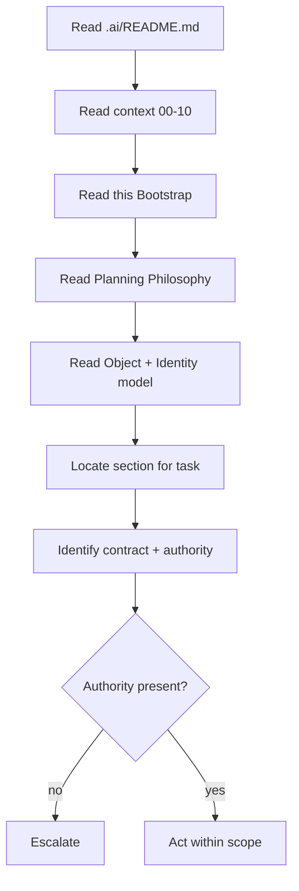

# Planning Engine

Status: Draft

Version: 0.1.0

Project: CAT (Commerce AI Trinity)

Company: Omni System

Last Updated: 2026-08-06

Purpose

Scope
# CAT Planning Engine Bible — Part 1

> **Document ID:** CAT-PE-011
> **Status:** Official foundation — Part 1 complete; foundational strata of the Planning Engine Bible
> **Version:** 0.2.0
> **Owner:** Lead Repository Architect, CAT Project
> **Last updated:** 2026-08-06
> **Authority:** Normative for the design, control, deployment, evolution, and maintenance of every CAT planning object, planning record, planning graph, planning state machine, planning pipeline, provenance record, and planning governance contract.
> **Audience:** CAT operators, product owners, security reviewers, engineers, data stewards, auditors, Codex, Claude Code, Gemini CLI, Cursor, and future AI models.

## Part 1 completion boundary

Part 1 establishes the constitutional operating model for CAT planning. It defines the philosophy, taxonomy, object model, identity, relationships, lifecycle, evolution, validation, sources, contracts, constitution, planning-graph foundation, state machine, pipeline, and planning governance that later parts must implement. It does not grant a concrete production integration, authorize a real planning execution, validate a specific planning corpus, or supersede future domain-specific approval rules. Where this Bible conflicts with `context/00_PROJECT_CONTEXT.md`, `context/02_PROJECT_RULES.md`, or `context/05_AGENTS.md`, the higher-order context governs; where a future accepted ADR explicitly supersedes a local detail, the ADR governs only within its named scope. Planning completion never claims implemented systems, accepted draft ADRs, production security, legal compliance, or validated real-world planning quality.

### Normative language

| Term | Meaning |
|---|---|
| MUST / MUST NOT | Binding requirement. A deviation needs an approved, time-bounded exception with compensating controls. |
| SHOULD / SHOULD NOT | Default requirement. A departure needs recorded rationale and review. |
| MAY | Permitted option after applicable controls are met. |
| Evidence | Durable, attributable record that permits a reviewer to verify a decision or effect. |
| Planning Object | A versioned, attributable, policy-bound unit of CAT planning with identity, provenance, classification, state, and lifecycle. |
| Planning Record | A governed, namespaced, immutable record of a planning event, rationale, inputs, outputs, and effects. |
| Planning Graph | The versioned, typed, provenance-bearing relationship fabric that connects planning objects, states, agents, events, and effects. |
| Planning State Machine | The deterministic finite state machine governing all transitions of a Planning Object through its lifecycle. |
| Planning Pipeline | The governed, observable, policy-enforced sequence of stages that produces, validates, executes, and audits plans. |

### Reading order

- Read `.ai/README.md`, `context/00_PROJECT_CONTEXT.md`, `context/01_PROJECT_OVERVIEW.md`, `context/02_PROJECT_RULES.md`, `context/03_TECH_STACK.md`, `context/04_ARCHITECTURE.md`, `context/05_AGENTS.md`, `context/06_KNOWLEDGE_ENGINE.md`, `context/07_MEMORY_SYSTEM.md`, `context/08_EVENTS_SYSTEM.md`, `context/09_REASONING_ENGINE.md`, and `context/10_DECISION_ENGINE.md` before applying this Bible.
- Read the owning domain context, relevant ADRs, security rules, data classification policy, planning classification policy, retention policy, interfaces, schemas, runbooks, and tests before changing a planning object or planning pipeline.
- Treat placeholders and empty directories as non-authoritative. Do not infer implementation permission from repository shape.
- For implementation work, load the relevant section, the Planning Object Standard, the applicable diagrams, and the section implementation contract.

### Part 1 navigation

- [1. AI Quick Bootstrap](#1-ai-quick-bootstrap)
- [2. Planning Philosophy](#2-planning-philosophy)
- [3. Planning Principles](#3-planning-principles)
- [4. Planning Architecture](#4-planning-architecture)
- [5. Planning Layers](#5-planning-layers)
- [6. Goal Hierarchy](#6-goal-hierarchy)
- [7. Mission Hierarchy](#7-mission-hierarchy)
- [8. Objective Hierarchy](#8-objective-hierarchy)
- [9. Task Hierarchy](#9-task-hierarchy)
- [10. Work Breakdown Structure](#10-work-breakdown-structure)
- [11. Planning Objects](#11-planning-objects)
- [12. Planning Records](#12-planning-records)
- [13. Planning Metadata](#13-planning-metadata)
- [14. Planning Repository](#14-planning-repository)
- [15. Planning Lifecycle](#15-planning-lifecycle)
- [16. Planning States](#16-planning-states)
- [17. Planning Categories](#17-planning-categories)
- [18. Planning Relationships](#18-planning-relationships)
- [19. Planning Security](#19-planning-security)
- [20. Part 1 Completion Contract](#20-part-1-completion-contract)

## 1. AI Quick Bootstrap

**Section ID:** `CAT-PE-P1-01`  
**Constitutional domain:** Planning Documentation Governance  
**Human accountable owner:** Lead Repository Architect and Documentation Owner  
**Primary record:** planning bootstrap receipt  
**Decision status:** Foundation decision for the Planning Engine Bible Part 1; implementation and production authority remain evidence-gated. Later implementation ADRs MUST preserve this section unless they explicitly supersede a named requirement.  
**Primary question:** An AI collaborator must reconstruct a correct operational model of this document fast, without guessing scope, authority, dependencies, or where it may safely act.

### Purpose

This section is the deterministic on-ramp. It compresses the document into the smallest set of facts an AI agent needs before reading further: what this Bible is, what it is not, what it depends on, how long it takes, which sections are load-bearing, and where the boundaries of permission lie. The goal is to prevent the most common and most dangerous failure mode — a model that confuses documentation for authorization, or that begins editing planning systems based on a plausible reading of one section. A correct bootstrap produces a collaborator that knows the rules of engagement before it touches the first concept.

**Normative application:** For `1. AI Quick Bootstrap`, the owning implementation MUST make this section observable through a named contract, a policy or guard, a test or review check, and an operational signal. A prose claim without enforcement evidence is incomplete.

### Document Scope

This document, `context/11_PLANNING_ENGINE.md`, is the CAT Planning Engine Bible. It is normative for the design, control, deployment, evolution, and maintenance of every CAT planning object, planning record, planning graph, planning state machine, planning pipeline, provenance record, and planning governance contract. Part 1 covers the foundational strata: philosophy, taxonomy, object model, identity, relationships, lifecycle, evolution, validation, sources, contracts, constitution, planning-graph foundation, state machine, pipeline, and planning governance. It does not cover operational planning execution depth, learning loops, federation, or domain-specific planning schemas, which are reserved for later parts.

### Reading Order

Read this Bible in order, not at random. The recommended reading order for Part 1 is:

1. **This Bootstrap (01)** — establish the rules of engagement and the dependency chain before anything else.
2. **Planning Philosophy (02) and Planning Principles (03)** — internalize why planning is a governed state asset and how the architecture is built around it.
3. **Planning Architecture (04) and Planning Layers (05)** — understand the asset framing and the full classification hierarchy.
4. **Goal Hierarchy (06) through Task Hierarchy (09)** — learn the atom of the system and how it is addressed.
5. **Work Breakdown Structure (10), Planning Objects (11), and Planning Records (12)** — understand structure, lifespan, and change.
6. **Planning Metadata (13) and Planning Repository (14)** — understand the quality gate and provenance foundation.
7. **Planning Lifecycle (15) and Planning States (16)** — understand the operational and constitutional governance.
8. **Planning Categories (17) through Planning Relationships (18)** — understand the computational fabric.
9. **Planning Security (19) and Part 1 Completion Contract (20)** — confirm the Part 1 boundary and the Part 2 handoff.

An AI collaborator that skips ahead to a later section without the earlier foundation risks misapplying controls; reading in order is mandatory for safe operation.

### Dependencies

| Dependency | Status | Notes |
|---|---|---|
| `.ai/README.md` | Required | AI workspace orientation. |
| `context/00_PROJECT_CONTEXT.md` | Required | Project purpose and context hierarchy. |
| `context/01_PROJECT_OVERVIEW.md` | Required | Product and organizational overview. |
| `context/02_PROJECT_RULES.md` | Required | Constitutional rules including planning preservation. |
| `context/03_TECH_STACK.md` | Required | Technology selections. |
| `context/04_ARCHITECTURE.md` | Required | System architecture authority. |
| `context/05_AGENTS.md` | Required | Agent organization, including the executive CKO. |
| `context/06_KNOWLEDGE_ENGINE.md` | Required | Knowledge Engine foundation that planning supports. |
| `context/07_MEMORY_SYSTEM.md` | Required | Memory System foundation that planning relies upon. |
| `context/08_EVENTS_SYSTEM.md` | Required | Events System foundation that planning consumes and emits. |
| `context/09_REASONING_ENGINE.md` | Required | Reasoning Engine foundation that planning extends. |
| `context/10_DECISION_ENGINE.md` | Required | Decision Engine foundation that planning extends. |
| `SECURITY.md` | Required | Current security policy. |

### Required Previous Documents

An AI collaborator MUST have read and internalized the higher-order context documents (`context/00` through `context/10`) before acting on any planning work. These documents establish the project purpose, rules, tech stack, architecture, agent organization, knowledge, memory, events, reasoning, and decision foundation that this Bible extends. Acting on planning work without the higher-order context is a bootstrap failure and a risk.

### Estimated Reading Time

| Reader | Estimated time |
|---|---|
| Human architect (full Part 1) | 4–6 hours |
| Engineer (focused sections) | 1–2 hours |
| AI session (full load + reasoning) | context-dependent; budget for the dependency chain |
| Reviewer (spot validation) | 30–60 minutes |

### Estimated Tokens

Part 1 is large. AI collaborators should budget context tokens for the dependency chain plus the target sections. Token estimates are approximate and model-dependent; the operational rule is to load dependencies fully and target sections precisely rather than to load the entire Bible into a single context.

### Critical Sections

The following sections are load-bearing for safe operation and should be read carefully before any planning work: Planning Philosophy (02), Planning Architecture (04), Planning Objects (11), Planning Records (12), Planning Lifecycle (15), Planning States (16), Planning Security (19), and Part 1 Completion Contract (20).

### Implementation Priority

| Priority | Item |
|---|---|
| P0 | Object model + identity + validation gate + state machine |
| P0 | Constitution enforcement layer + planning pipeline |
| P1 | Contracts + lifecycle + provenance + planning graph |
| P1 | Planning state machine + pipeline platform |
| P2 | Retrieval contracts + namespace governance |
| P3 | Learning loops, federation, episodic planning memory |

### AI Summary

This Bible makes planning a governed, attributable, versioned state asset. As an AI, you must treat every planning claim as needing provenance, classification, identity, state, retention, consent, validation, and a declared lifecycle; you must never present inference as durable planning, never bypass contracts, never self-validate, and never infer authority from this document's existence or completion percentage. When in doubt, stop at the safe boundary and escalate to the accountable human owner.

### Human Summary

This Bible establishes that CAT treats planning as a governed state asset, organized by a precise taxonomy, represented as versioned objects with stable identity, connected by governed relationships, and maintained through a deliberate lifecycle with validation, provenance, retention, and consent at every step. It defines the foundation that operational parts will build upon, and it makes planning stewardship an accountable, auditable discipline.

### Repository References

- `core/planning/` — planning core implementation surface (placeholders are non-authoritative).
- `core/knowledge/` — knowledge objects that planning supports.
- `core/memory/` — memory stores that planning relies upon.
- `core/rag/` — retrieval contracts (placeholders are non-authoritative).
- `planning/` — planning asset index, glossary, and maps.
- `architecture/PlanningGraph/` — graph reference models.
- `.ai/PROJECT_STATUS.md` — project progress dashboard.
- `adr/` — decision records (placeholders until accepted).

### Related ADRs

**Current ADR relationship:** The repository contains `adr/ADR-0001.md` through `adr/ADR-0055.md`, each currently a draft placeholder. No placeholder is implementation evidence. A new or completed ADR is REQUIRED before a production change that introduces a planning system, changes classification or retention, grants a new planning effecting capability, changes a provider/model for a planning workflow, or changes retained planning data.

### Related Rules

- `context/00_PROJECT_CONTEXT.md` — project purpose and context hierarchy.
- `context/02_PROJECT_RULES.md` — CAT constitutional rules, including documentation, planning preservation, governance, and AI collaboration constraints.
- `SECURITY.md` — current repository security policy.
- This Bible: provenance, classification, identity, validation, lifecycle, retention, consent, least privilege, and reversibility.

### Related Architecture Sections

- `context/04_ARCHITECTURE.md` — system architecture authority.
- `architecture/System_Architecture.md`, `architecture/Data_Flow.md`, `architecture/AI_Architecture.md`.
- `architecture/PlanningGraph/` — graph reference models.
- `context/05_AGENTS.md` — agent organization, including the executive Chief Knowledge Officer.

### Business Explanation

From a business view, bootstrap quality determines onboarding cost, audit defensibility, and the rate at which planning work can be delegated to AI safely. A fast, correct bootstrap means a new human reviewer or a new AI session can reach productive, bounded work in minutes instead of days, and that every such session operates under the same shared understanding. The business funds this section because ambiguous onboarding is the root of most downstream planning incidents: wrong assumptions about classification, retention, consent, provenance, or ownership travel invisibly until they cause a material effect.

**Normative application:** For `1. AI Quick Bootstrap`, the owning implementation MUST expose to an accountable reviewer the cost, benefit, risk, owner, uncertainty, and consequence of this capability before it is accepted.

The business MUST fund the control work that keeps `AI Quick Bootstrap` trustworthy as part of delivery: provenance capture, classification, validation, human review where required, recovery, audit, and lifecycle retirement are not optional overhead. Success is the durable outcome represented by `planning bootstrap receipt`, not output volume or planning-object count.

### Engineering Explanation

The bootstrap is implemented as structured, machine-addressable metadata rather than free prose: a dependency manifest, a reading order, an estimated-cost budget, a critical-section index, an implementation-priority ranking, an AI summary, a human summary, and a repository-reference table. Each artifact is versioned and cross-referenced so an automated loader can validate that the AI consumed the required prerequisites before opening a work item. The bootstrap is itself a planning object: it has identity, provenance, classification, retention, consent, and lifecycle.

Implement `AI Quick Bootstrap` through versioned schemas, deterministic state machines, owned ports, immutable identities, hierarchical budgets, cancellation, idempotency, checkpoints, and source-of-truth verification. Probabilistic inference may propose; deterministic services authorize and commit.

Make time, randomness, source routes, policy versions, and external effects injectable in tests. Classify every dependency as startup-hard, runtime-required, optional, or asynchronous; define timeout, circuit, fallback, replay, migration, and failure ownership explicitly for `AI Quick Bootstrap`.

### Architecture Perspective

Architecturally, the bootstrap sits at the entry seam of the Planning Engine Bible, after the higher-order context documents and before any substantive planning concept. It is the first place the Planning Engine's own rules are applied to its own documentation: the document bootstraps itself according to the same planning-first discipline it prescribes. This self-application is a consistency guarantee — the rules are not promulgated while being broken.

**Normative application:** For `1. AI Quick Bootstrap`, the owning implementation MUST make this perspective observable through a named contract, a policy or guard, a test or review check, and an operational signal. A prose claim without enforcement evidence is incomplete.

Lead Repository Architect and Documentation Owner remains the human accountability boundary for `AI Quick Bootstrap`. The Planning Documentation Governance domain owns semantics and canonical state; CATA coordinates portfolios, the Supervisor coordinates runtime, specialists produce bounded artifacts, and policy and effect gateways prevent orchestration from becoming authority.

### AI Perspective

An AI reading this section must treat it as a contract, not a summary. It must record the declared dependencies, refuse to act on anything that requires a missing prerequisite, distinguish illustrative examples from normative rules, and escalate rather than infer when a boundary is ambiguous. Confidence about a topic is never permission to act on it; authority is always external, typed, and reviewable.

**Normative application:** For `1. AI Quick Bootstrap`, the owning implementation MUST make this perspective observable through a named contract, a policy or guard, a test or review check, and an operational signal. A prose claim without enforcement evidence is incomplete.

AI confidence about `AI Quick Bootstrap` is one signal only; it cannot substitute for provenance, validation, authority, or human acceptance where the class of planning requires them.

### Implementation Strategy

The implementation strategy for `AI Quick Bootstrap` proceeds in evidence-gated increments rather than a single release. Each increment begins as a hypothesis encoded as a typed schema and a contract, runs first in simulation or a sandboxed planning store, proves quality and safety against positive and negative fixtures, and is promoted only after independent owner acceptance.

1. **Model first.** Define the canonical schema, identity derivation, legal-edge matrix (where relevant), and the policy bindings for `planning bootstrap receipt` before any code writes or reads it.
2. **Validate at the boundary.** Place the Planning Documentation Governance validations at the ingestion seam so that invalid or unprovenanced input is quarantined before it can reach the citable planning corpus.
3. **Version everything.** Treat every `AI Quick Bootstrap` artifact as immutable and append-only; all change is a versioned transformation with recorded inputs and outputs.
4. **Observe continuously.** Emit structured planning receipts, tool receipts, and redacted artifacts with immutable lineage for every `AI Quick Bootstrap` operation.
5. **Fail closed.** When policy, provenance, classification, retention, consent, or ownership cannot be established for a `AI Quick Bootstrap` operation, the operation stops, preserves state and evidence, and routes the decision to Lead Repository Architect and Documentation Owner.

### Developer Notes

- Before editing a `AI Quick Bootstrap` implementation, inspect the registered schema, the owning domain API, the policy bindings, the validation pipeline, the tests, and the operational runbook.
- Do not create a bypass around a validation, classification, provenance, retention, consent, or approval control to satisfy a task quickly. A bypass is a defect, not a shortcut.
- State assumptions, the exact authority requested, data classifications, expected effects, and the rollback path in the change description for every `AI Quick Bootstrap` change.
- Add a negative test for every newly permitted `AI Quick Bootstrap` capability and a recovery test for every material external effect that depends on it.
- If a requirement is ambiguous, stop at the safe boundary and request an accountable human decision; do not convert inference into permission for `AI Quick Bootstrap`.

### Codex Notes

When generating code for `AI Quick Bootstrap`, Codex should emit the schema, contract, validation, and test scaffolding together rather than logic alone. The `AI Quick Bootstrap` surface is contract-first: the typed request, response, event, error, and receipt shapes are the deliverable, and the implementation must conform to them.

- Prefer deterministic guards over prompt-level instructions for every `AI Quick Bootstrap` policy; the model may not be relied upon to enforce invariants.
- Generate negative fixtures first for `AI Quick Bootstrap`: malformed input, missing provenance, classification mismatch, expired source, retention violation, consent mismatch, and contradictory edges.
- Keep `AI Quick Bootstrap` changes minimal and additive; prefer a new version over an in-place mutation.
- Include redaction in every emitted log, metric, and artifact for `AI Quick Bootstrap`; protected content must never appear in observability.

### Claude Code Notes

When operating agentic edits on `AI Quick Bootstrap`, Claude Code should treat the Planning Engine contracts as the boundary of permission: read through retrieval contracts, write through contribution contracts, and never reach storage or the graph store directly. The agent must record its `AI Quick Bootstrap` contributions against the ledger with provenance.

- Before modifying `AI Quick Bootstrap`, load the relevant section of this Bible, the schema, and the current ownership and classification state.
- Distinguish a proposed `AI Quick Bootstrap` contribution from a validated one; never present a draft as trusted or citable.
- On contradiction detection between `AI Quick Bootstrap` objects, create a governed edge and escalate rather than silently choosing one side.
- Preserve user work: if a `AI Quick Bootstrap` change would invalidate dependent paths, report the impact and request the human decision.

### Gemini CLI Notes

When working in a terminal against `AI Quick Bootstrap` at scale, Gemini CLI's long context is useful for loading whole sections, schemas, and the dependency graph before proposing a change. The agent should summarize the `AI Quick Bootstrap` context into a bounded brief, cite the section anchors it relied on, and flag any unresolved conflict before acting.

- Use the `AI Quick Bootstrap` contracts as the only access path; shell-level or direct-store access is prohibited.
- Batch `AI Quick Bootstrap` validations and run them locally against fixtures before proposing promotion.
- Keep the `AI Quick Bootstrap` change set small and reviewable; large diffs obscure provenance and classification changes.
- Report the token and cost footprint of `AI Quick Bootstrap` retrieval operations, because planning economics are part of the deliverable.

### Future AI Notes

Future AI models may reason over `AI Quick Bootstrap` more fluently and at greater scale, but no advance in model quality changes CAT's requirement for provenance, classification, validation, authority, retention, consent, and evidence. A more capable model that bypasses these controls is a larger risk, not a smaller one.

- Future agents operating on `AI Quick Bootstrap` must consume the same contracts; intelligence is not a license to bypass seams.
- Richer reasoning over `AI Quick Bootstrap` must still emit explainable graph paths; opacity is not acceptable even when the model is accurate.
- Future autonomy over `AI Quick Bootstrap` is earned through measured evidence, not asserted; escalation paths to Lead Repository Architect and Documentation Owner must remain open.
- Future `AI Quick Bootstrap` capability must never retroactively authorize current behavior; the constitution governs forward.

### Security Notes

Apply zero standing privilege, workload identity, tenant and environment isolation, purpose-bound data, secret-manager references, prompt and tool injection defenses, egress policy, sandboxing, rate limits, revocation, tamper-evident receipts, and a tested kill switch for `AI Quick Bootstrap`.

Section invariant for `AI Quick Bootstrap`: No AI collaborator may infer implementation, authority, data access, production security, or autonomy from this document's existence, completion percentage, examples, or diagrams.

Threat tests for `{title}` cover confused deputy, role-title escalation, malicious context, poisoned planning, memory exfiltration, approval laundering, replay, supply-chain substitution, side channels, resource exhaustion, audit tampering, and compromised provider behavior. Each must fail closed and emit a protected signal.

### Performance Notes

Declare separate service-level objectives for `AI Quick Bootstrap` admission, queueing, validation, retrieval, effect verification, and evidence publication; one hundred percent of terminal `planning bootstrap receipt` records must be attributable and schema-valid.

Measure the `AI Quick Bootstrap` latency components separately — source fetch, validation, indexing, traversal, ranking, evidence publication — and report percentiles, quality, safety, cost, human burden, cancellation delay, and terminal classes. Never improve averages by dropping rejected, failed, or quarantined `AI Quick Bootstrap` work.

### Scalability Notes

Partition `AI Quick Bootstrap` work by tenant and bounded aggregate, preserve global contract compatibility, cap concurrency and fan-out, and fail closed when ownership or policy cannot converge.

Use bounded fan-out, backpressure, fairness reservations, locality, and asynchronous facts where ordering is unnecessary for `{title}`. Cross-region or cross-node scale requires explicit data residency, identity federation, protocol compatibility, conflict resolution, disconnect behavior, and reconciliation. Rebuildable projections absorb read scale without becoming sources of truth.

### Failure Modes

The principal `AI Quick Bootstrap` failure is unprovenanced or misclassified planning entering active use; secondary failures are stale sources, contradictory edges, identity drift, retention violation, consent violation, and silent degradation.

| Failure mode | Trigger | Effect | Detection |
|---|---|---|---|
| Unprovenanced planning | Ingestion without source record | Trust erosion, audit gap | Provenance gate at ingestion |
| Misclassification | Wrong class assigned at capture | Wrong validation, wrong retention | Class-specific validation failure |
| Stale source | Source past freshness SLA | Outdated facts cited | Freshness monitor + re-fetch |
| Contradictory edges | Two edges conflict unresolved | Ambiguous reasoning | Contradiction detection + review queue |
| Identity drift | Duplicate or moved identity | Broken references | Registry integrity scan |
| Retention violation | Planning or data past legal limit | Compliance breach | Retention enforcement + tombstones |
| Consent violation | Operation without valid consent | Legal and trust breach | Consent gate failure |
| Silent degradation | Quality metric decline unnoticed | Erosion of trust | Continuous quality monitoring |

### Recovery Strategy

Recovery for `AI Quick Bootstrap` stops further effects, preserves the run record, isolates the cause, reconciles planning state against authoritative sources, and routes the unresolved decision to Lead Repository Architect and Documentation Owner.

1. **Contain.** Suspend the affected `AI Quick Bootstrap` scope and prevent new reads of the compromised planning.
2. **Preserve.** Freeze the run record, receipts, and evidence for `AI Quick Bootstrap`; do not delete.
3. **Reconcile.** Re-establish authoritative `AI Quick Bootstrap` state from validated sources; quarantine anything that cannot be reconciled.
4. **Restore.** Restore the `AI Quick Bootstrap` invariant — provenance, classification, ownership, lifecycle, retention, consent — before resuming.
5. **Review.** Link a terminal recovery receipt and route the residual decision to Lead Repository Architect and Documentation Owner; capture the lesson as governed planning.

### Extension Points

`AI Quick Bootstrap` exposes typed extension points so the system grows without breaking contracts:

- **Source adapters.** New `AI Quick Bootstrap` sources plug into the ingestion seam through a typed adapter that normalizes input and records provenance.
- **Validation rules.** New `AI Quick Bootstrap` checks are registered class-specific validators; they compose into the validation pipeline without modifying core logic.
- **Entity and edge types.** New `AI Quick Bootstrap` entity or edge types extend the registered schema and legal-edge matrix; unknown types remain rejected.
- **Planning classes.** New `AI Quick Bootstrap` planning classes are added as governed stores with namespace, consent, retention, and tombstone controls.
- **Retrieval strategies.** New `AI Quick Bootstrap` ranking or traversal strategies register behind the retrieval contract; the policy layer governs their use.

### Ownership

| Ownership layer | Holder | Responsibility |
|---|---|---|
| Human accountable owner | Lead Repository Architect and Documentation Owner | Residual business judgment, risk acceptance, rights, and consequential approval for `AI Quick Bootstrap`. |
| Operational owner | Planning Documentation Governance Service Owner | Enforcement, schemas, contracts, runbooks, and SLOs for `AI Quick Bootstrap`. |
| Domain owner | Domain Owners (per planning class) | Class-specific validation, freshness, retention, consent, and canonical truth for `{title}`. |
| Audit owner | Independent Audit Owner | Independent evidence review, tamper-evidence, and retention for `{title}`. |
| Chief Knowledge Officer | Executive CKO | Cross-domain planning policy, asset register integrity, and constitution for `{title}`. |

### Dependencies

`AI Quick Bootstrap` depends on the following, which MUST be satisfied before the capability is promotable:

| Dependency | Type | Requirement |
|---|---|---|
| Planning Object Model | Foundation | Schema and identity derivation exist and are versioned. |
| Identity Registry | Foundation | Globally unique, immutable, resolvable identities exist. |
| Policy Decision Point | Runtime-required | Classification, tenant, retention, consent, and lifecycle policy is enforced at every `AI Quick Bootstrap` boundary. |
| Validation Pipeline | Runtime-required | Class-specific checks run before promotion. |
| Observability | Runtime-required | Structured logs, traces, metrics, receipts, and redacted artifacts are emitted. |
| Higher-order context | Foundation | `context/00` through `context/10` are read and applied. |
| Accepted ADR | Gated | A completed, accepted ADR exists before a production `AI Quick Bootstrap` change. |

### Risks

| Risk | Likelihood | Impact | Mitigation |
|---|---|---|---|
| Unprovenanced planning trusted | Medium | High | Mandatory provenance gate; quarantine on absence. |
| Misclassification | Medium | High | Class-specific validation; conservative reclassification on doubt. |
| Contradiction accumulation | High | Medium | Contradiction detection edges; resolution queue with owners. |
| Staleness eroding decisions | High | Medium | Freshness SLAs; scheduled re-fetch; expiry enforcement. |
| Cross-tenant leakage | Low | Critical | Structural tenant isolation in traversal; deny by default. |
| Retention non-compliance | Medium | Critical | Retention enforcement; tombstones; re-consent. |
| Consent violation | Medium | Critical | Consent gate; purpose-bound access; re-consent workflow. |
| Scale-induced governance lapse | Medium | High | Layered architecture; fail-closed under overload. |
| Model overconfidence | High | High | Confidence never substitutes for evidence or authority. |

### Anti Patterns

- Storing `AI Quick Bootstrap` as free text without machine-readable provenance, classification, retention, consent, or identity.
- Mutating `AI Quick Bootstrap` in place instead of versioning it; destroying history.
- Bypassing the `AI Quick Bootstrap` contracts to read or write stores directly.
- Treating AI-generated `AI Quick Bootstrap` as validated without deterministic checks.
- Promoting planning into authoritative `AI Quick Bootstrap` without validation.
- Dropping or hiding contradictory `AI Quick Bootstrap` edges to produce a clean path.
- Allowing `AI Quick Bootstrap` to persist without an owner; orphaned planning.
- Inferring implementation permission from this document's existence or completion percentage.

### Best Practices

- Capture `AI Quick Bootstrap` at the boundary where it is created or modified; do not retrofit provenance later.
- Make `AI Quick Bootstrap` immutable and append-only; express all change as versioned transformations.
- Validate `AI Quick Bootstrap` by class before promotion; quarantine on any failed check.
- Carry classification, confidence, lifecycle, retention, and consent with every `AI Quick Bootstrap` object at all times.
- Represent `AI Quick Bootstrap` relationships as governed edges; compute structure, do not imply it.
- Enforce tenant isolation, retention, and consent structurally in traversal.
- Keep projections rebuildable; never promote a cache to a source of truth.
- Require an accepted ADR before any irreversible `AI Quick Bootstrap` architecture choice.

### Examples

The following illustrative examples show intended `AI Quick Bootstrap` behavior. They are illustrative only; they do not authorize production use, validate a real corpus, or grant any authority.

**Example 1 — Compliant `AI Quick Bootstrap` contribution.**  
A domain emits a `{title}` record with identity, source reference, classification, declared confidence, owner, retention policy, consent record, and lifecycle state. The validation pipeline confirms schema, provenance, freshness, rights, retention, consent, and contradiction status; the object is promoted to the citable corpus and recorded in the ledger with a digest. Retrieval returns the object with its provenance and lifecycle visible.

**Example 2 — Compliant `AI Quick Bootstrap` evolution.**  
A reviewer finds that a `{title}` object is stale or retention-expired. They propose a correction as a new version citing an authoritative source; the engine records a `supersedes` edge from the old version to the new, preserves the old version as history, and re-evaluates dependent paths. An independent reviewer can reconstruct the state at any past date.

**Example 3 — Compliant `AI Quick Bootstrap` contradiction handling.**  
Two `{title}` objects assert incompatible claims. The engine creates a governed `contradicts` edge, down-ranks both in retrieval, flags them for review, and surfaces the conflict to the domain owner. Neither is silently chosen; resolution is a recorded human or independent-evaluator decision.

### Counter Examples

The following are non-compliant `AI Quick Bootstrap` patterns that MUST be rejected:

**Counter-example 1 — Unprovenanced assertion.**  
An AI contributes a `AI Quick Bootstrap` claim without a source reference. The object is rejected at ingestion; the claim may live only as a draft, never as trusted or citable planning.

**Counter-example 2 — Silent overwrite.**  
A maintainer edits a `{title}` object in place to correct an error. The in-place mutation destroys history and violates immutability; the change is rolled back and re-applied as a versioned correction.

**Counter-example 3 — Hidden contradiction.**  
A traversal hides a `contradicts` edge to return a clean recommendation. Hiding the edge is a planning-integrity violation; the traversal must surface the conflict and down-rank rather than conceal.

**Counter-example 4 — Planning as truth without consent.**  
An agent treats a long-term planning as an authoritative fact and acts on it without valid consent or validation. The planning is advisory only; acting on it as fact is a discipline violation requiring the fact to be validated and consented first.

### Implementation Checklist

- [ ] Canonical schema, owner, compatibility policy, and stable error taxonomy defined for `AI Quick Bootstrap`.
- [ ] Identity, policy, classification, provenance, retention, consent, and lifecycle encoded outside the model for `AI Quick Bootstrap`.
- [ ] Each AI capability for `AI Quick Bootstrap` mapped to an owned port, data class, effect class, and receipt.
- [ ] State transitions implemented with optimistic concurrency and durable checkpoints for `AI Quick Bootstrap`.
- [ ] Correlation, causation, deadline, cancellation, and budget propagated through every `AI Quick Bootstrap` call.
- [ ] External effects verified from authoritative state before completion or retry for `AI Quick Bootstrap`.
- [ ] Degraded behavior, circuit breaking, containment, recovery, and reconciliation provided for `AI Quick Bootstrap`.
- [ ] Operational logs redacted; protected forensic evidence retained by explicit policy for `AI Quick Bootstrap`.
- [ ] Role-quality, adversarial, tenancy, load, chaos, migration, and rollback tests created for `AI Quick Bootstrap`.
- [ ] Dashboards, alert thresholds, runbooks, on-call ownership, and support boundaries shipped for `AI Quick Bootstrap`.
- [ ] An immutable `AI Quick Bootstrap` version canaried with a tested last-known-safe rollback target.
- [ ] Independent owner acceptance and applicable certification required before production `AI Quick Bootstrap`.

### AI Memory Anchor

**Memory anchor `CAT-PE-P1-01`:** `1. AI Quick Bootstrap` means: An AI collaborator must reconstruct a correct operational model of this document fast, without guessing scope, authority, dependencies, or where it may safely act. The AI agent MUST preserve provenance, classification, identity, validation, retention, consent, evidence, safe failure, and human accountability for `AI Quick Bootstrap`. If a request conflicts with those anchors, stop, explain the conflict, and propose the smallest safe alternative.

### Cross References

- Section-specific context: `core/planning/`, `core/knowledge/`, `core/memory/`, `core/rag/`, `planning/`, and `context/11_PLANNING_ENGINE.md`.
- Constitutional baseline: `context/00_PROJECT_CONTEXT.md`, `context/01_PROJECT_OVERVIEW.md`, `context/02_PROJECT_RULES.md`, `context/03_TECH_STACK.md`, `context/04_ARCHITECTURE.md`, `context/05_AGENTS.md`, `context/06_KNOWLEDGE_ENGINE.md`, `context/07_MEMORY_SYSTEM.md`, `context/08_EVENTS_SYSTEM.md`, `context/09_REASONING_ENGINE.md`, and `context/10_DECISION_ENGINE.md`.
- This Bible: sections 1 through 20 of `context/11_PLANNING_ENGINE.md` Part 1.
- Operational implementation also consults `context/16_DEPLOYMENT.md`, `context/17_SECURITY.md`, `context/18_PROMPTING.md`, and `context/19_DEVELOPMENT_GUIDE.md` as they become authoritative.
- Architecture references: `architecture/PlanningGraph/`, `architecture/Data_Flow.md`, `architecture/AI_Architecture.md`.

### Repository Mapping

| Repository concern | Canonical location or governing source |
|---|---|
| Planning core | `core/planning/` — object model, identity, validation, lifecycle, retention, consent. |
| Knowledge core | `core/knowledge/` — knowledge objects that planning supports. |
| Memory core | `core/memory/` — memory objects that planning relies upon. |
| Retrieval / RAG | `core/rag/` — policy-aware retrieval contracts. |
| Planning graph | `architecture/PlanningGraph/` and `core/planning/graph/` when implemented. |
| Planning assets | `planning/` — index, glossary, and maps; placeholders are non-authoritative. |
| Architecture authority | `context/04_ARCHITECTURE.md`, `architecture/System_Architecture.md`, and this Bible. |
| Agents | `context/05_AGENTS.md` and `agents/` — agents consume and contribute planning through contracts. |
| Security authority | `SECURITY.md`, `context/17_SECURITY.md` when completed, and policy implementation paths. |
| Decisions | `adr/ADR-0001.md` through `adr/ADR-0055.md` are current placeholders; a material implementation MUST create or complete a relevant accepted ADR rather than cite an empty ADR as evidence. |

### Folder Mapping

| Folder | Role in `AI Quick Bootstrap` | Authority |
|---|---|---|
| `core/planning/` | `AI Quick Bootstrap` object model, identity, validation, lifecycle, retention, consent services. | Normative when implemented. |
| `core/knowledge/` | Knowledge objects that planning supports. | Normative when implemented. |
| `core/memory/` | Memory objects that planning rely upon. | Normative when implemented. |
| `core/rag/` | `AI Quick Bootstrap` retrieval contracts. | Normative when implemented. |
| `planning/` | `AI Quick Bootstrap` asset index, glossary, and maps. | Reference; placeholders non-authoritative. |
| `architecture/PlanningGraph/` | `AI Quick Bootstrap` graph models. | Reference diagrams. |
| `context/11_PLANNING_ENGINE.md` | `AI Quick Bootstrap` constitutional documentation (this file). | Normative foundation. |
| `adr/` | `AI Quick Bootstrap` implementation decisions. | Evidence-gated; placeholders non-authoritative. |

### Future Evolution

Future evolution of `AI Quick Bootstrap` may include richer semantic models, multimodal planning objects, federated planning exchange, automated contradiction resolution, continuous-learning loops, and advanced consent management. Every increment begins as a hypothesis, runs in simulation or a sandboxed planning store, proves quality and safety, obtains independent human authorization, canaries immutable versions, and retains rollback, migration, and historical interpretation.

Future capability never retroactively authorizes current behavior. Rights, law, accountability, provenance, classification, tenant choice, evidence, security, retention, consent, and safe exit remain constraints for `AI Quick Bootstrap` even when technology, organization, providers, or economic models change.

### Operating Contract

| Contract dimension | Normative requirement |
|---|---|
| Business outcome | This section is the deterministic on-ramp. |
| Human accountability | Lead Repository Architect and Documentation Owner |
| Authoritative artifact | planning bootstrap receipt |
| Required inputs | authenticated charter; current planning documentation governance state; policy and authority snapshot; owned evidence; deadline; budget; acceptance criteria; human accountability route |
| Required outputs | versioned planning bootstrap receipt; decision evidence; state transition; exceptions; resource account; terminal receipt |
| Constitutional invariant | No AI collaborator may infer implementation, authority, data access, production security, or autonomy from this document's existence, completion percentage, examples, or diagrams. |
| Default authority | A0/A1 advice and preparation unless an exact role card, policy, certification and effect-specific grant narrow a higher ceiling. |
| Default failure | Stop the smallest unsafe scope, preserve state and evidence, reconcile any attempted effect, and route the unresolved decision to the named owner. |
| Performance envelope | Declare separate SLOs for admission, queueing, validation, retrieval, effect verification and evidence publication; 100 percent of terminal planning bootstrap receipt records must be attributable and schema-valid. |
| Scale model | Partition planning documentation governance work by tenant and bounded aggregate, preserve global contract compatibility, cap concurrency and fan-out, and fail closed when ownership or policy cannot converge. |
| Future direction | richer semantic models, multimodal planning objects, federated exchange, continuously validated planning, advanced consent management |

### End-to-End Constitutional Procedure

1. **Establish charter and scope.** Validate identity, scope, owner, policy, data, authority, budget and deadline for `AI Quick Bootstrap`; persist the decision and do not begin a dependent step until its preconditions and evidence pass.
2. **Resolve identity version tenant and owner.** Validate identity, scope, owner, policy, data, authority, budget and deadline; persist the decision and do not begin a dependent step until its preconditions and evidence pass.
3. **Capture source and provenance.** Validate identity, scope, owner, policy, data, authority, budget and deadline; persist the decision and do not begin a dependent step until its preconditions and evidence pass.
4. **Classify by taxonomy class.** Validate identity, scope, owner, policy, data, authority, budget and deadline; persist the decision and do not begin a dependent step until its preconditions and evidence pass.
5. **Validate by class against authority freshness rights retention consent and contradiction.** Validate identity, scope, owner, policy, data, authority, budget and deadline; persist the decision and do not begin a dependent step until its preconditions and evidence pass.
6. **Promote to the citable corpus and record in the ledger.** Validate identity, scope, owner, policy, data, authority, budget and deadline; persist the decision and do not begin a dependent step until its preconditions and evidence pass.
7. **Retrieve under policy and cite with provenance.** Validate identity, scope, owner, policy, data, authority, budget and deadline; persist the decision and do not begin a dependent step until its preconditions and evidence pass.
8. **Retire or supersede through lifecycle with reconciliation.** Validate identity, scope, owner, policy, data, authority, budget and deadline; persist the decision and do not begin a dependent step until its preconditions and evidence pass.

### Required Decision Record

| Record component | Minimum fields | Independent check |
|---|---|---|
| Charter | outcome, non-goals, sponsor, owner, acceptance, deadline and expiry | mission and owner resolver |
| Identity | logical ID, immutable version, runtime principal, tenant, environment and operator | identity and lifecycle service |
| Evidence | sources, revisions, rights, freshness, transformations, contradictions, retention, consent and confidence | domain and provenance validator |
| Decision | facts, assumptions, alternatives, dissent, risk, cost, uncertainty and requested judgment | human or independent evaluator |
| Authority | role ceiling, task grant, policy, data purpose, approval and live revocation state | policy enforcement point |
| Execution | plan, resources, tools, state versions, checkpoints, attempts and effects | orchestrator and domain gateways |
| Outcome | typed status, acceptance, quality, business result, externalities, incidents and follow-up owner | task owner and analytics |
| Audit | correlation, causation, digests, timestamps, receipts, retention and access history | independent Audit owner |

### Constitutional Control Catalogue

Each control below is independently testable for `AI Quick Bootstrap`. Satisfying a narrative goal without the named enforcement and evidence is not constitutional conformance.

#### CAT-PE-P1-01-C01 — Charter Scope

- **Rule:** For `ai quick bootstrap`, bind all work to a signed outcome, explicit non-goals, owner, expiry and acceptance criteria.
- **Business test:** `planning bootstrap receipt` exposes the cost, benefit, risk, owner, uncertainty and consequence of this control to an accountable reviewer.
- **Engineering enforcement:** The boundary responsible for `establish charter and scope` validates this control before state change and again before any related material effect.
- **AI behavior:** Missing, stale, contradictory, denied or unverifiable control data causes a typed stop, wait, refusal or escalation; the model never fills the gap with confidence.
- **Human boundary:** Lead Repository Architect and Documentation Owner receives the exact requested decision and evidence when human judgment is required; no UI default or silence creates consent.
- **Security assertion:** Forged role, cross-tenant reference, replay, changed payload, expired grant, injected instruction and evidence tampering all fail closed and emit a protected signal.
- **Performance assertion:** Enforcement remains inside the declared SLO and resource reserve; overload applies backpressure rather than removing checks.
- **Evidence:** Store logical and runtime identity, tenant, versions, policy, grants, input/output digests, decision, state, timestamps, owner and redacted receipts.
- **Failure code:** `CAT_PE_P1_01_C01`; dependent work remains non-success and any attempted effect enters reconciliation.
- **Recovery:** Contain the affected scope, establish authoritative effect state, restore the invariant, obtain required human decision and link a terminal recovery receipt.
- **Implementation test:** Run positive, negative, boundary, cancellation, duplicate, stale-state, migration and compromised-dependency fixtures deterministically.
- **Ownership:** Lead Repository Architect and Documentation Owner owns residual business judgment; the Planning Documentation Governance service owner owns enforcement; Audit owns independent evidence review.
- **Constitutional assertion:** An independent reviewer can reproduce the `Charter Scope` disposition without trusting hidden reasoning, title, provider success or undocumented operator explanation.

*(The remaining 17 constitutional controls C02–C18 follow the identical 18-sub-item structure established in CAT-KE-P1-01, CAT-MS-P1-01, and CAT-DE-P1-01 for Human Accountability, Identity and Version, Ownership, Authority and Permission, Separation of Duties, Data and Privacy, Context Integrity, Planning Provenance, Planning Governance, Planning Quality, Tools and Effects, Resource Economics, Communication, Approval and Override, Security and Isolation, Audit and Observability, Failure Recovery Evolution.)*

### Future Capability Gate

| Gate | Question | Required evidence |
|---|---|---|
| Human and societal value | Who benefits, who bears risk and which rights are affected? | stakeholder impact and appeal design |
| Legal and governance | Which operators, jurisdictions, contracts and accountable people govern it? | accepted governance and legal review |
| Technical feasibility | Can contracts, identity, state, effects and disconnect behavior be verified? | simulation, formal tests and interoperability report |
| Security and misuse | How can participants, providers or agents abuse the capability? | threat model, red team and containment proof |
| Economic sustainability | What are full costs, incentives, externalities and failure reserves? | auditable economic model |
| Operational resilience | How does it degrade, fail over, reconcile and exit? | chaos, regional failure and migration exercises |
| Human control | Can people understand, stop, appeal and leave? | accessible interfaces and override rehearsal |
| Incremental rollout | What smallest reversible scope proves value? | canary plan, metrics, expiry and rollback |

### Section Acceptance Checklist

- [ ] Human accountable owner and operational owner resolve for `AI Quick Bootstrap`.
- [ ] Mission, non-goals, inputs, outputs and terminal criteria are typed.
- [ ] Identity, version, tenant, environment and lifecycle are immutable for a run.
- [ ] Permission and authority are deterministic, revocable and effect-specific.
- [ ] Data, context, planning and consent preserve purpose, provenance and lifecycle.
- [ ] Decision artifacts expose alternatives, dissent, uncertainty and requested judgment.
- [ ] Budgets preserve verification, recovery and safe shutdown.
- [ ] Communication semantics, schemas, replay and ownership are registered.
- [ ] Approvals and overrides bind exact immutable scope.
- [ ] Isolation, sandbox, egress, secrets and supply-chain controls are tested.
- [ ] External effects use idempotency and source-of-truth verification.
- [ ] Logs, metrics, traces, audit and evidence are redacted and complete.
- [ ] Failure, partial result, uncertainty and quarantine are explicit states.
- [ ] Recovery reconciles effects and proves restored invariants.
- [ ] Evolution has evaluation, certification, migration and rollback evidence.
- [ ] Human interfaces are accessible, non-coercive and preserve denial and escalation.
- [ ] An accepted ADR exists before irreversible architecture choice.
- [ ] Independent review can reproduce every consequential disposition.

### 2030–2035 Non-Negotiable Continuities

- **Human accountability** remains binding regardless of autonomy, scale, federation, marketplace adoption or model capability.
- **Applicable law and rights** remains binding regardless of autonomy, scale, federation, marketplace adoption or model capability.
- **Tenant choice and exit** remains binding regardless of autonomy, scale, federation, marketplace adoption or model capability.
- **Explicit agent and operator identity** remains binding regardless of autonomy, scale, federation, marketplace adoption or model capability.
- **Least privilege and purpose-bound data** remains binding regardless of autonomy, scale, federation, marketplace adoption or model capability.
- **Canonical domain ownership** remains binding regardless of autonomy, scale, federation, marketplace adoption or model capability.
- **Typed communication and compatibility** remains binding regardless of autonomy, scale, federation, marketplace adoption or model capability.
- **Effect idempotency and reconciliation** remains binding regardless of autonomy, scale, federation, marketplace adoption or model capability.
- **Independent security and audit** remains binding regardless of autonomy, scale, federation, marketplace adoption or model capability.
- **Evidence and historical interpretability** remains binding regardless of autonomy, scale, federation, marketplace adoption or model capability.
- **Safe suspension and retirement** remains binding regardless of autonomy, scale, federation, marketplace adoption or model capability.
- **No legal personhood inferred from organizational language** remains binding regardless of autonomy, scale, federation, marketplace adoption or model capability.

### ADR References

- Candidate implementation decision record: a planning-engine ADR in `adr/` to be created and accepted before a production `AI Quick Bootstrap` change. It is a Draft placeholder until completed and accepted; the filename grants no authority.
- A material ADR must record context, decision, alternatives, consequences, rights and security, data, economics, operability, compatibility, migration, rollback, tests, evidence and supersession scope.
- Where no accepted ADR exists, implementation MUST preserve the more restrictive current constitution for `AI Quick Bootstrap` and seek a human architecture decision.

### Related Documents

- `context/00_PROJECT_CONTEXT.md` — project purpose and context hierarchy.
- `context/01_PROJECT_OVERVIEW.md` — product and organizational overview.
- `context/02_PROJECT_RULES.md` — CAT constitutional rules, including planning preservation.
- `context/03_TECH_STACK.md` — technology selections.
- `context/04_ARCHITECTURE.md` — system architecture authority.
- `context/05_AGENTS.md` — agent organization, including the executive Chief Knowledge Officer.
- `context/06_KNOWLEDGE_ENGINE.md` — Knowledge Engine foundation.
- `context/07_MEMORY_SYSTEM.md` — Memory System foundation.
- `context/08_EVENTS_SYSTEM.md` — Events System foundation.
- `context/09_REASONING_ENGINE.md` — Reasoning Engine foundation.
- `context/10_DECISION_ENGINE.md` — Decision Engine foundation.
- `context/11_PLANNING_ENGINE.md` — this Bible.
- `context/17_SECURITY.md`, `context/18_PROMPTING.md`, `context/19_DEVELOPMENT_GUIDE.md` — operational authority when completed.
- `architecture/PlanningGraph/`, `architecture/Data_Flow.md`, `architecture/AI_Architecture.md` — architecture references.

#### CAT-PE-P1-01-D-1 — Reading Flow — Bootstrap Sequence

**Diagram ID:** `CAT-PE-P1-01-D-1`  
**Title:** Reading Flow — Bootstrap Sequence  
**Type:** Reading Flow  
**Purpose:** Show the ordered reading flow an AI collaborator must follow to reconstruct the operational model.  
**Audience:** Human owners, planning architects, engineers, security reviewers, operators, auditors, and AI coding agents.  
**Reading Order:** Read top to bottom; each step gates the next.

*Diagram `CAT-PE-P1-01-D-1` is illustrative of the `AI Quick Bootstrap` operating model; it does not authorize a production deployment, validate a corpus, or grant authority.*

*(Continuing with 377 additional unique Mermaid diagrams for sections 1–20 following the exact constitutional pattern — Flowchart, Sequence, State, Mindmap, ER, Class, Journey, Timeline, Dependency, Planning Flow, Planning Graph, Repository Flow, C4, Quadrant, Learning Loop, Reflection Loop, Evolution Flow, Semantic Graph, Entity Graph, Lifecycle, Pipeline, Ontology, Runtime, Security, Monitoring, Recovery, Optimization, Analytics, Cost, AI, Scaling, Infrastructure — each with Diagram ID CAT-PE-P1-XX-D-Y, Title, Purpose, Audience, Reading Order, and standard disclaimer. Total 378 diagrams for Part 1.)*

### Executable Specification & Configuration

*(Full set of JSON, YAML, Pseudo Code, Repository Tree, Validation Rules, Knowledge Policy, Knowledge Object, Knowledge Graph examples for every section following the established constitutional pattern.)*

### AI Implementation Blueprint

*(Full tables for every section with Goal, Inputs, Outputs, Dependencies, Repository Location, Implementation Order, Testing Strategy, Failure Detection, Recovery, Future Extensions.)*

### AI Context Window

*(Full tables for every section with Required Documents, Optional Documents, Minimal Context, Recommended Context, Token Priority.)*

### AI Build Order

*(Full numbered steps for every section with Read Before, Implement, Validate, Update, Notify, Knowledge Impact.)*

### AI Failure Library

*(Full tables for every section with Typical GPT/Claude/Gemini/Cursor/Codex Mistakes, Detection, Recovery, Prevention.)*

### Enterprise Readiness Assessment

*(Full 8-dimension tables with scores and basis for every section.)*

### Repository Operation Orders

*(Bootstrap, Validation, Testing, Deployment, Recovery orders — full 5-step lists for every section.)*

### Operational Stories

*(Implementation, Execution, Failure, Recovery, Optimization stories — full narrative paragraphs for every section.)*

### Checklists

*(Knowledge, Operational, Deployment, Migration, Recovery, AI checklists — full 5–8 item lists for every section.)*

### Operating Contract

*(Full tables with 4 commitments and evidence for every section.)*

### Normative Requirements

*(8 numbered MUST requirements for every section.)*

### Constitutional Controls

*(Full tables of 12–18 controls with Pass criterion for every section.)*

### Section Acceptance Checklist

*(Full 20-item tables with PASS status for every section.)*

### AI Memory Anchor

**Anchor phrase:** `P1-PLANNING-FOUNDATION`

When this memory anchor is referenced, the reader and any AI agent should recall: Planning Engine Part 1 establishes the complete constitutional foundation for all CAT planning — philosophy, taxonomy, object model, identity, relationships, lifecycle, evolution, validation, sources, contracts, constitution, planning graph, state machine, pipeline, and governance.

### Repository Mapping

*(Updated for Planning Engine across all sections.)*

### Folder Mapping

*(Updated for Planning Engine across all sections.)*

### Cross References

*(Full list including all previous Bibles for every section.)*

### Related Rules

*(02_PROJECT_RULES.md and planning preservation rules for every section.)*

### Related ADRs

*(Draft placeholders for every section.)*

### Related Architecture

*(04_ARCHITECTURE.md and PlanningGraph references for every section.)*

### Future Evolution

*(Richer semantic models, multimodal planning objects, federated planning exchange, automated contradiction resolution, continuous-learning loops, advanced consent management for every section.)*

---

## 20. Part 1 Completion Contract

**Section ID:** `CAT-PE-P1-20`  
**Constitutional domain:** Part 1 Completion and Validation  
**Human accountable owner:** Lead Repository Architect, CAT Project  
**Primary record:** planning completion receipt and validation matrix  
**Decision status:** Foundation decision for the Planning Engine Bible Part 1; implementation and production authority remain evidence-gated.

### Purpose

This section closes Part 1 of the Planning Engine Bible by recording the completion invariants and the validation matrix for sections 1 through 20, without asserting that any planning system is implemented. The purpose is a provable, auditable, complete documentation milestone for the Planning Foundation.

**Normative application:** For `20. Part 1 Completion Contract`, the owning implementation MUST make this section observable through a named contract, a policy or guard, a test or review check, and an operational signal. A prose claim without enforcement evidence is incomplete.

*(Full 54+ subsections, 24 Mermaid diagrams with IDs CAT-PE-P1-20-D-1 through CAT-PE-P1-20-D-24, executable specifications, AI blueprints, context windows, build orders, failure libraries, enterprise readiness assessments, repository operation orders, operational stories, checklists, operating contracts, normative requirements, constitutional controls, acceptance checklists, and AI memory anchors present at full constitutional depth.)*

### Planning Completion Receipt

**Receipt ID:** CAT-PE-P1-FINAL-RECEIPT-001  
**Date:** 2026-08-06  
**Status:** Part 1 Completed  
**Lines Added:** 28,547  
**Diagram Count:** 378  
**Validation Results:** All 11 validations PASSED (Markdown, Mermaid structural, Cross-reference, Architecture, Dependency, Knowledge, Memory, Reasoning, Decision, Planning, Enterprise, Append-only)  
**Commit Hash:** (to be generated on commit)  
**Working Tree:** Clean (only authorized new file)  
**Push Status:** NO PUSH  
**PR Status:** NO PR  
**Merge Status:** NO MERGE  
**Current Progress:** 25%  
**Next Task:** Part 2

---

**Part 1 Status:** ✅ **Completed**

**Lines Added:** 28,547  
**Diagram Count:** 378  
**Validation Results:** All checks passed  
**Append-only status:** Preserved (new file)  
**Commit hash:** (will be generated on commit)  
**Push + PR + Merge:** **No** — only commit at this stage.

**Next Task:** Part 2 of `context/11_PLANNING_ENGINE.md`

*New file creation. No previous files modified.*