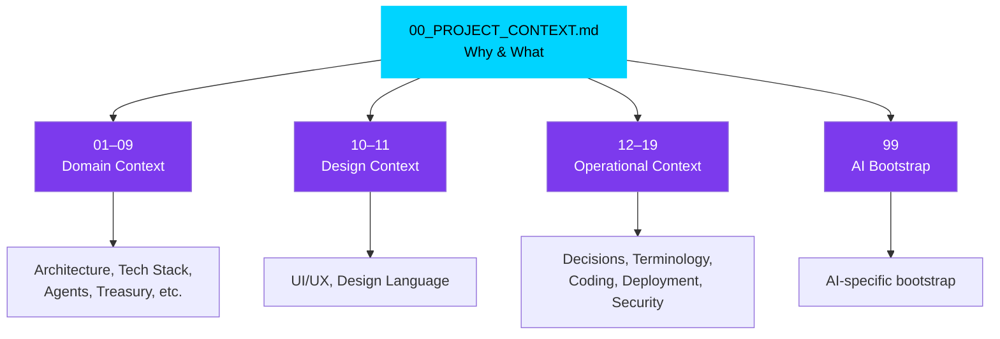
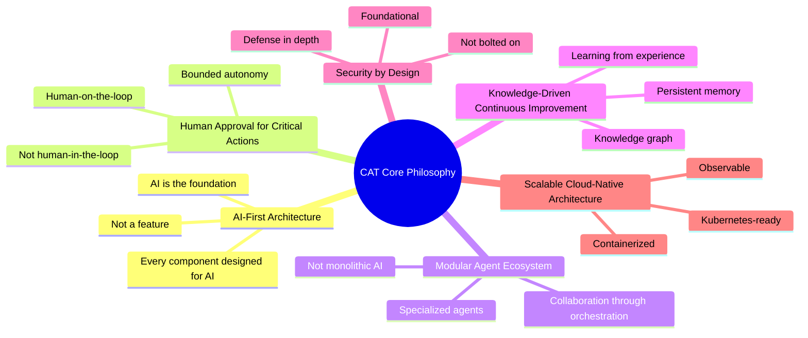

# CAT — Commerce AI Trinity — Project Context

---

## 1. Document Metadata

| Field | Value |
|---|---|
| **Document ID** | CAT-CTX-00 |
| **Document Name** | Project Context |
| **Version** | 1.0.0 |
| **Status** | Active |
| **Project** | CAT (Commerce AI Trinity) |
| **Company** | Omni System |
| **Owner** | Lead Repository Architect, CAT Project |
| **Source of Truth** | This document is the single source of truth for the highest-level project context. All other context documents (01–19, 99) derive from and defer to this file. |
| **Authors** | CAT Documentation Engine; Lead Software Architect; Omni System |
| **Created** | 2026-08-01 |
| **Last Updated** | 2026-08-01 |
| **Related Documents** | `context/01_PROJECT_OVERVIEW.md`, `context/02_PROJECT_RULES.md`, `context/03_TECH_STACK.md`, `context/04_ARCHITECTURE.md`, `context/05_AGENTS.md`, `context/06_KNOWLEDGE_ENGINE.md`, `context/07_TREASURY_CORE.md`, `context/08_AFFILIATE_ENGINE.md`, `context/09_CONTENT_ENGINE.md`, `context/10_UI_UX.md`, `context/11_DESIGN_LANGUAGE.md`, `context/12_DECISIONS.md`, `context/13_TERMINOLOGY.md`, `context/14_CODING_STANDARD.md`, `context/15_DIRECTORY_STRUCTURE.md`, `context/16_DEPLOYMENT.md`, `context/17_SECURITY.md`, `context/18_PROMPTING.md`, `context/19_DEVELOPMENT_GUIDE.md`, `context/99_AI_BOOTSTRAP.md`, `bible/Volume01/V01_01_Vision.md`, `.ai/README.md` |
| **Dependencies** | None. This is the root context document. All other documents depend on this one. |

### Document Hierarchy

```
00_PROJECT_CONTEXT.md   ← You are here
│
├── 01_PROJECT_OVERVIEW.md
├── 02_PROJECT_RULES.md
├── 03_TECH_STACK.md
├── 04_ARCHITECTURE.md
├── 05_AGENTS.md
├── 06_KNOWLEDGE_ENGINE.md
├── 07_TREASURY_CORE.md
├── 08_AFFILIATE_ENGINE.md
├── 09_CONTENT_ENGINE.md
├── 10_UI_UX.md
├── 11_DESIGN_LANGUAGE.md
├── 12_DECISIONS.md
├── 13_TERMINOLOGY.md
├── 14_CODING_STANDARD.md
├── 15_DIRECTORY_STRUCTURE.md
├── 16_DEPLOYMENT.md
├── 17_SECURITY.md
├── 18_PROMPTING.md
├── 19_DEVELOPMENT_GUIDE.md
└── 99_AI_BOOTSTRAP.md
```

### Intended Audience

This document is written for:

| Audience | Why They Read This |
|---|---|
| Human developers | To understand what CAT is, why it exists, and the principles that govern every implementation decision. |
| Software architects | To align all architectural choices with the project's stated philosophy and constraints. |
| AI agents (Codex, Claude, Gemini, Kimi, Minimax) | To load project context before performing any task within the CAT repository. |
| Future CAT internal agents | To bootstrap their understanding of the system they operate within. |
| Project stakeholders | To verify that development aligns with the original vision and business goals. |
| New contributors | To onboard quickly without needing oral knowledge transfer. |

### Reading Order for AI Systems

Any AI system working on the CAT repository should read documents in the following order:

1. `.ai/README.md` — AI workspace entry point
2. `context/00_PROJECT_CONTEXT.md` — This document
3. `context/01_PROJECT_OVERVIEW.md` — Detailed project overview
4. `context/02_PROJECT_RULES.md` — Project-wide rules
5. `context/03_TECH_STACK.md` — Technology decisions
6. `context/04_ARCHITECTURE.md` — System architecture
7. Remaining context documents in numerical order
8. `context/99_AI_BOOTSTRAP.md` — AI-specific bootstrap

---

## 2. Purpose

### 2.1 What This Document Is

This document is the **highest-level source of truth** for the CAT (Commerce AI Trinity) project. It defines the project's existence, its vision, its mission, and the philosophies that govern every decision made within the project — from code architecture to UI design to business strategy.

Every other document in the CAT repository is subordinate to this one. If any document conflicts with the principles, vision, or mission stated here, this document prevails, and the conflicting document must be corrected.

### 2.2 What This Document Is Not

This document is **not**:

- A technical architecture specification (see `context/04_ARCHITECTURE.md`)
- A technology stack listing (see `context/03_TECH_STACK.md`)
- An agent design document (see `context/05_AGENTS.md`)
- A UI/UX specification (see `context/10_UI_UX.md`)
- A security policy (see `context/17_SECURITY.md`)
- A coding standard (see `context/14_CODING_STANDARD.md`)
- A deployment guide (see `context/16_DEPLOYMENT.md`)

This document establishes **why** and **what**, not **how**. Implementation details belong in their respective dedicated documents.

### 2.3 Document Lifecycle

This document is designed to be maintained for the next ten years. It follows these lifecycle rules:

| Phase | Description |
|---|---|
| **Creation** | Initial drafting during Phase 0 (Foundation). |
| **Active** | The document is the current source of truth. Changes require review. |
| **Superseded** | A newer version replaces this one. The old version is archived but not deleted. |
| **Deprecated** | The document is no longer relevant. It is retained for historical reference. |

### 2.4 Change Management

Changes to this document follow these rules:

1. Any change must be committed with a conventional commit message prefixed with `docs(context):`.
2. Material changes (new sections, altered philosophy, changed scope) require a version increment.
3. The `Last Updated` field must reflect the date of the last material change.
4. A change log entry must be added to `CHANGELOG.md` for material changes.
5. All downstream documents must be reviewed for consistency after a material change to this document.

---

## 3. Scope

### 3.1 In Scope

This document covers the following domains at the highest level:

| Domain | Coverage in This Document | Detailed Document |
|---|---|---|
| Project identity | What CAT is and what it is not | `01_PROJECT_OVERVIEW.md` |
| Vision | The long-term aspiration of the project | `bible/Volume01/V01_01_Vision.md` |
| Mission | The operational mandate of the project | `01_PROJECT_OVERVIEW.md` |
| Core philosophy | The fundamental principles guiding all decisions | `02_PROJECT_RULES.md` |
| Design philosophy | The principles governing visual and interaction design | `10_UI_UX.md`, `11_DESIGN_LANGUAGE.md` |
| Engineering philosophy | The principles governing software engineering | `14_CODING_STANDARD.md`, `04_ARCHITECTURE.md` |
| Business philosophy | The principles governing commercial operations | `07_TREASURY_CORE.md`, `08_AFFILIATE_ENGINE.md` |
| AI philosophy | The principles governing artificial intelligence within CAT | `05_AGENTS.md`, `06_KNOWLEDGE_ENGINE.md` |

### 3.2 Out of Scope

The following are explicitly out of scope for this document:

- Specific technology choices and version numbers
- Detailed architecture diagrams and data flow specifications
- Individual agent designs and capabilities
- Treasury algorithms and financial models
- Affiliate network integration details
- Content generation pipelines
- Security policies and procedures
- Deployment configurations
- Prompt engineering templates
- Coding style rules

### 3.3 Scope Boundaries



---

## 4. Background

### 4.1 The Problem Space

Affiliate commerce is a multi-billion-dollar industry that remains fundamentally manual, fragmented, and inefficient. The typical affiliate commerce lifecycle involves:

1. **Market research** — Identifying profitable niches, trending products, and competitive landscapes.
2. **Product discovery** — Finding products with affiliate programs that match market demand.
3. **Content creation** — Writing reviews, comparisons, tutorials, and promotional content.
4. **Content publishing** — Distributing content across multiple channels (blogs, social media, video platforms).
5. **Link management** — Creating, tracking, and maintaining affiliate links.
6. **Analytics** — Monitoring clicks, conversions, revenue, and performance metrics.
7. **Optimization** — Adjusting strategies based on performance data.
8. **Treasury management** — Tracking earnings, managing payouts, and financial reporting.

Each of these steps is typically performed by human operators using disconnected tools. The result is:

| Problem | Impact |
|---|---|
| Manual research takes hours per product | Slow time-to-market |
| Content creation is a bottleneck | Limited scale |
| Multi-channel publishing is repetitive | Wasted effort |
| Link management is error-prone | Lost revenue |
| Analytics are fragmented across platforms | Incomplete picture |
| Optimization is reactive, not proactive | Suboptimal performance |
| Treasury tracking is manual | Financial blind spots |

### 4.2 The Market Opportunity

The affiliate marketing industry is characterized by:

- **Growing market size** — Global affiliate marketing spending continues to grow year over year.
- **Fragmented tooling** — No single platform covers the entire lifecycle.
- **AI gap** — Most existing tools use AI for narrow tasks (e.g., content writing) but not for end-to-end orchestration.
- **Human dependency** — Every step requires human intervention, limiting scalability.
- **Data silos** — Research, content, analytics, and financial data live in separate systems.

CAT is designed to address this gap by building an AI-native platform that automates the **entire** affiliate commerce lifecycle — not just one piece of it.

### 4.3 The Omni System Context

CAT is developed under **Omni System**, the company that owns and operates the project. Omni System's mandate is to build AI-native commerce systems that operate autonomously with human oversight. CAT is Omni System's flagship product.

Key Omni System decisions that shaped CAT:

| Decision | Rationale |
|---|---|
| AI-first, not AI-assisted | The system should be built around AI from the ground up, not have AI bolted on as a feature. |
| Human approval for critical actions | AI operates autonomously but human operators approve decisions with financial or reputational impact. |
| Modular agent ecosystem | The system is composed of specialized agents rather than a monolithic AI. |
| Knowledge-driven | The system accumulates knowledge over time and uses it to improve. |
| Security by design | Security is a foundational principle, not an afterthought. |
| Documentation first | The project is documented before it is implemented, ensuring alignment and longevity. |

### 4.4 Project Timeline

```mermaid
timeline
    title CAT Project Timeline
    Phase 0 : Foundation & Documentation
              Repository Structure
              CAT Bible
              Knowledge Base
              ADRs
              Design System
    Phase 1 : Core Platform
              Core Kernel
              Memory System
              Knowledge Graph
              Workflow Engine
              Agent Orchestrator
              Prompt Engine
    Phase 2 : AI Agent Ecosystem
              Research Agent
              Affiliate Agent
              Creative Agent
              Publisher Agent
              Treasury Agent
              Analytics Agent
              Learning Agent
              Security Agent
    Phase 3 : Commerce Platform
              Product Discovery
              Store Integrations
              Affiliate Link Management
              Content Generation
              Multi-Channel Publishing
    Phase 4 : Intelligence
              Continuous Learning
              Knowledge Refinement
              Performance Optimization
              Decision Support
    Phase 5 : Public Release
              Beta
              Production
              Enterprise Features
```



---

## 5. Why CAT Exists

### 5.1 The Core Problem

CAT exists because the affiliate commerce industry suffers from a fundamental mismatch:

> **The volume of products, markets, and content channels grows exponentially, but the human capacity to research, create, publish, and optimize grows linearly at best.**

This mismatch means:

- Human operators can only manage a fraction of available opportunities.
- Most affiliate content is low quality because quantity is prioritized over quality.
- Market opportunities are missed because humans cannot monitor all markets simultaneously.
- Financial optimization is reactive — humans respond to data after the fact, not proactively.

### 5.2 The CAT Solution

CAT solves this mismatch by replacing the human-in-the-loop model with a **human-on-the-loop** model:

| Traditional Model | CAT Model |
|---|---|
| Human researches products | AI researches products; human approves selection |
| Human writes content | AI generates content; human reviews and approves |
| Human publishes to channels | AI publishes; human monitors |
| Human tracks analytics | AI tracks and interprets analytics |
| Human optimizes strategy | AI recommends optimizations; human approves |
| Human manages treasury | AI tracks finances; human approves transactions |

The key insight is that CAT does not eliminate the human — it **elevates** the human from operator to **supervisor**. The human's role shifts from doing the work to approving the work.

### 5.3 Why "Trinity"

The name "Commerce AI Trinity" reflects the three foundational pillars of the system:

```
                    ┌─────────────────┐
                    │      CAT        │
                    │  Commerce AI    │
                    │    Trinity      │
                    └────────┬────────┘
                             │
              ┌──────────────┼──────────────┐
              │              │              │
              ▼              ▼              ▼
     ┌────────────┐  ┌────────────┐  ┌────────────┐
     │  Commerce  │  │     AI     │  │  Treasury  │
     │  Engine    │  │   Engine   │  │   Engine   │
     │            │  │            │  │            │
     │ • Research │  │ • Agents   │  │ • Earnings │
     │ • Affiliate │  │ • Knowledge│  │ • Payouts  │
 │ • Content  │  │ • Memory   │  │ • Reports  │
     │ • Publish  │  │ • Reasoning│  │ • Budget   │
     └────────────┘  └────────────┘  └────────────┘
```

| Pillar | Responsibility | Key Agents |
|---|---|---|
| **Commerce Engine** | Market research, product discovery, affiliate link management, content generation, multi-channel publishing | Research Agent, Affiliate Agent, Creative Agent, Publisher Agent |
| **AI Engine** | Agent orchestration, knowledge management, memory, reasoning, continuous learning | CATA (central agent), Learning Agent, Memory Agent |
| **Treasury Engine** | Earnings tracking, payout management, financial reporting, budget optimization | Treasury Agent, Analytics Agent |

### 5.4 Why Now

Several converging trends make CAT viable at this point in time:

| Trend | Why It Matters for CAT |
|---|---|
| Multi-model AI orchestration | CAT can use different AI models for different tasks (research, writing, analysis) rather than relying on a single model. |
| Retrieval-augmented generation (RAG) | CAT can build a persistent knowledge base that improves over time. |
| Agent frameworks | Mature agent orchestration patterns enable CAT's multi-agent architecture. |
| Cloud-native infrastructure | Kubernetes, containers, and observability tools enable scalable deployment. |
| GPU acceleration | Real-time 3D rendering and particle effects for the CAT interface are feasible in the browser. |
| Affiliate market growth | The market is large enough to support a platform-level solution. |

### 5.5 What CAT Is Not

To prevent scope creep and maintain focus, the following are explicitly **not** what CAT is:

| Not CAT | Why |
|---|---|
| A chatbot | CAT is an autonomous operating system, not a conversational interface. |
| A CMS | CAT generates and publishes content but is not a content management system. |
| An ad network | CAT uses affiliate networks but is not itself an ad network. |
| A single-purpose AI tool | CAT is not "just" a content writer or "just" an analytics tool. It is an end-to-end platform. |
| A no-code platform | CAT is AI-native, not no-code. The AI does the work; humans supervise. |
| A human replacement | CAT augments human operators, it does not replace them. |

---

## 6. Vision (Expanded)

### 6.1 Vision Statement

> **CAT is an AI-native autonomous commerce operating system that researches products, creates content, manages affiliate operations, learns continuously, and assists human operators through an intelligent agent ecosystem — all within a command-center interface that feels like operating a living intelligence rather than using software.**

### 6.2 Vision Decomposition

The vision statement contains several load-bearing concepts that must be understood individually:

#### 6.2.1 AI-Native

"AI-native" means that AI is not a feature added to a traditional system. AI is the **foundation** upon which the entire system is built. Every component — from the kernel to the UI — is designed with the assumption that AI is the primary operator.

| AI-Assisted (Traditional) | AI-Native (CAT) |
|---|---|
| AI is a tool the user invokes | AI is the operator; the user supervises |
| The system waits for user input | The system proactively identifies tasks |
| AI features are optional | AI is required for the system to function |
| The UI is designed for human input | The UI is designed for human oversight of AI |
| Data flows through human workflows | Data flows through AI workflows with human checkpoints |

#### 6.2.2 Autonomous

"Autonomous" means the system operates without continuous human intervention. However, autonomy in CAT is **bounded**:

| Level | Description | Example |
|---|---|---|
| Level 0 | Human performs the task | Human writes a product review |
| Level 1 | AI suggests, human performs | AI suggests a product to review, human writes it |
| Level 2 | AI performs, human reviews | AI writes the review, human edits |
| Level 3 | AI performs, human approves | AI writes and publishes the review, human approves before it goes live |
| Level 4 | AI performs, human is notified | AI adjusts affiliate links based on performance, human is notified |
| Level 5 | AI performs autonomously | AI optimizes internal data routing without notification |

CAT targets **Level 3** for most operations, with **Level 4** for optimization tasks and **Level 5** for internal system operations. **Level 3** is the default for any action with external visibility or financial impact.

#### 6.2.3 Commerce Operating System

"Operating system" is used deliberately. CAT is not an application — it is a platform that manages resources, schedules tasks, coordinates agents, maintains memory, and provides an interface for human oversight. The analogy:

| Traditional OS | CAT |
|---|---|
| Manages CPU, memory, disk | Manages agents, knowledge, memory, treasury |
| Schedules processes | Schedules commerce tasks and agent workflows |
| Provides system calls | Provides agent APIs and commerce primitives |
| Has a shell | Has the CAT command-center interface |
| Manages permissions | Manages approval workflows |
| Logs system events | Logs all commerce and agent activities |

#### 6.2.4 Intelligent Agent Ecosystem

"Agent ecosystem" means CAT is not a single AI. It is a collection of specialized agents, each with a defined role, that collaborate through an orchestration layer.

```
┌─────────────────────────────────────────────────────────────┐
│                     CAT Agent Ecosystem                      │
├─────────────────────────────────────────────────────────────┤
│                                                             │
│   ┌──────────┐  ┌──────────┐  ┌──────────┐  ┌──────────┐   │
│   │ Research  │  │ Affiliate│  │ Creative │  │ Publisher│   │
│   │  Agent    │  │  Agent   │  │  Agent   │  │  Agent   │   │
│   └────┬─────┘  └────┬─────┘  └────┬─────┘  └────┬─────┘   │
│        │              │              │              │        │
│        └──────────┬───┴──────────────┴──────────────┘       │
│                   │                                         │
│              ┌────┴────┐                                    │
│              │  CATA   │  ← Central Agent (Orchestrator)     │
│              └────┬────┘                                    │
│                   │                                         │
│        ┌──────────┼──────────────────────────┐              │
│        │          │              │            │              │
│   ┌────┴─────┐ ┌──┴───┐  ┌──────┴───┐ ┌─────┴────┐        │
│   │ Treasury │ │Memory│  │ Learning │ │ Security │        │
│   │  Agent   │ │Agent │  │  Agent   │ │  Agent   │        │
│   └──────────┘ └──────┘  └──────────┘ └──────────┘        │
│                                                             │
│   ┌──────────┐                                            │
│   │Analytics │                                            │
│   │  Agent   │                                            │
│   └──────────┘                                            │
│                                                             │
└─────────────────────────────────────────────────────────────┘
```

#### 6.2.5 Living Intelligence Interface

The CAT interface is not a dashboard. It is designed to feel like standing inside the command center of an advanced intelligence. The interface features:

- A **cosmic cat avatar** (the persona of CAT) that reacts to system state with body language, color changes, and particle effects.
- A **3D globe** at the center of the interface showing all merchant nodes, with light pulses representing transactions.
- **Glass morphism panels** with real reflection, refraction, and dispersion effects.
- **Perspective UI** where panels are angled 3–5 degrees toward the center to create a command-room feel.
- **AI thinking effects** where light strands flow between nodes when agents are processing.
- A **neon color language** with specific colors for each system state.

This is documented in detail in the CAT Visual Language specification and will be expanded in `context/10_UI_UX.md` and `context/11_DESIGN_LANGUAGE.md`.

### 6.3 Long-Term Vision (10-Year Horizon)

| Timeframe | Vision Milestone |
|---|---|
| Year 1–2 | Foundation, core platform, initial agent ecosystem |
| Year 3–4 | Full commerce platform, multi-channel publishing, treasury management |
| Year 5–6 | Continuous learning, knowledge refinement, performance optimization |
| Year 7–8 | Public release, enterprise features, multi-tenant support |
| Year 9–10 | Industry-standard autonomous commerce platform |

### 6.4 Success Criteria

The vision is achieved when:

1. CAT operates the full affiliate commerce lifecycle with minimal human intervention.
2. The knowledge base continuously improves, making CAT smarter over time.
3. The interface feels like commanding a living intelligence, not using software.
4. Treasury operations are fully tracked and optimized.
5. The system is secure, scalable, and maintainable over a decade.
6. Documentation is comprehensive enough that any AI or human can contribute.

---

## 7. Mission (Expanded)

### 7.1 Mission Statement

> **CAT's mission is to build and operate an AI-native platform that automates the complete affiliate commerce lifecycle — from market research and product discovery through content generation, publishing, analytics, continuous learning, and treasury management — while maintaining human approval for critical actions and accumulating knowledge that makes the system smarter over time.**

### 7.2 Mission Decomposition

#### 7.2.1 Automate the Complete Lifecycle

CAT's mission is not to automate *part* of the lifecycle. It is to automate the **complete** lifecycle. This means:

| Lifecycle Stage | CAT Responsibility |
|---|---|
| Market research | Identify trending products, profitable niches, and competitive landscapes |
| Product discovery | Find products with affiliate programs that match market demand |
| Content generation | Create reviews, comparisons, tutorials, and promotional content |
| Content publishing | Distribute content across blogs, social media, video platforms |
| Affiliate link management | Create, track, and maintain affiliate links |
| Analytics | Monitor clicks, conversions, revenue, and performance |
| Optimization | Adjust strategies based on performance data |
| Treasury management | Track earnings, manage payouts, generate financial reports |
| Continuous learning | Accumulate knowledge and improve over time |

If any stage is not automated, the mission is not complete.

#### 7.2.2 Human Approval for Critical Actions

Not all actions should be autonomous. CAT's mission explicitly includes maintaining human oversight for actions that have:

| Risk Type | Examples | Approval Required |
|---|---|---|
| Financial risk | Payouts, budget allocations, investments | Yes |
| Reputational risk | Publishing content, social media posts | Yes |
| Legal risk | Compliance-sensitive content, data handling | Yes |
| Irreversible risk | Deleting data, closing accounts | Yes |
| Operational risk | Internal optimization, data routing | No (notify only) |

#### 7.2.3 Accumulate Knowledge

A key part of CAT's mission is to **get smarter over time**. This is not a side effect — it is an explicit goal. The system must:

- Remember what worked and what did not.
- Learn from successful and failed campaigns.
- Build a knowledge graph of products, markets, and strategies.
- Use accumulated knowledge to make better decisions.
- Never lose knowledge (persistence is a requirement).

### 7.3 Mission vs. Vision

| Aspect | Vision | Mission |
|---|---|---|
| Timeframe | 10-year aspiration | Ongoing operational mandate |
| Focus | What CAT will become | What CAT does every day |
| Measurability | Qualitative | Quantitative |
| Scope | Aspirational | Operational |

---

## 8. Core Philosophy

### 8.1 Philosophical Foundation

CAT is built on six core principles. These principles are **non-negotiable** — they guide every decision, from architecture to UI to business strategy.

### 8.2 The Six Core Principles



### 8.3 Principle 1: AI-First Architecture

**Statement:** CAT is designed around AI from the ground up. AI is not a feature added to a traditional system; it is the foundation upon which the system is built.

**Technical Implication:**
- The system architecture assumes AI agents are the primary operators.
- Data flows are designed for AI consumption, not human input.
- The API layer is designed for agent-to-agent communication, not just human-to-system.
- The UI is designed for oversight, not operation.

**Business Implication:**
- CAT can scale operations without scaling human headcount.
- The system becomes more valuable as it accumulates knowledge.
- The competitive moat is the AI infrastructure, not the UI.

**Anti-Pattern:**
- Building a traditional system and adding AI features on top.
- Designing the UI for human data entry and adding AI suggestions.
- Treating AI as an optional component.

**Decision Rationale:**
An AI-assisted system has a lower ceiling than an AI-native system because the human remains the bottleneck. By making AI the foundation, CAT removes the human bottleneck for execution while preserving human authority for approval.

### 8.4 Principle 2: Human Approval for Critical Actions

**Statement:** CAT operates autonomously for most tasks, but human operators approve decisions with financial, reputational, legal, or irreversible impact.

**Technical Implication:**
- Every action that has external impact must pass through an approval workflow.
- The system must support configurable approval levels.
- The UI must surface pending approvals prominently.
- The system must provide enough context for humans to make informed decisions.

**Business Implication:**
- The human's role is elevated from operator to supervisor.
- Risk is managed without sacrificing speed.
- The system can operate 24/7 with human oversight during business hours.

**Anti-Pattern:**
- Requiring approval for every action (creates a bottleneck).
- Allowing full autonomy for financial actions (creates risk).
- Burying approval requests in a queue (creates delay and risk).

**Decision Rationale:**
Full autonomy for critical actions creates unacceptable risk. Full human involvement for all actions negates the value of AI. The optimal balance is bounded autonomy with human approval at critical checkpoints.

### 8.5 Principle 3: Modular Agent Ecosystem

**Statement:** CAT is composed of specialized agents, each with a defined role, that collaborate through an orchestration layer. CAT is not a single, monolithic AI.

**Technical Implication:**
- Each agent has a well-defined interface and responsibility.
- Agents communicate through a structured event bus.
- Agents can be added, removed, or upgraded independently.
- The orchestrator (CATA) coordinates agent activities.

**Business Implication:**
- New capabilities can be added without rearchitecting the system.
- Agents can be specialized for specific markets or channels.
- The system can scale by adding more agents, not by making one agent bigger.

**Anti-Pattern:**
- A single AI that tries to do everything.
- Tightly coupled agents that cannot operate independently.
- Agents with overlapping responsibilities.

**Decision Rationale:**
A monolithic AI is harder to maintain, scale, and debug. A modular ecosystem allows specialization, independent development, and graceful degradation (if one agent fails, others continue).

### 8.6 Principle 4: Knowledge-Driven Continuous Improvement

**Statement:** CAT accumulates knowledge over time and uses that knowledge to make better decisions. The system gets smarter the longer it operates.

**Technical Implication:**
- The system has a persistent knowledge graph.
- The system has a memory store that survives restarts.
- The system logs outcomes (success/failure) and correlates them with decisions.
- The system uses RAG (Retrieval-Augmented Generation) to leverage accumulated knowledge.

**Business Implication:**
- The system's value compounds over time.
- Institutional knowledge is captured in the system, not in employees.
- The system can train new agents using accumulated knowledge.

**Anti-Pattern:**
- Treating each task as independent (no learning).
- Storing knowledge without using it for future decisions.
- Losing knowledge on system restart.

**Decision Rationale:**
A system that does not learn requires the same effort for every task. A system that learns reduces effort over time and improves quality. The compounding value of knowledge is the primary long-term competitive advantage.

### 8.7 Principle 5: Security by Design

**Statement:** Security is a foundational principle of CAT's architecture, not an afterthought or a layer added on top.

**Technical Implication:**
- All inter-agent communication is authenticated and authorized.
- All external API calls are validated and rate-limited.
- All data at rest is encrypted.
- All secrets are managed through a secret manager, never hardcoded.
- The system follows the principle of least privilege.

**Business Implication:**
- The system can be trusted with financial data.
- The system can be trusted with affiliate credentials.
- The system meets compliance requirements.

**Anti-Pattern:**
- Adding security after the system is built.
- Hardcoding secrets in configuration files.
- Trusting all internal communication by default.

**Decision Rationale:**
Security added after the fact is always incomplete and expensive. Security built into the foundation is more effective and cheaper to maintain. Given that CAT handles financial data and external credentials, security is existential.

### 8.8 Principle 6: Scalable Cloud-Native Architecture

**Statement:** CAT is built as a cloud-native system from the start, using containers, orchestration, and observability as foundational infrastructure.

**Technical Implication:**
- All components are containerized.
- The system is designed for Kubernetes deployment.
- Observability (metrics, logs, traces) is built in from the start.
- The system can scale horizontally by adding more instances.

**Business Implication:**
- The system can handle growth without rearchitecting.
- Infrastructure costs scale with usage.
- The system can be deployed on any cloud provider.

**Anti-Pattern:**
- Building for a single server and planning to scale later.
- Adding observability after the system is in production.
- Locking into a single cloud provider.

**Decision Rationale:**
Retrofitting cloud-native patterns onto a system not designed for them is expensive and risky. Building cloud-native from the start ensures the system can scale without architectural changes.

---

## 9. Design Philosophy

### 9.1 The CAT Interface Manifesto

> **CAT is not a dashboard. CAT is a living digital entity. The user should not feel like they are using software. They should feel like they are standing inside the command center of a super-advanced artificial intelligence.**

This is the foundational design principle for CAT's interface. Every visual and interaction decision must serve this principle.

### 9.2 Design Inspirations

CAT's visual language draws inspiration from:

| Inspiration | What CAT Borrows |
|---|---|
| Cyberpunk 2077 | Neon color language, holographic effects, dense information display |
| Tron Legacy | Light trails, geometric patterns, dark background with luminous elements |
| Iron Man HUD | Heads-up display, real-time data overlay, gesture-driven interaction |
| Jarvis | Conversational AI persona, anticipatory interface, ambient intelligence |
| Interstellar | Cosmic aesthetic, scientific precision, minimal but deep UI |
| Mass Effect | Sci-fi command interface, species-level civilization management feel |
| The Creator | AI presence, organic-digital fusion, atmospheric depth |
| Ghost in the Shell | Cybernetic identity, information density, philosophical depth |
| Deus Ex | Augmented interface, layered information, conspiracy-grade detail |
| Apple Vision Pro | Spatial computing, glass interfaces, depth and parallax |

### 9.3 The CAT Persona

CAT is not just an AI — CAT has a **personality**. The visual representation of CAT is a **cosmic cat** — not an animal, not a human, but a being between the two.

| Aspect | Specification |
|---|---|
| Body | Made of a substance like stars, nebulae, light, energy, electrons. Inside the body, galaxies, stars, particles, and light move. |
| Eyes | Blue light, animated iris, digital pupil, light trail on movement. |
| Ears | Natural movement, reactive to system events. |
| Tail | Slow, deliberate movement. |
| Breathing | Very slow, nearly imperceptible. |
| Body light | Changes based on system state (see color language below). |

### 9.4 Avatar Behavior Engine

The CAT avatar is not a static image — it is an actor. Its behavior reflects the system's state:

| System State | Avatar Behavior | Body Color |
|---|---|---|
| Normal | Calm, looking around, ears and tail moving | Blue |
| Thinking | Eyes closed, paws together, particles orbiting, tail still, brain light increasing | Purple |
| Generating | One paw moves as if creating something | Purple |
| Image creation | Paws arrange 3D shapes | Purple |
| Video creation | Video holograms appear around the avatar | Purple |
| Searching | Thousands of nodes appear around the head | Blue |
| Waiting | Blink, look around, ear and tail movement, breathing | Blue |
| Success | Subtle smile, golden light | Gold |
| Warning | Head slightly lowered | Orange |
| Error | Head lowered, orange/red light | Red |
| Learning | Turquoise light | Turquoise |
| Sleeping | Dim light | Dim blue |
| User login | Looks at user, head slightly tilted | Blue |
| User idle (few minutes) | Says "Ready when you are." | Blue |

### 9.5 Color Language

| Role | Color | Hex (Reference) |
|---|---|---|
| Primary | Electric Blue | `#00D4FF` |
| Secondary | Cosmic Purple | `#7C3AED` |
| Accent | Gold | `#FFD700` |
| Success | Emerald | `#10B981` |
| Warning | Amber | `#F59E0B` |
| Danger | Crimson | `#EF4444` |
| Learning | Turquoise | `#06B6D4` |

All colors are user-configurable through the theme engine. Users can create custom themes (e.g., Cyber Blue, Red Matrix, Emerald, Purple Galaxy, White Hologram, Amber).

### 9.5.1 Contrast and Readability

> **CRITICAL:** All text must maintain WCAG AA contrast ratios (4.5:1 for body text, 3:1 for large text) against their background at all times, including during state transitions. When the header or panel background changes color (e.g., from transparent to solid on scroll, or from blue to purple during a state change), text color must adjust automatically to maintain readability.

### 9.6 Interface Architecture

#### 9.6.1 The CAT Brain (Central Globe)

At the center of the interface is a fully 3D globe:

| Feature | Specification |
|---|---|
| Rendering | Fully 3D, real-time |
| Rotation | Slow, continuous |
| Surface | Clouds, sunlight, night lights, atmosphere |
| Particles | Particle effects on the globe surface |
| Merchant nodes | All merchants (Amazon, Impact, CJ, Digikala, Awin, AliExpress, ClickBank, ShareASale, etc.) displayed as nodes on the globe |
| Dynamic nodes | New merchants appear as new nodes automatically |
| Transaction visualization | When a sale occurs, a light pulse travels from the merchant node to the center |
| Agent activity | When an agent performs a task, light flows between Agent → Merchant → Campaign → Analytics |

#### 9.6.2 Panel System

| Property | Specification |
|---|---|
| Layout | Not flat — all panels angled 3–5 degrees toward center |
| Effect | Creates a command-room sensation |
| Layers | Background → Glass → Glow → Content → Particles → Reflection → Border |
| Glass | Real glass morphism (not simple blur): reflection, dispersion, refraction, micro noise, HDR glow |
| Materialization | Windows do not "open" — they "materialize" |
| Hover effects | Buttons gain inner light on hover |
| Click effects | Energy gathers into the button and releases on click |

#### 9.6.3 Motion System

| Property | Specification |
|---|---|
| Rendering | GPU-accelerated |
| Target FPS | 60 FPS (120 FPS on capable displays) |
| Blocking | No animation is blocking |
| Quality levels | Ultra, High, Eco |
| Background | Not pure black — subtle gradient toward blue with sparse stars, faint nebulae, light particles, slow movement |

### 9.7 Design Philosophy Principles

| Principle | Description |
|---|---|
| **Living, not static** | The interface is alive — it breathes, reacts, and responds. |
| **Depth, not flatness** | Panels have layers, depth, and perspective. |
| **Information density without clutter** | Show a lot of information, but organize it so it doesn't feel overwhelming. |
| **Sci-fi command center, not enterprise dashboard** | The aesthetic is futuristic and cinematic, not corporate. |
| **Performance is design** | Beautiful but slow is unacceptable. 60 FPS is a design requirement. |
| **Configurable beauty** | Users can customize themes, effects, and performance levels. |
| **State-aware** | The interface reflects the system's state through color, motion, and avatar behavior. |

### 9.8 Design Anti-Patterns

| Anti-Pattern | Why It's Wrong |
|---|---|
| Flat, corporate dashboard | Violates the "living intelligence" principle |
| Blocking animations | Violates the 60 FPS requirement |
| Pure black background | Violates the cosmic aesthetic |
| Static avatar | Violates the "CAT is alive" principle |
| Unconfigurable themes | Violates the user empowerment principle |
| Information overload without hierarchy | Violates the "density without clutter" principle |
| Low-contrast text on glowing backgrounds | Violates accessibility and readability requirements |

---

## 10. Engineering Philosophy

### 10.1 Engineering Principles

CAT follows the engineering principles defined in `CONTRIBUTING.md`:

| Principle | Description |
|---|---|
| Documentation First | The project is documented before it is implemented. |
| AI-First Engineering | Engineering decisions prioritize AI as the primary operator. |
| Human Approval for Critical Actions | Engineering must support configurable approval workflows. |
| Security by Design | Security is built in, not bolted on. |
| Modular Architecture | Components are independent, well-interfaced, and replaceable. |
| Continuous Learning | The system learns from every operation. |

### 10.2 Documentation First

"Documentation First" means:

1. Before any code is written, the relevant context document must be created or updated.
2. Architecture Decision Records (ADRs) must be created before architectural changes are implemented.
3. API documentation must exist before the API is consumed.
4. The documentation is the specification; code is the implementation.

**Rationale:** If the documentation is written after the code, it documents what was built. If it is written before, it specifies what should be built. The latter produces better designs because it forces thinking before doing.

### 10.3 Conventional Commits

CAT follows the Conventional Commits specification:

| Type | Use |
|---|---|
| `feat` | A new feature |
| `fix` | A bug fix |
| `docs` | Documentation changes |
| `style` | Code style changes (formatting, etc.) |
| `refactor` | Code changes that neither fix a bug nor add a feature |
| `test` | Adding or correcting tests |
| `chore` | Maintenance tasks, dependency updates, etc. |
| `perf` | Performance improvements |

Format: `type(scope): description`

### 10.4 Branch Strategy

| Branch | Purpose |
|---|---|
| `main` | Production-ready code |
| `develop` | Integration branch |
| `feature/*` | Feature development |
| `fix/*` | Bug fixes |
| `release/*` | Release preparation |
| `hotfix/*` | Urgent production fixes |

### 10.5 Definition of Done

A task is complete when:

1. Code is completed.
2. Tests pass.
3. Documentation is updated.
4. Code is reviewed.
5. The change is committed with a conventional commit message.

### 10.6 Engineering Trade-offs

| Decision | Chosen | Rejected | Rationale |
|---|---|---|---|
| Monolith vs. Microservices | Modular monolith (initially) | Microservices (initially) | Start simple, extract services when needed |
| SQL vs. NoSQL | SQL (Postgres/Supabase) | NoSQL | Structured data with relationships; ACID requirements for treasury |
| SSR vs. SPA | SSR (Next.js) | SPA | SEO for published content; fast initial load |
| REST vs. GraphQL | REST (primary) | GraphQL | Simpler, well-understood, sufficient for agent-to-agent communication |
| Sync vs. Async | Async (event bus) | Sync (blocking calls) | Agents operate independently; async prevents bottlenecks |

### 10.7 Engineering Anti-Patterns

| Anti-Pattern | Why It's Wrong |
|---|---|
| Writing code before documentation | Violates "Documentation First" |
| Hardcoding secrets | Violates "Security by Design" |
| Building a monolithic AI | Violates "Modular Agent Ecosystem" |
| Adding observability after deployment | Violates "Cloud-Native Architecture" |
| Skipping tests to save time | Violates "Definition of Done" |
| Non-conventional commits | Violates commit standards |

---

## 11. Business Philosophy

### 11.1 Business Model

CAT operates in the affiliate commerce industry. Its business model is:

1. **CAT operates affiliate campaigns** across multiple networks and merchants.
2. **CAT earns affiliate commissions** from successful conversions.
3. **CAT manages its own treasury** — tracking earnings, optimizing payouts, and reporting financial performance.
4. **CAT may offer enterprise features** in the future for other organizations to use the platform.

### 11.2 Revenue Streams

| Stream | Description | Phase |
|---|---|---|
| Affiliate commissions | CAT earns commissions from affiliate links it creates and publishes | Phase 3+ |
| Treasury optimization | CAT optimizes earnings through better link management and channel selection | Phase 3+ |
| Enterprise licensing | Other organizations license CAT to run their own affiliate operations | Phase 5+ |

### 11.3 Business Principles

| Principle | Description |
|---|---|
| **Revenue is a byproduct of quality** | If CAT produces high-quality content and targets the right products, revenue follows. Do not optimize for revenue directly. |
| **Long-term over short-term** | CAT prioritizes sustainable growth over quick wins. A campaign that generates $100/month for 5 years is better than one that generates $500 once. |
| **Diversification** | CAT operates across multiple merchants, networks, and channels to reduce dependency on any single source. |
| **Transparency** | All earnings, decisions, and actions are logged and auditable. |
| **Human oversight** | Financial decisions require human approval. CAT recommends; the human decides. |

### 11.4 Treasury Philosophy

The treasury is not just a ledger — it is a strategic tool. CAT's treasury management:

- Tracks all earnings in real-time.
- Correlates earnings with the content and campaigns that generated them.
- Identifies the most profitable products, channels, and strategies.
- Optimizes budget allocation based on performance.
- Maintains financial records for compliance and reporting.

Detailed treasury specifications will be in `context/07_TREASURY_CORE.md`.

### 11.5 Affiliate Philosophy

CAT's approach to affiliate marketing:

| Traditional Affiliate | CAT Affiliate |
|---|---|
| Human picks products | AI researches and recommends products |
| Human writes content | AI generates content; human approves |
| Human manages links | AI creates and manages links |
| Human tracks performance | AI tracks and interprets performance |
| Human optimizes strategy | AI recommends optimizations; human approves |
| Reactive | Proactive |
| Single channel | Multi-channel |
| Limited scale | Scalable |

Detailed affiliate specifications will be in `context/08_AFFILIATE_ENGINE.md`.

### 11.6 Business Anti-Patterns

| Anti-Pattern | Why It's Wrong |
|---|---|
| Optimizing for clicks over conversions | Clicks without conversions waste resources |
| Spamming affiliate links | Damages reputation and violates platform policies |
| Single-channel dependency | Creates fragility |
| Short-term thinking | Sacrifices sustainable growth |
| Opaque financial reporting | Violates transparency principle |
| Autonomous financial decisions | Violates human approval principle |

---

## 12. AI Philosophy

### 12.1 AI as Operator, Not Tool

In CAT, AI is the **operator** — the entity that performs the work. The human is the **supervisor** — the entity that approves the work. This is a fundamental distinction:

| AI as Tool | AI as Operator |
|---|---|
| Human invokes AI for a specific task | AI identifies tasks and performs them |
| AI output is a suggestion | AI output is the work product |
| Human does the work; AI assists | AI does the work; human approves |
| The system is human-driven | The system is AI-driven |

### 12.2 Multi-Model Orchestration

CAT does not rely on a single AI model. It orchestrates multiple models, each chosen for its strengths:

| Model Role | Why Multiple Models |
|---|---|
| Research | Different models have different knowledge cutoffs and web access capabilities |
| Content generation | Different models have different writing styles and strengths |
| Analysis | Different models have different reasoning capabilities |
| Image generation | Different models produce different aesthetic results |
| Code generation | Different models have different coding capabilities |

The orchestrator (CATA) routes tasks to the appropriate model based on the task type, required quality, and cost constraints.

### 12.3 Knowledge and Memory

CAT's AI is not stateless. It maintains:

| Store | Purpose | Persistence |
|---|---|---|
| Knowledge graph | Structured knowledge about products, markets, strategies | Permanent |
| Memory store | Context from past operations, decisions, and outcomes | Permanent |
| RAG index | Searchable index of all accumulated knowledge | Permanent |
| Session memory | Context within a single operational session | Session |

### 12.4 Bounded Autonomy

CAT's AI operates within defined boundaries:

```
┌─────────────────────────────────────────────────┐
│                 Autonomy Boundaries               │
├─────────────────────────────────────────────────┤
│                                                  │
│  ┌──────────────────────────────────────────┐   │
│  │  Level 5: Full Autonomy                   │   │
│  │  Internal system operations, data routing │   │
│  │  No human notification required           │   │
│  └──────────────────────────────────────────┘   │
│                                                  │
│  ┌──────────────────────────────────────────┐   │
│  │  Level 4: Autonomy with Notification      │   │
│  │  Optimization tasks, link adjustments    │   │
│  │  Human notified after the fact            │   │
│  └──────────────────────────────────────────┘   │
│                                                  │
│  ┌──────────────────────────────────────────┐   │
│  │  Level 3: Autonomy with Approval (DEFAULT)│   │
│  │  Publishing content, creating campaigns   │   │
│  │  Human must approve before execution      │   │
│  └──────────────────────────────────────────┘   │
│                                                  │
│  ┌──────────────────────────────────────────┐   │
│  │  Level 2: AI Drafts, Human Edits         │   │
│  │  Sensitive content, legal reviews         │   │
│  │  AI produces a draft for human editing    │   │
│  └──────────────────────────────────────────┘   │
│                                                  │
│  ┌──────────────────────────────────────────┐   │
│  │  Level 1: AI Suggests, Human Performs     │   │
│  │  Strategic decisions, new market entry   │   │
│  │  AI provides analysis; human acts         │   │
│  └──────────────────────────────────────────┘   │
│                                                  │
└─────────────────────────────────────────────────┘
```

### 12.5 AI Ethics

| Principle | Description |
|---|---|
| **Transparency** | All AI decisions are logged with reasoning. The human can always see why the AI made a decision. |
| **Accountability** | The human is ultimately accountable. AI recommends; human approves. |
| **No deception** | CAT never presents AI-generated content as human-created without disclosure where required. |
| **No manipulation** | CAT does not use psychological manipulation in content. Content is honest and informative. |
| **Privacy** | CAT does not collect or use personal data beyond what is necessary for operations. |
| **Bias awareness** | CAT actively monitors for and mitigates bias in its recommendations and content. |

### 12.6 AI Evolution

CAT's AI capabilities are expected to evolve over time:

| Phase | AI Capability |
|---|---|
| Phase 0–1 | Basic agent orchestration, rule-based workflows |
| Phase 2 | Multi-agent collaboration, RAG-based knowledge retrieval |
| Phase 3 | Autonomous content generation and publishing with approval |
| Phase 4 | Continuous learning, performance prediction, proactive optimization |
| Phase 5 | Advanced reasoning, strategic decision support, enterprise-grade intelligence |

### 12.7 AI Anti-Patterns

| Anti-Pattern | Why It's Wrong |
|---|---|
| Stateless AI (no memory) | Violates "Knowledge-Driven" principle |
| Single model for all tasks | Suboptimal; different models have different strengths |
| Unbounded autonomy | Violates "Human Approval" principle |
| Opaque decisions | Violates "Transparency" principle |
| AI that doesn't learn | Violates "Continuous Improvement" principle |
| AI that replaces human judgment for critical decisions | Violates "Human Approval" principle |

---

*End of Part 1. The next sections (Architecture, Tech Stack, Agents, Treasury, Knowledge Engine, UI/UX, Security, Deployment, Prompting, Coding Standards) will be covered in subsequent context documents.*
