# CAT — Commerce AI Trinity — Project Context

---

## 1. Document Metadata

| Field | Value |
|---|---|
| **Document ID** | CAT-CTX-00 |
| **Document Name** | Project Context |
| **Version** | 1.0.0 |
| **Status** | Active |
| **Project** | CAT (Commerce AI Trinity) |
| **Company** | Omni System |
| **Owner** | Lead Repository Architect, CAT Project |
| **Source of Truth** | This document is the single source of truth for the highest-level project context. All other context documents (01–19, 99) derive from and defer to this file. |
| **Authors** | CAT Documentation Engine; Lead Software Architect; Omni System |
| **Created** | 2026-08-01 |
| **Last Updated** | 2026-08-01 |
| **Related Documents** | `context/01_PROJECT_OVERVIEW.md`, `context/02_PROJECT_RULES.md`, `context/03_TECH_STACK.md`, `context/04_ARCHITECTURE.md`, `context/05_AGENTS.md`, `context/06_KNOWLEDGE_ENGINE.md`, `context/07_TREASURY_CORE.md`, `context/08_AFFILIATE_ENGINE.md`, `context/09_CONTENT_ENGINE.md`, `context/10_UI_UX.md`, `context/11_DESIGN_LANGUAGE.md`, `context/12_DECISIONS.md`, `context/13_TERMINOLOGY.md`, `context/14_CODING_STANDARD.md`, `context/15_DIRECTORY_STRUCTURE.md`, `context/16_DEPLOYMENT.md`, `context/17_SECURITY.md`, `context/18_PROMPTING.md`, `context/19_DEVELOPMENT_GUIDE.md`, `context/99_AI_BOOTSTRAP.md`, `bible/Volume01/V01_01_Vision.md`, `.ai/README.md` |
| **Dependencies** | None. This is the root context document. All other documents depend on this one. |

### Document Hierarchy

```
00_PROJECT_CONTEXT.md   ← You are here
│
├── 01_PROJECT_OVERVIEW.md
├── 02_PROJECT_RULES.md
├── 03_TECH_STACK.md
├── 04_ARCHITECTURE.md
├── 05_AGENTS.md
├── 06_KNOWLEDGE_ENGINE.md
├── 07_TREASURY_CORE.md
├── 08_AFFILIATE_ENGINE.md
├── 09_CONTENT_ENGINE.md
├── 10_UI_UX.md
├── 11_DESIGN_LANGUAGE.md
├── 12_DECISIONS.md
├── 13_TERMINOLOGY.md
├── 14_CODING_STANDARD.md
├── 15_DIRECTORY_STRUCTURE.md
├── 16_DEPLOYMENT.md
├── 17_SECURITY.md
├── 18_PROMPTING.md
├── 19_DEVELOPMENT_GUIDE.md
└── 99_AI_BOOTSTRAP.md
```

### Intended Audience

This document is written for:

| Audience | Why They Read This |
|---|---|
| Human developers | To understand what CAT is, why it exists, and the principles that govern every implementation decision. |
| Software architects | To align all architectural choices with the project's stated philosophy and constraints. |
| AI agents (Codex, Claude, Gemini, Kimi, Minimax) | To load project context before performing any task within the CAT repository. |
| Future CAT internal agents | To bootstrap their understanding of the system they operate within. |
| Project stakeholders | To verify that development aligns with the original vision and business goals. |
| New contributors | To onboard quickly without needing oral knowledge transfer. |

### Reading Order for AI Systems

Any AI system working on the CAT repository should read documents in the following order:

1. `.ai/README.md` — AI workspace entry point
2. `context/00_PROJECT_CONTEXT.md` — This document
3. `context/01_PROJECT_OVERVIEW.md` — Detailed project overview
4. `context/02_PROJECT_RULES.md` — Project-wide rules
5. `context/03_TECH_STACK.md` — Technology decisions
6. `context/04_ARCHITECTURE.md` — System architecture
7. Remaining context documents in numerical order
8. `context/99_AI_BOOTSTRAP.md` — AI-specific bootstrap

---

## 2. Purpose

### 2.1 What This Document Is

This document is the **highest-level source of truth** for the CAT (Commerce AI Trinity) project. It defines the project's existence, its vision, its mission, and the philosophies that govern every decision made within the project — from code architecture to UI design to business strategy.

Every other document in the CAT repository is subordinate to this one. If any document conflicts with the principles, vision, or mission stated here, this document prevails, and the conflicting document must be corrected.

### 2.2 What This Document Is Not

This document is **not**:

- A technical architecture specification (see `context/04_ARCHITECTURE.md`)
- A technology stack listing (see `context/03_TECH_STACK.md`)
- An agent design document (see `context/05_AGENTS.md`)
- A UI/UX specification (see `context/10_UI_UX.md`)
- A security policy (see `context/17_SECURITY.md`)
- A coding standard (see `context/14_CODING_STANDARD.md`)
- A deployment guide (see `context/16_DEPLOYMENT.md`)

This document establishes **why** and **what**, not **how**. Implementation details belong in their respective dedicated documents.

### 2.3 Document Lifecycle

This document is designed to be maintained for the next ten years. It follows these lifecycle rules:

| Phase | Description |
|---|---|
| **Creation** | Initial drafting during Phase 0 (Foundation). |
| **Active** | The document is the current source of truth. Changes require review. |
| **Superseded** | A newer version replaces this one. The old version is archived but not deleted. |
| **Deprecated** | The document is no longer relevant. It is retained for historical reference. |

### 2.4 Change Management

Changes to this document follow these rules:

1. Any change must be committed with a conventional commit message prefixed with `docs(context):`.
2. Material changes (new sections, altered philosophy, changed scope) require a version increment.
3. The `Last Updated` field must reflect the date of the last material change.
4. A change log entry must be added to `CHANGELOG.md` for material changes.
5. All downstream documents must be reviewed for consistency after a material change to this document.

---

## 3. Scope

### 3.1 In Scope

This document covers the following domains at the highest level:

| Domain | Coverage in This Document | Detailed Document |
|---|---|---|
| Project identity | What CAT is and what it is not | `01_PROJECT_OVERVIEW.md` |
| Vision | The long-term aspiration of the project | `bible/Volume01/V01_01_Vision.md` |
| Mission | The operational mandate of the project | `01_PROJECT_OVERVIEW.md` |
| Core philosophy | The fundamental principles guiding all decisions | `02_PROJECT_RULES.md` |
| Design philosophy | The principles governing visual and interaction design | `10_UI_UX.md`, `11_DESIGN_LANGUAGE.md` |
| Engineering philosophy | The principles governing software engineering | `14_CODING_STANDARD.md`, `04_ARCHITECTURE.md` |
| Business philosophy | The principles governing commercial operations | `07_TREASURY_CORE.md`, `08_AFFILIATE_ENGINE.md` |
| AI philosophy | The principles governing artificial intelligence within CAT | `05_AGENTS.md`, `06_KNOWLEDGE_ENGINE.md` |

### 3.2 Out of Scope

The following are explicitly out of scope for this document:

- Specific technology choices and version numbers
- Detailed architecture diagrams and data flow specifications
- Individual agent designs and capabilities
- Treasury algorithms and financial models
- Affiliate network integration details
- Content generation pipelines
- Security policies and procedures
- Deployment configurations
- Prompt engineering templates
- Coding style rules

### 3.3 Scope Boundaries

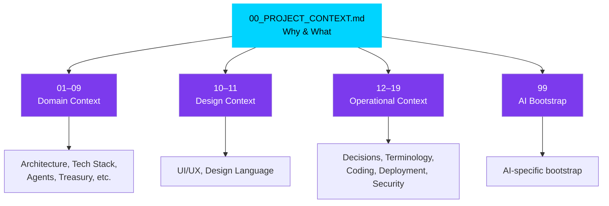

---

## 4. Background

### 4.1 The Problem Space

Affiliate commerce is a multi-billion-dollar industry that remains fundamentally manual, fragmented, and inefficient. The typical affiliate commerce lifecycle involves:

1. **Market research** — Identifying profitable niches, trending products, and competitive landscapes.
2. **Product discovery** — Finding products with affiliate programs that match market demand.
3. **Content creation** — Writing reviews, comparisons, tutorials, and promotional content.
4. **Content publishing** — Distributing content across multiple channels (blogs, social media, video platforms).
5. **Link management** — Creating, tracking, and maintaining affiliate links.
6. **Analytics** — Monitoring clicks, conversions, revenue, and performance metrics.
7. **Optimization** — Adjusting strategies based on performance data.
8. **Treasury management** — Tracking earnings, managing payouts, and financial reporting.

Each of these steps is typically performed by human operators using disconnected tools. The result is:

| Problem | Impact |
|---|---|
| Manual research takes hours per product | Slow time-to-market |
| Content creation is a bottleneck | Limited scale |
| Multi-channel publishing is repetitive | Wasted effort |
| Link management is error-prone | Lost revenue |
| Analytics are fragmented across platforms | Incomplete picture |
| Optimization is reactive, not proactive | Suboptimal performance |
| Treasury tracking is manual | Financial blind spots |

### 4.2 The Market Opportunity

The affiliate marketing industry is characterized by:

- **Growing market size** — Global affiliate marketing spending continues to grow year over year.
- **Fragmented tooling** — No single platform covers the entire lifecycle.
- **AI gap** — Most existing tools use AI for narrow tasks (e.g., content writing) but not for end-to-end orchestration.
- **Human dependency** — Every step requires human intervention, limiting scalability.
- **Data silos** — Research, content, analytics, and financial data live in separate systems.

CAT is designed to address this gap by building an AI-native platform that automates the **entire** affiliate commerce lifecycle — not just one piece of it.

### 4.3 The Omni System Context

CAT is developed under **Omni System**, the company that owns and operates the project. Omni System's mandate is to build AI-native commerce systems that operate autonomously with human oversight. CAT is Omni System's flagship product.

Key Omni System decisions that shaped CAT:

| Decision | Rationale |
|---|---|
| AI-first, not AI-assisted | The system should be built around AI from the ground up, not have AI bolted on as a feature. |
| Human approval for critical actions | AI operates autonomously but human operators approve decisions with financial or reputational impact. |
| Modular agent ecosystem | The system is composed of specialized agents rather than a monolithic AI. |
| Knowledge-driven | The system accumulates knowledge over time and uses it to improve. |
| Security by design | Security is a foundational principle, not an afterthought. |
| Documentation first | The project is documented before it is implemented, ensuring alignment and longevity. |

### 4.4 Project Timeline

```mermaid
timeline
    title CAT Project Timeline
    Phase 0 : Foundation & Documentation
              Repository Structure
              CAT Bible
              Knowledge Base
              ADRs
              Design System
    Phase 1 : Core Platform
              Core Kernel
              Memory System
              Knowledge Graph
              Workflow Engine
              Agent Orchestrator
              Prompt Engine
    Phase 2 : AI Agent Ecosystem
              Research Agent
              Affiliate Agent
              Creative Agent
              Publisher Agent
              Treasury Agent
              Analytics Agent
              Learning Agent
              Security Agent
    Phase 3 : Commerce Platform
              Product Discovery
              Store Integrations
              Affiliate Link Management
              Content Generation
              Multi-Channel Publishing
    Phase 4 : Intelligence
              Continuous Learning
              Knowledge Refinement
              Performance Optimization
              Decision Support
    Phase 5 : Public Release
              Beta
              Production
              Enterprise Features
```

---

## 5. Why CAT Exists

### 5.1 The Core Problem

CAT exists because the affiliate commerce industry suffers from a fundamental mismatch:

> **The volume of products, markets, and content channels grows exponentially, but the human capacity to research, create, publish, and optimize grows linearly at best.**

This mismatch means:

- Human operators can only manage a fraction of available opportunities.
- Most affiliate content is low quality because quantity is prioritized over quality.
- Market opportunities are missed because humans cannot monitor all markets simultaneously.
- Financial optimization is reactive — humans respond to data after the fact, not proactively.

### 5.2 The CAT Solution

CAT solves this mismatch by replacing the human-in-the-loop model with a **human-on-the-loop** model:

| Traditional Model | CAT Model |
|---|---|
| Human researches products | AI researches products; human approves selection |
| Human writes content | AI generates content; human reviews and approves |
| Human publishes to channels | AI publishes; human monitors |
| Human tracks analytics | AI tracks and interprets analytics |
| Human optimizes strategy | AI recommends optimizations; human approves |
| Human manages treasury | AI tracks finances; human approves transactions |

The key insight is that CAT does not eliminate the human — it **elevates** the human from operator to **supervisor**. The human's role shifts from doing the work to approving the work.

### 5.3 Why "Trinity"

The name "Commerce AI Trinity" reflects the three foundational pillars of the system:

```
                    ┌─────────────────┐
                    │      CAT        │
                    │  Commerce AI    │
                    │    Trinity      │
                    └────────┬────────┘
                             │
              ┌──────────────┼──────────────┐
              │              │              │
              ▼              ▼              ▼
     ┌────────────┐  ┌────────────┐  ┌────────────┐
     │  Commerce  │  │     AI     │  │  Treasury  │
     │  Engine    │  │   Engine   │  │   Engine   │
     │            │  │            │  │            │
     │ • Research │  │ • Agents   │  │ • Earnings │
     │ • Affiliate │  │ • Knowledge│  │ • Payouts  │
 │ • Content  │  │ • Memory   │  │ • Reports  │
     │ • Publish  │  │ • Reasoning│  │ • Budget   │
     └────────────┘  └────────────┘  └────────────┘
```

| Pillar | Responsibility | Key Agents |
|---|---|---|
| **Commerce Engine** | Market research, product discovery, affiliate link management, content generation, multi-channel publishing | Research Agent, Affiliate Agent, Creative Agent, Publisher Agent |
| **AI Engine** | Agent orchestration, knowledge management, memory, reasoning, continuous learning | CATA (central agent), Learning Agent, Memory Agent |
| **Treasury Engine** | Earnings tracking, payout management, financial reporting, budget optimization | Treasury Agent, Analytics Agent |

### 5.4 Why Now

Several converging trends make CAT viable at this point in time:

| Trend | Why It Matters for CAT |
|---|---|
| Multi-model AI orchestration | CAT can use different AI models for different tasks (research, writing, analysis) rather than relying on a single model. |
| Retrieval-augmented generation (RAG) | CAT can build a persistent knowledge base that improves over time. |
| Agent frameworks | Mature agent orchestration patterns enable CAT's multi-agent architecture. |
| Cloud-native infrastructure | Kubernetes, containers, and observability tools enable scalable deployment. |
| GPU acceleration | Real-time 3D rendering and particle effects for the CAT interface are feasible in the browser. |
| Affiliate market growth | The market is large enough to support a platform-level solution. |

### 5.5 What CAT Is Not

To prevent scope creep and maintain focus, the following are explicitly **not** what CAT is:

| Not CAT | Why |
|---|---|
| A chatbot | CAT is an autonomous operating system, not a conversational interface. |
| A CMS | CAT generates and publishes content but is not a content management system. |
| An ad network | CAT uses affiliate networks but is not itself an ad network. |
| A single-purpose AI tool | CAT is not "just" a content writer or "just" an analytics tool. It is an end-to-end platform. |
| A no-code platform | CAT is AI-native, not no-code. The AI does the work; humans supervise. |
| A human replacement | CAT augments human operators, it does not replace them. |

---

## 6. Vision (Expanded)

### 6.1 Vision Statement

> **CAT is an AI-native autonomous commerce operating system that researches products, creates content, manages affiliate operations, learns continuously, and assists human operators through an intelligent agent ecosystem — all within a command-center interface that feels like operating a living intelligence rather than using software.**

### 6.2 Vision Decomposition

The vision statement contains several load-bearing concepts that must be understood individually:

#### 6.2.1 AI-Native

"AI-native" means that AI is not a feature added to a traditional system. AI is the **foundation** upon which the entire system is built. Every component — from the kernel to the UI — is designed with the assumption that AI is the primary operator.

| AI-Assisted (Traditional) | AI-Native (CAT) |
|---|---|
| AI is a tool the user invokes | AI is the operator; the user supervises |
| The system waits for user input | The system proactively identifies tasks |
| AI features are optional | AI is required for the system to function |
| The UI is designed for human input | The UI is designed for human oversight of AI |
| Data flows through human workflows | Data flows through AI workflows with human checkpoints |

#### 6.2.2 Autonomous

"Autonomous" means the system operates without continuous human intervention. However, autonomy in CAT is **bounded**:

| Level | Description | Example |
|---|---|---|
| Level 0 | Human performs the task | Human writes a product review |
| Level 1 | AI suggests, human performs | AI suggests a product to review, human writes it |
| Level 2 | AI performs, human reviews | AI writes the review, human edits |
| Level 3 | AI performs, human approves | AI writes and publishes the review, human approves before it goes live |
| Level 4 | AI performs, human is notified | AI adjusts affiliate links based on performance, human is notified |
| Level 5 | AI performs autonomously | AI optimizes internal data routing without notification |

CAT targets **Level 3** for most operations, with **Level 4** for optimization tasks and **Level 5** for internal system operations. **Level 3** is the default for any action with external visibility or financial impact.

#### 6.2.3 Commerce Operating System

"Operating system" is used deliberately. CAT is not an application — it is a platform that manages resources, schedules tasks, coordinates agents, maintains memory, and provides an interface for human oversight. The analogy:

| Traditional OS | CAT |
|---|---|
| Manages CPU, memory, disk | Manages agents, knowledge, memory, treasury |
| Schedules processes | Schedules commerce tasks and agent workflows |
| Provides system calls | Provides agent APIs and commerce primitives |
| Has a shell | Has the CAT command-center interface |
| Manages permissions | Manages approval workflows |
| Logs system events | Logs all commerce and agent activities |

#### 6.2.4 Intelligent Agent Ecosystem

"Agent ecosystem" means CAT is not a single AI. It is a collection of specialized agents, each with a defined role, that collaborate through an orchestration layer.

```
┌─────────────────────────────────────────────────────────────┐
│                     CAT Agent Ecosystem                      │
├─────────────────────────────────────────────────────────────┤
│                                                             │
│   ┌──────────┐  ┌──────────┐  ┌──────────┐  ┌──────────┐   │
│   │ Research  │  │ Affiliate│  │ Creative │  │ Publisher│   │
│   │  Agent    │  │  Agent   │  │  Agent   │  │  Agent   │   │
│   └────┬─────┘  └────┬─────┘  └────┬─────┘  └────┬─────┘   │
│        │              │              │              │        │
│        └──────────┬───┴──────────────┴──────────────┘       │
│                   │                                         │
│              ┌────┴────┐                                    │
│              │  CATA   │  ← Central Agent (Orchestrator)     │
│              └────┬────┘                                    │
│                   │                                         │
│        ┌──────────┼──────────────────────────┐              │
│        │          │              │            │              │
│   ┌────┴─────┐ ┌──┴───┐  ┌──────┴───┐ ┌─────┴────┐        │
│   │ Treasury │ │Memory│  │ Learning │ │ Security │        │
│   │  Agent   │ │Agent │  │  Agent   │ │  Agent   │        │
│   └──────────┘ └──────┘  └──────────┘ └──────────┘        │
│                                                             │
│   ┌──────────┐                                            │
│   │Analytics │                                            │
│   │  Agent   │                                            │
│   └──────────┘                                            │
│                                                             │
└─────────────────────────────────────────────────────────────┘
```

#### 6.2.5 Living Intelligence Interface

The CAT interface is not a dashboard. It is designed to feel like standing inside the command center of an advanced intelligence. The interface features:

- A **cosmic cat avatar** (the persona of CAT) that reacts to system state with body language, color changes, and particle effects.
- A **3D globe** at the center of the interface showing all merchant nodes, with light pulses representing transactions.
- **Glass morphism panels** with real reflection, refraction, and dispersion effects.
- **Perspective UI** where panels are angled 3–5 degrees toward the center to create a command-room feel.
- **AI thinking effects** where light strands flow between nodes when agents are processing.
- A **neon color language** with specific colors for each system state.

This is documented in detail in the CAT Visual Language specification and will be expanded in `context/10_UI_UX.md` and `context/11_DESIGN_LANGUAGE.md`.

### 6.3 Long-Term Vision (10-Year Horizon)

| Timeframe | Vision Milestone |
|---|---|
| Year 1–2 | Foundation, core platform, initial agent ecosystem |
| Year 3–4 | Full commerce platform, multi-channel publishing, treasury management |
| Year 5–6 | Continuous learning, knowledge refinement, performance optimization |
| Year 7–8 | Public release, enterprise features, multi-tenant support |
| Year 9–10 | Industry-standard autonomous commerce platform |

### 6.4 Success Criteria

The vision is achieved when:

1. CAT operates the full affiliate commerce lifecycle with minimal human intervention.
2. The knowledge base continuously improves, making CAT smarter over time.
3. The interface feels like commanding a living intelligence, not using software.
4. Treasury operations are fully tracked and optimized.
5. The system is secure, scalable, and maintainable over a decade.
6. Documentation is comprehensive enough that any AI or human can contribute.

---

## 7. Mission (Expanded)

### 7.1 Mission Statement

> **CAT's mission is to build and operate an AI-native platform that automates the complete affiliate commerce lifecycle — from market research and product discovery through content generation, publishing, analytics, continuous learning, and treasury management — while maintaining human approval for critical actions and accumulating knowledge that makes the system smarter over time.**

### 7.2 Mission Decomposition

#### 7.2.1 Automate the Complete Lifecycle

CAT's mission is not to automate *part* of the lifecycle. It is to automate the **complete** lifecycle. This means:

| Lifecycle Stage | CAT Responsibility |
|---|---|
| Market research | Identify trending products, profitable niches, and competitive landscapes |
| Product discovery | Find products with affiliate programs that match market demand |
| Content generation | Create reviews, comparisons, tutorials, and promotional content |
| Content publishing | Distribute content across blogs, social media, video platforms |
| Affiliate link management | Create, track, and maintain affiliate links |
| Analytics | Monitor clicks, conversions, revenue, and performance |
| Optimization | Adjust strategies based on performance data |
| Treasury management | Track earnings, manage payouts, generate financial reports |
| Continuous learning | Accumulate knowledge and improve over time |

If any stage is not automated, the mission is not complete.

#### 7.2.2 Human Approval for Critical Actions

Not all actions should be autonomous. CAT's mission explicitly includes maintaining human oversight for actions that have:

| Risk Type | Examples | Approval Required |
|---|---|---|
| Financial risk | Payouts, budget allocations, investments | Yes |
| Reputational risk | Publishing content, social media posts | Yes |
| Legal risk | Compliance-sensitive content, data handling | Yes |
| Irreversible risk | Deleting data, closing accounts | Yes |
| Operational risk | Internal optimization, data routing | No (notify only) |

#### 7.2.3 Accumulate Knowledge

A key part of CAT's mission is to **get smarter over time**. This is not a side effect — it is an explicit goal. The system must:

- Remember what worked and what did not.
- Learn from successful and failed campaigns.
- Build a knowledge graph of products, markets, and strategies.
- Use accumulated knowledge to make better decisions.
- Never lose knowledge (persistence is a requirement).

### 7.3 Mission vs. Vision

| Aspect | Vision | Mission |
|---|---|---|
| Timeframe | 10-year aspiration | Ongoing operational mandate |
| Focus | What CAT will become | What CAT does every day |
| Measurability | Qualitative | Quantitative |
| Scope | Aspirational | Operational |

---

## 8. Core Philosophy

### 8.1 Philosophical Foundation

CAT is built on six core principles. These principles are **non-negotiable** — they guide every decision, from architecture to UI to business strategy.

### 8.2 The Six Core Principles

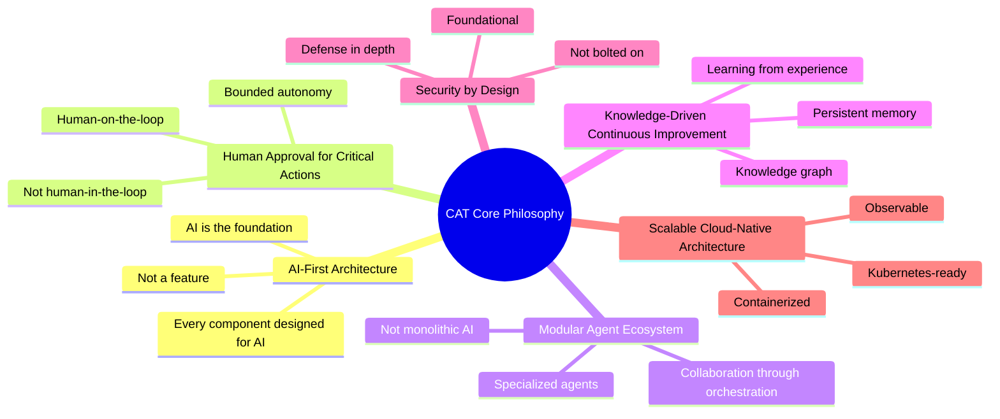

### 8.3 Principle 1: AI-First Architecture

**Statement:** CAT is designed around AI from the ground up. AI is not a feature added to a traditional system; it is the foundation upon which the system is built.

**Technical Implication:**
- The system architecture assumes AI agents are the primary operators.
- Data flows are designed for AI consumption, not human input.
- The API layer is designed for agent-to-agent communication, not just human-to-system.
- The UI is designed for oversight, not operation.

**Business Implication:**
- CAT can scale operations without scaling human headcount.
- The system becomes more valuable as it accumulates knowledge.
- The competitive moat is the AI infrastructure, not the UI.

**Anti-Pattern:**
- Building a traditional system and adding AI features on top.
- Designing the UI for human data entry and adding AI suggestions.
- Treating AI as an optional component.

**Decision Rationale:**
An AI-assisted system has a lower ceiling than an AI-native system because the human remains the bottleneck. By making AI the foundation, CAT removes the human bottleneck for execution while preserving human authority for approval.

### 8.4 Principle 2: Human Approval for Critical Actions

**Statement:** CAT operates autonomously for most tasks, but human operators approve decisions with financial, reputational, legal, or irreversible impact.

**Technical Implication:**
- Every action that has external impact must pass through an approval workflow.
- The system must support configurable approval levels.
- The UI must surface pending approvals prominently.
- The system must provide enough context for humans to make informed decisions.

**Business Implication:**
- The human's role is elevated from operator to supervisor.
- Risk is managed without sacrificing speed.
- The system can operate 24/7 with human oversight during business hours.

**Anti-Pattern:**
- Requiring approval for every action (creates a bottleneck).
- Allowing full autonomy for financial actions (creates risk).
- Burying approval requests in a queue (creates delay and risk).

**Decision Rationale:**
Full autonomy for critical actions creates unacceptable risk. Full human involvement for all actions negates the value of AI. The optimal balance is bounded autonomy with human approval at critical checkpoints.

### 8.5 Principle 3: Modular Agent Ecosystem

**Statement:** CAT is composed of specialized agents, each with a defined role, that collaborate through an orchestration layer. CAT is not a single, monolithic AI.

**Technical Implication:**
- Each agent has a well-defined interface and responsibility.
- Agents communicate through a structured event bus.
- Agents can be added, removed, or upgraded independently.
- The orchestrator (CATA) coordinates agent activities.

**Business Implication:**
- New capabilities can be added without rearchitecting the system.
- Agents can be specialized for specific markets or channels.
- The system can scale by adding more agents, not by making one agent bigger.

**Anti-Pattern:**
- A single AI that tries to do everything.
- Tightly coupled agents that cannot operate independently.
- Agents with overlapping responsibilities.

**Decision Rationale:**
A monolithic AI is harder to maintain, scale, and debug. A modular ecosystem allows specialization, independent development, and graceful degradation (if one agent fails, others continue).

### 8.6 Principle 4: Knowledge-Driven Continuous Improvement

**Statement:** CAT accumulates knowledge over time and uses that knowledge to make better decisions. The system gets smarter the longer it operates.

**Technical Implication:**
- The system has a persistent knowledge graph.
- The system has a memory store that survives restarts.
- The system logs outcomes (success/failure) and correlates them with decisions.
- The system uses RAG (Retrieval-Augmented Generation) to leverage accumulated knowledge.

**Business Implication:**
- The system's value compounds over time.
- Institutional knowledge is captured in the system, not in employees.
- The system can train new agents using accumulated knowledge.

**Anti-Pattern:**
- Treating each task as independent (no learning).
- Storing knowledge without using it for future decisions.
- Losing knowledge on system restart.

**Decision Rationale:**
A system that does not learn requires the same effort for every task. A system that learns reduces effort over time and improves quality. The compounding value of knowledge is the primary long-term competitive advantage.

### 8.7 Principle 5: Security by Design

**Statement:** Security is a foundational principle of CAT's architecture, not an afterthought or a layer added on top.

**Technical Implication:**
- All inter-agent communication is authenticated and authorized.
- All external API calls are validated and rate-limited.
- All data at rest is encrypted.
- All secrets are managed through a secret manager, never hardcoded.
- The system follows the principle of least privilege.

**Business Implication:**
- The system can be trusted with financial data.
- The system can be trusted with affiliate credentials.
- The system meets compliance requirements.

**Anti-Pattern:**
- Adding security after the system is built.
- Hardcoding secrets in configuration files.
- Trusting all internal communication by default.

**Decision Rationale:**
Security added after the fact is always incomplete and expensive. Security built into the foundation is more effective and cheaper to maintain. Given that CAT handles financial data and external credentials, security is existential.

### 8.8 Principle 6: Scalable Cloud-Native Architecture

**Statement:** CAT is built as a cloud-native system from the start, using containers, orchestration, and observability as foundational infrastructure.

**Technical Implication:**
- All components are containerized.
- The system is designed for Kubernetes deployment.
- Observability (metrics, logs, traces) is built in from the start.
- The system can scale horizontally by adding more instances.

**Business Implication:**
- The system can handle growth without rearchitecting.
- Infrastructure costs scale with usage.
- The system can be deployed on any cloud provider.

**Anti-Pattern:**
- Building for a single server and planning to scale later.
- Adding observability after the system is in production.
- Locking into a single cloud provider.

**Decision Rationale:**
Retrofitting cloud-native patterns onto a system not designed for them is expensive and risky. Building cloud-native from the start ensures the system can scale without architectural changes.

---

## 9. Design Philosophy

### 9.1 The CAT Interface Manifesto

> **CAT is not a dashboard. CAT is a living digital entity. The user should not feel like they are using software. They should feel like they are standing inside the command center of a super-advanced artificial intelligence.**

This is the foundational design principle for CAT's interface. Every visual and interaction decision must serve this principle.

### 9.2 Design Inspirations

CAT's visual language draws inspiration from:

| Inspiration | What CAT Borrows |
|---|---|
| Cyberpunk 2077 | Neon color language, holographic effects, dense information display |
| Tron Legacy | Light trails, geometric patterns, dark background with luminous elements |
| Iron Man HUD | Heads-up display, real-time data overlay, gesture-driven interaction |
| Jarvis | Conversational AI persona, anticipatory interface, ambient intelligence |
| Interstellar | Cosmic aesthetic, scientific precision, minimal but deep UI |
| Mass Effect | Sci-fi command interface, species-level civilization management feel |
| The Creator | AI presence, organic-digital fusion, atmospheric depth |
| Ghost in the Shell | Cybernetic identity, information density, philosophical depth |
| Deus Ex | Augmented interface, layered information, conspiracy-grade detail |
| Apple Vision Pro | Spatial computing, glass interfaces, depth and parallax |

### 9.3 The CAT Persona

CAT is not just an AI — CAT has a **personality**. The visual representation of CAT is a **cosmic cat** — not an animal, not a human, but a being between the two.

| Aspect | Specification |
|---|---|
| Body | Made of a substance like stars, nebulae, light, energy, electrons. Inside the body, galaxies, stars, particles, and light move. |
| Eyes | Blue light, animated iris, digital pupil, light trail on movement. |
| Ears | Natural movement, reactive to system events. |
| Tail | Slow, deliberate movement. |
| Breathing | Very slow, nearly imperceptible. |
| Body light | Changes based on system state (see color language below). |

### 9.4 Avatar Behavior Engine

The CAT avatar is not a static image — it is an actor. Its behavior reflects the system's state:

| System State | Avatar Behavior | Body Color |
|---|---|---|
| Normal | Calm, looking around, ears and tail moving | Blue |
| Thinking | Eyes closed, paws together, particles orbiting, tail still, brain light increasing | Purple |
| Generating | One paw moves as if creating something | Purple |
| Image creation | Paws arrange 3D shapes | Purple |
| Video creation | Video holograms appear around the avatar | Purple |
| Searching | Thousands of nodes appear around the head | Blue |
| Waiting | Blink, look around, ear and tail movement, breathing | Blue |
| Success | Subtle smile, golden light | Gold |
| Warning | Head slightly lowered | Orange |
| Error | Head lowered, orange/red light | Red |
| Learning | Turquoise light | Turquoise |
| Sleeping | Dim light | Dim blue |
| User login | Looks at user, head slightly tilted | Blue |
| User idle (few minutes) | Says "Ready when you are." | Blue |

### 9.5 Color Language

| Role | Color | Hex (Reference) |
|---|---|---|
| Primary | Electric Blue | `#00D4FF` |
| Secondary | Cosmic Purple | `#7C3AED` |
| Accent | Gold | `#FFD700` |
| Success | Emerald | `#10B981` |
| Warning | Amber | `#F59E0B` |
| Danger | Crimson | `#EF4444` |
| Learning | Turquoise | `#06B6D4` |

All colors are user-configurable through the theme engine. Users can create custom themes (e.g., Cyber Blue, Red Matrix, Emerald, Purple Galaxy, White Hologram, Amber).

### 9.5.1 Contrast and Readability

> **CRITICAL:** All text must maintain WCAG AA contrast ratios (4.5:1 for body text, 3:1 for large text) against their background at all times, including during state transitions. When the header or panel background changes color (e.g., from transparent to solid on scroll, or from blue to purple during a state change), text color must adjust automatically to maintain readability.

### 9.6 Interface Architecture

#### 9.6.1 The CAT Brain (Central Globe)

At the center of the interface is a fully 3D globe:

| Feature | Specification |
|---|---|
| Rendering | Fully 3D, real-time |
| Rotation | Slow, continuous |
| Surface | Clouds, sunlight, night lights, atmosphere |
| Particles | Particle effects on the globe surface |
| Merchant nodes | All merchants (Amazon, Impact, CJ, Digikala, Awin, AliExpress, ClickBank, ShareASale, etc.) displayed as nodes on the globe |
| Dynamic nodes | New merchants appear as new nodes automatically |
| Transaction visualization | When a sale occurs, a light pulse travels from the merchant node to the center |
| Agent activity | When an agent performs a task, light flows between Agent → Merchant → Campaign → Analytics |

#### 9.6.2 Panel System

| Property | Specification |
|---|---|
| Layout | Not flat — all panels angled 3–5 degrees toward center |
| Effect | Creates a command-room sensation |
| Layers | Background → Glass → Glow → Content → Particles → Reflection → Border |
| Glass | Real glass morphism (not simple blur): reflection, dispersion, refraction, micro noise, HDR glow |
| Materialization | Windows do not "open" — they "materialize" |
| Hover effects | Buttons gain inner light on hover |
| Click effects | Energy gathers into the button and releases on click |

#### 9.6.3 Motion System

| Property | Specification |
|---|---|
| Rendering | GPU-accelerated |
| Target FPS | 60 FPS (120 FPS on capable displays) |
| Blocking | No animation is blocking |
| Quality levels | Ultra, High, Eco |
| Background | Not pure black — subtle gradient toward blue with sparse stars, faint nebulae, light particles, slow movement |

### 9.7 Design Philosophy Principles

| Principle | Description |
|---|---|
| **Living, not static** | The interface is alive — it breathes, reacts, and responds. |
| **Depth, not flatness** | Panels have layers, depth, and perspective. |
| **Information density without clutter** | Show a lot of information, but organize it so it doesn't feel overwhelming. |
| **Sci-fi command center, not enterprise dashboard** | The aesthetic is futuristic and cinematic, not corporate. |
| **Performance is design** | Beautiful but slow is unacceptable. 60 FPS is a design requirement. |
| **Configurable beauty** | Users can customize themes, effects, and performance levels. |
| **State-aware** | The interface reflects the system's state through color, motion, and avatar behavior. |

### 9.8 Design Anti-Patterns

| Anti-Pattern | Why It's Wrong |
|---|---|
| Flat, corporate dashboard | Violates the "living intelligence" principle |
| Blocking animations | Violates the 60 FPS requirement |
| Pure black background | Violates the cosmic aesthetic |
| Static avatar | Violates the "CAT is alive" principle |
| Unconfigurable themes | Violates the user empowerment principle |
| Information overload without hierarchy | Violates the "density without clutter" principle |
| Low-contrast text on glowing backgrounds | Violates accessibility and readability requirements |

---

## 10. Engineering Philosophy

### 10.1 Engineering Principles

CAT follows the engineering principles defined in `CONTRIBUTING.md`:

| Principle | Description |
|---|---|
| Documentation First | The project is documented before it is implemented. |
| AI-First Engineering | Engineering decisions prioritize AI as the primary operator. |
| Human Approval for Critical Actions | Engineering must support configurable approval workflows. |
| Security by Design | Security is built in, not bolted on. |
| Modular Architecture | Components are independent, well-interfaced, and replaceable. |
| Continuous Learning | The system learns from every operation. |

### 10.2 Documentation First

"Documentation First" means:

1. Before any code is written, the relevant context document must be created or updated.
2. Architecture Decision Records (ADRs) must be created before architectural changes are implemented.
3. API documentation must exist before the API is consumed.
4. The documentation is the specification; code is the implementation.

**Rationale:** If the documentation is written after the code, it documents what was built. If it is written before, it specifies what should be built. The latter produces better designs because it forces thinking before doing.

### 10.3 Conventional Commits

CAT follows the Conventional Commits specification:

| Type | Use |
|---|---|
| `feat` | A new feature |
| `fix` | A bug fix |
| `docs` | Documentation changes |
| `style` | Code style changes (formatting, etc.) |
| `refactor` | Code changes that neither fix a bug nor add a feature |
| `test` | Adding or correcting tests |
| `chore` | Maintenance tasks, dependency updates, etc. |
| `perf` | Performance improvements |

Format: `type(scope): description`

### 10.4 Branch Strategy

| Branch | Purpose |
|---|---|
| `main` | Production-ready code |
| `develop` | Integration branch |
| `feature/*` | Feature development |
| `fix/*` | Bug fixes |
| `release/*` | Release preparation |
| `hotfix/*` | Urgent production fixes |

### 10.5 Definition of Done

A task is complete when:

1. Code is completed.
2. Tests pass.
3. Documentation is updated.
4. Code is reviewed.
5. The change is committed with a conventional commit message.

### 10.6 Engineering Trade-offs

| Decision | Chosen | Rejected | Rationale |
|---|---|---|---|
| Monolith vs. Microservices | Modular monolith (initially) | Microservices (initially) | Start simple, extract services when needed |
| SQL vs. NoSQL | SQL (Postgres/Supabase) | NoSQL | Structured data with relationships; ACID requirements for treasury |
| SSR vs. SPA | SSR (Next.js) | SPA | SEO for published content; fast initial load |
| REST vs. GraphQL | REST (primary) | GraphQL | Simpler, well-understood, sufficient for agent-to-agent communication |
| Sync vs. Async | Async (event bus) | Sync (blocking calls) | Agents operate independently; async prevents bottlenecks |

### 10.7 Engineering Anti-Patterns

| Anti-Pattern | Why It's Wrong |
|---|---|
| Writing code before documentation | Violates "Documentation First" |
| Hardcoding secrets | Violates "Security by Design" |
| Building a monolithic AI | Violates "Modular Agent Ecosystem" |
| Adding observability after deployment | Violates "Cloud-Native Architecture" |
| Skipping tests to save time | Violates "Definition of Done" |
| Non-conventional commits | Violates commit standards |

---

## 11. Business Philosophy

### 11.1 Business Model

CAT operates in the affiliate commerce industry. Its business model is:

1. **CAT operates affiliate campaigns** across multiple networks and merchants.
2. **CAT earns affiliate commissions** from successful conversions.
3. **CAT manages its own treasury** — tracking earnings, optimizing payouts, and reporting financial performance.
4. **CAT may offer enterprise features** in the future for other organizations to use the platform.

### 11.2 Revenue Streams

| Stream | Description | Phase |
|---|---|---|
| Affiliate commissions | CAT earns commissions from affiliate links it creates and publishes | Phase 3+ |
| Treasury optimization | CAT optimizes earnings through better link management and channel selection | Phase 3+ |
| Enterprise licensing | Other organizations license CAT to run their own affiliate operations | Phase 5+ |

### 11.3 Business Principles

| Principle | Description |
|---|---|
| **Revenue is a byproduct of quality** | If CAT produces high-quality content and targets the right products, revenue follows. Do not optimize for revenue directly. |
| **Long-term over short-term** | CAT prioritizes sustainable growth over quick wins. A campaign that generates $100/month for 5 years is better than one that generates $500 once. |
| **Diversification** | CAT operates across multiple merchants, networks, and channels to reduce dependency on any single source. |
| **Transparency** | All earnings, decisions, and actions are logged and auditable. |
| **Human oversight** | Financial decisions require human approval. CAT recommends; the human decides. |

### 11.4 Treasury Philosophy

The treasury is not just a ledger — it is a strategic tool. CAT's treasury management:

- Tracks all earnings in real-time.
- Correlates earnings with the content and campaigns that generated them.
- Identifies the most profitable products, channels, and strategies.
- Optimizes budget allocation based on performance.
- Maintains financial records for compliance and reporting.

Detailed treasury specifications will be in `context/07_TREASURY_CORE.md`.

### 11.5 Affiliate Philosophy

CAT's approach to affiliate marketing:

| Traditional Affiliate | CAT Affiliate |
|---|---|
| Human picks products | AI researches and recommends products |
| Human writes content | AI generates content; human approves |
| Human manages links | AI creates and manages links |
| Human tracks performance | AI tracks and interprets performance |
| Human optimizes strategy | AI recommends optimizations; human approves |
| Reactive | Proactive |
| Single channel | Multi-channel |
| Limited scale | Scalable |

Detailed affiliate specifications will be in `context/08_AFFILIATE_ENGINE.md`.

### 11.6 Business Anti-Patterns

| Anti-Pattern | Why It's Wrong |
|---|---|
| Optimizing for clicks over conversions | Clicks without conversions waste resources |
| Spamming affiliate links | Damages reputation and violates platform policies |
| Single-channel dependency | Creates fragility |
| Short-term thinking | Sacrifices sustainable growth |
| Opaque financial reporting | Violates transparency principle |
| Autonomous financial decisions | Violates human approval principle |

---

## 12. AI Philosophy

### 12.1 AI as Operator, Not Tool

In CAT, AI is the **operator** — the entity that performs the work. The human is the **supervisor** — the entity that approves the work. This is a fundamental distinction:

| AI as Tool | AI as Operator |
|---|---|
| Human invokes AI for a specific task | AI identifies tasks and performs them |
| AI output is a suggestion | AI output is the work product |
| Human does the work; AI assists | AI does the work; human approves |
| The system is human-driven | The system is AI-driven |

### 12.2 Multi-Model Orchestration

CAT does not rely on a single AI model. It orchestrates multiple models, each chosen for its strengths:

| Model Role | Why Multiple Models |
|---|---|
| Research | Different models have different knowledge cutoffs and web access capabilities |
| Content generation | Different models have different writing styles and strengths |
| Analysis | Different models have different reasoning capabilities |
| Image generation | Different models produce different aesthetic results |
| Code generation | Different models have different coding capabilities |

The orchestrator (CATA) routes tasks to the appropriate model based on the task type, required quality, and cost constraints.

### 12.3 Knowledge and Memory

CAT's AI is not stateless. It maintains:

| Store | Purpose | Persistence |
|---|---|---|
| Knowledge graph | Structured knowledge about products, markets, strategies | Permanent |
| Memory store | Context from past operations, decisions, and outcomes | Permanent |
| RAG index | Searchable index of all accumulated knowledge | Permanent |
| Session memory | Context within a single operational session | Session |

### 12.4 Bounded Autonomy

CAT's AI operates within defined boundaries:

```
┌─────────────────────────────────────────────────┐
│                 Autonomy Boundaries               │
├─────────────────────────────────────────────────┤
│                                                  │
│  ┌──────────────────────────────────────────┐   │
│  │  Level 5: Full Autonomy                   │   │
│  │  Internal system operations, data routing │   │
│  │  No human notification required           │   │
│  └──────────────────────────────────────────┘   │
│                                                  │
│  ┌──────────────────────────────────────────┐   │
│  │  Level 4: Autonomy with Notification      │   │
│  │  Optimization tasks, link adjustments    │   │
│  │  Human notified after the fact            │   │
│  └──────────────────────────────────────────┘   │
│                                                  │
│  ┌──────────────────────────────────────────┐   │
│  │  Level 3: Autonomy with Approval (DEFAULT)│   │
│  │  Publishing content, creating campaigns   │   │
│  │  Human must approve before execution      │   │
│  └──────────────────────────────────────────┘   │
│                                                  │
│  ┌──────────────────────────────────────────┐   │
│  │  Level 2: AI Drafts, Human Edits         │   │
│  │  Sensitive content, legal reviews         │   │
│  │  AI produces a draft for human editing    │   │
│  └──────────────────────────────────────────┘   │
│                                                  │
│  ┌──────────────────────────────────────────┐   │
│  │  Level 1: AI Suggests, Human Performs     │   │
│  │  Strategic decisions, new market entry   │   │
│  │  AI provides analysis; human acts         │   │
│  └──────────────────────────────────────────┘   │
│                                                  │
└─────────────────────────────────────────────────┘
```

### 12.5 AI Ethics

| Principle | Description |
|---|---|
| **Transparency** | All AI decisions are logged with reasoning. The human can always see why the AI made a decision. |
| **Accountability** | The human is ultimately accountable. AI recommends; human approves. |
| **No deception** | CAT never presents AI-generated content as human-created without disclosure where required. |
| **No manipulation** | CAT does not use psychological manipulation in content. Content is honest and informative. |
| **Privacy** | CAT does not collect or use personal data beyond what is necessary for operations. |
| **Bias awareness** | CAT actively monitors for and mitigates bias in its recommendations and content. |

### 12.6 AI Evolution

CAT's AI capabilities are expected to evolve over time:

| Phase | AI Capability |
|---|---|
| Phase 0–1 | Basic agent orchestration, rule-based workflows |
| Phase 2 | Multi-agent collaboration, RAG-based knowledge retrieval |
| Phase 3 | Autonomous content generation and publishing with approval |
| Phase 4 | Continuous learning, performance prediction, proactive optimization |
| Phase 5 | Advanced reasoning, strategic decision support, enterprise-grade intelligence |

### 12.7 AI Anti-Patterns

| Anti-Pattern | Why It's Wrong |
|---|---|
| Stateless AI (no memory) | Violates "Knowledge-Driven" principle |
| Single model for all tasks | Suboptimal; different models have different strengths |
| Unbounded autonomy | Violates "Human Approval" principle |
| Opaque decisions | Violates "Transparency" principle |
| AI that doesn't learn | Violates "Continuous Improvement" principle |
| AI that replaces human judgment for critical decisions | Violates "Human Approval" principle |

---

*End of Part 1. Architecture Foundation continues in Part 2 below.*

---

## 13. Architecture Foundation

### 13.1 CAT System Architecture Philosophy

CAT's architecture is not a conventional software architecture with AI features layered on top. It is an **AI-native architecture** — a system designed from the kernel outward with the assumption that AI agents are the primary operators and humans are the supervisors.

The foundational architectural philosophy can be stated as a single principle:

> **The system is an organism, not an application. It senses, thinks, decides, acts, and learns — continuously. The human does not drive the system; the human supervises it.**

This principle has profound architectural consequences. Every layer of the system must be designed to support autonomous operation, continuous learning, bounded human oversight, and graceful degradation. A traditional request-response architecture is insufficient because CAT is not a request-response system — it is a **living commerce organism** that operates continuously.

| Traditional Application Architecture | CAT AI-Native Architecture |
|---|---|
| Human initiates requests; system responds | System initiates actions; human approves |
| Stateless request handling | Stateful, persistent memory and knowledge |
| Synchronous request-response | Asynchronous event-driven workflows |
| Single application logic tier | Multi-agent orchestrated intelligence |
| Database as storage | Knowledge graph as cognitive substrate |
| UI as input form | UI as command center for oversight |
| Deployed as a single app | Deployed as an ecosystem of cooperating services |
| Scaling means more replicas | Scaling means more agents, more knowledge, more capability |

### 13.2 Why CAT Requires an AI-Native Architecture

An AI-assisted architecture — where AI is bolted onto a traditional system — has a hard ceiling. The human remains the bottleneck for every operation. The system cannot scale beyond human capacity because every action requires human initiation. The AI merely makes the human faster.

CAT's mandate is to automate the **complete** affiliate commerce lifecycle. This is impossible with an AI-assisted architecture because:

| Limitation of AI-Assisted | How AI-Native Solves It |
|---|---|
| Human must initiate every task | System identifies and initiates tasks autonomously |
| Human is the data entry point | Agents ingest and process data directly |
| Human context is lost between sessions | Persistent memory retains context across sessions |
| Human capacity limits scale | Agent capacity scales horizontally |
| Human knowledge leaves with the employee | Knowledge is captured in the knowledge graph |
| Human latency delays response | Agent latency is near-zero for routine decisions |
| Human inconsistency degrades quality | Agent consistency improves with learning |

The architectural decision to go AI-native was made in ADR-0001 and is non-negotiable. Any proposal to revert to an AI-assisted architecture must be rejected.

#### 13.2.1 Rejected Alternative: AI-Assisted Architecture

| Criterion | AI-Assisted | AI-Native (Chosen) |
|---|---|---|
| Scalability ceiling | Human capacity | Infrastructure capacity |
| Time-to-decision | Human latency (minutes to hours) | Agent latency (milliseconds to seconds) |
| Knowledge retention | Lost when employees leave | Permanent in knowledge graph |
| 24/7 operation | Impossible (humans sleep) | Native (agents run continuously) |
| Multi-market monitoring | Limited to human attention span | Unlimited (agents monitor all markets) |
| Consistency | Variable (human mood, fatigue) | Consistent (improves with training) |
| Cost scaling | Linear with headcount | Sublinear (agents scale cheaply) |

**Decision:** AI-native architecture. The scalability ceiling of AI-assisted is too low for CAT's mission.

### 13.3 Core System Layers

CAT's architecture is organized into six core layers, each with a distinct responsibility. The layers are not strict OSI-style isolation boundaries — agents and services communicate across layers through well-defined interfaces — but each layer has a clear purpose and evolution path.

```
┌─────────────────────────────────────────────────────────────────┐
│                     LAYER 6: HUMAN INTERACTION                   │
│   KATA Avatar · Command Center UI · Approval Workflows           │
│   Natural Language Interface · Theme Engine · Notifications      │
├─────────────────────────────────────────────────────────────────┤
│                     LAYER 5: AGENT ECOSYSTEM                      │
│   Research · Affiliate · Creative · Publisher · Treasury         │
│   Analytics · Learning · Memory · Security · CATA (Orchestrator) │
├─────────────────────────────────────────────────────────────────┤
│                     LAYER 4: ORCHESTRATION                        │
│   Agent Orchestrator · Workflow Engine · Task Scheduler          │
│   Approval Gateway · Agent Lifecycle Manager                     │
├─────────────────────────────────────────────────────────────────┤
│                     LAYER 3: COGNITIVE CORE                       │
│   Knowledge Graph · Memory Store · RAG Index · Reasoning Engine  │
│   Prompt Engine · Learning Pipeline · Decision Engine            │
├─────────────────────────────────────────────────────────────────┤
│                     LAYER 2: SERVICE LAYER                        │
│   Commerce Services · Treasury Services · Content Services       │
│   Analytics Services · Integration Services · Auth Services      │
├─────────────────────────────────────────────────────────────────┤
│                     LAYER 1: INFRASTRUCTURE                       │
│   Kernel · Event Bus · Database · Storage · Secrets              │
│   Observability · Container Runtime · Network · Security         │
└─────────────────────────────────────────────────────────────────┘
```

| Layer | Name | Responsibility | Key Components |
|---|---|---|---|
| 6 | Human Interaction | The interface between human supervisors and the CAT organism | KATA avatar, command center UI, approval workflows, natural language interface, theme engine |
| 5 | Agent Ecosystem | Specialized AI agents that perform commerce operations | Research, Affiliate, Creative, Publisher, Treasury, Analytics, Learning, Memory, Security agents; CATA orchestrator |
| 4 | Orchestration | Coordinates agent activities, manages workflows, enforces approval gates | Agent orchestrator, workflow engine, task scheduler, approval gateway, agent lifecycle manager |
| 3 | Cognitive Core | The brain of CAT — knowledge, memory, reasoning, learning | Knowledge graph, memory store, RAG index, reasoning engine, prompt engine, learning pipeline, decision engine |
| 2 | Service Layer | Domain-specific business logic and external integrations | Commerce services, treasury services, content services, analytics services, integration services, auth services |
| 1 | Infrastructure | Foundation — runtime, data, communication, security | Kernel, event bus, database, storage, secrets, observability, container runtime, network, security |

#### 13.3.1 Layer Interaction Rules

| Rule | Description |
|---|---|
| **Top-down dependency** | Higher layers depend on lower layers, never the reverse. Layer 5 depends on Layer 4, which depends on Layer 3, etc. |
| **No skip-layer calls** | Layer 6 cannot call Layer 1 directly. It must go through Layer 5 → Layer 4 → Layer 3 → Layer 2 → Layer 1. |
| **Horizontal communication** | Components within the same layer communicate through the layer's designated interface (e.g., agents communicate through the event bus). |
| **Cross-layer via interfaces** | Every layer exposes a well-defined interface. Cross-layer calls must go through these interfaces, not through internal implementation. |
| **Layer independence** | A layer can be replaced or upgraded without affecting layers above, as long as its interface contract is maintained. |

#### 13.3.2 Why Six Layers (Not More, Not Fewer)

| Alternative | Rejected Because |
|---|---|
| 3 layers (UI, Logic, Data) | Insufficient separation between AI cognition, agent orchestration, and business services. Conflates reasoning with execution. |
| 4 layers (UI, Agents, Logic, Data) | Missing the orchestration layer — agents would need to coordinate themselves, creating tight coupling. |
| 5 layers (UI, Agents, Orchestration, Logic, Data) | Missing the cognitive core as a distinct layer — knowledge and memory would be buried in the service layer, making them harder to evolve. |
| 7+ layers | Over-abstraction. Each layer adds interface overhead. Six layers provide clean separation without excessive indirection. |

**Decision:** Six layers. This provides clean separation between human interaction (6), agent execution (5), agent coordination (4), AI cognition (3), business logic (2), and infrastructure (1) without over-abstracting.

### 13.4 High-Level Architecture Map

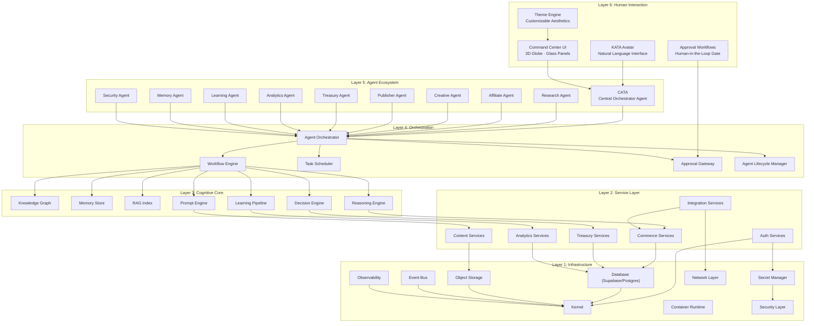

### 13.5 Human Interaction Layer (Layer 6)

#### 13.5.1 Purpose

The Human Interaction Layer is the **only** layer that humans directly access. Its purpose is twofold:

1. **Supervision** — Provide humans with visibility into what CAT is doing, has done, and plans to do.
2. **Approval** — Provide humans with the ability to approve, reject, or modify CAT's proposed actions.

The Human Interaction Layer is **not** an input form. Humans do not enter data into CAT. They do not create campaigns, write content, or manage links. Those are agent responsibilities. Humans supervise and approve.

#### 13.5.2 Components

| Component | Responsibility |
|---|---|
| KATA Avatar | The visual persona of CAT — a cosmic cat that reflects system state through body language, color, and particle effects. Serves as the emotional and intuitive interface. |
| Command Center UI | The 3D command center with globe, glass panels, and real-time data visualization. The primary workspace for human supervisors. |
| Approval Workflows | The system that surfaces pending approvals, provides context for decision-making, and routes human decisions back to the orchestration layer. |
| Natural Language Interface | The conversational interface through which humans communicate with KATA in any language. |
| Theme Engine | The system that allows users to customize the visual aesthetic (colors, effects, performance levels). |

#### 13.5.3 Human Interaction Principles

| Principle | Description |
|---|---|
| **Oversight, not operation** | The UI is designed for monitoring and approval, not data entry. |
| **Natural communication** | Humans speak to KATA in natural language; KATA translates to system operations. |
| **Progressive disclosure** | Information is layered — summary first, detail on demand. The supervisor sees the big picture and can drill down. |
| **State-aware interface** | The UI reflects system state through color, motion, and avatar behavior. |
| **No dead ends** | Every view provides context and next actions. The supervisor is never stuck. |
| **Accessibility** | All functionality is accessible via keyboard, screen reader, and alternative input methods. |

### 13.6 KATA — The AI Avatar

#### 13.6.1 Concept

KATA is the **human interface layer** of CAT. It is a god-like AI cat avatar that serves as the visual and conversational representation of the entire CAT system.

> **The user communicates naturally with KATA in any language. KATA communicates with internal AI systems. The internal core remains protected and inaccessible. The system behaves like an intelligent autonomous commerce organism.**

KATA is not a chatbot. KATA is not a voice assistant. KATA is the **persona** of CAT — the face of a living digital intelligence. When a human interacts with CAT, they interact with KATA. They never interact with the internal agents, the orchestrator, or the cognitive core directly.

#### 13.6.2 KATA's Role in the Architecture

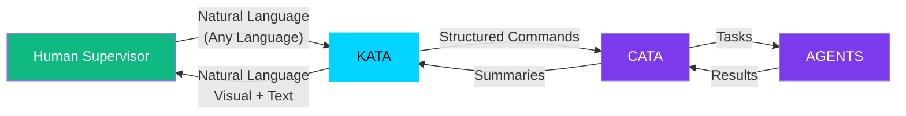

| Role | Description |
|---|---|
| **Translator** | KATA translates human natural language into structured commands for CATA (the central orchestrator). |
| **Shield** | KATA protects the internal core. Humans never access agents, the knowledge graph, or the reasoning engine directly. |
| **Persona** | KATA gives CAT a personality — making the system feel like a living intelligence rather than a collection of services. |
| **Guide** | KATA proactively suggests actions, warns of risks, and explains decisions in human-understandable terms. |
| **Messenger** | KATA delivers results, summaries, and notifications from the internal system to the human. |

#### 13.6.3 KATA's Visual Representation

KATA is represented as a **cosmic cat** — a being made of stars, nebulae, light, and energy. The visual specification is documented in the Design Philosophy section (Section 9) and will be expanded in `context/10_UI_UX.md` and `context/11_DESIGN_LANGUAGE.md`.

Key architectural implications of KATA's visual representation:

| Implication | Architectural Requirement |
|---|---|
| Real-time 3D rendering | GPU-accelerated rendering pipeline (Three.js / WebGL) |
| Reactive body language | State-driven animation system that maps system events to avatar behaviors |
| Particle effects | Particle engine capable of rendering thousands of particles at 60 FPS |
| Color changes | Theme engine that maps system state to color transitions |
| Multi-language support | Internationalization (i18n) layer for natural language processing |

#### 13.6.4 KATA's Behavioral Architecture

KATA's behavior is driven by a **state machine** that maps system events to avatar behaviors:

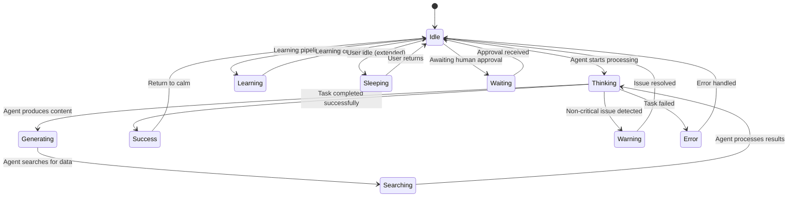

| State | Trigger | Avatar Behavior | Body Color |
|---|---|---|---|
| Idle | Default state | Calm, looking around, ears and tail moving, slow breathing | Blue |
| Thinking | Agent starts processing | Eyes closed, paws together, particles orbiting, tail still | Purple |
| Generating | Agent produces content | One paw moves as if creating something | Purple |
| Searching | Agent searches data sources | Thousands of nodes appear around the head | Blue |
| Success | Task completed | Subtle smile, golden light | Gold |
| Warning | Non-critical issue | Head slightly lowered | Orange |
| Error | Task failed | Head lowered, dim light | Red |
| Learning | Learning pipeline active | Turquoise light, particles flowing inward | Turquoise |
| Waiting | Awaiting human approval | Looks at user expectantly | Blue (pulsing) |
| Sleeping | User idle (extended) | Dim light, minimal movement | Dim blue |

#### 13.6.5 KATA vs. CATA

A common confusion is the distinction between KATA and CATA. They are different components with different roles:

| Aspect | KATA | CATA |
|---|---|---|
| Full name | KATA (Avatar Interface) | CATA (Central Agent) |
| Layer | Layer 6 (Human Interaction) | Layer 5 (Agent Ecosystem) |
| Role | Human-facing persona | Internal orchestrator |
| Communicates with | Human supervisor | All internal agents |
| Direction | Outward (to human) | Inward (to agents) |
| Intelligence | Conversational, empathetic, explanatory | Strategic, coordinative, decision-making |
| Visibility | Always visible to human | Never visible to human |
| Language | Natural language (any human language) | Structured agent communication protocol |

KATA is the face. CATA is the brain. The human talks to the face. The face talks to the brain. The brain talks to the body (agents). The body does the work.

#### 13.6.6 KATA's Natural Language Processing

KATA must understand and respond in any human language. The architectural approach:

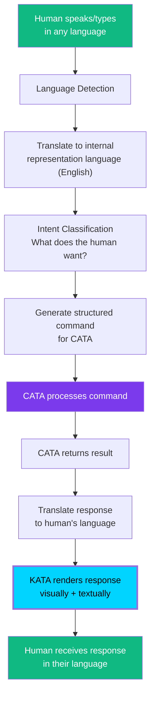

| Design Decision | Choice | Rationale |
|---|---|---|
| Internal representation language | English | Most AI models are strongest in English; simplifies internal processing |
| Human-facing language | Any language | The human should communicate in whatever language is natural to them |
| Translation layer | AI-powered translation | Near-real-time translation with high accuracy |
| Intent classification | NLU model | Maps natural language to structured commands |
| Response rendering | Visual + textual | KATA responds with both avatar body language and text/speech |

#### 13.6.7 Security Boundary

KATA is a **security boundary**. The internal core of CAT — agents, knowledge graph, memory, reasoning engine — is never directly accessible to humans. All human interaction flows through KATA, which translates and filters:

| Threat | KATA Mitigation |
|---|---|
| Direct agent manipulation | Humans cannot address agents directly; KATA routes all requests through CATA |
| Raw knowledge graph access | KATA provides summaries and explanations, not raw graph queries |
| Prompt injection via natural language | KATA's intent classification sanitizes and structures all human input before it reaches the cognitive core |
| Unauthorized operations | KATA enforces the approval workflow — no action with external impact bypasses human approval |
| Information leakage | KATA only reveals information appropriate to the human's role and the current context |

### 13.7 Central Intelligence Core (Layer 3)

#### 13.7.1 Purpose

The Cognitive Core is the brain of CAT. It is the layer where knowledge is stored, memory is maintained, reasoning occurs, and learning happens. It is the layer that makes CAT more than a workflow engine — it is what makes CAT **intelligent**.

The Cognitive Core is **not** directly accessible to humans. It is accessed by agents (Layer 5) through the orchestration layer (Layer 4). KATA (Layer 6) provides humans with summaries and explanations of what the Cognitive Core produces, but never raw access.

#### 13.7.2 Components

| Component | Responsibility | Persistence |
|---|---|---|
| Knowledge Graph | Structured knowledge about products, markets, strategies, competitors, and outcomes | Permanent (Postgres + graph extension) |
| Memory Store | Context from past operations, decisions, and outcomes | Permanent (Postgres) |
| RAG Index | Searchable vector index of all accumulated knowledge | Permanent (vector database) |
| Reasoning Engine | Applies logic, inference, and pattern matching to knowledge and memory | Stateless (uses knowledge graph and memory as input) |
| Prompt Engine | Manages prompt templates, model selection, and prompt execution | Stateless (templates stored in DB) |
| Learning Pipeline | Processes outcomes and updates the knowledge graph and memory | Continuous (background process) |
| Decision Engine | Evaluates options and recommends actions based on knowledge, memory, and reasoning | Stateless (uses all cognitive components as input) |

#### 13.7.3 Knowledge Graph Architecture

The knowledge graph is the **cognitive substrate** of CAT. Everything CAT knows is stored in the graph. The graph is not a simple key-value store — it is a semantically rich, relationship-aware structure.

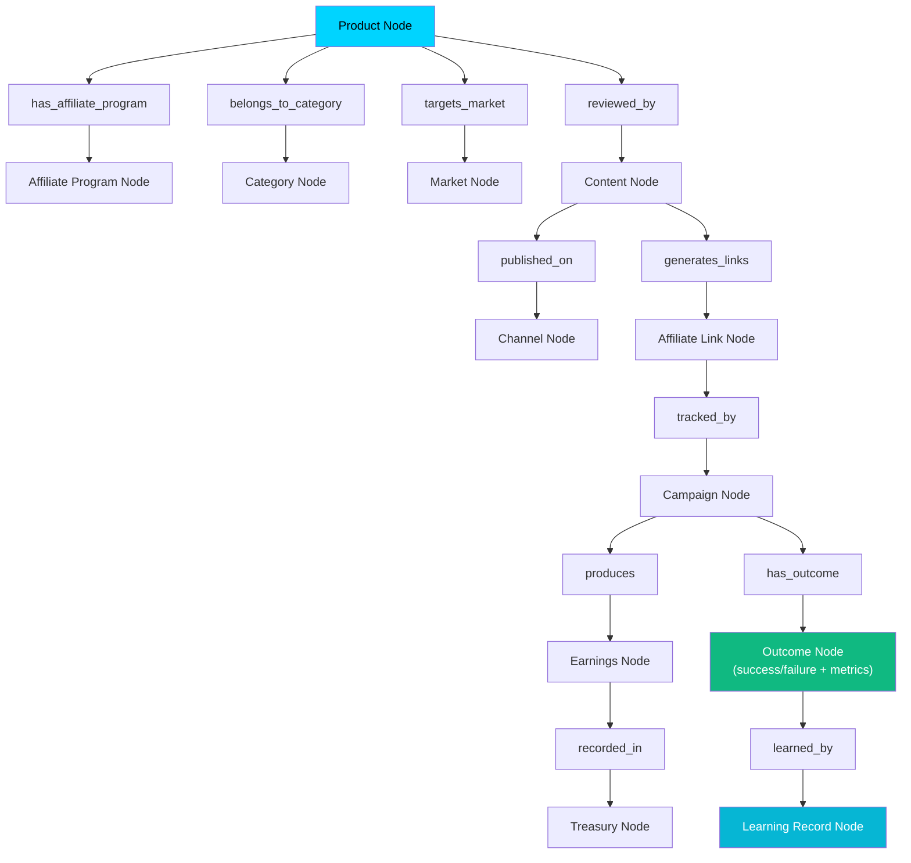

| Node Type | Represents | Key Properties |
|---|---|---|
| Product | A product available for affiliate promotion | Name, category, price, commission rate, merchant |
| Affiliate Program | An affiliate program for a product or merchant | Network, commission structure, cookie duration, terms |
| Category | A product category | Name, parent category, market size, competition level |
| Market | A target market or audience | Demographics, geography, language, purchasing power |
| Content | A piece of content (review, comparison, tutorial) | Type, title, body, keywords, quality score |
| Channel | A publishing channel (blog, social, video) | Platform, audience size, format requirements |
| Affiliate Link | A tracked affiliate link | URL, product, campaign, click count, conversion count |
| Campaign | A coordinated affiliate campaign | Products, content, channels, budget, timeline |
| Earnings | Revenue generated by a campaign | Amount, currency, date, source, campaign |
| Outcome | The result of a campaign or action | Success/failure, metrics, lessons learned |
| Learning Record | A learned insight from an outcome | Insight, confidence, applicability, timestamp |

#### 13.7.4 Memory Architecture

CAT's memory is not a single store — it is a **tiered memory system** modeled after human cognitive memory:

| Memory Tier | Analogy | Purpose | Persistence | Capacity |
|---|---|---|---|---|
| Working Memory | Short-term memory | Current task context, active agent state | Session (cleared on task completion) | Small (KB) |
| Episodic Memory | Personal experiences | Record of specific events, decisions, and outcomes | Permanent | Large (GB) |
| Semantic Memory | General knowledge | Structured facts about products, markets, strategies | Permanent | Large (GB) |
| Procedural Memory | Skills and procedures | How-to knowledge, successful workflows, prompt patterns | Permanent | Medium (MB) |
| Flash Memory | Recent cache | Recently accessed knowledge for fast retrieval | Ephemeral (LRU cache) | Medium (MB) |

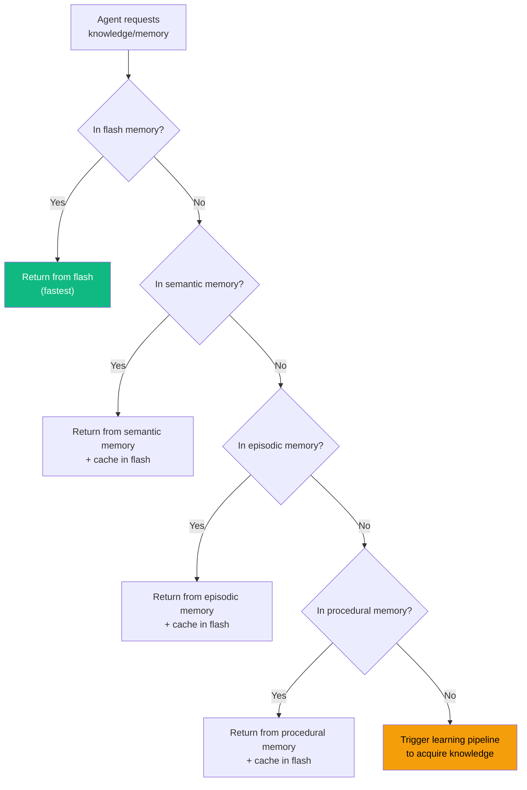

#### 13.7.5 Reasoning Engine

The Reasoning Engine applies logic and inference to the knowledge graph and memory to produce conclusions. It is **not** a single algorithm — it is a pipeline of reasoning strategies:

| Strategy | When Used | Example |
|---|---|---|
| Deductive reasoning | When rules and facts are known | "All products in category X have commission > 5%. Product Y is in category X. Therefore product Y has commission > 5%." |
| Inductive reasoning | When patterns exist in data | "Campaigns using channel X for product category Y have 3x conversion rate. Therefore, new campaigns for category Y should prioritize channel X." |
| Abductive reasoning | When explaining observations | "Earnings dropped 40% last week. The most likely explanation is that the primary affiliate link broke. Verify link status." |
| Analogical reasoning | When similar situations exist | "Product A is similar to product B. Campaign for product B was successful with strategy S. Try strategy S for product A." |
| Causal reasoning | When cause-effect relationships matter | "Changing the call-to-action from 'Buy Now' to 'Learn More' increased conversions by 15%. The CTA change caused the increase." |

#### 13.7.6 Decision Engine

The Decision Engine evaluates options and recommends actions. It is the component that produces the recommendations that humans approve.

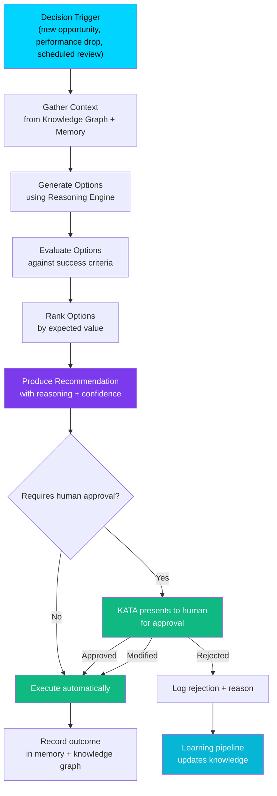

### 13.8 Agent Ecosystem (Layer 5)

#### 13.8.1 Agent Architecture

Each agent in CAT's ecosystem follows a common internal architecture:

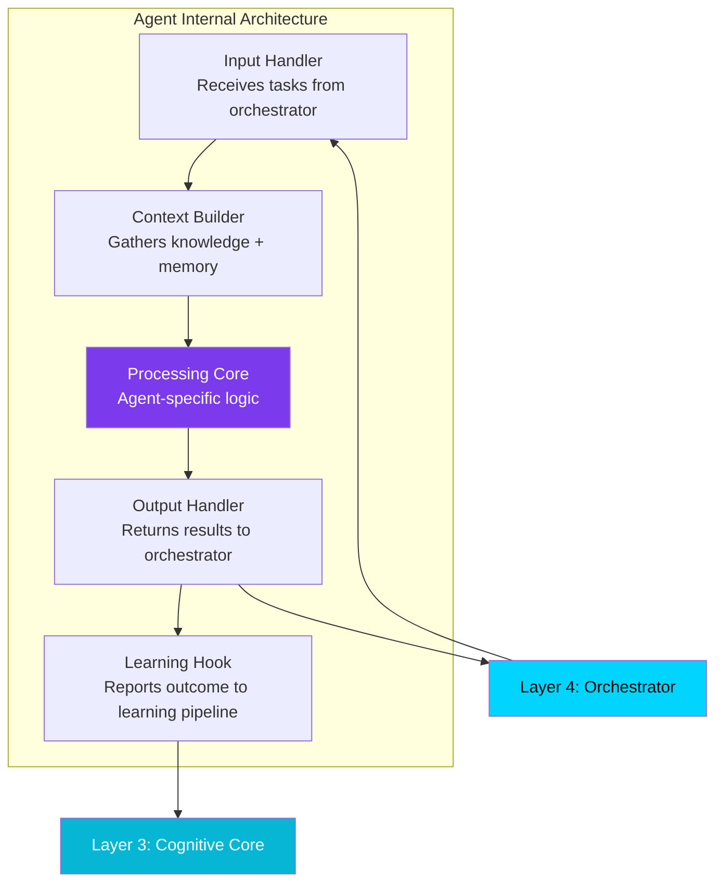

| Component | Responsibility |
|---|---|
| Input Handler | Receives structured tasks from the orchestrator, validates input, and manages task lifecycle |
| Context Builder | Queries the knowledge graph and memory store for relevant context before processing |
| Processing Core | Agent-specific logic — research, content generation, link management, etc. |
| Output Handler | Formats results, returns them to the orchestrator, and triggers downstream tasks |
| Learning Hook | Reports the outcome (success/failure + metrics) to the learning pipeline for knowledge updates |

#### 13.8.2 Agent Inventory

| Agent | Role | Primary Inputs | Primary Outputs | Autonomy Level |
|---|---|---|---|---|
| CATA | Central orchestrator — coordinates all agents | Tasks from KATA, events from agents | Task assignments to agents, status to KATA | Level 5 |
| Research | Market research and product discovery | Market parameters, trending data | Product recommendations, market analysis | Level 3 |
| Affiliate | Affiliate program management and link creation | Product selections, affiliate network APIs | Affiliate links, program terms | Level 3 |
| Creative | Content generation (text, image, video) | Product info, content requirements, brand guidelines | Articles, reviews, images, videos | Level 3 |
| Publisher | Multi-channel content publishing | Content, channel specifications | Published content, distribution reports | Level 3 |
| Treasury | Earnings tracking and financial management | Earnings data, payout schedules | Financial reports, payout recommendations | Level 3 |
| Analytics | Performance monitoring and interpretation | Click data, conversion data, revenue data | Performance reports, optimization recommendations | Level 4 |
| Learning | Continuous learning and knowledge refinement | Outcomes from all agents | Updated knowledge graph entries, learned patterns | Level 5 |
| Memory | Memory management and retrieval | Memory queries from agents | Relevant memories, context | Level 5 |
| Security | Threat detection and access control | System events, access requests | Security alerts, access decisions | Level 5 |

#### 13.8.3 Agent Communication Protocol

Agents do not communicate with each other directly. All communication flows through the orchestrator (CATA) via the event bus:

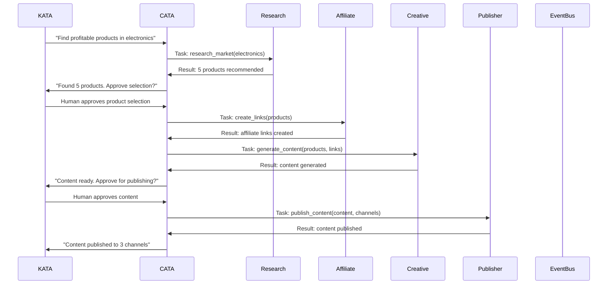

| Communication Rule | Description |
|---|---|
| No direct agent-to-agent calls | Agents never call each other. All coordination goes through CATA. |
| Event bus for async communication | Agents publish and subscribe to events on the event bus. CATA routes events. |
| Structured task format | All tasks are structured objects with type, input, priority, and deadline. |
| Structured result format | All results are structured objects with status, output, metrics, and outcome. |
| Idempotent operations | Agents must handle duplicate tasks gracefully (idempotency). |

#### 13.8.4 Agent Lifecycle

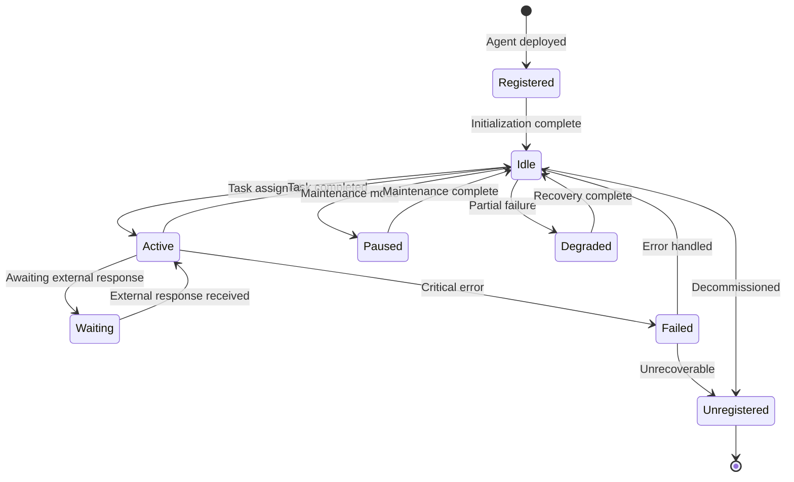

| State | Description | Orchestrator Action |
|---|---|---|
| Registered | Agent is deployed but not yet initialized | Wait for initialization |
| Idle | Agent is ready and waiting for tasks | Assign tasks as needed |
| Active | Agent is processing a task | Monitor progress |
| Waiting | Agent is awaiting an external response (e.g., human approval, API response) | Route response when available |
| Paused | Agent is in maintenance mode | Do not assign tasks; redirect to backup |
| Degraded | Agent is partially functional | Assign reduced workload; attempt recovery |
| Failed | Agent encountered a critical error | Attempt recovery or failover |
| Unregistered | Agent has been decommissioned | Remove from active roster |

### 13.9 Service Communication Philosophy

#### 13.9.1 Event-Driven Architecture

CAT's service communication is **event-driven**, not request-response. This is a fundamental architectural decision, not an implementation detail.

| Request-Response | Event-Driven (CAT) |
|---|---|
| Caller blocks until response arrives | Caller publishes event and continues |
| Tight coupling between caller and responder | Loose coupling — publisher doesn't know subscribers |
| One-to-one communication | One-to-many communication (event fan-out) |
| Synchronous error handling | Asynchronous error handling (dead letter queue) |
| Difficult to add new consumers | New consumers subscribe without affecting publisher |
| Caller failure blocks responder | Publisher and subscriber failures are isolated |

#### 13.9.2 Event Bus Architecture

The event bus is the **nervous system** of CAT. All inter-component communication flows through it.

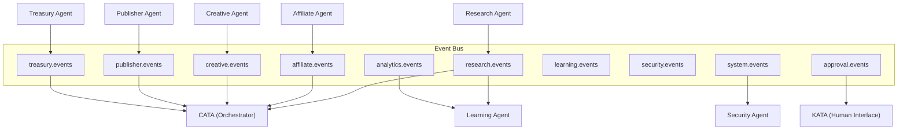

| Event Property | Description |
|---|---|
| Event ID | Unique identifier for the event |
| Event Type | Category of event (e.g., `research.product_found`, `creative.content_ready`) |
| Source | Agent or service that published the event |
| Timestamp | When the event was published |
| Payload | Structured data specific to the event type |
| Correlation ID | Links related events across a workflow |
| Priority | Event priority (critical, high, normal, low) |
| TTL | Time-to-live — event expires after this duration if not consumed |

#### 13.9.3 Event Categories

| Category | Topic Prefix | Example Events |
|---|---|---|
| Research | `research.*` | `research.market_scanned`, `research.product_found`, `research.trend_detected` |
| Affiliate | `affiliate.*` | `affiliate.link_created`, `affiliate.program_joined`, `affiliate.link_expired` |
| Creative | `creative.*` | `creative.content_generated`, `creative.content_reviewed`, `creative.image_created` |
| Publisher | `publisher.*` | `publisher.content_published`, `publisher.publish_failed`, `publisher.channel_connected` |
| Treasury | `treasury.*` | `treasury.earnings_recorded`, `treasury.payout_processed`, `treasury.report_generated` |
| Analytics | `analytics.*` | `analytics.performance_updated`, `analytics.anomaly_detected`, `analytics.threshold_reached` |
| Learning | `learning.*` | `learning.pattern_discovered`, `learning.knowledge_updated`, `learning.model_retrained` |
| Security | `security.*` | `security.threat_detected`, `security.access_denied`, `security.audit_logged` |
| System | `system.*` | `system.agent_started`, `system.agent_stopped`, `system.health_check` |
| Approval | `approval.*` | `approval.requested`, `approval.granted`, `approval.rejected` |

#### 13.9.4 Communication Reliability

| Requirement | Implementation |
|---|---|
| At-least-once delivery | Events are persisted before delivery; consumers must be idempotent |
| Event ordering | Events within the same topic are ordered by timestamp; cross-topic ordering is not guaranteed |
| Dead letter queue | Events that cannot be processed after N retries are moved to a dead letter queue for investigation |
| Event replay | Events can be replayed from the event store for debugging or recovery |
| Backpressure | If a consumer is overwhelmed, the event bus applies backpressure (buffer or shed load) |

### 13.10 Knowledge-Driven Architecture

#### 13.10.1 Knowledge as First-Class Citizen

In CAT, knowledge is not a byproduct — it is a **first-class architectural citizen**. Every operation produces knowledge. Every decision consumes knowledge. The system is designed around the flow of knowledge.

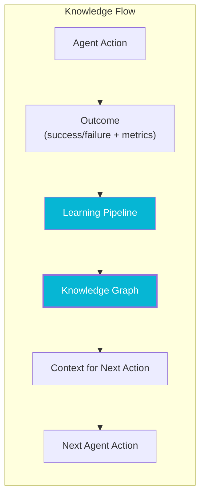

#### 13.10.2 Knowledge Lifecycle

| Stage | Description | Component |
|---|---|---|
| Acquisition | Knowledge is acquired through agent actions, external data ingestion, or human input | Agents, integration services |
| Validation | New knowledge is validated for accuracy, relevance, and non-duplication | Learning pipeline |
| Integration | Validated knowledge is integrated into the knowledge graph | Knowledge graph |
| Retrieval | Knowledge is retrieved when needed for decisions or actions | RAG index, memory store |
| Application | Retrieved knowledge is applied to improve decision-making | Reasoning engine, decision engine |
| Refinement | Knowledge is refined over time based on new evidence | Learning pipeline |
| Expiration | Outdated knowledge is marked as stale (not deleted) | Learning pipeline |

#### 13.10.3 Knowledge Never Deleted

CAT follows a **soft-delete** philosophy for knowledge. Knowledge is never hard-deleted. Instead, outdated or incorrect knowledge is marked as stale with a timestamp and reason. This preserves the historical record and allows the learning pipeline to understand what was believed, when it was believed, and why it changed.

| Operation | Allowed | Rationale |
|---|---|---|
| Create new knowledge | Yes | New knowledge is always welcome |
| Update existing knowledge | Yes | Knowledge evolves with new evidence |
| Mark knowledge as stale | Yes | Outdated knowledge is preserved but flagged |
| Hard delete knowledge | No | Historical record must be preserved for learning |

### 13.11 Event-Driven Architecture (Deep Dive)

#### 13.11.1 Why Event-Driven

CAT's architecture is event-driven because the system is **continuous**, not transactional. A traditional request-response architecture assumes that a user initiates an action and waits for a response. CAT's agents operate continuously — they discover opportunities, generate content, publish, track, and optimize without waiting for human initiation.

| Scenario | Request-Response | Event-Driven |
|---|---|---|
| Research agent finds a trending product | Must wait for someone to ask | Publishes `research.product_found` event immediately |
| Creative agent finishes content | Must wait for someone to request it | Publishes `creative.content_ready` event immediately |
| Treasury detects earnings anomaly | Must wait for someone to query | Publishes `treasury.anomaly_detected` event immediately |
| Analytics detects performance drop | Must wait for someone to check | Publishes `analytics.threshold_reached` event immediately |

#### 13.11.2 Event Sourcing

CAT uses **event sourcing** for critical workflows. Event sourcing means that the current state of the system is derived from the sequence of events that led to it, not from a mutable state store.

| Benefit | Description |
|---|---|
| Complete audit trail | Every state change is recorded as an immutable event |
| Replay capability | The system can be rebuilt by replaying events from the event store |
| Debugging | Any issue can be traced by examining the event sequence |
| Time travel | The system state at any point in time can be reconstructed |
| Decoupling | Producers and consumers are fully decoupled |

#### 13.11.3 CQRS Pattern

CAT applies the **Command Query Responsibility Segregation (CQRS)** pattern:

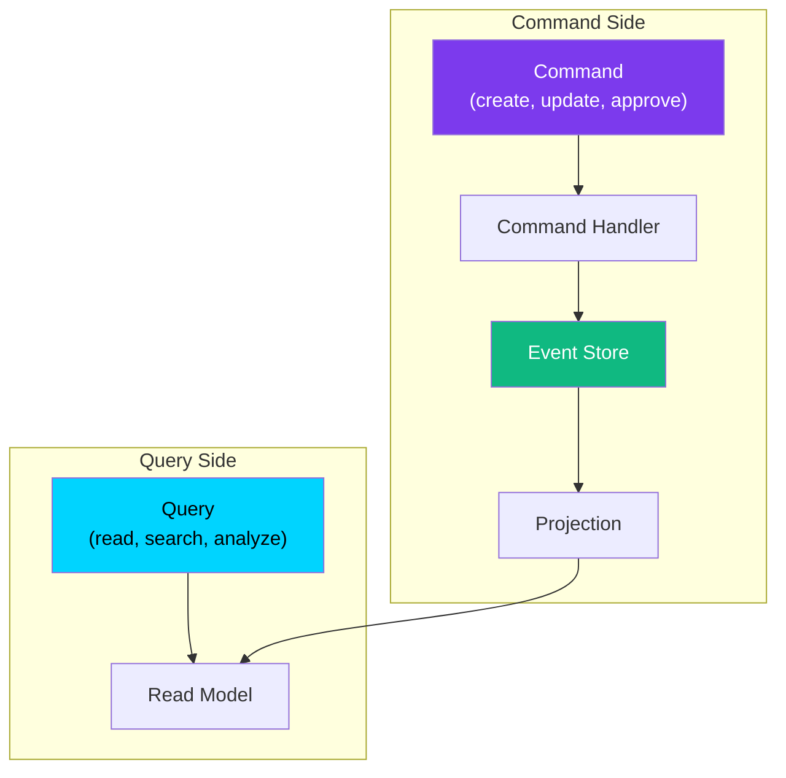

| Side | Responsibility | Optimization |
|---|---|---|
| Command side | Processes writes (create, update, approve) | Optimized for writes; validates and persists events |
| Query side | Processes reads (search, analyze, display) | Optimized for reads; pre-computed projections |
| Event store | Source of truth | Append-only log of all events |
| Projections | Derived read models | Updated from events; optimized for specific queries |

#### 13.11.4 Rejected Alternative: Pure Request-Response

| Criterion | Request-Response | Event-Driven (Chosen) |
|---|---|---|
| Continuous operation | Requires polling | Native (event-driven) |
| Scalability | Tight coupling limits scale | Loose coupling enables horizontal scale |
| Auditability | Only final state is recorded | Complete event history |
| Fault tolerance | Caller failure blocks system | Isolated failures |
| Extensibility | New consumers require caller changes | New consumers subscribe independently |

**Decision:** Event-driven architecture with event sourcing for critical workflows and CQRS for read/write separation.

### 13.12 Scalable Infrastructure Philosophy

#### 13.12.1 Cloud-Native from Day One

CAT is designed as a cloud-native system from the start. This is not a "we'll add it later" decision — it is a foundational architectural commitment.

| Cloud-Native Principle | CAT Implementation |
|---|---|
| Containerized | All components (agents, services, UI) run in containers |
| Orchestrated | Kubernetes manages container lifecycle, scaling, and scheduling |
| Observable | Metrics, logs, and traces are collected from all components |
| Declarative | Infrastructure is defined as code (Terraform) |
| Immutable | Containers are not modified at runtime; new versions are deployed |
| Microservice-ready | Components are independently deployable (though initially deployed as a modular monolith) |

#### 13.12.2 Scaling Strategy

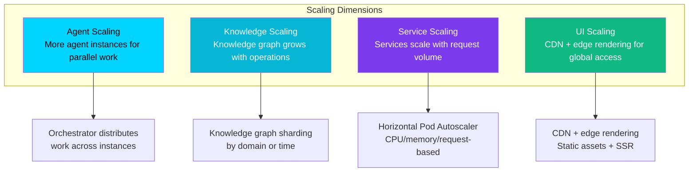

| Component | Scaling Strategy | Trigger |
|---|---|---|
| Agents | Horizontal — more instances | Task queue depth |
| Knowledge graph | Sharding by domain | Graph size / query latency |
| Memory store | Horizontal — read replicas | Read query volume |
| RAG index | Sharding by vector partition | Index size / search latency |
| Event bus | Partitioning by topic | Event throughput |
| Database (Supabase/Postgres) | Read replicas + connection pooling | Connection count / query latency |
| UI | CDN + edge SSR | Geographic distribution of users |
| Observability | Sampling + retention policies | Data volume |

#### 13.12.3 Performance Requirements

| Component | Target | Rationale |
|---|---|---|
| UI frame rate | 60 FPS (120 FPS on capable displays) | Smooth, cinematic experience |
| KATA avatar response | < 100ms from system state change | Avatar must feel responsive |
| Agent task dispatch | < 50ms from orchestrator to agent | Near-instant task routing |
| Knowledge graph query | < 200ms for typical queries | Agents need fast context retrieval |
| RAG search | < 500ms for similarity search | Fast knowledge retrieval |
| Event bus latency | < 10ms publish-to-subscribe | Near-real-time event propagation |
| Database query (typical) | < 100ms | Fast data access |
| Page load (initial) | < 2s | Fast initial render |
| Page transition | < 300ms | Smooth navigation |

#### 13.12.4 Performance Quality Levels

Because CAT's UI is GPU-intensive, the system supports configurable performance quality levels:

| Level | Target Hardware | Features |
|---|---|---|
| Ultra | High-end GPU (RTX 4070+), 120Hz display | Full particle effects, real-time reflections, 120 FPS |
| High | Mid-range GPU (RTX 3060+), 60Hz display | Reduced particle count, baked reflections, 60 FPS |
| Eco | Integrated GPU, 60Hz display | Minimal particles, no reflections, static background, 60 FPS |

The quality level is auto-detected on first load and user-adjustable through the theme engine.

#### 13.12.5 Security Notes

| Security Requirement | Implementation |
|---|---|
| All inter-service communication encrypted | TLS 1.3 for all internal traffic |
| All external API calls validated | Schema validation + rate limiting + allowlist |
| All secrets in secret manager | No secrets in code, config files, or environment variables in the repository |
| All agent actions logged | Immutable audit log with agent ID, action, timestamp, and outcome |
| All human approvals logged | Immutable audit log with human ID, decision, timestamp, and reasoning |
| Principle of least privilege | Each agent and service has only the permissions it needs |
| Defense in depth | Multiple security layers: network, service, agent, data |
| Regular security audits | Automated scanning + manual review |

#### 13.12.6 Observability Architecture

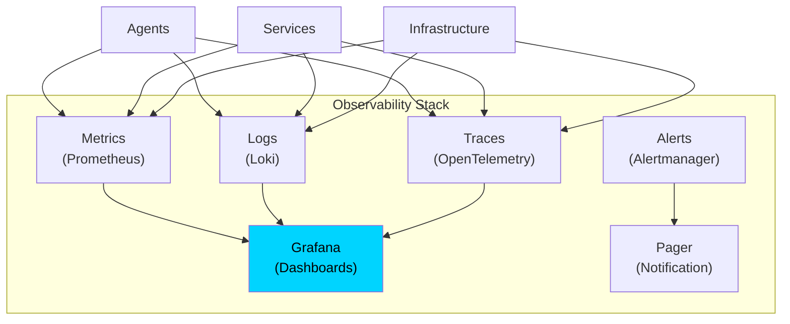

| Pillar | What It Tracks | Tool |
|---|---|---|
| Metrics | Quantitative measurements (CPU, memory, request rate, error rate, agent task completion) | Prometheus |
| Logs | Discrete events (agent actions, system events, errors, approvals) | Loki |
| Traces | Request flows across services (end-to-end latency, bottlenecks) | OpenTelemetry |
| Alerts | Threshold-based notifications (error rate, latency, resource usage) | Alertmanager |

### 13.13 Future Multi-Node Architecture

#### 13.13.1 Single-Node to Multi-Node Evolution

CAT is initially deployed as a single-node system (one Kubernetes cluster). However, the architecture is designed to evolve into a **multi-node** system where CAT instances in different geographic regions collaborate.

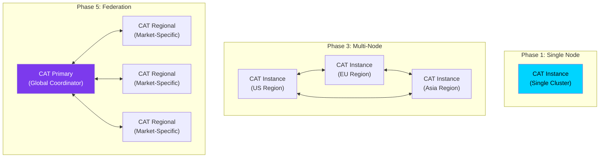

| Phase | Architecture | Rationale |
|---|---|---|
| Phase 1 | Single node | Simplicity; validate the architecture |
| Phase 3 | Multi-node (geo-distributed) | Reduce latency for regional markets; handle larger scale |
| Phase 5 | Federation (primary + regional) | Market-specific intelligence with global coordination |

#### 13.13.2 Multi-Node Communication

When CAT evolves to multi-node, nodes will communicate through a **federation protocol**:

| Aspect | Specification |
|---|---|
| Communication | Inter-node event bus (federated) |
| Knowledge sharing | Knowledge graph sync (eventual consistency) |
| Task distribution | Primary node assigns regional tasks; regional nodes execute |
| Conflict resolution | Last-writer-wins for non-critical; primary arbitrates for critical |
| Failover | If a regional node fails, primary reassigns to another node |

#### 13.13.3 Future Evolution Path

| Component | Phase 1 (Current) | Phase 3 (Multi-Node) | Phase 5 (Federation) |
|---|---|---|---|
| Deployment | Single Kubernetes cluster | Multiple clusters (geo-distributed) | Primary + regional clusters |
| Agent execution | All agents on one cluster | Agents distributed across clusters | Regional agents + global coordinator |
| Knowledge graph | Single instance | Replicated across nodes | Federated with sync protocol |
| Memory store | Single instance | Replicated | Federated with regional memory |
| Event bus | Single instance | Federated across clusters | Global event backbone |
| Database | Single Supabase instance | Read replicas per region | Federated with sync |
| UI | Single CDN | Regional CDN edges | Global CDN with regional personalization |

#### 13.13.4 Architectural Decisions for Future Evolution

| Decision | Phase 1 Choice | Future-Proofing |
|---|---|---|
| Modular monolith vs. microservices | Modular monolith | Module boundaries are service boundaries — extract to services when needed |
| Single database vs. sharded | Single database | Schema designed for future sharding by domain |
| Single event bus vs. federated | Single event bus | Event schema is versioned and backward-compatible |
| Single knowledge graph vs. federated | Single knowledge graph | Graph schema supports future federation |
| Single UI vs. regional | Single UI | UI is stateless and CDN-deployable |

---

*End of Part 2. The next part will cover Technology Stack, Agent Ecosystem Details, and Knowledge Engine specifications.*

---

## 14. Technology Philosophy

> **Statement:** CAT's technology philosophy governs *how the system is conceived, built, evolved, and maintained* over its 10+ year lifetime. It is the engineering expression of the project's core philosophy (Section 8): AI-native, knowledge-driven, documentation-first, human-supervised, and built to last.

### 14.0 The Four Pillars of Technology Philosophy

CAT's technology philosophy rests on four interdependent pillars. Every engineering practice in this section derives from these pillars.

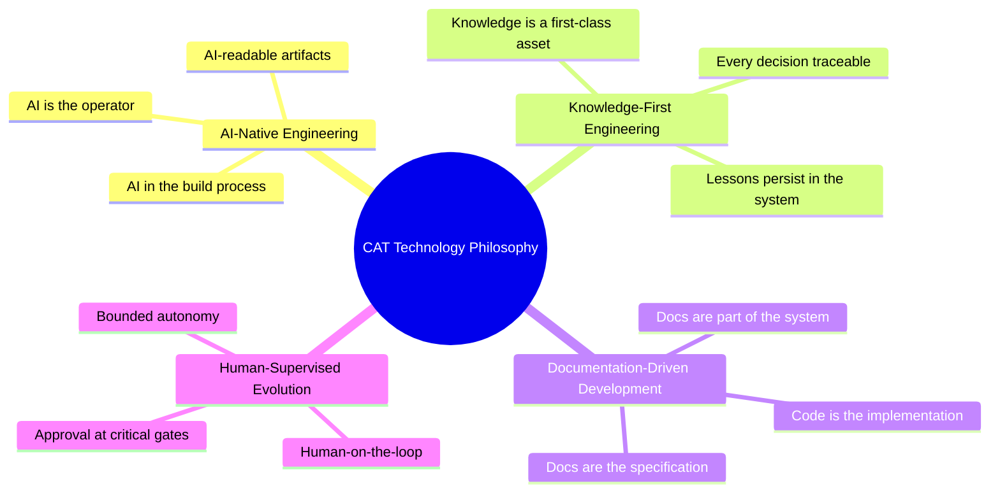

| Pillar | Core Idea | Engineering Consequence |
|---|---|---|
| AI-Native Engineering | AI is the primary operator of both the product and the development process | Every artifact (docs, ADRs, tests, specs) must be AI-readable; workflows assume AI participants |
| Knowledge-First Engineering | Knowledge is a first-class asset, never a byproduct | Decision records, lessons learned, and outcomes are captured as part of every task |
| Documentation-Driven Development | Documentation precedes implementation and is part of the system | A change is not complete until its documentation is updated and reviewed |
| Human-Supervised Evolution | The system evolves under human authority with bounded autonomy | Critical changes require approval; autonomy is granted by policy, not by default |

**Design reasoning:** The four pillars are mutually reinforcing. AI-native engineering produces artifacts that only make sense if knowledge is captured (knowledge-first). Knowledge capture only survives if documentation is part of the workflow (documentation-driven). Autonomous evolution only remains safe if humans supervise critical gates (human-supervised). Removing any pillar weakens the other three.

**Rejected alternatives:**

| Alternative | Why Rejected |
|---|---|
| AI-native pillar only | Ignores maintainability, traceability, and human authority; produces a system nobody can supervise |
| Traditional enterprise SDLC only | Ignores AI as operator and knowledge compounding; cannot reach the mission |
| Philosophy without documentation-driven development | Ignores the 10-year horizon and the AI-readability requirement; knowledge decays |

---

### 14.1 Why CAT Follows an AI-Native Engineering Philosophy

> **Statement:** CAT is engineered as an AI-native system — not because AI is fashionable, but because the project's mission (complete lifecycle automation, Section 7) is unreachable with any other engineering philosophy.

#### 14.1.1 Technical Explanation

AI-native engineering means the engineering philosophy, process, and artifacts are all designed around AI as the primary operator. The concept operates at three layers:

| Layer | Meaning | Example |
|---|---|---|
| Product-native | The system's runtime is AI-operated | Agents execute commerce workflows; humans approve |
| Process-native | The development process itself uses AI participants | AI agents draft specs, review code, generate tests, and update docs |
| Artifact-native | Every engineering artifact is AI-readable and AI-writable | Context docs, ADRs, and tests are structured for machine consumption |

An AI-assisted system is engineered around human workflows with AI bolted on. An AI-native system is engineered around AI workflows with human checkpoints designed in. The difference is visible in every artifact: an AI-native repository contains machine-readable context documents, decision records with structured fields, and specifications that an agent can load and act on without a human interpreter.

#### 14.1.2 Business Explanation

| Business Driver | AI-Assisted Engineering | AI-Native Engineering (CAT) |
|---|---|---|
| Scaling development capacity | Scales linearly with headcount | Scales with agent capacity; humans review more, type less |
| Knowledge retention | Depends on employee memory and after-the-fact docs | Knowledge is captured continuously in the system |
| Time-to-decision | Hours to days (human latency) | Minutes (agent-assisted analysis with human approval) |
| Cost structure | Headcount-heavy | Infrastructure-heavy; fixed costs dominate |
| Competitive moat | People and process | Accumulated knowledge + AI infrastructure |

The business consequence: CAT's engineering capacity does not hit a human ceiling. One architect can supervise agent work that would previously require a team. The moat is not the UI or the feature list — it is the accumulated, traceable knowledge embedded in the system and the AI-native process that produces it.

#### 14.1.3 Practical Examples

1. **New affiliate network integration:** An agent loads the context documents, checks ADRs for related decisions, drafts the specification, proposes a new ADR, and produces an implementation plan — before a single line of code is written. The human approves the plan, not the raw investigation.
2. **Bug fix:** An agent reads the logs, traces the event flow, reproduces the issue in a sandbox, proposes a fix with tests, and requests review. The human reviews a prepared diff instead of investigating from scratch.
3. **Documentation drift:** An agent detects that a context document no longer matches the implementation, opens a docs issue, and drafts the correction for review.

#### 14.1.4 Design Reasoning

The mission is to automate the complete affiliate commerce lifecycle (Section 7.2.1). Engineering that system with a philosophy built around human operators would contradict the product's own principles: if humans must remain the bottleneck of development, the system cannot evolve as fast as the commerce landscape it serves. AI-native engineering makes the development pipeline structurally consistent with the product — both are AI-operated with human supervision.

#### 14.1.5 Benefits

| Benefit | Description |
|---|---|
| Capacity | Agents execute repetitive engineering work 24/7 |
| Consistency | Agents apply standards uniformly; no style drift between engineers |
| Speed | Drafting, research, and test generation happen in minutes |
| Continuity | Knowledge is captured in artifacts, not in individuals |
| AI-readability | The repository is self-documenting for future agents |

#### 14.1.6 Tradeoffs

| Tradeoff | Description | Mitigation |
|---|---|---|
| Artifact overhead | AI-native requires more upfront documentation | Documentation is part of the Definition of Done, not an extra |
| Review burden | Humans must review agent output, including unfamiliar code | Small, frequent diffs; progressive trust levels |
| Dependency on AI quality | Output quality depends on model quality and context | Multi-model orchestration; human review at gates |
| Process discipline | Requires stricter conventions than informal development | Enforced by linting, CI checks, and review culture |

#### 14.1.7 Rejected Alternatives

| Alternative | Why Rejected |
|---|---|
| Conventional (human-first) engineering | Mission impossible — humans remain the bottleneck; contradicts the product's own design |
| AI-assisted engineering only | Raises human throughput but does not compound knowledge; ceiling is still human capacity |
| Full automation without human review | Unacceptable risk for financial and reputational actions; violates the human-approval principle |

#### 14.1.8 Implementation Considerations

| Consideration | Guidance |
|---|---|
| Start with the artifacts | Context docs, ADR template, decision record template, and coding standards must exist before agent-assisted development begins |
| Design review gates | Every task ends with a human-visible review step; agents propose, humans dispose |
| Progressive trust | Grant agents broader autonomy only after a track record of approved, high-quality output |
| Instrument the process | Track agent-task metrics (task success rate, review time, rework rate) to calibrate autonomy |
| Keep humans fluent | Humans must be able to read every artifact an agent produces; nothing is agent-only |

---

### 14.2 Software Development Philosophy

> **Statement:** CAT treats software as a living organism that is grown through small, observable, reversible steps — not a monument that is built once and frozen.

#### 14.2.1 Technical Explanation

The development philosophy governs *how work proceeds* (as opposed to *what is built*, which is governed by the architecture in Section 13). It rests on six operating principles:

| Operating Principle | Meaning |
|---|---|
| Incremental | Work proceeds in small, verifiable increments, never big-bang deliveries |
| Observable | Every increment produces observable evidence (tests, logs, previews) |
| Reversible | Every step can be rolled back; nothing is irreversible |
| Specification-first | Each increment starts from an updated specification, not from code |
| Feedback-driven | Each increment ends by feeding results back into knowledge |
| Simple-first | The simplest design that satisfies current requirements wins; complexity must be earned |

#### 14.2.2 The Development Loop

```mermaid
flowchart LR
    A[Opportunity / Change Request] --> B[Update Specification<br/>context + ADR]
    B --> C[Design Increment<br/>smallest verifiable step]
    C --> D[Implement with AI assistance]
    D --> E[Verify<br/>tests + checks + review]
    E --> F{Approved?}
    F -- No --> C
    F -- Yes --> G[Merge & Deploy]
    G --> H[Observe in Production]
    H --> I[Capture Outcome<br/>into Knowledge]
    I --> A
```

| Step | Who | Deliverable |
|---|---|---|
| Update Specification | Human + AI agent | Updated context doc / ADR |
| Design Increment | AI agent (draft) + human (approve) | Increment plan |
| Implement | AI agent with human review | Code diff |
| Verify | CI + AI agent + human | Green checks, review approval |
| Merge & Deploy | CI/CD | Deployed increment |
| Observe | Analytics + agents | Metrics, outcomes |
| Capture | Learning pipeline | Knowledge updates |

#### 14.2.3 Practical Examples

1. **Adding a new merchant integration:** Instead of a six-month "integrations" project, CAT ships one merchant at a time: spec → ADR → adapter module → tests → deploy → observe → learn → next merchant.
2. **Knowledge graph schema migration:** The migration is decomposed into additive changes (new columns, dual-write, backfill, cutover, drop), each observable and reversible.
3. **UI evolution:** A design-language change is introduced as a theme toggle first, observed, then promoted to default — never as a one-time visual overhaul.

#### 14.2.4 Design Reasoning

A 10-year system will be changed thousands of times. The only way to keep thousands of changes safe is to make each change small, observable, and reversible. Big-bang development maximizes the blast radius of every error and makes review impossible for humans or AI; incremental development keeps every change reviewable and keeps the system permanently releasable.

#### 14.2.5 Benefits

| Benefit | Description |
|---|---|
| Low risk | Each step is small enough to review and roll back |
| Fast feedback | Outcomes are observable within days, not quarters |
| Adaptive | Direction can change with evidence without throwing away work |
| AI-friendly | Small increments fit agent context windows and iteration loops |
| Auditability | The history of the system is a series of justified increments |

#### 14.2.6 Tradeoffs

| Tradeoff | Description | Mitigation |
|---|---|---|
| Process overhead per change | More steps than ad-hoc development | Automation (CI, templates, generators) absorbs the overhead |
| Slower initial velocity on greenfield work | Foundation increments are inherently larger | Foundation work is explicitly planned and justified in ADRs |
| Integration friction from frequent merges | Constant merge traffic | Continuous integration; trunk-based workflow; automated checks |

#### 14.2.7 Rejected Alternatives

| Alternative | Why Rejected |
|---|---|
| Waterfall (big design upfront) | Cannot absorb learning; contradicts continuous improvement; every change is expensive |
| Big-bang delivery | Unreviewable by humans or AI; maximum blast radius; violates reversibility |
| Pure ad-hoc / cowboy development | No specification, no knowledge capture, no auditability |

#### 14.2.8 Implementation Considerations

| Consideration | Guidance |
|---|---|
| Define "small" per domain | A UI change may be hours; a schema migration may be weeks of additive steps |
| Automate verification | Tests and checks must be fast enough to run on every increment |
| Keep increments deployable | Every merged increment must be releasable independently |
| Pair increments with knowledge | Each increment ends by updating the relevant knowledge artifacts |

---

### 14.3 Engineering Principles

> **Statement:** CAT operates on a defined set of engineering principles that translate the project philosophy into day-to-day engineering behavior. These principles are the engineering counterpart of the six core project principles in Section 8.

#### 14.3.1 The Engineering Principles

| # | Principle | Description | How It Is Verified |
|---|---|---|---|
| E1 | Documentation First | Documentation precedes implementation; docs are the specification | CI doc checks; Definition of Done |
| E2 | AI-Native Engineering | AI is the primary operator in product and process | Agent-readability of artifacts; AI in workflows |
| E3 | Human Approval at Critical Gates | Humans approve actions with external, financial, or irreversible impact | Approval gateway; audit log |
| E4 | Security by Design | Security is built into every layer, never bolted on | Security reviews in DoD; automated scanning |
| E5 | Modular Architecture | Components are independent, well-interfaced, replaceable | Architecture tests; interface contracts |
| E6 | Knowledge Capture | Every task leaves knowledge behind | ADRs, decision records, outcome logs |
| E7 | Incremental Delivery | Small, observable, reversible increments | PR size guidance; CI/CD gates |
| E8 | Tested by Default | No code merges without automated verification | Test coverage gates; CI |
| E9 | Simple-First | Complexity must be earned and justified | ADR requirement for non-trivial designs |
| E10 | Backward Compatibility | Public interfaces evolve without breaking consumers | Versioning policy; migration tests |
| E11 | Observability by Design | Everything is measurable, logged, and traceable | Metrics/log/trace requirements in DoD |
| E12 | Continuous Improvement | Every cycle feeds lessons back into process and knowledge | Retrospectives; improvement backlog |

#### 14.3.2 Principle Hierarchy and Conflict Resolution

```mermaid
graph TB
    PHILOSOPHY["Core Philosophy (Section 8)<br/>Six non-negotiable principles"] --> TECH["Technology Philosophy (this section)"]
    TECH --> E1["E1 Documentation First"]
    TECH --> E2["E2 AI-Native Engineering"]
    TECH --> E3["E3 Human Approval at Critical Gates"]
    TECH --> E4["E4 Security by Design"]
    TECH --> E5["E5 Modular Architecture"]
    TECH --> E6["E6 Knowledge Capture"]
    TECH --> E7["E7 Incremental Delivery"]
    TECH --> E8["E8 Tested by Default"]
    TECH --> E9["E9 Simple-First"]
    TECH --> E10["E10 Backward Compatibility"]
    TECH --> E11["E11 Observability by Design"]
    TECH --> E12["E12 Continuous Improvement"]
    E1 --> DOCTRINE["Doctrine: core philosophy wins over technology philosophy<br/>security and human approval win over velocity"]
```

When principles conflict, the following resolution order applies:

| Rank | Priority | Example Resolution |
|---|---|---|
| 1 | Core philosophy (Section 8) | Never compromise security-by-design for speed |
| 2 | Human approval | Never grant unapproved autonomy to meet a deadline |
| 3 | Security, data integrity | Never ship a change that weakens auditability |
| 4 | Documentation, knowledge | Never ship code whose docs are stale |
| 5 | Incremental, tested, simple | Prefer the smallest tested change that satisfies the need |
| 6 | Velocity and convenience | The last consideration, never the first |

#### 14.3.3 Practical Examples

1. **A dependency upgrade breaks the event schema:** E10 (backward compatibility) wins over the desire to "just fix it" — a migration path is written, dual-write is staged, and the upgrade ships only when old consumers still pass.
2. **A deadline conflicts with test coverage:** E8 (tested by default) and E7 (incremental) win — the deadline is renegotiated or the scope is reduced, never the tests.
3. **A new agent needs a new capability:** E5 (modular) and E2 (AI-native) require the capability to be a separate module with a defined interface — the agent registers through the orchestrator rather than reaching into other modules.

#### 14.3.4 Design Reasoning

Principles exist so that decisions do not need to be re-argued each time. When the same values are applied consistently, the system develops a coherent character: safe, traceable, documented, and evolvable. A priority order is essential because principles do conflict, and un-arbitrated conflict produces inconsistency.

#### 14.3.5 Benefits

| Benefit | Description |
|---|---|
| Consistency | The same values apply in every decision, by every contributor |
| Speed of decision | Recurring dilemmas are pre-resolved by the priority order |
| Onboarding | New humans and agents learn behavior from principles, not anecdotes |
| Reviewability | Reviews check against principles, not taste |
| Trust | Stakeholders know what values govern engineering |

#### 14.3.6 Tradeoffs

| Tradeoff | Description | Mitigation |
|---|---|---|
| Rigidity | Principles can feel bureaucratic | Principles are reviewed annually and amended by ADR |
| Interpretation variance | Principles are not algorithms | Each principle has a verification mechanism |
| Velocity cost | Some principles (docs, tests) cost time | Automation reduces the cost; the cost is accepted as insurance |

#### 14.3.7 Rejected Alternatives

| Alternative | Why Rejected |
|---|---|
| Unwritten culture ("we know how we work") | Not loadable by new humans or AI agents; decays over time |
| Exhaustive rulebook | Over-constrained; becomes stale; impossible to maintain |
| Principles without priority order | Conflicts become political; decisions become inconsistent |

#### 14.3.8 Implementation Considerations

| Consideration | Guidance |
|---|---|
| Publish the principles | The principles live in `02_PROJECT_RULES.md` and are linked from this document |
| Tie verification to CI | Every principle should have an automated or review-based check |
| Amend by ADR only | Changing a principle is an architectural decision with full RBTA documentation |
| Revisit annually | Principles are reviewed as part of the continuous improvement cycle (Section 14.14) |

---

### 14.4 AI-Assisted Development Model

> **Statement:** CAT's development process is a human–AI partnership. AI agents are first-class participants in the engineering workflow — drafting, researching, generating, verifying, and documenting — while humans remain the authority at every critical gate.

#### 14.4.1 Technical Explanation

The AI-assisted development model is a structured division of labor. It is neither "humans do everything, AI helps sometimes" nor "AI does everything, humans watch." It is a defined protocol where each activity has a designated executor and a designated approver.

| Engineering Activity | Primary Executor | Approver / Verifier | Artifact Produced |
|---|---|---|---|
| Context gathering | AI agent | Human (spot-check) | Context summary |
| Specification drafting | AI agent | Human | Updated context doc / spec |
| Decision analysis | AI agent | Human | ADR draft |
| Code generation | AI agent | Human + CI | Code diff |
| Test generation | AI agent | CI + human review | Test suite |
| Code review | AI agent (first pass) + human (final) | Human | Review comments |
| Documentation updates | AI agent | Human | Updated docs |
| Release preparation | AI agent + CI/CD | Human | Release notes |
| Incident analysis | AI agent | Human | Post-incident report |
| Retrospective synthesis | AI agent | Human | Improvement items |

The protocol is enforced by the task workflow: every task enters through the orchestrator, is executed by an agent, and passes a human review gate before it can be merged or applied.

#### 14.4.2 The Development Workflow

```mermaid
flowchart TD
    TASK[Task Intake<br/>natural language or structured issue] --> ORCH[Orchestrator]
    ORCH --> PLAN[Agent: Plan<br/>gather context, propose steps]
    PLAN --> SPEC[Agent: Draft Specification<br/>docs + ADR]
    SPEC --> HUMAN1{Human Approval<br/>of Specification?}
    HUMAN1 -- No --> PLAN
    HUMAN1 -- Yes --> IMPL[Agent: Implement<br/>code + tests]
    IMPL --> VERIFY[CI: Verify<br/>lint, test, build, security scan]
    VERIFY --> HUMAN2{Human Review<br/>of the Change?}
    HUMAN2 -- Request changes --> IMPL
    HUMAN2 -- Approve --> MERGE[Merge + Deploy]
    MERGE --> OBSERVE[Observe in Production]
    OBSERVE --> LEARN[Agent: Capture Lessons<br/>update knowledge]
    LEARN --> TASK

    style PLAN fill:#7c3aed,color:#fff
    style IMPL fill:#7c3aed,color:#fff
    style HUMAN1 fill:#10b981,color:#fff
    style HUMAN2 fill:#10b981,color:#fff
```

#### 14.4.3 Practical Examples

1. **Task: "Integrate the Awin affiliate network."** The orchestrator assigns a research agent to gather Awin API docs and existing ADRs; a spec is drafted; the human approves; an implementation agent builds the adapter and tests; CI verifies; the human reviews the diff; the release agent prepares the deployment.
2. **Task: "Investigate rising payout latency."** An analysis agent gathers treasury logs, identifies the correlation, and drafts an investigation report with hypotheses; the human validates the hypotheses before any fix is planned.
3. **Task: "Write a runbook for payout failures."** A documentation agent generates the runbook from the incident log; the human reviews it for accuracy and publishes it to the knowledge base.

#### 14.4.4 Design Reasoning

The mission requires 24/7 operational capacity and compounding knowledge. Humans alone cannot sustain the throughput; agents alone cannot be trusted with authority. The partnership model keeps the throughput of AI and the authority of humans. It also keeps humans fluent — every artifact an agent produces must be readable and reviewable by a human, which preserves the human's ability to supervise as the system grows.

#### 14.4.5 Benefits

| Benefit | Description |
|---|---|
| Throughput | Drafting, testing, and documentation scale with agent capacity |
| Quality | CI plus human review catches both mechanical and judgment errors |
| Knowledge | Every task leaves artifacts and lessons behind |
| Onboarding | New contributors are assisted by the same agent pipeline |
| Resilience | If one AI provider fails, the orchestrator reroutes; humans remain the constant |

#### 14.4.6 Tradeoffs

| Tradeoff | Description | Mitigation |
|---|---|---|
| Two-phase review cost | Spec + code both require human time | Reviews are prioritized; specs are concise; agents pre-verify |
| Trust calibration | Humans may over- or under-trust agent output | Progressive trust; agent track records; spot audits |
| Tooling complexity | The pipeline is more complex than a solo workflow | The pipeline is itself documented and evolved as a product |

#### 14.4.7 Rejected Alternatives

| Alternative | Why Rejected |
|---|---|
| Fully manual development | Cannot reach mission scale; knowledge decays; velocity ceiling |
| Fully autonomous development (AI writes and merges without gates) | Violates human-approval principle; unacceptable risk |
| AI as optional helper ("agents if you want") | Inconsistent process; artifacts become non-uniform; review burden shifts back to humans |

#### 14.4.8 Implementation Considerations

| Consideration | Guidance |
|---|---|
| Make the pipeline the default | Every task flows through the same intake → plan → spec → implement → verify → review pipeline |
| Instrument the pipeline | Track cycle time, review time, rework rate, and approval rate per task type |
| Keep gate criteria explicit | Human gates must have defined criteria (DoD checklists), not vibes |
| Provide agent workspace hygiene | Agents need clean, versioned context; stale context produces bad drafts |

---

### 14.5 Human and AI Collaboration Framework

> **Statement:** CAT defines, in writing, how humans and AI agents collaborate: who may do what, who approves what, how escalation works, and how trust is earned. Collaboration is a designed system, not an accident.

#### 14.5.1 Collaboration Zones

| Zone | Participants | Authority | Examples |
|---|---|---|---|
| Strategic Zone | Humans (primary), AI (advisor) | Human decides | Vision, roadmap, budget, market entry, partnership choices |
| Execution Zone | AI agents (primary), humans (supervisor) | AI executes within policy | Research, drafting, generation, monitoring, analysis |
| Verification Zone | Humans + AI (co-verifiers) | Human has final say | Code review, spec approval, release approval, incident decisions |
| Autonomy Zone | AI agents (sole) | AI acts within strict policy | Internal routing, health checks, log aggregation, knowledge curation |

#### 14.5.2 The Collaboration Model

```mermaid
graph TB
    subgraph "Strategic Zone — Human Authority"
        STRAT["Vision · Roadmap · Budget · Policy"]
    end
    subgraph "Execution Zone — Agent Operation"
        EXEC["Research · Draft · Generate · Monitor · Analyze"]
    end
    subgraph "Verification Zone — Shared"
        VER["Spec Review · Code Review · Test Review · Release Approval"]
    end
    subgraph "Autonomy Zone — Agent Operation"
        AUTO["Internal routing · Health checks · Log curation · Knowledge hygiene"]
    end

    STRAT -->|policy + constraints| EXEC
    EXEC -->|proposals + results| VER
    VER -->|approved changes| AUTO
    AUTO -->|observations + anomalies| STRAT
    VER -->|escalated issues| STRAT

    style STRAT fill:#10b981,color:#fff
    style VER fill:#00d4ff,color:#000
    style EXEC fill:#7c3aed,color:#fff
    style AUTO fill:#06b6d4,color:#fff
```

#### 14.5.3 Approval Gates in Development

| Gate | Applies To | Approver | Evidence Recorded |
|---|---|---|---|
| Specification gate | New features, architecture changes, new agents | Lead Architect / owner | Approved spec, ADR |
| Security gate | Anything touching credentials, payments, PII | Security owner | Security review record |
| Release gate | Production deployments | Release owner | Release checklist, rollback plan |
| Knowledge gate | New standards, policies, terminology changes | Documentation owner | Updated docs, decision record |

Every gate records: who approved, what was approved, when, and with what reasoning. This record is immutable and feeds the audit log.

#### 14.5.4 Escalation and Handoff Protocol

```mermaid
flowchart LR
    A[Agent detects ambiguity or risk] --> B{Confidence & policy check}
    B -- High confidence, within policy --> C[Agent proceeds]
    B -- Low confidence --> D[Escalate to human with context + options]
    B -- Outside policy --> D
    D --> E[Human decides / approves / redirects]
    E --> F[Agent resumes with updated policy]
```

| Escalation Trigger | Example | Required Context |
|---|---|---|
| Ambiguity | Spec conflicts with an existing ADR | Conflicting documents, options, recommendation |
| Policy boundary | Action requires approval level not granted | Policy reference, requested exception |
| Anomaly | Metric behavior contradicts expectations | Evidence, hypotheses, proposed investigation |
| Risk threshold | Estimated financial exposure above limit | Exposure estimate, mitigation options |

#### 14.5.5 Trust Model

Trust is earned by evidence and revoked by failure:

| Trust Level | Granted When | Scope | Review Frequency |
|---|---|---|---|
| Level 1 — Drafting | Initial | Produces drafts only; human edits | Every task |
| Level 2 — Proposed actions | N consecutive approved tasks | Produces proposals within a domain | Sample review |
| Level 3 — Autonomy with notification | Sustained high-quality record | Acts within policy; notifies | Periodic audit |
| Level 4 — Full autonomy | Explicit policy grant | Acts within a narrowly defined, reversible domain | Continuous monitoring |

Trust is revoked immediately upon a critical failure and restored only through a documented review.

#### 14.5.6 Practical Examples

1. **Human asks KATA: "Should we enter the German market?"** — This is a Strategic Zone decision. Agents produce market analysis and options; the human decides; the decision is recorded with reasoning.
2. **Agent proposes publishing 12 articles to the blog.** — Execution Zone work, Verification Zone gate: content is generated (execution), KATA presents it (verification), the human approves before publishing (policy).
3. **Agent notices analytics anomaly at 3 AM.** — Autonomy Zone: the agent can gather evidence and prepare an investigation, but escalating to a human is triggered because the anomaly may indicate revenue loss (risk threshold).

#### 14.5.7 Design Reasoning

Unspecified collaboration is the source of most system failures: agents act where they should ask, humans micromanage where they should supervise, and escalation happens too late or too often. By writing the collaboration framework down, CAT makes role boundaries loadable by humans and agents alike, removes negotiation overhead from every interaction, and guarantees that authority always returns to a human at critical points.

#### 14.5.8 Benefits

| Benefit | Description |
|---|---|
| Predictable authority | Everyone (human or agent) knows who decides what |
| Lower risk | Every critical action has a designed approval path |
| Fewer conflicts | Boundaries are explicit, not discovered through failure |
| Trust calibration | Trust levels make autonomy measurable and earned |
| Auditability | Every collaboration event is recorded |

#### 14.5.9 Tradeoffs

| Tradeoff | Description | Mitigation |
|---|---|---|
| Formality | Some interactions are slower than ad-hoc | Escalation is fast-path; only critical gates require formality |
| Zone rigidity | Emergent situations may not fit zones | The escalation protocol handles boundary cases |
| Trust overhead | Track records and audits cost effort | Automate trust metrics; audit by sampling |

#### 14.5.10 Rejected Alternatives

| Alternative | Why Rejected |
|---|---|
| "AI does everything, human trusts it" | Unacceptable risk; violates human-approval principle |
| "Human does everything, AI advises" | Throughput ceiling; contradicts AI-native mission |
| "Collaboration emerges naturally" | Undefined boundaries produce inconsistent, untraceable behavior |

#### 14.5.11 Implementation Considerations

| Consideration | Guidance |
|---|---|
| Document the zones | The framework lives in `05_AGENTS.md` and is referenced from here |
| Encode gates in the orchestrator | Approval gates are implemented as workflow steps, not memos |
| Log every escalation | Escalations are a first-class event type on the event bus |
| Review trust levels quarterly | Trust is recalibrated in the continuous improvement cycle |

---

### 14.6 Autonomous Development Concepts

> **Statement:** CAT pursues autonomous development in carefully bounded domains: agents may autonomously perform work that is internal, reversible, and low-risk, while anything with external impact, financial consequence, or irreversibility requires human approval.

#### 14.6.1 The Autonomy Ladder for Development Tasks

| Level | Development Autonomy | Examples | Human Involvement |
|---|---|---|---|
| D0 | None | Writing new architecture ADRs | Human performs |
| D1 | Draft only | Drafting specs, runbooks, test plans | Human edits |
| D2 | Execute with approval | Generating code, migrating data | Human approves before merge |
| D3 | Execute with notification | Refactoring internal modules, dependency hygiene | Human notified; can veto |
| D4 | Fully autonomous | Log curation, doc link fixing, metric dashboards | Human not involved |

The default for development work is **D2**: agents produce complete, tested changes, and humans approve before merge. D3 is granted per-module after a track record. D4 is reserved for internal, reversible, non-user-visible operations.

#### 14.6.2 Guardrails for Autonomous Work

| Guardrail | Description |
|---|---|
| Sandboxed execution | Agent actions run in isolated environments with no production credentials |
| Reversible-only by default | Autonomous actions must be rollback-able; irreversible actions require approval |
| CI gates | No merge path exists without green checks, regardless of who authored the change |
| Policy boundaries | Autonomy is scoped per module, per action type, and per risk class |
| Audit trail | Every autonomous action is logged with reason, scope, and outcome |
| Kill switch | Humans can pause or revoke autonomy for any module at any time |
| Rate limits | Autonomous actions are rate-limited to bound blast radius |

#### 14.6.3 The Autonomous Development Loop

```mermaid
flowchart TD
    TRIGGER[Trigger<br/>issue, schedule, drift detection] --> AGENT[Agent evaluates task]
    AGENT --> CLASSIFY{Classify risk}
    CLASSIFY -- Internal, reversible, low-risk --> SAND[Run in sandbox]
    SAND --> VERIFY[Verify: tests + checks]
    VERIFY --> NOTIFY[Notify human (D3)]
    NOTIFY --> LOG[Log + update knowledge]
    CLASSIFY -- External, financial, irreversible --> PROPOSE[Agent prepares proposal]
    PROPOSE --> APPROVE{Human approval}
    APPROVE -- Yes --> EXECUTE[Execute under supervision]
    APPROVE -- No --> REJECT[Log rejection + reason]
    EXECUTE --> LOG
    LOG --> LEARN[Learning pipeline updates trust + policies]
```

#### 14.6.4 Practical Examples

1. **Autonomous (D3):** An agent notices a broken internal documentation link and fixes it, notifying the documentation owner.
2. **Autonomous (D3):** An agent removes an unused internal utility module after verifying no imports reference it.
3. **Approval-required (D2):** An agent rewrites the affiliate link resolution logic and submits the full change for review.
4. **Approval-required (D1/D2):** An agent drafts a new ADR for multi-region deployment; the architect edits and approves it.
5. **Never autonomous:** Changes to treasury calculation logic, security policies, or anything touching real money or credentials.

#### 14.6.5 Design Reasoning

Autonomous development is the mechanism that lets the system evolve itself between human attention windows — fixing hygiene issues, updating references, and keeping documentation current around the clock. But autonomy without boundaries is a liability. The classification step (internal vs. external, reversible vs. irreversible) is the single most important control: it encodes the human-approval principle into the development process itself.

#### 14.6.6 Benefits

| Benefit | Description |
|---|---|
| Hygiene | Repos stay clean, docs stay current, dependencies stay fresh |
| Speed | Self-healing of trivial issues without human queue time |
| Human focus | Humans spend time on judgment, not janitorial work |
| Scale | The system can evolve faster than a human team could sustain |
| Learning | Autonomous actions generate data that calibrates future autonomy |

#### 14.6.7 Tradeoffs

| Tradeoff | Description | Mitigation |
|---|---|---|
| Autonomy risk | Misclassified tasks could act outside policy | Risk classification is conservative by default; kill switch |
| Trust drift | Agents might act on stale context | Context freshness checks before autonomous action |
| Noise | Notification floods from D3 actions | Notification policies; batch summaries |
| Over-autonomy culture | Human oversight could atrophy | Periodic audits; quarterly trust review |

#### 14.6.8 Rejected Alternatives

| Alternative | Why Rejected |
|---|---|
| Full autonomous development | Unacceptable for a financial commerce system; violates E3 |
| No autonomous development | Misses the mission's core value; humans stay in the loop doing low-value work |
| Autonomy by seniority ("trusted agent") | Trust is earned by evidence, not by configuration |

#### 14.6.9 Implementation Considerations

| Consideration | Guidance |
|---|---|
| Classify every task type | Maintain a task classification registry mapping task types to autonomy levels |
| Ship guardrails first | Sandboxing and CI gates must exist before any D3/D4 work is enabled |
| Start conservative | Enable D4 only for the most trivial, reversible operations |
| Measure autonomy | Track autonomous-task counts, failure rates, and veto rates |
| Make revoke instant | The kill switch must be human-usable in seconds, not hours |

---

### 14.7 Knowledge-First Engineering

> **Statement:** In CAT, engineering knowledge is a first-class asset with the same status as code. Every engineering activity either consumes knowledge, produces knowledge, or both. A change that leaves no knowledge behind is an incomplete change.

#### 14.7.1 Knowledge Artifacts in Engineering

| Artifact | Contains | Produced By | Consumed By | Persistence |
|---|---|---|---|---|
| Context documents | What the system is and why | Documentation Engine + agents | Humans, agents, future developers | Permanent |
| ADRs | Architectural decisions with RBTA | Architects + agents | Architects, agents, reviewers | Permanent |
| Decision records | Operational decisions with reasoning | Agents + humans | Auditors, learning pipeline | Permanent |
| Specifications | What a feature must do | Agents + humans | Implementers, testers | Permanent |
| Runbooks | How to operate and recover | Agents + humans | Operators, agents | Permanent |
| Incident reports | What failed and why | Agents + humans | Learning pipeline | Permanent |
| Lesson logs | What worked and what did not | Agents + humans | Planning, learning pipeline | Permanent |
| Glossary | Shared terminology | Documentation Engine | Everyone | Permanent |
| Outcome metrics | Results of decisions | Analytics agents | Learning pipeline, planning | Permanent |

#### 14.7.2 Engineering Knowledge Flow

```mermaid
flowchart LR
    subgraph "Produce"
        A1["Decision made"] --> A2["Recorded as ADR / decision record"]
        A3["Task completed"] --> A4["Outcome logged with metrics"]
        A5["Incident occurred"] --> A6["Incident report + lessons"]
    end
    subgraph "Store"
        K1["Knowledge Base<br/>context/ · adr/ · knowledge/"]
    end
    subgraph "Consume"
        C1["Next decision uses prior ADRs"]
        C2["Agents load context before tasks"]
        C3["Learning pipeline refines policies"]
        C4["New developers bootstrap from docs"]
    end
    A2 --> K1
    A4 --> K1
    A6 --> K1
    K1 --> C1
    K1 --> C2
    K1 --> C3
    K1 --> C4

    style K1 fill:#06b6d4,color:#fff,stroke-width:3px
```

#### 14.7.3 The Knowledge Lifecycle in Engineering

| Stage | Description | Engineering Example |
|---|---|---|
| Acquisition | Knowledge is created or captured | An incident reveals a failure mode; the mode is recorded |
| Validation | Knowledge is checked for accuracy and relevance | A peer reviews the incident report before it enters the base |
| Integration | Knowledge is linked into the existing graph | The failure mode is linked to the affected module and ADR |
| Retrieval | Knowledge is loaded when needed | An agent retrieving ADRs before designing a change |
| Application | Knowledge changes behavior | The new failure mode is added to the security checklist |
| Refinement | Knowledge is updated with new evidence | A later incident updates the failure mode's likelihood |
| Expiration | Knowledge is marked stale, never deleted | The failure mode is marked obsolete after a rewrite |

#### 14.7.4 Knowledge Debt

Knowledge debt is the engineering analog of technical debt: the accumulated gap between what is known (by individuals) and what is recorded (in the system).

| Debt Type | Example | Cost | Repayment |
|---|---|---|---|
| Missing decision context | A choice was made; no ADR exists | Future changes re-argue the choice | Retroactive ADR |
| Stale documentation | Docs describe the old schema | Agents and humans act on wrong context | Docs updated in DoD |
| Orphaned knowledge | Lessons live in one person's memory | Knowledge leaves when they leave | Knowledge interviews; capture rituals |
| Duplicate knowledge | Same fact recorded in three places, inconsistently | Contradictions erode trust | Knowledge base curation |

#### 14.7.5 Practical Examples

1. **An ADR is written before a schema change**, so the "why" survives the migration. When a future agent considers reverting, it reads the ADR and understands the original reasoning.
2. **An incident report feeds the learning pipeline**: after a payout failure, the runbook is updated and the failure mode is added to the treasury agent's checklist.
3. **A glossary term is standardized**: when "conversion" and "sale" are used interchangeably in docs, the glossary arbitrates and agents use one canonical term.

#### 14.7.6 Design Reasoning

CAT must be understandable by humans, AI agents, and future developers. Understandability requires recorded knowledge — a system whose knowledge lives in individuals' heads is a system that forgets. Because CAT's agents are transient (models and versions change), the knowledge base is the only permanent intelligence: it is the institutional memory that survives any single model, employee, or deployment.

#### 14.7.7 Benefits

| Benefit | Description |
|---|---|
| Continuity | Knowledge survives personnel and model changes |
| Compounding | Each task makes the next task cheaper |
| Bootstrapping | New agents and developers load knowledge instead of guessing |
| Consistency | Canonical facts prevent contradictions |
| Auditability | Every decision has a retrievable record |

#### 14.7.8 Tradeoffs

| Tradeoff | Description | Mitigation |
|---|---|---|
| Capture cost | Writing knowledge takes time | Agents draft artifacts; humans review |
| Curation cost | Knowledge base requires maintenance | Curation is an autonomous hygiene task (D3/D4) |
| Knowledge quality variance | Not all captured knowledge is accurate | Validation stage; review gates |
| Over-documentation | Too many artifacts dilute attention | Knowledge index and document hierarchy |

#### 14.7.9 Rejected Alternatives

| Alternative | Why Rejected |
|---|---|
| Knowledge in individuals' heads | Leaves with them; cannot be loaded by agents |
| Knowledge only in code | Code says what, rarely why; intent is lost |
| Knowledge as an optional activity | Without capture, the system cannot improve; violates E6 |

#### 14.7.10 Implementation Considerations

| Consideration | Guidance |
|---|---|
| Define artifact templates | ADR, decision record, incident report, and lesson templates must exist |
| Bind capture to the workflow | Every task type lists which artifacts it must produce |
| Make knowledge retrievable | The knowledge index and RAG layer must expose artifacts to agents |
| Measure knowledge health | Track artifact freshness, coverage, and retrieval success |

---

### 14.8 Documentation-Driven Development

> **Statement:** In CAT, documentation is the specification. Code is the implementation of a documented intent. Work that begins without documentation is rejected; work that ends without updated documentation is incomplete.

#### 14.8.1 Documentation as Specification

| Property | Meaning |
|---|---|
| Docs precede code | The specification exists before the implementation begins |
| Docs govern code | Conflicts between docs and code are resolved in favor of docs (which must then be corrected with a documented reason) |
| Docs are tested | Documentation freshness and validity are checked by CI |
| Docs are reviewed | Documentation changes pass the same review discipline as code |
| Docs are part of the system | Documentation ships with the system, is versioned with it, and is deployed with it |

#### 14.8.2 The Documentation Landscape

| Document Tier | Examples | Audience | Change Cadence |
|---|---|---|---|
| Vision tier | Bible, vision documents | Everyone | Rare, reviewed |
| Context tier | `context/00–99` | Humans + agents | Per feature/project |
| Decision tier | `adr/`, `decisions/` | Architects, agents | Per architectural decision |
| Engineering tier | `CONTRIBUTING.md`, coding standards | Engineers, agents | Quarterly / per standard change |
| Operational tier | Runbooks, deployment guides | Operators, agents | Per system change |
| Reference tier | API docs, glossary, directory structure | Everyone | Continuous |

#### 14.8.3 The Documentation-Driven Workflow

```mermaid
flowchart TD
    IDEA[Idea / Requirement] --> D1[Write or update specification<br/>context document]
    D1 --> D2[Decide architecture if needed<br/>new or updated ADR]
    D2 --> D3[Write implementation plan<br/>increments + tests]
    D3 --> D4[Approve specification<br/>human gate]
    D4 --> C1[Implement code]
    C1 --> C2[Write tests]
    C2 --> C3[Update docs to match implementation]
    C3 --> D5{CI doc checks pass?<br/>freshness, validity, links}
    D5 -- No --> C3
    D5 -- Yes --> D6{Human review<br/>code + docs}
    D6 -- No --> C1
    D6 -- Yes --> D7[Merge + deploy<br/>docs ship with code]
    D7 --> D8[Verify docs in production<br/>links, accuracy]

    style D1 fill:#00d4ff,color:#000
    style D7 fill:#10b981,color:#fff
```

#### 14.8.4 Documentation Debt

| Debt Type | Example | Consequence | Repayment |
|---|---|---|---|
| Missing spec | Feature shipped without a context update | Future changes cannot be evaluated against intent | Retroactive spec |
| Stale ADR | ADR contradicts current implementation | Agents make wrong assumptions | ADR revision with RBTA |
| Broken links | Doc references deleted files | Navigation and retrieval failures | Automated link checks |
| Orphan docs | Docs for removed features | Confusion; trust erosion | Deprecation process |

Documentation debt is tracked in the same backlog as technical debt and is repaid on a schedule, not when convenient.

#### 14.8.5 Practical Examples

1. **Adding the Publisher Agent's video channel support**: the context document is updated first (specifying what video support means), the ADR records the decision, and only then is code written. The docs are reviewed before the code review.
2. **A hotfix that bypasses documentation** triggers an immediate follow-up: the fix is only considered complete after the spec and runbook are updated.
3. **An agent proposes deleting a doc** — the deletion itself requires approval, because documentation is part of the system.

#### 14.8.6 Design Reasoning

Documentation written after code documents what happened; documentation written before code specifies what should happen. The first is a diary; the second is a contract. CAT needs contracts — between humans and agents, between present and future developers, and between the system and its auditors. Documentation-driven development also forces thinking before doing, which is where most design quality actually comes from.

#### 14.8.7 Benefits

| Benefit | Description |
|---|---|
| Design quality | Problems surface at spec time, not production time |
| Alignment | All parties agree on intent before effort is spent |
| Agent readiness | Agents can act on fresh, authoritative context |
| Onboarding | New humans and agents bootstrap from living docs |
| Auditability | Intent is always retrievable |

#### 14.8.8 Tradeoffs

| Tradeoff | Description | Mitigation |
|---|---|---|
| Upfront cost | Specs take time before code | Agents draft specs; spec templates; incremental specs |
| Doc churn | Docs change as designs change | Treat docs as living; version them; CI freshness checks |
| Review load | Docs need review too | Reviews combine code + docs in one gate |
| Writer overhead | Not everyone writes well | Templates, agents, and style guides standardize output |

#### 14.8.9 Rejected Alternatives

| Alternative | Why Rejected |
|---|---|
| Code-first, document later | Produces diaries; intent is lost; contradicts E1 |
| Docs as a separate deliverable | Docs drift from code; nobody reads them |
| No documentation (code is self-documenting) | False premise for a 10-year multi-agent system; code cannot record why |

#### 14.8.10 Implementation Considerations

| Consideration | Guidance |
|---|---|
| Make docs part of DoD | "Documentation updated and reviewed" is a non-negotiable DoD item |
| Automate freshness | CI checks for stale docs, broken links, and missing ADR references |
| Use doc templates | Templates reduce the cost and variance of documentation |
| Connect docs to code | Code comments reference doc IDs; docs reference code locations |

---

### 14.9 Decision Making Framework

> **Statement:** Every major decision in CAT — technical, architectural, or operational — is recorded with its Reason, Benefits, Tradeoffs, and Alternatives (RBTA). A decision that cannot be traced to its reasoning is a liability, not a decision.

#### 14.9.1 The RBTA Framework

Every major decision record contains exactly four mandatory components:

| Component | Question It Answers | Example (ADR for event-driven architecture) |
|---|---|---|
| **Reason** | Why is this decision being made now? | Agents must operate continuously without human polling; request-response cannot express continuous workflows |
| **Benefits** | What does this decision win? | Loose coupling, scalability, auditability, replay capability |
| **Tradeoffs** | What does this decision cost? | Eventual consistency, debugging complexity, new infrastructure |
| **Alternatives** | What was considered and rejected, and why? | Pure request-response (rejected: coupling, polling), synchronous workflows (rejected: bottlenecks) |

#### 14.9.2 Decision Tiers

| Tier | Scope | Artifact | Approval | Examples |
|---|---|---|---|---|
| T1 — Vision | Project direction, 10-year goals | Bible, context document | Owner | Mission changes, scope boundaries |
| T2 — Architecture | Cross-cutting system structure | ADR | Architect review | Layer changes, event bus, data model |
| T3 — Design | Module or feature design | Design note / spec | Tech lead review | Agent API design, workflow shape |
| T4 — Implementation | Code-level choices | Code review comments / commit message | Reviewer | Library choice within policy, naming |

T1–T2 decisions require written RBTA records. T3 decisions require a written note when they set precedent or are hard to reverse. T4 decisions are recorded via review history and commit messages.

#### 14.9.3 The Decision Workflow

```mermaid
flowchart TD
    TRIGGER[Decision trigger<br/>new requirement, conflict, opportunity] --> GATHER[Gather context<br/>docs, ADRs, knowledge, metrics]
    GATHER --> FORMULATE[Formulate options<br/>at least 2–3]
    FORMULATE --> ANALYZE[Analyze each option<br/>benefits, tradeoffs, risks]
    ANALYZE --> RECOMMEND[Recommend one option<br/>with reasoning]
    RECOMMEND --> REVIEW{Human review<br/>per decision tier}
    REVIEW -- Changes needed --> FORMULATE
    REVIEW -- Approve --> RECORD[Write ADR / decision record<br/>RBTA complete]
    RECORD --> LINK[Link to related docs + code]
    LINK --> IMPLEMENT[Implement under policy]
    IMPLEMENT --> OUTCOME[Record outcome later<br/>did the decision hold?]
    OUTCOME --> REFINE[Refine or supersede via new ADR]

    style RECORD fill:#00d4ff,color:#000
    style REVIEW fill:#10b981,color:#fff
```

#### 14.9.4 The Decision Scorecard

For decisions with several viable options, options are scored against criteria:

| Criterion | Weight | Option A<br/>Event-driven | Option B<br/>Request-response | Option C<br/>Hybrid |
|---|---|---|---|---|
| Continuous operation fit | 30% | 5 | 1 | 3 |
| Scalability | 20% | 5 | 2 | 4 |
| Auditability | 20% | 5 | 3 | 4 |
| Simplicity | 15% | 3 | 5 | 2 |
| Ecosystem maturity | 15% | 4 | 5 | 3 |
| **Weighted total** | 100% | **4.6** | 2.7 | 3.35 |

The scorecard is a decision aid, not a decision maker. Scores are recorded alongside the final RBTA so future readers can see how numbers and judgment combined.

#### 14.9.5 Traceability

| Requirement | Mechanism |
|---|---|
| Every ADR is numbered | Sequential ADR files in `adr/` |
| Every decision links to context | ADRs reference context sections |
| Every implementation links to decisions | Code and PRs reference ADR numbers |
| Every superseded decision is marked | Status field: Active / Superseded / Deprecated |
| Every decision is retrievable | `decisions/ADR_INDEX.md` + knowledge index |

#### 14.9.6 Practical Examples

1. **ADR: "Modular monolith before microservices."** Reason: single-team velocity and simplicity in Phase 1. Benefits: lower operational cost, faster iteration. Tradeoffs: future extraction cost. Alternatives: microservices from day one (rejected: operational complexity before revenue).
2. **ADR: "SQL before NoSQL."** Reason: ACID treasury requirements and relational knowledge graph needs. Alternatives: document store (rejected: transactionality), graph-only store (rejected: maturity).
3. **Decision record: "Delay the German market entry."** Reason: compliance cost exceeds near-term ROI. Benefits: capital preservation. Tradeoffs: first-mover risk in that market. Alternatives: enter now (rejected: ROI analysis).

#### 14.9.7 Design Reasoning

A 10-year system will make thousands of decisions. Without a framework, decisions are made implicitly — and implicit decisions are the most expensive kind, because they cannot be reviewed, questioned, or learned from. The RBTA framework makes every major decision an explicit, reviewable, learnable artifact. This is what "architecture decisions must be traceable" means in practice.

#### 14.9.8 Benefits

| Benefit | Description |
|---|---|
| Traceability | Every decision has a retrievable record |
| Reviewability | Decisions can be challenged with full context |
| Learnability | The learning pipeline can correlate decisions with outcomes |
| Consistency | Similar situations produce similar decisions |
| Onboarding | New contributors see not just what was chosen, but why |

#### 14.9.9 Tradeoffs

| Tradeoff | Description | Mitigation |
|---|---|---|
| Decision latency | RBTA writing takes time | Templates; agents draft; only T1–T3 require records |
| Analysis paralysis | Too many options analyzed | Option limits (2–4); timeboxed analysis |
| Over-recording | Trivial decisions buried in process | Tier system keeps T4 lightweight |
| Stale records | Decisions outlive their context | Supersede status; annual ADR audit |

#### 14.9.10 Rejected Alternatives

| Alternative | Why Rejected |
|---|---|
| Decisions by discussion only | Nothing survives; nothing is reviewable |
| Decisions by authority only | No reasoning recorded; future readers cannot evaluate |
| Decisions recorded without alternatives | The record hides what was considered; weakens learning |
| Lightweight ADRs for everything | Process overhead for trivial choices; tier system exists precisely to avoid this |

#### 14.9.11 Implementation Considerations

| Consideration | Guidance |
|---|---|
| Ship templates first | ADR and decision record templates are part of the repo from Phase 0 |
| Bind decisions to workflow | Any change touching a T2 area requires an ADR before implementation |
| Automate indexing | The decision index updates automatically from ADR files |
| Review decisions annually | The continuous improvement cycle audits active ADRs for staleness |

---

### 14.10 Long-Term Maintainability Philosophy

> **Statement:** CAT is designed to be engineered, operated, and evolved for 10+ years. Every practice in this document exists, ultimately, to keep the system maintainable at year one, year five, and year ten. The test of every decision is: **will this make the system easier or harder to change in 2036?**

#### 14.10.1 The Maintainability Pillars

| Pillar | Definition | Engineering Practices |
|---|---|---|
| Understandability | A new human or agent can load the system's intent quickly | Context docs, ADRs, glossary, AI-bootstrap documents |
| Modularity | Components can change independently | Modular monolith with service boundaries; interface contracts |
| Stability | Working behavior does not regress unexpectedly | Testing, versioning, backward compatibility (E10) |
| Evolvability | The system can absorb new requirements and technologies | Incremental delivery, additive migrations, ADR-driven change |
| Operability | The system can be run, observed, and recovered | Runbooks, observability, incident practice |
| Cleanliness | The system stays free of silent rot | Technical debt tracking, deprecation policy, curation agents |

#### 14.10.2 The Maintainability Lifecycle

```mermaid
stateDiagram-v2
    [*] --> Designed
    Designed --> Built: Implementation with tests + docs
    Built --> Operated: Deploy + observe
    Operated --> Maintained: Change requests, fixes, improvements
    Maintained --> Operated: Verified change deployed
    Maintained --> Refactored: Debt repayment or improvement
    Refactored --> Operated: Verified refactor deployed
    Operated --> Retired: Deprecation
    Retired --> [*]
```

| Phase | Primary Question | Gate |
|---|---|---|
| Designed | Will this stay maintainable? | ADR review |
| Built | Does the implementation match the spec? | CI + review |
| Operated | Does it behave in production as specified? | Observability |
| Maintained | Does each change keep the system understandable? | Docs + review |
| Refactored | Is debt being repaid on schedule? | Debt review |
| Retired | Is the removal documented and safe? | Deprecation ADR |

#### 14.10.3 Technical Debt Policy

| Debt Class | Definition | Repayment Policy |
|---|---|---|
| Critical | Threatens security, correctness, or operability | Immediate; no new work until resolved |
| High | Blocks features or causes measurable waste | Scheduled within one cycle |
| Medium | Reduces quality but has workarounds | Backlogged with owner and due date |
| Low | Cosmetic or theoretical | Tracked; repaid opportunistically |

Every technical debt item is recorded with: location, impact, discovery date, repayment estimate, and the ADR or ticket it is linked to. Debt is never invisible.

#### 14.10.4 The "Developer of 2036" Test

Before any major decision, engineers apply the empathy test:

> **If a developer — human or AI — opens this repository in 2036 with no oral knowledge transfer, can they understand why the system is the way it is, and can they change it safely?**

| Question | Passing Answer |
|---|---|
| Can they load intent? | Yes — context documents and vision exist |
| Can they find decisions? | Yes — ADRs are indexed and linked |
| Can they understand history? | Yes — decision records, changelogs, event history |
| Can they change safely? | Yes — tests, CI gates, and reversible increments |
| Can they operate it? | Yes — runbooks and observability exist |
| Can they extend it? | Yes — modular boundaries and interface contracts are documented |

#### 14.10.5 Practical Examples

1. **Naming a service:** The name is chosen for clarity to a stranger in 2036, not to the team in 2026. Acronyms are expanded in the glossary.
2. **Choosing an interface contract:** Event schemas are versioned from day one so consumers in year five do not break.
3. **Writing an ADR for a small choice:** Even a modest choice that sets precedent gets an ADR, because a 2036 reader cannot ask the original team.

#### 14.10.6 Design Reasoning

Software decays at the rate its authors' memory decays. In a conventional company, decay is offset by oral culture — but oral culture does not survive 10 years, does not scale to agents, and does not transfer to new developers. CAT's answer is to move everything that matters out of memory and into the system: decisions, lessons, intent, and operating knowledge. Maintainability is not a property of the code; it is a property of the code-plus-knowledge system.

#### 14.10.7 Benefits

| Benefit | Description |
|---|---|
| Longevity | The system can be improved for a decade without rewrites |
| Lower TCO | Maintenance cost stays sublinear as the system grows |
| Team resilience | Any contributor can pick up any area |
| Agent resilience | Any agent can bootstrap into any module |
| Investor confidence | The asset does not depend on specific individuals |

#### 14.10.8 Tradeoffs

| Tradeoff | Description | Mitigation |
|---|---|---|
| Upfront rigor | Maintainability practices cost time early | The cost is small; the payoff compounds |
| Slower change | Versioning and compatibility slow down changes | Compatibility is scoped by tier; internal breaks allowed with ADR |
| Artifact volume | More documents and records | The knowledge index keeps artifacts navigable |
| Perfectionism risk | "Maintainable" can become "never ship" | The Developer-of-2036 test is about understandability, not perfection |

#### 14.10.9 Rejected Alternatives

| Alternative | Why Rejected |
|---|---|
| "Rewrite when it gets bad" | A 10-year horizon makes rewrites catastrophic; knowledge would be lost |
| "Oral culture is enough" | Does not survive personnel change; cannot be loaded by agents |
| "Code clarity alone" | Code cannot record why; intent is lost |
| Perfectionist documentation | Over-documentation creates its own debt; tiered documentation avoids it |

#### 14.10.10 Implementation Considerations

| Consideration | Guidance |
|---|---|
| Track debt from day one | The debt backlog starts in Phase 1, not after problems appear |
| Enforce versioning policy | Interface contracts state their compatibility tier |
| Automate understandability checks | Broken doc links, missing ADRs, and stale specs are CI failures |
| Schedule the 2036 audit | A yearly maintainability audit applies the Developer-of-2036 test |

---

### 14.11 Enterprise Engineering Standards

> **Statement:** CAT is engineered to enterprise standards from the first commit: the disciplines of security, compliance-readiness, accessibility, reliability, and professional process are baseline requirements, not later additions.

#### 14.11.1 The Standards Catalog

| Standard Domain | CAT Baseline | Why It Is Required |
|---|---|---|
| Coding standards | Styled, linted, reviewed code | Uniform, reviewable, agent-friendly codebase |
| Security standards | OWASP-informed, secrets management, least privilege | Financial data and credentials in scope |
| Compliance-readiness | Audit trails, data classification, retention policy | Future enterprise licensing and legal exposure |
| Accessibility | WCAG AA, keyboard navigation, screen readers | The command center is the product's front door |
| Reliability | SLOs, error budgets, incident practice | The system operates commerce autonomously |
| Observability | Metrics, logs, traces, alerts | Operating a system you cannot see is gambling |
| Release standards | Versioned, reversible, documented releases | Trust in every deployment |
| Testing standards | Coverage thresholds, test tiers | Change without verification is a guess |
| Documentation standards | Templates, style, freshness checks | Docs must be loadable by humans and agents |
| Data governance | Ownership, classification, retention | Long-term data is an asset and a liability |

#### 14.11.2 Enforcement Mechanisms

| Mechanism | Enforces | Where |
|---|---|---|
| Formatters and linters | Coding style | CI pre-merge |
| Static analysis | Security and correctness smells | CI pre-merge |
| Dependency scanning | Vulnerable dependencies | CI + scheduled scans |
| Secret scanning | Leaked credentials | CI + pre-commit |
| Coverage gates | Testing standards | CI pre-merge |
| Doc checks | Documentation standards | CI pre-merge |
| Architecture tests | Modular boundaries | CI pre-merge |
| Review requirements | Process standards | Merge policy |
| Audit log | Compliance-readiness | Runtime |

#### 14.11.3 Standards Adoption Levels

```mermaid
flowchart LR
    L1["Level 1: Baseline<br/>enforced in CI"] --> L2["Level 2: Practiced<br/>reviewed in workflows"]
    L2 --> L3["Level 3: Institutionalized<br/>documented + trained"]
    L3 --> L4["Level 4: Auditable<br/>evidenced for compliance"]
    L4 --> L5["Level 5: Optimized<br/>measured + improved"]
```

| Level | Description | CAT Target |
|---|---|---|
| 1 — Baseline | Automated checks pass | Phase 1 |
| 2 — Practiced | Reviews and workflows apply standards | Phase 2 |
| 3 — Institutionalized | Standards are documented and trained | Phase 3 |
| 4 — Auditable | Evidence exists for auditors | Phase 4 |
| 5 — Optimized | Standards are measured and improved | Phase 5 |

#### 14.11.4 Practical Examples

1. **Secrets policy in practice:** No credential ever appears in code, config, or logs; all secrets live in the secret manager with rotation schedules.
2. **Compliance-ready treasury:** Every payout decision is an immutable audit event with human approver, reasoning, and timestamp — ready to evidence in any financial review.
3. **Accessibility gate:** New UI panels must pass automated contrast checks and keyboard-navigation tests before merge.

#### 14.11.5 Design Reasoning

CAT will eventually offer enterprise features and hold financial data for its own operations. Retrofitting enterprise discipline is orders of magnitude more expensive than building with it. Additionally, agents cannot be trusted with standards that are not explicit — an unwritten standard is unenforceable for an AI operator. Enterprise standards, written down and enforced in CI, are what make AI-native engineering trustworthy.

#### 14.11.6 Benefits

| Benefit | Description |
|---|---|
| Trust | Stakeholders can rely on the system's behavior |
| Enterprise readiness | Licensing and compliance paths are open |
| Agent reliability | Explicit standards produce consistent agent behavior |
| Lower risk | Security, reliability, and governance risks are managed |
| Efficient onboarding | Standards are loadable, not anecdotal |

#### 14.11.7 Tradeoffs

| Tradeoff | Description | Mitigation |
|---|---|---|
| Velocity cost | Standards slow initial delivery | Standards are tiered; automation absorbs most cost |
| Overhead for small teams | Enterprise process can feel heavy | Baseline levels scale with phase |
| Rigidity | Standards resist local flexibility | Standards are amended by ADR, not by exception hunting |
| Tooling complexity | Many enforcement tools | Toolchain is consolidated and documented |

#### 14.11.8 Rejected Alternatives

| Alternative | Why Rejected |
|---|---|
| "Startups move fast; add standards later" | Retrofitting costs more and weakens trust from the start |
| Standards as memos only | Unenforced standards are fiction; agents cannot follow memos |
| Standards by hero-culture | Depends on individuals; does not survive personnel change |
| Everything at Level 5 from day one | Unrealistic; the phased adoption ladder avoids this |

#### 14.11.9 Implementation Considerations

| Consideration | Guidance |
|---|---|
| Start with CI-enforced baselines | Automation is the only reliable standard enforcer |
| Document each standard | Every standard has an owner, a scope, and a review cycle |
| Map standards to phases | The adoption ladder ties standards to project phases |
| Audit annually | Standards are reviewed and pruned in the improvement cycle |

---

### 14.12 Quality Culture

> **Statement:** Quality in CAT is a culture, not a department. Every contributor — human or agent — owns quality from specification through production. The system is designed so that quality is the path of least resistance.

#### 14.12.1 Quality Principles

| Principle | Meaning |
|---|---|
| Quality is everyone's job | Every agent and human owns the quality of their output |
| Quality is designed in | Quality gates are part of the workflow, not an afterthought |
| Prevention over detection | Specs and tests prevent defects; review catches what slips through |
| Evidence over opinion | Quality claims require test results, metrics, and reviews |
| Continuous quality | Quality is measured and improved, not declared once |
| No quality shortcuts | Definition of Done is non-negotiable |

#### 14.12.2 The Quality Pipeline

```mermaid
flowchart TD
    SPEC[Specification quality<br/>clear, testable, documented] --> DESIGN[Design quality<br/>simple, modular, reviewed]
    DESIGN --> IMPL[Implementation quality<br/>linted, styled, structured]
    IMPL --> UNIT[Unit tests<br/>fast, isolated]
    UNIT --> INT[Integration tests<br/>contracts, workflows]
    INT --> E2E[End-to-end tests<br/>critical journeys]
    E2E --> SEC[Security checks<br/>scan, secret, dependency]
    SEC --> REVIEW[Human review<br/>judgment + standards]
    REVIEW --> STAGE[Staging verification<br/>smoke + performance]
    STAGE --> PROD[Production release<br/>canary, rollback ready]
    PROD --> FEEDBACK[Feedback<br/>metrics, incidents, lessons]
    FEEDBACK --> SPEC

    style REVIEW fill:#00d4ff,color:#000
    style PROD fill:#10b981,color:#fff
```

#### 14.12.3 The Testing Philosophy

| Test Tier | Scope | Ownership | Typical Ratio |
|---|---|---|---|
| Unit | Single function/module | Implementation agent + human | Largest |
| Integration | Module interfaces, event contracts | Implementation agent + human | Medium |
| End-to-end | Critical user and agent journeys | QA agent + human | Small |
| Performance | Latency, throughput, 60 FPS UI | Performance agent | Small |
| Security | Scans, threat tests | Security agent | Continuous |
| Accessibility | Contrast, keyboard, screen readers | QA agent | Medium |

Testing pyramid principle: fast, isolated tests form the base; slow, broad tests are few and precious. Coverage gates exist at unit and integration tiers; end-to-end tests protect only critical journeys.

#### 14.12.4 Quality Gates in the Definition of Done

| Gate | Definition |
|---|---|
| Spec gate | Specification updated and approved |
| Code gate | Code meets coding standards (linted, styled) |
| Test gate | Required tests written and passing; coverage threshold met |
| Doc gate | Documentation updated; doc checks pass |
| Security gate | Scans clean; security review done for sensitive changes |
| Review gate | Human review completed with no blocking findings |
| Release gate | Release checklist complete; rollback plan ready |

#### 14.12.5 Quality Metrics

| Metric | Measures | Target |
|---|---|---|
| Defect escape rate | Defects reaching production per release | Decreasing trend |
| Test coverage | Protected code ratio | Per-tier thresholds |
| Review time | Feedback latency | < 24h for standard changes |
| Rework rate | Changes rejected or reworked | Decreasing trend |
| Incident rate | Production incidents per period | Decreasing trend |
| Doc freshness | Stale documentation ratio | < 5% stale |

#### 14.12.6 Practical Examples

1. **A pull request with no tests is not a pull request.** CI blocks merge until the test gate passes.
2. **An agent drafts a feature; the review catches a missing edge case.** The reviewer's finding is logged as a lesson and the agent's next drafts incorporate it.
3. **A production incident triggers a blameless review.** The review's output is process change, runbook update, and a test that would have caught the defect.

#### 14.12.7 Design Reasoning

Quality culture is the difference between a system that is trusted and a system that is merely running. In an AI-native system, quality culture has an additional role: it is how the system trains its agents. Every review finding, every failed test, and every incident is teaching data. A strong quality culture is therefore not a cost center — it is the system's learning infrastructure.

#### 14.12.8 Benefits

| Benefit | Description |
|---|---|
| Trust | Users and operators rely on the system |
| Lower cost | Defects found early cost a fraction of defects found late |
| Agent learning | Review feedback improves agent output over time |
| Stability | Fewer incidents; calmer operations |
| Reputation | Quality is visible to partners, merchants, and future clients |

#### 14.12.9 Tradeoffs

| Tradeoff | Description | Mitigation |
|---|---|---|
| Slower delivery | Quality gates take time | Automated gates are fast; review is the only human gate |
| Cost of test maintenance | Tests need upkeep | Tests are reviewed like code; flaky tests are fixed immediately |
| False confidence | Metrics can be gamed | Metrics are reviewed by humans; quality culture distrusts games |
| Coverage theater | Coverage numbers without meaningful tests | Coverage is a floor, not a goal; review judges test value |

#### 14.12.10 Rejected Alternatives

| Alternative | Why Rejected |
|---|---|
| QA as a separate gatekeeper department | Quality becomes "someone else's job"; agents and humans disown it |
| Testing only at the end | Defects surface at the most expensive point |
| No quality culture ("ship and see") | Unacceptable for a financial commerce system |
| Quality theater (metrics without meaning) | Wastes effort and erodes trust |

#### 14.12.11 Implementation Considerations

| Consideration | Guidance |
|---|---|
| Automate every possible gate | Human judgment is reserved for what automation cannot judge |
| Reward quality behavior | Reviews and retrospectives celebrate prevention, not heroics |
| Track quality metrics from phase one | You cannot improve what you have never measured |
| Tie incidents to process | Every incident produces a process or test change |

---

### 14.13 Open Source Inspired Development Practices

> **Statement:** CAT is a closed-source commercial project, but it deliberately adopts the development practices that make the best open source projects durable: transparent process, review culture, contribution discipline, semantic versioning, and public-grade documentation.

#### 14.13.1 Open Source Practices Adopted by CAT

| Open Source Practice | CAT Adaptation | Why CAT Adopts It |
|---|---|---|
| Public issue-driven work | All work originates from a tracked issue or task | Work is visible, prioritized, and accountable |
| Pull request review culture | Every change is reviewed by at least one human | Quality and knowledge transfer |
| Conventional commits | Standardized commit messages | Readable history, automated changelogs |
| Semantic versioning | Versioned interfaces and releases | Compatibility trust for agents and partners |
| README-first onboarding | Context docs and bootstrap docs | Any contributor can start without a guide |
| CHANGELOG discipline | Material changes recorded in `CHANGELOG.md` | History is loadable, not lost |
| Code of conduct | `CODE_OF_CONDUCT.md` governs collaboration | A safe, predictable collaboration environment |
| CONTRIBUTING guide | `CONTRIBUTING.md` defines contribution workflow | Low-friction, standardized participation |
| Open standards | Use of standard protocols and formats | Interoperability and future-proofing |
| Licensing awareness | `LICENSE` and dependency compliance | Legal safety for a commercial product |
| Transparent decision logs | ADRs and decision records are public-style documents | Accountability and learning |
| Asynchronous communication | Docs-first collaboration over meetings | Works for distributed humans and agents |

#### 14.13.2 The Contribution Workflow

```mermaid
flowchart LR
    ISSUE[Issue / Task<br/>clearly specified] --> BRANCH[Branch<br/>feature/* or fix/*]
    BRANCH --> IMPL[Implement<br/>incremental + documented]
    IMPL --> PR[Pull request<br/>links issue + ADR + docs]
    PR --> CI[CI checks<br/>lint, test, scan, docs]
    CI --> REVIEW[Human review<br/>standards + judgment]
    REVIEW --> MERGE[Merge to develop<br/>conventional commit]
    MERGE --> RELEASE[Release<br/>semantic versioning]
    RELEASE --> NOTES[Release notes<br/>changelog update]

    style PR fill:#7c3aed,color:#fff
    style REVIEW fill:#00d4ff,color:#000
```

#### 14.13.3 Transparency Boundaries

| Aspect | Transparent | Internal Only |
|---|---|---|
| Process | Workflow, standards, decisions, changelogs | — |
| Documentation | Architecture, ADRs, context documents | — |
| Code | — | Source code (commercial asset) |
| Operations | Status, metrics, incident summaries | — |
| Strategy | Roadmap, phase plans | Pending proprietary campaigns |
| Financials | Treasury reports to owners | Payout details to the public |

The transparency boundary is deliberate: CAT gets the durability benefits of open culture without surrendering its commercial moat.

#### 14.13.4 Practical Examples

1. **A contributor files an issue for a broken workflow; an agent picks it up, opens a branch, and submits a PR that links the issue, the ADR, and the doc update — the human reviews and merges.**
2. **The release process follows semantic versioning**: breaking changes bump the major version and require a migration ADR, mirroring how serious open source projects protect consumers.
3. **The changelog is generated from conventional commits**, so the project history is always loadable by humans and agents.

#### 14.13.5 Design Reasoning

Open source practices were refined over decades by thousands of projects facing exactly CAT's problem: how to keep a codebase healthy across many contributors, changing tools, and long time horizons. Reinventing that discipline would be waste. Adopting the practices — while keeping the code proprietary — gives CAT community-grade process without community-grade exposure.

#### 14.13.6 Benefits

| Benefit | Description |
|---|---|
| Proven process | Practices hardened by decades of open source experience |
| Low onboarding friction | Familiar workflow for any developer |
| Auditability | Issues, PRs, and decisions form a public-grade record |
| Automation leverage | Mature tooling for CI, versioning, and changelogs |
| Credibility | Partners and future enterprise clients see serious engineering |

#### 14.13.7 Tradeoffs

| Tradeoff | Description | Mitigation |
|---|---|---|
| Process overhead | Issue/PR discipline costs time | Automation absorbs the cost |
| Contribution friction | External-style process can feel heavy internally | Templates and agents reduce friction |
| Transparency limits | Not everything can be public | Clear boundary policy (14.13.3) |
| Expectations mismatch | Contributors may expect public code | Clear statement: process is open, code is not |

#### 14.13.8 Rejected Alternatives

| Alternative | Why Rejected |
|---|---|
| Fully open source | Conflicts with the commercial moat (knowledge + infrastructure) |
| No contribution discipline (internal chaos) | Loses auditability and onboarding; contradicts 10-year durability |
| Proprietary everything (process, docs, decisions) | Knowledge would decay; agents could not bootstrap |

#### 14.13.9 Implementation Considerations

| Consideration | Guidance |
|---|---|
| Adopt the workflow from day one | Issue-driven, PR-reviewed work starts in Phase 1 |
| Use semantic versioning from the first release | Retrofitting versioning is painful |
| Generate changelogs automatically | Conventional commits feed the changelog |
| Publish the boundary policy | The transparency boundary is documented, not improvised |

---

### 14.14 Continuous Improvement Philosophy

> **Statement:** CAT improves itself continuously — in product behavior, in engineering process, and in knowledge quality. Improvement is a scheduled, measured, and documented activity, not an aspiration.

#### 14.14.1 The Improvement Loop

```mermaid
flowchart LR
    P[Plan<br/>choose improvement from evidence] --> D[Do<br/>implement improvement incrementally]
    D --> C[Check<br/>measure results against targets]
    C --> A[Act<br/>standardize what worked; adjust what did not]
    A --> P

    style P fill:#00d4ff,color:#000
    style C fill:#10b981,color:#fff
```

#### 14.14.2 Improvement Cycles

| Cycle | Cadence | Scope | Inputs | Outputs |
|---|---|---|---|---|
| Daily | Continuous | Task-level corrections | Test failures, agent feedback | Fixed tasks, lessons |
| Weekly | Per sprint | Process friction, small debt | Retrospective, metrics | Improvement items |
| Monthly | Per month | Quality and knowledge health | Metrics, audits | Debt repayment plan |
| Quarterly | Per quarter | Standards, trust levels, autonomy | ADR audit, trust review | Policy amendments |
| Yearly | Per year | Philosophy and direction | Full-system review | Vision/roadmap updates |

#### 14.14.3 Improvement Sources

| Source | Example | Converted Into |
|---|---|---|
| Incident reviews | Payout failure | Runbook update, new test, checklist item |
| Retrospectives | Review bottlenecks | Process change, template change |
| Metrics | Rising defect escape rate | Quality gate change, new metric |
| Agent lessons | Repeated failed pattern | Knowledge base entry, policy update |
| User feedback | Confusing approval flow | UX change, doc update |
| Technology watch | New model capability | Capability assessment, ADR |

#### 14.14.4 Improvement Metrics

| Metric | Measures | Improvement Action Trigger |
|---|---|---|
| Cycle time | Time from task to production | > target: inspect pipeline bottlenecks |
| Defect escape rate | Defects per release | Rising: strengthen gates |
| Knowledge freshness | Stale docs ratio | > 5%: schedule doc repayment |
| Agent task success rate | First-pass quality | Falling: adjust context or trust |
| Review load | Human review hours | Growing: improve agent drafting |
| Debt balance | Open technical debt | Growing: budget repayment capacity |

#### 14.14.5 Practical Examples

1. **A retrospective finds that agents frequently draft specs that miss compliance requirements.** The improvement: the spec template gains a compliance checklist; the agent's prompt context is updated; the measure is the drop in compliance misses.
2. **Incident reviews reveal the same class of failure twice.** The improvement: a new test tier, a runbook update, and a lesson-log entry — the learning pipeline ingests all three.
3. **Quarterly ADR audit finds three superseded decisions.** The improvement: statuses are corrected, the index is refreshed, and the superseding ADRs are linked.

#### 14.14.6 Design Reasoning

Continuous improvement is the mechanism by which the four pillars stay aligned as the system ages. Systems do not stay good by default — they degrade toward entropy. The improvement loop is the counterforce: it converts every signal (failure, feedback, metric, lesson) into scheduled, measured change. It is also how CAT's agents learn: every cycle feeds the knowledge base that makes future work better.

#### 14.14.7 Benefits

| Benefit | Description |
|---|---|
| Adaptability | The system and process respond to evidence |
| Compound quality | Each cycle makes the next cycle better |
| Morale | Contributors see their feedback change the system |
| Risk reduction | Weak spots are found and fixed systematically |
| Knowledge growth | Every cycle adds to institutional memory |

#### 14.14.8 Tradeoffs

| Tradeoff | Description | Mitigation |
|---|---|---|
| Meeting overhead | Retrospectives and reviews take time | Cadence is tiered; outputs are enforced |
| Change fatigue | Constant process changes tire teams | Changes are batched and explained; no churn without evidence |
| Metric fixation | Chasing metrics can distort behavior | Metrics are reviewed with judgment; culture distrusts games |
| Improvement debt | Improvement items can pile up | Improvement backlog is capped and prioritized |

#### 14.14.9 Rejected Alternatives

| Alternative | Why Rejected |
|---|---|
| Improvement by incident only | Reactive; most of the system would never improve |
| Improvement without measurement | No evidence; becomes ritual |
| Continuous chaos ("always changing") | Unstable process; agents cannot learn from churn |
| Frozen process ("it works, do not touch") | Guarantees decay over 10 years |

#### 14.14.10 Implementation Considerations

| Consideration | Guidance |
|---|---|
| Schedule the cycles | The improvement cadence is on the project calendar from Phase 1 |
| Make outputs concrete | Every cycle produces specific items with owners and due dates |
| Feed everything into knowledge | All improvement outputs land in the knowledge base |
| Review the philosophy yearly | The yearly cycle audits this entire section against reality |

---

### 14.15 Summary: The Technology Philosophy in Practice

#### 14.15.1 The Consolidated Philosophy

```mermaid
mindmap
  root((CAT Technology Philosophy))
    Why AI-Native
      Mission requires it
      Scale without headcount ceiling
      Knowledge compounds
    How We Develop
      Incremental and reversible
      Documentation first
      AI-assisted with human gates
    How We Collaborate
      Humans decide, agents execute
      Trust is earned
      Escalation is designed
    How We Decide
      RBTA on every major decision
      Tiered decision records
      Traceable to ADRs
    How We Last
      10+ year horizon
      Enterprise standards
      Continuous improvement
```

#### 14.15.2 The Official CAT Principles (Reaffirmed)

The following principles are the fixed points of the technology philosophy. Every practice in this section serves them; any practice that conflicts with them must be corrected.

| Official Principle | Meaning in Practice |
|---|---|
| CAT is a 10+ year evolving AI commerce ecosystem | Every decision passes the 2036 test (14.10.4); nothing is built for the moment only |
| The system must be understandable by humans, AI agents, and future developers | Knowledge-first engineering (14.7) and documentation-driven development (14.8) are mandatory |
| Documentation is part of the system | Docs ship, deploy, and are tested with code (14.8); doc debt is tracked like tech debt |
| Knowledge is a first-class asset | Every task produces knowledge (14.7); knowledge survives people, models, and deployments |
| Architecture decisions must be traceable | RBTA records and ADR links (14.9.5) make every decision retrievable |
| Every major decision requires Reason, Benefits, Tradeoffs, Alternatives | The RBTA framework (14.9) is the single decision-making method |

#### 14.15.3 The Philosophy Checklist

Before any major engineering work item begins, it should pass this checklist:

| # | Question | Reference |
|---|---|---|
| 1 | Does the work preserve the 10+ year horizon? | 14.10 |
| 2 | Is the intent documented before implementation? | 14.8 |
| 3 | Are AI participants assigned roles with human gates? | 14.4, 14.5 |
| 4 | Is the autonomy level classified and justified? | 14.6 |
| 5 | Which knowledge artifacts will this work produce? | 14.7 |
| 6 | Is a decision record (RBTA) required, and is it drafted? | 14.9 |
| 7 | Do enterprise standards apply, and are they checked? | 14.11 |
| 8 | Do the quality gates and Definition of Done hold? | 14.12 |
| 9 | Is the work structured as small, reviewable increments? | 14.2, 14.13 |
| 10 | How will the outcome feed the improvement loop? | 14.14 |

#### 14.15.4 From Philosophy to System

The technology philosophy is not decoration — it is the operating contract of the repository. It is what makes the system simultaneously autonomous and safe, fast and durable, AI-operated and human-owned. The architecture (Section 13) implements this philosophy; the documents that follow (Sections 15+) operationalize it; and every future developer — human or agent — will measure their work against it.

---

*End of Part 3. Technology Stack, Agent Ecosystem Details, and Knowledge Engine specifications continue in Part 4 below.*
