# CAT — Commerce AI Trinity — Project Overview (Part 1)

> **Primary orientation document for the CAT ecosystem**<br>
> This document explains what CAT is, why it exists, what it does, who it serves, how value is created, and where its boundaries are. Implementation detail is intentionally subordinate to product identity and operating intent.

---

## Document Metadata

| Field | Value |
|---|---|
| **Document ID** | CAT-OVR-01 |
| **Document name** | Project Overview |
| **Part** | Part 1 of the multi-part Project Overview |
| **Status** | Active — Part 1 complete; continuation parts remain |
| **Version** | 1.0.0 (Part 1) |
| **Project** | CAT (Commerce AI Trinity) |
| **Company** | Omni System |
| **Owner** | Lead Repository Architect, CAT Project |
| **Created** | 2026-08-02 |
| **Last updated** | 2026-08-02 |
| **Primary audience** | New engineers, AI coding agents, architects, product managers, operators, future contributors, and enterprise stakeholders |
| **Source of truth** | This document is authoritative for the project identity, executive orientation, product boundaries, operating model, capability map, and value model covered in Part 1. `context/00_PROJECT_CONTEXT.md` remains the root context authority for the overall project philosophy. |
| **Dependencies** | `context/00_PROJECT_CONTEXT.md`, `README.md`, `ROADMAP.md`, `CONTRIBUTING.md`, `CAT Front.md`, and the repository AI workspace |
| **Related context** | `context/02_PROJECT_RULES.md`, `context/03_TECH_STACK.md`, `context/04_ARCHITECTURE.md`, `context/05_AGENTS.md`, `context/06_KNOWLEDGE_ENGINE.md`, `context/07_TREASURY_CORE.md`, `context/08_AFFILIATE_ENGINE.md`, `context/09_CONTENT_ENGINE.md`, `context/10_UI_UX.md`, `context/11_DESIGN_LANGUAGE.md`, `context/12_DECISIONS.md`, `context/13_TERMINOLOGY.md`, `context/99_AI_BOOTSTRAP.md` |

### Authority and Conflict Resolution

CAT has a deliberately layered documentation system. The layers answer different questions and must not be collapsed into one document:

1. **`context/00_PROJECT_CONTEXT.md`** defines the highest-level project context, philosophy, mission, vision, and foundational direction. It is the root context document.
2. **This document** turns that direction into an executive and engineering orientation. It answers what the product is, what it does, where it begins and ends, and how a reader should reason about it.
3. **Numbered context documents `02–19`** provide the detailed rules, stack, architecture, agent, domain, design, operational, and development specifications.
4. **`README.md`, `ROADMAP.md`, `CONTRIBUTING.md`, and `CAT Front.md`** provide repository-facing orientation, roadmap intent, contribution expectations, and the visual-language source material.
5. **`adr/` and `decisions/`** are the decision-record surfaces. At the time of this part, their files are repository scaffolds and must not be treated as populated evidence for decisions that are not written elsewhere.

When two documents conflict, use the following order:

| Priority | Authority | Use |
|---:|---|---|
| 1 | Explicit current decision in the root context or an accepted decision record | Governs project direction |
| 2 | This Project Overview for the concepts covered here | Governs product identity and orientation |
| 3 | Dedicated numbered context document | Governs implementation detail in its domain |
| 4 | README, roadmap, contribution guide, visual notes | Governs repository orientation and declared intent |
| 5 | Draft, experimental, or historical material | May inform a proposal; does not override active direction |

If a contradiction is found, do not silently choose a convenient interpretation. Record the conflict, preserve the evidence, identify the higher-authority source, and propose the required documentation correction.

### Part 1 Reading Contract

Part 1 is intentionally the **what-before-how** layer. It establishes:

- The identity of CAT as an AI-native commerce operating system.
- The meaning of Commerce, AI, and Treasury as the three pillars.
- The problem CAT is intended to solve.
- The complete lifecycle CAT is intended to coordinate.
- The human/AI operating model and bounded autonomy.
- The capability and audience map.
- The explicit product boundaries and non-goals.
- The value model, success criteria, and current Phase A position.
- The official-versus-recommended-versus-future-versus-experimental classification used throughout this document.

Part 1 does **not** replace the detailed architecture, technology, security, prompt, deployment, agent, treasury, affiliate, content, or UI/UX specifications. Those documents are referenced at the point where a reader needs them.

---

## 1. How to Use This Overview

### Human Explanation

A new person should be able to read this document from top to bottom and answer five questions without opening the source code:

1. **What is CAT?**
2. **Why does CAT exist?**
3. **What work does CAT perform?**
4. **Who is responsible for decisions and approvals?**
5. **What is CAT explicitly not trying to become?**

This is not a feature catalog and it is not a sales brochure. It is the shared mental model for people who will make product, architecture, engineering, documentation, operations, or governance decisions. A feature belongs in CAT only when it supports the product identity and fits the boundaries defined here.

The preferred reading path is different for each audience:

| Reader | Start here | Then read | Primary question |
|---|---|---|---|
| New engineer | Sections 1–3 | Sections 5–7, then `context/02_PROJECT_RULES.md` and `context/03_TECH_STACK.md` | What am I building and under which constraints? |
| AI coding agent | Section 1, then the AI Context blocks | `context/00_PROJECT_CONTEXT.md`, `.ai/BOOTSTRAP.md`, `.ai/CONTEXT_ORDER.md`, then the relevant numbered context file | What context is authoritative before I change anything? |
| Architect | Sections 2–7 and 11 | `context/04_ARCHITECTURE.md`, `.ai/ARCHITECTURE_MAP.md`, decision records | Which boundaries and decisions must remain stable? |
| Product manager | Sections 2–5, 7, 9–11 | `ROADMAP.md`, domain context files, decision index | Which user and business outcomes justify the work? |
| Operator or supervisor | Sections 5–6, 8, and 10 | `context/07_TREASURY_CORE.md`, `context/08_AFFILIATE_ENGINE.md`, `context/09_CONTENT_ENGINE.md` | What can CAT do, and what must I approve? |
| Future contributor | Sections 1–3 and 9 | `CONTRIBUTING.md`, `context/14_CODING_STANDARD.md`, `context/19_DEVELOPMENT_GUIDE.md` | How do I extend CAT without violating its identity? |
| Enterprise stakeholder | Sections 2, 6, 8–11 | `context/17_SECURITY.md`, `context/16_DEPLOYMENT.md`, governance and decision records | How is autonomy controlled, audited, and integrated? |

The reader should not infer that a concept is implemented merely because it appears in the product vision. Current implementation status is stated in Section 11 and in `.ai/PROJECT_STATUS.md`.

### AI Context

An AI system must treat this document as orientation context, not as an invitation to invent implementation details. Before proposing code, the agent must:

- Load the root context and the AI workspace instructions.
- Identify which statements in this document are **Official Decisions**.
- Distinguish a current capability from a planned capability, a recommendation, a future idea, and an experimental concept.
- Follow links to the dedicated context document for implementation details.
- Check repository status before claiming that a subsystem exists.
- Preserve terminology exactly, especially `CAT`, `CATA`, `KATA`, Commerce, AI, Treasury, agent, approval, knowledge, and campaign.
- Ask for or record a decision when a requested change would alter product identity, authority boundaries, autonomy levels, or financial/reputational controls.

An AI agent must not convert a future vision statement into a completed feature, a planned technology into an installed dependency, or an empty scaffold into an implemented subsystem.

### Business Perspective

The overview is an alignment mechanism. It prevents product management, engineering, AI development, and operations from optimizing different products under the same name. A well-aligned CAT team spends time deciding how to create more value, not repeatedly redefining what the product is.

The business consequence of this document is practical:

- Product work can be evaluated against a stable mission.
- Engineering work can be prioritized by business capability rather than novelty.
- Enterprise conversations can describe controls and responsibilities precisely.
- Future partners can understand what CAT owns and what it expects integrations to provide.
- New team members can become productive without relying on undocumented oral history.

### Technical Perspective

The overview is a contract at the boundary between product intent and implementation. It defines the nouns, verbs, actors, lifecycle stages, authority boundaries, and maturity labels that downstream designs must use. It does not define database schemas or concrete service APIs; those belong to the relevant detailed documents.

A technical proposal is incomplete if it can be implemented but cannot be mapped to:

- A CAT capability or lifecycle stage.
- A responsible agent, human role, or service boundary.
- An approval and risk classification.
- A knowledge or audit outcome.
- A documented extension point.

### Visual Overview

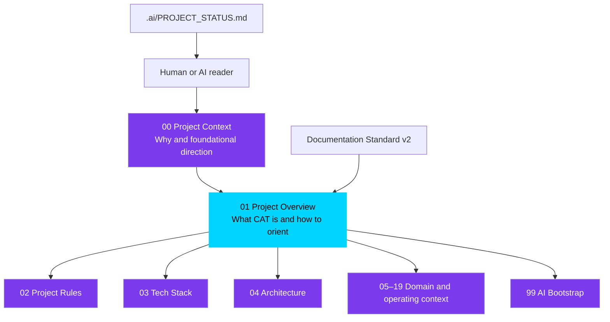

### Mermaid Diagram(s)

The following decision flow is the minimum reading protocol for an AI coding agent:

```mermaid
flowchart LR
    Start[Receive task] --> Workspace[Read .ai/README.md and BOOTSTRAP.md]
    Workspace --> Status[Read PROJECT_STATUS.md and TASKS.md]
    Status --> Root[Read context/00_PROJECT_CONTEXT.md]
    Root --> Overview[Read this overview]
    Overview --> Domain[Load task-specific context]
    Domain --> Decisions[Check accepted decisions and dependencies]
    Decisions --> Plan[Propose a bounded change]
    Plan --> Implement[Implement only after scope is clear]
    Implement --> Verify[Verify tests, docs, and traceability]
    Verify --> Update[Update status and relevant knowledge]
```

### Architecture Map

The orientation document sits between project philosophy and implementation context:

```text
Omni System
└── CAT product identity and mission
    ├── 00 Project Context: why, vision, mission, philosophy
    ├── 01 Project Overview: what CAT is, does, and excludes
    ├── 02–19 Detailed context: how each domain is governed and built
    ├── 99 AI Bootstrap: how AI systems load and apply context
    ├── Architecture: cross-cutting system maps
    ├── Knowledge: decisions, research, glossary, and institutional memory
    └── Code and runtime: future implementation of the documented intent
```

### Decision Tables

#### Document Classification Table

| Classification | Meaning in this document | How a reader may use it |
|---|---|---|
| **Official Decision** | Accepted project direction recorded in current authoritative context or repository policy | Implement or preserve unless an accepted decision changes |
| **Recommendation** | Preferred approach that supports an official decision but may be changed with documented reasoning | Use by default; record deviations |
| **Future Idea** | A deliberate direction beyond the current implementation phase | Do not implement merely because it is described |
| **Experimental Concept** | A hypothesis or prototype direction that requires evaluation | Isolate, label, measure, and keep out of production defaults |

#### Source-Use Table

| Source state | Can define current behavior? | Can justify a proposal? | Can override this document? |
|---|---:|---:|---:|
| Accepted root context | Yes | Yes | Only by a newer accepted authority |
| Active section of this overview | Yes for its scope | Yes | No, if root context conflicts |
| Dedicated active context document | Yes for its domain | Yes | No, outside its domain |
| Draft scaffold | No | Only as a file-location signal | No |
| Future or experimental note | No | Yes, as a labeled hypothesis | No |

### Cross References

- Root context and project philosophy: [`context/00_PROJECT_CONTEXT.md`](./00_PROJECT_CONTEXT.md)
- AI reading and contribution rules: [`/.ai/README.md`](../.ai/README.md), [`/.ai/BOOTSTRAP.md`](../.ai/BOOTSTRAP.md), [`/.ai/CONTEXT_ORDER.md`](../.ai/CONTEXT_ORDER.md)
- Current progress: [`/.ai/PROJECT_STATUS.md`](../.ai/PROJECT_STATUS.md)
- Repository orientation: [`README.md`](../README.md)
- Phase roadmap: [`ROADMAP.md`](../ROADMAP.md)
- Contribution and Definition of Done: [`CONTRIBUTING.md`](../CONTRIBUTING.md)
- Visual identity source: [`CAT Front.md`](../CAT%20Front.md)
- Architecture navigation: [`/.ai/ARCHITECTURE_MAP.md`](../.ai/ARCHITECTURE_MAP.md)
- Decision navigation: [`/.ai/DECISION_INDEX.md`](../.ai/DECISION_INDEX.md)

### Dependencies

This section depends on the existence of the repository-level context system and does not assume that runtime code has been implemented. Its statements must remain compatible with the root context, the roadmap, and the AI workspace instructions.

### Risks

| Risk | Consequence | Control |
|---|---|---|
| Readers skip the root context | Local decisions contradict project philosophy | Require root-context loading in onboarding and AI bootstrap |
| Vision is mistaken for implementation | Stakeholders believe capabilities exist before they are built | Use explicit maturity labels and status checks |
| A draft scaffold is treated as authoritative | Agents infer unsupported technical or business rules | Record source status and authority in proposals |
| Overview becomes a second architecture document | Product intent is buried under implementation detail | Keep deep schemas and protocols in dedicated context files |
| Different audiences use different definitions | Product and engineering drift | Maintain shared terminology and cross-links |

### Best Practices

- Read the smallest sufficient set of documents, but always include root context and this overview for project-level changes.
- Name the capability and lifecycle stage a change supports.
- State whether a proposal is official, recommended, future, or experimental.
- Link to the source of a decision rather than restating it without attribution.
- Update this document when product identity, boundaries, or operating model changes.
- Preserve the distinction between a product promise and a current implementation.

### Anti-patterns

- Starting from a code directory and inferring CAT's purpose from filenames.
- Treating every sentence in a vision document as an existing feature.
- Adding a new feature because it is technically interesting but cannot be mapped to the CAT lifecycle.
- Replacing a precise definition with marketing language.
- Copying architecture detail into this document and allowing the two versions to drift.
- Editing an authority boundary without updating the decision and governance documents.

### Future Evolution

The overview will remain the stable entry point while deeper documents expand. Future parts may add more detailed product operating scenarios, domain contracts, ecosystem relationships, and decision indexes without changing the basic reading contract. If the product identity changes materially, this document must receive a versioned update and downstream documents must be reviewed.

### AI Construction Notes

When constructing or changing a section of this overview, an AI agent should:

1. Identify the user-visible product concept being documented.
2. Read the corresponding root-context section and dedicated context file.
3. Extract current facts separately from aspirations.
4. Write the human explanation before technical detail.
5. Add a decision table if multiple states, roles, or boundaries exist.
6. Add a Mermaid diagram when relationships or flows would otherwise be ambiguous.
7. Add risks and anti-patterns so future agents do not repeat predictable errors.
8. Add cross-references instead of duplicating deep specifications.
9. Update the project status after completing a documentation part.
10. Never claim that a component exists solely because a directory or placeholder file exists.

### Extension Points

This overview can be extended through:

- New capability domains, if they remain subordinate to the Trinity model.
- New lifecycle stages, if their inputs, outputs, owner, and approval behavior are documented.
- New audience or enterprise profiles, if their responsibilities and access boundaries are explicit.
- New integration categories, if the integration does not bypass CAT governance.
- New maturity labels, if their promotion and retirement rules are defined.

### Implementation Checklist

- [x] Document metadata identifies CAT, Omni System, the owner, status, and Part 1.
- [x] Authority hierarchy is explicit.
- [x] Human and AI reading paths are documented.
- [x] Product intent is separated from implementation status.
- [x] Classification vocabulary is defined.
- [x] Cross-references point to the root context, AI workspace, roadmap, and contribution rules.
- [x] Risks, anti-patterns, and AI construction guidance are included.
- [ ] Part 2 of this overview is written in a later task.

---

## 2. CAT Identity — What CAT Is

### Human Explanation

CAT stands for **Commerce AI Trinity**. CAT is an **AI-native autonomous commerce operating system** designed to coordinate the complete affiliate-commerce lifecycle: discovering opportunities, evaluating products and markets, preparing and distributing content, managing affiliate operations, observing performance, learning from outcomes, and maintaining treasury awareness.

The phrase “operating system” is intentional. CAT is not merely a screen, a chatbot, a content generator, or a collection of integrations. It is intended to provide the persistent coordination layer that:

- receives signals from markets, products, channels, agents, users, and financial activity;
- turns those signals into structured work;
- assigns work to specialized agents and services;
- pauses at critical human-approval boundaries;
- records decisions, evidence, outputs, and outcomes;
- uses accumulated knowledge to improve later work; and
- presents the whole operating state through a human command-center experience.

CAT therefore has two identities at once:

1. **A commerce operator:** it performs work that creates and manages affiliate-commerce activity.
2. **An intelligence platform:** it coordinates agents, memory, knowledge, reasoning, learning, and human oversight.

Neither identity is sufficient alone. Commerce without intelligence remains manual and fragmented. Intelligence without commerce is a generic AI system without a focused operating domain. CAT exists in the connection between them, with Treasury providing economic accountability.

The official orientation sentence is:

> **CAT is an AI-native autonomous commerce operating system that researches products, creates and publishes commerce content, manages affiliate operations, observes performance, learns continuously, and maintains treasury accountability under bounded human supervision.**

This sentence is a concise identity statement, not a claim that every capability is already implemented. Current maturity is defined in Section 11 and `.ai/PROJECT_STATUS.md`.

### AI Context

An AI system must use the following identity rules:

- Refer to CAT as a **system/platform/operating system**, not as a chatbot or a single model.
- Treat affiliate commerce as the initial operating domain.
- Treat AI agents as the primary execution mechanism and humans as supervisors and accountable approvers.
- Treat Commerce, AI, and Treasury as inseparable product pillars.
- Treat knowledge, memory, decisions, approvals, and outcomes as part of the product rather than incidental logs.
- Do not describe an unimplemented capability as available in production.
- Do not redefine CAT as a generic agent framework without an approved product decision.
- Do not remove Treasury from the identity; financial accountability is a load-bearing part of the Trinity.
- Use `KATA` for the human-facing persona/interface and `CATA` for the internal central orchestrator when those distinctions are relevant.

The following terms are not interchangeable:

| Term | Correct meaning |
|---|---|
| **CAT** | The complete Commerce AI Trinity product and operating system |
| **Commerce** | Market, product, affiliate, content, publishing, and performance operations |
| **AI** | Agent orchestration, reasoning, memory, knowledge, learning, and model capabilities |
| **Treasury** | Earnings, payouts, budgets, financial reporting, risk, and economic accountability |
| **CATA** | Internal central agent/orchestrator that coordinates specialized agents |
| **KATA** | Human-facing avatar/persona and interaction boundary for CAT |
| **Agent** | A specialized AI participant with an explicit role, tools, inputs, outputs, and autonomy boundary |
| **Human supervisor** | A person who monitors CAT and approves, rejects, modifies, or owns critical decisions |

### Business Perspective

CAT's identity defines the category in which the product competes. It is not competing only with writing tools, affiliate dashboards, or analytics products. Its intended value is to unify the work that those tools leave fragmented.

The business promise is a shift from **human-operated affiliate work** to **human-supervised commerce operations**:

| Traditional operating model | CAT operating model |
|---|---|
| Human searches for opportunities | Agents continuously discover and qualify opportunities |
| Human copies data between tools | CAT coordinates structured workflows and integrations |
| Human writes each content asset | Creative agents produce governed drafts and variants |
| Human manually manages every link | Affiliate capabilities prepare and monitor link operations |
| Human checks reports after the fact | Analytics and Treasury surface signals proactively |
| Human remembers what worked | Knowledge and memory preserve outcomes for future decisions |
| Human must be present for routine work | Agents operate continuously within policy |
| Human remains accountable for critical choices | Human authority is preserved at explicit approval gates |

This positioning matters because a narrow product can optimize one task while leaving the human bottleneck intact. CAT's product thesis is that value comes from closing the loop from opportunity to outcome, not from maximizing the number of isolated AI outputs.

### Technical Perspective

At the technical level, CAT is a coordination system with five essential properties:

1. **Persistent:** relevant memory, knowledge, decisions, and outcomes survive individual sessions and process restarts.
2. **Event-aware:** system and domain signals can initiate work without waiting for a human request.
3. **Modular:** specialized agents and domain modules have explicit responsibilities and contracts.
4. **Governed:** external, financial, reputational, legal, and irreversible actions are classified and routed through appropriate controls.
5. **Observable:** actions, evidence, approvals, errors, and outcomes are traceable.

These properties describe the required product shape, not a complete implementation recipe. The detailed architecture and technology choices belong in `context/03_TECH_STACK.md` and `context/04_ARCHITECTURE.md`.

### Visual Overview

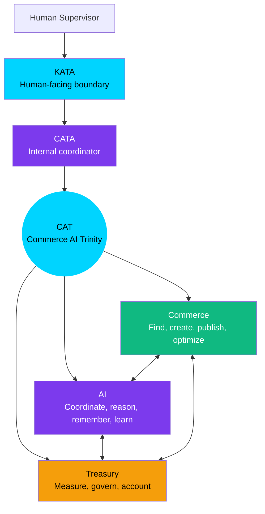

### Mermaid Diagram(s)

#### Identity Boundary

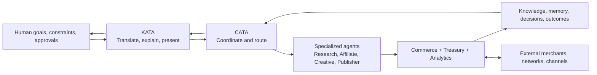

#### Identity Layers

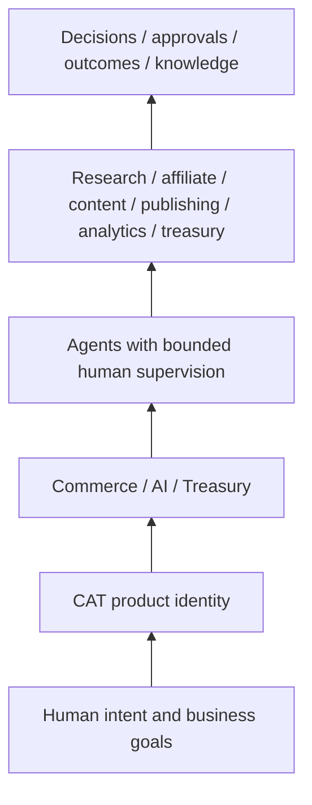

### Architecture Map

CAT is best understood as a **closed-loop operating model**, not a list of screens:

```text
Human intent and constraints
        │
        ▼
KATA — human-facing explanation, request, and approval boundary
        │
        ▼
CATA — internal coordination, task decomposition, routing, and policy checks
        │
        ├── Research and discovery agents
        ├── Affiliate operations agents
        ├── Creative and content agents
        ├── Publisher and channel agents
        ├── Analytics and learning agents
        ├── Treasury and financial agents
        └── Security, memory, and knowledge capabilities
        │
        ▼
Commerce and external integrations produce observable outcomes
        │
        ▼
Knowledge, memory, decisions, approvals, and treasury records
        │
        └────────────── feedback into the next decision
```

The architecture map intentionally omits concrete deployment topology. It identifies the product responsibilities that a later architecture must implement without changing their meaning.

### Decision Tables

#### Official Identity Decisions

| ID | Official Decision | Consequence |
|---|---|---|
| OVR-DEC-001 | CAT is an AI-native autonomous commerce operating system. | A traditional dashboard with optional AI is insufficient as the product definition. |
| OVR-DEC-002 | CAT's initial business domain is affiliate commerce. | New capabilities must support the affiliate-commerce lifecycle or have an explicitly accepted platform rationale. |
| OVR-DEC-003 | Commerce, AI, and Treasury are the three identity pillars. | Product plans must account for operational value, intelligence, and financial accountability. |
| OVR-DEC-004 | Humans remain accountable supervisors for critical actions. | Autonomy must be bounded by policy and approval workflows. |
| OVR-DEC-005 | Specialized agents are preferred over one monolithic AI. | Agent roles, contracts, and orchestration are first-class design concerns. |
| OVR-DEC-006 | Knowledge and memory are persistent product capabilities. | A workflow that cannot preserve relevant context is incomplete for CAT's intended model. |
| OVR-DEC-007 | KATA is the human-facing boundary and CATA is the internal coordinator. | Human interaction and internal orchestration must remain conceptually separate. |

#### Classification of Related Ideas

| Item | Classification | Current interpretation |
|---|---|---|
| AI-native operation | **Official Decision** | CAT is designed around AI as operator, not AI as an optional assistant. |
| Human approval for high-impact actions | **Official Decision** | Critical boundaries are mandatory. |
| Multi-model orchestration | **Official Decision at direction level** | CAT should not depend on a single model; concrete routing is detailed later. |
| Cloud-native and scalable deployment | **Official Decision at direction level** | The system is intended to scale and be observable; exact infrastructure remains a downstream concern. |
| Cosmic cat command-center interface | **Official product/design direction** | The persona and visual identity are defined in root context and `CAT Front.md`; implementation belongs to UI/UX documents. |
| Public plugin marketplace | **Future Idea** | It is an ecosystem direction, not a current Phase A capability. |
| Cross-region CAT federation | **Future Idea** | It requires later architecture and operations decisions. |
| Fully self-modifying autonomous product strategy | **Experimental Concept** | It cannot be treated as a default operating mode without explicit governance and evaluation. |

### Cross References

- Root identity, vision, mission, and principles: [`context/00_PROJECT_CONTEXT.md`](./00_PROJECT_CONTEXT.md), especially Sections 4–12.
- Product-facing shorthand: [`README.md`](../README.md).
- Phase and capability sequence: [`ROADMAP.md`](../ROADMAP.md).
- Human/AI engineering principles: [`CONTRIBUTING.md`](../CONTRIBUTING.md).
- Visual persona and command-center intent: [`CAT Front.md`](../CAT%20Front.md).
- Future agent details: [`context/05_AGENTS.md`](./05_AGENTS.md).
- Future knowledge details: [`context/06_KNOWLEDGE_ENGINE.md`](./06_KNOWLEDGE_ENGINE.md).
- Future Treasury details: [`context/07_TREASURY_CORE.md`](./07_TREASURY_CORE.md).

### Dependencies

CAT's identity depends on the three pillars remaining connected. Removing any one of them changes the product category:

- Without Commerce, CAT loses its domain and becomes generic AI infrastructure.
- Without AI, CAT loses its autonomous operating model and becomes manual commerce software.
- Without Treasury, CAT loses economic accountability and cannot close the business loop.
- Without human governance, CAT loses trust and violates the bounded-autonomy principle.
- Without knowledge, CAT cannot compound learning or preserve institutional context.

### Risks

| Risk | Why it threatens identity | Required response |
|---|---|---|
| Feature drift toward a generic chatbot | Reduces CAT to a conversational surface | Re-map proposals to lifecycle capabilities and operating outcomes |
| Feature drift toward a content-only tool | Leaves discovery, publishing, analytics, and treasury fragmented | Evaluate end-to-end workflow coverage |
| Treasury treated as back-office reporting | Breaks the Trinity feedback loop | Include financial impact and accountability in relevant workflows |
| AI treated as a co-pilot only | Preserves the human bottleneck | Design proactive, event-aware, bounded execution |
| “Autonomous” interpreted as unsupervised | Creates unacceptable risk | Use explicit autonomy levels and approval gates |
| KATA and CATA conflated | Leaks internal complexity into the human interface | Preserve the interface/coordinator boundary |

### Best Practices

- Use the official identity sentence when a short description is needed.
- When proposing a capability, identify which Trinity pillars it serves and which lifecycle stage it advances.
- Preserve human authority for actions with external visibility, financial exposure, legal consequence, reputational risk, or irreversible effect.
- Model knowledge and outcome capture as part of workflow completion.
- Prefer a clear role for each agent over a vague “AI layer.”
- State whether a component is a current implementation, a planned phase, or a future direction.

### Anti-patterns

- “CAT is basically ChatGPT for affiliate links.”
- “CAT is a dashboard where users can optionally ask AI for help.”
- “Treasury can be added later because it is not part of the user experience.”
- “One general model can replace all specialized agents.”
- “Autonomy means no approval is ever required.”
- “The avatar is the whole product.”
- “The existence of an empty repository directory proves a capability is implemented.”

### Future Evolution

The identity is intended to remain stable while the capability surface grows. Future expansion may include more commerce channels, stronger decision support, enterprise deployment models, additional Omni System products, governed plugins, and regional intelligence. Expansion must preserve the initial domain focus, the Trinity relationship, knowledge accumulation, and human accountability.

A future product-domain expansion should be evaluated with these questions:

1. Does it strengthen CAT's commerce operating-system role?
2. Does it have a clear relationship to Commerce, AI, or Treasury?
3. Can its risks be governed at the appropriate autonomy level?
4. Can its outcomes become durable knowledge?
5. Does it belong in CAT Core, a domain module, an integration, or a future Omni product?

### AI Construction Notes

When an AI agent describes CAT in generated documentation, code comments, issue triage, or pull requests:

- Start with the product identity, not the implementation technology.
- Use “intended,” “planned,” or “current” accurately.
- Do not invent customer, revenue, market-size, or deployment claims.
- Do not use `CATA` and `KATA` interchangeably.
- Do not propose a capability that bypasses the Trinity or approval model without explicitly labeling it as a conflict.
- If the requested task appears to turn CAT into a generic platform, ask whether a scope decision is intended before implementing it.

### Extension Points

The identity supports extension through:

- New affiliate networks and commerce channels.
- New specialized agents with bounded responsibilities.
- New analytical or learning capabilities.
- New Treasury reports and financial controls.
- New human-facing interaction modes that remain behind the KATA boundary.
- Future Omni System products that reuse stable, extracted contracts rather than importing CAT internals.

### Implementation Checklist

- [x] CAT is defined as an AI-native autonomous commerce operating system.
- [x] Commerce, AI, and Treasury are defined as the product pillars.
- [x] The human supervisor and AI operator relationship is explicit.
- [x] KATA and CATA are distinguished.
- [x] Current identity is separated from future and experimental ideas.
- [x] Product identity risks and anti-patterns are documented.
- [ ] Detailed agent contracts are defined in `context/05_AGENTS.md`.
- [ ] Detailed domain contracts are defined in the dedicated domain context documents.
- [ ] Concrete implementation status is maintained in `.ai/PROJECT_STATUS.md`.

---

## 3. Why CAT Exists

### Human Explanation

CAT exists because the affiliate-commerce operating model has a structural capacity problem. The number of products, markets, merchants, affiliate programs, channels, content formats, performance signals, and financial decisions grows faster than one human or a small team can continuously evaluate.

A typical affiliate operation requires a chain of dependent activities:

1. Discover a market, trend, product, or merchant opportunity.
2. Research whether the opportunity is real, relevant, and commercially viable.
3. Compare products, commissions, audience fit, compliance constraints, and competition.
4. Create content and assets appropriate to the audience and channel.
5. Create and validate affiliate links or partner relationships.
6. Publish through one or more channels.
7. Measure clicks, conversions, revenue, content quality, and operational cost.
8. Diagnose what happened and decide what to change.
9. Track earnings, payout timing, budgets, risk, and financial performance.
10. Preserve the lesson so that the next cycle is better.

In a fragmented toolchain, every handoff introduces delay, duplicated work, missing context, and inconsistent judgment. The person who researches an opportunity may not know the Treasury constraints. The writer may not know which product evidence is trustworthy. The analyst may see a conversion drop without knowing that a link or policy changed. The organization may repeat the same failed approach because the lesson was never captured.

CAT's response is not to remove humans from the system. It is to remove humans from repetitive coordination and execution where a governed agent can do the work, while keeping people responsible for judgment, accountability, and critical approval.

The central operating transformation is:

> **From human-in-the-loop execution to human-on-the-loop supervision, with explicit human gates wherever the impact requires authority.**

“Human-on-the-loop” does not mean that humans are passive. It means that humans supervise a system capable of continuous operation rather than manually initiating every step.

### AI Context

An AI system must understand the problem as a workflow and knowledge problem, not only as a generation problem. The goal is not “produce more text.” The goal is to coordinate a measurable, auditable path from opportunity to economic outcome.

When analyzing a feature request, the agent should ask:

- Which manual bottleneck does this remove?
- Which lifecycle handoff does it improve?
- Which evidence does it need?
- Which agent or domain owns the work?
- What is the risk if the result is wrong?
- Does the action need approval, notification, or neither?
- What outcome and lesson should be recorded?

An agent must not optimize for output volume in isolation. A large number of generated assets without quality, compliance, conversion, provenance, and treasury context is not progress toward CAT's mission.

### Business Perspective

The business problem has four connected dimensions:

| Dimension | Current industry friction | CAT opportunity |
|---|---|---|
| **Scale** | Human attention limits the number of markets and products that can be evaluated | Agents monitor and triage more opportunities continuously |
| **Speed** | Manual handoffs delay response to trends and campaign signals | Event-driven workflows reduce coordination latency |
| **Quality** | Repetition encourages low-quality, generic, or poorly evidenced content | Specialized agents, review gates, and learning improve consistency |
| **Economics** | Activity, conversions, and earnings are often managed in disconnected tools | Treasury closes the loop between work performed and value created |

CAT's economic thesis is not “more automation always produces more revenue.” The thesis is that better selection, better evidence, better execution, faster feedback, and disciplined financial management can create a more durable commerce operation.

CAT should therefore measure value across a balanced set of outcomes:

- **Operational value:** time saved, handoffs reduced, throughput increased, failure recovery improved.
- **Commerce value:** product-market fit, content usefulness, channel reach, conversion quality, partner coverage.
- **Intelligence value:** retrieval quality, recommendation quality, learning speed, knowledge reuse.
- **Financial value:** earnings quality, margin awareness, payout visibility, budget discipline, risk-adjusted return.
- **Trust value:** approval quality, auditability, compliance, explainability, and incident prevention.

### Technical Perspective

The problem requires a closed-loop architecture because isolated automation cannot solve cross-domain coordination. CAT must connect:

```text
Signals → context → decision → approval → execution → observation → learning
```

A system that only generates a recommendation is incomplete. A system that executes without observing is unsafe and unable to improve. A system that observes without preserving context becomes a reporting tool rather than an operating system.

The technical design must accommodate:

- asynchronous work and external API latency;
- long-running workflows and resumable tasks;
- structured evidence and provenance;
- approval state and responsibility transitions;
- retries, idempotency, and failure isolation;
- persistent knowledge and memory;
- financial consistency and immutable audit history;
- model and prompt versioning;
- human-readable explanations of agent decisions.

These are engineering consequences of the business problem. They are not a license to choose complexity without a documented need.

### Visual Overview

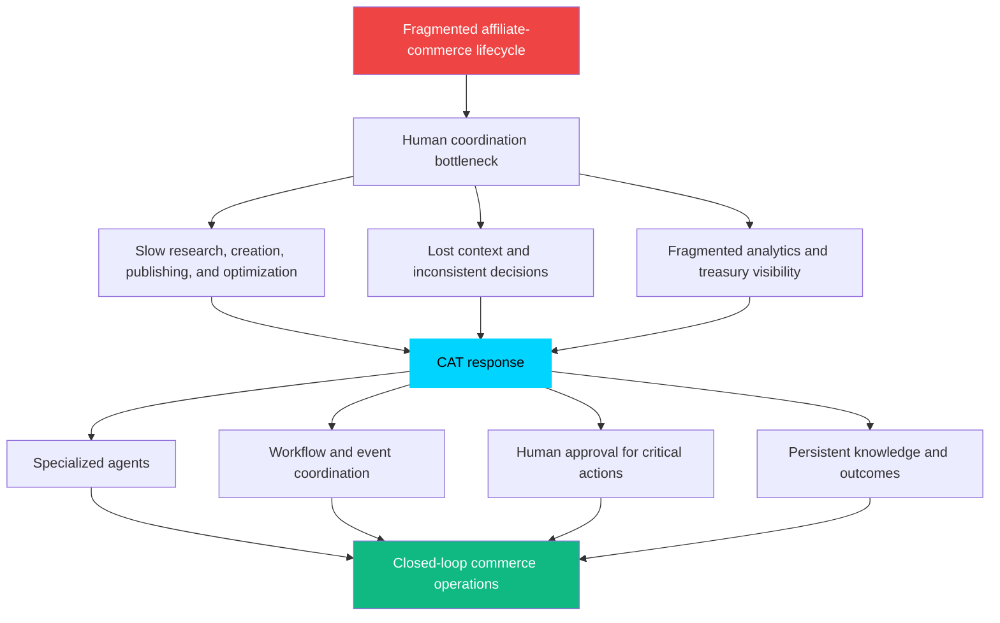

### Mermaid Diagram(s)

#### Traditional and CAT Operating Models

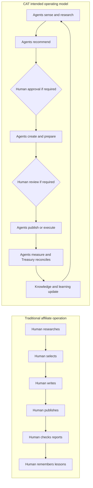

#### Bottleneck Removal Map

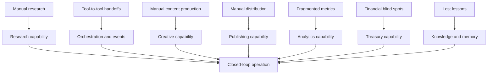

### Architecture Map

The problem-to-capability map is the high-level architecture requirement for the product:

| Problem boundary | CAT responsibility | Required evidence |
|---|---|---|
| Opportunity discovery | Detect, research, qualify, and explain opportunities | Sources, confidence, market context, recommendation |
| Product and affiliate selection | Compare fit, terms, risk, and expected value | Product record, program terms, decision trace |
| Content and asset production | Produce channel-appropriate, evidence-grounded drafts | Prompt/model version, source set, quality checks |
| Publishing and distribution | Prepare and execute approved publication workflows | Approval event, channel response, publication record |
| Measurement and optimization | Observe performance, detect anomalies, recommend changes | Metrics, attribution, analysis, confidence |
| Treasury and accountability | Reconcile earnings, payouts, budgets, and financial risk | Immutable financial records, approval, report |
| Learning and memory | Convert outcomes into reusable knowledge | Outcome record, lesson, confidence, review state |

### Decision Tables

#### Problem-to-Response Decisions

| Problem | CAT response | Must not be reduced to |
|---|---|---|
| Humans cannot monitor enough opportunities | Continuous agent research and prioritization | Blind bulk scraping or spam |
| Handoffs lose context | Shared workflow identity, evidence, and knowledge | Unstructured copy/paste between tools |
| Content is a bottleneck | Governed agent drafting and production | Unreviewed content flooding |
| Performance is reactive | Continuous analytics and anomaly detection | Vanity metrics only |
| Earnings are disconnected from activity | Treasury correlation and reporting | A separate accounting afterthought |
| Lessons disappear | Persistent memory and knowledge refinement | Raw logs with no retrieval or curation |

#### Outcome Quality Table

| Outcome type | Minimum question |
|---|---|
| Research | Was the opportunity supported by credible evidence and relevant context? |
| Recommendation | Why was this option selected, and what alternatives were rejected? |
| Content | Is the output accurate, useful, compliant, and appropriate for its channel? |
| Publication | Was the action authorized, successful, and traceable? |
| Analytics | Does the interpretation distinguish signal from noise? |
| Treasury | Are earnings, costs, risks, and payout state represented correctly? |
| Learning | What should change next time, with what confidence? |

### Cross References

- Root problem statement and CAT solution: [`context/00_PROJECT_CONTEXT.md`](./00_PROJECT_CONTEXT.md), Sections 4–5.
- Mission and lifecycle: [`context/00_PROJECT_CONTEXT.md`](./00_PROJECT_CONTEXT.md), Section 7.
- Core architecture response: [`context/00_PROJECT_CONTEXT.md`](./00_PROJECT_CONTEXT.md), Section 13.
- Roadmap phases: [`ROADMAP.md`](../ROADMAP.md).
- Treasury scope: [`context/07_TREASURY_CORE.md`](./07_TREASURY_CORE.md).
- Affiliate scope: [`context/08_AFFILIATE_ENGINE.md`](./08_AFFILIATE_ENGINE.md).
- Content scope: [`context/09_CONTENT_ENGINE.md`](./09_CONTENT_ENGINE.md).
- Knowledge scope: [`context/06_KNOWLEDGE_ENGINE.md`](./06_KNOWLEDGE_ENGINE.md).

### Dependencies

Solving the problem depends on more than an AI model. CAT requires the coordinated existence of:

- trustworthy input sources and provenance;
- product, market, affiliate-program, content, channel, and campaign concepts;
- workflow and task coordination;
- approval and responsibility rules;
- analytics and attribution;
- Treasury records and reconciliation;
- persistent knowledge and memory;
- security controls for credentials and external actions;
- a human interface that makes system state understandable.

If one dependency is absent, the system may still provide a narrow utility, but it does not fully solve the stated problem.

### Risks

| Risk | Failure mode | Mitigation |
|---|---|---|
| Automation increases volume but not value | More content, links, or campaigns with no quality or earnings improvement | Tie evaluation to quality, outcomes, and risk-adjusted value |
| Bad source data drives decisions | Agents produce confident but wrong recommendations | Track provenance, confidence, freshness, and source reliability |
| Human approval becomes a bottleneck | Every trivial action waits for a person | Use risk-based autonomy and progressive trust |
| Agents optimize locally | One agent improves its metric while harming Treasury or reputation | Evaluate cross-domain outcomes and use CATA coordination |
| Learning captures false lessons | A noisy event changes future strategy | Require confidence, evidence, review, and sufficient sample size |
| External platforms change | Integrations fail or corrupt records | Isolate connectors, monitor contracts, and fail safely |

### Best Practices

- Define the user and business bottleneck before proposing automation.
- Prefer end-to-end lifecycle improvements over isolated output generation.
- Make the expected outcome measurable before implementation.
- Include Treasury and risk considerations early for commerce proposals.
- Preserve sources and assumptions with every material recommendation.
- Capture both successful and unsuccessful outcomes.
- Use human review to improve decision quality, not to manually repeat low-risk work.

### Anti-patterns

- Measuring success by generated tokens, number of agents, or number of integrations alone.
- Automating a bad process without clarifying ownership and desired outcomes.
- Treating analytics as a report that is disconnected from action.
- Treating Treasury as an after-the-fact spreadsheet.
- Creating content at scale without evidence, quality controls, or disclosure requirements.
- Using learning language to justify unreviewed policy changes.

### Future Evolution

As CAT matures, the closed loop can become more predictive: identifying emerging opportunities, estimating likely outcomes, recommending budget allocation, and scheduling work before a human asks. Predictive behavior must remain grounded in evidence and bounded by risk policy. The system should become more capable without becoming less accountable.

### AI Construction Notes

When an AI agent receives a task framed as “automate X,” it should not immediately write an automation. It should map X to the lifecycle, identify the upstream input and downstream outcome, ask what human authority is required, and identify the knowledge that must be preserved. If the task only increases output volume, the agent should flag the missing quality and value criteria.

### Extension Points

The problem response can be extended by:

- Adding new data sources with provenance and freshness contracts.
- Adding new commerce channels through connector boundaries.
- Adding new agent specializations where evaluation can be isolated.
- Adding new financial metrics that improve economic accountability.
- Adding new learning signals that have a documented confidence model.
- Adding new approval policies for regulated or enterprise deployments.

### Implementation Checklist

- [x] The structural problem CAT addresses is defined.
- [x] The human bottleneck and fragmented-tool problem are explicit.
- [x] The CAT response is described as a closed loop.
- [x] Operational, commerce, intelligence, financial, and trust outcomes are separated.
- [x] Technical dependencies and risks are identified.
- [x] Local optimization and output-volume anti-patterns are documented.
- [ ] Detailed problem-domain schemas are defined in downstream context files.
- [ ] Outcome metrics and evaluation thresholds are approved for implementation phases.

---

## 4. The Commerce AI Trinity

### Human Explanation

The name CAT contains the product's organizing model: **Commerce AI Trinity**. The Trinity is not three independent features placed next to one another. It is a continuous relationship among three responsibilities:

- **Commerce** determines where value can be created and performs market-facing operations.
- **AI** turns data and context into coordinated reasoning, agent work, memory, learning, and decisions.
- **Treasury** determines whether activity is economically visible, accountable, and sustainable.

Commerce asks, “What opportunity should we pursue, for whom, through which channel, and with what content?” AI asks, “What evidence do we have, what should happen next, which agent should do it, and what did we learn?” Treasury asks, “What did this activity cost or earn, what is the risk, what is the payout state, and should the next action be funded or approved?”

CAT exists because those questions are coupled. A product recommendation without economic context may be strategically attractive but financially weak. A Treasury report without Commerce context describes what happened but cannot improve the next action. AI is the connective intelligence that allows the two operational domains to reason together.

The Trinity should be treated as a balancing model:

```text
Commerce creates activity.
AI coordinates and improves activity.
Treasury measures and governs the economic result.
```

The result is not merely more automation. It is a system in which activity, intelligence, and economics inform each other continuously.

### AI Context

When an AI agent classifies a capability, it must identify its Trinity relationship:

- A capability may be primarily Commerce, primarily AI, primarily Treasury, or cross-pillar.
- A cross-pillar capability must document its data and authority boundaries.
- Treasury constraints must be visible to recommendations that spend resources, create financial exposure, or claim economic value.
- Commerce outputs must be grounded in sources and channel requirements.
- AI orchestration must not become an unbounded authority layer; it coordinates under policy.

A feature that cannot be connected to at least one pillar should be questioned. A feature that claims to optimize the whole system but ignores one of the pillars is incomplete.

### Business Perspective

The Trinity creates a differentiated business model and a product discipline. It prevents CAT from becoming:

- a generic AI platform with no operating domain;
- a content factory that ignores product economics;
- an affiliate dashboard that reports on activity without acting on it; or
- a financial system that cannot influence commerce decisions.

The pillars create several business loops:

| Loop | Commerce contribution | AI contribution | Treasury contribution |
|---|---|---|---|
| Opportunity loop | Finds products, markets, merchants, and channels | Scores and prioritizes opportunities | Estimates value, cost, exposure, and budget fit |
| Production loop | Defines content and distribution needs | Generates, validates, and coordinates assets | Tracks resource use and expected return |
| Performance loop | Supplies clicks, conversions, and channel results | Diagnoses patterns and proposes changes | Reconciles revenue, payout, and financial impact |
| Learning loop | Provides new market and campaign evidence | Converts outcomes into reusable knowledge | Confirms whether lessons improve economics |
| Governance loop | Identifies externally visible activity | Routes decisions and approvals | Enforces financial accountability |

### Technical Perspective

The Trinity implies shared identifiers and traceability across domains. A campaign, product, content asset, affiliate link, action, approval, and earnings record must be related enough that CAT can answer:

- Which product and source led to this recommendation?
- Which content and channel produced this conversion?
- Which agent and prompt created the asset?
- Which human approved the external action?
- Which Treasury record reconciles the result?
- What knowledge should be updated after the outcome?

The detailed implementation may use separate domain modules or services, but the product model requires these relationships to be coherent. Domain separation is not permission to create disconnected systems.

### Visual Overview

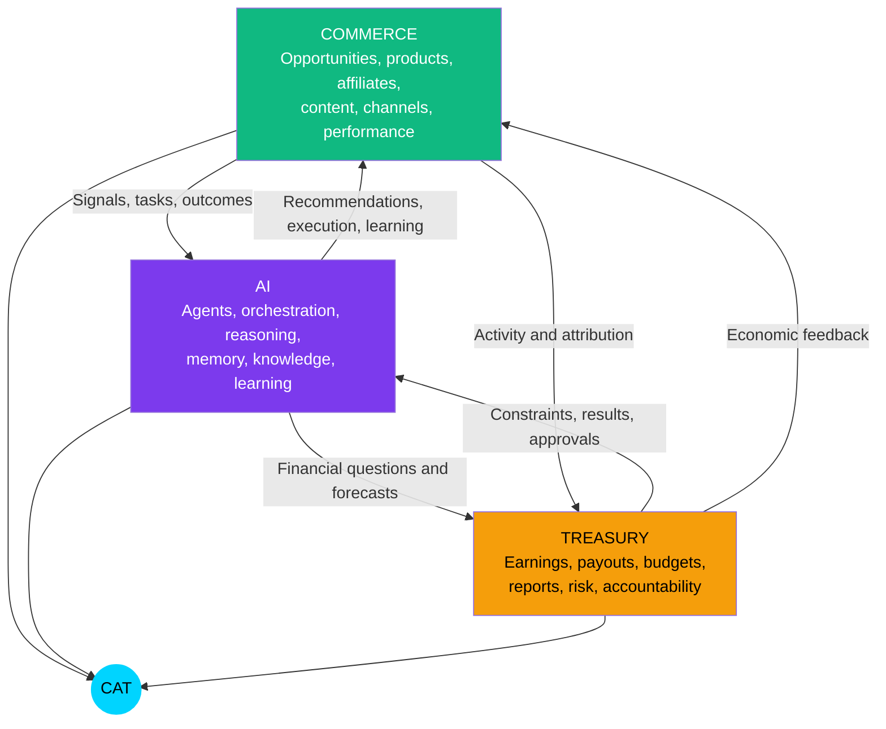

### Mermaid Diagram(s)

#### Closed-Loop Trinity Flow

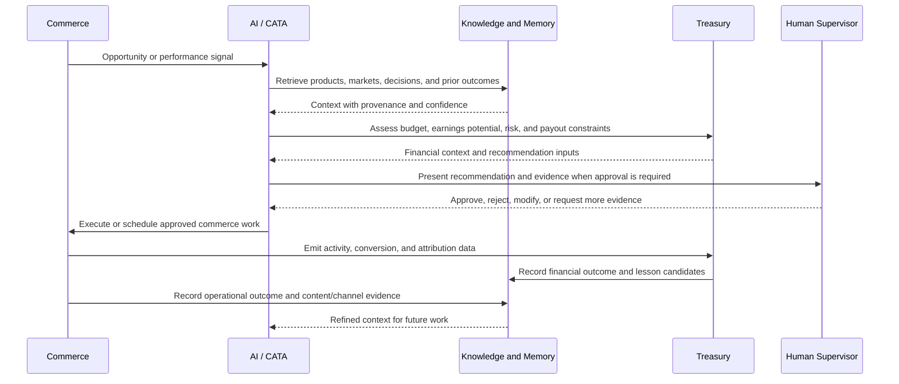

#### Three-Pillar Balance

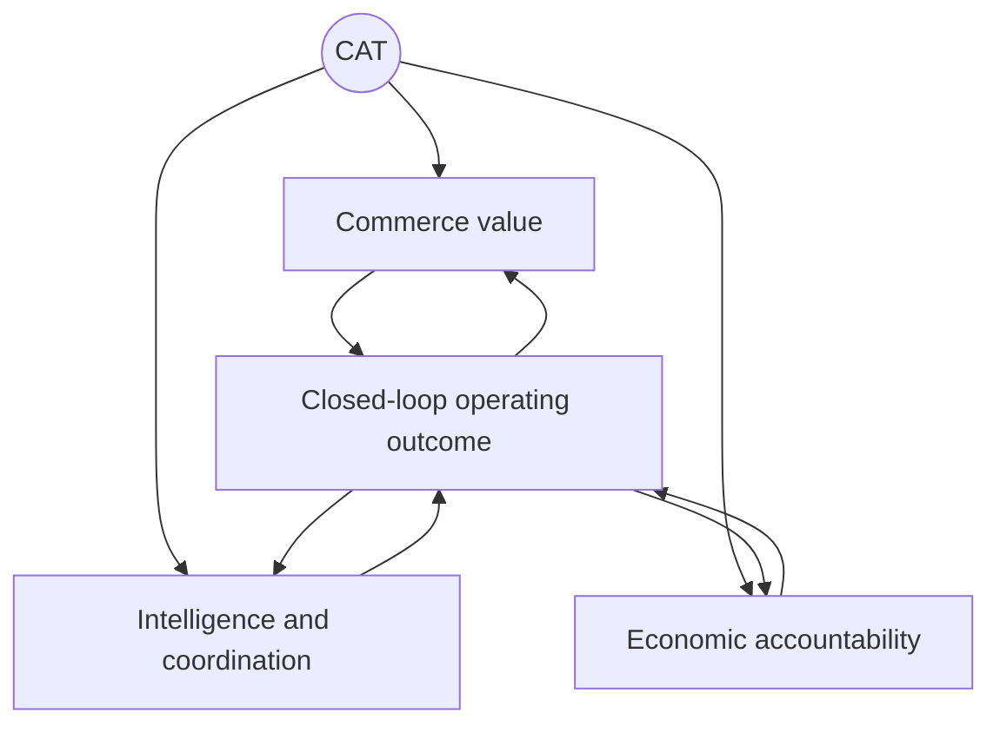

### Architecture Map

```text
                           CAT
                            │
        ┌───────────────────┼───────────────────┐
        │                   │                   │
        ▼                   ▼                   ▼
 Commerce domain      AI/cognitive domain   Treasury domain
        │                   │                   │
 product/market       agents, CATA,          earnings, costs,
 affiliate/channel    memory, knowledge,    budgets, payouts,
 content/performance  reasoning, learning    reports, risk
        └─────────────── shared identity and traceability ───────────────┘
                            │
                            ▼
                 approved action and measured outcome
```

#### Pillar Responsibility Map

| Pillar | Owns | Consumes | Produces | Does not own alone |
|---|---|---|---|---|
| Commerce | Market and channel operations | Research, product data, policy, financial constraints | Campaign activity, content, links, performance signals | Final financial approval or system-wide governance |
| AI | Coordination, reasoning, memory, learning | Commerce signals, Treasury context, human goals | Recommendations, tasks, explanations, knowledge updates | Human accountability or independent policy override |
| Treasury | Financial records, reports, payout and budget context | Commerce attribution, approved actions, external financial data | Economic outcomes, constraints, risk signals | Content strategy or autonomous spending authority |

### Decision Tables

#### Official Trinity Decisions

| ID | Official Decision | Implication |
|---|---|---|
| TRI-DEC-001 | Commerce, AI, and Treasury form the three foundational CAT pillars. | Product plans must show their relationship to one or more pillars. |
| TRI-DEC-002 | The pillars are integrated through shared workflows and outcomes. | Independent departmental silos are not the intended product model. |
| TRI-DEC-003 | Treasury is part of the product identity, not a later reporting add-on. | Economic accountability is considered during opportunity, execution, and learning. |
| TRI-DEC-004 | AI coordinates the pillars but does not replace human accountability. | CATA and agents operate under policy and approval boundaries. |

#### Capability Classification Table

| Capability | Primary pillar | Secondary pillar(s) | Typical approval concern |
|---|---|---|---|
| Market research | Commerce | AI | Source quality and strategic fit |
| Product scoring | AI | Commerce, Treasury | Recommendation confidence and economic assumptions |
| Affiliate link creation | Commerce | AI, Treasury | Partner terms, external effect, attribution |
| Content generation | Commerce | AI | Accuracy, brand, legal, public reputation |
| Publishing | Commerce | AI | External publication and channel policy |
| Performance analysis | AI | Commerce, Treasury | Data quality and causal overclaiming |
| Earnings reconciliation | Treasury | Commerce, AI | Financial integrity and auditability |
| Learning update | AI | Commerce, Treasury | False lessons and policy impact |
| Budget allocation | Treasury | AI, Commerce | Financial approval and risk |

### Cross References

- Trinity definition in root context: [`context/00_PROJECT_CONTEXT.md`](./00_PROJECT_CONTEXT.md), Section 5.3.
- Ecosystem treatment of the Trinity: [`context/00_PROJECT_CONTEXT.md`](./00_PROJECT_CONTEXT.md), Section 15.2.
- Treasury implementation direction: [`context/07_TREASURY_CORE.md`](./07_TREASURY_CORE.md).
- Affiliate implementation direction: [`context/08_AFFILIATE_ENGINE.md`](./08_AFFILIATE_ENGINE.md).
- Knowledge and learning direction: [`context/06_KNOWLEDGE_ENGINE.md`](./06_KNOWLEDGE_ENGINE.md).
- Agent and orchestration direction: [`context/05_AGENTS.md`](./05_AGENTS.md).

### Dependencies

The Trinity requires:

- a common identity for products, campaigns, content, links, actions, approvals, and outcomes;
- event or workflow coordination across domains;
- source and attribution provenance;
- a Treasury model capable of relating activity to economic outcomes;
- an AI knowledge model capable of retrieving cross-domain context;
- approval policies that apply to the combined risk of a workflow, not only to one component.

### Risks

| Risk | Consequence | Control |
|---|---|---|
| One pillar dominates roadmap decisions | CAT becomes a narrow product | Require pillar impact in product proposals |
| Domains share data without ownership | Inconsistent or corrupted records | Define canonical owners and contract boundaries |
| AI recommendation ignores financial constraints | Activity consumes resources without rational economics | Include Treasury context before material recommendations |
| Treasury blocks all experimentation | Product becomes slow and over-controlled | Use risk-based thresholds and approved low-risk experiments |
| Shared identifiers are inconsistent | Attribution and learning fail | Establish terminology and identity contracts before implementation |
| The Trinity becomes branding only | Architecture remains fragmented | Require traceable cross-pillar workflows in acceptance criteria |

### Best Practices

- Treat every major campaign as a Trinity workflow, even if one pillar is temporarily dominant.
- Include expected economic impact and uncertainty in material recommendations.
- Keep domain ownership clear while preserving cross-domain traceability.
- Let AI synthesize and coordinate; keep authority with the correct human or policy owner.
- Evaluate outcomes across quality, operational, and financial dimensions.

### Anti-patterns

- “Commerce first; Treasury later.”
- “AI can decide because it has more data.”
- “Each domain maintains its own definition of campaign or outcome.”
- “Revenue is the only success metric.”
- “A dashboard joins disconnected data at presentation time and calls that integration.”
- “A cross-pillar workflow has no shared correlation or decision identifier.”

### Future Evolution

The Trinity can support richer forecasting, portfolio-level allocation, cross-channel optimization, and future Omni System products that consume shared contracts. These capabilities should emerge from validated workflows rather than from premature abstraction. Cross-product Treasury and knowledge relationships require explicit privacy, ownership, and governance decisions.

### AI Construction Notes

For any proposed feature, generate a small Trinity impact statement:

```text
Primary pillar:
Secondary pillars:
Input signals:
Decision or action:
Financial effect:
Human approval required:
Outcome captured:
Knowledge updated:
```

If the financial effect or outcome is unknown, mark the proposal incomplete rather than filling the gap with an invented assumption.

### Extension Points

- New commerce domains can be attached through shared campaign, product, channel, and outcome contracts.
- New AI capabilities can add reasoning, evaluation, memory, or agent skills without redefining Commerce or Treasury ownership.
- New Treasury capabilities can add currencies, reports, payout integrations, and risk controls through domain-specific context.
- Future Omni products may reuse proven Trinity patterns only after their boundaries are accepted.

### Implementation Checklist

- [x] Commerce, AI, and Treasury are defined separately and relationally.
- [x] The closed-loop relationship is visualized.
- [x] Pillar ownership and non-ownership are explicit.
- [x] Cross-pillar decision and risk concerns are documented.
- [x] Feature classification guidance is included.
- [ ] Detailed shared identifiers and schemas are defined in later context documents.
- [ ] Treasury and commerce outcome metrics are implemented in a later phase.

---

## 5. What CAT Does — The End-to-End Commerce Lifecycle

### Human Explanation

CAT is intended to operate across a connected lifecycle rather than a single task. The lifecycle begins with sensing and research and ends with measured outcomes becoming better context for the next cycle. Humans may set goals, constraints, budgets, markets, or approval policies; agents perform the repeatable investigation and execution inside those boundaries.

The lifecycle is described as ten stages. The stages are conceptual product responsibilities; their exact service and agent decomposition belongs in downstream documents.

#### Stage 1 — Sense and Discover

CAT observes market, product, merchant, channel, analytics, and Treasury signals. It may receive scheduled research work, an external event, a performance anomaly, or a human goal. The output is a candidate opportunity or a reason to investigate.

#### Stage 2 — Research and Qualify

Research capabilities gather evidence about the market, product, audience, merchant, affiliate program, channel, competition, compliance considerations, and likely effort. CAT should distinguish facts, assumptions, estimates, and unknowns.

#### Stage 3 — Select and Plan

AI capabilities compare candidate opportunities and prepare a recommendation or plan. The recommendation should include evidence, confidence, expected value, risk, alternatives, dependencies, and the approval level required.

#### Stage 4 — Affiliate and Commerce Preparation

CAT prepares affiliate-program relationships, product metadata, links, tracking identifiers, campaign structure, channel requirements, and required operational configuration. The system must validate terms and preserve provenance.

#### Stage 5 — Create Content and Assets

Creative capabilities produce drafts, comparisons, reviews, tutorials, images, video concepts, metadata, or other channel-ready assets. Content must be grounded in evidence, comply with policy, and carry enough traceability to explain its origin.

#### Stage 6 — Review and Approve

CAT checks quality, policy, technical readiness, financial exposure, and external impact. A human approves, rejects, modifies, or requests revision when the risk classification requires it. The approval event is part of the workflow record.

#### Stage 7 — Publish and Execute

Publisher or domain capabilities execute approved actions through the appropriate channel or integration. Actions must be idempotent where possible, report external responses, and fail safely when a channel is unavailable or has changed.

#### Stage 8 — Observe and Attribute

CAT records impressions, clicks, conversions, revenue, costs, content quality signals, channel results, errors, and operational latency. It connects observations to the originating product, content, campaign, link, agent, prompt, approval, and Treasury records.

#### Stage 9 — Reconcile and Manage Treasury

Treasury capabilities reconcile earnings, commissions, payouts, budgets, costs, currency, timing, and risk. Financial records must not be silently overwritten. Discrepancies become visible signals for investigation.

#### Stage 10 — Learn and Refine

Learning and knowledge capabilities evaluate the outcome against expectations, extract lessons, adjust confidence, mark stale information, and make validated knowledge available to later decisions. A workflow is not complete merely because it published; it is complete when its outcome is recorded and its learning path is explicit.

### AI Context

An AI coding agent should treat lifecycle stages as product vocabulary and map requested work to one or more stages. It should not invent a new stage when an existing stage is sufficient. If a feature crosses multiple stages, it must identify the handoff and shared correlation identity.

For every lifecycle implementation, the agent should identify:

- triggering event or request;
- owning agent or service;
- required context and sources;
- generated artifacts;
- approval or notification boundary;
- external side effects;
- idempotency and retry behavior;
- success and failure outcomes;
- Treasury impact;
- knowledge update.

### Business Perspective

The lifecycle is the product's value chain. Each stage should either create value directly, reduce risk, reduce coordination cost, improve decision quality, or preserve learning. A stage that adds work but does not improve one of those outcomes should be challenged.

| Lifecycle outcome | Business value |
|---|---|
| Better opportunity selection | Fewer resources wasted on weak products or markets |
| Faster preparation | Reduced time from signal to approved action |
| Higher-quality assets | More useful content and stronger trust |
| Reliable distribution | More consistent channel execution |
| Faster feedback | Earlier detection of successful or failing campaigns |
| Treasury visibility | Better financial discipline and planning |
| Compounding learning | Less repeated work and better future decisions |

### Technical Perspective

The lifecycle is a long-running, stateful workflow. It must support pauses, human decisions, asynchronous external responses, partial failure, retries, cancellation, resumption, and audit. It should not be implemented as one giant synchronous request.

At minimum, each stage should have a stable input/output contract. A stage may be implemented by one agent, multiple agents, a service, or a human-facing approval surface, but the stage boundary must remain observable.

### Visual Overview

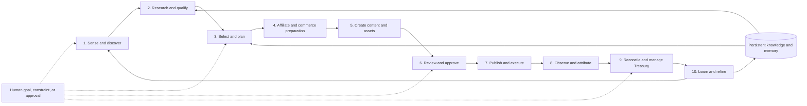

### Mermaid Diagram(s)

#### Lifecycle Workflow with Gates

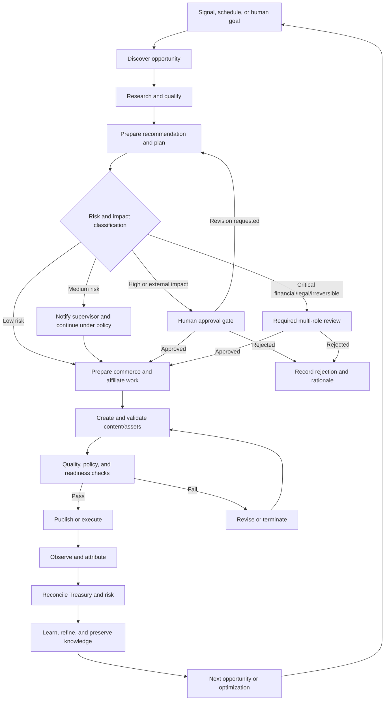

#### Stage-State Model

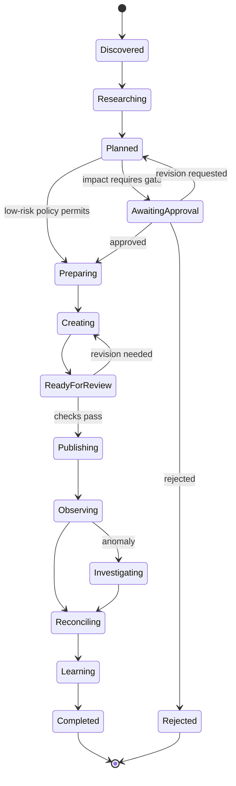

### Architecture Map

#### Stage Contract Map

| Stage | Primary owner | Inputs | Outputs | Side effects | Knowledge obligation |
|---|---|---|---|---|---|
| Sense and discover | Research/Analytics capabilities | Events, schedules, goals, signals | Candidate opportunity | May create a research task | Record source, timestamp, freshness |
| Research and qualify | Research Agent | Market/product/channel context | Evidence bundle and qualification | External reads | Preserve sources, assumptions, confidence |
| Select and plan | CATA + decision capabilities | Candidates, knowledge, Treasury context | Ranked recommendation and plan | May request approval | Record alternatives and rationale |
| Affiliate preparation | Affiliate capability | Approved product/campaign plan | Validated links, terms, tracking configuration | External partner calls | Record partner source and validity |
| Create assets | Creative capability | Product facts, evidence, brief, policy | Draft assets and metadata | Model calls, storage writes | Record model/prompt/version and source set |
| Review and approve | Human supervisor + policy | Draft, evidence, risk, Treasury context | Approval decision or revision | Audit event | Preserve approver, decision, scope, reason |
| Publish and execute | Publisher/domain capability | Approved action and credentials | External response and publication record | External side effect | Record channel, version, timestamp, response |
| Observe and attribute | Analytics capability | Channel and commerce signals | Metrics and anomaly signals | Data ingestion | Link metrics to origin and attribution assumptions |
| Treasury reconciliation | Treasury capability | Earnings, costs, payouts, attribution | Financial record and report | Ledger/projection writes | Preserve source, currency, reconciliation state |
| Learn and refine | Learning/Knowledge capability | Outcome, expectation, evidence | Lesson, confidence, updated knowledge | Knowledge updates | State what changed and why |

#### Human Touchpoint Map

```text
Autonomous sensing ──► agent research ──► recommendation
                                             │
                         ┌───────────────────┴───────────────────┐
                         │ approval may be required             │
                         ▼                                       ▼
                 human decision                           policy-approved path
                         │                                       │
                         └───────────────────┬───────────────────┘
                                             ▼
                                   agent execution
                                             ▼
                              observation and Treasury
                                             ▼
                                    learning update
```

### Decision Tables

#### Approval by Lifecycle Stage

| Stage | Default autonomy | Explicit human approval required when |
|---|---|---|
| Sense and discover | Autonomous | A discovery rule changes market scope or monitoring authority |
| Research and qualify | Autonomous with logging | Research accesses restricted data or creates material external commitment |
| Select and plan | Recommendation | Budget, strategic entry, legal exposure, or material risk is involved |
| Affiliate preparation | Prepare and validate | Joining a program, changing terms, or creating an externally consequential relationship requires it |
| Create assets | Draft autonomously | Content is sensitive, regulated, public, or reputationally material |
| Review and approve | Human/policy gate | The action has external visibility, financial effect, legal/reputational risk, or irreversibility |
| Publish and execute | Execute approved action | Any action that is not already covered by an accepted approval scope |
| Observe and attribute | Autonomous | Data policy, attribution model, or material interpretation changes |
| Treasury reconciliation | Autonomous recording, human oversight | Payouts, transfers, budget changes, or disputed financial entries require it |
| Learn and refine | Propose or low-risk update | The learning changes policy, autonomy, financial strategy, or public behavior |

#### Lifecycle Completion Table

| Completion condition | Required evidence |
|---|---|
| Technical completion | Stage output conforms to contract and is traceable |
| Operational completion | External response or terminal failure is recorded |
| Governance completion | Required approval and responsibility transitions are recorded |
| Financial completion | Relevant Treasury impact is reconciled or explicitly marked pending |
| Learning completion | Outcome and lesson state are recorded, even if no lesson is learned |

### Cross References

- Mission lifecycle in root context: [`context/00_PROJECT_CONTEXT.md`](./00_PROJECT_CONTEXT.md), Section 7.2.1.
- Agent inventory and communication: [`context/00_PROJECT_CONTEXT.md`](./00_PROJECT_CONTEXT.md), Section 13.8.
- Event-driven architecture: [`context/00_PROJECT_CONTEXT.md`](./00_PROJECT_CONTEXT.md), Sections 13.9 and 13.11.
- Workflow and orchestration details: [`context/04_ARCHITECTURE.md`](./04_ARCHITECTURE.md), [`context/05_AGENTS.md`](./05_AGENTS.md).
- Content and publication details: [`context/09_CONTENT_ENGINE.md`](./09_CONTENT_ENGINE.md).

### Dependencies

The lifecycle depends on shared concepts for:

- opportunity, market, product, merchant, affiliate program, campaign, content, channel, link, action, approval, metric, earning, payout, outcome, and lesson;
- task identity, correlation identity, and idempotency;
- policies and risk classification;
- source provenance and evidence bundles;
- model/prompt/version traceability;
- human identity and role-based approval;
- storage, event, analytics, and Treasury reliability.

### Risks

| Risk | Effect | Control |
|---|---|---|
| Lifecycle stage silently skipped | Incomplete or unsafe operation | State machine and completion checklist |
| Approval recorded after execution | Governance becomes retrospective only | Enforce precondition at execution boundary |
| External side effect duplicated | Duplicate posts, links, or financial actions | Idempotency keys and reconciliation |
| Stage output lacks provenance | Decisions cannot be explained | Evidence and source contract |
| Learning runs before outcome stabilizes | False or premature lessons | Delayed evaluation and confidence thresholds |
| Long-running workflow loses state | Work is duplicated or abandoned | Durable workflow state and resumable tasks |
| Analytics cannot attribute outcome | Treasury and learning are unreliable | Shared campaign/link/content identities |

### Best Practices

- Define terminal states for success, rejection, cancellation, and failure.
- Make every stage resumable where external latency or human review is possible.
- Use explicit correlation identifiers across agent, domain, and Treasury events.
- Treat a human approval as a scoped, time-aware decision, not a generic “yes.”
- Record negative outcomes and rejected recommendations.
- Keep stage outputs useful to both the next stage and future retrieval.
- Prefer additive workflow changes and preserve backward compatibility.

### Anti-patterns

- One endpoint that performs the entire lifecycle synchronously.
- Publishing before the approval state is verified.
- Treating content generation as the end of the workflow.
- Measuring earnings without linking them to originating activity.
- Re-running failed work without checking idempotency.
- Updating global knowledge from one unverified outcome.

### Future Evolution

Later phases may add proactive campaign planning, multi-channel optimization, predictive Treasury, portfolio management, and continuous experimentation. Each evolution should add a visible stage, branch, or policy to the lifecycle rather than hiding behavior inside an opaque agent.

### AI Construction Notes

When implementing a lifecycle change, an AI agent should first write the stage contract and state transition table. It should then identify tests for:

- valid transition;
- invalid transition;
- approval required;
- rejection and revision;
- external failure and retry;
- duplicate event;
- partial completion;
- Treasury reconciliation;
- outcome and knowledge capture.

### Extension Points

- Add a new stage only when the existing stages cannot express the responsibility.
- Add new channel or affiliate connectors behind preparation and execution boundaries.
- Add new review gates through risk policy rather than embedding user-specific conditions in agents.
- Add new learning signals through outcome schemas and confidence rules.
- Add new workflow types through shared lifecycle primitives and versioned contracts.

### Implementation Checklist

- [x] Ten lifecycle responsibilities are defined in product language.
- [x] Inputs, outputs, owners, side effects, and knowledge obligations are mapped.
- [x] Approval behavior is classified by stage.
- [x] Lifecycle state and gate diagrams are included.
- [x] Risks for skipped stages, duplicate effects, and lost state are documented.
- [ ] Detailed state schemas and event contracts are defined downstream.
- [ ] Runtime workflow implementation is deferred until the documentation foundation is approved.

---

## 6. Operating Model — AI Operator, Human Supervisor

### Human Explanation

CAT's operating model assigns work according to the strengths of humans and AI agents. AI performs scalable research, synthesis, drafting, monitoring, coordination, and routine execution. Humans define goals, set constraints, judge ambiguity, accept material risk, protect reputation, and approve critical actions.

The model is not “AI makes decisions and humans watch.” It is:

> **AI prepares and performs bounded work; humans retain authority over intent, accountability, and consequential decisions.**

CAT uses a graduated autonomy model. Not every action deserves the same amount of human friction, and not every action is safe to perform automatically. The level depends on impact, reversibility, confidence, policy, and the scope of the existing approval.

| Level | Operating pattern | Human role | Example |
|---:|---|---|---|
| 0 | Human performs | Human does the work | Human writes a sensitive public statement |
| 1 | AI suggests | Human performs and decides | AI suggests a new market to investigate |
| 2 | AI drafts | Human edits and decides | AI drafts a compliance-sensitive article |
| 3 | AI prepares and executes after approval | Human approves before side effect | AI prepares and publishes an approved campaign |
| 4 | AI executes and notifies | Human reviews after the fact | AI adjusts a low-risk internal routing rule |
| 5 | AI operates autonomously under policy | Human owns policy and receives exception signals | Internal data routing, health checks, or safe cache maintenance |

**Level 3 is the default for actions with external visibility or material financial/reputational consequence.** Level 4 and Level 5 are not blanket permissions; they apply only to explicitly classified action types under accepted policy.

The supervisor should receive enough information to make a real decision:

- what CAT proposes;
- why it proposes it;
- which evidence supports it;
- what alternatives were considered;
- what could go wrong;
- what it will cost or expose;
- how reversible it is;
- what changes if the supervisor modifies the plan; and
- how the result will be measured.

### AI Context

AI agents are not accountable principals. They have roles and permissions, but the human or organization that owns the policy and approves a critical action remains accountable.

An AI agent must:

- operate only within its declared role and tool permissions;
- state uncertainty instead of fabricating confidence;
- escalate when required evidence is missing or impact exceeds policy;
- preserve the decision and approval context;
- avoid treating user urgency as permission to bypass controls;
- distinguish recommendation, draft, approved action, and completed action;
- honor rejection and modification reasons as learning input without automatically rewriting policy;
- stop or degrade safely when the governing service, source, or approval is unavailable.

### Business Perspective

Bounded autonomy is the mechanism that allows CAT to scale without asking the business to accept uncontrolled risk. It creates an operating leverage model:

- Routine work runs continuously.
- Specialists receive higher-quality evidence instead of raw queues.
- Human attention is spent where judgment has the highest value.
- Critical actions remain attributable and reviewable.
- Trust can increase progressively as performance is demonstrated.

The model also creates a governance promise to enterprises and partners: CAT can be autonomous without being unaccountable.

### Technical Perspective

The operating model requires an authorization and approval system that understands action type, scope, actor, subject, target, risk, reversibility, expiration, and outcome. A boolean `approved` flag is insufficient for high-impact work.

An approval record should be able to answer:

```text
Who approved?
What exact action and version were approved?
For which subject, target, channel, budget, and time window?
What evidence and policy were in force?
What modifications were requested?
Did execution match the approved scope?
What was the result?
```

Autonomy should be granted to **action classes**, not to a model in the abstract. A model may be capable of generating text but not authorized to publish it. An agent may be authorized to prepare a payout report but not execute a transfer.

### Visual Overview

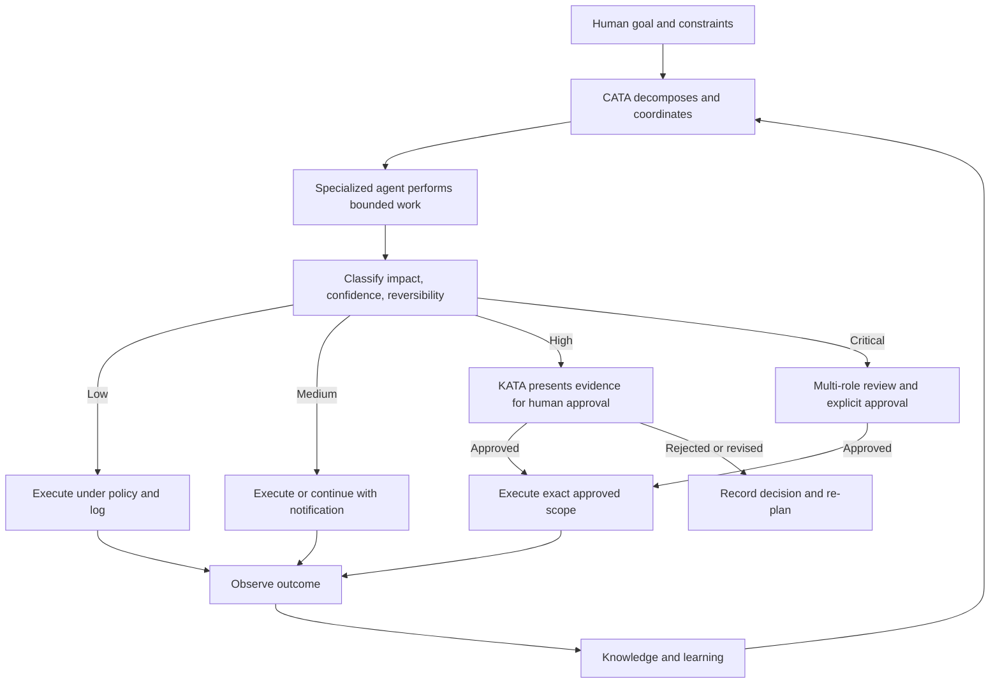

### Mermaid Diagram(s)

#### Human–AI Responsibility Sequence

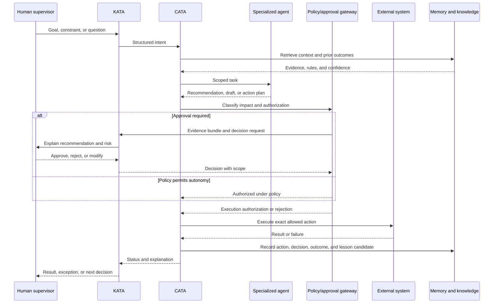

#### Autonomy Promotion Path

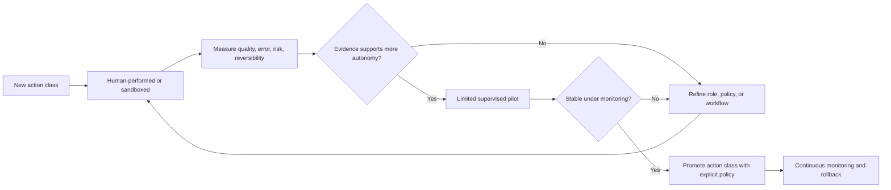

### Architecture Map

```text
Human authority
    ├── Product and strategic intent
    ├── Risk acceptance
    ├── Critical approval
    ├── Policy ownership
    └── Accountability
            │
            ▼
KATA — translate, explain, present, protect boundary
            │
            ▼
CATA — decompose, route, coordinate, enforce workflow
            │
            ▼
Specialized agents — research, create, publish, analyze, reconcile, learn
            │
            ▼
Policy and execution boundaries — permissions, approvals, audit, external calls
            │
            ▼
Outcome and knowledge — measure, reconcile, refine, preserve
```

#### Responsibility Matrix

| Responsibility | Human | CATA | Specialized agent | Policy/controls |
|---|---:|---:|---:|---:|
| Set strategic intent | Owns | Interprets | Consumes | Constrains |
| Decompose work | Consulted | Owns | Receives | Validates allowed scope |
| Perform research | Reviews important findings | Coordinates | Owns execution | Controls data/tools |
| Draft content | Reviews sensitive output | Routes | Owns draft | Enforces policy |
| Approve external publication | Owns when required | Requests | Cannot self-approve | Blocks bypass |
| Execute approved action | Authorizes | Coordinates | Performs | Verifies scope |
| Reconcile financial outcome | Owns material decisions | Coordinates | Prepares analysis | Enforces integrity |
| Learn from outcome | Validates material changes | Routes | Proposes | Controls promotion |
| Change autonomy policy | Owns or delegates | Cannot self-grant | Cannot self-grant | Enforces change |

### Decision Tables

#### Risk-to-Autonomy Table

| Impact | Reversibility | Confidence | Default level | Human control |
|---|---|---|---:|---|
| Low | Easy | High | 4–5 | Notification, audit, sampling |
| Low | Easy | Low | 1–2 | Human review or more evidence |
| Medium | Reversible | High | 3–4 | Scoped approval or notification by policy |
| Medium | Partly reversible | Any | 2–3 | Explicit approval before side effect |
| High | Reversible | High | 3 | Explicit approval and evidence |
| High | Irreversible or public | Any | 1–3 | Explicit approval; possibly multi-role |
| Critical financial/legal/security | Any | Any | 1–3 | Named authorized human or multi-role review |

#### Approval Decision Table

| Action class | Default decision | Required evidence |
|---|---|---|
| Internal read-only retrieval | Autonomous | Identity, source, access scope |
| Internal low-risk transformation | Autonomous with logging | Input/output trace and validation |
| Draft generation | Autonomous draft | Source set, model/prompt version, policy checks |
| Public content publication | Approval by default | Final content, evidence, channel, disclosure, risk |
| Affiliate relationship or material link change | Approval by policy | Terms, target, attribution, expected impact |
| Budget or payout action | Human financial approval | Amount, currency, source, reconciliation, risk |
| Security or credential change | Authorized security approval | Scope, reason, rollback, audit trail |
| Knowledge correction | Review proportional to impact | Evidence, prior value, confidence, affected decisions |

### Cross References

- Bounded autonomy and AI ethics: [`context/00_PROJECT_CONTEXT.md`](./00_PROJECT_CONTEXT.md), Section 12.
- KATA/CATA distinction: [`context/00_PROJECT_CONTEXT.md`](./00_PROJECT_CONTEXT.md), Section 13.6.
- Human/AI engineering model: [`context/00_PROJECT_CONTEXT.md`](./00_PROJECT_CONTEXT.md), Sections 14.4–14.6.
- Agent details: [`context/05_AGENTS.md`](./05_AGENTS.md).
- Security and authorization details: [`context/17_SECURITY.md`](./17_SECURITY.md).
- Prompt and model behavior: [`context/18_PROMPTING.md`](./18_PROMPTING.md).

### Dependencies

Bounded autonomy depends on:

- identity and authentication;
- role and permission management;
- action and risk taxonomy;
- approval workflow and human interface;
- durable audit trail;
- agent role definitions;
- reliable policy evaluation;
- execution scope verification;
- rollback or compensation where possible;
- monitoring and incident response.

### Risks

| Risk | Consequence | Control |
|---|---|---|
| Approval fatigue | Humans approve without reading | Prioritize by risk and improve evidence presentation |
| Approval bypass | External action occurs without authority | Enforce at the execution boundary, not only in UI |
| Scope drift after approval | Executed action differs from approved action | Bind approval to immutable action version and scope |
| Model overconfidence | Uncertain output is treated as fact | Require confidence, evidence, and uncertainty language |
| Agent privilege creep | Agent can access more than its role requires | Least privilege and periodic permission review |
| Human accountability ambiguity | No one owns the result | Capture accountable owner separately from executing agent |
| Excessive conservatism | CAT becomes a manual queue | Use low-risk autonomous classes and measure queue latency |

### Best Practices

- Authorize action classes, not vague agent identities.
- Make approvals specific, scoped, time-bounded, and auditable.
- Show evidence and tradeoffs before asking for approval.
- Separate recommendation, approval, execution, and outcome states.
- Promote autonomy only after measured supervised performance.
- Keep a rollback, pause, or kill-switch path for externally consequential automation.
- Treat a policy change as a documented decision, not an agent configuration tweak.

### Anti-patterns

- Giving an agent broad access because it is “internal.”
- Treating a user message as permanent authorization.
- Recording only that someone clicked “approve” without what they approved.
- Allowing an agent to approve its own recommendation.
- Using a single global autonomy level for every workflow.
- Making humans review every low-risk internal action.
- Hiding risk and uncertainty behind a confidence score with no evidence.

### Future Evolution

CAT may support adaptive autonomy, where action classes move between levels based on measured performance, deployment context, and policy. Adaptive autonomy must be transparent, reversible, and human-governed. It must never silently expand an agent's authority because a model appears more capable.

### AI Construction Notes

An AI agent writing implementation code should treat every external side effect as denied until it identifies the relevant authorization path. It should include negative tests for unauthorized actions, stale approvals, modified payloads, expired scopes, missing approvers, and policy-service failure. It should never “temporarily” bypass an approval gate to make a test or demo work.

### Extension Points

- New action classes can be added with risk, scope, approval, and evidence definitions.
- New human roles can be added through ownership and approval policy.
- New agent capabilities can be added under least-privilege tool scopes.
- New enterprise policies can add stricter controls without weakening CAT defaults.
- New model providers can be introduced behind evaluation and routing controls.

### Implementation Checklist

- [x] Human and AI responsibilities are separated.
- [x] Autonomy Levels 0–5 are defined.
- [x] Level 3 is identified as the default for material external actions.
- [x] Approval records and execution scope requirements are explicit.
- [x] Promotion and risk controls are visualized.
- [x] Risks and anti-patterns are documented.
- [ ] Concrete authorization schemas are defined in security and architecture context.
- [ ] Runtime approval UI and policy engine are implemented in a later phase.

---

## 7. CAT Capability Map — What the Product Contains

### Human Explanation

A capability is a durable responsibility that CAT must perform or coordinate. A capability is not necessarily a screen, microservice, agent, or repository folder. One capability may be delivered by several components, and one component may support several capabilities. Keeping the distinction clear prevents the product roadmap from becoming a list of technical nouns.

Part 1 groups CAT's intended capabilities into eight domains:

1. **Intelligence and orchestration** — turn goals and signals into coordinated work.
2. **Market and product intelligence** — find, research, qualify, and prioritize opportunities.
3. **Affiliate operations** — manage programs, links, tracking, and partner context.
4. **Creative and content** — produce evidence-grounded, channel-appropriate assets.
5. **Publishing and distribution** — prepare, schedule, execute, and verify external distribution.
6. **Analytics and optimization** — observe performance, diagnose patterns, and recommend changes.
7. **Treasury and financial accountability** — track earnings, payouts, budgets, costs, and risk.
8. **Knowledge, supervision, and governance** — preserve context, expose decisions, enforce approval, and explain state.

These domains are product responsibilities, not a final package or deployment topology. The exact division between agents, services, core modules, and integrations is defined later.

### AI Context

An AI agent must classify requested work against the capability map before adding new abstractions. It should prefer an existing capability and extension point when the responsibility already exists. If a proposal introduces a new domain, it must explain why the eight-domain model cannot contain it and whether the new domain is CAT-specific or an Omni System platform concern.

Capability names are nouns with stable meaning. Avoid creating overlapping names such as “marketing intelligence,” “growth brain,” and “campaign intelligence” unless their ownership and boundaries are materially different.

### Business Perspective

The capability map is a portfolio tool. It allows product managers to see missing lifecycle coverage and prevents a single visible feature—such as content generation—from consuming the entire roadmap. It also makes packaging and enterprise conversations clearer: a customer can understand which capabilities are core, which are optional, and which require integrations.

### Technical Perspective

Each capability should eventually declare:

- purpose and non-goals;
- owning domain and agent(s);
- inputs and outputs;
- data classifications;
- events and APIs;
- human approval level;
- observability requirements;
- knowledge and Treasury obligations;
- dependencies and failure modes;
- extension points and versioning behavior.

A capability map is therefore the index for detailed architecture, not a substitute for it.

### Visual Overview

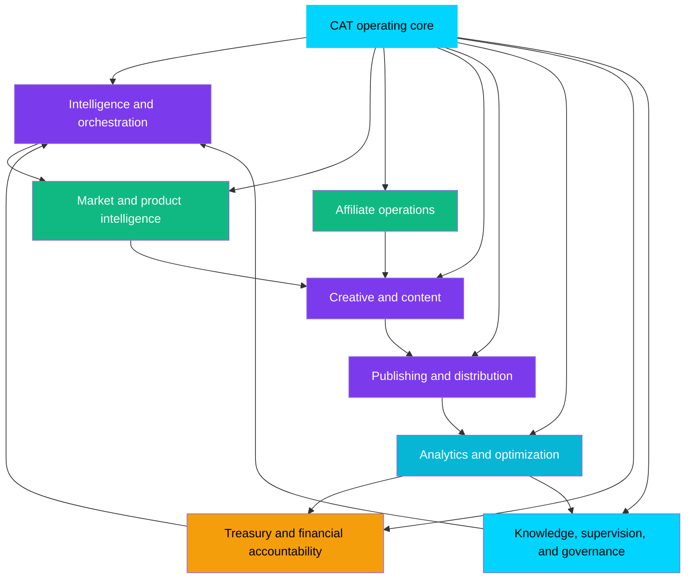

### Mermaid Diagram(s)

#### Capability-to-Lifecycle Coverage

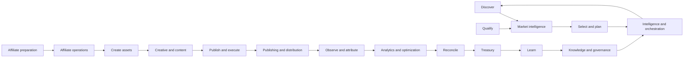

#### Capability Dependency Graph

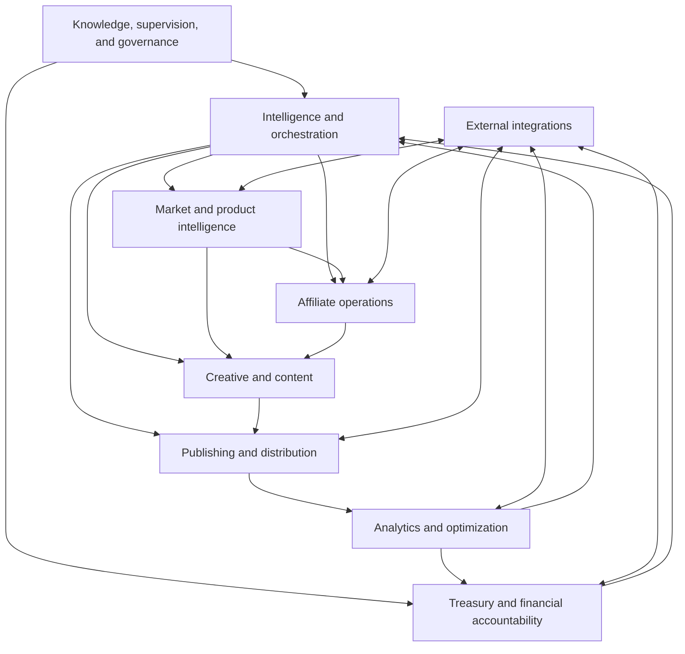

### Architecture Map

| Capability domain | Product responsibility | Likely internal participants | Primary external boundary |
|---|---|---|---|
| Intelligence and orchestration | Decompose, schedule, route, coordinate, and summarize work | CATA, workflow engine, scheduler, decision engine | Human intent, events, agent contracts |
| Market and product intelligence | Discover and qualify opportunities | Research Agent, data ingestion, knowledge retrieval | Search, feeds, merchant/product data |
| Affiliate operations | Manage affiliate programs, links, terms, and tracking | Affiliate Agent, connector adapters | Affiliate networks and merchants |
| Creative and content | Produce and validate content and media assets | Creative Agent, prompt/model services, asset storage | Model providers, brand/policy sources |
| Publishing and distribution | Send approved assets to channels and confirm status | Publisher Agent, channel adapters | CMS, social, video, email, storefront channels |
| Analytics and optimization | Measure, attribute, detect anomalies, recommend changes | Analytics Agent, event projections, reporting | Analytics and channel APIs |
| Treasury and financial accountability | Reconcile, report, budget, and monitor financial impact | Treasury Agent, financial services, audit records | Payout, accounting, banking, reporting systems |
| Knowledge, supervision, and governance | Preserve context, approval, decisions, memory, and explanation | KATA, Memory/Learning/Security agents, policy services | Human users, enterprise identity, governance systems |

### Decision Tables

#### Core vs Supporting Capabilities

| Capability type | Meaning | Promotion rule |
|---|---|---|
| Core | Required for CAT's identity and safe lifecycle | Must remain maintained and governed by CAT core owners |
| First-party domain capability | Important CAT responsibility with its own lifecycle | May evolve as a module or service under CAT contracts |
| Integration capability | Bridge to an external system | Must isolate external volatility and credentials |
| Optional extension | Useful to some deployments, not identity-defining | Prefer plugin, template, or policy extension |
| Experimental capability | Hypothesis under evaluation | Sandbox or non-default only until promoted |

#### Capability Readiness Table

| Readiness question | Acceptable evidence |
|---|---|
| Does it have a clear owner? | Named domain, module, or agent owner |
| Does it map to the lifecycle? | Stage(s), inputs, outputs, and downstream consumer |
| Is the risk understood? | Impact, reversibility, data, external side effects |
| Is the interface stable enough? | Contract, version, errors, idempotency |
| Is the outcome measurable? | Success, failure, quality, financial, and learning signals |
| Is it documented for AI and humans? | Context, examples, checklist, cross references |

### Cross References

- Root architecture layer model: [`context/00_PROJECT_CONTEXT.md`](./00_PROJECT_CONTEXT.md), Section 13.3.
- Agent inventory: [`context/00_PROJECT_CONTEXT.md`](./00_PROJECT_CONTEXT.md), Section 13.8.2.
- Detailed architecture: [`context/04_ARCHITECTURE.md`](./04_ARCHITECTURE.md).
- Domain documents: [`context/07_TREASURY_CORE.md`](./07_TREASURY_CORE.md), [`context/08_AFFILIATE_ENGINE.md`](./08_AFFILIATE_ENGINE.md), [`context/09_CONTENT_ENGINE.md`](./09_CONTENT_ENGINE.md).
- Directory intent: [`context/15_DIRECTORY_STRUCTURE.md`](./15_DIRECTORY_STRUCTURE.md).

### Dependencies

The capability map depends on shared lifecycle identities, agent contracts, event and API boundaries, knowledge policies, Treasury records, approval controls, and external integration adapters. Capability names should remain stable even when implementation technology changes.

### Risks

| Risk | Consequence | Control |
|---|---|---|
| Technical component mistaken for capability | Roadmap follows folders rather than value | Require purpose and outcome for each capability |
| Overlapping capability names | Duplicate ownership and inconsistent behavior | Maintain glossary and capability registry |
| Capability with no lifecycle stage | Scope expansion without product value | Reject or classify as platform/future work |
| Optional feature enters Core by convenience | Core becomes bloated and hard to govern | Use core/extension classification |
| Capability has no observable outcome | Impossible to evaluate or learn | Add outcome contract before implementation |

### Best Practices

- Describe capabilities in user and business language first.
- Give each capability one accountable owner even when several components implement it.
- Preserve domain boundaries while exposing cross-domain events and identifiers.
- Make optionality explicit to product managers and enterprise customers.
- Keep capability contracts stable while allowing internal implementations to evolve.

### Anti-patterns

- Naming a capability after a vendor or framework.
- Creating an agent for every noun without a real responsibility boundary.
- Adding a capability because a competitor has a feature, without mapping it to CAT's lifecycle.
- Calling a report a capability when it cannot influence an action or decision.
- Putting all capability logic into CATA because it is convenient.

### Future Evolution

The capability map may gain portfolio optimization, enterprise policy management, marketplace governance, cross-product knowledge, or new commerce channels. Those additions must be classified as core, domain, integration, extension, or experiment before they enter the roadmap.

### AI Construction Notes

Before editing code for a capability, an AI agent should generate a capability card:

```text
Capability name:
User/business outcome:
Lifecycle stages:
Primary Trinity pillar:
Owner:
Inputs:
Outputs:
External side effects:
Approval level:
Knowledge obligation:
Treasury obligation:
Failure modes:
Extension boundary:
```

A missing field is a design question, not permission to guess.

### Extension Points

- New domains can register a capability card and link to a dedicated context document.
- New integrations can implement an existing capability without changing its product meaning.
- Plugins can extend optional capability behavior through governed contracts.
- Enterprise policies can constrain a capability without forking its core implementation.

### Implementation Checklist

- [x] Eight high-level capability domains are defined.
- [x] Capability responsibilities are separated from technical components.
- [x] Lifecycle coverage and dependencies are visualized.
- [x] Core, domain, integration, optional, and experimental classifications are defined.
- [x] Capability readiness questions are documented.
- [ ] Detailed capability cards are authored in downstream context documents.
- [ ] Runtime ownership metadata is implemented with the product.

---

## 8. Who CAT Serves

### Human Explanation

CAT is designed for a hybrid audience. It must be understandable to a new engineer, usable by a human supervisor, inspectable by an architect, prioritizable by a product manager, and consumable by AI agents. The interface and documentation may differ by audience, but the underlying product model must remain consistent.

#### New Engineers

New engineers need to understand the product before touching implementation. They need the lifecycle, capabilities, identity boundaries, terminology, and decision hierarchy. Their primary risk is making a locally correct change that violates a global product rule.

#### AI Coding Agents

AI coding agents are first-class contributors to the repository. They need machine-readable context, explicit authority, current status, task boundaries, implementation checklists, and a clear distinction between official and speculative content. Their primary risk is confidently filling gaps that the repository has intentionally left undecided.

#### Architects

Architects need to preserve stable boundaries while allowing the system to evolve. They need the Trinity model, capability ownership, event/workflow responsibilities, approval model, and future extension paths. Their primary risk is designing infrastructure that is elegant but disconnected from product outcomes.

#### Product Managers

Product managers need to prioritize capabilities based on customer and business value. They need the problem statement, lifecycle coverage, value model, maturity phases, and explicit non-goals. Their primary risk is turning every request into Core and losing product focus.

#### Human Supervisors and Operators

Supervisors need to know what CAT can propose or execute, what requires their decision, how to inspect evidence, and how outcomes return to the knowledge system. Their primary risk is approval fatigue or insufficient context.

#### Future Contributors and Partners

Contributors and partners need extension rules, ownership boundaries, documentation expectations, and support posture. Their primary risk is coupling to internal implementation or bypassing governance.

#### Enterprise Stakeholders

Enterprise stakeholders need evidence that autonomy is controlled, data is traceable, financial operations are accountable, and local policy can be configured without forking CAT. Their primary risk is unclear shared responsibility.

### AI Context

Audience is a routing input. When producing an artifact, an AI agent must identify its primary reader and use the right level of detail:

| Artifact | Primary reader | Required emphasis |
|---|---|---|
| Project Overview | All audiences | Identity, boundaries, value, lifecycle |
| Context document | Humans and AI agents | Rules, source of truth, diagrams, implementation implications |
| ADR | Architects and maintainers | Decision, alternatives, consequences, review trigger |
| Agent specification | Agent owners and AI systems | Role, tools, inputs, outputs, autonomy, evaluation |
| API contract | Engineers, agents, partners | Schema, versioning, auth, errors, examples |
| Approval request | Human supervisor | Evidence, impact, alternatives, exact scope |
| Runbook | Operators and support | Procedures, failure modes, escalation |
| Roadmap item | Product and engineering | Outcome, scope, dependency, maturity, acceptance |

An AI agent must not optimize a document for one audience by making it unusable to the others. Use layered detail: human explanation first, structured tables and diagrams next, implementation references last.

### Business Perspective

A multi-audience product needs a shared truth with audience-specific views. The business benefit is lower coordination cost and a larger potential contributor ecosystem. A supervisor who understands approval boundaries and a developer who understands capability boundaries make fewer contradictory requests.

### Technical Perspective

Audience requirements influence access, presentation, metadata, and workflows:

- humans require summaries, evidence, and readable explanations;
- agents require structured contracts, stable terms, and deterministic rules;
- architects require dependency and evolution maps;
- enterprise users require roles, policy, audit, and integration boundaries;
- contributors require local development and review guidance.

These are presentation and governance concerns over the same canonical system state, not separate products with separate truths.

### Visual Overview

```mermaid
flowchart TB
    CAT[CAT shared product truth]
    CAT --> Engineer[New engineers]
    CAT --> Agent[AI coding agents]
    CAT --> Architect[Architects]
    CAT --> PM[Product managers]
    CAT --> Supervisor[Human supervisors]
    CAT --> Contributor[Future contributors and partners]
    CAT --> Enterprise[Enterprise stakeholders]

    Engineer --> Docs[Context, rules, architecture]
    Agent --> AIContext[Structured context and checklists]
    Architect --> Maps[Architecture and decisions]
    PM --> Roadmap[Capabilities, outcomes, phases]
    Supervisor --> Command[Evidence, approvals, status]
    Contributor --> Extensions[Contracts, SDKs, contribution rules]
    Enterprise --> Governance[Policy, audit, integration, support]
```

### Mermaid Diagram(s)

#### Human and AI Collaboration Surface

```mermaid
graph LR
    HumanAudiences[Humans<br/>engineers, architects, PMs, operators, enterprises]
    AIContributors[AI systems<br/>coding agents, domain agents, evaluators]
    Docs[Documentation and knowledge system]
    Product[CAT product and runtime]
    Governance[Policy, approval, audit]

    HumanAudiences <--> Docs
    AIContributors <--> Docs
    Docs --> Product
    Product --> Docs
    HumanAudiences <--> Governance
    AIContributors --> Governance
    Governance <--> Product
```

#### Reader Need to Artifact Map

```mermaid
flowchart TD
    Need{Reader need}
    Need -->|What is CAT?|Overview[Project Overview]
    Need -->|Why this decision?|ADR[Decision records]
    Need -->|How is it built?|Architecture[Architecture and stack]
    Need -->|How do I extend it?|Guide[Development and contribution guides]
    Need -->|What can I approve?|Approval[Approval and Treasury context]
    Need -->|How do agents behave?|Agents[Agent and prompting context]
    Need -->|What exists now?|Status[Project status and roadmap]
```

### Architecture Map

| Audience | Interface to CAT | Authority or responsibility |
|---|---|---|
| New engineer | Repository, context, code, tests, review workflow | Implements within documented rules |
| AI coding agent | `.ai` workspace, context files, task instructions, repository tools | Proposes and executes bounded changes under human review |
| Architect | Architecture maps, ADRs, contracts, dependency graphs | Preserves coherence and approves material boundaries |
| Product manager | Roadmap, capability map, outcomes, decision records | Owns prioritization and product tradeoffs |
| Supervisor | KATA/command center, approval queue, evidence | Approves or rejects consequential work |
| Contributor/partner | APIs, SDKs, plugin and contribution surfaces | Extends through governed contracts |
| Enterprise stakeholder | Policy, identity, audit, deployment, support | Configures organization-specific controls |

### Decision Tables

#### Information Need Table

| Question | Canonical source | Escalation if unclear |
|---|---|---|
| What is CAT? | This overview and root context | Lead product/architecture owner |
| What is allowed? | Project rules, security, decisions | Policy or security owner |
| What is planned? | Roadmap and status | Product owner |
| How is a component built? | Dedicated context and architecture | Domain architect |
| What requires approval? | Operating model, security, Treasury, policy | Authorized supervisor |
| What changed? | Git history, changelog, decision record | Maintainer or document owner |
| What is currently implemented? | Project status, code, tests, deployment evidence | Engineering owner |

#### Role Boundary Table

| Role | May do | May not assume |
|---|---|---|
| AI coding agent | Draft code/docs/tests, inspect repository, propose changes | Authority to redefine policy or merge its own work |
| Domain agent | Execute declared domain tasks | Authority outside its tools and action class |
| Human supervisor | Approve/reject within assigned scope | Authority to bypass higher-level policy |
| Product manager | Prioritize and define outcomes | Authority to ignore security or architecture constraints |
| Architect | Approve structural direction | Authority to accept financial or legal risk without the owner |
| External contributor | Extend approved surfaces | Access to internal secrets or unrestricted core behavior |

### Cross References

- AI workspace entry point: [`../.ai/README.md`](../.ai/README.md).
- AI workflow: [`../.ai/AI_WORKFLOW.md`](../.ai/AI_WORKFLOW.md).
- Contribution rules: [`CONTRIBUTING.md`](../CONTRIBUTING.md).
- Development guidance: [`context/19_DEVELOPMENT_GUIDE.md`](./19_DEVELOPMENT_GUIDE.md).
- Agent context: [`context/05_AGENTS.md`](./05_AGENTS.md).
- Human interface context: [`context/10_UI_UX.md`](./10_UI_UX.md).

### Dependencies

Audience support depends on documentation indexing, terminology, context ordering, role and permission models, accessible interfaces, and consistent status reporting. It also depends on maintaining one canonical product model rather than creating audience-specific contradictions.

### Risks

| Risk | Consequence | Control |
|---|---|---|
| AI agents are treated as invisible tools | Repository cannot be safely automated | Give AI agents explicit context and review rules |
| Human supervisors receive raw technical data | Approval quality decreases | Present evidence, impact, and decisions in understandable form |
| Architects and PMs use different capability names | Roadmap and architecture diverge | Maintain capability map and glossary |
| Enterprise requirements are handled as forks | Core fragments | Use policies, extensions, and governed contracts |
| Documentation assumes expert knowledge | Onboarding slows and errors increase | Define terms and explain rationale |

### Best Practices

- Declare intended audience and reading level in every substantial document.
- Keep canonical facts shared; customize presentation, not truth.
- Give AI agents structured context before asking them to act.
- Make approval requests intelligible to a non-implementing decision owner.
- Provide examples and anti-patterns for extension surfaces.
- Update audience-facing guidance when roles or authority boundaries change.

### Anti-patterns

- Writing only for the person who already understands the system.
- Treating AI output as unreviewable because it is machine-generated.
- Giving an engineer a roadmap item with no acceptance outcome.
- Giving a product manager a technical component name instead of a capability.
- Making enterprise users edit source code to configure local policy.

### Future Evolution

CAT may provide audience-specific views of the same knowledge graph: an architectural view for engineers, a decision view for managers, a risk view for supervisors, and a governance view for enterprises. These views must remain traceable to canonical records and must not create separate undocumented truths.

### AI Construction Notes

Before generating a document or response, an AI agent should write a one-line audience declaration internally or in the artifact metadata. If several audiences are important, use a layered structure rather than choosing one and omitting the others.

### Extension Points

- New roles and personas can be added with responsibility and authority definitions.
- New document types can be added with source, owner, lifecycle, and review rules.
- Enterprise views can add organization-specific policy context without changing CAT's identity.
- AI agent interfaces can add structured tools and schemas while preserving human-readable explanations.

### Implementation Checklist

- [x] Major audiences are identified.
- [x] Reader questions and canonical sources are mapped.
- [x] Human and AI responsibilities are separated.
- [x] Audience risks and anti-patterns are included.
- [ ] Audience-specific runtime views and permissions are implemented later.
- [ ] Accessibility and localization details are defined in UI/UX context.

---

## 9. Product Boundaries — What CAT Is Not

### Human Explanation

A strong product definition includes exclusions. CAT's mission is broad, but it is not unlimited. The following boundaries protect the product from becoming a collection of unrelated AI features:

| CAT is not | Boundary meaning |
|---|---|
| **A chatbot** | Conversation is one interface, not the product's full operating model. CAT must perform and coordinate commerce work. |
| **A traditional CMS** | CAT may generate and publish content, but its value includes research, affiliate operations, analytics, learning, and Treasury. |
| **An ad network** | CAT may use affiliate networks and merchants; it is not itself an advertising exchange or network by default. |
| **A single-purpose AI tool** | CAT is not “just” a writer, researcher, link builder, or analytics dashboard. |
| **A no-code platform** | CAT is AI-native and engineering-led; no-code configuration is not its defining identity. |
| **A human replacement** | CAT shifts humans toward supervision and judgment; it does not erase accountability. |
| **A generic agent framework** | CAT may expose reusable patterns, but it has a focused commerce mission and Treasury accountability. |
| **A source of unverified truth** | CAT must preserve provenance, uncertainty, and review state. |
| **An excuse to bypass governance** | Automation does not authorize publication, spending, data access, or policy changes by itself. |

These exclusions are not statements that CAT can never integrate with a CMS, use a chatbot interface, or expose an agent SDK. They state what CAT itself is responsible for and what a surrounding tool or extension may provide.

### AI Context

The most common scope error is to treat a nearby capability as a new product identity. An AI agent must ask whether the request is:

- a CAT capability;
- a supporting implementation detail;
- an integration with another product;
- an optional extension;
- a future Omni System capability; or
- a scope conflict.

If a request would turn CAT into a generic platform, remove Treasury, remove human authority, or replace the lifecycle with one isolated task, the agent must flag the conflict before coding.

### Business Perspective

Boundaries make the business legible. Customers need to know what CAT owns, partners need to know where they integrate, and the roadmap needs to avoid competing with every adjacent category simultaneously. Saying “not a CMS” does not deny publishing; it communicates that publishing is one part of a larger closed loop.

### Technical Perspective

Boundary discipline determines module ownership and API surface. CAT may use external systems, but external systems remain external unless a formal decision makes a capability part of CAT Core. Direct database coupling, ungoverned plugin execution, and hidden fork behavior are boundary violations.

### Visual Overview

```mermaid
flowchart TB
    CAT[CAT Core identity]
    CAT --> Core[Commerce lifecycle + AI coordination + Treasury accountability]
    CAT -. integrates with .-> CMS[CMS and publishing platforms]
    CAT -. uses .-> Networks[Affiliate networks and merchants]
    CAT -. connects to .-> Analytics[External analytics systems]
    CAT -. may expose .-> Extensions[Governed plugins and APIs]
    CAT -. does not become .-> Chatbot[Chatbot only]
    CAT -. does not become .-> AdNetwork[Ad network]
    CAT -. does not become .-> Generic[Unbounded generic agent platform]
    CAT -. does not become .-> Humanless[Unaccountable human replacement]

    style CAT fill:#00d4ff,color:#000,stroke:#00d4ff,stroke-width:3px
    style Core fill:#10b981,color:#fff
    style Chatbot fill:#ef4444,color:#fff
    style AdNetwork fill:#ef4444,color:#fff
    style Generic fill:#ef4444,color:#fff
    style Humanless fill:#ef4444,color:#fff
```

### Mermaid Diagram(s)

#### Core, Adjacent, and Excluded Zones

```mermaid
graph LR
    subgraph CoreZone[CAT Core zone]
        Lifecycle[End-to-end affiliate-commerce lifecycle]
        Trinity[Commerce + AI + Treasury]
        Governance[Knowledge and human governance]
    end
    subgraph AdjacentZone[Adjacent and integration zone]
        CMS[CMS]
        Networks[Affiliate networks]
        Channels[Publishing channels]
        Models[External AI models]
        Enterprise[Enterprise systems]
    end
    subgraph ExcludedZone[Excluded as product identity]
        ChatbotOnly[Chatbot-only product]
        AdNetworkOnly[Ad-network product]
        GenericAI[Unbounded generic AI platform]
        Unaccountable[Unaccountable automation]
    end

    CoreZone <--> AdjacentZone
    CoreZone -. remains distinct from .-> ExcludedZone
```

#### Scope Test

```mermaid
flowchart TD
    Proposal[New proposal] --> Lifecycle{Supports CAT lifecycle?}
    Lifecycle -->|No| Generic{Generic/platform-only?}
    Generic -->|Yes| Omni{Better as future Omni or external capability?}
    Generic -->|No| Reject[Reject or defer]
    Omni -->|Yes| Boundary[Define explicit contract and owner]
    Omni -->|No| Reject
    Lifecycle -->|Yes| Pillar{Supports Commerce, AI, or Treasury?}
    Pillar -->|No| Reject
    Pillar -->|Yes| Risk[Classify risk and ownership]
    Risk --> Placement{Core, domain, integration, extension, or experiment?}
    Placement --> Document[Document before implementation]
```

### Architecture Map

| Zone | CAT relationship | Ownership rule |
|---|---|---|
| Core | CAT must provide or coordinate it | CAT/Omni owners govern identity and contracts |
| Adjacent integration | CAT may connect to it | External owner remains responsible for external behavior |
| Extension | CAT may allow it through a governed seam | Extension owner is accountable within declared permissions |
| Excluded identity | CAT must not redefine itself as it | Requires separate product or explicit approved change |

### Decision Tables

#### Boundary Classification

| Proposal type | Default placement | Required decision |
|---|---|---|
| Required for every CAT deployment and identity | Core | Architecture and product approval |
| Important to one CAT domain | First-party domain module | Domain owner and architecture review |
| Connects to an external platform | Connector/integration | Security, reliability, and data review |
| Useful only to some deployments | Plugin/template/policy extension | Extension governance and compatibility review |
| General capability for many Omni products | Future Omni platform | Separate ownership and contract decision |
| Does not support lifecycle or pillars | Reject/defer | Explicit rationale recorded |

#### “Not” Does Not Mean “Never Integrates”

| Statement | Correct reading |
|---|---|
| Not a CMS | CAT can publish through or integrate with CMSs |
| Not a chatbot | CAT can use conversational interaction through KATA |
| Not an ad network | CAT can connect to affiliate and advertising-adjacent systems where governed |
| Not a generic agent framework | CAT can expose reusable contracts after its own boundaries are proven |
| Not a human replacement | CAT can automate more work while preserving human accountability |

### Cross References

- Root “What CAT Is Not”: [`context/00_PROJECT_CONTEXT.md`](./00_PROJECT_CONTEXT.md), Section 5.5.
- Ecosystem and extension boundaries: [`context/00_PROJECT_CONTEXT.md`](./00_PROJECT_CONTEXT.md), Section 15.
- Project rules and anti-scope-creep controls: [`context/02_PROJECT_RULES.md`](./02_PROJECT_RULES.md).
- API and plugin direction: [`context/04_ARCHITECTURE.md`](./04_ARCHITECTURE.md), [`context/15_DIRECTORY_STRUCTURE.md`](./15_DIRECTORY_STRUCTURE.md).

### Dependencies

Boundary enforcement depends on product ownership, architecture review, capability registry, API and plugin contracts, security policies, roadmap discipline, and a maintained glossary. A boundary that exists only in prose but is not reflected in review and implementation practices will erode.

### Risks

| Risk | Consequence | Control |
|---|---|---|
| Scope expands by analogy | CAT becomes an incoherent platform | Apply the scope test and classify placement |
| “Core” becomes a convenience label | Optional features increase maintenance and risk | Require core justification and ownership |
| Integrations leak into core | External API changes destabilize CAT | Use adapters and explicit external boundaries |
| Exclusions are read as technical bans | Useful integrations are rejected unnecessarily | Distinguish product identity from integration capability |
| Boundary policy is ignored under deadline | Shortcuts create long-term coupling | Require architecture and governance review |

### Best Practices

- Say what a feature is not when its adjacent category is likely to cause confusion.
- Prefer stable contracts over direct internal access.
- Make core-versus-extension placement part of the proposal template.
- Revisit a boundary only when evidence or strategy changes.
- Preserve excluded concepts as alternatives or future products rather than silently absorbing them.

### Anti-patterns

- Adding a generic AI assistant surface and calling it CAT.
- Building a CMS and adding affiliate links as an afterthought.
- Treating every integration request as a reason to modify Core.
- Creating a “temporary” fork for an enterprise customer.
- Calling a product boundary an implementation limitation when it is an intentional strategy.

### Future Evolution

Future Omni products may address adjacent capabilities that CAT intentionally does not own. CAT may also expose well-governed APIs, SDKs, and plugin surfaces. Any such evolution must preserve the distinction between CAT as a commerce operating system and the broader Omni platform ecosystem.

### AI Construction Notes

If a user asks for a feature that appears adjacent rather than core, the agent should produce a placement recommendation before implementation. The recommendation must state the user value, lifecycle relationship, owner, dependencies, risk, and why Core is or is not appropriate.

### Extension Points

- Connectors to CMSs, affiliate networks, analytics, models, and enterprise systems.
- Governed plugins that add specialized workflows or scoring.
- Future Omni products for capabilities outside CAT's identity.
- Public or partner APIs that expose stable, permission-scoped capabilities.

### Implementation Checklist

- [x] Explicit product exclusions are documented.
- [x] Core, adjacent, extension, and excluded zones are visualized.
- [x] Scope classification rules are provided.
- [x] Integration-versus-identity distinction is explicit.
- [x] Scope risks and anti-patterns are included.
- [ ] Detailed plugin and API contracts are defined later.
- [ ] Product review workflow enforces scope placement later.

---

## 10. Value Model and Success Criteria

### Human Explanation

CAT's value is created when it helps a commerce operation make better decisions and perform more reliable work with less manual coordination, while preserving trust and financial accountability. The product should not be judged by how futuristic it looks, how many models it calls, or how many assets it generates in isolation.

CAT has five value layers:

1. **Opportunity value:** more relevant and better-evidenced opportunities are found.
2. **Execution value:** approved work is produced and distributed faster and more consistently.
3. **Learning value:** outcomes become reusable knowledge that improves later work.
4. **Economic value:** activity, costs, earnings, payouts, and risk are visible and managed.
5. **Trust value:** humans can understand, supervise, audit, and correct the system.

A healthy CAT measurement system must balance leading indicators and lagging outcomes. A rise in generated content is a leading operational signal, not proof of business success. A rise in earnings may be a lagging signal, but it can be caused by temporary or risky behavior. Metrics must be interpreted together.

### AI Context

AI agents must not optimize an isolated metric without checking its relationship to the other value layers. For example:

- increasing publication volume may reduce content quality;
- reducing approval time may increase unauthorized actions;
- maximizing clicks may reduce conversion quality or violate trust;
- increasing model complexity may increase cost without improving decisions;
- changing a prompt may improve one category while degrading another.

Every optimization proposal should include the metric being improved, the expected side effects, the guardrail metrics, and the learning plan.

### Business Perspective

The value model connects product strategy to business outcomes without promising a specific revenue result before implementation evidence exists. It also gives product managers a way to compare foundation work with visible features:

- A knowledge or approval capability may create trust and learning value before direct revenue appears.
- A connector may create execution value by removing a costly manual handoff.
- A Treasury capability may not create revenue directly, but it can prevent loss and improve allocation.
- A research capability may create opportunity value that becomes financial value only after later stages execute.

### Technical Perspective

The value model should be represented as linked measures with consistent identities and timestamps. A measurement should state:

- definition and unit;
- source and freshness;
- population or scope;
- attribution assumptions;
- confidence and uncertainty;
- related action or decision;
- guardrails and known limitations.

The analytics and Treasury systems should not infer causal relationships merely because two events share a timestamp. Attribution and experiment design belong in detailed analytics specifications.

### Visual Overview

```mermaid
flowchart TB
    Inputs[Signals, goals, evidence, constraints]
    Inputs --> Decisions[Better decisions]
    Decisions --> Execution[More reliable approved execution]
    Execution --> Outcomes[Commerce and financial outcomes]
    Outcomes --> Learning[Knowledge and learning]
    Learning --> Decisions

    Trust[Human approval, auditability, safety, explainability]
    Trust --> Decisions
    Trust --> Execution
    Trust --> Outcomes

    Outcomes --> Value[Value for users and business]
    Learning --> Value
    Trust --> Value
```

### Mermaid Diagram(s)

#### Balanced Scorecard

```mermaid
graph TD
    CAT((CAT value))
    CAT --> Opportunity[Opportunity quality]
    CAT --> Operations[Operational efficiency]
    CAT --> Intelligence[Learning and reuse]
    CAT --> Economics[Economic accountability]
    CAT --> Trust[Trust and governance]

    Opportunity --> Leading[Leading and lagging measures]
    Operations --> Leading
    Intelligence --> Leading
    Economics --> Leading
    Trust --> Leading
```

#### Metric Guardrail Loop

```mermaid
flowchart LR
    Change[Proposed optimization] --> Primary[Primary metric]
    Change --> Guardrails[Guardrail metrics]
    Change --> Risk[Risk and approval checks]
    Primary --> Observe[Observe over defined period]
    Guardrails --> Observe
    Risk --> Observe
    Observe --> Decision{Improvement without unacceptable harm?}
    Decision -->|Yes| Promote[Promote and document]
    Decision -->|No| Rollback[Rollback or revise]
    Promote --> Knowledge[Record lesson]
    Rollback --> Knowledge
```

### Architecture Map

| Value layer | Example measures | Source categories | Primary consumer |
|---|---|---|---|
| Opportunity | Research precision, qualification confidence, product fit, source reliability | Research and knowledge | Product owner, Research Agent |
| Execution | Time to prepare, task completion, publication success, retry rate | Workflow and integration events | Operators, engineers |
| Learning | Retrieval reuse, lesson confidence, recommendation improvement, stale-knowledge rate | Knowledge and evaluation | AI and architecture owners |
| Economics | Earnings, payout state, cost, margin proxy, budget variance, reconciliation rate | Treasury and attribution | Treasury reviewer, product owner |
| Trust | Approval latency, rejection quality, policy violations, audit completeness, incident rate | Governance and security | Supervisors, enterprise stakeholders |

### Decision Tables

#### Success Metric Categories

| Category | What success means | What it must not become |
|---|---|---|
| Reliable automation | Work completes predictably within policy | Blind autonomy or volume at any cost |
| High-quality documentation | Humans and AI agents can act from current context | Documentation measured only by word count |
| Extensible architecture | New domains/integrations add value without core coupling | More abstractions without stable contracts |
| Secure operations | Risks are prevented, contained, and auditable | Security theater with no tests or controls |
| Continuous improvement | Outcomes improve decisions and workflows over time | Automatic changes without evidence or review |
| Commerce performance | Better product/channel/content outcomes | Click or revenue maximization without quality and trust |

#### Metric Interpretation Table

| Observation | Safe interpretation | Unsafe interpretation |
|---|---|---|
| More content generated | Production capacity increased | Business value definitely increased |
| Faster approval | Review workflow may be more efficient | Risk decreased or reviewers understood more |
| More clicks | Traffic changed | Conversion quality and earnings improved |
| Higher earnings | Financial outcome improved in measured scope | Strategy is universally better |
| Fewer errors | Observed errors decreased | Unobserved failures do not exist |
| Better model score | Evaluation set improved | Production behavior is safe in all contexts |

#### Current Success Direction

The repository-level roadmap names these high-level success metrics:

- reliable automation;
- high-quality documentation;
- extensible architecture;
- secure operations; and
- continuous improvement.

These are official success directions. Numeric targets, baselines, instrumentation, and acceptance thresholds are implementation and product-management work still to be specified.

### Cross References

- Roadmap success metrics: [`ROADMAP.md`](../ROADMAP.md).
- Root vision success criteria: [`context/00_PROJECT_CONTEXT.md`](./00_PROJECT_CONTEXT.md), Section 6.4.
- Knowledge and learning: [`context/06_KNOWLEDGE_ENGINE.md`](./06_KNOWLEDGE_ENGINE.md).
- Analytics and Treasury: [`context/07_TREASURY_CORE.md`](./07_TREASURY_CORE.md), [`context/04_ARCHITECTURE.md`](./04_ARCHITECTURE.md).
- AI evaluation and prompts: [`context/18_PROMPTING.md`](./18_PROMPTING.md).

### Dependencies

The value model depends on reliable event and data capture, attribution identity, Treasury reconciliation, evaluation datasets, source provenance, approval records, and a knowledge lifecycle. Without those dependencies, metrics can create false confidence.

### Risks

| Risk | Consequence | Control |
|---|---|---|
| Vanity metrics dominate | CAT optimizes activity rather than value | Require balanced scorecard and guardrails |
| Attribution is overstated | Teams credit CAT for unrelated outcomes | Document attribution assumptions and uncertainty |
| Metrics become targets | Agents game the measure | Use multiple measures and review behavior |
| Baselines are missing | Improvement cannot be demonstrated | Establish baseline before promotion |
| Financial data is delayed | Decisions use stale Treasury context | Mark freshness and pending reconciliation |
| Trust is unmeasured | Product appears successful while becoming unsafe | Include governance and incident measures |

### Best Practices

- Define a baseline and measurement window before calling an optimization successful.
- Pair every primary metric with at least one quality, risk, or cost guardrail.
- Measure knowledge reuse and decision quality, not only output count.
- Separate correlation, attribution, and causation in language and data models.
- Let humans review metric definitions for business meaning.
- Preserve metric versions when definitions change.

### Anti-patterns

- “More AI output equals more value.”
- “Revenue is the only metric that matters.”
- “A dashboard is complete when it has charts.”
- “A/B test results can update policy automatically without review.”
- “Lower latency is always better even if it removes evidence or approval.”
- “A model benchmark score is a production safety guarantee.”

### Future Evolution

CAT may develop portfolio-level value models, risk-adjusted campaign scoring, lifetime knowledge value measures, and adaptive resource allocation. Such models should expose assumptions and remain understandable to human decision owners. Future metrics must not hide value judgments inside opaque optimization systems.

### AI Construction Notes

When an agent proposes a performance improvement, require a measurement plan in the change description:

```text
Primary outcome:
Baseline:
Target or expected direction:
Guardrails:
Data sources:
Attribution assumptions:
Approval requirement:
Rollback signal:
Knowledge update:
```

### Extension Points

- New metrics can be registered with definitions, sources, owners, and guardrails.
- New evaluation datasets can measure agent or workflow quality.
- Enterprise deployments can add policy-specific compliance measures.
- New Treasury reports can add financial views without changing the product identity.
- New learning systems can consume outcome streams through governed contracts.

### Implementation Checklist

- [x] Five value layers are defined.
- [x] Leading and lagging metric distinction is explicit.
- [x] Roadmap success directions are recorded without inventing numeric targets.
- [x] Metric risks and guardrails are documented.
- [x] Optimization and learning loops are visualized.
- [ ] Baselines, numeric targets, and production instrumentation are defined in later phases.
- [ ] Metric ownership and governance are implemented with analytics and Treasury systems.

---

## 11. Current Maturity and Phase A Position

### Human Explanation

CAT is currently in **Phase A — Documentation and Foundation**. The repository is building the context, architecture, knowledge, decision, design, and engineering foundation before implementation begins in earnest. The current repository status explicitly reports implementation progress at zero and identifies documentation as the active workstream.

The roadmap describes the intended progression:

- **Phase 0 — Foundation:** repository structure, documentation framework, CAT Bible, knowledge base, ADRs, and design system.
- **Phase 1 — Core Platform:** core kernel, memory system, knowledge graph, workflow engine, agent orchestrator, and prompt engine.
- **Phase 2 — AI Agent Ecosystem:** Research, Affiliate, Creative, Publisher, Treasury, Analytics, Learning, and Security agents.
- **Phase 3 — Commerce Platform:** product discovery, store integrations, affiliate link management, content generation, and multi-channel publishing.
- **Phase 4 — Intelligence:** continuous learning, knowledge refinement, performance optimization, and decision support.
- **Phase 5 — Public Release:** beta, production, and enterprise features.

These phases are a sequence of intended capability maturity, not a guarantee that every item will be implemented exactly as listed. A phase item becomes implementation-ready when its context, decision, dependencies, acceptance criteria, and status are sufficiently defined.

The repository currently contains substantial scaffolding and documentation structure. Empty directories, placeholder documents, and planned technology names are **not evidence of runtime implementation**. This distinction is essential for accurate engineering and product communication.

### AI Context

An AI agent working in Phase A must prioritize clarity, consistency, and decision quality over premature code. It must:

- update the relevant context document before proposing implementation;
- use `.ai/PROJECT_STATUS.md` as the current progress signal;
- distinguish a completed document part from a completed runtime capability;
- avoid generating fake APIs, schemas, benchmarks, integrations, or deployment evidence;
- preserve future ideas as labeled future ideas rather than silently promoting them;
- update status after documentation work as required by repository rules.

The phrase “planned” means that the concept is in project direction or roadmap. The phrase “implemented” requires code, tests, documentation, and repository evidence. The phrase “production” requires deployment and operational evidence in addition to implementation.

### Business Perspective

A documentation-first Phase A reduces expensive rework. CAT is intended to operate across commerce, AI, and Treasury, so ambiguous foundations would multiply downstream cost. The business is intentionally investing in a shared mental model before investing in the runtime.

This phase also creates future leverage:

- AI coding agents can work from durable context.
- Architects can evaluate tradeoffs before code hardens them.
- Product managers can prioritize a coherent capability sequence.
- Enterprise stakeholders can inspect governance intent early.
- Future contributors can join without reconstructing the original vision.

### Technical Perspective

Phase A is an engineering deliverable, not administrative overhead. Its outputs include:

- authoritative context documents;
- repository and AI workflow rules;
- architecture maps and decision surfaces;
- domain boundaries and terminology;
- documentation and development standards;
- status and change-tracking mechanisms;
- a basis for tests, schemas, and implementation plans.

The implementation phase should begin from these artifacts and should treat discrepancies between code and context as defects.

### Visual Overview

```mermaid
timeline
    title CAT intended maturity path
    Phase A : Documentation and foundation
             : Repository structure
             : Context and knowledge
             : Architecture and decisions
             : Design and engineering rules
    Phase B : Core platform
             : Kernel, memory, knowledge graph
             : Workflow and orchestration
             : Prompt engine
    Phase C : Agent ecosystem
             : Research, Affiliate, Creative, Publisher
             : Treasury, Analytics, Learning, Security
    Phase D : Commerce platform
             : Product discovery and integrations
             : Content and multi-channel publishing
    Phase E : Intelligence
             : Continuous learning and optimization
             : Decision support
    Phase F : Public release
             : Beta, production, enterprise features
```

### Mermaid Diagram(s)

#### Documentation-to-Implementation Gate

```mermaid
flowchart TD
    Idea[Product or architecture idea] --> Context[Context and specification]
    Context --> Decision[Decision and tradeoff record]
    Decision --> Plan[Implementation plan and dependencies]
    Plan --> Code[Code, tests, and configuration]
    Code --> Review[Human review and automated checks]
    Review --> Docs[Documentation and status update]
    Docs --> Evidence[Runtime or repository evidence]
    Evidence --> Promotion{Ready for next maturity level?}
    Promotion -->|No| Iterate[Refine context, code, or evidence]
    Iterate --> Context
    Promotion -->|Yes| Next[Promote capability]
```

#### Status Truth Model

```mermaid
graph LR
    Direction[Vision and roadmap direction]
    Docs[Documented specification]
    Code[Implemented code]
    Tests[Verified behavior]
    Runtime[Deployment evidence]
    Status[Project status]

    Direction --> Docs --> Code --> Tests --> Runtime
    Docs --> Status
    Code --> Status
    Tests --> Status
    Runtime --> Status
```

### Architecture Map

| Maturity claim | Minimum evidence | Current Phase A interpretation |
|---|---|---|
| Concept | Product or architecture intent | Many CAT capabilities are at this level |
| Documented | Active context, scope, dependencies, decisions | The current task advances this level |
| Planned | Roadmap item with intended sequence | Roadmap contains future phases |
| Implemented | Code and tests exist and are maintained | Not generally claimed for the runtime |
| Verified | Tests, review, and observable evidence pass | Future implementation gate |
| Production | Deployed, monitored, supported, and governed | Future release gate |

### Decision Tables

#### Current State Classification

| Area | Current state | Authority |
|---|---|---|
| Project phase | Phase A / documentation and foundation | `.ai/PROJECT_STATUS.md`, `README.md` |
| Repository structure | Established and populated with scaffolds and documentation surfaces | Repository tree and previous foundation work |
| Root context | Part 4 complete for current documented scope | `context/00_PROJECT_CONTEXT.md` |
| Project Overview | Part 1 complete in this change; continuation remains | This document and project status |
| Runtime implementation | Not started / 0% in current status dashboard | `.ai/PROJECT_STATUS.md` |
| Detailed numbered context | Mostly scaffolded beyond root context and this part | Repository state; each file must be completed in sequence |
| ADR content | ADR file surfaces exist but are scaffolded | `adr/`, `decisions/`; do not infer decisions from empty files |

#### Phase Gate Table

| Gate | Entry condition | Exit evidence |
|---|---|---|
| Documentation foundation | Scope and authority are known | Context, rules, maps, terminology, and decisions are coherent |
| Core platform design | Required product concepts are documented | Architecture, interfaces, dependencies, and acceptance criteria are approved |
| Runtime implementation | Design is sufficiently stable | Code, tests, observability, and documentation are aligned |
| Agent ecosystem | Core runtime supports safe orchestration | Agent contracts, evaluations, permissions, and lifecycle are verified |
| Commerce platform | Agents and core can operate controlled workflows | Integrations, content, publishing, analytics, and Treasury are verified |
| Public release | Product and governance are operationally mature | Beta/production evidence, support, security, and enterprise controls |

### Cross References

- Current progress dashboard: [`../.ai/PROJECT_STATUS.md`](../.ai/PROJECT_STATUS.md).
- Roadmap phases: [`../ROADMAP.md`](../ROADMAP.md).
- Repository status statement: [`../README.md`](../README.md).
- Root context lifecycle and change management: [`context/00_PROJECT_CONTEXT.md`](./00_PROJECT_CONTEXT.md), Sections 2–4.
- AI development workflow: [`../.ai/AI_WORKFLOW.md`](../.ai/AI_WORKFLOW.md).
- Contribution Definition of Done: [`../CONTRIBUTING.md`](../CONTRIBUTING.md).

### Dependencies

Phase A depends on disciplined document ownership, cross-references, status updates, decision recording, repository structure, and consistent terminology. Implementation phases depend on Phase A not merely being large, but being internally coherent and actionable.

### Risks

| Risk | Consequence | Control |
|---|---|---|
| Documentation becomes disconnected from implementation | Future code follows outdated assumptions | Make documentation updates part of Definition of Done |
| Foundation phase becomes endless | No evidence or exit criteria for implementation | Define phase gates and implementation readiness |
| Roadmap is treated as a promise | Plans become misleading when evidence changes | Label direction, status, and decisions separately |
| Placeholder files create false confidence | Agents invent missing behavior | Check file content and runtime evidence |
| Documentation volume hides unresolved conflicts | More words do not create clarity | Maintain decision tables, owners, and contradiction reviews |
| Premature implementation hardens bad assumptions | Rework and architectural drift | Document first and require accepted boundaries |

### Best Practices

- Keep status accurate after every task.
- Use “documented,” “planned,” “implemented,” “verified,” and “production” precisely.
- Add phase exit criteria before adding large implementation scope.
- Treat documentation quality as a technical quality attribute.
- Use small, reviewable documentation and implementation increments.
- Record unresolved questions explicitly in the appropriate decision surface rather than hiding them.

### Anti-patterns

- Implementing a runtime subsystem because its directory exists.
- Claiming a phase complete because its roadmap bullets are written.
- Updating status percentages by intuition without explaining the basis.
- Writing architecture prose that cannot lead to tests or interfaces.
- Treating future ideas as requirements.
- Leaving the status dashboard stale after completing a task.

### Future Evolution

Phase A will eventually hand off to core-platform implementation, but the documentation system continues throughout the product lifecycle. Later phases should add implementation evidence, operational metrics, incident learning, and decision revisions rather than abandoning context work once code exists.

### AI Construction Notes

For a documentation task, an AI agent should update only the status claims supported by the task. For a runtime task, it should inspect code, tests, and deployment evidence before changing status. Percentages are progress indicators, not proof; the evidence and completed checklist carry the actual meaning.

### Extension Points

- Add new roadmap phases only through explicit prioritization and dependency review.
- Add maturity states when the existing evidence model cannot distinguish a meaningful transition.
- Add automated status checks that compare documented claims with repository evidence.
- Add generated architecture maps after the underlying contracts stabilize.

### Implementation Checklist

- [x] Phase A purpose and current position are stated.
- [x] Roadmap progression is connected to maturity evidence.
- [x] Documentation and runtime claims are separated.
- [x] Current repository limitations are stated without inventing implementation.
- [x] Phase gates, risks, and anti-patterns are documented.
- [x] Project status is updated alongside this Part 1.
- [ ] Remaining Project Overview parts are completed in later tasks.

---

## 12. Official Decisions, Recommendations, Future Ideas, and Experimental Concepts

### Human Explanation

CAT documentation must distinguish what the project has decided from what it prefers, imagines, or is testing. Without that distinction, an AI agent may treat a cinematic future interface as a current requirement, or a recommendation as a mandatory architectural constraint.

This section is the classification register for Part 1. It does not replace formal ADRs. It makes the current orientation explicit until the corresponding decision surfaces are expanded.

### AI Context

When a statement is not clearly classified, treat it as **not yet safe to implement as a binding requirement**. An AI agent should locate or create the appropriate decision record before promoting it. The agent should not silently change a Future Idea into an Official Decision through code.

### Business Perspective

Classification protects investment. Official decisions receive preservation and implementation effort. Recommendations can be optimized. Future ideas protect strategic imagination without consuming current capacity. Experimental concepts allow learning without putting unstable behavior into the default product.

### Technical Perspective

Classification affects architecture and change control:

- Official Decisions become constraints and compatibility obligations.
- Recommendations become defaults with documented deviation paths.
- Future Ideas remain outside current acceptance criteria unless promoted.
- Experimental Concepts require isolation, measurement, rollback, and explicit promotion criteria.

### Visual Overview

```mermaid
flowchart LR
    Idea[Idea or statement] --> Classify{Classify}
    Classify --> Official[Official Decision]
    Classify --> Recommend[Recommendation]
    Classify --> Future[Future Idea]
    Classify --> Experiment[Experimental Concept]

    Official --> Preserve[Implement or preserve]
    Recommend --> Default[Use by default; record deviations]
    Future --> Backlog[Keep in roadmap or strategic backlog]
    Experiment --> Sandbox[Isolate, measure, and govern]
```

### Mermaid Diagram(s)

#### Promotion and Demotion Paths

```mermaid
stateDiagram-v2
    [*] --> Idea
    Idea --> Recommendation: useful default
    Idea --> FutureIdea: beyond current phase
    Idea --> Experimental: requires evidence
    Recommendation --> Official: accepted by authority
    Experimental --> Recommendation: evidence supports default
    Experimental --> Official: formal decision and review
    FutureIdea --> Official: scope and dependencies accepted
    Official --> Superseded: newer decision
    Recommendation --> Rejected: no longer useful
    FutureIdea --> Rejected: strategy changed
    Experimental --> Rejected: evidence fails or risk unacceptable
    Superseded --> Archived
    Rejected --> Archived
    Archived --> [*]
```

### Architecture Map

| Classification | Repository behavior | Runtime behavior |
|---|---|---|
| Official | Active source, linked from indexes, required in reviews | Default constraint or capability |
| Recommendation | Documented preferred path, deviation requires rationale | Default configuration or approach |
| Future | Roadmap/context note with no current acceptance claim | Not enabled by default |
| Experimental | Isolated design, feature flag/sandbox, evaluation record | Limited exposure and rollback |

### Decision Tables

#### Part 1 Official Decisions

| ID | Decision | Evidence/source | Status |
|---|---|---|---|
| CAT-OVR-DEC-001 | CAT is an AI-native autonomous commerce operating system. | `README.md`, `context/00_PROJECT_CONTEXT.md` | Official |
| CAT-OVR-DEC-002 | CAT automates the complete affiliate-commerce lifecycle. | `README.md`, `ROADMAP.md`, root mission | Official |
| CAT-OVR-DEC-003 | Commerce, AI, and Treasury are the Trinity pillars. | Root context and product identity | Official |
| CAT-OVR-DEC-004 | Humans approve critical financial, reputational, legal, external, or irreversible actions. | Root philosophy, contribution principles | Official |
| CAT-OVR-DEC-005 | CAT uses a modular specialized-agent ecosystem coordinated by CATA. | Root architecture and agent philosophy | Official direction |
| CAT-OVR-DEC-006 | Knowledge, memory, and continuous improvement are product requirements. | Root philosophy and knowledge sections | Official direction |
| CAT-OVR-DEC-007 | Security is designed in, not added after implementation. | README, contribution principles, root philosophy | Official |
| CAT-OVR-DEC-008 | The product is documented before runtime implementation is expanded. | README, roadmap, contribution rules, current Phase A status | Official process decision |
| CAT-OVR-DEC-009 | KATA is the human-facing persona/interface and CATA is the internal coordinator. | Root context | Official product architecture direction |
| CAT-OVR-DEC-010 | CAT is initially focused on affiliate commerce under Omni System. | Project identity and roadmap | Official scope |

#### Recommendations

| Recommendation | Why it is preferred | How to deviate |
|---|---|---|
| Use event-driven, asynchronous workflows for long-running operations | Supports continuous operation and failure isolation | Record a decision when synchronous behavior is materially better |
| Use risk-based approval rather than approval for every action | Preserves safety without creating a human bottleneck | Add stricter enterprise policy when required |
| Use structured evidence bundles for recommendations | Improves human review and auditability | Document why a simpler output is safe |
| Use shared identifiers across Trinity domains | Enables attribution, Treasury, and learning | Add a translation layer only with a documented boundary |
| Prefer additive, reversible evolution | Reduces long-term blast radius | Justify destructive migration or breaking change |
| Keep extensions behind stable contracts | Enables ecosystem growth and isolates external volatility | Record a boundary exception |

#### Future Ideas

| Future idea | Why it is not a current requirement |
|---|---|
| Public plugin marketplace | Requires mature permissions, packaging, review, support, and revocation |
| Multi-node or federated CAT instances | Requires validated single-node architecture and distributed governance |
| Enterprise multi-tenant capabilities | Requires security, identity, isolation, billing, and support decisions |
| Cross-product Omni knowledge federation | Requires stable shared schemas and privacy/ownership decisions |
| Highly proactive autonomous strategy | Requires evidence, policy, and business trust beyond the documentation phase |

#### Experimental Concepts

| Experimental concept | Safe interpretation |
|---|---|
| Adaptive autonomy based on performance | Hypothesis to test under explicit policy, not automatic authority expansion |
| Self-improving prompt/model routing | Must use evaluation, versioning, rollback, and cost controls |
| Autonomous policy recommendation | May propose changes; cannot silently enact them |
| Rich cosmic-avatar state expression | Visual experiment until accessibility and performance requirements are verified |
| Cross-agent emergent collaboration | Must remain inside explicit contracts and observability |

### Cross References

- Formal decision directory: [`../decisions/README.md`](../decisions/README.md), [`../decisions/ADR_INDEX.md`](../decisions/ADR_INDEX.md), [`../adr/`](../adr/).
- Root decision rationale: [`context/00_PROJECT_CONTEXT.md`](./00_PROJECT_CONTEXT.md), Sections 8, 10, 12–15.
- Rules and development decisions: [`context/02_PROJECT_RULES.md`](./02_PROJECT_RULES.md), [`context/12_DECISIONS.md`](./12_DECISIONS.md).

### Dependencies

Decision classification depends on authority, ownership, versioning, change history, evidence, review, and cross-document consistency. A classification without an owner or promotion path will become ambiguous over time.

### Risks

| Risk | Consequence | Control |
|---|---|---|
| Future idea treated as requirement | Premature scope and implementation | Use visible maturity labels |
| Recommendation treated as law | Useful experimentation is blocked | Record default and deviation path |
| Experimental concept reaches production silently | Unmeasured risk and instability | Sandbox, flag, evaluation, and promotion gate |
| Official decision has no formal record | Future agents cannot find rationale | Promote accepted decisions into decision surfaces |
| Conflicting sources remain active | Contributors choose arbitrarily | Add authority and supersession links |

### Best Practices

- Put classification next to the statement, not only in a separate index.
- Record evidence and owner for every official decision.
- Define promotion and review triggers for future and experimental concepts.
- Preserve rejected alternatives and rationale.
- Use versioned changes when a classification changes.

### Anti-patterns

- Using “must” for a future idea.
- Calling a prototype “the CAT architecture.”
- Hiding experimental behavior behind a default configuration.
- Treating a roadmap bullet as an accepted design.
- Creating an ADR number without writing its decision content.

### Future Evolution

As `adr/` and `decisions/` are populated, this register should link each official decision to its formal record and reduce duplication. The overview should retain the decision's product consequence while the formal record retains detailed alternatives and implementation history.

### AI Construction Notes

An AI agent should use the classification vocabulary in issue descriptions, plans, code comments, and documentation. If uncertain, classify conservatively and ask for the missing authority rather than promoting the statement.

### Extension Points

- Add decision IDs and formal records.
- Add automated checks for unlabeled future or experimental language.
- Add review triggers and ownership metadata.
- Add architecture and product indexes that consume the classification register.

### Implementation Checklist

- [x] Four classifications are defined.
- [x] Official direction for Part 1 is recorded.
- [x] Recommendations, future ideas, and experiments are separated.
- [x] Promotion and demotion flow is visualized.
- [x] Current scaffold limitation for ADR files is stated accurately.
- [ ] Formal decision records are expanded in the decisions phase.

---

## 13. Cross-Document Orientation and Dependency Map

### Human Explanation

CAT is documented as a connected system. A reader should not treat this file as an isolated encyclopedia. The overview points to more specialized documents, and those documents should point back when they depend on product identity or lifecycle rules.

The recommended context path is:

```text
.ai/README.md
  → .ai/BOOTSTRAP.md and .ai/CONTEXT_ORDER.md
  → .ai/PROJECT_STATUS.md and .ai/TASKS.md
  → context/00_PROJECT_CONTEXT.md
  → context/01_PROJECT_OVERVIEW.md
  → context/02_PROJECT_RULES.md
  → context/03_TECH_STACK.md
  → context/04_ARCHITECTURE.md
  → task-specific context documents
  → context/99_AI_BOOTSTRAP.md
```

A human does not need to read every document for every task. An AI system working on a project-level change does. A domain change should load this overview, the root context, the relevant domain document, the rules, architecture, security, and decisions that govern the change.

### AI Context

Cross-references are executable context. An AI agent should follow links by relevance and authority, not merely count them. Before editing a file, it should search for:

- the owning context document;
- the term definition;
- the relevant decision;
- architecture and security implications;
- dependent documents and status claims.

Broken links, duplicate definitions, or stale references are documentation defects and should be reported or corrected as part of the task when in scope.

### Business Perspective

A dependency map reduces onboarding and coordination cost. It makes it possible for a product manager to know where a decision lives, for an engineer to find the implementation contract, and for an enterprise reviewer to trace a control from product identity to runtime policy.

### Technical Perspective

The dependency map is a documentation architecture. It defines a directed graph of context, decisions, code, tests, and operations. Changes to a high-authority node should trigger review of dependent nodes. A project overview change may affect rules, agents, domain documents, UI language, terminology, and roadmap status.

### Visual Overview

```mermaid
flowchart TB
    Root[00 Project Context]
    Overview[01 Project Overview]
    Rules[02 Project Rules]
    Stack[03 Tech Stack]
    Architecture[04 Architecture]
    Agents[05 Agents]
    Knowledge[06 Knowledge Engine]
    Treasury[07 Treasury Core]
    Affiliate[08 Affiliate Engine]
    Content[09 Content Engine]
    UI[10 UI/UX]
    Design[11 Design Language]
    Decisions[12 Decisions]
    Terms[13 Terminology]
    Coding[14 Coding Standard]
    Structure[15 Directory Structure]
    Deployment[16 Deployment]
    Security[17 Security]
    Prompting[18 Prompting]
    Development[19 Development Guide]
    Bootstrap[99 AI Bootstrap]

    Root --> Overview
    Overview --> Rules
    Rules --> Stack
    Stack --> Architecture
    Architecture --> Agents
    Architecture --> Knowledge
    Architecture --> Treasury
    Architecture --> Affiliate
    Architecture --> Content
    Overview --> UI
    UI --> Design
    Rules --> Decisions
    Overview --> Terms
    Coding --> Structure
    Stack --> Deployment
    Rules --> Security
    Agents --> Prompting
    All[All active context] --> Development
    Development --> Bootstrap

    style Overview fill:#00d4ff,color:#000,stroke:#00d4ff,stroke-width:3px
    style Root fill:#7c3aed,color:#fff
    style Architecture fill:#7c3aed,color:#fff
    style All fill:#06b6d4,color:#fff
```

### Mermaid Diagram(s)

#### Change Impact Flow

```mermaid
flowchart LR
    Change[Change to product identity or lifecycle] --> Overview[Project Overview]
    Overview --> Terms[Terminology]
    Overview --> Rules[Project Rules]
    Overview --> Architecture[Architecture]
    Overview --> Agents[Agent roles]
    Overview --> Domains[Commerce and Treasury domains]
    Overview --> UI[UI and design language]
    Overview --> Roadmap[Roadmap and status]
    Domains --> Tests[Tests and acceptance criteria]
    Architecture --> Tests
    Rules --> Tests
```

#### Task Context Selection

```mermaid
flowchart TD
    Task[Task arrives] --> Scope{Scope}
    Scope -->|Project identity or roadmap| P[00 + 01 + status + roadmap]
    Scope -->|Architecture or stack| A[00 + 01 + 02 + 03 + 04 + decisions]
    Scope -->|Agent behavior| G[00 + 01 + 02 + 04 + 05 + 06 + 17 + 18]
    Scope -->|Treasury| T[00 + 01 + 02 + 04 + 06 + 07 + 17]
    Scope -->|Affiliate/content| C[00 + 01 + 02 + 04 + 05 + 08/09 + 17]
    Scope -->|UI/UX| U[00 + 01 + 02 + 10 + 11 + 17]
    Scope -->|Repository change| R[.ai workspace + rules + coding + directory + development]
```

### Architecture Map

| Layer | Documents | Responsibility |
|---|---|---|
| Root intent | `context/00_PROJECT_CONTEXT.md` | Vision, mission, philosophy, foundational context |
| Product orientation | `context/01_PROJECT_OVERVIEW.md` | Identity, lifecycle, boundaries, value, audiences |
| Rules and implementation context | `context/02–19` | Detailed engineering, agent, domain, design, and operating contracts |
| AI workspace | `.ai/*` | AI navigation, status, workflow, memory, and prompt guidance |
| Decisions | `adr/*`, `decisions/*`, `.ai/DECISION_INDEX.md` | Decision records, alternatives, and rationale |
| Architecture maps | `architecture/*`, `.ai/ARCHITECTURE_MAP.md` | Cross-cutting structural and flow views |
| Knowledge and research | `knowledge/*`, `research/*` | Curated domain evidence and institutional context |
| Runtime implementation | `core/*`, `backend/*`, `frontend/*`, `services/*`, etc. | Future code and deployment artifacts |

### Decision Tables

#### Dependency Type Table

| Dependency type | Example | Review trigger |
|---|---|---|
| Authority dependency | Overview depends on root context | Root identity or philosophy changes |
| Terminology dependency | “Campaign” used across Commerce and Treasury | Definition changes or ambiguity appears |
| Workflow dependency | Publishing depends on approval and content readiness | State or gate changes |
| Data dependency | Treasury depends on attribution identity | Schema or source changes |
| Governance dependency | Agent tool depends on security and approval policy | Permission or risk changes |
| Status dependency | Roadmap claims depend on implementation evidence | Phase or completion status changes |

#### Cross-Reference Quality Table

| Check | Good result |
|---|---|
| Target exists | Link resolves to a real repository path |
| Target is relevant | Reader lands on the source of the referenced rule |
| Authority is clear | Link text tells reader whether target is root, domain, decision, or guide |
| No hidden contradiction | Referenced document agrees or states a supersession relationship |
| Status is honest | Future/planned documents are not presented as implemented |

### Cross References

- AI context order: [`../.ai/CONTEXT_ORDER.md`](../.ai/CONTEXT_ORDER.md).
- Repository document index: [`../.ai/DOCUMENT_INDEX.md`](../.ai/DOCUMENT_INDEX.md).
- Architecture map: [`../.ai/ARCHITECTURE_MAP.md`](../.ai/ARCHITECTURE_MAP.md).
- Decision index: [`../.ai/DECISION_INDEX.md`](../.ai/DECISION_INDEX.md).
- Root hierarchy: [`context/00_PROJECT_CONTEXT.md`](./00_PROJECT_CONTEXT.md), Document Hierarchy section.

### Dependencies

This map depends on repository paths remaining stable or being updated when files move. It also depends on status and document indexes being maintained. A documentation graph cannot be trusted if files are renamed without repairing links and authority references.

### Risks

| Risk | Consequence | Control |
|---|---|---|
| Broken links | Readers and agents lose context | Link checks and review |
| Circular or contradictory authority | No reliable decision path | Explicit hierarchy and supersession |
| Over-linking | Readers cannot identify the important source | Link only relevant dependencies |
| Under-linking | Rationale and implementation context are missed | Cross-reference all material boundaries |
| Stale index | Agents load wrong or obsolete files | Update indexes with document changes |

### Best Practices

- Link to source documents at the point of use.
- Use repository-relative links for durable GitHub rendering.
- Keep links semantically descriptive.
- Add dependency and impact notes to material changes.
- Review downstream documents when identity or lifecycle definitions change.

### Anti-patterns

- Linking to a search result instead of the canonical document.
- Repeating a rule in many files without naming the source authority.
- Leaving a link because the path “probably” exists.
- Treating document indexes as optional navigation decoration.
- Using a cross-reference to avoid explaining the concept at all.

### Future Evolution

The repository may add generated indexes, broken-link checks, impact analysis, and machine-readable document metadata. Those tools should improve navigation without replacing human-readable context.

### AI Construction Notes

An AI agent should validate links and references as part of documentation work. If a referenced file is only a scaffold, state that it is a future or incomplete dependency. Never infer content from a filename.

### Extension Points

- Add domain-specific dependency maps.
- Add machine-readable document manifests.
- Add automated document graph and impact reports.
- Add decision-to-code and code-to-document traceability.

### Implementation Checklist

- [x] Context reading order is stated.
- [x] Document layers and dependencies are mapped.
- [x] Change impact and task-specific loading are visualized.
- [x] Cross-reference quality rules are included.
- [ ] Automated link and impact checks are implemented later.

---

## 14. Part 1 Completion Contract

### Human Explanation

Part 1 is complete when this document gives a reader a reliable orientation to CAT without requiring implementation details. It is deliberately broad but not shallow: each major product concept is tied to business purpose, technical consequence, risk, documentation, and future evolution.

The completion contract also defines what this part does **not** claim. It does not claim that the core kernel, knowledge graph, workflow engine, agent ecosystem, affiliate integrations, content pipeline, Treasury runtime, or production deployment already exist. It establishes the product model that those future implementations must honor.

### AI Context

An AI agent may use Part 1 to orient a task, classify a proposal, identify the responsible downstream context, and check whether a change violates product identity. It must load the more specific context before implementing domain behavior.

### Business Perspective

The value of Part 1 is alignment and reduced rework. It creates a shared product definition that can survive team, model, technology, and market changes. It also provides a basis for deciding which later work is core, optional, future, or experimental.

### Technical Perspective

The part is a traceability node between root philosophy and detailed specifications. Its acceptance criteria are documentation quality criteria: source authority, clear concepts, stable terminology, diagrams for complex relationships, explicit decisions, dependency awareness, and honest maturity claims.

### Visual Overview

```mermaid
flowchart TB
    Root[Root context: why and philosophy]
    Part1[Project Overview Part 1: what CAT is and how to orient]
    FutureParts[Project Overview Parts 2+]
    Detailed[Detailed context 02–19]
    Implementation[Future implementation and verification]

    Root --> Part1
    Part1 --> FutureParts
    Part1 --> Detailed
    FutureParts --> Detailed
    Detailed --> Implementation
    Implementation -->|evidence and lessons| Part1
    Implementation -->|evidence and lessons| Root
```

### Mermaid Diagram(s)

#### Part 1 Coverage Map

```mermaid
graph TD
    P1[Project Overview Part 1]
    P1 --> HowTo[Reading protocol]
    P1 --> Identity[CAT identity]
    P1 --> Problem[Why CAT exists]
    P1 --> Trinity[Commerce AI Trinity]
    P1 --> Lifecycle[End-to-end lifecycle]
    P1 --> Operating[AI operator / human supervisor]
    P1 --> Capabilities[Capability map]
    P1 --> Audiences[Audiences]
    P1 --> Boundaries[What CAT is not]
    P1 --> Value[Value and success]
    P1 --> Maturity[Phase A and maturity]
    P1 --> Decisions[Decision classifications]
    P1 --> Dependencies[Cross-document dependencies]
```

### Architecture Map

Part 1 hands off to later documentation through these boundaries:

| Part 1 establishes | Later document expands |
|---|---|
| Product identity and Trinity | Domain architecture and service boundaries |
| Lifecycle stages | Workflow state, events, APIs, and persistence |
| AI/human operating model | Agent roles, policy, security, and UI implementation |
| Capability map | Technical modules, schemas, integrations, and tests |
| Value model | Analytics, Treasury, evaluation, and operational metrics |
| Maturity model | Phase plans, implementation evidence, deployment, and release |
| Decision classifications | Formal ADRs, decision index, and review triggers |

### Decision Tables

#### Part 1 Acceptance Table

| Requirement | Evidence in this part | Status |
|---|---|---|
| Explain what CAT is before how it is built | Sections 2–5 lead with human/product meaning | Complete |
| Define the Commerce AI Trinity | Section 4 with maps and decisions | Complete |
| Explain why CAT exists | Section 3 with problem and response model | Complete |
| Describe the end-to-end lifecycle | Section 5 with ten stages and state flow | Complete |
| Define human and AI responsibilities | Section 6 with autonomy levels and gates | Complete |
| Map core capabilities | Section 7 with domains and dependencies | Complete |
| Identify primary audiences | Section 8 with reader needs and roles | Complete |
| Protect product boundaries | Section 9 with scope zones and tests | Complete |
| Define value and success direction | Section 10 with balanced metrics | Complete |
| State current maturity honestly | Section 11 with evidence model | Complete |
| Separate decision classes | Section 12 with official/recommendation/future/experimental tables | Complete |
| Explain documentation dependencies | Section 13 with maps and quality rules | Complete |
| Include CAT Documentation Standard v2 elements | Major sections include explanation, context, perspectives, visuals, maps, decisions, links, dependencies, risks, practices, anti-patterns, evolution, AI notes, extension points, and checklists | Complete |

#### Continuation Boundary Table

| Future part | Intended subject boundary |
|---|---|
| Part 2 | Deeper product model, operating scenarios, domain relationships, and capability contracts |
| Part 3 | Ecosystem, platform relationships, extensibility, and long-term product evolution |
| Part 4 | Decision integration, implementation-readiness guidance, and final overview closure |

These continuation boundaries are planning guidance, not permission to implement future capabilities before their documentation and decisions are complete.

### Cross References

- Root context closure and downstream context list: [`context/00_PROJECT_CONTEXT.md`](./00_PROJECT_CONTEXT.md).
- Current status update: [`../.ai/PROJECT_STATUS.md`](../.ai/PROJECT_STATUS.md).
- Next numbered context document: [`context/02_PROJECT_RULES.md`](./02_PROJECT_RULES.md).
- Planned technology and architecture detail: [`context/03_TECH_STACK.md`](./03_TECH_STACK.md), [`context/04_ARCHITECTURE.md`](./04_ARCHITECTURE.md).
- Formal decisions: [`../decisions/`](../decisions/), [`../adr/`](../adr/).

### Dependencies

The completion contract depends on later documents preserving the identity and boundaries established here. If a later document requires a different product model, it must propose and accept a documented decision rather than silently diverging.

### Risks

| Risk | Consequence | Control |
|---|---|---|
| Part 1 is read without downstream context | Implementation details are guessed | Follow task-specific reading paths |
| Later parts duplicate or contradict Part 1 | Overview loses authority | Use section ownership and cross-reference review |
| Completion is mistaken for runtime delivery | Product claims become inaccurate | Keep status and maturity evidence explicit |
| Future parts become unbounded | Documentation itself becomes scope creep | Preserve continuation boundaries and task sequencing |

### Best Practices

- Use Part 1 as the orientation layer and defer details to the owning context document.
- Update this part only when product identity, lifecycle, boundaries, value, or maturity claims change.
- Keep future parts additive unless an accepted decision supersedes an earlier statement.
- Preserve all four decision classifications.
- Review the status dashboard whenever a part is completed.

### Anti-patterns

- Copying the entire architecture or tech stack into the overview.
- Treating a future part's subject list as implemented scope.
- Removing risks and anti-patterns to make the document look more certain.
- Updating a product definition without checking downstream context.
- Calling Part 1 complete while leaving the required status update undone.

### Future Evolution

The Project Overview will become the stable executive and engineering entry point for CAT. As implementation creates evidence, this document should gain precise links, validated examples, and measured outcomes while preserving its what-before-how role. It should become more accurate over time, not merely longer.

### AI Construction Notes

At the end of a future documentation part, an AI agent must verify:

- the document's declared part and status;
- consistency with the root context;
- all official decisions and classifications;
- cross-reference validity;
- implementation versus future claims;
- `.ai/PROJECT_STATUS.md` progress, active task, next task, and date;
- the required conventional commit and push workflow.

### Extension Points

- Later parts may add scenario catalogs, domain contracts, enterprise views, or validated implementation examples.
- Formal decisions can be linked as they are authored.
- Automated documentation quality tooling can consume the checklists and classification vocabulary.
- Runtime evidence can be attached to maturity claims after implementation begins.

### Implementation Checklist

- [x] Part 1 is written as GitHub-ready Markdown.
- [x] The document begins with product identity and orientation rather than implementation detail.
- [x] Mermaid is used for document hierarchy, identity, problem response, Trinity, lifecycle, autonomy, capabilities, audiences, scope, value, maturity, decisions, dependencies, and completion.
- [x] Official decisions are separated from recommendations, future ideas, and experimental concepts.
- [x] Risks, best practices, anti-patterns, future evolution, AI construction notes, extension points, and implementation checklists are present throughout.
- [x] Project status is updated in the same task.
- [x] The required commit message and branch push are part of the completion procedure.
- [ ] Project Overview Part 2 remains for a subsequent task.

---

*End of Part 1 of `context/01_PROJECT_OVERVIEW.md`. Part 2 continues the CAT executive and engineering overview from this product identity, lifecycle, capability, governance, and maturity foundation.*
