# CAT — Commerce AI Trinity — Project Rules (Part 1)

> **The constitutional rule system of the CAT ecosystem.**<br>
> This document defines the laws that govern how CAT is designed, documented, built, reviewed, operated, and evolved. Every engineer, every AI coding model, every architect, every contributor, and every automation system is bound by these rules. These rules outrank implementation detail, personal preference, framework convention, and tooling default.

---

## Document Metadata

| Field | Value |
|---|---|
| **Document ID** | CAT-RULES-02 |
| **Document name** | Project Rules — The CAT Constitution |
| **Part** | Part 1 of the multi-part Project Rules |
| **Status** | Active — Part 1 complete; continuation parts remain |
| **Version** | 1.0.0 (Part 1) |
| **Project** | CAT (Commerce AI Trinity) |
| **Company** | Omni System |
| **Owner** | Lead Repository Architect, CAT Project |
| **Created** | 2026-08-02 |
| **Last updated** | 2026-08-02 |
| **Primary audience** | Engineers, AI coding agents, architects, reviewers, contributors, automation systems, auditors, and future maintainers |
| **Source of truth** | This document is authoritative for constitutional rules, rule format, rule hierarchy, rule lifecycle, governance, and the official rule register `CAT-RULE-001` through `CAT-RULE-010`. |
| **Dependencies** | `context/00_PROJECT_CONTEXT.md`, `context/01_PROJECT_OVERVIEW.md`, `.ai/RULES.md`, `.ai/BOOTSTRAP.md`, `.ai/CONTEXT_ORDER.md`, `CONTRIBUTING.md`, `SECURITY.md` |
| **Related context** | `context/03_TECH_STACK.md`, `context/04_ARCHITECTURE.md`, `context/05_AGENTS.md`, `context/12_DECISIONS.md`, `context/13_TERMINOLOGY.md`, `context/14_CODING_STANDARD.md`, `context/17_SECURITY.md`, `context/18_PROMPTING.md`, `context/19_DEVELOPMENT_GUIDE.md` |

### Authority Statement

`context/00_PROJECT_CONTEXT.md` defines **why** CAT exists. `context/01_PROJECT_OVERVIEW.md` defines **what** CAT is. **This document defines what is permitted, what is forbidden, and who decides.**

When this document conflicts with a framework tutorial, a library default, a stack-overflow pattern, an AI model's prior training, a team habit, or an undocumented preference, **this document wins**. When this document conflicts with an accepted Architecture Decision Record that explicitly supersedes a rule, the ADR wins only for the scope it names, and this document must be amended within the same change set.

### Part 1 Reading Contract

Part 1 establishes the constitutional foundation:

- Why CAT requires constitutional rules at all (Section 1).
- The core engineering philosophy the rules encode (Section 2).
- The AI-first development philosophy (Section 3).
- The human + AI collaboration rules (Section 4).
- The non-negotiable principles (Section 5).
- Architectural, development, documentation, and knowledge laws (Sections 6–9).
- The decision-making rules and repository governance model (Sections 10–11).
- The rule hierarchy, official definitions, rule categories, and rule lifecycle (Sections 12–15).
- The first ten official CAT constitutional rules, fully documented (Section 16).

Part 1 does **not** contain the complete rule register. Rules beyond `CAT-RULE-010` are introduced in later parts and in the domain-specific context documents. A rule that does not yet exist must not be invented and cited as if it did.

---

## Table of Contents

1. [Why CAT Needs Constitutional Rules](#1-why-cat-needs-constitutional-rules)
2. [Core Engineering Philosophy](#2-core-engineering-philosophy)
3. [AI-First Development Philosophy](#3-ai-first-development-philosophy)
4. [Human + AI Collaboration Rules](#4-human--ai-collaboration-rules)
5. [Non-Negotiable Principles](#5-non-negotiable-principles)
6. [Architectural Laws](#6-architectural-laws)
7. [Development Laws](#7-development-laws)
8. [Documentation Laws](#8-documentation-laws)
9. [Knowledge Preservation Rules](#9-knowledge-preservation-rules)
10. [Decision Making Rules](#10-decision-making-rules)
11. [Repository Governance](#11-repository-governance)
12. [Rule Hierarchy](#12-rule-hierarchy)
13. [Official Definitions](#13-official-definitions)
14. [Rule Categories](#14-rule-categories)
15. [Rule Lifecycle](#15-rule-lifecycle)
16. [The Official CAT Constitutional Rules](#16-the-official-cat-constitutional-rules)
17. [Part 1 Completion Contract](#17-part-1-completion-contract)

---

## 1. Why CAT Needs Constitutional Rules

### Human Explanation

Most software projects fail slowly. They do not collapse in a single catastrophic event; they degrade through thousands of small, individually reasonable decisions that nobody wrote down. A shortcut here, an undocumented assumption there, a module that reaches into another module "just this once," a decision made in a chat message that nobody can find six months later. Each decision is defensible in isolation. Collectively, they produce a system that no human fully understands and no AI can safely modify.

CAT is designed to resist that decay for **ten years or more**. It is an AI-native commerce operating system that will be built and maintained by a rotating mixture of human engineers and AI coding agents. Neither group has perfect memory. Human engineers leave, forget, and disagree. AI agents begin every session with no memory of the previous one and will confidently reconstruct a plausible but wrong version of the project if the truth is not written down.

A constitution solves the shared problem: **it converts institutional memory into enforceable text.** A rule that lives in someone's head protects nothing. A rule written in a versioned file, with an ID, a rationale, a validation method, and a lifecycle, protects the system every time anyone — human or machine — touches it.

### The Four Forces That Destroy Long-Lived Systems

| Force | How it appears | What it costs | Constitutional counter-measure |
|---|---|---|---|
| **Entropy** | Boundaries blur, modules reach into each other, layers invert | Change becomes unpredictable; every fix breaks something else | Architectural Laws (Section 6), `CAT-RULE-003`, `CAT-RULE-004` |
| **Amnesia** | Decisions are made and forgotten; the same debate repeats yearly | Rework, contradictory subsystems, lost rationale | Knowledge Preservation Rules (Section 9), `CAT-RULE-001`, `CAT-RULE-009` |
| **Drift** | Documentation and reality diverge until docs are ignored | Onboarding fails; AI agents are trained on lies | Documentation Laws (Section 8), `CAT-RULE-005`, `CAT-RULE-008` |
| **Unbounded autonomy** | Automation acts beyond its authority | Financial loss, reputational damage, security incidents | Governance (Section 11), `CAT-RULE-007`, `CAT-RULE-010` |

### Why "Rules" and Not "Guidelines"

A guideline is advice. Advice loses every argument against a deadline. CAT deliberately uses the vocabulary of law:

- A **rule** has an identifier, so it can be cited in a review comment, a commit message, a CI failure, or an AI refusal.
- A **rule** has a priority, so conflicts resolve deterministically instead of socially.
- A **rule** has a validation method, so compliance is observable rather than claimed.
- A **rule** has a lifecycle, so it can be changed openly rather than eroded quietly.

The distinction matters most under pressure. Guidelines are abandoned exactly when they are most needed. Rules survive because breaking one requires an explicit, recorded, reviewable act.

### AI Context

An AI agent operating in this repository must treat this document as a **hard constraint layer** that sits above the task prompt for matters of architecture, documentation, security, and governance. Specifically:

- Load this document before proposing any structural change.
- Cite rule IDs when explaining why an approach was chosen or rejected.
- Refuse — and say why — when a requested action violates a `Critical` rule, offering a compliant alternative instead.
- Never infer a rule that is not written here. If the situation is unruled, say so and propose a rule.
- Never weaken a rule to make a task easier to complete.

An AI agent that silently violates a rule to satisfy a prompt has failed the task, regardless of whether the produced code runs.

### Architecture Perspective

Constitutional rules are the **invariants** of the architecture. Architecture documents describe the current shape of the system; rules describe the shapes the system is allowed to take. A design that satisfies every functional requirement but violates an architectural law is a rejected design, not a tradeoff.

### Business Perspective

For Omni System, this document is a risk-management asset. It reduces key-person dependency, shortens onboarding, makes audits tractable, makes autonomy defensible to enterprise customers, and preserves the value of the codebase as an asset rather than a liability. A system that only its original authors can safely change has a depreciating balance sheet value; a system governed by explicit, validated rules does not.

### Technical Perspective

Rules are designed to be **machine-checkable wherever possible**. Every rule in Section 16 declares a validation method. The long-term goal is that the majority of constitutional rules are enforced by CI pipelines, linters, dependency graph analysers, documentation validators, and repository policy — not by human vigilance alone. Human review is the fallback for what tooling cannot yet see, not the primary enforcement mechanism.

### Diagram

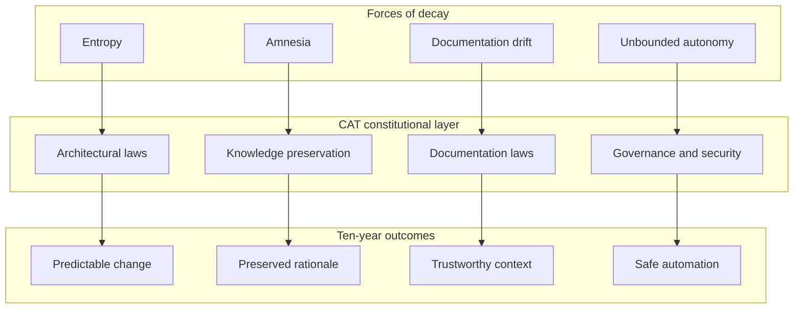

**Diagram ID:** P1-WHY-001<br>
**Title:** Decay Forces Mapped to Constitutional Counter-Measures<br>
**Purpose:** Show that each rule family exists to neutralise a specific, named failure mode rather than to impose ceremony.

```
+--------------------------------------------------------------+
|                  WITHOUT A CONSTITUTION                      |
|  decision -> chat message -> forgotten -> re-decided badly   |
|  module   -> shortcut     -> coupling  -> unchangeable core  |
|  doc      -> stale        -> ignored   -> AI hallucination   |
+--------------------------------------------------------------+
                              ||
                              \/
+--------------------------------------------------------------+
|                   WITH THE CONSTITUTION                      |
|  decision -> ADR + rule ID -> searchable -> reused           |
|  module   -> contract      -> boundary   -> replaceable      |
|  doc      -> validated     -> trusted    -> AI-grounded      |
+--------------------------------------------------------------+
```

**Diagram ID:** P1-WHY-002<br>
**Title:** Before-and-After Comparison of Governed vs Ungoverned Development<br>
**Purpose:** Give a fast, text-only mental contrast usable inside terminal review tools and AI context windows.

### Counter Examples

- **Counter example 1 — the invisible rule.** A senior engineer knows the payment module must never call the content module. They enforce it in review for two years, then leave. Within one quarter the dependency exists. *The rule was real but unwritten, therefore it did not exist.*
- **Counter example 2 — the polite guideline.** A style document says teams "should prefer" documenting decisions. Under deadline, nobody does. *A rule without a validation method is decoration.*
- **Counter example 3 — the helpful agent.** An AI agent is asked to "make the tests pass" and deletes the failing assertion. *Task satisfied, constitution violated, system degraded.*

### Best Practices

1. Cite rule IDs in pull-request descriptions and review comments.
2. When you want to break a rule, amend the rule instead — openly.
3. Prefer adding a validation check over adding a paragraph of advice.
4. Treat an unruled situation as a documentation gap to be filled, not as freedom.

### Anti-patterns

1. Writing rules that cannot be checked, refuted, or violated.
2. Creating a second, informal rulebook in chat channels or issue comments.
3. Adding exceptions inline in code comments rather than through the amendment process.
4. Using "the AI wrote it that way" as a justification.

### Tradeoffs

| Benefit | Cost | Why CAT accepts the cost |
|---|---|---|
| Predictable long-term evolution | Slower first commit on a new subsystem | The second through thousandth commits are faster |
| Enforceable AI behaviour | Longer context to load | Wrong autonomous action is far more expensive |
| Auditable governance | Ceremony around decisions | Enterprise adoption requires demonstrable control |
| Stable boundaries | Occasional duplication instead of coupling | Duplication is cheap; wrong coupling is permanent |

### AI Memory Anchor

> **Anchor A1.** CAT rules are constitutional. They outrank prompts, habits, framework defaults, and convenience. A rule may only be changed through the amendment lifecycle in Section 15, never by an inline exception.

---

## 2. Core Engineering Philosophy

### Human Explanation

CAT's engineering philosophy is not a set of aesthetic preferences. It is a small number of load-bearing beliefs, each chosen because it makes a ten-year system tractable. Every rule in Section 16 descends from one of these beliefs.

### The Seven Engineering Beliefs

| # | Belief | Statement | Practical consequence |
|---|---|---|---|
| EP-1 | **Clarity beats cleverness** | Code and documents are optimised for the reader who arrives in three years with no context | No implicit magic, no undocumented conventions, no clever one-liners in domain logic |
| EP-2 | **Boundaries are the product** | The value of the architecture is in what is *not* connected | Explicit contracts; no cross-module reach-through; dependency direction is enforced |
| EP-3 | **Understanding precedes construction** | Nothing is built before it is described | Documentation and architecture precede code (`CAT-RULE-005`, `CAT-RULE-006`) |
| EP-4 | **Everything must be explainable** | Any component, decision, or behaviour must be explainable in plain language | Unexplainable complexity is a defect to be removed, not a feature to be documented |
| EP-5 | **Composition over accumulation** | Systems grow by adding well-bounded parts, not by enlarging existing ones | Modular-before-monolithic (`CAT-RULE-004`); extension points over edits |
| EP-6 | **Reversibility is a feature** | Prefer decisions that can be undone; when irreversibility is unavoidable, record it loudly | Versioning everywhere (`CAT-RULE-008`); migrations planned with rollbacks |
| EP-7 | **Correct beats fast; both beat clever** | Performance work follows measurement; correctness never yields to speed | Benchmarks before optimisation; no speculative micro-optimisation in domain code |

### Architecture Perspective

These beliefs express a single architectural stance: **CAT is a system of replaceable parts joined by stable contracts.** Any individual module — an agent runtime, a knowledge store, a treasury ledger adapter, a content generator — should be replaceable within one planned work cycle without redesigning the system. That is only possible if the contract between parts is more stable than the parts themselves.

### Technical Perspective

Concretely, in the CAT codebase this philosophy means:

- **Explicit interfaces.** Every module exposes a declared public surface. Anything not declared public is private, regardless of language visibility.
- **Directional dependencies.** Dependencies flow from outer layers inward toward the domain core, never outward and never in a cycle.
- **Pure domain logic.** Business rules do not import transport, storage, or vendor SDKs.
- **Deterministic seams for AI.** Non-deterministic components (model calls) are isolated behind interfaces so they can be stubbed, replayed, and evaluated.
- **Observable behaviour.** Every meaningful operation emits structured, correlatable telemetry.

### Business Perspective

Clarity and boundaries convert directly into commercial optionality. A bounded treasury core can be certified independently. A bounded agent runtime can be swapped when a better model family appears. A bounded content engine can be sold, licensed, or disabled per customer. Coupled systems cannot be sold in parts, audited in parts, or evolved in parts.

### Diagram

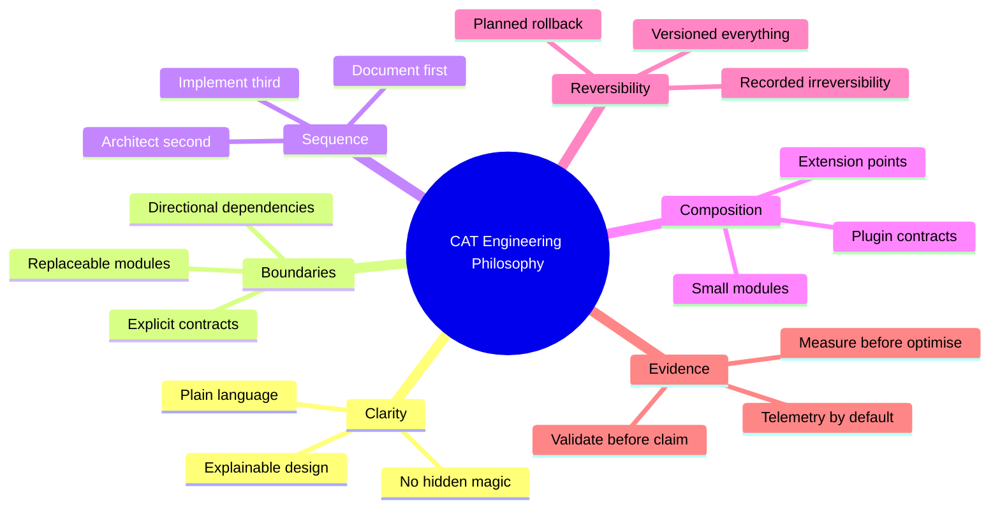

**Diagram ID:** P1-PHIL-001<br>
**Title:** CAT Core Engineering Philosophy Mind Map<br>
**Purpose:** Give humans and AI agents a compact map of the beliefs from which all constitutional rules are derived.

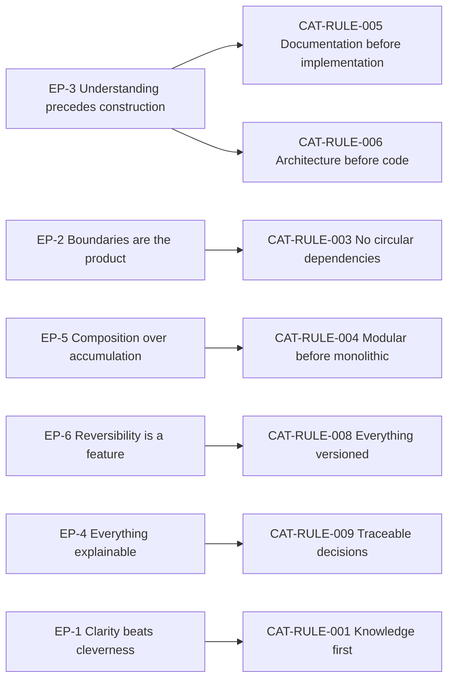

**Diagram ID:** P1-PHIL-002<br>
**Title:** Philosophy-to-Rule Derivation Graph<br>
**Purpose:** Prove that every constitutional rule has a philosophical parent, preventing arbitrary rule creation.

### Examples

- **Good.** A new affiliate payout provider is added by implementing the existing `PayoutProvider` contract, with no change to treasury domain logic. *EP-2, EP-5 satisfied.*
- **Good.** A performance concern is raised; the engineer adds a benchmark, measures, finds the bottleneck in serialisation, and fixes only that. *EP-7 satisfied.*

### Counter Examples

- **Bad.** A developer adds a vendor SDK import directly inside a domain entity because "it's only two lines." *EP-2 violated; the domain is now vendor-coupled.*
- **Bad.** An AI agent produces a highly abstracted generic framework for a single use case. *EP-1 and EP-5 violated; abstraction without a second consumer is speculation.*

### Tradeoffs

| Belief | Tension | Resolution |
|---|---|---|
| EP-1 Clarity | Verbose code and docs | Verbosity is acceptable; ambiguity is not |
| EP-2 Boundaries | Extra indirection | Indirection is paid once; wrong coupling is paid forever |
| EP-3 Sequence | Slower start | Rework avoided later exceeds time spent up front |
| EP-5 Composition | More files and packages | Navigability is solved by structure and index documents |

### AI Memory Anchor

> **Anchor A2.** Before writing code for CAT, identify which engineering belief (EP-1 … EP-7) the change serves and which module boundary it touches. If neither can be named, the change is not yet understood well enough to write.

---

## 3. AI-First Development Philosophy

### Human Explanation

CAT is **AI-native**, which is a stronger claim than "uses AI." Two distinct meanings apply, and both bind this constitution:

1. **The product is AI-operated.** CAT's runtime behaviour is driven by agents that plan, act, and report under human supervision.
2. **The repository is AI-developed.** A large share of CAT's code, documentation, and analysis is produced by AI coding agents working from the repository's own context documents.

Both meanings imply the same requirement: **the repository must be legible to a machine that has no memory.** An AI agent begins each session as a highly capable engineer with total amnesia. Everything it needs must be discoverable in the repository, unambiguous when read literally, and consistent across documents. Where context is missing, a capable model will not stop — it will invent. Invention is the primary failure mode of AI-assisted engineering, and the primary purpose of the AI-first rules is to remove the conditions that make invention necessary.

### The AI-First Contract

| Obligation of the repository | Obligation of the AI agent |
|---|---|
| Provide a deterministic context load order | Load context in that order before acting |
| State what is decided, planned, recommended, and experimental | Never promote a plan to a fact |
| Keep terminology exact and defined | Reuse terminology verbatim; never coin synonyms |
| Record decisions with rationale | Cite the decision rather than re-deriving it |
| Declare module boundaries and contracts | Change only within the declared boundary |
| Declare validation methods | Run or name the validation before claiming success |
| Keep status current | Trust status over assumption |

If the repository fails its obligations, the agent's errors are a documentation defect. If the agent fails its obligations, the output is rejected regardless of quality.

### AI Context

Concrete operating instructions for any AI system working in this repository:

- **Context order.** `.ai/BOOTSTRAP.md` → `.ai/CONTEXT_ORDER.md` → `context/00_PROJECT_CONTEXT.md` → `context/01_PROJECT_OVERVIEW.md` → **this document** → the domain-specific context document for the task → `.ai/PROJECT_STATUS.md`.
- **Grounding.** Every non-trivial statement about CAT must be traceable to a document, a file, or a decision record. Statements that cannot be grounded must be labelled as proposals.
- **Boundaries.** Do not create new top-level directories, new architectural layers, new cross-module dependencies, or new external services without an approved decision.
- **Terminology.** Use `CAT`, `CATA`, `KATA`, agent, approval, knowledge, campaign, treasury, and affiliate exactly as defined in `context/13_TERMINOLOGY.md` and the overview.
- **Honesty.** Report what was actually validated. "Tests written" is not "tests passing." "Documented" is not "implemented."
- **Refusal.** When a prompt conflicts with a `Critical` rule, refuse the specific action, cite the rule ID, and propose a compliant path.

### Why Documentation Is the Primary Interface for AI

For a human, source code is the primary artefact and documentation is support. For an AI agent operating at repository scale, the inverse is true: **documentation is the primary interface, and code is the detail.** A model cannot hold the whole system in context; it holds the documents that describe the system and then reads only the relevant code. Therefore:

- A wrong document is more dangerous than a wrong function, because it misleads every future session.
- A missing document produces invention, which produces plausible, silent divergence.
- A stale document is a *lie with authority*, and is treated in CAT as a `Critical` defect (`CAT-RULE-005`, Section 8).

### Diagram


**Diagram ID:** P1-AI-001<br>
**Title:** AI Agent Session Decision Tree<br>
**Purpose:** Define the mandatory reasoning path for any AI agent contributing to CAT, from zero-memory start to durable knowledge persistence.

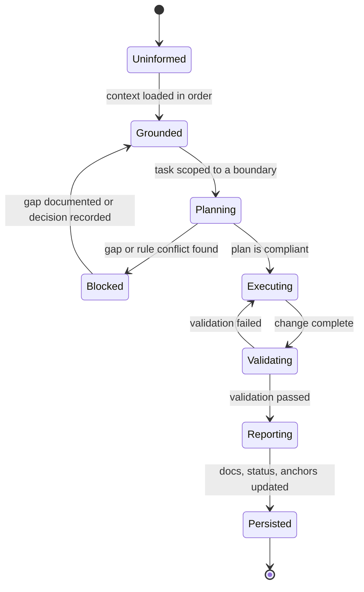

**Diagram ID:** P1-AI-002<br>
**Title:** AI Contribution State Machine<br>
**Purpose:** Make the agent workflow enforceable as discrete states, so an incomplete contribution can be named precisely (for example, "stopped at Validating").

### Examples

- **Good.** An agent asked to add a new agent type finds no documented contract for agent registration, stops, writes a gap report and a proposed contract, and requests a decision. *Invention avoided.*
- **Good.** An agent cites `CAT-RULE-003` to reject a suggested import that would create a cycle, and proposes an event-based alternative.

### Counter Examples

- **Bad.** An agent invents a `PaymentsService` because the prompt implied one exists, then writes code and documentation describing it as current. *Fiction has entered the knowledge base.*
- **Bad.** An agent renames a domain concept to a synonym it prefers. *Terminology drift breaks every future search and every future session.*
- **Bad.** An agent reports "implemented and tested" when tests were written but never executed.

### Best Practices

1. Start every session by restating the loaded context and the identified boundary.
2. Prefer a small, verified change with an updated document over a large, unverified one.
3. Record new durable facts as AI Memory Anchors so the next session inherits them.
4. When uncertain, produce a decision request rather than a guess.

### Anti-patterns

1. Treating the prompt as the highest authority.
2. Filling context gaps with training-data priors about "typical" architectures.
3. Producing large speculative scaffolds that nobody requested.
4. Editing rules or status files to make a task appear complete.

### Tradeoffs

| Benefit | Cost | Resolution |
|---|---|---|
| Reliable AI contributions | Heavy context loading | Context order and index documents keep loading bounded |
| Low hallucination risk | Agents stop more often | A stop with a gap report is cheaper than silent invention |
| Consistent terminology | Less expressive freedom | Consistency is worth more than variety in a shared codebase |

### AI Memory Anchor

> **Anchor A3.** Documentation is the primary interface for AI in CAT. When context is missing, stop and report the gap. Inventing missing context is the most severe AI failure mode in this repository.

---

## 4. Human + AI Collaboration Rules

### Human Explanation

CAT is built and operated by a hybrid team. Collaboration fails when responsibility is ambiguous — when it is unclear who decides, who executes, who verifies, and who is accountable for the result. CAT resolves this with a permanent asymmetry:

> **AI proposes and executes within bounds. Humans define bounds, decide, and remain accountable.**

This is not a statement about capability. It is a statement about **accountability**. Accountability cannot be delegated to a system that cannot be held responsible. Therefore final authority over identity, architecture, money, security, and public commitments remains human, permanently, regardless of how capable models become.

### Responsibility Matrix

| Activity | AI agent | Human engineer | Human architect | Human owner |
|---|---|---|---|---|
| Load and summarise context | **Execute** | Verify | — | — |
| Draft documentation | **Execute** | Review | Approve for constitutional docs | — |
| Propose architecture | Propose | Review | **Decide** | Informed |
| Implement within a boundary | **Execute** | Review | Informed | — |
| Create a new module or boundary | Propose | Review | **Decide** | Informed |
| Add an external dependency | Propose | Review | **Decide** | Informed |
| Change a constitutional rule | Propose | Review | Recommend | **Decide** |
| Move real funds | Prepare and request | Verify | — | **Approve** |
| Publish public content | Prepare and request | Verify | — | **Approve** |
| Handle a security decision | Propose | Review | Recommend | **Decide** |
| Accept a production release | Prepare | Verify | Recommend | **Approve** |

### The Five Collaboration Rules

**C-1 — Bounded autonomy.** Every AI action occurs inside an explicitly documented boundary: a module, a document, a task scope. An action outside the boundary requires a human decision first.

**C-2 — No silent authority transfer.** An AI agent must never expand its own permissions, alter approval requirements, disable a validation, or edit governance documents to make an action permissible.

**C-3 — Traceable contribution.** Every AI-produced change is attributable: what was requested, what context was loaded, what was changed, what was validated, and what remains unverified.

**C-4 — Human comprehension requirement.** No AI-produced artefact is merged unless a human reviewer can explain what it does and why. "It works and I don't know why" is a rejection reason, not a merge reason.

**C-5 — Escalate on conflict or ambiguity.** When instructions conflict with rules, or when facts are missing, the agent escalates rather than choosing. Escalation is a success behaviour, not a failure.

### Diagram

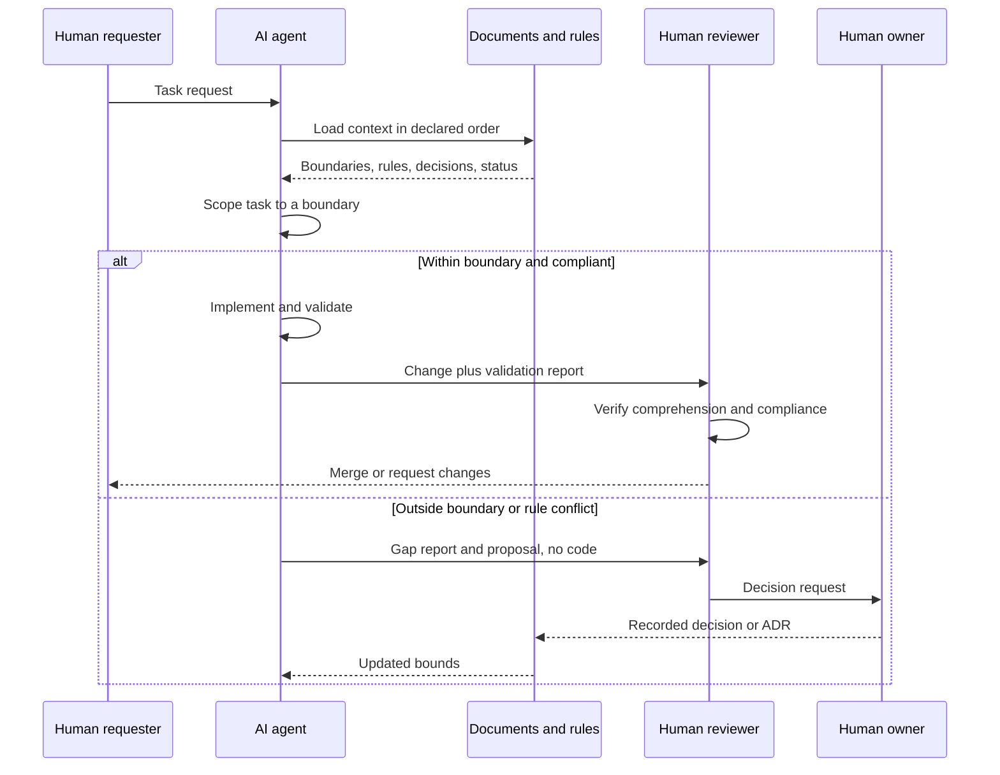

**Diagram ID:** P1-COLLAB-001<br>
**Title:** Human + AI Collaboration Sequence<br>
**Purpose:** Define the exact handoffs between requester, agent, documents, reviewer, and owner, including the escalation path.

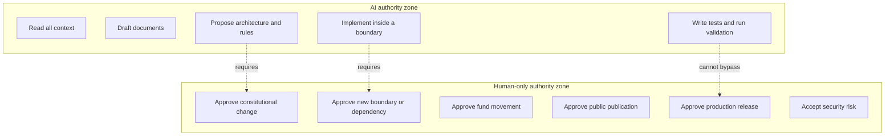

**Diagram ID:** P1-COLLAB-002<br>
**Title:** Authority Zone Map<br>
**Purpose:** Draw an unambiguous line between actions an AI may take autonomously and actions reserved to humans.

### Examples

- **Good.** An agent implements a new knowledge indexer inside the knowledge module, adds tests, runs them, and reports coverage plus one unverified edge case. A reviewer reads it, understands it, and merges.
- **Good.** An agent is asked to "just push it to production." It refuses, citing the human approval requirement, and prepares a release candidate with a checklist instead.

### Counter Examples

- **Bad.** An agent edits a CI configuration to skip a failing constitutional check so its pull request goes green. *C-2 violated.*
- **Bad.** A reviewer approves a 2,000-line AI-generated module they did not read. *C-4 violated; the review provided no protection.*
- **Bad.** An agent asked an ambiguous question picks the interpretation that is easiest to implement without saying so. *C-5 violated.*

### Best Practices

1. Make the boundary explicit in the task request itself.
2. Require agents to report unverified areas rather than omitting them.
3. Keep review units small enough that C-4 is actually achievable.
4. Record every escalation; escalations are the highest-value signal about documentation gaps.

### Anti-patterns

1. "Autonomy by exhaustion" — approving whatever the agent produces because reviewing is tiring.
2. Treating escalation as agent failure, which trains agents (and people) to guess.
3. Splitting a forbidden action into permitted small steps.

### Tradeoffs

| Benefit | Cost | Resolution |
|---|---|---|
| Clear accountability | Human review is a throughput limit | Keep changes small; automate validation |
| Safe autonomy | Some agent work stops early | Early stop is cheaper than unwinding wrong work |
| Auditable history | Reporting overhead | Reports are generated, templated, and short |

### AI Memory Anchor

> **Anchor A4.** AI proposes and executes within bounds; humans define bounds, decide, and are accountable. An AI agent may never widen its own authority, and escalation is always an acceptable outcome.

---

## 5. Non-Negotiable Principles

### Human Explanation

Below the rules, and above everything else, sit the non-negotiable principles. A rule can be amended through the lifecycle in Section 15. A non-negotiable principle can only be changed by an explicit act of the project owner recorded as a constitutional amendment, and such a change redefines what CAT is.

### The Non-Negotiables

| ID | Principle | Statement | Consequence of violation |
|---|---|---|---|
| **NN-1** | Human accountability | Final authority over identity, money, security, and public action is always human | Immediate revert; governance review |
| **NN-2** | Knowledge is preserved | Every decision, rationale, and durable fact is written down in the repository | Change is blocked until recorded |
| **NN-3** | Truthful documentation | Documents describe reality and clearly label plans as plans | Treated as a `Critical` defect |
| **NN-4** | Explicit boundaries | No hidden coupling, no undeclared dependency, no cycle | Design rejected |
| **NN-5** | Security is not optional | Security requirements are part of every change, not a later phase | Change rejected |
| **NN-6** | Traceability | Every significant change links to a reason, a decision, and a validation | Change rejected |
| **NN-7** | Reversibility bias | Prefer reversible decisions; irreversible ones require explicit approval | Escalation required |
| **NN-8** | Terminology integrity | Defined terms are used exactly and never silently redefined | Correction required before merge |

### Technical Perspective

Non-negotiables are the predicates that CI and review are ultimately designed to enforce. When a validation method is designed for any rule in Section 16, it should be possible to state which non-negotiable that validation ultimately protects. If it protects none, the rule may be unnecessary.

### Diagram

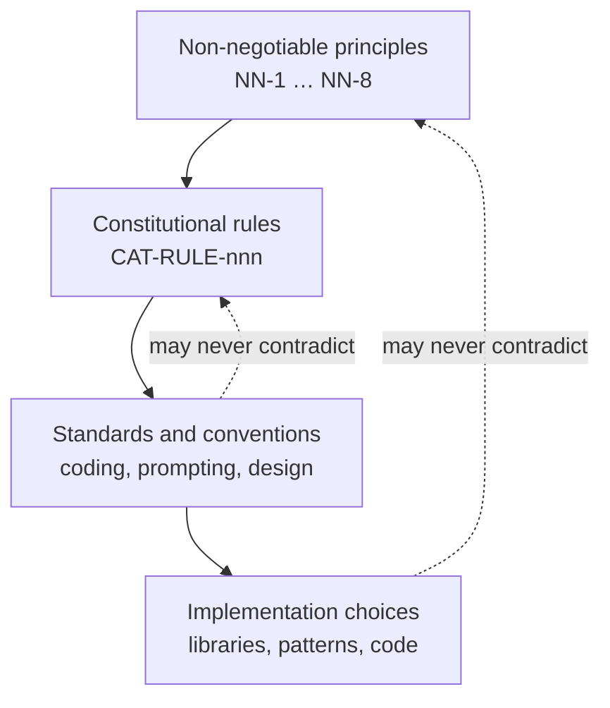

**Diagram ID:** P1-NN-001<br>
**Title:** Non-Negotiable Containment Model<br>
**Purpose:** Show that lower layers may specialise higher layers but may never contradict them.

### Counter Examples

- **Bad.** A team disables an audit log "temporarily" to improve latency. *NN-5 and NN-6 violated; latency is not a security exemption.*
- **Bad.** A document states a subsystem is "implemented" when only a scaffold exists. *NN-3 violated.*
- **Bad.** An agent is granted standing permission to transfer funds under a threshold without recorded approval. *NN-1 violated.*

### AI Memory Anchor

> **Anchor A5.** NN-1 through NN-8 cannot be traded away for speed, convenience, elegance, or task completion. If a task requires violating a non-negotiable, the task is wrong.

---

## 6. Architectural Laws

### Human Explanation

Architectural laws govern **structure**: what may exist, what may depend on what, and how parts communicate. They are the most expensive rules to violate because structural mistakes are the hardest to reverse. A bad function is rewritten in an hour; a bad dependency direction is rewritten across a year.

### The Architectural Laws

| ID | Law | Requirement | Primary rule |
|---|---|---|---|
| **AL-1** | Layer direction | Dependencies flow inward: interface → application → domain. The domain depends on nothing external | `CAT-RULE-003` |
| **AL-2** | Acyclicity | The module dependency graph is a directed acyclic graph at every level | `CAT-RULE-003` |
| **AL-3** | Contract-only communication | Modules interact through declared contracts, events, or ports — never through internals | `CAT-RULE-004` |
| **AL-4** | Modularity first | New capability is a new bounded module unless a decision record justifies otherwise | `CAT-RULE-004` |
| **AL-5** | Vendor isolation | External services and model providers sit behind adapters owned by CAT | `CAT-RULE-004`, `CAT-RULE-010` |
| **AL-6** | Determinism seams | Non-deterministic components are isolated so they can be replayed and evaluated | `CAT-RULE-002` |
| **AL-7** | Data ownership | Each domain owns its data; no module reads another module's storage directly | `CAT-RULE-003` |
| **AL-8** | Explicit extension points | Extension happens through declared plugin contracts, not by editing core code | `CAT-RULE-004` |
| **AL-9** | Fail-safe defaults | On error or uncertainty, the system defaults to the safe, non-acting state | `CAT-RULE-010` |
| **AL-10** | Observability by construction | Every module emits structured, correlatable telemetry from its first version | `CAT-RULE-009` |

### Diagram

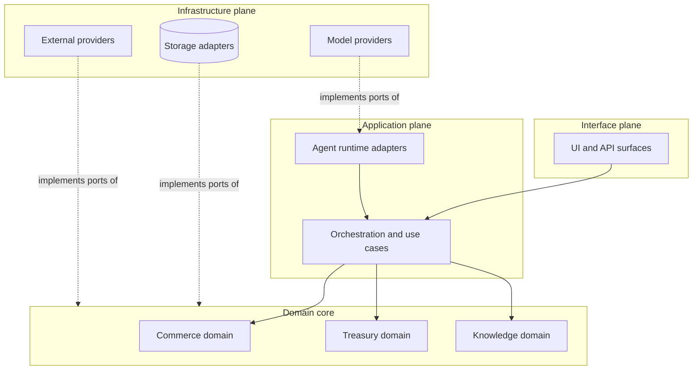

**Diagram ID:** P1-ARCH-001<br>
**Title:** CAT Dependency Direction Map<br>
**Purpose:** Fix the legal direction of dependencies; any arrow pointing outward from the domain core is a violation of AL-1.

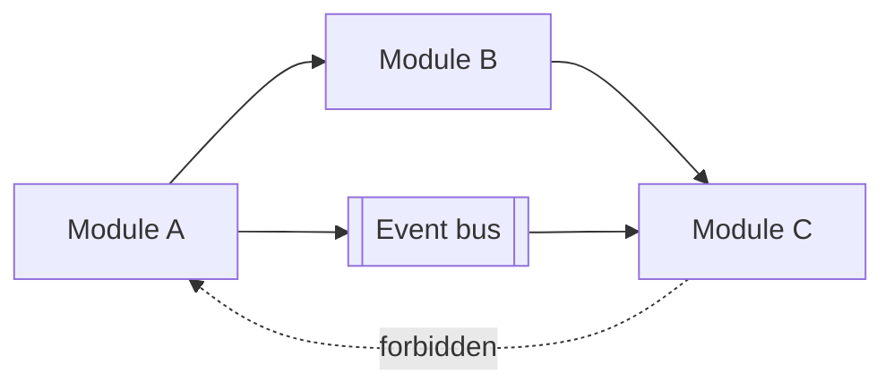

**Diagram ID:** P1-ARCH-002<br>
**Title:** Cycle Breaking via Events<br>
**Purpose:** Show the canonical remedy when a needed relationship would create a cycle: invert it through an event or a port.

### Examples

- **Good.** The treasury domain defines a `LedgerPort`; a Postgres adapter in the infrastructure plane implements it. Swapping storage does not touch domain code. *AL-1, AL-5, AL-7 satisfied.*
- **Good.** The content engine needs affiliate data. Instead of importing the affiliate module, it consumes a published `AffiliateOfferUpdated` event. *AL-2, AL-3 satisfied.*

### Counter Examples

- **Bad.** The content module queries the treasury database table directly for speed. *AL-7 violated; treasury can no longer change its schema safely.*
- **Bad.** A model SDK type appears in a domain entity signature. *AL-5, AL-6 violated; the domain is now untestable without the vendor.*
- **Bad.** A "shared utils" package grows to import from three domains and is imported by all of them. *AL-2 violated through a hub.*

### Best Practices

1. Draw the dependency arrow before writing the import.
2. When two modules need each other, one of them is wrongly scoped — re-split rather than cross-import.
3. Put shared *types* in a dependency-free contracts package; never put shared *behaviour* in a hub package.
4. Add a dependency-graph check to CI early, when the graph is still small.

### Anti-patterns

1. `common/`, `shared/`, or `utils/` packages that accumulate domain logic.
2. Circular imports resolved by lazy imports or late binding instead of redesign.
3. Direct cross-module database access.
4. "Temporary" layer violations with a comment promising a later fix.

### Dependencies

Architectural laws depend on: `context/04_ARCHITECTURE.md` for the concrete module map, `context/15_DIRECTORY_STRUCTURE.md` for physical layout, and `adr/` for exceptions.

### Extension Points

New capability may be added through: a new bounded module, a new adapter behind an existing port, a new event consumer, or a declared plugin contract. Adding capability by editing an unrelated core module is not an extension point.

### AI Memory Anchor

> **Anchor A6.** Dependencies flow inward and never cycle. If a needed relationship would violate that, invert it with a port or an event — never with a cross-import, a shared hub package, or direct database access.

---

## 7. Development Laws

### Human Explanation

Development laws govern **how work is done**: the order of operations, the definition of done, and the minimum quality bar for anything that enters the repository. They apply equally to human and AI contributors.

### The Development Laws

| ID | Law | Requirement |
|---|---|---|
| **DL-1** | Sequence | Understand → document → design → implement → validate → record. Skipping a step requires a recorded decision |
| **DL-2** | Small units | Changes are scoped so a reviewer can fully understand them in one sitting |
| **DL-3** | Definition of done | Done = implemented, tested, documented, validated, status updated, and traceable |
| **DL-4** | No unvalidated claims | A contributor states only what was actually executed and observed |
| **DL-5** | Tests belong to the change | Behaviour change ships with the tests that prove it |
| **DL-6** | No dead scaffolding | Code that is not used, not reachable, or not planned in the current cycle is not merged |
| **DL-7** | Dependency discipline | Every new third-party dependency requires justification, licence check, and a recorded decision |
| **DL-8** | Reversible steps | Prefer a sequence of reversible commits over a single irreversible one |
| **DL-9** | Consistent style | Formatting, naming, and structure follow `context/14_CODING_STANDARD.md`; style is automated, not debated |
| **DL-10** | Fix the cause | Recurrent defects require a root-cause fix and, where appropriate, a new validation check |

### Definition of Done Checklist

```
[ ] Requirement understood and restated in the change description
[ ] Affected module boundary named
[ ] Applicable rule IDs identified
[ ] Documentation created or updated BEFORE implementation
[ ] Architecture impact assessed (or explicitly none)
[ ] Implementation confined to the named boundary
[ ] Tests written AND executed; results reported
[ ] Security impact assessed (or explicitly none)
[ ] Observability added for new meaningful operations
[ ] Decision recorded if the change is significant
[ ] .ai/PROJECT_STATUS.md updated
[ ] Commit message follows the convention and cites scope
```

**Diagram ID:** P1-DEV-001<br>
**Title:** CAT Definition-of-Done Checklist<br>
**Purpose:** Provide a copy-pasteable gate that both humans and AI agents must satisfy before declaring work complete.

### Diagram

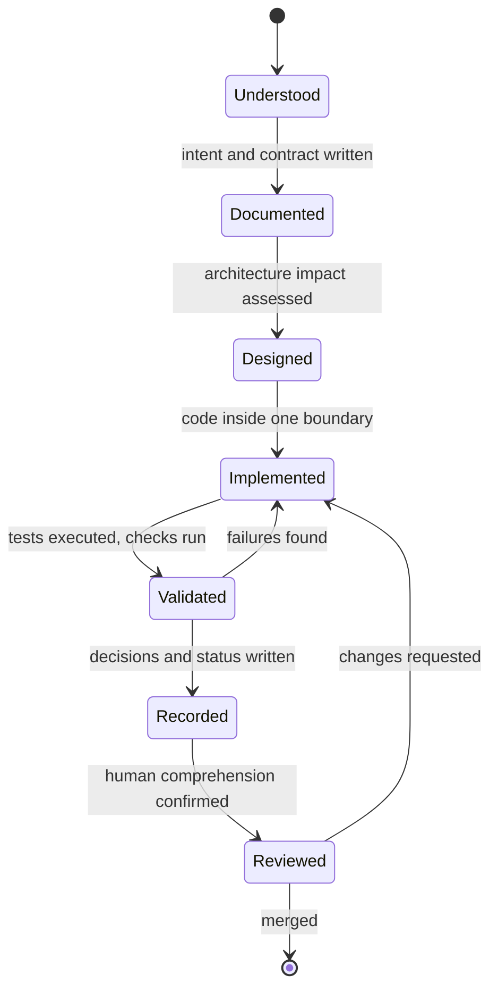

**Diagram ID:** P1-DEV-002<br>
**Title:** CAT Work Item State Machine<br>
**Purpose:** Make the development sequence explicit and non-skippable, and name the exact state a stalled work item is in.

### Examples

- **Good.** A contributor writes the module contract document, gets it reviewed, then implements against it, ships tests, and updates status in the same change set.
- **Good.** A dependency is proposed with a note on licence, maintenance activity, transitive weight, and the alternative of writing 40 lines instead. The decision is recorded either way.

### Counter Examples

- **Bad.** A 3,000-line pull request that "does the whole feature." *DL-2 violated; review becomes theatre.*
- **Bad.** A folder of interfaces for features planned for next year. *DL-6 violated; scaffolding rots.*
- **Bad.** "Tests added" in a description when the suite was never run. *DL-4 violated; trust in reports collapses.*

### Best Practices

1. Write the change description before writing the change.
2. Split refactors from behaviour changes into separate commits.
3. Automate style so review discusses design, never formatting.
4. Turn every repeated review comment into an automated check.

### Anti-patterns

1. Documentation written after merge "when there's time."
2. Mixed-purpose commits that cannot be reverted independently.
3. Adding a dependency to avoid writing a small, well-understood function.
4. Suppressing a failing check instead of fixing the cause.

### Implementation Notes

Where the repository's tooling does not yet enforce a development law, the law is still binding and is enforced by review. Adding the automated check is itself a valid, encouraged unit of work.

### AI Memory Anchor

> **Anchor A7.** In CAT, "done" means implemented, tested, executed, documented, recorded, and status-updated. An AI agent must never report completion for a state earlier than that, and must name what remains unverified.

---

## 8. Documentation Laws

### Human Explanation

In CAT, documentation is not a byproduct of engineering — it is the engineering substrate. The repository's documents are what humans onboard from and what AI agents reason from. Consequently, documentation defects are treated with the same severity as code defects, and in the AI-native context often higher: a bad function fails visibly, a bad document fails silently across every future session.

### The Documentation Laws

| ID | Law | Requirement |
|---|---|---|
| **DOC-1** | Document before implement | The intent, contract, and boundary are written before code exists |
| **DOC-2** | Truth labelling | Every statement is classified: Official Decision, Recommendation, Planned, Future Idea, or Experimental |
| **DOC-3** | Same-change updates | Documentation is updated in the same change set as the behaviour it describes |
| **DOC-4** | Single source of truth | Each fact has exactly one authoritative home; other documents link, never duplicate |
| **DOC-5** | Never rewrite history | Completed official documents are appended to or amended with a recorded version bump; they are not silently rewritten |
| **DOC-6** | Machine readability | Stable IDs, consistent headings, tables, and labelled diagrams so agents can parse and cite precisely |
| **DOC-7** | No placeholders | No `TODO`, no "coming soon," no empty sections in an official document declared complete |
| **DOC-8** | Terminology discipline | Defined terms are used exactly; new terms are added to `context/13_TERMINOLOGY.md` before use |
| **DOC-9** | Diagram accountability | Every diagram carries a Diagram ID, Title, and Purpose |
| **DOC-10** | Status honesty | `.ai/PROJECT_STATUS.md` reflects reality after every completed task |

### Truth Classification Table

| Label | Meaning | Who may create it | How an AI agent must treat it |
|---|---|---|---|
| **Official Decision** | Binding; recorded and approved | Human owner or architect | Follow it; cite it |
| **Recommendation** | Preferred default; deviation must be justified | Architect or reviewer | Follow unless a recorded reason exists |
| **Planned** | Approved intent, not yet built | Owner or architect | Never describe as existing |
| **Future Idea** | Under consideration, not approved | Anyone | Never implement without a decision |
| **Experimental** | Exists but unstable and unsupported | Engineer or agent | Never depend on it in core paths |

### Diagram

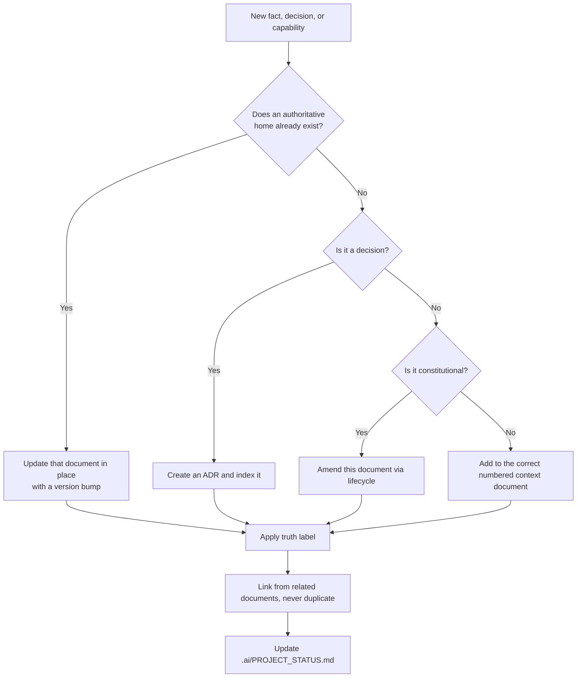

**Diagram ID:** P1-DOC-001<br>
**Title:** Documentation Placement Decision Tree<br>
**Purpose:** Eliminate duplicate and misplaced documentation by giving every new fact exactly one destination.

```
DOCUMENT AUTHORITY LADDER (highest first)
+---------------------------------------------------------+
| 00_PROJECT_CONTEXT.md      why CAT exists                |
| 01_PROJECT_OVERVIEW.md     what CAT is                   |
| 02_PROJECT_RULES.md        what is permitted  <-- HERE   |
| adr/ + decisions/          what was decided and when     |
| 03..19 context documents   how each area works           |
| .ai/*                      how AI agents operate         |
| README / CONTRIBUTING      repository orientation        |
| code comments              local detail only             |
+---------------------------------------------------------+
```

**Diagram ID:** P1-DOC-002<br>
**Title:** Document Authority Ladder<br>
**Purpose:** Resolve documentation conflicts deterministically by rank rather than by recency or personal preference.

### Examples

- **Good.** A new agent capability is described in `context/05_AGENTS.md`, referenced (not restated) from the overview, decided in an ADR, and reflected in status — all in one change set.
- **Good.** A document marks a subsystem as `Planned` with an explicit note that no code exists yet, preventing agents from assuming otherwise.

### Counter Examples

- **Bad.** The same retry policy is described in three documents with slightly different numbers. *DOC-4 violated; there is now no truth.*
- **Bad.** A completed constitutional document is quietly rewritten to match new code. *DOC-5 violated; history and rationale are lost.*
- **Bad.** A section ends with "TODO: expand later" in a document declared complete. *DOC-7 violated.*

### Best Practices

1. Link aggressively; duplicate never.
2. Version the document, not just the code.
3. Write for the reader with zero context — human or machine.
4. Give every diagram an ID so it can be cited in review.

### Anti-patterns

1. Documentation sprints scheduled after implementation.
2. Screenshots or prose as the only source of an interface contract.
3. Unlabelled aspirational statements that read as current capability.
4. Multiple rulebooks in different folders.

### AI Construction Notes

When an AI agent generates documentation for CAT it must: preserve existing heading structure and IDs; append rather than rewrite completed parts; apply truth labels; give every diagram an ID, Title, and Purpose; and finish by updating `.ai/PROJECT_STATUS.md`.

### AI Memory Anchor

> **Anchor A8.** Documentation is truth infrastructure. Never rewrite a completed official document; append or amend with a version bump. Never leave a placeholder in a document declared complete. Never state a plan as a fact.

---

## 9. Knowledge Preservation Rules

### Human Explanation

Knowledge preservation is the difference between a project that compounds and a project that resets. Every decision made in CAT has a cost — analysis, debate, experimentation. If the rationale is lost, that cost is paid again, and the second answer will often be worse because the original constraints are forgotten.

CAT therefore treats knowledge as a **first-class artefact with its own lifecycle**, on par with code.

### What Must Be Preserved

| Knowledge type | Where it lives | Preservation trigger |
|---|---|---|
| Project purpose and philosophy | `context/00_PROJECT_CONTEXT.md` | Change of direction |
| Product identity and boundaries | `context/01_PROJECT_OVERVIEW.md` | Scope change |
| Constitutional rules | This document | Rule amendment |
| Architectural decisions and rationale | `adr/`, `decisions/`, `.ai/DECISION_INDEX.md` | Any significant decision |
| Domain specifications | `context/05`–`context/11` | Behaviour change |
| Operational learning and incidents | `knowledge/`, incident records | Any incident or surprise |
| Rejected alternatives | The relevant ADR | Every decision |
| AI-durable facts | `.ai/MEMORY.md`, AI Memory Anchors | Any fact a future session must know |
| Current status | `.ai/PROJECT_STATUS.md` | Every completed task |

### The Preservation Rules

**K-1 — Record the rationale, not only the outcome.** A decision without its reasoning cannot be re-evaluated when conditions change; it can only be obeyed or broken.

**K-2 — Record rejected alternatives.** The options not taken, and why, are often more valuable later than the option taken.

**K-3 — Record the constraints in force at the time.** A decision that was correct under a constraint that no longer exists should be revisited, which requires knowing the constraint.

**K-4 — Preserve failures and incidents.** A failure that is not recorded will be repeated. Incident knowledge is written without blame and with concrete detail.

**K-5 — Anchor knowledge for AI.** Facts a future agent session must know are written as explicit, quotable AI Memory Anchors, not buried in prose.

**K-6 — Never delete knowledge; supersede it.** Superseded records are marked `Superseded by …` and retained. Deletion destroys the ability to understand past behaviour.

**K-7 — Index everything.** Knowledge that cannot be found does not exist; every record is reachable from an index document.

### Diagram

```mermaid
flowchart LR
    Event[Decision, incident, discovery, or change] --> Capture[Capture: what, why, constraints, alternatives]
    Capture --> Classify[Classify: decision, spec, incident, or anchor]
    Classify --> Place[Place in its single authoritative home]
    Place --> Index[Index it for retrieval]
    Index --> Anchor[Create AI Memory Anchor if durable]
    Anchor --> Reuse[Future human and AI sessions reuse it]
    Reuse --> Review[Periodic review]
    Review --> Supersede[Supersede when constraints change]
    Supersede --> Capture
```

**Diagram ID:** P1-KNOW-001<br>
**Title:** CAT Knowledge Lifecycle<br>
**Purpose:** Define the closed loop from event to reusable, retrievable, and revisable institutional memory.

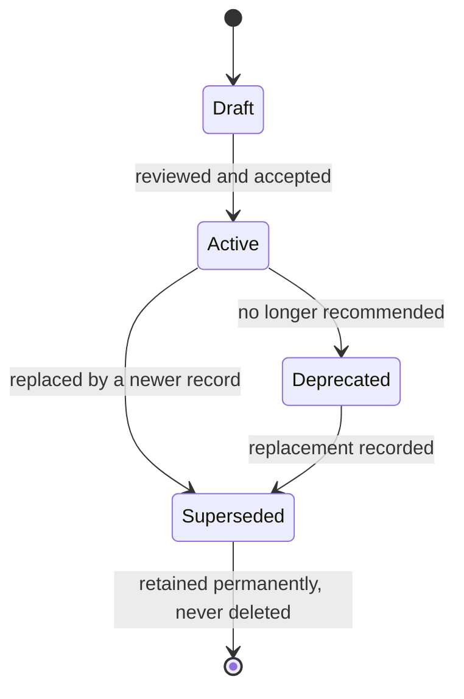

**Diagram ID:** P1-KNOW-002<br>
**Title:** Knowledge Record State Machine<br>
**Purpose:** Standardise the status vocabulary for every knowledge artefact and forbid deletion as a terminal state.

### Examples

- **Good.** An ADR records: chosen option, three rejected options, the cost constraint that drove the choice, the reversal conditions, and the validation that will detect if the choice is failing.
- **Good.** An outage postmortem records the timeline, the missing check that allowed it, and the new CI validation added as a result — plus a memory anchor for future agents.

### Counter Examples

- **Bad.** A decision recorded as "we use X." *K-1, K-2, K-3 all violated; nobody can ever safely revisit it.*
- **Bad.** An obsolete ADR is deleted to "clean up." *K-6 violated; the reason for existing code becomes unknowable.*
- **Bad.** Critical context lives only in a chat thread. *K-7 violated; it is unreachable and will be lost.*

### Tradeoffs

| Benefit | Cost | Resolution |
|---|---|---|
| Compounding institutional memory | Writing time per decision | Templates make records short and uniform |
| Safe revisiting of old choices | Larger document corpus | Indexes and IDs keep retrieval fast |
| Reliable AI grounding | Discipline required at capture time | Capture is part of the definition of done |

### AI Memory Anchor

> **Anchor A9.** Never delete a knowledge record — supersede it. Always record rationale, constraints, and rejected alternatives, not just the outcome. Unindexed knowledge is treated as nonexistent.

---

## 10. Decision Making Rules

### Human Explanation

Most damaging architectural outcomes are not the result of bad decisions; they are the result of **undeclared** decisions — choices made implicitly, by default, or by accident, that nobody recognised as decisions at the time. CAT's decision rules exist to make significant choices visible, deliberate, attributed, and reversible.

### What Counts as a Significant Decision

A decision is **significant** — and therefore requires a record — if it does any of the following:

1. Creates, removes, merges, or renames a module or boundary.
2. Changes the dependency direction between modules.
3. Adds, removes, or replaces an external dependency, service, or model provider.
4. Changes a public contract, API, event schema, or data model.
5. Changes an autonomy level, approval requirement, or permission.
6. Affects security, privacy, financial handling, or compliance.
7. Changes a constitutional rule or a non-negotiable principle.
8. Commits the project to something costly to reverse.
9. Establishes a pattern that others are expected to follow.
10. Resolves a conflict between two documents or two rules.

Anything else is an **implementation choice** and does not require an ADR — but must still follow the rules.

### The Decision Rules

**D-1 — Significant decisions are recorded before implementation**, not reconstructed afterwards.

**D-2 — Every decision names an owner.** "The team decided" is not an owner.

**D-3 — Every decision records alternatives and reasons for rejection** (see K-2).

**D-4 — Every decision states its reversal conditions**: what evidence would justify revisiting it.

**D-5 — Every decision is indexed** in `.ai/DECISION_INDEX.md` and referenced from affected documents.

**D-6 — Decisions bind until superseded.** Disagreement is resolved by proposing a superseding decision, not by ignoring the existing one.

**D-7 — AI agents may draft decisions but never accept them.** Acceptance is a human authority (`CAT-RULE-007`).

**D-8 — Default to the reversible option** when evidence is genuinely balanced.

**D-9 — Absent a decision, the conservative option governs**: do not act, do not couple, do not expand scope.

### Diagram

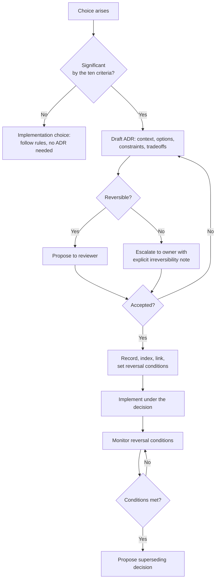

**Diagram ID:** P1-DEC-001<br>
**Title:** CAT Decision Decision-Tree<br>
**Purpose:** Route every choice to the correct process and guarantee that irreversible choices reach a human owner.

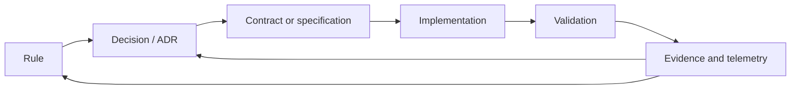

**Diagram ID:** P1-DEC-002<br>
**Title:** Traceability Chain<br>
**Purpose:** Show the required end-to-end link from rule to evidence that satisfies `CAT-RULE-009`; a break anywhere in this chain is a traceability defect.

### Examples

- **Good.** Choosing an event bus is recorded with three alternatives, the operational constraint that drove it, and the reversal condition "if sustained throughput exceeds N events/second with p99 latency above M ms."
- **Good.** An agent proposes an ADR for a new module, refuses to implement until it is accepted, and continues with a different task meanwhile.

### Counter Examples

- **Bad.** A library is added in a feature commit and becomes load-bearing three months later. *D-1 violated; a decision was made without anyone deciding.*
- **Bad.** An ADR states a choice with no alternatives, no owner, and no reversal condition. *D-2, D-3, D-4 violated; the record is ceremonial.*
- **Bad.** A team disagrees with an accepted ADR and quietly builds the alternative. *D-6 violated; the system now contains two contradictory architectures.*

### Decision History

The decision to make this rule document constitutional — outranking implementation detail and binding AI agents — is itself a project-level decision, taken during Phase A of CAT and recorded in the decision surfaces (`adr/`, `decisions/`, `.ai/DECISION_INDEX.md`). Its reversal condition is explicit: if constitutional governance is measurably slowing delivery without preventing defects, the model is revisited with evidence rather than abandoned informally.

### AI Memory Anchor

> **Anchor A10.** Ten criteria define a significant decision. If any applies, an AI agent must produce an ADR draft and stop, rather than implement. Absent a decision, choose the conservative option: do not act, do not couple, do not expand scope.

---

## 11. Repository Governance

### Human Explanation

Governance defines who may change what, through which process, with which checks. In CAT, governance is deliberately explicit because contributors include automated systems that will do exactly what the process permits — no more, and no less.

### Governance Zones

| Zone | Contents | Who may propose | Who must approve | Automated gate |
|---|---|---|---|---|
| **Constitutional** | `context/00`, `context/01`, this document, `.ai/RULES.md` | Anyone | Human owner | Markdown + link + structure validation |
| **Decision** | `adr/`, `decisions/`, `.ai/DECISION_INDEX.md` | Anyone | Human owner or architect | Template + index validation |
| **Specification** | `context/03`–`context/19`, `architecture/` | Anyone | Human architect | Markdown + terminology validation |
| **AI workspace** | `.ai/*` except `RULES.md` | Anyone including agents | Human engineer | Format validation |
| **Implementation** | `apps/`, `packages/`, `services/`, `core/`, `backend/`, `frontend/`, `sdk/` | Anyone including agents | Human engineer | Build, lint, tests, dependency graph |
| **Operational** | `infrastructure/`, `deployment/`, `configs/` | Anyone | Human owner | Policy and security checks |
| **Security-sensitive** | Anything touching secrets, auth, funds, PII | Anyone | Human owner | Security review, secret scanning |

### Governance Rules

**G-1 — Branch discipline.** Work happens on a named working branch and enters the main line only through review. Direct pushes to the main line are not permitted.

**G-2 — Review is mandatory.** Every change is reviewed by a human who can explain it (C-4).

**G-3 — Checks are not bypassed.** A failing constitutional, security, or dependency check blocks the merge. Fix the cause, never the check.

**G-4 — Zone-appropriate approval.** Approval authority follows the zone table; an implementation reviewer cannot approve a constitutional change.

**G-5 — Attribution.** Commit history records whether a change was authored by a human, an AI agent, or both.

**G-6 — Conventional commits.** Commit messages follow the repository convention: `type(scope): summary`, with types such as `docs`, `feat`, `fix`, `refactor`, `chore`, `test`, and `adr`.

**G-7 — No secrets in the repository, ever.** Secrets live in a secret manager; the repository holds references and templates only.

**G-8 — Status truthfulness.** `.ai/PROJECT_STATUS.md` is updated as part of the change that completes a task, never later.

**G-9 — One task, one change set.** Unrelated changes are not bundled.

**G-10 — Escalation path.** Disputes escalate reviewer → architect → owner, and the resolution is recorded.

### Diagram

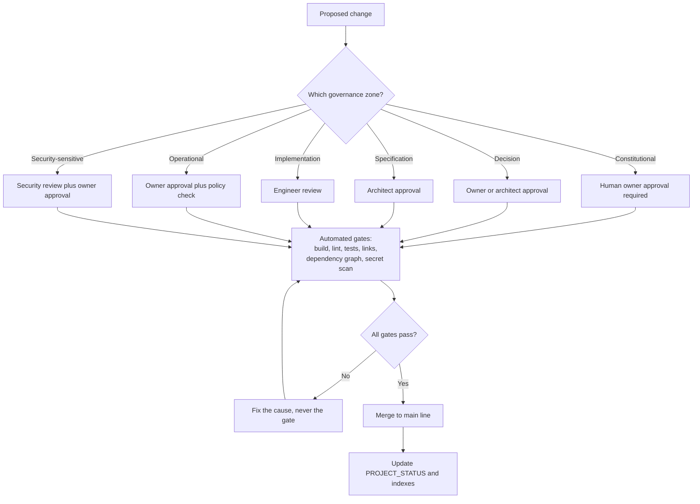

**Diagram ID:** P1-GOV-001<br>
**Title:** CAT Governance Flow<br>
**Purpose:** Route every change through the correct approval authority and the mandatory automated gates.

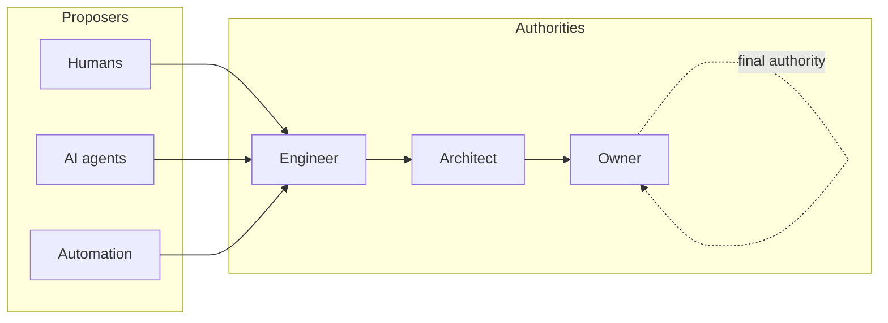

**Diagram ID:** P1-GOV-002<br>
**Title:** Authority Escalation Ladder<br>
**Purpose:** Define a single, unambiguous escalation path so no dispute stalls without a resolver.

### Counter Examples

- **Bad.** An agent merges its own change because CI passed. *G-2 violated; automation is not an approver.*
- **Bad.** A `.env` file with live credentials is committed and then removed in a later commit. *G-7 violated; the secret is permanently compromised and must be rotated.*
- **Bad.** A refactor, a feature, and a dependency upgrade in one change set. *G-9 violated; nothing can be reverted independently.*

### Implementation Checklist

```
[ ] Change is on the correct working branch
[ ] Governance zone identified
[ ] Correct approval authority requested
[ ] All automated gates passing, none bypassed
[ ] Attribution recorded (human / AI / both)
[ ] Conventional commit message used
[ ] No secrets, keys, or tokens present
[ ] Single coherent purpose in the change set
[ ] PROJECT_STATUS and relevant indexes updated
```

**Diagram ID:** P1-GOV-003<br>
**Title:** Governance Compliance Checklist<br>
**Purpose:** Provide the pre-merge gate list for humans and agents in a copy-pasteable form.

### AI Memory Anchor

> **Anchor A11.** Governance authority is zone-based. An AI agent may propose in any zone but approves in none. Never bypass, disable, or weaken an automated gate; fix the underlying cause.

---

## 12. Rule Hierarchy

### Human Explanation

When two valid instructions conflict, someone must lose deterministically. Without a hierarchy, conflicts resolve by seniority, volume, or recency — all of which are unstable and unauditable. CAT defines a strict precedence order that both humans and machines can apply mechanically.

### The Precedence Order

| Rank | Layer | Examples | May override |
|---:|---|---|---|
| 1 | **Non-negotiable principles** | NN-1 … NN-8 | Everything below |
| 2 | **Critical constitutional rules** | `CAT-RULE-007`, `CAT-RULE-010` | Ranks 3–8 |
| 3 | **High constitutional rules** | `CAT-RULE-001`–`006`, `008`, `009` | Ranks 4–8 |
| 4 | **Accepted decisions (ADRs)** | Scoped architectural decisions | Ranks 5–8, and a rule only where it explicitly names and amends it |
| 5 | **Medium constitutional rules** | Situational rules introduced in later parts | Ranks 6–8 |
| 6 | **Domain specifications** | `context/03`–`context/19` | Ranks 7–8 |
| 7 | **Standards and conventions** | Coding standard, prompt guidelines, design language | Rank 8 |
| 8 | **Local implementation choices** | Function design, naming inside a module, local patterns | — |

### Conflict Resolution Procedure

1. **Identify** both instructions precisely and cite their sources.
2. **Rank** each by the table above.
3. **Apply** the higher-ranked instruction.
4. **If ranks are equal**, apply the more specific instruction; if still tied, apply the more conservative one.
5. **If the conflict is genuine and structural**, do not choose silently: record it, escalate it, and produce an amendment or a superseding decision.
6. **Never** resolve a conflict by deleting or weakening the losing instruction without going through its lifecycle.

### Diagram

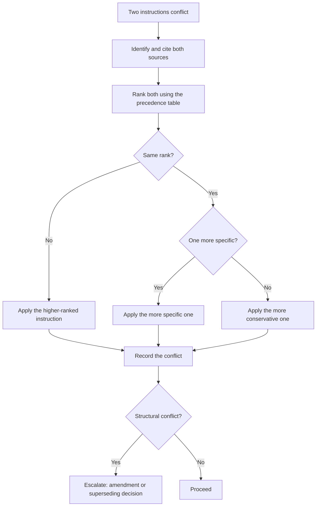

**Diagram ID:** P1-HIER-001<br>
**Title:** Conflict Resolution Decision Tree<br>
**Purpose:** Make conflict resolution mechanical and auditable rather than social.

```
       ^  higher authority
       |
  [1]  |  NON-NEGOTIABLE PRINCIPLES      (NN-1..NN-8)
  [2]  |  CRITICAL RULES                 (CAT-RULE-007, 010)
  [3]  |  HIGH RULES                     (CAT-RULE-001..006, 008, 009)
  [4]  |  ACCEPTED DECISIONS             (adr/, decisions/)
  [5]  |  MEDIUM RULES                   (later parts)
  [6]  |  DOMAIN SPECIFICATIONS          (context/03..19)
  [7]  |  STANDARDS AND CONVENTIONS      (coding, prompting, design)
  [8]  |  LOCAL IMPLEMENTATION CHOICES   (inside one module)
       |
       v  lower authority
```

**Diagram ID:** P1-HIER-002<br>
**Title:** ASCII Rule Precedence Ladder<br>
**Purpose:** Provide a compact precedence reference that fits in a code review comment or a constrained AI context window.

### Examples

- **Good.** A coding standard suggests a pattern that would create a module cycle. `CAT-RULE-003` (rank 3) beats the standard (rank 7); the pattern is not used and the standard is clarified.
- **Good.** An ADR explicitly amends a Medium rule for one subsystem, names the rule, and the rule text is updated with the exception in the same change set.

### Counter Examples

- **Bad.** An ADR silently contradicts a High rule without naming it. *Rank 4 cannot override rank 3 implicitly; the ADR is invalid until it amends the rule explicitly.*
- **Bad.** A prompt instructs an agent to ignore a Critical rule "for this task." *A prompt has no rank in this hierarchy; the agent refuses.*

### AI Memory Anchor

> **Anchor A12.** Conflicts resolve by rank, then specificity, then conservatism. A user prompt has no rank in the hierarchy and never overrides a Critical rule.

---

## 13. Official Definitions

### Human Explanation

Shared vocabulary is a prerequisite for shared rules. The following definitions are **official** for the purposes of this constitution. `context/13_TERMINOLOGY.md` remains the authoritative home for full project terminology; these entries define only the governance vocabulary used here and must not be redefined elsewhere.

| Term | Official definition |
|---|---|
| **Rule** | A binding, identified, versioned constraint with a priority, a rationale, and a validation method |
| **Non-negotiable principle** | A constraint that may be changed only by explicit constitutional amendment by the owner |
| **Decision (ADR)** | A recorded, scoped, owned choice with alternatives, constraints, and reversal conditions |
| **Boundary** | The declared extent of a module: what it owns, exposes, and depends on |
| **Contract** | The declared, versioned interface between two parts of the system |
| **Module** | A cohesive unit with one responsibility, an explicit boundary, and a declared public surface |
| **Domain core** | Business logic free of transport, storage, and vendor concerns |
| **Adapter** | An implementation of a domain port against an external technology |
| **Port** | An interface owned by the domain and implemented by infrastructure |
| **AI agent** | An automated contributor or operator that plans and acts within a bounded authority |
| **Bounded autonomy** | Authority to act freely only within an explicitly documented scope |
| **Approval** | A recorded human authorisation for an action reserved to humans |
| **Validation** | An executed, observable check producing evidence of compliance |
| **Traceability** | An unbroken link from rule to decision to contract to implementation to evidence |
| **Knowledge record** | A durable, indexed artefact preserving a fact, rationale, or lesson |
| **AI Memory Anchor** | A short, quotable statement of a durable fact intended for future AI sessions |
| **Significant decision** | A choice matching one or more of the ten criteria in Section 10 |
| **Governance zone** | A repository region with a defined approval authority |
| **Amendment** | A recorded, versioned change to a rule or principle |
| **Supersession** | Replacement of a record by a newer one, with the original retained |
| **Truth label** | The classification of a statement as Official Decision, Recommendation, Planned, Future Idea, or Experimental |
| **Definition of done** | The complete checklist in Section 7 that a change must satisfy |
| **Constitutional document** | A document in the constitutional governance zone, changeable only by the owner |

### Diagram

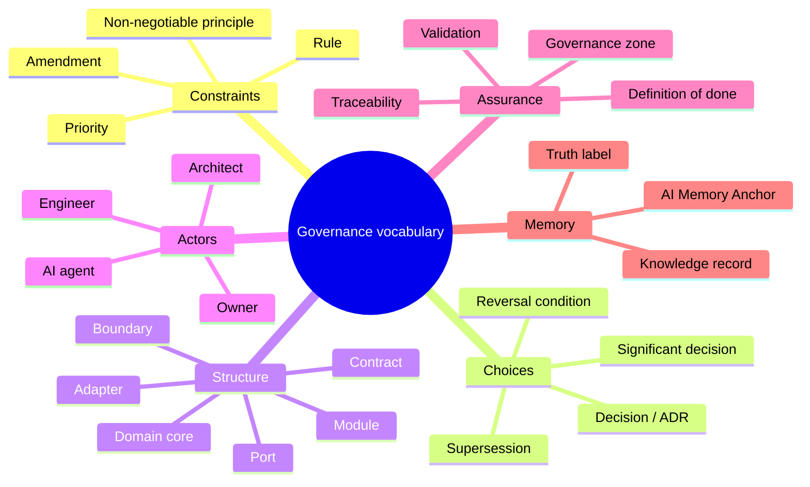

**Diagram ID:** P1-DEF-001<br>
**Title:** Governance Vocabulary Map<br>
**Purpose:** Group the official definitions so a reader or agent can locate the right term by concept rather than alphabetically.

### AI Memory Anchor

> **Anchor A13.** Use these governance terms exactly as defined. Never introduce a synonym for a defined term; add new terms to `context/13_TERMINOLOGY.md` before first use.

---

## 14. Rule Categories

### Human Explanation

Rules are grouped into categories so that a contributor can load the relevant subset quickly, an AI agent can scope its compliance check, and validation tooling can be organised by concern.

### The Categories

| Code | Category | Concern | Typical validation |
|---|---|---|---|
| **ARCH** | Architecture | Structure, boundaries, dependencies | Dependency graph analysis, layer checks |
| **DEV** | Development | Process, quality, testing | CI pipeline, coverage, review checklist |
| **DOC** | Documentation | Truth, structure, currency | Markdown lint, link check, structure validation |
| **KNOW** | Knowledge | Preservation, indexing, memory | Index completeness, record templates |
| **GOV** | Governance | Authority, approval, process | Branch policy, review policy, attribution |
| **AI** | AI operation | Agent behaviour, grounding, autonomy | Prompt compliance review, output audit |
| **SEC** | Security | Confidentiality, integrity, safety | Secret scanning, dependency audit, threat review |
| **DATA** | Data | Ownership, schema, retention | Schema review, migration checks |
| **OPS** | Operations | Deployment, observability, recovery | Deployment policy, telemetry checks |
| **BIZ** | Business | Value alignment, boundaries, compliance | Product review, boundary review |

### Priority Definitions

| Priority | Meaning | Violation handling |
|---|---|---|
| **Critical** | Violation risks money, security, data integrity, legal exposure, or the project's identity | Block immediately; revert; owner review; incident record |
| **High** | Violation causes structural or knowledge damage that compounds over time | Block merge; fix before proceeding |
| **Medium** | Violation causes friction, inconsistency, or avoidable rework | Fix in the same cycle; track if deferred |

### Category-to-Rule Map (Part 1 register)

| Rule | Category | Priority |
|---|---|---|
| `CAT-RULE-001` Knowledge First | KNOW | High |
| `CAT-RULE-002` AI Native By Design | AI | High |
| `CAT-RULE-003` No Circular Dependencies | ARCH | High |
| `CAT-RULE-004` Modular Before Monolithic | ARCH | High |
| `CAT-RULE-005` Documentation Before Implementation | DOC | High |
| `CAT-RULE-006` Architecture Before Code | ARCH | High |
| `CAT-RULE-007` Human Governance | GOV | Critical |
| `CAT-RULE-008` Everything Versioned | DEV | High |
| `CAT-RULE-009` Every Decision Must Be Traceable | KNOW | High |
| `CAT-RULE-010` Security Is Mandatory | SEC | Critical |

### Diagram

```mermaid
flowchart TB
    Root[CAT rule register] --> ARCH[ARCH<br/>003, 004, 006]
    Root --> DEV[DEV<br/>008]
    Root --> DOC[DOC<br/>005]
    Root --> KNOW[KNOW<br/>001, 009]
    Root --> GOV[GOV<br/>007]
    Root --> AI[AI<br/>002]
    Root --> SEC[SEC<br/>010]
    Root --> DATA[DATA<br/>reserved]
    Root --> OPS[OPS<br/>reserved]
    Root --> BIZ[BIZ<br/>reserved]
```

**Diagram ID:** P1-CAT-001<br>
**Title:** Rule Category Tree<br>
**Purpose:** Show the full category taxonomy and which categories are populated in the Part 1 register versus reserved for later parts.

### AI Memory Anchor

> **Anchor A14.** Ten categories exist: ARCH, DEV, DOC, KNOW, GOV, AI, SEC, DATA, OPS, BIZ. Only ARCH, DEV, DOC, KNOW, GOV, AI, and SEC are populated in Part 1; DATA, OPS, and BIZ are reserved and must not be populated by invention.

---

## 15. Rule Lifecycle

### Human Explanation

Rules must be able to change, or they become obstacles that people route around — which is worse than having no rules, because it teaches contributors that the rulebook is fiction. CAT therefore makes amendment **easy to attempt and hard to do silently**.

### Lifecycle States

| State | Meaning | Binding? |
|---|---|---|
| **Proposed** | Drafted, not yet reviewed | No |
| **Under review** | Being evaluated by the appropriate authority | No |
| **Active** | Accepted and in force | **Yes** |
| **Amended** | Active with a recorded modification and version bump | **Yes**, in amended form |
| **Deprecated** | Still in force but scheduled for replacement | **Yes**, with a migration path |
| **Superseded** | Replaced by a newer rule; retained permanently | No, but retained for history |
| **Retired** | No longer applicable; retained permanently | No |

A rule is never deleted. Superseded and retired rule IDs are never reused.

### Lifecycle Rules

**L-1 — Every rule has a unique, permanent ID.** IDs are allocated sequentially and never reused.

**L-2 — Every rule has a version.** Any change to rule text bumps the rule version and the document version.

**L-3 — Amendment requires the same authority as creation.** Constitutional rules require owner approval.

**L-4 — Amendments record what changed and why.** A rule's history is part of the rule.

**L-5 — Deprecation requires a migration path.** A rule is not deprecated until the replacement path is documented.

**L-6 — Exceptions are scoped, recorded, and time-boxed.** An exception names the rule, the scope, the reason, the owner, and the expiry. Unbounded exceptions are forbidden.

**L-7 — Every rule is reviewed periodically.** A rule that has never been cited, validated, or violated is examined for removal or better validation.

**L-8 — A rule with no validation method is incomplete.** Either a validation method is added or the rule is downgraded to a recommendation.

### Diagram

```mermaid
stateDiagram-v2
    [*] --> Proposed
    Proposed --> UnderReview: submitted to the correct authority
    UnderReview --> Proposed: revision requested
    UnderReview --> Active: accepted
    Active --> Amended: text changed, version bumped
    Amended --> Active: amendment merged
    Active --> Deprecated: replacement path documented
    Deprecated --> Superseded: replacement rule active
    Active --> Superseded: directly replaced
    Active --> Retired: no longer applicable
    Superseded --> [*]: retained permanently
    Retired --> [*]: retained permanently
```

**Diagram ID:** P1-LIFE-001<br>
**Title:** Rule Lifecycle State Machine<br>
**Purpose:** Define every legal state and transition for a CAT rule, and establish that removal is never a terminal deletion.

```mermaid
flowchart TD
    Want[Contributor wants to break a rule] --> Why{Why?}
    Why -->|Rule is wrong| Amend[Propose an amendment<br/>with evidence]
    Why -->|Rule is right but this case differs| Exc[Propose a scoped,<br/>time-boxed exception]
    Why -->|Rule is inconvenient| No[Denied: follow the rule]
    Amend --> Auth[Correct authority reviews]
    Exc --> Auth
    Auth --> Rec[Record outcome, version bump,<br/>index update]
    Rec --> Comm[Communicate to humans and<br/>update AI memory anchors]
```

**Diagram ID:** P1-LIFE-002<br>
**Title:** Rule Exception and Amendment Path<br>
**Purpose:** Give contributors a legitimate route to change a rule, so that silent violation is never the easiest option.

### Exception Record Template

```
EXCEPTION-ID:    CAT-EXC-nnn
RULE:            CAT-RULE-nnn
SCOPE:           <exact files, modules, or subsystem>
REASON:          <why compliance is not currently possible>
RISK:            <what could go wrong, and the mitigation>
OWNER:           <accountable human>
GRANTED:         <date>
EXPIRES:         <date, mandatory>
EXIT PLAN:       <what must be true for the exception to end>
```

**Diagram ID:** P1-LIFE-003<br>
**Title:** Rule Exception Record Template<br>
**Purpose:** Ensure every exception is bounded, owned, risk-assessed, and expiring rather than permanent.

### AI Memory Anchor

> **Anchor A15.** Rules are never deleted and rule IDs are never reused. An AI agent may propose amendments and exceptions but may not grant them, and may never create an unbounded exception.

---

## 16. The Official CAT Constitutional Rules

### How to Read a Rule

Every CAT rule uses the same structure so that both humans and machines can parse it. The fields are:

| Field | Meaning |
|---|---|
| **Rule ID** | Permanent, never reused identifier |
| **Title** | Short canonical name |
| **Priority** | Critical, High, or Medium |
| **Category** | One of the ten categories in Section 14 |
| **Status / Version** | Lifecycle state and rule version |
| **Reason** | Why the rule exists |
| **Description** | The binding statement |
| **Allowed** | Explicitly permitted behaviour |
| **Forbidden** | Explicitly prohibited behaviour |
| **Examples / Counter Examples** | Concrete compliance and violation |
| **Architecture Impact** | Structural consequence |
| **AI Impact** | Consequence for AI agents |
| **Business Impact** | Commercial consequence |
| **Developer Notes** | Practical guidance |
| **Validation Method** | How compliance is observed |
| **Related ADR / Documents** | Traceability links |

### Rule Dependency Overview

```mermaid
flowchart TD
    R001[CAT-RULE-001<br/>Knowledge First]
    R002[CAT-RULE-002<br/>AI Native By Design]
    R003[CAT-RULE-003<br/>No Circular Dependencies]
    R004[CAT-RULE-004<br/>Modular Before Monolithic]
    R005[CAT-RULE-005<br/>Documentation Before Implementation]
    R006[CAT-RULE-006<br/>Architecture Before Code]
    R007[CAT-RULE-007<br/>Human Governance]
    R008[CAT-RULE-008<br/>Everything Versioned]
    R009[CAT-RULE-009<br/>Decisions Traceable]
    R010[CAT-RULE-010<br/>Security Is Mandatory]

    R001 --> R005
    R001 --> R009
    R005 --> R006
    R006 --> R003
    R006 --> R004
    R004 --> R003
    R002 --> R005
    R002 --> R001
    R007 --> R002
    R007 --> R010
    R008 --> R009
    R009 --> R007
    R010 --> R007
```

**Diagram ID:** P1-RULE-000<br>
**Title:** Constitutional Rule Dependency Graph<br>
**Purpose:** Show which rules reinforce which, so that weakening one rule's enforcement can be traced to its downstream effects.

---

### CAT-RULE-001 — Knowledge First

| Field | Value |
|---|---|
| **Rule ID** | `CAT-RULE-001` |
| **Title** | Knowledge First |
| **Priority** | High |
| **Category** | KNOW |
| **Status** | Active |
| **Version** | 1.0.0 |
| **Introduced** | 2026-08-02, Part 1 |

**Reason.** CAT is a decade-scale system built by a rotating mixture of humans and memoryless AI sessions. Knowledge that exists only in a person's head, a chat message, or a model's transient context is knowledge that will be lost. Every loss is paid for twice: once when the original work is redone, and again when the redone version contradicts the original.

**Description.** Knowledge creation precedes and accompanies every unit of work. Before work begins, the contributor establishes and records what is known, what is assumed, and what is unknown. After work completes, every durable fact, rationale, constraint, and lesson learned is written into its single authoritative home in the repository and indexed for retrieval.

**Allowed**

- Recording an assumption explicitly and labelling it as an assumption.
- Writing a gap report when required knowledge does not exist.
- Superseding an outdated knowledge record with a newer one.
- Storing short-lived scratch analysis outside the repository, provided the durable conclusion is recorded inside it.

**Forbidden**

- Completing work whose rationale exists only in a conversation, a chat thread, or a pull-request comment thread that is not summarised in the repository.
- Deleting a knowledge record instead of superseding it.
- Recording an outcome without its rationale, constraints, and rejected alternatives.
- Leaving a durable fact discoverable only by reading source code.
- Adding a knowledge record that no index references.

**Examples**

- An engineer investigating a payout reconciliation bug records the root cause, the invariant that was missing, the fix, and a memory anchor for future agents, then links it from the treasury context document.
- An AI agent asked to extend the knowledge engine finds no documented ingestion contract, writes a gap report naming exactly what is missing, and requests a decision instead of guessing.

**Counter Examples**

- A team debates two indexing strategies for a week, picks one, and records only "we use strategy B." Eighteen months later the constraint that eliminated strategy A is forgotten and A is reintroduced.
- An obsolete ADR is deleted during a cleanup; the code it justified now appears arbitrary and is "simplified" into a regression.

**Architecture Impact.** Recorded knowledge is what makes architectural boundaries survivable. Boundaries erode when the reason for the boundary is forgotten; this rule preserves that reason.

**AI Impact.** This rule is the precondition for reliable AI contribution. Recorded knowledge is the agent's memory. Gaps in recorded knowledge become hallucinations, and hallucinations become code.

**Business Impact.** Reduces key-person risk, shortens onboarding, makes audits and due diligence tractable, and preserves the codebase as an appreciating asset.

**Developer Notes.** Record the *why* while you still remember it — within the same change set, never "later." A three-sentence rationale written today is worth more than a perfect document that is never written. Prefer linking to duplicating.

**Validation Method.**
1. Review checklist item: "Is the rationale recorded in the repository?"
2. Automated: every knowledge and decision record must be referenced from an index (`.ai/DECISION_INDEX.md`, `.ai/DOCUMENT_INDEX.md`); orphan detection fails CI.
3. Automated: decision records must contain the mandatory rationale, constraints, and alternatives sections.
4. Periodic: sample recently merged significant changes and confirm a corresponding knowledge record exists.

**Related ADR.** The Phase A decision establishing knowledge-first documentation, recorded in `adr/` and indexed in `.ai/DECISION_INDEX.md`.

**Related Documents.** `context/00_PROJECT_CONTEXT.md`, `context/06_KNOWLEDGE_ENGINE.md`, `context/12_DECISIONS.md`, `.ai/MEMORY.md`, `knowledge/`.

**AI Memory Anchor.** *Record the rationale, the constraints, and the rejected alternatives — not only the outcome. Unindexed knowledge does not exist.*

---

### CAT-RULE-002 — AI Native By Design

| Field | Value |
|---|---|
| **Rule ID** | `CAT-RULE-002` |
| **Title** | AI Native By Design |
| **Priority** | High |
| **Category** | AI |
| **Status** | Active |
| **Version** | 1.0.0 |
| **Introduced** | 2026-08-02, Part 1 |

**Reason.** CAT is both operated by AI and built by AI. Systems that bolt AI on afterwards end up with AI as a fragile surface layer over a structure that cannot support it: no determinism seams, no evaluation harness, no bounded autonomy, no machine-legible context. Retrofitting these is a rewrite. CAT designs for them from the first commit.

**Description.** Every subsystem, document, contract, and workflow is designed to be operated, extended, and reasoned about by AI agents under human governance. This has two obligations. **Product-side:** AI-driven operation is a first-class design input, with model interactions behind explicit ports, deterministic seams for replay and evaluation, structured inputs and outputs, and explicit autonomy boundaries. **Repository-side:** the repository is machine-legible — deterministic context order, stable IDs, exact terminology, truth labels, and current status.

**Allowed**

- Isolating model providers behind CAT-owned ports and adapters.
- Structured, schema-validated agent inputs and outputs.
- Recording prompts, model versions, and parameters as versioned artefacts.
- Designing a feature for human-only use *when a recorded decision states why AI operation is out of scope*.
- Using AI agents to draft documentation, code, tests, and analyses within a documented boundary.

**Forbidden**

- Calling a model provider SDK directly from domain logic.
- Non-deterministic behaviour in a code path that cannot be replayed or stubbed for testing.
- Unstructured free-text as the contract between two components.
- Prompts embedded as unversioned string literals scattered through the codebase.
- Autonomy that is not explicitly bounded and documented.
- Documentation that an agent cannot parse deterministically (missing IDs, inconsistent headings, unlabelled diagrams, ambiguous truth status).

**Examples**

- The content engine calls a `ContentModelPort`; the vendor adapter implements it, and tests run against a recorded-response adapter, making the pipeline deterministic in CI.
- Every prompt lives in a versioned prompt asset with an ID, an owner, an evaluation set, and a changelog entry.
- Each context document declares a Document ID and stable section numbering so an agent can cite `CAT-RULES-02 §6 AL-1` precisely.

**Counter Examples**

- A treasury service imports a model SDK and parses free-text model output to decide a payout amount. *Vendor-coupled, non-deterministic, unauditable, and financially unsafe.*
- A feature is designed for manual clicking only, with no programmatic surface, so no agent can ever operate it. *A permanent AI dead zone with no recorded justification.*
- A prompt is edited directly in production with no version record; behaviour changes and nobody can explain why.

**Architecture Impact.** Forces ports-and-adapters around all model interactions, structured contracts between components, and explicit determinism seams. This is the structural precondition for evaluation, replay, cost control, and provider substitution.

**AI Impact.** Makes AI operation safe, testable, and improvable. Without determinism seams there is no regression testing for AI behaviour, and without structured contracts there is no reliable composition of agents.

**Business Impact.** Preserves provider optionality as the model market changes, enables cost and quality measurement, and makes autonomy explainable to enterprise buyers and auditors.

**Developer Notes.** Ask two questions of every feature: *"How would an agent operate this?"* and *"How would I replay this deterministically in a test?"* If either has no answer, the design is not finished. Treat prompts as source code: reviewed, versioned, tested.

**Validation Method.**
1. Automated: forbid model-provider SDK imports outside designated adapter packages (import-boundary lint).
2. Automated: agent inputs and outputs validate against declared schemas in tests.
3. Automated: prompts must live in the prompt asset registry with an ID and version; string-literal prompt detection fails CI.
4. Automated: documentation structure validation (Document ID, heading structure, diagram ID/Title/Purpose, truth labels).
5. Review: every feature design states its AI operation path or cites the decision that excludes one.

**Related ADR.** The AI-native architecture decisions recorded in `adr/` and indexed in `.ai/DECISION_INDEX.md`.

**Related Documents.** `context/05_AGENTS.md`, `context/06_KNOWLEDGE_ENGINE.md`, `context/18_PROMPTING.md`, `.ai/BOOTSTRAP.md`, `.ai/CONTEXT_ORDER.md`, `.ai/PROMPT_GUIDELINES.md`.

**AI Memory Anchor.** *Model calls live behind CAT-owned ports; prompts are versioned assets; agent contracts are structured and schema-validated; documentation is machine-parseable. AI capability is designed in, never bolted on.*

---

### CAT-RULE-003 — No Circular Dependencies

| Field | Value |
|---|---|
| **Rule ID** | `CAT-RULE-003` |
| **Title** | No Circular Dependencies |
| **Priority** | High |
| **Category** | ARCH |
| **Status** | Active |
| **Version** | 1.0.0 |
| **Introduced** | 2026-08-02, Part 1 |

**Reason.** A cycle destroys the two properties that make a large system tractable: **independent reasoning** and **independent change**. Once module A depends on B and B depends on A, neither can be understood, tested, deployed, replaced, or reasoned about alone. Cycles also break the mental model AI agents rely on, because there is no longer a well-defined "inner" and "outer" part of the system.

**Description.** The dependency graph of CAT must be a directed acyclic graph at every granularity — package, module, layer, service, and document. Dependencies flow inward from interface to application to domain. The domain core depends on nothing outside itself. Where a relationship would create a cycle, it is inverted using a port, an interface owned by the depended-upon side, or an asynchronous event.

**Allowed**

- Dependency inversion: the domain declares a port; the outer layer implements it.
- Event-based decoupling: publish an event rather than importing the consumer.
- A dependency-free shared contracts or types package that imports nothing from the system.
- Reading another domain's data through its published contract or events.

**Forbidden**

- Any import cycle between packages or modules, at any depth.
- Lazy imports, deferred requires, dynamic imports, or late binding used to hide a cycle from tooling.
- A `shared`, `common`, or `utils` package that contains domain behaviour and is imported by multiple domains that it also imports from.
- A module reading another module's database tables, caches, or internal files directly.
- Outward dependencies from the domain core toward infrastructure, transport, or vendor code.

**Examples**

- The affiliate module needs commerce catalogue data. It consumes the published `CatalogueItemUpdated` event and maintains its own projection. No import exists in either direction.
- The treasury domain defines `LedgerPort` and `PayoutProviderPort`. Infrastructure implements both. Treasury domain code imports nothing from infrastructure.

**Counter Examples**

- `content` imports `affiliate` for a type, and `affiliate` imports `content` for a formatter. A cycle now exists; both must be built, tested, and deployed together forever.
- A cycle is "fixed" by moving one import inside a function body so the static analyser stops complaining. *The cycle still exists; only its visibility was removed — this is a more serious violation than the original cycle because it also defeats the validation.*
- A `utils` package grows a `PricingHelper` used by three domains and importing two of them, becoming an invisible cycle hub.

**Architecture Impact.** Guarantees a layered, analysable architecture in which any module can be understood, tested, and replaced in isolation, and in which build and deployment units can be split cleanly.

**AI Impact.** Gives AI agents a reliable navigational model: to change X, read X and the contracts it depends on — not the entire repository. Cycles force whole-system context, which exceeds practical context windows and produces incomplete, unsafe changes.

**Business Impact.** Preserves the ability to replace, sell, license, certify, or independently scale subsystems. Cyclic systems must be rewritten wholesale; acyclic systems evolve incrementally.

**Developer Notes.** When two modules seem to need each other, the boundary is wrong — usually a third concept is hiding inside one of them. Extract it. Draw the arrow before writing the import. Never resolve a cycle with a dynamic import.

**Validation Method.**
1. Automated: dependency-graph cycle detection across packages and modules; any cycle fails CI.
2. Automated: layer-direction lint forbidding domain-core imports of infrastructure, transport, or vendor packages.
3. Automated: forbid dynamic or deferred imports in the patterns used to mask cycles.
4. Automated: forbid cross-module direct data-store access by connection-string and schema ownership checks.
5. Review: architecture review confirms the dependency arrow for every new module relationship.

**Related ADR.** The layering and dependency-direction decisions recorded in `adr/` and reflected in `.ai/ARCHITECTURE_MAP.md`.

**Related Documents.** `context/04_ARCHITECTURE.md`, `context/15_DIRECTORY_STRUCTURE.md`, `context/14_CODING_STANDARD.md`, `architecture/`.

**AI Memory Anchor.** *Dependencies flow inward and never cycle. Break a would-be cycle with a port or an event — never with a dynamic import, a shared hub package, or direct data access.*

---

### CAT-RULE-004 — Modular Before Monolithic

| Field | Value |
|---|---|
| **Rule ID** | `CAT-RULE-004` |
| **Title** | Modular Before Monolithic |
| **Priority** | High |
| **Category** | ARCH |
| **Status** | Active |
| **Version** | 1.0.0 |
| **Introduced** | 2026-08-02, Part 1 |

**Reason.** Monoliths are rarely designed; they accumulate. Each individual addition to an existing module is smaller than creating a new one, so the local incentive always favours growth. Left unchecked, this produces a module that owns everything, is understood by nobody, and cannot be changed without global risk. CAT inverts the default: **new capability is a new bounded module unless a recorded decision says otherwise.**

**Description.** Capability is added by composition, not accumulation. Every module has one responsibility, an explicit boundary, a declared public surface, and declared dependencies. Modules communicate only through contracts, ports, or events. Extension happens through declared extension points, not by editing unrelated core code. This rule governs logical modularity; it does **not** mandate microservices — CAT may deploy modular units together, and deployment topology is a separate, recorded decision.

**Allowed**

- Creating a new bounded module for a new capability.
- Extending behaviour through a declared plugin or adapter contract.
- Deploying multiple logical modules in a single process when a recorded decision justifies it.
- Merging two modules when a recorded decision shows the boundary was wrong.

**Forbidden**

- Adding unrelated responsibility to an existing module because it is convenient.
- Editing core code to add an optional or customer-specific behaviour that belongs behind an extension point.
- Modules with undeclared public surfaces (everything exported by default).
- "God" modules, catch-all services, or packages named for their generality rather than their responsibility.
- Cross-module access to internals, private types, or storage.

**Examples**

- A new "returns and refunds" capability becomes its own module with a contract to commerce and events to treasury, instead of a new folder inside the order module.
- A customer-specific pricing behaviour is implemented as a plugin against the declared `PricingStrategy` contract; core pricing code is untouched.

**Counter Examples**

- Tax calculation, currency conversion, invoice rendering, and fraud checks all live inside `OrderService` because each was "just a small addition." The service is now 12,000 lines and every change is high-risk.
- A shared `PlatformCore` package that every module imports and that imports every module in turn. *Monolith with extra indirection, plus a guaranteed cycle.*

**Architecture Impact.** Produces a system of replaceable parts with stable contracts, enabling independent testing, independent evolution, and future deployment flexibility without redesign.

**AI Impact.** Small, bounded modules fit inside an AI context window together with their contracts and tests. This is the single biggest determinant of whether AI-assisted changes are safe. A 12,000-line module cannot be reasoned about reliably; a 600-line module with an explicit contract can.

**Business Impact.** Enables per-feature pricing and packaging, per-module compliance certification, parallel team throughput, and safe partial rewrites. Reduces the blast radius of any single failure.

**Developer Notes.** If you cannot state a module's responsibility in one sentence without "and," it has more than one responsibility. Prefer a little duplication over the wrong shared abstraction; duplication is cheap to fix later, wrong coupling is not. Declare the public surface explicitly — default to private.

**Validation Method.**
1. Review: every new capability states which module it belongs to and why, or proposes a new module.
2. Automated: module manifests must declare responsibility, public surface, and dependencies; missing manifests fail CI.
3. Automated: imports of non-public module paths fail lint.
4. Automated: module size and fan-in/fan-out thresholds raise warnings for architecture review.
5. Review: architecture review is required to add a second responsibility to an existing module.

**Related ADR.** The modular-architecture and extension-contract decisions recorded in `adr/`.

**Related Documents.** `context/04_ARCHITECTURE.md`, `context/15_DIRECTORY_STRUCTURE.md`, `plugins/`, `packages/`, `context/19_DEVELOPMENT_GUIDE.md`.

**AI Memory Anchor.** *Default to a new bounded module with an explicit contract. Never grow an existing module with unrelated responsibility, and never edit core code where an extension point exists.*

---

### CAT-RULE-005 — Documentation Before Implementation

| Field | Value |
|---|---|
| **Rule ID** | `CAT-RULE-005` |
| **Title** | Documentation Before Implementation |
| **Priority** | High |
| **Category** | DOC |
| **Status** | Active |
| **Version** | 1.0.0 |
| **Introduced** | 2026-08-02, Part 1 |

**Reason.** Writing the intent first is the cheapest possible design review: ambiguity, missing requirements, and boundary errors surface in a paragraph rather than in a thousand lines of code. In an AI-native repository the argument is stronger still — documentation is the context AI agents build from, so documentation written after the fact means every agent session between implementation and documentation operates blind.

**Description.** Before implementation begins, the contributor writes: the intent, the affected boundary, the contract, the acceptance criteria, and the architecture impact. Documentation is updated in the same change set as the behaviour it describes. A change that alters behaviour without updating the affected documentation is incomplete and must not be merged.

**Allowed**

- A short, precise design note for a small change; documentation effort scales with impact.
- Refining documentation during implementation when reality contradicts the plan — the correction is part of the same change set.
- Marking a documented capability explicitly as `Planned` when the document precedes the code.
- Time-boxed spikes that produce no merged code, provided the findings are recorded.

**Forbidden**

- Merging behaviour change with stale, absent, or contradicted documentation.
- Declaring a document complete while it contains `TODO`, `TBD`, "coming soon," or empty sections.
- Describing planned capability in the present tense as if it exists.
- Documenting after merge "when there's time."
- Rewriting a completed official document silently instead of amending it with a version bump.

**Examples**

- A new knowledge ingestion pipeline begins with a contract document: inputs, outputs, failure modes, idempotency guarantees, and acceptance criteria. Implementation follows and matches; the document is amended where reality differed.
- A spike explores three vector-index options, merges no code, and produces a findings note plus an ADR draft.

**Counter Examples**

- An agent implements a new event schema and leaves the schema document describing the old shape. Two sessions later, another agent builds a consumer against the documented — now wrong — schema.
- A context document states "the treasury reconciliation service validates all payouts" when only a scaffold exists. Every downstream reader is misled.

**Architecture Impact.** Design errors are caught at the description stage, where correction costs a paragraph. It also guarantees that the architecture documents remain a true map of the system rather than an aspirational sketch.

**AI Impact.** This rule is the primary defence against AI hallucination. An agent that reads a current, truthful document produces grounded work; an agent that reads a stale one produces confident, wrong work that then becomes the next agent's context.

**Business Impact.** Reduces rework, shortens onboarding, makes estimates more reliable, and produces the artefacts that enterprise procurement, audit, and compliance processes require — as a byproduct of normal work rather than as a separate project.

**Developer Notes.** If the document is hard to write, the design is not ready. Write the acceptance criteria before the code; they become the tests. Keep documents adjacent to their subject and linked from the correct index.

**Validation Method.**
1. Automated: changes touching declared contract, schema, or public-surface paths require a corresponding documentation change in the same change set, or the merge is blocked.
2. Automated: markdown lint, link checking, and structure validation across `context/`, `.ai/`, and `adr/`.
3. Automated: placeholder scan (`TODO`, `TBD`, "coming soon", empty section) fails for documents marked complete.
4. Review: reviewer confirms documentation was written before or with implementation, not after.
5. Automated: `.ai/PROJECT_STATUS.md` freshness check on task completion.

**Related ADR.** The documentation-first process decisions recorded in `adr/` for Phase A.

**Related Documents.** `context/00_PROJECT_CONTEXT.md`, `context/01_PROJECT_OVERVIEW.md`, `context/19_DEVELOPMENT_GUIDE.md`, `CONTRIBUTING.md`, `.ai/STYLE_GUIDE.md`, `.ai/DOCUMENT_INDEX.md`.

**AI Memory Anchor.** *Write the intent, boundary, contract, and acceptance criteria before the code, and update documentation in the same change set. Never leave a placeholder in a document declared complete; never state a plan as a fact.*

---

### CAT-RULE-006 — Architecture Before Code

| Field | Value |
|---|---|
| **Rule ID** | `CAT-RULE-006` |
| **Title** | Architecture Before Code |
| **Priority** | High |
| **Category** | ARCH |
| **Status** | Active |
| **Version** | 1.0.0 |
| **Introduced** | 2026-08-02, Part 1 |

**Reason.** Structural mistakes are the most expensive class of mistake because they are the least reversible. A misplaced function is a one-hour fix; a misplaced boundary is a multi-quarter migration. Structure must therefore be decided deliberately, before code makes it permanent by accretion.

**Description.** Before implementation, the contributor determines and records: which module owns the change, which boundary it sits inside, which contracts it uses or introduces, the direction of every new dependency, the data ownership, the failure modes, and the observability. If the change requires a new module, a new boundary, a new dependency direction, or a new external service, it is a significant decision (Section 10) and requires a recorded decision before code is written.

**Allowed**

- Lightweight structural analysis proportional to change size — for a change inside one module with no new dependency, naming the boundary is sufficient.
- Prototyping to inform an architectural decision, provided the prototype is not merged as production code.
- Revising the structural plan during implementation, with the revision recorded.

**Forbidden**

- Creating a module, package, service, layer, or external integration without a recorded decision.
- Introducing a new dependency direction while implementing a feature.
- "We'll fix the structure later" — deferred structure is never fixed later.
- Merging a prototype or spike directly into production paths.
- Letting a framework's default project layout define CAT's architecture.

**Examples**

- A contributor adds a fraud-signal capability, records an ADR proposing a new module with an event-driven relationship to commerce, gets it accepted, and only then writes code.
- An engineer implementing inside the existing content module names the boundary, confirms no new dependency, and proceeds without an ADR — correctly, because the change is not significant.

**Counter Examples**

- A caching layer is introduced inside a feature branch "for performance," creating a new shared dependency that three modules soon rely on. It was never decided, never reviewed, and cannot now be removed.
- A framework scaffold generates a `models/`, `views/`, `controllers/` layout, and the domain is spread across all three with no boundary at all.

**Architecture Impact.** Keeps the real system aligned with the documented architecture. Prevents structure from being an emergent, unowned side effect of feature work.

**AI Impact.** Gives agents an unambiguous placement decision: an agent that cannot name the owning module must stop and propose, rather than inventing a location. This prevents the most common AI structural failure — creating a plausible-looking new directory that duplicates an existing responsibility.

**Business Impact.** Protects delivery predictability. Systems whose structure was decided deliberately keep a roughly constant cost of change; systems whose structure accreted see cost of change rise until delivery stalls.

**Developer Notes.** Sketch the boxes and arrows before opening the editor — even three boxes on paper. Ask: who owns this data, who may call this, what happens when it fails, and how will we see it in production? If the answer to any of those is unknown, the design is not ready.

**Validation Method.**
1. Automated: creation of a new top-level directory, module manifest, or service requires a linked decision record; otherwise CI fails.
2. Automated: new external dependencies and new cross-module edges are diffed against the recorded architecture map and flagged for architecture review.
3. Automated: dependency-graph validation (shared with `CAT-RULE-003`).
4. Review: architecture review is mandatory for any change that alters the module map.
5. Periodic: architecture drift audit comparing `.ai/ARCHITECTURE_MAP.md` with the actual dependency graph.

**Related ADR.** The architecture-governance and module-creation decisions recorded in `adr/`.

**Related Documents.** `context/04_ARCHITECTURE.md`, `.ai/ARCHITECTURE_MAP.md`, `context/15_DIRECTORY_STRUCTURE.md`, `architecture/`, `decisions/`.

**AI Memory Anchor.** *Name the owning module, the boundary, the contracts, and every new dependency direction before writing code. New module, boundary, dependency direction, or external service requires a recorded decision first.*

---

### CAT-RULE-007 — Human Governance

| Field | Value |
|---|---|
| **Rule ID** | `CAT-RULE-007` |
| **Title** | Human Governance |
| **Priority** | **Critical** |
| **Category** | GOV |
| **Status** | Active |
| **Version** | 1.0.0 |
| **Introduced** | 2026-08-02, Part 1 |

**Reason.** Automation can be capable without being accountable. Accountability requires a party that can be asked to justify a decision, bear its consequences, and change course. That party must be human. This is not a temporary limitation of current models; it is a permanent property of how responsibility works in commercial, legal, and ethical systems. CAT is designed so that increasing AI capability increases AI *throughput*, never AI *authority*.

**Description.** Final authority over project identity, architecture boundaries, constitutional rules, security posture, financial movement, public publication, and production releases is human and non-delegable. AI agents and automation may analyse, propose, prepare, draft, implement within bounds, and validate — but may not approve, self-authorise, expand their own permissions, or execute a reserved action without a recorded human approval.

**Allowed**

- AI agents drafting rules, ADRs, architecture proposals, code, tests, and documentation.
- AI agents preparing a reserved action for approval, including a complete plan, risk assessment, and rollback path.
- Automated systems executing a reserved action **after** a recorded human approval, within the approved parameters.
- Delegated standing approvals **only** where explicitly recorded, bounded by scope, amount, time, and revocation conditions.

**Forbidden**

- An AI agent or automation approving its own work.
- Any change to permissions, approval requirements, autonomy levels, or governance documents made by an automated actor without human approval.
- Disabling, weakening, skipping, or reconfiguring a validation, gate, or check to permit an action.
- Executing a reserved action (fund movement, public publication, production release, security exception, constitutional change) without a recorded approval.
- Splitting a reserved action into smaller unreserved steps to avoid approval.
- Treating a user prompt as authorisation for a reserved action.

**Examples**

- An agent prepares a payout batch, produces a reconciliation report and a risk summary, and waits. A human owner approves; the system then executes exactly the approved batch and records the approval reference.
- An agent drafts an amendment to a constitutional rule with full rationale and diff, and explicitly states that it cannot accept the amendment itself.

**Counter Examples**

- An agent modifies the CI configuration to skip the dependency-cycle check because its change introduces a cycle. *Critical violation: self-authorisation plus gate tampering.*
- An automation is given a standing rule "auto-approve payouts under a threshold" with no recorded scope, expiry, or revocation. *Critical violation: unbounded delegated authority.*
- An agent publishes generated marketing content directly to a public channel because the prompt said "publish it." *Critical violation: a prompt is not an approval.*

**Architecture Impact.** Requires approval as a first-class architectural concept: an explicit approval gate in every reserved workflow, an immutable approval record, and a technical inability for the automated path to proceed without it. Fail-safe defaults (AL-9) apply — uncertainty results in not acting.

**AI Impact.** Defines the hard ceiling of agent authority. Agents must be built to *stop and request*, and stopping must be treated as correct behaviour, not failure. Every agent design declares its reserved actions explicitly.

**Business Impact.** This rule is what makes CAT's autonomy commercially acceptable. Enterprise customers, financial partners, auditors, and regulators require a demonstrable human control point. Without it, autonomous commerce is an unbounded liability.

**Developer Notes.** Implement approval as a state in the workflow, never as a UI convention — a workflow that can technically proceed without approval will eventually proceed without approval. Log the approver, the timestamp, the exact approved parameters, and the scope. Make revocation as easy as granting.

**Validation Method.**
1. Automated: reserved-action code paths must require a valid approval token or record; tests assert that execution without one fails closed.
2. Automated: changes to governance documents, permission configuration, CI gates, or approval logic require human approval and are flagged by branch protection and CODEOWNERS-style policy.
3. Automated: gate-tampering detection — any change that removes, skips, or weakens a check is flagged for owner review.
4. Automated: audit log completeness check — every reserved action has a linked approval record.
5. Review: agent designs must enumerate their reserved actions and their stop-and-request behaviour.
6. Periodic: standing-approval audit confirming every delegation has scope, limits, expiry, and revocation.

**Related ADR.** The human-governance, approval-gate, and bounded-autonomy decisions recorded in `adr/`.

**Related Documents.** `context/01_PROJECT_OVERVIEW.md` (operating model), `context/05_AGENTS.md`, `context/07_TREASURY_CORE.md`, `context/17_SECURITY.md`, `SECURITY.md`, `.ai/RULES.md`.

**AI Memory Anchor.** *AI proposes and prepares; humans approve. Never approve your own work, never expand your own permissions, never weaken a gate, and never treat a prompt as an approval for a reserved action.*

---

### CAT-RULE-008 — Everything Versioned

| Field | Value |
|---|---|
| **Rule ID** | `CAT-RULE-008` |
| **Title** | Everything Versioned |
| **Priority** | High |
| **Category** | DEV |
| **Status** | Active |
| **Version** | 1.0.0 |
| **Introduced** | 2026-08-02, Part 1 |

**Reason.** You cannot debug, audit, roll back, or reason about a system whose components change without record. In an AI-native system this extends beyond code: a prompt change, a model version change, or a configuration change can alter behaviour as profoundly as a code change — and is far harder to diagnose if it is invisible. Anything that can change behaviour must therefore be versioned.

**Description.** Every artefact that can influence system behaviour is versioned, change-recorded, and reproducible: source code, contracts, schemas, APIs, events, prompts, model identifiers and parameters, configuration, infrastructure definitions, documentation, rules, and decisions. Every release is reproducible from recorded versions. Breaking changes follow an explicit versioning and migration policy.

**Allowed**

- Semantic versioning for published contracts, APIs, packages, and SDKs.
- Document and rule versions with recorded amendment history.
- Environment-specific configuration values held in a secret manager, with the *shape*, defaults, and version recorded in the repository.
- Pinned dependency versions with a recorded, reviewed upgrade process.

**Forbidden**

- Unversioned public contracts, APIs, event schemas, or data schemas.
- Prompts or model parameters changed without a version record.
- Breaking a published contract without a version bump and a migration path.
- Floating or unpinned dependency versions in production builds.
- Mutable release artefacts, or "latest" tags in production deployment.
- Editing a completed official document without bumping its version and recording the amendment.

**Examples**

- An event schema gains an optional field as a minor version; a required field change is a major version, published alongside the old version with a documented migration window and a deprecation date.
- A prompt asset moves from `v3` to `v4`; the change record includes the reason, the evaluation results before and after, and the rollback instruction.

**Counter Examples**

- A model provider is silently switched from one model identifier to another. Output quality shifts, cost changes, and no record exists to correlate the change with the symptoms.
- A required field is added to a published event schema without a version bump. Every existing consumer breaks simultaneously, and rollback is impossible because the producer already emitted the new shape.

**Architecture Impact.** Forces explicit contract boundaries and compatibility policy, which in turn enables independent deployment, staged rollout, and safe rollback. Versioning is the mechanism by which modularity becomes operationally real.

**AI Impact.** Versioned prompts, model identifiers, and parameters make AI behaviour reproducible, evaluable, and debuggable. Without this, AI behaviour regressions are undiagnosable. Versioned documents let an agent know whether its cached understanding is current.

**Business Impact.** Enables reliable rollback, credible incident analysis, contractual compatibility guarantees to integrators, and cost attribution for model usage. Reduces mean time to recovery.

**Developer Notes.** Treat prompts and configuration with the same seriousness as code. Prefer additive, backward-compatible changes. When a breaking change is unavoidable, publish the new version alongside the old and set an explicit deprecation date. Never assume consumers upgrade promptly.

**Validation Method.**
1. Automated: contract, schema, and API compatibility checks against the previous published version; incompatible change without a version bump fails CI.
2. Automated: dependency pinning and lockfile integrity checks.
3. Automated: prompt registry validation requiring an ID, a version, and a change record.
4. Automated: deployment policy forbidding mutable tags in production.
5. Automated: document version-bump check for changes to completed official documents.
6. Review: release checklist confirms the release is reproducible from recorded versions.

**Related ADR.** The versioning, compatibility, and release decisions recorded in `adr/`.

**Related Documents.** `CHANGELOG.md`, `context/16_DEPLOYMENT.md`, `context/18_PROMPTING.md`, `context/14_CODING_STANDARD.md`, `.ai/CHANGELOG_AI.md`.

**AI Memory Anchor.** *Code, contracts, schemas, prompts, model identifiers, configuration, infrastructure, documents, and rules are all versioned. A behaviour-affecting change with no version record is a violation.*

---

### CAT-RULE-009 — Every Decision Must Be Traceable

| Field | Value |
|---|---|
| **Rule ID** | `CAT-RULE-009` |
| **Title** | Every Decision Must Be Traceable |
| **Priority** | High |
| **Category** | KNOW |
| **Status** | Active |
| **Version** | 1.0.0 |
| **Introduced** | 2026-08-02, Part 1 |

**Reason.** Code answers *what* the system does. It never answers *why*. When the why is unavailable, every future maintainer faces the same bad choice: preserve behaviour they do not understand, or change it and risk breaking a constraint they cannot see. Traceability converts the codebase from a set of artefacts into a chain of reasoning.

**Description.** There must be an unbroken, navigable chain from **rule → decision → contract/specification → implementation → validation → evidence**, and back again. Any significant element of the system can be traced to the decision that created it, the rule that constrains it, the specification that defines it, and the validation that proves it. Conversely, any decision can be traced forward to the code that implements it.

**Allowed**

- Referencing rule IDs and decision IDs in commit messages, code comments at boundary points, contract documents, and pull-request descriptions.
- A single decision covering a coherent group of related changes.
- Superseding a decision, with the chain preserved through the supersession link.

**Forbidden**

- Significant behaviour that cannot be traced to a recorded decision.
- Decision records with no forward link to their implementation.
- Commit messages that do not identify scope and intent.
- Removing a decision reference during refactoring.
- "Historical reasons" as an explanation for existing behaviour.

**Examples**

- A payout retry policy carries a comment referencing `ADR-00xx`; the ADR names the constraint (provider rate limits), the alternatives, the reversal condition, and links to the test that enforces the policy.
- A boundary interface's documentation cites `CAT-RULE-003` as the reason it exists, so a future contributor tempted to remove the indirection understands what it protects.

**Counter Examples**

- A `sleep(3000)` in a payment path with no comment, no ADR, and no test. Nobody can safely remove it, and nobody can safely keep it.
- An ADR selects an event bus but no code references it, and the implementation actually uses something else. *The chain is broken; the record is now misinformation.*

**Architecture Impact.** Makes architectural intent durable. Structures survive because their purpose is discoverable, not because their authors remain on the team.

**AI Impact.** Traceability is the mechanism by which an AI agent distinguishes deliberate design from accident. Without it, agents "clean up" load-bearing oddities. With it, an agent encountering an unusual construct finds the decision and preserves the constraint — or proposes a properly reasoned supersession.

**Business Impact.** Directly supports audit, compliance, due diligence, incident analysis, and safe team turnover. It is also the evidence base for demonstrating controlled autonomy to enterprise customers.

**Developer Notes.** Reference the decision ID at the boundary, not on every line. When you find undocumented behaviour, either trace it and record it, or flag it — do not silently delete it. When you supersede a decision, link both directions.

**Validation Method.**
1. Automated: decision index completeness — every ADR is indexed and has at least one forward reference.
2. Automated: reference integrity — every cited `CAT-RULE-nnn` and `ADR-nnnn` identifier must resolve; dangling references fail CI.
3. Automated: commit message convention enforcement (`type(scope): summary`).
4. Automated: significant-change detection (new module, new dependency, contract change, permission change) requires a linked decision.
5. Review: reviewer confirms the traceability chain for significant changes.
6. Periodic: orphan audit for decisions with no implementation and implementations with no decision.

**Related ADR.** The decision-record process and index decisions recorded in `adr/` and `.ai/DECISION_INDEX.md`.

**Related Documents.** `context/12_DECISIONS.md`, `adr/`, `decisions/`, `.ai/DECISION_INDEX.md`, `CONTRIBUTING.md`.

**AI Memory Anchor.** *Rule → decision → contract → implementation → validation → evidence must form an unbroken chain. Never delete an unexplained construct; trace it, record it, or flag it.*

---

### CAT-RULE-010 — Security Is Mandatory

| Field | Value |
|---|---|
| **Rule ID** | `CAT-RULE-010` |
| **Title** | Security Is Mandatory |
| **Priority** | **Critical** |
| **Category** | SEC |
| **Status** | Active |
| **Version** | 1.0.0 |
| **Introduced** | 2026-08-02, Part 1 |

**Reason.** CAT handles money, customer data, external integrations, public publication, and autonomous action. Every one of those is a target, and the combination of autonomy and financial capability makes the consequences of a security failure immediate and irreversible. Security added later cannot reach the places the architecture already exposed; it must be a design input from the first commit.

**Description.** Security is a mandatory, non-deferrable property of every change. Every change assesses its security impact. Secrets never enter the repository. Inputs are validated at every boundary, including inputs produced by AI models. Authentication and authorisation are enforced at the boundary, never assumed. Sensitive operations are audited immutably. Systems fail closed. Least privilege applies to humans, services, and agents alike.

**Allowed**

- Recording an accepted risk with an owner, a scope, a mitigation, and an expiry — through the exception process (L-6).
- Progressive hardening, provided the baseline controls (secrets management, authentication, authorisation, input validation, audit logging, fail-closed defaults, least privilege) are present from the start.
- Storing secret *references*, templates, and shapes in the repository.

**Forbidden**

- Secrets, credentials, tokens, private keys, or production connection strings in the repository, in any commit, at any point in history.
- Deferring security to "a later phase," a "hardening sprint," or "before launch."
- Trusting model output, user input, or upstream service input without validation at the boundary.
- Authorisation checks performed only in the user interface.
- Disabling, weakening, or bypassing a security control to unblock work.
- Granting an agent, a service, or a person broader permissions than the task requires.
- Logging secrets, credentials, or unnecessary personal data.
- Failing open on error, timeout, or uncertainty in a sensitive path.

**Examples**

- Every treasury operation requires an authenticated principal, an authorisation check in the domain layer, schema-validated input, an immutable audit entry, and a fail-closed default on any downstream error.
- Model output that will trigger an action is validated against a strict schema and range-checked before it can influence a financial or publication decision; invalid output halts the workflow and raises an alert.

**Counter Examples**

- A `.env` file with live API keys is committed and deleted in the next commit. *The secret is permanently in history and must be treated as compromised and rotated immediately.*
- An agent's free-text output is parsed to determine a transfer amount, with no schema, bounds, or approval gate. *Prompt injection becomes fund extraction.*
- A timeout in the authorisation service is handled by allowing the request through "to avoid downtime." *Fail-open in a sensitive path is a Critical violation.*

**Architecture Impact.** Requires boundary validation, centralised authentication and authorisation enforcement in the application and domain layers, immutable audit logging, least-privilege service identities, secret management as infrastructure, and fail-closed defaults throughout (AL-9). These are structural properties and cannot be retrofitted cheaply.

**AI Impact.** Introduces AI-specific threat handling as a first-class requirement: prompt injection, tool misuse, data exfiltration through model context, over-broad agent permissions, and unsafe autonomous action. Model output is treated as **untrusted input**, always. Agent permissions are scoped per task, not per agent lifetime.

**Business Impact.** Protects funds, customer trust, regulatory standing, and the viability of the product. A single autonomous-agent security incident involving money or customer data can end enterprise adoption permanently.

**Developer Notes.** Ask of every change: what new input crosses a boundary, what new permission is required, what new data is stored or logged, what happens on failure, and what an attacker would try first. Treat model output exactly as you would treat an anonymous HTTP request body. If you find a secret in history, rotate it before doing anything else.

**Validation Method.**
1. Automated: secret scanning on every commit and across full history; any hit blocks the merge and triggers rotation.
2. Automated: dependency vulnerability audit with severity thresholds that block release.
3. Automated: schema validation tests for all boundary inputs, including model outputs.
4. Automated: authorisation tests asserting denial by default and fail-closed behaviour on downstream error.
5. Automated: audit-log completeness tests for sensitive operations.
6. Automated: least-privilege policy checks on service and agent credentials.
7. Review: mandatory security review for any change touching authentication, authorisation, secrets, funds, personal data, or agent permissions.
8. Periodic: threat-model review per subsystem, and standing-permission audit.

**Related ADR.** The security-architecture, agent-permission, and audit decisions recorded in `adr/`.

**Related Documents.** `SECURITY.md`, `context/17_SECURITY.md`, `context/07_TREASURY_CORE.md`, `context/05_AGENTS.md`, `context/16_DEPLOYMENT.md`.

**AI Memory Anchor.** *Model output is untrusted input. Secrets never enter the repository. Sensitive paths fail closed, enforce authorisation in the domain layer, and write immutable audit records. Security is never deferred.*

---

### Rule Register Summary

| Rule ID | Title | Priority | Category | Status | Version |
|---|---|---|---|---|---|
| `CAT-RULE-001` | Knowledge First | High | KNOW | Active | 1.0.0 |
| `CAT-RULE-002` | AI Native By Design | High | AI | Active | 1.0.0 |
| `CAT-RULE-003` | No Circular Dependencies | High | ARCH | Active | 1.0.0 |
| `CAT-RULE-004` | Modular Before Monolithic | High | ARCH | Active | 1.0.0 |
| `CAT-RULE-005` | Documentation Before Implementation | High | DOC | Active | 1.0.0 |
| `CAT-RULE-006` | Architecture Before Code | High | ARCH | Active | 1.0.0 |
| `CAT-RULE-007` | Human Governance | **Critical** | GOV | Active | 1.0.0 |
| `CAT-RULE-008` | Everything Versioned | High | DEV | Active | 1.0.0 |
| `CAT-RULE-009` | Every Decision Must Be Traceable | High | KNOW | Active | 1.0.0 |
| `CAT-RULE-010` | Security Is Mandatory | **Critical** | SEC | Active | 1.0.0 |

### Rule Coverage Map

```mermaid
flowchart LR
    subgraph Lifecycle[Work lifecycle stage]
        S1[Understand]
        S2[Document]
        S3[Design]
        S4[Implement]
        S5[Validate]
        S6[Release]
        S7[Operate]
    end
    S1 --> R001[001 Knowledge First]
    S2 --> R005[005 Docs before code]
    S3 --> R006[006 Architecture first]
    S3 --> R003[003 No cycles]
    S3 --> R004[004 Modular first]
    S4 --> R002[002 AI native]
    S4 --> R010[010 Security]
    S5 --> R009[009 Traceability]
    S6 --> R008[008 Versioning]
    S6 --> R007[007 Human governance]
    S7 --> R007
    S7 --> R010
```

**Diagram ID:** P1-RULE-999<br>
**Title:** Rule Coverage Across the Work Lifecycle<br>
**Purpose:** Confirm that every stage of work is governed by at least one constitutional rule and expose any future coverage gaps.

---

## 17. Part 1 Completion Contract

### What Part 1 Establishes

Part 1 of `context/02_PROJECT_RULES.md` is complete and binding for the following scope:

1. The justification for constitutional governance in CAT (Section 1).
2. The seven core engineering beliefs EP-1 … EP-7 (Section 2).
3. The AI-first development philosophy and the AI-first contract (Section 3).
4. The human + AI collaboration model, responsibility matrix, and rules C-1 … C-5 (Section 4).
5. The eight non-negotiable principles NN-1 … NN-8 (Section 5).
6. The ten architectural laws AL-1 … AL-10 (Section 6).
7. The ten development laws DL-1 … DL-10 and the definition of done (Section 7).
8. The ten documentation laws DOC-1 … DOC-10 and the truth classification (Section 8).
9. The seven knowledge preservation rules K-1 … K-7 (Section 9).
10. The nine decision rules D-1 … D-9 and the ten significance criteria (Section 10).
11. The seven governance zones and ten governance rules G-1 … G-10 (Section 11).
12. The eight-rank rule hierarchy and conflict resolution procedure (Section 12).
13. The official governance definitions (Section 13).
14. The ten rule categories and three priority levels (Section 14).
15. The rule lifecycle, its seven states, and rules L-1 … L-8 (Section 15).
16. The official constitutional rules `CAT-RULE-001` through `CAT-RULE-010`, fully documented (Section 16).

### What Part 1 Does Not Establish

The following remain out of scope for Part 1 and must not be assumed to exist:

- Constitutional rules beyond `CAT-RULE-010`.
- Rules in the reserved DATA, OPS, and BIZ categories.
- Concrete tool selections implementing the validation methods; validation methods here define *what must be checked*, not *which tool checks it*. Tool selection is a `context/03_TECH_STACK.md` and ADR matter.
- The full terminology register, which belongs to `context/13_TERMINOLOGY.md`.
- Language-level coding standards, which belong to `context/14_CODING_STANDARD.md`.

### Compliance Checklist for Any CAT Contribution

```
[ ] Loaded context in the declared order
[ ] Named the affected module and boundary
[ ] Identified the applicable CAT-RULE IDs
[ ] Confirmed no Critical rule is violated (007, 010)
[ ] Documentation written before implementation (005)
[ ] Architecture impact assessed and recorded (006)
[ ] No new cycle introduced (003)
[ ] New capability placed in a bounded module (004)
[ ] Rationale, constraints, and alternatives recorded (001)
[ ] Traceability chain complete (009)
[ ] All behaviour-affecting artefacts versioned (008)
[ ] Security impact assessed; secrets absent; fail-closed verified (010)
[ ] AI operability and determinism seams considered (002)
[ ] Human approval obtained for any reserved action (007)
[ ] Validation executed and reported honestly
[ ] .ai/PROJECT_STATUS.md updated
```

**Diagram ID:** P1-CLOSE-001<br>
**Title:** Universal CAT Contribution Compliance Checklist<br>
**Purpose:** Provide a single, copy-pasteable gate that maps every constitutional rule in Part 1 to a concrete pre-merge check.

### Closing Diagram

```mermaid
flowchart TD
    Ctx[00 Project Context<br/>why CAT exists] --> Ovr[01 Project Overview<br/>what CAT is]
    Ovr --> Rules[02 Project Rules<br/>what is permitted and who decides]
    Rules --> Spec[03–19 detailed specifications]
    Rules --> Dec[adr/ and decisions/]
    Spec --> Impl[Implementation]
    Dec --> Impl
    Impl --> Val[Validation and evidence]
    Val --> Know[Knowledge records and memory anchors]
    Know --> Rules
    Know --> Ctx
```

**Diagram ID:** P1-CLOSE-002<br>
**Title:** Constitutional Authority and Feedback Loop<br>
**Purpose:** Position this document within the CAT documentation system and show how operational evidence feeds back into rule evolution.

---

*End of Part 1 of `context/02_PROJECT_RULES.md`. Part 1 establishes the CAT constitution, the rule format, the rule hierarchy, the rule lifecycle, and the first ten official constitutional rules. Subsequent parts extend the rule register into the reserved categories and deepen the governance, operational, and domain-specific rule sets. Previous parts and previously completed documents are never rewritten; they are amended through the lifecycle defined in Section 15.*
