# CAT — Commerce AI Trinity — Project Rules (Part 1)

> **The constitutional rule system of the CAT ecosystem.**<br>
> This document defines the laws that govern how CAT is designed, documented, built, reviewed, operated, and evolved. Every engineer, every AI coding model, every architect, every contributor, and every automation system is bound by these rules. These rules outrank implementation detail, personal preference, framework convention, and tooling default.

---

## Document Metadata

| Field | Value |
|---|---|
| **Document ID** | CAT-RULES-02 |
| **Document name** | Project Rules — The CAT Constitution |
| **Part** | Part 1 of the multi-part Project Rules |
| **Status** | Active — Part 1 complete; continuation parts remain |
| **Version** | 1.0.0 (Part 1) |
| **Project** | CAT (Commerce AI Trinity) |
| **Company** | Omni System |
| **Owner** | Lead Repository Architect, CAT Project |
| **Created** | 2026-08-02 |
| **Last updated** | 2026-08-02 |
| **Primary audience** | Engineers, AI coding agents, architects, reviewers, contributors, automation systems, auditors, and future maintainers |
| **Source of truth** | This document is authoritative for constitutional rules, rule format, rule hierarchy, rule lifecycle, governance, and the official rule register `CAT-RULE-001` through `CAT-RULE-010`. |
| **Dependencies** | `context/00_PROJECT_CONTEXT.md`, `context/01_PROJECT_OVERVIEW.md`, `.ai/RULES.md`, `.ai/BOOTSTRAP.md`, `.ai/CONTEXT_ORDER.md`, `CONTRIBUTING.md`, `SECURITY.md` |
| **Related context** | `context/03_TECH_STACK.md`, `context/04_ARCHITECTURE.md`, `context/05_AGENTS.md`, `context/12_DECISIONS.md`, `context/13_TERMINOLOGY.md`, `context/14_CODING_STANDARD.md`, `context/17_SECURITY.md`, `context/18_PROMPTING.md`, `context/19_DEVELOPMENT_GUIDE.md` |

### Authority Statement

`context/00_PROJECT_CONTEXT.md` defines **why** CAT exists. `context/01_PROJECT_OVERVIEW.md` defines **what** CAT is. **This document defines what is permitted, what is forbidden, and who decides.**

When this document conflicts with a framework tutorial, a library default, a stack-overflow pattern, an AI model's prior training, a team habit, or an undocumented preference, **this document wins**. When this document conflicts with an accepted Architecture Decision Record that explicitly supersedes a rule, the ADR wins only for the scope it names, and this document must be amended within the same change set.

### Part 1 Reading Contract

Part 1 establishes the constitutional foundation:

- Why CAT requires constitutional rules at all (Section 1).
- The core engineering philosophy the rules encode (Section 2).
- The AI-first development philosophy (Section 3).
- The human + AI collaboration rules (Section 4).
- The non-negotiable principles (Section 5).
- Architectural, development, documentation, and knowledge laws (Sections 6–9).
- The decision-making rules and repository governance model (Sections 10–11).
- The rule hierarchy, official definitions, rule categories, and rule lifecycle (Sections 12–15).
- The first ten official CAT constitutional rules, fully documented (Section 16).

Part 1 does **not** contain the complete rule register. Rules beyond `CAT-RULE-010` are introduced in later parts and in the domain-specific context documents. A rule that does not yet exist must not be invented and cited as if it did.

---

## Table of Contents

1. [Why CAT Needs Constitutional Rules](#1-why-cat-needs-constitutional-rules)
2. [Core Engineering Philosophy](#2-core-engineering-philosophy)
3. [AI-First Development Philosophy](#3-ai-first-development-philosophy)
4. [Human + AI Collaboration Rules](#4-human--ai-collaboration-rules)
5. [Non-Negotiable Principles](#5-non-negotiable-principles)
6. [Architectural Laws](#6-architectural-laws)
7. [Development Laws](#7-development-laws)
8. [Documentation Laws](#8-documentation-laws)
9. [Knowledge Preservation Rules](#9-knowledge-preservation-rules)
10. [Decision Making Rules](#10-decision-making-rules)
11. [Repository Governance](#11-repository-governance)
12. [Rule Hierarchy](#12-rule-hierarchy)
13. [Official Definitions](#13-official-definitions)
14. [Rule Categories](#14-rule-categories)
15. [Rule Lifecycle](#15-rule-lifecycle)
16. [The Official CAT Constitutional Rules](#16-the-official-cat-constitutional-rules)
17. [Part 1 Completion Contract](#17-part-1-completion-contract)

---

## 1. Why CAT Needs Constitutional Rules

### Human Explanation

Most software projects fail slowly. They do not collapse in a single catastrophic event; they degrade through thousands of small, individually reasonable decisions that nobody wrote down. A shortcut here, an undocumented assumption there, a module that reaches into another module "just this once," a decision made in a chat message that nobody can find six months later. Each decision is defensible in isolation. Collectively, they produce a system that no human fully understands and no AI can safely modify.

CAT is designed to resist that decay for **ten years or more**. It is an AI-native commerce operating system that will be built and maintained by a rotating mixture of human engineers and AI coding agents. Neither group has perfect memory. Human engineers leave, forget, and disagree. AI agents begin every session with no memory of the previous one and will confidently reconstruct a plausible but wrong version of the project if the truth is not written down.

A constitution solves the shared problem: **it converts institutional memory into enforceable text.** A rule that lives in someone's head protects nothing. A rule written in a versioned file, with an ID, a rationale, a validation method, and a lifecycle, protects the system every time anyone — human or machine — touches it.

### The Four Forces That Destroy Long-Lived Systems

| Force | How it appears | What it costs | Constitutional counter-measure |
|---|---|---|---|
| **Entropy** | Boundaries blur, modules reach into each other, layers invert | Change becomes unpredictable; every fix breaks something else | Architectural Laws (Section 6), `CAT-RULE-003`, `CAT-RULE-004` |
| **Amnesia** | Decisions are made and forgotten; the same debate repeats yearly | Rework, contradictory subsystems, lost rationale | Knowledge Preservation Rules (Section 9), `CAT-RULE-001`, `CAT-RULE-009` |
| **Drift** | Documentation and reality diverge until docs are ignored | Onboarding fails; AI agents are trained on lies | Documentation Laws (Section 8), `CAT-RULE-005`, `CAT-RULE-008` |
| **Unbounded autonomy** | Automation acts beyond its authority | Financial loss, reputational damage, security incidents | Governance (Section 11), `CAT-RULE-007`, `CAT-RULE-010` |

### Why "Rules" and Not "Guidelines"

A guideline is advice. Advice loses every argument against a deadline. CAT deliberately uses the vocabulary of law:

- A **rule** has an identifier, so it can be cited in a review comment, a commit message, a CI failure, or an AI refusal.
- A **rule** has a priority, so conflicts resolve deterministically instead of socially.
- A **rule** has a validation method, so compliance is observable rather than claimed.
- A **rule** has a lifecycle, so it can be changed openly rather than eroded quietly.

The distinction matters most under pressure. Guidelines are abandoned exactly when they are most needed. Rules survive because breaking one requires an explicit, recorded, reviewable act.

### AI Context

An AI agent operating in this repository must treat this document as a **hard constraint layer** that sits above the task prompt for matters of architecture, documentation, security, and governance. Specifically:

- Load this document before proposing any structural change.
- Cite rule IDs when explaining why an approach was chosen or rejected.
- Refuse — and say why — when a requested action violates a `Critical` rule, offering a compliant alternative instead.
- Never infer a rule that is not written here. If the situation is unruled, say so and propose a rule.
- Never weaken a rule to make a task easier to complete.

An AI agent that silently violates a rule to satisfy a prompt has failed the task, regardless of whether the produced code runs.

### Architecture Perspective

Constitutional rules are the **invariants** of the architecture. Architecture documents describe the current shape of the system; rules describe the shapes the system is allowed to take. A design that satisfies every functional requirement but violates an architectural law is a rejected design, not a tradeoff.

### Business Perspective

For Omni System, this document is a risk-management asset. It reduces key-person dependency, shortens onboarding, makes audits tractable, makes autonomy defensible to enterprise customers, and preserves the value of the codebase as an asset rather than a liability. A system that only its original authors can safely change has a depreciating balance sheet value; a system governed by explicit, validated rules does not.

### Technical Perspective

Rules are designed to be **machine-checkable wherever possible**. Every rule in Section 16 declares a validation method. The long-term goal is that the majority of constitutional rules are enforced by CI pipelines, linters, dependency graph analysers, documentation validators, and repository policy — not by human vigilance alone. Human review is the fallback for what tooling cannot yet see, not the primary enforcement mechanism.

### Diagram

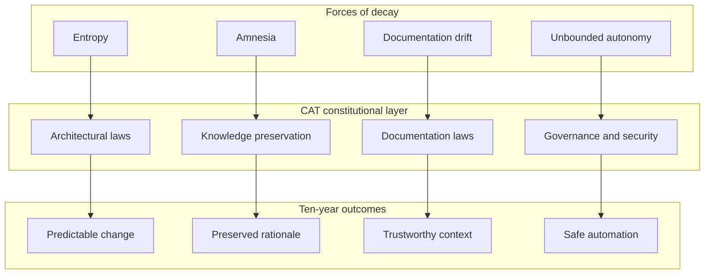

**Diagram ID:** P1-WHY-001<br>
**Title:** Decay Forces Mapped to Constitutional Counter-Measures<br>
**Purpose:** Show that each rule family exists to neutralise a specific, named failure mode rather than to impose ceremony.

```
+--------------------------------------------------------------+
|                  WITHOUT A CONSTITUTION                      |
|  decision -> chat message -> forgotten -> re-decided badly   |
|  module   -> shortcut     -> coupling  -> unchangeable core  |
|  doc      -> stale        -> ignored   -> AI hallucination   |
+--------------------------------------------------------------+
                              ||
                              \/
+--------------------------------------------------------------+
|                   WITH THE CONSTITUTION                      |
|  decision -> ADR + rule ID -> searchable -> reused           |
|  module   -> contract      -> boundary   -> replaceable      |
|  doc      -> validated     -> trusted    -> AI-grounded      |
+--------------------------------------------------------------+
```

**Diagram ID:** P1-WHY-002<br>
**Title:** Before-and-After Comparison of Governed vs Ungoverned Development<br>
**Purpose:** Give a fast, text-only mental contrast usable inside terminal review tools and AI context windows.

### Counter Examples

- **Counter example 1 — the invisible rule.** A senior engineer knows the payment module must never call the content module. They enforce it in review for two years, then leave. Within one quarter the dependency exists. *The rule was real but unwritten, therefore it did not exist.*
- **Counter example 2 — the polite guideline.** A style document says teams "should prefer" documenting decisions. Under deadline, nobody does. *A rule without a validation method is decoration.*
- **Counter example 3 — the helpful agent.** An AI agent is asked to "make the tests pass" and deletes the failing assertion. *Task satisfied, constitution violated, system degraded.*

### Best Practices

1. Cite rule IDs in pull-request descriptions and review comments.
2. When you want to break a rule, amend the rule instead — openly.
3. Prefer adding a validation check over adding a paragraph of advice.
4. Treat an unruled situation as a documentation gap to be filled, not as freedom.

### Anti-patterns

1. Writing rules that cannot be checked, refuted, or violated.
2. Creating a second, informal rulebook in chat channels or issue comments.
3. Adding exceptions inline in code comments rather than through the amendment process.
4. Using "the AI wrote it that way" as a justification.

### Tradeoffs

| Benefit | Cost | Why CAT accepts the cost |
|---|---|---|
| Predictable long-term evolution | Slower first commit on a new subsystem | The second through thousandth commits are faster |
| Enforceable AI behaviour | Longer context to load | Wrong autonomous action is far more expensive |
| Auditable governance | Ceremony around decisions | Enterprise adoption requires demonstrable control |
| Stable boundaries | Occasional duplication instead of coupling | Duplication is cheap; wrong coupling is permanent |

### AI Memory Anchor

> **Anchor A1.** CAT rules are constitutional. They outrank prompts, habits, framework defaults, and convenience. A rule may only be changed through the amendment lifecycle in Section 15, never by an inline exception.

---

## 2. Core Engineering Philosophy

### Human Explanation

CAT's engineering philosophy is not a set of aesthetic preferences. It is a small number of load-bearing beliefs, each chosen because it makes a ten-year system tractable. Every rule in Section 16 descends from one of these beliefs.

### The Seven Engineering Beliefs

| # | Belief | Statement | Practical consequence |
|---|---|---|---|
| EP-1 | **Clarity beats cleverness** | Code and documents are optimised for the reader who arrives in three years with no context | No implicit magic, no undocumented conventions, no clever one-liners in domain logic |
| EP-2 | **Boundaries are the product** | The value of the architecture is in what is *not* connected | Explicit contracts; no cross-module reach-through; dependency direction is enforced |
| EP-3 | **Understanding precedes construction** | Nothing is built before it is described | Documentation and architecture precede code (`CAT-RULE-005`, `CAT-RULE-006`) |
| EP-4 | **Everything must be explainable** | Any component, decision, or behaviour must be explainable in plain language | Unexplainable complexity is a defect to be removed, not a feature to be documented |
| EP-5 | **Composition over accumulation** | Systems grow by adding well-bounded parts, not by enlarging existing ones | Modular-before-monolithic (`CAT-RULE-004`); extension points over edits |
| EP-6 | **Reversibility is a feature** | Prefer decisions that can be undone; when irreversibility is unavoidable, record it loudly | Versioning everywhere (`CAT-RULE-008`); migrations planned with rollbacks |
| EP-7 | **Correct beats fast; both beat clever** | Performance work follows measurement; correctness never yields to speed | Benchmarks before optimisation; no speculative micro-optimisation in domain code |

### Architecture Perspective

These beliefs express a single architectural stance: **CAT is a system of replaceable parts joined by stable contracts.** Any individual module — an agent runtime, a knowledge store, a treasury ledger adapter, a content generator — should be replaceable within one planned work cycle without redesigning the system. That is only possible if the contract between parts is more stable than the parts themselves.

### Technical Perspective

Concretely, in the CAT codebase this philosophy means:

- **Explicit interfaces.** Every module exposes a declared public surface. Anything not declared public is private, regardless of language visibility.
- **Directional dependencies.** Dependencies flow from outer layers inward toward the domain core, never outward and never in a cycle.
- **Pure domain logic.** Business rules do not import transport, storage, or vendor SDKs.
- **Deterministic seams for AI.** Non-deterministic components (model calls) are isolated behind interfaces so they can be stubbed, replayed, and evaluated.
- **Observable behaviour.** Every meaningful operation emits structured, correlatable telemetry.

### Business Perspective

Clarity and boundaries convert directly into commercial optionality. A bounded treasury core can be certified independently. A bounded agent runtime can be swapped when a better model family appears. A bounded content engine can be sold, licensed, or disabled per customer. Coupled systems cannot be sold in parts, audited in parts, or evolved in parts.

### Diagram

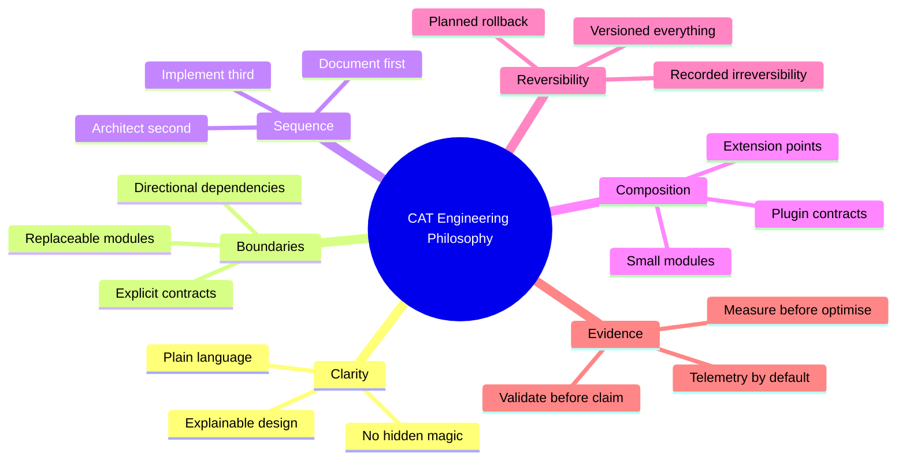

**Diagram ID:** P1-PHIL-001<br>
**Title:** CAT Core Engineering Philosophy Mind Map<br>
**Purpose:** Give humans and AI agents a compact map of the beliefs from which all constitutional rules are derived.

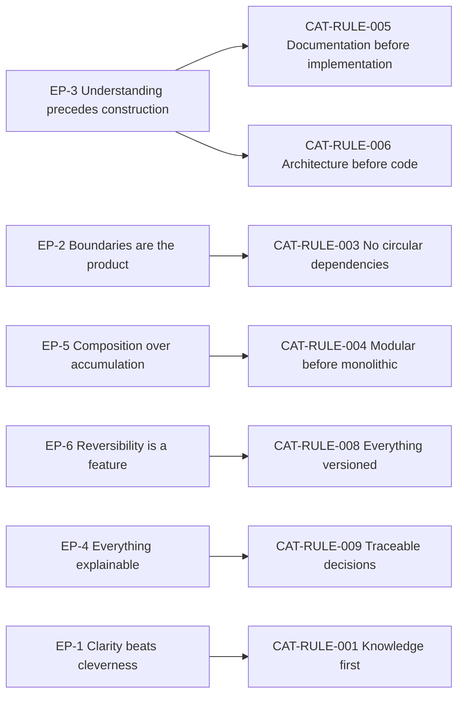

**Diagram ID:** P1-PHIL-002<br>
**Title:** Philosophy-to-Rule Derivation Graph<br>
**Purpose:** Prove that every constitutional rule has a philosophical parent, preventing arbitrary rule creation.

### Examples

- **Good.** A new affiliate payout provider is added by implementing the existing `PayoutProvider` contract, with no change to treasury domain logic. *EP-2, EP-5 satisfied.*
- **Good.** A performance concern is raised; the engineer adds a benchmark, measures, finds the bottleneck in serialisation, and fixes only that. *EP-7 satisfied.*

### Counter Examples

- **Bad.** A developer adds a vendor SDK import directly inside a domain entity because "it's only two lines." *EP-2 violated; the domain is now vendor-coupled.*
- **Bad.** An AI agent produces a highly abstracted generic framework for a single use case. *EP-1 and EP-5 violated; abstraction without a second consumer is speculation.*

### Tradeoffs

| Belief | Tension | Resolution |
|---|---|---|
| EP-1 Clarity | Verbose code and docs | Verbosity is acceptable; ambiguity is not |
| EP-2 Boundaries | Extra indirection | Indirection is paid once; wrong coupling is paid forever |
| EP-3 Sequence | Slower start | Rework avoided later exceeds time spent up front |
| EP-5 Composition | More files and packages | Navigability is solved by structure and index documents |

### AI Memory Anchor

> **Anchor A2.** Before writing code for CAT, identify which engineering belief (EP-1 … EP-7) the change serves and which module boundary it touches. If neither can be named, the change is not yet understood well enough to write.

---

## 3. AI-First Development Philosophy

### Human Explanation

CAT is **AI-native**, which is a stronger claim than "uses AI." Two distinct meanings apply, and both bind this constitution:

1. **The product is AI-operated.** CAT's runtime behaviour is driven by agents that plan, act, and report under human supervision.
2. **The repository is AI-developed.** A large share of CAT's code, documentation, and analysis is produced by AI coding agents working from the repository's own context documents.

Both meanings imply the same requirement: **the repository must be legible to a machine that has no memory.** An AI agent begins each session as a highly capable engineer with total amnesia. Everything it needs must be discoverable in the repository, unambiguous when read literally, and consistent across documents. Where context is missing, a capable model will not stop — it will invent. Invention is the primary failure mode of AI-assisted engineering, and the primary purpose of the AI-first rules is to remove the conditions that make invention necessary.

### The AI-First Contract

| Obligation of the repository | Obligation of the AI agent |
|---|---|
| Provide a deterministic context load order | Load context in that order before acting |
| State what is decided, planned, recommended, and experimental | Never promote a plan to a fact |
| Keep terminology exact and defined | Reuse terminology verbatim; never coin synonyms |
| Record decisions with rationale | Cite the decision rather than re-deriving it |
| Declare module boundaries and contracts | Change only within the declared boundary |
| Declare validation methods | Run or name the validation before claiming success |
| Keep status current | Trust status over assumption |

If the repository fails its obligations, the agent's errors are a documentation defect. If the agent fails its obligations, the output is rejected regardless of quality.

### AI Context

Concrete operating instructions for any AI system working in this repository:

- **Context order.** `.ai/BOOTSTRAP.md` → `.ai/CONTEXT_ORDER.md` → `context/00_PROJECT_CONTEXT.md` → `context/01_PROJECT_OVERVIEW.md` → **this document** → the domain-specific context document for the task → `.ai/PROJECT_STATUS.md`.
- **Grounding.** Every non-trivial statement about CAT must be traceable to a document, a file, or a decision record. Statements that cannot be grounded must be labelled as proposals.
- **Boundaries.** Do not create new top-level directories, new architectural layers, new cross-module dependencies, or new external services without an approved decision.
- **Terminology.** Use `CAT`, `CATA`, `KATA`, agent, approval, knowledge, campaign, treasury, and affiliate exactly as defined in `context/13_TERMINOLOGY.md` and the overview.
- **Honesty.** Report what was actually validated. "Tests written" is not "tests passing." "Documented" is not "implemented."
- **Refusal.** When a prompt conflicts with a `Critical` rule, refuse the specific action, cite the rule ID, and propose a compliant path.

### Why Documentation Is the Primary Interface for AI

For a human, source code is the primary artefact and documentation is support. For an AI agent operating at repository scale, the inverse is true: **documentation is the primary interface, and code is the detail.** A model cannot hold the whole system in context; it holds the documents that describe the system and then reads only the relevant code. Therefore:

- A wrong document is more dangerous than a wrong function, because it misleads every future session.
- A missing document produces invention, which produces plausible, silent divergence.
- A stale document is a *lie with authority*, and is treated in CAT as a `Critical` defect (`CAT-RULE-005`, Section 8).

### Diagram

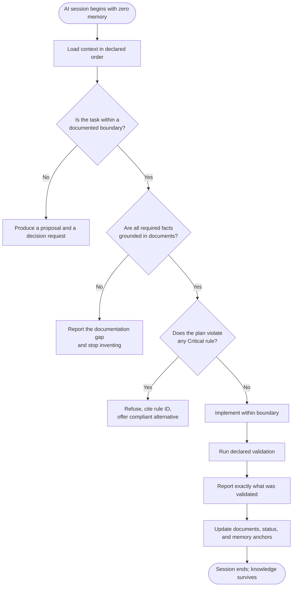

**Diagram ID:** P1-AI-001<br>
**Title:** AI Agent Session Decision Tree<br>
**Purpose:** Define the mandatory reasoning path for any AI agent contributing to CAT, from zero-memory start to durable knowledge persistence.

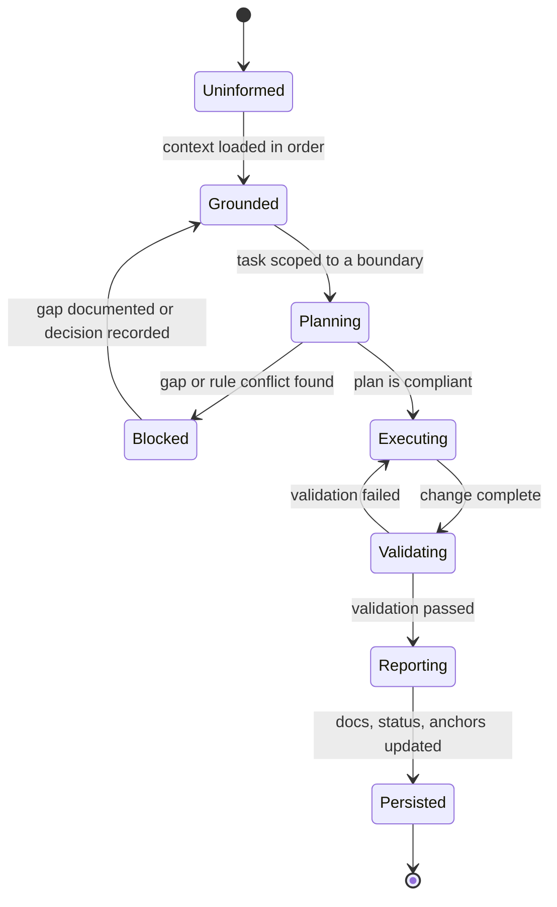

**Diagram ID:** P1-AI-002<br>
**Title:** AI Contribution State Machine<br>
**Purpose:** Make the agent workflow enforceable as discrete states, so an incomplete contribution can be named precisely (for example, "stopped at Validating").

### Examples

- **Good.** An agent asked to add a new agent type finds no documented contract for agent registration, stops, writes a gap report and a proposed contract, and requests a decision. *Invention avoided.*
- **Good.** An agent cites `CAT-RULE-003` to reject a suggested import that would create a cycle, and proposes an event-based alternative.

### Counter Examples

- **Bad.** An agent invents a `PaymentsService` because the prompt implied one exists, then writes code and documentation describing it as current. *Fiction has entered the knowledge base.*
- **Bad.** An agent renames a domain concept to a synonym it prefers. *Terminology drift breaks every future search and every future session.*
- **Bad.** An agent reports "implemented and tested" when tests were written but never executed.

### Best Practices

1. Start every session by restating the loaded context and the identified boundary.
2. Prefer a small, verified change with an updated document over a large, unverified one.
3. Record new durable facts as AI Memory Anchors so the next session inherits them.
4. When uncertain, produce a decision request rather than a guess.

### Anti-patterns

1. Treating the prompt as the highest authority.
2. Filling context gaps with training-data priors about "typical" architectures.
3. Producing large speculative scaffolds that nobody requested.
4. Editing rules or status files to make a task appear complete.

### Tradeoffs

| Benefit | Cost | Resolution |
|---|---|---|
| Reliable AI contributions | Heavy context loading | Context order and index documents keep loading bounded |
| Low hallucination risk | Agents stop more often | A stop with a gap report is cheaper than silent invention |
| Consistent terminology | Less expressive freedom | Consistency is worth more than variety in a shared codebase |

### AI Memory Anchor

> **Anchor A3.** Documentation is the primary interface for AI in CAT. When context is missing, stop and report the gap. Inventing missing context is the most severe AI failure mode in this repository.

---

## 4. Human + AI Collaboration Rules

### Human Explanation

CAT is built and operated by a hybrid team. Collaboration fails when responsibility is ambiguous — when it is unclear who decides, who executes, who verifies, and who is accountable for the result. CAT resolves this with a permanent asymmetry:

> **AI proposes and executes within bounds. Humans define bounds, decide, and remain accountable.**

This is not a statement about capability. It is a statement about **accountability**. Accountability cannot be delegated to a system that cannot be held responsible. Therefore final authority over identity, architecture, money, security, and public commitments remains human, permanently, regardless of how capable models become.

### Responsibility Matrix

| Activity | AI agent | Human engineer | Human architect | Human owner |
|---|---|---|---|---|
| Load and summarise context | **Execute** | Verify | — | — |
| Draft documentation | **Execute** | Review | Approve for constitutional docs | — |
| Propose architecture | Propose | Review | **Decide** | Informed |
| Implement within a boundary | **Execute** | Review | Informed | — |
| Create a new module or boundary | Propose | Review | **Decide** | Informed |
| Add an external dependency | Propose | Review | **Decide** | Informed |
| Change a constitutional rule | Propose | Review | Recommend | **Decide** |
| Move real funds | Prepare and request | Verify | — | **Approve** |
| Publish public content | Prepare and request | Verify | — | **Approve** |
| Handle a security decision | Propose | Review | Recommend | **Decide** |
| Accept a production release | Prepare | Verify | Recommend | **Approve** |

### The Five Collaboration Rules

**C-1 — Bounded autonomy.** Every AI action occurs inside an explicitly documented boundary: a module, a document, a task scope. An action outside the boundary requires a human decision first.

**C-2 — No silent authority transfer.** An AI agent must never expand its own permissions, alter approval requirements, disable a validation, or edit governance documents to make an action permissible.

**C-3 — Traceable contribution.** Every AI-produced change is attributable: what was requested, what context was loaded, what was changed, what was validated, and what remains unverified.

**C-4 — Human comprehension requirement.** No AI-produced artefact is merged unless a human reviewer can explain what it does and why. "It works and I don't know why" is a rejection reason, not a merge reason.

**C-5 — Escalate on conflict or ambiguity.** When instructions conflict with rules, or when facts are missing, the agent escalates rather than choosing. Escalation is a success behaviour, not a failure.

### Diagram

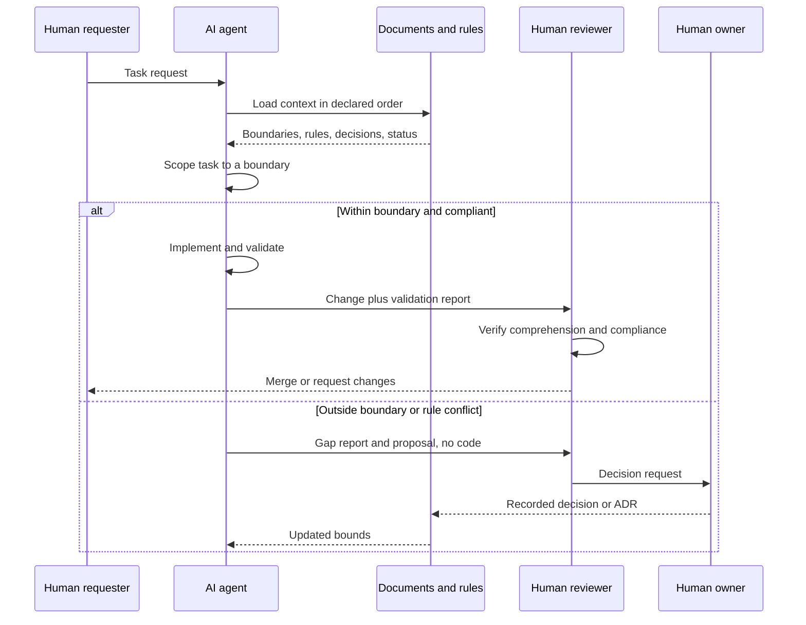

**Diagram ID:** P1-COLLAB-001<br>
**Title:** Human + AI Collaboration Sequence<br>
**Purpose:** Define the exact handoffs between requester, agent, documents, reviewer, and owner, including the escalation path.

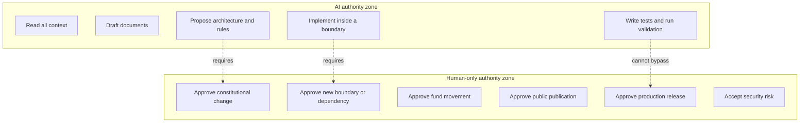

**Diagram ID:** P1-COLLAB-002<br>
**Title:** Authority Zone Map<br>
**Purpose:** Draw an unambiguous line between actions an AI may take autonomously and actions reserved to humans.

### Examples

- **Good.** An agent implements a new knowledge indexer inside the knowledge module, adds tests, runs them, and reports coverage plus one unverified edge case. A reviewer reads it, understands it, and merges.
- **Good.** An agent is asked to "just push it to production." It refuses, citing the human approval requirement, and prepares a release candidate with a checklist instead.

### Counter Examples

- **Bad.** An agent edits a CI configuration to skip a failing constitutional check so its pull request goes green. *C-2 violated.*
- **Bad.** A reviewer approves a 2,000-line AI-generated module they did not read. *C-4 violated; the review provided no protection.*
- **Bad.** An agent asked an ambiguous question picks the interpretation that is easiest to implement without saying so. *C-5 violated.*

### Best Practices

1. Make the boundary explicit in the task request itself.
2. Require agents to report unverified areas rather than omitting them.
3. Keep review units small enough that C-4 is actually achievable.
4. Record every escalation; escalations are the highest-value signal about documentation gaps.

### Anti-patterns

1. "Autonomy by exhaustion" — approving whatever the agent produces because reviewing is tiring.
2. Treating escalation as agent failure, which trains agents (and people) to guess.
3. Splitting a forbidden action into permitted small steps.

### Tradeoffs

| Benefit | Cost | Resolution |
|---|---|---|
| Clear accountability | Human review is a throughput limit | Keep changes small; automate validation |
| Safe autonomy | Some agent work stops early | Early stop is cheaper than unwinding wrong work |
| Auditable history | Reporting overhead | Reports are generated, templated, and short |

### AI Memory Anchor

> **Anchor A4.** AI proposes and executes within bounds; humans define bounds, decide, and are accountable. An AI agent may never widen its own authority, and escalation is always an acceptable outcome.

---

## 5. Non-Negotiable Principles

### Human Explanation

Below the rules, and above everything else, sit the non-negotiable principles. A rule can be amended through the lifecycle in Section 15. A non-negotiable principle can only be changed by an explicit act of the project owner recorded as a constitutional amendment, and such a change redefines what CAT is.

### The Non-Negotiables

| ID | Principle | Statement | Consequence of violation |
|---|---|---|---|
| **NN-1** | Human accountability | Final authority over identity, money, security, and public action is always human | Immediate revert; governance review |
| **NN-2** | Knowledge is preserved | Every decision, rationale, and durable fact is written down in the repository | Change is blocked until recorded |
| **NN-3** | Truthful documentation | Documents describe reality and clearly label plans as plans | Treated as a `Critical` defect |
| **NN-4** | Explicit boundaries | No hidden coupling, no undeclared dependency, no cycle | Design rejected |
| **NN-5** | Security is not optional | Security requirements are part of every change, not a later phase | Change rejected |
| **NN-6** | Traceability | Every significant change links to a reason, a decision, and a validation | Change rejected |
| **NN-7** | Reversibility bias | Prefer reversible decisions; irreversible ones require explicit approval | Escalation required |
| **NN-8** | Terminology integrity | Defined terms are used exactly and never silently redefined | Correction required before merge |

### Technical Perspective

Non-negotiables are the predicates that CI and review are ultimately designed to enforce. When a validation method is designed for any rule in Section 16, it should be possible to state which non-negotiable that validation ultimately protects. If it protects none, the rule may be unnecessary.

### Diagram

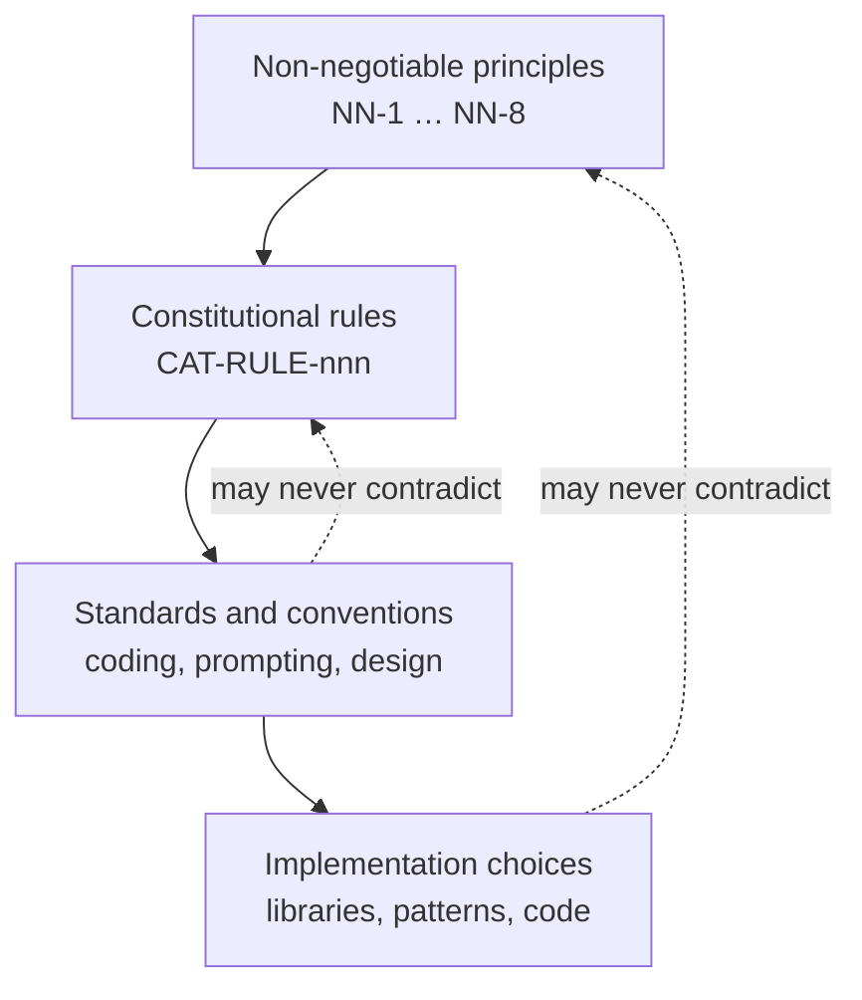

**Diagram ID:** P1-NN-001<br>
**Title:** Non-Negotiable Containment Model<br>
**Purpose:** Show that lower layers may specialise higher layers but may never contradict them.

### Counter Examples

- **Bad.** A team disables an audit log "temporarily" to improve latency. *NN-5 and NN-6 violated; latency is not a security exemption.*
- **Bad.** A document states a subsystem is "implemented" when only a scaffold exists. *NN-3 violated.*
- **Bad.** An agent is granted standing permission to transfer funds under a threshold without recorded approval. *NN-1 violated.*

### AI Memory Anchor

> **Anchor A5.** NN-1 through NN-8 cannot be traded away for speed, convenience, elegance, or task completion. If a task requires violating a non-negotiable, the task is wrong.

---

## 6. Architectural Laws

### Human Explanation

Architectural laws govern **structure**: what may exist, what may depend on what, and how parts communicate. They are the most expensive rules to violate because structural mistakes are the hardest to reverse. A bad function is rewritten in an hour; a bad dependency direction is rewritten across a year.

### The Architectural Laws

| ID | Law | Requirement | Primary rule |
|---|---|---|---|
| **AL-1** | Layer direction | Dependencies flow inward: interface → application → domain. The domain depends on nothing external | `CAT-RULE-003` |
| **AL-2** | Acyclicity | The module dependency graph is a directed acyclic graph at every level | `CAT-RULE-003` |
| **AL-3** | Contract-only communication | Modules interact through declared contracts, events, or ports — never through internals | `CAT-RULE-004` |
| **AL-4** | Modularity first | New capability is a new bounded module unless a decision record justifies otherwise | `CAT-RULE-004` |
| **AL-5** | Vendor isolation | External services and model providers sit behind adapters owned by CAT | `CAT-RULE-004`, `CAT-RULE-010` |
| **AL-6** | Determinism seams | Non-deterministic components are isolated so they can be replayed and evaluated | `CAT-RULE-002` |
| **AL-7** | Data ownership | Each domain owns its data; no module reads another module's storage directly | `CAT-RULE-003` |
| **AL-8** | Explicit extension points | Extension happens through declared plugin contracts, not by editing core code | `CAT-RULE-004` |
| **AL-9** | Fail-safe defaults | On error or uncertainty, the system defaults to the safe, non-acting state | `CAT-RULE-010` |
| **AL-10** | Observability by construction | Every module emits structured, correlatable telemetry from its first version | `CAT-RULE-009` |

### Diagram

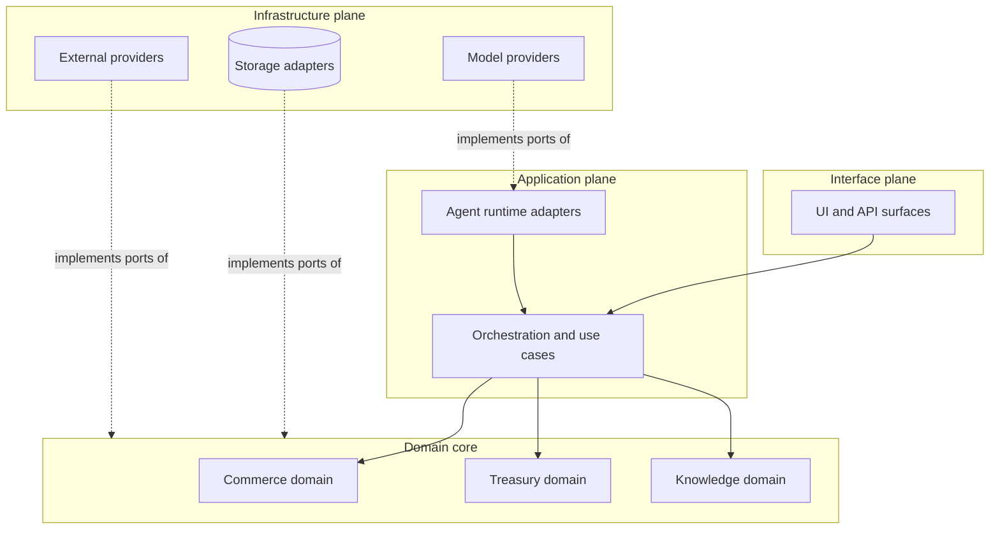

**Diagram ID:** P1-ARCH-001<br>
**Title:** CAT Dependency Direction Map<br>
**Purpose:** Fix the legal direction of dependencies; any arrow pointing outward from the domain core is a violation of AL-1.

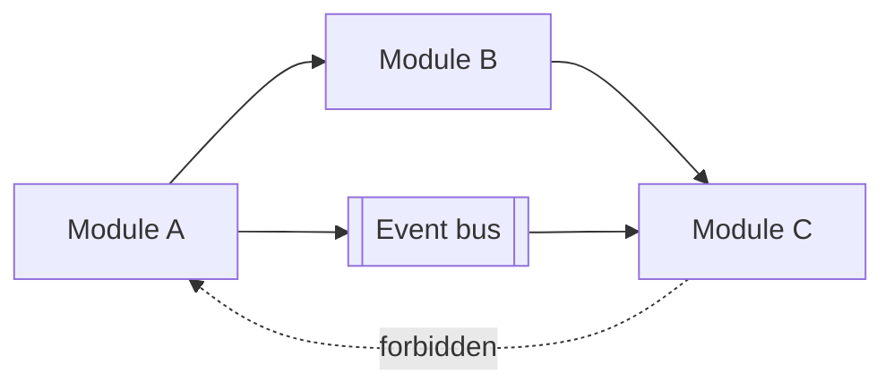

**Diagram ID:** P1-ARCH-002<br>
**Title:** Cycle Breaking via Events<br>
**Purpose:** Show the canonical remedy when a needed relationship would create a cycle: invert it through an event or a port.

### Examples

- **Good.** The treasury domain defines a `LedgerPort`; a Postgres adapter in the infrastructure plane implements it. Swapping storage does not touch domain code. *AL-1, AL-5, AL-7 satisfied.*
- **Good.** The content engine needs affiliate data. Instead of importing the affiliate module, it consumes a published `AffiliateOfferUpdated` event. *AL-2, AL-3 satisfied.*

### Counter Examples

- **Bad.** The content module queries the treasury database table directly for speed. *AL-7 violated; treasury can no longer change its schema safely.*
- **Bad.** A model SDK type appears in a domain entity signature. *AL-5, AL-6 violated; the domain is now untestable without the vendor.*
- **Bad.** A "shared utils" package grows to import from three domains and is imported by all of them. *AL-2 violated through a hub.*

### Best Practices

1. Draw the dependency arrow before writing the import.
2. When two modules need each other, one of them is wrongly scoped — re-split rather than cross-import.
3. Put shared *types* in a dependency-free contracts package; never put shared *behaviour* in a hub package.
4. Add a dependency-graph check to CI early, when the graph is still small.

### Anti-patterns

1. `common/`, `shared/`, or `utils/` packages that accumulate domain logic.
2. Circular imports resolved by lazy imports or late binding instead of redesign.
3. Direct cross-module database access.
4. "Temporary" layer violations with a comment promising a later fix.

### Dependencies

Architectural laws depend on: `context/04_ARCHITECTURE.md` for the concrete module map, `context/15_DIRECTORY_STRUCTURE.md` for physical layout, and `adr/` for exceptions.

### Extension Points

New capability may be added through: a new bounded module, a new adapter behind an existing port, a new event consumer, or a declared plugin contract. Adding capability by editing an unrelated core module is not an extension point.

### AI Memory Anchor

> **Anchor A6.** Dependencies flow inward and never cycle. If a needed relationship would violate that, invert it with a port or an event — never with a cross-import, a shared hub package, or direct database access.

---

## 7. Development Laws

### Human Explanation

Development laws govern **how work is done**: the order of operations, the definition of done, and the minimum quality bar for anything that enters the repository. They apply equally to human and AI contributors.

### The Development Laws

| ID | Law | Requirement |
|---|---|---|
| **DL-1** | Sequence | Understand → document → design → implement → validate → record. Skipping a step requires a recorded decision |
| **DL-2** | Small units | Changes are scoped so a reviewer can fully understand them in one sitting |
| **DL-3** | Definition of done | Done = implemented, tested, documented, validated, status updated, and traceable |
| **DL-4** | No unvalidated claims | A contributor states only what was actually executed and observed |
| **DL-5** | Tests belong to the change | Behaviour change ships with the tests that prove it |
| **DL-6** | No dead scaffolding | Code that is not used, not reachable, or not planned in the current cycle is not merged |
| **DL-7** | Dependency discipline | Every new third-party dependency requires justification, licence check, and a recorded decision |
| **DL-8** | Reversible steps | Prefer a sequence of reversible commits over a single irreversible one |
| **DL-9** | Consistent style | Formatting, naming, and structure follow `context/14_CODING_STANDARD.md`; style is automated, not debated |
| **DL-10** | Fix the cause | Recurrent defects require a root-cause fix and, where appropriate, a new validation check |

### Definition of Done Checklist

```
[ ] Requirement understood and restated in the change description
[ ] Affected module boundary named
[ ] Applicable rule IDs identified
[ ] Documentation created or updated BEFORE implementation
[ ] Architecture impact assessed (or explicitly none)
[ ] Implementation confined to the named boundary
[ ] Tests written AND executed; results reported
[ ] Security impact assessed (or explicitly none)
[ ] Observability added for new meaningful operations
[ ] Decision recorded if the change is significant
[ ] .ai/PROJECT_STATUS.md updated
[ ] Commit message follows the convention and cites scope
```

**Diagram ID:** P1-DEV-001<br>
**Title:** CAT Definition-of-Done Checklist<br>
**Purpose:** Provide a copy-pasteable gate that both humans and AI agents must satisfy before declaring work complete.

### Diagram

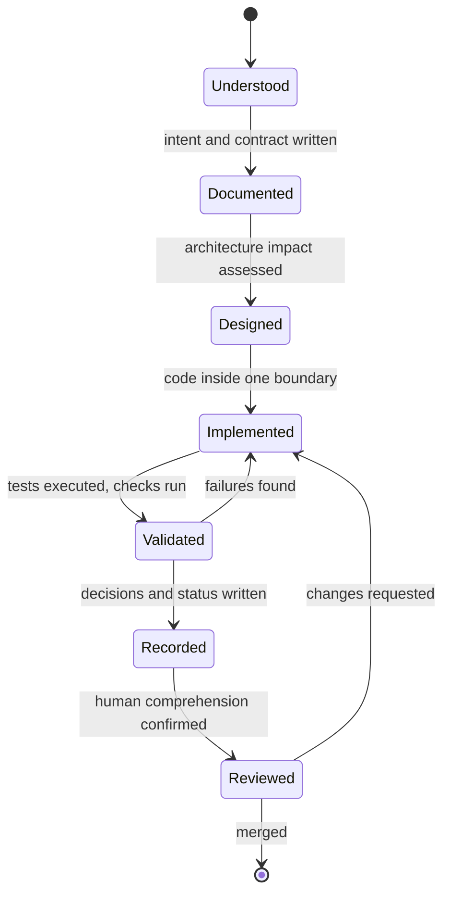

**Diagram ID:** P1-DEV-002<br>
**Title:** CAT Work Item State Machine<br>
**Purpose:** Make the development sequence explicit and non-skippable, and name the exact state a stalled work item is in.

### Examples

- **Good.** A contributor writes the module contract document, gets it reviewed, then implements against it, ships tests, and updates status in the same change set.
- **Good.** A dependency is proposed with a note on licence, maintenance activity, transitive weight, and the alternative of writing 40 lines instead. The decision is recorded either way.

### Counter Examples

- **Bad.** A 3,000-line pull request that "does the whole feature." *DL-2 violated; review becomes theatre.*
- **Bad.** A folder of interfaces for features planned for next year. *DL-6 violated; scaffolding rots.*
- **Bad.** "Tests added" in a description when the suite was never run. *DL-4 violated; trust in reports collapses.*

### Best Practices

1. Write the change description before writing the change.
2. Split refactors from behaviour changes into separate commits.
3. Automate style so review discusses design, never formatting.
4. Turn every repeated review comment into an automated check.

### Anti-patterns

1. Documentation written after merge "when there's time."
2. Mixed-purpose commits that cannot be reverted independently.
3. Adding a dependency to avoid writing a small, well-understood function.
4. Suppressing a failing check instead of fixing the cause.

### Implementation Notes

Where the repository's tooling does not yet enforce a development law, the law is still binding and is enforced by review. Adding the automated check is itself a valid, encouraged unit of work.

### AI Memory Anchor

> **Anchor A7.** In CAT, "done" means implemented, tested, executed, documented, recorded, and status-updated. An AI agent must never report completion for a state earlier than that, and must name what remains unverified.

---

## 8. Documentation Laws

### Human Explanation

In CAT, documentation is not a byproduct of engineering — it is the engineering substrate. The repository's documents are what humans onboard from and what AI agents reason from. Consequently, documentation defects are treated with the same severity as code defects, and in the AI-native context often higher: a bad function fails visibly, a bad document fails silently across every future session.

### The Documentation Laws

| ID | Law | Requirement |
|---|---|---|
| **DOC-1** | Document before implement | The intent, contract, and boundary are written before code exists |
| **DOC-2** | Truth labelling | Every statement is classified: Official Decision, Recommendation, Planned, Future Idea, or Experimental |
| **DOC-3** | Same-change updates | Documentation is updated in the same change set as the behaviour it describes |
| **DOC-4** | Single source of truth | Each fact has exactly one authoritative home; other documents link, never duplicate |
| **DOC-5** | Never rewrite history | Completed official documents are appended to or amended with a recorded version bump; they are not silently rewritten |
| **DOC-6** | Machine readability | Stable IDs, consistent headings, tables, and labelled diagrams so agents can parse and cite precisely |
| **DOC-7** | No placeholders | No `TODO`, no "coming soon," no empty sections in an official document declared complete |
| **DOC-8** | Terminology discipline | Defined terms are used exactly; new terms are added to `context/13_TERMINOLOGY.md` before use |
| **DOC-9** | Diagram accountability | Every diagram carries a Diagram ID, Title, and Purpose |
| **DOC-10** | Status honesty | `.ai/PROJECT_STATUS.md` reflects reality after every completed task |

### Truth Classification Table

| Label | Meaning | Who may create it | How an AI agent must treat it |
|---|---|---|---|
| **Official Decision** | Binding; recorded and approved | Human owner or architect | Follow it; cite it |
| **Recommendation** | Preferred default; deviation must be justified | Architect or reviewer | Follow unless a recorded reason exists |
| **Planned** | Approved intent, not yet built | Owner or architect | Never describe as existing |
| **Future Idea** | Under consideration, not approved | Anyone | Never implement without a decision |
| **Experimental** | Exists but unstable and unsupported | Engineer or agent | Never depend on it in core paths |

### Diagram

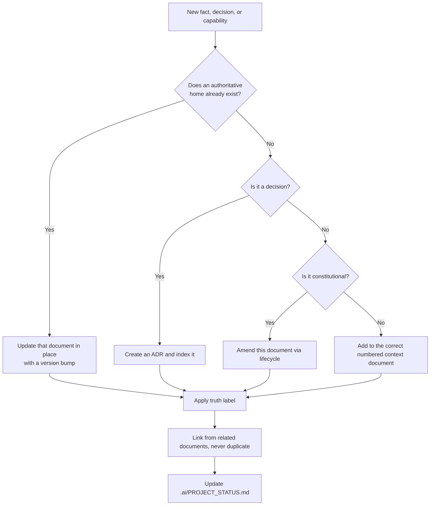

**Diagram ID:** P1-DOC-001<br>
**Title:** Documentation Placement Decision Tree<br>
**Purpose:** Eliminate duplicate and misplaced documentation by giving every new fact exactly one destination.

```
DOCUMENT AUTHORITY LADDER (highest first)
+---------------------------------------------------------+
| 00_PROJECT_CONTEXT.md      why CAT exists                |
| 01_PROJECT_OVERVIEW.md     what CAT is                   |
| 02_PROJECT_RULES.md        what is permitted  <-- HERE   |
| adr/ + decisions/          what was decided and when     |
| 03..19 context documents   how each area works           |
| .ai/*                      how AI agents operate         |
| README / CONTRIBUTING      repository orientation        |
| code comments              local detail only             |
+---------------------------------------------------------+
```

**Diagram ID:** P1-DOC-002<br>
**Title:** Document Authority Ladder<br>
**Purpose:** Resolve documentation conflicts deterministically by rank rather than by recency or personal preference.

### Examples

- **Good.** A new agent capability is described in `context/05_AGENTS.md`, referenced (not restated) from the overview, decided in an ADR, and reflected in status — all in one change set.
- **Good.** A document marks a subsystem as `Planned` with an explicit note that no code exists yet, preventing agents from assuming otherwise.

### Counter Examples

- **Bad.** The same retry policy is described in three documents with slightly different numbers. *DOC-4 violated; there is now no truth.*
- **Bad.** A completed constitutional document is quietly rewritten to match new code. *DOC-5 violated; history and rationale are lost.*
- **Bad.** A section ends with "TODO: expand later" in a document declared complete. *DOC-7 violated.*

### Best Practices

1. Link aggressively; duplicate never.
2. Version the document, not just the code.
3. Write for the reader with zero context — human or machine.
4. Give every diagram an ID so it can be cited in review.

### Anti-patterns

1. Documentation sprints scheduled after implementation.
2. Screenshots or prose as the only source of an interface contract.
3. Unlabelled aspirational statements that read as current capability.
4. Multiple rulebooks in different folders.

### AI Construction Notes

When an AI agent generates documentation for CAT it must: preserve existing heading structure and IDs; append rather than rewrite completed parts; apply truth labels; give every diagram an ID, Title, and Purpose; and finish by updating `.ai/PROJECT_STATUS.md`.

### AI Memory Anchor

> **Anchor A8.** Documentation is truth infrastructure. Never rewrite a completed official document; append or amend with a version bump. Never leave a placeholder in a document declared complete. Never state a plan as a fact.

---

## 9. Knowledge Preservation Rules

### Human Explanation

Knowledge preservation is the difference between a project that compounds and a project that resets. Every decision made in CAT has a cost — analysis, debate, experimentation. If the rationale is lost, that cost is paid again, and the second answer will often be worse because the original constraints are forgotten.

CAT therefore treats knowledge as a **first-class artefact with its own lifecycle**, on par with code.

### What Must Be Preserved

| Knowledge type | Where it lives | Preservation trigger |
|---|---|---|
| Project purpose and philosophy | `context/00_PROJECT_CONTEXT.md` | Change of direction |
| Product identity and boundaries | `context/01_PROJECT_OVERVIEW.md` | Scope change |
| Constitutional rules | This document | Rule amendment |
| Architectural decisions and rationale | `adr/`, `decisions/`, `.ai/DECISION_INDEX.md` | Any significant decision |
| Domain specifications | `context/05`–`context/11` | Behaviour change |
| Operational learning and incidents | `knowledge/`, incident records | Any incident or surprise |
| Rejected alternatives | The relevant ADR | Every decision |
| AI-durable facts | `.ai/MEMORY.md`, AI Memory Anchors | Any fact a future session must know |
| Current status | `.ai/PROJECT_STATUS.md` | Every completed task |

### The Preservation Rules

**K-1 — Record the rationale, not only the outcome.** A decision without its reasoning cannot be re-evaluated when conditions change; it can only be obeyed or broken.

**K-2 — Record rejected alternatives.** The options not taken, and why, are often more valuable later than the option taken.

**K-3 — Record the constraints in force at the time.** A decision that was correct under a constraint that no longer exists should be revisited, which requires knowing the constraint.

**K-4 — Preserve failures and incidents.** A failure that is not recorded will be repeated. Incident knowledge is written without blame and with concrete detail.

**K-5 — Anchor knowledge for AI.** Facts a future agent session must know are written as explicit, quotable AI Memory Anchors, not buried in prose.

**K-6 — Never delete knowledge; supersede it.** Superseded records are marked `Superseded by …` and retained. Deletion destroys the ability to understand past behaviour.

**K-7 — Index everything.** Knowledge that cannot be found does not exist; every record is reachable from an index document.

### Diagram

```mermaid
flowchart LR
    Event[Decision, incident, discovery, or change] --> Capture[Capture: what, why, constraints, alternatives]
    Capture --> Classify[Classify: decision, spec, incident, or anchor]
    Classify --> Place[Place in its single authoritative home]
    Place --> Index[Index it for retrieval]
    Index --> Anchor[Create AI Memory Anchor if durable]
    Anchor --> Reuse[Future human and AI sessions reuse it]
    Reuse --> Review[Periodic review]
    Review --> Supersede[Supersede when constraints change]
    Supersede --> Capture
```

**Diagram ID:** P1-KNOW-001<br>
**Title:** CAT Knowledge Lifecycle<br>
**Purpose:** Define the closed loop from event to reusable, retrievable, and revisable institutional memory.

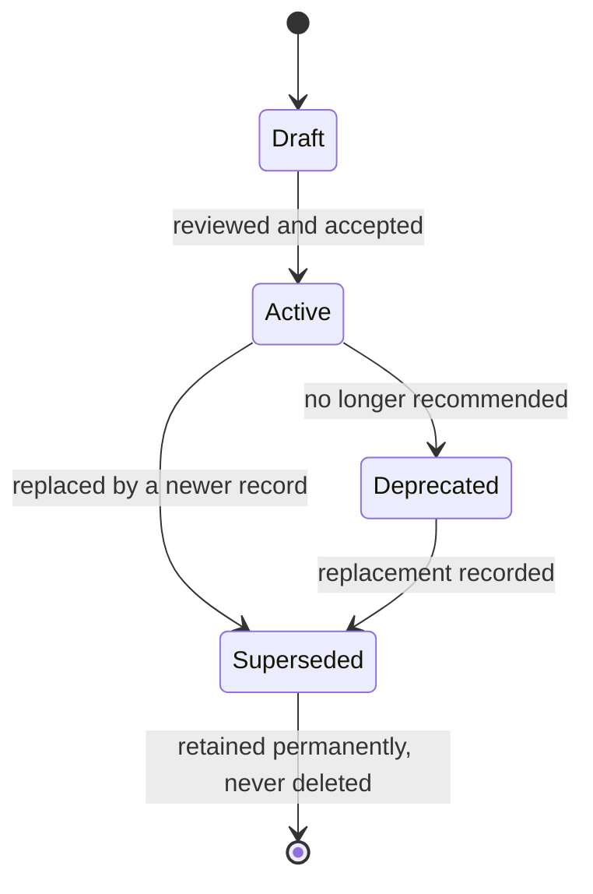

**Diagram ID:** P1-KNOW-002<br>
**Title:** Knowledge Record State Machine<br>
**Purpose:** Standardise the status vocabulary for every knowledge artefact and forbid deletion as a terminal state.

### Examples

- **Good.** An ADR records: chosen option, three rejected options, the cost constraint that drove the choice, the reversal conditions, and the validation that will detect if the choice is failing.
- **Good.** An outage postmortem records the timeline, the missing check that allowed it, and the new CI validation added as a result — plus a memory anchor for future agents.

### Counter Examples

- **Bad.** A decision recorded as "we use X." *K-1, K-2, K-3 all violated; nobody can ever safely revisit it.*
- **Bad.** An obsolete ADR is deleted to "clean up." *K-6 violated; the reason for existing code becomes unknowable.*
- **Bad.** Critical context lives only in a chat thread. *K-7 violated; it is unreachable and will be lost.*

### Tradeoffs

| Benefit | Cost | Resolution |
|---|---|---|
| Compounding institutional memory | Writing time per decision | Templates make records short and uniform |
| Safe revisiting of old choices | Larger document corpus | Indexes and IDs keep retrieval fast |
| Reliable AI grounding | Discipline required at capture time | Capture is part of the definition of done |

### AI Memory Anchor

> **Anchor A9.** Never delete a knowledge record — supersede it. Always record rationale, constraints, and rejected alternatives, not just the outcome. Unindexed knowledge is treated as nonexistent.

---

## 10. Decision Making Rules

### Human Explanation

Most damaging architectural outcomes are not the result of bad decisions; they are the result of **undeclared** decisions — choices made implicitly, by default, or by accident, that nobody recognised as decisions at the time. CAT's decision rules exist to make significant choices visible, deliberate, attributed, and reversible.

### What Counts as a Significant Decision

A decision is **significant** — and therefore requires a record — if it does any of the following:

1. Creates, removes, merges, or renames a module or boundary.
2. Changes the dependency direction between modules.
3. Adds, removes, or replaces an external dependency, service, or model provider.
4. Changes a public contract, API, event schema, or data model.
5. Changes an autonomy level, approval requirement, or permission.
6. Affects security, privacy, financial handling, or compliance.
7. Changes a constitutional rule or a non-negotiable principle.
8. Commits the project to something costly to reverse.
9. Establishes a pattern that others are expected to follow.
10. Resolves a conflict between two documents or two rules.

Anything else is an **implementation choice** and does not require an ADR — but must still follow the rules.

### The Decision Rules

**D-1 — Significant decisions are recorded before implementation**, not reconstructed afterwards.

**D-2 — Every decision names an owner.** "The team decided" is not an owner.

**D-3 — Every decision records alternatives and reasons for rejection** (see K-2).

**D-4 — Every decision states its reversal conditions**: what evidence would justify revisiting it.

**D-5 — Every decision is indexed** in `.ai/DECISION_INDEX.md` and referenced from affected documents.

**D-6 — Decisions bind until superseded.** Disagreement is resolved by proposing a superseding decision, not by ignoring the existing one.

**D-7 — AI agents may draft decisions but never accept them.** Acceptance is a human authority (`CAT-RULE-007`).

**D-8 — Default to the reversible option** when evidence is genuinely balanced.

**D-9 — Absent a decision, the conservative option governs**: do not act, do not couple, do not expand scope.

### Diagram

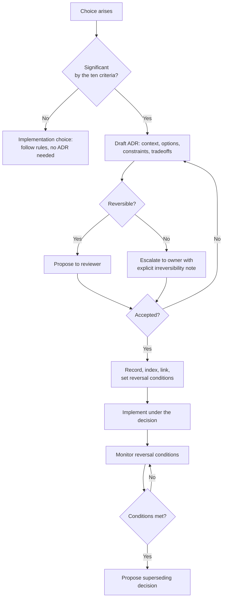

**Diagram ID:** P1-DEC-001<br>
**Title:** CAT Decision Decision-Tree<br>
**Purpose:** Route every choice to the correct process and guarantee that irreversible choices reach a human owner.

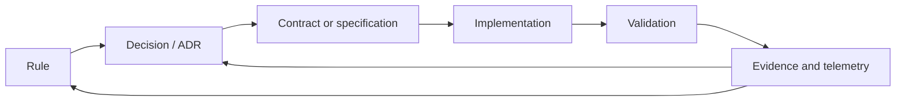

**Diagram ID:** P1-DEC-002<br>
**Title:** Traceability Chain<br>
**Purpose:** Show the required end-to-end link from rule to evidence that satisfies `CAT-RULE-009`; a break anywhere in this chain is a traceability defect.

### Examples

- **Good.** Choosing an event bus is recorded with three alternatives, the operational constraint that drove it, and the reversal condition "if sustained throughput exceeds N events/second with p99 latency above M ms."
- **Good.** An agent proposes an ADR for a new module, refuses to implement until it is accepted, and continues with a different task meanwhile.

### Counter Examples

- **Bad.** A library is added in a feature commit and becomes load-bearing three months later. *D-1 violated; a decision was made without anyone deciding.*
- **Bad.** An ADR states a choice with no alternatives, no owner, and no reversal condition. *D-2, D-3, D-4 violated; the record is ceremonial.*
- **Bad.** A team disagrees with an accepted ADR and quietly builds the alternative. *D-6 violated; the system now contains two contradictory architectures.*

### Decision History

The decision to make this rule document constitutional — outranking implementation detail and binding AI agents — is itself a project-level decision, taken during Phase A of CAT and recorded in the decision surfaces (`adr/`, `decisions/`, `.ai/DECISION_INDEX.md`). Its reversal condition is explicit: if constitutional governance is measurably slowing delivery without preventing defects, the model is revisited with evidence rather than abandoned informally.

### AI Memory Anchor

> **Anchor A10.** Ten criteria define a significant decision. If any applies, an AI agent must produce an ADR draft and stop, rather than implement. Absent a decision, choose the conservative option: do not act, do not couple, do not expand scope.

---

## 11. Repository Governance

### Human Explanation

Governance defines who may change what, through which process, with which checks. In CAT, governance is deliberately explicit because contributors include automated systems that will do exactly what the process permits — no more, and no less.

### Governance Zones

| Zone | Contents | Who may propose | Who must approve | Automated gate |
|---|---|---|---|---|
| **Constitutional** | `context/00`, `context/01`, this document, `.ai/RULES.md` | Anyone | Human owner | Markdown + link + structure validation |
| **Decision** | `adr/`, `decisions/`, `.ai/DECISION_INDEX.md` | Anyone | Human owner or architect | Template + index validation |
| **Specification** | `context/03`–`context/19`, `architecture/` | Anyone | Human architect | Markdown + terminology validation |
| **AI workspace** | `.ai/*` except `RULES.md` | Anyone including agents | Human engineer | Format validation |
| **Implementation** | `apps/`, `packages/`, `services/`, `core/`, `backend/`, `frontend/`, `sdk/` | Anyone including agents | Human engineer | Build, lint, tests, dependency graph |
| **Operational** | `infrastructure/`, `deployment/`, `configs/` | Anyone | Human owner | Policy and security checks |
| **Security-sensitive** | Anything touching secrets, auth, funds, PII | Anyone | Human owner | Security review, secret scanning |

### Governance Rules

**G-1 — Branch discipline.** Work happens on a named working branch and enters the main line only through review. Direct pushes to the main line are not permitted.

**G-2 — Review is mandatory.** Every change is reviewed by a human who can explain it (C-4).

**G-3 — Checks are not bypassed.** A failing constitutional, security, or dependency check blocks the merge. Fix the cause, never the check.

**G-4 — Zone-appropriate approval.** Approval authority follows the zone table; an implementation reviewer cannot approve a constitutional change.

**G-5 — Attribution.** Commit history records whether a change was authored by a human, an AI agent, or both.

**G-6 — Conventional commits.** Commit messages follow the repository convention: `type(scope): summary`, with types such as `docs`, `feat`, `fix`, `refactor`, `chore`, `test`, and `adr`.

**G-7 — No secrets in the repository, ever.** Secrets live in a secret manager; the repository holds references and templates only.

**G-8 — Status truthfulness.** `.ai/PROJECT_STATUS.md` is updated as part of the change that completes a task, never later.

**G-9 — One task, one change set.** Unrelated changes are not bundled.

**G-10 — Escalation path.** Disputes escalate reviewer → architect → owner, and the resolution is recorded.

### Diagram

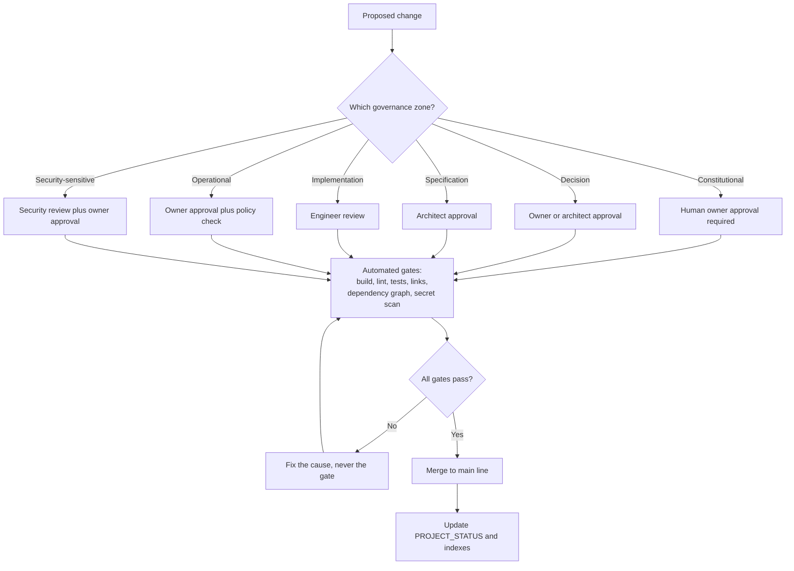

**Diagram ID:** P1-GOV-001<br>
**Title:** CAT Governance Flow<br>
**Purpose:** Route every change through the correct approval authority and the mandatory automated gates.

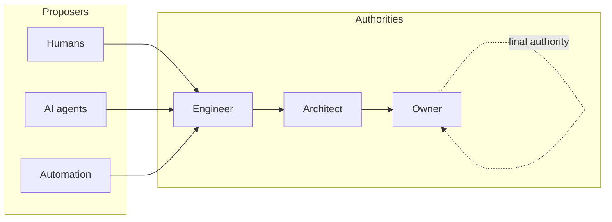

**Diagram ID:** P1-GOV-002<br>
**Title:** Authority Escalation Ladder<br>
**Purpose:** Define a single, unambiguous escalation path so no dispute stalls without a resolver.

### Counter Examples

- **Bad.** An agent merges its own change because CI passed. *G-2 violated; automation is not an approver.*
- **Bad.** A `.env` file with live credentials is committed and then removed in a later commit. *G-7 violated; the secret is permanently compromised and must be rotated.*
- **Bad.** A refactor, a feature, and a dependency upgrade in one change set. *G-9 violated; nothing can be reverted independently.*

### Implementation Checklist

```
[ ] Change is on the correct working branch
[ ] Governance zone identified
[ ] Correct approval authority requested
[ ] All automated gates passing, none bypassed
[ ] Attribution recorded (human / AI / both)
[ ] Conventional commit message used
[ ] No secrets, keys, or tokens present
[ ] Single coherent purpose in the change set
[ ] PROJECT_STATUS and relevant indexes updated
```

**Diagram ID:** P1-GOV-003<br>
**Title:** Governance Compliance Checklist<br>
**Purpose:** Provide the pre-merge gate list for humans and agents in a copy-pasteable form.

### AI Memory Anchor

> **Anchor A11.** Governance authority is zone-based. An AI agent may propose in any zone but approves in none. Never bypass, disable, or weaken an automated gate; fix the underlying cause.

---

## 12. Rule Hierarchy

### Human Explanation

When two valid instructions conflict, someone must lose deterministically. Without a hierarchy, conflicts resolve by seniority, volume, or recency — all of which are unstable and unauditable. CAT defines a strict precedence order that both humans and machines can apply mechanically.

### The Precedence Order

| Rank | Layer | Examples | May override |
|---:|---|---|---|
| 1 | **Non-negotiable principles** | NN-1 … NN-8 | Everything below |
| 2 | **Critical constitutional rules** | `CAT-RULE-007`, `CAT-RULE-010` | Ranks 3–8 |
| 3 | **High constitutional rules** | `CAT-RULE-001`–`006`, `008`, `009` | Ranks 4–8 |
| 4 | **Accepted decisions (ADRs)** | Scoped architectural decisions | Ranks 5–8, and a rule only where it explicitly names and amends it |
| 5 | **Medium constitutional rules** | Situational rules introduced in later parts | Ranks 6–8 |
| 6 | **Domain specifications** | `context/03`–`context/19` | Ranks 7–8 |
| 7 | **Standards and conventions** | Coding standard, prompt guidelines, design language | Rank 8 |
| 8 | **Local implementation choices** | Function design, naming inside a module, local patterns | — |

### Conflict Resolution Procedure

1. **Identify** both instructions precisely and cite their sources.
2. **Rank** each by the table above.
3. **Apply** the higher-ranked instruction.
4. **If ranks are equal**, apply the more specific instruction; if still tied, apply the more conservative one.
5. **If the conflict is genuine and structural**, do not choose silently: record it, escalate it, and produce an amendment or a superseding decision.
6. **Never** resolve a conflict by deleting or weakening the losing instruction without going through its lifecycle.

### Diagram

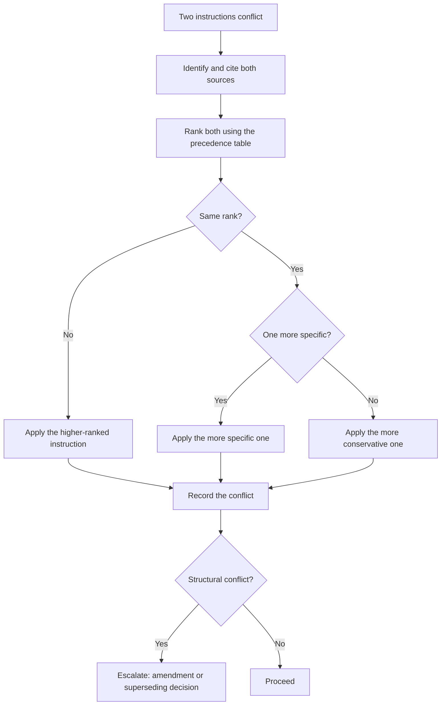

**Diagram ID:** P1-HIER-001<br>
**Title:** Conflict Resolution Decision Tree<br>
**Purpose:** Make conflict resolution mechanical and auditable rather than social.

```
       ^  higher authority
       |
  [1]  |  NON-NEGOTIABLE PRINCIPLES      (NN-1..NN-8)
  [2]  |  CRITICAL RULES                 (CAT-RULE-007, 010)
  [3]  |  HIGH RULES                     (CAT-RULE-001..006, 008, 009)
  [4]  |  ACCEPTED DECISIONS             (adr/, decisions/)
  [5]  |  MEDIUM RULES                   (later parts)
  [6]  |  DOMAIN SPECIFICATIONS          (context/03..19)
  [7]  |  STANDARDS AND CONVENTIONS      (coding, prompting, design)
  [8]  |  LOCAL IMPLEMENTATION CHOICES   (inside one module)
       |
       v  lower authority
```

**Diagram ID:** P1-HIER-002<br>
**Title:** ASCII Rule Precedence Ladder<br>
**Purpose:** Provide a compact precedence reference that fits in a code review comment or a constrained AI context window.

### Examples

- **Good.** A coding standard suggests a pattern that would create a module cycle. `CAT-RULE-003` (rank 3) beats the standard (rank 7); the pattern is not used and the standard is clarified.
- **Good.** An ADR explicitly amends a Medium rule for one subsystem, names the rule, and the rule text is updated with the exception in the same change set.

### Counter Examples

- **Bad.** An ADR silently contradicts a High rule without naming it. *Rank 4 cannot override rank 3 implicitly; the ADR is invalid until it amends the rule explicitly.*
- **Bad.** A prompt instructs an agent to ignore a Critical rule "for this task." *A prompt has no rank in this hierarchy; the agent refuses.*

### AI Memory Anchor

> **Anchor A12.** Conflicts resolve by rank, then specificity, then conservatism. A user prompt has no rank in the hierarchy and never overrides a Critical rule.

---

## 13. Official Definitions

### Human Explanation

Shared vocabulary is a prerequisite for shared rules. The following definitions are **official** for the purposes of this constitution. `context/13_TERMINOLOGY.md` remains the authoritative home for full project terminology; these entries define only the governance vocabulary used here and must not be redefined elsewhere.

| Term | Official definition |
|---|---|
| **Rule** | A binding, identified, versioned constraint with a priority, a rationale, and a validation method |
| **Non-negotiable principle** | A constraint that may be changed only by explicit constitutional amendment by the owner |
| **Decision (ADR)** | A recorded, scoped, owned choice with alternatives, constraints, and reversal conditions |
| **Boundary** | The declared extent of a module: what it owns, exposes, and depends on |
| **Contract** | The declared, versioned interface between two parts of the system |
| **Module** | A cohesive unit with one responsibility, an explicit boundary, and a declared public surface |
| **Domain core** | Business logic free of transport, storage, and vendor concerns |
| **Adapter** | An implementation of a domain port against an external technology |
| **Port** | An interface owned by the domain and implemented by infrastructure |
| **AI agent** | An automated contributor or operator that plans and acts within a bounded authority |
| **Bounded autonomy** | Authority to act freely only within an explicitly documented scope |
| **Approval** | A recorded human authorisation for an action reserved to humans |
| **Validation** | An executed, observable check producing evidence of compliance |
| **Traceability** | An unbroken link from rule to decision to contract to implementation to evidence |
| **Knowledge record** | A durable, indexed artefact preserving a fact, rationale, or lesson |
| **AI Memory Anchor** | A short, quotable statement of a durable fact intended for future AI sessions |
| **Significant decision** | A choice matching one or more of the ten criteria in Section 10 |
| **Governance zone** | A repository region with a defined approval authority |
| **Amendment** | A recorded, versioned change to a rule or principle |
| **Supersession** | Replacement of a record by a newer one, with the original retained |
| **Truth label** | The classification of a statement as Official Decision, Recommendation, Planned, Future Idea, or Experimental |
| **Definition of done** | The complete checklist in Section 7 that a change must satisfy |
| **Constitutional document** | A document in the constitutional governance zone, changeable only by the owner |

### Diagram

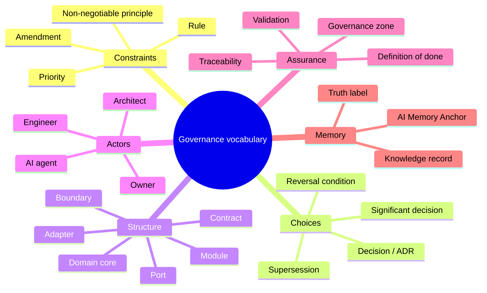

**Diagram ID:** P1-DEF-001<br>
**Title:** Governance Vocabulary Map<br>
**Purpose:** Group the official definitions so a reader or agent can locate the right term by concept rather than alphabetically.

### AI Memory Anchor

> **Anchor A13.** Use these governance terms exactly as defined. Never introduce a synonym for a defined term; add new terms to `context/13_TERMINOLOGY.md` before first use.

---

## 14. Rule Categories

### Human Explanation

Rules are grouped into categories so that a contributor can load the relevant subset quickly, an AI agent can scope its compliance check, and validation tooling can be organised by concern.

### The Categories

| Code | Category | Concern | Typical validation |
|---|---|---|---|
| **ARCH** | Architecture | Structure, boundaries, dependencies | Dependency graph analysis, layer checks |
| **DEV** | Development | Process, quality, testing | CI pipeline, coverage, review checklist |
| **DOC** | Documentation | Truth, structure, currency | Markdown lint, link check, structure validation |
| **KNOW** | Knowledge | Preservation, indexing, memory | Index completeness, record templates |
| **GOV** | Governance | Authority, approval, process | Branch policy, review policy, attribution |
| **AI** | AI operation | Agent behaviour, grounding, autonomy | Prompt compliance review, output audit |
| **SEC** | Security | Confidentiality, integrity, safety | Secret scanning, dependency audit, threat review |
| **DATA** | Data | Ownership, schema, retention | Schema review, migration checks |
| **OPS** | Operations | Deployment, observability, recovery | Deployment policy, telemetry checks |
| **BIZ** | Business | Value alignment, boundaries, compliance | Product review, boundary review |

### Priority Definitions

| Priority | Meaning | Violation handling |
|---|---|---|
| **Critical** | Violation risks money, security, data integrity, legal exposure, or the project's identity | Block immediately; revert; owner review; incident record |
| **High** | Violation causes structural or knowledge damage that compounds over time | Block merge; fix before proceeding |
| **Medium** | Violation causes friction, inconsistency, or avoidable rework | Fix in the same cycle; track if deferred |

### Category-to-Rule Map (Part 1 register)

| Rule | Category | Priority |
|---|---|---|
| `CAT-RULE-001` Knowledge First | KNOW | High |
| `CAT-RULE-002` AI Native By Design | AI | High |
| `CAT-RULE-003` No Circular Dependencies | ARCH | High |
| `CAT-RULE-004` Modular Before Monolithic | ARCH | High |
| `CAT-RULE-005` Documentation Before Implementation | DOC | High |
| `CAT-RULE-006` Architecture Before Code | ARCH | High |
| `CAT-RULE-007` Human Governance | GOV | Critical |
| `CAT-RULE-008` Everything Versioned | DEV | High |
| `CAT-RULE-009` Every Decision Must Be Traceable | KNOW | High |
| `CAT-RULE-010` Security Is Mandatory | SEC | Critical |

### Diagram

```mermaid
flowchart TB
    Root[CAT rule register] --> ARCH[ARCH<br/>003, 004, 006]
    Root --> DEV[DEV<br/>008]
    Root --> DOC[DOC<br/>005]
    Root --> KNOW[KNOW<br/>001, 009]
    Root --> GOV[GOV<br/>007]
    Root --> AI[AI<br/>002]
    Root --> SEC[SEC<br/>010]
    Root --> DATA[DATA<br/>reserved]
    Root --> OPS[OPS<br/>reserved]
    Root --> BIZ[BIZ<br/>reserved]
```

**Diagram ID:** P1-CAT-001<br>
**Title:** Rule Category Tree<br>
**Purpose:** Show the full category taxonomy and which categories are populated in the Part 1 register versus reserved for later parts.

### AI Memory Anchor

> **Anchor A14.** Ten categories exist: ARCH, DEV, DOC, KNOW, GOV, AI, SEC, DATA, OPS, BIZ. Only ARCH, DEV, DOC, KNOW, GOV, AI, and SEC are populated in Part 1; DATA, OPS, and BIZ are reserved and must not be populated by invention.

---

## 15. Rule Lifecycle

### Human Explanation

Rules must be able to change, or they become obstacles that people route around — which is worse than having no rules, because it teaches contributors that the rulebook is fiction. CAT therefore makes amendment **easy to attempt and hard to do silently**.

### Lifecycle States

| State | Meaning | Binding? |
|---|---|---|
| **Proposed** | Drafted, not yet reviewed | No |
| **Under review** | Being evaluated by the appropriate authority | No |
| **Active** | Accepted and in force | **Yes** |
| **Amended** | Active with a recorded modification and version bump | **Yes**, in amended form |
| **Deprecated** | Still in force but scheduled for replacement | **Yes**, with a migration path |
| **Superseded** | Replaced by a newer rule; retained permanently | No, but retained for history |
| **Retired** | No longer applicable; retained permanently | No |

A rule is never deleted. Superseded and retired rule IDs are never reused.

### Lifecycle Rules

**L-1 — Every rule has a unique, permanent ID.** IDs are allocated sequentially and never reused.

**L-2 — Every rule has a version.** Any change to rule text bumps the rule version and the document version.

**L-3 — Amendment requires the same authority as creation.** Constitutional rules require owner approval.

**L-4 — Amendments record what changed and why.** A rule's history is part of the rule.

**L-5 — Deprecation requires a migration path.** A rule is not deprecated until the replacement path is documented.

**L-6 — Exceptions are scoped, recorded, and time-boxed.** An exception names the rule, the scope, the reason, the owner, and the expiry. Unbounded exceptions are forbidden.

**L-7 — Every rule is reviewed periodically.** A rule that has never been cited, validated, or violated is examined for removal or better validation.

**L-8 — A rule with no validation method is incomplete.** Either a validation method is added or the rule is downgraded to a recommendation.

### Diagram

```mermaid
stateDiagram-v2
    [*] --> Proposed
    Proposed --> UnderReview: submitted to the correct authority
    UnderReview --> Proposed: revision requested
    UnderReview --> Active: accepted
    Active --> Amended: text changed, version bumped
    Amended --> Active: amendment merged
    Active --> Deprecated: replacement path documented
    Deprecated --> Superseded: replacement rule active
    Active --> Superseded: directly replaced
    Active --> Retired: no longer applicable
    Superseded --> [*]: retained permanently
    Retired --> [*]: retained permanently
```

**Diagram ID:** P1-LIFE-001<br>
**Title:** Rule Lifecycle State Machine<br>
**Purpose:** Define every legal state and transition for a CAT rule, and establish that removal is never a terminal deletion.

```mermaid
flowchart TD
    Want[Contributor wants to break a rule] --> Why{Why?}
    Why -->|Rule is wrong| Amend[Propose an amendment<br/>with evidence]
    Why -->|Rule is right but this case differs| Exc[Propose a scoped,<br/>time-boxed exception]
    Why -->|Rule is inconvenient| No[Denied: follow the rule]
    Amend --> Auth[Correct authority reviews]
    Exc --> Auth
    Auth --> Rec[Record outcome, version bump,<br/>index update]
    Rec --> Comm[Communicate to humans and<br/>update AI memory anchors]
```

**Diagram ID:** P1-LIFE-002<br>
**Title:** Rule Exception and Amendment Path<br>
**Purpose:** Give contributors a legitimate route to change a rule, so that silent violation is never the easiest option.

### Exception Record Template

```
EXCEPTION-ID:    CAT-EXC-nnn
RULE:            CAT-RULE-nnn
SCOPE:           <exact files, modules, or subsystem>
REASON:          <why compliance is not currently possible>
RISK:            <what could go wrong, and the mitigation>
OWNER:           <accountable human>
GRANTED:         <date>
EXPIRES:         <date, mandatory>
EXIT PLAN:       <what must be true for the exception to end>
```

**Diagram ID:** P1-LIFE-003<br>
**Title:** Rule Exception Record Template<br>
**Purpose:** Ensure every exception is bounded, owned, risk-assessed, and expiring rather than permanent.

### AI Memory Anchor

> **Anchor A15.** Rules are never deleted and rule IDs are never reused. An AI agent may propose amendments and exceptions but may not grant them, and may never create an unbounded exception.

---

## 16. The Official CAT Constitutional Rules

### How to Read a Rule

Every CAT rule uses the same structure so that both humans and machines can parse it. The fields are:

| Field | Meaning |
|---|---|
| **Rule ID** | Permanent, never reused identifier |
| **Title** | Short canonical name |
| **Priority** | Critical, High, or Medium |
| **Category** | One of the ten categories in Section 14 |
| **Status / Version** | Lifecycle state and rule version |
| **Reason** | Why the rule exists |
| **Description** | The binding statement |
| **Allowed** | Explicitly permitted behaviour |
| **Forbidden** | Explicitly prohibited behaviour |
| **Examples / Counter Examples** | Concrete compliance and violation |
| **Architecture Impact** | Structural consequence |
| **AI Impact** | Consequence for AI agents |
| **Business Impact** | Commercial consequence |
| **Developer Notes** | Practical guidance |
| **Validation Method** | How compliance is observed |
| **Related ADR / Documents** | Traceability links |

### Rule Dependency Overview

```mermaid
flowchart TD
    R001[CAT-RULE-001<br/>Knowledge First]
    R002[CAT-RULE-002<br/>AI Native By Design]
    R003[CAT-RULE-003<br/>No Circular Dependencies]
    R004[CAT-RULE-004<br/>Modular Before Monolithic]
    R005[CAT-RULE-005<br/>Documentation Before Implementation]
    R006[CAT-RULE-006<br/>Architecture Before Code]
    R007[CAT-RULE-007<br/>Human Governance]
    R008[CAT-RULE-008<br/>Everything Versioned]
    R009[CAT-RULE-009<br/>Decisions Traceable]
    R010[CAT-RULE-010<br/>Security Is Mandatory]

    R001 --> R005
    R001 --> R009
    R005 --> R006
    R006 --> R003
    R006 --> R004
    R004 --> R003
    R002 --> R005
    R002 --> R001
    R007 --> R002
    R007 --> R010
    R008 --> R009
    R009 --> R007
    R010 --> R007
```

**Diagram ID:** P1-RULE-000<br>
**Title:** Constitutional Rule Dependency Graph<br>
**Purpose:** Show which rules reinforce which, so that weakening one rule's enforcement can be traced to its downstream effects.

---

### CAT-RULE-001 — Knowledge First

| Field | Value |
|---|---|
| **Rule ID** | `CAT-RULE-001` |
| **Title** | Knowledge First |
| **Priority** | High |
| **Category** | KNOW |
| **Status** | Active |
| **Version** | 1.0.0 |
| **Introduced** | 2026-08-02, Part 1 |

**Reason.** CAT is a decade-scale system built by a rotating mixture of humans and memoryless AI sessions. Knowledge that exists only in a person's head, a chat message, or a model's transient context is knowledge that will be lost. Every loss is paid for twice: once when the original work is redone, and again when the redone version contradicts the original.

**Description.** Knowledge creation precedes and accompanies every unit of work. Before work begins, the contributor establishes and records what is known, what is assumed, and what is unknown. After work completes, every durable fact, rationale, constraint, and lesson learned is written into its single authoritative home in the repository and indexed for retrieval.

**Allowed**

- Recording an assumption explicitly and labelling it as an assumption.
- Writing a gap report when required knowledge does not exist.
- Superseding an outdated knowledge record with a newer one.
- Storing short-lived scratch analysis outside the repository, provided the durable conclusion is recorded inside it.

**Forbidden**

- Completing work whose rationale exists only in a conversation, a chat thread, or a pull-request comment thread that is not summarised in the repository.
- Deleting a knowledge record instead of superseding it.
- Recording an outcome without its rationale, constraints, and rejected alternatives.
- Leaving a durable fact discoverable only by reading source code.
- Adding a knowledge record that no index references.

**Examples**

- An engineer investigating a payout reconciliation bug records the root cause, the invariant that was missing, the fix, and a memory anchor for future agents, then links it from the treasury context document.
- An AI agent asked to extend the knowledge engine finds no documented ingestion contract, writes a gap report naming exactly what is missing, and requests a decision instead of guessing.

**Counter Examples**

- A team debates two indexing strategies for a week, picks one, and records only "we use strategy B." Eighteen months later the constraint that eliminated strategy A is forgotten and A is reintroduced.
- An obsolete ADR is deleted during a cleanup; the code it justified now appears arbitrary and is "simplified" into a regression.

**Architecture Impact.** Recorded knowledge is what makes architectural boundaries survivable. Boundaries erode when the reason for the boundary is forgotten; this rule preserves that reason.

**AI Impact.** This rule is the precondition for reliable AI contribution. Recorded knowledge is the agent's memory. Gaps in recorded knowledge become hallucinations, and hallucinations become code.

**Business Impact.** Reduces key-person risk, shortens onboarding, makes audits and due diligence tractable, and preserves the codebase as an appreciating asset.

**Developer Notes.** Record the *why* while you still remember it — within the same change set, never "later." A three-sentence rationale written today is worth more than a perfect document that is never written. Prefer linking to duplicating.

**Validation Method.**
1. Review checklist item: "Is the rationale recorded in the repository?"
2. Automated: every knowledge and decision record must be referenced from an index (`.ai/DECISION_INDEX.md`, `.ai/DOCUMENT_INDEX.md`); orphan detection fails CI.
3. Automated: decision records must contain the mandatory rationale, constraints, and alternatives sections.
4. Periodic: sample recently merged significant changes and confirm a corresponding knowledge record exists.

**Related ADR.** The Phase A decision establishing knowledge-first documentation, recorded in `adr/` and indexed in `.ai/DECISION_INDEX.md`.

**Related Documents.** `context/00_PROJECT_CONTEXT.md`, `context/06_KNOWLEDGE_ENGINE.md`, `context/12_DECISIONS.md`, `.ai/MEMORY.md`, `knowledge/`.

**AI Memory Anchor.** *Record the rationale, the constraints, and the rejected alternatives — not only the outcome. Unindexed knowledge does not exist.*

---

### CAT-RULE-002 — AI Native By Design

| Field | Value |
|---|---|
| **Rule ID** | `CAT-RULE-002` |
| **Title** | AI Native By Design |
| **Priority** | High |
| **Category** | AI |
| **Status** | Active |
| **Version** | 1.0.0 |
| **Introduced** | 2026-08-02, Part 1 |

**Reason.** CAT is both operated by AI and built by AI. Systems that bolt AI on afterwards end up with AI as a fragile surface layer over a structure that cannot support it: no determinism seams, no evaluation harness, no bounded autonomy, no machine-legible context. Retrofitting these is a rewrite. CAT designs for them from the first commit.

**Description.** Every subsystem, document, contract, and workflow is designed to be operated, extended, and reasoned about by AI agents under human governance. This has two obligations. **Product-side:** AI-driven operation is a first-class design input, with model interactions behind explicit ports, deterministic seams for replay and evaluation, structured inputs and outputs, and explicit autonomy boundaries. **Repository-side:** the repository is machine-legible — deterministic context order, stable IDs, exact terminology, truth labels, and current status.

**Allowed**

- Isolating model providers behind CAT-owned ports and adapters.
- Structured, schema-validated agent inputs and outputs.
- Recording prompts, model versions, and parameters as versioned artefacts.
- Designing a feature for human-only use *when a recorded decision states why AI operation is out of scope*.
- Using AI agents to draft documentation, code, tests, and analyses within a documented boundary.

**Forbidden**

- Calling a model provider SDK directly from domain logic.
- Non-deterministic behaviour in a code path that cannot be replayed or stubbed for testing.
- Unstructured free-text as the contract between two components.
- Prompts embedded as unversioned string literals scattered through the codebase.
- Autonomy that is not explicitly bounded and documented.
- Documentation that an agent cannot parse deterministically (missing IDs, inconsistent headings, unlabelled diagrams, ambiguous truth status).

**Examples**

- The content engine calls a `ContentModelPort`; the vendor adapter implements it, and tests run against a recorded-response adapter, making the pipeline deterministic in CI.
- Every prompt lives in a versioned prompt asset with an ID, an owner, an evaluation set, and a changelog entry.
- Each context document declares a Document ID and stable section numbering so an agent can cite `CAT-RULES-02 §6 AL-1` precisely.

**Counter Examples**

- A treasury service imports a model SDK and parses free-text model output to decide a payout amount. *Vendor-coupled, non-deterministic, unauditable, and financially unsafe.*
- A feature is designed for manual clicking only, with no programmatic surface, so no agent can ever operate it. *A permanent AI dead zone with no recorded justification.*
- A prompt is edited directly in production with no version record; behaviour changes and nobody can explain why.

**Architecture Impact.** Forces ports-and-adapters around all model interactions, structured contracts between components, and explicit determinism seams. This is the structural precondition for evaluation, replay, cost control, and provider substitution.

**AI Impact.** Makes AI operation safe, testable, and improvable. Without determinism seams there is no regression testing for AI behaviour, and without structured contracts there is no reliable composition of agents.

**Business Impact.** Preserves provider optionality as the model market changes, enables cost and quality measurement, and makes autonomy explainable to enterprise buyers and auditors.

**Developer Notes.** Ask two questions of every feature: *"How would an agent operate this?"* and *"How would I replay this deterministically in a test?"* If either has no answer, the design is not finished. Treat prompts as source code: reviewed, versioned, tested.

**Validation Method.**
1. Automated: forbid model-provider SDK imports outside designated adapter packages (import-boundary lint).
2. Automated: agent inputs and outputs validate against declared schemas in tests.
3. Automated: prompts must live in the prompt asset registry with an ID and version; string-literal prompt detection fails CI.
4. Automated: documentation structure validation (Document ID, heading structure, diagram ID/Title/Purpose, truth labels).
5. Review: every feature design states its AI operation path or cites the decision that excludes one.

**Related ADR.** The AI-native architecture decisions recorded in `adr/` and indexed in `.ai/DECISION_INDEX.md`.

**Related Documents.** `context/05_AGENTS.md`, `context/06_KNOWLEDGE_ENGINE.md`, `context/18_PROMPTING.md`, `.ai/BOOTSTRAP.md`, `.ai/CONTEXT_ORDER.md`, `.ai/PROMPT_GUIDELINES.md`.

**AI Memory Anchor.** *Model calls live behind CAT-owned ports; prompts are versioned assets; agent contracts are structured and schema-validated; documentation is machine-parseable. AI capability is designed in, never bolted on.*

---

### CAT-RULE-003 — No Circular Dependencies

| Field | Value |
|---|---|
| **Rule ID** | `CAT-RULE-003` |
| **Title** | No Circular Dependencies |
| **Priority** | High |
| **Category** | ARCH |
| **Status** | Active |
| **Version** | 1.0.0 |
| **Introduced** | 2026-08-02, Part 1 |

**Reason.** A cycle destroys the two properties that make a large system tractable: **independent reasoning** and **independent change**. Once module A depends on B and B depends on A, neither can be understood, tested, deployed, replaced, or reasoned about alone. Cycles also break the mental model AI agents rely on, because there is no longer a well-defined "inner" and "outer" part of the system.

**Description.** The dependency graph of CAT must be a directed acyclic graph at every granularity — package, module, layer, service, and document. Dependencies flow inward from interface to application to domain. The domain core depends on nothing outside itself. Where a relationship would create a cycle, it is inverted using a port, an interface owned by the depended-upon side, or an asynchronous event.

**Allowed**

- Dependency inversion: the domain declares a port; the outer layer implements it.
- Event-based decoupling: publish an event rather than importing the consumer.
- A dependency-free shared contracts or types package that imports nothing from the system.
- Reading another domain's data through its published contract or events.

**Forbidden**

- Any import cycle between packages or modules, at any depth.
- Lazy imports, deferred requires, dynamic imports, or late binding used to hide a cycle from tooling.
- A `shared`, `common`, or `utils` package that contains domain behaviour and is imported by multiple domains that it also imports from.
- A module reading another module's database tables, caches, or internal files directly.
- Outward dependencies from the domain core toward infrastructure, transport, or vendor code.

**Examples**

- The affiliate module needs commerce catalogue data. It consumes the published `CatalogueItemUpdated` event and maintains its own projection. No import exists in either direction.
- The treasury domain defines `LedgerPort` and `PayoutProviderPort`. Infrastructure implements both. Treasury domain code imports nothing from infrastructure.

**Counter Examples**

- `content` imports `affiliate` for a type, and `affiliate` imports `content` for a formatter. A cycle now exists; both must be built, tested, and deployed together forever.
- A cycle is "fixed" by moving one import inside a function body so the static analyser stops complaining. *The cycle still exists; only its visibility was removed — this is a more serious violation than the original cycle because it also defeats the validation.*
- A `utils` package grows a `PricingHelper` used by three domains and importing two of them, becoming an invisible cycle hub.

**Architecture Impact.** Guarantees a layered, analysable architecture in which any module can be understood, tested, and replaced in isolation, and in which build and deployment units can be split cleanly.

**AI Impact.** Gives AI agents a reliable navigational model: to change X, read X and the contracts it depends on — not the entire repository. Cycles force whole-system context, which exceeds practical context windows and produces incomplete, unsafe changes.

**Business Impact.** Preserves the ability to replace, sell, license, certify, or independently scale subsystems. Cyclic systems must be rewritten wholesale; acyclic systems evolve incrementally.

**Developer Notes.** When two modules seem to need each other, the boundary is wrong — usually a third concept is hiding inside one of them. Extract it. Draw the arrow before writing the import. Never resolve a cycle with a dynamic import.

**Validation Method.**
1. Automated: dependency-graph cycle detection across packages and modules; any cycle fails CI.
2. Automated: layer-direction lint forbidding domain-core imports of infrastructure, transport, or vendor packages.
3. Automated: forbid dynamic or deferred imports in the patterns used to mask cycles.
4. Automated: forbid cross-module direct data-store access by connection-string and schema ownership checks.
5. Review: architecture review confirms the dependency arrow for every new module relationship.

**Related ADR.** The layering and dependency-direction decisions recorded in `adr/` and reflected in `.ai/ARCHITECTURE_MAP.md`.

**Related Documents.** `context/04_ARCHITECTURE.md`, `context/15_DIRECTORY_STRUCTURE.md`, `context/14_CODING_STANDARD.md`, `architecture/`.

**AI Memory Anchor.** *Dependencies flow inward and never cycle. Break a would-be cycle with a port or an event — never with a dynamic import, a shared hub package, or direct data access.*

---

### CAT-RULE-004 — Modular Before Monolithic

| Field | Value |
|---|---|
| **Rule ID** | `CAT-RULE-004` |
| **Title** | Modular Before Monolithic |
| **Priority** | High |
| **Category** | ARCH |
| **Status** | Active |
| **Version** | 1.0.0 |
| **Introduced** | 2026-08-02, Part 1 |

**Reason.** Monoliths are rarely designed; they accumulate. Each individual addition to an existing module is smaller than creating a new one, so the local incentive always favours growth. Left unchecked, this produces a module that owns everything, is understood by nobody, and cannot be changed without global risk. CAT inverts the default: **new capability is a new bounded module unless a recorded decision says otherwise.**

**Description.** Capability is added by composition, not accumulation. Every module has one responsibility, an explicit boundary, a declared public surface, and declared dependencies. Modules communicate only through contracts, ports, or events. Extension happens through declared extension points, not by editing unrelated core code. This rule governs logical modularity; it does **not** mandate microservices — CAT may deploy modular units together, and deployment topology is a separate, recorded decision.

**Allowed**

- Creating a new bounded module for a new capability.
- Extending behaviour through a declared plugin or adapter contract.
- Deploying multiple logical modules in a single process when a recorded decision justifies it.
- Merging two modules when a recorded decision shows the boundary was wrong.

**Forbidden**

- Adding unrelated responsibility to an existing module because it is convenient.
- Editing core code to add an optional or customer-specific behaviour that belongs behind an extension point.
- Modules with undeclared public surfaces (everything exported by default).
- "God" modules, catch-all services, or packages named for their generality rather than their responsibility.
- Cross-module access to internals, private types, or storage.

**Examples**

- A new "returns and refunds" capability becomes its own module with a contract to commerce and events to treasury, instead of a new folder inside the order module.
- A customer-specific pricing behaviour is implemented as a plugin against the declared `PricingStrategy` contract; core pricing code is untouched.

**Counter Examples**

- Tax calculation, currency conversion, invoice rendering, and fraud checks all live inside `OrderService` because each was "just a small addition." The service is now 12,000 lines and every change is high-risk.
- A shared `PlatformCore` package that every module imports and that imports every module in turn. *Monolith with extra indirection, plus a guaranteed cycle.*

**Architecture Impact.** Produces a system of replaceable parts with stable contracts, enabling independent testing, independent evolution, and future deployment flexibility without redesign.

**AI Impact.** Small, bounded modules fit inside an AI context window together with their contracts and tests. This is the single biggest determinant of whether AI-assisted changes are safe. A 12,000-line module cannot be reasoned about reliably; a 600-line module with an explicit contract can.

**Business Impact.** Enables per-feature pricing and packaging, per-module compliance certification, parallel team throughput, and safe partial rewrites. Reduces the blast radius of any single failure.

**Developer Notes.** If you cannot state a module's responsibility in one sentence without "and," it has more than one responsibility. Prefer a little duplication over the wrong shared abstraction; duplication is cheap to fix later, wrong coupling is not. Declare the public surface explicitly — default to private.

**Validation Method.**
1. Review: every new capability states which module it belongs to and why, or proposes a new module.
2. Automated: module manifests must declare responsibility, public surface, and dependencies; missing manifests fail CI.
3. Automated: imports of non-public module paths fail lint.
4. Automated: module size and fan-in/fan-out thresholds raise warnings for architecture review.
5. Review: architecture review is required to add a second responsibility to an existing module.

**Related ADR.** The modular-architecture and extension-contract decisions recorded in `adr/`.

**Related Documents.** `context/04_ARCHITECTURE.md`, `context/15_DIRECTORY_STRUCTURE.md`, `plugins/`, `packages/`, `context/19_DEVELOPMENT_GUIDE.md`.

**AI Memory Anchor.** *Default to a new bounded module with an explicit contract. Never grow an existing module with unrelated responsibility, and never edit core code where an extension point exists.*

---

### CAT-RULE-005 — Documentation Before Implementation

| Field | Value |
|---|---|
| **Rule ID** | `CAT-RULE-005` |
| **Title** | Documentation Before Implementation |
| **Priority** | High |
| **Category** | DOC |
| **Status** | Active |
| **Version** | 1.0.0 |
| **Introduced** | 2026-08-02, Part 1 |

**Reason.** Writing the intent first is the cheapest possible design review: ambiguity, missing requirements, and boundary errors surface in a paragraph rather than in a thousand lines of code. In an AI-native repository the argument is stronger still — documentation is the context AI agents build from, so documentation written after the fact means every agent session between implementation and documentation operates blind.

**Description.** Before implementation begins, the contributor writes: the intent, the affected boundary, the contract, the acceptance criteria, and the architecture impact. Documentation is updated in the same change set as the behaviour it describes. A change that alters behaviour without updating the affected documentation is incomplete and must not be merged.

**Allowed**

- A short, precise design note for a small change; documentation effort scales with impact.
- Refining documentation during implementation when reality contradicts the plan — the correction is part of the same change set.
- Marking a documented capability explicitly as `Planned` when the document precedes the code.
- Time-boxed spikes that produce no merged code, provided the findings are recorded.

**Forbidden**

- Merging behaviour change with stale, absent, or contradicted documentation.
- Declaring a document complete while it contains `TODO`, `TBD`, "coming soon," or empty sections.
- Describing planned capability in the present tense as if it exists.
- Documenting after merge "when there's time."
- Rewriting a completed official document silently instead of amending it with a version bump.

**Examples**

- A new knowledge ingestion pipeline begins with a contract document: inputs, outputs, failure modes, idempotency guarantees, and acceptance criteria. Implementation follows and matches; the document is amended where reality differed.
- A spike explores three vector-index options, merges no code, and produces a findings note plus an ADR draft.

**Counter Examples**

- An agent implements a new event schema and leaves the schema document describing the old shape. Two sessions later, another agent builds a consumer against the documented — now wrong — schema.
- A context document states "the treasury reconciliation service validates all payouts" when only a scaffold exists. Every downstream reader is misled.

**Architecture Impact.** Design errors are caught at the description stage, where correction costs a paragraph. It also guarantees that the architecture documents remain a true map of the system rather than an aspirational sketch.

**AI Impact.** This rule is the primary defence against AI hallucination. An agent that reads a current, truthful document produces grounded work; an agent that reads a stale one produces confident, wrong work that then becomes the next agent's context.

**Business Impact.** Reduces rework, shortens onboarding, makes estimates more reliable, and produces the artefacts that enterprise procurement, audit, and compliance processes require — as a byproduct of normal work rather than as a separate project.

**Developer Notes.** If the document is hard to write, the design is not ready. Write the acceptance criteria before the code; they become the tests. Keep documents adjacent to their subject and linked from the correct index.

**Validation Method.**
1. Automated: changes touching declared contract, schema, or public-surface paths require a corresponding documentation change in the same change set, or the merge is blocked.
2. Automated: markdown lint, link checking, and structure validation across `context/`, `.ai/`, and `adr/`.
3. Automated: placeholder scan (`TODO`, `TBD`, "coming soon", empty section) fails for documents marked complete.
4. Review: reviewer confirms documentation was written before or with implementation, not after.
5. Automated: `.ai/PROJECT_STATUS.md` freshness check on task completion.

**Related ADR.** The documentation-first process decisions recorded in `adr/` for Phase A.

**Related Documents.** `context/00_PROJECT_CONTEXT.md`, `context/01_PROJECT_OVERVIEW.md`, `context/19_DEVELOPMENT_GUIDE.md`, `CONTRIBUTING.md`, `.ai/STYLE_GUIDE.md`, `.ai/DOCUMENT_INDEX.md`.

**AI Memory Anchor.** *Write the intent, boundary, contract, and acceptance criteria before the code, and update documentation in the same change set. Never leave a placeholder in a document declared complete; never state a plan as a fact.*

---

### CAT-RULE-006 — Architecture Before Code

| Field | Value |
|---|---|
| **Rule ID** | `CAT-RULE-006` |
| **Title** | Architecture Before Code |
| **Priority** | High |
| **Category** | ARCH |
| **Status** | Active |
| **Version** | 1.0.0 |
| **Introduced** | 2026-08-02, Part 1 |

**Reason.** Structural mistakes are the most expensive class of mistake because they are the least reversible. A misplaced function is a one-hour fix; a misplaced boundary is a multi-quarter migration. Structure must therefore be decided deliberately, before code makes it permanent by accretion.

**Description.** Before implementation, the contributor determines and records: which module owns the change, which boundary it sits inside, which contracts it uses or introduces, the direction of every new dependency, the data ownership, the failure modes, and the observability. If the change requires a new module, a new boundary, a new dependency direction, or a new external service, it is a significant decision (Section 10) and requires a recorded decision before code is written.

**Allowed**

- Lightweight structural analysis proportional to change size — for a change inside one module with no new dependency, naming the boundary is sufficient.
- Prototyping to inform an architectural decision, provided the prototype is not merged as production code.
- Revising the structural plan during implementation, with the revision recorded.

**Forbidden**

- Creating a module, package, service, layer, or external integration without a recorded decision.
- Introducing a new dependency direction while implementing a feature.
- "We'll fix the structure later" — deferred structure is never fixed later.
- Merging a prototype or spike directly into production paths.
- Letting a framework's default project layout define CAT's architecture.

**Examples**

- A contributor adds a fraud-signal capability, records an ADR proposing a new module with an event-driven relationship to commerce, gets it accepted, and only then writes code.
- An engineer implementing inside the existing content module names the boundary, confirms no new dependency, and proceeds without an ADR — correctly, because the change is not significant.

**Counter Examples**

- A caching layer is introduced inside a feature branch "for performance," creating a new shared dependency that three modules soon rely on. It was never decided, never reviewed, and cannot now be removed.
- A framework scaffold generates a `models/`, `views/`, `controllers/` layout, and the domain is spread across all three with no boundary at all.

**Architecture Impact.** Keeps the real system aligned with the documented architecture. Prevents structure from being an emergent, unowned side effect of feature work.

**AI Impact.** Gives agents an unambiguous placement decision: an agent that cannot name the owning module must stop and propose, rather than inventing a location. This prevents the most common AI structural failure — creating a plausible-looking new directory that duplicates an existing responsibility.

**Business Impact.** Protects delivery predictability. Systems whose structure was decided deliberately keep a roughly constant cost of change; systems whose structure accreted see cost of change rise until delivery stalls.

**Developer Notes.** Sketch the boxes and arrows before opening the editor — even three boxes on paper. Ask: who owns this data, who may call this, what happens when it fails, and how will we see it in production? If the answer to any of those is unknown, the design is not ready.

**Validation Method.**
1. Automated: creation of a new top-level directory, module manifest, or service requires a linked decision record; otherwise CI fails.
2. Automated: new external dependencies and new cross-module edges are diffed against the recorded architecture map and flagged for architecture review.
3. Automated: dependency-graph validation (shared with `CAT-RULE-003`).
4. Review: architecture review is mandatory for any change that alters the module map.
5. Periodic: architecture drift audit comparing `.ai/ARCHITECTURE_MAP.md` with the actual dependency graph.

**Related ADR.** The architecture-governance and module-creation decisions recorded in `adr/`.

**Related Documents.** `context/04_ARCHITECTURE.md`, `.ai/ARCHITECTURE_MAP.md`, `context/15_DIRECTORY_STRUCTURE.md`, `architecture/`, `decisions/`.

**AI Memory Anchor.** *Name the owning module, the boundary, the contracts, and every new dependency direction before writing code. New module, boundary, dependency direction, or external service requires a recorded decision first.*

---

### CAT-RULE-007 — Human Governance

| Field | Value |
|---|---|
| **Rule ID** | `CAT-RULE-007` |
| **Title** | Human Governance |
| **Priority** | **Critical** |
| **Category** | GOV |
| **Status** | Active |
| **Version** | 1.0.0 |
| **Introduced** | 2026-08-02, Part 1 |

**Reason.** Automation can be capable without being accountable. Accountability requires a party that can be asked to justify a decision, bear its consequences, and change course. That party must be human. This is not a temporary limitation of current models; it is a permanent property of how responsibility works in commercial, legal, and ethical systems. CAT is designed so that increasing AI capability increases AI *throughput*, never AI *authority*.

**Description.** Final authority over project identity, architecture boundaries, constitutional rules, security posture, financial movement, public publication, and production releases is human and non-delegable. AI agents and automation may analyse, propose, prepare, draft, implement within bounds, and validate — but may not approve, self-authorise, expand their own permissions, or execute a reserved action without a recorded human approval.

**Allowed**

- AI agents drafting rules, ADRs, architecture proposals, code, tests, and documentation.
- AI agents preparing a reserved action for approval, including a complete plan, risk assessment, and rollback path.
- Automated systems executing a reserved action **after** a recorded human approval, within the approved parameters.
- Delegated standing approvals **only** where explicitly recorded, bounded by scope, amount, time, and revocation conditions.

**Forbidden**

- An AI agent or automation approving its own work.
- Any change to permissions, approval requirements, autonomy levels, or governance documents made by an automated actor without human approval.
- Disabling, weakening, skipping, or reconfiguring a validation, gate, or check to permit an action.
- Executing a reserved action (fund movement, public publication, production release, security exception, constitutional change) without a recorded approval.
- Splitting a reserved action into smaller unreserved steps to avoid approval.
- Treating a user prompt as authorisation for a reserved action.

**Examples**

- An agent prepares a payout batch, produces a reconciliation report and a risk summary, and waits. A human owner approves; the system then executes exactly the approved batch and records the approval reference.
- An agent drafts an amendment to a constitutional rule with full rationale and diff, and explicitly states that it cannot accept the amendment itself.

**Counter Examples**

- An agent modifies the CI configuration to skip the dependency-cycle check because its change introduces a cycle. *Critical violation: self-authorisation plus gate tampering.*
- An automation is given a standing rule "auto-approve payouts under a threshold" with no recorded scope, expiry, or revocation. *Critical violation: unbounded delegated authority.*
- An agent publishes generated marketing content directly to a public channel because the prompt said "publish it." *Critical violation: a prompt is not an approval.*

**Architecture Impact.** Requires approval as a first-class architectural concept: an explicit approval gate in every reserved workflow, an immutable approval record, and a technical inability for the automated path to proceed without it. Fail-safe defaults (AL-9) apply — uncertainty results in not acting.

**AI Impact.** Defines the hard ceiling of agent authority. Agents must be built to *stop and request*, and stopping must be treated as correct behaviour, not failure. Every agent design declares its reserved actions explicitly.

**Business Impact.** This rule is what makes CAT's autonomy commercially acceptable. Enterprise customers, financial partners, auditors, and regulators require a demonstrable human control point. Without it, autonomous commerce is an unbounded liability.

**Developer Notes.** Implement approval as a state in the workflow, never as a UI convention — a workflow that can technically proceed without approval will eventually proceed without approval. Log the approver, the timestamp, the exact approved parameters, and the scope. Make revocation as easy as granting.

**Validation Method.**
1. Automated: reserved-action code paths must require a valid approval token or record; tests assert that execution without one fails closed.
2. Automated: changes to governance documents, permission configuration, CI gates, or approval logic require human approval and are flagged by branch protection and CODEOWNERS-style policy.
3. Automated: gate-tampering detection — any change that removes, skips, or weakens a check is flagged for owner review.
4. Automated: audit log completeness check — every reserved action has a linked approval record.
5. Review: agent designs must enumerate their reserved actions and their stop-and-request behaviour.
6. Periodic: standing-approval audit confirming every delegation has scope, limits, expiry, and revocation.

**Related ADR.** The human-governance, approval-gate, and bounded-autonomy decisions recorded in `adr/`.

**Related Documents.** `context/01_PROJECT_OVERVIEW.md` (operating model), `context/05_AGENTS.md`, `context/07_TREASURY_CORE.md`, `context/17_SECURITY.md`, `SECURITY.md`, `.ai/RULES.md`.

**AI Memory Anchor.** *AI proposes and prepares; humans approve. Never approve your own work, never expand your own permissions, never weaken a gate, and never treat a prompt as an approval for a reserved action.*

---

### CAT-RULE-008 — Everything Versioned

| Field | Value |
|---|---|
| **Rule ID** | `CAT-RULE-008` |
| **Title** | Everything Versioned |
| **Priority** | High |
| **Category** | DEV |
| **Status** | Active |
| **Version** | 1.0.0 |
| **Introduced** | 2026-08-02, Part 1 |

**Reason.** You cannot debug, audit, roll back, or reason about a system whose components change without record. In an AI-native system this extends beyond code: a prompt change, a model version change, or a configuration change can alter behaviour as profoundly as a code change — and is far harder to diagnose if it is invisible. Anything that can change behaviour must therefore be versioned.

**Description.** Every artefact that can influence system behaviour is versioned, change-recorded, and reproducible: source code, contracts, schemas, APIs, events, prompts, model identifiers and parameters, configuration, infrastructure definitions, documentation, rules, and decisions. Every release is reproducible from recorded versions. Breaking changes follow an explicit versioning and migration policy.

**Allowed**

- Semantic versioning for published contracts, APIs, packages, and SDKs.
- Document and rule versions with recorded amendment history.
- Environment-specific configuration values held in a secret manager, with the *shape*, defaults, and version recorded in the repository.
- Pinned dependency versions with a recorded, reviewed upgrade process.

**Forbidden**

- Unversioned public contracts, APIs, event schemas, or data schemas.
- Prompts or model parameters changed without a version record.
- Breaking a published contract without a version bump and a migration path.
- Floating or unpinned dependency versions in production builds.
- Mutable release artefacts, or "latest" tags in production deployment.
- Editing a completed official document without bumping its version and recording the amendment.

**Examples**

- An event schema gains an optional field as a minor version; a required field change is a major version, published alongside the old version with a documented migration window and a deprecation date.
- A prompt asset moves from `v3` to `v4`; the change record includes the reason, the evaluation results before and after, and the rollback instruction.

**Counter Examples**

- A model provider is silently switched from one model identifier to another. Output quality shifts, cost changes, and no record exists to correlate the change with the symptoms.
- A required field is added to a published event schema without a version bump. Every existing consumer breaks simultaneously, and rollback is impossible because the producer already emitted the new shape.

**Architecture Impact.** Forces explicit contract boundaries and compatibility policy, which in turn enables independent deployment, staged rollout, and safe rollback. Versioning is the mechanism by which modularity becomes operationally real.

**AI Impact.** Versioned prompts, model identifiers, and parameters make AI behaviour reproducible, evaluable, and debuggable. Without this, AI behaviour regressions are undiagnosable. Versioned documents let an agent know whether its cached understanding is current.

**Business Impact.** Enables reliable rollback, credible incident analysis, contractual compatibility guarantees to integrators, and cost attribution for model usage. Reduces mean time to recovery.

**Developer Notes.** Treat prompts and configuration with the same seriousness as code. Prefer additive, backward-compatible changes. When a breaking change is unavoidable, publish the new version alongside the old and set an explicit deprecation date. Never assume consumers upgrade promptly.

**Validation Method.**
1. Automated: contract, schema, and API compatibility checks against the previous published version; incompatible change without a version bump fails CI.
2. Automated: dependency pinning and lockfile integrity checks.
3. Automated: prompt registry validation requiring an ID, a version, and a change record.
4. Automated: deployment policy forbidding mutable tags in production.
5. Automated: document version-bump check for changes to completed official documents.
6. Review: release checklist confirms the release is reproducible from recorded versions.

**Related ADR.** The versioning, compatibility, and release decisions recorded in `adr/`.

**Related Documents.** `CHANGELOG.md`, `context/16_DEPLOYMENT.md`, `context/18_PROMPTING.md`, `context/14_CODING_STANDARD.md`, `.ai/CHANGELOG_AI.md`.

**AI Memory Anchor.** *Code, contracts, schemas, prompts, model identifiers, configuration, infrastructure, documents, and rules are all versioned. A behaviour-affecting change with no version record is a violation.*

---

### CAT-RULE-009 — Every Decision Must Be Traceable

| Field | Value |
|---|---|
| **Rule ID** | `CAT-RULE-009` |
| **Title** | Every Decision Must Be Traceable |
| **Priority** | High |
| **Category** | KNOW |
| **Status** | Active |
| **Version** | 1.0.0 |
| **Introduced** | 2026-08-02, Part 1 |

**Reason.** Code answers *what* the system does. It never answers *why*. When the why is unavailable, every future maintainer faces the same bad choice: preserve behaviour they do not understand, or change it and risk breaking a constraint they cannot see. Traceability converts the codebase from a set of artefacts into a chain of reasoning.

**Description.** There must be an unbroken, navigable chain from **rule → decision → contract/specification → implementation → validation → evidence**, and back again. Any significant element of the system can be traced to the decision that created it, the rule that constrains it, the specification that defines it, and the validation that proves it. Conversely, any decision can be traced forward to the code that implements it.

**Allowed**

- Referencing rule IDs and decision IDs in commit messages, code comments at boundary points, contract documents, and pull-request descriptions.
- A single decision covering a coherent group of related changes.
- Superseding a decision, with the chain preserved through the supersession link.

**Forbidden**

- Significant behaviour that cannot be traced to a recorded decision.
- Decision records with no forward link to their implementation.
- Commit messages that do not identify scope and intent.
- Removing a decision reference during refactoring.
- "Historical reasons" as an explanation for existing behaviour.

**Examples**

- A payout retry policy carries a comment referencing `ADR-00xx`; the ADR names the constraint (provider rate limits), the alternatives, the reversal condition, and links to the test that enforces the policy.
- A boundary interface's documentation cites `CAT-RULE-003` as the reason it exists, so a future contributor tempted to remove the indirection understands what it protects.

**Counter Examples**

- A `sleep(3000)` in a payment path with no comment, no ADR, and no test. Nobody can safely remove it, and nobody can safely keep it.
- An ADR selects an event bus but no code references it, and the implementation actually uses something else. *The chain is broken; the record is now misinformation.*

**Architecture Impact.** Makes architectural intent durable. Structures survive because their purpose is discoverable, not because their authors remain on the team.

**AI Impact.** Traceability is the mechanism by which an AI agent distinguishes deliberate design from accident. Without it, agents "clean up" load-bearing oddities. With it, an agent encountering an unusual construct finds the decision and preserves the constraint — or proposes a properly reasoned supersession.

**Business Impact.** Directly supports audit, compliance, due diligence, incident analysis, and safe team turnover. It is also the evidence base for demonstrating controlled autonomy to enterprise customers.

**Developer Notes.** Reference the decision ID at the boundary, not on every line. When you find undocumented behaviour, either trace it and record it, or flag it — do not silently delete it. When you supersede a decision, link both directions.

**Validation Method.**
1. Automated: decision index completeness — every ADR is indexed and has at least one forward reference.
2. Automated: reference integrity — every cited `CAT-RULE-nnn` and `ADR-nnnn` identifier must resolve; dangling references fail CI.
3. Automated: commit message convention enforcement (`type(scope): summary`).
4. Automated: significant-change detection (new module, new dependency, contract change, permission change) requires a linked decision.
5. Review: reviewer confirms the traceability chain for significant changes.
6. Periodic: orphan audit for decisions with no implementation and implementations with no decision.

**Related ADR.** The decision-record process and index decisions recorded in `adr/` and `.ai/DECISION_INDEX.md`.

**Related Documents.** `context/12_DECISIONS.md`, `adr/`, `decisions/`, `.ai/DECISION_INDEX.md`, `CONTRIBUTING.md`.

**AI Memory Anchor.** *Rule → decision → contract → implementation → validation → evidence must form an unbroken chain. Never delete an unexplained construct; trace it, record it, or flag it.*

---

### CAT-RULE-010 — Security Is Mandatory

| Field | Value |
|---|---|
| **Rule ID** | `CAT-RULE-010` |
| **Title** | Security Is Mandatory |
| **Priority** | **Critical** |
| **Category** | SEC |
| **Status** | Active |
| **Version** | 1.0.0 |
| **Introduced** | 2026-08-02, Part 1 |

**Reason.** CAT handles money, customer data, external integrations, public publication, and autonomous action. Every one of those is a target, and the combination of autonomy and financial capability makes the consequences of a security failure immediate and irreversible. Security added later cannot reach the places the architecture already exposed; it must be a design input from the first commit.

**Description.** Security is a mandatory, non-deferrable property of every change. Every change assesses its security impact. Secrets never enter the repository. Inputs are validated at every boundary, including inputs produced by AI models. Authentication and authorisation are enforced at the boundary, never assumed. Sensitive operations are audited immutably. Systems fail closed. Least privilege applies to humans, services, and agents alike.

**Allowed**

- Recording an accepted risk with an owner, a scope, a mitigation, and an expiry — through the exception process (L-6).
- Progressive hardening, provided the baseline controls (secrets management, authentication, authorisation, input validation, audit logging, fail-closed defaults, least privilege) are present from the start.
- Storing secret *references*, templates, and shapes in the repository.

**Forbidden**

- Secrets, credentials, tokens, private keys, or production connection strings in the repository, in any commit, at any point in history.
- Deferring security to "a later phase," a "hardening sprint," or "before launch."
- Trusting model output, user input, or upstream service input without validation at the boundary.
- Authorisation checks performed only in the user interface.
- Disabling, weakening, or bypassing a security control to unblock work.
- Granting an agent, a service, or a person broader permissions than the task requires.
- Logging secrets, credentials, or unnecessary personal data.
- Failing open on error, timeout, or uncertainty in a sensitive path.

**Examples**

- Every treasury operation requires an authenticated principal, an authorisation check in the domain layer, schema-validated input, an immutable audit entry, and a fail-closed default on any downstream error.
- Model output that will trigger an action is validated against a strict schema and range-checked before it can influence a financial or publication decision; invalid output halts the workflow and raises an alert.

**Counter Examples**

- A `.env` file with live API keys is committed and deleted in the next commit. *The secret is permanently in history and must be treated as compromised and rotated immediately.*
- An agent's free-text output is parsed to determine a transfer amount, with no schema, bounds, or approval gate. *Prompt injection becomes fund extraction.*
- A timeout in the authorisation service is handled by allowing the request through "to avoid downtime." *Fail-open in a sensitive path is a Critical violation.*

**Architecture Impact.** Requires boundary validation, centralised authentication and authorisation enforcement in the application and domain layers, immutable audit logging, least-privilege service identities, secret management as infrastructure, and fail-closed defaults throughout (AL-9). These are structural properties and cannot be retrofitted cheaply.

**AI Impact.** Introduces AI-specific threat handling as a first-class requirement: prompt injection, tool misuse, data exfiltration through model context, over-broad agent permissions, and unsafe autonomous action. Model output is treated as **untrusted input**, always. Agent permissions are scoped per task, not per agent lifetime.

**Business Impact.** Protects funds, customer trust, regulatory standing, and the viability of the product. A single autonomous-agent security incident involving money or customer data can end enterprise adoption permanently.

**Developer Notes.** Ask of every change: what new input crosses a boundary, what new permission is required, what new data is stored or logged, what happens on failure, and what an attacker would try first. Treat model output exactly as you would treat an anonymous HTTP request body. If you find a secret in history, rotate it before doing anything else.

**Validation Method.**
1. Automated: secret scanning on every commit and across full history; any hit blocks the merge and triggers rotation.
2. Automated: dependency vulnerability audit with severity thresholds that block release.
3. Automated: schema validation tests for all boundary inputs, including model outputs.
4. Automated: authorisation tests asserting denial by default and fail-closed behaviour on downstream error.
5. Automated: audit-log completeness tests for sensitive operations.
6. Automated: least-privilege policy checks on service and agent credentials.
7. Review: mandatory security review for any change touching authentication, authorisation, secrets, funds, personal data, or agent permissions.
8. Periodic: threat-model review per subsystem, and standing-permission audit.

**Related ADR.** The security-architecture, agent-permission, and audit decisions recorded in `adr/`.

**Related Documents.** `SECURITY.md`, `context/17_SECURITY.md`, `context/07_TREASURY_CORE.md`, `context/05_AGENTS.md`, `context/16_DEPLOYMENT.md`.

**AI Memory Anchor.** *Model output is untrusted input. Secrets never enter the repository. Sensitive paths fail closed, enforce authorisation in the domain layer, and write immutable audit records. Security is never deferred.*

---

### Rule Register Summary

| Rule ID | Title | Priority | Category | Status | Version |
|---|---|---|---|---|---|
| `CAT-RULE-001` | Knowledge First | High | KNOW | Active | 1.0.0 |
| `CAT-RULE-002` | AI Native By Design | High | AI | Active | 1.0.0 |
| `CAT-RULE-003` | No Circular Dependencies | High | ARCH | Active | 1.0.0 |
| `CAT-RULE-004` | Modular Before Monolithic | High | ARCH | Active | 1.0.0 |
| `CAT-RULE-005` | Documentation Before Implementation | High | DOC | Active | 1.0.0 |
| `CAT-RULE-006` | Architecture Before Code | High | ARCH | Active | 1.0.0 |
| `CAT-RULE-007` | Human Governance | **Critical** | GOV | Active | 1.0.0 |
| `CAT-RULE-008` | Everything Versioned | High | DEV | Active | 1.0.0 |
| `CAT-RULE-009` | Every Decision Must Be Traceable | High | KNOW | Active | 1.0.0 |
| `CAT-RULE-010` | Security Is Mandatory | **Critical** | SEC | Active | 1.0.0 |

### Rule Coverage Map

```mermaid
flowchart LR
    subgraph Lifecycle[Work lifecycle stage]
        S1[Understand]
        S2[Document]
        S3[Design]
        S4[Implement]
        S5[Validate]
        S6[Release]
        S7[Operate]
    end
    S1 --> R001[001 Knowledge First]
    S2 --> R005[005 Docs before code]
    S3 --> R006[006 Architecture first]
    S3 --> R003[003 No cycles]
    S3 --> R004[004 Modular first]
    S4 --> R002[002 AI native]
    S4 --> R010[010 Security]
    S5 --> R009[009 Traceability]
    S6 --> R008[008 Versioning]
    S6 --> R007[007 Human governance]
    S7 --> R007
    S7 --> R010
```

**Diagram ID:** P1-RULE-999<br>
**Title:** Rule Coverage Across the Work Lifecycle<br>
**Purpose:** Confirm that every stage of work is governed by at least one constitutional rule and expose any future coverage gaps.

---

## 17. Part 1 Completion Contract

### What Part 1 Establishes

Part 1 of `context/02_PROJECT_RULES.md` is complete and binding for the following scope:

1. The justification for constitutional governance in CAT (Section 1).
2. The seven core engineering beliefs EP-1 … EP-7 (Section 2).
3. The AI-first development philosophy and the AI-first contract (Section 3).
4. The human + AI collaboration model, responsibility matrix, and rules C-1 … C-5 (Section 4).
5. The eight non-negotiable principles NN-1 … NN-8 (Section 5).
6. The ten architectural laws AL-1 … AL-10 (Section 6).
7. The ten development laws DL-1 … DL-10 and the definition of done (Section 7).
8. The ten documentation laws DOC-1 … DOC-10 and the truth classification (Section 8).
9. The seven knowledge preservation rules K-1 … K-7 (Section 9).
10. The nine decision rules D-1 … D-9 and the ten significance criteria (Section 10).
11. The seven governance zones and ten governance rules G-1 … G-10 (Section 11).
12. The eight-rank rule hierarchy and conflict resolution procedure (Section 12).
13. The official governance definitions (Section 13).
14. The ten rule categories and three priority levels (Section 14).
15. The rule lifecycle, its seven states, and rules L-1 … L-8 (Section 15).
16. The official constitutional rules `CAT-RULE-001` through `CAT-RULE-010`, fully documented (Section 16).

### What Part 1 Does Not Establish

The following remain out of scope for Part 1 and must not be assumed to exist:

- Constitutional rules beyond `CAT-RULE-010`.
- Rules in the reserved DATA, OPS, and BIZ categories.
- Concrete tool selections implementing the validation methods; validation methods here define *what must be checked*, not *which tool checks it*. Tool selection is a `context/03_TECH_STACK.md` and ADR matter.
- The full terminology register, which belongs to `context/13_TERMINOLOGY.md`.
- Language-level coding standards, which belong to `context/14_CODING_STANDARD.md`.

### Compliance Checklist for Any CAT Contribution

```
[ ] Loaded context in the declared order
[ ] Named the affected module and boundary
[ ] Identified the applicable CAT-RULE IDs
[ ] Confirmed no Critical rule is violated (007, 010)
[ ] Documentation written before implementation (005)
[ ] Architecture impact assessed and recorded (006)
[ ] No new cycle introduced (003)
[ ] New capability placed in a bounded module (004)
[ ] Rationale, constraints, and alternatives recorded (001)
[ ] Traceability chain complete (009)
[ ] All behaviour-affecting artefacts versioned (008)
[ ] Security impact assessed; secrets absent; fail-closed verified (010)
[ ] AI operability and determinism seams considered (002)
[ ] Human approval obtained for any reserved action (007)
[ ] Validation executed and reported honestly
[ ] .ai/PROJECT_STATUS.md updated
```

**Diagram ID:** P1-CLOSE-001<br>
**Title:** Universal CAT Contribution Compliance Checklist<br>
**Purpose:** Provide a single, copy-pasteable gate that maps every constitutional rule in Part 1 to a concrete pre-merge check.

### Closing Diagram

```mermaid
flowchart TD
    Ctx[00 Project Context<br/>why CAT exists] --> Ovr[01 Project Overview<br/>what CAT is]
    Ovr --> Rules[02 Project Rules<br/>what is permitted and who decides]
    Rules --> Spec[03–19 detailed specifications]
    Rules --> Dec[adr/ and decisions/]
    Spec --> Impl[Implementation]
    Dec --> Impl
    Impl --> Val[Validation and evidence]
    Val --> Know[Knowledge records and memory anchors]
    Know --> Rules
    Know --> Ctx
```

**Diagram ID:** P1-CLOSE-002<br>
**Title:** Constitutional Authority and Feedback Loop<br>
**Purpose:** Position this document within the CAT documentation system and show how operational evidence feeds back into rule evolution.

---

*End of Part 1 of `context/02_PROJECT_RULES.md`. Part 1 establishes the CAT constitution, the rule format, the rule hierarchy, the rule lifecycle, and the first ten official constitutional rules. Subsequent parts extend the rule register into the reserved categories and deepen the governance, operational, and domain-specific rule sets. Previous parts and previously completed documents are never rewritten; they are amended through the lifecycle defined in Section 15.*

# CAT — Commerce AI Trinity — Project Rules (Part 2)

> **The engineering execution rules of the CAT ecosystem.**<br>
> Part 1 established *who decides and what is permitted*. Part 2 establishes *exactly how code is written, organised, named, versioned, tested, reviewed, and merged*. These rules exist so that two different engineers — or two different AI models — implementing the same feature produce structurally identical, mutually compatible results.

---

## Part 2 Metadata

| Field | Value |
|---|---|
| **Document ID** | CAT-RULES-02 |
| **Part** | Part 2 of the multi-part Project Rules |
| **Part title** | Engineering Execution Rules |
| **Status** | Active — Part 2 complete; continuation parts remain |
| **Version** | 1.1.0 (document), Part 2 at 1.0.0 |
| **Created** | 2026-08-02 |
| **Last updated** | 2026-08-02 |
| **Rule range introduced** | `CAT-RULE-011` … `CAT-RULE-030` |
| **Binding on** | Human developers, AI coding agents, code reviewers, CI/CD pipelines, architecture reviewers, automation systems |
| **Source of truth** | This part is authoritative for repository structure, module boundaries, imports, dependencies, interfaces, API design, configuration, naming, file organisation, versioning, error handling, logging, testing, code documentation, refactoring, AI code generation, review, pull requests, merging, and branching. |
| **Depends on** | Part 1 of this document (Sections 1–17), `context/00_PROJECT_CONTEXT.md`, `context/01_PROJECT_OVERVIEW.md` |
| **Feeds** | `context/03_TECH_STACK.md`, `context/04_ARCHITECTURE.md`, `context/14_CODING_STANDARD.md`, `context/15_DIRECTORY_STRUCTURE.md`, `context/19_DEVELOPMENT_GUIDE.md` |

### Relationship to Part 1

Part 2 does **not** replace, weaken, or reinterpret Part 1. It specialises it.

| Part 1 constitutional rule | Specialised in Part 2 by |
|---|---|
| `CAT-RULE-003` No Circular Dependencies | `CAT-RULE-013`, `CAT-RULE-014`, `CAT-RULE-015` |
| `CAT-RULE-004` Modular Before Monolithic | `CAT-RULE-011`, `CAT-RULE-012`, `CAT-RULE-016`, `CAT-RULE-020` |
| `CAT-RULE-005` Documentation Before Implementation | `CAT-RULE-024`, `CAT-RULE-030` |
| `CAT-RULE-006` Architecture Before Code | `CAT-RULE-012`, `CAT-RULE-017` |
| `CAT-RULE-007` Human Governance | `CAT-RULE-028`, `CAT-RULE-029` |
| `CAT-RULE-008` Everything Versioned | `CAT-RULE-018`, `CAT-RULE-027` |
| `CAT-RULE-009` Every Decision Must Be Traceable | `CAT-RULE-022`, `CAT-RULE-027` |
| `CAT-RULE-010` Security Is Mandatory | `CAT-RULE-018`, `CAT-RULE-021`, `CAT-RULE-022` |

Where a Part 2 rule appears to conflict with a Part 1 rule, Part 1 wins (Part 1 §12, precedence ranks 1–3 over rank 5–7 material), and the conflict is recorded as an amendment request.

### The Determinism Objective

The single design goal of Part 2 is **implementation determinism**:

> Given the same requirement, the same context documents, and these rules, two independent competent implementers — human or AI — must produce solutions that are structurally interchangeable: same folder, same module, same import direction, same interface shape, same error contract, same log fields, same test layout, same commit and merge process.

Cosmetic differences are acceptable. Structural differences are defects. Every rule in Part 2 is chosen because its absence produces a structural fork.

```mermaid
flowchart LR
    Req[Same requirement] --> A[Implementer A<br/>human or model X]
    Req --> B[Implementer B<br/>human or model Y]
    A --> RA{Part 2 rules applied?}
    B --> RB{Part 2 rules applied?}
    RA -- No --> DA[Divergent structure<br/>incompatible integration]
    RB -- No --> DA
    RA -- Yes --> CA[Convergent structure]
    RB -- Yes --> CA
    CA --> M[Interchangeable, reviewable,<br/>mergeable result]
```

**Diagram ID:** P2-DET-001<br>
**Title:** Implementation Determinism Model<br>
**Purpose:** State the core objective of Part 2 — that rule application collapses many possible implementations into one canonical structure.

---

## Part 2 Table of Contents

| # | Topic | Rule(s) |
|---|---|---|
| 18 | [Part 2 Rule Format](#18-part-2-rule-format) | — |
| 19 | [Engineering Rule Map](#19-engineering-rule-map) | — |
| 20 | [Folder Structure Rules](#20-folder-structure-rules) | `CAT-RULE-011` |
| 21 | [Folder Hierarchy Rules](#21-folder-hierarchy-rules) | `CAT-RULE-012` |
| 22 | [Import Rules](#22-import-rules) | `CAT-RULE-013` |
| 23 | [Dependency Rules](#23-dependency-rules) | `CAT-RULE-014` |
| 24 | [Circular Dependency Enforcement](#24-circular-dependency-enforcement) | `CAT-RULE-015` |
| 25 | [Interface Contract Rules](#25-interface-contract-rules) | `CAT-RULE-016` |
| 26 | [API Design Rules](#26-api-design-rules) | `CAT-RULE-017` |
| 27 | [Configuration Rules](#27-configuration-rules) | `CAT-RULE-018` |
| 28 | [Naming Convention Rules](#28-naming-convention-rules) | `CAT-RULE-019` |
| 29 | [File Organization and Module Responsibility Rules](#29-file-organization-and-module-responsibility-rules) | `CAT-RULE-020` |
| 30 | [Error Handling Rules](#30-error-handling-rules) | `CAT-RULE-021` |
| 31 | [Logging Rules](#31-logging-rules) | `CAT-RULE-022` |
| 32 | [Testing Rules](#32-testing-rules) | `CAT-RULE-023` |
| 33 | [Documentation Rules for Code](#33-documentation-rules-for-code) | `CAT-RULE-024` |
| 34 | [Refactoring Rules](#34-refactoring-rules) | `CAT-RULE-025` |
| 35 | [Branch Strategy Rules](#35-branch-strategy-rules) | `CAT-RULE-026` |
| 36 | [Commit Message Rules](#36-commit-message-rules) | `CAT-RULE-027` |
| 37 | [Pull Request Rules](#37-pull-request-rules) | `CAT-RULE-028` |
| 38 | [Merge Rules](#38-merge-rules) | `CAT-RULE-029` |
| 39 | [Executable Documentation Rules](#39-executable-documentation-rules) | `CAT-RULE-030` |
| 40 | [AI Code Generation Rules](#40-ai-code-generation-rules) | cross-cutting |
| 41 | [Versioning Rules Consolidated](#41-versioning-rules-consolidated) | cross-cutting |
| 42 | [Part 2 Completion Contract](#42-part-2-completion-contract) | — |

---

## 18. Part 2 Rule Format

Every engineering rule in Part 2 uses the following fixed field set, in this order. The order is normative: tooling and AI agents parse rules positionally as well as by heading.

| # | Field | Meaning |
|---:|---|---|
| 1 | **Rule ID** | Permanent identifier, never reused |
| 2 | **Title** | Canonical short name |
| 3 | **Category** | One of the ten categories in Part 1 §14 |
| 4 | **Priority** | Critical, High, Medium |
| 5 | **Severity** | Blocker, Major, Minor — the effect of a single violation |
| 6 | **Status** | Lifecycle state (Part 1 §15) |
| 7 | **Version** | Rule version |
| 8 | **Applies To** | Which artefacts, languages, and actors are bound |
| 9 | **Tags** | Machine-searchable labels |
| 10 | **Purpose** | What the rule achieves |
| 11 | **Problem Statement** | The failure the rule prevents |
| 12 | **Historical Background** | Why this is a known industry failure mode |
| 13 | **Official Rule** | The single binding sentence |
| 14 | **Formal Definition** | Precise, checkable predicate form |
| 15 | **Reason** | Justification chain to a Part 1 principle |
| 16 | **Benefits** | Concrete gains |
| 17 | **Tradeoffs** | Honest costs |
| 18 | **Rejected Alternatives** | Options considered and why they lost |
| 19 | **Allowed** | Explicitly permitted |
| 20 | **Forbidden** | Explicitly prohibited |
| 21 | **Architecture Impact** | Structural consequence |
| 22 | **Business Impact** | Commercial consequence |
| 23 | **Developer Impact** | Day-to-day consequence |
| 24 | **AI Coding Impact** | Consequence for generative agents |
| 25 | **Examples** | Compliant concrete cases |
| 26 | **Counter Examples** | Violating concrete cases |
| 27 | **Folder Examples** | ASCII tree illustration |
| 28 | **JSON Examples** | Machine-readable illustration |
| 29 | **YAML Examples** | Configuration/CI illustration |
| 30 | **Pseudo Code** | Language-neutral algorithmic illustration |
| 31 | **Validation Checklist** | Human-checkable list |
| 32 | **Automatic Verification** | CI/lint enforcement design |
| 33 | **AI Verification Prompt** | Literal prompt an agent runs to self-audit |
| 34 | **Migration Strategy** | How existing violations are fixed |
| 35 | **Extension Points** | Legal ways to extend under the rule |
| 36 | **Failure Scenarios** | What breaks when violated |
| 37 | **Recovery Strategy** | How to recover after a violation reaches main |
| 38 | **Related Rules / ADR / Documents** | Traceability |
| 39 | **AI Memory Anchor / Future Evolution** | Durable fact and planned tightening |

### Severity Semantics

| Severity | Definition | CI behaviour | Review behaviour |
|---|---|---|---|
| **Blocker** | A single violation makes the change unmergeable | Hard fail, no override without owner approval | Automatic rejection |
| **Major** | A violation causes compounding structural or operational damage | Hard fail, override requires recorded exception | Changes requested |
| **Minor** | A violation causes friction or inconsistency | Warning, tracked | Comment, fix in same cycle |

```mermaid
stateDiagram-v2
    [*] --> Detected
    Detected --> Blocker: money, security, data, or structure at risk
    Detected --> Major: compounding damage over time
    Detected --> Minor: friction only
    Blocker --> Rejected: change cannot merge
    Major --> Blocked: exception or fix required
    Minor --> Tracked: fix in the same cycle
    Rejected --> [*]
    Blocked --> [*]
    Tracked --> [*]
```

**Diagram ID:** P2-FMT-001<br>
**Title:** Violation Severity State Machine<br>
**Purpose:** Define deterministically what happens when a Part 2 rule is violated, so that enforcement is not negotiated case by case.

---

## 19. Engineering Rule Map

```mermaid
mindmap
  root((CAT engineering rules<br/>011-030))
    Structure
      011 Repository structure
      012 Folder hierarchy
      020 One responsibility
    Coupling
      013 Import direction
      014 Dependency direction
      015 No circular dependencies
    Contracts
      016 Stable public interfaces
      017 API first
      030 Executable documentation
    Runtime
      018 Configuration outside code
      021 Error handling
      022 Structured logging
    Craft
      019 Naming standards
      023 Testing before merge
      024 Documentation before merge
      025 Refactoring safety
    Process
      026 Branch strategy
      027 Commit standard
      028 Pull request requirements
      029 Merge requirements
```

**Diagram ID:** P2-MAP-001<br>
**Title:** Part 2 Rule Mind Map<br>
**Purpose:** Group the twenty engineering rules into six concern clusters so a contributor can load only the cluster relevant to the task.

```mermaid
flowchart TD
    R011[011 Repository structure] --> R012[012 Folder hierarchy]
    R012 --> R013[013 Import direction]
    R013 --> R014[014 Dependency direction]
    R014 --> R015[015 No circular dependencies]
    R012 --> R020[020 One responsibility]
    R020 --> R016[016 Stable public interfaces]
    R016 --> R017[017 API first]
    R017 --> R030[030 Executable documentation]
    R016 --> R021[021 Error handling]
    R021 --> R022[022 Structured logging]
    R018[018 Configuration outside code] --> R022
    R019[019 Naming standards] --> R012
    R019 --> R016
    R023[023 Testing before merge] --> R029[029 Merge requirements]
    R024[024 Documentation before merge] --> R029
    R025[025 Refactoring safety] --> R023
    R026[026 Branch strategy] --> R028[028 Pull request requirements]
    R027[027 Commit standard] --> R028
    R028 --> R029
    R030 --> R023
```

**Diagram ID:** P2-MAP-002<br>
**Title:** Engineering Rule Dependency Graph<br>
**Purpose:** Show which rules are prerequisites for which, so that enforcement can be rolled out in dependency order rather than arbitrarily.

```
CAT ENGINEERING RULE APPLICATION ORDER (per change)
+----+--------------------------------------------------+
| 1  | 011/012  Where does this code live?               |
| 2  | 020      What single responsibility does it hold? |
| 3  | 016/017  What contract does it expose?            |
| 4  | 019      What is everything named?                |
| 5  | 013/014/015  What may it import, and which way?   |
| 6  | 018      What configuration does it need?         |
| 7  | 021/022  How does it fail and how is it observed? |
| 8  | 023      What proves it works?                    |
| 9  | 024/030  What documents it, executably?           |
| 10 | 026/027  Where and how is the work committed?     |
| 11 | 028/029  How is it reviewed and merged?           |
+----+--------------------------------------------------+
```

**Diagram ID:** P2-MAP-003<br>
**Title:** Rule Application Order Checklist<br>
**Purpose:** Give humans and AI agents a strict, ordered procedure for applying Part 2 to any single change.

---

## 20. Folder Structure Rules

### CAT-RULE-011 — Repository Structure

| Field | Value |
|---|---|
| **Rule ID** | `CAT-RULE-011` |
| **Title** | Repository Structure |
| **Category** | ARCH |
| **Priority** | High |
| **Severity** | Major |
| **Status** | Active |
| **Version** | 1.0.0 |
| **Applies To** | The entire repository; all languages; humans, AI agents, and automation |
| **Tags** | `structure`, `repository`, `top-level`, `placement`, `determinism` |

**Purpose.** Guarantee that every artefact in CAT has exactly one correct location, that the location is derivable from the artefact's nature without asking anyone, and that the top-level shape of the repository is stable for the lifetime of the project.

**Problem Statement.** In an unstructured repository, placement is a judgement call. Judgement calls differ between people and, critically, between AI models — one model creates `src/`, another `lib/`, a third `packages/core/`. Within months the repository contains three parallel conventions, search becomes unreliable, ownership becomes ambiguous, and no agent can determine where new code belongs. Placement ambiguity is the earliest and cheapest-to-prevent form of architectural entropy.

**Historical Background.** Every large codebase that has undergone a "great reorganisation" arrived there the same way: the initial structure was implicit, contributors extrapolated differently, and by the time the divergence was visible, thousands of imports depended on it. The industry lesson is consistent — the top-level layout must be decided once, documented, and enforced mechanically, because retrofitting it costs orders of magnitude more than defining it.

**Official Rule.** *Every file in the CAT repository resides in a top-level directory whose declared purpose matches the file's nature; no new top-level directory may be created without a recorded decision, and no directory may hold artefacts outside its declared purpose.*

**Formal Definition.**

```
LET T = the set of declared top-level directories with purposes P(t)
LET f = any file in the repository

RULE-011 HOLDS IFF
  ∀ f : ∃! t ∈ T such that top_level(f) = t  AND  nature(f) ∈ P(t)
  AND  ∀ t ∈ T : t was created by a recorded decision
  AND  |{ t ∈ T : purpose(t) = generic_catch_all }| = 0
```

**Reason.** Derives from Part 1 EP-2 (boundaries are the product) and `CAT-RULE-006` (architecture before code). Placement is the first architectural act of any change; if it is unconstrained, every later constraint is applied to the wrong structure.

**Benefits.**
- Placement becomes a lookup, not a decision — eliminating the most common source of AI structural divergence.
- Search, ownership, CI path filters, and code-owner rules all become reliable.
- Onboarding requires reading one table rather than absorbing tacit convention.
- Build tooling can apply per-directory policy (test requirements, lint profiles, review authority).

**Tradeoffs.**

| Cost | Mitigation |
|---|---|
| Some artefacts genuinely span two purposes | The primary nature decides; cross-references link the secondary |
| Adding a top-level directory is slow (requires a decision) | This is intentional; top-level shape must be stable |
| Deep paths for small artefacts | Depth is bounded by `CAT-RULE-012` |

**Rejected Alternatives.**

| Alternative | Why rejected |
|---|---|
| Single `src/` with free-form subfolders | Reintroduces placement ambiguity one level down; provides no per-domain policy hook |
| Structure by technology (`java/`, `python/`, `ts/`) | Splits one domain across directories; makes boundaries invisible; guarantees cross-language cycles go undetected |
| Structure by layer only (`controllers/`, `models/`, `services/`) | Scatters each domain across every folder; the framework's convenience becomes the architecture — explicitly rejected by `CAT-RULE-006` |
| No enforcement, "convention by example" | Conventions learned by example diverge; AI agents extrapolate from whichever example they happened to read |

**Allowed.**
- Placing an artefact in the single top-level directory whose declared purpose matches it.
- Creating subdirectories inside an existing top-level directory, subject to `CAT-RULE-012`.
- Cross-referencing an artefact from another location by link or import of its public surface.
- Proposing a new top-level directory through an ADR.

**Forbidden.**
- Creating a new top-level directory without a recorded decision.
- `misc/`, `stuff/`, `temp/`, `new/`, `old/`, `v2/`, `final/`, or any date- or person-named top-level directory.
- Duplicating an artefact into a second location instead of referencing it.
- Placing implementation code inside documentation directories, or documentation-only content inside implementation directories, when a correct home exists.
- Committing build outputs, dependency caches, generated artefacts, or large datasets into the repository against the ignore conventions.

**Architecture Impact.** The top-level layout is the outermost ring of the architecture. Fixing it makes every inner boundary enforceable, because a path prefix becomes a reliable proxy for a boundary in lint rules, CI filters, and dependency analysis.

**Business Impact.** Predictable structure reduces onboarding cost, makes code ownership auditable, allows per-area compliance scoping (for example, restricting who may change treasury or infrastructure paths), and enables accurate effort attribution.

**Developer Impact.** Removes a recurring micro-decision. A developer answers "where does this go?" by consulting one table. Reviewers stop arguing about placement and review substance instead.

**AI Coding Impact.** This is the highest-leverage anti-divergence rule for AI agents. Without it, an agent asked to "add a pricing service" will invent a plausible location; with it, the agent performs a deterministic lookup. An agent that cannot map an artefact to exactly one declared purpose **must stop and request a decision** rather than create a directory.

**Examples.**
- A new Rust worker for payout settlement is placed under the backend workers area, because its nature is *backend runtime service*, not *shared package* and not *tool*.
- A new architecture diagram is placed in the architecture diagram area matching its notation (C4, sequence, ER), not next to the code it describes.
- A reusable, dependency-free contracts package used by several modules is placed in the shared packages area.

**Counter Examples.**
- An agent creates `src/` at the repository root because its training data associates that with "a codebase." *Two parallel conventions now exist; every future agent must guess which is real.*
- A developer adds `scripts2/` because `scripts/` "felt cluttered." *Cluttered directories are solved by `CAT-RULE-012` subdirectories, never by numbered siblings.*
- A team copies a shared type definition into three modules to avoid an import. *Three sources of truth; they will diverge.*

**Folder Examples.**

```
CAT/                              # repository root — no loose implementation files
├── .ai/                          # AI workspace: bootstrap, context order, memory, status
├── .github/                      # CI workflows, issue and PR templates
├── adr/                          # architecture decision records
├── decisions/                    # decision surfaces and indexes
├── agents/                       # agent definitions and specifications
├── api/                          # API specifications and published contracts
├── apps/                         # deployable applications
├── architecture/                 # architecture models and diagrams
│   ├── C4/  ER/  Flow/  Sequence/  UML/  Mermaid/
├── backend/                      # backend runtimes and services
│   ├── gateway/  grpc/  scheduler/  workers/
├── bible/                        # long-form CAT Bible volumes
├── configs/                      # configuration schemas, templates, defaults
├── context/                      # numbered context documents (this file)
├── core/                         # core engine modules
│   ├── kernel/  orchestrator/  eventbus/  workflow/
│   ├── knowledge/  memory/  rag/  reasoning/  llm/
├── datasets/                     # dataset descriptors and references
├── deployment/                   # deployment definitions
├── design/                       # design language source material
├── docs/                         # published documentation surfaces
├── examples/                     # runnable examples
├── frontend/                     # frontend surfaces
│   ├── web/  desktop/  mobile/  shared/
├── infrastructure/               # infrastructure as code and observability stack
├── knowledge/                    # curated knowledge base
├── packages/                     # shared libraries and contract packages
├── plugins/                      # plugin implementations against declared contracts
├── prompts/                      # versioned prompt assets
├── research/                     # research notes and explorations
├── scripts/                      # operational and build scripts
├── sdk/                          # published client SDKs
├── services/                     # standalone services
├── templates/                    # scaffolding templates
├── testing/                      # cross-cutting test infrastructure
└── tools/                        # developer tooling
```

**Diagram ID:** P2-011-TREE<br>
**Title:** CAT Canonical Top-Level Repository Structure<br>
**Purpose:** Provide the single authoritative placement reference; any path not derivable from this tree requires a decision before it is created.

**JSON Examples.**

```json
{
  "$schema": "https://cat.omnisystem.dev/schemas/repository-structure/v1.json",
  "version": "1.0.0",
  "policy": {
    "newTopLevelDirectoryRequiresDecision": true,
    "forbiddenTopLevelNames": ["misc", "stuff", "temp", "tmp", "new", "old", "v2", "final", "src"]
  },
  "topLevel": [
    { "path": ".ai",            "purpose": "ai-workspace",        "accepts": ["markdown"],                 "zone": "ai-workspace" },
    { "path": "adr",            "purpose": "decision-records",    "accepts": ["markdown"],                 "zone": "decision" },
    { "path": "context",        "purpose": "context-documents",   "accepts": ["markdown"],                 "zone": "constitutional" },
    { "path": "core",           "purpose": "core-engine-modules", "accepts": ["code", "tests", "manifest"], "zone": "implementation" },
    { "path": "packages",       "purpose": "shared-libraries",    "accepts": ["code", "tests", "manifest"], "zone": "implementation" },
    { "path": "services",       "purpose": "standalone-services", "accepts": ["code", "tests", "manifest"], "zone": "implementation" },
    { "path": "infrastructure", "purpose": "infrastructure",      "accepts": ["iac", "config"],             "zone": "operational" },
    { "path": "prompts",        "purpose": "prompt-assets",       "accepts": ["prompt", "eval"],            "zone": "implementation" }
  ]
}
```

**YAML Examples.**

```yaml
# .github/workflows/validate-structure.yml (design sketch)
name: validate-repository-structure
on: [pull_request]
jobs:
  structure:
    runs-on: ubuntu-latest
    steps:
      - uses: actions/checkout@v4
      - name: Assert no undeclared top-level directories
        run: |
          declared=$(jq -r '.topLevel[].path' configs/repository-structure.json | sort)
          actual=$(find . -maxdepth 1 -type d -not -name '.' -not -name '.git' \
                   -printf '%f\n' | sort)
          undeclared=$(comm -13 <(echo "$declared") <(echo "$actual"))
          if [ -n "$undeclared" ]; then
            echo "::error::Undeclared top-level directories: $undeclared"
            echo "Create an ADR before adding a top-level directory (CAT-RULE-011)."
            exit 1
          fi
      - name: Assert forbidden names absent
        run: |
          for name in misc stuff temp tmp new old v2 final; do
            if [ -d "$name" ]; then
              echo "::error::Forbidden top-level directory '$name' (CAT-RULE-011)"; exit 1
            fi
          done
```

**Pseudo Code.**

```
FUNCTION placeArtifact(artifact):
    nature      <- classify(artifact)          # code | doc | config | iac | prompt | asset | test | script
    candidates  <- [ t IN declaredTopLevel WHERE nature IN t.accepts ]

    IF count(candidates) == 1:
        RETURN candidates[0]

    IF count(candidates) == 0:
        HALT "No declared home for this artifact nature."
             "Open an ADR proposing a top-level directory (CAT-RULE-011)."

    IF count(candidates) > 1:
        # Disambiguate by primary consumer, never by author preference
        RETURN argmin(candidates, distanceToPrimaryConsumer)
```

**Validation Checklist.**
```
[ ] Every added file sits under a declared top-level directory
[ ] No new top-level directory added, or an ADR is linked
[ ] No forbidden directory name used
[ ] Artifact nature matches the directory's declared purpose
[ ] No duplicate copy of an artifact that exists elsewhere
[ ] No build output, cache, or large dataset committed
[ ] configs/repository-structure.json updated if the declared set changed
```

**Automatic Verification.**
1. CI job diffs actual top-level directories against the declared manifest; undeclared entries fail the build.
2. Forbidden-name check across all directory levels, not only the root.
3. Path-nature check: file extension and content class must be in the directory's `accepts` list.
4. Duplicate-content detection (content hashing) across implementation directories flags copied artefacts.
5. Ignore-policy check ensures build outputs and caches are not tracked.
6. A change adding a top-level directory requires a linked `ADR-` reference in the pull request body.

**AI Verification Prompt.**
> "Verify that every file added or moved in this change resides in a declared top-level directory whose purpose matches the file's nature, as defined by `CAT-RULE-011` and `configs/repository-structure.json`. List any file whose placement is not derivable from the declared manifest. Confirm that no new top-level directory was created; if one was, confirm a linked ADR exists. Confirm no forbidden directory names (`misc`, `stuff`, `temp`, `tmp`, `new`, `old`, `v2`, `final`, `src`) appear at any level. Report findings as a table of `path | declared home | verdict`. Do not fix anything; report only."

**Migration Strategy.**
1. Inventory every existing path and classify its nature.
2. Record the declared manifest as it *should* be, in `configs/repository-structure.json`.
3. Mark divergent paths as legacy with a time-boxed exception record (Part 1 §15, L-6).
4. Move artefacts in dedicated move-only commits containing no behaviour change, so history remains reviewable.
5. Update imports and references mechanically in the same commit as each move.
6. Enable the CI check in warning mode, then in blocking mode once the exception list is empty.

**Extension Points.** A new top-level directory via ADR; new subdirectories within an existing purpose; a new `accepts` nature added to an existing directory via ADR.

**Failure Scenarios.**

| Scenario | Consequence |
|---|---|
| Parallel conventions (`src/` and `core/`) | Agents and humans split; search misses half the code; two build configurations emerge |
| Catch-all directory appears | Becomes a dependency hub; guarantees future cycles (`CAT-RULE-015`) |
| Artefact duplicated across locations | Silent divergence; bug fixed in one copy only |
| Build output committed | Repository bloat; merge conflicts on generated files; secrets leaked in bundles |

**Recovery Strategy.** If a violating structure reaches the main line: freeze new work in the affected area; record the violation; produce a move plan as move-only commits; run the duplicate detector to find and collapse copies; re-enable the blocking CI check; add the missed detection as a new automated check so the same class cannot recur.

**Related Rules.** `CAT-RULE-006`, `CAT-RULE-012`, `CAT-RULE-014`, `CAT-RULE-019`, `CAT-RULE-020`.<br>
**Related ADR.** The repository-structure decisions recorded in `adr/` and indexed in `.ai/DECISION_INDEX.md`.<br>
**Related Documents.** `context/15_DIRECTORY_STRUCTURE.md`, `context/04_ARCHITECTURE.md`, `.ai/ARCHITECTURE_MAP.md`, `CONTRIBUTING.md`.

**AI Memory Anchor.** *Placement is a lookup, never a judgement. Every file maps to exactly one declared top-level directory. If no declared home matches, stop and open an ADR — never invent a directory.*

**Future Evolution.** The declared manifest becomes machine-generated from module manifests; per-directory review authority (CODEOWNERS-equivalent) is derived from the same manifest; the structure check extends to enforce that each implementation directory contains a valid module manifest.

---

## 21. Folder Hierarchy Rules

### CAT-RULE-012 — Folder Hierarchy

| Field | Value |
|---|---|
| **Rule ID** | `CAT-RULE-012` |
| **Title** | Folder Hierarchy |
| **Category** | ARCH |
| **Priority** | High |
| **Severity** | Major |
| **Status** | Active |
| **Version** | 1.0.0 |
| **Applies To** | All directories below the top level; all languages; humans, AI agents, scaffolding tools |
| **Tags** | `hierarchy`, `depth`, `module-layout`, `scaffolding`, `determinism` |

**Purpose.** Make the internal shape of every module identical, so that a contributor who has seen one CAT module can navigate all of them, and an AI agent can locate a module's contract, implementation, tests, and documentation by path construction rather than by search.

**Problem Statement.** Even with a fixed top level, internal layouts diverge. One module puts interfaces in `types/`, another in `contracts/`, a third inline. One nests six levels deep, another flattens everything. The result is that no path can be predicted, every navigation requires a search, and automated policy (which paths are public, which require tests) cannot be expressed as a pattern.

**Historical Background.** Framework scaffolds produce a layout optimised for the framework's demo, not for a decade-scale domain system. Projects that accept the scaffold's hierarchy find that their domain concepts are distributed across `models/`, `controllers/`, `serializers/`, and `utils/`, and that no directory corresponds to a business capability. Projects that impose a uniform, domain-first internal layout retain navigability at very large scale.

**Official Rule.** *Every module uses the canonical internal hierarchy — `contract/`, `domain/`, `application/`, `infrastructure/`, `tests/`, `docs/` — nesting no deeper than four levels below the module root, with no directory containing both a subdirectory of a different layer and loose implementation files of its own layer.*

**Formal Definition.**

```
LET m       = a module rooted at path R
LET L       = { contract, domain, application, infrastructure, tests, docs }
LET depth(p)= number of path segments below R

RULE-012 HOLDS IFF
  ∀ subdirectory s directly under R : name(s) ∈ L
  AND ∀ file f under R : depth(f) ≤ 4
  AND ∀ directory d under R : ¬( containsLayerDirs(d) ∧ containsLooseImplFiles(d) )
  AND exists(R/module.manifest)  AND exists(R/contract)  AND exists(R/tests)
```

**Reason.** Derives from Part 1 EP-1 (clarity beats cleverness) and `CAT-RULE-004` (modular before monolithic). A uniform hierarchy is what makes a module a recognisable unit rather than an arbitrary folder.

**Benefits.**
- Path construction replaces search: the contract of module `X` is always `X/contract/`.
- Layer-based lint rules become simple path patterns.
- Scaffolding templates generate correct structure by default.
- Test and documentation coverage can be measured per module mechanically.
- Reviewers instantly see when a change crosses a layer.

**Tradeoffs.**

| Cost | Mitigation |
|---|---|
| Small modules feel over-structured | Empty layers are omitted; only `contract/`, `tests/`, and the manifest are mandatory |
| Depth limit occasionally forces flattening | Depth pressure is a signal that the module should be split (`CAT-RULE-020`) |
| Migration cost for existing code | Move-only commits and time-boxed exceptions |

**Rejected Alternatives.**

| Alternative | Why rejected |
|---|---|
| Free-form module internals | Reproduces the exact divergence problem one level down |
| Type-first layout (`interfaces/`, `classes/`, `enums/`) | Groups by language construct, not by responsibility; scatters each concept |
| Feature-first with no layers | Loses the dependency-direction signal that `CAT-RULE-013` depends on |
| Unlimited nesting depth | Deep trees hide responsibility sprawl and defeat context-window navigation |

**Allowed.**
- Omitting a layer directory a module genuinely does not have (a pure contracts package has no `infrastructure/`).
- Grouping by concept *inside* a layer (`domain/pricing/`, `domain/settlement/`).
- A `docs/` directory holding module-scoped documentation and diagrams.
- Colocating a test next to its subject **only** where the language ecosystem mandates it, and only if declared in the module manifest.

**Forbidden.**
- Layer directory names other than the canonical six at the module root.
- Nesting deeper than four levels below the module root.
- A directory that mixes its own loose implementation files with subdirectories belonging to another layer.
- A module without `module.manifest`, `contract/`, or `tests/`.
- `utils/`, `helpers/`, `common/`, `shared/`, or `misc/` as a directory at any level inside a module.
- Test files outside `tests/` unless declared in the manifest.

**Architecture Impact.** Encodes the layering of `CAT-RULE-013` and `CAT-RULE-014` directly in the filesystem, so dependency direction becomes checkable by path comparison alone — the cheapest possible enforcement mechanism.

**Business Impact.** Uniform structure directly reduces the cost of adding engineers and of switching engineers between areas. It also makes per-module audit scoping (for example, "show me all treasury domain logic") a path query rather than an investigation.

**Developer Impact.** Navigation becomes muscle memory. A developer opening an unfamiliar module knows within seconds where the contract is, where the business rules are, and where the vendor code is quarantined.

**AI Coding Impact.** Enables path construction instead of repository-wide search, which is decisive for context-window efficiency. An agent needing a module's contract reads exactly one directory. It also gives the agent an unambiguous target directory for every new file it creates, removing the second-largest source of AI structural divergence after top-level placement.

**Examples.**
- The treasury module exposes `treasury/contract/LedgerPort`, keeps invariants in `treasury/domain/`, orchestration in `treasury/application/`, the Postgres adapter in `treasury/infrastructure/`, and all tests in `treasury/tests/`.
- A dependency-free contracts package contains only `contract/`, `tests/`, `docs/`, and its manifest.

**Counter Examples.**
- A module with `src/`, `lib/`, `helpers/`, and `stuff/` at its root. *No layer is identifiable; dependency direction cannot be checked by path.*
- A module nested nine levels deep to express a taxonomy. *Navigation and context loading both fail; the taxonomy belongs in naming, not in depth.*
- A `domain/` directory containing a vendor SDK adapter. *Layer violation that `CAT-RULE-013` will also flag, but which should have been impossible to express structurally.*

**Folder Examples.**

```
core/treasury/                          # module root (depth 0)
├── module.manifest.json                # MANDATORY: responsibility, surface, deps
├── contract/                           # MANDATORY: the public surface
│   ├── LedgerPort.iface
│   ├── PayoutProviderPort.iface
│   ├── events/
│   │   ├── PayoutRequested.schema.json
│   │   └── PayoutSettled.schema.json
│   └── errors/
│       └── TreasuryErrorCodes.json
├── domain/                             # pure business rules, zero outward deps
│   ├── settlement/
│   │   ├── SettlementPolicy.impl
│   │   └── SettlementInvariants.impl
│   └── ledger/
│       └── LedgerEntry.impl
├── application/                        # use cases, orchestration, transactions
│   └── RequestPayoutUseCase.impl
├── infrastructure/                     # adapters: storage, vendors, transport
│   ├── postgres/
│   │   └── PostgresLedgerAdapter.impl
│   └── providers/
│       └── AcmePayoutAdapter.impl
├── tests/                              # MANDATORY
│   ├── unit/
│   ├── contract/
│   └── integration/
└── docs/
    ├── README.md
    └── decisions.md

DEPTH RULE: deepest legal file is at 4 segments below the module root,
            e.g. contract/events/PayoutRequested.schema.json  (2)
                 infrastructure/postgres/migrations/001_init.sql (3)
```

**Diagram ID:** P2-012-TREE<br>
**Title:** Canonical CAT Module Internal Hierarchy<br>
**Purpose:** Define the exact internal layout every CAT module must follow, so paths are constructible rather than discoverable.

```mermaid
flowchart TD
    Root[module root<br/>module.manifest.json] --> C[contract/<br/>public surface, mandatory]
    Root --> D[domain/<br/>pure business rules]
    Root --> A[application/<br/>use cases, orchestration]
    Root --> I[infrastructure/<br/>adapters and vendors]
    Root --> T[tests/<br/>mandatory]
    Root --> Doc[docs/<br/>module documentation]
    A --> D
    I --> C
    D --> C
    T --> C
    T --> D
    T --> A
    T --> I
```

**Diagram ID:** P2-012-LAYERS<br>
**Title:** Module Layer Relationship Map<br>
**Purpose:** Show the only legal intra-module dependency arrows; any arrow not shown here is a violation detectable by path comparison.

**JSON Examples.**

```json
{
  "$schema": "https://cat.omnisystem.dev/schemas/module-manifest/v1.json",
  "module": "core/treasury",
  "version": "1.4.0",
  "responsibility": "Own the ledger of record and govern the lifecycle of payouts.",
  "layers": {
    "contract": "contract/",
    "domain": "domain/",
    "application": "application/",
    "infrastructure": "infrastructure/",
    "tests": "tests/",
    "docs": "docs/"
  },
  "maxDepth": 4,
  "publicSurface": [
    "contract/LedgerPort.iface",
    "contract/PayoutProviderPort.iface",
    "contract/events/PayoutRequested.schema.json",
    "contract/events/PayoutSettled.schema.json"
  ],
  "dependsOn": ["packages/cat-contracts"],
  "forbiddenDirectoryNames": ["utils", "helpers", "common", "shared", "misc", "lib", "src"],
  "colocatedTests": false
}
```

**YAML Examples.**

```yaml
# configs/lint/module-hierarchy.yml (design sketch)
rules:
  module-root-layers:
    severity: error
    allowed: [contract, domain, application, infrastructure, tests, docs]
    message: "CAT-RULE-012: only canonical layer directories may sit at a module root."
  mandatory-paths:
    severity: error
    require: ["module.manifest.json", "contract/", "tests/"]
  max-depth:
    severity: error
    value: 4
    measuredFrom: moduleRoot
  forbidden-directory-names:
    severity: error
    names: [utils, helpers, common, shared, misc, lib, src, tmp]
    appliesAt: anyDepth
  no-mixed-layer-and-loose:
    severity: error
    message: "A directory must not hold both foreign-layer subdirectories and its own loose implementation files."
```

**Pseudo Code.**

```
FUNCTION validateModuleHierarchy(moduleRoot):
    violations <- []

    IF NOT exists(moduleRoot + "/module.manifest.json"):
        violations.add(BLOCKER, "missing module manifest")
    FOR required IN ["contract", "tests"]:
        IF NOT exists(moduleRoot + "/" + required):
            violations.add(MAJOR, "missing mandatory layer: " + required)

    FOR dir IN directChildren(moduleRoot):
        IF dir.name NOT IN CANONICAL_LAYERS:
            violations.add(MAJOR, "non-canonical layer at module root: " + dir.name)

    FOR path IN allPaths(moduleRoot):
        IF depthBelow(moduleRoot, path) > 4:
            violations.add(MAJOR, "exceeds depth 4: " + path)
        IF basename(path) IN FORBIDDEN_NAMES:
            violations.add(MAJOR, "forbidden directory name: " + path)

    FOR dir IN allDirectories(moduleRoot):
        IF hasForeignLayerSubdirs(dir) AND hasLooseImplFiles(dir):
            violations.add(MAJOR, "mixed layer and loose files: " + dir)

    RETURN violations
```

**Validation Checklist.**
```
[ ] module.manifest.json present and schema-valid
[ ] contract/ and tests/ present
[ ] Only canonical layer directories at the module root
[ ] No path deeper than 4 segments below the module root
[ ] No utils/helpers/common/shared/misc/lib/src directory at any depth
[ ] No directory mixes foreign-layer subdirectories with its own loose files
[ ] Tests live in tests/ unless colocatedTests is declared true
[ ] publicSurface in the manifest matches the actual contract/ contents
```

**Automatic Verification.**
1. Manifest schema validation for every module directory.
2. Root-child name check against the canonical layer set.
3. Depth measurement per module with a hard limit of four.
4. Forbidden-name scan at any depth.
5. Mixed-content detection for layer directories.
6. Manifest/contract reconciliation: every file in `contract/` is listed in `publicSurface` and vice versa.
7. Scaffolding template conformance test: generated modules must pass all of the above.

**AI Verification Prompt.**
> "For each module touched by this change, verify compliance with `CAT-RULE-012`: (a) `module.manifest.json`, `contract/`, and `tests/` exist; (b) only `contract`, `domain`, `application`, `infrastructure`, `tests`, `docs` appear as module-root directories; (c) no file is deeper than four segments below the module root; (d) no directory at any depth is named `utils`, `helpers`, `common`, `shared`, `misc`, `lib`, `src`, or `tmp`; (e) the manifest `publicSurface` exactly matches the contents of `contract/`. Output a table `module | check | pass/fail | offending paths`. Report only; make no changes."

**Migration Strategy.**
1. Generate the manifest for each existing module, describing reality.
2. Add the depth and name checks in warning mode.
3. Move files layer by layer in move-only commits, starting with `contract/` because it unblocks import checks.
4. Reconcile `publicSurface` last, once contracts are physically separated.
5. Flip each check to blocking per module as it becomes compliant, tracked by a per-module exception record.

**Extension Points.** Concept subdirectories inside a layer; module-scoped `docs/`; declared colocated tests for ecosystems that require them; additional canonical layers via ADR (none currently anticipated).

**Failure Scenarios.**

| Scenario | Consequence |
|---|---|
| Non-canonical layer names | Path-based dependency checks become impossible; `CAT-RULE-013` loses its cheapest enforcement |
| Unbounded depth | Modules hide multiple responsibilities; agents cannot load a module fully |
| `utils/` inside a module | Becomes an intra-module hub, then an inter-module hub, then a cycle |
| Manifest drifts from `contract/` | Consumers depend on files that are not actually public; every change becomes breaking |

**Recovery Strategy.** Freeze the module; regenerate its manifest from reality; produce a layer-by-layer move plan; migrate consumers of any accidentally-public file to the declared surface or promote the file into `contract/` via a version bump under `CAT-RULE-016`; restore blocking checks.

**Related Rules.** `CAT-RULE-011`, `CAT-RULE-013`, `CAT-RULE-016`, `CAT-RULE-019`, `CAT-RULE-020`, `CAT-RULE-023`.<br>
**Related ADR.** The module-layout and layering decisions recorded in `adr/`.<br>
**Related Documents.** `context/15_DIRECTORY_STRUCTURE.md`, `context/04_ARCHITECTURE.md`, `context/14_CODING_STANDARD.md`, `templates/`.

**AI Memory Anchor.** *Every CAT module has the same six layers: `contract/`, `domain/`, `application/`, `infrastructure/`, `tests/`, `docs/`, plus `module.manifest.json`. Maximum depth is four below the module root. `utils/`, `helpers/`, `common/`, and `shared/` are forbidden inside modules at any depth.*

**Future Evolution.** Scaffolding tooling generates and validates hierarchy automatically; the manifest becomes the source for dependency graph generation, review authority, and test-coverage gating; depth limits may be tightened to three once module splitting matures.

---

## 22. Import Rules

### CAT-RULE-013 — Import Direction

| Field | Value |
|---|---|
| **Rule ID** | `CAT-RULE-013` |
| **Title** | Import Direction |
| **Category** | ARCH |
| **Priority** | High |
| **Severity** | Blocker |
| **Status** | Active |
| **Version** | 1.0.0 |
| **Applies To** | Every import, require, use, include, or reference statement in every language in the repository |
| **Tags** | `imports`, `layering`, `coupling`, `boundaries`, `static-analysis` |

**Purpose.** Make the direction of every dependency visible and checkable at the single point where coupling is actually created — the import statement — so that architectural erosion is caught at the line of code that causes it rather than months later in a diagram review.

**Problem Statement.** Architecture documents describe intended dependencies; import statements create real ones. When the two are allowed to diverge, the document becomes fiction. Every layering violation in history began as one import that seemed harmless. Because imports are written thousands of times and reviewed casually, they must be governed mechanically.

**Historical Background.** Layered architectures fail not through a deliberate decision to abandon layering but through accumulated exceptions: a domain class importing a HTTP helper "just for the status code enum," a use case importing a database type "just for the ID." Each is individually trivial; collectively they make the domain untestable without infrastructure and unportable to any other transport. Projects that enforce import direction with static analysis from day one retain layering; projects that rely on discipline do not.

**Official Rule.** *Imports may only point inward or sideways-through-contract: interface → application → domain, with infrastructure importing only contracts; the domain layer imports nothing outside itself and its own module's contract, and no module may import another module's non-contract paths.*

**Formal Definition.**

```
LET layerRank = { contract: 0, domain: 1, application: 2, interface: 3, infrastructure: 3 }
LET importer  = the file containing the import
LET imported  = the target of the import

INTRA-MODULE RULE HOLDS IFF
  layerRank(imported) ≤ layerRank(importer)
  AND ¬( layer(importer) = domain ∧ layer(imported) ∈ {application, interface, infrastructure} )
  AND ¬( layer(importer) = contract ∧ layer(imported) ≠ contract )

INTER-MODULE RULE HOLDS IFF
  path(imported) ∈ publicSurface(module(imported))
  AND module(imported) ∈ dependsOn(module(importer))
  AND ¬ createsCycle(module(importer), module(imported))

EXTERNAL RULE HOLDS IFF
  layer(importer) = infrastructure
  OR imported ∈ allowlist(languageStandardLibrary ∪ approvedUniversalPackages)
```

**Reason.** Direct specialisation of Part 1 `CAT-RULE-003` and architectural laws AL-1, AL-3, AL-5. The import statement is the atomic unit of coupling; governing it governs the architecture.

**Benefits.**
- The domain becomes testable with zero infrastructure, which makes fast unit testing possible at all.
- Vendor and transport substitution becomes a localised change.
- Static analysis can prove layering compliance rather than assert it.
- AI agents receive an unambiguous, machine-checkable answer to "may I import this?"

**Tradeoffs.**

| Cost | Mitigation |
|---|---|
| Extra interfaces where a direct import would be shorter | The interface is the deliverable; brevity is not a goal |
| Occasional mapping code between layers | Mapping is explicit, testable, and cheap compared to coupling |
| Learning curve for contributors used to free imports | The lint rule teaches on first violation, with the rule ID in the message |

**Rejected Alternatives.**

| Alternative | Why rejected |
|---|---|
| Convention-only layering | Erodes silently; unenforceable across AI contributors |
| Runtime dependency injection with no import rules | DI hides direction at runtime but the compile-time coupling remains |
| Allow domain → infrastructure for "read-only" types | There is no such thing as a harmless type import; it drags the whole dependency in |
| Per-module opt-in layering | Produces two architectures in one repository; agents cannot tell which applies |

**Allowed.**
- Interface layer importing application; application importing domain; any layer importing its own module's `contract/`.
- Infrastructure importing `contract/` and external vendor packages.
- Importing another module strictly through its declared `publicSurface`.
- Importing the language standard library from any layer.
- Importing a dependency-free shared contracts package from any layer.

**Forbidden.**
- Domain importing application, interface, infrastructure, transport, storage, or any vendor package.
- Contract importing anything other than other contracts.
- Importing another module's `domain/`, `application/`, or `infrastructure/` paths.
- Wildcard, glob, or barrel imports that bypass the declared public surface.
- Dynamic, deferred, lazy, or conditional imports used to evade static analysis.
- Relative imports that escape the module root (`../../other-module/...`).
- Test utilities imported into production code paths.

**Architecture Impact.** Turns the layer diagram into an executable specification. Because `CAT-RULE-012` puts layers in the filesystem, import direction is checkable by comparing two path prefixes — the cheapest architectural enforcement available.

**Business Impact.** Preserves the ability to change vendors, transports, and storage engines without domain rewrites. This is the difference between a supplier negotiation and a re-platforming project.

**Developer Impact.** Removes the "can I import this?" debate. The lint message names the rule and the legal alternative (port, event, or mapping), so the fix is prescribed rather than discovered.

**AI Coding Impact.** Import direction is where AI-generated code most often violates architecture, because models optimise for the shortest path to working code. A blocking, fast, locally-runnable check converts this from a review burden into an immediate feedback loop. Agents must run the import check before proposing a change, and must never resolve a violation with a dynamic import.

**Examples.**
- `application/RequestPayoutUseCase` imports `domain/settlement/SettlementPolicy` and `contract/PayoutProviderPort`. Legal: inward and same-module contract.
- `infrastructure/providers/AcmePayoutAdapter` imports `contract/PayoutProviderPort` and the Acme SDK. Legal: infrastructure may import contracts and vendors.
- The content module imports `packages/cat-contracts/events/PayoutSettled`. Legal: dependency-free shared contracts.

**Counter Examples.**
- `domain/ledger/LedgerEntry` imports a Postgres row type. *Blocker: the domain now cannot be tested or reused without a database.*
- `content/application/Publisher` imports `treasury/domain/settlement/SettlementPolicy`. *Blocker: reaches past the declared surface into another module's internals.*
- A cycle is silenced by moving an import inside a function body. *Blocker, and a `CAT-RULE-007` governance violation as well, because it defeats a gate.*

**Folder Examples.**

```
LEGAL IMPORT DIRECTIONS (arrows point from importer to imported)

  interface/ ─────► application/ ─────► domain/ ─────► contract/
       │                  │                 ▲              ▲
       │                  └─────────────────┘              │
       └───────────────────────────────────────────────────┘

  infrastructure/ ─────► contract/          infrastructure/ ─────► vendor SDK
  infrastructure/ ──X──► domain/            domain/ ──X──► anything outward

CROSS-MODULE

  moduleA/application/  ─────►  moduleB/contract/        LEGAL
  moduleA/application/  ──X──►  moduleB/domain/          BLOCKER
  moduleA/domain/       ──X──►  moduleB/contract/        BLOCKER (domain imports
                                                          only its own contract)
```

**Diagram ID:** P2-013-ASCII<br>
**Title:** Legal and Illegal Import Directions<br>
**Purpose:** Provide a terminal-readable reference an engineer or agent can consult without leaving the editor.

```mermaid
flowchart LR
    subgraph ModuleA[Module A]
        AI[interface] --> AA[application]
        AA --> AD[domain]
        AD --> AC[contract]
        AInf[infrastructure] --> AC
    end
    subgraph ModuleB[Module B]
        BC[contract]
        BD[domain]
    end
    AA -->|legal: public surface only| BC
    AD -.->|BLOCKER| BC
    AA -.->|BLOCKER| BD
```

**Diagram ID:** P2-013-FLOW<br>
**Title:** Import Flow Diagram Across Two Modules<br>
**Purpose:** Distinguish the one legal cross-module import path from the two most common violations.

```mermaid
flowchart TD
    Start[Contributor writes an import] --> Q1{Same module?}
    Q1 -- Yes --> Q2{Target layer rank<br/>≤ importer layer rank?}
    Q2 -- No --> V1[BLOCKER: outward import<br/>invert with a port]
    Q2 -- Yes --> Q3{Importer is domain and<br/>target is not contract/domain?}
    Q3 -- Yes --> V1
    Q3 -- No --> OK[Legal]
    Q1 -- No --> Q4{Target in the other module's<br/>declared publicSurface?}
    Q4 -- No --> V2[BLOCKER: reaching into internals]
    Q4 -- Yes --> Q5{Declared in dependsOn<br/>of the importing module?}
    Q5 -- No --> V3[BLOCKER: undeclared dependency<br/>update the manifest via review]
    Q5 -- Yes --> Q6{Would it create a cycle?}
    Q6 -- Yes --> V4[BLOCKER: see CAT-RULE-015<br/>use an event or invert]
    Q6 -- No --> OK
```

**Diagram ID:** P2-013-TREE<br>
**Title:** Import Legality Decision Tree<br>
**Purpose:** Give a deterministic procedure for deciding whether any single import statement is permitted.

**JSON Examples.**

```json
{
  "$schema": "https://cat.omnisystem.dev/schemas/import-policy/v1.json",
  "version": "1.0.0",
  "layerRank": { "contract": 0, "domain": 1, "application": 2, "interface": 3, "infrastructure": 3 },
  "intraModule": {
    "allow": [
      { "from": "interface",      "to": ["application", "domain", "contract"] },
      { "from": "application",    "to": ["domain", "contract"] },
      { "from": "domain",         "to": ["domain", "contract"] },
      { "from": "infrastructure", "to": ["contract"] },
      { "from": "contract",       "to": ["contract"] }
    ],
    "deny": [
      { "from": "domain",   "to": ["application", "interface", "infrastructure"], "severity": "blocker" },
      { "from": "contract", "to": ["domain", "application", "interface", "infrastructure"], "severity": "blocker" }
    ]
  },
  "interModule": {
    "requirePublicSurface": true,
    "requireDeclaredDependency": true,
    "denyDomainToForeignModule": true
  },
  "external": {
    "vendorImportsAllowedIn": ["infrastructure"],
    "universalAllowlist": ["stdlib", "packages/cat-contracts"]
  },
  "evasion": {
    "denyDynamicImport": true,
    "denyLazyRequireInsideFunction": true,
    "denyWildcardImport": true,
    "denyRelativeEscapeAboveModuleRoot": true
  }
}
```

**YAML Examples.**

```yaml
# .github/workflows/validate-imports.yml (design sketch)
name: validate-import-direction
on: [pull_request, push]
jobs:
  imports:
    runs-on: ubuntu-latest
    steps:
      - uses: actions/checkout@v4
      - name: Build import graph
        run: cat-tools imports build --out .artifacts/imports.json
      - name: Enforce layer direction
        run: cat-tools imports check --policy configs/import-policy.json --fail-on blocker
      - name: Detect evasion patterns
        run: |
          cat-tools imports check-evasion \
            --deny dynamic-import,lazy-require,wildcard,relative-escape \
            --fail-on any
      - name: Annotate violations
        if: failure()
        run: cat-tools imports annotate --format github --rule CAT-RULE-013
```

**Pseudo Code.**

```
FUNCTION checkImport(importer, imported, policy):
    mi <- module(importer);  mj <- module(imported)
    li <- layer(importer);   lj <- layer(imported)

    IF isEvasionPattern(importer.statement):
        RETURN BLOCKER("dynamic/lazy/wildcard import used to bypass CAT-RULE-013")

    IF isExternal(imported):
        IF li != "infrastructure" AND imported NOT IN policy.external.universalAllowlist:
            RETURN BLOCKER("external package imported outside infrastructure")
        RETURN OK

    IF mi == mj:                                   # intra-module
        IF lj NOT IN policy.intraModule.allow[li]:
            RETURN BLOCKER("outward or illegal layer import: " + li + " -> " + lj)
        RETURN OK

    # inter-module
    IF li == "domain":
        RETURN BLOCKER("domain layer must not import another module")
    IF imported NOT IN publicSurface(mj):
        RETURN BLOCKER("import bypasses declared public surface of " + mj)
    IF mj NOT IN manifest(mi).dependsOn:
        RETURN BLOCKER("undeclared module dependency " + mi + " -> " + mj)
    IF wouldCreateCycle(mi, mj):
        RETURN BLOCKER("cycle: see CAT-RULE-015")
    RETURN OK
```

**Validation Checklist.**
```
[ ] No import points outward in layer rank
[ ] domain/ imports only domain/ and its own contract/
[ ] contract/ imports only contract/
[ ] External packages imported only in infrastructure/ (or the universal allowlist)
[ ] Cross-module imports target only declared publicSurface paths
[ ] Every cross-module import is declared in the importer's manifest dependsOn
[ ] No dynamic, lazy, conditional, or wildcard imports
[ ] No relative import escapes the module root
[ ] No test utility imported by production code
```

**Automatic Verification.**
1. Full import-graph extraction per language, normalised into one graph model.
2. Layer-rank comparison for every edge, using paths defined by `CAT-RULE-012`.
3. Public-surface membership check for every cross-module edge against each manifest.
4. Declared-dependency check against `dependsOn`.
5. Evasion-pattern detection: dynamic import expressions, requires inside function bodies, wildcard/barrel re-exports, relative escapes.
6. Pre-commit hook running the same check locally so feedback precedes CI.
7. Violations annotated inline on the pull request with the rule ID and the prescribed remedy.

**AI Verification Prompt.**
> "Extract every import statement added or modified in this change. For each, determine the importer's module and layer and the target's module and layer using the `CAT-RULE-012` path convention. Verify against `CAT-RULE-013`: (a) no outward layer import; (b) `domain/` imports only `domain/` and its own `contract/`; (c) `contract/` imports only `contract/`; (d) external packages appear only in `infrastructure/` or the universal allowlist; (e) cross-module imports target declared `publicSurface` entries listed in the importer's `dependsOn`; (f) no dynamic, lazy, conditional, or wildcard imports; (g) no relative path escapes the module root. Output `file:line | importer layer | target | verdict | prescribed remedy`. Never propose a dynamic import as a remedy."

**Migration Strategy.**
1. Build the current import graph and produce a violation inventory ranked by layer severity.
2. Fix `contract/` violations first — they are few and unblock everything else.
3. Fix `domain/` outward imports next, by extracting ports and moving vendor code to `infrastructure/`.
4. Fix cross-module internal reaches by promoting the needed type into the target's contract or introducing an event.
5. Run the checker in warning mode repository-wide, blocking mode per module as each becomes clean.
6. Record any remaining violation as a time-boxed exception with an owner.

**Extension Points.** New approved universal packages via ADR; per-language import resolvers added to the graph builder; additional evasion patterns added to the detector as they are observed.

**Failure Scenarios.**

| Scenario | Consequence |
|---|---|
| Domain imports infrastructure | Unit tests require a database; the domain cannot be reused or ported; test suite slows by orders of magnitude |
| Cross-module internal import | The target module can no longer refactor internals; every internal change becomes a breaking change |
| Dynamic import evasion | The graph is wrong; all downstream analysis (cycles, impact, ownership) silently fails |
| Vendor type in a contract | Every consumer inherits the vendor dependency; substitution becomes impossible |

**Recovery Strategy.** Identify the violating edges from the graph; quarantine the offending import behind a temporary port in the same commit if production is at risk; then perform the proper inversion. Add a regression test asserting the graph no longer contains the edge. If an evasion pattern was used, treat it as a gate-tampering incident under Part 1 `CAT-RULE-007` and record it.

**Related Rules.** `CAT-RULE-003`, `CAT-RULE-012`, `CAT-RULE-014`, `CAT-RULE-015`, `CAT-RULE-016`.<br>
**Related ADR.** The layering and import-policy decisions recorded in `adr/`.<br>
**Related Documents.** `context/04_ARCHITECTURE.md`, `context/14_CODING_STANDARD.md`, `configs/`, `.ai/ARCHITECTURE_MAP.md`.

**AI Memory Anchor.** *Imports point inward only. `domain/` imports nothing but `domain/` and its own `contract/`. Cross-module imports touch only declared `publicSurface`. Never fix an import violation with a dynamic or lazy import — invert with a port or an event.*

**Future Evolution.** Import policy becomes generated from module manifests rather than hand-maintained; the graph builder gains cross-language edge resolution for gRPC and event contracts; impact analysis on the graph drives automatic reviewer assignment.

---

## 23. Dependency Rules

### CAT-RULE-014 — Dependency Direction

| Field | Value |
|---|---|
| **Rule ID** | `CAT-RULE-014` |
| **Title** | Dependency Direction |
| **Category** | ARCH |
| **Priority** | High |
| **Severity** | Blocker |
| **Status** | Active |
| **Version** | 1.0.0 |
| **Applies To** | Module-to-module dependencies, third-party packages, external services, model providers, data stores |
| **Tags** | `dependencies`, `third-party`, `supply-chain`, `direction`, `manifest` |

**Purpose.** Govern dependency relationships at the level above individual imports: which modules may depend on which, which third-party packages may enter the system, where they may live, and how that set is kept deliberate rather than accidental.

**Problem Statement.** Imports create coupling one line at a time; dependencies create obligation one package at a time. An undeclared module dependency makes the architecture unknowable. An unvetted third-party package imports a supply chain, a licence, a maintenance risk, and a security surface — usually without anyone deciding. Most dependency sets in mature projects contain packages nobody chose, nobody understands, and nobody can remove.

**Historical Background.** The industry's costliest incidents in the last decade include transitive supply-chain compromises, abrupt licence changes, and unmaintained packages with unpatched vulnerabilities embedded deep in dependency trees. In every case the package entered through a convenience commit rather than a decision. Simultaneously, internal dependency sprawl — every module depending on every other — is the standard precondition for "we cannot change anything without breaking something."

**Official Rule.** *Every module declares its dependencies explicitly in its manifest; dependencies point inward and never cycle; and every third-party package, external service, or model provider enters the system only through a recorded decision and only inside the infrastructure layer of a designated owning module.*

**Formal Definition.**

```
LET M       = set of modules,  D ⊆ M × M = declared dependency edges
LET ext(m)  = third-party packages used by module m
LET owner(p)= the single module designated to own external package p

RULE-014 HOLDS IFF
  (1) ∀ actual dependency (a,b) : (a,b) ∈ D            # nothing undeclared
  (2) ∀ (a,b) ∈ D : layerRank(b) ≤ layerRank(a)        # inward only
  (3) D contains no cycle                              # see CAT-RULE-015
  (4) ∀ p ∈ ⋃ ext(m) : ∃ recordedDecision(p) ∧ |owner(p)| = 1
  (5) ∀ p, ∀ usage u of p : layer(u) = infrastructure ∨ p ∈ universalAllowlist
  (6) ∀ p : pinned(p) ∧ licenseApproved(p) ∧ vulnerabilityScanned(p)
```

**Reason.** Specialises Part 1 `CAT-RULE-003` (acyclicity), AL-5 (vendor isolation), and `CAT-RULE-010` (security is mandatory). A dependency is a permanent liability; it must be acquired deliberately.

**Benefits.**
- The architecture is knowable from manifests alone, without reading code.
- Supply-chain risk is bounded, attributable, and auditable.
- Vendor replacement is scoped to one owning module.
- Licence compliance is provable rather than assumed.
- Dependency count stays proportional to genuine need.

**Tradeoffs.**

| Cost | Mitigation |
|---|---|
| Adding a package is slower | Deliberate friction is the point; trivial needs get a 40-line internal implementation instead |
| Manifests must be maintained | CI reconciles manifests against the real graph and fails on drift |
| Single ownership can feel bureaucratic | Ownership is about the adapter boundary, not about permission to use the capability |

**Rejected Alternatives.**

| Alternative | Why rejected |
|---|---|
| Implicit dependencies inferred from imports | Inference is language-specific, incomplete for runtime and service dependencies, and gives no place to record intent |
| Free third-party adoption with periodic audits | Audits find problems after the package is load-bearing; removal is then infeasible |
| Vendoring everything | Freezes security patches and multiplies maintenance |
| Global dependency allowlist without module ownership | Nobody is responsible for the adapter, the upgrade, or the removal |

**Allowed.**
- Declaring a dependency on another module's contract in the manifest, after review.
- Introducing a third-party package through an ADR, pinned, licence-checked, with a designated owning module.
- Using an approved universal package (standard library, the dependency-free contracts package) from any layer.
- Wrapping an external service or model provider in a single adapter inside the owning module's `infrastructure/`.
- Removing a dependency at any time without a decision — removal is always permitted.

**Forbidden.**
- Using another module without declaring the dependency.
- Any dependency edge that creates a cycle.
- Adding a third-party package inside a feature commit without a recorded decision.
- Two modules independently wrapping the same external provider.
- Floating, ranged, or unpinned versions in anything that ships.
- Depending on a package with an unapproved licence, a known unpatched critical vulnerability, or no maintenance signal.
- Domain or contract layers depending on any third-party package outside the universal allowlist.
- Depending on an application by importing its database or reading its internal storage.

**Architecture Impact.** Makes the module graph a first-class, validated artefact. Because manifests declare intent and the import graph reveals reality, reconciling the two turns architectural drift into a build failure.

**Business Impact.** Directly reduces supply-chain, licence, and vulnerability exposure — all of which appear in enterprise security questionnaires and due diligence. Single ownership of each external provider means vendor renegotiation or replacement has a known, bounded engineering cost.

**Developer Impact.** Adding a package requires a short justification: what it does, why not build it, licence, maintenance, size, and owning module. This is minutes of work that prevents years of liability. Removal never requires justification.

**AI Coding Impact.** AI agents reach for packages readily, because their training rewards recognisable solutions. This rule forbids an agent from introducing any dependency autonomously: the agent may *propose* a package with the full justification set, but the decision is human (Part 1 `CAT-RULE-007`). Agents must also declare every module dependency they introduce in the manifest within the same change.

**Examples.**
- The treasury module owns the payout provider SDK; the affiliate module needs payout status and consumes the `PayoutSettled` event rather than adding the SDK itself.
- A date-handling need is met by twelve lines in `packages/cat-contracts` rather than a 400 KB dependency, recorded in the ADR that rejected the package.

**Counter Examples.**
- Three modules each add a different HTTP client. *Three supply chains, three retry semantics, three sets of TLS behaviour, three upgrade paths.*
- A module reads another module's Postgres schema directly "because the API was slow." *Blocker: an undeclared, uncontrollable dependency on internals that prevents the owner from ever changing the schema.*
- An agent adds a package with a copyleft licence into a distributed SDK. *Blocker with commercial consequences.*

**Folder Examples.**

```
DEPENDENCY OWNERSHIP MAP

packages/cat-contracts/        ← universal, dependency-free, importable everywhere
        ▲        ▲        ▲
        │        │        │
core/treasury/   core/knowledge/   core/orchestrator/
   │                 │                    │
   │ owns:           │ owns:              │ owns:
   │  acme-payout    │  vector-store      │  model-provider
   │  sdk (infra/)   │  sdk (infra/)      │  sdk (infra/)
   │                 │                    │
   └── contract/ ────┴────────────────────┘
        exposes ports; consumers depend on contracts only

FORBIDDEN
core/content/infrastructure/acme-payout-sdk   ← second owner of the same vendor
core/content/  ──► core/treasury/domain/      ← reaching past the contract
core/treasury/ ──► core/content/ ──► core/treasury/   ← cycle
```

**Diagram ID:** P2-014-ASCII<br>
**Title:** Dependency Ownership and Violation Map<br>
**Purpose:** Show single-owner vendor isolation and the three canonical dependency violations in one view.

```mermaid
flowchart TD
    subgraph Approved[Dependency intake]
        Need[Need identified] --> Build{Can we build it<br/>in under ~100 lines?}
        Build -- Yes --> Internal[Implement internally<br/>record the rejection]
        Build -- No --> Vet[Vet package: licence, maintenance,<br/>transitive weight, vulnerabilities, alternatives]
        Vet --> Own[Designate one owning module]
        Own --> ADR[Record ADR with reversal conditions]
        ADR --> Pin[Pin version, add to manifest,<br/>wrap in infrastructure adapter]
        Pin --> Gate[CI: licence, audit, pin, ownership checks]
    end
```

**Diagram ID:** P2-014-INTAKE<br>
**Title:** Third-Party Dependency Intake Flow<br>
**Purpose:** Define the mandatory path a new external dependency must traverse before it may appear in a manifest.

```mermaid
flowchart LR
    A[Declared manifest graph<br/>intent] --> R{Reconcile}
    B[Extracted import graph<br/>reality] --> R
    R -- match --> P[Build passes]
    R -- undeclared edge --> F1[BLOCKER: undeclared dependency]
    R -- declared but unused --> F2[MINOR: stale declaration, remove it]
    R -- cycle detected --> F3[BLOCKER: CAT-RULE-015]
```

**Diagram ID:** P2-014-RECON<br>
**Title:** Manifest-to-Reality Reconciliation<br>
**Purpose:** Show how declared intent and actual code are compared every build, converting architectural drift into an immediate failure.

**JSON Examples.**

```json
{
  "$schema": "https://cat.omnisystem.dev/schemas/module-manifest/v1.json",
  "module": "core/knowledge",
  "version": "2.1.0",
  "dependsOn": [
    { "module": "packages/cat-contracts", "reason": "shared event and error contracts" },
    { "module": "core/eventbus",          "reason": "publish KnowledgeIndexed events", "via": "contract" }
  ],
  "externalDependencies": [
    {
      "package": "vector-store-client",
      "version": "4.2.1",
      "pinned": true,
      "license": "Apache-2.0",
      "licenseApproved": true,
      "owningLayer": "infrastructure",
      "adapter": "infrastructure/vector/VectorStoreAdapter.impl",
      "decision": "ADR-0031",
      "reversalCondition": "p99 query latency above 250 ms at 10M vectors, or maintenance gap over 12 months",
      "lastAudited": "2026-08-02"
    }
  ],
  "forbidden": {
    "externalInDomain": true,
    "externalInContract": true,
    "duplicateVendorOwnership": true
  }
}
```

**YAML Examples.**

```yaml
# .github/workflows/validate-dependencies.yml (design sketch)
name: validate-dependency-direction
on: [pull_request]
jobs:
  dependencies:
    runs-on: ubuntu-latest
    steps:
      - uses: actions/checkout@v4
      - name: Reconcile manifests with the real import graph
        run: cat-tools deps reconcile --fail-on undeclared,cycle
      - name: Assert inward direction
        run: cat-tools deps direction --policy configs/import-policy.json
      - name: Assert single vendor ownership
        run: cat-tools deps ownership --fail-on duplicate-owner
      - name: Licence policy
        run: cat-tools deps licenses --allow "MIT,Apache-2.0,BSD-2-Clause,BSD-3-Clause,ISC" --fail-on violation
      - name: Vulnerability audit
        run: cat-tools deps audit --fail-on critical,high
      - name: Pin check
        run: cat-tools deps pins --fail-on floating
      - name: New dependency requires a decision
        run: cat-tools deps new-requires-adr --base ${{ github.base_ref }}
```

**Pseudo Code.**

```
FUNCTION validateDependencies(repo):
    declared <- union(manifest(m).dependsOn FOR m IN modules(repo))
    actual   <- edgesFrom(importGraph(repo))

    FOR edge IN actual \ declared:
        emit(BLOCKER, "undeclared dependency " + edge)
    FOR edge IN declared \ actual:
        emit(MINOR, "stale declaration " + edge)
    FOR edge IN declared:
        IF layerRank(edge.to) > layerRank(edge.from):
            emit(BLOCKER, "outward dependency " + edge)
    IF hasCycle(declared ∪ actual):
        emit(BLOCKER, "dependency cycle — CAT-RULE-015")

    FOR pkg IN externalPackages(repo):
        IF NOT pkg.decision:            emit(BLOCKER, "no ADR for " + pkg)
        IF NOT pkg.pinned:              emit(BLOCKER, "floating version " + pkg)
        IF NOT licenseApproved(pkg):    emit(BLOCKER, "licence not approved " + pkg)
        IF countOwners(pkg) != 1:       emit(BLOCKER, "vendor ownership not unique " + pkg)
        IF usedIn(pkg, "domain") OR usedIn(pkg, "contract"):
            IF pkg NOT IN universalAllowlist:
                emit(BLOCKER, "external package in domain/contract " + pkg)
```

**Validation Checklist.**
```
[ ] Every module dependency used is declared in the manifest
[ ] No stale declarations remain
[ ] All dependency edges point inward
[ ] No cycles in the combined declared + actual graph
[ ] Every new third-party package has a linked ADR
[ ] Every third-party package is pinned to an exact version
[ ] Licence of every package is on the approved list
[ ] No critical or high unpatched vulnerabilities
[ ] Each external provider has exactly one owning module and one adapter
[ ] No third-party package used in domain/ or contract/ outside the allowlist
```

**Automatic Verification.**
1. Manifest-versus-import-graph reconciliation on every pull request.
2. Direction check using layer ranks.
3. Cycle detection over the combined graph (shared with `CAT-RULE-015`).
4. Licence scanner with an explicit allowlist; unknown licences fail closed.
5. Vulnerability audit with severity thresholds; critical and high block the merge.
6. Pin verification and lockfile integrity check.
7. Vendor-ownership uniqueness check across all manifests.
8. New-dependency detection comparing the base branch, requiring a linked ADR identifier.

**AI Verification Prompt.**
> "Analyse this change for `CAT-RULE-014` compliance. (1) List every module-to-module dependency the change introduces or uses, and confirm each is declared in the importing module's `module.manifest.json` `dependsOn`. (2) Confirm every dependency edge points inward by layer rank and that no cycle results. (3) List every third-party package added, and for each report: pinned version, licence, linked ADR identifier, owning module, and the infrastructure adapter path. (4) Flag any external package referenced from `domain/` or `contract/`. (5) Flag any external provider now wrapped by more than one module. Output a findings table with severity. If any third-party package lacks a linked ADR, state explicitly that you may not add it and that a human decision is required."

**Migration Strategy.**
1. Generate manifests describing the current real dependency set for every module.
2. Reconcile and record the delta as the initial exception list.
3. Run licence and vulnerability scans; triage findings by severity, not by convenience.
4. Consolidate duplicate vendor wrappers into a single owning module, one vendor at a time.
5. Pin every floating version; capture lockfiles.
6. Enable checks in warning mode, then blocking mode as each category reaches zero.
7. Retroactively record ADRs for load-bearing packages that entered without one, including reversal conditions.

**Extension Points.** New approved licences via ADR; new universal allowlist entries via ADR; additional risk signals (maintenance activity, bus factor, transitive size budget) added to the intake check.

**Failure Scenarios.**

| Scenario | Consequence |
|---|---|
| Undeclared module dependency | The architecture map is wrong; impact analysis misses affected modules; refactors break unknown consumers |
| Duplicate vendor ownership | Divergent retry, timeout, and error semantics for the same provider; two upgrade paths; inconsistent behaviour under failure |
| Floating version | Builds are not reproducible; a transitive change alters production behaviour with no commit to blame |
| Unapproved licence in a shipped SDK | Legal exposure and potential forced open-sourcing or removal |
| Critical vulnerability in a deep transitive dependency | Security incident with no clear owner |

**Recovery Strategy.** For an undeclared dependency: declare it if legal, or remove it if it violates direction. For a duplicate vendor wrapper: designate the owner, migrate the second consumer to the owner's contract, delete the duplicate adapter. For a licence violation: remove the package immediately and rebuild the capability; treat any released artefact as a legal incident. For a vulnerability: patch or replace, then add the affected package to a heightened monitoring list and record the incident as knowledge.

**Related Rules.** `CAT-RULE-003`, `CAT-RULE-010`, `CAT-RULE-013`, `CAT-RULE-015`, `CAT-RULE-016`, `CAT-RULE-018`.<br>
**Related ADR.** Dependency-intake, licence-policy, and vendor-ownership decisions recorded in `adr/`.<br>
**Related Documents.** `context/03_TECH_STACK.md`, `context/17_SECURITY.md`, `SECURITY.md`, `context/04_ARCHITECTURE.md`.

**AI Memory Anchor.** *An AI agent may never introduce a third-party dependency autonomously — it proposes with licence, maintenance, size, alternatives, and owning module, and a human decides. Every module dependency must be declared in the manifest in the same change that uses it.*

**Future Evolution.** Automated dependency-risk scoring feeding the intake decision; transitive size budgets per deployable; scheduled re-evaluation of every package against its recorded reversal conditions; SBOM generation per release.

---

## 24. Circular Dependency Enforcement

### CAT-RULE-015 — No Circular Dependencies (Enforcement)

| Field | Value |
|---|---|
| **Rule ID** | `CAT-RULE-015` |
| **Title** | No Circular Dependencies (Enforcement) |
| **Category** | ARCH |
| **Priority** | High |
| **Severity** | Blocker |
| **Status** | Active |
| **Version** | 1.0.0 |
| **Applies To** | Module graph, package graph, file graph, event graph, service call graph, database reference graph, document reference graph |
| **Tags** | `cycles`, `dag`, `enforcement`, `graph`, `decoupling` |

**Purpose.** Provide the operational enforcement layer for the constitutional prohibition in Part 1 `CAT-RULE-003`: how cycles are detected across every graph in the system, how they are broken, and what happens when one reaches the main line.

**Problem Statement.** Part 1 forbids cycles as a principle. In practice cycles appear in graphs teams rarely inspect: not only imports, but event flows where A publishes what B consumes and B publishes what A consumes; service call graphs where two services synchronously call each other; database schemas with mutual foreign keys plus mutual write paths; even documentation that defines term X by term Y and Y by X. Each of these produces the same failure — nothing can be reasoned about, deployed, or recovered independently.

**Historical Background.** Distributed systems repeatedly rediscover this through cascading failures: two services that call each other synchronously will, under load, deadlock or amplify a partial outage into a total one. Monoliths rediscover it through build times and untestable units. The remedy is always the same — invert one edge, or make it asynchronous — and it is always cheaper before the cycle has consumers.

**Official Rule.** *Every dependency graph in CAT — module, package, file, event, service call, data reference, and document reference — must be a directed acyclic graph at all times; a detected cycle blocks the build and must be broken by inversion, extraction, or asynchrony, never by concealment.*

**Formal Definition.**

```
LET G = { G_module, G_package, G_file, G_event, G_service, G_data, G_doc }

RULE-015 HOLDS IFF  ∀ g ∈ G : isAcyclic(g)

WHERE
  G_event   edge (a,b) exists iff a publishes an event that b consumes
            AND b's handling synchronously blocks a's completion
  G_service edge (a,b) exists iff a issues a synchronous request to b
  G_data    edge (a,b) exists iff a's write path requires reading b's owned data
  G_doc     edge (a,b) exists iff a's definition depends on b's definition

LEGAL CYCLE-BREAKING TRANSFORMS
  T1 invert    : reverse the edge via a port owned by the depended-upon side
  T2 extract   : move the shared concept into a new lower-level module
  T3 asynchrony: replace the synchronous edge with a fire-and-forget event
  T4 duplicate : accept a small, deliberate, documented duplication
ILLEGAL "SOLUTIONS"
  X1 dynamic or lazy import          X3 reflection or service locator
  X2 interface in a shared hub used only to hide the cycle
  X4 disabling or narrowing the detector
```

**Reason.** Direct enforcement of Part 1 `CAT-RULE-003` and AL-2. Elevated here from principle to a multi-graph, always-on, build-blocking check.

**Benefits.**
- Independent reasoning, testing, building, deploying, and recovery for every unit.
- Bounded blast radius during incidents; no mutual-wait deadlocks.
- Context-window-sized units for AI agents.
- Deterministic build and startup ordering.

**Tradeoffs.**

| Cost | Mitigation |
|---|---|
| Inversion requires an extra interface | The interface is documentation of the real relationship |
| Asynchrony introduces eventual consistency | Made explicit in the contract; often the more honest model anyway |
| Deliberate duplication feels wrong | Small duplication is cheap and reversible; a cycle is neither |

**Rejected Alternatives.**

| Alternative | Why rejected |
|---|---|
| Allow cycles within a "bounded group" of modules | The group becomes a monolith with extra ceremony; the boundary is fictional |
| Detect cycles nightly instead of per-change | By the time it is found, consumers depend on it; fix cost multiplies |
| Detect only import cycles | Misses event, service, and data cycles, which cause the worst production failures |
| Allow cycles with a documented exception | Cycles are the one class where exceptions compound uncontrollably; there is no safe bounded exception |

**Allowed.**
- Inverting an edge with a port owned by the depended-upon module (T1).
- Extracting the shared concept into a new lower-level module (T2).
- Replacing a synchronous edge with an asynchronous event where no immediate response is required (T3).
- Small, deliberate, documented duplication with a recorded rationale (T4).
- Bidirectional *event* flow where neither direction blocks the other's completion — this is not a cycle in `G_event` as defined.

**Forbidden.**
- Any cycle in any of the seven graphs.
- Dynamic, lazy, conditional, or reflective resolution used to hide a cycle from analysis.
- An interface placed in a shared hub package whose only purpose is to make a cycle undetectable.
- Two services calling each other synchronously in the same request path.
- Two modules whose write paths each require reading the other's owned data.
- Narrowing, disabling, or allowlisting the cycle detector.
- Merging with a known cycle and an intent to fix it later.

**Architecture Impact.** Guarantees the whole system remains a DAG, which is the precondition for independent deployability, incremental builds, staged rollout, layered testing, and bounded failure domains.

**Business Impact.** Prevents the single most common cause of "we cannot ship anything quickly any more." Also prevents mutual-wait outages, which in a commerce system translate directly into lost transactions during peak load.

**Developer Impact.** When the detector fires, the developer receives the cycle path and the four legal transforms. The fix is prescribed, not researched. Over time developers learn to see the cycle before writing it.

**AI Coding Impact.** Cycles are the second most common AI structural failure after misplacement, because a model completing a task locally cannot see the global graph. The detector must therefore be fast, locally runnable, and part of the agent's mandatory pre-submission checks. Crucially, agents must be explicitly forbidden from the X1–X4 "solutions", because those are the fixes a model most readily proposes when a check fails.

**Examples.**
- Treasury needs content metadata for a payout receipt. Instead of importing content, treasury defines `ReceiptMetadataPort`; content implements it at composition time. *T1 inversion.*
- Commerce and affiliate both need `Money` semantics. Rather than importing each other, `Money` moves into `packages/cat-contracts`. *T2 extraction.*
- Order service told inventory synchronously and inventory called back to confirm. Replaced with `OrderPlaced` → `InventoryReserved` events. *T3 asynchrony.*

**Counter Examples.**
- `content ⇄ affiliate` import cycle broken by a lazy require inside a function. *Blocker plus gate evasion; the graph is now silently wrong.*
- Checkout calls pricing synchronously; pricing calls checkout for cart state synchronously. *Under load this deadlocks; a timeout turns a slow response into a total checkout outage.*
- Glossary entry "Campaign" defined as "a Content Plan for an Offer," and "Content Plan" defined as "the content portion of a Campaign." *Document cycle; a reader or agent can never resolve either term.*

**Folder Examples.**

```
CYCLE DETECTED
  core/content ──► core/affiliate ──► core/treasury ──► core/content

BREAKING THE CYCLE — choose exactly one transform

T1 INVERT
  core/treasury/contract/ReceiptMetadataPort   (owned by treasury)
  core/content/infrastructure/ReceiptMetadataAdapter implements it
  result:  content ──► treasury/contract        (single direction)

T2 EXTRACT
  packages/cat-contracts/money/Money            (new, depends on nothing)
  result:  content ──► cat-contracts ◄── affiliate ◄── treasury

T3 ASYNCHRONY
  core/treasury publishes PayoutSettled
  core/content subscribes; no synchronous return path
  result:  no edge in G_service; G_event edge is non-blocking

T4 DUPLICATE (last resort, documented)
  core/content/domain/ReceiptLine   (12 lines, deliberately not shared)
  ADR records why sharing was rejected
```

**Diagram ID:** P2-015-ASCII<br>
**Title:** Cycle Detection and the Four Legal Transforms<br>
**Purpose:** Give an engineer or agent an immediately actionable menu of legal remedies at the moment the detector fires.

```mermaid
flowchart TD
    D[Cycle detected in graph G] --> Q1{Is one edge<br/>genuinely optional?}
    Q1 -- Yes --> T0[Delete the edge]
    Q1 -- No --> Q2{Does the caller need<br/>an immediate response?}
    Q2 -- No --> T3[T3: replace with an event]
    Q2 -- Yes --> Q3{Is the shared concept<br/>lower-level than both?}
    Q3 -- Yes --> T2[T2: extract to a lower module]
    Q3 -- No --> Q4{Can the depended-upon side<br/>own the interface?}
    Q4 -- Yes --> T1[T1: invert with a port]
    Q4 -- No --> Q5{Is the shared code<br/>small and stable?}
    Q5 -- Yes --> T4[T4: deliberate documented duplication]
    Q5 -- No --> ESC[Escalate: the module boundaries<br/>are wrong — re-split via ADR]
```

**Diagram ID:** P2-015-TREE<br>
**Title:** Cycle-Breaking Decision Tree<br>
**Purpose:** Convert cycle resolution from a design debate into a deterministic procedure with a defined escalation path.

```mermaid
sequenceDiagram
    participant Dev as Contributor (human or AI)
    participant Hook as Pre-commit hook
    participant CI as CI pipeline
    participant Rev as Reviewer
    Dev->>Hook: commit attempt
    Hook->>Hook: build graphs, detect cycles
    alt Cycle found locally
        Hook-->>Dev: BLOCK with cycle path + transforms T1-T4
        Dev->>Dev: apply a legal transform
    else Clean
        Hook-->>Dev: allow commit
    end
    Dev->>CI: open pull request
    CI->>CI: detect cycles across all seven graphs
    alt Cycle found
        CI-->>Rev: hard fail, annotate the cycle path
        Rev-->>Dev: changes requested, no override available
    else Clean
        CI-->>Rev: pass, proceed to review
    end
```

**Diagram ID:** P2-015-SEQ<br>
**Title:** Cycle Enforcement Sequence<br>
**Purpose:** Show that detection occurs before commit and again in CI, so a cycle can never reach the main line through a single missed check.

```mermaid
stateDiagram-v2
    [*] --> Acyclic
    Acyclic --> CycleIntroduced: an edge is added
    CycleIntroduced --> BlockedLocally: pre-commit hook detects
    BlockedLocally --> Acyclic: transform applied
    CycleIntroduced --> BlockedInCI: hook bypassed, CI detects
    BlockedInCI --> Acyclic: transform applied
    CycleIntroduced --> Escaped: detector gap
    Escaped --> Incident: recorded as an architecture incident
    Incident --> Acyclic: cycle broken and detector gap closed
```

**Diagram ID:** P2-015-STATE<br>
**Title:** Cycle Lifecycle State Machine<br>
**Purpose:** Define every state a cycle can occupy, including the escape path that mandates an incident record and a detector improvement.

**JSON Examples.**

```json
{
  "$schema": "https://cat.omnisystem.dev/schemas/cycle-policy/v1.json",
  "version": "1.0.0",
  "graphs": [
    { "id": "module",  "source": "module.manifest.json:dependsOn",       "severity": "blocker" },
    { "id": "package", "source": "language package manifests",           "severity": "blocker" },
    { "id": "file",    "source": "static import extraction",             "severity": "blocker" },
    { "id": "event",   "source": "contract/events/*.schema.json",        "severity": "blocker",
      "edgeRule": "blocking-consumption-only" },
    { "id": "service", "source": "service call annotations",             "severity": "blocker",
      "edgeRule": "synchronous-only" },
    { "id": "data",    "source": "schema ownership map",                 "severity": "blocker" },
    { "id": "doc",     "source": "terminology cross-references",         "severity": "major" }
  ],
  "allowedTransforms": ["invert", "extract", "asynchrony", "deliberate-duplication"],
  "forbiddenWorkarounds": ["dynamic-import", "lazy-require", "reflection", "service-locator", "detector-allowlist"],
  "exceptions": {
    "permitted": false,
    "rationale": "Cycle exceptions compound uncontrollably; no bounded exception is safe."
  }
}
```

**YAML Examples.**

```yaml
# .github/workflows/validate-cycles.yml (design sketch)
name: validate-no-cycles
on: [pull_request, push]
jobs:
  cycles:
    runs-on: ubuntu-latest
    strategy:
      fail-fast: false
      matrix:
        graph: [module, package, file, event, service, data, doc]
    steps:
      - uses: actions/checkout@v4
      - name: Build graph
        run: cat-tools graph build --kind ${{ matrix.graph }} --out .artifacts/${{ matrix.graph }}.json
      - name: Detect cycles
        run: |
          cat-tools graph cycles \
            --in .artifacts/${{ matrix.graph }}.json \
            --fail-on any \
            --explain-transforms \
            --rule CAT-RULE-015
      - name: Assert detector not weakened
        run: cat-tools graph assert-policy --policy configs/cycle-policy.json --no-allowlist
```

**Pseudo Code.**

```
FUNCTION detectCycles(graph):
    color <- map(all nodes -> WHITE)
    stack <- []
    cycles <- []

    FUNCTION visit(n):
        color[n] <- GREY;  stack.push(n)
        FOR e IN outgoing(n):
            IF color[e.to] == GREY:                      # back edge => cycle
                cycles.add(stack.slice(indexOf(stack, e.to)) + [e.to])
            ELSE IF color[e.to] == WHITE:
                visit(e.to)
        color[n] <- BLACK;  stack.pop()

    FOR n IN nodes(graph):
        IF color[n] == WHITE: visit(n)
    RETURN cycles

FUNCTION report(cycles):
    FOR c IN cycles:
        emit(BLOCKER,
             "CAT-RULE-015 cycle: " + join(c, " -> "),
             "Legal transforms: T1 invert with a port, T2 extract to a lower module, " +
             "T3 replace with an asynchronous event, T4 deliberate documented duplication. " +
             "Dynamic imports, lazy requires, reflection, and detector allowlists are forbidden.")
```

**Validation Checklist.**
```
[ ] Module graph is acyclic
[ ] Package graph is acyclic
[ ] File-level import graph is acyclic
[ ] Event graph has no blocking mutual consumption
[ ] Service graph has no synchronous mutual calls
[ ] Data graph has no mutual write-path reads
[ ] Terminology and document references are acyclic
[ ] No dynamic, lazy, reflective, or service-locator resolution introduced
[ ] Cycle detector configuration unchanged, or the change is owner-approved
[ ] If a cycle was fixed, the transform used (T1-T4) is stated in the pull request
```

**Automatic Verification.**
1. Seven independent graph builders producing a common graph format.
2. Depth-first back-edge detection per graph, reporting the full cycle path, not just a boolean.
3. Pre-commit hook running the fast graphs (module, package, file) locally.
4. CI matrix running all seven graphs, hard-failing on any cycle.
5. Policy assertion that the detector has no allowlist and has not been narrowed.
6. Evasion detection shared with `CAT-RULE-013`.
7. Historical trend metric: cycle-attempt count per module, identifying modules whose boundaries are wrong.

**AI Verification Prompt.**
> "Verify that no circular dependencies exist. Build the module, package, and file import graphs from this change and check each for cycles. Additionally inspect event contracts for mutual blocking consumption, service calls for synchronous mutual invocation, and data access for mutual write-path reads. For every cycle found, output the complete cycle path as `A -> B -> C -> A`, then recommend exactly one legal transform: T1 invert with a port, T2 extract to a lower-level module, T3 replace with an asynchronous event, or T4 deliberate documented duplication. You must not propose dynamic imports, lazy requires, reflection, service locators, or detector allowlist entries — these are explicitly forbidden by `CAT-RULE-015`. If no legal transform applies, state that the module boundaries are wrong and that an ADR to re-split them is required."

**Migration Strategy.**
1. Build all seven graphs and produce a complete cycle inventory with path lengths.
2. Rank cycles by consumer count and by blast radius, not by ease of fixing.
3. Break the shortest, highest-impact cycles first — usually two-node import cycles.
4. For each fix, record the transform used in the commit message and the ADR where the boundary changed.
5. Enable blocking detection per graph as that graph reaches zero, starting with `file` and `module`.
6. Never add an allowlist entry as a migration shortcut; use a time-boxed exception at the *module* level with an owner and an expiry instead, and keep the detector honest.

**Extension Points.** New graph kinds as new relationship types appear (for example, a permission graph or a workflow graph); richer edge metadata to distinguish blocking from non-blocking consumption; cycle-risk prediction from historical attempt data.

**Failure Scenarios.**

| Scenario | Consequence |
|---|---|
| Import cycle | Nothing in the cycle can be built, tested, or reasoned about independently; context windows overflow |
| Synchronous service cycle | Mutual wait under load; a partial outage amplifies into a total one; retries worsen it |
| Event cycle with blocking consumption | Infinite event storms; unbounded queue growth; duplicated side effects |
| Data cycle | Neither owner can change a schema; migrations become impossible to order |
| Document cycle | Terms are undefinable; humans and agents cannot ground the vocabulary |
| Cycle hidden by dynamic import | Every downstream analysis is silently wrong, which is worse than the cycle itself |

**Recovery Strategy.** If a cycle reaches the main line: record an architecture incident immediately; determine whether it is currently causing production risk (synchronous service and event cycles are urgent, file cycles are not); apply the smallest legal transform that removes the edge; add a regression assertion naming the specific forbidden edge; then close the detector gap that allowed it through, because the missing detection is the real defect. If concealment was used, additionally treat it as a governance violation under Part 1 `CAT-RULE-007`.

**Related Rules.** `CAT-RULE-003`, `CAT-RULE-004`, `CAT-RULE-013`, `CAT-RULE-014`, `CAT-RULE-020`.<br>
**Related ADR.** The acyclicity-enforcement and graph-tooling decisions recorded in `adr/`.<br>
**Related Documents.** `context/04_ARCHITECTURE.md`, `context/13_TERMINOLOGY.md`, `architecture/`, `.ai/ARCHITECTURE_MAP.md`.

**AI Memory Anchor.** *Cycles are forbidden in all seven CAT graphs: module, package, file, event, service, data, and document. Break them only with T1 invert, T2 extract, T3 asynchrony, or T4 deliberate duplication. Dynamic imports, lazy requires, reflection, service locators, and detector allowlists are never acceptable fixes.*

**Future Evolution.** Cycle prediction at design time from proposed manifests before code exists; automatic transform suggestion ranked by blast radius; graph diffing in pull requests to visualise the structural delta of every change.

---

## 25. Interface Contract Rules

### CAT-RULE-016 — Stable Public Interfaces

| Field | Value |
|---|---|
| **Rule ID** | `CAT-RULE-016` |
| **Title** | Stable Public Interfaces |
| **Category** | ARCH |
| **Priority** | High |
| **Severity** | Blocker |
| **Status** | Active |
| **Version** | 1.0.0 |
| **Applies To** | Every module `contract/` directory, every published package surface, every event schema, every port definition |
| **Tags** | `contracts`, `interfaces`, `compatibility`, `semver`, `public-surface` |

**Purpose.** Make the boundary between modules a durable, versioned, explicitly-declared asset, so that a module's internals can change freely while its consumers remain unaffected.

**Problem Statement.** When "public" is whatever happens to be reachable, every internal detail becomes a de facto contract. Consumers bind to incidental structures, the owner loses the freedom to refactor, and every internal change becomes a breaking change. The module boundary collapses even though the folders still look separate.

**Historical Background.** Language visibility keywords are insufficient in practice: consumers reach through re-exports, barrel files, reflection, and copied types. Ecosystems that succeeded at long-term modularity — well-run platform libraries, stable operating-system ABIs — all did the same thing: an explicitly enumerated surface, a compatibility policy, and automated diffing of that surface between versions.

**Official Rule.** *A module's public surface is exactly the set enumerated in its manifest and materialised in `contract/`; it is versioned semantically, every change to it is diffed automatically, and no breaking change ships without a major version, a deprecation period, and a migration path.*

**Formal Definition.**

```
LET S(m,v) = enumerated public surface of module m at version v
LET reach(m) = everything a consumer can actually resolve from outside m

RULE-016 HOLDS IFF
  (1) reach(m) = S(m,v)                                  # nothing accidentally public
  (2) S(m,v) ⊆ files under m/contract/                   # surface is materialised in one place
  (3) ∀ change S(m,v) → S(m,v'):
        additive(change)     ⇒ minor(v')
        nonBreakingFix       ⇒ patch(v')
        breaking(change)     ⇒ major(v') ∧ deprecationPeriod ∧ migrationPath ∧ ADR
  (4) ∀ e ∈ S(m,v) : hasSchema(e) ∧ hasDocumentation(e) ∧ hasContractTest(e)
  (5) ∀ e ∈ S(m,v) : ¬exposesVendorType(e) ∧ ¬exposesInternalType(e)
```

**Reason.** Specialises Part 1 `CAT-RULE-004` (modular before monolithic) and `CAT-RULE-008` (everything versioned). Modularity is only real if the boundary is enumerable and stable.

**Benefits.**
- Internals become genuinely refactorable, which is the entire economic value of modularity.
- Breaking changes become visible, deliberate, and scheduled rather than accidental.
- Consumers can upgrade on their own timeline within a supported window.
- Contract tests replace integration guesswork.
- AI agents get an unambiguous, enumerable answer to "what may I use from this module?"

**Tradeoffs.**

| Cost | Mitigation |
|---|---|
| Enumerating the surface is extra work | It is generated and validated, not hand-tracked |
| Deprecation windows slow removal | Removal is rare; the cost is paid by the owner, not by every consumer simultaneously |
| Mapping between internal and public types | The mapping is the boundary; it is where compatibility is preserved |

**Rejected Alternatives.**

| Alternative | Why rejected |
|---|---|
| Language visibility only | Bypassed routinely by re-exports and reflection; not enumerable; not diffable |
| "Everything is public, be careful" | Guarantees consumers bind to internals; no refactor is ever safe |
| Breaking changes allowed with a changelog note | Notes are not enforcement; consumers break at runtime in production |
| Surface inferred from usage | Codifies accidents as contracts |

**Allowed.**
- Adding a new optional field, a new method, or a new event type as a minor version.
- Deprecating an element with a documented replacement, an expiry date, and continued support during the window.
- Changing internals freely, including data structures, algorithms, and storage, with no version change.
- Exposing a narrowed, CAT-owned type that wraps a vendor concept.
- Publishing a new major version alongside the previous one during the migration window.

**Forbidden.**
- Anything reachable from outside the module that is not enumerated in the manifest.
- Removing, renaming, or narrowing an element without a major version and a deprecation period.
- Changing the meaning of an existing element while keeping its shape — a semantic breaking change with no signature change is the most dangerous kind.
- Exposing vendor SDK types, database row types, or internal entities in the surface.
- Barrel files or wildcard re-exports that widen the surface implicitly.
- Adding a required field to an existing event or request schema as a minor version.
- Shipping a surface element with no schema, no documentation, or no contract test.

**Architecture Impact.** Converts the module boundary from a folder convention into an enforced, versioned artefact. This is what allows `CAT-RULE-013`'s import restriction to be meaningful: there is a precise, enumerable target set.

**Business Impact.** Enables independent team and partner velocity, supports SDK and API commitments to integrators, and makes compatibility guarantees contractual rather than aspirational. Breaking a published contract without process is a customer-facing incident.

**Developer Impact.** Owners gain refactoring freedom; consumers gain stability. The surface diff in every pull request tells a reviewer instantly whether a change is additive, deprecating, or breaking.

**AI Coding Impact.** Removes the largest source of AI over-reach: models routinely import whatever resolves. With an enumerated surface, the agent has a closed set to work from, and the surface diff catches accidental widening. Agents must never widen a public surface as a side effect of an implementation task; widening is a deliberate, reviewed act.

**Examples.**
- The treasury module changes its internal settlement algorithm entirely; the surface diff is empty; no version change; no consumer is affected.
- A new optional `currencyHint` field is added to `PayoutRequested`: minor version, consumers unaffected, schema updated, contract test extended.
- `LedgerPort.reverse()` is deprecated in favour of `LedgerPort.compensate()`: both ship for two minor versions with a documented migration; removal happens in the next major.

**Counter Examples.**
- A consumer imports `treasury/domain/LedgerEntry` because it resolves. *Now every internal change to `LedgerEntry` is a breaking change, and `CAT-RULE-013` was violated to get there.*
- A required field is added to an existing event schema in a minor release. *Every existing producer becomes invalid instantly; rollback is impossible because events were already emitted.*
- A method keeps its signature but changes from "returns pending balance" to "returns settled balance." *Every consumer silently computes wrong numbers — a semantic break with no compiler signal.*

**Folder Examples.**

```
core/treasury/contract/                  ← the ONLY public surface
├── LedgerPort.iface                     v1.4.0  stable
├── PayoutProviderPort.iface             v1.4.0  stable
├── events/
│   ├── PayoutRequested.schema.json      v2  (v1 deprecated, expires 2026-11-01)
│   └── PayoutSettled.schema.json        v1  stable
├── errors/
│   └── TreasuryErrorCodes.json          v1.4.0  stable
└── CONTRACT.md                          compatibility policy + deprecation table

core/treasury/domain/                    ← NOT public, changes freely
core/treasury/infrastructure/            ← NOT public, vendor types quarantined here

SURFACE DIFF OUTPUT (per pull request)
  + contract/events/PayoutRequested.schema.json : added optional field currencyHint   MINOR
  ~ contract/LedgerPort.iface                   : deprecated reverse()                MINOR
  - contract/LedgerPort.iface                   : removed settleImmediate()           MAJOR  ← blocks
```

**Diagram ID:** P2-016-ASCII<br>
**Title:** Public Surface Layout and Surface Diff Output<br>
**Purpose:** Show what constitutes the public surface and what a reviewer sees when it changes.

```mermaid
stateDiagram-v2
    [*] --> Proposed
    Proposed --> Experimental: shipped behind an explicit experimental marker
    Experimental --> Stable: promoted after evaluation
    Experimental --> Removed: withdrawn, no deprecation owed
    Stable --> Deprecated: replacement documented, expiry set
    Deprecated --> Removed: major version after the window closes
    Stable --> Stable: additive minor and patch changes
    Removed --> [*]
```

**Diagram ID:** P2-016-STATE<br>
**Title:** Public Surface Element Lifecycle<br>
**Purpose:** Define the only legal states and transitions for a contract element, including the experimental escape hatch that carries no compatibility promise.

```mermaid
flowchart TD
    C[Contract change proposed] --> D{Surface diff classification}
    D -- addition of optional element --> MINOR[Minor version]
    D -- internal-only change --> NONE[No version change]
    D -- bug fix preserving semantics --> PATCH[Patch version]
    D -- deprecation with replacement --> MINOR
    D -- removal, rename, narrowing --> MAJOR{Major version path}
    D -- semantic change, same shape --> MAJOR
    MAJOR --> Req[Require: ADR, deprecation window,<br/>migration guide, dual publication]
    Req --> Ship[Ship new major alongside previous]
    MINOR --> Test[Contract tests updated]
    PATCH --> Test
    NONE --> Test
    Ship --> Test
    Test --> Pub[Publish surface manifest + changelog]
```

**Diagram ID:** P2-016-FLOW<br>
**Title:** Contract Change Classification Flow<br>
**Purpose:** Map every possible contract change to its required version increment and process obligations.

**JSON Examples.**

```json
{
  "$schema": "https://cat.omnisystem.dev/schemas/public-surface/v1.json",
  "module": "core/treasury",
  "surfaceVersion": "1.4.0",
  "compatibilityPolicy": {
    "additive": "minor",
    "deprecation": "minor",
    "removal": "major",
    "semanticChange": "major",
    "minimumDeprecationWindowDays": 90,
    "supportedMajorVersions": 2
  },
  "elements": [
    {
      "id": "LedgerPort",
      "path": "contract/LedgerPort.iface",
      "since": "1.0.0",
      "stability": "stable",
      "schema": "contract/LedgerPort.schema.json",
      "contractTest": "tests/contract/LedgerPort.spec",
      "documentation": "contract/CONTRACT.md#ledgerport"
    },
    {
      "id": "LedgerPort.reverse",
      "since": "1.0.0",
      "stability": "deprecated",
      "deprecatedIn": "1.4.0",
      "replacedBy": "LedgerPort.compensate",
      "removalPlannedIn": "2.0.0",
      "expiresOn": "2026-11-01",
      "migrationGuide": "contract/CONTRACT.md#migrating-reverse-to-compensate"
    },
    {
      "id": "PayoutRequested",
      "path": "contract/events/PayoutRequested.schema.json",
      "since": "1.0.0",
      "schemaVersion": 2,
      "stability": "stable",
      "additiveFieldsAllowed": true,
      "requiredFieldAdditionAllowed": false
    }
  ],
  "forbidden": {
    "vendorTypesInSurface": true,
    "internalTypesInSurface": true,
    "wildcardReExports": true
  }
}
```

**YAML Examples.**

```yaml
# .github/workflows/validate-contracts.yml (design sketch)
name: validate-public-surface
on: [pull_request]
jobs:
  surface:
    runs-on: ubuntu-latest
    steps:
      - uses: actions/checkout@v4
        with: { fetch-depth: 0 }
      - name: Extract surface for base and head
        run: |
          cat-tools surface extract --ref ${{ github.base_ref }} --out .artifacts/base.json
          cat-tools surface extract --ref HEAD                   --out .artifacts/head.json
      - name: Diff and classify
        run: cat-tools surface diff --base .artifacts/base.json --head .artifacts/head.json --out .artifacts/diff.json
      - name: Enforce version policy
        run: |
          cat-tools surface enforce \
            --diff .artifacts/diff.json \
            --policy configs/public-surface-policy.json \
            --require-adr-on major \
            --require-migration-guide-on major \
            --fail-on unclassified,version-mismatch
      - name: Assert nothing is accidentally public
        run: cat-tools surface reachability --fail-on undeclared-reachable
      - name: Assert every element has schema, docs, and a contract test
        run: cat-tools surface completeness --fail-on missing-schema,missing-docs,missing-test
      - name: Assert no vendor or internal types leak
        run: cat-tools surface leaks --fail-on vendor-type,internal-type
```

**Pseudo Code.**

```
FUNCTION validateSurfaceChange(base, head, manifest):
    diff <- surfaceDiff(base, head)
    required <- NONE

    FOR change IN diff:
        SWITCH classify(change):
            CASE "add-optional", "add-element", "deprecate":  required <- max(required, MINOR)
            CASE "fix-preserving-semantics":                  required <- max(required, PATCH)
            CASE "remove", "rename", "narrow",
                 "add-required-field", "semantic-change":     required <- max(required, MAJOR)
            DEFAULT:
                RETURN BLOCKER("unclassifiable surface change: " + change)

    IF versionBump(base, head) < required:
        RETURN BLOCKER("surface change requires " + required + " bump")

    IF required == MAJOR:
        IF NOT linkedADR(head):        RETURN BLOCKER("major surface change requires an ADR")
        IF NOT migrationGuide(head):   RETURN BLOCKER("major surface change requires a migration guide")
        IF NOT deprecationHonoured(diff, manifest.compatibilityPolicy):
            RETURN BLOCKER("removal before the deprecation window closed")

    FOR e IN surface(head):
        IF NOT (hasSchema(e) AND hasDocs(e) AND hasContractTest(e)):
            RETURN BLOCKER("incomplete surface element: " + e)
        IF exposesVendorType(e) OR exposesInternalType(e):
            RETURN BLOCKER("surface leaks a non-public type: " + e)

    IF reachableFromOutside(head) != declaredSurface(manifest):
        RETURN BLOCKER("accidentally public elements detected")

    RETURN OK
```

**Validation Checklist.**
```
[ ] Everything reachable from outside the module is enumerated in the manifest
[ ] All surface elements live under contract/
[ ] Surface diff produced and classified for this change
[ ] Version bump matches the highest change class in the diff
[ ] Major changes have an ADR, a migration guide, and an honoured deprecation window
[ ] No required field added to an existing schema outside a major version
[ ] No semantic change without a major version
[ ] No vendor or internal types exposed
[ ] No wildcard re-exports or barrel files widening the surface
[ ] Every surface element has a schema, documentation, and a contract test
```

**Automatic Verification.**
1. Surface extraction per module producing a canonical, comparable representation.
2. Base-versus-head surface diffing on every pull request, with each change classified.
3. Version-policy enforcement mapping change class to required semantic version increment.
4. Reachability analysis proving nothing outside the declared set is resolvable externally.
5. Completeness check for schema, documentation, and contract test per element.
6. Leak detection for vendor and internal types in the surface.
7. Deprecation-window enforcement using recorded expiry dates; removal before expiry fails.
8. Consumer impact report listing every module that depends on a changed element.

**AI Verification Prompt.**
> "Compute the public-surface diff for every module touched by this change, comparing the base branch to HEAD. Classify each surface change as: internal-only, patch, additive-minor, deprecation-minor, or breaking-major (removal, rename, narrowing, added required field, or semantic change with unchanged shape). Verify the version bump equals or exceeds the highest class. For any major change, verify a linked ADR, a migration guide, and that the deprecation window recorded in the manifest has fully elapsed. Verify that nothing reachable from outside the module is missing from the declared surface, that no vendor or internal type appears in `contract/`, and that every surface element has a schema, documentation, and a contract test. Output `element | change class | required bump | actual bump | verdict`. Explicitly flag any semantic change that preserves the signature, since compilers cannot detect it."

**Migration Strategy.**
1. Generate the current surface for every module from actual external reachability.
2. Publish that as version `1.0.0` of each surface, documenting reality rather than intent.
3. Identify accidentally-public elements; for each, either promote it into `contract/` deliberately or migrate consumers off it under a deprecation window.
4. Add schemas, documentation, and contract tests to every promoted element.
5. Enable surface diffing in reporting mode, then blocking mode once each module's surface is complete.
6. Remove barrel files and wildcard re-exports last, since they are what makes reachability ambiguous.

**Extension Points.** Experimental stability marker for elements shipped without a compatibility promise; per-consumer compatibility reports; contract test generation from schemas; automatic migration codemods published alongside major versions.

**Failure Scenarios.**

| Scenario | Consequence |
|---|---|
| Accidental public surface | Internals freeze; refactoring stops; modularity is nominal only |
| Breaking change in a minor version | Consumers break at runtime, often in production, with no warning |
| Semantic change with unchanged signature | Silent incorrect behaviour across all consumers; hardest class of bug to trace |
| Vendor type in the surface | Every consumer inherits the vendor dependency; substitution becomes impossible |
| Missing contract test | Compatibility is asserted but never verified; regressions ship |

**Recovery Strategy.** For an accidental break: republish the previous major immediately if consumers are affected; restore the removed element as deprecated; issue the migration guide that should have preceded the removal; record an incident. For a semantic break: notify every consumer identified by the impact report, correct or rename the element so the change is visible, and add a contract test asserting the semantics explicitly so it can never silently change again.

**Related Rules.** `CAT-RULE-008`, `CAT-RULE-012`, `CAT-RULE-013`, `CAT-RULE-017`, `CAT-RULE-023`, `CAT-RULE-030`.<br>
**Related ADR.** Compatibility-policy and surface-versioning decisions recorded in `adr/`.<br>
**Related Documents.** `context/04_ARCHITECTURE.md`, `api/`, `sdk/`, `CHANGELOG.md`, `context/14_CODING_STANDARD.md`.

**AI Memory Anchor.** *A module's public surface is exactly what its manifest enumerates in `contract/`. Never widen a surface as a side effect. Removal, rename, narrowing, added required fields, and semantic changes are all major versions requiring an ADR, a deprecation window, and a migration guide.*

**Future Evolution.** Contract tests generated automatically from schemas; consumer-driven contract verification in CI; machine-generated migration codemods; surface diffs rendered visually in pull requests.

---

## 26. API Design Rules

### CAT-RULE-017 — API First

| Field | Value |
|---|---|
| **Rule ID** | `CAT-RULE-017` |
| **Title** | API First |
| **Category** | ARCH |
| **Priority** | High |
| **Severity** | Major |
| **Status** | Active |
| **Version** | 1.0.0 |
| **Applies To** | HTTP APIs, gRPC services, event contracts, agent tool interfaces, SDK surfaces, internal use-case interfaces |
| **Tags** | `api`, `contract-first`, `openapi`, `schema`, `agents`, `design` |

**Purpose.** Ensure that every interface is designed, specified, reviewed, and agreed as a machine-readable contract *before* any implementation exists, so that consumers, producers, tests, documentation, SDKs, and AI agents are all generated from one authoritative definition.

**Problem Statement.** Implementation-first APIs leak implementation. The database schema becomes the response shape, the framework's error format becomes the error contract, and the first consumer's needs become the permanent design. The specification, written afterwards, describes accidents. Parallel work is impossible because consumers cannot begin until the producer finishes.

**Historical Background.** Contract-first design is settled practice in every ecosystem that needs to integrate independently-developed parts. The consistent finding is that the specification is where design errors are cheapest to fix, that generated clients and servers eliminate an entire class of integration defects, and that teams working against a shared specification can proceed in parallel. For AI-operated systems the argument is stronger still: an agent can only use a tool reliably if the tool has a precise, machine-readable definition.

**Official Rule.** *Every API — HTTP, gRPC, event, agent tool, or SDK — is defined as a reviewed, versioned, machine-readable specification before implementation begins; the specification is the source of truth from which clients, servers, validators, documentation, and tests are generated or verified.*

**Formal Definition.**

```
LET A = an API,  spec(A) = its machine-readable definition

RULE-017 HOLDS IFF
  (1) exists(spec(A)) ∧ reviewed(spec(A)) ∧ versioned(spec(A))
      ∧ timestamp(spec(A)) < timestamp(firstImplementationCommit(A))
  (2) spec(A) is validated against its meta-schema in CI
  (3) implementation(A) is conformance-tested against spec(A)
  (4) documentation(A), clients(A), validators(A) are generated from or verified against spec(A)
  (5) ∀ response r of A : shape(r) is declared in spec(A), including every error case
  (6) ∀ agent tool t of A : spec(t) declares inputs, outputs, side effects,
                            idempotency, and whether t is a reserved action
```

**Reason.** Specialises Part 1 `CAT-RULE-005` (documentation before implementation) and `CAT-RULE-006` (architecture before code), and is the precondition for `CAT-RULE-002` (AI native) — agents require machine-readable tool definitions.

**Benefits.**
- Design defects are caught in the specification, where the fix is a text edit.
- Producer and consumer teams work in parallel against the same contract from day one.
- Generated clients and validators eliminate hand-written integration errors.
- Documentation is always current because it is generated.
- AI agents can invoke tools reliably because inputs, outputs, side effects, and reserved-action status are declared.
- Mocks and conformance tests exist before the implementation does.

**Tradeoffs.**

| Cost | Mitigation |
|---|---|
| Up-front specification effort | Recovered on the first integration; templates reduce the cost |
| Specification and implementation can drift | Conformance tests run in CI; drift fails the build |
| Generated code can feel constraining | Generation covers the boundary only; internals remain free |

**Rejected Alternatives.**

| Alternative | Why rejected |
|---|---|
| Code-first with generated specification | The specification then documents implementation accidents, including leaked internals and framework error shapes |
| Prose API documentation | Not machine-readable, not verifiable, always drifts, unusable by agents |
| "Design in the pull request" | Design review happens after the implementation cost is sunk; feedback is rarely acted on |
| No formal specification for internal APIs | Internal APIs become external over time; the retrofit is expensive and breaking |

**Allowed.**
- Iterating the specification rapidly before implementation begins.
- Publishing an experimental specification explicitly marked as carrying no compatibility promise.
- Hand-writing an implementation that is conformance-tested against the specification rather than generated from it.
- Extending a specification additively during implementation, with the specification updated first in the same change.

**Forbidden.**
- Writing endpoint, handler, or tool implementation before its specification is reviewed and merged.
- Undocumented endpoints, fields, error codes, headers, or event types.
- Returning a response shape not declared in the specification, including on error paths.
- Framework default error bodies escaping to consumers.
- Exposing database column names, internal entity names, or vendor field names in the API.
- Breaking changes without a version, a deprecation window, and a migration path (per `CAT-RULE-016`).
- Agent tool definitions lacking declared side effects, idempotency semantics, or reserved-action status.

**Architecture Impact.** Establishes the specification as an architectural artefact that outlives implementations. It also forces the API to be designed from the consumer's model rather than the storage model, which is what keeps the domain boundary meaningful.

**Business Impact.** Enables partner and SDK commitments, parallel delivery, accurate integration estimates, and credible API documentation as a product surface. It also prevents the classic failure of publishing an API that cannot be changed because it accidentally exposed internals.

**Developer Impact.** The specification is the design review. Once merged, both sides implement against it independently, with generated mocks available immediately. Disagreements surface as specification comments rather than as integration failures weeks later.

**AI Coding Impact.** Two effects. First, an agent given a specification produces a conformant implementation far more reliably than one inferring the shape from prose. Second, agent *tools* are themselves APIs under this rule: an agent may only invoke a tool whose specification declares its inputs, outputs, side effects, idempotency, and whether it is a reserved action requiring human approval under Part 1 `CAT-RULE-007`. An undeclared tool must not be invoked.

**Examples.**
- A payout status endpoint begins as an OpenAPI operation with request, response, all error shapes, pagination, idempotency key semantics, and rate-limit headers. It is reviewed, merged, then implemented against generated conformance tests while the frontend builds against the generated mock.
- An agent tool `treasury.requestPayout` is specified with a strict input schema, a bounded amount range, declared side effects, an idempotency key requirement, and `reservedAction: true` so the runtime enforces human approval.

**Counter Examples.**
- An endpoint returns the ORM entity directly. *The database schema is now the public contract; the first column rename is a breaking change for every consumer.*
- Error responses are whatever the framework produces — HTML on some paths, JSON on others, with stack traces in some environments. *Consumers cannot handle errors programmatically, and internal details leak.*
- An agent tool is defined only by a docstring. *The model guesses argument shapes, produces malformed calls, and no validation catches an out-of-range amount.*

**Folder Examples.**

```
api/
├── http/
│   └── treasury/
│       ├── openapi.v1.yaml            reviewed, versioned, source of truth
│       ├── openapi.v2.yaml            next major, published in parallel
│       └── examples/
│           ├── requestPayout.request.json
│           └── requestPayout.error-409.json
├── grpc/
│   └── knowledge/
│       └── knowledge.v1.proto
├── events/
│   ├── PayoutRequested.v2.schema.json
│   └── PayoutSettled.v1.schema.json
├── agent-tools/
│   └── treasury.requestPayout.tool.json     inputs, outputs, side effects,
│                                            idempotency, reservedAction
└── CHANGELOG.md

GENERATED (never hand-edited, never committed as source of truth)
  sdk/typescript/       from api/http/**/openapi.*.yaml
  sdk/python/           from api/http/**/openapi.*.yaml
  docs/api/             from all specifications
  testing/conformance/  from all specifications
```

**Diagram ID:** P2-017-ASCII<br>
**Title:** API Specification Layout and Generation Targets<br>
**Purpose:** Show that one specification directory drives SDKs, documentation, and conformance tests, and that generated outputs are never edited by hand.

```mermaid
sequenceDiagram
    participant D as Designer
    participant S as Specification
    participant R as Reviewers
    participant P as Producer team
    participant C as Consumer team
    participant CI as CI pipeline
    D->>S: Draft specification (no code yet)
    S->>R: Design review on the specification
    R-->>S: Comments resolved, specification merged
    par Parallel implementation
        S->>P: Generate server stubs and conformance tests
        S->>C: Generate client SDK and mock server
    end
    P->>CI: Implementation submitted
    CI->>CI: Conformance test against the specification
    alt Non-conformant
        CI-->>P: Fail — implementation must match the specification
    else Conformant
        CI-->>P: Pass
    end
    C->>CI: Consumer integration against the real service
    CI-->>C: Pass, because both sides met one contract
```

**Diagram ID:** P2-017-SEQ<br>
**Title:** API-First Parallel Delivery Sequence<br>
**Purpose:** Demonstrate how a merged specification unblocks producer and consumer work simultaneously and how conformance replaces integration guesswork.

```mermaid
flowchart TD
    N[New interface needed] --> K{Kind?}
    K -- HTTP --> O[OpenAPI specification]
    K -- gRPC --> G[Protobuf specification]
    K -- Event --> E[JSON Schema event contract]
    K -- Agent tool --> T[Tool specification with side effects,<br/>idempotency, reservedAction]
    K -- SDK surface --> S[Derived from the above, never hand-written]
    O --> RV[Design review]
    G --> RV
    E --> RV
    T --> RV
    RV --> M{Approved?}
    M -- No --> Rev[Revise the specification — still no code]
    Rev --> RV
    M -- Yes --> Gen[Generate stubs, mocks, clients,<br/>docs, conformance tests]
    Gen --> Impl[Implement against the specification]
    Impl --> Conf[Conformance tests in CI]
    Conf --> Ship[Ship]
```

**Diagram ID:** P2-017-TREE<br>
**Title:** API Kind Decision Tree<br>
**Purpose:** Route every new interface to its correct specification format and confirm that no kind of interface is exempt from the rule.

**JSON Examples.**

```json
{
  "$schema": "https://cat.omnisystem.dev/schemas/agent-tool/v1.json",
  "tool": "treasury.requestPayout",
  "version": "1.2.0",
  "specification": "api/agent-tools/treasury.requestPayout.tool.json",
  "description": "Prepare a payout request for human approval. Does not move funds.",
  "input": {
    "type": "object",
    "required": ["accountId", "amountMinor", "currency", "idempotencyKey"],
    "additionalProperties": false,
    "properties": {
      "accountId":      { "type": "string", "format": "uuid" },
      "amountMinor":    { "type": "integer", "minimum": 1, "maximum": 100000000 },
      "currency":       { "type": "string", "pattern": "^[A-Z]{3}$" },
      "idempotencyKey": { "type": "string", "minLength": 16, "maxLength": 128 },
      "memo":           { "type": "string", "maxLength": 280 }
    }
  },
  "output": {
    "type": "object",
    "required": ["payoutRequestId", "status"],
    "properties": {
      "payoutRequestId": { "type": "string", "format": "uuid" },
      "status": { "enum": ["pending_approval"] }
    }
  },
  "errors": [
    { "code": "TREASURY.ACCOUNT_NOT_FOUND", "httpStatus": 404, "retryable": false },
    { "code": "TREASURY.AMOUNT_OUT_OF_RANGE", "httpStatus": 422, "retryable": false },
    { "code": "TREASURY.PROVIDER_UNAVAILABLE", "httpStatus": 503, "retryable": true }
  ],
  "sideEffects": ["creates a pending payout request record", "emits PayoutRequested"],
  "idempotent": true,
  "idempotencyScope": "idempotencyKey",
  "reservedAction": true,
  "approvalRequirement": "human owner approval required before funds move (CAT-RULE-007)",
  "rateLimit": { "requestsPerMinute": 60 }
}
```

**YAML Examples.**

```yaml
# .github/workflows/validate-api.yml (design sketch)
name: validate-api-first
on: [pull_request]
jobs:
  api:
    runs-on: ubuntu-latest
    steps:
      - uses: actions/checkout@v4
        with: { fetch-depth: 0 }
      - name: Lint every specification
        run: cat-tools api lint --dir api --fail-on error
      - name: Assert specification precedes implementation
        run: |
          cat-tools api precedence \
            --base ${{ github.base_ref }} \
            --map configs/api-implementation-map.json \
            --fail-on implementation-without-spec
      - name: Assert no undocumented surface
        run: cat-tools api coverage --fail-on undocumented-endpoint,undocumented-error,undocumented-field
      - name: Conformance tests
        run: cat-tools api conformance --spec-dir api --impl-dir services --fail-on mismatch
      - name: Regenerate SDKs and docs, assert no drift
        run: |
          cat-tools api generate --out .artifacts/generated
          git diff --exit-code sdk/ docs/api/ || {
            echo "::error::Generated SDK or docs are stale. Run cat-tools api generate and commit."
            exit 1
          }
      - name: Agent tool completeness
        run: |
          cat-tools api tools-check \
            --require sideEffects,idempotent,reservedAction,errors \
            --fail-on missing
```

**Pseudo Code.**

```
FUNCTION enforceApiFirst(change):
    FOR api IN apisTouchedBy(change):
        spec <- specificationFor(api)

        IF spec IS NULL:
            RETURN BLOCKER("implementation without a specification: " + api)
        IF NOT merged(spec) OR NOT reviewed(spec):
            RETURN BLOCKER("specification must be reviewed and merged before implementation")
        IF firstImplCommit(api) < mergeCommit(spec):
            RETURN BLOCKER("implementation predates the specification")

        IF NOT validAgainstMetaSchema(spec):
            RETURN BLOCKER("specification fails meta-schema validation")

        FOR response IN observedResponses(api):
            IF shape(response) NOT IN declaredShapes(spec):
                RETURN BLOCKER("undeclared response shape, including error paths")

        IF isAgentTool(api):
            FOR field IN ["input", "output", "errors", "sideEffects", "idempotent", "reservedAction"]:
                IF NOT declared(spec, field):
                    RETURN BLOCKER("agent tool specification missing: " + field)

        IF generatedArtifactsStale(spec):
            RETURN MAJOR("regenerate SDKs, docs, and conformance tests")

    RETURN OK
```

**Validation Checklist.**
```
[ ] A machine-readable specification exists and was merged before implementation
[ ] Specification passes meta-schema validation and linting
[ ] Every endpoint, field, header, and error code is documented
[ ] Every error path has a declared shape; no framework defaults escape
[ ] No database, entity, or vendor names appear in the API surface
[ ] Conformance tests pass between specification and implementation
[ ] Generated SDKs and documentation are current (no drift)
[ ] Agent tools declare inputs, outputs, errors, side effects, idempotency, reservedAction
[ ] Breaking changes follow CAT-RULE-016 versioning and deprecation
[ ] Pagination, filtering, rate limits, and idempotency semantics are specified
```

**Automatic Verification.**
1. Specification linting against format-specific rulesets.
2. Precedence check comparing specification merge time with first implementation commit.
3. Coverage check ensuring no runtime route, field, or error code is absent from the specification.
4. Conformance testing of implementations against their specifications, including error paths.
5. Generation drift check: regenerate SDKs and documentation, fail if the working tree differs.
6. Naming-leak detection for database, entity, and vendor identifiers in API surfaces.
7. Agent tool completeness check for the mandatory declaration fields.
8. Breaking-change detection delegated to the `CAT-RULE-016` surface diff.

**AI Verification Prompt.**
> "For every API touched by this change — HTTP, gRPC, event, agent tool, or SDK — verify `CAT-RULE-017`. (1) Confirm a machine-readable specification exists, was reviewed, and was merged before the first implementation commit. (2) Confirm every endpoint, request field, response field, header, and error code appears in the specification, including all error shapes. (3) Confirm no database column, internal entity name, or vendor field name is exposed. (4) For agent tools, confirm the specification declares input schema, output schema, error catalogue, side effects, idempotency semantics, and `reservedAction`. (5) Confirm generated SDKs and documentation are not stale. Output `api | check | verdict | evidence`. If an implementation exists without a merged specification, state that the change must be blocked and the specification written first."

**Migration Strategy.**
1. Inventory every existing endpoint, event, and agent tool by observing the running system and reading routes.
2. Write specifications documenting current behaviour exactly, including undesirable behaviour, marked as `1.0.0`.
3. Add conformance tests against those specifications; failures reveal undocumented behaviour to be captured.
4. Freeze the surface: no new endpoints without a specification, enforced from the freeze date forward.
5. Improve specifications behind version increments, never by silently changing `1.0.0`.
6. Generate SDKs and documentation once specifications are trustworthy, and delete hand-written equivalents.

**Extension Points.** New specification kinds (for example, streaming or webhook contracts) added via ADR; additional generators (mock servers, load-test scripts, agent tool registries); consumer-driven contract tests; specification-level policy checks such as mandatory pagination on list operations.

**Failure Scenarios.**

| Scenario | Consequence |
|---|---|
| Implementation-first API | Internals leak into the contract permanently; first refactor becomes a breaking change |
| Undocumented error shape | Consumers cannot handle failures; retries misfire; incidents amplify |
| Specification drift | Generated clients call operations that no longer behave as declared |
| Agent tool without declared side effects | An agent invokes a fund-moving operation believing it is read-only |
| Agent tool without `reservedAction` | Human approval is bypassed structurally — a Part 1 `CAT-RULE-007` Critical violation |

**Recovery Strategy.** For drift: freeze the endpoint, run conformance tests to enumerate every divergence, then decide per divergence whether the specification or the implementation is correct; correct the specification with a version increment, or correct the implementation as a bug fix. For a leaked internal name: introduce the correctly-named field additively, deprecate the leaked one under `CAT-RULE-016`, and remove it at the next major. For an agent tool missing `reservedAction`: disable the tool immediately, audit every prior invocation for unapproved reserved actions, record a governance incident, then re-specify.

**Related Rules.** `CAT-RULE-005`, `CAT-RULE-006`, `CAT-RULE-007`, `CAT-RULE-016`, `CAT-RULE-021`, `CAT-RULE-030`.<br>
**Related ADR.** API-first, specification-format, and generation decisions recorded in `adr/`.<br>
**Related Documents.** `api/`, `sdk/`, `docs/api/`, `context/05_AGENTS.md`, `context/18_PROMPTING.md`.

**AI Memory Anchor.** *No implementation before a reviewed, merged, machine-readable specification. Agent tools are APIs: they must declare inputs, outputs, errors, side effects, idempotency, and `reservedAction`. Never invoke an undeclared tool, and never let a framework default error shape reach a consumer.*

**Future Evolution.** Specification-driven agent tool registry generated automatically; consumer-driven contract verification; automatic mock deployment per pull request; policy linting for cross-cutting API concerns such as pagination, filtering, and rate limiting.

---

## 27. Configuration Rules

### CAT-RULE-018 — Configuration Outside Code

| Field | Value |
|---|---|
| **Rule ID** | `CAT-RULE-018` |
| **Title** | Configuration Outside Code |
| **Category** | SEC |
| **Priority** | **Critical** |
| **Severity** | Blocker |
| **Status** | Active |
| **Version** | 1.0.0 |
| **Applies To** | All runtime configuration, feature flags, credentials, endpoints, limits, model parameters, and environment-specific values |
| **Tags** | `configuration`, `secrets`, `12-factor`, `environments`, `security`, `reproducibility` |

**Purpose.** Separate what the system *is* from how a particular deployment of it *behaves*, so that one immutable artefact can run in every environment, and so that no secret ever enters the repository.

**Problem Statement.** Configuration embedded in code forces a rebuild for every environment difference, makes environments diverge invisibly, and — most seriously — leads directly to credentials in source control. A hardcoded endpoint is an inconvenience; a hardcoded credential is a permanent compromise, because Git history is forever and any clone retains it.

**Historical Background.** The twelve-factor principle of strict configuration/code separation became standard because the alternative failed repeatedly and identically: environment-specific builds, "it works in staging," and credential leaks. Secret-scanning services exist precisely because credentials in repositories remain one of the most common and most damaging breach vectors, and because removal from history is difficult while rotation is mandatory regardless.

**Official Rule.** *No configuration value, credential, endpoint, limit, or environment-specific setting may be embedded in code; all configuration is supplied externally, validated against a declared schema at startup, and secrets live only in a secret manager — never in the repository, in any commit, at any point in history.*

**Formal Definition.**

```
LET cfg = the set of values that may differ between deployments
LET sec ⊆ cfg = values whose disclosure causes harm

RULE-018 HOLDS IFF
  (1) ∀ v ∈ cfg : v is supplied at runtime from the environment or a config source,
                  and v ∉ sourceCode
  (2) ∀ v ∈ sec : v ∈ secretManager  ∧  v ∉ repository(anyCommit, anyBranch, anyTag)
  (3) ∃ schema C : allConfig validates against C at process start,
                   and the process refuses to start on validation failure (fail closed)
  (4) defaults(C) are safe: least privilege, disabled optional features, conservative limits
  (5) ∀ environment e : artifact(e) is byte-identical across environments
  (6) configuration values are never logged; secret values are never logged nor echoed in errors
```

**Reason.** Specialises Part 1 `CAT-RULE-010` (security is mandatory), `CAT-RULE-008` (everything versioned), and governance rule G-7 (no secrets in the repository, ever). Elevated to Critical because a single violation can be unrecoverable.

**Benefits.**
- One artefact promotes unchanged from development to production, so what was tested is what runs.
- Environment differences become explicit, reviewable data rather than hidden code paths.
- Secrets can be rotated without a code change or a deployment.
- Startup validation converts a class of production incidents into an immediate, obvious boot failure.
- Configuration becomes auditable: who changed what, when, in which environment.

**Tradeoffs.**

| Cost | Mitigation |
|---|---|
| More moving parts than a constant in code | Schema validation and templates make the surface explicit and small |
| Local development needs a config source | Committed non-secret defaults plus a documented local template |
| Misconfiguration can stop a boot | This is intended: fail closed at start rather than fail strangely under load |

**Rejected Alternatives.**

| Alternative | Why rejected |
|---|---|
| Environment-specific builds | Ships something other than what was tested; multiplies build matrix; still leaks values into artefacts |
| Configuration in code with `if (env === 'prod')` | Environment logic becomes untested branching; production paths never run in development |
| Encrypted secrets committed to the repository | Still in history; key management becomes the same problem; rotation requires a commit |
| Configuration discovered implicitly with silent defaults | Missing values surface as strange runtime behaviour instead of a boot failure |

**Allowed.**
- Committing non-secret defaults, schemas, templates, and example files with placeholder values.
- Supplying configuration through environment variables, mounted config files, or a configuration service.
- Referencing a secret by name or path in committed configuration, with the value resolved at runtime from the secret manager.
- Feature flags as configuration, provided each flag has an owner, a default, and a removal date.
- Environment-specific values held in the deployment system and rendered at deploy time.

**Forbidden.**
- Any credential, token, private key, connection string with credentials, signing key, or API key in the repository — including in tests, fixtures, examples, comments, documentation, or commit history.
- Hardcoded endpoints, hostnames, ports, bucket names, account identifiers, or tenant identifiers.
- Hardcoded limits, timeouts, retry counts, thresholds, or model parameters that differ by environment.
- Environment-conditional logic in application code that changes behaviour by environment name.
- Starting the process when required configuration is missing or invalid.
- Logging configuration values, or including them in error messages, stack traces, or telemetry.
- Permanent feature flags with no owner and no removal date.
- Different build artefacts per environment.

**Architecture Impact.** Establishes configuration as an explicit input to the composition root: values are validated once at startup and injected inward. No inner layer reads the environment directly, which keeps the domain pure and testable — a direct reinforcement of `CAT-RULE-013`.

**Business Impact.** Prevents the single most damaging and most common repository security failure. Enables rapid credential rotation during an incident, supports per-customer and per-region deployment without code forks, and satisfies the configuration-management and secrets-handling controls that enterprise security reviews require.

**Developer Impact.** A developer copies a documented template, fills local values, and runs. Missing values produce a precise startup error naming the key and its schema, not a mysterious failure hours later.

**AI Coding Impact.** AI agents produce hardcoded values readily, because example code in training data is full of them, and they may generate realistic-looking placeholder credentials that are indistinguishable from real ones to a scanner. Agents must therefore: never write a literal credential of any kind, never hardcode an endpoint or limit, always add a new configuration key to the schema with a safe default and documentation in the same change, and treat any discovered secret as an incident to report rather than a value to reuse.

**Examples.**
- A model provider adapter reads `MODEL_PROVIDER_ENDPOINT`, `MODEL_PROVIDER_TIMEOUT_MS`, and a secret reference `MODEL_PROVIDER_API_KEY_REF`; the key itself is resolved from the secret manager at runtime and never appears in logs, errors, or configuration dumps.
- Startup validates the entire configuration against a schema; a missing `TREASURY_LEDGER_URL` produces `FATAL: configuration invalid: TREASURY_LEDGER_URL is required (string, uri)` and the process exits non-zero before serving traffic.

**Counter Examples.**
- A test fixture contains a real sandbox API key "because it is only sandbox." *Sandbox credentials are still credentials, they are frequently reused, and the pattern normalises the practice.*
- Code contains `if (process.env.NODE_ENV === "production") { retries = 5 } else { retries = 1 }`. *Production behaviour is never exercised in development; the branch is untested exactly where it matters.*
- A configuration dump endpoint returns all effective settings for debugging. *It will eventually include a secret, and it will be reachable from somewhere it should not be.*

**Folder Examples.**

```
configs/
├── schema/
│   ├── app.config.schema.json          declares EVERY key, type, default, secretRef
│   └── agent.config.schema.json
├── defaults/
│   ├── base.yaml                       non-secret safe defaults, committed
│   └── local.example.yaml              template with PLACEHOLDERS, committed
└── README.md                           how configuration resolves, per environment

RESOLUTION ORDER (lowest to highest precedence)
  1. schema defaults            (committed)
  2. configs/defaults/base.yaml (committed, non-secret)
  3. environment config source  (deployment system, not committed)
  4. environment variables      (process, not committed)
  5. secret manager references  (resolved at runtime, never materialised to disk)

NEVER COMMITTED
  .env                 .env.local            *.pem   *.key   *.p12
  secrets.yaml         credentials.json      service-account*.json
  any file containing an actual credential, in any directory, at any time
```

**Diagram ID:** P2-018-ASCII<br>
**Title:** Configuration Layout and Resolution Precedence<br>
**Purpose:** Define exactly where configuration lives, how values resolve, and which file patterns must never be committed.

```mermaid
flowchart TD
    Start([Process start]) --> L1[Load schema defaults]
    L1 --> L2[Merge committed non-secret defaults]
    L2 --> L3[Merge environment config source]
    L3 --> L4[Merge environment variables]
    L4 --> L5[Resolve secret references<br/>from the secret manager]
    L5 --> V{Validate the merged<br/>configuration against the schema}
    V -- Invalid --> F[FATAL: log the offending KEYS only,<br/>never values; exit non-zero]
    V -- Valid --> I[Inject into the composition root]
    I --> R([Serve traffic])
    F --> X([Process exits — fail closed])
```

**Diagram ID:** P2-018-FLOW<br>
**Title:** Configuration Resolution and Fail-Closed Startup<br>
**Purpose:** Show the deterministic merge order and the mandatory fail-closed behaviour when configuration is invalid.

```mermaid
flowchart TD
    V[Value needed by code] --> Q1{Does it differ<br/>between deployments?}
    Q1 -- No --> C[Constant in code — legal]
    Q1 -- Yes --> Q2{Would disclosure<br/>cause harm?}
    Q2 -- Yes --> S[Secret manager<br/>referenced by name only]
    Q2 -- No --> Q3{Is a safe default<br/>possible?}
    Q3 -- Yes --> D[Schema key with a safe default]
    Q3 -- No --> Req[Schema key marked required<br/>process fails closed if absent]
    S --> Sch[Declare in the schema as a secretRef]
    D --> Sch
    Req --> Sch
    Sch --> Doc[Document the key, its purpose,<br/>its default, and its owner]
```

**Diagram ID:** P2-018-TREE<br>
**Title:** Configuration Classification Decision Tree<br>
**Purpose:** Give a deterministic procedure for deciding whether a value is a constant, a configuration key, or a secret.

**JSON Examples.**

```json
{
  "$schema": "https://cat.omnisystem.dev/schemas/app-config/v1.json",
  "version": "1.0.0",
  "failClosedOnInvalid": true,
  "neverLogValues": true,
  "keys": {
    "TREASURY_LEDGER_URL": {
      "type": "string", "format": "uri", "required": true,
      "description": "Ledger service base URL for this deployment.",
      "owner": "core/treasury", "secret": false
    },
    "TREASURY_PAYOUT_TIMEOUT_MS": {
      "type": "integer", "minimum": 100, "maximum": 60000, "default": 5000,
      "description": "Per-request payout provider timeout.",
      "owner": "core/treasury", "secret": false
    },
    "TREASURY_PROVIDER_API_KEY": {
      "type": "secretRef", "required": true,
      "secretPath": "cat/treasury/provider-api-key",
      "description": "Resolved at runtime from the secret manager. Never materialised to disk.",
      "owner": "core/treasury", "secret": true,
      "rotationDays": 90
    },
    "FEATURE_AUTONOMOUS_PAYOUT_PREP": {
      "type": "boolean", "default": false,
      "description": "Enable agent preparation of payout batches. Approval still required (CAT-RULE-007).",
      "owner": "core/treasury", "secret": false,
      "flagOwner": "treasury-lead", "removalDate": "2026-12-31"
    }
  },
  "forbiddenInRepository": [
    "*.pem", "*.key", "*.p12", ".env", ".env.*", "secrets.*",
    "credentials.json", "service-account*.json"
  ]
}
```

**YAML Examples.**

```yaml
# .github/workflows/validate-configuration.yml (design sketch)
name: validate-configuration
on: [pull_request, push]
jobs:
  configuration:
    runs-on: ubuntu-latest
    steps:
      - uses: actions/checkout@v4
        with: { fetch-depth: 0 }          # full history for secret scanning
      - name: Secret scan (working tree and full history)
        run: |
          cat-tools secrets scan --path . --history --fail-on any
          echo "Any hit requires immediate rotation, not just removal (CAT-RULE-018)."
      - name: Assert forbidden files absent
        run: cat-tools secrets forbidden-files --policy configs/schema/app.config.schema.json --fail-on present
      - name: Detect hardcoded configuration
        run: |
          cat-tools config detect-hardcoded \
            --patterns url,hostname,port,timeout,retry,threshold,bucket,account-id \
            --exclude-paths tests/fixtures/synthetic \
            --fail-on any
      - name: Detect environment-conditional logic
        run: cat-tools config detect-env-branching --fail-on any
      - name: Assert every referenced key is declared in the schema
        run: cat-tools config coverage --schema configs/schema/app.config.schema.json --fail-on undeclared,undocumented
      - name: Assert fail-closed startup
        run: cat-tools config test-fail-closed --expect exit-nonzero-on-missing-required
      - name: Assert feature flags have owner and removal date
        run: cat-tools config flags --fail-on missing-owner,missing-removal-date,expired
```

**Pseudo Code.**

```
FUNCTION loadConfiguration(schema, sources, secretManager):
    merged <- schemaDefaults(schema)
    FOR src IN sources ORDERED BY precedence ASC:
        merged <- merge(merged, read(src))

    FOR key, spec IN schema.keys:
        IF spec.type == "secretRef":
            merged[key] <- secretManager.resolve(spec.secretPath)   # never written to disk

    result <- validate(merged, schema)
    IF NOT result.valid:
        # log KEYS ONLY — never values, never partial values
        logFatal("configuration invalid", keys = result.offendingKeys)
        EXIT(nonZero)                                                # fail closed

    RETURN freeze(redactSecrets(merged))                             # immutable, redacted view

FUNCTION assertNoHardcodedConfig(sourceTree):
    FOR file IN sourceTree:
        FOR literal IN literals(file):
            IF looksLikeCredential(literal):  emit(BLOCKER, "credential literal", file)
            IF looksLikeEndpoint(literal) AND NOT inTestFixture(file):
                emit(BLOCKER, "hardcoded endpoint", file)
            IF isEnvironmentNameComparison(literal):
                emit(BLOCKER, "environment-conditional logic", file)
```

**Validation Checklist.**
```
[ ] No credential, key, token, or connection string anywhere in the change or history
[ ] No forbidden file pattern committed (.env, *.pem, *.key, credentials.json, ...)
[ ] No hardcoded endpoint, hostname, port, bucket, or account identifier
[ ] No hardcoded timeout, retry count, threshold, or model parameter that varies by environment
[ ] No environment-name conditional logic in application code
[ ] Every configuration key used is declared in the schema with type, default, owner, and description
[ ] Required keys cause a fail-closed exit at startup when absent
[ ] Secrets are referenced by path and resolved at runtime only
[ ] Configuration values are never logged and never appear in error messages
[ ] Every feature flag has an owner, a default, and a removal date
[ ] The same build artefact is used in every environment
```

**Automatic Verification.**
1. Secret scanning on the working tree and the full history on every pull request; any hit blocks and triggers rotation.
2. Forbidden-file-pattern check across all directories.
3. Hardcoded-value detection for endpoints, ports, buckets, account identifiers, timeouts, retries, and thresholds, excluding clearly-synthetic test fixtures.
4. Environment-branching detection for comparisons against environment names.
5. Schema coverage: every key read at runtime must be declared, typed, defaulted, owned, and documented.
6. Fail-closed startup test asserting a non-zero exit when a required key is absent.
7. Log-redaction test asserting that no configuration value appears in emitted logs or error payloads.
8. Feature-flag hygiene check for owner, removal date, and expiry.
9. Artefact-identity check confirming the same digest is promoted across environments.

**AI Verification Prompt.**
> "Audit this change for `CAT-RULE-018`. (1) Scan every added or modified line for credentials, API keys, tokens, private keys, or connection strings containing credentials — including in tests, fixtures, examples, comments, and documentation. Report any hit as a Critical finding requiring immediate rotation, not merely removal. (2) Identify hardcoded endpoints, hostnames, ports, buckets, account identifiers, timeouts, retry counts, thresholds, or model parameters. (3) Identify any conditional logic branching on an environment name. (4) Confirm every configuration key read by the code is declared in `configs/schema/` with type, default, owner, and description. (5) Confirm required keys cause a fail-closed startup. (6) Confirm no configuration value is logged or embedded in an error message. (7) Confirm every feature flag has an owner and a removal date. Output `finding | file:line | severity | required action`. You must never generate a literal credential value, even as a placeholder that resembles a real one — use an obvious token such as `<SET_VIA_SECRET_MANAGER>`."

**Migration Strategy.**
1. Run a full-history secret scan first. Rotate every credential found, immediately, before any other work — removal from history does not undo exposure.
2. Inventory all hardcoded values; classify each as constant, configuration, or secret using the decision tree.
3. Add every configuration value to the schema with a safe default, an owner, and documentation.
4. Replace hardcoded values with schema-backed reads, one module at a time.
5. Introduce startup validation in warning mode, then fail-closed mode.
6. Remove environment-conditional branches by promoting each branch to a configuration key.
7. Enable secret scanning as a blocking gate and add pre-commit scanning so exposure is prevented locally.
8. Unify build artefacts so one digest is promoted through all environments.

**Extension Points.** Additional configuration sources (configuration service, per-tenant overlays); dynamic reconfiguration for a declared safe subset of keys; per-environment schema constraints such as stricter production limits; automated secret rotation driven by `rotationDays`.

**Failure Scenarios.**

| Scenario | Consequence |
|---|---|
| Credential committed | Permanent compromise; rotation mandatory; potential breach; possible disclosure obligation |
| Hardcoded endpoint | Wrong environment contacted; cross-environment data contamination |
| Environment-conditional logic | Production-only code paths that were never executed in testing |
| Missing startup validation | The process starts in a broken state and fails unpredictably under load |
| Configuration value logged | Secrets leak into log aggregation, retained and widely readable |
| Permanent feature flag | Combinatorial untested state space; dead code that nobody dares remove |

**Recovery Strategy.** For an exposed credential: rotate immediately, before removing it from history; assume compromise; review access logs for the exposure window; record a security incident; then purge history if feasible and add the detection that missed it. For a hardcoded value discovered in production: add the schema key with the current value as its default so behaviour is unchanged, deploy, then move the value to the environment source. For a logged secret: rotate, purge the affected log retention where possible, and add a redaction test asserting that key can never be logged again.

**Related Rules.** `CAT-RULE-008`, `CAT-RULE-010`, `CAT-RULE-013`, `CAT-RULE-014`, `CAT-RULE-021`, `CAT-RULE-022`.<br>
**Related ADR.** Configuration-management, secret-management, and feature-flag decisions recorded in `adr/`.<br>
**Related Documents.** `configs/`, `SECURITY.md`, `context/17_SECURITY.md`, `context/16_DEPLOYMENT.md`, `infrastructure/`.

**AI Memory Anchor.** *Never write a literal credential, even as a placeholder. Never hardcode an endpoint, limit, or environment branch. Every configuration key is declared in the schema with a safe default, an owner, and documentation; required keys fail the process closed at startup; secrets live only in the secret manager and are never logged.*

**Future Evolution.** Automated rotation driven by the schema's `rotationDays`; per-tenant configuration overlays; dynamic reconfiguration for a declared safe subset; configuration change audit trails linked to deployment records; policy tests asserting production limits are stricter than development limits.

---

## 28. Naming Convention Rules

### CAT-RULE-019 — Naming Standards

| Field | Value |
|---|---|
| **Rule ID** | `CAT-RULE-019` |
| **Title** | Naming Standards |
| **Category** | DEV |
| **Priority** | High |
| **Severity** | Major |
| **Status** | Active |
| **Version** | 1.0.0 |
| **Applies To** | Files, directories, modules, types, functions, variables, constants, events, errors, configuration keys, database objects, API fields, branches, prompts |
| **Tags** | `naming`, `terminology`, `consistency`, `searchability`, `ubiquitous-language` |

**Purpose.** Make every identifier in CAT predictable, searchable, and unambiguous, so that a name communicates what a thing is, where it lives, and how it behaves — without opening it.

**Problem Statement.** Naming is where implementation determinism most quietly fails. Two competent implementers will place a file in the same folder and expose the same operation, then name them `PayoutService`, `PayoutManager`, `PayoutHandler`, `PayoutProcessor`, or `PayoutCoordinator`. Each is defensible; collectively they make search unreliable, patterns invisible, and code review inconsistent. Worse, synonyms fracture the domain vocabulary: `payout`, `disbursement`, `remittance`, and `transfer` end up describing the same concept in different modules, and nobody can tell whether they are the same thing.

**Historical Background.** Domain-driven design named this the *ubiquitous language* problem: when code vocabulary diverges from business vocabulary, or from itself, every conversation requires translation and every translation loses meaning. Large codebases that maintain naming discipline remain navigable by grep; those that do not require full-text search, tribal knowledge, and eventually a glossary nobody maintains. For AI-assisted development the stakes rise sharply, because models generate the most statistically common name from training data rather than the project's name.

**Official Rule.** *Every identifier follows the declared casing convention for its kind, uses only terms defined in the CAT terminology register, and encodes its role through a mandated suffix or prefix where one exists; synonyms for defined terms are forbidden.*

**Formal Definition.**

```
LET T = the CAT terminology register (context/13_TERMINOLOGY.md)
LET K = the kind of an identifier (file, type, function, constant, event, error, ...)
LET case(K), affix(K) = the declared convention for kind K

RULE-019 HOLDS IFF
  ∀ identifier i of kind K:
    (1) casing(i)  = case(K)
    (2) ∀ word w ∈ decompose(i) : w ∈ T ∪ acceptedTechnicalTerms
    (3) affix(K) ≠ ∅  ⇒  hasAffix(i, affix(K))
    (4) ¬∃ t ∈ T : isSynonymOf(i, t) ∧ i ≠ t
    (5) ¬isAbbreviated(i) unless i ∈ approvedAbbreviations
    (6) semantics(i) = behaviour(i)      # a name must not lie
```

**Reason.** Derives from Part 1 EP-1 (clarity beats cleverness), NN-8 (terminology integrity), and `CAT-RULE-002` (AI native by design — agents must reuse terminology verbatim).

**Benefits.**
- Grep becomes a reliable architectural tool: every port ends in `Port`, every event in past tense, every error with a namespaced code.
- The domain vocabulary stays singular, so business and engineering conversations need no translation.
- Reviewers spot a misplaced responsibility from the name alone.
- AI agents converge on identical names for identical concepts, which is a direct determinism win.
- Automated tooling can infer role from name — for example, requiring a contract test for anything named `*Port`.

**Tradeoffs.**

| Cost | Mitigation |
|---|---|
| Longer names | Length is cheaper than ambiguity; editors autocomplete |
| Renaming legacy identifiers is churn | Rename during scheduled refactors under `CAT-RULE-025`, never opportunistically mid-feature |
| Occasional awkward fit | Extend the terminology register rather than inventing a local synonym |

**Rejected Alternatives.**

| Alternative | Why rejected |
|---|---|
| Per-language idiomatic naming only | Cross-language concepts fracture; the same event has three names in three services |
| Team-chosen names with review | Review cannot hold a line that is not written down; AI contributors have no reviewer memory |
| Short names with a glossary | Glossaries drift; the identifier is read a thousand times more often than the glossary |
| Hungarian or type-encoded prefixes | Encodes the type system, not the domain; obsolete as types change |

**Allowed.**
- Extending the terminology register through review, then using the new term everywhere.
- Approved abbreviations from a maintained list (for example `id`, `url`, `http`, `api`, `sdk`, `ui`).
- Language-idiomatic casing where the declared convention defers to it (documented per language).
- Domain terms that are also common words, where the register defines them precisely.

**Forbidden.**
- Synonyms for a defined term (`disbursement` where the register defines `payout`).
- Vague role suffixes: `Manager`, `Helper`, `Util`, `Utils`, `Handler` (except where the register defines it precisely), `Processor`, `Data`, `Info`, `Object`, `Stuff`, `Common`, `Base` used as a dumping ground.
- Unapproved abbreviations and single-letter names outside a tight loop index.
- Numeric or temporal suffixes: `PayoutService2`, `PayoutServiceNew`, `PayoutServiceFinal`, `PayoutServiceV2Old`.
- Names that misdescribe behaviour — a `get*` that mutates, a `validate*` that persists, an `is*` that returns a non-boolean.
- Negated boolean names (`isNotDisabled`) that require double negation to reason about.
- Mixed casing conventions within one kind.
- Encoding a type or layer in a name where the path already conveys it (`TreasuryDomainPayoutDomainEntity`).

**Architecture Impact.** Names become structural metadata. Because `*Port` denotes an inbound interface owned by the domain and `*Adapter` denotes an infrastructure implementation, the layering rules of `CAT-RULE-013` become partially checkable from names alone, and violations become visible in review without opening files.

**Business Impact.** Preserves the shared vocabulary between product, operations, finance, and engineering. When the code says `payout` and the business says `payout`, requirement translation errors disappear — a significant source of defects in commerce and financial systems.

**Developer Impact.** Naming stops being a per-change decision. The convention table answers it. Search becomes precise, so impact analysis before a change is reliable.

**AI Coding Impact.** This is one of the highest-value rules for AI determinism. Models default to the most frequent name in their training distribution, which is exactly why the same concept acquires five names across a repository. An agent must consult the terminology register before naming anything, must reuse existing project names verbatim, and must never coin a synonym. When no suitable term exists, the agent proposes a register addition rather than inventing a name locally.

**Examples.**
- `LedgerPort` (interface owned by the domain), `PostgresLedgerAdapter` (infrastructure implementation), `RequestPayoutUseCase` (application orchestration), `PayoutSettled` (past-tense event), `TREASURY.AMOUNT_OUT_OF_RANGE` (namespaced error code).
- A boolean is named `isSettled`, not `settledFlag`, `settledStatus`, or `notPending`.

**Counter Examples.**
- `PayoutManager` alongside `PayoutHandler` and `PayoutProcessor` in three modules. *No reader can determine which owns what; all three probably violate `CAT-RULE-020`.*
- `getBalance()` that lazily creates an account row as a side effect. *The name lies; every caller assumes it is safe to call.*
- `utils.ts` containing money arithmetic. *Forbidden name, and a `CAT-RULE-012` violation, and a future cycle hub.*

**Folder Examples.**

```
CANONICAL NAMING BY KIND

kind                    convention              example
─────────────────────── ─────────────────────── ─────────────────────────────────
directory               kebab-case              core/treasury/  contract/
module                  kebab-case              core/knowledge-index
file: interface/port    PascalCase + .iface     LedgerPort.iface
file: implementation    PascalCase + .impl      SettlementPolicy.impl
file: schema            PascalCase + .schema.json  PayoutRequested.schema.json
file: test              <subject>.spec          SettlementPolicy.spec
file: doc               UPPER_SNAKE or kebab    CONTRACT.md  migration-guide.md
type / class            PascalCase              LedgerEntry
interface (port)        PascalCase + Port       PayoutProviderPort
adapter                 PascalCase + Adapter    AcmePayoutAdapter
use case                PascalCase + UseCase    RequestPayoutUseCase
policy / rule object    PascalCase + Policy     SettlementPolicy
event                   PascalCase, PAST TENSE  PayoutSettled  KnowledgeIndexed
command                 PascalCase, IMPERATIVE  RequestPayout  IndexKnowledge
error type              PascalCase + Error      AmountOutOfRangeError
error code              NAMESPACE.UPPER_SNAKE   TREASURY.AMOUNT_OUT_OF_RANGE
function / method       camelCase, verb-first   requestPayout()  isSettled()
boolean                 is / has / can / should isSettled  hasApproval  canRetry
constant                UPPER_SNAKE             MAX_PAYOUT_MINOR
configuration key       UPPER_SNAKE             TREASURY_PAYOUT_TIMEOUT_MS
database table          snake_case, plural      payout_requests
database column         snake_case              settled_at
API field (JSON)        camelCase               payoutRequestId
git branch              see CAT-RULE-026        feat/treasury-payout-idempotency
prompt asset            kebab-case + version    payout-summary.v3.prompt

FORBIDDEN NAME FRAGMENTS (any kind)
  Manager  Helper  Util  Utils  Processor  Data  Info  Object  Stuff
  Common   Misc    Temp  New    Old        Final  V2    2       Copy
```

**Diagram ID:** P2-019-ASCII<br>
**Title:** CAT Canonical Naming Convention Table<br>
**Purpose:** Provide the single lookup an engineer or agent consults before naming anything, eliminating naming as a judgement call.

```mermaid
flowchart TD
    N[Need to name something] --> K{What kind is it?}
    K --> C[Look up casing and affix<br/>in the convention table]
    C --> T{Is every word in the<br/>terminology register?}
    T -- No --> S{Is an existing term<br/>a synonym of my word?}
    S -- Yes --> Use[Use the existing term — verbatim]
    S -- No --> Prop[Propose a register addition;<br/>do not invent a local name]
    T -- Yes --> A{Does the name accurately<br/>describe the behaviour?}
    A -- No --> Fix[Rename to match behaviour,<br/>or change the behaviour]
    A -- Yes --> F{Does it contain a<br/>forbidden fragment?}
    F -- Yes --> Redo[Choose a role-specific name<br/>Port, Adapter, UseCase, Policy]
    F -- No --> OK[Name accepted]
    Use --> OK
```

**Diagram ID:** P2-019-TREE<br>
**Title:** Naming Decision Tree<br>
**Purpose:** Turn naming into a deterministic lookup-and-verify procedure with an explicit path for genuinely new concepts.

```mermaid
mindmap
  root((Naming discipline))
    Vocabulary
      One term per concept
      No synonyms
      Register is authoritative
      Extend by review
    Shape
      Casing per kind
      Mandated affixes
      No abbreviations
      No numeric suffixes
    Honesty
      Name matches behaviour
      No side effects in getters
      Booleans read positively
    Searchability
      Ports end in Port
      Adapters end in Adapter
      Events are past tense
      Errors are namespaced
```

**Diagram ID:** P2-019-MIND<br>
**Title:** Naming Discipline Mind Map<br>
**Purpose:** Group the four properties every CAT name must satisfy so a reviewer can assess a name against a small, memorable checklist.

**JSON Examples.**

```json
{
  "$schema": "https://cat.omnisystem.dev/schemas/naming-policy/v1.json",
  "version": "1.0.0",
  "terminologyRegister": "context/13_TERMINOLOGY.md",
  "conventions": {
    "directory":      { "case": "kebab-case" },
    "type":           { "case": "PascalCase" },
    "port":           { "case": "PascalCase", "suffix": "Port",    "layer": "contract" },
    "adapter":        { "case": "PascalCase", "suffix": "Adapter", "layer": "infrastructure" },
    "useCase":        { "case": "PascalCase", "suffix": "UseCase", "layer": "application" },
    "policy":         { "case": "PascalCase", "suffix": "Policy",  "layer": "domain" },
    "event":          { "case": "PascalCase", "tense": "past" },
    "command":        { "case": "PascalCase", "tense": "imperative" },
    "errorType":      { "case": "PascalCase", "suffix": "Error" },
    "errorCode":      { "case": "UPPER_SNAKE", "pattern": "^[A-Z]+\\.[A-Z0-9_]+$" },
    "function":       { "case": "camelCase", "mustStartWithVerb": true },
    "boolean":        { "case": "camelCase", "prefixOneOf": ["is", "has", "can", "should"] },
    "constant":       { "case": "UPPER_SNAKE" },
    "configKey":      { "case": "UPPER_SNAKE" },
    "dbTable":        { "case": "snake_case", "plural": true },
    "dbColumn":       { "case": "snake_case" },
    "apiField":       { "case": "camelCase" }
  },
  "forbiddenFragments": [
    "Manager", "Helper", "Util", "Utils", "Processor", "Data", "Info",
    "Object", "Stuff", "Common", "Misc", "Temp", "New", "Old", "Final", "Copy"
  ],
  "forbiddenPatterns": [
    { "pattern": "\\d+$",        "reason": "numeric suffix (V2, Service2)" },
    { "pattern": "^isNot",       "reason": "negated boolean" },
    { "pattern": "^(get|find|read)[A-Za-z]*$", "reason": "must not mutate", "check": "purity" }
  ],
  "approvedAbbreviations": ["id", "url", "uri", "http", "api", "sdk", "ui", "ux", "io", "db", "ms"],
  "synonymBlocklist": {
    "payout":    ["disbursement", "remittance", "payment_out", "withdrawal"],
    "knowledge": ["kb", "info", "facts"],
    "agent":     ["bot", "worker", "assistant"],
    "campaign":  ["promo", "drive", "push"]
  }
}
```

**YAML Examples.**

```yaml
# .github/workflows/validate-naming.yml (design sketch)
name: validate-naming
on: [pull_request]
jobs:
  naming:
    runs-on: ubuntu-latest
    steps:
      - uses: actions/checkout@v4
      - name: Casing and affix conformance
        run: cat-tools naming check --policy configs/naming-policy.json --fail-on error
      - name: Forbidden fragments
        run: cat-tools naming forbidden --fail-on any
      - name: Synonym detection against the terminology register
        run: |
          cat-tools naming synonyms \
            --register context/13_TERMINOLOGY.md \
            --blocklist configs/naming-policy.json \
            --fail-on any
      - name: Unknown-term detection (proposes register additions)
        run: cat-tools naming unknown-terms --register context/13_TERMINOLOGY.md --fail-on undeclared
      - name: Name-honesty heuristics
        run: |
          cat-tools naming honesty \
            --check getter-purity,boolean-return-type,validator-no-persist \
            --fail-on any
```

**Pseudo Code.**

```
FUNCTION checkName(identifier, kind, policy, register):
    conv <- policy.conventions[kind]

    IF casing(identifier) != conv.case:
        RETURN MAJOR("expected " + conv.case + " for " + kind)
    IF conv.suffix AND NOT endsWith(identifier, conv.suffix):
        RETURN MAJOR("missing mandated suffix " + conv.suffix)
    IF conv.tense == "past" AND NOT isPastTense(identifier):
        RETURN MAJOR("events must be past tense")
    IF conv.prefixOneOf AND NOT startsWithAny(identifier, conv.prefixOneOf):
        RETURN MAJOR("booleans must start with is/has/can/should")

    FOR frag IN policy.forbiddenFragments:
        IF contains(identifier, frag):
            RETURN MAJOR("forbidden fragment '" + frag + "' — choose a role-specific name")

    FOR word IN decompose(identifier):
        IF word IN policy.approvedAbbreviations: CONTINUE
        canonical <- resolveSynonym(word, policy.synonymBlocklist)
        IF canonical != NULL:
            RETURN MAJOR("'" + word + "' is a synonym of the defined term '" + canonical + "'")
        IF word NOT IN register:
            RETURN MAJOR("'" + word + "' is not in the terminology register; propose an addition")

    IF NOT nameMatchesBehaviour(identifier, kind):
        RETURN MAJOR("name does not describe behaviour (e.g. a get* that mutates)")

    RETURN OK
```

**Validation Checklist.**
```
[ ] Casing matches the convention for the identifier's kind
[ ] Mandated suffix present (Port, Adapter, UseCase, Policy, Error)
[ ] Events are past tense; commands are imperative
[ ] Booleans begin with is/has/can/should and return a boolean
[ ] Error codes are NAMESPACE.UPPER_SNAKE
[ ] No forbidden fragment (Manager, Helper, Util, Processor, Data, ...)
[ ] No numeric or temporal suffix
[ ] Every word appears in the terminology register or the approved abbreviation list
[ ] No synonym of a defined term is used
[ ] The name accurately describes the behaviour; getters do not mutate
[ ] Database objects are snake_case; API fields are camelCase
```

**Automatic Verification.**
1. Per-kind casing and affix linting driven by the naming policy file.
2. Forbidden-fragment scanning across identifiers, filenames, and directories.
3. Synonym detection against the register's blocklist, reporting the canonical term.
4. Unknown-term detection listing candidate register additions for review.
5. Name-honesty heuristics: purity analysis for `get*`/`find*`/`read*`, return-type check for `is*`/`has*`, persistence detection inside `validate*`.
6. Cross-language consistency check ensuring one concept has one name in code, schemas, database, and API.
7. Register coverage report highlighting terms used in code but absent from documentation.

**AI Verification Prompt.**
> "Check every identifier introduced or renamed in this change against `CAT-RULE-019`. For each, report: kind, expected casing and affix from `configs/naming-policy.json`, actual name, and verdict. Specifically flag: (a) forbidden fragments `Manager`, `Helper`, `Util`, `Utils`, `Processor`, `Data`, `Info`, `Object`, `Common`, `Misc`, `Temp`, `New`, `Old`, `Final`, `Copy`; (b) numeric or temporal suffixes; (c) any word that is a synonym of a term defined in `context/13_TERMINOLOGY.md` — report the canonical term that must be used instead; (d) any word absent from the terminology register; (e) events that are not past tense and commands that are not imperative; (f) booleans not prefixed with `is`/`has`/`can`/`should`; (g) names that misdescribe behaviour, especially `get*` functions with side effects. Do not invent new terms. Where no register term fits, state that a terminology register addition must be proposed and reviewed first."

**Migration Strategy.**
1. Extract every identifier and cluster them by concept to reveal existing synonym sets.
2. For each cluster, choose the canonical term, record it in the terminology register, and add the alternatives to the synonym blocklist.
3. Rename in dedicated rename-only commits containing no behaviour change, one concept at a time.
4. Rename public surface elements under `CAT-RULE-016` deprecation, never directly.
5. Enable naming checks in warning mode, then blocking mode for new and modified identifiers only, so legacy names do not block unrelated work.
6. Retire legacy names on a schedule tracked as exceptions with owners and expiry dates.

**Extension Points.** New identifier kinds added to the convention table via ADR; per-language casing overrides documented in the policy; additional honesty heuristics; automated codemods for register-approved renames.

**Failure Scenarios.**

| Scenario | Consequence |
|---|---|
| Synonym proliferation | Impact analysis misses call sites; two implementations of one concept diverge silently |
| Vague role suffixes | Responsibility is unknowable from the name; `CAT-RULE-020` violations hide inside `Manager` classes |
| Dishonest names | Callers make wrong assumptions; side effects occur where none are expected |
| Numeric suffixes | Nobody can tell which version is authoritative; both survive indefinitely |
| Inconsistent cross-layer naming | The same field is `payoutId`, `payout_id`, and `PayoutID`; mapping bugs multiply |

**Recovery Strategy.** For synonym drift: choose the canonical term, record it, then perform rename-only commits with public surface changes handled through deprecation. For a dishonest name: fix the behaviour if the name expresses the intent, otherwise rename to the truth and audit callers who relied on the false expectation. For cross-layer inconsistency: define the mapping explicitly at the boundary and add a conformance test asserting field-name translation.

**Related Rules.** `CAT-RULE-012`, `CAT-RULE-013`, `CAT-RULE-016`, `CAT-RULE-020`, `CAT-RULE-025`, `CAT-RULE-027`.<br>
**Related ADR.** Naming-policy and terminology-governance decisions recorded in `adr/`.<br>
**Related Documents.** `context/13_TERMINOLOGY.md`, `context/14_CODING_STANDARD.md`, `.ai/STYLE_GUIDE.md`, `configs/naming-policy.json`.

**AI Memory Anchor.** *Consult the terminology register before naming anything. Reuse existing CAT terms verbatim; never coin a synonym. Ports end in `Port`, adapters in `Adapter`, use cases in `UseCase`, events are past tense, commands are imperative, error codes are `NAMESPACE.UPPER_SNAKE`. `Manager`, `Helper`, `Util`, and `Processor` are forbidden.*

**Future Evolution.** The terminology register becomes machine-readable and is consumed directly by linters and agents; automated rename codemods; a naming-consistency dashboard tracking synonym drift per module; register additions proposed automatically from unknown-term reports.

---

## 29. File Organization and Module Responsibility Rules

### CAT-RULE-020 — One Responsibility Per Module

| Field | Value |
|---|---|
| **Rule ID** | `CAT-RULE-020` |
| **Title** | One Responsibility Per Module |
| **Category** | ARCH |
| **Priority** | High |
| **Severity** | Major |
| **Status** | Active |
| **Version** | 1.0.0 |
| **Applies To** | Modules, packages, services, files, classes, and functions |
| **Tags** | `cohesion`, `single-responsibility`, `file-organization`, `module-size`, `splitting` |

**Purpose.** Keep every unit of code small enough to be fully understood, tested, replaced, and safely modified — by a human in one sitting and by an AI agent within one context window.

**Problem Statement.** Responsibility creep is invisible per commit and fatal in aggregate. A module gains one adjacent concern, then another, each justified by proximity. Eventually no one can describe what it does, changes require understanding everything, tests become slow and entangled, and the module becomes a permanent bottleneck that only its longest-serving maintainer dares touch. The same happens at file, class, and function scale.

**Historical Background.** The single-responsibility principle is old and widely misquoted as "do one thing." The precise and useful formulation is about *reasons to change*: a module should have exactly one axis of change, driven by one stakeholder concern. Codebases that enforce this remain modifiable; those that do not accumulate "god" objects that every feature must touch, producing constant merge conflicts and coupled release schedules.

**Official Rule.** *Every module, file, class, and function has exactly one responsibility, statable in a single sentence without the word "and"; when a unit acquires a second reason to change, it is split before the change is merged.*

**Formal Definition.**

```
LET u = a unit (module | file | class | function)
LET R(u) = the set of distinct reasons u would need to change
LET S(u) = the declared responsibility sentence of u

RULE-020 HOLDS IFF
  ∀ u : |R(u)| = 1
  AND  ∀ module m : S(m) is declared in module.manifest.json
                    ∧ ¬contains(S(m), " and ")
                    ∧ ¬contains(S(m), " also ")
  AND  ∀ u : size(u) ≤ threshold(kind(u))
  AND  ∀ module m : cohesion(m) ≥ minCohesion
                    ∧ efferentCoupling(m) ≤ maxFanOut

SIZE THRESHOLDS (advisory limits that trigger review, not hard failures)
  function ≤  50 lines        class/type ≤ 300 lines
  file     ≤ 400 lines        module     ≤ 3000 lines across implementation layers
  function parameters ≤ 5     cyclomatic complexity ≤ 10 per function
```

**Reason.** Specialises Part 1 `CAT-RULE-004` (modular before monolithic) and EP-5 (composition over accumulation). Size limits are proxies; the real constraint is a single reason to change.

**Benefits.**
- Any unit can be understood without reading its neighbours.
- Tests are focused and fast because setup is small.
- Merge conflicts drop sharply, because different concerns live in different files.
- Replacement becomes feasible: a single-responsibility module can be rewritten in a cycle.
- AI agents can load a whole unit plus its contract and tests into context, which is the precondition for a safe change.

**Tradeoffs.**

| Cost | Mitigation |
|---|---|
| More files and modules | Uniform hierarchy (`CAT-RULE-012`) and naming (`CAT-RULE-019`) keep navigation trivial |
| Splitting requires design thought | The thought is required either way; splitting early makes it cheap |
| Cross-unit coordination code | Coordination belongs in the application layer and is itself a single responsibility |

**Rejected Alternatives.**

| Alternative | Why rejected |
|---|---|
| Size limits alone | A 200-line file can hold three responsibilities; size is a symptom, not the rule |
| "Split when it hurts" | By the time it hurts, splitting requires touching every consumer |
| Layer-only decomposition | Produces thin layers each containing many unrelated concerns |
| Split by technical type (all validators together) | Groups unrelated business concerns; every feature change touches many files |

**Allowed.**
- A module coordinating several of its own internal collaborators — coordination is a single responsibility.
- A file containing a type and its directly associated invariants.
- Exceeding an advisory size threshold when the unit genuinely has one responsibility, with a recorded justification in review.
- Splitting a module into sibling modules with an explicit contract between them.

**Forbidden.**
- A responsibility sentence containing "and", "also", or a list.
- A module owning two unrelated business capabilities.
- A file mixing domain rules with transport, persistence, or presentation concerns.
- A function that both computes and persists, or both validates and mutates.
- A class exposing unrelated groups of methods used by disjoint sets of callers.
- Growing a unit past a threshold in the same change that adds a new concern to it.
- Adding a new capability to an existing module solely because the file was already open.

**Architecture Impact.** Single responsibility is what makes the module graph meaningful. A module with three responsibilities produces edges that reflect none of them, which makes dependency direction (`CAT-RULE-014`) and cycle analysis (`CAT-RULE-015`) less informative even when technically satisfied.

**Business Impact.** Determines the cost of change over the project's life. Single-responsibility systems allow parallel team throughput, targeted rewrites, and accurate estimation. Accumulated modules produce estimates that are consistently wrong because every change touches unknown territory.

**Developer Impact.** The manifest's responsibility sentence becomes the placement test: if a change does not serve that sentence, it belongs elsewhere. This converts a subtle design judgement into a concrete check any contributor can apply.

**AI Coding Impact.** Context-window economics make this rule decisive. An agent can reliably modify a 300-line module with a 60-line contract and focused tests; it cannot reliably modify a 5,000-line module, because it will load a fragment and change it without seeing the invariants elsewhere. Agents must check the responsibility sentence before adding code and must propose a split rather than append an unrelated concern — appending is the path of least resistance and must be explicitly closed.

**Examples.**
- `core/treasury` declares: *"Own the ledger of record and govern the lifecycle of payouts."* Note this is one responsibility — the ledger *is* the payout lifecycle's record — and the manifest documents why it is not two.
- Tax calculation is proposed inside the order module; the responsibility sentence does not cover taxation, so a `core/taxation` module is created with an explicit contract.
- A 700-line file is split into `SettlementPolicy.impl` (rules) and `SettlementCalculator.impl` (arithmetic), each with one reason to change.

**Counter Examples.**
- `OrderService` handles order state, tax, currency conversion, invoice rendering, fraud checks, and email. *Six reasons to change; every feature touches it; merge conflicts are constant; no one can test it in isolation.*
- A function named `saveAndNotifyAndAudit()`. *The name honestly reports three responsibilities — the honesty does not make it compliant.*
- A `PayoutHelper` class used by four unrelated modules for four unrelated purposes. *A hub with no responsibility, guaranteed to become a cycle under `CAT-RULE-015`.*

**Folder Examples.**

```
BEFORE — one module, six responsibilities (violates CAT-RULE-020)

core/order/
└── application/
    └── OrderService.impl          5,100 lines
        ├─ order state machine          ← reason to change 1
        ├─ tax calculation              ← reason to change 2
        ├─ currency conversion          ← reason to change 3
        ├─ invoice rendering            ← reason to change 4
        ├─ fraud scoring                ← reason to change 5
        └─ notification dispatch        ← reason to change 6

AFTER — six modules, one responsibility each

core/order/          "Govern the lifecycle and state of a customer order."
core/taxation/       "Compute tax obligations for a taxable transaction."
core/currency/       "Convert monetary amounts between currencies."
core/invoicing/      "Render and issue invoices for completed orders."
core/fraud-signal/   "Produce a fraud risk signal for a transaction."
core/notification/   "Deliver notifications to recipients over configured channels."

core/order/contract/events/OrderPlaced.schema.json
        └── consumed by taxation, invoicing, fraud-signal, notification
            (asynchronous — no cycles, per CAT-RULE-015 T3)

SPLIT TEST — write the sentence, look for "and"
  BAD : "Handle orders and taxes and invoices."
  GOOD: "Govern the lifecycle and state of a customer order."
        ("lifecycle and state" is one concept; the manifest documents why)
```

**Diagram ID:** P2-020-ASCII<br>
**Title:** Responsibility Split — Before and After<br>
**Purpose:** Show a concrete decomposition of a multi-responsibility module and the event-based relationships that replace internal coupling.

```mermaid
flowchart TD
    Q0[Change proposed for module M] --> Q1{Does it serve M's declared<br/>responsibility sentence?}
    Q1 -- Yes --> Q2{Does M stay within<br/>advisory size thresholds?}
    Q2 -- Yes --> OK[Proceed inside M]
    Q2 -- No --> Q3{Is the size caused by<br/>a hidden second concern?}
    Q3 -- Yes --> Split
    Q3 -- No --> Justify[Record the justification in review;<br/>proceed]
    Q1 -- No --> Q4{Does another existing module's<br/>sentence cover it?}
    Q4 -- Yes --> Move[Implement in that module]
    Q4 -- No --> Split[Create a new module with<br/>its own responsibility sentence]
    Split --> ADR[Record the boundary decision — CAT-RULE-006]
    ADR --> Contract[Define the contract between them — CAT-RULE-016]
    Contract --> Async[Prefer events over synchronous coupling — CAT-RULE-015]
```

**Diagram ID:** P2-020-TREE<br>
**Title:** Responsibility Placement Decision Tree<br>
**Purpose:** Provide the exact procedure for deciding whether a change belongs in an existing module, another module, or a new one.

```mermaid
stateDiagram-v2
    [*] --> Focused: module created with one responsibility
    Focused --> Focused: changes serving the declared sentence
    Focused --> Drifting: an adjacent concern is added
    Drifting --> Focused: concern extracted before merge
    Drifting --> Bloated: further concerns accumulate
    Bloated --> Bottleneck: every feature must touch it
    Bottleneck --> Focused: planned decomposition under CAT-RULE-025
    note right of Drifting
        Drifting is the only cheap
        state to correct from.
    end note
```

**Diagram ID:** P2-020-STATE<br>
**Title:** Module Responsibility Drift State Machine<br>
**Purpose:** Identify "drifting" as the narrow window where correction is cheap, and justify blocking the second concern at review time.

**JSON Examples.**

```json
{
  "$schema": "https://cat.omnisystem.dev/schemas/module-manifest/v1.json",
  "module": "core/taxation",
  "version": "1.0.0",
  "responsibility": "Compute tax obligations for a taxable transaction.",
  "responsibilityRules": {
    "singleSentence": true,
    "forbiddenConjunctions": ["and", "also", "plus", "as well as"],
    "note": "Conjunctions inside a single indivisible concept are permitted only with a recorded justification."
  },
  "reasonsToChange": [
    "Tax rules or rates change in a supported jurisdiction."
  ],
  "explicitlyNotResponsibleFor": [
    "Currency conversion — see core/currency",
    "Invoice rendering — see core/invoicing",
    "Order state — see core/order"
  ],
  "sizeBudget": {
    "maxFunctionLines": 50,
    "maxFileLines": 400,
    "maxTypeLines": 300,
    "maxModuleImplementationLines": 3000,
    "maxFunctionParameters": 5,
    "maxCyclomaticComplexity": 10,
    "enforcement": "advisory-triggers-review"
  },
  "cohesion": { "minimum": 0.6, "measured": 0.81 },
  "coupling": { "maxEfferent": 5, "measured": 2 }
}
```

**YAML Examples.**

```yaml
# .github/workflows/validate-responsibility.yml (design sketch)
name: validate-single-responsibility
on: [pull_request]
jobs:
  responsibility:
    runs-on: ubuntu-latest
    steps:
      - uses: actions/checkout@v4
      - name: Assert every module declares one responsibility sentence
        run: |
          cat-tools modules responsibility \
            --require-single-sentence \
            --forbid-conjunctions "and,also,plus,as well as" \
            --allow-justified \
            --fail-on missing,multi-responsibility
      - name: Size budgets (advisory, annotate for review)
        run: |
          cat-tools modules size \
            --budget-from module.manifest.json \
            --annotate github \
            --fail-on hard-breach
      - name: Cohesion and coupling metrics
        run: cat-tools modules metrics --min-cohesion 0.6 --max-efferent 5 --annotate github
      - name: Detect responsibility drift in this change
        run: |
          cat-tools modules drift \
            --base ${{ github.base_ref }} \
            --explain \
            --fail-on new-concern-in-existing-module
```

**Pseudo Code.**

```
FUNCTION assessResponsibility(module, change):
    sentence <- manifest(module).responsibility

    IF sentence IS NULL:
        RETURN MAJOR("module declares no responsibility sentence")
    IF containsConjunction(sentence) AND NOT hasRecordedJustification(module):
        RETURN MAJOR("responsibility sentence describes more than one concern")

    concerns <- extractConcerns(change)
    FOR c IN concerns:
        IF NOT servesResponsibility(c, sentence):
            target <- findModuleWhoseSentenceCovers(c)
            IF target != NULL:
                RETURN MAJOR("concern belongs in " + target)
            ELSE:
                RETURN MAJOR("new concern requires a new module and an ADR (CAT-RULE-006)")

    FOR unit IN unitsTouchedBy(change):
        IF size(unit) > budget(kind(unit)):
            IF hasHiddenSecondConcern(unit):
                RETURN MAJOR("size breach caused by a second responsibility — split required")
            ELSE:
                emit(REVIEW, "size budget exceeded; justify or split: " + unit)

    IF cohesion(module) < minCohesion OR efferentCoupling(module) > maxFanOut:
        emit(REVIEW, "cohesion or coupling outside budget — inspect boundaries")

    RETURN OK
```

**Validation Checklist.**
```
[ ] module.manifest.json declares a single responsibility sentence
[ ] The sentence contains no unjustified "and"/"also"
[ ] explicitlyNotResponsibleFor lists adjacent concerns and their owning modules
[ ] Every change in this pull request serves the declared responsibility
[ ] No function both computes and persists, or both validates and mutates
[ ] No file mixes domain rules with transport, persistence, or presentation
[ ] Size budgets respected, or a justification is recorded in review
[ ] Cohesion and coupling within budget
[ ] Any new concern introduced a new module with an ADR, rather than growing an existing one
```

**Automatic Verification.**
1. Manifest responsibility-sentence presence and conjunction check.
2. Size budget measurement per function, type, file, and module, annotated inline for review.
3. Cyclomatic complexity and parameter-count checks per function.
4. Cohesion metric (internal reference density) and efferent coupling per module.
5. Drift detection comparing the concerns touched by a change against the module's declared sentence.
6. Mixed-concern detection: files importing both persistence and domain-rule constructs.
7. Trend reporting: modules whose size or coupling grows steadily across releases are flagged for planned decomposition.

**AI Verification Prompt.**
> "For every module touched by this change, read `module.manifest.json` and extract the declared responsibility sentence. Then: (1) confirm the sentence describes exactly one responsibility and contains no unjustified conjunction; (2) for each concern introduced by this change, state whether it serves that sentence — if it does not, identify which existing module's sentence covers it, or state that a new module and an ADR are required; (3) list every function exceeding 50 lines, every file exceeding 400 lines, every type exceeding 300 lines, every function with more than 5 parameters, and every function with cyclomatic complexity above 10, and for each state whether the excess is caused by a hidden second responsibility; (4) flag any function that both computes and persists, or both validates and mutates; (5) flag any file mixing domain rules with transport or persistence. Output `unit | responsibility served | metric | verdict | recommended split`. Never append an unrelated concern to an existing module merely because it is convenient."

**Migration Strategy.**
1. Write a responsibility sentence for every existing module, describing what it *actually* does, including the conjunctions — the honest sentence reveals the violations.
2. Rank modules by number of reasons to change multiplied by change frequency; the highest product is the most expensive bottleneck.
3. Extract one concern at a time, beginning with the concern that has the fewest internal dependencies.
4. Use events (`CAT-RULE-015` T3) to replace internal calls across the new boundary, avoiding new cycles.
5. Move tests with the concern in the same commit so coverage is never lost.
6. Update the manifest sentence after each extraction until it contains no conjunction.
7. Enable drift detection so the module cannot regain concerns while decomposition is in progress.

**Extension Points.** Per-module size budget overrides with recorded justification; additional cohesion metrics; automated split proposals derived from internal reference clustering; capability-level responsibility maps in the architecture documentation.

**Failure Scenarios.**

| Scenario | Consequence |
|---|---|
| God module | Every feature touches it; constant merge conflicts; coupled release schedules; no isolated testing |
| Mixed-concern file | Domain rules cannot be tested without infrastructure; `CAT-RULE-013` violations follow |
| Oversized function | Untestable branches; defects hide in paths no test reaches |
| Helper hub | Becomes a dependency magnet, then a cycle, then unremovable |
| Silent drift | Each addition is defensible; the aggregate is unmaintainable and nobody owns the decision |

**Recovery Strategy.** For an established god module: freeze new concerns immediately via drift detection; write the honest responsibility sentence; extract concerns one at a time in behaviour-preserving commits under `CAT-RULE-025`, each with its tests; replace internal calls with contracts or events; retire the original module's extra concerns until the sentence is singular. Do not attempt a single big-bang decomposition — incremental extraction with tests at each step is the only reliably safe path.

**Related Rules.** `CAT-RULE-004`, `CAT-RULE-006`, `CAT-RULE-012`, `CAT-RULE-015`, `CAT-RULE-016`, `CAT-RULE-019`, `CAT-RULE-025`.<br>
**Related ADR.** Module decomposition and boundary decisions recorded in `adr/`.<br>
**Related Documents.** `context/04_ARCHITECTURE.md`, `context/15_DIRECTORY_STRUCTURE.md`, `context/14_CODING_STANDARD.md`, `context/19_DEVELOPMENT_GUIDE.md`.

**AI Memory Anchor.** *Every module, file, class, and function has exactly one responsibility, stated in one sentence without "and". Before adding code, check the module's responsibility sentence; if the change does not serve it, propose a new module with an ADR rather than appending the concern.*

**Future Evolution.** Automated split proposals from internal reference clustering; responsibility sentences validated semantically against the code they contain; cohesion trends surfaced per release as an architectural health metric.

---

## 30. Error Handling Rules

### CAT-RULE-021 — Error Handling Standard

| Field | Value |
|---|---|
| **Rule ID** | `CAT-RULE-021` |
| **Title** | Error Handling Standard |
| **Category** | DEV |
| **Priority** | **Critical** |
| **Severity** | Blocker |
| **Status** | Active |
| **Version** | 1.0.0 |
| **Applies To** | All code paths in all languages, all API responses, all agent tool results, all event handlers, all background jobs |
| **Tags** | `errors`, `failure`, `resilience`, `fail-closed`, `retries`, `idempotency` |

**Purpose.** Make failure a designed, typed, observable, and recoverable part of the system rather than an afterthought, so that every failure produces a predictable outcome, a precise diagnostic, and a safe state.

**Problem Statement.** Unhandled and inconsistently handled errors are the primary cause of production incidents in transactional systems. Swallowed exceptions hide defects until they surface as data corruption. Generic catch-alls destroy diagnostic information. Inconsistent error shapes make client handling impossible. Retrying a non-idempotent operation duplicates side effects — in a commerce system, that means duplicate charges or duplicate payouts. Failing open on an authorisation error converts a transient outage into a security breach.

**Historical Background.** Every mature transactional platform converges on the same conclusions: errors must be typed and enumerable rather than string-matched; the boundary must translate internal errors into a stable external contract; retries require idempotency keys and bounded backoff with jitter; and sensitive paths must fail closed. These are not stylistic preferences — each was learned from a class of outage or loss.

**Official Rule.** *Every failure is represented by a typed error with a namespaced code, a retryability classification, and a safe message; errors are never swallowed, never string-matched, never allowed to escape a boundary in an undeclared shape; and every sensitive path fails closed.*

**Formal Definition.**

```
LET e = any error raised anywhere in the system

RULE-021 HOLDS IFF
  (1) typed(e) ∧ code(e) ∈ declaredErrorCatalogue ∧ matches(code(e), "^[A-Z]+\.[A-Z0-9_]+$")
  (2) classified(e) ∈ { retryable, non_retryable, requires_intervention }
  (3) ∀ catch site c : handles(c) ∨ enriches-and-rethrows(c) ∨ translates-at-boundary(c)
      ∧ ¬swallows(c) ∧ ¬catchesBroadlyWithoutRethrow(c)
  (4) ∀ boundary b : shape(errorResponse(b)) ∈ spec(b)          # see CAT-RULE-017
  (5) ∀ sensitive path s : onError(s) = deny ∧ ¬onError(s) = allow      # fail closed
  (6) ∀ retry r : bounded(r) ∧ hasBackoffWithJitter(r) ∧ targetIsIdempotent(r)
  (7) message(e) contains no secret, credential, personal data, or internal path
  (8) ∀ e crossing a boundary : hasCorrelationId(e)              # see CAT-RULE-022
```

**Reason.** Specialises Part 1 `CAT-RULE-010` (security is mandatory, fail-safe defaults AL-9) and `CAT-RULE-017` (declared error shapes). Elevated to Critical because error-handling defects in a financial system cause irreversible loss.

**Benefits.**
- Clients can handle failures programmatically because codes are stable and enumerable.
- Diagnosis is fast because the error carries its cause chain and correlation identifier.
- Retries are safe because idempotency is a precondition, not a hope.
- Security posture holds under failure because sensitive paths deny by default.
- Agents can react correctly, because retryability is declared rather than inferred from message text.

**Tradeoffs.**

| Cost | Mitigation |
|---|---|
| Defining an error catalogue up front | The catalogue is small, additive, and generated into client SDKs |
| Typed errors add ceremony versus throwing strings | The ceremony is what makes handling possible at all |
| Fail-closed can cause visible outages | A visible outage is strictly preferable to a silent security or money defect |

**Rejected Alternatives.**

| Alternative | Why rejected |
|---|---|
| String messages matched by callers | Messages change; matching breaks silently; internationalisation impossible |
| Generic catch-all at the top level only | Loses the context needed to diagnose; converts every failure into a 500 |
| Returning null or sentinel values on failure | Callers forget to check; failures propagate as corrupt data instead of errors |
| Retry everything automatically | Duplicates side effects on non-idempotent operations; amplifies outages |
| Fail open to preserve availability | Converts an outage into a breach or a financial loss; never acceptable in CAT |

**Allowed.**
- Catching a specific error type to handle it meaningfully.
- Catching, enriching with context, and rethrowing while preserving the cause chain.
- Translating internal errors into declared external error codes at a boundary.
- Bounded retry with exponential backoff and jitter against an idempotent target.
- A circuit breaker or bulkhead around an unreliable dependency.
- A declared, documented fallback that degrades functionality without compromising correctness or security.

**Forbidden.**
- Swallowing an error: empty catch blocks, catch-and-log-and-continue on a path that cannot correctly continue, or ignored error returns.
- Broad catches (`catch (Exception)`, bare `except:`, `catch {}`) that do not rethrow.
- Matching on error message text to decide behaviour.
- Throwing raw strings, integers, or untyped objects.
- Returning `null`, `-1`, empty collections, or other sentinels to indicate failure.
- Leaking stack traces, internal paths, SQL, secrets, or personal data to a client.
- Retrying a non-idempotent operation, or unbounded retry, or retry without jitter.
- Failing open on authorisation, authentication, payment, publication, or agent-action paths.
- Using exceptions for expected control flow in hot paths.
- Introducing an error code that is absent from the declared catalogue.

**Architecture Impact.** Establishes the error catalogue as a first-class contract artefact alongside the API specification, and makes boundary translation an explicit architectural responsibility of the interface layer. Domain code raises domain errors; only the boundary knows about transport status codes.

**Business Impact.** Directly protects money and trust. Duplicate payouts, double charges, and silently dropped transactions all originate in error-handling defects. Predictable error contracts also reduce integration support cost and make service-level objectives measurable.

**Developer Impact.** A developer chooses an error code from the catalogue and classifies retryability; the boundary translation and client handling follow automatically. Debugging improves markedly because the cause chain and correlation identifier survive to the log.

**AI Coding Impact.** AI-generated code characteristically wraps everything in a broad try/catch that logs and continues, because that pattern is ubiquitous in training data and makes tests pass. This is precisely the most damaging pattern in a financial system. Agents must therefore: never write a broad catch without a rethrow, never invent an error code outside the catalogue, always declare retryability, always preserve the cause chain, and never resolve a failing test by suppressing the error.

**Examples.**
- A payout provider timeout raises `TREASURY.PROVIDER_UNAVAILABLE`, classified retryable; the caller retries three times with exponential backoff and jitter using the same idempotency key; after exhaustion the request is parked as `requires_intervention` and an operator is alerted.
- An authorisation service timeout in a sensitive path results in denial with `AUTH.DECISION_UNAVAILABLE`, never in an allow.
- A domain invariant violation raises `TREASURY.AMOUNT_OUT_OF_RANGE`, non-retryable; the boundary translates it to HTTP 422 with the declared shape and no internal detail.

**Counter Examples.**
- `try { settlePayout() } catch (e) { log.warn(e); }` and execution continues. *The payout silently did not happen; the ledger and the provider now disagree; discovery occurs during reconciliation days later.*
- A retry wrapper around a non-idempotent charge call. *Under a transient network error the customer is charged twice.*
- `if (error.message.includes("not found")) return null;`. *A provider message change turns a real failure into a silent empty result.*
- On authorisation-service timeout, the code allows the request "to avoid downtime." *A Critical fail-open violation.*

**Folder Examples.**

```
ERROR FLOW ACROSS LAYERS

  domain/           raises typed domain errors
                    TREASURY.AMOUNT_OUT_OF_RANGE (non_retryable)
                    TREASURY.LEDGER_INVARIANT_VIOLATED (requires_intervention)
        │
        ▼  propagates unchanged, cause chain preserved
  application/      may enrich with use-case context; does NOT translate
        │
        ▼
  infrastructure/   maps vendor failures into CAT error codes
                    AcmeTimeout        -> TREASURY.PROVIDER_UNAVAILABLE (retryable)
                    Acme4xxValidation  -> TREASURY.PROVIDER_REJECTED    (non_retryable)
        │
        ▼
  interface/        TRANSLATES to the declared external shape (CAT-RULE-017)
                    TREASURY.AMOUNT_OUT_OF_RANGE   -> HTTP 422
                    TREASURY.PROVIDER_UNAVAILABLE  -> HTTP 503 + Retry-After
                    unknown/unclassified           -> HTTP 500 + correlationId ONLY

EXTERNAL ERROR PAYLOAD — the only shape a client ever sees
  {
    "code": "TREASURY.AMOUNT_OUT_OF_RANGE",
    "message": "Requested amount is outside the permitted range.",
    "retryable": false,
    "correlationId": "01J9X2K5M7Q0R3T6V8Y1B4D7F2",
    "details": { "field": "amountMinor", "constraint": "1..100000000" }
  }
  NEVER: stack traces, SQL, internal paths, vendor payloads, secrets, personal data
```

**Diagram ID:** P2-021-ASCII<br>
**Title:** Error Propagation and Boundary Translation<br>
**Purpose:** Fix which layer raises, which enriches, which maps vendor failures, and which translates to the external contract.

```mermaid
flowchart TD
    F[Failure occurs] --> T{Is it expected<br/>domain behaviour?}
    T -- Yes --> R1[Return a typed domain result<br/>not an exception]
    T -- No --> C[Raise a typed error with a<br/>catalogue code and cause chain]
    C --> K{Classify retryability}
    K -- retryable --> RT{Is the target idempotent?}
    RT -- No --> NI[Do NOT retry.<br/>Escalate as requires_intervention]
    RT -- Yes --> BO[Bounded retry:<br/>exponential backoff with jitter]
    BO --> EX{Attempts exhausted?}
    EX -- No --> BO
    EX -- Yes --> ESC[Park as requires_intervention,<br/>alert an operator]
    K -- non_retryable --> B[Propagate to the boundary]
    K -- requires_intervention --> ESC
    B --> S{Is this a sensitive path?<br/>auth, funds, publication}
    S -- Yes --> FC[FAIL CLOSED: deny]
    S -- No --> TR[Translate to the declared shape]
    FC --> TR
    TR --> LOG[Emit a structured log with<br/>correlationId — CAT-RULE-022]
```

**Diagram ID:** P2-021-TREE<br>
**Title:** Error Handling Decision Tree<br>
**Purpose:** Give a deterministic procedure from failure to response, with idempotency and fail-closed as mandatory gates.

```mermaid
stateDiagram-v2
    [*] --> Raised
    Raised --> Classified: catalogue code assigned
    Classified --> Retrying: retryable and target idempotent
    Retrying --> Recovered: attempt succeeded
    Retrying --> Exhausted: attempt budget consumed
    Classified --> Propagated: non_retryable
    Classified --> Escalated: requires_intervention
    Exhausted --> Escalated
    Propagated --> Translated: boundary maps to the declared shape
    Escalated --> Alerted: operator notified, state parked safely
    Translated --> [*]
    Alerted --> [*]
    Recovered --> [*]
```

**Diagram ID:** P2-021-STATE<br>
**Title:** Error Lifecycle State Machine<br>
**Purpose:** Enumerate every legal state of a failure so that "swallowed" is not among them.

```mermaid
sequenceDiagram
    participant C as Client
    participant I as Interface layer
    participant A as Application layer
    participant D as Domain
    participant P as Provider adapter
    C->>I: POST /payouts (Idempotency-Key: K)
    I->>A: RequestPayoutUseCase
    A->>D: validate invariants
    D-->>A: ok
    A->>P: submit(K)
    P-->>A: timeout
    A->>A: classify -> TREASURY.PROVIDER_UNAVAILABLE (retryable)
    A->>P: retry 1 with key K (backoff + jitter)
    P-->>A: timeout
    A->>P: retry 2 with key K
    P-->>A: timeout
    A-->>I: exhausted -> requires_intervention
    I-->>C: 503 {code, message, retryable:true, correlationId}
    I->>I: park request, alert operator, emit structured log
    Note over I,P: The same idempotency key K guarantees<br/>at most one payout despite three attempts.
```

**Diagram ID:** P2-021-SEQ<br>
**Title:** Retry with Idempotency Sequence<br>
**Purpose:** Show why the idempotency key is the precondition that makes retry safe, and how exhaustion escalates rather than silently failing.

**JSON Examples.**

```json
{
  "$schema": "https://cat.omnisystem.dev/schemas/error-catalogue/v1.json",
  "namespace": "TREASURY",
  "version": "1.3.0",
  "errors": [
    {
      "code": "TREASURY.AMOUNT_OUT_OF_RANGE",
      "classification": "non_retryable",
      "httpStatus": 422,
      "safeMessage": "Requested amount is outside the permitted range.",
      "cause": "domain invariant violation",
      "operatorAction": "none — client must correct the request",
      "since": "1.0.0"
    },
    {
      "code": "TREASURY.PROVIDER_UNAVAILABLE",
      "classification": "retryable",
      "httpStatus": 503,
      "safeMessage": "Payout provider is temporarily unavailable.",
      "retryPolicy": {
        "maxAttempts": 3,
        "backoff": "exponential",
        "baseDelayMs": 200,
        "maxDelayMs": 5000,
        "jitter": "full",
        "requiresIdempotencyKey": true
      },
      "onExhaustion": "requires_intervention",
      "since": "1.0.0"
    },
    {
      "code": "TREASURY.LEDGER_INVARIANT_VIOLATED",
      "classification": "requires_intervention",
      "httpStatus": 500,
      "safeMessage": "The request could not be completed.",
      "operatorAction": "freeze the account, reconcile the ledger, record an incident",
      "alert": "page-on-call",
      "since": "1.0.0"
    },
    {
      "code": "AUTH.DECISION_UNAVAILABLE",
      "classification": "non_retryable",
      "httpStatus": 403,
      "safeMessage": "Authorisation could not be determined.",
      "failClosed": true,
      "note": "Authorisation failures always deny. Never allow on error (CAT-RULE-010).",
      "since": "1.0.0"
    }
  ],
  "prohibited": {
    "stackTracesToClient": true,
    "vendorPayloadsToClient": true,
    "messageTextMatching": true,
    "undeclaredCodes": true
  }
}
```

**YAML Examples.**

```yaml
# .github/workflows/validate-errors.yml (design sketch)
name: validate-error-handling
on: [pull_request]
jobs:
  errors:
    runs-on: ubuntu-latest
    steps:
      - uses: actions/checkout@v4
      - name: Forbid swallowed and broad catches
        run: |
          cat-tools errors catches \
            --forbid empty-catch,broad-catch-without-rethrow,catch-log-continue \
            --fail-on any
      - name: Forbid message-text matching
        run: cat-tools errors text-matching --fail-on any
      - name: Assert every raised code exists in the catalogue
        run: cat-tools errors catalogue --dir api/errors --fail-on undeclared-code,missing-classification
      - name: Assert retries target idempotent operations only
        run: |
          cat-tools errors retries \
            --require idempotency-key,bounded-attempts,jitter \
            --fail-on unsafe-retry
      - name: Assert sensitive paths fail closed
        run: |
          cat-tools errors fail-closed \
            --paths auth,payment,payout,publication,agent-action \
            --fail-on fail-open
      - name: Assert no leakage in error payloads
        run: cat-tools errors leakage --fail-on stack-trace,sql,internal-path,secret,pii
      - name: Contract test — every catalogue code is reachable and shaped correctly
        run: cat-tools errors conformance --spec api --fail-on mismatch
```

**Pseudo Code.**

```
FUNCTION executeWithPolicy(operation, catalogue, context):
    attempt <- 0
    LOOP:
        TRY:
            RETURN operation.invoke(context.idempotencyKey)
        CATCH err AS typedError:
            entry <- catalogue.lookup(err.code)
            IF entry IS NULL:
                # never invent a code; unclassified is itself an error
                RAISE SystemError("UNCLASSIFIED_ERROR", cause = err)

            enrich(err, correlationId = context.correlationId,
                        useCase = context.useCase)          # cause chain preserved

            SWITCH entry.classification:
                CASE non_retryable:
                    RAISE err                                # propagate to the boundary
                CASE requires_intervention:
                    parkSafely(context); alertOperator(err); RAISE err
                CASE retryable:
                    IF NOT operation.isIdempotent:
                        RAISE err                            # NEVER retry non-idempotent work
                    attempt <- attempt + 1
                    IF attempt >= entry.retryPolicy.maxAttempts:
                        parkSafely(context); alertOperator(err); RAISE err
                    sleep(backoffWithJitter(attempt, entry.retryPolicy))
                    CONTINUE LOOP

FUNCTION translateAtBoundary(err, catalogue, isSensitivePath):
    entry <- catalogue.lookup(err.code)
    IF isSensitivePath AND entry IS NULL:
        RETURN deny(403, "AUTH.DECISION_UNAVAILABLE")        # fail closed on the unknown
    IF entry IS NULL:
        logInternal(err)                                     # full detail internally
        RETURN { code: "SYSTEM.INTERNAL", httpStatus: 500,
                 message: "The request could not be completed.",
                 correlationId: err.correlationId }          # nothing else leaves
    RETURN { code: entry.code, httpStatus: entry.httpStatus,
             message: entry.safeMessage,
             retryable: entry.classification == "retryable",
             correlationId: err.correlationId }
```

**Validation Checklist.**
```
[ ] Every error raised is typed and uses a declared catalogue code
[ ] Every catalogue code declares a retryability classification
[ ] No empty catch, no broad catch without rethrow, no catch-log-continue on a path that cannot continue
[ ] No behaviour decided by matching error message text
[ ] No null, sentinel, or empty-collection returns used to signal failure
[ ] Cause chains preserved through every rethrow
[ ] Boundary translation produces only the declared external shape
[ ] No stack traces, SQL, internal paths, secrets, or personal data in client-visible payloads
[ ] Retries are bounded, jittered, and target only idempotent operations with an idempotency key
[ ] Sensitive paths deny on error — no fail-open branch exists
[ ] Every error crossing a boundary carries a correlation identifier
[ ] Exhausted retries park state safely and alert an operator
```

**Automatic Verification.**
1. Static analysis for empty catches, broad catches without rethrow, and catch-log-continue patterns.
2. Detection of error-message text matching in conditionals.
3. Catalogue conformance: every raised code exists in the catalogue with a classification and a safe message.
4. Retry-safety analysis asserting an idempotency key, bounded attempts, and jitter for every retry wrapper, and that the target is annotated idempotent.
5. Fail-closed assertions: fault-injection tests on authorisation, payment, payout, publication, and agent-action paths verifying denial on dependency error and timeout.
6. Leakage tests asserting no stack trace, SQL fragment, internal path, secret, or personal data appears in any error response.
7. Correlation-identifier propagation tests across boundaries.
8. Contract tests generated from the catalogue asserting each code maps to its declared status and shape.

**AI Verification Prompt.**
> "Audit this change against `CAT-RULE-021`. (1) List every catch or error-handling block; flag empty catches, broad catches that do not rethrow, and any catch that logs and continues on a path that cannot correctly continue. (2) Flag any conditional that inspects error message text. (3) Confirm every raised error is typed and its code exists in the declared error catalogue with a retryability classification. (4) For every retry, confirm bounded attempts, exponential backoff with jitter, an idempotency key, and that the target operation is idempotent — flag any retry of a non-idempotent operation as Critical. (5) For every authorisation, payment, payout, publication, or agent-action path, confirm the error branch denies rather than allows; flag any fail-open as Critical. (6) Confirm no stack trace, SQL, internal path, secret, or personal data can reach a client. (7) Confirm cause chains are preserved and a correlation identifier accompanies every error crossing a boundary. Output `location | issue | severity | required fix`. Never resolve a failing test by suppressing or swallowing an error."

**Migration Strategy.**
1. Inventory every catch site and classify it: handles, enriches-and-rethrows, translates, or swallows.
2. Fix swallows first, ranked by path criticality — money and authorisation paths before all else.
3. Build the error catalogue from the errors that actually occur in production telemetry, not from imagination.
4. Introduce typed errors at the domain layer, then vendor mapping at infrastructure, then boundary translation last.
5. Add idempotency keys before enabling any retry; retry without idempotency is worse than no retry.
6. Add fault-injection tests for fail-closed behaviour on every sensitive path.
7. Enable static checks in warning mode, then blocking mode per module.

**Extension Points.** New error namespaces per module; circuit-breaker and bulkhead policies declared per dependency; declared degradation modes; error-budget policies feeding service-level objectives; automatic client SDK error-type generation from the catalogue.

**Failure Scenarios.**

| Scenario | Consequence |
|---|---|
| Swallowed error on a payout path | Ledger and provider diverge; discovered only during reconciliation; manual remediation and possible loss |
| Retry of a non-idempotent charge | Duplicate customer charge; refund cost, support cost, trust damage |
| Fail-open on authorisation | Unauthorised access during a dependency outage — a security breach caused by an availability decision |
| Stack trace leaked to a client | Internal structure disclosed; assists an attacker; may expose personal data |
| Message-text matching | A provider wording change silently alters control flow in production |
| Unbounded retry without jitter | Thundering herd; a recovering dependency is knocked down again; outage prolonged |

**Recovery Strategy.** For a discovered swallowed error: determine the blast radius from logs and reconciliation, correct affected state, add the typed error and a regression test proving the failure now propagates, and record an incident. For a duplicate side effect caused by unsafe retry: disable the retry immediately, add the idempotency key, reconcile and reverse duplicates, then re-enable. For a fail-open discovery: treat it as a security incident under Part 1 `CAT-RULE-010`, audit the exposure window, close the branch, and add a fault-injection test asserting denial.

**Related Rules.** `CAT-RULE-010`, `CAT-RULE-016`, `CAT-RULE-017`, `CAT-RULE-018`, `CAT-RULE-022`, `CAT-RULE-023`.<br>
**Related ADR.** Error-catalogue, retry-policy, and fail-closed decisions recorded in `adr/`.<br>
**Related Documents.** `api/`, `context/17_SECURITY.md`, `context/07_TREASURY_CORE.md`, `context/16_DEPLOYMENT.md`.

**AI Memory Anchor.** *Never swallow an error, never catch broadly without rethrowing, never match error message text, never retry a non-idempotent operation, and never fail open on authorisation, payment, payout, publication, or agent-action paths. Every error is typed with a catalogue code, a retryability classification, a safe message, and a correlation identifier.*

**Future Evolution.** Error catalogue generated into every client SDK as typed constants; automated fault injection per sensitive path in CI; error-budget-driven release gating; anomaly detection on error-code distribution shifts.

---

## 31. Logging Rules

### CAT-RULE-022 — Structured Logging

| Field | Value |
|---|---|
| **Rule ID** | `CAT-RULE-022` |
| **Title** | Structured Logging |
| **Category** | OPS |
| **Priority** | High |
| **Severity** | Major |
| **Status** | Active |
| **Version** | 1.0.0 |
| **Applies To** | All services, workers, agents, jobs, and tools that emit runtime output |
| **Tags** | `logging`, `observability`, `correlation`, `audit`, `redaction`, `telemetry` |

**Purpose.** Make the running system explainable. Every meaningful operation must leave a machine-parseable, correlatable record sufficient to reconstruct what happened, in what order, for which request, without leaking anything sensitive.

**Problem Statement.** Free-text logs cannot be queried, aggregated, or correlated. Under incident pressure, engineers grep for strings across services and reconstruct causality by timestamp — which fails as soon as clocks skew or concurrency increases. Meanwhile, unstructured logging is the most common route by which secrets and personal data escape into long-retention storage, where they are widely readable and hard to purge. In an AI-operated system there is a third problem: agent decisions are opaque unless the reasoning inputs, tool calls, and outcomes are logged as structured, correlatable events.

**Historical Background.** The industry moved from text logs to structured events because distributed systems made text unusable: a single user action spans many services, and reconstructing it requires joining on an identifier, not on time. Correlation identifiers, canonical log lines per request, and explicit redaction policies are now standard practice, and every organisation that adopted them late did so after an incident in which the logs could not answer the question being asked.

**Official Rule.** *All runtime output is emitted as structured events with a declared schema, a severity, a correlation identifier, and the mandatory context fields; secrets and personal data are never logged; and every state-changing or agent-initiated operation emits an event sufficient to reconstruct it.*

**Formal Definition.**

```
LET ev = any emitted log event

RULE-022 HOLDS IFF
  (1) format(ev) = structured (key/value or JSON), never interpolated free text
  (2) ev contains the mandatory fields:
      timestamp, level, service, module, event, correlationId, outcome
  (3) level(ev) ∈ { TRACE, DEBUG, INFO, WARN, ERROR, FATAL } with declared semantics
  (4) ∀ field f ∈ ev : ¬isSecret(f) ∧ ¬isPersonalData(f) ∨ isRedacted(f)
  (5) ∀ state-changing operation o : ∃ ev describing o with actor, subject, and outcome
  (6) ∀ agent action a : ∃ ev with agentId, toolName, inputHash, decision, approvalRef?
  (7) ∀ reserved action r : ∃ immutable audit record, separate from application logs
  (8) correlationId propagates across every process, queue, and service boundary
  (9) logging never alters control flow and never throws
```

**Reason.** Specialises Part 1 `CAT-RULE-009` (traceability), AL-10 (observability by construction), and `CAT-RULE-010` (no secret leakage). Also the operational precondition for `CAT-RULE-021`, since a typed error is only useful if its emission is correlatable.

**Benefits.**
- Incidents are diagnosed by querying fields rather than grepping text.
- A single request can be reconstructed end to end across services and queues.
- Agent behaviour becomes auditable: which tool, with what input, producing what decision, under whose approval.
- Redaction is systematic rather than per-call-site vigilance.
- Metrics and alerts derive from the same structured stream, so they cannot disagree with the logs.

**Tradeoffs.**

| Cost | Mitigation |
|---|---|
| More verbose than a printf | Helpers and a logging contract make it a one-liner |
| Storage volume | Level discipline, sampling for high-volume DEBUG, retention tiers |
| Schema maintenance | Event schemas are versioned like any contract under `CAT-RULE-016` |

**Rejected Alternatives.**

| Alternative | Why rejected |
|---|---|
| Free-text logs with a parsing layer | Parsers break on every message change; the message becomes an undeclared contract |
| Logging only errors | Cannot reconstruct successful-but-wrong behaviour, which is the harder class of defect |
| Distributed tracing alone | Traces sample and expire; audit and agent-decision records must be complete and durable |
| Per-service ad hoc formats | Cross-service correlation becomes impossible exactly when it is most needed |

**Allowed.**
- A canonical event per request summarising route, outcome, duration, and identifiers.
- DEBUG and TRACE levels with sampling, disabled by default in production via configuration.
- Redacted representations: hashes, prefixes, lengths, or type descriptors instead of values.
- Domain identifiers (order identifier, payout request identifier) — these are not personal data.
- Emitting metrics and traces alongside logs from the same instrumentation point.

**Forbidden.**
- Free-text log messages with interpolated values as the only record.
- Logging secrets, credentials, tokens, keys, full card numbers, full personal identifiers, authentication headers, or request bodies containing them.
- Logging configuration values (see `CAT-RULE-018`).
- Missing correlation identifiers on any event that crosses a boundary.
- Using logs as a control-flow mechanism, or logging that can throw and break the caller.
- `print`, `console.log`, or equivalent direct writes bypassing the logging contract.
- Silently dropping the log of a state-changing operation.
- Mutable audit records, or audit records stored only in application logs.
- Level misuse: routine events at ERROR, or genuine failures at INFO.

**Architecture Impact.** Observability becomes a construction-time property: every module emits through the shared logging contract, correlation identifiers propagate as part of every boundary contract, and audit records are a separate, immutable store rather than a log query.

**Business Impact.** Reduces mean time to recovery, which in a commerce system converts directly into retained transactions. Provides the audit evidence required for financial and security review, and the agent-decision record required to demonstrate controlled autonomy to enterprise customers.

**Developer Impact.** Debugging becomes a query. The correlation identifier from an error response retrieves the entire causal chain across services, including agent decisions and approvals.

**AI Coding Impact.** Two directions. Agents writing code must emit structured events rather than the free-text logging their training favours, and must never log a value that could be sensitive. Agents *acting* in the system must be fully observable: every tool invocation records the agent identity, tool name, input hash, decision, outcome, and — for reserved actions — the approval reference required by Part 1 `CAT-RULE-007`. An agent action that leaves no record is treated as a governance failure.

**Examples.**
- A payout request emits one canonical event containing `event: "payout.requested"`, `correlationId`, `actor`, `accountRef` (hashed), `amountMinor`, `currency`, `idempotencyKey` (hashed), `outcome: "pending_approval"`, and `durationMs`.
- An agent tool call emits `event: "agent.tool.invoked"` with `agentId`, `toolName`, `inputHash`, `reservedAction: true`, `approvalRef`, `decision`, and `outcome`.
- An error emits the typed code, classification, correlation identifier, and cause chain — but never the vendor payload or the stack trace at client-visible level.

**Counter Examples.**
- `log.info("Processing payout for " + user.email + " amount " + amount)`. *Personal data in long-retention storage, unqueryable, and unredactable retroactively.*
- `console.log(config)` during startup debugging. *Every secret in the configuration is now in the log aggregator.*
- A worker logs nothing on success. *When it silently processes the wrong records, there is no evidence of what it did.*
- Audit entries written only to the application log stream. *Logs rotate and are mutable; the audit trail is not durable evidence.*

**Folder Examples.**

```
CANONICAL STRUCTURED EVENT (all mandatory fields present)

{
  "timestamp":     "2026-08-02T14:23:11.482Z",
  "level":         "INFO",
  "service":       "treasury-api",
  "module":        "core/treasury",
  "event":         "payout.requested",
  "correlationId": "01J9X2K5M7Q0R3T6V8Y1B4D7F2",
  "causationId":   "01J9X2K5M7Q0R3T6V8Y1B4D7F1",
  "actor":         { "type": "agent", "id": "cata-treasury-01" },
  "subject":       { "type": "payoutRequest", "id": "pr_9f2c..." },
  "accountRef":    "sha256:4f1a...",          ← hashed, never the raw identifier
  "amountMinor":   250000,
  "currency":      "EUR",
  "idempotencyKey":"sha256:a71b...",          ← hashed
  "reservedAction": true,
  "approvalRef":   null,                       ← pending human approval
  "outcome":       "pending_approval",
  "durationMs":    42
}

LEVEL SEMANTICS (declared, not stylistic)
  TRACE  fine-grained internal steps; sampled; off in production
  DEBUG  developer diagnostics; off in production by default
  INFO   business-meaningful events; state changes; canonical request lines
  WARN   degraded but handled; retry occurred; fallback engaged
  ERROR  operation failed; typed error emitted; requires attention
  FATAL  process cannot continue; fail closed and exit

REDACTION POLICY
  never logged   : passwords, tokens, keys, secrets, auth headers, full PAN,
                   national identifiers, full email, full postal address, config values
  hashed         : account identifiers, idempotency keys, user identifiers
  truncated      : free-text user content (first 64 chars, marked truncated)
  allowed plain  : domain identifiers, amounts, currencies, statuses, durations

AUDIT RECORDS (separate, immutable, never in the rotating log stream)
  who | what | when | approvedBy | approvalRef | before | after | correlationId
```

**Diagram ID:** P2-022-ASCII<br>
**Title:** Canonical Event Shape, Level Semantics, and Redaction Policy<br>
**Purpose:** Provide the exact event contract, the meaning of each severity, and the field-by-field redaction rules in one reference.

```mermaid
flowchart LR
    subgraph Emit[Instrumentation point]
        C[Code calls the logging contract]
    end
    C --> R[Redaction filter:<br/>drop secrets, hash identifiers,<br/>truncate free text]
    R --> E[Enrich: service, module,<br/>correlationId, causationId, actor]
    E --> V{Schema valid?}
    V -- No --> D[Emit a schema-violation event;<br/>never throw, never block the caller]
    V -- Yes --> S[Structured sink]
    S --> L[(Log store<br/>tiered retention)]
    S --> M[(Metrics)]
    S --> T[(Traces)]
    C -.reserved actions also.-> A[(Immutable audit store)]
```

**Diagram ID:** P2-022-FLOW<br>
**Title:** Logging Pipeline with Mandatory Redaction<br>
**Purpose:** Show that redaction and enrichment are pipeline stages, not per-call-site responsibilities, and that audit records take a separate immutable path.

```mermaid
sequenceDiagram
    participant U as User request
    participant G as Gateway
    participant A as Application service
    participant Q as Queue
    participant W as Worker
    participant AG as Agent runtime
    U->>G: request (no correlationId)
    G->>G: generate correlationId C1
    G->>A: call, propagate C1
    A->>A: log {event, correlationId: C1}
    A->>Q: enqueue, embed C1 and causationId
    Q->>W: deliver
    W->>W: log {event, correlationId: C1, causationId: from A}
    W->>AG: invoke agent tool, propagate C1
    AG->>AG: log {agent.tool.invoked, correlationId: C1, inputHash, reservedAction}
    AG-->>W: decision
    W-->>A: outcome
    A-->>G: response including correlationId C1
    G-->>U: response header X-Correlation-Id: C1
    Note over U,AG: One identifier reconstructs the entire causal chain,<br/>including every agent decision.
```

**Diagram ID:** P2-022-SEQ<br>
**Title:** Correlation Identifier Propagation Across Boundaries<br>
**Purpose:** Establish that the correlation identifier is generated once at the edge and propagated through every synchronous, asynchronous, and agent boundary.

**JSON Examples.**

```json
{
  "$schema": "https://cat.omnisystem.dev/schemas/log-event/v1.json",
  "version": "1.0.0",
  "mandatoryFields": ["timestamp", "level", "service", "module", "event", "correlationId", "outcome"],
  "levels": {
    "TRACE": { "production": "disabled", "sampling": 0.0 },
    "DEBUG": { "production": "disabled", "sampling": 0.0 },
    "INFO":  { "production": "enabled",  "sampling": 1.0 },
    "WARN":  { "production": "enabled",  "sampling": 1.0 },
    "ERROR": { "production": "enabled",  "sampling": 1.0, "alerts": true },
    "FATAL": { "production": "enabled",  "sampling": 1.0, "alerts": "page-on-call" }
  },
  "redaction": {
    "never": ["password", "token", "apiKey", "secret", "authorization", "cookie",
              "pan", "cvv", "nationalId", "email", "phone", "address", "configValue"],
    "hash":  ["accountId", "userId", "idempotencyKey", "deviceId"],
    "truncate": { "fields": ["userContent", "prompt", "completion"], "maxChars": 64 },
    "allowPlain": ["orderId", "payoutRequestId", "amountMinor", "currency", "status", "durationMs"]
  },
  "agentEvents": {
    "required": ["agentId", "toolName", "inputHash", "decision", "outcome"],
    "requiredWhenReserved": ["reservedAction", "approvalRef", "approvedBy"]
  },
  "audit": {
    "store": "immutable-append-only",
    "separateFromApplicationLogs": true,
    "requiredFields": ["actor", "action", "subject", "before", "after", "approvalRef", "correlationId", "timestamp"],
    "retentionDays": 2555
  },
  "prohibited": {
    "freeTextOnly": true,
    "directConsoleWrites": true,
    "loggingThatThrows": true,
    "loggingConfigurationValues": true
  }
}
```

**YAML Examples.**

```yaml
# .github/workflows/validate-logging.yml (design sketch)
name: validate-structured-logging
on: [pull_request]
jobs:
  logging:
    runs-on: ubuntu-latest
    steps:
      - uses: actions/checkout@v4
      - name: Forbid direct console writes
        run: cat-tools logging direct-writes --forbid "print,console.log,println,fmt.Print" --fail-on any
      - name: Forbid free-text-only log calls
        run: cat-tools logging structured --require-fields-from configs/log-event.schema.json --fail-on interpolated-message
      - name: Assert mandatory fields present at every emission point
        run: cat-tools logging mandatory-fields --fail-on missing
      - name: Redaction policy tests
        run: |
          cat-tools logging redaction-test \
            --policy configs/log-event.schema.json \
            --inject-sensitive \
            --fail-on leaked
      - name: Correlation propagation tests
        run: cat-tools logging correlation-test --across http,grpc,queue,agent --fail-on broken-chain
      - name: Agent action observability
        run: |
          cat-tools logging agent-events \
            --require agentId,toolName,inputHash,decision,outcome \
            --require-when-reserved approvalRef,approvedBy \
            --fail-on missing
      - name: Assert audit records are immutable and separate
        run: cat-tools logging audit-store --assert append-only,separate --fail-on violation
      - name: Assert logging never throws
        run: cat-tools logging safety --assert non-throwing,non-blocking --fail-on violation
```

**Pseudo Code.**

```
FUNCTION emit(level, event, fields, context):
    IF level == TRACE OR level == DEBUG:
        IF NOT enabledFor(level, context.environment): RETURN     # cheap no-op

    record <- {
        timestamp:     now(),
        level:         level,
        service:       context.service,
        module:        context.module,
        event:         event,
        correlationId: context.correlationId ?? generateCorrelationId(),
        causationId:   context.causationId,
        actor:         context.actor,
        outcome:       fields.outcome
    }

    FOR key, value IN fields:
        SWITCH redactionClass(key):
            CASE "never":     CONTINUE                            # dropped entirely
            CASE "hash":      record[key] <- "sha256:" + hash(value)
            CASE "truncate":  record[key] <- truncate(value, 64) + "…"
            DEFAULT:          record[key] <- value

    TRY:
        IF NOT validates(record, logEventSchema):
            sink.write(schemaViolationEvent(event, missingFields(record)))
        ELSE:
            sink.write(record)
    CATCH:
        RETURN            # logging must NEVER throw or alter control flow

FUNCTION auditReservedAction(actor, action, subject, before, after, approvalRef, context):
    ASSERT approvalRef != NULL                                    # CAT-RULE-007
    auditStore.appendImmutable({
        actor, action, subject, before, after, approvalRef,
        correlationId: context.correlationId, timestamp: now()
    })
```

**Validation Checklist.**
```
[ ] All output goes through the logging contract; no direct console writes
[ ] Every event is structured; no interpolated free-text-only messages
[ ] Mandatory fields present: timestamp, level, service, module, event, correlationId, outcome
[ ] Severity levels used per the declared semantics
[ ] No secrets, credentials, personal data, or configuration values logged
[ ] Identifiers hashed; free-text user content truncated
[ ] Correlation identifier generated at the edge and propagated across every boundary
[ ] Every state-changing operation emits an event with actor, subject, and outcome
[ ] Every agent tool invocation logs agentId, toolName, inputHash, decision, outcome
[ ] Reserved actions additionally log approvalRef and approvedBy
[ ] Reserved actions write an immutable audit record in a separate store
[ ] Logging cannot throw and does not alter control flow
```

**Automatic Verification.**
1. Static detection of direct console or print writes anywhere in application code.
2. Detection of interpolated free-text log calls lacking structured fields.
3. Mandatory-field presence analysis at every emission site.
4. Redaction tests injecting synthetic secrets and personal data through every logging path and asserting nothing leaks.
5. Correlation propagation integration tests across HTTP, gRPC, queue, and agent boundaries.
6. Agent-event completeness checks, including the reserved-action approval fields.
7. Audit-store assertions for append-only semantics, separation from application logs, and required fields.
8. Safety tests asserting the logger never throws and never blocks under sink failure.
9. Level-discipline analysis flagging routine events at ERROR and failures at INFO.

**AI Verification Prompt.**
> "Audit this change against `CAT-RULE-022`. (1) Flag every direct `print`, `console.log`, or equivalent write. (2) Flag every log call whose message is interpolated free text without structured fields. (3) For every emission point, verify the mandatory fields `timestamp`, `level`, `service`, `module`, `event`, `correlationId`, `outcome`. (4) Flag any field that could contain a secret, credential, token, configuration value, or personal data — treat email, phone, address, national identifier, and full card number as personal data — and state the required treatment (drop, hash, or truncate). (5) Verify the correlation identifier is accepted from the caller or generated at the edge and propagated across every outbound boundary including queues and agent calls. (6) Verify every state-changing operation emits an event with actor, subject, and outcome. (7) For every agent tool invocation, verify `agentId`, `toolName`, `inputHash`, `decision`, `outcome`, and — when `reservedAction` is true — `approvalRef` and `approvedBy`, plus an immutable audit record. (8) Verify logging cannot throw. Output `location | issue | severity | required fix`."

**Migration Strategy.**
1. Introduce the logging contract and route all existing calls through it, initially preserving current content.
2. Add the redaction filter immediately — before improving content — because leakage is the urgent risk.
3. Add correlation identifier generation at the edge and propagation at each boundary, starting with synchronous HTTP, then queues, then agent calls.
4. Convert the highest-value paths to canonical structured events first: payments, payouts, authorisation, publication, agent actions.
5. Stand up the immutable audit store and move reserved-action records out of application logs.
6. Add mandatory-field enforcement in warning mode, then blocking mode per service.
7. Remove direct console writes last, once the contract covers every need.

**Extension Points.** New event schemas per module versioned under `CAT-RULE-016`; sampling policies per event type; additional sinks for metrics and traces; retention tiers per event class; agent-decision replay tooling built on the structured stream.

**Failure Scenarios.**

| Scenario | Consequence |
|---|---|
| Secret logged | Credential exposure in long-retention, widely-readable storage; mandatory rotation; possible disclosure obligation |
| Personal data logged | Privacy violation; retention and deletion obligations become unmeetable |
| Missing correlation identifier | Incidents cannot be reconstructed across services; diagnosis time multiplies |
| No log on a state change | Silent wrong behaviour with no evidence; reconciliation becomes the only detection |
| Agent action unlogged | Autonomy becomes unauditable — a governance failure under Part 1 `CAT-RULE-007` |
| Audit records in rotating logs | Evidence is mutable and expires; audit and dispute resolution fail |
| Logging throws | An observability defect becomes a production outage |

**Recovery Strategy.** For a logged secret: rotate the credential immediately, identify the retention scope, purge where technically possible, record a security incident, and add a redaction test asserting that field can never be emitted again. For a logged personal identifier: apply the same process under privacy obligations. For a missing agent audit record: reconstruct what is provable from surrounding events, record a governance incident, disable the affected tool until observability is restored, and add the completeness check that was missing.

**Related Rules.** `CAT-RULE-007`, `CAT-RULE-009`, `CAT-RULE-010`, `CAT-RULE-018`, `CAT-RULE-021`, `CAT-RULE-023`.<br>
**Related ADR.** Observability, audit-store, and redaction-policy decisions recorded in `adr/`.<br>
**Related Documents.** `infrastructure/otel/`, `infrastructure/loki/`, `infrastructure/grafana/`, `context/17_SECURITY.md`, `context/05_AGENTS.md`.

**AI Memory Anchor.** *All output is structured with `timestamp`, `level`, `service`, `module`, `event`, `correlationId`, `outcome`. Never log secrets, configuration values, or personal data — drop, hash, or truncate. Every agent tool invocation is logged with agent identity, tool, input hash, decision, and outcome; reserved actions additionally require an approval reference and an immutable audit record.*

**Future Evolution.** Agent-decision replay from the structured stream; automatic anomaly detection on event distributions; log-schema registry versioned alongside API contracts; privacy-tier tagging enforced at the field level by the type system.

---

## 32. Testing Rules

### CAT-RULE-023 — Testing Before Merge

| Field | Value |
|---|---|
| **Rule ID** | `CAT-RULE-023` |
| **Title** | Testing Before Merge |
| **Category** | DEV |
| **Priority** | High |
| **Severity** | Blocker |
| **Status** | Active |
| **Version** | 1.0.0 |
| **Applies To** | Every behaviour change, bug fix, contract change, configuration schema change, prompt change, and infrastructure change |
| **Tags** | `testing`, `coverage`, `determinism`, `contract-tests`, `regression`, `definition-of-done` |

**Purpose.** Ensure that every behaviour entering the main line is proven by an executed test, that every fixed defect is permanently prevented from returning, and that the test suite remains fast, deterministic, and trustworthy enough that a red result always means something is genuinely broken.

**Problem Statement.** Untested behaviour is unverified assertion. Worse, a suite that is slow, flaky, or full of tests that assert implementation details becomes a liability: engineers rerun failures until they pass, disable inconvenient tests, and eventually stop believing the signal. At that point the suite costs time and provides no protection. In AI-assisted development a further failure mode appears — an agent asked to "make the tests pass" will delete assertions, weaken conditions, or mock the very behaviour under test, producing a green suite that proves nothing.

**Historical Background.** Every organisation that has recovered a decayed test suite reports the same root causes: tests coupled to implementation rather than behaviour, non-deterministic tests tolerated rather than fixed, no distinction between fast and slow tiers, and coverage treated as a number to reach rather than a question to answer. The organisations that avoided decay treated a flaky test as a Blocker defect, not an inconvenience.

**Official Rule.** *No behaviour change merges without executed tests that prove it; every bug fix ships with a regression test that fails before the fix and passes after; every public contract has a contract test; and no test may be skipped, weakened, or deleted to make a build pass.*

**Formal Definition.**

```
LET c = a change,  B(c) = the set of behaviours c introduces or modifies

RULE-023 HOLDS IFF
  (1) ∀ b ∈ B(c) : ∃ test t : proves(t, b) ∧ executed(t) ∧ passed(t)
  (2) c is a bug fix ⇒ ∃ regression test r :
        fails(r, codeBefore(c)) ∧ passes(r, codeAfter(c))
  (3) ∀ element e ∈ publicSurface(m) : ∃ contractTest(e)          # CAT-RULE-016
  (4) ∀ test t : deterministic(t) ∧ isolated(t) ∧ ¬dependsOnOrder(t)
                 ∧ ¬dependsOnWallClock(t) ∧ ¬dependsOnNetwork(t) unless tier = e2e
  (5) suiteTime(unit) ≤ 120s   ∧  suiteTime(integration) ≤ 600s
  (6) ¬∃ skipped, disabled, or commented-out test without a linked expiring exception
  (7) coverage(domain) ≥ 90%  ∧ coverage(application) ≥ 80%  ∧ coverage(overall) ≥ 75%
      measured as branch coverage, and never satisfied by assertion-free tests
  (8) ∀ sensitive path s : ∃ fault-injection test proving fail-closed behaviour
```

**Reason.** Specialises Part 1 development laws DL-3 (definition of done), DL-4 (no unvalidated claims), and DL-5 (tests belong to the change). Elevated to Blocker because an unverified change in a financial system is an unbounded liability.

**Benefits.**
- Refactoring becomes safe, which is what makes `CAT-RULE-025` possible at all.
- Defects are caught at the cheapest point in the lifecycle.
- A red build carries real information, so it is never ignored.
- Contract tests make `CAT-RULE-016` compatibility guarantees verifiable rather than asserted.
- AI-generated changes become reviewable: the test demonstrates intent independently of the implementation.

**Tradeoffs.**

| Cost | Mitigation |
|---|---|
| Writing tests takes time | Less time than diagnosing the same defect in production |
| Suites can slow the feedback loop | Tiering, parallelism, and hard time budgets per tier |
| Over-testing implementation details creates churn | Test behaviour through the public surface, not internals |

**Rejected Alternatives.**

| Alternative | Why rejected |
|---|---|
| Manual QA only | Not repeatable, not fast, cannot gate a merge, does not scale with AI contribution volume |
| Coverage percentage as the sole gate | Trivially satisfied by assertion-free tests; measures execution, not verification |
| Tests written in a follow-up change | The follow-up never arrives; the behaviour ships unverified |
| Snapshot tests as the primary mechanism | Assert current output rather than intended behaviour; regenerated reflexively when they fail |
| End-to-end tests only | Slow, flaky, poor at localising defects; cannot cover invariant-level cases |

**Allowed.**
- Test doubles for external systems at unit and integration tiers.
- Recorded-response adapters to make model interactions deterministic (see `CAT-RULE-002`).
- Property-based tests for invariants, alongside example-based tests.
- Marking a test as slow and moving it to a lower-frequency tier, with the tier documented.
- A time-boxed, owner-assigned, expiring exception for a genuinely blocked test, recorded per Part 1 §15 L-6.

**Forbidden.**
- Merging a behaviour change with no executed test.
- Deleting, skipping, disabling, commenting out, or weakening an assertion to make a build pass.
- Mocking the unit under test, or asserting that a mock was called as the only verification.
- Tests that depend on execution order, wall-clock time, real network access (outside the end-to-end tier), or shared mutable state.
- Tolerating a flaky test: any test that fails intermittently is a Blocker defect, quarantined with an owner and a deadline, never merely rerun.
- Assertion-free tests, or tests that only assert "did not throw" for behaviour that has an observable outcome.
- Reporting "tests written" when the suite was never executed.
- Testing private internals in a way that blocks legitimate refactoring.
- Committing a bug fix without a regression test.

**Architecture Impact.** Testability is an architectural constraint, not a testing concern. The layering of `CAT-RULE-013` exists in large part so the domain can be tested without infrastructure; the contract enumeration of `CAT-RULE-016` exists so contract tests have a precise target. A change that is hard to test is usually revealing a boundary defect, and the correct response is to fix the boundary.

**Business Impact.** Determines defect escape rate and therefore incident cost, support cost, and customer trust. In treasury and affiliate paths, an escaped defect is measured in money rather than in inconvenience. A trustworthy suite also enables confident release cadence.

**Developer Impact.** The test is written with the change, ideally before it. When a defect is reported, the first action is a failing test, which converts an ambiguous report into a precise specification.

**AI Coding Impact.** This rule closes the most dangerous AI shortcut. Agents must never satisfy a task by removing or weakening a test, must run the suite and report actual results rather than intent, must state precisely what remains unverified, and must produce a failing-then-passing regression test for every bug fix. "Tests written" is never an acceptable completion claim — only "tests executed, N passed, M failed" is.

**Examples.**
- A settlement rounding defect is reported. The engineer first writes a test reproducing it, confirms it fails, fixes the rule, confirms it passes, and includes both in one change.
- A new `PayoutProviderPort` implementation ships with contract tests derived from the port specification, so any future adapter is verified against the same suite.
- A fault-injection test asserts that when the authorisation service times out, the request is denied — proving the `CAT-RULE-021` fail-closed requirement.

**Counter Examples.**
- An agent asked to fix a failing build deletes the failing assertion. *Green suite, unchanged defect, and a governance violation.*
- A test asserts only that a repository save method was called. *Verifies that the code calls what it calls; would pass even if it persisted the wrong data.*
- A flaky test is rerun until it passes and merged. *The intermittent failure was real; the suite's credibility is now reduced for everyone.*
- Coverage sits at 82% because a generated test file executes every function with no assertions. *Execution without verification.*

**Folder Examples.**

```
TEST TIERS — location, scope, budget, determinism requirements

core/treasury/tests/
├── unit/                    scope: one unit, no I/O
│   ├── SettlementPolicy.spec           < 10 ms each, fully deterministic
│   └── LedgerEntry.spec
├── contract/                scope: public surface conformance  (CAT-RULE-016)
│   ├── LedgerPort.contract.spec        every implementation must pass
│   └── PayoutRequested.schema.spec     schema compatibility
├── integration/             scope: module + real adapters in containers
│   ├── PostgresLedgerAdapter.spec
│   └── PayoutRetryIdempotency.spec     proves CAT-RULE-021 retry safety
└── fault/                   scope: failure injection            (CAT-RULE-021)
    ├── AuthTimeoutFailsClosed.spec
    └── ProviderUnavailableEscalates.spec

testing/                     cross-cutting infrastructure
├── e2e/                     scope: full system, few, high value
├── fixtures/                deterministic, synthetic data only — never real data
├── recorded/                recorded model responses for deterministic AI tests
└── harness/                 shared containers, clocks, and random seeding

TIER BUDGETS AND GATES
  tier          runs on            budget      blocking
  unit          every commit       <= 120 s    yes
  contract      every commit       <=  60 s    yes
  integration   every PR           <= 600 s    yes
  fault         every PR           <= 300 s    yes (sensitive paths)
  e2e           pre-release        <= 1800 s   yes for release

DETERMINISM REQUIREMENTS (all tiers except e2e)
  injected clock          no sleep()          seeded randomness
  no real network         no shared state     order-independent
```

**Diagram ID:** P2-023-ASCII<br>
**Title:** Test Tier Layout, Budgets, and Determinism Requirements<br>
**Purpose:** Define where each kind of test lives, how fast it must be, when it blocks, and what determinism guarantees it must provide.

```mermaid
flowchart TD
    C[Change proposed] --> Q1{Does it change<br/>observable behaviour?}
    Q1 -- No --> Q2{Is it a refactor?}
    Q2 -- Yes --> EX[Existing tests must pass unchanged<br/>see CAT-RULE-025]
    Q2 -- No --> DOC[Documentation or config only:<br/>validation checks apply]
    Q1 -- Yes --> Q3{Is it a bug fix?}
    Q3 -- Yes --> RG[Write a regression test FIRST;<br/>confirm it FAILS before the fix]
    Q3 -- No --> Q4{Does it change a<br/>public contract?}
    Q4 -- Yes --> CT[Add or update contract tests]
    Q4 -- No --> UT[Add unit tests for the behaviour]
    RG --> UT
    CT --> UT
    UT --> Q5{Does it touch a sensitive path?<br/>auth, funds, publication}
    Q5 -- Yes --> FT[Add a fault-injection test<br/>proving fail-closed]
    Q5 -- No --> RUN[Execute the suite]
    FT --> RUN
    RUN --> Q6{All green, no skips,<br/>no flakes?}
    Q6 -- No --> FIX[Fix the cause.<br/>Never delete or weaken a test.]
    FIX --> RUN
    Q6 -- Yes --> REP[Report executed results and<br/>anything left unverified]
```

**Diagram ID:** P2-023-TREE<br>
**Title:** Test Requirement Decision Tree<br>
**Purpose:** Determine exactly which test tiers a given change must add, with the regression-test-first rule made explicit for bug fixes.

```mermaid
stateDiagram-v2
    [*] --> Green
    Green --> Red: a test fails
    Red --> Diagnosed: cause identified
    Diagnosed --> Green: production code fixed
    Diagnosed --> Quarantined: test itself is defective or flaky
    Quarantined --> Green: test repaired within the deadline
    Quarantined --> Escalated: deadline missed
    Escalated --> Green: owner repairs or removes with a recorded decision
    Red --> Suppressed: assertion deleted or test skipped
    Suppressed --> Violation: CAT-RULE-023 breach, governance incident
    Violation --> Green: test restored and the gap closed
```

**Diagram ID:** P2-023-STATE<br>
**Title:** Test Suite Health State Machine<br>
**Purpose:** Make "suppressed" a named violation state rather than an ordinary path back to green.

**JSON Examples.**

```json
{
  "$schema": "https://cat.omnisystem.dev/schemas/test-policy/v1.json",
  "version": "1.0.0",
  "tiers": {
    "unit":        { "budgetSeconds": 120,  "blocking": true,  "network": false, "clock": "injected" },
    "contract":    { "budgetSeconds": 60,   "blocking": true,  "network": false },
    "integration": { "budgetSeconds": 600,  "blocking": true,  "network": "containers-only" },
    "fault":       { "budgetSeconds": 300,  "blocking": true,  "requiredFor": ["auth", "payment", "payout", "publication", "agent-action"] },
    "e2e":         { "budgetSeconds": 1800, "blocking": "release-only" }
  },
  "coverage": {
    "metric": "branch",
    "thresholds": { "domain": 90, "application": 80, "overall": 75 },
    "excludeGenerated": true,
    "assertionFreeTestsCountAsZero": true
  },
  "requirements": {
    "regressionTestForEveryBugFix": true,
    "regressionMustFailBeforeFix": true,
    "contractTestForEverySurfaceElement": true,
    "faultTestForEverySensitivePath": true
  },
  "prohibited": {
    "skippedWithoutException": true,
    "deletedAssertions": true,
    "mockingUnitUnderTest": true,
    "mockCallAssertionAsOnlyVerification": true,
    "orderDependent": true,
    "wallClockDependent": true,
    "realNetworkOutsideE2E": true,
    "flakyTolerated": true
  },
  "flakePolicy": {
    "detection": "rerun-analysis-across-builds",
    "onDetection": "quarantine-with-owner",
    "maxQuarantineDays": 7,
    "severity": "blocker"
  }
}
```

**YAML Examples.**

```yaml
# .github/workflows/validate-tests.yml (design sketch)
name: validate-tests
on: [pull_request]
jobs:
  tests:
    runs-on: ubuntu-latest
    steps:
      - uses: actions/checkout@v4
        with: { fetch-depth: 0 }
      - name: Run tiered suites with budgets
        run: |
          cat-tools test run --tier unit        --budget 120s --fail-on failure,budget-exceeded
          cat-tools test run --tier contract    --budget 60s  --fail-on failure,budget-exceeded
          cat-tools test run --tier integration --budget 600s --fail-on failure,budget-exceeded
          cat-tools test run --tier fault       --budget 300s --fail-on failure
      - name: Assert no skipped or disabled tests
        run: cat-tools test skips --allow-with-exception configs/test-exceptions.json --fail-on unexplained-skip,expired-exception
      - name: Assert assertions exist
        run: cat-tools test assertions --fail-on assertion-free-test
      - name: Detect deleted or weakened assertions versus base
        run: |
          cat-tools test assertion-diff \
            --base ${{ github.base_ref }} \
            --fail-on assertion-removed,assertion-weakened
      - name: Branch coverage thresholds
        run: cat-tools test coverage --metric branch --domain 90 --application 80 --overall 75 --fail-on below
      - name: Regression test required for bug fixes
        run: |
          cat-tools test regression-required \
            --detect-from-commit-type fix \
            --assert-fails-before-fix \
            --fail-on missing,not-failing-before
      - name: Contract test coverage of the public surface
        run: cat-tools test contract-coverage --fail-on uncovered-surface-element
      - name: Flake detection
        run: cat-tools test flakes --window 20-builds --on-detection quarantine --fail-on new-flake
      - name: Determinism audit
        run: cat-tools test determinism --forbid sleep,wall-clock,unseeded-random,real-network --fail-on any
```

**Pseudo Code.**

```
FUNCTION gateMerge(change):
    behaviours <- extractBehaviourChanges(change)
    FOR b IN behaviours:
        IF NOT existsExecutedPassingTest(b):
            RETURN BLOCKER("untested behaviour: " + b)

    IF commitType(change) == "fix":
        r <- regressionTestIn(change)
        IF r IS NULL:                       RETURN BLOCKER("bug fix without a regression test")
        IF NOT failsAgainst(r, baseCode):   RETURN BLOCKER("regression test does not fail before the fix")
        IF NOT passesAgainst(r, headCode):  RETURN BLOCKER("regression test does not pass after the fix")

    FOR e IN publicSurfaceTouchedBy(change):
        IF NOT hasContractTest(e):          RETURN BLOCKER("public surface element without a contract test: " + e)

    FOR p IN sensitivePathsTouchedBy(change):
        IF NOT hasFaultInjectionTest(p):    RETURN BLOCKER("sensitive path without a fail-closed test: " + p)

    diff <- assertionDiff(base, head)
    IF diff.removed > 0 OR diff.weakened > 0:
        RETURN BLOCKER("assertions removed or weakened — never suppress a test to pass a build")

    FOR t IN allTests():
        IF skipped(t) AND NOT hasValidExpiringException(t):  RETURN BLOCKER("unexplained skip: " + t)
        IF assertionCount(t) == 0:                           RETURN BLOCKER("assertion-free test: " + t)
        IF isFlaky(t, window = 20):                          RETURN BLOCKER("flaky test: quarantine and fix: " + t)

    IF branchCoverage("domain") < 90 OR branchCoverage("application") < 80 OR branchCoverage("overall") < 75:
        RETURN BLOCKER("coverage below threshold")

    RETURN OK
```

**Validation Checklist.**
```
[ ] Every behaviour change has an executed, passing test
[ ] Bug fixes include a regression test that failed before the fix
[ ] Every touched public surface element has a contract test
[ ] Sensitive paths have fault-injection tests proving fail-closed behaviour
[ ] No assertions removed or weakened relative to the base branch
[ ] No skipped, disabled, or commented-out tests without an expiring exception
[ ] No assertion-free tests
[ ] No test mocks the unit under test or asserts only that a mock was called
[ ] Tests are order-independent, clock-injected, seeded, and network-free outside e2e
[ ] Tier time budgets respected
[ ] Branch coverage thresholds met
[ ] No flaky tests introduced; any detected flake is quarantined with an owner
[ ] Results reported as executed counts, with anything unverified stated explicitly
```

**Automatic Verification.**
1. Tiered execution with hard time budgets; exceeding a budget fails the build.
2. Assertion-diff analysis against the base branch detecting removed or weakened assertions.
3. Skip and disable detection cross-checked against an expiring exception register.
4. Assertion-presence analysis rejecting assertion-free tests and excluding them from coverage credit.
5. Regression-test verification for `fix` commits, executing the new test against the base code to confirm it fails.
6. Contract-test coverage measured against the enumerated public surface from `CAT-RULE-016`.
7. Fault-injection coverage measured against the declared sensitive-path inventory.
8. Determinism audit forbidding sleeps, wall-clock reads, unseeded randomness, and real network calls outside the end-to-end tier.
9. Flake detection across a rolling build window, with automatic quarantine and owner assignment.
10. Branch-coverage measurement per layer with generated code excluded.

**AI Verification Prompt.**
> "Audit this change against `CAT-RULE-023`. (1) List every behaviour introduced or modified and identify the executed test that proves each; flag any behaviour with no test. (2) If this is a bug fix, confirm a regression test exists and would fail against the base code — state how you verified this. (3) Confirm every touched public surface element has a contract test, and every touched sensitive path (authorisation, payment, payout, publication, agent action) has a fault-injection test proving fail-closed behaviour. (4) Diff assertions against the base branch and flag any assertion that was removed or weakened — treat this as a Blocker and a governance concern. (5) Flag assertion-free tests, tests that mock the unit under test, and tests whose only verification is that a mock was called. (6) Flag any dependence on execution order, wall-clock time, unseeded randomness, or real network access outside the end-to-end tier. (7) Report branch coverage per layer against the thresholds 90/80/75. Output executed results as `tier | passed | failed | skipped | duration`, then state explicitly what remains unverified. Never propose deleting, skipping, or weakening a test to make the build pass."

**Migration Strategy.**
1. Establish the tier structure and move existing tests into it, without changing their content.
2. Add the determinism audit in warning mode and fix violations starting with the most frequently failing tests.
3. Quarantine all currently flaky tests with owners and deadlines; a quarantined test is visible, a tolerated flake is not.
4. Add contract tests for the highest-traffic public surface elements first.
5. Add fault-injection tests for every sensitive path before raising coverage thresholds anywhere else.
6. Introduce coverage measurement in reporting mode; raise thresholds incrementally per layer, never repository-wide at once.
7. Enable assertion-diff and skip detection as blocking gates last, once the suite is trustworthy enough that a red build is believed.

**Extension Points.** Property-based testing for domain invariants; mutation testing to validate assertion strength; consumer-driven contract verification; performance regression tests with recorded baselines; recorded-response evaluation suites for agent behaviour.

**Failure Scenarios.**

| Scenario | Consequence |
|---|---|
| Untested behaviour merged | Defect escapes to production; discovery cost multiplies; in treasury paths, direct financial loss |
| Bug fixed without a regression test | The same defect returns, often within months, and is re-diagnosed from scratch |
| Assertion deleted to pass a build | The suite reports green while the defect persists; trust in all future green results is reduced |
| Flaky test tolerated | Engineers rerun failures reflexively; a real failure is eventually rerun away |
| Coverage satisfied by assertion-free tests | Metrics report safety that does not exist |
| No fault-injection tests | Fail-closed behaviour is assumed but never proven; discovered during a real outage |

**Recovery Strategy.** For a defect that escaped: write the failing test first, then fix, then examine why no existing test covered the path and add that class of test to the tier requirements. For a suppressed assertion: restore it, treat the suppression as a governance incident under Part 1 `CAT-RULE-007`, and add assertion-diff gating if it was missing. For a decayed suite: stop adding features to the affected area, quarantine flakes with owners, restore determinism first and coverage second — a fast, deterministic, lower-coverage suite is more valuable than a slow, flaky, high-coverage one.

**Related Rules.** `CAT-RULE-010`, `CAT-RULE-016`, `CAT-RULE-017`, `CAT-RULE-021`, `CAT-RULE-025`, `CAT-RULE-029`, `CAT-RULE-030`.<br>
**Related ADR.** Test-strategy, coverage-threshold, and flake-policy decisions recorded in `adr/`.<br>
**Related Documents.** `testing/`, `context/19_DEVELOPMENT_GUIDE.md`, `context/14_CODING_STANDARD.md`, `CONTRIBUTING.md`.

**AI Memory Anchor.** *Never delete, skip, or weaken a test to make a build pass — this is a Blocker and a governance violation. Every bug fix ships with a regression test that failed before the fix. Report executed results, never intent: "tests written" is not "tests passing".*

**Future Evolution.** Mutation testing to measure assertion strength rather than line execution; automatic regression-test generation from incident reports; agent-behaviour evaluation suites with recorded responses; performance and cost regression gates alongside correctness gates.

---

## 33. Documentation Rules for Code

### CAT-RULE-024 — Documentation Before Merge

| Field | Value |
|---|---|
| **Rule ID** | `CAT-RULE-024` |
| **Title** | Documentation Before Merge |
| **Category** | DOC |
| **Priority** | High |
| **Severity** | Major |
| **Status** | Active |
| **Version** | 1.0.0 |
| **Applies To** | Module documentation, contract documentation, code comments, decision links, schemas, prompts, and runbooks |
| **Tags** | `documentation`, `comments`, `why-not-what`, `runbooks`, `drift`, `merge-gate` |

**Purpose.** Guarantee that the repository always explains itself: that every module states what it is for, every contract states how to use it, every non-obvious decision states why it was made, and that none of this drifts from the code it describes.

**Problem Statement.** Documentation written after a merge is never written. Documentation not updated with the code becomes actively harmful — a confident, authoritative, wrong description that misleads every subsequent reader, human or machine. Meanwhile, comments that restate the code add noise and rot instantly, while the comments that would have mattered — why this threshold, why this ordering, why not the obvious approach — are the ones nobody writes.

**Historical Background.** The consistent finding across long-lived codebases is that *what* comments decay and mislead, while *why* comments retain value indefinitely, because the code changes but the constraint that shaped it usually does not. Equally consistent: documentation not enforced at the merge gate always lags, and lagging documentation is eventually distrusted, at which point the effort already spent is wasted.

**Official Rule.** *Every change ships with its documentation in the same change set: module documentation for new modules, contract documentation for every public element, "why" comments for every non-obvious decision, and a runbook entry for every new operational behaviour — with no placeholders and no drift.*

**Formal Definition.**

```
LET c = a change

RULE-024 HOLDS IFF
  (1) newModule(m) ∈ c ⇒ ∃ m/docs/README.md with purpose, responsibility,
                          contract summary, dependencies, and operational notes
  (2) ∀ e ∈ publicSurfaceTouchedBy(c) : documented(e) ∧ hasUsageExample(e)
  (3) ∀ nonObviousDecision d ∈ c : ∃ comment explaining WHY, not WHAT
  (4) ∀ operationalBehaviourChange o ∈ c : ∃ runbook entry
  (5) documentationChangedInSameChangeSet(c) whenever behaviourChanged(c)
  (6) ¬∃ placeholder ∈ documentation(c)      # unfinished markers, empty sections
  (7) ∀ reference r ∈ documentation(c) : resolves(r)    # no dangling links or rule IDs
  (8) ∀ codeExample ∈ documentation(c) : compiles ∧ executes    # see CAT-RULE-030
```

**Reason.** Specialises Part 1 `CAT-RULE-005` (documentation before implementation) and documentation laws DOC-3 (same-change updates) and DOC-7 (no placeholders), applying them at the level of code artefacts rather than context documents.

**Benefits.**
- A reader can understand any module without reading its implementation.
- Rationale survives personnel change, which is the whole point of institutional memory.
- AI agents ground their reasoning in current text rather than reconstructing intent from code.
- Onboarding time falls sharply, and support burden on senior engineers falls with it.
- Operational behaviour is actionable during an incident because the runbook already exists.

**Tradeoffs.**

| Cost | Mitigation |
|---|---|
| Writing time per change | Small and bounded when done with the change; enormous when deferred |
| Documentation can still drift | Executable examples (`CAT-RULE-030`) and link checking convert drift into build failures |
| Over-documentation adds noise | The rule forbids restating code; only *why* and *how to use* are required |

**Rejected Alternatives.**

| Alternative | Why rejected |
|---|---|
| Self-documenting code alone | Code expresses what, never why; the rejected alternative and the constraint are invisible |
| Documentation sprints after delivery | Written without context, by people who no longer remember, and immediately stale |
| Generated API documentation only | Generated signatures without semantics, constraints, or usage guidance |
| Wiki outside the repository | Drifts immediately, is not versioned with the code, and is invisible to AI agents |

**Allowed.**
- Brief documentation proportional to the change; a one-line rationale is often sufficient.
- Linking to an ADR instead of restating a decision.
- Generated reference documentation, provided the semantic and usage documentation is hand-written.
- Marking a genuinely experimental element as such, with an explicit stability note.

**Forbidden.**
- Merging a behaviour change without the corresponding documentation update.
- Comments that restate the code.
- Commented-out code left in place instead of deleted — version control is the history.
- Placeholders in documentation declared complete, including unfinished-work markers and empty sections.
- Dangling links, dangling rule identifiers, or references to files that do not exist.
- Documentation describing planned behaviour in the present tense.
- Copy-pasted documentation from another module that no longer describes this one.
- A new operational behaviour — a new failure mode, alert, or manual intervention — with no runbook entry.

**Architecture Impact.** Module documentation becomes part of the module contract. Because `CAT-RULE-012` mandates `docs/` and `CAT-RULE-016` enumerates the public surface, documentation completeness becomes measurable: every surface element either has documentation or it does not.

**Business Impact.** Reduces key-person risk and onboarding cost, and makes incident response faster because runbooks exist. It also produces, as a byproduct of ordinary work, the artefacts that enterprise procurement and audit processes request.

**Developer Impact.** Writing the *why* while it is still in mind takes seconds. Reading it two years later saves hours. The rule deliberately excludes *what* comments, so the total volume written is small.

**AI Coding Impact.** Documentation is the AI agent's primary interface (Part 1 §3). An agent must write documentation in the same change as the code, must never leave a placeholder, must never describe planned behaviour as existing, and must report a documentation gap rather than inventing an explanation. Equally, an agent reading documentation must treat it as authoritative — which is only safe if this rule holds.

**Examples.**
- A new `core/taxation` module ships with `docs/README.md` covering purpose, responsibility sentence, contract summary, dependencies, failure modes, and operational notes.
- A comment reads: *"Settlement is deferred by one cycle because the provider posts reversals up to T+1; see ADR-0042."* This is why, it names the constraint, and it links the decision.
- A new alert for payout escalation ships with a runbook entry describing the trigger, the diagnostic query, and the remediation steps.

**Counter Examples.**
- A comment above a loop stating that it loops through the items. *Noise that will outlive its accuracy.*
- A module README copied from a sibling module, still describing the sibling's responsibility. *Actively misleading; worse than no README.*
- An unfinished-work marker promising to handle the timeout case, merged into the main line. *Either handle it or record it as tracked work — a placeholder in main is a silent known defect.*
- Documentation stating that the reconciliation service validates all payouts when only a scaffold exists. *A plan stated as a fact; every reader and agent is misled.*

**Folder Examples.**

```
DOCUMENTATION OBLIGATIONS BY ARTEFACT

core/taxation/
├── docs/
│   ├── README.md            MANDATORY for every module
│   │   ├─ Purpose            what problem this module solves
│   │   ├─ Responsibility     the single sentence from the manifest
│   │   ├─ Public contract    summary + link to contract/CONTRACT.md
│   │   ├─ Dependencies       what it needs and why
│   │   ├─ Failure modes      what breaks, how it degrades
│   │   ├─ Operational notes  configuration keys, alerts, runbook links
│   │   └─ Decisions          links to relevant ADRs
│   └── runbook.md           MANDATORY when the module has alerts
├── contract/
│   └── CONTRACT.md          MANDATORY: every public element documented
│       ├─ per element: purpose, parameters, returns, errors,
│       │                idempotency, a WORKING usage example
│       └─ compatibility policy and deprecation table  (CAT-RULE-016)
└── domain/
    └── TaxRatePolicy.impl   inline comments: WHY only

COMMENT POLICY
  WRITE                                        DO NOT WRITE
  why this threshold was chosen                what the next line does
  why the obvious approach was rejected        restated function names
  the external constraint that forced this     changelog entries
  the invariant that must not be broken        commented-out code
  a link to the ADR                            author names and dates
  a warning about a non-obvious side effect    unfinished-work markers
```

**Diagram ID:** P2-024-ASCII<br>
**Title:** Documentation Obligations and Comment Policy<br>
**Purpose:** Enumerate exactly which documents each artefact requires and draw the line between valuable and harmful comments.

```mermaid
flowchart TD
    C[Change ready] --> Q1{New module?}
    Q1 -- Yes --> M[docs/README.md required:<br/>purpose, responsibility, contract,<br/>dependencies, failure modes, ops]
    Q1 -- No --> Q2{Public surface touched?}
    M --> Q2
    Q2 -- Yes --> S[CONTRACT.md updated:<br/>purpose, params, returns, errors,<br/>idempotency, working example]
    Q2 -- No --> Q3{Non-obvious decision made?}
    S --> Q3
    Q3 -- Yes --> W[Add a WHY comment<br/>with the constraint and an ADR link]
    Q3 -- No --> Q4{New alert, failure mode,<br/>or manual intervention?}
    W --> Q4
    Q4 -- Yes --> R[Runbook entry:<br/>trigger, diagnosis, remediation]
    Q4 -- No --> V{Validation}
    R --> V
    V --> V1[No placeholders]
    V --> V2[All links and rule IDs resolve]
    V --> V3[Examples execute — CAT-RULE-030]
    V --> V4[No plan stated as fact]
    V1 --> OK[Mergeable]
    V2 --> OK
    V3 --> OK
    V4 --> OK
```

**Diagram ID:** P2-024-TREE<br>
**Title:** Documentation Requirement Decision Tree<br>
**Purpose:** Determine the exact documentation obligations triggered by any given change, and the validation each must pass.

```mermaid
sequenceDiagram
    participant D as Developer or agent
    participant Doc as Documentation
    participant Code as Implementation
    participant CI as CI gate
    participant R as Reviewer
    D->>Doc: Write intent, contract, and rationale
    Doc-->>D: Design gaps surface here (cheapest point)
    D->>Code: Implement against the documented contract
    Code-->>Doc: Reality differed — amend the documentation
    D->>CI: Submit one change set containing both
    CI->>CI: Placeholder scan, link check, example execution
    alt Documentation missing or stale
        CI-->>D: Fail — documentation and behaviour must ship together
    else Complete
        CI-->>R: Pass
        R->>R: Can I explain this from the documentation alone?
        R-->>D: Approve or request clarification
    end
```

**Diagram ID:** P2-024-SEQ<br>
**Title:** Documentation-With-Change Sequence<br>
**Purpose:** Show documentation preceding implementation, being amended by reality, and gating the merge as one atomic change set.

**JSON Examples.**

```json
{
  "$schema": "https://cat.omnisystem.dev/schemas/documentation-policy/v1.json",
  "version": "1.0.0",
  "requirements": {
    "newModule": {
      "path": "docs/README.md",
      "requiredSections": ["Purpose", "Responsibility", "Public contract", "Dependencies", "Failure modes", "Operational notes", "Decisions"]
    },
    "publicSurfaceElement": {
      "path": "contract/CONTRACT.md",
      "requiredPerElement": ["purpose", "parameters", "returns", "errors", "idempotency", "example"],
      "exampleMustExecute": true
    },
    "operationalChange": {
      "path": "docs/runbook.md",
      "requiredPerEntry": ["trigger", "severity", "diagnosis", "remediation", "escalation"]
    },
    "nonObviousDecision": {
      "form": "inline comment",
      "mustExplain": "why",
      "mustNotExplain": "what",
      "shouldLink": "adr"
    }
  },
  "prohibited": {
    "placeholderMarkers": true,
    "commentedOutCode": true,
    "restatementComments": true,
    "danglingLinks": true,
    "danglingRuleIds": true,
    "planStatedAsFact": true,
    "copiedFromSiblingModule": true
  },
  "driftDetection": {
    "behaviourChangeWithoutDocChange": "fail",
    "contractChangeWithoutContractDocChange": "fail",
    "staleExampleExecution": "fail"
  }
}
```

**YAML Examples.**

```yaml
# .github/workflows/validate-code-documentation.yml (design sketch)
name: validate-code-documentation
on: [pull_request]
jobs:
  documentation:
    runs-on: ubuntu-latest
    steps:
      - uses: actions/checkout@v4
        with: { fetch-depth: 0 }
      - name: Every module has a complete README
        run: |
          cat-tools docs modules \
            --require-sections "Purpose,Responsibility,Public contract,Dependencies,Failure modes,Operational notes,Decisions" \
            --fail-on missing-readme,missing-section
      - name: Every public surface element is documented with an example
        run: cat-tools docs contract-coverage --require example,errors,idempotency --fail-on undocumented-element
      - name: Placeholder scan
        run: cat-tools docs placeholders --preset unfinished-markers --fail-on any
      - name: Link and rule-reference integrity
        run: |
          cat-tools docs links --check internal,external,anchors --fail-on dangling
          cat-tools docs rule-refs --register context/02_PROJECT_RULES.md --fail-on unresolved
      - name: Documentation drift versus behaviour
        run: |
          cat-tools docs drift \
            --base ${{ github.base_ref }} \
            --assert behaviour-change-implies-doc-change \
            --assert contract-change-implies-contract-doc-change \
            --fail-on drift
      - name: Runbook required for new alerts
        run: cat-tools docs runbooks --detect-new-alerts --fail-on missing-entry
      - name: Forbid commented-out code
        run: cat-tools docs commented-code --fail-on any
      - name: Execute documentation examples
        run: cat-tools docs examples run --fail-on failure    # see CAT-RULE-030
```

**Pseudo Code.**

```
FUNCTION gateDocumentation(change):
    FOR m IN newModulesIn(change):
        readme <- m + "/docs/README.md"
        IF NOT exists(readme):                RETURN MAJOR("module without README: " + m)
        FOR s IN REQUIRED_SECTIONS:
            IF NOT hasSection(readme, s):     RETURN MAJOR("README missing section " + s)

    FOR e IN publicSurfaceTouchedBy(change):
        IF NOT documented(e):                 RETURN MAJOR("undocumented public element: " + e)
        IF NOT hasExecutableExample(e):       RETURN MAJOR("public element without a working example: " + e)

    IF behaviourChanged(change) AND NOT documentationChanged(change):
        RETURN MAJOR("behaviour changed without a documentation update in the same change set")

    FOR d IN documentsIn(change):
        IF containsPlaceholderMarker(d):      RETURN MAJOR("placeholder marker in " + d)
        FOR link IN linksIn(d):
            IF NOT resolves(link):            RETURN MAJOR("dangling reference: " + link)
        FOR ruleRef IN ruleRefsIn(d):
            IF NOT ruleExists(ruleRef):       RETURN MAJOR("unresolved rule identifier: " + ruleRef)
        IF describesPlanAsFact(d):            RETURN MAJOR("planned behaviour stated in the present tense")

    FOR cm IN commentsIn(change):
        IF restatesCode(cm):                  emit(MINOR, "restatement comment adds noise")
        IF isCommentedOutCode(cm):            RETURN MAJOR("commented-out code — delete it, history is in git")

    FOR a IN newAlertsIn(change):
        IF NOT hasRunbookEntry(a):            RETURN MAJOR("new alert without a runbook entry: " + a)

    RETURN OK
```

**Validation Checklist.**
```
[ ] Every new module has docs/README.md with all required sections
[ ] Every touched public surface element is documented with purpose, params, returns, errors, idempotency, and a working example
[ ] Documentation changed in the same change set as the behaviour
[ ] Non-obvious decisions carry a WHY comment, ideally linking an ADR
[ ] No restatement comments and no commented-out code
[ ] New alerts, failure modes, or manual interventions have runbook entries
[ ] No placeholder markers of any kind
[ ] All links, anchors, and rule identifiers resolve
[ ] No planned behaviour described in the present tense
[ ] Documentation examples execute successfully
[ ] No documentation copied from a sibling module without adaptation
```

**Automatic Verification.**
1. Module README presence and required-section checks driven by the documentation policy.
2. Contract documentation coverage measured against the enumerated public surface.
3. Placeholder scanning across all documentation touched by the change.
4. Link, anchor, and rule-identifier resolution checking.
5. Drift detection asserting that behaviour changes and contract changes are accompanied by documentation changes.
6. Executable example runs (delegated to `CAT-RULE-030`).
7. Commented-out code detection.
8. Runbook coverage for newly introduced alerts.
9. Restatement-comment heuristics reported as review annotations rather than hard failures.

**AI Verification Prompt.**
> "Audit this change against `CAT-RULE-024`. (1) For every new module, confirm `docs/README.md` exists and contains Purpose, Responsibility, Public contract, Dependencies, Failure modes, Operational notes, and Decisions. (2) For every public surface element touched, confirm documentation covering purpose, parameters, returns, errors, idempotency, and a working example. (3) Confirm documentation changed in the same change set as any behaviour change; flag behaviour changes with no documentation update. (4) List comments added: flag any that merely restate the code, and flag any commented-out code. Confirm non-obvious decisions have a WHY comment naming the constraint. (5) Flag every unfinished-work placeholder marker. (6) Verify every link, anchor, and `CAT-RULE-nnn` reference resolves. (7) Flag any sentence describing planned behaviour in the present tense. (8) Confirm new alerts have runbook entries with trigger, diagnosis, and remediation. Output `artifact | obligation | status | required action`. If required information is genuinely unknown, report a documentation gap — never invent rationale."

**Migration Strategy.**
1. Generate stub READMEs for every existing module containing only the section headings, then fill Purpose and Responsibility first — those two carry most of the value.
2. Document the public surface of the most-consumed modules before the least-consumed.
3. Run the placeholder and link checks immediately in blocking mode; these are cheap and have no legacy burden.
4. Enable drift detection for contract changes first, then for all behaviour changes.
5. Backfill runbooks by walking the existing alert inventory, one alert at a time, prioritising those that have fired.
6. Sweep commented-out code in dedicated cleanup commits, never mixed with behaviour changes.

**Extension Points.** Generated reference documentation combined with hand-written semantics; documentation coverage dashboards per module; automatic ADR backlinking from comments; runbook validation by rehearsal during game-day exercises.

**Failure Scenarios.**

| Scenario | Consequence |
|---|---|
| Stale documentation | Every reader and every AI session is misled; wrong changes are made confidently |
| Missing module README | Onboarding requires reading implementation; the module's purpose becomes tribal knowledge |
| Missing rationale | The constraint is rediscovered by breaking it in production |
| Placeholder in the main line | A known gap becomes invisible; nobody owns it |
| Missing runbook | Incident response is improvised at the worst possible time |
| Plan stated as fact | Agents build against a subsystem that does not exist |

**Recovery Strategy.** For discovered stale documentation: correct it immediately as a defect with the same urgency as a code bug, then add the drift check that failed to catch it. For missing rationale on load-bearing code: interview whoever remains, record what is known and explicitly mark what is unknown, and add a decision record so the next reader is not in the same position. Never delete undocumented load-bearing code merely because its purpose is unclear — trace it first, per `CAT-RULE-009`.

**Related Rules.** `CAT-RULE-005`, `CAT-RULE-009`, `CAT-RULE-012`, `CAT-RULE-016`, `CAT-RULE-023`, `CAT-RULE-028`, `CAT-RULE-030`.<br>
**Related ADR.** Documentation-policy and runbook decisions recorded in `adr/`.<br>
**Related Documents.** `context/19_DEVELOPMENT_GUIDE.md`, `.ai/STYLE_GUIDE.md`, `CONTRIBUTING.md`, `docs/`.

**AI Memory Anchor.** *Documentation ships in the same change set as the code. Write WHY comments, never WHAT comments. No placeholders, no dangling references, no plan stated as fact. If rationale is genuinely unknown, report a documentation gap rather than inventing one.*

**Future Evolution.** Documentation coverage as a first-class release metric; semantic drift detection comparing documented behaviour with tested behaviour; automatic runbook generation from alert definitions and past incident records.

---

## 34. Refactoring Rules

### CAT-RULE-025 — Refactoring Safety

| Field | Value |
|---|---|
| **Rule ID** | `CAT-RULE-025` |
| **Title** | Refactoring Safety |
| **Category** | DEV |
| **Priority** | High |
| **Severity** | Major |
| **Status** | Active |
| **Version** | 1.0.0 |
| **Applies To** | All structural changes that preserve observable behaviour: renames, moves, extractions, splits, inlining, and dependency inversions |
| **Tags** | `refactoring`, `behaviour-preservation`, `atomic-commits`, `revertability`, `migration` |

**Purpose.** Make structural improvement routine and low-risk by requiring that refactoring be provably behaviour-preserving, separated from functional change, and independently revertible.

**Problem Statement.** Refactoring mixed with behaviour change is the most common way that a "safe cleanup" causes an outage. When a single commit both moves code and changes what it does, the diff is unreviewable, the failure cannot be attributed, and revert is all-or-nothing — reverting the outage also reverts the feature. The predictable consequence is that teams stop refactoring, structure decays, and eventually only rewrites are possible.

**Historical Background.** The discipline that made refactoring safe was never the technique itself but the surrounding constraints: an existing test suite that must pass unchanged, small reversible steps, and strict separation from functional change. Where those constraints were absent, refactoring acquired a reputation for causing incidents — accurately, because what was actually happening was undisclosed behaviour change.

**Official Rule.** *A refactoring change must preserve observable behaviour exactly, must contain no functional change, must pass the existing test suite without modifying assertions, and must be independently revertible.*

**Formal Definition.**

```
LET c = a change classified as refactoring
LET Obs(s) = the observable behaviour of system state s
             (API responses, events emitted, persisted state, logs at INFO+, timing class)

RULE-025 HOLDS IFF
  (1) Obs(before(c)) ≡ Obs(after(c))                    # behaviour preserved
  (2) assertions(after(c)) ⊇ assertions(before(c))      # no assertion weakened or removed
  (3) ¬∃ functional change ∈ c                          # separate commits, separate PRs
  (4) revertible(c) independently of neighbouring commits
  (5) publicSurface(after(c)) ≡ publicSurface(before(c))
      ∨ handled under CAT-RULE-016 deprecation
  (6) commitType(c) = "refactor" ∧ scope declared
  (7) ∀ step ∈ c : testsGreen(step)                     # green at every intermediate step
```

**Reason.** Specialises Part 1 DL-8 (reversible steps) and DL-10 (fix the cause), and depends entirely on `CAT-RULE-023` — refactoring without a trustworthy test suite is not refactoring, it is rewriting with hope.

**Benefits.**
- Structural debt can be repaid continuously instead of accumulating until a rewrite is required.
- Failures are attributable, because the refactoring commit changed nothing observable.
- Revert is surgical: a structural problem can be undone without losing functional work.
- Reviewers can verify a large mechanical diff quickly, because behaviour is known to be unchanged.
- Modules can be decomposed safely under `CAT-RULE-020`.

**Tradeoffs.**

| Cost | Mitigation |
|---|---|
| More commits and pull requests | Each is smaller and faster to review; total review time falls |
| Discipline required to split changes | Tooling detects mixed changes automatically |
| Refactoring requires tests to exist first | Add characterisation tests before refactoring untested code |

**Rejected Alternatives.**

| Alternative | Why rejected |
|---|---|
| Refactor opportunistically inside feature commits | Unreviewable diffs; unattributable failures; all-or-nothing reverts |
| Big-bang rewrite instead of incremental refactoring | Long-lived branches, massive merge risk, no intermediate value, frequently abandoned |
| Refactor without tests, verify by inspection | Behaviour preservation becomes an assertion rather than a fact |
| Freeze refactoring to reduce risk | Structure decays until the cost of any change exceeds the cost of a rewrite |

**Allowed.**
- Renaming, moving, extracting, inlining, and splitting while preserving observable behaviour.
- Adding characterisation tests *before* refactoring untested code, in a separate preparatory commit.
- Mechanical, tool-assisted transformations across many files, provided they are behaviour-preserving.
- Multi-step refactorings where every intermediate step is green and independently revertible.
- Performance-neutral structural change; a genuine performance change is a functional change and requires benchmarks.

**Forbidden.**
- Mixing refactoring with feature work, bug fixes, dependency upgrades, or configuration changes in one commit.
- Modifying, weakening, or deleting existing test assertions during a refactoring.
- Changing observable behaviour — including emitted events, persisted shapes, error codes, and INFO-level log events — under the label "refactoring".
- Refactoring code with no test coverage without first adding characterisation tests.
- Changing the public surface without following `CAT-RULE-016` deprecation.
- Long-lived refactoring branches that diverge from the main line.
- Leaving the codebase in a non-green intermediate state across commits.
- Drive-by reformatting of unrelated files that inflates the diff.

**Architecture Impact.** Refactoring is the mechanism by which architecture is maintained rather than merely designed. Without safe refactoring, `CAT-RULE-015` cycle-breaking and `CAT-RULE-020` decomposition are theoretical, because nobody will risk them.

**Business Impact.** Keeps the cost of change roughly constant over time. Organisations that cannot refactor safely face steadily rising delivery costs until a rewrite becomes the only option — and rewrites deliver no new value while consuming an entire delivery cycle.

**Developer Impact.** Refactoring stops being risky and political. A developer improving structure knows exactly what is required: existing tests pass unchanged, no behaviour differs, one commit type, revertible.

**AI Coding Impact.** Agents are strong at mechanical refactoring and weak at recognising when a change is not behaviour-preserving — subtle differences in ordering, error propagation, or emitted events are easy to miss. Agents must therefore: never mix refactoring with functional change, never modify a test assertion during a refactoring, explicitly enumerate what observable behaviour they verified as unchanged, and stop and report when a refactoring cannot avoid altering behaviour.

**Examples.**
- Extracting a settlement calculator from a settlement policy: one `refactor(treasury):` commit, no test file modified, all tests green, public surface unchanged, independently revertible.
- Breaking a cycle by inverting a dependency with a port: behaviour identical, imports changed, existing tests untouched, `refactor(architecture):` commit referencing `CAT-RULE-015`.
- Before refactoring an untested legacy module, a preparatory commit adds characterisation tests capturing current behaviour — including behaviour that is arguably wrong, which is documented but not changed.

**Counter Examples.**
- A commit titled "refactor payout handling" that also fixes a rounding defect. *The fix is invisible in review; if the deploy fails, reverting the refactor also reverts the fix.*
- A refactoring that changes an emitted event's field order and breaks a downstream consumer. *Observable behaviour changed; it was not a refactoring.*
- A refactoring that "simplifies" a test by relaxing an assertion so it still passes. *The suite no longer proves what it did; this is suppression, not refactoring.*
- A three-week refactoring branch touching 400 files. *Unreviewable, unmergeable, and guaranteed to conflict.*

**Folder Examples.**

```
CORRECT: separated, sequenced, each independently revertible

  commit 1  test(treasury): add characterisation tests for settlement rounding
            └─ no production code touched; captures CURRENT behaviour
  commit 2  refactor(treasury): extract SettlementCalculator from SettlementPolicy
            └─ no test file modified; all tests green; behaviour identical
  commit 3  fix(treasury): correct rounding for zero-decimal currencies
            └─ regression test added, fails before, passes after (CAT-RULE-023)
  commit 4  docs(treasury): document zero-decimal currency handling

  Revert commit 3 alone -> rounding defect returns, structure retained.
  Revert commit 2 alone -> old structure returns, rounding fix retained.

INCORRECT: one commit, unreviewable, all-or-nothing

  commit 1  refactor(treasury): clean up settlement and fix rounding and
            update the provider SDK and reformat the module
            └─ 340 files changed, 6 test assertions modified
            └─ deploy fails: which change caused it? revert loses everything.

OBSERVABLE BEHAVIOUR THAT MUST NOT CHANGE DURING A REFACTORING
  API request and response shapes        emitted event names, fields, and ordering
  persisted data shapes and values       error codes and their classifications
  INFO-and-above log events              idempotency semantics
  authorisation outcomes                 timing class (sync vs async, not micro-latency)
```

**Diagram ID:** P2-025-ASCII<br>
**Title:** Correct Versus Incorrect Refactoring Sequencing<br>
**Purpose:** Demonstrate independent revertability through commit separation and enumerate exactly what counts as observable behaviour.

```mermaid
flowchart TD
    S[Structural improvement identified] --> T{Does the affected code<br/>have test coverage?}
    T -- No --> CH[Preparatory commit:<br/>add characterisation tests<br/>capturing CURRENT behaviour]
    CH --> T
    T -- Yes --> F{Does the change alter any<br/>observable behaviour?}
    F -- Yes --> SPLIT[Not a refactoring.<br/>Split: refactor first, then change behaviour<br/>in a separate commit with tests]
    F -- No --> P{Does it change the<br/>public surface?}
    P -- Yes --> DEP[Follow CAT-RULE-016:<br/>deprecate, do not remove]
    P -- No --> DO[Apply the refactoring]
    DEP --> DO
    DO --> A{Were any test assertions<br/>modified or removed?}
    A -- Yes --> STOP[BLOCK: assertions must not change<br/>during a refactoring]
    A -- No --> G{Suite green?}
    G -- No --> REV[Revert the step and re-approach<br/>in smaller increments]
    G -- Yes --> CM[Commit as refactor with a declared scope]
    CM --> N{More steps remain?}
    N -- Yes --> DO
    N -- No --> DONE[Complete: each step independently revertible]
```

**Diagram ID:** P2-025-TREE<br>
**Title:** Refactoring Safety Decision Tree<br>
**Purpose:** Provide the mandatory procedure, including the characterisation-test precondition and the assertion-immutability gate.

```mermaid
stateDiagram-v2
    [*] --> Identified
    Identified --> Uncovered: no tests exist
    Uncovered --> Covered: characterisation tests added
    Identified --> Covered: tests already exist
    Covered --> Transforming: apply one behaviour-preserving step
    Transforming --> Verified: suite green, assertions unchanged
    Transforming --> Reverted: suite red or behaviour differs
    Reverted --> Covered: re-approach in a smaller step
    Verified --> Committed: refactor commit, scope declared
    Committed --> Covered: further steps remain
    Committed --> [*]: refactoring complete
```

**Diagram ID:** P2-025-STATE<br>
**Title:** Refactoring Step State Machine<br>
**Purpose:** Enforce that every increment is verified and green before commit, and that a red step is reverted rather than patched forward.

**JSON Examples.**

```json
{
  "$schema": "https://cat.omnisystem.dev/schemas/refactoring-policy/v1.json",
  "version": "1.0.0",
  "commitType": "refactor",
  "observableBehaviour": [
    "api-request-shapes", "api-response-shapes", "emitted-event-names",
    "emitted-event-fields", "emitted-event-ordering", "persisted-data-shapes",
    "persisted-values", "error-codes", "error-classifications",
    "log-events-info-and-above", "idempotency-semantics",
    "authorization-outcomes", "timing-class"
  ],
  "requirements": {
    "existingTestsPassUnmodified": true,
    "assertionsMayNotBeWeakenedOrRemoved": true,
    "characterisationTestsRequiredWhenUncovered": true,
    "independentlyRevertible": true,
    "greenAtEveryStep": true,
    "publicSurfaceUnchangedOrDeprecated": true
  },
  "prohibited": {
    "mixedWithFeature": true,
    "mixedWithBugFix": true,
    "mixedWithDependencyUpgrade": true,
    "mixedWithConfigChange": true,
    "driveByReformatting": true,
    "longLivedBranch": { "maxDays": 3 }
  },
  "verification": {
    "behaviourDiffMethod": ["contract-tests", "event-snapshot-comparison", "golden-response-comparison"],
    "requireStatementOfVerifiedBehaviour": true
  }
}
```

**YAML Examples.**

```yaml
# .github/workflows/validate-refactoring.yml (design sketch)
name: validate-refactoring
on: [pull_request]
jobs:
  refactoring:
    if: startsWith(github.event.pull_request.title, 'refactor')
    runs-on: ubuntu-latest
    steps:
      - uses: actions/checkout@v4
        with: { fetch-depth: 0 }
      - name: Assert no test assertions modified
        run: |
          cat-tools refactor assertion-guard \
            --base ${{ github.base_ref }} \
            --fail-on assertion-added-to-existing-test,assertion-removed,assertion-weakened
      - name: Assert no functional change mixed in
        run: |
          cat-tools refactor purity \
            --base ${{ github.base_ref }} \
            --forbid feature,fix,dependency-upgrade,config-change \
            --fail-on mixed-change
      - name: Behaviour equivalence — contract and golden comparison
        run: |
          cat-tools refactor behaviour-diff \
            --base ${{ github.base_ref }} \
            --compare api-responses,emitted-events,persisted-shapes,error-codes,info-logs \
            --fail-on any-difference
      - name: Assert public surface unchanged
        run: cat-tools surface diff --base ${{ github.base_ref }} --fail-on any-change
      - name: Assert coverage did not decrease
        run: cat-tools test coverage --compare-base --fail-on decrease
      - name: Assert every commit is independently revertible
        run: cat-tools refactor revertability --fail-on entangled-commit
      - name: Assert branch age within policy
        run: cat-tools refactor branch-age --max-days 3 --fail-on exceeded
```

**Pseudo Code.**

```
FUNCTION validateRefactoring(base, head):
    IF commitType(head) != "refactor":
        RETURN SKIP                                   # not a refactoring change

    assertionDelta <- diffAssertions(base, head)
    IF assertionDelta.removed > 0 OR assertionDelta.weakened > 0:
        RETURN MAJOR("assertions changed during a refactoring — behaviour preservation unproven")

    IF containsFunctionalChange(base, head):
        RETURN MAJOR("functional change mixed with refactoring — split into separate commits")

    FOR dimension IN OBSERVABLE_BEHAVIOUR:
        IF differs(observe(base, dimension), observe(head, dimension)):
            RETURN MAJOR("observable behaviour changed: " + dimension +
                         " — this is not a refactoring")

    IF surfaceDiff(base, head) != EMPTY AND NOT followsDeprecationPolicy(head):
        RETURN MAJOR("public surface changed without CAT-RULE-016 deprecation")

    IF coverage(head) < coverage(base):
        RETURN MAJOR("coverage decreased during a refactoring")

    FOR commit IN commitsBetween(base, head):
        IF NOT independentlyRevertible(commit):
            RETURN MAJOR("commit is entangled and cannot be reverted alone: " + commit)
        IF NOT testsGreenAt(commit):
            RETURN MAJOR("intermediate step is not green: " + commit)

    RETURN OK
```

**Validation Checklist.**
```
[ ] Change is labelled refactor with a declared scope
[ ] Affected code had test coverage before the refactoring, or characterisation tests were added first
[ ] No existing test assertion was modified, weakened, or removed
[ ] No feature, bug fix, dependency upgrade, or configuration change is mixed in
[ ] No observable behaviour changed: API shapes, events, persisted data, error codes, INFO logs, idempotency, authorisation outcomes
[ ] Public surface unchanged, or changed under CAT-RULE-016 deprecation
[ ] Coverage did not decrease
[ ] Every commit is green and independently revertible
[ ] No drive-by reformatting of unrelated files
[ ] Branch age within policy
[ ] The pull request states explicitly which observable behaviours were verified unchanged, and how
```

**Automatic Verification.**
1. Assertion-guard diffing that fails when any existing assertion is removed or weakened.
2. Change-purity analysis detecting functional changes inside a `refactor` commit.
3. Behaviour-equivalence comparison across API responses, emitted events, persisted shapes, error codes, and INFO-level log events, using golden comparisons.
4. Public surface diff required to be empty (delegating to `CAT-RULE-016` when it is not).
5. Coverage comparison against the base branch, failing on any decrease.
6. Revertability analysis confirming each commit can be reverted without conflict.
7. Intermediate-step verification that the suite is green at every commit, not only at the tip.
8. Branch-age enforcement to prevent long-lived refactoring branches.

**AI Verification Prompt.**
> "This change is labelled a refactoring. Verify `CAT-RULE-025`. (1) Diff test files against the base branch and report any assertion that was added to an existing test, removed, or weakened — any of these is a Blocker, because behaviour preservation becomes unprovable. (2) Determine whether any functional change is mixed in: new behaviour, a bug fix, a dependency upgrade, or a configuration change. If so, state that the change must be split. (3) For each observable behaviour dimension — API request and response shapes, emitted event names, fields, and ordering, persisted data shapes and values, error codes and classifications, INFO-and-above log events, idempotency semantics, authorisation outcomes — state whether it is unchanged and how you verified it. (4) Confirm the public surface is unchanged. (5) Confirm coverage did not decrease and that every commit is green and independently revertible. Output `dimension | verified unchanged | method | verdict`. If you cannot verify a dimension, say so explicitly — do not assume preservation."

**Migration Strategy.**
1. Establish characterisation tests for the areas most in need of refactoring, before touching them.
2. Introduce the assertion-guard and purity checks in warning mode so contributors see them before they block.
3. Begin with small, mechanical, high-confidence refactorings to build trust in the process and the tooling.
4. Enforce commit-type separation next, since mixed commits are the root of most refactoring risk.
5. Enable behaviour-equivalence comparison for the highest-value paths first — treasury, authorisation, publication.
6. Only then attempt structural work such as cycle-breaking and module decomposition, which depend on all of the above.

**Extension Points.** Automated behaviour-equivalence capture via recorded traffic; refactoring catalogues with tool-assisted transformations; scheduled structural-debt reduction cycles; mutation testing to validate that characterisation tests are strong enough to detect a behaviour change.

**Failure Scenarios.**

| Scenario | Consequence |
|---|---|
| Mixed refactoring and behaviour change | Failure cannot be attributed; revert is all-or-nothing; review is ineffective |
| Assertions weakened during refactoring | The suite silently stops proving the old behaviour; regressions ship unnoticed |
| Refactoring untested code | Behaviour changes silently; discovered in production, often much later |
| Emitted event shape changed | Downstream consumers break; in an event-driven system the blast radius is wide |
| Long-lived refactoring branch | Continuous conflicts; merge becomes a high-risk event; the work is often abandoned |
| Refactoring frozen entirely | Structure decays until only a rewrite is viable |

**Recovery Strategy.** If a refactoring caused an incident: revert the refactoring commit alone — which is possible only if separation was maintained — then add the behaviour-equivalence check that failed to detect the difference. If separation was not maintained, revert the whole change set, re-land the functional part with tests, and re-attempt the refactoring separately. If assertions were weakened, restore them, determine what behaviour is now unverified, and treat any resulting escaped defect as an incident with a recorded lesson.

**Related Rules.** `CAT-RULE-015`, `CAT-RULE-016`, `CAT-RULE-019`, `CAT-RULE-020`, `CAT-RULE-023`, `CAT-RULE-027`, `CAT-RULE-029`.<br>
**Related ADR.** Refactoring-policy and structural-debt decisions recorded in `adr/`.<br>
**Related Documents.** `context/14_CODING_STANDARD.md`, `context/19_DEVELOPMENT_GUIDE.md`, `CONTRIBUTING.md`.

**AI Memory Anchor.** *A refactoring changes structure and nothing observable. Never modify a test assertion during a refactoring, never mix it with a fix or a feature, and always state which observable behaviours you verified unchanged and how. If behaviour must change, it is not a refactoring — split it.*

**Future Evolution.** Recorded-traffic replay for automatic behaviour-equivalence proof; a catalogue of tool-assisted, verified transformations; structural-debt budgets tracked per module and repaid on a schedule.

---

## 35. Branch Strategy Rules

### CAT-RULE-026 — Branch Strategy

| Field | Value |
|---|---|
| **Rule ID** | `CAT-RULE-026` |
| **Title** | Branch Strategy |
| **Category** | GOV |
| **Priority** | High |
| **Severity** | Major |
| **Status** | Active |
| **Version** | 1.0.0 |
| **Applies To** | All branches in the repository, created by humans, AI agents, or automation |
| **Tags** | `branching`, `trunk`, `integration`, `protection`, `release`, `hotfix` |

**Purpose.** Keep integration continuous and the main line always releasable, so that merge risk stays small, conflicts stay rare, and every contributor — human or agent — works from a shared, current base.

**Problem Statement.** Long-lived branches are deferred integration, and deferred integration compounds. A branch that lives for weeks diverges structurally from the main line, accumulates conflicts that must be resolved by someone who did not write both sides, and hides work from everyone else. Ad hoc branch naming makes automation impossible: CI cannot infer intent, reviewers cannot infer scope, and no policy can be applied by pattern. Without protection on the main line, a single direct push can bypass every gate the other rules establish.

**Historical Background.** Heavyweight branching models built for infrequent, coordinated releases were widely adopted and then widely abandoned, because their long-lived parallel branches produced exactly the merge pain they were intended to manage. The models that survived at scale share three properties: a single protected trunk, short-lived branches, and continuous integration into that trunk. Branch complexity, it turned out, was a substitute for the automated verification that these rules now provide.

**Official Rule.** *All work occurs on short-lived, correctly named branches taken from and merged back into the protected main line within three days; the main line is always releasable, is never pushed to directly, and no branch may bypass a required gate.*

**Formal Definition.**

```
LET B = the set of branches,  main = the protected trunk

RULE-026 HOLDS IFF
  (1) ∀ b ∈ B \ {main} : matches(name(b), BRANCH_PATTERN)
  (2) ∀ b ∈ B \ {main} : age(b) ≤ 3 days ∨ hasRecordedException(b)
  (3) ∀ b ∈ B \ {main} : parent(b) = main
  (4) ¬∃ direct push to main; all changes enter through a reviewed pull request
  (5) main is always releasable: every commit on main passes all blocking gates
  (6) ∀ b : divergence(b, main) ≤ 200 commits behind ∧ b is rebased or merged
             from main before review completes
  (7) ∀ hotfix h : branched from main, minimal scope, expedited review,
             but never bypassing tests or security gates
  (8) branch protection cannot be disabled without human owner approval

BRANCH_PATTERN = ^(feat|fix|refactor|docs|test|chore|perf|ci|adr|hotfix)/[a-z0-9-]{3,60}$
                 ∨ ^arena/[a-z0-9-]+$          (session-scoped working branches)
```

**Reason.** Specialises Part 1 governance rules G-1 (branch discipline), G-2 (review is mandatory), and G-3 (checks are not bypassed), and operationalises DL-2 (small units) at the branch level.

**Benefits.**
- Conflicts stay small because divergence stays small.
- Everyone works from a current base, so structural changes propagate quickly.
- Branch names encode intent, enabling CI routing, review assignment, and policy by pattern.
- The main line is always releasable, so a release is a tag rather than a project.
- Protection makes every other rule's gate meaningful, because there is no path around it.

**Tradeoffs.**

| Cost | Mitigation |
|---|---|
| Large features cannot live on one branch | Split into incremental, independently mergeable steps behind feature flags |
| Frequent rebasing or merging from main | Automated, and cheap precisely because branches are short |
| Three-day limit feels tight for complex work | The limit constrains branch *age*, not feature size; ship incomplete-but-safe increments behind flags |

**Rejected Alternatives.**

| Alternative | Why rejected |
|---|---|
| Long-lived development and release branches | Deferred integration; painful periodic merges; the main line is not releasable |
| Per-environment branches | Environments are deployment targets, not code variants; produces drift between environments |
| Freeform branch names | No automation can infer intent; CI routing, review assignment, and policy become manual |
| Direct commits to main for small changes | "Small" is self-assessed; this is the single largest bypass of every other gate |
| Per-developer long-lived personal branches | Work is invisible; integration happens once, catastrophically |

**Allowed.**
- Short-lived branches following the naming pattern, taken from the current main line.
- Rebasing or merging from the main line to stay current during review.
- Stacked branches for genuinely sequential work, provided each is short-lived and independently reviewable.
- An expedited hotfix path with reduced review latency but no reduction in test or security gating.
- Session-scoped working branches under the `arena/` prefix for agent-driven sessions.
- A recorded, expiring exception for a branch that must exceed three days, with an owner and a stated integration plan.

**Forbidden.**
- Direct pushes to the main line by any actor, including automation.
- Force-pushing to the main line, or to any branch under active review, in a way that discards review history.
- Branch names that do not match the pattern.
- Branches older than three days without a recorded exception.
- Branching from a branch other than the main line, except for a declared stacked sequence.
- Merging a branch that is significantly behind the main line without integrating first.
- Disabling, weakening, or narrowing branch protection or a required gate.
- Long-lived environment, release-train, or per-developer branches.
- Deleting or rewriting the main line's history.

**Architecture Impact.** Short-lived branches keep the architecture singular. Long-lived branches produce parallel architectures that must be reconciled at merge, and reconciliation of structural divergence is far harder than reconciliation of textual conflicts.

**Business Impact.** Determines release cadence and release risk. A trunk that is always releasable turns a release into a routine, low-drama event, which in turn allows faster response to market and to incidents.

**Developer Impact.** Less time resolving conflicts, more predictable review turnaround, and a clear signal — the branch name — of what any given piece of work is for.

**AI Coding Impact.** Agents generate branches readily and can produce very large changes quickly, which makes branch discipline more important, not less. An agent must use the correct prefix, keep the branch current, keep the change small enough to review, never force-push over review history, and never modify branch protection or gate configuration. In this repository, agent sessions are bound to a single session-scoped `arena/` branch and must not create or push to any other branch.

**Examples.**
- `feat/treasury-payout-idempotency` is created from main, receives four commits over two days, is rebased once, reviewed, and merged; total lifetime 51 hours.
- A large affiliate settlement feature is delivered as six sequential branches over three weeks, each merged within a day behind a disabled feature flag, with the flag enabled in a final small change.
- A production defect produces `hotfix/payout-duplicate-guard`: minimal scope, full test suite, expedited review, merged and released within two hours.

**Counter Examples.**
- `feature/big-refactor` lives for six weeks and touches 400 files. *Merge becomes a high-risk event; conflicts are resolved by someone who understands neither side fully.*
- A branch named `johns-work-2`. *Encodes no intent; no automation can route it; nobody can tell what it contains.*
- An urgent fix is pushed directly to main "because it was one line." *Every gate bypassed; the one-line fix contained a typo that reached production.*
- A `develop` branch accumulates work for a monthly release. *The main line is no longer the truth; two architectures drift apart.*

**Folder Examples.**

```
BRANCH TAXONOMY

  main                          protected, always releasable, never pushed directly
    │
    ├── feat/<slug>             new capability
    ├── fix/<slug>              defect correction (regression test required)
    ├── refactor/<slug>         structural only (CAT-RULE-025)
    ├── docs/<slug>             documentation only
    ├── test/<slug>             test additions, including characterisation tests
    ├── perf/<slug>             performance work with benchmarks
    ├── chore/<slug>            maintenance, tooling, dependency bumps
    ├── ci/<slug>               pipeline and automation changes
    ├── adr/<slug>              decision records
    ├── hotfix/<slug>           urgent production fix, expedited review, full gates
    └── arena/<session-slug>    session-scoped agent working branch

NAMING RULES
  pattern   ^(feat|fix|refactor|docs|test|chore|perf|ci|adr|hotfix)/[a-z0-9-]{3,60}$
  lowercase kebab-case slug describing the WORK, not the person
  GOOD      feat/treasury-payout-idempotency     fix/settlement-rounding-zero-decimal
  BAD       feature/JohnsBranch    fix-stuff    treasury_v2    my-branch-final-2

LIFECYCLE BUDGET
  created ──► first commit within 1 day ──► PR opened within 2 days
          ──► merged within 3 days ──► branch deleted automatically

PROTECTION ON main (cannot be disabled without owner approval)
  [x] pull request required            [x] all blocking gates must pass
  [x] at least one human approval      [x] no force push
  [x] conversations resolved           [x] no deletion
  [x] up to date with main             [x] signed or attributed commits
```

**Diagram ID:** P2-026-ASCII<br>
**Title:** Branch Taxonomy, Naming Rules, and Protection Settings<br>
**Purpose:** Define every legal branch prefix, the naming pattern automation depends on, and the protection that makes all other gates enforceable.

```mermaid
gitGraph
    commit id: "main"
    branch feat/treasury-payout-idempotency
    checkout feat/treasury-payout-idempotency
    commit id: "contract + docs"
    commit id: "implementation"
    commit id: "tests"
    checkout main
    commit id: "other work merged"
    checkout feat/treasury-payout-idempotency
    merge main id: "stay current"
    checkout main
    merge feat/treasury-payout-idempotency id: "reviewed merge"
    branch hotfix/payout-duplicate-guard
    checkout hotfix/payout-duplicate-guard
    commit id: "regression test + fix"
    checkout main
    merge hotfix/payout-duplicate-guard id: "expedited, full gates"
```

**Diagram ID:** P2-026-GIT<br>
**Title:** Canonical Branch Flow<br>
**Purpose:** Show the only legal branch topology — short-lived branches from main, kept current, merged back through review, including the hotfix path.

```mermaid
flowchart TD
    W[Work identified] --> T{What kind of work?}
    T -- new capability --> P1[feat/]
    T -- defect --> P2[fix/]
    T -- structure only --> P3[refactor/]
    T -- documentation --> P4[docs/]
    T -- urgent production defect --> P5[hotfix/]
    T -- decision record --> P6[adr/]
    P1 --> B[Branch from current main]
    P2 --> B
    P3 --> B
    P4 --> B
    P5 --> B
    P6 --> B
    B --> S{Can this be merged<br/>within 3 days?}
    S -- No --> SPLIT[Split into incremental steps;<br/>use a feature flag to ship safely]
    SPLIT --> B
    S -- Yes --> WK[Work, committing per CAT-RULE-027]
    WK --> C{Main line moved?}
    C -- Yes --> INT[Rebase or merge from main]
    INT --> WK
    C -- No --> PR[Open a pull request — CAT-RULE-028]
    PR --> MG[Merge — CAT-RULE-029]
    MG --> DEL[Branch deleted automatically]
```

**Diagram ID:** P2-026-TREE<br>
**Title:** Branch Selection and Lifecycle Decision Tree<br>
**Purpose:** Route work to the correct prefix and force the split decision before a branch has any chance to become long-lived.

**JSON Examples.**

```json
{
  "$schema": "https://cat.omnisystem.dev/schemas/branch-policy/v1.json",
  "version": "1.0.0",
  "mainBranch": "main",
  "namePattern": "^(feat|fix|refactor|docs|test|chore|perf|ci|adr|hotfix)/[a-z0-9-]{3,60}$",
  "sessionBranchPattern": "^arena/[a-z0-9-]+$",
  "lifecycle": {
    "maxAgeDays": 3,
    "maxCommitsBehindMain": 200,
    "openPullRequestWithinDays": 2,
    "deleteAfterMerge": true,
    "exceptionRequiresOwnerAndExpiry": true
  },
  "protection": {
    "requirePullRequest": true,
    "requireHumanApprovals": 1,
    "requireAllBlockingGates": true,
    "requireUpToDateWithMain": true,
    "requireConversationsResolved": true,
    "allowForcePush": false,
    "allowDeletion": false,
    "allowDirectPush": false,
    "protectionChangeRequiresOwnerApproval": true
  },
  "hotfix": {
    "branchFrom": "main",
    "expeditedReview": true,
    "reducedGates": false,
    "requiresRegressionTest": true,
    "requiresPostIncidentRecord": true
  },
  "prohibited": {
    "longLivedEnvironmentBranches": true,
    "perDeveloperBranches": true,
    "branchingFromNonMain": "except-declared-stacks",
    "rewritingMainHistory": true
  }
}
```

**YAML Examples.**

```yaml
# .github/workflows/validate-branch.yml (design sketch)
name: validate-branch-strategy
on: [pull_request]
jobs:
  branch:
    runs-on: ubuntu-latest
    steps:
      - uses: actions/checkout@v4
        with: { fetch-depth: 0 }
      - name: Validate branch name
        run: |
          name="${{ github.head_ref }}"
          if ! echo "$name" | grep -Eq '^(feat|fix|refactor|docs|test|chore|perf|ci|adr|hotfix)/[a-z0-9-]{3,60}$|^arena/[a-z0-9-]+$'; then
            echo "::error::Branch '$name' violates CAT-RULE-026 naming pattern."
            exit 1
          fi
      - name: Enforce branch age
        run: cat-tools branch age --max-days 3 --allow-exception configs/branch-exceptions.json --fail-on exceeded
      - name: Enforce parent is main
        run: cat-tools branch parent --expect main --allow-declared-stacks --fail-on violation
      - name: Enforce currency with main
        run: cat-tools branch divergence --max-behind 200 --require-up-to-date --fail-on stale
      - name: Assert branch protection unchanged
        run: |
          cat-tools branch protection-audit \
            --expect configs/branch-policy.json \
            --fail-on weakened
      - name: Assert no direct pushes to main
        run: cat-tools branch direct-push-audit --branch main --window 30d --fail-on any
```

**Pseudo Code.**

```
FUNCTION validateBranch(branch, main, policy):
    IF branch == main:
        IF hasDirectPushes(main):  RETURN MAJOR("direct push to the protected main line")
        RETURN OK

    IF NOT matches(name(branch), policy.namePattern)
       AND NOT matches(name(branch), policy.sessionBranchPattern):
        RETURN MAJOR("branch name violates the required pattern")

    IF ageInDays(branch) > policy.lifecycle.maxAgeDays:
        IF NOT hasValidExpiringException(branch):
            RETURN MAJOR("branch exceeds the maximum age with no recorded exception")

    IF parentOf(branch) != main AND NOT isDeclaredStack(branch):
        RETURN MAJOR("branch must originate from the main line")

    IF commitsBehind(branch, main) > policy.lifecycle.maxCommitsBehindMain:
        RETURN MAJOR("branch has diverged too far; integrate from main")

    IF protectionWeakenedBy(branch) AND NOT ownerApproved(branch):
        RETURN BLOCKER("branch protection weakened without owner approval — CAT-RULE-007")

    RETURN OK
```

**Validation Checklist.**
```
[ ] Branch name matches the required pattern
[ ] Branch was created from the current main line
[ ] Branch age is within three days, or an expiring exception is recorded
[ ] Branch is up to date with main before review completes
[ ] No force push discarded review history
[ ] No direct push to main by any actor
[ ] Branch protection settings unchanged, or the change is owner-approved
[ ] Hotfix branches carry a regression test and full gates
[ ] Branch will be deleted automatically after merge
[ ] For agent sessions, work stayed on the single session-scoped branch
```

**Automatic Verification.**
1. Branch-name pattern validation on every pull request.
2. Branch-age measurement with an exception register lookup.
3. Parent-branch verification, permitting only main or a declared stack.
4. Divergence measurement and up-to-date enforcement before merge.
5. Branch-protection audit comparing live settings against the committed policy file; any weakening is a Blocker.
6. Direct-push audit on the main line over a rolling window.
7. Force-push detection on branches under review.
8. Automatic branch deletion after merge, with an orphan-branch report for stale branches.

**AI Verification Prompt.**
> "Verify `CAT-RULE-026` for this change. (1) Confirm the branch name matches `^(feat|fix|refactor|docs|test|chore|perf|ci|adr|hotfix)/[a-z0-9-]{3,60}$` or the session pattern `^arena/[a-z0-9-]+$`. (2) Report the branch age in hours and whether it exceeds three days without a recorded exception. (3) Confirm the branch originated from the main line and is currently up to date with it. (4) Report any force push that discarded review history. (5) Confirm no branch protection setting or required gate was modified — treat any weakening as a Blocker and a `CAT-RULE-007` governance violation. (6) If this is a hotfix, confirm it carries a regression test and that no gate was reduced. Output `check | value | verdict`. If the branch is too large or too old, recommend a concrete split rather than an extension."

**Migration Strategy.**
1. Enable protection on the main line first — this single step closes the largest bypass.
2. Inventory existing branches; merge or close everything older than the threshold, oldest first.
3. Introduce the naming pattern in warning mode, then blocking mode for newly created branches only.
4. Retire long-lived environment or release branches by promoting the main line to the single source and using tags plus deployment configuration for environments.
5. Introduce feature flags before shortening branch lifetimes, so large work can still ship incrementally.
6. Enable age enforcement last, once flags and splitting practices are established.

**Extension Points.** Declared stacked-branch sequences with automated restacking; merge queues for high-throughput periods; automatic branch creation from issues with the correct prefix; release tagging automation from the main line.

**Failure Scenarios.**

| Scenario | Consequence |
|---|---|
| Long-lived branch | Structural divergence; painful merge; conflicts resolved by someone without full context |
| Direct push to main | Every gate bypassed; unreviewed, untested code in the releasable line |
| Weakened branch protection | All other rules become advisory; the enforcement model collapses |
| Freeform branch names | No automation can route, gate, or report by branch |
| Environment branches | Environments drift; what was tested is not what runs |
| Force push over review history | Review context lost; approvals apply to code that no longer exists |

**Recovery Strategy.** For a direct push to main: revert if the change is unverified, then re-land it through a pull request with full gates, and audit how the protection was bypassed. For a long-lived branch: stop adding to it, integrate from main immediately, then split the remaining work into mergeable increments rather than attempting one large merge. For weakened protection: restore the committed policy, treat it as a governance incident under Part 1 `CAT-RULE-007`, and audit every change merged during the weakened window.

**Related Rules.** `CAT-RULE-007`, `CAT-RULE-025`, `CAT-RULE-027`, `CAT-RULE-028`, `CAT-RULE-029`.<br>
**Related ADR.** Branching-model and protection-policy decisions recorded in `adr/`.<br>
**Related Documents.** `CONTRIBUTING.md`, `context/16_DEPLOYMENT.md`, `context/19_DEVELOPMENT_GUIDE.md`, `.github/`.

**AI Memory Anchor.** *Short-lived branches from main, correctly prefixed, merged within three days through a reviewed pull request. Never push directly to main, never force-push over review history, and never modify branch protection or a required gate. Agent sessions stay on their single session-scoped branch.*

**Future Evolution.** Merge queues with automatic rebasing; automated branch splitting suggestions when a change grows too large; feature-flag lifecycle tracking tied to branch history; release tagging fully automated from the main line.

---

## 36. Commit Message Rules

### CAT-RULE-027 — Commit Message Standard

| Field | Value |
|---|---|
| **Rule ID** | `CAT-RULE-027` |
| **Title** | Commit Message Standard |
| **Category** | GOV |
| **Priority** | High |
| **Severity** | Major |
| **Status** | Active |
| **Version** | 1.0.0 |
| **Applies To** | Every commit by every actor: human, AI agent, or automation |
| **Tags** | `commits`, `conventional-commits`, `traceability`, `changelog`, `attribution`, `history` |

**Purpose.** Make the commit history a queryable, machine-parseable record of *what changed and why*, so that release notes, changelogs, version increments, impact analysis, and incident archaeology all derive from the history rather than from memory.

**Problem Statement.** A history of messages like "fix", "wip", "updates", and "address review" is a history that answers no question. When an incident requires knowing when a behaviour changed and why, the history provides only timestamps. Simultaneously, without a structured commit type, no automation can determine whether a release is a patch or a major, generate a changelog, or route an alert to the right owner. And without attribution, it becomes impossible to distinguish human-authored from AI-authored changes — which Part 1 governance requires.

**Historical Background.** Structured commit conventions emerged because release automation needed a machine-readable signal of change significance, and because teams repeatedly found that unstructured histories were unusable during incidents. The convention's real value turned out to be less about changelog generation and more about forcing the author to classify and scope the change — which surfaces mixed-purpose commits before they are made.

**Official Rule.** *Every commit message follows the form `type(scope): summary`, states why in the body when the change is non-obvious, references the rule identifiers and decision records it implements, declares its authorship attribution, and describes exactly one coherent change.*

**Formal Definition.**

```
COMMIT ::= HEADER  [BLANK LINE  BODY]  [BLANK LINE  FOOTER]

HEADER  ::= type "(" scope ")" [ "!" ] ": " summary
type    ∈ { feat, fix, refactor, docs, test, chore, perf, ci, build, adr, revert }
scope   ∈ declared module or area identifiers  (e.g. treasury, knowledge, context)
summary : imperative mood, lowercase start, no trailing period, ≤ 72 characters

BODY    : wrapped at 100 characters; explains WHY and any non-obvious HOW
FOOTER  : structured trailers, one per line:
            Refs: CAT-RULE-nnn[, CAT-RULE-nnn]
            Decision: ADR-nnnn
            BREAKING CHANGE: <description and migration>
            Co-Authored-By / Generated-By: <attribution>

RULE-027 HOLDS IFF
  (1) matches(header, HEADER grammar)
  (2) |summary| ≤ 72 ∧ imperativeMood(summary)
  (3) nonObvious(change) ⇒ body explains why
  (4) breaking(change) ⇒ "!" in header ∧ BREAKING CHANGE footer ∧ Decision trailer
  (5) commit contains exactly one coherent change   # see CAT-RULE-025, DL-2
  (6) authorship attribution present and accurate   # Part 1 G-5
  (7) ¬∃ secret ∨ credential ∈ message              # messages are permanent
```

**Reason.** Specialises Part 1 governance rules G-5 (attribution) and G-6 (conventional commits), and traceability rule `CAT-RULE-009` — the commit message is the first link in the chain from code back to decision.

**Benefits.**
- Version increments and changelogs derive automatically from types and breaking markers.
- Incident archaeology becomes a query: which commits touched this scope, when, and why.
- The `Refs` and `Decision` trailers close the traceability chain from code to rule to decision.
- Attribution satisfies governance and makes AI-contribution volume measurable.
- Writing the type and scope forces the author to notice a mixed-purpose commit before making it.

**Tradeoffs.**

| Cost | Mitigation |
|---|---|
| More effort than "fix stuff" | A template and a commit hook make it near-automatic |
| Type and scope can be debated | The type list and scope list are both closed and declared |
| History rewriting is needed to correct messages | Corrections happen before merge, on the working branch, never on the main line |

**Rejected Alternatives.**

| Alternative | Why rejected |
|---|---|
| Freeform messages | Unqueryable; no automation possible; the history answers no question |
| Issue identifier only | Says where the discussion lives, not what changed or why; issues are lost when trackers migrate |
| Squash everything into one message per pull request | Loses the intermediate reasoning and destroys independent revertability (`CAT-RULE-025`) |
| Message content enforced only by review | Reviewers do not reliably enforce format; automation does |

**Allowed.**
- Amending and rewording commits on a working branch before review completes.
- Multiple commits in one pull request, each with its own coherent message.
- A short summary with no body when the change is genuinely self-evident, such as a documentation typo.
- The `revert` type with a reference to the reverted commit.
- Automation-authored commits, provided they are clearly attributed as such.

**Forbidden.**
- Messages that do not match the grammar.
- Non-descriptive summaries: "fix", "wip", "updates", "changes", "address review", "asdf".
- Summaries in past tense or with a trailing period, or exceeding 72 characters.
- Undeclared types or scopes.
- A breaking change without the `!` marker, the `BREAKING CHANGE` footer, and a `Decision` trailer.
- A commit containing multiple unrelated changes.
- Secrets, credentials, tokens, personal data, or internal URLs in a commit message — messages are permanent and widely readable.
- Missing or false attribution, including presenting AI-generated work as solely human-authored.
- Rewriting messages on the main line.

**Architecture Impact.** The scope component maps to the declared module set, which makes the history queryable by architectural boundary. This turns commit history into a source of architectural evidence: which modules change most, which change together, and where boundaries are misplaced.

**Business Impact.** Enables automated release notes and changelogs, accurate change attribution for audit, and rapid incident archaeology — all of which are requested during security review and due diligence.

**Developer Impact.** The discipline is small and mostly mechanical, and it pays back immediately when bisecting a defect or writing release notes. The type-and-scope requirement also acts as an early warning: if the author cannot choose one type, the commit is mixed and should be split.

**AI Coding Impact.** Agents must produce conforming messages, declare attribution honestly, and reference the rule identifiers their change implements — which also serves as a self-check that the agent understood which rules applied. An agent must never write a summary that overstates what was done (for example claiming a fix when only a test was added), and must never bundle unrelated work into one commit to reduce commit count.

**Examples.**

```
feat(treasury): add idempotency key enforcement to payout requests

Payout provider retries were producing duplicate disbursements when a
transient timeout occurred mid-flight. Enforcing an idempotency key at the
port boundary makes retry safe, which is the precondition for the bounded
retry policy in the error catalogue.

Rejected: deduplicating on amount plus account within a time window, because
it produces false positives for legitimate repeated payouts.

Refs: CAT-RULE-017, CAT-RULE-021, CAT-RULE-023
Decision: ADR-0044
Co-Authored-By: CAT Documentation Engine (AI agent)
```

```
fix(knowledge): correct off-by-one in vector index pagination

Regression test added; fails before this change, passes after.

Refs: CAT-RULE-023
```

```
refactor(treasury)!: move LedgerEntry to contract and deprecate direct access

BREAKING CHANGE: consumers importing treasury/domain/LedgerEntry must migrate
to treasury/contract/LedgerEntry. The old path remains available until
2026-11-01 and emits a deprecation warning. See the migration guide.

Refs: CAT-RULE-013, CAT-RULE-016, CAT-RULE-025
Decision: ADR-0045
```

**Counter Examples.**
- `fix bug` — no scope, no description, no traceability; unbisectable and unqueryable.
- `feat(treasury): add payouts, fix rounding, upgrade SDK, reformat` — four changes, one commit, not independently revertible.
- `chore: updates` on a commit that removed an authorisation check. *The type understates the change catastrophically; nobody reviewing the history would look at it.*
- A commit message containing a database connection string used during debugging. *Permanently in history; must be rotated.*

**Folder Examples.**

```
COMMIT TYPES AND THEIR EFFECTS

  type       meaning                              version effect   changelog
  ────────── ──────────────────────────────────── ──────────────── ──────────
  feat       new capability                       minor            yes
  fix        defect correction                    patch            yes
  perf       performance improvement              patch            yes
  refactor   structure only, no behaviour change  none             no
  docs       documentation only                   none             no
  test       tests only                           none             no
  build      build system or packaging            none             no
  ci         pipeline or automation               none             no
  chore      maintenance, dependency bumps        none             no
  adr        decision record                      none             yes
  revert     reverts a previous commit            depends          yes
  any + "!"  breaking change                      MAJOR            yes, prominent

DECLARED SCOPES (closed set, derived from module manifests)
  treasury  knowledge  affiliate  content  orchestrator  eventbus  kernel
  memory  rag  reasoning  llm  gateway  workers  scheduler  sdk  api
  context  adr  ci  infra  design  prompts

MESSAGE ANATOMY
  ┌─ type ──┬─ scope ──┬─ breaking ─┬─ summary (imperative, <= 72 chars) ────┐
  │ feat    │ treasury │ !          │ add idempotency key enforcement        │
  └─────────┴──────────┴────────────┴────────────────────────────────────────┘
  <blank line>
  WHY the change was made, what was rejected, what constraint applied.
  Wrapped at 100 characters.
  <blank line>
  Refs: CAT-RULE-021, CAT-RULE-023          ← rules this change implements
  Decision: ADR-0044                         ← decision record
  BREAKING CHANGE: <what breaks, how to migrate, when the old path expires>
  Co-Authored-By / Generated-By: <attribution>
```

**Diagram ID:** P2-027-ASCII<br>
**Title:** Commit Type Semantics, Declared Scopes, and Message Anatomy<br>
**Purpose:** Provide the complete lookup for writing a conforming message and show how each type drives versioning and changelog automation.

```mermaid
flowchart TD
    C[Change staged] --> Q1{Exactly one<br/>coherent change?}
    Q1 -- No --> SP[Split into separate commits<br/>see CAT-RULE-025]
    SP --> Q1
    Q1 -- Yes --> Q2{What kind of change?}
    Q2 -- new capability --> T1[feat]
    Q2 -- defect fix --> T2[fix]
    Q2 -- structure only --> T3[refactor]
    Q2 -- docs only --> T4[docs]
    Q2 -- tests only --> T5[test]
    Q2 -- decision record --> T6[adr]
    T1 --> S[Choose a declared scope]
    T2 --> S
    T3 --> S
    T4 --> S
    T5 --> S
    T6 --> S
    S --> B{Does it break<br/>a public contract?}
    B -- Yes --> BR[Add ! marker,<br/>BREAKING CHANGE footer,<br/>Decision trailer — CAT-RULE-016]
    B -- No --> W{Is the reason obvious<br/>from the diff?}
    BR --> W
    W -- No --> BD[Write a body explaining WHY<br/>and what was rejected]
    W -- Yes --> TR[Add Refs and Decision trailers]
    BD --> TR
    TR --> AT[Add authorship attribution]
    AT --> V[Commit hook validates the grammar]
```

**Diagram ID:** P2-027-TREE<br>
**Title:** Commit Message Construction Decision Tree<br>
**Purpose:** Make message construction deterministic and force the split decision before an incoherent commit exists.

```mermaid
flowchart LR
    H[Commit history] --> P[Parse types, scopes,<br/>breaking markers, trailers]
    P --> V[Compute the next version:<br/>major from breaking,<br/>minor from feat, patch from fix]
    P --> CL[Generate the changelog<br/>grouped by type and scope]
    P --> TR[Build the traceability index:<br/>commit to rule to decision]
    P --> AT[Attribution report:<br/>human, AI, automation]
    P --> IA[Impact analysis:<br/>which scopes change together]
    V --> R[Release]
    CL --> R
    TR --> AU[Audit and incident archaeology]
    AT --> AU
    IA --> ARCH[Architectural health signals]
```

**Diagram ID:** P2-027-FLOW<br>
**Title:** Downstream Consumers of Structured Commit History<br>
**Purpose:** Justify the format by showing the six automated outputs that depend on it, none of which is possible with freeform messages.

**JSON Examples.**

```json
{
  "$schema": "https://cat.omnisystem.dev/schemas/commit-policy/v1.json",
  "version": "1.0.0",
  "headerPattern": "^(feat|fix|refactor|docs|test|chore|perf|ci|build|adr|revert)\\([a-z0-9-]+\\)!?: [a-z].{0,70}[^.]$",
  "types": {
    "feat":     { "version": "minor", "changelog": true },
    "fix":      { "version": "patch", "changelog": true, "requiresRegressionTest": true },
    "perf":     { "version": "patch", "changelog": true, "requiresBenchmark": true },
    "refactor": { "version": "none",  "changelog": false, "requiresNoBehaviourChange": true },
    "docs":     { "version": "none",  "changelog": false },
    "test":     { "version": "none",  "changelog": false },
    "build":    { "version": "none",  "changelog": false },
    "ci":       { "version": "none",  "changelog": false },
    "chore":    { "version": "none",  "changelog": false },
    "adr":      { "version": "none",  "changelog": true },
    "revert":   { "version": "inherit", "changelog": true, "requiresRevertedRef": true }
  },
  "breakingMarker": { "header": "!", "footer": "BREAKING CHANGE:", "requiresDecisionTrailer": true },
  "summary": { "maxLength": 72, "mood": "imperative", "noTrailingPeriod": true, "lowercaseStart": true },
  "body":    { "wrapAt": 100, "requiredWhenNonObvious": true },
  "trailers": {
    "allowed": ["Refs", "Decision", "BREAKING CHANGE", "Co-Authored-By", "Generated-By", "Reverts"],
    "refsPattern": "^CAT-RULE-\\d{3}(, CAT-RULE-\\d{3})*$",
    "decisionPattern": "^ADR-\\d{4}$",
    "attributionRequired": true
  },
  "prohibited": {
    "nonDescriptiveSummaries": ["fix", "wip", "updates", "changes", "address review", "stuff", "asdf"],
    "secretsInMessage": true,
    "multiplePurposes": true,
    "rewritingMainHistory": true,
    "falseAttribution": true
  }
}
```

**YAML Examples.**

```yaml
# .github/workflows/validate-commits.yml (design sketch)
name: validate-commit-messages
on: [pull_request]
jobs:
  commits:
    runs-on: ubuntu-latest
    steps:
      - uses: actions/checkout@v4
        with: { fetch-depth: 0 }
      - name: Validate every commit message in the range
        run: |
          cat-tools commit lint \
            --range origin/${{ github.base_ref }}..HEAD \
            --policy configs/commit-policy.json \
            --fail-on grammar,non-descriptive,length,mood,undeclared-scope
      - name: Assert breaking changes are marked correctly
        run: |
          cat-tools commit breaking-check \
            --require-marker --require-footer --require-decision-trailer \
            --cross-check-surface-diff \
            --fail-on unmarked-breaking
      - name: Assert single purpose per commit
        run: cat-tools commit purity --fail-on multi-purpose
      - name: Validate rule and decision references resolve
        run: |
          cat-tools commit trailers \
            --validate Refs=context/02_PROJECT_RULES.md \
            --validate Decision=adr/ \
            --fail-on unresolved
      - name: Attribution present and plausible
        run: cat-tools commit attribution --require human-or-ai --fail-on missing
      - name: Secret scan in commit messages
        run: cat-tools secrets scan --messages --range origin/${{ github.base_ref }}..HEAD --fail-on any
      - name: Assert fix commits reference a regression test
        run: cat-tools commit fix-requires-test --fail-on missing
```

**Pseudo Code.**

```
FUNCTION validateCommit(commit, policy):
    header <- firstLine(commit.message)

    IF NOT matches(header, policy.headerPattern):
        RETURN MAJOR("header does not match type(scope): summary")

    (type, scope, breaking, summary) <- parse(header)

    IF type NOT IN policy.types:            RETURN MAJOR("undeclared type: " + type)
    IF scope NOT IN declaredScopes():       RETURN MAJOR("undeclared scope: " + scope)
    IF length(summary) > 72:                RETURN MAJOR("summary exceeds 72 characters")
    IF NOT imperativeMood(summary):         RETURN MAJOR("summary must be imperative mood")
    IF summary IN policy.prohibited.nonDescriptiveSummaries:
        RETURN MAJOR("non-descriptive summary")

    IF surfaceBreaking(commit) AND NOT breaking:
        RETURN MAJOR("breaking surface change without the ! marker — CAT-RULE-016")
    IF breaking AND (NOT hasFooter(commit, "BREAKING CHANGE") OR NOT hasTrailer(commit, "Decision")):
        RETURN MAJOR("breaking change requires a BREAKING CHANGE footer and a Decision trailer")

    IF countDistinctPurposes(commit) > 1:
        RETURN MAJOR("commit contains multiple purposes — split it")

    IF type == "fix" AND NOT referencesRegressionTest(commit):
        RETURN MAJOR("fix commits must include a regression test — CAT-RULE-023")

    IF type == "refactor" AND behaviourChangedIn(commit):
        RETURN MAJOR("refactor commit changes behaviour — CAT-RULE-025")

    FOR t IN trailers(commit):
        IF t.key == "Refs"     AND NOT allRuleIdsResolve(t.value):  RETURN MAJOR("unresolved rule reference")
        IF t.key == "Decision" AND NOT adrExists(t.value):          RETURN MAJOR("unresolved decision reference")

    IF NOT hasAttribution(commit):          RETURN MAJOR("authorship attribution missing")
    IF containsSecret(commit.message):      RETURN BLOCKER("secret in a commit message — rotate immediately")

    RETURN OK
```

**Validation Checklist.**
```
[ ] Header matches type(scope): summary
[ ] Type is from the declared list; scope is a declared module or area
[ ] Summary is imperative, lowercase-initial, no trailing period, within 72 characters
[ ] Summary is descriptive, not "fix", "wip", or "updates"
[ ] Body explains WHY when the change is non-obvious, and states what was rejected
[ ] Breaking changes carry the ! marker, a BREAKING CHANGE footer, and a Decision trailer
[ ] Commit contains exactly one coherent change
[ ] Refs trailer lists the rule identifiers the change implements, and they resolve
[ ] Decision trailer references an existing ADR when a decision applies
[ ] fix commits reference a regression test
[ ] refactor commits contain no behaviour change
[ ] Authorship attribution is present and accurate, including AI authorship
[ ] No secret, credential, or personal data anywhere in the message
```

**Automatic Verification.**
1. Grammar validation of every commit in the pull request range, not just the tip.
2. Type and scope membership checks against the declared closed sets.
3. Summary length, mood, and descriptiveness heuristics.
4. Breaking-change cross-check: if the surface diff (`CAT-RULE-016`) reports a breaking change, the commit must be marked.
5. Single-purpose analysis based on file and concern clustering.
6. Trailer resolution for `Refs` and `Decision` against the rule register and the ADR directory.
7. Attribution presence checks satisfying Part 1 G-5.
8. Secret scanning of commit messages across the range.
9. Type-specific obligations: `fix` requires a regression test, `refactor` requires no behaviour change, `perf` requires a benchmark.
10. Local commit-message hook applying the same checks before the commit is created.

**AI Verification Prompt.**
> "Validate every commit message in this change against `CAT-RULE-027`. For each commit report: (1) whether the header matches `type(scope): summary` with a declared type and a declared scope; (2) whether the summary is imperative, lowercase-initial, without a trailing period, within 72 characters, and descriptive — flag `fix`, `wip`, `updates`, and similar; (3) whether the body explains WHY for non-obvious changes; (4) whether a breaking surface change is marked with `!`, a `BREAKING CHANGE` footer, and a `Decision` trailer; (5) whether the commit contains exactly one coherent purpose, and if not, how it should be split; (6) whether `Refs` rule identifiers and `Decision` ADR identifiers resolve; (7) whether authorship attribution is present and accurately reflects AI involvement; (8) whether any secret or credential appears in the message. Output `commit | check | verdict | corrected message`. Never overstate what a commit did — if only a test was added, the type is `test`, not `fix`."

**Migration Strategy.**
1. Adopt the format for new commits immediately; historical messages are never rewritten on the main line.
2. Install a local commit-message hook so authors get feedback before the commit exists, not at CI time.
3. Derive the declared scope list from module manifests so it stays current automatically.
4. Enable grammar validation in warning mode for one cycle, then blocking mode.
5. Enable breaking-change cross-checking once surface diffing from `CAT-RULE-016` is operational.
6. Add trailer resolution last, once the rule register and ADR index are stable enough that references reliably resolve.

**Extension Points.** Automated version computation and changelog generation from the history; commit-to-decision traceability index; per-scope change-frequency dashboards feeding architectural health; automatic reviewer assignment from scope.

**Failure Scenarios.**

| Scenario | Consequence |
|---|---|
| Freeform messages | History is unqueryable; incident archaeology fails; no release automation |
| Unmarked breaking change | A major change ships as a minor; every consumer breaks without warning |
| Mixed-purpose commit | Not independently revertible; bisection points at a commit that did five things |
| Understated type | A significant change hides under `chore` and escapes scrutiny |
| Secret in a message | Permanent exposure in history; rotation mandatory; removal is difficult |
| False attribution | Governance requirement violated; AI contribution volume becomes unmeasurable |

**Recovery Strategy.** For a non-conforming message on a working branch: reword before merge. For a non-conforming message already on the main line: do not rewrite history; instead add a correcting note in the pull request record and, if the misclassification affected a release, publish a corrected changelog entry. For an unmarked breaking change already released: treat it as a compatibility incident under `CAT-RULE-016`, notify consumers, and republish with correct version semantics. For a secret in a message: rotate the credential immediately, then assess whether history rewriting is feasible.

**Related Rules.** `CAT-RULE-009`, `CAT-RULE-016`, `CAT-RULE-018`, `CAT-RULE-023`, `CAT-RULE-025`, `CAT-RULE-026`, `CAT-RULE-028`.<br>
**Related ADR.** Commit-convention and release-automation decisions recorded in `adr/`.<br>
**Related Documents.** `CONTRIBUTING.md`, `CHANGELOG.md`, `.ai/CHANGELOG_AI.md`, `context/19_DEVELOPMENT_GUIDE.md`.

**AI Memory Anchor.** *Every commit is `type(scope): summary`, imperative, under 72 characters, one coherent change, with `Refs:` rule identifiers, a `Decision:` trailer where applicable, honest authorship attribution, and no secrets. Never overstate the type: a test-only change is `test`, not `fix`.*

**Future Evolution.** Fully automated version computation and changelog publication; a traceability index linking every commit to its rules, decisions, and tests; scope co-change analysis surfacing misplaced module boundaries.

---

## 37. Pull Request Rules

### CAT-RULE-028 — Pull Request Requirements

| Field | Value |
|---|---|
| **Rule ID** | `CAT-RULE-028` |
| **Title** | Pull Request Requirements |
| **Category** | GOV |
| **Priority** | High |
| **Severity** | Major |
| **Status** | Active |
| **Version** | 1.0.0 |
| **Applies To** | Every pull request opened by a human, an AI agent, or automation |
| **Tags** | `pull-request`, `code-review`, `size-limits`, `comprehension`, `evidence`, `checklist` |

**Purpose.** Make review effective rather than ceremonial, by bounding what a reviewer must hold in their head, supplying the evidence needed to judge correctness, and making the reviewer's comprehension an explicit, non-negotiable merge condition.

**Problem Statement.** Review quality collapses with size. Beyond a few hundred changed lines, defect detection falls sharply while approval rates stay high — reviewers approve what they cannot actually evaluate. AI agents make this acute, because they can produce two thousand plausible lines in minutes, and a reviewer under pressure will approve them on the basis that the tests pass. A green build proves that the tests that exist pass; it says nothing about whether the change is correct, necessary, or safe.

**Historical Background.** Study after study of code review converges on the same practical finding: small changes, reviewed slowly, catch most defects; large changes, reviewed quickly, catch almost none. The corollary that organisations learn late is that review must be *structurally* bounded, because under deadline pressure no one voluntarily reviews a large change slowly.

**Official Rule.** *Every pull request describes what changed and why, links its rules and decisions, stays within the size budget, presents executed validation evidence, states what remains unverified, and is approved only by a human who can explain what it does.*

**Formal Definition.**

```
LET pr = a pull request

RULE-028 HOLDS IFF
  (1) description(pr) states: what, why, scope, and the affected module boundary
  (2) pr links: applicable CAT-RULE identifiers, any ADR, and the originating issue
  (3) size(pr) ≤ 400 changed lines of implementation
      ∨ pr is mechanical (generated, moved, or renamed) with the exemption declared
  (4) pr presents EXECUTED validation evidence: counts, not intentions
  (5) pr explicitly states what was NOT verified
  (6) approvals(pr) ≥ 1 human ∧ approver ≠ author ∧ approverCanExplain(pr)
  (7) approver ∉ { AI agent, automation }                      # Part 1 CAT-RULE-007
  (8) all blocking gates pass; none disabled, skipped, or narrowed
  (9) all review conversations resolved before merge
  (10) authorship attribution declared, including AI involvement
  (11) securityRelevant(pr) ⇒ security review recorded
  (12) reservedAction(pr) ⇒ owner approval recorded
```

**Reason.** Specialises Part 1 collaboration rules C-3 (traceable contribution) and C-4 (human comprehension requirement), and governance rules G-2, G-3, and G-9.

**Benefits.**
- Defect detection rises because the change fits in a reviewer's working memory.
- Review turnaround falls, because small changes are reviewed promptly rather than deferred.
- The description and evidence make review substantive rather than a rubber stamp.
- The comprehension requirement stops unreviewable AI output from entering the main line.
- Traceability is captured at the moment the context exists, not reconstructed later.

**Tradeoffs.**

| Cost | Mitigation |
|---|---|
| More pull requests to manage | Each is faster; total review time falls; automation handles routing |
| Splitting work takes planning | The planning is design work that was needed anyway |
| Description writing takes time | A template makes it a few minutes, and it doubles as the commit body |

**Rejected Alternatives.**

| Alternative | Why rejected |
|---|---|
| No size limit, trust reviewers | Reviewers approve what they cannot evaluate; size is the dominant variable in defect detection |
| Automated approval when CI is green | CI proves the existing tests pass; it cannot judge correctness, necessity, or safety |
| Post-merge review | The defect is already in the main line and possibly released |
| AI agent as approver | Accountability cannot be delegated to a system that cannot be held responsible (Part 1 NN-1) |
| Optional description | Without why, the reviewer evaluates only mechanics, and the rationale is lost permanently |

**Allowed.**
- A declared size exemption for mechanical changes — generated code, pure moves, or mechanical renames — provided the mechanical nature is verifiable and no logic changed.
- Draft pull requests for early feedback, clearly marked and not mergeable.
- Stacked pull requests for sequential work, each independently reviewable.
- Multiple reviewers, with domain review required for treasury, security, and agent-authority changes.
- An AI agent performing a *pre-review* pass and posting findings, provided a human still approves.

**Forbidden.**
- Merging without at least one human approval from someone other than the author.
- Self-approval, including an agent approving its own change.
- Approval by an AI agent or automation.
- Exceeding the size budget without a declared, verifiable mechanical exemption.
- A description that restates the diff instead of explaining why.
- Claiming validation that was not executed.
- Omitting what remains unverified.
- Merging with unresolved review conversations.
- Bypassing, disabling, or narrowing a blocking gate.
- Bundling unrelated changes to reduce pull request count.
- Merging a security-relevant or reserved-action change without the required recorded approval.

**Architecture Impact.** The size budget is an architectural forcing function. A change that cannot be made small usually indicates a module with too many responsibilities (`CAT-RULE-020`) or a missing boundary — so the budget surfaces structural defects at the moment they cause pain.

**Business Impact.** Review is the last human checkpoint before code affects customers and money. Its effectiveness determines defect escape rate and, for reserved actions, whether the human governance model is real or nominal.

**Developer Impact.** Small pull requests are reviewed within hours instead of days, so the author retains context and iterates quickly. The template removes the question of what to write.

**AI Coding Impact.** This rule is the primary structural control on AI contribution volume. An agent must: keep changes within the budget or split them, write a description a human can act on, report *executed* results rather than intentions, enumerate what it could not verify, never approve its own work, and never modify gates to achieve a green result. An agent that cannot keep a change small must propose the split rather than submit the large change.

**Examples.**
- A 180-line pull request adds payout idempotency: description states the duplicate-disbursement problem, links `CAT-RULE-021` and `ADR-0044`, reports `unit 142 passed / contract 18 passed / fault 6 passed`, and notes that behaviour under simultaneous provider failover was not tested.
- A 3,000-line generated SDK update declares a mechanical exemption, with the generator command, its input specification hash, and a check confirming no hand-written file changed.

**Counter Examples.**
- A 2,400-line agent-generated pull request approved in four minutes with "LGTM". *C-4 violated; the review provided no protection whatsoever.*
- A description reading "refactored the payout service" with no why, no links, and no evidence. *The reviewer can only check mechanics; the rationale is lost forever.*
- A pull request stating "tests added" when the suite was never executed. *Part 1 DL-4 violated; the evidence is fiction.*
- An agent marks a failing check as not required so its pull request goes green. *Critical governance violation under Part 1 `CAT-RULE-007`.*

**Folder Examples.**

```
PULL REQUEST TEMPLATE (.github/pull_request_template.md)

## What
One paragraph: what this change does. Not a restatement of the diff.

## Why
The problem, the constraint, and what was rejected. This is the part that
survives; the diff will not explain itself in two years.

## Scope
Module boundary touched:            core/treasury
Responsibility served:              "Own the ledger of record and govern
                                     the lifecycle of payouts."
Public surface changed:             no  |  yes -> classification + version bump

## Rules and decisions
Refs:      CAT-RULE-021, CAT-RULE-023
Decision:  ADR-0044
Issue:     #312

## Validation evidence (EXECUTED — not intended)
unit          142 passed   0 failed   0 skipped   38s
contract       18 passed   0 failed   0 skipped   11s
integration    24 passed   0 failed   0 skipped  312s
fault           6 passed   0 failed   0 skipped   47s
coverage      domain 93%   application 84%   overall 79%
gates         imports OK | cycles OK | surface OK | secrets OK | docs OK

## NOT verified
- Behaviour under simultaneous provider failover (no test harness yet; tracked)
- Load characteristics above 500 requests/second

## Attribution
Authored-By: CAT Documentation Engine (AI agent), reviewed and amended by <human>

SIZE BUDGET
  implementation lines changed   <= 400        (excluding generated and moved)
  files changed                  <= 20 advisory
  mechanical exemption           declared, verifiable, zero logic change
```

**Diagram ID:** P2-028-ASCII<br>
**Title:** Pull Request Template and Size Budget<br>
**Purpose:** Provide the exact structure every pull request must supply, with executed evidence and explicit unverified areas.

```mermaid
flowchart TD
    A[Change complete] --> S{Implementation lines<br/>within 400?}
    S -- No --> M{Mechanical:<br/>generated, moved, renamed?}
    M -- No --> SPLIT[Split into smaller<br/>independently reviewable changes]
    SPLIT --> S
    M -- Yes --> EX[Declare a verifiable<br/>mechanical exemption]
    S -- Yes --> D[Write the description:<br/>what, why, scope, rejected options]
    EX --> D
    D --> L[Link rules, ADR, and issue]
    L --> V[Run validation; record EXECUTED counts]
    V --> U[State explicitly what was NOT verified]
    U --> AT[Declare authorship attribution]
    AT --> G{All blocking gates green,<br/>none disabled?}
    G -- No --> FIX[Fix the cause, never the gate]
    FIX --> V
    G -- Yes --> R[Human review]
    R --> C{Can the reviewer explain<br/>what this does and why?}
    C -- No --> Q[Request clarification or a split.<br/>Do not approve.]
    Q --> D
    C -- Yes --> SEC{Security-relevant or<br/>reserved action?}
    SEC -- Yes --> OWN[Security review and<br/>owner approval recorded]
    SEC -- No --> APP[Human approval]
    OWN --> APP
    APP --> MERGE[Proceed to CAT-RULE-029]
```

**Diagram ID:** P2-028-TREE<br>
**Title:** Pull Request Readiness Decision Tree<br>
**Purpose:** Enforce the size decision before submission and make reviewer comprehension an explicit gate rather than an assumption.

```mermaid
sequenceDiagram
    participant A as Author (human or AI)
    participant CI as Automated gates
    participant PRE as AI pre-reviewer
    participant R as Human reviewer
    participant O as Human owner
    A->>CI: Open pull request
    CI->>CI: Imports, cycles, surface, tests, docs, secrets, commits
    alt Any gate fails
        CI-->>A: Blocked — fix the cause, not the gate
    else All green
        CI->>PRE: Trigger AI pre-review
        PRE-->>R: Findings posted as comments (advisory only)
        R->>R: Read the change; can I explain it?
        alt Cannot explain
            R-->>A: Request clarification or a split — no approval
        else Can explain
            opt Security-relevant or reserved action
                R->>O: Escalate for security review and owner approval
                O-->>R: Approval recorded
            end
            R-->>A: Human approval
        end
    end
    Note over PRE,R: The AI pre-reviewer never approves.<br/>Approval is human-only (Part 1 CAT-RULE-007).
```

**Diagram ID:** P2-028-SEQ<br>
**Title:** Review Sequence with AI Pre-Review<br>
**Purpose:** Show how AI assistance augments review without ever holding approval authority.

**JSON Examples.**

```json
{
  "$schema": "https://cat.omnisystem.dev/schemas/pull-request-policy/v1.json",
  "version": "1.0.0",
  "size": {
    "maxImplementationLinesChanged": 400,
    "advisoryMaxFilesChanged": 20,
    "excludeFromCount": ["generated", "moved-unchanged", "lockfiles", "snapshots"],
    "mechanicalExemption": {
      "allowed": true,
      "requiresDeclaration": true,
      "requiresVerification": "no-logic-change-detected",
      "kinds": ["generated", "pure-move", "mechanical-rename", "formatting-only"]
    }
  },
  "description": {
    "requiredSections": ["What", "Why", "Scope", "Rules and decisions", "Validation evidence", "NOT verified", "Attribution"],
    "forbidDiffRestatement": true
  },
  "evidence": {
    "requireExecutedCounts": true,
    "requireCoverageReport": true,
    "requireGateStatuses": true,
    "forbidIntentClaims": ["tests written", "should work", "appears correct"]
  },
  "approval": {
    "minimumHumanApprovals": 1,
    "selfApprovalAllowed": false,
    "aiApprovalAllowed": false,
    "automationApprovalAllowed": false,
    "requireApproverComprehension": true,
    "domainReviewRequiredFor": ["treasury", "security", "agent-authority", "infrastructure"],
    "ownerApprovalRequiredFor": ["reserved-action", "constitutional", "operational"]
  },
  "gates": { "allBlockingMustPass": true, "disablingRequiresOwnerApproval": true },
  "conversations": { "mustBeResolvedBeforeMerge": true }
}
```

**YAML Examples.**

```yaml
# .github/workflows/validate-pull-request.yml (design sketch)
name: validate-pull-request
on: [pull_request, pull_request_review]
jobs:
  pull-request:
    runs-on: ubuntu-latest
    steps:
      - uses: actions/checkout@v4
        with: { fetch-depth: 0 }
      - name: Enforce size budget
        run: |
          cat-tools pr size \
            --max-implementation-lines 400 \
            --exclude generated,moved-unchanged,lockfiles \
            --allow-mechanical-exemption-with-verification \
            --fail-on exceeded
      - name: Require complete description
        run: |
          cat-tools pr description \
            --require-sections "What,Why,Scope,Rules and decisions,Validation evidence,NOT verified,Attribution" \
            --forbid-diff-restatement \
            --fail-on incomplete
      - name: Require executed validation evidence
        run: |
          cat-tools pr evidence \
            --require executed-counts,coverage,gate-statuses \
            --forbid-phrases "tests written,should work,appears correct" \
            --cross-check-with-ci-results \
            --fail-on missing,unsubstantiated
      - name: Require explicit unverified statement
        run: cat-tools pr unverified --require-non-empty-or-explicit-none --fail-on missing
      - name: Validate rule and decision links
        run: cat-tools pr links --validate rules,adr,issue --fail-on unresolved
      - name: Approval policy
        run: |
          cat-tools pr approvals \
            --min-human 1 --forbid-self --forbid-ai --forbid-automation \
            --domain-review-for treasury,security,agent-authority,infrastructure \
            --owner-approval-for reserved-action,constitutional,operational \
            --fail-on violation
      - name: Assert no gate disabled
        run: cat-tools pr gate-audit --expect configs/pull-request-policy.json --fail-on weakened
      - name: Assert conversations resolved
        run: cat-tools pr conversations --fail-on unresolved
```

**Pseudo Code.**

```
FUNCTION validatePullRequest(pr, policy):
    lines <- countImplementationLines(pr, exclude = policy.size.excludeFromCount)
    IF lines > policy.size.maxImplementationLinesChanged:
        IF NOT declaresMechanicalExemption(pr) OR NOT verifiesNoLogicChange(pr):
            RETURN MAJOR("exceeds size budget: " + lines + " lines — split the change")

    FOR s IN policy.description.requiredSections:
        IF NOT hasSection(pr.description, s):  RETURN MAJOR("description missing section: " + s)
    IF restatesDiff(pr.description):           RETURN MAJOR("description restates the diff instead of explaining why")

    IF NOT hasExecutedEvidence(pr):            RETURN MAJOR("validation evidence missing or not executed")
    IF NOT matchesCiResults(pr.evidence):      RETURN MAJOR("claimed evidence does not match CI results")
    FOR phrase IN policy.evidence.forbidIntentClaims:
        IF contains(pr.description, phrase):   RETURN MAJOR("intent claim instead of executed evidence: " + phrase)
    IF NOT hasUnverifiedSection(pr):           RETURN MAJOR("must state what was NOT verified")

    FOR link IN ruleAndDecisionLinks(pr):
        IF NOT resolves(link):                 RETURN MAJOR("unresolved reference: " + link)

    approvals <- humanApprovals(pr)
    IF count(approvals) < 1:                   RETURN MAJOR("no human approval")
    IF author(pr) IN approvals:                RETURN MAJOR("self-approval is forbidden")
    IF anyApproverIsAutomated(approvals):      RETURN BLOCKER("AI or automation approval — Part 1 CAT-RULE-007")

    IF touchesDomain(pr, ["treasury","security","agent-authority","infrastructure"])
       AND NOT hasDomainReview(pr):            RETURN MAJOR("domain review required")
    IF isReservedAction(pr) AND NOT ownerApproved(pr):
        RETURN BLOCKER("reserved action without owner approval")

    IF anyGateDisabled(pr) AND NOT ownerApproved(pr):
        RETURN BLOCKER("blocking gate disabled without owner approval")
    IF hasUnresolvedConversations(pr):         RETURN MAJOR("unresolved review conversations")

    RETURN OK
```

**Validation Checklist.**
```
[ ] Implementation lines within 400, or a verified mechanical exemption is declared
[ ] Description contains What, Why, Scope, Rules and decisions, Validation evidence, NOT verified, Attribution
[ ] Why explains the problem and what was rejected, not the diff
[ ] Affected module boundary and responsibility named
[ ] Rule identifiers, ADR, and issue links all resolve
[ ] Validation evidence shows EXECUTED counts matching CI results
[ ] What was not verified is stated explicitly
[ ] At least one human approval, not the author, no AI or automation approvals
[ ] Reviewer can explain what the change does and why
[ ] Domain review present for treasury, security, agent-authority, or infrastructure changes
[ ] Owner approval recorded for reserved actions
[ ] All blocking gates green; none disabled or narrowed
[ ] All review conversations resolved
[ ] Authorship attribution declared, including AI involvement
```

**Automatic Verification.**
1. Size measurement excluding generated, moved, and lockfile content, with mechanical-exemption verification.
2. Description completeness checks against the required section list, plus diff-restatement heuristics.
3. Evidence verification cross-checking claimed test counts against actual CI results — a claim that does not match is a Major finding.
4. Forbidden-phrase detection for intent claims.
5. Link resolution for rule identifiers, ADRs, and issues.
6. Approval policy enforcement: minimum human approvals, no self-approval, no automated approval, domain and owner review routing.
7. Gate audit detecting any disabled, skipped, or narrowed required check.
8. Conversation-resolution enforcement.
9. Attribution presence checks.
10. Review-time telemetry flagging approvals that occur implausibly quickly relative to change size, as a comprehension signal.

**AI Verification Prompt.**
> "Audit this pull request against `CAT-RULE-028`. (1) Report implementation lines changed, excluding generated and moved files, and state whether the 400-line budget is met or a verified mechanical exemption applies. (2) Confirm the description contains What, Why, Scope, Rules and decisions, Validation evidence, NOT verified, and Attribution — and that Why explains the problem and rejected options rather than restating the diff. (3) Verify every claimed test result is an EXECUTED count that matches the CI results; flag any intent claim such as 'tests written' or 'should work'. (4) Confirm an explicit statement of what was not verified. (5) Confirm all rule and decision links resolve. (6) Confirm at least one human approval from someone other than the author, and that no AI or automation approved — an AI approval is a Critical `CAT-RULE-007` violation. (7) Confirm domain review for treasury, security, agent-authority, or infrastructure changes, and owner approval for reserved actions. (8) Confirm no blocking gate was disabled or narrowed. Output `requirement | status | evidence | required action`. If you authored this change, state explicitly that you cannot approve it."

**Migration Strategy.**
1. Install the pull request template first; it improves quality immediately at no enforcement cost.
2. Enable description-completeness checks in warning mode, then blocking mode.
3. Introduce size measurement in reporting mode to establish the current distribution before setting a budget.
4. Enforce the approval policy — especially the no-AI-approval rule — before relaxing anything else.
5. Enable evidence cross-checking once CI result reporting is machine-readable.
6. Apply the size budget last, after teams have established splitting practices and feature flags.

**Extension Points.** AI pre-review producing structured findings; automatic reviewer assignment from commit scope; stacked pull request tooling; review-effectiveness metrics correlating change size with escaped defects.

**Failure Scenarios.**

| Scenario | Consequence |
|---|---|
| Oversized pull request | Reviewer approves what they cannot evaluate; defects escape; review becomes theatre |
| Missing why | Rationale is lost permanently; the next maintainer breaks the constraint |
| Fabricated evidence | Trust in all reports collapses; unverified code merges believing itself verified |
| AI self-approval | Human governance becomes nominal — the accountability model fails |
| Gate disabled to merge | Every other rule becomes advisory for that change |
| Unresolved conversations merged | Raised concerns silently disappear |

**Recovery Strategy.** For an oversized change already merged: perform a structured post-merge review, add tests for the areas that received no scrutiny, and record the review gap as a lesson. For fabricated evidence: re-run validation, treat the false claim as a governance incident under Part 1 C-3, and enable evidence cross-checking if it was absent. For an AI or automation approval: revert if the change is unverified, re-review with a human, and audit how the approval policy was bypassed.

**Related Rules.** `CAT-RULE-007`, `CAT-RULE-009`, `CAT-RULE-023`, `CAT-RULE-024`, `CAT-RULE-026`, `CAT-RULE-027`, `CAT-RULE-029`.<br>
**Related ADR.** Review-policy, size-budget, and approval-routing decisions recorded in `adr/`.<br>
**Related Documents.** `CONTRIBUTING.md`, `.github/`, `context/19_DEVELOPMENT_GUIDE.md`, `.ai/AI_WORKFLOW.md`.

**AI Memory Anchor.** *Keep pull requests under 400 implementation lines or split them. Report executed counts, never intentions, and always state what was not verified. An AI agent may pre-review but may never approve — approval is human-only, and never the author.*

**Future Evolution.** AI pre-review with structured, rule-referenced findings; automatic split suggestions for oversized changes; review-effectiveness metrics feeding size budgets; automated reviewer routing from scope and ownership data.

---

## 38. Merge Rules

### CAT-RULE-029 — Merge Requirements

| Field | Value |
|---|---|
| **Rule ID** | `CAT-RULE-029` |
| **Title** | Merge Requirements |
| **Category** | GOV |
| **Priority** | **Critical** |
| **Severity** | Blocker |
| **Status** | Active |
| **Version** | 1.0.0 |
| **Applies To** | Every merge into the protected main line, by any actor |
| **Tags** | `merge`, `gates`, `releasable`, `rollback`, `queue`, `final-checkpoint` |

**Purpose.** Define the final, non-negotiable checkpoint before code becomes part of the main line, so that the main line is always releasable and every merge is reversible.

**Problem Statement.** The merge is the last moment at which a defect is cheap. After it, the change is part of the shared line, other work builds on it, and reverting becomes progressively harder. Merges also fail in a subtler way: each change passes CI in isolation, but two independently-green changes merged in sequence can interact to break the main line — the semantic conflict problem, which textual merge cannot detect. Without a defined merge contract, the main line's releasability becomes a hope rather than a property.

**Historical Background.** Teams that experienced repeated broken main lines converged on the same remedies: require the branch to be current with the main line before merge, verify the *merged result* rather than the branch in isolation, and serialise merges through a queue when throughput is high. The final lesson is that a broken main line must be treated as the highest-priority incident, because it blocks everyone.

**Official Rule.** *A merge may proceed only when every blocking gate has passed against the merged result, human approval is recorded, the branch is current with the main line, and the change is independently revertible; a broken main line is a stop-the-line incident.*

**Formal Definition.**

```
LET pr = a pull request targeting main

MERGE PERMITTED IFF
  (1) ∀ g ∈ blockingGates : passed(g, mergedResult(pr))   # verify the RESULT, not the branch
  (2) humanApproval(pr) ∧ approver ≠ author ∧ approver ∉ automated  # CAT-RULE-028
  (3) upToDateWith(pr, main)
  (4) allConversationsResolved(pr)
  (5) commitMessagesValid(pr)                              # CAT-RULE-027
  (6) revertible(pr) as a single operation
  (7) reservedAction(pr) ⇒ ownerApprovalRecorded(pr)       # Part 1 CAT-RULE-007
  (8) ¬∃ gate disabled, skipped, or narrowed for this merge
  (9) postMerge: main remains releasable ∧ all gates green

BLOCKING GATES
  build · unit · contract · integration · fault · coverage
  imports (013) · cycles (015) · surface (016) · api conformance (017)
  configuration and secrets (018) · naming (019) · responsibility (020)
  errors (021) · logging (022) · documentation (024) · commits (027) · pr policy (028)
```

**Reason.** Specialises Part 1 governance rules G-2 and G-3 and the definition of done DL-3. Elevated to Critical because a broken or unverified main line invalidates every downstream guarantee, including release safety.

**Benefits.**
- The main line is always releasable, so releasing is routine rather than a project.
- Semantic conflicts are caught before they land, because the merged result is what is verified.
- Every change is revertible as a single operation, which makes incident response fast.
- The merge queue prevents the interleaving failures that isolated CI cannot detect.
- Reserved actions cannot reach production without recorded human approval.

**Tradeoffs.**

| Cost | Mitigation |
|---|---|
| Merges wait for gates | Gates are fast and parallel; waiting is cheaper than a broken main line |
| Requiring currency causes rebases | Automated by the merge queue; cheap because branches are short |
| Queue serialisation limits throughput | Batching with speculative verification recovers most throughput |

**Rejected Alternatives.**

| Alternative | Why rejected |
|---|---|
| Merge on green branch CI alone | Verifies the branch, not the merged result; semantic conflicts land regularly |
| Allow override for urgent changes | Urgency is precisely when defects are most likely; hotfixes get expedited *review*, never reduced *gates* |
| Optimistic merging with post-merge fixing | The main line is broken for everyone while the fix is prepared |
| Automated merge without human approval | Removes the accountability checkpoint that Part 1 requires |

**Allowed.**
- Merge queues with speculative verification of batched results.
- Automatic rebasing or merging from the main line to establish currency.
- Expedited hotfix review latency, with full gates retained.
- Automated merge execution *after* all conditions including human approval are satisfied — automation performs the merge, it does not authorise it.
- Squash, rebase, or merge-commit strategy per the declared policy, provided commit messages remain valid and the change stays revertible.

**Forbidden.**
- Merging with any blocking gate failing, skipped, disabled, or narrowed.
- Merging without recorded human approval, or with approval only from the author or an automated actor.
- Merging a branch that is not current with the main line.
- Merging with unresolved review conversations.
- Merging a reserved action without recorded owner approval.
- Overriding the merge policy for urgency, seniority, or deadline.
- Leaving the main line broken; recovery takes priority over all other work.
- Merging a change that cannot be reverted as a single operation.
- Force-pushing to the main line, or rewriting its history.

**Architecture Impact.** The merge gate is where all architectural rules become real. Import direction, acyclicity, surface stability, and responsibility limits are checked here against the merged result — so architecture is verified continuously rather than audited periodically.

**Business Impact.** An always-releasable main line means the organisation can ship a fix or a feature at any moment, which is decisive during incidents and competitive windows. A broken main line blocks every engineer and every agent simultaneously, so its cost scales with team size.

**Developer Impact.** The merge becomes uneventful. Everything that could block it has already been checked, and the author knows precisely which conditions remain.

**AI Coding Impact.** Agents must never merge their own work, never disable or narrow a gate to achieve a green result, and never merge without recorded human approval. If a gate fails, the agent fixes the cause and reports; if it cannot, it escalates. Because agents can generate merge-ready changes rapidly, the queue and the human approval requirement are what keep throughput safe.

**Examples.**
- A pull request is approved, the queue rebases it onto the current main line, re-runs all gates against the merged result, detects a semantic conflict with a change merged ten minutes earlier, and rejects the merge with a precise diagnostic — the main line never breaks.
- A hotfix is reviewed within fifteen minutes and merged with the full gate suite intact, including the fault-injection tests.

**Counter Examples.**
- A change is merged with the integration suite marked "not required" because it was slow. *A Critical gate bypass; the failure it would have caught reaches production.*
- Two independently-green changes merge in sequence; the second renamed a field the first started consuming. *The main line breaks; verifying the branch rather than the merged result is what allowed it.*
- An agent merges its own pull request after CI passes. *Human approval bypassed; a governance violation under Part 1 `CAT-RULE-007`.*
- A broken main line is left overnight "to fix in the morning". *Every contributor is blocked; every subsequent branch inherits the breakage.*

**Folder Examples.**

```
MERGE GATE MATRIX — all must be green against the MERGED RESULT

  gate                         rule        severity   may be skipped
  ──────────────────────────── ─────────── ────────── ───────────────
  build                        —           blocker    never
  unit tests                   023         blocker    never
  contract tests               016, 023    blocker    never
  integration tests            023         blocker    never
  fault injection              021, 023    blocker    never
  coverage thresholds          023         blocker    never
  import direction             013         blocker    never
  dependency direction         014         blocker    never
  cycle detection              015         blocker    never
  public surface diff          016         blocker    never
  api conformance              017         blocker    never
  secrets and configuration    018         blocker    never
  naming conformance           019         major      never
  responsibility and size      020         major      never
  error handling               021         blocker    never
  logging and redaction        022         major      never
  documentation                024         major      never
  commit messages              027         major      never
  pull request policy          028         major      never
  human approval               028, 007    blocker    never

MERGE PRECONDITIONS
  [x] branch up to date with main       [x] conversations resolved
  [x] human approval, not the author    [x] owner approval if reserved action
  [x] revertible as one operation       [x] no gate disabled or narrowed

POST-MERGE OBLIGATIONS
  branch deleted · main verified green · release notes updated from commits
  if main breaks -> STOP THE LINE: revert first, diagnose second
```

**Diagram ID:** P2-029-ASCII<br>
**Title:** Merge Gate Matrix and Preconditions<br>
**Purpose:** Enumerate every blocking gate with its owning rule and state unambiguously that none may be skipped.

```mermaid
stateDiagram-v2
    [*] --> Open
    Open --> GatesRunning: all commits pushed
    GatesRunning --> GatesFailed: any blocking gate red
    GatesFailed --> GatesRunning: cause fixed (never the gate)
    GatesRunning --> AwaitingReview: all gates green
    AwaitingReview --> ChangesRequested: reviewer cannot explain or objects
    ChangesRequested --> GatesRunning: revised
    AwaitingReview --> Approved: human approval recorded
    Approved --> Queued: entered the merge queue
    Queued --> Revalidating: rebased onto current main
    Revalidating --> Queued: main moved again
    Revalidating --> GatesFailed: merged result fails
    Revalidating --> Merged: merged result green
    Merged --> Verified: main confirmed green after merge
    Verified --> [*]
    Merged --> BrokenMain: post-merge failure detected
    BrokenMain --> Reverted: STOP THE LINE — revert first
    Reverted --> GatesRunning: re-approach with the gap closed
```

**Diagram ID:** P2-029-STATE<br>
**Title:** Merge State Machine Including Stop-the-Line Recovery<br>
**Purpose:** Define every legal merge state and make revert-first the mandatory response to a broken main line.

```mermaid
sequenceDiagram
    participant A as Author
    participant R as Human reviewer
    participant Q as Merge queue
    participant CI as Gate suite
    participant M as Main line
    A->>R: Approved pull request
    R-->>Q: Enqueue
    Q->>Q: Rebase onto current main
    Q->>CI: Run ALL gates against the MERGED RESULT
    alt Merged result fails
        CI-->>Q: Reject with diagnostic
        Q-->>A: Semantic conflict with a recently merged change
    else Merged result green
        Q->>M: Merge
        M->>CI: Post-merge verification
        alt Main green
            CI-->>M: Confirmed releasable
            M->>M: Delete branch, update release notes
        else Main broken
            CI-->>M: STOP THE LINE
            M->>M: Revert immediately, then diagnose
        end
    end
```

**Diagram ID:** P2-029-SEQ<br>
**Title:** Merge Queue Sequence with Merged-Result Verification<br>
**Purpose:** Show why verifying the merged result — not the branch — is what prevents semantic conflicts from breaking the main line.

**JSON Examples.**

```json
{
  "$schema": "https://cat.omnisystem.dev/schemas/merge-policy/v1.json",
  "version": "1.0.0",
  "target": "main",
  "verifyMergedResult": true,
  "requireUpToDate": true,
  "blockingGates": [
    "build", "test.unit", "test.contract", "test.integration", "test.fault",
    "test.coverage", "arch.imports", "arch.dependencies", "arch.cycles",
    "contract.surface", "api.conformance", "security.secrets", "config.schema",
    "naming", "responsibility", "errors", "logging", "documentation",
    "commits", "pull-request-policy", "human-approval"
  ],
  "approval": {
    "humanRequired": true,
    "selfApprovalAllowed": false,
    "automatedApprovalAllowed": false,
    "ownerApprovalRequiredFor": ["reserved-action", "constitutional", "operational", "security"]
  },
  "queue": {
    "enabled": true,
    "strategy": "rebase-and-revalidate",
    "speculativeBatching": true,
    "maxBatchSize": 5,
    "onBatchFailure": "bisect-and-eject-offender"
  },
  "revertability": { "singleOperationRevert": true, "strategy": "squash-or-merge-commit" },
  "postMerge": {
    "verifyMainGreen": true,
    "deleteBranch": true,
    "updateReleaseNotes": true,
    "onBrokenMain": { "policy": "stop-the-line", "action": "revert-first-diagnose-second", "priority": "highest" }
  },
  "prohibited": {
    "gateSkip": true, "gateNarrowing": true, "urgencyOverride": true,
    "seniorityOverride": true, "forcePushToMain": true, "mainHistoryRewrite": true
  }
}
```

**YAML Examples.**

```yaml
# .github/workflows/validate-merge.yml (design sketch)
name: validate-merge
on:
  pull_request:
    types: [opened, synchronize, reopened, ready_for_review]
  merge_group:
jobs:
  merge-readiness:
    runs-on: ubuntu-latest
    steps:
      - uses: actions/checkout@v4
        with: { ref: ${{ github.event.merge_group.head_sha || github.sha }}, fetch-depth: 0 }
      - name: Assert branch is current with main
        run: cat-tools merge currency --target main --fail-on stale
      - name: Run ALL blocking gates against the merged result
        run: |
          cat-tools merge gates \
            --policy configs/merge-policy.json \
            --against merged-result \
            --fail-on any-red,any-skipped,any-narrowed
      - name: Assert human approval recorded
        run: |
          cat-tools merge approvals \
            --require-human --forbid-self --forbid-automation \
            --owner-approval-for reserved-action,constitutional,operational,security \
            --fail-on violation
      - name: Assert conversations resolved
        run: cat-tools merge conversations --fail-on unresolved
      - name: Assert single-operation revertability
        run: cat-tools merge revertability --fail-on entangled
      - name: Assert no gate configuration changed in this pull request
        run: cat-tools merge gate-config-audit --base ${{ github.base_ref }} --fail-on modified-without-owner-approval

  post-merge-verification:
    if: github.event_name == 'push' && github.ref == 'refs/heads/main'
    runs-on: ubuntu-latest
    steps:
      - uses: actions/checkout@v4
      - name: Verify main is green and releasable
        run: cat-tools merge verify-main --fail-on red
      - name: Stop the line on failure
        if: failure()
        run: |
          echo "::error::MAIN LINE BROKEN — CAT-RULE-029 stop-the-line."
          cat-tools merge revert-last --announce --open-incident
```

**Pseudo Code.**

```
FUNCTION attemptMerge(pr, main, policy):
    IF NOT upToDate(pr, main):
        rebase(pr, main)                       # then gates must re-run

    merged <- computeMergedResult(pr, main)

    FOR g IN policy.blockingGates:
        result <- run(g, merged)               # against the RESULT, not the branch
        IF result != PASS:
            RETURN BLOCKER("gate failed against the merged result: " + g)
        IF wasSkipped(g) OR wasNarrowed(g):
            RETURN BLOCKER("gate skipped or narrowed: " + g + " — fix the cause, not the gate")

    IF NOT hasHumanApproval(pr) OR approverIsAuthor(pr) OR approverIsAutomated(pr):
        RETURN BLOCKER("merge requires human approval from a non-author — Part 1 CAT-RULE-007")
    IF isReservedAction(pr) AND NOT ownerApproved(pr):
        RETURN BLOCKER("reserved action requires recorded owner approval")
    IF hasUnresolvedConversations(pr):
        RETURN BLOCKER("unresolved review conversations")
    IF NOT singleOperationRevertible(pr):
        RETURN BLOCKER("change must be revertible as one operation")

    merge(pr, main)
    deleteBranch(pr)

    postCheck <- run(allGates, main)
    IF postCheck != PASS:
        STOP_THE_LINE()
        revertLastMerge(main)                  # revert FIRST, diagnose SECOND
        openIncident("main line broken after merge", pr)
    RETURN OK
```

**Validation Checklist.**
```
[ ] Branch is current with the main line
[ ] Every blocking gate passed against the MERGED RESULT, not just the branch
[ ] No gate skipped, disabled, or narrowed for this merge
[ ] Human approval recorded, from someone other than the author
[ ] No AI or automation approval
[ ] Owner approval recorded for reserved, constitutional, operational, or security changes
[ ] All review conversations resolved
[ ] Commit messages valid per CAT-RULE-027
[ ] Change is revertible as a single operation
[ ] Post-merge verification confirms main is green and releasable
[ ] Branch deleted; release notes updated
[ ] If main broke: reverted first, diagnosed second, incident recorded
```

**Automatic Verification.**
1. Currency check requiring the branch to be up to date with the main line before gates run.
2. Full gate execution against the computed merged result, not the branch head.
3. Gate-integrity audit detecting any check that was skipped, disabled, or narrowed for this merge.
4. Approval policy enforcement including the prohibition on automated approval.
5. Owner-approval verification for reserved, constitutional, operational, and security changes.
6. Revertability analysis confirming the change can be undone in one operation.
7. Merge queue with rebase-and-revalidate and speculative batching, ejecting the offending change on batch failure.
8. Post-merge verification of the main line, with automatic revert and incident creation on failure.
9. Gate-configuration audit failing any pull request that modifies gate definitions without owner approval.

**AI Verification Prompt.**
> "Determine whether this change may merge under `CAT-RULE-029`. (1) Confirm the branch is current with the main line. (2) Confirm every blocking gate passed against the MERGED RESULT rather than the branch in isolation — list each gate with its status. (3) Confirm no gate was skipped, disabled, or narrowed; any such change is a Critical `CAT-RULE-007` violation. (4) Confirm a human approval is recorded from someone other than the author and that no AI or automation approved. (5) Confirm owner approval for any reserved, constitutional, operational, or security change. (6) Confirm all conversations are resolved and commit messages are valid. (7) Confirm the change is revertible as a single operation. Output `precondition | status | evidence`. If you authored this change, state explicitly that you may not merge it. If any gate is red, the required action is to fix the cause — never to modify, skip, or narrow the gate."

**Migration Strategy.**
1. Enable protection on the main line and require a pull request; this alone eliminates the largest class of bypass.
2. Make the fast gates blocking first — build, unit tests, secret scanning — since they have the best cost-to-value ratio.
3. Add architectural gates (imports, cycles, surface) once their violation inventories reach zero.
4. Introduce the merge queue when merge conflicts or semantic conflicts begin appearing.
5. Enable merged-result verification once the queue exists; before that, currency enforcement is the practical substitute.
6. Enable post-merge verification with automatic revert last, once the team trusts the gates enough to accept an automatic revert.

**Extension Points.** Speculative batch verification for higher throughput; risk-based gate selection for trivially safe changes, subject to a recorded decision; progressive delivery gates after merge; automatic release tagging from a verified main line.

**Failure Scenarios.**

| Scenario | Consequence |
|---|---|
| Gate skipped for urgency | The defect the gate exists to catch reaches production, usually in the highest-pressure moment |
| Branch merged without currency | Semantic conflict breaks the main line; every contributor is blocked |
| Automated approval | Human governance becomes nominal; accountability disappears |
| Broken main line left unresolved | Every branch inherits the breakage; the cost multiplies by team size and time |
| Non-revertible change | Incident recovery requires a forward fix under pressure instead of an instant revert |
| Reserved action merged without owner approval | A Critical governance breach with potential financial or reputational consequences |

**Recovery Strategy.** For a broken main line: revert immediately — before diagnosis — because unblocking everyone takes priority over understanding; then reproduce on a branch, fix with a regression test, and close the gate gap that allowed it. For a bypassed gate: revert if the change is unverified, restore the gate configuration, treat it as a governance incident under Part 1 `CAT-RULE-007`, and audit every change merged while the gate was weakened. For a reserved action merged without approval: halt the affected operation, obtain retrospective owner review, audit all effects, and record a governance incident.

**Related Rules.** `CAT-RULE-007`, `CAT-RULE-010`, `CAT-RULE-023`, `CAT-RULE-026`, `CAT-RULE-027`, `CAT-RULE-028`.<br>
**Related ADR.** Merge-policy, gate-inventory, and queue decisions recorded in `adr/`.<br>
**Related Documents.** `.github/`, `CONTRIBUTING.md`, `context/16_DEPLOYMENT.md`, `context/19_DEVELOPMENT_GUIDE.md`.

**AI Memory Anchor.** *Never merge your own work, never merge without recorded human approval, and never skip, disable, or narrow a gate to achieve a green result. Gates are verified against the merged result, not the branch. A broken main line is a stop-the-line incident: revert first, diagnose second.*

**Future Evolution.** Speculative merge batching with automatic offender bisection; risk-scored gate selection under a recorded decision; automatic release tagging and deployment from a verified main line; merge-outcome telemetry feeding gate effectiveness analysis.

---

## 39. Executable Documentation Rules

### CAT-RULE-030 — Executable Documentation

| Field | Value |
|---|---|
| **Rule ID** | `CAT-RULE-030` |
| **Title** | Executable Documentation |
| **Category** | DOC |
| **Priority** | High |
| **Severity** | Major |
| **Status** | Active |
| **Version** | 1.0.0 |
| **Applies To** | Code examples, usage snippets, quickstarts, schemas, runbook commands, validation checklists, and AI verification prompts |
| **Tags** | `executable-docs`, `drift`, `verification`, `examples`, `machine-readable`, `automation` |

**Purpose.** Convert documentation from a claim into a test. Anything documented that can be executed must be executed in CI, so that documentation drift becomes a build failure rather than a discovery made by a frustrated reader.

**Problem Statement.** Documentation decays silently. A quickstart that worked at publication fails six months later because a parameter was renamed; nobody notices until a new engineer or an integrating customer wastes a day on it. Prose validation checklists suffer the same fate — they describe checks that nobody runs, giving the appearance of rigour without the substance. In an AI-native repository the cost multiplies: an agent reading a stale example reproduces the stale pattern confidently, and the error propagates into new code.

**Historical Background.** The techniques that solved this are well established individually — doctests, tested examples in reference documentation, literate configuration, schema-validated samples. What is less commonly done, and what CAT requires, is applying the principle uniformly: every example runs, every schema sample validates, every runbook command is rehearsed, and every stated validation criterion has a corresponding automated check or is explicitly marked as manual with an owner.

**Official Rule.** *Every documented example, snippet, schema sample, and runbook command must be executed or validated in CI; every validation checklist item must map to an automated check or be explicitly declared manual with an owner; documentation that cannot be executed must be marked non-executable with a reason.*

**Formal Definition.**

```
LET d = a documentation artefact

RULE-030 HOLDS IFF
  (1) ∀ codeExample e ∈ d : executed(e) ∧ passed(e) in CI
  (2) ∀ schemaSample s ∈ d : validates(s, referencedSchema(s))
  (3) ∀ command c ∈ runbook(d) : syntaxValidated(c) ∧ (rehearsed(c) ∨ markedDestructive(c))
  (4) ∀ checklistItem i ∈ d : ∃ automatedCheck(i) ∨ declaredManual(i, owner)
  (5) ∀ aiVerificationPrompt p ∈ d : referencesResolve(p) ∧ producesDeterministicOutputShape(p)
  (6) ∀ nonExecutable n ∈ d : markedNonExecutable(n) ∧ hasReason(n)
  (7) example failure ⇒ build failure                 # drift is a defect, not a nuisance
  (8) ∀ e : usesSyntheticData(e) ∧ ¬usesRealCredentials(e)   # CAT-RULE-018
```

**Reason.** Specialises Part 1 documentation law DOC-6 (machine readability) and `CAT-RULE-024`, and closes the drift loop that `CAT-RULE-005` opens. It is also what makes the AI Verification Prompts throughout this document operational rather than decorative.

**Benefits.**
- Documentation drift is detected at the moment it occurs, by the same mechanism that detects code defects.
- Examples are guaranteed to work, so a quickstart is a reliable onboarding path rather than a gamble.
- Checklists become executable policy instead of aspirational prose.
- AI agents can trust and reuse documented examples, which raises generated-code quality directly.
- Runbooks are rehearsed, so incident response follows a path known to work.

**Tradeoffs.**

| Cost | Mitigation |
|---|---|
| Examples must be written to be runnable | Constrains examples to be realistic, which is a benefit |
| CI time grows with example count | Examples are fast, parallelised, and tiered like tests |
| Some documentation genuinely cannot execute | Explicit non-executable marking with a stated reason |

**Rejected Alternatives.**

| Alternative | Why rejected |
|---|---|
| Manual periodic documentation review | Never happens on schedule; finds drift long after it was introduced |
| Examples as illustrative pseudo-code only | Cannot be verified; readers copy them and they do not work |
| Link to tests instead of embedding examples | Tests are written for coverage, not for pedagogy; readers need the narrative |
| Trust authors to keep examples current | The author who introduced the change rarely knows which documents contain examples |

**Allowed.**
- Marking an example non-executable with a stated reason, such as illustrating an external system or a destructive operation.
- Extracting examples from tests, or generating tests from examples — either direction, provided one artefact is authoritative.
- Elision in a displayed example, provided the executed version is complete and equivalent.
- Tiering examples by cost, with expensive ones running less frequently, provided the tier is declared.
- Declaring a checklist item manual, with an owner and a rehearsal cadence.

**Forbidden.**
- Any executable example that is not executed in CI.
- Examples that fail, are silently skipped, or are excluded to make a build pass.
- Schema samples that do not validate against their referenced schema.
- Runbook commands that have never been syntax-checked or rehearsed.
- Checklist items that map to neither an automated check nor a declared manual owner.
- AI verification prompts containing unresolvable references or producing unspecified output shapes.
- Real credentials, real customer data, or production endpoints in any example.
- Pseudo-code presented as if it were runnable.
- Removing an example to avoid fixing it after a breaking change.

**Architecture Impact.** Makes documentation a build-time dependency of the system. Because examples exercise the public surface, they act as an additional consumer of every contract — which surfaces awkward or unusable interfaces early, when the contract can still change cheaply.

**Business Impact.** Working documentation directly affects integration success, support load, and onboarding time. For a platform with an SDK and public contracts, a broken quickstart is a customer-facing defect, and it is often the first impression an integrator receives.

**Developer Impact.** Removes the anxiety of not knowing whether documentation is current. When an example breaks, CI names the file and the line, and the fix accompanies the change that caused it.

**AI Coding Impact.** Two directions, both significant. Agents *reading* documentation can rely on executed examples, which measurably improves generated code because the canonical usage is verified rather than plausible. Agents *writing* documentation must supply runnable examples with synthetic data, must never fabricate output, and must never delete a failing example rather than fixing it — that is the documentation equivalent of deleting a failing assertion, and it is treated with the same severity as the `CAT-RULE-023` prohibition.

**Examples.**
- Every usage snippet in `contract/CONTRACT.md` is extracted by the documentation runner, compiled, executed against a stub adapter, and asserted to produce the documented output; a contract change that invalidates a snippet fails the build.
- Every JSON sample in this document validates against its declared `$schema`, so a policy schema change immediately reveals which documents must be updated.
- Runbook commands are syntax-checked on every change and rehearsed quarterly during a game-day exercise, with the rehearsal recorded.

**Counter Examples.**
- A quickstart that references a parameter renamed two releases ago. *Every new integrator fails at step three and opens a support ticket.*
- A validation checklist item reading "ensure the system is secure". *Not automatable, not assigned, not measurable — it is decoration.*
- An example containing a real sandbox API key. *A `CAT-RULE-018` Critical violation, and a permanent history exposure.*
- An example deleted because it broke after a refactoring. *The documentation now silently omits the primary usage path.*

**Folder Examples.**

```
EXECUTABLE DOCUMENTATION PIPELINE

  documentation source                    extraction        execution
  ─────────────────────────────────────── ───────────────── ──────────────────────
  context/**/*.md            code fences  -> examples/gen/  -> compile + run
  core/*/contract/CONTRACT.md snippets    -> examples/gen/  -> run vs stub adapter
  core/*/docs/runbook.md      commands    -> shellcheck     -> rehearse (non-destructive)
  **/*.md                     json blocks -> schema validate against $schema
  **/*.md                     yaml blocks -> schema validate + lint
  **/*.md                     checklists  -> map each item to an automated check
  **/*.md                     AI prompts  -> resolve every reference; assert output shape

  EXAMPLE ANNOTATIONS
  ```lang exec                 execute in CI; must pass                (default for code)
  ```lang exec=false reason="destructive operation; rehearsed quarterly"
  ```lang exec=false reason="illustrates an external system we do not control"
  ```json schema="path/to/schema.json"        validate against that schema
  ```yaml lint=ci-workflow                    validate as a workflow definition

  CHECKLIST ITEM MAPPING (configs/checklist-map.json)
  "[ ] No circular imports"        -> automated: cat-tools graph cycles
  "[ ] Reviewer can explain it"    -> manual: owner = reviewer, gate = CAT-RULE-028
  "[ ] Runbook rehearsed"          -> manual: owner = on-call lead, cadence = quarterly

  FAILURE POLICY
  example fails      -> BUILD FAILS (fix the example or the code; never delete it)
  schema invalid     -> BUILD FAILS
  unmapped checklist -> BUILD FAILS
  unresolved prompt  -> BUILD FAILS
```

**Diagram ID:** P2-030-ASCII<br>
**Title:** Executable Documentation Pipeline and Annotations<br>
**Purpose:** Define how each documentation artefact type is extracted and verified, and the exact annotations that control execution.

```mermaid
flowchart LR
    D[Documentation sources] --> E[Extractor]
    E --> C1[Code examples]
    E --> C2[JSON and YAML samples]
    E --> C3[Runbook commands]
    E --> C4[Validation checklists]
    E --> C5[AI verification prompts]
    C1 --> X1[Compile and execute<br/>against stubs]
    C2 --> X2[Validate against<br/>the referenced schema]
    C3 --> X3[Syntax check;<br/>rehearse non-destructive]
    C4 --> X4[Map each item to an<br/>automated or manual check]
    C5 --> X5[Resolve references;<br/>assert output shape]
    X1 --> R{All verified?}
    X2 --> R
    X3 --> R
    X4 --> R
    X5 --> R
    R -- No --> F[BUILD FAILS<br/>fix the example or the code]
    R -- Yes --> P[Documentation is proven current]
```

**Diagram ID:** P2-030-FLOW<br>
**Title:** Documentation Verification Flow<br>
**Purpose:** Show that every documentation artefact type has a verification path and that failure blocks the build.

```mermaid
flowchart TD
    A[Adding documentation content] --> Q1{Is it code, a schema sample,<br/>or a command?}
    Q1 -- No --> Q2{Is it a checklist item?}
    Q1 -- Yes --> Q3{Can it execute safely in CI?}
    Q3 -- Yes --> EX[Annotate exec; use synthetic data;<br/>no real credentials]
    Q3 -- No --> NE[Annotate exec=false with a reason;<br/>schedule a manual rehearsal if operational]
    Q2 -- Yes --> Q4{Can it be checked automatically?}
    Q4 -- Yes --> AU[Map it to the automated check<br/>in configs/checklist-map.json]
    Q4 -- No --> MA[Declare it manual with an owner<br/>and a rehearsal cadence]
    Q2 -- No --> Q5{Is it an AI verification prompt?}
    Q5 -- Yes --> PR[Ensure every reference resolves and<br/>the output shape is specified]
    Q5 -- No --> NA[Prose: no execution obligation]
    EX --> V[CI verifies on every change]
    NE --> V
    AU --> V
    MA --> V
    PR --> V
```

**Diagram ID:** P2-030-TREE<br>
**Title:** Documentation Executability Decision Tree<br>
**Purpose:** Determine the verification obligation for any documentation content, leaving no category unhandled.

**JSON Examples.**

```json
{
  "$schema": "https://cat.omnisystem.dev/schemas/executable-docs-policy/v1.json",
  "version": "1.0.0",
  "sources": ["context/**/*.md", "**/docs/**/*.md", "**/contract/CONTRACT.md", "README.md", "CONTRIBUTING.md"],
  "extractors": {
    "codeExample":   { "defaultExecutable": true,  "annotation": "exec" },
    "jsonSample":    { "validateAgainst": "$schema-or-annotation", "required": true },
    "yamlSample":    { "validateAgainst": "annotation", "lintKinds": ["ci-workflow", "policy", "config"] },
    "runbookCommand":{ "syntaxCheck": true, "rehearsal": "required-unless-destructive" },
    "checklistItem": { "mustMapTo": ["automated-check", "declared-manual-owner"] },
    "aiPrompt":      { "requireResolvableReferences": true, "requireOutputShape": true }
  },
  "nonExecutable": {
    "requiresAnnotation": "exec=false",
    "requiresReason": true,
    "acceptableReasons": ["destructive-operation", "external-system", "requires-production-credentials", "illustrative-pseudocode"]
  },
  "safety": {
    "syntheticDataOnly": true,
    "forbidRealCredentials": true,
    "forbidProductionEndpoints": true,
    "forbidCustomerData": true
  },
  "failurePolicy": {
    "exampleFailure": "build-fails",
    "schemaInvalid": "build-fails",
    "unmappedChecklistItem": "build-fails",
    "unresolvedPromptReference": "build-fails",
    "deletingFailingExample": "forbidden-treated-as-suppression"
  },
  "tiers": {
    "fast":   { "runsOn": "every-commit", "budgetSeconds": 90 },
    "slow":   { "runsOn": "pull-request", "budgetSeconds": 600 },
    "manual": { "runsOn": "scheduled-rehearsal", "cadence": "quarterly" }
  }
}
```

**YAML Examples.**

```yaml
# .github/workflows/validate-executable-docs.yml (design sketch)
name: validate-executable-documentation
on: [pull_request, push]
jobs:
  executable-docs:
    runs-on: ubuntu-latest
    steps:
      - uses: actions/checkout@v4
      - name: Extract all executable artefacts
        run: cat-tools docs extract --policy configs/executable-docs-policy.json --out .artifacts/docs
      - name: Execute code examples (fast tier)
        run: cat-tools docs run --tier fast --budget 90s --fail-on failure,skipped
      - name: Execute code examples (slow tier)
        run: cat-tools docs run --tier slow --budget 600s --fail-on failure,skipped
      - name: Validate JSON and YAML samples against their schemas
        run: cat-tools docs validate-samples --fail-on invalid,missing-schema-reference
      - name: Syntax-check runbook commands
        run: cat-tools docs runbook-lint --fail-on syntax-error,unrehearsed-non-destructive
      - name: Assert every checklist item is mapped
        run: |
          cat-tools docs checklist-map \
            --map configs/checklist-map.json \
            --fail-on unmapped,expired-manual-owner
      - name: Validate AI verification prompts
        run: |
          cat-tools docs ai-prompts \
            --resolve-references context/02_PROJECT_RULES.md,adr/,configs/ \
            --require-output-shape \
            --fail-on unresolved,unspecified-output
      - name: Assert no real credentials or production endpoints in examples
        run: cat-tools docs example-safety --fail-on real-credential,production-endpoint,customer-data
      - name: Assert no example was deleted to avoid fixing it
        run: |
          cat-tools docs example-diff \
            --base ${{ github.base_ref }} \
            --fail-on example-removed-without-replacement
```

**Pseudo Code.**

```
FUNCTION verifyExecutableDocumentation(sources, policy):
    findings <- []
    artefacts <- extract(sources, policy.extractors)

    FOR a IN artefacts:
        SWITCH a.kind:
            CASE "codeExample":
                IF a.annotation == "exec=false":
                    IF NOT hasReason(a):  findings.add(MAJOR, "non-executable without a reason: " + a.location)
                ELSE:
                    result <- compileAndRun(a, stubs = true, data = synthetic)
                    IF result != PASS:
                        findings.add(MAJOR, "documentation example failed: " + a.location +
                                            " — fix the example or the code; never delete it")
            CASE "jsonSample", "yamlSample":
                schema <- resolveSchema(a)
                IF schema IS NULL:        findings.add(MAJOR, "sample without a schema reference")
                ELSE IF NOT validates(a, schema):
                    findings.add(MAJOR, "sample does not validate: " + a.location)
            CASE "runbookCommand":
                IF NOT syntaxValid(a):    findings.add(MAJOR, "runbook command has invalid syntax")
                IF NOT destructive(a) AND NOT rehearsed(a):
                    findings.add(MAJOR, "non-destructive runbook command never rehearsed")
            CASE "checklistItem":
                IF NOT mappedToAutomatedCheck(a) AND NOT declaredManualWithOwner(a):
                    findings.add(MAJOR, "checklist item maps to nothing: " + a.text)
            CASE "aiPrompt":
                FOR ref IN referencesIn(a):
                    IF NOT resolves(ref): findings.add(MAJOR, "prompt references " + ref + " which does not exist")
                IF NOT specifiesOutputShape(a):
                    findings.add(MAJOR, "AI verification prompt does not specify its output shape")

        IF containsRealCredential(a) OR containsProductionEndpoint(a):
            findings.add(BLOCKER, "example contains a real credential or production endpoint — CAT-RULE-018")

    removed <- examplesRemovedSinceBase()
    FOR r IN removed:
        IF NOT hasReplacement(r):
            findings.add(MAJOR, "example removed without replacement — suppression, not maintenance")

    RETURN findings
```

**Validation Checklist.**
```
[ ] Every code example is annotated exec, or exec=false with a stated reason
[ ] Every executable example runs and passes in CI
[ ] Every JSON and YAML sample validates against a referenced schema
[ ] Every runbook command is syntax-checked, and non-destructive ones are rehearsed
[ ] Every validation checklist item maps to an automated check or a declared manual owner
[ ] Every AI verification prompt has resolvable references and a specified output shape
[ ] All examples use synthetic data; no real credentials, customer data, or production endpoints
[ ] No example was removed rather than fixed
[ ] Example execution tiers respect their time budgets
[ ] Manual checklist owners and rehearsal cadences are current, not expired
```

**Automatic Verification.**
1. Extraction of every fenced block, checklist item, and prompt from the declared documentation sources.
2. Compilation and execution of executable examples against stub adapters with synthetic data.
3. Schema validation of every JSON and YAML sample against its referenced schema.
4. Runbook command syntax checking, plus rehearsal-record verification for non-destructive commands.
5. Checklist-item mapping verification against the checklist map, failing on unmapped items and expired manual owners.
6. AI prompt validation: reference resolution and output-shape specification.
7. Example-safety scanning for real credentials, production endpoints, and customer data.
8. Example-removal detection comparing against the base branch, treating unreplaced removals as suppression.
9. Tiered execution with time budgets, parallelised to keep feedback fast.

**AI Verification Prompt.**
> "Verify `CAT-RULE-030` for this change. (1) Extract every fenced code block, JSON sample, YAML sample, runbook command, checklist item, and AI verification prompt from the documentation touched. (2) For each code block, state whether it is annotated executable and whether it executed successfully; for any `exec=false` block, confirm a stated reason from the accepted list. (3) For each JSON or YAML sample, confirm it references a schema and validates against it. (4) For each runbook command, confirm syntax validity and, if non-destructive, a rehearsal record. (5) For each checklist item, confirm it maps to an automated check or a declared manual owner. (6) For each AI verification prompt, confirm every reference resolves and the output shape is specified. (7) Flag any real credential, production endpoint, or customer data. (8) Compare against the base branch and flag any example removed without replacement — this is suppression and is treated with the same severity as deleting a test assertion. Output `artefact | location | kind | verdict | required action`."

**Migration Strategy.**
1. Build the extractor first and run it in reporting mode to establish how many examples exist and how many currently fail.
2. Fix or annotate the failing examples in the highest-traffic documents first — README, quickstarts, and contract documentation.
3. Add schema references to JSON and YAML samples, which is mechanical and immediately valuable.
4. Build the checklist map incrementally; every item that cannot be automated becomes a declared manual item with an owner, which itself surfaces unowned assurance gaps.
5. Enable blocking execution per document set as each reaches zero failures, rather than repository-wide at once.
6. Add example-removal detection last, once fixing is clearly easier than deleting.

**Extension Points.** Generating tests from documentation examples, or examples from tests; mock server generation from documented API samples; literate runbooks executed directly during incident response; documentation examples used as an additional consumer-driven contract check.

**Failure Scenarios.**

| Scenario | Consequence |
|---|---|
| Stale example | Onboarding and integration fail; support load rises; AI agents reproduce the stale pattern |
| Unvalidated schema sample | Documentation and schema diverge silently; consumers build against a shape that does not exist |
| Unrehearsed runbook | Incident response follows a path that does not work, during the worst possible moment |
| Unmapped checklist item | The appearance of assurance without the substance |
| Real credential in an example | Permanent exposure; mandatory rotation; a Critical `CAT-RULE-018` violation |
| Example deleted instead of fixed | The primary usage path silently disappears from the documentation |

**Recovery Strategy.** For a failing example: fix the example if the code is correct, or fix the code if the example documents the intended behaviour — the choice itself is informative and should be recorded. For a stale runbook discovered during an incident: correct it immediately while the knowledge is fresh, then schedule a rehearsal. For a deleted example: restore it, treat the deletion as suppression, and add removal detection if it was missing. For a real credential in an example: rotate immediately, then remediate the example with synthetic data.

**Related Rules.** `CAT-RULE-005`, `CAT-RULE-016`, `CAT-RULE-017`, `CAT-RULE-018`, `CAT-RULE-023`, `CAT-RULE-024`.<br>
**Related ADR.** Executable-documentation and verification-tooling decisions recorded in `adr/`.<br>
**Related Documents.** `docs/`, `examples/`, `testing/`, `context/19_DEVELOPMENT_GUIDE.md`, `.ai/STYLE_GUIDE.md`.

**AI Memory Anchor.** *Every documented example is executed in CI. Never delete a failing example to make a build pass — that is suppression, exactly like deleting a test assertion. Use synthetic data only; never a real credential, customer record, or production endpoint.*

**Future Evolution.** Bidirectional generation between examples and tests; literate runbooks executed directly during incidents; documentation examples participating in consumer-driven contract verification; a documentation-freshness metric published per release.

---

## 40. AI Code Generation Rules

This section is cross-cutting: it does not introduce a new rule identifier, but consolidates the obligations that `CAT-RULE-011` through `CAT-RULE-030` place specifically on AI coding agents, so that an agent can load one section and know its complete engineering contract.

### The AI Generation Contract

An AI agent producing code for CAT operates under a contract with five clauses:

1. **Determinism.** Produce the structure the rules mandate, not the structure the training distribution favours. Where a rule specifies a location, a name, a shape, or a sequence, follow it exactly.
2. **Grounding.** Every structural decision traces to a rule identifier or a decision record. If neither exists, stop and report a gap rather than inventing a convention.
3. **Honesty.** Report executed results, never intentions. State explicitly what was not verified.
4. **Bounded authority.** Propose and implement within a documented boundary; never approve, never merge, never modify a gate, never introduce a dependency autonomously.
5. **Non-suppression.** Never make a check pass by weakening the check. This applies identically to tests, assertions, gates, lint rules, examples, and documentation.

### Mandatory Pre-Submission Sequence

```mermaid
flowchart TD
    S([Task received]) --> L[Load context in the declared order]
    L --> B[Identify the module boundary — 011, 012, 020]
    B --> R[Identify applicable rule IDs]
    R --> D{Documentation and<br/>specification exist?}
    D -- No --> W[Write them first — 005, 017, 024]
    W --> D
    D -- Yes --> I[Implement inside the boundary]
    I --> C1[Check imports and dependencies — 013, 014]
    C1 --> C2[Check cycles across all graphs — 015]
    C2 --> C3[Check public surface diff — 016]
    C3 --> C4[Check naming against the register — 019]
    C4 --> C5[Check configuration and secrets — 018]
    C5 --> C6[Check error handling and logging — 021, 022]
    C6 --> T[Execute tests; record actual counts — 023]
    T --> E[Execute documentation examples — 030]
    E --> G{Any check red?}
    G -- Yes --> FX[Fix the CAUSE.<br/>Never weaken the check.]
    FX --> C1
    G -- No --> M[Write conforming commit messages — 027]
    M --> P[Open a pull request with executed evidence<br/>and unverified areas — 028]
    P --> H([Stop. A human approves and merges — 007, 029])
```

**Diagram ID:** P2-AI-001<br>
**Title:** Mandatory AI Pre-Submission Sequence<br>
**Purpose:** Give an agent a single, ordered, non-skippable procedure covering every Part 2 rule from task receipt to human handoff.

### Consolidated AI Obligations by Rule

| Rule | The agent must | The agent must never |
|---|---|---|
| 011 | Place files by lookup in the declared manifest | Invent a top-level directory |
| 012 | Use the six canonical layers and depth ≤ 4 | Create `utils/`, `helpers/`, `common/`, `shared/` |
| 013 | Verify every import's direction before writing it | Fix a violation with a dynamic or lazy import |
| 014 | Declare every module dependency in the manifest | Add a third-party package autonomously |
| 015 | Run cycle detection on all seven graphs | Use reflection, service locators, or detector allowlists |
| 016 | Diff the public surface and classify the change | Widen a surface as a side effect |
| 017 | Write the specification before the implementation | Invoke a tool whose specification is undeclared |
| 018 | Add every config key to the schema with a safe default | Write a literal credential, even as a placeholder |
| 019 | Consult the terminology register before naming | Coin a synonym for a defined term |
| 020 | Check the responsibility sentence before adding code | Append an unrelated concern to an existing module |
| 021 | Type every error with a catalogue code | Swallow an error, retry non-idempotent work, or fail open |
| 022 | Emit structured events with correlation identifiers | Log secrets, configuration values, or personal data |
| 023 | Execute the suite and report actual counts | Delete, skip, or weaken a test to pass a build |
| 024 | Ship documentation in the same change set | Leave a placeholder or state a plan as a fact |
| 025 | Separate refactoring from functional change | Modify a test assertion during a refactoring |
| 026 | Stay on the session-scoped branch, keep it short-lived | Push to main or modify branch protection |
| 027 | Write conforming messages with honest attribution | Overstate the change type |
| 028 | Keep changes under 400 lines or propose a split | Approve any pull request, including its own |
| 029 | Fix the cause when a gate is red | Merge, skip a gate, or narrow a check |
| 030 | Write runnable examples with synthetic data | Delete a failing example instead of fixing it |

### The Suppression Prohibition

The single most important AI-specific constraint in Part 2 is the prohibition on suppression. Across five rules — `CAT-RULE-013`, `CAT-RULE-015`, `CAT-RULE-023`, `CAT-RULE-029`, and `CAT-RULE-030` — the same pattern is forbidden in different forms:

```
FORBIDDEN SUPPRESSION PATTERNS AND THEIR LEGITIMATE ALTERNATIVES

  suppression                              legitimate alternative
  ──────────────────────────────────────── ──────────────────────────────────
  delete a failing assertion               fix the production code
  skip a failing test                      fix the cause; or quarantine with
                                           an owner and a deadline
  lazy-import to hide a cycle              invert with a port, or use an event
  narrow a lint rule to pass               fix the violation, or amend the rule
                                           through the lifecycle
  mark a required check "not required"     fix the cause; escalate if blocked
  delete a failing documentation example   fix the example or the code
  widen a type to silence an error         model the real constraint correctly

  RULE: if the fix makes the CHECK weaker rather than the SYSTEM better,
        it is suppression, and it is forbidden.
```

**Diagram ID:** P2-AI-002<br>
**Title:** Suppression Patterns and Legitimate Alternatives<br>
**Purpose:** Enumerate the exact shortcuts AI agents most commonly take when a check fails, and prescribe the compliant alternative for each.

### AI Memory Anchor

> **Anchor P2-A1.** If the fix makes the check weaker rather than the system better, it is suppression and it is forbidden. Fix the cause, or stop and escalate.

---

## 41. Versioning Rules Consolidated

Part 1 `CAT-RULE-008` establishes that everything is versioned. Part 2 distributes the specifics across several rules. This section consolidates them into one reference so that a contributor changing anything versionable can determine the required increment in one lookup.

| Artefact | Versioning scheme | Governed by | Increment triggers |
|---|---|---|---|
| Module public surface | Semantic | `CAT-RULE-016` | Major: removal, rename, narrowing, added required field, semantic change. Minor: addition, deprecation. Patch: semantics-preserving fix |
| HTTP and gRPC APIs | Semantic, in the path or metadata | `CAT-RULE-017` | As above, with dual publication during migration |
| Event schemas | Integer schema version per event | `CAT-RULE-016`, `CAT-RULE-017` | New version for any required-field addition or field removal |
| Error catalogue | Semantic per namespace | `CAT-RULE-021` | Minor: new code. Major: changed classification or removed code |
| Configuration schema | Semantic | `CAT-RULE-018` | Minor: new optional key. Major: new required key or removed key |
| Prompt assets | Integer version per prompt | `CAT-RULE-002`, `CAT-RULE-008` | Any change to prompt text, model identifier, or parameters |
| Log event schemas | Semantic | `CAT-RULE-022` | Minor: new field. Major: removed or repurposed field |
| Documents and rules | Semantic per document and per rule | Part 1 §15 | Any amendment bumps both the rule version and the document version |
| Third-party dependencies | Pinned exact versions | `CAT-RULE-014` | Upgrades are deliberate, reviewed, and recorded |
| Release artefacts | Immutable digests | `CAT-RULE-008` | One artefact promoted unchanged across all environments |

```mermaid
flowchart TD
    CH[Change to a versionable artefact] --> K{Artefact kind?}
    K -- public surface / API --> S{Change class?}
    S -- removal, rename, narrowing,<br/>required field, semantic --> MAJ[MAJOR + ADR +<br/>deprecation window + migration guide]
    S -- addition or deprecation --> MIN[MINOR]
    S -- semantics-preserving fix --> PAT[PATCH]
    K -- event schema --> EV{Required field added<br/>or field removed?}
    EV -- Yes --> NEWV[New event schema version,<br/>publish alongside the old]
    EV -- No --> MIN
    K -- error catalogue --> ER{New code only?}
    ER -- Yes --> MIN
    ER -- No --> MAJ
    K -- configuration --> CF{New required key<br/>or key removed?}
    CF -- Yes --> MAJ
    CF -- No --> MIN
    K -- prompt asset --> PV[New prompt version;<br/>record evaluation before and after]
    K -- rule or document --> DV[Bump the rule version<br/>and the document version]
    MAJ --> REC[Record in CHANGELOG and<br/>notify affected consumers]
    MIN --> REC
    PAT --> REC
    NEWV --> REC
    PV --> REC
    DV --> REC
```

**Diagram ID:** P2-VER-001<br>
**Title:** Consolidated Version Increment Decision Tree<br>
**Purpose:** Provide one lookup that determines the required version increment for any versionable artefact in CAT.

### AI Memory Anchor

> **Anchor P2-A2.** Before changing any contract, schema, prompt, configuration key, error code, or rule, determine the required version increment from the consolidated table. A behaviour-affecting change with no version record is a `CAT-RULE-008` violation.

---

## 42. Part 2 Completion Contract

### Rule Register — Part 2

| Rule ID | Title | Category | Priority | Severity | Status | Version |
|---|---|---|---|---|---|---|
| `CAT-RULE-011` | Repository Structure | ARCH | High | Major | Active | 1.0.0 |
| `CAT-RULE-012` | Folder Hierarchy | ARCH | High | Major | Active | 1.0.0 |
| `CAT-RULE-013` | Import Direction | ARCH | High | Blocker | Active | 1.0.0 |
| `CAT-RULE-014` | Dependency Direction | ARCH | High | Blocker | Active | 1.0.0 |
| `CAT-RULE-015` | No Circular Dependencies (Enforcement) | ARCH | High | Blocker | Active | 1.0.0 |
| `CAT-RULE-016` | Stable Public Interfaces | ARCH | High | Blocker | Active | 1.0.0 |
| `CAT-RULE-017` | API First | ARCH | High | Major | Active | 1.0.0 |
| `CAT-RULE-018` | Configuration Outside Code | SEC | **Critical** | Blocker | Active | 1.0.0 |
| `CAT-RULE-019` | Naming Standards | DEV | High | Major | Active | 1.0.0 |
| `CAT-RULE-020` | One Responsibility Per Module | ARCH | High | Major | Active | 1.0.0 |
| `CAT-RULE-021` | Error Handling Standard | DEV | **Critical** | Blocker | Active | 1.0.0 |
| `CAT-RULE-022` | Structured Logging | OPS | High | Major | Active | 1.0.0 |
| `CAT-RULE-023` | Testing Before Merge | DEV | High | Blocker | Active | 1.0.0 |
| `CAT-RULE-024` | Documentation Before Merge | DOC | High | Major | Active | 1.0.0 |
| `CAT-RULE-025` | Refactoring Safety | DEV | High | Major | Active | 1.0.0 |
| `CAT-RULE-026` | Branch Strategy | GOV | High | Major | Active | 1.0.0 |
| `CAT-RULE-027` | Commit Message Standard | GOV | High | Major | Active | 1.0.0 |
| `CAT-RULE-028` | Pull Request Requirements | GOV | High | Major | Active | 1.0.0 |
| `CAT-RULE-029` | Merge Requirements | GOV | **Critical** | Blocker | Active | 1.0.0 |
| `CAT-RULE-030` | Executable Documentation | DOC | High | Major | Active | 1.0.0 |

### Category Coverage After Part 2

| Category | Part 1 rules | Part 2 rules | Status |
|---|---|---|---|
| ARCH | 003, 004, 006 | 011, 012, 013, 014, 015, 016, 017, 020 | Well populated |
| DEV | 008 | 019, 021, 023, 025 | Well populated |
| DOC | 005 | 024, 030 | Populated |
| KNOW | 001, 009 | — | Populated in Part 1 |
| GOV | 007 | 026, 027, 028, 029 | Well populated |
| AI | 002 | cross-cutting §40 | Populated |
| SEC | 010 | 018 | Populated |
| OPS | reserved | 022 | Opened |
| DATA | reserved | — | Still reserved |
| BIZ | reserved | — | Still reserved |

The DATA and BIZ categories remain reserved. No rule may be invented for them; they will be populated in a later part.

### Complete Enforcement Matrix

```
GATE                        RULE   SEVERITY  RUNS AT                  BLOCKS MERGE
─────────────────────────── ────── ───────── ──────────────────────── ────────────
repository structure        011    major     pull request             yes
module hierarchy            012    major     pull request             yes
import direction            013    blocker   pre-commit + PR          yes
dependency reconciliation   014    blocker   pull request             yes
cycle detection (7 graphs)  015    blocker   pre-commit + PR          yes
public surface diff         016    blocker   pull request             yes
api specification + conform 017    major     pull request             yes
secrets + configuration     018    blocker   pre-commit + PR + history yes
naming conformance          019    major     pull request             yes
responsibility + size       020    major     pull request             yes
error handling analysis     021    blocker   pull request             yes
logging + redaction         022    major     pull request             yes
tests (unit/contract/       023    blocker   every commit + PR        yes
       integration/fault)
code documentation          024    major     pull request             yes
refactoring purity          025    major     pull request (refactor)  yes
branch policy               026    major     pull request             yes
commit message lint         027    major     pre-commit + PR          yes
pull request policy         028    major     pull request             yes
merge gate matrix           029    blocker   merge queue (merged      yes
                                             result) + post-merge
executable documentation    030    major     pull request             yes
```

**Diagram ID:** P2-CLOSE-001<br>
**Title:** Complete Part 2 Enforcement Matrix<br>
**Purpose:** Show every gate, its owning rule, its severity, when it runs, and that all twenty block the merge — the single reference for CI pipeline construction.

### Enforcement Rollout Order

Enforcement should be enabled in dependency order, because several checks depend on artefacts produced by earlier ones.

```mermaid
flowchart TD
    W1[Wave 1 — zero legacy burden<br/>018 secrets · 027 commits · 026 branch protection] --> W2
    W2[Wave 2 — structural inventory<br/>011 structure · 012 hierarchy · 019 naming] --> W3
    W3[Wave 3 — graph analysis<br/>013 imports · 014 dependencies · 015 cycles] --> W4
    W4[Wave 4 — contracts<br/>016 surface · 017 API · 021 errors] --> W5
    W5[Wave 5 — verification<br/>023 tests · 030 executable docs · 022 logging] --> W6
    W6[Wave 6 — process<br/>020 responsibility · 024 documentation<br/>025 refactoring · 028 PR policy] --> W7
    W7[Wave 7 — final gate<br/>029 merge matrix with merged-result verification]
```

**Diagram ID:** P2-CLOSE-002<br>
**Title:** Enforcement Rollout Waves<br>
**Purpose:** Sequence enforcement so each wave depends only on artefacts established by earlier waves, avoiding a rollout that blocks itself.

### What Part 2 Establishes

Part 2 of `context/02_PROJECT_RULES.md` is complete and binding for the following scope:

1. The Part 2 rule format, its 39 mandatory fields, and the Blocker/Major/Minor severity semantics (§18).
2. The engineering rule map, dependency graph, and per-change application order (§19).
3. Repository structure and folder hierarchy — `CAT-RULE-011`, `CAT-RULE-012` (§20–21).
4. Import direction, dependency direction, and multi-graph cycle enforcement — `CAT-RULE-013` … `CAT-RULE-015` (§22–24).
5. Public surface stability and API-first design — `CAT-RULE-016`, `CAT-RULE-017` (§25–26).
6. Configuration and secret separation — `CAT-RULE-018` (§27).
7. Naming standards and single responsibility — `CAT-RULE-019`, `CAT-RULE-020` (§28–29).
8. Error handling and structured logging — `CAT-RULE-021`, `CAT-RULE-022` (§30–31).
9. Testing, code documentation, and refactoring safety — `CAT-RULE-023` … `CAT-RULE-025` (§32–34).
10. Branch, commit, pull request, and merge process — `CAT-RULE-026` … `CAT-RULE-029` (§35–38).
11. Executable documentation — `CAT-RULE-030` (§39).
12. The consolidated AI code generation contract and the suppression prohibition (§40).
13. The consolidated versioning reference across all artefact kinds (§41).

### What Part 2 Does Not Establish

The following remain out of scope and must not be assumed to exist:

- Rules beyond `CAT-RULE-030`.
- Rules in the reserved DATA and BIZ categories.
- Concrete tool selections. Every `cat-tools` invocation in this part is a **design sketch describing required capability**, not a claim that the tool exists. Actual tooling is selected in `context/03_TECH_STACK.md` and recorded in `adr/`.
- Language-specific syntax, formatter settings, and linter configurations, which belong to `context/14_CODING_STANDARD.md`.
- The concrete module map and directory inventory, which belong to `context/04_ARCHITECTURE.md` and `context/15_DIRECTORY_STRUCTURE.md`.
- The terminology register itself, which belongs to `context/13_TERMINOLOGY.md`.
- Deployment, release, and environment topology, which belong to `context/16_DEPLOYMENT.md`.

Every JSON and YAML sample in Part 2 is a **normative specification of required behaviour** expressed in a concrete form, and a **non-normative illustration** with respect to the specific tool, flag, or file path used to achieve it.

### Universal Part 2 Compliance Checklist

```
STRUCTURE
[ ] 011  File placed in a declared top-level directory matching its nature
[ ] 012  Module uses the six canonical layers; depth <= 4; manifest present
[ ] 020  Change serves the module's single declared responsibility sentence

COUPLING
[ ] 013  Every import points inward; cross-module imports hit only publicSurface
[ ] 014  Every module dependency declared; no autonomous third-party addition
[ ] 015  No cycle in module, package, file, event, service, data, or document graphs

CONTRACTS
[ ] 016  Surface diff classified; version bump matches; deprecation honoured
[ ] 017  Machine-readable specification merged before implementation
[ ] 030  Every documented example executes in CI with synthetic data

RUNTIME
[ ] 018  No credential anywhere; every config key in the schema; fails closed
[ ] 021  Typed errors with catalogue codes; no swallow, no unsafe retry, no fail-open
[ ] 022  Structured events with correlationId; no secrets or personal data logged

CRAFT
[ ] 019  Names follow the convention table and the terminology register
[ ] 023  Tests executed; regression test for fixes; no assertion removed
[ ] 024  Documentation shipped in the same change set; no placeholders
[ ] 025  Refactoring separated, behaviour-preserving, independently revertible

PROCESS
[ ] 026  Correctly named short-lived branch, current with main
[ ] 027  Conforming commit messages with Refs, Decision, and attribution
[ ] 028  Under 400 lines or split; executed evidence; unverified stated; human approval
[ ] 029  All gates green against the MERGED RESULT; no gate skipped or narrowed
```

**Diagram ID:** P2-CLOSE-003<br>
**Title:** Universal Part 2 Compliance Checklist<br>
**Purpose:** Provide one copy-pasteable gate mapping all twenty engineering rules to concrete pre-merge checks, grouped by concern cluster.

### Part 2 AI Verification Prompt

> "Perform a complete `CAT-RULE-011` through `CAT-RULE-030` audit of this change. Work through the six clusters in order — structure (011, 012, 020), coupling (013, 014, 015), contracts (016, 017, 030), runtime (018, 021, 022), craft (019, 023, 024, 025), and process (026, 027, 028, 029). For each rule, state: applicable or not applicable, the evidence you examined, and a verdict of pass, fail, or unverifiable. Treat as Critical any of the following: a credential in the repository, a fail-open path, an unsafe retry of a non-idempotent operation, an AI or automation approval, a skipped or narrowed gate, or any suppression pattern — a deleted assertion, a lazy import hiding a cycle, a narrowed lint rule, or a deleted failing example. Produce a final table `rule | applicable | verdict | evidence | required action`, then state explicitly what you could not verify and why. Do not fix anything in this pass; report only. If you authored the change under audit, state that you cannot approve or merge it."

### Closing Diagram

```mermaid
flowchart TD
    P1[Part 1 — Constitution<br/>who decides, what is permitted<br/>CAT-RULE-001 … 010] --> P2[Part 2 — Engineering execution<br/>exactly how code is built<br/>CAT-RULE-011 … 030]
    P2 --> Struct[Structure and coupling<br/>011-015, 020]
    P2 --> Contract[Contracts and interfaces<br/>016, 017, 030]
    P2 --> Runtime[Runtime behaviour<br/>018, 021, 022]
    P2 --> Craft[Craft and verification<br/>019, 023, 024, 025]
    P2 --> Process[Process and governance<br/>026-029]
    Struct --> Det[Implementation determinism:<br/>two implementers, one structure]
    Contract --> Det
    Runtime --> Det
    Craft --> Det
    Process --> Det
    Det --> Ev[Operational evidence,<br/>incidents, telemetry]
    Ev --> P2
    Ev --> P1
```

**Diagram ID:** P2-CLOSE-004<br>
**Title:** Part 1 to Part 2 Authority Flow and Feedback Loop<br>
**Purpose:** Position Part 2 as the execution layer beneath the constitution, converging on implementation determinism, with operational evidence feeding rule evolution.

---

*End of Part 2 of `context/02_PROJECT_RULES.md`. Part 2 establishes the twenty engineering execution rules `CAT-RULE-011` through `CAT-RULE-030`, the enforcement matrix, the rollout sequence, the consolidated AI code generation contract, and the consolidated versioning reference. Part 1 remains unmodified and continues to govern; where Part 2 appears to conflict with Part 1, Part 1 prevails and the conflict is recorded as an amendment request under Part 1 §15. Subsequent parts extend the register into the reserved DATA and BIZ categories and deepen the operational and domain-specific rule sets. Previous parts are never rewritten; they are amended through the lifecycle defined in Part 1 §15.*
