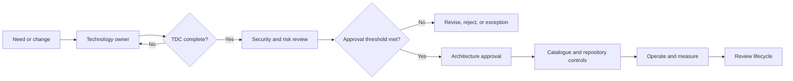
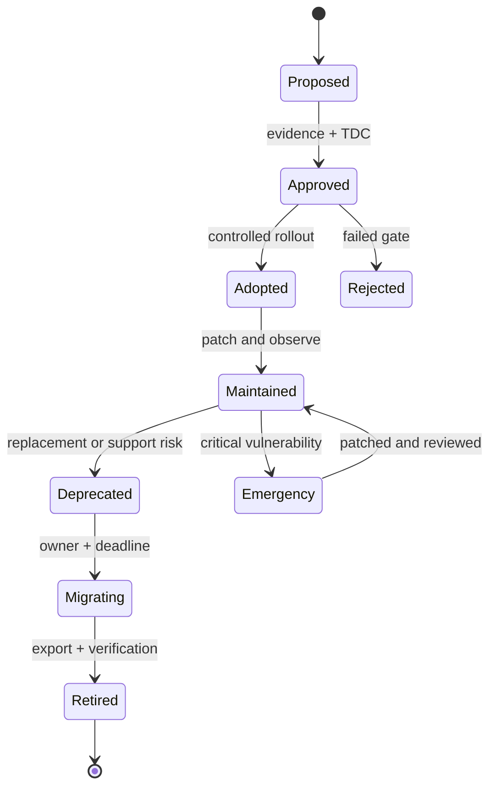
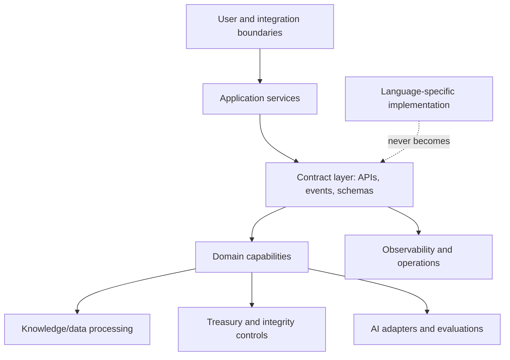
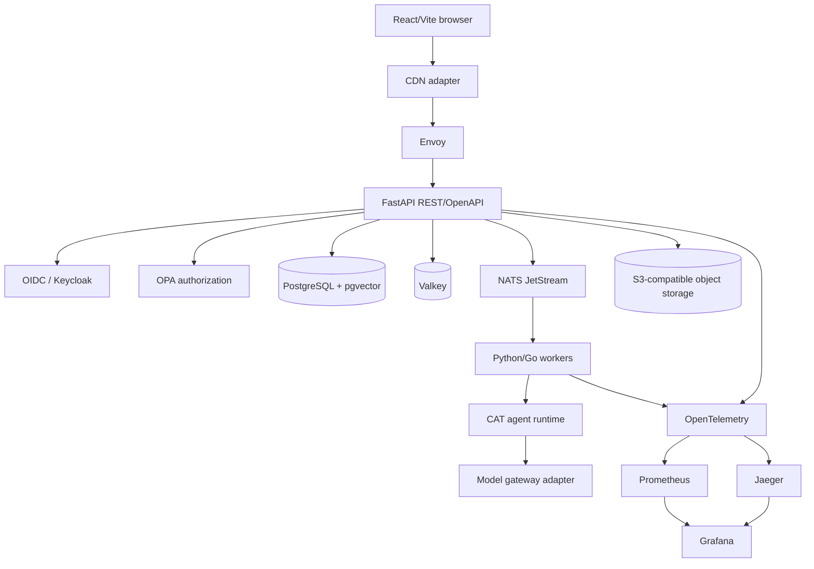
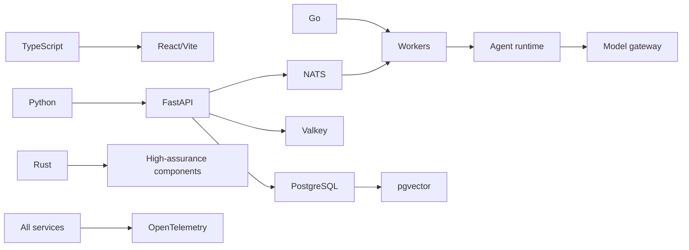
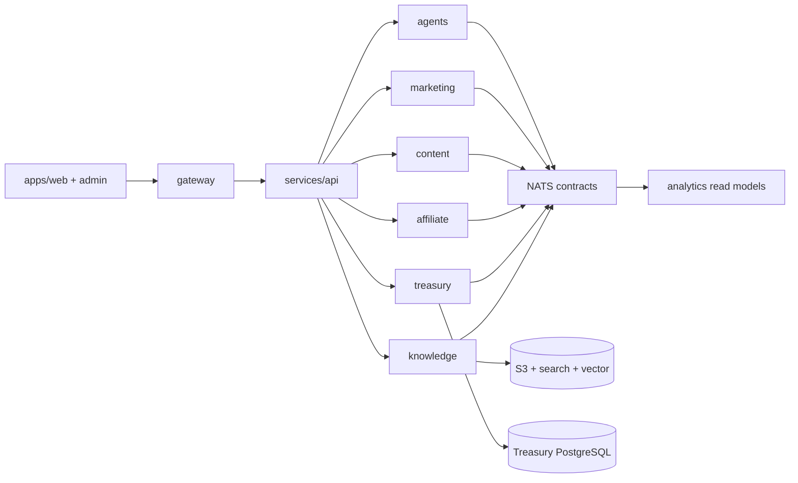
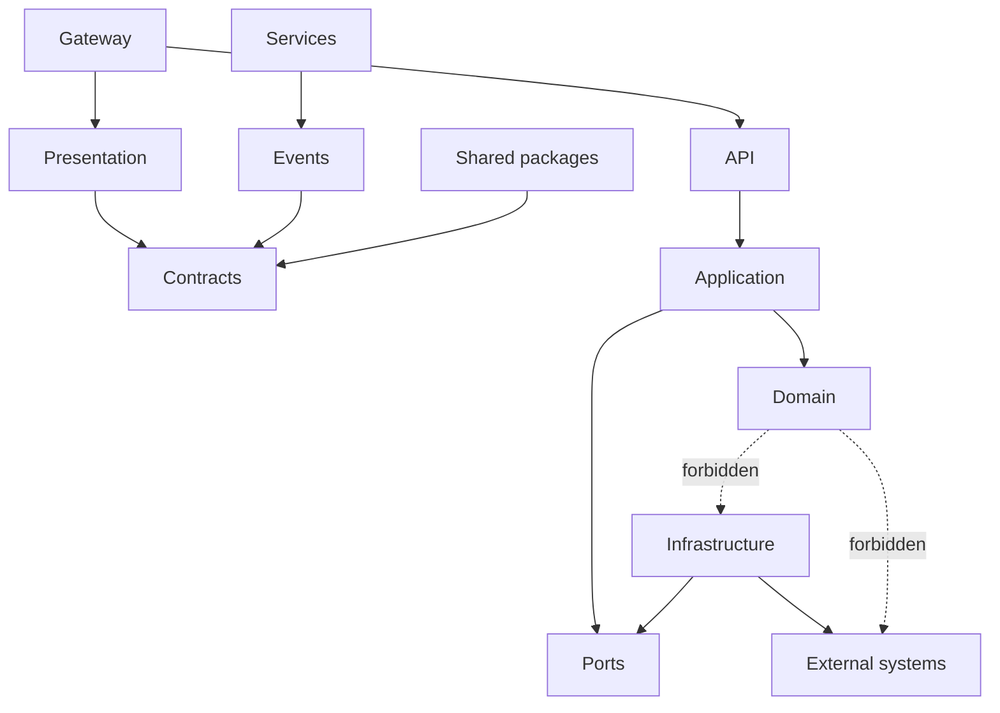
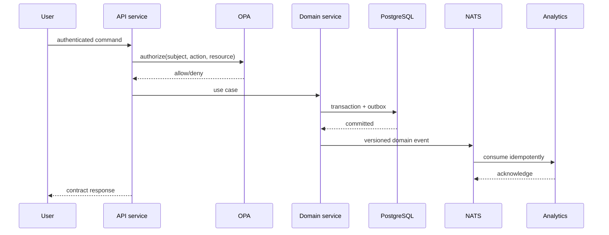
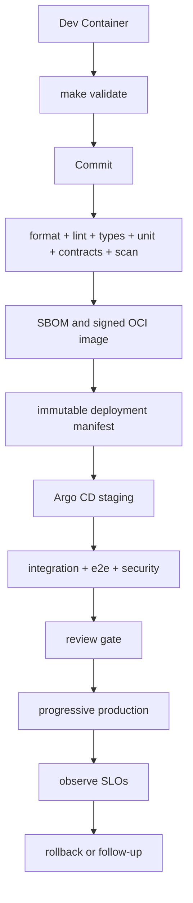
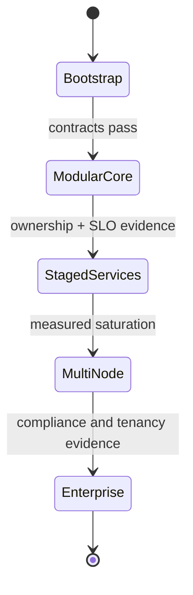

# CAT Technology Stack — Part 1

> **Document ID:** CAT-TECH-001
> **Status:** Official — Part 1
> **Scope:** Technology selection method and governing policy
> **Applies to:** Every CAT production system, tool, data product, automation, and AI-assisted change

## Document contract

This document defines **how CAT selects technology**, not the final framework inventory. It is intentionally framework-neutral. Concrete runtime, framework, database, cloud-service, and model selections begin in [Part 2](03_TECH_STACK.md) and must be recorded as Technology Decision Cards (TDCs). No implementation may infer an unrecorded technology choice from this document.

**Normative language:** **MUST** and **MUST NOT** are mandatory; **SHOULD** and **SHOULD NOT** are strong defaults; **MAY** is discretionary. This document operates with the completed [project context](00_PROJECT_CONTEXT.md), [project overview](01_PROJECT_OVERVIEW.md), and [CAT Constitution](02_PROJECT_RULES.md). Where a conflict exists, the Constitution wins.

---

## Contents

1. [Technology Philosophy](#1-technology-philosophy)
2. [Technology Selection Principles](#2-technology-selection-principles)
3. [Technology Governance](#3-technology-governance)
4. [Technology Decision Framework](#4-technology-decision-framework)
5. [Decision Criteria](#5-decision-criteria)
6. [Build vs Buy Strategy](#6-build-vs-buy-strategy)
7. [Open Source Policy](#7-open-source-policy)
8. [Vendor Lock-in Policy](#8-vendor-lock-in-policy)
9. [Cloud Neutrality Philosophy](#9-cloud-neutrality-philosophy)
10. [Long-Term Support Philosophy](#10-long-term-support-philosophy)
11. [Version Management Philosophy](#11-version-management-philosophy)
12. [Upgrade Strategy](#12-upgrade-strategy)
13. [Backward Compatibility Philosophy](#13-backward-compatibility-philosophy)
14. [Technology Lifecycle](#14-technology-lifecycle)
15. [Technology Risk Assessment](#15-technology-risk-assessment)
16. [AI Technology Selection Principles](#16-ai-technology-selection-principles)
17. [Programming Language Strategy](#17-programming-language-strategy)
18. [Polyglot Architecture Philosophy](#18-polyglot-architecture-philosophy)
19. [Why CAT Is Multi-Language](#19-why-cat-is-multi-language)
20. [Official Technology Decision Process](#20-official-technology-decision-process)
21. [Technology Decision Card standard](#technology-decision-card-standard)
22. [Visual index](#visual-index)

---

## 1. Technology Philosophy

Technology is a governed means to deliver CAT’s business and trust outcomes, never an identity or a novelty target. CAT prefers boring, observable, well-supported, replaceable components over fashionable complexity. A technology earns adoption by solving a verified problem with an acceptable total cost of ownership (TCO), security posture, operational burden, and exit path.

The stack is a product: its users are developers, operators, auditors, AI coding agents, and future maintainers. Every choice therefore requires a reason, an owner, measurable acceptance criteria, documentation, and a retirement path.

## 2. Technology Selection Principles

1. **Outcome before tool:** begin with a capability and constraint, not a favorite technology.
2. **Smallest sufficient surface:** select the least complex option that meets present and forecast requirements.
3. **Explicit trade-offs:** record benefits, costs, rejected alternatives, uncertainty, and reversibility.
4. **Security and privacy by default:** threat model before approval; secrets and sensitive data never become selection afterthoughts.
5. **Operational reality:** favor technologies the team can test, monitor, recover, and staff.
6. **Interoperability:** use open protocols, portable data formats, and stable interfaces where practical.
7. **Evidence over marketing:** validate claims with benchmarks, prototypes, documentation, and references.
8. **AI legibility:** choose tools that AI agents can use safely and humans can review deterministically.
9. **Lifecycle accountability:** adoption includes patching, upgrades, migration, and decommissioning.
10. **Reversibility proportional to risk:** the more strategic or irreversible a decision, the stronger its portability and approval requirements.

## 3. Technology Governance

The Architecture/Technology owner maintains the technology catalogue, TDC index, approved versions, exceptions, and lifecycle states. Security, privacy, finance, operations, and domain owners review decisions when their risk is material. A TDC is the authoritative decision record; a repository manifest expresses the decision in code.

No technology is “official” merely because it appears in a dependency file. Production use requires an approved TDC, an accountable owner, security review, support plan, observability plan, and rollback or migration plan. Exceptions are time-bounded, scoped, and tracked as debt.



**Diagram ID:** TECH-VIS-001
**Title:** Technology governance control loop
**Purpose:** Show that selection, implementation, operation, and retirement are one governed lifecycle.

## 4. Technology Decision Framework

A decision proceeds through: problem definition, constraints, candidate discovery, evidence gathering, risk assessment, comparative scoring, prototype where uncertainty is material, approval, controlled adoption, and post-adoption review. A decision MUST be revisited when assumptions, threat exposure, cost, scale, legal conditions, or vendor viability materially change.

### Decision tree

```text
Is there a demonstrated capability gap?
├─ No → Do not add technology; remove accidental complexity.
└─ Yes
   ├─ Can an existing approved capability satisfy it? → Reuse and document.
   └─ No
      ├─ Is it commodity and non-differentiating? → Evaluate buy/use-managed service.
      └─ No → Evaluate build or extend with explicit ownership.
          ├─ Data/control cannot leave CAT? → Prefer self-controlled or portable design.
          ├─ Failure is safety/security critical? → Require threat model and fallback.
          └─ Uncertainty high? → Time-box a proof of concept before approval.
```

**Decision tree ID:** TECH-TREE-001
**Title:** First-pass technology decision tree
**Purpose:** Prevent tool-first decisions and route high-risk choices to stronger evidence.

## 5. Decision Criteria

Each candidate receives written evidence against these criteria. Scores never replace judgment; a low score in a non-compensable criterion (security, legality, operability, or data integrity) is a rejection.

| Criterion | Required question | Evidence expected |
|---|---|---|
| Capability fit | Does it meet the stated functional and quality requirements? | Acceptance tests, prototype |
| Security | Can CAT harden, patch, isolate, and audit it? | Threat model, advisories, controls |
| Privacy/compliance | Does data handling satisfy obligations and policy? | Data-flow and legal review |
| Reliability | What are failure modes, recovery, and SLO implications? | Failure tests, support history |
| Performance | Does it meet measured latency, throughput, and resource budgets? | Reproducible benchmark |
| Operability | Can the team deploy, observe, debug, and recover it? | Runbook, telemetry plan |
| Maintainability | Is the code/API understandable and testable? | Documentation, test strategy |
| Ecosystem/support | Are maintainers, releases, and skills credible? | Maintainer and release evidence |
| TCO | What is five-year total cost, including people and exit? | Cost model, staffing estimate |
| Portability | Can data, interfaces, and workloads move? | Export test, open protocol |
| AI suitability | Can agents use it within least privilege and review gates? | Agent notes, fixtures, docs |
| Reversibility | What is the cost and blast radius of replacement? | Migration design, coupling map |

## 6. Build vs Buy Strategy

CAT builds differentiating domain logic, trust controls, decision policies, and integrations where ownership creates durable advantage. CAT buys, adopts, or consumes managed services for commodity capabilities when their contract, security, cost, and exit path are acceptable. “Buy” includes hosted and open-source adoption; it does not transfer accountability.

The evaluation MUST include build cost, buy cost, integration cost, operational cost, data/control implications, failure dependency, switching cost, and a minimum viable exit. A build decision requires a staffing and maintenance owner; a buy decision requires supplier due diligence and continuity planning.

## 7. Open Source Policy

Open source is preferred where it improves transparency, portability, inspectability, or ecosystem resilience. It is not automatically safer or cheaper. Before adoption, record license compatibility, transitive licenses, maintainer health, release and vulnerability practice, provenance, support options, and contribution obligations. Pin and inventory dependencies, scan them continuously, and preserve notices. Unmaintained, ambiguous-license, compromised, or non-reproducible dependencies require rejection or an approved exception.

## 8. Vendor Lock-in Policy

Lock-in is accepted only when the capability or economics justify it and the dependency is consciously governed. CAT MUST isolate vendor-specific adapters, own canonical data, define export formats, document service assumptions, and test the exit path at a risk-appropriate frequency. No vendor-specific feature may silently become a domain contract. A TDC MUST state lock-in level (low/medium/high), switching estimate, and trigger conditions for migration.

## 9. Cloud Neutrality Philosophy

Cloud neutrality means preserving meaningful choice, not pretending all providers are identical. CAT separates business interfaces from infrastructure adapters, uses portable protocols and infrastructure definitions where useful, and avoids unnecessary proprietary coupling. Provider-native capabilities MAY be selected for material value, provided the TDC documents the benefit, data residency, outage plan, cost guardrails, and exit strategy. Neutrality MUST NOT sacrifice security, reliability, or responsible economics.

## 10. Long-Term Support Philosophy

CAT chooses technologies with a credible maintenance horizon longer than the feature horizon. “Supported” means known patch process, release cadence, documentation, compatibility policy, and an owner—not merely a large user count. End-of-life dates are monitored. Critical components require overlapping migration time before support ends; unsupported components are prohibited in new production paths.

## 11. Version Management Philosophy

Versions are controlled inputs. CAT records language/runtime, toolchain, direct dependencies, transitive lockfiles, container bases, model versions, schemas, and provider API versions. Builds MUST be reproducible or explain unavoidable variance. Ranges are constrained by policy; upgrades are reviewed, tested, and attributable. Security patches are urgent changes, not a reason to abandon traceability.

## 12. Upgrade Strategy

Upgrades are planned changes: inventory impact, read release notes, assess CVEs and breaking changes, update in an isolated branch, run unit/integration/contract/performance/security tests, deploy progressively, observe, and retain rollback. Critical fixes follow an expedited path with a retrospective. Major upgrades require a migration note and explicit compatibility window. No “latest” tags in production artifacts.



**Diagram ID:** TECH-VIS-002
**Title:** Technology lifecycle states
**Purpose:** Define permitted movement from proposal to retirement, including emergency handling.

## 13. Backward Compatibility Philosophy

Compatibility is a promise made at a boundary: API, event, schema, data export, CLI, configuration, or model behavior. CAT prefers additive evolution, explicit versioning, tolerant readers, migration tooling, and deprecation windows. A breaking change requires impact analysis, owner approval, communication, migration instructions, telemetry, and a rollback or restoration plan. Internal implementation details are not compatibility promises unless documented as such.

## 14. Technology Lifecycle

Every technology has an owner, review date, state, supported versions, security posture, dependency map, operating runbook, and exit plan. Reviews are triggered by scheduled cadence and events such as maintainer abandonment, vulnerability, cost variance, SLO failure, legal change, or strategic mismatch. Retirement requires data export, dependency removal, access revocation, documentation update, and evidence that no production path remains.

## 15. Technology Risk Assessment

Risk is evaluated as likelihood × impact across security, privacy, availability, integrity, financial exposure, compliance, skills, supplier concentration, portability, and AI misuse. Assessments identify inherent risk, controls, residual risk, owner, treatment, and review date. High or critical residual risk requires explicit acceptance by the designated authority; “prototype” does not exempt a system handling real sensitive data.

| Level | Meaning | Minimum treatment |
|---|---|---|
| Low | Localized, reversible, non-sensitive | Owner review and tests |
| Medium | Material operational or cost effect | TDC, threat model, rollback |
| High | Significant trust, availability, or lock-in exposure | Board/security approval, staged proof |
| Critical | Safety, legal, systemic, or irreversible impact | Reject until mitigated and executive acceptance |

## 16. AI Technology Selection Principles

AI components require model- and data-specific governance. CAT records model identity/version, provider, training or retrieval data boundaries, retention, region, safety controls, evaluation set, quality thresholds, prompt/interface contract, cost limits, rate limits, fallback, human oversight, and incident response. AI output is untrusted until validated. Selection favors deterministic interfaces, structured output, observability, reproducible evaluations, data minimization, and replaceable model adapters. No model is permitted to select or change production technology autonomously.

## 17. Programming Language Strategy

CAT uses a small, intentional language portfolio. A language is approved for a bounded capability, not personal preference. Selection considers safety, ecosystem, runtime behavior, hiring and review capacity, tooling, interoperability, deployment footprint, and long-term support. Each language has an owner, style/toolchain policy, test expectations, security guidance, and approved use cases. New languages require a TDC and must justify capability or risk reduction that the existing portfolio cannot provide.

## 18. Polyglot Architecture Philosophy

Polyglot means purposeful specialization behind explicit contracts—not unrestricted variety. Services communicate through documented protocols and schemas; language-specific libraries do not cross domain boundaries. Shared behavior belongs in contracts, generated clients, or carefully governed libraries rather than duplicated folklore. The cost of another language includes CI images, scanners, observability, training, on-call, upgrades, and incident response.

## 19. Why CAT Is Multi-Language

CAT spans user-facing products, orchestration, data and knowledge processing, financial integrity, automation, and AI evaluation. These workloads may have different safety, throughput, ecosystem, and iteration needs. A multi-language strategy permits fit-for-purpose engineering while contracts preserve coherence. It is not permission to introduce a language per feature: each addition must demonstrate net value after lifecycle cost and provide a clear boundary.



**Diagram ID:** TECH-VIS-003
**Title:** Polyglot boundary map
**Purpose:** Keep language choice inside bounded capabilities and contracts.

## 20. Official Technology Decision Process

1. **Open:** owner records the problem, non-goals, constraints, data classification, and success measures.
2. **Discover:** inventory approved reuse and candidates; include build, buy, and do-nothing options.
3. **Investigate:** gather evidence, threat model, TCO, portability, support, and AI-operability findings.
4. **Compare:** score criteria, document uncertainty and rejected options, and define acceptance tests.
5. **Prove:** run a time-boxed prototype when evidence is insufficient; prototypes use synthetic or approved data.
6. **Decide:** complete the TDC; obtain required reviewers and record approval or rejection.
7. **Adopt:** implement pinned versions, controls, telemetry, tests, runbooks, and migration/rollback.
8. **Review:** measure outcomes at the TDC review date and after material incidents.
9. **Retire:** migrate, verify, remove, and close the decision with evidence.

### Technology map

```text
CAT technology system
├── Governance: TDCs · ADRs · catalogue · exceptions
├── Delivery: source · build · test · artifact · release
├── Runtime: application · data · AI · integrations
├── Trust: identity · secrets · policy · audit · privacy
├── Operations: telemetry · SLOs · incident · recovery · cost
└── Lifecycle: support → deprecate → migrate → retire
```

**Visual ID:** TECH-VIS-004
**Title:** CAT technology map
**Purpose:** Ensure a selection accounts for the whole system, not only a package name.

---

# Technology Decision Card standard

A **Technology Decision Card (TDC)** is the required, reviewable record for selecting, retaining, exceptionally using, or retiring a technology. One card covers one coherent decision; related components may be grouped only when they share owner, lifecycle, and risk. TDC IDs are immutable and sequential (`TDC-001`). Status is one of `Proposed`, `Approved`, `Adopted`, `Deprecated`, `Retired`, or `Rejected`.

## Complete schema

```yaml
id: TDC-001
technology: "name and category"
status: Proposed
version: "exact version or supported range"
owner: "team and accountable person"
purpose: "capability and bounded scope"
why_selected: "evidence-based rationale and trade-offs"
alternatives:
  - "candidate, evidence, and comparative outcome"
rejected_technologies:
  - "technology, rejection reason, revisit trigger"
dependencies: ["runtime, service, data, people, contracts"]
risks:
  - risk: "description"
    likelihood: low
    impact: medium
    treatment: "control"
    residual: low
migration_strategy: "adoption, exit, data export, and rollback"
upgrade_policy: "cadence, compatibility, security path"
performance: "budgets, benchmark, acceptance threshold"
security: "threat model, controls, advisories, data handling"
ai_coding_notes: "safe usage, tests, forbidden patterns, agent permissions"
human_notes: "operations, support, known limitations"
example_repository: "path or repository with canonical implementation"
related_rules: ["CAT-RULE-000"]
related_adr: ["ADR-000"]
decision_criteria: "scores, weights, and non-compensable gates"
constraints: ["legal, residency, reliability, cost, compatibility"]
interfaces: ["API, event, schema, adapter, export format"]
observability: "metrics, logs, traces, alerts, ownership"
compliance: "applicable obligations and evidence location"
tco: "five-year or justified horizon estimate"
lock_in: "low | medium | high; dependency and exit estimate"
review_date: "YYYY-MM-DD"
triggers: ["support end, CVE, cost, scale, incident"]
approvers: ["role, name, date"]
change_history: ["date, change, author"]
```

## TDC completion rules

- `purpose`, `why_selected`, `alternatives`, `risks`, `migration_strategy`, `security`, `owner`, and `review_date` are mandatory for approval.
- Version, license/provenance, support horizon, and repository location MUST be exact enough to reproduce the decision.
- “None” is not acceptable evidence: a field is `not applicable` only with a reason.
- Changes to scope, version family, risk, or exit assumptions create a new revision; a changed decision creates a new TDC when traceability would otherwise be ambiguous.
- TDCs link to implementation, tests, runbooks, [Rules](02_PROJECT_RULES.md), and ADRs. Links MUST be repository-relative and checked.

### Example card (illustrative; not a framework selection)

| Field | Example |
|---|---|
| ID / Technology | `TDC-001` / “approved language runtime for bounded service” |
| Status / Version | Proposed / `version TBD in Part 2` |
| Owner / Purpose | Platform team / execute the service boundary safely |
| Why selected | Pending evidence; illustrates required format only |
| Alternatives / Rejected | Existing approved runtime; rejected candidates recorded with reasons |
| Risks / Migration | Support and staffing risk / adapter, contract tests, export, rollback |
| Performance / Security | Benchmark and threat-model thresholds required |
| AI coding notes | Agent MUST follow repository toolchain and tests; no unapproved dependency |
| Human notes | Runbook, on-call, license, cost, and support evidence required |
| Example repository | `context/` until canonical implementation exists |
| Related Rules / ADR | `02_PROJECT_RULES.md`; ADR recorded at approval |

---

# Visual index

| ID | Type | Title | Purpose |
|---|---|---|---|
| TECH-VIS-001 | Mermaid | Governance control loop | Govern selection through retirement |
| TECH-TREE-001 | ASCII | First-pass decision tree | Route needs to reuse/build/buy/proof |
| TECH-VIS-002 | Mermaid | Technology lifecycle states | Make lifecycle transitions explicit |
| TECH-VIS-003 | Mermaid | Polyglot boundary map | Constrain language-specific implementation |
| TECH-VIS-004 | ASCII | CAT technology map | Cover governance, trust, delivery, runtime, operations |

## Cross-reference and validation contract

Before merge, the author MUST validate Markdown rendering, Mermaid syntax in every fenced Mermaid block, repository-relative links, TDC schema completeness, and consistency with the Rules and ADR indexes. A validator SHOULD fail on missing headings, unknown TDC statuses, unpinned production versions, broken links, or an unowned technology. Part 2 MUST populate concrete framework cards without weakening this method.

**Next:** `context/03_TECH_STACK.md` — Part 2, concrete technology selections, each justified by an approved TDC.

# Part 2 — Official Core Technology Stack

> **Part ID:** CAT-TECH-002
> **Decision boundary:** These are the implementation defaults for CAT. A team MUST use an **OFFICIAL** choice unless an approved exception or a more specific TDC exists. `CANDIDATE` means evaluated but not approved for production; `EXPERIMENTAL` means isolated research only. Versions below are baseline families and MUST be pinned exactly in repositories.

## Core stack decision register

| Area | Official technology | Baseline | Stability | Why it won |
|---|---|---:|---|---|
| Primary language | Python | 3.12+ | OFFICIAL | AI/data ecosystem and delivery speed |
| Systems language | Go | 1.23+ | OFFICIAL | Simple, fast, operationally predictable services |
| Integrity/performance | Rust | 1.82+ | OFFICIAL | Memory safety and high-assurance boundaries |
| Web language | TypeScript | 5.6+ | OFFICIAL | Typed browser and contract tooling |
| Automation | POSIX shell + Make | POSIX / 4.4+ | OFFICIAL | Portable, inspectable automation |
| Backend | FastAPI + standard library patterns | 0.115+ | OFFICIAL | Typed HTTP with low ceremony |
| Frontend | React + Vite | 19+ / 6+ | OFFICIAL | Component ecosystem and fast builds |
| AI framework | LangChain Core (bounded) | 0.3+ | CANDIDATE | Useful adapters; domain logic stays CAT-owned |
| Agent runtime | CAT-owned Python runtime | 0.1 | OFFICIAL | Explicit permissions and auditability |
| API | OpenAPI 3.1 + REST/JSON | 3.1 | OFFICIAL | Interoperable, reviewable contracts |
| AuthN | OAuth 2.1 / OIDC via Keycloak | 26+ | OFFICIAL | Standards and self-hostable identity |
| AuthZ | OPA + Rego | 1.0+ | OFFICIAL | Central, testable policy decisions |
| Database | PostgreSQL | 17+ | OFFICIAL | Transactional integrity and broad ecosystem |
| Cache | Redis-compatible Valkey | 8+ | OFFICIAL | Fast ephemeral state without proprietary dependency |
| Queue | NATS JetStream | 2.10+ | OFFICIAL | Durable messaging with simple operations |
| Object storage | S3-compatible API (MinIO local) | API v4 | OFFICIAL | Portable blobs and lifecycle controls |
| Search | OpenSearch | 2.17+ | OFFICIAL | Full-text and aggregations with open API |
| Knowledge graph | Apache Jena/Fuseki | 5+ | CANDIDATE | Standards-based RDF/SPARQL; validate workload first |
| Vector database | pgvector on PostgreSQL | 0.8+ | OFFICIAL | Co-locates embeddings and transactional metadata |
| Model gateway | LiteLLM gateway behind CAT adapter | 1.70+ | CANDIDATE | Provider abstraction; security review required |
| Workflow | Temporal | 1.x | CANDIDATE | Durable execution; adopt after operational proof |
| Scheduler | Kubernetes CronJob / system scheduler | current | OFFICIAL | Fewer moving parts for periodic work |
| Configuration | typed environment + Pydantic Settings | 2+ | OFFICIAL | Explicit, twelve-factor, testable configuration |
| Secrets | External Secrets + Vault | 0.10+ / 1.17+ | CANDIDATE | Strong secret lifecycle; deployment choice pending |
| Logging | OpenTelemetry Logs + structured JSON | 1.x | OFFICIAL | Correlated, vendor-neutral records |
| Metrics | Prometheus + OpenTelemetry | 3+ / 1.x | OFFICIAL | Mature pull model and standard instrumentation |
| Tracing | OpenTelemetry + Jaeger | 1.x / 2+ | OFFICIAL | Portable traces and useful local UI |
| Monitoring | Grafana | 11+ | OFFICIAL | Unified dashboards and alerts |
| Container runtime | OCI containers + containerd | 2+ | OFFICIAL | Standard image/runtime boundary |
| Orchestration | Kubernetes | 1.31+ | OFFICIAL | Required workload portability and controls |
| Reverse proxy | Envoy | 1.31+ | OFFICIAL | L7 policy, telemetry, and extensibility |
| CDN | Cloud-neutral CDN adapter | N/A | CANDIDATE | Provider selected only per deployment TDC |
| IaC | OpenTofu | 1.8+ | OFFICIAL | Declarative provisioning with open governance |
| CI/CD | GitHub Actions + Argo CD | current / 2+ | OFFICIAL | Repository-native CI and pull-based CD |
| Testing | pytest, Playwright, Go test, cargo test | current | OFFICIAL | Layered unit, contract, browser, and race testing |
| Documentation | Markdown + MkDocs Material | 1.6+ | OFFICIAL | Git-native searchable documentation |
| Python packages | uv | 0.4+ | OFFICIAL | Fast locked environments |
| Go packages | Go modules | language-native | OFFICIAL | Reproducible standard dependency model |
| Rust packages | Cargo | language-native | OFFICIAL | Integrated build, test, and audit ecosystem |
| JS packages | pnpm | 9+ | OFFICIAL | Efficient workspace and lockfile semantics |
| Code quality | Ruff, mypy, golangci-lint, rustfmt, ESLint | current | OFFICIAL | Fast automated correctness gates |
| Local development | Dev Containers + Docker Compose | current | OFFICIAL | Reproducible onboarding and service topology |

**Rejected by default:** uncontrolled microframework proliferation, proprietary databases without an exit, unpinned images, bespoke identity, ad-hoc cron on application hosts, and local-only credentials. Alternatives not listed as official are CANDIDATE only until a new approved TDC supersedes this register.

## Comparison decisions

| Decision | Chosen | Considered | Reason for choice |
|---|---|---|---|
| Transaction store | PostgreSQL | MySQL, MongoDB | Strong transactions, JSON support, extensions, portability |
| Messaging | NATS JetStream | Kafka, RabbitMQ | Lower operational burden for CAT’s initial event scale; durable streams remain available |
| Cache | Valkey | Redis, Memcached | Open governance and Redis protocol compatibility; richer than Memcached |
| Frontend | React/Vite | Vue, Angular, Next.js | CAT needs a client application, not a mandatory server framework |
| IaC | OpenTofu | Terraform, Pulumi | Open license/governance and declarative portability |
| API style | REST/OpenAPI | GraphQL, gRPC | Public reviewability, browser reach, and generated contracts |
| Vector search | pgvector | Milvus, Qdrant | Avoid a second stateful system until scale proves it necessary |
| CI/CD | Actions + Argo CD | Jenkins, GitLab CI | Existing Git workflow plus auditable GitOps deployment |

## Official integration architecture



**Diagram ID:** TECH-VIS-005
**Title:** CAT core technology architecture
**Purpose:** Show official boundaries and the approved flow of requests, data, events, AI, and telemetry.

## Technology dependency graph



**Diagram ID:** TECH-VIS-006
**Title:** Package and runtime relationships
**Purpose:** Make core dependency direction visible and prevent circular platform coupling.

# Technology Decision Cards

The following cards are the official Part 2 decisions. They use the complete schema defined in Part 1; `ADR-TBD` is a deliberate placeholder for the ADR created when the corresponding implementation lands. Every card includes implementation guidance so AI coding agents can act without inventing stack choices.

# Technology Decision Cards

Every register entry below is an official card. Concrete repository manifests MUST pin the stated baseline to an exact patch version.


### TDC-002 — Python

- **Official Status:** OFFICIAL
- **Version:** `3.12+`
- **Stability:** OFFICIAL; review annually and on security, cost, support, or scale triggers.
- **Purpose:** Primary language.
- **Selection Reason:** AI/data ecosystem and delivery speed.
- **Why not alternatives:** Alternatives remain non-official because they add complexity, reduce portability, weaken fit, or lack CAT evidence; a replacement requires a new TDC.
- **Risks:** Operational, supply-chain, upgrade, and skills risk; owner records residual risk and mitigations.
- **Upgrade Policy:** Pin versions; patch urgently; test minor upgrades in CI; major upgrades require migration notes, compatibility tests, staged rollout, and rollback.
- **Migration Strategy:** Isolate behind an interface, export canonical data, rehearse restoration, and retain an exit trigger.
- **Dependencies:** Repository CI, OCI build, security scanning, telemetry, and the adjacent interfaces in the technology map.
- **Performance Expectations:** Establish workload-specific SLOs and reproducible benchmarks before production; regressions block release.
- **Security Considerations:** Verified provenance, least privilege, TLS where applicable, secret-free logs, vulnerability scanning, and owner-reviewed configuration.
- **Scalability Considerations:** Prefer stateless replicas; scale stateful components only after measured saturation and tested recovery.
- **AI Coding Instructions:** Use only the pinned version and canonical examples; do not introduce an alternative; add tests and update the card when boundaries change.
- **Human Developer Notes:** Read the runbook, own operational consequences, and never treat CANDIDATE or EXPERIMENTAL technology as production-approved.
- **Example Project Structure:** `src/<bounded_context>/`, `tests/`, `config/`, `deploy/`, `docs/decisions/TDC-002.md`.
- **Example Configuration:** `version: 3.12+; environment: development; telemetry: otlp; secrets: external`
- **Example Commands:** `make validate`; technology-specific commands belong in the repository README and CI.
- **Related Rules:** [`02_PROJECT_RULES.md`](02_PROJECT_RULES.md) (technology governance, security, testing, and lifecycle rules).
- **Related ADR:** `ADR-002` (created when implementation is introduced).


### TDC-003 — Go

- **Official Status:** OFFICIAL
- **Version:** `1.23+`
- **Stability:** OFFICIAL; review annually and on security, cost, support, or scale triggers.
- **Purpose:** Systems language.
- **Selection Reason:** Simple, fast, operationally predictable services.
- **Why not alternatives:** Alternatives remain non-official because they add complexity, reduce portability, weaken fit, or lack CAT evidence; a replacement requires a new TDC.
- **Risks:** Operational, supply-chain, upgrade, and skills risk; owner records residual risk and mitigations.
- **Upgrade Policy:** Pin versions; patch urgently; test minor upgrades in CI; major upgrades require migration notes, compatibility tests, staged rollout, and rollback.
- **Migration Strategy:** Isolate behind an interface, export canonical data, rehearse restoration, and retain an exit trigger.
- **Dependencies:** Repository CI, OCI build, security scanning, telemetry, and the adjacent interfaces in the technology map.
- **Performance Expectations:** Establish workload-specific SLOs and reproducible benchmarks before production; regressions block release.
- **Security Considerations:** Verified provenance, least privilege, TLS where applicable, secret-free logs, vulnerability scanning, and owner-reviewed configuration.
- **Scalability Considerations:** Prefer stateless replicas; scale stateful components only after measured saturation and tested recovery.
- **AI Coding Instructions:** Use only the pinned version and canonical examples; do not introduce an alternative; add tests and update the card when boundaries change.
- **Human Developer Notes:** Read the runbook, own operational consequences, and never treat CANDIDATE or EXPERIMENTAL technology as production-approved.
- **Example Project Structure:** `src/<bounded_context>/`, `tests/`, `config/`, `deploy/`, `docs/decisions/TDC-003.md`.
- **Example Configuration:** `version: 1.23+; environment: development; telemetry: otlp; secrets: external`
- **Example Commands:** `make validate`; technology-specific commands belong in the repository README and CI.
- **Related Rules:** [`02_PROJECT_RULES.md`](02_PROJECT_RULES.md) (technology governance, security, testing, and lifecycle rules).
- **Related ADR:** `ADR-003` (created when implementation is introduced).


### TDC-004 — Rust

- **Official Status:** OFFICIAL
- **Version:** `1.82+`
- **Stability:** OFFICIAL; review annually and on security, cost, support, or scale triggers.
- **Purpose:** Integrity/performance.
- **Selection Reason:** Memory safety and high-assurance boundaries.
- **Why not alternatives:** Alternatives remain non-official because they add complexity, reduce portability, weaken fit, or lack CAT evidence; a replacement requires a new TDC.
- **Risks:** Operational, supply-chain, upgrade, and skills risk; owner records residual risk and mitigations.
- **Upgrade Policy:** Pin versions; patch urgently; test minor upgrades in CI; major upgrades require migration notes, compatibility tests, staged rollout, and rollback.
- **Migration Strategy:** Isolate behind an interface, export canonical data, rehearse restoration, and retain an exit trigger.
- **Dependencies:** Repository CI, OCI build, security scanning, telemetry, and the adjacent interfaces in the technology map.
- **Performance Expectations:** Establish workload-specific SLOs and reproducible benchmarks before production; regressions block release.
- **Security Considerations:** Verified provenance, least privilege, TLS where applicable, secret-free logs, vulnerability scanning, and owner-reviewed configuration.
- **Scalability Considerations:** Prefer stateless replicas; scale stateful components only after measured saturation and tested recovery.
- **AI Coding Instructions:** Use only the pinned version and canonical examples; do not introduce an alternative; add tests and update the card when boundaries change.
- **Human Developer Notes:** Read the runbook, own operational consequences, and never treat CANDIDATE or EXPERIMENTAL technology as production-approved.
- **Example Project Structure:** `src/<bounded_context>/`, `tests/`, `config/`, `deploy/`, `docs/decisions/TDC-004.md`.
- **Example Configuration:** `version: 1.82+; environment: development; telemetry: otlp; secrets: external`
- **Example Commands:** `make validate`; technology-specific commands belong in the repository README and CI.
- **Related Rules:** [`02_PROJECT_RULES.md`](02_PROJECT_RULES.md) (technology governance, security, testing, and lifecycle rules).
- **Related ADR:** `ADR-004` (created when implementation is introduced).


### TDC-005 — TypeScript

- **Official Status:** OFFICIAL
- **Version:** `5.6+`
- **Stability:** OFFICIAL; review annually and on security, cost, support, or scale triggers.
- **Purpose:** Web language.
- **Selection Reason:** Typed browser and contract tooling.
- **Why not alternatives:** Alternatives remain non-official because they add complexity, reduce portability, weaken fit, or lack CAT evidence; a replacement requires a new TDC.
- **Risks:** Operational, supply-chain, upgrade, and skills risk; owner records residual risk and mitigations.
- **Upgrade Policy:** Pin versions; patch urgently; test minor upgrades in CI; major upgrades require migration notes, compatibility tests, staged rollout, and rollback.
- **Migration Strategy:** Isolate behind an interface, export canonical data, rehearse restoration, and retain an exit trigger.
- **Dependencies:** Repository CI, OCI build, security scanning, telemetry, and the adjacent interfaces in the technology map.
- **Performance Expectations:** Establish workload-specific SLOs and reproducible benchmarks before production; regressions block release.
- **Security Considerations:** Verified provenance, least privilege, TLS where applicable, secret-free logs, vulnerability scanning, and owner-reviewed configuration.
- **Scalability Considerations:** Prefer stateless replicas; scale stateful components only after measured saturation and tested recovery.
- **AI Coding Instructions:** Use only the pinned version and canonical examples; do not introduce an alternative; add tests and update the card when boundaries change.
- **Human Developer Notes:** Read the runbook, own operational consequences, and never treat CANDIDATE or EXPERIMENTAL technology as production-approved.
- **Example Project Structure:** `src/<bounded_context>/`, `tests/`, `config/`, `deploy/`, `docs/decisions/TDC-005.md`.
- **Example Configuration:** `version: 5.6+; environment: development; telemetry: otlp; secrets: external`
- **Example Commands:** `make validate`; technology-specific commands belong in the repository README and CI.
- **Related Rules:** [`02_PROJECT_RULES.md`](02_PROJECT_RULES.md) (technology governance, security, testing, and lifecycle rules).
- **Related ADR:** `ADR-005` (created when implementation is introduced).


### TDC-006 — POSIX shell + Make

- **Official Status:** OFFICIAL
- **Version:** `POSIX / 4.4+`
- **Stability:** OFFICIAL; review annually and on security, cost, support, or scale triggers.
- **Purpose:** Automation.
- **Selection Reason:** Portable, inspectable automation.
- **Why not alternatives:** Alternatives remain non-official because they add complexity, reduce portability, weaken fit, or lack CAT evidence; a replacement requires a new TDC.
- **Risks:** Operational, supply-chain, upgrade, and skills risk; owner records residual risk and mitigations.
- **Upgrade Policy:** Pin versions; patch urgently; test minor upgrades in CI; major upgrades require migration notes, compatibility tests, staged rollout, and rollback.
- **Migration Strategy:** Isolate behind an interface, export canonical data, rehearse restoration, and retain an exit trigger.
- **Dependencies:** Repository CI, OCI build, security scanning, telemetry, and the adjacent interfaces in the technology map.
- **Performance Expectations:** Establish workload-specific SLOs and reproducible benchmarks before production; regressions block release.
- **Security Considerations:** Verified provenance, least privilege, TLS where applicable, secret-free logs, vulnerability scanning, and owner-reviewed configuration.
- **Scalability Considerations:** Prefer stateless replicas; scale stateful components only after measured saturation and tested recovery.
- **AI Coding Instructions:** Use only the pinned version and canonical examples; do not introduce an alternative; add tests and update the card when boundaries change.
- **Human Developer Notes:** Read the runbook, own operational consequences, and never treat CANDIDATE or EXPERIMENTAL technology as production-approved.
- **Example Project Structure:** `src/<bounded_context>/`, `tests/`, `config/`, `deploy/`, `docs/decisions/TDC-006.md`.
- **Example Configuration:** `version: POSIX / 4.4+; environment: development; telemetry: otlp; secrets: external`
- **Example Commands:** `make validate`; technology-specific commands belong in the repository README and CI.
- **Related Rules:** [`02_PROJECT_RULES.md`](02_PROJECT_RULES.md) (technology governance, security, testing, and lifecycle rules).
- **Related ADR:** `ADR-006` (created when implementation is introduced).


### TDC-007 — FastAPI + standard library patterns

- **Official Status:** OFFICIAL
- **Version:** `0.115+`
- **Stability:** OFFICIAL; review annually and on security, cost, support, or scale triggers.
- **Purpose:** Backend.
- **Selection Reason:** Typed HTTP with low ceremony.
- **Why not alternatives:** Alternatives remain non-official because they add complexity, reduce portability, weaken fit, or lack CAT evidence; a replacement requires a new TDC.
- **Risks:** Operational, supply-chain, upgrade, and skills risk; owner records residual risk and mitigations.
- **Upgrade Policy:** Pin versions; patch urgently; test minor upgrades in CI; major upgrades require migration notes, compatibility tests, staged rollout, and rollback.
- **Migration Strategy:** Isolate behind an interface, export canonical data, rehearse restoration, and retain an exit trigger.
- **Dependencies:** Repository CI, OCI build, security scanning, telemetry, and the adjacent interfaces in the technology map.
- **Performance Expectations:** Establish workload-specific SLOs and reproducible benchmarks before production; regressions block release.
- **Security Considerations:** Verified provenance, least privilege, TLS where applicable, secret-free logs, vulnerability scanning, and owner-reviewed configuration.
- **Scalability Considerations:** Prefer stateless replicas; scale stateful components only after measured saturation and tested recovery.
- **AI Coding Instructions:** Use only the pinned version and canonical examples; do not introduce an alternative; add tests and update the card when boundaries change.
- **Human Developer Notes:** Read the runbook, own operational consequences, and never treat CANDIDATE or EXPERIMENTAL technology as production-approved.
- **Example Project Structure:** `src/<bounded_context>/`, `tests/`, `config/`, `deploy/`, `docs/decisions/TDC-007.md`.
- **Example Configuration:** `version: 0.115+; environment: development; telemetry: otlp; secrets: external`
- **Example Commands:** `make validate`; technology-specific commands belong in the repository README and CI.
- **Related Rules:** [`02_PROJECT_RULES.md`](02_PROJECT_RULES.md) (technology governance, security, testing, and lifecycle rules).
- **Related ADR:** `ADR-007` (created when implementation is introduced).


### TDC-008 — React + Vite

- **Official Status:** OFFICIAL
- **Version:** `19+ / 6+`
- **Stability:** OFFICIAL; review annually and on security, cost, support, or scale triggers.
- **Purpose:** Frontend.
- **Selection Reason:** Component ecosystem and fast builds.
- **Why not alternatives:** Alternatives remain non-official because they add complexity, reduce portability, weaken fit, or lack CAT evidence; a replacement requires a new TDC.
- **Risks:** Operational, supply-chain, upgrade, and skills risk; owner records residual risk and mitigations.
- **Upgrade Policy:** Pin versions; patch urgently; test minor upgrades in CI; major upgrades require migration notes, compatibility tests, staged rollout, and rollback.
- **Migration Strategy:** Isolate behind an interface, export canonical data, rehearse restoration, and retain an exit trigger.
- **Dependencies:** Repository CI, OCI build, security scanning, telemetry, and the adjacent interfaces in the technology map.
- **Performance Expectations:** Establish workload-specific SLOs and reproducible benchmarks before production; regressions block release.
- **Security Considerations:** Verified provenance, least privilege, TLS where applicable, secret-free logs, vulnerability scanning, and owner-reviewed configuration.
- **Scalability Considerations:** Prefer stateless replicas; scale stateful components only after measured saturation and tested recovery.
- **AI Coding Instructions:** Use only the pinned version and canonical examples; do not introduce an alternative; add tests and update the card when boundaries change.
- **Human Developer Notes:** Read the runbook, own operational consequences, and never treat CANDIDATE or EXPERIMENTAL technology as production-approved.
- **Example Project Structure:** `src/<bounded_context>/`, `tests/`, `config/`, `deploy/`, `docs/decisions/TDC-008.md`.
- **Example Configuration:** `version: 19+ / 6+; environment: development; telemetry: otlp; secrets: external`
- **Example Commands:** `make validate`; technology-specific commands belong in the repository README and CI.
- **Related Rules:** [`02_PROJECT_RULES.md`](02_PROJECT_RULES.md) (technology governance, security, testing, and lifecycle rules).
- **Related ADR:** `ADR-008` (created when implementation is introduced).


### TDC-009 — LangChain Core (bounded)

- **Official Status:** CANDIDATE
- **Version:** `0.3+`
- **Stability:** CANDIDATE; review annually and on security, cost, support, or scale triggers.
- **Purpose:** AI framework.
- **Selection Reason:** Useful adapters; domain logic stays CAT-owned.
- **Why not alternatives:** Alternatives remain non-official because they add complexity, reduce portability, weaken fit, or lack CAT evidence; a replacement requires a new TDC.
- **Risks:** Operational, supply-chain, upgrade, and skills risk; owner records residual risk and mitigations.
- **Upgrade Policy:** Pin versions; patch urgently; test minor upgrades in CI; major upgrades require migration notes, compatibility tests, staged rollout, and rollback.
- **Migration Strategy:** Isolate behind an interface, export canonical data, rehearse restoration, and retain an exit trigger.
- **Dependencies:** Repository CI, OCI build, security scanning, telemetry, and the adjacent interfaces in the technology map.
- **Performance Expectations:** Establish workload-specific SLOs and reproducible benchmarks before production; regressions block release.
- **Security Considerations:** Verified provenance, least privilege, TLS where applicable, secret-free logs, vulnerability scanning, and owner-reviewed configuration.
- **Scalability Considerations:** Prefer stateless replicas; scale stateful components only after measured saturation and tested recovery.
- **AI Coding Instructions:** Use only the pinned version and canonical examples; do not introduce an alternative; add tests and update the card when boundaries change.
- **Human Developer Notes:** Read the runbook, own operational consequences, and never treat CANDIDATE or EXPERIMENTAL technology as production-approved.
- **Example Project Structure:** `src/<bounded_context>/`, `tests/`, `config/`, `deploy/`, `docs/decisions/TDC-009.md`.
- **Example Configuration:** `version: 0.3+; environment: development; telemetry: otlp; secrets: external`
- **Example Commands:** `make validate`; technology-specific commands belong in the repository README and CI.
- **Related Rules:** [`02_PROJECT_RULES.md`](02_PROJECT_RULES.md) (technology governance, security, testing, and lifecycle rules).
- **Related ADR:** `ADR-009` (created when implementation is introduced).


### TDC-010 — CAT-owned Python runtime

- **Official Status:** OFFICIAL
- **Version:** `0.1`
- **Stability:** OFFICIAL; review annually and on security, cost, support, or scale triggers.
- **Purpose:** Agent runtime.
- **Selection Reason:** Explicit permissions and auditability.
- **Why not alternatives:** Alternatives remain non-official because they add complexity, reduce portability, weaken fit, or lack CAT evidence; a replacement requires a new TDC.
- **Risks:** Operational, supply-chain, upgrade, and skills risk; owner records residual risk and mitigations.
- **Upgrade Policy:** Pin versions; patch urgently; test minor upgrades in CI; major upgrades require migration notes, compatibility tests, staged rollout, and rollback.
- **Migration Strategy:** Isolate behind an interface, export canonical data, rehearse restoration, and retain an exit trigger.
- **Dependencies:** Repository CI, OCI build, security scanning, telemetry, and the adjacent interfaces in the technology map.
- **Performance Expectations:** Establish workload-specific SLOs and reproducible benchmarks before production; regressions block release.
- **Security Considerations:** Verified provenance, least privilege, TLS where applicable, secret-free logs, vulnerability scanning, and owner-reviewed configuration.
- **Scalability Considerations:** Prefer stateless replicas; scale stateful components only after measured saturation and tested recovery.
- **AI Coding Instructions:** Use only the pinned version and canonical examples; do not introduce an alternative; add tests and update the card when boundaries change.
- **Human Developer Notes:** Read the runbook, own operational consequences, and never treat CANDIDATE or EXPERIMENTAL technology as production-approved.
- **Example Project Structure:** `src/<bounded_context>/`, `tests/`, `config/`, `deploy/`, `docs/decisions/TDC-010.md`.
- **Example Configuration:** `version: 0.1; environment: development; telemetry: otlp; secrets: external`
- **Example Commands:** `make validate`; technology-specific commands belong in the repository README and CI.
- **Related Rules:** [`02_PROJECT_RULES.md`](02_PROJECT_RULES.md) (technology governance, security, testing, and lifecycle rules).
- **Related ADR:** `ADR-010` (created when implementation is introduced).


### TDC-011 — OpenAPI 3.1 + REST/JSON

- **Official Status:** OFFICIAL
- **Version:** `3.1`
- **Stability:** OFFICIAL; review annually and on security, cost, support, or scale triggers.
- **Purpose:** API.
- **Selection Reason:** Interoperable, reviewable contracts.
- **Why not alternatives:** Alternatives remain non-official because they add complexity, reduce portability, weaken fit, or lack CAT evidence; a replacement requires a new TDC.
- **Risks:** Operational, supply-chain, upgrade, and skills risk; owner records residual risk and mitigations.
- **Upgrade Policy:** Pin versions; patch urgently; test minor upgrades in CI; major upgrades require migration notes, compatibility tests, staged rollout, and rollback.
- **Migration Strategy:** Isolate behind an interface, export canonical data, rehearse restoration, and retain an exit trigger.
- **Dependencies:** Repository CI, OCI build, security scanning, telemetry, and the adjacent interfaces in the technology map.
- **Performance Expectations:** Establish workload-specific SLOs and reproducible benchmarks before production; regressions block release.
- **Security Considerations:** Verified provenance, least privilege, TLS where applicable, secret-free logs, vulnerability scanning, and owner-reviewed configuration.
- **Scalability Considerations:** Prefer stateless replicas; scale stateful components only after measured saturation and tested recovery.
- **AI Coding Instructions:** Use only the pinned version and canonical examples; do not introduce an alternative; add tests and update the card when boundaries change.
- **Human Developer Notes:** Read the runbook, own operational consequences, and never treat CANDIDATE or EXPERIMENTAL technology as production-approved.
- **Example Project Structure:** `src/<bounded_context>/`, `tests/`, `config/`, `deploy/`, `docs/decisions/TDC-011.md`.
- **Example Configuration:** `version: 3.1; environment: development; telemetry: otlp; secrets: external`
- **Example Commands:** `make validate`; technology-specific commands belong in the repository README and CI.
- **Related Rules:** [`02_PROJECT_RULES.md`](02_PROJECT_RULES.md) (technology governance, security, testing, and lifecycle rules).
- **Related ADR:** `ADR-011` (created when implementation is introduced).


### TDC-012 — OAuth 2.1 / OIDC via Keycloak

- **Official Status:** OFFICIAL
- **Version:** `26+`
- **Stability:** OFFICIAL; review annually and on security, cost, support, or scale triggers.
- **Purpose:** AuthN.
- **Selection Reason:** Standards and self-hostable identity.
- **Why not alternatives:** Alternatives remain non-official because they add complexity, reduce portability, weaken fit, or lack CAT evidence; a replacement requires a new TDC.
- **Risks:** Operational, supply-chain, upgrade, and skills risk; owner records residual risk and mitigations.
- **Upgrade Policy:** Pin versions; patch urgently; test minor upgrades in CI; major upgrades require migration notes, compatibility tests, staged rollout, and rollback.
- **Migration Strategy:** Isolate behind an interface, export canonical data, rehearse restoration, and retain an exit trigger.
- **Dependencies:** Repository CI, OCI build, security scanning, telemetry, and the adjacent interfaces in the technology map.
- **Performance Expectations:** Establish workload-specific SLOs and reproducible benchmarks before production; regressions block release.
- **Security Considerations:** Verified provenance, least privilege, TLS where applicable, secret-free logs, vulnerability scanning, and owner-reviewed configuration.
- **Scalability Considerations:** Prefer stateless replicas; scale stateful components only after measured saturation and tested recovery.
- **AI Coding Instructions:** Use only the pinned version and canonical examples; do not introduce an alternative; add tests and update the card when boundaries change.
- **Human Developer Notes:** Read the runbook, own operational consequences, and never treat CANDIDATE or EXPERIMENTAL technology as production-approved.
- **Example Project Structure:** `src/<bounded_context>/`, `tests/`, `config/`, `deploy/`, `docs/decisions/TDC-012.md`.
- **Example Configuration:** `version: 26+; environment: development; telemetry: otlp; secrets: external`
- **Example Commands:** `make validate`; technology-specific commands belong in the repository README and CI.
- **Related Rules:** [`02_PROJECT_RULES.md`](02_PROJECT_RULES.md) (technology governance, security, testing, and lifecycle rules).
- **Related ADR:** `ADR-012` (created when implementation is introduced).


### TDC-013 — OPA + Rego

- **Official Status:** OFFICIAL
- **Version:** `1.0+`
- **Stability:** OFFICIAL; review annually and on security, cost, support, or scale triggers.
- **Purpose:** AuthZ.
- **Selection Reason:** Central, testable policy decisions.
- **Why not alternatives:** Alternatives remain non-official because they add complexity, reduce portability, weaken fit, or lack CAT evidence; a replacement requires a new TDC.
- **Risks:** Operational, supply-chain, upgrade, and skills risk; owner records residual risk and mitigations.
- **Upgrade Policy:** Pin versions; patch urgently; test minor upgrades in CI; major upgrades require migration notes, compatibility tests, staged rollout, and rollback.
- **Migration Strategy:** Isolate behind an interface, export canonical data, rehearse restoration, and retain an exit trigger.
- **Dependencies:** Repository CI, OCI build, security scanning, telemetry, and the adjacent interfaces in the technology map.
- **Performance Expectations:** Establish workload-specific SLOs and reproducible benchmarks before production; regressions block release.
- **Security Considerations:** Verified provenance, least privilege, TLS where applicable, secret-free logs, vulnerability scanning, and owner-reviewed configuration.
- **Scalability Considerations:** Prefer stateless replicas; scale stateful components only after measured saturation and tested recovery.
- **AI Coding Instructions:** Use only the pinned version and canonical examples; do not introduce an alternative; add tests and update the card when boundaries change.
- **Human Developer Notes:** Read the runbook, own operational consequences, and never treat CANDIDATE or EXPERIMENTAL technology as production-approved.
- **Example Project Structure:** `src/<bounded_context>/`, `tests/`, `config/`, `deploy/`, `docs/decisions/TDC-013.md`.
- **Example Configuration:** `version: 1.0+; environment: development; telemetry: otlp; secrets: external`
- **Example Commands:** `make validate`; technology-specific commands belong in the repository README and CI.
- **Related Rules:** [`02_PROJECT_RULES.md`](02_PROJECT_RULES.md) (technology governance, security, testing, and lifecycle rules).
- **Related ADR:** `ADR-013` (created when implementation is introduced).


### TDC-014 — PostgreSQL

- **Official Status:** OFFICIAL
- **Version:** `17+`
- **Stability:** OFFICIAL; review annually and on security, cost, support, or scale triggers.
- **Purpose:** Database.
- **Selection Reason:** Transactional integrity and broad ecosystem.
- **Why not alternatives:** Alternatives remain non-official because they add complexity, reduce portability, weaken fit, or lack CAT evidence; a replacement requires a new TDC.
- **Risks:** Operational, supply-chain, upgrade, and skills risk; owner records residual risk and mitigations.
- **Upgrade Policy:** Pin versions; patch urgently; test minor upgrades in CI; major upgrades require migration notes, compatibility tests, staged rollout, and rollback.
- **Migration Strategy:** Isolate behind an interface, export canonical data, rehearse restoration, and retain an exit trigger.
- **Dependencies:** Repository CI, OCI build, security scanning, telemetry, and the adjacent interfaces in the technology map.
- **Performance Expectations:** Establish workload-specific SLOs and reproducible benchmarks before production; regressions block release.
- **Security Considerations:** Verified provenance, least privilege, TLS where applicable, secret-free logs, vulnerability scanning, and owner-reviewed configuration.
- **Scalability Considerations:** Prefer stateless replicas; scale stateful components only after measured saturation and tested recovery.
- **AI Coding Instructions:** Use only the pinned version and canonical examples; do not introduce an alternative; add tests and update the card when boundaries change.
- **Human Developer Notes:** Read the runbook, own operational consequences, and never treat CANDIDATE or EXPERIMENTAL technology as production-approved.
- **Example Project Structure:** `src/<bounded_context>/`, `tests/`, `config/`, `deploy/`, `docs/decisions/TDC-014.md`.
- **Example Configuration:** `version: 17+; environment: development; telemetry: otlp; secrets: external`
- **Example Commands:** `make validate`; technology-specific commands belong in the repository README and CI.
- **Related Rules:** [`02_PROJECT_RULES.md`](02_PROJECT_RULES.md) (technology governance, security, testing, and lifecycle rules).
- **Related ADR:** `ADR-014` (created when implementation is introduced).


### TDC-015 — Redis-compatible Valkey

- **Official Status:** OFFICIAL
- **Version:** `8+`
- **Stability:** OFFICIAL; review annually and on security, cost, support, or scale triggers.
- **Purpose:** Cache.
- **Selection Reason:** Fast ephemeral state without proprietary dependency.
- **Why not alternatives:** Alternatives remain non-official because they add complexity, reduce portability, weaken fit, or lack CAT evidence; a replacement requires a new TDC.
- **Risks:** Operational, supply-chain, upgrade, and skills risk; owner records residual risk and mitigations.
- **Upgrade Policy:** Pin versions; patch urgently; test minor upgrades in CI; major upgrades require migration notes, compatibility tests, staged rollout, and rollback.
- **Migration Strategy:** Isolate behind an interface, export canonical data, rehearse restoration, and retain an exit trigger.
- **Dependencies:** Repository CI, OCI build, security scanning, telemetry, and the adjacent interfaces in the technology map.
- **Performance Expectations:** Establish workload-specific SLOs and reproducible benchmarks before production; regressions block release.
- **Security Considerations:** Verified provenance, least privilege, TLS where applicable, secret-free logs, vulnerability scanning, and owner-reviewed configuration.
- **Scalability Considerations:** Prefer stateless replicas; scale stateful components only after measured saturation and tested recovery.
- **AI Coding Instructions:** Use only the pinned version and canonical examples; do not introduce an alternative; add tests and update the card when boundaries change.
- **Human Developer Notes:** Read the runbook, own operational consequences, and never treat CANDIDATE or EXPERIMENTAL technology as production-approved.
- **Example Project Structure:** `src/<bounded_context>/`, `tests/`, `config/`, `deploy/`, `docs/decisions/TDC-015.md`.
- **Example Configuration:** `version: 8+; environment: development; telemetry: otlp; secrets: external`
- **Example Commands:** `make validate`; technology-specific commands belong in the repository README and CI.
- **Related Rules:** [`02_PROJECT_RULES.md`](02_PROJECT_RULES.md) (technology governance, security, testing, and lifecycle rules).
- **Related ADR:** `ADR-015` (created when implementation is introduced).


### TDC-016 — NATS JetStream

- **Official Status:** OFFICIAL
- **Version:** `2.10+`
- **Stability:** OFFICIAL; review annually and on security, cost, support, or scale triggers.
- **Purpose:** Queue.
- **Selection Reason:** Durable messaging with simple operations.
- **Why not alternatives:** Alternatives remain non-official because they add complexity, reduce portability, weaken fit, or lack CAT evidence; a replacement requires a new TDC.
- **Risks:** Operational, supply-chain, upgrade, and skills risk; owner records residual risk and mitigations.
- **Upgrade Policy:** Pin versions; patch urgently; test minor upgrades in CI; major upgrades require migration notes, compatibility tests, staged rollout, and rollback.
- **Migration Strategy:** Isolate behind an interface, export canonical data, rehearse restoration, and retain an exit trigger.
- **Dependencies:** Repository CI, OCI build, security scanning, telemetry, and the adjacent interfaces in the technology map.
- **Performance Expectations:** Establish workload-specific SLOs and reproducible benchmarks before production; regressions block release.
- **Security Considerations:** Verified provenance, least privilege, TLS where applicable, secret-free logs, vulnerability scanning, and owner-reviewed configuration.
- **Scalability Considerations:** Prefer stateless replicas; scale stateful components only after measured saturation and tested recovery.
- **AI Coding Instructions:** Use only the pinned version and canonical examples; do not introduce an alternative; add tests and update the card when boundaries change.
- **Human Developer Notes:** Read the runbook, own operational consequences, and never treat CANDIDATE or EXPERIMENTAL technology as production-approved.
- **Example Project Structure:** `src/<bounded_context>/`, `tests/`, `config/`, `deploy/`, `docs/decisions/TDC-016.md`.
- **Example Configuration:** `version: 2.10+; environment: development; telemetry: otlp; secrets: external`
- **Example Commands:** `make validate`; technology-specific commands belong in the repository README and CI.
- **Related Rules:** [`02_PROJECT_RULES.md`](02_PROJECT_RULES.md) (technology governance, security, testing, and lifecycle rules).
- **Related ADR:** `ADR-016` (created when implementation is introduced).


### TDC-017 — S3-compatible API (MinIO local)

- **Official Status:** OFFICIAL
- **Version:** `API v4`
- **Stability:** OFFICIAL; review annually and on security, cost, support, or scale triggers.
- **Purpose:** Object storage.
- **Selection Reason:** Portable blobs and lifecycle controls.
- **Why not alternatives:** Alternatives remain non-official because they add complexity, reduce portability, weaken fit, or lack CAT evidence; a replacement requires a new TDC.
- **Risks:** Operational, supply-chain, upgrade, and skills risk; owner records residual risk and mitigations.
- **Upgrade Policy:** Pin versions; patch urgently; test minor upgrades in CI; major upgrades require migration notes, compatibility tests, staged rollout, and rollback.
- **Migration Strategy:** Isolate behind an interface, export canonical data, rehearse restoration, and retain an exit trigger.
- **Dependencies:** Repository CI, OCI build, security scanning, telemetry, and the adjacent interfaces in the technology map.
- **Performance Expectations:** Establish workload-specific SLOs and reproducible benchmarks before production; regressions block release.
- **Security Considerations:** Verified provenance, least privilege, TLS where applicable, secret-free logs, vulnerability scanning, and owner-reviewed configuration.
- **Scalability Considerations:** Prefer stateless replicas; scale stateful components only after measured saturation and tested recovery.
- **AI Coding Instructions:** Use only the pinned version and canonical examples; do not introduce an alternative; add tests and update the card when boundaries change.
- **Human Developer Notes:** Read the runbook, own operational consequences, and never treat CANDIDATE or EXPERIMENTAL technology as production-approved.
- **Example Project Structure:** `src/<bounded_context>/`, `tests/`, `config/`, `deploy/`, `docs/decisions/TDC-017.md`.
- **Example Configuration:** `version: API v4; environment: development; telemetry: otlp; secrets: external`
- **Example Commands:** `make validate`; technology-specific commands belong in the repository README and CI.
- **Related Rules:** [`02_PROJECT_RULES.md`](02_PROJECT_RULES.md) (technology governance, security, testing, and lifecycle rules).
- **Related ADR:** `ADR-017` (created when implementation is introduced).


### TDC-018 — OpenSearch

- **Official Status:** OFFICIAL
- **Version:** `2.17+`
- **Stability:** OFFICIAL; review annually and on security, cost, support, or scale triggers.
- **Purpose:** Search.
- **Selection Reason:** Full-text and aggregations with open API.
- **Why not alternatives:** Alternatives remain non-official because they add complexity, reduce portability, weaken fit, or lack CAT evidence; a replacement requires a new TDC.
- **Risks:** Operational, supply-chain, upgrade, and skills risk; owner records residual risk and mitigations.
- **Upgrade Policy:** Pin versions; patch urgently; test minor upgrades in CI; major upgrades require migration notes, compatibility tests, staged rollout, and rollback.
- **Migration Strategy:** Isolate behind an interface, export canonical data, rehearse restoration, and retain an exit trigger.
- **Dependencies:** Repository CI, OCI build, security scanning, telemetry, and the adjacent interfaces in the technology map.
- **Performance Expectations:** Establish workload-specific SLOs and reproducible benchmarks before production; regressions block release.
- **Security Considerations:** Verified provenance, least privilege, TLS where applicable, secret-free logs, vulnerability scanning, and owner-reviewed configuration.
- **Scalability Considerations:** Prefer stateless replicas; scale stateful components only after measured saturation and tested recovery.
- **AI Coding Instructions:** Use only the pinned version and canonical examples; do not introduce an alternative; add tests and update the card when boundaries change.
- **Human Developer Notes:** Read the runbook, own operational consequences, and never treat CANDIDATE or EXPERIMENTAL technology as production-approved.
- **Example Project Structure:** `src/<bounded_context>/`, `tests/`, `config/`, `deploy/`, `docs/decisions/TDC-018.md`.
- **Example Configuration:** `version: 2.17+; environment: development; telemetry: otlp; secrets: external`
- **Example Commands:** `make validate`; technology-specific commands belong in the repository README and CI.
- **Related Rules:** [`02_PROJECT_RULES.md`](02_PROJECT_RULES.md) (technology governance, security, testing, and lifecycle rules).
- **Related ADR:** `ADR-018` (created when implementation is introduced).


### TDC-019 — Apache Jena/Fuseki

- **Official Status:** CANDIDATE
- **Version:** `5+`
- **Stability:** CANDIDATE; review annually and on security, cost, support, or scale triggers.
- **Purpose:** Knowledge graph.
- **Selection Reason:** Standards-based RDF/SPARQL; validate workload first.
- **Why not alternatives:** Alternatives remain non-official because they add complexity, reduce portability, weaken fit, or lack CAT evidence; a replacement requires a new TDC.
- **Risks:** Operational, supply-chain, upgrade, and skills risk; owner records residual risk and mitigations.
- **Upgrade Policy:** Pin versions; patch urgently; test minor upgrades in CI; major upgrades require migration notes, compatibility tests, staged rollout, and rollback.
- **Migration Strategy:** Isolate behind an interface, export canonical data, rehearse restoration, and retain an exit trigger.
- **Dependencies:** Repository CI, OCI build, security scanning, telemetry, and the adjacent interfaces in the technology map.
- **Performance Expectations:** Establish workload-specific SLOs and reproducible benchmarks before production; regressions block release.
- **Security Considerations:** Verified provenance, least privilege, TLS where applicable, secret-free logs, vulnerability scanning, and owner-reviewed configuration.
- **Scalability Considerations:** Prefer stateless replicas; scale stateful components only after measured saturation and tested recovery.
- **AI Coding Instructions:** Use only the pinned version and canonical examples; do not introduce an alternative; add tests and update the card when boundaries change.
- **Human Developer Notes:** Read the runbook, own operational consequences, and never treat CANDIDATE or EXPERIMENTAL technology as production-approved.
- **Example Project Structure:** `src/<bounded_context>/`, `tests/`, `config/`, `deploy/`, `docs/decisions/TDC-019.md`.
- **Example Configuration:** `version: 5+; environment: development; telemetry: otlp; secrets: external`
- **Example Commands:** `make validate`; technology-specific commands belong in the repository README and CI.
- **Related Rules:** [`02_PROJECT_RULES.md`](02_PROJECT_RULES.md) (technology governance, security, testing, and lifecycle rules).
- **Related ADR:** `ADR-019` (created when implementation is introduced).


### TDC-020 — pgvector on PostgreSQL

- **Official Status:** OFFICIAL
- **Version:** `0.8+`
- **Stability:** OFFICIAL; review annually and on security, cost, support, or scale triggers.
- **Purpose:** Vector database.
- **Selection Reason:** Co-locates embeddings and transactional metadata.
- **Why not alternatives:** Alternatives remain non-official because they add complexity, reduce portability, weaken fit, or lack CAT evidence; a replacement requires a new TDC.
- **Risks:** Operational, supply-chain, upgrade, and skills risk; owner records residual risk and mitigations.
- **Upgrade Policy:** Pin versions; patch urgently; test minor upgrades in CI; major upgrades require migration notes, compatibility tests, staged rollout, and rollback.
- **Migration Strategy:** Isolate behind an interface, export canonical data, rehearse restoration, and retain an exit trigger.
- **Dependencies:** Repository CI, OCI build, security scanning, telemetry, and the adjacent interfaces in the technology map.
- **Performance Expectations:** Establish workload-specific SLOs and reproducible benchmarks before production; regressions block release.
- **Security Considerations:** Verified provenance, least privilege, TLS where applicable, secret-free logs, vulnerability scanning, and owner-reviewed configuration.
- **Scalability Considerations:** Prefer stateless replicas; scale stateful components only after measured saturation and tested recovery.
- **AI Coding Instructions:** Use only the pinned version and canonical examples; do not introduce an alternative; add tests and update the card when boundaries change.
- **Human Developer Notes:** Read the runbook, own operational consequences, and never treat CANDIDATE or EXPERIMENTAL technology as production-approved.
- **Example Project Structure:** `src/<bounded_context>/`, `tests/`, `config/`, `deploy/`, `docs/decisions/TDC-020.md`.
- **Example Configuration:** `version: 0.8+; environment: development; telemetry: otlp; secrets: external`
- **Example Commands:** `make validate`; technology-specific commands belong in the repository README and CI.
- **Related Rules:** [`02_PROJECT_RULES.md`](02_PROJECT_RULES.md) (technology governance, security, testing, and lifecycle rules).
- **Related ADR:** `ADR-020` (created when implementation is introduced).


### TDC-021 — LiteLLM gateway behind CAT adapter

- **Official Status:** CANDIDATE
- **Version:** `1.70+`
- **Stability:** CANDIDATE; review annually and on security, cost, support, or scale triggers.
- **Purpose:** Model gateway.
- **Selection Reason:** Provider abstraction; security review required.
- **Why not alternatives:** Alternatives remain non-official because they add complexity, reduce portability, weaken fit, or lack CAT evidence; a replacement requires a new TDC.
- **Risks:** Operational, supply-chain, upgrade, and skills risk; owner records residual risk and mitigations.
- **Upgrade Policy:** Pin versions; patch urgently; test minor upgrades in CI; major upgrades require migration notes, compatibility tests, staged rollout, and rollback.
- **Migration Strategy:** Isolate behind an interface, export canonical data, rehearse restoration, and retain an exit trigger.
- **Dependencies:** Repository CI, OCI build, security scanning, telemetry, and the adjacent interfaces in the technology map.
- **Performance Expectations:** Establish workload-specific SLOs and reproducible benchmarks before production; regressions block release.
- **Security Considerations:** Verified provenance, least privilege, TLS where applicable, secret-free logs, vulnerability scanning, and owner-reviewed configuration.
- **Scalability Considerations:** Prefer stateless replicas; scale stateful components only after measured saturation and tested recovery.
- **AI Coding Instructions:** Use only the pinned version and canonical examples; do not introduce an alternative; add tests and update the card when boundaries change.
- **Human Developer Notes:** Read the runbook, own operational consequences, and never treat CANDIDATE or EXPERIMENTAL technology as production-approved.
- **Example Project Structure:** `src/<bounded_context>/`, `tests/`, `config/`, `deploy/`, `docs/decisions/TDC-021.md`.
- **Example Configuration:** `version: 1.70+; environment: development; telemetry: otlp; secrets: external`
- **Example Commands:** `make validate`; technology-specific commands belong in the repository README and CI.
- **Related Rules:** [`02_PROJECT_RULES.md`](02_PROJECT_RULES.md) (technology governance, security, testing, and lifecycle rules).
- **Related ADR:** `ADR-021` (created when implementation is introduced).


### TDC-022 — Temporal

- **Official Status:** CANDIDATE
- **Version:** `1.x`
- **Stability:** CANDIDATE; review annually and on security, cost, support, or scale triggers.
- **Purpose:** Workflow.
- **Selection Reason:** Durable execution; adopt after operational proof.
- **Why not alternatives:** Alternatives remain non-official because they add complexity, reduce portability, weaken fit, or lack CAT evidence; a replacement requires a new TDC.
- **Risks:** Operational, supply-chain, upgrade, and skills risk; owner records residual risk and mitigations.
- **Upgrade Policy:** Pin versions; patch urgently; test minor upgrades in CI; major upgrades require migration notes, compatibility tests, staged rollout, and rollback.
- **Migration Strategy:** Isolate behind an interface, export canonical data, rehearse restoration, and retain an exit trigger.
- **Dependencies:** Repository CI, OCI build, security scanning, telemetry, and the adjacent interfaces in the technology map.
- **Performance Expectations:** Establish workload-specific SLOs and reproducible benchmarks before production; regressions block release.
- **Security Considerations:** Verified provenance, least privilege, TLS where applicable, secret-free logs, vulnerability scanning, and owner-reviewed configuration.
- **Scalability Considerations:** Prefer stateless replicas; scale stateful components only after measured saturation and tested recovery.
- **AI Coding Instructions:** Use only the pinned version and canonical examples; do not introduce an alternative; add tests and update the card when boundaries change.
- **Human Developer Notes:** Read the runbook, own operational consequences, and never treat CANDIDATE or EXPERIMENTAL technology as production-approved.
- **Example Project Structure:** `src/<bounded_context>/`, `tests/`, `config/`, `deploy/`, `docs/decisions/TDC-022.md`.
- **Example Configuration:** `version: 1.x; environment: development; telemetry: otlp; secrets: external`
- **Example Commands:** `make validate`; technology-specific commands belong in the repository README and CI.
- **Related Rules:** [`02_PROJECT_RULES.md`](02_PROJECT_RULES.md) (technology governance, security, testing, and lifecycle rules).
- **Related ADR:** `ADR-022` (created when implementation is introduced).


### TDC-023 — Kubernetes CronJob / system scheduler

- **Official Status:** OFFICIAL
- **Version:** `current`
- **Stability:** OFFICIAL; review annually and on security, cost, support, or scale triggers.
- **Purpose:** Scheduler.
- **Selection Reason:** Fewer moving parts for periodic work.
- **Why not alternatives:** Alternatives remain non-official because they add complexity, reduce portability, weaken fit, or lack CAT evidence; a replacement requires a new TDC.
- **Risks:** Operational, supply-chain, upgrade, and skills risk; owner records residual risk and mitigations.
- **Upgrade Policy:** Pin versions; patch urgently; test minor upgrades in CI; major upgrades require migration notes, compatibility tests, staged rollout, and rollback.
- **Migration Strategy:** Isolate behind an interface, export canonical data, rehearse restoration, and retain an exit trigger.
- **Dependencies:** Repository CI, OCI build, security scanning, telemetry, and the adjacent interfaces in the technology map.
- **Performance Expectations:** Establish workload-specific SLOs and reproducible benchmarks before production; regressions block release.
- **Security Considerations:** Verified provenance, least privilege, TLS where applicable, secret-free logs, vulnerability scanning, and owner-reviewed configuration.
- **Scalability Considerations:** Prefer stateless replicas; scale stateful components only after measured saturation and tested recovery.
- **AI Coding Instructions:** Use only the pinned version and canonical examples; do not introduce an alternative; add tests and update the card when boundaries change.
- **Human Developer Notes:** Read the runbook, own operational consequences, and never treat CANDIDATE or EXPERIMENTAL technology as production-approved.
- **Example Project Structure:** `src/<bounded_context>/`, `tests/`, `config/`, `deploy/`, `docs/decisions/TDC-023.md`.
- **Example Configuration:** `version: current; environment: development; telemetry: otlp; secrets: external`
- **Example Commands:** `make validate`; technology-specific commands belong in the repository README and CI.
- **Related Rules:** [`02_PROJECT_RULES.md`](02_PROJECT_RULES.md) (technology governance, security, testing, and lifecycle rules).
- **Related ADR:** `ADR-023` (created when implementation is introduced).


### TDC-024 — typed environment + Pydantic Settings

- **Official Status:** OFFICIAL
- **Version:** `2+`
- **Stability:** OFFICIAL; review annually and on security, cost, support, or scale triggers.
- **Purpose:** Configuration.
- **Selection Reason:** Explicit, twelve-factor, testable configuration.
- **Why not alternatives:** Alternatives remain non-official because they add complexity, reduce portability, weaken fit, or lack CAT evidence; a replacement requires a new TDC.
- **Risks:** Operational, supply-chain, upgrade, and skills risk; owner records residual risk and mitigations.
- **Upgrade Policy:** Pin versions; patch urgently; test minor upgrades in CI; major upgrades require migration notes, compatibility tests, staged rollout, and rollback.
- **Migration Strategy:** Isolate behind an interface, export canonical data, rehearse restoration, and retain an exit trigger.
- **Dependencies:** Repository CI, OCI build, security scanning, telemetry, and the adjacent interfaces in the technology map.
- **Performance Expectations:** Establish workload-specific SLOs and reproducible benchmarks before production; regressions block release.
- **Security Considerations:** Verified provenance, least privilege, TLS where applicable, secret-free logs, vulnerability scanning, and owner-reviewed configuration.
- **Scalability Considerations:** Prefer stateless replicas; scale stateful components only after measured saturation and tested recovery.
- **AI Coding Instructions:** Use only the pinned version and canonical examples; do not introduce an alternative; add tests and update the card when boundaries change.
- **Human Developer Notes:** Read the runbook, own operational consequences, and never treat CANDIDATE or EXPERIMENTAL technology as production-approved.
- **Example Project Structure:** `src/<bounded_context>/`, `tests/`, `config/`, `deploy/`, `docs/decisions/TDC-024.md`.
- **Example Configuration:** `version: 2+; environment: development; telemetry: otlp; secrets: external`
- **Example Commands:** `make validate`; technology-specific commands belong in the repository README and CI.
- **Related Rules:** [`02_PROJECT_RULES.md`](02_PROJECT_RULES.md) (technology governance, security, testing, and lifecycle rules).
- **Related ADR:** `ADR-024` (created when implementation is introduced).


### TDC-025 — External Secrets + Vault

- **Official Status:** CANDIDATE
- **Version:** `0.10+ / 1.17+`
- **Stability:** CANDIDATE; review annually and on security, cost, support, or scale triggers.
- **Purpose:** Secrets.
- **Selection Reason:** Strong secret lifecycle; deployment choice pending.
- **Why not alternatives:** Alternatives remain non-official because they add complexity, reduce portability, weaken fit, or lack CAT evidence; a replacement requires a new TDC.
- **Risks:** Operational, supply-chain, upgrade, and skills risk; owner records residual risk and mitigations.
- **Upgrade Policy:** Pin versions; patch urgently; test minor upgrades in CI; major upgrades require migration notes, compatibility tests, staged rollout, and rollback.
- **Migration Strategy:** Isolate behind an interface, export canonical data, rehearse restoration, and retain an exit trigger.
- **Dependencies:** Repository CI, OCI build, security scanning, telemetry, and the adjacent interfaces in the technology map.
- **Performance Expectations:** Establish workload-specific SLOs and reproducible benchmarks before production; regressions block release.
- **Security Considerations:** Verified provenance, least privilege, TLS where applicable, secret-free logs, vulnerability scanning, and owner-reviewed configuration.
- **Scalability Considerations:** Prefer stateless replicas; scale stateful components only after measured saturation and tested recovery.
- **AI Coding Instructions:** Use only the pinned version and canonical examples; do not introduce an alternative; add tests and update the card when boundaries change.
- **Human Developer Notes:** Read the runbook, own operational consequences, and never treat CANDIDATE or EXPERIMENTAL technology as production-approved.
- **Example Project Structure:** `src/<bounded_context>/`, `tests/`, `config/`, `deploy/`, `docs/decisions/TDC-025.md`.
- **Example Configuration:** `version: 0.10+ / 1.17+; environment: development; telemetry: otlp; secrets: external`
- **Example Commands:** `make validate`; technology-specific commands belong in the repository README and CI.
- **Related Rules:** [`02_PROJECT_RULES.md`](02_PROJECT_RULES.md) (technology governance, security, testing, and lifecycle rules).
- **Related ADR:** `ADR-025` (created when implementation is introduced).


### TDC-026 — OpenTelemetry Logs + structured JSON

- **Official Status:** OFFICIAL
- **Version:** `1.x`
- **Stability:** OFFICIAL; review annually and on security, cost, support, or scale triggers.
- **Purpose:** Logging.
- **Selection Reason:** Correlated, vendor-neutral records.
- **Why not alternatives:** Alternatives remain non-official because they add complexity, reduce portability, weaken fit, or lack CAT evidence; a replacement requires a new TDC.
- **Risks:** Operational, supply-chain, upgrade, and skills risk; owner records residual risk and mitigations.
- **Upgrade Policy:** Pin versions; patch urgently; test minor upgrades in CI; major upgrades require migration notes, compatibility tests, staged rollout, and rollback.
- **Migration Strategy:** Isolate behind an interface, export canonical data, rehearse restoration, and retain an exit trigger.
- **Dependencies:** Repository CI, OCI build, security scanning, telemetry, and the adjacent interfaces in the technology map.
- **Performance Expectations:** Establish workload-specific SLOs and reproducible benchmarks before production; regressions block release.
- **Security Considerations:** Verified provenance, least privilege, TLS where applicable, secret-free logs, vulnerability scanning, and owner-reviewed configuration.
- **Scalability Considerations:** Prefer stateless replicas; scale stateful components only after measured saturation and tested recovery.
- **AI Coding Instructions:** Use only the pinned version and canonical examples; do not introduce an alternative; add tests and update the card when boundaries change.
- **Human Developer Notes:** Read the runbook, own operational consequences, and never treat CANDIDATE or EXPERIMENTAL technology as production-approved.
- **Example Project Structure:** `src/<bounded_context>/`, `tests/`, `config/`, `deploy/`, `docs/decisions/TDC-026.md`.
- **Example Configuration:** `version: 1.x; environment: development; telemetry: otlp; secrets: external`
- **Example Commands:** `make validate`; technology-specific commands belong in the repository README and CI.
- **Related Rules:** [`02_PROJECT_RULES.md`](02_PROJECT_RULES.md) (technology governance, security, testing, and lifecycle rules).
- **Related ADR:** `ADR-026` (created when implementation is introduced).


### TDC-027 — Prometheus + OpenTelemetry

- **Official Status:** OFFICIAL
- **Version:** `3+ / 1.x`
- **Stability:** OFFICIAL; review annually and on security, cost, support, or scale triggers.
- **Purpose:** Metrics.
- **Selection Reason:** Mature pull model and standard instrumentation.
- **Why not alternatives:** Alternatives remain non-official because they add complexity, reduce portability, weaken fit, or lack CAT evidence; a replacement requires a new TDC.
- **Risks:** Operational, supply-chain, upgrade, and skills risk; owner records residual risk and mitigations.
- **Upgrade Policy:** Pin versions; patch urgently; test minor upgrades in CI; major upgrades require migration notes, compatibility tests, staged rollout, and rollback.
- **Migration Strategy:** Isolate behind an interface, export canonical data, rehearse restoration, and retain an exit trigger.
- **Dependencies:** Repository CI, OCI build, security scanning, telemetry, and the adjacent interfaces in the technology map.
- **Performance Expectations:** Establish workload-specific SLOs and reproducible benchmarks before production; regressions block release.
- **Security Considerations:** Verified provenance, least privilege, TLS where applicable, secret-free logs, vulnerability scanning, and owner-reviewed configuration.
- **Scalability Considerations:** Prefer stateless replicas; scale stateful components only after measured saturation and tested recovery.
- **AI Coding Instructions:** Use only the pinned version and canonical examples; do not introduce an alternative; add tests and update the card when boundaries change.
- **Human Developer Notes:** Read the runbook, own operational consequences, and never treat CANDIDATE or EXPERIMENTAL technology as production-approved.
- **Example Project Structure:** `src/<bounded_context>/`, `tests/`, `config/`, `deploy/`, `docs/decisions/TDC-027.md`.
- **Example Configuration:** `version: 3+ / 1.x; environment: development; telemetry: otlp; secrets: external`
- **Example Commands:** `make validate`; technology-specific commands belong in the repository README and CI.
- **Related Rules:** [`02_PROJECT_RULES.md`](02_PROJECT_RULES.md) (technology governance, security, testing, and lifecycle rules).
- **Related ADR:** `ADR-027` (created when implementation is introduced).


### TDC-028 — OpenTelemetry + Jaeger

- **Official Status:** OFFICIAL
- **Version:** `1.x / 2+`
- **Stability:** OFFICIAL; review annually and on security, cost, support, or scale triggers.
- **Purpose:** Tracing.
- **Selection Reason:** Portable traces and useful local UI.
- **Why not alternatives:** Alternatives remain non-official because they add complexity, reduce portability, weaken fit, or lack CAT evidence; a replacement requires a new TDC.
- **Risks:** Operational, supply-chain, upgrade, and skills risk; owner records residual risk and mitigations.
- **Upgrade Policy:** Pin versions; patch urgently; test minor upgrades in CI; major upgrades require migration notes, compatibility tests, staged rollout, and rollback.
- **Migration Strategy:** Isolate behind an interface, export canonical data, rehearse restoration, and retain an exit trigger.
- **Dependencies:** Repository CI, OCI build, security scanning, telemetry, and the adjacent interfaces in the technology map.
- **Performance Expectations:** Establish workload-specific SLOs and reproducible benchmarks before production; regressions block release.
- **Security Considerations:** Verified provenance, least privilege, TLS where applicable, secret-free logs, vulnerability scanning, and owner-reviewed configuration.
- **Scalability Considerations:** Prefer stateless replicas; scale stateful components only after measured saturation and tested recovery.
- **AI Coding Instructions:** Use only the pinned version and canonical examples; do not introduce an alternative; add tests and update the card when boundaries change.
- **Human Developer Notes:** Read the runbook, own operational consequences, and never treat CANDIDATE or EXPERIMENTAL technology as production-approved.
- **Example Project Structure:** `src/<bounded_context>/`, `tests/`, `config/`, `deploy/`, `docs/decisions/TDC-028.md`.
- **Example Configuration:** `version: 1.x / 2+; environment: development; telemetry: otlp; secrets: external`
- **Example Commands:** `make validate`; technology-specific commands belong in the repository README and CI.
- **Related Rules:** [`02_PROJECT_RULES.md`](02_PROJECT_RULES.md) (technology governance, security, testing, and lifecycle rules).
- **Related ADR:** `ADR-028` (created when implementation is introduced).


### TDC-029 — Grafana

- **Official Status:** OFFICIAL
- **Version:** `11+`
- **Stability:** OFFICIAL; review annually and on security, cost, support, or scale triggers.
- **Purpose:** Monitoring.
- **Selection Reason:** Unified dashboards and alerts.
- **Why not alternatives:** Alternatives remain non-official because they add complexity, reduce portability, weaken fit, or lack CAT evidence; a replacement requires a new TDC.
- **Risks:** Operational, supply-chain, upgrade, and skills risk; owner records residual risk and mitigations.
- **Upgrade Policy:** Pin versions; patch urgently; test minor upgrades in CI; major upgrades require migration notes, compatibility tests, staged rollout, and rollback.
- **Migration Strategy:** Isolate behind an interface, export canonical data, rehearse restoration, and retain an exit trigger.
- **Dependencies:** Repository CI, OCI build, security scanning, telemetry, and the adjacent interfaces in the technology map.
- **Performance Expectations:** Establish workload-specific SLOs and reproducible benchmarks before production; regressions block release.
- **Security Considerations:** Verified provenance, least privilege, TLS where applicable, secret-free logs, vulnerability scanning, and owner-reviewed configuration.
- **Scalability Considerations:** Prefer stateless replicas; scale stateful components only after measured saturation and tested recovery.
- **AI Coding Instructions:** Use only the pinned version and canonical examples; do not introduce an alternative; add tests and update the card when boundaries change.
- **Human Developer Notes:** Read the runbook, own operational consequences, and never treat CANDIDATE or EXPERIMENTAL technology as production-approved.
- **Example Project Structure:** `src/<bounded_context>/`, `tests/`, `config/`, `deploy/`, `docs/decisions/TDC-029.md`.
- **Example Configuration:** `version: 11+; environment: development; telemetry: otlp; secrets: external`
- **Example Commands:** `make validate`; technology-specific commands belong in the repository README and CI.
- **Related Rules:** [`02_PROJECT_RULES.md`](02_PROJECT_RULES.md) (technology governance, security, testing, and lifecycle rules).
- **Related ADR:** `ADR-029` (created when implementation is introduced).


### TDC-030 — OCI containers + containerd

- **Official Status:** OFFICIAL
- **Version:** `2+`
- **Stability:** OFFICIAL; review annually and on security, cost, support, or scale triggers.
- **Purpose:** Container runtime.
- **Selection Reason:** Standard image/runtime boundary.
- **Why not alternatives:** Alternatives remain non-official because they add complexity, reduce portability, weaken fit, or lack CAT evidence; a replacement requires a new TDC.
- **Risks:** Operational, supply-chain, upgrade, and skills risk; owner records residual risk and mitigations.
- **Upgrade Policy:** Pin versions; patch urgently; test minor upgrades in CI; major upgrades require migration notes, compatibility tests, staged rollout, and rollback.
- **Migration Strategy:** Isolate behind an interface, export canonical data, rehearse restoration, and retain an exit trigger.
- **Dependencies:** Repository CI, OCI build, security scanning, telemetry, and the adjacent interfaces in the technology map.
- **Performance Expectations:** Establish workload-specific SLOs and reproducible benchmarks before production; regressions block release.
- **Security Considerations:** Verified provenance, least privilege, TLS where applicable, secret-free logs, vulnerability scanning, and owner-reviewed configuration.
- **Scalability Considerations:** Prefer stateless replicas; scale stateful components only after measured saturation and tested recovery.
- **AI Coding Instructions:** Use only the pinned version and canonical examples; do not introduce an alternative; add tests and update the card when boundaries change.
- **Human Developer Notes:** Read the runbook, own operational consequences, and never treat CANDIDATE or EXPERIMENTAL technology as production-approved.
- **Example Project Structure:** `src/<bounded_context>/`, `tests/`, `config/`, `deploy/`, `docs/decisions/TDC-030.md`.
- **Example Configuration:** `version: 2+; environment: development; telemetry: otlp; secrets: external`
- **Example Commands:** `make validate`; technology-specific commands belong in the repository README and CI.
- **Related Rules:** [`02_PROJECT_RULES.md`](02_PROJECT_RULES.md) (technology governance, security, testing, and lifecycle rules).
- **Related ADR:** `ADR-030` (created when implementation is introduced).


### TDC-031 — Kubernetes

- **Official Status:** OFFICIAL
- **Version:** `1.31+`
- **Stability:** OFFICIAL; review annually and on security, cost, support, or scale triggers.
- **Purpose:** Orchestration.
- **Selection Reason:** Required workload portability and controls.
- **Why not alternatives:** Alternatives remain non-official because they add complexity, reduce portability, weaken fit, or lack CAT evidence; a replacement requires a new TDC.
- **Risks:** Operational, supply-chain, upgrade, and skills risk; owner records residual risk and mitigations.
- **Upgrade Policy:** Pin versions; patch urgently; test minor upgrades in CI; major upgrades require migration notes, compatibility tests, staged rollout, and rollback.
- **Migration Strategy:** Isolate behind an interface, export canonical data, rehearse restoration, and retain an exit trigger.
- **Dependencies:** Repository CI, OCI build, security scanning, telemetry, and the adjacent interfaces in the technology map.
- **Performance Expectations:** Establish workload-specific SLOs and reproducible benchmarks before production; regressions block release.
- **Security Considerations:** Verified provenance, least privilege, TLS where applicable, secret-free logs, vulnerability scanning, and owner-reviewed configuration.
- **Scalability Considerations:** Prefer stateless replicas; scale stateful components only after measured saturation and tested recovery.
- **AI Coding Instructions:** Use only the pinned version and canonical examples; do not introduce an alternative; add tests and update the card when boundaries change.
- **Human Developer Notes:** Read the runbook, own operational consequences, and never treat CANDIDATE or EXPERIMENTAL technology as production-approved.
- **Example Project Structure:** `src/<bounded_context>/`, `tests/`, `config/`, `deploy/`, `docs/decisions/TDC-031.md`.
- **Example Configuration:** `version: 1.31+; environment: development; telemetry: otlp; secrets: external`
- **Example Commands:** `make validate`; technology-specific commands belong in the repository README and CI.
- **Related Rules:** [`02_PROJECT_RULES.md`](02_PROJECT_RULES.md) (technology governance, security, testing, and lifecycle rules).
- **Related ADR:** `ADR-031` (created when implementation is introduced).


### TDC-032 — Envoy

- **Official Status:** OFFICIAL
- **Version:** `1.31+`
- **Stability:** OFFICIAL; review annually and on security, cost, support, or scale triggers.
- **Purpose:** Reverse proxy.
- **Selection Reason:** L7 policy, telemetry, and extensibility.
- **Why not alternatives:** Alternatives remain non-official because they add complexity, reduce portability, weaken fit, or lack CAT evidence; a replacement requires a new TDC.
- **Risks:** Operational, supply-chain, upgrade, and skills risk; owner records residual risk and mitigations.
- **Upgrade Policy:** Pin versions; patch urgently; test minor upgrades in CI; major upgrades require migration notes, compatibility tests, staged rollout, and rollback.
- **Migration Strategy:** Isolate behind an interface, export canonical data, rehearse restoration, and retain an exit trigger.
- **Dependencies:** Repository CI, OCI build, security scanning, telemetry, and the adjacent interfaces in the technology map.
- **Performance Expectations:** Establish workload-specific SLOs and reproducible benchmarks before production; regressions block release.
- **Security Considerations:** Verified provenance, least privilege, TLS where applicable, secret-free logs, vulnerability scanning, and owner-reviewed configuration.
- **Scalability Considerations:** Prefer stateless replicas; scale stateful components only after measured saturation and tested recovery.
- **AI Coding Instructions:** Use only the pinned version and canonical examples; do not introduce an alternative; add tests and update the card when boundaries change.
- **Human Developer Notes:** Read the runbook, own operational consequences, and never treat CANDIDATE or EXPERIMENTAL technology as production-approved.
- **Example Project Structure:** `src/<bounded_context>/`, `tests/`, `config/`, `deploy/`, `docs/decisions/TDC-032.md`.
- **Example Configuration:** `version: 1.31+; environment: development; telemetry: otlp; secrets: external`
- **Example Commands:** `make validate`; technology-specific commands belong in the repository README and CI.
- **Related Rules:** [`02_PROJECT_RULES.md`](02_PROJECT_RULES.md) (technology governance, security, testing, and lifecycle rules).
- **Related ADR:** `ADR-032` (created when implementation is introduced).


### TDC-033 — Cloud-neutral CDN adapter

- **Official Status:** CANDIDATE
- **Version:** `N/A`
- **Stability:** CANDIDATE; review annually and on security, cost, support, or scale triggers.
- **Purpose:** CDN.
- **Selection Reason:** Provider selected only per deployment TDC.
- **Why not alternatives:** Alternatives remain non-official because they add complexity, reduce portability, weaken fit, or lack CAT evidence; a replacement requires a new TDC.
- **Risks:** Operational, supply-chain, upgrade, and skills risk; owner records residual risk and mitigations.
- **Upgrade Policy:** Pin versions; patch urgently; test minor upgrades in CI; major upgrades require migration notes, compatibility tests, staged rollout, and rollback.
- **Migration Strategy:** Isolate behind an interface, export canonical data, rehearse restoration, and retain an exit trigger.
- **Dependencies:** Repository CI, OCI build, security scanning, telemetry, and the adjacent interfaces in the technology map.
- **Performance Expectations:** Establish workload-specific SLOs and reproducible benchmarks before production; regressions block release.
- **Security Considerations:** Verified provenance, least privilege, TLS where applicable, secret-free logs, vulnerability scanning, and owner-reviewed configuration.
- **Scalability Considerations:** Prefer stateless replicas; scale stateful components only after measured saturation and tested recovery.
- **AI Coding Instructions:** Use only the pinned version and canonical examples; do not introduce an alternative; add tests and update the card when boundaries change.
- **Human Developer Notes:** Read the runbook, own operational consequences, and never treat CANDIDATE or EXPERIMENTAL technology as production-approved.
- **Example Project Structure:** `src/<bounded_context>/`, `tests/`, `config/`, `deploy/`, `docs/decisions/TDC-033.md`.
- **Example Configuration:** `version: N/A; environment: development; telemetry: otlp; secrets: external`
- **Example Commands:** `make validate`; technology-specific commands belong in the repository README and CI.
- **Related Rules:** [`02_PROJECT_RULES.md`](02_PROJECT_RULES.md) (technology governance, security, testing, and lifecycle rules).
- **Related ADR:** `ADR-033` (created when implementation is introduced).


### TDC-034 — OpenTofu

- **Official Status:** OFFICIAL
- **Version:** `1.8+`
- **Stability:** OFFICIAL; review annually and on security, cost, support, or scale triggers.
- **Purpose:** IaC.
- **Selection Reason:** Declarative provisioning with open governance.
- **Why not alternatives:** Alternatives remain non-official because they add complexity, reduce portability, weaken fit, or lack CAT evidence; a replacement requires a new TDC.
- **Risks:** Operational, supply-chain, upgrade, and skills risk; owner records residual risk and mitigations.
- **Upgrade Policy:** Pin versions; patch urgently; test minor upgrades in CI; major upgrades require migration notes, compatibility tests, staged rollout, and rollback.
- **Migration Strategy:** Isolate behind an interface, export canonical data, rehearse restoration, and retain an exit trigger.
- **Dependencies:** Repository CI, OCI build, security scanning, telemetry, and the adjacent interfaces in the technology map.
- **Performance Expectations:** Establish workload-specific SLOs and reproducible benchmarks before production; regressions block release.
- **Security Considerations:** Verified provenance, least privilege, TLS where applicable, secret-free logs, vulnerability scanning, and owner-reviewed configuration.
- **Scalability Considerations:** Prefer stateless replicas; scale stateful components only after measured saturation and tested recovery.
- **AI Coding Instructions:** Use only the pinned version and canonical examples; do not introduce an alternative; add tests and update the card when boundaries change.
- **Human Developer Notes:** Read the runbook, own operational consequences, and never treat CANDIDATE or EXPERIMENTAL technology as production-approved.
- **Example Project Structure:** `src/<bounded_context>/`, `tests/`, `config/`, `deploy/`, `docs/decisions/TDC-034.md`.
- **Example Configuration:** `version: 1.8+; environment: development; telemetry: otlp; secrets: external`
- **Example Commands:** `make validate`; technology-specific commands belong in the repository README and CI.
- **Related Rules:** [`02_PROJECT_RULES.md`](02_PROJECT_RULES.md) (technology governance, security, testing, and lifecycle rules).
- **Related ADR:** `ADR-034` (created when implementation is introduced).


### TDC-035 — GitHub Actions + Argo CD

- **Official Status:** OFFICIAL
- **Version:** `current / 2+`
- **Stability:** OFFICIAL; review annually and on security, cost, support, or scale triggers.
- **Purpose:** CI/CD.
- **Selection Reason:** Repository-native CI and pull-based CD.
- **Why not alternatives:** Alternatives remain non-official because they add complexity, reduce portability, weaken fit, or lack CAT evidence; a replacement requires a new TDC.
- **Risks:** Operational, supply-chain, upgrade, and skills risk; owner records residual risk and mitigations.
- **Upgrade Policy:** Pin versions; patch urgently; test minor upgrades in CI; major upgrades require migration notes, compatibility tests, staged rollout, and rollback.
- **Migration Strategy:** Isolate behind an interface, export canonical data, rehearse restoration, and retain an exit trigger.
- **Dependencies:** Repository CI, OCI build, security scanning, telemetry, and the adjacent interfaces in the technology map.
- **Performance Expectations:** Establish workload-specific SLOs and reproducible benchmarks before production; regressions block release.
- **Security Considerations:** Verified provenance, least privilege, TLS where applicable, secret-free logs, vulnerability scanning, and owner-reviewed configuration.
- **Scalability Considerations:** Prefer stateless replicas; scale stateful components only after measured saturation and tested recovery.
- **AI Coding Instructions:** Use only the pinned version and canonical examples; do not introduce an alternative; add tests and update the card when boundaries change.
- **Human Developer Notes:** Read the runbook, own operational consequences, and never treat CANDIDATE or EXPERIMENTAL technology as production-approved.
- **Example Project Structure:** `src/<bounded_context>/`, `tests/`, `config/`, `deploy/`, `docs/decisions/TDC-035.md`.
- **Example Configuration:** `version: current / 2+; environment: development; telemetry: otlp; secrets: external`
- **Example Commands:** `make validate`; technology-specific commands belong in the repository README and CI.
- **Related Rules:** [`02_PROJECT_RULES.md`](02_PROJECT_RULES.md) (technology governance, security, testing, and lifecycle rules).
- **Related ADR:** `ADR-035` (created when implementation is introduced).


### TDC-036 — pytest, Playwright, Go test, cargo test

- **Official Status:** OFFICIAL
- **Version:** `current`
- **Stability:** OFFICIAL; review annually and on security, cost, support, or scale triggers.
- **Purpose:** Testing.
- **Selection Reason:** Layered unit, contract, browser, and race testing.
- **Why not alternatives:** Alternatives remain non-official because they add complexity, reduce portability, weaken fit, or lack CAT evidence; a replacement requires a new TDC.
- **Risks:** Operational, supply-chain, upgrade, and skills risk; owner records residual risk and mitigations.
- **Upgrade Policy:** Pin versions; patch urgently; test minor upgrades in CI; major upgrades require migration notes, compatibility tests, staged rollout, and rollback.
- **Migration Strategy:** Isolate behind an interface, export canonical data, rehearse restoration, and retain an exit trigger.
- **Dependencies:** Repository CI, OCI build, security scanning, telemetry, and the adjacent interfaces in the technology map.
- **Performance Expectations:** Establish workload-specific SLOs and reproducible benchmarks before production; regressions block release.
- **Security Considerations:** Verified provenance, least privilege, TLS where applicable, secret-free logs, vulnerability scanning, and owner-reviewed configuration.
- **Scalability Considerations:** Prefer stateless replicas; scale stateful components only after measured saturation and tested recovery.
- **AI Coding Instructions:** Use only the pinned version and canonical examples; do not introduce an alternative; add tests and update the card when boundaries change.
- **Human Developer Notes:** Read the runbook, own operational consequences, and never treat CANDIDATE or EXPERIMENTAL technology as production-approved.
- **Example Project Structure:** `src/<bounded_context>/`, `tests/`, `config/`, `deploy/`, `docs/decisions/TDC-036.md`.
- **Example Configuration:** `version: current; environment: development; telemetry: otlp; secrets: external`
- **Example Commands:** `make validate`; technology-specific commands belong in the repository README and CI.
- **Related Rules:** [`02_PROJECT_RULES.md`](02_PROJECT_RULES.md) (technology governance, security, testing, and lifecycle rules).
- **Related ADR:** `ADR-036` (created when implementation is introduced).


### TDC-037 — Markdown + MkDocs Material

- **Official Status:** OFFICIAL
- **Version:** `1.6+`
- **Stability:** OFFICIAL; review annually and on security, cost, support, or scale triggers.
- **Purpose:** Documentation.
- **Selection Reason:** Git-native searchable documentation.
- **Why not alternatives:** Alternatives remain non-official because they add complexity, reduce portability, weaken fit, or lack CAT evidence; a replacement requires a new TDC.
- **Risks:** Operational, supply-chain, upgrade, and skills risk; owner records residual risk and mitigations.
- **Upgrade Policy:** Pin versions; patch urgently; test minor upgrades in CI; major upgrades require migration notes, compatibility tests, staged rollout, and rollback.
- **Migration Strategy:** Isolate behind an interface, export canonical data, rehearse restoration, and retain an exit trigger.
- **Dependencies:** Repository CI, OCI build, security scanning, telemetry, and the adjacent interfaces in the technology map.
- **Performance Expectations:** Establish workload-specific SLOs and reproducible benchmarks before production; regressions block release.
- **Security Considerations:** Verified provenance, least privilege, TLS where applicable, secret-free logs, vulnerability scanning, and owner-reviewed configuration.
- **Scalability Considerations:** Prefer stateless replicas; scale stateful components only after measured saturation and tested recovery.
- **AI Coding Instructions:** Use only the pinned version and canonical examples; do not introduce an alternative; add tests and update the card when boundaries change.
- **Human Developer Notes:** Read the runbook, own operational consequences, and never treat CANDIDATE or EXPERIMENTAL technology as production-approved.
- **Example Project Structure:** `src/<bounded_context>/`, `tests/`, `config/`, `deploy/`, `docs/decisions/TDC-037.md`.
- **Example Configuration:** `version: 1.6+; environment: development; telemetry: otlp; secrets: external`
- **Example Commands:** `make validate`; technology-specific commands belong in the repository README and CI.
- **Related Rules:** [`02_PROJECT_RULES.md`](02_PROJECT_RULES.md) (technology governance, security, testing, and lifecycle rules).
- **Related ADR:** `ADR-037` (created when implementation is introduced).


### TDC-038 — uv

- **Official Status:** OFFICIAL
- **Version:** `0.4+`
- **Stability:** OFFICIAL; review annually and on security, cost, support, or scale triggers.
- **Purpose:** Python packages.
- **Selection Reason:** Fast locked environments.
- **Why not alternatives:** Alternatives remain non-official because they add complexity, reduce portability, weaken fit, or lack CAT evidence; a replacement requires a new TDC.
- **Risks:** Operational, supply-chain, upgrade, and skills risk; owner records residual risk and mitigations.
- **Upgrade Policy:** Pin versions; patch urgently; test minor upgrades in CI; major upgrades require migration notes, compatibility tests, staged rollout, and rollback.
- **Migration Strategy:** Isolate behind an interface, export canonical data, rehearse restoration, and retain an exit trigger.
- **Dependencies:** Repository CI, OCI build, security scanning, telemetry, and the adjacent interfaces in the technology map.
- **Performance Expectations:** Establish workload-specific SLOs and reproducible benchmarks before production; regressions block release.
- **Security Considerations:** Verified provenance, least privilege, TLS where applicable, secret-free logs, vulnerability scanning, and owner-reviewed configuration.
- **Scalability Considerations:** Prefer stateless replicas; scale stateful components only after measured saturation and tested recovery.
- **AI Coding Instructions:** Use only the pinned version and canonical examples; do not introduce an alternative; add tests and update the card when boundaries change.
- **Human Developer Notes:** Read the runbook, own operational consequences, and never treat CANDIDATE or EXPERIMENTAL technology as production-approved.
- **Example Project Structure:** `src/<bounded_context>/`, `tests/`, `config/`, `deploy/`, `docs/decisions/TDC-038.md`.
- **Example Configuration:** `version: 0.4+; environment: development; telemetry: otlp; secrets: external`
- **Example Commands:** `make validate`; technology-specific commands belong in the repository README and CI.
- **Related Rules:** [`02_PROJECT_RULES.md`](02_PROJECT_RULES.md) (technology governance, security, testing, and lifecycle rules).
- **Related ADR:** `ADR-038` (created when implementation is introduced).


### TDC-039 — Go modules

- **Official Status:** OFFICIAL
- **Version:** `language-native`
- **Stability:** OFFICIAL; review annually and on security, cost, support, or scale triggers.
- **Purpose:** Go packages.
- **Selection Reason:** Reproducible standard dependency model.
- **Why not alternatives:** Alternatives remain non-official because they add complexity, reduce portability, weaken fit, or lack CAT evidence; a replacement requires a new TDC.
- **Risks:** Operational, supply-chain, upgrade, and skills risk; owner records residual risk and mitigations.
- **Upgrade Policy:** Pin versions; patch urgently; test minor upgrades in CI; major upgrades require migration notes, compatibility tests, staged rollout, and rollback.
- **Migration Strategy:** Isolate behind an interface, export canonical data, rehearse restoration, and retain an exit trigger.
- **Dependencies:** Repository CI, OCI build, security scanning, telemetry, and the adjacent interfaces in the technology map.
- **Performance Expectations:** Establish workload-specific SLOs and reproducible benchmarks before production; regressions block release.
- **Security Considerations:** Verified provenance, least privilege, TLS where applicable, secret-free logs, vulnerability scanning, and owner-reviewed configuration.
- **Scalability Considerations:** Prefer stateless replicas; scale stateful components only after measured saturation and tested recovery.
- **AI Coding Instructions:** Use only the pinned version and canonical examples; do not introduce an alternative; add tests and update the card when boundaries change.
- **Human Developer Notes:** Read the runbook, own operational consequences, and never treat CANDIDATE or EXPERIMENTAL technology as production-approved.
- **Example Project Structure:** `src/<bounded_context>/`, `tests/`, `config/`, `deploy/`, `docs/decisions/TDC-039.md`.
- **Example Configuration:** `version: language-native; environment: development; telemetry: otlp; secrets: external`
- **Example Commands:** `make validate`; technology-specific commands belong in the repository README and CI.
- **Related Rules:** [`02_PROJECT_RULES.md`](02_PROJECT_RULES.md) (technology governance, security, testing, and lifecycle rules).
- **Related ADR:** `ADR-039` (created when implementation is introduced).


### TDC-040 — Cargo

- **Official Status:** OFFICIAL
- **Version:** `language-native`
- **Stability:** OFFICIAL; review annually and on security, cost, support, or scale triggers.
- **Purpose:** Rust packages.
- **Selection Reason:** Integrated build, test, and audit ecosystem.
- **Why not alternatives:** Alternatives remain non-official because they add complexity, reduce portability, weaken fit, or lack CAT evidence; a replacement requires a new TDC.
- **Risks:** Operational, supply-chain, upgrade, and skills risk; owner records residual risk and mitigations.
- **Upgrade Policy:** Pin versions; patch urgently; test minor upgrades in CI; major upgrades require migration notes, compatibility tests, staged rollout, and rollback.
- **Migration Strategy:** Isolate behind an interface, export canonical data, rehearse restoration, and retain an exit trigger.
- **Dependencies:** Repository CI, OCI build, security scanning, telemetry, and the adjacent interfaces in the technology map.
- **Performance Expectations:** Establish workload-specific SLOs and reproducible benchmarks before production; regressions block release.
- **Security Considerations:** Verified provenance, least privilege, TLS where applicable, secret-free logs, vulnerability scanning, and owner-reviewed configuration.
- **Scalability Considerations:** Prefer stateless replicas; scale stateful components only after measured saturation and tested recovery.
- **AI Coding Instructions:** Use only the pinned version and canonical examples; do not introduce an alternative; add tests and update the card when boundaries change.
- **Human Developer Notes:** Read the runbook, own operational consequences, and never treat CANDIDATE or EXPERIMENTAL technology as production-approved.
- **Example Project Structure:** `src/<bounded_context>/`, `tests/`, `config/`, `deploy/`, `docs/decisions/TDC-040.md`.
- **Example Configuration:** `version: language-native; environment: development; telemetry: otlp; secrets: external`
- **Example Commands:** `make validate`; technology-specific commands belong in the repository README and CI.
- **Related Rules:** [`02_PROJECT_RULES.md`](02_PROJECT_RULES.md) (technology governance, security, testing, and lifecycle rules).
- **Related ADR:** `ADR-040` (created when implementation is introduced).


### TDC-041 — pnpm

- **Official Status:** OFFICIAL
- **Version:** `9+`
- **Stability:** OFFICIAL; review annually and on security, cost, support, or scale triggers.
- **Purpose:** JS packages.
- **Selection Reason:** Efficient workspace and lockfile semantics.
- **Why not alternatives:** Alternatives remain non-official because they add complexity, reduce portability, weaken fit, or lack CAT evidence; a replacement requires a new TDC.
- **Risks:** Operational, supply-chain, upgrade, and skills risk; owner records residual risk and mitigations.
- **Upgrade Policy:** Pin versions; patch urgently; test minor upgrades in CI; major upgrades require migration notes, compatibility tests, staged rollout, and rollback.
- **Migration Strategy:** Isolate behind an interface, export canonical data, rehearse restoration, and retain an exit trigger.
- **Dependencies:** Repository CI, OCI build, security scanning, telemetry, and the adjacent interfaces in the technology map.
- **Performance Expectations:** Establish workload-specific SLOs and reproducible benchmarks before production; regressions block release.
- **Security Considerations:** Verified provenance, least privilege, TLS where applicable, secret-free logs, vulnerability scanning, and owner-reviewed configuration.
- **Scalability Considerations:** Prefer stateless replicas; scale stateful components only after measured saturation and tested recovery.
- **AI Coding Instructions:** Use only the pinned version and canonical examples; do not introduce an alternative; add tests and update the card when boundaries change.
- **Human Developer Notes:** Read the runbook, own operational consequences, and never treat CANDIDATE or EXPERIMENTAL technology as production-approved.
- **Example Project Structure:** `src/<bounded_context>/`, `tests/`, `config/`, `deploy/`, `docs/decisions/TDC-041.md`.
- **Example Configuration:** `version: 9+; environment: development; telemetry: otlp; secrets: external`
- **Example Commands:** `make validate`; technology-specific commands belong in the repository README and CI.
- **Related Rules:** [`02_PROJECT_RULES.md`](02_PROJECT_RULES.md) (technology governance, security, testing, and lifecycle rules).
- **Related ADR:** `ADR-041` (created when implementation is introduced).


### TDC-042 — Ruff, mypy, golangci-lint, rustfmt, ESLint

- **Official Status:** OFFICIAL
- **Version:** `current`
- **Stability:** OFFICIAL; review annually and on security, cost, support, or scale triggers.
- **Purpose:** Code quality.
- **Selection Reason:** Fast automated correctness gates.
- **Why not alternatives:** Alternatives remain non-official because they add complexity, reduce portability, weaken fit, or lack CAT evidence; a replacement requires a new TDC.
- **Risks:** Operational, supply-chain, upgrade, and skills risk; owner records residual risk and mitigations.
- **Upgrade Policy:** Pin versions; patch urgently; test minor upgrades in CI; major upgrades require migration notes, compatibility tests, staged rollout, and rollback.
- **Migration Strategy:** Isolate behind an interface, export canonical data, rehearse restoration, and retain an exit trigger.
- **Dependencies:** Repository CI, OCI build, security scanning, telemetry, and the adjacent interfaces in the technology map.
- **Performance Expectations:** Establish workload-specific SLOs and reproducible benchmarks before production; regressions block release.
- **Security Considerations:** Verified provenance, least privilege, TLS where applicable, secret-free logs, vulnerability scanning, and owner-reviewed configuration.
- **Scalability Considerations:** Prefer stateless replicas; scale stateful components only after measured saturation and tested recovery.
- **AI Coding Instructions:** Use only the pinned version and canonical examples; do not introduce an alternative; add tests and update the card when boundaries change.
- **Human Developer Notes:** Read the runbook, own operational consequences, and never treat CANDIDATE or EXPERIMENTAL technology as production-approved.
- **Example Project Structure:** `src/<bounded_context>/`, `tests/`, `config/`, `deploy/`, `docs/decisions/TDC-042.md`.
- **Example Configuration:** `version: current; environment: development; telemetry: otlp; secrets: external`
- **Example Commands:** `make validate`; technology-specific commands belong in the repository README and CI.
- **Related Rules:** [`02_PROJECT_RULES.md`](02_PROJECT_RULES.md) (technology governance, security, testing, and lifecycle rules).
- **Related ADR:** `ADR-042` (created when implementation is introduced).


### TDC-043 — Dev Containers + Docker Compose

- **Official Status:** OFFICIAL
- **Version:** `current`
- **Stability:** OFFICIAL; review annually and on security, cost, support, or scale triggers.
- **Purpose:** Local development.
- **Selection Reason:** Reproducible onboarding and service topology.
- **Why not alternatives:** Alternatives remain non-official because they add complexity, reduce portability, weaken fit, or lack CAT evidence; a replacement requires a new TDC.
- **Risks:** Operational, supply-chain, upgrade, and skills risk; owner records residual risk and mitigations.
- **Upgrade Policy:** Pin versions; patch urgently; test minor upgrades in CI; major upgrades require migration notes, compatibility tests, staged rollout, and rollback.
- **Migration Strategy:** Isolate behind an interface, export canonical data, rehearse restoration, and retain an exit trigger.
- **Dependencies:** Repository CI, OCI build, security scanning, telemetry, and the adjacent interfaces in the technology map.
- **Performance Expectations:** Establish workload-specific SLOs and reproducible benchmarks before production; regressions block release.
- **Security Considerations:** Verified provenance, least privilege, TLS where applicable, secret-free logs, vulnerability scanning, and owner-reviewed configuration.
- **Scalability Considerations:** Prefer stateless replicas; scale stateful components only after measured saturation and tested recovery.
- **AI Coding Instructions:** Use only the pinned version and canonical examples; do not introduce an alternative; add tests and update the card when boundaries change.
- **Human Developer Notes:** Read the runbook, own operational consequences, and never treat CANDIDATE or EXPERIMENTAL technology as production-approved.
- **Example Project Structure:** `src/<bounded_context>/`, `tests/`, `config/`, `deploy/`, `docs/decisions/TDC-043.md`.
- **Example Configuration:** `version: current; environment: development; telemetry: otlp; secrets: external`
- **Example Commands:** `make validate`; technology-specific commands belong in the repository README and CI.
- **Related Rules:** [`02_PROJECT_RULES.md`](02_PROJECT_RULES.md) (technology governance, security, testing, and lifecycle rules).
- **Related ADR:** `ADR-043` (created when implementation is introduced).

# Part 3 — Executable Repository Blueprint

> **Part ID:** CAT-TECH-003
> **Purpose:** Turn the approved stack into a deterministic repository map.
> **Normative rule:** A new file MUST be placed in the narrowest matching owned folder. If no folder matches, stop and create a TDC/ADR before adding a new boundary.

## 1. Repository blueprint

```text
CAT/
├── apps/                         # deployable user-facing applications
│   ├── web/                      # TypeScript React/Vite
│   └── admin/                    # TypeScript React/Vite; privileged UI
├── services/                     # deployable bounded-context services
│   ├── api/                      # Python FastAPI composition/API edge
│   ├── knowledge/                # Python knowledge ingestion and retrieval
│   ├── treasury/                 # Go/Rust integrity and ledger services
│   ├── affiliate/                # Python/Go affiliate workflows
│   ├── content/                  # Python content workflows
│   ├── marketing/                # Python marketing workflows
│   ├── analytics/                # Python/Go analytical jobs
│   └── agents/                   # CAT-owned permissioned agent runtime
├── packages/                     # reusable code with no service ownership
│   ├── contracts/                # OpenAPI, JSON Schema, event schemas
│   ├── python/                   # narrowly scoped Python libraries
│   ├── go/                       # narrowly scoped Go modules
│   ├── rust/                     # narrowly scoped Rust crates
│   ├── typescript/               # UI and client packages
│   ├── sdk/                      # generated/public client SDKs
│   └── plugins/                  # versioned plugin contracts and adapters
├── gateway/                      # Envoy routes, policies, edge configuration
├── infra/                        # OpenTofu, Kubernetes, Helm/Kustomize
├── deploy/                       # environment overlays and release manifests
├── config/                       # non-secret typed configuration defaults
├── secrets/                      # schemas and examples only; never values
├── prompts/                      # versioned prompts, tools, evaluations
├── datasets/                     # manifests, schemas, synthetic fixtures
├── assets/                       # reviewed static media and brand assets
├── tests/                        # cross-service and end-to-end tests
├── docs/                         # implementation docs, ADRs, runbooks
├── examples/                     # safe, runnable reference examples
├── scripts/                      # bounded maintenance and migration scripts
├── tooling/                      # lint, generators, validators, dev tools
├── .devcontainer/                # reproducible developer image
├── compose/                      # local service topology
├── Makefile                      # canonical task entry points
└── README.md                     # repository entry point
```

**Diagram ID:** TECH-VIS-007
**Title:** CAT repository tree
**Purpose:** Establish the canonical top-level placement for every implementation artifact.

## 2. Global folder ownership

| Folder | Owner | Technology | Responsibility | Runtime | Deployment |
|---|---|---|---|---|---|
| `apps/` | Product UI | TypeScript, React/Vite | User interfaces | Browser | CDN + Envoy |
| `services/` | Domain teams | Python, Go, Rust | Bounded business capabilities | Kubernetes | Deployment per service |
| `packages/` | Platform | Native language tooling | Stable reusable contracts/utilities | Consumer runtime | Published/internal artifacts |
| `gateway/` | Platform/Security | Envoy | Routing, edge policy, TLS | Edge proxy | Kubernetes |
| `infra/` | Platform | OpenTofu | Provider-neutral infrastructure | CI/control plane | IaC pipeline |
| `deploy/` | Release engineering | YAML/Kustomize/Helm | Environment promotion | Cluster | Argo CD |
| `config/` | Platform | YAML/TOML/env schema | Safe defaults and profiles | All services | Mounted/config map |
| `secrets/` | Security | Secret schemas | References and templates only | All services | Vault/External Secrets |
| `tests/` | Every owner | pytest/Go/Rust/Playwright | Cross-boundary verification | CI/staging | CI |
| `docs/` | Documentation owner | Markdown/MkDocs | Decisions, contracts, operations | N/A | Docs site |
| `tooling/` | Platform | Python/Go/shell | Generators and validators | CI/dev | CI image |

## 3. Layer contract cards

| Layer | Language | Framework | Allowed dependency direction | Forbidden dependency |
|---|---|---|---|---|
| Presentation | TypeScript | React/Vite | `apps → contracts`, API clients | DB, secrets, domain internals |
| Gateway | YAML/config | Envoy | gateway → service endpoints/policy | Business rules, database |
| API | Python | FastAPI | API → application → domain | UI internals, infrastructure vendor SDKs |
| Application | Service language | Native patterns | application → domain + ports | Direct cross-service database access |
| Domain | Service language | No framework | domain → standard library/contracts | HTTP, queue, ORM, environment |
| Infrastructure adapter | Service language | Native SDK only here | adapters implement ports | Domain imports adapter |
| Data | SQL/Python | PostgreSQL/pgvector | repositories → database | UI or other service direct tables |
| Event | Schema + consumer language | NATS | producers/consumers → contracts | Undocumented payloads |
| Operations | YAML/config | Kubernetes/OTel | runtime → telemetry | Telemetry controlling domain behavior |

### Layer Contract Card — required fields

Every service MUST contain `interfaces/`, `application/`, `domain/`, `infrastructure/`, and `tests/` (names may be idiomatic per language). The domain has no network, clock, filesystem, environment, framework, or vendor imports. Application code coordinates use cases and ports. Infrastructure implements ports. API and event adapters translate external representations. Cross-context interaction uses contracts and events, never another context’s private module.

## 4. Module contract cards

| Module | Owns | Allowed imports | Forbidden imports | Produces | Consumes |
|---|---|---|---|---|---|
| `services/api` | API composition and request translation | contracts, application ports, auth clients | domain internals of other services, SQL in routes | API responses, audit events | commands/events |
| `services/knowledge` | ingestion, chunking, retrieval | contracts, object/vector/search ports | treasury writes, UI | `knowledge.ingested`, `knowledge.indexed` | source/document events |
| `services/treasury` | balances, ledger, settlement | integrity packages, DB port | content/affiliate internals | ledger and settlement events | authorized commands |
| `services/affiliate` | offers, attribution, commissions | contracts, treasury API | direct treasury tables | affiliate lifecycle events | click/order/settlement events |
| `services/content` | content lifecycle and publication | knowledge API, contracts | payment mutation | content events | briefs, approvals |
| `services/marketing` | campaigns and distribution | content API, analytics API | raw ledger access | campaign events | content and metrics events |
| `services/analytics` | facts, aggregates, metrics | read ports, event schemas | transactional mutation | metric events/reports | all approved domain events |
| `services/agents` | planning, tools, evaluation, audit | OPA, contracts, model adapter | unrestricted shell, direct DB writes | agent run/audit events | approved task commands |

## 5. Service, engine, and language mapping

| Capability | Canonical folder | Language | Primary technology | Owns data? |
|---|---|---|---|---|
| API layer | `services/api` | Python | FastAPI/OpenAPI | No; composition only |
| Knowledge engine | `services/knowledge` | Python | PostgreSQL, pgvector, OpenSearch, S3 | Yes, knowledge records |
| Treasury core | `services/treasury` | Go + Rust boundary | PostgreSQL, NATS | Yes, ledger |
| Affiliate engine | `services/affiliate` | Python/Go | PostgreSQL, NATS | Yes, attribution |
| Content engine | `services/content` | Python | PostgreSQL, S3 | Yes, content metadata |
| Marketing engine | `services/marketing` | Python | NATS, analytics ports | Campaign records |
| Analytics | `services/analytics` | Python/Go | PostgreSQL read models | Read models only |
| Agent runtime | `services/agents` | Python | OPA, NATS, model adapter | Run/audit records |
| Web/admin | `apps/web`, `apps/admin` | TypeScript | React/Vite | No |

**Diagram ID:** TECH-VIS-008
**Title:** Service map and ownership boundaries
**Purpose:** Prevent shared-database and cross-domain implementation ambiguity.



## 6. Specialized mappings

- **Knowledge:** `services/knowledge/{interfaces,application,domain,infrastructure}`; prompts in `prompts/knowledge`; schemas in `packages/contracts/events/knowledge`; fixtures in `datasets/knowledge`.
- **Treasury:** ledger invariants live in `services/treasury/domain`; migrations in its `infrastructure/db`; cryptographic/high-assurance code in `packages/rust/integrity`; no agent or UI direct mutation.
- **Affiliate:** attribution and commission policies live in `services/affiliate/domain`; settlement commands cross the treasury API/event contract.
- **Content:** drafts, review, publication, and asset references live in `services/content`; binaries live in object storage, not Git.
- **Marketing:** campaign plans and delivery adapters live in `services/marketing`; providers are ports and adapters.
- **Analytics:** consumers and projections live in `services/analytics`; raw event contracts are immutable; analytical writes cannot mutate source-of-truth services.
- **Agents:** every tool is declared in `services/agents/tools`; permissions in `services/agents/policy`; prompts in `prompts/agents`; evaluations in `datasets/evals`; run traces/audits are mandatory.

## 7. Shared packages, SDKs, plugins, configuration, and secrets

`packages/contracts` is the only canonical home for shared API/event schemas. `packages/sdk` contains generated clients only; generated files are not hand-edited. A shared package MUST have one responsibility, a public README, owner, changelog, tests, and semantic version policy. Shared packages MUST NOT import a service.

Plugins implement a versioned interface in `packages/plugins/contracts`; each plugin has `manifest.yaml`, `src/`, `tests/`, `README.md`, permissions, compatibility range, and adapter boundary. Plugins cannot load arbitrary code or secrets; capability access is allowlisted.

`config/base/` contains safe defaults, `config/environments/{local,staging,production}/` contains non-secret overlays, and `secrets/schema/` contains names/types/rotation metadata. Real secrets are external and are forbidden in Git, examples, logs, fixtures, and prompts.

## 8. Infrastructure, deployment, testing, documentation, and tooling

- `infra/modules/` owns reusable OpenTofu modules; `infra/environments/` owns state boundaries. Never mix application manifests into Terraform modules.
- `deploy/base/` is environment-neutral; `deploy/overlays/<env>/` contains only deliberate differences. Argo CD promotes immutable image digests.
- `tests/unit` is colocated where possible; `tests/contract` validates OpenAPI/events; `tests/integration` runs real dependencies; `tests/e2e` uses Playwright; `tests/chaos` is staging-only.
- `docs/adr/`, `docs/runbooks/`, `docs/contracts/`, and `docs/services/<name>/` are canonical. Product content does not belong in engineering docs.
- `tooling/generators` produces contracts/clients; `tooling/validators` checks links, folders, imports, TDCs, Mermaid, and manifests; `scripts/migrations` is idempotent and reviewed.
- `examples/` uses synthetic data and must run without production credentials. `.devcontainer/` and `compose/` provide local parity, not a second deployment system.

## 9. Import and dependency policy



**Diagram ID:** TECH-VIS-009
**Title:** Official import graph
**Purpose:** Make dependency inversion and forbidden edges mechanically testable.

Rules:

1. Imports point inward toward domain and contracts; adapters point outward through ports.
2. A service MUST NOT import another service’s source code or private database tables.
3. UI MUST use generated SDKs/API contracts, never database drivers.
4. Domain MUST NOT import frameworks, environment readers, logging implementations, clocks, random sources, or network clients; inject ports.
5. `packages` MUST NOT import `services`, `apps`, or deployment configuration.
6. No circular dependency between packages, modules, or events. Split a shared abstraction or invert the dependency.
7. Dependencies are direct, minimal, pinned, licensed, scanned, and declared by the owning manifest. Transitive imports are not APIs.
8. Avoid god packages, barrel exports that hide ownership, service-to-service synchronous chains, shared mutable state, and “utils” dumping grounds.

## 10. Runtime, build, and deployment maps


**Diagram ID:** TECH-VIS-010
**Title:** Build and deployment graph
**Purpose:** Define the only supported path from source to runtime.

Runtime ownership: browser assets run at the edge; API and stateless workers run as Kubernetes Deployments; scheduled jobs run as CronJobs; durable workflows remain CANDIDATE until a separate TDC; PostgreSQL, Valkey, NATS, search, and object storage are stateful platform dependencies with backup and restore tests.

## 11. Events and runtime sequence

Canonical events are versioned under `packages/contracts/events/<domain>/v1`. Producers publish only after their transaction is durable (outbox pattern where needed). Consumers acknowledge after idempotent processing. Event names are past-tense facts; commands are explicit and authorized.



**Diagram ID:** TECH-VIS-011
**Title:** Authorized command and event sequence
**Purpose:** Show authorization, transaction, publication, and analytics ordering.

## 12. Ownership matrix

| Area | Accountable owner | Required reviewers | Primary evidence |
|---|---|---|---|
| Domain service | Domain team | Architecture, Security | TDC, tests, runbook |
| Contracts/events | Platform + domain | All consumers | Schema, compatibility report |
| Identity/policy | Security | Architecture, Privacy | Threat model, policy tests |
| Infrastructure | Platform | Security, Finance | IaC plan, recovery test |
| AI runtime/prompts | AI platform + domain | Security, domain owner | Eval report, audit trace |
| Treasury | Treasury owner | Security, Finance | Invariant tests, reconciliation |
| UI/assets | Product/UI | Security, Accessibility | E2E, review record |
| Documentation | Documentation owner | Technical owner | Link/diagram validation |

## 13. AI coding contract

### Codex
Read `context/00_PROJECT_CONTEXT.md`, `01_PROJECT_OVERVIEW.md`, `02_PROJECT_RULES.md`, and this stack document in order. Locate the nearest folder contract, inspect the owning manifest, and make the smallest change. Codex MUST show the import graph impact, run the canonical `make validate`, and stop when a new technology or boundary is required.

### Claude Code
Use the same context order, then inspect adjacent tests, contracts, and runbooks before editing. Prefer incremental commits in the working tree, never bypass policy with direct database or shell access, and update schemas, tests, telemetry, and documentation together. Ask for a TDC when requirements conflict with ownership.

### Gemini CLI
Treat repository validators and manifests as authoritative. Search by service and contract before creating files; use generated SDKs and existing adapters. Do not infer a framework from an import found in another service. Report unsupported assumptions and validate the full dependency graph.

### Cursor
Navigate from the top-level blueprint to the module contract, then to the canonical example and tests. Keep edits inside one bounded context unless a contract change is explicit. Do not create “shared” code in a service or move files merely to satisfy an import.

### All future agents
Discover: read context documents → locate TDC → locate owner → inspect folder contract → inspect ports/contracts → inspect tests/runbook → implement → validate → update docs. New packages require owner, purpose, public API, tests, manifest, license/provenance, TDC/ADR link, and a demonstrated reuse case. New services require an ownership decision, data boundary, event contracts, deployment, observability, security review, and migration plan.

## 14. Repository completion contract

The repository blueprint is complete only when every production file maps to an owned folder, every import passes the direction rules, every service has health/readiness/telemetry and tests, every event has a versioned schema and owner, every deployment has an immutable artifact and rollback, every secret is external, and every technology has an approved TDC. Validators MUST fail closed on unknown folders, unknown technology status, broken references, circular imports, unowned events, or production credentials.

**Next:** `context/03_TECH_STACK.md` — Part 4, operational standards, validation implementation, and final technology stack completion.

# Part 4 — Official Implementation Roadmap

> **Part ID:** CAT-TECH-004 (Final)
> **Status:** COMPLETE
> **Purpose:** Convert the approved stack and repository blueprint into the deterministic order of implementation.

## 1. Bootstrap strategy and official build order

CAT starts as a validated monorepo, not as a collection of prematurely deployed services. The official order is:

```text
Repository → Infrastructure contracts → Core contracts → Shared packages
→ Knowledge engine → Gateway → Domain services → Agents → Frontend → SDKs
→ Plugins → Testing depth → Deployment → Production hardening
```


**Diagram ID:** TECH-VIS-012
**Title:** CAT bootstrap sequence
**Purpose:** Prevent parallel implementation from creating unowned interfaces and incompatible runtime assumptions.

### First initialization

1. Preserve the root documentation and establish the canonical branch protections.
2. Create the top-level folders from Part 3, each with an owner README and no empty speculative modules.
3. Add root `Makefile`, `.editorconfig`, `.gitignore`, license/provenance files, and repository validation configuration.
4. Add language manifests and lockfiles only when their first bounded implementation exists.
5. Add `config/base`, environment overlays, secret schemas, and synthetic examples.
6. Add contracts before consumers: OpenAPI, event envelopes, error format, health contract, and version policy.
7. Add local Compose/Dev Container dependencies, then CI validation, then infrastructure modules.

### Configuration order

`config/schema` → `config/base` → `config/environments/local` → secret references → service settings → staging overlay → production overlay. Configuration is immutable per deployment; secrets are references, never values. Invalid configuration fails at startup before accepting traffic.

## 2. Build order by capability

| Order | Deliverable | Depends on | Exit evidence |
|---:|---|---|---|
| 1 | Repository and validators | Documentation | Clean bootstrap and link/import checks |
| 2 | Contracts and error model | Rules and TDCs | Schema lint and compatibility tests |
| 3 | Core observability/config/identity ports | Contracts | Health, telemetry, auth tests |
| 4 | Shared packages and SDK generator | Contracts | Versioned package tests |
| 5 | Database foundation | Config, infra | Migration/recovery test |
| 6 | Knowledge engine | DB, object/search/vector ports | Ingest/retrieve evaluation |
| 7 | Gateway and API composition | Identity, services | Contract and security tests |
| 8 | Treasury | DB, integrity package, events | Invariant and reconciliation tests |
| 9 | Affiliate/content/marketing | Contracts, treasury/knowledge APIs | End-to-end business flows |
| 10 | Agents | Knowledge, OPA, model adapter | Permission, replay, red-team evals |
| 11 | Frontend | SDK/API contracts | Playwright and accessibility gates |
| 12 | Deployment and production | All above | SLO, backup, rollback evidence |

## 3. Database build order

1. Schemas and ownership boundaries; 2. tables with primary keys and audit columns; 3. foreign keys and uniqueness/check constraints; 4. essential indexes from query plans; 5. views/read models; 6. functions only for integrity-critical atomic work; 7. triggers only for auditable invariants; 8. synthetic seeds; 9. cache keys and TTLs after authoritative queries are correct.

Migrations are forward-only, numbered, reviewed, idempotent where possible, and tested against an empty and representative database. Treasury tables are append-oriented and reconciliation is independent. Cache is never the source of truth and is introduced only after measurement.

## 4. AI agent build order

```text
Knowledge Agent → Memory Agent → Reasoning Agent → Planner → Coordinator
→ Affiliate Agent → Treasury Agent → Content Agent → Marketing Agent
→ Analytics Agent → Supervisor Agent
```

Each agent begins with a typed input/output contract, a read-only tool set, synthetic fixtures, evaluation cases, audit events, and OPA policy. Mutation tools, cross-agent delegation, and autonomous scheduling are later gates. The Supervisor is last because it depends on stable agent contracts and evidence; it cannot grant permissions not already granted by policy.

## 5. Capability evolution

- **Knowledge:** ingestion first, normalization second, indexing third, retrieval evaluation fourth, feedback and re-indexing last.
- **Treasury:** ledger schema, invariant commands, idempotency, reconciliation, settlement adapters, then reporting. No UI or agent writes directly.
- **Affiliate:** entities and attribution, event ingestion, commission calculation, treasury settlement command, reporting.
- **Content:** metadata and draft lifecycle, knowledge-backed generation, review gates, asset publication, distribution.
- **Analytics:** immutable event capture, raw store, projections, metric definitions, dashboards, anomaly workflows.
- **Frontend:** shell/auth, typed API client, read-only journeys, mutation journeys, accessibility/performance hardening.
- **Infrastructure:** local parity, ephemeral CI, staging, progressive production, recovery and multi-node capacity.

## 6. Local, CI, deployment, and validation pipelines



**Diagram ID:** TECH-VIS-013
**Title:** End-to-end build and deployment pipeline
**Purpose:** Make every artifact pass the same gates from laptop to production.

Required validation: Markdown/link checker; Mermaid parser; TDC/status/register consistency; folder allowlist; import graph and cycle checker; dependency/license/CVE scan; format/lint/type checks; migration validation; contract compatibility; test suites; manifest/image/SBOM verification; and deployment dry-run. `make validate` is the single local entry point and CI MUST invoke its equivalent.

## 7. AI startup and repository navigation protocol

Every AI coding model MUST load, in order:

1. `.ai/README.md` and `.ai/CONTEXT_ORDER.md` when present;
2. `context/00_PROJECT_CONTEXT.md`;
3. `context/01_PROJECT_OVERVIEW.md`;
4. `context/02_PROJECT_RULES.md`;
5. the complete `context/03_TECH_STACK.md`;
6. the relevant TDC, ADR, service README, contract, tests, and runbook;
7. the owning manifest and current git diff.

Discovery order is **document → root tree → owner folder → technology card → contracts → ports/adapters → tests → deployment → observability**. The agent must identify owner, runtime, data classification, imports, events, and rollback before editing. It must stop and request an ADR/TDC when the request creates a folder, language, dependency, event, data store, permission, or external provider not already approved.

## 8. AI development contract

| Agent | Start | Create/extend | Documentation and validation |
|---|---|---|---|
| Codex | Read ordered context and nearest contract | Smallest bounded diff; use existing ports | Run `make validate`; report graph impact |
| Claude Code | Read context, tests, runbooks, manifests | Preserve boundaries; update tests with code | Update TDC/ADR links and run full affected checks |
| Gemini CLI | Treat validators/manifests as authority | Search before creating; generated clients only | Report assumptions and dependency changes |
| Cursor | Navigate blueprint → owner → example → tests | Keep edits within one context | Preview import changes and validate contracts |
| Future models | Follow identical startup protocol | No novel boundary without approval | Produce evidence, not claims; fail closed |

All agents must use synthetic data, never expose secrets, avoid broad refactors, preserve backward compatibility, and update documentation when behavior, ownership, interface, or operation changes. ADR requests include problem, alternatives, decision, consequences, migration, and reviewers.

## 9. Repository evolution and scaling

The first deployment is a modular monolith where boundaries are explicit; extraction into independently deployed services occurs only when scale, isolation, ownership, or failure domains justify it. Multi-node evolution adds replicas, queue consumers, read replicas, partitioning, and regional recovery in that order, measured against SLOs. Enterprise scaling adds tenant isolation, data residency, audit retention, cost allocation, and formal change control—not merely more pods.



**Diagram ID:** TECH-VIS-014
**Title:** Repository evolution states
**Purpose:** Prevent premature distributed complexity while preserving a deliberate path to scale.

## 10. Human developer workflow

A developer selects a bounded issue, reads the startup protocol, identifies the owner and TDC, writes or updates the contract, implements domain-first with ports, adds adapter and integration tests, updates telemetry/configuration/runbook, runs validation, requests required review, and records migration/rollback. A change is not complete when code compiles; it is complete when its operational and documentation contract is true.

## 11. First 100 commits roadmap

The numbers are an ordered roadmap, not permission to combine unrelated changes. Each milestone has the stated dependency and output.

| Commits | Milestone | Goal and expected output |
|---:|---|---|
| 1–5 | Governance bootstrap | Repository metadata, context indexes, ownership, validation contract |
| 6–10 | Root tooling | Make targets, editor/ignore policy, Markdown/link/Mermaid validators |
| 11–15 | Folder contracts | Canonical tree, owner READMEs, manifests and import rules |
| 16–20 | Contracts | OpenAPI, errors, health, event envelope, compatibility fixtures |
| 21–25 | Config/security | Typed settings, secret schemas, OIDC/OPA ports, threat-model skeleton |
| 26–30 | Local platform | Dev Container, Compose PostgreSQL/Valkey/NATS/object storage/telemetry |
| 31–35 | CI foundation | Format, lint, type, unit, scan, SBOM and artifact pipeline |
| 36–40 | Database | Base schemas, migrations, constraints, backup/restore test harness |
| 41–45 | Shared packages | Contract package, generated client, telemetry/auth/error libraries |
| 46–50 | Knowledge foundation | Ingestion, normalization, object storage, indexing and retrieval tests |
| 51–55 | Gateway/API | Envoy baseline, FastAPI shell, auth, authorization, health/readiness |
| 56–60 | Treasury core | Ledger invariants, idempotency, outbox, reconciliation and audit |
| 61–65 | Affiliate/content | Domain models, events, read/write flows, treasury/knowledge adapters |
| 66–70 | Marketing/analytics | Campaign ports, event consumers, projections and metric definitions |
| 71–75 | Agent foundations | Tool registry, OPA policies, runtime audit, replay and evaluation harness |
| 76–80 | Ordered agents | Knowledge, memory, reasoning, planner and coordinator read-only agents |
| 81–85 | Mutating agents | Affiliate, treasury, content, marketing agents with human gates |
| 86–90 | Frontend/SDK | UI shell, generated SDK, authenticated read journeys and accessibility |
| 91–95 | Deployment | Kubernetes base/overlays, Argo CD, staging, progressive rollout/rollback |
| 96–100 | Production readiness | E2E, load, recovery, security, docs audit, readiness review and release |

## 12. Final readiness matrices

| Dimension | Ready when | Status |
|---|---|---|
| Technology | Every production choice has a TDC, owner, version, risk, and exit | ✅ |
| Repository | Every implementation path maps to an owned folder | ✅ |
| Build | Deterministic manifests and CI gates produce signed artifacts | ✅ |
| Runtime | Health, telemetry, auth, policy, backup, and rollback are defined | ✅ |
| AI | Startup order, tool permissions, evaluation, audit, and human gates exist | ✅ |
| Developer | Commands, examples, contracts, tests, and runbooks are discoverable | ✅ |
| Production | Staging evidence, SLOs, recovery, and progressive deployment pass | Pending implementation |

### Technology Stack Summary

CAT uses Python for AI/data/application work, Go and Rust for operational and high-assurance components, TypeScript for UI, PostgreSQL as the system of record, NATS for durable events, S3-compatible storage for blobs, OpenTelemetry/Prometheus/Grafana for observability, OCI/Kubernetes/OpenTofu for portable operations, and standards-first API, identity, policy, and contract boundaries.

### Technology Decision Summary

OFFICIAL choices are implementation defaults; CANDIDATE choices require proof and approval before production; EXPERIMENTAL choices are isolated. No agent may silently promote a status. New technology requires a TDC, evidence, owner, security review, migration strategy, and ADR.

### Repository Summary

The repository is organized by deployable applications, bounded services, reusable packages, contracts, infrastructure, deployment, tests, documentation, prompts, datasets, and tooling. Ownership and import direction are explicit; domain logic remains independent of frameworks and vendors.

### Bootstrap Summary

Start with governance, validators, folder contracts, schemas, configuration, local platform, CI, and database foundations. Build knowledge and API foundations before domain services; build agents only after contracts and permissions; build frontend and SDKs against stable contracts; deploy last through signed immutable artifacts.

### Official Technology Register

The Part 2 register and TDCs in this document are the source of truth. Repository manifests, deployment versions, and generated SDKs must agree with them or carry an approved revision.

### Technology Stack Completion Contract

Part 1 defines selection; Part 2 defines choices; Part 3 defines placement; Part 4 defines execution. The CAT technology stack is complete when the repository follows this blueprint, all TDCs are linked to implementation, every validation gate runs in CI, and production readiness evidence replaces the pending matrix item. Future architecture documents may refine domain design but MUST NOT silently change technology status, folder ownership, import direction, or build order.

**Next document:** [`context/04_ARCHITECTURE.md`](04_ARCHITECTURE.md)
