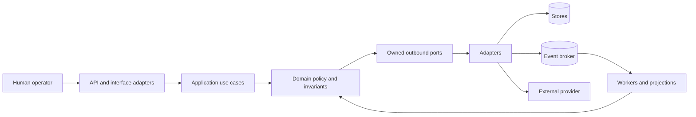
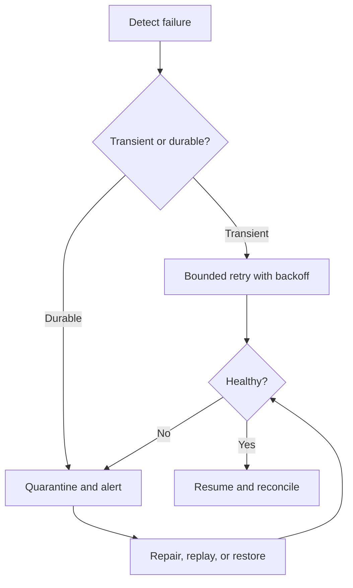
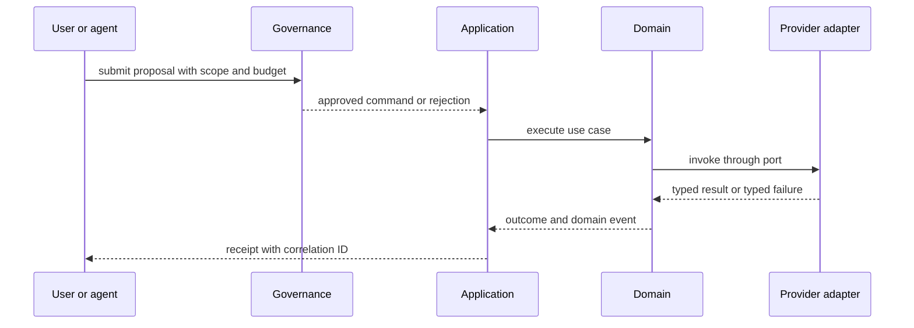

# Architecture

Status: Draft

Version: 0.1.0

Project: CAT (Commerce AI Trinity)

Company: Omni System

Last Updated: 2026-08-01

Purpose

Scope


# CAT Architecture — Foundation Blueprint (Part 1)

> **Document ID:** CAT-ARCH-004
> **Status:** Official — Part 1 of the architecture programme; 25% complete
> **Version:** 0.2.0
> **Owner:** Lead Repository Architect, CAT Project
> **Authority:** This document is normative for architectural shape. It must be read with `context/00_PROJECT_CONTEXT.md`, `context/01_PROJECT_OVERVIEW.md`, `context/02_PROJECT_RULES.md`, and `context/03_TECH_STACK.md`.
> **Audience:** Humans, Codex, Claude Code, Gemini CLI, Cursor, operators, reviewers, and future CAT coding agents.
> **Part 1 scope:** Foundation philosophy, architectural styles, boundaries, invariants, views, governance, and completion contract. Detailed domain contracts, deployment manifests, and implementation blueprints are reserved for Part 2 and later.
> **Last updated:** 2026-08-03

## Reading and authority contract

This is an append-only continuation of the repository's architecture placeholder. The pre-existing lines above are retained verbatim. New architectural statements in this part are deliberately explicit: **MUST** and **MUST NOT** are binding; **SHOULD** and **SHOULD NOT** are defaults that require a documented reason to depart from; **MAY** is optional. Where this document is silent, the project constitution and an accepted ADR govern. An implementation is not architecture-complete merely because it compiles; it must satisfy the invariants, observability, security, recovery, and documentation contracts below.

### Navigation

1. [Architecture Philosophy](#1-architecture-philosophy)
2. [Architecture Vision](#2-architecture-vision)
3. [Why CAT Architecture Exists](#3-why-cat-architecture-exists)
4. [Architecture Principles](#4-architecture-principles)
5. [AI Native Architecture](#5-ai-native-architecture)
6. [Modular Architecture](#6-modular-architecture)
7. [Layered Architecture](#7-layered-architecture)
8. [Event Driven Architecture](#8-event-driven-architecture)
9. [Domain Driven Design](#9-domain-driven-design)
10. [Clean Architecture](#10-clean-architecture)
11. [Hexagonal Architecture](#11-hexagonal-architecture)
12. [CQRS Philosophy](#12-cqrs-philosophy)
13. [Event Sourcing Philosophy](#13-event-sourcing-philosophy)
14. [Service Boundaries](#14-service-boundaries)
15. [Bounded Contexts](#15-bounded-contexts)
16. [Dependency Rules](#16-dependency-rules)
17. [Architectural Invariants](#17-architectural-invariants)
18. [Cross-Cutting Concerns](#18-cross-cutting-concerns)
19. [Architecture Decision Process](#19-architecture-decision-process)
20. [Architecture Completion Contract](#20-architecture-completion-contract)
21. [Architecture view model](#21-architecture-view-model)
22. [Implementation decision register](#22-implementation-decision-register)
23. [Visual catalogue](#231-high-level-architecture)
24. [Part 1 validation contract](#24-part-1-validation-contract)

## Normative vocabulary and change policy

| Term | Meaning in CAT |
|---|---|
| Authoritative | The statement wins within its declared scope and has an owner. |
| Boundary | A rule-enforced seam across which data, control, ownership, or failure may pass. |
| Domain event | A fact meaningful to a bounded context, immutable after publication. |
| Integration event | A versioned message intentionally exposed to another context. |
| Port | An application-facing interface owned by the inside of a hexagon. |
| Adapter | A replaceable outside implementation of a port. |
| Projection | A derived read model that can be rebuilt from authoritative facts or source records. |
| ADR | An Architecture Decision Record; the durable explanation for a non-trivial choice. |

A change that crosses a boundary, changes an invariant, introduces a new persistence model, changes trust, or changes an operational SLO MUST include an ADR before merge. A local refactor that preserves contracts MAY use a normal pull request record. No agent may infer permission from an empty directory, a stub file, or a convenient framework default.

## 1. Architecture Philosophy

**Architecture ID:** CAT-ARCH-01
**Decision status:** Foundation decision; implementation details require linked ADRs.

Architecture is a promise about change: it makes important change cheap, dangerous change visible, and irreversible change deliberate. CAT chooses explicit seams over accidental coupling and boring mechanisms over novelty.

**Scope statement:** A reader can predict where a capability belongs, what it may call, what it may publish, and how it is recovered. Architecture is not a diagram-only artifact; it is enforced through package boundaries, contracts, tests, telemetry, and review.

### 1.1 Human Explanation

Explain the decision in plain language for a new contributor.

**CAT position:** Architecture is a promise about change: it makes important change cheap, dangerous change visible, and irreversible change deliberate. CAT chooses explicit seams over accidental coupling and boring mechanisms over novelty. A reader can predict where a capability belongs, what it may call, what it may publish, and how it is recovered. Architecture is not a diagram-only artifact; it is enforced through package boundaries, contracts, tests, telemetry, and review.

**Implementation contract:**

| Field | Requirement |
|---|---|
| Programming language | Use the repository-approved language for the owning module; do not introduce a language by implication. |
| Framework | Frameworks remain adapters; record the selected framework in a TDC/ADR. |
| Runtime | Define timeout, cancellation, retry, concurrency, and resource limits before production. |
| Repository location | The owning context directory, with implementation under the corresponding approved module path. |
| Owner | Named domain or platform owner; an anonymous team is not an owner. |
| Related services | Only published ports and versioned integration contracts. |
| Related ADR | Link an accepted ADR for every material deviation or irreversible choice. |
| Related rules | `context/02_PROJECT_RULES.md`, this document, security and technology rules. |
| Related documents | `context/00_PROJECT_CONTEXT.md`, `context/01_PROJECT_OVERVIEW.md`, `context/03_TECH_STACK.md`, and the owning context document. |

**Acceptance evidence:** a contract test, an architecture test where applicable, structured telemetry, a failure-mode test, and documentation review.

### 1.2 AI Explanation

State how an AI coding agent must interpret and apply the decision.

**CAT position:** Architecture is a promise about change: it makes important change cheap, dangerous change visible, and irreversible change deliberate. CAT chooses explicit seams over accidental coupling and boring mechanisms over novelty. A reader can predict where a capability belongs, what it may call, what it may publish, and how it is recovered. Architecture is not a diagram-only artifact; it is enforced through package boundaries, contracts, tests, telemetry, and review.

**Implementation contract:**

| Field | Requirement |
|---|---|
| Programming language | Use the repository-approved language for the owning module; do not introduce a language by implication. |
| Framework | Frameworks remain adapters; record the selected framework in a TDC/ADR. |
| Runtime | Define timeout, cancellation, retry, concurrency, and resource limits before production. |
| Repository location | The owning context directory, with implementation under the corresponding approved module path. |
| Owner | Named domain or platform owner; an anonymous team is not an owner. |
| Related services | Only published ports and versioned integration contracts. |
| Related ADR | Link an accepted ADR for every material deviation or irreversible choice. |
| Related rules | `context/02_PROJECT_RULES.md`, this document, security and technology rules. |
| Related documents | `context/00_PROJECT_CONTEXT.md`, `context/01_PROJECT_OVERVIEW.md`, `context/03_TECH_STACK.md`, and the owning context document. |

**Acceptance evidence:** a contract test, an architecture test where applicable, structured telemetry, a failure-mode test, and documentation review.

### 1.3 Business Perspective

Connect the decision to value, trust, cost, speed, and accountability.

**CAT position:** Architecture is a promise about change: it makes important change cheap, dangerous change visible, and irreversible change deliberate. CAT chooses explicit seams over accidental coupling and boring mechanisms over novelty. A reader can predict where a capability belongs, what it may call, what it may publish, and how it is recovered. Architecture is not a diagram-only artifact; it is enforced through package boundaries, contracts, tests, telemetry, and review.

**Implementation contract:**

| Field | Requirement |
|---|---|
| Programming language | Use the repository-approved language for the owning module; do not introduce a language by implication. |
| Framework | Frameworks remain adapters; record the selected framework in a TDC/ADR. |
| Runtime | Define timeout, cancellation, retry, concurrency, and resource limits before production. |
| Repository location | The owning context directory, with implementation under the corresponding approved module path. |
| Owner | Named domain or platform owner; an anonymous team is not an owner. |
| Related services | Only published ports and versioned integration contracts. |
| Related ADR | Link an accepted ADR for every material deviation or irreversible choice. |
| Related rules | `context/02_PROJECT_RULES.md`, this document, security and technology rules. |
| Related documents | `context/00_PROJECT_CONTEXT.md`, `context/01_PROJECT_OVERVIEW.md`, `context/03_TECH_STACK.md`, and the owning context document. |

**Acceptance evidence:** a contract test, an architecture test where applicable, structured telemetry, a failure-mode test, and documentation review.

### 1.4 Engineering Perspective

Describe code structure, interfaces, testing, ownership, and maintenance.

**CAT position:** Architecture is a promise about change: it makes important change cheap, dangerous change visible, and irreversible change deliberate. CAT chooses explicit seams over accidental coupling and boring mechanisms over novelty. A reader can predict where a capability belongs, what it may call, what it may publish, and how it is recovered. Architecture is not a diagram-only artifact; it is enforced through package boundaries, contracts, tests, telemetry, and review.

**Implementation contract:**

| Field | Requirement |
|---|---|
| Programming language | Use the repository-approved language for the owning module; do not introduce a language by implication. |
| Framework | Frameworks remain adapters; record the selected framework in a TDC/ADR. |
| Runtime | Define timeout, cancellation, retry, concurrency, and resource limits before production. |
| Repository location | The owning context directory, with implementation under the corresponding approved module path. |
| Owner | Named domain or platform owner; an anonymous team is not an owner. |
| Related services | Only published ports and versioned integration contracts. |
| Related ADR | Link an accepted ADR for every material deviation or irreversible choice. |
| Related rules | `context/02_PROJECT_RULES.md`, this document, security and technology rules. |
| Related documents | `context/00_PROJECT_CONTEXT.md`, `context/01_PROJECT_OVERVIEW.md`, `context/03_TECH_STACK.md`, and the owning context document. |

**Acceptance evidence:** a contract test, an architecture test where applicable, structured telemetry, a failure-mode test, and documentation review.

### 1.5 Runtime Perspective

Describe calls, state, failure, timing, telemetry, and operational behavior.

**CAT position:** Architecture is a promise about change: it makes important change cheap, dangerous change visible, and irreversible change deliberate. CAT chooses explicit seams over accidental coupling and boring mechanisms over novelty. A reader can predict where a capability belongs, what it may call, what it may publish, and how it is recovered. Architecture is not a diagram-only artifact; it is enforced through package boundaries, contracts, tests, telemetry, and review.

**Implementation contract:**

| Field | Requirement |
|---|---|
| Programming language | Use the repository-approved language for the owning module; do not introduce a language by implication. |
| Framework | Frameworks remain adapters; record the selected framework in a TDC/ADR. |
| Runtime | Define timeout, cancellation, retry, concurrency, and resource limits before production. |
| Repository location | The owning context directory, with implementation under the corresponding approved module path. |
| Owner | Named domain or platform owner; an anonymous team is not an owner. |
| Related services | Only published ports and versioned integration contracts. |
| Related ADR | Link an accepted ADR for every material deviation or irreversible choice. |
| Related rules | `context/02_PROJECT_RULES.md`, this document, security and technology rules. |
| Related documents | `context/00_PROJECT_CONTEXT.md`, `context/01_PROJECT_OVERVIEW.md`, `context/03_TECH_STACK.md`, and the owning context document. |

**Acceptance evidence:** a contract test, an architecture test where applicable, structured telemetry, a failure-mode test, and documentation review.

### 1.6 Future Evolution

Describe a safe path for scale, new domains, new providers, and new deployment shapes.

**CAT position:** Architecture is a promise about change: it makes important change cheap, dangerous change visible, and irreversible change deliberate. CAT chooses explicit seams over accidental coupling and boring mechanisms over novelty. A reader can predict where a capability belongs, what it may call, what it may publish, and how it is recovered. Architecture is not a diagram-only artifact; it is enforced through package boundaries, contracts, tests, telemetry, and review.

**Implementation contract:**

| Field | Requirement |
|---|---|
| Programming language | Use the repository-approved language for the owning module; do not introduce a language by implication. |
| Framework | Frameworks remain adapters; record the selected framework in a TDC/ADR. |
| Runtime | Define timeout, cancellation, retry, concurrency, and resource limits before production. |
| Repository location | The owning context directory, with implementation under the corresponding approved module path. |
| Owner | Named domain or platform owner; an anonymous team is not an owner. |
| Related services | Only published ports and versioned integration contracts. |
| Related ADR | Link an accepted ADR for every material deviation or irreversible choice. |
| Related rules | `context/02_PROJECT_RULES.md`, this document, security and technology rules. |
| Related documents | `context/00_PROJECT_CONTEXT.md`, `context/01_PROJECT_OVERVIEW.md`, `context/03_TECH_STACK.md`, and the owning context document. |

**Acceptance evidence:** a contract test, an architecture test where applicable, structured telemetry, a failure-mode test, and documentation review.

### 1.7 Risks

Name failure modes, including silent coupling, data loss, policy bypass, and operational overload.

**CAT position:** Architecture is a promise about change: it makes important change cheap, dangerous change visible, and irreversible change deliberate. CAT chooses explicit seams over accidental coupling and boring mechanisms over novelty. A reader can predict where a capability belongs, what it may call, what it may publish, and how it is recovered. Architecture is not a diagram-only artifact; it is enforced through package boundaries, contracts, tests, telemetry, and review.

**Implementation contract:**

| Field | Requirement |
|---|---|
| Programming language | Use the repository-approved language for the owning module; do not introduce a language by implication. |
| Framework | Frameworks remain adapters; record the selected framework in a TDC/ADR. |
| Runtime | Define timeout, cancellation, retry, concurrency, and resource limits before production. |
| Repository location | The owning context directory, with implementation under the corresponding approved module path. |
| Owner | Named domain or platform owner; an anonymous team is not an owner. |
| Related services | Only published ports and versioned integration contracts. |
| Related ADR | Link an accepted ADR for every material deviation or irreversible choice. |
| Related rules | `context/02_PROJECT_RULES.md`, this document, security and technology rules. |
| Related documents | `context/00_PROJECT_CONTEXT.md`, `context/01_PROJECT_OVERVIEW.md`, `context/03_TECH_STACK.md`, and the owning context document. |

**Acceptance evidence:** a contract test, an architecture test where applicable, structured telemetry, a failure-mode test, and documentation review.

### 1.8 Trade-offs

Name what CAT gains and what it deliberately gives up.

**CAT position:** Architecture is a promise about change: it makes important change cheap, dangerous change visible, and irreversible change deliberate. CAT chooses explicit seams over accidental coupling and boring mechanisms over novelty. A reader can predict where a capability belongs, what it may call, what it may publish, and how it is recovered. Architecture is not a diagram-only artifact; it is enforced through package boundaries, contracts, tests, telemetry, and review.

**Implementation contract:**

| Field | Requirement |
|---|---|
| Programming language | Use the repository-approved language for the owning module; do not introduce a language by implication. |
| Framework | Frameworks remain adapters; record the selected framework in a TDC/ADR. |
| Runtime | Define timeout, cancellation, retry, concurrency, and resource limits before production. |
| Repository location | The owning context directory, with implementation under the corresponding approved module path. |
| Owner | Named domain or platform owner; an anonymous team is not an owner. |
| Related services | Only published ports and versioned integration contracts. |
| Related ADR | Link an accepted ADR for every material deviation or irreversible choice. |
| Related rules | `context/02_PROJECT_RULES.md`, this document, security and technology rules. |
| Related documents | `context/00_PROJECT_CONTEXT.md`, `context/01_PROJECT_OVERVIEW.md`, `context/03_TECH_STACK.md`, and the owning context document. |

**Acceptance evidence:** a contract test, an architecture test where applicable, structured telemetry, a failure-mode test, and documentation review.

### 1.9 Alternatives

List credible alternatives and the condition under which one could be reconsidered.

**CAT position:** Architecture is a promise about change: it makes important change cheap, dangerous change visible, and irreversible change deliberate. CAT chooses explicit seams over accidental coupling and boring mechanisms over novelty. A reader can predict where a capability belongs, what it may call, what it may publish, and how it is recovered. Architecture is not a diagram-only artifact; it is enforced through package boundaries, contracts, tests, telemetry, and review.

**Implementation contract:**

| Field | Requirement |
|---|---|
| Programming language | Use the repository-approved language for the owning module; do not introduce a language by implication. |
| Framework | Frameworks remain adapters; record the selected framework in a TDC/ADR. |
| Runtime | Define timeout, cancellation, retry, concurrency, and resource limits before production. |
| Repository location | The owning context directory, with implementation under the corresponding approved module path. |
| Owner | Named domain or platform owner; an anonymous team is not an owner. |
| Related services | Only published ports and versioned integration contracts. |
| Related ADR | Link an accepted ADR for every material deviation or irreversible choice. |
| Related rules | `context/02_PROJECT_RULES.md`, this document, security and technology rules. |
| Related documents | `context/00_PROJECT_CONTEXT.md`, `context/01_PROJECT_OVERVIEW.md`, `context/03_TECH_STACK.md`, and the owning context document. |

**Acceptance evidence:** a contract test, an architecture test where applicable, structured telemetry, a failure-mode test, and documentation review.

### 1.10 Why this decision was chosen

Give the rationale in terms of CAT’s ten-year, AI-native, governed operating model.

**CAT position:** Architecture is a promise about change: it makes important change cheap, dangerous change visible, and irreversible change deliberate. CAT chooses explicit seams over accidental coupling and boring mechanisms over novelty. A reader can predict where a capability belongs, what it may call, what it may publish, and how it is recovered. Architecture is not a diagram-only artifact; it is enforced through package boundaries, contracts, tests, telemetry, and review.

**Implementation contract:**

| Field | Requirement |
|---|---|
| Programming language | Use the repository-approved language for the owning module; do not introduce a language by implication. |
| Framework | Frameworks remain adapters; record the selected framework in a TDC/ADR. |
| Runtime | Define timeout, cancellation, retry, concurrency, and resource limits before production. |
| Repository location | The owning context directory, with implementation under the corresponding approved module path. |
| Owner | Named domain or platform owner; an anonymous team is not an owner. |
| Related services | Only published ports and versioned integration contracts. |
| Related ADR | Link an accepted ADR for every material deviation or irreversible choice. |
| Related rules | `context/02_PROJECT_RULES.md`, this document, security and technology rules. |
| Related documents | `context/00_PROJECT_CONTEXT.md`, `context/01_PROJECT_OVERVIEW.md`, `context/03_TECH_STACK.md`, and the owning context document. |

**Acceptance evidence:** a contract test, an architecture test where applicable, structured telemetry, a failure-mode test, and documentation review.

---

## 2. Architecture Vision

**Architecture ID:** CAT-ARCH-02
**Decision status:** Foundation decision; implementation details require linked ADRs.

CAT is an AI-native commerce operating system that coordinates knowledge, agents, content, affiliate activity, treasury, approvals, and evidence without allowing automation to silently exceed its authority.

**Scope statement:** The long-lived shape is a governed capability platform: independently understandable modules, explicit domain ownership, durable facts, replaceable AI providers, and human-controlled risk gates.

### 2.1 Human Explanation

Explain the decision in plain language for a new contributor.

**CAT position:** CAT is an AI-native commerce operating system that coordinates knowledge, agents, content, affiliate activity, treasury, approvals, and evidence without allowing automation to silently exceed its authority. The long-lived shape is a governed capability platform: independently understandable modules, explicit domain ownership, durable facts, replaceable AI providers, and human-controlled risk gates.

**Implementation contract:**

| Field | Requirement |
|---|---|
| Programming language | Use the repository-approved language for the owning module; do not introduce a language by implication. |
| Framework | Frameworks remain adapters; record the selected framework in a TDC/ADR. |
| Runtime | Define timeout, cancellation, retry, concurrency, and resource limits before production. |
| Repository location | The owning context directory, with implementation under the corresponding approved module path. |
| Owner | Named domain or platform owner; an anonymous team is not an owner. |
| Related services | Only published ports and versioned integration contracts. |
| Related ADR | Link an accepted ADR for every material deviation or irreversible choice. |
| Related rules | `context/02_PROJECT_RULES.md`, this document, security and technology rules. |
| Related documents | `context/00_PROJECT_CONTEXT.md`, `context/01_PROJECT_OVERVIEW.md`, `context/03_TECH_STACK.md`, and the owning context document. |

**Acceptance evidence:** a contract test, an architecture test where applicable, structured telemetry, a failure-mode test, and documentation review.

### 2.2 AI Explanation

State how an AI coding agent must interpret and apply the decision.

**CAT position:** CAT is an AI-native commerce operating system that coordinates knowledge, agents, content, affiliate activity, treasury, approvals, and evidence without allowing automation to silently exceed its authority. The long-lived shape is a governed capability platform: independently understandable modules, explicit domain ownership, durable facts, replaceable AI providers, and human-controlled risk gates.

**Implementation contract:**

| Field | Requirement |
|---|---|
| Programming language | Use the repository-approved language for the owning module; do not introduce a language by implication. |
| Framework | Frameworks remain adapters; record the selected framework in a TDC/ADR. |
| Runtime | Define timeout, cancellation, retry, concurrency, and resource limits before production. |
| Repository location | The owning context directory, with implementation under the corresponding approved module path. |
| Owner | Named domain or platform owner; an anonymous team is not an owner. |
| Related services | Only published ports and versioned integration contracts. |
| Related ADR | Link an accepted ADR for every material deviation or irreversible choice. |
| Related rules | `context/02_PROJECT_RULES.md`, this document, security and technology rules. |
| Related documents | `context/00_PROJECT_CONTEXT.md`, `context/01_PROJECT_OVERVIEW.md`, `context/03_TECH_STACK.md`, and the owning context document. |

**Acceptance evidence:** a contract test, an architecture test where applicable, structured telemetry, a failure-mode test, and documentation review.

### 2.3 Business Perspective

Connect the decision to value, trust, cost, speed, and accountability.

**CAT position:** CAT is an AI-native commerce operating system that coordinates knowledge, agents, content, affiliate activity, treasury, approvals, and evidence without allowing automation to silently exceed its authority. The long-lived shape is a governed capability platform: independently understandable modules, explicit domain ownership, durable facts, replaceable AI providers, and human-controlled risk gates.

**Implementation contract:**

| Field | Requirement |
|---|---|
| Programming language | Use the repository-approved language for the owning module; do not introduce a language by implication. |
| Framework | Frameworks remain adapters; record the selected framework in a TDC/ADR. |
| Runtime | Define timeout, cancellation, retry, concurrency, and resource limits before production. |
| Repository location | The owning context directory, with implementation under the corresponding approved module path. |
| Owner | Named domain or platform owner; an anonymous team is not an owner. |
| Related services | Only published ports and versioned integration contracts. |
| Related ADR | Link an accepted ADR for every material deviation or irreversible choice. |
| Related rules | `context/02_PROJECT_RULES.md`, this document, security and technology rules. |
| Related documents | `context/00_PROJECT_CONTEXT.md`, `context/01_PROJECT_OVERVIEW.md`, `context/03_TECH_STACK.md`, and the owning context document. |

**Acceptance evidence:** a contract test, an architecture test where applicable, structured telemetry, a failure-mode test, and documentation review.

### 2.4 Engineering Perspective

Describe code structure, interfaces, testing, ownership, and maintenance.

**CAT position:** CAT is an AI-native commerce operating system that coordinates knowledge, agents, content, affiliate activity, treasury, approvals, and evidence without allowing automation to silently exceed its authority. The long-lived shape is a governed capability platform: independently understandable modules, explicit domain ownership, durable facts, replaceable AI providers, and human-controlled risk gates.

**Implementation contract:**

| Field | Requirement |
|---|---|
| Programming language | Use the repository-approved language for the owning module; do not introduce a language by implication. |
| Framework | Frameworks remain adapters; record the selected framework in a TDC/ADR. |
| Runtime | Define timeout, cancellation, retry, concurrency, and resource limits before production. |
| Repository location | The owning context directory, with implementation under the corresponding approved module path. |
| Owner | Named domain or platform owner; an anonymous team is not an owner. |
| Related services | Only published ports and versioned integration contracts. |
| Related ADR | Link an accepted ADR for every material deviation or irreversible choice. |
| Related rules | `context/02_PROJECT_RULES.md`, this document, security and technology rules. |
| Related documents | `context/00_PROJECT_CONTEXT.md`, `context/01_PROJECT_OVERVIEW.md`, `context/03_TECH_STACK.md`, and the owning context document. |

**Acceptance evidence:** a contract test, an architecture test where applicable, structured telemetry, a failure-mode test, and documentation review.

### 2.5 Runtime Perspective

Describe calls, state, failure, timing, telemetry, and operational behavior.

**CAT position:** CAT is an AI-native commerce operating system that coordinates knowledge, agents, content, affiliate activity, treasury, approvals, and evidence without allowing automation to silently exceed its authority. The long-lived shape is a governed capability platform: independently understandable modules, explicit domain ownership, durable facts, replaceable AI providers, and human-controlled risk gates.

**Implementation contract:**

| Field | Requirement |
|---|---|
| Programming language | Use the repository-approved language for the owning module; do not introduce a language by implication. |
| Framework | Frameworks remain adapters; record the selected framework in a TDC/ADR. |
| Runtime | Define timeout, cancellation, retry, concurrency, and resource limits before production. |
| Repository location | The owning context directory, with implementation under the corresponding approved module path. |
| Owner | Named domain or platform owner; an anonymous team is not an owner. |
| Related services | Only published ports and versioned integration contracts. |
| Related ADR | Link an accepted ADR for every material deviation or irreversible choice. |
| Related rules | `context/02_PROJECT_RULES.md`, this document, security and technology rules. |
| Related documents | `context/00_PROJECT_CONTEXT.md`, `context/01_PROJECT_OVERVIEW.md`, `context/03_TECH_STACK.md`, and the owning context document. |

**Acceptance evidence:** a contract test, an architecture test where applicable, structured telemetry, a failure-mode test, and documentation review.

### 2.6 Future Evolution

Describe a safe path for scale, new domains, new providers, and new deployment shapes.

**CAT position:** CAT is an AI-native commerce operating system that coordinates knowledge, agents, content, affiliate activity, treasury, approvals, and evidence without allowing automation to silently exceed its authority. The long-lived shape is a governed capability platform: independently understandable modules, explicit domain ownership, durable facts, replaceable AI providers, and human-controlled risk gates.

**Implementation contract:**

| Field | Requirement |
|---|---|
| Programming language | Use the repository-approved language for the owning module; do not introduce a language by implication. |
| Framework | Frameworks remain adapters; record the selected framework in a TDC/ADR. |
| Runtime | Define timeout, cancellation, retry, concurrency, and resource limits before production. |
| Repository location | The owning context directory, with implementation under the corresponding approved module path. |
| Owner | Named domain or platform owner; an anonymous team is not an owner. |
| Related services | Only published ports and versioned integration contracts. |
| Related ADR | Link an accepted ADR for every material deviation or irreversible choice. |
| Related rules | `context/02_PROJECT_RULES.md`, this document, security and technology rules. |
| Related documents | `context/00_PROJECT_CONTEXT.md`, `context/01_PROJECT_OVERVIEW.md`, `context/03_TECH_STACK.md`, and the owning context document. |

**Acceptance evidence:** a contract test, an architecture test where applicable, structured telemetry, a failure-mode test, and documentation review.

### 2.7 Risks

Name failure modes, including silent coupling, data loss, policy bypass, and operational overload.

**CAT position:** CAT is an AI-native commerce operating system that coordinates knowledge, agents, content, affiliate activity, treasury, approvals, and evidence without allowing automation to silently exceed its authority. The long-lived shape is a governed capability platform: independently understandable modules, explicit domain ownership, durable facts, replaceable AI providers, and human-controlled risk gates.

**Implementation contract:**

| Field | Requirement |
|---|---|
| Programming language | Use the repository-approved language for the owning module; do not introduce a language by implication. |
| Framework | Frameworks remain adapters; record the selected framework in a TDC/ADR. |
| Runtime | Define timeout, cancellation, retry, concurrency, and resource limits before production. |
| Repository location | The owning context directory, with implementation under the corresponding approved module path. |
| Owner | Named domain or platform owner; an anonymous team is not an owner. |
| Related services | Only published ports and versioned integration contracts. |
| Related ADR | Link an accepted ADR for every material deviation or irreversible choice. |
| Related rules | `context/02_PROJECT_RULES.md`, this document, security and technology rules. |
| Related documents | `context/00_PROJECT_CONTEXT.md`, `context/01_PROJECT_OVERVIEW.md`, `context/03_TECH_STACK.md`, and the owning context document. |

**Acceptance evidence:** a contract test, an architecture test where applicable, structured telemetry, a failure-mode test, and documentation review.

### 2.8 Trade-offs

Name what CAT gains and what it deliberately gives up.

**CAT position:** CAT is an AI-native commerce operating system that coordinates knowledge, agents, content, affiliate activity, treasury, approvals, and evidence without allowing automation to silently exceed its authority. The long-lived shape is a governed capability platform: independently understandable modules, explicit domain ownership, durable facts, replaceable AI providers, and human-controlled risk gates.

**Implementation contract:**

| Field | Requirement |
|---|---|
| Programming language | Use the repository-approved language for the owning module; do not introduce a language by implication. |
| Framework | Frameworks remain adapters; record the selected framework in a TDC/ADR. |
| Runtime | Define timeout, cancellation, retry, concurrency, and resource limits before production. |
| Repository location | The owning context directory, with implementation under the corresponding approved module path. |
| Owner | Named domain or platform owner; an anonymous team is not an owner. |
| Related services | Only published ports and versioned integration contracts. |
| Related ADR | Link an accepted ADR for every material deviation or irreversible choice. |
| Related rules | `context/02_PROJECT_RULES.md`, this document, security and technology rules. |
| Related documents | `context/00_PROJECT_CONTEXT.md`, `context/01_PROJECT_OVERVIEW.md`, `context/03_TECH_STACK.md`, and the owning context document. |

**Acceptance evidence:** a contract test, an architecture test where applicable, structured telemetry, a failure-mode test, and documentation review.

### 2.9 Alternatives

List credible alternatives and the condition under which one could be reconsidered.

**CAT position:** CAT is an AI-native commerce operating system that coordinates knowledge, agents, content, affiliate activity, treasury, approvals, and evidence without allowing automation to silently exceed its authority. The long-lived shape is a governed capability platform: independently understandable modules, explicit domain ownership, durable facts, replaceable AI providers, and human-controlled risk gates.

**Implementation contract:**

| Field | Requirement |
|---|---|
| Programming language | Use the repository-approved language for the owning module; do not introduce a language by implication. |
| Framework | Frameworks remain adapters; record the selected framework in a TDC/ADR. |
| Runtime | Define timeout, cancellation, retry, concurrency, and resource limits before production. |
| Repository location | The owning context directory, with implementation under the corresponding approved module path. |
| Owner | Named domain or platform owner; an anonymous team is not an owner. |
| Related services | Only published ports and versioned integration contracts. |
| Related ADR | Link an accepted ADR for every material deviation or irreversible choice. |
| Related rules | `context/02_PROJECT_RULES.md`, this document, security and technology rules. |
| Related documents | `context/00_PROJECT_CONTEXT.md`, `context/01_PROJECT_OVERVIEW.md`, `context/03_TECH_STACK.md`, and the owning context document. |

**Acceptance evidence:** a contract test, an architecture test where applicable, structured telemetry, a failure-mode test, and documentation review.

### 2.10 Why this decision was chosen

Give the rationale in terms of CAT’s ten-year, AI-native, governed operating model.

**CAT position:** CAT is an AI-native commerce operating system that coordinates knowledge, agents, content, affiliate activity, treasury, approvals, and evidence without allowing automation to silently exceed its authority. The long-lived shape is a governed capability platform: independently understandable modules, explicit domain ownership, durable facts, replaceable AI providers, and human-controlled risk gates.

**Implementation contract:**

| Field | Requirement |
|---|---|
| Programming language | Use the repository-approved language for the owning module; do not introduce a language by implication. |
| Framework | Frameworks remain adapters; record the selected framework in a TDC/ADR. |
| Runtime | Define timeout, cancellation, retry, concurrency, and resource limits before production. |
| Repository location | The owning context directory, with implementation under the corresponding approved module path. |
| Owner | Named domain or platform owner; an anonymous team is not an owner. |
| Related services | Only published ports and versioned integration contracts. |
| Related ADR | Link an accepted ADR for every material deviation or irreversible choice. |
| Related rules | `context/02_PROJECT_RULES.md`, this document, security and technology rules. |
| Related documents | `context/00_PROJECT_CONTEXT.md`, `context/01_PROJECT_OVERVIEW.md`, `context/03_TECH_STACK.md`, and the owning context document. |

**Acceptance evidence:** a contract test, an architecture test where applicable, structured telemetry, a failure-mode test, and documentation review.

---

## 3. Why CAT Architecture Exists

**Architecture ID:** CAT-ARCH-03
**Decision status:** Foundation decision; implementation details require linked ADRs.

CAT must survive ten years of model churn, team turnover, provider changes, increasing transaction volume, and new domains. Written architecture prevents plausible-but-wrong reconstruction by humans and models.

**Scope statement:** The architecture turns product intent into constraints that can be checked in code review and in automated validation.

### 3.1 Human Explanation

Explain the decision in plain language for a new contributor.

**CAT position:** CAT must survive ten years of model churn, team turnover, provider changes, increasing transaction volume, and new domains. Written architecture prevents plausible-but-wrong reconstruction by humans and models. The architecture turns product intent into constraints that can be checked in code review and in automated validation.

**Implementation contract:**

| Field | Requirement |
|---|---|
| Programming language | Use the repository-approved language for the owning module; do not introduce a language by implication. |
| Framework | Frameworks remain adapters; record the selected framework in a TDC/ADR. |
| Runtime | Define timeout, cancellation, retry, concurrency, and resource limits before production. |
| Repository location | The owning context directory, with implementation under the corresponding approved module path. |
| Owner | Named domain or platform owner; an anonymous team is not an owner. |
| Related services | Only published ports and versioned integration contracts. |
| Related ADR | Link an accepted ADR for every material deviation or irreversible choice. |
| Related rules | `context/02_PROJECT_RULES.md`, this document, security and technology rules. |
| Related documents | `context/00_PROJECT_CONTEXT.md`, `context/01_PROJECT_OVERVIEW.md`, `context/03_TECH_STACK.md`, and the owning context document. |

**Acceptance evidence:** a contract test, an architecture test where applicable, structured telemetry, a failure-mode test, and documentation review.

### 3.2 AI Explanation

State how an AI coding agent must interpret and apply the decision.

**CAT position:** CAT must survive ten years of model churn, team turnover, provider changes, increasing transaction volume, and new domains. Written architecture prevents plausible-but-wrong reconstruction by humans and models. The architecture turns product intent into constraints that can be checked in code review and in automated validation.

**Implementation contract:**

| Field | Requirement |
|---|---|
| Programming language | Use the repository-approved language for the owning module; do not introduce a language by implication. |
| Framework | Frameworks remain adapters; record the selected framework in a TDC/ADR. |
| Runtime | Define timeout, cancellation, retry, concurrency, and resource limits before production. |
| Repository location | The owning context directory, with implementation under the corresponding approved module path. |
| Owner | Named domain or platform owner; an anonymous team is not an owner. |
| Related services | Only published ports and versioned integration contracts. |
| Related ADR | Link an accepted ADR for every material deviation or irreversible choice. |
| Related rules | `context/02_PROJECT_RULES.md`, this document, security and technology rules. |
| Related documents | `context/00_PROJECT_CONTEXT.md`, `context/01_PROJECT_OVERVIEW.md`, `context/03_TECH_STACK.md`, and the owning context document. |

**Acceptance evidence:** a contract test, an architecture test where applicable, structured telemetry, a failure-mode test, and documentation review.

### 3.3 Business Perspective

Connect the decision to value, trust, cost, speed, and accountability.

**CAT position:** CAT must survive ten years of model churn, team turnover, provider changes, increasing transaction volume, and new domains. Written architecture prevents plausible-but-wrong reconstruction by humans and models. The architecture turns product intent into constraints that can be checked in code review and in automated validation.

**Implementation contract:**

| Field | Requirement |
|---|---|
| Programming language | Use the repository-approved language for the owning module; do not introduce a language by implication. |
| Framework | Frameworks remain adapters; record the selected framework in a TDC/ADR. |
| Runtime | Define timeout, cancellation, retry, concurrency, and resource limits before production. |
| Repository location | The owning context directory, with implementation under the corresponding approved module path. |
| Owner | Named domain or platform owner; an anonymous team is not an owner. |
| Related services | Only published ports and versioned integration contracts. |
| Related ADR | Link an accepted ADR for every material deviation or irreversible choice. |
| Related rules | `context/02_PROJECT_RULES.md`, this document, security and technology rules. |
| Related documents | `context/00_PROJECT_CONTEXT.md`, `context/01_PROJECT_OVERVIEW.md`, `context/03_TECH_STACK.md`, and the owning context document. |

**Acceptance evidence:** a contract test, an architecture test where applicable, structured telemetry, a failure-mode test, and documentation review.

### 3.4 Engineering Perspective

Describe code structure, interfaces, testing, ownership, and maintenance.

**CAT position:** CAT must survive ten years of model churn, team turnover, provider changes, increasing transaction volume, and new domains. Written architecture prevents plausible-but-wrong reconstruction by humans and models. The architecture turns product intent into constraints that can be checked in code review and in automated validation.

**Implementation contract:**

| Field | Requirement |
|---|---|
| Programming language | Use the repository-approved language for the owning module; do not introduce a language by implication. |
| Framework | Frameworks remain adapters; record the selected framework in a TDC/ADR. |
| Runtime | Define timeout, cancellation, retry, concurrency, and resource limits before production. |
| Repository location | The owning context directory, with implementation under the corresponding approved module path. |
| Owner | Named domain or platform owner; an anonymous team is not an owner. |
| Related services | Only published ports and versioned integration contracts. |
| Related ADR | Link an accepted ADR for every material deviation or irreversible choice. |
| Related rules | `context/02_PROJECT_RULES.md`, this document, security and technology rules. |
| Related documents | `context/00_PROJECT_CONTEXT.md`, `context/01_PROJECT_OVERVIEW.md`, `context/03_TECH_STACK.md`, and the owning context document. |

**Acceptance evidence:** a contract test, an architecture test where applicable, structured telemetry, a failure-mode test, and documentation review.

### 3.5 Runtime Perspective

Describe calls, state, failure, timing, telemetry, and operational behavior.

**CAT position:** CAT must survive ten years of model churn, team turnover, provider changes, increasing transaction volume, and new domains. Written architecture prevents plausible-but-wrong reconstruction by humans and models. The architecture turns product intent into constraints that can be checked in code review and in automated validation.

**Implementation contract:**

| Field | Requirement |
|---|---|
| Programming language | Use the repository-approved language for the owning module; do not introduce a language by implication. |
| Framework | Frameworks remain adapters; record the selected framework in a TDC/ADR. |
| Runtime | Define timeout, cancellation, retry, concurrency, and resource limits before production. |
| Repository location | The owning context directory, with implementation under the corresponding approved module path. |
| Owner | Named domain or platform owner; an anonymous team is not an owner. |
| Related services | Only published ports and versioned integration contracts. |
| Related ADR | Link an accepted ADR for every material deviation or irreversible choice. |
| Related rules | `context/02_PROJECT_RULES.md`, this document, security and technology rules. |
| Related documents | `context/00_PROJECT_CONTEXT.md`, `context/01_PROJECT_OVERVIEW.md`, `context/03_TECH_STACK.md`, and the owning context document. |

**Acceptance evidence:** a contract test, an architecture test where applicable, structured telemetry, a failure-mode test, and documentation review.

### 3.6 Future Evolution

Describe a safe path for scale, new domains, new providers, and new deployment shapes.

**CAT position:** CAT must survive ten years of model churn, team turnover, provider changes, increasing transaction volume, and new domains. Written architecture prevents plausible-but-wrong reconstruction by humans and models. The architecture turns product intent into constraints that can be checked in code review and in automated validation.

**Implementation contract:**

| Field | Requirement |
|---|---|
| Programming language | Use the repository-approved language for the owning module; do not introduce a language by implication. |
| Framework | Frameworks remain adapters; record the selected framework in a TDC/ADR. |
| Runtime | Define timeout, cancellation, retry, concurrency, and resource limits before production. |
| Repository location | The owning context directory, with implementation under the corresponding approved module path. |
| Owner | Named domain or platform owner; an anonymous team is not an owner. |
| Related services | Only published ports and versioned integration contracts. |
| Related ADR | Link an accepted ADR for every material deviation or irreversible choice. |
| Related rules | `context/02_PROJECT_RULES.md`, this document, security and technology rules. |
| Related documents | `context/00_PROJECT_CONTEXT.md`, `context/01_PROJECT_OVERVIEW.md`, `context/03_TECH_STACK.md`, and the owning context document. |

**Acceptance evidence:** a contract test, an architecture test where applicable, structured telemetry, a failure-mode test, and documentation review.

### 3.7 Risks

Name failure modes, including silent coupling, data loss, policy bypass, and operational overload.

**CAT position:** CAT must survive ten years of model churn, team turnover, provider changes, increasing transaction volume, and new domains. Written architecture prevents plausible-but-wrong reconstruction by humans and models. The architecture turns product intent into constraints that can be checked in code review and in automated validation.

**Implementation contract:**

| Field | Requirement |
|---|---|
| Programming language | Use the repository-approved language for the owning module; do not introduce a language by implication. |
| Framework | Frameworks remain adapters; record the selected framework in a TDC/ADR. |
| Runtime | Define timeout, cancellation, retry, concurrency, and resource limits before production. |
| Repository location | The owning context directory, with implementation under the corresponding approved module path. |
| Owner | Named domain or platform owner; an anonymous team is not an owner. |
| Related services | Only published ports and versioned integration contracts. |
| Related ADR | Link an accepted ADR for every material deviation or irreversible choice. |
| Related rules | `context/02_PROJECT_RULES.md`, this document, security and technology rules. |
| Related documents | `context/00_PROJECT_CONTEXT.md`, `context/01_PROJECT_OVERVIEW.md`, `context/03_TECH_STACK.md`, and the owning context document. |

**Acceptance evidence:** a contract test, an architecture test where applicable, structured telemetry, a failure-mode test, and documentation review.

### 3.8 Trade-offs

Name what CAT gains and what it deliberately gives up.

**CAT position:** CAT must survive ten years of model churn, team turnover, provider changes, increasing transaction volume, and new domains. Written architecture prevents plausible-but-wrong reconstruction by humans and models. The architecture turns product intent into constraints that can be checked in code review and in automated validation.

**Implementation contract:**

| Field | Requirement |
|---|---|
| Programming language | Use the repository-approved language for the owning module; do not introduce a language by implication. |
| Framework | Frameworks remain adapters; record the selected framework in a TDC/ADR. |
| Runtime | Define timeout, cancellation, retry, concurrency, and resource limits before production. |
| Repository location | The owning context directory, with implementation under the corresponding approved module path. |
| Owner | Named domain or platform owner; an anonymous team is not an owner. |
| Related services | Only published ports and versioned integration contracts. |
| Related ADR | Link an accepted ADR for every material deviation or irreversible choice. |
| Related rules | `context/02_PROJECT_RULES.md`, this document, security and technology rules. |
| Related documents | `context/00_PROJECT_CONTEXT.md`, `context/01_PROJECT_OVERVIEW.md`, `context/03_TECH_STACK.md`, and the owning context document. |

**Acceptance evidence:** a contract test, an architecture test where applicable, structured telemetry, a failure-mode test, and documentation review.

### 3.9 Alternatives

List credible alternatives and the condition under which one could be reconsidered.

**CAT position:** CAT must survive ten years of model churn, team turnover, provider changes, increasing transaction volume, and new domains. Written architecture prevents plausible-but-wrong reconstruction by humans and models. The architecture turns product intent into constraints that can be checked in code review and in automated validation.

**Implementation contract:**

| Field | Requirement |
|---|---|
| Programming language | Use the repository-approved language for the owning module; do not introduce a language by implication. |
| Framework | Frameworks remain adapters; record the selected framework in a TDC/ADR. |
| Runtime | Define timeout, cancellation, retry, concurrency, and resource limits before production. |
| Repository location | The owning context directory, with implementation under the corresponding approved module path. |
| Owner | Named domain or platform owner; an anonymous team is not an owner. |
| Related services | Only published ports and versioned integration contracts. |
| Related ADR | Link an accepted ADR for every material deviation or irreversible choice. |
| Related rules | `context/02_PROJECT_RULES.md`, this document, security and technology rules. |
| Related documents | `context/00_PROJECT_CONTEXT.md`, `context/01_PROJECT_OVERVIEW.md`, `context/03_TECH_STACK.md`, and the owning context document. |

**Acceptance evidence:** a contract test, an architecture test where applicable, structured telemetry, a failure-mode test, and documentation review.

### 3.10 Why this decision was chosen

Give the rationale in terms of CAT’s ten-year, AI-native, governed operating model.

**CAT position:** CAT must survive ten years of model churn, team turnover, provider changes, increasing transaction volume, and new domains. Written architecture prevents plausible-but-wrong reconstruction by humans and models. The architecture turns product intent into constraints that can be checked in code review and in automated validation.

**Implementation contract:**

| Field | Requirement |
|---|---|
| Programming language | Use the repository-approved language for the owning module; do not introduce a language by implication. |
| Framework | Frameworks remain adapters; record the selected framework in a TDC/ADR. |
| Runtime | Define timeout, cancellation, retry, concurrency, and resource limits before production. |
| Repository location | The owning context directory, with implementation under the corresponding approved module path. |
| Owner | Named domain or platform owner; an anonymous team is not an owner. |
| Related services | Only published ports and versioned integration contracts. |
| Related ADR | Link an accepted ADR for every material deviation or irreversible choice. |
| Related rules | `context/02_PROJECT_RULES.md`, this document, security and technology rules. |
| Related documents | `context/00_PROJECT_CONTEXT.md`, `context/01_PROJECT_OVERVIEW.md`, `context/03_TECH_STACK.md`, and the owning context document. |

**Acceptance evidence:** a contract test, an architecture test where applicable, structured telemetry, a failure-mode test, and documentation review.

---

## 4. Architecture Principles

**Architecture ID:** CAT-ARCH-04
**Decision status:** Foundation decision; implementation details require linked ADRs.

The constitution is applied through principles: outcome before tool, explicit ownership, least privilege, reversible decisions, observable behavior, contract-first integration, graceful degradation, and documentation as a production dependency.

**Scope statement:** Principles are selection criteria, not slogans. A proposed exception states the violated principle, risk, owner, expiry, and compensating control.

### 4.1 Human Explanation

Explain the decision in plain language for a new contributor.

**CAT position:** The constitution is applied through principles: outcome before tool, explicit ownership, least privilege, reversible decisions, observable behavior, contract-first integration, graceful degradation, and documentation as a production dependency. Principles are selection criteria, not slogans. A proposed exception states the violated principle, risk, owner, expiry, and compensating control.

**Implementation contract:**

| Field | Requirement |
|---|---|
| Programming language | Use the repository-approved language for the owning module; do not introduce a language by implication. |
| Framework | Frameworks remain adapters; record the selected framework in a TDC/ADR. |
| Runtime | Define timeout, cancellation, retry, concurrency, and resource limits before production. |
| Repository location | The owning context directory, with implementation under the corresponding approved module path. |
| Owner | Named domain or platform owner; an anonymous team is not an owner. |
| Related services | Only published ports and versioned integration contracts. |
| Related ADR | Link an accepted ADR for every material deviation or irreversible choice. |
| Related rules | `context/02_PROJECT_RULES.md`, this document, security and technology rules. |
| Related documents | `context/00_PROJECT_CONTEXT.md`, `context/01_PROJECT_OVERVIEW.md`, `context/03_TECH_STACK.md`, and the owning context document. |

**Acceptance evidence:** a contract test, an architecture test where applicable, structured telemetry, a failure-mode test, and documentation review.

### 4.2 AI Explanation

State how an AI coding agent must interpret and apply the decision.

**CAT position:** The constitution is applied through principles: outcome before tool, explicit ownership, least privilege, reversible decisions, observable behavior, contract-first integration, graceful degradation, and documentation as a production dependency. Principles are selection criteria, not slogans. A proposed exception states the violated principle, risk, owner, expiry, and compensating control.

**Implementation contract:**

| Field | Requirement |
|---|---|
| Programming language | Use the repository-approved language for the owning module; do not introduce a language by implication. |
| Framework | Frameworks remain adapters; record the selected framework in a TDC/ADR. |
| Runtime | Define timeout, cancellation, retry, concurrency, and resource limits before production. |
| Repository location | The owning context directory, with implementation under the corresponding approved module path. |
| Owner | Named domain or platform owner; an anonymous team is not an owner. |
| Related services | Only published ports and versioned integration contracts. |
| Related ADR | Link an accepted ADR for every material deviation or irreversible choice. |
| Related rules | `context/02_PROJECT_RULES.md`, this document, security and technology rules. |
| Related documents | `context/00_PROJECT_CONTEXT.md`, `context/01_PROJECT_OVERVIEW.md`, `context/03_TECH_STACK.md`, and the owning context document. |

**Acceptance evidence:** a contract test, an architecture test where applicable, structured telemetry, a failure-mode test, and documentation review.

### 4.3 Business Perspective

Connect the decision to value, trust, cost, speed, and accountability.

**CAT position:** The constitution is applied through principles: outcome before tool, explicit ownership, least privilege, reversible decisions, observable behavior, contract-first integration, graceful degradation, and documentation as a production dependency. Principles are selection criteria, not slogans. A proposed exception states the violated principle, risk, owner, expiry, and compensating control.

**Implementation contract:**

| Field | Requirement |
|---|---|
| Programming language | Use the repository-approved language for the owning module; do not introduce a language by implication. |
| Framework | Frameworks remain adapters; record the selected framework in a TDC/ADR. |
| Runtime | Define timeout, cancellation, retry, concurrency, and resource limits before production. |
| Repository location | The owning context directory, with implementation under the corresponding approved module path. |
| Owner | Named domain or platform owner; an anonymous team is not an owner. |
| Related services | Only published ports and versioned integration contracts. |
| Related ADR | Link an accepted ADR for every material deviation or irreversible choice. |
| Related rules | `context/02_PROJECT_RULES.md`, this document, security and technology rules. |
| Related documents | `context/00_PROJECT_CONTEXT.md`, `context/01_PROJECT_OVERVIEW.md`, `context/03_TECH_STACK.md`, and the owning context document. |

**Acceptance evidence:** a contract test, an architecture test where applicable, structured telemetry, a failure-mode test, and documentation review.

### 4.4 Engineering Perspective

Describe code structure, interfaces, testing, ownership, and maintenance.

**CAT position:** The constitution is applied through principles: outcome before tool, explicit ownership, least privilege, reversible decisions, observable behavior, contract-first integration, graceful degradation, and documentation as a production dependency. Principles are selection criteria, not slogans. A proposed exception states the violated principle, risk, owner, expiry, and compensating control.

**Implementation contract:**

| Field | Requirement |
|---|---|
| Programming language | Use the repository-approved language for the owning module; do not introduce a language by implication. |
| Framework | Frameworks remain adapters; record the selected framework in a TDC/ADR. |
| Runtime | Define timeout, cancellation, retry, concurrency, and resource limits before production. |
| Repository location | The owning context directory, with implementation under the corresponding approved module path. |
| Owner | Named domain or platform owner; an anonymous team is not an owner. |
| Related services | Only published ports and versioned integration contracts. |
| Related ADR | Link an accepted ADR for every material deviation or irreversible choice. |
| Related rules | `context/02_PROJECT_RULES.md`, this document, security and technology rules. |
| Related documents | `context/00_PROJECT_CONTEXT.md`, `context/01_PROJECT_OVERVIEW.md`, `context/03_TECH_STACK.md`, and the owning context document. |

**Acceptance evidence:** a contract test, an architecture test where applicable, structured telemetry, a failure-mode test, and documentation review.

### 4.5 Runtime Perspective

Describe calls, state, failure, timing, telemetry, and operational behavior.

**CAT position:** The constitution is applied through principles: outcome before tool, explicit ownership, least privilege, reversible decisions, observable behavior, contract-first integration, graceful degradation, and documentation as a production dependency. Principles are selection criteria, not slogans. A proposed exception states the violated principle, risk, owner, expiry, and compensating control.

**Implementation contract:**

| Field | Requirement |
|---|---|
| Programming language | Use the repository-approved language for the owning module; do not introduce a language by implication. |
| Framework | Frameworks remain adapters; record the selected framework in a TDC/ADR. |
| Runtime | Define timeout, cancellation, retry, concurrency, and resource limits before production. |
| Repository location | The owning context directory, with implementation under the corresponding approved module path. |
| Owner | Named domain or platform owner; an anonymous team is not an owner. |
| Related services | Only published ports and versioned integration contracts. |
| Related ADR | Link an accepted ADR for every material deviation or irreversible choice. |
| Related rules | `context/02_PROJECT_RULES.md`, this document, security and technology rules. |
| Related documents | `context/00_PROJECT_CONTEXT.md`, `context/01_PROJECT_OVERVIEW.md`, `context/03_TECH_STACK.md`, and the owning context document. |

**Acceptance evidence:** a contract test, an architecture test where applicable, structured telemetry, a failure-mode test, and documentation review.

### 4.6 Future Evolution

Describe a safe path for scale, new domains, new providers, and new deployment shapes.

**CAT position:** The constitution is applied through principles: outcome before tool, explicit ownership, least privilege, reversible decisions, observable behavior, contract-first integration, graceful degradation, and documentation as a production dependency. Principles are selection criteria, not slogans. A proposed exception states the violated principle, risk, owner, expiry, and compensating control.

**Implementation contract:**

| Field | Requirement |
|---|---|
| Programming language | Use the repository-approved language for the owning module; do not introduce a language by implication. |
| Framework | Frameworks remain adapters; record the selected framework in a TDC/ADR. |
| Runtime | Define timeout, cancellation, retry, concurrency, and resource limits before production. |
| Repository location | The owning context directory, with implementation under the corresponding approved module path. |
| Owner | Named domain or platform owner; an anonymous team is not an owner. |
| Related services | Only published ports and versioned integration contracts. |
| Related ADR | Link an accepted ADR for every material deviation or irreversible choice. |
| Related rules | `context/02_PROJECT_RULES.md`, this document, security and technology rules. |
| Related documents | `context/00_PROJECT_CONTEXT.md`, `context/01_PROJECT_OVERVIEW.md`, `context/03_TECH_STACK.md`, and the owning context document. |

**Acceptance evidence:** a contract test, an architecture test where applicable, structured telemetry, a failure-mode test, and documentation review.

### 4.7 Risks

Name failure modes, including silent coupling, data loss, policy bypass, and operational overload.

**CAT position:** The constitution is applied through principles: outcome before tool, explicit ownership, least privilege, reversible decisions, observable behavior, contract-first integration, graceful degradation, and documentation as a production dependency. Principles are selection criteria, not slogans. A proposed exception states the violated principle, risk, owner, expiry, and compensating control.

**Implementation contract:**

| Field | Requirement |
|---|---|
| Programming language | Use the repository-approved language for the owning module; do not introduce a language by implication. |
| Framework | Frameworks remain adapters; record the selected framework in a TDC/ADR. |
| Runtime | Define timeout, cancellation, retry, concurrency, and resource limits before production. |
| Repository location | The owning context directory, with implementation under the corresponding approved module path. |
| Owner | Named domain or platform owner; an anonymous team is not an owner. |
| Related services | Only published ports and versioned integration contracts. |
| Related ADR | Link an accepted ADR for every material deviation or irreversible choice. |
| Related rules | `context/02_PROJECT_RULES.md`, this document, security and technology rules. |
| Related documents | `context/00_PROJECT_CONTEXT.md`, `context/01_PROJECT_OVERVIEW.md`, `context/03_TECH_STACK.md`, and the owning context document. |

**Acceptance evidence:** a contract test, an architecture test where applicable, structured telemetry, a failure-mode test, and documentation review.

### 4.8 Trade-offs

Name what CAT gains and what it deliberately gives up.

**CAT position:** The constitution is applied through principles: outcome before tool, explicit ownership, least privilege, reversible decisions, observable behavior, contract-first integration, graceful degradation, and documentation as a production dependency. Principles are selection criteria, not slogans. A proposed exception states the violated principle, risk, owner, expiry, and compensating control.

**Implementation contract:**

| Field | Requirement |
|---|---|
| Programming language | Use the repository-approved language for the owning module; do not introduce a language by implication. |
| Framework | Frameworks remain adapters; record the selected framework in a TDC/ADR. |
| Runtime | Define timeout, cancellation, retry, concurrency, and resource limits before production. |
| Repository location | The owning context directory, with implementation under the corresponding approved module path. |
| Owner | Named domain or platform owner; an anonymous team is not an owner. |
| Related services | Only published ports and versioned integration contracts. |
| Related ADR | Link an accepted ADR for every material deviation or irreversible choice. |
| Related rules | `context/02_PROJECT_RULES.md`, this document, security and technology rules. |
| Related documents | `context/00_PROJECT_CONTEXT.md`, `context/01_PROJECT_OVERVIEW.md`, `context/03_TECH_STACK.md`, and the owning context document. |

**Acceptance evidence:** a contract test, an architecture test where applicable, structured telemetry, a failure-mode test, and documentation review.

### 4.9 Alternatives

List credible alternatives and the condition under which one could be reconsidered.

**CAT position:** The constitution is applied through principles: outcome before tool, explicit ownership, least privilege, reversible decisions, observable behavior, contract-first integration, graceful degradation, and documentation as a production dependency. Principles are selection criteria, not slogans. A proposed exception states the violated principle, risk, owner, expiry, and compensating control.

**Implementation contract:**

| Field | Requirement |
|---|---|
| Programming language | Use the repository-approved language for the owning module; do not introduce a language by implication. |
| Framework | Frameworks remain adapters; record the selected framework in a TDC/ADR. |
| Runtime | Define timeout, cancellation, retry, concurrency, and resource limits before production. |
| Repository location | The owning context directory, with implementation under the corresponding approved module path. |
| Owner | Named domain or platform owner; an anonymous team is not an owner. |
| Related services | Only published ports and versioned integration contracts. |
| Related ADR | Link an accepted ADR for every material deviation or irreversible choice. |
| Related rules | `context/02_PROJECT_RULES.md`, this document, security and technology rules. |
| Related documents | `context/00_PROJECT_CONTEXT.md`, `context/01_PROJECT_OVERVIEW.md`, `context/03_TECH_STACK.md`, and the owning context document. |

**Acceptance evidence:** a contract test, an architecture test where applicable, structured telemetry, a failure-mode test, and documentation review.

### 4.10 Why this decision was chosen

Give the rationale in terms of CAT’s ten-year, AI-native, governed operating model.

**CAT position:** The constitution is applied through principles: outcome before tool, explicit ownership, least privilege, reversible decisions, observable behavior, contract-first integration, graceful degradation, and documentation as a production dependency. Principles are selection criteria, not slogans. A proposed exception states the violated principle, risk, owner, expiry, and compensating control.

**Implementation contract:**

| Field | Requirement |
|---|---|
| Programming language | Use the repository-approved language for the owning module; do not introduce a language by implication. |
| Framework | Frameworks remain adapters; record the selected framework in a TDC/ADR. |
| Runtime | Define timeout, cancellation, retry, concurrency, and resource limits before production. |
| Repository location | The owning context directory, with implementation under the corresponding approved module path. |
| Owner | Named domain or platform owner; an anonymous team is not an owner. |
| Related services | Only published ports and versioned integration contracts. |
| Related ADR | Link an accepted ADR for every material deviation or irreversible choice. |
| Related rules | `context/02_PROJECT_RULES.md`, this document, security and technology rules. |
| Related documents | `context/00_PROJECT_CONTEXT.md`, `context/01_PROJECT_OVERVIEW.md`, `context/03_TECH_STACK.md`, and the owning context document. |

**Acceptance evidence:** a contract test, an architecture test where applicable, structured telemetry, a failure-mode test, and documentation review.

---

## 5. AI Native Architecture

**Architecture ID:** CAT-ARCH-05
**Decision status:** Foundation decision; implementation details require linked ADRs.

AI is a governed participant and an untrusted probabilistic dependency, never the hidden source of truth. Agents receive scoped context, tools, policies, budgets, and approval requirements.

**Scope statement:** Every model call has an identity, purpose, input classification, output schema, policy check, cost budget, trace, and fallback. Agent output is a proposal until a deterministic policy or authorized human accepts it.

### 5.1 Human Explanation

Explain the decision in plain language for a new contributor.

**CAT position:** AI is a governed participant and an untrusted probabilistic dependency, never the hidden source of truth. Agents receive scoped context, tools, policies, budgets, and approval requirements. Every model call has an identity, purpose, input classification, output schema, policy check, cost budget, trace, and fallback. Agent output is a proposal until a deterministic policy or authorized human accepts it.

**Implementation contract:**

| Field | Requirement |
|---|---|
| Programming language | Use the repository-approved language for the owning module; do not introduce a language by implication. |
| Framework | Frameworks remain adapters; record the selected framework in a TDC/ADR. |
| Runtime | Define timeout, cancellation, retry, concurrency, and resource limits before production. |
| Repository location | The owning context directory, with implementation under the corresponding approved module path. |
| Owner | Named domain or platform owner; an anonymous team is not an owner. |
| Related services | Only published ports and versioned integration contracts. |
| Related ADR | Link an accepted ADR for every material deviation or irreversible choice. |
| Related rules | `context/02_PROJECT_RULES.md`, this document, security and technology rules. |
| Related documents | `context/00_PROJECT_CONTEXT.md`, `context/01_PROJECT_OVERVIEW.md`, `context/03_TECH_STACK.md`, and the owning context document. |

**Acceptance evidence:** a contract test, an architecture test where applicable, structured telemetry, a failure-mode test, and documentation review.

### 5.2 AI Explanation

State how an AI coding agent must interpret and apply the decision.

**CAT position:** AI is a governed participant and an untrusted probabilistic dependency, never the hidden source of truth. Agents receive scoped context, tools, policies, budgets, and approval requirements. Every model call has an identity, purpose, input classification, output schema, policy check, cost budget, trace, and fallback. Agent output is a proposal until a deterministic policy or authorized human accepts it.

**Implementation contract:**

| Field | Requirement |
|---|---|
| Programming language | Use the repository-approved language for the owning module; do not introduce a language by implication. |
| Framework | Frameworks remain adapters; record the selected framework in a TDC/ADR. |
| Runtime | Define timeout, cancellation, retry, concurrency, and resource limits before production. |
| Repository location | The owning context directory, with implementation under the corresponding approved module path. |
| Owner | Named domain or platform owner; an anonymous team is not an owner. |
| Related services | Only published ports and versioned integration contracts. |
| Related ADR | Link an accepted ADR for every material deviation or irreversible choice. |
| Related rules | `context/02_PROJECT_RULES.md`, this document, security and technology rules. |
| Related documents | `context/00_PROJECT_CONTEXT.md`, `context/01_PROJECT_OVERVIEW.md`, `context/03_TECH_STACK.md`, and the owning context document. |

**Acceptance evidence:** a contract test, an architecture test where applicable, structured telemetry, a failure-mode test, and documentation review.

### 5.3 Business Perspective

Connect the decision to value, trust, cost, speed, and accountability.

**CAT position:** AI is a governed participant and an untrusted probabilistic dependency, never the hidden source of truth. Agents receive scoped context, tools, policies, budgets, and approval requirements. Every model call has an identity, purpose, input classification, output schema, policy check, cost budget, trace, and fallback. Agent output is a proposal until a deterministic policy or authorized human accepts it.

**Implementation contract:**

| Field | Requirement |
|---|---|
| Programming language | Use the repository-approved language for the owning module; do not introduce a language by implication. |
| Framework | Frameworks remain adapters; record the selected framework in a TDC/ADR. |
| Runtime | Define timeout, cancellation, retry, concurrency, and resource limits before production. |
| Repository location | The owning context directory, with implementation under the corresponding approved module path. |
| Owner | Named domain or platform owner; an anonymous team is not an owner. |
| Related services | Only published ports and versioned integration contracts. |
| Related ADR | Link an accepted ADR for every material deviation or irreversible choice. |
| Related rules | `context/02_PROJECT_RULES.md`, this document, security and technology rules. |
| Related documents | `context/00_PROJECT_CONTEXT.md`, `context/01_PROJECT_OVERVIEW.md`, `context/03_TECH_STACK.md`, and the owning context document. |

**Acceptance evidence:** a contract test, an architecture test where applicable, structured telemetry, a failure-mode test, and documentation review.

### 5.4 Engineering Perspective

Describe code structure, interfaces, testing, ownership, and maintenance.

**CAT position:** AI is a governed participant and an untrusted probabilistic dependency, never the hidden source of truth. Agents receive scoped context, tools, policies, budgets, and approval requirements. Every model call has an identity, purpose, input classification, output schema, policy check, cost budget, trace, and fallback. Agent output is a proposal until a deterministic policy or authorized human accepts it.

**Implementation contract:**

| Field | Requirement |
|---|---|
| Programming language | Use the repository-approved language for the owning module; do not introduce a language by implication. |
| Framework | Frameworks remain adapters; record the selected framework in a TDC/ADR. |
| Runtime | Define timeout, cancellation, retry, concurrency, and resource limits before production. |
| Repository location | The owning context directory, with implementation under the corresponding approved module path. |
| Owner | Named domain or platform owner; an anonymous team is not an owner. |
| Related services | Only published ports and versioned integration contracts. |
| Related ADR | Link an accepted ADR for every material deviation or irreversible choice. |
| Related rules | `context/02_PROJECT_RULES.md`, this document, security and technology rules. |
| Related documents | `context/00_PROJECT_CONTEXT.md`, `context/01_PROJECT_OVERVIEW.md`, `context/03_TECH_STACK.md`, and the owning context document. |

**Acceptance evidence:** a contract test, an architecture test where applicable, structured telemetry, a failure-mode test, and documentation review.

### 5.5 Runtime Perspective

Describe calls, state, failure, timing, telemetry, and operational behavior.

**CAT position:** AI is a governed participant and an untrusted probabilistic dependency, never the hidden source of truth. Agents receive scoped context, tools, policies, budgets, and approval requirements. Every model call has an identity, purpose, input classification, output schema, policy check, cost budget, trace, and fallback. Agent output is a proposal until a deterministic policy or authorized human accepts it.

**Implementation contract:**

| Field | Requirement |
|---|---|
| Programming language | Use the repository-approved language for the owning module; do not introduce a language by implication. |
| Framework | Frameworks remain adapters; record the selected framework in a TDC/ADR. |
| Runtime | Define timeout, cancellation, retry, concurrency, and resource limits before production. |
| Repository location | The owning context directory, with implementation under the corresponding approved module path. |
| Owner | Named domain or platform owner; an anonymous team is not an owner. |
| Related services | Only published ports and versioned integration contracts. |
| Related ADR | Link an accepted ADR for every material deviation or irreversible choice. |
| Related rules | `context/02_PROJECT_RULES.md`, this document, security and technology rules. |
| Related documents | `context/00_PROJECT_CONTEXT.md`, `context/01_PROJECT_OVERVIEW.md`, `context/03_TECH_STACK.md`, and the owning context document. |

**Acceptance evidence:** a contract test, an architecture test where applicable, structured telemetry, a failure-mode test, and documentation review.

### 5.6 Future Evolution

Describe a safe path for scale, new domains, new providers, and new deployment shapes.

**CAT position:** AI is a governed participant and an untrusted probabilistic dependency, never the hidden source of truth. Agents receive scoped context, tools, policies, budgets, and approval requirements. Every model call has an identity, purpose, input classification, output schema, policy check, cost budget, trace, and fallback. Agent output is a proposal until a deterministic policy or authorized human accepts it.

**Implementation contract:**

| Field | Requirement |
|---|---|
| Programming language | Use the repository-approved language for the owning module; do not introduce a language by implication. |
| Framework | Frameworks remain adapters; record the selected framework in a TDC/ADR. |
| Runtime | Define timeout, cancellation, retry, concurrency, and resource limits before production. |
| Repository location | The owning context directory, with implementation under the corresponding approved module path. |
| Owner | Named domain or platform owner; an anonymous team is not an owner. |
| Related services | Only published ports and versioned integration contracts. |
| Related ADR | Link an accepted ADR for every material deviation or irreversible choice. |
| Related rules | `context/02_PROJECT_RULES.md`, this document, security and technology rules. |
| Related documents | `context/00_PROJECT_CONTEXT.md`, `context/01_PROJECT_OVERVIEW.md`, `context/03_TECH_STACK.md`, and the owning context document. |

**Acceptance evidence:** a contract test, an architecture test where applicable, structured telemetry, a failure-mode test, and documentation review.

### 5.7 Risks

Name failure modes, including silent coupling, data loss, policy bypass, and operational overload.

**CAT position:** AI is a governed participant and an untrusted probabilistic dependency, never the hidden source of truth. Agents receive scoped context, tools, policies, budgets, and approval requirements. Every model call has an identity, purpose, input classification, output schema, policy check, cost budget, trace, and fallback. Agent output is a proposal until a deterministic policy or authorized human accepts it.

**Implementation contract:**

| Field | Requirement |
|---|---|
| Programming language | Use the repository-approved language for the owning module; do not introduce a language by implication. |
| Framework | Frameworks remain adapters; record the selected framework in a TDC/ADR. |
| Runtime | Define timeout, cancellation, retry, concurrency, and resource limits before production. |
| Repository location | The owning context directory, with implementation under the corresponding approved module path. |
| Owner | Named domain or platform owner; an anonymous team is not an owner. |
| Related services | Only published ports and versioned integration contracts. |
| Related ADR | Link an accepted ADR for every material deviation or irreversible choice. |
| Related rules | `context/02_PROJECT_RULES.md`, this document, security and technology rules. |
| Related documents | `context/00_PROJECT_CONTEXT.md`, `context/01_PROJECT_OVERVIEW.md`, `context/03_TECH_STACK.md`, and the owning context document. |

**Acceptance evidence:** a contract test, an architecture test where applicable, structured telemetry, a failure-mode test, and documentation review.

### 5.8 Trade-offs

Name what CAT gains and what it deliberately gives up.

**CAT position:** AI is a governed participant and an untrusted probabilistic dependency, never the hidden source of truth. Agents receive scoped context, tools, policies, budgets, and approval requirements. Every model call has an identity, purpose, input classification, output schema, policy check, cost budget, trace, and fallback. Agent output is a proposal until a deterministic policy or authorized human accepts it.

**Implementation contract:**

| Field | Requirement |
|---|---|
| Programming language | Use the repository-approved language for the owning module; do not introduce a language by implication. |
| Framework | Frameworks remain adapters; record the selected framework in a TDC/ADR. |
| Runtime | Define timeout, cancellation, retry, concurrency, and resource limits before production. |
| Repository location | The owning context directory, with implementation under the corresponding approved module path. |
| Owner | Named domain or platform owner; an anonymous team is not an owner. |
| Related services | Only published ports and versioned integration contracts. |
| Related ADR | Link an accepted ADR for every material deviation or irreversible choice. |
| Related rules | `context/02_PROJECT_RULES.md`, this document, security and technology rules. |
| Related documents | `context/00_PROJECT_CONTEXT.md`, `context/01_PROJECT_OVERVIEW.md`, `context/03_TECH_STACK.md`, and the owning context document. |

**Acceptance evidence:** a contract test, an architecture test where applicable, structured telemetry, a failure-mode test, and documentation review.

### 5.9 Alternatives

List credible alternatives and the condition under which one could be reconsidered.

**CAT position:** AI is a governed participant and an untrusted probabilistic dependency, never the hidden source of truth. Agents receive scoped context, tools, policies, budgets, and approval requirements. Every model call has an identity, purpose, input classification, output schema, policy check, cost budget, trace, and fallback. Agent output is a proposal until a deterministic policy or authorized human accepts it.

**Implementation contract:**

| Field | Requirement |
|---|---|
| Programming language | Use the repository-approved language for the owning module; do not introduce a language by implication. |
| Framework | Frameworks remain adapters; record the selected framework in a TDC/ADR. |
| Runtime | Define timeout, cancellation, retry, concurrency, and resource limits before production. |
| Repository location | The owning context directory, with implementation under the corresponding approved module path. |
| Owner | Named domain or platform owner; an anonymous team is not an owner. |
| Related services | Only published ports and versioned integration contracts. |
| Related ADR | Link an accepted ADR for every material deviation or irreversible choice. |
| Related rules | `context/02_PROJECT_RULES.md`, this document, security and technology rules. |
| Related documents | `context/00_PROJECT_CONTEXT.md`, `context/01_PROJECT_OVERVIEW.md`, `context/03_TECH_STACK.md`, and the owning context document. |

**Acceptance evidence:** a contract test, an architecture test where applicable, structured telemetry, a failure-mode test, and documentation review.

### 5.10 Why this decision was chosen

Give the rationale in terms of CAT’s ten-year, AI-native, governed operating model.

**CAT position:** AI is a governed participant and an untrusted probabilistic dependency, never the hidden source of truth. Agents receive scoped context, tools, policies, budgets, and approval requirements. Every model call has an identity, purpose, input classification, output schema, policy check, cost budget, trace, and fallback. Agent output is a proposal until a deterministic policy or authorized human accepts it.

**Implementation contract:**

| Field | Requirement |
|---|---|
| Programming language | Use the repository-approved language for the owning module; do not introduce a language by implication. |
| Framework | Frameworks remain adapters; record the selected framework in a TDC/ADR. |
| Runtime | Define timeout, cancellation, retry, concurrency, and resource limits before production. |
| Repository location | The owning context directory, with implementation under the corresponding approved module path. |
| Owner | Named domain or platform owner; an anonymous team is not an owner. |
| Related services | Only published ports and versioned integration contracts. |
| Related ADR | Link an accepted ADR for every material deviation or irreversible choice. |
| Related rules | `context/02_PROJECT_RULES.md`, this document, security and technology rules. |
| Related documents | `context/00_PROJECT_CONTEXT.md`, `context/01_PROJECT_OVERVIEW.md`, `context/03_TECH_STACK.md`, and the owning context document. |

**Acceptance evidence:** a contract test, an architecture test where applicable, structured telemetry, a failure-mode test, and documentation review.

---

## 6. Modular Architecture

**Architecture ID:** CAT-ARCH-06
**Decision status:** Foundation decision; implementation details require linked ADRs.

A module owns a cohesive capability and exposes a small contract. Modules may be deployed together initially, but deployment topology must not erase ownership.

**Scope statement:** The modular monolith is the default starting point: one operational unit can contain many bounded modules while keeping domain seams testable and extractable.

### 6.1 Human Explanation

Explain the decision in plain language for a new contributor.

**CAT position:** A module owns a cohesive capability and exposes a small contract. Modules may be deployed together initially, but deployment topology must not erase ownership. The modular monolith is the default starting point: one operational unit can contain many bounded modules while keeping domain seams testable and extractable.

**Implementation contract:**

| Field | Requirement |
|---|---|
| Programming language | Use the repository-approved language for the owning module; do not introduce a language by implication. |
| Framework | Frameworks remain adapters; record the selected framework in a TDC/ADR. |
| Runtime | Define timeout, cancellation, retry, concurrency, and resource limits before production. |
| Repository location | The owning context directory, with implementation under the corresponding approved module path. |
| Owner | Named domain or platform owner; an anonymous team is not an owner. |
| Related services | Only published ports and versioned integration contracts. |
| Related ADR | Link an accepted ADR for every material deviation or irreversible choice. |
| Related rules | `context/02_PROJECT_RULES.md`, this document, security and technology rules. |
| Related documents | `context/00_PROJECT_CONTEXT.md`, `context/01_PROJECT_OVERVIEW.md`, `context/03_TECH_STACK.md`, and the owning context document. |

**Acceptance evidence:** a contract test, an architecture test where applicable, structured telemetry, a failure-mode test, and documentation review.

### 6.2 AI Explanation

State how an AI coding agent must interpret and apply the decision.

**CAT position:** A module owns a cohesive capability and exposes a small contract. Modules may be deployed together initially, but deployment topology must not erase ownership. The modular monolith is the default starting point: one operational unit can contain many bounded modules while keeping domain seams testable and extractable.

**Implementation contract:**

| Field | Requirement |
|---|---|
| Programming language | Use the repository-approved language for the owning module; do not introduce a language by implication. |
| Framework | Frameworks remain adapters; record the selected framework in a TDC/ADR. |
| Runtime | Define timeout, cancellation, retry, concurrency, and resource limits before production. |
| Repository location | The owning context directory, with implementation under the corresponding approved module path. |
| Owner | Named domain or platform owner; an anonymous team is not an owner. |
| Related services | Only published ports and versioned integration contracts. |
| Related ADR | Link an accepted ADR for every material deviation or irreversible choice. |
| Related rules | `context/02_PROJECT_RULES.md`, this document, security and technology rules. |
| Related documents | `context/00_PROJECT_CONTEXT.md`, `context/01_PROJECT_OVERVIEW.md`, `context/03_TECH_STACK.md`, and the owning context document. |

**Acceptance evidence:** a contract test, an architecture test where applicable, structured telemetry, a failure-mode test, and documentation review.

### 6.3 Business Perspective

Connect the decision to value, trust, cost, speed, and accountability.

**CAT position:** A module owns a cohesive capability and exposes a small contract. Modules may be deployed together initially, but deployment topology must not erase ownership. The modular monolith is the default starting point: one operational unit can contain many bounded modules while keeping domain seams testable and extractable.

**Implementation contract:**

| Field | Requirement |
|---|---|
| Programming language | Use the repository-approved language for the owning module; do not introduce a language by implication. |
| Framework | Frameworks remain adapters; record the selected framework in a TDC/ADR. |
| Runtime | Define timeout, cancellation, retry, concurrency, and resource limits before production. |
| Repository location | The owning context directory, with implementation under the corresponding approved module path. |
| Owner | Named domain or platform owner; an anonymous team is not an owner. |
| Related services | Only published ports and versioned integration contracts. |
| Related ADR | Link an accepted ADR for every material deviation or irreversible choice. |
| Related rules | `context/02_PROJECT_RULES.md`, this document, security and technology rules. |
| Related documents | `context/00_PROJECT_CONTEXT.md`, `context/01_PROJECT_OVERVIEW.md`, `context/03_TECH_STACK.md`, and the owning context document. |

**Acceptance evidence:** a contract test, an architecture test where applicable, structured telemetry, a failure-mode test, and documentation review.

### 6.4 Engineering Perspective

Describe code structure, interfaces, testing, ownership, and maintenance.

**CAT position:** A module owns a cohesive capability and exposes a small contract. Modules may be deployed together initially, but deployment topology must not erase ownership. The modular monolith is the default starting point: one operational unit can contain many bounded modules while keeping domain seams testable and extractable.

**Implementation contract:**

| Field | Requirement |
|---|---|
| Programming language | Use the repository-approved language for the owning module; do not introduce a language by implication. |
| Framework | Frameworks remain adapters; record the selected framework in a TDC/ADR. |
| Runtime | Define timeout, cancellation, retry, concurrency, and resource limits before production. |
| Repository location | The owning context directory, with implementation under the corresponding approved module path. |
| Owner | Named domain or platform owner; an anonymous team is not an owner. |
| Related services | Only published ports and versioned integration contracts. |
| Related ADR | Link an accepted ADR for every material deviation or irreversible choice. |
| Related rules | `context/02_PROJECT_RULES.md`, this document, security and technology rules. |
| Related documents | `context/00_PROJECT_CONTEXT.md`, `context/01_PROJECT_OVERVIEW.md`, `context/03_TECH_STACK.md`, and the owning context document. |

**Acceptance evidence:** a contract test, an architecture test where applicable, structured telemetry, a failure-mode test, and documentation review.

### 6.5 Runtime Perspective

Describe calls, state, failure, timing, telemetry, and operational behavior.

**CAT position:** A module owns a cohesive capability and exposes a small contract. Modules may be deployed together initially, but deployment topology must not erase ownership. The modular monolith is the default starting point: one operational unit can contain many bounded modules while keeping domain seams testable and extractable.

**Implementation contract:**

| Field | Requirement |
|---|---|
| Programming language | Use the repository-approved language for the owning module; do not introduce a language by implication. |
| Framework | Frameworks remain adapters; record the selected framework in a TDC/ADR. |
| Runtime | Define timeout, cancellation, retry, concurrency, and resource limits before production. |
| Repository location | The owning context directory, with implementation under the corresponding approved module path. |
| Owner | Named domain or platform owner; an anonymous team is not an owner. |
| Related services | Only published ports and versioned integration contracts. |
| Related ADR | Link an accepted ADR for every material deviation or irreversible choice. |
| Related rules | `context/02_PROJECT_RULES.md`, this document, security and technology rules. |
| Related documents | `context/00_PROJECT_CONTEXT.md`, `context/01_PROJECT_OVERVIEW.md`, `context/03_TECH_STACK.md`, and the owning context document. |

**Acceptance evidence:** a contract test, an architecture test where applicable, structured telemetry, a failure-mode test, and documentation review.

### 6.6 Future Evolution

Describe a safe path for scale, new domains, new providers, and new deployment shapes.

**CAT position:** A module owns a cohesive capability and exposes a small contract. Modules may be deployed together initially, but deployment topology must not erase ownership. The modular monolith is the default starting point: one operational unit can contain many bounded modules while keeping domain seams testable and extractable.

**Implementation contract:**

| Field | Requirement |
|---|---|
| Programming language | Use the repository-approved language for the owning module; do not introduce a language by implication. |
| Framework | Frameworks remain adapters; record the selected framework in a TDC/ADR. |
| Runtime | Define timeout, cancellation, retry, concurrency, and resource limits before production. |
| Repository location | The owning context directory, with implementation under the corresponding approved module path. |
| Owner | Named domain or platform owner; an anonymous team is not an owner. |
| Related services | Only published ports and versioned integration contracts. |
| Related ADR | Link an accepted ADR for every material deviation or irreversible choice. |
| Related rules | `context/02_PROJECT_RULES.md`, this document, security and technology rules. |
| Related documents | `context/00_PROJECT_CONTEXT.md`, `context/01_PROJECT_OVERVIEW.md`, `context/03_TECH_STACK.md`, and the owning context document. |

**Acceptance evidence:** a contract test, an architecture test where applicable, structured telemetry, a failure-mode test, and documentation review.

### 6.7 Risks

Name failure modes, including silent coupling, data loss, policy bypass, and operational overload.

**CAT position:** A module owns a cohesive capability and exposes a small contract. Modules may be deployed together initially, but deployment topology must not erase ownership. The modular monolith is the default starting point: one operational unit can contain many bounded modules while keeping domain seams testable and extractable.

**Implementation contract:**

| Field | Requirement |
|---|---|
| Programming language | Use the repository-approved language for the owning module; do not introduce a language by implication. |
| Framework | Frameworks remain adapters; record the selected framework in a TDC/ADR. |
| Runtime | Define timeout, cancellation, retry, concurrency, and resource limits before production. |
| Repository location | The owning context directory, with implementation under the corresponding approved module path. |
| Owner | Named domain or platform owner; an anonymous team is not an owner. |
| Related services | Only published ports and versioned integration contracts. |
| Related ADR | Link an accepted ADR for every material deviation or irreversible choice. |
| Related rules | `context/02_PROJECT_RULES.md`, this document, security and technology rules. |
| Related documents | `context/00_PROJECT_CONTEXT.md`, `context/01_PROJECT_OVERVIEW.md`, `context/03_TECH_STACK.md`, and the owning context document. |

**Acceptance evidence:** a contract test, an architecture test where applicable, structured telemetry, a failure-mode test, and documentation review.

### 6.8 Trade-offs

Name what CAT gains and what it deliberately gives up.

**CAT position:** A module owns a cohesive capability and exposes a small contract. Modules may be deployed together initially, but deployment topology must not erase ownership. The modular monolith is the default starting point: one operational unit can contain many bounded modules while keeping domain seams testable and extractable.

**Implementation contract:**

| Field | Requirement |
|---|---|
| Programming language | Use the repository-approved language for the owning module; do not introduce a language by implication. |
| Framework | Frameworks remain adapters; record the selected framework in a TDC/ADR. |
| Runtime | Define timeout, cancellation, retry, concurrency, and resource limits before production. |
| Repository location | The owning context directory, with implementation under the corresponding approved module path. |
| Owner | Named domain or platform owner; an anonymous team is not an owner. |
| Related services | Only published ports and versioned integration contracts. |
| Related ADR | Link an accepted ADR for every material deviation or irreversible choice. |
| Related rules | `context/02_PROJECT_RULES.md`, this document, security and technology rules. |
| Related documents | `context/00_PROJECT_CONTEXT.md`, `context/01_PROJECT_OVERVIEW.md`, `context/03_TECH_STACK.md`, and the owning context document. |

**Acceptance evidence:** a contract test, an architecture test where applicable, structured telemetry, a failure-mode test, and documentation review.

### 6.9 Alternatives

List credible alternatives and the condition under which one could be reconsidered.

**CAT position:** A module owns a cohesive capability and exposes a small contract. Modules may be deployed together initially, but deployment topology must not erase ownership. The modular monolith is the default starting point: one operational unit can contain many bounded modules while keeping domain seams testable and extractable.

**Implementation contract:**

| Field | Requirement |
|---|---|
| Programming language | Use the repository-approved language for the owning module; do not introduce a language by implication. |
| Framework | Frameworks remain adapters; record the selected framework in a TDC/ADR. |
| Runtime | Define timeout, cancellation, retry, concurrency, and resource limits before production. |
| Repository location | The owning context directory, with implementation under the corresponding approved module path. |
| Owner | Named domain or platform owner; an anonymous team is not an owner. |
| Related services | Only published ports and versioned integration contracts. |
| Related ADR | Link an accepted ADR for every material deviation or irreversible choice. |
| Related rules | `context/02_PROJECT_RULES.md`, this document, security and technology rules. |
| Related documents | `context/00_PROJECT_CONTEXT.md`, `context/01_PROJECT_OVERVIEW.md`, `context/03_TECH_STACK.md`, and the owning context document. |

**Acceptance evidence:** a contract test, an architecture test where applicable, structured telemetry, a failure-mode test, and documentation review.

### 6.10 Why this decision was chosen

Give the rationale in terms of CAT’s ten-year, AI-native, governed operating model.

**CAT position:** A module owns a cohesive capability and exposes a small contract. Modules may be deployed together initially, but deployment topology must not erase ownership. The modular monolith is the default starting point: one operational unit can contain many bounded modules while keeping domain seams testable and extractable.

**Implementation contract:**

| Field | Requirement |
|---|---|
| Programming language | Use the repository-approved language for the owning module; do not introduce a language by implication. |
| Framework | Frameworks remain adapters; record the selected framework in a TDC/ADR. |
| Runtime | Define timeout, cancellation, retry, concurrency, and resource limits before production. |
| Repository location | The owning context directory, with implementation under the corresponding approved module path. |
| Owner | Named domain or platform owner; an anonymous team is not an owner. |
| Related services | Only published ports and versioned integration contracts. |
| Related ADR | Link an accepted ADR for every material deviation or irreversible choice. |
| Related rules | `context/02_PROJECT_RULES.md`, this document, security and technology rules. |
| Related documents | `context/00_PROJECT_CONTEXT.md`, `context/01_PROJECT_OVERVIEW.md`, `context/03_TECH_STACK.md`, and the owning context document. |

**Acceptance evidence:** a contract test, an architecture test where applicable, structured telemetry, a failure-mode test, and documentation review.

---

## 7. Layered Architecture

**Architecture ID:** CAT-ARCH-07
**Decision status:** Foundation decision; implementation details require linked ADRs.

Dependencies point toward policy and domain meaning, not toward delivery mechanisms. Transport, persistence, providers, and frameworks stay outside the core.

**Scope statement:** A layer is a reason to change. Mixing reasons to change increases blast radius and makes AI-generated patches unsafe.

### 7.1 Human Explanation

Explain the decision in plain language for a new contributor.

**CAT position:** Dependencies point toward policy and domain meaning, not toward delivery mechanisms. Transport, persistence, providers, and frameworks stay outside the core. A layer is a reason to change. Mixing reasons to change increases blast radius and makes AI-generated patches unsafe.

**Implementation contract:**

| Field | Requirement |
|---|---|
| Programming language | Use the repository-approved language for the owning module; do not introduce a language by implication. |
| Framework | Frameworks remain adapters; record the selected framework in a TDC/ADR. |
| Runtime | Define timeout, cancellation, retry, concurrency, and resource limits before production. |
| Repository location | The owning context directory, with implementation under the corresponding approved module path. |
| Owner | Named domain or platform owner; an anonymous team is not an owner. |
| Related services | Only published ports and versioned integration contracts. |
| Related ADR | Link an accepted ADR for every material deviation or irreversible choice. |
| Related rules | `context/02_PROJECT_RULES.md`, this document, security and technology rules. |
| Related documents | `context/00_PROJECT_CONTEXT.md`, `context/01_PROJECT_OVERVIEW.md`, `context/03_TECH_STACK.md`, and the owning context document. |

**Acceptance evidence:** a contract test, an architecture test where applicable, structured telemetry, a failure-mode test, and documentation review.

### 7.2 AI Explanation

State how an AI coding agent must interpret and apply the decision.

**CAT position:** Dependencies point toward policy and domain meaning, not toward delivery mechanisms. Transport, persistence, providers, and frameworks stay outside the core. A layer is a reason to change. Mixing reasons to change increases blast radius and makes AI-generated patches unsafe.

**Implementation contract:**

| Field | Requirement |
|---|---|
| Programming language | Use the repository-approved language for the owning module; do not introduce a language by implication. |
| Framework | Frameworks remain adapters; record the selected framework in a TDC/ADR. |
| Runtime | Define timeout, cancellation, retry, concurrency, and resource limits before production. |
| Repository location | The owning context directory, with implementation under the corresponding approved module path. |
| Owner | Named domain or platform owner; an anonymous team is not an owner. |
| Related services | Only published ports and versioned integration contracts. |
| Related ADR | Link an accepted ADR for every material deviation or irreversible choice. |
| Related rules | `context/02_PROJECT_RULES.md`, this document, security and technology rules. |
| Related documents | `context/00_PROJECT_CONTEXT.md`, `context/01_PROJECT_OVERVIEW.md`, `context/03_TECH_STACK.md`, and the owning context document. |

**Acceptance evidence:** a contract test, an architecture test where applicable, structured telemetry, a failure-mode test, and documentation review.

### 7.3 Business Perspective

Connect the decision to value, trust, cost, speed, and accountability.

**CAT position:** Dependencies point toward policy and domain meaning, not toward delivery mechanisms. Transport, persistence, providers, and frameworks stay outside the core. A layer is a reason to change. Mixing reasons to change increases blast radius and makes AI-generated patches unsafe.

**Implementation contract:**

| Field | Requirement |
|---|---|
| Programming language | Use the repository-approved language for the owning module; do not introduce a language by implication. |
| Framework | Frameworks remain adapters; record the selected framework in a TDC/ADR. |
| Runtime | Define timeout, cancellation, retry, concurrency, and resource limits before production. |
| Repository location | The owning context directory, with implementation under the corresponding approved module path. |
| Owner | Named domain or platform owner; an anonymous team is not an owner. |
| Related services | Only published ports and versioned integration contracts. |
| Related ADR | Link an accepted ADR for every material deviation or irreversible choice. |
| Related rules | `context/02_PROJECT_RULES.md`, this document, security and technology rules. |
| Related documents | `context/00_PROJECT_CONTEXT.md`, `context/01_PROJECT_OVERVIEW.md`, `context/03_TECH_STACK.md`, and the owning context document. |

**Acceptance evidence:** a contract test, an architecture test where applicable, structured telemetry, a failure-mode test, and documentation review.

### 7.4 Engineering Perspective

Describe code structure, interfaces, testing, ownership, and maintenance.

**CAT position:** Dependencies point toward policy and domain meaning, not toward delivery mechanisms. Transport, persistence, providers, and frameworks stay outside the core. A layer is a reason to change. Mixing reasons to change increases blast radius and makes AI-generated patches unsafe.

**Implementation contract:**

| Field | Requirement |
|---|---|
| Programming language | Use the repository-approved language for the owning module; do not introduce a language by implication. |
| Framework | Frameworks remain adapters; record the selected framework in a TDC/ADR. |
| Runtime | Define timeout, cancellation, retry, concurrency, and resource limits before production. |
| Repository location | The owning context directory, with implementation under the corresponding approved module path. |
| Owner | Named domain or platform owner; an anonymous team is not an owner. |
| Related services | Only published ports and versioned integration contracts. |
| Related ADR | Link an accepted ADR for every material deviation or irreversible choice. |
| Related rules | `context/02_PROJECT_RULES.md`, this document, security and technology rules. |
| Related documents | `context/00_PROJECT_CONTEXT.md`, `context/01_PROJECT_OVERVIEW.md`, `context/03_TECH_STACK.md`, and the owning context document. |

**Acceptance evidence:** a contract test, an architecture test where applicable, structured telemetry, a failure-mode test, and documentation review.

### 7.5 Runtime Perspective

Describe calls, state, failure, timing, telemetry, and operational behavior.

**CAT position:** Dependencies point toward policy and domain meaning, not toward delivery mechanisms. Transport, persistence, providers, and frameworks stay outside the core. A layer is a reason to change. Mixing reasons to change increases blast radius and makes AI-generated patches unsafe.

**Implementation contract:**

| Field | Requirement |
|---|---|
| Programming language | Use the repository-approved language for the owning module; do not introduce a language by implication. |
| Framework | Frameworks remain adapters; record the selected framework in a TDC/ADR. |
| Runtime | Define timeout, cancellation, retry, concurrency, and resource limits before production. |
| Repository location | The owning context directory, with implementation under the corresponding approved module path. |
| Owner | Named domain or platform owner; an anonymous team is not an owner. |
| Related services | Only published ports and versioned integration contracts. |
| Related ADR | Link an accepted ADR for every material deviation or irreversible choice. |
| Related rules | `context/02_PROJECT_RULES.md`, this document, security and technology rules. |
| Related documents | `context/00_PROJECT_CONTEXT.md`, `context/01_PROJECT_OVERVIEW.md`, `context/03_TECH_STACK.md`, and the owning context document. |

**Acceptance evidence:** a contract test, an architecture test where applicable, structured telemetry, a failure-mode test, and documentation review.

### 7.6 Future Evolution

Describe a safe path for scale, new domains, new providers, and new deployment shapes.

**CAT position:** Dependencies point toward policy and domain meaning, not toward delivery mechanisms. Transport, persistence, providers, and frameworks stay outside the core. A layer is a reason to change. Mixing reasons to change increases blast radius and makes AI-generated patches unsafe.

**Implementation contract:**

| Field | Requirement |
|---|---|
| Programming language | Use the repository-approved language for the owning module; do not introduce a language by implication. |
| Framework | Frameworks remain adapters; record the selected framework in a TDC/ADR. |
| Runtime | Define timeout, cancellation, retry, concurrency, and resource limits before production. |
| Repository location | The owning context directory, with implementation under the corresponding approved module path. |
| Owner | Named domain or platform owner; an anonymous team is not an owner. |
| Related services | Only published ports and versioned integration contracts. |
| Related ADR | Link an accepted ADR for every material deviation or irreversible choice. |
| Related rules | `context/02_PROJECT_RULES.md`, this document, security and technology rules. |
| Related documents | `context/00_PROJECT_CONTEXT.md`, `context/01_PROJECT_OVERVIEW.md`, `context/03_TECH_STACK.md`, and the owning context document. |

**Acceptance evidence:** a contract test, an architecture test where applicable, structured telemetry, a failure-mode test, and documentation review.

### 7.7 Risks

Name failure modes, including silent coupling, data loss, policy bypass, and operational overload.

**CAT position:** Dependencies point toward policy and domain meaning, not toward delivery mechanisms. Transport, persistence, providers, and frameworks stay outside the core. A layer is a reason to change. Mixing reasons to change increases blast radius and makes AI-generated patches unsafe.

**Implementation contract:**

| Field | Requirement |
|---|---|
| Programming language | Use the repository-approved language for the owning module; do not introduce a language by implication. |
| Framework | Frameworks remain adapters; record the selected framework in a TDC/ADR. |
| Runtime | Define timeout, cancellation, retry, concurrency, and resource limits before production. |
| Repository location | The owning context directory, with implementation under the corresponding approved module path. |
| Owner | Named domain or platform owner; an anonymous team is not an owner. |
| Related services | Only published ports and versioned integration contracts. |
| Related ADR | Link an accepted ADR for every material deviation or irreversible choice. |
| Related rules | `context/02_PROJECT_RULES.md`, this document, security and technology rules. |
| Related documents | `context/00_PROJECT_CONTEXT.md`, `context/01_PROJECT_OVERVIEW.md`, `context/03_TECH_STACK.md`, and the owning context document. |

**Acceptance evidence:** a contract test, an architecture test where applicable, structured telemetry, a failure-mode test, and documentation review.

### 7.8 Trade-offs

Name what CAT gains and what it deliberately gives up.

**CAT position:** Dependencies point toward policy and domain meaning, not toward delivery mechanisms. Transport, persistence, providers, and frameworks stay outside the core. A layer is a reason to change. Mixing reasons to change increases blast radius and makes AI-generated patches unsafe.

**Implementation contract:**

| Field | Requirement |
|---|---|
| Programming language | Use the repository-approved language for the owning module; do not introduce a language by implication. |
| Framework | Frameworks remain adapters; record the selected framework in a TDC/ADR. |
| Runtime | Define timeout, cancellation, retry, concurrency, and resource limits before production. |
| Repository location | The owning context directory, with implementation under the corresponding approved module path. |
| Owner | Named domain or platform owner; an anonymous team is not an owner. |
| Related services | Only published ports and versioned integration contracts. |
| Related ADR | Link an accepted ADR for every material deviation or irreversible choice. |
| Related rules | `context/02_PROJECT_RULES.md`, this document, security and technology rules. |
| Related documents | `context/00_PROJECT_CONTEXT.md`, `context/01_PROJECT_OVERVIEW.md`, `context/03_TECH_STACK.md`, and the owning context document. |

**Acceptance evidence:** a contract test, an architecture test where applicable, structured telemetry, a failure-mode test, and documentation review.

### 7.9 Alternatives

List credible alternatives and the condition under which one could be reconsidered.

**CAT position:** Dependencies point toward policy and domain meaning, not toward delivery mechanisms. Transport, persistence, providers, and frameworks stay outside the core. A layer is a reason to change. Mixing reasons to change increases blast radius and makes AI-generated patches unsafe.

**Implementation contract:**

| Field | Requirement |
|---|---|
| Programming language | Use the repository-approved language for the owning module; do not introduce a language by implication. |
| Framework | Frameworks remain adapters; record the selected framework in a TDC/ADR. |
| Runtime | Define timeout, cancellation, retry, concurrency, and resource limits before production. |
| Repository location | The owning context directory, with implementation under the corresponding approved module path. |
| Owner | Named domain or platform owner; an anonymous team is not an owner. |
| Related services | Only published ports and versioned integration contracts. |
| Related ADR | Link an accepted ADR for every material deviation or irreversible choice. |
| Related rules | `context/02_PROJECT_RULES.md`, this document, security and technology rules. |
| Related documents | `context/00_PROJECT_CONTEXT.md`, `context/01_PROJECT_OVERVIEW.md`, `context/03_TECH_STACK.md`, and the owning context document. |

**Acceptance evidence:** a contract test, an architecture test where applicable, structured telemetry, a failure-mode test, and documentation review.

### 7.10 Why this decision was chosen

Give the rationale in terms of CAT’s ten-year, AI-native, governed operating model.

**CAT position:** Dependencies point toward policy and domain meaning, not toward delivery mechanisms. Transport, persistence, providers, and frameworks stay outside the core. A layer is a reason to change. Mixing reasons to change increases blast radius and makes AI-generated patches unsafe.

**Implementation contract:**

| Field | Requirement |
|---|---|
| Programming language | Use the repository-approved language for the owning module; do not introduce a language by implication. |
| Framework | Frameworks remain adapters; record the selected framework in a TDC/ADR. |
| Runtime | Define timeout, cancellation, retry, concurrency, and resource limits before production. |
| Repository location | The owning context directory, with implementation under the corresponding approved module path. |
| Owner | Named domain or platform owner; an anonymous team is not an owner. |
| Related services | Only published ports and versioned integration contracts. |
| Related ADR | Link an accepted ADR for every material deviation or irreversible choice. |
| Related rules | `context/02_PROJECT_RULES.md`, this document, security and technology rules. |
| Related documents | `context/00_PROJECT_CONTEXT.md`, `context/01_PROJECT_OVERVIEW.md`, `context/03_TECH_STACK.md`, and the owning context document. |

**Acceptance evidence:** a contract test, an architecture test where applicable, structured telemetry, a failure-mode test, and documentation review.

---

## 8. Event Driven Architecture

**Architecture ID:** CAT-ARCH-08
**Decision status:** Foundation decision; implementation details require linked ADRs.

Events communicate completed facts and support asynchronous work, auditability, and temporal decoupling. Commands express intent; events do not ask another component to do work.

**Scope statement:** Eventing is selective. A direct call is preferred when a synchronous answer is required and no durable decoupling is valuable.

### 8.1 Human Explanation

Explain the decision in plain language for a new contributor.

**CAT position:** Events communicate completed facts and support asynchronous work, auditability, and temporal decoupling. Commands express intent; events do not ask another component to do work. Eventing is selective. A direct call is preferred when a synchronous answer is required and no durable decoupling is valuable.

**Implementation contract:**

| Field | Requirement |
|---|---|
| Programming language | Use the repository-approved language for the owning module; do not introduce a language by implication. |
| Framework | Frameworks remain adapters; record the selected framework in a TDC/ADR. |
| Runtime | Define timeout, cancellation, retry, concurrency, and resource limits before production. |
| Repository location | The owning context directory, with implementation under the corresponding approved module path. |
| Owner | Named domain or platform owner; an anonymous team is not an owner. |
| Related services | Only published ports and versioned integration contracts. |
| Related ADR | Link an accepted ADR for every material deviation or irreversible choice. |
| Related rules | `context/02_PROJECT_RULES.md`, this document, security and technology rules. |
| Related documents | `context/00_PROJECT_CONTEXT.md`, `context/01_PROJECT_OVERVIEW.md`, `context/03_TECH_STACK.md`, and the owning context document. |

**Acceptance evidence:** a contract test, an architecture test where applicable, structured telemetry, a failure-mode test, and documentation review.

### 8.2 AI Explanation

State how an AI coding agent must interpret and apply the decision.

**CAT position:** Events communicate completed facts and support asynchronous work, auditability, and temporal decoupling. Commands express intent; events do not ask another component to do work. Eventing is selective. A direct call is preferred when a synchronous answer is required and no durable decoupling is valuable.

**Implementation contract:**

| Field | Requirement |
|---|---|
| Programming language | Use the repository-approved language for the owning module; do not introduce a language by implication. |
| Framework | Frameworks remain adapters; record the selected framework in a TDC/ADR. |
| Runtime | Define timeout, cancellation, retry, concurrency, and resource limits before production. |
| Repository location | The owning context directory, with implementation under the corresponding approved module path. |
| Owner | Named domain or platform owner; an anonymous team is not an owner. |
| Related services | Only published ports and versioned integration contracts. |
| Related ADR | Link an accepted ADR for every material deviation or irreversible choice. |
| Related rules | `context/02_PROJECT_RULES.md`, this document, security and technology rules. |
| Related documents | `context/00_PROJECT_CONTEXT.md`, `context/01_PROJECT_OVERVIEW.md`, `context/03_TECH_STACK.md`, and the owning context document. |

**Acceptance evidence:** a contract test, an architecture test where applicable, structured telemetry, a failure-mode test, and documentation review.

### 8.3 Business Perspective

Connect the decision to value, trust, cost, speed, and accountability.

**CAT position:** Events communicate completed facts and support asynchronous work, auditability, and temporal decoupling. Commands express intent; events do not ask another component to do work. Eventing is selective. A direct call is preferred when a synchronous answer is required and no durable decoupling is valuable.

**Implementation contract:**

| Field | Requirement |
|---|---|
| Programming language | Use the repository-approved language for the owning module; do not introduce a language by implication. |
| Framework | Frameworks remain adapters; record the selected framework in a TDC/ADR. |
| Runtime | Define timeout, cancellation, retry, concurrency, and resource limits before production. |
| Repository location | The owning context directory, with implementation under the corresponding approved module path. |
| Owner | Named domain or platform owner; an anonymous team is not an owner. |
| Related services | Only published ports and versioned integration contracts. |
| Related ADR | Link an accepted ADR for every material deviation or irreversible choice. |
| Related rules | `context/02_PROJECT_RULES.md`, this document, security and technology rules. |
| Related documents | `context/00_PROJECT_CONTEXT.md`, `context/01_PROJECT_OVERVIEW.md`, `context/03_TECH_STACK.md`, and the owning context document. |

**Acceptance evidence:** a contract test, an architecture test where applicable, structured telemetry, a failure-mode test, and documentation review.

### 8.4 Engineering Perspective

Describe code structure, interfaces, testing, ownership, and maintenance.

**CAT position:** Events communicate completed facts and support asynchronous work, auditability, and temporal decoupling. Commands express intent; events do not ask another component to do work. Eventing is selective. A direct call is preferred when a synchronous answer is required and no durable decoupling is valuable.

**Implementation contract:**

| Field | Requirement |
|---|---|
| Programming language | Use the repository-approved language for the owning module; do not introduce a language by implication. |
| Framework | Frameworks remain adapters; record the selected framework in a TDC/ADR. |
| Runtime | Define timeout, cancellation, retry, concurrency, and resource limits before production. |
| Repository location | The owning context directory, with implementation under the corresponding approved module path. |
| Owner | Named domain or platform owner; an anonymous team is not an owner. |
| Related services | Only published ports and versioned integration contracts. |
| Related ADR | Link an accepted ADR for every material deviation or irreversible choice. |
| Related rules | `context/02_PROJECT_RULES.md`, this document, security and technology rules. |
| Related documents | `context/00_PROJECT_CONTEXT.md`, `context/01_PROJECT_OVERVIEW.md`, `context/03_TECH_STACK.md`, and the owning context document. |

**Acceptance evidence:** a contract test, an architecture test where applicable, structured telemetry, a failure-mode test, and documentation review.

### 8.5 Runtime Perspective

Describe calls, state, failure, timing, telemetry, and operational behavior.

**CAT position:** Events communicate completed facts and support asynchronous work, auditability, and temporal decoupling. Commands express intent; events do not ask another component to do work. Eventing is selective. A direct call is preferred when a synchronous answer is required and no durable decoupling is valuable.

**Implementation contract:**

| Field | Requirement |
|---|---|
| Programming language | Use the repository-approved language for the owning module; do not introduce a language by implication. |
| Framework | Frameworks remain adapters; record the selected framework in a TDC/ADR. |
| Runtime | Define timeout, cancellation, retry, concurrency, and resource limits before production. |
| Repository location | The owning context directory, with implementation under the corresponding approved module path. |
| Owner | Named domain or platform owner; an anonymous team is not an owner. |
| Related services | Only published ports and versioned integration contracts. |
| Related ADR | Link an accepted ADR for every material deviation or irreversible choice. |
| Related rules | `context/02_PROJECT_RULES.md`, this document, security and technology rules. |
| Related documents | `context/00_PROJECT_CONTEXT.md`, `context/01_PROJECT_OVERVIEW.md`, `context/03_TECH_STACK.md`, and the owning context document. |

**Acceptance evidence:** a contract test, an architecture test where applicable, structured telemetry, a failure-mode test, and documentation review.

### 8.6 Future Evolution

Describe a safe path for scale, new domains, new providers, and new deployment shapes.

**CAT position:** Events communicate completed facts and support asynchronous work, auditability, and temporal decoupling. Commands express intent; events do not ask another component to do work. Eventing is selective. A direct call is preferred when a synchronous answer is required and no durable decoupling is valuable.

**Implementation contract:**

| Field | Requirement |
|---|---|
| Programming language | Use the repository-approved language for the owning module; do not introduce a language by implication. |
| Framework | Frameworks remain adapters; record the selected framework in a TDC/ADR. |
| Runtime | Define timeout, cancellation, retry, concurrency, and resource limits before production. |
| Repository location | The owning context directory, with implementation under the corresponding approved module path. |
| Owner | Named domain or platform owner; an anonymous team is not an owner. |
| Related services | Only published ports and versioned integration contracts. |
| Related ADR | Link an accepted ADR for every material deviation or irreversible choice. |
| Related rules | `context/02_PROJECT_RULES.md`, this document, security and technology rules. |
| Related documents | `context/00_PROJECT_CONTEXT.md`, `context/01_PROJECT_OVERVIEW.md`, `context/03_TECH_STACK.md`, and the owning context document. |

**Acceptance evidence:** a contract test, an architecture test where applicable, structured telemetry, a failure-mode test, and documentation review.

### 8.7 Risks

Name failure modes, including silent coupling, data loss, policy bypass, and operational overload.

**CAT position:** Events communicate completed facts and support asynchronous work, auditability, and temporal decoupling. Commands express intent; events do not ask another component to do work. Eventing is selective. A direct call is preferred when a synchronous answer is required and no durable decoupling is valuable.

**Implementation contract:**

| Field | Requirement |
|---|---|
| Programming language | Use the repository-approved language for the owning module; do not introduce a language by implication. |
| Framework | Frameworks remain adapters; record the selected framework in a TDC/ADR. |
| Runtime | Define timeout, cancellation, retry, concurrency, and resource limits before production. |
| Repository location | The owning context directory, with implementation under the corresponding approved module path. |
| Owner | Named domain or platform owner; an anonymous team is not an owner. |
| Related services | Only published ports and versioned integration contracts. |
| Related ADR | Link an accepted ADR for every material deviation or irreversible choice. |
| Related rules | `context/02_PROJECT_RULES.md`, this document, security and technology rules. |
| Related documents | `context/00_PROJECT_CONTEXT.md`, `context/01_PROJECT_OVERVIEW.md`, `context/03_TECH_STACK.md`, and the owning context document. |

**Acceptance evidence:** a contract test, an architecture test where applicable, structured telemetry, a failure-mode test, and documentation review.

### 8.8 Trade-offs

Name what CAT gains and what it deliberately gives up.

**CAT position:** Events communicate completed facts and support asynchronous work, auditability, and temporal decoupling. Commands express intent; events do not ask another component to do work. Eventing is selective. A direct call is preferred when a synchronous answer is required and no durable decoupling is valuable.

**Implementation contract:**

| Field | Requirement |
|---|---|
| Programming language | Use the repository-approved language for the owning module; do not introduce a language by implication. |
| Framework | Frameworks remain adapters; record the selected framework in a TDC/ADR. |
| Runtime | Define timeout, cancellation, retry, concurrency, and resource limits before production. |
| Repository location | The owning context directory, with implementation under the corresponding approved module path. |
| Owner | Named domain or platform owner; an anonymous team is not an owner. |
| Related services | Only published ports and versioned integration contracts. |
| Related ADR | Link an accepted ADR for every material deviation or irreversible choice. |
| Related rules | `context/02_PROJECT_RULES.md`, this document, security and technology rules. |
| Related documents | `context/00_PROJECT_CONTEXT.md`, `context/01_PROJECT_OVERVIEW.md`, `context/03_TECH_STACK.md`, and the owning context document. |

**Acceptance evidence:** a contract test, an architecture test where applicable, structured telemetry, a failure-mode test, and documentation review.

### 8.9 Alternatives

List credible alternatives and the condition under which one could be reconsidered.

**CAT position:** Events communicate completed facts and support asynchronous work, auditability, and temporal decoupling. Commands express intent; events do not ask another component to do work. Eventing is selective. A direct call is preferred when a synchronous answer is required and no durable decoupling is valuable.

**Implementation contract:**

| Field | Requirement |
|---|---|
| Programming language | Use the repository-approved language for the owning module; do not introduce a language by implication. |
| Framework | Frameworks remain adapters; record the selected framework in a TDC/ADR. |
| Runtime | Define timeout, cancellation, retry, concurrency, and resource limits before production. |
| Repository location | The owning context directory, with implementation under the corresponding approved module path. |
| Owner | Named domain or platform owner; an anonymous team is not an owner. |
| Related services | Only published ports and versioned integration contracts. |
| Related ADR | Link an accepted ADR for every material deviation or irreversible choice. |
| Related rules | `context/02_PROJECT_RULES.md`, this document, security and technology rules. |
| Related documents | `context/00_PROJECT_CONTEXT.md`, `context/01_PROJECT_OVERVIEW.md`, `context/03_TECH_STACK.md`, and the owning context document. |

**Acceptance evidence:** a contract test, an architecture test where applicable, structured telemetry, a failure-mode test, and documentation review.

### 8.10 Why this decision was chosen

Give the rationale in terms of CAT’s ten-year, AI-native, governed operating model.

**CAT position:** Events communicate completed facts and support asynchronous work, auditability, and temporal decoupling. Commands express intent; events do not ask another component to do work. Eventing is selective. A direct call is preferred when a synchronous answer is required and no durable decoupling is valuable.

**Implementation contract:**

| Field | Requirement |
|---|---|
| Programming language | Use the repository-approved language for the owning module; do not introduce a language by implication. |
| Framework | Frameworks remain adapters; record the selected framework in a TDC/ADR. |
| Runtime | Define timeout, cancellation, retry, concurrency, and resource limits before production. |
| Repository location | The owning context directory, with implementation under the corresponding approved module path. |
| Owner | Named domain or platform owner; an anonymous team is not an owner. |
| Related services | Only published ports and versioned integration contracts. |
| Related ADR | Link an accepted ADR for every material deviation or irreversible choice. |
| Related rules | `context/02_PROJECT_RULES.md`, this document, security and technology rules. |
| Related documents | `context/00_PROJECT_CONTEXT.md`, `context/01_PROJECT_OVERVIEW.md`, `context/03_TECH_STACK.md`, and the owning context document. |

**Acceptance evidence:** a contract test, an architecture test where applicable, structured telemetry, a failure-mode test, and documentation review.

---

## 9. Domain Driven Design

**Architecture ID:** CAT-ARCH-09
**Decision status:** Foundation decision; implementation details require linked ADRs.

Domain language, ownership, invariants, and context boundaries are first-class design inputs. Similar words in different contexts are not assumed to mean the same thing.

**Scope statement:** The domain model is discovered with stakeholders and encoded in types, contracts, tests, and decision records rather than a universal database model.

### 9.1 Human Explanation

Explain the decision in plain language for a new contributor.

**CAT position:** Domain language, ownership, invariants, and context boundaries are first-class design inputs. Similar words in different contexts are not assumed to mean the same thing. The domain model is discovered with stakeholders and encoded in types, contracts, tests, and decision records rather than a universal database model.

**Implementation contract:**

| Field | Requirement |
|---|---|
| Programming language | Use the repository-approved language for the owning module; do not introduce a language by implication. |
| Framework | Frameworks remain adapters; record the selected framework in a TDC/ADR. |
| Runtime | Define timeout, cancellation, retry, concurrency, and resource limits before production. |
| Repository location | The owning context directory, with implementation under the corresponding approved module path. |
| Owner | Named domain or platform owner; an anonymous team is not an owner. |
| Related services | Only published ports and versioned integration contracts. |
| Related ADR | Link an accepted ADR for every material deviation or irreversible choice. |
| Related rules | `context/02_PROJECT_RULES.md`, this document, security and technology rules. |
| Related documents | `context/00_PROJECT_CONTEXT.md`, `context/01_PROJECT_OVERVIEW.md`, `context/03_TECH_STACK.md`, and the owning context document. |

**Acceptance evidence:** a contract test, an architecture test where applicable, structured telemetry, a failure-mode test, and documentation review.

### 9.2 AI Explanation

State how an AI coding agent must interpret and apply the decision.

**CAT position:** Domain language, ownership, invariants, and context boundaries are first-class design inputs. Similar words in different contexts are not assumed to mean the same thing. The domain model is discovered with stakeholders and encoded in types, contracts, tests, and decision records rather than a universal database model.

**Implementation contract:**

| Field | Requirement |
|---|---|
| Programming language | Use the repository-approved language for the owning module; do not introduce a language by implication. |
| Framework | Frameworks remain adapters; record the selected framework in a TDC/ADR. |
| Runtime | Define timeout, cancellation, retry, concurrency, and resource limits before production. |
| Repository location | The owning context directory, with implementation under the corresponding approved module path. |
| Owner | Named domain or platform owner; an anonymous team is not an owner. |
| Related services | Only published ports and versioned integration contracts. |
| Related ADR | Link an accepted ADR for every material deviation or irreversible choice. |
| Related rules | `context/02_PROJECT_RULES.md`, this document, security and technology rules. |
| Related documents | `context/00_PROJECT_CONTEXT.md`, `context/01_PROJECT_OVERVIEW.md`, `context/03_TECH_STACK.md`, and the owning context document. |

**Acceptance evidence:** a contract test, an architecture test where applicable, structured telemetry, a failure-mode test, and documentation review.

### 9.3 Business Perspective

Connect the decision to value, trust, cost, speed, and accountability.

**CAT position:** Domain language, ownership, invariants, and context boundaries are first-class design inputs. Similar words in different contexts are not assumed to mean the same thing. The domain model is discovered with stakeholders and encoded in types, contracts, tests, and decision records rather than a universal database model.

**Implementation contract:**

| Field | Requirement |
|---|---|
| Programming language | Use the repository-approved language for the owning module; do not introduce a language by implication. |
| Framework | Frameworks remain adapters; record the selected framework in a TDC/ADR. |
| Runtime | Define timeout, cancellation, retry, concurrency, and resource limits before production. |
| Repository location | The owning context directory, with implementation under the corresponding approved module path. |
| Owner | Named domain or platform owner; an anonymous team is not an owner. |
| Related services | Only published ports and versioned integration contracts. |
| Related ADR | Link an accepted ADR for every material deviation or irreversible choice. |
| Related rules | `context/02_PROJECT_RULES.md`, this document, security and technology rules. |
| Related documents | `context/00_PROJECT_CONTEXT.md`, `context/01_PROJECT_OVERVIEW.md`, `context/03_TECH_STACK.md`, and the owning context document. |

**Acceptance evidence:** a contract test, an architecture test where applicable, structured telemetry, a failure-mode test, and documentation review.

### 9.4 Engineering Perspective

Describe code structure, interfaces, testing, ownership, and maintenance.

**CAT position:** Domain language, ownership, invariants, and context boundaries are first-class design inputs. Similar words in different contexts are not assumed to mean the same thing. The domain model is discovered with stakeholders and encoded in types, contracts, tests, and decision records rather than a universal database model.

**Implementation contract:**

| Field | Requirement |
|---|---|
| Programming language | Use the repository-approved language for the owning module; do not introduce a language by implication. |
| Framework | Frameworks remain adapters; record the selected framework in a TDC/ADR. |
| Runtime | Define timeout, cancellation, retry, concurrency, and resource limits before production. |
| Repository location | The owning context directory, with implementation under the corresponding approved module path. |
| Owner | Named domain or platform owner; an anonymous team is not an owner. |
| Related services | Only published ports and versioned integration contracts. |
| Related ADR | Link an accepted ADR for every material deviation or irreversible choice. |
| Related rules | `context/02_PROJECT_RULES.md`, this document, security and technology rules. |
| Related documents | `context/00_PROJECT_CONTEXT.md`, `context/01_PROJECT_OVERVIEW.md`, `context/03_TECH_STACK.md`, and the owning context document. |

**Acceptance evidence:** a contract test, an architecture test where applicable, structured telemetry, a failure-mode test, and documentation review.

### 9.5 Runtime Perspective

Describe calls, state, failure, timing, telemetry, and operational behavior.

**CAT position:** Domain language, ownership, invariants, and context boundaries are first-class design inputs. Similar words in different contexts are not assumed to mean the same thing. The domain model is discovered with stakeholders and encoded in types, contracts, tests, and decision records rather than a universal database model.

**Implementation contract:**

| Field | Requirement |
|---|---|
| Programming language | Use the repository-approved language for the owning module; do not introduce a language by implication. |
| Framework | Frameworks remain adapters; record the selected framework in a TDC/ADR. |
| Runtime | Define timeout, cancellation, retry, concurrency, and resource limits before production. |
| Repository location | The owning context directory, with implementation under the corresponding approved module path. |
| Owner | Named domain or platform owner; an anonymous team is not an owner. |
| Related services | Only published ports and versioned integration contracts. |
| Related ADR | Link an accepted ADR for every material deviation or irreversible choice. |
| Related rules | `context/02_PROJECT_RULES.md`, this document, security and technology rules. |
| Related documents | `context/00_PROJECT_CONTEXT.md`, `context/01_PROJECT_OVERVIEW.md`, `context/03_TECH_STACK.md`, and the owning context document. |

**Acceptance evidence:** a contract test, an architecture test where applicable, structured telemetry, a failure-mode test, and documentation review.

### 9.6 Future Evolution

Describe a safe path for scale, new domains, new providers, and new deployment shapes.

**CAT position:** Domain language, ownership, invariants, and context boundaries are first-class design inputs. Similar words in different contexts are not assumed to mean the same thing. The domain model is discovered with stakeholders and encoded in types, contracts, tests, and decision records rather than a universal database model.

**Implementation contract:**

| Field | Requirement |
|---|---|
| Programming language | Use the repository-approved language for the owning module; do not introduce a language by implication. |
| Framework | Frameworks remain adapters; record the selected framework in a TDC/ADR. |
| Runtime | Define timeout, cancellation, retry, concurrency, and resource limits before production. |
| Repository location | The owning context directory, with implementation under the corresponding approved module path. |
| Owner | Named domain or platform owner; an anonymous team is not an owner. |
| Related services | Only published ports and versioned integration contracts. |
| Related ADR | Link an accepted ADR for every material deviation or irreversible choice. |
| Related rules | `context/02_PROJECT_RULES.md`, this document, security and technology rules. |
| Related documents | `context/00_PROJECT_CONTEXT.md`, `context/01_PROJECT_OVERVIEW.md`, `context/03_TECH_STACK.md`, and the owning context document. |

**Acceptance evidence:** a contract test, an architecture test where applicable, structured telemetry, a failure-mode test, and documentation review.

### 9.7 Risks

Name failure modes, including silent coupling, data loss, policy bypass, and operational overload.

**CAT position:** Domain language, ownership, invariants, and context boundaries are first-class design inputs. Similar words in different contexts are not assumed to mean the same thing. The domain model is discovered with stakeholders and encoded in types, contracts, tests, and decision records rather than a universal database model.

**Implementation contract:**

| Field | Requirement |
|---|---|
| Programming language | Use the repository-approved language for the owning module; do not introduce a language by implication. |
| Framework | Frameworks remain adapters; record the selected framework in a TDC/ADR. |
| Runtime | Define timeout, cancellation, retry, concurrency, and resource limits before production. |
| Repository location | The owning context directory, with implementation under the corresponding approved module path. |
| Owner | Named domain or platform owner; an anonymous team is not an owner. |
| Related services | Only published ports and versioned integration contracts. |
| Related ADR | Link an accepted ADR for every material deviation or irreversible choice. |
| Related rules | `context/02_PROJECT_RULES.md`, this document, security and technology rules. |
| Related documents | `context/00_PROJECT_CONTEXT.md`, `context/01_PROJECT_OVERVIEW.md`, `context/03_TECH_STACK.md`, and the owning context document. |

**Acceptance evidence:** a contract test, an architecture test where applicable, structured telemetry, a failure-mode test, and documentation review.

### 9.8 Trade-offs

Name what CAT gains and what it deliberately gives up.

**CAT position:** Domain language, ownership, invariants, and context boundaries are first-class design inputs. Similar words in different contexts are not assumed to mean the same thing. The domain model is discovered with stakeholders and encoded in types, contracts, tests, and decision records rather than a universal database model.

**Implementation contract:**

| Field | Requirement |
|---|---|
| Programming language | Use the repository-approved language for the owning module; do not introduce a language by implication. |
| Framework | Frameworks remain adapters; record the selected framework in a TDC/ADR. |
| Runtime | Define timeout, cancellation, retry, concurrency, and resource limits before production. |
| Repository location | The owning context directory, with implementation under the corresponding approved module path. |
| Owner | Named domain or platform owner; an anonymous team is not an owner. |
| Related services | Only published ports and versioned integration contracts. |
| Related ADR | Link an accepted ADR for every material deviation or irreversible choice. |
| Related rules | `context/02_PROJECT_RULES.md`, this document, security and technology rules. |
| Related documents | `context/00_PROJECT_CONTEXT.md`, `context/01_PROJECT_OVERVIEW.md`, `context/03_TECH_STACK.md`, and the owning context document. |

**Acceptance evidence:** a contract test, an architecture test where applicable, structured telemetry, a failure-mode test, and documentation review.

### 9.9 Alternatives

List credible alternatives and the condition under which one could be reconsidered.

**CAT position:** Domain language, ownership, invariants, and context boundaries are first-class design inputs. Similar words in different contexts are not assumed to mean the same thing. The domain model is discovered with stakeholders and encoded in types, contracts, tests, and decision records rather than a universal database model.

**Implementation contract:**

| Field | Requirement |
|---|---|
| Programming language | Use the repository-approved language for the owning module; do not introduce a language by implication. |
| Framework | Frameworks remain adapters; record the selected framework in a TDC/ADR. |
| Runtime | Define timeout, cancellation, retry, concurrency, and resource limits before production. |
| Repository location | The owning context directory, with implementation under the corresponding approved module path. |
| Owner | Named domain or platform owner; an anonymous team is not an owner. |
| Related services | Only published ports and versioned integration contracts. |
| Related ADR | Link an accepted ADR for every material deviation or irreversible choice. |
| Related rules | `context/02_PROJECT_RULES.md`, this document, security and technology rules. |
| Related documents | `context/00_PROJECT_CONTEXT.md`, `context/01_PROJECT_OVERVIEW.md`, `context/03_TECH_STACK.md`, and the owning context document. |

**Acceptance evidence:** a contract test, an architecture test where applicable, structured telemetry, a failure-mode test, and documentation review.

### 9.10 Why this decision was chosen

Give the rationale in terms of CAT’s ten-year, AI-native, governed operating model.

**CAT position:** Domain language, ownership, invariants, and context boundaries are first-class design inputs. Similar words in different contexts are not assumed to mean the same thing. The domain model is discovered with stakeholders and encoded in types, contracts, tests, and decision records rather than a universal database model.

**Implementation contract:**

| Field | Requirement |
|---|---|
| Programming language | Use the repository-approved language for the owning module; do not introduce a language by implication. |
| Framework | Frameworks remain adapters; record the selected framework in a TDC/ADR. |
| Runtime | Define timeout, cancellation, retry, concurrency, and resource limits before production. |
| Repository location | The owning context directory, with implementation under the corresponding approved module path. |
| Owner | Named domain or platform owner; an anonymous team is not an owner. |
| Related services | Only published ports and versioned integration contracts. |
| Related ADR | Link an accepted ADR for every material deviation or irreversible choice. |
| Related rules | `context/02_PROJECT_RULES.md`, this document, security and technology rules. |
| Related documents | `context/00_PROJECT_CONTEXT.md`, `context/01_PROJECT_OVERVIEW.md`, `context/03_TECH_STACK.md`, and the owning context document. |

**Acceptance evidence:** a contract test, an architecture test where applicable, structured telemetry, a failure-mode test, and documentation review.

---

## 10. Clean Architecture

**Architecture ID:** CAT-ARCH-10
**Decision status:** Foundation decision; implementation details require linked ADRs.

Use cases orchestrate policy; entities and domain services express business rules; adapters translate to the outside world. Frameworks are details.

**Scope statement:** The inner rings compile and test without network, database, model provider, clock, or filesystem dependencies.

### 10.1 Human Explanation

Explain the decision in plain language for a new contributor.

**CAT position:** Use cases orchestrate policy; entities and domain services express business rules; adapters translate to the outside world. Frameworks are details. The inner rings compile and test without network, database, model provider, clock, or filesystem dependencies.

**Implementation contract:**

| Field | Requirement |
|---|---|
| Programming language | Use the repository-approved language for the owning module; do not introduce a language by implication. |
| Framework | Frameworks remain adapters; record the selected framework in a TDC/ADR. |
| Runtime | Define timeout, cancellation, retry, concurrency, and resource limits before production. |
| Repository location | The owning context directory, with implementation under the corresponding approved module path. |
| Owner | Named domain or platform owner; an anonymous team is not an owner. |
| Related services | Only published ports and versioned integration contracts. |
| Related ADR | Link an accepted ADR for every material deviation or irreversible choice. |
| Related rules | `context/02_PROJECT_RULES.md`, this document, security and technology rules. |
| Related documents | `context/00_PROJECT_CONTEXT.md`, `context/01_PROJECT_OVERVIEW.md`, `context/03_TECH_STACK.md`, and the owning context document. |

**Acceptance evidence:** a contract test, an architecture test where applicable, structured telemetry, a failure-mode test, and documentation review.

### 10.2 AI Explanation

State how an AI coding agent must interpret and apply the decision.

**CAT position:** Use cases orchestrate policy; entities and domain services express business rules; adapters translate to the outside world. Frameworks are details. The inner rings compile and test without network, database, model provider, clock, or filesystem dependencies.

**Implementation contract:**

| Field | Requirement |
|---|---|
| Programming language | Use the repository-approved language for the owning module; do not introduce a language by implication. |
| Framework | Frameworks remain adapters; record the selected framework in a TDC/ADR. |
| Runtime | Define timeout, cancellation, retry, concurrency, and resource limits before production. |
| Repository location | The owning context directory, with implementation under the corresponding approved module path. |
| Owner | Named domain or platform owner; an anonymous team is not an owner. |
| Related services | Only published ports and versioned integration contracts. |
| Related ADR | Link an accepted ADR for every material deviation or irreversible choice. |
| Related rules | `context/02_PROJECT_RULES.md`, this document, security and technology rules. |
| Related documents | `context/00_PROJECT_CONTEXT.md`, `context/01_PROJECT_OVERVIEW.md`, `context/03_TECH_STACK.md`, and the owning context document. |

**Acceptance evidence:** a contract test, an architecture test where applicable, structured telemetry, a failure-mode test, and documentation review.

### 10.3 Business Perspective

Connect the decision to value, trust, cost, speed, and accountability.

**CAT position:** Use cases orchestrate policy; entities and domain services express business rules; adapters translate to the outside world. Frameworks are details. The inner rings compile and test without network, database, model provider, clock, or filesystem dependencies.

**Implementation contract:**

| Field | Requirement |
|---|---|
| Programming language | Use the repository-approved language for the owning module; do not introduce a language by implication. |
| Framework | Frameworks remain adapters; record the selected framework in a TDC/ADR. |
| Runtime | Define timeout, cancellation, retry, concurrency, and resource limits before production. |
| Repository location | The owning context directory, with implementation under the corresponding approved module path. |
| Owner | Named domain or platform owner; an anonymous team is not an owner. |
| Related services | Only published ports and versioned integration contracts. |
| Related ADR | Link an accepted ADR for every material deviation or irreversible choice. |
| Related rules | `context/02_PROJECT_RULES.md`, this document, security and technology rules. |
| Related documents | `context/00_PROJECT_CONTEXT.md`, `context/01_PROJECT_OVERVIEW.md`, `context/03_TECH_STACK.md`, and the owning context document. |

**Acceptance evidence:** a contract test, an architecture test where applicable, structured telemetry, a failure-mode test, and documentation review.

### 10.4 Engineering Perspective

Describe code structure, interfaces, testing, ownership, and maintenance.

**CAT position:** Use cases orchestrate policy; entities and domain services express business rules; adapters translate to the outside world. Frameworks are details. The inner rings compile and test without network, database, model provider, clock, or filesystem dependencies.

**Implementation contract:**

| Field | Requirement |
|---|---|
| Programming language | Use the repository-approved language for the owning module; do not introduce a language by implication. |
| Framework | Frameworks remain adapters; record the selected framework in a TDC/ADR. |
| Runtime | Define timeout, cancellation, retry, concurrency, and resource limits before production. |
| Repository location | The owning context directory, with implementation under the corresponding approved module path. |
| Owner | Named domain or platform owner; an anonymous team is not an owner. |
| Related services | Only published ports and versioned integration contracts. |
| Related ADR | Link an accepted ADR for every material deviation or irreversible choice. |
| Related rules | `context/02_PROJECT_RULES.md`, this document, security and technology rules. |
| Related documents | `context/00_PROJECT_CONTEXT.md`, `context/01_PROJECT_OVERVIEW.md`, `context/03_TECH_STACK.md`, and the owning context document. |

**Acceptance evidence:** a contract test, an architecture test where applicable, structured telemetry, a failure-mode test, and documentation review.

### 10.5 Runtime Perspective

Describe calls, state, failure, timing, telemetry, and operational behavior.

**CAT position:** Use cases orchestrate policy; entities and domain services express business rules; adapters translate to the outside world. Frameworks are details. The inner rings compile and test without network, database, model provider, clock, or filesystem dependencies.

**Implementation contract:**

| Field | Requirement |
|---|---|
| Programming language | Use the repository-approved language for the owning module; do not introduce a language by implication. |
| Framework | Frameworks remain adapters; record the selected framework in a TDC/ADR. |
| Runtime | Define timeout, cancellation, retry, concurrency, and resource limits before production. |
| Repository location | The owning context directory, with implementation under the corresponding approved module path. |
| Owner | Named domain or platform owner; an anonymous team is not an owner. |
| Related services | Only published ports and versioned integration contracts. |
| Related ADR | Link an accepted ADR for every material deviation or irreversible choice. |
| Related rules | `context/02_PROJECT_RULES.md`, this document, security and technology rules. |
| Related documents | `context/00_PROJECT_CONTEXT.md`, `context/01_PROJECT_OVERVIEW.md`, `context/03_TECH_STACK.md`, and the owning context document. |

**Acceptance evidence:** a contract test, an architecture test where applicable, structured telemetry, a failure-mode test, and documentation review.

### 10.6 Future Evolution

Describe a safe path for scale, new domains, new providers, and new deployment shapes.

**CAT position:** Use cases orchestrate policy; entities and domain services express business rules; adapters translate to the outside world. Frameworks are details. The inner rings compile and test without network, database, model provider, clock, or filesystem dependencies.

**Implementation contract:**

| Field | Requirement |
|---|---|
| Programming language | Use the repository-approved language for the owning module; do not introduce a language by implication. |
| Framework | Frameworks remain adapters; record the selected framework in a TDC/ADR. |
| Runtime | Define timeout, cancellation, retry, concurrency, and resource limits before production. |
| Repository location | The owning context directory, with implementation under the corresponding approved module path. |
| Owner | Named domain or platform owner; an anonymous team is not an owner. |
| Related services | Only published ports and versioned integration contracts. |
| Related ADR | Link an accepted ADR for every material deviation or irreversible choice. |
| Related rules | `context/02_PROJECT_RULES.md`, this document, security and technology rules. |
| Related documents | `context/00_PROJECT_CONTEXT.md`, `context/01_PROJECT_OVERVIEW.md`, `context/03_TECH_STACK.md`, and the owning context document. |

**Acceptance evidence:** a contract test, an architecture test where applicable, structured telemetry, a failure-mode test, and documentation review.

### 10.7 Risks

Name failure modes, including silent coupling, data loss, policy bypass, and operational overload.

**CAT position:** Use cases orchestrate policy; entities and domain services express business rules; adapters translate to the outside world. Frameworks are details. The inner rings compile and test without network, database, model provider, clock, or filesystem dependencies.

**Implementation contract:**

| Field | Requirement |
|---|---|
| Programming language | Use the repository-approved language for the owning module; do not introduce a language by implication. |
| Framework | Frameworks remain adapters; record the selected framework in a TDC/ADR. |
| Runtime | Define timeout, cancellation, retry, concurrency, and resource limits before production. |
| Repository location | The owning context directory, with implementation under the corresponding approved module path. |
| Owner | Named domain or platform owner; an anonymous team is not an owner. |
| Related services | Only published ports and versioned integration contracts. |
| Related ADR | Link an accepted ADR for every material deviation or irreversible choice. |
| Related rules | `context/02_PROJECT_RULES.md`, this document, security and technology rules. |
| Related documents | `context/00_PROJECT_CONTEXT.md`, `context/01_PROJECT_OVERVIEW.md`, `context/03_TECH_STACK.md`, and the owning context document. |

**Acceptance evidence:** a contract test, an architecture test where applicable, structured telemetry, a failure-mode test, and documentation review.

### 10.8 Trade-offs

Name what CAT gains and what it deliberately gives up.

**CAT position:** Use cases orchestrate policy; entities and domain services express business rules; adapters translate to the outside world. Frameworks are details. The inner rings compile and test without network, database, model provider, clock, or filesystem dependencies.

**Implementation contract:**

| Field | Requirement |
|---|---|
| Programming language | Use the repository-approved language for the owning module; do not introduce a language by implication. |
| Framework | Frameworks remain adapters; record the selected framework in a TDC/ADR. |
| Runtime | Define timeout, cancellation, retry, concurrency, and resource limits before production. |
| Repository location | The owning context directory, with implementation under the corresponding approved module path. |
| Owner | Named domain or platform owner; an anonymous team is not an owner. |
| Related services | Only published ports and versioned integration contracts. |
| Related ADR | Link an accepted ADR for every material deviation or irreversible choice. |
| Related rules | `context/02_PROJECT_RULES.md`, this document, security and technology rules. |
| Related documents | `context/00_PROJECT_CONTEXT.md`, `context/01_PROJECT_OVERVIEW.md`, `context/03_TECH_STACK.md`, and the owning context document. |

**Acceptance evidence:** a contract test, an architecture test where applicable, structured telemetry, a failure-mode test, and documentation review.

### 10.9 Alternatives

List credible alternatives and the condition under which one could be reconsidered.

**CAT position:** Use cases orchestrate policy; entities and domain services express business rules; adapters translate to the outside world. Frameworks are details. The inner rings compile and test without network, database, model provider, clock, or filesystem dependencies.

**Implementation contract:**

| Field | Requirement |
|---|---|
| Programming language | Use the repository-approved language for the owning module; do not introduce a language by implication. |
| Framework | Frameworks remain adapters; record the selected framework in a TDC/ADR. |
| Runtime | Define timeout, cancellation, retry, concurrency, and resource limits before production. |
| Repository location | The owning context directory, with implementation under the corresponding approved module path. |
| Owner | Named domain or platform owner; an anonymous team is not an owner. |
| Related services | Only published ports and versioned integration contracts. |
| Related ADR | Link an accepted ADR for every material deviation or irreversible choice. |
| Related rules | `context/02_PROJECT_RULES.md`, this document, security and technology rules. |
| Related documents | `context/00_PROJECT_CONTEXT.md`, `context/01_PROJECT_OVERVIEW.md`, `context/03_TECH_STACK.md`, and the owning context document. |

**Acceptance evidence:** a contract test, an architecture test where applicable, structured telemetry, a failure-mode test, and documentation review.

### 10.10 Why this decision was chosen

Give the rationale in terms of CAT’s ten-year, AI-native, governed operating model.

**CAT position:** Use cases orchestrate policy; entities and domain services express business rules; adapters translate to the outside world. Frameworks are details. The inner rings compile and test without network, database, model provider, clock, or filesystem dependencies.

**Implementation contract:**

| Field | Requirement |
|---|---|
| Programming language | Use the repository-approved language for the owning module; do not introduce a language by implication. |
| Framework | Frameworks remain adapters; record the selected framework in a TDC/ADR. |
| Runtime | Define timeout, cancellation, retry, concurrency, and resource limits before production. |
| Repository location | The owning context directory, with implementation under the corresponding approved module path. |
| Owner | Named domain or platform owner; an anonymous team is not an owner. |
| Related services | Only published ports and versioned integration contracts. |
| Related ADR | Link an accepted ADR for every material deviation or irreversible choice. |
| Related rules | `context/02_PROJECT_RULES.md`, this document, security and technology rules. |
| Related documents | `context/00_PROJECT_CONTEXT.md`, `context/01_PROJECT_OVERVIEW.md`, `context/03_TECH_STACK.md`, and the owning context document. |

**Acceptance evidence:** a contract test, an architecture test where applicable, structured telemetry, a failure-mode test, and documentation review.

---

## 11. Hexagonal Architecture

**Architecture ID:** CAT-ARCH-11
**Decision status:** Foundation decision; implementation details require linked ADRs.

Each capability has ports for inbound use cases and outbound effects. Adapters are replaceable and must not leak vendor types into domain policy.

**Scope statement:** Ports make seams explicit for tests, simulation, replay, migration, and future protocol changes.

### 11.1 Human Explanation

Explain the decision in plain language for a new contributor.

**CAT position:** Each capability has ports for inbound use cases and outbound effects. Adapters are replaceable and must not leak vendor types into domain policy. Ports make seams explicit for tests, simulation, replay, migration, and future protocol changes.

**Implementation contract:**

| Field | Requirement |
|---|---|
| Programming language | Use the repository-approved language for the owning module; do not introduce a language by implication. |
| Framework | Frameworks remain adapters; record the selected framework in a TDC/ADR. |
| Runtime | Define timeout, cancellation, retry, concurrency, and resource limits before production. |
| Repository location | The owning context directory, with implementation under the corresponding approved module path. |
| Owner | Named domain or platform owner; an anonymous team is not an owner. |
| Related services | Only published ports and versioned integration contracts. |
| Related ADR | Link an accepted ADR for every material deviation or irreversible choice. |
| Related rules | `context/02_PROJECT_RULES.md`, this document, security and technology rules. |
| Related documents | `context/00_PROJECT_CONTEXT.md`, `context/01_PROJECT_OVERVIEW.md`, `context/03_TECH_STACK.md`, and the owning context document. |

**Acceptance evidence:** a contract test, an architecture test where applicable, structured telemetry, a failure-mode test, and documentation review.

### 11.2 AI Explanation

State how an AI coding agent must interpret and apply the decision.

**CAT position:** Each capability has ports for inbound use cases and outbound effects. Adapters are replaceable and must not leak vendor types into domain policy. Ports make seams explicit for tests, simulation, replay, migration, and future protocol changes.

**Implementation contract:**

| Field | Requirement |
|---|---|
| Programming language | Use the repository-approved language for the owning module; do not introduce a language by implication. |
| Framework | Frameworks remain adapters; record the selected framework in a TDC/ADR. |
| Runtime | Define timeout, cancellation, retry, concurrency, and resource limits before production. |
| Repository location | The owning context directory, with implementation under the corresponding approved module path. |
| Owner | Named domain or platform owner; an anonymous team is not an owner. |
| Related services | Only published ports and versioned integration contracts. |
| Related ADR | Link an accepted ADR for every material deviation or irreversible choice. |
| Related rules | `context/02_PROJECT_RULES.md`, this document, security and technology rules. |
| Related documents | `context/00_PROJECT_CONTEXT.md`, `context/01_PROJECT_OVERVIEW.md`, `context/03_TECH_STACK.md`, and the owning context document. |

**Acceptance evidence:** a contract test, an architecture test where applicable, structured telemetry, a failure-mode test, and documentation review.

### 11.3 Business Perspective

Connect the decision to value, trust, cost, speed, and accountability.

**CAT position:** Each capability has ports for inbound use cases and outbound effects. Adapters are replaceable and must not leak vendor types into domain policy. Ports make seams explicit for tests, simulation, replay, migration, and future protocol changes.

**Implementation contract:**

| Field | Requirement |
|---|---|
| Programming language | Use the repository-approved language for the owning module; do not introduce a language by implication. |
| Framework | Frameworks remain adapters; record the selected framework in a TDC/ADR. |
| Runtime | Define timeout, cancellation, retry, concurrency, and resource limits before production. |
| Repository location | The owning context directory, with implementation under the corresponding approved module path. |
| Owner | Named domain or platform owner; an anonymous team is not an owner. |
| Related services | Only published ports and versioned integration contracts. |
| Related ADR | Link an accepted ADR for every material deviation or irreversible choice. |
| Related rules | `context/02_PROJECT_RULES.md`, this document, security and technology rules. |
| Related documents | `context/00_PROJECT_CONTEXT.md`, `context/01_PROJECT_OVERVIEW.md`, `context/03_TECH_STACK.md`, and the owning context document. |

**Acceptance evidence:** a contract test, an architecture test where applicable, structured telemetry, a failure-mode test, and documentation review.

### 11.4 Engineering Perspective

Describe code structure, interfaces, testing, ownership, and maintenance.

**CAT position:** Each capability has ports for inbound use cases and outbound effects. Adapters are replaceable and must not leak vendor types into domain policy. Ports make seams explicit for tests, simulation, replay, migration, and future protocol changes.

**Implementation contract:**

| Field | Requirement |
|---|---|
| Programming language | Use the repository-approved language for the owning module; do not introduce a language by implication. |
| Framework | Frameworks remain adapters; record the selected framework in a TDC/ADR. |
| Runtime | Define timeout, cancellation, retry, concurrency, and resource limits before production. |
| Repository location | The owning context directory, with implementation under the corresponding approved module path. |
| Owner | Named domain or platform owner; an anonymous team is not an owner. |
| Related services | Only published ports and versioned integration contracts. |
| Related ADR | Link an accepted ADR for every material deviation or irreversible choice. |
| Related rules | `context/02_PROJECT_RULES.md`, this document, security and technology rules. |
| Related documents | `context/00_PROJECT_CONTEXT.md`, `context/01_PROJECT_OVERVIEW.md`, `context/03_TECH_STACK.md`, and the owning context document. |

**Acceptance evidence:** a contract test, an architecture test where applicable, structured telemetry, a failure-mode test, and documentation review.

### 11.5 Runtime Perspective

Describe calls, state, failure, timing, telemetry, and operational behavior.

**CAT position:** Each capability has ports for inbound use cases and outbound effects. Adapters are replaceable and must not leak vendor types into domain policy. Ports make seams explicit for tests, simulation, replay, migration, and future protocol changes.

**Implementation contract:**

| Field | Requirement |
|---|---|
| Programming language | Use the repository-approved language for the owning module; do not introduce a language by implication. |
| Framework | Frameworks remain adapters; record the selected framework in a TDC/ADR. |
| Runtime | Define timeout, cancellation, retry, concurrency, and resource limits before production. |
| Repository location | The owning context directory, with implementation under the corresponding approved module path. |
| Owner | Named domain or platform owner; an anonymous team is not an owner. |
| Related services | Only published ports and versioned integration contracts. |
| Related ADR | Link an accepted ADR for every material deviation or irreversible choice. |
| Related rules | `context/02_PROJECT_RULES.md`, this document, security and technology rules. |
| Related documents | `context/00_PROJECT_CONTEXT.md`, `context/01_PROJECT_OVERVIEW.md`, `context/03_TECH_STACK.md`, and the owning context document. |

**Acceptance evidence:** a contract test, an architecture test where applicable, structured telemetry, a failure-mode test, and documentation review.

### 11.6 Future Evolution

Describe a safe path for scale, new domains, new providers, and new deployment shapes.

**CAT position:** Each capability has ports for inbound use cases and outbound effects. Adapters are replaceable and must not leak vendor types into domain policy. Ports make seams explicit for tests, simulation, replay, migration, and future protocol changes.

**Implementation contract:**

| Field | Requirement |
|---|---|
| Programming language | Use the repository-approved language for the owning module; do not introduce a language by implication. |
| Framework | Frameworks remain adapters; record the selected framework in a TDC/ADR. |
| Runtime | Define timeout, cancellation, retry, concurrency, and resource limits before production. |
| Repository location | The owning context directory, with implementation under the corresponding approved module path. |
| Owner | Named domain or platform owner; an anonymous team is not an owner. |
| Related services | Only published ports and versioned integration contracts. |
| Related ADR | Link an accepted ADR for every material deviation or irreversible choice. |
| Related rules | `context/02_PROJECT_RULES.md`, this document, security and technology rules. |
| Related documents | `context/00_PROJECT_CONTEXT.md`, `context/01_PROJECT_OVERVIEW.md`, `context/03_TECH_STACK.md`, and the owning context document. |

**Acceptance evidence:** a contract test, an architecture test where applicable, structured telemetry, a failure-mode test, and documentation review.

### 11.7 Risks

Name failure modes, including silent coupling, data loss, policy bypass, and operational overload.

**CAT position:** Each capability has ports for inbound use cases and outbound effects. Adapters are replaceable and must not leak vendor types into domain policy. Ports make seams explicit for tests, simulation, replay, migration, and future protocol changes.

**Implementation contract:**

| Field | Requirement |
|---|---|
| Programming language | Use the repository-approved language for the owning module; do not introduce a language by implication. |
| Framework | Frameworks remain adapters; record the selected framework in a TDC/ADR. |
| Runtime | Define timeout, cancellation, retry, concurrency, and resource limits before production. |
| Repository location | The owning context directory, with implementation under the corresponding approved module path. |
| Owner | Named domain or platform owner; an anonymous team is not an owner. |
| Related services | Only published ports and versioned integration contracts. |
| Related ADR | Link an accepted ADR for every material deviation or irreversible choice. |
| Related rules | `context/02_PROJECT_RULES.md`, this document, security and technology rules. |
| Related documents | `context/00_PROJECT_CONTEXT.md`, `context/01_PROJECT_OVERVIEW.md`, `context/03_TECH_STACK.md`, and the owning context document. |

**Acceptance evidence:** a contract test, an architecture test where applicable, structured telemetry, a failure-mode test, and documentation review.

### 11.8 Trade-offs

Name what CAT gains and what it deliberately gives up.

**CAT position:** Each capability has ports for inbound use cases and outbound effects. Adapters are replaceable and must not leak vendor types into domain policy. Ports make seams explicit for tests, simulation, replay, migration, and future protocol changes.

**Implementation contract:**

| Field | Requirement |
|---|---|
| Programming language | Use the repository-approved language for the owning module; do not introduce a language by implication. |
| Framework | Frameworks remain adapters; record the selected framework in a TDC/ADR. |
| Runtime | Define timeout, cancellation, retry, concurrency, and resource limits before production. |
| Repository location | The owning context directory, with implementation under the corresponding approved module path. |
| Owner | Named domain or platform owner; an anonymous team is not an owner. |
| Related services | Only published ports and versioned integration contracts. |
| Related ADR | Link an accepted ADR for every material deviation or irreversible choice. |
| Related rules | `context/02_PROJECT_RULES.md`, this document, security and technology rules. |
| Related documents | `context/00_PROJECT_CONTEXT.md`, `context/01_PROJECT_OVERVIEW.md`, `context/03_TECH_STACK.md`, and the owning context document. |

**Acceptance evidence:** a contract test, an architecture test where applicable, structured telemetry, a failure-mode test, and documentation review.

### 11.9 Alternatives

List credible alternatives and the condition under which one could be reconsidered.

**CAT position:** Each capability has ports for inbound use cases and outbound effects. Adapters are replaceable and must not leak vendor types into domain policy. Ports make seams explicit for tests, simulation, replay, migration, and future protocol changes.

**Implementation contract:**

| Field | Requirement |
|---|---|
| Programming language | Use the repository-approved language for the owning module; do not introduce a language by implication. |
| Framework | Frameworks remain adapters; record the selected framework in a TDC/ADR. |
| Runtime | Define timeout, cancellation, retry, concurrency, and resource limits before production. |
| Repository location | The owning context directory, with implementation under the corresponding approved module path. |
| Owner | Named domain or platform owner; an anonymous team is not an owner. |
| Related services | Only published ports and versioned integration contracts. |
| Related ADR | Link an accepted ADR for every material deviation or irreversible choice. |
| Related rules | `context/02_PROJECT_RULES.md`, this document, security and technology rules. |
| Related documents | `context/00_PROJECT_CONTEXT.md`, `context/01_PROJECT_OVERVIEW.md`, `context/03_TECH_STACK.md`, and the owning context document. |

**Acceptance evidence:** a contract test, an architecture test where applicable, structured telemetry, a failure-mode test, and documentation review.

### 11.10 Why this decision was chosen

Give the rationale in terms of CAT’s ten-year, AI-native, governed operating model.

**CAT position:** Each capability has ports for inbound use cases and outbound effects. Adapters are replaceable and must not leak vendor types into domain policy. Ports make seams explicit for tests, simulation, replay, migration, and future protocol changes.

**Implementation contract:**

| Field | Requirement |
|---|---|
| Programming language | Use the repository-approved language for the owning module; do not introduce a language by implication. |
| Framework | Frameworks remain adapters; record the selected framework in a TDC/ADR. |
| Runtime | Define timeout, cancellation, retry, concurrency, and resource limits before production. |
| Repository location | The owning context directory, with implementation under the corresponding approved module path. |
| Owner | Named domain or platform owner; an anonymous team is not an owner. |
| Related services | Only published ports and versioned integration contracts. |
| Related ADR | Link an accepted ADR for every material deviation or irreversible choice. |
| Related rules | `context/02_PROJECT_RULES.md`, this document, security and technology rules. |
| Related documents | `context/00_PROJECT_CONTEXT.md`, `context/01_PROJECT_OVERVIEW.md`, `context/03_TECH_STACK.md`, and the owning context document. |

**Acceptance evidence:** a contract test, an architecture test where applicable, structured telemetry, a failure-mode test, and documentation review.

---

## 12. CQRS Philosophy

**Architecture ID:** CAT-ARCH-12
**Decision status:** Foundation decision; implementation details require linked ADRs.

Reads and writes have different optimization and consistency needs. CAT separates intent handling from query models when that distinction reduces risk or improves scale.

**Scope statement:** CQRS is a reasoning tool, not a requirement for two services or two databases. Avoid it where it adds synchronization cost without a measurable benefit.

### 12.1 Human Explanation

Explain the decision in plain language for a new contributor.

**CAT position:** Reads and writes have different optimization and consistency needs. CAT separates intent handling from query models when that distinction reduces risk or improves scale. CQRS is a reasoning tool, not a requirement for two services or two databases. Avoid it where it adds synchronization cost without a measurable benefit.

**Implementation contract:**

| Field | Requirement |
|---|---|
| Programming language | Use the repository-approved language for the owning module; do not introduce a language by implication. |
| Framework | Frameworks remain adapters; record the selected framework in a TDC/ADR. |
| Runtime | Define timeout, cancellation, retry, concurrency, and resource limits before production. |
| Repository location | The owning context directory, with implementation under the corresponding approved module path. |
| Owner | Named domain or platform owner; an anonymous team is not an owner. |
| Related services | Only published ports and versioned integration contracts. |
| Related ADR | Link an accepted ADR for every material deviation or irreversible choice. |
| Related rules | `context/02_PROJECT_RULES.md`, this document, security and technology rules. |
| Related documents | `context/00_PROJECT_CONTEXT.md`, `context/01_PROJECT_OVERVIEW.md`, `context/03_TECH_STACK.md`, and the owning context document. |

**Acceptance evidence:** a contract test, an architecture test where applicable, structured telemetry, a failure-mode test, and documentation review.

### 12.2 AI Explanation

State how an AI coding agent must interpret and apply the decision.

**CAT position:** Reads and writes have different optimization and consistency needs. CAT separates intent handling from query models when that distinction reduces risk or improves scale. CQRS is a reasoning tool, not a requirement for two services or two databases. Avoid it where it adds synchronization cost without a measurable benefit.

**Implementation contract:**

| Field | Requirement |
|---|---|
| Programming language | Use the repository-approved language for the owning module; do not introduce a language by implication. |
| Framework | Frameworks remain adapters; record the selected framework in a TDC/ADR. |
| Runtime | Define timeout, cancellation, retry, concurrency, and resource limits before production. |
| Repository location | The owning context directory, with implementation under the corresponding approved module path. |
| Owner | Named domain or platform owner; an anonymous team is not an owner. |
| Related services | Only published ports and versioned integration contracts. |
| Related ADR | Link an accepted ADR for every material deviation or irreversible choice. |
| Related rules | `context/02_PROJECT_RULES.md`, this document, security and technology rules. |
| Related documents | `context/00_PROJECT_CONTEXT.md`, `context/01_PROJECT_OVERVIEW.md`, `context/03_TECH_STACK.md`, and the owning context document. |

**Acceptance evidence:** a contract test, an architecture test where applicable, structured telemetry, a failure-mode test, and documentation review.

### 12.3 Business Perspective

Connect the decision to value, trust, cost, speed, and accountability.

**CAT position:** Reads and writes have different optimization and consistency needs. CAT separates intent handling from query models when that distinction reduces risk or improves scale. CQRS is a reasoning tool, not a requirement for two services or two databases. Avoid it where it adds synchronization cost without a measurable benefit.

**Implementation contract:**

| Field | Requirement |
|---|---|
| Programming language | Use the repository-approved language for the owning module; do not introduce a language by implication. |
| Framework | Frameworks remain adapters; record the selected framework in a TDC/ADR. |
| Runtime | Define timeout, cancellation, retry, concurrency, and resource limits before production. |
| Repository location | The owning context directory, with implementation under the corresponding approved module path. |
| Owner | Named domain or platform owner; an anonymous team is not an owner. |
| Related services | Only published ports and versioned integration contracts. |
| Related ADR | Link an accepted ADR for every material deviation or irreversible choice. |
| Related rules | `context/02_PROJECT_RULES.md`, this document, security and technology rules. |
| Related documents | `context/00_PROJECT_CONTEXT.md`, `context/01_PROJECT_OVERVIEW.md`, `context/03_TECH_STACK.md`, and the owning context document. |

**Acceptance evidence:** a contract test, an architecture test where applicable, structured telemetry, a failure-mode test, and documentation review.

### 12.4 Engineering Perspective

Describe code structure, interfaces, testing, ownership, and maintenance.

**CAT position:** Reads and writes have different optimization and consistency needs. CAT separates intent handling from query models when that distinction reduces risk or improves scale. CQRS is a reasoning tool, not a requirement for two services or two databases. Avoid it where it adds synchronization cost without a measurable benefit.

**Implementation contract:**

| Field | Requirement |
|---|---|
| Programming language | Use the repository-approved language for the owning module; do not introduce a language by implication. |
| Framework | Frameworks remain adapters; record the selected framework in a TDC/ADR. |
| Runtime | Define timeout, cancellation, retry, concurrency, and resource limits before production. |
| Repository location | The owning context directory, with implementation under the corresponding approved module path. |
| Owner | Named domain or platform owner; an anonymous team is not an owner. |
| Related services | Only published ports and versioned integration contracts. |
| Related ADR | Link an accepted ADR for every material deviation or irreversible choice. |
| Related rules | `context/02_PROJECT_RULES.md`, this document, security and technology rules. |
| Related documents | `context/00_PROJECT_CONTEXT.md`, `context/01_PROJECT_OVERVIEW.md`, `context/03_TECH_STACK.md`, and the owning context document. |

**Acceptance evidence:** a contract test, an architecture test where applicable, structured telemetry, a failure-mode test, and documentation review.

### 12.5 Runtime Perspective

Describe calls, state, failure, timing, telemetry, and operational behavior.

**CAT position:** Reads and writes have different optimization and consistency needs. CAT separates intent handling from query models when that distinction reduces risk or improves scale. CQRS is a reasoning tool, not a requirement for two services or two databases. Avoid it where it adds synchronization cost without a measurable benefit.

**Implementation contract:**

| Field | Requirement |
|---|---|
| Programming language | Use the repository-approved language for the owning module; do not introduce a language by implication. |
| Framework | Frameworks remain adapters; record the selected framework in a TDC/ADR. |
| Runtime | Define timeout, cancellation, retry, concurrency, and resource limits before production. |
| Repository location | The owning context directory, with implementation under the corresponding approved module path. |
| Owner | Named domain or platform owner; an anonymous team is not an owner. |
| Related services | Only published ports and versioned integration contracts. |
| Related ADR | Link an accepted ADR for every material deviation or irreversible choice. |
| Related rules | `context/02_PROJECT_RULES.md`, this document, security and technology rules. |
| Related documents | `context/00_PROJECT_CONTEXT.md`, `context/01_PROJECT_OVERVIEW.md`, `context/03_TECH_STACK.md`, and the owning context document. |

**Acceptance evidence:** a contract test, an architecture test where applicable, structured telemetry, a failure-mode test, and documentation review.

### 12.6 Future Evolution

Describe a safe path for scale, new domains, new providers, and new deployment shapes.

**CAT position:** Reads and writes have different optimization and consistency needs. CAT separates intent handling from query models when that distinction reduces risk or improves scale. CQRS is a reasoning tool, not a requirement for two services or two databases. Avoid it where it adds synchronization cost without a measurable benefit.

**Implementation contract:**

| Field | Requirement |
|---|---|
| Programming language | Use the repository-approved language for the owning module; do not introduce a language by implication. |
| Framework | Frameworks remain adapters; record the selected framework in a TDC/ADR. |
| Runtime | Define timeout, cancellation, retry, concurrency, and resource limits before production. |
| Repository location | The owning context directory, with implementation under the corresponding approved module path. |
| Owner | Named domain or platform owner; an anonymous team is not an owner. |
| Related services | Only published ports and versioned integration contracts. |
| Related ADR | Link an accepted ADR for every material deviation or irreversible choice. |
| Related rules | `context/02_PROJECT_RULES.md`, this document, security and technology rules. |
| Related documents | `context/00_PROJECT_CONTEXT.md`, `context/01_PROJECT_OVERVIEW.md`, `context/03_TECH_STACK.md`, and the owning context document. |

**Acceptance evidence:** a contract test, an architecture test where applicable, structured telemetry, a failure-mode test, and documentation review.

### 12.7 Risks

Name failure modes, including silent coupling, data loss, policy bypass, and operational overload.

**CAT position:** Reads and writes have different optimization and consistency needs. CAT separates intent handling from query models when that distinction reduces risk or improves scale. CQRS is a reasoning tool, not a requirement for two services or two databases. Avoid it where it adds synchronization cost without a measurable benefit.

**Implementation contract:**

| Field | Requirement |
|---|---|
| Programming language | Use the repository-approved language for the owning module; do not introduce a language by implication. |
| Framework | Frameworks remain adapters; record the selected framework in a TDC/ADR. |
| Runtime | Define timeout, cancellation, retry, concurrency, and resource limits before production. |
| Repository location | The owning context directory, with implementation under the corresponding approved module path. |
| Owner | Named domain or platform owner; an anonymous team is not an owner. |
| Related services | Only published ports and versioned integration contracts. |
| Related ADR | Link an accepted ADR for every material deviation or irreversible choice. |
| Related rules | `context/02_PROJECT_RULES.md`, this document, security and technology rules. |
| Related documents | `context/00_PROJECT_CONTEXT.md`, `context/01_PROJECT_OVERVIEW.md`, `context/03_TECH_STACK.md`, and the owning context document. |

**Acceptance evidence:** a contract test, an architecture test where applicable, structured telemetry, a failure-mode test, and documentation review.

### 12.8 Trade-offs

Name what CAT gains and what it deliberately gives up.

**CAT position:** Reads and writes have different optimization and consistency needs. CAT separates intent handling from query models when that distinction reduces risk or improves scale. CQRS is a reasoning tool, not a requirement for two services or two databases. Avoid it where it adds synchronization cost without a measurable benefit.

**Implementation contract:**

| Field | Requirement |
|---|---|
| Programming language | Use the repository-approved language for the owning module; do not introduce a language by implication. |
| Framework | Frameworks remain adapters; record the selected framework in a TDC/ADR. |
| Runtime | Define timeout, cancellation, retry, concurrency, and resource limits before production. |
| Repository location | The owning context directory, with implementation under the corresponding approved module path. |
| Owner | Named domain or platform owner; an anonymous team is not an owner. |
| Related services | Only published ports and versioned integration contracts. |
| Related ADR | Link an accepted ADR for every material deviation or irreversible choice. |
| Related rules | `context/02_PROJECT_RULES.md`, this document, security and technology rules. |
| Related documents | `context/00_PROJECT_CONTEXT.md`, `context/01_PROJECT_OVERVIEW.md`, `context/03_TECH_STACK.md`, and the owning context document. |

**Acceptance evidence:** a contract test, an architecture test where applicable, structured telemetry, a failure-mode test, and documentation review.

### 12.9 Alternatives

List credible alternatives and the condition under which one could be reconsidered.

**CAT position:** Reads and writes have different optimization and consistency needs. CAT separates intent handling from query models when that distinction reduces risk or improves scale. CQRS is a reasoning tool, not a requirement for two services or two databases. Avoid it where it adds synchronization cost without a measurable benefit.

**Implementation contract:**

| Field | Requirement |
|---|---|
| Programming language | Use the repository-approved language for the owning module; do not introduce a language by implication. |
| Framework | Frameworks remain adapters; record the selected framework in a TDC/ADR. |
| Runtime | Define timeout, cancellation, retry, concurrency, and resource limits before production. |
| Repository location | The owning context directory, with implementation under the corresponding approved module path. |
| Owner | Named domain or platform owner; an anonymous team is not an owner. |
| Related services | Only published ports and versioned integration contracts. |
| Related ADR | Link an accepted ADR for every material deviation or irreversible choice. |
| Related rules | `context/02_PROJECT_RULES.md`, this document, security and technology rules. |
| Related documents | `context/00_PROJECT_CONTEXT.md`, `context/01_PROJECT_OVERVIEW.md`, `context/03_TECH_STACK.md`, and the owning context document. |

**Acceptance evidence:** a contract test, an architecture test where applicable, structured telemetry, a failure-mode test, and documentation review.

### 12.10 Why this decision was chosen

Give the rationale in terms of CAT’s ten-year, AI-native, governed operating model.

**CAT position:** Reads and writes have different optimization and consistency needs. CAT separates intent handling from query models when that distinction reduces risk or improves scale. CQRS is a reasoning tool, not a requirement for two services or two databases. Avoid it where it adds synchronization cost without a measurable benefit.

**Implementation contract:**

| Field | Requirement |
|---|---|
| Programming language | Use the repository-approved language for the owning module; do not introduce a language by implication. |
| Framework | Frameworks remain adapters; record the selected framework in a TDC/ADR. |
| Runtime | Define timeout, cancellation, retry, concurrency, and resource limits before production. |
| Repository location | The owning context directory, with implementation under the corresponding approved module path. |
| Owner | Named domain or platform owner; an anonymous team is not an owner. |
| Related services | Only published ports and versioned integration contracts. |
| Related ADR | Link an accepted ADR for every material deviation or irreversible choice. |
| Related rules | `context/02_PROJECT_RULES.md`, this document, security and technology rules. |
| Related documents | `context/00_PROJECT_CONTEXT.md`, `context/01_PROJECT_OVERVIEW.md`, `context/03_TECH_STACK.md`, and the owning context document. |

**Acceptance evidence:** a contract test, an architecture test where applicable, structured telemetry, a failure-mode test, and documentation review.

---

## 13. Event Sourcing Philosophy

**Architecture ID:** CAT-ARCH-13
**Decision status:** Foundation decision; implementation details require linked ADRs.

Durable history is valuable where reconstructing decisions, financial accountability, or agent provenance matters. It is not the default persistence model for every record.

**Scope statement:** Use event sourcing only with a versioning, snapshot, replay, privacy, retention, and operational plan approved by ADR.

### 13.1 Human Explanation

Explain the decision in plain language for a new contributor.

**CAT position:** Durable history is valuable where reconstructing decisions, financial accountability, or agent provenance matters. It is not the default persistence model for every record. Use event sourcing only with a versioning, snapshot, replay, privacy, retention, and operational plan approved by ADR.

**Implementation contract:**

| Field | Requirement |
|---|---|
| Programming language | Use the repository-approved language for the owning module; do not introduce a language by implication. |
| Framework | Frameworks remain adapters; record the selected framework in a TDC/ADR. |
| Runtime | Define timeout, cancellation, retry, concurrency, and resource limits before production. |
| Repository location | The owning context directory, with implementation under the corresponding approved module path. |
| Owner | Named domain or platform owner; an anonymous team is not an owner. |
| Related services | Only published ports and versioned integration contracts. |
| Related ADR | Link an accepted ADR for every material deviation or irreversible choice. |
| Related rules | `context/02_PROJECT_RULES.md`, this document, security and technology rules. |
| Related documents | `context/00_PROJECT_CONTEXT.md`, `context/01_PROJECT_OVERVIEW.md`, `context/03_TECH_STACK.md`, and the owning context document. |

**Acceptance evidence:** a contract test, an architecture test where applicable, structured telemetry, a failure-mode test, and documentation review.

### 13.2 AI Explanation

State how an AI coding agent must interpret and apply the decision.

**CAT position:** Durable history is valuable where reconstructing decisions, financial accountability, or agent provenance matters. It is not the default persistence model for every record. Use event sourcing only with a versioning, snapshot, replay, privacy, retention, and operational plan approved by ADR.

**Implementation contract:**

| Field | Requirement |
|---|---|
| Programming language | Use the repository-approved language for the owning module; do not introduce a language by implication. |
| Framework | Frameworks remain adapters; record the selected framework in a TDC/ADR. |
| Runtime | Define timeout, cancellation, retry, concurrency, and resource limits before production. |
| Repository location | The owning context directory, with implementation under the corresponding approved module path. |
| Owner | Named domain or platform owner; an anonymous team is not an owner. |
| Related services | Only published ports and versioned integration contracts. |
| Related ADR | Link an accepted ADR for every material deviation or irreversible choice. |
| Related rules | `context/02_PROJECT_RULES.md`, this document, security and technology rules. |
| Related documents | `context/00_PROJECT_CONTEXT.md`, `context/01_PROJECT_OVERVIEW.md`, `context/03_TECH_STACK.md`, and the owning context document. |

**Acceptance evidence:** a contract test, an architecture test where applicable, structured telemetry, a failure-mode test, and documentation review.

### 13.3 Business Perspective

Connect the decision to value, trust, cost, speed, and accountability.

**CAT position:** Durable history is valuable where reconstructing decisions, financial accountability, or agent provenance matters. It is not the default persistence model for every record. Use event sourcing only with a versioning, snapshot, replay, privacy, retention, and operational plan approved by ADR.

**Implementation contract:**

| Field | Requirement |
|---|---|
| Programming language | Use the repository-approved language for the owning module; do not introduce a language by implication. |
| Framework | Frameworks remain adapters; record the selected framework in a TDC/ADR. |
| Runtime | Define timeout, cancellation, retry, concurrency, and resource limits before production. |
| Repository location | The owning context directory, with implementation under the corresponding approved module path. |
| Owner | Named domain or platform owner; an anonymous team is not an owner. |
| Related services | Only published ports and versioned integration contracts. |
| Related ADR | Link an accepted ADR for every material deviation or irreversible choice. |
| Related rules | `context/02_PROJECT_RULES.md`, this document, security and technology rules. |
| Related documents | `context/00_PROJECT_CONTEXT.md`, `context/01_PROJECT_OVERVIEW.md`, `context/03_TECH_STACK.md`, and the owning context document. |

**Acceptance evidence:** a contract test, an architecture test where applicable, structured telemetry, a failure-mode test, and documentation review.

### 13.4 Engineering Perspective

Describe code structure, interfaces, testing, ownership, and maintenance.

**CAT position:** Durable history is valuable where reconstructing decisions, financial accountability, or agent provenance matters. It is not the default persistence model for every record. Use event sourcing only with a versioning, snapshot, replay, privacy, retention, and operational plan approved by ADR.

**Implementation contract:**

| Field | Requirement |
|---|---|
| Programming language | Use the repository-approved language for the owning module; do not introduce a language by implication. |
| Framework | Frameworks remain adapters; record the selected framework in a TDC/ADR. |
| Runtime | Define timeout, cancellation, retry, concurrency, and resource limits before production. |
| Repository location | The owning context directory, with implementation under the corresponding approved module path. |
| Owner | Named domain or platform owner; an anonymous team is not an owner. |
| Related services | Only published ports and versioned integration contracts. |
| Related ADR | Link an accepted ADR for every material deviation or irreversible choice. |
| Related rules | `context/02_PROJECT_RULES.md`, this document, security and technology rules. |
| Related documents | `context/00_PROJECT_CONTEXT.md`, `context/01_PROJECT_OVERVIEW.md`, `context/03_TECH_STACK.md`, and the owning context document. |

**Acceptance evidence:** a contract test, an architecture test where applicable, structured telemetry, a failure-mode test, and documentation review.

### 13.5 Runtime Perspective

Describe calls, state, failure, timing, telemetry, and operational behavior.

**CAT position:** Durable history is valuable where reconstructing decisions, financial accountability, or agent provenance matters. It is not the default persistence model for every record. Use event sourcing only with a versioning, snapshot, replay, privacy, retention, and operational plan approved by ADR.

**Implementation contract:**

| Field | Requirement |
|---|---|
| Programming language | Use the repository-approved language for the owning module; do not introduce a language by implication. |
| Framework | Frameworks remain adapters; record the selected framework in a TDC/ADR. |
| Runtime | Define timeout, cancellation, retry, concurrency, and resource limits before production. |
| Repository location | The owning context directory, with implementation under the corresponding approved module path. |
| Owner | Named domain or platform owner; an anonymous team is not an owner. |
| Related services | Only published ports and versioned integration contracts. |
| Related ADR | Link an accepted ADR for every material deviation or irreversible choice. |
| Related rules | `context/02_PROJECT_RULES.md`, this document, security and technology rules. |
| Related documents | `context/00_PROJECT_CONTEXT.md`, `context/01_PROJECT_OVERVIEW.md`, `context/03_TECH_STACK.md`, and the owning context document. |

**Acceptance evidence:** a contract test, an architecture test where applicable, structured telemetry, a failure-mode test, and documentation review.

### 13.6 Future Evolution

Describe a safe path for scale, new domains, new providers, and new deployment shapes.

**CAT position:** Durable history is valuable where reconstructing decisions, financial accountability, or agent provenance matters. It is not the default persistence model for every record. Use event sourcing only with a versioning, snapshot, replay, privacy, retention, and operational plan approved by ADR.

**Implementation contract:**

| Field | Requirement |
|---|---|
| Programming language | Use the repository-approved language for the owning module; do not introduce a language by implication. |
| Framework | Frameworks remain adapters; record the selected framework in a TDC/ADR. |
| Runtime | Define timeout, cancellation, retry, concurrency, and resource limits before production. |
| Repository location | The owning context directory, with implementation under the corresponding approved module path. |
| Owner | Named domain or platform owner; an anonymous team is not an owner. |
| Related services | Only published ports and versioned integration contracts. |
| Related ADR | Link an accepted ADR for every material deviation or irreversible choice. |
| Related rules | `context/02_PROJECT_RULES.md`, this document, security and technology rules. |
| Related documents | `context/00_PROJECT_CONTEXT.md`, `context/01_PROJECT_OVERVIEW.md`, `context/03_TECH_STACK.md`, and the owning context document. |

**Acceptance evidence:** a contract test, an architecture test where applicable, structured telemetry, a failure-mode test, and documentation review.

### 13.7 Risks

Name failure modes, including silent coupling, data loss, policy bypass, and operational overload.

**CAT position:** Durable history is valuable where reconstructing decisions, financial accountability, or agent provenance matters. It is not the default persistence model for every record. Use event sourcing only with a versioning, snapshot, replay, privacy, retention, and operational plan approved by ADR.

**Implementation contract:**

| Field | Requirement |
|---|---|
| Programming language | Use the repository-approved language for the owning module; do not introduce a language by implication. |
| Framework | Frameworks remain adapters; record the selected framework in a TDC/ADR. |
| Runtime | Define timeout, cancellation, retry, concurrency, and resource limits before production. |
| Repository location | The owning context directory, with implementation under the corresponding approved module path. |
| Owner | Named domain or platform owner; an anonymous team is not an owner. |
| Related services | Only published ports and versioned integration contracts. |
| Related ADR | Link an accepted ADR for every material deviation or irreversible choice. |
| Related rules | `context/02_PROJECT_RULES.md`, this document, security and technology rules. |
| Related documents | `context/00_PROJECT_CONTEXT.md`, `context/01_PROJECT_OVERVIEW.md`, `context/03_TECH_STACK.md`, and the owning context document. |

**Acceptance evidence:** a contract test, an architecture test where applicable, structured telemetry, a failure-mode test, and documentation review.

### 13.8 Trade-offs

Name what CAT gains and what it deliberately gives up.

**CAT position:** Durable history is valuable where reconstructing decisions, financial accountability, or agent provenance matters. It is not the default persistence model for every record. Use event sourcing only with a versioning, snapshot, replay, privacy, retention, and operational plan approved by ADR.

**Implementation contract:**

| Field | Requirement |
|---|---|
| Programming language | Use the repository-approved language for the owning module; do not introduce a language by implication. |
| Framework | Frameworks remain adapters; record the selected framework in a TDC/ADR. |
| Runtime | Define timeout, cancellation, retry, concurrency, and resource limits before production. |
| Repository location | The owning context directory, with implementation under the corresponding approved module path. |
| Owner | Named domain or platform owner; an anonymous team is not an owner. |
| Related services | Only published ports and versioned integration contracts. |
| Related ADR | Link an accepted ADR for every material deviation or irreversible choice. |
| Related rules | `context/02_PROJECT_RULES.md`, this document, security and technology rules. |
| Related documents | `context/00_PROJECT_CONTEXT.md`, `context/01_PROJECT_OVERVIEW.md`, `context/03_TECH_STACK.md`, and the owning context document. |

**Acceptance evidence:** a contract test, an architecture test where applicable, structured telemetry, a failure-mode test, and documentation review.

### 13.9 Alternatives

List credible alternatives and the condition under which one could be reconsidered.

**CAT position:** Durable history is valuable where reconstructing decisions, financial accountability, or agent provenance matters. It is not the default persistence model for every record. Use event sourcing only with a versioning, snapshot, replay, privacy, retention, and operational plan approved by ADR.

**Implementation contract:**

| Field | Requirement |
|---|---|
| Programming language | Use the repository-approved language for the owning module; do not introduce a language by implication. |
| Framework | Frameworks remain adapters; record the selected framework in a TDC/ADR. |
| Runtime | Define timeout, cancellation, retry, concurrency, and resource limits before production. |
| Repository location | The owning context directory, with implementation under the corresponding approved module path. |
| Owner | Named domain or platform owner; an anonymous team is not an owner. |
| Related services | Only published ports and versioned integration contracts. |
| Related ADR | Link an accepted ADR for every material deviation or irreversible choice. |
| Related rules | `context/02_PROJECT_RULES.md`, this document, security and technology rules. |
| Related documents | `context/00_PROJECT_CONTEXT.md`, `context/01_PROJECT_OVERVIEW.md`, `context/03_TECH_STACK.md`, and the owning context document. |

**Acceptance evidence:** a contract test, an architecture test where applicable, structured telemetry, a failure-mode test, and documentation review.

### 13.10 Why this decision was chosen

Give the rationale in terms of CAT’s ten-year, AI-native, governed operating model.

**CAT position:** Durable history is valuable where reconstructing decisions, financial accountability, or agent provenance matters. It is not the default persistence model for every record. Use event sourcing only with a versioning, snapshot, replay, privacy, retention, and operational plan approved by ADR.

**Implementation contract:**

| Field | Requirement |
|---|---|
| Programming language | Use the repository-approved language for the owning module; do not introduce a language by implication. |
| Framework | Frameworks remain adapters; record the selected framework in a TDC/ADR. |
| Runtime | Define timeout, cancellation, retry, concurrency, and resource limits before production. |
| Repository location | The owning context directory, with implementation under the corresponding approved module path. |
| Owner | Named domain or platform owner; an anonymous team is not an owner. |
| Related services | Only published ports and versioned integration contracts. |
| Related ADR | Link an accepted ADR for every material deviation or irreversible choice. |
| Related rules | `context/02_PROJECT_RULES.md`, this document, security and technology rules. |
| Related documents | `context/00_PROJECT_CONTEXT.md`, `context/01_PROJECT_OVERVIEW.md`, `context/03_TECH_STACK.md`, and the owning context document. |

**Acceptance evidence:** a contract test, an architecture test where applicable, structured telemetry, a failure-mode test, and documentation review.

---

## 14. Service Boundaries

**Architecture ID:** CAT-ARCH-14
**Decision status:** Foundation decision; implementation details require linked ADRs.

A service boundary is justified by ownership, trust, scaling, availability, data residency, or release independence—not by noun count.

**Scope statement:** A process boundary creates latency, partial failure, deployment burden, and observability requirements. Keep a boundary logical until those costs are justified.

### 14.1 Human Explanation

Explain the decision in plain language for a new contributor.

**CAT position:** A service boundary is justified by ownership, trust, scaling, availability, data residency, or release independence—not by noun count. A process boundary creates latency, partial failure, deployment burden, and observability requirements. Keep a boundary logical until those costs are justified.

**Implementation contract:**

| Field | Requirement |
|---|---|
| Programming language | Use the repository-approved language for the owning module; do not introduce a language by implication. |
| Framework | Frameworks remain adapters; record the selected framework in a TDC/ADR. |
| Runtime | Define timeout, cancellation, retry, concurrency, and resource limits before production. |
| Repository location | The owning context directory, with implementation under the corresponding approved module path. |
| Owner | Named domain or platform owner; an anonymous team is not an owner. |
| Related services | Only published ports and versioned integration contracts. |
| Related ADR | Link an accepted ADR for every material deviation or irreversible choice. |
| Related rules | `context/02_PROJECT_RULES.md`, this document, security and technology rules. |
| Related documents | `context/00_PROJECT_CONTEXT.md`, `context/01_PROJECT_OVERVIEW.md`, `context/03_TECH_STACK.md`, and the owning context document. |

**Acceptance evidence:** a contract test, an architecture test where applicable, structured telemetry, a failure-mode test, and documentation review.

### 14.2 AI Explanation

State how an AI coding agent must interpret and apply the decision.

**CAT position:** A service boundary is justified by ownership, trust, scaling, availability, data residency, or release independence—not by noun count. A process boundary creates latency, partial failure, deployment burden, and observability requirements. Keep a boundary logical until those costs are justified.

**Implementation contract:**

| Field | Requirement |
|---|---|
| Programming language | Use the repository-approved language for the owning module; do not introduce a language by implication. |
| Framework | Frameworks remain adapters; record the selected framework in a TDC/ADR. |
| Runtime | Define timeout, cancellation, retry, concurrency, and resource limits before production. |
| Repository location | The owning context directory, with implementation under the corresponding approved module path. |
| Owner | Named domain or platform owner; an anonymous team is not an owner. |
| Related services | Only published ports and versioned integration contracts. |
| Related ADR | Link an accepted ADR for every material deviation or irreversible choice. |
| Related rules | `context/02_PROJECT_RULES.md`, this document, security and technology rules. |
| Related documents | `context/00_PROJECT_CONTEXT.md`, `context/01_PROJECT_OVERVIEW.md`, `context/03_TECH_STACK.md`, and the owning context document. |

**Acceptance evidence:** a contract test, an architecture test where applicable, structured telemetry, a failure-mode test, and documentation review.

### 14.3 Business Perspective

Connect the decision to value, trust, cost, speed, and accountability.

**CAT position:** A service boundary is justified by ownership, trust, scaling, availability, data residency, or release independence—not by noun count. A process boundary creates latency, partial failure, deployment burden, and observability requirements. Keep a boundary logical until those costs are justified.

**Implementation contract:**

| Field | Requirement |
|---|---|
| Programming language | Use the repository-approved language for the owning module; do not introduce a language by implication. |
| Framework | Frameworks remain adapters; record the selected framework in a TDC/ADR. |
| Runtime | Define timeout, cancellation, retry, concurrency, and resource limits before production. |
| Repository location | The owning context directory, with implementation under the corresponding approved module path. |
| Owner | Named domain or platform owner; an anonymous team is not an owner. |
| Related services | Only published ports and versioned integration contracts. |
| Related ADR | Link an accepted ADR for every material deviation or irreversible choice. |
| Related rules | `context/02_PROJECT_RULES.md`, this document, security and technology rules. |
| Related documents | `context/00_PROJECT_CONTEXT.md`, `context/01_PROJECT_OVERVIEW.md`, `context/03_TECH_STACK.md`, and the owning context document. |

**Acceptance evidence:** a contract test, an architecture test where applicable, structured telemetry, a failure-mode test, and documentation review.

### 14.4 Engineering Perspective

Describe code structure, interfaces, testing, ownership, and maintenance.

**CAT position:** A service boundary is justified by ownership, trust, scaling, availability, data residency, or release independence—not by noun count. A process boundary creates latency, partial failure, deployment burden, and observability requirements. Keep a boundary logical until those costs are justified.

**Implementation contract:**

| Field | Requirement |
|---|---|
| Programming language | Use the repository-approved language for the owning module; do not introduce a language by implication. |
| Framework | Frameworks remain adapters; record the selected framework in a TDC/ADR. |
| Runtime | Define timeout, cancellation, retry, concurrency, and resource limits before production. |
| Repository location | The owning context directory, with implementation under the corresponding approved module path. |
| Owner | Named domain or platform owner; an anonymous team is not an owner. |
| Related services | Only published ports and versioned integration contracts. |
| Related ADR | Link an accepted ADR for every material deviation or irreversible choice. |
| Related rules | `context/02_PROJECT_RULES.md`, this document, security and technology rules. |
| Related documents | `context/00_PROJECT_CONTEXT.md`, `context/01_PROJECT_OVERVIEW.md`, `context/03_TECH_STACK.md`, and the owning context document. |

**Acceptance evidence:** a contract test, an architecture test where applicable, structured telemetry, a failure-mode test, and documentation review.

### 14.5 Runtime Perspective

Describe calls, state, failure, timing, telemetry, and operational behavior.

**CAT position:** A service boundary is justified by ownership, trust, scaling, availability, data residency, or release independence—not by noun count. A process boundary creates latency, partial failure, deployment burden, and observability requirements. Keep a boundary logical until those costs are justified.

**Implementation contract:**

| Field | Requirement |
|---|---|
| Programming language | Use the repository-approved language for the owning module; do not introduce a language by implication. |
| Framework | Frameworks remain adapters; record the selected framework in a TDC/ADR. |
| Runtime | Define timeout, cancellation, retry, concurrency, and resource limits before production. |
| Repository location | The owning context directory, with implementation under the corresponding approved module path. |
| Owner | Named domain or platform owner; an anonymous team is not an owner. |
| Related services | Only published ports and versioned integration contracts. |
| Related ADR | Link an accepted ADR for every material deviation or irreversible choice. |
| Related rules | `context/02_PROJECT_RULES.md`, this document, security and technology rules. |
| Related documents | `context/00_PROJECT_CONTEXT.md`, `context/01_PROJECT_OVERVIEW.md`, `context/03_TECH_STACK.md`, and the owning context document. |

**Acceptance evidence:** a contract test, an architecture test where applicable, structured telemetry, a failure-mode test, and documentation review.

### 14.6 Future Evolution

Describe a safe path for scale, new domains, new providers, and new deployment shapes.

**CAT position:** A service boundary is justified by ownership, trust, scaling, availability, data residency, or release independence—not by noun count. A process boundary creates latency, partial failure, deployment burden, and observability requirements. Keep a boundary logical until those costs are justified.

**Implementation contract:**

| Field | Requirement |
|---|---|
| Programming language | Use the repository-approved language for the owning module; do not introduce a language by implication. |
| Framework | Frameworks remain adapters; record the selected framework in a TDC/ADR. |
| Runtime | Define timeout, cancellation, retry, concurrency, and resource limits before production. |
| Repository location | The owning context directory, with implementation under the corresponding approved module path. |
| Owner | Named domain or platform owner; an anonymous team is not an owner. |
| Related services | Only published ports and versioned integration contracts. |
| Related ADR | Link an accepted ADR for every material deviation or irreversible choice. |
| Related rules | `context/02_PROJECT_RULES.md`, this document, security and technology rules. |
| Related documents | `context/00_PROJECT_CONTEXT.md`, `context/01_PROJECT_OVERVIEW.md`, `context/03_TECH_STACK.md`, and the owning context document. |

**Acceptance evidence:** a contract test, an architecture test where applicable, structured telemetry, a failure-mode test, and documentation review.

### 14.7 Risks

Name failure modes, including silent coupling, data loss, policy bypass, and operational overload.

**CAT position:** A service boundary is justified by ownership, trust, scaling, availability, data residency, or release independence—not by noun count. A process boundary creates latency, partial failure, deployment burden, and observability requirements. Keep a boundary logical until those costs are justified.

**Implementation contract:**

| Field | Requirement |
|---|---|
| Programming language | Use the repository-approved language for the owning module; do not introduce a language by implication. |
| Framework | Frameworks remain adapters; record the selected framework in a TDC/ADR. |
| Runtime | Define timeout, cancellation, retry, concurrency, and resource limits before production. |
| Repository location | The owning context directory, with implementation under the corresponding approved module path. |
| Owner | Named domain or platform owner; an anonymous team is not an owner. |
| Related services | Only published ports and versioned integration contracts. |
| Related ADR | Link an accepted ADR for every material deviation or irreversible choice. |
| Related rules | `context/02_PROJECT_RULES.md`, this document, security and technology rules. |
| Related documents | `context/00_PROJECT_CONTEXT.md`, `context/01_PROJECT_OVERVIEW.md`, `context/03_TECH_STACK.md`, and the owning context document. |

**Acceptance evidence:** a contract test, an architecture test where applicable, structured telemetry, a failure-mode test, and documentation review.

### 14.8 Trade-offs

Name what CAT gains and what it deliberately gives up.

**CAT position:** A service boundary is justified by ownership, trust, scaling, availability, data residency, or release independence—not by noun count. A process boundary creates latency, partial failure, deployment burden, and observability requirements. Keep a boundary logical until those costs are justified.

**Implementation contract:**

| Field | Requirement |
|---|---|
| Programming language | Use the repository-approved language for the owning module; do not introduce a language by implication. |
| Framework | Frameworks remain adapters; record the selected framework in a TDC/ADR. |
| Runtime | Define timeout, cancellation, retry, concurrency, and resource limits before production. |
| Repository location | The owning context directory, with implementation under the corresponding approved module path. |
| Owner | Named domain or platform owner; an anonymous team is not an owner. |
| Related services | Only published ports and versioned integration contracts. |
| Related ADR | Link an accepted ADR for every material deviation or irreversible choice. |
| Related rules | `context/02_PROJECT_RULES.md`, this document, security and technology rules. |
| Related documents | `context/00_PROJECT_CONTEXT.md`, `context/01_PROJECT_OVERVIEW.md`, `context/03_TECH_STACK.md`, and the owning context document. |

**Acceptance evidence:** a contract test, an architecture test where applicable, structured telemetry, a failure-mode test, and documentation review.

### 14.9 Alternatives

List credible alternatives and the condition under which one could be reconsidered.

**CAT position:** A service boundary is justified by ownership, trust, scaling, availability, data residency, or release independence—not by noun count. A process boundary creates latency, partial failure, deployment burden, and observability requirements. Keep a boundary logical until those costs are justified.

**Implementation contract:**

| Field | Requirement |
|---|---|
| Programming language | Use the repository-approved language for the owning module; do not introduce a language by implication. |
| Framework | Frameworks remain adapters; record the selected framework in a TDC/ADR. |
| Runtime | Define timeout, cancellation, retry, concurrency, and resource limits before production. |
| Repository location | The owning context directory, with implementation under the corresponding approved module path. |
| Owner | Named domain or platform owner; an anonymous team is not an owner. |
| Related services | Only published ports and versioned integration contracts. |
| Related ADR | Link an accepted ADR for every material deviation or irreversible choice. |
| Related rules | `context/02_PROJECT_RULES.md`, this document, security and technology rules. |
| Related documents | `context/00_PROJECT_CONTEXT.md`, `context/01_PROJECT_OVERVIEW.md`, `context/03_TECH_STACK.md`, and the owning context document. |

**Acceptance evidence:** a contract test, an architecture test where applicable, structured telemetry, a failure-mode test, and documentation review.

### 14.10 Why this decision was chosen

Give the rationale in terms of CAT’s ten-year, AI-native, governed operating model.

**CAT position:** A service boundary is justified by ownership, trust, scaling, availability, data residency, or release independence—not by noun count. A process boundary creates latency, partial failure, deployment burden, and observability requirements. Keep a boundary logical until those costs are justified.

**Implementation contract:**

| Field | Requirement |
|---|---|
| Programming language | Use the repository-approved language for the owning module; do not introduce a language by implication. |
| Framework | Frameworks remain adapters; record the selected framework in a TDC/ADR. |
| Runtime | Define timeout, cancellation, retry, concurrency, and resource limits before production. |
| Repository location | The owning context directory, with implementation under the corresponding approved module path. |
| Owner | Named domain or platform owner; an anonymous team is not an owner. |
| Related services | Only published ports and versioned integration contracts. |
| Related ADR | Link an accepted ADR for every material deviation or irreversible choice. |
| Related rules | `context/02_PROJECT_RULES.md`, this document, security and technology rules. |
| Related documents | `context/00_PROJECT_CONTEXT.md`, `context/01_PROJECT_OVERVIEW.md`, `context/03_TECH_STACK.md`, and the owning context document. |

**Acceptance evidence:** a contract test, an architecture test where applicable, structured telemetry, a failure-mode test, and documentation review.

---

## 15. Bounded Contexts

**Architecture ID:** CAT-ARCH-15
**Decision status:** Foundation decision; implementation details require linked ADRs.

Contexts own meanings and invariants. They integrate through published contracts or explicit anti-corruption layers, never through shared internal tables.

**Scope statement:** The initial contexts are Knowledge, Agent Orchestration, Content, Affiliate, Treasury, Identity and Access, Governance, and Platform.

### 15.1 Human Explanation

Explain the decision in plain language for a new contributor.

**CAT position:** Contexts own meanings and invariants. They integrate through published contracts or explicit anti-corruption layers, never through shared internal tables. The initial contexts are Knowledge, Agent Orchestration, Content, Affiliate, Treasury, Identity and Access, Governance, and Platform.

**Implementation contract:**

| Field | Requirement |
|---|---|
| Programming language | Use the repository-approved language for the owning module; do not introduce a language by implication. |
| Framework | Frameworks remain adapters; record the selected framework in a TDC/ADR. |
| Runtime | Define timeout, cancellation, retry, concurrency, and resource limits before production. |
| Repository location | The owning context directory, with implementation under the corresponding approved module path. |
| Owner | Named domain or platform owner; an anonymous team is not an owner. |
| Related services | Only published ports and versioned integration contracts. |
| Related ADR | Link an accepted ADR for every material deviation or irreversible choice. |
| Related rules | `context/02_PROJECT_RULES.md`, this document, security and technology rules. |
| Related documents | `context/00_PROJECT_CONTEXT.md`, `context/01_PROJECT_OVERVIEW.md`, `context/03_TECH_STACK.md`, and the owning context document. |

**Acceptance evidence:** a contract test, an architecture test where applicable, structured telemetry, a failure-mode test, and documentation review.

### 15.2 AI Explanation

State how an AI coding agent must interpret and apply the decision.

**CAT position:** Contexts own meanings and invariants. They integrate through published contracts or explicit anti-corruption layers, never through shared internal tables. The initial contexts are Knowledge, Agent Orchestration, Content, Affiliate, Treasury, Identity and Access, Governance, and Platform.

**Implementation contract:**

| Field | Requirement |
|---|---|
| Programming language | Use the repository-approved language for the owning module; do not introduce a language by implication. |
| Framework | Frameworks remain adapters; record the selected framework in a TDC/ADR. |
| Runtime | Define timeout, cancellation, retry, concurrency, and resource limits before production. |
| Repository location | The owning context directory, with implementation under the corresponding approved module path. |
| Owner | Named domain or platform owner; an anonymous team is not an owner. |
| Related services | Only published ports and versioned integration contracts. |
| Related ADR | Link an accepted ADR for every material deviation or irreversible choice. |
| Related rules | `context/02_PROJECT_RULES.md`, this document, security and technology rules. |
| Related documents | `context/00_PROJECT_CONTEXT.md`, `context/01_PROJECT_OVERVIEW.md`, `context/03_TECH_STACK.md`, and the owning context document. |

**Acceptance evidence:** a contract test, an architecture test where applicable, structured telemetry, a failure-mode test, and documentation review.

### 15.3 Business Perspective

Connect the decision to value, trust, cost, speed, and accountability.

**CAT position:** Contexts own meanings and invariants. They integrate through published contracts or explicit anti-corruption layers, never through shared internal tables. The initial contexts are Knowledge, Agent Orchestration, Content, Affiliate, Treasury, Identity and Access, Governance, and Platform.

**Implementation contract:**

| Field | Requirement |
|---|---|
| Programming language | Use the repository-approved language for the owning module; do not introduce a language by implication. |
| Framework | Frameworks remain adapters; record the selected framework in a TDC/ADR. |
| Runtime | Define timeout, cancellation, retry, concurrency, and resource limits before production. |
| Repository location | The owning context directory, with implementation under the corresponding approved module path. |
| Owner | Named domain or platform owner; an anonymous team is not an owner. |
| Related services | Only published ports and versioned integration contracts. |
| Related ADR | Link an accepted ADR for every material deviation or irreversible choice. |
| Related rules | `context/02_PROJECT_RULES.md`, this document, security and technology rules. |
| Related documents | `context/00_PROJECT_CONTEXT.md`, `context/01_PROJECT_OVERVIEW.md`, `context/03_TECH_STACK.md`, and the owning context document. |

**Acceptance evidence:** a contract test, an architecture test where applicable, structured telemetry, a failure-mode test, and documentation review.

### 15.4 Engineering Perspective

Describe code structure, interfaces, testing, ownership, and maintenance.

**CAT position:** Contexts own meanings and invariants. They integrate through published contracts or explicit anti-corruption layers, never through shared internal tables. The initial contexts are Knowledge, Agent Orchestration, Content, Affiliate, Treasury, Identity and Access, Governance, and Platform.

**Implementation contract:**

| Field | Requirement |
|---|---|
| Programming language | Use the repository-approved language for the owning module; do not introduce a language by implication. |
| Framework | Frameworks remain adapters; record the selected framework in a TDC/ADR. |
| Runtime | Define timeout, cancellation, retry, concurrency, and resource limits before production. |
| Repository location | The owning context directory, with implementation under the corresponding approved module path. |
| Owner | Named domain or platform owner; an anonymous team is not an owner. |
| Related services | Only published ports and versioned integration contracts. |
| Related ADR | Link an accepted ADR for every material deviation or irreversible choice. |
| Related rules | `context/02_PROJECT_RULES.md`, this document, security and technology rules. |
| Related documents | `context/00_PROJECT_CONTEXT.md`, `context/01_PROJECT_OVERVIEW.md`, `context/03_TECH_STACK.md`, and the owning context document. |

**Acceptance evidence:** a contract test, an architecture test where applicable, structured telemetry, a failure-mode test, and documentation review.

### 15.5 Runtime Perspective

Describe calls, state, failure, timing, telemetry, and operational behavior.

**CAT position:** Contexts own meanings and invariants. They integrate through published contracts or explicit anti-corruption layers, never through shared internal tables. The initial contexts are Knowledge, Agent Orchestration, Content, Affiliate, Treasury, Identity and Access, Governance, and Platform.

**Implementation contract:**

| Field | Requirement |
|---|---|
| Programming language | Use the repository-approved language for the owning module; do not introduce a language by implication. |
| Framework | Frameworks remain adapters; record the selected framework in a TDC/ADR. |
| Runtime | Define timeout, cancellation, retry, concurrency, and resource limits before production. |
| Repository location | The owning context directory, with implementation under the corresponding approved module path. |
| Owner | Named domain or platform owner; an anonymous team is not an owner. |
| Related services | Only published ports and versioned integration contracts. |
| Related ADR | Link an accepted ADR for every material deviation or irreversible choice. |
| Related rules | `context/02_PROJECT_RULES.md`, this document, security and technology rules. |
| Related documents | `context/00_PROJECT_CONTEXT.md`, `context/01_PROJECT_OVERVIEW.md`, `context/03_TECH_STACK.md`, and the owning context document. |

**Acceptance evidence:** a contract test, an architecture test where applicable, structured telemetry, a failure-mode test, and documentation review.

### 15.6 Future Evolution

Describe a safe path for scale, new domains, new providers, and new deployment shapes.

**CAT position:** Contexts own meanings and invariants. They integrate through published contracts or explicit anti-corruption layers, never through shared internal tables. The initial contexts are Knowledge, Agent Orchestration, Content, Affiliate, Treasury, Identity and Access, Governance, and Platform.

**Implementation contract:**

| Field | Requirement |
|---|---|
| Programming language | Use the repository-approved language for the owning module; do not introduce a language by implication. |
| Framework | Frameworks remain adapters; record the selected framework in a TDC/ADR. |
| Runtime | Define timeout, cancellation, retry, concurrency, and resource limits before production. |
| Repository location | The owning context directory, with implementation under the corresponding approved module path. |
| Owner | Named domain or platform owner; an anonymous team is not an owner. |
| Related services | Only published ports and versioned integration contracts. |
| Related ADR | Link an accepted ADR for every material deviation or irreversible choice. |
| Related rules | `context/02_PROJECT_RULES.md`, this document, security and technology rules. |
| Related documents | `context/00_PROJECT_CONTEXT.md`, `context/01_PROJECT_OVERVIEW.md`, `context/03_TECH_STACK.md`, and the owning context document. |

**Acceptance evidence:** a contract test, an architecture test where applicable, structured telemetry, a failure-mode test, and documentation review.

### 15.7 Risks

Name failure modes, including silent coupling, data loss, policy bypass, and operational overload.

**CAT position:** Contexts own meanings and invariants. They integrate through published contracts or explicit anti-corruption layers, never through shared internal tables. The initial contexts are Knowledge, Agent Orchestration, Content, Affiliate, Treasury, Identity and Access, Governance, and Platform.

**Implementation contract:**

| Field | Requirement |
|---|---|
| Programming language | Use the repository-approved language for the owning module; do not introduce a language by implication. |
| Framework | Frameworks remain adapters; record the selected framework in a TDC/ADR. |
| Runtime | Define timeout, cancellation, retry, concurrency, and resource limits before production. |
| Repository location | The owning context directory, with implementation under the corresponding approved module path. |
| Owner | Named domain or platform owner; an anonymous team is not an owner. |
| Related services | Only published ports and versioned integration contracts. |
| Related ADR | Link an accepted ADR for every material deviation or irreversible choice. |
| Related rules | `context/02_PROJECT_RULES.md`, this document, security and technology rules. |
| Related documents | `context/00_PROJECT_CONTEXT.md`, `context/01_PROJECT_OVERVIEW.md`, `context/03_TECH_STACK.md`, and the owning context document. |

**Acceptance evidence:** a contract test, an architecture test where applicable, structured telemetry, a failure-mode test, and documentation review.

### 15.8 Trade-offs

Name what CAT gains and what it deliberately gives up.

**CAT position:** Contexts own meanings and invariants. They integrate through published contracts or explicit anti-corruption layers, never through shared internal tables. The initial contexts are Knowledge, Agent Orchestration, Content, Affiliate, Treasury, Identity and Access, Governance, and Platform.

**Implementation contract:**

| Field | Requirement |
|---|---|
| Programming language | Use the repository-approved language for the owning module; do not introduce a language by implication. |
| Framework | Frameworks remain adapters; record the selected framework in a TDC/ADR. |
| Runtime | Define timeout, cancellation, retry, concurrency, and resource limits before production. |
| Repository location | The owning context directory, with implementation under the corresponding approved module path. |
| Owner | Named domain or platform owner; an anonymous team is not an owner. |
| Related services | Only published ports and versioned integration contracts. |
| Related ADR | Link an accepted ADR for every material deviation or irreversible choice. |
| Related rules | `context/02_PROJECT_RULES.md`, this document, security and technology rules. |
| Related documents | `context/00_PROJECT_CONTEXT.md`, `context/01_PROJECT_OVERVIEW.md`, `context/03_TECH_STACK.md`, and the owning context document. |

**Acceptance evidence:** a contract test, an architecture test where applicable, structured telemetry, a failure-mode test, and documentation review.

### 15.9 Alternatives

List credible alternatives and the condition under which one could be reconsidered.

**CAT position:** Contexts own meanings and invariants. They integrate through published contracts or explicit anti-corruption layers, never through shared internal tables. The initial contexts are Knowledge, Agent Orchestration, Content, Affiliate, Treasury, Identity and Access, Governance, and Platform.

**Implementation contract:**

| Field | Requirement |
|---|---|
| Programming language | Use the repository-approved language for the owning module; do not introduce a language by implication. |
| Framework | Frameworks remain adapters; record the selected framework in a TDC/ADR. |
| Runtime | Define timeout, cancellation, retry, concurrency, and resource limits before production. |
| Repository location | The owning context directory, with implementation under the corresponding approved module path. |
| Owner | Named domain or platform owner; an anonymous team is not an owner. |
| Related services | Only published ports and versioned integration contracts. |
| Related ADR | Link an accepted ADR for every material deviation or irreversible choice. |
| Related rules | `context/02_PROJECT_RULES.md`, this document, security and technology rules. |
| Related documents | `context/00_PROJECT_CONTEXT.md`, `context/01_PROJECT_OVERVIEW.md`, `context/03_TECH_STACK.md`, and the owning context document. |

**Acceptance evidence:** a contract test, an architecture test where applicable, structured telemetry, a failure-mode test, and documentation review.

### 15.10 Why this decision was chosen

Give the rationale in terms of CAT’s ten-year, AI-native, governed operating model.

**CAT position:** Contexts own meanings and invariants. They integrate through published contracts or explicit anti-corruption layers, never through shared internal tables. The initial contexts are Knowledge, Agent Orchestration, Content, Affiliate, Treasury, Identity and Access, Governance, and Platform.

**Implementation contract:**

| Field | Requirement |
|---|---|
| Programming language | Use the repository-approved language for the owning module; do not introduce a language by implication. |
| Framework | Frameworks remain adapters; record the selected framework in a TDC/ADR. |
| Runtime | Define timeout, cancellation, retry, concurrency, and resource limits before production. |
| Repository location | The owning context directory, with implementation under the corresponding approved module path. |
| Owner | Named domain or platform owner; an anonymous team is not an owner. |
| Related services | Only published ports and versioned integration contracts. |
| Related ADR | Link an accepted ADR for every material deviation or irreversible choice. |
| Related rules | `context/02_PROJECT_RULES.md`, this document, security and technology rules. |
| Related documents | `context/00_PROJECT_CONTEXT.md`, `context/01_PROJECT_OVERVIEW.md`, `context/03_TECH_STACK.md`, and the owning context document. |

**Acceptance evidence:** a contract test, an architecture test where applicable, structured telemetry, a failure-mode test, and documentation review.

---

## 16. Dependency Rules

**Architecture ID:** CAT-ARCH-16
**Decision status:** Foundation decision; implementation details require linked ADRs.

Dependencies are directional, acyclic at the domain level, explicit in manifests, and checked in CI. Inner policy never imports a transport, ORM, cloud SDK, or model SDK.

**Scope statement:** A dependency is also a security and upgrade relationship. Ownership and exit strategy are required for important dependencies.

### 16.1 Human Explanation

Explain the decision in plain language for a new contributor.

**CAT position:** Dependencies are directional, acyclic at the domain level, explicit in manifests, and checked in CI. Inner policy never imports a transport, ORM, cloud SDK, or model SDK. A dependency is also a security and upgrade relationship. Ownership and exit strategy are required for important dependencies.

**Implementation contract:**

| Field | Requirement |
|---|---|
| Programming language | Use the repository-approved language for the owning module; do not introduce a language by implication. |
| Framework | Frameworks remain adapters; record the selected framework in a TDC/ADR. |
| Runtime | Define timeout, cancellation, retry, concurrency, and resource limits before production. |
| Repository location | The owning context directory, with implementation under the corresponding approved module path. |
| Owner | Named domain or platform owner; an anonymous team is not an owner. |
| Related services | Only published ports and versioned integration contracts. |
| Related ADR | Link an accepted ADR for every material deviation or irreversible choice. |
| Related rules | `context/02_PROJECT_RULES.md`, this document, security and technology rules. |
| Related documents | `context/00_PROJECT_CONTEXT.md`, `context/01_PROJECT_OVERVIEW.md`, `context/03_TECH_STACK.md`, and the owning context document. |

**Acceptance evidence:** a contract test, an architecture test where applicable, structured telemetry, a failure-mode test, and documentation review.

### 16.2 AI Explanation

State how an AI coding agent must interpret and apply the decision.

**CAT position:** Dependencies are directional, acyclic at the domain level, explicit in manifests, and checked in CI. Inner policy never imports a transport, ORM, cloud SDK, or model SDK. A dependency is also a security and upgrade relationship. Ownership and exit strategy are required for important dependencies.

**Implementation contract:**

| Field | Requirement |
|---|---|
| Programming language | Use the repository-approved language for the owning module; do not introduce a language by implication. |
| Framework | Frameworks remain adapters; record the selected framework in a TDC/ADR. |
| Runtime | Define timeout, cancellation, retry, concurrency, and resource limits before production. |
| Repository location | The owning context directory, with implementation under the corresponding approved module path. |
| Owner | Named domain or platform owner; an anonymous team is not an owner. |
| Related services | Only published ports and versioned integration contracts. |
| Related ADR | Link an accepted ADR for every material deviation or irreversible choice. |
| Related rules | `context/02_PROJECT_RULES.md`, this document, security and technology rules. |
| Related documents | `context/00_PROJECT_CONTEXT.md`, `context/01_PROJECT_OVERVIEW.md`, `context/03_TECH_STACK.md`, and the owning context document. |

**Acceptance evidence:** a contract test, an architecture test where applicable, structured telemetry, a failure-mode test, and documentation review.

### 16.3 Business Perspective

Connect the decision to value, trust, cost, speed, and accountability.

**CAT position:** Dependencies are directional, acyclic at the domain level, explicit in manifests, and checked in CI. Inner policy never imports a transport, ORM, cloud SDK, or model SDK. A dependency is also a security and upgrade relationship. Ownership and exit strategy are required for important dependencies.

**Implementation contract:**

| Field | Requirement |
|---|---|
| Programming language | Use the repository-approved language for the owning module; do not introduce a language by implication. |
| Framework | Frameworks remain adapters; record the selected framework in a TDC/ADR. |
| Runtime | Define timeout, cancellation, retry, concurrency, and resource limits before production. |
| Repository location | The owning context directory, with implementation under the corresponding approved module path. |
| Owner | Named domain or platform owner; an anonymous team is not an owner. |
| Related services | Only published ports and versioned integration contracts. |
| Related ADR | Link an accepted ADR for every material deviation or irreversible choice. |
| Related rules | `context/02_PROJECT_RULES.md`, this document, security and technology rules. |
| Related documents | `context/00_PROJECT_CONTEXT.md`, `context/01_PROJECT_OVERVIEW.md`, `context/03_TECH_STACK.md`, and the owning context document. |

**Acceptance evidence:** a contract test, an architecture test where applicable, structured telemetry, a failure-mode test, and documentation review.

### 16.4 Engineering Perspective

Describe code structure, interfaces, testing, ownership, and maintenance.

**CAT position:** Dependencies are directional, acyclic at the domain level, explicit in manifests, and checked in CI. Inner policy never imports a transport, ORM, cloud SDK, or model SDK. A dependency is also a security and upgrade relationship. Ownership and exit strategy are required for important dependencies.

**Implementation contract:**

| Field | Requirement |
|---|---|
| Programming language | Use the repository-approved language for the owning module; do not introduce a language by implication. |
| Framework | Frameworks remain adapters; record the selected framework in a TDC/ADR. |
| Runtime | Define timeout, cancellation, retry, concurrency, and resource limits before production. |
| Repository location | The owning context directory, with implementation under the corresponding approved module path. |
| Owner | Named domain or platform owner; an anonymous team is not an owner. |
| Related services | Only published ports and versioned integration contracts. |
| Related ADR | Link an accepted ADR for every material deviation or irreversible choice. |
| Related rules | `context/02_PROJECT_RULES.md`, this document, security and technology rules. |
| Related documents | `context/00_PROJECT_CONTEXT.md`, `context/01_PROJECT_OVERVIEW.md`, `context/03_TECH_STACK.md`, and the owning context document. |

**Acceptance evidence:** a contract test, an architecture test where applicable, structured telemetry, a failure-mode test, and documentation review.

### 16.5 Runtime Perspective

Describe calls, state, failure, timing, telemetry, and operational behavior.

**CAT position:** Dependencies are directional, acyclic at the domain level, explicit in manifests, and checked in CI. Inner policy never imports a transport, ORM, cloud SDK, or model SDK. A dependency is also a security and upgrade relationship. Ownership and exit strategy are required for important dependencies.

**Implementation contract:**

| Field | Requirement |
|---|---|
| Programming language | Use the repository-approved language for the owning module; do not introduce a language by implication. |
| Framework | Frameworks remain adapters; record the selected framework in a TDC/ADR. |
| Runtime | Define timeout, cancellation, retry, concurrency, and resource limits before production. |
| Repository location | The owning context directory, with implementation under the corresponding approved module path. |
| Owner | Named domain or platform owner; an anonymous team is not an owner. |
| Related services | Only published ports and versioned integration contracts. |
| Related ADR | Link an accepted ADR for every material deviation or irreversible choice. |
| Related rules | `context/02_PROJECT_RULES.md`, this document, security and technology rules. |
| Related documents | `context/00_PROJECT_CONTEXT.md`, `context/01_PROJECT_OVERVIEW.md`, `context/03_TECH_STACK.md`, and the owning context document. |

**Acceptance evidence:** a contract test, an architecture test where applicable, structured telemetry, a failure-mode test, and documentation review.

### 16.6 Future Evolution

Describe a safe path for scale, new domains, new providers, and new deployment shapes.

**CAT position:** Dependencies are directional, acyclic at the domain level, explicit in manifests, and checked in CI. Inner policy never imports a transport, ORM, cloud SDK, or model SDK. A dependency is also a security and upgrade relationship. Ownership and exit strategy are required for important dependencies.

**Implementation contract:**

| Field | Requirement |
|---|---|
| Programming language | Use the repository-approved language for the owning module; do not introduce a language by implication. |
| Framework | Frameworks remain adapters; record the selected framework in a TDC/ADR. |
| Runtime | Define timeout, cancellation, retry, concurrency, and resource limits before production. |
| Repository location | The owning context directory, with implementation under the corresponding approved module path. |
| Owner | Named domain or platform owner; an anonymous team is not an owner. |
| Related services | Only published ports and versioned integration contracts. |
| Related ADR | Link an accepted ADR for every material deviation or irreversible choice. |
| Related rules | `context/02_PROJECT_RULES.md`, this document, security and technology rules. |
| Related documents | `context/00_PROJECT_CONTEXT.md`, `context/01_PROJECT_OVERVIEW.md`, `context/03_TECH_STACK.md`, and the owning context document. |

**Acceptance evidence:** a contract test, an architecture test where applicable, structured telemetry, a failure-mode test, and documentation review.

### 16.7 Risks

Name failure modes, including silent coupling, data loss, policy bypass, and operational overload.

**CAT position:** Dependencies are directional, acyclic at the domain level, explicit in manifests, and checked in CI. Inner policy never imports a transport, ORM, cloud SDK, or model SDK. A dependency is also a security and upgrade relationship. Ownership and exit strategy are required for important dependencies.

**Implementation contract:**

| Field | Requirement |
|---|---|
| Programming language | Use the repository-approved language for the owning module; do not introduce a language by implication. |
| Framework | Frameworks remain adapters; record the selected framework in a TDC/ADR. |
| Runtime | Define timeout, cancellation, retry, concurrency, and resource limits before production. |
| Repository location | The owning context directory, with implementation under the corresponding approved module path. |
| Owner | Named domain or platform owner; an anonymous team is not an owner. |
| Related services | Only published ports and versioned integration contracts. |
| Related ADR | Link an accepted ADR for every material deviation or irreversible choice. |
| Related rules | `context/02_PROJECT_RULES.md`, this document, security and technology rules. |
| Related documents | `context/00_PROJECT_CONTEXT.md`, `context/01_PROJECT_OVERVIEW.md`, `context/03_TECH_STACK.md`, and the owning context document. |

**Acceptance evidence:** a contract test, an architecture test where applicable, structured telemetry, a failure-mode test, and documentation review.

### 16.8 Trade-offs

Name what CAT gains and what it deliberately gives up.

**CAT position:** Dependencies are directional, acyclic at the domain level, explicit in manifests, and checked in CI. Inner policy never imports a transport, ORM, cloud SDK, or model SDK. A dependency is also a security and upgrade relationship. Ownership and exit strategy are required for important dependencies.

**Implementation contract:**

| Field | Requirement |
|---|---|
| Programming language | Use the repository-approved language for the owning module; do not introduce a language by implication. |
| Framework | Frameworks remain adapters; record the selected framework in a TDC/ADR. |
| Runtime | Define timeout, cancellation, retry, concurrency, and resource limits before production. |
| Repository location | The owning context directory, with implementation under the corresponding approved module path. |
| Owner | Named domain or platform owner; an anonymous team is not an owner. |
| Related services | Only published ports and versioned integration contracts. |
| Related ADR | Link an accepted ADR for every material deviation or irreversible choice. |
| Related rules | `context/02_PROJECT_RULES.md`, this document, security and technology rules. |
| Related documents | `context/00_PROJECT_CONTEXT.md`, `context/01_PROJECT_OVERVIEW.md`, `context/03_TECH_STACK.md`, and the owning context document. |

**Acceptance evidence:** a contract test, an architecture test where applicable, structured telemetry, a failure-mode test, and documentation review.

### 16.9 Alternatives

List credible alternatives and the condition under which one could be reconsidered.

**CAT position:** Dependencies are directional, acyclic at the domain level, explicit in manifests, and checked in CI. Inner policy never imports a transport, ORM, cloud SDK, or model SDK. A dependency is also a security and upgrade relationship. Ownership and exit strategy are required for important dependencies.

**Implementation contract:**

| Field | Requirement |
|---|---|
| Programming language | Use the repository-approved language for the owning module; do not introduce a language by implication. |
| Framework | Frameworks remain adapters; record the selected framework in a TDC/ADR. |
| Runtime | Define timeout, cancellation, retry, concurrency, and resource limits before production. |
| Repository location | The owning context directory, with implementation under the corresponding approved module path. |
| Owner | Named domain or platform owner; an anonymous team is not an owner. |
| Related services | Only published ports and versioned integration contracts. |
| Related ADR | Link an accepted ADR for every material deviation or irreversible choice. |
| Related rules | `context/02_PROJECT_RULES.md`, this document, security and technology rules. |
| Related documents | `context/00_PROJECT_CONTEXT.md`, `context/01_PROJECT_OVERVIEW.md`, `context/03_TECH_STACK.md`, and the owning context document. |

**Acceptance evidence:** a contract test, an architecture test where applicable, structured telemetry, a failure-mode test, and documentation review.

### 16.10 Why this decision was chosen

Give the rationale in terms of CAT’s ten-year, AI-native, governed operating model.

**CAT position:** Dependencies are directional, acyclic at the domain level, explicit in manifests, and checked in CI. Inner policy never imports a transport, ORM, cloud SDK, or model SDK. A dependency is also a security and upgrade relationship. Ownership and exit strategy are required for important dependencies.

**Implementation contract:**

| Field | Requirement |
|---|---|
| Programming language | Use the repository-approved language for the owning module; do not introduce a language by implication. |
| Framework | Frameworks remain adapters; record the selected framework in a TDC/ADR. |
| Runtime | Define timeout, cancellation, retry, concurrency, and resource limits before production. |
| Repository location | The owning context directory, with implementation under the corresponding approved module path. |
| Owner | Named domain or platform owner; an anonymous team is not an owner. |
| Related services | Only published ports and versioned integration contracts. |
| Related ADR | Link an accepted ADR for every material deviation or irreversible choice. |
| Related rules | `context/02_PROJECT_RULES.md`, this document, security and technology rules. |
| Related documents | `context/00_PROJECT_CONTEXT.md`, `context/01_PROJECT_OVERVIEW.md`, `context/03_TECH_STACK.md`, and the owning context document. |

**Acceptance evidence:** a contract test, an architecture test where applicable, structured telemetry, a failure-mode test, and documentation review.

---

## 17. Architectural Invariants

**Architecture ID:** CAT-ARCH-17
**Decision status:** Foundation decision; implementation details require linked ADRs.

Invariants are always-true properties: authority is explicit, money is exact, events are immutable, tenant scope is enforced, secrets are absent from logs, and unsafe actions require approval.

**Scope statement:** An invariant has a test, an owner, a failure response, and a waiver process. “Best effort” is not an invariant.

### 17.1 Human Explanation

Explain the decision in plain language for a new contributor.

**CAT position:** Invariants are always-true properties: authority is explicit, money is exact, events are immutable, tenant scope is enforced, secrets are absent from logs, and unsafe actions require approval. An invariant has a test, an owner, a failure response, and a waiver process. “Best effort” is not an invariant.

**Implementation contract:**

| Field | Requirement |
|---|---|
| Programming language | Use the repository-approved language for the owning module; do not introduce a language by implication. |
| Framework | Frameworks remain adapters; record the selected framework in a TDC/ADR. |
| Runtime | Define timeout, cancellation, retry, concurrency, and resource limits before production. |
| Repository location | The owning context directory, with implementation under the corresponding approved module path. |
| Owner | Named domain or platform owner; an anonymous team is not an owner. |
| Related services | Only published ports and versioned integration contracts. |
| Related ADR | Link an accepted ADR for every material deviation or irreversible choice. |
| Related rules | `context/02_PROJECT_RULES.md`, this document, security and technology rules. |
| Related documents | `context/00_PROJECT_CONTEXT.md`, `context/01_PROJECT_OVERVIEW.md`, `context/03_TECH_STACK.md`, and the owning context document. |

**Acceptance evidence:** a contract test, an architecture test where applicable, structured telemetry, a failure-mode test, and documentation review.

### 17.2 AI Explanation

State how an AI coding agent must interpret and apply the decision.

**CAT position:** Invariants are always-true properties: authority is explicit, money is exact, events are immutable, tenant scope is enforced, secrets are absent from logs, and unsafe actions require approval. An invariant has a test, an owner, a failure response, and a waiver process. “Best effort” is not an invariant.

**Implementation contract:**

| Field | Requirement |
|---|---|
| Programming language | Use the repository-approved language for the owning module; do not introduce a language by implication. |
| Framework | Frameworks remain adapters; record the selected framework in a TDC/ADR. |
| Runtime | Define timeout, cancellation, retry, concurrency, and resource limits before production. |
| Repository location | The owning context directory, with implementation under the corresponding approved module path. |
| Owner | Named domain or platform owner; an anonymous team is not an owner. |
| Related services | Only published ports and versioned integration contracts. |
| Related ADR | Link an accepted ADR for every material deviation or irreversible choice. |
| Related rules | `context/02_PROJECT_RULES.md`, this document, security and technology rules. |
| Related documents | `context/00_PROJECT_CONTEXT.md`, `context/01_PROJECT_OVERVIEW.md`, `context/03_TECH_STACK.md`, and the owning context document. |

**Acceptance evidence:** a contract test, an architecture test where applicable, structured telemetry, a failure-mode test, and documentation review.

### 17.3 Business Perspective

Connect the decision to value, trust, cost, speed, and accountability.

**CAT position:** Invariants are always-true properties: authority is explicit, money is exact, events are immutable, tenant scope is enforced, secrets are absent from logs, and unsafe actions require approval. An invariant has a test, an owner, a failure response, and a waiver process. “Best effort” is not an invariant.

**Implementation contract:**

| Field | Requirement |
|---|---|
| Programming language | Use the repository-approved language for the owning module; do not introduce a language by implication. |
| Framework | Frameworks remain adapters; record the selected framework in a TDC/ADR. |
| Runtime | Define timeout, cancellation, retry, concurrency, and resource limits before production. |
| Repository location | The owning context directory, with implementation under the corresponding approved module path. |
| Owner | Named domain or platform owner; an anonymous team is not an owner. |
| Related services | Only published ports and versioned integration contracts. |
| Related ADR | Link an accepted ADR for every material deviation or irreversible choice. |
| Related rules | `context/02_PROJECT_RULES.md`, this document, security and technology rules. |
| Related documents | `context/00_PROJECT_CONTEXT.md`, `context/01_PROJECT_OVERVIEW.md`, `context/03_TECH_STACK.md`, and the owning context document. |

**Acceptance evidence:** a contract test, an architecture test where applicable, structured telemetry, a failure-mode test, and documentation review.

### 17.4 Engineering Perspective

Describe code structure, interfaces, testing, ownership, and maintenance.

**CAT position:** Invariants are always-true properties: authority is explicit, money is exact, events are immutable, tenant scope is enforced, secrets are absent from logs, and unsafe actions require approval. An invariant has a test, an owner, a failure response, and a waiver process. “Best effort” is not an invariant.

**Implementation contract:**

| Field | Requirement |
|---|---|
| Programming language | Use the repository-approved language for the owning module; do not introduce a language by implication. |
| Framework | Frameworks remain adapters; record the selected framework in a TDC/ADR. |
| Runtime | Define timeout, cancellation, retry, concurrency, and resource limits before production. |
| Repository location | The owning context directory, with implementation under the corresponding approved module path. |
| Owner | Named domain or platform owner; an anonymous team is not an owner. |
| Related services | Only published ports and versioned integration contracts. |
| Related ADR | Link an accepted ADR for every material deviation or irreversible choice. |
| Related rules | `context/02_PROJECT_RULES.md`, this document, security and technology rules. |
| Related documents | `context/00_PROJECT_CONTEXT.md`, `context/01_PROJECT_OVERVIEW.md`, `context/03_TECH_STACK.md`, and the owning context document. |

**Acceptance evidence:** a contract test, an architecture test where applicable, structured telemetry, a failure-mode test, and documentation review.

### 17.5 Runtime Perspective

Describe calls, state, failure, timing, telemetry, and operational behavior.

**CAT position:** Invariants are always-true properties: authority is explicit, money is exact, events are immutable, tenant scope is enforced, secrets are absent from logs, and unsafe actions require approval. An invariant has a test, an owner, a failure response, and a waiver process. “Best effort” is not an invariant.

**Implementation contract:**

| Field | Requirement |
|---|---|
| Programming language | Use the repository-approved language for the owning module; do not introduce a language by implication. |
| Framework | Frameworks remain adapters; record the selected framework in a TDC/ADR. |
| Runtime | Define timeout, cancellation, retry, concurrency, and resource limits before production. |
| Repository location | The owning context directory, with implementation under the corresponding approved module path. |
| Owner | Named domain or platform owner; an anonymous team is not an owner. |
| Related services | Only published ports and versioned integration contracts. |
| Related ADR | Link an accepted ADR for every material deviation or irreversible choice. |
| Related rules | `context/02_PROJECT_RULES.md`, this document, security and technology rules. |
| Related documents | `context/00_PROJECT_CONTEXT.md`, `context/01_PROJECT_OVERVIEW.md`, `context/03_TECH_STACK.md`, and the owning context document. |

**Acceptance evidence:** a contract test, an architecture test where applicable, structured telemetry, a failure-mode test, and documentation review.

### 17.6 Future Evolution

Describe a safe path for scale, new domains, new providers, and new deployment shapes.

**CAT position:** Invariants are always-true properties: authority is explicit, money is exact, events are immutable, tenant scope is enforced, secrets are absent from logs, and unsafe actions require approval. An invariant has a test, an owner, a failure response, and a waiver process. “Best effort” is not an invariant.

**Implementation contract:**

| Field | Requirement |
|---|---|
| Programming language | Use the repository-approved language for the owning module; do not introduce a language by implication. |
| Framework | Frameworks remain adapters; record the selected framework in a TDC/ADR. |
| Runtime | Define timeout, cancellation, retry, concurrency, and resource limits before production. |
| Repository location | The owning context directory, with implementation under the corresponding approved module path. |
| Owner | Named domain or platform owner; an anonymous team is not an owner. |
| Related services | Only published ports and versioned integration contracts. |
| Related ADR | Link an accepted ADR for every material deviation or irreversible choice. |
| Related rules | `context/02_PROJECT_RULES.md`, this document, security and technology rules. |
| Related documents | `context/00_PROJECT_CONTEXT.md`, `context/01_PROJECT_OVERVIEW.md`, `context/03_TECH_STACK.md`, and the owning context document. |

**Acceptance evidence:** a contract test, an architecture test where applicable, structured telemetry, a failure-mode test, and documentation review.

### 17.7 Risks

Name failure modes, including silent coupling, data loss, policy bypass, and operational overload.

**CAT position:** Invariants are always-true properties: authority is explicit, money is exact, events are immutable, tenant scope is enforced, secrets are absent from logs, and unsafe actions require approval. An invariant has a test, an owner, a failure response, and a waiver process. “Best effort” is not an invariant.

**Implementation contract:**

| Field | Requirement |
|---|---|
| Programming language | Use the repository-approved language for the owning module; do not introduce a language by implication. |
| Framework | Frameworks remain adapters; record the selected framework in a TDC/ADR. |
| Runtime | Define timeout, cancellation, retry, concurrency, and resource limits before production. |
| Repository location | The owning context directory, with implementation under the corresponding approved module path. |
| Owner | Named domain or platform owner; an anonymous team is not an owner. |
| Related services | Only published ports and versioned integration contracts. |
| Related ADR | Link an accepted ADR for every material deviation or irreversible choice. |
| Related rules | `context/02_PROJECT_RULES.md`, this document, security and technology rules. |
| Related documents | `context/00_PROJECT_CONTEXT.md`, `context/01_PROJECT_OVERVIEW.md`, `context/03_TECH_STACK.md`, and the owning context document. |

**Acceptance evidence:** a contract test, an architecture test where applicable, structured telemetry, a failure-mode test, and documentation review.

### 17.8 Trade-offs

Name what CAT gains and what it deliberately gives up.

**CAT position:** Invariants are always-true properties: authority is explicit, money is exact, events are immutable, tenant scope is enforced, secrets are absent from logs, and unsafe actions require approval. An invariant has a test, an owner, a failure response, and a waiver process. “Best effort” is not an invariant.

**Implementation contract:**

| Field | Requirement |
|---|---|
| Programming language | Use the repository-approved language for the owning module; do not introduce a language by implication. |
| Framework | Frameworks remain adapters; record the selected framework in a TDC/ADR. |
| Runtime | Define timeout, cancellation, retry, concurrency, and resource limits before production. |
| Repository location | The owning context directory, with implementation under the corresponding approved module path. |
| Owner | Named domain or platform owner; an anonymous team is not an owner. |
| Related services | Only published ports and versioned integration contracts. |
| Related ADR | Link an accepted ADR for every material deviation or irreversible choice. |
| Related rules | `context/02_PROJECT_RULES.md`, this document, security and technology rules. |
| Related documents | `context/00_PROJECT_CONTEXT.md`, `context/01_PROJECT_OVERVIEW.md`, `context/03_TECH_STACK.md`, and the owning context document. |

**Acceptance evidence:** a contract test, an architecture test where applicable, structured telemetry, a failure-mode test, and documentation review.

### 17.9 Alternatives

List credible alternatives and the condition under which one could be reconsidered.

**CAT position:** Invariants are always-true properties: authority is explicit, money is exact, events are immutable, tenant scope is enforced, secrets are absent from logs, and unsafe actions require approval. An invariant has a test, an owner, a failure response, and a waiver process. “Best effort” is not an invariant.

**Implementation contract:**

| Field | Requirement |
|---|---|
| Programming language | Use the repository-approved language for the owning module; do not introduce a language by implication. |
| Framework | Frameworks remain adapters; record the selected framework in a TDC/ADR. |
| Runtime | Define timeout, cancellation, retry, concurrency, and resource limits before production. |
| Repository location | The owning context directory, with implementation under the corresponding approved module path. |
| Owner | Named domain or platform owner; an anonymous team is not an owner. |
| Related services | Only published ports and versioned integration contracts. |
| Related ADR | Link an accepted ADR for every material deviation or irreversible choice. |
| Related rules | `context/02_PROJECT_RULES.md`, this document, security and technology rules. |
| Related documents | `context/00_PROJECT_CONTEXT.md`, `context/01_PROJECT_OVERVIEW.md`, `context/03_TECH_STACK.md`, and the owning context document. |

**Acceptance evidence:** a contract test, an architecture test where applicable, structured telemetry, a failure-mode test, and documentation review.

### 17.10 Why this decision was chosen

Give the rationale in terms of CAT’s ten-year, AI-native, governed operating model.

**CAT position:** Invariants are always-true properties: authority is explicit, money is exact, events are immutable, tenant scope is enforced, secrets are absent from logs, and unsafe actions require approval. An invariant has a test, an owner, a failure response, and a waiver process. “Best effort” is not an invariant.

**Implementation contract:**

| Field | Requirement |
|---|---|
| Programming language | Use the repository-approved language for the owning module; do not introduce a language by implication. |
| Framework | Frameworks remain adapters; record the selected framework in a TDC/ADR. |
| Runtime | Define timeout, cancellation, retry, concurrency, and resource limits before production. |
| Repository location | The owning context directory, with implementation under the corresponding approved module path. |
| Owner | Named domain or platform owner; an anonymous team is not an owner. |
| Related services | Only published ports and versioned integration contracts. |
| Related ADR | Link an accepted ADR for every material deviation or irreversible choice. |
| Related rules | `context/02_PROJECT_RULES.md`, this document, security and technology rules. |
| Related documents | `context/00_PROJECT_CONTEXT.md`, `context/01_PROJECT_OVERVIEW.md`, `context/03_TECH_STACK.md`, and the owning context document. |

**Acceptance evidence:** a contract test, an architecture test where applicable, structured telemetry, a failure-mode test, and documentation review.

---

## 18. Cross-Cutting Concerns

**Architecture ID:** CAT-ARCH-18
**Decision status:** Foundation decision; implementation details require linked ADRs.

Security, identity, tenancy, observability, configuration, errors, time, idempotency, privacy, resilience, and governance cross modules but must remain composable.

**Scope statement:** Cross-cutting infrastructure supplies mechanisms; each domain still owns the policy decision and data classification.

### 18.1 Human Explanation

Explain the decision in plain language for a new contributor.

**CAT position:** Security, identity, tenancy, observability, configuration, errors, time, idempotency, privacy, resilience, and governance cross modules but must remain composable. Cross-cutting infrastructure supplies mechanisms; each domain still owns the policy decision and data classification.

**Implementation contract:**

| Field | Requirement |
|---|---|
| Programming language | Use the repository-approved language for the owning module; do not introduce a language by implication. |
| Framework | Frameworks remain adapters; record the selected framework in a TDC/ADR. |
| Runtime | Define timeout, cancellation, retry, concurrency, and resource limits before production. |
| Repository location | The owning context directory, with implementation under the corresponding approved module path. |
| Owner | Named domain or platform owner; an anonymous team is not an owner. |
| Related services | Only published ports and versioned integration contracts. |
| Related ADR | Link an accepted ADR for every material deviation or irreversible choice. |
| Related rules | `context/02_PROJECT_RULES.md`, this document, security and technology rules. |
| Related documents | `context/00_PROJECT_CONTEXT.md`, `context/01_PROJECT_OVERVIEW.md`, `context/03_TECH_STACK.md`, and the owning context document. |

**Acceptance evidence:** a contract test, an architecture test where applicable, structured telemetry, a failure-mode test, and documentation review.

### 18.2 AI Explanation

State how an AI coding agent must interpret and apply the decision.

**CAT position:** Security, identity, tenancy, observability, configuration, errors, time, idempotency, privacy, resilience, and governance cross modules but must remain composable. Cross-cutting infrastructure supplies mechanisms; each domain still owns the policy decision and data classification.

**Implementation contract:**

| Field | Requirement |
|---|---|
| Programming language | Use the repository-approved language for the owning module; do not introduce a language by implication. |
| Framework | Frameworks remain adapters; record the selected framework in a TDC/ADR. |
| Runtime | Define timeout, cancellation, retry, concurrency, and resource limits before production. |
| Repository location | The owning context directory, with implementation under the corresponding approved module path. |
| Owner | Named domain or platform owner; an anonymous team is not an owner. |
| Related services | Only published ports and versioned integration contracts. |
| Related ADR | Link an accepted ADR for every material deviation or irreversible choice. |
| Related rules | `context/02_PROJECT_RULES.md`, this document, security and technology rules. |
| Related documents | `context/00_PROJECT_CONTEXT.md`, `context/01_PROJECT_OVERVIEW.md`, `context/03_TECH_STACK.md`, and the owning context document. |

**Acceptance evidence:** a contract test, an architecture test where applicable, structured telemetry, a failure-mode test, and documentation review.

### 18.3 Business Perspective

Connect the decision to value, trust, cost, speed, and accountability.

**CAT position:** Security, identity, tenancy, observability, configuration, errors, time, idempotency, privacy, resilience, and governance cross modules but must remain composable. Cross-cutting infrastructure supplies mechanisms; each domain still owns the policy decision and data classification.

**Implementation contract:**

| Field | Requirement |
|---|---|
| Programming language | Use the repository-approved language for the owning module; do not introduce a language by implication. |
| Framework | Frameworks remain adapters; record the selected framework in a TDC/ADR. |
| Runtime | Define timeout, cancellation, retry, concurrency, and resource limits before production. |
| Repository location | The owning context directory, with implementation under the corresponding approved module path. |
| Owner | Named domain or platform owner; an anonymous team is not an owner. |
| Related services | Only published ports and versioned integration contracts. |
| Related ADR | Link an accepted ADR for every material deviation or irreversible choice. |
| Related rules | `context/02_PROJECT_RULES.md`, this document, security and technology rules. |
| Related documents | `context/00_PROJECT_CONTEXT.md`, `context/01_PROJECT_OVERVIEW.md`, `context/03_TECH_STACK.md`, and the owning context document. |

**Acceptance evidence:** a contract test, an architecture test where applicable, structured telemetry, a failure-mode test, and documentation review.

### 18.4 Engineering Perspective

Describe code structure, interfaces, testing, ownership, and maintenance.

**CAT position:** Security, identity, tenancy, observability, configuration, errors, time, idempotency, privacy, resilience, and governance cross modules but must remain composable. Cross-cutting infrastructure supplies mechanisms; each domain still owns the policy decision and data classification.

**Implementation contract:**

| Field | Requirement |
|---|---|
| Programming language | Use the repository-approved language for the owning module; do not introduce a language by implication. |
| Framework | Frameworks remain adapters; record the selected framework in a TDC/ADR. |
| Runtime | Define timeout, cancellation, retry, concurrency, and resource limits before production. |
| Repository location | The owning context directory, with implementation under the corresponding approved module path. |
| Owner | Named domain or platform owner; an anonymous team is not an owner. |
| Related services | Only published ports and versioned integration contracts. |
| Related ADR | Link an accepted ADR for every material deviation or irreversible choice. |
| Related rules | `context/02_PROJECT_RULES.md`, this document, security and technology rules. |
| Related documents | `context/00_PROJECT_CONTEXT.md`, `context/01_PROJECT_OVERVIEW.md`, `context/03_TECH_STACK.md`, and the owning context document. |

**Acceptance evidence:** a contract test, an architecture test where applicable, structured telemetry, a failure-mode test, and documentation review.

### 18.5 Runtime Perspective

Describe calls, state, failure, timing, telemetry, and operational behavior.

**CAT position:** Security, identity, tenancy, observability, configuration, errors, time, idempotency, privacy, resilience, and governance cross modules but must remain composable. Cross-cutting infrastructure supplies mechanisms; each domain still owns the policy decision and data classification.

**Implementation contract:**

| Field | Requirement |
|---|---|
| Programming language | Use the repository-approved language for the owning module; do not introduce a language by implication. |
| Framework | Frameworks remain adapters; record the selected framework in a TDC/ADR. |
| Runtime | Define timeout, cancellation, retry, concurrency, and resource limits before production. |
| Repository location | The owning context directory, with implementation under the corresponding approved module path. |
| Owner | Named domain or platform owner; an anonymous team is not an owner. |
| Related services | Only published ports and versioned integration contracts. |
| Related ADR | Link an accepted ADR for every material deviation or irreversible choice. |
| Related rules | `context/02_PROJECT_RULES.md`, this document, security and technology rules. |
| Related documents | `context/00_PROJECT_CONTEXT.md`, `context/01_PROJECT_OVERVIEW.md`, `context/03_TECH_STACK.md`, and the owning context document. |

**Acceptance evidence:** a contract test, an architecture test where applicable, structured telemetry, a failure-mode test, and documentation review.

### 18.6 Future Evolution

Describe a safe path for scale, new domains, new providers, and new deployment shapes.

**CAT position:** Security, identity, tenancy, observability, configuration, errors, time, idempotency, privacy, resilience, and governance cross modules but must remain composable. Cross-cutting infrastructure supplies mechanisms; each domain still owns the policy decision and data classification.

**Implementation contract:**

| Field | Requirement |
|---|---|
| Programming language | Use the repository-approved language for the owning module; do not introduce a language by implication. |
| Framework | Frameworks remain adapters; record the selected framework in a TDC/ADR. |
| Runtime | Define timeout, cancellation, retry, concurrency, and resource limits before production. |
| Repository location | The owning context directory, with implementation under the corresponding approved module path. |
| Owner | Named domain or platform owner; an anonymous team is not an owner. |
| Related services | Only published ports and versioned integration contracts. |
| Related ADR | Link an accepted ADR for every material deviation or irreversible choice. |
| Related rules | `context/02_PROJECT_RULES.md`, this document, security and technology rules. |
| Related documents | `context/00_PROJECT_CONTEXT.md`, `context/01_PROJECT_OVERVIEW.md`, `context/03_TECH_STACK.md`, and the owning context document. |

**Acceptance evidence:** a contract test, an architecture test where applicable, structured telemetry, a failure-mode test, and documentation review.

### 18.7 Risks

Name failure modes, including silent coupling, data loss, policy bypass, and operational overload.

**CAT position:** Security, identity, tenancy, observability, configuration, errors, time, idempotency, privacy, resilience, and governance cross modules but must remain composable. Cross-cutting infrastructure supplies mechanisms; each domain still owns the policy decision and data classification.

**Implementation contract:**

| Field | Requirement |
|---|---|
| Programming language | Use the repository-approved language for the owning module; do not introduce a language by implication. |
| Framework | Frameworks remain adapters; record the selected framework in a TDC/ADR. |
| Runtime | Define timeout, cancellation, retry, concurrency, and resource limits before production. |
| Repository location | The owning context directory, with implementation under the corresponding approved module path. |
| Owner | Named domain or platform owner; an anonymous team is not an owner. |
| Related services | Only published ports and versioned integration contracts. |
| Related ADR | Link an accepted ADR for every material deviation or irreversible choice. |
| Related rules | `context/02_PROJECT_RULES.md`, this document, security and technology rules. |
| Related documents | `context/00_PROJECT_CONTEXT.md`, `context/01_PROJECT_OVERVIEW.md`, `context/03_TECH_STACK.md`, and the owning context document. |

**Acceptance evidence:** a contract test, an architecture test where applicable, structured telemetry, a failure-mode test, and documentation review.

### 18.8 Trade-offs

Name what CAT gains and what it deliberately gives up.

**CAT position:** Security, identity, tenancy, observability, configuration, errors, time, idempotency, privacy, resilience, and governance cross modules but must remain composable. Cross-cutting infrastructure supplies mechanisms; each domain still owns the policy decision and data classification.

**Implementation contract:**

| Field | Requirement |
|---|---|
| Programming language | Use the repository-approved language for the owning module; do not introduce a language by implication. |
| Framework | Frameworks remain adapters; record the selected framework in a TDC/ADR. |
| Runtime | Define timeout, cancellation, retry, concurrency, and resource limits before production. |
| Repository location | The owning context directory, with implementation under the corresponding approved module path. |
| Owner | Named domain or platform owner; an anonymous team is not an owner. |
| Related services | Only published ports and versioned integration contracts. |
| Related ADR | Link an accepted ADR for every material deviation or irreversible choice. |
| Related rules | `context/02_PROJECT_RULES.md`, this document, security and technology rules. |
| Related documents | `context/00_PROJECT_CONTEXT.md`, `context/01_PROJECT_OVERVIEW.md`, `context/03_TECH_STACK.md`, and the owning context document. |

**Acceptance evidence:** a contract test, an architecture test where applicable, structured telemetry, a failure-mode test, and documentation review.

### 18.9 Alternatives

List credible alternatives and the condition under which one could be reconsidered.

**CAT position:** Security, identity, tenancy, observability, configuration, errors, time, idempotency, privacy, resilience, and governance cross modules but must remain composable. Cross-cutting infrastructure supplies mechanisms; each domain still owns the policy decision and data classification.

**Implementation contract:**

| Field | Requirement |
|---|---|
| Programming language | Use the repository-approved language for the owning module; do not introduce a language by implication. |
| Framework | Frameworks remain adapters; record the selected framework in a TDC/ADR. |
| Runtime | Define timeout, cancellation, retry, concurrency, and resource limits before production. |
| Repository location | The owning context directory, with implementation under the corresponding approved module path. |
| Owner | Named domain or platform owner; an anonymous team is not an owner. |
| Related services | Only published ports and versioned integration contracts. |
| Related ADR | Link an accepted ADR for every material deviation or irreversible choice. |
| Related rules | `context/02_PROJECT_RULES.md`, this document, security and technology rules. |
| Related documents | `context/00_PROJECT_CONTEXT.md`, `context/01_PROJECT_OVERVIEW.md`, `context/03_TECH_STACK.md`, and the owning context document. |

**Acceptance evidence:** a contract test, an architecture test where applicable, structured telemetry, a failure-mode test, and documentation review.

### 18.10 Why this decision was chosen

Give the rationale in terms of CAT’s ten-year, AI-native, governed operating model.

**CAT position:** Security, identity, tenancy, observability, configuration, errors, time, idempotency, privacy, resilience, and governance cross modules but must remain composable. Cross-cutting infrastructure supplies mechanisms; each domain still owns the policy decision and data classification.

**Implementation contract:**

| Field | Requirement |
|---|---|
| Programming language | Use the repository-approved language for the owning module; do not introduce a language by implication. |
| Framework | Frameworks remain adapters; record the selected framework in a TDC/ADR. |
| Runtime | Define timeout, cancellation, retry, concurrency, and resource limits before production. |
| Repository location | The owning context directory, with implementation under the corresponding approved module path. |
| Owner | Named domain or platform owner; an anonymous team is not an owner. |
| Related services | Only published ports and versioned integration contracts. |
| Related ADR | Link an accepted ADR for every material deviation or irreversible choice. |
| Related rules | `context/02_PROJECT_RULES.md`, this document, security and technology rules. |
| Related documents | `context/00_PROJECT_CONTEXT.md`, `context/01_PROJECT_OVERVIEW.md`, `context/03_TECH_STACK.md`, and the owning context document. |

**Acceptance evidence:** a contract test, an architecture test where applicable, structured telemetry, a failure-mode test, and documentation review.

---

## 19. Architecture Decision Process

**Architecture ID:** CAT-ARCH-19
**Decision status:** Foundation decision; implementation details require linked ADRs.

Decisions move from problem framing to options, evidence, risk review, approval, implementation, measurement, and retirement. Decisions are searchable and linked to code.

**Scope statement:** An ADR prevents a future agent from treating an old trade-off as an unexplained rule.

### 19.1 Human Explanation

Explain the decision in plain language for a new contributor.

**CAT position:** Decisions move from problem framing to options, evidence, risk review, approval, implementation, measurement, and retirement. Decisions are searchable and linked to code. An ADR prevents a future agent from treating an old trade-off as an unexplained rule.

**Implementation contract:**

| Field | Requirement |
|---|---|
| Programming language | Use the repository-approved language for the owning module; do not introduce a language by implication. |
| Framework | Frameworks remain adapters; record the selected framework in a TDC/ADR. |
| Runtime | Define timeout, cancellation, retry, concurrency, and resource limits before production. |
| Repository location | The owning context directory, with implementation under the corresponding approved module path. |
| Owner | Named domain or platform owner; an anonymous team is not an owner. |
| Related services | Only published ports and versioned integration contracts. |
| Related ADR | Link an accepted ADR for every material deviation or irreversible choice. |
| Related rules | `context/02_PROJECT_RULES.md`, this document, security and technology rules. |
| Related documents | `context/00_PROJECT_CONTEXT.md`, `context/01_PROJECT_OVERVIEW.md`, `context/03_TECH_STACK.md`, and the owning context document. |

**Acceptance evidence:** a contract test, an architecture test where applicable, structured telemetry, a failure-mode test, and documentation review.

### 19.2 AI Explanation

State how an AI coding agent must interpret and apply the decision.

**CAT position:** Decisions move from problem framing to options, evidence, risk review, approval, implementation, measurement, and retirement. Decisions are searchable and linked to code. An ADR prevents a future agent from treating an old trade-off as an unexplained rule.

**Implementation contract:**

| Field | Requirement |
|---|---|
| Programming language | Use the repository-approved language for the owning module; do not introduce a language by implication. |
| Framework | Frameworks remain adapters; record the selected framework in a TDC/ADR. |
| Runtime | Define timeout, cancellation, retry, concurrency, and resource limits before production. |
| Repository location | The owning context directory, with implementation under the corresponding approved module path. |
| Owner | Named domain or platform owner; an anonymous team is not an owner. |
| Related services | Only published ports and versioned integration contracts. |
| Related ADR | Link an accepted ADR for every material deviation or irreversible choice. |
| Related rules | `context/02_PROJECT_RULES.md`, this document, security and technology rules. |
| Related documents | `context/00_PROJECT_CONTEXT.md`, `context/01_PROJECT_OVERVIEW.md`, `context/03_TECH_STACK.md`, and the owning context document. |

**Acceptance evidence:** a contract test, an architecture test where applicable, structured telemetry, a failure-mode test, and documentation review.

### 19.3 Business Perspective

Connect the decision to value, trust, cost, speed, and accountability.

**CAT position:** Decisions move from problem framing to options, evidence, risk review, approval, implementation, measurement, and retirement. Decisions are searchable and linked to code. An ADR prevents a future agent from treating an old trade-off as an unexplained rule.

**Implementation contract:**

| Field | Requirement |
|---|---|
| Programming language | Use the repository-approved language for the owning module; do not introduce a language by implication. |
| Framework | Frameworks remain adapters; record the selected framework in a TDC/ADR. |
| Runtime | Define timeout, cancellation, retry, concurrency, and resource limits before production. |
| Repository location | The owning context directory, with implementation under the corresponding approved module path. |
| Owner | Named domain or platform owner; an anonymous team is not an owner. |
| Related services | Only published ports and versioned integration contracts. |
| Related ADR | Link an accepted ADR for every material deviation or irreversible choice. |
| Related rules | `context/02_PROJECT_RULES.md`, this document, security and technology rules. |
| Related documents | `context/00_PROJECT_CONTEXT.md`, `context/01_PROJECT_OVERVIEW.md`, `context/03_TECH_STACK.md`, and the owning context document. |

**Acceptance evidence:** a contract test, an architecture test where applicable, structured telemetry, a failure-mode test, and documentation review.

### 19.4 Engineering Perspective

Describe code structure, interfaces, testing, ownership, and maintenance.

**CAT position:** Decisions move from problem framing to options, evidence, risk review, approval, implementation, measurement, and retirement. Decisions are searchable and linked to code. An ADR prevents a future agent from treating an old trade-off as an unexplained rule.

**Implementation contract:**

| Field | Requirement |
|---|---|
| Programming language | Use the repository-approved language for the owning module; do not introduce a language by implication. |
| Framework | Frameworks remain adapters; record the selected framework in a TDC/ADR. |
| Runtime | Define timeout, cancellation, retry, concurrency, and resource limits before production. |
| Repository location | The owning context directory, with implementation under the corresponding approved module path. |
| Owner | Named domain or platform owner; an anonymous team is not an owner. |
| Related services | Only published ports and versioned integration contracts. |
| Related ADR | Link an accepted ADR for every material deviation or irreversible choice. |
| Related rules | `context/02_PROJECT_RULES.md`, this document, security and technology rules. |
| Related documents | `context/00_PROJECT_CONTEXT.md`, `context/01_PROJECT_OVERVIEW.md`, `context/03_TECH_STACK.md`, and the owning context document. |

**Acceptance evidence:** a contract test, an architecture test where applicable, structured telemetry, a failure-mode test, and documentation review.

### 19.5 Runtime Perspective

Describe calls, state, failure, timing, telemetry, and operational behavior.

**CAT position:** Decisions move from problem framing to options, evidence, risk review, approval, implementation, measurement, and retirement. Decisions are searchable and linked to code. An ADR prevents a future agent from treating an old trade-off as an unexplained rule.

**Implementation contract:**

| Field | Requirement |
|---|---|
| Programming language | Use the repository-approved language for the owning module; do not introduce a language by implication. |
| Framework | Frameworks remain adapters; record the selected framework in a TDC/ADR. |
| Runtime | Define timeout, cancellation, retry, concurrency, and resource limits before production. |
| Repository location | The owning context directory, with implementation under the corresponding approved module path. |
| Owner | Named domain or platform owner; an anonymous team is not an owner. |
| Related services | Only published ports and versioned integration contracts. |
| Related ADR | Link an accepted ADR for every material deviation or irreversible choice. |
| Related rules | `context/02_PROJECT_RULES.md`, this document, security and technology rules. |
| Related documents | `context/00_PROJECT_CONTEXT.md`, `context/01_PROJECT_OVERVIEW.md`, `context/03_TECH_STACK.md`, and the owning context document. |

**Acceptance evidence:** a contract test, an architecture test where applicable, structured telemetry, a failure-mode test, and documentation review.

### 19.6 Future Evolution

Describe a safe path for scale, new domains, new providers, and new deployment shapes.

**CAT position:** Decisions move from problem framing to options, evidence, risk review, approval, implementation, measurement, and retirement. Decisions are searchable and linked to code. An ADR prevents a future agent from treating an old trade-off as an unexplained rule.

**Implementation contract:**

| Field | Requirement |
|---|---|
| Programming language | Use the repository-approved language for the owning module; do not introduce a language by implication. |
| Framework | Frameworks remain adapters; record the selected framework in a TDC/ADR. |
| Runtime | Define timeout, cancellation, retry, concurrency, and resource limits before production. |
| Repository location | The owning context directory, with implementation under the corresponding approved module path. |
| Owner | Named domain or platform owner; an anonymous team is not an owner. |
| Related services | Only published ports and versioned integration contracts. |
| Related ADR | Link an accepted ADR for every material deviation or irreversible choice. |
| Related rules | `context/02_PROJECT_RULES.md`, this document, security and technology rules. |
| Related documents | `context/00_PROJECT_CONTEXT.md`, `context/01_PROJECT_OVERVIEW.md`, `context/03_TECH_STACK.md`, and the owning context document. |

**Acceptance evidence:** a contract test, an architecture test where applicable, structured telemetry, a failure-mode test, and documentation review.

### 19.7 Risks

Name failure modes, including silent coupling, data loss, policy bypass, and operational overload.

**CAT position:** Decisions move from problem framing to options, evidence, risk review, approval, implementation, measurement, and retirement. Decisions are searchable and linked to code. An ADR prevents a future agent from treating an old trade-off as an unexplained rule.

**Implementation contract:**

| Field | Requirement |
|---|---|
| Programming language | Use the repository-approved language for the owning module; do not introduce a language by implication. |
| Framework | Frameworks remain adapters; record the selected framework in a TDC/ADR. |
| Runtime | Define timeout, cancellation, retry, concurrency, and resource limits before production. |
| Repository location | The owning context directory, with implementation under the corresponding approved module path. |
| Owner | Named domain or platform owner; an anonymous team is not an owner. |
| Related services | Only published ports and versioned integration contracts. |
| Related ADR | Link an accepted ADR for every material deviation or irreversible choice. |
| Related rules | `context/02_PROJECT_RULES.md`, this document, security and technology rules. |
| Related documents | `context/00_PROJECT_CONTEXT.md`, `context/01_PROJECT_OVERVIEW.md`, `context/03_TECH_STACK.md`, and the owning context document. |

**Acceptance evidence:** a contract test, an architecture test where applicable, structured telemetry, a failure-mode test, and documentation review.

### 19.8 Trade-offs

Name what CAT gains and what it deliberately gives up.

**CAT position:** Decisions move from problem framing to options, evidence, risk review, approval, implementation, measurement, and retirement. Decisions are searchable and linked to code. An ADR prevents a future agent from treating an old trade-off as an unexplained rule.

**Implementation contract:**

| Field | Requirement |
|---|---|
| Programming language | Use the repository-approved language for the owning module; do not introduce a language by implication. |
| Framework | Frameworks remain adapters; record the selected framework in a TDC/ADR. |
| Runtime | Define timeout, cancellation, retry, concurrency, and resource limits before production. |
| Repository location | The owning context directory, with implementation under the corresponding approved module path. |
| Owner | Named domain or platform owner; an anonymous team is not an owner. |
| Related services | Only published ports and versioned integration contracts. |
| Related ADR | Link an accepted ADR for every material deviation or irreversible choice. |
| Related rules | `context/02_PROJECT_RULES.md`, this document, security and technology rules. |
| Related documents | `context/00_PROJECT_CONTEXT.md`, `context/01_PROJECT_OVERVIEW.md`, `context/03_TECH_STACK.md`, and the owning context document. |

**Acceptance evidence:** a contract test, an architecture test where applicable, structured telemetry, a failure-mode test, and documentation review.

### 19.9 Alternatives

List credible alternatives and the condition under which one could be reconsidered.

**CAT position:** Decisions move from problem framing to options, evidence, risk review, approval, implementation, measurement, and retirement. Decisions are searchable and linked to code. An ADR prevents a future agent from treating an old trade-off as an unexplained rule.

**Implementation contract:**

| Field | Requirement |
|---|---|
| Programming language | Use the repository-approved language for the owning module; do not introduce a language by implication. |
| Framework | Frameworks remain adapters; record the selected framework in a TDC/ADR. |
| Runtime | Define timeout, cancellation, retry, concurrency, and resource limits before production. |
| Repository location | The owning context directory, with implementation under the corresponding approved module path. |
| Owner | Named domain or platform owner; an anonymous team is not an owner. |
| Related services | Only published ports and versioned integration contracts. |
| Related ADR | Link an accepted ADR for every material deviation or irreversible choice. |
| Related rules | `context/02_PROJECT_RULES.md`, this document, security and technology rules. |
| Related documents | `context/00_PROJECT_CONTEXT.md`, `context/01_PROJECT_OVERVIEW.md`, `context/03_TECH_STACK.md`, and the owning context document. |

**Acceptance evidence:** a contract test, an architecture test where applicable, structured telemetry, a failure-mode test, and documentation review.

### 19.10 Why this decision was chosen

Give the rationale in terms of CAT’s ten-year, AI-native, governed operating model.

**CAT position:** Decisions move from problem framing to options, evidence, risk review, approval, implementation, measurement, and retirement. Decisions are searchable and linked to code. An ADR prevents a future agent from treating an old trade-off as an unexplained rule.

**Implementation contract:**

| Field | Requirement |
|---|---|
| Programming language | Use the repository-approved language for the owning module; do not introduce a language by implication. |
| Framework | Frameworks remain adapters; record the selected framework in a TDC/ADR. |
| Runtime | Define timeout, cancellation, retry, concurrency, and resource limits before production. |
| Repository location | The owning context directory, with implementation under the corresponding approved module path. |
| Owner | Named domain or platform owner; an anonymous team is not an owner. |
| Related services | Only published ports and versioned integration contracts. |
| Related ADR | Link an accepted ADR for every material deviation or irreversible choice. |
| Related rules | `context/02_PROJECT_RULES.md`, this document, security and technology rules. |
| Related documents | `context/00_PROJECT_CONTEXT.md`, `context/01_PROJECT_OVERVIEW.md`, `context/03_TECH_STACK.md`, and the owning context document. |

**Acceptance evidence:** a contract test, an architecture test where applicable, structured telemetry, a failure-mode test, and documentation review.

---

## 20. Architecture Completion Contract

**Architecture ID:** CAT-ARCH-20
**Decision status:** Foundation decision; implementation details require linked ADRs.

Architecture is complete only when views, boundaries, contracts, invariants, operational expectations, security posture, migration path, and validation evidence agree.

**Scope statement:** Part 1 establishes the foundation. Later parts may refine or supersede provisional details only through explicit append-only amendments and ADRs.

### 20.1 Human Explanation

Explain the decision in plain language for a new contributor.

**CAT position:** Architecture is complete only when views, boundaries, contracts, invariants, operational expectations, security posture, migration path, and validation evidence agree. Part 1 establishes the foundation. Later parts may refine or supersede provisional details only through explicit append-only amendments and ADRs.

**Implementation contract:**

| Field | Requirement |
|---|---|
| Programming language | Use the repository-approved language for the owning module; do not introduce a language by implication. |
| Framework | Frameworks remain adapters; record the selected framework in a TDC/ADR. |
| Runtime | Define timeout, cancellation, retry, concurrency, and resource limits before production. |
| Repository location | The owning context directory, with implementation under the corresponding approved module path. |
| Owner | Named domain or platform owner; an anonymous team is not an owner. |
| Related services | Only published ports and versioned integration contracts. |
| Related ADR | Link an accepted ADR for every material deviation or irreversible choice. |
| Related rules | `context/02_PROJECT_RULES.md`, this document, security and technology rules. |
| Related documents | `context/00_PROJECT_CONTEXT.md`, `context/01_PROJECT_OVERVIEW.md`, `context/03_TECH_STACK.md`, and the owning context document. |

**Acceptance evidence:** a contract test, an architecture test where applicable, structured telemetry, a failure-mode test, and documentation review.

### 20.2 AI Explanation

State how an AI coding agent must interpret and apply the decision.

**CAT position:** Architecture is complete only when views, boundaries, contracts, invariants, operational expectations, security posture, migration path, and validation evidence agree. Part 1 establishes the foundation. Later parts may refine or supersede provisional details only through explicit append-only amendments and ADRs.

**Implementation contract:**

| Field | Requirement |
|---|---|
| Programming language | Use the repository-approved language for the owning module; do not introduce a language by implication. |
| Framework | Frameworks remain adapters; record the selected framework in a TDC/ADR. |
| Runtime | Define timeout, cancellation, retry, concurrency, and resource limits before production. |
| Repository location | The owning context directory, with implementation under the corresponding approved module path. |
| Owner | Named domain or platform owner; an anonymous team is not an owner. |
| Related services | Only published ports and versioned integration contracts. |
| Related ADR | Link an accepted ADR for every material deviation or irreversible choice. |
| Related rules | `context/02_PROJECT_RULES.md`, this document, security and technology rules. |
| Related documents | `context/00_PROJECT_CONTEXT.md`, `context/01_PROJECT_OVERVIEW.md`, `context/03_TECH_STACK.md`, and the owning context document. |

**Acceptance evidence:** a contract test, an architecture test where applicable, structured telemetry, a failure-mode test, and documentation review.

### 20.3 Business Perspective

Connect the decision to value, trust, cost, speed, and accountability.

**CAT position:** Architecture is complete only when views, boundaries, contracts, invariants, operational expectations, security posture, migration path, and validation evidence agree. Part 1 establishes the foundation. Later parts may refine or supersede provisional details only through explicit append-only amendments and ADRs.

**Implementation contract:**

| Field | Requirement |
|---|---|
| Programming language | Use the repository-approved language for the owning module; do not introduce a language by implication. |
| Framework | Frameworks remain adapters; record the selected framework in a TDC/ADR. |
| Runtime | Define timeout, cancellation, retry, concurrency, and resource limits before production. |
| Repository location | The owning context directory, with implementation under the corresponding approved module path. |
| Owner | Named domain or platform owner; an anonymous team is not an owner. |
| Related services | Only published ports and versioned integration contracts. |
| Related ADR | Link an accepted ADR for every material deviation or irreversible choice. |
| Related rules | `context/02_PROJECT_RULES.md`, this document, security and technology rules. |
| Related documents | `context/00_PROJECT_CONTEXT.md`, `context/01_PROJECT_OVERVIEW.md`, `context/03_TECH_STACK.md`, and the owning context document. |

**Acceptance evidence:** a contract test, an architecture test where applicable, structured telemetry, a failure-mode test, and documentation review.

### 20.4 Engineering Perspective

Describe code structure, interfaces, testing, ownership, and maintenance.

**CAT position:** Architecture is complete only when views, boundaries, contracts, invariants, operational expectations, security posture, migration path, and validation evidence agree. Part 1 establishes the foundation. Later parts may refine or supersede provisional details only through explicit append-only amendments and ADRs.

**Implementation contract:**

| Field | Requirement |
|---|---|
| Programming language | Use the repository-approved language for the owning module; do not introduce a language by implication. |
| Framework | Frameworks remain adapters; record the selected framework in a TDC/ADR. |
| Runtime | Define timeout, cancellation, retry, concurrency, and resource limits before production. |
| Repository location | The owning context directory, with implementation under the corresponding approved module path. |
| Owner | Named domain or platform owner; an anonymous team is not an owner. |
| Related services | Only published ports and versioned integration contracts. |
| Related ADR | Link an accepted ADR for every material deviation or irreversible choice. |
| Related rules | `context/02_PROJECT_RULES.md`, this document, security and technology rules. |
| Related documents | `context/00_PROJECT_CONTEXT.md`, `context/01_PROJECT_OVERVIEW.md`, `context/03_TECH_STACK.md`, and the owning context document. |

**Acceptance evidence:** a contract test, an architecture test where applicable, structured telemetry, a failure-mode test, and documentation review.

### 20.5 Runtime Perspective

Describe calls, state, failure, timing, telemetry, and operational behavior.

**CAT position:** Architecture is complete only when views, boundaries, contracts, invariants, operational expectations, security posture, migration path, and validation evidence agree. Part 1 establishes the foundation. Later parts may refine or supersede provisional details only through explicit append-only amendments and ADRs.

**Implementation contract:**

| Field | Requirement |
|---|---|
| Programming language | Use the repository-approved language for the owning module; do not introduce a language by implication. |
| Framework | Frameworks remain adapters; record the selected framework in a TDC/ADR. |
| Runtime | Define timeout, cancellation, retry, concurrency, and resource limits before production. |
| Repository location | The owning context directory, with implementation under the corresponding approved module path. |
| Owner | Named domain or platform owner; an anonymous team is not an owner. |
| Related services | Only published ports and versioned integration contracts. |
| Related ADR | Link an accepted ADR for every material deviation or irreversible choice. |
| Related rules | `context/02_PROJECT_RULES.md`, this document, security and technology rules. |
| Related documents | `context/00_PROJECT_CONTEXT.md`, `context/01_PROJECT_OVERVIEW.md`, `context/03_TECH_STACK.md`, and the owning context document. |

**Acceptance evidence:** a contract test, an architecture test where applicable, structured telemetry, a failure-mode test, and documentation review.

### 20.6 Future Evolution

Describe a safe path for scale, new domains, new providers, and new deployment shapes.

**CAT position:** Architecture is complete only when views, boundaries, contracts, invariants, operational expectations, security posture, migration path, and validation evidence agree. Part 1 establishes the foundation. Later parts may refine or supersede provisional details only through explicit append-only amendments and ADRs.

**Implementation contract:**

| Field | Requirement |
|---|---|
| Programming language | Use the repository-approved language for the owning module; do not introduce a language by implication. |
| Framework | Frameworks remain adapters; record the selected framework in a TDC/ADR. |
| Runtime | Define timeout, cancellation, retry, concurrency, and resource limits before production. |
| Repository location | The owning context directory, with implementation under the corresponding approved module path. |
| Owner | Named domain or platform owner; an anonymous team is not an owner. |
| Related services | Only published ports and versioned integration contracts. |
| Related ADR | Link an accepted ADR for every material deviation or irreversible choice. |
| Related rules | `context/02_PROJECT_RULES.md`, this document, security and technology rules. |
| Related documents | `context/00_PROJECT_CONTEXT.md`, `context/01_PROJECT_OVERVIEW.md`, `context/03_TECH_STACK.md`, and the owning context document. |

**Acceptance evidence:** a contract test, an architecture test where applicable, structured telemetry, a failure-mode test, and documentation review.

### 20.7 Risks

Name failure modes, including silent coupling, data loss, policy bypass, and operational overload.

**CAT position:** Architecture is complete only when views, boundaries, contracts, invariants, operational expectations, security posture, migration path, and validation evidence agree. Part 1 establishes the foundation. Later parts may refine or supersede provisional details only through explicit append-only amendments and ADRs.

**Implementation contract:**

| Field | Requirement |
|---|---|
| Programming language | Use the repository-approved language for the owning module; do not introduce a language by implication. |
| Framework | Frameworks remain adapters; record the selected framework in a TDC/ADR. |
| Runtime | Define timeout, cancellation, retry, concurrency, and resource limits before production. |
| Repository location | The owning context directory, with implementation under the corresponding approved module path. |
| Owner | Named domain or platform owner; an anonymous team is not an owner. |
| Related services | Only published ports and versioned integration contracts. |
| Related ADR | Link an accepted ADR for every material deviation or irreversible choice. |
| Related rules | `context/02_PROJECT_RULES.md`, this document, security and technology rules. |
| Related documents | `context/00_PROJECT_CONTEXT.md`, `context/01_PROJECT_OVERVIEW.md`, `context/03_TECH_STACK.md`, and the owning context document. |

**Acceptance evidence:** a contract test, an architecture test where applicable, structured telemetry, a failure-mode test, and documentation review.

### 20.8 Trade-offs

Name what CAT gains and what it deliberately gives up.

**CAT position:** Architecture is complete only when views, boundaries, contracts, invariants, operational expectations, security posture, migration path, and validation evidence agree. Part 1 establishes the foundation. Later parts may refine or supersede provisional details only through explicit append-only amendments and ADRs.

**Implementation contract:**

| Field | Requirement |
|---|---|
| Programming language | Use the repository-approved language for the owning module; do not introduce a language by implication. |
| Framework | Frameworks remain adapters; record the selected framework in a TDC/ADR. |
| Runtime | Define timeout, cancellation, retry, concurrency, and resource limits before production. |
| Repository location | The owning context directory, with implementation under the corresponding approved module path. |
| Owner | Named domain or platform owner; an anonymous team is not an owner. |
| Related services | Only published ports and versioned integration contracts. |
| Related ADR | Link an accepted ADR for every material deviation or irreversible choice. |
| Related rules | `context/02_PROJECT_RULES.md`, this document, security and technology rules. |
| Related documents | `context/00_PROJECT_CONTEXT.md`, `context/01_PROJECT_OVERVIEW.md`, `context/03_TECH_STACK.md`, and the owning context document. |

**Acceptance evidence:** a contract test, an architecture test where applicable, structured telemetry, a failure-mode test, and documentation review.

### 20.9 Alternatives

List credible alternatives and the condition under which one could be reconsidered.

**CAT position:** Architecture is complete only when views, boundaries, contracts, invariants, operational expectations, security posture, migration path, and validation evidence agree. Part 1 establishes the foundation. Later parts may refine or supersede provisional details only through explicit append-only amendments and ADRs.

**Implementation contract:**

| Field | Requirement |
|---|---|
| Programming language | Use the repository-approved language for the owning module; do not introduce a language by implication. |
| Framework | Frameworks remain adapters; record the selected framework in a TDC/ADR. |
| Runtime | Define timeout, cancellation, retry, concurrency, and resource limits before production. |
| Repository location | The owning context directory, with implementation under the corresponding approved module path. |
| Owner | Named domain or platform owner; an anonymous team is not an owner. |
| Related services | Only published ports and versioned integration contracts. |
| Related ADR | Link an accepted ADR for every material deviation or irreversible choice. |
| Related rules | `context/02_PROJECT_RULES.md`, this document, security and technology rules. |
| Related documents | `context/00_PROJECT_CONTEXT.md`, `context/01_PROJECT_OVERVIEW.md`, `context/03_TECH_STACK.md`, and the owning context document. |

**Acceptance evidence:** a contract test, an architecture test where applicable, structured telemetry, a failure-mode test, and documentation review.

### 20.10 Why this decision was chosen

Give the rationale in terms of CAT’s ten-year, AI-native, governed operating model.

**CAT position:** Architecture is complete only when views, boundaries, contracts, invariants, operational expectations, security posture, migration path, and validation evidence agree. Part 1 establishes the foundation. Later parts may refine or supersede provisional details only through explicit append-only amendments and ADRs.

**Implementation contract:**

| Field | Requirement |
|---|---|
| Programming language | Use the repository-approved language for the owning module; do not introduce a language by implication. |
| Framework | Frameworks remain adapters; record the selected framework in a TDC/ADR. |
| Runtime | Define timeout, cancellation, retry, concurrency, and resource limits before production. |
| Repository location | The owning context directory, with implementation under the corresponding approved module path. |
| Owner | Named domain or platform owner; an anonymous team is not an owner. |
| Related services | Only published ports and versioned integration contracts. |
| Related ADR | Link an accepted ADR for every material deviation or irreversible choice. |
| Related rules | `context/02_PROJECT_RULES.md`, this document, security and technology rules. |
| Related documents | `context/00_PROJECT_CONTEXT.md`, `context/01_PROJECT_OVERVIEW.md`, `context/03_TECH_STACK.md`, and the owning context document. |

**Acceptance evidence:** a contract test, an architecture test where applicable, structured telemetry, a failure-mode test, and documentation review.

---

## 21. Architecture view model

Every significant proposal MUST describe all eight views below. A view is a question-specific projection of one architecture, not a competing architecture. If a view is not applicable, the author must say why.

| View | Answers | Required evidence |
|---|---|---|
| Conceptual | What capabilities and forces exist? | Capability map, vocabulary, stakeholders. |
| Logical | What modules, contexts, ports, and contracts exist? | Module map, dependency rules, invariants. |
| Physical | What stores, brokers, networks, and compute are used? | Resource map, trust zones, data classification. |
| Runtime | What happens during a command, event, query, or failure? | Sequence, state machine, timeout and retry policy. |
| Deployment | How is a version released, configured, observed, and rolled back? | Environments, pipeline, migration and rollback plan. |
| Security | Who may do what with which data under which trust boundary? | Threat model, controls, audit and incident path. |
| Scalability | What grows, where is the bottleneck, and how is load shed? | Capacity assumptions, SLOs, partition and cache plan. |
| Recovery | How are failures detected, contained, repaired, and verified? | RTO/RPO, backups, replay, drills, runbook. |

### 21.1 View consistency rule

A component shown in one view MUST have a stable identity in all other applicable views. A logical event cannot disappear in the runtime view; a physical database cannot be absent from the deployment and recovery views; a security principal cannot be absent from the conceptual view. Reviewers MUST reject diagrams that show impossible calls, unowned data, or a dependency direction contradicted by code.

## 23.1 High Level Architecture

**Architecture ID:** CAT-DIA-001
**Title:** High Level Architecture
**Purpose:** Orient readers to the major CAT capabilities.



ASCII companion:

```text
[request] -> [policy] -> [use case] -> [domain] -> [port] -> [adapter]
                                      |                         |
                                      +--> [event] -> [projection]+
```

## 23.2 System Context

**Architecture ID:** CAT-DIA-002
**Title:** System Context
**Purpose:** Show people and external systems around CAT.


ASCII companion:

```text
[request] -> [policy] -> [use case] -> [domain] -> [port] -> [adapter]
                                      |                         |
                                      +--> [event] -> [projection]+
```

## 23.3 Layer Diagram

**Architecture ID:** CAT-DIA-003
**Title:** Layer Diagram
**Purpose:** Show inward dependency direction.


ASCII companion:

```text
[request] -> [policy] -> [use case] -> [domain] -> [port] -> [adapter]
                                      |                         |
                                      +--> [event] -> [projection]+
```

## 23.4 C4 Context Diagram

**Architecture ID:** CAT-DIA-004
**Title:** C4 Context Diagram
**Purpose:** Show CAT boundary and external actors.


ASCII companion:

```text
[request] -> [policy] -> [use case] -> [domain] -> [port] -> [adapter]
                                      |                         |
                                      +--> [event] -> [projection]+
```

## 23.5 C4 Container Diagram

**Architecture ID:** CAT-DIA-005
**Title:** C4 Container Diagram
**Purpose:** Show deployable or independently governed containers.


ASCII companion:

```text
[request] -> [policy] -> [use case] -> [domain] -> [port] -> [adapter]
                                      |                         |
                                      +--> [event] -> [projection]+
```

## 23.6 C4 Component Diagram

**Architecture ID:** CAT-DIA-006
**Title:** C4 Component Diagram
**Purpose:** Show components inside Agent Orchestration.


ASCII companion:

```text
[request] -> [policy] -> [use case] -> [domain] -> [port] -> [adapter]
                                      |                         |
                                      +--> [event] -> [projection]+
```

## 23.7 Logical Architecture

**Architecture ID:** CAT-DIA-007
**Title:** Logical Architecture
**Purpose:** Show bounded contexts and contracts.


ASCII companion:

```text
[request] -> [policy] -> [use case] -> [domain] -> [port] -> [adapter]
                                      |                         |
                                      +--> [event] -> [projection]+
```

## 23.8 Physical Architecture

**Architecture ID:** CAT-DIA-008
**Title:** Physical Architecture
**Purpose:** Show zones, stores, broker, and provider adapters.


ASCII companion:

```text
[request] -> [policy] -> [use case] -> [domain] -> [port] -> [adapter]
                                      |                         |
                                      +--> [event] -> [projection]+
```

## 23.9 Runtime Architecture

**Architecture ID:** CAT-DIA-009
**Title:** Runtime Architecture
**Purpose:** Show command/event execution and failure paths.


ASCII companion:

```text
[request] -> [policy] -> [use case] -> [domain] -> [port] -> [adapter]
                                      |                         |
                                      +--> [event] -> [projection]+
```

## 23.10 Dependency Graph

**Architecture ID:** CAT-DIA-010
**Title:** Dependency Graph
**Purpose:** Show permitted direction and forbidden cycles.


ASCII companion:

```text
[request] -> [policy] -> [use case] -> [domain] -> [port] -> [adapter]
                                      |                         |
                                      +--> [event] -> [projection]+
```

## 23.11 Communication Graph

**Architecture ID:** CAT-DIA-011
**Title:** Communication Graph
**Purpose:** Show synchronous and asynchronous communication.


ASCII companion:

```text
[request] -> [policy] -> [use case] -> [domain] -> [port] -> [adapter]
                                      |                         |
                                      +--> [event] -> [projection]+
```

## 23.12 Decision Tree

**Architecture ID:** CAT-DIA-012
**Title:** Decision Tree
**Purpose:** Show when to choose call, event, CQRS, or event sourcing.



ASCII companion:

```text
[request] -> [policy] -> [use case] -> [domain] -> [port] -> [adapter]
                                      |                         |
                                      +--> [event] -> [projection]+
```

## 23.13 Mind Map

**Architecture ID:** CAT-DIA-013
**Title:** Mind Map
**Purpose:** Show the architectural reasoning landscape.


ASCII companion:

```text
[request] -> [policy] -> [use case] -> [domain] -> [port] -> [adapter]
                                      |                         |
                                      +--> [event] -> [projection]+
```

## 23.14 Approval State Machine

**Architecture ID:** CAT-DIA-014
**Title:** Approval State Machine
**Purpose:** Show an action from proposal to outcome.


ASCII companion:

```text
[request] -> [policy] -> [use case] -> [domain] -> [port] -> [adapter]
                                      |                         |
                                      +--> [event] -> [projection]+
```

## 23.15 Agent Command Sequence

**Architecture ID:** CAT-DIA-015
**Title:** Agent Command Sequence
**Purpose:** Show guarded AI execution.



ASCII companion:

```text
[request] -> [policy] -> [use case] -> [domain] -> [port] -> [adapter]
                                      |                         |
                                      +--> [event] -> [projection]+
```

## 23.16 Recovery Sequence

**Architecture ID:** CAT-DIA-016
**Title:** Recovery Sequence
**Purpose:** Show detection, isolation, replay, and verification.


ASCII companion:

```text
[request] -> [policy] -> [use case] -> [domain] -> [port] -> [adapter]
                                      |                         |
                                      +--> [event] -> [projection]+
```

## 22. Implementation decision register

The following register is the minimum metadata required for implementation decisions. It is intentionally explicit so an AI agent can turn a design statement into a review checklist without guessing.

| ID | Decision | Default | Owner | Evidence before merge |
|---|---|---|---|---|
| ARCH-DEC-001 | Start as a modular monolith where operationally reasonable. | Yes | Architecture | Module boundary tests and extraction assessment. |
| ARCH-DEC-002 | Keep domain policy independent of frameworks and providers. | Yes | Domain owner | Dependency rule check. |
| ARCH-DEC-003 | Use events for durable facts, not hidden command queues. | Yes | Integration owner | Schema, idempotency, replay and retention plan. |
| ARCH-DEC-004 | Treat model output as untrusted input. | Always | AI governance | Schema validation, policy check, audit trace. |
| ARCH-DEC-005 | Use exact monetary representation. | Always | Treasury owner | Arithmetic and reconciliation tests. |
| ARCH-DEC-006 | Require tenant and authorization scope at every entry point. | Always | Security owner | Negative authorization tests. |
| ARCH-DEC-007 | Make external effects idempotent or compensatable. | Always | Capability owner | Duplicate and timeout tests. |
| ARCH-DEC-008 | Record material choices in ADRs. | Always | Architecture owner | ADR link in pull request. |

## 24. Part 1 validation contract

Before this part can be treated as a stable foundation, validation MUST establish:

- Markdown headings are ordered, fenced blocks close, tables have valid row structure, and internal links resolve.
- Every diagram has an Architecture ID, title, and purpose; Mermaid fences use supported syntax and named nodes.
- Every major topic contains all ten required perspectives.
- Every implementation contract names language, framework, runtime, repository location, owner, related services, ADR, rules, and documents.
- View model coverage includes conceptual, logical, physical, runtime, deployment, security, scalability, and recovery views.
- Architecture IDs are unique and cross-references use repository-relative paths.
- No document before this one was rewritten or reformatted as part of this task.

### Validation commands

```text
markdownlint context/04_ARCHITECTURE.md .ai/PROJECT_STATUS.md
npx --yes @mermaid-js/mermaid-cli -i context/04_ARCHITECTURE.md -o /tmp/cat-architecture-validation.svg
python tools/validate_links.py context/04_ARCHITECTURE.md .ai/PROJECT_STATUS.md
python tools/validate_architecture.py context/04_ARCHITECTURE.md
```

If a named validator is not installed, CI MUST provide the equivalent pinned validator; “tool unavailable” is not validation evidence.

### Part 1 completion statement

Part 1 establishes CAT’s architectural constitution and reusable review language. It does not claim that every service, deployment, schema, or domain workflow is fully specified. Part 2 MUST add concrete context maps, contracts, data ownership, deployment topology, and ADR links while preserving this part append-only.

## 25. Architecture agent checklist

An AI coding agent MUST answer these questions before changing code:

1. Which bounded context owns the behavior?
2. Which use case and invariant are affected?
3. Is the change inside a module or across a boundary?
4. Which port or contract is used?
5. What data is authoritative and what is derived?
6. What happens on timeout, duplicate delivery, provider failure, and partial success?
7. What identity, tenant, approval, and audit evidence are required?
8. Which view(s) change?
9. Is an ADR required, and who owns it?
10. How will the change be tested, observed, deployed, rolled back, and recovered?

A patch that cannot answer these questions is incomplete regardless of test count.

## 26. Architecture control catalogue

This catalogue turns the blueprint into reviewable, machine-readable obligations. Each control is independently testable and may be mapped to a rule, ADR, policy, runbook, or automated check. The catalogue is intentionally granular: AI agents should fail closed when a control is unknown rather than inventing an exception.

| Control ID | Control family | Normative obligation | Verification | Owner |
|---|---|---|---|---|
| CAT-BOUNDARY-001 | Boundary | The implementation declares its scope and non-goals; A capability has one declared owner, one public contract, and no undocumented internal consumers. | architecture test and owner review | Architecture |
| CAT-BOUNDARY-002 | Boundary | The implementation names an accountable owner; A capability has one declared owner, one public contract, and no undocumented internal consumers. | architecture test and owner review | Architecture |
| CAT-BOUNDARY-003 | Boundary | The implementation has a stable identifier; A capability has one declared owner, one public contract, and no undocumented internal consumers. | architecture test and owner review | Architecture |
| CAT-BOUNDARY-004 | Boundary | The implementation uses a versioned contract; A capability has one declared owner, one public contract, and no undocumented internal consumers. | architecture test and owner review | Architecture |
| CAT-BOUNDARY-005 | Boundary | The implementation states its source of truth; A capability has one declared owner, one public contract, and no undocumented internal consumers. | architecture test and owner review | Architecture |
| CAT-BOUNDARY-006 | Boundary | The implementation documents failure behavior; A capability has one declared owner, one public contract, and no undocumented internal consumers. | architecture test and owner review | Architecture |
| CAT-BOUNDARY-007 | Boundary | The implementation defines timeout behavior; A capability has one declared owner, one public contract, and no undocumented internal consumers. | architecture test and owner review | Architecture |
| CAT-BOUNDARY-008 | Boundary | The implementation defines retry behavior; A capability has one declared owner, one public contract, and no undocumented internal consumers. | architecture test and owner review | Architecture |
| CAT-BOUNDARY-009 | Boundary | The implementation defines idempotency behavior; A capability has one declared owner, one public contract, and no undocumented internal consumers. | architecture test and owner review | Architecture |
| CAT-BOUNDARY-010 | Boundary | The implementation defines authorization behavior; A capability has one declared owner, one public contract, and no undocumented internal consumers. | architecture test and owner review | Architecture |
| CAT-BOUNDARY-011 | Boundary | The implementation defines tenant isolation; A capability has one declared owner, one public contract, and no undocumented internal consumers. | architecture test and owner review | Architecture |
| CAT-BOUNDARY-012 | Boundary | The implementation defines data classification; A capability has one declared owner, one public contract, and no undocumented internal consumers. | architecture test and owner review | Architecture |
| CAT-BOUNDARY-013 | Boundary | The implementation defines retention and deletion; A capability has one declared owner, one public contract, and no undocumented internal consumers. | architecture test and owner review | Architecture |
| CAT-BOUNDARY-014 | Boundary | The implementation defines audit evidence; A capability has one declared owner, one public contract, and no undocumented internal consumers. | architecture test and owner review | Architecture |
| CAT-BOUNDARY-015 | Boundary | The implementation defines operational telemetry; A capability has one declared owner, one public contract, and no undocumented internal consumers. | architecture test and owner review | Architecture |
| CAT-BOUNDARY-016 | Boundary | The implementation defines capacity assumptions; A capability has one declared owner, one public contract, and no undocumented internal consumers. | architecture test and owner review | Architecture |
| CAT-BOUNDARY-017 | Boundary | The implementation defines recovery behavior; A capability has one declared owner, one public contract, and no undocumented internal consumers. | architecture test and owner review | Architecture |
| CAT-BOUNDARY-018 | Boundary | The implementation defines migration behavior; A capability has one declared owner, one public contract, and no undocumented internal consumers. | architecture test and owner review | Architecture |
| CAT-BOUNDARY-019 | Boundary | The implementation defines rollback behavior; A capability has one declared owner, one public contract, and no undocumented internal consumers. | architecture test and owner review | Architecture |
| CAT-BOUNDARY-020 | Boundary | The implementation links the relevant ADR; A capability has one declared owner, one public contract, and no undocumented internal consumers. | architecture test and owner review | Architecture |
| CAT-BOUNDARY-021 | Boundary | The implementation links the relevant project rule; A capability has one declared owner, one public contract, and no undocumented internal consumers. | architecture test and owner review | Architecture |
| CAT-BOUNDARY-022 | Boundary | The implementation links the relevant context document; A capability has one declared owner, one public contract, and no undocumented internal consumers. | architecture test and owner review | Architecture |
| CAT-BOUNDARY-023 | Boundary | The implementation has a contract test; A capability has one declared owner, one public contract, and no undocumented internal consumers. | architecture test and owner review | Architecture |
| CAT-BOUNDARY-024 | Boundary | The implementation has a negative test; A capability has one declared owner, one public contract, and no undocumented internal consumers. | architecture test and owner review | Architecture |
| CAT-BOUNDARY-025 | Boundary | The implementation has a production owner; A capability has one declared owner, one public contract, and no undocumented internal consumers. | architecture test and owner review | Architecture |
| CAT-BOUNDARY-026 | Boundary | The implementation has a review date; A capability has one declared owner, one public contract, and no undocumented internal consumers. | architecture test and owner review | Architecture |
| CAT-BOUNDARY-027 | Boundary | The implementation has an exception path; A capability has one declared owner, one public contract, and no undocumented internal consumers. | architecture test and owner review | Architecture |
| CAT-BOUNDARY-028 | Boundary | The implementation has an expiry for exceptions; A capability has one declared owner, one public contract, and no undocumented internal consumers. | architecture test and owner review | Architecture |
| CAT-BOUNDARY-029 | Boundary | The implementation avoids vendor types in policy; A capability has one declared owner, one public contract, and no undocumented internal consumers. | architecture test and owner review | Architecture |
| CAT-BOUNDARY-030 | Boundary | The implementation avoids hidden shared state; A capability has one declared owner, one public contract, and no undocumented internal consumers. | architecture test and owner review | Architecture |
| CAT-BOUNDARY-031 | Boundary | The implementation avoids circular dependencies; A capability has one declared owner, one public contract, and no undocumented internal consumers. | architecture test and owner review | Architecture |
| CAT-BOUNDARY-032 | Boundary | The implementation avoids synchronous work in event handlers; A capability has one declared owner, one public contract, and no undocumented internal consumers. | architecture test and owner review | Architecture |
| CAT-BOUNDARY-033 | Boundary | The implementation avoids logging secrets; A capability has one declared owner, one public contract, and no undocumented internal consumers. | architecture test and owner review | Architecture |
| CAT-BOUNDARY-034 | Boundary | The implementation avoids accepting unvalidated model output; A capability has one declared owner, one public contract, and no undocumented internal consumers. | architecture test and owner review | Architecture |
| CAT-BOUNDARY-035 | Boundary | The implementation avoids floating dependency versions; A capability has one declared owner, one public contract, and no undocumented internal consumers. | architecture test and owner review | Architecture |
| CAT-BOUNDARY-036 | Boundary | The implementation avoids unbounded queues; A capability has one declared owner, one public contract, and no undocumented internal consumers. | architecture test and owner review | Architecture |
| CAT-BOUNDARY-037 | Boundary | The implementation avoids unbounded retries; A capability has one declared owner, one public contract, and no undocumented internal consumers. | architecture test and owner review | Architecture |
| CAT-BOUNDARY-038 | Boundary | The implementation avoids silent data loss; A capability has one declared owner, one public contract, and no undocumented internal consumers. | architecture test and owner review | Architecture |
| CAT-BOUNDARY-039 | Boundary | The implementation avoids implicit tenant selection; A capability has one declared owner, one public contract, and no undocumented internal consumers. | architecture test and owner review | Architecture |
| CAT-BOUNDARY-040 | Boundary | The implementation avoids unreviewed external effects; A capability has one declared owner, one public contract, and no undocumented internal consumers. | architecture test and owner review | Architecture |
| CAT-DOMAIN-041 | Domain | The implementation declares its scope and non-goals; Domain rules are expressed without transport, persistence, or provider types. | dependency scan and unit test | Domain owner |
| CAT-DOMAIN-042 | Domain | The implementation names an accountable owner; Domain rules are expressed without transport, persistence, or provider types. | dependency scan and unit test | Domain owner |
| CAT-DOMAIN-043 | Domain | The implementation has a stable identifier; Domain rules are expressed without transport, persistence, or provider types. | dependency scan and unit test | Domain owner |
| CAT-DOMAIN-044 | Domain | The implementation uses a versioned contract; Domain rules are expressed without transport, persistence, or provider types. | dependency scan and unit test | Domain owner |
| CAT-DOMAIN-045 | Domain | The implementation states its source of truth; Domain rules are expressed without transport, persistence, or provider types. | dependency scan and unit test | Domain owner |
| CAT-DOMAIN-046 | Domain | The implementation documents failure behavior; Domain rules are expressed without transport, persistence, or provider types. | dependency scan and unit test | Domain owner |
| CAT-DOMAIN-047 | Domain | The implementation defines timeout behavior; Domain rules are expressed without transport, persistence, or provider types. | dependency scan and unit test | Domain owner |
| CAT-DOMAIN-048 | Domain | The implementation defines retry behavior; Domain rules are expressed without transport, persistence, or provider types. | dependency scan and unit test | Domain owner |
| CAT-DOMAIN-049 | Domain | The implementation defines idempotency behavior; Domain rules are expressed without transport, persistence, or provider types. | dependency scan and unit test | Domain owner |
| CAT-DOMAIN-050 | Domain | The implementation defines authorization behavior; Domain rules are expressed without transport, persistence, or provider types. | dependency scan and unit test | Domain owner |
| CAT-DOMAIN-051 | Domain | The implementation defines tenant isolation; Domain rules are expressed without transport, persistence, or provider types. | dependency scan and unit test | Domain owner |
| CAT-DOMAIN-052 | Domain | The implementation defines data classification; Domain rules are expressed without transport, persistence, or provider types. | dependency scan and unit test | Domain owner |
| CAT-DOMAIN-053 | Domain | The implementation defines retention and deletion; Domain rules are expressed without transport, persistence, or provider types. | dependency scan and unit test | Domain owner |
| CAT-DOMAIN-054 | Domain | The implementation defines audit evidence; Domain rules are expressed without transport, persistence, or provider types. | dependency scan and unit test | Domain owner |
| CAT-DOMAIN-055 | Domain | The implementation defines operational telemetry; Domain rules are expressed without transport, persistence, or provider types. | dependency scan and unit test | Domain owner |
| CAT-DOMAIN-056 | Domain | The implementation defines capacity assumptions; Domain rules are expressed without transport, persistence, or provider types. | dependency scan and unit test | Domain owner |
| CAT-DOMAIN-057 | Domain | The implementation defines recovery behavior; Domain rules are expressed without transport, persistence, or provider types. | dependency scan and unit test | Domain owner |
| CAT-DOMAIN-058 | Domain | The implementation defines migration behavior; Domain rules are expressed without transport, persistence, or provider types. | dependency scan and unit test | Domain owner |
| CAT-DOMAIN-059 | Domain | The implementation defines rollback behavior; Domain rules are expressed without transport, persistence, or provider types. | dependency scan and unit test | Domain owner |
| CAT-DOMAIN-060 | Domain | The implementation links the relevant ADR; Domain rules are expressed without transport, persistence, or provider types. | dependency scan and unit test | Domain owner |
| CAT-DOMAIN-061 | Domain | The implementation links the relevant project rule; Domain rules are expressed without transport, persistence, or provider types. | dependency scan and unit test | Domain owner |
| CAT-DOMAIN-062 | Domain | The implementation links the relevant context document; Domain rules are expressed without transport, persistence, or provider types. | dependency scan and unit test | Domain owner |
| CAT-DOMAIN-063 | Domain | The implementation has a contract test; Domain rules are expressed without transport, persistence, or provider types. | dependency scan and unit test | Domain owner |
| CAT-DOMAIN-064 | Domain | The implementation has a negative test; Domain rules are expressed without transport, persistence, or provider types. | dependency scan and unit test | Domain owner |
| CAT-DOMAIN-065 | Domain | The implementation has a production owner; Domain rules are expressed without transport, persistence, or provider types. | dependency scan and unit test | Domain owner |
| CAT-DOMAIN-066 | Domain | The implementation has a review date; Domain rules are expressed without transport, persistence, or provider types. | dependency scan and unit test | Domain owner |
| CAT-DOMAIN-067 | Domain | The implementation has an exception path; Domain rules are expressed without transport, persistence, or provider types. | dependency scan and unit test | Domain owner |
| CAT-DOMAIN-068 | Domain | The implementation has an expiry for exceptions; Domain rules are expressed without transport, persistence, or provider types. | dependency scan and unit test | Domain owner |
| CAT-DOMAIN-069 | Domain | The implementation avoids vendor types in policy; Domain rules are expressed without transport, persistence, or provider types. | dependency scan and unit test | Domain owner |
| CAT-DOMAIN-070 | Domain | The implementation avoids hidden shared state; Domain rules are expressed without transport, persistence, or provider types. | dependency scan and unit test | Domain owner |
| CAT-DOMAIN-071 | Domain | The implementation avoids circular dependencies; Domain rules are expressed without transport, persistence, or provider types. | dependency scan and unit test | Domain owner |
| CAT-DOMAIN-072 | Domain | The implementation avoids synchronous work in event handlers; Domain rules are expressed without transport, persistence, or provider types. | dependency scan and unit test | Domain owner |
| CAT-DOMAIN-073 | Domain | The implementation avoids logging secrets; Domain rules are expressed without transport, persistence, or provider types. | dependency scan and unit test | Domain owner |
| CAT-DOMAIN-074 | Domain | The implementation avoids accepting unvalidated model output; Domain rules are expressed without transport, persistence, or provider types. | dependency scan and unit test | Domain owner |
| CAT-DOMAIN-075 | Domain | The implementation avoids floating dependency versions; Domain rules are expressed without transport, persistence, or provider types. | dependency scan and unit test | Domain owner |
| CAT-DOMAIN-076 | Domain | The implementation avoids unbounded queues; Domain rules are expressed without transport, persistence, or provider types. | dependency scan and unit test | Domain owner |
| CAT-DOMAIN-077 | Domain | The implementation avoids unbounded retries; Domain rules are expressed without transport, persistence, or provider types. | dependency scan and unit test | Domain owner |
| CAT-DOMAIN-078 | Domain | The implementation avoids silent data loss; Domain rules are expressed without transport, persistence, or provider types. | dependency scan and unit test | Domain owner |
| CAT-DOMAIN-079 | Domain | The implementation avoids implicit tenant selection; Domain rules are expressed without transport, persistence, or provider types. | dependency scan and unit test | Domain owner |
| CAT-DOMAIN-080 | Domain | The implementation avoids unreviewed external effects; Domain rules are expressed without transport, persistence, or provider types. | dependency scan and unit test | Domain owner |
| CAT-EVENT-081 | Event | The implementation declares its scope and non-goals; Published events are immutable facts with schema version, producer, timestamp, correlation, and retention policy. | schema test and registry review | Integration owner |
| CAT-EVENT-082 | Event | The implementation names an accountable owner; Published events are immutable facts with schema version, producer, timestamp, correlation, and retention policy. | schema test and registry review | Integration owner |
| CAT-EVENT-083 | Event | The implementation has a stable identifier; Published events are immutable facts with schema version, producer, timestamp, correlation, and retention policy. | schema test and registry review | Integration owner |
| CAT-EVENT-084 | Event | The implementation uses a versioned contract; Published events are immutable facts with schema version, producer, timestamp, correlation, and retention policy. | schema test and registry review | Integration owner |
| CAT-EVENT-085 | Event | The implementation states its source of truth; Published events are immutable facts with schema version, producer, timestamp, correlation, and retention policy. | schema test and registry review | Integration owner |
| CAT-EVENT-086 | Event | The implementation documents failure behavior; Published events are immutable facts with schema version, producer, timestamp, correlation, and retention policy. | schema test and registry review | Integration owner |
| CAT-EVENT-087 | Event | The implementation defines timeout behavior; Published events are immutable facts with schema version, producer, timestamp, correlation, and retention policy. | schema test and registry review | Integration owner |
| CAT-EVENT-088 | Event | The implementation defines retry behavior; Published events are immutable facts with schema version, producer, timestamp, correlation, and retention policy. | schema test and registry review | Integration owner |
| CAT-EVENT-089 | Event | The implementation defines idempotency behavior; Published events are immutable facts with schema version, producer, timestamp, correlation, and retention policy. | schema test and registry review | Integration owner |
| CAT-EVENT-090 | Event | The implementation defines authorization behavior; Published events are immutable facts with schema version, producer, timestamp, correlation, and retention policy. | schema test and registry review | Integration owner |
| CAT-EVENT-091 | Event | The implementation defines tenant isolation; Published events are immutable facts with schema version, producer, timestamp, correlation, and retention policy. | schema test and registry review | Integration owner |
| CAT-EVENT-092 | Event | The implementation defines data classification; Published events are immutable facts with schema version, producer, timestamp, correlation, and retention policy. | schema test and registry review | Integration owner |
| CAT-EVENT-093 | Event | The implementation defines retention and deletion; Published events are immutable facts with schema version, producer, timestamp, correlation, and retention policy. | schema test and registry review | Integration owner |
| CAT-EVENT-094 | Event | The implementation defines audit evidence; Published events are immutable facts with schema version, producer, timestamp, correlation, and retention policy. | schema test and registry review | Integration owner |
| CAT-EVENT-095 | Event | The implementation defines operational telemetry; Published events are immutable facts with schema version, producer, timestamp, correlation, and retention policy. | schema test and registry review | Integration owner |
| CAT-EVENT-096 | Event | The implementation defines capacity assumptions; Published events are immutable facts with schema version, producer, timestamp, correlation, and retention policy. | schema test and registry review | Integration owner |
| CAT-EVENT-097 | Event | The implementation defines recovery behavior; Published events are immutable facts with schema version, producer, timestamp, correlation, and retention policy. | schema test and registry review | Integration owner |
| CAT-EVENT-098 | Event | The implementation defines migration behavior; Published events are immutable facts with schema version, producer, timestamp, correlation, and retention policy. | schema test and registry review | Integration owner |
| CAT-EVENT-099 | Event | The implementation defines rollback behavior; Published events are immutable facts with schema version, producer, timestamp, correlation, and retention policy. | schema test and registry review | Integration owner |
| CAT-EVENT-100 | Event | The implementation links the relevant ADR; Published events are immutable facts with schema version, producer, timestamp, correlation, and retention policy. | schema test and registry review | Integration owner |
| CAT-EVENT-101 | Event | The implementation links the relevant project rule; Published events are immutable facts with schema version, producer, timestamp, correlation, and retention policy. | schema test and registry review | Integration owner |
| CAT-EVENT-102 | Event | The implementation links the relevant context document; Published events are immutable facts with schema version, producer, timestamp, correlation, and retention policy. | schema test and registry review | Integration owner |
| CAT-EVENT-103 | Event | The implementation has a contract test; Published events are immutable facts with schema version, producer, timestamp, correlation, and retention policy. | schema test and registry review | Integration owner |
| CAT-EVENT-104 | Event | The implementation has a negative test; Published events are immutable facts with schema version, producer, timestamp, correlation, and retention policy. | schema test and registry review | Integration owner |
| CAT-EVENT-105 | Event | The implementation has a production owner; Published events are immutable facts with schema version, producer, timestamp, correlation, and retention policy. | schema test and registry review | Integration owner |
| CAT-EVENT-106 | Event | The implementation has a review date; Published events are immutable facts with schema version, producer, timestamp, correlation, and retention policy. | schema test and registry review | Integration owner |
| CAT-EVENT-107 | Event | The implementation has an exception path; Published events are immutable facts with schema version, producer, timestamp, correlation, and retention policy. | schema test and registry review | Integration owner |
| CAT-EVENT-108 | Event | The implementation has an expiry for exceptions; Published events are immutable facts with schema version, producer, timestamp, correlation, and retention policy. | schema test and registry review | Integration owner |
| CAT-EVENT-109 | Event | The implementation avoids vendor types in policy; Published events are immutable facts with schema version, producer, timestamp, correlation, and retention policy. | schema test and registry review | Integration owner |
| CAT-EVENT-110 | Event | The implementation avoids hidden shared state; Published events are immutable facts with schema version, producer, timestamp, correlation, and retention policy. | schema test and registry review | Integration owner |
| CAT-EVENT-111 | Event | The implementation avoids circular dependencies; Published events are immutable facts with schema version, producer, timestamp, correlation, and retention policy. | schema test and registry review | Integration owner |
| CAT-EVENT-112 | Event | The implementation avoids synchronous work in event handlers; Published events are immutable facts with schema version, producer, timestamp, correlation, and retention policy. | schema test and registry review | Integration owner |
| CAT-EVENT-113 | Event | The implementation avoids logging secrets; Published events are immutable facts with schema version, producer, timestamp, correlation, and retention policy. | schema test and registry review | Integration owner |
| CAT-EVENT-114 | Event | The implementation avoids accepting unvalidated model output; Published events are immutable facts with schema version, producer, timestamp, correlation, and retention policy. | schema test and registry review | Integration owner |
| CAT-EVENT-115 | Event | The implementation avoids floating dependency versions; Published events are immutable facts with schema version, producer, timestamp, correlation, and retention policy. | schema test and registry review | Integration owner |
| CAT-EVENT-116 | Event | The implementation avoids unbounded queues; Published events are immutable facts with schema version, producer, timestamp, correlation, and retention policy. | schema test and registry review | Integration owner |
| CAT-EVENT-117 | Event | The implementation avoids unbounded retries; Published events are immutable facts with schema version, producer, timestamp, correlation, and retention policy. | schema test and registry review | Integration owner |
| CAT-EVENT-118 | Event | The implementation avoids silent data loss; Published events are immutable facts with schema version, producer, timestamp, correlation, and retention policy. | schema test and registry review | Integration owner |
| CAT-EVENT-119 | Event | The implementation avoids implicit tenant selection; Published events are immutable facts with schema version, producer, timestamp, correlation, and retention policy. | schema test and registry review | Integration owner |
| CAT-EVENT-120 | Event | The implementation avoids unreviewed external effects; Published events are immutable facts with schema version, producer, timestamp, correlation, and retention policy. | schema test and registry review | Integration owner |
| CAT-SECURITY-121 | Security | The implementation declares its scope and non-goals; Every command has authenticated principal, tenant scope, authorization decision, and audit outcome. | negative authorization tests | Security |
| CAT-SECURITY-122 | Security | The implementation names an accountable owner; Every command has authenticated principal, tenant scope, authorization decision, and audit outcome. | negative authorization tests | Security |
| CAT-SECURITY-123 | Security | The implementation has a stable identifier; Every command has authenticated principal, tenant scope, authorization decision, and audit outcome. | negative authorization tests | Security |
| CAT-SECURITY-124 | Security | The implementation uses a versioned contract; Every command has authenticated principal, tenant scope, authorization decision, and audit outcome. | negative authorization tests | Security |
| CAT-SECURITY-125 | Security | The implementation states its source of truth; Every command has authenticated principal, tenant scope, authorization decision, and audit outcome. | negative authorization tests | Security |
| CAT-SECURITY-126 | Security | The implementation documents failure behavior; Every command has authenticated principal, tenant scope, authorization decision, and audit outcome. | negative authorization tests | Security |
| CAT-SECURITY-127 | Security | The implementation defines timeout behavior; Every command has authenticated principal, tenant scope, authorization decision, and audit outcome. | negative authorization tests | Security |
| CAT-SECURITY-128 | Security | The implementation defines retry behavior; Every command has authenticated principal, tenant scope, authorization decision, and audit outcome. | negative authorization tests | Security |
| CAT-SECURITY-129 | Security | The implementation defines idempotency behavior; Every command has authenticated principal, tenant scope, authorization decision, and audit outcome. | negative authorization tests | Security |
| CAT-SECURITY-130 | Security | The implementation defines authorization behavior; Every command has authenticated principal, tenant scope, authorization decision, and audit outcome. | negative authorization tests | Security |
| CAT-SECURITY-131 | Security | The implementation defines tenant isolation; Every command has authenticated principal, tenant scope, authorization decision, and audit outcome. | negative authorization tests | Security |
| CAT-SECURITY-132 | Security | The implementation defines data classification; Every command has authenticated principal, tenant scope, authorization decision, and audit outcome. | negative authorization tests | Security |
| CAT-SECURITY-133 | Security | The implementation defines retention and deletion; Every command has authenticated principal, tenant scope, authorization decision, and audit outcome. | negative authorization tests | Security |
| CAT-SECURITY-134 | Security | The implementation defines audit evidence; Every command has authenticated principal, tenant scope, authorization decision, and audit outcome. | negative authorization tests | Security |
| CAT-SECURITY-135 | Security | The implementation defines operational telemetry; Every command has authenticated principal, tenant scope, authorization decision, and audit outcome. | negative authorization tests | Security |
| CAT-SECURITY-136 | Security | The implementation defines capacity assumptions; Every command has authenticated principal, tenant scope, authorization decision, and audit outcome. | negative authorization tests | Security |
| CAT-SECURITY-137 | Security | The implementation defines recovery behavior; Every command has authenticated principal, tenant scope, authorization decision, and audit outcome. | negative authorization tests | Security |
| CAT-SECURITY-138 | Security | The implementation defines migration behavior; Every command has authenticated principal, tenant scope, authorization decision, and audit outcome. | negative authorization tests | Security |
| CAT-SECURITY-139 | Security | The implementation defines rollback behavior; Every command has authenticated principal, tenant scope, authorization decision, and audit outcome. | negative authorization tests | Security |
| CAT-SECURITY-140 | Security | The implementation links the relevant ADR; Every command has authenticated principal, tenant scope, authorization decision, and audit outcome. | negative authorization tests | Security |
| CAT-SECURITY-141 | Security | The implementation links the relevant project rule; Every command has authenticated principal, tenant scope, authorization decision, and audit outcome. | negative authorization tests | Security |
| CAT-SECURITY-142 | Security | The implementation links the relevant context document; Every command has authenticated principal, tenant scope, authorization decision, and audit outcome. | negative authorization tests | Security |
| CAT-SECURITY-143 | Security | The implementation has a contract test; Every command has authenticated principal, tenant scope, authorization decision, and audit outcome. | negative authorization tests | Security |
| CAT-SECURITY-144 | Security | The implementation has a negative test; Every command has authenticated principal, tenant scope, authorization decision, and audit outcome. | negative authorization tests | Security |
| CAT-SECURITY-145 | Security | The implementation has a production owner; Every command has authenticated principal, tenant scope, authorization decision, and audit outcome. | negative authorization tests | Security |
| CAT-SECURITY-146 | Security | The implementation has a review date; Every command has authenticated principal, tenant scope, authorization decision, and audit outcome. | negative authorization tests | Security |
| CAT-SECURITY-147 | Security | The implementation has an exception path; Every command has authenticated principal, tenant scope, authorization decision, and audit outcome. | negative authorization tests | Security |
| CAT-SECURITY-148 | Security | The implementation has an expiry for exceptions; Every command has authenticated principal, tenant scope, authorization decision, and audit outcome. | negative authorization tests | Security |
| CAT-SECURITY-149 | Security | The implementation avoids vendor types in policy; Every command has authenticated principal, tenant scope, authorization decision, and audit outcome. | negative authorization tests | Security |
| CAT-SECURITY-150 | Security | The implementation avoids hidden shared state; Every command has authenticated principal, tenant scope, authorization decision, and audit outcome. | negative authorization tests | Security |
| CAT-SECURITY-151 | Security | The implementation avoids circular dependencies; Every command has authenticated principal, tenant scope, authorization decision, and audit outcome. | negative authorization tests | Security |
| CAT-SECURITY-152 | Security | The implementation avoids synchronous work in event handlers; Every command has authenticated principal, tenant scope, authorization decision, and audit outcome. | negative authorization tests | Security |
| CAT-SECURITY-153 | Security | The implementation avoids logging secrets; Every command has authenticated principal, tenant scope, authorization decision, and audit outcome. | negative authorization tests | Security |
| CAT-SECURITY-154 | Security | The implementation avoids accepting unvalidated model output; Every command has authenticated principal, tenant scope, authorization decision, and audit outcome. | negative authorization tests | Security |
| CAT-SECURITY-155 | Security | The implementation avoids floating dependency versions; Every command has authenticated principal, tenant scope, authorization decision, and audit outcome. | negative authorization tests | Security |
| CAT-SECURITY-156 | Security | The implementation avoids unbounded queues; Every command has authenticated principal, tenant scope, authorization decision, and audit outcome. | negative authorization tests | Security |
| CAT-SECURITY-157 | Security | The implementation avoids unbounded retries; Every command has authenticated principal, tenant scope, authorization decision, and audit outcome. | negative authorization tests | Security |
| CAT-SECURITY-158 | Security | The implementation avoids silent data loss; Every command has authenticated principal, tenant scope, authorization decision, and audit outcome. | negative authorization tests | Security |
| CAT-SECURITY-159 | Security | The implementation avoids implicit tenant selection; Every command has authenticated principal, tenant scope, authorization decision, and audit outcome. | negative authorization tests | Security |
| CAT-SECURITY-160 | Security | The implementation avoids unreviewed external effects; Every command has authenticated principal, tenant scope, authorization decision, and audit outcome. | negative authorization tests | Security |
| CAT-AI-161 | Ai | The implementation declares its scope and non-goals; Model output is schema-validated, policy-checked, budgeted, attributed, and treated as untrusted input. | AI gateway tests and trace inspection | AI Governance |
| CAT-AI-162 | Ai | The implementation names an accountable owner; Model output is schema-validated, policy-checked, budgeted, attributed, and treated as untrusted input. | AI gateway tests and trace inspection | AI Governance |
| CAT-AI-163 | Ai | The implementation has a stable identifier; Model output is schema-validated, policy-checked, budgeted, attributed, and treated as untrusted input. | AI gateway tests and trace inspection | AI Governance |
| CAT-AI-164 | Ai | The implementation uses a versioned contract; Model output is schema-validated, policy-checked, budgeted, attributed, and treated as untrusted input. | AI gateway tests and trace inspection | AI Governance |
| CAT-AI-165 | Ai | The implementation states its source of truth; Model output is schema-validated, policy-checked, budgeted, attributed, and treated as untrusted input. | AI gateway tests and trace inspection | AI Governance |
| CAT-AI-166 | Ai | The implementation documents failure behavior; Model output is schema-validated, policy-checked, budgeted, attributed, and treated as untrusted input. | AI gateway tests and trace inspection | AI Governance |
| CAT-AI-167 | Ai | The implementation defines timeout behavior; Model output is schema-validated, policy-checked, budgeted, attributed, and treated as untrusted input. | AI gateway tests and trace inspection | AI Governance |
| CAT-AI-168 | Ai | The implementation defines retry behavior; Model output is schema-validated, policy-checked, budgeted, attributed, and treated as untrusted input. | AI gateway tests and trace inspection | AI Governance |
| CAT-AI-169 | Ai | The implementation defines idempotency behavior; Model output is schema-validated, policy-checked, budgeted, attributed, and treated as untrusted input. | AI gateway tests and trace inspection | AI Governance |
| CAT-AI-170 | Ai | The implementation defines authorization behavior; Model output is schema-validated, policy-checked, budgeted, attributed, and treated as untrusted input. | AI gateway tests and trace inspection | AI Governance |
| CAT-AI-171 | Ai | The implementation defines tenant isolation; Model output is schema-validated, policy-checked, budgeted, attributed, and treated as untrusted input. | AI gateway tests and trace inspection | AI Governance |
| CAT-AI-172 | Ai | The implementation defines data classification; Model output is schema-validated, policy-checked, budgeted, attributed, and treated as untrusted input. | AI gateway tests and trace inspection | AI Governance |
| CAT-AI-173 | Ai | The implementation defines retention and deletion; Model output is schema-validated, policy-checked, budgeted, attributed, and treated as untrusted input. | AI gateway tests and trace inspection | AI Governance |
| CAT-AI-174 | Ai | The implementation defines audit evidence; Model output is schema-validated, policy-checked, budgeted, attributed, and treated as untrusted input. | AI gateway tests and trace inspection | AI Governance |
| CAT-AI-175 | Ai | The implementation defines operational telemetry; Model output is schema-validated, policy-checked, budgeted, attributed, and treated as untrusted input. | AI gateway tests and trace inspection | AI Governance |
| CAT-AI-176 | Ai | The implementation defines capacity assumptions; Model output is schema-validated, policy-checked, budgeted, attributed, and treated as untrusted input. | AI gateway tests and trace inspection | AI Governance |
| CAT-AI-177 | Ai | The implementation defines recovery behavior; Model output is schema-validated, policy-checked, budgeted, attributed, and treated as untrusted input. | AI gateway tests and trace inspection | AI Governance |
| CAT-AI-178 | Ai | The implementation defines migration behavior; Model output is schema-validated, policy-checked, budgeted, attributed, and treated as untrusted input. | AI gateway tests and trace inspection | AI Governance |
| CAT-AI-179 | Ai | The implementation defines rollback behavior; Model output is schema-validated, policy-checked, budgeted, attributed, and treated as untrusted input. | AI gateway tests and trace inspection | AI Governance |
| CAT-AI-180 | Ai | The implementation links the relevant ADR; Model output is schema-validated, policy-checked, budgeted, attributed, and treated as untrusted input. | AI gateway tests and trace inspection | AI Governance |
| CAT-AI-181 | Ai | The implementation links the relevant project rule; Model output is schema-validated, policy-checked, budgeted, attributed, and treated as untrusted input. | AI gateway tests and trace inspection | AI Governance |
| CAT-AI-182 | Ai | The implementation links the relevant context document; Model output is schema-validated, policy-checked, budgeted, attributed, and treated as untrusted input. | AI gateway tests and trace inspection | AI Governance |
| CAT-AI-183 | Ai | The implementation has a contract test; Model output is schema-validated, policy-checked, budgeted, attributed, and treated as untrusted input. | AI gateway tests and trace inspection | AI Governance |
| CAT-AI-184 | Ai | The implementation has a negative test; Model output is schema-validated, policy-checked, budgeted, attributed, and treated as untrusted input. | AI gateway tests and trace inspection | AI Governance |
| CAT-AI-185 | Ai | The implementation has a production owner; Model output is schema-validated, policy-checked, budgeted, attributed, and treated as untrusted input. | AI gateway tests and trace inspection | AI Governance |
| CAT-AI-186 | Ai | The implementation has a review date; Model output is schema-validated, policy-checked, budgeted, attributed, and treated as untrusted input. | AI gateway tests and trace inspection | AI Governance |
| CAT-AI-187 | Ai | The implementation has an exception path; Model output is schema-validated, policy-checked, budgeted, attributed, and treated as untrusted input. | AI gateway tests and trace inspection | AI Governance |
| CAT-AI-188 | Ai | The implementation has an expiry for exceptions; Model output is schema-validated, policy-checked, budgeted, attributed, and treated as untrusted input. | AI gateway tests and trace inspection | AI Governance |
| CAT-AI-189 | Ai | The implementation avoids vendor types in policy; Model output is schema-validated, policy-checked, budgeted, attributed, and treated as untrusted input. | AI gateway tests and trace inspection | AI Governance |
| CAT-AI-190 | Ai | The implementation avoids hidden shared state; Model output is schema-validated, policy-checked, budgeted, attributed, and treated as untrusted input. | AI gateway tests and trace inspection | AI Governance |
| CAT-AI-191 | Ai | The implementation avoids circular dependencies; Model output is schema-validated, policy-checked, budgeted, attributed, and treated as untrusted input. | AI gateway tests and trace inspection | AI Governance |
| CAT-AI-192 | Ai | The implementation avoids synchronous work in event handlers; Model output is schema-validated, policy-checked, budgeted, attributed, and treated as untrusted input. | AI gateway tests and trace inspection | AI Governance |
| CAT-AI-193 | Ai | The implementation avoids logging secrets; Model output is schema-validated, policy-checked, budgeted, attributed, and treated as untrusted input. | AI gateway tests and trace inspection | AI Governance |
| CAT-AI-194 | Ai | The implementation avoids accepting unvalidated model output; Model output is schema-validated, policy-checked, budgeted, attributed, and treated as untrusted input. | AI gateway tests and trace inspection | AI Governance |
| CAT-AI-195 | Ai | The implementation avoids floating dependency versions; Model output is schema-validated, policy-checked, budgeted, attributed, and treated as untrusted input. | AI gateway tests and trace inspection | AI Governance |
| CAT-AI-196 | Ai | The implementation avoids unbounded queues; Model output is schema-validated, policy-checked, budgeted, attributed, and treated as untrusted input. | AI gateway tests and trace inspection | AI Governance |
| CAT-AI-197 | Ai | The implementation avoids unbounded retries; Model output is schema-validated, policy-checked, budgeted, attributed, and treated as untrusted input. | AI gateway tests and trace inspection | AI Governance |
| CAT-AI-198 | Ai | The implementation avoids silent data loss; Model output is schema-validated, policy-checked, budgeted, attributed, and treated as untrusted input. | AI gateway tests and trace inspection | AI Governance |
| CAT-AI-199 | Ai | The implementation avoids implicit tenant selection; Model output is schema-validated, policy-checked, budgeted, attributed, and treated as untrusted input. | AI gateway tests and trace inspection | AI Governance |
| CAT-AI-200 | Ai | The implementation avoids unreviewed external effects; Model output is schema-validated, policy-checked, budgeted, attributed, and treated as untrusted input. | AI gateway tests and trace inspection | AI Governance |
| CAT-DATA-201 | Data | The implementation declares its scope and non-goals; Authoritative and derived data are distinguished; derived data is rebuildable or has a documented exception. | rebuild drill and data review | Data owner |
| CAT-DATA-202 | Data | The implementation names an accountable owner; Authoritative and derived data are distinguished; derived data is rebuildable or has a documented exception. | rebuild drill and data review | Data owner |
| CAT-DATA-203 | Data | The implementation has a stable identifier; Authoritative and derived data are distinguished; derived data is rebuildable or has a documented exception. | rebuild drill and data review | Data owner |
| CAT-DATA-204 | Data | The implementation uses a versioned contract; Authoritative and derived data are distinguished; derived data is rebuildable or has a documented exception. | rebuild drill and data review | Data owner |
| CAT-DATA-205 | Data | The implementation states its source of truth; Authoritative and derived data are distinguished; derived data is rebuildable or has a documented exception. | rebuild drill and data review | Data owner |
| CAT-DATA-206 | Data | The implementation documents failure behavior; Authoritative and derived data are distinguished; derived data is rebuildable or has a documented exception. | rebuild drill and data review | Data owner |
| CAT-DATA-207 | Data | The implementation defines timeout behavior; Authoritative and derived data are distinguished; derived data is rebuildable or has a documented exception. | rebuild drill and data review | Data owner |
| CAT-DATA-208 | Data | The implementation defines retry behavior; Authoritative and derived data are distinguished; derived data is rebuildable or has a documented exception. | rebuild drill and data review | Data owner |
| CAT-DATA-209 | Data | The implementation defines idempotency behavior; Authoritative and derived data are distinguished; derived data is rebuildable or has a documented exception. | rebuild drill and data review | Data owner |
| CAT-DATA-210 | Data | The implementation defines authorization behavior; Authoritative and derived data are distinguished; derived data is rebuildable or has a documented exception. | rebuild drill and data review | Data owner |
| CAT-DATA-211 | Data | The implementation defines tenant isolation; Authoritative and derived data are distinguished; derived data is rebuildable or has a documented exception. | rebuild drill and data review | Data owner |
| CAT-DATA-212 | Data | The implementation defines data classification; Authoritative and derived data are distinguished; derived data is rebuildable or has a documented exception. | rebuild drill and data review | Data owner |
| CAT-DATA-213 | Data | The implementation defines retention and deletion; Authoritative and derived data are distinguished; derived data is rebuildable or has a documented exception. | rebuild drill and data review | Data owner |
| CAT-DATA-214 | Data | The implementation defines audit evidence; Authoritative and derived data are distinguished; derived data is rebuildable or has a documented exception. | rebuild drill and data review | Data owner |
| CAT-DATA-215 | Data | The implementation defines operational telemetry; Authoritative and derived data are distinguished; derived data is rebuildable or has a documented exception. | rebuild drill and data review | Data owner |
| CAT-DATA-216 | Data | The implementation defines capacity assumptions; Authoritative and derived data are distinguished; derived data is rebuildable or has a documented exception. | rebuild drill and data review | Data owner |
| CAT-DATA-217 | Data | The implementation defines recovery behavior; Authoritative and derived data are distinguished; derived data is rebuildable or has a documented exception. | rebuild drill and data review | Data owner |
| CAT-DATA-218 | Data | The implementation defines migration behavior; Authoritative and derived data are distinguished; derived data is rebuildable or has a documented exception. | rebuild drill and data review | Data owner |
| CAT-DATA-219 | Data | The implementation defines rollback behavior; Authoritative and derived data are distinguished; derived data is rebuildable or has a documented exception. | rebuild drill and data review | Data owner |
| CAT-DATA-220 | Data | The implementation links the relevant ADR; Authoritative and derived data are distinguished; derived data is rebuildable or has a documented exception. | rebuild drill and data review | Data owner |
| CAT-DATA-221 | Data | The implementation links the relevant project rule; Authoritative and derived data are distinguished; derived data is rebuildable or has a documented exception. | rebuild drill and data review | Data owner |
| CAT-DATA-222 | Data | The implementation links the relevant context document; Authoritative and derived data are distinguished; derived data is rebuildable or has a documented exception. | rebuild drill and data review | Data owner |
| CAT-DATA-223 | Data | The implementation has a contract test; Authoritative and derived data are distinguished; derived data is rebuildable or has a documented exception. | rebuild drill and data review | Data owner |
| CAT-DATA-224 | Data | The implementation has a negative test; Authoritative and derived data are distinguished; derived data is rebuildable or has a documented exception. | rebuild drill and data review | Data owner |
| CAT-DATA-225 | Data | The implementation has a production owner; Authoritative and derived data are distinguished; derived data is rebuildable or has a documented exception. | rebuild drill and data review | Data owner |
| CAT-DATA-226 | Data | The implementation has a review date; Authoritative and derived data are distinguished; derived data is rebuildable or has a documented exception. | rebuild drill and data review | Data owner |
| CAT-DATA-227 | Data | The implementation has an exception path; Authoritative and derived data are distinguished; derived data is rebuildable or has a documented exception. | rebuild drill and data review | Data owner |
| CAT-DATA-228 | Data | The implementation has an expiry for exceptions; Authoritative and derived data are distinguished; derived data is rebuildable or has a documented exception. | rebuild drill and data review | Data owner |
| CAT-DATA-229 | Data | The implementation avoids vendor types in policy; Authoritative and derived data are distinguished; derived data is rebuildable or has a documented exception. | rebuild drill and data review | Data owner |
| CAT-DATA-230 | Data | The implementation avoids hidden shared state; Authoritative and derived data are distinguished; derived data is rebuildable or has a documented exception. | rebuild drill and data review | Data owner |
| CAT-DATA-231 | Data | The implementation avoids circular dependencies; Authoritative and derived data are distinguished; derived data is rebuildable or has a documented exception. | rebuild drill and data review | Data owner |
| CAT-DATA-232 | Data | The implementation avoids synchronous work in event handlers; Authoritative and derived data are distinguished; derived data is rebuildable or has a documented exception. | rebuild drill and data review | Data owner |
| CAT-DATA-233 | Data | The implementation avoids logging secrets; Authoritative and derived data are distinguished; derived data is rebuildable or has a documented exception. | rebuild drill and data review | Data owner |
| CAT-DATA-234 | Data | The implementation avoids accepting unvalidated model output; Authoritative and derived data are distinguished; derived data is rebuildable or has a documented exception. | rebuild drill and data review | Data owner |
| CAT-DATA-235 | Data | The implementation avoids floating dependency versions; Authoritative and derived data are distinguished; derived data is rebuildable or has a documented exception. | rebuild drill and data review | Data owner |
| CAT-DATA-236 | Data | The implementation avoids unbounded queues; Authoritative and derived data are distinguished; derived data is rebuildable or has a documented exception. | rebuild drill and data review | Data owner |
| CAT-DATA-237 | Data | The implementation avoids unbounded retries; Authoritative and derived data are distinguished; derived data is rebuildable or has a documented exception. | rebuild drill and data review | Data owner |
| CAT-DATA-238 | Data | The implementation avoids silent data loss; Authoritative and derived data are distinguished; derived data is rebuildable or has a documented exception. | rebuild drill and data review | Data owner |
| CAT-DATA-239 | Data | The implementation avoids implicit tenant selection; Authoritative and derived data are distinguished; derived data is rebuildable or has a documented exception. | rebuild drill and data review | Data owner |
| CAT-DATA-240 | Data | The implementation avoids unreviewed external effects; Authoritative and derived data are distinguished; derived data is rebuildable or has a documented exception. | rebuild drill and data review | Data owner |
| CAT-RELIABILITY-241 | Reliability | The implementation declares its scope and non-goals; External calls have deadlines, bounded retries, idempotency keys, and a defined terminal failure. | fault injection test | SRE |
| CAT-RELIABILITY-242 | Reliability | The implementation names an accountable owner; External calls have deadlines, bounded retries, idempotency keys, and a defined terminal failure. | fault injection test | SRE |
| CAT-RELIABILITY-243 | Reliability | The implementation has a stable identifier; External calls have deadlines, bounded retries, idempotency keys, and a defined terminal failure. | fault injection test | SRE |
| CAT-RELIABILITY-244 | Reliability | The implementation uses a versioned contract; External calls have deadlines, bounded retries, idempotency keys, and a defined terminal failure. | fault injection test | SRE |
| CAT-RELIABILITY-245 | Reliability | The implementation states its source of truth; External calls have deadlines, bounded retries, idempotency keys, and a defined terminal failure. | fault injection test | SRE |
| CAT-RELIABILITY-246 | Reliability | The implementation documents failure behavior; External calls have deadlines, bounded retries, idempotency keys, and a defined terminal failure. | fault injection test | SRE |
| CAT-RELIABILITY-247 | Reliability | The implementation defines timeout behavior; External calls have deadlines, bounded retries, idempotency keys, and a defined terminal failure. | fault injection test | SRE |
| CAT-RELIABILITY-248 | Reliability | The implementation defines retry behavior; External calls have deadlines, bounded retries, idempotency keys, and a defined terminal failure. | fault injection test | SRE |
| CAT-RELIABILITY-249 | Reliability | The implementation defines idempotency behavior; External calls have deadlines, bounded retries, idempotency keys, and a defined terminal failure. | fault injection test | SRE |
| CAT-RELIABILITY-250 | Reliability | The implementation defines authorization behavior; External calls have deadlines, bounded retries, idempotency keys, and a defined terminal failure. | fault injection test | SRE |
| CAT-RELIABILITY-251 | Reliability | The implementation defines tenant isolation; External calls have deadlines, bounded retries, idempotency keys, and a defined terminal failure. | fault injection test | SRE |
| CAT-RELIABILITY-252 | Reliability | The implementation defines data classification; External calls have deadlines, bounded retries, idempotency keys, and a defined terminal failure. | fault injection test | SRE |
| CAT-RELIABILITY-253 | Reliability | The implementation defines retention and deletion; External calls have deadlines, bounded retries, idempotency keys, and a defined terminal failure. | fault injection test | SRE |
| CAT-RELIABILITY-254 | Reliability | The implementation defines audit evidence; External calls have deadlines, bounded retries, idempotency keys, and a defined terminal failure. | fault injection test | SRE |
| CAT-RELIABILITY-255 | Reliability | The implementation defines operational telemetry; External calls have deadlines, bounded retries, idempotency keys, and a defined terminal failure. | fault injection test | SRE |
| CAT-RELIABILITY-256 | Reliability | The implementation defines capacity assumptions; External calls have deadlines, bounded retries, idempotency keys, and a defined terminal failure. | fault injection test | SRE |
| CAT-RELIABILITY-257 | Reliability | The implementation defines recovery behavior; External calls have deadlines, bounded retries, idempotency keys, and a defined terminal failure. | fault injection test | SRE |
| CAT-RELIABILITY-258 | Reliability | The implementation defines migration behavior; External calls have deadlines, bounded retries, idempotency keys, and a defined terminal failure. | fault injection test | SRE |
| CAT-RELIABILITY-259 | Reliability | The implementation defines rollback behavior; External calls have deadlines, bounded retries, idempotency keys, and a defined terminal failure. | fault injection test | SRE |
| CAT-RELIABILITY-260 | Reliability | The implementation links the relevant ADR; External calls have deadlines, bounded retries, idempotency keys, and a defined terminal failure. | fault injection test | SRE |
| CAT-RELIABILITY-261 | Reliability | The implementation links the relevant project rule; External calls have deadlines, bounded retries, idempotency keys, and a defined terminal failure. | fault injection test | SRE |
| CAT-RELIABILITY-262 | Reliability | The implementation links the relevant context document; External calls have deadlines, bounded retries, idempotency keys, and a defined terminal failure. | fault injection test | SRE |
| CAT-RELIABILITY-263 | Reliability | The implementation has a contract test; External calls have deadlines, bounded retries, idempotency keys, and a defined terminal failure. | fault injection test | SRE |
| CAT-RELIABILITY-264 | Reliability | The implementation has a negative test; External calls have deadlines, bounded retries, idempotency keys, and a defined terminal failure. | fault injection test | SRE |
| CAT-RELIABILITY-265 | Reliability | The implementation has a production owner; External calls have deadlines, bounded retries, idempotency keys, and a defined terminal failure. | fault injection test | SRE |
| CAT-RELIABILITY-266 | Reliability | The implementation has a review date; External calls have deadlines, bounded retries, idempotency keys, and a defined terminal failure. | fault injection test | SRE |
| CAT-RELIABILITY-267 | Reliability | The implementation has an exception path; External calls have deadlines, bounded retries, idempotency keys, and a defined terminal failure. | fault injection test | SRE |
| CAT-RELIABILITY-268 | Reliability | The implementation has an expiry for exceptions; External calls have deadlines, bounded retries, idempotency keys, and a defined terminal failure. | fault injection test | SRE |
| CAT-RELIABILITY-269 | Reliability | The implementation avoids vendor types in policy; External calls have deadlines, bounded retries, idempotency keys, and a defined terminal failure. | fault injection test | SRE |
| CAT-RELIABILITY-270 | Reliability | The implementation avoids hidden shared state; External calls have deadlines, bounded retries, idempotency keys, and a defined terminal failure. | fault injection test | SRE |
| CAT-RELIABILITY-271 | Reliability | The implementation avoids circular dependencies; External calls have deadlines, bounded retries, idempotency keys, and a defined terminal failure. | fault injection test | SRE |
| CAT-RELIABILITY-272 | Reliability | The implementation avoids synchronous work in event handlers; External calls have deadlines, bounded retries, idempotency keys, and a defined terminal failure. | fault injection test | SRE |
| CAT-RELIABILITY-273 | Reliability | The implementation avoids logging secrets; External calls have deadlines, bounded retries, idempotency keys, and a defined terminal failure. | fault injection test | SRE |
| CAT-RELIABILITY-274 | Reliability | The implementation avoids accepting unvalidated model output; External calls have deadlines, bounded retries, idempotency keys, and a defined terminal failure. | fault injection test | SRE |
| CAT-RELIABILITY-275 | Reliability | The implementation avoids floating dependency versions; External calls have deadlines, bounded retries, idempotency keys, and a defined terminal failure. | fault injection test | SRE |
| CAT-RELIABILITY-276 | Reliability | The implementation avoids unbounded queues; External calls have deadlines, bounded retries, idempotency keys, and a defined terminal failure. | fault injection test | SRE |
| CAT-RELIABILITY-277 | Reliability | The implementation avoids unbounded retries; External calls have deadlines, bounded retries, idempotency keys, and a defined terminal failure. | fault injection test | SRE |
| CAT-RELIABILITY-278 | Reliability | The implementation avoids silent data loss; External calls have deadlines, bounded retries, idempotency keys, and a defined terminal failure. | fault injection test | SRE |
| CAT-RELIABILITY-279 | Reliability | The implementation avoids implicit tenant selection; External calls have deadlines, bounded retries, idempotency keys, and a defined terminal failure. | fault injection test | SRE |
| CAT-RELIABILITY-280 | Reliability | The implementation avoids unreviewed external effects; External calls have deadlines, bounded retries, idempotency keys, and a defined terminal failure. | fault injection test | SRE |
| CAT-OBSERVABILITY-281 | Observability | The implementation declares its scope and non-goals; Every cross-boundary operation emits structured logs, metrics, traces, and a correlation identifier without secrets. | telemetry contract test | Platform |
| CAT-OBSERVABILITY-282 | Observability | The implementation names an accountable owner; Every cross-boundary operation emits structured logs, metrics, traces, and a correlation identifier without secrets. | telemetry contract test | Platform |
| CAT-OBSERVABILITY-283 | Observability | The implementation has a stable identifier; Every cross-boundary operation emits structured logs, metrics, traces, and a correlation identifier without secrets. | telemetry contract test | Platform |
| CAT-OBSERVABILITY-284 | Observability | The implementation uses a versioned contract; Every cross-boundary operation emits structured logs, metrics, traces, and a correlation identifier without secrets. | telemetry contract test | Platform |
| CAT-OBSERVABILITY-285 | Observability | The implementation states its source of truth; Every cross-boundary operation emits structured logs, metrics, traces, and a correlation identifier without secrets. | telemetry contract test | Platform |
| CAT-OBSERVABILITY-286 | Observability | The implementation documents failure behavior; Every cross-boundary operation emits structured logs, metrics, traces, and a correlation identifier without secrets. | telemetry contract test | Platform |
| CAT-OBSERVABILITY-287 | Observability | The implementation defines timeout behavior; Every cross-boundary operation emits structured logs, metrics, traces, and a correlation identifier without secrets. | telemetry contract test | Platform |
| CAT-OBSERVABILITY-288 | Observability | The implementation defines retry behavior; Every cross-boundary operation emits structured logs, metrics, traces, and a correlation identifier without secrets. | telemetry contract test | Platform |
| CAT-OBSERVABILITY-289 | Observability | The implementation defines idempotency behavior; Every cross-boundary operation emits structured logs, metrics, traces, and a correlation identifier without secrets. | telemetry contract test | Platform |
| CAT-OBSERVABILITY-290 | Observability | The implementation defines authorization behavior; Every cross-boundary operation emits structured logs, metrics, traces, and a correlation identifier without secrets. | telemetry contract test | Platform |
| CAT-OBSERVABILITY-291 | Observability | The implementation defines tenant isolation; Every cross-boundary operation emits structured logs, metrics, traces, and a correlation identifier without secrets. | telemetry contract test | Platform |
| CAT-OBSERVABILITY-292 | Observability | The implementation defines data classification; Every cross-boundary operation emits structured logs, metrics, traces, and a correlation identifier without secrets. | telemetry contract test | Platform |
| CAT-OBSERVABILITY-293 | Observability | The implementation defines retention and deletion; Every cross-boundary operation emits structured logs, metrics, traces, and a correlation identifier without secrets. | telemetry contract test | Platform |
| CAT-OBSERVABILITY-294 | Observability | The implementation defines audit evidence; Every cross-boundary operation emits structured logs, metrics, traces, and a correlation identifier without secrets. | telemetry contract test | Platform |
| CAT-OBSERVABILITY-295 | Observability | The implementation defines operational telemetry; Every cross-boundary operation emits structured logs, metrics, traces, and a correlation identifier without secrets. | telemetry contract test | Platform |
| CAT-OBSERVABILITY-296 | Observability | The implementation defines capacity assumptions; Every cross-boundary operation emits structured logs, metrics, traces, and a correlation identifier without secrets. | telemetry contract test | Platform |
| CAT-OBSERVABILITY-297 | Observability | The implementation defines recovery behavior; Every cross-boundary operation emits structured logs, metrics, traces, and a correlation identifier without secrets. | telemetry contract test | Platform |
| CAT-OBSERVABILITY-298 | Observability | The implementation defines migration behavior; Every cross-boundary operation emits structured logs, metrics, traces, and a correlation identifier without secrets. | telemetry contract test | Platform |
| CAT-OBSERVABILITY-299 | Observability | The implementation defines rollback behavior; Every cross-boundary operation emits structured logs, metrics, traces, and a correlation identifier without secrets. | telemetry contract test | Platform |
| CAT-OBSERVABILITY-300 | Observability | The implementation links the relevant ADR; Every cross-boundary operation emits structured logs, metrics, traces, and a correlation identifier without secrets. | telemetry contract test | Platform |
| CAT-OBSERVABILITY-301 | Observability | The implementation links the relevant project rule; Every cross-boundary operation emits structured logs, metrics, traces, and a correlation identifier without secrets. | telemetry contract test | Platform |
| CAT-OBSERVABILITY-302 | Observability | The implementation links the relevant context document; Every cross-boundary operation emits structured logs, metrics, traces, and a correlation identifier without secrets. | telemetry contract test | Platform |
| CAT-OBSERVABILITY-303 | Observability | The implementation has a contract test; Every cross-boundary operation emits structured logs, metrics, traces, and a correlation identifier without secrets. | telemetry contract test | Platform |
| CAT-OBSERVABILITY-304 | Observability | The implementation has a negative test; Every cross-boundary operation emits structured logs, metrics, traces, and a correlation identifier without secrets. | telemetry contract test | Platform |
| CAT-OBSERVABILITY-305 | Observability | The implementation has a production owner; Every cross-boundary operation emits structured logs, metrics, traces, and a correlation identifier without secrets. | telemetry contract test | Platform |
| CAT-OBSERVABILITY-306 | Observability | The implementation has a review date; Every cross-boundary operation emits structured logs, metrics, traces, and a correlation identifier without secrets. | telemetry contract test | Platform |
| CAT-OBSERVABILITY-307 | Observability | The implementation has an exception path; Every cross-boundary operation emits structured logs, metrics, traces, and a correlation identifier without secrets. | telemetry contract test | Platform |
| CAT-OBSERVABILITY-308 | Observability | The implementation has an expiry for exceptions; Every cross-boundary operation emits structured logs, metrics, traces, and a correlation identifier without secrets. | telemetry contract test | Platform |
| CAT-OBSERVABILITY-309 | Observability | The implementation avoids vendor types in policy; Every cross-boundary operation emits structured logs, metrics, traces, and a correlation identifier without secrets. | telemetry contract test | Platform |
| CAT-OBSERVABILITY-310 | Observability | The implementation avoids hidden shared state; Every cross-boundary operation emits structured logs, metrics, traces, and a correlation identifier without secrets. | telemetry contract test | Platform |
| CAT-OBSERVABILITY-311 | Observability | The implementation avoids circular dependencies; Every cross-boundary operation emits structured logs, metrics, traces, and a correlation identifier without secrets. | telemetry contract test | Platform |
| CAT-OBSERVABILITY-312 | Observability | The implementation avoids synchronous work in event handlers; Every cross-boundary operation emits structured logs, metrics, traces, and a correlation identifier without secrets. | telemetry contract test | Platform |
| CAT-OBSERVABILITY-313 | Observability | The implementation avoids logging secrets; Every cross-boundary operation emits structured logs, metrics, traces, and a correlation identifier without secrets. | telemetry contract test | Platform |
| CAT-OBSERVABILITY-314 | Observability | The implementation avoids accepting unvalidated model output; Every cross-boundary operation emits structured logs, metrics, traces, and a correlation identifier without secrets. | telemetry contract test | Platform |
| CAT-OBSERVABILITY-315 | Observability | The implementation avoids floating dependency versions; Every cross-boundary operation emits structured logs, metrics, traces, and a correlation identifier without secrets. | telemetry contract test | Platform |
| CAT-OBSERVABILITY-316 | Observability | The implementation avoids unbounded queues; Every cross-boundary operation emits structured logs, metrics, traces, and a correlation identifier without secrets. | telemetry contract test | Platform |
| CAT-OBSERVABILITY-317 | Observability | The implementation avoids unbounded retries; Every cross-boundary operation emits structured logs, metrics, traces, and a correlation identifier without secrets. | telemetry contract test | Platform |
| CAT-OBSERVABILITY-318 | Observability | The implementation avoids silent data loss; Every cross-boundary operation emits structured logs, metrics, traces, and a correlation identifier without secrets. | telemetry contract test | Platform |
| CAT-OBSERVABILITY-319 | Observability | The implementation avoids implicit tenant selection; Every cross-boundary operation emits structured logs, metrics, traces, and a correlation identifier without secrets. | telemetry contract test | Platform |
| CAT-OBSERVABILITY-320 | Observability | The implementation avoids unreviewed external effects; Every cross-boundary operation emits structured logs, metrics, traces, and a correlation identifier without secrets. | telemetry contract test | Platform |
| CAT-DELIVERY-321 | Delivery | The implementation declares its scope and non-goals; A deployment has migration ordering, health checks, rollback or forward-fix plan, and owner. | staging rehearsal | Release owner |
| CAT-DELIVERY-322 | Delivery | The implementation names an accountable owner; A deployment has migration ordering, health checks, rollback or forward-fix plan, and owner. | staging rehearsal | Release owner |
| CAT-DELIVERY-323 | Delivery | The implementation has a stable identifier; A deployment has migration ordering, health checks, rollback or forward-fix plan, and owner. | staging rehearsal | Release owner |
| CAT-DELIVERY-324 | Delivery | The implementation uses a versioned contract; A deployment has migration ordering, health checks, rollback or forward-fix plan, and owner. | staging rehearsal | Release owner |
| CAT-DELIVERY-325 | Delivery | The implementation states its source of truth; A deployment has migration ordering, health checks, rollback or forward-fix plan, and owner. | staging rehearsal | Release owner |
| CAT-DELIVERY-326 | Delivery | The implementation documents failure behavior; A deployment has migration ordering, health checks, rollback or forward-fix plan, and owner. | staging rehearsal | Release owner |
| CAT-DELIVERY-327 | Delivery | The implementation defines timeout behavior; A deployment has migration ordering, health checks, rollback or forward-fix plan, and owner. | staging rehearsal | Release owner |
| CAT-DELIVERY-328 | Delivery | The implementation defines retry behavior; A deployment has migration ordering, health checks, rollback or forward-fix plan, and owner. | staging rehearsal | Release owner |
| CAT-DELIVERY-329 | Delivery | The implementation defines idempotency behavior; A deployment has migration ordering, health checks, rollback or forward-fix plan, and owner. | staging rehearsal | Release owner |
| CAT-DELIVERY-330 | Delivery | The implementation defines authorization behavior; A deployment has migration ordering, health checks, rollback or forward-fix plan, and owner. | staging rehearsal | Release owner |
| CAT-DELIVERY-331 | Delivery | The implementation defines tenant isolation; A deployment has migration ordering, health checks, rollback or forward-fix plan, and owner. | staging rehearsal | Release owner |
| CAT-DELIVERY-332 | Delivery | The implementation defines data classification; A deployment has migration ordering, health checks, rollback or forward-fix plan, and owner. | staging rehearsal | Release owner |
| CAT-DELIVERY-333 | Delivery | The implementation defines retention and deletion; A deployment has migration ordering, health checks, rollback or forward-fix plan, and owner. | staging rehearsal | Release owner |
| CAT-DELIVERY-334 | Delivery | The implementation defines audit evidence; A deployment has migration ordering, health checks, rollback or forward-fix plan, and owner. | staging rehearsal | Release owner |
| CAT-DELIVERY-335 | Delivery | The implementation defines operational telemetry; A deployment has migration ordering, health checks, rollback or forward-fix plan, and owner. | staging rehearsal | Release owner |
| CAT-DELIVERY-336 | Delivery | The implementation defines capacity assumptions; A deployment has migration ordering, health checks, rollback or forward-fix plan, and owner. | staging rehearsal | Release owner |
| CAT-DELIVERY-337 | Delivery | The implementation defines recovery behavior; A deployment has migration ordering, health checks, rollback or forward-fix plan, and owner. | staging rehearsal | Release owner |
| CAT-DELIVERY-338 | Delivery | The implementation defines migration behavior; A deployment has migration ordering, health checks, rollback or forward-fix plan, and owner. | staging rehearsal | Release owner |
| CAT-DELIVERY-339 | Delivery | The implementation defines rollback behavior; A deployment has migration ordering, health checks, rollback or forward-fix plan, and owner. | staging rehearsal | Release owner |
| CAT-DELIVERY-340 | Delivery | The implementation links the relevant ADR; A deployment has migration ordering, health checks, rollback or forward-fix plan, and owner. | staging rehearsal | Release owner |
| CAT-DELIVERY-341 | Delivery | The implementation links the relevant project rule; A deployment has migration ordering, health checks, rollback or forward-fix plan, and owner. | staging rehearsal | Release owner |
| CAT-DELIVERY-342 | Delivery | The implementation links the relevant context document; A deployment has migration ordering, health checks, rollback or forward-fix plan, and owner. | staging rehearsal | Release owner |
| CAT-DELIVERY-343 | Delivery | The implementation has a contract test; A deployment has migration ordering, health checks, rollback or forward-fix plan, and owner. | staging rehearsal | Release owner |
| CAT-DELIVERY-344 | Delivery | The implementation has a negative test; A deployment has migration ordering, health checks, rollback or forward-fix plan, and owner. | staging rehearsal | Release owner |
| CAT-DELIVERY-345 | Delivery | The implementation has a production owner; A deployment has migration ordering, health checks, rollback or forward-fix plan, and owner. | staging rehearsal | Release owner |
| CAT-DELIVERY-346 | Delivery | The implementation has a review date; A deployment has migration ordering, health checks, rollback or forward-fix plan, and owner. | staging rehearsal | Release owner |
| CAT-DELIVERY-347 | Delivery | The implementation has an exception path; A deployment has migration ordering, health checks, rollback or forward-fix plan, and owner. | staging rehearsal | Release owner |
| CAT-DELIVERY-348 | Delivery | The implementation has an expiry for exceptions; A deployment has migration ordering, health checks, rollback or forward-fix plan, and owner. | staging rehearsal | Release owner |
| CAT-DELIVERY-349 | Delivery | The implementation avoids vendor types in policy; A deployment has migration ordering, health checks, rollback or forward-fix plan, and owner. | staging rehearsal | Release owner |
| CAT-DELIVERY-350 | Delivery | The implementation avoids hidden shared state; A deployment has migration ordering, health checks, rollback or forward-fix plan, and owner. | staging rehearsal | Release owner |
| CAT-DELIVERY-351 | Delivery | The implementation avoids circular dependencies; A deployment has migration ordering, health checks, rollback or forward-fix plan, and owner. | staging rehearsal | Release owner |
| CAT-DELIVERY-352 | Delivery | The implementation avoids synchronous work in event handlers; A deployment has migration ordering, health checks, rollback or forward-fix plan, and owner. | staging rehearsal | Release owner |
| CAT-DELIVERY-353 | Delivery | The implementation avoids logging secrets; A deployment has migration ordering, health checks, rollback or forward-fix plan, and owner. | staging rehearsal | Release owner |
| CAT-DELIVERY-354 | Delivery | The implementation avoids accepting unvalidated model output; A deployment has migration ordering, health checks, rollback or forward-fix plan, and owner. | staging rehearsal | Release owner |
| CAT-DELIVERY-355 | Delivery | The implementation avoids floating dependency versions; A deployment has migration ordering, health checks, rollback or forward-fix plan, and owner. | staging rehearsal | Release owner |
| CAT-DELIVERY-356 | Delivery | The implementation avoids unbounded queues; A deployment has migration ordering, health checks, rollback or forward-fix plan, and owner. | staging rehearsal | Release owner |
| CAT-DELIVERY-357 | Delivery | The implementation avoids unbounded retries; A deployment has migration ordering, health checks, rollback or forward-fix plan, and owner. | staging rehearsal | Release owner |
| CAT-DELIVERY-358 | Delivery | The implementation avoids silent data loss; A deployment has migration ordering, health checks, rollback or forward-fix plan, and owner. | staging rehearsal | Release owner |
| CAT-DELIVERY-359 | Delivery | The implementation avoids implicit tenant selection; A deployment has migration ordering, health checks, rollback or forward-fix plan, and owner. | staging rehearsal | Release owner |
| CAT-DELIVERY-360 | Delivery | The implementation avoids unreviewed external effects; A deployment has migration ordering, health checks, rollback or forward-fix plan, and owner. | staging rehearsal | Release owner |
| CAT-RECOVERY-361 | Recovery | The implementation declares its scope and non-goals; Recovery objectives, backup scope, replay method, reconciliation, and verification evidence are documented. | recovery exercise | SRE |
| CAT-RECOVERY-362 | Recovery | The implementation names an accountable owner; Recovery objectives, backup scope, replay method, reconciliation, and verification evidence are documented. | recovery exercise | SRE |
| CAT-RECOVERY-363 | Recovery | The implementation has a stable identifier; Recovery objectives, backup scope, replay method, reconciliation, and verification evidence are documented. | recovery exercise | SRE |
| CAT-RECOVERY-364 | Recovery | The implementation uses a versioned contract; Recovery objectives, backup scope, replay method, reconciliation, and verification evidence are documented. | recovery exercise | SRE |
| CAT-RECOVERY-365 | Recovery | The implementation states its source of truth; Recovery objectives, backup scope, replay method, reconciliation, and verification evidence are documented. | recovery exercise | SRE |
| CAT-RECOVERY-366 | Recovery | The implementation documents failure behavior; Recovery objectives, backup scope, replay method, reconciliation, and verification evidence are documented. | recovery exercise | SRE |
| CAT-RECOVERY-367 | Recovery | The implementation defines timeout behavior; Recovery objectives, backup scope, replay method, reconciliation, and verification evidence are documented. | recovery exercise | SRE |
| CAT-RECOVERY-368 | Recovery | The implementation defines retry behavior; Recovery objectives, backup scope, replay method, reconciliation, and verification evidence are documented. | recovery exercise | SRE |
| CAT-RECOVERY-369 | Recovery | The implementation defines idempotency behavior; Recovery objectives, backup scope, replay method, reconciliation, and verification evidence are documented. | recovery exercise | SRE |
| CAT-RECOVERY-370 | Recovery | The implementation defines authorization behavior; Recovery objectives, backup scope, replay method, reconciliation, and verification evidence are documented. | recovery exercise | SRE |
| CAT-RECOVERY-371 | Recovery | The implementation defines tenant isolation; Recovery objectives, backup scope, replay method, reconciliation, and verification evidence are documented. | recovery exercise | SRE |
| CAT-RECOVERY-372 | Recovery | The implementation defines data classification; Recovery objectives, backup scope, replay method, reconciliation, and verification evidence are documented. | recovery exercise | SRE |
| CAT-RECOVERY-373 | Recovery | The implementation defines retention and deletion; Recovery objectives, backup scope, replay method, reconciliation, and verification evidence are documented. | recovery exercise | SRE |
| CAT-RECOVERY-374 | Recovery | The implementation defines audit evidence; Recovery objectives, backup scope, replay method, reconciliation, and verification evidence are documented. | recovery exercise | SRE |
| CAT-RECOVERY-375 | Recovery | The implementation defines operational telemetry; Recovery objectives, backup scope, replay method, reconciliation, and verification evidence are documented. | recovery exercise | SRE |
| CAT-RECOVERY-376 | Recovery | The implementation defines capacity assumptions; Recovery objectives, backup scope, replay method, reconciliation, and verification evidence are documented. | recovery exercise | SRE |
| CAT-RECOVERY-377 | Recovery | The implementation defines recovery behavior; Recovery objectives, backup scope, replay method, reconciliation, and verification evidence are documented. | recovery exercise | SRE |
| CAT-RECOVERY-378 | Recovery | The implementation defines migration behavior; Recovery objectives, backup scope, replay method, reconciliation, and verification evidence are documented. | recovery exercise | SRE |
| CAT-RECOVERY-379 | Recovery | The implementation defines rollback behavior; Recovery objectives, backup scope, replay method, reconciliation, and verification evidence are documented. | recovery exercise | SRE |
| CAT-RECOVERY-380 | Recovery | The implementation links the relevant ADR; Recovery objectives, backup scope, replay method, reconciliation, and verification evidence are documented. | recovery exercise | SRE |
| CAT-RECOVERY-381 | Recovery | The implementation links the relevant project rule; Recovery objectives, backup scope, replay method, reconciliation, and verification evidence are documented. | recovery exercise | SRE |
| CAT-RECOVERY-382 | Recovery | The implementation links the relevant context document; Recovery objectives, backup scope, replay method, reconciliation, and verification evidence are documented. | recovery exercise | SRE |
| CAT-RECOVERY-383 | Recovery | The implementation has a contract test; Recovery objectives, backup scope, replay method, reconciliation, and verification evidence are documented. | recovery exercise | SRE |
| CAT-RECOVERY-384 | Recovery | The implementation has a negative test; Recovery objectives, backup scope, replay method, reconciliation, and verification evidence are documented. | recovery exercise | SRE |
| CAT-RECOVERY-385 | Recovery | The implementation has a production owner; Recovery objectives, backup scope, replay method, reconciliation, and verification evidence are documented. | recovery exercise | SRE |
| CAT-RECOVERY-386 | Recovery | The implementation has a review date; Recovery objectives, backup scope, replay method, reconciliation, and verification evidence are documented. | recovery exercise | SRE |
| CAT-RECOVERY-387 | Recovery | The implementation has an exception path; Recovery objectives, backup scope, replay method, reconciliation, and verification evidence are documented. | recovery exercise | SRE |
| CAT-RECOVERY-388 | Recovery | The implementation has an expiry for exceptions; Recovery objectives, backup scope, replay method, reconciliation, and verification evidence are documented. | recovery exercise | SRE |
| CAT-RECOVERY-389 | Recovery | The implementation avoids vendor types in policy; Recovery objectives, backup scope, replay method, reconciliation, and verification evidence are documented. | recovery exercise | SRE |
| CAT-RECOVERY-390 | Recovery | The implementation avoids hidden shared state; Recovery objectives, backup scope, replay method, reconciliation, and verification evidence are documented. | recovery exercise | SRE |
| CAT-RECOVERY-391 | Recovery | The implementation avoids circular dependencies; Recovery objectives, backup scope, replay method, reconciliation, and verification evidence are documented. | recovery exercise | SRE |
| CAT-RECOVERY-392 | Recovery | The implementation avoids synchronous work in event handlers; Recovery objectives, backup scope, replay method, reconciliation, and verification evidence are documented. | recovery exercise | SRE |
| CAT-RECOVERY-393 | Recovery | The implementation avoids logging secrets; Recovery objectives, backup scope, replay method, reconciliation, and verification evidence are documented. | recovery exercise | SRE |
| CAT-RECOVERY-394 | Recovery | The implementation avoids accepting unvalidated model output; Recovery objectives, backup scope, replay method, reconciliation, and verification evidence are documented. | recovery exercise | SRE |
| CAT-RECOVERY-395 | Recovery | The implementation avoids floating dependency versions; Recovery objectives, backup scope, replay method, reconciliation, and verification evidence are documented. | recovery exercise | SRE |
| CAT-RECOVERY-396 | Recovery | The implementation avoids unbounded queues; Recovery objectives, backup scope, replay method, reconciliation, and verification evidence are documented. | recovery exercise | SRE |
| CAT-RECOVERY-397 | Recovery | The implementation avoids unbounded retries; Recovery objectives, backup scope, replay method, reconciliation, and verification evidence are documented. | recovery exercise | SRE |
| CAT-RECOVERY-398 | Recovery | The implementation avoids silent data loss; Recovery objectives, backup scope, replay method, reconciliation, and verification evidence are documented. | recovery exercise | SRE |
| CAT-RECOVERY-399 | Recovery | The implementation avoids implicit tenant selection; Recovery objectives, backup scope, replay method, reconciliation, and verification evidence are documented. | recovery exercise | SRE |
| CAT-RECOVERY-400 | Recovery | The implementation avoids unreviewed external effects; Recovery objectives, backup scope, replay method, reconciliation, and verification evidence are documented. | recovery exercise | SRE |

## 27. Control card detail

The summary catalogue above is complemented by control cards. A card is the smallest unit an AI agent may cite when explaining why a proposed change is safe. Cards do not replace tests or ADRs; they make the expected evidence explicit.

### CAT-CARD-001 — Domain control 001

**Architecture ID:** CAT-CARD-001
**Purpose:** Make the domain obligation explicit and reviewable.
**Human test:** A new contributor can explain the obligation without relying on oral context.
**AI test:** An agent can locate the owner, contract, and evidence before editing code.
**Business test:** The control protects customer trust, delivery speed, or accountable cost.
**Engineering test:** The control is represented by a type, interface, test, configuration, or documented operational procedure.
**Runtime test:** The behavior remains bounded under success, timeout, duplicate, cancellation, and dependency failure.
**Future test:** The control survives provider replacement, module extraction, and horizontal scale.
**Risk if absent:** The system can drift into an implicit contract that is difficult to review or recover.
**Trade-off:** Explicit evidence adds design and review time but reduces future ambiguity and incident cost.
**Alternative:** A lighter control is acceptable only for a low-risk local change with no boundary, trust, data, or operational impact.
**Chosen because:** CAT is maintained by humans and AI systems over a long life; durable explanations are part of the product.
**Language:** Repository-approved language for the owning module; language choice is not implied by this card.
**Framework:** Framework-neutral core; adapter framework recorded in the technology decision record.
**Runtime:** Deadline, cancellation, resource limit, and failure mode are required before production.
**Location:** Owning bounded context and its approved implementation directory.
**Owner:** The named domain owner, with Platform or Security consulted when applicable.
**Related services:** Only published ports, integration events, or documented platform facilities.
**Related ADR:** Link the accepted ADR or create one if this card changes an architectural choice.
**Related rules and documents:** `context/02_PROJECT_RULES.md`, `context/03_TECH_STACK.md`, and the relevant section of this document.
**Evidence:** Contract test, architecture test where applicable, telemetry check, failure-mode test, and reviewer sign-off.

### CAT-CARD-002 — Event control 002

**Architecture ID:** CAT-CARD-002
**Purpose:** Make the event obligation explicit and reviewable.
**Human test:** A new contributor can explain the obligation without relying on oral context.
**AI test:** An agent can locate the owner, contract, and evidence before editing code.
**Business test:** The control protects customer trust, delivery speed, or accountable cost.
**Engineering test:** The control is represented by a type, interface, test, configuration, or documented operational procedure.
**Runtime test:** The behavior remains bounded under success, timeout, duplicate, cancellation, and dependency failure.
**Future test:** The control survives provider replacement, module extraction, and horizontal scale.
**Risk if absent:** The system can drift into an implicit contract that is difficult to review or recover.
**Trade-off:** Explicit evidence adds design and review time but reduces future ambiguity and incident cost.
**Alternative:** A lighter control is acceptable only for a low-risk local change with no boundary, trust, data, or operational impact.
**Chosen because:** CAT is maintained by humans and AI systems over a long life; durable explanations are part of the product.
**Language:** Repository-approved language for the owning module; language choice is not implied by this card.
**Framework:** Framework-neutral core; adapter framework recorded in the technology decision record.
**Runtime:** Deadline, cancellation, resource limit, and failure mode are required before production.
**Location:** Owning bounded context and its approved implementation directory.
**Owner:** The named domain owner, with Platform or Security consulted when applicable.
**Related services:** Only published ports, integration events, or documented platform facilities.
**Related ADR:** Link the accepted ADR or create one if this card changes an architectural choice.
**Related rules and documents:** `context/02_PROJECT_RULES.md`, `context/03_TECH_STACK.md`, and the relevant section of this document.
**Evidence:** Contract test, architecture test where applicable, telemetry check, failure-mode test, and reviewer sign-off.

### CAT-CARD-003 — Security control 003

**Architecture ID:** CAT-CARD-003
**Purpose:** Make the security obligation explicit and reviewable.
**Human test:** A new contributor can explain the obligation without relying on oral context.
**AI test:** An agent can locate the owner, contract, and evidence before editing code.
**Business test:** The control protects customer trust, delivery speed, or accountable cost.
**Engineering test:** The control is represented by a type, interface, test, configuration, or documented operational procedure.
**Runtime test:** The behavior remains bounded under success, timeout, duplicate, cancellation, and dependency failure.
**Future test:** The control survives provider replacement, module extraction, and horizontal scale.
**Risk if absent:** The system can drift into an implicit contract that is difficult to review or recover.
**Trade-off:** Explicit evidence adds design and review time but reduces future ambiguity and incident cost.
**Alternative:** A lighter control is acceptable only for a low-risk local change with no boundary, trust, data, or operational impact.
**Chosen because:** CAT is maintained by humans and AI systems over a long life; durable explanations are part of the product.
**Language:** Repository-approved language for the owning module; language choice is not implied by this card.
**Framework:** Framework-neutral core; adapter framework recorded in the technology decision record.
**Runtime:** Deadline, cancellation, resource limit, and failure mode are required before production.
**Location:** Owning bounded context and its approved implementation directory.
**Owner:** The named domain owner, with Platform or Security consulted when applicable.
**Related services:** Only published ports, integration events, or documented platform facilities.
**Related ADR:** Link the accepted ADR or create one if this card changes an architectural choice.
**Related rules and documents:** `context/02_PROJECT_RULES.md`, `context/03_TECH_STACK.md`, and the relevant section of this document.
**Evidence:** Contract test, architecture test where applicable, telemetry check, failure-mode test, and reviewer sign-off.

### CAT-CARD-004 — Ai control 004

**Architecture ID:** CAT-CARD-004
**Purpose:** Make the ai obligation explicit and reviewable.
**Human test:** A new contributor can explain the obligation without relying on oral context.
**AI test:** An agent can locate the owner, contract, and evidence before editing code.
**Business test:** The control protects customer trust, delivery speed, or accountable cost.
**Engineering test:** The control is represented by a type, interface, test, configuration, or documented operational procedure.
**Runtime test:** The behavior remains bounded under success, timeout, duplicate, cancellation, and dependency failure.
**Future test:** The control survives provider replacement, module extraction, and horizontal scale.
**Risk if absent:** The system can drift into an implicit contract that is difficult to review or recover.
**Trade-off:** Explicit evidence adds design and review time but reduces future ambiguity and incident cost.
**Alternative:** A lighter control is acceptable only for a low-risk local change with no boundary, trust, data, or operational impact.
**Chosen because:** CAT is maintained by humans and AI systems over a long life; durable explanations are part of the product.
**Language:** Repository-approved language for the owning module; language choice is not implied by this card.
**Framework:** Framework-neutral core; adapter framework recorded in the technology decision record.
**Runtime:** Deadline, cancellation, resource limit, and failure mode are required before production.
**Location:** Owning bounded context and its approved implementation directory.
**Owner:** The named domain owner, with Platform or Security consulted when applicable.
**Related services:** Only published ports, integration events, or documented platform facilities.
**Related ADR:** Link the accepted ADR or create one if this card changes an architectural choice.
**Related rules and documents:** `context/02_PROJECT_RULES.md`, `context/03_TECH_STACK.md`, and the relevant section of this document.
**Evidence:** Contract test, architecture test where applicable, telemetry check, failure-mode test, and reviewer sign-off.

### CAT-CARD-005 — Data control 005

**Architecture ID:** CAT-CARD-005
**Purpose:** Make the data obligation explicit and reviewable.
**Human test:** A new contributor can explain the obligation without relying on oral context.
**AI test:** An agent can locate the owner, contract, and evidence before editing code.
**Business test:** The control protects customer trust, delivery speed, or accountable cost.
**Engineering test:** The control is represented by a type, interface, test, configuration, or documented operational procedure.
**Runtime test:** The behavior remains bounded under success, timeout, duplicate, cancellation, and dependency failure.
**Future test:** The control survives provider replacement, module extraction, and horizontal scale.
**Risk if absent:** The system can drift into an implicit contract that is difficult to review or recover.
**Trade-off:** Explicit evidence adds design and review time but reduces future ambiguity and incident cost.
**Alternative:** A lighter control is acceptable only for a low-risk local change with no boundary, trust, data, or operational impact.
**Chosen because:** CAT is maintained by humans and AI systems over a long life; durable explanations are part of the product.
**Language:** Repository-approved language for the owning module; language choice is not implied by this card.
**Framework:** Framework-neutral core; adapter framework recorded in the technology decision record.
**Runtime:** Deadline, cancellation, resource limit, and failure mode are required before production.
**Location:** Owning bounded context and its approved implementation directory.
**Owner:** The named domain owner, with Platform or Security consulted when applicable.
**Related services:** Only published ports, integration events, or documented platform facilities.
**Related ADR:** Link the accepted ADR or create one if this card changes an architectural choice.
**Related rules and documents:** `context/02_PROJECT_RULES.md`, `context/03_TECH_STACK.md`, and the relevant section of this document.
**Evidence:** Contract test, architecture test where applicable, telemetry check, failure-mode test, and reviewer sign-off.

### CAT-CARD-006 — Reliability control 006

**Architecture ID:** CAT-CARD-006
**Purpose:** Make the reliability obligation explicit and reviewable.
**Human test:** A new contributor can explain the obligation without relying on oral context.
**AI test:** An agent can locate the owner, contract, and evidence before editing code.
**Business test:** The control protects customer trust, delivery speed, or accountable cost.
**Engineering test:** The control is represented by a type, interface, test, configuration, or documented operational procedure.
**Runtime test:** The behavior remains bounded under success, timeout, duplicate, cancellation, and dependency failure.
**Future test:** The control survives provider replacement, module extraction, and horizontal scale.
**Risk if absent:** The system can drift into an implicit contract that is difficult to review or recover.
**Trade-off:** Explicit evidence adds design and review time but reduces future ambiguity and incident cost.
**Alternative:** A lighter control is acceptable only for a low-risk local change with no boundary, trust, data, or operational impact.
**Chosen because:** CAT is maintained by humans and AI systems over a long life; durable explanations are part of the product.
**Language:** Repository-approved language for the owning module; language choice is not implied by this card.
**Framework:** Framework-neutral core; adapter framework recorded in the technology decision record.
**Runtime:** Deadline, cancellation, resource limit, and failure mode are required before production.
**Location:** Owning bounded context and its approved implementation directory.
**Owner:** The named domain owner, with Platform or Security consulted when applicable.
**Related services:** Only published ports, integration events, or documented platform facilities.
**Related ADR:** Link the accepted ADR or create one if this card changes an architectural choice.
**Related rules and documents:** `context/02_PROJECT_RULES.md`, `context/03_TECH_STACK.md`, and the relevant section of this document.
**Evidence:** Contract test, architecture test where applicable, telemetry check, failure-mode test, and reviewer sign-off.

### CAT-CARD-007 — Observability control 007

**Architecture ID:** CAT-CARD-007
**Purpose:** Make the observability obligation explicit and reviewable.
**Human test:** A new contributor can explain the obligation without relying on oral context.
**AI test:** An agent can locate the owner, contract, and evidence before editing code.
**Business test:** The control protects customer trust, delivery speed, or accountable cost.
**Engineering test:** The control is represented by a type, interface, test, configuration, or documented operational procedure.
**Runtime test:** The behavior remains bounded under success, timeout, duplicate, cancellation, and dependency failure.
**Future test:** The control survives provider replacement, module extraction, and horizontal scale.
**Risk if absent:** The system can drift into an implicit contract that is difficult to review or recover.
**Trade-off:** Explicit evidence adds design and review time but reduces future ambiguity and incident cost.
**Alternative:** A lighter control is acceptable only for a low-risk local change with no boundary, trust, data, or operational impact.
**Chosen because:** CAT is maintained by humans and AI systems over a long life; durable explanations are part of the product.
**Language:** Repository-approved language for the owning module; language choice is not implied by this card.
**Framework:** Framework-neutral core; adapter framework recorded in the technology decision record.
**Runtime:** Deadline, cancellation, resource limit, and failure mode are required before production.
**Location:** Owning bounded context and its approved implementation directory.
**Owner:** The named domain owner, with Platform or Security consulted when applicable.
**Related services:** Only published ports, integration events, or documented platform facilities.
**Related ADR:** Link the accepted ADR or create one if this card changes an architectural choice.
**Related rules and documents:** `context/02_PROJECT_RULES.md`, `context/03_TECH_STACK.md`, and the relevant section of this document.
**Evidence:** Contract test, architecture test where applicable, telemetry check, failure-mode test, and reviewer sign-off.

### CAT-CARD-008 — Delivery control 008

**Architecture ID:** CAT-CARD-008
**Purpose:** Make the delivery obligation explicit and reviewable.
**Human test:** A new contributor can explain the obligation without relying on oral context.
**AI test:** An agent can locate the owner, contract, and evidence before editing code.
**Business test:** The control protects customer trust, delivery speed, or accountable cost.
**Engineering test:** The control is represented by a type, interface, test, configuration, or documented operational procedure.
**Runtime test:** The behavior remains bounded under success, timeout, duplicate, cancellation, and dependency failure.
**Future test:** The control survives provider replacement, module extraction, and horizontal scale.
**Risk if absent:** The system can drift into an implicit contract that is difficult to review or recover.
**Trade-off:** Explicit evidence adds design and review time but reduces future ambiguity and incident cost.
**Alternative:** A lighter control is acceptable only for a low-risk local change with no boundary, trust, data, or operational impact.
**Chosen because:** CAT is maintained by humans and AI systems over a long life; durable explanations are part of the product.
**Language:** Repository-approved language for the owning module; language choice is not implied by this card.
**Framework:** Framework-neutral core; adapter framework recorded in the technology decision record.
**Runtime:** Deadline, cancellation, resource limit, and failure mode are required before production.
**Location:** Owning bounded context and its approved implementation directory.
**Owner:** The named domain owner, with Platform or Security consulted when applicable.
**Related services:** Only published ports, integration events, or documented platform facilities.
**Related ADR:** Link the accepted ADR or create one if this card changes an architectural choice.
**Related rules and documents:** `context/02_PROJECT_RULES.md`, `context/03_TECH_STACK.md`, and the relevant section of this document.
**Evidence:** Contract test, architecture test where applicable, telemetry check, failure-mode test, and reviewer sign-off.

### CAT-CARD-009 — Recovery control 009

**Architecture ID:** CAT-CARD-009
**Purpose:** Make the recovery obligation explicit and reviewable.
**Human test:** A new contributor can explain the obligation without relying on oral context.
**AI test:** An agent can locate the owner, contract, and evidence before editing code.
**Business test:** The control protects customer trust, delivery speed, or accountable cost.
**Engineering test:** The control is represented by a type, interface, test, configuration, or documented operational procedure.
**Runtime test:** The behavior remains bounded under success, timeout, duplicate, cancellation, and dependency failure.
**Future test:** The control survives provider replacement, module extraction, and horizontal scale.
**Risk if absent:** The system can drift into an implicit contract that is difficult to review or recover.
**Trade-off:** Explicit evidence adds design and review time but reduces future ambiguity and incident cost.
**Alternative:** A lighter control is acceptable only for a low-risk local change with no boundary, trust, data, or operational impact.
**Chosen because:** CAT is maintained by humans and AI systems over a long life; durable explanations are part of the product.
**Language:** Repository-approved language for the owning module; language choice is not implied by this card.
**Framework:** Framework-neutral core; adapter framework recorded in the technology decision record.
**Runtime:** Deadline, cancellation, resource limit, and failure mode are required before production.
**Location:** Owning bounded context and its approved implementation directory.
**Owner:** The named domain owner, with Platform or Security consulted when applicable.
**Related services:** Only published ports, integration events, or documented platform facilities.
**Related ADR:** Link the accepted ADR or create one if this card changes an architectural choice.
**Related rules and documents:** `context/02_PROJECT_RULES.md`, `context/03_TECH_STACK.md`, and the relevant section of this document.
**Evidence:** Contract test, architecture test where applicable, telemetry check, failure-mode test, and reviewer sign-off.

### CAT-CARD-010 — Boundary control 010

**Architecture ID:** CAT-CARD-010
**Purpose:** Make the boundary obligation explicit and reviewable.
**Human test:** A new contributor can explain the obligation without relying on oral context.
**AI test:** An agent can locate the owner, contract, and evidence before editing code.
**Business test:** The control protects customer trust, delivery speed, or accountable cost.
**Engineering test:** The control is represented by a type, interface, test, configuration, or documented operational procedure.
**Runtime test:** The behavior remains bounded under success, timeout, duplicate, cancellation, and dependency failure.
**Future test:** The control survives provider replacement, module extraction, and horizontal scale.
**Risk if absent:** The system can drift into an implicit contract that is difficult to review or recover.
**Trade-off:** Explicit evidence adds design and review time but reduces future ambiguity and incident cost.
**Alternative:** A lighter control is acceptable only for a low-risk local change with no boundary, trust, data, or operational impact.
**Chosen because:** CAT is maintained by humans and AI systems over a long life; durable explanations are part of the product.
**Language:** Repository-approved language for the owning module; language choice is not implied by this card.
**Framework:** Framework-neutral core; adapter framework recorded in the technology decision record.
**Runtime:** Deadline, cancellation, resource limit, and failure mode are required before production.
**Location:** Owning bounded context and its approved implementation directory.
**Owner:** The named domain owner, with Platform or Security consulted when applicable.
**Related services:** Only published ports, integration events, or documented platform facilities.
**Related ADR:** Link the accepted ADR or create one if this card changes an architectural choice.
**Related rules and documents:** `context/02_PROJECT_RULES.md`, `context/03_TECH_STACK.md`, and the relevant section of this document.
**Evidence:** Contract test, architecture test where applicable, telemetry check, failure-mode test, and reviewer sign-off.

### CAT-CARD-011 — Domain control 011

**Architecture ID:** CAT-CARD-011
**Purpose:** Make the domain obligation explicit and reviewable.
**Human test:** A new contributor can explain the obligation without relying on oral context.
**AI test:** An agent can locate the owner, contract, and evidence before editing code.
**Business test:** The control protects customer trust, delivery speed, or accountable cost.
**Engineering test:** The control is represented by a type, interface, test, configuration, or documented operational procedure.
**Runtime test:** The behavior remains bounded under success, timeout, duplicate, cancellation, and dependency failure.
**Future test:** The control survives provider replacement, module extraction, and horizontal scale.
**Risk if absent:** The system can drift into an implicit contract that is difficult to review or recover.
**Trade-off:** Explicit evidence adds design and review time but reduces future ambiguity and incident cost.
**Alternative:** A lighter control is acceptable only for a low-risk local change with no boundary, trust, data, or operational impact.
**Chosen because:** CAT is maintained by humans and AI systems over a long life; durable explanations are part of the product.
**Language:** Repository-approved language for the owning module; language choice is not implied by this card.
**Framework:** Framework-neutral core; adapter framework recorded in the technology decision record.
**Runtime:** Deadline, cancellation, resource limit, and failure mode are required before production.
**Location:** Owning bounded context and its approved implementation directory.
**Owner:** The named domain owner, with Platform or Security consulted when applicable.
**Related services:** Only published ports, integration events, or documented platform facilities.
**Related ADR:** Link the accepted ADR or create one if this card changes an architectural choice.
**Related rules and documents:** `context/02_PROJECT_RULES.md`, `context/03_TECH_STACK.md`, and the relevant section of this document.
**Evidence:** Contract test, architecture test where applicable, telemetry check, failure-mode test, and reviewer sign-off.

### CAT-CARD-012 — Event control 012

**Architecture ID:** CAT-CARD-012
**Purpose:** Make the event obligation explicit and reviewable.
**Human test:** A new contributor can explain the obligation without relying on oral context.
**AI test:** An agent can locate the owner, contract, and evidence before editing code.
**Business test:** The control protects customer trust, delivery speed, or accountable cost.
**Engineering test:** The control is represented by a type, interface, test, configuration, or documented operational procedure.
**Runtime test:** The behavior remains bounded under success, timeout, duplicate, cancellation, and dependency failure.
**Future test:** The control survives provider replacement, module extraction, and horizontal scale.
**Risk if absent:** The system can drift into an implicit contract that is difficult to review or recover.
**Trade-off:** Explicit evidence adds design and review time but reduces future ambiguity and incident cost.
**Alternative:** A lighter control is acceptable only for a low-risk local change with no boundary, trust, data, or operational impact.
**Chosen because:** CAT is maintained by humans and AI systems over a long life; durable explanations are part of the product.
**Language:** Repository-approved language for the owning module; language choice is not implied by this card.
**Framework:** Framework-neutral core; adapter framework recorded in the technology decision record.
**Runtime:** Deadline, cancellation, resource limit, and failure mode are required before production.
**Location:** Owning bounded context and its approved implementation directory.
**Owner:** The named domain owner, with Platform or Security consulted when applicable.
**Related services:** Only published ports, integration events, or documented platform facilities.
**Related ADR:** Link the accepted ADR or create one if this card changes an architectural choice.
**Related rules and documents:** `context/02_PROJECT_RULES.md`, `context/03_TECH_STACK.md`, and the relevant section of this document.
**Evidence:** Contract test, architecture test where applicable, telemetry check, failure-mode test, and reviewer sign-off.

### CAT-CARD-013 — Security control 013

**Architecture ID:** CAT-CARD-013
**Purpose:** Make the security obligation explicit and reviewable.
**Human test:** A new contributor can explain the obligation without relying on oral context.
**AI test:** An agent can locate the owner, contract, and evidence before editing code.
**Business test:** The control protects customer trust, delivery speed, or accountable cost.
**Engineering test:** The control is represented by a type, interface, test, configuration, or documented operational procedure.
**Runtime test:** The behavior remains bounded under success, timeout, duplicate, cancellation, and dependency failure.
**Future test:** The control survives provider replacement, module extraction, and horizontal scale.
**Risk if absent:** The system can drift into an implicit contract that is difficult to review or recover.
**Trade-off:** Explicit evidence adds design and review time but reduces future ambiguity and incident cost.
**Alternative:** A lighter control is acceptable only for a low-risk local change with no boundary, trust, data, or operational impact.
**Chosen because:** CAT is maintained by humans and AI systems over a long life; durable explanations are part of the product.
**Language:** Repository-approved language for the owning module; language choice is not implied by this card.
**Framework:** Framework-neutral core; adapter framework recorded in the technology decision record.
**Runtime:** Deadline, cancellation, resource limit, and failure mode are required before production.
**Location:** Owning bounded context and its approved implementation directory.
**Owner:** The named domain owner, with Platform or Security consulted when applicable.
**Related services:** Only published ports, integration events, or documented platform facilities.
**Related ADR:** Link the accepted ADR or create one if this card changes an architectural choice.
**Related rules and documents:** `context/02_PROJECT_RULES.md`, `context/03_TECH_STACK.md`, and the relevant section of this document.
**Evidence:** Contract test, architecture test where applicable, telemetry check, failure-mode test, and reviewer sign-off.

### CAT-CARD-014 — Ai control 014

**Architecture ID:** CAT-CARD-014
**Purpose:** Make the ai obligation explicit and reviewable.
**Human test:** A new contributor can explain the obligation without relying on oral context.
**AI test:** An agent can locate the owner, contract, and evidence before editing code.
**Business test:** The control protects customer trust, delivery speed, or accountable cost.
**Engineering test:** The control is represented by a type, interface, test, configuration, or documented operational procedure.
**Runtime test:** The behavior remains bounded under success, timeout, duplicate, cancellation, and dependency failure.
**Future test:** The control survives provider replacement, module extraction, and horizontal scale.
**Risk if absent:** The system can drift into an implicit contract that is difficult to review or recover.
**Trade-off:** Explicit evidence adds design and review time but reduces future ambiguity and incident cost.
**Alternative:** A lighter control is acceptable only for a low-risk local change with no boundary, trust, data, or operational impact.
**Chosen because:** CAT is maintained by humans and AI systems over a long life; durable explanations are part of the product.
**Language:** Repository-approved language for the owning module; language choice is not implied by this card.
**Framework:** Framework-neutral core; adapter framework recorded in the technology decision record.
**Runtime:** Deadline, cancellation, resource limit, and failure mode are required before production.
**Location:** Owning bounded context and its approved implementation directory.
**Owner:** The named domain owner, with Platform or Security consulted when applicable.
**Related services:** Only published ports, integration events, or documented platform facilities.
**Related ADR:** Link the accepted ADR or create one if this card changes an architectural choice.
**Related rules and documents:** `context/02_PROJECT_RULES.md`, `context/03_TECH_STACK.md`, and the relevant section of this document.
**Evidence:** Contract test, architecture test where applicable, telemetry check, failure-mode test, and reviewer sign-off.

### CAT-CARD-015 — Data control 015

**Architecture ID:** CAT-CARD-015
**Purpose:** Make the data obligation explicit and reviewable.
**Human test:** A new contributor can explain the obligation without relying on oral context.
**AI test:** An agent can locate the owner, contract, and evidence before editing code.
**Business test:** The control protects customer trust, delivery speed, or accountable cost.
**Engineering test:** The control is represented by a type, interface, test, configuration, or documented operational procedure.
**Runtime test:** The behavior remains bounded under success, timeout, duplicate, cancellation, and dependency failure.
**Future test:** The control survives provider replacement, module extraction, and horizontal scale.
**Risk if absent:** The system can drift into an implicit contract that is difficult to review or recover.
**Trade-off:** Explicit evidence adds design and review time but reduces future ambiguity and incident cost.
**Alternative:** A lighter control is acceptable only for a low-risk local change with no boundary, trust, data, or operational impact.
**Chosen because:** CAT is maintained by humans and AI systems over a long life; durable explanations are part of the product.
**Language:** Repository-approved language for the owning module; language choice is not implied by this card.
**Framework:** Framework-neutral core; adapter framework recorded in the technology decision record.
**Runtime:** Deadline, cancellation, resource limit, and failure mode are required before production.
**Location:** Owning bounded context and its approved implementation directory.
**Owner:** The named domain owner, with Platform or Security consulted when applicable.
**Related services:** Only published ports, integration events, or documented platform facilities.
**Related ADR:** Link the accepted ADR or create one if this card changes an architectural choice.
**Related rules and documents:** `context/02_PROJECT_RULES.md`, `context/03_TECH_STACK.md`, and the relevant section of this document.
**Evidence:** Contract test, architecture test where applicable, telemetry check, failure-mode test, and reviewer sign-off.

### CAT-CARD-016 — Reliability control 016

**Architecture ID:** CAT-CARD-016
**Purpose:** Make the reliability obligation explicit and reviewable.
**Human test:** A new contributor can explain the obligation without relying on oral context.
**AI test:** An agent can locate the owner, contract, and evidence before editing code.
**Business test:** The control protects customer trust, delivery speed, or accountable cost.
**Engineering test:** The control is represented by a type, interface, test, configuration, or documented operational procedure.
**Runtime test:** The behavior remains bounded under success, timeout, duplicate, cancellation, and dependency failure.
**Future test:** The control survives provider replacement, module extraction, and horizontal scale.
**Risk if absent:** The system can drift into an implicit contract that is difficult to review or recover.
**Trade-off:** Explicit evidence adds design and review time but reduces future ambiguity and incident cost.
**Alternative:** A lighter control is acceptable only for a low-risk local change with no boundary, trust, data, or operational impact.
**Chosen because:** CAT is maintained by humans and AI systems over a long life; durable explanations are part of the product.
**Language:** Repository-approved language for the owning module; language choice is not implied by this card.
**Framework:** Framework-neutral core; adapter framework recorded in the technology decision record.
**Runtime:** Deadline, cancellation, resource limit, and failure mode are required before production.
**Location:** Owning bounded context and its approved implementation directory.
**Owner:** The named domain owner, with Platform or Security consulted when applicable.
**Related services:** Only published ports, integration events, or documented platform facilities.
**Related ADR:** Link the accepted ADR or create one if this card changes an architectural choice.
**Related rules and documents:** `context/02_PROJECT_RULES.md`, `context/03_TECH_STACK.md`, and the relevant section of this document.
**Evidence:** Contract test, architecture test where applicable, telemetry check, failure-mode test, and reviewer sign-off.

### CAT-CARD-017 — Observability control 017

**Architecture ID:** CAT-CARD-017
**Purpose:** Make the observability obligation explicit and reviewable.
**Human test:** A new contributor can explain the obligation without relying on oral context.
**AI test:** An agent can locate the owner, contract, and evidence before editing code.
**Business test:** The control protects customer trust, delivery speed, or accountable cost.
**Engineering test:** The control is represented by a type, interface, test, configuration, or documented operational procedure.
**Runtime test:** The behavior remains bounded under success, timeout, duplicate, cancellation, and dependency failure.
**Future test:** The control survives provider replacement, module extraction, and horizontal scale.
**Risk if absent:** The system can drift into an implicit contract that is difficult to review or recover.
**Trade-off:** Explicit evidence adds design and review time but reduces future ambiguity and incident cost.
**Alternative:** A lighter control is acceptable only for a low-risk local change with no boundary, trust, data, or operational impact.
**Chosen because:** CAT is maintained by humans and AI systems over a long life; durable explanations are part of the product.
**Language:** Repository-approved language for the owning module; language choice is not implied by this card.
**Framework:** Framework-neutral core; adapter framework recorded in the technology decision record.
**Runtime:** Deadline, cancellation, resource limit, and failure mode are required before production.
**Location:** Owning bounded context and its approved implementation directory.
**Owner:** The named domain owner, with Platform or Security consulted when applicable.
**Related services:** Only published ports, integration events, or documented platform facilities.
**Related ADR:** Link the accepted ADR or create one if this card changes an architectural choice.
**Related rules and documents:** `context/02_PROJECT_RULES.md`, `context/03_TECH_STACK.md`, and the relevant section of this document.
**Evidence:** Contract test, architecture test where applicable, telemetry check, failure-mode test, and reviewer sign-off.

### CAT-CARD-018 — Delivery control 018

**Architecture ID:** CAT-CARD-018
**Purpose:** Make the delivery obligation explicit and reviewable.
**Human test:** A new contributor can explain the obligation without relying on oral context.
**AI test:** An agent can locate the owner, contract, and evidence before editing code.
**Business test:** The control protects customer trust, delivery speed, or accountable cost.
**Engineering test:** The control is represented by a type, interface, test, configuration, or documented operational procedure.
**Runtime test:** The behavior remains bounded under success, timeout, duplicate, cancellation, and dependency failure.
**Future test:** The control survives provider replacement, module extraction, and horizontal scale.
**Risk if absent:** The system can drift into an implicit contract that is difficult to review or recover.
**Trade-off:** Explicit evidence adds design and review time but reduces future ambiguity and incident cost.
**Alternative:** A lighter control is acceptable only for a low-risk local change with no boundary, trust, data, or operational impact.
**Chosen because:** CAT is maintained by humans and AI systems over a long life; durable explanations are part of the product.
**Language:** Repository-approved language for the owning module; language choice is not implied by this card.
**Framework:** Framework-neutral core; adapter framework recorded in the technology decision record.
**Runtime:** Deadline, cancellation, resource limit, and failure mode are required before production.
**Location:** Owning bounded context and its approved implementation directory.
**Owner:** The named domain owner, with Platform or Security consulted when applicable.
**Related services:** Only published ports, integration events, or documented platform facilities.
**Related ADR:** Link the accepted ADR or create one if this card changes an architectural choice.
**Related rules and documents:** `context/02_PROJECT_RULES.md`, `context/03_TECH_STACK.md`, and the relevant section of this document.
**Evidence:** Contract test, architecture test where applicable, telemetry check, failure-mode test, and reviewer sign-off.

### CAT-CARD-019 — Recovery control 019

**Architecture ID:** CAT-CARD-019
**Purpose:** Make the recovery obligation explicit and reviewable.
**Human test:** A new contributor can explain the obligation without relying on oral context.
**AI test:** An agent can locate the owner, contract, and evidence before editing code.
**Business test:** The control protects customer trust, delivery speed, or accountable cost.
**Engineering test:** The control is represented by a type, interface, test, configuration, or documented operational procedure.
**Runtime test:** The behavior remains bounded under success, timeout, duplicate, cancellation, and dependency failure.
**Future test:** The control survives provider replacement, module extraction, and horizontal scale.
**Risk if absent:** The system can drift into an implicit contract that is difficult to review or recover.
**Trade-off:** Explicit evidence adds design and review time but reduces future ambiguity and incident cost.
**Alternative:** A lighter control is acceptable only for a low-risk local change with no boundary, trust, data, or operational impact.
**Chosen because:** CAT is maintained by humans and AI systems over a long life; durable explanations are part of the product.
**Language:** Repository-approved language for the owning module; language choice is not implied by this card.
**Framework:** Framework-neutral core; adapter framework recorded in the technology decision record.
**Runtime:** Deadline, cancellation, resource limit, and failure mode are required before production.
**Location:** Owning bounded context and its approved implementation directory.
**Owner:** The named domain owner, with Platform or Security consulted when applicable.
**Related services:** Only published ports, integration events, or documented platform facilities.
**Related ADR:** Link the accepted ADR or create one if this card changes an architectural choice.
**Related rules and documents:** `context/02_PROJECT_RULES.md`, `context/03_TECH_STACK.md`, and the relevant section of this document.
**Evidence:** Contract test, architecture test where applicable, telemetry check, failure-mode test, and reviewer sign-off.

### CAT-CARD-020 — Boundary control 020

**Architecture ID:** CAT-CARD-020
**Purpose:** Make the boundary obligation explicit and reviewable.
**Human test:** A new contributor can explain the obligation without relying on oral context.
**AI test:** An agent can locate the owner, contract, and evidence before editing code.
**Business test:** The control protects customer trust, delivery speed, or accountable cost.
**Engineering test:** The control is represented by a type, interface, test, configuration, or documented operational procedure.
**Runtime test:** The behavior remains bounded under success, timeout, duplicate, cancellation, and dependency failure.
**Future test:** The control survives provider replacement, module extraction, and horizontal scale.
**Risk if absent:** The system can drift into an implicit contract that is difficult to review or recover.
**Trade-off:** Explicit evidence adds design and review time but reduces future ambiguity and incident cost.
**Alternative:** A lighter control is acceptable only for a low-risk local change with no boundary, trust, data, or operational impact.
**Chosen because:** CAT is maintained by humans and AI systems over a long life; durable explanations are part of the product.
**Language:** Repository-approved language for the owning module; language choice is not implied by this card.
**Framework:** Framework-neutral core; adapter framework recorded in the technology decision record.
**Runtime:** Deadline, cancellation, resource limit, and failure mode are required before production.
**Location:** Owning bounded context and its approved implementation directory.
**Owner:** The named domain owner, with Platform or Security consulted when applicable.
**Related services:** Only published ports, integration events, or documented platform facilities.
**Related ADR:** Link the accepted ADR or create one if this card changes an architectural choice.
**Related rules and documents:** `context/02_PROJECT_RULES.md`, `context/03_TECH_STACK.md`, and the relevant section of this document.
**Evidence:** Contract test, architecture test where applicable, telemetry check, failure-mode test, and reviewer sign-off.

### CAT-CARD-021 — Domain control 021

**Architecture ID:** CAT-CARD-021
**Purpose:** Make the domain obligation explicit and reviewable.
**Human test:** A new contributor can explain the obligation without relying on oral context.
**AI test:** An agent can locate the owner, contract, and evidence before editing code.
**Business test:** The control protects customer trust, delivery speed, or accountable cost.
**Engineering test:** The control is represented by a type, interface, test, configuration, or documented operational procedure.
**Runtime test:** The behavior remains bounded under success, timeout, duplicate, cancellation, and dependency failure.
**Future test:** The control survives provider replacement, module extraction, and horizontal scale.
**Risk if absent:** The system can drift into an implicit contract that is difficult to review or recover.
**Trade-off:** Explicit evidence adds design and review time but reduces future ambiguity and incident cost.
**Alternative:** A lighter control is acceptable only for a low-risk local change with no boundary, trust, data, or operational impact.
**Chosen because:** CAT is maintained by humans and AI systems over a long life; durable explanations are part of the product.
**Language:** Repository-approved language for the owning module; language choice is not implied by this card.
**Framework:** Framework-neutral core; adapter framework recorded in the technology decision record.
**Runtime:** Deadline, cancellation, resource limit, and failure mode are required before production.
**Location:** Owning bounded context and its approved implementation directory.
**Owner:** The named domain owner, with Platform or Security consulted when applicable.
**Related services:** Only published ports, integration events, or documented platform facilities.
**Related ADR:** Link the accepted ADR or create one if this card changes an architectural choice.
**Related rules and documents:** `context/02_PROJECT_RULES.md`, `context/03_TECH_STACK.md`, and the relevant section of this document.
**Evidence:** Contract test, architecture test where applicable, telemetry check, failure-mode test, and reviewer sign-off.

### CAT-CARD-022 — Event control 022

**Architecture ID:** CAT-CARD-022
**Purpose:** Make the event obligation explicit and reviewable.
**Human test:** A new contributor can explain the obligation without relying on oral context.
**AI test:** An agent can locate the owner, contract, and evidence before editing code.
**Business test:** The control protects customer trust, delivery speed, or accountable cost.
**Engineering test:** The control is represented by a type, interface, test, configuration, or documented operational procedure.
**Runtime test:** The behavior remains bounded under success, timeout, duplicate, cancellation, and dependency failure.
**Future test:** The control survives provider replacement, module extraction, and horizontal scale.
**Risk if absent:** The system can drift into an implicit contract that is difficult to review or recover.
**Trade-off:** Explicit evidence adds design and review time but reduces future ambiguity and incident cost.
**Alternative:** A lighter control is acceptable only for a low-risk local change with no boundary, trust, data, or operational impact.
**Chosen because:** CAT is maintained by humans and AI systems over a long life; durable explanations are part of the product.
**Language:** Repository-approved language for the owning module; language choice is not implied by this card.
**Framework:** Framework-neutral core; adapter framework recorded in the technology decision record.
**Runtime:** Deadline, cancellation, resource limit, and failure mode are required before production.
**Location:** Owning bounded context and its approved implementation directory.
**Owner:** The named domain owner, with Platform or Security consulted when applicable.
**Related services:** Only published ports, integration events, or documented platform facilities.
**Related ADR:** Link the accepted ADR or create one if this card changes an architectural choice.
**Related rules and documents:** `context/02_PROJECT_RULES.md`, `context/03_TECH_STACK.md`, and the relevant section of this document.
**Evidence:** Contract test, architecture test where applicable, telemetry check, failure-mode test, and reviewer sign-off.

### CAT-CARD-023 — Security control 023

**Architecture ID:** CAT-CARD-023
**Purpose:** Make the security obligation explicit and reviewable.
**Human test:** A new contributor can explain the obligation without relying on oral context.
**AI test:** An agent can locate the owner, contract, and evidence before editing code.
**Business test:** The control protects customer trust, delivery speed, or accountable cost.
**Engineering test:** The control is represented by a type, interface, test, configuration, or documented operational procedure.
**Runtime test:** The behavior remains bounded under success, timeout, duplicate, cancellation, and dependency failure.
**Future test:** The control survives provider replacement, module extraction, and horizontal scale.
**Risk if absent:** The system can drift into an implicit contract that is difficult to review or recover.
**Trade-off:** Explicit evidence adds design and review time but reduces future ambiguity and incident cost.
**Alternative:** A lighter control is acceptable only for a low-risk local change with no boundary, trust, data, or operational impact.
**Chosen because:** CAT is maintained by humans and AI systems over a long life; durable explanations are part of the product.
**Language:** Repository-approved language for the owning module; language choice is not implied by this card.
**Framework:** Framework-neutral core; adapter framework recorded in the technology decision record.
**Runtime:** Deadline, cancellation, resource limit, and failure mode are required before production.
**Location:** Owning bounded context and its approved implementation directory.
**Owner:** The named domain owner, with Platform or Security consulted when applicable.
**Related services:** Only published ports, integration events, or documented platform facilities.
**Related ADR:** Link the accepted ADR or create one if this card changes an architectural choice.
**Related rules and documents:** `context/02_PROJECT_RULES.md`, `context/03_TECH_STACK.md`, and the relevant section of this document.
**Evidence:** Contract test, architecture test where applicable, telemetry check, failure-mode test, and reviewer sign-off.

### CAT-CARD-024 — Ai control 024

**Architecture ID:** CAT-CARD-024
**Purpose:** Make the ai obligation explicit and reviewable.
**Human test:** A new contributor can explain the obligation without relying on oral context.
**AI test:** An agent can locate the owner, contract, and evidence before editing code.
**Business test:** The control protects customer trust, delivery speed, or accountable cost.
**Engineering test:** The control is represented by a type, interface, test, configuration, or documented operational procedure.
**Runtime test:** The behavior remains bounded under success, timeout, duplicate, cancellation, and dependency failure.
**Future test:** The control survives provider replacement, module extraction, and horizontal scale.
**Risk if absent:** The system can drift into an implicit contract that is difficult to review or recover.
**Trade-off:** Explicit evidence adds design and review time but reduces future ambiguity and incident cost.
**Alternative:** A lighter control is acceptable only for a low-risk local change with no boundary, trust, data, or operational impact.
**Chosen because:** CAT is maintained by humans and AI systems over a long life; durable explanations are part of the product.
**Language:** Repository-approved language for the owning module; language choice is not implied by this card.
**Framework:** Framework-neutral core; adapter framework recorded in the technology decision record.
**Runtime:** Deadline, cancellation, resource limit, and failure mode are required before production.
**Location:** Owning bounded context and its approved implementation directory.
**Owner:** The named domain owner, with Platform or Security consulted when applicable.
**Related services:** Only published ports, integration events, or documented platform facilities.
**Related ADR:** Link the accepted ADR or create one if this card changes an architectural choice.
**Related rules and documents:** `context/02_PROJECT_RULES.md`, `context/03_TECH_STACK.md`, and the relevant section of this document.
**Evidence:** Contract test, architecture test where applicable, telemetry check, failure-mode test, and reviewer sign-off.

### CAT-CARD-025 — Data control 025

**Architecture ID:** CAT-CARD-025
**Purpose:** Make the data obligation explicit and reviewable.
**Human test:** A new contributor can explain the obligation without relying on oral context.
**AI test:** An agent can locate the owner, contract, and evidence before editing code.
**Business test:** The control protects customer trust, delivery speed, or accountable cost.
**Engineering test:** The control is represented by a type, interface, test, configuration, or documented operational procedure.
**Runtime test:** The behavior remains bounded under success, timeout, duplicate, cancellation, and dependency failure.
**Future test:** The control survives provider replacement, module extraction, and horizontal scale.
**Risk if absent:** The system can drift into an implicit contract that is difficult to review or recover.
**Trade-off:** Explicit evidence adds design and review time but reduces future ambiguity and incident cost.
**Alternative:** A lighter control is acceptable only for a low-risk local change with no boundary, trust, data, or operational impact.
**Chosen because:** CAT is maintained by humans and AI systems over a long life; durable explanations are part of the product.
**Language:** Repository-approved language for the owning module; language choice is not implied by this card.
**Framework:** Framework-neutral core; adapter framework recorded in the technology decision record.
**Runtime:** Deadline, cancellation, resource limit, and failure mode are required before production.
**Location:** Owning bounded context and its approved implementation directory.
**Owner:** The named domain owner, with Platform or Security consulted when applicable.
**Related services:** Only published ports, integration events, or documented platform facilities.
**Related ADR:** Link the accepted ADR or create one if this card changes an architectural choice.
**Related rules and documents:** `context/02_PROJECT_RULES.md`, `context/03_TECH_STACK.md`, and the relevant section of this document.
**Evidence:** Contract test, architecture test where applicable, telemetry check, failure-mode test, and reviewer sign-off.

### CAT-CARD-026 — Reliability control 026

**Architecture ID:** CAT-CARD-026
**Purpose:** Make the reliability obligation explicit and reviewable.
**Human test:** A new contributor can explain the obligation without relying on oral context.
**AI test:** An agent can locate the owner, contract, and evidence before editing code.
**Business test:** The control protects customer trust, delivery speed, or accountable cost.
**Engineering test:** The control is represented by a type, interface, test, configuration, or documented operational procedure.
**Runtime test:** The behavior remains bounded under success, timeout, duplicate, cancellation, and dependency failure.
**Future test:** The control survives provider replacement, module extraction, and horizontal scale.
**Risk if absent:** The system can drift into an implicit contract that is difficult to review or recover.
**Trade-off:** Explicit evidence adds design and review time but reduces future ambiguity and incident cost.
**Alternative:** A lighter control is acceptable only for a low-risk local change with no boundary, trust, data, or operational impact.
**Chosen because:** CAT is maintained by humans and AI systems over a long life; durable explanations are part of the product.
**Language:** Repository-approved language for the owning module; language choice is not implied by this card.
**Framework:** Framework-neutral core; adapter framework recorded in the technology decision record.
**Runtime:** Deadline, cancellation, resource limit, and failure mode are required before production.
**Location:** Owning bounded context and its approved implementation directory.
**Owner:** The named domain owner, with Platform or Security consulted when applicable.
**Related services:** Only published ports, integration events, or documented platform facilities.
**Related ADR:** Link the accepted ADR or create one if this card changes an architectural choice.
**Related rules and documents:** `context/02_PROJECT_RULES.md`, `context/03_TECH_STACK.md`, and the relevant section of this document.
**Evidence:** Contract test, architecture test where applicable, telemetry check, failure-mode test, and reviewer sign-off.

### CAT-CARD-027 — Observability control 027

**Architecture ID:** CAT-CARD-027
**Purpose:** Make the observability obligation explicit and reviewable.
**Human test:** A new contributor can explain the obligation without relying on oral context.
**AI test:** An agent can locate the owner, contract, and evidence before editing code.
**Business test:** The control protects customer trust, delivery speed, or accountable cost.
**Engineering test:** The control is represented by a type, interface, test, configuration, or documented operational procedure.
**Runtime test:** The behavior remains bounded under success, timeout, duplicate, cancellation, and dependency failure.
**Future test:** The control survives provider replacement, module extraction, and horizontal scale.
**Risk if absent:** The system can drift into an implicit contract that is difficult to review or recover.
**Trade-off:** Explicit evidence adds design and review time but reduces future ambiguity and incident cost.
**Alternative:** A lighter control is acceptable only for a low-risk local change with no boundary, trust, data, or operational impact.
**Chosen because:** CAT is maintained by humans and AI systems over a long life; durable explanations are part of the product.
**Language:** Repository-approved language for the owning module; language choice is not implied by this card.
**Framework:** Framework-neutral core; adapter framework recorded in the technology decision record.
**Runtime:** Deadline, cancellation, resource limit, and failure mode are required before production.
**Location:** Owning bounded context and its approved implementation directory.
**Owner:** The named domain owner, with Platform or Security consulted when applicable.
**Related services:** Only published ports, integration events, or documented platform facilities.
**Related ADR:** Link the accepted ADR or create one if this card changes an architectural choice.
**Related rules and documents:** `context/02_PROJECT_RULES.md`, `context/03_TECH_STACK.md`, and the relevant section of this document.
**Evidence:** Contract test, architecture test where applicable, telemetry check, failure-mode test, and reviewer sign-off.

### CAT-CARD-028 — Delivery control 028

**Architecture ID:** CAT-CARD-028
**Purpose:** Make the delivery obligation explicit and reviewable.
**Human test:** A new contributor can explain the obligation without relying on oral context.
**AI test:** An agent can locate the owner, contract, and evidence before editing code.
**Business test:** The control protects customer trust, delivery speed, or accountable cost.
**Engineering test:** The control is represented by a type, interface, test, configuration, or documented operational procedure.
**Runtime test:** The behavior remains bounded under success, timeout, duplicate, cancellation, and dependency failure.
**Future test:** The control survives provider replacement, module extraction, and horizontal scale.
**Risk if absent:** The system can drift into an implicit contract that is difficult to review or recover.
**Trade-off:** Explicit evidence adds design and review time but reduces future ambiguity and incident cost.
**Alternative:** A lighter control is acceptable only for a low-risk local change with no boundary, trust, data, or operational impact.
**Chosen because:** CAT is maintained by humans and AI systems over a long life; durable explanations are part of the product.
**Language:** Repository-approved language for the owning module; language choice is not implied by this card.
**Framework:** Framework-neutral core; adapter framework recorded in the technology decision record.
**Runtime:** Deadline, cancellation, resource limit, and failure mode are required before production.
**Location:** Owning bounded context and its approved implementation directory.
**Owner:** The named domain owner, with Platform or Security consulted when applicable.
**Related services:** Only published ports, integration events, or documented platform facilities.
**Related ADR:** Link the accepted ADR or create one if this card changes an architectural choice.
**Related rules and documents:** `context/02_PROJECT_RULES.md`, `context/03_TECH_STACK.md`, and the relevant section of this document.
**Evidence:** Contract test, architecture test where applicable, telemetry check, failure-mode test, and reviewer sign-off.

### CAT-CARD-029 — Recovery control 029

**Architecture ID:** CAT-CARD-029
**Purpose:** Make the recovery obligation explicit and reviewable.
**Human test:** A new contributor can explain the obligation without relying on oral context.
**AI test:** An agent can locate the owner, contract, and evidence before editing code.
**Business test:** The control protects customer trust, delivery speed, or accountable cost.
**Engineering test:** The control is represented by a type, interface, test, configuration, or documented operational procedure.
**Runtime test:** The behavior remains bounded under success, timeout, duplicate, cancellation, and dependency failure.
**Future test:** The control survives provider replacement, module extraction, and horizontal scale.
**Risk if absent:** The system can drift into an implicit contract that is difficult to review or recover.
**Trade-off:** Explicit evidence adds design and review time but reduces future ambiguity and incident cost.
**Alternative:** A lighter control is acceptable only for a low-risk local change with no boundary, trust, data, or operational impact.
**Chosen because:** CAT is maintained by humans and AI systems over a long life; durable explanations are part of the product.
**Language:** Repository-approved language for the owning module; language choice is not implied by this card.
**Framework:** Framework-neutral core; adapter framework recorded in the technology decision record.
**Runtime:** Deadline, cancellation, resource limit, and failure mode are required before production.
**Location:** Owning bounded context and its approved implementation directory.
**Owner:** The named domain owner, with Platform or Security consulted when applicable.
**Related services:** Only published ports, integration events, or documented platform facilities.
**Related ADR:** Link the accepted ADR or create one if this card changes an architectural choice.
**Related rules and documents:** `context/02_PROJECT_RULES.md`, `context/03_TECH_STACK.md`, and the relevant section of this document.
**Evidence:** Contract test, architecture test where applicable, telemetry check, failure-mode test, and reviewer sign-off.

### CAT-CARD-030 — Boundary control 030

**Architecture ID:** CAT-CARD-030
**Purpose:** Make the boundary obligation explicit and reviewable.
**Human test:** A new contributor can explain the obligation without relying on oral context.
**AI test:** An agent can locate the owner, contract, and evidence before editing code.
**Business test:** The control protects customer trust, delivery speed, or accountable cost.
**Engineering test:** The control is represented by a type, interface, test, configuration, or documented operational procedure.
**Runtime test:** The behavior remains bounded under success, timeout, duplicate, cancellation, and dependency failure.
**Future test:** The control survives provider replacement, module extraction, and horizontal scale.
**Risk if absent:** The system can drift into an implicit contract that is difficult to review or recover.
**Trade-off:** Explicit evidence adds design and review time but reduces future ambiguity and incident cost.
**Alternative:** A lighter control is acceptable only for a low-risk local change with no boundary, trust, data, or operational impact.
**Chosen because:** CAT is maintained by humans and AI systems over a long life; durable explanations are part of the product.
**Language:** Repository-approved language for the owning module; language choice is not implied by this card.
**Framework:** Framework-neutral core; adapter framework recorded in the technology decision record.
**Runtime:** Deadline, cancellation, resource limit, and failure mode are required before production.
**Location:** Owning bounded context and its approved implementation directory.
**Owner:** The named domain owner, with Platform or Security consulted when applicable.
**Related services:** Only published ports, integration events, or documented platform facilities.
**Related ADR:** Link the accepted ADR or create one if this card changes an architectural choice.
**Related rules and documents:** `context/02_PROJECT_RULES.md`, `context/03_TECH_STACK.md`, and the relevant section of this document.
**Evidence:** Contract test, architecture test where applicable, telemetry check, failure-mode test, and reviewer sign-off.

### CAT-CARD-031 — Domain control 031

**Architecture ID:** CAT-CARD-031
**Purpose:** Make the domain obligation explicit and reviewable.
**Human test:** A new contributor can explain the obligation without relying on oral context.
**AI test:** An agent can locate the owner, contract, and evidence before editing code.
**Business test:** The control protects customer trust, delivery speed, or accountable cost.
**Engineering test:** The control is represented by a type, interface, test, configuration, or documented operational procedure.
**Runtime test:** The behavior remains bounded under success, timeout, duplicate, cancellation, and dependency failure.
**Future test:** The control survives provider replacement, module extraction, and horizontal scale.
**Risk if absent:** The system can drift into an implicit contract that is difficult to review or recover.
**Trade-off:** Explicit evidence adds design and review time but reduces future ambiguity and incident cost.
**Alternative:** A lighter control is acceptable only for a low-risk local change with no boundary, trust, data, or operational impact.
**Chosen because:** CAT is maintained by humans and AI systems over a long life; durable explanations are part of the product.
**Language:** Repository-approved language for the owning module; language choice is not implied by this card.
**Framework:** Framework-neutral core; adapter framework recorded in the technology decision record.
**Runtime:** Deadline, cancellation, resource limit, and failure mode are required before production.
**Location:** Owning bounded context and its approved implementation directory.
**Owner:** The named domain owner, with Platform or Security consulted when applicable.
**Related services:** Only published ports, integration events, or documented platform facilities.
**Related ADR:** Link the accepted ADR or create one if this card changes an architectural choice.
**Related rules and documents:** `context/02_PROJECT_RULES.md`, `context/03_TECH_STACK.md`, and the relevant section of this document.
**Evidence:** Contract test, architecture test where applicable, telemetry check, failure-mode test, and reviewer sign-off.

### CAT-CARD-032 — Event control 032

**Architecture ID:** CAT-CARD-032
**Purpose:** Make the event obligation explicit and reviewable.
**Human test:** A new contributor can explain the obligation without relying on oral context.
**AI test:** An agent can locate the owner, contract, and evidence before editing code.
**Business test:** The control protects customer trust, delivery speed, or accountable cost.
**Engineering test:** The control is represented by a type, interface, test, configuration, or documented operational procedure.
**Runtime test:** The behavior remains bounded under success, timeout, duplicate, cancellation, and dependency failure.
**Future test:** The control survives provider replacement, module extraction, and horizontal scale.
**Risk if absent:** The system can drift into an implicit contract that is difficult to review or recover.
**Trade-off:** Explicit evidence adds design and review time but reduces future ambiguity and incident cost.
**Alternative:** A lighter control is acceptable only for a low-risk local change with no boundary, trust, data, or operational impact.
**Chosen because:** CAT is maintained by humans and AI systems over a long life; durable explanations are part of the product.
**Language:** Repository-approved language for the owning module; language choice is not implied by this card.
**Framework:** Framework-neutral core; adapter framework recorded in the technology decision record.
**Runtime:** Deadline, cancellation, resource limit, and failure mode are required before production.
**Location:** Owning bounded context and its approved implementation directory.
**Owner:** The named domain owner, with Platform or Security consulted when applicable.
**Related services:** Only published ports, integration events, or documented platform facilities.
**Related ADR:** Link the accepted ADR or create one if this card changes an architectural choice.
**Related rules and documents:** `context/02_PROJECT_RULES.md`, `context/03_TECH_STACK.md`, and the relevant section of this document.
**Evidence:** Contract test, architecture test where applicable, telemetry check, failure-mode test, and reviewer sign-off.

### CAT-CARD-033 — Security control 033

**Architecture ID:** CAT-CARD-033
**Purpose:** Make the security obligation explicit and reviewable.
**Human test:** A new contributor can explain the obligation without relying on oral context.
**AI test:** An agent can locate the owner, contract, and evidence before editing code.
**Business test:** The control protects customer trust, delivery speed, or accountable cost.
**Engineering test:** The control is represented by a type, interface, test, configuration, or documented operational procedure.
**Runtime test:** The behavior remains bounded under success, timeout, duplicate, cancellation, and dependency failure.
**Future test:** The control survives provider replacement, module extraction, and horizontal scale.
**Risk if absent:** The system can drift into an implicit contract that is difficult to review or recover.
**Trade-off:** Explicit evidence adds design and review time but reduces future ambiguity and incident cost.
**Alternative:** A lighter control is acceptable only for a low-risk local change with no boundary, trust, data, or operational impact.
**Chosen because:** CAT is maintained by humans and AI systems over a long life; durable explanations are part of the product.
**Language:** Repository-approved language for the owning module; language choice is not implied by this card.
**Framework:** Framework-neutral core; adapter framework recorded in the technology decision record.
**Runtime:** Deadline, cancellation, resource limit, and failure mode are required before production.
**Location:** Owning bounded context and its approved implementation directory.
**Owner:** The named domain owner, with Platform or Security consulted when applicable.
**Related services:** Only published ports, integration events, or documented platform facilities.
**Related ADR:** Link the accepted ADR or create one if this card changes an architectural choice.
**Related rules and documents:** `context/02_PROJECT_RULES.md`, `context/03_TECH_STACK.md`, and the relevant section of this document.
**Evidence:** Contract test, architecture test where applicable, telemetry check, failure-mode test, and reviewer sign-off.

### CAT-CARD-034 — Ai control 034

**Architecture ID:** CAT-CARD-034
**Purpose:** Make the ai obligation explicit and reviewable.
**Human test:** A new contributor can explain the obligation without relying on oral context.
**AI test:** An agent can locate the owner, contract, and evidence before editing code.
**Business test:** The control protects customer trust, delivery speed, or accountable cost.
**Engineering test:** The control is represented by a type, interface, test, configuration, or documented operational procedure.
**Runtime test:** The behavior remains bounded under success, timeout, duplicate, cancellation, and dependency failure.
**Future test:** The control survives provider replacement, module extraction, and horizontal scale.
**Risk if absent:** The system can drift into an implicit contract that is difficult to review or recover.
**Trade-off:** Explicit evidence adds design and review time but reduces future ambiguity and incident cost.
**Alternative:** A lighter control is acceptable only for a low-risk local change with no boundary, trust, data, or operational impact.
**Chosen because:** CAT is maintained by humans and AI systems over a long life; durable explanations are part of the product.
**Language:** Repository-approved language for the owning module; language choice is not implied by this card.
**Framework:** Framework-neutral core; adapter framework recorded in the technology decision record.
**Runtime:** Deadline, cancellation, resource limit, and failure mode are required before production.
**Location:** Owning bounded context and its approved implementation directory.
**Owner:** The named domain owner, with Platform or Security consulted when applicable.
**Related services:** Only published ports, integration events, or documented platform facilities.
**Related ADR:** Link the accepted ADR or create one if this card changes an architectural choice.
**Related rules and documents:** `context/02_PROJECT_RULES.md`, `context/03_TECH_STACK.md`, and the relevant section of this document.
**Evidence:** Contract test, architecture test where applicable, telemetry check, failure-mode test, and reviewer sign-off.

### CAT-CARD-035 — Data control 035

**Architecture ID:** CAT-CARD-035
**Purpose:** Make the data obligation explicit and reviewable.
**Human test:** A new contributor can explain the obligation without relying on oral context.
**AI test:** An agent can locate the owner, contract, and evidence before editing code.
**Business test:** The control protects customer trust, delivery speed, or accountable cost.
**Engineering test:** The control is represented by a type, interface, test, configuration, or documented operational procedure.
**Runtime test:** The behavior remains bounded under success, timeout, duplicate, cancellation, and dependency failure.
**Future test:** The control survives provider replacement, module extraction, and horizontal scale.
**Risk if absent:** The system can drift into an implicit contract that is difficult to review or recover.
**Trade-off:** Explicit evidence adds design and review time but reduces future ambiguity and incident cost.
**Alternative:** A lighter control is acceptable only for a low-risk local change with no boundary, trust, data, or operational impact.
**Chosen because:** CAT is maintained by humans and AI systems over a long life; durable explanations are part of the product.
**Language:** Repository-approved language for the owning module; language choice is not implied by this card.
**Framework:** Framework-neutral core; adapter framework recorded in the technology decision record.
**Runtime:** Deadline, cancellation, resource limit, and failure mode are required before production.
**Location:** Owning bounded context and its approved implementation directory.
**Owner:** The named domain owner, with Platform or Security consulted when applicable.
**Related services:** Only published ports, integration events, or documented platform facilities.
**Related ADR:** Link the accepted ADR or create one if this card changes an architectural choice.
**Related rules and documents:** `context/02_PROJECT_RULES.md`, `context/03_TECH_STACK.md`, and the relevant section of this document.
**Evidence:** Contract test, architecture test where applicable, telemetry check, failure-mode test, and reviewer sign-off.

### CAT-CARD-036 — Reliability control 036

**Architecture ID:** CAT-CARD-036
**Purpose:** Make the reliability obligation explicit and reviewable.
**Human test:** A new contributor can explain the obligation without relying on oral context.
**AI test:** An agent can locate the owner, contract, and evidence before editing code.
**Business test:** The control protects customer trust, delivery speed, or accountable cost.
**Engineering test:** The control is represented by a type, interface, test, configuration, or documented operational procedure.
**Runtime test:** The behavior remains bounded under success, timeout, duplicate, cancellation, and dependency failure.
**Future test:** The control survives provider replacement, module extraction, and horizontal scale.
**Risk if absent:** The system can drift into an implicit contract that is difficult to review or recover.
**Trade-off:** Explicit evidence adds design and review time but reduces future ambiguity and incident cost.
**Alternative:** A lighter control is acceptable only for a low-risk local change with no boundary, trust, data, or operational impact.
**Chosen because:** CAT is maintained by humans and AI systems over a long life; durable explanations are part of the product.
**Language:** Repository-approved language for the owning module; language choice is not implied by this card.
**Framework:** Framework-neutral core; adapter framework recorded in the technology decision record.
**Runtime:** Deadline, cancellation, resource limit, and failure mode are required before production.
**Location:** Owning bounded context and its approved implementation directory.
**Owner:** The named domain owner, with Platform or Security consulted when applicable.
**Related services:** Only published ports, integration events, or documented platform facilities.
**Related ADR:** Link the accepted ADR or create one if this card changes an architectural choice.
**Related rules and documents:** `context/02_PROJECT_RULES.md`, `context/03_TECH_STACK.md`, and the relevant section of this document.
**Evidence:** Contract test, architecture test where applicable, telemetry check, failure-mode test, and reviewer sign-off.

### CAT-CARD-037 — Observability control 037

**Architecture ID:** CAT-CARD-037
**Purpose:** Make the observability obligation explicit and reviewable.
**Human test:** A new contributor can explain the obligation without relying on oral context.
**AI test:** An agent can locate the owner, contract, and evidence before editing code.
**Business test:** The control protects customer trust, delivery speed, or accountable cost.
**Engineering test:** The control is represented by a type, interface, test, configuration, or documented operational procedure.
**Runtime test:** The behavior remains bounded under success, timeout, duplicate, cancellation, and dependency failure.
**Future test:** The control survives provider replacement, module extraction, and horizontal scale.
**Risk if absent:** The system can drift into an implicit contract that is difficult to review or recover.
**Trade-off:** Explicit evidence adds design and review time but reduces future ambiguity and incident cost.
**Alternative:** A lighter control is acceptable only for a low-risk local change with no boundary, trust, data, or operational impact.
**Chosen because:** CAT is maintained by humans and AI systems over a long life; durable explanations are part of the product.
**Language:** Repository-approved language for the owning module; language choice is not implied by this card.
**Framework:** Framework-neutral core; adapter framework recorded in the technology decision record.
**Runtime:** Deadline, cancellation, resource limit, and failure mode are required before production.
**Location:** Owning bounded context and its approved implementation directory.
**Owner:** The named domain owner, with Platform or Security consulted when applicable.
**Related services:** Only published ports, integration events, or documented platform facilities.
**Related ADR:** Link the accepted ADR or create one if this card changes an architectural choice.
**Related rules and documents:** `context/02_PROJECT_RULES.md`, `context/03_TECH_STACK.md`, and the relevant section of this document.
**Evidence:** Contract test, architecture test where applicable, telemetry check, failure-mode test, and reviewer sign-off.

### CAT-CARD-038 — Delivery control 038

**Architecture ID:** CAT-CARD-038
**Purpose:** Make the delivery obligation explicit and reviewable.
**Human test:** A new contributor can explain the obligation without relying on oral context.
**AI test:** An agent can locate the owner, contract, and evidence before editing code.
**Business test:** The control protects customer trust, delivery speed, or accountable cost.
**Engineering test:** The control is represented by a type, interface, test, configuration, or documented operational procedure.
**Runtime test:** The behavior remains bounded under success, timeout, duplicate, cancellation, and dependency failure.
**Future test:** The control survives provider replacement, module extraction, and horizontal scale.
**Risk if absent:** The system can drift into an implicit contract that is difficult to review or recover.
**Trade-off:** Explicit evidence adds design and review time but reduces future ambiguity and incident cost.
**Alternative:** A lighter control is acceptable only for a low-risk local change with no boundary, trust, data, or operational impact.
**Chosen because:** CAT is maintained by humans and AI systems over a long life; durable explanations are part of the product.
**Language:** Repository-approved language for the owning module; language choice is not implied by this card.
**Framework:** Framework-neutral core; adapter framework recorded in the technology decision record.
**Runtime:** Deadline, cancellation, resource limit, and failure mode are required before production.
**Location:** Owning bounded context and its approved implementation directory.
**Owner:** The named domain owner, with Platform or Security consulted when applicable.
**Related services:** Only published ports, integration events, or documented platform facilities.
**Related ADR:** Link the accepted ADR or create one if this card changes an architectural choice.
**Related rules and documents:** `context/02_PROJECT_RULES.md`, `context/03_TECH_STACK.md`, and the relevant section of this document.
**Evidence:** Contract test, architecture test where applicable, telemetry check, failure-mode test, and reviewer sign-off.

### CAT-CARD-039 — Recovery control 039

**Architecture ID:** CAT-CARD-039
**Purpose:** Make the recovery obligation explicit and reviewable.
**Human test:** A new contributor can explain the obligation without relying on oral context.
**AI test:** An agent can locate the owner, contract, and evidence before editing code.
**Business test:** The control protects customer trust, delivery speed, or accountable cost.
**Engineering test:** The control is represented by a type, interface, test, configuration, or documented operational procedure.
**Runtime test:** The behavior remains bounded under success, timeout, duplicate, cancellation, and dependency failure.
**Future test:** The control survives provider replacement, module extraction, and horizontal scale.
**Risk if absent:** The system can drift into an implicit contract that is difficult to review or recover.
**Trade-off:** Explicit evidence adds design and review time but reduces future ambiguity and incident cost.
**Alternative:** A lighter control is acceptable only for a low-risk local change with no boundary, trust, data, or operational impact.
**Chosen because:** CAT is maintained by humans and AI systems over a long life; durable explanations are part of the product.
**Language:** Repository-approved language for the owning module; language choice is not implied by this card.
**Framework:** Framework-neutral core; adapter framework recorded in the technology decision record.
**Runtime:** Deadline, cancellation, resource limit, and failure mode are required before production.
**Location:** Owning bounded context and its approved implementation directory.
**Owner:** The named domain owner, with Platform or Security consulted when applicable.
**Related services:** Only published ports, integration events, or documented platform facilities.
**Related ADR:** Link the accepted ADR or create one if this card changes an architectural choice.
**Related rules and documents:** `context/02_PROJECT_RULES.md`, `context/03_TECH_STACK.md`, and the relevant section of this document.
**Evidence:** Contract test, architecture test where applicable, telemetry check, failure-mode test, and reviewer sign-off.

### CAT-CARD-040 — Boundary control 040

**Architecture ID:** CAT-CARD-040
**Purpose:** Make the boundary obligation explicit and reviewable.
**Human test:** A new contributor can explain the obligation without relying on oral context.
**AI test:** An agent can locate the owner, contract, and evidence before editing code.
**Business test:** The control protects customer trust, delivery speed, or accountable cost.
**Engineering test:** The control is represented by a type, interface, test, configuration, or documented operational procedure.
**Runtime test:** The behavior remains bounded under success, timeout, duplicate, cancellation, and dependency failure.
**Future test:** The control survives provider replacement, module extraction, and horizontal scale.
**Risk if absent:** The system can drift into an implicit contract that is difficult to review or recover.
**Trade-off:** Explicit evidence adds design and review time but reduces future ambiguity and incident cost.
**Alternative:** A lighter control is acceptable only for a low-risk local change with no boundary, trust, data, or operational impact.
**Chosen because:** CAT is maintained by humans and AI systems over a long life; durable explanations are part of the product.
**Language:** Repository-approved language for the owning module; language choice is not implied by this card.
**Framework:** Framework-neutral core; adapter framework recorded in the technology decision record.
**Runtime:** Deadline, cancellation, resource limit, and failure mode are required before production.
**Location:** Owning bounded context and its approved implementation directory.
**Owner:** The named domain owner, with Platform or Security consulted when applicable.
**Related services:** Only published ports, integration events, or documented platform facilities.
**Related ADR:** Link the accepted ADR or create one if this card changes an architectural choice.
**Related rules and documents:** `context/02_PROJECT_RULES.md`, `context/03_TECH_STACK.md`, and the relevant section of this document.
**Evidence:** Contract test, architecture test where applicable, telemetry check, failure-mode test, and reviewer sign-off.

### CAT-CARD-041 — Domain control 041

**Architecture ID:** CAT-CARD-041
**Purpose:** Make the domain obligation explicit and reviewable.
**Human test:** A new contributor can explain the obligation without relying on oral context.
**AI test:** An agent can locate the owner, contract, and evidence before editing code.
**Business test:** The control protects customer trust, delivery speed, or accountable cost.
**Engineering test:** The control is represented by a type, interface, test, configuration, or documented operational procedure.
**Runtime test:** The behavior remains bounded under success, timeout, duplicate, cancellation, and dependency failure.
**Future test:** The control survives provider replacement, module extraction, and horizontal scale.
**Risk if absent:** The system can drift into an implicit contract that is difficult to review or recover.
**Trade-off:** Explicit evidence adds design and review time but reduces future ambiguity and incident cost.
**Alternative:** A lighter control is acceptable only for a low-risk local change with no boundary, trust, data, or operational impact.
**Chosen because:** CAT is maintained by humans and AI systems over a long life; durable explanations are part of the product.
**Language:** Repository-approved language for the owning module; language choice is not implied by this card.
**Framework:** Framework-neutral core; adapter framework recorded in the technology decision record.
**Runtime:** Deadline, cancellation, resource limit, and failure mode are required before production.
**Location:** Owning bounded context and its approved implementation directory.
**Owner:** The named domain owner, with Platform or Security consulted when applicable.
**Related services:** Only published ports, integration events, or documented platform facilities.
**Related ADR:** Link the accepted ADR or create one if this card changes an architectural choice.
**Related rules and documents:** `context/02_PROJECT_RULES.md`, `context/03_TECH_STACK.md`, and the relevant section of this document.
**Evidence:** Contract test, architecture test where applicable, telemetry check, failure-mode test, and reviewer sign-off.

### CAT-CARD-042 — Event control 042

**Architecture ID:** CAT-CARD-042
**Purpose:** Make the event obligation explicit and reviewable.
**Human test:** A new contributor can explain the obligation without relying on oral context.
**AI test:** An agent can locate the owner, contract, and evidence before editing code.
**Business test:** The control protects customer trust, delivery speed, or accountable cost.
**Engineering test:** The control is represented by a type, interface, test, configuration, or documented operational procedure.
**Runtime test:** The behavior remains bounded under success, timeout, duplicate, cancellation, and dependency failure.
**Future test:** The control survives provider replacement, module extraction, and horizontal scale.
**Risk if absent:** The system can drift into an implicit contract that is difficult to review or recover.
**Trade-off:** Explicit evidence adds design and review time but reduces future ambiguity and incident cost.
**Alternative:** A lighter control is acceptable only for a low-risk local change with no boundary, trust, data, or operational impact.
**Chosen because:** CAT is maintained by humans and AI systems over a long life; durable explanations are part of the product.
**Language:** Repository-approved language for the owning module; language choice is not implied by this card.
**Framework:** Framework-neutral core; adapter framework recorded in the technology decision record.
**Runtime:** Deadline, cancellation, resource limit, and failure mode are required before production.
**Location:** Owning bounded context and its approved implementation directory.
**Owner:** The named domain owner, with Platform or Security consulted when applicable.
**Related services:** Only published ports, integration events, or documented platform facilities.
**Related ADR:** Link the accepted ADR or create one if this card changes an architectural choice.
**Related rules and documents:** `context/02_PROJECT_RULES.md`, `context/03_TECH_STACK.md`, and the relevant section of this document.
**Evidence:** Contract test, architecture test where applicable, telemetry check, failure-mode test, and reviewer sign-off.

### CAT-CARD-043 — Security control 043

**Architecture ID:** CAT-CARD-043
**Purpose:** Make the security obligation explicit and reviewable.
**Human test:** A new contributor can explain the obligation without relying on oral context.
**AI test:** An agent can locate the owner, contract, and evidence before editing code.
**Business test:** The control protects customer trust, delivery speed, or accountable cost.
**Engineering test:** The control is represented by a type, interface, test, configuration, or documented operational procedure.
**Runtime test:** The behavior remains bounded under success, timeout, duplicate, cancellation, and dependency failure.
**Future test:** The control survives provider replacement, module extraction, and horizontal scale.
**Risk if absent:** The system can drift into an implicit contract that is difficult to review or recover.
**Trade-off:** Explicit evidence adds design and review time but reduces future ambiguity and incident cost.
**Alternative:** A lighter control is acceptable only for a low-risk local change with no boundary, trust, data, or operational impact.
**Chosen because:** CAT is maintained by humans and AI systems over a long life; durable explanations are part of the product.
**Language:** Repository-approved language for the owning module; language choice is not implied by this card.
**Framework:** Framework-neutral core; adapter framework recorded in the technology decision record.
**Runtime:** Deadline, cancellation, resource limit, and failure mode are required before production.
**Location:** Owning bounded context and its approved implementation directory.
**Owner:** The named domain owner, with Platform or Security consulted when applicable.
**Related services:** Only published ports, integration events, or documented platform facilities.
**Related ADR:** Link the accepted ADR or create one if this card changes an architectural choice.
**Related rules and documents:** `context/02_PROJECT_RULES.md`, `context/03_TECH_STACK.md`, and the relevant section of this document.
**Evidence:** Contract test, architecture test where applicable, telemetry check, failure-mode test, and reviewer sign-off.

### CAT-CARD-044 — Ai control 044

**Architecture ID:** CAT-CARD-044
**Purpose:** Make the ai obligation explicit and reviewable.
**Human test:** A new contributor can explain the obligation without relying on oral context.
**AI test:** An agent can locate the owner, contract, and evidence before editing code.
**Business test:** The control protects customer trust, delivery speed, or accountable cost.
**Engineering test:** The control is represented by a type, interface, test, configuration, or documented operational procedure.
**Runtime test:** The behavior remains bounded under success, timeout, duplicate, cancellation, and dependency failure.
**Future test:** The control survives provider replacement, module extraction, and horizontal scale.
**Risk if absent:** The system can drift into an implicit contract that is difficult to review or recover.
**Trade-off:** Explicit evidence adds design and review time but reduces future ambiguity and incident cost.
**Alternative:** A lighter control is acceptable only for a low-risk local change with no boundary, trust, data, or operational impact.
**Chosen because:** CAT is maintained by humans and AI systems over a long life; durable explanations are part of the product.
**Language:** Repository-approved language for the owning module; language choice is not implied by this card.
**Framework:** Framework-neutral core; adapter framework recorded in the technology decision record.
**Runtime:** Deadline, cancellation, resource limit, and failure mode are required before production.
**Location:** Owning bounded context and its approved implementation directory.
**Owner:** The named domain owner, with Platform or Security consulted when applicable.
**Related services:** Only published ports, integration events, or documented platform facilities.
**Related ADR:** Link the accepted ADR or create one if this card changes an architectural choice.
**Related rules and documents:** `context/02_PROJECT_RULES.md`, `context/03_TECH_STACK.md`, and the relevant section of this document.
**Evidence:** Contract test, architecture test where applicable, telemetry check, failure-mode test, and reviewer sign-off.

### CAT-CARD-045 — Data control 045

**Architecture ID:** CAT-CARD-045
**Purpose:** Make the data obligation explicit and reviewable.
**Human test:** A new contributor can explain the obligation without relying on oral context.
**AI test:** An agent can locate the owner, contract, and evidence before editing code.
**Business test:** The control protects customer trust, delivery speed, or accountable cost.
**Engineering test:** The control is represented by a type, interface, test, configuration, or documented operational procedure.
**Runtime test:** The behavior remains bounded under success, timeout, duplicate, cancellation, and dependency failure.
**Future test:** The control survives provider replacement, module extraction, and horizontal scale.
**Risk if absent:** The system can drift into an implicit contract that is difficult to review or recover.
**Trade-off:** Explicit evidence adds design and review time but reduces future ambiguity and incident cost.
**Alternative:** A lighter control is acceptable only for a low-risk local change with no boundary, trust, data, or operational impact.
**Chosen because:** CAT is maintained by humans and AI systems over a long life; durable explanations are part of the product.
**Language:** Repository-approved language for the owning module; language choice is not implied by this card.
**Framework:** Framework-neutral core; adapter framework recorded in the technology decision record.
**Runtime:** Deadline, cancellation, resource limit, and failure mode are required before production.
**Location:** Owning bounded context and its approved implementation directory.
**Owner:** The named domain owner, with Platform or Security consulted when applicable.
**Related services:** Only published ports, integration events, or documented platform facilities.
**Related ADR:** Link the accepted ADR or create one if this card changes an architectural choice.
**Related rules and documents:** `context/02_PROJECT_RULES.md`, `context/03_TECH_STACK.md`, and the relevant section of this document.
**Evidence:** Contract test, architecture test where applicable, telemetry check, failure-mode test, and reviewer sign-off.

### CAT-CARD-046 — Reliability control 046

**Architecture ID:** CAT-CARD-046
**Purpose:** Make the reliability obligation explicit and reviewable.
**Human test:** A new contributor can explain the obligation without relying on oral context.
**AI test:** An agent can locate the owner, contract, and evidence before editing code.
**Business test:** The control protects customer trust, delivery speed, or accountable cost.
**Engineering test:** The control is represented by a type, interface, test, configuration, or documented operational procedure.
**Runtime test:** The behavior remains bounded under success, timeout, duplicate, cancellation, and dependency failure.
**Future test:** The control survives provider replacement, module extraction, and horizontal scale.
**Risk if absent:** The system can drift into an implicit contract that is difficult to review or recover.
**Trade-off:** Explicit evidence adds design and review time but reduces future ambiguity and incident cost.
**Alternative:** A lighter control is acceptable only for a low-risk local change with no boundary, trust, data, or operational impact.
**Chosen because:** CAT is maintained by humans and AI systems over a long life; durable explanations are part of the product.
**Language:** Repository-approved language for the owning module; language choice is not implied by this card.
**Framework:** Framework-neutral core; adapter framework recorded in the technology decision record.
**Runtime:** Deadline, cancellation, resource limit, and failure mode are required before production.
**Location:** Owning bounded context and its approved implementation directory.
**Owner:** The named domain owner, with Platform or Security consulted when applicable.
**Related services:** Only published ports, integration events, or documented platform facilities.
**Related ADR:** Link the accepted ADR or create one if this card changes an architectural choice.
**Related rules and documents:** `context/02_PROJECT_RULES.md`, `context/03_TECH_STACK.md`, and the relevant section of this document.
**Evidence:** Contract test, architecture test where applicable, telemetry check, failure-mode test, and reviewer sign-off.

### CAT-CARD-047 — Observability control 047

**Architecture ID:** CAT-CARD-047
**Purpose:** Make the observability obligation explicit and reviewable.
**Human test:** A new contributor can explain the obligation without relying on oral context.
**AI test:** An agent can locate the owner, contract, and evidence before editing code.
**Business test:** The control protects customer trust, delivery speed, or accountable cost.
**Engineering test:** The control is represented by a type, interface, test, configuration, or documented operational procedure.
**Runtime test:** The behavior remains bounded under success, timeout, duplicate, cancellation, and dependency failure.
**Future test:** The control survives provider replacement, module extraction, and horizontal scale.
**Risk if absent:** The system can drift into an implicit contract that is difficult to review or recover.
**Trade-off:** Explicit evidence adds design and review time but reduces future ambiguity and incident cost.
**Alternative:** A lighter control is acceptable only for a low-risk local change with no boundary, trust, data, or operational impact.
**Chosen because:** CAT is maintained by humans and AI systems over a long life; durable explanations are part of the product.
**Language:** Repository-approved language for the owning module; language choice is not implied by this card.
**Framework:** Framework-neutral core; adapter framework recorded in the technology decision record.
**Runtime:** Deadline, cancellation, resource limit, and failure mode are required before production.
**Location:** Owning bounded context and its approved implementation directory.
**Owner:** The named domain owner, with Platform or Security consulted when applicable.
**Related services:** Only published ports, integration events, or documented platform facilities.
**Related ADR:** Link the accepted ADR or create one if this card changes an architectural choice.
**Related rules and documents:** `context/02_PROJECT_RULES.md`, `context/03_TECH_STACK.md`, and the relevant section of this document.
**Evidence:** Contract test, architecture test where applicable, telemetry check, failure-mode test, and reviewer sign-off.

### CAT-CARD-048 — Delivery control 048

**Architecture ID:** CAT-CARD-048
**Purpose:** Make the delivery obligation explicit and reviewable.
**Human test:** A new contributor can explain the obligation without relying on oral context.
**AI test:** An agent can locate the owner, contract, and evidence before editing code.
**Business test:** The control protects customer trust, delivery speed, or accountable cost.
**Engineering test:** The control is represented by a type, interface, test, configuration, or documented operational procedure.
**Runtime test:** The behavior remains bounded under success, timeout, duplicate, cancellation, and dependency failure.
**Future test:** The control survives provider replacement, module extraction, and horizontal scale.
**Risk if absent:** The system can drift into an implicit contract that is difficult to review or recover.
**Trade-off:** Explicit evidence adds design and review time but reduces future ambiguity and incident cost.
**Alternative:** A lighter control is acceptable only for a low-risk local change with no boundary, trust, data, or operational impact.
**Chosen because:** CAT is maintained by humans and AI systems over a long life; durable explanations are part of the product.
**Language:** Repository-approved language for the owning module; language choice is not implied by this card.
**Framework:** Framework-neutral core; adapter framework recorded in the technology decision record.
**Runtime:** Deadline, cancellation, resource limit, and failure mode are required before production.
**Location:** Owning bounded context and its approved implementation directory.
**Owner:** The named domain owner, with Platform or Security consulted when applicable.
**Related services:** Only published ports, integration events, or documented platform facilities.
**Related ADR:** Link the accepted ADR or create one if this card changes an architectural choice.
**Related rules and documents:** `context/02_PROJECT_RULES.md`, `context/03_TECH_STACK.md`, and the relevant section of this document.
**Evidence:** Contract test, architecture test where applicable, telemetry check, failure-mode test, and reviewer sign-off.

### CAT-CARD-049 — Recovery control 049

**Architecture ID:** CAT-CARD-049
**Purpose:** Make the recovery obligation explicit and reviewable.
**Human test:** A new contributor can explain the obligation without relying on oral context.
**AI test:** An agent can locate the owner, contract, and evidence before editing code.
**Business test:** The control protects customer trust, delivery speed, or accountable cost.
**Engineering test:** The control is represented by a type, interface, test, configuration, or documented operational procedure.
**Runtime test:** The behavior remains bounded under success, timeout, duplicate, cancellation, and dependency failure.
**Future test:** The control survives provider replacement, module extraction, and horizontal scale.
**Risk if absent:** The system can drift into an implicit contract that is difficult to review or recover.
**Trade-off:** Explicit evidence adds design and review time but reduces future ambiguity and incident cost.
**Alternative:** A lighter control is acceptable only for a low-risk local change with no boundary, trust, data, or operational impact.
**Chosen because:** CAT is maintained by humans and AI systems over a long life; durable explanations are part of the product.
**Language:** Repository-approved language for the owning module; language choice is not implied by this card.
**Framework:** Framework-neutral core; adapter framework recorded in the technology decision record.
**Runtime:** Deadline, cancellation, resource limit, and failure mode are required before production.
**Location:** Owning bounded context and its approved implementation directory.
**Owner:** The named domain owner, with Platform or Security consulted when applicable.
**Related services:** Only published ports, integration events, or documented platform facilities.
**Related ADR:** Link the accepted ADR or create one if this card changes an architectural choice.
**Related rules and documents:** `context/02_PROJECT_RULES.md`, `context/03_TECH_STACK.md`, and the relevant section of this document.
**Evidence:** Contract test, architecture test where applicable, telemetry check, failure-mode test, and reviewer sign-off.

### CAT-CARD-050 — Boundary control 050

**Architecture ID:** CAT-CARD-050
**Purpose:** Make the boundary obligation explicit and reviewable.
**Human test:** A new contributor can explain the obligation without relying on oral context.
**AI test:** An agent can locate the owner, contract, and evidence before editing code.
**Business test:** The control protects customer trust, delivery speed, or accountable cost.
**Engineering test:** The control is represented by a type, interface, test, configuration, or documented operational procedure.
**Runtime test:** The behavior remains bounded under success, timeout, duplicate, cancellation, and dependency failure.
**Future test:** The control survives provider replacement, module extraction, and horizontal scale.
**Risk if absent:** The system can drift into an implicit contract that is difficult to review or recover.
**Trade-off:** Explicit evidence adds design and review time but reduces future ambiguity and incident cost.
**Alternative:** A lighter control is acceptable only for a low-risk local change with no boundary, trust, data, or operational impact.
**Chosen because:** CAT is maintained by humans and AI systems over a long life; durable explanations are part of the product.
**Language:** Repository-approved language for the owning module; language choice is not implied by this card.
**Framework:** Framework-neutral core; adapter framework recorded in the technology decision record.
**Runtime:** Deadline, cancellation, resource limit, and failure mode are required before production.
**Location:** Owning bounded context and its approved implementation directory.
**Owner:** The named domain owner, with Platform or Security consulted when applicable.
**Related services:** Only published ports, integration events, or documented platform facilities.
**Related ADR:** Link the accepted ADR or create one if this card changes an architectural choice.
**Related rules and documents:** `context/02_PROJECT_RULES.md`, `context/03_TECH_STACK.md`, and the relevant section of this document.
**Evidence:** Contract test, architecture test where applicable, telemetry check, failure-mode test, and reviewer sign-off.

### CAT-CARD-051 — Domain control 051

**Architecture ID:** CAT-CARD-051
**Purpose:** Make the domain obligation explicit and reviewable.
**Human test:** A new contributor can explain the obligation without relying on oral context.
**AI test:** An agent can locate the owner, contract, and evidence before editing code.
**Business test:** The control protects customer trust, delivery speed, or accountable cost.
**Engineering test:** The control is represented by a type, interface, test, configuration, or documented operational procedure.
**Runtime test:** The behavior remains bounded under success, timeout, duplicate, cancellation, and dependency failure.
**Future test:** The control survives provider replacement, module extraction, and horizontal scale.
**Risk if absent:** The system can drift into an implicit contract that is difficult to review or recover.
**Trade-off:** Explicit evidence adds design and review time but reduces future ambiguity and incident cost.
**Alternative:** A lighter control is acceptable only for a low-risk local change with no boundary, trust, data, or operational impact.
**Chosen because:** CAT is maintained by humans and AI systems over a long life; durable explanations are part of the product.
**Language:** Repository-approved language for the owning module; language choice is not implied by this card.
**Framework:** Framework-neutral core; adapter framework recorded in the technology decision record.
**Runtime:** Deadline, cancellation, resource limit, and failure mode are required before production.
**Location:** Owning bounded context and its approved implementation directory.
**Owner:** The named domain owner, with Platform or Security consulted when applicable.
**Related services:** Only published ports, integration events, or documented platform facilities.
**Related ADR:** Link the accepted ADR or create one if this card changes an architectural choice.
**Related rules and documents:** `context/02_PROJECT_RULES.md`, `context/03_TECH_STACK.md`, and the relevant section of this document.
**Evidence:** Contract test, architecture test where applicable, telemetry check, failure-mode test, and reviewer sign-off.

### CAT-CARD-052 — Event control 052

**Architecture ID:** CAT-CARD-052
**Purpose:** Make the event obligation explicit and reviewable.
**Human test:** A new contributor can explain the obligation without relying on oral context.
**AI test:** An agent can locate the owner, contract, and evidence before editing code.
**Business test:** The control protects customer trust, delivery speed, or accountable cost.
**Engineering test:** The control is represented by a type, interface, test, configuration, or documented operational procedure.
**Runtime test:** The behavior remains bounded under success, timeout, duplicate, cancellation, and dependency failure.
**Future test:** The control survives provider replacement, module extraction, and horizontal scale.
**Risk if absent:** The system can drift into an implicit contract that is difficult to review or recover.
**Trade-off:** Explicit evidence adds design and review time but reduces future ambiguity and incident cost.
**Alternative:** A lighter control is acceptable only for a low-risk local change with no boundary, trust, data, or operational impact.
**Chosen because:** CAT is maintained by humans and AI systems over a long life; durable explanations are part of the product.
**Language:** Repository-approved language for the owning module; language choice is not implied by this card.
**Framework:** Framework-neutral core; adapter framework recorded in the technology decision record.
**Runtime:** Deadline, cancellation, resource limit, and failure mode are required before production.
**Location:** Owning bounded context and its approved implementation directory.
**Owner:** The named domain owner, with Platform or Security consulted when applicable.
**Related services:** Only published ports, integration events, or documented platform facilities.
**Related ADR:** Link the accepted ADR or create one if this card changes an architectural choice.
**Related rules and documents:** `context/02_PROJECT_RULES.md`, `context/03_TECH_STACK.md`, and the relevant section of this document.
**Evidence:** Contract test, architecture test where applicable, telemetry check, failure-mode test, and reviewer sign-off.

### CAT-CARD-053 — Security control 053

**Architecture ID:** CAT-CARD-053
**Purpose:** Make the security obligation explicit and reviewable.
**Human test:** A new contributor can explain the obligation without relying on oral context.
**AI test:** An agent can locate the owner, contract, and evidence before editing code.
**Business test:** The control protects customer trust, delivery speed, or accountable cost.
**Engineering test:** The control is represented by a type, interface, test, configuration, or documented operational procedure.
**Runtime test:** The behavior remains bounded under success, timeout, duplicate, cancellation, and dependency failure.
**Future test:** The control survives provider replacement, module extraction, and horizontal scale.
**Risk if absent:** The system can drift into an implicit contract that is difficult to review or recover.
**Trade-off:** Explicit evidence adds design and review time but reduces future ambiguity and incident cost.
**Alternative:** A lighter control is acceptable only for a low-risk local change with no boundary, trust, data, or operational impact.
**Chosen because:** CAT is maintained by humans and AI systems over a long life; durable explanations are part of the product.
**Language:** Repository-approved language for the owning module; language choice is not implied by this card.
**Framework:** Framework-neutral core; adapter framework recorded in the technology decision record.
**Runtime:** Deadline, cancellation, resource limit, and failure mode are required before production.
**Location:** Owning bounded context and its approved implementation directory.
**Owner:** The named domain owner, with Platform or Security consulted when applicable.
**Related services:** Only published ports, integration events, or documented platform facilities.
**Related ADR:** Link the accepted ADR or create one if this card changes an architectural choice.
**Related rules and documents:** `context/02_PROJECT_RULES.md`, `context/03_TECH_STACK.md`, and the relevant section of this document.
**Evidence:** Contract test, architecture test where applicable, telemetry check, failure-mode test, and reviewer sign-off.

### CAT-CARD-054 — Ai control 054

**Architecture ID:** CAT-CARD-054
**Purpose:** Make the ai obligation explicit and reviewable.
**Human test:** A new contributor can explain the obligation without relying on oral context.
**AI test:** An agent can locate the owner, contract, and evidence before editing code.
**Business test:** The control protects customer trust, delivery speed, or accountable cost.
**Engineering test:** The control is represented by a type, interface, test, configuration, or documented operational procedure.
**Runtime test:** The behavior remains bounded under success, timeout, duplicate, cancellation, and dependency failure.
**Future test:** The control survives provider replacement, module extraction, and horizontal scale.
**Risk if absent:** The system can drift into an implicit contract that is difficult to review or recover.
**Trade-off:** Explicit evidence adds design and review time but reduces future ambiguity and incident cost.
**Alternative:** A lighter control is acceptable only for a low-risk local change with no boundary, trust, data, or operational impact.
**Chosen because:** CAT is maintained by humans and AI systems over a long life; durable explanations are part of the product.
**Language:** Repository-approved language for the owning module; language choice is not implied by this card.
**Framework:** Framework-neutral core; adapter framework recorded in the technology decision record.
**Runtime:** Deadline, cancellation, resource limit, and failure mode are required before production.
**Location:** Owning bounded context and its approved implementation directory.
**Owner:** The named domain owner, with Platform or Security consulted when applicable.
**Related services:** Only published ports, integration events, or documented platform facilities.
**Related ADR:** Link the accepted ADR or create one if this card changes an architectural choice.
**Related rules and documents:** `context/02_PROJECT_RULES.md`, `context/03_TECH_STACK.md`, and the relevant section of this document.
**Evidence:** Contract test, architecture test where applicable, telemetry check, failure-mode test, and reviewer sign-off.

### CAT-CARD-055 — Data control 055

**Architecture ID:** CAT-CARD-055
**Purpose:** Make the data obligation explicit and reviewable.
**Human test:** A new contributor can explain the obligation without relying on oral context.
**AI test:** An agent can locate the owner, contract, and evidence before editing code.
**Business test:** The control protects customer trust, delivery speed, or accountable cost.
**Engineering test:** The control is represented by a type, interface, test, configuration, or documented operational procedure.
**Runtime test:** The behavior remains bounded under success, timeout, duplicate, cancellation, and dependency failure.
**Future test:** The control survives provider replacement, module extraction, and horizontal scale.
**Risk if absent:** The system can drift into an implicit contract that is difficult to review or recover.
**Trade-off:** Explicit evidence adds design and review time but reduces future ambiguity and incident cost.
**Alternative:** A lighter control is acceptable only for a low-risk local change with no boundary, trust, data, or operational impact.
**Chosen because:** CAT is maintained by humans and AI systems over a long life; durable explanations are part of the product.
**Language:** Repository-approved language for the owning module; language choice is not implied by this card.
**Framework:** Framework-neutral core; adapter framework recorded in the technology decision record.
**Runtime:** Deadline, cancellation, resource limit, and failure mode are required before production.
**Location:** Owning bounded context and its approved implementation directory.
**Owner:** The named domain owner, with Platform or Security consulted when applicable.
**Related services:** Only published ports, integration events, or documented platform facilities.
**Related ADR:** Link the accepted ADR or create one if this card changes an architectural choice.
**Related rules and documents:** `context/02_PROJECT_RULES.md`, `context/03_TECH_STACK.md`, and the relevant section of this document.
**Evidence:** Contract test, architecture test where applicable, telemetry check, failure-mode test, and reviewer sign-off.

### CAT-CARD-056 — Reliability control 056

**Architecture ID:** CAT-CARD-056
**Purpose:** Make the reliability obligation explicit and reviewable.
**Human test:** A new contributor can explain the obligation without relying on oral context.
**AI test:** An agent can locate the owner, contract, and evidence before editing code.
**Business test:** The control protects customer trust, delivery speed, or accountable cost.
**Engineering test:** The control is represented by a type, interface, test, configuration, or documented operational procedure.
**Runtime test:** The behavior remains bounded under success, timeout, duplicate, cancellation, and dependency failure.
**Future test:** The control survives provider replacement, module extraction, and horizontal scale.
**Risk if absent:** The system can drift into an implicit contract that is difficult to review or recover.
**Trade-off:** Explicit evidence adds design and review time but reduces future ambiguity and incident cost.
**Alternative:** A lighter control is acceptable only for a low-risk local change with no boundary, trust, data, or operational impact.
**Chosen because:** CAT is maintained by humans and AI systems over a long life; durable explanations are part of the product.
**Language:** Repository-approved language for the owning module; language choice is not implied by this card.
**Framework:** Framework-neutral core; adapter framework recorded in the technology decision record.
**Runtime:** Deadline, cancellation, resource limit, and failure mode are required before production.
**Location:** Owning bounded context and its approved implementation directory.
**Owner:** The named domain owner, with Platform or Security consulted when applicable.
**Related services:** Only published ports, integration events, or documented platform facilities.
**Related ADR:** Link the accepted ADR or create one if this card changes an architectural choice.
**Related rules and documents:** `context/02_PROJECT_RULES.md`, `context/03_TECH_STACK.md`, and the relevant section of this document.
**Evidence:** Contract test, architecture test where applicable, telemetry check, failure-mode test, and reviewer sign-off.

### CAT-CARD-057 — Observability control 057

**Architecture ID:** CAT-CARD-057
**Purpose:** Make the observability obligation explicit and reviewable.
**Human test:** A new contributor can explain the obligation without relying on oral context.
**AI test:** An agent can locate the owner, contract, and evidence before editing code.
**Business test:** The control protects customer trust, delivery speed, or accountable cost.
**Engineering test:** The control is represented by a type, interface, test, configuration, or documented operational procedure.
**Runtime test:** The behavior remains bounded under success, timeout, duplicate, cancellation, and dependency failure.
**Future test:** The control survives provider replacement, module extraction, and horizontal scale.
**Risk if absent:** The system can drift into an implicit contract that is difficult to review or recover.
**Trade-off:** Explicit evidence adds design and review time but reduces future ambiguity and incident cost.
**Alternative:** A lighter control is acceptable only for a low-risk local change with no boundary, trust, data, or operational impact.
**Chosen because:** CAT is maintained by humans and AI systems over a long life; durable explanations are part of the product.
**Language:** Repository-approved language for the owning module; language choice is not implied by this card.
**Framework:** Framework-neutral core; adapter framework recorded in the technology decision record.
**Runtime:** Deadline, cancellation, resource limit, and failure mode are required before production.
**Location:** Owning bounded context and its approved implementation directory.
**Owner:** The named domain owner, with Platform or Security consulted when applicable.
**Related services:** Only published ports, integration events, or documented platform facilities.
**Related ADR:** Link the accepted ADR or create one if this card changes an architectural choice.
**Related rules and documents:** `context/02_PROJECT_RULES.md`, `context/03_TECH_STACK.md`, and the relevant section of this document.
**Evidence:** Contract test, architecture test where applicable, telemetry check, failure-mode test, and reviewer sign-off.

### CAT-CARD-058 — Delivery control 058

**Architecture ID:** CAT-CARD-058
**Purpose:** Make the delivery obligation explicit and reviewable.
**Human test:** A new contributor can explain the obligation without relying on oral context.
**AI test:** An agent can locate the owner, contract, and evidence before editing code.
**Business test:** The control protects customer trust, delivery speed, or accountable cost.
**Engineering test:** The control is represented by a type, interface, test, configuration, or documented operational procedure.
**Runtime test:** The behavior remains bounded under success, timeout, duplicate, cancellation, and dependency failure.
**Future test:** The control survives provider replacement, module extraction, and horizontal scale.
**Risk if absent:** The system can drift into an implicit contract that is difficult to review or recover.
**Trade-off:** Explicit evidence adds design and review time but reduces future ambiguity and incident cost.
**Alternative:** A lighter control is acceptable only for a low-risk local change with no boundary, trust, data, or operational impact.
**Chosen because:** CAT is maintained by humans and AI systems over a long life; durable explanations are part of the product.
**Language:** Repository-approved language for the owning module; language choice is not implied by this card.
**Framework:** Framework-neutral core; adapter framework recorded in the technology decision record.
**Runtime:** Deadline, cancellation, resource limit, and failure mode are required before production.
**Location:** Owning bounded context and its approved implementation directory.
**Owner:** The named domain owner, with Platform or Security consulted when applicable.
**Related services:** Only published ports, integration events, or documented platform facilities.
**Related ADR:** Link the accepted ADR or create one if this card changes an architectural choice.
**Related rules and documents:** `context/02_PROJECT_RULES.md`, `context/03_TECH_STACK.md`, and the relevant section of this document.
**Evidence:** Contract test, architecture test where applicable, telemetry check, failure-mode test, and reviewer sign-off.

### CAT-CARD-059 — Recovery control 059

**Architecture ID:** CAT-CARD-059
**Purpose:** Make the recovery obligation explicit and reviewable.
**Human test:** A new contributor can explain the obligation without relying on oral context.
**AI test:** An agent can locate the owner, contract, and evidence before editing code.
**Business test:** The control protects customer trust, delivery speed, or accountable cost.
**Engineering test:** The control is represented by a type, interface, test, configuration, or documented operational procedure.
**Runtime test:** The behavior remains bounded under success, timeout, duplicate, cancellation, and dependency failure.
**Future test:** The control survives provider replacement, module extraction, and horizontal scale.
**Risk if absent:** The system can drift into an implicit contract that is difficult to review or recover.
**Trade-off:** Explicit evidence adds design and review time but reduces future ambiguity and incident cost.
**Alternative:** A lighter control is acceptable only for a low-risk local change with no boundary, trust, data, or operational impact.
**Chosen because:** CAT is maintained by humans and AI systems over a long life; durable explanations are part of the product.
**Language:** Repository-approved language for the owning module; language choice is not implied by this card.
**Framework:** Framework-neutral core; adapter framework recorded in the technology decision record.
**Runtime:** Deadline, cancellation, resource limit, and failure mode are required before production.
**Location:** Owning bounded context and its approved implementation directory.
**Owner:** The named domain owner, with Platform or Security consulted when applicable.
**Related services:** Only published ports, integration events, or documented platform facilities.
**Related ADR:** Link the accepted ADR or create one if this card changes an architectural choice.
**Related rules and documents:** `context/02_PROJECT_RULES.md`, `context/03_TECH_STACK.md`, and the relevant section of this document.
**Evidence:** Contract test, architecture test where applicable, telemetry check, failure-mode test, and reviewer sign-off.

### CAT-CARD-060 — Boundary control 060

**Architecture ID:** CAT-CARD-060
**Purpose:** Make the boundary obligation explicit and reviewable.
**Human test:** A new contributor can explain the obligation without relying on oral context.
**AI test:** An agent can locate the owner, contract, and evidence before editing code.
**Business test:** The control protects customer trust, delivery speed, or accountable cost.
**Engineering test:** The control is represented by a type, interface, test, configuration, or documented operational procedure.
**Runtime test:** The behavior remains bounded under success, timeout, duplicate, cancellation, and dependency failure.
**Future test:** The control survives provider replacement, module extraction, and horizontal scale.
**Risk if absent:** The system can drift into an implicit contract that is difficult to review or recover.
**Trade-off:** Explicit evidence adds design and review time but reduces future ambiguity and incident cost.
**Alternative:** A lighter control is acceptable only for a low-risk local change with no boundary, trust, data, or operational impact.
**Chosen because:** CAT is maintained by humans and AI systems over a long life; durable explanations are part of the product.
**Language:** Repository-approved language for the owning module; language choice is not implied by this card.
**Framework:** Framework-neutral core; adapter framework recorded in the technology decision record.
**Runtime:** Deadline, cancellation, resource limit, and failure mode are required before production.
**Location:** Owning bounded context and its approved implementation directory.
**Owner:** The named domain owner, with Platform or Security consulted when applicable.
**Related services:** Only published ports, integration events, or documented platform facilities.
**Related ADR:** Link the accepted ADR or create one if this card changes an architectural choice.
**Related rules and documents:** `context/02_PROJECT_RULES.md`, `context/03_TECH_STACK.md`, and the relevant section of this document.
**Evidence:** Contract test, architecture test where applicable, telemetry check, failure-mode test, and reviewer sign-off.

### CAT-CARD-061 — Domain control 061

**Architecture ID:** CAT-CARD-061
**Purpose:** Make the domain obligation explicit and reviewable.
**Human test:** A new contributor can explain the obligation without relying on oral context.
**AI test:** An agent can locate the owner, contract, and evidence before editing code.
**Business test:** The control protects customer trust, delivery speed, or accountable cost.
**Engineering test:** The control is represented by a type, interface, test, configuration, or documented operational procedure.
**Runtime test:** The behavior remains bounded under success, timeout, duplicate, cancellation, and dependency failure.
**Future test:** The control survives provider replacement, module extraction, and horizontal scale.
**Risk if absent:** The system can drift into an implicit contract that is difficult to review or recover.
**Trade-off:** Explicit evidence adds design and review time but reduces future ambiguity and incident cost.
**Alternative:** A lighter control is acceptable only for a low-risk local change with no boundary, trust, data, or operational impact.
**Chosen because:** CAT is maintained by humans and AI systems over a long life; durable explanations are part of the product.
**Language:** Repository-approved language for the owning module; language choice is not implied by this card.
**Framework:** Framework-neutral core; adapter framework recorded in the technology decision record.
**Runtime:** Deadline, cancellation, resource limit, and failure mode are required before production.
**Location:** Owning bounded context and its approved implementation directory.
**Owner:** The named domain owner, with Platform or Security consulted when applicable.
**Related services:** Only published ports, integration events, or documented platform facilities.
**Related ADR:** Link the accepted ADR or create one if this card changes an architectural choice.
**Related rules and documents:** `context/02_PROJECT_RULES.md`, `context/03_TECH_STACK.md`, and the relevant section of this document.
**Evidence:** Contract test, architecture test where applicable, telemetry check, failure-mode test, and reviewer sign-off.

### CAT-CARD-062 — Event control 062

**Architecture ID:** CAT-CARD-062
**Purpose:** Make the event obligation explicit and reviewable.
**Human test:** A new contributor can explain the obligation without relying on oral context.
**AI test:** An agent can locate the owner, contract, and evidence before editing code.
**Business test:** The control protects customer trust, delivery speed, or accountable cost.
**Engineering test:** The control is represented by a type, interface, test, configuration, or documented operational procedure.
**Runtime test:** The behavior remains bounded under success, timeout, duplicate, cancellation, and dependency failure.
**Future test:** The control survives provider replacement, module extraction, and horizontal scale.
**Risk if absent:** The system can drift into an implicit contract that is difficult to review or recover.
**Trade-off:** Explicit evidence adds design and review time but reduces future ambiguity and incident cost.
**Alternative:** A lighter control is acceptable only for a low-risk local change with no boundary, trust, data, or operational impact.
**Chosen because:** CAT is maintained by humans and AI systems over a long life; durable explanations are part of the product.
**Language:** Repository-approved language for the owning module; language choice is not implied by this card.
**Framework:** Framework-neutral core; adapter framework recorded in the technology decision record.
**Runtime:** Deadline, cancellation, resource limit, and failure mode are required before production.
**Location:** Owning bounded context and its approved implementation directory.
**Owner:** The named domain owner, with Platform or Security consulted when applicable.
**Related services:** Only published ports, integration events, or documented platform facilities.
**Related ADR:** Link the accepted ADR or create one if this card changes an architectural choice.
**Related rules and documents:** `context/02_PROJECT_RULES.md`, `context/03_TECH_STACK.md`, and the relevant section of this document.
**Evidence:** Contract test, architecture test where applicable, telemetry check, failure-mode test, and reviewer sign-off.

### CAT-CARD-063 — Security control 063

**Architecture ID:** CAT-CARD-063
**Purpose:** Make the security obligation explicit and reviewable.
**Human test:** A new contributor can explain the obligation without relying on oral context.
**AI test:** An agent can locate the owner, contract, and evidence before editing code.
**Business test:** The control protects customer trust, delivery speed, or accountable cost.
**Engineering test:** The control is represented by a type, interface, test, configuration, or documented operational procedure.
**Runtime test:** The behavior remains bounded under success, timeout, duplicate, cancellation, and dependency failure.
**Future test:** The control survives provider replacement, module extraction, and horizontal scale.
**Risk if absent:** The system can drift into an implicit contract that is difficult to review or recover.
**Trade-off:** Explicit evidence adds design and review time but reduces future ambiguity and incident cost.
**Alternative:** A lighter control is acceptable only for a low-risk local change with no boundary, trust, data, or operational impact.
**Chosen because:** CAT is maintained by humans and AI systems over a long life; durable explanations are part of the product.
**Language:** Repository-approved language for the owning module; language choice is not implied by this card.
**Framework:** Framework-neutral core; adapter framework recorded in the technology decision record.
**Runtime:** Deadline, cancellation, resource limit, and failure mode are required before production.
**Location:** Owning bounded context and its approved implementation directory.
**Owner:** The named domain owner, with Platform or Security consulted when applicable.
**Related services:** Only published ports, integration events, or documented platform facilities.
**Related ADR:** Link the accepted ADR or create one if this card changes an architectural choice.
**Related rules and documents:** `context/02_PROJECT_RULES.md`, `context/03_TECH_STACK.md`, and the relevant section of this document.
**Evidence:** Contract test, architecture test where applicable, telemetry check, failure-mode test, and reviewer sign-off.

### CAT-CARD-064 — Ai control 064

**Architecture ID:** CAT-CARD-064
**Purpose:** Make the ai obligation explicit and reviewable.
**Human test:** A new contributor can explain the obligation without relying on oral context.
**AI test:** An agent can locate the owner, contract, and evidence before editing code.
**Business test:** The control protects customer trust, delivery speed, or accountable cost.
**Engineering test:** The control is represented by a type, interface, test, configuration, or documented operational procedure.
**Runtime test:** The behavior remains bounded under success, timeout, duplicate, cancellation, and dependency failure.
**Future test:** The control survives provider replacement, module extraction, and horizontal scale.
**Risk if absent:** The system can drift into an implicit contract that is difficult to review or recover.
**Trade-off:** Explicit evidence adds design and review time but reduces future ambiguity and incident cost.
**Alternative:** A lighter control is acceptable only for a low-risk local change with no boundary, trust, data, or operational impact.
**Chosen because:** CAT is maintained by humans and AI systems over a long life; durable explanations are part of the product.
**Language:** Repository-approved language for the owning module; language choice is not implied by this card.
**Framework:** Framework-neutral core; adapter framework recorded in the technology decision record.
**Runtime:** Deadline, cancellation, resource limit, and failure mode are required before production.
**Location:** Owning bounded context and its approved implementation directory.
**Owner:** The named domain owner, with Platform or Security consulted when applicable.
**Related services:** Only published ports, integration events, or documented platform facilities.
**Related ADR:** Link the accepted ADR or create one if this card changes an architectural choice.
**Related rules and documents:** `context/02_PROJECT_RULES.md`, `context/03_TECH_STACK.md`, and the relevant section of this document.
**Evidence:** Contract test, architecture test where applicable, telemetry check, failure-mode test, and reviewer sign-off.

### CAT-CARD-065 — Data control 065

**Architecture ID:** CAT-CARD-065
**Purpose:** Make the data obligation explicit and reviewable.
**Human test:** A new contributor can explain the obligation without relying on oral context.
**AI test:** An agent can locate the owner, contract, and evidence before editing code.
**Business test:** The control protects customer trust, delivery speed, or accountable cost.
**Engineering test:** The control is represented by a type, interface, test, configuration, or documented operational procedure.
**Runtime test:** The behavior remains bounded under success, timeout, duplicate, cancellation, and dependency failure.
**Future test:** The control survives provider replacement, module extraction, and horizontal scale.
**Risk if absent:** The system can drift into an implicit contract that is difficult to review or recover.
**Trade-off:** Explicit evidence adds design and review time but reduces future ambiguity and incident cost.
**Alternative:** A lighter control is acceptable only for a low-risk local change with no boundary, trust, data, or operational impact.
**Chosen because:** CAT is maintained by humans and AI systems over a long life; durable explanations are part of the product.
**Language:** Repository-approved language for the owning module; language choice is not implied by this card.
**Framework:** Framework-neutral core; adapter framework recorded in the technology decision record.
**Runtime:** Deadline, cancellation, resource limit, and failure mode are required before production.
**Location:** Owning bounded context and its approved implementation directory.
**Owner:** The named domain owner, with Platform or Security consulted when applicable.
**Related services:** Only published ports, integration events, or documented platform facilities.
**Related ADR:** Link the accepted ADR or create one if this card changes an architectural choice.
**Related rules and documents:** `context/02_PROJECT_RULES.md`, `context/03_TECH_STACK.md`, and the relevant section of this document.
**Evidence:** Contract test, architecture test where applicable, telemetry check, failure-mode test, and reviewer sign-off.

### CAT-CARD-066 — Reliability control 066

**Architecture ID:** CAT-CARD-066
**Purpose:** Make the reliability obligation explicit and reviewable.
**Human test:** A new contributor can explain the obligation without relying on oral context.
**AI test:** An agent can locate the owner, contract, and evidence before editing code.
**Business test:** The control protects customer trust, delivery speed, or accountable cost.
**Engineering test:** The control is represented by a type, interface, test, configuration, or documented operational procedure.
**Runtime test:** The behavior remains bounded under success, timeout, duplicate, cancellation, and dependency failure.
**Future test:** The control survives provider replacement, module extraction, and horizontal scale.
**Risk if absent:** The system can drift into an implicit contract that is difficult to review or recover.
**Trade-off:** Explicit evidence adds design and review time but reduces future ambiguity and incident cost.
**Alternative:** A lighter control is acceptable only for a low-risk local change with no boundary, trust, data, or operational impact.
**Chosen because:** CAT is maintained by humans and AI systems over a long life; durable explanations are part of the product.
**Language:** Repository-approved language for the owning module; language choice is not implied by this card.
**Framework:** Framework-neutral core; adapter framework recorded in the technology decision record.
**Runtime:** Deadline, cancellation, resource limit, and failure mode are required before production.
**Location:** Owning bounded context and its approved implementation directory.
**Owner:** The named domain owner, with Platform or Security consulted when applicable.
**Related services:** Only published ports, integration events, or documented platform facilities.
**Related ADR:** Link the accepted ADR or create one if this card changes an architectural choice.
**Related rules and documents:** `context/02_PROJECT_RULES.md`, `context/03_TECH_STACK.md`, and the relevant section of this document.
**Evidence:** Contract test, architecture test where applicable, telemetry check, failure-mode test, and reviewer sign-off.

### CAT-CARD-067 — Observability control 067

**Architecture ID:** CAT-CARD-067
**Purpose:** Make the observability obligation explicit and reviewable.
**Human test:** A new contributor can explain the obligation without relying on oral context.
**AI test:** An agent can locate the owner, contract, and evidence before editing code.
**Business test:** The control protects customer trust, delivery speed, or accountable cost.
**Engineering test:** The control is represented by a type, interface, test, configuration, or documented operational procedure.
**Runtime test:** The behavior remains bounded under success, timeout, duplicate, cancellation, and dependency failure.
**Future test:** The control survives provider replacement, module extraction, and horizontal scale.
**Risk if absent:** The system can drift into an implicit contract that is difficult to review or recover.
**Trade-off:** Explicit evidence adds design and review time but reduces future ambiguity and incident cost.
**Alternative:** A lighter control is acceptable only for a low-risk local change with no boundary, trust, data, or operational impact.
**Chosen because:** CAT is maintained by humans and AI systems over a long life; durable explanations are part of the product.
**Language:** Repository-approved language for the owning module; language choice is not implied by this card.
**Framework:** Framework-neutral core; adapter framework recorded in the technology decision record.
**Runtime:** Deadline, cancellation, resource limit, and failure mode are required before production.
**Location:** Owning bounded context and its approved implementation directory.
**Owner:** The named domain owner, with Platform or Security consulted when applicable.
**Related services:** Only published ports, integration events, or documented platform facilities.
**Related ADR:** Link the accepted ADR or create one if this card changes an architectural choice.
**Related rules and documents:** `context/02_PROJECT_RULES.md`, `context/03_TECH_STACK.md`, and the relevant section of this document.
**Evidence:** Contract test, architecture test where applicable, telemetry check, failure-mode test, and reviewer sign-off.

### CAT-CARD-068 — Delivery control 068

**Architecture ID:** CAT-CARD-068
**Purpose:** Make the delivery obligation explicit and reviewable.
**Human test:** A new contributor can explain the obligation without relying on oral context.
**AI test:** An agent can locate the owner, contract, and evidence before editing code.
**Business test:** The control protects customer trust, delivery speed, or accountable cost.
**Engineering test:** The control is represented by a type, interface, test, configuration, or documented operational procedure.
**Runtime test:** The behavior remains bounded under success, timeout, duplicate, cancellation, and dependency failure.
**Future test:** The control survives provider replacement, module extraction, and horizontal scale.
**Risk if absent:** The system can drift into an implicit contract that is difficult to review or recover.
**Trade-off:** Explicit evidence adds design and review time but reduces future ambiguity and incident cost.
**Alternative:** A lighter control is acceptable only for a low-risk local change with no boundary, trust, data, or operational impact.
**Chosen because:** CAT is maintained by humans and AI systems over a long life; durable explanations are part of the product.
**Language:** Repository-approved language for the owning module; language choice is not implied by this card.
**Framework:** Framework-neutral core; adapter framework recorded in the technology decision record.
**Runtime:** Deadline, cancellation, resource limit, and failure mode are required before production.
**Location:** Owning bounded context and its approved implementation directory.
**Owner:** The named domain owner, with Platform or Security consulted when applicable.
**Related services:** Only published ports, integration events, or documented platform facilities.
**Related ADR:** Link the accepted ADR or create one if this card changes an architectural choice.
**Related rules and documents:** `context/02_PROJECT_RULES.md`, `context/03_TECH_STACK.md`, and the relevant section of this document.
**Evidence:** Contract test, architecture test where applicable, telemetry check, failure-mode test, and reviewer sign-off.

### CAT-CARD-069 — Recovery control 069

**Architecture ID:** CAT-CARD-069
**Purpose:** Make the recovery obligation explicit and reviewable.
**Human test:** A new contributor can explain the obligation without relying on oral context.
**AI test:** An agent can locate the owner, contract, and evidence before editing code.
**Business test:** The control protects customer trust, delivery speed, or accountable cost.
**Engineering test:** The control is represented by a type, interface, test, configuration, or documented operational procedure.
**Runtime test:** The behavior remains bounded under success, timeout, duplicate, cancellation, and dependency failure.
**Future test:** The control survives provider replacement, module extraction, and horizontal scale.
**Risk if absent:** The system can drift into an implicit contract that is difficult to review or recover.
**Trade-off:** Explicit evidence adds design and review time but reduces future ambiguity and incident cost.
**Alternative:** A lighter control is acceptable only for a low-risk local change with no boundary, trust, data, or operational impact.
**Chosen because:** CAT is maintained by humans and AI systems over a long life; durable explanations are part of the product.
**Language:** Repository-approved language for the owning module; language choice is not implied by this card.
**Framework:** Framework-neutral core; adapter framework recorded in the technology decision record.
**Runtime:** Deadline, cancellation, resource limit, and failure mode are required before production.
**Location:** Owning bounded context and its approved implementation directory.
**Owner:** The named domain owner, with Platform or Security consulted when applicable.
**Related services:** Only published ports, integration events, or documented platform facilities.
**Related ADR:** Link the accepted ADR or create one if this card changes an architectural choice.
**Related rules and documents:** `context/02_PROJECT_RULES.md`, `context/03_TECH_STACK.md`, and the relevant section of this document.
**Evidence:** Contract test, architecture test where applicable, telemetry check, failure-mode test, and reviewer sign-off.

### CAT-CARD-070 — Boundary control 070

**Architecture ID:** CAT-CARD-070
**Purpose:** Make the boundary obligation explicit and reviewable.
**Human test:** A new contributor can explain the obligation without relying on oral context.
**AI test:** An agent can locate the owner, contract, and evidence before editing code.
**Business test:** The control protects customer trust, delivery speed, or accountable cost.
**Engineering test:** The control is represented by a type, interface, test, configuration, or documented operational procedure.
**Runtime test:** The behavior remains bounded under success, timeout, duplicate, cancellation, and dependency failure.
**Future test:** The control survives provider replacement, module extraction, and horizontal scale.
**Risk if absent:** The system can drift into an implicit contract that is difficult to review or recover.
**Trade-off:** Explicit evidence adds design and review time but reduces future ambiguity and incident cost.
**Alternative:** A lighter control is acceptable only for a low-risk local change with no boundary, trust, data, or operational impact.
**Chosen because:** CAT is maintained by humans and AI systems over a long life; durable explanations are part of the product.
**Language:** Repository-approved language for the owning module; language choice is not implied by this card.
**Framework:** Framework-neutral core; adapter framework recorded in the technology decision record.
**Runtime:** Deadline, cancellation, resource limit, and failure mode are required before production.
**Location:** Owning bounded context and its approved implementation directory.
**Owner:** The named domain owner, with Platform or Security consulted when applicable.
**Related services:** Only published ports, integration events, or documented platform facilities.
**Related ADR:** Link the accepted ADR or create one if this card changes an architectural choice.
**Related rules and documents:** `context/02_PROJECT_RULES.md`, `context/03_TECH_STACK.md`, and the relevant section of this document.
**Evidence:** Contract test, architecture test where applicable, telemetry check, failure-mode test, and reviewer sign-off.

### CAT-CARD-071 — Domain control 071

**Architecture ID:** CAT-CARD-071
**Purpose:** Make the domain obligation explicit and reviewable.
**Human test:** A new contributor can explain the obligation without relying on oral context.
**AI test:** An agent can locate the owner, contract, and evidence before editing code.
**Business test:** The control protects customer trust, delivery speed, or accountable cost.
**Engineering test:** The control is represented by a type, interface, test, configuration, or documented operational procedure.
**Runtime test:** The behavior remains bounded under success, timeout, duplicate, cancellation, and dependency failure.
**Future test:** The control survives provider replacement, module extraction, and horizontal scale.
**Risk if absent:** The system can drift into an implicit contract that is difficult to review or recover.
**Trade-off:** Explicit evidence adds design and review time but reduces future ambiguity and incident cost.
**Alternative:** A lighter control is acceptable only for a low-risk local change with no boundary, trust, data, or operational impact.
**Chosen because:** CAT is maintained by humans and AI systems over a long life; durable explanations are part of the product.
**Language:** Repository-approved language for the owning module; language choice is not implied by this card.
**Framework:** Framework-neutral core; adapter framework recorded in the technology decision record.
**Runtime:** Deadline, cancellation, resource limit, and failure mode are required before production.
**Location:** Owning bounded context and its approved implementation directory.
**Owner:** The named domain owner, with Platform or Security consulted when applicable.
**Related services:** Only published ports, integration events, or documented platform facilities.
**Related ADR:** Link the accepted ADR or create one if this card changes an architectural choice.
**Related rules and documents:** `context/02_PROJECT_RULES.md`, `context/03_TECH_STACK.md`, and the relevant section of this document.
**Evidence:** Contract test, architecture test where applicable, telemetry check, failure-mode test, and reviewer sign-off.

### CAT-CARD-072 — Event control 072

**Architecture ID:** CAT-CARD-072
**Purpose:** Make the event obligation explicit and reviewable.
**Human test:** A new contributor can explain the obligation without relying on oral context.
**AI test:** An agent can locate the owner, contract, and evidence before editing code.
**Business test:** The control protects customer trust, delivery speed, or accountable cost.
**Engineering test:** The control is represented by a type, interface, test, configuration, or documented operational procedure.
**Runtime test:** The behavior remains bounded under success, timeout, duplicate, cancellation, and dependency failure.
**Future test:** The control survives provider replacement, module extraction, and horizontal scale.
**Risk if absent:** The system can drift into an implicit contract that is difficult to review or recover.
**Trade-off:** Explicit evidence adds design and review time but reduces future ambiguity and incident cost.
**Alternative:** A lighter control is acceptable only for a low-risk local change with no boundary, trust, data, or operational impact.
**Chosen because:** CAT is maintained by humans and AI systems over a long life; durable explanations are part of the product.
**Language:** Repository-approved language for the owning module; language choice is not implied by this card.
**Framework:** Framework-neutral core; adapter framework recorded in the technology decision record.
**Runtime:** Deadline, cancellation, resource limit, and failure mode are required before production.
**Location:** Owning bounded context and its approved implementation directory.
**Owner:** The named domain owner, with Platform or Security consulted when applicable.
**Related services:** Only published ports, integration events, or documented platform facilities.
**Related ADR:** Link the accepted ADR or create one if this card changes an architectural choice.
**Related rules and documents:** `context/02_PROJECT_RULES.md`, `context/03_TECH_STACK.md`, and the relevant section of this document.
**Evidence:** Contract test, architecture test where applicable, telemetry check, failure-mode test, and reviewer sign-off.

### CAT-CARD-073 — Security control 073

**Architecture ID:** CAT-CARD-073
**Purpose:** Make the security obligation explicit and reviewable.
**Human test:** A new contributor can explain the obligation without relying on oral context.
**AI test:** An agent can locate the owner, contract, and evidence before editing code.
**Business test:** The control protects customer trust, delivery speed, or accountable cost.
**Engineering test:** The control is represented by a type, interface, test, configuration, or documented operational procedure.
**Runtime test:** The behavior remains bounded under success, timeout, duplicate, cancellation, and dependency failure.
**Future test:** The control survives provider replacement, module extraction, and horizontal scale.
**Risk if absent:** The system can drift into an implicit contract that is difficult to review or recover.
**Trade-off:** Explicit evidence adds design and review time but reduces future ambiguity and incident cost.
**Alternative:** A lighter control is acceptable only for a low-risk local change with no boundary, trust, data, or operational impact.
**Chosen because:** CAT is maintained by humans and AI systems over a long life; durable explanations are part of the product.
**Language:** Repository-approved language for the owning module; language choice is not implied by this card.
**Framework:** Framework-neutral core; adapter framework recorded in the technology decision record.
**Runtime:** Deadline, cancellation, resource limit, and failure mode are required before production.
**Location:** Owning bounded context and its approved implementation directory.
**Owner:** The named domain owner, with Platform or Security consulted when applicable.
**Related services:** Only published ports, integration events, or documented platform facilities.
**Related ADR:** Link the accepted ADR or create one if this card changes an architectural choice.
**Related rules and documents:** `context/02_PROJECT_RULES.md`, `context/03_TECH_STACK.md`, and the relevant section of this document.
**Evidence:** Contract test, architecture test where applicable, telemetry check, failure-mode test, and reviewer sign-off.

### CAT-CARD-074 — Ai control 074

**Architecture ID:** CAT-CARD-074
**Purpose:** Make the ai obligation explicit and reviewable.
**Human test:** A new contributor can explain the obligation without relying on oral context.
**AI test:** An agent can locate the owner, contract, and evidence before editing code.
**Business test:** The control protects customer trust, delivery speed, or accountable cost.
**Engineering test:** The control is represented by a type, interface, test, configuration, or documented operational procedure.
**Runtime test:** The behavior remains bounded under success, timeout, duplicate, cancellation, and dependency failure.
**Future test:** The control survives provider replacement, module extraction, and horizontal scale.
**Risk if absent:** The system can drift into an implicit contract that is difficult to review or recover.
**Trade-off:** Explicit evidence adds design and review time but reduces future ambiguity and incident cost.
**Alternative:** A lighter control is acceptable only for a low-risk local change with no boundary, trust, data, or operational impact.
**Chosen because:** CAT is maintained by humans and AI systems over a long life; durable explanations are part of the product.
**Language:** Repository-approved language for the owning module; language choice is not implied by this card.
**Framework:** Framework-neutral core; adapter framework recorded in the technology decision record.
**Runtime:** Deadline, cancellation, resource limit, and failure mode are required before production.
**Location:** Owning bounded context and its approved implementation directory.
**Owner:** The named domain owner, with Platform or Security consulted when applicable.
**Related services:** Only published ports, integration events, or documented platform facilities.
**Related ADR:** Link the accepted ADR or create one if this card changes an architectural choice.
**Related rules and documents:** `context/02_PROJECT_RULES.md`, `context/03_TECH_STACK.md`, and the relevant section of this document.
**Evidence:** Contract test, architecture test where applicable, telemetry check, failure-mode test, and reviewer sign-off.

### CAT-CARD-075 — Data control 075

**Architecture ID:** CAT-CARD-075
**Purpose:** Make the data obligation explicit and reviewable.
**Human test:** A new contributor can explain the obligation without relying on oral context.
**AI test:** An agent can locate the owner, contract, and evidence before editing code.
**Business test:** The control protects customer trust, delivery speed, or accountable cost.
**Engineering test:** The control is represented by a type, interface, test, configuration, or documented operational procedure.
**Runtime test:** The behavior remains bounded under success, timeout, duplicate, cancellation, and dependency failure.
**Future test:** The control survives provider replacement, module extraction, and horizontal scale.
**Risk if absent:** The system can drift into an implicit contract that is difficult to review or recover.
**Trade-off:** Explicit evidence adds design and review time but reduces future ambiguity and incident cost.
**Alternative:** A lighter control is acceptable only for a low-risk local change with no boundary, trust, data, or operational impact.
**Chosen because:** CAT is maintained by humans and AI systems over a long life; durable explanations are part of the product.
**Language:** Repository-approved language for the owning module; language choice is not implied by this card.
**Framework:** Framework-neutral core; adapter framework recorded in the technology decision record.
**Runtime:** Deadline, cancellation, resource limit, and failure mode are required before production.
**Location:** Owning bounded context and its approved implementation directory.
**Owner:** The named domain owner, with Platform or Security consulted when applicable.
**Related services:** Only published ports, integration events, or documented platform facilities.
**Related ADR:** Link the accepted ADR or create one if this card changes an architectural choice.
**Related rules and documents:** `context/02_PROJECT_RULES.md`, `context/03_TECH_STACK.md`, and the relevant section of this document.
**Evidence:** Contract test, architecture test where applicable, telemetry check, failure-mode test, and reviewer sign-off.

### CAT-CARD-076 — Reliability control 076

**Architecture ID:** CAT-CARD-076
**Purpose:** Make the reliability obligation explicit and reviewable.
**Human test:** A new contributor can explain the obligation without relying on oral context.
**AI test:** An agent can locate the owner, contract, and evidence before editing code.
**Business test:** The control protects customer trust, delivery speed, or accountable cost.
**Engineering test:** The control is represented by a type, interface, test, configuration, or documented operational procedure.
**Runtime test:** The behavior remains bounded under success, timeout, duplicate, cancellation, and dependency failure.
**Future test:** The control survives provider replacement, module extraction, and horizontal scale.
**Risk if absent:** The system can drift into an implicit contract that is difficult to review or recover.
**Trade-off:** Explicit evidence adds design and review time but reduces future ambiguity and incident cost.
**Alternative:** A lighter control is acceptable only for a low-risk local change with no boundary, trust, data, or operational impact.
**Chosen because:** CAT is maintained by humans and AI systems over a long life; durable explanations are part of the product.
**Language:** Repository-approved language for the owning module; language choice is not implied by this card.
**Framework:** Framework-neutral core; adapter framework recorded in the technology decision record.
**Runtime:** Deadline, cancellation, resource limit, and failure mode are required before production.
**Location:** Owning bounded context and its approved implementation directory.
**Owner:** The named domain owner, with Platform or Security consulted when applicable.
**Related services:** Only published ports, integration events, or documented platform facilities.
**Related ADR:** Link the accepted ADR or create one if this card changes an architectural choice.
**Related rules and documents:** `context/02_PROJECT_RULES.md`, `context/03_TECH_STACK.md`, and the relevant section of this document.
**Evidence:** Contract test, architecture test where applicable, telemetry check, failure-mode test, and reviewer sign-off.

### CAT-CARD-077 — Observability control 077

**Architecture ID:** CAT-CARD-077
**Purpose:** Make the observability obligation explicit and reviewable.
**Human test:** A new contributor can explain the obligation without relying on oral context.
**AI test:** An agent can locate the owner, contract, and evidence before editing code.
**Business test:** The control protects customer trust, delivery speed, or accountable cost.
**Engineering test:** The control is represented by a type, interface, test, configuration, or documented operational procedure.
**Runtime test:** The behavior remains bounded under success, timeout, duplicate, cancellation, and dependency failure.
**Future test:** The control survives provider replacement, module extraction, and horizontal scale.
**Risk if absent:** The system can drift into an implicit contract that is difficult to review or recover.
**Trade-off:** Explicit evidence adds design and review time but reduces future ambiguity and incident cost.
**Alternative:** A lighter control is acceptable only for a low-risk local change with no boundary, trust, data, or operational impact.
**Chosen because:** CAT is maintained by humans and AI systems over a long life; durable explanations are part of the product.
**Language:** Repository-approved language for the owning module; language choice is not implied by this card.
**Framework:** Framework-neutral core; adapter framework recorded in the technology decision record.
**Runtime:** Deadline, cancellation, resource limit, and failure mode are required before production.
**Location:** Owning bounded context and its approved implementation directory.
**Owner:** The named domain owner, with Platform or Security consulted when applicable.
**Related services:** Only published ports, integration events, or documented platform facilities.
**Related ADR:** Link the accepted ADR or create one if this card changes an architectural choice.
**Related rules and documents:** `context/02_PROJECT_RULES.md`, `context/03_TECH_STACK.md`, and the relevant section of this document.
**Evidence:** Contract test, architecture test where applicable, telemetry check, failure-mode test, and reviewer sign-off.

### CAT-CARD-078 — Delivery control 078

**Architecture ID:** CAT-CARD-078
**Purpose:** Make the delivery obligation explicit and reviewable.
**Human test:** A new contributor can explain the obligation without relying on oral context.
**AI test:** An agent can locate the owner, contract, and evidence before editing code.
**Business test:** The control protects customer trust, delivery speed, or accountable cost.
**Engineering test:** The control is represented by a type, interface, test, configuration, or documented operational procedure.
**Runtime test:** The behavior remains bounded under success, timeout, duplicate, cancellation, and dependency failure.
**Future test:** The control survives provider replacement, module extraction, and horizontal scale.
**Risk if absent:** The system can drift into an implicit contract that is difficult to review or recover.
**Trade-off:** Explicit evidence adds design and review time but reduces future ambiguity and incident cost.
**Alternative:** A lighter control is acceptable only for a low-risk local change with no boundary, trust, data, or operational impact.
**Chosen because:** CAT is maintained by humans and AI systems over a long life; durable explanations are part of the product.
**Language:** Repository-approved language for the owning module; language choice is not implied by this card.
**Framework:** Framework-neutral core; adapter framework recorded in the technology decision record.
**Runtime:** Deadline, cancellation, resource limit, and failure mode are required before production.
**Location:** Owning bounded context and its approved implementation directory.
**Owner:** The named domain owner, with Platform or Security consulted when applicable.
**Related services:** Only published ports, integration events, or documented platform facilities.
**Related ADR:** Link the accepted ADR or create one if this card changes an architectural choice.
**Related rules and documents:** `context/02_PROJECT_RULES.md`, `context/03_TECH_STACK.md`, and the relevant section of this document.
**Evidence:** Contract test, architecture test where applicable, telemetry check, failure-mode test, and reviewer sign-off.

### CAT-CARD-079 — Recovery control 079

**Architecture ID:** CAT-CARD-079
**Purpose:** Make the recovery obligation explicit and reviewable.
**Human test:** A new contributor can explain the obligation without relying on oral context.
**AI test:** An agent can locate the owner, contract, and evidence before editing code.
**Business test:** The control protects customer trust, delivery speed, or accountable cost.
**Engineering test:** The control is represented by a type, interface, test, configuration, or documented operational procedure.
**Runtime test:** The behavior remains bounded under success, timeout, duplicate, cancellation, and dependency failure.
**Future test:** The control survives provider replacement, module extraction, and horizontal scale.
**Risk if absent:** The system can drift into an implicit contract that is difficult to review or recover.
**Trade-off:** Explicit evidence adds design and review time but reduces future ambiguity and incident cost.
**Alternative:** A lighter control is acceptable only for a low-risk local change with no boundary, trust, data, or operational impact.
**Chosen because:** CAT is maintained by humans and AI systems over a long life; durable explanations are part of the product.
**Language:** Repository-approved language for the owning module; language choice is not implied by this card.
**Framework:** Framework-neutral core; adapter framework recorded in the technology decision record.
**Runtime:** Deadline, cancellation, resource limit, and failure mode are required before production.
**Location:** Owning bounded context and its approved implementation directory.
**Owner:** The named domain owner, with Platform or Security consulted when applicable.
**Related services:** Only published ports, integration events, or documented platform facilities.
**Related ADR:** Link the accepted ADR or create one if this card changes an architectural choice.
**Related rules and documents:** `context/02_PROJECT_RULES.md`, `context/03_TECH_STACK.md`, and the relevant section of this document.
**Evidence:** Contract test, architecture test where applicable, telemetry check, failure-mode test, and reviewer sign-off.

### CAT-CARD-080 — Boundary control 080

**Architecture ID:** CAT-CARD-080
**Purpose:** Make the boundary obligation explicit and reviewable.
**Human test:** A new contributor can explain the obligation without relying on oral context.
**AI test:** An agent can locate the owner, contract, and evidence before editing code.
**Business test:** The control protects customer trust, delivery speed, or accountable cost.
**Engineering test:** The control is represented by a type, interface, test, configuration, or documented operational procedure.
**Runtime test:** The behavior remains bounded under success, timeout, duplicate, cancellation, and dependency failure.
**Future test:** The control survives provider replacement, module extraction, and horizontal scale.
**Risk if absent:** The system can drift into an implicit contract that is difficult to review or recover.
**Trade-off:** Explicit evidence adds design and review time but reduces future ambiguity and incident cost.
**Alternative:** A lighter control is acceptable only for a low-risk local change with no boundary, trust, data, or operational impact.
**Chosen because:** CAT is maintained by humans and AI systems over a long life; durable explanations are part of the product.
**Language:** Repository-approved language for the owning module; language choice is not implied by this card.
**Framework:** Framework-neutral core; adapter framework recorded in the technology decision record.
**Runtime:** Deadline, cancellation, resource limit, and failure mode are required before production.
**Location:** Owning bounded context and its approved implementation directory.
**Owner:** The named domain owner, with Platform or Security consulted when applicable.
**Related services:** Only published ports, integration events, or documented platform facilities.
**Related ADR:** Link the accepted ADR or create one if this card changes an architectural choice.
**Related rules and documents:** `context/02_PROJECT_RULES.md`, `context/03_TECH_STACK.md`, and the relevant section of this document.
**Evidence:** Contract test, architecture test where applicable, telemetry check, failure-mode test, and reviewer sign-off.

### CAT-CARD-081 — Domain control 081

**Architecture ID:** CAT-CARD-081
**Purpose:** Make the domain obligation explicit and reviewable.
**Human test:** A new contributor can explain the obligation without relying on oral context.
**AI test:** An agent can locate the owner, contract, and evidence before editing code.
**Business test:** The control protects customer trust, delivery speed, or accountable cost.
**Engineering test:** The control is represented by a type, interface, test, configuration, or documented operational procedure.
**Runtime test:** The behavior remains bounded under success, timeout, duplicate, cancellation, and dependency failure.
**Future test:** The control survives provider replacement, module extraction, and horizontal scale.
**Risk if absent:** The system can drift into an implicit contract that is difficult to review or recover.
**Trade-off:** Explicit evidence adds design and review time but reduces future ambiguity and incident cost.
**Alternative:** A lighter control is acceptable only for a low-risk local change with no boundary, trust, data, or operational impact.
**Chosen because:** CAT is maintained by humans and AI systems over a long life; durable explanations are part of the product.
**Language:** Repository-approved language for the owning module; language choice is not implied by this card.
**Framework:** Framework-neutral core; adapter framework recorded in the technology decision record.
**Runtime:** Deadline, cancellation, resource limit, and failure mode are required before production.
**Location:** Owning bounded context and its approved implementation directory.
**Owner:** The named domain owner, with Platform or Security consulted when applicable.
**Related services:** Only published ports, integration events, or documented platform facilities.
**Related ADR:** Link the accepted ADR or create one if this card changes an architectural choice.
**Related rules and documents:** `context/02_PROJECT_RULES.md`, `context/03_TECH_STACK.md`, and the relevant section of this document.
**Evidence:** Contract test, architecture test where applicable, telemetry check, failure-mode test, and reviewer sign-off.

### CAT-CARD-082 — Event control 082

**Architecture ID:** CAT-CARD-082
**Purpose:** Make the event obligation explicit and reviewable.
**Human test:** A new contributor can explain the obligation without relying on oral context.
**AI test:** An agent can locate the owner, contract, and evidence before editing code.
**Business test:** The control protects customer trust, delivery speed, or accountable cost.
**Engineering test:** The control is represented by a type, interface, test, configuration, or documented operational procedure.
**Runtime test:** The behavior remains bounded under success, timeout, duplicate, cancellation, and dependency failure.
**Future test:** The control survives provider replacement, module extraction, and horizontal scale.
**Risk if absent:** The system can drift into an implicit contract that is difficult to review or recover.
**Trade-off:** Explicit evidence adds design and review time but reduces future ambiguity and incident cost.
**Alternative:** A lighter control is acceptable only for a low-risk local change with no boundary, trust, data, or operational impact.
**Chosen because:** CAT is maintained by humans and AI systems over a long life; durable explanations are part of the product.
**Language:** Repository-approved language for the owning module; language choice is not implied by this card.
**Framework:** Framework-neutral core; adapter framework recorded in the technology decision record.
**Runtime:** Deadline, cancellation, resource limit, and failure mode are required before production.
**Location:** Owning bounded context and its approved implementation directory.
**Owner:** The named domain owner, with Platform or Security consulted when applicable.
**Related services:** Only published ports, integration events, or documented platform facilities.
**Related ADR:** Link the accepted ADR or create one if this card changes an architectural choice.
**Related rules and documents:** `context/02_PROJECT_RULES.md`, `context/03_TECH_STACK.md`, and the relevant section of this document.
**Evidence:** Contract test, architecture test where applicable, telemetry check, failure-mode test, and reviewer sign-off.

### CAT-CARD-083 — Security control 083

**Architecture ID:** CAT-CARD-083
**Purpose:** Make the security obligation explicit and reviewable.
**Human test:** A new contributor can explain the obligation without relying on oral context.
**AI test:** An agent can locate the owner, contract, and evidence before editing code.
**Business test:** The control protects customer trust, delivery speed, or accountable cost.
**Engineering test:** The control is represented by a type, interface, test, configuration, or documented operational procedure.
**Runtime test:** The behavior remains bounded under success, timeout, duplicate, cancellation, and dependency failure.
**Future test:** The control survives provider replacement, module extraction, and horizontal scale.
**Risk if absent:** The system can drift into an implicit contract that is difficult to review or recover.
**Trade-off:** Explicit evidence adds design and review time but reduces future ambiguity and incident cost.
**Alternative:** A lighter control is acceptable only for a low-risk local change with no boundary, trust, data, or operational impact.
**Chosen because:** CAT is maintained by humans and AI systems over a long life; durable explanations are part of the product.
**Language:** Repository-approved language for the owning module; language choice is not implied by this card.
**Framework:** Framework-neutral core; adapter framework recorded in the technology decision record.
**Runtime:** Deadline, cancellation, resource limit, and failure mode are required before production.
**Location:** Owning bounded context and its approved implementation directory.
**Owner:** The named domain owner, with Platform or Security consulted when applicable.
**Related services:** Only published ports, integration events, or documented platform facilities.
**Related ADR:** Link the accepted ADR or create one if this card changes an architectural choice.
**Related rules and documents:** `context/02_PROJECT_RULES.md`, `context/03_TECH_STACK.md`, and the relevant section of this document.
**Evidence:** Contract test, architecture test where applicable, telemetry check, failure-mode test, and reviewer sign-off.

### CAT-CARD-084 — Ai control 084

**Architecture ID:** CAT-CARD-084
**Purpose:** Make the ai obligation explicit and reviewable.
**Human test:** A new contributor can explain the obligation without relying on oral context.
**AI test:** An agent can locate the owner, contract, and evidence before editing code.
**Business test:** The control protects customer trust, delivery speed, or accountable cost.
**Engineering test:** The control is represented by a type, interface, test, configuration, or documented operational procedure.
**Runtime test:** The behavior remains bounded under success, timeout, duplicate, cancellation, and dependency failure.
**Future test:** The control survives provider replacement, module extraction, and horizontal scale.
**Risk if absent:** The system can drift into an implicit contract that is difficult to review or recover.
**Trade-off:** Explicit evidence adds design and review time but reduces future ambiguity and incident cost.
**Alternative:** A lighter control is acceptable only for a low-risk local change with no boundary, trust, data, or operational impact.
**Chosen because:** CAT is maintained by humans and AI systems over a long life; durable explanations are part of the product.
**Language:** Repository-approved language for the owning module; language choice is not implied by this card.
**Framework:** Framework-neutral core; adapter framework recorded in the technology decision record.
**Runtime:** Deadline, cancellation, resource limit, and failure mode are required before production.
**Location:** Owning bounded context and its approved implementation directory.
**Owner:** The named domain owner, with Platform or Security consulted when applicable.
**Related services:** Only published ports, integration events, or documented platform facilities.
**Related ADR:** Link the accepted ADR or create one if this card changes an architectural choice.
**Related rules and documents:** `context/02_PROJECT_RULES.md`, `context/03_TECH_STACK.md`, and the relevant section of this document.
**Evidence:** Contract test, architecture test where applicable, telemetry check, failure-mode test, and reviewer sign-off.

### CAT-CARD-085 — Data control 085

**Architecture ID:** CAT-CARD-085
**Purpose:** Make the data obligation explicit and reviewable.
**Human test:** A new contributor can explain the obligation without relying on oral context.
**AI test:** An agent can locate the owner, contract, and evidence before editing code.
**Business test:** The control protects customer trust, delivery speed, or accountable cost.
**Engineering test:** The control is represented by a type, interface, test, configuration, or documented operational procedure.
**Runtime test:** The behavior remains bounded under success, timeout, duplicate, cancellation, and dependency failure.
**Future test:** The control survives provider replacement, module extraction, and horizontal scale.
**Risk if absent:** The system can drift into an implicit contract that is difficult to review or recover.
**Trade-off:** Explicit evidence adds design and review time but reduces future ambiguity and incident cost.
**Alternative:** A lighter control is acceptable only for a low-risk local change with no boundary, trust, data, or operational impact.
**Chosen because:** CAT is maintained by humans and AI systems over a long life; durable explanations are part of the product.
**Language:** Repository-approved language for the owning module; language choice is not implied by this card.
**Framework:** Framework-neutral core; adapter framework recorded in the technology decision record.
**Runtime:** Deadline, cancellation, resource limit, and failure mode are required before production.
**Location:** Owning bounded context and its approved implementation directory.
**Owner:** The named domain owner, with Platform or Security consulted when applicable.
**Related services:** Only published ports, integration events, or documented platform facilities.
**Related ADR:** Link the accepted ADR or create one if this card changes an architectural choice.
**Related rules and documents:** `context/02_PROJECT_RULES.md`, `context/03_TECH_STACK.md`, and the relevant section of this document.
**Evidence:** Contract test, architecture test where applicable, telemetry check, failure-mode test, and reviewer sign-off.

### CAT-CARD-086 — Reliability control 086

**Architecture ID:** CAT-CARD-086
**Purpose:** Make the reliability obligation explicit and reviewable.
**Human test:** A new contributor can explain the obligation without relying on oral context.
**AI test:** An agent can locate the owner, contract, and evidence before editing code.
**Business test:** The control protects customer trust, delivery speed, or accountable cost.
**Engineering test:** The control is represented by a type, interface, test, configuration, or documented operational procedure.
**Runtime test:** The behavior remains bounded under success, timeout, duplicate, cancellation, and dependency failure.
**Future test:** The control survives provider replacement, module extraction, and horizontal scale.
**Risk if absent:** The system can drift into an implicit contract that is difficult to review or recover.
**Trade-off:** Explicit evidence adds design and review time but reduces future ambiguity and incident cost.
**Alternative:** A lighter control is acceptable only for a low-risk local change with no boundary, trust, data, or operational impact.
**Chosen because:** CAT is maintained by humans and AI systems over a long life; durable explanations are part of the product.
**Language:** Repository-approved language for the owning module; language choice is not implied by this card.
**Framework:** Framework-neutral core; adapter framework recorded in the technology decision record.
**Runtime:** Deadline, cancellation, resource limit, and failure mode are required before production.
**Location:** Owning bounded context and its approved implementation directory.
**Owner:** The named domain owner, with Platform or Security consulted when applicable.
**Related services:** Only published ports, integration events, or documented platform facilities.
**Related ADR:** Link the accepted ADR or create one if this card changes an architectural choice.
**Related rules and documents:** `context/02_PROJECT_RULES.md`, `context/03_TECH_STACK.md`, and the relevant section of this document.
**Evidence:** Contract test, architecture test where applicable, telemetry check, failure-mode test, and reviewer sign-off.

### CAT-CARD-087 — Observability control 087

**Architecture ID:** CAT-CARD-087
**Purpose:** Make the observability obligation explicit and reviewable.
**Human test:** A new contributor can explain the obligation without relying on oral context.
**AI test:** An agent can locate the owner, contract, and evidence before editing code.
**Business test:** The control protects customer trust, delivery speed, or accountable cost.
**Engineering test:** The control is represented by a type, interface, test, configuration, or documented operational procedure.
**Runtime test:** The behavior remains bounded under success, timeout, duplicate, cancellation, and dependency failure.
**Future test:** The control survives provider replacement, module extraction, and horizontal scale.
**Risk if absent:** The system can drift into an implicit contract that is difficult to review or recover.
**Trade-off:** Explicit evidence adds design and review time but reduces future ambiguity and incident cost.
**Alternative:** A lighter control is acceptable only for a low-risk local change with no boundary, trust, data, or operational impact.
**Chosen because:** CAT is maintained by humans and AI systems over a long life; durable explanations are part of the product.
**Language:** Repository-approved language for the owning module; language choice is not implied by this card.
**Framework:** Framework-neutral core; adapter framework recorded in the technology decision record.
**Runtime:** Deadline, cancellation, resource limit, and failure mode are required before production.
**Location:** Owning bounded context and its approved implementation directory.
**Owner:** The named domain owner, with Platform or Security consulted when applicable.
**Related services:** Only published ports, integration events, or documented platform facilities.
**Related ADR:** Link the accepted ADR or create one if this card changes an architectural choice.
**Related rules and documents:** `context/02_PROJECT_RULES.md`, `context/03_TECH_STACK.md`, and the relevant section of this document.
**Evidence:** Contract test, architecture test where applicable, telemetry check, failure-mode test, and reviewer sign-off.

### CAT-CARD-088 — Delivery control 088

**Architecture ID:** CAT-CARD-088
**Purpose:** Make the delivery obligation explicit and reviewable.
**Human test:** A new contributor can explain the obligation without relying on oral context.
**AI test:** An agent can locate the owner, contract, and evidence before editing code.
**Business test:** The control protects customer trust, delivery speed, or accountable cost.
**Engineering test:** The control is represented by a type, interface, test, configuration, or documented operational procedure.
**Runtime test:** The behavior remains bounded under success, timeout, duplicate, cancellation, and dependency failure.
**Future test:** The control survives provider replacement, module extraction, and horizontal scale.
**Risk if absent:** The system can drift into an implicit contract that is difficult to review or recover.
**Trade-off:** Explicit evidence adds design and review time but reduces future ambiguity and incident cost.
**Alternative:** A lighter control is acceptable only for a low-risk local change with no boundary, trust, data, or operational impact.
**Chosen because:** CAT is maintained by humans and AI systems over a long life; durable explanations are part of the product.
**Language:** Repository-approved language for the owning module; language choice is not implied by this card.
**Framework:** Framework-neutral core; adapter framework recorded in the technology decision record.
**Runtime:** Deadline, cancellation, resource limit, and failure mode are required before production.
**Location:** Owning bounded context and its approved implementation directory.
**Owner:** The named domain owner, with Platform or Security consulted when applicable.
**Related services:** Only published ports, integration events, or documented platform facilities.
**Related ADR:** Link the accepted ADR or create one if this card changes an architectural choice.
**Related rules and documents:** `context/02_PROJECT_RULES.md`, `context/03_TECH_STACK.md`, and the relevant section of this document.
**Evidence:** Contract test, architecture test where applicable, telemetry check, failure-mode test, and reviewer sign-off.

### CAT-CARD-089 — Recovery control 089

**Architecture ID:** CAT-CARD-089
**Purpose:** Make the recovery obligation explicit and reviewable.
**Human test:** A new contributor can explain the obligation without relying on oral context.
**AI test:** An agent can locate the owner, contract, and evidence before editing code.
**Business test:** The control protects customer trust, delivery speed, or accountable cost.
**Engineering test:** The control is represented by a type, interface, test, configuration, or documented operational procedure.
**Runtime test:** The behavior remains bounded under success, timeout, duplicate, cancellation, and dependency failure.
**Future test:** The control survives provider replacement, module extraction, and horizontal scale.
**Risk if absent:** The system can drift into an implicit contract that is difficult to review or recover.
**Trade-off:** Explicit evidence adds design and review time but reduces future ambiguity and incident cost.
**Alternative:** A lighter control is acceptable only for a low-risk local change with no boundary, trust, data, or operational impact.
**Chosen because:** CAT is maintained by humans and AI systems over a long life; durable explanations are part of the product.
**Language:** Repository-approved language for the owning module; language choice is not implied by this card.
**Framework:** Framework-neutral core; adapter framework recorded in the technology decision record.
**Runtime:** Deadline, cancellation, resource limit, and failure mode are required before production.
**Location:** Owning bounded context and its approved implementation directory.
**Owner:** The named domain owner, with Platform or Security consulted when applicable.
**Related services:** Only published ports, integration events, or documented platform facilities.
**Related ADR:** Link the accepted ADR or create one if this card changes an architectural choice.
**Related rules and documents:** `context/02_PROJECT_RULES.md`, `context/03_TECH_STACK.md`, and the relevant section of this document.
**Evidence:** Contract test, architecture test where applicable, telemetry check, failure-mode test, and reviewer sign-off.

### CAT-CARD-090 — Boundary control 090

**Architecture ID:** CAT-CARD-090
**Purpose:** Make the boundary obligation explicit and reviewable.
**Human test:** A new contributor can explain the obligation without relying on oral context.
**AI test:** An agent can locate the owner, contract, and evidence before editing code.
**Business test:** The control protects customer trust, delivery speed, or accountable cost.
**Engineering test:** The control is represented by a type, interface, test, configuration, or documented operational procedure.
**Runtime test:** The behavior remains bounded under success, timeout, duplicate, cancellation, and dependency failure.
**Future test:** The control survives provider replacement, module extraction, and horizontal scale.
**Risk if absent:** The system can drift into an implicit contract that is difficult to review or recover.
**Trade-off:** Explicit evidence adds design and review time but reduces future ambiguity and incident cost.
**Alternative:** A lighter control is acceptable only for a low-risk local change with no boundary, trust, data, or operational impact.
**Chosen because:** CAT is maintained by humans and AI systems over a long life; durable explanations are part of the product.
**Language:** Repository-approved language for the owning module; language choice is not implied by this card.
**Framework:** Framework-neutral core; adapter framework recorded in the technology decision record.
**Runtime:** Deadline, cancellation, resource limit, and failure mode are required before production.
**Location:** Owning bounded context and its approved implementation directory.
**Owner:** The named domain owner, with Platform or Security consulted when applicable.
**Related services:** Only published ports, integration events, or documented platform facilities.
**Related ADR:** Link the accepted ADR or create one if this card changes an architectural choice.
**Related rules and documents:** `context/02_PROJECT_RULES.md`, `context/03_TECH_STACK.md`, and the relevant section of this document.
**Evidence:** Contract test, architecture test where applicable, telemetry check, failure-mode test, and reviewer sign-off.

### CAT-CARD-091 — Domain control 091

**Architecture ID:** CAT-CARD-091
**Purpose:** Make the domain obligation explicit and reviewable.
**Human test:** A new contributor can explain the obligation without relying on oral context.
**AI test:** An agent can locate the owner, contract, and evidence before editing code.
**Business test:** The control protects customer trust, delivery speed, or accountable cost.
**Engineering test:** The control is represented by a type, interface, test, configuration, or documented operational procedure.
**Runtime test:** The behavior remains bounded under success, timeout, duplicate, cancellation, and dependency failure.
**Future test:** The control survives provider replacement, module extraction, and horizontal scale.
**Risk if absent:** The system can drift into an implicit contract that is difficult to review or recover.
**Trade-off:** Explicit evidence adds design and review time but reduces future ambiguity and incident cost.
**Alternative:** A lighter control is acceptable only for a low-risk local change with no boundary, trust, data, or operational impact.
**Chosen because:** CAT is maintained by humans and AI systems over a long life; durable explanations are part of the product.
**Language:** Repository-approved language for the owning module; language choice is not implied by this card.
**Framework:** Framework-neutral core; adapter framework recorded in the technology decision record.
**Runtime:** Deadline, cancellation, resource limit, and failure mode are required before production.
**Location:** Owning bounded context and its approved implementation directory.
**Owner:** The named domain owner, with Platform or Security consulted when applicable.
**Related services:** Only published ports, integration events, or documented platform facilities.
**Related ADR:** Link the accepted ADR or create one if this card changes an architectural choice.
**Related rules and documents:** `context/02_PROJECT_RULES.md`, `context/03_TECH_STACK.md`, and the relevant section of this document.
**Evidence:** Contract test, architecture test where applicable, telemetry check, failure-mode test, and reviewer sign-off.

### CAT-CARD-092 — Event control 092

**Architecture ID:** CAT-CARD-092
**Purpose:** Make the event obligation explicit and reviewable.
**Human test:** A new contributor can explain the obligation without relying on oral context.
**AI test:** An agent can locate the owner, contract, and evidence before editing code.
**Business test:** The control protects customer trust, delivery speed, or accountable cost.
**Engineering test:** The control is represented by a type, interface, test, configuration, or documented operational procedure.
**Runtime test:** The behavior remains bounded under success, timeout, duplicate, cancellation, and dependency failure.
**Future test:** The control survives provider replacement, module extraction, and horizontal scale.
**Risk if absent:** The system can drift into an implicit contract that is difficult to review or recover.
**Trade-off:** Explicit evidence adds design and review time but reduces future ambiguity and incident cost.
**Alternative:** A lighter control is acceptable only for a low-risk local change with no boundary, trust, data, or operational impact.
**Chosen because:** CAT is maintained by humans and AI systems over a long life; durable explanations are part of the product.
**Language:** Repository-approved language for the owning module; language choice is not implied by this card.
**Framework:** Framework-neutral core; adapter framework recorded in the technology decision record.
**Runtime:** Deadline, cancellation, resource limit, and failure mode are required before production.
**Location:** Owning bounded context and its approved implementation directory.
**Owner:** The named domain owner, with Platform or Security consulted when applicable.
**Related services:** Only published ports, integration events, or documented platform facilities.
**Related ADR:** Link the accepted ADR or create one if this card changes an architectural choice.
**Related rules and documents:** `context/02_PROJECT_RULES.md`, `context/03_TECH_STACK.md`, and the relevant section of this document.
**Evidence:** Contract test, architecture test where applicable, telemetry check, failure-mode test, and reviewer sign-off.

### CAT-CARD-093 — Security control 093

**Architecture ID:** CAT-CARD-093
**Purpose:** Make the security obligation explicit and reviewable.
**Human test:** A new contributor can explain the obligation without relying on oral context.
**AI test:** An agent can locate the owner, contract, and evidence before editing code.
**Business test:** The control protects customer trust, delivery speed, or accountable cost.
**Engineering test:** The control is represented by a type, interface, test, configuration, or documented operational procedure.
**Runtime test:** The behavior remains bounded under success, timeout, duplicate, cancellation, and dependency failure.
**Future test:** The control survives provider replacement, module extraction, and horizontal scale.
**Risk if absent:** The system can drift into an implicit contract that is difficult to review or recover.
**Trade-off:** Explicit evidence adds design and review time but reduces future ambiguity and incident cost.
**Alternative:** A lighter control is acceptable only for a low-risk local change with no boundary, trust, data, or operational impact.
**Chosen because:** CAT is maintained by humans and AI systems over a long life; durable explanations are part of the product.
**Language:** Repository-approved language for the owning module; language choice is not implied by this card.
**Framework:** Framework-neutral core; adapter framework recorded in the technology decision record.
**Runtime:** Deadline, cancellation, resource limit, and failure mode are required before production.
**Location:** Owning bounded context and its approved implementation directory.
**Owner:** The named domain owner, with Platform or Security consulted when applicable.
**Related services:** Only published ports, integration events, or documented platform facilities.
**Related ADR:** Link the accepted ADR or create one if this card changes an architectural choice.
**Related rules and documents:** `context/02_PROJECT_RULES.md`, `context/03_TECH_STACK.md`, and the relevant section of this document.
**Evidence:** Contract test, architecture test where applicable, telemetry check, failure-mode test, and reviewer sign-off.

### CAT-CARD-094 — Ai control 094

**Architecture ID:** CAT-CARD-094
**Purpose:** Make the ai obligation explicit and reviewable.
**Human test:** A new contributor can explain the obligation without relying on oral context.
**AI test:** An agent can locate the owner, contract, and evidence before editing code.
**Business test:** The control protects customer trust, delivery speed, or accountable cost.
**Engineering test:** The control is represented by a type, interface, test, configuration, or documented operational procedure.
**Runtime test:** The behavior remains bounded under success, timeout, duplicate, cancellation, and dependency failure.
**Future test:** The control survives provider replacement, module extraction, and horizontal scale.
**Risk if absent:** The system can drift into an implicit contract that is difficult to review or recover.
**Trade-off:** Explicit evidence adds design and review time but reduces future ambiguity and incident cost.
**Alternative:** A lighter control is acceptable only for a low-risk local change with no boundary, trust, data, or operational impact.
**Chosen because:** CAT is maintained by humans and AI systems over a long life; durable explanations are part of the product.
**Language:** Repository-approved language for the owning module; language choice is not implied by this card.
**Framework:** Framework-neutral core; adapter framework recorded in the technology decision record.
**Runtime:** Deadline, cancellation, resource limit, and failure mode are required before production.
**Location:** Owning bounded context and its approved implementation directory.
**Owner:** The named domain owner, with Platform or Security consulted when applicable.
**Related services:** Only published ports, integration events, or documented platform facilities.
**Related ADR:** Link the accepted ADR or create one if this card changes an architectural choice.
**Related rules and documents:** `context/02_PROJECT_RULES.md`, `context/03_TECH_STACK.md`, and the relevant section of this document.
**Evidence:** Contract test, architecture test where applicable, telemetry check, failure-mode test, and reviewer sign-off.

### CAT-CARD-095 — Data control 095

**Architecture ID:** CAT-CARD-095
**Purpose:** Make the data obligation explicit and reviewable.
**Human test:** A new contributor can explain the obligation without relying on oral context.
**AI test:** An agent can locate the owner, contract, and evidence before editing code.
**Business test:** The control protects customer trust, delivery speed, or accountable cost.
**Engineering test:** The control is represented by a type, interface, test, configuration, or documented operational procedure.
**Runtime test:** The behavior remains bounded under success, timeout, duplicate, cancellation, and dependency failure.
**Future test:** The control survives provider replacement, module extraction, and horizontal scale.
**Risk if absent:** The system can drift into an implicit contract that is difficult to review or recover.
**Trade-off:** Explicit evidence adds design and review time but reduces future ambiguity and incident cost.
**Alternative:** A lighter control is acceptable only for a low-risk local change with no boundary, trust, data, or operational impact.
**Chosen because:** CAT is maintained by humans and AI systems over a long life; durable explanations are part of the product.
**Language:** Repository-approved language for the owning module; language choice is not implied by this card.
**Framework:** Framework-neutral core; adapter framework recorded in the technology decision record.
**Runtime:** Deadline, cancellation, resource limit, and failure mode are required before production.
**Location:** Owning bounded context and its approved implementation directory.
**Owner:** The named domain owner, with Platform or Security consulted when applicable.
**Related services:** Only published ports, integration events, or documented platform facilities.
**Related ADR:** Link the accepted ADR or create one if this card changes an architectural choice.
**Related rules and documents:** `context/02_PROJECT_RULES.md`, `context/03_TECH_STACK.md`, and the relevant section of this document.
**Evidence:** Contract test, architecture test where applicable, telemetry check, failure-mode test, and reviewer sign-off.

### CAT-CARD-096 — Reliability control 096

**Architecture ID:** CAT-CARD-096
**Purpose:** Make the reliability obligation explicit and reviewable.
**Human test:** A new contributor can explain the obligation without relying on oral context.
**AI test:** An agent can locate the owner, contract, and evidence before editing code.
**Business test:** The control protects customer trust, delivery speed, or accountable cost.
**Engineering test:** The control is represented by a type, interface, test, configuration, or documented operational procedure.
**Runtime test:** The behavior remains bounded under success, timeout, duplicate, cancellation, and dependency failure.
**Future test:** The control survives provider replacement, module extraction, and horizontal scale.
**Risk if absent:** The system can drift into an implicit contract that is difficult to review or recover.
**Trade-off:** Explicit evidence adds design and review time but reduces future ambiguity and incident cost.
**Alternative:** A lighter control is acceptable only for a low-risk local change with no boundary, trust, data, or operational impact.
**Chosen because:** CAT is maintained by humans and AI systems over a long life; durable explanations are part of the product.
**Language:** Repository-approved language for the owning module; language choice is not implied by this card.
**Framework:** Framework-neutral core; adapter framework recorded in the technology decision record.
**Runtime:** Deadline, cancellation, resource limit, and failure mode are required before production.
**Location:** Owning bounded context and its approved implementation directory.
**Owner:** The named domain owner, with Platform or Security consulted when applicable.
**Related services:** Only published ports, integration events, or documented platform facilities.
**Related ADR:** Link the accepted ADR or create one if this card changes an architectural choice.
**Related rules and documents:** `context/02_PROJECT_RULES.md`, `context/03_TECH_STACK.md`, and the relevant section of this document.
**Evidence:** Contract test, architecture test where applicable, telemetry check, failure-mode test, and reviewer sign-off.

### CAT-CARD-097 — Observability control 097

**Architecture ID:** CAT-CARD-097
**Purpose:** Make the observability obligation explicit and reviewable.
**Human test:** A new contributor can explain the obligation without relying on oral context.
**AI test:** An agent can locate the owner, contract, and evidence before editing code.
**Business test:** The control protects customer trust, delivery speed, or accountable cost.
**Engineering test:** The control is represented by a type, interface, test, configuration, or documented operational procedure.
**Runtime test:** The behavior remains bounded under success, timeout, duplicate, cancellation, and dependency failure.
**Future test:** The control survives provider replacement, module extraction, and horizontal scale.
**Risk if absent:** The system can drift into an implicit contract that is difficult to review or recover.
**Trade-off:** Explicit evidence adds design and review time but reduces future ambiguity and incident cost.
**Alternative:** A lighter control is acceptable only for a low-risk local change with no boundary, trust, data, or operational impact.
**Chosen because:** CAT is maintained by humans and AI systems over a long life; durable explanations are part of the product.
**Language:** Repository-approved language for the owning module; language choice is not implied by this card.
**Framework:** Framework-neutral core; adapter framework recorded in the technology decision record.
**Runtime:** Deadline, cancellation, resource limit, and failure mode are required before production.
**Location:** Owning bounded context and its approved implementation directory.
**Owner:** The named domain owner, with Platform or Security consulted when applicable.
**Related services:** Only published ports, integration events, or documented platform facilities.
**Related ADR:** Link the accepted ADR or create one if this card changes an architectural choice.
**Related rules and documents:** `context/02_PROJECT_RULES.md`, `context/03_TECH_STACK.md`, and the relevant section of this document.
**Evidence:** Contract test, architecture test where applicable, telemetry check, failure-mode test, and reviewer sign-off.

### CAT-CARD-098 — Delivery control 098

**Architecture ID:** CAT-CARD-098
**Purpose:** Make the delivery obligation explicit and reviewable.
**Human test:** A new contributor can explain the obligation without relying on oral context.
**AI test:** An agent can locate the owner, contract, and evidence before editing code.
**Business test:** The control protects customer trust, delivery speed, or accountable cost.
**Engineering test:** The control is represented by a type, interface, test, configuration, or documented operational procedure.
**Runtime test:** The behavior remains bounded under success, timeout, duplicate, cancellation, and dependency failure.
**Future test:** The control survives provider replacement, module extraction, and horizontal scale.
**Risk if absent:** The system can drift into an implicit contract that is difficult to review or recover.
**Trade-off:** Explicit evidence adds design and review time but reduces future ambiguity and incident cost.
**Alternative:** A lighter control is acceptable only for a low-risk local change with no boundary, trust, data, or operational impact.
**Chosen because:** CAT is maintained by humans and AI systems over a long life; durable explanations are part of the product.
**Language:** Repository-approved language for the owning module; language choice is not implied by this card.
**Framework:** Framework-neutral core; adapter framework recorded in the technology decision record.
**Runtime:** Deadline, cancellation, resource limit, and failure mode are required before production.
**Location:** Owning bounded context and its approved implementation directory.
**Owner:** The named domain owner, with Platform or Security consulted when applicable.
**Related services:** Only published ports, integration events, or documented platform facilities.
**Related ADR:** Link the accepted ADR or create one if this card changes an architectural choice.
**Related rules and documents:** `context/02_PROJECT_RULES.md`, `context/03_TECH_STACK.md`, and the relevant section of this document.
**Evidence:** Contract test, architecture test where applicable, telemetry check, failure-mode test, and reviewer sign-off.

### CAT-CARD-099 — Recovery control 099

**Architecture ID:** CAT-CARD-099
**Purpose:** Make the recovery obligation explicit and reviewable.
**Human test:** A new contributor can explain the obligation without relying on oral context.
**AI test:** An agent can locate the owner, contract, and evidence before editing code.
**Business test:** The control protects customer trust, delivery speed, or accountable cost.
**Engineering test:** The control is represented by a type, interface, test, configuration, or documented operational procedure.
**Runtime test:** The behavior remains bounded under success, timeout, duplicate, cancellation, and dependency failure.
**Future test:** The control survives provider replacement, module extraction, and horizontal scale.
**Risk if absent:** The system can drift into an implicit contract that is difficult to review or recover.
**Trade-off:** Explicit evidence adds design and review time but reduces future ambiguity and incident cost.
**Alternative:** A lighter control is acceptable only for a low-risk local change with no boundary, trust, data, or operational impact.
**Chosen because:** CAT is maintained by humans and AI systems over a long life; durable explanations are part of the product.
**Language:** Repository-approved language for the owning module; language choice is not implied by this card.
**Framework:** Framework-neutral core; adapter framework recorded in the technology decision record.
**Runtime:** Deadline, cancellation, resource limit, and failure mode are required before production.
**Location:** Owning bounded context and its approved implementation directory.
**Owner:** The named domain owner, with Platform or Security consulted when applicable.
**Related services:** Only published ports, integration events, or documented platform facilities.
**Related ADR:** Link the accepted ADR or create one if this card changes an architectural choice.
**Related rules and documents:** `context/02_PROJECT_RULES.md`, `context/03_TECH_STACK.md`, and the relevant section of this document.
**Evidence:** Contract test, architecture test where applicable, telemetry check, failure-mode test, and reviewer sign-off.

### CAT-CARD-100 — Boundary control 100

**Architecture ID:** CAT-CARD-100
**Purpose:** Make the boundary obligation explicit and reviewable.
**Human test:** A new contributor can explain the obligation without relying on oral context.
**AI test:** An agent can locate the owner, contract, and evidence before editing code.
**Business test:** The control protects customer trust, delivery speed, or accountable cost.
**Engineering test:** The control is represented by a type, interface, test, configuration, or documented operational procedure.
**Runtime test:** The behavior remains bounded under success, timeout, duplicate, cancellation, and dependency failure.
**Future test:** The control survives provider replacement, module extraction, and horizontal scale.
**Risk if absent:** The system can drift into an implicit contract that is difficult to review or recover.
**Trade-off:** Explicit evidence adds design and review time but reduces future ambiguity and incident cost.
**Alternative:** A lighter control is acceptable only for a low-risk local change with no boundary, trust, data, or operational impact.
**Chosen because:** CAT is maintained by humans and AI systems over a long life; durable explanations are part of the product.
**Language:** Repository-approved language for the owning module; language choice is not implied by this card.
**Framework:** Framework-neutral core; adapter framework recorded in the technology decision record.
**Runtime:** Deadline, cancellation, resource limit, and failure mode are required before production.
**Location:** Owning bounded context and its approved implementation directory.
**Owner:** The named domain owner, with Platform or Security consulted when applicable.
**Related services:** Only published ports, integration events, or documented platform facilities.
**Related ADR:** Link the accepted ADR or create one if this card changes an architectural choice.
**Related rules and documents:** `context/02_PROJECT_RULES.md`, `context/03_TECH_STACK.md`, and the relevant section of this document.
**Evidence:** Contract test, architecture test where applicable, telemetry check, failure-mode test, and reviewer sign-off.

### CAT-CARD-101 — Domain control 101

**Architecture ID:** CAT-CARD-101
**Purpose:** Make the domain obligation explicit and reviewable.
**Human test:** A new contributor can explain the obligation without relying on oral context.
**AI test:** An agent can locate the owner, contract, and evidence before editing code.
**Business test:** The control protects customer trust, delivery speed, or accountable cost.
**Engineering test:** The control is represented by a type, interface, test, configuration, or documented operational procedure.
**Runtime test:** The behavior remains bounded under success, timeout, duplicate, cancellation, and dependency failure.
**Future test:** The control survives provider replacement, module extraction, and horizontal scale.
**Risk if absent:** The system can drift into an implicit contract that is difficult to review or recover.
**Trade-off:** Explicit evidence adds design and review time but reduces future ambiguity and incident cost.
**Alternative:** A lighter control is acceptable only for a low-risk local change with no boundary, trust, data, or operational impact.
**Chosen because:** CAT is maintained by humans and AI systems over a long life; durable explanations are part of the product.
**Language:** Repository-approved language for the owning module; language choice is not implied by this card.
**Framework:** Framework-neutral core; adapter framework recorded in the technology decision record.
**Runtime:** Deadline, cancellation, resource limit, and failure mode are required before production.
**Location:** Owning bounded context and its approved implementation directory.
**Owner:** The named domain owner, with Platform or Security consulted when applicable.
**Related services:** Only published ports, integration events, or documented platform facilities.
**Related ADR:** Link the accepted ADR or create one if this card changes an architectural choice.
**Related rules and documents:** `context/02_PROJECT_RULES.md`, `context/03_TECH_STACK.md`, and the relevant section of this document.
**Evidence:** Contract test, architecture test where applicable, telemetry check, failure-mode test, and reviewer sign-off.

### CAT-CARD-102 — Event control 102

**Architecture ID:** CAT-CARD-102
**Purpose:** Make the event obligation explicit and reviewable.
**Human test:** A new contributor can explain the obligation without relying on oral context.
**AI test:** An agent can locate the owner, contract, and evidence before editing code.
**Business test:** The control protects customer trust, delivery speed, or accountable cost.
**Engineering test:** The control is represented by a type, interface, test, configuration, or documented operational procedure.
**Runtime test:** The behavior remains bounded under success, timeout, duplicate, cancellation, and dependency failure.
**Future test:** The control survives provider replacement, module extraction, and horizontal scale.
**Risk if absent:** The system can drift into an implicit contract that is difficult to review or recover.
**Trade-off:** Explicit evidence adds design and review time but reduces future ambiguity and incident cost.
**Alternative:** A lighter control is acceptable only for a low-risk local change with no boundary, trust, data, or operational impact.
**Chosen because:** CAT is maintained by humans and AI systems over a long life; durable explanations are part of the product.
**Language:** Repository-approved language for the owning module; language choice is not implied by this card.
**Framework:** Framework-neutral core; adapter framework recorded in the technology decision record.
**Runtime:** Deadline, cancellation, resource limit, and failure mode are required before production.
**Location:** Owning bounded context and its approved implementation directory.
**Owner:** The named domain owner, with Platform or Security consulted when applicable.
**Related services:** Only published ports, integration events, or documented platform facilities.
**Related ADR:** Link the accepted ADR or create one if this card changes an architectural choice.
**Related rules and documents:** `context/02_PROJECT_RULES.md`, `context/03_TECH_STACK.md`, and the relevant section of this document.
**Evidence:** Contract test, architecture test where applicable, telemetry check, failure-mode test, and reviewer sign-off.

### CAT-CARD-103 — Security control 103

**Architecture ID:** CAT-CARD-103
**Purpose:** Make the security obligation explicit and reviewable.
**Human test:** A new contributor can explain the obligation without relying on oral context.
**AI test:** An agent can locate the owner, contract, and evidence before editing code.
**Business test:** The control protects customer trust, delivery speed, or accountable cost.
**Engineering test:** The control is represented by a type, interface, test, configuration, or documented operational procedure.
**Runtime test:** The behavior remains bounded under success, timeout, duplicate, cancellation, and dependency failure.
**Future test:** The control survives provider replacement, module extraction, and horizontal scale.
**Risk if absent:** The system can drift into an implicit contract that is difficult to review or recover.
**Trade-off:** Explicit evidence adds design and review time but reduces future ambiguity and incident cost.
**Alternative:** A lighter control is acceptable only for a low-risk local change with no boundary, trust, data, or operational impact.
**Chosen because:** CAT is maintained by humans and AI systems over a long life; durable explanations are part of the product.
**Language:** Repository-approved language for the owning module; language choice is not implied by this card.
**Framework:** Framework-neutral core; adapter framework recorded in the technology decision record.
**Runtime:** Deadline, cancellation, resource limit, and failure mode are required before production.
**Location:** Owning bounded context and its approved implementation directory.
**Owner:** The named domain owner, with Platform or Security consulted when applicable.
**Related services:** Only published ports, integration events, or documented platform facilities.
**Related ADR:** Link the accepted ADR or create one if this card changes an architectural choice.
**Related rules and documents:** `context/02_PROJECT_RULES.md`, `context/03_TECH_STACK.md`, and the relevant section of this document.
**Evidence:** Contract test, architecture test where applicable, telemetry check, failure-mode test, and reviewer sign-off.

### CAT-CARD-104 — Ai control 104

**Architecture ID:** CAT-CARD-104
**Purpose:** Make the ai obligation explicit and reviewable.
**Human test:** A new contributor can explain the obligation without relying on oral context.
**AI test:** An agent can locate the owner, contract, and evidence before editing code.
**Business test:** The control protects customer trust, delivery speed, or accountable cost.
**Engineering test:** The control is represented by a type, interface, test, configuration, or documented operational procedure.
**Runtime test:** The behavior remains bounded under success, timeout, duplicate, cancellation, and dependency failure.
**Future test:** The control survives provider replacement, module extraction, and horizontal scale.
**Risk if absent:** The system can drift into an implicit contract that is difficult to review or recover.
**Trade-off:** Explicit evidence adds design and review time but reduces future ambiguity and incident cost.
**Alternative:** A lighter control is acceptable only for a low-risk local change with no boundary, trust, data, or operational impact.
**Chosen because:** CAT is maintained by humans and AI systems over a long life; durable explanations are part of the product.
**Language:** Repository-approved language for the owning module; language choice is not implied by this card.
**Framework:** Framework-neutral core; adapter framework recorded in the technology decision record.
**Runtime:** Deadline, cancellation, resource limit, and failure mode are required before production.
**Location:** Owning bounded context and its approved implementation directory.
**Owner:** The named domain owner, with Platform or Security consulted when applicable.
**Related services:** Only published ports, integration events, or documented platform facilities.
**Related ADR:** Link the accepted ADR or create one if this card changes an architectural choice.
**Related rules and documents:** `context/02_PROJECT_RULES.md`, `context/03_TECH_STACK.md`, and the relevant section of this document.
**Evidence:** Contract test, architecture test where applicable, telemetry check, failure-mode test, and reviewer sign-off.

### CAT-CARD-105 — Data control 105

**Architecture ID:** CAT-CARD-105
**Purpose:** Make the data obligation explicit and reviewable.
**Human test:** A new contributor can explain the obligation without relying on oral context.
**AI test:** An agent can locate the owner, contract, and evidence before editing code.
**Business test:** The control protects customer trust, delivery speed, or accountable cost.
**Engineering test:** The control is represented by a type, interface, test, configuration, or documented operational procedure.
**Runtime test:** The behavior remains bounded under success, timeout, duplicate, cancellation, and dependency failure.
**Future test:** The control survives provider replacement, module extraction, and horizontal scale.
**Risk if absent:** The system can drift into an implicit contract that is difficult to review or recover.
**Trade-off:** Explicit evidence adds design and review time but reduces future ambiguity and incident cost.
**Alternative:** A lighter control is acceptable only for a low-risk local change with no boundary, trust, data, or operational impact.
**Chosen because:** CAT is maintained by humans and AI systems over a long life; durable explanations are part of the product.
**Language:** Repository-approved language for the owning module; language choice is not implied by this card.
**Framework:** Framework-neutral core; adapter framework recorded in the technology decision record.
**Runtime:** Deadline, cancellation, resource limit, and failure mode are required before production.
**Location:** Owning bounded context and its approved implementation directory.
**Owner:** The named domain owner, with Platform or Security consulted when applicable.
**Related services:** Only published ports, integration events, or documented platform facilities.
**Related ADR:** Link the accepted ADR or create one if this card changes an architectural choice.
**Related rules and documents:** `context/02_PROJECT_RULES.md`, `context/03_TECH_STACK.md`, and the relevant section of this document.
**Evidence:** Contract test, architecture test where applicable, telemetry check, failure-mode test, and reviewer sign-off.

### CAT-CARD-106 — Reliability control 106

**Architecture ID:** CAT-CARD-106
**Purpose:** Make the reliability obligation explicit and reviewable.
**Human test:** A new contributor can explain the obligation without relying on oral context.
**AI test:** An agent can locate the owner, contract, and evidence before editing code.
**Business test:** The control protects customer trust, delivery speed, or accountable cost.
**Engineering test:** The control is represented by a type, interface, test, configuration, or documented operational procedure.
**Runtime test:** The behavior remains bounded under success, timeout, duplicate, cancellation, and dependency failure.
**Future test:** The control survives provider replacement, module extraction, and horizontal scale.
**Risk if absent:** The system can drift into an implicit contract that is difficult to review or recover.
**Trade-off:** Explicit evidence adds design and review time but reduces future ambiguity and incident cost.
**Alternative:** A lighter control is acceptable only for a low-risk local change with no boundary, trust, data, or operational impact.
**Chosen because:** CAT is maintained by humans and AI systems over a long life; durable explanations are part of the product.
**Language:** Repository-approved language for the owning module; language choice is not implied by this card.
**Framework:** Framework-neutral core; adapter framework recorded in the technology decision record.
**Runtime:** Deadline, cancellation, resource limit, and failure mode are required before production.
**Location:** Owning bounded context and its approved implementation directory.
**Owner:** The named domain owner, with Platform or Security consulted when applicable.
**Related services:** Only published ports, integration events, or documented platform facilities.
**Related ADR:** Link the accepted ADR or create one if this card changes an architectural choice.
**Related rules and documents:** `context/02_PROJECT_RULES.md`, `context/03_TECH_STACK.md`, and the relevant section of this document.
**Evidence:** Contract test, architecture test where applicable, telemetry check, failure-mode test, and reviewer sign-off.

### CAT-CARD-107 — Observability control 107

**Architecture ID:** CAT-CARD-107
**Purpose:** Make the observability obligation explicit and reviewable.
**Human test:** A new contributor can explain the obligation without relying on oral context.
**AI test:** An agent can locate the owner, contract, and evidence before editing code.
**Business test:** The control protects customer trust, delivery speed, or accountable cost.
**Engineering test:** The control is represented by a type, interface, test, configuration, or documented operational procedure.
**Runtime test:** The behavior remains bounded under success, timeout, duplicate, cancellation, and dependency failure.
**Future test:** The control survives provider replacement, module extraction, and horizontal scale.
**Risk if absent:** The system can drift into an implicit contract that is difficult to review or recover.
**Trade-off:** Explicit evidence adds design and review time but reduces future ambiguity and incident cost.
**Alternative:** A lighter control is acceptable only for a low-risk local change with no boundary, trust, data, or operational impact.
**Chosen because:** CAT is maintained by humans and AI systems over a long life; durable explanations are part of the product.
**Language:** Repository-approved language for the owning module; language choice is not implied by this card.
**Framework:** Framework-neutral core; adapter framework recorded in the technology decision record.
**Runtime:** Deadline, cancellation, resource limit, and failure mode are required before production.
**Location:** Owning bounded context and its approved implementation directory.
**Owner:** The named domain owner, with Platform or Security consulted when applicable.
**Related services:** Only published ports, integration events, or documented platform facilities.
**Related ADR:** Link the accepted ADR or create one if this card changes an architectural choice.
**Related rules and documents:** `context/02_PROJECT_RULES.md`, `context/03_TECH_STACK.md`, and the relevant section of this document.
**Evidence:** Contract test, architecture test where applicable, telemetry check, failure-mode test, and reviewer sign-off.

### CAT-CARD-108 — Delivery control 108

**Architecture ID:** CAT-CARD-108
**Purpose:** Make the delivery obligation explicit and reviewable.
**Human test:** A new contributor can explain the obligation without relying on oral context.
**AI test:** An agent can locate the owner, contract, and evidence before editing code.
**Business test:** The control protects customer trust, delivery speed, or accountable cost.
**Engineering test:** The control is represented by a type, interface, test, configuration, or documented operational procedure.
**Runtime test:** The behavior remains bounded under success, timeout, duplicate, cancellation, and dependency failure.
**Future test:** The control survives provider replacement, module extraction, and horizontal scale.
**Risk if absent:** The system can drift into an implicit contract that is difficult to review or recover.
**Trade-off:** Explicit evidence adds design and review time but reduces future ambiguity and incident cost.
**Alternative:** A lighter control is acceptable only for a low-risk local change with no boundary, trust, data, or operational impact.
**Chosen because:** CAT is maintained by humans and AI systems over a long life; durable explanations are part of the product.
**Language:** Repository-approved language for the owning module; language choice is not implied by this card.
**Framework:** Framework-neutral core; adapter framework recorded in the technology decision record.
**Runtime:** Deadline, cancellation, resource limit, and failure mode are required before production.
**Location:** Owning bounded context and its approved implementation directory.
**Owner:** The named domain owner, with Platform or Security consulted when applicable.
**Related services:** Only published ports, integration events, or documented platform facilities.
**Related ADR:** Link the accepted ADR or create one if this card changes an architectural choice.
**Related rules and documents:** `context/02_PROJECT_RULES.md`, `context/03_TECH_STACK.md`, and the relevant section of this document.
**Evidence:** Contract test, architecture test where applicable, telemetry check, failure-mode test, and reviewer sign-off.

### CAT-CARD-109 — Recovery control 109

**Architecture ID:** CAT-CARD-109
**Purpose:** Make the recovery obligation explicit and reviewable.
**Human test:** A new contributor can explain the obligation without relying on oral context.
**AI test:** An agent can locate the owner, contract, and evidence before editing code.
**Business test:** The control protects customer trust, delivery speed, or accountable cost.
**Engineering test:** The control is represented by a type, interface, test, configuration, or documented operational procedure.
**Runtime test:** The behavior remains bounded under success, timeout, duplicate, cancellation, and dependency failure.
**Future test:** The control survives provider replacement, module extraction, and horizontal scale.
**Risk if absent:** The system can drift into an implicit contract that is difficult to review or recover.
**Trade-off:** Explicit evidence adds design and review time but reduces future ambiguity and incident cost.
**Alternative:** A lighter control is acceptable only for a low-risk local change with no boundary, trust, data, or operational impact.
**Chosen because:** CAT is maintained by humans and AI systems over a long life; durable explanations are part of the product.
**Language:** Repository-approved language for the owning module; language choice is not implied by this card.
**Framework:** Framework-neutral core; adapter framework recorded in the technology decision record.
**Runtime:** Deadline, cancellation, resource limit, and failure mode are required before production.
**Location:** Owning bounded context and its approved implementation directory.
**Owner:** The named domain owner, with Platform or Security consulted when applicable.
**Related services:** Only published ports, integration events, or documented platform facilities.
**Related ADR:** Link the accepted ADR or create one if this card changes an architectural choice.
**Related rules and documents:** `context/02_PROJECT_RULES.md`, `context/03_TECH_STACK.md`, and the relevant section of this document.
**Evidence:** Contract test, architecture test where applicable, telemetry check, failure-mode test, and reviewer sign-off.

### CAT-CARD-110 — Boundary control 110

**Architecture ID:** CAT-CARD-110
**Purpose:** Make the boundary obligation explicit and reviewable.
**Human test:** A new contributor can explain the obligation without relying on oral context.
**AI test:** An agent can locate the owner, contract, and evidence before editing code.
**Business test:** The control protects customer trust, delivery speed, or accountable cost.
**Engineering test:** The control is represented by a type, interface, test, configuration, or documented operational procedure.
**Runtime test:** The behavior remains bounded under success, timeout, duplicate, cancellation, and dependency failure.
**Future test:** The control survives provider replacement, module extraction, and horizontal scale.
**Risk if absent:** The system can drift into an implicit contract that is difficult to review or recover.
**Trade-off:** Explicit evidence adds design and review time but reduces future ambiguity and incident cost.
**Alternative:** A lighter control is acceptable only for a low-risk local change with no boundary, trust, data, or operational impact.
**Chosen because:** CAT is maintained by humans and AI systems over a long life; durable explanations are part of the product.
**Language:** Repository-approved language for the owning module; language choice is not implied by this card.
**Framework:** Framework-neutral core; adapter framework recorded in the technology decision record.
**Runtime:** Deadline, cancellation, resource limit, and failure mode are required before production.
**Location:** Owning bounded context and its approved implementation directory.
**Owner:** The named domain owner, with Platform or Security consulted when applicable.
**Related services:** Only published ports, integration events, or documented platform facilities.
**Related ADR:** Link the accepted ADR or create one if this card changes an architectural choice.
**Related rules and documents:** `context/02_PROJECT_RULES.md`, `context/03_TECH_STACK.md`, and the relevant section of this document.
**Evidence:** Contract test, architecture test where applicable, telemetry check, failure-mode test, and reviewer sign-off.

### CAT-CARD-111 — Domain control 111

**Architecture ID:** CAT-CARD-111
**Purpose:** Make the domain obligation explicit and reviewable.
**Human test:** A new contributor can explain the obligation without relying on oral context.
**AI test:** An agent can locate the owner, contract, and evidence before editing code.
**Business test:** The control protects customer trust, delivery speed, or accountable cost.
**Engineering test:** The control is represented by a type, interface, test, configuration, or documented operational procedure.
**Runtime test:** The behavior remains bounded under success, timeout, duplicate, cancellation, and dependency failure.
**Future test:** The control survives provider replacement, module extraction, and horizontal scale.
**Risk if absent:** The system can drift into an implicit contract that is difficult to review or recover.
**Trade-off:** Explicit evidence adds design and review time but reduces future ambiguity and incident cost.
**Alternative:** A lighter control is acceptable only for a low-risk local change with no boundary, trust, data, or operational impact.
**Chosen because:** CAT is maintained by humans and AI systems over a long life; durable explanations are part of the product.
**Language:** Repository-approved language for the owning module; language choice is not implied by this card.
**Framework:** Framework-neutral core; adapter framework recorded in the technology decision record.
**Runtime:** Deadline, cancellation, resource limit, and failure mode are required before production.
**Location:** Owning bounded context and its approved implementation directory.
**Owner:** The named domain owner, with Platform or Security consulted when applicable.
**Related services:** Only published ports, integration events, or documented platform facilities.
**Related ADR:** Link the accepted ADR or create one if this card changes an architectural choice.
**Related rules and documents:** `context/02_PROJECT_RULES.md`, `context/03_TECH_STACK.md`, and the relevant section of this document.
**Evidence:** Contract test, architecture test where applicable, telemetry check, failure-mode test, and reviewer sign-off.

### CAT-CARD-112 — Event control 112

**Architecture ID:** CAT-CARD-112
**Purpose:** Make the event obligation explicit and reviewable.
**Human test:** A new contributor can explain the obligation without relying on oral context.
**AI test:** An agent can locate the owner, contract, and evidence before editing code.
**Business test:** The control protects customer trust, delivery speed, or accountable cost.
**Engineering test:** The control is represented by a type, interface, test, configuration, or documented operational procedure.
**Runtime test:** The behavior remains bounded under success, timeout, duplicate, cancellation, and dependency failure.
**Future test:** The control survives provider replacement, module extraction, and horizontal scale.
**Risk if absent:** The system can drift into an implicit contract that is difficult to review or recover.
**Trade-off:** Explicit evidence adds design and review time but reduces future ambiguity and incident cost.
**Alternative:** A lighter control is acceptable only for a low-risk local change with no boundary, trust, data, or operational impact.
**Chosen because:** CAT is maintained by humans and AI systems over a long life; durable explanations are part of the product.
**Language:** Repository-approved language for the owning module; language choice is not implied by this card.
**Framework:** Framework-neutral core; adapter framework recorded in the technology decision record.
**Runtime:** Deadline, cancellation, resource limit, and failure mode are required before production.
**Location:** Owning bounded context and its approved implementation directory.
**Owner:** The named domain owner, with Platform or Security consulted when applicable.
**Related services:** Only published ports, integration events, or documented platform facilities.
**Related ADR:** Link the accepted ADR or create one if this card changes an architectural choice.
**Related rules and documents:** `context/02_PROJECT_RULES.md`, `context/03_TECH_STACK.md`, and the relevant section of this document.
**Evidence:** Contract test, architecture test where applicable, telemetry check, failure-mode test, and reviewer sign-off.

### CAT-CARD-113 — Security control 113

**Architecture ID:** CAT-CARD-113
**Purpose:** Make the security obligation explicit and reviewable.
**Human test:** A new contributor can explain the obligation without relying on oral context.
**AI test:** An agent can locate the owner, contract, and evidence before editing code.
**Business test:** The control protects customer trust, delivery speed, or accountable cost.
**Engineering test:** The control is represented by a type, interface, test, configuration, or documented operational procedure.
**Runtime test:** The behavior remains bounded under success, timeout, duplicate, cancellation, and dependency failure.
**Future test:** The control survives provider replacement, module extraction, and horizontal scale.
**Risk if absent:** The system can drift into an implicit contract that is difficult to review or recover.
**Trade-off:** Explicit evidence adds design and review time but reduces future ambiguity and incident cost.
**Alternative:** A lighter control is acceptable only for a low-risk local change with no boundary, trust, data, or operational impact.
**Chosen because:** CAT is maintained by humans and AI systems over a long life; durable explanations are part of the product.
**Language:** Repository-approved language for the owning module; language choice is not implied by this card.
**Framework:** Framework-neutral core; adapter framework recorded in the technology decision record.
**Runtime:** Deadline, cancellation, resource limit, and failure mode are required before production.
**Location:** Owning bounded context and its approved implementation directory.
**Owner:** The named domain owner, with Platform or Security consulted when applicable.
**Related services:** Only published ports, integration events, or documented platform facilities.
**Related ADR:** Link the accepted ADR or create one if this card changes an architectural choice.
**Related rules and documents:** `context/02_PROJECT_RULES.md`, `context/03_TECH_STACK.md`, and the relevant section of this document.
**Evidence:** Contract test, architecture test where applicable, telemetry check, failure-mode test, and reviewer sign-off.

### CAT-CARD-114 — Ai control 114

**Architecture ID:** CAT-CARD-114
**Purpose:** Make the ai obligation explicit and reviewable.
**Human test:** A new contributor can explain the obligation without relying on oral context.
**AI test:** An agent can locate the owner, contract, and evidence before editing code.
**Business test:** The control protects customer trust, delivery speed, or accountable cost.
**Engineering test:** The control is represented by a type, interface, test, configuration, or documented operational procedure.
**Runtime test:** The behavior remains bounded under success, timeout, duplicate, cancellation, and dependency failure.
**Future test:** The control survives provider replacement, module extraction, and horizontal scale.
**Risk if absent:** The system can drift into an implicit contract that is difficult to review or recover.
**Trade-off:** Explicit evidence adds design and review time but reduces future ambiguity and incident cost.
**Alternative:** A lighter control is acceptable only for a low-risk local change with no boundary, trust, data, or operational impact.
**Chosen because:** CAT is maintained by humans and AI systems over a long life; durable explanations are part of the product.
**Language:** Repository-approved language for the owning module; language choice is not implied by this card.
**Framework:** Framework-neutral core; adapter framework recorded in the technology decision record.
**Runtime:** Deadline, cancellation, resource limit, and failure mode are required before production.
**Location:** Owning bounded context and its approved implementation directory.
**Owner:** The named domain owner, with Platform or Security consulted when applicable.
**Related services:** Only published ports, integration events, or documented platform facilities.
**Related ADR:** Link the accepted ADR or create one if this card changes an architectural choice.
**Related rules and documents:** `context/02_PROJECT_RULES.md`, `context/03_TECH_STACK.md`, and the relevant section of this document.
**Evidence:** Contract test, architecture test where applicable, telemetry check, failure-mode test, and reviewer sign-off.

### CAT-CARD-115 — Data control 115

**Architecture ID:** CAT-CARD-115
**Purpose:** Make the data obligation explicit and reviewable.
**Human test:** A new contributor can explain the obligation without relying on oral context.
**AI test:** An agent can locate the owner, contract, and evidence before editing code.
**Business test:** The control protects customer trust, delivery speed, or accountable cost.
**Engineering test:** The control is represented by a type, interface, test, configuration, or documented operational procedure.
**Runtime test:** The behavior remains bounded under success, timeout, duplicate, cancellation, and dependency failure.
**Future test:** The control survives provider replacement, module extraction, and horizontal scale.
**Risk if absent:** The system can drift into an implicit contract that is difficult to review or recover.
**Trade-off:** Explicit evidence adds design and review time but reduces future ambiguity and incident cost.
**Alternative:** A lighter control is acceptable only for a low-risk local change with no boundary, trust, data, or operational impact.
**Chosen because:** CAT is maintained by humans and AI systems over a long life; durable explanations are part of the product.
**Language:** Repository-approved language for the owning module; language choice is not implied by this card.
**Framework:** Framework-neutral core; adapter framework recorded in the technology decision record.
**Runtime:** Deadline, cancellation, resource limit, and failure mode are required before production.
**Location:** Owning bounded context and its approved implementation directory.
**Owner:** The named domain owner, with Platform or Security consulted when applicable.
**Related services:** Only published ports, integration events, or documented platform facilities.
**Related ADR:** Link the accepted ADR or create one if this card changes an architectural choice.
**Related rules and documents:** `context/02_PROJECT_RULES.md`, `context/03_TECH_STACK.md`, and the relevant section of this document.
**Evidence:** Contract test, architecture test where applicable, telemetry check, failure-mode test, and reviewer sign-off.

### CAT-CARD-116 — Reliability control 116

**Architecture ID:** CAT-CARD-116
**Purpose:** Make the reliability obligation explicit and reviewable.
**Human test:** A new contributor can explain the obligation without relying on oral context.
**AI test:** An agent can locate the owner, contract, and evidence before editing code.
**Business test:** The control protects customer trust, delivery speed, or accountable cost.
**Engineering test:** The control is represented by a type, interface, test, configuration, or documented operational procedure.
**Runtime test:** The behavior remains bounded under success, timeout, duplicate, cancellation, and dependency failure.
**Future test:** The control survives provider replacement, module extraction, and horizontal scale.
**Risk if absent:** The system can drift into an implicit contract that is difficult to review or recover.
**Trade-off:** Explicit evidence adds design and review time but reduces future ambiguity and incident cost.
**Alternative:** A lighter control is acceptable only for a low-risk local change with no boundary, trust, data, or operational impact.
**Chosen because:** CAT is maintained by humans and AI systems over a long life; durable explanations are part of the product.
**Language:** Repository-approved language for the owning module; language choice is not implied by this card.
**Framework:** Framework-neutral core; adapter framework recorded in the technology decision record.
**Runtime:** Deadline, cancellation, resource limit, and failure mode are required before production.
**Location:** Owning bounded context and its approved implementation directory.
**Owner:** The named domain owner, with Platform or Security consulted when applicable.
**Related services:** Only published ports, integration events, or documented platform facilities.
**Related ADR:** Link the accepted ADR or create one if this card changes an architectural choice.
**Related rules and documents:** `context/02_PROJECT_RULES.md`, `context/03_TECH_STACK.md`, and the relevant section of this document.
**Evidence:** Contract test, architecture test where applicable, telemetry check, failure-mode test, and reviewer sign-off.

### CAT-CARD-117 — Observability control 117

**Architecture ID:** CAT-CARD-117
**Purpose:** Make the observability obligation explicit and reviewable.
**Human test:** A new contributor can explain the obligation without relying on oral context.
**AI test:** An agent can locate the owner, contract, and evidence before editing code.
**Business test:** The control protects customer trust, delivery speed, or accountable cost.
**Engineering test:** The control is represented by a type, interface, test, configuration, or documented operational procedure.
**Runtime test:** The behavior remains bounded under success, timeout, duplicate, cancellation, and dependency failure.
**Future test:** The control survives provider replacement, module extraction, and horizontal scale.
**Risk if absent:** The system can drift into an implicit contract that is difficult to review or recover.
**Trade-off:** Explicit evidence adds design and review time but reduces future ambiguity and incident cost.
**Alternative:** A lighter control is acceptable only for a low-risk local change with no boundary, trust, data, or operational impact.
**Chosen because:** CAT is maintained by humans and AI systems over a long life; durable explanations are part of the product.
**Language:** Repository-approved language for the owning module; language choice is not implied by this card.
**Framework:** Framework-neutral core; adapter framework recorded in the technology decision record.
**Runtime:** Deadline, cancellation, resource limit, and failure mode are required before production.
**Location:** Owning bounded context and its approved implementation directory.
**Owner:** The named domain owner, with Platform or Security consulted when applicable.
**Related services:** Only published ports, integration events, or documented platform facilities.
**Related ADR:** Link the accepted ADR or create one if this card changes an architectural choice.
**Related rules and documents:** `context/02_PROJECT_RULES.md`, `context/03_TECH_STACK.md`, and the relevant section of this document.
**Evidence:** Contract test, architecture test where applicable, telemetry check, failure-mode test, and reviewer sign-off.

### CAT-CARD-118 — Delivery control 118

**Architecture ID:** CAT-CARD-118
**Purpose:** Make the delivery obligation explicit and reviewable.
**Human test:** A new contributor can explain the obligation without relying on oral context.
**AI test:** An agent can locate the owner, contract, and evidence before editing code.
**Business test:** The control protects customer trust, delivery speed, or accountable cost.
**Engineering test:** The control is represented by a type, interface, test, configuration, or documented operational procedure.
**Runtime test:** The behavior remains bounded under success, timeout, duplicate, cancellation, and dependency failure.
**Future test:** The control survives provider replacement, module extraction, and horizontal scale.
**Risk if absent:** The system can drift into an implicit contract that is difficult to review or recover.
**Trade-off:** Explicit evidence adds design and review time but reduces future ambiguity and incident cost.
**Alternative:** A lighter control is acceptable only for a low-risk local change with no boundary, trust, data, or operational impact.
**Chosen because:** CAT is maintained by humans and AI systems over a long life; durable explanations are part of the product.
**Language:** Repository-approved language for the owning module; language choice is not implied by this card.
**Framework:** Framework-neutral core; adapter framework recorded in the technology decision record.
**Runtime:** Deadline, cancellation, resource limit, and failure mode are required before production.
**Location:** Owning bounded context and its approved implementation directory.
**Owner:** The named domain owner, with Platform or Security consulted when applicable.
**Related services:** Only published ports, integration events, or documented platform facilities.
**Related ADR:** Link the accepted ADR or create one if this card changes an architectural choice.
**Related rules and documents:** `context/02_PROJECT_RULES.md`, `context/03_TECH_STACK.md`, and the relevant section of this document.
**Evidence:** Contract test, architecture test where applicable, telemetry check, failure-mode test, and reviewer sign-off.

### CAT-CARD-119 — Recovery control 119

**Architecture ID:** CAT-CARD-119
**Purpose:** Make the recovery obligation explicit and reviewable.
**Human test:** A new contributor can explain the obligation without relying on oral context.
**AI test:** An agent can locate the owner, contract, and evidence before editing code.
**Business test:** The control protects customer trust, delivery speed, or accountable cost.
**Engineering test:** The control is represented by a type, interface, test, configuration, or documented operational procedure.
**Runtime test:** The behavior remains bounded under success, timeout, duplicate, cancellation, and dependency failure.
**Future test:** The control survives provider replacement, module extraction, and horizontal scale.
**Risk if absent:** The system can drift into an implicit contract that is difficult to review or recover.
**Trade-off:** Explicit evidence adds design and review time but reduces future ambiguity and incident cost.
**Alternative:** A lighter control is acceptable only for a low-risk local change with no boundary, trust, data, or operational impact.
**Chosen because:** CAT is maintained by humans and AI systems over a long life; durable explanations are part of the product.
**Language:** Repository-approved language for the owning module; language choice is not implied by this card.
**Framework:** Framework-neutral core; adapter framework recorded in the technology decision record.
**Runtime:** Deadline, cancellation, resource limit, and failure mode are required before production.
**Location:** Owning bounded context and its approved implementation directory.
**Owner:** The named domain owner, with Platform or Security consulted when applicable.
**Related services:** Only published ports, integration events, or documented platform facilities.
**Related ADR:** Link the accepted ADR or create one if this card changes an architectural choice.
**Related rules and documents:** `context/02_PROJECT_RULES.md`, `context/03_TECH_STACK.md`, and the relevant section of this document.
**Evidence:** Contract test, architecture test where applicable, telemetry check, failure-mode test, and reviewer sign-off.

### CAT-CARD-120 — Boundary control 120

**Architecture ID:** CAT-CARD-120
**Purpose:** Make the boundary obligation explicit and reviewable.
**Human test:** A new contributor can explain the obligation without relying on oral context.
**AI test:** An agent can locate the owner, contract, and evidence before editing code.
**Business test:** The control protects customer trust, delivery speed, or accountable cost.
**Engineering test:** The control is represented by a type, interface, test, configuration, or documented operational procedure.
**Runtime test:** The behavior remains bounded under success, timeout, duplicate, cancellation, and dependency failure.
**Future test:** The control survives provider replacement, module extraction, and horizontal scale.
**Risk if absent:** The system can drift into an implicit contract that is difficult to review or recover.
**Trade-off:** Explicit evidence adds design and review time but reduces future ambiguity and incident cost.
**Alternative:** A lighter control is acceptable only for a low-risk local change with no boundary, trust, data, or operational impact.
**Chosen because:** CAT is maintained by humans and AI systems over a long life; durable explanations are part of the product.
**Language:** Repository-approved language for the owning module; language choice is not implied by this card.
**Framework:** Framework-neutral core; adapter framework recorded in the technology decision record.
**Runtime:** Deadline, cancellation, resource limit, and failure mode are required before production.
**Location:** Owning bounded context and its approved implementation directory.
**Owner:** The named domain owner, with Platform or Security consulted when applicable.
**Related services:** Only published ports, integration events, or documented platform facilities.
**Related ADR:** Link the accepted ADR or create one if this card changes an architectural choice.
**Related rules and documents:** `context/02_PROJECT_RULES.md`, `context/03_TECH_STACK.md`, and the relevant section of this document.
**Evidence:** Contract test, architecture test where applicable, telemetry check, failure-mode test, and reviewer sign-off.

### CAT-CARD-121 — Domain control 121

**Architecture ID:** CAT-CARD-121
**Purpose:** Make the domain obligation explicit and reviewable.
**Human test:** A new contributor can explain the obligation without relying on oral context.
**AI test:** An agent can locate the owner, contract, and evidence before editing code.
**Business test:** The control protects customer trust, delivery speed, or accountable cost.
**Engineering test:** The control is represented by a type, interface, test, configuration, or documented operational procedure.
**Runtime test:** The behavior remains bounded under success, timeout, duplicate, cancellation, and dependency failure.
**Future test:** The control survives provider replacement, module extraction, and horizontal scale.
**Risk if absent:** The system can drift into an implicit contract that is difficult to review or recover.
**Trade-off:** Explicit evidence adds design and review time but reduces future ambiguity and incident cost.
**Alternative:** A lighter control is acceptable only for a low-risk local change with no boundary, trust, data, or operational impact.
**Chosen because:** CAT is maintained by humans and AI systems over a long life; durable explanations are part of the product.
**Language:** Repository-approved language for the owning module; language choice is not implied by this card.
**Framework:** Framework-neutral core; adapter framework recorded in the technology decision record.
**Runtime:** Deadline, cancellation, resource limit, and failure mode are required before production.
**Location:** Owning bounded context and its approved implementation directory.
**Owner:** The named domain owner, with Platform or Security consulted when applicable.
**Related services:** Only published ports, integration events, or documented platform facilities.
**Related ADR:** Link the accepted ADR or create one if this card changes an architectural choice.
**Related rules and documents:** `context/02_PROJECT_RULES.md`, `context/03_TECH_STACK.md`, and the relevant section of this document.
**Evidence:** Contract test, architecture test where applicable, telemetry check, failure-mode test, and reviewer sign-off.

### CAT-CARD-122 — Event control 122

**Architecture ID:** CAT-CARD-122
**Purpose:** Make the event obligation explicit and reviewable.
**Human test:** A new contributor can explain the obligation without relying on oral context.
**AI test:** An agent can locate the owner, contract, and evidence before editing code.
**Business test:** The control protects customer trust, delivery speed, or accountable cost.
**Engineering test:** The control is represented by a type, interface, test, configuration, or documented operational procedure.
**Runtime test:** The behavior remains bounded under success, timeout, duplicate, cancellation, and dependency failure.
**Future test:** The control survives provider replacement, module extraction, and horizontal scale.
**Risk if absent:** The system can drift into an implicit contract that is difficult to review or recover.
**Trade-off:** Explicit evidence adds design and review time but reduces future ambiguity and incident cost.
**Alternative:** A lighter control is acceptable only for a low-risk local change with no boundary, trust, data, or operational impact.
**Chosen because:** CAT is maintained by humans and AI systems over a long life; durable explanations are part of the product.
**Language:** Repository-approved language for the owning module; language choice is not implied by this card.
**Framework:** Framework-neutral core; adapter framework recorded in the technology decision record.
**Runtime:** Deadline, cancellation, resource limit, and failure mode are required before production.
**Location:** Owning bounded context and its approved implementation directory.
**Owner:** The named domain owner, with Platform or Security consulted when applicable.
**Related services:** Only published ports, integration events, or documented platform facilities.
**Related ADR:** Link the accepted ADR or create one if this card changes an architectural choice.
**Related rules and documents:** `context/02_PROJECT_RULES.md`, `context/03_TECH_STACK.md`, and the relevant section of this document.
**Evidence:** Contract test, architecture test where applicable, telemetry check, failure-mode test, and reviewer sign-off.

### CAT-CARD-123 — Security control 123

**Architecture ID:** CAT-CARD-123
**Purpose:** Make the security obligation explicit and reviewable.
**Human test:** A new contributor can explain the obligation without relying on oral context.
**AI test:** An agent can locate the owner, contract, and evidence before editing code.
**Business test:** The control protects customer trust, delivery speed, or accountable cost.
**Engineering test:** The control is represented by a type, interface, test, configuration, or documented operational procedure.
**Runtime test:** The behavior remains bounded under success, timeout, duplicate, cancellation, and dependency failure.
**Future test:** The control survives provider replacement, module extraction, and horizontal scale.
**Risk if absent:** The system can drift into an implicit contract that is difficult to review or recover.
**Trade-off:** Explicit evidence adds design and review time but reduces future ambiguity and incident cost.
**Alternative:** A lighter control is acceptable only for a low-risk local change with no boundary, trust, data, or operational impact.
**Chosen because:** CAT is maintained by humans and AI systems over a long life; durable explanations are part of the product.
**Language:** Repository-approved language for the owning module; language choice is not implied by this card.
**Framework:** Framework-neutral core; adapter framework recorded in the technology decision record.
**Runtime:** Deadline, cancellation, resource limit, and failure mode are required before production.
**Location:** Owning bounded context and its approved implementation directory.
**Owner:** The named domain owner, with Platform or Security consulted when applicable.
**Related services:** Only published ports, integration events, or documented platform facilities.
**Related ADR:** Link the accepted ADR or create one if this card changes an architectural choice.
**Related rules and documents:** `context/02_PROJECT_RULES.md`, `context/03_TECH_STACK.md`, and the relevant section of this document.
**Evidence:** Contract test, architecture test where applicable, telemetry check, failure-mode test, and reviewer sign-off.

### CAT-CARD-124 — Ai control 124

**Architecture ID:** CAT-CARD-124
**Purpose:** Make the ai obligation explicit and reviewable.
**Human test:** A new contributor can explain the obligation without relying on oral context.
**AI test:** An agent can locate the owner, contract, and evidence before editing code.
**Business test:** The control protects customer trust, delivery speed, or accountable cost.
**Engineering test:** The control is represented by a type, interface, test, configuration, or documented operational procedure.
**Runtime test:** The behavior remains bounded under success, timeout, duplicate, cancellation, and dependency failure.
**Future test:** The control survives provider replacement, module extraction, and horizontal scale.
**Risk if absent:** The system can drift into an implicit contract that is difficult to review or recover.
**Trade-off:** Explicit evidence adds design and review time but reduces future ambiguity and incident cost.
**Alternative:** A lighter control is acceptable only for a low-risk local change with no boundary, trust, data, or operational impact.
**Chosen because:** CAT is maintained by humans and AI systems over a long life; durable explanations are part of the product.
**Language:** Repository-approved language for the owning module; language choice is not implied by this card.
**Framework:** Framework-neutral core; adapter framework recorded in the technology decision record.
**Runtime:** Deadline, cancellation, resource limit, and failure mode are required before production.
**Location:** Owning bounded context and its approved implementation directory.
**Owner:** The named domain owner, with Platform or Security consulted when applicable.
**Related services:** Only published ports, integration events, or documented platform facilities.
**Related ADR:** Link the accepted ADR or create one if this card changes an architectural choice.
**Related rules and documents:** `context/02_PROJECT_RULES.md`, `context/03_TECH_STACK.md`, and the relevant section of this document.
**Evidence:** Contract test, architecture test where applicable, telemetry check, failure-mode test, and reviewer sign-off.

### CAT-CARD-125 — Data control 125

**Architecture ID:** CAT-CARD-125
**Purpose:** Make the data obligation explicit and reviewable.
**Human test:** A new contributor can explain the obligation without relying on oral context.
**AI test:** An agent can locate the owner, contract, and evidence before editing code.
**Business test:** The control protects customer trust, delivery speed, or accountable cost.
**Engineering test:** The control is represented by a type, interface, test, configuration, or documented operational procedure.
**Runtime test:** The behavior remains bounded under success, timeout, duplicate, cancellation, and dependency failure.
**Future test:** The control survives provider replacement, module extraction, and horizontal scale.
**Risk if absent:** The system can drift into an implicit contract that is difficult to review or recover.
**Trade-off:** Explicit evidence adds design and review time but reduces future ambiguity and incident cost.
**Alternative:** A lighter control is acceptable only for a low-risk local change with no boundary, trust, data, or operational impact.
**Chosen because:** CAT is maintained by humans and AI systems over a long life; durable explanations are part of the product.
**Language:** Repository-approved language for the owning module; language choice is not implied by this card.
**Framework:** Framework-neutral core; adapter framework recorded in the technology decision record.
**Runtime:** Deadline, cancellation, resource limit, and failure mode are required before production.
**Location:** Owning bounded context and its approved implementation directory.
**Owner:** The named domain owner, with Platform or Security consulted when applicable.
**Related services:** Only published ports, integration events, or documented platform facilities.
**Related ADR:** Link the accepted ADR or create one if this card changes an architectural choice.
**Related rules and documents:** `context/02_PROJECT_RULES.md`, `context/03_TECH_STACK.md`, and the relevant section of this document.
**Evidence:** Contract test, architecture test where applicable, telemetry check, failure-mode test, and reviewer sign-off.

### CAT-CARD-126 — Reliability control 126

**Architecture ID:** CAT-CARD-126
**Purpose:** Make the reliability obligation explicit and reviewable.
**Human test:** A new contributor can explain the obligation without relying on oral context.
**AI test:** An agent can locate the owner, contract, and evidence before editing code.
**Business test:** The control protects customer trust, delivery speed, or accountable cost.
**Engineering test:** The control is represented by a type, interface, test, configuration, or documented operational procedure.
**Runtime test:** The behavior remains bounded under success, timeout, duplicate, cancellation, and dependency failure.
**Future test:** The control survives provider replacement, module extraction, and horizontal scale.
**Risk if absent:** The system can drift into an implicit contract that is difficult to review or recover.
**Trade-off:** Explicit evidence adds design and review time but reduces future ambiguity and incident cost.
**Alternative:** A lighter control is acceptable only for a low-risk local change with no boundary, trust, data, or operational impact.
**Chosen because:** CAT is maintained by humans and AI systems over a long life; durable explanations are part of the product.
**Language:** Repository-approved language for the owning module; language choice is not implied by this card.
**Framework:** Framework-neutral core; adapter framework recorded in the technology decision record.
**Runtime:** Deadline, cancellation, resource limit, and failure mode are required before production.
**Location:** Owning bounded context and its approved implementation directory.
**Owner:** The named domain owner, with Platform or Security consulted when applicable.
**Related services:** Only published ports, integration events, or documented platform facilities.
**Related ADR:** Link the accepted ADR or create one if this card changes an architectural choice.
**Related rules and documents:** `context/02_PROJECT_RULES.md`, `context/03_TECH_STACK.md`, and the relevant section of this document.
**Evidence:** Contract test, architecture test where applicable, telemetry check, failure-mode test, and reviewer sign-off.

### CAT-CARD-127 — Observability control 127

**Architecture ID:** CAT-CARD-127
**Purpose:** Make the observability obligation explicit and reviewable.
**Human test:** A new contributor can explain the obligation without relying on oral context.
**AI test:** An agent can locate the owner, contract, and evidence before editing code.
**Business test:** The control protects customer trust, delivery speed, or accountable cost.
**Engineering test:** The control is represented by a type, interface, test, configuration, or documented operational procedure.
**Runtime test:** The behavior remains bounded under success, timeout, duplicate, cancellation, and dependency failure.
**Future test:** The control survives provider replacement, module extraction, and horizontal scale.
**Risk if absent:** The system can drift into an implicit contract that is difficult to review or recover.
**Trade-off:** Explicit evidence adds design and review time but reduces future ambiguity and incident cost.
**Alternative:** A lighter control is acceptable only for a low-risk local change with no boundary, trust, data, or operational impact.
**Chosen because:** CAT is maintained by humans and AI systems over a long life; durable explanations are part of the product.
**Language:** Repository-approved language for the owning module; language choice is not implied by this card.
**Framework:** Framework-neutral core; adapter framework recorded in the technology decision record.
**Runtime:** Deadline, cancellation, resource limit, and failure mode are required before production.
**Location:** Owning bounded context and its approved implementation directory.
**Owner:** The named domain owner, with Platform or Security consulted when applicable.
**Related services:** Only published ports, integration events, or documented platform facilities.
**Related ADR:** Link the accepted ADR or create one if this card changes an architectural choice.
**Related rules and documents:** `context/02_PROJECT_RULES.md`, `context/03_TECH_STACK.md`, and the relevant section of this document.
**Evidence:** Contract test, architecture test where applicable, telemetry check, failure-mode test, and reviewer sign-off.

### CAT-CARD-128 — Delivery control 128

**Architecture ID:** CAT-CARD-128
**Purpose:** Make the delivery obligation explicit and reviewable.
**Human test:** A new contributor can explain the obligation without relying on oral context.
**AI test:** An agent can locate the owner, contract, and evidence before editing code.
**Business test:** The control protects customer trust, delivery speed, or accountable cost.
**Engineering test:** The control is represented by a type, interface, test, configuration, or documented operational procedure.
**Runtime test:** The behavior remains bounded under success, timeout, duplicate, cancellation, and dependency failure.
**Future test:** The control survives provider replacement, module extraction, and horizontal scale.
**Risk if absent:** The system can drift into an implicit contract that is difficult to review or recover.
**Trade-off:** Explicit evidence adds design and review time but reduces future ambiguity and incident cost.
**Alternative:** A lighter control is acceptable only for a low-risk local change with no boundary, trust, data, or operational impact.
**Chosen because:** CAT is maintained by humans and AI systems over a long life; durable explanations are part of the product.
**Language:** Repository-approved language for the owning module; language choice is not implied by this card.
**Framework:** Framework-neutral core; adapter framework recorded in the technology decision record.
**Runtime:** Deadline, cancellation, resource limit, and failure mode are required before production.
**Location:** Owning bounded context and its approved implementation directory.
**Owner:** The named domain owner, with Platform or Security consulted when applicable.
**Related services:** Only published ports, integration events, or documented platform facilities.
**Related ADR:** Link the accepted ADR or create one if this card changes an architectural choice.
**Related rules and documents:** `context/02_PROJECT_RULES.md`, `context/03_TECH_STACK.md`, and the relevant section of this document.
**Evidence:** Contract test, architecture test where applicable, telemetry check, failure-mode test, and reviewer sign-off.

### CAT-CARD-129 — Recovery control 129

**Architecture ID:** CAT-CARD-129
**Purpose:** Make the recovery obligation explicit and reviewable.
**Human test:** A new contributor can explain the obligation without relying on oral context.
**AI test:** An agent can locate the owner, contract, and evidence before editing code.
**Business test:** The control protects customer trust, delivery speed, or accountable cost.
**Engineering test:** The control is represented by a type, interface, test, configuration, or documented operational procedure.
**Runtime test:** The behavior remains bounded under success, timeout, duplicate, cancellation, and dependency failure.
**Future test:** The control survives provider replacement, module extraction, and horizontal scale.
**Risk if absent:** The system can drift into an implicit contract that is difficult to review or recover.
**Trade-off:** Explicit evidence adds design and review time but reduces future ambiguity and incident cost.
**Alternative:** A lighter control is acceptable only for a low-risk local change with no boundary, trust, data, or operational impact.
**Chosen because:** CAT is maintained by humans and AI systems over a long life; durable explanations are part of the product.
**Language:** Repository-approved language for the owning module; language choice is not implied by this card.
**Framework:** Framework-neutral core; adapter framework recorded in the technology decision record.
**Runtime:** Deadline, cancellation, resource limit, and failure mode are required before production.
**Location:** Owning bounded context and its approved implementation directory.
**Owner:** The named domain owner, with Platform or Security consulted when applicable.
**Related services:** Only published ports, integration events, or documented platform facilities.
**Related ADR:** Link the accepted ADR or create one if this card changes an architectural choice.
**Related rules and documents:** `context/02_PROJECT_RULES.md`, `context/03_TECH_STACK.md`, and the relevant section of this document.
**Evidence:** Contract test, architecture test where applicable, telemetry check, failure-mode test, and reviewer sign-off.

### CAT-CARD-130 — Boundary control 130

**Architecture ID:** CAT-CARD-130
**Purpose:** Make the boundary obligation explicit and reviewable.
**Human test:** A new contributor can explain the obligation without relying on oral context.
**AI test:** An agent can locate the owner, contract, and evidence before editing code.
**Business test:** The control protects customer trust, delivery speed, or accountable cost.
**Engineering test:** The control is represented by a type, interface, test, configuration, or documented operational procedure.
**Runtime test:** The behavior remains bounded under success, timeout, duplicate, cancellation, and dependency failure.
**Future test:** The control survives provider replacement, module extraction, and horizontal scale.
**Risk if absent:** The system can drift into an implicit contract that is difficult to review or recover.
**Trade-off:** Explicit evidence adds design and review time but reduces future ambiguity and incident cost.
**Alternative:** A lighter control is acceptable only for a low-risk local change with no boundary, trust, data, or operational impact.
**Chosen because:** CAT is maintained by humans and AI systems over a long life; durable explanations are part of the product.
**Language:** Repository-approved language for the owning module; language choice is not implied by this card.
**Framework:** Framework-neutral core; adapter framework recorded in the technology decision record.
**Runtime:** Deadline, cancellation, resource limit, and failure mode are required before production.
**Location:** Owning bounded context and its approved implementation directory.
**Owner:** The named domain owner, with Platform or Security consulted when applicable.
**Related services:** Only published ports, integration events, or documented platform facilities.
**Related ADR:** Link the accepted ADR or create one if this card changes an architectural choice.
**Related rules and documents:** `context/02_PROJECT_RULES.md`, `context/03_TECH_STACK.md`, and the relevant section of this document.
**Evidence:** Contract test, architecture test where applicable, telemetry check, failure-mode test, and reviewer sign-off.

### CAT-CARD-131 — Domain control 131

**Architecture ID:** CAT-CARD-131
**Purpose:** Make the domain obligation explicit and reviewable.
**Human test:** A new contributor can explain the obligation without relying on oral context.
**AI test:** An agent can locate the owner, contract, and evidence before editing code.
**Business test:** The control protects customer trust, delivery speed, or accountable cost.
**Engineering test:** The control is represented by a type, interface, test, configuration, or documented operational procedure.
**Runtime test:** The behavior remains bounded under success, timeout, duplicate, cancellation, and dependency failure.
**Future test:** The control survives provider replacement, module extraction, and horizontal scale.
**Risk if absent:** The system can drift into an implicit contract that is difficult to review or recover.
**Trade-off:** Explicit evidence adds design and review time but reduces future ambiguity and incident cost.
**Alternative:** A lighter control is acceptable only for a low-risk local change with no boundary, trust, data, or operational impact.
**Chosen because:** CAT is maintained by humans and AI systems over a long life; durable explanations are part of the product.
**Language:** Repository-approved language for the owning module; language choice is not implied by this card.
**Framework:** Framework-neutral core; adapter framework recorded in the technology decision record.
**Runtime:** Deadline, cancellation, resource limit, and failure mode are required before production.
**Location:** Owning bounded context and its approved implementation directory.
**Owner:** The named domain owner, with Platform or Security consulted when applicable.
**Related services:** Only published ports, integration events, or documented platform facilities.
**Related ADR:** Link the accepted ADR or create one if this card changes an architectural choice.
**Related rules and documents:** `context/02_PROJECT_RULES.md`, `context/03_TECH_STACK.md`, and the relevant section of this document.
**Evidence:** Contract test, architecture test where applicable, telemetry check, failure-mode test, and reviewer sign-off.

### CAT-CARD-132 — Event control 132

**Architecture ID:** CAT-CARD-132
**Purpose:** Make the event obligation explicit and reviewable.
**Human test:** A new contributor can explain the obligation without relying on oral context.
**AI test:** An agent can locate the owner, contract, and evidence before editing code.
**Business test:** The control protects customer trust, delivery speed, or accountable cost.
**Engineering test:** The control is represented by a type, interface, test, configuration, or documented operational procedure.
**Runtime test:** The behavior remains bounded under success, timeout, duplicate, cancellation, and dependency failure.
**Future test:** The control survives provider replacement, module extraction, and horizontal scale.
**Risk if absent:** The system can drift into an implicit contract that is difficult to review or recover.
**Trade-off:** Explicit evidence adds design and review time but reduces future ambiguity and incident cost.
**Alternative:** A lighter control is acceptable only for a low-risk local change with no boundary, trust, data, or operational impact.
**Chosen because:** CAT is maintained by humans and AI systems over a long life; durable explanations are part of the product.
**Language:** Repository-approved language for the owning module; language choice is not implied by this card.
**Framework:** Framework-neutral core; adapter framework recorded in the technology decision record.
**Runtime:** Deadline, cancellation, resource limit, and failure mode are required before production.
**Location:** Owning bounded context and its approved implementation directory.
**Owner:** The named domain owner, with Platform or Security consulted when applicable.
**Related services:** Only published ports, integration events, or documented platform facilities.
**Related ADR:** Link the accepted ADR or create one if this card changes an architectural choice.
**Related rules and documents:** `context/02_PROJECT_RULES.md`, `context/03_TECH_STACK.md`, and the relevant section of this document.
**Evidence:** Contract test, architecture test where applicable, telemetry check, failure-mode test, and reviewer sign-off.

### CAT-CARD-133 — Security control 133

**Architecture ID:** CAT-CARD-133
**Purpose:** Make the security obligation explicit and reviewable.
**Human test:** A new contributor can explain the obligation without relying on oral context.
**AI test:** An agent can locate the owner, contract, and evidence before editing code.
**Business test:** The control protects customer trust, delivery speed, or accountable cost.
**Engineering test:** The control is represented by a type, interface, test, configuration, or documented operational procedure.
**Runtime test:** The behavior remains bounded under success, timeout, duplicate, cancellation, and dependency failure.
**Future test:** The control survives provider replacement, module extraction, and horizontal scale.
**Risk if absent:** The system can drift into an implicit contract that is difficult to review or recover.
**Trade-off:** Explicit evidence adds design and review time but reduces future ambiguity and incident cost.
**Alternative:** A lighter control is acceptable only for a low-risk local change with no boundary, trust, data, or operational impact.
**Chosen because:** CAT is maintained by humans and AI systems over a long life; durable explanations are part of the product.
**Language:** Repository-approved language for the owning module; language choice is not implied by this card.
**Framework:** Framework-neutral core; adapter framework recorded in the technology decision record.
**Runtime:** Deadline, cancellation, resource limit, and failure mode are required before production.
**Location:** Owning bounded context and its approved implementation directory.
**Owner:** The named domain owner, with Platform or Security consulted when applicable.
**Related services:** Only published ports, integration events, or documented platform facilities.
**Related ADR:** Link the accepted ADR or create one if this card changes an architectural choice.
**Related rules and documents:** `context/02_PROJECT_RULES.md`, `context/03_TECH_STACK.md`, and the relevant section of this document.
**Evidence:** Contract test, architecture test where applicable, telemetry check, failure-mode test, and reviewer sign-off.

### CAT-CARD-134 — Ai control 134

**Architecture ID:** CAT-CARD-134
**Purpose:** Make the ai obligation explicit and reviewable.
**Human test:** A new contributor can explain the obligation without relying on oral context.
**AI test:** An agent can locate the owner, contract, and evidence before editing code.
**Business test:** The control protects customer trust, delivery speed, or accountable cost.
**Engineering test:** The control is represented by a type, interface, test, configuration, or documented operational procedure.
**Runtime test:** The behavior remains bounded under success, timeout, duplicate, cancellation, and dependency failure.
**Future test:** The control survives provider replacement, module extraction, and horizontal scale.
**Risk if absent:** The system can drift into an implicit contract that is difficult to review or recover.
**Trade-off:** Explicit evidence adds design and review time but reduces future ambiguity and incident cost.
**Alternative:** A lighter control is acceptable only for a low-risk local change with no boundary, trust, data, or operational impact.
**Chosen because:** CAT is maintained by humans and AI systems over a long life; durable explanations are part of the product.
**Language:** Repository-approved language for the owning module; language choice is not implied by this card.
**Framework:** Framework-neutral core; adapter framework recorded in the technology decision record.
**Runtime:** Deadline, cancellation, resource limit, and failure mode are required before production.
**Location:** Owning bounded context and its approved implementation directory.
**Owner:** The named domain owner, with Platform or Security consulted when applicable.
**Related services:** Only published ports, integration events, or documented platform facilities.
**Related ADR:** Link the accepted ADR or create one if this card changes an architectural choice.
**Related rules and documents:** `context/02_PROJECT_RULES.md`, `context/03_TECH_STACK.md`, and the relevant section of this document.
**Evidence:** Contract test, architecture test where applicable, telemetry check, failure-mode test, and reviewer sign-off.

### CAT-CARD-135 — Data control 135

**Architecture ID:** CAT-CARD-135
**Purpose:** Make the data obligation explicit and reviewable.
**Human test:** A new contributor can explain the obligation without relying on oral context.
**AI test:** An agent can locate the owner, contract, and evidence before editing code.
**Business test:** The control protects customer trust, delivery speed, or accountable cost.
**Engineering test:** The control is represented by a type, interface, test, configuration, or documented operational procedure.
**Runtime test:** The behavior remains bounded under success, timeout, duplicate, cancellation, and dependency failure.
**Future test:** The control survives provider replacement, module extraction, and horizontal scale.
**Risk if absent:** The system can drift into an implicit contract that is difficult to review or recover.
**Trade-off:** Explicit evidence adds design and review time but reduces future ambiguity and incident cost.
**Alternative:** A lighter control is acceptable only for a low-risk local change with no boundary, trust, data, or operational impact.
**Chosen because:** CAT is maintained by humans and AI systems over a long life; durable explanations are part of the product.
**Language:** Repository-approved language for the owning module; language choice is not implied by this card.
**Framework:** Framework-neutral core; adapter framework recorded in the technology decision record.
**Runtime:** Deadline, cancellation, resource limit, and failure mode are required before production.
**Location:** Owning bounded context and its approved implementation directory.
**Owner:** The named domain owner, with Platform or Security consulted when applicable.
**Related services:** Only published ports, integration events, or documented platform facilities.
**Related ADR:** Link the accepted ADR or create one if this card changes an architectural choice.
**Related rules and documents:** `context/02_PROJECT_RULES.md`, `context/03_TECH_STACK.md`, and the relevant section of this document.
**Evidence:** Contract test, architecture test where applicable, telemetry check, failure-mode test, and reviewer sign-off.

### CAT-CARD-136 — Reliability control 136

**Architecture ID:** CAT-CARD-136
**Purpose:** Make the reliability obligation explicit and reviewable.
**Human test:** A new contributor can explain the obligation without relying on oral context.
**AI test:** An agent can locate the owner, contract, and evidence before editing code.
**Business test:** The control protects customer trust, delivery speed, or accountable cost.
**Engineering test:** The control is represented by a type, interface, test, configuration, or documented operational procedure.
**Runtime test:** The behavior remains bounded under success, timeout, duplicate, cancellation, and dependency failure.
**Future test:** The control survives provider replacement, module extraction, and horizontal scale.
**Risk if absent:** The system can drift into an implicit contract that is difficult to review or recover.
**Trade-off:** Explicit evidence adds design and review time but reduces future ambiguity and incident cost.
**Alternative:** A lighter control is acceptable only for a low-risk local change with no boundary, trust, data, or operational impact.
**Chosen because:** CAT is maintained by humans and AI systems over a long life; durable explanations are part of the product.
**Language:** Repository-approved language for the owning module; language choice is not implied by this card.
**Framework:** Framework-neutral core; adapter framework recorded in the technology decision record.
**Runtime:** Deadline, cancellation, resource limit, and failure mode are required before production.
**Location:** Owning bounded context and its approved implementation directory.
**Owner:** The named domain owner, with Platform or Security consulted when applicable.
**Related services:** Only published ports, integration events, or documented platform facilities.
**Related ADR:** Link the accepted ADR or create one if this card changes an architectural choice.
**Related rules and documents:** `context/02_PROJECT_RULES.md`, `context/03_TECH_STACK.md`, and the relevant section of this document.
**Evidence:** Contract test, architecture test where applicable, telemetry check, failure-mode test, and reviewer sign-off.

### CAT-CARD-137 — Observability control 137

**Architecture ID:** CAT-CARD-137
**Purpose:** Make the observability obligation explicit and reviewable.
**Human test:** A new contributor can explain the obligation without relying on oral context.
**AI test:** An agent can locate the owner, contract, and evidence before editing code.
**Business test:** The control protects customer trust, delivery speed, or accountable cost.
**Engineering test:** The control is represented by a type, interface, test, configuration, or documented operational procedure.
**Runtime test:** The behavior remains bounded under success, timeout, duplicate, cancellation, and dependency failure.
**Future test:** The control survives provider replacement, module extraction, and horizontal scale.
**Risk if absent:** The system can drift into an implicit contract that is difficult to review or recover.
**Trade-off:** Explicit evidence adds design and review time but reduces future ambiguity and incident cost.
**Alternative:** A lighter control is acceptable only for a low-risk local change with no boundary, trust, data, or operational impact.
**Chosen because:** CAT is maintained by humans and AI systems over a long life; durable explanations are part of the product.
**Language:** Repository-approved language for the owning module; language choice is not implied by this card.
**Framework:** Framework-neutral core; adapter framework recorded in the technology decision record.
**Runtime:** Deadline, cancellation, resource limit, and failure mode are required before production.
**Location:** Owning bounded context and its approved implementation directory.
**Owner:** The named domain owner, with Platform or Security consulted when applicable.
**Related services:** Only published ports, integration events, or documented platform facilities.
**Related ADR:** Link the accepted ADR or create one if this card changes an architectural choice.
**Related rules and documents:** `context/02_PROJECT_RULES.md`, `context/03_TECH_STACK.md`, and the relevant section of this document.
**Evidence:** Contract test, architecture test where applicable, telemetry check, failure-mode test, and reviewer sign-off.

### CAT-CARD-138 — Delivery control 138

**Architecture ID:** CAT-CARD-138
**Purpose:** Make the delivery obligation explicit and reviewable.
**Human test:** A new contributor can explain the obligation without relying on oral context.
**AI test:** An agent can locate the owner, contract, and evidence before editing code.
**Business test:** The control protects customer trust, delivery speed, or accountable cost.
**Engineering test:** The control is represented by a type, interface, test, configuration, or documented operational procedure.
**Runtime test:** The behavior remains bounded under success, timeout, duplicate, cancellation, and dependency failure.
**Future test:** The control survives provider replacement, module extraction, and horizontal scale.
**Risk if absent:** The system can drift into an implicit contract that is difficult to review or recover.
**Trade-off:** Explicit evidence adds design and review time but reduces future ambiguity and incident cost.
**Alternative:** A lighter control is acceptable only for a low-risk local change with no boundary, trust, data, or operational impact.
**Chosen because:** CAT is maintained by humans and AI systems over a long life; durable explanations are part of the product.
**Language:** Repository-approved language for the owning module; language choice is not implied by this card.
**Framework:** Framework-neutral core; adapter framework recorded in the technology decision record.
**Runtime:** Deadline, cancellation, resource limit, and failure mode are required before production.
**Location:** Owning bounded context and its approved implementation directory.
**Owner:** The named domain owner, with Platform or Security consulted when applicable.
**Related services:** Only published ports, integration events, or documented platform facilities.
**Related ADR:** Link the accepted ADR or create one if this card changes an architectural choice.
**Related rules and documents:** `context/02_PROJECT_RULES.md`, `context/03_TECH_STACK.md`, and the relevant section of this document.
**Evidence:** Contract test, architecture test where applicable, telemetry check, failure-mode test, and reviewer sign-off.

### CAT-CARD-139 — Recovery control 139

**Architecture ID:** CAT-CARD-139
**Purpose:** Make the recovery obligation explicit and reviewable.
**Human test:** A new contributor can explain the obligation without relying on oral context.
**AI test:** An agent can locate the owner, contract, and evidence before editing code.
**Business test:** The control protects customer trust, delivery speed, or accountable cost.
**Engineering test:** The control is represented by a type, interface, test, configuration, or documented operational procedure.
**Runtime test:** The behavior remains bounded under success, timeout, duplicate, cancellation, and dependency failure.
**Future test:** The control survives provider replacement, module extraction, and horizontal scale.
**Risk if absent:** The system can drift into an implicit contract that is difficult to review or recover.
**Trade-off:** Explicit evidence adds design and review time but reduces future ambiguity and incident cost.
**Alternative:** A lighter control is acceptable only for a low-risk local change with no boundary, trust, data, or operational impact.
**Chosen because:** CAT is maintained by humans and AI systems over a long life; durable explanations are part of the product.
**Language:** Repository-approved language for the owning module; language choice is not implied by this card.
**Framework:** Framework-neutral core; adapter framework recorded in the technology decision record.
**Runtime:** Deadline, cancellation, resource limit, and failure mode are required before production.
**Location:** Owning bounded context and its approved implementation directory.
**Owner:** The named domain owner, with Platform or Security consulted when applicable.
**Related services:** Only published ports, integration events, or documented platform facilities.
**Related ADR:** Link the accepted ADR or create one if this card changes an architectural choice.
**Related rules and documents:** `context/02_PROJECT_RULES.md`, `context/03_TECH_STACK.md`, and the relevant section of this document.
**Evidence:** Contract test, architecture test where applicable, telemetry check, failure-mode test, and reviewer sign-off.

### CAT-CARD-140 — Boundary control 140

**Architecture ID:** CAT-CARD-140
**Purpose:** Make the boundary obligation explicit and reviewable.
**Human test:** A new contributor can explain the obligation without relying on oral context.
**AI test:** An agent can locate the owner, contract, and evidence before editing code.
**Business test:** The control protects customer trust, delivery speed, or accountable cost.
**Engineering test:** The control is represented by a type, interface, test, configuration, or documented operational procedure.
**Runtime test:** The behavior remains bounded under success, timeout, duplicate, cancellation, and dependency failure.
**Future test:** The control survives provider replacement, module extraction, and horizontal scale.
**Risk if absent:** The system can drift into an implicit contract that is difficult to review or recover.
**Trade-off:** Explicit evidence adds design and review time but reduces future ambiguity and incident cost.
**Alternative:** A lighter control is acceptable only for a low-risk local change with no boundary, trust, data, or operational impact.
**Chosen because:** CAT is maintained by humans and AI systems over a long life; durable explanations are part of the product.
**Language:** Repository-approved language for the owning module; language choice is not implied by this card.
**Framework:** Framework-neutral core; adapter framework recorded in the technology decision record.
**Runtime:** Deadline, cancellation, resource limit, and failure mode are required before production.
**Location:** Owning bounded context and its approved implementation directory.
**Owner:** The named domain owner, with Platform or Security consulted when applicable.
**Related services:** Only published ports, integration events, or documented platform facilities.
**Related ADR:** Link the accepted ADR or create one if this card changes an architectural choice.
**Related rules and documents:** `context/02_PROJECT_RULES.md`, `context/03_TECH_STACK.md`, and the relevant section of this document.
**Evidence:** Contract test, architecture test where applicable, telemetry check, failure-mode test, and reviewer sign-off.

### CAT-CARD-141 — Domain control 141

**Architecture ID:** CAT-CARD-141
**Purpose:** Make the domain obligation explicit and reviewable.
**Human test:** A new contributor can explain the obligation without relying on oral context.
**AI test:** An agent can locate the owner, contract, and evidence before editing code.
**Business test:** The control protects customer trust, delivery speed, or accountable cost.
**Engineering test:** The control is represented by a type, interface, test, configuration, or documented operational procedure.
**Runtime test:** The behavior remains bounded under success, timeout, duplicate, cancellation, and dependency failure.
**Future test:** The control survives provider replacement, module extraction, and horizontal scale.
**Risk if absent:** The system can drift into an implicit contract that is difficult to review or recover.
**Trade-off:** Explicit evidence adds design and review time but reduces future ambiguity and incident cost.
**Alternative:** A lighter control is acceptable only for a low-risk local change with no boundary, trust, data, or operational impact.
**Chosen because:** CAT is maintained by humans and AI systems over a long life; durable explanations are part of the product.
**Language:** Repository-approved language for the owning module; language choice is not implied by this card.
**Framework:** Framework-neutral core; adapter framework recorded in the technology decision record.
**Runtime:** Deadline, cancellation, resource limit, and failure mode are required before production.
**Location:** Owning bounded context and its approved implementation directory.
**Owner:** The named domain owner, with Platform or Security consulted when applicable.
**Related services:** Only published ports, integration events, or documented platform facilities.
**Related ADR:** Link the accepted ADR or create one if this card changes an architectural choice.
**Related rules and documents:** `context/02_PROJECT_RULES.md`, `context/03_TECH_STACK.md`, and the relevant section of this document.
**Evidence:** Contract test, architecture test where applicable, telemetry check, failure-mode test, and reviewer sign-off.

### CAT-CARD-142 — Event control 142

**Architecture ID:** CAT-CARD-142
**Purpose:** Make the event obligation explicit and reviewable.
**Human test:** A new contributor can explain the obligation without relying on oral context.
**AI test:** An agent can locate the owner, contract, and evidence before editing code.
**Business test:** The control protects customer trust, delivery speed, or accountable cost.
**Engineering test:** The control is represented by a type, interface, test, configuration, or documented operational procedure.
**Runtime test:** The behavior remains bounded under success, timeout, duplicate, cancellation, and dependency failure.
**Future test:** The control survives provider replacement, module extraction, and horizontal scale.
**Risk if absent:** The system can drift into an implicit contract that is difficult to review or recover.
**Trade-off:** Explicit evidence adds design and review time but reduces future ambiguity and incident cost.
**Alternative:** A lighter control is acceptable only for a low-risk local change with no boundary, trust, data, or operational impact.
**Chosen because:** CAT is maintained by humans and AI systems over a long life; durable explanations are part of the product.
**Language:** Repository-approved language for the owning module; language choice is not implied by this card.
**Framework:** Framework-neutral core; adapter framework recorded in the technology decision record.
**Runtime:** Deadline, cancellation, resource limit, and failure mode are required before production.
**Location:** Owning bounded context and its approved implementation directory.
**Owner:** The named domain owner, with Platform or Security consulted when applicable.
**Related services:** Only published ports, integration events, or documented platform facilities.
**Related ADR:** Link the accepted ADR or create one if this card changes an architectural choice.
**Related rules and documents:** `context/02_PROJECT_RULES.md`, `context/03_TECH_STACK.md`, and the relevant section of this document.
**Evidence:** Contract test, architecture test where applicable, telemetry check, failure-mode test, and reviewer sign-off.

### CAT-CARD-143 — Security control 143

**Architecture ID:** CAT-CARD-143
**Purpose:** Make the security obligation explicit and reviewable.
**Human test:** A new contributor can explain the obligation without relying on oral context.
**AI test:** An agent can locate the owner, contract, and evidence before editing code.
**Business test:** The control protects customer trust, delivery speed, or accountable cost.
**Engineering test:** The control is represented by a type, interface, test, configuration, or documented operational procedure.
**Runtime test:** The behavior remains bounded under success, timeout, duplicate, cancellation, and dependency failure.
**Future test:** The control survives provider replacement, module extraction, and horizontal scale.
**Risk if absent:** The system can drift into an implicit contract that is difficult to review or recover.
**Trade-off:** Explicit evidence adds design and review time but reduces future ambiguity and incident cost.
**Alternative:** A lighter control is acceptable only for a low-risk local change with no boundary, trust, data, or operational impact.
**Chosen because:** CAT is maintained by humans and AI systems over a long life; durable explanations are part of the product.
**Language:** Repository-approved language for the owning module; language choice is not implied by this card.
**Framework:** Framework-neutral core; adapter framework recorded in the technology decision record.
**Runtime:** Deadline, cancellation, resource limit, and failure mode are required before production.
**Location:** Owning bounded context and its approved implementation directory.
**Owner:** The named domain owner, with Platform or Security consulted when applicable.
**Related services:** Only published ports, integration events, or documented platform facilities.
**Related ADR:** Link the accepted ADR or create one if this card changes an architectural choice.
**Related rules and documents:** `context/02_PROJECT_RULES.md`, `context/03_TECH_STACK.md`, and the relevant section of this document.
**Evidence:** Contract test, architecture test where applicable, telemetry check, failure-mode test, and reviewer sign-off.

### CAT-CARD-144 — Ai control 144

**Architecture ID:** CAT-CARD-144
**Purpose:** Make the ai obligation explicit and reviewable.
**Human test:** A new contributor can explain the obligation without relying on oral context.
**AI test:** An agent can locate the owner, contract, and evidence before editing code.
**Business test:** The control protects customer trust, delivery speed, or accountable cost.
**Engineering test:** The control is represented by a type, interface, test, configuration, or documented operational procedure.
**Runtime test:** The behavior remains bounded under success, timeout, duplicate, cancellation, and dependency failure.
**Future test:** The control survives provider replacement, module extraction, and horizontal scale.
**Risk if absent:** The system can drift into an implicit contract that is difficult to review or recover.
**Trade-off:** Explicit evidence adds design and review time but reduces future ambiguity and incident cost.
**Alternative:** A lighter control is acceptable only for a low-risk local change with no boundary, trust, data, or operational impact.
**Chosen because:** CAT is maintained by humans and AI systems over a long life; durable explanations are part of the product.
**Language:** Repository-approved language for the owning module; language choice is not implied by this card.
**Framework:** Framework-neutral core; adapter framework recorded in the technology decision record.
**Runtime:** Deadline, cancellation, resource limit, and failure mode are required before production.
**Location:** Owning bounded context and its approved implementation directory.
**Owner:** The named domain owner, with Platform or Security consulted when applicable.
**Related services:** Only published ports, integration events, or documented platform facilities.
**Related ADR:** Link the accepted ADR or create one if this card changes an architectural choice.
**Related rules and documents:** `context/02_PROJECT_RULES.md`, `context/03_TECH_STACK.md`, and the relevant section of this document.
**Evidence:** Contract test, architecture test where applicable, telemetry check, failure-mode test, and reviewer sign-off.

### CAT-CARD-145 — Data control 145

**Architecture ID:** CAT-CARD-145
**Purpose:** Make the data obligation explicit and reviewable.
**Human test:** A new contributor can explain the obligation without relying on oral context.
**AI test:** An agent can locate the owner, contract, and evidence before editing code.
**Business test:** The control protects customer trust, delivery speed, or accountable cost.
**Engineering test:** The control is represented by a type, interface, test, configuration, or documented operational procedure.
**Runtime test:** The behavior remains bounded under success, timeout, duplicate, cancellation, and dependency failure.
**Future test:** The control survives provider replacement, module extraction, and horizontal scale.
**Risk if absent:** The system can drift into an implicit contract that is difficult to review or recover.
**Trade-off:** Explicit evidence adds design and review time but reduces future ambiguity and incident cost.
**Alternative:** A lighter control is acceptable only for a low-risk local change with no boundary, trust, data, or operational impact.
**Chosen because:** CAT is maintained by humans and AI systems over a long life; durable explanations are part of the product.
**Language:** Repository-approved language for the owning module; language choice is not implied by this card.
**Framework:** Framework-neutral core; adapter framework recorded in the technology decision record.
**Runtime:** Deadline, cancellation, resource limit, and failure mode are required before production.
**Location:** Owning bounded context and its approved implementation directory.
**Owner:** The named domain owner, with Platform or Security consulted when applicable.
**Related services:** Only published ports, integration events, or documented platform facilities.
**Related ADR:** Link the accepted ADR or create one if this card changes an architectural choice.
**Related rules and documents:** `context/02_PROJECT_RULES.md`, `context/03_TECH_STACK.md`, and the relevant section of this document.
**Evidence:** Contract test, architecture test where applicable, telemetry check, failure-mode test, and reviewer sign-off.

### CAT-CARD-146 — Reliability control 146

**Architecture ID:** CAT-CARD-146
**Purpose:** Make the reliability obligation explicit and reviewable.
**Human test:** A new contributor can explain the obligation without relying on oral context.
**AI test:** An agent can locate the owner, contract, and evidence before editing code.
**Business test:** The control protects customer trust, delivery speed, or accountable cost.
**Engineering test:** The control is represented by a type, interface, test, configuration, or documented operational procedure.
**Runtime test:** The behavior remains bounded under success, timeout, duplicate, cancellation, and dependency failure.
**Future test:** The control survives provider replacement, module extraction, and horizontal scale.
**Risk if absent:** The system can drift into an implicit contract that is difficult to review or recover.
**Trade-off:** Explicit evidence adds design and review time but reduces future ambiguity and incident cost.
**Alternative:** A lighter control is acceptable only for a low-risk local change with no boundary, trust, data, or operational impact.
**Chosen because:** CAT is maintained by humans and AI systems over a long life; durable explanations are part of the product.
**Language:** Repository-approved language for the owning module; language choice is not implied by this card.
**Framework:** Framework-neutral core; adapter framework recorded in the technology decision record.
**Runtime:** Deadline, cancellation, resource limit, and failure mode are required before production.
**Location:** Owning bounded context and its approved implementation directory.
**Owner:** The named domain owner, with Platform or Security consulted when applicable.
**Related services:** Only published ports, integration events, or documented platform facilities.
**Related ADR:** Link the accepted ADR or create one if this card changes an architectural choice.
**Related rules and documents:** `context/02_PROJECT_RULES.md`, `context/03_TECH_STACK.md`, and the relevant section of this document.
**Evidence:** Contract test, architecture test where applicable, telemetry check, failure-mode test, and reviewer sign-off.

### CAT-CARD-147 — Observability control 147

**Architecture ID:** CAT-CARD-147
**Purpose:** Make the observability obligation explicit and reviewable.
**Human test:** A new contributor can explain the obligation without relying on oral context.
**AI test:** An agent can locate the owner, contract, and evidence before editing code.
**Business test:** The control protects customer trust, delivery speed, or accountable cost.
**Engineering test:** The control is represented by a type, interface, test, configuration, or documented operational procedure.
**Runtime test:** The behavior remains bounded under success, timeout, duplicate, cancellation, and dependency failure.
**Future test:** The control survives provider replacement, module extraction, and horizontal scale.
**Risk if absent:** The system can drift into an implicit contract that is difficult to review or recover.
**Trade-off:** Explicit evidence adds design and review time but reduces future ambiguity and incident cost.
**Alternative:** A lighter control is acceptable only for a low-risk local change with no boundary, trust, data, or operational impact.
**Chosen because:** CAT is maintained by humans and AI systems over a long life; durable explanations are part of the product.
**Language:** Repository-approved language for the owning module; language choice is not implied by this card.
**Framework:** Framework-neutral core; adapter framework recorded in the technology decision record.
**Runtime:** Deadline, cancellation, resource limit, and failure mode are required before production.
**Location:** Owning bounded context and its approved implementation directory.
**Owner:** The named domain owner, with Platform or Security consulted when applicable.
**Related services:** Only published ports, integration events, or documented platform facilities.
**Related ADR:** Link the accepted ADR or create one if this card changes an architectural choice.
**Related rules and documents:** `context/02_PROJECT_RULES.md`, `context/03_TECH_STACK.md`, and the relevant section of this document.
**Evidence:** Contract test, architecture test where applicable, telemetry check, failure-mode test, and reviewer sign-off.

### CAT-CARD-148 — Delivery control 148

**Architecture ID:** CAT-CARD-148
**Purpose:** Make the delivery obligation explicit and reviewable.
**Human test:** A new contributor can explain the obligation without relying on oral context.
**AI test:** An agent can locate the owner, contract, and evidence before editing code.
**Business test:** The control protects customer trust, delivery speed, or accountable cost.
**Engineering test:** The control is represented by a type, interface, test, configuration, or documented operational procedure.
**Runtime test:** The behavior remains bounded under success, timeout, duplicate, cancellation, and dependency failure.
**Future test:** The control survives provider replacement, module extraction, and horizontal scale.
**Risk if absent:** The system can drift into an implicit contract that is difficult to review or recover.
**Trade-off:** Explicit evidence adds design and review time but reduces future ambiguity and incident cost.
**Alternative:** A lighter control is acceptable only for a low-risk local change with no boundary, trust, data, or operational impact.
**Chosen because:** CAT is maintained by humans and AI systems over a long life; durable explanations are part of the product.
**Language:** Repository-approved language for the owning module; language choice is not implied by this card.
**Framework:** Framework-neutral core; adapter framework recorded in the technology decision record.
**Runtime:** Deadline, cancellation, resource limit, and failure mode are required before production.
**Location:** Owning bounded context and its approved implementation directory.
**Owner:** The named domain owner, with Platform or Security consulted when applicable.
**Related services:** Only published ports, integration events, or documented platform facilities.
**Related ADR:** Link the accepted ADR or create one if this card changes an architectural choice.
**Related rules and documents:** `context/02_PROJECT_RULES.md`, `context/03_TECH_STACK.md`, and the relevant section of this document.
**Evidence:** Contract test, architecture test where applicable, telemetry check, failure-mode test, and reviewer sign-off.

### CAT-CARD-149 — Recovery control 149

**Architecture ID:** CAT-CARD-149
**Purpose:** Make the recovery obligation explicit and reviewable.
**Human test:** A new contributor can explain the obligation without relying on oral context.
**AI test:** An agent can locate the owner, contract, and evidence before editing code.
**Business test:** The control protects customer trust, delivery speed, or accountable cost.
**Engineering test:** The control is represented by a type, interface, test, configuration, or documented operational procedure.
**Runtime test:** The behavior remains bounded under success, timeout, duplicate, cancellation, and dependency failure.
**Future test:** The control survives provider replacement, module extraction, and horizontal scale.
**Risk if absent:** The system can drift into an implicit contract that is difficult to review or recover.
**Trade-off:** Explicit evidence adds design and review time but reduces future ambiguity and incident cost.
**Alternative:** A lighter control is acceptable only for a low-risk local change with no boundary, trust, data, or operational impact.
**Chosen because:** CAT is maintained by humans and AI systems over a long life; durable explanations are part of the product.
**Language:** Repository-approved language for the owning module; language choice is not implied by this card.
**Framework:** Framework-neutral core; adapter framework recorded in the technology decision record.
**Runtime:** Deadline, cancellation, resource limit, and failure mode are required before production.
**Location:** Owning bounded context and its approved implementation directory.
**Owner:** The named domain owner, with Platform or Security consulted when applicable.
**Related services:** Only published ports, integration events, or documented platform facilities.
**Related ADR:** Link the accepted ADR or create one if this card changes an architectural choice.
**Related rules and documents:** `context/02_PROJECT_RULES.md`, `context/03_TECH_STACK.md`, and the relevant section of this document.
**Evidence:** Contract test, architecture test where applicable, telemetry check, failure-mode test, and reviewer sign-off.

### CAT-CARD-150 — Boundary control 150

**Architecture ID:** CAT-CARD-150
**Purpose:** Make the boundary obligation explicit and reviewable.
**Human test:** A new contributor can explain the obligation without relying on oral context.
**AI test:** An agent can locate the owner, contract, and evidence before editing code.
**Business test:** The control protects customer trust, delivery speed, or accountable cost.
**Engineering test:** The control is represented by a type, interface, test, configuration, or documented operational procedure.
**Runtime test:** The behavior remains bounded under success, timeout, duplicate, cancellation, and dependency failure.
**Future test:** The control survives provider replacement, module extraction, and horizontal scale.
**Risk if absent:** The system can drift into an implicit contract that is difficult to review or recover.
**Trade-off:** Explicit evidence adds design and review time but reduces future ambiguity and incident cost.
**Alternative:** A lighter control is acceptable only for a low-risk local change with no boundary, trust, data, or operational impact.
**Chosen because:** CAT is maintained by humans and AI systems over a long life; durable explanations are part of the product.
**Language:** Repository-approved language for the owning module; language choice is not implied by this card.
**Framework:** Framework-neutral core; adapter framework recorded in the technology decision record.
**Runtime:** Deadline, cancellation, resource limit, and failure mode are required before production.
**Location:** Owning bounded context and its approved implementation directory.
**Owner:** The named domain owner, with Platform or Security consulted when applicable.
**Related services:** Only published ports, integration events, or documented platform facilities.
**Related ADR:** Link the accepted ADR or create one if this card changes an architectural choice.
**Related rules and documents:** `context/02_PROJECT_RULES.md`, `context/03_TECH_STACK.md`, and the relevant section of this document.
**Evidence:** Contract test, architecture test where applicable, telemetry check, failure-mode test, and reviewer sign-off.

### CAT-CARD-151 — Domain control 151

**Architecture ID:** CAT-CARD-151
**Purpose:** Make the domain obligation explicit and reviewable.
**Human test:** A new contributor can explain the obligation without relying on oral context.
**AI test:** An agent can locate the owner, contract, and evidence before editing code.
**Business test:** The control protects customer trust, delivery speed, or accountable cost.
**Engineering test:** The control is represented by a type, interface, test, configuration, or documented operational procedure.
**Runtime test:** The behavior remains bounded under success, timeout, duplicate, cancellation, and dependency failure.
**Future test:** The control survives provider replacement, module extraction, and horizontal scale.
**Risk if absent:** The system can drift into an implicit contract that is difficult to review or recover.
**Trade-off:** Explicit evidence adds design and review time but reduces future ambiguity and incident cost.
**Alternative:** A lighter control is acceptable only for a low-risk local change with no boundary, trust, data, or operational impact.
**Chosen because:** CAT is maintained by humans and AI systems over a long life; durable explanations are part of the product.
**Language:** Repository-approved language for the owning module; language choice is not implied by this card.
**Framework:** Framework-neutral core; adapter framework recorded in the technology decision record.
**Runtime:** Deadline, cancellation, resource limit, and failure mode are required before production.
**Location:** Owning bounded context and its approved implementation directory.
**Owner:** The named domain owner, with Platform or Security consulted when applicable.
**Related services:** Only published ports, integration events, or documented platform facilities.
**Related ADR:** Link the accepted ADR or create one if this card changes an architectural choice.
**Related rules and documents:** `context/02_PROJECT_RULES.md`, `context/03_TECH_STACK.md`, and the relevant section of this document.
**Evidence:** Contract test, architecture test where applicable, telemetry check, failure-mode test, and reviewer sign-off.

### CAT-CARD-152 — Event control 152

**Architecture ID:** CAT-CARD-152
**Purpose:** Make the event obligation explicit and reviewable.
**Human test:** A new contributor can explain the obligation without relying on oral context.
**AI test:** An agent can locate the owner, contract, and evidence before editing code.
**Business test:** The control protects customer trust, delivery speed, or accountable cost.
**Engineering test:** The control is represented by a type, interface, test, configuration, or documented operational procedure.
**Runtime test:** The behavior remains bounded under success, timeout, duplicate, cancellation, and dependency failure.
**Future test:** The control survives provider replacement, module extraction, and horizontal scale.
**Risk if absent:** The system can drift into an implicit contract that is difficult to review or recover.
**Trade-off:** Explicit evidence adds design and review time but reduces future ambiguity and incident cost.
**Alternative:** A lighter control is acceptable only for a low-risk local change with no boundary, trust, data, or operational impact.
**Chosen because:** CAT is maintained by humans and AI systems over a long life; durable explanations are part of the product.
**Language:** Repository-approved language for the owning module; language choice is not implied by this card.
**Framework:** Framework-neutral core; adapter framework recorded in the technology decision record.
**Runtime:** Deadline, cancellation, resource limit, and failure mode are required before production.
**Location:** Owning bounded context and its approved implementation directory.
**Owner:** The named domain owner, with Platform or Security consulted when applicable.
**Related services:** Only published ports, integration events, or documented platform facilities.
**Related ADR:** Link the accepted ADR or create one if this card changes an architectural choice.
**Related rules and documents:** `context/02_PROJECT_RULES.md`, `context/03_TECH_STACK.md`, and the relevant section of this document.
**Evidence:** Contract test, architecture test where applicable, telemetry check, failure-mode test, and reviewer sign-off.

### CAT-CARD-153 — Security control 153

**Architecture ID:** CAT-CARD-153
**Purpose:** Make the security obligation explicit and reviewable.
**Human test:** A new contributor can explain the obligation without relying on oral context.
**AI test:** An agent can locate the owner, contract, and evidence before editing code.
**Business test:** The control protects customer trust, delivery speed, or accountable cost.
**Engineering test:** The control is represented by a type, interface, test, configuration, or documented operational procedure.
**Runtime test:** The behavior remains bounded under success, timeout, duplicate, cancellation, and dependency failure.
**Future test:** The control survives provider replacement, module extraction, and horizontal scale.
**Risk if absent:** The system can drift into an implicit contract that is difficult to review or recover.
**Trade-off:** Explicit evidence adds design and review time but reduces future ambiguity and incident cost.
**Alternative:** A lighter control is acceptable only for a low-risk local change with no boundary, trust, data, or operational impact.
**Chosen because:** CAT is maintained by humans and AI systems over a long life; durable explanations are part of the product.
**Language:** Repository-approved language for the owning module; language choice is not implied by this card.
**Framework:** Framework-neutral core; adapter framework recorded in the technology decision record.
**Runtime:** Deadline, cancellation, resource limit, and failure mode are required before production.
**Location:** Owning bounded context and its approved implementation directory.
**Owner:** The named domain owner, with Platform or Security consulted when applicable.
**Related services:** Only published ports, integration events, or documented platform facilities.
**Related ADR:** Link the accepted ADR or create one if this card changes an architectural choice.
**Related rules and documents:** `context/02_PROJECT_RULES.md`, `context/03_TECH_STACK.md`, and the relevant section of this document.
**Evidence:** Contract test, architecture test where applicable, telemetry check, failure-mode test, and reviewer sign-off.

### CAT-CARD-154 — Ai control 154

**Architecture ID:** CAT-CARD-154
**Purpose:** Make the ai obligation explicit and reviewable.
**Human test:** A new contributor can explain the obligation without relying on oral context.
**AI test:** An agent can locate the owner, contract, and evidence before editing code.
**Business test:** The control protects customer trust, delivery speed, or accountable cost.
**Engineering test:** The control is represented by a type, interface, test, configuration, or documented operational procedure.
**Runtime test:** The behavior remains bounded under success, timeout, duplicate, cancellation, and dependency failure.
**Future test:** The control survives provider replacement, module extraction, and horizontal scale.
**Risk if absent:** The system can drift into an implicit contract that is difficult to review or recover.
**Trade-off:** Explicit evidence adds design and review time but reduces future ambiguity and incident cost.
**Alternative:** A lighter control is acceptable only for a low-risk local change with no boundary, trust, data, or operational impact.
**Chosen because:** CAT is maintained by humans and AI systems over a long life; durable explanations are part of the product.
**Language:** Repository-approved language for the owning module; language choice is not implied by this card.
**Framework:** Framework-neutral core; adapter framework recorded in the technology decision record.
**Runtime:** Deadline, cancellation, resource limit, and failure mode are required before production.
**Location:** Owning bounded context and its approved implementation directory.
**Owner:** The named domain owner, with Platform or Security consulted when applicable.
**Related services:** Only published ports, integration events, or documented platform facilities.
**Related ADR:** Link the accepted ADR or create one if this card changes an architectural choice.
**Related rules and documents:** `context/02_PROJECT_RULES.md`, `context/03_TECH_STACK.md`, and the relevant section of this document.
**Evidence:** Contract test, architecture test where applicable, telemetry check, failure-mode test, and reviewer sign-off.

### CAT-CARD-155 — Data control 155

**Architecture ID:** CAT-CARD-155
**Purpose:** Make the data obligation explicit and reviewable.
**Human test:** A new contributor can explain the obligation without relying on oral context.
**AI test:** An agent can locate the owner, contract, and evidence before editing code.
**Business test:** The control protects customer trust, delivery speed, or accountable cost.
**Engineering test:** The control is represented by a type, interface, test, configuration, or documented operational procedure.
**Runtime test:** The behavior remains bounded under success, timeout, duplicate, cancellation, and dependency failure.
**Future test:** The control survives provider replacement, module extraction, and horizontal scale.
**Risk if absent:** The system can drift into an implicit contract that is difficult to review or recover.
**Trade-off:** Explicit evidence adds design and review time but reduces future ambiguity and incident cost.
**Alternative:** A lighter control is acceptable only for a low-risk local change with no boundary, trust, data, or operational impact.
**Chosen because:** CAT is maintained by humans and AI systems over a long life; durable explanations are part of the product.
**Language:** Repository-approved language for the owning module; language choice is not implied by this card.
**Framework:** Framework-neutral core; adapter framework recorded in the technology decision record.
**Runtime:** Deadline, cancellation, resource limit, and failure mode are required before production.
**Location:** Owning bounded context and its approved implementation directory.
**Owner:** The named domain owner, with Platform or Security consulted when applicable.
**Related services:** Only published ports, integration events, or documented platform facilities.
**Related ADR:** Link the accepted ADR or create one if this card changes an architectural choice.
**Related rules and documents:** `context/02_PROJECT_RULES.md`, `context/03_TECH_STACK.md`, and the relevant section of this document.
**Evidence:** Contract test, architecture test where applicable, telemetry check, failure-mode test, and reviewer sign-off.

### CAT-CARD-156 — Reliability control 156

**Architecture ID:** CAT-CARD-156
**Purpose:** Make the reliability obligation explicit and reviewable.
**Human test:** A new contributor can explain the obligation without relying on oral context.
**AI test:** An agent can locate the owner, contract, and evidence before editing code.
**Business test:** The control protects customer trust, delivery speed, or accountable cost.
**Engineering test:** The control is represented by a type, interface, test, configuration, or documented operational procedure.
**Runtime test:** The behavior remains bounded under success, timeout, duplicate, cancellation, and dependency failure.
**Future test:** The control survives provider replacement, module extraction, and horizontal scale.
**Risk if absent:** The system can drift into an implicit contract that is difficult to review or recover.
**Trade-off:** Explicit evidence adds design and review time but reduces future ambiguity and incident cost.
**Alternative:** A lighter control is acceptable only for a low-risk local change with no boundary, trust, data, or operational impact.
**Chosen because:** CAT is maintained by humans and AI systems over a long life; durable explanations are part of the product.
**Language:** Repository-approved language for the owning module; language choice is not implied by this card.
**Framework:** Framework-neutral core; adapter framework recorded in the technology decision record.
**Runtime:** Deadline, cancellation, resource limit, and failure mode are required before production.
**Location:** Owning bounded context and its approved implementation directory.
**Owner:** The named domain owner, with Platform or Security consulted when applicable.
**Related services:** Only published ports, integration events, or documented platform facilities.
**Related ADR:** Link the accepted ADR or create one if this card changes an architectural choice.
**Related rules and documents:** `context/02_PROJECT_RULES.md`, `context/03_TECH_STACK.md`, and the relevant section of this document.
**Evidence:** Contract test, architecture test where applicable, telemetry check, failure-mode test, and reviewer sign-off.

### CAT-CARD-157 — Observability control 157

**Architecture ID:** CAT-CARD-157
**Purpose:** Make the observability obligation explicit and reviewable.
**Human test:** A new contributor can explain the obligation without relying on oral context.
**AI test:** An agent can locate the owner, contract, and evidence before editing code.
**Business test:** The control protects customer trust, delivery speed, or accountable cost.
**Engineering test:** The control is represented by a type, interface, test, configuration, or documented operational procedure.
**Runtime test:** The behavior remains bounded under success, timeout, duplicate, cancellation, and dependency failure.
**Future test:** The control survives provider replacement, module extraction, and horizontal scale.
**Risk if absent:** The system can drift into an implicit contract that is difficult to review or recover.
**Trade-off:** Explicit evidence adds design and review time but reduces future ambiguity and incident cost.
**Alternative:** A lighter control is acceptable only for a low-risk local change with no boundary, trust, data, or operational impact.
**Chosen because:** CAT is maintained by humans and AI systems over a long life; durable explanations are part of the product.
**Language:** Repository-approved language for the owning module; language choice is not implied by this card.
**Framework:** Framework-neutral core; adapter framework recorded in the technology decision record.
**Runtime:** Deadline, cancellation, resource limit, and failure mode are required before production.
**Location:** Owning bounded context and its approved implementation directory.
**Owner:** The named domain owner, with Platform or Security consulted when applicable.
**Related services:** Only published ports, integration events, or documented platform facilities.
**Related ADR:** Link the accepted ADR or create one if this card changes an architectural choice.
**Related rules and documents:** `context/02_PROJECT_RULES.md`, `context/03_TECH_STACK.md`, and the relevant section of this document.
**Evidence:** Contract test, architecture test where applicable, telemetry check, failure-mode test, and reviewer sign-off.

### CAT-CARD-158 — Delivery control 158

**Architecture ID:** CAT-CARD-158
**Purpose:** Make the delivery obligation explicit and reviewable.
**Human test:** A new contributor can explain the obligation without relying on oral context.
**AI test:** An agent can locate the owner, contract, and evidence before editing code.
**Business test:** The control protects customer trust, delivery speed, or accountable cost.
**Engineering test:** The control is represented by a type, interface, test, configuration, or documented operational procedure.
**Runtime test:** The behavior remains bounded under success, timeout, duplicate, cancellation, and dependency failure.
**Future test:** The control survives provider replacement, module extraction, and horizontal scale.
**Risk if absent:** The system can drift into an implicit contract that is difficult to review or recover.
**Trade-off:** Explicit evidence adds design and review time but reduces future ambiguity and incident cost.
**Alternative:** A lighter control is acceptable only for a low-risk local change with no boundary, trust, data, or operational impact.
**Chosen because:** CAT is maintained by humans and AI systems over a long life; durable explanations are part of the product.
**Language:** Repository-approved language for the owning module; language choice is not implied by this card.
**Framework:** Framework-neutral core; adapter framework recorded in the technology decision record.
**Runtime:** Deadline, cancellation, resource limit, and failure mode are required before production.
**Location:** Owning bounded context and its approved implementation directory.
**Owner:** The named domain owner, with Platform or Security consulted when applicable.
**Related services:** Only published ports, integration events, or documented platform facilities.
**Related ADR:** Link the accepted ADR or create one if this card changes an architectural choice.
**Related rules and documents:** `context/02_PROJECT_RULES.md`, `context/03_TECH_STACK.md`, and the relevant section of this document.
**Evidence:** Contract test, architecture test where applicable, telemetry check, failure-mode test, and reviewer sign-off.

### CAT-CARD-159 — Recovery control 159

**Architecture ID:** CAT-CARD-159
**Purpose:** Make the recovery obligation explicit and reviewable.
**Human test:** A new contributor can explain the obligation without relying on oral context.
**AI test:** An agent can locate the owner, contract, and evidence before editing code.
**Business test:** The control protects customer trust, delivery speed, or accountable cost.
**Engineering test:** The control is represented by a type, interface, test, configuration, or documented operational procedure.
**Runtime test:** The behavior remains bounded under success, timeout, duplicate, cancellation, and dependency failure.
**Future test:** The control survives provider replacement, module extraction, and horizontal scale.
**Risk if absent:** The system can drift into an implicit contract that is difficult to review or recover.
**Trade-off:** Explicit evidence adds design and review time but reduces future ambiguity and incident cost.
**Alternative:** A lighter control is acceptable only for a low-risk local change with no boundary, trust, data, or operational impact.
**Chosen because:** CAT is maintained by humans and AI systems over a long life; durable explanations are part of the product.
**Language:** Repository-approved language for the owning module; language choice is not implied by this card.
**Framework:** Framework-neutral core; adapter framework recorded in the technology decision record.
**Runtime:** Deadline, cancellation, resource limit, and failure mode are required before production.
**Location:** Owning bounded context and its approved implementation directory.
**Owner:** The named domain owner, with Platform or Security consulted when applicable.
**Related services:** Only published ports, integration events, or documented platform facilities.
**Related ADR:** Link the accepted ADR or create one if this card changes an architectural choice.
**Related rules and documents:** `context/02_PROJECT_RULES.md`, `context/03_TECH_STACK.md`, and the relevant section of this document.
**Evidence:** Contract test, architecture test where applicable, telemetry check, failure-mode test, and reviewer sign-off.

### CAT-CARD-160 — Boundary control 160

**Architecture ID:** CAT-CARD-160
**Purpose:** Make the boundary obligation explicit and reviewable.
**Human test:** A new contributor can explain the obligation without relying on oral context.
**AI test:** An agent can locate the owner, contract, and evidence before editing code.
**Business test:** The control protects customer trust, delivery speed, or accountable cost.
**Engineering test:** The control is represented by a type, interface, test, configuration, or documented operational procedure.
**Runtime test:** The behavior remains bounded under success, timeout, duplicate, cancellation, and dependency failure.
**Future test:** The control survives provider replacement, module extraction, and horizontal scale.
**Risk if absent:** The system can drift into an implicit contract that is difficult to review or recover.
**Trade-off:** Explicit evidence adds design and review time but reduces future ambiguity and incident cost.
**Alternative:** A lighter control is acceptable only for a low-risk local change with no boundary, trust, data, or operational impact.
**Chosen because:** CAT is maintained by humans and AI systems over a long life; durable explanations are part of the product.
**Language:** Repository-approved language for the owning module; language choice is not implied by this card.
**Framework:** Framework-neutral core; adapter framework recorded in the technology decision record.
**Runtime:** Deadline, cancellation, resource limit, and failure mode are required before production.
**Location:** Owning bounded context and its approved implementation directory.
**Owner:** The named domain owner, with Platform or Security consulted when applicable.
**Related services:** Only published ports, integration events, or documented platform facilities.
**Related ADR:** Link the accepted ADR or create one if this card changes an architectural choice.
**Related rules and documents:** `context/02_PROJECT_RULES.md`, `context/03_TECH_STACK.md`, and the relevant section of this document.
**Evidence:** Contract test, architecture test where applicable, telemetry check, failure-mode test, and reviewer sign-off.

### CAT-CARD-161 — Domain control 161

**Architecture ID:** CAT-CARD-161
**Purpose:** Make the domain obligation explicit and reviewable.
**Human test:** A new contributor can explain the obligation without relying on oral context.
**AI test:** An agent can locate the owner, contract, and evidence before editing code.
**Business test:** The control protects customer trust, delivery speed, or accountable cost.
**Engineering test:** The control is represented by a type, interface, test, configuration, or documented operational procedure.
**Runtime test:** The behavior remains bounded under success, timeout, duplicate, cancellation, and dependency failure.
**Future test:** The control survives provider replacement, module extraction, and horizontal scale.
**Risk if absent:** The system can drift into an implicit contract that is difficult to review or recover.
**Trade-off:** Explicit evidence adds design and review time but reduces future ambiguity and incident cost.
**Alternative:** A lighter control is acceptable only for a low-risk local change with no boundary, trust, data, or operational impact.
**Chosen because:** CAT is maintained by humans and AI systems over a long life; durable explanations are part of the product.
**Language:** Repository-approved language for the owning module; language choice is not implied by this card.
**Framework:** Framework-neutral core; adapter framework recorded in the technology decision record.
**Runtime:** Deadline, cancellation, resource limit, and failure mode are required before production.
**Location:** Owning bounded context and its approved implementation directory.
**Owner:** The named domain owner, with Platform or Security consulted when applicable.
**Related services:** Only published ports, integration events, or documented platform facilities.
**Related ADR:** Link the accepted ADR or create one if this card changes an architectural choice.
**Related rules and documents:** `context/02_PROJECT_RULES.md`, `context/03_TECH_STACK.md`, and the relevant section of this document.
**Evidence:** Contract test, architecture test where applicable, telemetry check, failure-mode test, and reviewer sign-off.

### CAT-CARD-162 — Event control 162

**Architecture ID:** CAT-CARD-162
**Purpose:** Make the event obligation explicit and reviewable.
**Human test:** A new contributor can explain the obligation without relying on oral context.
**AI test:** An agent can locate the owner, contract, and evidence before editing code.
**Business test:** The control protects customer trust, delivery speed, or accountable cost.
**Engineering test:** The control is represented by a type, interface, test, configuration, or documented operational procedure.
**Runtime test:** The behavior remains bounded under success, timeout, duplicate, cancellation, and dependency failure.
**Future test:** The control survives provider replacement, module extraction, and horizontal scale.
**Risk if absent:** The system can drift into an implicit contract that is difficult to review or recover.
**Trade-off:** Explicit evidence adds design and review time but reduces future ambiguity and incident cost.
**Alternative:** A lighter control is acceptable only for a low-risk local change with no boundary, trust, data, or operational impact.
**Chosen because:** CAT is maintained by humans and AI systems over a long life; durable explanations are part of the product.
**Language:** Repository-approved language for the owning module; language choice is not implied by this card.
**Framework:** Framework-neutral core; adapter framework recorded in the technology decision record.
**Runtime:** Deadline, cancellation, resource limit, and failure mode are required before production.
**Location:** Owning bounded context and its approved implementation directory.
**Owner:** The named domain owner, with Platform or Security consulted when applicable.
**Related services:** Only published ports, integration events, or documented platform facilities.
**Related ADR:** Link the accepted ADR or create one if this card changes an architectural choice.
**Related rules and documents:** `context/02_PROJECT_RULES.md`, `context/03_TECH_STACK.md`, and the relevant section of this document.
**Evidence:** Contract test, architecture test where applicable, telemetry check, failure-mode test, and reviewer sign-off.

### CAT-CARD-163 — Security control 163

**Architecture ID:** CAT-CARD-163
**Purpose:** Make the security obligation explicit and reviewable.
**Human test:** A new contributor can explain the obligation without relying on oral context.
**AI test:** An agent can locate the owner, contract, and evidence before editing code.
**Business test:** The control protects customer trust, delivery speed, or accountable cost.
**Engineering test:** The control is represented by a type, interface, test, configuration, or documented operational procedure.
**Runtime test:** The behavior remains bounded under success, timeout, duplicate, cancellation, and dependency failure.
**Future test:** The control survives provider replacement, module extraction, and horizontal scale.
**Risk if absent:** The system can drift into an implicit contract that is difficult to review or recover.
**Trade-off:** Explicit evidence adds design and review time but reduces future ambiguity and incident cost.
**Alternative:** A lighter control is acceptable only for a low-risk local change with no boundary, trust, data, or operational impact.
**Chosen because:** CAT is maintained by humans and AI systems over a long life; durable explanations are part of the product.
**Language:** Repository-approved language for the owning module; language choice is not implied by this card.
**Framework:** Framework-neutral core; adapter framework recorded in the technology decision record.
**Runtime:** Deadline, cancellation, resource limit, and failure mode are required before production.
**Location:** Owning bounded context and its approved implementation directory.
**Owner:** The named domain owner, with Platform or Security consulted when applicable.
**Related services:** Only published ports, integration events, or documented platform facilities.
**Related ADR:** Link the accepted ADR or create one if this card changes an architectural choice.
**Related rules and documents:** `context/02_PROJECT_RULES.md`, `context/03_TECH_STACK.md`, and the relevant section of this document.
**Evidence:** Contract test, architecture test where applicable, telemetry check, failure-mode test, and reviewer sign-off.

### CAT-CARD-164 — Ai control 164

**Architecture ID:** CAT-CARD-164
**Purpose:** Make the ai obligation explicit and reviewable.
**Human test:** A new contributor can explain the obligation without relying on oral context.
**AI test:** An agent can locate the owner, contract, and evidence before editing code.
**Business test:** The control protects customer trust, delivery speed, or accountable cost.
**Engineering test:** The control is represented by a type, interface, test, configuration, or documented operational procedure.
**Runtime test:** The behavior remains bounded under success, timeout, duplicate, cancellation, and dependency failure.
**Future test:** The control survives provider replacement, module extraction, and horizontal scale.
**Risk if absent:** The system can drift into an implicit contract that is difficult to review or recover.
**Trade-off:** Explicit evidence adds design and review time but reduces future ambiguity and incident cost.
**Alternative:** A lighter control is acceptable only for a low-risk local change with no boundary, trust, data, or operational impact.
**Chosen because:** CAT is maintained by humans and AI systems over a long life; durable explanations are part of the product.
**Language:** Repository-approved language for the owning module; language choice is not implied by this card.
**Framework:** Framework-neutral core; adapter framework recorded in the technology decision record.
**Runtime:** Deadline, cancellation, resource limit, and failure mode are required before production.
**Location:** Owning bounded context and its approved implementation directory.
**Owner:** The named domain owner, with Platform or Security consulted when applicable.
**Related services:** Only published ports, integration events, or documented platform facilities.
**Related ADR:** Link the accepted ADR or create one if this card changes an architectural choice.
**Related rules and documents:** `context/02_PROJECT_RULES.md`, `context/03_TECH_STACK.md`, and the relevant section of this document.
**Evidence:** Contract test, architecture test where applicable, telemetry check, failure-mode test, and reviewer sign-off.

### CAT-CARD-165 — Data control 165

**Architecture ID:** CAT-CARD-165
**Purpose:** Make the data obligation explicit and reviewable.
**Human test:** A new contributor can explain the obligation without relying on oral context.
**AI test:** An agent can locate the owner, contract, and evidence before editing code.
**Business test:** The control protects customer trust, delivery speed, or accountable cost.
**Engineering test:** The control is represented by a type, interface, test, configuration, or documented operational procedure.
**Runtime test:** The behavior remains bounded under success, timeout, duplicate, cancellation, and dependency failure.
**Future test:** The control survives provider replacement, module extraction, and horizontal scale.
**Risk if absent:** The system can drift into an implicit contract that is difficult to review or recover.
**Trade-off:** Explicit evidence adds design and review time but reduces future ambiguity and incident cost.
**Alternative:** A lighter control is acceptable only for a low-risk local change with no boundary, trust, data, or operational impact.
**Chosen because:** CAT is maintained by humans and AI systems over a long life; durable explanations are part of the product.
**Language:** Repository-approved language for the owning module; language choice is not implied by this card.
**Framework:** Framework-neutral core; adapter framework recorded in the technology decision record.
**Runtime:** Deadline, cancellation, resource limit, and failure mode are required before production.
**Location:** Owning bounded context and its approved implementation directory.
**Owner:** The named domain owner, with Platform or Security consulted when applicable.
**Related services:** Only published ports, integration events, or documented platform facilities.
**Related ADR:** Link the accepted ADR or create one if this card changes an architectural choice.
**Related rules and documents:** `context/02_PROJECT_RULES.md`, `context/03_TECH_STACK.md`, and the relevant section of this document.
**Evidence:** Contract test, architecture test where applicable, telemetry check, failure-mode test, and reviewer sign-off.

### CAT-CARD-166 — Reliability control 166

**Architecture ID:** CAT-CARD-166
**Purpose:** Make the reliability obligation explicit and reviewable.
**Human test:** A new contributor can explain the obligation without relying on oral context.
**AI test:** An agent can locate the owner, contract, and evidence before editing code.
**Business test:** The control protects customer trust, delivery speed, or accountable cost.
**Engineering test:** The control is represented by a type, interface, test, configuration, or documented operational procedure.
**Runtime test:** The behavior remains bounded under success, timeout, duplicate, cancellation, and dependency failure.
**Future test:** The control survives provider replacement, module extraction, and horizontal scale.
**Risk if absent:** The system can drift into an implicit contract that is difficult to review or recover.
**Trade-off:** Explicit evidence adds design and review time but reduces future ambiguity and incident cost.
**Alternative:** A lighter control is acceptable only for a low-risk local change with no boundary, trust, data, or operational impact.
**Chosen because:** CAT is maintained by humans and AI systems over a long life; durable explanations are part of the product.
**Language:** Repository-approved language for the owning module; language choice is not implied by this card.
**Framework:** Framework-neutral core; adapter framework recorded in the technology decision record.
**Runtime:** Deadline, cancellation, resource limit, and failure mode are required before production.
**Location:** Owning bounded context and its approved implementation directory.
**Owner:** The named domain owner, with Platform or Security consulted when applicable.
**Related services:** Only published ports, integration events, or documented platform facilities.
**Related ADR:** Link the accepted ADR or create one if this card changes an architectural choice.
**Related rules and documents:** `context/02_PROJECT_RULES.md`, `context/03_TECH_STACK.md`, and the relevant section of this document.
**Evidence:** Contract test, architecture test where applicable, telemetry check, failure-mode test, and reviewer sign-off.

### CAT-CARD-167 — Observability control 167

**Architecture ID:** CAT-CARD-167
**Purpose:** Make the observability obligation explicit and reviewable.
**Human test:** A new contributor can explain the obligation without relying on oral context.
**AI test:** An agent can locate the owner, contract, and evidence before editing code.
**Business test:** The control protects customer trust, delivery speed, or accountable cost.
**Engineering test:** The control is represented by a type, interface, test, configuration, or documented operational procedure.
**Runtime test:** The behavior remains bounded under success, timeout, duplicate, cancellation, and dependency failure.
**Future test:** The control survives provider replacement, module extraction, and horizontal scale.
**Risk if absent:** The system can drift into an implicit contract that is difficult to review or recover.
**Trade-off:** Explicit evidence adds design and review time but reduces future ambiguity and incident cost.
**Alternative:** A lighter control is acceptable only for a low-risk local change with no boundary, trust, data, or operational impact.
**Chosen because:** CAT is maintained by humans and AI systems over a long life; durable explanations are part of the product.
**Language:** Repository-approved language for the owning module; language choice is not implied by this card.
**Framework:** Framework-neutral core; adapter framework recorded in the technology decision record.
**Runtime:** Deadline, cancellation, resource limit, and failure mode are required before production.
**Location:** Owning bounded context and its approved implementation directory.
**Owner:** The named domain owner, with Platform or Security consulted when applicable.
**Related services:** Only published ports, integration events, or documented platform facilities.
**Related ADR:** Link the accepted ADR or create one if this card changes an architectural choice.
**Related rules and documents:** `context/02_PROJECT_RULES.md`, `context/03_TECH_STACK.md`, and the relevant section of this document.
**Evidence:** Contract test, architecture test where applicable, telemetry check, failure-mode test, and reviewer sign-off.

### CAT-CARD-168 — Delivery control 168

**Architecture ID:** CAT-CARD-168
**Purpose:** Make the delivery obligation explicit and reviewable.
**Human test:** A new contributor can explain the obligation without relying on oral context.
**AI test:** An agent can locate the owner, contract, and evidence before editing code.
**Business test:** The control protects customer trust, delivery speed, or accountable cost.
**Engineering test:** The control is represented by a type, interface, test, configuration, or documented operational procedure.
**Runtime test:** The behavior remains bounded under success, timeout, duplicate, cancellation, and dependency failure.
**Future test:** The control survives provider replacement, module extraction, and horizontal scale.
**Risk if absent:** The system can drift into an implicit contract that is difficult to review or recover.
**Trade-off:** Explicit evidence adds design and review time but reduces future ambiguity and incident cost.
**Alternative:** A lighter control is acceptable only for a low-risk local change with no boundary, trust, data, or operational impact.
**Chosen because:** CAT is maintained by humans and AI systems over a long life; durable explanations are part of the product.
**Language:** Repository-approved language for the owning module; language choice is not implied by this card.
**Framework:** Framework-neutral core; adapter framework recorded in the technology decision record.
**Runtime:** Deadline, cancellation, resource limit, and failure mode are required before production.
**Location:** Owning bounded context and its approved implementation directory.
**Owner:** The named domain owner, with Platform or Security consulted when applicable.
**Related services:** Only published ports, integration events, or documented platform facilities.
**Related ADR:** Link the accepted ADR or create one if this card changes an architectural choice.
**Related rules and documents:** `context/02_PROJECT_RULES.md`, `context/03_TECH_STACK.md`, and the relevant section of this document.
**Evidence:** Contract test, architecture test where applicable, telemetry check, failure-mode test, and reviewer sign-off.

### CAT-CARD-169 — Recovery control 169

**Architecture ID:** CAT-CARD-169
**Purpose:** Make the recovery obligation explicit and reviewable.
**Human test:** A new contributor can explain the obligation without relying on oral context.
**AI test:** An agent can locate the owner, contract, and evidence before editing code.
**Business test:** The control protects customer trust, delivery speed, or accountable cost.
**Engineering test:** The control is represented by a type, interface, test, configuration, or documented operational procedure.
**Runtime test:** The behavior remains bounded under success, timeout, duplicate, cancellation, and dependency failure.
**Future test:** The control survives provider replacement, module extraction, and horizontal scale.
**Risk if absent:** The system can drift into an implicit contract that is difficult to review or recover.
**Trade-off:** Explicit evidence adds design and review time but reduces future ambiguity and incident cost.
**Alternative:** A lighter control is acceptable only for a low-risk local change with no boundary, trust, data, or operational impact.
**Chosen because:** CAT is maintained by humans and AI systems over a long life; durable explanations are part of the product.
**Language:** Repository-approved language for the owning module; language choice is not implied by this card.
**Framework:** Framework-neutral core; adapter framework recorded in the technology decision record.
**Runtime:** Deadline, cancellation, resource limit, and failure mode are required before production.
**Location:** Owning bounded context and its approved implementation directory.
**Owner:** The named domain owner, with Platform or Security consulted when applicable.
**Related services:** Only published ports, integration events, or documented platform facilities.
**Related ADR:** Link the accepted ADR or create one if this card changes an architectural choice.
**Related rules and documents:** `context/02_PROJECT_RULES.md`, `context/03_TECH_STACK.md`, and the relevant section of this document.
**Evidence:** Contract test, architecture test where applicable, telemetry check, failure-mode test, and reviewer sign-off.

### CAT-CARD-170 — Boundary control 170

**Architecture ID:** CAT-CARD-170
**Purpose:** Make the boundary obligation explicit and reviewable.
**Human test:** A new contributor can explain the obligation without relying on oral context.
**AI test:** An agent can locate the owner, contract, and evidence before editing code.
**Business test:** The control protects customer trust, delivery speed, or accountable cost.
**Engineering test:** The control is represented by a type, interface, test, configuration, or documented operational procedure.
**Runtime test:** The behavior remains bounded under success, timeout, duplicate, cancellation, and dependency failure.
**Future test:** The control survives provider replacement, module extraction, and horizontal scale.
**Risk if absent:** The system can drift into an implicit contract that is difficult to review or recover.
**Trade-off:** Explicit evidence adds design and review time but reduces future ambiguity and incident cost.
**Alternative:** A lighter control is acceptable only for a low-risk local change with no boundary, trust, data, or operational impact.
**Chosen because:** CAT is maintained by humans and AI systems over a long life; durable explanations are part of the product.
**Language:** Repository-approved language for the owning module; language choice is not implied by this card.
**Framework:** Framework-neutral core; adapter framework recorded in the technology decision record.
**Runtime:** Deadline, cancellation, resource limit, and failure mode are required before production.
**Location:** Owning bounded context and its approved implementation directory.
**Owner:** The named domain owner, with Platform or Security consulted when applicable.
**Related services:** Only published ports, integration events, or documented platform facilities.
**Related ADR:** Link the accepted ADR or create one if this card changes an architectural choice.
**Related rules and documents:** `context/02_PROJECT_RULES.md`, `context/03_TECH_STACK.md`, and the relevant section of this document.
**Evidence:** Contract test, architecture test where applicable, telemetry check, failure-mode test, and reviewer sign-off.

### CAT-CARD-171 — Domain control 171

**Architecture ID:** CAT-CARD-171
**Purpose:** Make the domain obligation explicit and reviewable.
**Human test:** A new contributor can explain the obligation without relying on oral context.
**AI test:** An agent can locate the owner, contract, and evidence before editing code.
**Business test:** The control protects customer trust, delivery speed, or accountable cost.
**Engineering test:** The control is represented by a type, interface, test, configuration, or documented operational procedure.
**Runtime test:** The behavior remains bounded under success, timeout, duplicate, cancellation, and dependency failure.
**Future test:** The control survives provider replacement, module extraction, and horizontal scale.
**Risk if absent:** The system can drift into an implicit contract that is difficult to review or recover.
**Trade-off:** Explicit evidence adds design and review time but reduces future ambiguity and incident cost.
**Alternative:** A lighter control is acceptable only for a low-risk local change with no boundary, trust, data, or operational impact.
**Chosen because:** CAT is maintained by humans and AI systems over a long life; durable explanations are part of the product.
**Language:** Repository-approved language for the owning module; language choice is not implied by this card.
**Framework:** Framework-neutral core; adapter framework recorded in the technology decision record.
**Runtime:** Deadline, cancellation, resource limit, and failure mode are required before production.
**Location:** Owning bounded context and its approved implementation directory.
**Owner:** The named domain owner, with Platform or Security consulted when applicable.
**Related services:** Only published ports, integration events, or documented platform facilities.
**Related ADR:** Link the accepted ADR or create one if this card changes an architectural choice.
**Related rules and documents:** `context/02_PROJECT_RULES.md`, `context/03_TECH_STACK.md`, and the relevant section of this document.
**Evidence:** Contract test, architecture test where applicable, telemetry check, failure-mode test, and reviewer sign-off.

### CAT-CARD-172 — Event control 172

**Architecture ID:** CAT-CARD-172
**Purpose:** Make the event obligation explicit and reviewable.
**Human test:** A new contributor can explain the obligation without relying on oral context.
**AI test:** An agent can locate the owner, contract, and evidence before editing code.
**Business test:** The control protects customer trust, delivery speed, or accountable cost.
**Engineering test:** The control is represented by a type, interface, test, configuration, or documented operational procedure.
**Runtime test:** The behavior remains bounded under success, timeout, duplicate, cancellation, and dependency failure.
**Future test:** The control survives provider replacement, module extraction, and horizontal scale.
**Risk if absent:** The system can drift into an implicit contract that is difficult to review or recover.
**Trade-off:** Explicit evidence adds design and review time but reduces future ambiguity and incident cost.
**Alternative:** A lighter control is acceptable only for a low-risk local change with no boundary, trust, data, or operational impact.
**Chosen because:** CAT is maintained by humans and AI systems over a long life; durable explanations are part of the product.
**Language:** Repository-approved language for the owning module; language choice is not implied by this card.
**Framework:** Framework-neutral core; adapter framework recorded in the technology decision record.
**Runtime:** Deadline, cancellation, resource limit, and failure mode are required before production.
**Location:** Owning bounded context and its approved implementation directory.
**Owner:** The named domain owner, with Platform or Security consulted when applicable.
**Related services:** Only published ports, integration events, or documented platform facilities.
**Related ADR:** Link the accepted ADR or create one if this card changes an architectural choice.
**Related rules and documents:** `context/02_PROJECT_RULES.md`, `context/03_TECH_STACK.md`, and the relevant section of this document.
**Evidence:** Contract test, architecture test where applicable, telemetry check, failure-mode test, and reviewer sign-off.

### CAT-CARD-173 — Security control 173

**Architecture ID:** CAT-CARD-173
**Purpose:** Make the security obligation explicit and reviewable.
**Human test:** A new contributor can explain the obligation without relying on oral context.
**AI test:** An agent can locate the owner, contract, and evidence before editing code.
**Business test:** The control protects customer trust, delivery speed, or accountable cost.
**Engineering test:** The control is represented by a type, interface, test, configuration, or documented operational procedure.
**Runtime test:** The behavior remains bounded under success, timeout, duplicate, cancellation, and dependency failure.
**Future test:** The control survives provider replacement, module extraction, and horizontal scale.
**Risk if absent:** The system can drift into an implicit contract that is difficult to review or recover.
**Trade-off:** Explicit evidence adds design and review time but reduces future ambiguity and incident cost.
**Alternative:** A lighter control is acceptable only for a low-risk local change with no boundary, trust, data, or operational impact.
**Chosen because:** CAT is maintained by humans and AI systems over a long life; durable explanations are part of the product.
**Language:** Repository-approved language for the owning module; language choice is not implied by this card.
**Framework:** Framework-neutral core; adapter framework recorded in the technology decision record.
**Runtime:** Deadline, cancellation, resource limit, and failure mode are required before production.
**Location:** Owning bounded context and its approved implementation directory.
**Owner:** The named domain owner, with Platform or Security consulted when applicable.
**Related services:** Only published ports, integration events, or documented platform facilities.
**Related ADR:** Link the accepted ADR or create one if this card changes an architectural choice.
**Related rules and documents:** `context/02_PROJECT_RULES.md`, `context/03_TECH_STACK.md`, and the relevant section of this document.
**Evidence:** Contract test, architecture test where applicable, telemetry check, failure-mode test, and reviewer sign-off.

### CAT-CARD-174 — Ai control 174

**Architecture ID:** CAT-CARD-174
**Purpose:** Make the ai obligation explicit and reviewable.
**Human test:** A new contributor can explain the obligation without relying on oral context.
**AI test:** An agent can locate the owner, contract, and evidence before editing code.
**Business test:** The control protects customer trust, delivery speed, or accountable cost.
**Engineering test:** The control is represented by a type, interface, test, configuration, or documented operational procedure.
**Runtime test:** The behavior remains bounded under success, timeout, duplicate, cancellation, and dependency failure.
**Future test:** The control survives provider replacement, module extraction, and horizontal scale.
**Risk if absent:** The system can drift into an implicit contract that is difficult to review or recover.
**Trade-off:** Explicit evidence adds design and review time but reduces future ambiguity and incident cost.
**Alternative:** A lighter control is acceptable only for a low-risk local change with no boundary, trust, data, or operational impact.
**Chosen because:** CAT is maintained by humans and AI systems over a long life; durable explanations are part of the product.
**Language:** Repository-approved language for the owning module; language choice is not implied by this card.
**Framework:** Framework-neutral core; adapter framework recorded in the technology decision record.
**Runtime:** Deadline, cancellation, resource limit, and failure mode are required before production.
**Location:** Owning bounded context and its approved implementation directory.
**Owner:** The named domain owner, with Platform or Security consulted when applicable.
**Related services:** Only published ports, integration events, or documented platform facilities.
**Related ADR:** Link the accepted ADR or create one if this card changes an architectural choice.
**Related rules and documents:** `context/02_PROJECT_RULES.md`, `context/03_TECH_STACK.md`, and the relevant section of this document.
**Evidence:** Contract test, architecture test where applicable, telemetry check, failure-mode test, and reviewer sign-off.

### CAT-CARD-175 — Data control 175

**Architecture ID:** CAT-CARD-175
**Purpose:** Make the data obligation explicit and reviewable.
**Human test:** A new contributor can explain the obligation without relying on oral context.
**AI test:** An agent can locate the owner, contract, and evidence before editing code.
**Business test:** The control protects customer trust, delivery speed, or accountable cost.
**Engineering test:** The control is represented by a type, interface, test, configuration, or documented operational procedure.
**Runtime test:** The behavior remains bounded under success, timeout, duplicate, cancellation, and dependency failure.
**Future test:** The control survives provider replacement, module extraction, and horizontal scale.
**Risk if absent:** The system can drift into an implicit contract that is difficult to review or recover.
**Trade-off:** Explicit evidence adds design and review time but reduces future ambiguity and incident cost.
**Alternative:** A lighter control is acceptable only for a low-risk local change with no boundary, trust, data, or operational impact.
**Chosen because:** CAT is maintained by humans and AI systems over a long life; durable explanations are part of the product.
**Language:** Repository-approved language for the owning module; language choice is not implied by this card.
**Framework:** Framework-neutral core; adapter framework recorded in the technology decision record.
**Runtime:** Deadline, cancellation, resource limit, and failure mode are required before production.
**Location:** Owning bounded context and its approved implementation directory.
**Owner:** The named domain owner, with Platform or Security consulted when applicable.
**Related services:** Only published ports, integration events, or documented platform facilities.
**Related ADR:** Link the accepted ADR or create one if this card changes an architectural choice.
**Related rules and documents:** `context/02_PROJECT_RULES.md`, `context/03_TECH_STACK.md`, and the relevant section of this document.
**Evidence:** Contract test, architecture test where applicable, telemetry check, failure-mode test, and reviewer sign-off.

### CAT-CARD-176 — Reliability control 176

**Architecture ID:** CAT-CARD-176
**Purpose:** Make the reliability obligation explicit and reviewable.
**Human test:** A new contributor can explain the obligation without relying on oral context.
**AI test:** An agent can locate the owner, contract, and evidence before editing code.
**Business test:** The control protects customer trust, delivery speed, or accountable cost.
**Engineering test:** The control is represented by a type, interface, test, configuration, or documented operational procedure.
**Runtime test:** The behavior remains bounded under success, timeout, duplicate, cancellation, and dependency failure.
**Future test:** The control survives provider replacement, module extraction, and horizontal scale.
**Risk if absent:** The system can drift into an implicit contract that is difficult to review or recover.
**Trade-off:** Explicit evidence adds design and review time but reduces future ambiguity and incident cost.
**Alternative:** A lighter control is acceptable only for a low-risk local change with no boundary, trust, data, or operational impact.
**Chosen because:** CAT is maintained by humans and AI systems over a long life; durable explanations are part of the product.
**Language:** Repository-approved language for the owning module; language choice is not implied by this card.
**Framework:** Framework-neutral core; adapter framework recorded in the technology decision record.
**Runtime:** Deadline, cancellation, resource limit, and failure mode are required before production.
**Location:** Owning bounded context and its approved implementation directory.
**Owner:** The named domain owner, with Platform or Security consulted when applicable.
**Related services:** Only published ports, integration events, or documented platform facilities.
**Related ADR:** Link the accepted ADR or create one if this card changes an architectural choice.
**Related rules and documents:** `context/02_PROJECT_RULES.md`, `context/03_TECH_STACK.md`, and the relevant section of this document.
**Evidence:** Contract test, architecture test where applicable, telemetry check, failure-mode test, and reviewer sign-off.

### CAT-CARD-177 — Observability control 177

**Architecture ID:** CAT-CARD-177
**Purpose:** Make the observability obligation explicit and reviewable.
**Human test:** A new contributor can explain the obligation without relying on oral context.
**AI test:** An agent can locate the owner, contract, and evidence before editing code.
**Business test:** The control protects customer trust, delivery speed, or accountable cost.
**Engineering test:** The control is represented by a type, interface, test, configuration, or documented operational procedure.
**Runtime test:** The behavior remains bounded under success, timeout, duplicate, cancellation, and dependency failure.
**Future test:** The control survives provider replacement, module extraction, and horizontal scale.
**Risk if absent:** The system can drift into an implicit contract that is difficult to review or recover.
**Trade-off:** Explicit evidence adds design and review time but reduces future ambiguity and incident cost.
**Alternative:** A lighter control is acceptable only for a low-risk local change with no boundary, trust, data, or operational impact.
**Chosen because:** CAT is maintained by humans and AI systems over a long life; durable explanations are part of the product.
**Language:** Repository-approved language for the owning module; language choice is not implied by this card.
**Framework:** Framework-neutral core; adapter framework recorded in the technology decision record.
**Runtime:** Deadline, cancellation, resource limit, and failure mode are required before production.
**Location:** Owning bounded context and its approved implementation directory.
**Owner:** The named domain owner, with Platform or Security consulted when applicable.
**Related services:** Only published ports, integration events, or documented platform facilities.
**Related ADR:** Link the accepted ADR or create one if this card changes an architectural choice.
**Related rules and documents:** `context/02_PROJECT_RULES.md`, `context/03_TECH_STACK.md`, and the relevant section of this document.
**Evidence:** Contract test, architecture test where applicable, telemetry check, failure-mode test, and reviewer sign-off.

### CAT-CARD-178 — Delivery control 178

**Architecture ID:** CAT-CARD-178
**Purpose:** Make the delivery obligation explicit and reviewable.
**Human test:** A new contributor can explain the obligation without relying on oral context.
**AI test:** An agent can locate the owner, contract, and evidence before editing code.
**Business test:** The control protects customer trust, delivery speed, or accountable cost.
**Engineering test:** The control is represented by a type, interface, test, configuration, or documented operational procedure.
**Runtime test:** The behavior remains bounded under success, timeout, duplicate, cancellation, and dependency failure.
**Future test:** The control survives provider replacement, module extraction, and horizontal scale.
**Risk if absent:** The system can drift into an implicit contract that is difficult to review or recover.
**Trade-off:** Explicit evidence adds design and review time but reduces future ambiguity and incident cost.
**Alternative:** A lighter control is acceptable only for a low-risk local change with no boundary, trust, data, or operational impact.
**Chosen because:** CAT is maintained by humans and AI systems over a long life; durable explanations are part of the product.
**Language:** Repository-approved language for the owning module; language choice is not implied by this card.
**Framework:** Framework-neutral core; adapter framework recorded in the technology decision record.
**Runtime:** Deadline, cancellation, resource limit, and failure mode are required before production.
**Location:** Owning bounded context and its approved implementation directory.
**Owner:** The named domain owner, with Platform or Security consulted when applicable.
**Related services:** Only published ports, integration events, or documented platform facilities.
**Related ADR:** Link the accepted ADR or create one if this card changes an architectural choice.
**Related rules and documents:** `context/02_PROJECT_RULES.md`, `context/03_TECH_STACK.md`, and the relevant section of this document.
**Evidence:** Contract test, architecture test where applicable, telemetry check, failure-mode test, and reviewer sign-off.

### CAT-CARD-179 — Recovery control 179

**Architecture ID:** CAT-CARD-179
**Purpose:** Make the recovery obligation explicit and reviewable.
**Human test:** A new contributor can explain the obligation without relying on oral context.
**AI test:** An agent can locate the owner, contract, and evidence before editing code.
**Business test:** The control protects customer trust, delivery speed, or accountable cost.
**Engineering test:** The control is represented by a type, interface, test, configuration, or documented operational procedure.
**Runtime test:** The behavior remains bounded under success, timeout, duplicate, cancellation, and dependency failure.
**Future test:** The control survives provider replacement, module extraction, and horizontal scale.
**Risk if absent:** The system can drift into an implicit contract that is difficult to review or recover.
**Trade-off:** Explicit evidence adds design and review time but reduces future ambiguity and incident cost.
**Alternative:** A lighter control is acceptable only for a low-risk local change with no boundary, trust, data, or operational impact.
**Chosen because:** CAT is maintained by humans and AI systems over a long life; durable explanations are part of the product.
**Language:** Repository-approved language for the owning module; language choice is not implied by this card.
**Framework:** Framework-neutral core; adapter framework recorded in the technology decision record.
**Runtime:** Deadline, cancellation, resource limit, and failure mode are required before production.
**Location:** Owning bounded context and its approved implementation directory.
**Owner:** The named domain owner, with Platform or Security consulted when applicable.
**Related services:** Only published ports, integration events, or documented platform facilities.
**Related ADR:** Link the accepted ADR or create one if this card changes an architectural choice.
**Related rules and documents:** `context/02_PROJECT_RULES.md`, `context/03_TECH_STACK.md`, and the relevant section of this document.
**Evidence:** Contract test, architecture test where applicable, telemetry check, failure-mode test, and reviewer sign-off.

### CAT-CARD-180 — Boundary control 180

**Architecture ID:** CAT-CARD-180
**Purpose:** Make the boundary obligation explicit and reviewable.
**Human test:** A new contributor can explain the obligation without relying on oral context.
**AI test:** An agent can locate the owner, contract, and evidence before editing code.
**Business test:** The control protects customer trust, delivery speed, or accountable cost.
**Engineering test:** The control is represented by a type, interface, test, configuration, or documented operational procedure.
**Runtime test:** The behavior remains bounded under success, timeout, duplicate, cancellation, and dependency failure.
**Future test:** The control survives provider replacement, module extraction, and horizontal scale.
**Risk if absent:** The system can drift into an implicit contract that is difficult to review or recover.
**Trade-off:** Explicit evidence adds design and review time but reduces future ambiguity and incident cost.
**Alternative:** A lighter control is acceptable only for a low-risk local change with no boundary, trust, data, or operational impact.
**Chosen because:** CAT is maintained by humans and AI systems over a long life; durable explanations are part of the product.
**Language:** Repository-approved language for the owning module; language choice is not implied by this card.
**Framework:** Framework-neutral core; adapter framework recorded in the technology decision record.
**Runtime:** Deadline, cancellation, resource limit, and failure mode are required before production.
**Location:** Owning bounded context and its approved implementation directory.
**Owner:** The named domain owner, with Platform or Security consulted when applicable.
**Related services:** Only published ports, integration events, or documented platform facilities.
**Related ADR:** Link the accepted ADR or create one if this card changes an architectural choice.
**Related rules and documents:** `context/02_PROJECT_RULES.md`, `context/03_TECH_STACK.md`, and the relevant section of this document.
**Evidence:** Contract test, architecture test where applicable, telemetry check, failure-mode test, and reviewer sign-off.

### CAT-CARD-181 — Domain control 181

**Architecture ID:** CAT-CARD-181
**Purpose:** Make the domain obligation explicit and reviewable.
**Human test:** A new contributor can explain the obligation without relying on oral context.
**AI test:** An agent can locate the owner, contract, and evidence before editing code.
**Business test:** The control protects customer trust, delivery speed, or accountable cost.
**Engineering test:** The control is represented by a type, interface, test, configuration, or documented operational procedure.
**Runtime test:** The behavior remains bounded under success, timeout, duplicate, cancellation, and dependency failure.
**Future test:** The control survives provider replacement, module extraction, and horizontal scale.
**Risk if absent:** The system can drift into an implicit contract that is difficult to review or recover.
**Trade-off:** Explicit evidence adds design and review time but reduces future ambiguity and incident cost.
**Alternative:** A lighter control is acceptable only for a low-risk local change with no boundary, trust, data, or operational impact.
**Chosen because:** CAT is maintained by humans and AI systems over a long life; durable explanations are part of the product.
**Language:** Repository-approved language for the owning module; language choice is not implied by this card.
**Framework:** Framework-neutral core; adapter framework recorded in the technology decision record.
**Runtime:** Deadline, cancellation, resource limit, and failure mode are required before production.
**Location:** Owning bounded context and its approved implementation directory.
**Owner:** The named domain owner, with Platform or Security consulted when applicable.
**Related services:** Only published ports, integration events, or documented platform facilities.
**Related ADR:** Link the accepted ADR or create one if this card changes an architectural choice.
**Related rules and documents:** `context/02_PROJECT_RULES.md`, `context/03_TECH_STACK.md`, and the relevant section of this document.
**Evidence:** Contract test, architecture test where applicable, telemetry check, failure-mode test, and reviewer sign-off.

### CAT-CARD-182 — Event control 182

**Architecture ID:** CAT-CARD-182
**Purpose:** Make the event obligation explicit and reviewable.
**Human test:** A new contributor can explain the obligation without relying on oral context.
**AI test:** An agent can locate the owner, contract, and evidence before editing code.
**Business test:** The control protects customer trust, delivery speed, or accountable cost.
**Engineering test:** The control is represented by a type, interface, test, configuration, or documented operational procedure.
**Runtime test:** The behavior remains bounded under success, timeout, duplicate, cancellation, and dependency failure.
**Future test:** The control survives provider replacement, module extraction, and horizontal scale.
**Risk if absent:** The system can drift into an implicit contract that is difficult to review or recover.
**Trade-off:** Explicit evidence adds design and review time but reduces future ambiguity and incident cost.
**Alternative:** A lighter control is acceptable only for a low-risk local change with no boundary, trust, data, or operational impact.
**Chosen because:** CAT is maintained by humans and AI systems over a long life; durable explanations are part of the product.
**Language:** Repository-approved language for the owning module; language choice is not implied by this card.
**Framework:** Framework-neutral core; adapter framework recorded in the technology decision record.
**Runtime:** Deadline, cancellation, resource limit, and failure mode are required before production.
**Location:** Owning bounded context and its approved implementation directory.
**Owner:** The named domain owner, with Platform or Security consulted when applicable.
**Related services:** Only published ports, integration events, or documented platform facilities.
**Related ADR:** Link the accepted ADR or create one if this card changes an architectural choice.
**Related rules and documents:** `context/02_PROJECT_RULES.md`, `context/03_TECH_STACK.md`, and the relevant section of this document.
**Evidence:** Contract test, architecture test where applicable, telemetry check, failure-mode test, and reviewer sign-off.

### CAT-CARD-183 — Security control 183

**Architecture ID:** CAT-CARD-183
**Purpose:** Make the security obligation explicit and reviewable.
**Human test:** A new contributor can explain the obligation without relying on oral context.
**AI test:** An agent can locate the owner, contract, and evidence before editing code.
**Business test:** The control protects customer trust, delivery speed, or accountable cost.
**Engineering test:** The control is represented by a type, interface, test, configuration, or documented operational procedure.
**Runtime test:** The behavior remains bounded under success, timeout, duplicate, cancellation, and dependency failure.
**Future test:** The control survives provider replacement, module extraction, and horizontal scale.
**Risk if absent:** The system can drift into an implicit contract that is difficult to review or recover.
**Trade-off:** Explicit evidence adds design and review time but reduces future ambiguity and incident cost.
**Alternative:** A lighter control is acceptable only for a low-risk local change with no boundary, trust, data, or operational impact.
**Chosen because:** CAT is maintained by humans and AI systems over a long life; durable explanations are part of the product.
**Language:** Repository-approved language for the owning module; language choice is not implied by this card.
**Framework:** Framework-neutral core; adapter framework recorded in the technology decision record.
**Runtime:** Deadline, cancellation, resource limit, and failure mode are required before production.
**Location:** Owning bounded context and its approved implementation directory.
**Owner:** The named domain owner, with Platform or Security consulted when applicable.
**Related services:** Only published ports, integration events, or documented platform facilities.
**Related ADR:** Link the accepted ADR or create one if this card changes an architectural choice.
**Related rules and documents:** `context/02_PROJECT_RULES.md`, `context/03_TECH_STACK.md`, and the relevant section of this document.
**Evidence:** Contract test, architecture test where applicable, telemetry check, failure-mode test, and reviewer sign-off.

### CAT-CARD-184 — Ai control 184

**Architecture ID:** CAT-CARD-184
**Purpose:** Make the ai obligation explicit and reviewable.
**Human test:** A new contributor can explain the obligation without relying on oral context.
**AI test:** An agent can locate the owner, contract, and evidence before editing code.
**Business test:** The control protects customer trust, delivery speed, or accountable cost.
**Engineering test:** The control is represented by a type, interface, test, configuration, or documented operational procedure.
**Runtime test:** The behavior remains bounded under success, timeout, duplicate, cancellation, and dependency failure.
**Future test:** The control survives provider replacement, module extraction, and horizontal scale.
**Risk if absent:** The system can drift into an implicit contract that is difficult to review or recover.
**Trade-off:** Explicit evidence adds design and review time but reduces future ambiguity and incident cost.
**Alternative:** A lighter control is acceptable only for a low-risk local change with no boundary, trust, data, or operational impact.
**Chosen because:** CAT is maintained by humans and AI systems over a long life; durable explanations are part of the product.
**Language:** Repository-approved language for the owning module; language choice is not implied by this card.
**Framework:** Framework-neutral core; adapter framework recorded in the technology decision record.
**Runtime:** Deadline, cancellation, resource limit, and failure mode are required before production.
**Location:** Owning bounded context and its approved implementation directory.
**Owner:** The named domain owner, with Platform or Security consulted when applicable.
**Related services:** Only published ports, integration events, or documented platform facilities.
**Related ADR:** Link the accepted ADR or create one if this card changes an architectural choice.
**Related rules and documents:** `context/02_PROJECT_RULES.md`, `context/03_TECH_STACK.md`, and the relevant section of this document.
**Evidence:** Contract test, architecture test where applicable, telemetry check, failure-mode test, and reviewer sign-off.

### CAT-CARD-185 — Data control 185

**Architecture ID:** CAT-CARD-185
**Purpose:** Make the data obligation explicit and reviewable.
**Human test:** A new contributor can explain the obligation without relying on oral context.
**AI test:** An agent can locate the owner, contract, and evidence before editing code.
**Business test:** The control protects customer trust, delivery speed, or accountable cost.
**Engineering test:** The control is represented by a type, interface, test, configuration, or documented operational procedure.
**Runtime test:** The behavior remains bounded under success, timeout, duplicate, cancellation, and dependency failure.
**Future test:** The control survives provider replacement, module extraction, and horizontal scale.
**Risk if absent:** The system can drift into an implicit contract that is difficult to review or recover.
**Trade-off:** Explicit evidence adds design and review time but reduces future ambiguity and incident cost.
**Alternative:** A lighter control is acceptable only for a low-risk local change with no boundary, trust, data, or operational impact.
**Chosen because:** CAT is maintained by humans and AI systems over a long life; durable explanations are part of the product.
**Language:** Repository-approved language for the owning module; language choice is not implied by this card.
**Framework:** Framework-neutral core; adapter framework recorded in the technology decision record.
**Runtime:** Deadline, cancellation, resource limit, and failure mode are required before production.
**Location:** Owning bounded context and its approved implementation directory.
**Owner:** The named domain owner, with Platform or Security consulted when applicable.
**Related services:** Only published ports, integration events, or documented platform facilities.
**Related ADR:** Link the accepted ADR or create one if this card changes an architectural choice.
**Related rules and documents:** `context/02_PROJECT_RULES.md`, `context/03_TECH_STACK.md`, and the relevant section of this document.
**Evidence:** Contract test, architecture test where applicable, telemetry check, failure-mode test, and reviewer sign-off.

### CAT-CARD-186 — Reliability control 186

**Architecture ID:** CAT-CARD-186
**Purpose:** Make the reliability obligation explicit and reviewable.
**Human test:** A new contributor can explain the obligation without relying on oral context.
**AI test:** An agent can locate the owner, contract, and evidence before editing code.
**Business test:** The control protects customer trust, delivery speed, or accountable cost.
**Engineering test:** The control is represented by a type, interface, test, configuration, or documented operational procedure.
**Runtime test:** The behavior remains bounded under success, timeout, duplicate, cancellation, and dependency failure.
**Future test:** The control survives provider replacement, module extraction, and horizontal scale.
**Risk if absent:** The system can drift into an implicit contract that is difficult to review or recover.
**Trade-off:** Explicit evidence adds design and review time but reduces future ambiguity and incident cost.
**Alternative:** A lighter control is acceptable only for a low-risk local change with no boundary, trust, data, or operational impact.
**Chosen because:** CAT is maintained by humans and AI systems over a long life; durable explanations are part of the product.
**Language:** Repository-approved language for the owning module; language choice is not implied by this card.
**Framework:** Framework-neutral core; adapter framework recorded in the technology decision record.
**Runtime:** Deadline, cancellation, resource limit, and failure mode are required before production.
**Location:** Owning bounded context and its approved implementation directory.
**Owner:** The named domain owner, with Platform or Security consulted when applicable.
**Related services:** Only published ports, integration events, or documented platform facilities.
**Related ADR:** Link the accepted ADR or create one if this card changes an architectural choice.
**Related rules and documents:** `context/02_PROJECT_RULES.md`, `context/03_TECH_STACK.md`, and the relevant section of this document.
**Evidence:** Contract test, architecture test where applicable, telemetry check, failure-mode test, and reviewer sign-off.

### CAT-CARD-187 — Observability control 187

**Architecture ID:** CAT-CARD-187
**Purpose:** Make the observability obligation explicit and reviewable.
**Human test:** A new contributor can explain the obligation without relying on oral context.
**AI test:** An agent can locate the owner, contract, and evidence before editing code.
**Business test:** The control protects customer trust, delivery speed, or accountable cost.
**Engineering test:** The control is represented by a type, interface, test, configuration, or documented operational procedure.
**Runtime test:** The behavior remains bounded under success, timeout, duplicate, cancellation, and dependency failure.
**Future test:** The control survives provider replacement, module extraction, and horizontal scale.
**Risk if absent:** The system can drift into an implicit contract that is difficult to review or recover.
**Trade-off:** Explicit evidence adds design and review time but reduces future ambiguity and incident cost.
**Alternative:** A lighter control is acceptable only for a low-risk local change with no boundary, trust, data, or operational impact.
**Chosen because:** CAT is maintained by humans and AI systems over a long life; durable explanations are part of the product.
**Language:** Repository-approved language for the owning module; language choice is not implied by this card.
**Framework:** Framework-neutral core; adapter framework recorded in the technology decision record.
**Runtime:** Deadline, cancellation, resource limit, and failure mode are required before production.
**Location:** Owning bounded context and its approved implementation directory.
**Owner:** The named domain owner, with Platform or Security consulted when applicable.
**Related services:** Only published ports, integration events, or documented platform facilities.
**Related ADR:** Link the accepted ADR or create one if this card changes an architectural choice.
**Related rules and documents:** `context/02_PROJECT_RULES.md`, `context/03_TECH_STACK.md`, and the relevant section of this document.
**Evidence:** Contract test, architecture test where applicable, telemetry check, failure-mode test, and reviewer sign-off.

### CAT-CARD-188 — Delivery control 188

**Architecture ID:** CAT-CARD-188
**Purpose:** Make the delivery obligation explicit and reviewable.
**Human test:** A new contributor can explain the obligation without relying on oral context.
**AI test:** An agent can locate the owner, contract, and evidence before editing code.
**Business test:** The control protects customer trust, delivery speed, or accountable cost.
**Engineering test:** The control is represented by a type, interface, test, configuration, or documented operational procedure.
**Runtime test:** The behavior remains bounded under success, timeout, duplicate, cancellation, and dependency failure.
**Future test:** The control survives provider replacement, module extraction, and horizontal scale.
**Risk if absent:** The system can drift into an implicit contract that is difficult to review or recover.
**Trade-off:** Explicit evidence adds design and review time but reduces future ambiguity and incident cost.
**Alternative:** A lighter control is acceptable only for a low-risk local change with no boundary, trust, data, or operational impact.
**Chosen because:** CAT is maintained by humans and AI systems over a long life; durable explanations are part of the product.
**Language:** Repository-approved language for the owning module; language choice is not implied by this card.
**Framework:** Framework-neutral core; adapter framework recorded in the technology decision record.
**Runtime:** Deadline, cancellation, resource limit, and failure mode are required before production.
**Location:** Owning bounded context and its approved implementation directory.
**Owner:** The named domain owner, with Platform or Security consulted when applicable.
**Related services:** Only published ports, integration events, or documented platform facilities.
**Related ADR:** Link the accepted ADR or create one if this card changes an architectural choice.
**Related rules and documents:** `context/02_PROJECT_RULES.md`, `context/03_TECH_STACK.md`, and the relevant section of this document.
**Evidence:** Contract test, architecture test where applicable, telemetry check, failure-mode test, and reviewer sign-off.

### CAT-CARD-189 — Recovery control 189

**Architecture ID:** CAT-CARD-189
**Purpose:** Make the recovery obligation explicit and reviewable.
**Human test:** A new contributor can explain the obligation without relying on oral context.
**AI test:** An agent can locate the owner, contract, and evidence before editing code.
**Business test:** The control protects customer trust, delivery speed, or accountable cost.
**Engineering test:** The control is represented by a type, interface, test, configuration, or documented operational procedure.
**Runtime test:** The behavior remains bounded under success, timeout, duplicate, cancellation, and dependency failure.
**Future test:** The control survives provider replacement, module extraction, and horizontal scale.
**Risk if absent:** The system can drift into an implicit contract that is difficult to review or recover.
**Trade-off:** Explicit evidence adds design and review time but reduces future ambiguity and incident cost.
**Alternative:** A lighter control is acceptable only for a low-risk local change with no boundary, trust, data, or operational impact.
**Chosen because:** CAT is maintained by humans and AI systems over a long life; durable explanations are part of the product.
**Language:** Repository-approved language for the owning module; language choice is not implied by this card.
**Framework:** Framework-neutral core; adapter framework recorded in the technology decision record.
**Runtime:** Deadline, cancellation, resource limit, and failure mode are required before production.
**Location:** Owning bounded context and its approved implementation directory.
**Owner:** The named domain owner, with Platform or Security consulted when applicable.
**Related services:** Only published ports, integration events, or documented platform facilities.
**Related ADR:** Link the accepted ADR or create one if this card changes an architectural choice.
**Related rules and documents:** `context/02_PROJECT_RULES.md`, `context/03_TECH_STACK.md`, and the relevant section of this document.
**Evidence:** Contract test, architecture test where applicable, telemetry check, failure-mode test, and reviewer sign-off.

### CAT-CARD-190 — Boundary control 190

**Architecture ID:** CAT-CARD-190
**Purpose:** Make the boundary obligation explicit and reviewable.
**Human test:** A new contributor can explain the obligation without relying on oral context.
**AI test:** An agent can locate the owner, contract, and evidence before editing code.
**Business test:** The control protects customer trust, delivery speed, or accountable cost.
**Engineering test:** The control is represented by a type, interface, test, configuration, or documented operational procedure.
**Runtime test:** The behavior remains bounded under success, timeout, duplicate, cancellation, and dependency failure.
**Future test:** The control survives provider replacement, module extraction, and horizontal scale.
**Risk if absent:** The system can drift into an implicit contract that is difficult to review or recover.
**Trade-off:** Explicit evidence adds design and review time but reduces future ambiguity and incident cost.
**Alternative:** A lighter control is acceptable only for a low-risk local change with no boundary, trust, data, or operational impact.
**Chosen because:** CAT is maintained by humans and AI systems over a long life; durable explanations are part of the product.
**Language:** Repository-approved language for the owning module; language choice is not implied by this card.
**Framework:** Framework-neutral core; adapter framework recorded in the technology decision record.
**Runtime:** Deadline, cancellation, resource limit, and failure mode are required before production.
**Location:** Owning bounded context and its approved implementation directory.
**Owner:** The named domain owner, with Platform or Security consulted when applicable.
**Related services:** Only published ports, integration events, or documented platform facilities.
**Related ADR:** Link the accepted ADR or create one if this card changes an architectural choice.
**Related rules and documents:** `context/02_PROJECT_RULES.md`, `context/03_TECH_STACK.md`, and the relevant section of this document.
**Evidence:** Contract test, architecture test where applicable, telemetry check, failure-mode test, and reviewer sign-off.

### CAT-CARD-191 — Domain control 191

**Architecture ID:** CAT-CARD-191
**Purpose:** Make the domain obligation explicit and reviewable.
**Human test:** A new contributor can explain the obligation without relying on oral context.
**AI test:** An agent can locate the owner, contract, and evidence before editing code.
**Business test:** The control protects customer trust, delivery speed, or accountable cost.
**Engineering test:** The control is represented by a type, interface, test, configuration, or documented operational procedure.
**Runtime test:** The behavior remains bounded under success, timeout, duplicate, cancellation, and dependency failure.
**Future test:** The control survives provider replacement, module extraction, and horizontal scale.
**Risk if absent:** The system can drift into an implicit contract that is difficult to review or recover.
**Trade-off:** Explicit evidence adds design and review time but reduces future ambiguity and incident cost.
**Alternative:** A lighter control is acceptable only for a low-risk local change with no boundary, trust, data, or operational impact.
**Chosen because:** CAT is maintained by humans and AI systems over a long life; durable explanations are part of the product.
**Language:** Repository-approved language for the owning module; language choice is not implied by this card.
**Framework:** Framework-neutral core; adapter framework recorded in the technology decision record.
**Runtime:** Deadline, cancellation, resource limit, and failure mode are required before production.
**Location:** Owning bounded context and its approved implementation directory.
**Owner:** The named domain owner, with Platform or Security consulted when applicable.
**Related services:** Only published ports, integration events, or documented platform facilities.
**Related ADR:** Link the accepted ADR or create one if this card changes an architectural choice.
**Related rules and documents:** `context/02_PROJECT_RULES.md`, `context/03_TECH_STACK.md`, and the relevant section of this document.
**Evidence:** Contract test, architecture test where applicable, telemetry check, failure-mode test, and reviewer sign-off.

### CAT-CARD-192 — Event control 192

**Architecture ID:** CAT-CARD-192
**Purpose:** Make the event obligation explicit and reviewable.
**Human test:** A new contributor can explain the obligation without relying on oral context.
**AI test:** An agent can locate the owner, contract, and evidence before editing code.
**Business test:** The control protects customer trust, delivery speed, or accountable cost.
**Engineering test:** The control is represented by a type, interface, test, configuration, or documented operational procedure.
**Runtime test:** The behavior remains bounded under success, timeout, duplicate, cancellation, and dependency failure.
**Future test:** The control survives provider replacement, module extraction, and horizontal scale.
**Risk if absent:** The system can drift into an implicit contract that is difficult to review or recover.
**Trade-off:** Explicit evidence adds design and review time but reduces future ambiguity and incident cost.
**Alternative:** A lighter control is acceptable only for a low-risk local change with no boundary, trust, data, or operational impact.
**Chosen because:** CAT is maintained by humans and AI systems over a long life; durable explanations are part of the product.
**Language:** Repository-approved language for the owning module; language choice is not implied by this card.
**Framework:** Framework-neutral core; adapter framework recorded in the technology decision record.
**Runtime:** Deadline, cancellation, resource limit, and failure mode are required before production.
**Location:** Owning bounded context and its approved implementation directory.
**Owner:** The named domain owner, with Platform or Security consulted when applicable.
**Related services:** Only published ports, integration events, or documented platform facilities.
**Related ADR:** Link the accepted ADR or create one if this card changes an architectural choice.
**Related rules and documents:** `context/02_PROJECT_RULES.md`, `context/03_TECH_STACK.md`, and the relevant section of this document.
**Evidence:** Contract test, architecture test where applicable, telemetry check, failure-mode test, and reviewer sign-off.

### CAT-CARD-193 — Security control 193

**Architecture ID:** CAT-CARD-193
**Purpose:** Make the security obligation explicit and reviewable.
**Human test:** A new contributor can explain the obligation without relying on oral context.
**AI test:** An agent can locate the owner, contract, and evidence before editing code.
**Business test:** The control protects customer trust, delivery speed, or accountable cost.
**Engineering test:** The control is represented by a type, interface, test, configuration, or documented operational procedure.
**Runtime test:** The behavior remains bounded under success, timeout, duplicate, cancellation, and dependency failure.
**Future test:** The control survives provider replacement, module extraction, and horizontal scale.
**Risk if absent:** The system can drift into an implicit contract that is difficult to review or recover.
**Trade-off:** Explicit evidence adds design and review time but reduces future ambiguity and incident cost.
**Alternative:** A lighter control is acceptable only for a low-risk local change with no boundary, trust, data, or operational impact.
**Chosen because:** CAT is maintained by humans and AI systems over a long life; durable explanations are part of the product.
**Language:** Repository-approved language for the owning module; language choice is not implied by this card.
**Framework:** Framework-neutral core; adapter framework recorded in the technology decision record.
**Runtime:** Deadline, cancellation, resource limit, and failure mode are required before production.
**Location:** Owning bounded context and its approved implementation directory.
**Owner:** The named domain owner, with Platform or Security consulted when applicable.
**Related services:** Only published ports, integration events, or documented platform facilities.
**Related ADR:** Link the accepted ADR or create one if this card changes an architectural choice.
**Related rules and documents:** `context/02_PROJECT_RULES.md`, `context/03_TECH_STACK.md`, and the relevant section of this document.
**Evidence:** Contract test, architecture test where applicable, telemetry check, failure-mode test, and reviewer sign-off.

### CAT-CARD-194 — Ai control 194

**Architecture ID:** CAT-CARD-194
**Purpose:** Make the ai obligation explicit and reviewable.
**Human test:** A new contributor can explain the obligation without relying on oral context.
**AI test:** An agent can locate the owner, contract, and evidence before editing code.
**Business test:** The control protects customer trust, delivery speed, or accountable cost.
**Engineering test:** The control is represented by a type, interface, test, configuration, or documented operational procedure.
**Runtime test:** The behavior remains bounded under success, timeout, duplicate, cancellation, and dependency failure.
**Future test:** The control survives provider replacement, module extraction, and horizontal scale.
**Risk if absent:** The system can drift into an implicit contract that is difficult to review or recover.
**Trade-off:** Explicit evidence adds design and review time but reduces future ambiguity and incident cost.
**Alternative:** A lighter control is acceptable only for a low-risk local change with no boundary, trust, data, or operational impact.
**Chosen because:** CAT is maintained by humans and AI systems over a long life; durable explanations are part of the product.
**Language:** Repository-approved language for the owning module; language choice is not implied by this card.
**Framework:** Framework-neutral core; adapter framework recorded in the technology decision record.
**Runtime:** Deadline, cancellation, resource limit, and failure mode are required before production.
**Location:** Owning bounded context and its approved implementation directory.
**Owner:** The named domain owner, with Platform or Security consulted when applicable.
**Related services:** Only published ports, integration events, or documented platform facilities.
**Related ADR:** Link the accepted ADR or create one if this card changes an architectural choice.
**Related rules and documents:** `context/02_PROJECT_RULES.md`, `context/03_TECH_STACK.md`, and the relevant section of this document.
**Evidence:** Contract test, architecture test where applicable, telemetry check, failure-mode test, and reviewer sign-off.

### CAT-CARD-195 — Data control 195

**Architecture ID:** CAT-CARD-195
**Purpose:** Make the data obligation explicit and reviewable.
**Human test:** A new contributor can explain the obligation without relying on oral context.
**AI test:** An agent can locate the owner, contract, and evidence before editing code.
**Business test:** The control protects customer trust, delivery speed, or accountable cost.
**Engineering test:** The control is represented by a type, interface, test, configuration, or documented operational procedure.
**Runtime test:** The behavior remains bounded under success, timeout, duplicate, cancellation, and dependency failure.
**Future test:** The control survives provider replacement, module extraction, and horizontal scale.
**Risk if absent:** The system can drift into an implicit contract that is difficult to review or recover.
**Trade-off:** Explicit evidence adds design and review time but reduces future ambiguity and incident cost.
**Alternative:** A lighter control is acceptable only for a low-risk local change with no boundary, trust, data, or operational impact.
**Chosen because:** CAT is maintained by humans and AI systems over a long life; durable explanations are part of the product.
**Language:** Repository-approved language for the owning module; language choice is not implied by this card.
**Framework:** Framework-neutral core; adapter framework recorded in the technology decision record.
**Runtime:** Deadline, cancellation, resource limit, and failure mode are required before production.
**Location:** Owning bounded context and its approved implementation directory.
**Owner:** The named domain owner, with Platform or Security consulted when applicable.
**Related services:** Only published ports, integration events, or documented platform facilities.
**Related ADR:** Link the accepted ADR or create one if this card changes an architectural choice.
**Related rules and documents:** `context/02_PROJECT_RULES.md`, `context/03_TECH_STACK.md`, and the relevant section of this document.
**Evidence:** Contract test, architecture test where applicable, telemetry check, failure-mode test, and reviewer sign-off.

### CAT-CARD-196 — Reliability control 196

**Architecture ID:** CAT-CARD-196
**Purpose:** Make the reliability obligation explicit and reviewable.
**Human test:** A new contributor can explain the obligation without relying on oral context.
**AI test:** An agent can locate the owner, contract, and evidence before editing code.
**Business test:** The control protects customer trust, delivery speed, or accountable cost.
**Engineering test:** The control is represented by a type, interface, test, configuration, or documented operational procedure.
**Runtime test:** The behavior remains bounded under success, timeout, duplicate, cancellation, and dependency failure.
**Future test:** The control survives provider replacement, module extraction, and horizontal scale.
**Risk if absent:** The system can drift into an implicit contract that is difficult to review or recover.
**Trade-off:** Explicit evidence adds design and review time but reduces future ambiguity and incident cost.
**Alternative:** A lighter control is acceptable only for a low-risk local change with no boundary, trust, data, or operational impact.
**Chosen because:** CAT is maintained by humans and AI systems over a long life; durable explanations are part of the product.
**Language:** Repository-approved language for the owning module; language choice is not implied by this card.
**Framework:** Framework-neutral core; adapter framework recorded in the technology decision record.
**Runtime:** Deadline, cancellation, resource limit, and failure mode are required before production.
**Location:** Owning bounded context and its approved implementation directory.
**Owner:** The named domain owner, with Platform or Security consulted when applicable.
**Related services:** Only published ports, integration events, or documented platform facilities.
**Related ADR:** Link the accepted ADR or create one if this card changes an architectural choice.
**Related rules and documents:** `context/02_PROJECT_RULES.md`, `context/03_TECH_STACK.md`, and the relevant section of this document.
**Evidence:** Contract test, architecture test where applicable, telemetry check, failure-mode test, and reviewer sign-off.

### CAT-CARD-197 — Observability control 197

**Architecture ID:** CAT-CARD-197
**Purpose:** Make the observability obligation explicit and reviewable.
**Human test:** A new contributor can explain the obligation without relying on oral context.
**AI test:** An agent can locate the owner, contract, and evidence before editing code.
**Business test:** The control protects customer trust, delivery speed, or accountable cost.
**Engineering test:** The control is represented by a type, interface, test, configuration, or documented operational procedure.
**Runtime test:** The behavior remains bounded under success, timeout, duplicate, cancellation, and dependency failure.
**Future test:** The control survives provider replacement, module extraction, and horizontal scale.
**Risk if absent:** The system can drift into an implicit contract that is difficult to review or recover.
**Trade-off:** Explicit evidence adds design and review time but reduces future ambiguity and incident cost.
**Alternative:** A lighter control is acceptable only for a low-risk local change with no boundary, trust, data, or operational impact.
**Chosen because:** CAT is maintained by humans and AI systems over a long life; durable explanations are part of the product.
**Language:** Repository-approved language for the owning module; language choice is not implied by this card.
**Framework:** Framework-neutral core; adapter framework recorded in the technology decision record.
**Runtime:** Deadline, cancellation, resource limit, and failure mode are required before production.
**Location:** Owning bounded context and its approved implementation directory.
**Owner:** The named domain owner, with Platform or Security consulted when applicable.
**Related services:** Only published ports, integration events, or documented platform facilities.
**Related ADR:** Link the accepted ADR or create one if this card changes an architectural choice.
**Related rules and documents:** `context/02_PROJECT_RULES.md`, `context/03_TECH_STACK.md`, and the relevant section of this document.
**Evidence:** Contract test, architecture test where applicable, telemetry check, failure-mode test, and reviewer sign-off.

### CAT-CARD-198 — Delivery control 198

**Architecture ID:** CAT-CARD-198
**Purpose:** Make the delivery obligation explicit and reviewable.
**Human test:** A new contributor can explain the obligation without relying on oral context.
**AI test:** An agent can locate the owner, contract, and evidence before editing code.
**Business test:** The control protects customer trust, delivery speed, or accountable cost.
**Engineering test:** The control is represented by a type, interface, test, configuration, or documented operational procedure.
**Runtime test:** The behavior remains bounded under success, timeout, duplicate, cancellation, and dependency failure.
**Future test:** The control survives provider replacement, module extraction, and horizontal scale.
**Risk if absent:** The system can drift into an implicit contract that is difficult to review or recover.
**Trade-off:** Explicit evidence adds design and review time but reduces future ambiguity and incident cost.
**Alternative:** A lighter control is acceptable only for a low-risk local change with no boundary, trust, data, or operational impact.
**Chosen because:** CAT is maintained by humans and AI systems over a long life; durable explanations are part of the product.
**Language:** Repository-approved language for the owning module; language choice is not implied by this card.
**Framework:** Framework-neutral core; adapter framework recorded in the technology decision record.
**Runtime:** Deadline, cancellation, resource limit, and failure mode are required before production.
**Location:** Owning bounded context and its approved implementation directory.
**Owner:** The named domain owner, with Platform or Security consulted when applicable.
**Related services:** Only published ports, integration events, or documented platform facilities.
**Related ADR:** Link the accepted ADR or create one if this card changes an architectural choice.
**Related rules and documents:** `context/02_PROJECT_RULES.md`, `context/03_TECH_STACK.md`, and the relevant section of this document.
**Evidence:** Contract test, architecture test where applicable, telemetry check, failure-mode test, and reviewer sign-off.

### CAT-CARD-199 — Recovery control 199

**Architecture ID:** CAT-CARD-199
**Purpose:** Make the recovery obligation explicit and reviewable.
**Human test:** A new contributor can explain the obligation without relying on oral context.
**AI test:** An agent can locate the owner, contract, and evidence before editing code.
**Business test:** The control protects customer trust, delivery speed, or accountable cost.
**Engineering test:** The control is represented by a type, interface, test, configuration, or documented operational procedure.
**Runtime test:** The behavior remains bounded under success, timeout, duplicate, cancellation, and dependency failure.
**Future test:** The control survives provider replacement, module extraction, and horizontal scale.
**Risk if absent:** The system can drift into an implicit contract that is difficult to review or recover.
**Trade-off:** Explicit evidence adds design and review time but reduces future ambiguity and incident cost.
**Alternative:** A lighter control is acceptable only for a low-risk local change with no boundary, trust, data, or operational impact.
**Chosen because:** CAT is maintained by humans and AI systems over a long life; durable explanations are part of the product.
**Language:** Repository-approved language for the owning module; language choice is not implied by this card.
**Framework:** Framework-neutral core; adapter framework recorded in the technology decision record.
**Runtime:** Deadline, cancellation, resource limit, and failure mode are required before production.
**Location:** Owning bounded context and its approved implementation directory.
**Owner:** The named domain owner, with Platform or Security consulted when applicable.
**Related services:** Only published ports, integration events, or documented platform facilities.
**Related ADR:** Link the accepted ADR or create one if this card changes an architectural choice.
**Related rules and documents:** `context/02_PROJECT_RULES.md`, `context/03_TECH_STACK.md`, and the relevant section of this document.
**Evidence:** Contract test, architecture test where applicable, telemetry check, failure-mode test, and reviewer sign-off.

### CAT-CARD-200 — Boundary control 200

**Architecture ID:** CAT-CARD-200
**Purpose:** Make the boundary obligation explicit and reviewable.
**Human test:** A new contributor can explain the obligation without relying on oral context.
**AI test:** An agent can locate the owner, contract, and evidence before editing code.
**Business test:** The control protects customer trust, delivery speed, or accountable cost.
**Engineering test:** The control is represented by a type, interface, test, configuration, or documented operational procedure.
**Runtime test:** The behavior remains bounded under success, timeout, duplicate, cancellation, and dependency failure.
**Future test:** The control survives provider replacement, module extraction, and horizontal scale.
**Risk if absent:** The system can drift into an implicit contract that is difficult to review or recover.
**Trade-off:** Explicit evidence adds design and review time but reduces future ambiguity and incident cost.
**Alternative:** A lighter control is acceptable only for a low-risk local change with no boundary, trust, data, or operational impact.
**Chosen because:** CAT is maintained by humans and AI systems over a long life; durable explanations are part of the product.
**Language:** Repository-approved language for the owning module; language choice is not implied by this card.
**Framework:** Framework-neutral core; adapter framework recorded in the technology decision record.
**Runtime:** Deadline, cancellation, resource limit, and failure mode are required before production.
**Location:** Owning bounded context and its approved implementation directory.
**Owner:** The named domain owner, with Platform or Security consulted when applicable.
**Related services:** Only published ports, integration events, or documented platform facilities.
**Related ADR:** Link the accepted ADR or create one if this card changes an architectural choice.
**Related rules and documents:** `context/02_PROJECT_RULES.md`, `context/03_TECH_STACK.md`, and the relevant section of this document.
**Evidence:** Contract test, architecture test where applicable, telemetry check, failure-mode test, and reviewer sign-off.

### CAT-CARD-201 — Domain control 201

**Architecture ID:** CAT-CARD-201
**Purpose:** Make the domain obligation explicit and reviewable.
**Human test:** A new contributor can explain the obligation without relying on oral context.
**AI test:** An agent can locate the owner, contract, and evidence before editing code.
**Business test:** The control protects customer trust, delivery speed, or accountable cost.
**Engineering test:** The control is represented by a type, interface, test, configuration, or documented operational procedure.
**Runtime test:** The behavior remains bounded under success, timeout, duplicate, cancellation, and dependency failure.
**Future test:** The control survives provider replacement, module extraction, and horizontal scale.
**Risk if absent:** The system can drift into an implicit contract that is difficult to review or recover.
**Trade-off:** Explicit evidence adds design and review time but reduces future ambiguity and incident cost.
**Alternative:** A lighter control is acceptable only for a low-risk local change with no boundary, trust, data, or operational impact.
**Chosen because:** CAT is maintained by humans and AI systems over a long life; durable explanations are part of the product.
**Language:** Repository-approved language for the owning module; language choice is not implied by this card.
**Framework:** Framework-neutral core; adapter framework recorded in the technology decision record.
**Runtime:** Deadline, cancellation, resource limit, and failure mode are required before production.
**Location:** Owning bounded context and its approved implementation directory.
**Owner:** The named domain owner, with Platform or Security consulted when applicable.
**Related services:** Only published ports, integration events, or documented platform facilities.
**Related ADR:** Link the accepted ADR or create one if this card changes an architectural choice.
**Related rules and documents:** `context/02_PROJECT_RULES.md`, `context/03_TECH_STACK.md`, and the relevant section of this document.
**Evidence:** Contract test, architecture test where applicable, telemetry check, failure-mode test, and reviewer sign-off.

### CAT-CARD-202 — Event control 202

**Architecture ID:** CAT-CARD-202
**Purpose:** Make the event obligation explicit and reviewable.
**Human test:** A new contributor can explain the obligation without relying on oral context.
**AI test:** An agent can locate the owner, contract, and evidence before editing code.
**Business test:** The control protects customer trust, delivery speed, or accountable cost.
**Engineering test:** The control is represented by a type, interface, test, configuration, or documented operational procedure.
**Runtime test:** The behavior remains bounded under success, timeout, duplicate, cancellation, and dependency failure.
**Future test:** The control survives provider replacement, module extraction, and horizontal scale.
**Risk if absent:** The system can drift into an implicit contract that is difficult to review or recover.
**Trade-off:** Explicit evidence adds design and review time but reduces future ambiguity and incident cost.
**Alternative:** A lighter control is acceptable only for a low-risk local change with no boundary, trust, data, or operational impact.
**Chosen because:** CAT is maintained by humans and AI systems over a long life; durable explanations are part of the product.
**Language:** Repository-approved language for the owning module; language choice is not implied by this card.
**Framework:** Framework-neutral core; adapter framework recorded in the technology decision record.
**Runtime:** Deadline, cancellation, resource limit, and failure mode are required before production.
**Location:** Owning bounded context and its approved implementation directory.
**Owner:** The named domain owner, with Platform or Security consulted when applicable.
**Related services:** Only published ports, integration events, or documented platform facilities.
**Related ADR:** Link the accepted ADR or create one if this card changes an architectural choice.
**Related rules and documents:** `context/02_PROJECT_RULES.md`, `context/03_TECH_STACK.md`, and the relevant section of this document.
**Evidence:** Contract test, architecture test where applicable, telemetry check, failure-mode test, and reviewer sign-off.

### CAT-CARD-203 — Security control 203

**Architecture ID:** CAT-CARD-203
**Purpose:** Make the security obligation explicit and reviewable.
**Human test:** A new contributor can explain the obligation without relying on oral context.
**AI test:** An agent can locate the owner, contract, and evidence before editing code.
**Business test:** The control protects customer trust, delivery speed, or accountable cost.
**Engineering test:** The control is represented by a type, interface, test, configuration, or documented operational procedure.
**Runtime test:** The behavior remains bounded under success, timeout, duplicate, cancellation, and dependency failure.
**Future test:** The control survives provider replacement, module extraction, and horizontal scale.
**Risk if absent:** The system can drift into an implicit contract that is difficult to review or recover.
**Trade-off:** Explicit evidence adds design and review time but reduces future ambiguity and incident cost.
**Alternative:** A lighter control is acceptable only for a low-risk local change with no boundary, trust, data, or operational impact.
**Chosen because:** CAT is maintained by humans and AI systems over a long life; durable explanations are part of the product.
**Language:** Repository-approved language for the owning module; language choice is not implied by this card.
**Framework:** Framework-neutral core; adapter framework recorded in the technology decision record.
**Runtime:** Deadline, cancellation, resource limit, and failure mode are required before production.
**Location:** Owning bounded context and its approved implementation directory.
**Owner:** The named domain owner, with Platform or Security consulted when applicable.
**Related services:** Only published ports, integration events, or documented platform facilities.
**Related ADR:** Link the accepted ADR or create one if this card changes an architectural choice.
**Related rules and documents:** `context/02_PROJECT_RULES.md`, `context/03_TECH_STACK.md`, and the relevant section of this document.
**Evidence:** Contract test, architecture test where applicable, telemetry check, failure-mode test, and reviewer sign-off.

### CAT-CARD-204 — Ai control 204

**Architecture ID:** CAT-CARD-204
**Purpose:** Make the ai obligation explicit and reviewable.
**Human test:** A new contributor can explain the obligation without relying on oral context.
**AI test:** An agent can locate the owner, contract, and evidence before editing code.
**Business test:** The control protects customer trust, delivery speed, or accountable cost.
**Engineering test:** The control is represented by a type, interface, test, configuration, or documented operational procedure.
**Runtime test:** The behavior remains bounded under success, timeout, duplicate, cancellation, and dependency failure.
**Future test:** The control survives provider replacement, module extraction, and horizontal scale.
**Risk if absent:** The system can drift into an implicit contract that is difficult to review or recover.
**Trade-off:** Explicit evidence adds design and review time but reduces future ambiguity and incident cost.
**Alternative:** A lighter control is acceptable only for a low-risk local change with no boundary, trust, data, or operational impact.
**Chosen because:** CAT is maintained by humans and AI systems over a long life; durable explanations are part of the product.
**Language:** Repository-approved language for the owning module; language choice is not implied by this card.
**Framework:** Framework-neutral core; adapter framework recorded in the technology decision record.
**Runtime:** Deadline, cancellation, resource limit, and failure mode are required before production.
**Location:** Owning bounded context and its approved implementation directory.
**Owner:** The named domain owner, with Platform or Security consulted when applicable.
**Related services:** Only published ports, integration events, or documented platform facilities.
**Related ADR:** Link the accepted ADR or create one if this card changes an architectural choice.
**Related rules and documents:** `context/02_PROJECT_RULES.md`, `context/03_TECH_STACK.md`, and the relevant section of this document.
**Evidence:** Contract test, architecture test where applicable, telemetry check, failure-mode test, and reviewer sign-off.

### CAT-CARD-205 — Data control 205

**Architecture ID:** CAT-CARD-205
**Purpose:** Make the data obligation explicit and reviewable.
**Human test:** A new contributor can explain the obligation without relying on oral context.
**AI test:** An agent can locate the owner, contract, and evidence before editing code.
**Business test:** The control protects customer trust, delivery speed, or accountable cost.
**Engineering test:** The control is represented by a type, interface, test, configuration, or documented operational procedure.
**Runtime test:** The behavior remains bounded under success, timeout, duplicate, cancellation, and dependency failure.
**Future test:** The control survives provider replacement, module extraction, and horizontal scale.
**Risk if absent:** The system can drift into an implicit contract that is difficult to review or recover.
**Trade-off:** Explicit evidence adds design and review time but reduces future ambiguity and incident cost.
**Alternative:** A lighter control is acceptable only for a low-risk local change with no boundary, trust, data, or operational impact.
**Chosen because:** CAT is maintained by humans and AI systems over a long life; durable explanations are part of the product.
**Language:** Repository-approved language for the owning module; language choice is not implied by this card.
**Framework:** Framework-neutral core; adapter framework recorded in the technology decision record.
**Runtime:** Deadline, cancellation, resource limit, and failure mode are required before production.
**Location:** Owning bounded context and its approved implementation directory.
**Owner:** The named domain owner, with Platform or Security consulted when applicable.
**Related services:** Only published ports, integration events, or documented platform facilities.
**Related ADR:** Link the accepted ADR or create one if this card changes an architectural choice.
**Related rules and documents:** `context/02_PROJECT_RULES.md`, `context/03_TECH_STACK.md`, and the relevant section of this document.
**Evidence:** Contract test, architecture test where applicable, telemetry check, failure-mode test, and reviewer sign-off.

### CAT-CARD-206 — Reliability control 206

**Architecture ID:** CAT-CARD-206
**Purpose:** Make the reliability obligation explicit and reviewable.
**Human test:** A new contributor can explain the obligation without relying on oral context.
**AI test:** An agent can locate the owner, contract, and evidence before editing code.
**Business test:** The control protects customer trust, delivery speed, or accountable cost.
**Engineering test:** The control is represented by a type, interface, test, configuration, or documented operational procedure.
**Runtime test:** The behavior remains bounded under success, timeout, duplicate, cancellation, and dependency failure.
**Future test:** The control survives provider replacement, module extraction, and horizontal scale.
**Risk if absent:** The system can drift into an implicit contract that is difficult to review or recover.
**Trade-off:** Explicit evidence adds design and review time but reduces future ambiguity and incident cost.
**Alternative:** A lighter control is acceptable only for a low-risk local change with no boundary, trust, data, or operational impact.
**Chosen because:** CAT is maintained by humans and AI systems over a long life; durable explanations are part of the product.
**Language:** Repository-approved language for the owning module; language choice is not implied by this card.
**Framework:** Framework-neutral core; adapter framework recorded in the technology decision record.
**Runtime:** Deadline, cancellation, resource limit, and failure mode are required before production.
**Location:** Owning bounded context and its approved implementation directory.
**Owner:** The named domain owner, with Platform or Security consulted when applicable.
**Related services:** Only published ports, integration events, or documented platform facilities.
**Related ADR:** Link the accepted ADR or create one if this card changes an architectural choice.
**Related rules and documents:** `context/02_PROJECT_RULES.md`, `context/03_TECH_STACK.md`, and the relevant section of this document.
**Evidence:** Contract test, architecture test where applicable, telemetry check, failure-mode test, and reviewer sign-off.

### CAT-CARD-207 — Observability control 207

**Architecture ID:** CAT-CARD-207
**Purpose:** Make the observability obligation explicit and reviewable.
**Human test:** A new contributor can explain the obligation without relying on oral context.
**AI test:** An agent can locate the owner, contract, and evidence before editing code.
**Business test:** The control protects customer trust, delivery speed, or accountable cost.
**Engineering test:** The control is represented by a type, interface, test, configuration, or documented operational procedure.
**Runtime test:** The behavior remains bounded under success, timeout, duplicate, cancellation, and dependency failure.
**Future test:** The control survives provider replacement, module extraction, and horizontal scale.
**Risk if absent:** The system can drift into an implicit contract that is difficult to review or recover.
**Trade-off:** Explicit evidence adds design and review time but reduces future ambiguity and incident cost.
**Alternative:** A lighter control is acceptable only for a low-risk local change with no boundary, trust, data, or operational impact.
**Chosen because:** CAT is maintained by humans and AI systems over a long life; durable explanations are part of the product.
**Language:** Repository-approved language for the owning module; language choice is not implied by this card.
**Framework:** Framework-neutral core; adapter framework recorded in the technology decision record.
**Runtime:** Deadline, cancellation, resource limit, and failure mode are required before production.
**Location:** Owning bounded context and its approved implementation directory.
**Owner:** The named domain owner, with Platform or Security consulted when applicable.
**Related services:** Only published ports, integration events, or documented platform facilities.
**Related ADR:** Link the accepted ADR or create one if this card changes an architectural choice.
**Related rules and documents:** `context/02_PROJECT_RULES.md`, `context/03_TECH_STACK.md`, and the relevant section of this document.
**Evidence:** Contract test, architecture test where applicable, telemetry check, failure-mode test, and reviewer sign-off.

### CAT-CARD-208 — Delivery control 208

**Architecture ID:** CAT-CARD-208
**Purpose:** Make the delivery obligation explicit and reviewable.
**Human test:** A new contributor can explain the obligation without relying on oral context.
**AI test:** An agent can locate the owner, contract, and evidence before editing code.
**Business test:** The control protects customer trust, delivery speed, or accountable cost.
**Engineering test:** The control is represented by a type, interface, test, configuration, or documented operational procedure.
**Runtime test:** The behavior remains bounded under success, timeout, duplicate, cancellation, and dependency failure.
**Future test:** The control survives provider replacement, module extraction, and horizontal scale.
**Risk if absent:** The system can drift into an implicit contract that is difficult to review or recover.
**Trade-off:** Explicit evidence adds design and review time but reduces future ambiguity and incident cost.
**Alternative:** A lighter control is acceptable only for a low-risk local change with no boundary, trust, data, or operational impact.
**Chosen because:** CAT is maintained by humans and AI systems over a long life; durable explanations are part of the product.
**Language:** Repository-approved language for the owning module; language choice is not implied by this card.
**Framework:** Framework-neutral core; adapter framework recorded in the technology decision record.
**Runtime:** Deadline, cancellation, resource limit, and failure mode are required before production.
**Location:** Owning bounded context and its approved implementation directory.
**Owner:** The named domain owner, with Platform or Security consulted when applicable.
**Related services:** Only published ports, integration events, or documented platform facilities.
**Related ADR:** Link the accepted ADR or create one if this card changes an architectural choice.
**Related rules and documents:** `context/02_PROJECT_RULES.md`, `context/03_TECH_STACK.md`, and the relevant section of this document.
**Evidence:** Contract test, architecture test where applicable, telemetry check, failure-mode test, and reviewer sign-off.

### CAT-CARD-209 — Recovery control 209

**Architecture ID:** CAT-CARD-209
**Purpose:** Make the recovery obligation explicit and reviewable.
**Human test:** A new contributor can explain the obligation without relying on oral context.
**AI test:** An agent can locate the owner, contract, and evidence before editing code.
**Business test:** The control protects customer trust, delivery speed, or accountable cost.
**Engineering test:** The control is represented by a type, interface, test, configuration, or documented operational procedure.
**Runtime test:** The behavior remains bounded under success, timeout, duplicate, cancellation, and dependency failure.
**Future test:** The control survives provider replacement, module extraction, and horizontal scale.
**Risk if absent:** The system can drift into an implicit contract that is difficult to review or recover.
**Trade-off:** Explicit evidence adds design and review time but reduces future ambiguity and incident cost.
**Alternative:** A lighter control is acceptable only for a low-risk local change with no boundary, trust, data, or operational impact.
**Chosen because:** CAT is maintained by humans and AI systems over a long life; durable explanations are part of the product.
**Language:** Repository-approved language for the owning module; language choice is not implied by this card.
**Framework:** Framework-neutral core; adapter framework recorded in the technology decision record.
**Runtime:** Deadline, cancellation, resource limit, and failure mode are required before production.
**Location:** Owning bounded context and its approved implementation directory.
**Owner:** The named domain owner, with Platform or Security consulted when applicable.
**Related services:** Only published ports, integration events, or documented platform facilities.
**Related ADR:** Link the accepted ADR or create one if this card changes an architectural choice.
**Related rules and documents:** `context/02_PROJECT_RULES.md`, `context/03_TECH_STACK.md`, and the relevant section of this document.
**Evidence:** Contract test, architecture test where applicable, telemetry check, failure-mode test, and reviewer sign-off.

### CAT-CARD-210 — Boundary control 210

**Architecture ID:** CAT-CARD-210
**Purpose:** Make the boundary obligation explicit and reviewable.
**Human test:** A new contributor can explain the obligation without relying on oral context.
**AI test:** An agent can locate the owner, contract, and evidence before editing code.
**Business test:** The control protects customer trust, delivery speed, or accountable cost.
**Engineering test:** The control is represented by a type, interface, test, configuration, or documented operational procedure.
**Runtime test:** The behavior remains bounded under success, timeout, duplicate, cancellation, and dependency failure.
**Future test:** The control survives provider replacement, module extraction, and horizontal scale.
**Risk if absent:** The system can drift into an implicit contract that is difficult to review or recover.
**Trade-off:** Explicit evidence adds design and review time but reduces future ambiguity and incident cost.
**Alternative:** A lighter control is acceptable only for a low-risk local change with no boundary, trust, data, or operational impact.
**Chosen because:** CAT is maintained by humans and AI systems over a long life; durable explanations are part of the product.
**Language:** Repository-approved language for the owning module; language choice is not implied by this card.
**Framework:** Framework-neutral core; adapter framework recorded in the technology decision record.
**Runtime:** Deadline, cancellation, resource limit, and failure mode are required before production.
**Location:** Owning bounded context and its approved implementation directory.
**Owner:** The named domain owner, with Platform or Security consulted when applicable.
**Related services:** Only published ports, integration events, or documented platform facilities.
**Related ADR:** Link the accepted ADR or create one if this card changes an architectural choice.
**Related rules and documents:** `context/02_PROJECT_RULES.md`, `context/03_TECH_STACK.md`, and the relevant section of this document.
**Evidence:** Contract test, architecture test where applicable, telemetry check, failure-mode test, and reviewer sign-off.

### CAT-CARD-211 — Domain control 211

**Architecture ID:** CAT-CARD-211
**Purpose:** Make the domain obligation explicit and reviewable.
**Human test:** A new contributor can explain the obligation without relying on oral context.
**AI test:** An agent can locate the owner, contract, and evidence before editing code.
**Business test:** The control protects customer trust, delivery speed, or accountable cost.
**Engineering test:** The control is represented by a type, interface, test, configuration, or documented operational procedure.
**Runtime test:** The behavior remains bounded under success, timeout, duplicate, cancellation, and dependency failure.
**Future test:** The control survives provider replacement, module extraction, and horizontal scale.
**Risk if absent:** The system can drift into an implicit contract that is difficult to review or recover.
**Trade-off:** Explicit evidence adds design and review time but reduces future ambiguity and incident cost.
**Alternative:** A lighter control is acceptable only for a low-risk local change with no boundary, trust, data, or operational impact.
**Chosen because:** CAT is maintained by humans and AI systems over a long life; durable explanations are part of the product.
**Language:** Repository-approved language for the owning module; language choice is not implied by this card.
**Framework:** Framework-neutral core; adapter framework recorded in the technology decision record.
**Runtime:** Deadline, cancellation, resource limit, and failure mode are required before production.
**Location:** Owning bounded context and its approved implementation directory.
**Owner:** The named domain owner, with Platform or Security consulted when applicable.
**Related services:** Only published ports, integration events, or documented platform facilities.
**Related ADR:** Link the accepted ADR or create one if this card changes an architectural choice.
**Related rules and documents:** `context/02_PROJECT_RULES.md`, `context/03_TECH_STACK.md`, and the relevant section of this document.
**Evidence:** Contract test, architecture test where applicable, telemetry check, failure-mode test, and reviewer sign-off.

### CAT-CARD-212 — Event control 212

**Architecture ID:** CAT-CARD-212
**Purpose:** Make the event obligation explicit and reviewable.
**Human test:** A new contributor can explain the obligation without relying on oral context.
**AI test:** An agent can locate the owner, contract, and evidence before editing code.
**Business test:** The control protects customer trust, delivery speed, or accountable cost.
**Engineering test:** The control is represented by a type, interface, test, configuration, or documented operational procedure.
**Runtime test:** The behavior remains bounded under success, timeout, duplicate, cancellation, and dependency failure.
**Future test:** The control survives provider replacement, module extraction, and horizontal scale.
**Risk if absent:** The system can drift into an implicit contract that is difficult to review or recover.
**Trade-off:** Explicit evidence adds design and review time but reduces future ambiguity and incident cost.
**Alternative:** A lighter control is acceptable only for a low-risk local change with no boundary, trust, data, or operational impact.
**Chosen because:** CAT is maintained by humans and AI systems over a long life; durable explanations are part of the product.
**Language:** Repository-approved language for the owning module; language choice is not implied by this card.
**Framework:** Framework-neutral core; adapter framework recorded in the technology decision record.
**Runtime:** Deadline, cancellation, resource limit, and failure mode are required before production.
**Location:** Owning bounded context and its approved implementation directory.
**Owner:** The named domain owner, with Platform or Security consulted when applicable.
**Related services:** Only published ports, integration events, or documented platform facilities.
**Related ADR:** Link the accepted ADR or create one if this card changes an architectural choice.
**Related rules and documents:** `context/02_PROJECT_RULES.md`, `context/03_TECH_STACK.md`, and the relevant section of this document.
**Evidence:** Contract test, architecture test where applicable, telemetry check, failure-mode test, and reviewer sign-off.

### CAT-CARD-213 — Security control 213

**Architecture ID:** CAT-CARD-213
**Purpose:** Make the security obligation explicit and reviewable.
**Human test:** A new contributor can explain the obligation without relying on oral context.
**AI test:** An agent can locate the owner, contract, and evidence before editing code.
**Business test:** The control protects customer trust, delivery speed, or accountable cost.
**Engineering test:** The control is represented by a type, interface, test, configuration, or documented operational procedure.
**Runtime test:** The behavior remains bounded under success, timeout, duplicate, cancellation, and dependency failure.
**Future test:** The control survives provider replacement, module extraction, and horizontal scale.
**Risk if absent:** The system can drift into an implicit contract that is difficult to review or recover.
**Trade-off:** Explicit evidence adds design and review time but reduces future ambiguity and incident cost.
**Alternative:** A lighter control is acceptable only for a low-risk local change with no boundary, trust, data, or operational impact.
**Chosen because:** CAT is maintained by humans and AI systems over a long life; durable explanations are part of the product.
**Language:** Repository-approved language for the owning module; language choice is not implied by this card.
**Framework:** Framework-neutral core; adapter framework recorded in the technology decision record.
**Runtime:** Deadline, cancellation, resource limit, and failure mode are required before production.
**Location:** Owning bounded context and its approved implementation directory.
**Owner:** The named domain owner, with Platform or Security consulted when applicable.
**Related services:** Only published ports, integration events, or documented platform facilities.
**Related ADR:** Link the accepted ADR or create one if this card changes an architectural choice.
**Related rules and documents:** `context/02_PROJECT_RULES.md`, `context/03_TECH_STACK.md`, and the relevant section of this document.
**Evidence:** Contract test, architecture test where applicable, telemetry check, failure-mode test, and reviewer sign-off.

### CAT-CARD-214 — Ai control 214

**Architecture ID:** CAT-CARD-214
**Purpose:** Make the ai obligation explicit and reviewable.
**Human test:** A new contributor can explain the obligation without relying on oral context.
**AI test:** An agent can locate the owner, contract, and evidence before editing code.
**Business test:** The control protects customer trust, delivery speed, or accountable cost.
**Engineering test:** The control is represented by a type, interface, test, configuration, or documented operational procedure.
**Runtime test:** The behavior remains bounded under success, timeout, duplicate, cancellation, and dependency failure.
**Future test:** The control survives provider replacement, module extraction, and horizontal scale.
**Risk if absent:** The system can drift into an implicit contract that is difficult to review or recover.
**Trade-off:** Explicit evidence adds design and review time but reduces future ambiguity and incident cost.
**Alternative:** A lighter control is acceptable only for a low-risk local change with no boundary, trust, data, or operational impact.
**Chosen because:** CAT is maintained by humans and AI systems over a long life; durable explanations are part of the product.
**Language:** Repository-approved language for the owning module; language choice is not implied by this card.
**Framework:** Framework-neutral core; adapter framework recorded in the technology decision record.
**Runtime:** Deadline, cancellation, resource limit, and failure mode are required before production.
**Location:** Owning bounded context and its approved implementation directory.
**Owner:** The named domain owner, with Platform or Security consulted when applicable.
**Related services:** Only published ports, integration events, or documented platform facilities.
**Related ADR:** Link the accepted ADR or create one if this card changes an architectural choice.
**Related rules and documents:** `context/02_PROJECT_RULES.md`, `context/03_TECH_STACK.md`, and the relevant section of this document.
**Evidence:** Contract test, architecture test where applicable, telemetry check, failure-mode test, and reviewer sign-off.

### CAT-CARD-215 — Data control 215

**Architecture ID:** CAT-CARD-215
**Purpose:** Make the data obligation explicit and reviewable.
**Human test:** A new contributor can explain the obligation without relying on oral context.
**AI test:** An agent can locate the owner, contract, and evidence before editing code.
**Business test:** The control protects customer trust, delivery speed, or accountable cost.
**Engineering test:** The control is represented by a type, interface, test, configuration, or documented operational procedure.
**Runtime test:** The behavior remains bounded under success, timeout, duplicate, cancellation, and dependency failure.
**Future test:** The control survives provider replacement, module extraction, and horizontal scale.
**Risk if absent:** The system can drift into an implicit contract that is difficult to review or recover.
**Trade-off:** Explicit evidence adds design and review time but reduces future ambiguity and incident cost.
**Alternative:** A lighter control is acceptable only for a low-risk local change with no boundary, trust, data, or operational impact.
**Chosen because:** CAT is maintained by humans and AI systems over a long life; durable explanations are part of the product.
**Language:** Repository-approved language for the owning module; language choice is not implied by this card.
**Framework:** Framework-neutral core; adapter framework recorded in the technology decision record.
**Runtime:** Deadline, cancellation, resource limit, and failure mode are required before production.
**Location:** Owning bounded context and its approved implementation directory.
**Owner:** The named domain owner, with Platform or Security consulted when applicable.
**Related services:** Only published ports, integration events, or documented platform facilities.
**Related ADR:** Link the accepted ADR or create one if this card changes an architectural choice.
**Related rules and documents:** `context/02_PROJECT_RULES.md`, `context/03_TECH_STACK.md`, and the relevant section of this document.
**Evidence:** Contract test, architecture test where applicable, telemetry check, failure-mode test, and reviewer sign-off.

### CAT-CARD-216 — Reliability control 216

**Architecture ID:** CAT-CARD-216
**Purpose:** Make the reliability obligation explicit and reviewable.
**Human test:** A new contributor can explain the obligation without relying on oral context.
**AI test:** An agent can locate the owner, contract, and evidence before editing code.
**Business test:** The control protects customer trust, delivery speed, or accountable cost.
**Engineering test:** The control is represented by a type, interface, test, configuration, or documented operational procedure.
**Runtime test:** The behavior remains bounded under success, timeout, duplicate, cancellation, and dependency failure.
**Future test:** The control survives provider replacement, module extraction, and horizontal scale.
**Risk if absent:** The system can drift into an implicit contract that is difficult to review or recover.
**Trade-off:** Explicit evidence adds design and review time but reduces future ambiguity and incident cost.
**Alternative:** A lighter control is acceptable only for a low-risk local change with no boundary, trust, data, or operational impact.
**Chosen because:** CAT is maintained by humans and AI systems over a long life; durable explanations are part of the product.
**Language:** Repository-approved language for the owning module; language choice is not implied by this card.
**Framework:** Framework-neutral core; adapter framework recorded in the technology decision record.
**Runtime:** Deadline, cancellation, resource limit, and failure mode are required before production.
**Location:** Owning bounded context and its approved implementation directory.
**Owner:** The named domain owner, with Platform or Security consulted when applicable.
**Related services:** Only published ports, integration events, or documented platform facilities.
**Related ADR:** Link the accepted ADR or create one if this card changes an architectural choice.
**Related rules and documents:** `context/02_PROJECT_RULES.md`, `context/03_TECH_STACK.md`, and the relevant section of this document.
**Evidence:** Contract test, architecture test where applicable, telemetry check, failure-mode test, and reviewer sign-off.

### CAT-CARD-217 — Observability control 217

**Architecture ID:** CAT-CARD-217
**Purpose:** Make the observability obligation explicit and reviewable.
**Human test:** A new contributor can explain the obligation without relying on oral context.
**AI test:** An agent can locate the owner, contract, and evidence before editing code.
**Business test:** The control protects customer trust, delivery speed, or accountable cost.
**Engineering test:** The control is represented by a type, interface, test, configuration, or documented operational procedure.
**Runtime test:** The behavior remains bounded under success, timeout, duplicate, cancellation, and dependency failure.
**Future test:** The control survives provider replacement, module extraction, and horizontal scale.
**Risk if absent:** The system can drift into an implicit contract that is difficult to review or recover.
**Trade-off:** Explicit evidence adds design and review time but reduces future ambiguity and incident cost.
**Alternative:** A lighter control is acceptable only for a low-risk local change with no boundary, trust, data, or operational impact.
**Chosen because:** CAT is maintained by humans and AI systems over a long life; durable explanations are part of the product.
**Language:** Repository-approved language for the owning module; language choice is not implied by this card.
**Framework:** Framework-neutral core; adapter framework recorded in the technology decision record.
**Runtime:** Deadline, cancellation, resource limit, and failure mode are required before production.
**Location:** Owning bounded context and its approved implementation directory.
**Owner:** The named domain owner, with Platform or Security consulted when applicable.
**Related services:** Only published ports, integration events, or documented platform facilities.
**Related ADR:** Link the accepted ADR or create one if this card changes an architectural choice.
**Related rules and documents:** `context/02_PROJECT_RULES.md`, `context/03_TECH_STACK.md`, and the relevant section of this document.
**Evidence:** Contract test, architecture test where applicable, telemetry check, failure-mode test, and reviewer sign-off.

### CAT-CARD-218 — Delivery control 218

**Architecture ID:** CAT-CARD-218
**Purpose:** Make the delivery obligation explicit and reviewable.
**Human test:** A new contributor can explain the obligation without relying on oral context.
**AI test:** An agent can locate the owner, contract, and evidence before editing code.
**Business test:** The control protects customer trust, delivery speed, or accountable cost.
**Engineering test:** The control is represented by a type, interface, test, configuration, or documented operational procedure.
**Runtime test:** The behavior remains bounded under success, timeout, duplicate, cancellation, and dependency failure.
**Future test:** The control survives provider replacement, module extraction, and horizontal scale.
**Risk if absent:** The system can drift into an implicit contract that is difficult to review or recover.
**Trade-off:** Explicit evidence adds design and review time but reduces future ambiguity and incident cost.
**Alternative:** A lighter control is acceptable only for a low-risk local change with no boundary, trust, data, or operational impact.
**Chosen because:** CAT is maintained by humans and AI systems over a long life; durable explanations are part of the product.
**Language:** Repository-approved language for the owning module; language choice is not implied by this card.
**Framework:** Framework-neutral core; adapter framework recorded in the technology decision record.
**Runtime:** Deadline, cancellation, resource limit, and failure mode are required before production.
**Location:** Owning bounded context and its approved implementation directory.
**Owner:** The named domain owner, with Platform or Security consulted when applicable.
**Related services:** Only published ports, integration events, or documented platform facilities.
**Related ADR:** Link the accepted ADR or create one if this card changes an architectural choice.
**Related rules and documents:** `context/02_PROJECT_RULES.md`, `context/03_TECH_STACK.md`, and the relevant section of this document.
**Evidence:** Contract test, architecture test where applicable, telemetry check, failure-mode test, and reviewer sign-off.

### CAT-CARD-219 — Recovery control 219

**Architecture ID:** CAT-CARD-219
**Purpose:** Make the recovery obligation explicit and reviewable.
**Human test:** A new contributor can explain the obligation without relying on oral context.
**AI test:** An agent can locate the owner, contract, and evidence before editing code.
**Business test:** The control protects customer trust, delivery speed, or accountable cost.
**Engineering test:** The control is represented by a type, interface, test, configuration, or documented operational procedure.
**Runtime test:** The behavior remains bounded under success, timeout, duplicate, cancellation, and dependency failure.
**Future test:** The control survives provider replacement, module extraction, and horizontal scale.
**Risk if absent:** The system can drift into an implicit contract that is difficult to review or recover.
**Trade-off:** Explicit evidence adds design and review time but reduces future ambiguity and incident cost.
**Alternative:** A lighter control is acceptable only for a low-risk local change with no boundary, trust, data, or operational impact.
**Chosen because:** CAT is maintained by humans and AI systems over a long life; durable explanations are part of the product.
**Language:** Repository-approved language for the owning module; language choice is not implied by this card.
**Framework:** Framework-neutral core; adapter framework recorded in the technology decision record.
**Runtime:** Deadline, cancellation, resource limit, and failure mode are required before production.
**Location:** Owning bounded context and its approved implementation directory.
**Owner:** The named domain owner, with Platform or Security consulted when applicable.
**Related services:** Only published ports, integration events, or documented platform facilities.
**Related ADR:** Link the accepted ADR or create one if this card changes an architectural choice.
**Related rules and documents:** `context/02_PROJECT_RULES.md`, `context/03_TECH_STACK.md`, and the relevant section of this document.
**Evidence:** Contract test, architecture test where applicable, telemetry check, failure-mode test, and reviewer sign-off.

### CAT-CARD-220 — Boundary control 220

**Architecture ID:** CAT-CARD-220
**Purpose:** Make the boundary obligation explicit and reviewable.
**Human test:** A new contributor can explain the obligation without relying on oral context.
**AI test:** An agent can locate the owner, contract, and evidence before editing code.
**Business test:** The control protects customer trust, delivery speed, or accountable cost.
**Engineering test:** The control is represented by a type, interface, test, configuration, or documented operational procedure.
**Runtime test:** The behavior remains bounded under success, timeout, duplicate, cancellation, and dependency failure.
**Future test:** The control survives provider replacement, module extraction, and horizontal scale.
**Risk if absent:** The system can drift into an implicit contract that is difficult to review or recover.
**Trade-off:** Explicit evidence adds design and review time but reduces future ambiguity and incident cost.
**Alternative:** A lighter control is acceptable only for a low-risk local change with no boundary, trust, data, or operational impact.
**Chosen because:** CAT is maintained by humans and AI systems over a long life; durable explanations are part of the product.
**Language:** Repository-approved language for the owning module; language choice is not implied by this card.
**Framework:** Framework-neutral core; adapter framework recorded in the technology decision record.
**Runtime:** Deadline, cancellation, resource limit, and failure mode are required before production.
**Location:** Owning bounded context and its approved implementation directory.
**Owner:** The named domain owner, with Platform or Security consulted when applicable.
**Related services:** Only published ports, integration events, or documented platform facilities.
**Related ADR:** Link the accepted ADR or create one if this card changes an architectural choice.
**Related rules and documents:** `context/02_PROJECT_RULES.md`, `context/03_TECH_STACK.md`, and the relevant section of this document.
**Evidence:** Contract test, architecture test where applicable, telemetry check, failure-mode test, and reviewer sign-off.

### CAT-CARD-221 — Domain control 221

**Architecture ID:** CAT-CARD-221
**Purpose:** Make the domain obligation explicit and reviewable.
**Human test:** A new contributor can explain the obligation without relying on oral context.
**AI test:** An agent can locate the owner, contract, and evidence before editing code.
**Business test:** The control protects customer trust, delivery speed, or accountable cost.
**Engineering test:** The control is represented by a type, interface, test, configuration, or documented operational procedure.
**Runtime test:** The behavior remains bounded under success, timeout, duplicate, cancellation, and dependency failure.
**Future test:** The control survives provider replacement, module extraction, and horizontal scale.
**Risk if absent:** The system can drift into an implicit contract that is difficult to review or recover.
**Trade-off:** Explicit evidence adds design and review time but reduces future ambiguity and incident cost.
**Alternative:** A lighter control is acceptable only for a low-risk local change with no boundary, trust, data, or operational impact.
**Chosen because:** CAT is maintained by humans and AI systems over a long life; durable explanations are part of the product.
**Language:** Repository-approved language for the owning module; language choice is not implied by this card.
**Framework:** Framework-neutral core; adapter framework recorded in the technology decision record.
**Runtime:** Deadline, cancellation, resource limit, and failure mode are required before production.
**Location:** Owning bounded context and its approved implementation directory.
**Owner:** The named domain owner, with Platform or Security consulted when applicable.
**Related services:** Only published ports, integration events, or documented platform facilities.
**Related ADR:** Link the accepted ADR or create one if this card changes an architectural choice.
**Related rules and documents:** `context/02_PROJECT_RULES.md`, `context/03_TECH_STACK.md`, and the relevant section of this document.
**Evidence:** Contract test, architecture test where applicable, telemetry check, failure-mode test, and reviewer sign-off.

### CAT-CARD-222 — Event control 222

**Architecture ID:** CAT-CARD-222
**Purpose:** Make the event obligation explicit and reviewable.
**Human test:** A new contributor can explain the obligation without relying on oral context.
**AI test:** An agent can locate the owner, contract, and evidence before editing code.
**Business test:** The control protects customer trust, delivery speed, or accountable cost.
**Engineering test:** The control is represented by a type, interface, test, configuration, or documented operational procedure.
**Runtime test:** The behavior remains bounded under success, timeout, duplicate, cancellation, and dependency failure.
**Future test:** The control survives provider replacement, module extraction, and horizontal scale.
**Risk if absent:** The system can drift into an implicit contract that is difficult to review or recover.
**Trade-off:** Explicit evidence adds design and review time but reduces future ambiguity and incident cost.
**Alternative:** A lighter control is acceptable only for a low-risk local change with no boundary, trust, data, or operational impact.
**Chosen because:** CAT is maintained by humans and AI systems over a long life; durable explanations are part of the product.
**Language:** Repository-approved language for the owning module; language choice is not implied by this card.
**Framework:** Framework-neutral core; adapter framework recorded in the technology decision record.
**Runtime:** Deadline, cancellation, resource limit, and failure mode are required before production.
**Location:** Owning bounded context and its approved implementation directory.
**Owner:** The named domain owner, with Platform or Security consulted when applicable.
**Related services:** Only published ports, integration events, or documented platform facilities.
**Related ADR:** Link the accepted ADR or create one if this card changes an architectural choice.
**Related rules and documents:** `context/02_PROJECT_RULES.md`, `context/03_TECH_STACK.md`, and the relevant section of this document.
**Evidence:** Contract test, architecture test where applicable, telemetry check, failure-mode test, and reviewer sign-off.

### CAT-CARD-223 — Security control 223

**Architecture ID:** CAT-CARD-223
**Purpose:** Make the security obligation explicit and reviewable.
**Human test:** A new contributor can explain the obligation without relying on oral context.
**AI test:** An agent can locate the owner, contract, and evidence before editing code.
**Business test:** The control protects customer trust, delivery speed, or accountable cost.
**Engineering test:** The control is represented by a type, interface, test, configuration, or documented operational procedure.
**Runtime test:** The behavior remains bounded under success, timeout, duplicate, cancellation, and dependency failure.
**Future test:** The control survives provider replacement, module extraction, and horizontal scale.
**Risk if absent:** The system can drift into an implicit contract that is difficult to review or recover.
**Trade-off:** Explicit evidence adds design and review time but reduces future ambiguity and incident cost.
**Alternative:** A lighter control is acceptable only for a low-risk local change with no boundary, trust, data, or operational impact.
**Chosen because:** CAT is maintained by humans and AI systems over a long life; durable explanations are part of the product.
**Language:** Repository-approved language for the owning module; language choice is not implied by this card.
**Framework:** Framework-neutral core; adapter framework recorded in the technology decision record.
**Runtime:** Deadline, cancellation, resource limit, and failure mode are required before production.
**Location:** Owning bounded context and its approved implementation directory.
**Owner:** The named domain owner, with Platform or Security consulted when applicable.
**Related services:** Only published ports, integration events, or documented platform facilities.
**Related ADR:** Link the accepted ADR or create one if this card changes an architectural choice.
**Related rules and documents:** `context/02_PROJECT_RULES.md`, `context/03_TECH_STACK.md`, and the relevant section of this document.
**Evidence:** Contract test, architecture test where applicable, telemetry check, failure-mode test, and reviewer sign-off.

### CAT-CARD-224 — Ai control 224

**Architecture ID:** CAT-CARD-224
**Purpose:** Make the ai obligation explicit and reviewable.
**Human test:** A new contributor can explain the obligation without relying on oral context.
**AI test:** An agent can locate the owner, contract, and evidence before editing code.
**Business test:** The control protects customer trust, delivery speed, or accountable cost.
**Engineering test:** The control is represented by a type, interface, test, configuration, or documented operational procedure.
**Runtime test:** The behavior remains bounded under success, timeout, duplicate, cancellation, and dependency failure.
**Future test:** The control survives provider replacement, module extraction, and horizontal scale.
**Risk if absent:** The system can drift into an implicit contract that is difficult to review or recover.
**Trade-off:** Explicit evidence adds design and review time but reduces future ambiguity and incident cost.
**Alternative:** A lighter control is acceptable only for a low-risk local change with no boundary, trust, data, or operational impact.
**Chosen because:** CAT is maintained by humans and AI systems over a long life; durable explanations are part of the product.
**Language:** Repository-approved language for the owning module; language choice is not implied by this card.
**Framework:** Framework-neutral core; adapter framework recorded in the technology decision record.
**Runtime:** Deadline, cancellation, resource limit, and failure mode are required before production.
**Location:** Owning bounded context and its approved implementation directory.
**Owner:** The named domain owner, with Platform or Security consulted when applicable.
**Related services:** Only published ports, integration events, or documented platform facilities.
**Related ADR:** Link the accepted ADR or create one if this card changes an architectural choice.
**Related rules and documents:** `context/02_PROJECT_RULES.md`, `context/03_TECH_STACK.md`, and the relevant section of this document.
**Evidence:** Contract test, architecture test where applicable, telemetry check, failure-mode test, and reviewer sign-off.

### CAT-CARD-225 — Data control 225

**Architecture ID:** CAT-CARD-225
**Purpose:** Make the data obligation explicit and reviewable.
**Human test:** A new contributor can explain the obligation without relying on oral context.
**AI test:** An agent can locate the owner, contract, and evidence before editing code.
**Business test:** The control protects customer trust, delivery speed, or accountable cost.
**Engineering test:** The control is represented by a type, interface, test, configuration, or documented operational procedure.
**Runtime test:** The behavior remains bounded under success, timeout, duplicate, cancellation, and dependency failure.
**Future test:** The control survives provider replacement, module extraction, and horizontal scale.
**Risk if absent:** The system can drift into an implicit contract that is difficult to review or recover.
**Trade-off:** Explicit evidence adds design and review time but reduces future ambiguity and incident cost.
**Alternative:** A lighter control is acceptable only for a low-risk local change with no boundary, trust, data, or operational impact.
**Chosen because:** CAT is maintained by humans and AI systems over a long life; durable explanations are part of the product.
**Language:** Repository-approved language for the owning module; language choice is not implied by this card.
**Framework:** Framework-neutral core; adapter framework recorded in the technology decision record.
**Runtime:** Deadline, cancellation, resource limit, and failure mode are required before production.
**Location:** Owning bounded context and its approved implementation directory.
**Owner:** The named domain owner, with Platform or Security consulted when applicable.
**Related services:** Only published ports, integration events, or documented platform facilities.
**Related ADR:** Link the accepted ADR or create one if this card changes an architectural choice.
**Related rules and documents:** `context/02_PROJECT_RULES.md`, `context/03_TECH_STACK.md`, and the relevant section of this document.
**Evidence:** Contract test, architecture test where applicable, telemetry check, failure-mode test, and reviewer sign-off.

### CAT-CARD-226 — Reliability control 226

**Architecture ID:** CAT-CARD-226
**Purpose:** Make the reliability obligation explicit and reviewable.
**Human test:** A new contributor can explain the obligation without relying on oral context.
**AI test:** An agent can locate the owner, contract, and evidence before editing code.
**Business test:** The control protects customer trust, delivery speed, or accountable cost.
**Engineering test:** The control is represented by a type, interface, test, configuration, or documented operational procedure.
**Runtime test:** The behavior remains bounded under success, timeout, duplicate, cancellation, and dependency failure.
**Future test:** The control survives provider replacement, module extraction, and horizontal scale.
**Risk if absent:** The system can drift into an implicit contract that is difficult to review or recover.
**Trade-off:** Explicit evidence adds design and review time but reduces future ambiguity and incident cost.
**Alternative:** A lighter control is acceptable only for a low-risk local change with no boundary, trust, data, or operational impact.
**Chosen because:** CAT is maintained by humans and AI systems over a long life; durable explanations are part of the product.
**Language:** Repository-approved language for the owning module; language choice is not implied by this card.
**Framework:** Framework-neutral core; adapter framework recorded in the technology decision record.
**Runtime:** Deadline, cancellation, resource limit, and failure mode are required before production.
**Location:** Owning bounded context and its approved implementation directory.
**Owner:** The named domain owner, with Platform or Security consulted when applicable.
**Related services:** Only published ports, integration events, or documented platform facilities.
**Related ADR:** Link the accepted ADR or create one if this card changes an architectural choice.
**Related rules and documents:** `context/02_PROJECT_RULES.md`, `context/03_TECH_STACK.md`, and the relevant section of this document.
**Evidence:** Contract test, architecture test where applicable, telemetry check, failure-mode test, and reviewer sign-off.

### CAT-CARD-227 — Observability control 227

**Architecture ID:** CAT-CARD-227
**Purpose:** Make the observability obligation explicit and reviewable.
**Human test:** A new contributor can explain the obligation without relying on oral context.
**AI test:** An agent can locate the owner, contract, and evidence before editing code.
**Business test:** The control protects customer trust, delivery speed, or accountable cost.
**Engineering test:** The control is represented by a type, interface, test, configuration, or documented operational procedure.
**Runtime test:** The behavior remains bounded under success, timeout, duplicate, cancellation, and dependency failure.
**Future test:** The control survives provider replacement, module extraction, and horizontal scale.
**Risk if absent:** The system can drift into an implicit contract that is difficult to review or recover.
**Trade-off:** Explicit evidence adds design and review time but reduces future ambiguity and incident cost.
**Alternative:** A lighter control is acceptable only for a low-risk local change with no boundary, trust, data, or operational impact.
**Chosen because:** CAT is maintained by humans and AI systems over a long life; durable explanations are part of the product.
**Language:** Repository-approved language for the owning module; language choice is not implied by this card.
**Framework:** Framework-neutral core; adapter framework recorded in the technology decision record.
**Runtime:** Deadline, cancellation, resource limit, and failure mode are required before production.
**Location:** Owning bounded context and its approved implementation directory.
**Owner:** The named domain owner, with Platform or Security consulted when applicable.
**Related services:** Only published ports, integration events, or documented platform facilities.
**Related ADR:** Link the accepted ADR or create one if this card changes an architectural choice.
**Related rules and documents:** `context/02_PROJECT_RULES.md`, `context/03_TECH_STACK.md`, and the relevant section of this document.
**Evidence:** Contract test, architecture test where applicable, telemetry check, failure-mode test, and reviewer sign-off.

### CAT-CARD-228 — Delivery control 228

**Architecture ID:** CAT-CARD-228
**Purpose:** Make the delivery obligation explicit and reviewable.
**Human test:** A new contributor can explain the obligation without relying on oral context.
**AI test:** An agent can locate the owner, contract, and evidence before editing code.
**Business test:** The control protects customer trust, delivery speed, or accountable cost.
**Engineering test:** The control is represented by a type, interface, test, configuration, or documented operational procedure.
**Runtime test:** The behavior remains bounded under success, timeout, duplicate, cancellation, and dependency failure.
**Future test:** The control survives provider replacement, module extraction, and horizontal scale.
**Risk if absent:** The system can drift into an implicit contract that is difficult to review or recover.
**Trade-off:** Explicit evidence adds design and review time but reduces future ambiguity and incident cost.
**Alternative:** A lighter control is acceptable only for a low-risk local change with no boundary, trust, data, or operational impact.
**Chosen because:** CAT is maintained by humans and AI systems over a long life; durable explanations are part of the product.
**Language:** Repository-approved language for the owning module; language choice is not implied by this card.
**Framework:** Framework-neutral core; adapter framework recorded in the technology decision record.
**Runtime:** Deadline, cancellation, resource limit, and failure mode are required before production.
**Location:** Owning bounded context and its approved implementation directory.
**Owner:** The named domain owner, with Platform or Security consulted when applicable.
**Related services:** Only published ports, integration events, or documented platform facilities.
**Related ADR:** Link the accepted ADR or create one if this card changes an architectural choice.
**Related rules and documents:** `context/02_PROJECT_RULES.md`, `context/03_TECH_STACK.md`, and the relevant section of this document.
**Evidence:** Contract test, architecture test where applicable, telemetry check, failure-mode test, and reviewer sign-off.

### CAT-CARD-229 — Recovery control 229

**Architecture ID:** CAT-CARD-229
**Purpose:** Make the recovery obligation explicit and reviewable.
**Human test:** A new contributor can explain the obligation without relying on oral context.
**AI test:** An agent can locate the owner, contract, and evidence before editing code.
**Business test:** The control protects customer trust, delivery speed, or accountable cost.
**Engineering test:** The control is represented by a type, interface, test, configuration, or documented operational procedure.
**Runtime test:** The behavior remains bounded under success, timeout, duplicate, cancellation, and dependency failure.
**Future test:** The control survives provider replacement, module extraction, and horizontal scale.
**Risk if absent:** The system can drift into an implicit contract that is difficult to review or recover.
**Trade-off:** Explicit evidence adds design and review time but reduces future ambiguity and incident cost.
**Alternative:** A lighter control is acceptable only for a low-risk local change with no boundary, trust, data, or operational impact.
**Chosen because:** CAT is maintained by humans and AI systems over a long life; durable explanations are part of the product.
**Language:** Repository-approved language for the owning module; language choice is not implied by this card.
**Framework:** Framework-neutral core; adapter framework recorded in the technology decision record.
**Runtime:** Deadline, cancellation, resource limit, and failure mode are required before production.
**Location:** Owning bounded context and its approved implementation directory.
**Owner:** The named domain owner, with Platform or Security consulted when applicable.
**Related services:** Only published ports, integration events, or documented platform facilities.
**Related ADR:** Link the accepted ADR or create one if this card changes an architectural choice.
**Related rules and documents:** `context/02_PROJECT_RULES.md`, `context/03_TECH_STACK.md`, and the relevant section of this document.
**Evidence:** Contract test, architecture test where applicable, telemetry check, failure-mode test, and reviewer sign-off.

### CAT-CARD-230 — Boundary control 230

**Architecture ID:** CAT-CARD-230
**Purpose:** Make the boundary obligation explicit and reviewable.
**Human test:** A new contributor can explain the obligation without relying on oral context.
**AI test:** An agent can locate the owner, contract, and evidence before editing code.
**Business test:** The control protects customer trust, delivery speed, or accountable cost.
**Engineering test:** The control is represented by a type, interface, test, configuration, or documented operational procedure.
**Runtime test:** The behavior remains bounded under success, timeout, duplicate, cancellation, and dependency failure.
**Future test:** The control survives provider replacement, module extraction, and horizontal scale.
**Risk if absent:** The system can drift into an implicit contract that is difficult to review or recover.
**Trade-off:** Explicit evidence adds design and review time but reduces future ambiguity and incident cost.
**Alternative:** A lighter control is acceptable only for a low-risk local change with no boundary, trust, data, or operational impact.
**Chosen because:** CAT is maintained by humans and AI systems over a long life; durable explanations are part of the product.
**Language:** Repository-approved language for the owning module; language choice is not implied by this card.
**Framework:** Framework-neutral core; adapter framework recorded in the technology decision record.
**Runtime:** Deadline, cancellation, resource limit, and failure mode are required before production.
**Location:** Owning bounded context and its approved implementation directory.
**Owner:** The named domain owner, with Platform or Security consulted when applicable.
**Related services:** Only published ports, integration events, or documented platform facilities.
**Related ADR:** Link the accepted ADR or create one if this card changes an architectural choice.
**Related rules and documents:** `context/02_PROJECT_RULES.md`, `context/03_TECH_STACK.md`, and the relevant section of this document.
**Evidence:** Contract test, architecture test where applicable, telemetry check, failure-mode test, and reviewer sign-off.

### CAT-CARD-231 — Domain control 231

**Architecture ID:** CAT-CARD-231
**Purpose:** Make the domain obligation explicit and reviewable.
**Human test:** A new contributor can explain the obligation without relying on oral context.
**AI test:** An agent can locate the owner, contract, and evidence before editing code.
**Business test:** The control protects customer trust, delivery speed, or accountable cost.
**Engineering test:** The control is represented by a type, interface, test, configuration, or documented operational procedure.
**Runtime test:** The behavior remains bounded under success, timeout, duplicate, cancellation, and dependency failure.
**Future test:** The control survives provider replacement, module extraction, and horizontal scale.
**Risk if absent:** The system can drift into an implicit contract that is difficult to review or recover.
**Trade-off:** Explicit evidence adds design and review time but reduces future ambiguity and incident cost.
**Alternative:** A lighter control is acceptable only for a low-risk local change with no boundary, trust, data, or operational impact.
**Chosen because:** CAT is maintained by humans and AI systems over a long life; durable explanations are part of the product.
**Language:** Repository-approved language for the owning module; language choice is not implied by this card.
**Framework:** Framework-neutral core; adapter framework recorded in the technology decision record.
**Runtime:** Deadline, cancellation, resource limit, and failure mode are required before production.
**Location:** Owning bounded context and its approved implementation directory.
**Owner:** The named domain owner, with Platform or Security consulted when applicable.
**Related services:** Only published ports, integration events, or documented platform facilities.
**Related ADR:** Link the accepted ADR or create one if this card changes an architectural choice.
**Related rules and documents:** `context/02_PROJECT_RULES.md`, `context/03_TECH_STACK.md`, and the relevant section of this document.
**Evidence:** Contract test, architecture test where applicable, telemetry check, failure-mode test, and reviewer sign-off.

### CAT-CARD-232 — Event control 232

**Architecture ID:** CAT-CARD-232
**Purpose:** Make the event obligation explicit and reviewable.
**Human test:** A new contributor can explain the obligation without relying on oral context.
**AI test:** An agent can locate the owner, contract, and evidence before editing code.
**Business test:** The control protects customer trust, delivery speed, or accountable cost.
**Engineering test:** The control is represented by a type, interface, test, configuration, or documented operational procedure.
**Runtime test:** The behavior remains bounded under success, timeout, duplicate, cancellation, and dependency failure.
**Future test:** The control survives provider replacement, module extraction, and horizontal scale.
**Risk if absent:** The system can drift into an implicit contract that is difficult to review or recover.
**Trade-off:** Explicit evidence adds design and review time but reduces future ambiguity and incident cost.
**Alternative:** A lighter control is acceptable only for a low-risk local change with no boundary, trust, data, or operational impact.
**Chosen because:** CAT is maintained by humans and AI systems over a long life; durable explanations are part of the product.
**Language:** Repository-approved language for the owning module; language choice is not implied by this card.
**Framework:** Framework-neutral core; adapter framework recorded in the technology decision record.
**Runtime:** Deadline, cancellation, resource limit, and failure mode are required before production.
**Location:** Owning bounded context and its approved implementation directory.
**Owner:** The named domain owner, with Platform or Security consulted when applicable.
**Related services:** Only published ports, integration events, or documented platform facilities.
**Related ADR:** Link the accepted ADR or create one if this card changes an architectural choice.
**Related rules and documents:** `context/02_PROJECT_RULES.md`, `context/03_TECH_STACK.md`, and the relevant section of this document.
**Evidence:** Contract test, architecture test where applicable, telemetry check, failure-mode test, and reviewer sign-off.

### CAT-CARD-233 — Security control 233

**Architecture ID:** CAT-CARD-233
**Purpose:** Make the security obligation explicit and reviewable.
**Human test:** A new contributor can explain the obligation without relying on oral context.
**AI test:** An agent can locate the owner, contract, and evidence before editing code.
**Business test:** The control protects customer trust, delivery speed, or accountable cost.
**Engineering test:** The control is represented by a type, interface, test, configuration, or documented operational procedure.
**Runtime test:** The behavior remains bounded under success, timeout, duplicate, cancellation, and dependency failure.
**Future test:** The control survives provider replacement, module extraction, and horizontal scale.
**Risk if absent:** The system can drift into an implicit contract that is difficult to review or recover.
**Trade-off:** Explicit evidence adds design and review time but reduces future ambiguity and incident cost.
**Alternative:** A lighter control is acceptable only for a low-risk local change with no boundary, trust, data, or operational impact.
**Chosen because:** CAT is maintained by humans and AI systems over a long life; durable explanations are part of the product.
**Language:** Repository-approved language for the owning module; language choice is not implied by this card.
**Framework:** Framework-neutral core; adapter framework recorded in the technology decision record.
**Runtime:** Deadline, cancellation, resource limit, and failure mode are required before production.
**Location:** Owning bounded context and its approved implementation directory.
**Owner:** The named domain owner, with Platform or Security consulted when applicable.
**Related services:** Only published ports, integration events, or documented platform facilities.
**Related ADR:** Link the accepted ADR or create one if this card changes an architectural choice.
**Related rules and documents:** `context/02_PROJECT_RULES.md`, `context/03_TECH_STACK.md`, and the relevant section of this document.
**Evidence:** Contract test, architecture test where applicable, telemetry check, failure-mode test, and reviewer sign-off.

### CAT-CARD-234 — Ai control 234

**Architecture ID:** CAT-CARD-234
**Purpose:** Make the ai obligation explicit and reviewable.
**Human test:** A new contributor can explain the obligation without relying on oral context.
**AI test:** An agent can locate the owner, contract, and evidence before editing code.
**Business test:** The control protects customer trust, delivery speed, or accountable cost.
**Engineering test:** The control is represented by a type, interface, test, configuration, or documented operational procedure.
**Runtime test:** The behavior remains bounded under success, timeout, duplicate, cancellation, and dependency failure.
**Future test:** The control survives provider replacement, module extraction, and horizontal scale.
**Risk if absent:** The system can drift into an implicit contract that is difficult to review or recover.
**Trade-off:** Explicit evidence adds design and review time but reduces future ambiguity and incident cost.
**Alternative:** A lighter control is acceptable only for a low-risk local change with no boundary, trust, data, or operational impact.
**Chosen because:** CAT is maintained by humans and AI systems over a long life; durable explanations are part of the product.
**Language:** Repository-approved language for the owning module; language choice is not implied by this card.
**Framework:** Framework-neutral core; adapter framework recorded in the technology decision record.
**Runtime:** Deadline, cancellation, resource limit, and failure mode are required before production.
**Location:** Owning bounded context and its approved implementation directory.
**Owner:** The named domain owner, with Platform or Security consulted when applicable.
**Related services:** Only published ports, integration events, or documented platform facilities.
**Related ADR:** Link the accepted ADR or create one if this card changes an architectural choice.
**Related rules and documents:** `context/02_PROJECT_RULES.md`, `context/03_TECH_STACK.md`, and the relevant section of this document.
**Evidence:** Contract test, architecture test where applicable, telemetry check, failure-mode test, and reviewer sign-off.

### CAT-CARD-235 — Data control 235

**Architecture ID:** CAT-CARD-235
**Purpose:** Make the data obligation explicit and reviewable.
**Human test:** A new contributor can explain the obligation without relying on oral context.
**AI test:** An agent can locate the owner, contract, and evidence before editing code.
**Business test:** The control protects customer trust, delivery speed, or accountable cost.
**Engineering test:** The control is represented by a type, interface, test, configuration, or documented operational procedure.
**Runtime test:** The behavior remains bounded under success, timeout, duplicate, cancellation, and dependency failure.
**Future test:** The control survives provider replacement, module extraction, and horizontal scale.
**Risk if absent:** The system can drift into an implicit contract that is difficult to review or recover.
**Trade-off:** Explicit evidence adds design and review time but reduces future ambiguity and incident cost.
**Alternative:** A lighter control is acceptable only for a low-risk local change with no boundary, trust, data, or operational impact.
**Chosen because:** CAT is maintained by humans and AI systems over a long life; durable explanations are part of the product.
**Language:** Repository-approved language for the owning module; language choice is not implied by this card.
**Framework:** Framework-neutral core; adapter framework recorded in the technology decision record.
**Runtime:** Deadline, cancellation, resource limit, and failure mode are required before production.
**Location:** Owning bounded context and its approved implementation directory.
**Owner:** The named domain owner, with Platform or Security consulted when applicable.
**Related services:** Only published ports, integration events, or documented platform facilities.
**Related ADR:** Link the accepted ADR or create one if this card changes an architectural choice.
**Related rules and documents:** `context/02_PROJECT_RULES.md`, `context/03_TECH_STACK.md`, and the relevant section of this document.
**Evidence:** Contract test, architecture test where applicable, telemetry check, failure-mode test, and reviewer sign-off.

### CAT-CARD-236 — Reliability control 236

**Architecture ID:** CAT-CARD-236
**Purpose:** Make the reliability obligation explicit and reviewable.
**Human test:** A new contributor can explain the obligation without relying on oral context.
**AI test:** An agent can locate the owner, contract, and evidence before editing code.
**Business test:** The control protects customer trust, delivery speed, or accountable cost.
**Engineering test:** The control is represented by a type, interface, test, configuration, or documented operational procedure.
**Runtime test:** The behavior remains bounded under success, timeout, duplicate, cancellation, and dependency failure.
**Future test:** The control survives provider replacement, module extraction, and horizontal scale.
**Risk if absent:** The system can drift into an implicit contract that is difficult to review or recover.
**Trade-off:** Explicit evidence adds design and review time but reduces future ambiguity and incident cost.
**Alternative:** A lighter control is acceptable only for a low-risk local change with no boundary, trust, data, or operational impact.
**Chosen because:** CAT is maintained by humans and AI systems over a long life; durable explanations are part of the product.
**Language:** Repository-approved language for the owning module; language choice is not implied by this card.
**Framework:** Framework-neutral core; adapter framework recorded in the technology decision record.
**Runtime:** Deadline, cancellation, resource limit, and failure mode are required before production.
**Location:** Owning bounded context and its approved implementation directory.
**Owner:** The named domain owner, with Platform or Security consulted when applicable.
**Related services:** Only published ports, integration events, or documented platform facilities.
**Related ADR:** Link the accepted ADR or create one if this card changes an architectural choice.
**Related rules and documents:** `context/02_PROJECT_RULES.md`, `context/03_TECH_STACK.md`, and the relevant section of this document.
**Evidence:** Contract test, architecture test where applicable, telemetry check, failure-mode test, and reviewer sign-off.

### CAT-CARD-237 — Observability control 237

**Architecture ID:** CAT-CARD-237
**Purpose:** Make the observability obligation explicit and reviewable.
**Human test:** A new contributor can explain the obligation without relying on oral context.
**AI test:** An agent can locate the owner, contract, and evidence before editing code.
**Business test:** The control protects customer trust, delivery speed, or accountable cost.
**Engineering test:** The control is represented by a type, interface, test, configuration, or documented operational procedure.
**Runtime test:** The behavior remains bounded under success, timeout, duplicate, cancellation, and dependency failure.
**Future test:** The control survives provider replacement, module extraction, and horizontal scale.
**Risk if absent:** The system can drift into an implicit contract that is difficult to review or recover.
**Trade-off:** Explicit evidence adds design and review time but reduces future ambiguity and incident cost.
**Alternative:** A lighter control is acceptable only for a low-risk local change with no boundary, trust, data, or operational impact.
**Chosen because:** CAT is maintained by humans and AI systems over a long life; durable explanations are part of the product.
**Language:** Repository-approved language for the owning module; language choice is not implied by this card.
**Framework:** Framework-neutral core; adapter framework recorded in the technology decision record.
**Runtime:** Deadline, cancellation, resource limit, and failure mode are required before production.
**Location:** Owning bounded context and its approved implementation directory.
**Owner:** The named domain owner, with Platform or Security consulted when applicable.
**Related services:** Only published ports, integration events, or documented platform facilities.
**Related ADR:** Link the accepted ADR or create one if this card changes an architectural choice.
**Related rules and documents:** `context/02_PROJECT_RULES.md`, `context/03_TECH_STACK.md`, and the relevant section of this document.
**Evidence:** Contract test, architecture test where applicable, telemetry check, failure-mode test, and reviewer sign-off.

### CAT-CARD-238 — Delivery control 238

**Architecture ID:** CAT-CARD-238
**Purpose:** Make the delivery obligation explicit and reviewable.
**Human test:** A new contributor can explain the obligation without relying on oral context.
**AI test:** An agent can locate the owner, contract, and evidence before editing code.
**Business test:** The control protects customer trust, delivery speed, or accountable cost.
**Engineering test:** The control is represented by a type, interface, test, configuration, or documented operational procedure.
**Runtime test:** The behavior remains bounded under success, timeout, duplicate, cancellation, and dependency failure.
**Future test:** The control survives provider replacement, module extraction, and horizontal scale.
**Risk if absent:** The system can drift into an implicit contract that is difficult to review or recover.
**Trade-off:** Explicit evidence adds design and review time but reduces future ambiguity and incident cost.
**Alternative:** A lighter control is acceptable only for a low-risk local change with no boundary, trust, data, or operational impact.
**Chosen because:** CAT is maintained by humans and AI systems over a long life; durable explanations are part of the product.
**Language:** Repository-approved language for the owning module; language choice is not implied by this card.
**Framework:** Framework-neutral core; adapter framework recorded in the technology decision record.
**Runtime:** Deadline, cancellation, resource limit, and failure mode are required before production.
**Location:** Owning bounded context and its approved implementation directory.
**Owner:** The named domain owner, with Platform or Security consulted when applicable.
**Related services:** Only published ports, integration events, or documented platform facilities.
**Related ADR:** Link the accepted ADR or create one if this card changes an architectural choice.
**Related rules and documents:** `context/02_PROJECT_RULES.md`, `context/03_TECH_STACK.md`, and the relevant section of this document.
**Evidence:** Contract test, architecture test where applicable, telemetry check, failure-mode test, and reviewer sign-off.

### CAT-CARD-239 — Recovery control 239

**Architecture ID:** CAT-CARD-239
**Purpose:** Make the recovery obligation explicit and reviewable.
**Human test:** A new contributor can explain the obligation without relying on oral context.
**AI test:** An agent can locate the owner, contract, and evidence before editing code.
**Business test:** The control protects customer trust, delivery speed, or accountable cost.
**Engineering test:** The control is represented by a type, interface, test, configuration, or documented operational procedure.
**Runtime test:** The behavior remains bounded under success, timeout, duplicate, cancellation, and dependency failure.
**Future test:** The control survives provider replacement, module extraction, and horizontal scale.
**Risk if absent:** The system can drift into an implicit contract that is difficult to review or recover.
**Trade-off:** Explicit evidence adds design and review time but reduces future ambiguity and incident cost.
**Alternative:** A lighter control is acceptable only for a low-risk local change with no boundary, trust, data, or operational impact.
**Chosen because:** CAT is maintained by humans and AI systems over a long life; durable explanations are part of the product.
**Language:** Repository-approved language for the owning module; language choice is not implied by this card.
**Framework:** Framework-neutral core; adapter framework recorded in the technology decision record.
**Runtime:** Deadline, cancellation, resource limit, and failure mode are required before production.
**Location:** Owning bounded context and its approved implementation directory.
**Owner:** The named domain owner, with Platform or Security consulted when applicable.
**Related services:** Only published ports, integration events, or documented platform facilities.
**Related ADR:** Link the accepted ADR or create one if this card changes an architectural choice.
**Related rules and documents:** `context/02_PROJECT_RULES.md`, `context/03_TECH_STACK.md`, and the relevant section of this document.
**Evidence:** Contract test, architecture test where applicable, telemetry check, failure-mode test, and reviewer sign-off.

### CAT-CARD-240 — Boundary control 240

**Architecture ID:** CAT-CARD-240
**Purpose:** Make the boundary obligation explicit and reviewable.
**Human test:** A new contributor can explain the obligation without relying on oral context.
**AI test:** An agent can locate the owner, contract, and evidence before editing code.
**Business test:** The control protects customer trust, delivery speed, or accountable cost.
**Engineering test:** The control is represented by a type, interface, test, configuration, or documented operational procedure.
**Runtime test:** The behavior remains bounded under success, timeout, duplicate, cancellation, and dependency failure.
**Future test:** The control survives provider replacement, module extraction, and horizontal scale.
**Risk if absent:** The system can drift into an implicit contract that is difficult to review or recover.
**Trade-off:** Explicit evidence adds design and review time but reduces future ambiguity and incident cost.
**Alternative:** A lighter control is acceptable only for a low-risk local change with no boundary, trust, data, or operational impact.
**Chosen because:** CAT is maintained by humans and AI systems over a long life; durable explanations are part of the product.
**Language:** Repository-approved language for the owning module; language choice is not implied by this card.
**Framework:** Framework-neutral core; adapter framework recorded in the technology decision record.
**Runtime:** Deadline, cancellation, resource limit, and failure mode are required before production.
**Location:** Owning bounded context and its approved implementation directory.
**Owner:** The named domain owner, with Platform or Security consulted when applicable.
**Related services:** Only published ports, integration events, or documented platform facilities.
**Related ADR:** Link the accepted ADR or create one if this card changes an architectural choice.
**Related rules and documents:** `context/02_PROJECT_RULES.md`, `context/03_TECH_STACK.md`, and the relevant section of this document.
**Evidence:** Contract test, architecture test where applicable, telemetry check, failure-mode test, and reviewer sign-off.

### CAT-CARD-241 — Domain control 241

**Architecture ID:** CAT-CARD-241
**Purpose:** Make the domain obligation explicit and reviewable.
**Human test:** A new contributor can explain the obligation without relying on oral context.
**AI test:** An agent can locate the owner, contract, and evidence before editing code.
**Business test:** The control protects customer trust, delivery speed, or accountable cost.
**Engineering test:** The control is represented by a type, interface, test, configuration, or documented operational procedure.
**Runtime test:** The behavior remains bounded under success, timeout, duplicate, cancellation, and dependency failure.
**Future test:** The control survives provider replacement, module extraction, and horizontal scale.
**Risk if absent:** The system can drift into an implicit contract that is difficult to review or recover.
**Trade-off:** Explicit evidence adds design and review time but reduces future ambiguity and incident cost.
**Alternative:** A lighter control is acceptable only for a low-risk local change with no boundary, trust, data, or operational impact.
**Chosen because:** CAT is maintained by humans and AI systems over a long life; durable explanations are part of the product.
**Language:** Repository-approved language for the owning module; language choice is not implied by this card.
**Framework:** Framework-neutral core; adapter framework recorded in the technology decision record.
**Runtime:** Deadline, cancellation, resource limit, and failure mode are required before production.
**Location:** Owning bounded context and its approved implementation directory.
**Owner:** The named domain owner, with Platform or Security consulted when applicable.
**Related services:** Only published ports, integration events, or documented platform facilities.
**Related ADR:** Link the accepted ADR or create one if this card changes an architectural choice.
**Related rules and documents:** `context/02_PROJECT_RULES.md`, `context/03_TECH_STACK.md`, and the relevant section of this document.
**Evidence:** Contract test, architecture test where applicable, telemetry check, failure-mode test, and reviewer sign-off.

### CAT-CARD-242 — Event control 242

**Architecture ID:** CAT-CARD-242
**Purpose:** Make the event obligation explicit and reviewable.
**Human test:** A new contributor can explain the obligation without relying on oral context.
**AI test:** An agent can locate the owner, contract, and evidence before editing code.
**Business test:** The control protects customer trust, delivery speed, or accountable cost.
**Engineering test:** The control is represented by a type, interface, test, configuration, or documented operational procedure.
**Runtime test:** The behavior remains bounded under success, timeout, duplicate, cancellation, and dependency failure.
**Future test:** The control survives provider replacement, module extraction, and horizontal scale.
**Risk if absent:** The system can drift into an implicit contract that is difficult to review or recover.
**Trade-off:** Explicit evidence adds design and review time but reduces future ambiguity and incident cost.
**Alternative:** A lighter control is acceptable only for a low-risk local change with no boundary, trust, data, or operational impact.
**Chosen because:** CAT is maintained by humans and AI systems over a long life; durable explanations are part of the product.
**Language:** Repository-approved language for the owning module; language choice is not implied by this card.
**Framework:** Framework-neutral core; adapter framework recorded in the technology decision record.
**Runtime:** Deadline, cancellation, resource limit, and failure mode are required before production.
**Location:** Owning bounded context and its approved implementation directory.
**Owner:** The named domain owner, with Platform or Security consulted when applicable.
**Related services:** Only published ports, integration events, or documented platform facilities.
**Related ADR:** Link the accepted ADR or create one if this card changes an architectural choice.
**Related rules and documents:** `context/02_PROJECT_RULES.md`, `context/03_TECH_STACK.md`, and the relevant section of this document.
**Evidence:** Contract test, architecture test where applicable, telemetry check, failure-mode test, and reviewer sign-off.

### CAT-CARD-243 — Security control 243

**Architecture ID:** CAT-CARD-243
**Purpose:** Make the security obligation explicit and reviewable.
**Human test:** A new contributor can explain the obligation without relying on oral context.
**AI test:** An agent can locate the owner, contract, and evidence before editing code.
**Business test:** The control protects customer trust, delivery speed, or accountable cost.
**Engineering test:** The control is represented by a type, interface, test, configuration, or documented operational procedure.
**Runtime test:** The behavior remains bounded under success, timeout, duplicate, cancellation, and dependency failure.
**Future test:** The control survives provider replacement, module extraction, and horizontal scale.
**Risk if absent:** The system can drift into an implicit contract that is difficult to review or recover.
**Trade-off:** Explicit evidence adds design and review time but reduces future ambiguity and incident cost.
**Alternative:** A lighter control is acceptable only for a low-risk local change with no boundary, trust, data, or operational impact.
**Chosen because:** CAT is maintained by humans and AI systems over a long life; durable explanations are part of the product.
**Language:** Repository-approved language for the owning module; language choice is not implied by this card.
**Framework:** Framework-neutral core; adapter framework recorded in the technology decision record.
**Runtime:** Deadline, cancellation, resource limit, and failure mode are required before production.
**Location:** Owning bounded context and its approved implementation directory.
**Owner:** The named domain owner, with Platform or Security consulted when applicable.
**Related services:** Only published ports, integration events, or documented platform facilities.
**Related ADR:** Link the accepted ADR or create one if this card changes an architectural choice.
**Related rules and documents:** `context/02_PROJECT_RULES.md`, `context/03_TECH_STACK.md`, and the relevant section of this document.
**Evidence:** Contract test, architecture test where applicable, telemetry check, failure-mode test, and reviewer sign-off.

### CAT-CARD-244 — Ai control 244

**Architecture ID:** CAT-CARD-244
**Purpose:** Make the ai obligation explicit and reviewable.
**Human test:** A new contributor can explain the obligation without relying on oral context.
**AI test:** An agent can locate the owner, contract, and evidence before editing code.
**Business test:** The control protects customer trust, delivery speed, or accountable cost.
**Engineering test:** The control is represented by a type, interface, test, configuration, or documented operational procedure.
**Runtime test:** The behavior remains bounded under success, timeout, duplicate, cancellation, and dependency failure.
**Future test:** The control survives provider replacement, module extraction, and horizontal scale.
**Risk if absent:** The system can drift into an implicit contract that is difficult to review or recover.
**Trade-off:** Explicit evidence adds design and review time but reduces future ambiguity and incident cost.
**Alternative:** A lighter control is acceptable only for a low-risk local change with no boundary, trust, data, or operational impact.
**Chosen because:** CAT is maintained by humans and AI systems over a long life; durable explanations are part of the product.
**Language:** Repository-approved language for the owning module; language choice is not implied by this card.
**Framework:** Framework-neutral core; adapter framework recorded in the technology decision record.
**Runtime:** Deadline, cancellation, resource limit, and failure mode are required before production.
**Location:** Owning bounded context and its approved implementation directory.
**Owner:** The named domain owner, with Platform or Security consulted when applicable.
**Related services:** Only published ports, integration events, or documented platform facilities.
**Related ADR:** Link the accepted ADR or create one if this card changes an architectural choice.
**Related rules and documents:** `context/02_PROJECT_RULES.md`, `context/03_TECH_STACK.md`, and the relevant section of this document.
**Evidence:** Contract test, architecture test where applicable, telemetry check, failure-mode test, and reviewer sign-off.

### CAT-CARD-245 — Data control 245

**Architecture ID:** CAT-CARD-245
**Purpose:** Make the data obligation explicit and reviewable.
**Human test:** A new contributor can explain the obligation without relying on oral context.
**AI test:** An agent can locate the owner, contract, and evidence before editing code.
**Business test:** The control protects customer trust, delivery speed, or accountable cost.
**Engineering test:** The control is represented by a type, interface, test, configuration, or documented operational procedure.
**Runtime test:** The behavior remains bounded under success, timeout, duplicate, cancellation, and dependency failure.
**Future test:** The control survives provider replacement, module extraction, and horizontal scale.
**Risk if absent:** The system can drift into an implicit contract that is difficult to review or recover.
**Trade-off:** Explicit evidence adds design and review time but reduces future ambiguity and incident cost.
**Alternative:** A lighter control is acceptable only for a low-risk local change with no boundary, trust, data, or operational impact.
**Chosen because:** CAT is maintained by humans and AI systems over a long life; durable explanations are part of the product.
**Language:** Repository-approved language for the owning module; language choice is not implied by this card.
**Framework:** Framework-neutral core; adapter framework recorded in the technology decision record.
**Runtime:** Deadline, cancellation, resource limit, and failure mode are required before production.
**Location:** Owning bounded context and its approved implementation directory.
**Owner:** The named domain owner, with Platform or Security consulted when applicable.
**Related services:** Only published ports, integration events, or documented platform facilities.
**Related ADR:** Link the accepted ADR or create one if this card changes an architectural choice.
**Related rules and documents:** `context/02_PROJECT_RULES.md`, `context/03_TECH_STACK.md`, and the relevant section of this document.
**Evidence:** Contract test, architecture test where applicable, telemetry check, failure-mode test, and reviewer sign-off.

### CAT-CARD-246 — Reliability control 246

**Architecture ID:** CAT-CARD-246
**Purpose:** Make the reliability obligation explicit and reviewable.
**Human test:** A new contributor can explain the obligation without relying on oral context.
**AI test:** An agent can locate the owner, contract, and evidence before editing code.
**Business test:** The control protects customer trust, delivery speed, or accountable cost.
**Engineering test:** The control is represented by a type, interface, test, configuration, or documented operational procedure.
**Runtime test:** The behavior remains bounded under success, timeout, duplicate, cancellation, and dependency failure.
**Future test:** The control survives provider replacement, module extraction, and horizontal scale.
**Risk if absent:** The system can drift into an implicit contract that is difficult to review or recover.
**Trade-off:** Explicit evidence adds design and review time but reduces future ambiguity and incident cost.
**Alternative:** A lighter control is acceptable only for a low-risk local change with no boundary, trust, data, or operational impact.
**Chosen because:** CAT is maintained by humans and AI systems over a long life; durable explanations are part of the product.
**Language:** Repository-approved language for the owning module; language choice is not implied by this card.
**Framework:** Framework-neutral core; adapter framework recorded in the technology decision record.
**Runtime:** Deadline, cancellation, resource limit, and failure mode are required before production.
**Location:** Owning bounded context and its approved implementation directory.
**Owner:** The named domain owner, with Platform or Security consulted when applicable.
**Related services:** Only published ports, integration events, or documented platform facilities.
**Related ADR:** Link the accepted ADR or create one if this card changes an architectural choice.
**Related rules and documents:** `context/02_PROJECT_RULES.md`, `context/03_TECH_STACK.md`, and the relevant section of this document.
**Evidence:** Contract test, architecture test where applicable, telemetry check, failure-mode test, and reviewer sign-off.

### CAT-CARD-247 — Observability control 247

**Architecture ID:** CAT-CARD-247
**Purpose:** Make the observability obligation explicit and reviewable.
**Human test:** A new contributor can explain the obligation without relying on oral context.
**AI test:** An agent can locate the owner, contract, and evidence before editing code.
**Business test:** The control protects customer trust, delivery speed, or accountable cost.
**Engineering test:** The control is represented by a type, interface, test, configuration, or documented operational procedure.
**Runtime test:** The behavior remains bounded under success, timeout, duplicate, cancellation, and dependency failure.
**Future test:** The control survives provider replacement, module extraction, and horizontal scale.
**Risk if absent:** The system can drift into an implicit contract that is difficult to review or recover.
**Trade-off:** Explicit evidence adds design and review time but reduces future ambiguity and incident cost.
**Alternative:** A lighter control is acceptable only for a low-risk local change with no boundary, trust, data, or operational impact.
**Chosen because:** CAT is maintained by humans and AI systems over a long life; durable explanations are part of the product.
**Language:** Repository-approved language for the owning module; language choice is not implied by this card.
**Framework:** Framework-neutral core; adapter framework recorded in the technology decision record.
**Runtime:** Deadline, cancellation, resource limit, and failure mode are required before production.
**Location:** Owning bounded context and its approved implementation directory.
**Owner:** The named domain owner, with Platform or Security consulted when applicable.
**Related services:** Only published ports, integration events, or documented platform facilities.
**Related ADR:** Link the accepted ADR or create one if this card changes an architectural choice.
**Related rules and documents:** `context/02_PROJECT_RULES.md`, `context/03_TECH_STACK.md`, and the relevant section of this document.
**Evidence:** Contract test, architecture test where applicable, telemetry check, failure-mode test, and reviewer sign-off.

### CAT-CARD-248 — Delivery control 248

**Architecture ID:** CAT-CARD-248
**Purpose:** Make the delivery obligation explicit and reviewable.
**Human test:** A new contributor can explain the obligation without relying on oral context.
**AI test:** An agent can locate the owner, contract, and evidence before editing code.
**Business test:** The control protects customer trust, delivery speed, or accountable cost.
**Engineering test:** The control is represented by a type, interface, test, configuration, or documented operational procedure.
**Runtime test:** The behavior remains bounded under success, timeout, duplicate, cancellation, and dependency failure.
**Future test:** The control survives provider replacement, module extraction, and horizontal scale.
**Risk if absent:** The system can drift into an implicit contract that is difficult to review or recover.
**Trade-off:** Explicit evidence adds design and review time but reduces future ambiguity and incident cost.
**Alternative:** A lighter control is acceptable only for a low-risk local change with no boundary, trust, data, or operational impact.
**Chosen because:** CAT is maintained by humans and AI systems over a long life; durable explanations are part of the product.
**Language:** Repository-approved language for the owning module; language choice is not implied by this card.
**Framework:** Framework-neutral core; adapter framework recorded in the technology decision record.
**Runtime:** Deadline, cancellation, resource limit, and failure mode are required before production.
**Location:** Owning bounded context and its approved implementation directory.
**Owner:** The named domain owner, with Platform or Security consulted when applicable.
**Related services:** Only published ports, integration events, or documented platform facilities.
**Related ADR:** Link the accepted ADR or create one if this card changes an architectural choice.
**Related rules and documents:** `context/02_PROJECT_RULES.md`, `context/03_TECH_STACK.md`, and the relevant section of this document.
**Evidence:** Contract test, architecture test where applicable, telemetry check, failure-mode test, and reviewer sign-off.

### CAT-CARD-249 — Recovery control 249

**Architecture ID:** CAT-CARD-249
**Purpose:** Make the recovery obligation explicit and reviewable.
**Human test:** A new contributor can explain the obligation without relying on oral context.
**AI test:** An agent can locate the owner, contract, and evidence before editing code.
**Business test:** The control protects customer trust, delivery speed, or accountable cost.
**Engineering test:** The control is represented by a type, interface, test, configuration, or documented operational procedure.
**Runtime test:** The behavior remains bounded under success, timeout, duplicate, cancellation, and dependency failure.
**Future test:** The control survives provider replacement, module extraction, and horizontal scale.
**Risk if absent:** The system can drift into an implicit contract that is difficult to review or recover.
**Trade-off:** Explicit evidence adds design and review time but reduces future ambiguity and incident cost.
**Alternative:** A lighter control is acceptable only for a low-risk local change with no boundary, trust, data, or operational impact.
**Chosen because:** CAT is maintained by humans and AI systems over a long life; durable explanations are part of the product.
**Language:** Repository-approved language for the owning module; language choice is not implied by this card.
**Framework:** Framework-neutral core; adapter framework recorded in the technology decision record.
**Runtime:** Deadline, cancellation, resource limit, and failure mode are required before production.
**Location:** Owning bounded context and its approved implementation directory.
**Owner:** The named domain owner, with Platform or Security consulted when applicable.
**Related services:** Only published ports, integration events, or documented platform facilities.
**Related ADR:** Link the accepted ADR or create one if this card changes an architectural choice.
**Related rules and documents:** `context/02_PROJECT_RULES.md`, `context/03_TECH_STACK.md`, and the relevant section of this document.
**Evidence:** Contract test, architecture test where applicable, telemetry check, failure-mode test, and reviewer sign-off.

### CAT-CARD-250 — Boundary control 250

**Architecture ID:** CAT-CARD-250
**Purpose:** Make the boundary obligation explicit and reviewable.
**Human test:** A new contributor can explain the obligation without relying on oral context.
**AI test:** An agent can locate the owner, contract, and evidence before editing code.
**Business test:** The control protects customer trust, delivery speed, or accountable cost.
**Engineering test:** The control is represented by a type, interface, test, configuration, or documented operational procedure.
**Runtime test:** The behavior remains bounded under success, timeout, duplicate, cancellation, and dependency failure.
**Future test:** The control survives provider replacement, module extraction, and horizontal scale.
**Risk if absent:** The system can drift into an implicit contract that is difficult to review or recover.
**Trade-off:** Explicit evidence adds design and review time but reduces future ambiguity and incident cost.
**Alternative:** A lighter control is acceptable only for a low-risk local change with no boundary, trust, data, or operational impact.
**Chosen because:** CAT is maintained by humans and AI systems over a long life; durable explanations are part of the product.
**Language:** Repository-approved language for the owning module; language choice is not implied by this card.
**Framework:** Framework-neutral core; adapter framework recorded in the technology decision record.
**Runtime:** Deadline, cancellation, resource limit, and failure mode are required before production.
**Location:** Owning bounded context and its approved implementation directory.
**Owner:** The named domain owner, with Platform or Security consulted when applicable.
**Related services:** Only published ports, integration events, or documented platform facilities.
**Related ADR:** Link the accepted ADR or create one if this card changes an architectural choice.
**Related rules and documents:** `context/02_PROJECT_RULES.md`, `context/03_TECH_STACK.md`, and the relevant section of this document.
**Evidence:** Contract test, architecture test where applicable, telemetry check, failure-mode test, and reviewer sign-off.


## 28. Explicit architecture view sheets

The following sheets are the concise, machine-detectable declaration of the required view model. Detailed diagrams may elaborate them, but may not contradict them.

### 28.1 Conceptual View

**Architecture ID:** CAT-VIEW-CONCEPTUAL
**Title:** Conceptual architecture view
**Purpose:** Explain CAT’s capabilities, actors, outcomes, and vocabulary without implementation assumptions.
**Owner:** Product and Architecture.
**Source:** `context/00_PROJECT_CONTEXT.md` and `context/01_PROJECT_OVERVIEW.md`.
**Invariant:** A concept has one declared meaning in its owning context.

### 28.2 Logical View

**Architecture ID:** CAT-VIEW-LOGICAL
**Title:** Logical architecture view
**Purpose:** Explain bounded contexts, modules, ports, contracts, and dependency direction.
**Owner:** Architecture.
**Source:** Sections 6–16 of this document.
**Invariant:** Domain dependencies are acyclic and point toward policy.

### 28.3 Physical View

**Architecture ID:** CAT-VIEW-PHYSICAL
**Title:** Physical architecture view
**Purpose:** Explain stores, brokers, compute, networks, trust zones, and provider adapters.
**Owner:** Platform and Security.
**Source:** `context/03_TECH_STACK.md` and approved deployment ADRs.
**Invariant:** Physical resources have an owner, classification, backup posture, and exit path.

### 28.4 Runtime View

**Architecture ID:** CAT-VIEW-RUNTIME
**Title:** Runtime architecture view
**Purpose:** Explain command, query, event, agent, timeout, retry, and recovery behavior.
**Owner:** Capability owners and SRE.
**Source:** Runtime diagrams and operational contracts.
**Invariant:** Every asynchronous operation is observable and eventually terminal.

### 28.5 Deployment View

**Architecture ID:** CAT-VIEW-DEPLOYMENT
**Title:** Deployment architecture view
**Purpose:** Explain environments, release units, configuration, migrations, rollout, and rollback.
**Owner:** Release Engineering.
**Source:** Deployment ADRs and `context/16_DEPLOYMENT.md`.
**Invariant:** A release can be identified, health-checked, and reversed or forward-fixed.

### 28.6 Security View

**Architecture ID:** CAT-VIEW-SECURITY
**Title:** Security architecture view
**Purpose:** Explain principals, trust boundaries, secrets, data classification, authorization, audit, and response.
**Owner:** Security.
**Source:** `context/17_SECURITY.md` and security ADRs.
**Invariant:** No external effect occurs without an attributable authorization decision.

### 28.7 Scalability View

**Architecture ID:** CAT-VIEW-SCALABILITY
**Title:** Scalability architecture view
**Purpose:** Explain load dimensions, bottlenecks, quotas, partitioning, backpressure, and cost controls.
**Owner:** Platform and capability owners.
**Source:** Capacity records and SLO documents.
**Invariant:** Load is bounded or rejected explicitly; queues and retries cannot grow without limit.

### 28.8 Recovery View

**Architecture ID:** CAT-VIEW-RECOVERY
**Title:** Recovery architecture view
**Purpose:** Explain detection, containment, backup, restore, replay, reconciliation, and recovery verification.
**Owner:** SRE and data owners.
**Source:** Runbooks, recovery ADRs, and operational exercises.
**Invariant:** Recovery is tested, measured, and produces evidence rather than relying on hope.
