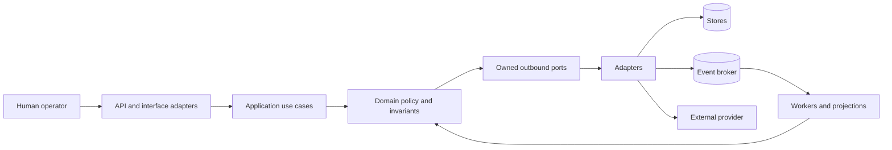
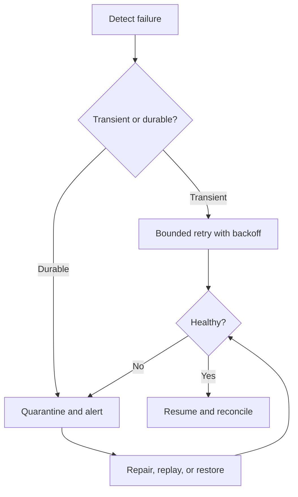
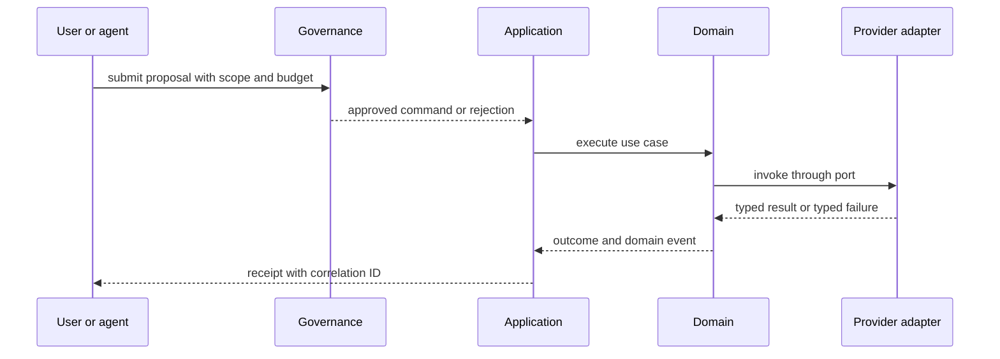
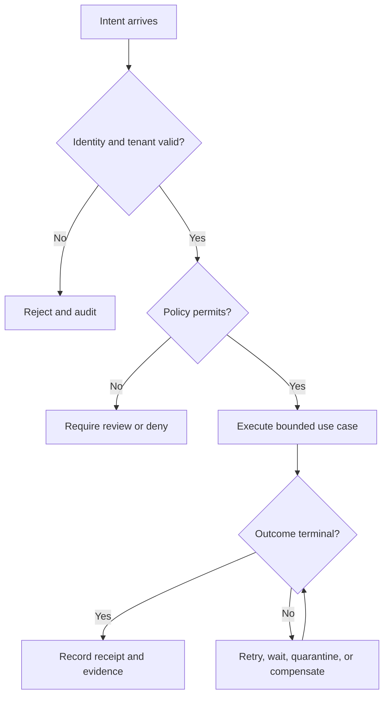
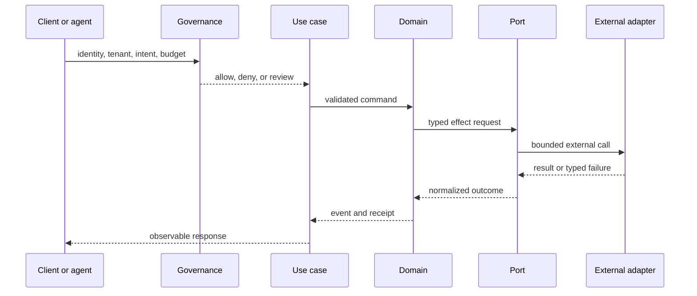
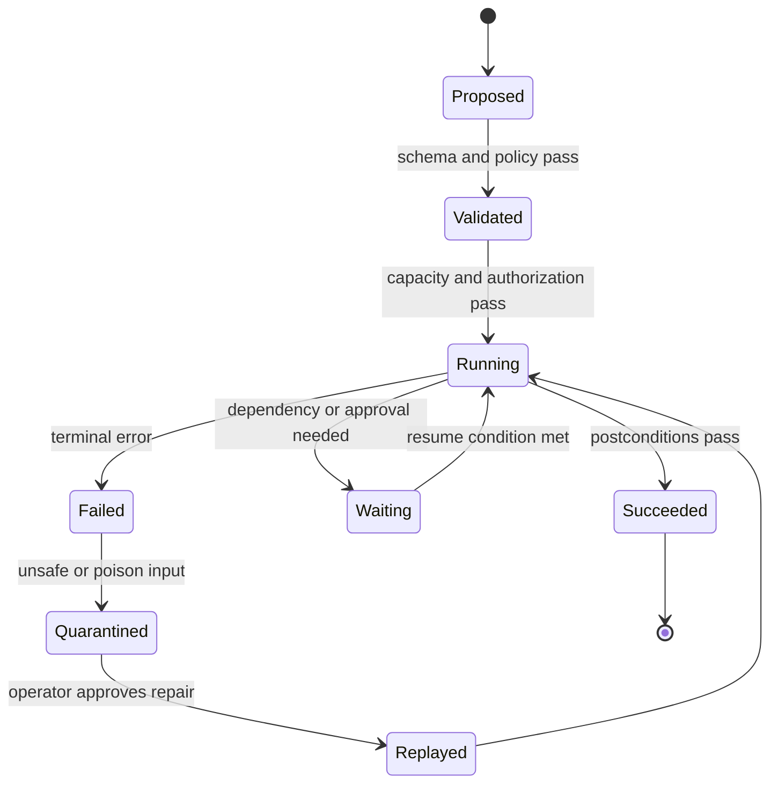
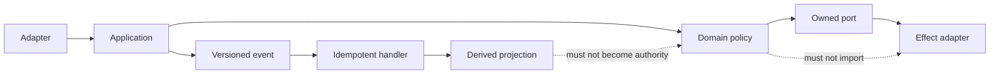

# Architecture

Status: Draft

Version: 0.1.0

Project: CAT (Commerce AI Trinity)

Company: Omni System

Last Updated: 2026-08-01

Purpose

Scope


# CAT Architecture — Foundation Blueprint (Part 1)

> **Document ID:** CAT-ARCH-004
> **Status:** Official — Part 1 of the architecture programme; 25% complete
> **Version:** 0.2.0
> **Owner:** Lead Repository Architect, CAT Project
> **Authority:** This document is normative for architectural shape. It must be read with `context/00_PROJECT_CONTEXT.md`, `context/01_PROJECT_OVERVIEW.md`, `context/02_PROJECT_RULES.md`, and `context/03_TECH_STACK.md`.
> **Audience:** Humans, Codex, Claude Code, Gemini CLI, Cursor, operators, reviewers, and future CAT coding agents.
> **Part 1 scope:** Foundation philosophy, architectural styles, boundaries, invariants, views, governance, and completion contract. Detailed domain contracts, deployment manifests, and implementation blueprints are reserved for Part 2 and later.
> **Last updated:** 2026-08-03

## Reading and authority contract

This is an append-only continuation of the repository's architecture placeholder. The pre-existing lines above are retained verbatim. New architectural statements in this part are deliberately explicit: **MUST** and **MUST NOT** are binding; **SHOULD** and **SHOULD NOT** are defaults that require a documented reason to depart from; **MAY** is optional. Where this document is silent, the project constitution and an accepted ADR govern. An implementation is not architecture-complete merely because it compiles; it must satisfy the invariants, observability, security, recovery, and documentation contracts below.

### Navigation

1. [Architecture Philosophy](#1-architecture-philosophy)
2. [Architecture Vision](#2-architecture-vision)
3. [Why CAT Architecture Exists](#3-why-cat-architecture-exists)
4. [Architecture Principles](#4-architecture-principles)
5. [AI Native Architecture](#5-ai-native-architecture)
6. [Modular Architecture](#6-modular-architecture)
7. [Layered Architecture](#7-layered-architecture)
8. [Event Driven Architecture](#8-event-driven-architecture)
9. [Domain Driven Design](#9-domain-driven-design)
10. [Clean Architecture](#10-clean-architecture)
11. [Hexagonal Architecture](#11-hexagonal-architecture)
12. [CQRS Philosophy](#12-cqrs-philosophy)
13. [Event Sourcing Philosophy](#13-event-sourcing-philosophy)
14. [Service Boundaries](#14-service-boundaries)
15. [Bounded Contexts](#15-bounded-contexts)
16. [Dependency Rules](#16-dependency-rules)
17. [Architectural Invariants](#17-architectural-invariants)
18. [Cross-Cutting Concerns](#18-cross-cutting-concerns)
19. [Architecture Decision Process](#19-architecture-decision-process)
20. [Architecture Completion Contract](#20-architecture-completion-contract)
21. [Architecture view model](#21-architecture-view-model)
22. [Implementation decision register](#22-implementation-decision-register)
23. [Visual catalogue](#231-high-level-architecture)
24. [Part 1 validation contract](#24-part-1-validation-contract)

## Normative vocabulary and change policy

| Term | Meaning in CAT |
|---|---|
| Authoritative | The statement wins within its declared scope and has an owner. |
| Boundary | A rule-enforced seam across which data, control, ownership, or failure may pass. |
| Domain event | A fact meaningful to a bounded context, immutable after publication. |
| Integration event | A versioned message intentionally exposed to another context. |
| Port | An application-facing interface owned by the inside of a hexagon. |
| Adapter | A replaceable outside implementation of a port. |
| Projection | A derived read model that can be rebuilt from authoritative facts or source records. |
| ADR | An Architecture Decision Record; the durable explanation for a non-trivial choice. |

A change that crosses a boundary, changes an invariant, introduces a new persistence model, changes trust, or changes an operational SLO MUST include an ADR before merge. A local refactor that preserves contracts MAY use a normal pull request record. No agent may infer permission from an empty directory, a stub file, or a convenient framework default.

## 1. Architecture Philosophy

**Architecture ID:** CAT-ARCH-01
**Decision status:** Foundation decision; implementation details require linked ADRs.

Architecture is a promise about change: it makes important change cheap, dangerous change visible, and irreversible change deliberate. CAT chooses explicit seams over accidental coupling and boring mechanisms over novelty.

**Scope statement:** A reader can predict where a capability belongs, what it may call, what it may publish, and how it is recovered. Architecture is not a diagram-only artifact; it is enforced through package boundaries, contracts, tests, telemetry, and review.

### 1.1 Human Explanation

Explain the decision in plain language for a new contributor.

**CAT position:** Architecture is a promise about change: it makes important change cheap, dangerous change visible, and irreversible change deliberate. CAT chooses explicit seams over accidental coupling and boring mechanisms over novelty. A reader can predict where a capability belongs, what it may call, what it may publish, and how it is recovered. Architecture is not a diagram-only artifact; it is enforced through package boundaries, contracts, tests, telemetry, and review.

**Implementation contract:**

| Field | Requirement |
|---|---|
| Programming language | Use the repository-approved language for the owning module; do not introduce a language by implication. |
| Framework | Frameworks remain adapters; record the selected framework in a TDC/ADR. |
| Runtime | Define timeout, cancellation, retry, concurrency, and resource limits before production. |
| Repository location | The owning context directory, with implementation under the corresponding approved module path. |
| Owner | Named domain or platform owner; an anonymous team is not an owner. |
| Related services | Only published ports and versioned integration contracts. |
| Related ADR | Link an accepted ADR for every material deviation or irreversible choice. |
| Related rules | `context/02_PROJECT_RULES.md`, this document, security and technology rules. |
| Related documents | `context/00_PROJECT_CONTEXT.md`, `context/01_PROJECT_OVERVIEW.md`, `context/03_TECH_STACK.md`, and the owning context document. |

**Acceptance evidence:** a contract test, an architecture test where applicable, structured telemetry, a failure-mode test, and documentation review.

### 1.2 AI Explanation

State how an AI coding agent must interpret and apply the decision.

**CAT position:** Architecture is a promise about change: it makes important change cheap, dangerous change visible, and irreversible change deliberate. CAT chooses explicit seams over accidental coupling and boring mechanisms over novelty. A reader can predict where a capability belongs, what it may call, what it may publish, and how it is recovered. Architecture is not a diagram-only artifact; it is enforced through package boundaries, contracts, tests, telemetry, and review.

**Implementation contract:**

| Field | Requirement |
|---|---|
| Programming language | Use the repository-approved language for the owning module; do not introduce a language by implication. |
| Framework | Frameworks remain adapters; record the selected framework in a TDC/ADR. |
| Runtime | Define timeout, cancellation, retry, concurrency, and resource limits before production. |
| Repository location | The owning context directory, with implementation under the corresponding approved module path. |
| Owner | Named domain or platform owner; an anonymous team is not an owner. |
| Related services | Only published ports and versioned integration contracts. |
| Related ADR | Link an accepted ADR for every material deviation or irreversible choice. |
| Related rules | `context/02_PROJECT_RULES.md`, this document, security and technology rules. |
| Related documents | `context/00_PROJECT_CONTEXT.md`, `context/01_PROJECT_OVERVIEW.md`, `context/03_TECH_STACK.md`, and the owning context document. |

**Acceptance evidence:** a contract test, an architecture test where applicable, structured telemetry, a failure-mode test, and documentation review.

### 1.3 Business Perspective

Connect the decision to value, trust, cost, speed, and accountability.

**CAT position:** Architecture is a promise about change: it makes important change cheap, dangerous change visible, and irreversible change deliberate. CAT chooses explicit seams over accidental coupling and boring mechanisms over novelty. A reader can predict where a capability belongs, what it may call, what it may publish, and how it is recovered. Architecture is not a diagram-only artifact; it is enforced through package boundaries, contracts, tests, telemetry, and review.

**Implementation contract:**

| Field | Requirement |
|---|---|
| Programming language | Use the repository-approved language for the owning module; do not introduce a language by implication. |
| Framework | Frameworks remain adapters; record the selected framework in a TDC/ADR. |
| Runtime | Define timeout, cancellation, retry, concurrency, and resource limits before production. |
| Repository location | The owning context directory, with implementation under the corresponding approved module path. |
| Owner | Named domain or platform owner; an anonymous team is not an owner. |
| Related services | Only published ports and versioned integration contracts. |
| Related ADR | Link an accepted ADR for every material deviation or irreversible choice. |
| Related rules | `context/02_PROJECT_RULES.md`, this document, security and technology rules. |
| Related documents | `context/00_PROJECT_CONTEXT.md`, `context/01_PROJECT_OVERVIEW.md`, `context/03_TECH_STACK.md`, and the owning context document. |

**Acceptance evidence:** a contract test, an architecture test where applicable, structured telemetry, a failure-mode test, and documentation review.

### 1.4 Engineering Perspective

Describe code structure, interfaces, testing, ownership, and maintenance.

**CAT position:** Architecture is a promise about change: it makes important change cheap, dangerous change visible, and irreversible change deliberate. CAT chooses explicit seams over accidental coupling and boring mechanisms over novelty. A reader can predict where a capability belongs, what it may call, what it may publish, and how it is recovered. Architecture is not a diagram-only artifact; it is enforced through package boundaries, contracts, tests, telemetry, and review.

**Implementation contract:**

| Field | Requirement |
|---|---|
| Programming language | Use the repository-approved language for the owning module; do not introduce a language by implication. |
| Framework | Frameworks remain adapters; record the selected framework in a TDC/ADR. |
| Runtime | Define timeout, cancellation, retry, concurrency, and resource limits before production. |
| Repository location | The owning context directory, with implementation under the corresponding approved module path. |
| Owner | Named domain or platform owner; an anonymous team is not an owner. |
| Related services | Only published ports and versioned integration contracts. |
| Related ADR | Link an accepted ADR for every material deviation or irreversible choice. |
| Related rules | `context/02_PROJECT_RULES.md`, this document, security and technology rules. |
| Related documents | `context/00_PROJECT_CONTEXT.md`, `context/01_PROJECT_OVERVIEW.md`, `context/03_TECH_STACK.md`, and the owning context document. |

**Acceptance evidence:** a contract test, an architecture test where applicable, structured telemetry, a failure-mode test, and documentation review.

### 1.5 Runtime Perspective

Describe calls, state, failure, timing, telemetry, and operational behavior.

**CAT position:** Architecture is a promise about change: it makes important change cheap, dangerous change visible, and irreversible change deliberate. CAT chooses explicit seams over accidental coupling and boring mechanisms over novelty. A reader can predict where a capability belongs, what it may call, what it may publish, and how it is recovered. Architecture is not a diagram-only artifact; it is enforced through package boundaries, contracts, tests, telemetry, and review.

**Implementation contract:**

| Field | Requirement |
|---|---|
| Programming language | Use the repository-approved language for the owning module; do not introduce a language by implication. |
| Framework | Frameworks remain adapters; record the selected framework in a TDC/ADR. |
| Runtime | Define timeout, cancellation, retry, concurrency, and resource limits before production. |
| Repository location | The owning context directory, with implementation under the corresponding approved module path. |
| Owner | Named domain or platform owner; an anonymous team is not an owner. |
| Related services | Only published ports and versioned integration contracts. |
| Related ADR | Link an accepted ADR for every material deviation or irreversible choice. |
| Related rules | `context/02_PROJECT_RULES.md`, this document, security and technology rules. |
| Related documents | `context/00_PROJECT_CONTEXT.md`, `context/01_PROJECT_OVERVIEW.md`, `context/03_TECH_STACK.md`, and the owning context document. |

**Acceptance evidence:** a contract test, an architecture test where applicable, structured telemetry, a failure-mode test, and documentation review.

### 1.6 Future Evolution

Describe a safe path for scale, new domains, new providers, and new deployment shapes.

**CAT position:** Architecture is a promise about change: it makes important change cheap, dangerous change visible, and irreversible change deliberate. CAT chooses explicit seams over accidental coupling and boring mechanisms over novelty. A reader can predict where a capability belongs, what it may call, what it may publish, and how it is recovered. Architecture is not a diagram-only artifact; it is enforced through package boundaries, contracts, tests, telemetry, and review.

**Implementation contract:**

| Field | Requirement |
|---|---|
| Programming language | Use the repository-approved language for the owning module; do not introduce a language by implication. |
| Framework | Frameworks remain adapters; record the selected framework in a TDC/ADR. |
| Runtime | Define timeout, cancellation, retry, concurrency, and resource limits before production. |
| Repository location | The owning context directory, with implementation under the corresponding approved module path. |
| Owner | Named domain or platform owner; an anonymous team is not an owner. |
| Related services | Only published ports and versioned integration contracts. |
| Related ADR | Link an accepted ADR for every material deviation or irreversible choice. |
| Related rules | `context/02_PROJECT_RULES.md`, this document, security and technology rules. |
| Related documents | `context/00_PROJECT_CONTEXT.md`, `context/01_PROJECT_OVERVIEW.md`, `context/03_TECH_STACK.md`, and the owning context document. |

**Acceptance evidence:** a contract test, an architecture test where applicable, structured telemetry, a failure-mode test, and documentation review.

### 1.7 Risks

Name failure modes, including silent coupling, data loss, policy bypass, and operational overload.

**CAT position:** Architecture is a promise about change: it makes important change cheap, dangerous change visible, and irreversible change deliberate. CAT chooses explicit seams over accidental coupling and boring mechanisms over novelty. A reader can predict where a capability belongs, what it may call, what it may publish, and how it is recovered. Architecture is not a diagram-only artifact; it is enforced through package boundaries, contracts, tests, telemetry, and review.

**Implementation contract:**

| Field | Requirement |
|---|---|
| Programming language | Use the repository-approved language for the owning module; do not introduce a language by implication. |
| Framework | Frameworks remain adapters; record the selected framework in a TDC/ADR. |
| Runtime | Define timeout, cancellation, retry, concurrency, and resource limits before production. |
| Repository location | The owning context directory, with implementation under the corresponding approved module path. |
| Owner | Named domain or platform owner; an anonymous team is not an owner. |
| Related services | Only published ports and versioned integration contracts. |
| Related ADR | Link an accepted ADR for every material deviation or irreversible choice. |
| Related rules | `context/02_PROJECT_RULES.md`, this document, security and technology rules. |
| Related documents | `context/00_PROJECT_CONTEXT.md`, `context/01_PROJECT_OVERVIEW.md`, `context/03_TECH_STACK.md`, and the owning context document. |

**Acceptance evidence:** a contract test, an architecture test where applicable, structured telemetry, a failure-mode test, and documentation review.

### 1.8 Trade-offs

Name what CAT gains and what it deliberately gives up.

**CAT position:** Architecture is a promise about change: it makes important change cheap, dangerous change visible, and irreversible change deliberate. CAT chooses explicit seams over accidental coupling and boring mechanisms over novelty. A reader can predict where a capability belongs, what it may call, what it may publish, and how it is recovered. Architecture is not a diagram-only artifact; it is enforced through package boundaries, contracts, tests, telemetry, and review.

**Implementation contract:**

| Field | Requirement |
|---|---|
| Programming language | Use the repository-approved language for the owning module; do not introduce a language by implication. |
| Framework | Frameworks remain adapters; record the selected framework in a TDC/ADR. |
| Runtime | Define timeout, cancellation, retry, concurrency, and resource limits before production. |
| Repository location | The owning context directory, with implementation under the corresponding approved module path. |
| Owner | Named domain or platform owner; an anonymous team is not an owner. |
| Related services | Only published ports and versioned integration contracts. |
| Related ADR | Link an accepted ADR for every material deviation or irreversible choice. |
| Related rules | `context/02_PROJECT_RULES.md`, this document, security and technology rules. |
| Related documents | `context/00_PROJECT_CONTEXT.md`, `context/01_PROJECT_OVERVIEW.md`, `context/03_TECH_STACK.md`, and the owning context document. |

**Acceptance evidence:** a contract test, an architecture test where applicable, structured telemetry, a failure-mode test, and documentation review.

### 1.9 Alternatives

List credible alternatives and the condition under which one could be reconsidered.

**CAT position:** Architecture is a promise about change: it makes important change cheap, dangerous change visible, and irreversible change deliberate. CAT chooses explicit seams over accidental coupling and boring mechanisms over novelty. A reader can predict where a capability belongs, what it may call, what it may publish, and how it is recovered. Architecture is not a diagram-only artifact; it is enforced through package boundaries, contracts, tests, telemetry, and review.

**Implementation contract:**

| Field | Requirement |
|---|---|
| Programming language | Use the repository-approved language for the owning module; do not introduce a language by implication. |
| Framework | Frameworks remain adapters; record the selected framework in a TDC/ADR. |
| Runtime | Define timeout, cancellation, retry, concurrency, and resource limits before production. |
| Repository location | The owning context directory, with implementation under the corresponding approved module path. |
| Owner | Named domain or platform owner; an anonymous team is not an owner. |
| Related services | Only published ports and versioned integration contracts. |
| Related ADR | Link an accepted ADR for every material deviation or irreversible choice. |
| Related rules | `context/02_PROJECT_RULES.md`, this document, security and technology rules. |
| Related documents | `context/00_PROJECT_CONTEXT.md`, `context/01_PROJECT_OVERVIEW.md`, `context/03_TECH_STACK.md`, and the owning context document. |

**Acceptance evidence:** a contract test, an architecture test where applicable, structured telemetry, a failure-mode test, and documentation review.

### 1.10 Why this decision was chosen

Give the rationale in terms of CAT’s ten-year, AI-native, governed operating model.

**CAT position:** Architecture is a promise about change: it makes important change cheap, dangerous change visible, and irreversible change deliberate. CAT chooses explicit seams over accidental coupling and boring mechanisms over novelty. A reader can predict where a capability belongs, what it may call, what it may publish, and how it is recovered. Architecture is not a diagram-only artifact; it is enforced through package boundaries, contracts, tests, telemetry, and review.

**Implementation contract:**

| Field | Requirement |
|---|---|
| Programming language | Use the repository-approved language for the owning module; do not introduce a language by implication. |
| Framework | Frameworks remain adapters; record the selected framework in a TDC/ADR. |
| Runtime | Define timeout, cancellation, retry, concurrency, and resource limits before production. |
| Repository location | The owning context directory, with implementation under the corresponding approved module path. |
| Owner | Named domain or platform owner; an anonymous team is not an owner. |
| Related services | Only published ports and versioned integration contracts. |
| Related ADR | Link an accepted ADR for every material deviation or irreversible choice. |
| Related rules | `context/02_PROJECT_RULES.md`, this document, security and technology rules. |
| Related documents | `context/00_PROJECT_CONTEXT.md`, `context/01_PROJECT_OVERVIEW.md`, `context/03_TECH_STACK.md`, and the owning context document. |

**Acceptance evidence:** a contract test, an architecture test where applicable, structured telemetry, a failure-mode test, and documentation review.

---

## 2. Architecture Vision

**Architecture ID:** CAT-ARCH-02
**Decision status:** Foundation decision; implementation details require linked ADRs.

CAT is an AI-native commerce operating system that coordinates knowledge, agents, content, affiliate activity, treasury, approvals, and evidence without allowing automation to silently exceed its authority.

**Scope statement:** The long-lived shape is a governed capability platform: independently understandable modules, explicit domain ownership, durable facts, replaceable AI providers, and human-controlled risk gates.

### 2.1 Human Explanation

Explain the decision in plain language for a new contributor.

**CAT position:** CAT is an AI-native commerce operating system that coordinates knowledge, agents, content, affiliate activity, treasury, approvals, and evidence without allowing automation to silently exceed its authority. The long-lived shape is a governed capability platform: independently understandable modules, explicit domain ownership, durable facts, replaceable AI providers, and human-controlled risk gates.

**Implementation contract:**

| Field | Requirement |
|---|---|
| Programming language | Use the repository-approved language for the owning module; do not introduce a language by implication. |
| Framework | Frameworks remain adapters; record the selected framework in a TDC/ADR. |
| Runtime | Define timeout, cancellation, retry, concurrency, and resource limits before production. |
| Repository location | The owning context directory, with implementation under the corresponding approved module path. |
| Owner | Named domain or platform owner; an anonymous team is not an owner. |
| Related services | Only published ports and versioned integration contracts. |
| Related ADR | Link an accepted ADR for every material deviation or irreversible choice. |
| Related rules | `context/02_PROJECT_RULES.md`, this document, security and technology rules. |
| Related documents | `context/00_PROJECT_CONTEXT.md`, `context/01_PROJECT_OVERVIEW.md`, `context/03_TECH_STACK.md`, and the owning context document. |

**Acceptance evidence:** a contract test, an architecture test where applicable, structured telemetry, a failure-mode test, and documentation review.

### 2.2 AI Explanation

State how an AI coding agent must interpret and apply the decision.

**CAT position:** CAT is an AI-native commerce operating system that coordinates knowledge, agents, content, affiliate activity, treasury, approvals, and evidence without allowing automation to silently exceed its authority. The long-lived shape is a governed capability platform: independently understandable modules, explicit domain ownership, durable facts, replaceable AI providers, and human-controlled risk gates.

**Implementation contract:**

| Field | Requirement |
|---|---|
| Programming language | Use the repository-approved language for the owning module; do not introduce a language by implication. |
| Framework | Frameworks remain adapters; record the selected framework in a TDC/ADR. |
| Runtime | Define timeout, cancellation, retry, concurrency, and resource limits before production. |
| Repository location | The owning context directory, with implementation under the corresponding approved module path. |
| Owner | Named domain or platform owner; an anonymous team is not an owner. |
| Related services | Only published ports and versioned integration contracts. |
| Related ADR | Link an accepted ADR for every material deviation or irreversible choice. |
| Related rules | `context/02_PROJECT_RULES.md`, this document, security and technology rules. |
| Related documents | `context/00_PROJECT_CONTEXT.md`, `context/01_PROJECT_OVERVIEW.md`, `context/03_TECH_STACK.md`, and the owning context document. |

**Acceptance evidence:** a contract test, an architecture test where applicable, structured telemetry, a failure-mode test, and documentation review.

### 2.3 Business Perspective

Connect the decision to value, trust, cost, speed, and accountability.

**CAT position:** CAT is an AI-native commerce operating system that coordinates knowledge, agents, content, affiliate activity, treasury, approvals, and evidence without allowing automation to silently exceed its authority. The long-lived shape is a governed capability platform: independently understandable modules, explicit domain ownership, durable facts, replaceable AI providers, and human-controlled risk gates.

**Implementation contract:**

| Field | Requirement |
|---|---|
| Programming language | Use the repository-approved language for the owning module; do not introduce a language by implication. |
| Framework | Frameworks remain adapters; record the selected framework in a TDC/ADR. |
| Runtime | Define timeout, cancellation, retry, concurrency, and resource limits before production. |
| Repository location | The owning context directory, with implementation under the corresponding approved module path. |
| Owner | Named domain or platform owner; an anonymous team is not an owner. |
| Related services | Only published ports and versioned integration contracts. |
| Related ADR | Link an accepted ADR for every material deviation or irreversible choice. |
| Related rules | `context/02_PROJECT_RULES.md`, this document, security and technology rules. |
| Related documents | `context/00_PROJECT_CONTEXT.md`, `context/01_PROJECT_OVERVIEW.md`, `context/03_TECH_STACK.md`, and the owning context document. |

**Acceptance evidence:** a contract test, an architecture test where applicable, structured telemetry, a failure-mode test, and documentation review.

### 2.4 Engineering Perspective

Describe code structure, interfaces, testing, ownership, and maintenance.

**CAT position:** CAT is an AI-native commerce operating system that coordinates knowledge, agents, content, affiliate activity, treasury, approvals, and evidence without allowing automation to silently exceed its authority. The long-lived shape is a governed capability platform: independently understandable modules, explicit domain ownership, durable facts, replaceable AI providers, and human-controlled risk gates.

**Implementation contract:**

| Field | Requirement |
|---|---|
| Programming language | Use the repository-approved language for the owning module; do not introduce a language by implication. |
| Framework | Frameworks remain adapters; record the selected framework in a TDC/ADR. |
| Runtime | Define timeout, cancellation, retry, concurrency, and resource limits before production. |
| Repository location | The owning context directory, with implementation under the corresponding approved module path. |
| Owner | Named domain or platform owner; an anonymous team is not an owner. |
| Related services | Only published ports and versioned integration contracts. |
| Related ADR | Link an accepted ADR for every material deviation or irreversible choice. |
| Related rules | `context/02_PROJECT_RULES.md`, this document, security and technology rules. |
| Related documents | `context/00_PROJECT_CONTEXT.md`, `context/01_PROJECT_OVERVIEW.md`, `context/03_TECH_STACK.md`, and the owning context document. |

**Acceptance evidence:** a contract test, an architecture test where applicable, structured telemetry, a failure-mode test, and documentation review.

### 2.5 Runtime Perspective

Describe calls, state, failure, timing, telemetry, and operational behavior.

**CAT position:** CAT is an AI-native commerce operating system that coordinates knowledge, agents, content, affiliate activity, treasury, approvals, and evidence without allowing automation to silently exceed its authority. The long-lived shape is a governed capability platform: independently understandable modules, explicit domain ownership, durable facts, replaceable AI providers, and human-controlled risk gates.

**Implementation contract:**

| Field | Requirement |
|---|---|
| Programming language | Use the repository-approved language for the owning module; do not introduce a language by implication. |
| Framework | Frameworks remain adapters; record the selected framework in a TDC/ADR. |
| Runtime | Define timeout, cancellation, retry, concurrency, and resource limits before production. |
| Repository location | The owning context directory, with implementation under the corresponding approved module path. |
| Owner | Named domain or platform owner; an anonymous team is not an owner. |
| Related services | Only published ports and versioned integration contracts. |
| Related ADR | Link an accepted ADR for every material deviation or irreversible choice. |
| Related rules | `context/02_PROJECT_RULES.md`, this document, security and technology rules. |
| Related documents | `context/00_PROJECT_CONTEXT.md`, `context/01_PROJECT_OVERVIEW.md`, `context/03_TECH_STACK.md`, and the owning context document. |

**Acceptance evidence:** a contract test, an architecture test where applicable, structured telemetry, a failure-mode test, and documentation review.

### 2.6 Future Evolution

Describe a safe path for scale, new domains, new providers, and new deployment shapes.

**CAT position:** CAT is an AI-native commerce operating system that coordinates knowledge, agents, content, affiliate activity, treasury, approvals, and evidence without allowing automation to silently exceed its authority. The long-lived shape is a governed capability platform: independently understandable modules, explicit domain ownership, durable facts, replaceable AI providers, and human-controlled risk gates.

**Implementation contract:**

| Field | Requirement |
|---|---|
| Programming language | Use the repository-approved language for the owning module; do not introduce a language by implication. |
| Framework | Frameworks remain adapters; record the selected framework in a TDC/ADR. |
| Runtime | Define timeout, cancellation, retry, concurrency, and resource limits before production. |
| Repository location | The owning context directory, with implementation under the corresponding approved module path. |
| Owner | Named domain or platform owner; an anonymous team is not an owner. |
| Related services | Only published ports and versioned integration contracts. |
| Related ADR | Link an accepted ADR for every material deviation or irreversible choice. |
| Related rules | `context/02_PROJECT_RULES.md`, this document, security and technology rules. |
| Related documents | `context/00_PROJECT_CONTEXT.md`, `context/01_PROJECT_OVERVIEW.md`, `context/03_TECH_STACK.md`, and the owning context document. |

**Acceptance evidence:** a contract test, an architecture test where applicable, structured telemetry, a failure-mode test, and documentation review.

### 2.7 Risks

Name failure modes, including silent coupling, data loss, policy bypass, and operational overload.

**CAT position:** CAT is an AI-native commerce operating system that coordinates knowledge, agents, content, affiliate activity, treasury, approvals, and evidence without allowing automation to silently exceed its authority. The long-lived shape is a governed capability platform: independently understandable modules, explicit domain ownership, durable facts, replaceable AI providers, and human-controlled risk gates.

**Implementation contract:**

| Field | Requirement |
|---|---|
| Programming language | Use the repository-approved language for the owning module; do not introduce a language by implication. |
| Framework | Frameworks remain adapters; record the selected framework in a TDC/ADR. |
| Runtime | Define timeout, cancellation, retry, concurrency, and resource limits before production. |
| Repository location | The owning context directory, with implementation under the corresponding approved module path. |
| Owner | Named domain or platform owner; an anonymous team is not an owner. |
| Related services | Only published ports and versioned integration contracts. |
| Related ADR | Link an accepted ADR for every material deviation or irreversible choice. |
| Related rules | `context/02_PROJECT_RULES.md`, this document, security and technology rules. |
| Related documents | `context/00_PROJECT_CONTEXT.md`, `context/01_PROJECT_OVERVIEW.md`, `context/03_TECH_STACK.md`, and the owning context document. |

**Acceptance evidence:** a contract test, an architecture test where applicable, structured telemetry, a failure-mode test, and documentation review.

### 2.8 Trade-offs

Name what CAT gains and what it deliberately gives up.

**CAT position:** CAT is an AI-native commerce operating system that coordinates knowledge, agents, content, affiliate activity, treasury, approvals, and evidence without allowing automation to silently exceed its authority. The long-lived shape is a governed capability platform: independently understandable modules, explicit domain ownership, durable facts, replaceable AI providers, and human-controlled risk gates.

**Implementation contract:**

| Field | Requirement |
|---|---|
| Programming language | Use the repository-approved language for the owning module; do not introduce a language by implication. |
| Framework | Frameworks remain adapters; record the selected framework in a TDC/ADR. |
| Runtime | Define timeout, cancellation, retry, concurrency, and resource limits before production. |
| Repository location | The owning context directory, with implementation under the corresponding approved module path. |
| Owner | Named domain or platform owner; an anonymous team is not an owner. |
| Related services | Only published ports and versioned integration contracts. |
| Related ADR | Link an accepted ADR for every material deviation or irreversible choice. |
| Related rules | `context/02_PROJECT_RULES.md`, this document, security and technology rules. |
| Related documents | `context/00_PROJECT_CONTEXT.md`, `context/01_PROJECT_OVERVIEW.md`, `context/03_TECH_STACK.md`, and the owning context document. |

**Acceptance evidence:** a contract test, an architecture test where applicable, structured telemetry, a failure-mode test, and documentation review.

### 2.9 Alternatives

List credible alternatives and the condition under which one could be reconsidered.

**CAT position:** CAT is an AI-native commerce operating system that coordinates knowledge, agents, content, affiliate activity, treasury, approvals, and evidence without allowing automation to silently exceed its authority. The long-lived shape is a governed capability platform: independently understandable modules, explicit domain ownership, durable facts, replaceable AI providers, and human-controlled risk gates.

**Implementation contract:**

| Field | Requirement |
|---|---|
| Programming language | Use the repository-approved language for the owning module; do not introduce a language by implication. |
| Framework | Frameworks remain adapters; record the selected framework in a TDC/ADR. |
| Runtime | Define timeout, cancellation, retry, concurrency, and resource limits before production. |
| Repository location | The owning context directory, with implementation under the corresponding approved module path. |
| Owner | Named domain or platform owner; an anonymous team is not an owner. |
| Related services | Only published ports and versioned integration contracts. |
| Related ADR | Link an accepted ADR for every material deviation or irreversible choice. |
| Related rules | `context/02_PROJECT_RULES.md`, this document, security and technology rules. |
| Related documents | `context/00_PROJECT_CONTEXT.md`, `context/01_PROJECT_OVERVIEW.md`, `context/03_TECH_STACK.md`, and the owning context document. |

**Acceptance evidence:** a contract test, an architecture test where applicable, structured telemetry, a failure-mode test, and documentation review.

### 2.10 Why this decision was chosen

Give the rationale in terms of CAT’s ten-year, AI-native, governed operating model.

**CAT position:** CAT is an AI-native commerce operating system that coordinates knowledge, agents, content, affiliate activity, treasury, approvals, and evidence without allowing automation to silently exceed its authority. The long-lived shape is a governed capability platform: independently understandable modules, explicit domain ownership, durable facts, replaceable AI providers, and human-controlled risk gates.

**Implementation contract:**

| Field | Requirement |
|---|---|
| Programming language | Use the repository-approved language for the owning module; do not introduce a language by implication. |
| Framework | Frameworks remain adapters; record the selected framework in a TDC/ADR. |
| Runtime | Define timeout, cancellation, retry, concurrency, and resource limits before production. |
| Repository location | The owning context directory, with implementation under the corresponding approved module path. |
| Owner | Named domain or platform owner; an anonymous team is not an owner. |
| Related services | Only published ports and versioned integration contracts. |
| Related ADR | Link an accepted ADR for every material deviation or irreversible choice. |
| Related rules | `context/02_PROJECT_RULES.md`, this document, security and technology rules. |
| Related documents | `context/00_PROJECT_CONTEXT.md`, `context/01_PROJECT_OVERVIEW.md`, `context/03_TECH_STACK.md`, and the owning context document. |

**Acceptance evidence:** a contract test, an architecture test where applicable, structured telemetry, a failure-mode test, and documentation review.

---

## 3. Why CAT Architecture Exists

**Architecture ID:** CAT-ARCH-03
**Decision status:** Foundation decision; implementation details require linked ADRs.

CAT must survive ten years of model churn, team turnover, provider changes, increasing transaction volume, and new domains. Written architecture prevents plausible-but-wrong reconstruction by humans and models.

**Scope statement:** The architecture turns product intent into constraints that can be checked in code review and in automated validation.

### 3.1 Human Explanation

Explain the decision in plain language for a new contributor.

**CAT position:** CAT must survive ten years of model churn, team turnover, provider changes, increasing transaction volume, and new domains. Written architecture prevents plausible-but-wrong reconstruction by humans and models. The architecture turns product intent into constraints that can be checked in code review and in automated validation.

**Implementation contract:**

| Field | Requirement |
|---|---|
| Programming language | Use the repository-approved language for the owning module; do not introduce a language by implication. |
| Framework | Frameworks remain adapters; record the selected framework in a TDC/ADR. |
| Runtime | Define timeout, cancellation, retry, concurrency, and resource limits before production. |
| Repository location | The owning context directory, with implementation under the corresponding approved module path. |
| Owner | Named domain or platform owner; an anonymous team is not an owner. |
| Related services | Only published ports and versioned integration contracts. |
| Related ADR | Link an accepted ADR for every material deviation or irreversible choice. |
| Related rules | `context/02_PROJECT_RULES.md`, this document, security and technology rules. |
| Related documents | `context/00_PROJECT_CONTEXT.md`, `context/01_PROJECT_OVERVIEW.md`, `context/03_TECH_STACK.md`, and the owning context document. |

**Acceptance evidence:** a contract test, an architecture test where applicable, structured telemetry, a failure-mode test, and documentation review.

### 3.2 AI Explanation

State how an AI coding agent must interpret and apply the decision.

**CAT position:** CAT must survive ten years of model churn, team turnover, provider changes, increasing transaction volume, and new domains. Written architecture prevents plausible-but-wrong reconstruction by humans and models. The architecture turns product intent into constraints that can be checked in code review and in automated validation.

**Implementation contract:**

| Field | Requirement |
|---|---|
| Programming language | Use the repository-approved language for the owning module; do not introduce a language by implication. |
| Framework | Frameworks remain adapters; record the selected framework in a TDC/ADR. |
| Runtime | Define timeout, cancellation, retry, concurrency, and resource limits before production. |
| Repository location | The owning context directory, with implementation under the corresponding approved module path. |
| Owner | Named domain or platform owner; an anonymous team is not an owner. |
| Related services | Only published ports and versioned integration contracts. |
| Related ADR | Link an accepted ADR for every material deviation or irreversible choice. |
| Related rules | `context/02_PROJECT_RULES.md`, this document, security and technology rules. |
| Related documents | `context/00_PROJECT_CONTEXT.md`, `context/01_PROJECT_OVERVIEW.md`, `context/03_TECH_STACK.md`, and the owning context document. |

**Acceptance evidence:** a contract test, an architecture test where applicable, structured telemetry, a failure-mode test, and documentation review.

### 3.3 Business Perspective

Connect the decision to value, trust, cost, speed, and accountability.

**CAT position:** CAT must survive ten years of model churn, team turnover, provider changes, increasing transaction volume, and new domains. Written architecture prevents plausible-but-wrong reconstruction by humans and models. The architecture turns product intent into constraints that can be checked in code review and in automated validation.

**Implementation contract:**

| Field | Requirement |
|---|---|
| Programming language | Use the repository-approved language for the owning module; do not introduce a language by implication. |
| Framework | Frameworks remain adapters; record the selected framework in a TDC/ADR. |
| Runtime | Define timeout, cancellation, retry, concurrency, and resource limits before production. |
| Repository location | The owning context directory, with implementation under the corresponding approved module path. |
| Owner | Named domain or platform owner; an anonymous team is not an owner. |
| Related services | Only published ports and versioned integration contracts. |
| Related ADR | Link an accepted ADR for every material deviation or irreversible choice. |
| Related rules | `context/02_PROJECT_RULES.md`, this document, security and technology rules. |
| Related documents | `context/00_PROJECT_CONTEXT.md`, `context/01_PROJECT_OVERVIEW.md`, `context/03_TECH_STACK.md`, and the owning context document. |

**Acceptance evidence:** a contract test, an architecture test where applicable, structured telemetry, a failure-mode test, and documentation review.

### 3.4 Engineering Perspective

Describe code structure, interfaces, testing, ownership, and maintenance.

**CAT position:** CAT must survive ten years of model churn, team turnover, provider changes, increasing transaction volume, and new domains. Written architecture prevents plausible-but-wrong reconstruction by humans and models. The architecture turns product intent into constraints that can be checked in code review and in automated validation.

**Implementation contract:**

| Field | Requirement |
|---|---|
| Programming language | Use the repository-approved language for the owning module; do not introduce a language by implication. |
| Framework | Frameworks remain adapters; record the selected framework in a TDC/ADR. |
| Runtime | Define timeout, cancellation, retry, concurrency, and resource limits before production. |
| Repository location | The owning context directory, with implementation under the corresponding approved module path. |
| Owner | Named domain or platform owner; an anonymous team is not an owner. |
| Related services | Only published ports and versioned integration contracts. |
| Related ADR | Link an accepted ADR for every material deviation or irreversible choice. |
| Related rules | `context/02_PROJECT_RULES.md`, this document, security and technology rules. |
| Related documents | `context/00_PROJECT_CONTEXT.md`, `context/01_PROJECT_OVERVIEW.md`, `context/03_TECH_STACK.md`, and the owning context document. |

**Acceptance evidence:** a contract test, an architecture test where applicable, structured telemetry, a failure-mode test, and documentation review.

### 3.5 Runtime Perspective

Describe calls, state, failure, timing, telemetry, and operational behavior.

**CAT position:** CAT must survive ten years of model churn, team turnover, provider changes, increasing transaction volume, and new domains. Written architecture prevents plausible-but-wrong reconstruction by humans and models. The architecture turns product intent into constraints that can be checked in code review and in automated validation.

**Implementation contract:**

| Field | Requirement |
|---|---|
| Programming language | Use the repository-approved language for the owning module; do not introduce a language by implication. |
| Framework | Frameworks remain adapters; record the selected framework in a TDC/ADR. |
| Runtime | Define timeout, cancellation, retry, concurrency, and resource limits before production. |
| Repository location | The owning context directory, with implementation under the corresponding approved module path. |
| Owner | Named domain or platform owner; an anonymous team is not an owner. |
| Related services | Only published ports and versioned integration contracts. |
| Related ADR | Link an accepted ADR for every material deviation or irreversible choice. |
| Related rules | `context/02_PROJECT_RULES.md`, this document, security and technology rules. |
| Related documents | `context/00_PROJECT_CONTEXT.md`, `context/01_PROJECT_OVERVIEW.md`, `context/03_TECH_STACK.md`, and the owning context document. |

**Acceptance evidence:** a contract test, an architecture test where applicable, structured telemetry, a failure-mode test, and documentation review.

### 3.6 Future Evolution

Describe a safe path for scale, new domains, new providers, and new deployment shapes.

**CAT position:** CAT must survive ten years of model churn, team turnover, provider changes, increasing transaction volume, and new domains. Written architecture prevents plausible-but-wrong reconstruction by humans and models. The architecture turns product intent into constraints that can be checked in code review and in automated validation.

**Implementation contract:**

| Field | Requirement |
|---|---|
| Programming language | Use the repository-approved language for the owning module; do not introduce a language by implication. |
| Framework | Frameworks remain adapters; record the selected framework in a TDC/ADR. |
| Runtime | Define timeout, cancellation, retry, concurrency, and resource limits before production. |
| Repository location | The owning context directory, with implementation under the corresponding approved module path. |
| Owner | Named domain or platform owner; an anonymous team is not an owner. |
| Related services | Only published ports and versioned integration contracts. |
| Related ADR | Link an accepted ADR for every material deviation or irreversible choice. |
| Related rules | `context/02_PROJECT_RULES.md`, this document, security and technology rules. |
| Related documents | `context/00_PROJECT_CONTEXT.md`, `context/01_PROJECT_OVERVIEW.md`, `context/03_TECH_STACK.md`, and the owning context document. |

**Acceptance evidence:** a contract test, an architecture test where applicable, structured telemetry, a failure-mode test, and documentation review.

### 3.7 Risks

Name failure modes, including silent coupling, data loss, policy bypass, and operational overload.

**CAT position:** CAT must survive ten years of model churn, team turnover, provider changes, increasing transaction volume, and new domains. Written architecture prevents plausible-but-wrong reconstruction by humans and models. The architecture turns product intent into constraints that can be checked in code review and in automated validation.

**Implementation contract:**

| Field | Requirement |
|---|---|
| Programming language | Use the repository-approved language for the owning module; do not introduce a language by implication. |
| Framework | Frameworks remain adapters; record the selected framework in a TDC/ADR. |
| Runtime | Define timeout, cancellation, retry, concurrency, and resource limits before production. |
| Repository location | The owning context directory, with implementation under the corresponding approved module path. |
| Owner | Named domain or platform owner; an anonymous team is not an owner. |
| Related services | Only published ports and versioned integration contracts. |
| Related ADR | Link an accepted ADR for every material deviation or irreversible choice. |
| Related rules | `context/02_PROJECT_RULES.md`, this document, security and technology rules. |
| Related documents | `context/00_PROJECT_CONTEXT.md`, `context/01_PROJECT_OVERVIEW.md`, `context/03_TECH_STACK.md`, and the owning context document. |

**Acceptance evidence:** a contract test, an architecture test where applicable, structured telemetry, a failure-mode test, and documentation review.

### 3.8 Trade-offs

Name what CAT gains and what it deliberately gives up.

**CAT position:** CAT must survive ten years of model churn, team turnover, provider changes, increasing transaction volume, and new domains. Written architecture prevents plausible-but-wrong reconstruction by humans and models. The architecture turns product intent into constraints that can be checked in code review and in automated validation.

**Implementation contract:**

| Field | Requirement |
|---|---|
| Programming language | Use the repository-approved language for the owning module; do not introduce a language by implication. |
| Framework | Frameworks remain adapters; record the selected framework in a TDC/ADR. |
| Runtime | Define timeout, cancellation, retry, concurrency, and resource limits before production. |
| Repository location | The owning context directory, with implementation under the corresponding approved module path. |
| Owner | Named domain or platform owner; an anonymous team is not an owner. |
| Related services | Only published ports and versioned integration contracts. |
| Related ADR | Link an accepted ADR for every material deviation or irreversible choice. |
| Related rules | `context/02_PROJECT_RULES.md`, this document, security and technology rules. |
| Related documents | `context/00_PROJECT_CONTEXT.md`, `context/01_PROJECT_OVERVIEW.md`, `context/03_TECH_STACK.md`, and the owning context document. |

**Acceptance evidence:** a contract test, an architecture test where applicable, structured telemetry, a failure-mode test, and documentation review.

### 3.9 Alternatives

List credible alternatives and the condition under which one could be reconsidered.

**CAT position:** CAT must survive ten years of model churn, team turnover, provider changes, increasing transaction volume, and new domains. Written architecture prevents plausible-but-wrong reconstruction by humans and models. The architecture turns product intent into constraints that can be checked in code review and in automated validation.

**Implementation contract:**

| Field | Requirement |
|---|---|
| Programming language | Use the repository-approved language for the owning module; do not introduce a language by implication. |
| Framework | Frameworks remain adapters; record the selected framework in a TDC/ADR. |
| Runtime | Define timeout, cancellation, retry, concurrency, and resource limits before production. |
| Repository location | The owning context directory, with implementation under the corresponding approved module path. |
| Owner | Named domain or platform owner; an anonymous team is not an owner. |
| Related services | Only published ports and versioned integration contracts. |
| Related ADR | Link an accepted ADR for every material deviation or irreversible choice. |
| Related rules | `context/02_PROJECT_RULES.md`, this document, security and technology rules. |
| Related documents | `context/00_PROJECT_CONTEXT.md`, `context/01_PROJECT_OVERVIEW.md`, `context/03_TECH_STACK.md`, and the owning context document. |

**Acceptance evidence:** a contract test, an architecture test where applicable, structured telemetry, a failure-mode test, and documentation review.

### 3.10 Why this decision was chosen

Give the rationale in terms of CAT’s ten-year, AI-native, governed operating model.

**CAT position:** CAT must survive ten years of model churn, team turnover, provider changes, increasing transaction volume, and new domains. Written architecture prevents plausible-but-wrong reconstruction by humans and models. The architecture turns product intent into constraints that can be checked in code review and in automated validation.

**Implementation contract:**

| Field | Requirement |
|---|---|
| Programming language | Use the repository-approved language for the owning module; do not introduce a language by implication. |
| Framework | Frameworks remain adapters; record the selected framework in a TDC/ADR. |
| Runtime | Define timeout, cancellation, retry, concurrency, and resource limits before production. |
| Repository location | The owning context directory, with implementation under the corresponding approved module path. |
| Owner | Named domain or platform owner; an anonymous team is not an owner. |
| Related services | Only published ports and versioned integration contracts. |
| Related ADR | Link an accepted ADR for every material deviation or irreversible choice. |
| Related rules | `context/02_PROJECT_RULES.md`, this document, security and technology rules. |
| Related documents | `context/00_PROJECT_CONTEXT.md`, `context/01_PROJECT_OVERVIEW.md`, `context/03_TECH_STACK.md`, and the owning context document. |

**Acceptance evidence:** a contract test, an architecture test where applicable, structured telemetry, a failure-mode test, and documentation review.

---

## 4. Architecture Principles

**Architecture ID:** CAT-ARCH-04
**Decision status:** Foundation decision; implementation details require linked ADRs.

The constitution is applied through principles: outcome before tool, explicit ownership, least privilege, reversible decisions, observable behavior, contract-first integration, graceful degradation, and documentation as a production dependency.

**Scope statement:** Principles are selection criteria, not slogans. A proposed exception states the violated principle, risk, owner, expiry, and compensating control.

### 4.1 Human Explanation

Explain the decision in plain language for a new contributor.

**CAT position:** The constitution is applied through principles: outcome before tool, explicit ownership, least privilege, reversible decisions, observable behavior, contract-first integration, graceful degradation, and documentation as a production dependency. Principles are selection criteria, not slogans. A proposed exception states the violated principle, risk, owner, expiry, and compensating control.

**Implementation contract:**

| Field | Requirement |
|---|---|
| Programming language | Use the repository-approved language for the owning module; do not introduce a language by implication. |
| Framework | Frameworks remain adapters; record the selected framework in a TDC/ADR. |
| Runtime | Define timeout, cancellation, retry, concurrency, and resource limits before production. |
| Repository location | The owning context directory, with implementation under the corresponding approved module path. |
| Owner | Named domain or platform owner; an anonymous team is not an owner. |
| Related services | Only published ports and versioned integration contracts. |
| Related ADR | Link an accepted ADR for every material deviation or irreversible choice. |
| Related rules | `context/02_PROJECT_RULES.md`, this document, security and technology rules. |
| Related documents | `context/00_PROJECT_CONTEXT.md`, `context/01_PROJECT_OVERVIEW.md`, `context/03_TECH_STACK.md`, and the owning context document. |

**Acceptance evidence:** a contract test, an architecture test where applicable, structured telemetry, a failure-mode test, and documentation review.

### 4.2 AI Explanation

State how an AI coding agent must interpret and apply the decision.

**CAT position:** The constitution is applied through principles: outcome before tool, explicit ownership, least privilege, reversible decisions, observable behavior, contract-first integration, graceful degradation, and documentation as a production dependency. Principles are selection criteria, not slogans. A proposed exception states the violated principle, risk, owner, expiry, and compensating control.

**Implementation contract:**

| Field | Requirement |
|---|---|
| Programming language | Use the repository-approved language for the owning module; do not introduce a language by implication. |
| Framework | Frameworks remain adapters; record the selected framework in a TDC/ADR. |
| Runtime | Define timeout, cancellation, retry, concurrency, and resource limits before production. |
| Repository location | The owning context directory, with implementation under the corresponding approved module path. |
| Owner | Named domain or platform owner; an anonymous team is not an owner. |
| Related services | Only published ports and versioned integration contracts. |
| Related ADR | Link an accepted ADR for every material deviation or irreversible choice. |
| Related rules | `context/02_PROJECT_RULES.md`, this document, security and technology rules. |
| Related documents | `context/00_PROJECT_CONTEXT.md`, `context/01_PROJECT_OVERVIEW.md`, `context/03_TECH_STACK.md`, and the owning context document. |

**Acceptance evidence:** a contract test, an architecture test where applicable, structured telemetry, a failure-mode test, and documentation review.

### 4.3 Business Perspective

Connect the decision to value, trust, cost, speed, and accountability.

**CAT position:** The constitution is applied through principles: outcome before tool, explicit ownership, least privilege, reversible decisions, observable behavior, contract-first integration, graceful degradation, and documentation as a production dependency. Principles are selection criteria, not slogans. A proposed exception states the violated principle, risk, owner, expiry, and compensating control.

**Implementation contract:**

| Field | Requirement |
|---|---|
| Programming language | Use the repository-approved language for the owning module; do not introduce a language by implication. |
| Framework | Frameworks remain adapters; record the selected framework in a TDC/ADR. |
| Runtime | Define timeout, cancellation, retry, concurrency, and resource limits before production. |
| Repository location | The owning context directory, with implementation under the corresponding approved module path. |
| Owner | Named domain or platform owner; an anonymous team is not an owner. |
| Related services | Only published ports and versioned integration contracts. |
| Related ADR | Link an accepted ADR for every material deviation or irreversible choice. |
| Related rules | `context/02_PROJECT_RULES.md`, this document, security and technology rules. |
| Related documents | `context/00_PROJECT_CONTEXT.md`, `context/01_PROJECT_OVERVIEW.md`, `context/03_TECH_STACK.md`, and the owning context document. |

**Acceptance evidence:** a contract test, an architecture test where applicable, structured telemetry, a failure-mode test, and documentation review.

### 4.4 Engineering Perspective

Describe code structure, interfaces, testing, ownership, and maintenance.

**CAT position:** The constitution is applied through principles: outcome before tool, explicit ownership, least privilege, reversible decisions, observable behavior, contract-first integration, graceful degradation, and documentation as a production dependency. Principles are selection criteria, not slogans. A proposed exception states the violated principle, risk, owner, expiry, and compensating control.

**Implementation contract:**

| Field | Requirement |
|---|---|
| Programming language | Use the repository-approved language for the owning module; do not introduce a language by implication. |
| Framework | Frameworks remain adapters; record the selected framework in a TDC/ADR. |
| Runtime | Define timeout, cancellation, retry, concurrency, and resource limits before production. |
| Repository location | The owning context directory, with implementation under the corresponding approved module path. |
| Owner | Named domain or platform owner; an anonymous team is not an owner. |
| Related services | Only published ports and versioned integration contracts. |
| Related ADR | Link an accepted ADR for every material deviation or irreversible choice. |
| Related rules | `context/02_PROJECT_RULES.md`, this document, security and technology rules. |
| Related documents | `context/00_PROJECT_CONTEXT.md`, `context/01_PROJECT_OVERVIEW.md`, `context/03_TECH_STACK.md`, and the owning context document. |

**Acceptance evidence:** a contract test, an architecture test where applicable, structured telemetry, a failure-mode test, and documentation review.

### 4.5 Runtime Perspective

Describe calls, state, failure, timing, telemetry, and operational behavior.

**CAT position:** The constitution is applied through principles: outcome before tool, explicit ownership, least privilege, reversible decisions, observable behavior, contract-first integration, graceful degradation, and documentation as a production dependency. Principles are selection criteria, not slogans. A proposed exception states the violated principle, risk, owner, expiry, and compensating control.

**Implementation contract:**

| Field | Requirement |
|---|---|
| Programming language | Use the repository-approved language for the owning module; do not introduce a language by implication. |
| Framework | Frameworks remain adapters; record the selected framework in a TDC/ADR. |
| Runtime | Define timeout, cancellation, retry, concurrency, and resource limits before production. |
| Repository location | The owning context directory, with implementation under the corresponding approved module path. |
| Owner | Named domain or platform owner; an anonymous team is not an owner. |
| Related services | Only published ports and versioned integration contracts. |
| Related ADR | Link an accepted ADR for every material deviation or irreversible choice. |
| Related rules | `context/02_PROJECT_RULES.md`, this document, security and technology rules. |
| Related documents | `context/00_PROJECT_CONTEXT.md`, `context/01_PROJECT_OVERVIEW.md`, `context/03_TECH_STACK.md`, and the owning context document. |

**Acceptance evidence:** a contract test, an architecture test where applicable, structured telemetry, a failure-mode test, and documentation review.

### 4.6 Future Evolution

Describe a safe path for scale, new domains, new providers, and new deployment shapes.

**CAT position:** The constitution is applied through principles: outcome before tool, explicit ownership, least privilege, reversible decisions, observable behavior, contract-first integration, graceful degradation, and documentation as a production dependency. Principles are selection criteria, not slogans. A proposed exception states the violated principle, risk, owner, expiry, and compensating control.

**Implementation contract:**

| Field | Requirement |
|---|---|
| Programming language | Use the repository-approved language for the owning module; do not introduce a language by implication. |
| Framework | Frameworks remain adapters; record the selected framework in a TDC/ADR. |
| Runtime | Define timeout, cancellation, retry, concurrency, and resource limits before production. |
| Repository location | The owning context directory, with implementation under the corresponding approved module path. |
| Owner | Named domain or platform owner; an anonymous team is not an owner. |
| Related services | Only published ports and versioned integration contracts. |
| Related ADR | Link an accepted ADR for every material deviation or irreversible choice. |
| Related rules | `context/02_PROJECT_RULES.md`, this document, security and technology rules. |
| Related documents | `context/00_PROJECT_CONTEXT.md`, `context/01_PROJECT_OVERVIEW.md`, `context/03_TECH_STACK.md`, and the owning context document. |

**Acceptance evidence:** a contract test, an architecture test where applicable, structured telemetry, a failure-mode test, and documentation review.

### 4.7 Risks

Name failure modes, including silent coupling, data loss, policy bypass, and operational overload.

**CAT position:** The constitution is applied through principles: outcome before tool, explicit ownership, least privilege, reversible decisions, observable behavior, contract-first integration, graceful degradation, and documentation as a production dependency. Principles are selection criteria, not slogans. A proposed exception states the violated principle, risk, owner, expiry, and compensating control.

**Implementation contract:**

| Field | Requirement |
|---|---|
| Programming language | Use the repository-approved language for the owning module; do not introduce a language by implication. |
| Framework | Frameworks remain adapters; record the selected framework in a TDC/ADR. |
| Runtime | Define timeout, cancellation, retry, concurrency, and resource limits before production. |
| Repository location | The owning context directory, with implementation under the corresponding approved module path. |
| Owner | Named domain or platform owner; an anonymous team is not an owner. |
| Related services | Only published ports and versioned integration contracts. |
| Related ADR | Link an accepted ADR for every material deviation or irreversible choice. |
| Related rules | `context/02_PROJECT_RULES.md`, this document, security and technology rules. |
| Related documents | `context/00_PROJECT_CONTEXT.md`, `context/01_PROJECT_OVERVIEW.md`, `context/03_TECH_STACK.md`, and the owning context document. |

**Acceptance evidence:** a contract test, an architecture test where applicable, structured telemetry, a failure-mode test, and documentation review.

### 4.8 Trade-offs

Name what CAT gains and what it deliberately gives up.

**CAT position:** The constitution is applied through principles: outcome before tool, explicit ownership, least privilege, reversible decisions, observable behavior, contract-first integration, graceful degradation, and documentation as a production dependency. Principles are selection criteria, not slogans. A proposed exception states the violated principle, risk, owner, expiry, and compensating control.

**Implementation contract:**

| Field | Requirement |
|---|---|
| Programming language | Use the repository-approved language for the owning module; do not introduce a language by implication. |
| Framework | Frameworks remain adapters; record the selected framework in a TDC/ADR. |
| Runtime | Define timeout, cancellation, retry, concurrency, and resource limits before production. |
| Repository location | The owning context directory, with implementation under the corresponding approved module path. |
| Owner | Named domain or platform owner; an anonymous team is not an owner. |
| Related services | Only published ports and versioned integration contracts. |
| Related ADR | Link an accepted ADR for every material deviation or irreversible choice. |
| Related rules | `context/02_PROJECT_RULES.md`, this document, security and technology rules. |
| Related documents | `context/00_PROJECT_CONTEXT.md`, `context/01_PROJECT_OVERVIEW.md`, `context/03_TECH_STACK.md`, and the owning context document. |

**Acceptance evidence:** a contract test, an architecture test where applicable, structured telemetry, a failure-mode test, and documentation review.

### 4.9 Alternatives

List credible alternatives and the condition under which one could be reconsidered.

**CAT position:** The constitution is applied through principles: outcome before tool, explicit ownership, least privilege, reversible decisions, observable behavior, contract-first integration, graceful degradation, and documentation as a production dependency. Principles are selection criteria, not slogans. A proposed exception states the violated principle, risk, owner, expiry, and compensating control.

**Implementation contract:**

| Field | Requirement |
|---|---|
| Programming language | Use the repository-approved language for the owning module; do not introduce a language by implication. |
| Framework | Frameworks remain adapters; record the selected framework in a TDC/ADR. |
| Runtime | Define timeout, cancellation, retry, concurrency, and resource limits before production. |
| Repository location | The owning context directory, with implementation under the corresponding approved module path. |
| Owner | Named domain or platform owner; an anonymous team is not an owner. |
| Related services | Only published ports and versioned integration contracts. |
| Related ADR | Link an accepted ADR for every material deviation or irreversible choice. |
| Related rules | `context/02_PROJECT_RULES.md`, this document, security and technology rules. |
| Related documents | `context/00_PROJECT_CONTEXT.md`, `context/01_PROJECT_OVERVIEW.md`, `context/03_TECH_STACK.md`, and the owning context document. |

**Acceptance evidence:** a contract test, an architecture test where applicable, structured telemetry, a failure-mode test, and documentation review.

### 4.10 Why this decision was chosen

Give the rationale in terms of CAT’s ten-year, AI-native, governed operating model.

**CAT position:** The constitution is applied through principles: outcome before tool, explicit ownership, least privilege, reversible decisions, observable behavior, contract-first integration, graceful degradation, and documentation as a production dependency. Principles are selection criteria, not slogans. A proposed exception states the violated principle, risk, owner, expiry, and compensating control.

**Implementation contract:**

| Field | Requirement |
|---|---|
| Programming language | Use the repository-approved language for the owning module; do not introduce a language by implication. |
| Framework | Frameworks remain adapters; record the selected framework in a TDC/ADR. |
| Runtime | Define timeout, cancellation, retry, concurrency, and resource limits before production. |
| Repository location | The owning context directory, with implementation under the corresponding approved module path. |
| Owner | Named domain or platform owner; an anonymous team is not an owner. |
| Related services | Only published ports and versioned integration contracts. |
| Related ADR | Link an accepted ADR for every material deviation or irreversible choice. |
| Related rules | `context/02_PROJECT_RULES.md`, this document, security and technology rules. |
| Related documents | `context/00_PROJECT_CONTEXT.md`, `context/01_PROJECT_OVERVIEW.md`, `context/03_TECH_STACK.md`, and the owning context document. |

**Acceptance evidence:** a contract test, an architecture test where applicable, structured telemetry, a failure-mode test, and documentation review.

---

## 5. AI Native Architecture

**Architecture ID:** CAT-ARCH-05
**Decision status:** Foundation decision; implementation details require linked ADRs.

AI is a governed participant and an untrusted probabilistic dependency, never the hidden source of truth. Agents receive scoped context, tools, policies, budgets, and approval requirements.

**Scope statement:** Every model call has an identity, purpose, input classification, output schema, policy check, cost budget, trace, and fallback. Agent output is a proposal until a deterministic policy or authorized human accepts it.

### 5.1 Human Explanation

Explain the decision in plain language for a new contributor.

**CAT position:** AI is a governed participant and an untrusted probabilistic dependency, never the hidden source of truth. Agents receive scoped context, tools, policies, budgets, and approval requirements. Every model call has an identity, purpose, input classification, output schema, policy check, cost budget, trace, and fallback. Agent output is a proposal until a deterministic policy or authorized human accepts it.

**Implementation contract:**

| Field | Requirement |
|---|---|
| Programming language | Use the repository-approved language for the owning module; do not introduce a language by implication. |
| Framework | Frameworks remain adapters; record the selected framework in a TDC/ADR. |
| Runtime | Define timeout, cancellation, retry, concurrency, and resource limits before production. |
| Repository location | The owning context directory, with implementation under the corresponding approved module path. |
| Owner | Named domain or platform owner; an anonymous team is not an owner. |
| Related services | Only published ports and versioned integration contracts. |
| Related ADR | Link an accepted ADR for every material deviation or irreversible choice. |
| Related rules | `context/02_PROJECT_RULES.md`, this document, security and technology rules. |
| Related documents | `context/00_PROJECT_CONTEXT.md`, `context/01_PROJECT_OVERVIEW.md`, `context/03_TECH_STACK.md`, and the owning context document. |

**Acceptance evidence:** a contract test, an architecture test where applicable, structured telemetry, a failure-mode test, and documentation review.

### 5.2 AI Explanation

State how an AI coding agent must interpret and apply the decision.

**CAT position:** AI is a governed participant and an untrusted probabilistic dependency, never the hidden source of truth. Agents receive scoped context, tools, policies, budgets, and approval requirements. Every model call has an identity, purpose, input classification, output schema, policy check, cost budget, trace, and fallback. Agent output is a proposal until a deterministic policy or authorized human accepts it.

**Implementation contract:**

| Field | Requirement |
|---|---|
| Programming language | Use the repository-approved language for the owning module; do not introduce a language by implication. |
| Framework | Frameworks remain adapters; record the selected framework in a TDC/ADR. |
| Runtime | Define timeout, cancellation, retry, concurrency, and resource limits before production. |
| Repository location | The owning context directory, with implementation under the corresponding approved module path. |
| Owner | Named domain or platform owner; an anonymous team is not an owner. |
| Related services | Only published ports and versioned integration contracts. |
| Related ADR | Link an accepted ADR for every material deviation or irreversible choice. |
| Related rules | `context/02_PROJECT_RULES.md`, this document, security and technology rules. |
| Related documents | `context/00_PROJECT_CONTEXT.md`, `context/01_PROJECT_OVERVIEW.md`, `context/03_TECH_STACK.md`, and the owning context document. |

**Acceptance evidence:** a contract test, an architecture test where applicable, structured telemetry, a failure-mode test, and documentation review.

### 5.3 Business Perspective

Connect the decision to value, trust, cost, speed, and accountability.

**CAT position:** AI is a governed participant and an untrusted probabilistic dependency, never the hidden source of truth. Agents receive scoped context, tools, policies, budgets, and approval requirements. Every model call has an identity, purpose, input classification, output schema, policy check, cost budget, trace, and fallback. Agent output is a proposal until a deterministic policy or authorized human accepts it.

**Implementation contract:**

| Field | Requirement |
|---|---|
| Programming language | Use the repository-approved language for the owning module; do not introduce a language by implication. |
| Framework | Frameworks remain adapters; record the selected framework in a TDC/ADR. |
| Runtime | Define timeout, cancellation, retry, concurrency, and resource limits before production. |
| Repository location | The owning context directory, with implementation under the corresponding approved module path. |
| Owner | Named domain or platform owner; an anonymous team is not an owner. |
| Related services | Only published ports and versioned integration contracts. |
| Related ADR | Link an accepted ADR for every material deviation or irreversible choice. |
| Related rules | `context/02_PROJECT_RULES.md`, this document, security and technology rules. |
| Related documents | `context/00_PROJECT_CONTEXT.md`, `context/01_PROJECT_OVERVIEW.md`, `context/03_TECH_STACK.md`, and the owning context document. |

**Acceptance evidence:** a contract test, an architecture test where applicable, structured telemetry, a failure-mode test, and documentation review.

### 5.4 Engineering Perspective

Describe code structure, interfaces, testing, ownership, and maintenance.

**CAT position:** AI is a governed participant and an untrusted probabilistic dependency, never the hidden source of truth. Agents receive scoped context, tools, policies, budgets, and approval requirements. Every model call has an identity, purpose, input classification, output schema, policy check, cost budget, trace, and fallback. Agent output is a proposal until a deterministic policy or authorized human accepts it.

**Implementation contract:**

| Field | Requirement |
|---|---|
| Programming language | Use the repository-approved language for the owning module; do not introduce a language by implication. |
| Framework | Frameworks remain adapters; record the selected framework in a TDC/ADR. |
| Runtime | Define timeout, cancellation, retry, concurrency, and resource limits before production. |
| Repository location | The owning context directory, with implementation under the corresponding approved module path. |
| Owner | Named domain or platform owner; an anonymous team is not an owner. |
| Related services | Only published ports and versioned integration contracts. |
| Related ADR | Link an accepted ADR for every material deviation or irreversible choice. |
| Related rules | `context/02_PROJECT_RULES.md`, this document, security and technology rules. |
| Related documents | `context/00_PROJECT_CONTEXT.md`, `context/01_PROJECT_OVERVIEW.md`, `context/03_TECH_STACK.md`, and the owning context document. |

**Acceptance evidence:** a contract test, an architecture test where applicable, structured telemetry, a failure-mode test, and documentation review.

### 5.5 Runtime Perspective

Describe calls, state, failure, timing, telemetry, and operational behavior.

**CAT position:** AI is a governed participant and an untrusted probabilistic dependency, never the hidden source of truth. Agents receive scoped context, tools, policies, budgets, and approval requirements. Every model call has an identity, purpose, input classification, output schema, policy check, cost budget, trace, and fallback. Agent output is a proposal until a deterministic policy or authorized human accepts it.

**Implementation contract:**

| Field | Requirement |
|---|---|
| Programming language | Use the repository-approved language for the owning module; do not introduce a language by implication. |
| Framework | Frameworks remain adapters; record the selected framework in a TDC/ADR. |
| Runtime | Define timeout, cancellation, retry, concurrency, and resource limits before production. |
| Repository location | The owning context directory, with implementation under the corresponding approved module path. |
| Owner | Named domain or platform owner; an anonymous team is not an owner. |
| Related services | Only published ports and versioned integration contracts. |
| Related ADR | Link an accepted ADR for every material deviation or irreversible choice. |
| Related rules | `context/02_PROJECT_RULES.md`, this document, security and technology rules. |
| Related documents | `context/00_PROJECT_CONTEXT.md`, `context/01_PROJECT_OVERVIEW.md`, `context/03_TECH_STACK.md`, and the owning context document. |

**Acceptance evidence:** a contract test, an architecture test where applicable, structured telemetry, a failure-mode test, and documentation review.

### 5.6 Future Evolution

Describe a safe path for scale, new domains, new providers, and new deployment shapes.

**CAT position:** AI is a governed participant and an untrusted probabilistic dependency, never the hidden source of truth. Agents receive scoped context, tools, policies, budgets, and approval requirements. Every model call has an identity, purpose, input classification, output schema, policy check, cost budget, trace, and fallback. Agent output is a proposal until a deterministic policy or authorized human accepts it.

**Implementation contract:**

| Field | Requirement |
|---|---|
| Programming language | Use the repository-approved language for the owning module; do not introduce a language by implication. |
| Framework | Frameworks remain adapters; record the selected framework in a TDC/ADR. |
| Runtime | Define timeout, cancellation, retry, concurrency, and resource limits before production. |
| Repository location | The owning context directory, with implementation under the corresponding approved module path. |
| Owner | Named domain or platform owner; an anonymous team is not an owner. |
| Related services | Only published ports and versioned integration contracts. |
| Related ADR | Link an accepted ADR for every material deviation or irreversible choice. |
| Related rules | `context/02_PROJECT_RULES.md`, this document, security and technology rules. |
| Related documents | `context/00_PROJECT_CONTEXT.md`, `context/01_PROJECT_OVERVIEW.md`, `context/03_TECH_STACK.md`, and the owning context document. |

**Acceptance evidence:** a contract test, an architecture test where applicable, structured telemetry, a failure-mode test, and documentation review.

### 5.7 Risks

Name failure modes, including silent coupling, data loss, policy bypass, and operational overload.

**CAT position:** AI is a governed participant and an untrusted probabilistic dependency, never the hidden source of truth. Agents receive scoped context, tools, policies, budgets, and approval requirements. Every model call has an identity, purpose, input classification, output schema, policy check, cost budget, trace, and fallback. Agent output is a proposal until a deterministic policy or authorized human accepts it.

**Implementation contract:**

| Field | Requirement |
|---|---|
| Programming language | Use the repository-approved language for the owning module; do not introduce a language by implication. |
| Framework | Frameworks remain adapters; record the selected framework in a TDC/ADR. |
| Runtime | Define timeout, cancellation, retry, concurrency, and resource limits before production. |
| Repository location | The owning context directory, with implementation under the corresponding approved module path. |
| Owner | Named domain or platform owner; an anonymous team is not an owner. |
| Related services | Only published ports and versioned integration contracts. |
| Related ADR | Link an accepted ADR for every material deviation or irreversible choice. |
| Related rules | `context/02_PROJECT_RULES.md`, this document, security and technology rules. |
| Related documents | `context/00_PROJECT_CONTEXT.md`, `context/01_PROJECT_OVERVIEW.md`, `context/03_TECH_STACK.md`, and the owning context document. |

**Acceptance evidence:** a contract test, an architecture test where applicable, structured telemetry, a failure-mode test, and documentation review.

### 5.8 Trade-offs

Name what CAT gains and what it deliberately gives up.

**CAT position:** AI is a governed participant and an untrusted probabilistic dependency, never the hidden source of truth. Agents receive scoped context, tools, policies, budgets, and approval requirements. Every model call has an identity, purpose, input classification, output schema, policy check, cost budget, trace, and fallback. Agent output is a proposal until a deterministic policy or authorized human accepts it.

**Implementation contract:**

| Field | Requirement |
|---|---|
| Programming language | Use the repository-approved language for the owning module; do not introduce a language by implication. |
| Framework | Frameworks remain adapters; record the selected framework in a TDC/ADR. |
| Runtime | Define timeout, cancellation, retry, concurrency, and resource limits before production. |
| Repository location | The owning context directory, with implementation under the corresponding approved module path. |
| Owner | Named domain or platform owner; an anonymous team is not an owner. |
| Related services | Only published ports and versioned integration contracts. |
| Related ADR | Link an accepted ADR for every material deviation or irreversible choice. |
| Related rules | `context/02_PROJECT_RULES.md`, this document, security and technology rules. |
| Related documents | `context/00_PROJECT_CONTEXT.md`, `context/01_PROJECT_OVERVIEW.md`, `context/03_TECH_STACK.md`, and the owning context document. |

**Acceptance evidence:** a contract test, an architecture test where applicable, structured telemetry, a failure-mode test, and documentation review.

### 5.9 Alternatives

List credible alternatives and the condition under which one could be reconsidered.

**CAT position:** AI is a governed participant and an untrusted probabilistic dependency, never the hidden source of truth. Agents receive scoped context, tools, policies, budgets, and approval requirements. Every model call has an identity, purpose, input classification, output schema, policy check, cost budget, trace, and fallback. Agent output is a proposal until a deterministic policy or authorized human accepts it.

**Implementation contract:**

| Field | Requirement |
|---|---|
| Programming language | Use the repository-approved language for the owning module; do not introduce a language by implication. |
| Framework | Frameworks remain adapters; record the selected framework in a TDC/ADR. |
| Runtime | Define timeout, cancellation, retry, concurrency, and resource limits before production. |
| Repository location | The owning context directory, with implementation under the corresponding approved module path. |
| Owner | Named domain or platform owner; an anonymous team is not an owner. |
| Related services | Only published ports and versioned integration contracts. |
| Related ADR | Link an accepted ADR for every material deviation or irreversible choice. |
| Related rules | `context/02_PROJECT_RULES.md`, this document, security and technology rules. |
| Related documents | `context/00_PROJECT_CONTEXT.md`, `context/01_PROJECT_OVERVIEW.md`, `context/03_TECH_STACK.md`, and the owning context document. |

**Acceptance evidence:** a contract test, an architecture test where applicable, structured telemetry, a failure-mode test, and documentation review.

### 5.10 Why this decision was chosen

Give the rationale in terms of CAT’s ten-year, AI-native, governed operating model.

**CAT position:** AI is a governed participant and an untrusted probabilistic dependency, never the hidden source of truth. Agents receive scoped context, tools, policies, budgets, and approval requirements. Every model call has an identity, purpose, input classification, output schema, policy check, cost budget, trace, and fallback. Agent output is a proposal until a deterministic policy or authorized human accepts it.

**Implementation contract:**

| Field | Requirement |
|---|---|
| Programming language | Use the repository-approved language for the owning module; do not introduce a language by implication. |
| Framework | Frameworks remain adapters; record the selected framework in a TDC/ADR. |
| Runtime | Define timeout, cancellation, retry, concurrency, and resource limits before production. |
| Repository location | The owning context directory, with implementation under the corresponding approved module path. |
| Owner | Named domain or platform owner; an anonymous team is not an owner. |
| Related services | Only published ports and versioned integration contracts. |
| Related ADR | Link an accepted ADR for every material deviation or irreversible choice. |
| Related rules | `context/02_PROJECT_RULES.md`, this document, security and technology rules. |
| Related documents | `context/00_PROJECT_CONTEXT.md`, `context/01_PROJECT_OVERVIEW.md`, `context/03_TECH_STACK.md`, and the owning context document. |

**Acceptance evidence:** a contract test, an architecture test where applicable, structured telemetry, a failure-mode test, and documentation review.

---

## 6. Modular Architecture

**Architecture ID:** CAT-ARCH-06
**Decision status:** Foundation decision; implementation details require linked ADRs.

A module owns a cohesive capability and exposes a small contract. Modules may be deployed together initially, but deployment topology must not erase ownership.

**Scope statement:** The modular monolith is the default starting point: one operational unit can contain many bounded modules while keeping domain seams testable and extractable.

### 6.1 Human Explanation

Explain the decision in plain language for a new contributor.

**CAT position:** A module owns a cohesive capability and exposes a small contract. Modules may be deployed together initially, but deployment topology must not erase ownership. The modular monolith is the default starting point: one operational unit can contain many bounded modules while keeping domain seams testable and extractable.

**Implementation contract:**

| Field | Requirement |
|---|---|
| Programming language | Use the repository-approved language for the owning module; do not introduce a language by implication. |
| Framework | Frameworks remain adapters; record the selected framework in a TDC/ADR. |
| Runtime | Define timeout, cancellation, retry, concurrency, and resource limits before production. |
| Repository location | The owning context directory, with implementation under the corresponding approved module path. |
| Owner | Named domain or platform owner; an anonymous team is not an owner. |
| Related services | Only published ports and versioned integration contracts. |
| Related ADR | Link an accepted ADR for every material deviation or irreversible choice. |
| Related rules | `context/02_PROJECT_RULES.md`, this document, security and technology rules. |
| Related documents | `context/00_PROJECT_CONTEXT.md`, `context/01_PROJECT_OVERVIEW.md`, `context/03_TECH_STACK.md`, and the owning context document. |

**Acceptance evidence:** a contract test, an architecture test where applicable, structured telemetry, a failure-mode test, and documentation review.

### 6.2 AI Explanation

State how an AI coding agent must interpret and apply the decision.

**CAT position:** A module owns a cohesive capability and exposes a small contract. Modules may be deployed together initially, but deployment topology must not erase ownership. The modular monolith is the default starting point: one operational unit can contain many bounded modules while keeping domain seams testable and extractable.

**Implementation contract:**

| Field | Requirement |
|---|---|
| Programming language | Use the repository-approved language for the owning module; do not introduce a language by implication. |
| Framework | Frameworks remain adapters; record the selected framework in a TDC/ADR. |
| Runtime | Define timeout, cancellation, retry, concurrency, and resource limits before production. |
| Repository location | The owning context directory, with implementation under the corresponding approved module path. |
| Owner | Named domain or platform owner; an anonymous team is not an owner. |
| Related services | Only published ports and versioned integration contracts. |
| Related ADR | Link an accepted ADR for every material deviation or irreversible choice. |
| Related rules | `context/02_PROJECT_RULES.md`, this document, security and technology rules. |
| Related documents | `context/00_PROJECT_CONTEXT.md`, `context/01_PROJECT_OVERVIEW.md`, `context/03_TECH_STACK.md`, and the owning context document. |

**Acceptance evidence:** a contract test, an architecture test where applicable, structured telemetry, a failure-mode test, and documentation review.

### 6.3 Business Perspective

Connect the decision to value, trust, cost, speed, and accountability.

**CAT position:** A module owns a cohesive capability and exposes a small contract. Modules may be deployed together initially, but deployment topology must not erase ownership. The modular monolith is the default starting point: one operational unit can contain many bounded modules while keeping domain seams testable and extractable.

**Implementation contract:**

| Field | Requirement |
|---|---|
| Programming language | Use the repository-approved language for the owning module; do not introduce a language by implication. |
| Framework | Frameworks remain adapters; record the selected framework in a TDC/ADR. |
| Runtime | Define timeout, cancellation, retry, concurrency, and resource limits before production. |
| Repository location | The owning context directory, with implementation under the corresponding approved module path. |
| Owner | Named domain or platform owner; an anonymous team is not an owner. |
| Related services | Only published ports and versioned integration contracts. |
| Related ADR | Link an accepted ADR for every material deviation or irreversible choice. |
| Related rules | `context/02_PROJECT_RULES.md`, this document, security and technology rules. |
| Related documents | `context/00_PROJECT_CONTEXT.md`, `context/01_PROJECT_OVERVIEW.md`, `context/03_TECH_STACK.md`, and the owning context document. |

**Acceptance evidence:** a contract test, an architecture test where applicable, structured telemetry, a failure-mode test, and documentation review.

### 6.4 Engineering Perspective

Describe code structure, interfaces, testing, ownership, and maintenance.

**CAT position:** A module owns a cohesive capability and exposes a small contract. Modules may be deployed together initially, but deployment topology must not erase ownership. The modular monolith is the default starting point: one operational unit can contain many bounded modules while keeping domain seams testable and extractable.

**Implementation contract:**

| Field | Requirement |
|---|---|
| Programming language | Use the repository-approved language for the owning module; do not introduce a language by implication. |
| Framework | Frameworks remain adapters; record the selected framework in a TDC/ADR. |
| Runtime | Define timeout, cancellation, retry, concurrency, and resource limits before production. |
| Repository location | The owning context directory, with implementation under the corresponding approved module path. |
| Owner | Named domain or platform owner; an anonymous team is not an owner. |
| Related services | Only published ports and versioned integration contracts. |
| Related ADR | Link an accepted ADR for every material deviation or irreversible choice. |
| Related rules | `context/02_PROJECT_RULES.md`, this document, security and technology rules. |
| Related documents | `context/00_PROJECT_CONTEXT.md`, `context/01_PROJECT_OVERVIEW.md`, `context/03_TECH_STACK.md`, and the owning context document. |

**Acceptance evidence:** a contract test, an architecture test where applicable, structured telemetry, a failure-mode test, and documentation review.

### 6.5 Runtime Perspective

Describe calls, state, failure, timing, telemetry, and operational behavior.

**CAT position:** A module owns a cohesive capability and exposes a small contract. Modules may be deployed together initially, but deployment topology must not erase ownership. The modular monolith is the default starting point: one operational unit can contain many bounded modules while keeping domain seams testable and extractable.

**Implementation contract:**

| Field | Requirement |
|---|---|
| Programming language | Use the repository-approved language for the owning module; do not introduce a language by implication. |
| Framework | Frameworks remain adapters; record the selected framework in a TDC/ADR. |
| Runtime | Define timeout, cancellation, retry, concurrency, and resource limits before production. |
| Repository location | The owning context directory, with implementation under the corresponding approved module path. |
| Owner | Named domain or platform owner; an anonymous team is not an owner. |
| Related services | Only published ports and versioned integration contracts. |
| Related ADR | Link an accepted ADR for every material deviation or irreversible choice. |
| Related rules | `context/02_PROJECT_RULES.md`, this document, security and technology rules. |
| Related documents | `context/00_PROJECT_CONTEXT.md`, `context/01_PROJECT_OVERVIEW.md`, `context/03_TECH_STACK.md`, and the owning context document. |

**Acceptance evidence:** a contract test, an architecture test where applicable, structured telemetry, a failure-mode test, and documentation review.

### 6.6 Future Evolution

Describe a safe path for scale, new domains, new providers, and new deployment shapes.

**CAT position:** A module owns a cohesive capability and exposes a small contract. Modules may be deployed together initially, but deployment topology must not erase ownership. The modular monolith is the default starting point: one operational unit can contain many bounded modules while keeping domain seams testable and extractable.

**Implementation contract:**

| Field | Requirement |
|---|---|
| Programming language | Use the repository-approved language for the owning module; do not introduce a language by implication. |
| Framework | Frameworks remain adapters; record the selected framework in a TDC/ADR. |
| Runtime | Define timeout, cancellation, retry, concurrency, and resource limits before production. |
| Repository location | The owning context directory, with implementation under the corresponding approved module path. |
| Owner | Named domain or platform owner; an anonymous team is not an owner. |
| Related services | Only published ports and versioned integration contracts. |
| Related ADR | Link an accepted ADR for every material deviation or irreversible choice. |
| Related rules | `context/02_PROJECT_RULES.md`, this document, security and technology rules. |
| Related documents | `context/00_PROJECT_CONTEXT.md`, `context/01_PROJECT_OVERVIEW.md`, `context/03_TECH_STACK.md`, and the owning context document. |

**Acceptance evidence:** a contract test, an architecture test where applicable, structured telemetry, a failure-mode test, and documentation review.

### 6.7 Risks

Name failure modes, including silent coupling, data loss, policy bypass, and operational overload.

**CAT position:** A module owns a cohesive capability and exposes a small contract. Modules may be deployed together initially, but deployment topology must not erase ownership. The modular monolith is the default starting point: one operational unit can contain many bounded modules while keeping domain seams testable and extractable.

**Implementation contract:**

| Field | Requirement |
|---|---|
| Programming language | Use the repository-approved language for the owning module; do not introduce a language by implication. |
| Framework | Frameworks remain adapters; record the selected framework in a TDC/ADR. |
| Runtime | Define timeout, cancellation, retry, concurrency, and resource limits before production. |
| Repository location | The owning context directory, with implementation under the corresponding approved module path. |
| Owner | Named domain or platform owner; an anonymous team is not an owner. |
| Related services | Only published ports and versioned integration contracts. |
| Related ADR | Link an accepted ADR for every material deviation or irreversible choice. |
| Related rules | `context/02_PROJECT_RULES.md`, this document, security and technology rules. |
| Related documents | `context/00_PROJECT_CONTEXT.md`, `context/01_PROJECT_OVERVIEW.md`, `context/03_TECH_STACK.md`, and the owning context document. |

**Acceptance evidence:** a contract test, an architecture test where applicable, structured telemetry, a failure-mode test, and documentation review.

### 6.8 Trade-offs

Name what CAT gains and what it deliberately gives up.

**CAT position:** A module owns a cohesive capability and exposes a small contract. Modules may be deployed together initially, but deployment topology must not erase ownership. The modular monolith is the default starting point: one operational unit can contain many bounded modules while keeping domain seams testable and extractable.

**Implementation contract:**

| Field | Requirement |
|---|---|
| Programming language | Use the repository-approved language for the owning module; do not introduce a language by implication. |
| Framework | Frameworks remain adapters; record the selected framework in a TDC/ADR. |
| Runtime | Define timeout, cancellation, retry, concurrency, and resource limits before production. |
| Repository location | The owning context directory, with implementation under the corresponding approved module path. |
| Owner | Named domain or platform owner; an anonymous team is not an owner. |
| Related services | Only published ports and versioned integration contracts. |
| Related ADR | Link an accepted ADR for every material deviation or irreversible choice. |
| Related rules | `context/02_PROJECT_RULES.md`, this document, security and technology rules. |
| Related documents | `context/00_PROJECT_CONTEXT.md`, `context/01_PROJECT_OVERVIEW.md`, `context/03_TECH_STACK.md`, and the owning context document. |

**Acceptance evidence:** a contract test, an architecture test where applicable, structured telemetry, a failure-mode test, and documentation review.

### 6.9 Alternatives

List credible alternatives and the condition under which one could be reconsidered.

**CAT position:** A module owns a cohesive capability and exposes a small contract. Modules may be deployed together initially, but deployment topology must not erase ownership. The modular monolith is the default starting point: one operational unit can contain many bounded modules while keeping domain seams testable and extractable.

**Implementation contract:**

| Field | Requirement |
|---|---|
| Programming language | Use the repository-approved language for the owning module; do not introduce a language by implication. |
| Framework | Frameworks remain adapters; record the selected framework in a TDC/ADR. |
| Runtime | Define timeout, cancellation, retry, concurrency, and resource limits before production. |
| Repository location | The owning context directory, with implementation under the corresponding approved module path. |
| Owner | Named domain or platform owner; an anonymous team is not an owner. |
| Related services | Only published ports and versioned integration contracts. |
| Related ADR | Link an accepted ADR for every material deviation or irreversible choice. |
| Related rules | `context/02_PROJECT_RULES.md`, this document, security and technology rules. |
| Related documents | `context/00_PROJECT_CONTEXT.md`, `context/01_PROJECT_OVERVIEW.md`, `context/03_TECH_STACK.md`, and the owning context document. |

**Acceptance evidence:** a contract test, an architecture test where applicable, structured telemetry, a failure-mode test, and documentation review.

### 6.10 Why this decision was chosen

Give the rationale in terms of CAT’s ten-year, AI-native, governed operating model.

**CAT position:** A module owns a cohesive capability and exposes a small contract. Modules may be deployed together initially, but deployment topology must not erase ownership. The modular monolith is the default starting point: one operational unit can contain many bounded modules while keeping domain seams testable and extractable.

**Implementation contract:**

| Field | Requirement |
|---|---|
| Programming language | Use the repository-approved language for the owning module; do not introduce a language by implication. |
| Framework | Frameworks remain adapters; record the selected framework in a TDC/ADR. |
| Runtime | Define timeout, cancellation, retry, concurrency, and resource limits before production. |
| Repository location | The owning context directory, with implementation under the corresponding approved module path. |
| Owner | Named domain or platform owner; an anonymous team is not an owner. |
| Related services | Only published ports and versioned integration contracts. |
| Related ADR | Link an accepted ADR for every material deviation or irreversible choice. |
| Related rules | `context/02_PROJECT_RULES.md`, this document, security and technology rules. |
| Related documents | `context/00_PROJECT_CONTEXT.md`, `context/01_PROJECT_OVERVIEW.md`, `context/03_TECH_STACK.md`, and the owning context document. |

**Acceptance evidence:** a contract test, an architecture test where applicable, structured telemetry, a failure-mode test, and documentation review.

---

## 7. Layered Architecture

**Architecture ID:** CAT-ARCH-07
**Decision status:** Foundation decision; implementation details require linked ADRs.

Dependencies point toward policy and domain meaning, not toward delivery mechanisms. Transport, persistence, providers, and frameworks stay outside the core.

**Scope statement:** A layer is a reason to change. Mixing reasons to change increases blast radius and makes AI-generated patches unsafe.

### 7.1 Human Explanation

Explain the decision in plain language for a new contributor.

**CAT position:** Dependencies point toward policy and domain meaning, not toward delivery mechanisms. Transport, persistence, providers, and frameworks stay outside the core. A layer is a reason to change. Mixing reasons to change increases blast radius and makes AI-generated patches unsafe.

**Implementation contract:**

| Field | Requirement |
|---|---|
| Programming language | Use the repository-approved language for the owning module; do not introduce a language by implication. |
| Framework | Frameworks remain adapters; record the selected framework in a TDC/ADR. |
| Runtime | Define timeout, cancellation, retry, concurrency, and resource limits before production. |
| Repository location | The owning context directory, with implementation under the corresponding approved module path. |
| Owner | Named domain or platform owner; an anonymous team is not an owner. |
| Related services | Only published ports and versioned integration contracts. |
| Related ADR | Link an accepted ADR for every material deviation or irreversible choice. |
| Related rules | `context/02_PROJECT_RULES.md`, this document, security and technology rules. |
| Related documents | `context/00_PROJECT_CONTEXT.md`, `context/01_PROJECT_OVERVIEW.md`, `context/03_TECH_STACK.md`, and the owning context document. |

**Acceptance evidence:** a contract test, an architecture test where applicable, structured telemetry, a failure-mode test, and documentation review.

### 7.2 AI Explanation

State how an AI coding agent must interpret and apply the decision.

**CAT position:** Dependencies point toward policy and domain meaning, not toward delivery mechanisms. Transport, persistence, providers, and frameworks stay outside the core. A layer is a reason to change. Mixing reasons to change increases blast radius and makes AI-generated patches unsafe.

**Implementation contract:**

| Field | Requirement |
|---|---|
| Programming language | Use the repository-approved language for the owning module; do not introduce a language by implication. |
| Framework | Frameworks remain adapters; record the selected framework in a TDC/ADR. |
| Runtime | Define timeout, cancellation, retry, concurrency, and resource limits before production. |
| Repository location | The owning context directory, with implementation under the corresponding approved module path. |
| Owner | Named domain or platform owner; an anonymous team is not an owner. |
| Related services | Only published ports and versioned integration contracts. |
| Related ADR | Link an accepted ADR for every material deviation or irreversible choice. |
| Related rules | `context/02_PROJECT_RULES.md`, this document, security and technology rules. |
| Related documents | `context/00_PROJECT_CONTEXT.md`, `context/01_PROJECT_OVERVIEW.md`, `context/03_TECH_STACK.md`, and the owning context document. |

**Acceptance evidence:** a contract test, an architecture test where applicable, structured telemetry, a failure-mode test, and documentation review.

### 7.3 Business Perspective

Connect the decision to value, trust, cost, speed, and accountability.

**CAT position:** Dependencies point toward policy and domain meaning, not toward delivery mechanisms. Transport, persistence, providers, and frameworks stay outside the core. A layer is a reason to change. Mixing reasons to change increases blast radius and makes AI-generated patches unsafe.

**Implementation contract:**

| Field | Requirement |
|---|---|
| Programming language | Use the repository-approved language for the owning module; do not introduce a language by implication. |
| Framework | Frameworks remain adapters; record the selected framework in a TDC/ADR. |
| Runtime | Define timeout, cancellation, retry, concurrency, and resource limits before production. |
| Repository location | The owning context directory, with implementation under the corresponding approved module path. |
| Owner | Named domain or platform owner; an anonymous team is not an owner. |
| Related services | Only published ports and versioned integration contracts. |
| Related ADR | Link an accepted ADR for every material deviation or irreversible choice. |
| Related rules | `context/02_PROJECT_RULES.md`, this document, security and technology rules. |
| Related documents | `context/00_PROJECT_CONTEXT.md`, `context/01_PROJECT_OVERVIEW.md`, `context/03_TECH_STACK.md`, and the owning context document. |

**Acceptance evidence:** a contract test, an architecture test where applicable, structured telemetry, a failure-mode test, and documentation review.

### 7.4 Engineering Perspective

Describe code structure, interfaces, testing, ownership, and maintenance.

**CAT position:** Dependencies point toward policy and domain meaning, not toward delivery mechanisms. Transport, persistence, providers, and frameworks stay outside the core. A layer is a reason to change. Mixing reasons to change increases blast radius and makes AI-generated patches unsafe.

**Implementation contract:**

| Field | Requirement |
|---|---|
| Programming language | Use the repository-approved language for the owning module; do not introduce a language by implication. |
| Framework | Frameworks remain adapters; record the selected framework in a TDC/ADR. |
| Runtime | Define timeout, cancellation, retry, concurrency, and resource limits before production. |
| Repository location | The owning context directory, with implementation under the corresponding approved module path. |
| Owner | Named domain or platform owner; an anonymous team is not an owner. |
| Related services | Only published ports and versioned integration contracts. |
| Related ADR | Link an accepted ADR for every material deviation or irreversible choice. |
| Related rules | `context/02_PROJECT_RULES.md`, this document, security and technology rules. |
| Related documents | `context/00_PROJECT_CONTEXT.md`, `context/01_PROJECT_OVERVIEW.md`, `context/03_TECH_STACK.md`, and the owning context document. |

**Acceptance evidence:** a contract test, an architecture test where applicable, structured telemetry, a failure-mode test, and documentation review.

### 7.5 Runtime Perspective

Describe calls, state, failure, timing, telemetry, and operational behavior.

**CAT position:** Dependencies point toward policy and domain meaning, not toward delivery mechanisms. Transport, persistence, providers, and frameworks stay outside the core. A layer is a reason to change. Mixing reasons to change increases blast radius and makes AI-generated patches unsafe.

**Implementation contract:**

| Field | Requirement |
|---|---|
| Programming language | Use the repository-approved language for the owning module; do not introduce a language by implication. |
| Framework | Frameworks remain adapters; record the selected framework in a TDC/ADR. |
| Runtime | Define timeout, cancellation, retry, concurrency, and resource limits before production. |
| Repository location | The owning context directory, with implementation under the corresponding approved module path. |
| Owner | Named domain or platform owner; an anonymous team is not an owner. |
| Related services | Only published ports and versioned integration contracts. |
| Related ADR | Link an accepted ADR for every material deviation or irreversible choice. |
| Related rules | `context/02_PROJECT_RULES.md`, this document, security and technology rules. |
| Related documents | `context/00_PROJECT_CONTEXT.md`, `context/01_PROJECT_OVERVIEW.md`, `context/03_TECH_STACK.md`, and the owning context document. |

**Acceptance evidence:** a contract test, an architecture test where applicable, structured telemetry, a failure-mode test, and documentation review.

### 7.6 Future Evolution

Describe a safe path for scale, new domains, new providers, and new deployment shapes.

**CAT position:** Dependencies point toward policy and domain meaning, not toward delivery mechanisms. Transport, persistence, providers, and frameworks stay outside the core. A layer is a reason to change. Mixing reasons to change increases blast radius and makes AI-generated patches unsafe.

**Implementation contract:**

| Field | Requirement |
|---|---|
| Programming language | Use the repository-approved language for the owning module; do not introduce a language by implication. |
| Framework | Frameworks remain adapters; record the selected framework in a TDC/ADR. |
| Runtime | Define timeout, cancellation, retry, concurrency, and resource limits before production. |
| Repository location | The owning context directory, with implementation under the corresponding approved module path. |
| Owner | Named domain or platform owner; an anonymous team is not an owner. |
| Related services | Only published ports and versioned integration contracts. |
| Related ADR | Link an accepted ADR for every material deviation or irreversible choice. |
| Related rules | `context/02_PROJECT_RULES.md`, this document, security and technology rules. |
| Related documents | `context/00_PROJECT_CONTEXT.md`, `context/01_PROJECT_OVERVIEW.md`, `context/03_TECH_STACK.md`, and the owning context document. |

**Acceptance evidence:** a contract test, an architecture test where applicable, structured telemetry, a failure-mode test, and documentation review.

### 7.7 Risks

Name failure modes, including silent coupling, data loss, policy bypass, and operational overload.

**CAT position:** Dependencies point toward policy and domain meaning, not toward delivery mechanisms. Transport, persistence, providers, and frameworks stay outside the core. A layer is a reason to change. Mixing reasons to change increases blast radius and makes AI-generated patches unsafe.

**Implementation contract:**

| Field | Requirement |
|---|---|
| Programming language | Use the repository-approved language for the owning module; do not introduce a language by implication. |
| Framework | Frameworks remain adapters; record the selected framework in a TDC/ADR. |
| Runtime | Define timeout, cancellation, retry, concurrency, and resource limits before production. |
| Repository location | The owning context directory, with implementation under the corresponding approved module path. |
| Owner | Named domain or platform owner; an anonymous team is not an owner. |
| Related services | Only published ports and versioned integration contracts. |
| Related ADR | Link an accepted ADR for every material deviation or irreversible choice. |
| Related rules | `context/02_PROJECT_RULES.md`, this document, security and technology rules. |
| Related documents | `context/00_PROJECT_CONTEXT.md`, `context/01_PROJECT_OVERVIEW.md`, `context/03_TECH_STACK.md`, and the owning context document. |

**Acceptance evidence:** a contract test, an architecture test where applicable, structured telemetry, a failure-mode test, and documentation review.

### 7.8 Trade-offs

Name what CAT gains and what it deliberately gives up.

**CAT position:** Dependencies point toward policy and domain meaning, not toward delivery mechanisms. Transport, persistence, providers, and frameworks stay outside the core. A layer is a reason to change. Mixing reasons to change increases blast radius and makes AI-generated patches unsafe.

**Implementation contract:**

| Field | Requirement |
|---|---|
| Programming language | Use the repository-approved language for the owning module; do not introduce a language by implication. |
| Framework | Frameworks remain adapters; record the selected framework in a TDC/ADR. |
| Runtime | Define timeout, cancellation, retry, concurrency, and resource limits before production. |
| Repository location | The owning context directory, with implementation under the corresponding approved module path. |
| Owner | Named domain or platform owner; an anonymous team is not an owner. |
| Related services | Only published ports and versioned integration contracts. |
| Related ADR | Link an accepted ADR for every material deviation or irreversible choice. |
| Related rules | `context/02_PROJECT_RULES.md`, this document, security and technology rules. |
| Related documents | `context/00_PROJECT_CONTEXT.md`, `context/01_PROJECT_OVERVIEW.md`, `context/03_TECH_STACK.md`, and the owning context document. |

**Acceptance evidence:** a contract test, an architecture test where applicable, structured telemetry, a failure-mode test, and documentation review.

### 7.9 Alternatives

List credible alternatives and the condition under which one could be reconsidered.

**CAT position:** Dependencies point toward policy and domain meaning, not toward delivery mechanisms. Transport, persistence, providers, and frameworks stay outside the core. A layer is a reason to change. Mixing reasons to change increases blast radius and makes AI-generated patches unsafe.

**Implementation contract:**

| Field | Requirement |
|---|---|
| Programming language | Use the repository-approved language for the owning module; do not introduce a language by implication. |
| Framework | Frameworks remain adapters; record the selected framework in a TDC/ADR. |
| Runtime | Define timeout, cancellation, retry, concurrency, and resource limits before production. |
| Repository location | The owning context directory, with implementation under the corresponding approved module path. |
| Owner | Named domain or platform owner; an anonymous team is not an owner. |
| Related services | Only published ports and versioned integration contracts. |
| Related ADR | Link an accepted ADR for every material deviation or irreversible choice. |
| Related rules | `context/02_PROJECT_RULES.md`, this document, security and technology rules. |
| Related documents | `context/00_PROJECT_CONTEXT.md`, `context/01_PROJECT_OVERVIEW.md`, `context/03_TECH_STACK.md`, and the owning context document. |

**Acceptance evidence:** a contract test, an architecture test where applicable, structured telemetry, a failure-mode test, and documentation review.

### 7.10 Why this decision was chosen

Give the rationale in terms of CAT’s ten-year, AI-native, governed operating model.

**CAT position:** Dependencies point toward policy and domain meaning, not toward delivery mechanisms. Transport, persistence, providers, and frameworks stay outside the core. A layer is a reason to change. Mixing reasons to change increases blast radius and makes AI-generated patches unsafe.

**Implementation contract:**

| Field | Requirement |
|---|---|
| Programming language | Use the repository-approved language for the owning module; do not introduce a language by implication. |
| Framework | Frameworks remain adapters; record the selected framework in a TDC/ADR. |
| Runtime | Define timeout, cancellation, retry, concurrency, and resource limits before production. |
| Repository location | The owning context directory, with implementation under the corresponding approved module path. |
| Owner | Named domain or platform owner; an anonymous team is not an owner. |
| Related services | Only published ports and versioned integration contracts. |
| Related ADR | Link an accepted ADR for every material deviation or irreversible choice. |
| Related rules | `context/02_PROJECT_RULES.md`, this document, security and technology rules. |
| Related documents | `context/00_PROJECT_CONTEXT.md`, `context/01_PROJECT_OVERVIEW.md`, `context/03_TECH_STACK.md`, and the owning context document. |

**Acceptance evidence:** a contract test, an architecture test where applicable, structured telemetry, a failure-mode test, and documentation review.

---

## 8. Event Driven Architecture

**Architecture ID:** CAT-ARCH-08
**Decision status:** Foundation decision; implementation details require linked ADRs.

Events communicate completed facts and support asynchronous work, auditability, and temporal decoupling. Commands express intent; events do not ask another component to do work.

**Scope statement:** Eventing is selective. A direct call is preferred when a synchronous answer is required and no durable decoupling is valuable.

### 8.1 Human Explanation

Explain the decision in plain language for a new contributor.

**CAT position:** Events communicate completed facts and support asynchronous work, auditability, and temporal decoupling. Commands express intent; events do not ask another component to do work. Eventing is selective. A direct call is preferred when a synchronous answer is required and no durable decoupling is valuable.

**Implementation contract:**

| Field | Requirement |
|---|---|
| Programming language | Use the repository-approved language for the owning module; do not introduce a language by implication. |
| Framework | Frameworks remain adapters; record the selected framework in a TDC/ADR. |
| Runtime | Define timeout, cancellation, retry, concurrency, and resource limits before production. |
| Repository location | The owning context directory, with implementation under the corresponding approved module path. |
| Owner | Named domain or platform owner; an anonymous team is not an owner. |
| Related services | Only published ports and versioned integration contracts. |
| Related ADR | Link an accepted ADR for every material deviation or irreversible choice. |
| Related rules | `context/02_PROJECT_RULES.md`, this document, security and technology rules. |
| Related documents | `context/00_PROJECT_CONTEXT.md`, `context/01_PROJECT_OVERVIEW.md`, `context/03_TECH_STACK.md`, and the owning context document. |

**Acceptance evidence:** a contract test, an architecture test where applicable, structured telemetry, a failure-mode test, and documentation review.

### 8.2 AI Explanation

State how an AI coding agent must interpret and apply the decision.

**CAT position:** Events communicate completed facts and support asynchronous work, auditability, and temporal decoupling. Commands express intent; events do not ask another component to do work. Eventing is selective. A direct call is preferred when a synchronous answer is required and no durable decoupling is valuable.

**Implementation contract:**

| Field | Requirement |
|---|---|
| Programming language | Use the repository-approved language for the owning module; do not introduce a language by implication. |
| Framework | Frameworks remain adapters; record the selected framework in a TDC/ADR. |
| Runtime | Define timeout, cancellation, retry, concurrency, and resource limits before production. |
| Repository location | The owning context directory, with implementation under the corresponding approved module path. |
| Owner | Named domain or platform owner; an anonymous team is not an owner. |
| Related services | Only published ports and versioned integration contracts. |
| Related ADR | Link an accepted ADR for every material deviation or irreversible choice. |
| Related rules | `context/02_PROJECT_RULES.md`, this document, security and technology rules. |
| Related documents | `context/00_PROJECT_CONTEXT.md`, `context/01_PROJECT_OVERVIEW.md`, `context/03_TECH_STACK.md`, and the owning context document. |

**Acceptance evidence:** a contract test, an architecture test where applicable, structured telemetry, a failure-mode test, and documentation review.

### 8.3 Business Perspective

Connect the decision to value, trust, cost, speed, and accountability.

**CAT position:** Events communicate completed facts and support asynchronous work, auditability, and temporal decoupling. Commands express intent; events do not ask another component to do work. Eventing is selective. A direct call is preferred when a synchronous answer is required and no durable decoupling is valuable.

**Implementation contract:**

| Field | Requirement |
|---|---|
| Programming language | Use the repository-approved language for the owning module; do not introduce a language by implication. |
| Framework | Frameworks remain adapters; record the selected framework in a TDC/ADR. |
| Runtime | Define timeout, cancellation, retry, concurrency, and resource limits before production. |
| Repository location | The owning context directory, with implementation under the corresponding approved module path. |
| Owner | Named domain or platform owner; an anonymous team is not an owner. |
| Related services | Only published ports and versioned integration contracts. |
| Related ADR | Link an accepted ADR for every material deviation or irreversible choice. |
| Related rules | `context/02_PROJECT_RULES.md`, this document, security and technology rules. |
| Related documents | `context/00_PROJECT_CONTEXT.md`, `context/01_PROJECT_OVERVIEW.md`, `context/03_TECH_STACK.md`, and the owning context document. |

**Acceptance evidence:** a contract test, an architecture test where applicable, structured telemetry, a failure-mode test, and documentation review.

### 8.4 Engineering Perspective

Describe code structure, interfaces, testing, ownership, and maintenance.

**CAT position:** Events communicate completed facts and support asynchronous work, auditability, and temporal decoupling. Commands express intent; events do not ask another component to do work. Eventing is selective. A direct call is preferred when a synchronous answer is required and no durable decoupling is valuable.

**Implementation contract:**

| Field | Requirement |
|---|---|
| Programming language | Use the repository-approved language for the owning module; do not introduce a language by implication. |
| Framework | Frameworks remain adapters; record the selected framework in a TDC/ADR. |
| Runtime | Define timeout, cancellation, retry, concurrency, and resource limits before production. |
| Repository location | The owning context directory, with implementation under the corresponding approved module path. |
| Owner | Named domain or platform owner; an anonymous team is not an owner. |
| Related services | Only published ports and versioned integration contracts. |
| Related ADR | Link an accepted ADR for every material deviation or irreversible choice. |
| Related rules | `context/02_PROJECT_RULES.md`, this document, security and technology rules. |
| Related documents | `context/00_PROJECT_CONTEXT.md`, `context/01_PROJECT_OVERVIEW.md`, `context/03_TECH_STACK.md`, and the owning context document. |

**Acceptance evidence:** a contract test, an architecture test where applicable, structured telemetry, a failure-mode test, and documentation review.

### 8.5 Runtime Perspective

Describe calls, state, failure, timing, telemetry, and operational behavior.

**CAT position:** Events communicate completed facts and support asynchronous work, auditability, and temporal decoupling. Commands express intent; events do not ask another component to do work. Eventing is selective. A direct call is preferred when a synchronous answer is required and no durable decoupling is valuable.

**Implementation contract:**

| Field | Requirement |
|---|---|
| Programming language | Use the repository-approved language for the owning module; do not introduce a language by implication. |
| Framework | Frameworks remain adapters; record the selected framework in a TDC/ADR. |
| Runtime | Define timeout, cancellation, retry, concurrency, and resource limits before production. |
| Repository location | The owning context directory, with implementation under the corresponding approved module path. |
| Owner | Named domain or platform owner; an anonymous team is not an owner. |
| Related services | Only published ports and versioned integration contracts. |
| Related ADR | Link an accepted ADR for every material deviation or irreversible choice. |
| Related rules | `context/02_PROJECT_RULES.md`, this document, security and technology rules. |
| Related documents | `context/00_PROJECT_CONTEXT.md`, `context/01_PROJECT_OVERVIEW.md`, `context/03_TECH_STACK.md`, and the owning context document. |

**Acceptance evidence:** a contract test, an architecture test where applicable, structured telemetry, a failure-mode test, and documentation review.

### 8.6 Future Evolution

Describe a safe path for scale, new domains, new providers, and new deployment shapes.

**CAT position:** Events communicate completed facts and support asynchronous work, auditability, and temporal decoupling. Commands express intent; events do not ask another component to do work. Eventing is selective. A direct call is preferred when a synchronous answer is required and no durable decoupling is valuable.

**Implementation contract:**

| Field | Requirement |
|---|---|
| Programming language | Use the repository-approved language for the owning module; do not introduce a language by implication. |
| Framework | Frameworks remain adapters; record the selected framework in a TDC/ADR. |
| Runtime | Define timeout, cancellation, retry, concurrency, and resource limits before production. |
| Repository location | The owning context directory, with implementation under the corresponding approved module path. |
| Owner | Named domain or platform owner; an anonymous team is not an owner. |
| Related services | Only published ports and versioned integration contracts. |
| Related ADR | Link an accepted ADR for every material deviation or irreversible choice. |
| Related rules | `context/02_PROJECT_RULES.md`, this document, security and technology rules. |
| Related documents | `context/00_PROJECT_CONTEXT.md`, `context/01_PROJECT_OVERVIEW.md`, `context/03_TECH_STACK.md`, and the owning context document. |

**Acceptance evidence:** a contract test, an architecture test where applicable, structured telemetry, a failure-mode test, and documentation review.

### 8.7 Risks

Name failure modes, including silent coupling, data loss, policy bypass, and operational overload.

**CAT position:** Events communicate completed facts and support asynchronous work, auditability, and temporal decoupling. Commands express intent; events do not ask another component to do work. Eventing is selective. A direct call is preferred when a synchronous answer is required and no durable decoupling is valuable.

**Implementation contract:**

| Field | Requirement |
|---|---|
| Programming language | Use the repository-approved language for the owning module; do not introduce a language by implication. |
| Framework | Frameworks remain adapters; record the selected framework in a TDC/ADR. |
| Runtime | Define timeout, cancellation, retry, concurrency, and resource limits before production. |
| Repository location | The owning context directory, with implementation under the corresponding approved module path. |
| Owner | Named domain or platform owner; an anonymous team is not an owner. |
| Related services | Only published ports and versioned integration contracts. |
| Related ADR | Link an accepted ADR for every material deviation or irreversible choice. |
| Related rules | `context/02_PROJECT_RULES.md`, this document, security and technology rules. |
| Related documents | `context/00_PROJECT_CONTEXT.md`, `context/01_PROJECT_OVERVIEW.md`, `context/03_TECH_STACK.md`, and the owning context document. |

**Acceptance evidence:** a contract test, an architecture test where applicable, structured telemetry, a failure-mode test, and documentation review.

### 8.8 Trade-offs

Name what CAT gains and what it deliberately gives up.

**CAT position:** Events communicate completed facts and support asynchronous work, auditability, and temporal decoupling. Commands express intent; events do not ask another component to do work. Eventing is selective. A direct call is preferred when a synchronous answer is required and no durable decoupling is valuable.

**Implementation contract:**

| Field | Requirement |
|---|---|
| Programming language | Use the repository-approved language for the owning module; do not introduce a language by implication. |
| Framework | Frameworks remain adapters; record the selected framework in a TDC/ADR. |
| Runtime | Define timeout, cancellation, retry, concurrency, and resource limits before production. |
| Repository location | The owning context directory, with implementation under the corresponding approved module path. |
| Owner | Named domain or platform owner; an anonymous team is not an owner. |
| Related services | Only published ports and versioned integration contracts. |
| Related ADR | Link an accepted ADR for every material deviation or irreversible choice. |
| Related rules | `context/02_PROJECT_RULES.md`, this document, security and technology rules. |
| Related documents | `context/00_PROJECT_CONTEXT.md`, `context/01_PROJECT_OVERVIEW.md`, `context/03_TECH_STACK.md`, and the owning context document. |

**Acceptance evidence:** a contract test, an architecture test where applicable, structured telemetry, a failure-mode test, and documentation review.

### 8.9 Alternatives

List credible alternatives and the condition under which one could be reconsidered.

**CAT position:** Events communicate completed facts and support asynchronous work, auditability, and temporal decoupling. Commands express intent; events do not ask another component to do work. Eventing is selective. A direct call is preferred when a synchronous answer is required and no durable decoupling is valuable.

**Implementation contract:**

| Field | Requirement |
|---|---|
| Programming language | Use the repository-approved language for the owning module; do not introduce a language by implication. |
| Framework | Frameworks remain adapters; record the selected framework in a TDC/ADR. |
| Runtime | Define timeout, cancellation, retry, concurrency, and resource limits before production. |
| Repository location | The owning context directory, with implementation under the corresponding approved module path. |
| Owner | Named domain or platform owner; an anonymous team is not an owner. |
| Related services | Only published ports and versioned integration contracts. |
| Related ADR | Link an accepted ADR for every material deviation or irreversible choice. |
| Related rules | `context/02_PROJECT_RULES.md`, this document, security and technology rules. |
| Related documents | `context/00_PROJECT_CONTEXT.md`, `context/01_PROJECT_OVERVIEW.md`, `context/03_TECH_STACK.md`, and the owning context document. |

**Acceptance evidence:** a contract test, an architecture test where applicable, structured telemetry, a failure-mode test, and documentation review.

### 8.10 Why this decision was chosen

Give the rationale in terms of CAT’s ten-year, AI-native, governed operating model.

**CAT position:** Events communicate completed facts and support asynchronous work, auditability, and temporal decoupling. Commands express intent; events do not ask another component to do work. Eventing is selective. A direct call is preferred when a synchronous answer is required and no durable decoupling is valuable.

**Implementation contract:**

| Field | Requirement |
|---|---|
| Programming language | Use the repository-approved language for the owning module; do not introduce a language by implication. |
| Framework | Frameworks remain adapters; record the selected framework in a TDC/ADR. |
| Runtime | Define timeout, cancellation, retry, concurrency, and resource limits before production. |
| Repository location | The owning context directory, with implementation under the corresponding approved module path. |
| Owner | Named domain or platform owner; an anonymous team is not an owner. |
| Related services | Only published ports and versioned integration contracts. |
| Related ADR | Link an accepted ADR for every material deviation or irreversible choice. |
| Related rules | `context/02_PROJECT_RULES.md`, this document, security and technology rules. |
| Related documents | `context/00_PROJECT_CONTEXT.md`, `context/01_PROJECT_OVERVIEW.md`, `context/03_TECH_STACK.md`, and the owning context document. |

**Acceptance evidence:** a contract test, an architecture test where applicable, structured telemetry, a failure-mode test, and documentation review.

---

## 9. Domain Driven Design

**Architecture ID:** CAT-ARCH-09
**Decision status:** Foundation decision; implementation details require linked ADRs.

Domain language, ownership, invariants, and context boundaries are first-class design inputs. Similar words in different contexts are not assumed to mean the same thing.

**Scope statement:** The domain model is discovered with stakeholders and encoded in types, contracts, tests, and decision records rather than a universal database model.

### 9.1 Human Explanation

Explain the decision in plain language for a new contributor.

**CAT position:** Domain language, ownership, invariants, and context boundaries are first-class design inputs. Similar words in different contexts are not assumed to mean the same thing. The domain model is discovered with stakeholders and encoded in types, contracts, tests, and decision records rather than a universal database model.

**Implementation contract:**

| Field | Requirement |
|---|---|
| Programming language | Use the repository-approved language for the owning module; do not introduce a language by implication. |
| Framework | Frameworks remain adapters; record the selected framework in a TDC/ADR. |
| Runtime | Define timeout, cancellation, retry, concurrency, and resource limits before production. |
| Repository location | The owning context directory, with implementation under the corresponding approved module path. |
| Owner | Named domain or platform owner; an anonymous team is not an owner. |
| Related services | Only published ports and versioned integration contracts. |
| Related ADR | Link an accepted ADR for every material deviation or irreversible choice. |
| Related rules | `context/02_PROJECT_RULES.md`, this document, security and technology rules. |
| Related documents | `context/00_PROJECT_CONTEXT.md`, `context/01_PROJECT_OVERVIEW.md`, `context/03_TECH_STACK.md`, and the owning context document. |

**Acceptance evidence:** a contract test, an architecture test where applicable, structured telemetry, a failure-mode test, and documentation review.

### 9.2 AI Explanation

State how an AI coding agent must interpret and apply the decision.

**CAT position:** Domain language, ownership, invariants, and context boundaries are first-class design inputs. Similar words in different contexts are not assumed to mean the same thing. The domain model is discovered with stakeholders and encoded in types, contracts, tests, and decision records rather than a universal database model.

**Implementation contract:**

| Field | Requirement |
|---|---|
| Programming language | Use the repository-approved language for the owning module; do not introduce a language by implication. |
| Framework | Frameworks remain adapters; record the selected framework in a TDC/ADR. |
| Runtime | Define timeout, cancellation, retry, concurrency, and resource limits before production. |
| Repository location | The owning context directory, with implementation under the corresponding approved module path. |
| Owner | Named domain or platform owner; an anonymous team is not an owner. |
| Related services | Only published ports and versioned integration contracts. |
| Related ADR | Link an accepted ADR for every material deviation or irreversible choice. |
| Related rules | `context/02_PROJECT_RULES.md`, this document, security and technology rules. |
| Related documents | `context/00_PROJECT_CONTEXT.md`, `context/01_PROJECT_OVERVIEW.md`, `context/03_TECH_STACK.md`, and the owning context document. |

**Acceptance evidence:** a contract test, an architecture test where applicable, structured telemetry, a failure-mode test, and documentation review.

### 9.3 Business Perspective

Connect the decision to value, trust, cost, speed, and accountability.

**CAT position:** Domain language, ownership, invariants, and context boundaries are first-class design inputs. Similar words in different contexts are not assumed to mean the same thing. The domain model is discovered with stakeholders and encoded in types, contracts, tests, and decision records rather than a universal database model.

**Implementation contract:**

| Field | Requirement |
|---|---|
| Programming language | Use the repository-approved language for the owning module; do not introduce a language by implication. |
| Framework | Frameworks remain adapters; record the selected framework in a TDC/ADR. |
| Runtime | Define timeout, cancellation, retry, concurrency, and resource limits before production. |
| Repository location | The owning context directory, with implementation under the corresponding approved module path. |
| Owner | Named domain or platform owner; an anonymous team is not an owner. |
| Related services | Only published ports and versioned integration contracts. |
| Related ADR | Link an accepted ADR for every material deviation or irreversible choice. |
| Related rules | `context/02_PROJECT_RULES.md`, this document, security and technology rules. |
| Related documents | `context/00_PROJECT_CONTEXT.md`, `context/01_PROJECT_OVERVIEW.md`, `context/03_TECH_STACK.md`, and the owning context document. |

**Acceptance evidence:** a contract test, an architecture test where applicable, structured telemetry, a failure-mode test, and documentation review.

### 9.4 Engineering Perspective

Describe code structure, interfaces, testing, ownership, and maintenance.

**CAT position:** Domain language, ownership, invariants, and context boundaries are first-class design inputs. Similar words in different contexts are not assumed to mean the same thing. The domain model is discovered with stakeholders and encoded in types, contracts, tests, and decision records rather than a universal database model.

**Implementation contract:**

| Field | Requirement |
|---|---|
| Programming language | Use the repository-approved language for the owning module; do not introduce a language by implication. |
| Framework | Frameworks remain adapters; record the selected framework in a TDC/ADR. |
| Runtime | Define timeout, cancellation, retry, concurrency, and resource limits before production. |
| Repository location | The owning context directory, with implementation under the corresponding approved module path. |
| Owner | Named domain or platform owner; an anonymous team is not an owner. |
| Related services | Only published ports and versioned integration contracts. |
| Related ADR | Link an accepted ADR for every material deviation or irreversible choice. |
| Related rules | `context/02_PROJECT_RULES.md`, this document, security and technology rules. |
| Related documents | `context/00_PROJECT_CONTEXT.md`, `context/01_PROJECT_OVERVIEW.md`, `context/03_TECH_STACK.md`, and the owning context document. |

**Acceptance evidence:** a contract test, an architecture test where applicable, structured telemetry, a failure-mode test, and documentation review.

### 9.5 Runtime Perspective

Describe calls, state, failure, timing, telemetry, and operational behavior.

**CAT position:** Domain language, ownership, invariants, and context boundaries are first-class design inputs. Similar words in different contexts are not assumed to mean the same thing. The domain model is discovered with stakeholders and encoded in types, contracts, tests, and decision records rather than a universal database model.

**Implementation contract:**

| Field | Requirement |
|---|---|
| Programming language | Use the repository-approved language for the owning module; do not introduce a language by implication. |
| Framework | Frameworks remain adapters; record the selected framework in a TDC/ADR. |
| Runtime | Define timeout, cancellation, retry, concurrency, and resource limits before production. |
| Repository location | The owning context directory, with implementation under the corresponding approved module path. |
| Owner | Named domain or platform owner; an anonymous team is not an owner. |
| Related services | Only published ports and versioned integration contracts. |
| Related ADR | Link an accepted ADR for every material deviation or irreversible choice. |
| Related rules | `context/02_PROJECT_RULES.md`, this document, security and technology rules. |
| Related documents | `context/00_PROJECT_CONTEXT.md`, `context/01_PROJECT_OVERVIEW.md`, `context/03_TECH_STACK.md`, and the owning context document. |

**Acceptance evidence:** a contract test, an architecture test where applicable, structured telemetry, a failure-mode test, and documentation review.

### 9.6 Future Evolution

Describe a safe path for scale, new domains, new providers, and new deployment shapes.

**CAT position:** Domain language, ownership, invariants, and context boundaries are first-class design inputs. Similar words in different contexts are not assumed to mean the same thing. The domain model is discovered with stakeholders and encoded in types, contracts, tests, and decision records rather than a universal database model.

**Implementation contract:**

| Field | Requirement |
|---|---|
| Programming language | Use the repository-approved language for the owning module; do not introduce a language by implication. |
| Framework | Frameworks remain adapters; record the selected framework in a TDC/ADR. |
| Runtime | Define timeout, cancellation, retry, concurrency, and resource limits before production. |
| Repository location | The owning context directory, with implementation under the corresponding approved module path. |
| Owner | Named domain or platform owner; an anonymous team is not an owner. |
| Related services | Only published ports and versioned integration contracts. |
| Related ADR | Link an accepted ADR for every material deviation or irreversible choice. |
| Related rules | `context/02_PROJECT_RULES.md`, this document, security and technology rules. |
| Related documents | `context/00_PROJECT_CONTEXT.md`, `context/01_PROJECT_OVERVIEW.md`, `context/03_TECH_STACK.md`, and the owning context document. |

**Acceptance evidence:** a contract test, an architecture test where applicable, structured telemetry, a failure-mode test, and documentation review.

### 9.7 Risks

Name failure modes, including silent coupling, data loss, policy bypass, and operational overload.

**CAT position:** Domain language, ownership, invariants, and context boundaries are first-class design inputs. Similar words in different contexts are not assumed to mean the same thing. The domain model is discovered with stakeholders and encoded in types, contracts, tests, and decision records rather than a universal database model.

**Implementation contract:**

| Field | Requirement |
|---|---|
| Programming language | Use the repository-approved language for the owning module; do not introduce a language by implication. |
| Framework | Frameworks remain adapters; record the selected framework in a TDC/ADR. |
| Runtime | Define timeout, cancellation, retry, concurrency, and resource limits before production. |
| Repository location | The owning context directory, with implementation under the corresponding approved module path. |
| Owner | Named domain or platform owner; an anonymous team is not an owner. |
| Related services | Only published ports and versioned integration contracts. |
| Related ADR | Link an accepted ADR for every material deviation or irreversible choice. |
| Related rules | `context/02_PROJECT_RULES.md`, this document, security and technology rules. |
| Related documents | `context/00_PROJECT_CONTEXT.md`, `context/01_PROJECT_OVERVIEW.md`, `context/03_TECH_STACK.md`, and the owning context document. |

**Acceptance evidence:** a contract test, an architecture test where applicable, structured telemetry, a failure-mode test, and documentation review.

### 9.8 Trade-offs

Name what CAT gains and what it deliberately gives up.

**CAT position:** Domain language, ownership, invariants, and context boundaries are first-class design inputs. Similar words in different contexts are not assumed to mean the same thing. The domain model is discovered with stakeholders and encoded in types, contracts, tests, and decision records rather than a universal database model.

**Implementation contract:**

| Field | Requirement |
|---|---|
| Programming language | Use the repository-approved language for the owning module; do not introduce a language by implication. |
| Framework | Frameworks remain adapters; record the selected framework in a TDC/ADR. |
| Runtime | Define timeout, cancellation, retry, concurrency, and resource limits before production. |
| Repository location | The owning context directory, with implementation under the corresponding approved module path. |
| Owner | Named domain or platform owner; an anonymous team is not an owner. |
| Related services | Only published ports and versioned integration contracts. |
| Related ADR | Link an accepted ADR for every material deviation or irreversible choice. |
| Related rules | `context/02_PROJECT_RULES.md`, this document, security and technology rules. |
| Related documents | `context/00_PROJECT_CONTEXT.md`, `context/01_PROJECT_OVERVIEW.md`, `context/03_TECH_STACK.md`, and the owning context document. |

**Acceptance evidence:** a contract test, an architecture test where applicable, structured telemetry, a failure-mode test, and documentation review.

### 9.9 Alternatives

List credible alternatives and the condition under which one could be reconsidered.

**CAT position:** Domain language, ownership, invariants, and context boundaries are first-class design inputs. Similar words in different contexts are not assumed to mean the same thing. The domain model is discovered with stakeholders and encoded in types, contracts, tests, and decision records rather than a universal database model.

**Implementation contract:**

| Field | Requirement |
|---|---|
| Programming language | Use the repository-approved language for the owning module; do not introduce a language by implication. |
| Framework | Frameworks remain adapters; record the selected framework in a TDC/ADR. |
| Runtime | Define timeout, cancellation, retry, concurrency, and resource limits before production. |
| Repository location | The owning context directory, with implementation under the corresponding approved module path. |
| Owner | Named domain or platform owner; an anonymous team is not an owner. |
| Related services | Only published ports and versioned integration contracts. |
| Related ADR | Link an accepted ADR for every material deviation or irreversible choice. |
| Related rules | `context/02_PROJECT_RULES.md`, this document, security and technology rules. |
| Related documents | `context/00_PROJECT_CONTEXT.md`, `context/01_PROJECT_OVERVIEW.md`, `context/03_TECH_STACK.md`, and the owning context document. |

**Acceptance evidence:** a contract test, an architecture test where applicable, structured telemetry, a failure-mode test, and documentation review.

### 9.10 Why this decision was chosen

Give the rationale in terms of CAT’s ten-year, AI-native, governed operating model.

**CAT position:** Domain language, ownership, invariants, and context boundaries are first-class design inputs. Similar words in different contexts are not assumed to mean the same thing. The domain model is discovered with stakeholders and encoded in types, contracts, tests, and decision records rather than a universal database model.

**Implementation contract:**

| Field | Requirement |
|---|---|
| Programming language | Use the repository-approved language for the owning module; do not introduce a language by implication. |
| Framework | Frameworks remain adapters; record the selected framework in a TDC/ADR. |
| Runtime | Define timeout, cancellation, retry, concurrency, and resource limits before production. |
| Repository location | The owning context directory, with implementation under the corresponding approved module path. |
| Owner | Named domain or platform owner; an anonymous team is not an owner. |
| Related services | Only published ports and versioned integration contracts. |
| Related ADR | Link an accepted ADR for every material deviation or irreversible choice. |
| Related rules | `context/02_PROJECT_RULES.md`, this document, security and technology rules. |
| Related documents | `context/00_PROJECT_CONTEXT.md`, `context/01_PROJECT_OVERVIEW.md`, `context/03_TECH_STACK.md`, and the owning context document. |

**Acceptance evidence:** a contract test, an architecture test where applicable, structured telemetry, a failure-mode test, and documentation review.

---

## 10. Clean Architecture

**Architecture ID:** CAT-ARCH-10
**Decision status:** Foundation decision; implementation details require linked ADRs.

Use cases orchestrate policy; entities and domain services express business rules; adapters translate to the outside world. Frameworks are details.

**Scope statement:** The inner rings compile and test without network, database, model provider, clock, or filesystem dependencies.

### 10.1 Human Explanation

Explain the decision in plain language for a new contributor.

**CAT position:** Use cases orchestrate policy; entities and domain services express business rules; adapters translate to the outside world. Frameworks are details. The inner rings compile and test without network, database, model provider, clock, or filesystem dependencies.

**Implementation contract:**

| Field | Requirement |
|---|---|
| Programming language | Use the repository-approved language for the owning module; do not introduce a language by implication. |
| Framework | Frameworks remain adapters; record the selected framework in a TDC/ADR. |
| Runtime | Define timeout, cancellation, retry, concurrency, and resource limits before production. |
| Repository location | The owning context directory, with implementation under the corresponding approved module path. |
| Owner | Named domain or platform owner; an anonymous team is not an owner. |
| Related services | Only published ports and versioned integration contracts. |
| Related ADR | Link an accepted ADR for every material deviation or irreversible choice. |
| Related rules | `context/02_PROJECT_RULES.md`, this document, security and technology rules. |
| Related documents | `context/00_PROJECT_CONTEXT.md`, `context/01_PROJECT_OVERVIEW.md`, `context/03_TECH_STACK.md`, and the owning context document. |

**Acceptance evidence:** a contract test, an architecture test where applicable, structured telemetry, a failure-mode test, and documentation review.

### 10.2 AI Explanation

State how an AI coding agent must interpret and apply the decision.

**CAT position:** Use cases orchestrate policy; entities and domain services express business rules; adapters translate to the outside world. Frameworks are details. The inner rings compile and test without network, database, model provider, clock, or filesystem dependencies.

**Implementation contract:**

| Field | Requirement |
|---|---|
| Programming language | Use the repository-approved language for the owning module; do not introduce a language by implication. |
| Framework | Frameworks remain adapters; record the selected framework in a TDC/ADR. |
| Runtime | Define timeout, cancellation, retry, concurrency, and resource limits before production. |
| Repository location | The owning context directory, with implementation under the corresponding approved module path. |
| Owner | Named domain or platform owner; an anonymous team is not an owner. |
| Related services | Only published ports and versioned integration contracts. |
| Related ADR | Link an accepted ADR for every material deviation or irreversible choice. |
| Related rules | `context/02_PROJECT_RULES.md`, this document, security and technology rules. |
| Related documents | `context/00_PROJECT_CONTEXT.md`, `context/01_PROJECT_OVERVIEW.md`, `context/03_TECH_STACK.md`, and the owning context document. |

**Acceptance evidence:** a contract test, an architecture test where applicable, structured telemetry, a failure-mode test, and documentation review.

### 10.3 Business Perspective

Connect the decision to value, trust, cost, speed, and accountability.

**CAT position:** Use cases orchestrate policy; entities and domain services express business rules; adapters translate to the outside world. Frameworks are details. The inner rings compile and test without network, database, model provider, clock, or filesystem dependencies.

**Implementation contract:**

| Field | Requirement |
|---|---|
| Programming language | Use the repository-approved language for the owning module; do not introduce a language by implication. |
| Framework | Frameworks remain adapters; record the selected framework in a TDC/ADR. |
| Runtime | Define timeout, cancellation, retry, concurrency, and resource limits before production. |
| Repository location | The owning context directory, with implementation under the corresponding approved module path. |
| Owner | Named domain or platform owner; an anonymous team is not an owner. |
| Related services | Only published ports and versioned integration contracts. |
| Related ADR | Link an accepted ADR for every material deviation or irreversible choice. |
| Related rules | `context/02_PROJECT_RULES.md`, this document, security and technology rules. |
| Related documents | `context/00_PROJECT_CONTEXT.md`, `context/01_PROJECT_OVERVIEW.md`, `context/03_TECH_STACK.md`, and the owning context document. |

**Acceptance evidence:** a contract test, an architecture test where applicable, structured telemetry, a failure-mode test, and documentation review.

### 10.4 Engineering Perspective

Describe code structure, interfaces, testing, ownership, and maintenance.

**CAT position:** Use cases orchestrate policy; entities and domain services express business rules; adapters translate to the outside world. Frameworks are details. The inner rings compile and test without network, database, model provider, clock, or filesystem dependencies.

**Implementation contract:**

| Field | Requirement |
|---|---|
| Programming language | Use the repository-approved language for the owning module; do not introduce a language by implication. |
| Framework | Frameworks remain adapters; record the selected framework in a TDC/ADR. |
| Runtime | Define timeout, cancellation, retry, concurrency, and resource limits before production. |
| Repository location | The owning context directory, with implementation under the corresponding approved module path. |
| Owner | Named domain or platform owner; an anonymous team is not an owner. |
| Related services | Only published ports and versioned integration contracts. |
| Related ADR | Link an accepted ADR for every material deviation or irreversible choice. |
| Related rules | `context/02_PROJECT_RULES.md`, this document, security and technology rules. |
| Related documents | `context/00_PROJECT_CONTEXT.md`, `context/01_PROJECT_OVERVIEW.md`, `context/03_TECH_STACK.md`, and the owning context document. |

**Acceptance evidence:** a contract test, an architecture test where applicable, structured telemetry, a failure-mode test, and documentation review.

### 10.5 Runtime Perspective

Describe calls, state, failure, timing, telemetry, and operational behavior.

**CAT position:** Use cases orchestrate policy; entities and domain services express business rules; adapters translate to the outside world. Frameworks are details. The inner rings compile and test without network, database, model provider, clock, or filesystem dependencies.

**Implementation contract:**

| Field | Requirement |
|---|---|
| Programming language | Use the repository-approved language for the owning module; do not introduce a language by implication. |
| Framework | Frameworks remain adapters; record the selected framework in a TDC/ADR. |
| Runtime | Define timeout, cancellation, retry, concurrency, and resource limits before production. |
| Repository location | The owning context directory, with implementation under the corresponding approved module path. |
| Owner | Named domain or platform owner; an anonymous team is not an owner. |
| Related services | Only published ports and versioned integration contracts. |
| Related ADR | Link an accepted ADR for every material deviation or irreversible choice. |
| Related rules | `context/02_PROJECT_RULES.md`, this document, security and technology rules. |
| Related documents | `context/00_PROJECT_CONTEXT.md`, `context/01_PROJECT_OVERVIEW.md`, `context/03_TECH_STACK.md`, and the owning context document. |

**Acceptance evidence:** a contract test, an architecture test where applicable, structured telemetry, a failure-mode test, and documentation review.

### 10.6 Future Evolution

Describe a safe path for scale, new domains, new providers, and new deployment shapes.

**CAT position:** Use cases orchestrate policy; entities and domain services express business rules; adapters translate to the outside world. Frameworks are details. The inner rings compile and test without network, database, model provider, clock, or filesystem dependencies.

**Implementation contract:**

| Field | Requirement |
|---|---|
| Programming language | Use the repository-approved language for the owning module; do not introduce a language by implication. |
| Framework | Frameworks remain adapters; record the selected framework in a TDC/ADR. |
| Runtime | Define timeout, cancellation, retry, concurrency, and resource limits before production. |
| Repository location | The owning context directory, with implementation under the corresponding approved module path. |
| Owner | Named domain or platform owner; an anonymous team is not an owner. |
| Related services | Only published ports and versioned integration contracts. |
| Related ADR | Link an accepted ADR for every material deviation or irreversible choice. |
| Related rules | `context/02_PROJECT_RULES.md`, this document, security and technology rules. |
| Related documents | `context/00_PROJECT_CONTEXT.md`, `context/01_PROJECT_OVERVIEW.md`, `context/03_TECH_STACK.md`, and the owning context document. |

**Acceptance evidence:** a contract test, an architecture test where applicable, structured telemetry, a failure-mode test, and documentation review.

### 10.7 Risks

Name failure modes, including silent coupling, data loss, policy bypass, and operational overload.

**CAT position:** Use cases orchestrate policy; entities and domain services express business rules; adapters translate to the outside world. Frameworks are details. The inner rings compile and test without network, database, model provider, clock, or filesystem dependencies.

**Implementation contract:**

| Field | Requirement |
|---|---|
| Programming language | Use the repository-approved language for the owning module; do not introduce a language by implication. |
| Framework | Frameworks remain adapters; record the selected framework in a TDC/ADR. |
| Runtime | Define timeout, cancellation, retry, concurrency, and resource limits before production. |
| Repository location | The owning context directory, with implementation under the corresponding approved module path. |
| Owner | Named domain or platform owner; an anonymous team is not an owner. |
| Related services | Only published ports and versioned integration contracts. |
| Related ADR | Link an accepted ADR for every material deviation or irreversible choice. |
| Related rules | `context/02_PROJECT_RULES.md`, this document, security and technology rules. |
| Related documents | `context/00_PROJECT_CONTEXT.md`, `context/01_PROJECT_OVERVIEW.md`, `context/03_TECH_STACK.md`, and the owning context document. |

**Acceptance evidence:** a contract test, an architecture test where applicable, structured telemetry, a failure-mode test, and documentation review.

### 10.8 Trade-offs

Name what CAT gains and what it deliberately gives up.

**CAT position:** Use cases orchestrate policy; entities and domain services express business rules; adapters translate to the outside world. Frameworks are details. The inner rings compile and test without network, database, model provider, clock, or filesystem dependencies.

**Implementation contract:**

| Field | Requirement |
|---|---|
| Programming language | Use the repository-approved language for the owning module; do not introduce a language by implication. |
| Framework | Frameworks remain adapters; record the selected framework in a TDC/ADR. |
| Runtime | Define timeout, cancellation, retry, concurrency, and resource limits before production. |
| Repository location | The owning context directory, with implementation under the corresponding approved module path. |
| Owner | Named domain or platform owner; an anonymous team is not an owner. |
| Related services | Only published ports and versioned integration contracts. |
| Related ADR | Link an accepted ADR for every material deviation or irreversible choice. |
| Related rules | `context/02_PROJECT_RULES.md`, this document, security and technology rules. |
| Related documents | `context/00_PROJECT_CONTEXT.md`, `context/01_PROJECT_OVERVIEW.md`, `context/03_TECH_STACK.md`, and the owning context document. |

**Acceptance evidence:** a contract test, an architecture test where applicable, structured telemetry, a failure-mode test, and documentation review.

### 10.9 Alternatives

List credible alternatives and the condition under which one could be reconsidered.

**CAT position:** Use cases orchestrate policy; entities and domain services express business rules; adapters translate to the outside world. Frameworks are details. The inner rings compile and test without network, database, model provider, clock, or filesystem dependencies.

**Implementation contract:**

| Field | Requirement |
|---|---|
| Programming language | Use the repository-approved language for the owning module; do not introduce a language by implication. |
| Framework | Frameworks remain adapters; record the selected framework in a TDC/ADR. |
| Runtime | Define timeout, cancellation, retry, concurrency, and resource limits before production. |
| Repository location | The owning context directory, with implementation under the corresponding approved module path. |
| Owner | Named domain or platform owner; an anonymous team is not an owner. |
| Related services | Only published ports and versioned integration contracts. |
| Related ADR | Link an accepted ADR for every material deviation or irreversible choice. |
| Related rules | `context/02_PROJECT_RULES.md`, this document, security and technology rules. |
| Related documents | `context/00_PROJECT_CONTEXT.md`, `context/01_PROJECT_OVERVIEW.md`, `context/03_TECH_STACK.md`, and the owning context document. |

**Acceptance evidence:** a contract test, an architecture test where applicable, structured telemetry, a failure-mode test, and documentation review.

### 10.10 Why this decision was chosen

Give the rationale in terms of CAT’s ten-year, AI-native, governed operating model.

**CAT position:** Use cases orchestrate policy; entities and domain services express business rules; adapters translate to the outside world. Frameworks are details. The inner rings compile and test without network, database, model provider, clock, or filesystem dependencies.

**Implementation contract:**

| Field | Requirement |
|---|---|
| Programming language | Use the repository-approved language for the owning module; do not introduce a language by implication. |
| Framework | Frameworks remain adapters; record the selected framework in a TDC/ADR. |
| Runtime | Define timeout, cancellation, retry, concurrency, and resource limits before production. |
| Repository location | The owning context directory, with implementation under the corresponding approved module path. |
| Owner | Named domain or platform owner; an anonymous team is not an owner. |
| Related services | Only published ports and versioned integration contracts. |
| Related ADR | Link an accepted ADR for every material deviation or irreversible choice. |
| Related rules | `context/02_PROJECT_RULES.md`, this document, security and technology rules. |
| Related documents | `context/00_PROJECT_CONTEXT.md`, `context/01_PROJECT_OVERVIEW.md`, `context/03_TECH_STACK.md`, and the owning context document. |

**Acceptance evidence:** a contract test, an architecture test where applicable, structured telemetry, a failure-mode test, and documentation review.

---

## 11. Hexagonal Architecture

**Architecture ID:** CAT-ARCH-11
**Decision status:** Foundation decision; implementation details require linked ADRs.

Each capability has ports for inbound use cases and outbound effects. Adapters are replaceable and must not leak vendor types into domain policy.

**Scope statement:** Ports make seams explicit for tests, simulation, replay, migration, and future protocol changes.

### 11.1 Human Explanation

Explain the decision in plain language for a new contributor.

**CAT position:** Each capability has ports for inbound use cases and outbound effects. Adapters are replaceable and must not leak vendor types into domain policy. Ports make seams explicit for tests, simulation, replay, migration, and future protocol changes.

**Implementation contract:**

| Field | Requirement |
|---|---|
| Programming language | Use the repository-approved language for the owning module; do not introduce a language by implication. |
| Framework | Frameworks remain adapters; record the selected framework in a TDC/ADR. |
| Runtime | Define timeout, cancellation, retry, concurrency, and resource limits before production. |
| Repository location | The owning context directory, with implementation under the corresponding approved module path. |
| Owner | Named domain or platform owner; an anonymous team is not an owner. |
| Related services | Only published ports and versioned integration contracts. |
| Related ADR | Link an accepted ADR for every material deviation or irreversible choice. |
| Related rules | `context/02_PROJECT_RULES.md`, this document, security and technology rules. |
| Related documents | `context/00_PROJECT_CONTEXT.md`, `context/01_PROJECT_OVERVIEW.md`, `context/03_TECH_STACK.md`, and the owning context document. |

**Acceptance evidence:** a contract test, an architecture test where applicable, structured telemetry, a failure-mode test, and documentation review.

### 11.2 AI Explanation

State how an AI coding agent must interpret and apply the decision.

**CAT position:** Each capability has ports for inbound use cases and outbound effects. Adapters are replaceable and must not leak vendor types into domain policy. Ports make seams explicit for tests, simulation, replay, migration, and future protocol changes.

**Implementation contract:**

| Field | Requirement |
|---|---|
| Programming language | Use the repository-approved language for the owning module; do not introduce a language by implication. |
| Framework | Frameworks remain adapters; record the selected framework in a TDC/ADR. |
| Runtime | Define timeout, cancellation, retry, concurrency, and resource limits before production. |
| Repository location | The owning context directory, with implementation under the corresponding approved module path. |
| Owner | Named domain or platform owner; an anonymous team is not an owner. |
| Related services | Only published ports and versioned integration contracts. |
| Related ADR | Link an accepted ADR for every material deviation or irreversible choice. |
| Related rules | `context/02_PROJECT_RULES.md`, this document, security and technology rules. |
| Related documents | `context/00_PROJECT_CONTEXT.md`, `context/01_PROJECT_OVERVIEW.md`, `context/03_TECH_STACK.md`, and the owning context document. |

**Acceptance evidence:** a contract test, an architecture test where applicable, structured telemetry, a failure-mode test, and documentation review.

### 11.3 Business Perspective

Connect the decision to value, trust, cost, speed, and accountability.

**CAT position:** Each capability has ports for inbound use cases and outbound effects. Adapters are replaceable and must not leak vendor types into domain policy. Ports make seams explicit for tests, simulation, replay, migration, and future protocol changes.

**Implementation contract:**

| Field | Requirement |
|---|---|
| Programming language | Use the repository-approved language for the owning module; do not introduce a language by implication. |
| Framework | Frameworks remain adapters; record the selected framework in a TDC/ADR. |
| Runtime | Define timeout, cancellation, retry, concurrency, and resource limits before production. |
| Repository location | The owning context directory, with implementation under the corresponding approved module path. |
| Owner | Named domain or platform owner; an anonymous team is not an owner. |
| Related services | Only published ports and versioned integration contracts. |
| Related ADR | Link an accepted ADR for every material deviation or irreversible choice. |
| Related rules | `context/02_PROJECT_RULES.md`, this document, security and technology rules. |
| Related documents | `context/00_PROJECT_CONTEXT.md`, `context/01_PROJECT_OVERVIEW.md`, `context/03_TECH_STACK.md`, and the owning context document. |

**Acceptance evidence:** a contract test, an architecture test where applicable, structured telemetry, a failure-mode test, and documentation review.

### 11.4 Engineering Perspective

Describe code structure, interfaces, testing, ownership, and maintenance.

**CAT position:** Each capability has ports for inbound use cases and outbound effects. Adapters are replaceable and must not leak vendor types into domain policy. Ports make seams explicit for tests, simulation, replay, migration, and future protocol changes.

**Implementation contract:**

| Field | Requirement |
|---|---|
| Programming language | Use the repository-approved language for the owning module; do not introduce a language by implication. |
| Framework | Frameworks remain adapters; record the selected framework in a TDC/ADR. |
| Runtime | Define timeout, cancellation, retry, concurrency, and resource limits before production. |
| Repository location | The owning context directory, with implementation under the corresponding approved module path. |
| Owner | Named domain or platform owner; an anonymous team is not an owner. |
| Related services | Only published ports and versioned integration contracts. |
| Related ADR | Link an accepted ADR for every material deviation or irreversible choice. |
| Related rules | `context/02_PROJECT_RULES.md`, this document, security and technology rules. |
| Related documents | `context/00_PROJECT_CONTEXT.md`, `context/01_PROJECT_OVERVIEW.md`, `context/03_TECH_STACK.md`, and the owning context document. |

**Acceptance evidence:** a contract test, an architecture test where applicable, structured telemetry, a failure-mode test, and documentation review.

### 11.5 Runtime Perspective

Describe calls, state, failure, timing, telemetry, and operational behavior.

**CAT position:** Each capability has ports for inbound use cases and outbound effects. Adapters are replaceable and must not leak vendor types into domain policy. Ports make seams explicit for tests, simulation, replay, migration, and future protocol changes.

**Implementation contract:**

| Field | Requirement |
|---|---|
| Programming language | Use the repository-approved language for the owning module; do not introduce a language by implication. |
| Framework | Frameworks remain adapters; record the selected framework in a TDC/ADR. |
| Runtime | Define timeout, cancellation, retry, concurrency, and resource limits before production. |
| Repository location | The owning context directory, with implementation under the corresponding approved module path. |
| Owner | Named domain or platform owner; an anonymous team is not an owner. |
| Related services | Only published ports and versioned integration contracts. |
| Related ADR | Link an accepted ADR for every material deviation or irreversible choice. |
| Related rules | `context/02_PROJECT_RULES.md`, this document, security and technology rules. |
| Related documents | `context/00_PROJECT_CONTEXT.md`, `context/01_PROJECT_OVERVIEW.md`, `context/03_TECH_STACK.md`, and the owning context document. |

**Acceptance evidence:** a contract test, an architecture test where applicable, structured telemetry, a failure-mode test, and documentation review.

### 11.6 Future Evolution

Describe a safe path for scale, new domains, new providers, and new deployment shapes.

**CAT position:** Each capability has ports for inbound use cases and outbound effects. Adapters are replaceable and must not leak vendor types into domain policy. Ports make seams explicit for tests, simulation, replay, migration, and future protocol changes.

**Implementation contract:**

| Field | Requirement |
|---|---|
| Programming language | Use the repository-approved language for the owning module; do not introduce a language by implication. |
| Framework | Frameworks remain adapters; record the selected framework in a TDC/ADR. |
| Runtime | Define timeout, cancellation, retry, concurrency, and resource limits before production. |
| Repository location | The owning context directory, with implementation under the corresponding approved module path. |
| Owner | Named domain or platform owner; an anonymous team is not an owner. |
| Related services | Only published ports and versioned integration contracts. |
| Related ADR | Link an accepted ADR for every material deviation or irreversible choice. |
| Related rules | `context/02_PROJECT_RULES.md`, this document, security and technology rules. |
| Related documents | `context/00_PROJECT_CONTEXT.md`, `context/01_PROJECT_OVERVIEW.md`, `context/03_TECH_STACK.md`, and the owning context document. |

**Acceptance evidence:** a contract test, an architecture test where applicable, structured telemetry, a failure-mode test, and documentation review.

### 11.7 Risks

Name failure modes, including silent coupling, data loss, policy bypass, and operational overload.

**CAT position:** Each capability has ports for inbound use cases and outbound effects. Adapters are replaceable and must not leak vendor types into domain policy. Ports make seams explicit for tests, simulation, replay, migration, and future protocol changes.

**Implementation contract:**

| Field | Requirement |
|---|---|
| Programming language | Use the repository-approved language for the owning module; do not introduce a language by implication. |
| Framework | Frameworks remain adapters; record the selected framework in a TDC/ADR. |
| Runtime | Define timeout, cancellation, retry, concurrency, and resource limits before production. |
| Repository location | The owning context directory, with implementation under the corresponding approved module path. |
| Owner | Named domain or platform owner; an anonymous team is not an owner. |
| Related services | Only published ports and versioned integration contracts. |
| Related ADR | Link an accepted ADR for every material deviation or irreversible choice. |
| Related rules | `context/02_PROJECT_RULES.md`, this document, security and technology rules. |
| Related documents | `context/00_PROJECT_CONTEXT.md`, `context/01_PROJECT_OVERVIEW.md`, `context/03_TECH_STACK.md`, and the owning context document. |

**Acceptance evidence:** a contract test, an architecture test where applicable, structured telemetry, a failure-mode test, and documentation review.

### 11.8 Trade-offs

Name what CAT gains and what it deliberately gives up.

**CAT position:** Each capability has ports for inbound use cases and outbound effects. Adapters are replaceable and must not leak vendor types into domain policy. Ports make seams explicit for tests, simulation, replay, migration, and future protocol changes.

**Implementation contract:**

| Field | Requirement |
|---|---|
| Programming language | Use the repository-approved language for the owning module; do not introduce a language by implication. |
| Framework | Frameworks remain adapters; record the selected framework in a TDC/ADR. |
| Runtime | Define timeout, cancellation, retry, concurrency, and resource limits before production. |
| Repository location | The owning context directory, with implementation under the corresponding approved module path. |
| Owner | Named domain or platform owner; an anonymous team is not an owner. |
| Related services | Only published ports and versioned integration contracts. |
| Related ADR | Link an accepted ADR for every material deviation or irreversible choice. |
| Related rules | `context/02_PROJECT_RULES.md`, this document, security and technology rules. |
| Related documents | `context/00_PROJECT_CONTEXT.md`, `context/01_PROJECT_OVERVIEW.md`, `context/03_TECH_STACK.md`, and the owning context document. |

**Acceptance evidence:** a contract test, an architecture test where applicable, structured telemetry, a failure-mode test, and documentation review.

### 11.9 Alternatives

List credible alternatives and the condition under which one could be reconsidered.

**CAT position:** Each capability has ports for inbound use cases and outbound effects. Adapters are replaceable and must not leak vendor types into domain policy. Ports make seams explicit for tests, simulation, replay, migration, and future protocol changes.

**Implementation contract:**

| Field | Requirement |
|---|---|
| Programming language | Use the repository-approved language for the owning module; do not introduce a language by implication. |
| Framework | Frameworks remain adapters; record the selected framework in a TDC/ADR. |
| Runtime | Define timeout, cancellation, retry, concurrency, and resource limits before production. |
| Repository location | The owning context directory, with implementation under the corresponding approved module path. |
| Owner | Named domain or platform owner; an anonymous team is not an owner. |
| Related services | Only published ports and versioned integration contracts. |
| Related ADR | Link an accepted ADR for every material deviation or irreversible choice. |
| Related rules | `context/02_PROJECT_RULES.md`, this document, security and technology rules. |
| Related documents | `context/00_PROJECT_CONTEXT.md`, `context/01_PROJECT_OVERVIEW.md`, `context/03_TECH_STACK.md`, and the owning context document. |

**Acceptance evidence:** a contract test, an architecture test where applicable, structured telemetry, a failure-mode test, and documentation review.

### 11.10 Why this decision was chosen

Give the rationale in terms of CAT’s ten-year, AI-native, governed operating model.

**CAT position:** Each capability has ports for inbound use cases and outbound effects. Adapters are replaceable and must not leak vendor types into domain policy. Ports make seams explicit for tests, simulation, replay, migration, and future protocol changes.

**Implementation contract:**

| Field | Requirement |
|---|---|
| Programming language | Use the repository-approved language for the owning module; do not introduce a language by implication. |
| Framework | Frameworks remain adapters; record the selected framework in a TDC/ADR. |
| Runtime | Define timeout, cancellation, retry, concurrency, and resource limits before production. |
| Repository location | The owning context directory, with implementation under the corresponding approved module path. |
| Owner | Named domain or platform owner; an anonymous team is not an owner. |
| Related services | Only published ports and versioned integration contracts. |
| Related ADR | Link an accepted ADR for every material deviation or irreversible choice. |
| Related rules | `context/02_PROJECT_RULES.md`, this document, security and technology rules. |
| Related documents | `context/00_PROJECT_CONTEXT.md`, `context/01_PROJECT_OVERVIEW.md`, `context/03_TECH_STACK.md`, and the owning context document. |

**Acceptance evidence:** a contract test, an architecture test where applicable, structured telemetry, a failure-mode test, and documentation review.

---

## 12. CQRS Philosophy

**Architecture ID:** CAT-ARCH-12
**Decision status:** Foundation decision; implementation details require linked ADRs.

Reads and writes have different optimization and consistency needs. CAT separates intent handling from query models when that distinction reduces risk or improves scale.

**Scope statement:** CQRS is a reasoning tool, not a requirement for two services or two databases. Avoid it where it adds synchronization cost without a measurable benefit.

### 12.1 Human Explanation

Explain the decision in plain language for a new contributor.

**CAT position:** Reads and writes have different optimization and consistency needs. CAT separates intent handling from query models when that distinction reduces risk or improves scale. CQRS is a reasoning tool, not a requirement for two services or two databases. Avoid it where it adds synchronization cost without a measurable benefit.

**Implementation contract:**

| Field | Requirement |
|---|---|
| Programming language | Use the repository-approved language for the owning module; do not introduce a language by implication. |
| Framework | Frameworks remain adapters; record the selected framework in a TDC/ADR. |
| Runtime | Define timeout, cancellation, retry, concurrency, and resource limits before production. |
| Repository location | The owning context directory, with implementation under the corresponding approved module path. |
| Owner | Named domain or platform owner; an anonymous team is not an owner. |
| Related services | Only published ports and versioned integration contracts. |
| Related ADR | Link an accepted ADR for every material deviation or irreversible choice. |
| Related rules | `context/02_PROJECT_RULES.md`, this document, security and technology rules. |
| Related documents | `context/00_PROJECT_CONTEXT.md`, `context/01_PROJECT_OVERVIEW.md`, `context/03_TECH_STACK.md`, and the owning context document. |

**Acceptance evidence:** a contract test, an architecture test where applicable, structured telemetry, a failure-mode test, and documentation review.

### 12.2 AI Explanation

State how an AI coding agent must interpret and apply the decision.

**CAT position:** Reads and writes have different optimization and consistency needs. CAT separates intent handling from query models when that distinction reduces risk or improves scale. CQRS is a reasoning tool, not a requirement for two services or two databases. Avoid it where it adds synchronization cost without a measurable benefit.

**Implementation contract:**

| Field | Requirement |
|---|---|
| Programming language | Use the repository-approved language for the owning module; do not introduce a language by implication. |
| Framework | Frameworks remain adapters; record the selected framework in a TDC/ADR. |
| Runtime | Define timeout, cancellation, retry, concurrency, and resource limits before production. |
| Repository location | The owning context directory, with implementation under the corresponding approved module path. |
| Owner | Named domain or platform owner; an anonymous team is not an owner. |
| Related services | Only published ports and versioned integration contracts. |
| Related ADR | Link an accepted ADR for every material deviation or irreversible choice. |
| Related rules | `context/02_PROJECT_RULES.md`, this document, security and technology rules. |
| Related documents | `context/00_PROJECT_CONTEXT.md`, `context/01_PROJECT_OVERVIEW.md`, `context/03_TECH_STACK.md`, and the owning context document. |

**Acceptance evidence:** a contract test, an architecture test where applicable, structured telemetry, a failure-mode test, and documentation review.

### 12.3 Business Perspective

Connect the decision to value, trust, cost, speed, and accountability.

**CAT position:** Reads and writes have different optimization and consistency needs. CAT separates intent handling from query models when that distinction reduces risk or improves scale. CQRS is a reasoning tool, not a requirement for two services or two databases. Avoid it where it adds synchronization cost without a measurable benefit.

**Implementation contract:**

| Field | Requirement |
|---|---|
| Programming language | Use the repository-approved language for the owning module; do not introduce a language by implication. |
| Framework | Frameworks remain adapters; record the selected framework in a TDC/ADR. |
| Runtime | Define timeout, cancellation, retry, concurrency, and resource limits before production. |
| Repository location | The owning context directory, with implementation under the corresponding approved module path. |
| Owner | Named domain or platform owner; an anonymous team is not an owner. |
| Related services | Only published ports and versioned integration contracts. |
| Related ADR | Link an accepted ADR for every material deviation or irreversible choice. |
| Related rules | `context/02_PROJECT_RULES.md`, this document, security and technology rules. |
| Related documents | `context/00_PROJECT_CONTEXT.md`, `context/01_PROJECT_OVERVIEW.md`, `context/03_TECH_STACK.md`, and the owning context document. |

**Acceptance evidence:** a contract test, an architecture test where applicable, structured telemetry, a failure-mode test, and documentation review.

### 12.4 Engineering Perspective

Describe code structure, interfaces, testing, ownership, and maintenance.

**CAT position:** Reads and writes have different optimization and consistency needs. CAT separates intent handling from query models when that distinction reduces risk or improves scale. CQRS is a reasoning tool, not a requirement for two services or two databases. Avoid it where it adds synchronization cost without a measurable benefit.

**Implementation contract:**

| Field | Requirement |
|---|---|
| Programming language | Use the repository-approved language for the owning module; do not introduce a language by implication. |
| Framework | Frameworks remain adapters; record the selected framework in a TDC/ADR. |
| Runtime | Define timeout, cancellation, retry, concurrency, and resource limits before production. |
| Repository location | The owning context directory, with implementation under the corresponding approved module path. |
| Owner | Named domain or platform owner; an anonymous team is not an owner. |
| Related services | Only published ports and versioned integration contracts. |
| Related ADR | Link an accepted ADR for every material deviation or irreversible choice. |
| Related rules | `context/02_PROJECT_RULES.md`, this document, security and technology rules. |
| Related documents | `context/00_PROJECT_CONTEXT.md`, `context/01_PROJECT_OVERVIEW.md`, `context/03_TECH_STACK.md`, and the owning context document. |

**Acceptance evidence:** a contract test, an architecture test where applicable, structured telemetry, a failure-mode test, and documentation review.

### 12.5 Runtime Perspective

Describe calls, state, failure, timing, telemetry, and operational behavior.

**CAT position:** Reads and writes have different optimization and consistency needs. CAT separates intent handling from query models when that distinction reduces risk or improves scale. CQRS is a reasoning tool, not a requirement for two services or two databases. Avoid it where it adds synchronization cost without a measurable benefit.

**Implementation contract:**

| Field | Requirement |
|---|---|
| Programming language | Use the repository-approved language for the owning module; do not introduce a language by implication. |
| Framework | Frameworks remain adapters; record the selected framework in a TDC/ADR. |
| Runtime | Define timeout, cancellation, retry, concurrency, and resource limits before production. |
| Repository location | The owning context directory, with implementation under the corresponding approved module path. |
| Owner | Named domain or platform owner; an anonymous team is not an owner. |
| Related services | Only published ports and versioned integration contracts. |
| Related ADR | Link an accepted ADR for every material deviation or irreversible choice. |
| Related rules | `context/02_PROJECT_RULES.md`, this document, security and technology rules. |
| Related documents | `context/00_PROJECT_CONTEXT.md`, `context/01_PROJECT_OVERVIEW.md`, `context/03_TECH_STACK.md`, and the owning context document. |

**Acceptance evidence:** a contract test, an architecture test where applicable, structured telemetry, a failure-mode test, and documentation review.

### 12.6 Future Evolution

Describe a safe path for scale, new domains, new providers, and new deployment shapes.

**CAT position:** Reads and writes have different optimization and consistency needs. CAT separates intent handling from query models when that distinction reduces risk or improves scale. CQRS is a reasoning tool, not a requirement for two services or two databases. Avoid it where it adds synchronization cost without a measurable benefit.

**Implementation contract:**

| Field | Requirement |
|---|---|
| Programming language | Use the repository-approved language for the owning module; do not introduce a language by implication. |
| Framework | Frameworks remain adapters; record the selected framework in a TDC/ADR. |
| Runtime | Define timeout, cancellation, retry, concurrency, and resource limits before production. |
| Repository location | The owning context directory, with implementation under the corresponding approved module path. |
| Owner | Named domain or platform owner; an anonymous team is not an owner. |
| Related services | Only published ports and versioned integration contracts. |
| Related ADR | Link an accepted ADR for every material deviation or irreversible choice. |
| Related rules | `context/02_PROJECT_RULES.md`, this document, security and technology rules. |
| Related documents | `context/00_PROJECT_CONTEXT.md`, `context/01_PROJECT_OVERVIEW.md`, `context/03_TECH_STACK.md`, and the owning context document. |

**Acceptance evidence:** a contract test, an architecture test where applicable, structured telemetry, a failure-mode test, and documentation review.

### 12.7 Risks

Name failure modes, including silent coupling, data loss, policy bypass, and operational overload.

**CAT position:** Reads and writes have different optimization and consistency needs. CAT separates intent handling from query models when that distinction reduces risk or improves scale. CQRS is a reasoning tool, not a requirement for two services or two databases. Avoid it where it adds synchronization cost without a measurable benefit.

**Implementation contract:**

| Field | Requirement |
|---|---|
| Programming language | Use the repository-approved language for the owning module; do not introduce a language by implication. |
| Framework | Frameworks remain adapters; record the selected framework in a TDC/ADR. |
| Runtime | Define timeout, cancellation, retry, concurrency, and resource limits before production. |
| Repository location | The owning context directory, with implementation under the corresponding approved module path. |
| Owner | Named domain or platform owner; an anonymous team is not an owner. |
| Related services | Only published ports and versioned integration contracts. |
| Related ADR | Link an accepted ADR for every material deviation or irreversible choice. |
| Related rules | `context/02_PROJECT_RULES.md`, this document, security and technology rules. |
| Related documents | `context/00_PROJECT_CONTEXT.md`, `context/01_PROJECT_OVERVIEW.md`, `context/03_TECH_STACK.md`, and the owning context document. |

**Acceptance evidence:** a contract test, an architecture test where applicable, structured telemetry, a failure-mode test, and documentation review.

### 12.8 Trade-offs

Name what CAT gains and what it deliberately gives up.

**CAT position:** Reads and writes have different optimization and consistency needs. CAT separates intent handling from query models when that distinction reduces risk or improves scale. CQRS is a reasoning tool, not a requirement for two services or two databases. Avoid it where it adds synchronization cost without a measurable benefit.

**Implementation contract:**

| Field | Requirement |
|---|---|
| Programming language | Use the repository-approved language for the owning module; do not introduce a language by implication. |
| Framework | Frameworks remain adapters; record the selected framework in a TDC/ADR. |
| Runtime | Define timeout, cancellation, retry, concurrency, and resource limits before production. |
| Repository location | The owning context directory, with implementation under the corresponding approved module path. |
| Owner | Named domain or platform owner; an anonymous team is not an owner. |
| Related services | Only published ports and versioned integration contracts. |
| Related ADR | Link an accepted ADR for every material deviation or irreversible choice. |
| Related rules | `context/02_PROJECT_RULES.md`, this document, security and technology rules. |
| Related documents | `context/00_PROJECT_CONTEXT.md`, `context/01_PROJECT_OVERVIEW.md`, `context/03_TECH_STACK.md`, and the owning context document. |

**Acceptance evidence:** a contract test, an architecture test where applicable, structured telemetry, a failure-mode test, and documentation review.

### 12.9 Alternatives

List credible alternatives and the condition under which one could be reconsidered.

**CAT position:** Reads and writes have different optimization and consistency needs. CAT separates intent handling from query models when that distinction reduces risk or improves scale. CQRS is a reasoning tool, not a requirement for two services or two databases. Avoid it where it adds synchronization cost without a measurable benefit.

**Implementation contract:**

| Field | Requirement |
|---|---|
| Programming language | Use the repository-approved language for the owning module; do not introduce a language by implication. |
| Framework | Frameworks remain adapters; record the selected framework in a TDC/ADR. |
| Runtime | Define timeout, cancellation, retry, concurrency, and resource limits before production. |
| Repository location | The owning context directory, with implementation under the corresponding approved module path. |
| Owner | Named domain or platform owner; an anonymous team is not an owner. |
| Related services | Only published ports and versioned integration contracts. |
| Related ADR | Link an accepted ADR for every material deviation or irreversible choice. |
| Related rules | `context/02_PROJECT_RULES.md`, this document, security and technology rules. |
| Related documents | `context/00_PROJECT_CONTEXT.md`, `context/01_PROJECT_OVERVIEW.md`, `context/03_TECH_STACK.md`, and the owning context document. |

**Acceptance evidence:** a contract test, an architecture test where applicable, structured telemetry, a failure-mode test, and documentation review.

### 12.10 Why this decision was chosen

Give the rationale in terms of CAT’s ten-year, AI-native, governed operating model.

**CAT position:** Reads and writes have different optimization and consistency needs. CAT separates intent handling from query models when that distinction reduces risk or improves scale. CQRS is a reasoning tool, not a requirement for two services or two databases. Avoid it where it adds synchronization cost without a measurable benefit.

**Implementation contract:**

| Field | Requirement |
|---|---|
| Programming language | Use the repository-approved language for the owning module; do not introduce a language by implication. |
| Framework | Frameworks remain adapters; record the selected framework in a TDC/ADR. |
| Runtime | Define timeout, cancellation, retry, concurrency, and resource limits before production. |
| Repository location | The owning context directory, with implementation under the corresponding approved module path. |
| Owner | Named domain or platform owner; an anonymous team is not an owner. |
| Related services | Only published ports and versioned integration contracts. |
| Related ADR | Link an accepted ADR for every material deviation or irreversible choice. |
| Related rules | `context/02_PROJECT_RULES.md`, this document, security and technology rules. |
| Related documents | `context/00_PROJECT_CONTEXT.md`, `context/01_PROJECT_OVERVIEW.md`, `context/03_TECH_STACK.md`, and the owning context document. |

**Acceptance evidence:** a contract test, an architecture test where applicable, structured telemetry, a failure-mode test, and documentation review.

---

## 13. Event Sourcing Philosophy

**Architecture ID:** CAT-ARCH-13
**Decision status:** Foundation decision; implementation details require linked ADRs.

Durable history is valuable where reconstructing decisions, financial accountability, or agent provenance matters. It is not the default persistence model for every record.

**Scope statement:** Use event sourcing only with a versioning, snapshot, replay, privacy, retention, and operational plan approved by ADR.

### 13.1 Human Explanation

Explain the decision in plain language for a new contributor.

**CAT position:** Durable history is valuable where reconstructing decisions, financial accountability, or agent provenance matters. It is not the default persistence model for every record. Use event sourcing only with a versioning, snapshot, replay, privacy, retention, and operational plan approved by ADR.

**Implementation contract:**

| Field | Requirement |
|---|---|
| Programming language | Use the repository-approved language for the owning module; do not introduce a language by implication. |
| Framework | Frameworks remain adapters; record the selected framework in a TDC/ADR. |
| Runtime | Define timeout, cancellation, retry, concurrency, and resource limits before production. |
| Repository location | The owning context directory, with implementation under the corresponding approved module path. |
| Owner | Named domain or platform owner; an anonymous team is not an owner. |
| Related services | Only published ports and versioned integration contracts. |
| Related ADR | Link an accepted ADR for every material deviation or irreversible choice. |
| Related rules | `context/02_PROJECT_RULES.md`, this document, security and technology rules. |
| Related documents | `context/00_PROJECT_CONTEXT.md`, `context/01_PROJECT_OVERVIEW.md`, `context/03_TECH_STACK.md`, and the owning context document. |

**Acceptance evidence:** a contract test, an architecture test where applicable, structured telemetry, a failure-mode test, and documentation review.

### 13.2 AI Explanation

State how an AI coding agent must interpret and apply the decision.

**CAT position:** Durable history is valuable where reconstructing decisions, financial accountability, or agent provenance matters. It is not the default persistence model for every record. Use event sourcing only with a versioning, snapshot, replay, privacy, retention, and operational plan approved by ADR.

**Implementation contract:**

| Field | Requirement |
|---|---|
| Programming language | Use the repository-approved language for the owning module; do not introduce a language by implication. |
| Framework | Frameworks remain adapters; record the selected framework in a TDC/ADR. |
| Runtime | Define timeout, cancellation, retry, concurrency, and resource limits before production. |
| Repository location | The owning context directory, with implementation under the corresponding approved module path. |
| Owner | Named domain or platform owner; an anonymous team is not an owner. |
| Related services | Only published ports and versioned integration contracts. |
| Related ADR | Link an accepted ADR for every material deviation or irreversible choice. |
| Related rules | `context/02_PROJECT_RULES.md`, this document, security and technology rules. |
| Related documents | `context/00_PROJECT_CONTEXT.md`, `context/01_PROJECT_OVERVIEW.md`, `context/03_TECH_STACK.md`, and the owning context document. |

**Acceptance evidence:** a contract test, an architecture test where applicable, structured telemetry, a failure-mode test, and documentation review.

### 13.3 Business Perspective

Connect the decision to value, trust, cost, speed, and accountability.

**CAT position:** Durable history is valuable where reconstructing decisions, financial accountability, or agent provenance matters. It is not the default persistence model for every record. Use event sourcing only with a versioning, snapshot, replay, privacy, retention, and operational plan approved by ADR.

**Implementation contract:**

| Field | Requirement |
|---|---|
| Programming language | Use the repository-approved language for the owning module; do not introduce a language by implication. |
| Framework | Frameworks remain adapters; record the selected framework in a TDC/ADR. |
| Runtime | Define timeout, cancellation, retry, concurrency, and resource limits before production. |
| Repository location | The owning context directory, with implementation under the corresponding approved module path. |
| Owner | Named domain or platform owner; an anonymous team is not an owner. |
| Related services | Only published ports and versioned integration contracts. |
| Related ADR | Link an accepted ADR for every material deviation or irreversible choice. |
| Related rules | `context/02_PROJECT_RULES.md`, this document, security and technology rules. |
| Related documents | `context/00_PROJECT_CONTEXT.md`, `context/01_PROJECT_OVERVIEW.md`, `context/03_TECH_STACK.md`, and the owning context document. |

**Acceptance evidence:** a contract test, an architecture test where applicable, structured telemetry, a failure-mode test, and documentation review.

### 13.4 Engineering Perspective

Describe code structure, interfaces, testing, ownership, and maintenance.

**CAT position:** Durable history is valuable where reconstructing decisions, financial accountability, or agent provenance matters. It is not the default persistence model for every record. Use event sourcing only with a versioning, snapshot, replay, privacy, retention, and operational plan approved by ADR.

**Implementation contract:**

| Field | Requirement |
|---|---|
| Programming language | Use the repository-approved language for the owning module; do not introduce a language by implication. |
| Framework | Frameworks remain adapters; record the selected framework in a TDC/ADR. |
| Runtime | Define timeout, cancellation, retry, concurrency, and resource limits before production. |
| Repository location | The owning context directory, with implementation under the corresponding approved module path. |
| Owner | Named domain or platform owner; an anonymous team is not an owner. |
| Related services | Only published ports and versioned integration contracts. |
| Related ADR | Link an accepted ADR for every material deviation or irreversible choice. |
| Related rules | `context/02_PROJECT_RULES.md`, this document, security and technology rules. |
| Related documents | `context/00_PROJECT_CONTEXT.md`, `context/01_PROJECT_OVERVIEW.md`, `context/03_TECH_STACK.md`, and the owning context document. |

**Acceptance evidence:** a contract test, an architecture test where applicable, structured telemetry, a failure-mode test, and documentation review.

### 13.5 Runtime Perspective

Describe calls, state, failure, timing, telemetry, and operational behavior.

**CAT position:** Durable history is valuable where reconstructing decisions, financial accountability, or agent provenance matters. It is not the default persistence model for every record. Use event sourcing only with a versioning, snapshot, replay, privacy, retention, and operational plan approved by ADR.

**Implementation contract:**

| Field | Requirement |
|---|---|
| Programming language | Use the repository-approved language for the owning module; do not introduce a language by implication. |
| Framework | Frameworks remain adapters; record the selected framework in a TDC/ADR. |
| Runtime | Define timeout, cancellation, retry, concurrency, and resource limits before production. |
| Repository location | The owning context directory, with implementation under the corresponding approved module path. |
| Owner | Named domain or platform owner; an anonymous team is not an owner. |
| Related services | Only published ports and versioned integration contracts. |
| Related ADR | Link an accepted ADR for every material deviation or irreversible choice. |
| Related rules | `context/02_PROJECT_RULES.md`, this document, security and technology rules. |
| Related documents | `context/00_PROJECT_CONTEXT.md`, `context/01_PROJECT_OVERVIEW.md`, `context/03_TECH_STACK.md`, and the owning context document. |

**Acceptance evidence:** a contract test, an architecture test where applicable, structured telemetry, a failure-mode test, and documentation review.

### 13.6 Future Evolution

Describe a safe path for scale, new domains, new providers, and new deployment shapes.

**CAT position:** Durable history is valuable where reconstructing decisions, financial accountability, or agent provenance matters. It is not the default persistence model for every record. Use event sourcing only with a versioning, snapshot, replay, privacy, retention, and operational plan approved by ADR.

**Implementation contract:**

| Field | Requirement |
|---|---|
| Programming language | Use the repository-approved language for the owning module; do not introduce a language by implication. |
| Framework | Frameworks remain adapters; record the selected framework in a TDC/ADR. |
| Runtime | Define timeout, cancellation, retry, concurrency, and resource limits before production. |
| Repository location | The owning context directory, with implementation under the corresponding approved module path. |
| Owner | Named domain or platform owner; an anonymous team is not an owner. |
| Related services | Only published ports and versioned integration contracts. |
| Related ADR | Link an accepted ADR for every material deviation or irreversible choice. |
| Related rules | `context/02_PROJECT_RULES.md`, this document, security and technology rules. |
| Related documents | `context/00_PROJECT_CONTEXT.md`, `context/01_PROJECT_OVERVIEW.md`, `context/03_TECH_STACK.md`, and the owning context document. |

**Acceptance evidence:** a contract test, an architecture test where applicable, structured telemetry, a failure-mode test, and documentation review.

### 13.7 Risks

Name failure modes, including silent coupling, data loss, policy bypass, and operational overload.

**CAT position:** Durable history is valuable where reconstructing decisions, financial accountability, or agent provenance matters. It is not the default persistence model for every record. Use event sourcing only with a versioning, snapshot, replay, privacy, retention, and operational plan approved by ADR.

**Implementation contract:**

| Field | Requirement |
|---|---|
| Programming language | Use the repository-approved language for the owning module; do not introduce a language by implication. |
| Framework | Frameworks remain adapters; record the selected framework in a TDC/ADR. |
| Runtime | Define timeout, cancellation, retry, concurrency, and resource limits before production. |
| Repository location | The owning context directory, with implementation under the corresponding approved module path. |
| Owner | Named domain or platform owner; an anonymous team is not an owner. |
| Related services | Only published ports and versioned integration contracts. |
| Related ADR | Link an accepted ADR for every material deviation or irreversible choice. |
| Related rules | `context/02_PROJECT_RULES.md`, this document, security and technology rules. |
| Related documents | `context/00_PROJECT_CONTEXT.md`, `context/01_PROJECT_OVERVIEW.md`, `context/03_TECH_STACK.md`, and the owning context document. |

**Acceptance evidence:** a contract test, an architecture test where applicable, structured telemetry, a failure-mode test, and documentation review.

### 13.8 Trade-offs

Name what CAT gains and what it deliberately gives up.

**CAT position:** Durable history is valuable where reconstructing decisions, financial accountability, or agent provenance matters. It is not the default persistence model for every record. Use event sourcing only with a versioning, snapshot, replay, privacy, retention, and operational plan approved by ADR.

**Implementation contract:**

| Field | Requirement |
|---|---|
| Programming language | Use the repository-approved language for the owning module; do not introduce a language by implication. |
| Framework | Frameworks remain adapters; record the selected framework in a TDC/ADR. |
| Runtime | Define timeout, cancellation, retry, concurrency, and resource limits before production. |
| Repository location | The owning context directory, with implementation under the corresponding approved module path. |
| Owner | Named domain or platform owner; an anonymous team is not an owner. |
| Related services | Only published ports and versioned integration contracts. |
| Related ADR | Link an accepted ADR for every material deviation or irreversible choice. |
| Related rules | `context/02_PROJECT_RULES.md`, this document, security and technology rules. |
| Related documents | `context/00_PROJECT_CONTEXT.md`, `context/01_PROJECT_OVERVIEW.md`, `context/03_TECH_STACK.md`, and the owning context document. |

**Acceptance evidence:** a contract test, an architecture test where applicable, structured telemetry, a failure-mode test, and documentation review.

### 13.9 Alternatives

List credible alternatives and the condition under which one could be reconsidered.

**CAT position:** Durable history is valuable where reconstructing decisions, financial accountability, or agent provenance matters. It is not the default persistence model for every record. Use event sourcing only with a versioning, snapshot, replay, privacy, retention, and operational plan approved by ADR.

**Implementation contract:**

| Field | Requirement |
|---|---|
| Programming language | Use the repository-approved language for the owning module; do not introduce a language by implication. |
| Framework | Frameworks remain adapters; record the selected framework in a TDC/ADR. |
| Runtime | Define timeout, cancellation, retry, concurrency, and resource limits before production. |
| Repository location | The owning context directory, with implementation under the corresponding approved module path. |
| Owner | Named domain or platform owner; an anonymous team is not an owner. |
| Related services | Only published ports and versioned integration contracts. |
| Related ADR | Link an accepted ADR for every material deviation or irreversible choice. |
| Related rules | `context/02_PROJECT_RULES.md`, this document, security and technology rules. |
| Related documents | `context/00_PROJECT_CONTEXT.md`, `context/01_PROJECT_OVERVIEW.md`, `context/03_TECH_STACK.md`, and the owning context document. |

**Acceptance evidence:** a contract test, an architecture test where applicable, structured telemetry, a failure-mode test, and documentation review.

### 13.10 Why this decision was chosen

Give the rationale in terms of CAT’s ten-year, AI-native, governed operating model.

**CAT position:** Durable history is valuable where reconstructing decisions, financial accountability, or agent provenance matters. It is not the default persistence model for every record. Use event sourcing only with a versioning, snapshot, replay, privacy, retention, and operational plan approved by ADR.

**Implementation contract:**

| Field | Requirement |
|---|---|
| Programming language | Use the repository-approved language for the owning module; do not introduce a language by implication. |
| Framework | Frameworks remain adapters; record the selected framework in a TDC/ADR. |
| Runtime | Define timeout, cancellation, retry, concurrency, and resource limits before production. |
| Repository location | The owning context directory, with implementation under the corresponding approved module path. |
| Owner | Named domain or platform owner; an anonymous team is not an owner. |
| Related services | Only published ports and versioned integration contracts. |
| Related ADR | Link an accepted ADR for every material deviation or irreversible choice. |
| Related rules | `context/02_PROJECT_RULES.md`, this document, security and technology rules. |
| Related documents | `context/00_PROJECT_CONTEXT.md`, `context/01_PROJECT_OVERVIEW.md`, `context/03_TECH_STACK.md`, and the owning context document. |

**Acceptance evidence:** a contract test, an architecture test where applicable, structured telemetry, a failure-mode test, and documentation review.

---

## 14. Service Boundaries

**Architecture ID:** CAT-ARCH-14
**Decision status:** Foundation decision; implementation details require linked ADRs.

A service boundary is justified by ownership, trust, scaling, availability, data residency, or release independence—not by noun count.

**Scope statement:** A process boundary creates latency, partial failure, deployment burden, and observability requirements. Keep a boundary logical until those costs are justified.

### 14.1 Human Explanation

Explain the decision in plain language for a new contributor.

**CAT position:** A service boundary is justified by ownership, trust, scaling, availability, data residency, or release independence—not by noun count. A process boundary creates latency, partial failure, deployment burden, and observability requirements. Keep a boundary logical until those costs are justified.

**Implementation contract:**

| Field | Requirement |
|---|---|
| Programming language | Use the repository-approved language for the owning module; do not introduce a language by implication. |
| Framework | Frameworks remain adapters; record the selected framework in a TDC/ADR. |
| Runtime | Define timeout, cancellation, retry, concurrency, and resource limits before production. |
| Repository location | The owning context directory, with implementation under the corresponding approved module path. |
| Owner | Named domain or platform owner; an anonymous team is not an owner. |
| Related services | Only published ports and versioned integration contracts. |
| Related ADR | Link an accepted ADR for every material deviation or irreversible choice. |
| Related rules | `context/02_PROJECT_RULES.md`, this document, security and technology rules. |
| Related documents | `context/00_PROJECT_CONTEXT.md`, `context/01_PROJECT_OVERVIEW.md`, `context/03_TECH_STACK.md`, and the owning context document. |

**Acceptance evidence:** a contract test, an architecture test where applicable, structured telemetry, a failure-mode test, and documentation review.

### 14.2 AI Explanation

State how an AI coding agent must interpret and apply the decision.

**CAT position:** A service boundary is justified by ownership, trust, scaling, availability, data residency, or release independence—not by noun count. A process boundary creates latency, partial failure, deployment burden, and observability requirements. Keep a boundary logical until those costs are justified.

**Implementation contract:**

| Field | Requirement |
|---|---|
| Programming language | Use the repository-approved language for the owning module; do not introduce a language by implication. |
| Framework | Frameworks remain adapters; record the selected framework in a TDC/ADR. |
| Runtime | Define timeout, cancellation, retry, concurrency, and resource limits before production. |
| Repository location | The owning context directory, with implementation under the corresponding approved module path. |
| Owner | Named domain or platform owner; an anonymous team is not an owner. |
| Related services | Only published ports and versioned integration contracts. |
| Related ADR | Link an accepted ADR for every material deviation or irreversible choice. |
| Related rules | `context/02_PROJECT_RULES.md`, this document, security and technology rules. |
| Related documents | `context/00_PROJECT_CONTEXT.md`, `context/01_PROJECT_OVERVIEW.md`, `context/03_TECH_STACK.md`, and the owning context document. |

**Acceptance evidence:** a contract test, an architecture test where applicable, structured telemetry, a failure-mode test, and documentation review.

### 14.3 Business Perspective

Connect the decision to value, trust, cost, speed, and accountability.

**CAT position:** A service boundary is justified by ownership, trust, scaling, availability, data residency, or release independence—not by noun count. A process boundary creates latency, partial failure, deployment burden, and observability requirements. Keep a boundary logical until those costs are justified.

**Implementation contract:**

| Field | Requirement |
|---|---|
| Programming language | Use the repository-approved language for the owning module; do not introduce a language by implication. |
| Framework | Frameworks remain adapters; record the selected framework in a TDC/ADR. |
| Runtime | Define timeout, cancellation, retry, concurrency, and resource limits before production. |
| Repository location | The owning context directory, with implementation under the corresponding approved module path. |
| Owner | Named domain or platform owner; an anonymous team is not an owner. |
| Related services | Only published ports and versioned integration contracts. |
| Related ADR | Link an accepted ADR for every material deviation or irreversible choice. |
| Related rules | `context/02_PROJECT_RULES.md`, this document, security and technology rules. |
| Related documents | `context/00_PROJECT_CONTEXT.md`, `context/01_PROJECT_OVERVIEW.md`, `context/03_TECH_STACK.md`, and the owning context document. |

**Acceptance evidence:** a contract test, an architecture test where applicable, structured telemetry, a failure-mode test, and documentation review.

### 14.4 Engineering Perspective

Describe code structure, interfaces, testing, ownership, and maintenance.

**CAT position:** A service boundary is justified by ownership, trust, scaling, availability, data residency, or release independence—not by noun count. A process boundary creates latency, partial failure, deployment burden, and observability requirements. Keep a boundary logical until those costs are justified.

**Implementation contract:**

| Field | Requirement |
|---|---|
| Programming language | Use the repository-approved language for the owning module; do not introduce a language by implication. |
| Framework | Frameworks remain adapters; record the selected framework in a TDC/ADR. |
| Runtime | Define timeout, cancellation, retry, concurrency, and resource limits before production. |
| Repository location | The owning context directory, with implementation under the corresponding approved module path. |
| Owner | Named domain or platform owner; an anonymous team is not an owner. |
| Related services | Only published ports and versioned integration contracts. |
| Related ADR | Link an accepted ADR for every material deviation or irreversible choice. |
| Related rules | `context/02_PROJECT_RULES.md`, this document, security and technology rules. |
| Related documents | `context/00_PROJECT_CONTEXT.md`, `context/01_PROJECT_OVERVIEW.md`, `context/03_TECH_STACK.md`, and the owning context document. |

**Acceptance evidence:** a contract test, an architecture test where applicable, structured telemetry, a failure-mode test, and documentation review.

### 14.5 Runtime Perspective

Describe calls, state, failure, timing, telemetry, and operational behavior.

**CAT position:** A service boundary is justified by ownership, trust, scaling, availability, data residency, or release independence—not by noun count. A process boundary creates latency, partial failure, deployment burden, and observability requirements. Keep a boundary logical until those costs are justified.

**Implementation contract:**

| Field | Requirement |
|---|---|
| Programming language | Use the repository-approved language for the owning module; do not introduce a language by implication. |
| Framework | Frameworks remain adapters; record the selected framework in a TDC/ADR. |
| Runtime | Define timeout, cancellation, retry, concurrency, and resource limits before production. |
| Repository location | The owning context directory, with implementation under the corresponding approved module path. |
| Owner | Named domain or platform owner; an anonymous team is not an owner. |
| Related services | Only published ports and versioned integration contracts. |
| Related ADR | Link an accepted ADR for every material deviation or irreversible choice. |
| Related rules | `context/02_PROJECT_RULES.md`, this document, security and technology rules. |
| Related documents | `context/00_PROJECT_CONTEXT.md`, `context/01_PROJECT_OVERVIEW.md`, `context/03_TECH_STACK.md`, and the owning context document. |

**Acceptance evidence:** a contract test, an architecture test where applicable, structured telemetry, a failure-mode test, and documentation review.

### 14.6 Future Evolution

Describe a safe path for scale, new domains, new providers, and new deployment shapes.

**CAT position:** A service boundary is justified by ownership, trust, scaling, availability, data residency, or release independence—not by noun count. A process boundary creates latency, partial failure, deployment burden, and observability requirements. Keep a boundary logical until those costs are justified.

**Implementation contract:**

| Field | Requirement |
|---|---|
| Programming language | Use the repository-approved language for the owning module; do not introduce a language by implication. |
| Framework | Frameworks remain adapters; record the selected framework in a TDC/ADR. |
| Runtime | Define timeout, cancellation, retry, concurrency, and resource limits before production. |
| Repository location | The owning context directory, with implementation under the corresponding approved module path. |
| Owner | Named domain or platform owner; an anonymous team is not an owner. |
| Related services | Only published ports and versioned integration contracts. |
| Related ADR | Link an accepted ADR for every material deviation or irreversible choice. |
| Related rules | `context/02_PROJECT_RULES.md`, this document, security and technology rules. |
| Related documents | `context/00_PROJECT_CONTEXT.md`, `context/01_PROJECT_OVERVIEW.md`, `context/03_TECH_STACK.md`, and the owning context document. |

**Acceptance evidence:** a contract test, an architecture test where applicable, structured telemetry, a failure-mode test, and documentation review.

### 14.7 Risks

Name failure modes, including silent coupling, data loss, policy bypass, and operational overload.

**CAT position:** A service boundary is justified by ownership, trust, scaling, availability, data residency, or release independence—not by noun count. A process boundary creates latency, partial failure, deployment burden, and observability requirements. Keep a boundary logical until those costs are justified.

**Implementation contract:**

| Field | Requirement |
|---|---|
| Programming language | Use the repository-approved language for the owning module; do not introduce a language by implication. |
| Framework | Frameworks remain adapters; record the selected framework in a TDC/ADR. |
| Runtime | Define timeout, cancellation, retry, concurrency, and resource limits before production. |
| Repository location | The owning context directory, with implementation under the corresponding approved module path. |
| Owner | Named domain or platform owner; an anonymous team is not an owner. |
| Related services | Only published ports and versioned integration contracts. |
| Related ADR | Link an accepted ADR for every material deviation or irreversible choice. |
| Related rules | `context/02_PROJECT_RULES.md`, this document, security and technology rules. |
| Related documents | `context/00_PROJECT_CONTEXT.md`, `context/01_PROJECT_OVERVIEW.md`, `context/03_TECH_STACK.md`, and the owning context document. |

**Acceptance evidence:** a contract test, an architecture test where applicable, structured telemetry, a failure-mode test, and documentation review.

### 14.8 Trade-offs

Name what CAT gains and what it deliberately gives up.

**CAT position:** A service boundary is justified by ownership, trust, scaling, availability, data residency, or release independence—not by noun count. A process boundary creates latency, partial failure, deployment burden, and observability requirements. Keep a boundary logical until those costs are justified.

**Implementation contract:**

| Field | Requirement |
|---|---|
| Programming language | Use the repository-approved language for the owning module; do not introduce a language by implication. |
| Framework | Frameworks remain adapters; record the selected framework in a TDC/ADR. |
| Runtime | Define timeout, cancellation, retry, concurrency, and resource limits before production. |
| Repository location | The owning context directory, with implementation under the corresponding approved module path. |
| Owner | Named domain or platform owner; an anonymous team is not an owner. |
| Related services | Only published ports and versioned integration contracts. |
| Related ADR | Link an accepted ADR for every material deviation or irreversible choice. |
| Related rules | `context/02_PROJECT_RULES.md`, this document, security and technology rules. |
| Related documents | `context/00_PROJECT_CONTEXT.md`, `context/01_PROJECT_OVERVIEW.md`, `context/03_TECH_STACK.md`, and the owning context document. |

**Acceptance evidence:** a contract test, an architecture test where applicable, structured telemetry, a failure-mode test, and documentation review.

### 14.9 Alternatives

List credible alternatives and the condition under which one could be reconsidered.

**CAT position:** A service boundary is justified by ownership, trust, scaling, availability, data residency, or release independence—not by noun count. A process boundary creates latency, partial failure, deployment burden, and observability requirements. Keep a boundary logical until those costs are justified.

**Implementation contract:**

| Field | Requirement |
|---|---|
| Programming language | Use the repository-approved language for the owning module; do not introduce a language by implication. |
| Framework | Frameworks remain adapters; record the selected framework in a TDC/ADR. |
| Runtime | Define timeout, cancellation, retry, concurrency, and resource limits before production. |
| Repository location | The owning context directory, with implementation under the corresponding approved module path. |
| Owner | Named domain or platform owner; an anonymous team is not an owner. |
| Related services | Only published ports and versioned integration contracts. |
| Related ADR | Link an accepted ADR for every material deviation or irreversible choice. |
| Related rules | `context/02_PROJECT_RULES.md`, this document, security and technology rules. |
| Related documents | `context/00_PROJECT_CONTEXT.md`, `context/01_PROJECT_OVERVIEW.md`, `context/03_TECH_STACK.md`, and the owning context document. |

**Acceptance evidence:** a contract test, an architecture test where applicable, structured telemetry, a failure-mode test, and documentation review.

### 14.10 Why this decision was chosen

Give the rationale in terms of CAT’s ten-year, AI-native, governed operating model.

**CAT position:** A service boundary is justified by ownership, trust, scaling, availability, data residency, or release independence—not by noun count. A process boundary creates latency, partial failure, deployment burden, and observability requirements. Keep a boundary logical until those costs are justified.

**Implementation contract:**

| Field | Requirement |
|---|---|
| Programming language | Use the repository-approved language for the owning module; do not introduce a language by implication. |
| Framework | Frameworks remain adapters; record the selected framework in a TDC/ADR. |
| Runtime | Define timeout, cancellation, retry, concurrency, and resource limits before production. |
| Repository location | The owning context directory, with implementation under the corresponding approved module path. |
| Owner | Named domain or platform owner; an anonymous team is not an owner. |
| Related services | Only published ports and versioned integration contracts. |
| Related ADR | Link an accepted ADR for every material deviation or irreversible choice. |
| Related rules | `context/02_PROJECT_RULES.md`, this document, security and technology rules. |
| Related documents | `context/00_PROJECT_CONTEXT.md`, `context/01_PROJECT_OVERVIEW.md`, `context/03_TECH_STACK.md`, and the owning context document. |

**Acceptance evidence:** a contract test, an architecture test where applicable, structured telemetry, a failure-mode test, and documentation review.

---

## 15. Bounded Contexts

**Architecture ID:** CAT-ARCH-15
**Decision status:** Foundation decision; implementation details require linked ADRs.

Contexts own meanings and invariants. They integrate through published contracts or explicit anti-corruption layers, never through shared internal tables.

**Scope statement:** The initial contexts are Knowledge, Agent Orchestration, Content, Affiliate, Treasury, Identity and Access, Governance, and Platform.

### 15.1 Human Explanation

Explain the decision in plain language for a new contributor.

**CAT position:** Contexts own meanings and invariants. They integrate through published contracts or explicit anti-corruption layers, never through shared internal tables. The initial contexts are Knowledge, Agent Orchestration, Content, Affiliate, Treasury, Identity and Access, Governance, and Platform.

**Implementation contract:**

| Field | Requirement |
|---|---|
| Programming language | Use the repository-approved language for the owning module; do not introduce a language by implication. |
| Framework | Frameworks remain adapters; record the selected framework in a TDC/ADR. |
| Runtime | Define timeout, cancellation, retry, concurrency, and resource limits before production. |
| Repository location | The owning context directory, with implementation under the corresponding approved module path. |
| Owner | Named domain or platform owner; an anonymous team is not an owner. |
| Related services | Only published ports and versioned integration contracts. |
| Related ADR | Link an accepted ADR for every material deviation or irreversible choice. |
| Related rules | `context/02_PROJECT_RULES.md`, this document, security and technology rules. |
| Related documents | `context/00_PROJECT_CONTEXT.md`, `context/01_PROJECT_OVERVIEW.md`, `context/03_TECH_STACK.md`, and the owning context document. |

**Acceptance evidence:** a contract test, an architecture test where applicable, structured telemetry, a failure-mode test, and documentation review.

### 15.2 AI Explanation

State how an AI coding agent must interpret and apply the decision.

**CAT position:** Contexts own meanings and invariants. They integrate through published contracts or explicit anti-corruption layers, never through shared internal tables. The initial contexts are Knowledge, Agent Orchestration, Content, Affiliate, Treasury, Identity and Access, Governance, and Platform.

**Implementation contract:**

| Field | Requirement |
|---|---|
| Programming language | Use the repository-approved language for the owning module; do not introduce a language by implication. |
| Framework | Frameworks remain adapters; record the selected framework in a TDC/ADR. |
| Runtime | Define timeout, cancellation, retry, concurrency, and resource limits before production. |
| Repository location | The owning context directory, with implementation under the corresponding approved module path. |
| Owner | Named domain or platform owner; an anonymous team is not an owner. |
| Related services | Only published ports and versioned integration contracts. |
| Related ADR | Link an accepted ADR for every material deviation or irreversible choice. |
| Related rules | `context/02_PROJECT_RULES.md`, this document, security and technology rules. |
| Related documents | `context/00_PROJECT_CONTEXT.md`, `context/01_PROJECT_OVERVIEW.md`, `context/03_TECH_STACK.md`, and the owning context document. |

**Acceptance evidence:** a contract test, an architecture test where applicable, structured telemetry, a failure-mode test, and documentation review.

### 15.3 Business Perspective

Connect the decision to value, trust, cost, speed, and accountability.

**CAT position:** Contexts own meanings and invariants. They integrate through published contracts or explicit anti-corruption layers, never through shared internal tables. The initial contexts are Knowledge, Agent Orchestration, Content, Affiliate, Treasury, Identity and Access, Governance, and Platform.

**Implementation contract:**

| Field | Requirement |
|---|---|
| Programming language | Use the repository-approved language for the owning module; do not introduce a language by implication. |
| Framework | Frameworks remain adapters; record the selected framework in a TDC/ADR. |
| Runtime | Define timeout, cancellation, retry, concurrency, and resource limits before production. |
| Repository location | The owning context directory, with implementation under the corresponding approved module path. |
| Owner | Named domain or platform owner; an anonymous team is not an owner. |
| Related services | Only published ports and versioned integration contracts. |
| Related ADR | Link an accepted ADR for every material deviation or irreversible choice. |
| Related rules | `context/02_PROJECT_RULES.md`, this document, security and technology rules. |
| Related documents | `context/00_PROJECT_CONTEXT.md`, `context/01_PROJECT_OVERVIEW.md`, `context/03_TECH_STACK.md`, and the owning context document. |

**Acceptance evidence:** a contract test, an architecture test where applicable, structured telemetry, a failure-mode test, and documentation review.

### 15.4 Engineering Perspective

Describe code structure, interfaces, testing, ownership, and maintenance.

**CAT position:** Contexts own meanings and invariants. They integrate through published contracts or explicit anti-corruption layers, never through shared internal tables. The initial contexts are Knowledge, Agent Orchestration, Content, Affiliate, Treasury, Identity and Access, Governance, and Platform.

**Implementation contract:**

| Field | Requirement |
|---|---|
| Programming language | Use the repository-approved language for the owning module; do not introduce a language by implication. |
| Framework | Frameworks remain adapters; record the selected framework in a TDC/ADR. |
| Runtime | Define timeout, cancellation, retry, concurrency, and resource limits before production. |
| Repository location | The owning context directory, with implementation under the corresponding approved module path. |
| Owner | Named domain or platform owner; an anonymous team is not an owner. |
| Related services | Only published ports and versioned integration contracts. |
| Related ADR | Link an accepted ADR for every material deviation or irreversible choice. |
| Related rules | `context/02_PROJECT_RULES.md`, this document, security and technology rules. |
| Related documents | `context/00_PROJECT_CONTEXT.md`, `context/01_PROJECT_OVERVIEW.md`, `context/03_TECH_STACK.md`, and the owning context document. |

**Acceptance evidence:** a contract test, an architecture test where applicable, structured telemetry, a failure-mode test, and documentation review.

### 15.5 Runtime Perspective

Describe calls, state, failure, timing, telemetry, and operational behavior.

**CAT position:** Contexts own meanings and invariants. They integrate through published contracts or explicit anti-corruption layers, never through shared internal tables. The initial contexts are Knowledge, Agent Orchestration, Content, Affiliate, Treasury, Identity and Access, Governance, and Platform.

**Implementation contract:**

| Field | Requirement |
|---|---|
| Programming language | Use the repository-approved language for the owning module; do not introduce a language by implication. |
| Framework | Frameworks remain adapters; record the selected framework in a TDC/ADR. |
| Runtime | Define timeout, cancellation, retry, concurrency, and resource limits before production. |
| Repository location | The owning context directory, with implementation under the corresponding approved module path. |
| Owner | Named domain or platform owner; an anonymous team is not an owner. |
| Related services | Only published ports and versioned integration contracts. |
| Related ADR | Link an accepted ADR for every material deviation or irreversible choice. |
| Related rules | `context/02_PROJECT_RULES.md`, this document, security and technology rules. |
| Related documents | `context/00_PROJECT_CONTEXT.md`, `context/01_PROJECT_OVERVIEW.md`, `context/03_TECH_STACK.md`, and the owning context document. |

**Acceptance evidence:** a contract test, an architecture test where applicable, structured telemetry, a failure-mode test, and documentation review.

### 15.6 Future Evolution

Describe a safe path for scale, new domains, new providers, and new deployment shapes.

**CAT position:** Contexts own meanings and invariants. They integrate through published contracts or explicit anti-corruption layers, never through shared internal tables. The initial contexts are Knowledge, Agent Orchestration, Content, Affiliate, Treasury, Identity and Access, Governance, and Platform.

**Implementation contract:**

| Field | Requirement |
|---|---|
| Programming language | Use the repository-approved language for the owning module; do not introduce a language by implication. |
| Framework | Frameworks remain adapters; record the selected framework in a TDC/ADR. |
| Runtime | Define timeout, cancellation, retry, concurrency, and resource limits before production. |
| Repository location | The owning context directory, with implementation under the corresponding approved module path. |
| Owner | Named domain or platform owner; an anonymous team is not an owner. |
| Related services | Only published ports and versioned integration contracts. |
| Related ADR | Link an accepted ADR for every material deviation or irreversible choice. |
| Related rules | `context/02_PROJECT_RULES.md`, this document, security and technology rules. |
| Related documents | `context/00_PROJECT_CONTEXT.md`, `context/01_PROJECT_OVERVIEW.md`, `context/03_TECH_STACK.md`, and the owning context document. |

**Acceptance evidence:** a contract test, an architecture test where applicable, structured telemetry, a failure-mode test, and documentation review.

### 15.7 Risks

Name failure modes, including silent coupling, data loss, policy bypass, and operational overload.

**CAT position:** Contexts own meanings and invariants. They integrate through published contracts or explicit anti-corruption layers, never through shared internal tables. The initial contexts are Knowledge, Agent Orchestration, Content, Affiliate, Treasury, Identity and Access, Governance, and Platform.

**Implementation contract:**

| Field | Requirement |
|---|---|
| Programming language | Use the repository-approved language for the owning module; do not introduce a language by implication. |
| Framework | Frameworks remain adapters; record the selected framework in a TDC/ADR. |
| Runtime | Define timeout, cancellation, retry, concurrency, and resource limits before production. |
| Repository location | The owning context directory, with implementation under the corresponding approved module path. |
| Owner | Named domain or platform owner; an anonymous team is not an owner. |
| Related services | Only published ports and versioned integration contracts. |
| Related ADR | Link an accepted ADR for every material deviation or irreversible choice. |
| Related rules | `context/02_PROJECT_RULES.md`, this document, security and technology rules. |
| Related documents | `context/00_PROJECT_CONTEXT.md`, `context/01_PROJECT_OVERVIEW.md`, `context/03_TECH_STACK.md`, and the owning context document. |

**Acceptance evidence:** a contract test, an architecture test where applicable, structured telemetry, a failure-mode test, and documentation review.

### 15.8 Trade-offs

Name what CAT gains and what it deliberately gives up.

**CAT position:** Contexts own meanings and invariants. They integrate through published contracts or explicit anti-corruption layers, never through shared internal tables. The initial contexts are Knowledge, Agent Orchestration, Content, Affiliate, Treasury, Identity and Access, Governance, and Platform.

**Implementation contract:**

| Field | Requirement |
|---|---|
| Programming language | Use the repository-approved language for the owning module; do not introduce a language by implication. |
| Framework | Frameworks remain adapters; record the selected framework in a TDC/ADR. |
| Runtime | Define timeout, cancellation, retry, concurrency, and resource limits before production. |
| Repository location | The owning context directory, with implementation under the corresponding approved module path. |
| Owner | Named domain or platform owner; an anonymous team is not an owner. |
| Related services | Only published ports and versioned integration contracts. |
| Related ADR | Link an accepted ADR for every material deviation or irreversible choice. |
| Related rules | `context/02_PROJECT_RULES.md`, this document, security and technology rules. |
| Related documents | `context/00_PROJECT_CONTEXT.md`, `context/01_PROJECT_OVERVIEW.md`, `context/03_TECH_STACK.md`, and the owning context document. |

**Acceptance evidence:** a contract test, an architecture test where applicable, structured telemetry, a failure-mode test, and documentation review.

### 15.9 Alternatives

List credible alternatives and the condition under which one could be reconsidered.

**CAT position:** Contexts own meanings and invariants. They integrate through published contracts or explicit anti-corruption layers, never through shared internal tables. The initial contexts are Knowledge, Agent Orchestration, Content, Affiliate, Treasury, Identity and Access, Governance, and Platform.

**Implementation contract:**

| Field | Requirement |
|---|---|
| Programming language | Use the repository-approved language for the owning module; do not introduce a language by implication. |
| Framework | Frameworks remain adapters; record the selected framework in a TDC/ADR. |
| Runtime | Define timeout, cancellation, retry, concurrency, and resource limits before production. |
| Repository location | The owning context directory, with implementation under the corresponding approved module path. |
| Owner | Named domain or platform owner; an anonymous team is not an owner. |
| Related services | Only published ports and versioned integration contracts. |
| Related ADR | Link an accepted ADR for every material deviation or irreversible choice. |
| Related rules | `context/02_PROJECT_RULES.md`, this document, security and technology rules. |
| Related documents | `context/00_PROJECT_CONTEXT.md`, `context/01_PROJECT_OVERVIEW.md`, `context/03_TECH_STACK.md`, and the owning context document. |

**Acceptance evidence:** a contract test, an architecture test where applicable, structured telemetry, a failure-mode test, and documentation review.

### 15.10 Why this decision was chosen

Give the rationale in terms of CAT’s ten-year, AI-native, governed operating model.

**CAT position:** Contexts own meanings and invariants. They integrate through published contracts or explicit anti-corruption layers, never through shared internal tables. The initial contexts are Knowledge, Agent Orchestration, Content, Affiliate, Treasury, Identity and Access, Governance, and Platform.

**Implementation contract:**

| Field | Requirement |
|---|---|
| Programming language | Use the repository-approved language for the owning module; do not introduce a language by implication. |
| Framework | Frameworks remain adapters; record the selected framework in a TDC/ADR. |
| Runtime | Define timeout, cancellation, retry, concurrency, and resource limits before production. |
| Repository location | The owning context directory, with implementation under the corresponding approved module path. |
| Owner | Named domain or platform owner; an anonymous team is not an owner. |
| Related services | Only published ports and versioned integration contracts. |
| Related ADR | Link an accepted ADR for every material deviation or irreversible choice. |
| Related rules | `context/02_PROJECT_RULES.md`, this document, security and technology rules. |
| Related documents | `context/00_PROJECT_CONTEXT.md`, `context/01_PROJECT_OVERVIEW.md`, `context/03_TECH_STACK.md`, and the owning context document. |

**Acceptance evidence:** a contract test, an architecture test where applicable, structured telemetry, a failure-mode test, and documentation review.

---

## 16. Dependency Rules

**Architecture ID:** CAT-ARCH-16
**Decision status:** Foundation decision; implementation details require linked ADRs.

Dependencies are directional, acyclic at the domain level, explicit in manifests, and checked in CI. Inner policy never imports a transport, ORM, cloud SDK, or model SDK.

**Scope statement:** A dependency is also a security and upgrade relationship. Ownership and exit strategy are required for important dependencies.

### 16.1 Human Explanation

Explain the decision in plain language for a new contributor.

**CAT position:** Dependencies are directional, acyclic at the domain level, explicit in manifests, and checked in CI. Inner policy never imports a transport, ORM, cloud SDK, or model SDK. A dependency is also a security and upgrade relationship. Ownership and exit strategy are required for important dependencies.

**Implementation contract:**

| Field | Requirement |
|---|---|
| Programming language | Use the repository-approved language for the owning module; do not introduce a language by implication. |
| Framework | Frameworks remain adapters; record the selected framework in a TDC/ADR. |
| Runtime | Define timeout, cancellation, retry, concurrency, and resource limits before production. |
| Repository location | The owning context directory, with implementation under the corresponding approved module path. |
| Owner | Named domain or platform owner; an anonymous team is not an owner. |
| Related services | Only published ports and versioned integration contracts. |
| Related ADR | Link an accepted ADR for every material deviation or irreversible choice. |
| Related rules | `context/02_PROJECT_RULES.md`, this document, security and technology rules. |
| Related documents | `context/00_PROJECT_CONTEXT.md`, `context/01_PROJECT_OVERVIEW.md`, `context/03_TECH_STACK.md`, and the owning context document. |

**Acceptance evidence:** a contract test, an architecture test where applicable, structured telemetry, a failure-mode test, and documentation review.

### 16.2 AI Explanation

State how an AI coding agent must interpret and apply the decision.

**CAT position:** Dependencies are directional, acyclic at the domain level, explicit in manifests, and checked in CI. Inner policy never imports a transport, ORM, cloud SDK, or model SDK. A dependency is also a security and upgrade relationship. Ownership and exit strategy are required for important dependencies.

**Implementation contract:**

| Field | Requirement |
|---|---|
| Programming language | Use the repository-approved language for the owning module; do not introduce a language by implication. |
| Framework | Frameworks remain adapters; record the selected framework in a TDC/ADR. |
| Runtime | Define timeout, cancellation, retry, concurrency, and resource limits before production. |
| Repository location | The owning context directory, with implementation under the corresponding approved module path. |
| Owner | Named domain or platform owner; an anonymous team is not an owner. |
| Related services | Only published ports and versioned integration contracts. |
| Related ADR | Link an accepted ADR for every material deviation or irreversible choice. |
| Related rules | `context/02_PROJECT_RULES.md`, this document, security and technology rules. |
| Related documents | `context/00_PROJECT_CONTEXT.md`, `context/01_PROJECT_OVERVIEW.md`, `context/03_TECH_STACK.md`, and the owning context document. |

**Acceptance evidence:** a contract test, an architecture test where applicable, structured telemetry, a failure-mode test, and documentation review.

### 16.3 Business Perspective

Connect the decision to value, trust, cost, speed, and accountability.

**CAT position:** Dependencies are directional, acyclic at the domain level, explicit in manifests, and checked in CI. Inner policy never imports a transport, ORM, cloud SDK, or model SDK. A dependency is also a security and upgrade relationship. Ownership and exit strategy are required for important dependencies.

**Implementation contract:**

| Field | Requirement |
|---|---|
| Programming language | Use the repository-approved language for the owning module; do not introduce a language by implication. |
| Framework | Frameworks remain adapters; record the selected framework in a TDC/ADR. |
| Runtime | Define timeout, cancellation, retry, concurrency, and resource limits before production. |
| Repository location | The owning context directory, with implementation under the corresponding approved module path. |
| Owner | Named domain or platform owner; an anonymous team is not an owner. |
| Related services | Only published ports and versioned integration contracts. |
| Related ADR | Link an accepted ADR for every material deviation or irreversible choice. |
| Related rules | `context/02_PROJECT_RULES.md`, this document, security and technology rules. |
| Related documents | `context/00_PROJECT_CONTEXT.md`, `context/01_PROJECT_OVERVIEW.md`, `context/03_TECH_STACK.md`, and the owning context document. |

**Acceptance evidence:** a contract test, an architecture test where applicable, structured telemetry, a failure-mode test, and documentation review.

### 16.4 Engineering Perspective

Describe code structure, interfaces, testing, ownership, and maintenance.

**CAT position:** Dependencies are directional, acyclic at the domain level, explicit in manifests, and checked in CI. Inner policy never imports a transport, ORM, cloud SDK, or model SDK. A dependency is also a security and upgrade relationship. Ownership and exit strategy are required for important dependencies.

**Implementation contract:**

| Field | Requirement |
|---|---|
| Programming language | Use the repository-approved language for the owning module; do not introduce a language by implication. |
| Framework | Frameworks remain adapters; record the selected framework in a TDC/ADR. |
| Runtime | Define timeout, cancellation, retry, concurrency, and resource limits before production. |
| Repository location | The owning context directory, with implementation under the corresponding approved module path. |
| Owner | Named domain or platform owner; an anonymous team is not an owner. |
| Related services | Only published ports and versioned integration contracts. |
| Related ADR | Link an accepted ADR for every material deviation or irreversible choice. |
| Related rules | `context/02_PROJECT_RULES.md`, this document, security and technology rules. |
| Related documents | `context/00_PROJECT_CONTEXT.md`, `context/01_PROJECT_OVERVIEW.md`, `context/03_TECH_STACK.md`, and the owning context document. |

**Acceptance evidence:** a contract test, an architecture test where applicable, structured telemetry, a failure-mode test, and documentation review.

### 16.5 Runtime Perspective

Describe calls, state, failure, timing, telemetry, and operational behavior.

**CAT position:** Dependencies are directional, acyclic at the domain level, explicit in manifests, and checked in CI. Inner policy never imports a transport, ORM, cloud SDK, or model SDK. A dependency is also a security and upgrade relationship. Ownership and exit strategy are required for important dependencies.

**Implementation contract:**

| Field | Requirement |
|---|---|
| Programming language | Use the repository-approved language for the owning module; do not introduce a language by implication. |
| Framework | Frameworks remain adapters; record the selected framework in a TDC/ADR. |
| Runtime | Define timeout, cancellation, retry, concurrency, and resource limits before production. |
| Repository location | The owning context directory, with implementation under the corresponding approved module path. |
| Owner | Named domain or platform owner; an anonymous team is not an owner. |
| Related services | Only published ports and versioned integration contracts. |
| Related ADR | Link an accepted ADR for every material deviation or irreversible choice. |
| Related rules | `context/02_PROJECT_RULES.md`, this document, security and technology rules. |
| Related documents | `context/00_PROJECT_CONTEXT.md`, `context/01_PROJECT_OVERVIEW.md`, `context/03_TECH_STACK.md`, and the owning context document. |

**Acceptance evidence:** a contract test, an architecture test where applicable, structured telemetry, a failure-mode test, and documentation review.

### 16.6 Future Evolution

Describe a safe path for scale, new domains, new providers, and new deployment shapes.

**CAT position:** Dependencies are directional, acyclic at the domain level, explicit in manifests, and checked in CI. Inner policy never imports a transport, ORM, cloud SDK, or model SDK. A dependency is also a security and upgrade relationship. Ownership and exit strategy are required for important dependencies.

**Implementation contract:**

| Field | Requirement |
|---|---|
| Programming language | Use the repository-approved language for the owning module; do not introduce a language by implication. |
| Framework | Frameworks remain adapters; record the selected framework in a TDC/ADR. |
| Runtime | Define timeout, cancellation, retry, concurrency, and resource limits before production. |
| Repository location | The owning context directory, with implementation under the corresponding approved module path. |
| Owner | Named domain or platform owner; an anonymous team is not an owner. |
| Related services | Only published ports and versioned integration contracts. |
| Related ADR | Link an accepted ADR for every material deviation or irreversible choice. |
| Related rules | `context/02_PROJECT_RULES.md`, this document, security and technology rules. |
| Related documents | `context/00_PROJECT_CONTEXT.md`, `context/01_PROJECT_OVERVIEW.md`, `context/03_TECH_STACK.md`, and the owning context document. |

**Acceptance evidence:** a contract test, an architecture test where applicable, structured telemetry, a failure-mode test, and documentation review.

### 16.7 Risks

Name failure modes, including silent coupling, data loss, policy bypass, and operational overload.

**CAT position:** Dependencies are directional, acyclic at the domain level, explicit in manifests, and checked in CI. Inner policy never imports a transport, ORM, cloud SDK, or model SDK. A dependency is also a security and upgrade relationship. Ownership and exit strategy are required for important dependencies.

**Implementation contract:**

| Field | Requirement |
|---|---|
| Programming language | Use the repository-approved language for the owning module; do not introduce a language by implication. |
| Framework | Frameworks remain adapters; record the selected framework in a TDC/ADR. |
| Runtime | Define timeout, cancellation, retry, concurrency, and resource limits before production. |
| Repository location | The owning context directory, with implementation under the corresponding approved module path. |
| Owner | Named domain or platform owner; an anonymous team is not an owner. |
| Related services | Only published ports and versioned integration contracts. |
| Related ADR | Link an accepted ADR for every material deviation or irreversible choice. |
| Related rules | `context/02_PROJECT_RULES.md`, this document, security and technology rules. |
| Related documents | `context/00_PROJECT_CONTEXT.md`, `context/01_PROJECT_OVERVIEW.md`, `context/03_TECH_STACK.md`, and the owning context document. |

**Acceptance evidence:** a contract test, an architecture test where applicable, structured telemetry, a failure-mode test, and documentation review.

### 16.8 Trade-offs

Name what CAT gains and what it deliberately gives up.

**CAT position:** Dependencies are directional, acyclic at the domain level, explicit in manifests, and checked in CI. Inner policy never imports a transport, ORM, cloud SDK, or model SDK. A dependency is also a security and upgrade relationship. Ownership and exit strategy are required for important dependencies.

**Implementation contract:**

| Field | Requirement |
|---|---|
| Programming language | Use the repository-approved language for the owning module; do not introduce a language by implication. |
| Framework | Frameworks remain adapters; record the selected framework in a TDC/ADR. |
| Runtime | Define timeout, cancellation, retry, concurrency, and resource limits before production. |
| Repository location | The owning context directory, with implementation under the corresponding approved module path. |
| Owner | Named domain or platform owner; an anonymous team is not an owner. |
| Related services | Only published ports and versioned integration contracts. |
| Related ADR | Link an accepted ADR for every material deviation or irreversible choice. |
| Related rules | `context/02_PROJECT_RULES.md`, this document, security and technology rules. |
| Related documents | `context/00_PROJECT_CONTEXT.md`, `context/01_PROJECT_OVERVIEW.md`, `context/03_TECH_STACK.md`, and the owning context document. |

**Acceptance evidence:** a contract test, an architecture test where applicable, structured telemetry, a failure-mode test, and documentation review.

### 16.9 Alternatives

List credible alternatives and the condition under which one could be reconsidered.

**CAT position:** Dependencies are directional, acyclic at the domain level, explicit in manifests, and checked in CI. Inner policy never imports a transport, ORM, cloud SDK, or model SDK. A dependency is also a security and upgrade relationship. Ownership and exit strategy are required for important dependencies.

**Implementation contract:**

| Field | Requirement |
|---|---|
| Programming language | Use the repository-approved language for the owning module; do not introduce a language by implication. |
| Framework | Frameworks remain adapters; record the selected framework in a TDC/ADR. |
| Runtime | Define timeout, cancellation, retry, concurrency, and resource limits before production. |
| Repository location | The owning context directory, with implementation under the corresponding approved module path. |
| Owner | Named domain or platform owner; an anonymous team is not an owner. |
| Related services | Only published ports and versioned integration contracts. |
| Related ADR | Link an accepted ADR for every material deviation or irreversible choice. |
| Related rules | `context/02_PROJECT_RULES.md`, this document, security and technology rules. |
| Related documents | `context/00_PROJECT_CONTEXT.md`, `context/01_PROJECT_OVERVIEW.md`, `context/03_TECH_STACK.md`, and the owning context document. |

**Acceptance evidence:** a contract test, an architecture test where applicable, structured telemetry, a failure-mode test, and documentation review.

### 16.10 Why this decision was chosen

Give the rationale in terms of CAT’s ten-year, AI-native, governed operating model.

**CAT position:** Dependencies are directional, acyclic at the domain level, explicit in manifests, and checked in CI. Inner policy never imports a transport, ORM, cloud SDK, or model SDK. A dependency is also a security and upgrade relationship. Ownership and exit strategy are required for important dependencies.

**Implementation contract:**

| Field | Requirement |
|---|---|
| Programming language | Use the repository-approved language for the owning module; do not introduce a language by implication. |
| Framework | Frameworks remain adapters; record the selected framework in a TDC/ADR. |
| Runtime | Define timeout, cancellation, retry, concurrency, and resource limits before production. |
| Repository location | The owning context directory, with implementation under the corresponding approved module path. |
| Owner | Named domain or platform owner; an anonymous team is not an owner. |
| Related services | Only published ports and versioned integration contracts. |
| Related ADR | Link an accepted ADR for every material deviation or irreversible choice. |
| Related rules | `context/02_PROJECT_RULES.md`, this document, security and technology rules. |
| Related documents | `context/00_PROJECT_CONTEXT.md`, `context/01_PROJECT_OVERVIEW.md`, `context/03_TECH_STACK.md`, and the owning context document. |

**Acceptance evidence:** a contract test, an architecture test where applicable, structured telemetry, a failure-mode test, and documentation review.

---

## 17. Architectural Invariants

**Architecture ID:** CAT-ARCH-17
**Decision status:** Foundation decision; implementation details require linked ADRs.

Invariants are always-true properties: authority is explicit, money is exact, events are immutable, tenant scope is enforced, secrets are absent from logs, and unsafe actions require approval.

**Scope statement:** An invariant has a test, an owner, a failure response, and a waiver process. “Best effort” is not an invariant.

### 17.1 Human Explanation

Explain the decision in plain language for a new contributor.

**CAT position:** Invariants are always-true properties: authority is explicit, money is exact, events are immutable, tenant scope is enforced, secrets are absent from logs, and unsafe actions require approval. An invariant has a test, an owner, a failure response, and a waiver process. “Best effort” is not an invariant.

**Implementation contract:**

| Field | Requirement |
|---|---|
| Programming language | Use the repository-approved language for the owning module; do not introduce a language by implication. |
| Framework | Frameworks remain adapters; record the selected framework in a TDC/ADR. |
| Runtime | Define timeout, cancellation, retry, concurrency, and resource limits before production. |
| Repository location | The owning context directory, with implementation under the corresponding approved module path. |
| Owner | Named domain or platform owner; an anonymous team is not an owner. |
| Related services | Only published ports and versioned integration contracts. |
| Related ADR | Link an accepted ADR for every material deviation or irreversible choice. |
| Related rules | `context/02_PROJECT_RULES.md`, this document, security and technology rules. |
| Related documents | `context/00_PROJECT_CONTEXT.md`, `context/01_PROJECT_OVERVIEW.md`, `context/03_TECH_STACK.md`, and the owning context document. |

**Acceptance evidence:** a contract test, an architecture test where applicable, structured telemetry, a failure-mode test, and documentation review.

### 17.2 AI Explanation

State how an AI coding agent must interpret and apply the decision.

**CAT position:** Invariants are always-true properties: authority is explicit, money is exact, events are immutable, tenant scope is enforced, secrets are absent from logs, and unsafe actions require approval. An invariant has a test, an owner, a failure response, and a waiver process. “Best effort” is not an invariant.

**Implementation contract:**

| Field | Requirement |
|---|---|
| Programming language | Use the repository-approved language for the owning module; do not introduce a language by implication. |
| Framework | Frameworks remain adapters; record the selected framework in a TDC/ADR. |
| Runtime | Define timeout, cancellation, retry, concurrency, and resource limits before production. |
| Repository location | The owning context directory, with implementation under the corresponding approved module path. |
| Owner | Named domain or platform owner; an anonymous team is not an owner. |
| Related services | Only published ports and versioned integration contracts. |
| Related ADR | Link an accepted ADR for every material deviation or irreversible choice. |
| Related rules | `context/02_PROJECT_RULES.md`, this document, security and technology rules. |
| Related documents | `context/00_PROJECT_CONTEXT.md`, `context/01_PROJECT_OVERVIEW.md`, `context/03_TECH_STACK.md`, and the owning context document. |

**Acceptance evidence:** a contract test, an architecture test where applicable, structured telemetry, a failure-mode test, and documentation review.

### 17.3 Business Perspective

Connect the decision to value, trust, cost, speed, and accountability.

**CAT position:** Invariants are always-true properties: authority is explicit, money is exact, events are immutable, tenant scope is enforced, secrets are absent from logs, and unsafe actions require approval. An invariant has a test, an owner, a failure response, and a waiver process. “Best effort” is not an invariant.

**Implementation contract:**

| Field | Requirement |
|---|---|
| Programming language | Use the repository-approved language for the owning module; do not introduce a language by implication. |
| Framework | Frameworks remain adapters; record the selected framework in a TDC/ADR. |
| Runtime | Define timeout, cancellation, retry, concurrency, and resource limits before production. |
| Repository location | The owning context directory, with implementation under the corresponding approved module path. |
| Owner | Named domain or platform owner; an anonymous team is not an owner. |
| Related services | Only published ports and versioned integration contracts. |
| Related ADR | Link an accepted ADR for every material deviation or irreversible choice. |
| Related rules | `context/02_PROJECT_RULES.md`, this document, security and technology rules. |
| Related documents | `context/00_PROJECT_CONTEXT.md`, `context/01_PROJECT_OVERVIEW.md`, `context/03_TECH_STACK.md`, and the owning context document. |

**Acceptance evidence:** a contract test, an architecture test where applicable, structured telemetry, a failure-mode test, and documentation review.

### 17.4 Engineering Perspective

Describe code structure, interfaces, testing, ownership, and maintenance.

**CAT position:** Invariants are always-true properties: authority is explicit, money is exact, events are immutable, tenant scope is enforced, secrets are absent from logs, and unsafe actions require approval. An invariant has a test, an owner, a failure response, and a waiver process. “Best effort” is not an invariant.

**Implementation contract:**

| Field | Requirement |
|---|---|
| Programming language | Use the repository-approved language for the owning module; do not introduce a language by implication. |
| Framework | Frameworks remain adapters; record the selected framework in a TDC/ADR. |
| Runtime | Define timeout, cancellation, retry, concurrency, and resource limits before production. |
| Repository location | The owning context directory, with implementation under the corresponding approved module path. |
| Owner | Named domain or platform owner; an anonymous team is not an owner. |
| Related services | Only published ports and versioned integration contracts. |
| Related ADR | Link an accepted ADR for every material deviation or irreversible choice. |
| Related rules | `context/02_PROJECT_RULES.md`, this document, security and technology rules. |
| Related documents | `context/00_PROJECT_CONTEXT.md`, `context/01_PROJECT_OVERVIEW.md`, `context/03_TECH_STACK.md`, and the owning context document. |

**Acceptance evidence:** a contract test, an architecture test where applicable, structured telemetry, a failure-mode test, and documentation review.

### 17.5 Runtime Perspective

Describe calls, state, failure, timing, telemetry, and operational behavior.

**CAT position:** Invariants are always-true properties: authority is explicit, money is exact, events are immutable, tenant scope is enforced, secrets are absent from logs, and unsafe actions require approval. An invariant has a test, an owner, a failure response, and a waiver process. “Best effort” is not an invariant.

**Implementation contract:**

| Field | Requirement |
|---|---|
| Programming language | Use the repository-approved language for the owning module; do not introduce a language by implication. |
| Framework | Frameworks remain adapters; record the selected framework in a TDC/ADR. |
| Runtime | Define timeout, cancellation, retry, concurrency, and resource limits before production. |
| Repository location | The owning context directory, with implementation under the corresponding approved module path. |
| Owner | Named domain or platform owner; an anonymous team is not an owner. |
| Related services | Only published ports and versioned integration contracts. |
| Related ADR | Link an accepted ADR for every material deviation or irreversible choice. |
| Related rules | `context/02_PROJECT_RULES.md`, this document, security and technology rules. |
| Related documents | `context/00_PROJECT_CONTEXT.md`, `context/01_PROJECT_OVERVIEW.md`, `context/03_TECH_STACK.md`, and the owning context document. |

**Acceptance evidence:** a contract test, an architecture test where applicable, structured telemetry, a failure-mode test, and documentation review.

### 17.6 Future Evolution

Describe a safe path for scale, new domains, new providers, and new deployment shapes.

**CAT position:** Invariants are always-true properties: authority is explicit, money is exact, events are immutable, tenant scope is enforced, secrets are absent from logs, and unsafe actions require approval. An invariant has a test, an owner, a failure response, and a waiver process. “Best effort” is not an invariant.

**Implementation contract:**

| Field | Requirement |
|---|---|
| Programming language | Use the repository-approved language for the owning module; do not introduce a language by implication. |
| Framework | Frameworks remain adapters; record the selected framework in a TDC/ADR. |
| Runtime | Define timeout, cancellation, retry, concurrency, and resource limits before production. |
| Repository location | The owning context directory, with implementation under the corresponding approved module path. |
| Owner | Named domain or platform owner; an anonymous team is not an owner. |
| Related services | Only published ports and versioned integration contracts. |
| Related ADR | Link an accepted ADR for every material deviation or irreversible choice. |
| Related rules | `context/02_PROJECT_RULES.md`, this document, security and technology rules. |
| Related documents | `context/00_PROJECT_CONTEXT.md`, `context/01_PROJECT_OVERVIEW.md`, `context/03_TECH_STACK.md`, and the owning context document. |

**Acceptance evidence:** a contract test, an architecture test where applicable, structured telemetry, a failure-mode test, and documentation review.

### 17.7 Risks

Name failure modes, including silent coupling, data loss, policy bypass, and operational overload.

**CAT position:** Invariants are always-true properties: authority is explicit, money is exact, events are immutable, tenant scope is enforced, secrets are absent from logs, and unsafe actions require approval. An invariant has a test, an owner, a failure response, and a waiver process. “Best effort” is not an invariant.

**Implementation contract:**

| Field | Requirement |
|---|---|
| Programming language | Use the repository-approved language for the owning module; do not introduce a language by implication. |
| Framework | Frameworks remain adapters; record the selected framework in a TDC/ADR. |
| Runtime | Define timeout, cancellation, retry, concurrency, and resource limits before production. |
| Repository location | The owning context directory, with implementation under the corresponding approved module path. |
| Owner | Named domain or platform owner; an anonymous team is not an owner. |
| Related services | Only published ports and versioned integration contracts. |
| Related ADR | Link an accepted ADR for every material deviation or irreversible choice. |
| Related rules | `context/02_PROJECT_RULES.md`, this document, security and technology rules. |
| Related documents | `context/00_PROJECT_CONTEXT.md`, `context/01_PROJECT_OVERVIEW.md`, `context/03_TECH_STACK.md`, and the owning context document. |

**Acceptance evidence:** a contract test, an architecture test where applicable, structured telemetry, a failure-mode test, and documentation review.

### 17.8 Trade-offs

Name what CAT gains and what it deliberately gives up.

**CAT position:** Invariants are always-true properties: authority is explicit, money is exact, events are immutable, tenant scope is enforced, secrets are absent from logs, and unsafe actions require approval. An invariant has a test, an owner, a failure response, and a waiver process. “Best effort” is not an invariant.

**Implementation contract:**

| Field | Requirement |
|---|---|
| Programming language | Use the repository-approved language for the owning module; do not introduce a language by implication. |
| Framework | Frameworks remain adapters; record the selected framework in a TDC/ADR. |
| Runtime | Define timeout, cancellation, retry, concurrency, and resource limits before production. |
| Repository location | The owning context directory, with implementation under the corresponding approved module path. |
| Owner | Named domain or platform owner; an anonymous team is not an owner. |
| Related services | Only published ports and versioned integration contracts. |
| Related ADR | Link an accepted ADR for every material deviation or irreversible choice. |
| Related rules | `context/02_PROJECT_RULES.md`, this document, security and technology rules. |
| Related documents | `context/00_PROJECT_CONTEXT.md`, `context/01_PROJECT_OVERVIEW.md`, `context/03_TECH_STACK.md`, and the owning context document. |

**Acceptance evidence:** a contract test, an architecture test where applicable, structured telemetry, a failure-mode test, and documentation review.

### 17.9 Alternatives

List credible alternatives and the condition under which one could be reconsidered.

**CAT position:** Invariants are always-true properties: authority is explicit, money is exact, events are immutable, tenant scope is enforced, secrets are absent from logs, and unsafe actions require approval. An invariant has a test, an owner, a failure response, and a waiver process. “Best effort” is not an invariant.

**Implementation contract:**

| Field | Requirement |
|---|---|
| Programming language | Use the repository-approved language for the owning module; do not introduce a language by implication. |
| Framework | Frameworks remain adapters; record the selected framework in a TDC/ADR. |
| Runtime | Define timeout, cancellation, retry, concurrency, and resource limits before production. |
| Repository location | The owning context directory, with implementation under the corresponding approved module path. |
| Owner | Named domain or platform owner; an anonymous team is not an owner. |
| Related services | Only published ports and versioned integration contracts. |
| Related ADR | Link an accepted ADR for every material deviation or irreversible choice. |
| Related rules | `context/02_PROJECT_RULES.md`, this document, security and technology rules. |
| Related documents | `context/00_PROJECT_CONTEXT.md`, `context/01_PROJECT_OVERVIEW.md`, `context/03_TECH_STACK.md`, and the owning context document. |

**Acceptance evidence:** a contract test, an architecture test where applicable, structured telemetry, a failure-mode test, and documentation review.

### 17.10 Why this decision was chosen

Give the rationale in terms of CAT’s ten-year, AI-native, governed operating model.

**CAT position:** Invariants are always-true properties: authority is explicit, money is exact, events are immutable, tenant scope is enforced, secrets are absent from logs, and unsafe actions require approval. An invariant has a test, an owner, a failure response, and a waiver process. “Best effort” is not an invariant.

**Implementation contract:**

| Field | Requirement |
|---|---|
| Programming language | Use the repository-approved language for the owning module; do not introduce a language by implication. |
| Framework | Frameworks remain adapters; record the selected framework in a TDC/ADR. |
| Runtime | Define timeout, cancellation, retry, concurrency, and resource limits before production. |
| Repository location | The owning context directory, with implementation under the corresponding approved module path. |
| Owner | Named domain or platform owner; an anonymous team is not an owner. |
| Related services | Only published ports and versioned integration contracts. |
| Related ADR | Link an accepted ADR for every material deviation or irreversible choice. |
| Related rules | `context/02_PROJECT_RULES.md`, this document, security and technology rules. |
| Related documents | `context/00_PROJECT_CONTEXT.md`, `context/01_PROJECT_OVERVIEW.md`, `context/03_TECH_STACK.md`, and the owning context document. |

**Acceptance evidence:** a contract test, an architecture test where applicable, structured telemetry, a failure-mode test, and documentation review.

---

## 18. Cross-Cutting Concerns

**Architecture ID:** CAT-ARCH-18
**Decision status:** Foundation decision; implementation details require linked ADRs.

Security, identity, tenancy, observability, configuration, errors, time, idempotency, privacy, resilience, and governance cross modules but must remain composable.

**Scope statement:** Cross-cutting infrastructure supplies mechanisms; each domain still owns the policy decision and data classification.

### 18.1 Human Explanation

Explain the decision in plain language for a new contributor.

**CAT position:** Security, identity, tenancy, observability, configuration, errors, time, idempotency, privacy, resilience, and governance cross modules but must remain composable. Cross-cutting infrastructure supplies mechanisms; each domain still owns the policy decision and data classification.

**Implementation contract:**

| Field | Requirement |
|---|---|
| Programming language | Use the repository-approved language for the owning module; do not introduce a language by implication. |
| Framework | Frameworks remain adapters; record the selected framework in a TDC/ADR. |
| Runtime | Define timeout, cancellation, retry, concurrency, and resource limits before production. |
| Repository location | The owning context directory, with implementation under the corresponding approved module path. |
| Owner | Named domain or platform owner; an anonymous team is not an owner. |
| Related services | Only published ports and versioned integration contracts. |
| Related ADR | Link an accepted ADR for every material deviation or irreversible choice. |
| Related rules | `context/02_PROJECT_RULES.md`, this document, security and technology rules. |
| Related documents | `context/00_PROJECT_CONTEXT.md`, `context/01_PROJECT_OVERVIEW.md`, `context/03_TECH_STACK.md`, and the owning context document. |

**Acceptance evidence:** a contract test, an architecture test where applicable, structured telemetry, a failure-mode test, and documentation review.

### 18.2 AI Explanation

State how an AI coding agent must interpret and apply the decision.

**CAT position:** Security, identity, tenancy, observability, configuration, errors, time, idempotency, privacy, resilience, and governance cross modules but must remain composable. Cross-cutting infrastructure supplies mechanisms; each domain still owns the policy decision and data classification.

**Implementation contract:**

| Field | Requirement |
|---|---|
| Programming language | Use the repository-approved language for the owning module; do not introduce a language by implication. |
| Framework | Frameworks remain adapters; record the selected framework in a TDC/ADR. |
| Runtime | Define timeout, cancellation, retry, concurrency, and resource limits before production. |
| Repository location | The owning context directory, with implementation under the corresponding approved module path. |
| Owner | Named domain or platform owner; an anonymous team is not an owner. |
| Related services | Only published ports and versioned integration contracts. |
| Related ADR | Link an accepted ADR for every material deviation or irreversible choice. |
| Related rules | `context/02_PROJECT_RULES.md`, this document, security and technology rules. |
| Related documents | `context/00_PROJECT_CONTEXT.md`, `context/01_PROJECT_OVERVIEW.md`, `context/03_TECH_STACK.md`, and the owning context document. |

**Acceptance evidence:** a contract test, an architecture test where applicable, structured telemetry, a failure-mode test, and documentation review.

### 18.3 Business Perspective

Connect the decision to value, trust, cost, speed, and accountability.

**CAT position:** Security, identity, tenancy, observability, configuration, errors, time, idempotency, privacy, resilience, and governance cross modules but must remain composable. Cross-cutting infrastructure supplies mechanisms; each domain still owns the policy decision and data classification.

**Implementation contract:**

| Field | Requirement |
|---|---|
| Programming language | Use the repository-approved language for the owning module; do not introduce a language by implication. |
| Framework | Frameworks remain adapters; record the selected framework in a TDC/ADR. |
| Runtime | Define timeout, cancellation, retry, concurrency, and resource limits before production. |
| Repository location | The owning context directory, with implementation under the corresponding approved module path. |
| Owner | Named domain or platform owner; an anonymous team is not an owner. |
| Related services | Only published ports and versioned integration contracts. |
| Related ADR | Link an accepted ADR for every material deviation or irreversible choice. |
| Related rules | `context/02_PROJECT_RULES.md`, this document, security and technology rules. |
| Related documents | `context/00_PROJECT_CONTEXT.md`, `context/01_PROJECT_OVERVIEW.md`, `context/03_TECH_STACK.md`, and the owning context document. |

**Acceptance evidence:** a contract test, an architecture test where applicable, structured telemetry, a failure-mode test, and documentation review.

### 18.4 Engineering Perspective

Describe code structure, interfaces, testing, ownership, and maintenance.

**CAT position:** Security, identity, tenancy, observability, configuration, errors, time, idempotency, privacy, resilience, and governance cross modules but must remain composable. Cross-cutting infrastructure supplies mechanisms; each domain still owns the policy decision and data classification.

**Implementation contract:**

| Field | Requirement |
|---|---|
| Programming language | Use the repository-approved language for the owning module; do not introduce a language by implication. |
| Framework | Frameworks remain adapters; record the selected framework in a TDC/ADR. |
| Runtime | Define timeout, cancellation, retry, concurrency, and resource limits before production. |
| Repository location | The owning context directory, with implementation under the corresponding approved module path. |
| Owner | Named domain or platform owner; an anonymous team is not an owner. |
| Related services | Only published ports and versioned integration contracts. |
| Related ADR | Link an accepted ADR for every material deviation or irreversible choice. |
| Related rules | `context/02_PROJECT_RULES.md`, this document, security and technology rules. |
| Related documents | `context/00_PROJECT_CONTEXT.md`, `context/01_PROJECT_OVERVIEW.md`, `context/03_TECH_STACK.md`, and the owning context document. |

**Acceptance evidence:** a contract test, an architecture test where applicable, structured telemetry, a failure-mode test, and documentation review.

### 18.5 Runtime Perspective

Describe calls, state, failure, timing, telemetry, and operational behavior.

**CAT position:** Security, identity, tenancy, observability, configuration, errors, time, idempotency, privacy, resilience, and governance cross modules but must remain composable. Cross-cutting infrastructure supplies mechanisms; each domain still owns the policy decision and data classification.

**Implementation contract:**

| Field | Requirement |
|---|---|
| Programming language | Use the repository-approved language for the owning module; do not introduce a language by implication. |
| Framework | Frameworks remain adapters; record the selected framework in a TDC/ADR. |
| Runtime | Define timeout, cancellation, retry, concurrency, and resource limits before production. |
| Repository location | The owning context directory, with implementation under the corresponding approved module path. |
| Owner | Named domain or platform owner; an anonymous team is not an owner. |
| Related services | Only published ports and versioned integration contracts. |
| Related ADR | Link an accepted ADR for every material deviation or irreversible choice. |
| Related rules | `context/02_PROJECT_RULES.md`, this document, security and technology rules. |
| Related documents | `context/00_PROJECT_CONTEXT.md`, `context/01_PROJECT_OVERVIEW.md`, `context/03_TECH_STACK.md`, and the owning context document. |

**Acceptance evidence:** a contract test, an architecture test where applicable, structured telemetry, a failure-mode test, and documentation review.

### 18.6 Future Evolution

Describe a safe path for scale, new domains, new providers, and new deployment shapes.

**CAT position:** Security, identity, tenancy, observability, configuration, errors, time, idempotency, privacy, resilience, and governance cross modules but must remain composable. Cross-cutting infrastructure supplies mechanisms; each domain still owns the policy decision and data classification.

**Implementation contract:**

| Field | Requirement |
|---|---|
| Programming language | Use the repository-approved language for the owning module; do not introduce a language by implication. |
| Framework | Frameworks remain adapters; record the selected framework in a TDC/ADR. |
| Runtime | Define timeout, cancellation, retry, concurrency, and resource limits before production. |
| Repository location | The owning context directory, with implementation under the corresponding approved module path. |
| Owner | Named domain or platform owner; an anonymous team is not an owner. |
| Related services | Only published ports and versioned integration contracts. |
| Related ADR | Link an accepted ADR for every material deviation or irreversible choice. |
| Related rules | `context/02_PROJECT_RULES.md`, this document, security and technology rules. |
| Related documents | `context/00_PROJECT_CONTEXT.md`, `context/01_PROJECT_OVERVIEW.md`, `context/03_TECH_STACK.md`, and the owning context document. |

**Acceptance evidence:** a contract test, an architecture test where applicable, structured telemetry, a failure-mode test, and documentation review.

### 18.7 Risks

Name failure modes, including silent coupling, data loss, policy bypass, and operational overload.

**CAT position:** Security, identity, tenancy, observability, configuration, errors, time, idempotency, privacy, resilience, and governance cross modules but must remain composable. Cross-cutting infrastructure supplies mechanisms; each domain still owns the policy decision and data classification.

**Implementation contract:**

| Field | Requirement |
|---|---|
| Programming language | Use the repository-approved language for the owning module; do not introduce a language by implication. |
| Framework | Frameworks remain adapters; record the selected framework in a TDC/ADR. |
| Runtime | Define timeout, cancellation, retry, concurrency, and resource limits before production. |
| Repository location | The owning context directory, with implementation under the corresponding approved module path. |
| Owner | Named domain or platform owner; an anonymous team is not an owner. |
| Related services | Only published ports and versioned integration contracts. |
| Related ADR | Link an accepted ADR for every material deviation or irreversible choice. |
| Related rules | `context/02_PROJECT_RULES.md`, this document, security and technology rules. |
| Related documents | `context/00_PROJECT_CONTEXT.md`, `context/01_PROJECT_OVERVIEW.md`, `context/03_TECH_STACK.md`, and the owning context document. |

**Acceptance evidence:** a contract test, an architecture test where applicable, structured telemetry, a failure-mode test, and documentation review.

### 18.8 Trade-offs

Name what CAT gains and what it deliberately gives up.

**CAT position:** Security, identity, tenancy, observability, configuration, errors, time, idempotency, privacy, resilience, and governance cross modules but must remain composable. Cross-cutting infrastructure supplies mechanisms; each domain still owns the policy decision and data classification.

**Implementation contract:**

| Field | Requirement |
|---|---|
| Programming language | Use the repository-approved language for the owning module; do not introduce a language by implication. |
| Framework | Frameworks remain adapters; record the selected framework in a TDC/ADR. |
| Runtime | Define timeout, cancellation, retry, concurrency, and resource limits before production. |
| Repository location | The owning context directory, with implementation under the corresponding approved module path. |
| Owner | Named domain or platform owner; an anonymous team is not an owner. |
| Related services | Only published ports and versioned integration contracts. |
| Related ADR | Link an accepted ADR for every material deviation or irreversible choice. |
| Related rules | `context/02_PROJECT_RULES.md`, this document, security and technology rules. |
| Related documents | `context/00_PROJECT_CONTEXT.md`, `context/01_PROJECT_OVERVIEW.md`, `context/03_TECH_STACK.md`, and the owning context document. |

**Acceptance evidence:** a contract test, an architecture test where applicable, structured telemetry, a failure-mode test, and documentation review.

### 18.9 Alternatives

List credible alternatives and the condition under which one could be reconsidered.

**CAT position:** Security, identity, tenancy, observability, configuration, errors, time, idempotency, privacy, resilience, and governance cross modules but must remain composable. Cross-cutting infrastructure supplies mechanisms; each domain still owns the policy decision and data classification.

**Implementation contract:**

| Field | Requirement |
|---|---|
| Programming language | Use the repository-approved language for the owning module; do not introduce a language by implication. |
| Framework | Frameworks remain adapters; record the selected framework in a TDC/ADR. |
| Runtime | Define timeout, cancellation, retry, concurrency, and resource limits before production. |
| Repository location | The owning context directory, with implementation under the corresponding approved module path. |
| Owner | Named domain or platform owner; an anonymous team is not an owner. |
| Related services | Only published ports and versioned integration contracts. |
| Related ADR | Link an accepted ADR for every material deviation or irreversible choice. |
| Related rules | `context/02_PROJECT_RULES.md`, this document, security and technology rules. |
| Related documents | `context/00_PROJECT_CONTEXT.md`, `context/01_PROJECT_OVERVIEW.md`, `context/03_TECH_STACK.md`, and the owning context document. |

**Acceptance evidence:** a contract test, an architecture test where applicable, structured telemetry, a failure-mode test, and documentation review.

### 18.10 Why this decision was chosen

Give the rationale in terms of CAT’s ten-year, AI-native, governed operating model.

**CAT position:** Security, identity, tenancy, observability, configuration, errors, time, idempotency, privacy, resilience, and governance cross modules but must remain composable. Cross-cutting infrastructure supplies mechanisms; each domain still owns the policy decision and data classification.

**Implementation contract:**

| Field | Requirement |
|---|---|
| Programming language | Use the repository-approved language for the owning module; do not introduce a language by implication. |
| Framework | Frameworks remain adapters; record the selected framework in a TDC/ADR. |
| Runtime | Define timeout, cancellation, retry, concurrency, and resource limits before production. |
| Repository location | The owning context directory, with implementation under the corresponding approved module path. |
| Owner | Named domain or platform owner; an anonymous team is not an owner. |
| Related services | Only published ports and versioned integration contracts. |
| Related ADR | Link an accepted ADR for every material deviation or irreversible choice. |
| Related rules | `context/02_PROJECT_RULES.md`, this document, security and technology rules. |
| Related documents | `context/00_PROJECT_CONTEXT.md`, `context/01_PROJECT_OVERVIEW.md`, `context/03_TECH_STACK.md`, and the owning context document. |

**Acceptance evidence:** a contract test, an architecture test where applicable, structured telemetry, a failure-mode test, and documentation review.

---

## 19. Architecture Decision Process

**Architecture ID:** CAT-ARCH-19
**Decision status:** Foundation decision; implementation details require linked ADRs.

Decisions move from problem framing to options, evidence, risk review, approval, implementation, measurement, and retirement. Decisions are searchable and linked to code.

**Scope statement:** An ADR prevents a future agent from treating an old trade-off as an unexplained rule.

### 19.1 Human Explanation

Explain the decision in plain language for a new contributor.

**CAT position:** Decisions move from problem framing to options, evidence, risk review, approval, implementation, measurement, and retirement. Decisions are searchable and linked to code. An ADR prevents a future agent from treating an old trade-off as an unexplained rule.

**Implementation contract:**

| Field | Requirement |
|---|---|
| Programming language | Use the repository-approved language for the owning module; do not introduce a language by implication. |
| Framework | Frameworks remain adapters; record the selected framework in a TDC/ADR. |
| Runtime | Define timeout, cancellation, retry, concurrency, and resource limits before production. |
| Repository location | The owning context directory, with implementation under the corresponding approved module path. |
| Owner | Named domain or platform owner; an anonymous team is not an owner. |
| Related services | Only published ports and versioned integration contracts. |
| Related ADR | Link an accepted ADR for every material deviation or irreversible choice. |
| Related rules | `context/02_PROJECT_RULES.md`, this document, security and technology rules. |
| Related documents | `context/00_PROJECT_CONTEXT.md`, `context/01_PROJECT_OVERVIEW.md`, `context/03_TECH_STACK.md`, and the owning context document. |

**Acceptance evidence:** a contract test, an architecture test where applicable, structured telemetry, a failure-mode test, and documentation review.

### 19.2 AI Explanation

State how an AI coding agent must interpret and apply the decision.

**CAT position:** Decisions move from problem framing to options, evidence, risk review, approval, implementation, measurement, and retirement. Decisions are searchable and linked to code. An ADR prevents a future agent from treating an old trade-off as an unexplained rule.

**Implementation contract:**

| Field | Requirement |
|---|---|
| Programming language | Use the repository-approved language for the owning module; do not introduce a language by implication. |
| Framework | Frameworks remain adapters; record the selected framework in a TDC/ADR. |
| Runtime | Define timeout, cancellation, retry, concurrency, and resource limits before production. |
| Repository location | The owning context directory, with implementation under the corresponding approved module path. |
| Owner | Named domain or platform owner; an anonymous team is not an owner. |
| Related services | Only published ports and versioned integration contracts. |
| Related ADR | Link an accepted ADR for every material deviation or irreversible choice. |
| Related rules | `context/02_PROJECT_RULES.md`, this document, security and technology rules. |
| Related documents | `context/00_PROJECT_CONTEXT.md`, `context/01_PROJECT_OVERVIEW.md`, `context/03_TECH_STACK.md`, and the owning context document. |

**Acceptance evidence:** a contract test, an architecture test where applicable, structured telemetry, a failure-mode test, and documentation review.

### 19.3 Business Perspective

Connect the decision to value, trust, cost, speed, and accountability.

**CAT position:** Decisions move from problem framing to options, evidence, risk review, approval, implementation, measurement, and retirement. Decisions are searchable and linked to code. An ADR prevents a future agent from treating an old trade-off as an unexplained rule.

**Implementation contract:**

| Field | Requirement |
|---|---|
| Programming language | Use the repository-approved language for the owning module; do not introduce a language by implication. |
| Framework | Frameworks remain adapters; record the selected framework in a TDC/ADR. |
| Runtime | Define timeout, cancellation, retry, concurrency, and resource limits before production. |
| Repository location | The owning context directory, with implementation under the corresponding approved module path. |
| Owner | Named domain or platform owner; an anonymous team is not an owner. |
| Related services | Only published ports and versioned integration contracts. |
| Related ADR | Link an accepted ADR for every material deviation or irreversible choice. |
| Related rules | `context/02_PROJECT_RULES.md`, this document, security and technology rules. |
| Related documents | `context/00_PROJECT_CONTEXT.md`, `context/01_PROJECT_OVERVIEW.md`, `context/03_TECH_STACK.md`, and the owning context document. |

**Acceptance evidence:** a contract test, an architecture test where applicable, structured telemetry, a failure-mode test, and documentation review.

### 19.4 Engineering Perspective

Describe code structure, interfaces, testing, ownership, and maintenance.

**CAT position:** Decisions move from problem framing to options, evidence, risk review, approval, implementation, measurement, and retirement. Decisions are searchable and linked to code. An ADR prevents a future agent from treating an old trade-off as an unexplained rule.

**Implementation contract:**

| Field | Requirement |
|---|---|
| Programming language | Use the repository-approved language for the owning module; do not introduce a language by implication. |
| Framework | Frameworks remain adapters; record the selected framework in a TDC/ADR. |
| Runtime | Define timeout, cancellation, retry, concurrency, and resource limits before production. |
| Repository location | The owning context directory, with implementation under the corresponding approved module path. |
| Owner | Named domain or platform owner; an anonymous team is not an owner. |
| Related services | Only published ports and versioned integration contracts. |
| Related ADR | Link an accepted ADR for every material deviation or irreversible choice. |
| Related rules | `context/02_PROJECT_RULES.md`, this document, security and technology rules. |
| Related documents | `context/00_PROJECT_CONTEXT.md`, `context/01_PROJECT_OVERVIEW.md`, `context/03_TECH_STACK.md`, and the owning context document. |

**Acceptance evidence:** a contract test, an architecture test where applicable, structured telemetry, a failure-mode test, and documentation review.

### 19.5 Runtime Perspective

Describe calls, state, failure, timing, telemetry, and operational behavior.

**CAT position:** Decisions move from problem framing to options, evidence, risk review, approval, implementation, measurement, and retirement. Decisions are searchable and linked to code. An ADR prevents a future agent from treating an old trade-off as an unexplained rule.

**Implementation contract:**

| Field | Requirement |
|---|---|
| Programming language | Use the repository-approved language for the owning module; do not introduce a language by implication. |
| Framework | Frameworks remain adapters; record the selected framework in a TDC/ADR. |
| Runtime | Define timeout, cancellation, retry, concurrency, and resource limits before production. |
| Repository location | The owning context directory, with implementation under the corresponding approved module path. |
| Owner | Named domain or platform owner; an anonymous team is not an owner. |
| Related services | Only published ports and versioned integration contracts. |
| Related ADR | Link an accepted ADR for every material deviation or irreversible choice. |
| Related rules | `context/02_PROJECT_RULES.md`, this document, security and technology rules. |
| Related documents | `context/00_PROJECT_CONTEXT.md`, `context/01_PROJECT_OVERVIEW.md`, `context/03_TECH_STACK.md`, and the owning context document. |

**Acceptance evidence:** a contract test, an architecture test where applicable, structured telemetry, a failure-mode test, and documentation review.

### 19.6 Future Evolution

Describe a safe path for scale, new domains, new providers, and new deployment shapes.

**CAT position:** Decisions move from problem framing to options, evidence, risk review, approval, implementation, measurement, and retirement. Decisions are searchable and linked to code. An ADR prevents a future agent from treating an old trade-off as an unexplained rule.

**Implementation contract:**

| Field | Requirement |
|---|---|
| Programming language | Use the repository-approved language for the owning module; do not introduce a language by implication. |
| Framework | Frameworks remain adapters; record the selected framework in a TDC/ADR. |
| Runtime | Define timeout, cancellation, retry, concurrency, and resource limits before production. |
| Repository location | The owning context directory, with implementation under the corresponding approved module path. |
| Owner | Named domain or platform owner; an anonymous team is not an owner. |
| Related services | Only published ports and versioned integration contracts. |
| Related ADR | Link an accepted ADR for every material deviation or irreversible choice. |
| Related rules | `context/02_PROJECT_RULES.md`, this document, security and technology rules. |
| Related documents | `context/00_PROJECT_CONTEXT.md`, `context/01_PROJECT_OVERVIEW.md`, `context/03_TECH_STACK.md`, and the owning context document. |

**Acceptance evidence:** a contract test, an architecture test where applicable, structured telemetry, a failure-mode test, and documentation review.

### 19.7 Risks

Name failure modes, including silent coupling, data loss, policy bypass, and operational overload.

**CAT position:** Decisions move from problem framing to options, evidence, risk review, approval, implementation, measurement, and retirement. Decisions are searchable and linked to code. An ADR prevents a future agent from treating an old trade-off as an unexplained rule.

**Implementation contract:**

| Field | Requirement |
|---|---|
| Programming language | Use the repository-approved language for the owning module; do not introduce a language by implication. |
| Framework | Frameworks remain adapters; record the selected framework in a TDC/ADR. |
| Runtime | Define timeout, cancellation, retry, concurrency, and resource limits before production. |
| Repository location | The owning context directory, with implementation under the corresponding approved module path. |
| Owner | Named domain or platform owner; an anonymous team is not an owner. |
| Related services | Only published ports and versioned integration contracts. |
| Related ADR | Link an accepted ADR for every material deviation or irreversible choice. |
| Related rules | `context/02_PROJECT_RULES.md`, this document, security and technology rules. |
| Related documents | `context/00_PROJECT_CONTEXT.md`, `context/01_PROJECT_OVERVIEW.md`, `context/03_TECH_STACK.md`, and the owning context document. |

**Acceptance evidence:** a contract test, an architecture test where applicable, structured telemetry, a failure-mode test, and documentation review.

### 19.8 Trade-offs

Name what CAT gains and what it deliberately gives up.

**CAT position:** Decisions move from problem framing to options, evidence, risk review, approval, implementation, measurement, and retirement. Decisions are searchable and linked to code. An ADR prevents a future agent from treating an old trade-off as an unexplained rule.

**Implementation contract:**

| Field | Requirement |
|---|---|
| Programming language | Use the repository-approved language for the owning module; do not introduce a language by implication. |
| Framework | Frameworks remain adapters; record the selected framework in a TDC/ADR. |
| Runtime | Define timeout, cancellation, retry, concurrency, and resource limits before production. |
| Repository location | The owning context directory, with implementation under the corresponding approved module path. |
| Owner | Named domain or platform owner; an anonymous team is not an owner. |
| Related services | Only published ports and versioned integration contracts. |
| Related ADR | Link an accepted ADR for every material deviation or irreversible choice. |
| Related rules | `context/02_PROJECT_RULES.md`, this document, security and technology rules. |
| Related documents | `context/00_PROJECT_CONTEXT.md`, `context/01_PROJECT_OVERVIEW.md`, `context/03_TECH_STACK.md`, and the owning context document. |

**Acceptance evidence:** a contract test, an architecture test where applicable, structured telemetry, a failure-mode test, and documentation review.

### 19.9 Alternatives

List credible alternatives and the condition under which one could be reconsidered.

**CAT position:** Decisions move from problem framing to options, evidence, risk review, approval, implementation, measurement, and retirement. Decisions are searchable and linked to code. An ADR prevents a future agent from treating an old trade-off as an unexplained rule.

**Implementation contract:**

| Field | Requirement |
|---|---|
| Programming language | Use the repository-approved language for the owning module; do not introduce a language by implication. |
| Framework | Frameworks remain adapters; record the selected framework in a TDC/ADR. |
| Runtime | Define timeout, cancellation, retry, concurrency, and resource limits before production. |
| Repository location | The owning context directory, with implementation under the corresponding approved module path. |
| Owner | Named domain or platform owner; an anonymous team is not an owner. |
| Related services | Only published ports and versioned integration contracts. |
| Related ADR | Link an accepted ADR for every material deviation or irreversible choice. |
| Related rules | `context/02_PROJECT_RULES.md`, this document, security and technology rules. |
| Related documents | `context/00_PROJECT_CONTEXT.md`, `context/01_PROJECT_OVERVIEW.md`, `context/03_TECH_STACK.md`, and the owning context document. |

**Acceptance evidence:** a contract test, an architecture test where applicable, structured telemetry, a failure-mode test, and documentation review.

### 19.10 Why this decision was chosen

Give the rationale in terms of CAT’s ten-year, AI-native, governed operating model.

**CAT position:** Decisions move from problem framing to options, evidence, risk review, approval, implementation, measurement, and retirement. Decisions are searchable and linked to code. An ADR prevents a future agent from treating an old trade-off as an unexplained rule.

**Implementation contract:**

| Field | Requirement |
|---|---|
| Programming language | Use the repository-approved language for the owning module; do not introduce a language by implication. |
| Framework | Frameworks remain adapters; record the selected framework in a TDC/ADR. |
| Runtime | Define timeout, cancellation, retry, concurrency, and resource limits before production. |
| Repository location | The owning context directory, with implementation under the corresponding approved module path. |
| Owner | Named domain or platform owner; an anonymous team is not an owner. |
| Related services | Only published ports and versioned integration contracts. |
| Related ADR | Link an accepted ADR for every material deviation or irreversible choice. |
| Related rules | `context/02_PROJECT_RULES.md`, this document, security and technology rules. |
| Related documents | `context/00_PROJECT_CONTEXT.md`, `context/01_PROJECT_OVERVIEW.md`, `context/03_TECH_STACK.md`, and the owning context document. |

**Acceptance evidence:** a contract test, an architecture test where applicable, structured telemetry, a failure-mode test, and documentation review.

---

## 20. Architecture Completion Contract

**Architecture ID:** CAT-ARCH-20
**Decision status:** Foundation decision; implementation details require linked ADRs.

Architecture is complete only when views, boundaries, contracts, invariants, operational expectations, security posture, migration path, and validation evidence agree.

**Scope statement:** Part 1 establishes the foundation. Later parts may refine or supersede provisional details only through explicit append-only amendments and ADRs.

### 20.1 Human Explanation

Explain the decision in plain language for a new contributor.

**CAT position:** Architecture is complete only when views, boundaries, contracts, invariants, operational expectations, security posture, migration path, and validation evidence agree. Part 1 establishes the foundation. Later parts may refine or supersede provisional details only through explicit append-only amendments and ADRs.

**Implementation contract:**

| Field | Requirement |
|---|---|
| Programming language | Use the repository-approved language for the owning module; do not introduce a language by implication. |
| Framework | Frameworks remain adapters; record the selected framework in a TDC/ADR. |
| Runtime | Define timeout, cancellation, retry, concurrency, and resource limits before production. |
| Repository location | The owning context directory, with implementation under the corresponding approved module path. |
| Owner | Named domain or platform owner; an anonymous team is not an owner. |
| Related services | Only published ports and versioned integration contracts. |
| Related ADR | Link an accepted ADR for every material deviation or irreversible choice. |
| Related rules | `context/02_PROJECT_RULES.md`, this document, security and technology rules. |
| Related documents | `context/00_PROJECT_CONTEXT.md`, `context/01_PROJECT_OVERVIEW.md`, `context/03_TECH_STACK.md`, and the owning context document. |

**Acceptance evidence:** a contract test, an architecture test where applicable, structured telemetry, a failure-mode test, and documentation review.

### 20.2 AI Explanation

State how an AI coding agent must interpret and apply the decision.

**CAT position:** Architecture is complete only when views, boundaries, contracts, invariants, operational expectations, security posture, migration path, and validation evidence agree. Part 1 establishes the foundation. Later parts may refine or supersede provisional details only through explicit append-only amendments and ADRs.

**Implementation contract:**

| Field | Requirement |
|---|---|
| Programming language | Use the repository-approved language for the owning module; do not introduce a language by implication. |
| Framework | Frameworks remain adapters; record the selected framework in a TDC/ADR. |
| Runtime | Define timeout, cancellation, retry, concurrency, and resource limits before production. |
| Repository location | The owning context directory, with implementation under the corresponding approved module path. |
| Owner | Named domain or platform owner; an anonymous team is not an owner. |
| Related services | Only published ports and versioned integration contracts. |
| Related ADR | Link an accepted ADR for every material deviation or irreversible choice. |
| Related rules | `context/02_PROJECT_RULES.md`, this document, security and technology rules. |
| Related documents | `context/00_PROJECT_CONTEXT.md`, `context/01_PROJECT_OVERVIEW.md`, `context/03_TECH_STACK.md`, and the owning context document. |

**Acceptance evidence:** a contract test, an architecture test where applicable, structured telemetry, a failure-mode test, and documentation review.

### 20.3 Business Perspective

Connect the decision to value, trust, cost, speed, and accountability.

**CAT position:** Architecture is complete only when views, boundaries, contracts, invariants, operational expectations, security posture, migration path, and validation evidence agree. Part 1 establishes the foundation. Later parts may refine or supersede provisional details only through explicit append-only amendments and ADRs.

**Implementation contract:**

| Field | Requirement |
|---|---|
| Programming language | Use the repository-approved language for the owning module; do not introduce a language by implication. |
| Framework | Frameworks remain adapters; record the selected framework in a TDC/ADR. |
| Runtime | Define timeout, cancellation, retry, concurrency, and resource limits before production. |
| Repository location | The owning context directory, with implementation under the corresponding approved module path. |
| Owner | Named domain or platform owner; an anonymous team is not an owner. |
| Related services | Only published ports and versioned integration contracts. |
| Related ADR | Link an accepted ADR for every material deviation or irreversible choice. |
| Related rules | `context/02_PROJECT_RULES.md`, this document, security and technology rules. |
| Related documents | `context/00_PROJECT_CONTEXT.md`, `context/01_PROJECT_OVERVIEW.md`, `context/03_TECH_STACK.md`, and the owning context document. |

**Acceptance evidence:** a contract test, an architecture test where applicable, structured telemetry, a failure-mode test, and documentation review.

### 20.4 Engineering Perspective

Describe code structure, interfaces, testing, ownership, and maintenance.

**CAT position:** Architecture is complete only when views, boundaries, contracts, invariants, operational expectations, security posture, migration path, and validation evidence agree. Part 1 establishes the foundation. Later parts may refine or supersede provisional details only through explicit append-only amendments and ADRs.

**Implementation contract:**

| Field | Requirement |
|---|---|
| Programming language | Use the repository-approved language for the owning module; do not introduce a language by implication. |
| Framework | Frameworks remain adapters; record the selected framework in a TDC/ADR. |
| Runtime | Define timeout, cancellation, retry, concurrency, and resource limits before production. |
| Repository location | The owning context directory, with implementation under the corresponding approved module path. |
| Owner | Named domain or platform owner; an anonymous team is not an owner. |
| Related services | Only published ports and versioned integration contracts. |
| Related ADR | Link an accepted ADR for every material deviation or irreversible choice. |
| Related rules | `context/02_PROJECT_RULES.md`, this document, security and technology rules. |
| Related documents | `context/00_PROJECT_CONTEXT.md`, `context/01_PROJECT_OVERVIEW.md`, `context/03_TECH_STACK.md`, and the owning context document. |

**Acceptance evidence:** a contract test, an architecture test where applicable, structured telemetry, a failure-mode test, and documentation review.

### 20.5 Runtime Perspective

Describe calls, state, failure, timing, telemetry, and operational behavior.

**CAT position:** Architecture is complete only when views, boundaries, contracts, invariants, operational expectations, security posture, migration path, and validation evidence agree. Part 1 establishes the foundation. Later parts may refine or supersede provisional details only through explicit append-only amendments and ADRs.

**Implementation contract:**

| Field | Requirement |
|---|---|
| Programming language | Use the repository-approved language for the owning module; do not introduce a language by implication. |
| Framework | Frameworks remain adapters; record the selected framework in a TDC/ADR. |
| Runtime | Define timeout, cancellation, retry, concurrency, and resource limits before production. |
| Repository location | The owning context directory, with implementation under the corresponding approved module path. |
| Owner | Named domain or platform owner; an anonymous team is not an owner. |
| Related services | Only published ports and versioned integration contracts. |
| Related ADR | Link an accepted ADR for every material deviation or irreversible choice. |
| Related rules | `context/02_PROJECT_RULES.md`, this document, security and technology rules. |
| Related documents | `context/00_PROJECT_CONTEXT.md`, `context/01_PROJECT_OVERVIEW.md`, `context/03_TECH_STACK.md`, and the owning context document. |

**Acceptance evidence:** a contract test, an architecture test where applicable, structured telemetry, a failure-mode test, and documentation review.

### 20.6 Future Evolution

Describe a safe path for scale, new domains, new providers, and new deployment shapes.

**CAT position:** Architecture is complete only when views, boundaries, contracts, invariants, operational expectations, security posture, migration path, and validation evidence agree. Part 1 establishes the foundation. Later parts may refine or supersede provisional details only through explicit append-only amendments and ADRs.

**Implementation contract:**

| Field | Requirement |
|---|---|
| Programming language | Use the repository-approved language for the owning module; do not introduce a language by implication. |
| Framework | Frameworks remain adapters; record the selected framework in a TDC/ADR. |
| Runtime | Define timeout, cancellation, retry, concurrency, and resource limits before production. |
| Repository location | The owning context directory, with implementation under the corresponding approved module path. |
| Owner | Named domain or platform owner; an anonymous team is not an owner. |
| Related services | Only published ports and versioned integration contracts. |
| Related ADR | Link an accepted ADR for every material deviation or irreversible choice. |
| Related rules | `context/02_PROJECT_RULES.md`, this document, security and technology rules. |
| Related documents | `context/00_PROJECT_CONTEXT.md`, `context/01_PROJECT_OVERVIEW.md`, `context/03_TECH_STACK.md`, and the owning context document. |

**Acceptance evidence:** a contract test, an architecture test where applicable, structured telemetry, a failure-mode test, and documentation review.

### 20.7 Risks

Name failure modes, including silent coupling, data loss, policy bypass, and operational overload.

**CAT position:** Architecture is complete only when views, boundaries, contracts, invariants, operational expectations, security posture, migration path, and validation evidence agree. Part 1 establishes the foundation. Later parts may refine or supersede provisional details only through explicit append-only amendments and ADRs.

**Implementation contract:**

| Field | Requirement |
|---|---|
| Programming language | Use the repository-approved language for the owning module; do not introduce a language by implication. |
| Framework | Frameworks remain adapters; record the selected framework in a TDC/ADR. |
| Runtime | Define timeout, cancellation, retry, concurrency, and resource limits before production. |
| Repository location | The owning context directory, with implementation under the corresponding approved module path. |
| Owner | Named domain or platform owner; an anonymous team is not an owner. |
| Related services | Only published ports and versioned integration contracts. |
| Related ADR | Link an accepted ADR for every material deviation or irreversible choice. |
| Related rules | `context/02_PROJECT_RULES.md`, this document, security and technology rules. |
| Related documents | `context/00_PROJECT_CONTEXT.md`, `context/01_PROJECT_OVERVIEW.md`, `context/03_TECH_STACK.md`, and the owning context document. |

**Acceptance evidence:** a contract test, an architecture test where applicable, structured telemetry, a failure-mode test, and documentation review.

### 20.8 Trade-offs

Name what CAT gains and what it deliberately gives up.

**CAT position:** Architecture is complete only when views, boundaries, contracts, invariants, operational expectations, security posture, migration path, and validation evidence agree. Part 1 establishes the foundation. Later parts may refine or supersede provisional details only through explicit append-only amendments and ADRs.

**Implementation contract:**

| Field | Requirement |
|---|---|
| Programming language | Use the repository-approved language for the owning module; do not introduce a language by implication. |
| Framework | Frameworks remain adapters; record the selected framework in a TDC/ADR. |
| Runtime | Define timeout, cancellation, retry, concurrency, and resource limits before production. |
| Repository location | The owning context directory, with implementation under the corresponding approved module path. |
| Owner | Named domain or platform owner; an anonymous team is not an owner. |
| Related services | Only published ports and versioned integration contracts. |
| Related ADR | Link an accepted ADR for every material deviation or irreversible choice. |
| Related rules | `context/02_PROJECT_RULES.md`, this document, security and technology rules. |
| Related documents | `context/00_PROJECT_CONTEXT.md`, `context/01_PROJECT_OVERVIEW.md`, `context/03_TECH_STACK.md`, and the owning context document. |

**Acceptance evidence:** a contract test, an architecture test where applicable, structured telemetry, a failure-mode test, and documentation review.

### 20.9 Alternatives

List credible alternatives and the condition under which one could be reconsidered.

**CAT position:** Architecture is complete only when views, boundaries, contracts, invariants, operational expectations, security posture, migration path, and validation evidence agree. Part 1 establishes the foundation. Later parts may refine or supersede provisional details only through explicit append-only amendments and ADRs.

**Implementation contract:**

| Field | Requirement |
|---|---|
| Programming language | Use the repository-approved language for the owning module; do not introduce a language by implication. |
| Framework | Frameworks remain adapters; record the selected framework in a TDC/ADR. |
| Runtime | Define timeout, cancellation, retry, concurrency, and resource limits before production. |
| Repository location | The owning context directory, with implementation under the corresponding approved module path. |
| Owner | Named domain or platform owner; an anonymous team is not an owner. |
| Related services | Only published ports and versioned integration contracts. |
| Related ADR | Link an accepted ADR for every material deviation or irreversible choice. |
| Related rules | `context/02_PROJECT_RULES.md`, this document, security and technology rules. |
| Related documents | `context/00_PROJECT_CONTEXT.md`, `context/01_PROJECT_OVERVIEW.md`, `context/03_TECH_STACK.md`, and the owning context document. |

**Acceptance evidence:** a contract test, an architecture test where applicable, structured telemetry, a failure-mode test, and documentation review.

### 20.10 Why this decision was chosen

Give the rationale in terms of CAT’s ten-year, AI-native, governed operating model.

**CAT position:** Architecture is complete only when views, boundaries, contracts, invariants, operational expectations, security posture, migration path, and validation evidence agree. Part 1 establishes the foundation. Later parts may refine or supersede provisional details only through explicit append-only amendments and ADRs.

**Implementation contract:**

| Field | Requirement |
|---|---|
| Programming language | Use the repository-approved language for the owning module; do not introduce a language by implication. |
| Framework | Frameworks remain adapters; record the selected framework in a TDC/ADR. |
| Runtime | Define timeout, cancellation, retry, concurrency, and resource limits before production. |
| Repository location | The owning context directory, with implementation under the corresponding approved module path. |
| Owner | Named domain or platform owner; an anonymous team is not an owner. |
| Related services | Only published ports and versioned integration contracts. |
| Related ADR | Link an accepted ADR for every material deviation or irreversible choice. |
| Related rules | `context/02_PROJECT_RULES.md`, this document, security and technology rules. |
| Related documents | `context/00_PROJECT_CONTEXT.md`, `context/01_PROJECT_OVERVIEW.md`, `context/03_TECH_STACK.md`, and the owning context document. |

**Acceptance evidence:** a contract test, an architecture test where applicable, structured telemetry, a failure-mode test, and documentation review.

---

## 21. Architecture view model

Every significant proposal MUST describe all eight views below. A view is a question-specific projection of one architecture, not a competing architecture. If a view is not applicable, the author must say why.

| View | Answers | Required evidence |
|---|---|---|
| Conceptual | What capabilities and forces exist? | Capability map, vocabulary, stakeholders. |
| Logical | What modules, contexts, ports, and contracts exist? | Module map, dependency rules, invariants. |
| Physical | What stores, brokers, networks, and compute are used? | Resource map, trust zones, data classification. |
| Runtime | What happens during a command, event, query, or failure? | Sequence, state machine, timeout and retry policy. |
| Deployment | How is a version released, configured, observed, and rolled back? | Environments, pipeline, migration and rollback plan. |
| Security | Who may do what with which data under which trust boundary? | Threat model, controls, audit and incident path. |
| Scalability | What grows, where is the bottleneck, and how is load shed? | Capacity assumptions, SLOs, partition and cache plan. |
| Recovery | How are failures detected, contained, repaired, and verified? | RTO/RPO, backups, replay, drills, runbook. |

### 21.1 View consistency rule

A component shown in one view MUST have a stable identity in all other applicable views. A logical event cannot disappear in the runtime view; a physical database cannot be absent from the deployment and recovery views; a security principal cannot be absent from the conceptual view. Reviewers MUST reject diagrams that show impossible calls, unowned data, or a dependency direction contradicted by code.

## 23.1 High Level Architecture

**Architecture ID:** CAT-DIA-001
**Title:** High Level Architecture
**Purpose:** Orient readers to the major CAT capabilities.



ASCII companion:

```text
[request] -> [policy] -> [use case] -> [domain] -> [port] -> [adapter]
                                      |                         |
                                      +--> [event] -> [projection]+
```

## 23.2 System Context

**Architecture ID:** CAT-DIA-002
**Title:** System Context
**Purpose:** Show people and external systems around CAT.


ASCII companion:

```text
[request] -> [policy] -> [use case] -> [domain] -> [port] -> [adapter]
                                      |                         |
                                      +--> [event] -> [projection]+
```

## 23.3 Layer Diagram

**Architecture ID:** CAT-DIA-003
**Title:** Layer Diagram
**Purpose:** Show inward dependency direction.


ASCII companion:

```text
[request] -> [policy] -> [use case] -> [domain] -> [port] -> [adapter]
                                      |                         |
                                      +--> [event] -> [projection]+
```

## 23.4 C4 Context Diagram

**Architecture ID:** CAT-DIA-004
**Title:** C4 Context Diagram
**Purpose:** Show CAT boundary and external actors.


ASCII companion:

```text
[request] -> [policy] -> [use case] -> [domain] -> [port] -> [adapter]
                                      |                         |
                                      +--> [event] -> [projection]+
```

## 23.5 C4 Container Diagram

**Architecture ID:** CAT-DIA-005
**Title:** C4 Container Diagram
**Purpose:** Show deployable or independently governed containers.


ASCII companion:

```text
[request] -> [policy] -> [use case] -> [domain] -> [port] -> [adapter]
                                      |                         |
                                      +--> [event] -> [projection]+
```

## 23.6 C4 Component Diagram

**Architecture ID:** CAT-DIA-006
**Title:** C4 Component Diagram
**Purpose:** Show components inside Agent Orchestration.


ASCII companion:

```text
[request] -> [policy] -> [use case] -> [domain] -> [port] -> [adapter]
                                      |                         |
                                      +--> [event] -> [projection]+
```

## 23.7 Logical Architecture

**Architecture ID:** CAT-DIA-007
**Title:** Logical Architecture
**Purpose:** Show bounded contexts and contracts.


ASCII companion:

```text
[request] -> [policy] -> [use case] -> [domain] -> [port] -> [adapter]
                                      |                         |
                                      +--> [event] -> [projection]+
```

## 23.8 Physical Architecture

**Architecture ID:** CAT-DIA-008
**Title:** Physical Architecture
**Purpose:** Show zones, stores, broker, and provider adapters.


ASCII companion:

```text
[request] -> [policy] -> [use case] -> [domain] -> [port] -> [adapter]
                                      |                         |
                                      +--> [event] -> [projection]+
```

## 23.9 Runtime Architecture

**Architecture ID:** CAT-DIA-009
**Title:** Runtime Architecture
**Purpose:** Show command/event execution and failure paths.


ASCII companion:

```text
[request] -> [policy] -> [use case] -> [domain] -> [port] -> [adapter]
                                      |                         |
                                      +--> [event] -> [projection]+
```

## 23.10 Dependency Graph

**Architecture ID:** CAT-DIA-010
**Title:** Dependency Graph
**Purpose:** Show permitted direction and forbidden cycles.


ASCII companion:

```text
[request] -> [policy] -> [use case] -> [domain] -> [port] -> [adapter]
                                      |                         |
                                      +--> [event] -> [projection]+
```

## 23.11 Communication Graph

**Architecture ID:** CAT-DIA-011
**Title:** Communication Graph
**Purpose:** Show synchronous and asynchronous communication.


ASCII companion:

```text
[request] -> [policy] -> [use case] -> [domain] -> [port] -> [adapter]
                                      |                         |
                                      +--> [event] -> [projection]+
```

## 23.12 Decision Tree

**Architecture ID:** CAT-DIA-012
**Title:** Decision Tree
**Purpose:** Show when to choose call, event, CQRS, or event sourcing.



ASCII companion:

```text
[request] -> [policy] -> [use case] -> [domain] -> [port] -> [adapter]
                                      |                         |
                                      +--> [event] -> [projection]+
```

## 23.13 Mind Map

**Architecture ID:** CAT-DIA-013
**Title:** Mind Map
**Purpose:** Show the architectural reasoning landscape.


ASCII companion:

```text
[request] -> [policy] -> [use case] -> [domain] -> [port] -> [adapter]
                                      |                         |
                                      +--> [event] -> [projection]+
```

## 23.14 Approval State Machine

**Architecture ID:** CAT-DIA-014
**Title:** Approval State Machine
**Purpose:** Show an action from proposal to outcome.


ASCII companion:

```text
[request] -> [policy] -> [use case] -> [domain] -> [port] -> [adapter]
                                      |                         |
                                      +--> [event] -> [projection]+
```

## 23.15 Agent Command Sequence

**Architecture ID:** CAT-DIA-015
**Title:** Agent Command Sequence
**Purpose:** Show guarded AI execution.



ASCII companion:

```text
[request] -> [policy] -> [use case] -> [domain] -> [port] -> [adapter]
                                      |                         |
                                      +--> [event] -> [projection]+
```

## 23.16 Recovery Sequence

**Architecture ID:** CAT-DIA-016
**Title:** Recovery Sequence
**Purpose:** Show detection, isolation, replay, and verification.


ASCII companion:

```text
[request] -> [policy] -> [use case] -> [domain] -> [port] -> [adapter]
                                      |                         |
                                      +--> [event] -> [projection]+
```

## 22. Implementation decision register

The following register is the minimum metadata required for implementation decisions. It is intentionally explicit so an AI agent can turn a design statement into a review checklist without guessing.

| ID | Decision | Default | Owner | Evidence before merge |
|---|---|---|---|---|
| ARCH-DEC-001 | Start as a modular monolith where operationally reasonable. | Yes | Architecture | Module boundary tests and extraction assessment. |
| ARCH-DEC-002 | Keep domain policy independent of frameworks and providers. | Yes | Domain owner | Dependency rule check. |
| ARCH-DEC-003 | Use events for durable facts, not hidden command queues. | Yes | Integration owner | Schema, idempotency, replay and retention plan. |
| ARCH-DEC-004 | Treat model output as untrusted input. | Always | AI governance | Schema validation, policy check, audit trace. |
| ARCH-DEC-005 | Use exact monetary representation. | Always | Treasury owner | Arithmetic and reconciliation tests. |
| ARCH-DEC-006 | Require tenant and authorization scope at every entry point. | Always | Security owner | Negative authorization tests. |
| ARCH-DEC-007 | Make external effects idempotent or compensatable. | Always | Capability owner | Duplicate and timeout tests. |
| ARCH-DEC-008 | Record material choices in ADRs. | Always | Architecture owner | ADR link in pull request. |

## 24. Part 1 validation contract

Before this part can be treated as a stable foundation, validation MUST establish:

- Markdown headings are ordered, fenced blocks close, tables have valid row structure, and internal links resolve.
- Every diagram has an Architecture ID, title, and purpose; Mermaid fences use supported syntax and named nodes.
- Every major topic contains all ten required perspectives.
- Every implementation contract names language, framework, runtime, repository location, owner, related services, ADR, rules, and documents.
- View model coverage includes conceptual, logical, physical, runtime, deployment, security, scalability, and recovery views.
- Architecture IDs are unique and cross-references use repository-relative paths.
- No document before this one was rewritten or reformatted as part of this task.

### Validation commands

```text
markdownlint context/04_ARCHITECTURE.md .ai/PROJECT_STATUS.md
npx --yes @mermaid-js/mermaid-cli -i context/04_ARCHITECTURE.md -o /tmp/cat-architecture-validation.svg
python tools/validate_links.py context/04_ARCHITECTURE.md .ai/PROJECT_STATUS.md
python tools/validate_architecture.py context/04_ARCHITECTURE.md
```

If a named validator is not installed, CI MUST provide the equivalent pinned validator; “tool unavailable” is not validation evidence.

### Part 1 completion statement

Part 1 establishes CAT’s architectural constitution and reusable review language. It does not claim that every service, deployment, schema, or domain workflow is fully specified. Part 2 MUST add concrete context maps, contracts, data ownership, deployment topology, and ADR links while preserving this part append-only.

## 25. Architecture agent checklist

An AI coding agent MUST answer these questions before changing code:

1. Which bounded context owns the behavior?
2. Which use case and invariant are affected?
3. Is the change inside a module or across a boundary?
4. Which port or contract is used?
5. What data is authoritative and what is derived?
6. What happens on timeout, duplicate delivery, provider failure, and partial success?
7. What identity, tenant, approval, and audit evidence are required?
8. Which view(s) change?
9. Is an ADR required, and who owns it?
10. How will the change be tested, observed, deployed, rolled back, and recovered?

A patch that cannot answer these questions is incomplete regardless of test count.

## 26. Architecture control catalogue

This catalogue turns the blueprint into reviewable, machine-readable obligations. Each control is independently testable and may be mapped to a rule, ADR, policy, runbook, or automated check. The catalogue is intentionally granular: AI agents should fail closed when a control is unknown rather than inventing an exception.

| Control ID | Control family | Normative obligation | Verification | Owner |
|---|---|---|---|---|
| CAT-BOUNDARY-001 | Boundary | The implementation declares its scope and non-goals; A capability has one declared owner, one public contract, and no undocumented internal consumers. | architecture test and owner review | Architecture |
| CAT-BOUNDARY-002 | Boundary | The implementation names an accountable owner; A capability has one declared owner, one public contract, and no undocumented internal consumers. | architecture test and owner review | Architecture |
| CAT-BOUNDARY-003 | Boundary | The implementation has a stable identifier; A capability has one declared owner, one public contract, and no undocumented internal consumers. | architecture test and owner review | Architecture |
| CAT-BOUNDARY-004 | Boundary | The implementation uses a versioned contract; A capability has one declared owner, one public contract, and no undocumented internal consumers. | architecture test and owner review | Architecture |
| CAT-BOUNDARY-005 | Boundary | The implementation states its source of truth; A capability has one declared owner, one public contract, and no undocumented internal consumers. | architecture test and owner review | Architecture |
| CAT-BOUNDARY-006 | Boundary | The implementation documents failure behavior; A capability has one declared owner, one public contract, and no undocumented internal consumers. | architecture test and owner review | Architecture |
| CAT-BOUNDARY-007 | Boundary | The implementation defines timeout behavior; A capability has one declared owner, one public contract, and no undocumented internal consumers. | architecture test and owner review | Architecture |
| CAT-BOUNDARY-008 | Boundary | The implementation defines retry behavior; A capability has one declared owner, one public contract, and no undocumented internal consumers. | architecture test and owner review | Architecture |
| CAT-BOUNDARY-009 | Boundary | The implementation defines idempotency behavior; A capability has one declared owner, one public contract, and no undocumented internal consumers. | architecture test and owner review | Architecture |
| CAT-BOUNDARY-010 | Boundary | The implementation defines authorization behavior; A capability has one declared owner, one public contract, and no undocumented internal consumers. | architecture test and owner review | Architecture |
| CAT-BOUNDARY-011 | Boundary | The implementation defines tenant isolation; A capability has one declared owner, one public contract, and no undocumented internal consumers. | architecture test and owner review | Architecture |
| CAT-BOUNDARY-012 | Boundary | The implementation defines data classification; A capability has one declared owner, one public contract, and no undocumented internal consumers. | architecture test and owner review | Architecture |
| CAT-BOUNDARY-013 | Boundary | The implementation defines retention and deletion; A capability has one declared owner, one public contract, and no undocumented internal consumers. | architecture test and owner review | Architecture |
| CAT-BOUNDARY-014 | Boundary | The implementation defines audit evidence; A capability has one declared owner, one public contract, and no undocumented internal consumers. | architecture test and owner review | Architecture |
| CAT-BOUNDARY-015 | Boundary | The implementation defines operational telemetry; A capability has one declared owner, one public contract, and no undocumented internal consumers. | architecture test and owner review | Architecture |
| CAT-BOUNDARY-016 | Boundary | The implementation defines capacity assumptions; A capability has one declared owner, one public contract, and no undocumented internal consumers. | architecture test and owner review | Architecture |
| CAT-BOUNDARY-017 | Boundary | The implementation defines recovery behavior; A capability has one declared owner, one public contract, and no undocumented internal consumers. | architecture test and owner review | Architecture |
| CAT-BOUNDARY-018 | Boundary | The implementation defines migration behavior; A capability has one declared owner, one public contract, and no undocumented internal consumers. | architecture test and owner review | Architecture |
| CAT-BOUNDARY-019 | Boundary | The implementation defines rollback behavior; A capability has one declared owner, one public contract, and no undocumented internal consumers. | architecture test and owner review | Architecture |
| CAT-BOUNDARY-020 | Boundary | The implementation links the relevant ADR; A capability has one declared owner, one public contract, and no undocumented internal consumers. | architecture test and owner review | Architecture |
| CAT-BOUNDARY-021 | Boundary | The implementation links the relevant project rule; A capability has one declared owner, one public contract, and no undocumented internal consumers. | architecture test and owner review | Architecture |
| CAT-BOUNDARY-022 | Boundary | The implementation links the relevant context document; A capability has one declared owner, one public contract, and no undocumented internal consumers. | architecture test and owner review | Architecture |
| CAT-BOUNDARY-023 | Boundary | The implementation has a contract test; A capability has one declared owner, one public contract, and no undocumented internal consumers. | architecture test and owner review | Architecture |
| CAT-BOUNDARY-024 | Boundary | The implementation has a negative test; A capability has one declared owner, one public contract, and no undocumented internal consumers. | architecture test and owner review | Architecture |
| CAT-BOUNDARY-025 | Boundary | The implementation has a production owner; A capability has one declared owner, one public contract, and no undocumented internal consumers. | architecture test and owner review | Architecture |
| CAT-BOUNDARY-026 | Boundary | The implementation has a review date; A capability has one declared owner, one public contract, and no undocumented internal consumers. | architecture test and owner review | Architecture |
| CAT-BOUNDARY-027 | Boundary | The implementation has an exception path; A capability has one declared owner, one public contract, and no undocumented internal consumers. | architecture test and owner review | Architecture |
| CAT-BOUNDARY-028 | Boundary | The implementation has an expiry for exceptions; A capability has one declared owner, one public contract, and no undocumented internal consumers. | architecture test and owner review | Architecture |
| CAT-BOUNDARY-029 | Boundary | The implementation avoids vendor types in policy; A capability has one declared owner, one public contract, and no undocumented internal consumers. | architecture test and owner review | Architecture |
| CAT-BOUNDARY-030 | Boundary | The implementation avoids hidden shared state; A capability has one declared owner, one public contract, and no undocumented internal consumers. | architecture test and owner review | Architecture |
| CAT-BOUNDARY-031 | Boundary | The implementation avoids circular dependencies; A capability has one declared owner, one public contract, and no undocumented internal consumers. | architecture test and owner review | Architecture |
| CAT-BOUNDARY-032 | Boundary | The implementation avoids synchronous work in event handlers; A capability has one declared owner, one public contract, and no undocumented internal consumers. | architecture test and owner review | Architecture |
| CAT-BOUNDARY-033 | Boundary | The implementation avoids logging secrets; A capability has one declared owner, one public contract, and no undocumented internal consumers. | architecture test and owner review | Architecture |
| CAT-BOUNDARY-034 | Boundary | The implementation avoids accepting unvalidated model output; A capability has one declared owner, one public contract, and no undocumented internal consumers. | architecture test and owner review | Architecture |
| CAT-BOUNDARY-035 | Boundary | The implementation avoids floating dependency versions; A capability has one declared owner, one public contract, and no undocumented internal consumers. | architecture test and owner review | Architecture |
| CAT-BOUNDARY-036 | Boundary | The implementation avoids unbounded queues; A capability has one declared owner, one public contract, and no undocumented internal consumers. | architecture test and owner review | Architecture |
| CAT-BOUNDARY-037 | Boundary | The implementation avoids unbounded retries; A capability has one declared owner, one public contract, and no undocumented internal consumers. | architecture test and owner review | Architecture |
| CAT-BOUNDARY-038 | Boundary | The implementation avoids silent data loss; A capability has one declared owner, one public contract, and no undocumented internal consumers. | architecture test and owner review | Architecture |
| CAT-BOUNDARY-039 | Boundary | The implementation avoids implicit tenant selection; A capability has one declared owner, one public contract, and no undocumented internal consumers. | architecture test and owner review | Architecture |
| CAT-BOUNDARY-040 | Boundary | The implementation avoids unreviewed external effects; A capability has one declared owner, one public contract, and no undocumented internal consumers. | architecture test and owner review | Architecture |
| CAT-DOMAIN-041 | Domain | The implementation declares its scope and non-goals; Domain rules are expressed without transport, persistence, or provider types. | dependency scan and unit test | Domain owner |
| CAT-DOMAIN-042 | Domain | The implementation names an accountable owner; Domain rules are expressed without transport, persistence, or provider types. | dependency scan and unit test | Domain owner |
| CAT-DOMAIN-043 | Domain | The implementation has a stable identifier; Domain rules are expressed without transport, persistence, or provider types. | dependency scan and unit test | Domain owner |
| CAT-DOMAIN-044 | Domain | The implementation uses a versioned contract; Domain rules are expressed without transport, persistence, or provider types. | dependency scan and unit test | Domain owner |
| CAT-DOMAIN-045 | Domain | The implementation states its source of truth; Domain rules are expressed without transport, persistence, or provider types. | dependency scan and unit test | Domain owner |
| CAT-DOMAIN-046 | Domain | The implementation documents failure behavior; Domain rules are expressed without transport, persistence, or provider types. | dependency scan and unit test | Domain owner |
| CAT-DOMAIN-047 | Domain | The implementation defines timeout behavior; Domain rules are expressed without transport, persistence, or provider types. | dependency scan and unit test | Domain owner |
| CAT-DOMAIN-048 | Domain | The implementation defines retry behavior; Domain rules are expressed without transport, persistence, or provider types. | dependency scan and unit test | Domain owner |
| CAT-DOMAIN-049 | Domain | The implementation defines idempotency behavior; Domain rules are expressed without transport, persistence, or provider types. | dependency scan and unit test | Domain owner |
| CAT-DOMAIN-050 | Domain | The implementation defines authorization behavior; Domain rules are expressed without transport, persistence, or provider types. | dependency scan and unit test | Domain owner |
| CAT-DOMAIN-051 | Domain | The implementation defines tenant isolation; Domain rules are expressed without transport, persistence, or provider types. | dependency scan and unit test | Domain owner |
| CAT-DOMAIN-052 | Domain | The implementation defines data classification; Domain rules are expressed without transport, persistence, or provider types. | dependency scan and unit test | Domain owner |
| CAT-DOMAIN-053 | Domain | The implementation defines retention and deletion; Domain rules are expressed without transport, persistence, or provider types. | dependency scan and unit test | Domain owner |
| CAT-DOMAIN-054 | Domain | The implementation defines audit evidence; Domain rules are expressed without transport, persistence, or provider types. | dependency scan and unit test | Domain owner |
| CAT-DOMAIN-055 | Domain | The implementation defines operational telemetry; Domain rules are expressed without transport, persistence, or provider types. | dependency scan and unit test | Domain owner |
| CAT-DOMAIN-056 | Domain | The implementation defines capacity assumptions; Domain rules are expressed without transport, persistence, or provider types. | dependency scan and unit test | Domain owner |
| CAT-DOMAIN-057 | Domain | The implementation defines recovery behavior; Domain rules are expressed without transport, persistence, or provider types. | dependency scan and unit test | Domain owner |
| CAT-DOMAIN-058 | Domain | The implementation defines migration behavior; Domain rules are expressed without transport, persistence, or provider types. | dependency scan and unit test | Domain owner |
| CAT-DOMAIN-059 | Domain | The implementation defines rollback behavior; Domain rules are expressed without transport, persistence, or provider types. | dependency scan and unit test | Domain owner |
| CAT-DOMAIN-060 | Domain | The implementation links the relevant ADR; Domain rules are expressed without transport, persistence, or provider types. | dependency scan and unit test | Domain owner |
| CAT-DOMAIN-061 | Domain | The implementation links the relevant project rule; Domain rules are expressed without transport, persistence, or provider types. | dependency scan and unit test | Domain owner |
| CAT-DOMAIN-062 | Domain | The implementation links the relevant context document; Domain rules are expressed without transport, persistence, or provider types. | dependency scan and unit test | Domain owner |
| CAT-DOMAIN-063 | Domain | The implementation has a contract test; Domain rules are expressed without transport, persistence, or provider types. | dependency scan and unit test | Domain owner |
| CAT-DOMAIN-064 | Domain | The implementation has a negative test; Domain rules are expressed without transport, persistence, or provider types. | dependency scan and unit test | Domain owner |
| CAT-DOMAIN-065 | Domain | The implementation has a production owner; Domain rules are expressed without transport, persistence, or provider types. | dependency scan and unit test | Domain owner |
| CAT-DOMAIN-066 | Domain | The implementation has a review date; Domain rules are expressed without transport, persistence, or provider types. | dependency scan and unit test | Domain owner |
| CAT-DOMAIN-067 | Domain | The implementation has an exception path; Domain rules are expressed without transport, persistence, or provider types. | dependency scan and unit test | Domain owner |
| CAT-DOMAIN-068 | Domain | The implementation has an expiry for exceptions; Domain rules are expressed without transport, persistence, or provider types. | dependency scan and unit test | Domain owner |
| CAT-DOMAIN-069 | Domain | The implementation avoids vendor types in policy; Domain rules are expressed without transport, persistence, or provider types. | dependency scan and unit test | Domain owner |
| CAT-DOMAIN-070 | Domain | The implementation avoids hidden shared state; Domain rules are expressed without transport, persistence, or provider types. | dependency scan and unit test | Domain owner |
| CAT-DOMAIN-071 | Domain | The implementation avoids circular dependencies; Domain rules are expressed without transport, persistence, or provider types. | dependency scan and unit test | Domain owner |
| CAT-DOMAIN-072 | Domain | The implementation avoids synchronous work in event handlers; Domain rules are expressed without transport, persistence, or provider types. | dependency scan and unit test | Domain owner |
| CAT-DOMAIN-073 | Domain | The implementation avoids logging secrets; Domain rules are expressed without transport, persistence, or provider types. | dependency scan and unit test | Domain owner |
| CAT-DOMAIN-074 | Domain | The implementation avoids accepting unvalidated model output; Domain rules are expressed without transport, persistence, or provider types. | dependency scan and unit test | Domain owner |
| CAT-DOMAIN-075 | Domain | The implementation avoids floating dependency versions; Domain rules are expressed without transport, persistence, or provider types. | dependency scan and unit test | Domain owner |
| CAT-DOMAIN-076 | Domain | The implementation avoids unbounded queues; Domain rules are expressed without transport, persistence, or provider types. | dependency scan and unit test | Domain owner |
| CAT-DOMAIN-077 | Domain | The implementation avoids unbounded retries; Domain rules are expressed without transport, persistence, or provider types. | dependency scan and unit test | Domain owner |
| CAT-DOMAIN-078 | Domain | The implementation avoids silent data loss; Domain rules are expressed without transport, persistence, or provider types. | dependency scan and unit test | Domain owner |
| CAT-DOMAIN-079 | Domain | The implementation avoids implicit tenant selection; Domain rules are expressed without transport, persistence, or provider types. | dependency scan and unit test | Domain owner |
| CAT-DOMAIN-080 | Domain | The implementation avoids unreviewed external effects; Domain rules are expressed without transport, persistence, or provider types. | dependency scan and unit test | Domain owner |
| CAT-EVENT-081 | Event | The implementation declares its scope and non-goals; Published events are immutable facts with schema version, producer, timestamp, correlation, and retention policy. | schema test and registry review | Integration owner |
| CAT-EVENT-082 | Event | The implementation names an accountable owner; Published events are immutable facts with schema version, producer, timestamp, correlation, and retention policy. | schema test and registry review | Integration owner |
| CAT-EVENT-083 | Event | The implementation has a stable identifier; Published events are immutable facts with schema version, producer, timestamp, correlation, and retention policy. | schema test and registry review | Integration owner |
| CAT-EVENT-084 | Event | The implementation uses a versioned contract; Published events are immutable facts with schema version, producer, timestamp, correlation, and retention policy. | schema test and registry review | Integration owner |
| CAT-EVENT-085 | Event | The implementation states its source of truth; Published events are immutable facts with schema version, producer, timestamp, correlation, and retention policy. | schema test and registry review | Integration owner |
| CAT-EVENT-086 | Event | The implementation documents failure behavior; Published events are immutable facts with schema version, producer, timestamp, correlation, and retention policy. | schema test and registry review | Integration owner |
| CAT-EVENT-087 | Event | The implementation defines timeout behavior; Published events are immutable facts with schema version, producer, timestamp, correlation, and retention policy. | schema test and registry review | Integration owner |
| CAT-EVENT-088 | Event | The implementation defines retry behavior; Published events are immutable facts with schema version, producer, timestamp, correlation, and retention policy. | schema test and registry review | Integration owner |
| CAT-EVENT-089 | Event | The implementation defines idempotency behavior; Published events are immutable facts with schema version, producer, timestamp, correlation, and retention policy. | schema test and registry review | Integration owner |
| CAT-EVENT-090 | Event | The implementation defines authorization behavior; Published events are immutable facts with schema version, producer, timestamp, correlation, and retention policy. | schema test and registry review | Integration owner |
| CAT-EVENT-091 | Event | The implementation defines tenant isolation; Published events are immutable facts with schema version, producer, timestamp, correlation, and retention policy. | schema test and registry review | Integration owner |
| CAT-EVENT-092 | Event | The implementation defines data classification; Published events are immutable facts with schema version, producer, timestamp, correlation, and retention policy. | schema test and registry review | Integration owner |
| CAT-EVENT-093 | Event | The implementation defines retention and deletion; Published events are immutable facts with schema version, producer, timestamp, correlation, and retention policy. | schema test and registry review | Integration owner |
| CAT-EVENT-094 | Event | The implementation defines audit evidence; Published events are immutable facts with schema version, producer, timestamp, correlation, and retention policy. | schema test and registry review | Integration owner |
| CAT-EVENT-095 | Event | The implementation defines operational telemetry; Published events are immutable facts with schema version, producer, timestamp, correlation, and retention policy. | schema test and registry review | Integration owner |
| CAT-EVENT-096 | Event | The implementation defines capacity assumptions; Published events are immutable facts with schema version, producer, timestamp, correlation, and retention policy. | schema test and registry review | Integration owner |
| CAT-EVENT-097 | Event | The implementation defines recovery behavior; Published events are immutable facts with schema version, producer, timestamp, correlation, and retention policy. | schema test and registry review | Integration owner |
| CAT-EVENT-098 | Event | The implementation defines migration behavior; Published events are immutable facts with schema version, producer, timestamp, correlation, and retention policy. | schema test and registry review | Integration owner |
| CAT-EVENT-099 | Event | The implementation defines rollback behavior; Published events are immutable facts with schema version, producer, timestamp, correlation, and retention policy. | schema test and registry review | Integration owner |
| CAT-EVENT-100 | Event | The implementation links the relevant ADR; Published events are immutable facts with schema version, producer, timestamp, correlation, and retention policy. | schema test and registry review | Integration owner |
| CAT-EVENT-101 | Event | The implementation links the relevant project rule; Published events are immutable facts with schema version, producer, timestamp, correlation, and retention policy. | schema test and registry review | Integration owner |
| CAT-EVENT-102 | Event | The implementation links the relevant context document; Published events are immutable facts with schema version, producer, timestamp, correlation, and retention policy. | schema test and registry review | Integration owner |
| CAT-EVENT-103 | Event | The implementation has a contract test; Published events are immutable facts with schema version, producer, timestamp, correlation, and retention policy. | schema test and registry review | Integration owner |
| CAT-EVENT-104 | Event | The implementation has a negative test; Published events are immutable facts with schema version, producer, timestamp, correlation, and retention policy. | schema test and registry review | Integration owner |
| CAT-EVENT-105 | Event | The implementation has a production owner; Published events are immutable facts with schema version, producer, timestamp, correlation, and retention policy. | schema test and registry review | Integration owner |
| CAT-EVENT-106 | Event | The implementation has a review date; Published events are immutable facts with schema version, producer, timestamp, correlation, and retention policy. | schema test and registry review | Integration owner |
| CAT-EVENT-107 | Event | The implementation has an exception path; Published events are immutable facts with schema version, producer, timestamp, correlation, and retention policy. | schema test and registry review | Integration owner |
| CAT-EVENT-108 | Event | The implementation has an expiry for exceptions; Published events are immutable facts with schema version, producer, timestamp, correlation, and retention policy. | schema test and registry review | Integration owner |
| CAT-EVENT-109 | Event | The implementation avoids vendor types in policy; Published events are immutable facts with schema version, producer, timestamp, correlation, and retention policy. | schema test and registry review | Integration owner |
| CAT-EVENT-110 | Event | The implementation avoids hidden shared state; Published events are immutable facts with schema version, producer, timestamp, correlation, and retention policy. | schema test and registry review | Integration owner |
| CAT-EVENT-111 | Event | The implementation avoids circular dependencies; Published events are immutable facts with schema version, producer, timestamp, correlation, and retention policy. | schema test and registry review | Integration owner |
| CAT-EVENT-112 | Event | The implementation avoids synchronous work in event handlers; Published events are immutable facts with schema version, producer, timestamp, correlation, and retention policy. | schema test and registry review | Integration owner |
| CAT-EVENT-113 | Event | The implementation avoids logging secrets; Published events are immutable facts with schema version, producer, timestamp, correlation, and retention policy. | schema test and registry review | Integration owner |
| CAT-EVENT-114 | Event | The implementation avoids accepting unvalidated model output; Published events are immutable facts with schema version, producer, timestamp, correlation, and retention policy. | schema test and registry review | Integration owner |
| CAT-EVENT-115 | Event | The implementation avoids floating dependency versions; Published events are immutable facts with schema version, producer, timestamp, correlation, and retention policy. | schema test and registry review | Integration owner |
| CAT-EVENT-116 | Event | The implementation avoids unbounded queues; Published events are immutable facts with schema version, producer, timestamp, correlation, and retention policy. | schema test and registry review | Integration owner |
| CAT-EVENT-117 | Event | The implementation avoids unbounded retries; Published events are immutable facts with schema version, producer, timestamp, correlation, and retention policy. | schema test and registry review | Integration owner |
| CAT-EVENT-118 | Event | The implementation avoids silent data loss; Published events are immutable facts with schema version, producer, timestamp, correlation, and retention policy. | schema test and registry review | Integration owner |
| CAT-EVENT-119 | Event | The implementation avoids implicit tenant selection; Published events are immutable facts with schema version, producer, timestamp, correlation, and retention policy. | schema test and registry review | Integration owner |
| CAT-EVENT-120 | Event | The implementation avoids unreviewed external effects; Published events are immutable facts with schema version, producer, timestamp, correlation, and retention policy. | schema test and registry review | Integration owner |
| CAT-SECURITY-121 | Security | The implementation declares its scope and non-goals; Every command has authenticated principal, tenant scope, authorization decision, and audit outcome. | negative authorization tests | Security |
| CAT-SECURITY-122 | Security | The implementation names an accountable owner; Every command has authenticated principal, tenant scope, authorization decision, and audit outcome. | negative authorization tests | Security |
| CAT-SECURITY-123 | Security | The implementation has a stable identifier; Every command has authenticated principal, tenant scope, authorization decision, and audit outcome. | negative authorization tests | Security |
| CAT-SECURITY-124 | Security | The implementation uses a versioned contract; Every command has authenticated principal, tenant scope, authorization decision, and audit outcome. | negative authorization tests | Security |
| CAT-SECURITY-125 | Security | The implementation states its source of truth; Every command has authenticated principal, tenant scope, authorization decision, and audit outcome. | negative authorization tests | Security |
| CAT-SECURITY-126 | Security | The implementation documents failure behavior; Every command has authenticated principal, tenant scope, authorization decision, and audit outcome. | negative authorization tests | Security |
| CAT-SECURITY-127 | Security | The implementation defines timeout behavior; Every command has authenticated principal, tenant scope, authorization decision, and audit outcome. | negative authorization tests | Security |
| CAT-SECURITY-128 | Security | The implementation defines retry behavior; Every command has authenticated principal, tenant scope, authorization decision, and audit outcome. | negative authorization tests | Security |
| CAT-SECURITY-129 | Security | The implementation defines idempotency behavior; Every command has authenticated principal, tenant scope, authorization decision, and audit outcome. | negative authorization tests | Security |
| CAT-SECURITY-130 | Security | The implementation defines authorization behavior; Every command has authenticated principal, tenant scope, authorization decision, and audit outcome. | negative authorization tests | Security |
| CAT-SECURITY-131 | Security | The implementation defines tenant isolation; Every command has authenticated principal, tenant scope, authorization decision, and audit outcome. | negative authorization tests | Security |
| CAT-SECURITY-132 | Security | The implementation defines data classification; Every command has authenticated principal, tenant scope, authorization decision, and audit outcome. | negative authorization tests | Security |
| CAT-SECURITY-133 | Security | The implementation defines retention and deletion; Every command has authenticated principal, tenant scope, authorization decision, and audit outcome. | negative authorization tests | Security |
| CAT-SECURITY-134 | Security | The implementation defines audit evidence; Every command has authenticated principal, tenant scope, authorization decision, and audit outcome. | negative authorization tests | Security |
| CAT-SECURITY-135 | Security | The implementation defines operational telemetry; Every command has authenticated principal, tenant scope, authorization decision, and audit outcome. | negative authorization tests | Security |
| CAT-SECURITY-136 | Security | The implementation defines capacity assumptions; Every command has authenticated principal, tenant scope, authorization decision, and audit outcome. | negative authorization tests | Security |
| CAT-SECURITY-137 | Security | The implementation defines recovery behavior; Every command has authenticated principal, tenant scope, authorization decision, and audit outcome. | negative authorization tests | Security |
| CAT-SECURITY-138 | Security | The implementation defines migration behavior; Every command has authenticated principal, tenant scope, authorization decision, and audit outcome. | negative authorization tests | Security |
| CAT-SECURITY-139 | Security | The implementation defines rollback behavior; Every command has authenticated principal, tenant scope, authorization decision, and audit outcome. | negative authorization tests | Security |
| CAT-SECURITY-140 | Security | The implementation links the relevant ADR; Every command has authenticated principal, tenant scope, authorization decision, and audit outcome. | negative authorization tests | Security |
| CAT-SECURITY-141 | Security | The implementation links the relevant project rule; Every command has authenticated principal, tenant scope, authorization decision, and audit outcome. | negative authorization tests | Security |
| CAT-SECURITY-142 | Security | The implementation links the relevant context document; Every command has authenticated principal, tenant scope, authorization decision, and audit outcome. | negative authorization tests | Security |
| CAT-SECURITY-143 | Security | The implementation has a contract test; Every command has authenticated principal, tenant scope, authorization decision, and audit outcome. | negative authorization tests | Security |
| CAT-SECURITY-144 | Security | The implementation has a negative test; Every command has authenticated principal, tenant scope, authorization decision, and audit outcome. | negative authorization tests | Security |
| CAT-SECURITY-145 | Security | The implementation has a production owner; Every command has authenticated principal, tenant scope, authorization decision, and audit outcome. | negative authorization tests | Security |
| CAT-SECURITY-146 | Security | The implementation has a review date; Every command has authenticated principal, tenant scope, authorization decision, and audit outcome. | negative authorization tests | Security |
| CAT-SECURITY-147 | Security | The implementation has an exception path; Every command has authenticated principal, tenant scope, authorization decision, and audit outcome. | negative authorization tests | Security |
| CAT-SECURITY-148 | Security | The implementation has an expiry for exceptions; Every command has authenticated principal, tenant scope, authorization decision, and audit outcome. | negative authorization tests | Security |
| CAT-SECURITY-149 | Security | The implementation avoids vendor types in policy; Every command has authenticated principal, tenant scope, authorization decision, and audit outcome. | negative authorization tests | Security |
| CAT-SECURITY-150 | Security | The implementation avoids hidden shared state; Every command has authenticated principal, tenant scope, authorization decision, and audit outcome. | negative authorization tests | Security |
| CAT-SECURITY-151 | Security | The implementation avoids circular dependencies; Every command has authenticated principal, tenant scope, authorization decision, and audit outcome. | negative authorization tests | Security |
| CAT-SECURITY-152 | Security | The implementation avoids synchronous work in event handlers; Every command has authenticated principal, tenant scope, authorization decision, and audit outcome. | negative authorization tests | Security |
| CAT-SECURITY-153 | Security | The implementation avoids logging secrets; Every command has authenticated principal, tenant scope, authorization decision, and audit outcome. | negative authorization tests | Security |
| CAT-SECURITY-154 | Security | The implementation avoids accepting unvalidated model output; Every command has authenticated principal, tenant scope, authorization decision, and audit outcome. | negative authorization tests | Security |
| CAT-SECURITY-155 | Security | The implementation avoids floating dependency versions; Every command has authenticated principal, tenant scope, authorization decision, and audit outcome. | negative authorization tests | Security |
| CAT-SECURITY-156 | Security | The implementation avoids unbounded queues; Every command has authenticated principal, tenant scope, authorization decision, and audit outcome. | negative authorization tests | Security |
| CAT-SECURITY-157 | Security | The implementation avoids unbounded retries; Every command has authenticated principal, tenant scope, authorization decision, and audit outcome. | negative authorization tests | Security |
| CAT-SECURITY-158 | Security | The implementation avoids silent data loss; Every command has authenticated principal, tenant scope, authorization decision, and audit outcome. | negative authorization tests | Security |
| CAT-SECURITY-159 | Security | The implementation avoids implicit tenant selection; Every command has authenticated principal, tenant scope, authorization decision, and audit outcome. | negative authorization tests | Security |
| CAT-SECURITY-160 | Security | The implementation avoids unreviewed external effects; Every command has authenticated principal, tenant scope, authorization decision, and audit outcome. | negative authorization tests | Security |
| CAT-AI-161 | Ai | The implementation declares its scope and non-goals; Model output is schema-validated, policy-checked, budgeted, attributed, and treated as untrusted input. | AI gateway tests and trace inspection | AI Governance |
| CAT-AI-162 | Ai | The implementation names an accountable owner; Model output is schema-validated, policy-checked, budgeted, attributed, and treated as untrusted input. | AI gateway tests and trace inspection | AI Governance |
| CAT-AI-163 | Ai | The implementation has a stable identifier; Model output is schema-validated, policy-checked, budgeted, attributed, and treated as untrusted input. | AI gateway tests and trace inspection | AI Governance |
| CAT-AI-164 | Ai | The implementation uses a versioned contract; Model output is schema-validated, policy-checked, budgeted, attributed, and treated as untrusted input. | AI gateway tests and trace inspection | AI Governance |
| CAT-AI-165 | Ai | The implementation states its source of truth; Model output is schema-validated, policy-checked, budgeted, attributed, and treated as untrusted input. | AI gateway tests and trace inspection | AI Governance |
| CAT-AI-166 | Ai | The implementation documents failure behavior; Model output is schema-validated, policy-checked, budgeted, attributed, and treated as untrusted input. | AI gateway tests and trace inspection | AI Governance |
| CAT-AI-167 | Ai | The implementation defines timeout behavior; Model output is schema-validated, policy-checked, budgeted, attributed, and treated as untrusted input. | AI gateway tests and trace inspection | AI Governance |
| CAT-AI-168 | Ai | The implementation defines retry behavior; Model output is schema-validated, policy-checked, budgeted, attributed, and treated as untrusted input. | AI gateway tests and trace inspection | AI Governance |
| CAT-AI-169 | Ai | The implementation defines idempotency behavior; Model output is schema-validated, policy-checked, budgeted, attributed, and treated as untrusted input. | AI gateway tests and trace inspection | AI Governance |
| CAT-AI-170 | Ai | The implementation defines authorization behavior; Model output is schema-validated, policy-checked, budgeted, attributed, and treated as untrusted input. | AI gateway tests and trace inspection | AI Governance |
| CAT-AI-171 | Ai | The implementation defines tenant isolation; Model output is schema-validated, policy-checked, budgeted, attributed, and treated as untrusted input. | AI gateway tests and trace inspection | AI Governance |
| CAT-AI-172 | Ai | The implementation defines data classification; Model output is schema-validated, policy-checked, budgeted, attributed, and treated as untrusted input. | AI gateway tests and trace inspection | AI Governance |
| CAT-AI-173 | Ai | The implementation defines retention and deletion; Model output is schema-validated, policy-checked, budgeted, attributed, and treated as untrusted input. | AI gateway tests and trace inspection | AI Governance |
| CAT-AI-174 | Ai | The implementation defines audit evidence; Model output is schema-validated, policy-checked, budgeted, attributed, and treated as untrusted input. | AI gateway tests and trace inspection | AI Governance |
| CAT-AI-175 | Ai | The implementation defines operational telemetry; Model output is schema-validated, policy-checked, budgeted, attributed, and treated as untrusted input. | AI gateway tests and trace inspection | AI Governance |
| CAT-AI-176 | Ai | The implementation defines capacity assumptions; Model output is schema-validated, policy-checked, budgeted, attributed, and treated as untrusted input. | AI gateway tests and trace inspection | AI Governance |
| CAT-AI-177 | Ai | The implementation defines recovery behavior; Model output is schema-validated, policy-checked, budgeted, attributed, and treated as untrusted input. | AI gateway tests and trace inspection | AI Governance |
| CAT-AI-178 | Ai | The implementation defines migration behavior; Model output is schema-validated, policy-checked, budgeted, attributed, and treated as untrusted input. | AI gateway tests and trace inspection | AI Governance |
| CAT-AI-179 | Ai | The implementation defines rollback behavior; Model output is schema-validated, policy-checked, budgeted, attributed, and treated as untrusted input. | AI gateway tests and trace inspection | AI Governance |
| CAT-AI-180 | Ai | The implementation links the relevant ADR; Model output is schema-validated, policy-checked, budgeted, attributed, and treated as untrusted input. | AI gateway tests and trace inspection | AI Governance |
| CAT-AI-181 | Ai | The implementation links the relevant project rule; Model output is schema-validated, policy-checked, budgeted, attributed, and treated as untrusted input. | AI gateway tests and trace inspection | AI Governance |
| CAT-AI-182 | Ai | The implementation links the relevant context document; Model output is schema-validated, policy-checked, budgeted, attributed, and treated as untrusted input. | AI gateway tests and trace inspection | AI Governance |
| CAT-AI-183 | Ai | The implementation has a contract test; Model output is schema-validated, policy-checked, budgeted, attributed, and treated as untrusted input. | AI gateway tests and trace inspection | AI Governance |
| CAT-AI-184 | Ai | The implementation has a negative test; Model output is schema-validated, policy-checked, budgeted, attributed, and treated as untrusted input. | AI gateway tests and trace inspection | AI Governance |
| CAT-AI-185 | Ai | The implementation has a production owner; Model output is schema-validated, policy-checked, budgeted, attributed, and treated as untrusted input. | AI gateway tests and trace inspection | AI Governance |
| CAT-AI-186 | Ai | The implementation has a review date; Model output is schema-validated, policy-checked, budgeted, attributed, and treated as untrusted input. | AI gateway tests and trace inspection | AI Governance |
| CAT-AI-187 | Ai | The implementation has an exception path; Model output is schema-validated, policy-checked, budgeted, attributed, and treated as untrusted input. | AI gateway tests and trace inspection | AI Governance |
| CAT-AI-188 | Ai | The implementation has an expiry for exceptions; Model output is schema-validated, policy-checked, budgeted, attributed, and treated as untrusted input. | AI gateway tests and trace inspection | AI Governance |
| CAT-AI-189 | Ai | The implementation avoids vendor types in policy; Model output is schema-validated, policy-checked, budgeted, attributed, and treated as untrusted input. | AI gateway tests and trace inspection | AI Governance |
| CAT-AI-190 | Ai | The implementation avoids hidden shared state; Model output is schema-validated, policy-checked, budgeted, attributed, and treated as untrusted input. | AI gateway tests and trace inspection | AI Governance |
| CAT-AI-191 | Ai | The implementation avoids circular dependencies; Model output is schema-validated, policy-checked, budgeted, attributed, and treated as untrusted input. | AI gateway tests and trace inspection | AI Governance |
| CAT-AI-192 | Ai | The implementation avoids synchronous work in event handlers; Model output is schema-validated, policy-checked, budgeted, attributed, and treated as untrusted input. | AI gateway tests and trace inspection | AI Governance |
| CAT-AI-193 | Ai | The implementation avoids logging secrets; Model output is schema-validated, policy-checked, budgeted, attributed, and treated as untrusted input. | AI gateway tests and trace inspection | AI Governance |
| CAT-AI-194 | Ai | The implementation avoids accepting unvalidated model output; Model output is schema-validated, policy-checked, budgeted, attributed, and treated as untrusted input. | AI gateway tests and trace inspection | AI Governance |
| CAT-AI-195 | Ai | The implementation avoids floating dependency versions; Model output is schema-validated, policy-checked, budgeted, attributed, and treated as untrusted input. | AI gateway tests and trace inspection | AI Governance |
| CAT-AI-196 | Ai | The implementation avoids unbounded queues; Model output is schema-validated, policy-checked, budgeted, attributed, and treated as untrusted input. | AI gateway tests and trace inspection | AI Governance |
| CAT-AI-197 | Ai | The implementation avoids unbounded retries; Model output is schema-validated, policy-checked, budgeted, attributed, and treated as untrusted input. | AI gateway tests and trace inspection | AI Governance |
| CAT-AI-198 | Ai | The implementation avoids silent data loss; Model output is schema-validated, policy-checked, budgeted, attributed, and treated as untrusted input. | AI gateway tests and trace inspection | AI Governance |
| CAT-AI-199 | Ai | The implementation avoids implicit tenant selection; Model output is schema-validated, policy-checked, budgeted, attributed, and treated as untrusted input. | AI gateway tests and trace inspection | AI Governance |
| CAT-AI-200 | Ai | The implementation avoids unreviewed external effects; Model output is schema-validated, policy-checked, budgeted, attributed, and treated as untrusted input. | AI gateway tests and trace inspection | AI Governance |
| CAT-DATA-201 | Data | The implementation declares its scope and non-goals; Authoritative and derived data are distinguished; derived data is rebuildable or has a documented exception. | rebuild drill and data review | Data owner |
| CAT-DATA-202 | Data | The implementation names an accountable owner; Authoritative and derived data are distinguished; derived data is rebuildable or has a documented exception. | rebuild drill and data review | Data owner |
| CAT-DATA-203 | Data | The implementation has a stable identifier; Authoritative and derived data are distinguished; derived data is rebuildable or has a documented exception. | rebuild drill and data review | Data owner |
| CAT-DATA-204 | Data | The implementation uses a versioned contract; Authoritative and derived data are distinguished; derived data is rebuildable or has a documented exception. | rebuild drill and data review | Data owner |
| CAT-DATA-205 | Data | The implementation states its source of truth; Authoritative and derived data are distinguished; derived data is rebuildable or has a documented exception. | rebuild drill and data review | Data owner |
| CAT-DATA-206 | Data | The implementation documents failure behavior; Authoritative and derived data are distinguished; derived data is rebuildable or has a documented exception. | rebuild drill and data review | Data owner |
| CAT-DATA-207 | Data | The implementation defines timeout behavior; Authoritative and derived data are distinguished; derived data is rebuildable or has a documented exception. | rebuild drill and data review | Data owner |
| CAT-DATA-208 | Data | The implementation defines retry behavior; Authoritative and derived data are distinguished; derived data is rebuildable or has a documented exception. | rebuild drill and data review | Data owner |
| CAT-DATA-209 | Data | The implementation defines idempotency behavior; Authoritative and derived data are distinguished; derived data is rebuildable or has a documented exception. | rebuild drill and data review | Data owner |
| CAT-DATA-210 | Data | The implementation defines authorization behavior; Authoritative and derived data are distinguished; derived data is rebuildable or has a documented exception. | rebuild drill and data review | Data owner |
| CAT-DATA-211 | Data | The implementation defines tenant isolation; Authoritative and derived data are distinguished; derived data is rebuildable or has a documented exception. | rebuild drill and data review | Data owner |
| CAT-DATA-212 | Data | The implementation defines data classification; Authoritative and derived data are distinguished; derived data is rebuildable or has a documented exception. | rebuild drill and data review | Data owner |
| CAT-DATA-213 | Data | The implementation defines retention and deletion; Authoritative and derived data are distinguished; derived data is rebuildable or has a documented exception. | rebuild drill and data review | Data owner |
| CAT-DATA-214 | Data | The implementation defines audit evidence; Authoritative and derived data are distinguished; derived data is rebuildable or has a documented exception. | rebuild drill and data review | Data owner |
| CAT-DATA-215 | Data | The implementation defines operational telemetry; Authoritative and derived data are distinguished; derived data is rebuildable or has a documented exception. | rebuild drill and data review | Data owner |
| CAT-DATA-216 | Data | The implementation defines capacity assumptions; Authoritative and derived data are distinguished; derived data is rebuildable or has a documented exception. | rebuild drill and data review | Data owner |
| CAT-DATA-217 | Data | The implementation defines recovery behavior; Authoritative and derived data are distinguished; derived data is rebuildable or has a documented exception. | rebuild drill and data review | Data owner |
| CAT-DATA-218 | Data | The implementation defines migration behavior; Authoritative and derived data are distinguished; derived data is rebuildable or has a documented exception. | rebuild drill and data review | Data owner |
| CAT-DATA-219 | Data | The implementation defines rollback behavior; Authoritative and derived data are distinguished; derived data is rebuildable or has a documented exception. | rebuild drill and data review | Data owner |
| CAT-DATA-220 | Data | The implementation links the relevant ADR; Authoritative and derived data are distinguished; derived data is rebuildable or has a documented exception. | rebuild drill and data review | Data owner |
| CAT-DATA-221 | Data | The implementation links the relevant project rule; Authoritative and derived data are distinguished; derived data is rebuildable or has a documented exception. | rebuild drill and data review | Data owner |
| CAT-DATA-222 | Data | The implementation links the relevant context document; Authoritative and derived data are distinguished; derived data is rebuildable or has a documented exception. | rebuild drill and data review | Data owner |
| CAT-DATA-223 | Data | The implementation has a contract test; Authoritative and derived data are distinguished; derived data is rebuildable or has a documented exception. | rebuild drill and data review | Data owner |
| CAT-DATA-224 | Data | The implementation has a negative test; Authoritative and derived data are distinguished; derived data is rebuildable or has a documented exception. | rebuild drill and data review | Data owner |
| CAT-DATA-225 | Data | The implementation has a production owner; Authoritative and derived data are distinguished; derived data is rebuildable or has a documented exception. | rebuild drill and data review | Data owner |
| CAT-DATA-226 | Data | The implementation has a review date; Authoritative and derived data are distinguished; derived data is rebuildable or has a documented exception. | rebuild drill and data review | Data owner |
| CAT-DATA-227 | Data | The implementation has an exception path; Authoritative and derived data are distinguished; derived data is rebuildable or has a documented exception. | rebuild drill and data review | Data owner |
| CAT-DATA-228 | Data | The implementation has an expiry for exceptions; Authoritative and derived data are distinguished; derived data is rebuildable or has a documented exception. | rebuild drill and data review | Data owner |
| CAT-DATA-229 | Data | The implementation avoids vendor types in policy; Authoritative and derived data are distinguished; derived data is rebuildable or has a documented exception. | rebuild drill and data review | Data owner |
| CAT-DATA-230 | Data | The implementation avoids hidden shared state; Authoritative and derived data are distinguished; derived data is rebuildable or has a documented exception. | rebuild drill and data review | Data owner |
| CAT-DATA-231 | Data | The implementation avoids circular dependencies; Authoritative and derived data are distinguished; derived data is rebuildable or has a documented exception. | rebuild drill and data review | Data owner |
| CAT-DATA-232 | Data | The implementation avoids synchronous work in event handlers; Authoritative and derived data are distinguished; derived data is rebuildable or has a documented exception. | rebuild drill and data review | Data owner |
| CAT-DATA-233 | Data | The implementation avoids logging secrets; Authoritative and derived data are distinguished; derived data is rebuildable or has a documented exception. | rebuild drill and data review | Data owner |
| CAT-DATA-234 | Data | The implementation avoids accepting unvalidated model output; Authoritative and derived data are distinguished; derived data is rebuildable or has a documented exception. | rebuild drill and data review | Data owner |
| CAT-DATA-235 | Data | The implementation avoids floating dependency versions; Authoritative and derived data are distinguished; derived data is rebuildable or has a documented exception. | rebuild drill and data review | Data owner |
| CAT-DATA-236 | Data | The implementation avoids unbounded queues; Authoritative and derived data are distinguished; derived data is rebuildable or has a documented exception. | rebuild drill and data review | Data owner |
| CAT-DATA-237 | Data | The implementation avoids unbounded retries; Authoritative and derived data are distinguished; derived data is rebuildable or has a documented exception. | rebuild drill and data review | Data owner |
| CAT-DATA-238 | Data | The implementation avoids silent data loss; Authoritative and derived data are distinguished; derived data is rebuildable or has a documented exception. | rebuild drill and data review | Data owner |
| CAT-DATA-239 | Data | The implementation avoids implicit tenant selection; Authoritative and derived data are distinguished; derived data is rebuildable or has a documented exception. | rebuild drill and data review | Data owner |
| CAT-DATA-240 | Data | The implementation avoids unreviewed external effects; Authoritative and derived data are distinguished; derived data is rebuildable or has a documented exception. | rebuild drill and data review | Data owner |
| CAT-RELIABILITY-241 | Reliability | The implementation declares its scope and non-goals; External calls have deadlines, bounded retries, idempotency keys, and a defined terminal failure. | fault injection test | SRE |
| CAT-RELIABILITY-242 | Reliability | The implementation names an accountable owner; External calls have deadlines, bounded retries, idempotency keys, and a defined terminal failure. | fault injection test | SRE |
| CAT-RELIABILITY-243 | Reliability | The implementation has a stable identifier; External calls have deadlines, bounded retries, idempotency keys, and a defined terminal failure. | fault injection test | SRE |
| CAT-RELIABILITY-244 | Reliability | The implementation uses a versioned contract; External calls have deadlines, bounded retries, idempotency keys, and a defined terminal failure. | fault injection test | SRE |
| CAT-RELIABILITY-245 | Reliability | The implementation states its source of truth; External calls have deadlines, bounded retries, idempotency keys, and a defined terminal failure. | fault injection test | SRE |
| CAT-RELIABILITY-246 | Reliability | The implementation documents failure behavior; External calls have deadlines, bounded retries, idempotency keys, and a defined terminal failure. | fault injection test | SRE |
| CAT-RELIABILITY-247 | Reliability | The implementation defines timeout behavior; External calls have deadlines, bounded retries, idempotency keys, and a defined terminal failure. | fault injection test | SRE |
| CAT-RELIABILITY-248 | Reliability | The implementation defines retry behavior; External calls have deadlines, bounded retries, idempotency keys, and a defined terminal failure. | fault injection test | SRE |
| CAT-RELIABILITY-249 | Reliability | The implementation defines idempotency behavior; External calls have deadlines, bounded retries, idempotency keys, and a defined terminal failure. | fault injection test | SRE |
| CAT-RELIABILITY-250 | Reliability | The implementation defines authorization behavior; External calls have deadlines, bounded retries, idempotency keys, and a defined terminal failure. | fault injection test | SRE |
| CAT-RELIABILITY-251 | Reliability | The implementation defines tenant isolation; External calls have deadlines, bounded retries, idempotency keys, and a defined terminal failure. | fault injection test | SRE |
| CAT-RELIABILITY-252 | Reliability | The implementation defines data classification; External calls have deadlines, bounded retries, idempotency keys, and a defined terminal failure. | fault injection test | SRE |
| CAT-RELIABILITY-253 | Reliability | The implementation defines retention and deletion; External calls have deadlines, bounded retries, idempotency keys, and a defined terminal failure. | fault injection test | SRE |
| CAT-RELIABILITY-254 | Reliability | The implementation defines audit evidence; External calls have deadlines, bounded retries, idempotency keys, and a defined terminal failure. | fault injection test | SRE |
| CAT-RELIABILITY-255 | Reliability | The implementation defines operational telemetry; External calls have deadlines, bounded retries, idempotency keys, and a defined terminal failure. | fault injection test | SRE |
| CAT-RELIABILITY-256 | Reliability | The implementation defines capacity assumptions; External calls have deadlines, bounded retries, idempotency keys, and a defined terminal failure. | fault injection test | SRE |
| CAT-RELIABILITY-257 | Reliability | The implementation defines recovery behavior; External calls have deadlines, bounded retries, idempotency keys, and a defined terminal failure. | fault injection test | SRE |
| CAT-RELIABILITY-258 | Reliability | The implementation defines migration behavior; External calls have deadlines, bounded retries, idempotency keys, and a defined terminal failure. | fault injection test | SRE |
| CAT-RELIABILITY-259 | Reliability | The implementation defines rollback behavior; External calls have deadlines, bounded retries, idempotency keys, and a defined terminal failure. | fault injection test | SRE |
| CAT-RELIABILITY-260 | Reliability | The implementation links the relevant ADR; External calls have deadlines, bounded retries, idempotency keys, and a defined terminal failure. | fault injection test | SRE |
| CAT-RELIABILITY-261 | Reliability | The implementation links the relevant project rule; External calls have deadlines, bounded retries, idempotency keys, and a defined terminal failure. | fault injection test | SRE |
| CAT-RELIABILITY-262 | Reliability | The implementation links the relevant context document; External calls have deadlines, bounded retries, idempotency keys, and a defined terminal failure. | fault injection test | SRE |
| CAT-RELIABILITY-263 | Reliability | The implementation has a contract test; External calls have deadlines, bounded retries, idempotency keys, and a defined terminal failure. | fault injection test | SRE |
| CAT-RELIABILITY-264 | Reliability | The implementation has a negative test; External calls have deadlines, bounded retries, idempotency keys, and a defined terminal failure. | fault injection test | SRE |
| CAT-RELIABILITY-265 | Reliability | The implementation has a production owner; External calls have deadlines, bounded retries, idempotency keys, and a defined terminal failure. | fault injection test | SRE |
| CAT-RELIABILITY-266 | Reliability | The implementation has a review date; External calls have deadlines, bounded retries, idempotency keys, and a defined terminal failure. | fault injection test | SRE |
| CAT-RELIABILITY-267 | Reliability | The implementation has an exception path; External calls have deadlines, bounded retries, idempotency keys, and a defined terminal failure. | fault injection test | SRE |
| CAT-RELIABILITY-268 | Reliability | The implementation has an expiry for exceptions; External calls have deadlines, bounded retries, idempotency keys, and a defined terminal failure. | fault injection test | SRE |
| CAT-RELIABILITY-269 | Reliability | The implementation avoids vendor types in policy; External calls have deadlines, bounded retries, idempotency keys, and a defined terminal failure. | fault injection test | SRE |
| CAT-RELIABILITY-270 | Reliability | The implementation avoids hidden shared state; External calls have deadlines, bounded retries, idempotency keys, and a defined terminal failure. | fault injection test | SRE |
| CAT-RELIABILITY-271 | Reliability | The implementation avoids circular dependencies; External calls have deadlines, bounded retries, idempotency keys, and a defined terminal failure. | fault injection test | SRE |
| CAT-RELIABILITY-272 | Reliability | The implementation avoids synchronous work in event handlers; External calls have deadlines, bounded retries, idempotency keys, and a defined terminal failure. | fault injection test | SRE |
| CAT-RELIABILITY-273 | Reliability | The implementation avoids logging secrets; External calls have deadlines, bounded retries, idempotency keys, and a defined terminal failure. | fault injection test | SRE |
| CAT-RELIABILITY-274 | Reliability | The implementation avoids accepting unvalidated model output; External calls have deadlines, bounded retries, idempotency keys, and a defined terminal failure. | fault injection test | SRE |
| CAT-RELIABILITY-275 | Reliability | The implementation avoids floating dependency versions; External calls have deadlines, bounded retries, idempotency keys, and a defined terminal failure. | fault injection test | SRE |
| CAT-RELIABILITY-276 | Reliability | The implementation avoids unbounded queues; External calls have deadlines, bounded retries, idempotency keys, and a defined terminal failure. | fault injection test | SRE |
| CAT-RELIABILITY-277 | Reliability | The implementation avoids unbounded retries; External calls have deadlines, bounded retries, idempotency keys, and a defined terminal failure. | fault injection test | SRE |
| CAT-RELIABILITY-278 | Reliability | The implementation avoids silent data loss; External calls have deadlines, bounded retries, idempotency keys, and a defined terminal failure. | fault injection test | SRE |
| CAT-RELIABILITY-279 | Reliability | The implementation avoids implicit tenant selection; External calls have deadlines, bounded retries, idempotency keys, and a defined terminal failure. | fault injection test | SRE |
| CAT-RELIABILITY-280 | Reliability | The implementation avoids unreviewed external effects; External calls have deadlines, bounded retries, idempotency keys, and a defined terminal failure. | fault injection test | SRE |
| CAT-OBSERVABILITY-281 | Observability | The implementation declares its scope and non-goals; Every cross-boundary operation emits structured logs, metrics, traces, and a correlation identifier without secrets. | telemetry contract test | Platform |
| CAT-OBSERVABILITY-282 | Observability | The implementation names an accountable owner; Every cross-boundary operation emits structured logs, metrics, traces, and a correlation identifier without secrets. | telemetry contract test | Platform |
| CAT-OBSERVABILITY-283 | Observability | The implementation has a stable identifier; Every cross-boundary operation emits structured logs, metrics, traces, and a correlation identifier without secrets. | telemetry contract test | Platform |
| CAT-OBSERVABILITY-284 | Observability | The implementation uses a versioned contract; Every cross-boundary operation emits structured logs, metrics, traces, and a correlation identifier without secrets. | telemetry contract test | Platform |
| CAT-OBSERVABILITY-285 | Observability | The implementation states its source of truth; Every cross-boundary operation emits structured logs, metrics, traces, and a correlation identifier without secrets. | telemetry contract test | Platform |
| CAT-OBSERVABILITY-286 | Observability | The implementation documents failure behavior; Every cross-boundary operation emits structured logs, metrics, traces, and a correlation identifier without secrets. | telemetry contract test | Platform |
| CAT-OBSERVABILITY-287 | Observability | The implementation defines timeout behavior; Every cross-boundary operation emits structured logs, metrics, traces, and a correlation identifier without secrets. | telemetry contract test | Platform |
| CAT-OBSERVABILITY-288 | Observability | The implementation defines retry behavior; Every cross-boundary operation emits structured logs, metrics, traces, and a correlation identifier without secrets. | telemetry contract test | Platform |
| CAT-OBSERVABILITY-289 | Observability | The implementation defines idempotency behavior; Every cross-boundary operation emits structured logs, metrics, traces, and a correlation identifier without secrets. | telemetry contract test | Platform |
| CAT-OBSERVABILITY-290 | Observability | The implementation defines authorization behavior; Every cross-boundary operation emits structured logs, metrics, traces, and a correlation identifier without secrets. | telemetry contract test | Platform |
| CAT-OBSERVABILITY-291 | Observability | The implementation defines tenant isolation; Every cross-boundary operation emits structured logs, metrics, traces, and a correlation identifier without secrets. | telemetry contract test | Platform |
| CAT-OBSERVABILITY-292 | Observability | The implementation defines data classification; Every cross-boundary operation emits structured logs, metrics, traces, and a correlation identifier without secrets. | telemetry contract test | Platform |
| CAT-OBSERVABILITY-293 | Observability | The implementation defines retention and deletion; Every cross-boundary operation emits structured logs, metrics, traces, and a correlation identifier without secrets. | telemetry contract test | Platform |
| CAT-OBSERVABILITY-294 | Observability | The implementation defines audit evidence; Every cross-boundary operation emits structured logs, metrics, traces, and a correlation identifier without secrets. | telemetry contract test | Platform |
| CAT-OBSERVABILITY-295 | Observability | The implementation defines operational telemetry; Every cross-boundary operation emits structured logs, metrics, traces, and a correlation identifier without secrets. | telemetry contract test | Platform |
| CAT-OBSERVABILITY-296 | Observability | The implementation defines capacity assumptions; Every cross-boundary operation emits structured logs, metrics, traces, and a correlation identifier without secrets. | telemetry contract test | Platform |
| CAT-OBSERVABILITY-297 | Observability | The implementation defines recovery behavior; Every cross-boundary operation emits structured logs, metrics, traces, and a correlation identifier without secrets. | telemetry contract test | Platform |
| CAT-OBSERVABILITY-298 | Observability | The implementation defines migration behavior; Every cross-boundary operation emits structured logs, metrics, traces, and a correlation identifier without secrets. | telemetry contract test | Platform |
| CAT-OBSERVABILITY-299 | Observability | The implementation defines rollback behavior; Every cross-boundary operation emits structured logs, metrics, traces, and a correlation identifier without secrets. | telemetry contract test | Platform |
| CAT-OBSERVABILITY-300 | Observability | The implementation links the relevant ADR; Every cross-boundary operation emits structured logs, metrics, traces, and a correlation identifier without secrets. | telemetry contract test | Platform |
| CAT-OBSERVABILITY-301 | Observability | The implementation links the relevant project rule; Every cross-boundary operation emits structured logs, metrics, traces, and a correlation identifier without secrets. | telemetry contract test | Platform |
| CAT-OBSERVABILITY-302 | Observability | The implementation links the relevant context document; Every cross-boundary operation emits structured logs, metrics, traces, and a correlation identifier without secrets. | telemetry contract test | Platform |
| CAT-OBSERVABILITY-303 | Observability | The implementation has a contract test; Every cross-boundary operation emits structured logs, metrics, traces, and a correlation identifier without secrets. | telemetry contract test | Platform |
| CAT-OBSERVABILITY-304 | Observability | The implementation has a negative test; Every cross-boundary operation emits structured logs, metrics, traces, and a correlation identifier without secrets. | telemetry contract test | Platform |
| CAT-OBSERVABILITY-305 | Observability | The implementation has a production owner; Every cross-boundary operation emits structured logs, metrics, traces, and a correlation identifier without secrets. | telemetry contract test | Platform |
| CAT-OBSERVABILITY-306 | Observability | The implementation has a review date; Every cross-boundary operation emits structured logs, metrics, traces, and a correlation identifier without secrets. | telemetry contract test | Platform |
| CAT-OBSERVABILITY-307 | Observability | The implementation has an exception path; Every cross-boundary operation emits structured logs, metrics, traces, and a correlation identifier without secrets. | telemetry contract test | Platform |
| CAT-OBSERVABILITY-308 | Observability | The implementation has an expiry for exceptions; Every cross-boundary operation emits structured logs, metrics, traces, and a correlation identifier without secrets. | telemetry contract test | Platform |
| CAT-OBSERVABILITY-309 | Observability | The implementation avoids vendor types in policy; Every cross-boundary operation emits structured logs, metrics, traces, and a correlation identifier without secrets. | telemetry contract test | Platform |
| CAT-OBSERVABILITY-310 | Observability | The implementation avoids hidden shared state; Every cross-boundary operation emits structured logs, metrics, traces, and a correlation identifier without secrets. | telemetry contract test | Platform |
| CAT-OBSERVABILITY-311 | Observability | The implementation avoids circular dependencies; Every cross-boundary operation emits structured logs, metrics, traces, and a correlation identifier without secrets. | telemetry contract test | Platform |
| CAT-OBSERVABILITY-312 | Observability | The implementation avoids synchronous work in event handlers; Every cross-boundary operation emits structured logs, metrics, traces, and a correlation identifier without secrets. | telemetry contract test | Platform |
| CAT-OBSERVABILITY-313 | Observability | The implementation avoids logging secrets; Every cross-boundary operation emits structured logs, metrics, traces, and a correlation identifier without secrets. | telemetry contract test | Platform |
| CAT-OBSERVABILITY-314 | Observability | The implementation avoids accepting unvalidated model output; Every cross-boundary operation emits structured logs, metrics, traces, and a correlation identifier without secrets. | telemetry contract test | Platform |
| CAT-OBSERVABILITY-315 | Observability | The implementation avoids floating dependency versions; Every cross-boundary operation emits structured logs, metrics, traces, and a correlation identifier without secrets. | telemetry contract test | Platform |
| CAT-OBSERVABILITY-316 | Observability | The implementation avoids unbounded queues; Every cross-boundary operation emits structured logs, metrics, traces, and a correlation identifier without secrets. | telemetry contract test | Platform |
| CAT-OBSERVABILITY-317 | Observability | The implementation avoids unbounded retries; Every cross-boundary operation emits structured logs, metrics, traces, and a correlation identifier without secrets. | telemetry contract test | Platform |
| CAT-OBSERVABILITY-318 | Observability | The implementation avoids silent data loss; Every cross-boundary operation emits structured logs, metrics, traces, and a correlation identifier without secrets. | telemetry contract test | Platform |
| CAT-OBSERVABILITY-319 | Observability | The implementation avoids implicit tenant selection; Every cross-boundary operation emits structured logs, metrics, traces, and a correlation identifier without secrets. | telemetry contract test | Platform |
| CAT-OBSERVABILITY-320 | Observability | The implementation avoids unreviewed external effects; Every cross-boundary operation emits structured logs, metrics, traces, and a correlation identifier without secrets. | telemetry contract test | Platform |
| CAT-DELIVERY-321 | Delivery | The implementation declares its scope and non-goals; A deployment has migration ordering, health checks, rollback or forward-fix plan, and owner. | staging rehearsal | Release owner |
| CAT-DELIVERY-322 | Delivery | The implementation names an accountable owner; A deployment has migration ordering, health checks, rollback or forward-fix plan, and owner. | staging rehearsal | Release owner |
| CAT-DELIVERY-323 | Delivery | The implementation has a stable identifier; A deployment has migration ordering, health checks, rollback or forward-fix plan, and owner. | staging rehearsal | Release owner |
| CAT-DELIVERY-324 | Delivery | The implementation uses a versioned contract; A deployment has migration ordering, health checks, rollback or forward-fix plan, and owner. | staging rehearsal | Release owner |
| CAT-DELIVERY-325 | Delivery | The implementation states its source of truth; A deployment has migration ordering, health checks, rollback or forward-fix plan, and owner. | staging rehearsal | Release owner |
| CAT-DELIVERY-326 | Delivery | The implementation documents failure behavior; A deployment has migration ordering, health checks, rollback or forward-fix plan, and owner. | staging rehearsal | Release owner |
| CAT-DELIVERY-327 | Delivery | The implementation defines timeout behavior; A deployment has migration ordering, health checks, rollback or forward-fix plan, and owner. | staging rehearsal | Release owner |
| CAT-DELIVERY-328 | Delivery | The implementation defines retry behavior; A deployment has migration ordering, health checks, rollback or forward-fix plan, and owner. | staging rehearsal | Release owner |
| CAT-DELIVERY-329 | Delivery | The implementation defines idempotency behavior; A deployment has migration ordering, health checks, rollback or forward-fix plan, and owner. | staging rehearsal | Release owner |
| CAT-DELIVERY-330 | Delivery | The implementation defines authorization behavior; A deployment has migration ordering, health checks, rollback or forward-fix plan, and owner. | staging rehearsal | Release owner |
| CAT-DELIVERY-331 | Delivery | The implementation defines tenant isolation; A deployment has migration ordering, health checks, rollback or forward-fix plan, and owner. | staging rehearsal | Release owner |
| CAT-DELIVERY-332 | Delivery | The implementation defines data classification; A deployment has migration ordering, health checks, rollback or forward-fix plan, and owner. | staging rehearsal | Release owner |
| CAT-DELIVERY-333 | Delivery | The implementation defines retention and deletion; A deployment has migration ordering, health checks, rollback or forward-fix plan, and owner. | staging rehearsal | Release owner |
| CAT-DELIVERY-334 | Delivery | The implementation defines audit evidence; A deployment has migration ordering, health checks, rollback or forward-fix plan, and owner. | staging rehearsal | Release owner |
| CAT-DELIVERY-335 | Delivery | The implementation defines operational telemetry; A deployment has migration ordering, health checks, rollback or forward-fix plan, and owner. | staging rehearsal | Release owner |
| CAT-DELIVERY-336 | Delivery | The implementation defines capacity assumptions; A deployment has migration ordering, health checks, rollback or forward-fix plan, and owner. | staging rehearsal | Release owner |
| CAT-DELIVERY-337 | Delivery | The implementation defines recovery behavior; A deployment has migration ordering, health checks, rollback or forward-fix plan, and owner. | staging rehearsal | Release owner |
| CAT-DELIVERY-338 | Delivery | The implementation defines migration behavior; A deployment has migration ordering, health checks, rollback or forward-fix plan, and owner. | staging rehearsal | Release owner |
| CAT-DELIVERY-339 | Delivery | The implementation defines rollback behavior; A deployment has migration ordering, health checks, rollback or forward-fix plan, and owner. | staging rehearsal | Release owner |
| CAT-DELIVERY-340 | Delivery | The implementation links the relevant ADR; A deployment has migration ordering, health checks, rollback or forward-fix plan, and owner. | staging rehearsal | Release owner |
| CAT-DELIVERY-341 | Delivery | The implementation links the relevant project rule; A deployment has migration ordering, health checks, rollback or forward-fix plan, and owner. | staging rehearsal | Release owner |
| CAT-DELIVERY-342 | Delivery | The implementation links the relevant context document; A deployment has migration ordering, health checks, rollback or forward-fix plan, and owner. | staging rehearsal | Release owner |
| CAT-DELIVERY-343 | Delivery | The implementation has a contract test; A deployment has migration ordering, health checks, rollback or forward-fix plan, and owner. | staging rehearsal | Release owner |
| CAT-DELIVERY-344 | Delivery | The implementation has a negative test; A deployment has migration ordering, health checks, rollback or forward-fix plan, and owner. | staging rehearsal | Release owner |
| CAT-DELIVERY-345 | Delivery | The implementation has a production owner; A deployment has migration ordering, health checks, rollback or forward-fix plan, and owner. | staging rehearsal | Release owner |
| CAT-DELIVERY-346 | Delivery | The implementation has a review date; A deployment has migration ordering, health checks, rollback or forward-fix plan, and owner. | staging rehearsal | Release owner |
| CAT-DELIVERY-347 | Delivery | The implementation has an exception path; A deployment has migration ordering, health checks, rollback or forward-fix plan, and owner. | staging rehearsal | Release owner |
| CAT-DELIVERY-348 | Delivery | The implementation has an expiry for exceptions; A deployment has migration ordering, health checks, rollback or forward-fix plan, and owner. | staging rehearsal | Release owner |
| CAT-DELIVERY-349 | Delivery | The implementation avoids vendor types in policy; A deployment has migration ordering, health checks, rollback or forward-fix plan, and owner. | staging rehearsal | Release owner |
| CAT-DELIVERY-350 | Delivery | The implementation avoids hidden shared state; A deployment has migration ordering, health checks, rollback or forward-fix plan, and owner. | staging rehearsal | Release owner |
| CAT-DELIVERY-351 | Delivery | The implementation avoids circular dependencies; A deployment has migration ordering, health checks, rollback or forward-fix plan, and owner. | staging rehearsal | Release owner |
| CAT-DELIVERY-352 | Delivery | The implementation avoids synchronous work in event handlers; A deployment has migration ordering, health checks, rollback or forward-fix plan, and owner. | staging rehearsal | Release owner |
| CAT-DELIVERY-353 | Delivery | The implementation avoids logging secrets; A deployment has migration ordering, health checks, rollback or forward-fix plan, and owner. | staging rehearsal | Release owner |
| CAT-DELIVERY-354 | Delivery | The implementation avoids accepting unvalidated model output; A deployment has migration ordering, health checks, rollback or forward-fix plan, and owner. | staging rehearsal | Release owner |
| CAT-DELIVERY-355 | Delivery | The implementation avoids floating dependency versions; A deployment has migration ordering, health checks, rollback or forward-fix plan, and owner. | staging rehearsal | Release owner |
| CAT-DELIVERY-356 | Delivery | The implementation avoids unbounded queues; A deployment has migration ordering, health checks, rollback or forward-fix plan, and owner. | staging rehearsal | Release owner |
| CAT-DELIVERY-357 | Delivery | The implementation avoids unbounded retries; A deployment has migration ordering, health checks, rollback or forward-fix plan, and owner. | staging rehearsal | Release owner |
| CAT-DELIVERY-358 | Delivery | The implementation avoids silent data loss; A deployment has migration ordering, health checks, rollback or forward-fix plan, and owner. | staging rehearsal | Release owner |
| CAT-DELIVERY-359 | Delivery | The implementation avoids implicit tenant selection; A deployment has migration ordering, health checks, rollback or forward-fix plan, and owner. | staging rehearsal | Release owner |
| CAT-DELIVERY-360 | Delivery | The implementation avoids unreviewed external effects; A deployment has migration ordering, health checks, rollback or forward-fix plan, and owner. | staging rehearsal | Release owner |
| CAT-RECOVERY-361 | Recovery | The implementation declares its scope and non-goals; Recovery objectives, backup scope, replay method, reconciliation, and verification evidence are documented. | recovery exercise | SRE |
| CAT-RECOVERY-362 | Recovery | The implementation names an accountable owner; Recovery objectives, backup scope, replay method, reconciliation, and verification evidence are documented. | recovery exercise | SRE |
| CAT-RECOVERY-363 | Recovery | The implementation has a stable identifier; Recovery objectives, backup scope, replay method, reconciliation, and verification evidence are documented. | recovery exercise | SRE |
| CAT-RECOVERY-364 | Recovery | The implementation uses a versioned contract; Recovery objectives, backup scope, replay method, reconciliation, and verification evidence are documented. | recovery exercise | SRE |
| CAT-RECOVERY-365 | Recovery | The implementation states its source of truth; Recovery objectives, backup scope, replay method, reconciliation, and verification evidence are documented. | recovery exercise | SRE |
| CAT-RECOVERY-366 | Recovery | The implementation documents failure behavior; Recovery objectives, backup scope, replay method, reconciliation, and verification evidence are documented. | recovery exercise | SRE |
| CAT-RECOVERY-367 | Recovery | The implementation defines timeout behavior; Recovery objectives, backup scope, replay method, reconciliation, and verification evidence are documented. | recovery exercise | SRE |
| CAT-RECOVERY-368 | Recovery | The implementation defines retry behavior; Recovery objectives, backup scope, replay method, reconciliation, and verification evidence are documented. | recovery exercise | SRE |
| CAT-RECOVERY-369 | Recovery | The implementation defines idempotency behavior; Recovery objectives, backup scope, replay method, reconciliation, and verification evidence are documented. | recovery exercise | SRE |
| CAT-RECOVERY-370 | Recovery | The implementation defines authorization behavior; Recovery objectives, backup scope, replay method, reconciliation, and verification evidence are documented. | recovery exercise | SRE |
| CAT-RECOVERY-371 | Recovery | The implementation defines tenant isolation; Recovery objectives, backup scope, replay method, reconciliation, and verification evidence are documented. | recovery exercise | SRE |
| CAT-RECOVERY-372 | Recovery | The implementation defines data classification; Recovery objectives, backup scope, replay method, reconciliation, and verification evidence are documented. | recovery exercise | SRE |
| CAT-RECOVERY-373 | Recovery | The implementation defines retention and deletion; Recovery objectives, backup scope, replay method, reconciliation, and verification evidence are documented. | recovery exercise | SRE |
| CAT-RECOVERY-374 | Recovery | The implementation defines audit evidence; Recovery objectives, backup scope, replay method, reconciliation, and verification evidence are documented. | recovery exercise | SRE |
| CAT-RECOVERY-375 | Recovery | The implementation defines operational telemetry; Recovery objectives, backup scope, replay method, reconciliation, and verification evidence are documented. | recovery exercise | SRE |
| CAT-RECOVERY-376 | Recovery | The implementation defines capacity assumptions; Recovery objectives, backup scope, replay method, reconciliation, and verification evidence are documented. | recovery exercise | SRE |
| CAT-RECOVERY-377 | Recovery | The implementation defines recovery behavior; Recovery objectives, backup scope, replay method, reconciliation, and verification evidence are documented. | recovery exercise | SRE |
| CAT-RECOVERY-378 | Recovery | The implementation defines migration behavior; Recovery objectives, backup scope, replay method, reconciliation, and verification evidence are documented. | recovery exercise | SRE |
| CAT-RECOVERY-379 | Recovery | The implementation defines rollback behavior; Recovery objectives, backup scope, replay method, reconciliation, and verification evidence are documented. | recovery exercise | SRE |
| CAT-RECOVERY-380 | Recovery | The implementation links the relevant ADR; Recovery objectives, backup scope, replay method, reconciliation, and verification evidence are documented. | recovery exercise | SRE |
| CAT-RECOVERY-381 | Recovery | The implementation links the relevant project rule; Recovery objectives, backup scope, replay method, reconciliation, and verification evidence are documented. | recovery exercise | SRE |
| CAT-RECOVERY-382 | Recovery | The implementation links the relevant context document; Recovery objectives, backup scope, replay method, reconciliation, and verification evidence are documented. | recovery exercise | SRE |
| CAT-RECOVERY-383 | Recovery | The implementation has a contract test; Recovery objectives, backup scope, replay method, reconciliation, and verification evidence are documented. | recovery exercise | SRE |
| CAT-RECOVERY-384 | Recovery | The implementation has a negative test; Recovery objectives, backup scope, replay method, reconciliation, and verification evidence are documented. | recovery exercise | SRE |
| CAT-RECOVERY-385 | Recovery | The implementation has a production owner; Recovery objectives, backup scope, replay method, reconciliation, and verification evidence are documented. | recovery exercise | SRE |
| CAT-RECOVERY-386 | Recovery | The implementation has a review date; Recovery objectives, backup scope, replay method, reconciliation, and verification evidence are documented. | recovery exercise | SRE |
| CAT-RECOVERY-387 | Recovery | The implementation has an exception path; Recovery objectives, backup scope, replay method, reconciliation, and verification evidence are documented. | recovery exercise | SRE |
| CAT-RECOVERY-388 | Recovery | The implementation has an expiry for exceptions; Recovery objectives, backup scope, replay method, reconciliation, and verification evidence are documented. | recovery exercise | SRE |
| CAT-RECOVERY-389 | Recovery | The implementation avoids vendor types in policy; Recovery objectives, backup scope, replay method, reconciliation, and verification evidence are documented. | recovery exercise | SRE |
| CAT-RECOVERY-390 | Recovery | The implementation avoids hidden shared state; Recovery objectives, backup scope, replay method, reconciliation, and verification evidence are documented. | recovery exercise | SRE |
| CAT-RECOVERY-391 | Recovery | The implementation avoids circular dependencies; Recovery objectives, backup scope, replay method, reconciliation, and verification evidence are documented. | recovery exercise | SRE |
| CAT-RECOVERY-392 | Recovery | The implementation avoids synchronous work in event handlers; Recovery objectives, backup scope, replay method, reconciliation, and verification evidence are documented. | recovery exercise | SRE |
| CAT-RECOVERY-393 | Recovery | The implementation avoids logging secrets; Recovery objectives, backup scope, replay method, reconciliation, and verification evidence are documented. | recovery exercise | SRE |
| CAT-RECOVERY-394 | Recovery | The implementation avoids accepting unvalidated model output; Recovery objectives, backup scope, replay method, reconciliation, and verification evidence are documented. | recovery exercise | SRE |
| CAT-RECOVERY-395 | Recovery | The implementation avoids floating dependency versions; Recovery objectives, backup scope, replay method, reconciliation, and verification evidence are documented. | recovery exercise | SRE |
| CAT-RECOVERY-396 | Recovery | The implementation avoids unbounded queues; Recovery objectives, backup scope, replay method, reconciliation, and verification evidence are documented. | recovery exercise | SRE |
| CAT-RECOVERY-397 | Recovery | The implementation avoids unbounded retries; Recovery objectives, backup scope, replay method, reconciliation, and verification evidence are documented. | recovery exercise | SRE |
| CAT-RECOVERY-398 | Recovery | The implementation avoids silent data loss; Recovery objectives, backup scope, replay method, reconciliation, and verification evidence are documented. | recovery exercise | SRE |
| CAT-RECOVERY-399 | Recovery | The implementation avoids implicit tenant selection; Recovery objectives, backup scope, replay method, reconciliation, and verification evidence are documented. | recovery exercise | SRE |
| CAT-RECOVERY-400 | Recovery | The implementation avoids unreviewed external effects; Recovery objectives, backup scope, replay method, reconciliation, and verification evidence are documented. | recovery exercise | SRE |

## 27. Control card detail

The summary catalogue above is complemented by control cards. A card is the smallest unit an AI agent may cite when explaining why a proposed change is safe. Cards do not replace tests or ADRs; they make the expected evidence explicit.

### CAT-CARD-001 — Domain control 001

**Architecture ID:** CAT-CARD-001
**Purpose:** Make the domain obligation explicit and reviewable.
**Human test:** A new contributor can explain the obligation without relying on oral context.
**AI test:** An agent can locate the owner, contract, and evidence before editing code.
**Business test:** The control protects customer trust, delivery speed, or accountable cost.
**Engineering test:** The control is represented by a type, interface, test, configuration, or documented operational procedure.
**Runtime test:** The behavior remains bounded under success, timeout, duplicate, cancellation, and dependency failure.
**Future test:** The control survives provider replacement, module extraction, and horizontal scale.
**Risk if absent:** The system can drift into an implicit contract that is difficult to review or recover.
**Trade-off:** Explicit evidence adds design and review time but reduces future ambiguity and incident cost.
**Alternative:** A lighter control is acceptable only for a low-risk local change with no boundary, trust, data, or operational impact.
**Chosen because:** CAT is maintained by humans and AI systems over a long life; durable explanations are part of the product.
**Language:** Repository-approved language for the owning module; language choice is not implied by this card.
**Framework:** Framework-neutral core; adapter framework recorded in the technology decision record.
**Runtime:** Deadline, cancellation, resource limit, and failure mode are required before production.
**Location:** Owning bounded context and its approved implementation directory.
**Owner:** The named domain owner, with Platform or Security consulted when applicable.
**Related services:** Only published ports, integration events, or documented platform facilities.
**Related ADR:** Link the accepted ADR or create one if this card changes an architectural choice.
**Related rules and documents:** `context/02_PROJECT_RULES.md`, `context/03_TECH_STACK.md`, and the relevant section of this document.
**Evidence:** Contract test, architecture test where applicable, telemetry check, failure-mode test, and reviewer sign-off.

### CAT-CARD-002 — Event control 002

**Architecture ID:** CAT-CARD-002
**Purpose:** Make the event obligation explicit and reviewable.
**Human test:** A new contributor can explain the obligation without relying on oral context.
**AI test:** An agent can locate the owner, contract, and evidence before editing code.
**Business test:** The control protects customer trust, delivery speed, or accountable cost.
**Engineering test:** The control is represented by a type, interface, test, configuration, or documented operational procedure.
**Runtime test:** The behavior remains bounded under success, timeout, duplicate, cancellation, and dependency failure.
**Future test:** The control survives provider replacement, module extraction, and horizontal scale.
**Risk if absent:** The system can drift into an implicit contract that is difficult to review or recover.
**Trade-off:** Explicit evidence adds design and review time but reduces future ambiguity and incident cost.
**Alternative:** A lighter control is acceptable only for a low-risk local change with no boundary, trust, data, or operational impact.
**Chosen because:** CAT is maintained by humans and AI systems over a long life; durable explanations are part of the product.
**Language:** Repository-approved language for the owning module; language choice is not implied by this card.
**Framework:** Framework-neutral core; adapter framework recorded in the technology decision record.
**Runtime:** Deadline, cancellation, resource limit, and failure mode are required before production.
**Location:** Owning bounded context and its approved implementation directory.
**Owner:** The named domain owner, with Platform or Security consulted when applicable.
**Related services:** Only published ports, integration events, or documented platform facilities.
**Related ADR:** Link the accepted ADR or create one if this card changes an architectural choice.
**Related rules and documents:** `context/02_PROJECT_RULES.md`, `context/03_TECH_STACK.md`, and the relevant section of this document.
**Evidence:** Contract test, architecture test where applicable, telemetry check, failure-mode test, and reviewer sign-off.

### CAT-CARD-003 — Security control 003

**Architecture ID:** CAT-CARD-003
**Purpose:** Make the security obligation explicit and reviewable.
**Human test:** A new contributor can explain the obligation without relying on oral context.
**AI test:** An agent can locate the owner, contract, and evidence before editing code.
**Business test:** The control protects customer trust, delivery speed, or accountable cost.
**Engineering test:** The control is represented by a type, interface, test, configuration, or documented operational procedure.
**Runtime test:** The behavior remains bounded under success, timeout, duplicate, cancellation, and dependency failure.
**Future test:** The control survives provider replacement, module extraction, and horizontal scale.
**Risk if absent:** The system can drift into an implicit contract that is difficult to review or recover.
**Trade-off:** Explicit evidence adds design and review time but reduces future ambiguity and incident cost.
**Alternative:** A lighter control is acceptable only for a low-risk local change with no boundary, trust, data, or operational impact.
**Chosen because:** CAT is maintained by humans and AI systems over a long life; durable explanations are part of the product.
**Language:** Repository-approved language for the owning module; language choice is not implied by this card.
**Framework:** Framework-neutral core; adapter framework recorded in the technology decision record.
**Runtime:** Deadline, cancellation, resource limit, and failure mode are required before production.
**Location:** Owning bounded context and its approved implementation directory.
**Owner:** The named domain owner, with Platform or Security consulted when applicable.
**Related services:** Only published ports, integration events, or documented platform facilities.
**Related ADR:** Link the accepted ADR or create one if this card changes an architectural choice.
**Related rules and documents:** `context/02_PROJECT_RULES.md`, `context/03_TECH_STACK.md`, and the relevant section of this document.
**Evidence:** Contract test, architecture test where applicable, telemetry check, failure-mode test, and reviewer sign-off.

### CAT-CARD-004 — Ai control 004

**Architecture ID:** CAT-CARD-004
**Purpose:** Make the ai obligation explicit and reviewable.
**Human test:** A new contributor can explain the obligation without relying on oral context.
**AI test:** An agent can locate the owner, contract, and evidence before editing code.
**Business test:** The control protects customer trust, delivery speed, or accountable cost.
**Engineering test:** The control is represented by a type, interface, test, configuration, or documented operational procedure.
**Runtime test:** The behavior remains bounded under success, timeout, duplicate, cancellation, and dependency failure.
**Future test:** The control survives provider replacement, module extraction, and horizontal scale.
**Risk if absent:** The system can drift into an implicit contract that is difficult to review or recover.
**Trade-off:** Explicit evidence adds design and review time but reduces future ambiguity and incident cost.
**Alternative:** A lighter control is acceptable only for a low-risk local change with no boundary, trust, data, or operational impact.
**Chosen because:** CAT is maintained by humans and AI systems over a long life; durable explanations are part of the product.
**Language:** Repository-approved language for the owning module; language choice is not implied by this card.
**Framework:** Framework-neutral core; adapter framework recorded in the technology decision record.
**Runtime:** Deadline, cancellation, resource limit, and failure mode are required before production.
**Location:** Owning bounded context and its approved implementation directory.
**Owner:** The named domain owner, with Platform or Security consulted when applicable.
**Related services:** Only published ports, integration events, or documented platform facilities.
**Related ADR:** Link the accepted ADR or create one if this card changes an architectural choice.
**Related rules and documents:** `context/02_PROJECT_RULES.md`, `context/03_TECH_STACK.md`, and the relevant section of this document.
**Evidence:** Contract test, architecture test where applicable, telemetry check, failure-mode test, and reviewer sign-off.

### CAT-CARD-005 — Data control 005

**Architecture ID:** CAT-CARD-005
**Purpose:** Make the data obligation explicit and reviewable.
**Human test:** A new contributor can explain the obligation without relying on oral context.
**AI test:** An agent can locate the owner, contract, and evidence before editing code.
**Business test:** The control protects customer trust, delivery speed, or accountable cost.
**Engineering test:** The control is represented by a type, interface, test, configuration, or documented operational procedure.
**Runtime test:** The behavior remains bounded under success, timeout, duplicate, cancellation, and dependency failure.
**Future test:** The control survives provider replacement, module extraction, and horizontal scale.
**Risk if absent:** The system can drift into an implicit contract that is difficult to review or recover.
**Trade-off:** Explicit evidence adds design and review time but reduces future ambiguity and incident cost.
**Alternative:** A lighter control is acceptable only for a low-risk local change with no boundary, trust, data, or operational impact.
**Chosen because:** CAT is maintained by humans and AI systems over a long life; durable explanations are part of the product.
**Language:** Repository-approved language for the owning module; language choice is not implied by this card.
**Framework:** Framework-neutral core; adapter framework recorded in the technology decision record.
**Runtime:** Deadline, cancellation, resource limit, and failure mode are required before production.
**Location:** Owning bounded context and its approved implementation directory.
**Owner:** The named domain owner, with Platform or Security consulted when applicable.
**Related services:** Only published ports, integration events, or documented platform facilities.
**Related ADR:** Link the accepted ADR or create one if this card changes an architectural choice.
**Related rules and documents:** `context/02_PROJECT_RULES.md`, `context/03_TECH_STACK.md`, and the relevant section of this document.
**Evidence:** Contract test, architecture test where applicable, telemetry check, failure-mode test, and reviewer sign-off.

### CAT-CARD-006 — Reliability control 006

**Architecture ID:** CAT-CARD-006
**Purpose:** Make the reliability obligation explicit and reviewable.
**Human test:** A new contributor can explain the obligation without relying on oral context.
**AI test:** An agent can locate the owner, contract, and evidence before editing code.
**Business test:** The control protects customer trust, delivery speed, or accountable cost.
**Engineering test:** The control is represented by a type, interface, test, configuration, or documented operational procedure.
**Runtime test:** The behavior remains bounded under success, timeout, duplicate, cancellation, and dependency failure.
**Future test:** The control survives provider replacement, module extraction, and horizontal scale.
**Risk if absent:** The system can drift into an implicit contract that is difficult to review or recover.
**Trade-off:** Explicit evidence adds design and review time but reduces future ambiguity and incident cost.
**Alternative:** A lighter control is acceptable only for a low-risk local change with no boundary, trust, data, or operational impact.
**Chosen because:** CAT is maintained by humans and AI systems over a long life; durable explanations are part of the product.
**Language:** Repository-approved language for the owning module; language choice is not implied by this card.
**Framework:** Framework-neutral core; adapter framework recorded in the technology decision record.
**Runtime:** Deadline, cancellation, resource limit, and failure mode are required before production.
**Location:** Owning bounded context and its approved implementation directory.
**Owner:** The named domain owner, with Platform or Security consulted when applicable.
**Related services:** Only published ports, integration events, or documented platform facilities.
**Related ADR:** Link the accepted ADR or create one if this card changes an architectural choice.
**Related rules and documents:** `context/02_PROJECT_RULES.md`, `context/03_TECH_STACK.md`, and the relevant section of this document.
**Evidence:** Contract test, architecture test where applicable, telemetry check, failure-mode test, and reviewer sign-off.

### CAT-CARD-007 — Observability control 007

**Architecture ID:** CAT-CARD-007
**Purpose:** Make the observability obligation explicit and reviewable.
**Human test:** A new contributor can explain the obligation without relying on oral context.
**AI test:** An agent can locate the owner, contract, and evidence before editing code.
**Business test:** The control protects customer trust, delivery speed, or accountable cost.
**Engineering test:** The control is represented by a type, interface, test, configuration, or documented operational procedure.
**Runtime test:** The behavior remains bounded under success, timeout, duplicate, cancellation, and dependency failure.
**Future test:** The control survives provider replacement, module extraction, and horizontal scale.
**Risk if absent:** The system can drift into an implicit contract that is difficult to review or recover.
**Trade-off:** Explicit evidence adds design and review time but reduces future ambiguity and incident cost.
**Alternative:** A lighter control is acceptable only for a low-risk local change with no boundary, trust, data, or operational impact.
**Chosen because:** CAT is maintained by humans and AI systems over a long life; durable explanations are part of the product.
**Language:** Repository-approved language for the owning module; language choice is not implied by this card.
**Framework:** Framework-neutral core; adapter framework recorded in the technology decision record.
**Runtime:** Deadline, cancellation, resource limit, and failure mode are required before production.
**Location:** Owning bounded context and its approved implementation directory.
**Owner:** The named domain owner, with Platform or Security consulted when applicable.
**Related services:** Only published ports, integration events, or documented platform facilities.
**Related ADR:** Link the accepted ADR or create one if this card changes an architectural choice.
**Related rules and documents:** `context/02_PROJECT_RULES.md`, `context/03_TECH_STACK.md`, and the relevant section of this document.
**Evidence:** Contract test, architecture test where applicable, telemetry check, failure-mode test, and reviewer sign-off.

### CAT-CARD-008 — Delivery control 008

**Architecture ID:** CAT-CARD-008
**Purpose:** Make the delivery obligation explicit and reviewable.
**Human test:** A new contributor can explain the obligation without relying on oral context.
**AI test:** An agent can locate the owner, contract, and evidence before editing code.
**Business test:** The control protects customer trust, delivery speed, or accountable cost.
**Engineering test:** The control is represented by a type, interface, test, configuration, or documented operational procedure.
**Runtime test:** The behavior remains bounded under success, timeout, duplicate, cancellation, and dependency failure.
**Future test:** The control survives provider replacement, module extraction, and horizontal scale.
**Risk if absent:** The system can drift into an implicit contract that is difficult to review or recover.
**Trade-off:** Explicit evidence adds design and review time but reduces future ambiguity and incident cost.
**Alternative:** A lighter control is acceptable only for a low-risk local change with no boundary, trust, data, or operational impact.
**Chosen because:** CAT is maintained by humans and AI systems over a long life; durable explanations are part of the product.
**Language:** Repository-approved language for the owning module; language choice is not implied by this card.
**Framework:** Framework-neutral core; adapter framework recorded in the technology decision record.
**Runtime:** Deadline, cancellation, resource limit, and failure mode are required before production.
**Location:** Owning bounded context and its approved implementation directory.
**Owner:** The named domain owner, with Platform or Security consulted when applicable.
**Related services:** Only published ports, integration events, or documented platform facilities.
**Related ADR:** Link the accepted ADR or create one if this card changes an architectural choice.
**Related rules and documents:** `context/02_PROJECT_RULES.md`, `context/03_TECH_STACK.md`, and the relevant section of this document.
**Evidence:** Contract test, architecture test where applicable, telemetry check, failure-mode test, and reviewer sign-off.

### CAT-CARD-009 — Recovery control 009

**Architecture ID:** CAT-CARD-009
**Purpose:** Make the recovery obligation explicit and reviewable.
**Human test:** A new contributor can explain the obligation without relying on oral context.
**AI test:** An agent can locate the owner, contract, and evidence before editing code.
**Business test:** The control protects customer trust, delivery speed, or accountable cost.
**Engineering test:** The control is represented by a type, interface, test, configuration, or documented operational procedure.
**Runtime test:** The behavior remains bounded under success, timeout, duplicate, cancellation, and dependency failure.
**Future test:** The control survives provider replacement, module extraction, and horizontal scale.
**Risk if absent:** The system can drift into an implicit contract that is difficult to review or recover.
**Trade-off:** Explicit evidence adds design and review time but reduces future ambiguity and incident cost.
**Alternative:** A lighter control is acceptable only for a low-risk local change with no boundary, trust, data, or operational impact.
**Chosen because:** CAT is maintained by humans and AI systems over a long life; durable explanations are part of the product.
**Language:** Repository-approved language for the owning module; language choice is not implied by this card.
**Framework:** Framework-neutral core; adapter framework recorded in the technology decision record.
**Runtime:** Deadline, cancellation, resource limit, and failure mode are required before production.
**Location:** Owning bounded context and its approved implementation directory.
**Owner:** The named domain owner, with Platform or Security consulted when applicable.
**Related services:** Only published ports, integration events, or documented platform facilities.
**Related ADR:** Link the accepted ADR or create one if this card changes an architectural choice.
**Related rules and documents:** `context/02_PROJECT_RULES.md`, `context/03_TECH_STACK.md`, and the relevant section of this document.
**Evidence:** Contract test, architecture test where applicable, telemetry check, failure-mode test, and reviewer sign-off.

### CAT-CARD-010 — Boundary control 010

**Architecture ID:** CAT-CARD-010
**Purpose:** Make the boundary obligation explicit and reviewable.
**Human test:** A new contributor can explain the obligation without relying on oral context.
**AI test:** An agent can locate the owner, contract, and evidence before editing code.
**Business test:** The control protects customer trust, delivery speed, or accountable cost.
**Engineering test:** The control is represented by a type, interface, test, configuration, or documented operational procedure.
**Runtime test:** The behavior remains bounded under success, timeout, duplicate, cancellation, and dependency failure.
**Future test:** The control survives provider replacement, module extraction, and horizontal scale.
**Risk if absent:** The system can drift into an implicit contract that is difficult to review or recover.
**Trade-off:** Explicit evidence adds design and review time but reduces future ambiguity and incident cost.
**Alternative:** A lighter control is acceptable only for a low-risk local change with no boundary, trust, data, or operational impact.
**Chosen because:** CAT is maintained by humans and AI systems over a long life; durable explanations are part of the product.
**Language:** Repository-approved language for the owning module; language choice is not implied by this card.
**Framework:** Framework-neutral core; adapter framework recorded in the technology decision record.
**Runtime:** Deadline, cancellation, resource limit, and failure mode are required before production.
**Location:** Owning bounded context and its approved implementation directory.
**Owner:** The named domain owner, with Platform or Security consulted when applicable.
**Related services:** Only published ports, integration events, or documented platform facilities.
**Related ADR:** Link the accepted ADR or create one if this card changes an architectural choice.
**Related rules and documents:** `context/02_PROJECT_RULES.md`, `context/03_TECH_STACK.md`, and the relevant section of this document.
**Evidence:** Contract test, architecture test where applicable, telemetry check, failure-mode test, and reviewer sign-off.

### CAT-CARD-011 — Domain control 011

**Architecture ID:** CAT-CARD-011
**Purpose:** Make the domain obligation explicit and reviewable.
**Human test:** A new contributor can explain the obligation without relying on oral context.
**AI test:** An agent can locate the owner, contract, and evidence before editing code.
**Business test:** The control protects customer trust, delivery speed, or accountable cost.
**Engineering test:** The control is represented by a type, interface, test, configuration, or documented operational procedure.
**Runtime test:** The behavior remains bounded under success, timeout, duplicate, cancellation, and dependency failure.
**Future test:** The control survives provider replacement, module extraction, and horizontal scale.
**Risk if absent:** The system can drift into an implicit contract that is difficult to review or recover.
**Trade-off:** Explicit evidence adds design and review time but reduces future ambiguity and incident cost.
**Alternative:** A lighter control is acceptable only for a low-risk local change with no boundary, trust, data, or operational impact.
**Chosen because:** CAT is maintained by humans and AI systems over a long life; durable explanations are part of the product.
**Language:** Repository-approved language for the owning module; language choice is not implied by this card.
**Framework:** Framework-neutral core; adapter framework recorded in the technology decision record.
**Runtime:** Deadline, cancellation, resource limit, and failure mode are required before production.
**Location:** Owning bounded context and its approved implementation directory.
**Owner:** The named domain owner, with Platform or Security consulted when applicable.
**Related services:** Only published ports, integration events, or documented platform facilities.
**Related ADR:** Link the accepted ADR or create one if this card changes an architectural choice.
**Related rules and documents:** `context/02_PROJECT_RULES.md`, `context/03_TECH_STACK.md`, and the relevant section of this document.
**Evidence:** Contract test, architecture test where applicable, telemetry check, failure-mode test, and reviewer sign-off.

### CAT-CARD-012 — Event control 012

**Architecture ID:** CAT-CARD-012
**Purpose:** Make the event obligation explicit and reviewable.
**Human test:** A new contributor can explain the obligation without relying on oral context.
**AI test:** An agent can locate the owner, contract, and evidence before editing code.
**Business test:** The control protects customer trust, delivery speed, or accountable cost.
**Engineering test:** The control is represented by a type, interface, test, configuration, or documented operational procedure.
**Runtime test:** The behavior remains bounded under success, timeout, duplicate, cancellation, and dependency failure.
**Future test:** The control survives provider replacement, module extraction, and horizontal scale.
**Risk if absent:** The system can drift into an implicit contract that is difficult to review or recover.
**Trade-off:** Explicit evidence adds design and review time but reduces future ambiguity and incident cost.
**Alternative:** A lighter control is acceptable only for a low-risk local change with no boundary, trust, data, or operational impact.
**Chosen because:** CAT is maintained by humans and AI systems over a long life; durable explanations are part of the product.
**Language:** Repository-approved language for the owning module; language choice is not implied by this card.
**Framework:** Framework-neutral core; adapter framework recorded in the technology decision record.
**Runtime:** Deadline, cancellation, resource limit, and failure mode are required before production.
**Location:** Owning bounded context and its approved implementation directory.
**Owner:** The named domain owner, with Platform or Security consulted when applicable.
**Related services:** Only published ports, integration events, or documented platform facilities.
**Related ADR:** Link the accepted ADR or create one if this card changes an architectural choice.
**Related rules and documents:** `context/02_PROJECT_RULES.md`, `context/03_TECH_STACK.md`, and the relevant section of this document.
**Evidence:** Contract test, architecture test where applicable, telemetry check, failure-mode test, and reviewer sign-off.

### CAT-CARD-013 — Security control 013

**Architecture ID:** CAT-CARD-013
**Purpose:** Make the security obligation explicit and reviewable.
**Human test:** A new contributor can explain the obligation without relying on oral context.
**AI test:** An agent can locate the owner, contract, and evidence before editing code.
**Business test:** The control protects customer trust, delivery speed, or accountable cost.
**Engineering test:** The control is represented by a type, interface, test, configuration, or documented operational procedure.
**Runtime test:** The behavior remains bounded under success, timeout, duplicate, cancellation, and dependency failure.
**Future test:** The control survives provider replacement, module extraction, and horizontal scale.
**Risk if absent:** The system can drift into an implicit contract that is difficult to review or recover.
**Trade-off:** Explicit evidence adds design and review time but reduces future ambiguity and incident cost.
**Alternative:** A lighter control is acceptable only for a low-risk local change with no boundary, trust, data, or operational impact.
**Chosen because:** CAT is maintained by humans and AI systems over a long life; durable explanations are part of the product.
**Language:** Repository-approved language for the owning module; language choice is not implied by this card.
**Framework:** Framework-neutral core; adapter framework recorded in the technology decision record.
**Runtime:** Deadline, cancellation, resource limit, and failure mode are required before production.
**Location:** Owning bounded context and its approved implementation directory.
**Owner:** The named domain owner, with Platform or Security consulted when applicable.
**Related services:** Only published ports, integration events, or documented platform facilities.
**Related ADR:** Link the accepted ADR or create one if this card changes an architectural choice.
**Related rules and documents:** `context/02_PROJECT_RULES.md`, `context/03_TECH_STACK.md`, and the relevant section of this document.
**Evidence:** Contract test, architecture test where applicable, telemetry check, failure-mode test, and reviewer sign-off.

### CAT-CARD-014 — Ai control 014

**Architecture ID:** CAT-CARD-014
**Purpose:** Make the ai obligation explicit and reviewable.
**Human test:** A new contributor can explain the obligation without relying on oral context.
**AI test:** An agent can locate the owner, contract, and evidence before editing code.
**Business test:** The control protects customer trust, delivery speed, or accountable cost.
**Engineering test:** The control is represented by a type, interface, test, configuration, or documented operational procedure.
**Runtime test:** The behavior remains bounded under success, timeout, duplicate, cancellation, and dependency failure.
**Future test:** The control survives provider replacement, module extraction, and horizontal scale.
**Risk if absent:** The system can drift into an implicit contract that is difficult to review or recover.
**Trade-off:** Explicit evidence adds design and review time but reduces future ambiguity and incident cost.
**Alternative:** A lighter control is acceptable only for a low-risk local change with no boundary, trust, data, or operational impact.
**Chosen because:** CAT is maintained by humans and AI systems over a long life; durable explanations are part of the product.
**Language:** Repository-approved language for the owning module; language choice is not implied by this card.
**Framework:** Framework-neutral core; adapter framework recorded in the technology decision record.
**Runtime:** Deadline, cancellation, resource limit, and failure mode are required before production.
**Location:** Owning bounded context and its approved implementation directory.
**Owner:** The named domain owner, with Platform or Security consulted when applicable.
**Related services:** Only published ports, integration events, or documented platform facilities.
**Related ADR:** Link the accepted ADR or create one if this card changes an architectural choice.
**Related rules and documents:** `context/02_PROJECT_RULES.md`, `context/03_TECH_STACK.md`, and the relevant section of this document.
**Evidence:** Contract test, architecture test where applicable, telemetry check, failure-mode test, and reviewer sign-off.

### CAT-CARD-015 — Data control 015

**Architecture ID:** CAT-CARD-015
**Purpose:** Make the data obligation explicit and reviewable.
**Human test:** A new contributor can explain the obligation without relying on oral context.
**AI test:** An agent can locate the owner, contract, and evidence before editing code.
**Business test:** The control protects customer trust, delivery speed, or accountable cost.
**Engineering test:** The control is represented by a type, interface, test, configuration, or documented operational procedure.
**Runtime test:** The behavior remains bounded under success, timeout, duplicate, cancellation, and dependency failure.
**Future test:** The control survives provider replacement, module extraction, and horizontal scale.
**Risk if absent:** The system can drift into an implicit contract that is difficult to review or recover.
**Trade-off:** Explicit evidence adds design and review time but reduces future ambiguity and incident cost.
**Alternative:** A lighter control is acceptable only for a low-risk local change with no boundary, trust, data, or operational impact.
**Chosen because:** CAT is maintained by humans and AI systems over a long life; durable explanations are part of the product.
**Language:** Repository-approved language for the owning module; language choice is not implied by this card.
**Framework:** Framework-neutral core; adapter framework recorded in the technology decision record.
**Runtime:** Deadline, cancellation, resource limit, and failure mode are required before production.
**Location:** Owning bounded context and its approved implementation directory.
**Owner:** The named domain owner, with Platform or Security consulted when applicable.
**Related services:** Only published ports, integration events, or documented platform facilities.
**Related ADR:** Link the accepted ADR or create one if this card changes an architectural choice.
**Related rules and documents:** `context/02_PROJECT_RULES.md`, `context/03_TECH_STACK.md`, and the relevant section of this document.
**Evidence:** Contract test, architecture test where applicable, telemetry check, failure-mode test, and reviewer sign-off.

### CAT-CARD-016 — Reliability control 016

**Architecture ID:** CAT-CARD-016
**Purpose:** Make the reliability obligation explicit and reviewable.
**Human test:** A new contributor can explain the obligation without relying on oral context.
**AI test:** An agent can locate the owner, contract, and evidence before editing code.
**Business test:** The control protects customer trust, delivery speed, or accountable cost.
**Engineering test:** The control is represented by a type, interface, test, configuration, or documented operational procedure.
**Runtime test:** The behavior remains bounded under success, timeout, duplicate, cancellation, and dependency failure.
**Future test:** The control survives provider replacement, module extraction, and horizontal scale.
**Risk if absent:** The system can drift into an implicit contract that is difficult to review or recover.
**Trade-off:** Explicit evidence adds design and review time but reduces future ambiguity and incident cost.
**Alternative:** A lighter control is acceptable only for a low-risk local change with no boundary, trust, data, or operational impact.
**Chosen because:** CAT is maintained by humans and AI systems over a long life; durable explanations are part of the product.
**Language:** Repository-approved language for the owning module; language choice is not implied by this card.
**Framework:** Framework-neutral core; adapter framework recorded in the technology decision record.
**Runtime:** Deadline, cancellation, resource limit, and failure mode are required before production.
**Location:** Owning bounded context and its approved implementation directory.
**Owner:** The named domain owner, with Platform or Security consulted when applicable.
**Related services:** Only published ports, integration events, or documented platform facilities.
**Related ADR:** Link the accepted ADR or create one if this card changes an architectural choice.
**Related rules and documents:** `context/02_PROJECT_RULES.md`, `context/03_TECH_STACK.md`, and the relevant section of this document.
**Evidence:** Contract test, architecture test where applicable, telemetry check, failure-mode test, and reviewer sign-off.

### CAT-CARD-017 — Observability control 017

**Architecture ID:** CAT-CARD-017
**Purpose:** Make the observability obligation explicit and reviewable.
**Human test:** A new contributor can explain the obligation without relying on oral context.
**AI test:** An agent can locate the owner, contract, and evidence before editing code.
**Business test:** The control protects customer trust, delivery speed, or accountable cost.
**Engineering test:** The control is represented by a type, interface, test, configuration, or documented operational procedure.
**Runtime test:** The behavior remains bounded under success, timeout, duplicate, cancellation, and dependency failure.
**Future test:** The control survives provider replacement, module extraction, and horizontal scale.
**Risk if absent:** The system can drift into an implicit contract that is difficult to review or recover.
**Trade-off:** Explicit evidence adds design and review time but reduces future ambiguity and incident cost.
**Alternative:** A lighter control is acceptable only for a low-risk local change with no boundary, trust, data, or operational impact.
**Chosen because:** CAT is maintained by humans and AI systems over a long life; durable explanations are part of the product.
**Language:** Repository-approved language for the owning module; language choice is not implied by this card.
**Framework:** Framework-neutral core; adapter framework recorded in the technology decision record.
**Runtime:** Deadline, cancellation, resource limit, and failure mode are required before production.
**Location:** Owning bounded context and its approved implementation directory.
**Owner:** The named domain owner, with Platform or Security consulted when applicable.
**Related services:** Only published ports, integration events, or documented platform facilities.
**Related ADR:** Link the accepted ADR or create one if this card changes an architectural choice.
**Related rules and documents:** `context/02_PROJECT_RULES.md`, `context/03_TECH_STACK.md`, and the relevant section of this document.
**Evidence:** Contract test, architecture test where applicable, telemetry check, failure-mode test, and reviewer sign-off.

### CAT-CARD-018 — Delivery control 018

**Architecture ID:** CAT-CARD-018
**Purpose:** Make the delivery obligation explicit and reviewable.
**Human test:** A new contributor can explain the obligation without relying on oral context.
**AI test:** An agent can locate the owner, contract, and evidence before editing code.
**Business test:** The control protects customer trust, delivery speed, or accountable cost.
**Engineering test:** The control is represented by a type, interface, test, configuration, or documented operational procedure.
**Runtime test:** The behavior remains bounded under success, timeout, duplicate, cancellation, and dependency failure.
**Future test:** The control survives provider replacement, module extraction, and horizontal scale.
**Risk if absent:** The system can drift into an implicit contract that is difficult to review or recover.
**Trade-off:** Explicit evidence adds design and review time but reduces future ambiguity and incident cost.
**Alternative:** A lighter control is acceptable only for a low-risk local change with no boundary, trust, data, or operational impact.
**Chosen because:** CAT is maintained by humans and AI systems over a long life; durable explanations are part of the product.
**Language:** Repository-approved language for the owning module; language choice is not implied by this card.
**Framework:** Framework-neutral core; adapter framework recorded in the technology decision record.
**Runtime:** Deadline, cancellation, resource limit, and failure mode are required before production.
**Location:** Owning bounded context and its approved implementation directory.
**Owner:** The named domain owner, with Platform or Security consulted when applicable.
**Related services:** Only published ports, integration events, or documented platform facilities.
**Related ADR:** Link the accepted ADR or create one if this card changes an architectural choice.
**Related rules and documents:** `context/02_PROJECT_RULES.md`, `context/03_TECH_STACK.md`, and the relevant section of this document.
**Evidence:** Contract test, architecture test where applicable, telemetry check, failure-mode test, and reviewer sign-off.

### CAT-CARD-019 — Recovery control 019

**Architecture ID:** CAT-CARD-019
**Purpose:** Make the recovery obligation explicit and reviewable.
**Human test:** A new contributor can explain the obligation without relying on oral context.
**AI test:** An agent can locate the owner, contract, and evidence before editing code.
**Business test:** The control protects customer trust, delivery speed, or accountable cost.
**Engineering test:** The control is represented by a type, interface, test, configuration, or documented operational procedure.
**Runtime test:** The behavior remains bounded under success, timeout, duplicate, cancellation, and dependency failure.
**Future test:** The control survives provider replacement, module extraction, and horizontal scale.
**Risk if absent:** The system can drift into an implicit contract that is difficult to review or recover.
**Trade-off:** Explicit evidence adds design and review time but reduces future ambiguity and incident cost.
**Alternative:** A lighter control is acceptable only for a low-risk local change with no boundary, trust, data, or operational impact.
**Chosen because:** CAT is maintained by humans and AI systems over a long life; durable explanations are part of the product.
**Language:** Repository-approved language for the owning module; language choice is not implied by this card.
**Framework:** Framework-neutral core; adapter framework recorded in the technology decision record.
**Runtime:** Deadline, cancellation, resource limit, and failure mode are required before production.
**Location:** Owning bounded context and its approved implementation directory.
**Owner:** The named domain owner, with Platform or Security consulted when applicable.
**Related services:** Only published ports, integration events, or documented platform facilities.
**Related ADR:** Link the accepted ADR or create one if this card changes an architectural choice.
**Related rules and documents:** `context/02_PROJECT_RULES.md`, `context/03_TECH_STACK.md`, and the relevant section of this document.
**Evidence:** Contract test, architecture test where applicable, telemetry check, failure-mode test, and reviewer sign-off.

### CAT-CARD-020 — Boundary control 020

**Architecture ID:** CAT-CARD-020
**Purpose:** Make the boundary obligation explicit and reviewable.
**Human test:** A new contributor can explain the obligation without relying on oral context.
**AI test:** An agent can locate the owner, contract, and evidence before editing code.
**Business test:** The control protects customer trust, delivery speed, or accountable cost.
**Engineering test:** The control is represented by a type, interface, test, configuration, or documented operational procedure.
**Runtime test:** The behavior remains bounded under success, timeout, duplicate, cancellation, and dependency failure.
**Future test:** The control survives provider replacement, module extraction, and horizontal scale.
**Risk if absent:** The system can drift into an implicit contract that is difficult to review or recover.
**Trade-off:** Explicit evidence adds design and review time but reduces future ambiguity and incident cost.
**Alternative:** A lighter control is acceptable only for a low-risk local change with no boundary, trust, data, or operational impact.
**Chosen because:** CAT is maintained by humans and AI systems over a long life; durable explanations are part of the product.
**Language:** Repository-approved language for the owning module; language choice is not implied by this card.
**Framework:** Framework-neutral core; adapter framework recorded in the technology decision record.
**Runtime:** Deadline, cancellation, resource limit, and failure mode are required before production.
**Location:** Owning bounded context and its approved implementation directory.
**Owner:** The named domain owner, with Platform or Security consulted when applicable.
**Related services:** Only published ports, integration events, or documented platform facilities.
**Related ADR:** Link the accepted ADR or create one if this card changes an architectural choice.
**Related rules and documents:** `context/02_PROJECT_RULES.md`, `context/03_TECH_STACK.md`, and the relevant section of this document.
**Evidence:** Contract test, architecture test where applicable, telemetry check, failure-mode test, and reviewer sign-off.

### CAT-CARD-021 — Domain control 021

**Architecture ID:** CAT-CARD-021
**Purpose:** Make the domain obligation explicit and reviewable.
**Human test:** A new contributor can explain the obligation without relying on oral context.
**AI test:** An agent can locate the owner, contract, and evidence before editing code.
**Business test:** The control protects customer trust, delivery speed, or accountable cost.
**Engineering test:** The control is represented by a type, interface, test, configuration, or documented operational procedure.
**Runtime test:** The behavior remains bounded under success, timeout, duplicate, cancellation, and dependency failure.
**Future test:** The control survives provider replacement, module extraction, and horizontal scale.
**Risk if absent:** The system can drift into an implicit contract that is difficult to review or recover.
**Trade-off:** Explicit evidence adds design and review time but reduces future ambiguity and incident cost.
**Alternative:** A lighter control is acceptable only for a low-risk local change with no boundary, trust, data, or operational impact.
**Chosen because:** CAT is maintained by humans and AI systems over a long life; durable explanations are part of the product.
**Language:** Repository-approved language for the owning module; language choice is not implied by this card.
**Framework:** Framework-neutral core; adapter framework recorded in the technology decision record.
**Runtime:** Deadline, cancellation, resource limit, and failure mode are required before production.
**Location:** Owning bounded context and its approved implementation directory.
**Owner:** The named domain owner, with Platform or Security consulted when applicable.
**Related services:** Only published ports, integration events, or documented platform facilities.
**Related ADR:** Link the accepted ADR or create one if this card changes an architectural choice.
**Related rules and documents:** `context/02_PROJECT_RULES.md`, `context/03_TECH_STACK.md`, and the relevant section of this document.
**Evidence:** Contract test, architecture test where applicable, telemetry check, failure-mode test, and reviewer sign-off.

### CAT-CARD-022 — Event control 022

**Architecture ID:** CAT-CARD-022
**Purpose:** Make the event obligation explicit and reviewable.
**Human test:** A new contributor can explain the obligation without relying on oral context.
**AI test:** An agent can locate the owner, contract, and evidence before editing code.
**Business test:** The control protects customer trust, delivery speed, or accountable cost.
**Engineering test:** The control is represented by a type, interface, test, configuration, or documented operational procedure.
**Runtime test:** The behavior remains bounded under success, timeout, duplicate, cancellation, and dependency failure.
**Future test:** The control survives provider replacement, module extraction, and horizontal scale.
**Risk if absent:** The system can drift into an implicit contract that is difficult to review or recover.
**Trade-off:** Explicit evidence adds design and review time but reduces future ambiguity and incident cost.
**Alternative:** A lighter control is acceptable only for a low-risk local change with no boundary, trust, data, or operational impact.
**Chosen because:** CAT is maintained by humans and AI systems over a long life; durable explanations are part of the product.
**Language:** Repository-approved language for the owning module; language choice is not implied by this card.
**Framework:** Framework-neutral core; adapter framework recorded in the technology decision record.
**Runtime:** Deadline, cancellation, resource limit, and failure mode are required before production.
**Location:** Owning bounded context and its approved implementation directory.
**Owner:** The named domain owner, with Platform or Security consulted when applicable.
**Related services:** Only published ports, integration events, or documented platform facilities.
**Related ADR:** Link the accepted ADR or create one if this card changes an architectural choice.
**Related rules and documents:** `context/02_PROJECT_RULES.md`, `context/03_TECH_STACK.md`, and the relevant section of this document.
**Evidence:** Contract test, architecture test where applicable, telemetry check, failure-mode test, and reviewer sign-off.

### CAT-CARD-023 — Security control 023

**Architecture ID:** CAT-CARD-023
**Purpose:** Make the security obligation explicit and reviewable.
**Human test:** A new contributor can explain the obligation without relying on oral context.
**AI test:** An agent can locate the owner, contract, and evidence before editing code.
**Business test:** The control protects customer trust, delivery speed, or accountable cost.
**Engineering test:** The control is represented by a type, interface, test, configuration, or documented operational procedure.
**Runtime test:** The behavior remains bounded under success, timeout, duplicate, cancellation, and dependency failure.
**Future test:** The control survives provider replacement, module extraction, and horizontal scale.
**Risk if absent:** The system can drift into an implicit contract that is difficult to review or recover.
**Trade-off:** Explicit evidence adds design and review time but reduces future ambiguity and incident cost.
**Alternative:** A lighter control is acceptable only for a low-risk local change with no boundary, trust, data, or operational impact.
**Chosen because:** CAT is maintained by humans and AI systems over a long life; durable explanations are part of the product.
**Language:** Repository-approved language for the owning module; language choice is not implied by this card.
**Framework:** Framework-neutral core; adapter framework recorded in the technology decision record.
**Runtime:** Deadline, cancellation, resource limit, and failure mode are required before production.
**Location:** Owning bounded context and its approved implementation directory.
**Owner:** The named domain owner, with Platform or Security consulted when applicable.
**Related services:** Only published ports, integration events, or documented platform facilities.
**Related ADR:** Link the accepted ADR or create one if this card changes an architectural choice.
**Related rules and documents:** `context/02_PROJECT_RULES.md`, `context/03_TECH_STACK.md`, and the relevant section of this document.
**Evidence:** Contract test, architecture test where applicable, telemetry check, failure-mode test, and reviewer sign-off.

### CAT-CARD-024 — Ai control 024

**Architecture ID:** CAT-CARD-024
**Purpose:** Make the ai obligation explicit and reviewable.
**Human test:** A new contributor can explain the obligation without relying on oral context.
**AI test:** An agent can locate the owner, contract, and evidence before editing code.
**Business test:** The control protects customer trust, delivery speed, or accountable cost.
**Engineering test:** The control is represented by a type, interface, test, configuration, or documented operational procedure.
**Runtime test:** The behavior remains bounded under success, timeout, duplicate, cancellation, and dependency failure.
**Future test:** The control survives provider replacement, module extraction, and horizontal scale.
**Risk if absent:** The system can drift into an implicit contract that is difficult to review or recover.
**Trade-off:** Explicit evidence adds design and review time but reduces future ambiguity and incident cost.
**Alternative:** A lighter control is acceptable only for a low-risk local change with no boundary, trust, data, or operational impact.
**Chosen because:** CAT is maintained by humans and AI systems over a long life; durable explanations are part of the product.
**Language:** Repository-approved language for the owning module; language choice is not implied by this card.
**Framework:** Framework-neutral core; adapter framework recorded in the technology decision record.
**Runtime:** Deadline, cancellation, resource limit, and failure mode are required before production.
**Location:** Owning bounded context and its approved implementation directory.
**Owner:** The named domain owner, with Platform or Security consulted when applicable.
**Related services:** Only published ports, integration events, or documented platform facilities.
**Related ADR:** Link the accepted ADR or create one if this card changes an architectural choice.
**Related rules and documents:** `context/02_PROJECT_RULES.md`, `context/03_TECH_STACK.md`, and the relevant section of this document.
**Evidence:** Contract test, architecture test where applicable, telemetry check, failure-mode test, and reviewer sign-off.

### CAT-CARD-025 — Data control 025

**Architecture ID:** CAT-CARD-025
**Purpose:** Make the data obligation explicit and reviewable.
**Human test:** A new contributor can explain the obligation without relying on oral context.
**AI test:** An agent can locate the owner, contract, and evidence before editing code.
**Business test:** The control protects customer trust, delivery speed, or accountable cost.
**Engineering test:** The control is represented by a type, interface, test, configuration, or documented operational procedure.
**Runtime test:** The behavior remains bounded under success, timeout, duplicate, cancellation, and dependency failure.
**Future test:** The control survives provider replacement, module extraction, and horizontal scale.
**Risk if absent:** The system can drift into an implicit contract that is difficult to review or recover.
**Trade-off:** Explicit evidence adds design and review time but reduces future ambiguity and incident cost.
**Alternative:** A lighter control is acceptable only for a low-risk local change with no boundary, trust, data, or operational impact.
**Chosen because:** CAT is maintained by humans and AI systems over a long life; durable explanations are part of the product.
**Language:** Repository-approved language for the owning module; language choice is not implied by this card.
**Framework:** Framework-neutral core; adapter framework recorded in the technology decision record.
**Runtime:** Deadline, cancellation, resource limit, and failure mode are required before production.
**Location:** Owning bounded context and its approved implementation directory.
**Owner:** The named domain owner, with Platform or Security consulted when applicable.
**Related services:** Only published ports, integration events, or documented platform facilities.
**Related ADR:** Link the accepted ADR or create one if this card changes an architectural choice.
**Related rules and documents:** `context/02_PROJECT_RULES.md`, `context/03_TECH_STACK.md`, and the relevant section of this document.
**Evidence:** Contract test, architecture test where applicable, telemetry check, failure-mode test, and reviewer sign-off.

### CAT-CARD-026 — Reliability control 026

**Architecture ID:** CAT-CARD-026
**Purpose:** Make the reliability obligation explicit and reviewable.
**Human test:** A new contributor can explain the obligation without relying on oral context.
**AI test:** An agent can locate the owner, contract, and evidence before editing code.
**Business test:** The control protects customer trust, delivery speed, or accountable cost.
**Engineering test:** The control is represented by a type, interface, test, configuration, or documented operational procedure.
**Runtime test:** The behavior remains bounded under success, timeout, duplicate, cancellation, and dependency failure.
**Future test:** The control survives provider replacement, module extraction, and horizontal scale.
**Risk if absent:** The system can drift into an implicit contract that is difficult to review or recover.
**Trade-off:** Explicit evidence adds design and review time but reduces future ambiguity and incident cost.
**Alternative:** A lighter control is acceptable only for a low-risk local change with no boundary, trust, data, or operational impact.
**Chosen because:** CAT is maintained by humans and AI systems over a long life; durable explanations are part of the product.
**Language:** Repository-approved language for the owning module; language choice is not implied by this card.
**Framework:** Framework-neutral core; adapter framework recorded in the technology decision record.
**Runtime:** Deadline, cancellation, resource limit, and failure mode are required before production.
**Location:** Owning bounded context and its approved implementation directory.
**Owner:** The named domain owner, with Platform or Security consulted when applicable.
**Related services:** Only published ports, integration events, or documented platform facilities.
**Related ADR:** Link the accepted ADR or create one if this card changes an architectural choice.
**Related rules and documents:** `context/02_PROJECT_RULES.md`, `context/03_TECH_STACK.md`, and the relevant section of this document.
**Evidence:** Contract test, architecture test where applicable, telemetry check, failure-mode test, and reviewer sign-off.

### CAT-CARD-027 — Observability control 027

**Architecture ID:** CAT-CARD-027
**Purpose:** Make the observability obligation explicit and reviewable.
**Human test:** A new contributor can explain the obligation without relying on oral context.
**AI test:** An agent can locate the owner, contract, and evidence before editing code.
**Business test:** The control protects customer trust, delivery speed, or accountable cost.
**Engineering test:** The control is represented by a type, interface, test, configuration, or documented operational procedure.
**Runtime test:** The behavior remains bounded under success, timeout, duplicate, cancellation, and dependency failure.
**Future test:** The control survives provider replacement, module extraction, and horizontal scale.
**Risk if absent:** The system can drift into an implicit contract that is difficult to review or recover.
**Trade-off:** Explicit evidence adds design and review time but reduces future ambiguity and incident cost.
**Alternative:** A lighter control is acceptable only for a low-risk local change with no boundary, trust, data, or operational impact.
**Chosen because:** CAT is maintained by humans and AI systems over a long life; durable explanations are part of the product.
**Language:** Repository-approved language for the owning module; language choice is not implied by this card.
**Framework:** Framework-neutral core; adapter framework recorded in the technology decision record.
**Runtime:** Deadline, cancellation, resource limit, and failure mode are required before production.
**Location:** Owning bounded context and its approved implementation directory.
**Owner:** The named domain owner, with Platform or Security consulted when applicable.
**Related services:** Only published ports, integration events, or documented platform facilities.
**Related ADR:** Link the accepted ADR or create one if this card changes an architectural choice.
**Related rules and documents:** `context/02_PROJECT_RULES.md`, `context/03_TECH_STACK.md`, and the relevant section of this document.
**Evidence:** Contract test, architecture test where applicable, telemetry check, failure-mode test, and reviewer sign-off.

### CAT-CARD-028 — Delivery control 028

**Architecture ID:** CAT-CARD-028
**Purpose:** Make the delivery obligation explicit and reviewable.
**Human test:** A new contributor can explain the obligation without relying on oral context.
**AI test:** An agent can locate the owner, contract, and evidence before editing code.
**Business test:** The control protects customer trust, delivery speed, or accountable cost.
**Engineering test:** The control is represented by a type, interface, test, configuration, or documented operational procedure.
**Runtime test:** The behavior remains bounded under success, timeout, duplicate, cancellation, and dependency failure.
**Future test:** The control survives provider replacement, module extraction, and horizontal scale.
**Risk if absent:** The system can drift into an implicit contract that is difficult to review or recover.
**Trade-off:** Explicit evidence adds design and review time but reduces future ambiguity and incident cost.
**Alternative:** A lighter control is acceptable only for a low-risk local change with no boundary, trust, data, or operational impact.
**Chosen because:** CAT is maintained by humans and AI systems over a long life; durable explanations are part of the product.
**Language:** Repository-approved language for the owning module; language choice is not implied by this card.
**Framework:** Framework-neutral core; adapter framework recorded in the technology decision record.
**Runtime:** Deadline, cancellation, resource limit, and failure mode are required before production.
**Location:** Owning bounded context and its approved implementation directory.
**Owner:** The named domain owner, with Platform or Security consulted when applicable.
**Related services:** Only published ports, integration events, or documented platform facilities.
**Related ADR:** Link the accepted ADR or create one if this card changes an architectural choice.
**Related rules and documents:** `context/02_PROJECT_RULES.md`, `context/03_TECH_STACK.md`, and the relevant section of this document.
**Evidence:** Contract test, architecture test where applicable, telemetry check, failure-mode test, and reviewer sign-off.

### CAT-CARD-029 — Recovery control 029

**Architecture ID:** CAT-CARD-029
**Purpose:** Make the recovery obligation explicit and reviewable.
**Human test:** A new contributor can explain the obligation without relying on oral context.
**AI test:** An agent can locate the owner, contract, and evidence before editing code.
**Business test:** The control protects customer trust, delivery speed, or accountable cost.
**Engineering test:** The control is represented by a type, interface, test, configuration, or documented operational procedure.
**Runtime test:** The behavior remains bounded under success, timeout, duplicate, cancellation, and dependency failure.
**Future test:** The control survives provider replacement, module extraction, and horizontal scale.
**Risk if absent:** The system can drift into an implicit contract that is difficult to review or recover.
**Trade-off:** Explicit evidence adds design and review time but reduces future ambiguity and incident cost.
**Alternative:** A lighter control is acceptable only for a low-risk local change with no boundary, trust, data, or operational impact.
**Chosen because:** CAT is maintained by humans and AI systems over a long life; durable explanations are part of the product.
**Language:** Repository-approved language for the owning module; language choice is not implied by this card.
**Framework:** Framework-neutral core; adapter framework recorded in the technology decision record.
**Runtime:** Deadline, cancellation, resource limit, and failure mode are required before production.
**Location:** Owning bounded context and its approved implementation directory.
**Owner:** The named domain owner, with Platform or Security consulted when applicable.
**Related services:** Only published ports, integration events, or documented platform facilities.
**Related ADR:** Link the accepted ADR or create one if this card changes an architectural choice.
**Related rules and documents:** `context/02_PROJECT_RULES.md`, `context/03_TECH_STACK.md`, and the relevant section of this document.
**Evidence:** Contract test, architecture test where applicable, telemetry check, failure-mode test, and reviewer sign-off.

### CAT-CARD-030 — Boundary control 030

**Architecture ID:** CAT-CARD-030
**Purpose:** Make the boundary obligation explicit and reviewable.
**Human test:** A new contributor can explain the obligation without relying on oral context.
**AI test:** An agent can locate the owner, contract, and evidence before editing code.
**Business test:** The control protects customer trust, delivery speed, or accountable cost.
**Engineering test:** The control is represented by a type, interface, test, configuration, or documented operational procedure.
**Runtime test:** The behavior remains bounded under success, timeout, duplicate, cancellation, and dependency failure.
**Future test:** The control survives provider replacement, module extraction, and horizontal scale.
**Risk if absent:** The system can drift into an implicit contract that is difficult to review or recover.
**Trade-off:** Explicit evidence adds design and review time but reduces future ambiguity and incident cost.
**Alternative:** A lighter control is acceptable only for a low-risk local change with no boundary, trust, data, or operational impact.
**Chosen because:** CAT is maintained by humans and AI systems over a long life; durable explanations are part of the product.
**Language:** Repository-approved language for the owning module; language choice is not implied by this card.
**Framework:** Framework-neutral core; adapter framework recorded in the technology decision record.
**Runtime:** Deadline, cancellation, resource limit, and failure mode are required before production.
**Location:** Owning bounded context and its approved implementation directory.
**Owner:** The named domain owner, with Platform or Security consulted when applicable.
**Related services:** Only published ports, integration events, or documented platform facilities.
**Related ADR:** Link the accepted ADR or create one if this card changes an architectural choice.
**Related rules and documents:** `context/02_PROJECT_RULES.md`, `context/03_TECH_STACK.md`, and the relevant section of this document.
**Evidence:** Contract test, architecture test where applicable, telemetry check, failure-mode test, and reviewer sign-off.

### CAT-CARD-031 — Domain control 031

**Architecture ID:** CAT-CARD-031
**Purpose:** Make the domain obligation explicit and reviewable.
**Human test:** A new contributor can explain the obligation without relying on oral context.
**AI test:** An agent can locate the owner, contract, and evidence before editing code.
**Business test:** The control protects customer trust, delivery speed, or accountable cost.
**Engineering test:** The control is represented by a type, interface, test, configuration, or documented operational procedure.
**Runtime test:** The behavior remains bounded under success, timeout, duplicate, cancellation, and dependency failure.
**Future test:** The control survives provider replacement, module extraction, and horizontal scale.
**Risk if absent:** The system can drift into an implicit contract that is difficult to review or recover.
**Trade-off:** Explicit evidence adds design and review time but reduces future ambiguity and incident cost.
**Alternative:** A lighter control is acceptable only for a low-risk local change with no boundary, trust, data, or operational impact.
**Chosen because:** CAT is maintained by humans and AI systems over a long life; durable explanations are part of the product.
**Language:** Repository-approved language for the owning module; language choice is not implied by this card.
**Framework:** Framework-neutral core; adapter framework recorded in the technology decision record.
**Runtime:** Deadline, cancellation, resource limit, and failure mode are required before production.
**Location:** Owning bounded context and its approved implementation directory.
**Owner:** The named domain owner, with Platform or Security consulted when applicable.
**Related services:** Only published ports, integration events, or documented platform facilities.
**Related ADR:** Link the accepted ADR or create one if this card changes an architectural choice.
**Related rules and documents:** `context/02_PROJECT_RULES.md`, `context/03_TECH_STACK.md`, and the relevant section of this document.
**Evidence:** Contract test, architecture test where applicable, telemetry check, failure-mode test, and reviewer sign-off.

### CAT-CARD-032 — Event control 032

**Architecture ID:** CAT-CARD-032
**Purpose:** Make the event obligation explicit and reviewable.
**Human test:** A new contributor can explain the obligation without relying on oral context.
**AI test:** An agent can locate the owner, contract, and evidence before editing code.
**Business test:** The control protects customer trust, delivery speed, or accountable cost.
**Engineering test:** The control is represented by a type, interface, test, configuration, or documented operational procedure.
**Runtime test:** The behavior remains bounded under success, timeout, duplicate, cancellation, and dependency failure.
**Future test:** The control survives provider replacement, module extraction, and horizontal scale.
**Risk if absent:** The system can drift into an implicit contract that is difficult to review or recover.
**Trade-off:** Explicit evidence adds design and review time but reduces future ambiguity and incident cost.
**Alternative:** A lighter control is acceptable only for a low-risk local change with no boundary, trust, data, or operational impact.
**Chosen because:** CAT is maintained by humans and AI systems over a long life; durable explanations are part of the product.
**Language:** Repository-approved language for the owning module; language choice is not implied by this card.
**Framework:** Framework-neutral core; adapter framework recorded in the technology decision record.
**Runtime:** Deadline, cancellation, resource limit, and failure mode are required before production.
**Location:** Owning bounded context and its approved implementation directory.
**Owner:** The named domain owner, with Platform or Security consulted when applicable.
**Related services:** Only published ports, integration events, or documented platform facilities.
**Related ADR:** Link the accepted ADR or create one if this card changes an architectural choice.
**Related rules and documents:** `context/02_PROJECT_RULES.md`, `context/03_TECH_STACK.md`, and the relevant section of this document.
**Evidence:** Contract test, architecture test where applicable, telemetry check, failure-mode test, and reviewer sign-off.

### CAT-CARD-033 — Security control 033

**Architecture ID:** CAT-CARD-033
**Purpose:** Make the security obligation explicit and reviewable.
**Human test:** A new contributor can explain the obligation without relying on oral context.
**AI test:** An agent can locate the owner, contract, and evidence before editing code.
**Business test:** The control protects customer trust, delivery speed, or accountable cost.
**Engineering test:** The control is represented by a type, interface, test, configuration, or documented operational procedure.
**Runtime test:** The behavior remains bounded under success, timeout, duplicate, cancellation, and dependency failure.
**Future test:** The control survives provider replacement, module extraction, and horizontal scale.
**Risk if absent:** The system can drift into an implicit contract that is difficult to review or recover.
**Trade-off:** Explicit evidence adds design and review time but reduces future ambiguity and incident cost.
**Alternative:** A lighter control is acceptable only for a low-risk local change with no boundary, trust, data, or operational impact.
**Chosen because:** CAT is maintained by humans and AI systems over a long life; durable explanations are part of the product.
**Language:** Repository-approved language for the owning module; language choice is not implied by this card.
**Framework:** Framework-neutral core; adapter framework recorded in the technology decision record.
**Runtime:** Deadline, cancellation, resource limit, and failure mode are required before production.
**Location:** Owning bounded context and its approved implementation directory.
**Owner:** The named domain owner, with Platform or Security consulted when applicable.
**Related services:** Only published ports, integration events, or documented platform facilities.
**Related ADR:** Link the accepted ADR or create one if this card changes an architectural choice.
**Related rules and documents:** `context/02_PROJECT_RULES.md`, `context/03_TECH_STACK.md`, and the relevant section of this document.
**Evidence:** Contract test, architecture test where applicable, telemetry check, failure-mode test, and reviewer sign-off.

### CAT-CARD-034 — Ai control 034

**Architecture ID:** CAT-CARD-034
**Purpose:** Make the ai obligation explicit and reviewable.
**Human test:** A new contributor can explain the obligation without relying on oral context.
**AI test:** An agent can locate the owner, contract, and evidence before editing code.
**Business test:** The control protects customer trust, delivery speed, or accountable cost.
**Engineering test:** The control is represented by a type, interface, test, configuration, or documented operational procedure.
**Runtime test:** The behavior remains bounded under success, timeout, duplicate, cancellation, and dependency failure.
**Future test:** The control survives provider replacement, module extraction, and horizontal scale.
**Risk if absent:** The system can drift into an implicit contract that is difficult to review or recover.
**Trade-off:** Explicit evidence adds design and review time but reduces future ambiguity and incident cost.
**Alternative:** A lighter control is acceptable only for a low-risk local change with no boundary, trust, data, or operational impact.
**Chosen because:** CAT is maintained by humans and AI systems over a long life; durable explanations are part of the product.
**Language:** Repository-approved language for the owning module; language choice is not implied by this card.
**Framework:** Framework-neutral core; adapter framework recorded in the technology decision record.
**Runtime:** Deadline, cancellation, resource limit, and failure mode are required before production.
**Location:** Owning bounded context and its approved implementation directory.
**Owner:** The named domain owner, with Platform or Security consulted when applicable.
**Related services:** Only published ports, integration events, or documented platform facilities.
**Related ADR:** Link the accepted ADR or create one if this card changes an architectural choice.
**Related rules and documents:** `context/02_PROJECT_RULES.md`, `context/03_TECH_STACK.md`, and the relevant section of this document.
**Evidence:** Contract test, architecture test where applicable, telemetry check, failure-mode test, and reviewer sign-off.

### CAT-CARD-035 — Data control 035

**Architecture ID:** CAT-CARD-035
**Purpose:** Make the data obligation explicit and reviewable.
**Human test:** A new contributor can explain the obligation without relying on oral context.
**AI test:** An agent can locate the owner, contract, and evidence before editing code.
**Business test:** The control protects customer trust, delivery speed, or accountable cost.
**Engineering test:** The control is represented by a type, interface, test, configuration, or documented operational procedure.
**Runtime test:** The behavior remains bounded under success, timeout, duplicate, cancellation, and dependency failure.
**Future test:** The control survives provider replacement, module extraction, and horizontal scale.
**Risk if absent:** The system can drift into an implicit contract that is difficult to review or recover.
**Trade-off:** Explicit evidence adds design and review time but reduces future ambiguity and incident cost.
**Alternative:** A lighter control is acceptable only for a low-risk local change with no boundary, trust, data, or operational impact.
**Chosen because:** CAT is maintained by humans and AI systems over a long life; durable explanations are part of the product.
**Language:** Repository-approved language for the owning module; language choice is not implied by this card.
**Framework:** Framework-neutral core; adapter framework recorded in the technology decision record.
**Runtime:** Deadline, cancellation, resource limit, and failure mode are required before production.
**Location:** Owning bounded context and its approved implementation directory.
**Owner:** The named domain owner, with Platform or Security consulted when applicable.
**Related services:** Only published ports, integration events, or documented platform facilities.
**Related ADR:** Link the accepted ADR or create one if this card changes an architectural choice.
**Related rules and documents:** `context/02_PROJECT_RULES.md`, `context/03_TECH_STACK.md`, and the relevant section of this document.
**Evidence:** Contract test, architecture test where applicable, telemetry check, failure-mode test, and reviewer sign-off.

### CAT-CARD-036 — Reliability control 036

**Architecture ID:** CAT-CARD-036
**Purpose:** Make the reliability obligation explicit and reviewable.
**Human test:** A new contributor can explain the obligation without relying on oral context.
**AI test:** An agent can locate the owner, contract, and evidence before editing code.
**Business test:** The control protects customer trust, delivery speed, or accountable cost.
**Engineering test:** The control is represented by a type, interface, test, configuration, or documented operational procedure.
**Runtime test:** The behavior remains bounded under success, timeout, duplicate, cancellation, and dependency failure.
**Future test:** The control survives provider replacement, module extraction, and horizontal scale.
**Risk if absent:** The system can drift into an implicit contract that is difficult to review or recover.
**Trade-off:** Explicit evidence adds design and review time but reduces future ambiguity and incident cost.
**Alternative:** A lighter control is acceptable only for a low-risk local change with no boundary, trust, data, or operational impact.
**Chosen because:** CAT is maintained by humans and AI systems over a long life; durable explanations are part of the product.
**Language:** Repository-approved language for the owning module; language choice is not implied by this card.
**Framework:** Framework-neutral core; adapter framework recorded in the technology decision record.
**Runtime:** Deadline, cancellation, resource limit, and failure mode are required before production.
**Location:** Owning bounded context and its approved implementation directory.
**Owner:** The named domain owner, with Platform or Security consulted when applicable.
**Related services:** Only published ports, integration events, or documented platform facilities.
**Related ADR:** Link the accepted ADR or create one if this card changes an architectural choice.
**Related rules and documents:** `context/02_PROJECT_RULES.md`, `context/03_TECH_STACK.md`, and the relevant section of this document.
**Evidence:** Contract test, architecture test where applicable, telemetry check, failure-mode test, and reviewer sign-off.

### CAT-CARD-037 — Observability control 037

**Architecture ID:** CAT-CARD-037
**Purpose:** Make the observability obligation explicit and reviewable.
**Human test:** A new contributor can explain the obligation without relying on oral context.
**AI test:** An agent can locate the owner, contract, and evidence before editing code.
**Business test:** The control protects customer trust, delivery speed, or accountable cost.
**Engineering test:** The control is represented by a type, interface, test, configuration, or documented operational procedure.
**Runtime test:** The behavior remains bounded under success, timeout, duplicate, cancellation, and dependency failure.
**Future test:** The control survives provider replacement, module extraction, and horizontal scale.
**Risk if absent:** The system can drift into an implicit contract that is difficult to review or recover.
**Trade-off:** Explicit evidence adds design and review time but reduces future ambiguity and incident cost.
**Alternative:** A lighter control is acceptable only for a low-risk local change with no boundary, trust, data, or operational impact.
**Chosen because:** CAT is maintained by humans and AI systems over a long life; durable explanations are part of the product.
**Language:** Repository-approved language for the owning module; language choice is not implied by this card.
**Framework:** Framework-neutral core; adapter framework recorded in the technology decision record.
**Runtime:** Deadline, cancellation, resource limit, and failure mode are required before production.
**Location:** Owning bounded context and its approved implementation directory.
**Owner:** The named domain owner, with Platform or Security consulted when applicable.
**Related services:** Only published ports, integration events, or documented platform facilities.
**Related ADR:** Link the accepted ADR or create one if this card changes an architectural choice.
**Related rules and documents:** `context/02_PROJECT_RULES.md`, `context/03_TECH_STACK.md`, and the relevant section of this document.
**Evidence:** Contract test, architecture test where applicable, telemetry check, failure-mode test, and reviewer sign-off.

### CAT-CARD-038 — Delivery control 038

**Architecture ID:** CAT-CARD-038
**Purpose:** Make the delivery obligation explicit and reviewable.
**Human test:** A new contributor can explain the obligation without relying on oral context.
**AI test:** An agent can locate the owner, contract, and evidence before editing code.
**Business test:** The control protects customer trust, delivery speed, or accountable cost.
**Engineering test:** The control is represented by a type, interface, test, configuration, or documented operational procedure.
**Runtime test:** The behavior remains bounded under success, timeout, duplicate, cancellation, and dependency failure.
**Future test:** The control survives provider replacement, module extraction, and horizontal scale.
**Risk if absent:** The system can drift into an implicit contract that is difficult to review or recover.
**Trade-off:** Explicit evidence adds design and review time but reduces future ambiguity and incident cost.
**Alternative:** A lighter control is acceptable only for a low-risk local change with no boundary, trust, data, or operational impact.
**Chosen because:** CAT is maintained by humans and AI systems over a long life; durable explanations are part of the product.
**Language:** Repository-approved language for the owning module; language choice is not implied by this card.
**Framework:** Framework-neutral core; adapter framework recorded in the technology decision record.
**Runtime:** Deadline, cancellation, resource limit, and failure mode are required before production.
**Location:** Owning bounded context and its approved implementation directory.
**Owner:** The named domain owner, with Platform or Security consulted when applicable.
**Related services:** Only published ports, integration events, or documented platform facilities.
**Related ADR:** Link the accepted ADR or create one if this card changes an architectural choice.
**Related rules and documents:** `context/02_PROJECT_RULES.md`, `context/03_TECH_STACK.md`, and the relevant section of this document.
**Evidence:** Contract test, architecture test where applicable, telemetry check, failure-mode test, and reviewer sign-off.

### CAT-CARD-039 — Recovery control 039

**Architecture ID:** CAT-CARD-039
**Purpose:** Make the recovery obligation explicit and reviewable.
**Human test:** A new contributor can explain the obligation without relying on oral context.
**AI test:** An agent can locate the owner, contract, and evidence before editing code.
**Business test:** The control protects customer trust, delivery speed, or accountable cost.
**Engineering test:** The control is represented by a type, interface, test, configuration, or documented operational procedure.
**Runtime test:** The behavior remains bounded under success, timeout, duplicate, cancellation, and dependency failure.
**Future test:** The control survives provider replacement, module extraction, and horizontal scale.
**Risk if absent:** The system can drift into an implicit contract that is difficult to review or recover.
**Trade-off:** Explicit evidence adds design and review time but reduces future ambiguity and incident cost.
**Alternative:** A lighter control is acceptable only for a low-risk local change with no boundary, trust, data, or operational impact.
**Chosen because:** CAT is maintained by humans and AI systems over a long life; durable explanations are part of the product.
**Language:** Repository-approved language for the owning module; language choice is not implied by this card.
**Framework:** Framework-neutral core; adapter framework recorded in the technology decision record.
**Runtime:** Deadline, cancellation, resource limit, and failure mode are required before production.
**Location:** Owning bounded context and its approved implementation directory.
**Owner:** The named domain owner, with Platform or Security consulted when applicable.
**Related services:** Only published ports, integration events, or documented platform facilities.
**Related ADR:** Link the accepted ADR or create one if this card changes an architectural choice.
**Related rules and documents:** `context/02_PROJECT_RULES.md`, `context/03_TECH_STACK.md`, and the relevant section of this document.
**Evidence:** Contract test, architecture test where applicable, telemetry check, failure-mode test, and reviewer sign-off.

### CAT-CARD-040 — Boundary control 040

**Architecture ID:** CAT-CARD-040
**Purpose:** Make the boundary obligation explicit and reviewable.
**Human test:** A new contributor can explain the obligation without relying on oral context.
**AI test:** An agent can locate the owner, contract, and evidence before editing code.
**Business test:** The control protects customer trust, delivery speed, or accountable cost.
**Engineering test:** The control is represented by a type, interface, test, configuration, or documented operational procedure.
**Runtime test:** The behavior remains bounded under success, timeout, duplicate, cancellation, and dependency failure.
**Future test:** The control survives provider replacement, module extraction, and horizontal scale.
**Risk if absent:** The system can drift into an implicit contract that is difficult to review or recover.
**Trade-off:** Explicit evidence adds design and review time but reduces future ambiguity and incident cost.
**Alternative:** A lighter control is acceptable only for a low-risk local change with no boundary, trust, data, or operational impact.
**Chosen because:** CAT is maintained by humans and AI systems over a long life; durable explanations are part of the product.
**Language:** Repository-approved language for the owning module; language choice is not implied by this card.
**Framework:** Framework-neutral core; adapter framework recorded in the technology decision record.
**Runtime:** Deadline, cancellation, resource limit, and failure mode are required before production.
**Location:** Owning bounded context and its approved implementation directory.
**Owner:** The named domain owner, with Platform or Security consulted when applicable.
**Related services:** Only published ports, integration events, or documented platform facilities.
**Related ADR:** Link the accepted ADR or create one if this card changes an architectural choice.
**Related rules and documents:** `context/02_PROJECT_RULES.md`, `context/03_TECH_STACK.md`, and the relevant section of this document.
**Evidence:** Contract test, architecture test where applicable, telemetry check, failure-mode test, and reviewer sign-off.

### CAT-CARD-041 — Domain control 041

**Architecture ID:** CAT-CARD-041
**Purpose:** Make the domain obligation explicit and reviewable.
**Human test:** A new contributor can explain the obligation without relying on oral context.
**AI test:** An agent can locate the owner, contract, and evidence before editing code.
**Business test:** The control protects customer trust, delivery speed, or accountable cost.
**Engineering test:** The control is represented by a type, interface, test, configuration, or documented operational procedure.
**Runtime test:** The behavior remains bounded under success, timeout, duplicate, cancellation, and dependency failure.
**Future test:** The control survives provider replacement, module extraction, and horizontal scale.
**Risk if absent:** The system can drift into an implicit contract that is difficult to review or recover.
**Trade-off:** Explicit evidence adds design and review time but reduces future ambiguity and incident cost.
**Alternative:** A lighter control is acceptable only for a low-risk local change with no boundary, trust, data, or operational impact.
**Chosen because:** CAT is maintained by humans and AI systems over a long life; durable explanations are part of the product.
**Language:** Repository-approved language for the owning module; language choice is not implied by this card.
**Framework:** Framework-neutral core; adapter framework recorded in the technology decision record.
**Runtime:** Deadline, cancellation, resource limit, and failure mode are required before production.
**Location:** Owning bounded context and its approved implementation directory.
**Owner:** The named domain owner, with Platform or Security consulted when applicable.
**Related services:** Only published ports, integration events, or documented platform facilities.
**Related ADR:** Link the accepted ADR or create one if this card changes an architectural choice.
**Related rules and documents:** `context/02_PROJECT_RULES.md`, `context/03_TECH_STACK.md`, and the relevant section of this document.
**Evidence:** Contract test, architecture test where applicable, telemetry check, failure-mode test, and reviewer sign-off.

### CAT-CARD-042 — Event control 042

**Architecture ID:** CAT-CARD-042
**Purpose:** Make the event obligation explicit and reviewable.
**Human test:** A new contributor can explain the obligation without relying on oral context.
**AI test:** An agent can locate the owner, contract, and evidence before editing code.
**Business test:** The control protects customer trust, delivery speed, or accountable cost.
**Engineering test:** The control is represented by a type, interface, test, configuration, or documented operational procedure.
**Runtime test:** The behavior remains bounded under success, timeout, duplicate, cancellation, and dependency failure.
**Future test:** The control survives provider replacement, module extraction, and horizontal scale.
**Risk if absent:** The system can drift into an implicit contract that is difficult to review or recover.
**Trade-off:** Explicit evidence adds design and review time but reduces future ambiguity and incident cost.
**Alternative:** A lighter control is acceptable only for a low-risk local change with no boundary, trust, data, or operational impact.
**Chosen because:** CAT is maintained by humans and AI systems over a long life; durable explanations are part of the product.
**Language:** Repository-approved language for the owning module; language choice is not implied by this card.
**Framework:** Framework-neutral core; adapter framework recorded in the technology decision record.
**Runtime:** Deadline, cancellation, resource limit, and failure mode are required before production.
**Location:** Owning bounded context and its approved implementation directory.
**Owner:** The named domain owner, with Platform or Security consulted when applicable.
**Related services:** Only published ports, integration events, or documented platform facilities.
**Related ADR:** Link the accepted ADR or create one if this card changes an architectural choice.
**Related rules and documents:** `context/02_PROJECT_RULES.md`, `context/03_TECH_STACK.md`, and the relevant section of this document.
**Evidence:** Contract test, architecture test where applicable, telemetry check, failure-mode test, and reviewer sign-off.

### CAT-CARD-043 — Security control 043

**Architecture ID:** CAT-CARD-043
**Purpose:** Make the security obligation explicit and reviewable.
**Human test:** A new contributor can explain the obligation without relying on oral context.
**AI test:** An agent can locate the owner, contract, and evidence before editing code.
**Business test:** The control protects customer trust, delivery speed, or accountable cost.
**Engineering test:** The control is represented by a type, interface, test, configuration, or documented operational procedure.
**Runtime test:** The behavior remains bounded under success, timeout, duplicate, cancellation, and dependency failure.
**Future test:** The control survives provider replacement, module extraction, and horizontal scale.
**Risk if absent:** The system can drift into an implicit contract that is difficult to review or recover.
**Trade-off:** Explicit evidence adds design and review time but reduces future ambiguity and incident cost.
**Alternative:** A lighter control is acceptable only for a low-risk local change with no boundary, trust, data, or operational impact.
**Chosen because:** CAT is maintained by humans and AI systems over a long life; durable explanations are part of the product.
**Language:** Repository-approved language for the owning module; language choice is not implied by this card.
**Framework:** Framework-neutral core; adapter framework recorded in the technology decision record.
**Runtime:** Deadline, cancellation, resource limit, and failure mode are required before production.
**Location:** Owning bounded context and its approved implementation directory.
**Owner:** The named domain owner, with Platform or Security consulted when applicable.
**Related services:** Only published ports, integration events, or documented platform facilities.
**Related ADR:** Link the accepted ADR or create one if this card changes an architectural choice.
**Related rules and documents:** `context/02_PROJECT_RULES.md`, `context/03_TECH_STACK.md`, and the relevant section of this document.
**Evidence:** Contract test, architecture test where applicable, telemetry check, failure-mode test, and reviewer sign-off.

### CAT-CARD-044 — Ai control 044

**Architecture ID:** CAT-CARD-044
**Purpose:** Make the ai obligation explicit and reviewable.
**Human test:** A new contributor can explain the obligation without relying on oral context.
**AI test:** An agent can locate the owner, contract, and evidence before editing code.
**Business test:** The control protects customer trust, delivery speed, or accountable cost.
**Engineering test:** The control is represented by a type, interface, test, configuration, or documented operational procedure.
**Runtime test:** The behavior remains bounded under success, timeout, duplicate, cancellation, and dependency failure.
**Future test:** The control survives provider replacement, module extraction, and horizontal scale.
**Risk if absent:** The system can drift into an implicit contract that is difficult to review or recover.
**Trade-off:** Explicit evidence adds design and review time but reduces future ambiguity and incident cost.
**Alternative:** A lighter control is acceptable only for a low-risk local change with no boundary, trust, data, or operational impact.
**Chosen because:** CAT is maintained by humans and AI systems over a long life; durable explanations are part of the product.
**Language:** Repository-approved language for the owning module; language choice is not implied by this card.
**Framework:** Framework-neutral core; adapter framework recorded in the technology decision record.
**Runtime:** Deadline, cancellation, resource limit, and failure mode are required before production.
**Location:** Owning bounded context and its approved implementation directory.
**Owner:** The named domain owner, with Platform or Security consulted when applicable.
**Related services:** Only published ports, integration events, or documented platform facilities.
**Related ADR:** Link the accepted ADR or create one if this card changes an architectural choice.
**Related rules and documents:** `context/02_PROJECT_RULES.md`, `context/03_TECH_STACK.md`, and the relevant section of this document.
**Evidence:** Contract test, architecture test where applicable, telemetry check, failure-mode test, and reviewer sign-off.

### CAT-CARD-045 — Data control 045

**Architecture ID:** CAT-CARD-045
**Purpose:** Make the data obligation explicit and reviewable.
**Human test:** A new contributor can explain the obligation without relying on oral context.
**AI test:** An agent can locate the owner, contract, and evidence before editing code.
**Business test:** The control protects customer trust, delivery speed, or accountable cost.
**Engineering test:** The control is represented by a type, interface, test, configuration, or documented operational procedure.
**Runtime test:** The behavior remains bounded under success, timeout, duplicate, cancellation, and dependency failure.
**Future test:** The control survives provider replacement, module extraction, and horizontal scale.
**Risk if absent:** The system can drift into an implicit contract that is difficult to review or recover.
**Trade-off:** Explicit evidence adds design and review time but reduces future ambiguity and incident cost.
**Alternative:** A lighter control is acceptable only for a low-risk local change with no boundary, trust, data, or operational impact.
**Chosen because:** CAT is maintained by humans and AI systems over a long life; durable explanations are part of the product.
**Language:** Repository-approved language for the owning module; language choice is not implied by this card.
**Framework:** Framework-neutral core; adapter framework recorded in the technology decision record.
**Runtime:** Deadline, cancellation, resource limit, and failure mode are required before production.
**Location:** Owning bounded context and its approved implementation directory.
**Owner:** The named domain owner, with Platform or Security consulted when applicable.
**Related services:** Only published ports, integration events, or documented platform facilities.
**Related ADR:** Link the accepted ADR or create one if this card changes an architectural choice.
**Related rules and documents:** `context/02_PROJECT_RULES.md`, `context/03_TECH_STACK.md`, and the relevant section of this document.
**Evidence:** Contract test, architecture test where applicable, telemetry check, failure-mode test, and reviewer sign-off.

### CAT-CARD-046 — Reliability control 046

**Architecture ID:** CAT-CARD-046
**Purpose:** Make the reliability obligation explicit and reviewable.
**Human test:** A new contributor can explain the obligation without relying on oral context.
**AI test:** An agent can locate the owner, contract, and evidence before editing code.
**Business test:** The control protects customer trust, delivery speed, or accountable cost.
**Engineering test:** The control is represented by a type, interface, test, configuration, or documented operational procedure.
**Runtime test:** The behavior remains bounded under success, timeout, duplicate, cancellation, and dependency failure.
**Future test:** The control survives provider replacement, module extraction, and horizontal scale.
**Risk if absent:** The system can drift into an implicit contract that is difficult to review or recover.
**Trade-off:** Explicit evidence adds design and review time but reduces future ambiguity and incident cost.
**Alternative:** A lighter control is acceptable only for a low-risk local change with no boundary, trust, data, or operational impact.
**Chosen because:** CAT is maintained by humans and AI systems over a long life; durable explanations are part of the product.
**Language:** Repository-approved language for the owning module; language choice is not implied by this card.
**Framework:** Framework-neutral core; adapter framework recorded in the technology decision record.
**Runtime:** Deadline, cancellation, resource limit, and failure mode are required before production.
**Location:** Owning bounded context and its approved implementation directory.
**Owner:** The named domain owner, with Platform or Security consulted when applicable.
**Related services:** Only published ports, integration events, or documented platform facilities.
**Related ADR:** Link the accepted ADR or create one if this card changes an architectural choice.
**Related rules and documents:** `context/02_PROJECT_RULES.md`, `context/03_TECH_STACK.md`, and the relevant section of this document.
**Evidence:** Contract test, architecture test where applicable, telemetry check, failure-mode test, and reviewer sign-off.

### CAT-CARD-047 — Observability control 047

**Architecture ID:** CAT-CARD-047
**Purpose:** Make the observability obligation explicit and reviewable.
**Human test:** A new contributor can explain the obligation without relying on oral context.
**AI test:** An agent can locate the owner, contract, and evidence before editing code.
**Business test:** The control protects customer trust, delivery speed, or accountable cost.
**Engineering test:** The control is represented by a type, interface, test, configuration, or documented operational procedure.
**Runtime test:** The behavior remains bounded under success, timeout, duplicate, cancellation, and dependency failure.
**Future test:** The control survives provider replacement, module extraction, and horizontal scale.
**Risk if absent:** The system can drift into an implicit contract that is difficult to review or recover.
**Trade-off:** Explicit evidence adds design and review time but reduces future ambiguity and incident cost.
**Alternative:** A lighter control is acceptable only for a low-risk local change with no boundary, trust, data, or operational impact.
**Chosen because:** CAT is maintained by humans and AI systems over a long life; durable explanations are part of the product.
**Language:** Repository-approved language for the owning module; language choice is not implied by this card.
**Framework:** Framework-neutral core; adapter framework recorded in the technology decision record.
**Runtime:** Deadline, cancellation, resource limit, and failure mode are required before production.
**Location:** Owning bounded context and its approved implementation directory.
**Owner:** The named domain owner, with Platform or Security consulted when applicable.
**Related services:** Only published ports, integration events, or documented platform facilities.
**Related ADR:** Link the accepted ADR or create one if this card changes an architectural choice.
**Related rules and documents:** `context/02_PROJECT_RULES.md`, `context/03_TECH_STACK.md`, and the relevant section of this document.
**Evidence:** Contract test, architecture test where applicable, telemetry check, failure-mode test, and reviewer sign-off.

### CAT-CARD-048 — Delivery control 048

**Architecture ID:** CAT-CARD-048
**Purpose:** Make the delivery obligation explicit and reviewable.
**Human test:** A new contributor can explain the obligation without relying on oral context.
**AI test:** An agent can locate the owner, contract, and evidence before editing code.
**Business test:** The control protects customer trust, delivery speed, or accountable cost.
**Engineering test:** The control is represented by a type, interface, test, configuration, or documented operational procedure.
**Runtime test:** The behavior remains bounded under success, timeout, duplicate, cancellation, and dependency failure.
**Future test:** The control survives provider replacement, module extraction, and horizontal scale.
**Risk if absent:** The system can drift into an implicit contract that is difficult to review or recover.
**Trade-off:** Explicit evidence adds design and review time but reduces future ambiguity and incident cost.
**Alternative:** A lighter control is acceptable only for a low-risk local change with no boundary, trust, data, or operational impact.
**Chosen because:** CAT is maintained by humans and AI systems over a long life; durable explanations are part of the product.
**Language:** Repository-approved language for the owning module; language choice is not implied by this card.
**Framework:** Framework-neutral core; adapter framework recorded in the technology decision record.
**Runtime:** Deadline, cancellation, resource limit, and failure mode are required before production.
**Location:** Owning bounded context and its approved implementation directory.
**Owner:** The named domain owner, with Platform or Security consulted when applicable.
**Related services:** Only published ports, integration events, or documented platform facilities.
**Related ADR:** Link the accepted ADR or create one if this card changes an architectural choice.
**Related rules and documents:** `context/02_PROJECT_RULES.md`, `context/03_TECH_STACK.md`, and the relevant section of this document.
**Evidence:** Contract test, architecture test where applicable, telemetry check, failure-mode test, and reviewer sign-off.

### CAT-CARD-049 — Recovery control 049

**Architecture ID:** CAT-CARD-049
**Purpose:** Make the recovery obligation explicit and reviewable.
**Human test:** A new contributor can explain the obligation without relying on oral context.
**AI test:** An agent can locate the owner, contract, and evidence before editing code.
**Business test:** The control protects customer trust, delivery speed, or accountable cost.
**Engineering test:** The control is represented by a type, interface, test, configuration, or documented operational procedure.
**Runtime test:** The behavior remains bounded under success, timeout, duplicate, cancellation, and dependency failure.
**Future test:** The control survives provider replacement, module extraction, and horizontal scale.
**Risk if absent:** The system can drift into an implicit contract that is difficult to review or recover.
**Trade-off:** Explicit evidence adds design and review time but reduces future ambiguity and incident cost.
**Alternative:** A lighter control is acceptable only for a low-risk local change with no boundary, trust, data, or operational impact.
**Chosen because:** CAT is maintained by humans and AI systems over a long life; durable explanations are part of the product.
**Language:** Repository-approved language for the owning module; language choice is not implied by this card.
**Framework:** Framework-neutral core; adapter framework recorded in the technology decision record.
**Runtime:** Deadline, cancellation, resource limit, and failure mode are required before production.
**Location:** Owning bounded context and its approved implementation directory.
**Owner:** The named domain owner, with Platform or Security consulted when applicable.
**Related services:** Only published ports, integration events, or documented platform facilities.
**Related ADR:** Link the accepted ADR or create one if this card changes an architectural choice.
**Related rules and documents:** `context/02_PROJECT_RULES.md`, `context/03_TECH_STACK.md`, and the relevant section of this document.
**Evidence:** Contract test, architecture test where applicable, telemetry check, failure-mode test, and reviewer sign-off.

### CAT-CARD-050 — Boundary control 050

**Architecture ID:** CAT-CARD-050
**Purpose:** Make the boundary obligation explicit and reviewable.
**Human test:** A new contributor can explain the obligation without relying on oral context.
**AI test:** An agent can locate the owner, contract, and evidence before editing code.
**Business test:** The control protects customer trust, delivery speed, or accountable cost.
**Engineering test:** The control is represented by a type, interface, test, configuration, or documented operational procedure.
**Runtime test:** The behavior remains bounded under success, timeout, duplicate, cancellation, and dependency failure.
**Future test:** The control survives provider replacement, module extraction, and horizontal scale.
**Risk if absent:** The system can drift into an implicit contract that is difficult to review or recover.
**Trade-off:** Explicit evidence adds design and review time but reduces future ambiguity and incident cost.
**Alternative:** A lighter control is acceptable only for a low-risk local change with no boundary, trust, data, or operational impact.
**Chosen because:** CAT is maintained by humans and AI systems over a long life; durable explanations are part of the product.
**Language:** Repository-approved language for the owning module; language choice is not implied by this card.
**Framework:** Framework-neutral core; adapter framework recorded in the technology decision record.
**Runtime:** Deadline, cancellation, resource limit, and failure mode are required before production.
**Location:** Owning bounded context and its approved implementation directory.
**Owner:** The named domain owner, with Platform or Security consulted when applicable.
**Related services:** Only published ports, integration events, or documented platform facilities.
**Related ADR:** Link the accepted ADR or create one if this card changes an architectural choice.
**Related rules and documents:** `context/02_PROJECT_RULES.md`, `context/03_TECH_STACK.md`, and the relevant section of this document.
**Evidence:** Contract test, architecture test where applicable, telemetry check, failure-mode test, and reviewer sign-off.

### CAT-CARD-051 — Domain control 051

**Architecture ID:** CAT-CARD-051
**Purpose:** Make the domain obligation explicit and reviewable.
**Human test:** A new contributor can explain the obligation without relying on oral context.
**AI test:** An agent can locate the owner, contract, and evidence before editing code.
**Business test:** The control protects customer trust, delivery speed, or accountable cost.
**Engineering test:** The control is represented by a type, interface, test, configuration, or documented operational procedure.
**Runtime test:** The behavior remains bounded under success, timeout, duplicate, cancellation, and dependency failure.
**Future test:** The control survives provider replacement, module extraction, and horizontal scale.
**Risk if absent:** The system can drift into an implicit contract that is difficult to review or recover.
**Trade-off:** Explicit evidence adds design and review time but reduces future ambiguity and incident cost.
**Alternative:** A lighter control is acceptable only for a low-risk local change with no boundary, trust, data, or operational impact.
**Chosen because:** CAT is maintained by humans and AI systems over a long life; durable explanations are part of the product.
**Language:** Repository-approved language for the owning module; language choice is not implied by this card.
**Framework:** Framework-neutral core; adapter framework recorded in the technology decision record.
**Runtime:** Deadline, cancellation, resource limit, and failure mode are required before production.
**Location:** Owning bounded context and its approved implementation directory.
**Owner:** The named domain owner, with Platform or Security consulted when applicable.
**Related services:** Only published ports, integration events, or documented platform facilities.
**Related ADR:** Link the accepted ADR or create one if this card changes an architectural choice.
**Related rules and documents:** `context/02_PROJECT_RULES.md`, `context/03_TECH_STACK.md`, and the relevant section of this document.
**Evidence:** Contract test, architecture test where applicable, telemetry check, failure-mode test, and reviewer sign-off.

### CAT-CARD-052 — Event control 052

**Architecture ID:** CAT-CARD-052
**Purpose:** Make the event obligation explicit and reviewable.
**Human test:** A new contributor can explain the obligation without relying on oral context.
**AI test:** An agent can locate the owner, contract, and evidence before editing code.
**Business test:** The control protects customer trust, delivery speed, or accountable cost.
**Engineering test:** The control is represented by a type, interface, test, configuration, or documented operational procedure.
**Runtime test:** The behavior remains bounded under success, timeout, duplicate, cancellation, and dependency failure.
**Future test:** The control survives provider replacement, module extraction, and horizontal scale.
**Risk if absent:** The system can drift into an implicit contract that is difficult to review or recover.
**Trade-off:** Explicit evidence adds design and review time but reduces future ambiguity and incident cost.
**Alternative:** A lighter control is acceptable only for a low-risk local change with no boundary, trust, data, or operational impact.
**Chosen because:** CAT is maintained by humans and AI systems over a long life; durable explanations are part of the product.
**Language:** Repository-approved language for the owning module; language choice is not implied by this card.
**Framework:** Framework-neutral core; adapter framework recorded in the technology decision record.
**Runtime:** Deadline, cancellation, resource limit, and failure mode are required before production.
**Location:** Owning bounded context and its approved implementation directory.
**Owner:** The named domain owner, with Platform or Security consulted when applicable.
**Related services:** Only published ports, integration events, or documented platform facilities.
**Related ADR:** Link the accepted ADR or create one if this card changes an architectural choice.
**Related rules and documents:** `context/02_PROJECT_RULES.md`, `context/03_TECH_STACK.md`, and the relevant section of this document.
**Evidence:** Contract test, architecture test where applicable, telemetry check, failure-mode test, and reviewer sign-off.

### CAT-CARD-053 — Security control 053

**Architecture ID:** CAT-CARD-053
**Purpose:** Make the security obligation explicit and reviewable.
**Human test:** A new contributor can explain the obligation without relying on oral context.
**AI test:** An agent can locate the owner, contract, and evidence before editing code.
**Business test:** The control protects customer trust, delivery speed, or accountable cost.
**Engineering test:** The control is represented by a type, interface, test, configuration, or documented operational procedure.
**Runtime test:** The behavior remains bounded under success, timeout, duplicate, cancellation, and dependency failure.
**Future test:** The control survives provider replacement, module extraction, and horizontal scale.
**Risk if absent:** The system can drift into an implicit contract that is difficult to review or recover.
**Trade-off:** Explicit evidence adds design and review time but reduces future ambiguity and incident cost.
**Alternative:** A lighter control is acceptable only for a low-risk local change with no boundary, trust, data, or operational impact.
**Chosen because:** CAT is maintained by humans and AI systems over a long life; durable explanations are part of the product.
**Language:** Repository-approved language for the owning module; language choice is not implied by this card.
**Framework:** Framework-neutral core; adapter framework recorded in the technology decision record.
**Runtime:** Deadline, cancellation, resource limit, and failure mode are required before production.
**Location:** Owning bounded context and its approved implementation directory.
**Owner:** The named domain owner, with Platform or Security consulted when applicable.
**Related services:** Only published ports, integration events, or documented platform facilities.
**Related ADR:** Link the accepted ADR or create one if this card changes an architectural choice.
**Related rules and documents:** `context/02_PROJECT_RULES.md`, `context/03_TECH_STACK.md`, and the relevant section of this document.
**Evidence:** Contract test, architecture test where applicable, telemetry check, failure-mode test, and reviewer sign-off.

### CAT-CARD-054 — Ai control 054

**Architecture ID:** CAT-CARD-054
**Purpose:** Make the ai obligation explicit and reviewable.
**Human test:** A new contributor can explain the obligation without relying on oral context.
**AI test:** An agent can locate the owner, contract, and evidence before editing code.
**Business test:** The control protects customer trust, delivery speed, or accountable cost.
**Engineering test:** The control is represented by a type, interface, test, configuration, or documented operational procedure.
**Runtime test:** The behavior remains bounded under success, timeout, duplicate, cancellation, and dependency failure.
**Future test:** The control survives provider replacement, module extraction, and horizontal scale.
**Risk if absent:** The system can drift into an implicit contract that is difficult to review or recover.
**Trade-off:** Explicit evidence adds design and review time but reduces future ambiguity and incident cost.
**Alternative:** A lighter control is acceptable only for a low-risk local change with no boundary, trust, data, or operational impact.
**Chosen because:** CAT is maintained by humans and AI systems over a long life; durable explanations are part of the product.
**Language:** Repository-approved language for the owning module; language choice is not implied by this card.
**Framework:** Framework-neutral core; adapter framework recorded in the technology decision record.
**Runtime:** Deadline, cancellation, resource limit, and failure mode are required before production.
**Location:** Owning bounded context and its approved implementation directory.
**Owner:** The named domain owner, with Platform or Security consulted when applicable.
**Related services:** Only published ports, integration events, or documented platform facilities.
**Related ADR:** Link the accepted ADR or create one if this card changes an architectural choice.
**Related rules and documents:** `context/02_PROJECT_RULES.md`, `context/03_TECH_STACK.md`, and the relevant section of this document.
**Evidence:** Contract test, architecture test where applicable, telemetry check, failure-mode test, and reviewer sign-off.

### CAT-CARD-055 — Data control 055

**Architecture ID:** CAT-CARD-055
**Purpose:** Make the data obligation explicit and reviewable.
**Human test:** A new contributor can explain the obligation without relying on oral context.
**AI test:** An agent can locate the owner, contract, and evidence before editing code.
**Business test:** The control protects customer trust, delivery speed, or accountable cost.
**Engineering test:** The control is represented by a type, interface, test, configuration, or documented operational procedure.
**Runtime test:** The behavior remains bounded under success, timeout, duplicate, cancellation, and dependency failure.
**Future test:** The control survives provider replacement, module extraction, and horizontal scale.
**Risk if absent:** The system can drift into an implicit contract that is difficult to review or recover.
**Trade-off:** Explicit evidence adds design and review time but reduces future ambiguity and incident cost.
**Alternative:** A lighter control is acceptable only for a low-risk local change with no boundary, trust, data, or operational impact.
**Chosen because:** CAT is maintained by humans and AI systems over a long life; durable explanations are part of the product.
**Language:** Repository-approved language for the owning module; language choice is not implied by this card.
**Framework:** Framework-neutral core; adapter framework recorded in the technology decision record.
**Runtime:** Deadline, cancellation, resource limit, and failure mode are required before production.
**Location:** Owning bounded context and its approved implementation directory.
**Owner:** The named domain owner, with Platform or Security consulted when applicable.
**Related services:** Only published ports, integration events, or documented platform facilities.
**Related ADR:** Link the accepted ADR or create one if this card changes an architectural choice.
**Related rules and documents:** `context/02_PROJECT_RULES.md`, `context/03_TECH_STACK.md`, and the relevant section of this document.
**Evidence:** Contract test, architecture test where applicable, telemetry check, failure-mode test, and reviewer sign-off.

### CAT-CARD-056 — Reliability control 056

**Architecture ID:** CAT-CARD-056
**Purpose:** Make the reliability obligation explicit and reviewable.
**Human test:** A new contributor can explain the obligation without relying on oral context.
**AI test:** An agent can locate the owner, contract, and evidence before editing code.
**Business test:** The control protects customer trust, delivery speed, or accountable cost.
**Engineering test:** The control is represented by a type, interface, test, configuration, or documented operational procedure.
**Runtime test:** The behavior remains bounded under success, timeout, duplicate, cancellation, and dependency failure.
**Future test:** The control survives provider replacement, module extraction, and horizontal scale.
**Risk if absent:** The system can drift into an implicit contract that is difficult to review or recover.
**Trade-off:** Explicit evidence adds design and review time but reduces future ambiguity and incident cost.
**Alternative:** A lighter control is acceptable only for a low-risk local change with no boundary, trust, data, or operational impact.
**Chosen because:** CAT is maintained by humans and AI systems over a long life; durable explanations are part of the product.
**Language:** Repository-approved language for the owning module; language choice is not implied by this card.
**Framework:** Framework-neutral core; adapter framework recorded in the technology decision record.
**Runtime:** Deadline, cancellation, resource limit, and failure mode are required before production.
**Location:** Owning bounded context and its approved implementation directory.
**Owner:** The named domain owner, with Platform or Security consulted when applicable.
**Related services:** Only published ports, integration events, or documented platform facilities.
**Related ADR:** Link the accepted ADR or create one if this card changes an architectural choice.
**Related rules and documents:** `context/02_PROJECT_RULES.md`, `context/03_TECH_STACK.md`, and the relevant section of this document.
**Evidence:** Contract test, architecture test where applicable, telemetry check, failure-mode test, and reviewer sign-off.

### CAT-CARD-057 — Observability control 057

**Architecture ID:** CAT-CARD-057
**Purpose:** Make the observability obligation explicit and reviewable.
**Human test:** A new contributor can explain the obligation without relying on oral context.
**AI test:** An agent can locate the owner, contract, and evidence before editing code.
**Business test:** The control protects customer trust, delivery speed, or accountable cost.
**Engineering test:** The control is represented by a type, interface, test, configuration, or documented operational procedure.
**Runtime test:** The behavior remains bounded under success, timeout, duplicate, cancellation, and dependency failure.
**Future test:** The control survives provider replacement, module extraction, and horizontal scale.
**Risk if absent:** The system can drift into an implicit contract that is difficult to review or recover.
**Trade-off:** Explicit evidence adds design and review time but reduces future ambiguity and incident cost.
**Alternative:** A lighter control is acceptable only for a low-risk local change with no boundary, trust, data, or operational impact.
**Chosen because:** CAT is maintained by humans and AI systems over a long life; durable explanations are part of the product.
**Language:** Repository-approved language for the owning module; language choice is not implied by this card.
**Framework:** Framework-neutral core; adapter framework recorded in the technology decision record.
**Runtime:** Deadline, cancellation, resource limit, and failure mode are required before production.
**Location:** Owning bounded context and its approved implementation directory.
**Owner:** The named domain owner, with Platform or Security consulted when applicable.
**Related services:** Only published ports, integration events, or documented platform facilities.
**Related ADR:** Link the accepted ADR or create one if this card changes an architectural choice.
**Related rules and documents:** `context/02_PROJECT_RULES.md`, `context/03_TECH_STACK.md`, and the relevant section of this document.
**Evidence:** Contract test, architecture test where applicable, telemetry check, failure-mode test, and reviewer sign-off.

### CAT-CARD-058 — Delivery control 058

**Architecture ID:** CAT-CARD-058
**Purpose:** Make the delivery obligation explicit and reviewable.
**Human test:** A new contributor can explain the obligation without relying on oral context.
**AI test:** An agent can locate the owner, contract, and evidence before editing code.
**Business test:** The control protects customer trust, delivery speed, or accountable cost.
**Engineering test:** The control is represented by a type, interface, test, configuration, or documented operational procedure.
**Runtime test:** The behavior remains bounded under success, timeout, duplicate, cancellation, and dependency failure.
**Future test:** The control survives provider replacement, module extraction, and horizontal scale.
**Risk if absent:** The system can drift into an implicit contract that is difficult to review or recover.
**Trade-off:** Explicit evidence adds design and review time but reduces future ambiguity and incident cost.
**Alternative:** A lighter control is acceptable only for a low-risk local change with no boundary, trust, data, or operational impact.
**Chosen because:** CAT is maintained by humans and AI systems over a long life; durable explanations are part of the product.
**Language:** Repository-approved language for the owning module; language choice is not implied by this card.
**Framework:** Framework-neutral core; adapter framework recorded in the technology decision record.
**Runtime:** Deadline, cancellation, resource limit, and failure mode are required before production.
**Location:** Owning bounded context and its approved implementation directory.
**Owner:** The named domain owner, with Platform or Security consulted when applicable.
**Related services:** Only published ports, integration events, or documented platform facilities.
**Related ADR:** Link the accepted ADR or create one if this card changes an architectural choice.
**Related rules and documents:** `context/02_PROJECT_RULES.md`, `context/03_TECH_STACK.md`, and the relevant section of this document.
**Evidence:** Contract test, architecture test where applicable, telemetry check, failure-mode test, and reviewer sign-off.

### CAT-CARD-059 — Recovery control 059

**Architecture ID:** CAT-CARD-059
**Purpose:** Make the recovery obligation explicit and reviewable.
**Human test:** A new contributor can explain the obligation without relying on oral context.
**AI test:** An agent can locate the owner, contract, and evidence before editing code.
**Business test:** The control protects customer trust, delivery speed, or accountable cost.
**Engineering test:** The control is represented by a type, interface, test, configuration, or documented operational procedure.
**Runtime test:** The behavior remains bounded under success, timeout, duplicate, cancellation, and dependency failure.
**Future test:** The control survives provider replacement, module extraction, and horizontal scale.
**Risk if absent:** The system can drift into an implicit contract that is difficult to review or recover.
**Trade-off:** Explicit evidence adds design and review time but reduces future ambiguity and incident cost.
**Alternative:** A lighter control is acceptable only for a low-risk local change with no boundary, trust, data, or operational impact.
**Chosen because:** CAT is maintained by humans and AI systems over a long life; durable explanations are part of the product.
**Language:** Repository-approved language for the owning module; language choice is not implied by this card.
**Framework:** Framework-neutral core; adapter framework recorded in the technology decision record.
**Runtime:** Deadline, cancellation, resource limit, and failure mode are required before production.
**Location:** Owning bounded context and its approved implementation directory.
**Owner:** The named domain owner, with Platform or Security consulted when applicable.
**Related services:** Only published ports, integration events, or documented platform facilities.
**Related ADR:** Link the accepted ADR or create one if this card changes an architectural choice.
**Related rules and documents:** `context/02_PROJECT_RULES.md`, `context/03_TECH_STACK.md`, and the relevant section of this document.
**Evidence:** Contract test, architecture test where applicable, telemetry check, failure-mode test, and reviewer sign-off.

### CAT-CARD-060 — Boundary control 060

**Architecture ID:** CAT-CARD-060
**Purpose:** Make the boundary obligation explicit and reviewable.
**Human test:** A new contributor can explain the obligation without relying on oral context.
**AI test:** An agent can locate the owner, contract, and evidence before editing code.
**Business test:** The control protects customer trust, delivery speed, or accountable cost.
**Engineering test:** The control is represented by a type, interface, test, configuration, or documented operational procedure.
**Runtime test:** The behavior remains bounded under success, timeout, duplicate, cancellation, and dependency failure.
**Future test:** The control survives provider replacement, module extraction, and horizontal scale.
**Risk if absent:** The system can drift into an implicit contract that is difficult to review or recover.
**Trade-off:** Explicit evidence adds design and review time but reduces future ambiguity and incident cost.
**Alternative:** A lighter control is acceptable only for a low-risk local change with no boundary, trust, data, or operational impact.
**Chosen because:** CAT is maintained by humans and AI systems over a long life; durable explanations are part of the product.
**Language:** Repository-approved language for the owning module; language choice is not implied by this card.
**Framework:** Framework-neutral core; adapter framework recorded in the technology decision record.
**Runtime:** Deadline, cancellation, resource limit, and failure mode are required before production.
**Location:** Owning bounded context and its approved implementation directory.
**Owner:** The named domain owner, with Platform or Security consulted when applicable.
**Related services:** Only published ports, integration events, or documented platform facilities.
**Related ADR:** Link the accepted ADR or create one if this card changes an architectural choice.
**Related rules and documents:** `context/02_PROJECT_RULES.md`, `context/03_TECH_STACK.md`, and the relevant section of this document.
**Evidence:** Contract test, architecture test where applicable, telemetry check, failure-mode test, and reviewer sign-off.

### CAT-CARD-061 — Domain control 061

**Architecture ID:** CAT-CARD-061
**Purpose:** Make the domain obligation explicit and reviewable.
**Human test:** A new contributor can explain the obligation without relying on oral context.
**AI test:** An agent can locate the owner, contract, and evidence before editing code.
**Business test:** The control protects customer trust, delivery speed, or accountable cost.
**Engineering test:** The control is represented by a type, interface, test, configuration, or documented operational procedure.
**Runtime test:** The behavior remains bounded under success, timeout, duplicate, cancellation, and dependency failure.
**Future test:** The control survives provider replacement, module extraction, and horizontal scale.
**Risk if absent:** The system can drift into an implicit contract that is difficult to review or recover.
**Trade-off:** Explicit evidence adds design and review time but reduces future ambiguity and incident cost.
**Alternative:** A lighter control is acceptable only for a low-risk local change with no boundary, trust, data, or operational impact.
**Chosen because:** CAT is maintained by humans and AI systems over a long life; durable explanations are part of the product.
**Language:** Repository-approved language for the owning module; language choice is not implied by this card.
**Framework:** Framework-neutral core; adapter framework recorded in the technology decision record.
**Runtime:** Deadline, cancellation, resource limit, and failure mode are required before production.
**Location:** Owning bounded context and its approved implementation directory.
**Owner:** The named domain owner, with Platform or Security consulted when applicable.
**Related services:** Only published ports, integration events, or documented platform facilities.
**Related ADR:** Link the accepted ADR or create one if this card changes an architectural choice.
**Related rules and documents:** `context/02_PROJECT_RULES.md`, `context/03_TECH_STACK.md`, and the relevant section of this document.
**Evidence:** Contract test, architecture test where applicable, telemetry check, failure-mode test, and reviewer sign-off.

### CAT-CARD-062 — Event control 062

**Architecture ID:** CAT-CARD-062
**Purpose:** Make the event obligation explicit and reviewable.
**Human test:** A new contributor can explain the obligation without relying on oral context.
**AI test:** An agent can locate the owner, contract, and evidence before editing code.
**Business test:** The control protects customer trust, delivery speed, or accountable cost.
**Engineering test:** The control is represented by a type, interface, test, configuration, or documented operational procedure.
**Runtime test:** The behavior remains bounded under success, timeout, duplicate, cancellation, and dependency failure.
**Future test:** The control survives provider replacement, module extraction, and horizontal scale.
**Risk if absent:** The system can drift into an implicit contract that is difficult to review or recover.
**Trade-off:** Explicit evidence adds design and review time but reduces future ambiguity and incident cost.
**Alternative:** A lighter control is acceptable only for a low-risk local change with no boundary, trust, data, or operational impact.
**Chosen because:** CAT is maintained by humans and AI systems over a long life; durable explanations are part of the product.
**Language:** Repository-approved language for the owning module; language choice is not implied by this card.
**Framework:** Framework-neutral core; adapter framework recorded in the technology decision record.
**Runtime:** Deadline, cancellation, resource limit, and failure mode are required before production.
**Location:** Owning bounded context and its approved implementation directory.
**Owner:** The named domain owner, with Platform or Security consulted when applicable.
**Related services:** Only published ports, integration events, or documented platform facilities.
**Related ADR:** Link the accepted ADR or create one if this card changes an architectural choice.
**Related rules and documents:** `context/02_PROJECT_RULES.md`, `context/03_TECH_STACK.md`, and the relevant section of this document.
**Evidence:** Contract test, architecture test where applicable, telemetry check, failure-mode test, and reviewer sign-off.

### CAT-CARD-063 — Security control 063

**Architecture ID:** CAT-CARD-063
**Purpose:** Make the security obligation explicit and reviewable.
**Human test:** A new contributor can explain the obligation without relying on oral context.
**AI test:** An agent can locate the owner, contract, and evidence before editing code.
**Business test:** The control protects customer trust, delivery speed, or accountable cost.
**Engineering test:** The control is represented by a type, interface, test, configuration, or documented operational procedure.
**Runtime test:** The behavior remains bounded under success, timeout, duplicate, cancellation, and dependency failure.
**Future test:** The control survives provider replacement, module extraction, and horizontal scale.
**Risk if absent:** The system can drift into an implicit contract that is difficult to review or recover.
**Trade-off:** Explicit evidence adds design and review time but reduces future ambiguity and incident cost.
**Alternative:** A lighter control is acceptable only for a low-risk local change with no boundary, trust, data, or operational impact.
**Chosen because:** CAT is maintained by humans and AI systems over a long life; durable explanations are part of the product.
**Language:** Repository-approved language for the owning module; language choice is not implied by this card.
**Framework:** Framework-neutral core; adapter framework recorded in the technology decision record.
**Runtime:** Deadline, cancellation, resource limit, and failure mode are required before production.
**Location:** Owning bounded context and its approved implementation directory.
**Owner:** The named domain owner, with Platform or Security consulted when applicable.
**Related services:** Only published ports, integration events, or documented platform facilities.
**Related ADR:** Link the accepted ADR or create one if this card changes an architectural choice.
**Related rules and documents:** `context/02_PROJECT_RULES.md`, `context/03_TECH_STACK.md`, and the relevant section of this document.
**Evidence:** Contract test, architecture test where applicable, telemetry check, failure-mode test, and reviewer sign-off.

### CAT-CARD-064 — Ai control 064

**Architecture ID:** CAT-CARD-064
**Purpose:** Make the ai obligation explicit and reviewable.
**Human test:** A new contributor can explain the obligation without relying on oral context.
**AI test:** An agent can locate the owner, contract, and evidence before editing code.
**Business test:** The control protects customer trust, delivery speed, or accountable cost.
**Engineering test:** The control is represented by a type, interface, test, configuration, or documented operational procedure.
**Runtime test:** The behavior remains bounded under success, timeout, duplicate, cancellation, and dependency failure.
**Future test:** The control survives provider replacement, module extraction, and horizontal scale.
**Risk if absent:** The system can drift into an implicit contract that is difficult to review or recover.
**Trade-off:** Explicit evidence adds design and review time but reduces future ambiguity and incident cost.
**Alternative:** A lighter control is acceptable only for a low-risk local change with no boundary, trust, data, or operational impact.
**Chosen because:** CAT is maintained by humans and AI systems over a long life; durable explanations are part of the product.
**Language:** Repository-approved language for the owning module; language choice is not implied by this card.
**Framework:** Framework-neutral core; adapter framework recorded in the technology decision record.
**Runtime:** Deadline, cancellation, resource limit, and failure mode are required before production.
**Location:** Owning bounded context and its approved implementation directory.
**Owner:** The named domain owner, with Platform or Security consulted when applicable.
**Related services:** Only published ports, integration events, or documented platform facilities.
**Related ADR:** Link the accepted ADR or create one if this card changes an architectural choice.
**Related rules and documents:** `context/02_PROJECT_RULES.md`, `context/03_TECH_STACK.md`, and the relevant section of this document.
**Evidence:** Contract test, architecture test where applicable, telemetry check, failure-mode test, and reviewer sign-off.

### CAT-CARD-065 — Data control 065

**Architecture ID:** CAT-CARD-065
**Purpose:** Make the data obligation explicit and reviewable.
**Human test:** A new contributor can explain the obligation without relying on oral context.
**AI test:** An agent can locate the owner, contract, and evidence before editing code.
**Business test:** The control protects customer trust, delivery speed, or accountable cost.
**Engineering test:** The control is represented by a type, interface, test, configuration, or documented operational procedure.
**Runtime test:** The behavior remains bounded under success, timeout, duplicate, cancellation, and dependency failure.
**Future test:** The control survives provider replacement, module extraction, and horizontal scale.
**Risk if absent:** The system can drift into an implicit contract that is difficult to review or recover.
**Trade-off:** Explicit evidence adds design and review time but reduces future ambiguity and incident cost.
**Alternative:** A lighter control is acceptable only for a low-risk local change with no boundary, trust, data, or operational impact.
**Chosen because:** CAT is maintained by humans and AI systems over a long life; durable explanations are part of the product.
**Language:** Repository-approved language for the owning module; language choice is not implied by this card.
**Framework:** Framework-neutral core; adapter framework recorded in the technology decision record.
**Runtime:** Deadline, cancellation, resource limit, and failure mode are required before production.
**Location:** Owning bounded context and its approved implementation directory.
**Owner:** The named domain owner, with Platform or Security consulted when applicable.
**Related services:** Only published ports, integration events, or documented platform facilities.
**Related ADR:** Link the accepted ADR or create one if this card changes an architectural choice.
**Related rules and documents:** `context/02_PROJECT_RULES.md`, `context/03_TECH_STACK.md`, and the relevant section of this document.
**Evidence:** Contract test, architecture test where applicable, telemetry check, failure-mode test, and reviewer sign-off.

### CAT-CARD-066 — Reliability control 066

**Architecture ID:** CAT-CARD-066
**Purpose:** Make the reliability obligation explicit and reviewable.
**Human test:** A new contributor can explain the obligation without relying on oral context.
**AI test:** An agent can locate the owner, contract, and evidence before editing code.
**Business test:** The control protects customer trust, delivery speed, or accountable cost.
**Engineering test:** The control is represented by a type, interface, test, configuration, or documented operational procedure.
**Runtime test:** The behavior remains bounded under success, timeout, duplicate, cancellation, and dependency failure.
**Future test:** The control survives provider replacement, module extraction, and horizontal scale.
**Risk if absent:** The system can drift into an implicit contract that is difficult to review or recover.
**Trade-off:** Explicit evidence adds design and review time but reduces future ambiguity and incident cost.
**Alternative:** A lighter control is acceptable only for a low-risk local change with no boundary, trust, data, or operational impact.
**Chosen because:** CAT is maintained by humans and AI systems over a long life; durable explanations are part of the product.
**Language:** Repository-approved language for the owning module; language choice is not implied by this card.
**Framework:** Framework-neutral core; adapter framework recorded in the technology decision record.
**Runtime:** Deadline, cancellation, resource limit, and failure mode are required before production.
**Location:** Owning bounded context and its approved implementation directory.
**Owner:** The named domain owner, with Platform or Security consulted when applicable.
**Related services:** Only published ports, integration events, or documented platform facilities.
**Related ADR:** Link the accepted ADR or create one if this card changes an architectural choice.
**Related rules and documents:** `context/02_PROJECT_RULES.md`, `context/03_TECH_STACK.md`, and the relevant section of this document.
**Evidence:** Contract test, architecture test where applicable, telemetry check, failure-mode test, and reviewer sign-off.

### CAT-CARD-067 — Observability control 067

**Architecture ID:** CAT-CARD-067
**Purpose:** Make the observability obligation explicit and reviewable.
**Human test:** A new contributor can explain the obligation without relying on oral context.
**AI test:** An agent can locate the owner, contract, and evidence before editing code.
**Business test:** The control protects customer trust, delivery speed, or accountable cost.
**Engineering test:** The control is represented by a type, interface, test, configuration, or documented operational procedure.
**Runtime test:** The behavior remains bounded under success, timeout, duplicate, cancellation, and dependency failure.
**Future test:** The control survives provider replacement, module extraction, and horizontal scale.
**Risk if absent:** The system can drift into an implicit contract that is difficult to review or recover.
**Trade-off:** Explicit evidence adds design and review time but reduces future ambiguity and incident cost.
**Alternative:** A lighter control is acceptable only for a low-risk local change with no boundary, trust, data, or operational impact.
**Chosen because:** CAT is maintained by humans and AI systems over a long life; durable explanations are part of the product.
**Language:** Repository-approved language for the owning module; language choice is not implied by this card.
**Framework:** Framework-neutral core; adapter framework recorded in the technology decision record.
**Runtime:** Deadline, cancellation, resource limit, and failure mode are required before production.
**Location:** Owning bounded context and its approved implementation directory.
**Owner:** The named domain owner, with Platform or Security consulted when applicable.
**Related services:** Only published ports, integration events, or documented platform facilities.
**Related ADR:** Link the accepted ADR or create one if this card changes an architectural choice.
**Related rules and documents:** `context/02_PROJECT_RULES.md`, `context/03_TECH_STACK.md`, and the relevant section of this document.
**Evidence:** Contract test, architecture test where applicable, telemetry check, failure-mode test, and reviewer sign-off.

### CAT-CARD-068 — Delivery control 068

**Architecture ID:** CAT-CARD-068
**Purpose:** Make the delivery obligation explicit and reviewable.
**Human test:** A new contributor can explain the obligation without relying on oral context.
**AI test:** An agent can locate the owner, contract, and evidence before editing code.
**Business test:** The control protects customer trust, delivery speed, or accountable cost.
**Engineering test:** The control is represented by a type, interface, test, configuration, or documented operational procedure.
**Runtime test:** The behavior remains bounded under success, timeout, duplicate, cancellation, and dependency failure.
**Future test:** The control survives provider replacement, module extraction, and horizontal scale.
**Risk if absent:** The system can drift into an implicit contract that is difficult to review or recover.
**Trade-off:** Explicit evidence adds design and review time but reduces future ambiguity and incident cost.
**Alternative:** A lighter control is acceptable only for a low-risk local change with no boundary, trust, data, or operational impact.
**Chosen because:** CAT is maintained by humans and AI systems over a long life; durable explanations are part of the product.
**Language:** Repository-approved language for the owning module; language choice is not implied by this card.
**Framework:** Framework-neutral core; adapter framework recorded in the technology decision record.
**Runtime:** Deadline, cancellation, resource limit, and failure mode are required before production.
**Location:** Owning bounded context and its approved implementation directory.
**Owner:** The named domain owner, with Platform or Security consulted when applicable.
**Related services:** Only published ports, integration events, or documented platform facilities.
**Related ADR:** Link the accepted ADR or create one if this card changes an architectural choice.
**Related rules and documents:** `context/02_PROJECT_RULES.md`, `context/03_TECH_STACK.md`, and the relevant section of this document.
**Evidence:** Contract test, architecture test where applicable, telemetry check, failure-mode test, and reviewer sign-off.

### CAT-CARD-069 — Recovery control 069

**Architecture ID:** CAT-CARD-069
**Purpose:** Make the recovery obligation explicit and reviewable.
**Human test:** A new contributor can explain the obligation without relying on oral context.
**AI test:** An agent can locate the owner, contract, and evidence before editing code.
**Business test:** The control protects customer trust, delivery speed, or accountable cost.
**Engineering test:** The control is represented by a type, interface, test, configuration, or documented operational procedure.
**Runtime test:** The behavior remains bounded under success, timeout, duplicate, cancellation, and dependency failure.
**Future test:** The control survives provider replacement, module extraction, and horizontal scale.
**Risk if absent:** The system can drift into an implicit contract that is difficult to review or recover.
**Trade-off:** Explicit evidence adds design and review time but reduces future ambiguity and incident cost.
**Alternative:** A lighter control is acceptable only for a low-risk local change with no boundary, trust, data, or operational impact.
**Chosen because:** CAT is maintained by humans and AI systems over a long life; durable explanations are part of the product.
**Language:** Repository-approved language for the owning module; language choice is not implied by this card.
**Framework:** Framework-neutral core; adapter framework recorded in the technology decision record.
**Runtime:** Deadline, cancellation, resource limit, and failure mode are required before production.
**Location:** Owning bounded context and its approved implementation directory.
**Owner:** The named domain owner, with Platform or Security consulted when applicable.
**Related services:** Only published ports, integration events, or documented platform facilities.
**Related ADR:** Link the accepted ADR or create one if this card changes an architectural choice.
**Related rules and documents:** `context/02_PROJECT_RULES.md`, `context/03_TECH_STACK.md`, and the relevant section of this document.
**Evidence:** Contract test, architecture test where applicable, telemetry check, failure-mode test, and reviewer sign-off.

### CAT-CARD-070 — Boundary control 070

**Architecture ID:** CAT-CARD-070
**Purpose:** Make the boundary obligation explicit and reviewable.
**Human test:** A new contributor can explain the obligation without relying on oral context.
**AI test:** An agent can locate the owner, contract, and evidence before editing code.
**Business test:** The control protects customer trust, delivery speed, or accountable cost.
**Engineering test:** The control is represented by a type, interface, test, configuration, or documented operational procedure.
**Runtime test:** The behavior remains bounded under success, timeout, duplicate, cancellation, and dependency failure.
**Future test:** The control survives provider replacement, module extraction, and horizontal scale.
**Risk if absent:** The system can drift into an implicit contract that is difficult to review or recover.
**Trade-off:** Explicit evidence adds design and review time but reduces future ambiguity and incident cost.
**Alternative:** A lighter control is acceptable only for a low-risk local change with no boundary, trust, data, or operational impact.
**Chosen because:** CAT is maintained by humans and AI systems over a long life; durable explanations are part of the product.
**Language:** Repository-approved language for the owning module; language choice is not implied by this card.
**Framework:** Framework-neutral core; adapter framework recorded in the technology decision record.
**Runtime:** Deadline, cancellation, resource limit, and failure mode are required before production.
**Location:** Owning bounded context and its approved implementation directory.
**Owner:** The named domain owner, with Platform or Security consulted when applicable.
**Related services:** Only published ports, integration events, or documented platform facilities.
**Related ADR:** Link the accepted ADR or create one if this card changes an architectural choice.
**Related rules and documents:** `context/02_PROJECT_RULES.md`, `context/03_TECH_STACK.md`, and the relevant section of this document.
**Evidence:** Contract test, architecture test where applicable, telemetry check, failure-mode test, and reviewer sign-off.

### CAT-CARD-071 — Domain control 071

**Architecture ID:** CAT-CARD-071
**Purpose:** Make the domain obligation explicit and reviewable.
**Human test:** A new contributor can explain the obligation without relying on oral context.
**AI test:** An agent can locate the owner, contract, and evidence before editing code.
**Business test:** The control protects customer trust, delivery speed, or accountable cost.
**Engineering test:** The control is represented by a type, interface, test, configuration, or documented operational procedure.
**Runtime test:** The behavior remains bounded under success, timeout, duplicate, cancellation, and dependency failure.
**Future test:** The control survives provider replacement, module extraction, and horizontal scale.
**Risk if absent:** The system can drift into an implicit contract that is difficult to review or recover.
**Trade-off:** Explicit evidence adds design and review time but reduces future ambiguity and incident cost.
**Alternative:** A lighter control is acceptable only for a low-risk local change with no boundary, trust, data, or operational impact.
**Chosen because:** CAT is maintained by humans and AI systems over a long life; durable explanations are part of the product.
**Language:** Repository-approved language for the owning module; language choice is not implied by this card.
**Framework:** Framework-neutral core; adapter framework recorded in the technology decision record.
**Runtime:** Deadline, cancellation, resource limit, and failure mode are required before production.
**Location:** Owning bounded context and its approved implementation directory.
**Owner:** The named domain owner, with Platform or Security consulted when applicable.
**Related services:** Only published ports, integration events, or documented platform facilities.
**Related ADR:** Link the accepted ADR or create one if this card changes an architectural choice.
**Related rules and documents:** `context/02_PROJECT_RULES.md`, `context/03_TECH_STACK.md`, and the relevant section of this document.
**Evidence:** Contract test, architecture test where applicable, telemetry check, failure-mode test, and reviewer sign-off.

### CAT-CARD-072 — Event control 072

**Architecture ID:** CAT-CARD-072
**Purpose:** Make the event obligation explicit and reviewable.
**Human test:** A new contributor can explain the obligation without relying on oral context.
**AI test:** An agent can locate the owner, contract, and evidence before editing code.
**Business test:** The control protects customer trust, delivery speed, or accountable cost.
**Engineering test:** The control is represented by a type, interface, test, configuration, or documented operational procedure.
**Runtime test:** The behavior remains bounded under success, timeout, duplicate, cancellation, and dependency failure.
**Future test:** The control survives provider replacement, module extraction, and horizontal scale.
**Risk if absent:** The system can drift into an implicit contract that is difficult to review or recover.
**Trade-off:** Explicit evidence adds design and review time but reduces future ambiguity and incident cost.
**Alternative:** A lighter control is acceptable only for a low-risk local change with no boundary, trust, data, or operational impact.
**Chosen because:** CAT is maintained by humans and AI systems over a long life; durable explanations are part of the product.
**Language:** Repository-approved language for the owning module; language choice is not implied by this card.
**Framework:** Framework-neutral core; adapter framework recorded in the technology decision record.
**Runtime:** Deadline, cancellation, resource limit, and failure mode are required before production.
**Location:** Owning bounded context and its approved implementation directory.
**Owner:** The named domain owner, with Platform or Security consulted when applicable.
**Related services:** Only published ports, integration events, or documented platform facilities.
**Related ADR:** Link the accepted ADR or create one if this card changes an architectural choice.
**Related rules and documents:** `context/02_PROJECT_RULES.md`, `context/03_TECH_STACK.md`, and the relevant section of this document.
**Evidence:** Contract test, architecture test where applicable, telemetry check, failure-mode test, and reviewer sign-off.

### CAT-CARD-073 — Security control 073

**Architecture ID:** CAT-CARD-073
**Purpose:** Make the security obligation explicit and reviewable.
**Human test:** A new contributor can explain the obligation without relying on oral context.
**AI test:** An agent can locate the owner, contract, and evidence before editing code.
**Business test:** The control protects customer trust, delivery speed, or accountable cost.
**Engineering test:** The control is represented by a type, interface, test, configuration, or documented operational procedure.
**Runtime test:** The behavior remains bounded under success, timeout, duplicate, cancellation, and dependency failure.
**Future test:** The control survives provider replacement, module extraction, and horizontal scale.
**Risk if absent:** The system can drift into an implicit contract that is difficult to review or recover.
**Trade-off:** Explicit evidence adds design and review time but reduces future ambiguity and incident cost.
**Alternative:** A lighter control is acceptable only for a low-risk local change with no boundary, trust, data, or operational impact.
**Chosen because:** CAT is maintained by humans and AI systems over a long life; durable explanations are part of the product.
**Language:** Repository-approved language for the owning module; language choice is not implied by this card.
**Framework:** Framework-neutral core; adapter framework recorded in the technology decision record.
**Runtime:** Deadline, cancellation, resource limit, and failure mode are required before production.
**Location:** Owning bounded context and its approved implementation directory.
**Owner:** The named domain owner, with Platform or Security consulted when applicable.
**Related services:** Only published ports, integration events, or documented platform facilities.
**Related ADR:** Link the accepted ADR or create one if this card changes an architectural choice.
**Related rules and documents:** `context/02_PROJECT_RULES.md`, `context/03_TECH_STACK.md`, and the relevant section of this document.
**Evidence:** Contract test, architecture test where applicable, telemetry check, failure-mode test, and reviewer sign-off.

### CAT-CARD-074 — Ai control 074

**Architecture ID:** CAT-CARD-074
**Purpose:** Make the ai obligation explicit and reviewable.
**Human test:** A new contributor can explain the obligation without relying on oral context.
**AI test:** An agent can locate the owner, contract, and evidence before editing code.
**Business test:** The control protects customer trust, delivery speed, or accountable cost.
**Engineering test:** The control is represented by a type, interface, test, configuration, or documented operational procedure.
**Runtime test:** The behavior remains bounded under success, timeout, duplicate, cancellation, and dependency failure.
**Future test:** The control survives provider replacement, module extraction, and horizontal scale.
**Risk if absent:** The system can drift into an implicit contract that is difficult to review or recover.
**Trade-off:** Explicit evidence adds design and review time but reduces future ambiguity and incident cost.
**Alternative:** A lighter control is acceptable only for a low-risk local change with no boundary, trust, data, or operational impact.
**Chosen because:** CAT is maintained by humans and AI systems over a long life; durable explanations are part of the product.
**Language:** Repository-approved language for the owning module; language choice is not implied by this card.
**Framework:** Framework-neutral core; adapter framework recorded in the technology decision record.
**Runtime:** Deadline, cancellation, resource limit, and failure mode are required before production.
**Location:** Owning bounded context and its approved implementation directory.
**Owner:** The named domain owner, with Platform or Security consulted when applicable.
**Related services:** Only published ports, integration events, or documented platform facilities.
**Related ADR:** Link the accepted ADR or create one if this card changes an architectural choice.
**Related rules and documents:** `context/02_PROJECT_RULES.md`, `context/03_TECH_STACK.md`, and the relevant section of this document.
**Evidence:** Contract test, architecture test where applicable, telemetry check, failure-mode test, and reviewer sign-off.

### CAT-CARD-075 — Data control 075

**Architecture ID:** CAT-CARD-075
**Purpose:** Make the data obligation explicit and reviewable.
**Human test:** A new contributor can explain the obligation without relying on oral context.
**AI test:** An agent can locate the owner, contract, and evidence before editing code.
**Business test:** The control protects customer trust, delivery speed, or accountable cost.
**Engineering test:** The control is represented by a type, interface, test, configuration, or documented operational procedure.
**Runtime test:** The behavior remains bounded under success, timeout, duplicate, cancellation, and dependency failure.
**Future test:** The control survives provider replacement, module extraction, and horizontal scale.
**Risk if absent:** The system can drift into an implicit contract that is difficult to review or recover.
**Trade-off:** Explicit evidence adds design and review time but reduces future ambiguity and incident cost.
**Alternative:** A lighter control is acceptable only for a low-risk local change with no boundary, trust, data, or operational impact.
**Chosen because:** CAT is maintained by humans and AI systems over a long life; durable explanations are part of the product.
**Language:** Repository-approved language for the owning module; language choice is not implied by this card.
**Framework:** Framework-neutral core; adapter framework recorded in the technology decision record.
**Runtime:** Deadline, cancellation, resource limit, and failure mode are required before production.
**Location:** Owning bounded context and its approved implementation directory.
**Owner:** The named domain owner, with Platform or Security consulted when applicable.
**Related services:** Only published ports, integration events, or documented platform facilities.
**Related ADR:** Link the accepted ADR or create one if this card changes an architectural choice.
**Related rules and documents:** `context/02_PROJECT_RULES.md`, `context/03_TECH_STACK.md`, and the relevant section of this document.
**Evidence:** Contract test, architecture test where applicable, telemetry check, failure-mode test, and reviewer sign-off.

### CAT-CARD-076 — Reliability control 076

**Architecture ID:** CAT-CARD-076
**Purpose:** Make the reliability obligation explicit and reviewable.
**Human test:** A new contributor can explain the obligation without relying on oral context.
**AI test:** An agent can locate the owner, contract, and evidence before editing code.
**Business test:** The control protects customer trust, delivery speed, or accountable cost.
**Engineering test:** The control is represented by a type, interface, test, configuration, or documented operational procedure.
**Runtime test:** The behavior remains bounded under success, timeout, duplicate, cancellation, and dependency failure.
**Future test:** The control survives provider replacement, module extraction, and horizontal scale.
**Risk if absent:** The system can drift into an implicit contract that is difficult to review or recover.
**Trade-off:** Explicit evidence adds design and review time but reduces future ambiguity and incident cost.
**Alternative:** A lighter control is acceptable only for a low-risk local change with no boundary, trust, data, or operational impact.
**Chosen because:** CAT is maintained by humans and AI systems over a long life; durable explanations are part of the product.
**Language:** Repository-approved language for the owning module; language choice is not implied by this card.
**Framework:** Framework-neutral core; adapter framework recorded in the technology decision record.
**Runtime:** Deadline, cancellation, resource limit, and failure mode are required before production.
**Location:** Owning bounded context and its approved implementation directory.
**Owner:** The named domain owner, with Platform or Security consulted when applicable.
**Related services:** Only published ports, integration events, or documented platform facilities.
**Related ADR:** Link the accepted ADR or create one if this card changes an architectural choice.
**Related rules and documents:** `context/02_PROJECT_RULES.md`, `context/03_TECH_STACK.md`, and the relevant section of this document.
**Evidence:** Contract test, architecture test where applicable, telemetry check, failure-mode test, and reviewer sign-off.

### CAT-CARD-077 — Observability control 077

**Architecture ID:** CAT-CARD-077
**Purpose:** Make the observability obligation explicit and reviewable.
**Human test:** A new contributor can explain the obligation without relying on oral context.
**AI test:** An agent can locate the owner, contract, and evidence before editing code.
**Business test:** The control protects customer trust, delivery speed, or accountable cost.
**Engineering test:** The control is represented by a type, interface, test, configuration, or documented operational procedure.
**Runtime test:** The behavior remains bounded under success, timeout, duplicate, cancellation, and dependency failure.
**Future test:** The control survives provider replacement, module extraction, and horizontal scale.
**Risk if absent:** The system can drift into an implicit contract that is difficult to review or recover.
**Trade-off:** Explicit evidence adds design and review time but reduces future ambiguity and incident cost.
**Alternative:** A lighter control is acceptable only for a low-risk local change with no boundary, trust, data, or operational impact.
**Chosen because:** CAT is maintained by humans and AI systems over a long life; durable explanations are part of the product.
**Language:** Repository-approved language for the owning module; language choice is not implied by this card.
**Framework:** Framework-neutral core; adapter framework recorded in the technology decision record.
**Runtime:** Deadline, cancellation, resource limit, and failure mode are required before production.
**Location:** Owning bounded context and its approved implementation directory.
**Owner:** The named domain owner, with Platform or Security consulted when applicable.
**Related services:** Only published ports, integration events, or documented platform facilities.
**Related ADR:** Link the accepted ADR or create one if this card changes an architectural choice.
**Related rules and documents:** `context/02_PROJECT_RULES.md`, `context/03_TECH_STACK.md`, and the relevant section of this document.
**Evidence:** Contract test, architecture test where applicable, telemetry check, failure-mode test, and reviewer sign-off.

### CAT-CARD-078 — Delivery control 078

**Architecture ID:** CAT-CARD-078
**Purpose:** Make the delivery obligation explicit and reviewable.
**Human test:** A new contributor can explain the obligation without relying on oral context.
**AI test:** An agent can locate the owner, contract, and evidence before editing code.
**Business test:** The control protects customer trust, delivery speed, or accountable cost.
**Engineering test:** The control is represented by a type, interface, test, configuration, or documented operational procedure.
**Runtime test:** The behavior remains bounded under success, timeout, duplicate, cancellation, and dependency failure.
**Future test:** The control survives provider replacement, module extraction, and horizontal scale.
**Risk if absent:** The system can drift into an implicit contract that is difficult to review or recover.
**Trade-off:** Explicit evidence adds design and review time but reduces future ambiguity and incident cost.
**Alternative:** A lighter control is acceptable only for a low-risk local change with no boundary, trust, data, or operational impact.
**Chosen because:** CAT is maintained by humans and AI systems over a long life; durable explanations are part of the product.
**Language:** Repository-approved language for the owning module; language choice is not implied by this card.
**Framework:** Framework-neutral core; adapter framework recorded in the technology decision record.
**Runtime:** Deadline, cancellation, resource limit, and failure mode are required before production.
**Location:** Owning bounded context and its approved implementation directory.
**Owner:** The named domain owner, with Platform or Security consulted when applicable.
**Related services:** Only published ports, integration events, or documented platform facilities.
**Related ADR:** Link the accepted ADR or create one if this card changes an architectural choice.
**Related rules and documents:** `context/02_PROJECT_RULES.md`, `context/03_TECH_STACK.md`, and the relevant section of this document.
**Evidence:** Contract test, architecture test where applicable, telemetry check, failure-mode test, and reviewer sign-off.

### CAT-CARD-079 — Recovery control 079

**Architecture ID:** CAT-CARD-079
**Purpose:** Make the recovery obligation explicit and reviewable.
**Human test:** A new contributor can explain the obligation without relying on oral context.
**AI test:** An agent can locate the owner, contract, and evidence before editing code.
**Business test:** The control protects customer trust, delivery speed, or accountable cost.
**Engineering test:** The control is represented by a type, interface, test, configuration, or documented operational procedure.
**Runtime test:** The behavior remains bounded under success, timeout, duplicate, cancellation, and dependency failure.
**Future test:** The control survives provider replacement, module extraction, and horizontal scale.
**Risk if absent:** The system can drift into an implicit contract that is difficult to review or recover.
**Trade-off:** Explicit evidence adds design and review time but reduces future ambiguity and incident cost.
**Alternative:** A lighter control is acceptable only for a low-risk local change with no boundary, trust, data, or operational impact.
**Chosen because:** CAT is maintained by humans and AI systems over a long life; durable explanations are part of the product.
**Language:** Repository-approved language for the owning module; language choice is not implied by this card.
**Framework:** Framework-neutral core; adapter framework recorded in the technology decision record.
**Runtime:** Deadline, cancellation, resource limit, and failure mode are required before production.
**Location:** Owning bounded context and its approved implementation directory.
**Owner:** The named domain owner, with Platform or Security consulted when applicable.
**Related services:** Only published ports, integration events, or documented platform facilities.
**Related ADR:** Link the accepted ADR or create one if this card changes an architectural choice.
**Related rules and documents:** `context/02_PROJECT_RULES.md`, `context/03_TECH_STACK.md`, and the relevant section of this document.
**Evidence:** Contract test, architecture test where applicable, telemetry check, failure-mode test, and reviewer sign-off.

### CAT-CARD-080 — Boundary control 080

**Architecture ID:** CAT-CARD-080
**Purpose:** Make the boundary obligation explicit and reviewable.
**Human test:** A new contributor can explain the obligation without relying on oral context.
**AI test:** An agent can locate the owner, contract, and evidence before editing code.
**Business test:** The control protects customer trust, delivery speed, or accountable cost.
**Engineering test:** The control is represented by a type, interface, test, configuration, or documented operational procedure.
**Runtime test:** The behavior remains bounded under success, timeout, duplicate, cancellation, and dependency failure.
**Future test:** The control survives provider replacement, module extraction, and horizontal scale.
**Risk if absent:** The system can drift into an implicit contract that is difficult to review or recover.
**Trade-off:** Explicit evidence adds design and review time but reduces future ambiguity and incident cost.
**Alternative:** A lighter control is acceptable only for a low-risk local change with no boundary, trust, data, or operational impact.
**Chosen because:** CAT is maintained by humans and AI systems over a long life; durable explanations are part of the product.
**Language:** Repository-approved language for the owning module; language choice is not implied by this card.
**Framework:** Framework-neutral core; adapter framework recorded in the technology decision record.
**Runtime:** Deadline, cancellation, resource limit, and failure mode are required before production.
**Location:** Owning bounded context and its approved implementation directory.
**Owner:** The named domain owner, with Platform or Security consulted when applicable.
**Related services:** Only published ports, integration events, or documented platform facilities.
**Related ADR:** Link the accepted ADR or create one if this card changes an architectural choice.
**Related rules and documents:** `context/02_PROJECT_RULES.md`, `context/03_TECH_STACK.md`, and the relevant section of this document.
**Evidence:** Contract test, architecture test where applicable, telemetry check, failure-mode test, and reviewer sign-off.

### CAT-CARD-081 — Domain control 081

**Architecture ID:** CAT-CARD-081
**Purpose:** Make the domain obligation explicit and reviewable.
**Human test:** A new contributor can explain the obligation without relying on oral context.
**AI test:** An agent can locate the owner, contract, and evidence before editing code.
**Business test:** The control protects customer trust, delivery speed, or accountable cost.
**Engineering test:** The control is represented by a type, interface, test, configuration, or documented operational procedure.
**Runtime test:** The behavior remains bounded under success, timeout, duplicate, cancellation, and dependency failure.
**Future test:** The control survives provider replacement, module extraction, and horizontal scale.
**Risk if absent:** The system can drift into an implicit contract that is difficult to review or recover.
**Trade-off:** Explicit evidence adds design and review time but reduces future ambiguity and incident cost.
**Alternative:** A lighter control is acceptable only for a low-risk local change with no boundary, trust, data, or operational impact.
**Chosen because:** CAT is maintained by humans and AI systems over a long life; durable explanations are part of the product.
**Language:** Repository-approved language for the owning module; language choice is not implied by this card.
**Framework:** Framework-neutral core; adapter framework recorded in the technology decision record.
**Runtime:** Deadline, cancellation, resource limit, and failure mode are required before production.
**Location:** Owning bounded context and its approved implementation directory.
**Owner:** The named domain owner, with Platform or Security consulted when applicable.
**Related services:** Only published ports, integration events, or documented platform facilities.
**Related ADR:** Link the accepted ADR or create one if this card changes an architectural choice.
**Related rules and documents:** `context/02_PROJECT_RULES.md`, `context/03_TECH_STACK.md`, and the relevant section of this document.
**Evidence:** Contract test, architecture test where applicable, telemetry check, failure-mode test, and reviewer sign-off.

### CAT-CARD-082 — Event control 082

**Architecture ID:** CAT-CARD-082
**Purpose:** Make the event obligation explicit and reviewable.
**Human test:** A new contributor can explain the obligation without relying on oral context.
**AI test:** An agent can locate the owner, contract, and evidence before editing code.
**Business test:** The control protects customer trust, delivery speed, or accountable cost.
**Engineering test:** The control is represented by a type, interface, test, configuration, or documented operational procedure.
**Runtime test:** The behavior remains bounded under success, timeout, duplicate, cancellation, and dependency failure.
**Future test:** The control survives provider replacement, module extraction, and horizontal scale.
**Risk if absent:** The system can drift into an implicit contract that is difficult to review or recover.
**Trade-off:** Explicit evidence adds design and review time but reduces future ambiguity and incident cost.
**Alternative:** A lighter control is acceptable only for a low-risk local change with no boundary, trust, data, or operational impact.
**Chosen because:** CAT is maintained by humans and AI systems over a long life; durable explanations are part of the product.
**Language:** Repository-approved language for the owning module; language choice is not implied by this card.
**Framework:** Framework-neutral core; adapter framework recorded in the technology decision record.
**Runtime:** Deadline, cancellation, resource limit, and failure mode are required before production.
**Location:** Owning bounded context and its approved implementation directory.
**Owner:** The named domain owner, with Platform or Security consulted when applicable.
**Related services:** Only published ports, integration events, or documented platform facilities.
**Related ADR:** Link the accepted ADR or create one if this card changes an architectural choice.
**Related rules and documents:** `context/02_PROJECT_RULES.md`, `context/03_TECH_STACK.md`, and the relevant section of this document.
**Evidence:** Contract test, architecture test where applicable, telemetry check, failure-mode test, and reviewer sign-off.

### CAT-CARD-083 — Security control 083

**Architecture ID:** CAT-CARD-083
**Purpose:** Make the security obligation explicit and reviewable.
**Human test:** A new contributor can explain the obligation without relying on oral context.
**AI test:** An agent can locate the owner, contract, and evidence before editing code.
**Business test:** The control protects customer trust, delivery speed, or accountable cost.
**Engineering test:** The control is represented by a type, interface, test, configuration, or documented operational procedure.
**Runtime test:** The behavior remains bounded under success, timeout, duplicate, cancellation, and dependency failure.
**Future test:** The control survives provider replacement, module extraction, and horizontal scale.
**Risk if absent:** The system can drift into an implicit contract that is difficult to review or recover.
**Trade-off:** Explicit evidence adds design and review time but reduces future ambiguity and incident cost.
**Alternative:** A lighter control is acceptable only for a low-risk local change with no boundary, trust, data, or operational impact.
**Chosen because:** CAT is maintained by humans and AI systems over a long life; durable explanations are part of the product.
**Language:** Repository-approved language for the owning module; language choice is not implied by this card.
**Framework:** Framework-neutral core; adapter framework recorded in the technology decision record.
**Runtime:** Deadline, cancellation, resource limit, and failure mode are required before production.
**Location:** Owning bounded context and its approved implementation directory.
**Owner:** The named domain owner, with Platform or Security consulted when applicable.
**Related services:** Only published ports, integration events, or documented platform facilities.
**Related ADR:** Link the accepted ADR or create one if this card changes an architectural choice.
**Related rules and documents:** `context/02_PROJECT_RULES.md`, `context/03_TECH_STACK.md`, and the relevant section of this document.
**Evidence:** Contract test, architecture test where applicable, telemetry check, failure-mode test, and reviewer sign-off.

### CAT-CARD-084 — Ai control 084

**Architecture ID:** CAT-CARD-084
**Purpose:** Make the ai obligation explicit and reviewable.
**Human test:** A new contributor can explain the obligation without relying on oral context.
**AI test:** An agent can locate the owner, contract, and evidence before editing code.
**Business test:** The control protects customer trust, delivery speed, or accountable cost.
**Engineering test:** The control is represented by a type, interface, test, configuration, or documented operational procedure.
**Runtime test:** The behavior remains bounded under success, timeout, duplicate, cancellation, and dependency failure.
**Future test:** The control survives provider replacement, module extraction, and horizontal scale.
**Risk if absent:** The system can drift into an implicit contract that is difficult to review or recover.
**Trade-off:** Explicit evidence adds design and review time but reduces future ambiguity and incident cost.
**Alternative:** A lighter control is acceptable only for a low-risk local change with no boundary, trust, data, or operational impact.
**Chosen because:** CAT is maintained by humans and AI systems over a long life; durable explanations are part of the product.
**Language:** Repository-approved language for the owning module; language choice is not implied by this card.
**Framework:** Framework-neutral core; adapter framework recorded in the technology decision record.
**Runtime:** Deadline, cancellation, resource limit, and failure mode are required before production.
**Location:** Owning bounded context and its approved implementation directory.
**Owner:** The named domain owner, with Platform or Security consulted when applicable.
**Related services:** Only published ports, integration events, or documented platform facilities.
**Related ADR:** Link the accepted ADR or create one if this card changes an architectural choice.
**Related rules and documents:** `context/02_PROJECT_RULES.md`, `context/03_TECH_STACK.md`, and the relevant section of this document.
**Evidence:** Contract test, architecture test where applicable, telemetry check, failure-mode test, and reviewer sign-off.

### CAT-CARD-085 — Data control 085

**Architecture ID:** CAT-CARD-085
**Purpose:** Make the data obligation explicit and reviewable.
**Human test:** A new contributor can explain the obligation without relying on oral context.
**AI test:** An agent can locate the owner, contract, and evidence before editing code.
**Business test:** The control protects customer trust, delivery speed, or accountable cost.
**Engineering test:** The control is represented by a type, interface, test, configuration, or documented operational procedure.
**Runtime test:** The behavior remains bounded under success, timeout, duplicate, cancellation, and dependency failure.
**Future test:** The control survives provider replacement, module extraction, and horizontal scale.
**Risk if absent:** The system can drift into an implicit contract that is difficult to review or recover.
**Trade-off:** Explicit evidence adds design and review time but reduces future ambiguity and incident cost.
**Alternative:** A lighter control is acceptable only for a low-risk local change with no boundary, trust, data, or operational impact.
**Chosen because:** CAT is maintained by humans and AI systems over a long life; durable explanations are part of the product.
**Language:** Repository-approved language for the owning module; language choice is not implied by this card.
**Framework:** Framework-neutral core; adapter framework recorded in the technology decision record.
**Runtime:** Deadline, cancellation, resource limit, and failure mode are required before production.
**Location:** Owning bounded context and its approved implementation directory.
**Owner:** The named domain owner, with Platform or Security consulted when applicable.
**Related services:** Only published ports, integration events, or documented platform facilities.
**Related ADR:** Link the accepted ADR or create one if this card changes an architectural choice.
**Related rules and documents:** `context/02_PROJECT_RULES.md`, `context/03_TECH_STACK.md`, and the relevant section of this document.
**Evidence:** Contract test, architecture test where applicable, telemetry check, failure-mode test, and reviewer sign-off.

### CAT-CARD-086 — Reliability control 086

**Architecture ID:** CAT-CARD-086
**Purpose:** Make the reliability obligation explicit and reviewable.
**Human test:** A new contributor can explain the obligation without relying on oral context.
**AI test:** An agent can locate the owner, contract, and evidence before editing code.
**Business test:** The control protects customer trust, delivery speed, or accountable cost.
**Engineering test:** The control is represented by a type, interface, test, configuration, or documented operational procedure.
**Runtime test:** The behavior remains bounded under success, timeout, duplicate, cancellation, and dependency failure.
**Future test:** The control survives provider replacement, module extraction, and horizontal scale.
**Risk if absent:** The system can drift into an implicit contract that is difficult to review or recover.
**Trade-off:** Explicit evidence adds design and review time but reduces future ambiguity and incident cost.
**Alternative:** A lighter control is acceptable only for a low-risk local change with no boundary, trust, data, or operational impact.
**Chosen because:** CAT is maintained by humans and AI systems over a long life; durable explanations are part of the product.
**Language:** Repository-approved language for the owning module; language choice is not implied by this card.
**Framework:** Framework-neutral core; adapter framework recorded in the technology decision record.
**Runtime:** Deadline, cancellation, resource limit, and failure mode are required before production.
**Location:** Owning bounded context and its approved implementation directory.
**Owner:** The named domain owner, with Platform or Security consulted when applicable.
**Related services:** Only published ports, integration events, or documented platform facilities.
**Related ADR:** Link the accepted ADR or create one if this card changes an architectural choice.
**Related rules and documents:** `context/02_PROJECT_RULES.md`, `context/03_TECH_STACK.md`, and the relevant section of this document.
**Evidence:** Contract test, architecture test where applicable, telemetry check, failure-mode test, and reviewer sign-off.

### CAT-CARD-087 — Observability control 087

**Architecture ID:** CAT-CARD-087
**Purpose:** Make the observability obligation explicit and reviewable.
**Human test:** A new contributor can explain the obligation without relying on oral context.
**AI test:** An agent can locate the owner, contract, and evidence before editing code.
**Business test:** The control protects customer trust, delivery speed, or accountable cost.
**Engineering test:** The control is represented by a type, interface, test, configuration, or documented operational procedure.
**Runtime test:** The behavior remains bounded under success, timeout, duplicate, cancellation, and dependency failure.
**Future test:** The control survives provider replacement, module extraction, and horizontal scale.
**Risk if absent:** The system can drift into an implicit contract that is difficult to review or recover.
**Trade-off:** Explicit evidence adds design and review time but reduces future ambiguity and incident cost.
**Alternative:** A lighter control is acceptable only for a low-risk local change with no boundary, trust, data, or operational impact.
**Chosen because:** CAT is maintained by humans and AI systems over a long life; durable explanations are part of the product.
**Language:** Repository-approved language for the owning module; language choice is not implied by this card.
**Framework:** Framework-neutral core; adapter framework recorded in the technology decision record.
**Runtime:** Deadline, cancellation, resource limit, and failure mode are required before production.
**Location:** Owning bounded context and its approved implementation directory.
**Owner:** The named domain owner, with Platform or Security consulted when applicable.
**Related services:** Only published ports, integration events, or documented platform facilities.
**Related ADR:** Link the accepted ADR or create one if this card changes an architectural choice.
**Related rules and documents:** `context/02_PROJECT_RULES.md`, `context/03_TECH_STACK.md`, and the relevant section of this document.
**Evidence:** Contract test, architecture test where applicable, telemetry check, failure-mode test, and reviewer sign-off.

### CAT-CARD-088 — Delivery control 088

**Architecture ID:** CAT-CARD-088
**Purpose:** Make the delivery obligation explicit and reviewable.
**Human test:** A new contributor can explain the obligation without relying on oral context.
**AI test:** An agent can locate the owner, contract, and evidence before editing code.
**Business test:** The control protects customer trust, delivery speed, or accountable cost.
**Engineering test:** The control is represented by a type, interface, test, configuration, or documented operational procedure.
**Runtime test:** The behavior remains bounded under success, timeout, duplicate, cancellation, and dependency failure.
**Future test:** The control survives provider replacement, module extraction, and horizontal scale.
**Risk if absent:** The system can drift into an implicit contract that is difficult to review or recover.
**Trade-off:** Explicit evidence adds design and review time but reduces future ambiguity and incident cost.
**Alternative:** A lighter control is acceptable only for a low-risk local change with no boundary, trust, data, or operational impact.
**Chosen because:** CAT is maintained by humans and AI systems over a long life; durable explanations are part of the product.
**Language:** Repository-approved language for the owning module; language choice is not implied by this card.
**Framework:** Framework-neutral core; adapter framework recorded in the technology decision record.
**Runtime:** Deadline, cancellation, resource limit, and failure mode are required before production.
**Location:** Owning bounded context and its approved implementation directory.
**Owner:** The named domain owner, with Platform or Security consulted when applicable.
**Related services:** Only published ports, integration events, or documented platform facilities.
**Related ADR:** Link the accepted ADR or create one if this card changes an architectural choice.
**Related rules and documents:** `context/02_PROJECT_RULES.md`, `context/03_TECH_STACK.md`, and the relevant section of this document.
**Evidence:** Contract test, architecture test where applicable, telemetry check, failure-mode test, and reviewer sign-off.

### CAT-CARD-089 — Recovery control 089

**Architecture ID:** CAT-CARD-089
**Purpose:** Make the recovery obligation explicit and reviewable.
**Human test:** A new contributor can explain the obligation without relying on oral context.
**AI test:** An agent can locate the owner, contract, and evidence before editing code.
**Business test:** The control protects customer trust, delivery speed, or accountable cost.
**Engineering test:** The control is represented by a type, interface, test, configuration, or documented operational procedure.
**Runtime test:** The behavior remains bounded under success, timeout, duplicate, cancellation, and dependency failure.
**Future test:** The control survives provider replacement, module extraction, and horizontal scale.
**Risk if absent:** The system can drift into an implicit contract that is difficult to review or recover.
**Trade-off:** Explicit evidence adds design and review time but reduces future ambiguity and incident cost.
**Alternative:** A lighter control is acceptable only for a low-risk local change with no boundary, trust, data, or operational impact.
**Chosen because:** CAT is maintained by humans and AI systems over a long life; durable explanations are part of the product.
**Language:** Repository-approved language for the owning module; language choice is not implied by this card.
**Framework:** Framework-neutral core; adapter framework recorded in the technology decision record.
**Runtime:** Deadline, cancellation, resource limit, and failure mode are required before production.
**Location:** Owning bounded context and its approved implementation directory.
**Owner:** The named domain owner, with Platform or Security consulted when applicable.
**Related services:** Only published ports, integration events, or documented platform facilities.
**Related ADR:** Link the accepted ADR or create one if this card changes an architectural choice.
**Related rules and documents:** `context/02_PROJECT_RULES.md`, `context/03_TECH_STACK.md`, and the relevant section of this document.
**Evidence:** Contract test, architecture test where applicable, telemetry check, failure-mode test, and reviewer sign-off.

### CAT-CARD-090 — Boundary control 090

**Architecture ID:** CAT-CARD-090
**Purpose:** Make the boundary obligation explicit and reviewable.
**Human test:** A new contributor can explain the obligation without relying on oral context.
**AI test:** An agent can locate the owner, contract, and evidence before editing code.
**Business test:** The control protects customer trust, delivery speed, or accountable cost.
**Engineering test:** The control is represented by a type, interface, test, configuration, or documented operational procedure.
**Runtime test:** The behavior remains bounded under success, timeout, duplicate, cancellation, and dependency failure.
**Future test:** The control survives provider replacement, module extraction, and horizontal scale.
**Risk if absent:** The system can drift into an implicit contract that is difficult to review or recover.
**Trade-off:** Explicit evidence adds design and review time but reduces future ambiguity and incident cost.
**Alternative:** A lighter control is acceptable only for a low-risk local change with no boundary, trust, data, or operational impact.
**Chosen because:** CAT is maintained by humans and AI systems over a long life; durable explanations are part of the product.
**Language:** Repository-approved language for the owning module; language choice is not implied by this card.
**Framework:** Framework-neutral core; adapter framework recorded in the technology decision record.
**Runtime:** Deadline, cancellation, resource limit, and failure mode are required before production.
**Location:** Owning bounded context and its approved implementation directory.
**Owner:** The named domain owner, with Platform or Security consulted when applicable.
**Related services:** Only published ports, integration events, or documented platform facilities.
**Related ADR:** Link the accepted ADR or create one if this card changes an architectural choice.
**Related rules and documents:** `context/02_PROJECT_RULES.md`, `context/03_TECH_STACK.md`, and the relevant section of this document.
**Evidence:** Contract test, architecture test where applicable, telemetry check, failure-mode test, and reviewer sign-off.

### CAT-CARD-091 — Domain control 091

**Architecture ID:** CAT-CARD-091
**Purpose:** Make the domain obligation explicit and reviewable.
**Human test:** A new contributor can explain the obligation without relying on oral context.
**AI test:** An agent can locate the owner, contract, and evidence before editing code.
**Business test:** The control protects customer trust, delivery speed, or accountable cost.
**Engineering test:** The control is represented by a type, interface, test, configuration, or documented operational procedure.
**Runtime test:** The behavior remains bounded under success, timeout, duplicate, cancellation, and dependency failure.
**Future test:** The control survives provider replacement, module extraction, and horizontal scale.
**Risk if absent:** The system can drift into an implicit contract that is difficult to review or recover.
**Trade-off:** Explicit evidence adds design and review time but reduces future ambiguity and incident cost.
**Alternative:** A lighter control is acceptable only for a low-risk local change with no boundary, trust, data, or operational impact.
**Chosen because:** CAT is maintained by humans and AI systems over a long life; durable explanations are part of the product.
**Language:** Repository-approved language for the owning module; language choice is not implied by this card.
**Framework:** Framework-neutral core; adapter framework recorded in the technology decision record.
**Runtime:** Deadline, cancellation, resource limit, and failure mode are required before production.
**Location:** Owning bounded context and its approved implementation directory.
**Owner:** The named domain owner, with Platform or Security consulted when applicable.
**Related services:** Only published ports, integration events, or documented platform facilities.
**Related ADR:** Link the accepted ADR or create one if this card changes an architectural choice.
**Related rules and documents:** `context/02_PROJECT_RULES.md`, `context/03_TECH_STACK.md`, and the relevant section of this document.
**Evidence:** Contract test, architecture test where applicable, telemetry check, failure-mode test, and reviewer sign-off.

### CAT-CARD-092 — Event control 092

**Architecture ID:** CAT-CARD-092
**Purpose:** Make the event obligation explicit and reviewable.
**Human test:** A new contributor can explain the obligation without relying on oral context.
**AI test:** An agent can locate the owner, contract, and evidence before editing code.
**Business test:** The control protects customer trust, delivery speed, or accountable cost.
**Engineering test:** The control is represented by a type, interface, test, configuration, or documented operational procedure.
**Runtime test:** The behavior remains bounded under success, timeout, duplicate, cancellation, and dependency failure.
**Future test:** The control survives provider replacement, module extraction, and horizontal scale.
**Risk if absent:** The system can drift into an implicit contract that is difficult to review or recover.
**Trade-off:** Explicit evidence adds design and review time but reduces future ambiguity and incident cost.
**Alternative:** A lighter control is acceptable only for a low-risk local change with no boundary, trust, data, or operational impact.
**Chosen because:** CAT is maintained by humans and AI systems over a long life; durable explanations are part of the product.
**Language:** Repository-approved language for the owning module; language choice is not implied by this card.
**Framework:** Framework-neutral core; adapter framework recorded in the technology decision record.
**Runtime:** Deadline, cancellation, resource limit, and failure mode are required before production.
**Location:** Owning bounded context and its approved implementation directory.
**Owner:** The named domain owner, with Platform or Security consulted when applicable.
**Related services:** Only published ports, integration events, or documented platform facilities.
**Related ADR:** Link the accepted ADR or create one if this card changes an architectural choice.
**Related rules and documents:** `context/02_PROJECT_RULES.md`, `context/03_TECH_STACK.md`, and the relevant section of this document.
**Evidence:** Contract test, architecture test where applicable, telemetry check, failure-mode test, and reviewer sign-off.

### CAT-CARD-093 — Security control 093

**Architecture ID:** CAT-CARD-093
**Purpose:** Make the security obligation explicit and reviewable.
**Human test:** A new contributor can explain the obligation without relying on oral context.
**AI test:** An agent can locate the owner, contract, and evidence before editing code.
**Business test:** The control protects customer trust, delivery speed, or accountable cost.
**Engineering test:** The control is represented by a type, interface, test, configuration, or documented operational procedure.
**Runtime test:** The behavior remains bounded under success, timeout, duplicate, cancellation, and dependency failure.
**Future test:** The control survives provider replacement, module extraction, and horizontal scale.
**Risk if absent:** The system can drift into an implicit contract that is difficult to review or recover.
**Trade-off:** Explicit evidence adds design and review time but reduces future ambiguity and incident cost.
**Alternative:** A lighter control is acceptable only for a low-risk local change with no boundary, trust, data, or operational impact.
**Chosen because:** CAT is maintained by humans and AI systems over a long life; durable explanations are part of the product.
**Language:** Repository-approved language for the owning module; language choice is not implied by this card.
**Framework:** Framework-neutral core; adapter framework recorded in the technology decision record.
**Runtime:** Deadline, cancellation, resource limit, and failure mode are required before production.
**Location:** Owning bounded context and its approved implementation directory.
**Owner:** The named domain owner, with Platform or Security consulted when applicable.
**Related services:** Only published ports, integration events, or documented platform facilities.
**Related ADR:** Link the accepted ADR or create one if this card changes an architectural choice.
**Related rules and documents:** `context/02_PROJECT_RULES.md`, `context/03_TECH_STACK.md`, and the relevant section of this document.
**Evidence:** Contract test, architecture test where applicable, telemetry check, failure-mode test, and reviewer sign-off.

### CAT-CARD-094 — Ai control 094

**Architecture ID:** CAT-CARD-094
**Purpose:** Make the ai obligation explicit and reviewable.
**Human test:** A new contributor can explain the obligation without relying on oral context.
**AI test:** An agent can locate the owner, contract, and evidence before editing code.
**Business test:** The control protects customer trust, delivery speed, or accountable cost.
**Engineering test:** The control is represented by a type, interface, test, configuration, or documented operational procedure.
**Runtime test:** The behavior remains bounded under success, timeout, duplicate, cancellation, and dependency failure.
**Future test:** The control survives provider replacement, module extraction, and horizontal scale.
**Risk if absent:** The system can drift into an implicit contract that is difficult to review or recover.
**Trade-off:** Explicit evidence adds design and review time but reduces future ambiguity and incident cost.
**Alternative:** A lighter control is acceptable only for a low-risk local change with no boundary, trust, data, or operational impact.
**Chosen because:** CAT is maintained by humans and AI systems over a long life; durable explanations are part of the product.
**Language:** Repository-approved language for the owning module; language choice is not implied by this card.
**Framework:** Framework-neutral core; adapter framework recorded in the technology decision record.
**Runtime:** Deadline, cancellation, resource limit, and failure mode are required before production.
**Location:** Owning bounded context and its approved implementation directory.
**Owner:** The named domain owner, with Platform or Security consulted when applicable.
**Related services:** Only published ports, integration events, or documented platform facilities.
**Related ADR:** Link the accepted ADR or create one if this card changes an architectural choice.
**Related rules and documents:** `context/02_PROJECT_RULES.md`, `context/03_TECH_STACK.md`, and the relevant section of this document.
**Evidence:** Contract test, architecture test where applicable, telemetry check, failure-mode test, and reviewer sign-off.

### CAT-CARD-095 — Data control 095

**Architecture ID:** CAT-CARD-095
**Purpose:** Make the data obligation explicit and reviewable.
**Human test:** A new contributor can explain the obligation without relying on oral context.
**AI test:** An agent can locate the owner, contract, and evidence before editing code.
**Business test:** The control protects customer trust, delivery speed, or accountable cost.
**Engineering test:** The control is represented by a type, interface, test, configuration, or documented operational procedure.
**Runtime test:** The behavior remains bounded under success, timeout, duplicate, cancellation, and dependency failure.
**Future test:** The control survives provider replacement, module extraction, and horizontal scale.
**Risk if absent:** The system can drift into an implicit contract that is difficult to review or recover.
**Trade-off:** Explicit evidence adds design and review time but reduces future ambiguity and incident cost.
**Alternative:** A lighter control is acceptable only for a low-risk local change with no boundary, trust, data, or operational impact.
**Chosen because:** CAT is maintained by humans and AI systems over a long life; durable explanations are part of the product.
**Language:** Repository-approved language for the owning module; language choice is not implied by this card.
**Framework:** Framework-neutral core; adapter framework recorded in the technology decision record.
**Runtime:** Deadline, cancellation, resource limit, and failure mode are required before production.
**Location:** Owning bounded context and its approved implementation directory.
**Owner:** The named domain owner, with Platform or Security consulted when applicable.
**Related services:** Only published ports, integration events, or documented platform facilities.
**Related ADR:** Link the accepted ADR or create one if this card changes an architectural choice.
**Related rules and documents:** `context/02_PROJECT_RULES.md`, `context/03_TECH_STACK.md`, and the relevant section of this document.
**Evidence:** Contract test, architecture test where applicable, telemetry check, failure-mode test, and reviewer sign-off.

### CAT-CARD-096 — Reliability control 096

**Architecture ID:** CAT-CARD-096
**Purpose:** Make the reliability obligation explicit and reviewable.
**Human test:** A new contributor can explain the obligation without relying on oral context.
**AI test:** An agent can locate the owner, contract, and evidence before editing code.
**Business test:** The control protects customer trust, delivery speed, or accountable cost.
**Engineering test:** The control is represented by a type, interface, test, configuration, or documented operational procedure.
**Runtime test:** The behavior remains bounded under success, timeout, duplicate, cancellation, and dependency failure.
**Future test:** The control survives provider replacement, module extraction, and horizontal scale.
**Risk if absent:** The system can drift into an implicit contract that is difficult to review or recover.
**Trade-off:** Explicit evidence adds design and review time but reduces future ambiguity and incident cost.
**Alternative:** A lighter control is acceptable only for a low-risk local change with no boundary, trust, data, or operational impact.
**Chosen because:** CAT is maintained by humans and AI systems over a long life; durable explanations are part of the product.
**Language:** Repository-approved language for the owning module; language choice is not implied by this card.
**Framework:** Framework-neutral core; adapter framework recorded in the technology decision record.
**Runtime:** Deadline, cancellation, resource limit, and failure mode are required before production.
**Location:** Owning bounded context and its approved implementation directory.
**Owner:** The named domain owner, with Platform or Security consulted when applicable.
**Related services:** Only published ports, integration events, or documented platform facilities.
**Related ADR:** Link the accepted ADR or create one if this card changes an architectural choice.
**Related rules and documents:** `context/02_PROJECT_RULES.md`, `context/03_TECH_STACK.md`, and the relevant section of this document.
**Evidence:** Contract test, architecture test where applicable, telemetry check, failure-mode test, and reviewer sign-off.

### CAT-CARD-097 — Observability control 097

**Architecture ID:** CAT-CARD-097
**Purpose:** Make the observability obligation explicit and reviewable.
**Human test:** A new contributor can explain the obligation without relying on oral context.
**AI test:** An agent can locate the owner, contract, and evidence before editing code.
**Business test:** The control protects customer trust, delivery speed, or accountable cost.
**Engineering test:** The control is represented by a type, interface, test, configuration, or documented operational procedure.
**Runtime test:** The behavior remains bounded under success, timeout, duplicate, cancellation, and dependency failure.
**Future test:** The control survives provider replacement, module extraction, and horizontal scale.
**Risk if absent:** The system can drift into an implicit contract that is difficult to review or recover.
**Trade-off:** Explicit evidence adds design and review time but reduces future ambiguity and incident cost.
**Alternative:** A lighter control is acceptable only for a low-risk local change with no boundary, trust, data, or operational impact.
**Chosen because:** CAT is maintained by humans and AI systems over a long life; durable explanations are part of the product.
**Language:** Repository-approved language for the owning module; language choice is not implied by this card.
**Framework:** Framework-neutral core; adapter framework recorded in the technology decision record.
**Runtime:** Deadline, cancellation, resource limit, and failure mode are required before production.
**Location:** Owning bounded context and its approved implementation directory.
**Owner:** The named domain owner, with Platform or Security consulted when applicable.
**Related services:** Only published ports, integration events, or documented platform facilities.
**Related ADR:** Link the accepted ADR or create one if this card changes an architectural choice.
**Related rules and documents:** `context/02_PROJECT_RULES.md`, `context/03_TECH_STACK.md`, and the relevant section of this document.
**Evidence:** Contract test, architecture test where applicable, telemetry check, failure-mode test, and reviewer sign-off.

### CAT-CARD-098 — Delivery control 098

**Architecture ID:** CAT-CARD-098
**Purpose:** Make the delivery obligation explicit and reviewable.
**Human test:** A new contributor can explain the obligation without relying on oral context.
**AI test:** An agent can locate the owner, contract, and evidence before editing code.
**Business test:** The control protects customer trust, delivery speed, or accountable cost.
**Engineering test:** The control is represented by a type, interface, test, configuration, or documented operational procedure.
**Runtime test:** The behavior remains bounded under success, timeout, duplicate, cancellation, and dependency failure.
**Future test:** The control survives provider replacement, module extraction, and horizontal scale.
**Risk if absent:** The system can drift into an implicit contract that is difficult to review or recover.
**Trade-off:** Explicit evidence adds design and review time but reduces future ambiguity and incident cost.
**Alternative:** A lighter control is acceptable only for a low-risk local change with no boundary, trust, data, or operational impact.
**Chosen because:** CAT is maintained by humans and AI systems over a long life; durable explanations are part of the product.
**Language:** Repository-approved language for the owning module; language choice is not implied by this card.
**Framework:** Framework-neutral core; adapter framework recorded in the technology decision record.
**Runtime:** Deadline, cancellation, resource limit, and failure mode are required before production.
**Location:** Owning bounded context and its approved implementation directory.
**Owner:** The named domain owner, with Platform or Security consulted when applicable.
**Related services:** Only published ports, integration events, or documented platform facilities.
**Related ADR:** Link the accepted ADR or create one if this card changes an architectural choice.
**Related rules and documents:** `context/02_PROJECT_RULES.md`, `context/03_TECH_STACK.md`, and the relevant section of this document.
**Evidence:** Contract test, architecture test where applicable, telemetry check, failure-mode test, and reviewer sign-off.

### CAT-CARD-099 — Recovery control 099

**Architecture ID:** CAT-CARD-099
**Purpose:** Make the recovery obligation explicit and reviewable.
**Human test:** A new contributor can explain the obligation without relying on oral context.
**AI test:** An agent can locate the owner, contract, and evidence before editing code.
**Business test:** The control protects customer trust, delivery speed, or accountable cost.
**Engineering test:** The control is represented by a type, interface, test, configuration, or documented operational procedure.
**Runtime test:** The behavior remains bounded under success, timeout, duplicate, cancellation, and dependency failure.
**Future test:** The control survives provider replacement, module extraction, and horizontal scale.
**Risk if absent:** The system can drift into an implicit contract that is difficult to review or recover.
**Trade-off:** Explicit evidence adds design and review time but reduces future ambiguity and incident cost.
**Alternative:** A lighter control is acceptable only for a low-risk local change with no boundary, trust, data, or operational impact.
**Chosen because:** CAT is maintained by humans and AI systems over a long life; durable explanations are part of the product.
**Language:** Repository-approved language for the owning module; language choice is not implied by this card.
**Framework:** Framework-neutral core; adapter framework recorded in the technology decision record.
**Runtime:** Deadline, cancellation, resource limit, and failure mode are required before production.
**Location:** Owning bounded context and its approved implementation directory.
**Owner:** The named domain owner, with Platform or Security consulted when applicable.
**Related services:** Only published ports, integration events, or documented platform facilities.
**Related ADR:** Link the accepted ADR or create one if this card changes an architectural choice.
**Related rules and documents:** `context/02_PROJECT_RULES.md`, `context/03_TECH_STACK.md`, and the relevant section of this document.
**Evidence:** Contract test, architecture test where applicable, telemetry check, failure-mode test, and reviewer sign-off.

### CAT-CARD-100 — Boundary control 100

**Architecture ID:** CAT-CARD-100
**Purpose:** Make the boundary obligation explicit and reviewable.
**Human test:** A new contributor can explain the obligation without relying on oral context.
**AI test:** An agent can locate the owner, contract, and evidence before editing code.
**Business test:** The control protects customer trust, delivery speed, or accountable cost.
**Engineering test:** The control is represented by a type, interface, test, configuration, or documented operational procedure.
**Runtime test:** The behavior remains bounded under success, timeout, duplicate, cancellation, and dependency failure.
**Future test:** The control survives provider replacement, module extraction, and horizontal scale.
**Risk if absent:** The system can drift into an implicit contract that is difficult to review or recover.
**Trade-off:** Explicit evidence adds design and review time but reduces future ambiguity and incident cost.
**Alternative:** A lighter control is acceptable only for a low-risk local change with no boundary, trust, data, or operational impact.
**Chosen because:** CAT is maintained by humans and AI systems over a long life; durable explanations are part of the product.
**Language:** Repository-approved language for the owning module; language choice is not implied by this card.
**Framework:** Framework-neutral core; adapter framework recorded in the technology decision record.
**Runtime:** Deadline, cancellation, resource limit, and failure mode are required before production.
**Location:** Owning bounded context and its approved implementation directory.
**Owner:** The named domain owner, with Platform or Security consulted when applicable.
**Related services:** Only published ports, integration events, or documented platform facilities.
**Related ADR:** Link the accepted ADR or create one if this card changes an architectural choice.
**Related rules and documents:** `context/02_PROJECT_RULES.md`, `context/03_TECH_STACK.md`, and the relevant section of this document.
**Evidence:** Contract test, architecture test where applicable, telemetry check, failure-mode test, and reviewer sign-off.

### CAT-CARD-101 — Domain control 101

**Architecture ID:** CAT-CARD-101
**Purpose:** Make the domain obligation explicit and reviewable.
**Human test:** A new contributor can explain the obligation without relying on oral context.
**AI test:** An agent can locate the owner, contract, and evidence before editing code.
**Business test:** The control protects customer trust, delivery speed, or accountable cost.
**Engineering test:** The control is represented by a type, interface, test, configuration, or documented operational procedure.
**Runtime test:** The behavior remains bounded under success, timeout, duplicate, cancellation, and dependency failure.
**Future test:** The control survives provider replacement, module extraction, and horizontal scale.
**Risk if absent:** The system can drift into an implicit contract that is difficult to review or recover.
**Trade-off:** Explicit evidence adds design and review time but reduces future ambiguity and incident cost.
**Alternative:** A lighter control is acceptable only for a low-risk local change with no boundary, trust, data, or operational impact.
**Chosen because:** CAT is maintained by humans and AI systems over a long life; durable explanations are part of the product.
**Language:** Repository-approved language for the owning module; language choice is not implied by this card.
**Framework:** Framework-neutral core; adapter framework recorded in the technology decision record.
**Runtime:** Deadline, cancellation, resource limit, and failure mode are required before production.
**Location:** Owning bounded context and its approved implementation directory.
**Owner:** The named domain owner, with Platform or Security consulted when applicable.
**Related services:** Only published ports, integration events, or documented platform facilities.
**Related ADR:** Link the accepted ADR or create one if this card changes an architectural choice.
**Related rules and documents:** `context/02_PROJECT_RULES.md`, `context/03_TECH_STACK.md`, and the relevant section of this document.
**Evidence:** Contract test, architecture test where applicable, telemetry check, failure-mode test, and reviewer sign-off.

### CAT-CARD-102 — Event control 102

**Architecture ID:** CAT-CARD-102
**Purpose:** Make the event obligation explicit and reviewable.
**Human test:** A new contributor can explain the obligation without relying on oral context.
**AI test:** An agent can locate the owner, contract, and evidence before editing code.
**Business test:** The control protects customer trust, delivery speed, or accountable cost.
**Engineering test:** The control is represented by a type, interface, test, configuration, or documented operational procedure.
**Runtime test:** The behavior remains bounded under success, timeout, duplicate, cancellation, and dependency failure.
**Future test:** The control survives provider replacement, module extraction, and horizontal scale.
**Risk if absent:** The system can drift into an implicit contract that is difficult to review or recover.
**Trade-off:** Explicit evidence adds design and review time but reduces future ambiguity and incident cost.
**Alternative:** A lighter control is acceptable only for a low-risk local change with no boundary, trust, data, or operational impact.
**Chosen because:** CAT is maintained by humans and AI systems over a long life; durable explanations are part of the product.
**Language:** Repository-approved language for the owning module; language choice is not implied by this card.
**Framework:** Framework-neutral core; adapter framework recorded in the technology decision record.
**Runtime:** Deadline, cancellation, resource limit, and failure mode are required before production.
**Location:** Owning bounded context and its approved implementation directory.
**Owner:** The named domain owner, with Platform or Security consulted when applicable.
**Related services:** Only published ports, integration events, or documented platform facilities.
**Related ADR:** Link the accepted ADR or create one if this card changes an architectural choice.
**Related rules and documents:** `context/02_PROJECT_RULES.md`, `context/03_TECH_STACK.md`, and the relevant section of this document.
**Evidence:** Contract test, architecture test where applicable, telemetry check, failure-mode test, and reviewer sign-off.

### CAT-CARD-103 — Security control 103

**Architecture ID:** CAT-CARD-103
**Purpose:** Make the security obligation explicit and reviewable.
**Human test:** A new contributor can explain the obligation without relying on oral context.
**AI test:** An agent can locate the owner, contract, and evidence before editing code.
**Business test:** The control protects customer trust, delivery speed, or accountable cost.
**Engineering test:** The control is represented by a type, interface, test, configuration, or documented operational procedure.
**Runtime test:** The behavior remains bounded under success, timeout, duplicate, cancellation, and dependency failure.
**Future test:** The control survives provider replacement, module extraction, and horizontal scale.
**Risk if absent:** The system can drift into an implicit contract that is difficult to review or recover.
**Trade-off:** Explicit evidence adds design and review time but reduces future ambiguity and incident cost.
**Alternative:** A lighter control is acceptable only for a low-risk local change with no boundary, trust, data, or operational impact.
**Chosen because:** CAT is maintained by humans and AI systems over a long life; durable explanations are part of the product.
**Language:** Repository-approved language for the owning module; language choice is not implied by this card.
**Framework:** Framework-neutral core; adapter framework recorded in the technology decision record.
**Runtime:** Deadline, cancellation, resource limit, and failure mode are required before production.
**Location:** Owning bounded context and its approved implementation directory.
**Owner:** The named domain owner, with Platform or Security consulted when applicable.
**Related services:** Only published ports, integration events, or documented platform facilities.
**Related ADR:** Link the accepted ADR or create one if this card changes an architectural choice.
**Related rules and documents:** `context/02_PROJECT_RULES.md`, `context/03_TECH_STACK.md`, and the relevant section of this document.
**Evidence:** Contract test, architecture test where applicable, telemetry check, failure-mode test, and reviewer sign-off.

### CAT-CARD-104 — Ai control 104

**Architecture ID:** CAT-CARD-104
**Purpose:** Make the ai obligation explicit and reviewable.
**Human test:** A new contributor can explain the obligation without relying on oral context.
**AI test:** An agent can locate the owner, contract, and evidence before editing code.
**Business test:** The control protects customer trust, delivery speed, or accountable cost.
**Engineering test:** The control is represented by a type, interface, test, configuration, or documented operational procedure.
**Runtime test:** The behavior remains bounded under success, timeout, duplicate, cancellation, and dependency failure.
**Future test:** The control survives provider replacement, module extraction, and horizontal scale.
**Risk if absent:** The system can drift into an implicit contract that is difficult to review or recover.
**Trade-off:** Explicit evidence adds design and review time but reduces future ambiguity and incident cost.
**Alternative:** A lighter control is acceptable only for a low-risk local change with no boundary, trust, data, or operational impact.
**Chosen because:** CAT is maintained by humans and AI systems over a long life; durable explanations are part of the product.
**Language:** Repository-approved language for the owning module; language choice is not implied by this card.
**Framework:** Framework-neutral core; adapter framework recorded in the technology decision record.
**Runtime:** Deadline, cancellation, resource limit, and failure mode are required before production.
**Location:** Owning bounded context and its approved implementation directory.
**Owner:** The named domain owner, with Platform or Security consulted when applicable.
**Related services:** Only published ports, integration events, or documented platform facilities.
**Related ADR:** Link the accepted ADR or create one if this card changes an architectural choice.
**Related rules and documents:** `context/02_PROJECT_RULES.md`, `context/03_TECH_STACK.md`, and the relevant section of this document.
**Evidence:** Contract test, architecture test where applicable, telemetry check, failure-mode test, and reviewer sign-off.

### CAT-CARD-105 — Data control 105

**Architecture ID:** CAT-CARD-105
**Purpose:** Make the data obligation explicit and reviewable.
**Human test:** A new contributor can explain the obligation without relying on oral context.
**AI test:** An agent can locate the owner, contract, and evidence before editing code.
**Business test:** The control protects customer trust, delivery speed, or accountable cost.
**Engineering test:** The control is represented by a type, interface, test, configuration, or documented operational procedure.
**Runtime test:** The behavior remains bounded under success, timeout, duplicate, cancellation, and dependency failure.
**Future test:** The control survives provider replacement, module extraction, and horizontal scale.
**Risk if absent:** The system can drift into an implicit contract that is difficult to review or recover.
**Trade-off:** Explicit evidence adds design and review time but reduces future ambiguity and incident cost.
**Alternative:** A lighter control is acceptable only for a low-risk local change with no boundary, trust, data, or operational impact.
**Chosen because:** CAT is maintained by humans and AI systems over a long life; durable explanations are part of the product.
**Language:** Repository-approved language for the owning module; language choice is not implied by this card.
**Framework:** Framework-neutral core; adapter framework recorded in the technology decision record.
**Runtime:** Deadline, cancellation, resource limit, and failure mode are required before production.
**Location:** Owning bounded context and its approved implementation directory.
**Owner:** The named domain owner, with Platform or Security consulted when applicable.
**Related services:** Only published ports, integration events, or documented platform facilities.
**Related ADR:** Link the accepted ADR or create one if this card changes an architectural choice.
**Related rules and documents:** `context/02_PROJECT_RULES.md`, `context/03_TECH_STACK.md`, and the relevant section of this document.
**Evidence:** Contract test, architecture test where applicable, telemetry check, failure-mode test, and reviewer sign-off.

### CAT-CARD-106 — Reliability control 106

**Architecture ID:** CAT-CARD-106
**Purpose:** Make the reliability obligation explicit and reviewable.
**Human test:** A new contributor can explain the obligation without relying on oral context.
**AI test:** An agent can locate the owner, contract, and evidence before editing code.
**Business test:** The control protects customer trust, delivery speed, or accountable cost.
**Engineering test:** The control is represented by a type, interface, test, configuration, or documented operational procedure.
**Runtime test:** The behavior remains bounded under success, timeout, duplicate, cancellation, and dependency failure.
**Future test:** The control survives provider replacement, module extraction, and horizontal scale.
**Risk if absent:** The system can drift into an implicit contract that is difficult to review or recover.
**Trade-off:** Explicit evidence adds design and review time but reduces future ambiguity and incident cost.
**Alternative:** A lighter control is acceptable only for a low-risk local change with no boundary, trust, data, or operational impact.
**Chosen because:** CAT is maintained by humans and AI systems over a long life; durable explanations are part of the product.
**Language:** Repository-approved language for the owning module; language choice is not implied by this card.
**Framework:** Framework-neutral core; adapter framework recorded in the technology decision record.
**Runtime:** Deadline, cancellation, resource limit, and failure mode are required before production.
**Location:** Owning bounded context and its approved implementation directory.
**Owner:** The named domain owner, with Platform or Security consulted when applicable.
**Related services:** Only published ports, integration events, or documented platform facilities.
**Related ADR:** Link the accepted ADR or create one if this card changes an architectural choice.
**Related rules and documents:** `context/02_PROJECT_RULES.md`, `context/03_TECH_STACK.md`, and the relevant section of this document.
**Evidence:** Contract test, architecture test where applicable, telemetry check, failure-mode test, and reviewer sign-off.

### CAT-CARD-107 — Observability control 107

**Architecture ID:** CAT-CARD-107
**Purpose:** Make the observability obligation explicit and reviewable.
**Human test:** A new contributor can explain the obligation without relying on oral context.
**AI test:** An agent can locate the owner, contract, and evidence before editing code.
**Business test:** The control protects customer trust, delivery speed, or accountable cost.
**Engineering test:** The control is represented by a type, interface, test, configuration, or documented operational procedure.
**Runtime test:** The behavior remains bounded under success, timeout, duplicate, cancellation, and dependency failure.
**Future test:** The control survives provider replacement, module extraction, and horizontal scale.
**Risk if absent:** The system can drift into an implicit contract that is difficult to review or recover.
**Trade-off:** Explicit evidence adds design and review time but reduces future ambiguity and incident cost.
**Alternative:** A lighter control is acceptable only for a low-risk local change with no boundary, trust, data, or operational impact.
**Chosen because:** CAT is maintained by humans and AI systems over a long life; durable explanations are part of the product.
**Language:** Repository-approved language for the owning module; language choice is not implied by this card.
**Framework:** Framework-neutral core; adapter framework recorded in the technology decision record.
**Runtime:** Deadline, cancellation, resource limit, and failure mode are required before production.
**Location:** Owning bounded context and its approved implementation directory.
**Owner:** The named domain owner, with Platform or Security consulted when applicable.
**Related services:** Only published ports, integration events, or documented platform facilities.
**Related ADR:** Link the accepted ADR or create one if this card changes an architectural choice.
**Related rules and documents:** `context/02_PROJECT_RULES.md`, `context/03_TECH_STACK.md`, and the relevant section of this document.
**Evidence:** Contract test, architecture test where applicable, telemetry check, failure-mode test, and reviewer sign-off.

### CAT-CARD-108 — Delivery control 108

**Architecture ID:** CAT-CARD-108
**Purpose:** Make the delivery obligation explicit and reviewable.
**Human test:** A new contributor can explain the obligation without relying on oral context.
**AI test:** An agent can locate the owner, contract, and evidence before editing code.
**Business test:** The control protects customer trust, delivery speed, or accountable cost.
**Engineering test:** The control is represented by a type, interface, test, configuration, or documented operational procedure.
**Runtime test:** The behavior remains bounded under success, timeout, duplicate, cancellation, and dependency failure.
**Future test:** The control survives provider replacement, module extraction, and horizontal scale.
**Risk if absent:** The system can drift into an implicit contract that is difficult to review or recover.
**Trade-off:** Explicit evidence adds design and review time but reduces future ambiguity and incident cost.
**Alternative:** A lighter control is acceptable only for a low-risk local change with no boundary, trust, data, or operational impact.
**Chosen because:** CAT is maintained by humans and AI systems over a long life; durable explanations are part of the product.
**Language:** Repository-approved language for the owning module; language choice is not implied by this card.
**Framework:** Framework-neutral core; adapter framework recorded in the technology decision record.
**Runtime:** Deadline, cancellation, resource limit, and failure mode are required before production.
**Location:** Owning bounded context and its approved implementation directory.
**Owner:** The named domain owner, with Platform or Security consulted when applicable.
**Related services:** Only published ports, integration events, or documented platform facilities.
**Related ADR:** Link the accepted ADR or create one if this card changes an architectural choice.
**Related rules and documents:** `context/02_PROJECT_RULES.md`, `context/03_TECH_STACK.md`, and the relevant section of this document.
**Evidence:** Contract test, architecture test where applicable, telemetry check, failure-mode test, and reviewer sign-off.

### CAT-CARD-109 — Recovery control 109

**Architecture ID:** CAT-CARD-109
**Purpose:** Make the recovery obligation explicit and reviewable.
**Human test:** A new contributor can explain the obligation without relying on oral context.
**AI test:** An agent can locate the owner, contract, and evidence before editing code.
**Business test:** The control protects customer trust, delivery speed, or accountable cost.
**Engineering test:** The control is represented by a type, interface, test, configuration, or documented operational procedure.
**Runtime test:** The behavior remains bounded under success, timeout, duplicate, cancellation, and dependency failure.
**Future test:** The control survives provider replacement, module extraction, and horizontal scale.
**Risk if absent:** The system can drift into an implicit contract that is difficult to review or recover.
**Trade-off:** Explicit evidence adds design and review time but reduces future ambiguity and incident cost.
**Alternative:** A lighter control is acceptable only for a low-risk local change with no boundary, trust, data, or operational impact.
**Chosen because:** CAT is maintained by humans and AI systems over a long life; durable explanations are part of the product.
**Language:** Repository-approved language for the owning module; language choice is not implied by this card.
**Framework:** Framework-neutral core; adapter framework recorded in the technology decision record.
**Runtime:** Deadline, cancellation, resource limit, and failure mode are required before production.
**Location:** Owning bounded context and its approved implementation directory.
**Owner:** The named domain owner, with Platform or Security consulted when applicable.
**Related services:** Only published ports, integration events, or documented platform facilities.
**Related ADR:** Link the accepted ADR or create one if this card changes an architectural choice.
**Related rules and documents:** `context/02_PROJECT_RULES.md`, `context/03_TECH_STACK.md`, and the relevant section of this document.
**Evidence:** Contract test, architecture test where applicable, telemetry check, failure-mode test, and reviewer sign-off.

### CAT-CARD-110 — Boundary control 110

**Architecture ID:** CAT-CARD-110
**Purpose:** Make the boundary obligation explicit and reviewable.
**Human test:** A new contributor can explain the obligation without relying on oral context.
**AI test:** An agent can locate the owner, contract, and evidence before editing code.
**Business test:** The control protects customer trust, delivery speed, or accountable cost.
**Engineering test:** The control is represented by a type, interface, test, configuration, or documented operational procedure.
**Runtime test:** The behavior remains bounded under success, timeout, duplicate, cancellation, and dependency failure.
**Future test:** The control survives provider replacement, module extraction, and horizontal scale.
**Risk if absent:** The system can drift into an implicit contract that is difficult to review or recover.
**Trade-off:** Explicit evidence adds design and review time but reduces future ambiguity and incident cost.
**Alternative:** A lighter control is acceptable only for a low-risk local change with no boundary, trust, data, or operational impact.
**Chosen because:** CAT is maintained by humans and AI systems over a long life; durable explanations are part of the product.
**Language:** Repository-approved language for the owning module; language choice is not implied by this card.
**Framework:** Framework-neutral core; adapter framework recorded in the technology decision record.
**Runtime:** Deadline, cancellation, resource limit, and failure mode are required before production.
**Location:** Owning bounded context and its approved implementation directory.
**Owner:** The named domain owner, with Platform or Security consulted when applicable.
**Related services:** Only published ports, integration events, or documented platform facilities.
**Related ADR:** Link the accepted ADR or create one if this card changes an architectural choice.
**Related rules and documents:** `context/02_PROJECT_RULES.md`, `context/03_TECH_STACK.md`, and the relevant section of this document.
**Evidence:** Contract test, architecture test where applicable, telemetry check, failure-mode test, and reviewer sign-off.

### CAT-CARD-111 — Domain control 111

**Architecture ID:** CAT-CARD-111
**Purpose:** Make the domain obligation explicit and reviewable.
**Human test:** A new contributor can explain the obligation without relying on oral context.
**AI test:** An agent can locate the owner, contract, and evidence before editing code.
**Business test:** The control protects customer trust, delivery speed, or accountable cost.
**Engineering test:** The control is represented by a type, interface, test, configuration, or documented operational procedure.
**Runtime test:** The behavior remains bounded under success, timeout, duplicate, cancellation, and dependency failure.
**Future test:** The control survives provider replacement, module extraction, and horizontal scale.
**Risk if absent:** The system can drift into an implicit contract that is difficult to review or recover.
**Trade-off:** Explicit evidence adds design and review time but reduces future ambiguity and incident cost.
**Alternative:** A lighter control is acceptable only for a low-risk local change with no boundary, trust, data, or operational impact.
**Chosen because:** CAT is maintained by humans and AI systems over a long life; durable explanations are part of the product.
**Language:** Repository-approved language for the owning module; language choice is not implied by this card.
**Framework:** Framework-neutral core; adapter framework recorded in the technology decision record.
**Runtime:** Deadline, cancellation, resource limit, and failure mode are required before production.
**Location:** Owning bounded context and its approved implementation directory.
**Owner:** The named domain owner, with Platform or Security consulted when applicable.
**Related services:** Only published ports, integration events, or documented platform facilities.
**Related ADR:** Link the accepted ADR or create one if this card changes an architectural choice.
**Related rules and documents:** `context/02_PROJECT_RULES.md`, `context/03_TECH_STACK.md`, and the relevant section of this document.
**Evidence:** Contract test, architecture test where applicable, telemetry check, failure-mode test, and reviewer sign-off.

### CAT-CARD-112 — Event control 112

**Architecture ID:** CAT-CARD-112
**Purpose:** Make the event obligation explicit and reviewable.
**Human test:** A new contributor can explain the obligation without relying on oral context.
**AI test:** An agent can locate the owner, contract, and evidence before editing code.
**Business test:** The control protects customer trust, delivery speed, or accountable cost.
**Engineering test:** The control is represented by a type, interface, test, configuration, or documented operational procedure.
**Runtime test:** The behavior remains bounded under success, timeout, duplicate, cancellation, and dependency failure.
**Future test:** The control survives provider replacement, module extraction, and horizontal scale.
**Risk if absent:** The system can drift into an implicit contract that is difficult to review or recover.
**Trade-off:** Explicit evidence adds design and review time but reduces future ambiguity and incident cost.
**Alternative:** A lighter control is acceptable only for a low-risk local change with no boundary, trust, data, or operational impact.
**Chosen because:** CAT is maintained by humans and AI systems over a long life; durable explanations are part of the product.
**Language:** Repository-approved language for the owning module; language choice is not implied by this card.
**Framework:** Framework-neutral core; adapter framework recorded in the technology decision record.
**Runtime:** Deadline, cancellation, resource limit, and failure mode are required before production.
**Location:** Owning bounded context and its approved implementation directory.
**Owner:** The named domain owner, with Platform or Security consulted when applicable.
**Related services:** Only published ports, integration events, or documented platform facilities.
**Related ADR:** Link the accepted ADR or create one if this card changes an architectural choice.
**Related rules and documents:** `context/02_PROJECT_RULES.md`, `context/03_TECH_STACK.md`, and the relevant section of this document.
**Evidence:** Contract test, architecture test where applicable, telemetry check, failure-mode test, and reviewer sign-off.

### CAT-CARD-113 — Security control 113

**Architecture ID:** CAT-CARD-113
**Purpose:** Make the security obligation explicit and reviewable.
**Human test:** A new contributor can explain the obligation without relying on oral context.
**AI test:** An agent can locate the owner, contract, and evidence before editing code.
**Business test:** The control protects customer trust, delivery speed, or accountable cost.
**Engineering test:** The control is represented by a type, interface, test, configuration, or documented operational procedure.
**Runtime test:** The behavior remains bounded under success, timeout, duplicate, cancellation, and dependency failure.
**Future test:** The control survives provider replacement, module extraction, and horizontal scale.
**Risk if absent:** The system can drift into an implicit contract that is difficult to review or recover.
**Trade-off:** Explicit evidence adds design and review time but reduces future ambiguity and incident cost.
**Alternative:** A lighter control is acceptable only for a low-risk local change with no boundary, trust, data, or operational impact.
**Chosen because:** CAT is maintained by humans and AI systems over a long life; durable explanations are part of the product.
**Language:** Repository-approved language for the owning module; language choice is not implied by this card.
**Framework:** Framework-neutral core; adapter framework recorded in the technology decision record.
**Runtime:** Deadline, cancellation, resource limit, and failure mode are required before production.
**Location:** Owning bounded context and its approved implementation directory.
**Owner:** The named domain owner, with Platform or Security consulted when applicable.
**Related services:** Only published ports, integration events, or documented platform facilities.
**Related ADR:** Link the accepted ADR or create one if this card changes an architectural choice.
**Related rules and documents:** `context/02_PROJECT_RULES.md`, `context/03_TECH_STACK.md`, and the relevant section of this document.
**Evidence:** Contract test, architecture test where applicable, telemetry check, failure-mode test, and reviewer sign-off.

### CAT-CARD-114 — Ai control 114

**Architecture ID:** CAT-CARD-114
**Purpose:** Make the ai obligation explicit and reviewable.
**Human test:** A new contributor can explain the obligation without relying on oral context.
**AI test:** An agent can locate the owner, contract, and evidence before editing code.
**Business test:** The control protects customer trust, delivery speed, or accountable cost.
**Engineering test:** The control is represented by a type, interface, test, configuration, or documented operational procedure.
**Runtime test:** The behavior remains bounded under success, timeout, duplicate, cancellation, and dependency failure.
**Future test:** The control survives provider replacement, module extraction, and horizontal scale.
**Risk if absent:** The system can drift into an implicit contract that is difficult to review or recover.
**Trade-off:** Explicit evidence adds design and review time but reduces future ambiguity and incident cost.
**Alternative:** A lighter control is acceptable only for a low-risk local change with no boundary, trust, data, or operational impact.
**Chosen because:** CAT is maintained by humans and AI systems over a long life; durable explanations are part of the product.
**Language:** Repository-approved language for the owning module; language choice is not implied by this card.
**Framework:** Framework-neutral core; adapter framework recorded in the technology decision record.
**Runtime:** Deadline, cancellation, resource limit, and failure mode are required before production.
**Location:** Owning bounded context and its approved implementation directory.
**Owner:** The named domain owner, with Platform or Security consulted when applicable.
**Related services:** Only published ports, integration events, or documented platform facilities.
**Related ADR:** Link the accepted ADR or create one if this card changes an architectural choice.
**Related rules and documents:** `context/02_PROJECT_RULES.md`, `context/03_TECH_STACK.md`, and the relevant section of this document.
**Evidence:** Contract test, architecture test where applicable, telemetry check, failure-mode test, and reviewer sign-off.

### CAT-CARD-115 — Data control 115

**Architecture ID:** CAT-CARD-115
**Purpose:** Make the data obligation explicit and reviewable.
**Human test:** A new contributor can explain the obligation without relying on oral context.
**AI test:** An agent can locate the owner, contract, and evidence before editing code.
**Business test:** The control protects customer trust, delivery speed, or accountable cost.
**Engineering test:** The control is represented by a type, interface, test, configuration, or documented operational procedure.
**Runtime test:** The behavior remains bounded under success, timeout, duplicate, cancellation, and dependency failure.
**Future test:** The control survives provider replacement, module extraction, and horizontal scale.
**Risk if absent:** The system can drift into an implicit contract that is difficult to review or recover.
**Trade-off:** Explicit evidence adds design and review time but reduces future ambiguity and incident cost.
**Alternative:** A lighter control is acceptable only for a low-risk local change with no boundary, trust, data, or operational impact.
**Chosen because:** CAT is maintained by humans and AI systems over a long life; durable explanations are part of the product.
**Language:** Repository-approved language for the owning module; language choice is not implied by this card.
**Framework:** Framework-neutral core; adapter framework recorded in the technology decision record.
**Runtime:** Deadline, cancellation, resource limit, and failure mode are required before production.
**Location:** Owning bounded context and its approved implementation directory.
**Owner:** The named domain owner, with Platform or Security consulted when applicable.
**Related services:** Only published ports, integration events, or documented platform facilities.
**Related ADR:** Link the accepted ADR or create one if this card changes an architectural choice.
**Related rules and documents:** `context/02_PROJECT_RULES.md`, `context/03_TECH_STACK.md`, and the relevant section of this document.
**Evidence:** Contract test, architecture test where applicable, telemetry check, failure-mode test, and reviewer sign-off.

### CAT-CARD-116 — Reliability control 116

**Architecture ID:** CAT-CARD-116
**Purpose:** Make the reliability obligation explicit and reviewable.
**Human test:** A new contributor can explain the obligation without relying on oral context.
**AI test:** An agent can locate the owner, contract, and evidence before editing code.
**Business test:** The control protects customer trust, delivery speed, or accountable cost.
**Engineering test:** The control is represented by a type, interface, test, configuration, or documented operational procedure.
**Runtime test:** The behavior remains bounded under success, timeout, duplicate, cancellation, and dependency failure.
**Future test:** The control survives provider replacement, module extraction, and horizontal scale.
**Risk if absent:** The system can drift into an implicit contract that is difficult to review or recover.
**Trade-off:** Explicit evidence adds design and review time but reduces future ambiguity and incident cost.
**Alternative:** A lighter control is acceptable only for a low-risk local change with no boundary, trust, data, or operational impact.
**Chosen because:** CAT is maintained by humans and AI systems over a long life; durable explanations are part of the product.
**Language:** Repository-approved language for the owning module; language choice is not implied by this card.
**Framework:** Framework-neutral core; adapter framework recorded in the technology decision record.
**Runtime:** Deadline, cancellation, resource limit, and failure mode are required before production.
**Location:** Owning bounded context and its approved implementation directory.
**Owner:** The named domain owner, with Platform or Security consulted when applicable.
**Related services:** Only published ports, integration events, or documented platform facilities.
**Related ADR:** Link the accepted ADR or create one if this card changes an architectural choice.
**Related rules and documents:** `context/02_PROJECT_RULES.md`, `context/03_TECH_STACK.md`, and the relevant section of this document.
**Evidence:** Contract test, architecture test where applicable, telemetry check, failure-mode test, and reviewer sign-off.

### CAT-CARD-117 — Observability control 117

**Architecture ID:** CAT-CARD-117
**Purpose:** Make the observability obligation explicit and reviewable.
**Human test:** A new contributor can explain the obligation without relying on oral context.
**AI test:** An agent can locate the owner, contract, and evidence before editing code.
**Business test:** The control protects customer trust, delivery speed, or accountable cost.
**Engineering test:** The control is represented by a type, interface, test, configuration, or documented operational procedure.
**Runtime test:** The behavior remains bounded under success, timeout, duplicate, cancellation, and dependency failure.
**Future test:** The control survives provider replacement, module extraction, and horizontal scale.
**Risk if absent:** The system can drift into an implicit contract that is difficult to review or recover.
**Trade-off:** Explicit evidence adds design and review time but reduces future ambiguity and incident cost.
**Alternative:** A lighter control is acceptable only for a low-risk local change with no boundary, trust, data, or operational impact.
**Chosen because:** CAT is maintained by humans and AI systems over a long life; durable explanations are part of the product.
**Language:** Repository-approved language for the owning module; language choice is not implied by this card.
**Framework:** Framework-neutral core; adapter framework recorded in the technology decision record.
**Runtime:** Deadline, cancellation, resource limit, and failure mode are required before production.
**Location:** Owning bounded context and its approved implementation directory.
**Owner:** The named domain owner, with Platform or Security consulted when applicable.
**Related services:** Only published ports, integration events, or documented platform facilities.
**Related ADR:** Link the accepted ADR or create one if this card changes an architectural choice.
**Related rules and documents:** `context/02_PROJECT_RULES.md`, `context/03_TECH_STACK.md`, and the relevant section of this document.
**Evidence:** Contract test, architecture test where applicable, telemetry check, failure-mode test, and reviewer sign-off.

### CAT-CARD-118 — Delivery control 118

**Architecture ID:** CAT-CARD-118
**Purpose:** Make the delivery obligation explicit and reviewable.
**Human test:** A new contributor can explain the obligation without relying on oral context.
**AI test:** An agent can locate the owner, contract, and evidence before editing code.
**Business test:** The control protects customer trust, delivery speed, or accountable cost.
**Engineering test:** The control is represented by a type, interface, test, configuration, or documented operational procedure.
**Runtime test:** The behavior remains bounded under success, timeout, duplicate, cancellation, and dependency failure.
**Future test:** The control survives provider replacement, module extraction, and horizontal scale.
**Risk if absent:** The system can drift into an implicit contract that is difficult to review or recover.
**Trade-off:** Explicit evidence adds design and review time but reduces future ambiguity and incident cost.
**Alternative:** A lighter control is acceptable only for a low-risk local change with no boundary, trust, data, or operational impact.
**Chosen because:** CAT is maintained by humans and AI systems over a long life; durable explanations are part of the product.
**Language:** Repository-approved language for the owning module; language choice is not implied by this card.
**Framework:** Framework-neutral core; adapter framework recorded in the technology decision record.
**Runtime:** Deadline, cancellation, resource limit, and failure mode are required before production.
**Location:** Owning bounded context and its approved implementation directory.
**Owner:** The named domain owner, with Platform or Security consulted when applicable.
**Related services:** Only published ports, integration events, or documented platform facilities.
**Related ADR:** Link the accepted ADR or create one if this card changes an architectural choice.
**Related rules and documents:** `context/02_PROJECT_RULES.md`, `context/03_TECH_STACK.md`, and the relevant section of this document.
**Evidence:** Contract test, architecture test where applicable, telemetry check, failure-mode test, and reviewer sign-off.

### CAT-CARD-119 — Recovery control 119

**Architecture ID:** CAT-CARD-119
**Purpose:** Make the recovery obligation explicit and reviewable.
**Human test:** A new contributor can explain the obligation without relying on oral context.
**AI test:** An agent can locate the owner, contract, and evidence before editing code.
**Business test:** The control protects customer trust, delivery speed, or accountable cost.
**Engineering test:** The control is represented by a type, interface, test, configuration, or documented operational procedure.
**Runtime test:** The behavior remains bounded under success, timeout, duplicate, cancellation, and dependency failure.
**Future test:** The control survives provider replacement, module extraction, and horizontal scale.
**Risk if absent:** The system can drift into an implicit contract that is difficult to review or recover.
**Trade-off:** Explicit evidence adds design and review time but reduces future ambiguity and incident cost.
**Alternative:** A lighter control is acceptable only for a low-risk local change with no boundary, trust, data, or operational impact.
**Chosen because:** CAT is maintained by humans and AI systems over a long life; durable explanations are part of the product.
**Language:** Repository-approved language for the owning module; language choice is not implied by this card.
**Framework:** Framework-neutral core; adapter framework recorded in the technology decision record.
**Runtime:** Deadline, cancellation, resource limit, and failure mode are required before production.
**Location:** Owning bounded context and its approved implementation directory.
**Owner:** The named domain owner, with Platform or Security consulted when applicable.
**Related services:** Only published ports, integration events, or documented platform facilities.
**Related ADR:** Link the accepted ADR or create one if this card changes an architectural choice.
**Related rules and documents:** `context/02_PROJECT_RULES.md`, `context/03_TECH_STACK.md`, and the relevant section of this document.
**Evidence:** Contract test, architecture test where applicable, telemetry check, failure-mode test, and reviewer sign-off.

### CAT-CARD-120 — Boundary control 120

**Architecture ID:** CAT-CARD-120
**Purpose:** Make the boundary obligation explicit and reviewable.
**Human test:** A new contributor can explain the obligation without relying on oral context.
**AI test:** An agent can locate the owner, contract, and evidence before editing code.
**Business test:** The control protects customer trust, delivery speed, or accountable cost.
**Engineering test:** The control is represented by a type, interface, test, configuration, or documented operational procedure.
**Runtime test:** The behavior remains bounded under success, timeout, duplicate, cancellation, and dependency failure.
**Future test:** The control survives provider replacement, module extraction, and horizontal scale.
**Risk if absent:** The system can drift into an implicit contract that is difficult to review or recover.
**Trade-off:** Explicit evidence adds design and review time but reduces future ambiguity and incident cost.
**Alternative:** A lighter control is acceptable only for a low-risk local change with no boundary, trust, data, or operational impact.
**Chosen because:** CAT is maintained by humans and AI systems over a long life; durable explanations are part of the product.
**Language:** Repository-approved language for the owning module; language choice is not implied by this card.
**Framework:** Framework-neutral core; adapter framework recorded in the technology decision record.
**Runtime:** Deadline, cancellation, resource limit, and failure mode are required before production.
**Location:** Owning bounded context and its approved implementation directory.
**Owner:** The named domain owner, with Platform or Security consulted when applicable.
**Related services:** Only published ports, integration events, or documented platform facilities.
**Related ADR:** Link the accepted ADR or create one if this card changes an architectural choice.
**Related rules and documents:** `context/02_PROJECT_RULES.md`, `context/03_TECH_STACK.md`, and the relevant section of this document.
**Evidence:** Contract test, architecture test where applicable, telemetry check, failure-mode test, and reviewer sign-off.

### CAT-CARD-121 — Domain control 121

**Architecture ID:** CAT-CARD-121
**Purpose:** Make the domain obligation explicit and reviewable.
**Human test:** A new contributor can explain the obligation without relying on oral context.
**AI test:** An agent can locate the owner, contract, and evidence before editing code.
**Business test:** The control protects customer trust, delivery speed, or accountable cost.
**Engineering test:** The control is represented by a type, interface, test, configuration, or documented operational procedure.
**Runtime test:** The behavior remains bounded under success, timeout, duplicate, cancellation, and dependency failure.
**Future test:** The control survives provider replacement, module extraction, and horizontal scale.
**Risk if absent:** The system can drift into an implicit contract that is difficult to review or recover.
**Trade-off:** Explicit evidence adds design and review time but reduces future ambiguity and incident cost.
**Alternative:** A lighter control is acceptable only for a low-risk local change with no boundary, trust, data, or operational impact.
**Chosen because:** CAT is maintained by humans and AI systems over a long life; durable explanations are part of the product.
**Language:** Repository-approved language for the owning module; language choice is not implied by this card.
**Framework:** Framework-neutral core; adapter framework recorded in the technology decision record.
**Runtime:** Deadline, cancellation, resource limit, and failure mode are required before production.
**Location:** Owning bounded context and its approved implementation directory.
**Owner:** The named domain owner, with Platform or Security consulted when applicable.
**Related services:** Only published ports, integration events, or documented platform facilities.
**Related ADR:** Link the accepted ADR or create one if this card changes an architectural choice.
**Related rules and documents:** `context/02_PROJECT_RULES.md`, `context/03_TECH_STACK.md`, and the relevant section of this document.
**Evidence:** Contract test, architecture test where applicable, telemetry check, failure-mode test, and reviewer sign-off.

### CAT-CARD-122 — Event control 122

**Architecture ID:** CAT-CARD-122
**Purpose:** Make the event obligation explicit and reviewable.
**Human test:** A new contributor can explain the obligation without relying on oral context.
**AI test:** An agent can locate the owner, contract, and evidence before editing code.
**Business test:** The control protects customer trust, delivery speed, or accountable cost.
**Engineering test:** The control is represented by a type, interface, test, configuration, or documented operational procedure.
**Runtime test:** The behavior remains bounded under success, timeout, duplicate, cancellation, and dependency failure.
**Future test:** The control survives provider replacement, module extraction, and horizontal scale.
**Risk if absent:** The system can drift into an implicit contract that is difficult to review or recover.
**Trade-off:** Explicit evidence adds design and review time but reduces future ambiguity and incident cost.
**Alternative:** A lighter control is acceptable only for a low-risk local change with no boundary, trust, data, or operational impact.
**Chosen because:** CAT is maintained by humans and AI systems over a long life; durable explanations are part of the product.
**Language:** Repository-approved language for the owning module; language choice is not implied by this card.
**Framework:** Framework-neutral core; adapter framework recorded in the technology decision record.
**Runtime:** Deadline, cancellation, resource limit, and failure mode are required before production.
**Location:** Owning bounded context and its approved implementation directory.
**Owner:** The named domain owner, with Platform or Security consulted when applicable.
**Related services:** Only published ports, integration events, or documented platform facilities.
**Related ADR:** Link the accepted ADR or create one if this card changes an architectural choice.
**Related rules and documents:** `context/02_PROJECT_RULES.md`, `context/03_TECH_STACK.md`, and the relevant section of this document.
**Evidence:** Contract test, architecture test where applicable, telemetry check, failure-mode test, and reviewer sign-off.

### CAT-CARD-123 — Security control 123

**Architecture ID:** CAT-CARD-123
**Purpose:** Make the security obligation explicit and reviewable.
**Human test:** A new contributor can explain the obligation without relying on oral context.
**AI test:** An agent can locate the owner, contract, and evidence before editing code.
**Business test:** The control protects customer trust, delivery speed, or accountable cost.
**Engineering test:** The control is represented by a type, interface, test, configuration, or documented operational procedure.
**Runtime test:** The behavior remains bounded under success, timeout, duplicate, cancellation, and dependency failure.
**Future test:** The control survives provider replacement, module extraction, and horizontal scale.
**Risk if absent:** The system can drift into an implicit contract that is difficult to review or recover.
**Trade-off:** Explicit evidence adds design and review time but reduces future ambiguity and incident cost.
**Alternative:** A lighter control is acceptable only for a low-risk local change with no boundary, trust, data, or operational impact.
**Chosen because:** CAT is maintained by humans and AI systems over a long life; durable explanations are part of the product.
**Language:** Repository-approved language for the owning module; language choice is not implied by this card.
**Framework:** Framework-neutral core; adapter framework recorded in the technology decision record.
**Runtime:** Deadline, cancellation, resource limit, and failure mode are required before production.
**Location:** Owning bounded context and its approved implementation directory.
**Owner:** The named domain owner, with Platform or Security consulted when applicable.
**Related services:** Only published ports, integration events, or documented platform facilities.
**Related ADR:** Link the accepted ADR or create one if this card changes an architectural choice.
**Related rules and documents:** `context/02_PROJECT_RULES.md`, `context/03_TECH_STACK.md`, and the relevant section of this document.
**Evidence:** Contract test, architecture test where applicable, telemetry check, failure-mode test, and reviewer sign-off.

### CAT-CARD-124 — Ai control 124

**Architecture ID:** CAT-CARD-124
**Purpose:** Make the ai obligation explicit and reviewable.
**Human test:** A new contributor can explain the obligation without relying on oral context.
**AI test:** An agent can locate the owner, contract, and evidence before editing code.
**Business test:** The control protects customer trust, delivery speed, or accountable cost.
**Engineering test:** The control is represented by a type, interface, test, configuration, or documented operational procedure.
**Runtime test:** The behavior remains bounded under success, timeout, duplicate, cancellation, and dependency failure.
**Future test:** The control survives provider replacement, module extraction, and horizontal scale.
**Risk if absent:** The system can drift into an implicit contract that is difficult to review or recover.
**Trade-off:** Explicit evidence adds design and review time but reduces future ambiguity and incident cost.
**Alternative:** A lighter control is acceptable only for a low-risk local change with no boundary, trust, data, or operational impact.
**Chosen because:** CAT is maintained by humans and AI systems over a long life; durable explanations are part of the product.
**Language:** Repository-approved language for the owning module; language choice is not implied by this card.
**Framework:** Framework-neutral core; adapter framework recorded in the technology decision record.
**Runtime:** Deadline, cancellation, resource limit, and failure mode are required before production.
**Location:** Owning bounded context and its approved implementation directory.
**Owner:** The named domain owner, with Platform or Security consulted when applicable.
**Related services:** Only published ports, integration events, or documented platform facilities.
**Related ADR:** Link the accepted ADR or create one if this card changes an architectural choice.
**Related rules and documents:** `context/02_PROJECT_RULES.md`, `context/03_TECH_STACK.md`, and the relevant section of this document.
**Evidence:** Contract test, architecture test where applicable, telemetry check, failure-mode test, and reviewer sign-off.

### CAT-CARD-125 — Data control 125

**Architecture ID:** CAT-CARD-125
**Purpose:** Make the data obligation explicit and reviewable.
**Human test:** A new contributor can explain the obligation without relying on oral context.
**AI test:** An agent can locate the owner, contract, and evidence before editing code.
**Business test:** The control protects customer trust, delivery speed, or accountable cost.
**Engineering test:** The control is represented by a type, interface, test, configuration, or documented operational procedure.
**Runtime test:** The behavior remains bounded under success, timeout, duplicate, cancellation, and dependency failure.
**Future test:** The control survives provider replacement, module extraction, and horizontal scale.
**Risk if absent:** The system can drift into an implicit contract that is difficult to review or recover.
**Trade-off:** Explicit evidence adds design and review time but reduces future ambiguity and incident cost.
**Alternative:** A lighter control is acceptable only for a low-risk local change with no boundary, trust, data, or operational impact.
**Chosen because:** CAT is maintained by humans and AI systems over a long life; durable explanations are part of the product.
**Language:** Repository-approved language for the owning module; language choice is not implied by this card.
**Framework:** Framework-neutral core; adapter framework recorded in the technology decision record.
**Runtime:** Deadline, cancellation, resource limit, and failure mode are required before production.
**Location:** Owning bounded context and its approved implementation directory.
**Owner:** The named domain owner, with Platform or Security consulted when applicable.
**Related services:** Only published ports, integration events, or documented platform facilities.
**Related ADR:** Link the accepted ADR or create one if this card changes an architectural choice.
**Related rules and documents:** `context/02_PROJECT_RULES.md`, `context/03_TECH_STACK.md`, and the relevant section of this document.
**Evidence:** Contract test, architecture test where applicable, telemetry check, failure-mode test, and reviewer sign-off.

### CAT-CARD-126 — Reliability control 126

**Architecture ID:** CAT-CARD-126
**Purpose:** Make the reliability obligation explicit and reviewable.
**Human test:** A new contributor can explain the obligation without relying on oral context.
**AI test:** An agent can locate the owner, contract, and evidence before editing code.
**Business test:** The control protects customer trust, delivery speed, or accountable cost.
**Engineering test:** The control is represented by a type, interface, test, configuration, or documented operational procedure.
**Runtime test:** The behavior remains bounded under success, timeout, duplicate, cancellation, and dependency failure.
**Future test:** The control survives provider replacement, module extraction, and horizontal scale.
**Risk if absent:** The system can drift into an implicit contract that is difficult to review or recover.
**Trade-off:** Explicit evidence adds design and review time but reduces future ambiguity and incident cost.
**Alternative:** A lighter control is acceptable only for a low-risk local change with no boundary, trust, data, or operational impact.
**Chosen because:** CAT is maintained by humans and AI systems over a long life; durable explanations are part of the product.
**Language:** Repository-approved language for the owning module; language choice is not implied by this card.
**Framework:** Framework-neutral core; adapter framework recorded in the technology decision record.
**Runtime:** Deadline, cancellation, resource limit, and failure mode are required before production.
**Location:** Owning bounded context and its approved implementation directory.
**Owner:** The named domain owner, with Platform or Security consulted when applicable.
**Related services:** Only published ports, integration events, or documented platform facilities.
**Related ADR:** Link the accepted ADR or create one if this card changes an architectural choice.
**Related rules and documents:** `context/02_PROJECT_RULES.md`, `context/03_TECH_STACK.md`, and the relevant section of this document.
**Evidence:** Contract test, architecture test where applicable, telemetry check, failure-mode test, and reviewer sign-off.

### CAT-CARD-127 — Observability control 127

**Architecture ID:** CAT-CARD-127
**Purpose:** Make the observability obligation explicit and reviewable.
**Human test:** A new contributor can explain the obligation without relying on oral context.
**AI test:** An agent can locate the owner, contract, and evidence before editing code.
**Business test:** The control protects customer trust, delivery speed, or accountable cost.
**Engineering test:** The control is represented by a type, interface, test, configuration, or documented operational procedure.
**Runtime test:** The behavior remains bounded under success, timeout, duplicate, cancellation, and dependency failure.
**Future test:** The control survives provider replacement, module extraction, and horizontal scale.
**Risk if absent:** The system can drift into an implicit contract that is difficult to review or recover.
**Trade-off:** Explicit evidence adds design and review time but reduces future ambiguity and incident cost.
**Alternative:** A lighter control is acceptable only for a low-risk local change with no boundary, trust, data, or operational impact.
**Chosen because:** CAT is maintained by humans and AI systems over a long life; durable explanations are part of the product.
**Language:** Repository-approved language for the owning module; language choice is not implied by this card.
**Framework:** Framework-neutral core; adapter framework recorded in the technology decision record.
**Runtime:** Deadline, cancellation, resource limit, and failure mode are required before production.
**Location:** Owning bounded context and its approved implementation directory.
**Owner:** The named domain owner, with Platform or Security consulted when applicable.
**Related services:** Only published ports, integration events, or documented platform facilities.
**Related ADR:** Link the accepted ADR or create one if this card changes an architectural choice.
**Related rules and documents:** `context/02_PROJECT_RULES.md`, `context/03_TECH_STACK.md`, and the relevant section of this document.
**Evidence:** Contract test, architecture test where applicable, telemetry check, failure-mode test, and reviewer sign-off.

### CAT-CARD-128 — Delivery control 128

**Architecture ID:** CAT-CARD-128
**Purpose:** Make the delivery obligation explicit and reviewable.
**Human test:** A new contributor can explain the obligation without relying on oral context.
**AI test:** An agent can locate the owner, contract, and evidence before editing code.
**Business test:** The control protects customer trust, delivery speed, or accountable cost.
**Engineering test:** The control is represented by a type, interface, test, configuration, or documented operational procedure.
**Runtime test:** The behavior remains bounded under success, timeout, duplicate, cancellation, and dependency failure.
**Future test:** The control survives provider replacement, module extraction, and horizontal scale.
**Risk if absent:** The system can drift into an implicit contract that is difficult to review or recover.
**Trade-off:** Explicit evidence adds design and review time but reduces future ambiguity and incident cost.
**Alternative:** A lighter control is acceptable only for a low-risk local change with no boundary, trust, data, or operational impact.
**Chosen because:** CAT is maintained by humans and AI systems over a long life; durable explanations are part of the product.
**Language:** Repository-approved language for the owning module; language choice is not implied by this card.
**Framework:** Framework-neutral core; adapter framework recorded in the technology decision record.
**Runtime:** Deadline, cancellation, resource limit, and failure mode are required before production.
**Location:** Owning bounded context and its approved implementation directory.
**Owner:** The named domain owner, with Platform or Security consulted when applicable.
**Related services:** Only published ports, integration events, or documented platform facilities.
**Related ADR:** Link the accepted ADR or create one if this card changes an architectural choice.
**Related rules and documents:** `context/02_PROJECT_RULES.md`, `context/03_TECH_STACK.md`, and the relevant section of this document.
**Evidence:** Contract test, architecture test where applicable, telemetry check, failure-mode test, and reviewer sign-off.

### CAT-CARD-129 — Recovery control 129

**Architecture ID:** CAT-CARD-129
**Purpose:** Make the recovery obligation explicit and reviewable.
**Human test:** A new contributor can explain the obligation without relying on oral context.
**AI test:** An agent can locate the owner, contract, and evidence before editing code.
**Business test:** The control protects customer trust, delivery speed, or accountable cost.
**Engineering test:** The control is represented by a type, interface, test, configuration, or documented operational procedure.
**Runtime test:** The behavior remains bounded under success, timeout, duplicate, cancellation, and dependency failure.
**Future test:** The control survives provider replacement, module extraction, and horizontal scale.
**Risk if absent:** The system can drift into an implicit contract that is difficult to review or recover.
**Trade-off:** Explicit evidence adds design and review time but reduces future ambiguity and incident cost.
**Alternative:** A lighter control is acceptable only for a low-risk local change with no boundary, trust, data, or operational impact.
**Chosen because:** CAT is maintained by humans and AI systems over a long life; durable explanations are part of the product.
**Language:** Repository-approved language for the owning module; language choice is not implied by this card.
**Framework:** Framework-neutral core; adapter framework recorded in the technology decision record.
**Runtime:** Deadline, cancellation, resource limit, and failure mode are required before production.
**Location:** Owning bounded context and its approved implementation directory.
**Owner:** The named domain owner, with Platform or Security consulted when applicable.
**Related services:** Only published ports, integration events, or documented platform facilities.
**Related ADR:** Link the accepted ADR or create one if this card changes an architectural choice.
**Related rules and documents:** `context/02_PROJECT_RULES.md`, `context/03_TECH_STACK.md`, and the relevant section of this document.
**Evidence:** Contract test, architecture test where applicable, telemetry check, failure-mode test, and reviewer sign-off.

### CAT-CARD-130 — Boundary control 130

**Architecture ID:** CAT-CARD-130
**Purpose:** Make the boundary obligation explicit and reviewable.
**Human test:** A new contributor can explain the obligation without relying on oral context.
**AI test:** An agent can locate the owner, contract, and evidence before editing code.
**Business test:** The control protects customer trust, delivery speed, or accountable cost.
**Engineering test:** The control is represented by a type, interface, test, configuration, or documented operational procedure.
**Runtime test:** The behavior remains bounded under success, timeout, duplicate, cancellation, and dependency failure.
**Future test:** The control survives provider replacement, module extraction, and horizontal scale.
**Risk if absent:** The system can drift into an implicit contract that is difficult to review or recover.
**Trade-off:** Explicit evidence adds design and review time but reduces future ambiguity and incident cost.
**Alternative:** A lighter control is acceptable only for a low-risk local change with no boundary, trust, data, or operational impact.
**Chosen because:** CAT is maintained by humans and AI systems over a long life; durable explanations are part of the product.
**Language:** Repository-approved language for the owning module; language choice is not implied by this card.
**Framework:** Framework-neutral core; adapter framework recorded in the technology decision record.
**Runtime:** Deadline, cancellation, resource limit, and failure mode are required before production.
**Location:** Owning bounded context and its approved implementation directory.
**Owner:** The named domain owner, with Platform or Security consulted when applicable.
**Related services:** Only published ports, integration events, or documented platform facilities.
**Related ADR:** Link the accepted ADR or create one if this card changes an architectural choice.
**Related rules and documents:** `context/02_PROJECT_RULES.md`, `context/03_TECH_STACK.md`, and the relevant section of this document.
**Evidence:** Contract test, architecture test where applicable, telemetry check, failure-mode test, and reviewer sign-off.

### CAT-CARD-131 — Domain control 131

**Architecture ID:** CAT-CARD-131
**Purpose:** Make the domain obligation explicit and reviewable.
**Human test:** A new contributor can explain the obligation without relying on oral context.
**AI test:** An agent can locate the owner, contract, and evidence before editing code.
**Business test:** The control protects customer trust, delivery speed, or accountable cost.
**Engineering test:** The control is represented by a type, interface, test, configuration, or documented operational procedure.
**Runtime test:** The behavior remains bounded under success, timeout, duplicate, cancellation, and dependency failure.
**Future test:** The control survives provider replacement, module extraction, and horizontal scale.
**Risk if absent:** The system can drift into an implicit contract that is difficult to review or recover.
**Trade-off:** Explicit evidence adds design and review time but reduces future ambiguity and incident cost.
**Alternative:** A lighter control is acceptable only for a low-risk local change with no boundary, trust, data, or operational impact.
**Chosen because:** CAT is maintained by humans and AI systems over a long life; durable explanations are part of the product.
**Language:** Repository-approved language for the owning module; language choice is not implied by this card.
**Framework:** Framework-neutral core; adapter framework recorded in the technology decision record.
**Runtime:** Deadline, cancellation, resource limit, and failure mode are required before production.
**Location:** Owning bounded context and its approved implementation directory.
**Owner:** The named domain owner, with Platform or Security consulted when applicable.
**Related services:** Only published ports, integration events, or documented platform facilities.
**Related ADR:** Link the accepted ADR or create one if this card changes an architectural choice.
**Related rules and documents:** `context/02_PROJECT_RULES.md`, `context/03_TECH_STACK.md`, and the relevant section of this document.
**Evidence:** Contract test, architecture test where applicable, telemetry check, failure-mode test, and reviewer sign-off.

### CAT-CARD-132 — Event control 132

**Architecture ID:** CAT-CARD-132
**Purpose:** Make the event obligation explicit and reviewable.
**Human test:** A new contributor can explain the obligation without relying on oral context.
**AI test:** An agent can locate the owner, contract, and evidence before editing code.
**Business test:** The control protects customer trust, delivery speed, or accountable cost.
**Engineering test:** The control is represented by a type, interface, test, configuration, or documented operational procedure.
**Runtime test:** The behavior remains bounded under success, timeout, duplicate, cancellation, and dependency failure.
**Future test:** The control survives provider replacement, module extraction, and horizontal scale.
**Risk if absent:** The system can drift into an implicit contract that is difficult to review or recover.
**Trade-off:** Explicit evidence adds design and review time but reduces future ambiguity and incident cost.
**Alternative:** A lighter control is acceptable only for a low-risk local change with no boundary, trust, data, or operational impact.
**Chosen because:** CAT is maintained by humans and AI systems over a long life; durable explanations are part of the product.
**Language:** Repository-approved language for the owning module; language choice is not implied by this card.
**Framework:** Framework-neutral core; adapter framework recorded in the technology decision record.
**Runtime:** Deadline, cancellation, resource limit, and failure mode are required before production.
**Location:** Owning bounded context and its approved implementation directory.
**Owner:** The named domain owner, with Platform or Security consulted when applicable.
**Related services:** Only published ports, integration events, or documented platform facilities.
**Related ADR:** Link the accepted ADR or create one if this card changes an architectural choice.
**Related rules and documents:** `context/02_PROJECT_RULES.md`, `context/03_TECH_STACK.md`, and the relevant section of this document.
**Evidence:** Contract test, architecture test where applicable, telemetry check, failure-mode test, and reviewer sign-off.

### CAT-CARD-133 — Security control 133

**Architecture ID:** CAT-CARD-133
**Purpose:** Make the security obligation explicit and reviewable.
**Human test:** A new contributor can explain the obligation without relying on oral context.
**AI test:** An agent can locate the owner, contract, and evidence before editing code.
**Business test:** The control protects customer trust, delivery speed, or accountable cost.
**Engineering test:** The control is represented by a type, interface, test, configuration, or documented operational procedure.
**Runtime test:** The behavior remains bounded under success, timeout, duplicate, cancellation, and dependency failure.
**Future test:** The control survives provider replacement, module extraction, and horizontal scale.
**Risk if absent:** The system can drift into an implicit contract that is difficult to review or recover.
**Trade-off:** Explicit evidence adds design and review time but reduces future ambiguity and incident cost.
**Alternative:** A lighter control is acceptable only for a low-risk local change with no boundary, trust, data, or operational impact.
**Chosen because:** CAT is maintained by humans and AI systems over a long life; durable explanations are part of the product.
**Language:** Repository-approved language for the owning module; language choice is not implied by this card.
**Framework:** Framework-neutral core; adapter framework recorded in the technology decision record.
**Runtime:** Deadline, cancellation, resource limit, and failure mode are required before production.
**Location:** Owning bounded context and its approved implementation directory.
**Owner:** The named domain owner, with Platform or Security consulted when applicable.
**Related services:** Only published ports, integration events, or documented platform facilities.
**Related ADR:** Link the accepted ADR or create one if this card changes an architectural choice.
**Related rules and documents:** `context/02_PROJECT_RULES.md`, `context/03_TECH_STACK.md`, and the relevant section of this document.
**Evidence:** Contract test, architecture test where applicable, telemetry check, failure-mode test, and reviewer sign-off.

### CAT-CARD-134 — Ai control 134

**Architecture ID:** CAT-CARD-134
**Purpose:** Make the ai obligation explicit and reviewable.
**Human test:** A new contributor can explain the obligation without relying on oral context.
**AI test:** An agent can locate the owner, contract, and evidence before editing code.
**Business test:** The control protects customer trust, delivery speed, or accountable cost.
**Engineering test:** The control is represented by a type, interface, test, configuration, or documented operational procedure.
**Runtime test:** The behavior remains bounded under success, timeout, duplicate, cancellation, and dependency failure.
**Future test:** The control survives provider replacement, module extraction, and horizontal scale.
**Risk if absent:** The system can drift into an implicit contract that is difficult to review or recover.
**Trade-off:** Explicit evidence adds design and review time but reduces future ambiguity and incident cost.
**Alternative:** A lighter control is acceptable only for a low-risk local change with no boundary, trust, data, or operational impact.
**Chosen because:** CAT is maintained by humans and AI systems over a long life; durable explanations are part of the product.
**Language:** Repository-approved language for the owning module; language choice is not implied by this card.
**Framework:** Framework-neutral core; adapter framework recorded in the technology decision record.
**Runtime:** Deadline, cancellation, resource limit, and failure mode are required before production.
**Location:** Owning bounded context and its approved implementation directory.
**Owner:** The named domain owner, with Platform or Security consulted when applicable.
**Related services:** Only published ports, integration events, or documented platform facilities.
**Related ADR:** Link the accepted ADR or create one if this card changes an architectural choice.
**Related rules and documents:** `context/02_PROJECT_RULES.md`, `context/03_TECH_STACK.md`, and the relevant section of this document.
**Evidence:** Contract test, architecture test where applicable, telemetry check, failure-mode test, and reviewer sign-off.

### CAT-CARD-135 — Data control 135

**Architecture ID:** CAT-CARD-135
**Purpose:** Make the data obligation explicit and reviewable.
**Human test:** A new contributor can explain the obligation without relying on oral context.
**AI test:** An agent can locate the owner, contract, and evidence before editing code.
**Business test:** The control protects customer trust, delivery speed, or accountable cost.
**Engineering test:** The control is represented by a type, interface, test, configuration, or documented operational procedure.
**Runtime test:** The behavior remains bounded under success, timeout, duplicate, cancellation, and dependency failure.
**Future test:** The control survives provider replacement, module extraction, and horizontal scale.
**Risk if absent:** The system can drift into an implicit contract that is difficult to review or recover.
**Trade-off:** Explicit evidence adds design and review time but reduces future ambiguity and incident cost.
**Alternative:** A lighter control is acceptable only for a low-risk local change with no boundary, trust, data, or operational impact.
**Chosen because:** CAT is maintained by humans and AI systems over a long life; durable explanations are part of the product.
**Language:** Repository-approved language for the owning module; language choice is not implied by this card.
**Framework:** Framework-neutral core; adapter framework recorded in the technology decision record.
**Runtime:** Deadline, cancellation, resource limit, and failure mode are required before production.
**Location:** Owning bounded context and its approved implementation directory.
**Owner:** The named domain owner, with Platform or Security consulted when applicable.
**Related services:** Only published ports, integration events, or documented platform facilities.
**Related ADR:** Link the accepted ADR or create one if this card changes an architectural choice.
**Related rules and documents:** `context/02_PROJECT_RULES.md`, `context/03_TECH_STACK.md`, and the relevant section of this document.
**Evidence:** Contract test, architecture test where applicable, telemetry check, failure-mode test, and reviewer sign-off.

### CAT-CARD-136 — Reliability control 136

**Architecture ID:** CAT-CARD-136
**Purpose:** Make the reliability obligation explicit and reviewable.
**Human test:** A new contributor can explain the obligation without relying on oral context.
**AI test:** An agent can locate the owner, contract, and evidence before editing code.
**Business test:** The control protects customer trust, delivery speed, or accountable cost.
**Engineering test:** The control is represented by a type, interface, test, configuration, or documented operational procedure.
**Runtime test:** The behavior remains bounded under success, timeout, duplicate, cancellation, and dependency failure.
**Future test:** The control survives provider replacement, module extraction, and horizontal scale.
**Risk if absent:** The system can drift into an implicit contract that is difficult to review or recover.
**Trade-off:** Explicit evidence adds design and review time but reduces future ambiguity and incident cost.
**Alternative:** A lighter control is acceptable only for a low-risk local change with no boundary, trust, data, or operational impact.
**Chosen because:** CAT is maintained by humans and AI systems over a long life; durable explanations are part of the product.
**Language:** Repository-approved language for the owning module; language choice is not implied by this card.
**Framework:** Framework-neutral core; adapter framework recorded in the technology decision record.
**Runtime:** Deadline, cancellation, resource limit, and failure mode are required before production.
**Location:** Owning bounded context and its approved implementation directory.
**Owner:** The named domain owner, with Platform or Security consulted when applicable.
**Related services:** Only published ports, integration events, or documented platform facilities.
**Related ADR:** Link the accepted ADR or create one if this card changes an architectural choice.
**Related rules and documents:** `context/02_PROJECT_RULES.md`, `context/03_TECH_STACK.md`, and the relevant section of this document.
**Evidence:** Contract test, architecture test where applicable, telemetry check, failure-mode test, and reviewer sign-off.

### CAT-CARD-137 — Observability control 137

**Architecture ID:** CAT-CARD-137
**Purpose:** Make the observability obligation explicit and reviewable.
**Human test:** A new contributor can explain the obligation without relying on oral context.
**AI test:** An agent can locate the owner, contract, and evidence before editing code.
**Business test:** The control protects customer trust, delivery speed, or accountable cost.
**Engineering test:** The control is represented by a type, interface, test, configuration, or documented operational procedure.
**Runtime test:** The behavior remains bounded under success, timeout, duplicate, cancellation, and dependency failure.
**Future test:** The control survives provider replacement, module extraction, and horizontal scale.
**Risk if absent:** The system can drift into an implicit contract that is difficult to review or recover.
**Trade-off:** Explicit evidence adds design and review time but reduces future ambiguity and incident cost.
**Alternative:** A lighter control is acceptable only for a low-risk local change with no boundary, trust, data, or operational impact.
**Chosen because:** CAT is maintained by humans and AI systems over a long life; durable explanations are part of the product.
**Language:** Repository-approved language for the owning module; language choice is not implied by this card.
**Framework:** Framework-neutral core; adapter framework recorded in the technology decision record.
**Runtime:** Deadline, cancellation, resource limit, and failure mode are required before production.
**Location:** Owning bounded context and its approved implementation directory.
**Owner:** The named domain owner, with Platform or Security consulted when applicable.
**Related services:** Only published ports, integration events, or documented platform facilities.
**Related ADR:** Link the accepted ADR or create one if this card changes an architectural choice.
**Related rules and documents:** `context/02_PROJECT_RULES.md`, `context/03_TECH_STACK.md`, and the relevant section of this document.
**Evidence:** Contract test, architecture test where applicable, telemetry check, failure-mode test, and reviewer sign-off.

### CAT-CARD-138 — Delivery control 138

**Architecture ID:** CAT-CARD-138
**Purpose:** Make the delivery obligation explicit and reviewable.
**Human test:** A new contributor can explain the obligation without relying on oral context.
**AI test:** An agent can locate the owner, contract, and evidence before editing code.
**Business test:** The control protects customer trust, delivery speed, or accountable cost.
**Engineering test:** The control is represented by a type, interface, test, configuration, or documented operational procedure.
**Runtime test:** The behavior remains bounded under success, timeout, duplicate, cancellation, and dependency failure.
**Future test:** The control survives provider replacement, module extraction, and horizontal scale.
**Risk if absent:** The system can drift into an implicit contract that is difficult to review or recover.
**Trade-off:** Explicit evidence adds design and review time but reduces future ambiguity and incident cost.
**Alternative:** A lighter control is acceptable only for a low-risk local change with no boundary, trust, data, or operational impact.
**Chosen because:** CAT is maintained by humans and AI systems over a long life; durable explanations are part of the product.
**Language:** Repository-approved language for the owning module; language choice is not implied by this card.
**Framework:** Framework-neutral core; adapter framework recorded in the technology decision record.
**Runtime:** Deadline, cancellation, resource limit, and failure mode are required before production.
**Location:** Owning bounded context and its approved implementation directory.
**Owner:** The named domain owner, with Platform or Security consulted when applicable.
**Related services:** Only published ports, integration events, or documented platform facilities.
**Related ADR:** Link the accepted ADR or create one if this card changes an architectural choice.
**Related rules and documents:** `context/02_PROJECT_RULES.md`, `context/03_TECH_STACK.md`, and the relevant section of this document.
**Evidence:** Contract test, architecture test where applicable, telemetry check, failure-mode test, and reviewer sign-off.

### CAT-CARD-139 — Recovery control 139

**Architecture ID:** CAT-CARD-139
**Purpose:** Make the recovery obligation explicit and reviewable.
**Human test:** A new contributor can explain the obligation without relying on oral context.
**AI test:** An agent can locate the owner, contract, and evidence before editing code.
**Business test:** The control protects customer trust, delivery speed, or accountable cost.
**Engineering test:** The control is represented by a type, interface, test, configuration, or documented operational procedure.
**Runtime test:** The behavior remains bounded under success, timeout, duplicate, cancellation, and dependency failure.
**Future test:** The control survives provider replacement, module extraction, and horizontal scale.
**Risk if absent:** The system can drift into an implicit contract that is difficult to review or recover.
**Trade-off:** Explicit evidence adds design and review time but reduces future ambiguity and incident cost.
**Alternative:** A lighter control is acceptable only for a low-risk local change with no boundary, trust, data, or operational impact.
**Chosen because:** CAT is maintained by humans and AI systems over a long life; durable explanations are part of the product.
**Language:** Repository-approved language for the owning module; language choice is not implied by this card.
**Framework:** Framework-neutral core; adapter framework recorded in the technology decision record.
**Runtime:** Deadline, cancellation, resource limit, and failure mode are required before production.
**Location:** Owning bounded context and its approved implementation directory.
**Owner:** The named domain owner, with Platform or Security consulted when applicable.
**Related services:** Only published ports, integration events, or documented platform facilities.
**Related ADR:** Link the accepted ADR or create one if this card changes an architectural choice.
**Related rules and documents:** `context/02_PROJECT_RULES.md`, `context/03_TECH_STACK.md`, and the relevant section of this document.
**Evidence:** Contract test, architecture test where applicable, telemetry check, failure-mode test, and reviewer sign-off.

### CAT-CARD-140 — Boundary control 140

**Architecture ID:** CAT-CARD-140
**Purpose:** Make the boundary obligation explicit and reviewable.
**Human test:** A new contributor can explain the obligation without relying on oral context.
**AI test:** An agent can locate the owner, contract, and evidence before editing code.
**Business test:** The control protects customer trust, delivery speed, or accountable cost.
**Engineering test:** The control is represented by a type, interface, test, configuration, or documented operational procedure.
**Runtime test:** The behavior remains bounded under success, timeout, duplicate, cancellation, and dependency failure.
**Future test:** The control survives provider replacement, module extraction, and horizontal scale.
**Risk if absent:** The system can drift into an implicit contract that is difficult to review or recover.
**Trade-off:** Explicit evidence adds design and review time but reduces future ambiguity and incident cost.
**Alternative:** A lighter control is acceptable only for a low-risk local change with no boundary, trust, data, or operational impact.
**Chosen because:** CAT is maintained by humans and AI systems over a long life; durable explanations are part of the product.
**Language:** Repository-approved language for the owning module; language choice is not implied by this card.
**Framework:** Framework-neutral core; adapter framework recorded in the technology decision record.
**Runtime:** Deadline, cancellation, resource limit, and failure mode are required before production.
**Location:** Owning bounded context and its approved implementation directory.
**Owner:** The named domain owner, with Platform or Security consulted when applicable.
**Related services:** Only published ports, integration events, or documented platform facilities.
**Related ADR:** Link the accepted ADR or create one if this card changes an architectural choice.
**Related rules and documents:** `context/02_PROJECT_RULES.md`, `context/03_TECH_STACK.md`, and the relevant section of this document.
**Evidence:** Contract test, architecture test where applicable, telemetry check, failure-mode test, and reviewer sign-off.

### CAT-CARD-141 — Domain control 141

**Architecture ID:** CAT-CARD-141
**Purpose:** Make the domain obligation explicit and reviewable.
**Human test:** A new contributor can explain the obligation without relying on oral context.
**AI test:** An agent can locate the owner, contract, and evidence before editing code.
**Business test:** The control protects customer trust, delivery speed, or accountable cost.
**Engineering test:** The control is represented by a type, interface, test, configuration, or documented operational procedure.
**Runtime test:** The behavior remains bounded under success, timeout, duplicate, cancellation, and dependency failure.
**Future test:** The control survives provider replacement, module extraction, and horizontal scale.
**Risk if absent:** The system can drift into an implicit contract that is difficult to review or recover.
**Trade-off:** Explicit evidence adds design and review time but reduces future ambiguity and incident cost.
**Alternative:** A lighter control is acceptable only for a low-risk local change with no boundary, trust, data, or operational impact.
**Chosen because:** CAT is maintained by humans and AI systems over a long life; durable explanations are part of the product.
**Language:** Repository-approved language for the owning module; language choice is not implied by this card.
**Framework:** Framework-neutral core; adapter framework recorded in the technology decision record.
**Runtime:** Deadline, cancellation, resource limit, and failure mode are required before production.
**Location:** Owning bounded context and its approved implementation directory.
**Owner:** The named domain owner, with Platform or Security consulted when applicable.
**Related services:** Only published ports, integration events, or documented platform facilities.
**Related ADR:** Link the accepted ADR or create one if this card changes an architectural choice.
**Related rules and documents:** `context/02_PROJECT_RULES.md`, `context/03_TECH_STACK.md`, and the relevant section of this document.
**Evidence:** Contract test, architecture test where applicable, telemetry check, failure-mode test, and reviewer sign-off.

### CAT-CARD-142 — Event control 142

**Architecture ID:** CAT-CARD-142
**Purpose:** Make the event obligation explicit and reviewable.
**Human test:** A new contributor can explain the obligation without relying on oral context.
**AI test:** An agent can locate the owner, contract, and evidence before editing code.
**Business test:** The control protects customer trust, delivery speed, or accountable cost.
**Engineering test:** The control is represented by a type, interface, test, configuration, or documented operational procedure.
**Runtime test:** The behavior remains bounded under success, timeout, duplicate, cancellation, and dependency failure.
**Future test:** The control survives provider replacement, module extraction, and horizontal scale.
**Risk if absent:** The system can drift into an implicit contract that is difficult to review or recover.
**Trade-off:** Explicit evidence adds design and review time but reduces future ambiguity and incident cost.
**Alternative:** A lighter control is acceptable only for a low-risk local change with no boundary, trust, data, or operational impact.
**Chosen because:** CAT is maintained by humans and AI systems over a long life; durable explanations are part of the product.
**Language:** Repository-approved language for the owning module; language choice is not implied by this card.
**Framework:** Framework-neutral core; adapter framework recorded in the technology decision record.
**Runtime:** Deadline, cancellation, resource limit, and failure mode are required before production.
**Location:** Owning bounded context and its approved implementation directory.
**Owner:** The named domain owner, with Platform or Security consulted when applicable.
**Related services:** Only published ports, integration events, or documented platform facilities.
**Related ADR:** Link the accepted ADR or create one if this card changes an architectural choice.
**Related rules and documents:** `context/02_PROJECT_RULES.md`, `context/03_TECH_STACK.md`, and the relevant section of this document.
**Evidence:** Contract test, architecture test where applicable, telemetry check, failure-mode test, and reviewer sign-off.

### CAT-CARD-143 — Security control 143

**Architecture ID:** CAT-CARD-143
**Purpose:** Make the security obligation explicit and reviewable.
**Human test:** A new contributor can explain the obligation without relying on oral context.
**AI test:** An agent can locate the owner, contract, and evidence before editing code.
**Business test:** The control protects customer trust, delivery speed, or accountable cost.
**Engineering test:** The control is represented by a type, interface, test, configuration, or documented operational procedure.
**Runtime test:** The behavior remains bounded under success, timeout, duplicate, cancellation, and dependency failure.
**Future test:** The control survives provider replacement, module extraction, and horizontal scale.
**Risk if absent:** The system can drift into an implicit contract that is difficult to review or recover.
**Trade-off:** Explicit evidence adds design and review time but reduces future ambiguity and incident cost.
**Alternative:** A lighter control is acceptable only for a low-risk local change with no boundary, trust, data, or operational impact.
**Chosen because:** CAT is maintained by humans and AI systems over a long life; durable explanations are part of the product.
**Language:** Repository-approved language for the owning module; language choice is not implied by this card.
**Framework:** Framework-neutral core; adapter framework recorded in the technology decision record.
**Runtime:** Deadline, cancellation, resource limit, and failure mode are required before production.
**Location:** Owning bounded context and its approved implementation directory.
**Owner:** The named domain owner, with Platform or Security consulted when applicable.
**Related services:** Only published ports, integration events, or documented platform facilities.
**Related ADR:** Link the accepted ADR or create one if this card changes an architectural choice.
**Related rules and documents:** `context/02_PROJECT_RULES.md`, `context/03_TECH_STACK.md`, and the relevant section of this document.
**Evidence:** Contract test, architecture test where applicable, telemetry check, failure-mode test, and reviewer sign-off.

### CAT-CARD-144 — Ai control 144

**Architecture ID:** CAT-CARD-144
**Purpose:** Make the ai obligation explicit and reviewable.
**Human test:** A new contributor can explain the obligation without relying on oral context.
**AI test:** An agent can locate the owner, contract, and evidence before editing code.
**Business test:** The control protects customer trust, delivery speed, or accountable cost.
**Engineering test:** The control is represented by a type, interface, test, configuration, or documented operational procedure.
**Runtime test:** The behavior remains bounded under success, timeout, duplicate, cancellation, and dependency failure.
**Future test:** The control survives provider replacement, module extraction, and horizontal scale.
**Risk if absent:** The system can drift into an implicit contract that is difficult to review or recover.
**Trade-off:** Explicit evidence adds design and review time but reduces future ambiguity and incident cost.
**Alternative:** A lighter control is acceptable only for a low-risk local change with no boundary, trust, data, or operational impact.
**Chosen because:** CAT is maintained by humans and AI systems over a long life; durable explanations are part of the product.
**Language:** Repository-approved language for the owning module; language choice is not implied by this card.
**Framework:** Framework-neutral core; adapter framework recorded in the technology decision record.
**Runtime:** Deadline, cancellation, resource limit, and failure mode are required before production.
**Location:** Owning bounded context and its approved implementation directory.
**Owner:** The named domain owner, with Platform or Security consulted when applicable.
**Related services:** Only published ports, integration events, or documented platform facilities.
**Related ADR:** Link the accepted ADR or create one if this card changes an architectural choice.
**Related rules and documents:** `context/02_PROJECT_RULES.md`, `context/03_TECH_STACK.md`, and the relevant section of this document.
**Evidence:** Contract test, architecture test where applicable, telemetry check, failure-mode test, and reviewer sign-off.

### CAT-CARD-145 — Data control 145

**Architecture ID:** CAT-CARD-145
**Purpose:** Make the data obligation explicit and reviewable.
**Human test:** A new contributor can explain the obligation without relying on oral context.
**AI test:** An agent can locate the owner, contract, and evidence before editing code.
**Business test:** The control protects customer trust, delivery speed, or accountable cost.
**Engineering test:** The control is represented by a type, interface, test, configuration, or documented operational procedure.
**Runtime test:** The behavior remains bounded under success, timeout, duplicate, cancellation, and dependency failure.
**Future test:** The control survives provider replacement, module extraction, and horizontal scale.
**Risk if absent:** The system can drift into an implicit contract that is difficult to review or recover.
**Trade-off:** Explicit evidence adds design and review time but reduces future ambiguity and incident cost.
**Alternative:** A lighter control is acceptable only for a low-risk local change with no boundary, trust, data, or operational impact.
**Chosen because:** CAT is maintained by humans and AI systems over a long life; durable explanations are part of the product.
**Language:** Repository-approved language for the owning module; language choice is not implied by this card.
**Framework:** Framework-neutral core; adapter framework recorded in the technology decision record.
**Runtime:** Deadline, cancellation, resource limit, and failure mode are required before production.
**Location:** Owning bounded context and its approved implementation directory.
**Owner:** The named domain owner, with Platform or Security consulted when applicable.
**Related services:** Only published ports, integration events, or documented platform facilities.
**Related ADR:** Link the accepted ADR or create one if this card changes an architectural choice.
**Related rules and documents:** `context/02_PROJECT_RULES.md`, `context/03_TECH_STACK.md`, and the relevant section of this document.
**Evidence:** Contract test, architecture test where applicable, telemetry check, failure-mode test, and reviewer sign-off.

### CAT-CARD-146 — Reliability control 146

**Architecture ID:** CAT-CARD-146
**Purpose:** Make the reliability obligation explicit and reviewable.
**Human test:** A new contributor can explain the obligation without relying on oral context.
**AI test:** An agent can locate the owner, contract, and evidence before editing code.
**Business test:** The control protects customer trust, delivery speed, or accountable cost.
**Engineering test:** The control is represented by a type, interface, test, configuration, or documented operational procedure.
**Runtime test:** The behavior remains bounded under success, timeout, duplicate, cancellation, and dependency failure.
**Future test:** The control survives provider replacement, module extraction, and horizontal scale.
**Risk if absent:** The system can drift into an implicit contract that is difficult to review or recover.
**Trade-off:** Explicit evidence adds design and review time but reduces future ambiguity and incident cost.
**Alternative:** A lighter control is acceptable only for a low-risk local change with no boundary, trust, data, or operational impact.
**Chosen because:** CAT is maintained by humans and AI systems over a long life; durable explanations are part of the product.
**Language:** Repository-approved language for the owning module; language choice is not implied by this card.
**Framework:** Framework-neutral core; adapter framework recorded in the technology decision record.
**Runtime:** Deadline, cancellation, resource limit, and failure mode are required before production.
**Location:** Owning bounded context and its approved implementation directory.
**Owner:** The named domain owner, with Platform or Security consulted when applicable.
**Related services:** Only published ports, integration events, or documented platform facilities.
**Related ADR:** Link the accepted ADR or create one if this card changes an architectural choice.
**Related rules and documents:** `context/02_PROJECT_RULES.md`, `context/03_TECH_STACK.md`, and the relevant section of this document.
**Evidence:** Contract test, architecture test where applicable, telemetry check, failure-mode test, and reviewer sign-off.

### CAT-CARD-147 — Observability control 147

**Architecture ID:** CAT-CARD-147
**Purpose:** Make the observability obligation explicit and reviewable.
**Human test:** A new contributor can explain the obligation without relying on oral context.
**AI test:** An agent can locate the owner, contract, and evidence before editing code.
**Business test:** The control protects customer trust, delivery speed, or accountable cost.
**Engineering test:** The control is represented by a type, interface, test, configuration, or documented operational procedure.
**Runtime test:** The behavior remains bounded under success, timeout, duplicate, cancellation, and dependency failure.
**Future test:** The control survives provider replacement, module extraction, and horizontal scale.
**Risk if absent:** The system can drift into an implicit contract that is difficult to review or recover.
**Trade-off:** Explicit evidence adds design and review time but reduces future ambiguity and incident cost.
**Alternative:** A lighter control is acceptable only for a low-risk local change with no boundary, trust, data, or operational impact.
**Chosen because:** CAT is maintained by humans and AI systems over a long life; durable explanations are part of the product.
**Language:** Repository-approved language for the owning module; language choice is not implied by this card.
**Framework:** Framework-neutral core; adapter framework recorded in the technology decision record.
**Runtime:** Deadline, cancellation, resource limit, and failure mode are required before production.
**Location:** Owning bounded context and its approved implementation directory.
**Owner:** The named domain owner, with Platform or Security consulted when applicable.
**Related services:** Only published ports, integration events, or documented platform facilities.
**Related ADR:** Link the accepted ADR or create one if this card changes an architectural choice.
**Related rules and documents:** `context/02_PROJECT_RULES.md`, `context/03_TECH_STACK.md`, and the relevant section of this document.
**Evidence:** Contract test, architecture test where applicable, telemetry check, failure-mode test, and reviewer sign-off.

### CAT-CARD-148 — Delivery control 148

**Architecture ID:** CAT-CARD-148
**Purpose:** Make the delivery obligation explicit and reviewable.
**Human test:** A new contributor can explain the obligation without relying on oral context.
**AI test:** An agent can locate the owner, contract, and evidence before editing code.
**Business test:** The control protects customer trust, delivery speed, or accountable cost.
**Engineering test:** The control is represented by a type, interface, test, configuration, or documented operational procedure.
**Runtime test:** The behavior remains bounded under success, timeout, duplicate, cancellation, and dependency failure.
**Future test:** The control survives provider replacement, module extraction, and horizontal scale.
**Risk if absent:** The system can drift into an implicit contract that is difficult to review or recover.
**Trade-off:** Explicit evidence adds design and review time but reduces future ambiguity and incident cost.
**Alternative:** A lighter control is acceptable only for a low-risk local change with no boundary, trust, data, or operational impact.
**Chosen because:** CAT is maintained by humans and AI systems over a long life; durable explanations are part of the product.
**Language:** Repository-approved language for the owning module; language choice is not implied by this card.
**Framework:** Framework-neutral core; adapter framework recorded in the technology decision record.
**Runtime:** Deadline, cancellation, resource limit, and failure mode are required before production.
**Location:** Owning bounded context and its approved implementation directory.
**Owner:** The named domain owner, with Platform or Security consulted when applicable.
**Related services:** Only published ports, integration events, or documented platform facilities.
**Related ADR:** Link the accepted ADR or create one if this card changes an architectural choice.
**Related rules and documents:** `context/02_PROJECT_RULES.md`, `context/03_TECH_STACK.md`, and the relevant section of this document.
**Evidence:** Contract test, architecture test where applicable, telemetry check, failure-mode test, and reviewer sign-off.

### CAT-CARD-149 — Recovery control 149

**Architecture ID:** CAT-CARD-149
**Purpose:** Make the recovery obligation explicit and reviewable.
**Human test:** A new contributor can explain the obligation without relying on oral context.
**AI test:** An agent can locate the owner, contract, and evidence before editing code.
**Business test:** The control protects customer trust, delivery speed, or accountable cost.
**Engineering test:** The control is represented by a type, interface, test, configuration, or documented operational procedure.
**Runtime test:** The behavior remains bounded under success, timeout, duplicate, cancellation, and dependency failure.
**Future test:** The control survives provider replacement, module extraction, and horizontal scale.
**Risk if absent:** The system can drift into an implicit contract that is difficult to review or recover.
**Trade-off:** Explicit evidence adds design and review time but reduces future ambiguity and incident cost.
**Alternative:** A lighter control is acceptable only for a low-risk local change with no boundary, trust, data, or operational impact.
**Chosen because:** CAT is maintained by humans and AI systems over a long life; durable explanations are part of the product.
**Language:** Repository-approved language for the owning module; language choice is not implied by this card.
**Framework:** Framework-neutral core; adapter framework recorded in the technology decision record.
**Runtime:** Deadline, cancellation, resource limit, and failure mode are required before production.
**Location:** Owning bounded context and its approved implementation directory.
**Owner:** The named domain owner, with Platform or Security consulted when applicable.
**Related services:** Only published ports, integration events, or documented platform facilities.
**Related ADR:** Link the accepted ADR or create one if this card changes an architectural choice.
**Related rules and documents:** `context/02_PROJECT_RULES.md`, `context/03_TECH_STACK.md`, and the relevant section of this document.
**Evidence:** Contract test, architecture test where applicable, telemetry check, failure-mode test, and reviewer sign-off.

### CAT-CARD-150 — Boundary control 150

**Architecture ID:** CAT-CARD-150
**Purpose:** Make the boundary obligation explicit and reviewable.
**Human test:** A new contributor can explain the obligation without relying on oral context.
**AI test:** An agent can locate the owner, contract, and evidence before editing code.
**Business test:** The control protects customer trust, delivery speed, or accountable cost.
**Engineering test:** The control is represented by a type, interface, test, configuration, or documented operational procedure.
**Runtime test:** The behavior remains bounded under success, timeout, duplicate, cancellation, and dependency failure.
**Future test:** The control survives provider replacement, module extraction, and horizontal scale.
**Risk if absent:** The system can drift into an implicit contract that is difficult to review or recover.
**Trade-off:** Explicit evidence adds design and review time but reduces future ambiguity and incident cost.
**Alternative:** A lighter control is acceptable only for a low-risk local change with no boundary, trust, data, or operational impact.
**Chosen because:** CAT is maintained by humans and AI systems over a long life; durable explanations are part of the product.
**Language:** Repository-approved language for the owning module; language choice is not implied by this card.
**Framework:** Framework-neutral core; adapter framework recorded in the technology decision record.
**Runtime:** Deadline, cancellation, resource limit, and failure mode are required before production.
**Location:** Owning bounded context and its approved implementation directory.
**Owner:** The named domain owner, with Platform or Security consulted when applicable.
**Related services:** Only published ports, integration events, or documented platform facilities.
**Related ADR:** Link the accepted ADR or create one if this card changes an architectural choice.
**Related rules and documents:** `context/02_PROJECT_RULES.md`, `context/03_TECH_STACK.md`, and the relevant section of this document.
**Evidence:** Contract test, architecture test where applicable, telemetry check, failure-mode test, and reviewer sign-off.

### CAT-CARD-151 — Domain control 151

**Architecture ID:** CAT-CARD-151
**Purpose:** Make the domain obligation explicit and reviewable.
**Human test:** A new contributor can explain the obligation without relying on oral context.
**AI test:** An agent can locate the owner, contract, and evidence before editing code.
**Business test:** The control protects customer trust, delivery speed, or accountable cost.
**Engineering test:** The control is represented by a type, interface, test, configuration, or documented operational procedure.
**Runtime test:** The behavior remains bounded under success, timeout, duplicate, cancellation, and dependency failure.
**Future test:** The control survives provider replacement, module extraction, and horizontal scale.
**Risk if absent:** The system can drift into an implicit contract that is difficult to review or recover.
**Trade-off:** Explicit evidence adds design and review time but reduces future ambiguity and incident cost.
**Alternative:** A lighter control is acceptable only for a low-risk local change with no boundary, trust, data, or operational impact.
**Chosen because:** CAT is maintained by humans and AI systems over a long life; durable explanations are part of the product.
**Language:** Repository-approved language for the owning module; language choice is not implied by this card.
**Framework:** Framework-neutral core; adapter framework recorded in the technology decision record.
**Runtime:** Deadline, cancellation, resource limit, and failure mode are required before production.
**Location:** Owning bounded context and its approved implementation directory.
**Owner:** The named domain owner, with Platform or Security consulted when applicable.
**Related services:** Only published ports, integration events, or documented platform facilities.
**Related ADR:** Link the accepted ADR or create one if this card changes an architectural choice.
**Related rules and documents:** `context/02_PROJECT_RULES.md`, `context/03_TECH_STACK.md`, and the relevant section of this document.
**Evidence:** Contract test, architecture test where applicable, telemetry check, failure-mode test, and reviewer sign-off.

### CAT-CARD-152 — Event control 152

**Architecture ID:** CAT-CARD-152
**Purpose:** Make the event obligation explicit and reviewable.
**Human test:** A new contributor can explain the obligation without relying on oral context.
**AI test:** An agent can locate the owner, contract, and evidence before editing code.
**Business test:** The control protects customer trust, delivery speed, or accountable cost.
**Engineering test:** The control is represented by a type, interface, test, configuration, or documented operational procedure.
**Runtime test:** The behavior remains bounded under success, timeout, duplicate, cancellation, and dependency failure.
**Future test:** The control survives provider replacement, module extraction, and horizontal scale.
**Risk if absent:** The system can drift into an implicit contract that is difficult to review or recover.
**Trade-off:** Explicit evidence adds design and review time but reduces future ambiguity and incident cost.
**Alternative:** A lighter control is acceptable only for a low-risk local change with no boundary, trust, data, or operational impact.
**Chosen because:** CAT is maintained by humans and AI systems over a long life; durable explanations are part of the product.
**Language:** Repository-approved language for the owning module; language choice is not implied by this card.
**Framework:** Framework-neutral core; adapter framework recorded in the technology decision record.
**Runtime:** Deadline, cancellation, resource limit, and failure mode are required before production.
**Location:** Owning bounded context and its approved implementation directory.
**Owner:** The named domain owner, with Platform or Security consulted when applicable.
**Related services:** Only published ports, integration events, or documented platform facilities.
**Related ADR:** Link the accepted ADR or create one if this card changes an architectural choice.
**Related rules and documents:** `context/02_PROJECT_RULES.md`, `context/03_TECH_STACK.md`, and the relevant section of this document.
**Evidence:** Contract test, architecture test where applicable, telemetry check, failure-mode test, and reviewer sign-off.

### CAT-CARD-153 — Security control 153

**Architecture ID:** CAT-CARD-153
**Purpose:** Make the security obligation explicit and reviewable.
**Human test:** A new contributor can explain the obligation without relying on oral context.
**AI test:** An agent can locate the owner, contract, and evidence before editing code.
**Business test:** The control protects customer trust, delivery speed, or accountable cost.
**Engineering test:** The control is represented by a type, interface, test, configuration, or documented operational procedure.
**Runtime test:** The behavior remains bounded under success, timeout, duplicate, cancellation, and dependency failure.
**Future test:** The control survives provider replacement, module extraction, and horizontal scale.
**Risk if absent:** The system can drift into an implicit contract that is difficult to review or recover.
**Trade-off:** Explicit evidence adds design and review time but reduces future ambiguity and incident cost.
**Alternative:** A lighter control is acceptable only for a low-risk local change with no boundary, trust, data, or operational impact.
**Chosen because:** CAT is maintained by humans and AI systems over a long life; durable explanations are part of the product.
**Language:** Repository-approved language for the owning module; language choice is not implied by this card.
**Framework:** Framework-neutral core; adapter framework recorded in the technology decision record.
**Runtime:** Deadline, cancellation, resource limit, and failure mode are required before production.
**Location:** Owning bounded context and its approved implementation directory.
**Owner:** The named domain owner, with Platform or Security consulted when applicable.
**Related services:** Only published ports, integration events, or documented platform facilities.
**Related ADR:** Link the accepted ADR or create one if this card changes an architectural choice.
**Related rules and documents:** `context/02_PROJECT_RULES.md`, `context/03_TECH_STACK.md`, and the relevant section of this document.
**Evidence:** Contract test, architecture test where applicable, telemetry check, failure-mode test, and reviewer sign-off.

### CAT-CARD-154 — Ai control 154

**Architecture ID:** CAT-CARD-154
**Purpose:** Make the ai obligation explicit and reviewable.
**Human test:** A new contributor can explain the obligation without relying on oral context.
**AI test:** An agent can locate the owner, contract, and evidence before editing code.
**Business test:** The control protects customer trust, delivery speed, or accountable cost.
**Engineering test:** The control is represented by a type, interface, test, configuration, or documented operational procedure.
**Runtime test:** The behavior remains bounded under success, timeout, duplicate, cancellation, and dependency failure.
**Future test:** The control survives provider replacement, module extraction, and horizontal scale.
**Risk if absent:** The system can drift into an implicit contract that is difficult to review or recover.
**Trade-off:** Explicit evidence adds design and review time but reduces future ambiguity and incident cost.
**Alternative:** A lighter control is acceptable only for a low-risk local change with no boundary, trust, data, or operational impact.
**Chosen because:** CAT is maintained by humans and AI systems over a long life; durable explanations are part of the product.
**Language:** Repository-approved language for the owning module; language choice is not implied by this card.
**Framework:** Framework-neutral core; adapter framework recorded in the technology decision record.
**Runtime:** Deadline, cancellation, resource limit, and failure mode are required before production.
**Location:** Owning bounded context and its approved implementation directory.
**Owner:** The named domain owner, with Platform or Security consulted when applicable.
**Related services:** Only published ports, integration events, or documented platform facilities.
**Related ADR:** Link the accepted ADR or create one if this card changes an architectural choice.
**Related rules and documents:** `context/02_PROJECT_RULES.md`, `context/03_TECH_STACK.md`, and the relevant section of this document.
**Evidence:** Contract test, architecture test where applicable, telemetry check, failure-mode test, and reviewer sign-off.

### CAT-CARD-155 — Data control 155

**Architecture ID:** CAT-CARD-155
**Purpose:** Make the data obligation explicit and reviewable.
**Human test:** A new contributor can explain the obligation without relying on oral context.
**AI test:** An agent can locate the owner, contract, and evidence before editing code.
**Business test:** The control protects customer trust, delivery speed, or accountable cost.
**Engineering test:** The control is represented by a type, interface, test, configuration, or documented operational procedure.
**Runtime test:** The behavior remains bounded under success, timeout, duplicate, cancellation, and dependency failure.
**Future test:** The control survives provider replacement, module extraction, and horizontal scale.
**Risk if absent:** The system can drift into an implicit contract that is difficult to review or recover.
**Trade-off:** Explicit evidence adds design and review time but reduces future ambiguity and incident cost.
**Alternative:** A lighter control is acceptable only for a low-risk local change with no boundary, trust, data, or operational impact.
**Chosen because:** CAT is maintained by humans and AI systems over a long life; durable explanations are part of the product.
**Language:** Repository-approved language for the owning module; language choice is not implied by this card.
**Framework:** Framework-neutral core; adapter framework recorded in the technology decision record.
**Runtime:** Deadline, cancellation, resource limit, and failure mode are required before production.
**Location:** Owning bounded context and its approved implementation directory.
**Owner:** The named domain owner, with Platform or Security consulted when applicable.
**Related services:** Only published ports, integration events, or documented platform facilities.
**Related ADR:** Link the accepted ADR or create one if this card changes an architectural choice.
**Related rules and documents:** `context/02_PROJECT_RULES.md`, `context/03_TECH_STACK.md`, and the relevant section of this document.
**Evidence:** Contract test, architecture test where applicable, telemetry check, failure-mode test, and reviewer sign-off.

### CAT-CARD-156 — Reliability control 156

**Architecture ID:** CAT-CARD-156
**Purpose:** Make the reliability obligation explicit and reviewable.
**Human test:** A new contributor can explain the obligation without relying on oral context.
**AI test:** An agent can locate the owner, contract, and evidence before editing code.
**Business test:** The control protects customer trust, delivery speed, or accountable cost.
**Engineering test:** The control is represented by a type, interface, test, configuration, or documented operational procedure.
**Runtime test:** The behavior remains bounded under success, timeout, duplicate, cancellation, and dependency failure.
**Future test:** The control survives provider replacement, module extraction, and horizontal scale.
**Risk if absent:** The system can drift into an implicit contract that is difficult to review or recover.
**Trade-off:** Explicit evidence adds design and review time but reduces future ambiguity and incident cost.
**Alternative:** A lighter control is acceptable only for a low-risk local change with no boundary, trust, data, or operational impact.
**Chosen because:** CAT is maintained by humans and AI systems over a long life; durable explanations are part of the product.
**Language:** Repository-approved language for the owning module; language choice is not implied by this card.
**Framework:** Framework-neutral core; adapter framework recorded in the technology decision record.
**Runtime:** Deadline, cancellation, resource limit, and failure mode are required before production.
**Location:** Owning bounded context and its approved implementation directory.
**Owner:** The named domain owner, with Platform or Security consulted when applicable.
**Related services:** Only published ports, integration events, or documented platform facilities.
**Related ADR:** Link the accepted ADR or create one if this card changes an architectural choice.
**Related rules and documents:** `context/02_PROJECT_RULES.md`, `context/03_TECH_STACK.md`, and the relevant section of this document.
**Evidence:** Contract test, architecture test where applicable, telemetry check, failure-mode test, and reviewer sign-off.

### CAT-CARD-157 — Observability control 157

**Architecture ID:** CAT-CARD-157
**Purpose:** Make the observability obligation explicit and reviewable.
**Human test:** A new contributor can explain the obligation without relying on oral context.
**AI test:** An agent can locate the owner, contract, and evidence before editing code.
**Business test:** The control protects customer trust, delivery speed, or accountable cost.
**Engineering test:** The control is represented by a type, interface, test, configuration, or documented operational procedure.
**Runtime test:** The behavior remains bounded under success, timeout, duplicate, cancellation, and dependency failure.
**Future test:** The control survives provider replacement, module extraction, and horizontal scale.
**Risk if absent:** The system can drift into an implicit contract that is difficult to review or recover.
**Trade-off:** Explicit evidence adds design and review time but reduces future ambiguity and incident cost.
**Alternative:** A lighter control is acceptable only for a low-risk local change with no boundary, trust, data, or operational impact.
**Chosen because:** CAT is maintained by humans and AI systems over a long life; durable explanations are part of the product.
**Language:** Repository-approved language for the owning module; language choice is not implied by this card.
**Framework:** Framework-neutral core; adapter framework recorded in the technology decision record.
**Runtime:** Deadline, cancellation, resource limit, and failure mode are required before production.
**Location:** Owning bounded context and its approved implementation directory.
**Owner:** The named domain owner, with Platform or Security consulted when applicable.
**Related services:** Only published ports, integration events, or documented platform facilities.
**Related ADR:** Link the accepted ADR or create one if this card changes an architectural choice.
**Related rules and documents:** `context/02_PROJECT_RULES.md`, `context/03_TECH_STACK.md`, and the relevant section of this document.
**Evidence:** Contract test, architecture test where applicable, telemetry check, failure-mode test, and reviewer sign-off.

### CAT-CARD-158 — Delivery control 158

**Architecture ID:** CAT-CARD-158
**Purpose:** Make the delivery obligation explicit and reviewable.
**Human test:** A new contributor can explain the obligation without relying on oral context.
**AI test:** An agent can locate the owner, contract, and evidence before editing code.
**Business test:** The control protects customer trust, delivery speed, or accountable cost.
**Engineering test:** The control is represented by a type, interface, test, configuration, or documented operational procedure.
**Runtime test:** The behavior remains bounded under success, timeout, duplicate, cancellation, and dependency failure.
**Future test:** The control survives provider replacement, module extraction, and horizontal scale.
**Risk if absent:** The system can drift into an implicit contract that is difficult to review or recover.
**Trade-off:** Explicit evidence adds design and review time but reduces future ambiguity and incident cost.
**Alternative:** A lighter control is acceptable only for a low-risk local change with no boundary, trust, data, or operational impact.
**Chosen because:** CAT is maintained by humans and AI systems over a long life; durable explanations are part of the product.
**Language:** Repository-approved language for the owning module; language choice is not implied by this card.
**Framework:** Framework-neutral core; adapter framework recorded in the technology decision record.
**Runtime:** Deadline, cancellation, resource limit, and failure mode are required before production.
**Location:** Owning bounded context and its approved implementation directory.
**Owner:** The named domain owner, with Platform or Security consulted when applicable.
**Related services:** Only published ports, integration events, or documented platform facilities.
**Related ADR:** Link the accepted ADR or create one if this card changes an architectural choice.
**Related rules and documents:** `context/02_PROJECT_RULES.md`, `context/03_TECH_STACK.md`, and the relevant section of this document.
**Evidence:** Contract test, architecture test where applicable, telemetry check, failure-mode test, and reviewer sign-off.

### CAT-CARD-159 — Recovery control 159

**Architecture ID:** CAT-CARD-159
**Purpose:** Make the recovery obligation explicit and reviewable.
**Human test:** A new contributor can explain the obligation without relying on oral context.
**AI test:** An agent can locate the owner, contract, and evidence before editing code.
**Business test:** The control protects customer trust, delivery speed, or accountable cost.
**Engineering test:** The control is represented by a type, interface, test, configuration, or documented operational procedure.
**Runtime test:** The behavior remains bounded under success, timeout, duplicate, cancellation, and dependency failure.
**Future test:** The control survives provider replacement, module extraction, and horizontal scale.
**Risk if absent:** The system can drift into an implicit contract that is difficult to review or recover.
**Trade-off:** Explicit evidence adds design and review time but reduces future ambiguity and incident cost.
**Alternative:** A lighter control is acceptable only for a low-risk local change with no boundary, trust, data, or operational impact.
**Chosen because:** CAT is maintained by humans and AI systems over a long life; durable explanations are part of the product.
**Language:** Repository-approved language for the owning module; language choice is not implied by this card.
**Framework:** Framework-neutral core; adapter framework recorded in the technology decision record.
**Runtime:** Deadline, cancellation, resource limit, and failure mode are required before production.
**Location:** Owning bounded context and its approved implementation directory.
**Owner:** The named domain owner, with Platform or Security consulted when applicable.
**Related services:** Only published ports, integration events, or documented platform facilities.
**Related ADR:** Link the accepted ADR or create one if this card changes an architectural choice.
**Related rules and documents:** `context/02_PROJECT_RULES.md`, `context/03_TECH_STACK.md`, and the relevant section of this document.
**Evidence:** Contract test, architecture test where applicable, telemetry check, failure-mode test, and reviewer sign-off.

### CAT-CARD-160 — Boundary control 160

**Architecture ID:** CAT-CARD-160
**Purpose:** Make the boundary obligation explicit and reviewable.
**Human test:** A new contributor can explain the obligation without relying on oral context.
**AI test:** An agent can locate the owner, contract, and evidence before editing code.
**Business test:** The control protects customer trust, delivery speed, or accountable cost.
**Engineering test:** The control is represented by a type, interface, test, configuration, or documented operational procedure.
**Runtime test:** The behavior remains bounded under success, timeout, duplicate, cancellation, and dependency failure.
**Future test:** The control survives provider replacement, module extraction, and horizontal scale.
**Risk if absent:** The system can drift into an implicit contract that is difficult to review or recover.
**Trade-off:** Explicit evidence adds design and review time but reduces future ambiguity and incident cost.
**Alternative:** A lighter control is acceptable only for a low-risk local change with no boundary, trust, data, or operational impact.
**Chosen because:** CAT is maintained by humans and AI systems over a long life; durable explanations are part of the product.
**Language:** Repository-approved language for the owning module; language choice is not implied by this card.
**Framework:** Framework-neutral core; adapter framework recorded in the technology decision record.
**Runtime:** Deadline, cancellation, resource limit, and failure mode are required before production.
**Location:** Owning bounded context and its approved implementation directory.
**Owner:** The named domain owner, with Platform or Security consulted when applicable.
**Related services:** Only published ports, integration events, or documented platform facilities.
**Related ADR:** Link the accepted ADR or create one if this card changes an architectural choice.
**Related rules and documents:** `context/02_PROJECT_RULES.md`, `context/03_TECH_STACK.md`, and the relevant section of this document.
**Evidence:** Contract test, architecture test where applicable, telemetry check, failure-mode test, and reviewer sign-off.

### CAT-CARD-161 — Domain control 161

**Architecture ID:** CAT-CARD-161
**Purpose:** Make the domain obligation explicit and reviewable.
**Human test:** A new contributor can explain the obligation without relying on oral context.
**AI test:** An agent can locate the owner, contract, and evidence before editing code.
**Business test:** The control protects customer trust, delivery speed, or accountable cost.
**Engineering test:** The control is represented by a type, interface, test, configuration, or documented operational procedure.
**Runtime test:** The behavior remains bounded under success, timeout, duplicate, cancellation, and dependency failure.
**Future test:** The control survives provider replacement, module extraction, and horizontal scale.
**Risk if absent:** The system can drift into an implicit contract that is difficult to review or recover.
**Trade-off:** Explicit evidence adds design and review time but reduces future ambiguity and incident cost.
**Alternative:** A lighter control is acceptable only for a low-risk local change with no boundary, trust, data, or operational impact.
**Chosen because:** CAT is maintained by humans and AI systems over a long life; durable explanations are part of the product.
**Language:** Repository-approved language for the owning module; language choice is not implied by this card.
**Framework:** Framework-neutral core; adapter framework recorded in the technology decision record.
**Runtime:** Deadline, cancellation, resource limit, and failure mode are required before production.
**Location:** Owning bounded context and its approved implementation directory.
**Owner:** The named domain owner, with Platform or Security consulted when applicable.
**Related services:** Only published ports, integration events, or documented platform facilities.
**Related ADR:** Link the accepted ADR or create one if this card changes an architectural choice.
**Related rules and documents:** `context/02_PROJECT_RULES.md`, `context/03_TECH_STACK.md`, and the relevant section of this document.
**Evidence:** Contract test, architecture test where applicable, telemetry check, failure-mode test, and reviewer sign-off.

### CAT-CARD-162 — Event control 162

**Architecture ID:** CAT-CARD-162
**Purpose:** Make the event obligation explicit and reviewable.
**Human test:** A new contributor can explain the obligation without relying on oral context.
**AI test:** An agent can locate the owner, contract, and evidence before editing code.
**Business test:** The control protects customer trust, delivery speed, or accountable cost.
**Engineering test:** The control is represented by a type, interface, test, configuration, or documented operational procedure.
**Runtime test:** The behavior remains bounded under success, timeout, duplicate, cancellation, and dependency failure.
**Future test:** The control survives provider replacement, module extraction, and horizontal scale.
**Risk if absent:** The system can drift into an implicit contract that is difficult to review or recover.
**Trade-off:** Explicit evidence adds design and review time but reduces future ambiguity and incident cost.
**Alternative:** A lighter control is acceptable only for a low-risk local change with no boundary, trust, data, or operational impact.
**Chosen because:** CAT is maintained by humans and AI systems over a long life; durable explanations are part of the product.
**Language:** Repository-approved language for the owning module; language choice is not implied by this card.
**Framework:** Framework-neutral core; adapter framework recorded in the technology decision record.
**Runtime:** Deadline, cancellation, resource limit, and failure mode are required before production.
**Location:** Owning bounded context and its approved implementation directory.
**Owner:** The named domain owner, with Platform or Security consulted when applicable.
**Related services:** Only published ports, integration events, or documented platform facilities.
**Related ADR:** Link the accepted ADR or create one if this card changes an architectural choice.
**Related rules and documents:** `context/02_PROJECT_RULES.md`, `context/03_TECH_STACK.md`, and the relevant section of this document.
**Evidence:** Contract test, architecture test where applicable, telemetry check, failure-mode test, and reviewer sign-off.

### CAT-CARD-163 — Security control 163

**Architecture ID:** CAT-CARD-163
**Purpose:** Make the security obligation explicit and reviewable.
**Human test:** A new contributor can explain the obligation without relying on oral context.
**AI test:** An agent can locate the owner, contract, and evidence before editing code.
**Business test:** The control protects customer trust, delivery speed, or accountable cost.
**Engineering test:** The control is represented by a type, interface, test, configuration, or documented operational procedure.
**Runtime test:** The behavior remains bounded under success, timeout, duplicate, cancellation, and dependency failure.
**Future test:** The control survives provider replacement, module extraction, and horizontal scale.
**Risk if absent:** The system can drift into an implicit contract that is difficult to review or recover.
**Trade-off:** Explicit evidence adds design and review time but reduces future ambiguity and incident cost.
**Alternative:** A lighter control is acceptable only for a low-risk local change with no boundary, trust, data, or operational impact.
**Chosen because:** CAT is maintained by humans and AI systems over a long life; durable explanations are part of the product.
**Language:** Repository-approved language for the owning module; language choice is not implied by this card.
**Framework:** Framework-neutral core; adapter framework recorded in the technology decision record.
**Runtime:** Deadline, cancellation, resource limit, and failure mode are required before production.
**Location:** Owning bounded context and its approved implementation directory.
**Owner:** The named domain owner, with Platform or Security consulted when applicable.
**Related services:** Only published ports, integration events, or documented platform facilities.
**Related ADR:** Link the accepted ADR or create one if this card changes an architectural choice.
**Related rules and documents:** `context/02_PROJECT_RULES.md`, `context/03_TECH_STACK.md`, and the relevant section of this document.
**Evidence:** Contract test, architecture test where applicable, telemetry check, failure-mode test, and reviewer sign-off.

### CAT-CARD-164 — Ai control 164

**Architecture ID:** CAT-CARD-164
**Purpose:** Make the ai obligation explicit and reviewable.
**Human test:** A new contributor can explain the obligation without relying on oral context.
**AI test:** An agent can locate the owner, contract, and evidence before editing code.
**Business test:** The control protects customer trust, delivery speed, or accountable cost.
**Engineering test:** The control is represented by a type, interface, test, configuration, or documented operational procedure.
**Runtime test:** The behavior remains bounded under success, timeout, duplicate, cancellation, and dependency failure.
**Future test:** The control survives provider replacement, module extraction, and horizontal scale.
**Risk if absent:** The system can drift into an implicit contract that is difficult to review or recover.
**Trade-off:** Explicit evidence adds design and review time but reduces future ambiguity and incident cost.
**Alternative:** A lighter control is acceptable only for a low-risk local change with no boundary, trust, data, or operational impact.
**Chosen because:** CAT is maintained by humans and AI systems over a long life; durable explanations are part of the product.
**Language:** Repository-approved language for the owning module; language choice is not implied by this card.
**Framework:** Framework-neutral core; adapter framework recorded in the technology decision record.
**Runtime:** Deadline, cancellation, resource limit, and failure mode are required before production.
**Location:** Owning bounded context and its approved implementation directory.
**Owner:** The named domain owner, with Platform or Security consulted when applicable.
**Related services:** Only published ports, integration events, or documented platform facilities.
**Related ADR:** Link the accepted ADR or create one if this card changes an architectural choice.
**Related rules and documents:** `context/02_PROJECT_RULES.md`, `context/03_TECH_STACK.md`, and the relevant section of this document.
**Evidence:** Contract test, architecture test where applicable, telemetry check, failure-mode test, and reviewer sign-off.

### CAT-CARD-165 — Data control 165

**Architecture ID:** CAT-CARD-165
**Purpose:** Make the data obligation explicit and reviewable.
**Human test:** A new contributor can explain the obligation without relying on oral context.
**AI test:** An agent can locate the owner, contract, and evidence before editing code.
**Business test:** The control protects customer trust, delivery speed, or accountable cost.
**Engineering test:** The control is represented by a type, interface, test, configuration, or documented operational procedure.
**Runtime test:** The behavior remains bounded under success, timeout, duplicate, cancellation, and dependency failure.
**Future test:** The control survives provider replacement, module extraction, and horizontal scale.
**Risk if absent:** The system can drift into an implicit contract that is difficult to review or recover.
**Trade-off:** Explicit evidence adds design and review time but reduces future ambiguity and incident cost.
**Alternative:** A lighter control is acceptable only for a low-risk local change with no boundary, trust, data, or operational impact.
**Chosen because:** CAT is maintained by humans and AI systems over a long life; durable explanations are part of the product.
**Language:** Repository-approved language for the owning module; language choice is not implied by this card.
**Framework:** Framework-neutral core; adapter framework recorded in the technology decision record.
**Runtime:** Deadline, cancellation, resource limit, and failure mode are required before production.
**Location:** Owning bounded context and its approved implementation directory.
**Owner:** The named domain owner, with Platform or Security consulted when applicable.
**Related services:** Only published ports, integration events, or documented platform facilities.
**Related ADR:** Link the accepted ADR or create one if this card changes an architectural choice.
**Related rules and documents:** `context/02_PROJECT_RULES.md`, `context/03_TECH_STACK.md`, and the relevant section of this document.
**Evidence:** Contract test, architecture test where applicable, telemetry check, failure-mode test, and reviewer sign-off.

### CAT-CARD-166 — Reliability control 166

**Architecture ID:** CAT-CARD-166
**Purpose:** Make the reliability obligation explicit and reviewable.
**Human test:** A new contributor can explain the obligation without relying on oral context.
**AI test:** An agent can locate the owner, contract, and evidence before editing code.
**Business test:** The control protects customer trust, delivery speed, or accountable cost.
**Engineering test:** The control is represented by a type, interface, test, configuration, or documented operational procedure.
**Runtime test:** The behavior remains bounded under success, timeout, duplicate, cancellation, and dependency failure.
**Future test:** The control survives provider replacement, module extraction, and horizontal scale.
**Risk if absent:** The system can drift into an implicit contract that is difficult to review or recover.
**Trade-off:** Explicit evidence adds design and review time but reduces future ambiguity and incident cost.
**Alternative:** A lighter control is acceptable only for a low-risk local change with no boundary, trust, data, or operational impact.
**Chosen because:** CAT is maintained by humans and AI systems over a long life; durable explanations are part of the product.
**Language:** Repository-approved language for the owning module; language choice is not implied by this card.
**Framework:** Framework-neutral core; adapter framework recorded in the technology decision record.
**Runtime:** Deadline, cancellation, resource limit, and failure mode are required before production.
**Location:** Owning bounded context and its approved implementation directory.
**Owner:** The named domain owner, with Platform or Security consulted when applicable.
**Related services:** Only published ports, integration events, or documented platform facilities.
**Related ADR:** Link the accepted ADR or create one if this card changes an architectural choice.
**Related rules and documents:** `context/02_PROJECT_RULES.md`, `context/03_TECH_STACK.md`, and the relevant section of this document.
**Evidence:** Contract test, architecture test where applicable, telemetry check, failure-mode test, and reviewer sign-off.

### CAT-CARD-167 — Observability control 167

**Architecture ID:** CAT-CARD-167
**Purpose:** Make the observability obligation explicit and reviewable.
**Human test:** A new contributor can explain the obligation without relying on oral context.
**AI test:** An agent can locate the owner, contract, and evidence before editing code.
**Business test:** The control protects customer trust, delivery speed, or accountable cost.
**Engineering test:** The control is represented by a type, interface, test, configuration, or documented operational procedure.
**Runtime test:** The behavior remains bounded under success, timeout, duplicate, cancellation, and dependency failure.
**Future test:** The control survives provider replacement, module extraction, and horizontal scale.
**Risk if absent:** The system can drift into an implicit contract that is difficult to review or recover.
**Trade-off:** Explicit evidence adds design and review time but reduces future ambiguity and incident cost.
**Alternative:** A lighter control is acceptable only for a low-risk local change with no boundary, trust, data, or operational impact.
**Chosen because:** CAT is maintained by humans and AI systems over a long life; durable explanations are part of the product.
**Language:** Repository-approved language for the owning module; language choice is not implied by this card.
**Framework:** Framework-neutral core; adapter framework recorded in the technology decision record.
**Runtime:** Deadline, cancellation, resource limit, and failure mode are required before production.
**Location:** Owning bounded context and its approved implementation directory.
**Owner:** The named domain owner, with Platform or Security consulted when applicable.
**Related services:** Only published ports, integration events, or documented platform facilities.
**Related ADR:** Link the accepted ADR or create one if this card changes an architectural choice.
**Related rules and documents:** `context/02_PROJECT_RULES.md`, `context/03_TECH_STACK.md`, and the relevant section of this document.
**Evidence:** Contract test, architecture test where applicable, telemetry check, failure-mode test, and reviewer sign-off.

### CAT-CARD-168 — Delivery control 168

**Architecture ID:** CAT-CARD-168
**Purpose:** Make the delivery obligation explicit and reviewable.
**Human test:** A new contributor can explain the obligation without relying on oral context.
**AI test:** An agent can locate the owner, contract, and evidence before editing code.
**Business test:** The control protects customer trust, delivery speed, or accountable cost.
**Engineering test:** The control is represented by a type, interface, test, configuration, or documented operational procedure.
**Runtime test:** The behavior remains bounded under success, timeout, duplicate, cancellation, and dependency failure.
**Future test:** The control survives provider replacement, module extraction, and horizontal scale.
**Risk if absent:** The system can drift into an implicit contract that is difficult to review or recover.
**Trade-off:** Explicit evidence adds design and review time but reduces future ambiguity and incident cost.
**Alternative:** A lighter control is acceptable only for a low-risk local change with no boundary, trust, data, or operational impact.
**Chosen because:** CAT is maintained by humans and AI systems over a long life; durable explanations are part of the product.
**Language:** Repository-approved language for the owning module; language choice is not implied by this card.
**Framework:** Framework-neutral core; adapter framework recorded in the technology decision record.
**Runtime:** Deadline, cancellation, resource limit, and failure mode are required before production.
**Location:** Owning bounded context and its approved implementation directory.
**Owner:** The named domain owner, with Platform or Security consulted when applicable.
**Related services:** Only published ports, integration events, or documented platform facilities.
**Related ADR:** Link the accepted ADR or create one if this card changes an architectural choice.
**Related rules and documents:** `context/02_PROJECT_RULES.md`, `context/03_TECH_STACK.md`, and the relevant section of this document.
**Evidence:** Contract test, architecture test where applicable, telemetry check, failure-mode test, and reviewer sign-off.

### CAT-CARD-169 — Recovery control 169

**Architecture ID:** CAT-CARD-169
**Purpose:** Make the recovery obligation explicit and reviewable.
**Human test:** A new contributor can explain the obligation without relying on oral context.
**AI test:** An agent can locate the owner, contract, and evidence before editing code.
**Business test:** The control protects customer trust, delivery speed, or accountable cost.
**Engineering test:** The control is represented by a type, interface, test, configuration, or documented operational procedure.
**Runtime test:** The behavior remains bounded under success, timeout, duplicate, cancellation, and dependency failure.
**Future test:** The control survives provider replacement, module extraction, and horizontal scale.
**Risk if absent:** The system can drift into an implicit contract that is difficult to review or recover.
**Trade-off:** Explicit evidence adds design and review time but reduces future ambiguity and incident cost.
**Alternative:** A lighter control is acceptable only for a low-risk local change with no boundary, trust, data, or operational impact.
**Chosen because:** CAT is maintained by humans and AI systems over a long life; durable explanations are part of the product.
**Language:** Repository-approved language for the owning module; language choice is not implied by this card.
**Framework:** Framework-neutral core; adapter framework recorded in the technology decision record.
**Runtime:** Deadline, cancellation, resource limit, and failure mode are required before production.
**Location:** Owning bounded context and its approved implementation directory.
**Owner:** The named domain owner, with Platform or Security consulted when applicable.
**Related services:** Only published ports, integration events, or documented platform facilities.
**Related ADR:** Link the accepted ADR or create one if this card changes an architectural choice.
**Related rules and documents:** `context/02_PROJECT_RULES.md`, `context/03_TECH_STACK.md`, and the relevant section of this document.
**Evidence:** Contract test, architecture test where applicable, telemetry check, failure-mode test, and reviewer sign-off.

### CAT-CARD-170 — Boundary control 170

**Architecture ID:** CAT-CARD-170
**Purpose:** Make the boundary obligation explicit and reviewable.
**Human test:** A new contributor can explain the obligation without relying on oral context.
**AI test:** An agent can locate the owner, contract, and evidence before editing code.
**Business test:** The control protects customer trust, delivery speed, or accountable cost.
**Engineering test:** The control is represented by a type, interface, test, configuration, or documented operational procedure.
**Runtime test:** The behavior remains bounded under success, timeout, duplicate, cancellation, and dependency failure.
**Future test:** The control survives provider replacement, module extraction, and horizontal scale.
**Risk if absent:** The system can drift into an implicit contract that is difficult to review or recover.
**Trade-off:** Explicit evidence adds design and review time but reduces future ambiguity and incident cost.
**Alternative:** A lighter control is acceptable only for a low-risk local change with no boundary, trust, data, or operational impact.
**Chosen because:** CAT is maintained by humans and AI systems over a long life; durable explanations are part of the product.
**Language:** Repository-approved language for the owning module; language choice is not implied by this card.
**Framework:** Framework-neutral core; adapter framework recorded in the technology decision record.
**Runtime:** Deadline, cancellation, resource limit, and failure mode are required before production.
**Location:** Owning bounded context and its approved implementation directory.
**Owner:** The named domain owner, with Platform or Security consulted when applicable.
**Related services:** Only published ports, integration events, or documented platform facilities.
**Related ADR:** Link the accepted ADR or create one if this card changes an architectural choice.
**Related rules and documents:** `context/02_PROJECT_RULES.md`, `context/03_TECH_STACK.md`, and the relevant section of this document.
**Evidence:** Contract test, architecture test where applicable, telemetry check, failure-mode test, and reviewer sign-off.

### CAT-CARD-171 — Domain control 171

**Architecture ID:** CAT-CARD-171
**Purpose:** Make the domain obligation explicit and reviewable.
**Human test:** A new contributor can explain the obligation without relying on oral context.
**AI test:** An agent can locate the owner, contract, and evidence before editing code.
**Business test:** The control protects customer trust, delivery speed, or accountable cost.
**Engineering test:** The control is represented by a type, interface, test, configuration, or documented operational procedure.
**Runtime test:** The behavior remains bounded under success, timeout, duplicate, cancellation, and dependency failure.
**Future test:** The control survives provider replacement, module extraction, and horizontal scale.
**Risk if absent:** The system can drift into an implicit contract that is difficult to review or recover.
**Trade-off:** Explicit evidence adds design and review time but reduces future ambiguity and incident cost.
**Alternative:** A lighter control is acceptable only for a low-risk local change with no boundary, trust, data, or operational impact.
**Chosen because:** CAT is maintained by humans and AI systems over a long life; durable explanations are part of the product.
**Language:** Repository-approved language for the owning module; language choice is not implied by this card.
**Framework:** Framework-neutral core; adapter framework recorded in the technology decision record.
**Runtime:** Deadline, cancellation, resource limit, and failure mode are required before production.
**Location:** Owning bounded context and its approved implementation directory.
**Owner:** The named domain owner, with Platform or Security consulted when applicable.
**Related services:** Only published ports, integration events, or documented platform facilities.
**Related ADR:** Link the accepted ADR or create one if this card changes an architectural choice.
**Related rules and documents:** `context/02_PROJECT_RULES.md`, `context/03_TECH_STACK.md`, and the relevant section of this document.
**Evidence:** Contract test, architecture test where applicable, telemetry check, failure-mode test, and reviewer sign-off.

### CAT-CARD-172 — Event control 172

**Architecture ID:** CAT-CARD-172
**Purpose:** Make the event obligation explicit and reviewable.
**Human test:** A new contributor can explain the obligation without relying on oral context.
**AI test:** An agent can locate the owner, contract, and evidence before editing code.
**Business test:** The control protects customer trust, delivery speed, or accountable cost.
**Engineering test:** The control is represented by a type, interface, test, configuration, or documented operational procedure.
**Runtime test:** The behavior remains bounded under success, timeout, duplicate, cancellation, and dependency failure.
**Future test:** The control survives provider replacement, module extraction, and horizontal scale.
**Risk if absent:** The system can drift into an implicit contract that is difficult to review or recover.
**Trade-off:** Explicit evidence adds design and review time but reduces future ambiguity and incident cost.
**Alternative:** A lighter control is acceptable only for a low-risk local change with no boundary, trust, data, or operational impact.
**Chosen because:** CAT is maintained by humans and AI systems over a long life; durable explanations are part of the product.
**Language:** Repository-approved language for the owning module; language choice is not implied by this card.
**Framework:** Framework-neutral core; adapter framework recorded in the technology decision record.
**Runtime:** Deadline, cancellation, resource limit, and failure mode are required before production.
**Location:** Owning bounded context and its approved implementation directory.
**Owner:** The named domain owner, with Platform or Security consulted when applicable.
**Related services:** Only published ports, integration events, or documented platform facilities.
**Related ADR:** Link the accepted ADR or create one if this card changes an architectural choice.
**Related rules and documents:** `context/02_PROJECT_RULES.md`, `context/03_TECH_STACK.md`, and the relevant section of this document.
**Evidence:** Contract test, architecture test where applicable, telemetry check, failure-mode test, and reviewer sign-off.

### CAT-CARD-173 — Security control 173

**Architecture ID:** CAT-CARD-173
**Purpose:** Make the security obligation explicit and reviewable.
**Human test:** A new contributor can explain the obligation without relying on oral context.
**AI test:** An agent can locate the owner, contract, and evidence before editing code.
**Business test:** The control protects customer trust, delivery speed, or accountable cost.
**Engineering test:** The control is represented by a type, interface, test, configuration, or documented operational procedure.
**Runtime test:** The behavior remains bounded under success, timeout, duplicate, cancellation, and dependency failure.
**Future test:** The control survives provider replacement, module extraction, and horizontal scale.
**Risk if absent:** The system can drift into an implicit contract that is difficult to review or recover.
**Trade-off:** Explicit evidence adds design and review time but reduces future ambiguity and incident cost.
**Alternative:** A lighter control is acceptable only for a low-risk local change with no boundary, trust, data, or operational impact.
**Chosen because:** CAT is maintained by humans and AI systems over a long life; durable explanations are part of the product.
**Language:** Repository-approved language for the owning module; language choice is not implied by this card.
**Framework:** Framework-neutral core; adapter framework recorded in the technology decision record.
**Runtime:** Deadline, cancellation, resource limit, and failure mode are required before production.
**Location:** Owning bounded context and its approved implementation directory.
**Owner:** The named domain owner, with Platform or Security consulted when applicable.
**Related services:** Only published ports, integration events, or documented platform facilities.
**Related ADR:** Link the accepted ADR or create one if this card changes an architectural choice.
**Related rules and documents:** `context/02_PROJECT_RULES.md`, `context/03_TECH_STACK.md`, and the relevant section of this document.
**Evidence:** Contract test, architecture test where applicable, telemetry check, failure-mode test, and reviewer sign-off.

### CAT-CARD-174 — Ai control 174

**Architecture ID:** CAT-CARD-174
**Purpose:** Make the ai obligation explicit and reviewable.
**Human test:** A new contributor can explain the obligation without relying on oral context.
**AI test:** An agent can locate the owner, contract, and evidence before editing code.
**Business test:** The control protects customer trust, delivery speed, or accountable cost.
**Engineering test:** The control is represented by a type, interface, test, configuration, or documented operational procedure.
**Runtime test:** The behavior remains bounded under success, timeout, duplicate, cancellation, and dependency failure.
**Future test:** The control survives provider replacement, module extraction, and horizontal scale.
**Risk if absent:** The system can drift into an implicit contract that is difficult to review or recover.
**Trade-off:** Explicit evidence adds design and review time but reduces future ambiguity and incident cost.
**Alternative:** A lighter control is acceptable only for a low-risk local change with no boundary, trust, data, or operational impact.
**Chosen because:** CAT is maintained by humans and AI systems over a long life; durable explanations are part of the product.
**Language:** Repository-approved language for the owning module; language choice is not implied by this card.
**Framework:** Framework-neutral core; adapter framework recorded in the technology decision record.
**Runtime:** Deadline, cancellation, resource limit, and failure mode are required before production.
**Location:** Owning bounded context and its approved implementation directory.
**Owner:** The named domain owner, with Platform or Security consulted when applicable.
**Related services:** Only published ports, integration events, or documented platform facilities.
**Related ADR:** Link the accepted ADR or create one if this card changes an architectural choice.
**Related rules and documents:** `context/02_PROJECT_RULES.md`, `context/03_TECH_STACK.md`, and the relevant section of this document.
**Evidence:** Contract test, architecture test where applicable, telemetry check, failure-mode test, and reviewer sign-off.

### CAT-CARD-175 — Data control 175

**Architecture ID:** CAT-CARD-175
**Purpose:** Make the data obligation explicit and reviewable.
**Human test:** A new contributor can explain the obligation without relying on oral context.
**AI test:** An agent can locate the owner, contract, and evidence before editing code.
**Business test:** The control protects customer trust, delivery speed, or accountable cost.
**Engineering test:** The control is represented by a type, interface, test, configuration, or documented operational procedure.
**Runtime test:** The behavior remains bounded under success, timeout, duplicate, cancellation, and dependency failure.
**Future test:** The control survives provider replacement, module extraction, and horizontal scale.
**Risk if absent:** The system can drift into an implicit contract that is difficult to review or recover.
**Trade-off:** Explicit evidence adds design and review time but reduces future ambiguity and incident cost.
**Alternative:** A lighter control is acceptable only for a low-risk local change with no boundary, trust, data, or operational impact.
**Chosen because:** CAT is maintained by humans and AI systems over a long life; durable explanations are part of the product.
**Language:** Repository-approved language for the owning module; language choice is not implied by this card.
**Framework:** Framework-neutral core; adapter framework recorded in the technology decision record.
**Runtime:** Deadline, cancellation, resource limit, and failure mode are required before production.
**Location:** Owning bounded context and its approved implementation directory.
**Owner:** The named domain owner, with Platform or Security consulted when applicable.
**Related services:** Only published ports, integration events, or documented platform facilities.
**Related ADR:** Link the accepted ADR or create one if this card changes an architectural choice.
**Related rules and documents:** `context/02_PROJECT_RULES.md`, `context/03_TECH_STACK.md`, and the relevant section of this document.
**Evidence:** Contract test, architecture test where applicable, telemetry check, failure-mode test, and reviewer sign-off.

### CAT-CARD-176 — Reliability control 176

**Architecture ID:** CAT-CARD-176
**Purpose:** Make the reliability obligation explicit and reviewable.
**Human test:** A new contributor can explain the obligation without relying on oral context.
**AI test:** An agent can locate the owner, contract, and evidence before editing code.
**Business test:** The control protects customer trust, delivery speed, or accountable cost.
**Engineering test:** The control is represented by a type, interface, test, configuration, or documented operational procedure.
**Runtime test:** The behavior remains bounded under success, timeout, duplicate, cancellation, and dependency failure.
**Future test:** The control survives provider replacement, module extraction, and horizontal scale.
**Risk if absent:** The system can drift into an implicit contract that is difficult to review or recover.
**Trade-off:** Explicit evidence adds design and review time but reduces future ambiguity and incident cost.
**Alternative:** A lighter control is acceptable only for a low-risk local change with no boundary, trust, data, or operational impact.
**Chosen because:** CAT is maintained by humans and AI systems over a long life; durable explanations are part of the product.
**Language:** Repository-approved language for the owning module; language choice is not implied by this card.
**Framework:** Framework-neutral core; adapter framework recorded in the technology decision record.
**Runtime:** Deadline, cancellation, resource limit, and failure mode are required before production.
**Location:** Owning bounded context and its approved implementation directory.
**Owner:** The named domain owner, with Platform or Security consulted when applicable.
**Related services:** Only published ports, integration events, or documented platform facilities.
**Related ADR:** Link the accepted ADR or create one if this card changes an architectural choice.
**Related rules and documents:** `context/02_PROJECT_RULES.md`, `context/03_TECH_STACK.md`, and the relevant section of this document.
**Evidence:** Contract test, architecture test where applicable, telemetry check, failure-mode test, and reviewer sign-off.

### CAT-CARD-177 — Observability control 177

**Architecture ID:** CAT-CARD-177
**Purpose:** Make the observability obligation explicit and reviewable.
**Human test:** A new contributor can explain the obligation without relying on oral context.
**AI test:** An agent can locate the owner, contract, and evidence before editing code.
**Business test:** The control protects customer trust, delivery speed, or accountable cost.
**Engineering test:** The control is represented by a type, interface, test, configuration, or documented operational procedure.
**Runtime test:** The behavior remains bounded under success, timeout, duplicate, cancellation, and dependency failure.
**Future test:** The control survives provider replacement, module extraction, and horizontal scale.
**Risk if absent:** The system can drift into an implicit contract that is difficult to review or recover.
**Trade-off:** Explicit evidence adds design and review time but reduces future ambiguity and incident cost.
**Alternative:** A lighter control is acceptable only for a low-risk local change with no boundary, trust, data, or operational impact.
**Chosen because:** CAT is maintained by humans and AI systems over a long life; durable explanations are part of the product.
**Language:** Repository-approved language for the owning module; language choice is not implied by this card.
**Framework:** Framework-neutral core; adapter framework recorded in the technology decision record.
**Runtime:** Deadline, cancellation, resource limit, and failure mode are required before production.
**Location:** Owning bounded context and its approved implementation directory.
**Owner:** The named domain owner, with Platform or Security consulted when applicable.
**Related services:** Only published ports, integration events, or documented platform facilities.
**Related ADR:** Link the accepted ADR or create one if this card changes an architectural choice.
**Related rules and documents:** `context/02_PROJECT_RULES.md`, `context/03_TECH_STACK.md`, and the relevant section of this document.
**Evidence:** Contract test, architecture test where applicable, telemetry check, failure-mode test, and reviewer sign-off.

### CAT-CARD-178 — Delivery control 178

**Architecture ID:** CAT-CARD-178
**Purpose:** Make the delivery obligation explicit and reviewable.
**Human test:** A new contributor can explain the obligation without relying on oral context.
**AI test:** An agent can locate the owner, contract, and evidence before editing code.
**Business test:** The control protects customer trust, delivery speed, or accountable cost.
**Engineering test:** The control is represented by a type, interface, test, configuration, or documented operational procedure.
**Runtime test:** The behavior remains bounded under success, timeout, duplicate, cancellation, and dependency failure.
**Future test:** The control survives provider replacement, module extraction, and horizontal scale.
**Risk if absent:** The system can drift into an implicit contract that is difficult to review or recover.
**Trade-off:** Explicit evidence adds design and review time but reduces future ambiguity and incident cost.
**Alternative:** A lighter control is acceptable only for a low-risk local change with no boundary, trust, data, or operational impact.
**Chosen because:** CAT is maintained by humans and AI systems over a long life; durable explanations are part of the product.
**Language:** Repository-approved language for the owning module; language choice is not implied by this card.
**Framework:** Framework-neutral core; adapter framework recorded in the technology decision record.
**Runtime:** Deadline, cancellation, resource limit, and failure mode are required before production.
**Location:** Owning bounded context and its approved implementation directory.
**Owner:** The named domain owner, with Platform or Security consulted when applicable.
**Related services:** Only published ports, integration events, or documented platform facilities.
**Related ADR:** Link the accepted ADR or create one if this card changes an architectural choice.
**Related rules and documents:** `context/02_PROJECT_RULES.md`, `context/03_TECH_STACK.md`, and the relevant section of this document.
**Evidence:** Contract test, architecture test where applicable, telemetry check, failure-mode test, and reviewer sign-off.

### CAT-CARD-179 — Recovery control 179

**Architecture ID:** CAT-CARD-179
**Purpose:** Make the recovery obligation explicit and reviewable.
**Human test:** A new contributor can explain the obligation without relying on oral context.
**AI test:** An agent can locate the owner, contract, and evidence before editing code.
**Business test:** The control protects customer trust, delivery speed, or accountable cost.
**Engineering test:** The control is represented by a type, interface, test, configuration, or documented operational procedure.
**Runtime test:** The behavior remains bounded under success, timeout, duplicate, cancellation, and dependency failure.
**Future test:** The control survives provider replacement, module extraction, and horizontal scale.
**Risk if absent:** The system can drift into an implicit contract that is difficult to review or recover.
**Trade-off:** Explicit evidence adds design and review time but reduces future ambiguity and incident cost.
**Alternative:** A lighter control is acceptable only for a low-risk local change with no boundary, trust, data, or operational impact.
**Chosen because:** CAT is maintained by humans and AI systems over a long life; durable explanations are part of the product.
**Language:** Repository-approved language for the owning module; language choice is not implied by this card.
**Framework:** Framework-neutral core; adapter framework recorded in the technology decision record.
**Runtime:** Deadline, cancellation, resource limit, and failure mode are required before production.
**Location:** Owning bounded context and its approved implementation directory.
**Owner:** The named domain owner, with Platform or Security consulted when applicable.
**Related services:** Only published ports, integration events, or documented platform facilities.
**Related ADR:** Link the accepted ADR or create one if this card changes an architectural choice.
**Related rules and documents:** `context/02_PROJECT_RULES.md`, `context/03_TECH_STACK.md`, and the relevant section of this document.
**Evidence:** Contract test, architecture test where applicable, telemetry check, failure-mode test, and reviewer sign-off.

### CAT-CARD-180 — Boundary control 180

**Architecture ID:** CAT-CARD-180
**Purpose:** Make the boundary obligation explicit and reviewable.
**Human test:** A new contributor can explain the obligation without relying on oral context.
**AI test:** An agent can locate the owner, contract, and evidence before editing code.
**Business test:** The control protects customer trust, delivery speed, or accountable cost.
**Engineering test:** The control is represented by a type, interface, test, configuration, or documented operational procedure.
**Runtime test:** The behavior remains bounded under success, timeout, duplicate, cancellation, and dependency failure.
**Future test:** The control survives provider replacement, module extraction, and horizontal scale.
**Risk if absent:** The system can drift into an implicit contract that is difficult to review or recover.
**Trade-off:** Explicit evidence adds design and review time but reduces future ambiguity and incident cost.
**Alternative:** A lighter control is acceptable only for a low-risk local change with no boundary, trust, data, or operational impact.
**Chosen because:** CAT is maintained by humans and AI systems over a long life; durable explanations are part of the product.
**Language:** Repository-approved language for the owning module; language choice is not implied by this card.
**Framework:** Framework-neutral core; adapter framework recorded in the technology decision record.
**Runtime:** Deadline, cancellation, resource limit, and failure mode are required before production.
**Location:** Owning bounded context and its approved implementation directory.
**Owner:** The named domain owner, with Platform or Security consulted when applicable.
**Related services:** Only published ports, integration events, or documented platform facilities.
**Related ADR:** Link the accepted ADR or create one if this card changes an architectural choice.
**Related rules and documents:** `context/02_PROJECT_RULES.md`, `context/03_TECH_STACK.md`, and the relevant section of this document.
**Evidence:** Contract test, architecture test where applicable, telemetry check, failure-mode test, and reviewer sign-off.

### CAT-CARD-181 — Domain control 181

**Architecture ID:** CAT-CARD-181
**Purpose:** Make the domain obligation explicit and reviewable.
**Human test:** A new contributor can explain the obligation without relying on oral context.
**AI test:** An agent can locate the owner, contract, and evidence before editing code.
**Business test:** The control protects customer trust, delivery speed, or accountable cost.
**Engineering test:** The control is represented by a type, interface, test, configuration, or documented operational procedure.
**Runtime test:** The behavior remains bounded under success, timeout, duplicate, cancellation, and dependency failure.
**Future test:** The control survives provider replacement, module extraction, and horizontal scale.
**Risk if absent:** The system can drift into an implicit contract that is difficult to review or recover.
**Trade-off:** Explicit evidence adds design and review time but reduces future ambiguity and incident cost.
**Alternative:** A lighter control is acceptable only for a low-risk local change with no boundary, trust, data, or operational impact.
**Chosen because:** CAT is maintained by humans and AI systems over a long life; durable explanations are part of the product.
**Language:** Repository-approved language for the owning module; language choice is not implied by this card.
**Framework:** Framework-neutral core; adapter framework recorded in the technology decision record.
**Runtime:** Deadline, cancellation, resource limit, and failure mode are required before production.
**Location:** Owning bounded context and its approved implementation directory.
**Owner:** The named domain owner, with Platform or Security consulted when applicable.
**Related services:** Only published ports, integration events, or documented platform facilities.
**Related ADR:** Link the accepted ADR or create one if this card changes an architectural choice.
**Related rules and documents:** `context/02_PROJECT_RULES.md`, `context/03_TECH_STACK.md`, and the relevant section of this document.
**Evidence:** Contract test, architecture test where applicable, telemetry check, failure-mode test, and reviewer sign-off.

### CAT-CARD-182 — Event control 182

**Architecture ID:** CAT-CARD-182
**Purpose:** Make the event obligation explicit and reviewable.
**Human test:** A new contributor can explain the obligation without relying on oral context.
**AI test:** An agent can locate the owner, contract, and evidence before editing code.
**Business test:** The control protects customer trust, delivery speed, or accountable cost.
**Engineering test:** The control is represented by a type, interface, test, configuration, or documented operational procedure.
**Runtime test:** The behavior remains bounded under success, timeout, duplicate, cancellation, and dependency failure.
**Future test:** The control survives provider replacement, module extraction, and horizontal scale.
**Risk if absent:** The system can drift into an implicit contract that is difficult to review or recover.
**Trade-off:** Explicit evidence adds design and review time but reduces future ambiguity and incident cost.
**Alternative:** A lighter control is acceptable only for a low-risk local change with no boundary, trust, data, or operational impact.
**Chosen because:** CAT is maintained by humans and AI systems over a long life; durable explanations are part of the product.
**Language:** Repository-approved language for the owning module; language choice is not implied by this card.
**Framework:** Framework-neutral core; adapter framework recorded in the technology decision record.
**Runtime:** Deadline, cancellation, resource limit, and failure mode are required before production.
**Location:** Owning bounded context and its approved implementation directory.
**Owner:** The named domain owner, with Platform or Security consulted when applicable.
**Related services:** Only published ports, integration events, or documented platform facilities.
**Related ADR:** Link the accepted ADR or create one if this card changes an architectural choice.
**Related rules and documents:** `context/02_PROJECT_RULES.md`, `context/03_TECH_STACK.md`, and the relevant section of this document.
**Evidence:** Contract test, architecture test where applicable, telemetry check, failure-mode test, and reviewer sign-off.

### CAT-CARD-183 — Security control 183

**Architecture ID:** CAT-CARD-183
**Purpose:** Make the security obligation explicit and reviewable.
**Human test:** A new contributor can explain the obligation without relying on oral context.
**AI test:** An agent can locate the owner, contract, and evidence before editing code.
**Business test:** The control protects customer trust, delivery speed, or accountable cost.
**Engineering test:** The control is represented by a type, interface, test, configuration, or documented operational procedure.
**Runtime test:** The behavior remains bounded under success, timeout, duplicate, cancellation, and dependency failure.
**Future test:** The control survives provider replacement, module extraction, and horizontal scale.
**Risk if absent:** The system can drift into an implicit contract that is difficult to review or recover.
**Trade-off:** Explicit evidence adds design and review time but reduces future ambiguity and incident cost.
**Alternative:** A lighter control is acceptable only for a low-risk local change with no boundary, trust, data, or operational impact.
**Chosen because:** CAT is maintained by humans and AI systems over a long life; durable explanations are part of the product.
**Language:** Repository-approved language for the owning module; language choice is not implied by this card.
**Framework:** Framework-neutral core; adapter framework recorded in the technology decision record.
**Runtime:** Deadline, cancellation, resource limit, and failure mode are required before production.
**Location:** Owning bounded context and its approved implementation directory.
**Owner:** The named domain owner, with Platform or Security consulted when applicable.
**Related services:** Only published ports, integration events, or documented platform facilities.
**Related ADR:** Link the accepted ADR or create one if this card changes an architectural choice.
**Related rules and documents:** `context/02_PROJECT_RULES.md`, `context/03_TECH_STACK.md`, and the relevant section of this document.
**Evidence:** Contract test, architecture test where applicable, telemetry check, failure-mode test, and reviewer sign-off.

### CAT-CARD-184 — Ai control 184

**Architecture ID:** CAT-CARD-184
**Purpose:** Make the ai obligation explicit and reviewable.
**Human test:** A new contributor can explain the obligation without relying on oral context.
**AI test:** An agent can locate the owner, contract, and evidence before editing code.
**Business test:** The control protects customer trust, delivery speed, or accountable cost.
**Engineering test:** The control is represented by a type, interface, test, configuration, or documented operational procedure.
**Runtime test:** The behavior remains bounded under success, timeout, duplicate, cancellation, and dependency failure.
**Future test:** The control survives provider replacement, module extraction, and horizontal scale.
**Risk if absent:** The system can drift into an implicit contract that is difficult to review or recover.
**Trade-off:** Explicit evidence adds design and review time but reduces future ambiguity and incident cost.
**Alternative:** A lighter control is acceptable only for a low-risk local change with no boundary, trust, data, or operational impact.
**Chosen because:** CAT is maintained by humans and AI systems over a long life; durable explanations are part of the product.
**Language:** Repository-approved language for the owning module; language choice is not implied by this card.
**Framework:** Framework-neutral core; adapter framework recorded in the technology decision record.
**Runtime:** Deadline, cancellation, resource limit, and failure mode are required before production.
**Location:** Owning bounded context and its approved implementation directory.
**Owner:** The named domain owner, with Platform or Security consulted when applicable.
**Related services:** Only published ports, integration events, or documented platform facilities.
**Related ADR:** Link the accepted ADR or create one if this card changes an architectural choice.
**Related rules and documents:** `context/02_PROJECT_RULES.md`, `context/03_TECH_STACK.md`, and the relevant section of this document.
**Evidence:** Contract test, architecture test where applicable, telemetry check, failure-mode test, and reviewer sign-off.

### CAT-CARD-185 — Data control 185

**Architecture ID:** CAT-CARD-185
**Purpose:** Make the data obligation explicit and reviewable.
**Human test:** A new contributor can explain the obligation without relying on oral context.
**AI test:** An agent can locate the owner, contract, and evidence before editing code.
**Business test:** The control protects customer trust, delivery speed, or accountable cost.
**Engineering test:** The control is represented by a type, interface, test, configuration, or documented operational procedure.
**Runtime test:** The behavior remains bounded under success, timeout, duplicate, cancellation, and dependency failure.
**Future test:** The control survives provider replacement, module extraction, and horizontal scale.
**Risk if absent:** The system can drift into an implicit contract that is difficult to review or recover.
**Trade-off:** Explicit evidence adds design and review time but reduces future ambiguity and incident cost.
**Alternative:** A lighter control is acceptable only for a low-risk local change with no boundary, trust, data, or operational impact.
**Chosen because:** CAT is maintained by humans and AI systems over a long life; durable explanations are part of the product.
**Language:** Repository-approved language for the owning module; language choice is not implied by this card.
**Framework:** Framework-neutral core; adapter framework recorded in the technology decision record.
**Runtime:** Deadline, cancellation, resource limit, and failure mode are required before production.
**Location:** Owning bounded context and its approved implementation directory.
**Owner:** The named domain owner, with Platform or Security consulted when applicable.
**Related services:** Only published ports, integration events, or documented platform facilities.
**Related ADR:** Link the accepted ADR or create one if this card changes an architectural choice.
**Related rules and documents:** `context/02_PROJECT_RULES.md`, `context/03_TECH_STACK.md`, and the relevant section of this document.
**Evidence:** Contract test, architecture test where applicable, telemetry check, failure-mode test, and reviewer sign-off.

### CAT-CARD-186 — Reliability control 186

**Architecture ID:** CAT-CARD-186
**Purpose:** Make the reliability obligation explicit and reviewable.
**Human test:** A new contributor can explain the obligation without relying on oral context.
**AI test:** An agent can locate the owner, contract, and evidence before editing code.
**Business test:** The control protects customer trust, delivery speed, or accountable cost.
**Engineering test:** The control is represented by a type, interface, test, configuration, or documented operational procedure.
**Runtime test:** The behavior remains bounded under success, timeout, duplicate, cancellation, and dependency failure.
**Future test:** The control survives provider replacement, module extraction, and horizontal scale.
**Risk if absent:** The system can drift into an implicit contract that is difficult to review or recover.
**Trade-off:** Explicit evidence adds design and review time but reduces future ambiguity and incident cost.
**Alternative:** A lighter control is acceptable only for a low-risk local change with no boundary, trust, data, or operational impact.
**Chosen because:** CAT is maintained by humans and AI systems over a long life; durable explanations are part of the product.
**Language:** Repository-approved language for the owning module; language choice is not implied by this card.
**Framework:** Framework-neutral core; adapter framework recorded in the technology decision record.
**Runtime:** Deadline, cancellation, resource limit, and failure mode are required before production.
**Location:** Owning bounded context and its approved implementation directory.
**Owner:** The named domain owner, with Platform or Security consulted when applicable.
**Related services:** Only published ports, integration events, or documented platform facilities.
**Related ADR:** Link the accepted ADR or create one if this card changes an architectural choice.
**Related rules and documents:** `context/02_PROJECT_RULES.md`, `context/03_TECH_STACK.md`, and the relevant section of this document.
**Evidence:** Contract test, architecture test where applicable, telemetry check, failure-mode test, and reviewer sign-off.

### CAT-CARD-187 — Observability control 187

**Architecture ID:** CAT-CARD-187
**Purpose:** Make the observability obligation explicit and reviewable.
**Human test:** A new contributor can explain the obligation without relying on oral context.
**AI test:** An agent can locate the owner, contract, and evidence before editing code.
**Business test:** The control protects customer trust, delivery speed, or accountable cost.
**Engineering test:** The control is represented by a type, interface, test, configuration, or documented operational procedure.
**Runtime test:** The behavior remains bounded under success, timeout, duplicate, cancellation, and dependency failure.
**Future test:** The control survives provider replacement, module extraction, and horizontal scale.
**Risk if absent:** The system can drift into an implicit contract that is difficult to review or recover.
**Trade-off:** Explicit evidence adds design and review time but reduces future ambiguity and incident cost.
**Alternative:** A lighter control is acceptable only for a low-risk local change with no boundary, trust, data, or operational impact.
**Chosen because:** CAT is maintained by humans and AI systems over a long life; durable explanations are part of the product.
**Language:** Repository-approved language for the owning module; language choice is not implied by this card.
**Framework:** Framework-neutral core; adapter framework recorded in the technology decision record.
**Runtime:** Deadline, cancellation, resource limit, and failure mode are required before production.
**Location:** Owning bounded context and its approved implementation directory.
**Owner:** The named domain owner, with Platform or Security consulted when applicable.
**Related services:** Only published ports, integration events, or documented platform facilities.
**Related ADR:** Link the accepted ADR or create one if this card changes an architectural choice.
**Related rules and documents:** `context/02_PROJECT_RULES.md`, `context/03_TECH_STACK.md`, and the relevant section of this document.
**Evidence:** Contract test, architecture test where applicable, telemetry check, failure-mode test, and reviewer sign-off.

### CAT-CARD-188 — Delivery control 188

**Architecture ID:** CAT-CARD-188
**Purpose:** Make the delivery obligation explicit and reviewable.
**Human test:** A new contributor can explain the obligation without relying on oral context.
**AI test:** An agent can locate the owner, contract, and evidence before editing code.
**Business test:** The control protects customer trust, delivery speed, or accountable cost.
**Engineering test:** The control is represented by a type, interface, test, configuration, or documented operational procedure.
**Runtime test:** The behavior remains bounded under success, timeout, duplicate, cancellation, and dependency failure.
**Future test:** The control survives provider replacement, module extraction, and horizontal scale.
**Risk if absent:** The system can drift into an implicit contract that is difficult to review or recover.
**Trade-off:** Explicit evidence adds design and review time but reduces future ambiguity and incident cost.
**Alternative:** A lighter control is acceptable only for a low-risk local change with no boundary, trust, data, or operational impact.
**Chosen because:** CAT is maintained by humans and AI systems over a long life; durable explanations are part of the product.
**Language:** Repository-approved language for the owning module; language choice is not implied by this card.
**Framework:** Framework-neutral core; adapter framework recorded in the technology decision record.
**Runtime:** Deadline, cancellation, resource limit, and failure mode are required before production.
**Location:** Owning bounded context and its approved implementation directory.
**Owner:** The named domain owner, with Platform or Security consulted when applicable.
**Related services:** Only published ports, integration events, or documented platform facilities.
**Related ADR:** Link the accepted ADR or create one if this card changes an architectural choice.
**Related rules and documents:** `context/02_PROJECT_RULES.md`, `context/03_TECH_STACK.md`, and the relevant section of this document.
**Evidence:** Contract test, architecture test where applicable, telemetry check, failure-mode test, and reviewer sign-off.

### CAT-CARD-189 — Recovery control 189

**Architecture ID:** CAT-CARD-189
**Purpose:** Make the recovery obligation explicit and reviewable.
**Human test:** A new contributor can explain the obligation without relying on oral context.
**AI test:** An agent can locate the owner, contract, and evidence before editing code.
**Business test:** The control protects customer trust, delivery speed, or accountable cost.
**Engineering test:** The control is represented by a type, interface, test, configuration, or documented operational procedure.
**Runtime test:** The behavior remains bounded under success, timeout, duplicate, cancellation, and dependency failure.
**Future test:** The control survives provider replacement, module extraction, and horizontal scale.
**Risk if absent:** The system can drift into an implicit contract that is difficult to review or recover.
**Trade-off:** Explicit evidence adds design and review time but reduces future ambiguity and incident cost.
**Alternative:** A lighter control is acceptable only for a low-risk local change with no boundary, trust, data, or operational impact.
**Chosen because:** CAT is maintained by humans and AI systems over a long life; durable explanations are part of the product.
**Language:** Repository-approved language for the owning module; language choice is not implied by this card.
**Framework:** Framework-neutral core; adapter framework recorded in the technology decision record.
**Runtime:** Deadline, cancellation, resource limit, and failure mode are required before production.
**Location:** Owning bounded context and its approved implementation directory.
**Owner:** The named domain owner, with Platform or Security consulted when applicable.
**Related services:** Only published ports, integration events, or documented platform facilities.
**Related ADR:** Link the accepted ADR or create one if this card changes an architectural choice.
**Related rules and documents:** `context/02_PROJECT_RULES.md`, `context/03_TECH_STACK.md`, and the relevant section of this document.
**Evidence:** Contract test, architecture test where applicable, telemetry check, failure-mode test, and reviewer sign-off.

### CAT-CARD-190 — Boundary control 190

**Architecture ID:** CAT-CARD-190
**Purpose:** Make the boundary obligation explicit and reviewable.
**Human test:** A new contributor can explain the obligation without relying on oral context.
**AI test:** An agent can locate the owner, contract, and evidence before editing code.
**Business test:** The control protects customer trust, delivery speed, or accountable cost.
**Engineering test:** The control is represented by a type, interface, test, configuration, or documented operational procedure.
**Runtime test:** The behavior remains bounded under success, timeout, duplicate, cancellation, and dependency failure.
**Future test:** The control survives provider replacement, module extraction, and horizontal scale.
**Risk if absent:** The system can drift into an implicit contract that is difficult to review or recover.
**Trade-off:** Explicit evidence adds design and review time but reduces future ambiguity and incident cost.
**Alternative:** A lighter control is acceptable only for a low-risk local change with no boundary, trust, data, or operational impact.
**Chosen because:** CAT is maintained by humans and AI systems over a long life; durable explanations are part of the product.
**Language:** Repository-approved language for the owning module; language choice is not implied by this card.
**Framework:** Framework-neutral core; adapter framework recorded in the technology decision record.
**Runtime:** Deadline, cancellation, resource limit, and failure mode are required before production.
**Location:** Owning bounded context and its approved implementation directory.
**Owner:** The named domain owner, with Platform or Security consulted when applicable.
**Related services:** Only published ports, integration events, or documented platform facilities.
**Related ADR:** Link the accepted ADR or create one if this card changes an architectural choice.
**Related rules and documents:** `context/02_PROJECT_RULES.md`, `context/03_TECH_STACK.md`, and the relevant section of this document.
**Evidence:** Contract test, architecture test where applicable, telemetry check, failure-mode test, and reviewer sign-off.

### CAT-CARD-191 — Domain control 191

**Architecture ID:** CAT-CARD-191
**Purpose:** Make the domain obligation explicit and reviewable.
**Human test:** A new contributor can explain the obligation without relying on oral context.
**AI test:** An agent can locate the owner, contract, and evidence before editing code.
**Business test:** The control protects customer trust, delivery speed, or accountable cost.
**Engineering test:** The control is represented by a type, interface, test, configuration, or documented operational procedure.
**Runtime test:** The behavior remains bounded under success, timeout, duplicate, cancellation, and dependency failure.
**Future test:** The control survives provider replacement, module extraction, and horizontal scale.
**Risk if absent:** The system can drift into an implicit contract that is difficult to review or recover.
**Trade-off:** Explicit evidence adds design and review time but reduces future ambiguity and incident cost.
**Alternative:** A lighter control is acceptable only for a low-risk local change with no boundary, trust, data, or operational impact.
**Chosen because:** CAT is maintained by humans and AI systems over a long life; durable explanations are part of the product.
**Language:** Repository-approved language for the owning module; language choice is not implied by this card.
**Framework:** Framework-neutral core; adapter framework recorded in the technology decision record.
**Runtime:** Deadline, cancellation, resource limit, and failure mode are required before production.
**Location:** Owning bounded context and its approved implementation directory.
**Owner:** The named domain owner, with Platform or Security consulted when applicable.
**Related services:** Only published ports, integration events, or documented platform facilities.
**Related ADR:** Link the accepted ADR or create one if this card changes an architectural choice.
**Related rules and documents:** `context/02_PROJECT_RULES.md`, `context/03_TECH_STACK.md`, and the relevant section of this document.
**Evidence:** Contract test, architecture test where applicable, telemetry check, failure-mode test, and reviewer sign-off.

### CAT-CARD-192 — Event control 192

**Architecture ID:** CAT-CARD-192
**Purpose:** Make the event obligation explicit and reviewable.
**Human test:** A new contributor can explain the obligation without relying on oral context.
**AI test:** An agent can locate the owner, contract, and evidence before editing code.
**Business test:** The control protects customer trust, delivery speed, or accountable cost.
**Engineering test:** The control is represented by a type, interface, test, configuration, or documented operational procedure.
**Runtime test:** The behavior remains bounded under success, timeout, duplicate, cancellation, and dependency failure.
**Future test:** The control survives provider replacement, module extraction, and horizontal scale.
**Risk if absent:** The system can drift into an implicit contract that is difficult to review or recover.
**Trade-off:** Explicit evidence adds design and review time but reduces future ambiguity and incident cost.
**Alternative:** A lighter control is acceptable only for a low-risk local change with no boundary, trust, data, or operational impact.
**Chosen because:** CAT is maintained by humans and AI systems over a long life; durable explanations are part of the product.
**Language:** Repository-approved language for the owning module; language choice is not implied by this card.
**Framework:** Framework-neutral core; adapter framework recorded in the technology decision record.
**Runtime:** Deadline, cancellation, resource limit, and failure mode are required before production.
**Location:** Owning bounded context and its approved implementation directory.
**Owner:** The named domain owner, with Platform or Security consulted when applicable.
**Related services:** Only published ports, integration events, or documented platform facilities.
**Related ADR:** Link the accepted ADR or create one if this card changes an architectural choice.
**Related rules and documents:** `context/02_PROJECT_RULES.md`, `context/03_TECH_STACK.md`, and the relevant section of this document.
**Evidence:** Contract test, architecture test where applicable, telemetry check, failure-mode test, and reviewer sign-off.

### CAT-CARD-193 — Security control 193

**Architecture ID:** CAT-CARD-193
**Purpose:** Make the security obligation explicit and reviewable.
**Human test:** A new contributor can explain the obligation without relying on oral context.
**AI test:** An agent can locate the owner, contract, and evidence before editing code.
**Business test:** The control protects customer trust, delivery speed, or accountable cost.
**Engineering test:** The control is represented by a type, interface, test, configuration, or documented operational procedure.
**Runtime test:** The behavior remains bounded under success, timeout, duplicate, cancellation, and dependency failure.
**Future test:** The control survives provider replacement, module extraction, and horizontal scale.
**Risk if absent:** The system can drift into an implicit contract that is difficult to review or recover.
**Trade-off:** Explicit evidence adds design and review time but reduces future ambiguity and incident cost.
**Alternative:** A lighter control is acceptable only for a low-risk local change with no boundary, trust, data, or operational impact.
**Chosen because:** CAT is maintained by humans and AI systems over a long life; durable explanations are part of the product.
**Language:** Repository-approved language for the owning module; language choice is not implied by this card.
**Framework:** Framework-neutral core; adapter framework recorded in the technology decision record.
**Runtime:** Deadline, cancellation, resource limit, and failure mode are required before production.
**Location:** Owning bounded context and its approved implementation directory.
**Owner:** The named domain owner, with Platform or Security consulted when applicable.
**Related services:** Only published ports, integration events, or documented platform facilities.
**Related ADR:** Link the accepted ADR or create one if this card changes an architectural choice.
**Related rules and documents:** `context/02_PROJECT_RULES.md`, `context/03_TECH_STACK.md`, and the relevant section of this document.
**Evidence:** Contract test, architecture test where applicable, telemetry check, failure-mode test, and reviewer sign-off.

### CAT-CARD-194 — Ai control 194

**Architecture ID:** CAT-CARD-194
**Purpose:** Make the ai obligation explicit and reviewable.
**Human test:** A new contributor can explain the obligation without relying on oral context.
**AI test:** An agent can locate the owner, contract, and evidence before editing code.
**Business test:** The control protects customer trust, delivery speed, or accountable cost.
**Engineering test:** The control is represented by a type, interface, test, configuration, or documented operational procedure.
**Runtime test:** The behavior remains bounded under success, timeout, duplicate, cancellation, and dependency failure.
**Future test:** The control survives provider replacement, module extraction, and horizontal scale.
**Risk if absent:** The system can drift into an implicit contract that is difficult to review or recover.
**Trade-off:** Explicit evidence adds design and review time but reduces future ambiguity and incident cost.
**Alternative:** A lighter control is acceptable only for a low-risk local change with no boundary, trust, data, or operational impact.
**Chosen because:** CAT is maintained by humans and AI systems over a long life; durable explanations are part of the product.
**Language:** Repository-approved language for the owning module; language choice is not implied by this card.
**Framework:** Framework-neutral core; adapter framework recorded in the technology decision record.
**Runtime:** Deadline, cancellation, resource limit, and failure mode are required before production.
**Location:** Owning bounded context and its approved implementation directory.
**Owner:** The named domain owner, with Platform or Security consulted when applicable.
**Related services:** Only published ports, integration events, or documented platform facilities.
**Related ADR:** Link the accepted ADR or create one if this card changes an architectural choice.
**Related rules and documents:** `context/02_PROJECT_RULES.md`, `context/03_TECH_STACK.md`, and the relevant section of this document.
**Evidence:** Contract test, architecture test where applicable, telemetry check, failure-mode test, and reviewer sign-off.

### CAT-CARD-195 — Data control 195

**Architecture ID:** CAT-CARD-195
**Purpose:** Make the data obligation explicit and reviewable.
**Human test:** A new contributor can explain the obligation without relying on oral context.
**AI test:** An agent can locate the owner, contract, and evidence before editing code.
**Business test:** The control protects customer trust, delivery speed, or accountable cost.
**Engineering test:** The control is represented by a type, interface, test, configuration, or documented operational procedure.
**Runtime test:** The behavior remains bounded under success, timeout, duplicate, cancellation, and dependency failure.
**Future test:** The control survives provider replacement, module extraction, and horizontal scale.
**Risk if absent:** The system can drift into an implicit contract that is difficult to review or recover.
**Trade-off:** Explicit evidence adds design and review time but reduces future ambiguity and incident cost.
**Alternative:** A lighter control is acceptable only for a low-risk local change with no boundary, trust, data, or operational impact.
**Chosen because:** CAT is maintained by humans and AI systems over a long life; durable explanations are part of the product.
**Language:** Repository-approved language for the owning module; language choice is not implied by this card.
**Framework:** Framework-neutral core; adapter framework recorded in the technology decision record.
**Runtime:** Deadline, cancellation, resource limit, and failure mode are required before production.
**Location:** Owning bounded context and its approved implementation directory.
**Owner:** The named domain owner, with Platform or Security consulted when applicable.
**Related services:** Only published ports, integration events, or documented platform facilities.
**Related ADR:** Link the accepted ADR or create one if this card changes an architectural choice.
**Related rules and documents:** `context/02_PROJECT_RULES.md`, `context/03_TECH_STACK.md`, and the relevant section of this document.
**Evidence:** Contract test, architecture test where applicable, telemetry check, failure-mode test, and reviewer sign-off.

### CAT-CARD-196 — Reliability control 196

**Architecture ID:** CAT-CARD-196
**Purpose:** Make the reliability obligation explicit and reviewable.
**Human test:** A new contributor can explain the obligation without relying on oral context.
**AI test:** An agent can locate the owner, contract, and evidence before editing code.
**Business test:** The control protects customer trust, delivery speed, or accountable cost.
**Engineering test:** The control is represented by a type, interface, test, configuration, or documented operational procedure.
**Runtime test:** The behavior remains bounded under success, timeout, duplicate, cancellation, and dependency failure.
**Future test:** The control survives provider replacement, module extraction, and horizontal scale.
**Risk if absent:** The system can drift into an implicit contract that is difficult to review or recover.
**Trade-off:** Explicit evidence adds design and review time but reduces future ambiguity and incident cost.
**Alternative:** A lighter control is acceptable only for a low-risk local change with no boundary, trust, data, or operational impact.
**Chosen because:** CAT is maintained by humans and AI systems over a long life; durable explanations are part of the product.
**Language:** Repository-approved language for the owning module; language choice is not implied by this card.
**Framework:** Framework-neutral core; adapter framework recorded in the technology decision record.
**Runtime:** Deadline, cancellation, resource limit, and failure mode are required before production.
**Location:** Owning bounded context and its approved implementation directory.
**Owner:** The named domain owner, with Platform or Security consulted when applicable.
**Related services:** Only published ports, integration events, or documented platform facilities.
**Related ADR:** Link the accepted ADR or create one if this card changes an architectural choice.
**Related rules and documents:** `context/02_PROJECT_RULES.md`, `context/03_TECH_STACK.md`, and the relevant section of this document.
**Evidence:** Contract test, architecture test where applicable, telemetry check, failure-mode test, and reviewer sign-off.

### CAT-CARD-197 — Observability control 197

**Architecture ID:** CAT-CARD-197
**Purpose:** Make the observability obligation explicit and reviewable.
**Human test:** A new contributor can explain the obligation without relying on oral context.
**AI test:** An agent can locate the owner, contract, and evidence before editing code.
**Business test:** The control protects customer trust, delivery speed, or accountable cost.
**Engineering test:** The control is represented by a type, interface, test, configuration, or documented operational procedure.
**Runtime test:** The behavior remains bounded under success, timeout, duplicate, cancellation, and dependency failure.
**Future test:** The control survives provider replacement, module extraction, and horizontal scale.
**Risk if absent:** The system can drift into an implicit contract that is difficult to review or recover.
**Trade-off:** Explicit evidence adds design and review time but reduces future ambiguity and incident cost.
**Alternative:** A lighter control is acceptable only for a low-risk local change with no boundary, trust, data, or operational impact.
**Chosen because:** CAT is maintained by humans and AI systems over a long life; durable explanations are part of the product.
**Language:** Repository-approved language for the owning module; language choice is not implied by this card.
**Framework:** Framework-neutral core; adapter framework recorded in the technology decision record.
**Runtime:** Deadline, cancellation, resource limit, and failure mode are required before production.
**Location:** Owning bounded context and its approved implementation directory.
**Owner:** The named domain owner, with Platform or Security consulted when applicable.
**Related services:** Only published ports, integration events, or documented platform facilities.
**Related ADR:** Link the accepted ADR or create one if this card changes an architectural choice.
**Related rules and documents:** `context/02_PROJECT_RULES.md`, `context/03_TECH_STACK.md`, and the relevant section of this document.
**Evidence:** Contract test, architecture test where applicable, telemetry check, failure-mode test, and reviewer sign-off.

### CAT-CARD-198 — Delivery control 198

**Architecture ID:** CAT-CARD-198
**Purpose:** Make the delivery obligation explicit and reviewable.
**Human test:** A new contributor can explain the obligation without relying on oral context.
**AI test:** An agent can locate the owner, contract, and evidence before editing code.
**Business test:** The control protects customer trust, delivery speed, or accountable cost.
**Engineering test:** The control is represented by a type, interface, test, configuration, or documented operational procedure.
**Runtime test:** The behavior remains bounded under success, timeout, duplicate, cancellation, and dependency failure.
**Future test:** The control survives provider replacement, module extraction, and horizontal scale.
**Risk if absent:** The system can drift into an implicit contract that is difficult to review or recover.
**Trade-off:** Explicit evidence adds design and review time but reduces future ambiguity and incident cost.
**Alternative:** A lighter control is acceptable only for a low-risk local change with no boundary, trust, data, or operational impact.
**Chosen because:** CAT is maintained by humans and AI systems over a long life; durable explanations are part of the product.
**Language:** Repository-approved language for the owning module; language choice is not implied by this card.
**Framework:** Framework-neutral core; adapter framework recorded in the technology decision record.
**Runtime:** Deadline, cancellation, resource limit, and failure mode are required before production.
**Location:** Owning bounded context and its approved implementation directory.
**Owner:** The named domain owner, with Platform or Security consulted when applicable.
**Related services:** Only published ports, integration events, or documented platform facilities.
**Related ADR:** Link the accepted ADR or create one if this card changes an architectural choice.
**Related rules and documents:** `context/02_PROJECT_RULES.md`, `context/03_TECH_STACK.md`, and the relevant section of this document.
**Evidence:** Contract test, architecture test where applicable, telemetry check, failure-mode test, and reviewer sign-off.

### CAT-CARD-199 — Recovery control 199

**Architecture ID:** CAT-CARD-199
**Purpose:** Make the recovery obligation explicit and reviewable.
**Human test:** A new contributor can explain the obligation without relying on oral context.
**AI test:** An agent can locate the owner, contract, and evidence before editing code.
**Business test:** The control protects customer trust, delivery speed, or accountable cost.
**Engineering test:** The control is represented by a type, interface, test, configuration, or documented operational procedure.
**Runtime test:** The behavior remains bounded under success, timeout, duplicate, cancellation, and dependency failure.
**Future test:** The control survives provider replacement, module extraction, and horizontal scale.
**Risk if absent:** The system can drift into an implicit contract that is difficult to review or recover.
**Trade-off:** Explicit evidence adds design and review time but reduces future ambiguity and incident cost.
**Alternative:** A lighter control is acceptable only for a low-risk local change with no boundary, trust, data, or operational impact.
**Chosen because:** CAT is maintained by humans and AI systems over a long life; durable explanations are part of the product.
**Language:** Repository-approved language for the owning module; language choice is not implied by this card.
**Framework:** Framework-neutral core; adapter framework recorded in the technology decision record.
**Runtime:** Deadline, cancellation, resource limit, and failure mode are required before production.
**Location:** Owning bounded context and its approved implementation directory.
**Owner:** The named domain owner, with Platform or Security consulted when applicable.
**Related services:** Only published ports, integration events, or documented platform facilities.
**Related ADR:** Link the accepted ADR or create one if this card changes an architectural choice.
**Related rules and documents:** `context/02_PROJECT_RULES.md`, `context/03_TECH_STACK.md`, and the relevant section of this document.
**Evidence:** Contract test, architecture test where applicable, telemetry check, failure-mode test, and reviewer sign-off.

### CAT-CARD-200 — Boundary control 200

**Architecture ID:** CAT-CARD-200
**Purpose:** Make the boundary obligation explicit and reviewable.
**Human test:** A new contributor can explain the obligation without relying on oral context.
**AI test:** An agent can locate the owner, contract, and evidence before editing code.
**Business test:** The control protects customer trust, delivery speed, or accountable cost.
**Engineering test:** The control is represented by a type, interface, test, configuration, or documented operational procedure.
**Runtime test:** The behavior remains bounded under success, timeout, duplicate, cancellation, and dependency failure.
**Future test:** The control survives provider replacement, module extraction, and horizontal scale.
**Risk if absent:** The system can drift into an implicit contract that is difficult to review or recover.
**Trade-off:** Explicit evidence adds design and review time but reduces future ambiguity and incident cost.
**Alternative:** A lighter control is acceptable only for a low-risk local change with no boundary, trust, data, or operational impact.
**Chosen because:** CAT is maintained by humans and AI systems over a long life; durable explanations are part of the product.
**Language:** Repository-approved language for the owning module; language choice is not implied by this card.
**Framework:** Framework-neutral core; adapter framework recorded in the technology decision record.
**Runtime:** Deadline, cancellation, resource limit, and failure mode are required before production.
**Location:** Owning bounded context and its approved implementation directory.
**Owner:** The named domain owner, with Platform or Security consulted when applicable.
**Related services:** Only published ports, integration events, or documented platform facilities.
**Related ADR:** Link the accepted ADR or create one if this card changes an architectural choice.
**Related rules and documents:** `context/02_PROJECT_RULES.md`, `context/03_TECH_STACK.md`, and the relevant section of this document.
**Evidence:** Contract test, architecture test where applicable, telemetry check, failure-mode test, and reviewer sign-off.

### CAT-CARD-201 — Domain control 201

**Architecture ID:** CAT-CARD-201
**Purpose:** Make the domain obligation explicit and reviewable.
**Human test:** A new contributor can explain the obligation without relying on oral context.
**AI test:** An agent can locate the owner, contract, and evidence before editing code.
**Business test:** The control protects customer trust, delivery speed, or accountable cost.
**Engineering test:** The control is represented by a type, interface, test, configuration, or documented operational procedure.
**Runtime test:** The behavior remains bounded under success, timeout, duplicate, cancellation, and dependency failure.
**Future test:** The control survives provider replacement, module extraction, and horizontal scale.
**Risk if absent:** The system can drift into an implicit contract that is difficult to review or recover.
**Trade-off:** Explicit evidence adds design and review time but reduces future ambiguity and incident cost.
**Alternative:** A lighter control is acceptable only for a low-risk local change with no boundary, trust, data, or operational impact.
**Chosen because:** CAT is maintained by humans and AI systems over a long life; durable explanations are part of the product.
**Language:** Repository-approved language for the owning module; language choice is not implied by this card.
**Framework:** Framework-neutral core; adapter framework recorded in the technology decision record.
**Runtime:** Deadline, cancellation, resource limit, and failure mode are required before production.
**Location:** Owning bounded context and its approved implementation directory.
**Owner:** The named domain owner, with Platform or Security consulted when applicable.
**Related services:** Only published ports, integration events, or documented platform facilities.
**Related ADR:** Link the accepted ADR or create one if this card changes an architectural choice.
**Related rules and documents:** `context/02_PROJECT_RULES.md`, `context/03_TECH_STACK.md`, and the relevant section of this document.
**Evidence:** Contract test, architecture test where applicable, telemetry check, failure-mode test, and reviewer sign-off.

### CAT-CARD-202 — Event control 202

**Architecture ID:** CAT-CARD-202
**Purpose:** Make the event obligation explicit and reviewable.
**Human test:** A new contributor can explain the obligation without relying on oral context.
**AI test:** An agent can locate the owner, contract, and evidence before editing code.
**Business test:** The control protects customer trust, delivery speed, or accountable cost.
**Engineering test:** The control is represented by a type, interface, test, configuration, or documented operational procedure.
**Runtime test:** The behavior remains bounded under success, timeout, duplicate, cancellation, and dependency failure.
**Future test:** The control survives provider replacement, module extraction, and horizontal scale.
**Risk if absent:** The system can drift into an implicit contract that is difficult to review or recover.
**Trade-off:** Explicit evidence adds design and review time but reduces future ambiguity and incident cost.
**Alternative:** A lighter control is acceptable only for a low-risk local change with no boundary, trust, data, or operational impact.
**Chosen because:** CAT is maintained by humans and AI systems over a long life; durable explanations are part of the product.
**Language:** Repository-approved language for the owning module; language choice is not implied by this card.
**Framework:** Framework-neutral core; adapter framework recorded in the technology decision record.
**Runtime:** Deadline, cancellation, resource limit, and failure mode are required before production.
**Location:** Owning bounded context and its approved implementation directory.
**Owner:** The named domain owner, with Platform or Security consulted when applicable.
**Related services:** Only published ports, integration events, or documented platform facilities.
**Related ADR:** Link the accepted ADR or create one if this card changes an architectural choice.
**Related rules and documents:** `context/02_PROJECT_RULES.md`, `context/03_TECH_STACK.md`, and the relevant section of this document.
**Evidence:** Contract test, architecture test where applicable, telemetry check, failure-mode test, and reviewer sign-off.

### CAT-CARD-203 — Security control 203

**Architecture ID:** CAT-CARD-203
**Purpose:** Make the security obligation explicit and reviewable.
**Human test:** A new contributor can explain the obligation without relying on oral context.
**AI test:** An agent can locate the owner, contract, and evidence before editing code.
**Business test:** The control protects customer trust, delivery speed, or accountable cost.
**Engineering test:** The control is represented by a type, interface, test, configuration, or documented operational procedure.
**Runtime test:** The behavior remains bounded under success, timeout, duplicate, cancellation, and dependency failure.
**Future test:** The control survives provider replacement, module extraction, and horizontal scale.
**Risk if absent:** The system can drift into an implicit contract that is difficult to review or recover.
**Trade-off:** Explicit evidence adds design and review time but reduces future ambiguity and incident cost.
**Alternative:** A lighter control is acceptable only for a low-risk local change with no boundary, trust, data, or operational impact.
**Chosen because:** CAT is maintained by humans and AI systems over a long life; durable explanations are part of the product.
**Language:** Repository-approved language for the owning module; language choice is not implied by this card.
**Framework:** Framework-neutral core; adapter framework recorded in the technology decision record.
**Runtime:** Deadline, cancellation, resource limit, and failure mode are required before production.
**Location:** Owning bounded context and its approved implementation directory.
**Owner:** The named domain owner, with Platform or Security consulted when applicable.
**Related services:** Only published ports, integration events, or documented platform facilities.
**Related ADR:** Link the accepted ADR or create one if this card changes an architectural choice.
**Related rules and documents:** `context/02_PROJECT_RULES.md`, `context/03_TECH_STACK.md`, and the relevant section of this document.
**Evidence:** Contract test, architecture test where applicable, telemetry check, failure-mode test, and reviewer sign-off.

### CAT-CARD-204 — Ai control 204

**Architecture ID:** CAT-CARD-204
**Purpose:** Make the ai obligation explicit and reviewable.
**Human test:** A new contributor can explain the obligation without relying on oral context.
**AI test:** An agent can locate the owner, contract, and evidence before editing code.
**Business test:** The control protects customer trust, delivery speed, or accountable cost.
**Engineering test:** The control is represented by a type, interface, test, configuration, or documented operational procedure.
**Runtime test:** The behavior remains bounded under success, timeout, duplicate, cancellation, and dependency failure.
**Future test:** The control survives provider replacement, module extraction, and horizontal scale.
**Risk if absent:** The system can drift into an implicit contract that is difficult to review or recover.
**Trade-off:** Explicit evidence adds design and review time but reduces future ambiguity and incident cost.
**Alternative:** A lighter control is acceptable only for a low-risk local change with no boundary, trust, data, or operational impact.
**Chosen because:** CAT is maintained by humans and AI systems over a long life; durable explanations are part of the product.
**Language:** Repository-approved language for the owning module; language choice is not implied by this card.
**Framework:** Framework-neutral core; adapter framework recorded in the technology decision record.
**Runtime:** Deadline, cancellation, resource limit, and failure mode are required before production.
**Location:** Owning bounded context and its approved implementation directory.
**Owner:** The named domain owner, with Platform or Security consulted when applicable.
**Related services:** Only published ports, integration events, or documented platform facilities.
**Related ADR:** Link the accepted ADR or create one if this card changes an architectural choice.
**Related rules and documents:** `context/02_PROJECT_RULES.md`, `context/03_TECH_STACK.md`, and the relevant section of this document.
**Evidence:** Contract test, architecture test where applicable, telemetry check, failure-mode test, and reviewer sign-off.

### CAT-CARD-205 — Data control 205

**Architecture ID:** CAT-CARD-205
**Purpose:** Make the data obligation explicit and reviewable.
**Human test:** A new contributor can explain the obligation without relying on oral context.
**AI test:** An agent can locate the owner, contract, and evidence before editing code.
**Business test:** The control protects customer trust, delivery speed, or accountable cost.
**Engineering test:** The control is represented by a type, interface, test, configuration, or documented operational procedure.
**Runtime test:** The behavior remains bounded under success, timeout, duplicate, cancellation, and dependency failure.
**Future test:** The control survives provider replacement, module extraction, and horizontal scale.
**Risk if absent:** The system can drift into an implicit contract that is difficult to review or recover.
**Trade-off:** Explicit evidence adds design and review time but reduces future ambiguity and incident cost.
**Alternative:** A lighter control is acceptable only for a low-risk local change with no boundary, trust, data, or operational impact.
**Chosen because:** CAT is maintained by humans and AI systems over a long life; durable explanations are part of the product.
**Language:** Repository-approved language for the owning module; language choice is not implied by this card.
**Framework:** Framework-neutral core; adapter framework recorded in the technology decision record.
**Runtime:** Deadline, cancellation, resource limit, and failure mode are required before production.
**Location:** Owning bounded context and its approved implementation directory.
**Owner:** The named domain owner, with Platform or Security consulted when applicable.
**Related services:** Only published ports, integration events, or documented platform facilities.
**Related ADR:** Link the accepted ADR or create one if this card changes an architectural choice.
**Related rules and documents:** `context/02_PROJECT_RULES.md`, `context/03_TECH_STACK.md`, and the relevant section of this document.
**Evidence:** Contract test, architecture test where applicable, telemetry check, failure-mode test, and reviewer sign-off.

### CAT-CARD-206 — Reliability control 206

**Architecture ID:** CAT-CARD-206
**Purpose:** Make the reliability obligation explicit and reviewable.
**Human test:** A new contributor can explain the obligation without relying on oral context.
**AI test:** An agent can locate the owner, contract, and evidence before editing code.
**Business test:** The control protects customer trust, delivery speed, or accountable cost.
**Engineering test:** The control is represented by a type, interface, test, configuration, or documented operational procedure.
**Runtime test:** The behavior remains bounded under success, timeout, duplicate, cancellation, and dependency failure.
**Future test:** The control survives provider replacement, module extraction, and horizontal scale.
**Risk if absent:** The system can drift into an implicit contract that is difficult to review or recover.
**Trade-off:** Explicit evidence adds design and review time but reduces future ambiguity and incident cost.
**Alternative:** A lighter control is acceptable only for a low-risk local change with no boundary, trust, data, or operational impact.
**Chosen because:** CAT is maintained by humans and AI systems over a long life; durable explanations are part of the product.
**Language:** Repository-approved language for the owning module; language choice is not implied by this card.
**Framework:** Framework-neutral core; adapter framework recorded in the technology decision record.
**Runtime:** Deadline, cancellation, resource limit, and failure mode are required before production.
**Location:** Owning bounded context and its approved implementation directory.
**Owner:** The named domain owner, with Platform or Security consulted when applicable.
**Related services:** Only published ports, integration events, or documented platform facilities.
**Related ADR:** Link the accepted ADR or create one if this card changes an architectural choice.
**Related rules and documents:** `context/02_PROJECT_RULES.md`, `context/03_TECH_STACK.md`, and the relevant section of this document.
**Evidence:** Contract test, architecture test where applicable, telemetry check, failure-mode test, and reviewer sign-off.

### CAT-CARD-207 — Observability control 207

**Architecture ID:** CAT-CARD-207
**Purpose:** Make the observability obligation explicit and reviewable.
**Human test:** A new contributor can explain the obligation without relying on oral context.
**AI test:** An agent can locate the owner, contract, and evidence before editing code.
**Business test:** The control protects customer trust, delivery speed, or accountable cost.
**Engineering test:** The control is represented by a type, interface, test, configuration, or documented operational procedure.
**Runtime test:** The behavior remains bounded under success, timeout, duplicate, cancellation, and dependency failure.
**Future test:** The control survives provider replacement, module extraction, and horizontal scale.
**Risk if absent:** The system can drift into an implicit contract that is difficult to review or recover.
**Trade-off:** Explicit evidence adds design and review time but reduces future ambiguity and incident cost.
**Alternative:** A lighter control is acceptable only for a low-risk local change with no boundary, trust, data, or operational impact.
**Chosen because:** CAT is maintained by humans and AI systems over a long life; durable explanations are part of the product.
**Language:** Repository-approved language for the owning module; language choice is not implied by this card.
**Framework:** Framework-neutral core; adapter framework recorded in the technology decision record.
**Runtime:** Deadline, cancellation, resource limit, and failure mode are required before production.
**Location:** Owning bounded context and its approved implementation directory.
**Owner:** The named domain owner, with Platform or Security consulted when applicable.
**Related services:** Only published ports, integration events, or documented platform facilities.
**Related ADR:** Link the accepted ADR or create one if this card changes an architectural choice.
**Related rules and documents:** `context/02_PROJECT_RULES.md`, `context/03_TECH_STACK.md`, and the relevant section of this document.
**Evidence:** Contract test, architecture test where applicable, telemetry check, failure-mode test, and reviewer sign-off.

### CAT-CARD-208 — Delivery control 208

**Architecture ID:** CAT-CARD-208
**Purpose:** Make the delivery obligation explicit and reviewable.
**Human test:** A new contributor can explain the obligation without relying on oral context.
**AI test:** An agent can locate the owner, contract, and evidence before editing code.
**Business test:** The control protects customer trust, delivery speed, or accountable cost.
**Engineering test:** The control is represented by a type, interface, test, configuration, or documented operational procedure.
**Runtime test:** The behavior remains bounded under success, timeout, duplicate, cancellation, and dependency failure.
**Future test:** The control survives provider replacement, module extraction, and horizontal scale.
**Risk if absent:** The system can drift into an implicit contract that is difficult to review or recover.
**Trade-off:** Explicit evidence adds design and review time but reduces future ambiguity and incident cost.
**Alternative:** A lighter control is acceptable only for a low-risk local change with no boundary, trust, data, or operational impact.
**Chosen because:** CAT is maintained by humans and AI systems over a long life; durable explanations are part of the product.
**Language:** Repository-approved language for the owning module; language choice is not implied by this card.
**Framework:** Framework-neutral core; adapter framework recorded in the technology decision record.
**Runtime:** Deadline, cancellation, resource limit, and failure mode are required before production.
**Location:** Owning bounded context and its approved implementation directory.
**Owner:** The named domain owner, with Platform or Security consulted when applicable.
**Related services:** Only published ports, integration events, or documented platform facilities.
**Related ADR:** Link the accepted ADR or create one if this card changes an architectural choice.
**Related rules and documents:** `context/02_PROJECT_RULES.md`, `context/03_TECH_STACK.md`, and the relevant section of this document.
**Evidence:** Contract test, architecture test where applicable, telemetry check, failure-mode test, and reviewer sign-off.

### CAT-CARD-209 — Recovery control 209

**Architecture ID:** CAT-CARD-209
**Purpose:** Make the recovery obligation explicit and reviewable.
**Human test:** A new contributor can explain the obligation without relying on oral context.
**AI test:** An agent can locate the owner, contract, and evidence before editing code.
**Business test:** The control protects customer trust, delivery speed, or accountable cost.
**Engineering test:** The control is represented by a type, interface, test, configuration, or documented operational procedure.
**Runtime test:** The behavior remains bounded under success, timeout, duplicate, cancellation, and dependency failure.
**Future test:** The control survives provider replacement, module extraction, and horizontal scale.
**Risk if absent:** The system can drift into an implicit contract that is difficult to review or recover.
**Trade-off:** Explicit evidence adds design and review time but reduces future ambiguity and incident cost.
**Alternative:** A lighter control is acceptable only for a low-risk local change with no boundary, trust, data, or operational impact.
**Chosen because:** CAT is maintained by humans and AI systems over a long life; durable explanations are part of the product.
**Language:** Repository-approved language for the owning module; language choice is not implied by this card.
**Framework:** Framework-neutral core; adapter framework recorded in the technology decision record.
**Runtime:** Deadline, cancellation, resource limit, and failure mode are required before production.
**Location:** Owning bounded context and its approved implementation directory.
**Owner:** The named domain owner, with Platform or Security consulted when applicable.
**Related services:** Only published ports, integration events, or documented platform facilities.
**Related ADR:** Link the accepted ADR or create one if this card changes an architectural choice.
**Related rules and documents:** `context/02_PROJECT_RULES.md`, `context/03_TECH_STACK.md`, and the relevant section of this document.
**Evidence:** Contract test, architecture test where applicable, telemetry check, failure-mode test, and reviewer sign-off.

### CAT-CARD-210 — Boundary control 210

**Architecture ID:** CAT-CARD-210
**Purpose:** Make the boundary obligation explicit and reviewable.
**Human test:** A new contributor can explain the obligation without relying on oral context.
**AI test:** An agent can locate the owner, contract, and evidence before editing code.
**Business test:** The control protects customer trust, delivery speed, or accountable cost.
**Engineering test:** The control is represented by a type, interface, test, configuration, or documented operational procedure.
**Runtime test:** The behavior remains bounded under success, timeout, duplicate, cancellation, and dependency failure.
**Future test:** The control survives provider replacement, module extraction, and horizontal scale.
**Risk if absent:** The system can drift into an implicit contract that is difficult to review or recover.
**Trade-off:** Explicit evidence adds design and review time but reduces future ambiguity and incident cost.
**Alternative:** A lighter control is acceptable only for a low-risk local change with no boundary, trust, data, or operational impact.
**Chosen because:** CAT is maintained by humans and AI systems over a long life; durable explanations are part of the product.
**Language:** Repository-approved language for the owning module; language choice is not implied by this card.
**Framework:** Framework-neutral core; adapter framework recorded in the technology decision record.
**Runtime:** Deadline, cancellation, resource limit, and failure mode are required before production.
**Location:** Owning bounded context and its approved implementation directory.
**Owner:** The named domain owner, with Platform or Security consulted when applicable.
**Related services:** Only published ports, integration events, or documented platform facilities.
**Related ADR:** Link the accepted ADR or create one if this card changes an architectural choice.
**Related rules and documents:** `context/02_PROJECT_RULES.md`, `context/03_TECH_STACK.md`, and the relevant section of this document.
**Evidence:** Contract test, architecture test where applicable, telemetry check, failure-mode test, and reviewer sign-off.

### CAT-CARD-211 — Domain control 211

**Architecture ID:** CAT-CARD-211
**Purpose:** Make the domain obligation explicit and reviewable.
**Human test:** A new contributor can explain the obligation without relying on oral context.
**AI test:** An agent can locate the owner, contract, and evidence before editing code.
**Business test:** The control protects customer trust, delivery speed, or accountable cost.
**Engineering test:** The control is represented by a type, interface, test, configuration, or documented operational procedure.
**Runtime test:** The behavior remains bounded under success, timeout, duplicate, cancellation, and dependency failure.
**Future test:** The control survives provider replacement, module extraction, and horizontal scale.
**Risk if absent:** The system can drift into an implicit contract that is difficult to review or recover.
**Trade-off:** Explicit evidence adds design and review time but reduces future ambiguity and incident cost.
**Alternative:** A lighter control is acceptable only for a low-risk local change with no boundary, trust, data, or operational impact.
**Chosen because:** CAT is maintained by humans and AI systems over a long life; durable explanations are part of the product.
**Language:** Repository-approved language for the owning module; language choice is not implied by this card.
**Framework:** Framework-neutral core; adapter framework recorded in the technology decision record.
**Runtime:** Deadline, cancellation, resource limit, and failure mode are required before production.
**Location:** Owning bounded context and its approved implementation directory.
**Owner:** The named domain owner, with Platform or Security consulted when applicable.
**Related services:** Only published ports, integration events, or documented platform facilities.
**Related ADR:** Link the accepted ADR or create one if this card changes an architectural choice.
**Related rules and documents:** `context/02_PROJECT_RULES.md`, `context/03_TECH_STACK.md`, and the relevant section of this document.
**Evidence:** Contract test, architecture test where applicable, telemetry check, failure-mode test, and reviewer sign-off.

### CAT-CARD-212 — Event control 212

**Architecture ID:** CAT-CARD-212
**Purpose:** Make the event obligation explicit and reviewable.
**Human test:** A new contributor can explain the obligation without relying on oral context.
**AI test:** An agent can locate the owner, contract, and evidence before editing code.
**Business test:** The control protects customer trust, delivery speed, or accountable cost.
**Engineering test:** The control is represented by a type, interface, test, configuration, or documented operational procedure.
**Runtime test:** The behavior remains bounded under success, timeout, duplicate, cancellation, and dependency failure.
**Future test:** The control survives provider replacement, module extraction, and horizontal scale.
**Risk if absent:** The system can drift into an implicit contract that is difficult to review or recover.
**Trade-off:** Explicit evidence adds design and review time but reduces future ambiguity and incident cost.
**Alternative:** A lighter control is acceptable only for a low-risk local change with no boundary, trust, data, or operational impact.
**Chosen because:** CAT is maintained by humans and AI systems over a long life; durable explanations are part of the product.
**Language:** Repository-approved language for the owning module; language choice is not implied by this card.
**Framework:** Framework-neutral core; adapter framework recorded in the technology decision record.
**Runtime:** Deadline, cancellation, resource limit, and failure mode are required before production.
**Location:** Owning bounded context and its approved implementation directory.
**Owner:** The named domain owner, with Platform or Security consulted when applicable.
**Related services:** Only published ports, integration events, or documented platform facilities.
**Related ADR:** Link the accepted ADR or create one if this card changes an architectural choice.
**Related rules and documents:** `context/02_PROJECT_RULES.md`, `context/03_TECH_STACK.md`, and the relevant section of this document.
**Evidence:** Contract test, architecture test where applicable, telemetry check, failure-mode test, and reviewer sign-off.

### CAT-CARD-213 — Security control 213

**Architecture ID:** CAT-CARD-213
**Purpose:** Make the security obligation explicit and reviewable.
**Human test:** A new contributor can explain the obligation without relying on oral context.
**AI test:** An agent can locate the owner, contract, and evidence before editing code.
**Business test:** The control protects customer trust, delivery speed, or accountable cost.
**Engineering test:** The control is represented by a type, interface, test, configuration, or documented operational procedure.
**Runtime test:** The behavior remains bounded under success, timeout, duplicate, cancellation, and dependency failure.
**Future test:** The control survives provider replacement, module extraction, and horizontal scale.
**Risk if absent:** The system can drift into an implicit contract that is difficult to review or recover.
**Trade-off:** Explicit evidence adds design and review time but reduces future ambiguity and incident cost.
**Alternative:** A lighter control is acceptable only for a low-risk local change with no boundary, trust, data, or operational impact.
**Chosen because:** CAT is maintained by humans and AI systems over a long life; durable explanations are part of the product.
**Language:** Repository-approved language for the owning module; language choice is not implied by this card.
**Framework:** Framework-neutral core; adapter framework recorded in the technology decision record.
**Runtime:** Deadline, cancellation, resource limit, and failure mode are required before production.
**Location:** Owning bounded context and its approved implementation directory.
**Owner:** The named domain owner, with Platform or Security consulted when applicable.
**Related services:** Only published ports, integration events, or documented platform facilities.
**Related ADR:** Link the accepted ADR or create one if this card changes an architectural choice.
**Related rules and documents:** `context/02_PROJECT_RULES.md`, `context/03_TECH_STACK.md`, and the relevant section of this document.
**Evidence:** Contract test, architecture test where applicable, telemetry check, failure-mode test, and reviewer sign-off.

### CAT-CARD-214 — Ai control 214

**Architecture ID:** CAT-CARD-214
**Purpose:** Make the ai obligation explicit and reviewable.
**Human test:** A new contributor can explain the obligation without relying on oral context.
**AI test:** An agent can locate the owner, contract, and evidence before editing code.
**Business test:** The control protects customer trust, delivery speed, or accountable cost.
**Engineering test:** The control is represented by a type, interface, test, configuration, or documented operational procedure.
**Runtime test:** The behavior remains bounded under success, timeout, duplicate, cancellation, and dependency failure.
**Future test:** The control survives provider replacement, module extraction, and horizontal scale.
**Risk if absent:** The system can drift into an implicit contract that is difficult to review or recover.
**Trade-off:** Explicit evidence adds design and review time but reduces future ambiguity and incident cost.
**Alternative:** A lighter control is acceptable only for a low-risk local change with no boundary, trust, data, or operational impact.
**Chosen because:** CAT is maintained by humans and AI systems over a long life; durable explanations are part of the product.
**Language:** Repository-approved language for the owning module; language choice is not implied by this card.
**Framework:** Framework-neutral core; adapter framework recorded in the technology decision record.
**Runtime:** Deadline, cancellation, resource limit, and failure mode are required before production.
**Location:** Owning bounded context and its approved implementation directory.
**Owner:** The named domain owner, with Platform or Security consulted when applicable.
**Related services:** Only published ports, integration events, or documented platform facilities.
**Related ADR:** Link the accepted ADR or create one if this card changes an architectural choice.
**Related rules and documents:** `context/02_PROJECT_RULES.md`, `context/03_TECH_STACK.md`, and the relevant section of this document.
**Evidence:** Contract test, architecture test where applicable, telemetry check, failure-mode test, and reviewer sign-off.

### CAT-CARD-215 — Data control 215

**Architecture ID:** CAT-CARD-215
**Purpose:** Make the data obligation explicit and reviewable.
**Human test:** A new contributor can explain the obligation without relying on oral context.
**AI test:** An agent can locate the owner, contract, and evidence before editing code.
**Business test:** The control protects customer trust, delivery speed, or accountable cost.
**Engineering test:** The control is represented by a type, interface, test, configuration, or documented operational procedure.
**Runtime test:** The behavior remains bounded under success, timeout, duplicate, cancellation, and dependency failure.
**Future test:** The control survives provider replacement, module extraction, and horizontal scale.
**Risk if absent:** The system can drift into an implicit contract that is difficult to review or recover.
**Trade-off:** Explicit evidence adds design and review time but reduces future ambiguity and incident cost.
**Alternative:** A lighter control is acceptable only for a low-risk local change with no boundary, trust, data, or operational impact.
**Chosen because:** CAT is maintained by humans and AI systems over a long life; durable explanations are part of the product.
**Language:** Repository-approved language for the owning module; language choice is not implied by this card.
**Framework:** Framework-neutral core; adapter framework recorded in the technology decision record.
**Runtime:** Deadline, cancellation, resource limit, and failure mode are required before production.
**Location:** Owning bounded context and its approved implementation directory.
**Owner:** The named domain owner, with Platform or Security consulted when applicable.
**Related services:** Only published ports, integration events, or documented platform facilities.
**Related ADR:** Link the accepted ADR or create one if this card changes an architectural choice.
**Related rules and documents:** `context/02_PROJECT_RULES.md`, `context/03_TECH_STACK.md`, and the relevant section of this document.
**Evidence:** Contract test, architecture test where applicable, telemetry check, failure-mode test, and reviewer sign-off.

### CAT-CARD-216 — Reliability control 216

**Architecture ID:** CAT-CARD-216
**Purpose:** Make the reliability obligation explicit and reviewable.
**Human test:** A new contributor can explain the obligation without relying on oral context.
**AI test:** An agent can locate the owner, contract, and evidence before editing code.
**Business test:** The control protects customer trust, delivery speed, or accountable cost.
**Engineering test:** The control is represented by a type, interface, test, configuration, or documented operational procedure.
**Runtime test:** The behavior remains bounded under success, timeout, duplicate, cancellation, and dependency failure.
**Future test:** The control survives provider replacement, module extraction, and horizontal scale.
**Risk if absent:** The system can drift into an implicit contract that is difficult to review or recover.
**Trade-off:** Explicit evidence adds design and review time but reduces future ambiguity and incident cost.
**Alternative:** A lighter control is acceptable only for a low-risk local change with no boundary, trust, data, or operational impact.
**Chosen because:** CAT is maintained by humans and AI systems over a long life; durable explanations are part of the product.
**Language:** Repository-approved language for the owning module; language choice is not implied by this card.
**Framework:** Framework-neutral core; adapter framework recorded in the technology decision record.
**Runtime:** Deadline, cancellation, resource limit, and failure mode are required before production.
**Location:** Owning bounded context and its approved implementation directory.
**Owner:** The named domain owner, with Platform or Security consulted when applicable.
**Related services:** Only published ports, integration events, or documented platform facilities.
**Related ADR:** Link the accepted ADR or create one if this card changes an architectural choice.
**Related rules and documents:** `context/02_PROJECT_RULES.md`, `context/03_TECH_STACK.md`, and the relevant section of this document.
**Evidence:** Contract test, architecture test where applicable, telemetry check, failure-mode test, and reviewer sign-off.

### CAT-CARD-217 — Observability control 217

**Architecture ID:** CAT-CARD-217
**Purpose:** Make the observability obligation explicit and reviewable.
**Human test:** A new contributor can explain the obligation without relying on oral context.
**AI test:** An agent can locate the owner, contract, and evidence before editing code.
**Business test:** The control protects customer trust, delivery speed, or accountable cost.
**Engineering test:** The control is represented by a type, interface, test, configuration, or documented operational procedure.
**Runtime test:** The behavior remains bounded under success, timeout, duplicate, cancellation, and dependency failure.
**Future test:** The control survives provider replacement, module extraction, and horizontal scale.
**Risk if absent:** The system can drift into an implicit contract that is difficult to review or recover.
**Trade-off:** Explicit evidence adds design and review time but reduces future ambiguity and incident cost.
**Alternative:** A lighter control is acceptable only for a low-risk local change with no boundary, trust, data, or operational impact.
**Chosen because:** CAT is maintained by humans and AI systems over a long life; durable explanations are part of the product.
**Language:** Repository-approved language for the owning module; language choice is not implied by this card.
**Framework:** Framework-neutral core; adapter framework recorded in the technology decision record.
**Runtime:** Deadline, cancellation, resource limit, and failure mode are required before production.
**Location:** Owning bounded context and its approved implementation directory.
**Owner:** The named domain owner, with Platform or Security consulted when applicable.
**Related services:** Only published ports, integration events, or documented platform facilities.
**Related ADR:** Link the accepted ADR or create one if this card changes an architectural choice.
**Related rules and documents:** `context/02_PROJECT_RULES.md`, `context/03_TECH_STACK.md`, and the relevant section of this document.
**Evidence:** Contract test, architecture test where applicable, telemetry check, failure-mode test, and reviewer sign-off.

### CAT-CARD-218 — Delivery control 218

**Architecture ID:** CAT-CARD-218
**Purpose:** Make the delivery obligation explicit and reviewable.
**Human test:** A new contributor can explain the obligation without relying on oral context.
**AI test:** An agent can locate the owner, contract, and evidence before editing code.
**Business test:** The control protects customer trust, delivery speed, or accountable cost.
**Engineering test:** The control is represented by a type, interface, test, configuration, or documented operational procedure.
**Runtime test:** The behavior remains bounded under success, timeout, duplicate, cancellation, and dependency failure.
**Future test:** The control survives provider replacement, module extraction, and horizontal scale.
**Risk if absent:** The system can drift into an implicit contract that is difficult to review or recover.
**Trade-off:** Explicit evidence adds design and review time but reduces future ambiguity and incident cost.
**Alternative:** A lighter control is acceptable only for a low-risk local change with no boundary, trust, data, or operational impact.
**Chosen because:** CAT is maintained by humans and AI systems over a long life; durable explanations are part of the product.
**Language:** Repository-approved language for the owning module; language choice is not implied by this card.
**Framework:** Framework-neutral core; adapter framework recorded in the technology decision record.
**Runtime:** Deadline, cancellation, resource limit, and failure mode are required before production.
**Location:** Owning bounded context and its approved implementation directory.
**Owner:** The named domain owner, with Platform or Security consulted when applicable.
**Related services:** Only published ports, integration events, or documented platform facilities.
**Related ADR:** Link the accepted ADR or create one if this card changes an architectural choice.
**Related rules and documents:** `context/02_PROJECT_RULES.md`, `context/03_TECH_STACK.md`, and the relevant section of this document.
**Evidence:** Contract test, architecture test where applicable, telemetry check, failure-mode test, and reviewer sign-off.

### CAT-CARD-219 — Recovery control 219

**Architecture ID:** CAT-CARD-219
**Purpose:** Make the recovery obligation explicit and reviewable.
**Human test:** A new contributor can explain the obligation without relying on oral context.
**AI test:** An agent can locate the owner, contract, and evidence before editing code.
**Business test:** The control protects customer trust, delivery speed, or accountable cost.
**Engineering test:** The control is represented by a type, interface, test, configuration, or documented operational procedure.
**Runtime test:** The behavior remains bounded under success, timeout, duplicate, cancellation, and dependency failure.
**Future test:** The control survives provider replacement, module extraction, and horizontal scale.
**Risk if absent:** The system can drift into an implicit contract that is difficult to review or recover.
**Trade-off:** Explicit evidence adds design and review time but reduces future ambiguity and incident cost.
**Alternative:** A lighter control is acceptable only for a low-risk local change with no boundary, trust, data, or operational impact.
**Chosen because:** CAT is maintained by humans and AI systems over a long life; durable explanations are part of the product.
**Language:** Repository-approved language for the owning module; language choice is not implied by this card.
**Framework:** Framework-neutral core; adapter framework recorded in the technology decision record.
**Runtime:** Deadline, cancellation, resource limit, and failure mode are required before production.
**Location:** Owning bounded context and its approved implementation directory.
**Owner:** The named domain owner, with Platform or Security consulted when applicable.
**Related services:** Only published ports, integration events, or documented platform facilities.
**Related ADR:** Link the accepted ADR or create one if this card changes an architectural choice.
**Related rules and documents:** `context/02_PROJECT_RULES.md`, `context/03_TECH_STACK.md`, and the relevant section of this document.
**Evidence:** Contract test, architecture test where applicable, telemetry check, failure-mode test, and reviewer sign-off.

### CAT-CARD-220 — Boundary control 220

**Architecture ID:** CAT-CARD-220
**Purpose:** Make the boundary obligation explicit and reviewable.
**Human test:** A new contributor can explain the obligation without relying on oral context.
**AI test:** An agent can locate the owner, contract, and evidence before editing code.
**Business test:** The control protects customer trust, delivery speed, or accountable cost.
**Engineering test:** The control is represented by a type, interface, test, configuration, or documented operational procedure.
**Runtime test:** The behavior remains bounded under success, timeout, duplicate, cancellation, and dependency failure.
**Future test:** The control survives provider replacement, module extraction, and horizontal scale.
**Risk if absent:** The system can drift into an implicit contract that is difficult to review or recover.
**Trade-off:** Explicit evidence adds design and review time but reduces future ambiguity and incident cost.
**Alternative:** A lighter control is acceptable only for a low-risk local change with no boundary, trust, data, or operational impact.
**Chosen because:** CAT is maintained by humans and AI systems over a long life; durable explanations are part of the product.
**Language:** Repository-approved language for the owning module; language choice is not implied by this card.
**Framework:** Framework-neutral core; adapter framework recorded in the technology decision record.
**Runtime:** Deadline, cancellation, resource limit, and failure mode are required before production.
**Location:** Owning bounded context and its approved implementation directory.
**Owner:** The named domain owner, with Platform or Security consulted when applicable.
**Related services:** Only published ports, integration events, or documented platform facilities.
**Related ADR:** Link the accepted ADR or create one if this card changes an architectural choice.
**Related rules and documents:** `context/02_PROJECT_RULES.md`, `context/03_TECH_STACK.md`, and the relevant section of this document.
**Evidence:** Contract test, architecture test where applicable, telemetry check, failure-mode test, and reviewer sign-off.

### CAT-CARD-221 — Domain control 221

**Architecture ID:** CAT-CARD-221
**Purpose:** Make the domain obligation explicit and reviewable.
**Human test:** A new contributor can explain the obligation without relying on oral context.
**AI test:** An agent can locate the owner, contract, and evidence before editing code.
**Business test:** The control protects customer trust, delivery speed, or accountable cost.
**Engineering test:** The control is represented by a type, interface, test, configuration, or documented operational procedure.
**Runtime test:** The behavior remains bounded under success, timeout, duplicate, cancellation, and dependency failure.
**Future test:** The control survives provider replacement, module extraction, and horizontal scale.
**Risk if absent:** The system can drift into an implicit contract that is difficult to review or recover.
**Trade-off:** Explicit evidence adds design and review time but reduces future ambiguity and incident cost.
**Alternative:** A lighter control is acceptable only for a low-risk local change with no boundary, trust, data, or operational impact.
**Chosen because:** CAT is maintained by humans and AI systems over a long life; durable explanations are part of the product.
**Language:** Repository-approved language for the owning module; language choice is not implied by this card.
**Framework:** Framework-neutral core; adapter framework recorded in the technology decision record.
**Runtime:** Deadline, cancellation, resource limit, and failure mode are required before production.
**Location:** Owning bounded context and its approved implementation directory.
**Owner:** The named domain owner, with Platform or Security consulted when applicable.
**Related services:** Only published ports, integration events, or documented platform facilities.
**Related ADR:** Link the accepted ADR or create one if this card changes an architectural choice.
**Related rules and documents:** `context/02_PROJECT_RULES.md`, `context/03_TECH_STACK.md`, and the relevant section of this document.
**Evidence:** Contract test, architecture test where applicable, telemetry check, failure-mode test, and reviewer sign-off.

### CAT-CARD-222 — Event control 222

**Architecture ID:** CAT-CARD-222
**Purpose:** Make the event obligation explicit and reviewable.
**Human test:** A new contributor can explain the obligation without relying on oral context.
**AI test:** An agent can locate the owner, contract, and evidence before editing code.
**Business test:** The control protects customer trust, delivery speed, or accountable cost.
**Engineering test:** The control is represented by a type, interface, test, configuration, or documented operational procedure.
**Runtime test:** The behavior remains bounded under success, timeout, duplicate, cancellation, and dependency failure.
**Future test:** The control survives provider replacement, module extraction, and horizontal scale.
**Risk if absent:** The system can drift into an implicit contract that is difficult to review or recover.
**Trade-off:** Explicit evidence adds design and review time but reduces future ambiguity and incident cost.
**Alternative:** A lighter control is acceptable only for a low-risk local change with no boundary, trust, data, or operational impact.
**Chosen because:** CAT is maintained by humans and AI systems over a long life; durable explanations are part of the product.
**Language:** Repository-approved language for the owning module; language choice is not implied by this card.
**Framework:** Framework-neutral core; adapter framework recorded in the technology decision record.
**Runtime:** Deadline, cancellation, resource limit, and failure mode are required before production.
**Location:** Owning bounded context and its approved implementation directory.
**Owner:** The named domain owner, with Platform or Security consulted when applicable.
**Related services:** Only published ports, integration events, or documented platform facilities.
**Related ADR:** Link the accepted ADR or create one if this card changes an architectural choice.
**Related rules and documents:** `context/02_PROJECT_RULES.md`, `context/03_TECH_STACK.md`, and the relevant section of this document.
**Evidence:** Contract test, architecture test where applicable, telemetry check, failure-mode test, and reviewer sign-off.

### CAT-CARD-223 — Security control 223

**Architecture ID:** CAT-CARD-223
**Purpose:** Make the security obligation explicit and reviewable.
**Human test:** A new contributor can explain the obligation without relying on oral context.
**AI test:** An agent can locate the owner, contract, and evidence before editing code.
**Business test:** The control protects customer trust, delivery speed, or accountable cost.
**Engineering test:** The control is represented by a type, interface, test, configuration, or documented operational procedure.
**Runtime test:** The behavior remains bounded under success, timeout, duplicate, cancellation, and dependency failure.
**Future test:** The control survives provider replacement, module extraction, and horizontal scale.
**Risk if absent:** The system can drift into an implicit contract that is difficult to review or recover.
**Trade-off:** Explicit evidence adds design and review time but reduces future ambiguity and incident cost.
**Alternative:** A lighter control is acceptable only for a low-risk local change with no boundary, trust, data, or operational impact.
**Chosen because:** CAT is maintained by humans and AI systems over a long life; durable explanations are part of the product.
**Language:** Repository-approved language for the owning module; language choice is not implied by this card.
**Framework:** Framework-neutral core; adapter framework recorded in the technology decision record.
**Runtime:** Deadline, cancellation, resource limit, and failure mode are required before production.
**Location:** Owning bounded context and its approved implementation directory.
**Owner:** The named domain owner, with Platform or Security consulted when applicable.
**Related services:** Only published ports, integration events, or documented platform facilities.
**Related ADR:** Link the accepted ADR or create one if this card changes an architectural choice.
**Related rules and documents:** `context/02_PROJECT_RULES.md`, `context/03_TECH_STACK.md`, and the relevant section of this document.
**Evidence:** Contract test, architecture test where applicable, telemetry check, failure-mode test, and reviewer sign-off.

### CAT-CARD-224 — Ai control 224

**Architecture ID:** CAT-CARD-224
**Purpose:** Make the ai obligation explicit and reviewable.
**Human test:** A new contributor can explain the obligation without relying on oral context.
**AI test:** An agent can locate the owner, contract, and evidence before editing code.
**Business test:** The control protects customer trust, delivery speed, or accountable cost.
**Engineering test:** The control is represented by a type, interface, test, configuration, or documented operational procedure.
**Runtime test:** The behavior remains bounded under success, timeout, duplicate, cancellation, and dependency failure.
**Future test:** The control survives provider replacement, module extraction, and horizontal scale.
**Risk if absent:** The system can drift into an implicit contract that is difficult to review or recover.
**Trade-off:** Explicit evidence adds design and review time but reduces future ambiguity and incident cost.
**Alternative:** A lighter control is acceptable only for a low-risk local change with no boundary, trust, data, or operational impact.
**Chosen because:** CAT is maintained by humans and AI systems over a long life; durable explanations are part of the product.
**Language:** Repository-approved language for the owning module; language choice is not implied by this card.
**Framework:** Framework-neutral core; adapter framework recorded in the technology decision record.
**Runtime:** Deadline, cancellation, resource limit, and failure mode are required before production.
**Location:** Owning bounded context and its approved implementation directory.
**Owner:** The named domain owner, with Platform or Security consulted when applicable.
**Related services:** Only published ports, integration events, or documented platform facilities.
**Related ADR:** Link the accepted ADR or create one if this card changes an architectural choice.
**Related rules and documents:** `context/02_PROJECT_RULES.md`, `context/03_TECH_STACK.md`, and the relevant section of this document.
**Evidence:** Contract test, architecture test where applicable, telemetry check, failure-mode test, and reviewer sign-off.

### CAT-CARD-225 — Data control 225

**Architecture ID:** CAT-CARD-225
**Purpose:** Make the data obligation explicit and reviewable.
**Human test:** A new contributor can explain the obligation without relying on oral context.
**AI test:** An agent can locate the owner, contract, and evidence before editing code.
**Business test:** The control protects customer trust, delivery speed, or accountable cost.
**Engineering test:** The control is represented by a type, interface, test, configuration, or documented operational procedure.
**Runtime test:** The behavior remains bounded under success, timeout, duplicate, cancellation, and dependency failure.
**Future test:** The control survives provider replacement, module extraction, and horizontal scale.
**Risk if absent:** The system can drift into an implicit contract that is difficult to review or recover.
**Trade-off:** Explicit evidence adds design and review time but reduces future ambiguity and incident cost.
**Alternative:** A lighter control is acceptable only for a low-risk local change with no boundary, trust, data, or operational impact.
**Chosen because:** CAT is maintained by humans and AI systems over a long life; durable explanations are part of the product.
**Language:** Repository-approved language for the owning module; language choice is not implied by this card.
**Framework:** Framework-neutral core; adapter framework recorded in the technology decision record.
**Runtime:** Deadline, cancellation, resource limit, and failure mode are required before production.
**Location:** Owning bounded context and its approved implementation directory.
**Owner:** The named domain owner, with Platform or Security consulted when applicable.
**Related services:** Only published ports, integration events, or documented platform facilities.
**Related ADR:** Link the accepted ADR or create one if this card changes an architectural choice.
**Related rules and documents:** `context/02_PROJECT_RULES.md`, `context/03_TECH_STACK.md`, and the relevant section of this document.
**Evidence:** Contract test, architecture test where applicable, telemetry check, failure-mode test, and reviewer sign-off.

### CAT-CARD-226 — Reliability control 226

**Architecture ID:** CAT-CARD-226
**Purpose:** Make the reliability obligation explicit and reviewable.
**Human test:** A new contributor can explain the obligation without relying on oral context.
**AI test:** An agent can locate the owner, contract, and evidence before editing code.
**Business test:** The control protects customer trust, delivery speed, or accountable cost.
**Engineering test:** The control is represented by a type, interface, test, configuration, or documented operational procedure.
**Runtime test:** The behavior remains bounded under success, timeout, duplicate, cancellation, and dependency failure.
**Future test:** The control survives provider replacement, module extraction, and horizontal scale.
**Risk if absent:** The system can drift into an implicit contract that is difficult to review or recover.
**Trade-off:** Explicit evidence adds design and review time but reduces future ambiguity and incident cost.
**Alternative:** A lighter control is acceptable only for a low-risk local change with no boundary, trust, data, or operational impact.
**Chosen because:** CAT is maintained by humans and AI systems over a long life; durable explanations are part of the product.
**Language:** Repository-approved language for the owning module; language choice is not implied by this card.
**Framework:** Framework-neutral core; adapter framework recorded in the technology decision record.
**Runtime:** Deadline, cancellation, resource limit, and failure mode are required before production.
**Location:** Owning bounded context and its approved implementation directory.
**Owner:** The named domain owner, with Platform or Security consulted when applicable.
**Related services:** Only published ports, integration events, or documented platform facilities.
**Related ADR:** Link the accepted ADR or create one if this card changes an architectural choice.
**Related rules and documents:** `context/02_PROJECT_RULES.md`, `context/03_TECH_STACK.md`, and the relevant section of this document.
**Evidence:** Contract test, architecture test where applicable, telemetry check, failure-mode test, and reviewer sign-off.

### CAT-CARD-227 — Observability control 227

**Architecture ID:** CAT-CARD-227
**Purpose:** Make the observability obligation explicit and reviewable.
**Human test:** A new contributor can explain the obligation without relying on oral context.
**AI test:** An agent can locate the owner, contract, and evidence before editing code.
**Business test:** The control protects customer trust, delivery speed, or accountable cost.
**Engineering test:** The control is represented by a type, interface, test, configuration, or documented operational procedure.
**Runtime test:** The behavior remains bounded under success, timeout, duplicate, cancellation, and dependency failure.
**Future test:** The control survives provider replacement, module extraction, and horizontal scale.
**Risk if absent:** The system can drift into an implicit contract that is difficult to review or recover.
**Trade-off:** Explicit evidence adds design and review time but reduces future ambiguity and incident cost.
**Alternative:** A lighter control is acceptable only for a low-risk local change with no boundary, trust, data, or operational impact.
**Chosen because:** CAT is maintained by humans and AI systems over a long life; durable explanations are part of the product.
**Language:** Repository-approved language for the owning module; language choice is not implied by this card.
**Framework:** Framework-neutral core; adapter framework recorded in the technology decision record.
**Runtime:** Deadline, cancellation, resource limit, and failure mode are required before production.
**Location:** Owning bounded context and its approved implementation directory.
**Owner:** The named domain owner, with Platform or Security consulted when applicable.
**Related services:** Only published ports, integration events, or documented platform facilities.
**Related ADR:** Link the accepted ADR or create one if this card changes an architectural choice.
**Related rules and documents:** `context/02_PROJECT_RULES.md`, `context/03_TECH_STACK.md`, and the relevant section of this document.
**Evidence:** Contract test, architecture test where applicable, telemetry check, failure-mode test, and reviewer sign-off.

### CAT-CARD-228 — Delivery control 228

**Architecture ID:** CAT-CARD-228
**Purpose:** Make the delivery obligation explicit and reviewable.
**Human test:** A new contributor can explain the obligation without relying on oral context.
**AI test:** An agent can locate the owner, contract, and evidence before editing code.
**Business test:** The control protects customer trust, delivery speed, or accountable cost.
**Engineering test:** The control is represented by a type, interface, test, configuration, or documented operational procedure.
**Runtime test:** The behavior remains bounded under success, timeout, duplicate, cancellation, and dependency failure.
**Future test:** The control survives provider replacement, module extraction, and horizontal scale.
**Risk if absent:** The system can drift into an implicit contract that is difficult to review or recover.
**Trade-off:** Explicit evidence adds design and review time but reduces future ambiguity and incident cost.
**Alternative:** A lighter control is acceptable only for a low-risk local change with no boundary, trust, data, or operational impact.
**Chosen because:** CAT is maintained by humans and AI systems over a long life; durable explanations are part of the product.
**Language:** Repository-approved language for the owning module; language choice is not implied by this card.
**Framework:** Framework-neutral core; adapter framework recorded in the technology decision record.
**Runtime:** Deadline, cancellation, resource limit, and failure mode are required before production.
**Location:** Owning bounded context and its approved implementation directory.
**Owner:** The named domain owner, with Platform or Security consulted when applicable.
**Related services:** Only published ports, integration events, or documented platform facilities.
**Related ADR:** Link the accepted ADR or create one if this card changes an architectural choice.
**Related rules and documents:** `context/02_PROJECT_RULES.md`, `context/03_TECH_STACK.md`, and the relevant section of this document.
**Evidence:** Contract test, architecture test where applicable, telemetry check, failure-mode test, and reviewer sign-off.

### CAT-CARD-229 — Recovery control 229

**Architecture ID:** CAT-CARD-229
**Purpose:** Make the recovery obligation explicit and reviewable.
**Human test:** A new contributor can explain the obligation without relying on oral context.
**AI test:** An agent can locate the owner, contract, and evidence before editing code.
**Business test:** The control protects customer trust, delivery speed, or accountable cost.
**Engineering test:** The control is represented by a type, interface, test, configuration, or documented operational procedure.
**Runtime test:** The behavior remains bounded under success, timeout, duplicate, cancellation, and dependency failure.
**Future test:** The control survives provider replacement, module extraction, and horizontal scale.
**Risk if absent:** The system can drift into an implicit contract that is difficult to review or recover.
**Trade-off:** Explicit evidence adds design and review time but reduces future ambiguity and incident cost.
**Alternative:** A lighter control is acceptable only for a low-risk local change with no boundary, trust, data, or operational impact.
**Chosen because:** CAT is maintained by humans and AI systems over a long life; durable explanations are part of the product.
**Language:** Repository-approved language for the owning module; language choice is not implied by this card.
**Framework:** Framework-neutral core; adapter framework recorded in the technology decision record.
**Runtime:** Deadline, cancellation, resource limit, and failure mode are required before production.
**Location:** Owning bounded context and its approved implementation directory.
**Owner:** The named domain owner, with Platform or Security consulted when applicable.
**Related services:** Only published ports, integration events, or documented platform facilities.
**Related ADR:** Link the accepted ADR or create one if this card changes an architectural choice.
**Related rules and documents:** `context/02_PROJECT_RULES.md`, `context/03_TECH_STACK.md`, and the relevant section of this document.
**Evidence:** Contract test, architecture test where applicable, telemetry check, failure-mode test, and reviewer sign-off.

### CAT-CARD-230 — Boundary control 230

**Architecture ID:** CAT-CARD-230
**Purpose:** Make the boundary obligation explicit and reviewable.
**Human test:** A new contributor can explain the obligation without relying on oral context.
**AI test:** An agent can locate the owner, contract, and evidence before editing code.
**Business test:** The control protects customer trust, delivery speed, or accountable cost.
**Engineering test:** The control is represented by a type, interface, test, configuration, or documented operational procedure.
**Runtime test:** The behavior remains bounded under success, timeout, duplicate, cancellation, and dependency failure.
**Future test:** The control survives provider replacement, module extraction, and horizontal scale.
**Risk if absent:** The system can drift into an implicit contract that is difficult to review or recover.
**Trade-off:** Explicit evidence adds design and review time but reduces future ambiguity and incident cost.
**Alternative:** A lighter control is acceptable only for a low-risk local change with no boundary, trust, data, or operational impact.
**Chosen because:** CAT is maintained by humans and AI systems over a long life; durable explanations are part of the product.
**Language:** Repository-approved language for the owning module; language choice is not implied by this card.
**Framework:** Framework-neutral core; adapter framework recorded in the technology decision record.
**Runtime:** Deadline, cancellation, resource limit, and failure mode are required before production.
**Location:** Owning bounded context and its approved implementation directory.
**Owner:** The named domain owner, with Platform or Security consulted when applicable.
**Related services:** Only published ports, integration events, or documented platform facilities.
**Related ADR:** Link the accepted ADR or create one if this card changes an architectural choice.
**Related rules and documents:** `context/02_PROJECT_RULES.md`, `context/03_TECH_STACK.md`, and the relevant section of this document.
**Evidence:** Contract test, architecture test where applicable, telemetry check, failure-mode test, and reviewer sign-off.

### CAT-CARD-231 — Domain control 231

**Architecture ID:** CAT-CARD-231
**Purpose:** Make the domain obligation explicit and reviewable.
**Human test:** A new contributor can explain the obligation without relying on oral context.
**AI test:** An agent can locate the owner, contract, and evidence before editing code.
**Business test:** The control protects customer trust, delivery speed, or accountable cost.
**Engineering test:** The control is represented by a type, interface, test, configuration, or documented operational procedure.
**Runtime test:** The behavior remains bounded under success, timeout, duplicate, cancellation, and dependency failure.
**Future test:** The control survives provider replacement, module extraction, and horizontal scale.
**Risk if absent:** The system can drift into an implicit contract that is difficult to review or recover.
**Trade-off:** Explicit evidence adds design and review time but reduces future ambiguity and incident cost.
**Alternative:** A lighter control is acceptable only for a low-risk local change with no boundary, trust, data, or operational impact.
**Chosen because:** CAT is maintained by humans and AI systems over a long life; durable explanations are part of the product.
**Language:** Repository-approved language for the owning module; language choice is not implied by this card.
**Framework:** Framework-neutral core; adapter framework recorded in the technology decision record.
**Runtime:** Deadline, cancellation, resource limit, and failure mode are required before production.
**Location:** Owning bounded context and its approved implementation directory.
**Owner:** The named domain owner, with Platform or Security consulted when applicable.
**Related services:** Only published ports, integration events, or documented platform facilities.
**Related ADR:** Link the accepted ADR or create one if this card changes an architectural choice.
**Related rules and documents:** `context/02_PROJECT_RULES.md`, `context/03_TECH_STACK.md`, and the relevant section of this document.
**Evidence:** Contract test, architecture test where applicable, telemetry check, failure-mode test, and reviewer sign-off.

### CAT-CARD-232 — Event control 232

**Architecture ID:** CAT-CARD-232
**Purpose:** Make the event obligation explicit and reviewable.
**Human test:** A new contributor can explain the obligation without relying on oral context.
**AI test:** An agent can locate the owner, contract, and evidence before editing code.
**Business test:** The control protects customer trust, delivery speed, or accountable cost.
**Engineering test:** The control is represented by a type, interface, test, configuration, or documented operational procedure.
**Runtime test:** The behavior remains bounded under success, timeout, duplicate, cancellation, and dependency failure.
**Future test:** The control survives provider replacement, module extraction, and horizontal scale.
**Risk if absent:** The system can drift into an implicit contract that is difficult to review or recover.
**Trade-off:** Explicit evidence adds design and review time but reduces future ambiguity and incident cost.
**Alternative:** A lighter control is acceptable only for a low-risk local change with no boundary, trust, data, or operational impact.
**Chosen because:** CAT is maintained by humans and AI systems over a long life; durable explanations are part of the product.
**Language:** Repository-approved language for the owning module; language choice is not implied by this card.
**Framework:** Framework-neutral core; adapter framework recorded in the technology decision record.
**Runtime:** Deadline, cancellation, resource limit, and failure mode are required before production.
**Location:** Owning bounded context and its approved implementation directory.
**Owner:** The named domain owner, with Platform or Security consulted when applicable.
**Related services:** Only published ports, integration events, or documented platform facilities.
**Related ADR:** Link the accepted ADR or create one if this card changes an architectural choice.
**Related rules and documents:** `context/02_PROJECT_RULES.md`, `context/03_TECH_STACK.md`, and the relevant section of this document.
**Evidence:** Contract test, architecture test where applicable, telemetry check, failure-mode test, and reviewer sign-off.

### CAT-CARD-233 — Security control 233

**Architecture ID:** CAT-CARD-233
**Purpose:** Make the security obligation explicit and reviewable.
**Human test:** A new contributor can explain the obligation without relying on oral context.
**AI test:** An agent can locate the owner, contract, and evidence before editing code.
**Business test:** The control protects customer trust, delivery speed, or accountable cost.
**Engineering test:** The control is represented by a type, interface, test, configuration, or documented operational procedure.
**Runtime test:** The behavior remains bounded under success, timeout, duplicate, cancellation, and dependency failure.
**Future test:** The control survives provider replacement, module extraction, and horizontal scale.
**Risk if absent:** The system can drift into an implicit contract that is difficult to review or recover.
**Trade-off:** Explicit evidence adds design and review time but reduces future ambiguity and incident cost.
**Alternative:** A lighter control is acceptable only for a low-risk local change with no boundary, trust, data, or operational impact.
**Chosen because:** CAT is maintained by humans and AI systems over a long life; durable explanations are part of the product.
**Language:** Repository-approved language for the owning module; language choice is not implied by this card.
**Framework:** Framework-neutral core; adapter framework recorded in the technology decision record.
**Runtime:** Deadline, cancellation, resource limit, and failure mode are required before production.
**Location:** Owning bounded context and its approved implementation directory.
**Owner:** The named domain owner, with Platform or Security consulted when applicable.
**Related services:** Only published ports, integration events, or documented platform facilities.
**Related ADR:** Link the accepted ADR or create one if this card changes an architectural choice.
**Related rules and documents:** `context/02_PROJECT_RULES.md`, `context/03_TECH_STACK.md`, and the relevant section of this document.
**Evidence:** Contract test, architecture test where applicable, telemetry check, failure-mode test, and reviewer sign-off.

### CAT-CARD-234 — Ai control 234

**Architecture ID:** CAT-CARD-234
**Purpose:** Make the ai obligation explicit and reviewable.
**Human test:** A new contributor can explain the obligation without relying on oral context.
**AI test:** An agent can locate the owner, contract, and evidence before editing code.
**Business test:** The control protects customer trust, delivery speed, or accountable cost.
**Engineering test:** The control is represented by a type, interface, test, configuration, or documented operational procedure.
**Runtime test:** The behavior remains bounded under success, timeout, duplicate, cancellation, and dependency failure.
**Future test:** The control survives provider replacement, module extraction, and horizontal scale.
**Risk if absent:** The system can drift into an implicit contract that is difficult to review or recover.
**Trade-off:** Explicit evidence adds design and review time but reduces future ambiguity and incident cost.
**Alternative:** A lighter control is acceptable only for a low-risk local change with no boundary, trust, data, or operational impact.
**Chosen because:** CAT is maintained by humans and AI systems over a long life; durable explanations are part of the product.
**Language:** Repository-approved language for the owning module; language choice is not implied by this card.
**Framework:** Framework-neutral core; adapter framework recorded in the technology decision record.
**Runtime:** Deadline, cancellation, resource limit, and failure mode are required before production.
**Location:** Owning bounded context and its approved implementation directory.
**Owner:** The named domain owner, with Platform or Security consulted when applicable.
**Related services:** Only published ports, integration events, or documented platform facilities.
**Related ADR:** Link the accepted ADR or create one if this card changes an architectural choice.
**Related rules and documents:** `context/02_PROJECT_RULES.md`, `context/03_TECH_STACK.md`, and the relevant section of this document.
**Evidence:** Contract test, architecture test where applicable, telemetry check, failure-mode test, and reviewer sign-off.

### CAT-CARD-235 — Data control 235

**Architecture ID:** CAT-CARD-235
**Purpose:** Make the data obligation explicit and reviewable.
**Human test:** A new contributor can explain the obligation without relying on oral context.
**AI test:** An agent can locate the owner, contract, and evidence before editing code.
**Business test:** The control protects customer trust, delivery speed, or accountable cost.
**Engineering test:** The control is represented by a type, interface, test, configuration, or documented operational procedure.
**Runtime test:** The behavior remains bounded under success, timeout, duplicate, cancellation, and dependency failure.
**Future test:** The control survives provider replacement, module extraction, and horizontal scale.
**Risk if absent:** The system can drift into an implicit contract that is difficult to review or recover.
**Trade-off:** Explicit evidence adds design and review time but reduces future ambiguity and incident cost.
**Alternative:** A lighter control is acceptable only for a low-risk local change with no boundary, trust, data, or operational impact.
**Chosen because:** CAT is maintained by humans and AI systems over a long life; durable explanations are part of the product.
**Language:** Repository-approved language for the owning module; language choice is not implied by this card.
**Framework:** Framework-neutral core; adapter framework recorded in the technology decision record.
**Runtime:** Deadline, cancellation, resource limit, and failure mode are required before production.
**Location:** Owning bounded context and its approved implementation directory.
**Owner:** The named domain owner, with Platform or Security consulted when applicable.
**Related services:** Only published ports, integration events, or documented platform facilities.
**Related ADR:** Link the accepted ADR or create one if this card changes an architectural choice.
**Related rules and documents:** `context/02_PROJECT_RULES.md`, `context/03_TECH_STACK.md`, and the relevant section of this document.
**Evidence:** Contract test, architecture test where applicable, telemetry check, failure-mode test, and reviewer sign-off.

### CAT-CARD-236 — Reliability control 236

**Architecture ID:** CAT-CARD-236
**Purpose:** Make the reliability obligation explicit and reviewable.
**Human test:** A new contributor can explain the obligation without relying on oral context.
**AI test:** An agent can locate the owner, contract, and evidence before editing code.
**Business test:** The control protects customer trust, delivery speed, or accountable cost.
**Engineering test:** The control is represented by a type, interface, test, configuration, or documented operational procedure.
**Runtime test:** The behavior remains bounded under success, timeout, duplicate, cancellation, and dependency failure.
**Future test:** The control survives provider replacement, module extraction, and horizontal scale.
**Risk if absent:** The system can drift into an implicit contract that is difficult to review or recover.
**Trade-off:** Explicit evidence adds design and review time but reduces future ambiguity and incident cost.
**Alternative:** A lighter control is acceptable only for a low-risk local change with no boundary, trust, data, or operational impact.
**Chosen because:** CAT is maintained by humans and AI systems over a long life; durable explanations are part of the product.
**Language:** Repository-approved language for the owning module; language choice is not implied by this card.
**Framework:** Framework-neutral core; adapter framework recorded in the technology decision record.
**Runtime:** Deadline, cancellation, resource limit, and failure mode are required before production.
**Location:** Owning bounded context and its approved implementation directory.
**Owner:** The named domain owner, with Platform or Security consulted when applicable.
**Related services:** Only published ports, integration events, or documented platform facilities.
**Related ADR:** Link the accepted ADR or create one if this card changes an architectural choice.
**Related rules and documents:** `context/02_PROJECT_RULES.md`, `context/03_TECH_STACK.md`, and the relevant section of this document.
**Evidence:** Contract test, architecture test where applicable, telemetry check, failure-mode test, and reviewer sign-off.

### CAT-CARD-237 — Observability control 237

**Architecture ID:** CAT-CARD-237
**Purpose:** Make the observability obligation explicit and reviewable.
**Human test:** A new contributor can explain the obligation without relying on oral context.
**AI test:** An agent can locate the owner, contract, and evidence before editing code.
**Business test:** The control protects customer trust, delivery speed, or accountable cost.
**Engineering test:** The control is represented by a type, interface, test, configuration, or documented operational procedure.
**Runtime test:** The behavior remains bounded under success, timeout, duplicate, cancellation, and dependency failure.
**Future test:** The control survives provider replacement, module extraction, and horizontal scale.
**Risk if absent:** The system can drift into an implicit contract that is difficult to review or recover.
**Trade-off:** Explicit evidence adds design and review time but reduces future ambiguity and incident cost.
**Alternative:** A lighter control is acceptable only for a low-risk local change with no boundary, trust, data, or operational impact.
**Chosen because:** CAT is maintained by humans and AI systems over a long life; durable explanations are part of the product.
**Language:** Repository-approved language for the owning module; language choice is not implied by this card.
**Framework:** Framework-neutral core; adapter framework recorded in the technology decision record.
**Runtime:** Deadline, cancellation, resource limit, and failure mode are required before production.
**Location:** Owning bounded context and its approved implementation directory.
**Owner:** The named domain owner, with Platform or Security consulted when applicable.
**Related services:** Only published ports, integration events, or documented platform facilities.
**Related ADR:** Link the accepted ADR or create one if this card changes an architectural choice.
**Related rules and documents:** `context/02_PROJECT_RULES.md`, `context/03_TECH_STACK.md`, and the relevant section of this document.
**Evidence:** Contract test, architecture test where applicable, telemetry check, failure-mode test, and reviewer sign-off.

### CAT-CARD-238 — Delivery control 238

**Architecture ID:** CAT-CARD-238
**Purpose:** Make the delivery obligation explicit and reviewable.
**Human test:** A new contributor can explain the obligation without relying on oral context.
**AI test:** An agent can locate the owner, contract, and evidence before editing code.
**Business test:** The control protects customer trust, delivery speed, or accountable cost.
**Engineering test:** The control is represented by a type, interface, test, configuration, or documented operational procedure.
**Runtime test:** The behavior remains bounded under success, timeout, duplicate, cancellation, and dependency failure.
**Future test:** The control survives provider replacement, module extraction, and horizontal scale.
**Risk if absent:** The system can drift into an implicit contract that is difficult to review or recover.
**Trade-off:** Explicit evidence adds design and review time but reduces future ambiguity and incident cost.
**Alternative:** A lighter control is acceptable only for a low-risk local change with no boundary, trust, data, or operational impact.
**Chosen because:** CAT is maintained by humans and AI systems over a long life; durable explanations are part of the product.
**Language:** Repository-approved language for the owning module; language choice is not implied by this card.
**Framework:** Framework-neutral core; adapter framework recorded in the technology decision record.
**Runtime:** Deadline, cancellation, resource limit, and failure mode are required before production.
**Location:** Owning bounded context and its approved implementation directory.
**Owner:** The named domain owner, with Platform or Security consulted when applicable.
**Related services:** Only published ports, integration events, or documented platform facilities.
**Related ADR:** Link the accepted ADR or create one if this card changes an architectural choice.
**Related rules and documents:** `context/02_PROJECT_RULES.md`, `context/03_TECH_STACK.md`, and the relevant section of this document.
**Evidence:** Contract test, architecture test where applicable, telemetry check, failure-mode test, and reviewer sign-off.

### CAT-CARD-239 — Recovery control 239

**Architecture ID:** CAT-CARD-239
**Purpose:** Make the recovery obligation explicit and reviewable.
**Human test:** A new contributor can explain the obligation without relying on oral context.
**AI test:** An agent can locate the owner, contract, and evidence before editing code.
**Business test:** The control protects customer trust, delivery speed, or accountable cost.
**Engineering test:** The control is represented by a type, interface, test, configuration, or documented operational procedure.
**Runtime test:** The behavior remains bounded under success, timeout, duplicate, cancellation, and dependency failure.
**Future test:** The control survives provider replacement, module extraction, and horizontal scale.
**Risk if absent:** The system can drift into an implicit contract that is difficult to review or recover.
**Trade-off:** Explicit evidence adds design and review time but reduces future ambiguity and incident cost.
**Alternative:** A lighter control is acceptable only for a low-risk local change with no boundary, trust, data, or operational impact.
**Chosen because:** CAT is maintained by humans and AI systems over a long life; durable explanations are part of the product.
**Language:** Repository-approved language for the owning module; language choice is not implied by this card.
**Framework:** Framework-neutral core; adapter framework recorded in the technology decision record.
**Runtime:** Deadline, cancellation, resource limit, and failure mode are required before production.
**Location:** Owning bounded context and its approved implementation directory.
**Owner:** The named domain owner, with Platform or Security consulted when applicable.
**Related services:** Only published ports, integration events, or documented platform facilities.
**Related ADR:** Link the accepted ADR or create one if this card changes an architectural choice.
**Related rules and documents:** `context/02_PROJECT_RULES.md`, `context/03_TECH_STACK.md`, and the relevant section of this document.
**Evidence:** Contract test, architecture test where applicable, telemetry check, failure-mode test, and reviewer sign-off.

### CAT-CARD-240 — Boundary control 240

**Architecture ID:** CAT-CARD-240
**Purpose:** Make the boundary obligation explicit and reviewable.
**Human test:** A new contributor can explain the obligation without relying on oral context.
**AI test:** An agent can locate the owner, contract, and evidence before editing code.
**Business test:** The control protects customer trust, delivery speed, or accountable cost.
**Engineering test:** The control is represented by a type, interface, test, configuration, or documented operational procedure.
**Runtime test:** The behavior remains bounded under success, timeout, duplicate, cancellation, and dependency failure.
**Future test:** The control survives provider replacement, module extraction, and horizontal scale.
**Risk if absent:** The system can drift into an implicit contract that is difficult to review or recover.
**Trade-off:** Explicit evidence adds design and review time but reduces future ambiguity and incident cost.
**Alternative:** A lighter control is acceptable only for a low-risk local change with no boundary, trust, data, or operational impact.
**Chosen because:** CAT is maintained by humans and AI systems over a long life; durable explanations are part of the product.
**Language:** Repository-approved language for the owning module; language choice is not implied by this card.
**Framework:** Framework-neutral core; adapter framework recorded in the technology decision record.
**Runtime:** Deadline, cancellation, resource limit, and failure mode are required before production.
**Location:** Owning bounded context and its approved implementation directory.
**Owner:** The named domain owner, with Platform or Security consulted when applicable.
**Related services:** Only published ports, integration events, or documented platform facilities.
**Related ADR:** Link the accepted ADR or create one if this card changes an architectural choice.
**Related rules and documents:** `context/02_PROJECT_RULES.md`, `context/03_TECH_STACK.md`, and the relevant section of this document.
**Evidence:** Contract test, architecture test where applicable, telemetry check, failure-mode test, and reviewer sign-off.

### CAT-CARD-241 — Domain control 241

**Architecture ID:** CAT-CARD-241
**Purpose:** Make the domain obligation explicit and reviewable.
**Human test:** A new contributor can explain the obligation without relying on oral context.
**AI test:** An agent can locate the owner, contract, and evidence before editing code.
**Business test:** The control protects customer trust, delivery speed, or accountable cost.
**Engineering test:** The control is represented by a type, interface, test, configuration, or documented operational procedure.
**Runtime test:** The behavior remains bounded under success, timeout, duplicate, cancellation, and dependency failure.
**Future test:** The control survives provider replacement, module extraction, and horizontal scale.
**Risk if absent:** The system can drift into an implicit contract that is difficult to review or recover.
**Trade-off:** Explicit evidence adds design and review time but reduces future ambiguity and incident cost.
**Alternative:** A lighter control is acceptable only for a low-risk local change with no boundary, trust, data, or operational impact.
**Chosen because:** CAT is maintained by humans and AI systems over a long life; durable explanations are part of the product.
**Language:** Repository-approved language for the owning module; language choice is not implied by this card.
**Framework:** Framework-neutral core; adapter framework recorded in the technology decision record.
**Runtime:** Deadline, cancellation, resource limit, and failure mode are required before production.
**Location:** Owning bounded context and its approved implementation directory.
**Owner:** The named domain owner, with Platform or Security consulted when applicable.
**Related services:** Only published ports, integration events, or documented platform facilities.
**Related ADR:** Link the accepted ADR or create one if this card changes an architectural choice.
**Related rules and documents:** `context/02_PROJECT_RULES.md`, `context/03_TECH_STACK.md`, and the relevant section of this document.
**Evidence:** Contract test, architecture test where applicable, telemetry check, failure-mode test, and reviewer sign-off.

### CAT-CARD-242 — Event control 242

**Architecture ID:** CAT-CARD-242
**Purpose:** Make the event obligation explicit and reviewable.
**Human test:** A new contributor can explain the obligation without relying on oral context.
**AI test:** An agent can locate the owner, contract, and evidence before editing code.
**Business test:** The control protects customer trust, delivery speed, or accountable cost.
**Engineering test:** The control is represented by a type, interface, test, configuration, or documented operational procedure.
**Runtime test:** The behavior remains bounded under success, timeout, duplicate, cancellation, and dependency failure.
**Future test:** The control survives provider replacement, module extraction, and horizontal scale.
**Risk if absent:** The system can drift into an implicit contract that is difficult to review or recover.
**Trade-off:** Explicit evidence adds design and review time but reduces future ambiguity and incident cost.
**Alternative:** A lighter control is acceptable only for a low-risk local change with no boundary, trust, data, or operational impact.
**Chosen because:** CAT is maintained by humans and AI systems over a long life; durable explanations are part of the product.
**Language:** Repository-approved language for the owning module; language choice is not implied by this card.
**Framework:** Framework-neutral core; adapter framework recorded in the technology decision record.
**Runtime:** Deadline, cancellation, resource limit, and failure mode are required before production.
**Location:** Owning bounded context and its approved implementation directory.
**Owner:** The named domain owner, with Platform or Security consulted when applicable.
**Related services:** Only published ports, integration events, or documented platform facilities.
**Related ADR:** Link the accepted ADR or create one if this card changes an architectural choice.
**Related rules and documents:** `context/02_PROJECT_RULES.md`, `context/03_TECH_STACK.md`, and the relevant section of this document.
**Evidence:** Contract test, architecture test where applicable, telemetry check, failure-mode test, and reviewer sign-off.

### CAT-CARD-243 — Security control 243

**Architecture ID:** CAT-CARD-243
**Purpose:** Make the security obligation explicit and reviewable.
**Human test:** A new contributor can explain the obligation without relying on oral context.
**AI test:** An agent can locate the owner, contract, and evidence before editing code.
**Business test:** The control protects customer trust, delivery speed, or accountable cost.
**Engineering test:** The control is represented by a type, interface, test, configuration, or documented operational procedure.
**Runtime test:** The behavior remains bounded under success, timeout, duplicate, cancellation, and dependency failure.
**Future test:** The control survives provider replacement, module extraction, and horizontal scale.
**Risk if absent:** The system can drift into an implicit contract that is difficult to review or recover.
**Trade-off:** Explicit evidence adds design and review time but reduces future ambiguity and incident cost.
**Alternative:** A lighter control is acceptable only for a low-risk local change with no boundary, trust, data, or operational impact.
**Chosen because:** CAT is maintained by humans and AI systems over a long life; durable explanations are part of the product.
**Language:** Repository-approved language for the owning module; language choice is not implied by this card.
**Framework:** Framework-neutral core; adapter framework recorded in the technology decision record.
**Runtime:** Deadline, cancellation, resource limit, and failure mode are required before production.
**Location:** Owning bounded context and its approved implementation directory.
**Owner:** The named domain owner, with Platform or Security consulted when applicable.
**Related services:** Only published ports, integration events, or documented platform facilities.
**Related ADR:** Link the accepted ADR or create one if this card changes an architectural choice.
**Related rules and documents:** `context/02_PROJECT_RULES.md`, `context/03_TECH_STACK.md`, and the relevant section of this document.
**Evidence:** Contract test, architecture test where applicable, telemetry check, failure-mode test, and reviewer sign-off.

### CAT-CARD-244 — Ai control 244

**Architecture ID:** CAT-CARD-244
**Purpose:** Make the ai obligation explicit and reviewable.
**Human test:** A new contributor can explain the obligation without relying on oral context.
**AI test:** An agent can locate the owner, contract, and evidence before editing code.
**Business test:** The control protects customer trust, delivery speed, or accountable cost.
**Engineering test:** The control is represented by a type, interface, test, configuration, or documented operational procedure.
**Runtime test:** The behavior remains bounded under success, timeout, duplicate, cancellation, and dependency failure.
**Future test:** The control survives provider replacement, module extraction, and horizontal scale.
**Risk if absent:** The system can drift into an implicit contract that is difficult to review or recover.
**Trade-off:** Explicit evidence adds design and review time but reduces future ambiguity and incident cost.
**Alternative:** A lighter control is acceptable only for a low-risk local change with no boundary, trust, data, or operational impact.
**Chosen because:** CAT is maintained by humans and AI systems over a long life; durable explanations are part of the product.
**Language:** Repository-approved language for the owning module; language choice is not implied by this card.
**Framework:** Framework-neutral core; adapter framework recorded in the technology decision record.
**Runtime:** Deadline, cancellation, resource limit, and failure mode are required before production.
**Location:** Owning bounded context and its approved implementation directory.
**Owner:** The named domain owner, with Platform or Security consulted when applicable.
**Related services:** Only published ports, integration events, or documented platform facilities.
**Related ADR:** Link the accepted ADR or create one if this card changes an architectural choice.
**Related rules and documents:** `context/02_PROJECT_RULES.md`, `context/03_TECH_STACK.md`, and the relevant section of this document.
**Evidence:** Contract test, architecture test where applicable, telemetry check, failure-mode test, and reviewer sign-off.

### CAT-CARD-245 — Data control 245

**Architecture ID:** CAT-CARD-245
**Purpose:** Make the data obligation explicit and reviewable.
**Human test:** A new contributor can explain the obligation without relying on oral context.
**AI test:** An agent can locate the owner, contract, and evidence before editing code.
**Business test:** The control protects customer trust, delivery speed, or accountable cost.
**Engineering test:** The control is represented by a type, interface, test, configuration, or documented operational procedure.
**Runtime test:** The behavior remains bounded under success, timeout, duplicate, cancellation, and dependency failure.
**Future test:** The control survives provider replacement, module extraction, and horizontal scale.
**Risk if absent:** The system can drift into an implicit contract that is difficult to review or recover.
**Trade-off:** Explicit evidence adds design and review time but reduces future ambiguity and incident cost.
**Alternative:** A lighter control is acceptable only for a low-risk local change with no boundary, trust, data, or operational impact.
**Chosen because:** CAT is maintained by humans and AI systems over a long life; durable explanations are part of the product.
**Language:** Repository-approved language for the owning module; language choice is not implied by this card.
**Framework:** Framework-neutral core; adapter framework recorded in the technology decision record.
**Runtime:** Deadline, cancellation, resource limit, and failure mode are required before production.
**Location:** Owning bounded context and its approved implementation directory.
**Owner:** The named domain owner, with Platform or Security consulted when applicable.
**Related services:** Only published ports, integration events, or documented platform facilities.
**Related ADR:** Link the accepted ADR or create one if this card changes an architectural choice.
**Related rules and documents:** `context/02_PROJECT_RULES.md`, `context/03_TECH_STACK.md`, and the relevant section of this document.
**Evidence:** Contract test, architecture test where applicable, telemetry check, failure-mode test, and reviewer sign-off.

### CAT-CARD-246 — Reliability control 246

**Architecture ID:** CAT-CARD-246
**Purpose:** Make the reliability obligation explicit and reviewable.
**Human test:** A new contributor can explain the obligation without relying on oral context.
**AI test:** An agent can locate the owner, contract, and evidence before editing code.
**Business test:** The control protects customer trust, delivery speed, or accountable cost.
**Engineering test:** The control is represented by a type, interface, test, configuration, or documented operational procedure.
**Runtime test:** The behavior remains bounded under success, timeout, duplicate, cancellation, and dependency failure.
**Future test:** The control survives provider replacement, module extraction, and horizontal scale.
**Risk if absent:** The system can drift into an implicit contract that is difficult to review or recover.
**Trade-off:** Explicit evidence adds design and review time but reduces future ambiguity and incident cost.
**Alternative:** A lighter control is acceptable only for a low-risk local change with no boundary, trust, data, or operational impact.
**Chosen because:** CAT is maintained by humans and AI systems over a long life; durable explanations are part of the product.
**Language:** Repository-approved language for the owning module; language choice is not implied by this card.
**Framework:** Framework-neutral core; adapter framework recorded in the technology decision record.
**Runtime:** Deadline, cancellation, resource limit, and failure mode are required before production.
**Location:** Owning bounded context and its approved implementation directory.
**Owner:** The named domain owner, with Platform or Security consulted when applicable.
**Related services:** Only published ports, integration events, or documented platform facilities.
**Related ADR:** Link the accepted ADR or create one if this card changes an architectural choice.
**Related rules and documents:** `context/02_PROJECT_RULES.md`, `context/03_TECH_STACK.md`, and the relevant section of this document.
**Evidence:** Contract test, architecture test where applicable, telemetry check, failure-mode test, and reviewer sign-off.

### CAT-CARD-247 — Observability control 247

**Architecture ID:** CAT-CARD-247
**Purpose:** Make the observability obligation explicit and reviewable.
**Human test:** A new contributor can explain the obligation without relying on oral context.
**AI test:** An agent can locate the owner, contract, and evidence before editing code.
**Business test:** The control protects customer trust, delivery speed, or accountable cost.
**Engineering test:** The control is represented by a type, interface, test, configuration, or documented operational procedure.
**Runtime test:** The behavior remains bounded under success, timeout, duplicate, cancellation, and dependency failure.
**Future test:** The control survives provider replacement, module extraction, and horizontal scale.
**Risk if absent:** The system can drift into an implicit contract that is difficult to review or recover.
**Trade-off:** Explicit evidence adds design and review time but reduces future ambiguity and incident cost.
**Alternative:** A lighter control is acceptable only for a low-risk local change with no boundary, trust, data, or operational impact.
**Chosen because:** CAT is maintained by humans and AI systems over a long life; durable explanations are part of the product.
**Language:** Repository-approved language for the owning module; language choice is not implied by this card.
**Framework:** Framework-neutral core; adapter framework recorded in the technology decision record.
**Runtime:** Deadline, cancellation, resource limit, and failure mode are required before production.
**Location:** Owning bounded context and its approved implementation directory.
**Owner:** The named domain owner, with Platform or Security consulted when applicable.
**Related services:** Only published ports, integration events, or documented platform facilities.
**Related ADR:** Link the accepted ADR or create one if this card changes an architectural choice.
**Related rules and documents:** `context/02_PROJECT_RULES.md`, `context/03_TECH_STACK.md`, and the relevant section of this document.
**Evidence:** Contract test, architecture test where applicable, telemetry check, failure-mode test, and reviewer sign-off.

### CAT-CARD-248 — Delivery control 248

**Architecture ID:** CAT-CARD-248
**Purpose:** Make the delivery obligation explicit and reviewable.
**Human test:** A new contributor can explain the obligation without relying on oral context.
**AI test:** An agent can locate the owner, contract, and evidence before editing code.
**Business test:** The control protects customer trust, delivery speed, or accountable cost.
**Engineering test:** The control is represented by a type, interface, test, configuration, or documented operational procedure.
**Runtime test:** The behavior remains bounded under success, timeout, duplicate, cancellation, and dependency failure.
**Future test:** The control survives provider replacement, module extraction, and horizontal scale.
**Risk if absent:** The system can drift into an implicit contract that is difficult to review or recover.
**Trade-off:** Explicit evidence adds design and review time but reduces future ambiguity and incident cost.
**Alternative:** A lighter control is acceptable only for a low-risk local change with no boundary, trust, data, or operational impact.
**Chosen because:** CAT is maintained by humans and AI systems over a long life; durable explanations are part of the product.
**Language:** Repository-approved language for the owning module; language choice is not implied by this card.
**Framework:** Framework-neutral core; adapter framework recorded in the technology decision record.
**Runtime:** Deadline, cancellation, resource limit, and failure mode are required before production.
**Location:** Owning bounded context and its approved implementation directory.
**Owner:** The named domain owner, with Platform or Security consulted when applicable.
**Related services:** Only published ports, integration events, or documented platform facilities.
**Related ADR:** Link the accepted ADR or create one if this card changes an architectural choice.
**Related rules and documents:** `context/02_PROJECT_RULES.md`, `context/03_TECH_STACK.md`, and the relevant section of this document.
**Evidence:** Contract test, architecture test where applicable, telemetry check, failure-mode test, and reviewer sign-off.

### CAT-CARD-249 — Recovery control 249

**Architecture ID:** CAT-CARD-249
**Purpose:** Make the recovery obligation explicit and reviewable.
**Human test:** A new contributor can explain the obligation without relying on oral context.
**AI test:** An agent can locate the owner, contract, and evidence before editing code.
**Business test:** The control protects customer trust, delivery speed, or accountable cost.
**Engineering test:** The control is represented by a type, interface, test, configuration, or documented operational procedure.
**Runtime test:** The behavior remains bounded under success, timeout, duplicate, cancellation, and dependency failure.
**Future test:** The control survives provider replacement, module extraction, and horizontal scale.
**Risk if absent:** The system can drift into an implicit contract that is difficult to review or recover.
**Trade-off:** Explicit evidence adds design and review time but reduces future ambiguity and incident cost.
**Alternative:** A lighter control is acceptable only for a low-risk local change with no boundary, trust, data, or operational impact.
**Chosen because:** CAT is maintained by humans and AI systems over a long life; durable explanations are part of the product.
**Language:** Repository-approved language for the owning module; language choice is not implied by this card.
**Framework:** Framework-neutral core; adapter framework recorded in the technology decision record.
**Runtime:** Deadline, cancellation, resource limit, and failure mode are required before production.
**Location:** Owning bounded context and its approved implementation directory.
**Owner:** The named domain owner, with Platform or Security consulted when applicable.
**Related services:** Only published ports, integration events, or documented platform facilities.
**Related ADR:** Link the accepted ADR or create one if this card changes an architectural choice.
**Related rules and documents:** `context/02_PROJECT_RULES.md`, `context/03_TECH_STACK.md`, and the relevant section of this document.
**Evidence:** Contract test, architecture test where applicable, telemetry check, failure-mode test, and reviewer sign-off.

### CAT-CARD-250 — Boundary control 250

**Architecture ID:** CAT-CARD-250
**Purpose:** Make the boundary obligation explicit and reviewable.
**Human test:** A new contributor can explain the obligation without relying on oral context.
**AI test:** An agent can locate the owner, contract, and evidence before editing code.
**Business test:** The control protects customer trust, delivery speed, or accountable cost.
**Engineering test:** The control is represented by a type, interface, test, configuration, or documented operational procedure.
**Runtime test:** The behavior remains bounded under success, timeout, duplicate, cancellation, and dependency failure.
**Future test:** The control survives provider replacement, module extraction, and horizontal scale.
**Risk if absent:** The system can drift into an implicit contract that is difficult to review or recover.
**Trade-off:** Explicit evidence adds design and review time but reduces future ambiguity and incident cost.
**Alternative:** A lighter control is acceptable only for a low-risk local change with no boundary, trust, data, or operational impact.
**Chosen because:** CAT is maintained by humans and AI systems over a long life; durable explanations are part of the product.
**Language:** Repository-approved language for the owning module; language choice is not implied by this card.
**Framework:** Framework-neutral core; adapter framework recorded in the technology decision record.
**Runtime:** Deadline, cancellation, resource limit, and failure mode are required before production.
**Location:** Owning bounded context and its approved implementation directory.
**Owner:** The named domain owner, with Platform or Security consulted when applicable.
**Related services:** Only published ports, integration events, or documented platform facilities.
**Related ADR:** Link the accepted ADR or create one if this card changes an architectural choice.
**Related rules and documents:** `context/02_PROJECT_RULES.md`, `context/03_TECH_STACK.md`, and the relevant section of this document.
**Evidence:** Contract test, architecture test where applicable, telemetry check, failure-mode test, and reviewer sign-off.


## 28. Explicit architecture view sheets

The following sheets are the concise, machine-detectable declaration of the required view model. Detailed diagrams may elaborate them, but may not contradict them.

### 28.1 Conceptual View

**Architecture ID:** CAT-VIEW-CONCEPTUAL
**Title:** Conceptual architecture view
**Purpose:** Explain CAT’s capabilities, actors, outcomes, and vocabulary without implementation assumptions.
**Owner:** Product and Architecture.
**Source:** `context/00_PROJECT_CONTEXT.md` and `context/01_PROJECT_OVERVIEW.md`.
**Invariant:** A concept has one declared meaning in its owning context.

### 28.2 Logical View

**Architecture ID:** CAT-VIEW-LOGICAL
**Title:** Logical architecture view
**Purpose:** Explain bounded contexts, modules, ports, contracts, and dependency direction.
**Owner:** Architecture.
**Source:** Sections 6–16 of this document.
**Invariant:** Domain dependencies are acyclic and point toward policy.

### 28.3 Physical View

**Architecture ID:** CAT-VIEW-PHYSICAL
**Title:** Physical architecture view
**Purpose:** Explain stores, brokers, compute, networks, trust zones, and provider adapters.
**Owner:** Platform and Security.
**Source:** `context/03_TECH_STACK.md` and approved deployment ADRs.
**Invariant:** Physical resources have an owner, classification, backup posture, and exit path.

### 28.4 Runtime View

**Architecture ID:** CAT-VIEW-RUNTIME
**Title:** Runtime architecture view
**Purpose:** Explain command, query, event, agent, timeout, retry, and recovery behavior.
**Owner:** Capability owners and SRE.
**Source:** Runtime diagrams and operational contracts.
**Invariant:** Every asynchronous operation is observable and eventually terminal.

### 28.5 Deployment View

**Architecture ID:** CAT-VIEW-DEPLOYMENT
**Title:** Deployment architecture view
**Purpose:** Explain environments, release units, configuration, migrations, rollout, and rollback.
**Owner:** Release Engineering.
**Source:** Deployment ADRs and `context/16_DEPLOYMENT.md`.
**Invariant:** A release can be identified, health-checked, and reversed or forward-fixed.

### 28.6 Security View

**Architecture ID:** CAT-VIEW-SECURITY
**Title:** Security architecture view
**Purpose:** Explain principals, trust boundaries, secrets, data classification, authorization, audit, and response.
**Owner:** Security.
**Source:** `context/17_SECURITY.md` and security ADRs.
**Invariant:** No external effect occurs without an attributable authorization decision.

### 28.7 Scalability View

**Architecture ID:** CAT-VIEW-SCALABILITY
**Title:** Scalability architecture view
**Purpose:** Explain load dimensions, bottlenecks, quotas, partitioning, backpressure, and cost controls.
**Owner:** Platform and capability owners.
**Source:** Capacity records and SLO documents.
**Invariant:** Load is bounded or rejected explicitly; queues and retries cannot grow without limit.

### 28.8 Recovery View

**Architecture ID:** CAT-VIEW-RECOVERY
**Title:** Recovery architecture view
**Purpose:** Explain detection, containment, backup, restore, replay, reconciliation, and recovery verification.
**Owner:** SRE and data owners.
**Source:** Runbooks, recovery ADRs, and operational exercises.
**Invariant:** Recovery is tested, measured, and produces evidence rather than relying on hope.


# CAT Architecture — Part 2: System Execution and Infrastructure Blueprint

> **Document ID:** CAT-ARCH-004-P2
> **Status:** Official continuation — Part 2; 50% complete after this part
> **Append rule:** This part begins exactly after the final line of Part 1. No prior architecture content is rewritten.
> **Audience:** Humans and AI coding agents that must implement, review, operate, or evolve CAT.
> **Normative language:** MUST and MUST NOT are binding; SHOULD and SHOULD NOT require a documented reason to depart; MAY is optional.

Part 2 translates the foundation into execution pipelines and platform capabilities. Each section is a contract surface. The diagrams are explanatory projections of the same ownership, dependency, security, scalability, and recovery rules; they are not permission to bypass them.

## Part 2 operating rules

1. A pipeline stage MUST have one owner and one observable input/output contract.
2. A stage MUST reject malformed, unauthorized, over-budget, or out-of-scope input before side effects.
3. A retry MUST be bounded, attributable, and safe for duplicates.
4. An asynchronous handoff MUST carry correlation, causation, tenant, schema version, and deadline metadata.
5. A derived result MUST identify its source and freshness; it MUST NOT silently become authoritative.
6. A model, provider, queue, cache, or service registry MUST be replaceable behind a port where it is not itself a domain decision.
7. Every production path MUST have a failure path, an operator path, and a recovery verification path.
8. An AI agent MUST load the relevant context and ADRs before modifying a pipeline contract.

## 21. Complete System Layer Architecture

**Architecture ID:** CAT-ARCH-P2-021
**Decision status:** Foundation-level Part 2 decision; concrete provider choices require technology decisions and accepted ADRs.

### Scope and intent

**Human explanation:** Define the complete path from external intent to durable facts and derived views. The design is intentionally explicit so that a new engineer can trace ownership and a future AI system can distinguish a fact, an instruction, a proposal, a decision, and an effect.

**AI explanation:** All traffic enters through a governed adapter, crosses an application use case, invokes domain policy, and reaches effects through owned ports. An agent MUST preserve the boundary, inspect the current contract and tests, and refuse to invent an implicit fallback when the contract is incomplete.

**Business perspective:** The architecture protects trust and delivery economics by making valuable work repeatable, failures recoverable, and high-impact actions attributable. It favors a smaller dependable surface over a larger invisible one.

**Engineering perspective:** Implement the capability as a use-case-oriented module with domain policy inside, ports at the edge, adapters outside, typed errors, contract tests, architecture tests, and structured telemetry.

**Runtime perspective:** The normal path is bounded by deadlines and budgets. Every asynchronous path has a terminal state, and every external effect has an idempotency or compensation strategy.

### 21.1 Architecture Decision Record

Record the problem, forces, decision, rejected alternatives, consequences, owner, review date, and migration path.

**CAT application:** All traffic enters through a governed adapter, crosses an application use case, invokes domain policy, and reaches effects through owned ports. The owning component MUST expose evidence of this requirement through code, configuration, test, telemetry, runbook, or ADR.

### 21.2 Evolution Notes

State the expected posture for 2026, 2030, and 2035, including what must remain stable and what may be replaced.

**CAT application:** All traffic enters through a governed adapter, crosses an application use case, invokes domain policy, and reaches effects through owned ports. The owning component MUST expose evidence of this requirement through code, configuration, test, telemetry, runbook, or ADR.

### 21.3 AI Coding Notes

Tell an AI agent what it may change locally, what it must inspect first, and what it must never infer.

**CAT application:** All traffic enters through a governed adapter, crosses an application use case, invokes domain policy, and reaches effects through owned ports. The owning component MUST expose evidence of this requirement through code, configuration, test, telemetry, runbook, or ADR.

### 21.4 Failure Architecture

Describe timeout, retry, duplication, poison input, partial completion, dependency loss, quarantine, recovery, and operator intervention.

**CAT application:** All traffic enters through a governed adapter, crosses an application use case, invokes domain policy, and reaches effects through owned ports. The owning component MUST expose evidence of this requirement through code, configuration, test, telemetry, runbook, or ADR.

### 21.5 Performance Contract

State latency classes, throughput dimensions, resource budgets, backpressure, SLO ownership, and measurement method.

**CAT application:** All traffic enters through a governed adapter, crosses an application use case, invokes domain policy, and reaches effects through owned ports. The owning component MUST expose evidence of this requirement through code, configuration, test, telemetry, runbook, or ADR.

### 21.6 Security Contract

State identity, tenant scope, authorization, data classification, trust boundary, audit evidence, and abuse controls.

**CAT application:** All traffic enters through a governed adapter, crosses an application use case, invokes domain policy, and reaches effects through owned ports. The owning component MUST expose evidence of this requirement through code, configuration, test, telemetry, runbook, or ADR.

### 21.7 AI Context Requirements

List the context an agent must load: project context, rules, tech stack, this section, owning context, ADRs, contracts, and tests.

**CAT application:** All traffic enters through a governed adapter, crosses an application use case, invokes domain policy, and reaches effects through owned ports. The owning component MUST expose evidence of this requirement through code, configuration, test, telemetry, runbook, or ADR.

### 21.8 Implementation Contract

Specify language, framework, runtime, interface shape, validation, observability, idempotency, migration, and rollout requirements.

**CAT application:** All traffic enters through a governed adapter, crosses an application use case, invokes domain policy, and reaches effects through owned ports. The owning component MUST expose evidence of this requirement through code, configuration, test, telemetry, runbook, or ADR.

### 21.9 Repository Location

Name the logical location, ownership boundary, expected adapters, test location, and prohibited locations.

**CAT application:** All traffic enters through a governed adapter, crosses an application use case, invokes domain policy, and reaches effects through owned ports. The owning component MUST expose evidence of this requirement through code, configuration, test, telemetry, runbook, or ADR.

### 21.10 Owner

Name the accountable domain or platform owner and the consulted roles for security, data, operations, and product.

**CAT application:** All traffic enters through a governed adapter, crosses an application use case, invokes domain policy, and reaches effects through owned ports. The owning component MUST expose evidence of this requirement through code, configuration, test, telemetry, runbook, or ADR.

### 21.11 Related Rules

Link and summarize the applicable rules in `context/02_PROJECT_RULES.md`, technology constraints, security rules, and AI workflow rules.

**CAT application:** All traffic enters through a governed adapter, crosses an application use case, invokes domain policy, and reaches effects through owned ports. The owning component MUST expose evidence of this requirement through code, configuration, test, telemetry, runbook, or ADR.

### 21.12 Related ADRs

List the relevant ADR family and explain when a new ADR is mandatory.

**CAT application:** All traffic enters through a governed adapter, crosses an application use case, invokes domain policy, and reaches effects through owned ports. The owning component MUST expose evidence of this requirement through code, configuration, test, telemetry, runbook, or ADR.

### 21.13 Related Documents

List root context, overview, technology, security, deployment, coding, directory, and downstream context documents.

**CAT application:** All traffic enters through a governed adapter, crosses an application use case, invokes domain policy, and reaches effects through owned ports. The owning component MUST expose evidence of this requirement through code, configuration, test, telemetry, runbook, or ADR.

### 21.14 Decision record

**ADR:** CAT-ARCH-P2-021-ADR

- **Problem:** CAT needs a durable, AI-readable contract for complete system layer architecture.
- **Decision:** Keep the capability inside an owned module and expose only typed, versioned, observable contracts.
- **Alternatives rejected:** Undocumented direct database access, unbounded retries, provider-specific domain logic, and implicit agent autonomy.
- **Consequences:** More explicit interfaces and metadata; lower ambiguity, safer replacement, and more diagnosable failures.
- **Owner:** The owner named above and the Architecture function.
- **Review trigger:** Boundary, trust, SLO, data authority, provider, or deployment changes.

### CAT-ARCH-P2-021-01 Flow diagram — Complete System Layer Architecture

**Architecture ID:** CAT-ARCH-P2-021-D01
**Title:** Complete System Layer Architecture
**Purpose:** Define the complete path from external intent to durable facts and derived views.



ASCII layout:

```text
[principal] -> [scope] -> [policy] -> [use case] -> [domain] -> [port]
                                                            |
                              [event] <- [receipt] <- [adapter]
```

### CAT-ARCH-P2-021-02 Sequence diagram — Complete System Layer Architecture runtime

**Architecture ID:** CAT-ARCH-P2-021-D02
**Title:** Complete System Layer Architecture runtime
**Purpose:** Show the guarded synchronous and asynchronous handoff.



ASCII layout:

```text
[principal] -> [scope] -> [policy] -> [use case] -> [domain] -> [port]
                                                            |
                              [event] <- [receipt] <- [adapter]
```

### CAT-ARCH-P2-021-03 State diagram — Complete System Layer Architecture lifecycle

**Architecture ID:** CAT-ARCH-P2-021-D03
**Title:** Complete System Layer Architecture lifecycle
**Purpose:** Show explicit states, recoverable waiting, and terminal outcomes.



ASCII layout:

```text
[principal] -> [scope] -> [policy] -> [use case] -> [domain] -> [port]
                                                            |
                              [event] <- [receipt] <- [adapter]
```

### CAT-ARCH-P2-021-04 Graph diagram — Complete System Layer Architecture dependencies

**Architecture ID:** CAT-ARCH-P2-021-D04
**Title:** Complete System Layer Architecture dependencies
**Purpose:** Show permitted dependency direction and prohibited authority leaks.



ASCII layout:

```text
[principal] -> [scope] -> [policy] -> [use case] -> [domain] -> [port]
                                                            |
                              [event] <- [receipt] <- [adapter]
```

### 21.19 Performance and capacity table

| Dimension | Contract | Measurement | Breach response |
|---|---|---|---|
| Latency | Define interactive, asynchronous, and batch classes before implementation. | End-to-end trace percentiles. | Shed load, degrade safely, or alert owner. |
| Throughput | State events, requests, plans, or bytes per time unit and concurrency. | Counters and saturation metrics. | Scale, partition, throttle, or reject. |
| Resource | Bound CPU, memory, storage, model tokens, network, and provider spend. | Resource and cost telemetry. | Enforce budget and require review. |
| Freshness | State acceptable staleness for derived views and indexes. | Age and lag metrics. | Mark stale, rebuild, or use authoritative fallback. |
| Recovery | State RTO, RPO, replay rate, and reconciliation evidence. | Recovery drill results. | Escalate and stop unsafe automation. |

### 21.20 Security and context table

| Concern | Required contract | Evidence |
|---|---|---|
| Identity | Principal, credential class, and authentication result are attributable. | Audit event and trace. | Reject unauthenticated work. |
| Tenant | Tenant scope is explicit and cannot be inferred from mutable ambient state. | Isolation tests. | Reject ambiguous scope. |
| Authorization | Policy version and decision are recorded before effect. | Decision receipt. | Deny or require review. |
| Data | Classification, minimization, retention, and deletion behavior are known. | Data map and tests. | Redact, block, or quarantine. |
| AI context | Agent loaded root context, rules, tech stack, owning document, ADRs, and tests. | Context manifest. | Stop and request missing context. |

### 21.21 Repository and relationship contract

| Field | Requirement |
|---|---|
| Programming language | Use the approved language of the owning module; document a new language in a technology decision. |
| Framework and runtime | Framework remains an adapter detail; pin versions and record lifecycle support. |
| Repository location | Place policy in the owning context and adapters in the approved implementation path; never hide domain policy in infrastructure. |
| Owner | A named domain/platform owner is accountable for behavior and operations. |
| Related services | Integrate only through ports, versioned APIs, or published events. |
| Related rules | `context/02_PROJECT_RULES.md`, `context/03_TECH_STACK.md`, and the applicable security, coding, and deployment rules. |
| Related ADRs | Link the section ADR and any data, trust, technology, or boundary ADR. |
| Related documents | `context/00_PROJECT_CONTEXT.md`, `context/01_PROJECT_OVERVIEW.md`, this document, and downstream context documents. |

## 22. Request Processing Pipeline

**Architecture ID:** CAT-ARCH-P2-022
**Decision status:** Foundation-level Part 2 decision; concrete provider choices require technology decisions and accepted ADRs.

### Scope and intent

**Human explanation:** Define deterministic handling of synchronous commands and queries. The design is intentionally explicit so that a new engineer can trace ownership and a future AI system can distinguish a fact, an instruction, a proposal, a decision, and an effect.

**AI explanation:** A request is authenticated, scoped, validated, authorized, executed, observed, and returned with an attributable receipt. An agent MUST preserve the boundary, inspect the current contract and tests, and refuse to invent an implicit fallback when the contract is incomplete.

**Business perspective:** The architecture protects trust and delivery economics by making valuable work repeatable, failures recoverable, and high-impact actions attributable. It favors a smaller dependable surface over a larger invisible one.

**Engineering perspective:** Implement the capability as a use-case-oriented module with domain policy inside, ports at the edge, adapters outside, typed errors, contract tests, architecture tests, and structured telemetry.

**Runtime perspective:** The normal path is bounded by deadlines and budgets. Every asynchronous path has a terminal state, and every external effect has an idempotency or compensation strategy.

### 22.1 Architecture Decision Record

Record the problem, forces, decision, rejected alternatives, consequences, owner, review date, and migration path.

**CAT application:** A request is authenticated, scoped, validated, authorized, executed, observed, and returned with an attributable receipt. The owning component MUST expose evidence of this requirement through code, configuration, test, telemetry, runbook, or ADR.

### 22.2 Evolution Notes

State the expected posture for 2026, 2030, and 2035, including what must remain stable and what may be replaced.

**CAT application:** A request is authenticated, scoped, validated, authorized, executed, observed, and returned with an attributable receipt. The owning component MUST expose evidence of this requirement through code, configuration, test, telemetry, runbook, or ADR.

### 22.3 AI Coding Notes

Tell an AI agent what it may change locally, what it must inspect first, and what it must never infer.

**CAT application:** A request is authenticated, scoped, validated, authorized, executed, observed, and returned with an attributable receipt. The owning component MUST expose evidence of this requirement through code, configuration, test, telemetry, runbook, or ADR.

### 22.4 Failure Architecture

Describe timeout, retry, duplication, poison input, partial completion, dependency loss, quarantine, recovery, and operator intervention.

**CAT application:** A request is authenticated, scoped, validated, authorized, executed, observed, and returned with an attributable receipt. The owning component MUST expose evidence of this requirement through code, configuration, test, telemetry, runbook, or ADR.

### 22.5 Performance Contract

State latency classes, throughput dimensions, resource budgets, backpressure, SLO ownership, and measurement method.

**CAT application:** A request is authenticated, scoped, validated, authorized, executed, observed, and returned with an attributable receipt. The owning component MUST expose evidence of this requirement through code, configuration, test, telemetry, runbook, or ADR.

### 22.6 Security Contract

State identity, tenant scope, authorization, data classification, trust boundary, audit evidence, and abuse controls.

**CAT application:** A request is authenticated, scoped, validated, authorized, executed, observed, and returned with an attributable receipt. The owning component MUST expose evidence of this requirement through code, configuration, test, telemetry, runbook, or ADR.

### 22.7 AI Context Requirements

List the context an agent must load: project context, rules, tech stack, this section, owning context, ADRs, contracts, and tests.

**CAT application:** A request is authenticated, scoped, validated, authorized, executed, observed, and returned with an attributable receipt. The owning component MUST expose evidence of this requirement through code, configuration, test, telemetry, runbook, or ADR.

### 22.8 Implementation Contract

Specify language, framework, runtime, interface shape, validation, observability, idempotency, migration, and rollout requirements.

**CAT application:** A request is authenticated, scoped, validated, authorized, executed, observed, and returned with an attributable receipt. The owning component MUST expose evidence of this requirement through code, configuration, test, telemetry, runbook, or ADR.

### 22.9 Repository Location

Name the logical location, ownership boundary, expected adapters, test location, and prohibited locations.

**CAT application:** A request is authenticated, scoped, validated, authorized, executed, observed, and returned with an attributable receipt. The owning component MUST expose evidence of this requirement through code, configuration, test, telemetry, runbook, or ADR.

### 22.10 Owner

Name the accountable domain or platform owner and the consulted roles for security, data, operations, and product.

**CAT application:** A request is authenticated, scoped, validated, authorized, executed, observed, and returned with an attributable receipt. The owning component MUST expose evidence of this requirement through code, configuration, test, telemetry, runbook, or ADR.

### 22.11 Related Rules

Link and summarize the applicable rules in `context/02_PROJECT_RULES.md`, technology constraints, security rules, and AI workflow rules.

**CAT application:** A request is authenticated, scoped, validated, authorized, executed, observed, and returned with an attributable receipt. The owning component MUST expose evidence of this requirement through code, configuration, test, telemetry, runbook, or ADR.

### 22.12 Related ADRs

List the relevant ADR family and explain when a new ADR is mandatory.

**CAT application:** A request is authenticated, scoped, validated, authorized, executed, observed, and returned with an attributable receipt. The owning component MUST expose evidence of this requirement through code, configuration, test, telemetry, runbook, or ADR.

### 22.13 Related Documents

List root context, overview, technology, security, deployment, coding, directory, and downstream context documents.

**CAT application:** A request is authenticated, scoped, validated, authorized, executed, observed, and returned with an attributable receipt. The owning component MUST expose evidence of this requirement through code, configuration, test, telemetry, runbook, or ADR.

### 22.14 Decision record

**ADR:** CAT-ARCH-P2-022-ADR

- **Problem:** CAT needs a durable, AI-readable contract for request processing pipeline.
- **Decision:** Keep the capability inside an owned module and expose only typed, versioned, observable contracts.
- **Alternatives rejected:** Undocumented direct database access, unbounded retries, provider-specific domain logic, and implicit agent autonomy.
- **Consequences:** More explicit interfaces and metadata; lower ambiguity, safer replacement, and more diagnosable failures.
- **Owner:** The owner named above and the Architecture function.
- **Review trigger:** Boundary, trust, SLO, data authority, provider, or deployment changes.

### CAT-ARCH-P2-022-01 Flow diagram — Request Processing Pipeline

**Architecture ID:** CAT-ARCH-P2-022-D01
**Title:** Request Processing Pipeline
**Purpose:** Define deterministic handling of synchronous commands and queries.

```mermaid
flowchart TD
  Start[Intent arrives] --> Scope{Identity and tenant valid?}
  Scope -->|No| Reject[Reject and audit]
  Scope -->|Yes| Policy{Policy permits?}
  Policy -->|No| Review[Require review or deny]
  Policy -->|Yes| Execute[Execute bounded use case]
  Execute --> Outcome{Outcome terminal?}
  Outcome -->|Yes| Receipt[Record receipt and evidence]
  Outcome -->|No| Recover[Retry, wait, quarantine, or compensate]
  Recover --> Outcome
```

ASCII layout:

```text
[principal] -> [scope] -> [policy] -> [use case] -> [domain] -> [port]
                                                            |
                              [event] <- [receipt] <- [adapter]
```

### CAT-ARCH-P2-022-02 Sequence diagram — Request Processing Pipeline runtime

**Architecture ID:** CAT-ARCH-P2-022-D02
**Title:** Request Processing Pipeline runtime
**Purpose:** Show the guarded synchronous and asynchronous handoff.

```mermaid
sequenceDiagram
  participant C as Client or agent
  participant G as Governance
  participant U as Use case
  participant D as Domain
  participant P as Port
  participant X as External adapter
  C->>G: identity, tenant, intent, budget
  G-->>U: allow, deny, or review
  U->>D: validated command
  D->>P: typed effect request
  P->>X: bounded external call
  X-->>P: result or typed failure
  P-->>D: normalized outcome
  D-->>U: event and receipt
  U-->>C: observable response
```

ASCII layout:

```text
[principal] -> [scope] -> [policy] -> [use case] -> [domain] -> [port]
                                                            |
                              [event] <- [receipt] <- [adapter]
```

### CAT-ARCH-P2-022-03 State diagram — Request Processing Pipeline lifecycle

**Architecture ID:** CAT-ARCH-P2-022-D03
**Title:** Request Processing Pipeline lifecycle
**Purpose:** Show explicit states, recoverable waiting, and terminal outcomes.

```mermaid
stateDiagram-v2
  [*] --> Proposed
  Proposed --> Validated: schema and policy pass
  Validated --> Running: capacity and authorization pass
  Running --> Succeeded: postconditions pass
  Running --> Waiting: dependency or approval needed
  Waiting --> Running: resume condition met
  Running --> Failed: terminal error
  Failed --> Quarantined: unsafe or poison input
  Quarantined --> Replayed: operator approves repair
  Replayed --> Running
  Succeeded --> [*]
```

ASCII layout:

```text
[principal] -> [scope] -> [policy] -> [use case] -> [domain] -> [port]
                                                            |
                              [event] <- [receipt] <- [adapter]
```

### CAT-ARCH-P2-022-04 Graph diagram — Request Processing Pipeline dependencies

**Architecture ID:** CAT-ARCH-P2-022-D04
**Title:** Request Processing Pipeline dependencies
**Purpose:** Show permitted dependency direction and prohibited authority leaks.

```mermaid
flowchart LR
  Adapter[Adapter] --> App[Application]
  App --> Domain[Domain policy]
  Domain --> Port[Owned port]
  Port --> Effect[Effect adapter]
  App --> Event[Versioned event]
  Event --> Handler[Idempotent handler]
  Handler --> Projection[Derived projection]
  Domain -.->|must not import| Effect
  Projection -.->|must not become authority| Domain
```

ASCII layout:

```text
[principal] -> [scope] -> [policy] -> [use case] -> [domain] -> [port]
                                                            |
                              [event] <- [receipt] <- [adapter]
```

### 22.19 Performance and capacity table

| Dimension | Contract | Measurement | Breach response |
|---|---|---|---|
| Latency | Define interactive, asynchronous, and batch classes before implementation. | End-to-end trace percentiles. | Shed load, degrade safely, or alert owner. |
| Throughput | State events, requests, plans, or bytes per time unit and concurrency. | Counters and saturation metrics. | Scale, partition, throttle, or reject. |
| Resource | Bound CPU, memory, storage, model tokens, network, and provider spend. | Resource and cost telemetry. | Enforce budget and require review. |
| Freshness | State acceptable staleness for derived views and indexes. | Age and lag metrics. | Mark stale, rebuild, or use authoritative fallback. |
| Recovery | State RTO, RPO, replay rate, and reconciliation evidence. | Recovery drill results. | Escalate and stop unsafe automation. |

### 22.20 Security and context table

| Concern | Required contract | Evidence |
|---|---|---|
| Identity | Principal, credential class, and authentication result are attributable. | Audit event and trace. | Reject unauthenticated work. |
| Tenant | Tenant scope is explicit and cannot be inferred from mutable ambient state. | Isolation tests. | Reject ambiguous scope. |
| Authorization | Policy version and decision are recorded before effect. | Decision receipt. | Deny or require review. |
| Data | Classification, minimization, retention, and deletion behavior are known. | Data map and tests. | Redact, block, or quarantine. |
| AI context | Agent loaded root context, rules, tech stack, owning document, ADRs, and tests. | Context manifest. | Stop and request missing context. |

### 22.21 Repository and relationship contract

| Field | Requirement |
|---|---|
| Programming language | Use the approved language of the owning module; document a new language in a technology decision. |
| Framework and runtime | Framework remains an adapter detail; pin versions and record lifecycle support. |
| Repository location | Place policy in the owning context and adapters in the approved implementation path; never hide domain policy in infrastructure. |
| Owner | A named domain/platform owner is accountable for behavior and operations. |
| Related services | Integrate only through ports, versioned APIs, or published events. |
| Related rules | `context/02_PROJECT_RULES.md`, `context/03_TECH_STACK.md`, and the applicable security, coding, and deployment rules. |
| Related ADRs | Link the section ADR and any data, trust, technology, or boundary ADR. |
| Related documents | `context/00_PROJECT_CONTEXT.md`, `context/01_PROJECT_OVERVIEW.md`, this document, and downstream context documents. |

## 23. Event Processing Pipeline

**Architecture ID:** CAT-ARCH-P2-023
**Decision status:** Foundation-level Part 2 decision; concrete provider choices require technology decisions and accepted ADRs.

### Scope and intent

**Human explanation:** Define publication, delivery, consumption, retry, quarantine, and replay. The design is intentionally explicit so that a new engineer can trace ownership and a future AI system can distinguish a fact, an instruction, a proposal, a decision, and an effect.

**AI explanation:** Events are facts, delivery is at-least-once unless an ADR proves another guarantee, and handlers are idempotent. An agent MUST preserve the boundary, inspect the current contract and tests, and refuse to invent an implicit fallback when the contract is incomplete.

**Business perspective:** The architecture protects trust and delivery economics by making valuable work repeatable, failures recoverable, and high-impact actions attributable. It favors a smaller dependable surface over a larger invisible one.

**Engineering perspective:** Implement the capability as a use-case-oriented module with domain policy inside, ports at the edge, adapters outside, typed errors, contract tests, architecture tests, and structured telemetry.

**Runtime perspective:** The normal path is bounded by deadlines and budgets. Every asynchronous path has a terminal state, and every external effect has an idempotency or compensation strategy.

### 23.1 Architecture Decision Record

Record the problem, forces, decision, rejected alternatives, consequences, owner, review date, and migration path.

**CAT application:** Events are facts, delivery is at-least-once unless an ADR proves another guarantee, and handlers are idempotent. The owning component MUST expose evidence of this requirement through code, configuration, test, telemetry, runbook, or ADR.

### 23.2 Evolution Notes

State the expected posture for 2026, 2030, and 2035, including what must remain stable and what may be replaced.

**CAT application:** Events are facts, delivery is at-least-once unless an ADR proves another guarantee, and handlers are idempotent. The owning component MUST expose evidence of this requirement through code, configuration, test, telemetry, runbook, or ADR.

### 23.3 AI Coding Notes

Tell an AI agent what it may change locally, what it must inspect first, and what it must never infer.

**CAT application:** Events are facts, delivery is at-least-once unless an ADR proves another guarantee, and handlers are idempotent. The owning component MUST expose evidence of this requirement through code, configuration, test, telemetry, runbook, or ADR.

### 23.4 Failure Architecture

Describe timeout, retry, duplication, poison input, partial completion, dependency loss, quarantine, recovery, and operator intervention.

**CAT application:** Events are facts, delivery is at-least-once unless an ADR proves another guarantee, and handlers are idempotent. The owning component MUST expose evidence of this requirement through code, configuration, test, telemetry, runbook, or ADR.

### 23.5 Performance Contract

State latency classes, throughput dimensions, resource budgets, backpressure, SLO ownership, and measurement method.

**CAT application:** Events are facts, delivery is at-least-once unless an ADR proves another guarantee, and handlers are idempotent. The owning component MUST expose evidence of this requirement through code, configuration, test, telemetry, runbook, or ADR.

### 23.6 Security Contract

State identity, tenant scope, authorization, data classification, trust boundary, audit evidence, and abuse controls.

**CAT application:** Events are facts, delivery is at-least-once unless an ADR proves another guarantee, and handlers are idempotent. The owning component MUST expose evidence of this requirement through code, configuration, test, telemetry, runbook, or ADR.

### 23.7 AI Context Requirements

List the context an agent must load: project context, rules, tech stack, this section, owning context, ADRs, contracts, and tests.

**CAT application:** Events are facts, delivery is at-least-once unless an ADR proves another guarantee, and handlers are idempotent. The owning component MUST expose evidence of this requirement through code, configuration, test, telemetry, runbook, or ADR.

### 23.8 Implementation Contract

Specify language, framework, runtime, interface shape, validation, observability, idempotency, migration, and rollout requirements.

**CAT application:** Events are facts, delivery is at-least-once unless an ADR proves another guarantee, and handlers are idempotent. The owning component MUST expose evidence of this requirement through code, configuration, test, telemetry, runbook, or ADR.

### 23.9 Repository Location

Name the logical location, ownership boundary, expected adapters, test location, and prohibited locations.

**CAT application:** Events are facts, delivery is at-least-once unless an ADR proves another guarantee, and handlers are idempotent. The owning component MUST expose evidence of this requirement through code, configuration, test, telemetry, runbook, or ADR.

### 23.10 Owner

Name the accountable domain or platform owner and the consulted roles for security, data, operations, and product.

**CAT application:** Events are facts, delivery is at-least-once unless an ADR proves another guarantee, and handlers are idempotent. The owning component MUST expose evidence of this requirement through code, configuration, test, telemetry, runbook, or ADR.

### 23.11 Related Rules

Link and summarize the applicable rules in `context/02_PROJECT_RULES.md`, technology constraints, security rules, and AI workflow rules.

**CAT application:** Events are facts, delivery is at-least-once unless an ADR proves another guarantee, and handlers are idempotent. The owning component MUST expose evidence of this requirement through code, configuration, test, telemetry, runbook, or ADR.

### 23.12 Related ADRs

List the relevant ADR family and explain when a new ADR is mandatory.

**CAT application:** Events are facts, delivery is at-least-once unless an ADR proves another guarantee, and handlers are idempotent. The owning component MUST expose evidence of this requirement through code, configuration, test, telemetry, runbook, or ADR.

### 23.13 Related Documents

List root context, overview, technology, security, deployment, coding, directory, and downstream context documents.

**CAT application:** Events are facts, delivery is at-least-once unless an ADR proves another guarantee, and handlers are idempotent. The owning component MUST expose evidence of this requirement through code, configuration, test, telemetry, runbook, or ADR.

### 23.14 Decision record

**ADR:** CAT-ARCH-P2-023-ADR

- **Problem:** CAT needs a durable, AI-readable contract for event processing pipeline.
- **Decision:** Keep the capability inside an owned module and expose only typed, versioned, observable contracts.
- **Alternatives rejected:** Undocumented direct database access, unbounded retries, provider-specific domain logic, and implicit agent autonomy.
- **Consequences:** More explicit interfaces and metadata; lower ambiguity, safer replacement, and more diagnosable failures.
- **Owner:** The owner named above and the Architecture function.
- **Review trigger:** Boundary, trust, SLO, data authority, provider, or deployment changes.

### CAT-ARCH-P2-023-01 Flow diagram — Event Processing Pipeline

**Architecture ID:** CAT-ARCH-P2-023-D01
**Title:** Event Processing Pipeline
**Purpose:** Define publication, delivery, consumption, retry, quarantine, and replay.

```mermaid
flowchart TD
  Start[Intent arrives] --> Scope{Identity and tenant valid?}
  Scope -->|No| Reject[Reject and audit]
  Scope -->|Yes| Policy{Policy permits?}
  Policy -->|No| Review[Require review or deny]
  Policy -->|Yes| Execute[Execute bounded use case]
  Execute --> Outcome{Outcome terminal?}
  Outcome -->|Yes| Receipt[Record receipt and evidence]
  Outcome -->|No| Recover[Retry, wait, quarantine, or compensate]
  Recover --> Outcome
```

ASCII layout:

```text
[principal] -> [scope] -> [policy] -> [use case] -> [domain] -> [port]
                                                            |
                              [event] <- [receipt] <- [adapter]
```

### CAT-ARCH-P2-023-02 Sequence diagram — Event Processing Pipeline runtime

**Architecture ID:** CAT-ARCH-P2-023-D02
**Title:** Event Processing Pipeline runtime
**Purpose:** Show the guarded synchronous and asynchronous handoff.

```mermaid
sequenceDiagram
  participant C as Client or agent
  participant G as Governance
  participant U as Use case
  participant D as Domain
  participant P as Port
  participant X as External adapter
  C->>G: identity, tenant, intent, budget
  G-->>U: allow, deny, or review
  U->>D: validated command
  D->>P: typed effect request
  P->>X: bounded external call
  X-->>P: result or typed failure
  P-->>D: normalized outcome
  D-->>U: event and receipt
  U-->>C: observable response
```

ASCII layout:

```text
[principal] -> [scope] -> [policy] -> [use case] -> [domain] -> [port]
                                                            |
                              [event] <- [receipt] <- [adapter]
```

### CAT-ARCH-P2-023-03 State diagram — Event Processing Pipeline lifecycle

**Architecture ID:** CAT-ARCH-P2-023-D03
**Title:** Event Processing Pipeline lifecycle
**Purpose:** Show explicit states, recoverable waiting, and terminal outcomes.

```mermaid
stateDiagram-v2
  [*] --> Proposed
  Proposed --> Validated: schema and policy pass
  Validated --> Running: capacity and authorization pass
  Running --> Succeeded: postconditions pass
  Running --> Waiting: dependency or approval needed
  Waiting --> Running: resume condition met
  Running --> Failed: terminal error
  Failed --> Quarantined: unsafe or poison input
  Quarantined --> Replayed: operator approves repair
  Replayed --> Running
  Succeeded --> [*]
```

ASCII layout:

```text
[principal] -> [scope] -> [policy] -> [use case] -> [domain] -> [port]
                                                            |
                              [event] <- [receipt] <- [adapter]
```

### CAT-ARCH-P2-023-04 Graph diagram — Event Processing Pipeline dependencies

**Architecture ID:** CAT-ARCH-P2-023-D04
**Title:** Event Processing Pipeline dependencies
**Purpose:** Show permitted dependency direction and prohibited authority leaks.

```mermaid
flowchart LR
  Adapter[Adapter] --> App[Application]
  App --> Domain[Domain policy]
  Domain --> Port[Owned port]
  Port --> Effect[Effect adapter]
  App --> Event[Versioned event]
  Event --> Handler[Idempotent handler]
  Handler --> Projection[Derived projection]
  Domain -.->|must not import| Effect
  Projection -.->|must not become authority| Domain
```

ASCII layout:

```text
[principal] -> [scope] -> [policy] -> [use case] -> [domain] -> [port]
                                                            |
                              [event] <- [receipt] <- [adapter]
```

### 23.19 Performance and capacity table

| Dimension | Contract | Measurement | Breach response |
|---|---|---|---|
| Latency | Define interactive, asynchronous, and batch classes before implementation. | End-to-end trace percentiles. | Shed load, degrade safely, or alert owner. |
| Throughput | State events, requests, plans, or bytes per time unit and concurrency. | Counters and saturation metrics. | Scale, partition, throttle, or reject. |
| Resource | Bound CPU, memory, storage, model tokens, network, and provider spend. | Resource and cost telemetry. | Enforce budget and require review. |
| Freshness | State acceptable staleness for derived views and indexes. | Age and lag metrics. | Mark stale, rebuild, or use authoritative fallback. |
| Recovery | State RTO, RPO, replay rate, and reconciliation evidence. | Recovery drill results. | Escalate and stop unsafe automation. |

### 23.20 Security and context table

| Concern | Required contract | Evidence |
|---|---|---|
| Identity | Principal, credential class, and authentication result are attributable. | Audit event and trace. | Reject unauthenticated work. |
| Tenant | Tenant scope is explicit and cannot be inferred from mutable ambient state. | Isolation tests. | Reject ambiguous scope. |
| Authorization | Policy version and decision are recorded before effect. | Decision receipt. | Deny or require review. |
| Data | Classification, minimization, retention, and deletion behavior are known. | Data map and tests. | Redact, block, or quarantine. |
| AI context | Agent loaded root context, rules, tech stack, owning document, ADRs, and tests. | Context manifest. | Stop and request missing context. |

### 23.21 Repository and relationship contract

| Field | Requirement |
|---|---|
| Programming language | Use the approved language of the owning module; document a new language in a technology decision. |
| Framework and runtime | Framework remains an adapter detail; pin versions and record lifecycle support. |
| Repository location | Place policy in the owning context and adapters in the approved implementation path; never hide domain policy in infrastructure. |
| Owner | A named domain/platform owner is accountable for behavior and operations. |
| Related services | Integrate only through ports, versioned APIs, or published events. |
| Related rules | `context/02_PROJECT_RULES.md`, `context/03_TECH_STACK.md`, and the applicable security, coding, and deployment rules. |
| Related ADRs | Link the section ADR and any data, trust, technology, or boundary ADR. |
| Related documents | `context/00_PROJECT_CONTEXT.md`, `context/01_PROJECT_OVERVIEW.md`, this document, and downstream context documents. |

## 24. Agent Execution Pipeline

**Architecture ID:** CAT-ARCH-P2-024
**Decision status:** Foundation-level Part 2 decision; concrete provider choices require technology decisions and accepted ADRs.

### Scope and intent

**Human explanation:** Define safe execution for model-assisted plans and actions. The design is intentionally explicit so that a new engineer can trace ownership and a future AI system can distinguish a fact, an instruction, a proposal, a decision, and an effect.

**AI explanation:** Agents propose; policy evaluates; approved tools execute within identity, budget, data, and time limits. An agent MUST preserve the boundary, inspect the current contract and tests, and refuse to invent an implicit fallback when the contract is incomplete.

**Business perspective:** The architecture protects trust and delivery economics by making valuable work repeatable, failures recoverable, and high-impact actions attributable. It favors a smaller dependable surface over a larger invisible one.

**Engineering perspective:** Implement the capability as a use-case-oriented module with domain policy inside, ports at the edge, adapters outside, typed errors, contract tests, architecture tests, and structured telemetry.

**Runtime perspective:** The normal path is bounded by deadlines and budgets. Every asynchronous path has a terminal state, and every external effect has an idempotency or compensation strategy.

### 24.1 Architecture Decision Record

Record the problem, forces, decision, rejected alternatives, consequences, owner, review date, and migration path.

**CAT application:** Agents propose; policy evaluates; approved tools execute within identity, budget, data, and time limits. The owning component MUST expose evidence of this requirement through code, configuration, test, telemetry, runbook, or ADR.

### 24.2 Evolution Notes

State the expected posture for 2026, 2030, and 2035, including what must remain stable and what may be replaced.

**CAT application:** Agents propose; policy evaluates; approved tools execute within identity, budget, data, and time limits. The owning component MUST expose evidence of this requirement through code, configuration, test, telemetry, runbook, or ADR.

### 24.3 AI Coding Notes

Tell an AI agent what it may change locally, what it must inspect first, and what it must never infer.

**CAT application:** Agents propose; policy evaluates; approved tools execute within identity, budget, data, and time limits. The owning component MUST expose evidence of this requirement through code, configuration, test, telemetry, runbook, or ADR.

### 24.4 Failure Architecture

Describe timeout, retry, duplication, poison input, partial completion, dependency loss, quarantine, recovery, and operator intervention.

**CAT application:** Agents propose; policy evaluates; approved tools execute within identity, budget, data, and time limits. The owning component MUST expose evidence of this requirement through code, configuration, test, telemetry, runbook, or ADR.

### 24.5 Performance Contract

State latency classes, throughput dimensions, resource budgets, backpressure, SLO ownership, and measurement method.

**CAT application:** Agents propose; policy evaluates; approved tools execute within identity, budget, data, and time limits. The owning component MUST expose evidence of this requirement through code, configuration, test, telemetry, runbook, or ADR.

### 24.6 Security Contract

State identity, tenant scope, authorization, data classification, trust boundary, audit evidence, and abuse controls.

**CAT application:** Agents propose; policy evaluates; approved tools execute within identity, budget, data, and time limits. The owning component MUST expose evidence of this requirement through code, configuration, test, telemetry, runbook, or ADR.

### 24.7 AI Context Requirements

List the context an agent must load: project context, rules, tech stack, this section, owning context, ADRs, contracts, and tests.

**CAT application:** Agents propose; policy evaluates; approved tools execute within identity, budget, data, and time limits. The owning component MUST expose evidence of this requirement through code, configuration, test, telemetry, runbook, or ADR.

### 24.8 Implementation Contract

Specify language, framework, runtime, interface shape, validation, observability, idempotency, migration, and rollout requirements.

**CAT application:** Agents propose; policy evaluates; approved tools execute within identity, budget, data, and time limits. The owning component MUST expose evidence of this requirement through code, configuration, test, telemetry, runbook, or ADR.

### 24.9 Repository Location

Name the logical location, ownership boundary, expected adapters, test location, and prohibited locations.

**CAT application:** Agents propose; policy evaluates; approved tools execute within identity, budget, data, and time limits. The owning component MUST expose evidence of this requirement through code, configuration, test, telemetry, runbook, or ADR.

### 24.10 Owner

Name the accountable domain or platform owner and the consulted roles for security, data, operations, and product.

**CAT application:** Agents propose; policy evaluates; approved tools execute within identity, budget, data, and time limits. The owning component MUST expose evidence of this requirement through code, configuration, test, telemetry, runbook, or ADR.

### 24.11 Related Rules

Link and summarize the applicable rules in `context/02_PROJECT_RULES.md`, technology constraints, security rules, and AI workflow rules.

**CAT application:** Agents propose; policy evaluates; approved tools execute within identity, budget, data, and time limits. The owning component MUST expose evidence of this requirement through code, configuration, test, telemetry, runbook, or ADR.

### 24.12 Related ADRs

List the relevant ADR family and explain when a new ADR is mandatory.

**CAT application:** Agents propose; policy evaluates; approved tools execute within identity, budget, data, and time limits. The owning component MUST expose evidence of this requirement through code, configuration, test, telemetry, runbook, or ADR.

### 24.13 Related Documents

List root context, overview, technology, security, deployment, coding, directory, and downstream context documents.

**CAT application:** Agents propose; policy evaluates; approved tools execute within identity, budget, data, and time limits. The owning component MUST expose evidence of this requirement through code, configuration, test, telemetry, runbook, or ADR.

### 24.14 Decision record

**ADR:** CAT-ARCH-P2-024-ADR

- **Problem:** CAT needs a durable, AI-readable contract for agent execution pipeline.
- **Decision:** Keep the capability inside an owned module and expose only typed, versioned, observable contracts.
- **Alternatives rejected:** Undocumented direct database access, unbounded retries, provider-specific domain logic, and implicit agent autonomy.
- **Consequences:** More explicit interfaces and metadata; lower ambiguity, safer replacement, and more diagnosable failures.
- **Owner:** The owner named above and the Architecture function.
- **Review trigger:** Boundary, trust, SLO, data authority, provider, or deployment changes.

### CAT-ARCH-P2-024-01 Flow diagram — Agent Execution Pipeline

**Architecture ID:** CAT-ARCH-P2-024-D01
**Title:** Agent Execution Pipeline
**Purpose:** Define safe execution for model-assisted plans and actions.

```mermaid
flowchart TD
  Start[Intent arrives] --> Scope{Identity and tenant valid?}
  Scope -->|No| Reject[Reject and audit]
  Scope -->|Yes| Policy{Policy permits?}
  Policy -->|No| Review[Require review or deny]
  Policy -->|Yes| Execute[Execute bounded use case]
  Execute --> Outcome{Outcome terminal?}
  Outcome -->|Yes| Receipt[Record receipt and evidence]
  Outcome -->|No| Recover[Retry, wait, quarantine, or compensate]
  Recover --> Outcome
```

ASCII layout:

```text
[principal] -> [scope] -> [policy] -> [use case] -> [domain] -> [port]
                                                            |
                              [event] <- [receipt] <- [adapter]
```

### CAT-ARCH-P2-024-02 Sequence diagram — Agent Execution Pipeline runtime

**Architecture ID:** CAT-ARCH-P2-024-D02
**Title:** Agent Execution Pipeline runtime
**Purpose:** Show the guarded synchronous and asynchronous handoff.

```mermaid
sequenceDiagram
  participant C as Client or agent
  participant G as Governance
  participant U as Use case
  participant D as Domain
  participant P as Port
  participant X as External adapter
  C->>G: identity, tenant, intent, budget
  G-->>U: allow, deny, or review
  U->>D: validated command
  D->>P: typed effect request
  P->>X: bounded external call
  X-->>P: result or typed failure
  P-->>D: normalized outcome
  D-->>U: event and receipt
  U-->>C: observable response
```

ASCII layout:

```text
[principal] -> [scope] -> [policy] -> [use case] -> [domain] -> [port]
                                                            |
                              [event] <- [receipt] <- [adapter]
```

### CAT-ARCH-P2-024-03 State diagram — Agent Execution Pipeline lifecycle

**Architecture ID:** CAT-ARCH-P2-024-D03
**Title:** Agent Execution Pipeline lifecycle
**Purpose:** Show explicit states, recoverable waiting, and terminal outcomes.

```mermaid
stateDiagram-v2
  [*] --> Proposed
  Proposed --> Validated: schema and policy pass
  Validated --> Running: capacity and authorization pass
  Running --> Succeeded: postconditions pass
  Running --> Waiting: dependency or approval needed
  Waiting --> Running: resume condition met
  Running --> Failed: terminal error
  Failed --> Quarantined: unsafe or poison input
  Quarantined --> Replayed: operator approves repair
  Replayed --> Running
  Succeeded --> [*]
```

ASCII layout:

```text
[principal] -> [scope] -> [policy] -> [use case] -> [domain] -> [port]
                                                            |
                              [event] <- [receipt] <- [adapter]
```

### CAT-ARCH-P2-024-04 Graph diagram — Agent Execution Pipeline dependencies

**Architecture ID:** CAT-ARCH-P2-024-D04
**Title:** Agent Execution Pipeline dependencies
**Purpose:** Show permitted dependency direction and prohibited authority leaks.

```mermaid
flowchart LR
  Adapter[Adapter] --> App[Application]
  App --> Domain[Domain policy]
  Domain --> Port[Owned port]
  Port --> Effect[Effect adapter]
  App --> Event[Versioned event]
  Event --> Handler[Idempotent handler]
  Handler --> Projection[Derived projection]
  Domain -.->|must not import| Effect
  Projection -.->|must not become authority| Domain
```

ASCII layout:

```text
[principal] -> [scope] -> [policy] -> [use case] -> [domain] -> [port]
                                                            |
                              [event] <- [receipt] <- [adapter]
```

### 24.19 Performance and capacity table

| Dimension | Contract | Measurement | Breach response |
|---|---|---|---|
| Latency | Define interactive, asynchronous, and batch classes before implementation. | End-to-end trace percentiles. | Shed load, degrade safely, or alert owner. |
| Throughput | State events, requests, plans, or bytes per time unit and concurrency. | Counters and saturation metrics. | Scale, partition, throttle, or reject. |
| Resource | Bound CPU, memory, storage, model tokens, network, and provider spend. | Resource and cost telemetry. | Enforce budget and require review. |
| Freshness | State acceptable staleness for derived views and indexes. | Age and lag metrics. | Mark stale, rebuild, or use authoritative fallback. |
| Recovery | State RTO, RPO, replay rate, and reconciliation evidence. | Recovery drill results. | Escalate and stop unsafe automation. |

### 24.20 Security and context table

| Concern | Required contract | Evidence |
|---|---|---|
| Identity | Principal, credential class, and authentication result are attributable. | Audit event and trace. | Reject unauthenticated work. |
| Tenant | Tenant scope is explicit and cannot be inferred from mutable ambient state. | Isolation tests. | Reject ambiguous scope. |
| Authorization | Policy version and decision are recorded before effect. | Decision receipt. | Deny or require review. |
| Data | Classification, minimization, retention, and deletion behavior are known. | Data map and tests. | Redact, block, or quarantine. |
| AI context | Agent loaded root context, rules, tech stack, owning document, ADRs, and tests. | Context manifest. | Stop and request missing context. |

### 24.21 Repository and relationship contract

| Field | Requirement |
|---|---|
| Programming language | Use the approved language of the owning module; document a new language in a technology decision. |
| Framework and runtime | Framework remains an adapter detail; pin versions and record lifecycle support. |
| Repository location | Place policy in the owning context and adapters in the approved implementation path; never hide domain policy in infrastructure. |
| Owner | A named domain/platform owner is accountable for behavior and operations. |
| Related services | Integrate only through ports, versioned APIs, or published events. |
| Related rules | `context/02_PROJECT_RULES.md`, `context/03_TECH_STACK.md`, and the applicable security, coding, and deployment rules. |
| Related ADRs | Link the section ADR and any data, trust, technology, or boundary ADR. |
| Related documents | `context/00_PROJECT_CONTEXT.md`, `context/01_PROJECT_OVERVIEW.md`, this document, and downstream context documents. |

## 25. Knowledge Flow Architecture

**Architecture ID:** CAT-ARCH-P2-025
**Decision status:** Foundation-level Part 2 decision; concrete provider choices require technology decisions and accepted ADRs.

### Scope and intent

**Human explanation:** Define ingestion, normalization, enrichment, retrieval, provenance, and publication. The design is intentionally explicit so that a new engineer can trace ownership and a future AI system can distinguish a fact, an instruction, a proposal, a decision, and an effect.

**AI explanation:** Knowledge retains provenance and confidence, separates source facts from interpretations, and makes freshness visible. An agent MUST preserve the boundary, inspect the current contract and tests, and refuse to invent an implicit fallback when the contract is incomplete.

**Business perspective:** The architecture protects trust and delivery economics by making valuable work repeatable, failures recoverable, and high-impact actions attributable. It favors a smaller dependable surface over a larger invisible one.

**Engineering perspective:** Implement the capability as a use-case-oriented module with domain policy inside, ports at the edge, adapters outside, typed errors, contract tests, architecture tests, and structured telemetry.

**Runtime perspective:** The normal path is bounded by deadlines and budgets. Every asynchronous path has a terminal state, and every external effect has an idempotency or compensation strategy.

### 25.1 Architecture Decision Record

Record the problem, forces, decision, rejected alternatives, consequences, owner, review date, and migration path.

**CAT application:** Knowledge retains provenance and confidence, separates source facts from interpretations, and makes freshness visible. The owning component MUST expose evidence of this requirement through code, configuration, test, telemetry, runbook, or ADR.

### 25.2 Evolution Notes

State the expected posture for 2026, 2030, and 2035, including what must remain stable and what may be replaced.

**CAT application:** Knowledge retains provenance and confidence, separates source facts from interpretations, and makes freshness visible. The owning component MUST expose evidence of this requirement through code, configuration, test, telemetry, runbook, or ADR.

### 25.3 AI Coding Notes

Tell an AI agent what it may change locally, what it must inspect first, and what it must never infer.

**CAT application:** Knowledge retains provenance and confidence, separates source facts from interpretations, and makes freshness visible. The owning component MUST expose evidence of this requirement through code, configuration, test, telemetry, runbook, or ADR.

### 25.4 Failure Architecture

Describe timeout, retry, duplication, poison input, partial completion, dependency loss, quarantine, recovery, and operator intervention.

**CAT application:** Knowledge retains provenance and confidence, separates source facts from interpretations, and makes freshness visible. The owning component MUST expose evidence of this requirement through code, configuration, test, telemetry, runbook, or ADR.

### 25.5 Performance Contract

State latency classes, throughput dimensions, resource budgets, backpressure, SLO ownership, and measurement method.

**CAT application:** Knowledge retains provenance and confidence, separates source facts from interpretations, and makes freshness visible. The owning component MUST expose evidence of this requirement through code, configuration, test, telemetry, runbook, or ADR.

### 25.6 Security Contract

State identity, tenant scope, authorization, data classification, trust boundary, audit evidence, and abuse controls.

**CAT application:** Knowledge retains provenance and confidence, separates source facts from interpretations, and makes freshness visible. The owning component MUST expose evidence of this requirement through code, configuration, test, telemetry, runbook, or ADR.

### 25.7 AI Context Requirements

List the context an agent must load: project context, rules, tech stack, this section, owning context, ADRs, contracts, and tests.

**CAT application:** Knowledge retains provenance and confidence, separates source facts from interpretations, and makes freshness visible. The owning component MUST expose evidence of this requirement through code, configuration, test, telemetry, runbook, or ADR.

### 25.8 Implementation Contract

Specify language, framework, runtime, interface shape, validation, observability, idempotency, migration, and rollout requirements.

**CAT application:** Knowledge retains provenance and confidence, separates source facts from interpretations, and makes freshness visible. The owning component MUST expose evidence of this requirement through code, configuration, test, telemetry, runbook, or ADR.

### 25.9 Repository Location

Name the logical location, ownership boundary, expected adapters, test location, and prohibited locations.

**CAT application:** Knowledge retains provenance and confidence, separates source facts from interpretations, and makes freshness visible. The owning component MUST expose evidence of this requirement through code, configuration, test, telemetry, runbook, or ADR.

### 25.10 Owner

Name the accountable domain or platform owner and the consulted roles for security, data, operations, and product.

**CAT application:** Knowledge retains provenance and confidence, separates source facts from interpretations, and makes freshness visible. The owning component MUST expose evidence of this requirement through code, configuration, test, telemetry, runbook, or ADR.

### 25.11 Related Rules

Link and summarize the applicable rules in `context/02_PROJECT_RULES.md`, technology constraints, security rules, and AI workflow rules.

**CAT application:** Knowledge retains provenance and confidence, separates source facts from interpretations, and makes freshness visible. The owning component MUST expose evidence of this requirement through code, configuration, test, telemetry, runbook, or ADR.

### 25.12 Related ADRs

List the relevant ADR family and explain when a new ADR is mandatory.

**CAT application:** Knowledge retains provenance and confidence, separates source facts from interpretations, and makes freshness visible. The owning component MUST expose evidence of this requirement through code, configuration, test, telemetry, runbook, or ADR.

### 25.13 Related Documents

List root context, overview, technology, security, deployment, coding, directory, and downstream context documents.

**CAT application:** Knowledge retains provenance and confidence, separates source facts from interpretations, and makes freshness visible. The owning component MUST expose evidence of this requirement through code, configuration, test, telemetry, runbook, or ADR.

### 25.14 Decision record

**ADR:** CAT-ARCH-P2-025-ADR

- **Problem:** CAT needs a durable, AI-readable contract for knowledge flow architecture.
- **Decision:** Keep the capability inside an owned module and expose only typed, versioned, observable contracts.
- **Alternatives rejected:** Undocumented direct database access, unbounded retries, provider-specific domain logic, and implicit agent autonomy.
- **Consequences:** More explicit interfaces and metadata; lower ambiguity, safer replacement, and more diagnosable failures.
- **Owner:** The owner named above and the Architecture function.
- **Review trigger:** Boundary, trust, SLO, data authority, provider, or deployment changes.

### CAT-ARCH-P2-025-01 Flow diagram — Knowledge Flow Architecture

**Architecture ID:** CAT-ARCH-P2-025-D01
**Title:** Knowledge Flow Architecture
**Purpose:** Define ingestion, normalization, enrichment, retrieval, provenance, and publication.

```mermaid
flowchart TD
  Start[Intent arrives] --> Scope{Identity and tenant valid?}
  Scope -->|No| Reject[Reject and audit]
  Scope -->|Yes| Policy{Policy permits?}
  Policy -->|No| Review[Require review or deny]
  Policy -->|Yes| Execute[Execute bounded use case]
  Execute --> Outcome{Outcome terminal?}
  Outcome -->|Yes| Receipt[Record receipt and evidence]
  Outcome -->|No| Recover[Retry, wait, quarantine, or compensate]
  Recover --> Outcome
```

ASCII layout:

```text
[principal] -> [scope] -> [policy] -> [use case] -> [domain] -> [port]
                                                            |
                              [event] <- [receipt] <- [adapter]
```

### CAT-ARCH-P2-025-02 Sequence diagram — Knowledge Flow Architecture runtime

**Architecture ID:** CAT-ARCH-P2-025-D02
**Title:** Knowledge Flow Architecture runtime
**Purpose:** Show the guarded synchronous and asynchronous handoff.

```mermaid
sequenceDiagram
  participant C as Client or agent
  participant G as Governance
  participant U as Use case
  participant D as Domain
  participant P as Port
  participant X as External adapter
  C->>G: identity, tenant, intent, budget
  G-->>U: allow, deny, or review
  U->>D: validated command
  D->>P: typed effect request
  P->>X: bounded external call
  X-->>P: result or typed failure
  P-->>D: normalized outcome
  D-->>U: event and receipt
  U-->>C: observable response
```

ASCII layout:

```text
[principal] -> [scope] -> [policy] -> [use case] -> [domain] -> [port]
                                                            |
                              [event] <- [receipt] <- [adapter]
```

### CAT-ARCH-P2-025-03 State diagram — Knowledge Flow Architecture lifecycle

**Architecture ID:** CAT-ARCH-P2-025-D03
**Title:** Knowledge Flow Architecture lifecycle
**Purpose:** Show explicit states, recoverable waiting, and terminal outcomes.

```mermaid
stateDiagram-v2
  [*] --> Proposed
  Proposed --> Validated: schema and policy pass
  Validated --> Running: capacity and authorization pass
  Running --> Succeeded: postconditions pass
  Running --> Waiting: dependency or approval needed
  Waiting --> Running: resume condition met
  Running --> Failed: terminal error
  Failed --> Quarantined: unsafe or poison input
  Quarantined --> Replayed: operator approves repair
  Replayed --> Running
  Succeeded --> [*]
```

ASCII layout:

```text
[principal] -> [scope] -> [policy] -> [use case] -> [domain] -> [port]
                                                            |
                              [event] <- [receipt] <- [adapter]
```

### CAT-ARCH-P2-025-04 Graph diagram — Knowledge Flow Architecture dependencies

**Architecture ID:** CAT-ARCH-P2-025-D04
**Title:** Knowledge Flow Architecture dependencies
**Purpose:** Show permitted dependency direction and prohibited authority leaks.

```mermaid
flowchart LR
  Adapter[Adapter] --> App[Application]
  App --> Domain[Domain policy]
  Domain --> Port[Owned port]
  Port --> Effect[Effect adapter]
  App --> Event[Versioned event]
  Event --> Handler[Idempotent handler]
  Handler --> Projection[Derived projection]
  Domain -.->|must not import| Effect
  Projection -.->|must not become authority| Domain
```

ASCII layout:

```text
[principal] -> [scope] -> [policy] -> [use case] -> [domain] -> [port]
                                                            |
                              [event] <- [receipt] <- [adapter]
```

### 25.19 Performance and capacity table

| Dimension | Contract | Measurement | Breach response |
|---|---|---|---|
| Latency | Define interactive, asynchronous, and batch classes before implementation. | End-to-end trace percentiles. | Shed load, degrade safely, or alert owner. |
| Throughput | State events, requests, plans, or bytes per time unit and concurrency. | Counters and saturation metrics. | Scale, partition, throttle, or reject. |
| Resource | Bound CPU, memory, storage, model tokens, network, and provider spend. | Resource and cost telemetry. | Enforce budget and require review. |
| Freshness | State acceptable staleness for derived views and indexes. | Age and lag metrics. | Mark stale, rebuild, or use authoritative fallback. |
| Recovery | State RTO, RPO, replay rate, and reconciliation evidence. | Recovery drill results. | Escalate and stop unsafe automation. |

### 25.20 Security and context table

| Concern | Required contract | Evidence |
|---|---|---|
| Identity | Principal, credential class, and authentication result are attributable. | Audit event and trace. | Reject unauthenticated work. |
| Tenant | Tenant scope is explicit and cannot be inferred from mutable ambient state. | Isolation tests. | Reject ambiguous scope. |
| Authorization | Policy version and decision are recorded before effect. | Decision receipt. | Deny or require review. |
| Data | Classification, minimization, retention, and deletion behavior are known. | Data map and tests. | Redact, block, or quarantine. |
| AI context | Agent loaded root context, rules, tech stack, owning document, ADRs, and tests. | Context manifest. | Stop and request missing context. |

### 25.21 Repository and relationship contract

| Field | Requirement |
|---|---|
| Programming language | Use the approved language of the owning module; document a new language in a technology decision. |
| Framework and runtime | Framework remains an adapter detail; pin versions and record lifecycle support. |
| Repository location | Place policy in the owning context and adapters in the approved implementation path; never hide domain policy in infrastructure. |
| Owner | A named domain/platform owner is accountable for behavior and operations. |
| Related services | Integrate only through ports, versioned APIs, or published events. |
| Related rules | `context/02_PROJECT_RULES.md`, `context/03_TECH_STACK.md`, and the applicable security, coding, and deployment rules. |
| Related ADRs | Link the section ADR and any data, trust, technology, or boundary ADR. |
| Related documents | `context/00_PROJECT_CONTEXT.md`, `context/01_PROJECT_OVERVIEW.md`, this document, and downstream context documents. |

## 26. Memory Flow Architecture

**Architecture ID:** CAT-ARCH-P2-026
**Decision status:** Foundation-level Part 2 decision; concrete provider choices require technology decisions and accepted ADRs.

### Scope and intent

**Human explanation:** Define working, episodic, semantic, and operational memory flows. The design is intentionally explicit so that a new engineer can trace ownership and a future AI system can distinguish a fact, an instruction, a proposal, a decision, and an effect.

**AI explanation:** Memory is scoped, classified, consent-aware, retrievable, expirable, and never silently treated as truth. An agent MUST preserve the boundary, inspect the current contract and tests, and refuse to invent an implicit fallback when the contract is incomplete.

**Business perspective:** The architecture protects trust and delivery economics by making valuable work repeatable, failures recoverable, and high-impact actions attributable. It favors a smaller dependable surface over a larger invisible one.

**Engineering perspective:** Implement the capability as a use-case-oriented module with domain policy inside, ports at the edge, adapters outside, typed errors, contract tests, architecture tests, and structured telemetry.

**Runtime perspective:** The normal path is bounded by deadlines and budgets. Every asynchronous path has a terminal state, and every external effect has an idempotency or compensation strategy.

### 26.1 Architecture Decision Record

Record the problem, forces, decision, rejected alternatives, consequences, owner, review date, and migration path.

**CAT application:** Memory is scoped, classified, consent-aware, retrievable, expirable, and never silently treated as truth. The owning component MUST expose evidence of this requirement through code, configuration, test, telemetry, runbook, or ADR.

### 26.2 Evolution Notes

State the expected posture for 2026, 2030, and 2035, including what must remain stable and what may be replaced.

**CAT application:** Memory is scoped, classified, consent-aware, retrievable, expirable, and never silently treated as truth. The owning component MUST expose evidence of this requirement through code, configuration, test, telemetry, runbook, or ADR.

### 26.3 AI Coding Notes

Tell an AI agent what it may change locally, what it must inspect first, and what it must never infer.

**CAT application:** Memory is scoped, classified, consent-aware, retrievable, expirable, and never silently treated as truth. The owning component MUST expose evidence of this requirement through code, configuration, test, telemetry, runbook, or ADR.

### 26.4 Failure Architecture

Describe timeout, retry, duplication, poison input, partial completion, dependency loss, quarantine, recovery, and operator intervention.

**CAT application:** Memory is scoped, classified, consent-aware, retrievable, expirable, and never silently treated as truth. The owning component MUST expose evidence of this requirement through code, configuration, test, telemetry, runbook, or ADR.

### 26.5 Performance Contract

State latency classes, throughput dimensions, resource budgets, backpressure, SLO ownership, and measurement method.

**CAT application:** Memory is scoped, classified, consent-aware, retrievable, expirable, and never silently treated as truth. The owning component MUST expose evidence of this requirement through code, configuration, test, telemetry, runbook, or ADR.

### 26.6 Security Contract

State identity, tenant scope, authorization, data classification, trust boundary, audit evidence, and abuse controls.

**CAT application:** Memory is scoped, classified, consent-aware, retrievable, expirable, and never silently treated as truth. The owning component MUST expose evidence of this requirement through code, configuration, test, telemetry, runbook, or ADR.

### 26.7 AI Context Requirements

List the context an agent must load: project context, rules, tech stack, this section, owning context, ADRs, contracts, and tests.

**CAT application:** Memory is scoped, classified, consent-aware, retrievable, expirable, and never silently treated as truth. The owning component MUST expose evidence of this requirement through code, configuration, test, telemetry, runbook, or ADR.

### 26.8 Implementation Contract

Specify language, framework, runtime, interface shape, validation, observability, idempotency, migration, and rollout requirements.

**CAT application:** Memory is scoped, classified, consent-aware, retrievable, expirable, and never silently treated as truth. The owning component MUST expose evidence of this requirement through code, configuration, test, telemetry, runbook, or ADR.

### 26.9 Repository Location

Name the logical location, ownership boundary, expected adapters, test location, and prohibited locations.

**CAT application:** Memory is scoped, classified, consent-aware, retrievable, expirable, and never silently treated as truth. The owning component MUST expose evidence of this requirement through code, configuration, test, telemetry, runbook, or ADR.

### 26.10 Owner

Name the accountable domain or platform owner and the consulted roles for security, data, operations, and product.

**CAT application:** Memory is scoped, classified, consent-aware, retrievable, expirable, and never silently treated as truth. The owning component MUST expose evidence of this requirement through code, configuration, test, telemetry, runbook, or ADR.

### 26.11 Related Rules

Link and summarize the applicable rules in `context/02_PROJECT_RULES.md`, technology constraints, security rules, and AI workflow rules.

**CAT application:** Memory is scoped, classified, consent-aware, retrievable, expirable, and never silently treated as truth. The owning component MUST expose evidence of this requirement through code, configuration, test, telemetry, runbook, or ADR.

### 26.12 Related ADRs

List the relevant ADR family and explain when a new ADR is mandatory.

**CAT application:** Memory is scoped, classified, consent-aware, retrievable, expirable, and never silently treated as truth. The owning component MUST expose evidence of this requirement through code, configuration, test, telemetry, runbook, or ADR.

### 26.13 Related Documents

List root context, overview, technology, security, deployment, coding, directory, and downstream context documents.

**CAT application:** Memory is scoped, classified, consent-aware, retrievable, expirable, and never silently treated as truth. The owning component MUST expose evidence of this requirement through code, configuration, test, telemetry, runbook, or ADR.

### 26.14 Decision record

**ADR:** CAT-ARCH-P2-026-ADR

- **Problem:** CAT needs a durable, AI-readable contract for memory flow architecture.
- **Decision:** Keep the capability inside an owned module and expose only typed, versioned, observable contracts.
- **Alternatives rejected:** Undocumented direct database access, unbounded retries, provider-specific domain logic, and implicit agent autonomy.
- **Consequences:** More explicit interfaces and metadata; lower ambiguity, safer replacement, and more diagnosable failures.
- **Owner:** The owner named above and the Architecture function.
- **Review trigger:** Boundary, trust, SLO, data authority, provider, or deployment changes.

### CAT-ARCH-P2-026-01 Flow diagram — Memory Flow Architecture

**Architecture ID:** CAT-ARCH-P2-026-D01
**Title:** Memory Flow Architecture
**Purpose:** Define working, episodic, semantic, and operational memory flows.

```mermaid
flowchart TD
  Start[Intent arrives] --> Scope{Identity and tenant valid?}
  Scope -->|No| Reject[Reject and audit]
  Scope -->|Yes| Policy{Policy permits?}
  Policy -->|No| Review[Require review or deny]
  Policy -->|Yes| Execute[Execute bounded use case]
  Execute --> Outcome{Outcome terminal?}
  Outcome -->|Yes| Receipt[Record receipt and evidence]
  Outcome -->|No| Recover[Retry, wait, quarantine, or compensate]
  Recover --> Outcome
```

ASCII layout:

```text
[principal] -> [scope] -> [policy] -> [use case] -> [domain] -> [port]
                                                            |
                              [event] <- [receipt] <- [adapter]
```

### CAT-ARCH-P2-026-02 Sequence diagram — Memory Flow Architecture runtime

**Architecture ID:** CAT-ARCH-P2-026-D02
**Title:** Memory Flow Architecture runtime
**Purpose:** Show the guarded synchronous and asynchronous handoff.

```mermaid
sequenceDiagram
  participant C as Client or agent
  participant G as Governance
  participant U as Use case
  participant D as Domain
  participant P as Port
  participant X as External adapter
  C->>G: identity, tenant, intent, budget
  G-->>U: allow, deny, or review
  U->>D: validated command
  D->>P: typed effect request
  P->>X: bounded external call
  X-->>P: result or typed failure
  P-->>D: normalized outcome
  D-->>U: event and receipt
  U-->>C: observable response
```

ASCII layout:

```text
[principal] -> [scope] -> [policy] -> [use case] -> [domain] -> [port]
                                                            |
                              [event] <- [receipt] <- [adapter]
```

### CAT-ARCH-P2-026-03 State diagram — Memory Flow Architecture lifecycle

**Architecture ID:** CAT-ARCH-P2-026-D03
**Title:** Memory Flow Architecture lifecycle
**Purpose:** Show explicit states, recoverable waiting, and terminal outcomes.

```mermaid
stateDiagram-v2
  [*] --> Proposed
  Proposed --> Validated: schema and policy pass
  Validated --> Running: capacity and authorization pass
  Running --> Succeeded: postconditions pass
  Running --> Waiting: dependency or approval needed
  Waiting --> Running: resume condition met
  Running --> Failed: terminal error
  Failed --> Quarantined: unsafe or poison input
  Quarantined --> Replayed: operator approves repair
  Replayed --> Running
  Succeeded --> [*]
```

ASCII layout:

```text
[principal] -> [scope] -> [policy] -> [use case] -> [domain] -> [port]
                                                            |
                              [event] <- [receipt] <- [adapter]
```

### CAT-ARCH-P2-026-04 Graph diagram — Memory Flow Architecture dependencies

**Architecture ID:** CAT-ARCH-P2-026-D04
**Title:** Memory Flow Architecture dependencies
**Purpose:** Show permitted dependency direction and prohibited authority leaks.

```mermaid
flowchart LR
  Adapter[Adapter] --> App[Application]
  App --> Domain[Domain policy]
  Domain --> Port[Owned port]
  Port --> Effect[Effect adapter]
  App --> Event[Versioned event]
  Event --> Handler[Idempotent handler]
  Handler --> Projection[Derived projection]
  Domain -.->|must not import| Effect
  Projection -.->|must not become authority| Domain
```

ASCII layout:

```text
[principal] -> [scope] -> [policy] -> [use case] -> [domain] -> [port]
                                                            |
                              [event] <- [receipt] <- [adapter]
```

### 26.19 Performance and capacity table

| Dimension | Contract | Measurement | Breach response |
|---|---|---|---|
| Latency | Define interactive, asynchronous, and batch classes before implementation. | End-to-end trace percentiles. | Shed load, degrade safely, or alert owner. |
| Throughput | State events, requests, plans, or bytes per time unit and concurrency. | Counters and saturation metrics. | Scale, partition, throttle, or reject. |
| Resource | Bound CPU, memory, storage, model tokens, network, and provider spend. | Resource and cost telemetry. | Enforce budget and require review. |
| Freshness | State acceptable staleness for derived views and indexes. | Age and lag metrics. | Mark stale, rebuild, or use authoritative fallback. |
| Recovery | State RTO, RPO, replay rate, and reconciliation evidence. | Recovery drill results. | Escalate and stop unsafe automation. |

### 26.20 Security and context table

| Concern | Required contract | Evidence |
|---|---|---|
| Identity | Principal, credential class, and authentication result are attributable. | Audit event and trace. | Reject unauthenticated work. |
| Tenant | Tenant scope is explicit and cannot be inferred from mutable ambient state. | Isolation tests. | Reject ambiguous scope. |
| Authorization | Policy version and decision are recorded before effect. | Decision receipt. | Deny or require review. |
| Data | Classification, minimization, retention, and deletion behavior are known. | Data map and tests. | Redact, block, or quarantine. |
| AI context | Agent loaded root context, rules, tech stack, owning document, ADRs, and tests. | Context manifest. | Stop and request missing context. |

### 26.21 Repository and relationship contract

| Field | Requirement |
|---|---|
| Programming language | Use the approved language of the owning module; document a new language in a technology decision. |
| Framework and runtime | Framework remains an adapter detail; pin versions and record lifecycle support. |
| Repository location | Place policy in the owning context and adapters in the approved implementation path; never hide domain policy in infrastructure. |
| Owner | A named domain/platform owner is accountable for behavior and operations. |
| Related services | Integrate only through ports, versioned APIs, or published events. |
| Related rules | `context/02_PROJECT_RULES.md`, `context/03_TECH_STACK.md`, and the applicable security, coding, and deployment rules. |
| Related ADRs | Link the section ADR and any data, trust, technology, or boundary ADR. |
| Related documents | `context/00_PROJECT_CONTEXT.md`, `context/01_PROJECT_OVERVIEW.md`, this document, and downstream context documents. |

## 27. Planning Architecture

**Architecture ID:** CAT-ARCH-P2-027
**Decision status:** Foundation-level Part 2 decision; concrete provider choices require technology decisions and accepted ADRs.

### Scope and intent

**Human explanation:** Define goal decomposition, constraints, plan validation, execution, and replanning. The design is intentionally explicit so that a new engineer can trace ownership and a future AI system can distinguish a fact, an instruction, a proposal, a decision, and an effect.

**AI explanation:** Plans are versioned proposals with preconditions, postconditions, budgets, checkpoints, and cancellation. An agent MUST preserve the boundary, inspect the current contract and tests, and refuse to invent an implicit fallback when the contract is incomplete.

**Business perspective:** The architecture protects trust and delivery economics by making valuable work repeatable, failures recoverable, and high-impact actions attributable. It favors a smaller dependable surface over a larger invisible one.

**Engineering perspective:** Implement the capability as a use-case-oriented module with domain policy inside, ports at the edge, adapters outside, typed errors, contract tests, architecture tests, and structured telemetry.

**Runtime perspective:** The normal path is bounded by deadlines and budgets. Every asynchronous path has a terminal state, and every external effect has an idempotency or compensation strategy.

### 27.1 Architecture Decision Record

Record the problem, forces, decision, rejected alternatives, consequences, owner, review date, and migration path.

**CAT application:** Plans are versioned proposals with preconditions, postconditions, budgets, checkpoints, and cancellation. The owning component MUST expose evidence of this requirement through code, configuration, test, telemetry, runbook, or ADR.

### 27.2 Evolution Notes

State the expected posture for 2026, 2030, and 2035, including what must remain stable and what may be replaced.

**CAT application:** Plans are versioned proposals with preconditions, postconditions, budgets, checkpoints, and cancellation. The owning component MUST expose evidence of this requirement through code, configuration, test, telemetry, runbook, or ADR.

### 27.3 AI Coding Notes

Tell an AI agent what it may change locally, what it must inspect first, and what it must never infer.

**CAT application:** Plans are versioned proposals with preconditions, postconditions, budgets, checkpoints, and cancellation. The owning component MUST expose evidence of this requirement through code, configuration, test, telemetry, runbook, or ADR.

### 27.4 Failure Architecture

Describe timeout, retry, duplication, poison input, partial completion, dependency loss, quarantine, recovery, and operator intervention.

**CAT application:** Plans are versioned proposals with preconditions, postconditions, budgets, checkpoints, and cancellation. The owning component MUST expose evidence of this requirement through code, configuration, test, telemetry, runbook, or ADR.

### 27.5 Performance Contract

State latency classes, throughput dimensions, resource budgets, backpressure, SLO ownership, and measurement method.

**CAT application:** Plans are versioned proposals with preconditions, postconditions, budgets, checkpoints, and cancellation. The owning component MUST expose evidence of this requirement through code, configuration, test, telemetry, runbook, or ADR.

### 27.6 Security Contract

State identity, tenant scope, authorization, data classification, trust boundary, audit evidence, and abuse controls.

**CAT application:** Plans are versioned proposals with preconditions, postconditions, budgets, checkpoints, and cancellation. The owning component MUST expose evidence of this requirement through code, configuration, test, telemetry, runbook, or ADR.

### 27.7 AI Context Requirements

List the context an agent must load: project context, rules, tech stack, this section, owning context, ADRs, contracts, and tests.

**CAT application:** Plans are versioned proposals with preconditions, postconditions, budgets, checkpoints, and cancellation. The owning component MUST expose evidence of this requirement through code, configuration, test, telemetry, runbook, or ADR.

### 27.8 Implementation Contract

Specify language, framework, runtime, interface shape, validation, observability, idempotency, migration, and rollout requirements.

**CAT application:** Plans are versioned proposals with preconditions, postconditions, budgets, checkpoints, and cancellation. The owning component MUST expose evidence of this requirement through code, configuration, test, telemetry, runbook, or ADR.

### 27.9 Repository Location

Name the logical location, ownership boundary, expected adapters, test location, and prohibited locations.

**CAT application:** Plans are versioned proposals with preconditions, postconditions, budgets, checkpoints, and cancellation. The owning component MUST expose evidence of this requirement through code, configuration, test, telemetry, runbook, or ADR.

### 27.10 Owner

Name the accountable domain or platform owner and the consulted roles for security, data, operations, and product.

**CAT application:** Plans are versioned proposals with preconditions, postconditions, budgets, checkpoints, and cancellation. The owning component MUST expose evidence of this requirement through code, configuration, test, telemetry, runbook, or ADR.

### 27.11 Related Rules

Link and summarize the applicable rules in `context/02_PROJECT_RULES.md`, technology constraints, security rules, and AI workflow rules.

**CAT application:** Plans are versioned proposals with preconditions, postconditions, budgets, checkpoints, and cancellation. The owning component MUST expose evidence of this requirement through code, configuration, test, telemetry, runbook, or ADR.

### 27.12 Related ADRs

List the relevant ADR family and explain when a new ADR is mandatory.

**CAT application:** Plans are versioned proposals with preconditions, postconditions, budgets, checkpoints, and cancellation. The owning component MUST expose evidence of this requirement through code, configuration, test, telemetry, runbook, or ADR.

### 27.13 Related Documents

List root context, overview, technology, security, deployment, coding, directory, and downstream context documents.

**CAT application:** Plans are versioned proposals with preconditions, postconditions, budgets, checkpoints, and cancellation. The owning component MUST expose evidence of this requirement through code, configuration, test, telemetry, runbook, or ADR.

### 27.14 Decision record

**ADR:** CAT-ARCH-P2-027-ADR

- **Problem:** CAT needs a durable, AI-readable contract for planning architecture.
- **Decision:** Keep the capability inside an owned module and expose only typed, versioned, observable contracts.
- **Alternatives rejected:** Undocumented direct database access, unbounded retries, provider-specific domain logic, and implicit agent autonomy.
- **Consequences:** More explicit interfaces and metadata; lower ambiguity, safer replacement, and more diagnosable failures.
- **Owner:** The owner named above and the Architecture function.
- **Review trigger:** Boundary, trust, SLO, data authority, provider, or deployment changes.

### CAT-ARCH-P2-027-01 Flow diagram — Planning Architecture

**Architecture ID:** CAT-ARCH-P2-027-D01
**Title:** Planning Architecture
**Purpose:** Define goal decomposition, constraints, plan validation, execution, and replanning.

```mermaid
flowchart TD
  Start[Intent arrives] --> Scope{Identity and tenant valid?}
  Scope -->|No| Reject[Reject and audit]
  Scope -->|Yes| Policy{Policy permits?}
  Policy -->|No| Review[Require review or deny]
  Policy -->|Yes| Execute[Execute bounded use case]
  Execute --> Outcome{Outcome terminal?}
  Outcome -->|Yes| Receipt[Record receipt and evidence]
  Outcome -->|No| Recover[Retry, wait, quarantine, or compensate]
  Recover --> Outcome
```

ASCII layout:

```text
[principal] -> [scope] -> [policy] -> [use case] -> [domain] -> [port]
                                                            |
                              [event] <- [receipt] <- [adapter]
```

### CAT-ARCH-P2-027-02 Sequence diagram — Planning Architecture runtime

**Architecture ID:** CAT-ARCH-P2-027-D02
**Title:** Planning Architecture runtime
**Purpose:** Show the guarded synchronous and asynchronous handoff.

```mermaid
sequenceDiagram
  participant C as Client or agent
  participant G as Governance
  participant U as Use case
  participant D as Domain
  participant P as Port
  participant X as External adapter
  C->>G: identity, tenant, intent, budget
  G-->>U: allow, deny, or review
  U->>D: validated command
  D->>P: typed effect request
  P->>X: bounded external call
  X-->>P: result or typed failure
  P-->>D: normalized outcome
  D-->>U: event and receipt
  U-->>C: observable response
```

ASCII layout:

```text
[principal] -> [scope] -> [policy] -> [use case] -> [domain] -> [port]
                                                            |
                              [event] <- [receipt] <- [adapter]
```

### CAT-ARCH-P2-027-03 State diagram — Planning Architecture lifecycle

**Architecture ID:** CAT-ARCH-P2-027-D03
**Title:** Planning Architecture lifecycle
**Purpose:** Show explicit states, recoverable waiting, and terminal outcomes.

```mermaid
stateDiagram-v2
  [*] --> Proposed
  Proposed --> Validated: schema and policy pass
  Validated --> Running: capacity and authorization pass
  Running --> Succeeded: postconditions pass
  Running --> Waiting: dependency or approval needed
  Waiting --> Running: resume condition met
  Running --> Failed: terminal error
  Failed --> Quarantined: unsafe or poison input
  Quarantined --> Replayed: operator approves repair
  Replayed --> Running
  Succeeded --> [*]
```

ASCII layout:

```text
[principal] -> [scope] -> [policy] -> [use case] -> [domain] -> [port]
                                                            |
                              [event] <- [receipt] <- [adapter]
```

### CAT-ARCH-P2-027-04 Graph diagram — Planning Architecture dependencies

**Architecture ID:** CAT-ARCH-P2-027-D04
**Title:** Planning Architecture dependencies
**Purpose:** Show permitted dependency direction and prohibited authority leaks.

```mermaid
flowchart LR
  Adapter[Adapter] --> App[Application]
  App --> Domain[Domain policy]
  Domain --> Port[Owned port]
  Port --> Effect[Effect adapter]
  App --> Event[Versioned event]
  Event --> Handler[Idempotent handler]
  Handler --> Projection[Derived projection]
  Domain -.->|must not import| Effect
  Projection -.->|must not become authority| Domain
```

ASCII layout:

```text
[principal] -> [scope] -> [policy] -> [use case] -> [domain] -> [port]
                                                            |
                              [event] <- [receipt] <- [adapter]
```

### 27.19 Performance and capacity table

| Dimension | Contract | Measurement | Breach response |
|---|---|---|---|
| Latency | Define interactive, asynchronous, and batch classes before implementation. | End-to-end trace percentiles. | Shed load, degrade safely, or alert owner. |
| Throughput | State events, requests, plans, or bytes per time unit and concurrency. | Counters and saturation metrics. | Scale, partition, throttle, or reject. |
| Resource | Bound CPU, memory, storage, model tokens, network, and provider spend. | Resource and cost telemetry. | Enforce budget and require review. |
| Freshness | State acceptable staleness for derived views and indexes. | Age and lag metrics. | Mark stale, rebuild, or use authoritative fallback. |
| Recovery | State RTO, RPO, replay rate, and reconciliation evidence. | Recovery drill results. | Escalate and stop unsafe automation. |

### 27.20 Security and context table

| Concern | Required contract | Evidence |
|---|---|---|
| Identity | Principal, credential class, and authentication result are attributable. | Audit event and trace. | Reject unauthenticated work. |
| Tenant | Tenant scope is explicit and cannot be inferred from mutable ambient state. | Isolation tests. | Reject ambiguous scope. |
| Authorization | Policy version and decision are recorded before effect. | Decision receipt. | Deny or require review. |
| Data | Classification, minimization, retention, and deletion behavior are known. | Data map and tests. | Redact, block, or quarantine. |
| AI context | Agent loaded root context, rules, tech stack, owning document, ADRs, and tests. | Context manifest. | Stop and request missing context. |

### 27.21 Repository and relationship contract

| Field | Requirement |
|---|---|
| Programming language | Use the approved language of the owning module; document a new language in a technology decision. |
| Framework and runtime | Framework remains an adapter detail; pin versions and record lifecycle support. |
| Repository location | Place policy in the owning context and adapters in the approved implementation path; never hide domain policy in infrastructure. |
| Owner | A named domain/platform owner is accountable for behavior and operations. |
| Related services | Integrate only through ports, versioned APIs, or published events. |
| Related rules | `context/02_PROJECT_RULES.md`, `context/03_TECH_STACK.md`, and the applicable security, coding, and deployment rules. |
| Related ADRs | Link the section ADR and any data, trust, technology, or boundary ADR. |
| Related documents | `context/00_PROJECT_CONTEXT.md`, `context/01_PROJECT_OVERVIEW.md`, this document, and downstream context documents. |

## 28. Decision Engine Architecture

**Architecture ID:** CAT-ARCH-P2-028
**Decision status:** Foundation-level Part 2 decision; concrete provider choices require technology decisions and accepted ADRs.

### Scope and intent

**Human explanation:** Define policy and decision evaluation with explainable outcomes. The design is intentionally explicit so that a new engineer can trace ownership and a future AI system can distinguish a fact, an instruction, a proposal, a decision, and an effect.

**AI explanation:** A decision returns allow, deny, require-review, or indeterminate with policy version and evidence. An agent MUST preserve the boundary, inspect the current contract and tests, and refuse to invent an implicit fallback when the contract is incomplete.

**Business perspective:** The architecture protects trust and delivery economics by making valuable work repeatable, failures recoverable, and high-impact actions attributable. It favors a smaller dependable surface over a larger invisible one.

**Engineering perspective:** Implement the capability as a use-case-oriented module with domain policy inside, ports at the edge, adapters outside, typed errors, contract tests, architecture tests, and structured telemetry.

**Runtime perspective:** The normal path is bounded by deadlines and budgets. Every asynchronous path has a terminal state, and every external effect has an idempotency or compensation strategy.

### 28.1 Architecture Decision Record

Record the problem, forces, decision, rejected alternatives, consequences, owner, review date, and migration path.

**CAT application:** A decision returns allow, deny, require-review, or indeterminate with policy version and evidence. The owning component MUST expose evidence of this requirement through code, configuration, test, telemetry, runbook, or ADR.

### 28.2 Evolution Notes

State the expected posture for 2026, 2030, and 2035, including what must remain stable and what may be replaced.

**CAT application:** A decision returns allow, deny, require-review, or indeterminate with policy version and evidence. The owning component MUST expose evidence of this requirement through code, configuration, test, telemetry, runbook, or ADR.

### 28.3 AI Coding Notes

Tell an AI agent what it may change locally, what it must inspect first, and what it must never infer.

**CAT application:** A decision returns allow, deny, require-review, or indeterminate with policy version and evidence. The owning component MUST expose evidence of this requirement through code, configuration, test, telemetry, runbook, or ADR.

### 28.4 Failure Architecture

Describe timeout, retry, duplication, poison input, partial completion, dependency loss, quarantine, recovery, and operator intervention.

**CAT application:** A decision returns allow, deny, require-review, or indeterminate with policy version and evidence. The owning component MUST expose evidence of this requirement through code, configuration, test, telemetry, runbook, or ADR.

### 28.5 Performance Contract

State latency classes, throughput dimensions, resource budgets, backpressure, SLO ownership, and measurement method.

**CAT application:** A decision returns allow, deny, require-review, or indeterminate with policy version and evidence. The owning component MUST expose evidence of this requirement through code, configuration, test, telemetry, runbook, or ADR.

### 28.6 Security Contract

State identity, tenant scope, authorization, data classification, trust boundary, audit evidence, and abuse controls.

**CAT application:** A decision returns allow, deny, require-review, or indeterminate with policy version and evidence. The owning component MUST expose evidence of this requirement through code, configuration, test, telemetry, runbook, or ADR.

### 28.7 AI Context Requirements

List the context an agent must load: project context, rules, tech stack, this section, owning context, ADRs, contracts, and tests.

**CAT application:** A decision returns allow, deny, require-review, or indeterminate with policy version and evidence. The owning component MUST expose evidence of this requirement through code, configuration, test, telemetry, runbook, or ADR.

### 28.8 Implementation Contract

Specify language, framework, runtime, interface shape, validation, observability, idempotency, migration, and rollout requirements.

**CAT application:** A decision returns allow, deny, require-review, or indeterminate with policy version and evidence. The owning component MUST expose evidence of this requirement through code, configuration, test, telemetry, runbook, or ADR.

### 28.9 Repository Location

Name the logical location, ownership boundary, expected adapters, test location, and prohibited locations.

**CAT application:** A decision returns allow, deny, require-review, or indeterminate with policy version and evidence. The owning component MUST expose evidence of this requirement through code, configuration, test, telemetry, runbook, or ADR.

### 28.10 Owner

Name the accountable domain or platform owner and the consulted roles for security, data, operations, and product.

**CAT application:** A decision returns allow, deny, require-review, or indeterminate with policy version and evidence. The owning component MUST expose evidence of this requirement through code, configuration, test, telemetry, runbook, or ADR.

### 28.11 Related Rules

Link and summarize the applicable rules in `context/02_PROJECT_RULES.md`, technology constraints, security rules, and AI workflow rules.

**CAT application:** A decision returns allow, deny, require-review, or indeterminate with policy version and evidence. The owning component MUST expose evidence of this requirement through code, configuration, test, telemetry, runbook, or ADR.

### 28.12 Related ADRs

List the relevant ADR family and explain when a new ADR is mandatory.

**CAT application:** A decision returns allow, deny, require-review, or indeterminate with policy version and evidence. The owning component MUST expose evidence of this requirement through code, configuration, test, telemetry, runbook, or ADR.

### 28.13 Related Documents

List root context, overview, technology, security, deployment, coding, directory, and downstream context documents.

**CAT application:** A decision returns allow, deny, require-review, or indeterminate with policy version and evidence. The owning component MUST expose evidence of this requirement through code, configuration, test, telemetry, runbook, or ADR.

### 28.14 Decision record

**ADR:** CAT-ARCH-P2-028-ADR

- **Problem:** CAT needs a durable, AI-readable contract for decision engine architecture.
- **Decision:** Keep the capability inside an owned module and expose only typed, versioned, observable contracts.
- **Alternatives rejected:** Undocumented direct database access, unbounded retries, provider-specific domain logic, and implicit agent autonomy.
- **Consequences:** More explicit interfaces and metadata; lower ambiguity, safer replacement, and more diagnosable failures.
- **Owner:** The owner named above and the Architecture function.
- **Review trigger:** Boundary, trust, SLO, data authority, provider, or deployment changes.

### CAT-ARCH-P2-028-01 Flow diagram — Decision Engine Architecture

**Architecture ID:** CAT-ARCH-P2-028-D01
**Title:** Decision Engine Architecture
**Purpose:** Define policy and decision evaluation with explainable outcomes.

```mermaid
flowchart TD
  Start[Intent arrives] --> Scope{Identity and tenant valid?}
  Scope -->|No| Reject[Reject and audit]
  Scope -->|Yes| Policy{Policy permits?}
  Policy -->|No| Review[Require review or deny]
  Policy -->|Yes| Execute[Execute bounded use case]
  Execute --> Outcome{Outcome terminal?}
  Outcome -->|Yes| Receipt[Record receipt and evidence]
  Outcome -->|No| Recover[Retry, wait, quarantine, or compensate]
  Recover --> Outcome
```

ASCII layout:

```text
[principal] -> [scope] -> [policy] -> [use case] -> [domain] -> [port]
                                                            |
                              [event] <- [receipt] <- [adapter]
```

### CAT-ARCH-P2-028-02 Sequence diagram — Decision Engine Architecture runtime

**Architecture ID:** CAT-ARCH-P2-028-D02
**Title:** Decision Engine Architecture runtime
**Purpose:** Show the guarded synchronous and asynchronous handoff.

```mermaid
sequenceDiagram
  participant C as Client or agent
  participant G as Governance
  participant U as Use case
  participant D as Domain
  participant P as Port
  participant X as External adapter
  C->>G: identity, tenant, intent, budget
  G-->>U: allow, deny, or review
  U->>D: validated command
  D->>P: typed effect request
  P->>X: bounded external call
  X-->>P: result or typed failure
  P-->>D: normalized outcome
  D-->>U: event and receipt
  U-->>C: observable response
```

ASCII layout:

```text
[principal] -> [scope] -> [policy] -> [use case] -> [domain] -> [port]
                                                            |
                              [event] <- [receipt] <- [adapter]
```

### CAT-ARCH-P2-028-03 State diagram — Decision Engine Architecture lifecycle

**Architecture ID:** CAT-ARCH-P2-028-D03
**Title:** Decision Engine Architecture lifecycle
**Purpose:** Show explicit states, recoverable waiting, and terminal outcomes.

```mermaid
stateDiagram-v2
  [*] --> Proposed
  Proposed --> Validated: schema and policy pass
  Validated --> Running: capacity and authorization pass
  Running --> Succeeded: postconditions pass
  Running --> Waiting: dependency or approval needed
  Waiting --> Running: resume condition met
  Running --> Failed: terminal error
  Failed --> Quarantined: unsafe or poison input
  Quarantined --> Replayed: operator approves repair
  Replayed --> Running
  Succeeded --> [*]
```

ASCII layout:

```text
[principal] -> [scope] -> [policy] -> [use case] -> [domain] -> [port]
                                                            |
                              [event] <- [receipt] <- [adapter]
```

### CAT-ARCH-P2-028-04 Graph diagram — Decision Engine Architecture dependencies

**Architecture ID:** CAT-ARCH-P2-028-D04
**Title:** Decision Engine Architecture dependencies
**Purpose:** Show permitted dependency direction and prohibited authority leaks.

```mermaid
flowchart LR
  Adapter[Adapter] --> App[Application]
  App --> Domain[Domain policy]
  Domain --> Port[Owned port]
  Port --> Effect[Effect adapter]
  App --> Event[Versioned event]
  Event --> Handler[Idempotent handler]
  Handler --> Projection[Derived projection]
  Domain -.->|must not import| Effect
  Projection -.->|must not become authority| Domain
```

ASCII layout:

```text
[principal] -> [scope] -> [policy] -> [use case] -> [domain] -> [port]
                                                            |
                              [event] <- [receipt] <- [adapter]
```

### 28.19 Performance and capacity table

| Dimension | Contract | Measurement | Breach response |
|---|---|---|---|
| Latency | Define interactive, asynchronous, and batch classes before implementation. | End-to-end trace percentiles. | Shed load, degrade safely, or alert owner. |
| Throughput | State events, requests, plans, or bytes per time unit and concurrency. | Counters and saturation metrics. | Scale, partition, throttle, or reject. |
| Resource | Bound CPU, memory, storage, model tokens, network, and provider spend. | Resource and cost telemetry. | Enforce budget and require review. |
| Freshness | State acceptable staleness for derived views and indexes. | Age and lag metrics. | Mark stale, rebuild, or use authoritative fallback. |
| Recovery | State RTO, RPO, replay rate, and reconciliation evidence. | Recovery drill results. | Escalate and stop unsafe automation. |

### 28.20 Security and context table

| Concern | Required contract | Evidence |
|---|---|---|
| Identity | Principal, credential class, and authentication result are attributable. | Audit event and trace. | Reject unauthenticated work. |
| Tenant | Tenant scope is explicit and cannot be inferred from mutable ambient state. | Isolation tests. | Reject ambiguous scope. |
| Authorization | Policy version and decision are recorded before effect. | Decision receipt. | Deny or require review. |
| Data | Classification, minimization, retention, and deletion behavior are known. | Data map and tests. | Redact, block, or quarantine. |
| AI context | Agent loaded root context, rules, tech stack, owning document, ADRs, and tests. | Context manifest. | Stop and request missing context. |

### 28.21 Repository and relationship contract

| Field | Requirement |
|---|---|
| Programming language | Use the approved language of the owning module; document a new language in a technology decision. |
| Framework and runtime | Framework remains an adapter detail; pin versions and record lifecycle support. |
| Repository location | Place policy in the owning context and adapters in the approved implementation path; never hide domain policy in infrastructure. |
| Owner | A named domain/platform owner is accountable for behavior and operations. |
| Related services | Integrate only through ports, versioned APIs, or published events. |
| Related rules | `context/02_PROJECT_RULES.md`, `context/03_TECH_STACK.md`, and the applicable security, coding, and deployment rules. |
| Related ADRs | Link the section ADR and any data, trust, technology, or boundary ADR. |
| Related documents | `context/00_PROJECT_CONTEXT.md`, `context/01_PROJECT_OVERVIEW.md`, this document, and downstream context documents. |

## 29. Reasoning Engine Architecture

**Architecture ID:** CAT-ARCH-P2-029
**Decision status:** Foundation-level Part 2 decision; concrete provider choices require technology decisions and accepted ADRs.

### Scope and intent

**Human explanation:** Define bounded reasoning, evidence selection, and uncertainty handling. The design is intentionally explicit so that a new engineer can trace ownership and a future AI system can distinguish a fact, an instruction, a proposal, a decision, and an effect.

**AI explanation:** Reasoning produces an inspectable artifact, not an authority claim; unsupported inference is marked uncertain. An agent MUST preserve the boundary, inspect the current contract and tests, and refuse to invent an implicit fallback when the contract is incomplete.

**Business perspective:** The architecture protects trust and delivery economics by making valuable work repeatable, failures recoverable, and high-impact actions attributable. It favors a smaller dependable surface over a larger invisible one.

**Engineering perspective:** Implement the capability as a use-case-oriented module with domain policy inside, ports at the edge, adapters outside, typed errors, contract tests, architecture tests, and structured telemetry.

**Runtime perspective:** The normal path is bounded by deadlines and budgets. Every asynchronous path has a terminal state, and every external effect has an idempotency or compensation strategy.

### 29.1 Architecture Decision Record

Record the problem, forces, decision, rejected alternatives, consequences, owner, review date, and migration path.

**CAT application:** Reasoning produces an inspectable artifact, not an authority claim; unsupported inference is marked uncertain. The owning component MUST expose evidence of this requirement through code, configuration, test, telemetry, runbook, or ADR.

### 29.2 Evolution Notes

State the expected posture for 2026, 2030, and 2035, including what must remain stable and what may be replaced.

**CAT application:** Reasoning produces an inspectable artifact, not an authority claim; unsupported inference is marked uncertain. The owning component MUST expose evidence of this requirement through code, configuration, test, telemetry, runbook, or ADR.

### 29.3 AI Coding Notes

Tell an AI agent what it may change locally, what it must inspect first, and what it must never infer.

**CAT application:** Reasoning produces an inspectable artifact, not an authority claim; unsupported inference is marked uncertain. The owning component MUST expose evidence of this requirement through code, configuration, test, telemetry, runbook, or ADR.

### 29.4 Failure Architecture

Describe timeout, retry, duplication, poison input, partial completion, dependency loss, quarantine, recovery, and operator intervention.

**CAT application:** Reasoning produces an inspectable artifact, not an authority claim; unsupported inference is marked uncertain. The owning component MUST expose evidence of this requirement through code, configuration, test, telemetry, runbook, or ADR.

### 29.5 Performance Contract

State latency classes, throughput dimensions, resource budgets, backpressure, SLO ownership, and measurement method.

**CAT application:** Reasoning produces an inspectable artifact, not an authority claim; unsupported inference is marked uncertain. The owning component MUST expose evidence of this requirement through code, configuration, test, telemetry, runbook, or ADR.

### 29.6 Security Contract

State identity, tenant scope, authorization, data classification, trust boundary, audit evidence, and abuse controls.

**CAT application:** Reasoning produces an inspectable artifact, not an authority claim; unsupported inference is marked uncertain. The owning component MUST expose evidence of this requirement through code, configuration, test, telemetry, runbook, or ADR.

### 29.7 AI Context Requirements

List the context an agent must load: project context, rules, tech stack, this section, owning context, ADRs, contracts, and tests.

**CAT application:** Reasoning produces an inspectable artifact, not an authority claim; unsupported inference is marked uncertain. The owning component MUST expose evidence of this requirement through code, configuration, test, telemetry, runbook, or ADR.

### 29.8 Implementation Contract

Specify language, framework, runtime, interface shape, validation, observability, idempotency, migration, and rollout requirements.

**CAT application:** Reasoning produces an inspectable artifact, not an authority claim; unsupported inference is marked uncertain. The owning component MUST expose evidence of this requirement through code, configuration, test, telemetry, runbook, or ADR.

### 29.9 Repository Location

Name the logical location, ownership boundary, expected adapters, test location, and prohibited locations.

**CAT application:** Reasoning produces an inspectable artifact, not an authority claim; unsupported inference is marked uncertain. The owning component MUST expose evidence of this requirement through code, configuration, test, telemetry, runbook, or ADR.

### 29.10 Owner

Name the accountable domain or platform owner and the consulted roles for security, data, operations, and product.

**CAT application:** Reasoning produces an inspectable artifact, not an authority claim; unsupported inference is marked uncertain. The owning component MUST expose evidence of this requirement through code, configuration, test, telemetry, runbook, or ADR.

### 29.11 Related Rules

Link and summarize the applicable rules in `context/02_PROJECT_RULES.md`, technology constraints, security rules, and AI workflow rules.

**CAT application:** Reasoning produces an inspectable artifact, not an authority claim; unsupported inference is marked uncertain. The owning component MUST expose evidence of this requirement through code, configuration, test, telemetry, runbook, or ADR.

### 29.12 Related ADRs

List the relevant ADR family and explain when a new ADR is mandatory.

**CAT application:** Reasoning produces an inspectable artifact, not an authority claim; unsupported inference is marked uncertain. The owning component MUST expose evidence of this requirement through code, configuration, test, telemetry, runbook, or ADR.

### 29.13 Related Documents

List root context, overview, technology, security, deployment, coding, directory, and downstream context documents.

**CAT application:** Reasoning produces an inspectable artifact, not an authority claim; unsupported inference is marked uncertain. The owning component MUST expose evidence of this requirement through code, configuration, test, telemetry, runbook, or ADR.

### 29.14 Decision record

**ADR:** CAT-ARCH-P2-029-ADR

- **Problem:** CAT needs a durable, AI-readable contract for reasoning engine architecture.
- **Decision:** Keep the capability inside an owned module and expose only typed, versioned, observable contracts.
- **Alternatives rejected:** Undocumented direct database access, unbounded retries, provider-specific domain logic, and implicit agent autonomy.
- **Consequences:** More explicit interfaces and metadata; lower ambiguity, safer replacement, and more diagnosable failures.
- **Owner:** The owner named above and the Architecture function.
- **Review trigger:** Boundary, trust, SLO, data authority, provider, or deployment changes.

### CAT-ARCH-P2-029-01 Flow diagram — Reasoning Engine Architecture

**Architecture ID:** CAT-ARCH-P2-029-D01
**Title:** Reasoning Engine Architecture
**Purpose:** Define bounded reasoning, evidence selection, and uncertainty handling.

```mermaid
flowchart TD
  Start[Intent arrives] --> Scope{Identity and tenant valid?}
  Scope -->|No| Reject[Reject and audit]
  Scope -->|Yes| Policy{Policy permits?}
  Policy -->|No| Review[Require review or deny]
  Policy -->|Yes| Execute[Execute bounded use case]
  Execute --> Outcome{Outcome terminal?}
  Outcome -->|Yes| Receipt[Record receipt and evidence]
  Outcome -->|No| Recover[Retry, wait, quarantine, or compensate]
  Recover --> Outcome
```

ASCII layout:

```text
[principal] -> [scope] -> [policy] -> [use case] -> [domain] -> [port]
                                                            |
                              [event] <- [receipt] <- [adapter]
```

### CAT-ARCH-P2-029-02 Sequence diagram — Reasoning Engine Architecture runtime

**Architecture ID:** CAT-ARCH-P2-029-D02
**Title:** Reasoning Engine Architecture runtime
**Purpose:** Show the guarded synchronous and asynchronous handoff.

```mermaid
sequenceDiagram
  participant C as Client or agent
  participant G as Governance
  participant U as Use case
  participant D as Domain
  participant P as Port
  participant X as External adapter
  C->>G: identity, tenant, intent, budget
  G-->>U: allow, deny, or review
  U->>D: validated command
  D->>P: typed effect request
  P->>X: bounded external call
  X-->>P: result or typed failure
  P-->>D: normalized outcome
  D-->>U: event and receipt
  U-->>C: observable response
```

ASCII layout:

```text
[principal] -> [scope] -> [policy] -> [use case] -> [domain] -> [port]
                                                            |
                              [event] <- [receipt] <- [adapter]
```

### CAT-ARCH-P2-029-03 State diagram — Reasoning Engine Architecture lifecycle

**Architecture ID:** CAT-ARCH-P2-029-D03
**Title:** Reasoning Engine Architecture lifecycle
**Purpose:** Show explicit states, recoverable waiting, and terminal outcomes.

```mermaid
stateDiagram-v2
  [*] --> Proposed
  Proposed --> Validated: schema and policy pass
  Validated --> Running: capacity and authorization pass
  Running --> Succeeded: postconditions pass
  Running --> Waiting: dependency or approval needed
  Waiting --> Running: resume condition met
  Running --> Failed: terminal error
  Failed --> Quarantined: unsafe or poison input
  Quarantined --> Replayed: operator approves repair
  Replayed --> Running
  Succeeded --> [*]
```

ASCII layout:

```text
[principal] -> [scope] -> [policy] -> [use case] -> [domain] -> [port]
                                                            |
                              [event] <- [receipt] <- [adapter]
```

### CAT-ARCH-P2-029-04 Graph diagram — Reasoning Engine Architecture dependencies

**Architecture ID:** CAT-ARCH-P2-029-D04
**Title:** Reasoning Engine Architecture dependencies
**Purpose:** Show permitted dependency direction and prohibited authority leaks.

```mermaid
flowchart LR
  Adapter[Adapter] --> App[Application]
  App --> Domain[Domain policy]
  Domain --> Port[Owned port]
  Port --> Effect[Effect adapter]
  App --> Event[Versioned event]
  Event --> Handler[Idempotent handler]
  Handler --> Projection[Derived projection]
  Domain -.->|must not import| Effect
  Projection -.->|must not become authority| Domain
```

ASCII layout:

```text
[principal] -> [scope] -> [policy] -> [use case] -> [domain] -> [port]
                                                            |
                              [event] <- [receipt] <- [adapter]
```

### 29.19 Performance and capacity table

| Dimension | Contract | Measurement | Breach response |
|---|---|---|---|
| Latency | Define interactive, asynchronous, and batch classes before implementation. | End-to-end trace percentiles. | Shed load, degrade safely, or alert owner. |
| Throughput | State events, requests, plans, or bytes per time unit and concurrency. | Counters and saturation metrics. | Scale, partition, throttle, or reject. |
| Resource | Bound CPU, memory, storage, model tokens, network, and provider spend. | Resource and cost telemetry. | Enforce budget and require review. |
| Freshness | State acceptable staleness for derived views and indexes. | Age and lag metrics. | Mark stale, rebuild, or use authoritative fallback. |
| Recovery | State RTO, RPO, replay rate, and reconciliation evidence. | Recovery drill results. | Escalate and stop unsafe automation. |

### 29.20 Security and context table

| Concern | Required contract | Evidence |
|---|---|---|
| Identity | Principal, credential class, and authentication result are attributable. | Audit event and trace. | Reject unauthenticated work. |
| Tenant | Tenant scope is explicit and cannot be inferred from mutable ambient state. | Isolation tests. | Reject ambiguous scope. |
| Authorization | Policy version and decision are recorded before effect. | Decision receipt. | Deny or require review. |
| Data | Classification, minimization, retention, and deletion behavior are known. | Data map and tests. | Redact, block, or quarantine. |
| AI context | Agent loaded root context, rules, tech stack, owning document, ADRs, and tests. | Context manifest. | Stop and request missing context. |

### 29.21 Repository and relationship contract

| Field | Requirement |
|---|---|
| Programming language | Use the approved language of the owning module; document a new language in a technology decision. |
| Framework and runtime | Framework remains an adapter detail; pin versions and record lifecycle support. |
| Repository location | Place policy in the owning context and adapters in the approved implementation path; never hide domain policy in infrastructure. |
| Owner | A named domain/platform owner is accountable for behavior and operations. |
| Related services | Integrate only through ports, versioned APIs, or published events. |
| Related rules | `context/02_PROJECT_RULES.md`, `context/03_TECH_STACK.md`, and the applicable security, coding, and deployment rules. |
| Related ADRs | Link the section ADR and any data, trust, technology, or boundary ADR. |
| Related documents | `context/00_PROJECT_CONTEXT.md`, `context/01_PROJECT_OVERVIEW.md`, this document, and downstream context documents. |

## 30. Workflow Engine Architecture

**Architecture ID:** CAT-ARCH-P2-030
**Decision status:** Foundation-level Part 2 decision; concrete provider choices require technology decisions and accepted ADRs.

### Scope and intent

**Human explanation:** Define durable multi-step orchestration and compensation. The design is intentionally explicit so that a new engineer can trace ownership and a future AI system can distinguish a fact, an instruction, a proposal, a decision, and an effect.

**AI explanation:** Workflow state is explicit, transitions are guarded, effects are idempotent, and stuck work is recoverable. An agent MUST preserve the boundary, inspect the current contract and tests, and refuse to invent an implicit fallback when the contract is incomplete.

**Business perspective:** The architecture protects trust and delivery economics by making valuable work repeatable, failures recoverable, and high-impact actions attributable. It favors a smaller dependable surface over a larger invisible one.

**Engineering perspective:** Implement the capability as a use-case-oriented module with domain policy inside, ports at the edge, adapters outside, typed errors, contract tests, architecture tests, and structured telemetry.

**Runtime perspective:** The normal path is bounded by deadlines and budgets. Every asynchronous path has a terminal state, and every external effect has an idempotency or compensation strategy.

### 30.1 Architecture Decision Record

Record the problem, forces, decision, rejected alternatives, consequences, owner, review date, and migration path.

**CAT application:** Workflow state is explicit, transitions are guarded, effects are idempotent, and stuck work is recoverable. The owning component MUST expose evidence of this requirement through code, configuration, test, telemetry, runbook, or ADR.

### 30.2 Evolution Notes

State the expected posture for 2026, 2030, and 2035, including what must remain stable and what may be replaced.

**CAT application:** Workflow state is explicit, transitions are guarded, effects are idempotent, and stuck work is recoverable. The owning component MUST expose evidence of this requirement through code, configuration, test, telemetry, runbook, or ADR.

### 30.3 AI Coding Notes

Tell an AI agent what it may change locally, what it must inspect first, and what it must never infer.

**CAT application:** Workflow state is explicit, transitions are guarded, effects are idempotent, and stuck work is recoverable. The owning component MUST expose evidence of this requirement through code, configuration, test, telemetry, runbook, or ADR.

### 30.4 Failure Architecture

Describe timeout, retry, duplication, poison input, partial completion, dependency loss, quarantine, recovery, and operator intervention.

**CAT application:** Workflow state is explicit, transitions are guarded, effects are idempotent, and stuck work is recoverable. The owning component MUST expose evidence of this requirement through code, configuration, test, telemetry, runbook, or ADR.

### 30.5 Performance Contract

State latency classes, throughput dimensions, resource budgets, backpressure, SLO ownership, and measurement method.

**CAT application:** Workflow state is explicit, transitions are guarded, effects are idempotent, and stuck work is recoverable. The owning component MUST expose evidence of this requirement through code, configuration, test, telemetry, runbook, or ADR.

### 30.6 Security Contract

State identity, tenant scope, authorization, data classification, trust boundary, audit evidence, and abuse controls.

**CAT application:** Workflow state is explicit, transitions are guarded, effects are idempotent, and stuck work is recoverable. The owning component MUST expose evidence of this requirement through code, configuration, test, telemetry, runbook, or ADR.

### 30.7 AI Context Requirements

List the context an agent must load: project context, rules, tech stack, this section, owning context, ADRs, contracts, and tests.

**CAT application:** Workflow state is explicit, transitions are guarded, effects are idempotent, and stuck work is recoverable. The owning component MUST expose evidence of this requirement through code, configuration, test, telemetry, runbook, or ADR.

### 30.8 Implementation Contract

Specify language, framework, runtime, interface shape, validation, observability, idempotency, migration, and rollout requirements.

**CAT application:** Workflow state is explicit, transitions are guarded, effects are idempotent, and stuck work is recoverable. The owning component MUST expose evidence of this requirement through code, configuration, test, telemetry, runbook, or ADR.

### 30.9 Repository Location

Name the logical location, ownership boundary, expected adapters, test location, and prohibited locations.

**CAT application:** Workflow state is explicit, transitions are guarded, effects are idempotent, and stuck work is recoverable. The owning component MUST expose evidence of this requirement through code, configuration, test, telemetry, runbook, or ADR.

### 30.10 Owner

Name the accountable domain or platform owner and the consulted roles for security, data, operations, and product.

**CAT application:** Workflow state is explicit, transitions are guarded, effects are idempotent, and stuck work is recoverable. The owning component MUST expose evidence of this requirement through code, configuration, test, telemetry, runbook, or ADR.

### 30.11 Related Rules

Link and summarize the applicable rules in `context/02_PROJECT_RULES.md`, technology constraints, security rules, and AI workflow rules.

**CAT application:** Workflow state is explicit, transitions are guarded, effects are idempotent, and stuck work is recoverable. The owning component MUST expose evidence of this requirement through code, configuration, test, telemetry, runbook, or ADR.

### 30.12 Related ADRs

List the relevant ADR family and explain when a new ADR is mandatory.

**CAT application:** Workflow state is explicit, transitions are guarded, effects are idempotent, and stuck work is recoverable. The owning component MUST expose evidence of this requirement through code, configuration, test, telemetry, runbook, or ADR.

### 30.13 Related Documents

List root context, overview, technology, security, deployment, coding, directory, and downstream context documents.

**CAT application:** Workflow state is explicit, transitions are guarded, effects are idempotent, and stuck work is recoverable. The owning component MUST expose evidence of this requirement through code, configuration, test, telemetry, runbook, or ADR.

### 30.14 Decision record

**ADR:** CAT-ARCH-P2-030-ADR

- **Problem:** CAT needs a durable, AI-readable contract for workflow engine architecture.
- **Decision:** Keep the capability inside an owned module and expose only typed, versioned, observable contracts.
- **Alternatives rejected:** Undocumented direct database access, unbounded retries, provider-specific domain logic, and implicit agent autonomy.
- **Consequences:** More explicit interfaces and metadata; lower ambiguity, safer replacement, and more diagnosable failures.
- **Owner:** The owner named above and the Architecture function.
- **Review trigger:** Boundary, trust, SLO, data authority, provider, or deployment changes.

### CAT-ARCH-P2-030-01 Flow diagram — Workflow Engine Architecture

**Architecture ID:** CAT-ARCH-P2-030-D01
**Title:** Workflow Engine Architecture
**Purpose:** Define durable multi-step orchestration and compensation.

```mermaid
flowchart TD
  Start[Intent arrives] --> Scope{Identity and tenant valid?}
  Scope -->|No| Reject[Reject and audit]
  Scope -->|Yes| Policy{Policy permits?}
  Policy -->|No| Review[Require review or deny]
  Policy -->|Yes| Execute[Execute bounded use case]
  Execute --> Outcome{Outcome terminal?}
  Outcome -->|Yes| Receipt[Record receipt and evidence]
  Outcome -->|No| Recover[Retry, wait, quarantine, or compensate]
  Recover --> Outcome
```

ASCII layout:

```text
[principal] -> [scope] -> [policy] -> [use case] -> [domain] -> [port]
                                                            |
                              [event] <- [receipt] <- [adapter]
```

### CAT-ARCH-P2-030-02 Sequence diagram — Workflow Engine Architecture runtime

**Architecture ID:** CAT-ARCH-P2-030-D02
**Title:** Workflow Engine Architecture runtime
**Purpose:** Show the guarded synchronous and asynchronous handoff.

```mermaid
sequenceDiagram
  participant C as Client or agent
  participant G as Governance
  participant U as Use case
  participant D as Domain
  participant P as Port
  participant X as External adapter
  C->>G: identity, tenant, intent, budget
  G-->>U: allow, deny, or review
  U->>D: validated command
  D->>P: typed effect request
  P->>X: bounded external call
  X-->>P: result or typed failure
  P-->>D: normalized outcome
  D-->>U: event and receipt
  U-->>C: observable response
```

ASCII layout:

```text
[principal] -> [scope] -> [policy] -> [use case] -> [domain] -> [port]
                                                            |
                              [event] <- [receipt] <- [adapter]
```

### CAT-ARCH-P2-030-03 State diagram — Workflow Engine Architecture lifecycle

**Architecture ID:** CAT-ARCH-P2-030-D03
**Title:** Workflow Engine Architecture lifecycle
**Purpose:** Show explicit states, recoverable waiting, and terminal outcomes.

```mermaid
stateDiagram-v2
  [*] --> Proposed
  Proposed --> Validated: schema and policy pass
  Validated --> Running: capacity and authorization pass
  Running --> Succeeded: postconditions pass
  Running --> Waiting: dependency or approval needed
  Waiting --> Running: resume condition met
  Running --> Failed: terminal error
  Failed --> Quarantined: unsafe or poison input
  Quarantined --> Replayed: operator approves repair
  Replayed --> Running
  Succeeded --> [*]
```

ASCII layout:

```text
[principal] -> [scope] -> [policy] -> [use case] -> [domain] -> [port]
                                                            |
                              [event] <- [receipt] <- [adapter]
```

### CAT-ARCH-P2-030-04 Graph diagram — Workflow Engine Architecture dependencies

**Architecture ID:** CAT-ARCH-P2-030-D04
**Title:** Workflow Engine Architecture dependencies
**Purpose:** Show permitted dependency direction and prohibited authority leaks.

```mermaid
flowchart LR
  Adapter[Adapter] --> App[Application]
  App --> Domain[Domain policy]
  Domain --> Port[Owned port]
  Port --> Effect[Effect adapter]
  App --> Event[Versioned event]
  Event --> Handler[Idempotent handler]
  Handler --> Projection[Derived projection]
  Domain -.->|must not import| Effect
  Projection -.->|must not become authority| Domain
```

ASCII layout:

```text
[principal] -> [scope] -> [policy] -> [use case] -> [domain] -> [port]
                                                            |
                              [event] <- [receipt] <- [adapter]
```

### 30.19 Performance and capacity table

| Dimension | Contract | Measurement | Breach response |
|---|---|---|---|
| Latency | Define interactive, asynchronous, and batch classes before implementation. | End-to-end trace percentiles. | Shed load, degrade safely, or alert owner. |
| Throughput | State events, requests, plans, or bytes per time unit and concurrency. | Counters and saturation metrics. | Scale, partition, throttle, or reject. |
| Resource | Bound CPU, memory, storage, model tokens, network, and provider spend. | Resource and cost telemetry. | Enforce budget and require review. |
| Freshness | State acceptable staleness for derived views and indexes. | Age and lag metrics. | Mark stale, rebuild, or use authoritative fallback. |
| Recovery | State RTO, RPO, replay rate, and reconciliation evidence. | Recovery drill results. | Escalate and stop unsafe automation. |

### 30.20 Security and context table

| Concern | Required contract | Evidence |
|---|---|---|
| Identity | Principal, credential class, and authentication result are attributable. | Audit event and trace. | Reject unauthenticated work. |
| Tenant | Tenant scope is explicit and cannot be inferred from mutable ambient state. | Isolation tests. | Reject ambiguous scope. |
| Authorization | Policy version and decision are recorded before effect. | Decision receipt. | Deny or require review. |
| Data | Classification, minimization, retention, and deletion behavior are known. | Data map and tests. | Redact, block, or quarantine. |
| AI context | Agent loaded root context, rules, tech stack, owning document, ADRs, and tests. | Context manifest. | Stop and request missing context. |

### 30.21 Repository and relationship contract

| Field | Requirement |
|---|---|
| Programming language | Use the approved language of the owning module; document a new language in a technology decision. |
| Framework and runtime | Framework remains an adapter detail; pin versions and record lifecycle support. |
| Repository location | Place policy in the owning context and adapters in the approved implementation path; never hide domain policy in infrastructure. |
| Owner | A named domain/platform owner is accountable for behavior and operations. |
| Related services | Integrate only through ports, versioned APIs, or published events. |
| Related rules | `context/02_PROJECT_RULES.md`, `context/03_TECH_STACK.md`, and the applicable security, coding, and deployment rules. |
| Related ADRs | Link the section ADR and any data, trust, technology, or boundary ADR. |
| Related documents | `context/00_PROJECT_CONTEXT.md`, `context/01_PROJECT_OVERVIEW.md`, this document, and downstream context documents. |

## 31. Scheduler Architecture

**Architecture ID:** CAT-ARCH-P2-031
**Decision status:** Foundation-level Part 2 decision; concrete provider choices require technology decisions and accepted ADRs.

### Scope and intent

**Human explanation:** Define scheduled, recurring, delayed, and calendar-aware work. The design is intentionally explicit so that a new engineer can trace ownership and a future AI system can distinguish a fact, an instruction, a proposal, a decision, and an effect.

**AI explanation:** Scheduling creates commands; it does not bypass domain authorization or directly mutate business state. An agent MUST preserve the boundary, inspect the current contract and tests, and refuse to invent an implicit fallback when the contract is incomplete.

**Business perspective:** The architecture protects trust and delivery economics by making valuable work repeatable, failures recoverable, and high-impact actions attributable. It favors a smaller dependable surface over a larger invisible one.

**Engineering perspective:** Implement the capability as a use-case-oriented module with domain policy inside, ports at the edge, adapters outside, typed errors, contract tests, architecture tests, and structured telemetry.

**Runtime perspective:** The normal path is bounded by deadlines and budgets. Every asynchronous path has a terminal state, and every external effect has an idempotency or compensation strategy.

### 31.1 Architecture Decision Record

Record the problem, forces, decision, rejected alternatives, consequences, owner, review date, and migration path.

**CAT application:** Scheduling creates commands; it does not bypass domain authorization or directly mutate business state. The owning component MUST expose evidence of this requirement through code, configuration, test, telemetry, runbook, or ADR.

### 31.2 Evolution Notes

State the expected posture for 2026, 2030, and 2035, including what must remain stable and what may be replaced.

**CAT application:** Scheduling creates commands; it does not bypass domain authorization or directly mutate business state. The owning component MUST expose evidence of this requirement through code, configuration, test, telemetry, runbook, or ADR.

### 31.3 AI Coding Notes

Tell an AI agent what it may change locally, what it must inspect first, and what it must never infer.

**CAT application:** Scheduling creates commands; it does not bypass domain authorization or directly mutate business state. The owning component MUST expose evidence of this requirement through code, configuration, test, telemetry, runbook, or ADR.

### 31.4 Failure Architecture

Describe timeout, retry, duplication, poison input, partial completion, dependency loss, quarantine, recovery, and operator intervention.

**CAT application:** Scheduling creates commands; it does not bypass domain authorization or directly mutate business state. The owning component MUST expose evidence of this requirement through code, configuration, test, telemetry, runbook, or ADR.

### 31.5 Performance Contract

State latency classes, throughput dimensions, resource budgets, backpressure, SLO ownership, and measurement method.

**CAT application:** Scheduling creates commands; it does not bypass domain authorization or directly mutate business state. The owning component MUST expose evidence of this requirement through code, configuration, test, telemetry, runbook, or ADR.

### 31.6 Security Contract

State identity, tenant scope, authorization, data classification, trust boundary, audit evidence, and abuse controls.

**CAT application:** Scheduling creates commands; it does not bypass domain authorization or directly mutate business state. The owning component MUST expose evidence of this requirement through code, configuration, test, telemetry, runbook, or ADR.

### 31.7 AI Context Requirements

List the context an agent must load: project context, rules, tech stack, this section, owning context, ADRs, contracts, and tests.

**CAT application:** Scheduling creates commands; it does not bypass domain authorization or directly mutate business state. The owning component MUST expose evidence of this requirement through code, configuration, test, telemetry, runbook, or ADR.

### 31.8 Implementation Contract

Specify language, framework, runtime, interface shape, validation, observability, idempotency, migration, and rollout requirements.

**CAT application:** Scheduling creates commands; it does not bypass domain authorization or directly mutate business state. The owning component MUST expose evidence of this requirement through code, configuration, test, telemetry, runbook, or ADR.

### 31.9 Repository Location

Name the logical location, ownership boundary, expected adapters, test location, and prohibited locations.

**CAT application:** Scheduling creates commands; it does not bypass domain authorization or directly mutate business state. The owning component MUST expose evidence of this requirement through code, configuration, test, telemetry, runbook, or ADR.

### 31.10 Owner

Name the accountable domain or platform owner and the consulted roles for security, data, operations, and product.

**CAT application:** Scheduling creates commands; it does not bypass domain authorization or directly mutate business state. The owning component MUST expose evidence of this requirement through code, configuration, test, telemetry, runbook, or ADR.

### 31.11 Related Rules

Link and summarize the applicable rules in `context/02_PROJECT_RULES.md`, technology constraints, security rules, and AI workflow rules.

**CAT application:** Scheduling creates commands; it does not bypass domain authorization or directly mutate business state. The owning component MUST expose evidence of this requirement through code, configuration, test, telemetry, runbook, or ADR.

### 31.12 Related ADRs

List the relevant ADR family and explain when a new ADR is mandatory.

**CAT application:** Scheduling creates commands; it does not bypass domain authorization or directly mutate business state. The owning component MUST expose evidence of this requirement through code, configuration, test, telemetry, runbook, or ADR.

### 31.13 Related Documents

List root context, overview, technology, security, deployment, coding, directory, and downstream context documents.

**CAT application:** Scheduling creates commands; it does not bypass domain authorization or directly mutate business state. The owning component MUST expose evidence of this requirement through code, configuration, test, telemetry, runbook, or ADR.

### 31.14 Decision record

**ADR:** CAT-ARCH-P2-031-ADR

- **Problem:** CAT needs a durable, AI-readable contract for scheduler architecture.
- **Decision:** Keep the capability inside an owned module and expose only typed, versioned, observable contracts.
- **Alternatives rejected:** Undocumented direct database access, unbounded retries, provider-specific domain logic, and implicit agent autonomy.
- **Consequences:** More explicit interfaces and metadata; lower ambiguity, safer replacement, and more diagnosable failures.
- **Owner:** The owner named above and the Architecture function.
- **Review trigger:** Boundary, trust, SLO, data authority, provider, or deployment changes.

### CAT-ARCH-P2-031-01 Flow diagram — Scheduler Architecture

**Architecture ID:** CAT-ARCH-P2-031-D01
**Title:** Scheduler Architecture
**Purpose:** Define scheduled, recurring, delayed, and calendar-aware work.

```mermaid
flowchart TD
  Start[Intent arrives] --> Scope{Identity and tenant valid?}
  Scope -->|No| Reject[Reject and audit]
  Scope -->|Yes| Policy{Policy permits?}
  Policy -->|No| Review[Require review or deny]
  Policy -->|Yes| Execute[Execute bounded use case]
  Execute --> Outcome{Outcome terminal?}
  Outcome -->|Yes| Receipt[Record receipt and evidence]
  Outcome -->|No| Recover[Retry, wait, quarantine, or compensate]
  Recover --> Outcome
```

ASCII layout:

```text
[principal] -> [scope] -> [policy] -> [use case] -> [domain] -> [port]
                                                            |
                              [event] <- [receipt] <- [adapter]
```

### CAT-ARCH-P2-031-02 Sequence diagram — Scheduler Architecture runtime

**Architecture ID:** CAT-ARCH-P2-031-D02
**Title:** Scheduler Architecture runtime
**Purpose:** Show the guarded synchronous and asynchronous handoff.

```mermaid
sequenceDiagram
  participant C as Client or agent
  participant G as Governance
  participant U as Use case
  participant D as Domain
  participant P as Port
  participant X as External adapter
  C->>G: identity, tenant, intent, budget
  G-->>U: allow, deny, or review
  U->>D: validated command
  D->>P: typed effect request
  P->>X: bounded external call
  X-->>P: result or typed failure
  P-->>D: normalized outcome
  D-->>U: event and receipt
  U-->>C: observable response
```

ASCII layout:

```text
[principal] -> [scope] -> [policy] -> [use case] -> [domain] -> [port]
                                                            |
                              [event] <- [receipt] <- [adapter]
```

### CAT-ARCH-P2-031-03 State diagram — Scheduler Architecture lifecycle

**Architecture ID:** CAT-ARCH-P2-031-D03
**Title:** Scheduler Architecture lifecycle
**Purpose:** Show explicit states, recoverable waiting, and terminal outcomes.

```mermaid
stateDiagram-v2
  [*] --> Proposed
  Proposed --> Validated: schema and policy pass
  Validated --> Running: capacity and authorization pass
  Running --> Succeeded: postconditions pass
  Running --> Waiting: dependency or approval needed
  Waiting --> Running: resume condition met
  Running --> Failed: terminal error
  Failed --> Quarantined: unsafe or poison input
  Quarantined --> Replayed: operator approves repair
  Replayed --> Running
  Succeeded --> [*]
```

ASCII layout:

```text
[principal] -> [scope] -> [policy] -> [use case] -> [domain] -> [port]
                                                            |
                              [event] <- [receipt] <- [adapter]
```

### CAT-ARCH-P2-031-04 Graph diagram — Scheduler Architecture dependencies

**Architecture ID:** CAT-ARCH-P2-031-D04
**Title:** Scheduler Architecture dependencies
**Purpose:** Show permitted dependency direction and prohibited authority leaks.

```mermaid
flowchart LR
  Adapter[Adapter] --> App[Application]
  App --> Domain[Domain policy]
  Domain --> Port[Owned port]
  Port --> Effect[Effect adapter]
  App --> Event[Versioned event]
  Event --> Handler[Idempotent handler]
  Handler --> Projection[Derived projection]
  Domain -.->|must not import| Effect
  Projection -.->|must not become authority| Domain
```

ASCII layout:

```text
[principal] -> [scope] -> [policy] -> [use case] -> [domain] -> [port]
                                                            |
                              [event] <- [receipt] <- [adapter]
```

### 31.19 Performance and capacity table

| Dimension | Contract | Measurement | Breach response |
|---|---|---|---|
| Latency | Define interactive, asynchronous, and batch classes before implementation. | End-to-end trace percentiles. | Shed load, degrade safely, or alert owner. |
| Throughput | State events, requests, plans, or bytes per time unit and concurrency. | Counters and saturation metrics. | Scale, partition, throttle, or reject. |
| Resource | Bound CPU, memory, storage, model tokens, network, and provider spend. | Resource and cost telemetry. | Enforce budget and require review. |
| Freshness | State acceptable staleness for derived views and indexes. | Age and lag metrics. | Mark stale, rebuild, or use authoritative fallback. |
| Recovery | State RTO, RPO, replay rate, and reconciliation evidence. | Recovery drill results. | Escalate and stop unsafe automation. |

### 31.20 Security and context table

| Concern | Required contract | Evidence |
|---|---|---|
| Identity | Principal, credential class, and authentication result are attributable. | Audit event and trace. | Reject unauthenticated work. |
| Tenant | Tenant scope is explicit and cannot be inferred from mutable ambient state. | Isolation tests. | Reject ambiguous scope. |
| Authorization | Policy version and decision are recorded before effect. | Decision receipt. | Deny or require review. |
| Data | Classification, minimization, retention, and deletion behavior are known. | Data map and tests. | Redact, block, or quarantine. |
| AI context | Agent loaded root context, rules, tech stack, owning document, ADRs, and tests. | Context manifest. | Stop and request missing context. |

### 31.21 Repository and relationship contract

| Field | Requirement |
|---|---|
| Programming language | Use the approved language of the owning module; document a new language in a technology decision. |
| Framework and runtime | Framework remains an adapter detail; pin versions and record lifecycle support. |
| Repository location | Place policy in the owning context and adapters in the approved implementation path; never hide domain policy in infrastructure. |
| Owner | A named domain/platform owner is accountable for behavior and operations. |
| Related services | Integrate only through ports, versioned APIs, or published events. |
| Related rules | `context/02_PROJECT_RULES.md`, `context/03_TECH_STACK.md`, and the applicable security, coding, and deployment rules. |
| Related ADRs | Link the section ADR and any data, trust, technology, or boundary ADR. |
| Related documents | `context/00_PROJECT_CONTEXT.md`, `context/01_PROJECT_OVERVIEW.md`, this document, and downstream context documents. |

## 32. Queue Architecture

**Architecture ID:** CAT-ARCH-P2-032
**Decision status:** Foundation-level Part 2 decision; concrete provider choices require technology decisions and accepted ADRs.

### Scope and intent

**Human explanation:** Define bounded work queues, backpressure, priority, fairness, and dead letters. The design is intentionally explicit so that a new engineer can trace ownership and a future AI system can distinguish a fact, an instruction, a proposal, a decision, and an effect.

**AI explanation:** Every queue has an owner, capacity model, visibility timeout, retry budget, and terminal handling. An agent MUST preserve the boundary, inspect the current contract and tests, and refuse to invent an implicit fallback when the contract is incomplete.

**Business perspective:** The architecture protects trust and delivery economics by making valuable work repeatable, failures recoverable, and high-impact actions attributable. It favors a smaller dependable surface over a larger invisible one.

**Engineering perspective:** Implement the capability as a use-case-oriented module with domain policy inside, ports at the edge, adapters outside, typed errors, contract tests, architecture tests, and structured telemetry.

**Runtime perspective:** The normal path is bounded by deadlines and budgets. Every asynchronous path has a terminal state, and every external effect has an idempotency or compensation strategy.

### 32.1 Architecture Decision Record

Record the problem, forces, decision, rejected alternatives, consequences, owner, review date, and migration path.

**CAT application:** Every queue has an owner, capacity model, visibility timeout, retry budget, and terminal handling. The owning component MUST expose evidence of this requirement through code, configuration, test, telemetry, runbook, or ADR.

### 32.2 Evolution Notes

State the expected posture for 2026, 2030, and 2035, including what must remain stable and what may be replaced.

**CAT application:** Every queue has an owner, capacity model, visibility timeout, retry budget, and terminal handling. The owning component MUST expose evidence of this requirement through code, configuration, test, telemetry, runbook, or ADR.

### 32.3 AI Coding Notes

Tell an AI agent what it may change locally, what it must inspect first, and what it must never infer.

**CAT application:** Every queue has an owner, capacity model, visibility timeout, retry budget, and terminal handling. The owning component MUST expose evidence of this requirement through code, configuration, test, telemetry, runbook, or ADR.

### 32.4 Failure Architecture

Describe timeout, retry, duplication, poison input, partial completion, dependency loss, quarantine, recovery, and operator intervention.

**CAT application:** Every queue has an owner, capacity model, visibility timeout, retry budget, and terminal handling. The owning component MUST expose evidence of this requirement through code, configuration, test, telemetry, runbook, or ADR.

### 32.5 Performance Contract

State latency classes, throughput dimensions, resource budgets, backpressure, SLO ownership, and measurement method.

**CAT application:** Every queue has an owner, capacity model, visibility timeout, retry budget, and terminal handling. The owning component MUST expose evidence of this requirement through code, configuration, test, telemetry, runbook, or ADR.

### 32.6 Security Contract

State identity, tenant scope, authorization, data classification, trust boundary, audit evidence, and abuse controls.

**CAT application:** Every queue has an owner, capacity model, visibility timeout, retry budget, and terminal handling. The owning component MUST expose evidence of this requirement through code, configuration, test, telemetry, runbook, or ADR.

### 32.7 AI Context Requirements

List the context an agent must load: project context, rules, tech stack, this section, owning context, ADRs, contracts, and tests.

**CAT application:** Every queue has an owner, capacity model, visibility timeout, retry budget, and terminal handling. The owning component MUST expose evidence of this requirement through code, configuration, test, telemetry, runbook, or ADR.

### 32.8 Implementation Contract

Specify language, framework, runtime, interface shape, validation, observability, idempotency, migration, and rollout requirements.

**CAT application:** Every queue has an owner, capacity model, visibility timeout, retry budget, and terminal handling. The owning component MUST expose evidence of this requirement through code, configuration, test, telemetry, runbook, or ADR.

### 32.9 Repository Location

Name the logical location, ownership boundary, expected adapters, test location, and prohibited locations.

**CAT application:** Every queue has an owner, capacity model, visibility timeout, retry budget, and terminal handling. The owning component MUST expose evidence of this requirement through code, configuration, test, telemetry, runbook, or ADR.

### 32.10 Owner

Name the accountable domain or platform owner and the consulted roles for security, data, operations, and product.

**CAT application:** Every queue has an owner, capacity model, visibility timeout, retry budget, and terminal handling. The owning component MUST expose evidence of this requirement through code, configuration, test, telemetry, runbook, or ADR.

### 32.11 Related Rules

Link and summarize the applicable rules in `context/02_PROJECT_RULES.md`, technology constraints, security rules, and AI workflow rules.

**CAT application:** Every queue has an owner, capacity model, visibility timeout, retry budget, and terminal handling. The owning component MUST expose evidence of this requirement through code, configuration, test, telemetry, runbook, or ADR.

### 32.12 Related ADRs

List the relevant ADR family and explain when a new ADR is mandatory.

**CAT application:** Every queue has an owner, capacity model, visibility timeout, retry budget, and terminal handling. The owning component MUST expose evidence of this requirement through code, configuration, test, telemetry, runbook, or ADR.

### 32.13 Related Documents

List root context, overview, technology, security, deployment, coding, directory, and downstream context documents.

**CAT application:** Every queue has an owner, capacity model, visibility timeout, retry budget, and terminal handling. The owning component MUST expose evidence of this requirement through code, configuration, test, telemetry, runbook, or ADR.

### 32.14 Decision record

**ADR:** CAT-ARCH-P2-032-ADR

- **Problem:** CAT needs a durable, AI-readable contract for queue architecture.
- **Decision:** Keep the capability inside an owned module and expose only typed, versioned, observable contracts.
- **Alternatives rejected:** Undocumented direct database access, unbounded retries, provider-specific domain logic, and implicit agent autonomy.
- **Consequences:** More explicit interfaces and metadata; lower ambiguity, safer replacement, and more diagnosable failures.
- **Owner:** The owner named above and the Architecture function.
- **Review trigger:** Boundary, trust, SLO, data authority, provider, or deployment changes.

### CAT-ARCH-P2-032-01 Flow diagram — Queue Architecture

**Architecture ID:** CAT-ARCH-P2-032-D01
**Title:** Queue Architecture
**Purpose:** Define bounded work queues, backpressure, priority, fairness, and dead letters.

```mermaid
flowchart TD
  Start[Intent arrives] --> Scope{Identity and tenant valid?}
  Scope -->|No| Reject[Reject and audit]
  Scope -->|Yes| Policy{Policy permits?}
  Policy -->|No| Review[Require review or deny]
  Policy -->|Yes| Execute[Execute bounded use case]
  Execute --> Outcome{Outcome terminal?}
  Outcome -->|Yes| Receipt[Record receipt and evidence]
  Outcome -->|No| Recover[Retry, wait, quarantine, or compensate]
  Recover --> Outcome
```

ASCII layout:

```text
[principal] -> [scope] -> [policy] -> [use case] -> [domain] -> [port]
                                                            |
                              [event] <- [receipt] <- [adapter]
```

### CAT-ARCH-P2-032-02 Sequence diagram — Queue Architecture runtime

**Architecture ID:** CAT-ARCH-P2-032-D02
**Title:** Queue Architecture runtime
**Purpose:** Show the guarded synchronous and asynchronous handoff.

```mermaid
sequenceDiagram
  participant C as Client or agent
  participant G as Governance
  participant U as Use case
  participant D as Domain
  participant P as Port
  participant X as External adapter
  C->>G: identity, tenant, intent, budget
  G-->>U: allow, deny, or review
  U->>D: validated command
  D->>P: typed effect request
  P->>X: bounded external call
  X-->>P: result or typed failure
  P-->>D: normalized outcome
  D-->>U: event and receipt
  U-->>C: observable response
```

ASCII layout:

```text
[principal] -> [scope] -> [policy] -> [use case] -> [domain] -> [port]
                                                            |
                              [event] <- [receipt] <- [adapter]
```

### CAT-ARCH-P2-032-03 State diagram — Queue Architecture lifecycle

**Architecture ID:** CAT-ARCH-P2-032-D03
**Title:** Queue Architecture lifecycle
**Purpose:** Show explicit states, recoverable waiting, and terminal outcomes.

```mermaid
stateDiagram-v2
  [*] --> Proposed
  Proposed --> Validated: schema and policy pass
  Validated --> Running: capacity and authorization pass
  Running --> Succeeded: postconditions pass
  Running --> Waiting: dependency or approval needed
  Waiting --> Running: resume condition met
  Running --> Failed: terminal error
  Failed --> Quarantined: unsafe or poison input
  Quarantined --> Replayed: operator approves repair
  Replayed --> Running
  Succeeded --> [*]
```

ASCII layout:

```text
[principal] -> [scope] -> [policy] -> [use case] -> [domain] -> [port]
                                                            |
                              [event] <- [receipt] <- [adapter]
```

### CAT-ARCH-P2-032-04 Graph diagram — Queue Architecture dependencies

**Architecture ID:** CAT-ARCH-P2-032-D04
**Title:** Queue Architecture dependencies
**Purpose:** Show permitted dependency direction and prohibited authority leaks.

```mermaid
flowchart LR
  Adapter[Adapter] --> App[Application]
  App --> Domain[Domain policy]
  Domain --> Port[Owned port]
  Port --> Effect[Effect adapter]
  App --> Event[Versioned event]
  Event --> Handler[Idempotent handler]
  Handler --> Projection[Derived projection]
  Domain -.->|must not import| Effect
  Projection -.->|must not become authority| Domain
```

ASCII layout:

```text
[principal] -> [scope] -> [policy] -> [use case] -> [domain] -> [port]
                                                            |
                              [event] <- [receipt] <- [adapter]
```

### 32.19 Performance and capacity table

| Dimension | Contract | Measurement | Breach response |
|---|---|---|---|
| Latency | Define interactive, asynchronous, and batch classes before implementation. | End-to-end trace percentiles. | Shed load, degrade safely, or alert owner. |
| Throughput | State events, requests, plans, or bytes per time unit and concurrency. | Counters and saturation metrics. | Scale, partition, throttle, or reject. |
| Resource | Bound CPU, memory, storage, model tokens, network, and provider spend. | Resource and cost telemetry. | Enforce budget and require review. |
| Freshness | State acceptable staleness for derived views and indexes. | Age and lag metrics. | Mark stale, rebuild, or use authoritative fallback. |
| Recovery | State RTO, RPO, replay rate, and reconciliation evidence. | Recovery drill results. | Escalate and stop unsafe automation. |

### 32.20 Security and context table

| Concern | Required contract | Evidence |
|---|---|---|
| Identity | Principal, credential class, and authentication result are attributable. | Audit event and trace. | Reject unauthenticated work. |
| Tenant | Tenant scope is explicit and cannot be inferred from mutable ambient state. | Isolation tests. | Reject ambiguous scope. |
| Authorization | Policy version and decision are recorded before effect. | Decision receipt. | Deny or require review. |
| Data | Classification, minimization, retention, and deletion behavior are known. | Data map and tests. | Redact, block, or quarantine. |
| AI context | Agent loaded root context, rules, tech stack, owning document, ADRs, and tests. | Context manifest. | Stop and request missing context. |

### 32.21 Repository and relationship contract

| Field | Requirement |
|---|---|
| Programming language | Use the approved language of the owning module; document a new language in a technology decision. |
| Framework and runtime | Framework remains an adapter detail; pin versions and record lifecycle support. |
| Repository location | Place policy in the owning context and adapters in the approved implementation path; never hide domain policy in infrastructure. |
| Owner | A named domain/platform owner is accountable for behavior and operations. |
| Related services | Integrate only through ports, versioned APIs, or published events. |
| Related rules | `context/02_PROJECT_RULES.md`, `context/03_TECH_STACK.md`, and the applicable security, coding, and deployment rules. |
| Related ADRs | Link the section ADR and any data, trust, technology, or boundary ADR. |
| Related documents | `context/00_PROJECT_CONTEXT.md`, `context/01_PROJECT_OVERVIEW.md`, this document, and downstream context documents. |

## 33. Message Bus Architecture

**Architecture ID:** CAT-ARCH-P2-033
**Decision status:** Foundation-level Part 2 decision; concrete provider choices require technology decisions and accepted ADRs.

### Scope and intent

**Human explanation:** Define integration messaging, schemas, ordering, delivery, and evolution. The design is intentionally explicit so that a new engineer can trace ownership and a future AI system can distinguish a fact, an instruction, a proposal, a decision, and an effect.

**AI explanation:** The bus transports versioned contracts and does not become an unowned shared database. An agent MUST preserve the boundary, inspect the current contract and tests, and refuse to invent an implicit fallback when the contract is incomplete.

**Business perspective:** The architecture protects trust and delivery economics by making valuable work repeatable, failures recoverable, and high-impact actions attributable. It favors a smaller dependable surface over a larger invisible one.

**Engineering perspective:** Implement the capability as a use-case-oriented module with domain policy inside, ports at the edge, adapters outside, typed errors, contract tests, architecture tests, and structured telemetry.

**Runtime perspective:** The normal path is bounded by deadlines and budgets. Every asynchronous path has a terminal state, and every external effect has an idempotency or compensation strategy.

### 33.1 Architecture Decision Record

Record the problem, forces, decision, rejected alternatives, consequences, owner, review date, and migration path.

**CAT application:** The bus transports versioned contracts and does not become an unowned shared database. The owning component MUST expose evidence of this requirement through code, configuration, test, telemetry, runbook, or ADR.

### 33.2 Evolution Notes

State the expected posture for 2026, 2030, and 2035, including what must remain stable and what may be replaced.

**CAT application:** The bus transports versioned contracts and does not become an unowned shared database. The owning component MUST expose evidence of this requirement through code, configuration, test, telemetry, runbook, or ADR.

### 33.3 AI Coding Notes

Tell an AI agent what it may change locally, what it must inspect first, and what it must never infer.

**CAT application:** The bus transports versioned contracts and does not become an unowned shared database. The owning component MUST expose evidence of this requirement through code, configuration, test, telemetry, runbook, or ADR.

### 33.4 Failure Architecture

Describe timeout, retry, duplication, poison input, partial completion, dependency loss, quarantine, recovery, and operator intervention.

**CAT application:** The bus transports versioned contracts and does not become an unowned shared database. The owning component MUST expose evidence of this requirement through code, configuration, test, telemetry, runbook, or ADR.

### 33.5 Performance Contract

State latency classes, throughput dimensions, resource budgets, backpressure, SLO ownership, and measurement method.

**CAT application:** The bus transports versioned contracts and does not become an unowned shared database. The owning component MUST expose evidence of this requirement through code, configuration, test, telemetry, runbook, or ADR.

### 33.6 Security Contract

State identity, tenant scope, authorization, data classification, trust boundary, audit evidence, and abuse controls.

**CAT application:** The bus transports versioned contracts and does not become an unowned shared database. The owning component MUST expose evidence of this requirement through code, configuration, test, telemetry, runbook, or ADR.

### 33.7 AI Context Requirements

List the context an agent must load: project context, rules, tech stack, this section, owning context, ADRs, contracts, and tests.

**CAT application:** The bus transports versioned contracts and does not become an unowned shared database. The owning component MUST expose evidence of this requirement through code, configuration, test, telemetry, runbook, or ADR.

### 33.8 Implementation Contract

Specify language, framework, runtime, interface shape, validation, observability, idempotency, migration, and rollout requirements.

**CAT application:** The bus transports versioned contracts and does not become an unowned shared database. The owning component MUST expose evidence of this requirement through code, configuration, test, telemetry, runbook, or ADR.

### 33.9 Repository Location

Name the logical location, ownership boundary, expected adapters, test location, and prohibited locations.

**CAT application:** The bus transports versioned contracts and does not become an unowned shared database. The owning component MUST expose evidence of this requirement through code, configuration, test, telemetry, runbook, or ADR.

### 33.10 Owner

Name the accountable domain or platform owner and the consulted roles for security, data, operations, and product.

**CAT application:** The bus transports versioned contracts and does not become an unowned shared database. The owning component MUST expose evidence of this requirement through code, configuration, test, telemetry, runbook, or ADR.

### 33.11 Related Rules

Link and summarize the applicable rules in `context/02_PROJECT_RULES.md`, technology constraints, security rules, and AI workflow rules.

**CAT application:** The bus transports versioned contracts and does not become an unowned shared database. The owning component MUST expose evidence of this requirement through code, configuration, test, telemetry, runbook, or ADR.

### 33.12 Related ADRs

List the relevant ADR family and explain when a new ADR is mandatory.

**CAT application:** The bus transports versioned contracts and does not become an unowned shared database. The owning component MUST expose evidence of this requirement through code, configuration, test, telemetry, runbook, or ADR.

### 33.13 Related Documents

List root context, overview, technology, security, deployment, coding, directory, and downstream context documents.

**CAT application:** The bus transports versioned contracts and does not become an unowned shared database. The owning component MUST expose evidence of this requirement through code, configuration, test, telemetry, runbook, or ADR.

### 33.14 Decision record

**ADR:** CAT-ARCH-P2-033-ADR

- **Problem:** CAT needs a durable, AI-readable contract for message bus architecture.
- **Decision:** Keep the capability inside an owned module and expose only typed, versioned, observable contracts.
- **Alternatives rejected:** Undocumented direct database access, unbounded retries, provider-specific domain logic, and implicit agent autonomy.
- **Consequences:** More explicit interfaces and metadata; lower ambiguity, safer replacement, and more diagnosable failures.
- **Owner:** The owner named above and the Architecture function.
- **Review trigger:** Boundary, trust, SLO, data authority, provider, or deployment changes.

### CAT-ARCH-P2-033-01 Flow diagram — Message Bus Architecture

**Architecture ID:** CAT-ARCH-P2-033-D01
**Title:** Message Bus Architecture
**Purpose:** Define integration messaging, schemas, ordering, delivery, and evolution.

```mermaid
flowchart TD
  Start[Intent arrives] --> Scope{Identity and tenant valid?}
  Scope -->|No| Reject[Reject and audit]
  Scope -->|Yes| Policy{Policy permits?}
  Policy -->|No| Review[Require review or deny]
  Policy -->|Yes| Execute[Execute bounded use case]
  Execute --> Outcome{Outcome terminal?}
  Outcome -->|Yes| Receipt[Record receipt and evidence]
  Outcome -->|No| Recover[Retry, wait, quarantine, or compensate]
  Recover --> Outcome
```

ASCII layout:

```text
[principal] -> [scope] -> [policy] -> [use case] -> [domain] -> [port]
                                                            |
                              [event] <- [receipt] <- [adapter]
```

### CAT-ARCH-P2-033-02 Sequence diagram — Message Bus Architecture runtime

**Architecture ID:** CAT-ARCH-P2-033-D02
**Title:** Message Bus Architecture runtime
**Purpose:** Show the guarded synchronous and asynchronous handoff.

```mermaid
sequenceDiagram
  participant C as Client or agent
  participant G as Governance
  participant U as Use case
  participant D as Domain
  participant P as Port
  participant X as External adapter
  C->>G: identity, tenant, intent, budget
  G-->>U: allow, deny, or review
  U->>D: validated command
  D->>P: typed effect request
  P->>X: bounded external call
  X-->>P: result or typed failure
  P-->>D: normalized outcome
  D-->>U: event and receipt
  U-->>C: observable response
```

ASCII layout:

```text
[principal] -> [scope] -> [policy] -> [use case] -> [domain] -> [port]
                                                            |
                              [event] <- [receipt] <- [adapter]
```

### CAT-ARCH-P2-033-03 State diagram — Message Bus Architecture lifecycle

**Architecture ID:** CAT-ARCH-P2-033-D03
**Title:** Message Bus Architecture lifecycle
**Purpose:** Show explicit states, recoverable waiting, and terminal outcomes.

```mermaid
stateDiagram-v2
  [*] --> Proposed
  Proposed --> Validated: schema and policy pass
  Validated --> Running: capacity and authorization pass
  Running --> Succeeded: postconditions pass
  Running --> Waiting: dependency or approval needed
  Waiting --> Running: resume condition met
  Running --> Failed: terminal error
  Failed --> Quarantined: unsafe or poison input
  Quarantined --> Replayed: operator approves repair
  Replayed --> Running
  Succeeded --> [*]
```

ASCII layout:

```text
[principal] -> [scope] -> [policy] -> [use case] -> [domain] -> [port]
                                                            |
                              [event] <- [receipt] <- [adapter]
```

### CAT-ARCH-P2-033-04 Graph diagram — Message Bus Architecture dependencies

**Architecture ID:** CAT-ARCH-P2-033-D04
**Title:** Message Bus Architecture dependencies
**Purpose:** Show permitted dependency direction and prohibited authority leaks.

```mermaid
flowchart LR
  Adapter[Adapter] --> App[Application]
  App --> Domain[Domain policy]
  Domain --> Port[Owned port]
  Port --> Effect[Effect adapter]
  App --> Event[Versioned event]
  Event --> Handler[Idempotent handler]
  Handler --> Projection[Derived projection]
  Domain -.->|must not import| Effect
  Projection -.->|must not become authority| Domain
```

ASCII layout:

```text
[principal] -> [scope] -> [policy] -> [use case] -> [domain] -> [port]
                                                            |
                              [event] <- [receipt] <- [adapter]
```

### 33.19 Performance and capacity table

| Dimension | Contract | Measurement | Breach response |
|---|---|---|---|
| Latency | Define interactive, asynchronous, and batch classes before implementation. | End-to-end trace percentiles. | Shed load, degrade safely, or alert owner. |
| Throughput | State events, requests, plans, or bytes per time unit and concurrency. | Counters and saturation metrics. | Scale, partition, throttle, or reject. |
| Resource | Bound CPU, memory, storage, model tokens, network, and provider spend. | Resource and cost telemetry. | Enforce budget and require review. |
| Freshness | State acceptable staleness for derived views and indexes. | Age and lag metrics. | Mark stale, rebuild, or use authoritative fallback. |
| Recovery | State RTO, RPO, replay rate, and reconciliation evidence. | Recovery drill results. | Escalate and stop unsafe automation. |

### 33.20 Security and context table

| Concern | Required contract | Evidence |
|---|---|---|
| Identity | Principal, credential class, and authentication result are attributable. | Audit event and trace. | Reject unauthenticated work. |
| Tenant | Tenant scope is explicit and cannot be inferred from mutable ambient state. | Isolation tests. | Reject ambiguous scope. |
| Authorization | Policy version and decision are recorded before effect. | Decision receipt. | Deny or require review. |
| Data | Classification, minimization, retention, and deletion behavior are known. | Data map and tests. | Redact, block, or quarantine. |
| AI context | Agent loaded root context, rules, tech stack, owning document, ADRs, and tests. | Context manifest. | Stop and request missing context. |

### 33.21 Repository and relationship contract

| Field | Requirement |
|---|---|
| Programming language | Use the approved language of the owning module; document a new language in a technology decision. |
| Framework and runtime | Framework remains an adapter detail; pin versions and record lifecycle support. |
| Repository location | Place policy in the owning context and adapters in the approved implementation path; never hide domain policy in infrastructure. |
| Owner | A named domain/platform owner is accountable for behavior and operations. |
| Related services | Integrate only through ports, versioned APIs, or published events. |
| Related rules | `context/02_PROJECT_RULES.md`, `context/03_TECH_STACK.md`, and the applicable security, coding, and deployment rules. |
| Related ADRs | Link the section ADR and any data, trust, technology, or boundary ADR. |
| Related documents | `context/00_PROJECT_CONTEXT.md`, `context/01_PROJECT_OVERVIEW.md`, this document, and downstream context documents. |

## 34. Service Discovery Architecture

**Architecture ID:** CAT-ARCH-P2-034
**Decision status:** Foundation-level Part 2 decision; concrete provider choices require technology decisions and accepted ADRs.

### Scope and intent

**Human explanation:** Define finding and verifying runtime endpoints and capabilities. The design is intentionally explicit so that a new engineer can trace ownership and a future AI system can distinguish a fact, an instruction, a proposal, a decision, and an effect.

**AI explanation:** Discovery is authenticated, health-aware, short-lived, and fails closed for unsafe destinations. An agent MUST preserve the boundary, inspect the current contract and tests, and refuse to invent an implicit fallback when the contract is incomplete.

**Business perspective:** The architecture protects trust and delivery economics by making valuable work repeatable, failures recoverable, and high-impact actions attributable. It favors a smaller dependable surface over a larger invisible one.

**Engineering perspective:** Implement the capability as a use-case-oriented module with domain policy inside, ports at the edge, adapters outside, typed errors, contract tests, architecture tests, and structured telemetry.

**Runtime perspective:** The normal path is bounded by deadlines and budgets. Every asynchronous path has a terminal state, and every external effect has an idempotency or compensation strategy.

### 34.1 Architecture Decision Record

Record the problem, forces, decision, rejected alternatives, consequences, owner, review date, and migration path.

**CAT application:** Discovery is authenticated, health-aware, short-lived, and fails closed for unsafe destinations. The owning component MUST expose evidence of this requirement through code, configuration, test, telemetry, runbook, or ADR.

### 34.2 Evolution Notes

State the expected posture for 2026, 2030, and 2035, including what must remain stable and what may be replaced.

**CAT application:** Discovery is authenticated, health-aware, short-lived, and fails closed for unsafe destinations. The owning component MUST expose evidence of this requirement through code, configuration, test, telemetry, runbook, or ADR.

### 34.3 AI Coding Notes

Tell an AI agent what it may change locally, what it must inspect first, and what it must never infer.

**CAT application:** Discovery is authenticated, health-aware, short-lived, and fails closed for unsafe destinations. The owning component MUST expose evidence of this requirement through code, configuration, test, telemetry, runbook, or ADR.

### 34.4 Failure Architecture

Describe timeout, retry, duplication, poison input, partial completion, dependency loss, quarantine, recovery, and operator intervention.

**CAT application:** Discovery is authenticated, health-aware, short-lived, and fails closed for unsafe destinations. The owning component MUST expose evidence of this requirement through code, configuration, test, telemetry, runbook, or ADR.

### 34.5 Performance Contract

State latency classes, throughput dimensions, resource budgets, backpressure, SLO ownership, and measurement method.

**CAT application:** Discovery is authenticated, health-aware, short-lived, and fails closed for unsafe destinations. The owning component MUST expose evidence of this requirement through code, configuration, test, telemetry, runbook, or ADR.

### 34.6 Security Contract

State identity, tenant scope, authorization, data classification, trust boundary, audit evidence, and abuse controls.

**CAT application:** Discovery is authenticated, health-aware, short-lived, and fails closed for unsafe destinations. The owning component MUST expose evidence of this requirement through code, configuration, test, telemetry, runbook, or ADR.

### 34.7 AI Context Requirements

List the context an agent must load: project context, rules, tech stack, this section, owning context, ADRs, contracts, and tests.

**CAT application:** Discovery is authenticated, health-aware, short-lived, and fails closed for unsafe destinations. The owning component MUST expose evidence of this requirement through code, configuration, test, telemetry, runbook, or ADR.

### 34.8 Implementation Contract

Specify language, framework, runtime, interface shape, validation, observability, idempotency, migration, and rollout requirements.

**CAT application:** Discovery is authenticated, health-aware, short-lived, and fails closed for unsafe destinations. The owning component MUST expose evidence of this requirement through code, configuration, test, telemetry, runbook, or ADR.

### 34.9 Repository Location

Name the logical location, ownership boundary, expected adapters, test location, and prohibited locations.

**CAT application:** Discovery is authenticated, health-aware, short-lived, and fails closed for unsafe destinations. The owning component MUST expose evidence of this requirement through code, configuration, test, telemetry, runbook, or ADR.

### 34.10 Owner

Name the accountable domain or platform owner and the consulted roles for security, data, operations, and product.

**CAT application:** Discovery is authenticated, health-aware, short-lived, and fails closed for unsafe destinations. The owning component MUST expose evidence of this requirement through code, configuration, test, telemetry, runbook, or ADR.

### 34.11 Related Rules

Link and summarize the applicable rules in `context/02_PROJECT_RULES.md`, technology constraints, security rules, and AI workflow rules.

**CAT application:** Discovery is authenticated, health-aware, short-lived, and fails closed for unsafe destinations. The owning component MUST expose evidence of this requirement through code, configuration, test, telemetry, runbook, or ADR.

### 34.12 Related ADRs

List the relevant ADR family and explain when a new ADR is mandatory.

**CAT application:** Discovery is authenticated, health-aware, short-lived, and fails closed for unsafe destinations. The owning component MUST expose evidence of this requirement through code, configuration, test, telemetry, runbook, or ADR.

### 34.13 Related Documents

List root context, overview, technology, security, deployment, coding, directory, and downstream context documents.

**CAT application:** Discovery is authenticated, health-aware, short-lived, and fails closed for unsafe destinations. The owning component MUST expose evidence of this requirement through code, configuration, test, telemetry, runbook, or ADR.

### 34.14 Decision record

**ADR:** CAT-ARCH-P2-034-ADR

- **Problem:** CAT needs a durable, AI-readable contract for service discovery architecture.
- **Decision:** Keep the capability inside an owned module and expose only typed, versioned, observable contracts.
- **Alternatives rejected:** Undocumented direct database access, unbounded retries, provider-specific domain logic, and implicit agent autonomy.
- **Consequences:** More explicit interfaces and metadata; lower ambiguity, safer replacement, and more diagnosable failures.
- **Owner:** The owner named above and the Architecture function.
- **Review trigger:** Boundary, trust, SLO, data authority, provider, or deployment changes.

### CAT-ARCH-P2-034-01 Flow diagram — Service Discovery Architecture

**Architecture ID:** CAT-ARCH-P2-034-D01
**Title:** Service Discovery Architecture
**Purpose:** Define finding and verifying runtime endpoints and capabilities.

```mermaid
flowchart TD
  Start[Intent arrives] --> Scope{Identity and tenant valid?}
  Scope -->|No| Reject[Reject and audit]
  Scope -->|Yes| Policy{Policy permits?}
  Policy -->|No| Review[Require review or deny]
  Policy -->|Yes| Execute[Execute bounded use case]
  Execute --> Outcome{Outcome terminal?}
  Outcome -->|Yes| Receipt[Record receipt and evidence]
  Outcome -->|No| Recover[Retry, wait, quarantine, or compensate]
  Recover --> Outcome
```

ASCII layout:

```text
[principal] -> [scope] -> [policy] -> [use case] -> [domain] -> [port]
                                                            |
                              [event] <- [receipt] <- [adapter]
```

### CAT-ARCH-P2-034-02 Sequence diagram — Service Discovery Architecture runtime

**Architecture ID:** CAT-ARCH-P2-034-D02
**Title:** Service Discovery Architecture runtime
**Purpose:** Show the guarded synchronous and asynchronous handoff.

```mermaid
sequenceDiagram
  participant C as Client or agent
  participant G as Governance
  participant U as Use case
  participant D as Domain
  participant P as Port
  participant X as External adapter
  C->>G: identity, tenant, intent, budget
  G-->>U: allow, deny, or review
  U->>D: validated command
  D->>P: typed effect request
  P->>X: bounded external call
  X-->>P: result or typed failure
  P-->>D: normalized outcome
  D-->>U: event and receipt
  U-->>C: observable response
```

ASCII layout:

```text
[principal] -> [scope] -> [policy] -> [use case] -> [domain] -> [port]
                                                            |
                              [event] <- [receipt] <- [adapter]
```

### CAT-ARCH-P2-034-03 State diagram — Service Discovery Architecture lifecycle

**Architecture ID:** CAT-ARCH-P2-034-D03
**Title:** Service Discovery Architecture lifecycle
**Purpose:** Show explicit states, recoverable waiting, and terminal outcomes.

```mermaid
stateDiagram-v2
  [*] --> Proposed
  Proposed --> Validated: schema and policy pass
  Validated --> Running: capacity and authorization pass
  Running --> Succeeded: postconditions pass
  Running --> Waiting: dependency or approval needed
  Waiting --> Running: resume condition met
  Running --> Failed: terminal error
  Failed --> Quarantined: unsafe or poison input
  Quarantined --> Replayed: operator approves repair
  Replayed --> Running
  Succeeded --> [*]
```

ASCII layout:

```text
[principal] -> [scope] -> [policy] -> [use case] -> [domain] -> [port]
                                                            |
                              [event] <- [receipt] <- [adapter]
```

### CAT-ARCH-P2-034-04 Graph diagram — Service Discovery Architecture dependencies

**Architecture ID:** CAT-ARCH-P2-034-D04
**Title:** Service Discovery Architecture dependencies
**Purpose:** Show permitted dependency direction and prohibited authority leaks.

```mermaid
flowchart LR
  Adapter[Adapter] --> App[Application]
  App --> Domain[Domain policy]
  Domain --> Port[Owned port]
  Port --> Effect[Effect adapter]
  App --> Event[Versioned event]
  Event --> Handler[Idempotent handler]
  Handler --> Projection[Derived projection]
  Domain -.->|must not import| Effect
  Projection -.->|must not become authority| Domain
```

ASCII layout:

```text
[principal] -> [scope] -> [policy] -> [use case] -> [domain] -> [port]
                                                            |
                              [event] <- [receipt] <- [adapter]
```

### 34.19 Performance and capacity table

| Dimension | Contract | Measurement | Breach response |
|---|---|---|---|
| Latency | Define interactive, asynchronous, and batch classes before implementation. | End-to-end trace percentiles. | Shed load, degrade safely, or alert owner. |
| Throughput | State events, requests, plans, or bytes per time unit and concurrency. | Counters and saturation metrics. | Scale, partition, throttle, or reject. |
| Resource | Bound CPU, memory, storage, model tokens, network, and provider spend. | Resource and cost telemetry. | Enforce budget and require review. |
| Freshness | State acceptable staleness for derived views and indexes. | Age and lag metrics. | Mark stale, rebuild, or use authoritative fallback. |
| Recovery | State RTO, RPO, replay rate, and reconciliation evidence. | Recovery drill results. | Escalate and stop unsafe automation. |

### 34.20 Security and context table

| Concern | Required contract | Evidence |
|---|---|---|
| Identity | Principal, credential class, and authentication result are attributable. | Audit event and trace. | Reject unauthenticated work. |
| Tenant | Tenant scope is explicit and cannot be inferred from mutable ambient state. | Isolation tests. | Reject ambiguous scope. |
| Authorization | Policy version and decision are recorded before effect. | Decision receipt. | Deny or require review. |
| Data | Classification, minimization, retention, and deletion behavior are known. | Data map and tests. | Redact, block, or quarantine. |
| AI context | Agent loaded root context, rules, tech stack, owning document, ADRs, and tests. | Context manifest. | Stop and request missing context. |

### 34.21 Repository and relationship contract

| Field | Requirement |
|---|---|
| Programming language | Use the approved language of the owning module; document a new language in a technology decision. |
| Framework and runtime | Framework remains an adapter detail; pin versions and record lifecycle support. |
| Repository location | Place policy in the owning context and adapters in the approved implementation path; never hide domain policy in infrastructure. |
| Owner | A named domain/platform owner is accountable for behavior and operations. |
| Related services | Integrate only through ports, versioned APIs, or published events. |
| Related rules | `context/02_PROJECT_RULES.md`, `context/03_TECH_STACK.md`, and the applicable security, coding, and deployment rules. |
| Related ADRs | Link the section ADR and any data, trust, technology, or boundary ADR. |
| Related documents | `context/00_PROJECT_CONTEXT.md`, `context/01_PROJECT_OVERVIEW.md`, this document, and downstream context documents. |

## 35. Configuration Architecture

**Architecture ID:** CAT-ARCH-P2-035
**Decision status:** Foundation-level Part 2 decision; concrete provider choices require technology decisions and accepted ADRs.

### Scope and intent

**Human explanation:** Define configuration sources, precedence, validation, rollout, and audit. The design is intentionally explicit so that a new engineer can trace ownership and a future AI system can distinguish a fact, an instruction, a proposal, a decision, and an effect.

**AI explanation:** Configuration is typed, classified, versioned, observable, and separated from secrets. An agent MUST preserve the boundary, inspect the current contract and tests, and refuse to invent an implicit fallback when the contract is incomplete.

**Business perspective:** The architecture protects trust and delivery economics by making valuable work repeatable, failures recoverable, and high-impact actions attributable. It favors a smaller dependable surface over a larger invisible one.

**Engineering perspective:** Implement the capability as a use-case-oriented module with domain policy inside, ports at the edge, adapters outside, typed errors, contract tests, architecture tests, and structured telemetry.

**Runtime perspective:** The normal path is bounded by deadlines and budgets. Every asynchronous path has a terminal state, and every external effect has an idempotency or compensation strategy.

### 35.1 Architecture Decision Record

Record the problem, forces, decision, rejected alternatives, consequences, owner, review date, and migration path.

**CAT application:** Configuration is typed, classified, versioned, observable, and separated from secrets. The owning component MUST expose evidence of this requirement through code, configuration, test, telemetry, runbook, or ADR.

### 35.2 Evolution Notes

State the expected posture for 2026, 2030, and 2035, including what must remain stable and what may be replaced.

**CAT application:** Configuration is typed, classified, versioned, observable, and separated from secrets. The owning component MUST expose evidence of this requirement through code, configuration, test, telemetry, runbook, or ADR.

### 35.3 AI Coding Notes

Tell an AI agent what it may change locally, what it must inspect first, and what it must never infer.

**CAT application:** Configuration is typed, classified, versioned, observable, and separated from secrets. The owning component MUST expose evidence of this requirement through code, configuration, test, telemetry, runbook, or ADR.

### 35.4 Failure Architecture

Describe timeout, retry, duplication, poison input, partial completion, dependency loss, quarantine, recovery, and operator intervention.

**CAT application:** Configuration is typed, classified, versioned, observable, and separated from secrets. The owning component MUST expose evidence of this requirement through code, configuration, test, telemetry, runbook, or ADR.

### 35.5 Performance Contract

State latency classes, throughput dimensions, resource budgets, backpressure, SLO ownership, and measurement method.

**CAT application:** Configuration is typed, classified, versioned, observable, and separated from secrets. The owning component MUST expose evidence of this requirement through code, configuration, test, telemetry, runbook, or ADR.

### 35.6 Security Contract

State identity, tenant scope, authorization, data classification, trust boundary, audit evidence, and abuse controls.

**CAT application:** Configuration is typed, classified, versioned, observable, and separated from secrets. The owning component MUST expose evidence of this requirement through code, configuration, test, telemetry, runbook, or ADR.

### 35.7 AI Context Requirements

List the context an agent must load: project context, rules, tech stack, this section, owning context, ADRs, contracts, and tests.

**CAT application:** Configuration is typed, classified, versioned, observable, and separated from secrets. The owning component MUST expose evidence of this requirement through code, configuration, test, telemetry, runbook, or ADR.

### 35.8 Implementation Contract

Specify language, framework, runtime, interface shape, validation, observability, idempotency, migration, and rollout requirements.

**CAT application:** Configuration is typed, classified, versioned, observable, and separated from secrets. The owning component MUST expose evidence of this requirement through code, configuration, test, telemetry, runbook, or ADR.

### 35.9 Repository Location

Name the logical location, ownership boundary, expected adapters, test location, and prohibited locations.

**CAT application:** Configuration is typed, classified, versioned, observable, and separated from secrets. The owning component MUST expose evidence of this requirement through code, configuration, test, telemetry, runbook, or ADR.

### 35.10 Owner

Name the accountable domain or platform owner and the consulted roles for security, data, operations, and product.

**CAT application:** Configuration is typed, classified, versioned, observable, and separated from secrets. The owning component MUST expose evidence of this requirement through code, configuration, test, telemetry, runbook, or ADR.

### 35.11 Related Rules

Link and summarize the applicable rules in `context/02_PROJECT_RULES.md`, technology constraints, security rules, and AI workflow rules.

**CAT application:** Configuration is typed, classified, versioned, observable, and separated from secrets. The owning component MUST expose evidence of this requirement through code, configuration, test, telemetry, runbook, or ADR.

### 35.12 Related ADRs

List the relevant ADR family and explain when a new ADR is mandatory.

**CAT application:** Configuration is typed, classified, versioned, observable, and separated from secrets. The owning component MUST expose evidence of this requirement through code, configuration, test, telemetry, runbook, or ADR.

### 35.13 Related Documents

List root context, overview, technology, security, deployment, coding, directory, and downstream context documents.

**CAT application:** Configuration is typed, classified, versioned, observable, and separated from secrets. The owning component MUST expose evidence of this requirement through code, configuration, test, telemetry, runbook, or ADR.

### 35.14 Decision record

**ADR:** CAT-ARCH-P2-035-ADR

- **Problem:** CAT needs a durable, AI-readable contract for configuration architecture.
- **Decision:** Keep the capability inside an owned module and expose only typed, versioned, observable contracts.
- **Alternatives rejected:** Undocumented direct database access, unbounded retries, provider-specific domain logic, and implicit agent autonomy.
- **Consequences:** More explicit interfaces and metadata; lower ambiguity, safer replacement, and more diagnosable failures.
- **Owner:** The owner named above and the Architecture function.
- **Review trigger:** Boundary, trust, SLO, data authority, provider, or deployment changes.

### CAT-ARCH-P2-035-01 Flow diagram — Configuration Architecture

**Architecture ID:** CAT-ARCH-P2-035-D01
**Title:** Configuration Architecture
**Purpose:** Define configuration sources, precedence, validation, rollout, and audit.

```mermaid
flowchart TD
  Start[Intent arrives] --> Scope{Identity and tenant valid?}
  Scope -->|No| Reject[Reject and audit]
  Scope -->|Yes| Policy{Policy permits?}
  Policy -->|No| Review[Require review or deny]
  Policy -->|Yes| Execute[Execute bounded use case]
  Execute --> Outcome{Outcome terminal?}
  Outcome -->|Yes| Receipt[Record receipt and evidence]
  Outcome -->|No| Recover[Retry, wait, quarantine, or compensate]
  Recover --> Outcome
```

ASCII layout:

```text
[principal] -> [scope] -> [policy] -> [use case] -> [domain] -> [port]
                                                            |
                              [event] <- [receipt] <- [adapter]
```

### CAT-ARCH-P2-035-02 Sequence diagram — Configuration Architecture runtime

**Architecture ID:** CAT-ARCH-P2-035-D02
**Title:** Configuration Architecture runtime
**Purpose:** Show the guarded synchronous and asynchronous handoff.

```mermaid
sequenceDiagram
  participant C as Client or agent
  participant G as Governance
  participant U as Use case
  participant D as Domain
  participant P as Port
  participant X as External adapter
  C->>G: identity, tenant, intent, budget
  G-->>U: allow, deny, or review
  U->>D: validated command
  D->>P: typed effect request
  P->>X: bounded external call
  X-->>P: result or typed failure
  P-->>D: normalized outcome
  D-->>U: event and receipt
  U-->>C: observable response
```

ASCII layout:

```text
[principal] -> [scope] -> [policy] -> [use case] -> [domain] -> [port]
                                                            |
                              [event] <- [receipt] <- [adapter]
```

### CAT-ARCH-P2-035-03 State diagram — Configuration Architecture lifecycle

**Architecture ID:** CAT-ARCH-P2-035-D03
**Title:** Configuration Architecture lifecycle
**Purpose:** Show explicit states, recoverable waiting, and terminal outcomes.

```mermaid
stateDiagram-v2
  [*] --> Proposed
  Proposed --> Validated: schema and policy pass
  Validated --> Running: capacity and authorization pass
  Running --> Succeeded: postconditions pass
  Running --> Waiting: dependency or approval needed
  Waiting --> Running: resume condition met
  Running --> Failed: terminal error
  Failed --> Quarantined: unsafe or poison input
  Quarantined --> Replayed: operator approves repair
  Replayed --> Running
  Succeeded --> [*]
```

ASCII layout:

```text
[principal] -> [scope] -> [policy] -> [use case] -> [domain] -> [port]
                                                            |
                              [event] <- [receipt] <- [adapter]
```

### CAT-ARCH-P2-035-04 Graph diagram — Configuration Architecture dependencies

**Architecture ID:** CAT-ARCH-P2-035-D04
**Title:** Configuration Architecture dependencies
**Purpose:** Show permitted dependency direction and prohibited authority leaks.

```mermaid
flowchart LR
  Adapter[Adapter] --> App[Application]
  App --> Domain[Domain policy]
  Domain --> Port[Owned port]
  Port --> Effect[Effect adapter]
  App --> Event[Versioned event]
  Event --> Handler[Idempotent handler]
  Handler --> Projection[Derived projection]
  Domain -.->|must not import| Effect
  Projection -.->|must not become authority| Domain
```

ASCII layout:

```text
[principal] -> [scope] -> [policy] -> [use case] -> [domain] -> [port]
                                                            |
                              [event] <- [receipt] <- [adapter]
```

### 35.19 Performance and capacity table

| Dimension | Contract | Measurement | Breach response |
|---|---|---|---|
| Latency | Define interactive, asynchronous, and batch classes before implementation. | End-to-end trace percentiles. | Shed load, degrade safely, or alert owner. |
| Throughput | State events, requests, plans, or bytes per time unit and concurrency. | Counters and saturation metrics. | Scale, partition, throttle, or reject. |
| Resource | Bound CPU, memory, storage, model tokens, network, and provider spend. | Resource and cost telemetry. | Enforce budget and require review. |
| Freshness | State acceptable staleness for derived views and indexes. | Age and lag metrics. | Mark stale, rebuild, or use authoritative fallback. |
| Recovery | State RTO, RPO, replay rate, and reconciliation evidence. | Recovery drill results. | Escalate and stop unsafe automation. |

### 35.20 Security and context table

| Concern | Required contract | Evidence |
|---|---|---|
| Identity | Principal, credential class, and authentication result are attributable. | Audit event and trace. | Reject unauthenticated work. |
| Tenant | Tenant scope is explicit and cannot be inferred from mutable ambient state. | Isolation tests. | Reject ambiguous scope. |
| Authorization | Policy version and decision are recorded before effect. | Decision receipt. | Deny or require review. |
| Data | Classification, minimization, retention, and deletion behavior are known. | Data map and tests. | Redact, block, or quarantine. |
| AI context | Agent loaded root context, rules, tech stack, owning document, ADRs, and tests. | Context manifest. | Stop and request missing context. |

### 35.21 Repository and relationship contract

| Field | Requirement |
|---|---|
| Programming language | Use the approved language of the owning module; document a new language in a technology decision. |
| Framework and runtime | Framework remains an adapter detail; pin versions and record lifecycle support. |
| Repository location | Place policy in the owning context and adapters in the approved implementation path; never hide domain policy in infrastructure. |
| Owner | A named domain/platform owner is accountable for behavior and operations. |
| Related services | Integrate only through ports, versioned APIs, or published events. |
| Related rules | `context/02_PROJECT_RULES.md`, `context/03_TECH_STACK.md`, and the applicable security, coding, and deployment rules. |
| Related ADRs | Link the section ADR and any data, trust, technology, or boundary ADR. |
| Related documents | `context/00_PROJECT_CONTEXT.md`, `context/01_PROJECT_OVERVIEW.md`, this document, and downstream context documents. |

## 36. Secrets Architecture

**Architecture ID:** CAT-ARCH-P2-036
**Decision status:** Foundation-level Part 2 decision; concrete provider choices require technology decisions and accepted ADRs.

### Scope and intent

**Human explanation:** Define secret issuance, storage, rotation, access, redaction, and revocation. The design is intentionally explicit so that a new engineer can trace ownership and a future AI system can distinguish a fact, an instruction, a proposal, a decision, and an effect.

**AI explanation:** Secrets are ephemeral where possible, least-privilege, never committed, and never emitted to telemetry. An agent MUST preserve the boundary, inspect the current contract and tests, and refuse to invent an implicit fallback when the contract is incomplete.

**Business perspective:** The architecture protects trust and delivery economics by making valuable work repeatable, failures recoverable, and high-impact actions attributable. It favors a smaller dependable surface over a larger invisible one.

**Engineering perspective:** Implement the capability as a use-case-oriented module with domain policy inside, ports at the edge, adapters outside, typed errors, contract tests, architecture tests, and structured telemetry.

**Runtime perspective:** The normal path is bounded by deadlines and budgets. Every asynchronous path has a terminal state, and every external effect has an idempotency or compensation strategy.

### 36.1 Architecture Decision Record

Record the problem, forces, decision, rejected alternatives, consequences, owner, review date, and migration path.

**CAT application:** Secrets are ephemeral where possible, least-privilege, never committed, and never emitted to telemetry. The owning component MUST expose evidence of this requirement through code, configuration, test, telemetry, runbook, or ADR.

### 36.2 Evolution Notes

State the expected posture for 2026, 2030, and 2035, including what must remain stable and what may be replaced.

**CAT application:** Secrets are ephemeral where possible, least-privilege, never committed, and never emitted to telemetry. The owning component MUST expose evidence of this requirement through code, configuration, test, telemetry, runbook, or ADR.

### 36.3 AI Coding Notes

Tell an AI agent what it may change locally, what it must inspect first, and what it must never infer.

**CAT application:** Secrets are ephemeral where possible, least-privilege, never committed, and never emitted to telemetry. The owning component MUST expose evidence of this requirement through code, configuration, test, telemetry, runbook, or ADR.

### 36.4 Failure Architecture

Describe timeout, retry, duplication, poison input, partial completion, dependency loss, quarantine, recovery, and operator intervention.

**CAT application:** Secrets are ephemeral where possible, least-privilege, never committed, and never emitted to telemetry. The owning component MUST expose evidence of this requirement through code, configuration, test, telemetry, runbook, or ADR.

### 36.5 Performance Contract

State latency classes, throughput dimensions, resource budgets, backpressure, SLO ownership, and measurement method.

**CAT application:** Secrets are ephemeral where possible, least-privilege, never committed, and never emitted to telemetry. The owning component MUST expose evidence of this requirement through code, configuration, test, telemetry, runbook, or ADR.

### 36.6 Security Contract

State identity, tenant scope, authorization, data classification, trust boundary, audit evidence, and abuse controls.

**CAT application:** Secrets are ephemeral where possible, least-privilege, never committed, and never emitted to telemetry. The owning component MUST expose evidence of this requirement through code, configuration, test, telemetry, runbook, or ADR.

### 36.7 AI Context Requirements

List the context an agent must load: project context, rules, tech stack, this section, owning context, ADRs, contracts, and tests.

**CAT application:** Secrets are ephemeral where possible, least-privilege, never committed, and never emitted to telemetry. The owning component MUST expose evidence of this requirement through code, configuration, test, telemetry, runbook, or ADR.

### 36.8 Implementation Contract

Specify language, framework, runtime, interface shape, validation, observability, idempotency, migration, and rollout requirements.

**CAT application:** Secrets are ephemeral where possible, least-privilege, never committed, and never emitted to telemetry. The owning component MUST expose evidence of this requirement through code, configuration, test, telemetry, runbook, or ADR.

### 36.9 Repository Location

Name the logical location, ownership boundary, expected adapters, test location, and prohibited locations.

**CAT application:** Secrets are ephemeral where possible, least-privilege, never committed, and never emitted to telemetry. The owning component MUST expose evidence of this requirement through code, configuration, test, telemetry, runbook, or ADR.

### 36.10 Owner

Name the accountable domain or platform owner and the consulted roles for security, data, operations, and product.

**CAT application:** Secrets are ephemeral where possible, least-privilege, never committed, and never emitted to telemetry. The owning component MUST expose evidence of this requirement through code, configuration, test, telemetry, runbook, or ADR.

### 36.11 Related Rules

Link and summarize the applicable rules in `context/02_PROJECT_RULES.md`, technology constraints, security rules, and AI workflow rules.

**CAT application:** Secrets are ephemeral where possible, least-privilege, never committed, and never emitted to telemetry. The owning component MUST expose evidence of this requirement through code, configuration, test, telemetry, runbook, or ADR.

### 36.12 Related ADRs

List the relevant ADR family and explain when a new ADR is mandatory.

**CAT application:** Secrets are ephemeral where possible, least-privilege, never committed, and never emitted to telemetry. The owning component MUST expose evidence of this requirement through code, configuration, test, telemetry, runbook, or ADR.

### 36.13 Related Documents

List root context, overview, technology, security, deployment, coding, directory, and downstream context documents.

**CAT application:** Secrets are ephemeral where possible, least-privilege, never committed, and never emitted to telemetry. The owning component MUST expose evidence of this requirement through code, configuration, test, telemetry, runbook, or ADR.

### 36.14 Decision record

**ADR:** CAT-ARCH-P2-036-ADR

- **Problem:** CAT needs a durable, AI-readable contract for secrets architecture.
- **Decision:** Keep the capability inside an owned module and expose only typed, versioned, observable contracts.
- **Alternatives rejected:** Undocumented direct database access, unbounded retries, provider-specific domain logic, and implicit agent autonomy.
- **Consequences:** More explicit interfaces and metadata; lower ambiguity, safer replacement, and more diagnosable failures.
- **Owner:** The owner named above and the Architecture function.
- **Review trigger:** Boundary, trust, SLO, data authority, provider, or deployment changes.

### CAT-ARCH-P2-036-01 Flow diagram — Secrets Architecture

**Architecture ID:** CAT-ARCH-P2-036-D01
**Title:** Secrets Architecture
**Purpose:** Define secret issuance, storage, rotation, access, redaction, and revocation.

```mermaid
flowchart TD
  Start[Intent arrives] --> Scope{Identity and tenant valid?}
  Scope -->|No| Reject[Reject and audit]
  Scope -->|Yes| Policy{Policy permits?}
  Policy -->|No| Review[Require review or deny]
  Policy -->|Yes| Execute[Execute bounded use case]
  Execute --> Outcome{Outcome terminal?}
  Outcome -->|Yes| Receipt[Record receipt and evidence]
  Outcome -->|No| Recover[Retry, wait, quarantine, or compensate]
  Recover --> Outcome
```

ASCII layout:

```text
[principal] -> [scope] -> [policy] -> [use case] -> [domain] -> [port]
                                                            |
                              [event] <- [receipt] <- [adapter]
```

### CAT-ARCH-P2-036-02 Sequence diagram — Secrets Architecture runtime

**Architecture ID:** CAT-ARCH-P2-036-D02
**Title:** Secrets Architecture runtime
**Purpose:** Show the guarded synchronous and asynchronous handoff.

```mermaid
sequenceDiagram
  participant C as Client or agent
  participant G as Governance
  participant U as Use case
  participant D as Domain
  participant P as Port
  participant X as External adapter
  C->>G: identity, tenant, intent, budget
  G-->>U: allow, deny, or review
  U->>D: validated command
  D->>P: typed effect request
  P->>X: bounded external call
  X-->>P: result or typed failure
  P-->>D: normalized outcome
  D-->>U: event and receipt
  U-->>C: observable response
```

ASCII layout:

```text
[principal] -> [scope] -> [policy] -> [use case] -> [domain] -> [port]
                                                            |
                              [event] <- [receipt] <- [adapter]
```

### CAT-ARCH-P2-036-03 State diagram — Secrets Architecture lifecycle

**Architecture ID:** CAT-ARCH-P2-036-D03
**Title:** Secrets Architecture lifecycle
**Purpose:** Show explicit states, recoverable waiting, and terminal outcomes.

```mermaid
stateDiagram-v2
  [*] --> Proposed
  Proposed --> Validated: schema and policy pass
  Validated --> Running: capacity and authorization pass
  Running --> Succeeded: postconditions pass
  Running --> Waiting: dependency or approval needed
  Waiting --> Running: resume condition met
  Running --> Failed: terminal error
  Failed --> Quarantined: unsafe or poison input
  Quarantined --> Replayed: operator approves repair
  Replayed --> Running
  Succeeded --> [*]
```

ASCII layout:

```text
[principal] -> [scope] -> [policy] -> [use case] -> [domain] -> [port]
                                                            |
                              [event] <- [receipt] <- [adapter]
```

### CAT-ARCH-P2-036-04 Graph diagram — Secrets Architecture dependencies

**Architecture ID:** CAT-ARCH-P2-036-D04
**Title:** Secrets Architecture dependencies
**Purpose:** Show permitted dependency direction and prohibited authority leaks.

```mermaid
flowchart LR
  Adapter[Adapter] --> App[Application]
  App --> Domain[Domain policy]
  Domain --> Port[Owned port]
  Port --> Effect[Effect adapter]
  App --> Event[Versioned event]
  Event --> Handler[Idempotent handler]
  Handler --> Projection[Derived projection]
  Domain -.->|must not import| Effect
  Projection -.->|must not become authority| Domain
```

ASCII layout:

```text
[principal] -> [scope] -> [policy] -> [use case] -> [domain] -> [port]
                                                            |
                              [event] <- [receipt] <- [adapter]
```

### 36.19 Performance and capacity table

| Dimension | Contract | Measurement | Breach response |
|---|---|---|---|
| Latency | Define interactive, asynchronous, and batch classes before implementation. | End-to-end trace percentiles. | Shed load, degrade safely, or alert owner. |
| Throughput | State events, requests, plans, or bytes per time unit and concurrency. | Counters and saturation metrics. | Scale, partition, throttle, or reject. |
| Resource | Bound CPU, memory, storage, model tokens, network, and provider spend. | Resource and cost telemetry. | Enforce budget and require review. |
| Freshness | State acceptable staleness for derived views and indexes. | Age and lag metrics. | Mark stale, rebuild, or use authoritative fallback. |
| Recovery | State RTO, RPO, replay rate, and reconciliation evidence. | Recovery drill results. | Escalate and stop unsafe automation. |

### 36.20 Security and context table

| Concern | Required contract | Evidence |
|---|---|---|
| Identity | Principal, credential class, and authentication result are attributable. | Audit event and trace. | Reject unauthenticated work. |
| Tenant | Tenant scope is explicit and cannot be inferred from mutable ambient state. | Isolation tests. | Reject ambiguous scope. |
| Authorization | Policy version and decision are recorded before effect. | Decision receipt. | Deny or require review. |
| Data | Classification, minimization, retention, and deletion behavior are known. | Data map and tests. | Redact, block, or quarantine. |
| AI context | Agent loaded root context, rules, tech stack, owning document, ADRs, and tests. | Context manifest. | Stop and request missing context. |

### 36.21 Repository and relationship contract

| Field | Requirement |
|---|---|
| Programming language | Use the approved language of the owning module; document a new language in a technology decision. |
| Framework and runtime | Framework remains an adapter detail; pin versions and record lifecycle support. |
| Repository location | Place policy in the owning context and adapters in the approved implementation path; never hide domain policy in infrastructure. |
| Owner | A named domain/platform owner is accountable for behavior and operations. |
| Related services | Integrate only through ports, versioned APIs, or published events. |
| Related rules | `context/02_PROJECT_RULES.md`, `context/03_TECH_STACK.md`, and the applicable security, coding, and deployment rules. |
| Related ADRs | Link the section ADR and any data, trust, technology, or boundary ADR. |
| Related documents | `context/00_PROJECT_CONTEXT.md`, `context/01_PROJECT_OVERVIEW.md`, this document, and downstream context documents. |

## 37. Cache Architecture

**Architecture ID:** CAT-ARCH-P2-037
**Decision status:** Foundation-level Part 2 decision; concrete provider choices require technology decisions and accepted ADRs.

### Scope and intent

**Human explanation:** Define cache ownership, keying, freshness, invalidation, stampede control, and privacy. The design is intentionally explicit so that a new engineer can trace ownership and a future AI system can distinguish a fact, an instruction, a proposal, a decision, and an effect.

**AI explanation:** A cache is an optimization, never the sole authority for correctness or financial state. An agent MUST preserve the boundary, inspect the current contract and tests, and refuse to invent an implicit fallback when the contract is incomplete.

**Business perspective:** The architecture protects trust and delivery economics by making valuable work repeatable, failures recoverable, and high-impact actions attributable. It favors a smaller dependable surface over a larger invisible one.

**Engineering perspective:** Implement the capability as a use-case-oriented module with domain policy inside, ports at the edge, adapters outside, typed errors, contract tests, architecture tests, and structured telemetry.

**Runtime perspective:** The normal path is bounded by deadlines and budgets. Every asynchronous path has a terminal state, and every external effect has an idempotency or compensation strategy.

### 37.1 Architecture Decision Record

Record the problem, forces, decision, rejected alternatives, consequences, owner, review date, and migration path.

**CAT application:** A cache is an optimization, never the sole authority for correctness or financial state. The owning component MUST expose evidence of this requirement through code, configuration, test, telemetry, runbook, or ADR.

### 37.2 Evolution Notes

State the expected posture for 2026, 2030, and 2035, including what must remain stable and what may be replaced.

**CAT application:** A cache is an optimization, never the sole authority for correctness or financial state. The owning component MUST expose evidence of this requirement through code, configuration, test, telemetry, runbook, or ADR.

### 37.3 AI Coding Notes

Tell an AI agent what it may change locally, what it must inspect first, and what it must never infer.

**CAT application:** A cache is an optimization, never the sole authority for correctness or financial state. The owning component MUST expose evidence of this requirement through code, configuration, test, telemetry, runbook, or ADR.

### 37.4 Failure Architecture

Describe timeout, retry, duplication, poison input, partial completion, dependency loss, quarantine, recovery, and operator intervention.

**CAT application:** A cache is an optimization, never the sole authority for correctness or financial state. The owning component MUST expose evidence of this requirement through code, configuration, test, telemetry, runbook, or ADR.

### 37.5 Performance Contract

State latency classes, throughput dimensions, resource budgets, backpressure, SLO ownership, and measurement method.

**CAT application:** A cache is an optimization, never the sole authority for correctness or financial state. The owning component MUST expose evidence of this requirement through code, configuration, test, telemetry, runbook, or ADR.

### 37.6 Security Contract

State identity, tenant scope, authorization, data classification, trust boundary, audit evidence, and abuse controls.

**CAT application:** A cache is an optimization, never the sole authority for correctness or financial state. The owning component MUST expose evidence of this requirement through code, configuration, test, telemetry, runbook, or ADR.

### 37.7 AI Context Requirements

List the context an agent must load: project context, rules, tech stack, this section, owning context, ADRs, contracts, and tests.

**CAT application:** A cache is an optimization, never the sole authority for correctness or financial state. The owning component MUST expose evidence of this requirement through code, configuration, test, telemetry, runbook, or ADR.

### 37.8 Implementation Contract

Specify language, framework, runtime, interface shape, validation, observability, idempotency, migration, and rollout requirements.

**CAT application:** A cache is an optimization, never the sole authority for correctness or financial state. The owning component MUST expose evidence of this requirement through code, configuration, test, telemetry, runbook, or ADR.

### 37.9 Repository Location

Name the logical location, ownership boundary, expected adapters, test location, and prohibited locations.

**CAT application:** A cache is an optimization, never the sole authority for correctness or financial state. The owning component MUST expose evidence of this requirement through code, configuration, test, telemetry, runbook, or ADR.

### 37.10 Owner

Name the accountable domain or platform owner and the consulted roles for security, data, operations, and product.

**CAT application:** A cache is an optimization, never the sole authority for correctness or financial state. The owning component MUST expose evidence of this requirement through code, configuration, test, telemetry, runbook, or ADR.

### 37.11 Related Rules

Link and summarize the applicable rules in `context/02_PROJECT_RULES.md`, technology constraints, security rules, and AI workflow rules.

**CAT application:** A cache is an optimization, never the sole authority for correctness or financial state. The owning component MUST expose evidence of this requirement through code, configuration, test, telemetry, runbook, or ADR.

### 37.12 Related ADRs

List the relevant ADR family and explain when a new ADR is mandatory.

**CAT application:** A cache is an optimization, never the sole authority for correctness or financial state. The owning component MUST expose evidence of this requirement through code, configuration, test, telemetry, runbook, or ADR.

### 37.13 Related Documents

List root context, overview, technology, security, deployment, coding, directory, and downstream context documents.

**CAT application:** A cache is an optimization, never the sole authority for correctness or financial state. The owning component MUST expose evidence of this requirement through code, configuration, test, telemetry, runbook, or ADR.

### 37.14 Decision record

**ADR:** CAT-ARCH-P2-037-ADR

- **Problem:** CAT needs a durable, AI-readable contract for cache architecture.
- **Decision:** Keep the capability inside an owned module and expose only typed, versioned, observable contracts.
- **Alternatives rejected:** Undocumented direct database access, unbounded retries, provider-specific domain logic, and implicit agent autonomy.
- **Consequences:** More explicit interfaces and metadata; lower ambiguity, safer replacement, and more diagnosable failures.
- **Owner:** The owner named above and the Architecture function.
- **Review trigger:** Boundary, trust, SLO, data authority, provider, or deployment changes.

### CAT-ARCH-P2-037-01 Flow diagram — Cache Architecture

**Architecture ID:** CAT-ARCH-P2-037-D01
**Title:** Cache Architecture
**Purpose:** Define cache ownership, keying, freshness, invalidation, stampede control, and privacy.

```mermaid
flowchart TD
  Start[Intent arrives] --> Scope{Identity and tenant valid?}
  Scope -->|No| Reject[Reject and audit]
  Scope -->|Yes| Policy{Policy permits?}
  Policy -->|No| Review[Require review or deny]
  Policy -->|Yes| Execute[Execute bounded use case]
  Execute --> Outcome{Outcome terminal?}
  Outcome -->|Yes| Receipt[Record receipt and evidence]
  Outcome -->|No| Recover[Retry, wait, quarantine, or compensate]
  Recover --> Outcome
```

ASCII layout:

```text
[principal] -> [scope] -> [policy] -> [use case] -> [domain] -> [port]
                                                            |
                              [event] <- [receipt] <- [adapter]
```

### CAT-ARCH-P2-037-02 Sequence diagram — Cache Architecture runtime

**Architecture ID:** CAT-ARCH-P2-037-D02
**Title:** Cache Architecture runtime
**Purpose:** Show the guarded synchronous and asynchronous handoff.

```mermaid
sequenceDiagram
  participant C as Client or agent
  participant G as Governance
  participant U as Use case
  participant D as Domain
  participant P as Port
  participant X as External adapter
  C->>G: identity, tenant, intent, budget
  G-->>U: allow, deny, or review
  U->>D: validated command
  D->>P: typed effect request
  P->>X: bounded external call
  X-->>P: result or typed failure
  P-->>D: normalized outcome
  D-->>U: event and receipt
  U-->>C: observable response
```

ASCII layout:

```text
[principal] -> [scope] -> [policy] -> [use case] -> [domain] -> [port]
                                                            |
                              [event] <- [receipt] <- [adapter]
```

### CAT-ARCH-P2-037-03 State diagram — Cache Architecture lifecycle

**Architecture ID:** CAT-ARCH-P2-037-D03
**Title:** Cache Architecture lifecycle
**Purpose:** Show explicit states, recoverable waiting, and terminal outcomes.

```mermaid
stateDiagram-v2
  [*] --> Proposed
  Proposed --> Validated: schema and policy pass
  Validated --> Running: capacity and authorization pass
  Running --> Succeeded: postconditions pass
  Running --> Waiting: dependency or approval needed
  Waiting --> Running: resume condition met
  Running --> Failed: terminal error
  Failed --> Quarantined: unsafe or poison input
  Quarantined --> Replayed: operator approves repair
  Replayed --> Running
  Succeeded --> [*]
```

ASCII layout:

```text
[principal] -> [scope] -> [policy] -> [use case] -> [domain] -> [port]
                                                            |
                              [event] <- [receipt] <- [adapter]
```

### CAT-ARCH-P2-037-04 Graph diagram — Cache Architecture dependencies

**Architecture ID:** CAT-ARCH-P2-037-D04
**Title:** Cache Architecture dependencies
**Purpose:** Show permitted dependency direction and prohibited authority leaks.

```mermaid
flowchart LR
  Adapter[Adapter] --> App[Application]
  App --> Domain[Domain policy]
  Domain --> Port[Owned port]
  Port --> Effect[Effect adapter]
  App --> Event[Versioned event]
  Event --> Handler[Idempotent handler]
  Handler --> Projection[Derived projection]
  Domain -.->|must not import| Effect
  Projection -.->|must not become authority| Domain
```

ASCII layout:

```text
[principal] -> [scope] -> [policy] -> [use case] -> [domain] -> [port]
                                                            |
                              [event] <- [receipt] <- [adapter]
```

### 37.19 Performance and capacity table

| Dimension | Contract | Measurement | Breach response |
|---|---|---|---|
| Latency | Define interactive, asynchronous, and batch classes before implementation. | End-to-end trace percentiles. | Shed load, degrade safely, or alert owner. |
| Throughput | State events, requests, plans, or bytes per time unit and concurrency. | Counters and saturation metrics. | Scale, partition, throttle, or reject. |
| Resource | Bound CPU, memory, storage, model tokens, network, and provider spend. | Resource and cost telemetry. | Enforce budget and require review. |
| Freshness | State acceptable staleness for derived views and indexes. | Age and lag metrics. | Mark stale, rebuild, or use authoritative fallback. |
| Recovery | State RTO, RPO, replay rate, and reconciliation evidence. | Recovery drill results. | Escalate and stop unsafe automation. |

### 37.20 Security and context table

| Concern | Required contract | Evidence |
|---|---|---|
| Identity | Principal, credential class, and authentication result are attributable. | Audit event and trace. | Reject unauthenticated work. |
| Tenant | Tenant scope is explicit and cannot be inferred from mutable ambient state. | Isolation tests. | Reject ambiguous scope. |
| Authorization | Policy version and decision are recorded before effect. | Decision receipt. | Deny or require review. |
| Data | Classification, minimization, retention, and deletion behavior are known. | Data map and tests. | Redact, block, or quarantine. |
| AI context | Agent loaded root context, rules, tech stack, owning document, ADRs, and tests. | Context manifest. | Stop and request missing context. |

### 37.21 Repository and relationship contract

| Field | Requirement |
|---|---|
| Programming language | Use the approved language of the owning module; document a new language in a technology decision. |
| Framework and runtime | Framework remains an adapter detail; pin versions and record lifecycle support. |
| Repository location | Place policy in the owning context and adapters in the approved implementation path; never hide domain policy in infrastructure. |
| Owner | A named domain/platform owner is accountable for behavior and operations. |
| Related services | Integrate only through ports, versioned APIs, or published events. |
| Related rules | `context/02_PROJECT_RULES.md`, `context/03_TECH_STACK.md`, and the applicable security, coding, and deployment rules. |
| Related ADRs | Link the section ADR and any data, trust, technology, or boundary ADR. |
| Related documents | `context/00_PROJECT_CONTEXT.md`, `context/01_PROJECT_OVERVIEW.md`, this document, and downstream context documents. |

## 38. Storage Architecture

**Architecture ID:** CAT-ARCH-P2-038
**Decision status:** Foundation-level Part 2 decision; concrete provider choices require technology decisions and accepted ADRs.

### Scope and intent

**Human explanation:** Define authoritative stores, derived stores, transactions, migrations, retention, and backup. The design is intentionally explicit so that a new engineer can trace ownership and a future AI system can distinguish a fact, an instruction, a proposal, a decision, and an effect.

**AI explanation:** Storage follows ownership and recovery requirements; schemas evolve compatibly and are observable. An agent MUST preserve the boundary, inspect the current contract and tests, and refuse to invent an implicit fallback when the contract is incomplete.

**Business perspective:** The architecture protects trust and delivery economics by making valuable work repeatable, failures recoverable, and high-impact actions attributable. It favors a smaller dependable surface over a larger invisible one.

**Engineering perspective:** Implement the capability as a use-case-oriented module with domain policy inside, ports at the edge, adapters outside, typed errors, contract tests, architecture tests, and structured telemetry.

**Runtime perspective:** The normal path is bounded by deadlines and budgets. Every asynchronous path has a terminal state, and every external effect has an idempotency or compensation strategy.

### 38.1 Architecture Decision Record

Record the problem, forces, decision, rejected alternatives, consequences, owner, review date, and migration path.

**CAT application:** Storage follows ownership and recovery requirements; schemas evolve compatibly and are observable. The owning component MUST expose evidence of this requirement through code, configuration, test, telemetry, runbook, or ADR.

### 38.2 Evolution Notes

State the expected posture for 2026, 2030, and 2035, including what must remain stable and what may be replaced.

**CAT application:** Storage follows ownership and recovery requirements; schemas evolve compatibly and are observable. The owning component MUST expose evidence of this requirement through code, configuration, test, telemetry, runbook, or ADR.

### 38.3 AI Coding Notes

Tell an AI agent what it may change locally, what it must inspect first, and what it must never infer.

**CAT application:** Storage follows ownership and recovery requirements; schemas evolve compatibly and are observable. The owning component MUST expose evidence of this requirement through code, configuration, test, telemetry, runbook, or ADR.

### 38.4 Failure Architecture

Describe timeout, retry, duplication, poison input, partial completion, dependency loss, quarantine, recovery, and operator intervention.

**CAT application:** Storage follows ownership and recovery requirements; schemas evolve compatibly and are observable. The owning component MUST expose evidence of this requirement through code, configuration, test, telemetry, runbook, or ADR.

### 38.5 Performance Contract

State latency classes, throughput dimensions, resource budgets, backpressure, SLO ownership, and measurement method.

**CAT application:** Storage follows ownership and recovery requirements; schemas evolve compatibly and are observable. The owning component MUST expose evidence of this requirement through code, configuration, test, telemetry, runbook, or ADR.

### 38.6 Security Contract

State identity, tenant scope, authorization, data classification, trust boundary, audit evidence, and abuse controls.

**CAT application:** Storage follows ownership and recovery requirements; schemas evolve compatibly and are observable. The owning component MUST expose evidence of this requirement through code, configuration, test, telemetry, runbook, or ADR.

### 38.7 AI Context Requirements

List the context an agent must load: project context, rules, tech stack, this section, owning context, ADRs, contracts, and tests.

**CAT application:** Storage follows ownership and recovery requirements; schemas evolve compatibly and are observable. The owning component MUST expose evidence of this requirement through code, configuration, test, telemetry, runbook, or ADR.

### 38.8 Implementation Contract

Specify language, framework, runtime, interface shape, validation, observability, idempotency, migration, and rollout requirements.

**CAT application:** Storage follows ownership and recovery requirements; schemas evolve compatibly and are observable. The owning component MUST expose evidence of this requirement through code, configuration, test, telemetry, runbook, or ADR.

### 38.9 Repository Location

Name the logical location, ownership boundary, expected adapters, test location, and prohibited locations.

**CAT application:** Storage follows ownership and recovery requirements; schemas evolve compatibly and are observable. The owning component MUST expose evidence of this requirement through code, configuration, test, telemetry, runbook, or ADR.

### 38.10 Owner

Name the accountable domain or platform owner and the consulted roles for security, data, operations, and product.

**CAT application:** Storage follows ownership and recovery requirements; schemas evolve compatibly and are observable. The owning component MUST expose evidence of this requirement through code, configuration, test, telemetry, runbook, or ADR.

### 38.11 Related Rules

Link and summarize the applicable rules in `context/02_PROJECT_RULES.md`, technology constraints, security rules, and AI workflow rules.

**CAT application:** Storage follows ownership and recovery requirements; schemas evolve compatibly and are observable. The owning component MUST expose evidence of this requirement through code, configuration, test, telemetry, runbook, or ADR.

### 38.12 Related ADRs

List the relevant ADR family and explain when a new ADR is mandatory.

**CAT application:** Storage follows ownership and recovery requirements; schemas evolve compatibly and are observable. The owning component MUST expose evidence of this requirement through code, configuration, test, telemetry, runbook, or ADR.

### 38.13 Related Documents

List root context, overview, technology, security, deployment, coding, directory, and downstream context documents.

**CAT application:** Storage follows ownership and recovery requirements; schemas evolve compatibly and are observable. The owning component MUST expose evidence of this requirement through code, configuration, test, telemetry, runbook, or ADR.

### 38.14 Decision record

**ADR:** CAT-ARCH-P2-038-ADR

- **Problem:** CAT needs a durable, AI-readable contract for storage architecture.
- **Decision:** Keep the capability inside an owned module and expose only typed, versioned, observable contracts.
- **Alternatives rejected:** Undocumented direct database access, unbounded retries, provider-specific domain logic, and implicit agent autonomy.
- **Consequences:** More explicit interfaces and metadata; lower ambiguity, safer replacement, and more diagnosable failures.
- **Owner:** The owner named above and the Architecture function.
- **Review trigger:** Boundary, trust, SLO, data authority, provider, or deployment changes.

### CAT-ARCH-P2-038-01 Flow diagram — Storage Architecture

**Architecture ID:** CAT-ARCH-P2-038-D01
**Title:** Storage Architecture
**Purpose:** Define authoritative stores, derived stores, transactions, migrations, retention, and backup.

```mermaid
flowchart TD
  Start[Intent arrives] --> Scope{Identity and tenant valid?}
  Scope -->|No| Reject[Reject and audit]
  Scope -->|Yes| Policy{Policy permits?}
  Policy -->|No| Review[Require review or deny]
  Policy -->|Yes| Execute[Execute bounded use case]
  Execute --> Outcome{Outcome terminal?}
  Outcome -->|Yes| Receipt[Record receipt and evidence]
  Outcome -->|No| Recover[Retry, wait, quarantine, or compensate]
  Recover --> Outcome
```

ASCII layout:

```text
[principal] -> [scope] -> [policy] -> [use case] -> [domain] -> [port]
                                                            |
                              [event] <- [receipt] <- [adapter]
```

### CAT-ARCH-P2-038-02 Sequence diagram — Storage Architecture runtime

**Architecture ID:** CAT-ARCH-P2-038-D02
**Title:** Storage Architecture runtime
**Purpose:** Show the guarded synchronous and asynchronous handoff.

```mermaid
sequenceDiagram
  participant C as Client or agent
  participant G as Governance
  participant U as Use case
  participant D as Domain
  participant P as Port
  participant X as External adapter
  C->>G: identity, tenant, intent, budget
  G-->>U: allow, deny, or review
  U->>D: validated command
  D->>P: typed effect request
  P->>X: bounded external call
  X-->>P: result or typed failure
  P-->>D: normalized outcome
  D-->>U: event and receipt
  U-->>C: observable response
```

ASCII layout:

```text
[principal] -> [scope] -> [policy] -> [use case] -> [domain] -> [port]
                                                            |
                              [event] <- [receipt] <- [adapter]
```

### CAT-ARCH-P2-038-03 State diagram — Storage Architecture lifecycle

**Architecture ID:** CAT-ARCH-P2-038-D03
**Title:** Storage Architecture lifecycle
**Purpose:** Show explicit states, recoverable waiting, and terminal outcomes.

```mermaid
stateDiagram-v2
  [*] --> Proposed
  Proposed --> Validated: schema and policy pass
  Validated --> Running: capacity and authorization pass
  Running --> Succeeded: postconditions pass
  Running --> Waiting: dependency or approval needed
  Waiting --> Running: resume condition met
  Running --> Failed: terminal error
  Failed --> Quarantined: unsafe or poison input
  Quarantined --> Replayed: operator approves repair
  Replayed --> Running
  Succeeded --> [*]
```

ASCII layout:

```text
[principal] -> [scope] -> [policy] -> [use case] -> [domain] -> [port]
                                                            |
                              [event] <- [receipt] <- [adapter]
```

### CAT-ARCH-P2-038-04 Graph diagram — Storage Architecture dependencies

**Architecture ID:** CAT-ARCH-P2-038-D04
**Title:** Storage Architecture dependencies
**Purpose:** Show permitted dependency direction and prohibited authority leaks.

```mermaid
flowchart LR
  Adapter[Adapter] --> App[Application]
  App --> Domain[Domain policy]
  Domain --> Port[Owned port]
  Port --> Effect[Effect adapter]
  App --> Event[Versioned event]
  Event --> Handler[Idempotent handler]
  Handler --> Projection[Derived projection]
  Domain -.->|must not import| Effect
  Projection -.->|must not become authority| Domain
```

ASCII layout:

```text
[principal] -> [scope] -> [policy] -> [use case] -> [domain] -> [port]
                                                            |
                              [event] <- [receipt] <- [adapter]
```

### 38.19 Performance and capacity table

| Dimension | Contract | Measurement | Breach response |
|---|---|---|---|
| Latency | Define interactive, asynchronous, and batch classes before implementation. | End-to-end trace percentiles. | Shed load, degrade safely, or alert owner. |
| Throughput | State events, requests, plans, or bytes per time unit and concurrency. | Counters and saturation metrics. | Scale, partition, throttle, or reject. |
| Resource | Bound CPU, memory, storage, model tokens, network, and provider spend. | Resource and cost telemetry. | Enforce budget and require review. |
| Freshness | State acceptable staleness for derived views and indexes. | Age and lag metrics. | Mark stale, rebuild, or use authoritative fallback. |
| Recovery | State RTO, RPO, replay rate, and reconciliation evidence. | Recovery drill results. | Escalate and stop unsafe automation. |

### 38.20 Security and context table

| Concern | Required contract | Evidence |
|---|---|---|
| Identity | Principal, credential class, and authentication result are attributable. | Audit event and trace. | Reject unauthenticated work. |
| Tenant | Tenant scope is explicit and cannot be inferred from mutable ambient state. | Isolation tests. | Reject ambiguous scope. |
| Authorization | Policy version and decision are recorded before effect. | Decision receipt. | Deny or require review. |
| Data | Classification, minimization, retention, and deletion behavior are known. | Data map and tests. | Redact, block, or quarantine. |
| AI context | Agent loaded root context, rules, tech stack, owning document, ADRs, and tests. | Context manifest. | Stop and request missing context. |

### 38.21 Repository and relationship contract

| Field | Requirement |
|---|---|
| Programming language | Use the approved language of the owning module; document a new language in a technology decision. |
| Framework and runtime | Framework remains an adapter detail; pin versions and record lifecycle support. |
| Repository location | Place policy in the owning context and adapters in the approved implementation path; never hide domain policy in infrastructure. |
| Owner | A named domain/platform owner is accountable for behavior and operations. |
| Related services | Integrate only through ports, versioned APIs, or published events. |
| Related rules | `context/02_PROJECT_RULES.md`, `context/03_TECH_STACK.md`, and the applicable security, coding, and deployment rules. |
| Related ADRs | Link the section ADR and any data, trust, technology, or boundary ADR. |
| Related documents | `context/00_PROJECT_CONTEXT.md`, `context/01_PROJECT_OVERVIEW.md`, this document, and downstream context documents. |

## 39. Search Architecture

**Architecture ID:** CAT-ARCH-P2-039
**Decision status:** Foundation-level Part 2 decision; concrete provider choices require technology decisions and accepted ADRs.

### Scope and intent

**Human explanation:** Define indexing, query semantics, ranking, freshness, tenancy, and fallback. The design is intentionally explicit so that a new engineer can trace ownership and a future AI system can distinguish a fact, an instruction, a proposal, a decision, and an effect.

**AI explanation:** Search is a derived capability with provenance and permission filtering; absence of a result is not proof of absence. An agent MUST preserve the boundary, inspect the current contract and tests, and refuse to invent an implicit fallback when the contract is incomplete.

**Business perspective:** The architecture protects trust and delivery economics by making valuable work repeatable, failures recoverable, and high-impact actions attributable. It favors a smaller dependable surface over a larger invisible one.

**Engineering perspective:** Implement the capability as a use-case-oriented module with domain policy inside, ports at the edge, adapters outside, typed errors, contract tests, architecture tests, and structured telemetry.

**Runtime perspective:** The normal path is bounded by deadlines and budgets. Every asynchronous path has a terminal state, and every external effect has an idempotency or compensation strategy.

### 39.1 Architecture Decision Record

Record the problem, forces, decision, rejected alternatives, consequences, owner, review date, and migration path.

**CAT application:** Search is a derived capability with provenance and permission filtering; absence of a result is not proof of absence. The owning component MUST expose evidence of this requirement through code, configuration, test, telemetry, runbook, or ADR.

### 39.2 Evolution Notes

State the expected posture for 2026, 2030, and 2035, including what must remain stable and what may be replaced.

**CAT application:** Search is a derived capability with provenance and permission filtering; absence of a result is not proof of absence. The owning component MUST expose evidence of this requirement through code, configuration, test, telemetry, runbook, or ADR.

### 39.3 AI Coding Notes

Tell an AI agent what it may change locally, what it must inspect first, and what it must never infer.

**CAT application:** Search is a derived capability with provenance and permission filtering; absence of a result is not proof of absence. The owning component MUST expose evidence of this requirement through code, configuration, test, telemetry, runbook, or ADR.

### 39.4 Failure Architecture

Describe timeout, retry, duplication, poison input, partial completion, dependency loss, quarantine, recovery, and operator intervention.

**CAT application:** Search is a derived capability with provenance and permission filtering; absence of a result is not proof of absence. The owning component MUST expose evidence of this requirement through code, configuration, test, telemetry, runbook, or ADR.

### 39.5 Performance Contract

State latency classes, throughput dimensions, resource budgets, backpressure, SLO ownership, and measurement method.

**CAT application:** Search is a derived capability with provenance and permission filtering; absence of a result is not proof of absence. The owning component MUST expose evidence of this requirement through code, configuration, test, telemetry, runbook, or ADR.

### 39.6 Security Contract

State identity, tenant scope, authorization, data classification, trust boundary, audit evidence, and abuse controls.

**CAT application:** Search is a derived capability with provenance and permission filtering; absence of a result is not proof of absence. The owning component MUST expose evidence of this requirement through code, configuration, test, telemetry, runbook, or ADR.

### 39.7 AI Context Requirements

List the context an agent must load: project context, rules, tech stack, this section, owning context, ADRs, contracts, and tests.

**CAT application:** Search is a derived capability with provenance and permission filtering; absence of a result is not proof of absence. The owning component MUST expose evidence of this requirement through code, configuration, test, telemetry, runbook, or ADR.

### 39.8 Implementation Contract

Specify language, framework, runtime, interface shape, validation, observability, idempotency, migration, and rollout requirements.

**CAT application:** Search is a derived capability with provenance and permission filtering; absence of a result is not proof of absence. The owning component MUST expose evidence of this requirement through code, configuration, test, telemetry, runbook, or ADR.

### 39.9 Repository Location

Name the logical location, ownership boundary, expected adapters, test location, and prohibited locations.

**CAT application:** Search is a derived capability with provenance and permission filtering; absence of a result is not proof of absence. The owning component MUST expose evidence of this requirement through code, configuration, test, telemetry, runbook, or ADR.

### 39.10 Owner

Name the accountable domain or platform owner and the consulted roles for security, data, operations, and product.

**CAT application:** Search is a derived capability with provenance and permission filtering; absence of a result is not proof of absence. The owning component MUST expose evidence of this requirement through code, configuration, test, telemetry, runbook, or ADR.

### 39.11 Related Rules

Link and summarize the applicable rules in `context/02_PROJECT_RULES.md`, technology constraints, security rules, and AI workflow rules.

**CAT application:** Search is a derived capability with provenance and permission filtering; absence of a result is not proof of absence. The owning component MUST expose evidence of this requirement through code, configuration, test, telemetry, runbook, or ADR.

### 39.12 Related ADRs

List the relevant ADR family and explain when a new ADR is mandatory.

**CAT application:** Search is a derived capability with provenance and permission filtering; absence of a result is not proof of absence. The owning component MUST expose evidence of this requirement through code, configuration, test, telemetry, runbook, or ADR.

### 39.13 Related Documents

List root context, overview, technology, security, deployment, coding, directory, and downstream context documents.

**CAT application:** Search is a derived capability with provenance and permission filtering; absence of a result is not proof of absence. The owning component MUST expose evidence of this requirement through code, configuration, test, telemetry, runbook, or ADR.

### 39.14 Decision record

**ADR:** CAT-ARCH-P2-039-ADR

- **Problem:** CAT needs a durable, AI-readable contract for search architecture.
- **Decision:** Keep the capability inside an owned module and expose only typed, versioned, observable contracts.
- **Alternatives rejected:** Undocumented direct database access, unbounded retries, provider-specific domain logic, and implicit agent autonomy.
- **Consequences:** More explicit interfaces and metadata; lower ambiguity, safer replacement, and more diagnosable failures.
- **Owner:** The owner named above and the Architecture function.
- **Review trigger:** Boundary, trust, SLO, data authority, provider, or deployment changes.

### CAT-ARCH-P2-039-01 Flow diagram — Search Architecture

**Architecture ID:** CAT-ARCH-P2-039-D01
**Title:** Search Architecture
**Purpose:** Define indexing, query semantics, ranking, freshness, tenancy, and fallback.

```mermaid
flowchart TD
  Start[Intent arrives] --> Scope{Identity and tenant valid?}
  Scope -->|No| Reject[Reject and audit]
  Scope -->|Yes| Policy{Policy permits?}
  Policy -->|No| Review[Require review or deny]
  Policy -->|Yes| Execute[Execute bounded use case]
  Execute --> Outcome{Outcome terminal?}
  Outcome -->|Yes| Receipt[Record receipt and evidence]
  Outcome -->|No| Recover[Retry, wait, quarantine, or compensate]
  Recover --> Outcome
```

ASCII layout:

```text
[principal] -> [scope] -> [policy] -> [use case] -> [domain] -> [port]
                                                            |
                              [event] <- [receipt] <- [adapter]
```

### CAT-ARCH-P2-039-02 Sequence diagram — Search Architecture runtime

**Architecture ID:** CAT-ARCH-P2-039-D02
**Title:** Search Architecture runtime
**Purpose:** Show the guarded synchronous and asynchronous handoff.

```mermaid
sequenceDiagram
  participant C as Client or agent
  participant G as Governance
  participant U as Use case
  participant D as Domain
  participant P as Port
  participant X as External adapter
  C->>G: identity, tenant, intent, budget
  G-->>U: allow, deny, or review
  U->>D: validated command
  D->>P: typed effect request
  P->>X: bounded external call
  X-->>P: result or typed failure
  P-->>D: normalized outcome
  D-->>U: event and receipt
  U-->>C: observable response
```

ASCII layout:

```text
[principal] -> [scope] -> [policy] -> [use case] -> [domain] -> [port]
                                                            |
                              [event] <- [receipt] <- [adapter]
```

### CAT-ARCH-P2-039-03 State diagram — Search Architecture lifecycle

**Architecture ID:** CAT-ARCH-P2-039-D03
**Title:** Search Architecture lifecycle
**Purpose:** Show explicit states, recoverable waiting, and terminal outcomes.

```mermaid
stateDiagram-v2
  [*] --> Proposed
  Proposed --> Validated: schema and policy pass
  Validated --> Running: capacity and authorization pass
  Running --> Succeeded: postconditions pass
  Running --> Waiting: dependency or approval needed
  Waiting --> Running: resume condition met
  Running --> Failed: terminal error
  Failed --> Quarantined: unsafe or poison input
  Quarantined --> Replayed: operator approves repair
  Replayed --> Running
  Succeeded --> [*]
```

ASCII layout:

```text
[principal] -> [scope] -> [policy] -> [use case] -> [domain] -> [port]
                                                            |
                              [event] <- [receipt] <- [adapter]
```

### CAT-ARCH-P2-039-04 Graph diagram — Search Architecture dependencies

**Architecture ID:** CAT-ARCH-P2-039-D04
**Title:** Search Architecture dependencies
**Purpose:** Show permitted dependency direction and prohibited authority leaks.

```mermaid
flowchart LR
  Adapter[Adapter] --> App[Application]
  App --> Domain[Domain policy]
  Domain --> Port[Owned port]
  Port --> Effect[Effect adapter]
  App --> Event[Versioned event]
  Event --> Handler[Idempotent handler]
  Handler --> Projection[Derived projection]
  Domain -.->|must not import| Effect
  Projection -.->|must not become authority| Domain
```

ASCII layout:

```text
[principal] -> [scope] -> [policy] -> [use case] -> [domain] -> [port]
                                                            |
                              [event] <- [receipt] <- [adapter]
```

### 39.19 Performance and capacity table

| Dimension | Contract | Measurement | Breach response |
|---|---|---|---|
| Latency | Define interactive, asynchronous, and batch classes before implementation. | End-to-end trace percentiles. | Shed load, degrade safely, or alert owner. |
| Throughput | State events, requests, plans, or bytes per time unit and concurrency. | Counters and saturation metrics. | Scale, partition, throttle, or reject. |
| Resource | Bound CPU, memory, storage, model tokens, network, and provider spend. | Resource and cost telemetry. | Enforce budget and require review. |
| Freshness | State acceptable staleness for derived views and indexes. | Age and lag metrics. | Mark stale, rebuild, or use authoritative fallback. |
| Recovery | State RTO, RPO, replay rate, and reconciliation evidence. | Recovery drill results. | Escalate and stop unsafe automation. |

### 39.20 Security and context table

| Concern | Required contract | Evidence |
|---|---|---|
| Identity | Principal, credential class, and authentication result are attributable. | Audit event and trace. | Reject unauthenticated work. |
| Tenant | Tenant scope is explicit and cannot be inferred from mutable ambient state. | Isolation tests. | Reject ambiguous scope. |
| Authorization | Policy version and decision are recorded before effect. | Decision receipt. | Deny or require review. |
| Data | Classification, minimization, retention, and deletion behavior are known. | Data map and tests. | Redact, block, or quarantine. |
| AI context | Agent loaded root context, rules, tech stack, owning document, ADRs, and tests. | Context manifest. | Stop and request missing context. |

### 39.21 Repository and relationship contract

| Field | Requirement |
|---|---|
| Programming language | Use the approved language of the owning module; document a new language in a technology decision. |
| Framework and runtime | Framework remains an adapter detail; pin versions and record lifecycle support. |
| Repository location | Place policy in the owning context and adapters in the approved implementation path; never hide domain policy in infrastructure. |
| Owner | A named domain/platform owner is accountable for behavior and operations. |
| Related services | Integrate only through ports, versioned APIs, or published events. |
| Related rules | `context/02_PROJECT_RULES.md`, `context/03_TECH_STACK.md`, and the applicable security, coding, and deployment rules. |
| Related ADRs | Link the section ADR and any data, trust, technology, or boundary ADR. |
| Related documents | `context/00_PROJECT_CONTEXT.md`, `context/01_PROJECT_OVERVIEW.md`, this document, and downstream context documents. |

## 40. Architecture Part 2 Completion Contract

**Architecture ID:** CAT-ARCH-P2-040
**Decision status:** Foundation-level Part 2 decision; concrete provider choices require technology decisions and accepted ADRs.

### Scope and intent

**Human explanation:** Define the evidence required for this continuation to be considered complete. The design is intentionally explicit so that a new engineer can trace ownership and a future AI system can distinguish a fact, an instruction, a proposal, a decision, and an effect.

**AI explanation:** Part 2 is complete only when pipelines, contracts, controls, views, dependencies, runtime behavior, and validation agree. An agent MUST preserve the boundary, inspect the current contract and tests, and refuse to invent an implicit fallback when the contract is incomplete.

**Business perspective:** The architecture protects trust and delivery economics by making valuable work repeatable, failures recoverable, and high-impact actions attributable. It favors a smaller dependable surface over a larger invisible one.

**Engineering perspective:** Implement the capability as a use-case-oriented module with domain policy inside, ports at the edge, adapters outside, typed errors, contract tests, architecture tests, and structured telemetry.

**Runtime perspective:** The normal path is bounded by deadlines and budgets. Every asynchronous path has a terminal state, and every external effect has an idempotency or compensation strategy.

### 40.1 Architecture Decision Record

Record the problem, forces, decision, rejected alternatives, consequences, owner, review date, and migration path.

**CAT application:** Part 2 is complete only when pipelines, contracts, controls, views, dependencies, runtime behavior, and validation agree. The owning component MUST expose evidence of this requirement through code, configuration, test, telemetry, runbook, or ADR.

### 40.2 Evolution Notes

State the expected posture for 2026, 2030, and 2035, including what must remain stable and what may be replaced.

**CAT application:** Part 2 is complete only when pipelines, contracts, controls, views, dependencies, runtime behavior, and validation agree. The owning component MUST expose evidence of this requirement through code, configuration, test, telemetry, runbook, or ADR.

### 40.3 AI Coding Notes

Tell an AI agent what it may change locally, what it must inspect first, and what it must never infer.

**CAT application:** Part 2 is complete only when pipelines, contracts, controls, views, dependencies, runtime behavior, and validation agree. The owning component MUST expose evidence of this requirement through code, configuration, test, telemetry, runbook, or ADR.

### 40.4 Failure Architecture

Describe timeout, retry, duplication, poison input, partial completion, dependency loss, quarantine, recovery, and operator intervention.

**CAT application:** Part 2 is complete only when pipelines, contracts, controls, views, dependencies, runtime behavior, and validation agree. The owning component MUST expose evidence of this requirement through code, configuration, test, telemetry, runbook, or ADR.

### 40.5 Performance Contract

State latency classes, throughput dimensions, resource budgets, backpressure, SLO ownership, and measurement method.

**CAT application:** Part 2 is complete only when pipelines, contracts, controls, views, dependencies, runtime behavior, and validation agree. The owning component MUST expose evidence of this requirement through code, configuration, test, telemetry, runbook, or ADR.

### 40.6 Security Contract

State identity, tenant scope, authorization, data classification, trust boundary, audit evidence, and abuse controls.

**CAT application:** Part 2 is complete only when pipelines, contracts, controls, views, dependencies, runtime behavior, and validation agree. The owning component MUST expose evidence of this requirement through code, configuration, test, telemetry, runbook, or ADR.

### 40.7 AI Context Requirements

List the context an agent must load: project context, rules, tech stack, this section, owning context, ADRs, contracts, and tests.

**CAT application:** Part 2 is complete only when pipelines, contracts, controls, views, dependencies, runtime behavior, and validation agree. The owning component MUST expose evidence of this requirement through code, configuration, test, telemetry, runbook, or ADR.

### 40.8 Implementation Contract

Specify language, framework, runtime, interface shape, validation, observability, idempotency, migration, and rollout requirements.

**CAT application:** Part 2 is complete only when pipelines, contracts, controls, views, dependencies, runtime behavior, and validation agree. The owning component MUST expose evidence of this requirement through code, configuration, test, telemetry, runbook, or ADR.

### 40.9 Repository Location

Name the logical location, ownership boundary, expected adapters, test location, and prohibited locations.

**CAT application:** Part 2 is complete only when pipelines, contracts, controls, views, dependencies, runtime behavior, and validation agree. The owning component MUST expose evidence of this requirement through code, configuration, test, telemetry, runbook, or ADR.

### 40.10 Owner

Name the accountable domain or platform owner and the consulted roles for security, data, operations, and product.

**CAT application:** Part 2 is complete only when pipelines, contracts, controls, views, dependencies, runtime behavior, and validation agree. The owning component MUST expose evidence of this requirement through code, configuration, test, telemetry, runbook, or ADR.

### 40.11 Related Rules

Link and summarize the applicable rules in `context/02_PROJECT_RULES.md`, technology constraints, security rules, and AI workflow rules.

**CAT application:** Part 2 is complete only when pipelines, contracts, controls, views, dependencies, runtime behavior, and validation agree. The owning component MUST expose evidence of this requirement through code, configuration, test, telemetry, runbook, or ADR.

### 40.12 Related ADRs

List the relevant ADR family and explain when a new ADR is mandatory.

**CAT application:** Part 2 is complete only when pipelines, contracts, controls, views, dependencies, runtime behavior, and validation agree. The owning component MUST expose evidence of this requirement through code, configuration, test, telemetry, runbook, or ADR.

### 40.13 Related Documents

List root context, overview, technology, security, deployment, coding, directory, and downstream context documents.

**CAT application:** Part 2 is complete only when pipelines, contracts, controls, views, dependencies, runtime behavior, and validation agree. The owning component MUST expose evidence of this requirement through code, configuration, test, telemetry, runbook, or ADR.

### 40.14 Decision record

**ADR:** CAT-ARCH-P2-040-ADR

- **Problem:** CAT needs a durable, AI-readable contract for architecture part 2 completion contract.
- **Decision:** Keep the capability inside an owned module and expose only typed, versioned, observable contracts.
- **Alternatives rejected:** Undocumented direct database access, unbounded retries, provider-specific domain logic, and implicit agent autonomy.
- **Consequences:** More explicit interfaces and metadata; lower ambiguity, safer replacement, and more diagnosable failures.
- **Owner:** The owner named above and the Architecture function.
- **Review trigger:** Boundary, trust, SLO, data authority, provider, or deployment changes.

### CAT-ARCH-P2-040-01 Flow diagram — Architecture Part 2 Completion Contract

**Architecture ID:** CAT-ARCH-P2-040-D01
**Title:** Architecture Part 2 Completion Contract
**Purpose:** Define the evidence required for this continuation to be considered complete.

```mermaid
flowchart TD
  Start[Intent arrives] --> Scope{Identity and tenant valid?}
  Scope -->|No| Reject[Reject and audit]
  Scope -->|Yes| Policy{Policy permits?}
  Policy -->|No| Review[Require review or deny]
  Policy -->|Yes| Execute[Execute bounded use case]
  Execute --> Outcome{Outcome terminal?}
  Outcome -->|Yes| Receipt[Record receipt and evidence]
  Outcome -->|No| Recover[Retry, wait, quarantine, or compensate]
  Recover --> Outcome
```

ASCII layout:

```text
[principal] -> [scope] -> [policy] -> [use case] -> [domain] -> [port]
                                                            |
                              [event] <- [receipt] <- [adapter]
```

### CAT-ARCH-P2-040-02 Sequence diagram — Architecture Part 2 Completion Contract runtime

**Architecture ID:** CAT-ARCH-P2-040-D02
**Title:** Architecture Part 2 Completion Contract runtime
**Purpose:** Show the guarded synchronous and asynchronous handoff.

```mermaid
sequenceDiagram
  participant C as Client or agent
  participant G as Governance
  participant U as Use case
  participant D as Domain
  participant P as Port
  participant X as External adapter
  C->>G: identity, tenant, intent, budget
  G-->>U: allow, deny, or review
  U->>D: validated command
  D->>P: typed effect request
  P->>X: bounded external call
  X-->>P: result or typed failure
  P-->>D: normalized outcome
  D-->>U: event and receipt
  U-->>C: observable response
```

ASCII layout:

```text
[principal] -> [scope] -> [policy] -> [use case] -> [domain] -> [port]
                                                            |
                              [event] <- [receipt] <- [adapter]
```

### CAT-ARCH-P2-040-03 State diagram — Architecture Part 2 Completion Contract lifecycle

**Architecture ID:** CAT-ARCH-P2-040-D03
**Title:** Architecture Part 2 Completion Contract lifecycle
**Purpose:** Show explicit states, recoverable waiting, and terminal outcomes.

```mermaid
stateDiagram-v2
  [*] --> Proposed
  Proposed --> Validated: schema and policy pass
  Validated --> Running: capacity and authorization pass
  Running --> Succeeded: postconditions pass
  Running --> Waiting: dependency or approval needed
  Waiting --> Running: resume condition met
  Running --> Failed: terminal error
  Failed --> Quarantined: unsafe or poison input
  Quarantined --> Replayed: operator approves repair
  Replayed --> Running
  Succeeded --> [*]
```

ASCII layout:

```text
[principal] -> [scope] -> [policy] -> [use case] -> [domain] -> [port]
                                                            |
                              [event] <- [receipt] <- [adapter]
```

### CAT-ARCH-P2-040-04 Graph diagram — Architecture Part 2 Completion Contract dependencies

**Architecture ID:** CAT-ARCH-P2-040-D04
**Title:** Architecture Part 2 Completion Contract dependencies
**Purpose:** Show permitted dependency direction and prohibited authority leaks.

```mermaid
flowchart LR
  Adapter[Adapter] --> App[Application]
  App --> Domain[Domain policy]
  Domain --> Port[Owned port]
  Port --> Effect[Effect adapter]
  App --> Event[Versioned event]
  Event --> Handler[Idempotent handler]
  Handler --> Projection[Derived projection]
  Domain -.->|must not import| Effect
  Projection -.->|must not become authority| Domain
```

ASCII layout:

```text
[principal] -> [scope] -> [policy] -> [use case] -> [domain] -> [port]
                                                            |
                              [event] <- [receipt] <- [adapter]
```

### 40.19 Performance and capacity table

| Dimension | Contract | Measurement | Breach response |
|---|---|---|---|
| Latency | Define interactive, asynchronous, and batch classes before implementation. | End-to-end trace percentiles. | Shed load, degrade safely, or alert owner. |
| Throughput | State events, requests, plans, or bytes per time unit and concurrency. | Counters and saturation metrics. | Scale, partition, throttle, or reject. |
| Resource | Bound CPU, memory, storage, model tokens, network, and provider spend. | Resource and cost telemetry. | Enforce budget and require review. |
| Freshness | State acceptable staleness for derived views and indexes. | Age and lag metrics. | Mark stale, rebuild, or use authoritative fallback. |
| Recovery | State RTO, RPO, replay rate, and reconciliation evidence. | Recovery drill results. | Escalate and stop unsafe automation. |

### 40.20 Security and context table

| Concern | Required contract | Evidence |
|---|---|---|
| Identity | Principal, credential class, and authentication result are attributable. | Audit event and trace. | Reject unauthenticated work. |
| Tenant | Tenant scope is explicit and cannot be inferred from mutable ambient state. | Isolation tests. | Reject ambiguous scope. |
| Authorization | Policy version and decision are recorded before effect. | Decision receipt. | Deny or require review. |
| Data | Classification, minimization, retention, and deletion behavior are known. | Data map and tests. | Redact, block, or quarantine. |
| AI context | Agent loaded root context, rules, tech stack, owning document, ADRs, and tests. | Context manifest. | Stop and request missing context. |

### 40.21 Repository and relationship contract

| Field | Requirement |
|---|---|
| Programming language | Use the approved language of the owning module; document a new language in a technology decision. |
| Framework and runtime | Framework remains an adapter detail; pin versions and record lifecycle support. |
| Repository location | Place policy in the owning context and adapters in the approved implementation path; never hide domain policy in infrastructure. |
| Owner | A named domain/platform owner is accountable for behavior and operations. |
| Related services | Integrate only through ports, versioned APIs, or published events. |
| Related rules | `context/02_PROJECT_RULES.md`, `context/03_TECH_STACK.md`, and the applicable security, coding, and deployment rules. |
| Related ADRs | Link the section ADR and any data, trust, technology, or boundary ADR. |
| Related documents | `context/00_PROJECT_CONTEXT.md`, `context/01_PROJECT_OVERVIEW.md`, this document, and downstream context documents. |

## Part 2 cross-pipeline invariants

The following invariants apply to every section above and are checked across boundaries:

- **I-P2-001 Authority:** Only the owning domain may create or revise authoritative business state.
- **I-P2-002 Attribution:** Every effect has principal, tenant, correlation, causation, policy version, and outcome.
- **I-P2-003 Idempotency:** Repeated delivery cannot create an unintended repeated effect.
- **I-P2-004 Boundedness:** Time, retries, queue depth, tokens, storage, and spend have explicit limits.
- **I-P2-005 Provenance:** Knowledge, memory, reasoning, search, and projections identify source, version, freshness, and confidence.
- **I-P2-006 Isolation:** Tenant, environment, and trust-zone data cannot cross without an explicit authorized contract.
- **I-P2-007 Recoverability:** A failure can be detected, isolated, retried, compensated, replayed, or manually resolved.
- **I-P2-008 Replaceability:** Infrastructure and model providers do not become domain language or hidden authority.
- **I-P2-009 Observability:** A reviewer can reconstruct what happened without reading private payloads or guessing from logs.
- **I-P2-010 Human control:** High-impact or irreversible actions have approval, policy, or a documented bounded-autonomy grant.

## Part 2 validation and completion contract

Part 2 is complete when:

1. Sections 21–40 have owners, decisions, failure paths, performance contracts, security contracts, AI context requirements, implementation contracts, repository locations, related rules, ADRs, and documents.
2. Every diagram has an Architecture ID, title, and purpose; Mermaid fences are balanced and diagram node names are explicit.
3. Request, event, agent, knowledge, memory, planning, decision, reasoning, workflow, scheduler, queue, bus, discovery, configuration, secrets, cache, storage, and search paths agree on identity, tenancy, authority, observability, idempotency, and recovery.
4. Dependency checks confirm that domain policy does not import adapters, providers, transports, or persistence implementations.
5. Runtime checks confirm that every state machine has terminal success and failure paths and every queue has retry and quarantine behavior.
6. Cross-references resolve to repository paths or explicit section anchors, and every ADR reference is either present or clearly marked as a required future record.
7. Part 3 can add implementation-specific context without rewriting this continuation.

Recommended validation commands:

```text
markdownlint context/04_ARCHITECTURE.md .ai/PROJECT_STATUS.md
npx --yes @mermaid-js/mermaid-cli -i context/04_ARCHITECTURE.md -o /tmp/cat-architecture-part2.svg
python tools/validate_links.py context/04_ARCHITECTURE.md .ai/PROJECT_STATUS.md
python tools/validate_architecture.py context/04_ARCHITECTURE.md
python tools/validate_dependencies.py context/04_ARCHITECTURE.md
python tools/validate_runtime_consistency.py context/04_ARCHITECTURE.md
```


## Part 2 evidence cards

These append-only evidence cards make the Part 2 contracts executable as review prompts. They are not substitutes for implementation tests; they identify the minimum evidence that must accompany each implementation decision.

### P2-EVIDENCE-001 — Layer evidence card

**Architecture ID:** CAT-ARCH-P2-EVIDENCE-001
**Title:** Layer pipeline evidence card 001
**Purpose:** Turn the Part 2 layer contract into a reviewable implementation obligation.

**Architecture decision record:** The implementation must preserve an explicit owner and contract. The decision is accepted only when the owner, contract, risk, alternative, and review trigger are recorded.

**2026 evolution note:** Prefer the smallest observable implementation that can be tested locally and operated by the current team. Keep provider and framework decisions replaceable.

**2030 evolution note:** Expect higher volume, more contexts, more automation, and more provider diversity. Preserve identifiers, schemas, ownership, and replayability while extracting only justified boundaries.

**2035 evolution note:** Expect new interaction modes, model families, regulatory requirements, and deployment environments. Preserve policy authority, provenance, human control, and portable contracts.

**AI coding note:** Before changing code, load `context/00_PROJECT_CONTEXT.md`, `context/01_PROJECT_OVERVIEW.md`, `context/02_PROJECT_RULES.md`, `context/03_TECH_STACK.md`, this Part 2 section, the owning context, linked ADRs, and the relevant tests. Do not infer missing policy.

**Failure architecture:** Malformed input is rejected; unauthorized input is denied; transient failures use bounded retry; duplicate input is deduplicated; poison input is quarantined; partial effects are reconciled or compensated; terminal failure is attributable and alertable.

**Performance contract:** Define latency class, throughput, concurrency, queue depth, payload size, token or provider budget, storage growth, and cost ceiling. Measure end-to-end behavior, not only the local function.

**Security contract:** Require authenticated principal, explicit tenant, least privilege, data classification, policy decision, audit receipt, redaction, and revocation behavior. Never treat a cache, model response, search result, or service-discovery result as authorization.

**AI context requirements:** The agent must know the authoritative source, derived views, invariants, failure states, deployment owner, rollback method, and acceptance tests before proposing a patch.

**Implementation contract:** Use the owning module's approved language and runtime; keep domain policy independent of framework and provider; expose typed ports; validate schemas; emit structured telemetry; make effects idempotent; pin dependencies; and document migrations.

**Repository location:** Policy belongs in the owning bounded context; orchestration belongs in the application layer; adapters belong at the infrastructure edge; tests sit beside the module or in the approved test tree; no hidden cross-context imports.

**Owner:** Named capability owner, with Architecture, Security, Data, Platform, and SRE consulted according to risk.

**Related rules:** `context/02_PROJECT_RULES.md`, `context/03_TECH_STACK.md`, `.ai/AI_WORKFLOW.md`, `.ai/RULES.md`, and the relevant security, coding, deployment, and directory rules.

**Related ADRs:** `adr/ADR-0001.md` through the applicable accepted record, plus `CAT-ARCH-P2-021-ADR` when the change crosses the section boundary. Create an ADR rather than guessing.

**Related documents:** `context/00_PROJECT_CONTEXT.md`, `context/01_PROJECT_OVERVIEW.md`, `context/04_ARCHITECTURE.md`, the owning context document, and the relevant runbook or contract.

**Verification evidence:** Unit test, contract test, negative authorization test, duplicate/retry test, telemetry assertion, dependency check, and recovery or replay exercise.

**Review questions:** What owns the fact? What happens on timeout? Can this run twice? What data crosses the boundary? What proves the action was authorized? How is it recovered?

**Non-compliance response:** Stop the change, record the missing evidence, assign an owner, and either add the control or approve a time-bounded exception with compensating controls.

### P2-EVIDENCE-002 — Request evidence card

**Architecture ID:** CAT-ARCH-P2-EVIDENCE-002
**Title:** Request pipeline evidence card 002
**Purpose:** Turn the Part 2 request contract into a reviewable implementation obligation.

**Architecture decision record:** The implementation must validate identity, tenant, schema, and budget before effects. The decision is accepted only when the owner, contract, risk, alternative, and review trigger are recorded.

**2026 evolution note:** Prefer the smallest observable implementation that can be tested locally and operated by the current team. Keep provider and framework decisions replaceable.

**2030 evolution note:** Expect higher volume, more contexts, more automation, and more provider diversity. Preserve identifiers, schemas, ownership, and replayability while extracting only justified boundaries.

**2035 evolution note:** Expect new interaction modes, model families, regulatory requirements, and deployment environments. Preserve policy authority, provenance, human control, and portable contracts.

**AI coding note:** Before changing code, load `context/00_PROJECT_CONTEXT.md`, `context/01_PROJECT_OVERVIEW.md`, `context/02_PROJECT_RULES.md`, `context/03_TECH_STACK.md`, this Part 2 section, the owning context, linked ADRs, and the relevant tests. Do not infer missing policy.

**Failure architecture:** Malformed input is rejected; unauthorized input is denied; transient failures use bounded retry; duplicate input is deduplicated; poison input is quarantined; partial effects are reconciled or compensated; terminal failure is attributable and alertable.

**Performance contract:** Define latency class, throughput, concurrency, queue depth, payload size, token or provider budget, storage growth, and cost ceiling. Measure end-to-end behavior, not only the local function.

**Security contract:** Require authenticated principal, explicit tenant, least privilege, data classification, policy decision, audit receipt, redaction, and revocation behavior. Never treat a cache, model response, search result, or service-discovery result as authorization.

**AI context requirements:** The agent must know the authoritative source, derived views, invariants, failure states, deployment owner, rollback method, and acceptance tests before proposing a patch.

**Implementation contract:** Use the owning module's approved language and runtime; keep domain policy independent of framework and provider; expose typed ports; validate schemas; emit structured telemetry; make effects idempotent; pin dependencies; and document migrations.

**Repository location:** Policy belongs in the owning bounded context; orchestration belongs in the application layer; adapters belong at the infrastructure edge; tests sit beside the module or in the approved test tree; no hidden cross-context imports.

**Owner:** Named capability owner, with Architecture, Security, Data, Platform, and SRE consulted according to risk.

**Related rules:** `context/02_PROJECT_RULES.md`, `context/03_TECH_STACK.md`, `.ai/AI_WORKFLOW.md`, `.ai/RULES.md`, and the relevant security, coding, deployment, and directory rules.

**Related ADRs:** `adr/ADR-0001.md` through the applicable accepted record, plus `CAT-ARCH-P2-022-ADR` when the change crosses the section boundary. Create an ADR rather than guessing.

**Related documents:** `context/00_PROJECT_CONTEXT.md`, `context/01_PROJECT_OVERVIEW.md`, `context/04_ARCHITECTURE.md`, the owning context document, and the relevant runbook or contract.

**Verification evidence:** Unit test, contract test, negative authorization test, duplicate/retry test, telemetry assertion, dependency check, and recovery or replay exercise.

**Review questions:** What owns the fact? What happens on timeout? Can this run twice? What data crosses the boundary? What proves the action was authorized? How is it recovered?

**Non-compliance response:** Stop the change, record the missing evidence, assign an owner, and either add the control or approve a time-bounded exception with compensating controls.

### P2-EVIDENCE-003 — Event evidence card

**Architecture ID:** CAT-ARCH-P2-EVIDENCE-003
**Title:** Event pipeline evidence card 003
**Purpose:** Turn the Part 2 event contract into a reviewable implementation obligation.

**Architecture decision record:** The implementation must attach correlation and causation metadata. The decision is accepted only when the owner, contract, risk, alternative, and review trigger are recorded.

**2026 evolution note:** Prefer the smallest observable implementation that can be tested locally and operated by the current team. Keep provider and framework decisions replaceable.

**2030 evolution note:** Expect higher volume, more contexts, more automation, and more provider diversity. Preserve identifiers, schemas, ownership, and replayability while extracting only justified boundaries.

**2035 evolution note:** Expect new interaction modes, model families, regulatory requirements, and deployment environments. Preserve policy authority, provenance, human control, and portable contracts.

**AI coding note:** Before changing code, load `context/00_PROJECT_CONTEXT.md`, `context/01_PROJECT_OVERVIEW.md`, `context/02_PROJECT_RULES.md`, `context/03_TECH_STACK.md`, this Part 2 section, the owning context, linked ADRs, and the relevant tests. Do not infer missing policy.

**Failure architecture:** Malformed input is rejected; unauthorized input is denied; transient failures use bounded retry; duplicate input is deduplicated; poison input is quarantined; partial effects are reconciled or compensated; terminal failure is attributable and alertable.

**Performance contract:** Define latency class, throughput, concurrency, queue depth, payload size, token or provider budget, storage growth, and cost ceiling. Measure end-to-end behavior, not only the local function.

**Security contract:** Require authenticated principal, explicit tenant, least privilege, data classification, policy decision, audit receipt, redaction, and revocation behavior. Never treat a cache, model response, search result, or service-discovery result as authorization.

**AI context requirements:** The agent must know the authoritative source, derived views, invariants, failure states, deployment owner, rollback method, and acceptance tests before proposing a patch.

**Implementation contract:** Use the owning module's approved language and runtime; keep domain policy independent of framework and provider; expose typed ports; validate schemas; emit structured telemetry; make effects idempotent; pin dependencies; and document migrations.

**Repository location:** Policy belongs in the owning bounded context; orchestration belongs in the application layer; adapters belong at the infrastructure edge; tests sit beside the module or in the approved test tree; no hidden cross-context imports.

**Owner:** Named capability owner, with Architecture, Security, Data, Platform, and SRE consulted according to risk.

**Related rules:** `context/02_PROJECT_RULES.md`, `context/03_TECH_STACK.md`, `.ai/AI_WORKFLOW.md`, `.ai/RULES.md`, and the relevant security, coding, deployment, and directory rules.

**Related ADRs:** `adr/ADR-0001.md` through the applicable accepted record, plus `CAT-ARCH-P2-023-ADR` when the change crosses the section boundary. Create an ADR rather than guessing.

**Related documents:** `context/00_PROJECT_CONTEXT.md`, `context/01_PROJECT_OVERVIEW.md`, `context/04_ARCHITECTURE.md`, the owning context document, and the relevant runbook or contract.

**Verification evidence:** Unit test, contract test, negative authorization test, duplicate/retry test, telemetry assertion, dependency check, and recovery or replay exercise.

**Review questions:** What owns the fact? What happens on timeout? Can this run twice? What data crosses the boundary? What proves the action was authorized? How is it recovered?

**Non-compliance response:** Stop the change, record the missing evidence, assign an owner, and either add the control or approve a time-bounded exception with compensating controls.

### P2-EVIDENCE-004 — Agent evidence card

**Architecture ID:** CAT-ARCH-P2-EVIDENCE-004
**Title:** Agent pipeline evidence card 004
**Purpose:** Turn the Part 2 agent contract into a reviewable implementation obligation.

**Architecture decision record:** The implementation must be safe under duplicate delivery. The decision is accepted only when the owner, contract, risk, alternative, and review trigger are recorded.

**2026 evolution note:** Prefer the smallest observable implementation that can be tested locally and operated by the current team. Keep provider and framework decisions replaceable.

**2030 evolution note:** Expect higher volume, more contexts, more automation, and more provider diversity. Preserve identifiers, schemas, ownership, and replayability while extracting only justified boundaries.

**2035 evolution note:** Expect new interaction modes, model families, regulatory requirements, and deployment environments. Preserve policy authority, provenance, human control, and portable contracts.

**AI coding note:** Before changing code, load `context/00_PROJECT_CONTEXT.md`, `context/01_PROJECT_OVERVIEW.md`, `context/02_PROJECT_RULES.md`, `context/03_TECH_STACK.md`, this Part 2 section, the owning context, linked ADRs, and the relevant tests. Do not infer missing policy.

**Failure architecture:** Malformed input is rejected; unauthorized input is denied; transient failures use bounded retry; duplicate input is deduplicated; poison input is quarantined; partial effects are reconciled or compensated; terminal failure is attributable and alertable.

**Performance contract:** Define latency class, throughput, concurrency, queue depth, payload size, token or provider budget, storage growth, and cost ceiling. Measure end-to-end behavior, not only the local function.

**Security contract:** Require authenticated principal, explicit tenant, least privilege, data classification, policy decision, audit receipt, redaction, and revocation behavior. Never treat a cache, model response, search result, or service-discovery result as authorization.

**AI context requirements:** The agent must know the authoritative source, derived views, invariants, failure states, deployment owner, rollback method, and acceptance tests before proposing a patch.

**Implementation contract:** Use the owning module's approved language and runtime; keep domain policy independent of framework and provider; expose typed ports; validate schemas; emit structured telemetry; make effects idempotent; pin dependencies; and document migrations.

**Repository location:** Policy belongs in the owning bounded context; orchestration belongs in the application layer; adapters belong at the infrastructure edge; tests sit beside the module or in the approved test tree; no hidden cross-context imports.

**Owner:** Named capability owner, with Architecture, Security, Data, Platform, and SRE consulted according to risk.

**Related rules:** `context/02_PROJECT_RULES.md`, `context/03_TECH_STACK.md`, `.ai/AI_WORKFLOW.md`, `.ai/RULES.md`, and the relevant security, coding, deployment, and directory rules.

**Related ADRs:** `adr/ADR-0001.md` through the applicable accepted record, plus `CAT-ARCH-P2-024-ADR` when the change crosses the section boundary. Create an ADR rather than guessing.

**Related documents:** `context/00_PROJECT_CONTEXT.md`, `context/01_PROJECT_OVERVIEW.md`, `context/04_ARCHITECTURE.md`, the owning context document, and the relevant runbook or contract.

**Verification evidence:** Unit test, contract test, negative authorization test, duplicate/retry test, telemetry assertion, dependency check, and recovery or replay exercise.

**Review questions:** What owns the fact? What happens on timeout? Can this run twice? What data crosses the boundary? What proves the action was authorized? How is it recovered?

**Non-compliance response:** Stop the change, record the missing evidence, assign an owner, and either add the control or approve a time-bounded exception with compensating controls.

### P2-EVIDENCE-005 — Knowledge evidence card

**Architecture ID:** CAT-ARCH-P2-EVIDENCE-005
**Title:** Knowledge pipeline evidence card 005
**Purpose:** Turn the Part 2 knowledge contract into a reviewable implementation obligation.

**Architecture decision record:** The implementation must expose a typed terminal failure. The decision is accepted only when the owner, contract, risk, alternative, and review trigger are recorded.

**2026 evolution note:** Prefer the smallest observable implementation that can be tested locally and operated by the current team. Keep provider and framework decisions replaceable.

**2030 evolution note:** Expect higher volume, more contexts, more automation, and more provider diversity. Preserve identifiers, schemas, ownership, and replayability while extracting only justified boundaries.

**2035 evolution note:** Expect new interaction modes, model families, regulatory requirements, and deployment environments. Preserve policy authority, provenance, human control, and portable contracts.

**AI coding note:** Before changing code, load `context/00_PROJECT_CONTEXT.md`, `context/01_PROJECT_OVERVIEW.md`, `context/02_PROJECT_RULES.md`, `context/03_TECH_STACK.md`, this Part 2 section, the owning context, linked ADRs, and the relevant tests. Do not infer missing policy.

**Failure architecture:** Malformed input is rejected; unauthorized input is denied; transient failures use bounded retry; duplicate input is deduplicated; poison input is quarantined; partial effects are reconciled or compensated; terminal failure is attributable and alertable.

**Performance contract:** Define latency class, throughput, concurrency, queue depth, payload size, token or provider budget, storage growth, and cost ceiling. Measure end-to-end behavior, not only the local function.

**Security contract:** Require authenticated principal, explicit tenant, least privilege, data classification, policy decision, audit receipt, redaction, and revocation behavior. Never treat a cache, model response, search result, or service-discovery result as authorization.

**AI context requirements:** The agent must know the authoritative source, derived views, invariants, failure states, deployment owner, rollback method, and acceptance tests before proposing a patch.

**Implementation contract:** Use the owning module's approved language and runtime; keep domain policy independent of framework and provider; expose typed ports; validate schemas; emit structured telemetry; make effects idempotent; pin dependencies; and document migrations.

**Repository location:** Policy belongs in the owning bounded context; orchestration belongs in the application layer; adapters belong at the infrastructure edge; tests sit beside the module or in the approved test tree; no hidden cross-context imports.

**Owner:** Named capability owner, with Architecture, Security, Data, Platform, and SRE consulted according to risk.

**Related rules:** `context/02_PROJECT_RULES.md`, `context/03_TECH_STACK.md`, `.ai/AI_WORKFLOW.md`, `.ai/RULES.md`, and the relevant security, coding, deployment, and directory rules.

**Related ADRs:** `adr/ADR-0001.md` through the applicable accepted record, plus `CAT-ARCH-P2-025-ADR` when the change crosses the section boundary. Create an ADR rather than guessing.

**Related documents:** `context/00_PROJECT_CONTEXT.md`, `context/01_PROJECT_OVERVIEW.md`, `context/04_ARCHITECTURE.md`, the owning context document, and the relevant runbook or contract.

**Verification evidence:** Unit test, contract test, negative authorization test, duplicate/retry test, telemetry assertion, dependency check, and recovery or replay exercise.

**Review questions:** What owns the fact? What happens on timeout? Can this run twice? What data crosses the boundary? What proves the action was authorized? How is it recovered?

**Non-compliance response:** Stop the change, record the missing evidence, assign an owner, and either add the control or approve a time-bounded exception with compensating controls.

### P2-EVIDENCE-006 — Memory evidence card

**Architecture ID:** CAT-ARCH-P2-EVIDENCE-006
**Title:** Memory pipeline evidence card 006
**Purpose:** Turn the Part 2 memory contract into a reviewable implementation obligation.

**Architecture decision record:** The implementation must record policy version and authorization evidence. The decision is accepted only when the owner, contract, risk, alternative, and review trigger are recorded.

**2026 evolution note:** Prefer the smallest observable implementation that can be tested locally and operated by the current team. Keep provider and framework decisions replaceable.

**2030 evolution note:** Expect higher volume, more contexts, more automation, and more provider diversity. Preserve identifiers, schemas, ownership, and replayability while extracting only justified boundaries.

**2035 evolution note:** Expect new interaction modes, model families, regulatory requirements, and deployment environments. Preserve policy authority, provenance, human control, and portable contracts.

**AI coding note:** Before changing code, load `context/00_PROJECT_CONTEXT.md`, `context/01_PROJECT_OVERVIEW.md`, `context/02_PROJECT_RULES.md`, `context/03_TECH_STACK.md`, this Part 2 section, the owning context, linked ADRs, and the relevant tests. Do not infer missing policy.

**Failure architecture:** Malformed input is rejected; unauthorized input is denied; transient failures use bounded retry; duplicate input is deduplicated; poison input is quarantined; partial effects are reconciled or compensated; terminal failure is attributable and alertable.

**Performance contract:** Define latency class, throughput, concurrency, queue depth, payload size, token or provider budget, storage growth, and cost ceiling. Measure end-to-end behavior, not only the local function.

**Security contract:** Require authenticated principal, explicit tenant, least privilege, data classification, policy decision, audit receipt, redaction, and revocation behavior. Never treat a cache, model response, search result, or service-discovery result as authorization.

**AI context requirements:** The agent must know the authoritative source, derived views, invariants, failure states, deployment owner, rollback method, and acceptance tests before proposing a patch.

**Implementation contract:** Use the owning module's approved language and runtime; keep domain policy independent of framework and provider; expose typed ports; validate schemas; emit structured telemetry; make effects idempotent; pin dependencies; and document migrations.

**Repository location:** Policy belongs in the owning bounded context; orchestration belongs in the application layer; adapters belong at the infrastructure edge; tests sit beside the module or in the approved test tree; no hidden cross-context imports.

**Owner:** Named capability owner, with Architecture, Security, Data, Platform, and SRE consulted according to risk.

**Related rules:** `context/02_PROJECT_RULES.md`, `context/03_TECH_STACK.md`, `.ai/AI_WORKFLOW.md`, `.ai/RULES.md`, and the relevant security, coding, deployment, and directory rules.

**Related ADRs:** `adr/ADR-0001.md` through the applicable accepted record, plus `CAT-ARCH-P2-026-ADR` when the change crosses the section boundary. Create an ADR rather than guessing.

**Related documents:** `context/00_PROJECT_CONTEXT.md`, `context/01_PROJECT_OVERVIEW.md`, `context/04_ARCHITECTURE.md`, the owning context document, and the relevant runbook or contract.

**Verification evidence:** Unit test, contract test, negative authorization test, duplicate/retry test, telemetry assertion, dependency check, and recovery or replay exercise.

**Review questions:** What owns the fact? What happens on timeout? Can this run twice? What data crosses the boundary? What proves the action was authorized? How is it recovered?

**Non-compliance response:** Stop the change, record the missing evidence, assign an owner, and either add the control or approve a time-bounded exception with compensating controls.

### P2-EVIDENCE-007 — Planning evidence card

**Architecture ID:** CAT-ARCH-P2-EVIDENCE-007
**Title:** Planning pipeline evidence card 007
**Purpose:** Turn the Part 2 planning contract into a reviewable implementation obligation.

**Architecture decision record:** The implementation must define timeout, cancellation, and retry behavior. The decision is accepted only when the owner, contract, risk, alternative, and review trigger are recorded.

**2026 evolution note:** Prefer the smallest observable implementation that can be tested locally and operated by the current team. Keep provider and framework decisions replaceable.

**2030 evolution note:** Expect higher volume, more contexts, more automation, and more provider diversity. Preserve identifiers, schemas, ownership, and replayability while extracting only justified boundaries.

**2035 evolution note:** Expect new interaction modes, model families, regulatory requirements, and deployment environments. Preserve policy authority, provenance, human control, and portable contracts.

**AI coding note:** Before changing code, load `context/00_PROJECT_CONTEXT.md`, `context/01_PROJECT_OVERVIEW.md`, `context/02_PROJECT_RULES.md`, `context/03_TECH_STACK.md`, this Part 2 section, the owning context, linked ADRs, and the relevant tests. Do not infer missing policy.

**Failure architecture:** Malformed input is rejected; unauthorized input is denied; transient failures use bounded retry; duplicate input is deduplicated; poison input is quarantined; partial effects are reconciled or compensated; terminal failure is attributable and alertable.

**Performance contract:** Define latency class, throughput, concurrency, queue depth, payload size, token or provider budget, storage growth, and cost ceiling. Measure end-to-end behavior, not only the local function.

**Security contract:** Require authenticated principal, explicit tenant, least privilege, data classification, policy decision, audit receipt, redaction, and revocation behavior. Never treat a cache, model response, search result, or service-discovery result as authorization.

**AI context requirements:** The agent must know the authoritative source, derived views, invariants, failure states, deployment owner, rollback method, and acceptance tests before proposing a patch.

**Implementation contract:** Use the owning module's approved language and runtime; keep domain policy independent of framework and provider; expose typed ports; validate schemas; emit structured telemetry; make effects idempotent; pin dependencies; and document migrations.

**Repository location:** Policy belongs in the owning bounded context; orchestration belongs in the application layer; adapters belong at the infrastructure edge; tests sit beside the module or in the approved test tree; no hidden cross-context imports.

**Owner:** Named capability owner, with Architecture, Security, Data, Platform, and SRE consulted according to risk.

**Related rules:** `context/02_PROJECT_RULES.md`, `context/03_TECH_STACK.md`, `.ai/AI_WORKFLOW.md`, `.ai/RULES.md`, and the relevant security, coding, deployment, and directory rules.

**Related ADRs:** `adr/ADR-0001.md` through the applicable accepted record, plus `CAT-ARCH-P2-027-ADR` when the change crosses the section boundary. Create an ADR rather than guessing.

**Related documents:** `context/00_PROJECT_CONTEXT.md`, `context/01_PROJECT_OVERVIEW.md`, `context/04_ARCHITECTURE.md`, the owning context document, and the relevant runbook or contract.

**Verification evidence:** Unit test, contract test, negative authorization test, duplicate/retry test, telemetry assertion, dependency check, and recovery or replay exercise.

**Review questions:** What owns the fact? What happens on timeout? Can this run twice? What data crosses the boundary? What proves the action was authorized? How is it recovered?

**Non-compliance response:** Stop the change, record the missing evidence, assign an owner, and either add the control or approve a time-bounded exception with compensating controls.

### P2-EVIDENCE-008 — Decision evidence card

**Architecture ID:** CAT-ARCH-P2-EVIDENCE-008
**Title:** Decision pipeline evidence card 008
**Purpose:** Turn the Part 2 decision contract into a reviewable implementation obligation.

**Architecture decision record:** The implementation must define freshness, retention, and deletion behavior. The decision is accepted only when the owner, contract, risk, alternative, and review trigger are recorded.

**2026 evolution note:** Prefer the smallest observable implementation that can be tested locally and operated by the current team. Keep provider and framework decisions replaceable.

**2030 evolution note:** Expect higher volume, more contexts, more automation, and more provider diversity. Preserve identifiers, schemas, ownership, and replayability while extracting only justified boundaries.

**2035 evolution note:** Expect new interaction modes, model families, regulatory requirements, and deployment environments. Preserve policy authority, provenance, human control, and portable contracts.

**AI coding note:** Before changing code, load `context/00_PROJECT_CONTEXT.md`, `context/01_PROJECT_OVERVIEW.md`, `context/02_PROJECT_RULES.md`, `context/03_TECH_STACK.md`, this Part 2 section, the owning context, linked ADRs, and the relevant tests. Do not infer missing policy.

**Failure architecture:** Malformed input is rejected; unauthorized input is denied; transient failures use bounded retry; duplicate input is deduplicated; poison input is quarantined; partial effects are reconciled or compensated; terminal failure is attributable and alertable.

**Performance contract:** Define latency class, throughput, concurrency, queue depth, payload size, token or provider budget, storage growth, and cost ceiling. Measure end-to-end behavior, not only the local function.

**Security contract:** Require authenticated principal, explicit tenant, least privilege, data classification, policy decision, audit receipt, redaction, and revocation behavior. Never treat a cache, model response, search result, or service-discovery result as authorization.

**AI context requirements:** The agent must know the authoritative source, derived views, invariants, failure states, deployment owner, rollback method, and acceptance tests before proposing a patch.

**Implementation contract:** Use the owning module's approved language and runtime; keep domain policy independent of framework and provider; expose typed ports; validate schemas; emit structured telemetry; make effects idempotent; pin dependencies; and document migrations.

**Repository location:** Policy belongs in the owning bounded context; orchestration belongs in the application layer; adapters belong at the infrastructure edge; tests sit beside the module or in the approved test tree; no hidden cross-context imports.

**Owner:** Named capability owner, with Architecture, Security, Data, Platform, and SRE consulted according to risk.

**Related rules:** `context/02_PROJECT_RULES.md`, `context/03_TECH_STACK.md`, `.ai/AI_WORKFLOW.md`, `.ai/RULES.md`, and the relevant security, coding, deployment, and directory rules.

**Related ADRs:** `adr/ADR-0001.md` through the applicable accepted record, plus `CAT-ARCH-P2-028-ADR` when the change crosses the section boundary. Create an ADR rather than guessing.

**Related documents:** `context/00_PROJECT_CONTEXT.md`, `context/01_PROJECT_OVERVIEW.md`, `context/04_ARCHITECTURE.md`, the owning context document, and the relevant runbook or contract.

**Verification evidence:** Unit test, contract test, negative authorization test, duplicate/retry test, telemetry assertion, dependency check, and recovery or replay exercise.

**Review questions:** What owns the fact? What happens on timeout? Can this run twice? What data crosses the boundary? What proves the action was authorized? How is it recovered?

**Non-compliance response:** Stop the change, record the missing evidence, assign an owner, and either add the control or approve a time-bounded exception with compensating controls.

### P2-EVIDENCE-009 — Reasoning evidence card

**Architecture ID:** CAT-ARCH-P2-EVIDENCE-009
**Title:** Reasoning pipeline evidence card 009
**Purpose:** Turn the Part 2 reasoning contract into a reviewable implementation obligation.

**Architecture decision record:** The implementation must protect secrets and sensitive payloads from telemetry. The decision is accepted only when the owner, contract, risk, alternative, and review trigger are recorded.

**2026 evolution note:** Prefer the smallest observable implementation that can be tested locally and operated by the current team. Keep provider and framework decisions replaceable.

**2030 evolution note:** Expect higher volume, more contexts, more automation, and more provider diversity. Preserve identifiers, schemas, ownership, and replayability while extracting only justified boundaries.

**2035 evolution note:** Expect new interaction modes, model families, regulatory requirements, and deployment environments. Preserve policy authority, provenance, human control, and portable contracts.

**AI coding note:** Before changing code, load `context/00_PROJECT_CONTEXT.md`, `context/01_PROJECT_OVERVIEW.md`, `context/02_PROJECT_RULES.md`, `context/03_TECH_STACK.md`, this Part 2 section, the owning context, linked ADRs, and the relevant tests. Do not infer missing policy.

**Failure architecture:** Malformed input is rejected; unauthorized input is denied; transient failures use bounded retry; duplicate input is deduplicated; poison input is quarantined; partial effects are reconciled or compensated; terminal failure is attributable and alertable.

**Performance contract:** Define latency class, throughput, concurrency, queue depth, payload size, token or provider budget, storage growth, and cost ceiling. Measure end-to-end behavior, not only the local function.

**Security contract:** Require authenticated principal, explicit tenant, least privilege, data classification, policy decision, audit receipt, redaction, and revocation behavior. Never treat a cache, model response, search result, or service-discovery result as authorization.

**AI context requirements:** The agent must know the authoritative source, derived views, invariants, failure states, deployment owner, rollback method, and acceptance tests before proposing a patch.

**Implementation contract:** Use the owning module's approved language and runtime; keep domain policy independent of framework and provider; expose typed ports; validate schemas; emit structured telemetry; make effects idempotent; pin dependencies; and document migrations.

**Repository location:** Policy belongs in the owning bounded context; orchestration belongs in the application layer; adapters belong at the infrastructure edge; tests sit beside the module or in the approved test tree; no hidden cross-context imports.

**Owner:** Named capability owner, with Architecture, Security, Data, Platform, and SRE consulted according to risk.

**Related rules:** `context/02_PROJECT_RULES.md`, `context/03_TECH_STACK.md`, `.ai/AI_WORKFLOW.md`, `.ai/RULES.md`, and the relevant security, coding, deployment, and directory rules.

**Related ADRs:** `adr/ADR-0001.md` through the applicable accepted record, plus `CAT-ARCH-P2-029-ADR` when the change crosses the section boundary. Create an ADR rather than guessing.

**Related documents:** `context/00_PROJECT_CONTEXT.md`, `context/01_PROJECT_OVERVIEW.md`, `context/04_ARCHITECTURE.md`, the owning context document, and the relevant runbook or contract.

**Verification evidence:** Unit test, contract test, negative authorization test, duplicate/retry test, telemetry assertion, dependency check, and recovery or replay exercise.

**Review questions:** What owns the fact? What happens on timeout? Can this run twice? What data crosses the boundary? What proves the action was authorized? How is it recovered?

**Non-compliance response:** Stop the change, record the missing evidence, assign an owner, and either add the control or approve a time-bounded exception with compensating controls.

### P2-EVIDENCE-010 — Workflow evidence card

**Architecture ID:** CAT-ARCH-P2-EVIDENCE-010
**Title:** Workflow pipeline evidence card 010
**Purpose:** Turn the Part 2 workflow contract into a reviewable implementation obligation.

**Architecture decision record:** The implementation must provide a repair, replay, or operator-resolution path. The decision is accepted only when the owner, contract, risk, alternative, and review trigger are recorded.

**2026 evolution note:** Prefer the smallest observable implementation that can be tested locally and operated by the current team. Keep provider and framework decisions replaceable.

**2030 evolution note:** Expect higher volume, more contexts, more automation, and more provider diversity. Preserve identifiers, schemas, ownership, and replayability while extracting only justified boundaries.

**2035 evolution note:** Expect new interaction modes, model families, regulatory requirements, and deployment environments. Preserve policy authority, provenance, human control, and portable contracts.

**AI coding note:** Before changing code, load `context/00_PROJECT_CONTEXT.md`, `context/01_PROJECT_OVERVIEW.md`, `context/02_PROJECT_RULES.md`, `context/03_TECH_STACK.md`, this Part 2 section, the owning context, linked ADRs, and the relevant tests. Do not infer missing policy.

**Failure architecture:** Malformed input is rejected; unauthorized input is denied; transient failures use bounded retry; duplicate input is deduplicated; poison input is quarantined; partial effects are reconciled or compensated; terminal failure is attributable and alertable.

**Performance contract:** Define latency class, throughput, concurrency, queue depth, payload size, token or provider budget, storage growth, and cost ceiling. Measure end-to-end behavior, not only the local function.

**Security contract:** Require authenticated principal, explicit tenant, least privilege, data classification, policy decision, audit receipt, redaction, and revocation behavior. Never treat a cache, model response, search result, or service-discovery result as authorization.

**AI context requirements:** The agent must know the authoritative source, derived views, invariants, failure states, deployment owner, rollback method, and acceptance tests before proposing a patch.

**Implementation contract:** Use the owning module's approved language and runtime; keep domain policy independent of framework and provider; expose typed ports; validate schemas; emit structured telemetry; make effects idempotent; pin dependencies; and document migrations.

**Repository location:** Policy belongs in the owning bounded context; orchestration belongs in the application layer; adapters belong at the infrastructure edge; tests sit beside the module or in the approved test tree; no hidden cross-context imports.

**Owner:** Named capability owner, with Architecture, Security, Data, Platform, and SRE consulted according to risk.

**Related rules:** `context/02_PROJECT_RULES.md`, `context/03_TECH_STACK.md`, `.ai/AI_WORKFLOW.md`, `.ai/RULES.md`, and the relevant security, coding, deployment, and directory rules.

**Related ADRs:** `adr/ADR-0001.md` through the applicable accepted record, plus `CAT-ARCH-P2-030-ADR` when the change crosses the section boundary. Create an ADR rather than guessing.

**Related documents:** `context/00_PROJECT_CONTEXT.md`, `context/01_PROJECT_OVERVIEW.md`, `context/04_ARCHITECTURE.md`, the owning context document, and the relevant runbook or contract.

**Verification evidence:** Unit test, contract test, negative authorization test, duplicate/retry test, telemetry assertion, dependency check, and recovery or replay exercise.

**Review questions:** What owns the fact? What happens on timeout? Can this run twice? What data crosses the boundary? What proves the action was authorized? How is it recovered?

**Non-compliance response:** Stop the change, record the missing evidence, assign an owner, and either add the control or approve a time-bounded exception with compensating controls.

### P2-EVIDENCE-011 — Scheduler evidence card

**Architecture ID:** CAT-ARCH-P2-EVIDENCE-011
**Title:** Scheduler pipeline evidence card 011
**Purpose:** Turn the Part 2 scheduler contract into a reviewable implementation obligation.

**Architecture decision record:** The implementation must preserve an explicit owner and contract. The decision is accepted only when the owner, contract, risk, alternative, and review trigger are recorded.

**2026 evolution note:** Prefer the smallest observable implementation that can be tested locally and operated by the current team. Keep provider and framework decisions replaceable.

**2030 evolution note:** Expect higher volume, more contexts, more automation, and more provider diversity. Preserve identifiers, schemas, ownership, and replayability while extracting only justified boundaries.

**2035 evolution note:** Expect new interaction modes, model families, regulatory requirements, and deployment environments. Preserve policy authority, provenance, human control, and portable contracts.

**AI coding note:** Before changing code, load `context/00_PROJECT_CONTEXT.md`, `context/01_PROJECT_OVERVIEW.md`, `context/02_PROJECT_RULES.md`, `context/03_TECH_STACK.md`, this Part 2 section, the owning context, linked ADRs, and the relevant tests. Do not infer missing policy.

**Failure architecture:** Malformed input is rejected; unauthorized input is denied; transient failures use bounded retry; duplicate input is deduplicated; poison input is quarantined; partial effects are reconciled or compensated; terminal failure is attributable and alertable.

**Performance contract:** Define latency class, throughput, concurrency, queue depth, payload size, token or provider budget, storage growth, and cost ceiling. Measure end-to-end behavior, not only the local function.

**Security contract:** Require authenticated principal, explicit tenant, least privilege, data classification, policy decision, audit receipt, redaction, and revocation behavior. Never treat a cache, model response, search result, or service-discovery result as authorization.

**AI context requirements:** The agent must know the authoritative source, derived views, invariants, failure states, deployment owner, rollback method, and acceptance tests before proposing a patch.

**Implementation contract:** Use the owning module's approved language and runtime; keep domain policy independent of framework and provider; expose typed ports; validate schemas; emit structured telemetry; make effects idempotent; pin dependencies; and document migrations.

**Repository location:** Policy belongs in the owning bounded context; orchestration belongs in the application layer; adapters belong at the infrastructure edge; tests sit beside the module or in the approved test tree; no hidden cross-context imports.

**Owner:** Named capability owner, with Architecture, Security, Data, Platform, and SRE consulted according to risk.

**Related rules:** `context/02_PROJECT_RULES.md`, `context/03_TECH_STACK.md`, `.ai/AI_WORKFLOW.md`, `.ai/RULES.md`, and the relevant security, coding, deployment, and directory rules.

**Related ADRs:** `adr/ADR-0001.md` through the applicable accepted record, plus `CAT-ARCH-P2-031-ADR` when the change crosses the section boundary. Create an ADR rather than guessing.

**Related documents:** `context/00_PROJECT_CONTEXT.md`, `context/01_PROJECT_OVERVIEW.md`, `context/04_ARCHITECTURE.md`, the owning context document, and the relevant runbook or contract.

**Verification evidence:** Unit test, contract test, negative authorization test, duplicate/retry test, telemetry assertion, dependency check, and recovery or replay exercise.

**Review questions:** What owns the fact? What happens on timeout? Can this run twice? What data crosses the boundary? What proves the action was authorized? How is it recovered?

**Non-compliance response:** Stop the change, record the missing evidence, assign an owner, and either add the control or approve a time-bounded exception with compensating controls.

### P2-EVIDENCE-012 — Queue evidence card

**Architecture ID:** CAT-ARCH-P2-EVIDENCE-012
**Title:** Queue pipeline evidence card 012
**Purpose:** Turn the Part 2 queue contract into a reviewable implementation obligation.

**Architecture decision record:** The implementation must validate identity, tenant, schema, and budget before effects. The decision is accepted only when the owner, contract, risk, alternative, and review trigger are recorded.

**2026 evolution note:** Prefer the smallest observable implementation that can be tested locally and operated by the current team. Keep provider and framework decisions replaceable.

**2030 evolution note:** Expect higher volume, more contexts, more automation, and more provider diversity. Preserve identifiers, schemas, ownership, and replayability while extracting only justified boundaries.

**2035 evolution note:** Expect new interaction modes, model families, regulatory requirements, and deployment environments. Preserve policy authority, provenance, human control, and portable contracts.

**AI coding note:** Before changing code, load `context/00_PROJECT_CONTEXT.md`, `context/01_PROJECT_OVERVIEW.md`, `context/02_PROJECT_RULES.md`, `context/03_TECH_STACK.md`, this Part 2 section, the owning context, linked ADRs, and the relevant tests. Do not infer missing policy.

**Failure architecture:** Malformed input is rejected; unauthorized input is denied; transient failures use bounded retry; duplicate input is deduplicated; poison input is quarantined; partial effects are reconciled or compensated; terminal failure is attributable and alertable.

**Performance contract:** Define latency class, throughput, concurrency, queue depth, payload size, token or provider budget, storage growth, and cost ceiling. Measure end-to-end behavior, not only the local function.

**Security contract:** Require authenticated principal, explicit tenant, least privilege, data classification, policy decision, audit receipt, redaction, and revocation behavior. Never treat a cache, model response, search result, or service-discovery result as authorization.

**AI context requirements:** The agent must know the authoritative source, derived views, invariants, failure states, deployment owner, rollback method, and acceptance tests before proposing a patch.

**Implementation contract:** Use the owning module's approved language and runtime; keep domain policy independent of framework and provider; expose typed ports; validate schemas; emit structured telemetry; make effects idempotent; pin dependencies; and document migrations.

**Repository location:** Policy belongs in the owning bounded context; orchestration belongs in the application layer; adapters belong at the infrastructure edge; tests sit beside the module or in the approved test tree; no hidden cross-context imports.

**Owner:** Named capability owner, with Architecture, Security, Data, Platform, and SRE consulted according to risk.

**Related rules:** `context/02_PROJECT_RULES.md`, `context/03_TECH_STACK.md`, `.ai/AI_WORKFLOW.md`, `.ai/RULES.md`, and the relevant security, coding, deployment, and directory rules.

**Related ADRs:** `adr/ADR-0001.md` through the applicable accepted record, plus `CAT-ARCH-P2-032-ADR` when the change crosses the section boundary. Create an ADR rather than guessing.

**Related documents:** `context/00_PROJECT_CONTEXT.md`, `context/01_PROJECT_OVERVIEW.md`, `context/04_ARCHITECTURE.md`, the owning context document, and the relevant runbook or contract.

**Verification evidence:** Unit test, contract test, negative authorization test, duplicate/retry test, telemetry assertion, dependency check, and recovery or replay exercise.

**Review questions:** What owns the fact? What happens on timeout? Can this run twice? What data crosses the boundary? What proves the action was authorized? How is it recovered?

**Non-compliance response:** Stop the change, record the missing evidence, assign an owner, and either add the control or approve a time-bounded exception with compensating controls.

### P2-EVIDENCE-013 — Bus evidence card

**Architecture ID:** CAT-ARCH-P2-EVIDENCE-013
**Title:** Bus pipeline evidence card 013
**Purpose:** Turn the Part 2 bus contract into a reviewable implementation obligation.

**Architecture decision record:** The implementation must attach correlation and causation metadata. The decision is accepted only when the owner, contract, risk, alternative, and review trigger are recorded.

**2026 evolution note:** Prefer the smallest observable implementation that can be tested locally and operated by the current team. Keep provider and framework decisions replaceable.

**2030 evolution note:** Expect higher volume, more contexts, more automation, and more provider diversity. Preserve identifiers, schemas, ownership, and replayability while extracting only justified boundaries.

**2035 evolution note:** Expect new interaction modes, model families, regulatory requirements, and deployment environments. Preserve policy authority, provenance, human control, and portable contracts.

**AI coding note:** Before changing code, load `context/00_PROJECT_CONTEXT.md`, `context/01_PROJECT_OVERVIEW.md`, `context/02_PROJECT_RULES.md`, `context/03_TECH_STACK.md`, this Part 2 section, the owning context, linked ADRs, and the relevant tests. Do not infer missing policy.

**Failure architecture:** Malformed input is rejected; unauthorized input is denied; transient failures use bounded retry; duplicate input is deduplicated; poison input is quarantined; partial effects are reconciled or compensated; terminal failure is attributable and alertable.

**Performance contract:** Define latency class, throughput, concurrency, queue depth, payload size, token or provider budget, storage growth, and cost ceiling. Measure end-to-end behavior, not only the local function.

**Security contract:** Require authenticated principal, explicit tenant, least privilege, data classification, policy decision, audit receipt, redaction, and revocation behavior. Never treat a cache, model response, search result, or service-discovery result as authorization.

**AI context requirements:** The agent must know the authoritative source, derived views, invariants, failure states, deployment owner, rollback method, and acceptance tests before proposing a patch.

**Implementation contract:** Use the owning module's approved language and runtime; keep domain policy independent of framework and provider; expose typed ports; validate schemas; emit structured telemetry; make effects idempotent; pin dependencies; and document migrations.

**Repository location:** Policy belongs in the owning bounded context; orchestration belongs in the application layer; adapters belong at the infrastructure edge; tests sit beside the module or in the approved test tree; no hidden cross-context imports.

**Owner:** Named capability owner, with Architecture, Security, Data, Platform, and SRE consulted according to risk.

**Related rules:** `context/02_PROJECT_RULES.md`, `context/03_TECH_STACK.md`, `.ai/AI_WORKFLOW.md`, `.ai/RULES.md`, and the relevant security, coding, deployment, and directory rules.

**Related ADRs:** `adr/ADR-0001.md` through the applicable accepted record, plus `CAT-ARCH-P2-033-ADR` when the change crosses the section boundary. Create an ADR rather than guessing.

**Related documents:** `context/00_PROJECT_CONTEXT.md`, `context/01_PROJECT_OVERVIEW.md`, `context/04_ARCHITECTURE.md`, the owning context document, and the relevant runbook or contract.

**Verification evidence:** Unit test, contract test, negative authorization test, duplicate/retry test, telemetry assertion, dependency check, and recovery or replay exercise.

**Review questions:** What owns the fact? What happens on timeout? Can this run twice? What data crosses the boundary? What proves the action was authorized? How is it recovered?

**Non-compliance response:** Stop the change, record the missing evidence, assign an owner, and either add the control or approve a time-bounded exception with compensating controls.

### P2-EVIDENCE-014 — Discovery evidence card

**Architecture ID:** CAT-ARCH-P2-EVIDENCE-014
**Title:** Discovery pipeline evidence card 014
**Purpose:** Turn the Part 2 discovery contract into a reviewable implementation obligation.

**Architecture decision record:** The implementation must be safe under duplicate delivery. The decision is accepted only when the owner, contract, risk, alternative, and review trigger are recorded.

**2026 evolution note:** Prefer the smallest observable implementation that can be tested locally and operated by the current team. Keep provider and framework decisions replaceable.

**2030 evolution note:** Expect higher volume, more contexts, more automation, and more provider diversity. Preserve identifiers, schemas, ownership, and replayability while extracting only justified boundaries.

**2035 evolution note:** Expect new interaction modes, model families, regulatory requirements, and deployment environments. Preserve policy authority, provenance, human control, and portable contracts.

**AI coding note:** Before changing code, load `context/00_PROJECT_CONTEXT.md`, `context/01_PROJECT_OVERVIEW.md`, `context/02_PROJECT_RULES.md`, `context/03_TECH_STACK.md`, this Part 2 section, the owning context, linked ADRs, and the relevant tests. Do not infer missing policy.

**Failure architecture:** Malformed input is rejected; unauthorized input is denied; transient failures use bounded retry; duplicate input is deduplicated; poison input is quarantined; partial effects are reconciled or compensated; terminal failure is attributable and alertable.

**Performance contract:** Define latency class, throughput, concurrency, queue depth, payload size, token or provider budget, storage growth, and cost ceiling. Measure end-to-end behavior, not only the local function.

**Security contract:** Require authenticated principal, explicit tenant, least privilege, data classification, policy decision, audit receipt, redaction, and revocation behavior. Never treat a cache, model response, search result, or service-discovery result as authorization.

**AI context requirements:** The agent must know the authoritative source, derived views, invariants, failure states, deployment owner, rollback method, and acceptance tests before proposing a patch.

**Implementation contract:** Use the owning module's approved language and runtime; keep domain policy independent of framework and provider; expose typed ports; validate schemas; emit structured telemetry; make effects idempotent; pin dependencies; and document migrations.

**Repository location:** Policy belongs in the owning bounded context; orchestration belongs in the application layer; adapters belong at the infrastructure edge; tests sit beside the module or in the approved test tree; no hidden cross-context imports.

**Owner:** Named capability owner, with Architecture, Security, Data, Platform, and SRE consulted according to risk.

**Related rules:** `context/02_PROJECT_RULES.md`, `context/03_TECH_STACK.md`, `.ai/AI_WORKFLOW.md`, `.ai/RULES.md`, and the relevant security, coding, deployment, and directory rules.

**Related ADRs:** `adr/ADR-0001.md` through the applicable accepted record, plus `CAT-ARCH-P2-034-ADR` when the change crosses the section boundary. Create an ADR rather than guessing.

**Related documents:** `context/00_PROJECT_CONTEXT.md`, `context/01_PROJECT_OVERVIEW.md`, `context/04_ARCHITECTURE.md`, the owning context document, and the relevant runbook or contract.

**Verification evidence:** Unit test, contract test, negative authorization test, duplicate/retry test, telemetry assertion, dependency check, and recovery or replay exercise.

**Review questions:** What owns the fact? What happens on timeout? Can this run twice? What data crosses the boundary? What proves the action was authorized? How is it recovered?

**Non-compliance response:** Stop the change, record the missing evidence, assign an owner, and either add the control or approve a time-bounded exception with compensating controls.

### P2-EVIDENCE-015 — Configuration evidence card

**Architecture ID:** CAT-ARCH-P2-EVIDENCE-015
**Title:** Configuration pipeline evidence card 015
**Purpose:** Turn the Part 2 configuration contract into a reviewable implementation obligation.

**Architecture decision record:** The implementation must expose a typed terminal failure. The decision is accepted only when the owner, contract, risk, alternative, and review trigger are recorded.

**2026 evolution note:** Prefer the smallest observable implementation that can be tested locally and operated by the current team. Keep provider and framework decisions replaceable.

**2030 evolution note:** Expect higher volume, more contexts, more automation, and more provider diversity. Preserve identifiers, schemas, ownership, and replayability while extracting only justified boundaries.

**2035 evolution note:** Expect new interaction modes, model families, regulatory requirements, and deployment environments. Preserve policy authority, provenance, human control, and portable contracts.

**AI coding note:** Before changing code, load `context/00_PROJECT_CONTEXT.md`, `context/01_PROJECT_OVERVIEW.md`, `context/02_PROJECT_RULES.md`, `context/03_TECH_STACK.md`, this Part 2 section, the owning context, linked ADRs, and the relevant tests. Do not infer missing policy.

**Failure architecture:** Malformed input is rejected; unauthorized input is denied; transient failures use bounded retry; duplicate input is deduplicated; poison input is quarantined; partial effects are reconciled or compensated; terminal failure is attributable and alertable.

**Performance contract:** Define latency class, throughput, concurrency, queue depth, payload size, token or provider budget, storage growth, and cost ceiling. Measure end-to-end behavior, not only the local function.

**Security contract:** Require authenticated principal, explicit tenant, least privilege, data classification, policy decision, audit receipt, redaction, and revocation behavior. Never treat a cache, model response, search result, or service-discovery result as authorization.

**AI context requirements:** The agent must know the authoritative source, derived views, invariants, failure states, deployment owner, rollback method, and acceptance tests before proposing a patch.

**Implementation contract:** Use the owning module's approved language and runtime; keep domain policy independent of framework and provider; expose typed ports; validate schemas; emit structured telemetry; make effects idempotent; pin dependencies; and document migrations.

**Repository location:** Policy belongs in the owning bounded context; orchestration belongs in the application layer; adapters belong at the infrastructure edge; tests sit beside the module or in the approved test tree; no hidden cross-context imports.

**Owner:** Named capability owner, with Architecture, Security, Data, Platform, and SRE consulted according to risk.

**Related rules:** `context/02_PROJECT_RULES.md`, `context/03_TECH_STACK.md`, `.ai/AI_WORKFLOW.md`, `.ai/RULES.md`, and the relevant security, coding, deployment, and directory rules.

**Related ADRs:** `adr/ADR-0001.md` through the applicable accepted record, plus `CAT-ARCH-P2-035-ADR` when the change crosses the section boundary. Create an ADR rather than guessing.

**Related documents:** `context/00_PROJECT_CONTEXT.md`, `context/01_PROJECT_OVERVIEW.md`, `context/04_ARCHITECTURE.md`, the owning context document, and the relevant runbook or contract.

**Verification evidence:** Unit test, contract test, negative authorization test, duplicate/retry test, telemetry assertion, dependency check, and recovery or replay exercise.

**Review questions:** What owns the fact? What happens on timeout? Can this run twice? What data crosses the boundary? What proves the action was authorized? How is it recovered?

**Non-compliance response:** Stop the change, record the missing evidence, assign an owner, and either add the control or approve a time-bounded exception with compensating controls.

### P2-EVIDENCE-016 — Secrets evidence card

**Architecture ID:** CAT-ARCH-P2-EVIDENCE-016
**Title:** Secrets pipeline evidence card 016
**Purpose:** Turn the Part 2 secrets contract into a reviewable implementation obligation.

**Architecture decision record:** The implementation must record policy version and authorization evidence. The decision is accepted only when the owner, contract, risk, alternative, and review trigger are recorded.

**2026 evolution note:** Prefer the smallest observable implementation that can be tested locally and operated by the current team. Keep provider and framework decisions replaceable.

**2030 evolution note:** Expect higher volume, more contexts, more automation, and more provider diversity. Preserve identifiers, schemas, ownership, and replayability while extracting only justified boundaries.

**2035 evolution note:** Expect new interaction modes, model families, regulatory requirements, and deployment environments. Preserve policy authority, provenance, human control, and portable contracts.

**AI coding note:** Before changing code, load `context/00_PROJECT_CONTEXT.md`, `context/01_PROJECT_OVERVIEW.md`, `context/02_PROJECT_RULES.md`, `context/03_TECH_STACK.md`, this Part 2 section, the owning context, linked ADRs, and the relevant tests. Do not infer missing policy.

**Failure architecture:** Malformed input is rejected; unauthorized input is denied; transient failures use bounded retry; duplicate input is deduplicated; poison input is quarantined; partial effects are reconciled or compensated; terminal failure is attributable and alertable.

**Performance contract:** Define latency class, throughput, concurrency, queue depth, payload size, token or provider budget, storage growth, and cost ceiling. Measure end-to-end behavior, not only the local function.

**Security contract:** Require authenticated principal, explicit tenant, least privilege, data classification, policy decision, audit receipt, redaction, and revocation behavior. Never treat a cache, model response, search result, or service-discovery result as authorization.

**AI context requirements:** The agent must know the authoritative source, derived views, invariants, failure states, deployment owner, rollback method, and acceptance tests before proposing a patch.

**Implementation contract:** Use the owning module's approved language and runtime; keep domain policy independent of framework and provider; expose typed ports; validate schemas; emit structured telemetry; make effects idempotent; pin dependencies; and document migrations.

**Repository location:** Policy belongs in the owning bounded context; orchestration belongs in the application layer; adapters belong at the infrastructure edge; tests sit beside the module or in the approved test tree; no hidden cross-context imports.

**Owner:** Named capability owner, with Architecture, Security, Data, Platform, and SRE consulted according to risk.

**Related rules:** `context/02_PROJECT_RULES.md`, `context/03_TECH_STACK.md`, `.ai/AI_WORKFLOW.md`, `.ai/RULES.md`, and the relevant security, coding, deployment, and directory rules.

**Related ADRs:** `adr/ADR-0001.md` through the applicable accepted record, plus `CAT-ARCH-P2-036-ADR` when the change crosses the section boundary. Create an ADR rather than guessing.

**Related documents:** `context/00_PROJECT_CONTEXT.md`, `context/01_PROJECT_OVERVIEW.md`, `context/04_ARCHITECTURE.md`, the owning context document, and the relevant runbook or contract.

**Verification evidence:** Unit test, contract test, negative authorization test, duplicate/retry test, telemetry assertion, dependency check, and recovery or replay exercise.

**Review questions:** What owns the fact? What happens on timeout? Can this run twice? What data crosses the boundary? What proves the action was authorized? How is it recovered?

**Non-compliance response:** Stop the change, record the missing evidence, assign an owner, and either add the control or approve a time-bounded exception with compensating controls.

### P2-EVIDENCE-017 — Cache evidence card

**Architecture ID:** CAT-ARCH-P2-EVIDENCE-017
**Title:** Cache pipeline evidence card 017
**Purpose:** Turn the Part 2 cache contract into a reviewable implementation obligation.

**Architecture decision record:** The implementation must define timeout, cancellation, and retry behavior. The decision is accepted only when the owner, contract, risk, alternative, and review trigger are recorded.

**2026 evolution note:** Prefer the smallest observable implementation that can be tested locally and operated by the current team. Keep provider and framework decisions replaceable.

**2030 evolution note:** Expect higher volume, more contexts, more automation, and more provider diversity. Preserve identifiers, schemas, ownership, and replayability while extracting only justified boundaries.

**2035 evolution note:** Expect new interaction modes, model families, regulatory requirements, and deployment environments. Preserve policy authority, provenance, human control, and portable contracts.

**AI coding note:** Before changing code, load `context/00_PROJECT_CONTEXT.md`, `context/01_PROJECT_OVERVIEW.md`, `context/02_PROJECT_RULES.md`, `context/03_TECH_STACK.md`, this Part 2 section, the owning context, linked ADRs, and the relevant tests. Do not infer missing policy.

**Failure architecture:** Malformed input is rejected; unauthorized input is denied; transient failures use bounded retry; duplicate input is deduplicated; poison input is quarantined; partial effects are reconciled or compensated; terminal failure is attributable and alertable.

**Performance contract:** Define latency class, throughput, concurrency, queue depth, payload size, token or provider budget, storage growth, and cost ceiling. Measure end-to-end behavior, not only the local function.

**Security contract:** Require authenticated principal, explicit tenant, least privilege, data classification, policy decision, audit receipt, redaction, and revocation behavior. Never treat a cache, model response, search result, or service-discovery result as authorization.

**AI context requirements:** The agent must know the authoritative source, derived views, invariants, failure states, deployment owner, rollback method, and acceptance tests before proposing a patch.

**Implementation contract:** Use the owning module's approved language and runtime; keep domain policy independent of framework and provider; expose typed ports; validate schemas; emit structured telemetry; make effects idempotent; pin dependencies; and document migrations.

**Repository location:** Policy belongs in the owning bounded context; orchestration belongs in the application layer; adapters belong at the infrastructure edge; tests sit beside the module or in the approved test tree; no hidden cross-context imports.

**Owner:** Named capability owner, with Architecture, Security, Data, Platform, and SRE consulted according to risk.

**Related rules:** `context/02_PROJECT_RULES.md`, `context/03_TECH_STACK.md`, `.ai/AI_WORKFLOW.md`, `.ai/RULES.md`, and the relevant security, coding, deployment, and directory rules.

**Related ADRs:** `adr/ADR-0001.md` through the applicable accepted record, plus `CAT-ARCH-P2-037-ADR` when the change crosses the section boundary. Create an ADR rather than guessing.

**Related documents:** `context/00_PROJECT_CONTEXT.md`, `context/01_PROJECT_OVERVIEW.md`, `context/04_ARCHITECTURE.md`, the owning context document, and the relevant runbook or contract.

**Verification evidence:** Unit test, contract test, negative authorization test, duplicate/retry test, telemetry assertion, dependency check, and recovery or replay exercise.

**Review questions:** What owns the fact? What happens on timeout? Can this run twice? What data crosses the boundary? What proves the action was authorized? How is it recovered?

**Non-compliance response:** Stop the change, record the missing evidence, assign an owner, and either add the control or approve a time-bounded exception with compensating controls.

### P2-EVIDENCE-018 — Storage evidence card

**Architecture ID:** CAT-ARCH-P2-EVIDENCE-018
**Title:** Storage pipeline evidence card 018
**Purpose:** Turn the Part 2 storage contract into a reviewable implementation obligation.

**Architecture decision record:** The implementation must define freshness, retention, and deletion behavior. The decision is accepted only when the owner, contract, risk, alternative, and review trigger are recorded.

**2026 evolution note:** Prefer the smallest observable implementation that can be tested locally and operated by the current team. Keep provider and framework decisions replaceable.

**2030 evolution note:** Expect higher volume, more contexts, more automation, and more provider diversity. Preserve identifiers, schemas, ownership, and replayability while extracting only justified boundaries.

**2035 evolution note:** Expect new interaction modes, model families, regulatory requirements, and deployment environments. Preserve policy authority, provenance, human control, and portable contracts.

**AI coding note:** Before changing code, load `context/00_PROJECT_CONTEXT.md`, `context/01_PROJECT_OVERVIEW.md`, `context/02_PROJECT_RULES.md`, `context/03_TECH_STACK.md`, this Part 2 section, the owning context, linked ADRs, and the relevant tests. Do not infer missing policy.

**Failure architecture:** Malformed input is rejected; unauthorized input is denied; transient failures use bounded retry; duplicate input is deduplicated; poison input is quarantined; partial effects are reconciled or compensated; terminal failure is attributable and alertable.

**Performance contract:** Define latency class, throughput, concurrency, queue depth, payload size, token or provider budget, storage growth, and cost ceiling. Measure end-to-end behavior, not only the local function.

**Security contract:** Require authenticated principal, explicit tenant, least privilege, data classification, policy decision, audit receipt, redaction, and revocation behavior. Never treat a cache, model response, search result, or service-discovery result as authorization.

**AI context requirements:** The agent must know the authoritative source, derived views, invariants, failure states, deployment owner, rollback method, and acceptance tests before proposing a patch.

**Implementation contract:** Use the owning module's approved language and runtime; keep domain policy independent of framework and provider; expose typed ports; validate schemas; emit structured telemetry; make effects idempotent; pin dependencies; and document migrations.

**Repository location:** Policy belongs in the owning bounded context; orchestration belongs in the application layer; adapters belong at the infrastructure edge; tests sit beside the module or in the approved test tree; no hidden cross-context imports.

**Owner:** Named capability owner, with Architecture, Security, Data, Platform, and SRE consulted according to risk.

**Related rules:** `context/02_PROJECT_RULES.md`, `context/03_TECH_STACK.md`, `.ai/AI_WORKFLOW.md`, `.ai/RULES.md`, and the relevant security, coding, deployment, and directory rules.

**Related ADRs:** `adr/ADR-0001.md` through the applicable accepted record, plus `CAT-ARCH-P2-038-ADR` when the change crosses the section boundary. Create an ADR rather than guessing.

**Related documents:** `context/00_PROJECT_CONTEXT.md`, `context/01_PROJECT_OVERVIEW.md`, `context/04_ARCHITECTURE.md`, the owning context document, and the relevant runbook or contract.

**Verification evidence:** Unit test, contract test, negative authorization test, duplicate/retry test, telemetry assertion, dependency check, and recovery or replay exercise.

**Review questions:** What owns the fact? What happens on timeout? Can this run twice? What data crosses the boundary? What proves the action was authorized? How is it recovered?

**Non-compliance response:** Stop the change, record the missing evidence, assign an owner, and either add the control or approve a time-bounded exception with compensating controls.

### P2-EVIDENCE-019 — Search evidence card

**Architecture ID:** CAT-ARCH-P2-EVIDENCE-019
**Title:** Search pipeline evidence card 019
**Purpose:** Turn the Part 2 search contract into a reviewable implementation obligation.

**Architecture decision record:** The implementation must protect secrets and sensitive payloads from telemetry. The decision is accepted only when the owner, contract, risk, alternative, and review trigger are recorded.

**2026 evolution note:** Prefer the smallest observable implementation that can be tested locally and operated by the current team. Keep provider and framework decisions replaceable.

**2030 evolution note:** Expect higher volume, more contexts, more automation, and more provider diversity. Preserve identifiers, schemas, ownership, and replayability while extracting only justified boundaries.

**2035 evolution note:** Expect new interaction modes, model families, regulatory requirements, and deployment environments. Preserve policy authority, provenance, human control, and portable contracts.

**AI coding note:** Before changing code, load `context/00_PROJECT_CONTEXT.md`, `context/01_PROJECT_OVERVIEW.md`, `context/02_PROJECT_RULES.md`, `context/03_TECH_STACK.md`, this Part 2 section, the owning context, linked ADRs, and the relevant tests. Do not infer missing policy.

**Failure architecture:** Malformed input is rejected; unauthorized input is denied; transient failures use bounded retry; duplicate input is deduplicated; poison input is quarantined; partial effects are reconciled or compensated; terminal failure is attributable and alertable.

**Performance contract:** Define latency class, throughput, concurrency, queue depth, payload size, token or provider budget, storage growth, and cost ceiling. Measure end-to-end behavior, not only the local function.

**Security contract:** Require authenticated principal, explicit tenant, least privilege, data classification, policy decision, audit receipt, redaction, and revocation behavior. Never treat a cache, model response, search result, or service-discovery result as authorization.

**AI context requirements:** The agent must know the authoritative source, derived views, invariants, failure states, deployment owner, rollback method, and acceptance tests before proposing a patch.

**Implementation contract:** Use the owning module's approved language and runtime; keep domain policy independent of framework and provider; expose typed ports; validate schemas; emit structured telemetry; make effects idempotent; pin dependencies; and document migrations.

**Repository location:** Policy belongs in the owning bounded context; orchestration belongs in the application layer; adapters belong at the infrastructure edge; tests sit beside the module or in the approved test tree; no hidden cross-context imports.

**Owner:** Named capability owner, with Architecture, Security, Data, Platform, and SRE consulted according to risk.

**Related rules:** `context/02_PROJECT_RULES.md`, `context/03_TECH_STACK.md`, `.ai/AI_WORKFLOW.md`, `.ai/RULES.md`, and the relevant security, coding, deployment, and directory rules.

**Related ADRs:** `adr/ADR-0001.md` through the applicable accepted record, plus `CAT-ARCH-P2-039-ADR` when the change crosses the section boundary. Create an ADR rather than guessing.

**Related documents:** `context/00_PROJECT_CONTEXT.md`, `context/01_PROJECT_OVERVIEW.md`, `context/04_ARCHITECTURE.md`, the owning context document, and the relevant runbook or contract.

**Verification evidence:** Unit test, contract test, negative authorization test, duplicate/retry test, telemetry assertion, dependency check, and recovery or replay exercise.

**Review questions:** What owns the fact? What happens on timeout? Can this run twice? What data crosses the boundary? What proves the action was authorized? How is it recovered?

**Non-compliance response:** Stop the change, record the missing evidence, assign an owner, and either add the control or approve a time-bounded exception with compensating controls.

### P2-EVIDENCE-020 — Completion evidence card

**Architecture ID:** CAT-ARCH-P2-EVIDENCE-020
**Title:** Completion pipeline evidence card 020
**Purpose:** Turn the Part 2 completion contract into a reviewable implementation obligation.

**Architecture decision record:** The implementation must provide a repair, replay, or operator-resolution path. The decision is accepted only when the owner, contract, risk, alternative, and review trigger are recorded.

**2026 evolution note:** Prefer the smallest observable implementation that can be tested locally and operated by the current team. Keep provider and framework decisions replaceable.

**2030 evolution note:** Expect higher volume, more contexts, more automation, and more provider diversity. Preserve identifiers, schemas, ownership, and replayability while extracting only justified boundaries.

**2035 evolution note:** Expect new interaction modes, model families, regulatory requirements, and deployment environments. Preserve policy authority, provenance, human control, and portable contracts.

**AI coding note:** Before changing code, load `context/00_PROJECT_CONTEXT.md`, `context/01_PROJECT_OVERVIEW.md`, `context/02_PROJECT_RULES.md`, `context/03_TECH_STACK.md`, this Part 2 section, the owning context, linked ADRs, and the relevant tests. Do not infer missing policy.

**Failure architecture:** Malformed input is rejected; unauthorized input is denied; transient failures use bounded retry; duplicate input is deduplicated; poison input is quarantined; partial effects are reconciled or compensated; terminal failure is attributable and alertable.

**Performance contract:** Define latency class, throughput, concurrency, queue depth, payload size, token or provider budget, storage growth, and cost ceiling. Measure end-to-end behavior, not only the local function.

**Security contract:** Require authenticated principal, explicit tenant, least privilege, data classification, policy decision, audit receipt, redaction, and revocation behavior. Never treat a cache, model response, search result, or service-discovery result as authorization.

**AI context requirements:** The agent must know the authoritative source, derived views, invariants, failure states, deployment owner, rollback method, and acceptance tests before proposing a patch.

**Implementation contract:** Use the owning module's approved language and runtime; keep domain policy independent of framework and provider; expose typed ports; validate schemas; emit structured telemetry; make effects idempotent; pin dependencies; and document migrations.

**Repository location:** Policy belongs in the owning bounded context; orchestration belongs in the application layer; adapters belong at the infrastructure edge; tests sit beside the module or in the approved test tree; no hidden cross-context imports.

**Owner:** Named capability owner, with Architecture, Security, Data, Platform, and SRE consulted according to risk.

**Related rules:** `context/02_PROJECT_RULES.md`, `context/03_TECH_STACK.md`, `.ai/AI_WORKFLOW.md`, `.ai/RULES.md`, and the relevant security, coding, deployment, and directory rules.

**Related ADRs:** `adr/ADR-0001.md` through the applicable accepted record, plus `CAT-ARCH-P2-040-ADR` when the change crosses the section boundary. Create an ADR rather than guessing.

**Related documents:** `context/00_PROJECT_CONTEXT.md`, `context/01_PROJECT_OVERVIEW.md`, `context/04_ARCHITECTURE.md`, the owning context document, and the relevant runbook or contract.

**Verification evidence:** Unit test, contract test, negative authorization test, duplicate/retry test, telemetry assertion, dependency check, and recovery or replay exercise.

**Review questions:** What owns the fact? What happens on timeout? Can this run twice? What data crosses the boundary? What proves the action was authorized? How is it recovered?

**Non-compliance response:** Stop the change, record the missing evidence, assign an owner, and either add the control or approve a time-bounded exception with compensating controls.

### P2-EVIDENCE-021 — Layer evidence card

**Architecture ID:** CAT-ARCH-P2-EVIDENCE-021
**Title:** Layer pipeline evidence card 021
**Purpose:** Turn the Part 2 layer contract into a reviewable implementation obligation.

**Architecture decision record:** The implementation must preserve an explicit owner and contract. The decision is accepted only when the owner, contract, risk, alternative, and review trigger are recorded.

**2026 evolution note:** Prefer the smallest observable implementation that can be tested locally and operated by the current team. Keep provider and framework decisions replaceable.

**2030 evolution note:** Expect higher volume, more contexts, more automation, and more provider diversity. Preserve identifiers, schemas, ownership, and replayability while extracting only justified boundaries.

**2035 evolution note:** Expect new interaction modes, model families, regulatory requirements, and deployment environments. Preserve policy authority, provenance, human control, and portable contracts.

**AI coding note:** Before changing code, load `context/00_PROJECT_CONTEXT.md`, `context/01_PROJECT_OVERVIEW.md`, `context/02_PROJECT_RULES.md`, `context/03_TECH_STACK.md`, this Part 2 section, the owning context, linked ADRs, and the relevant tests. Do not infer missing policy.

**Failure architecture:** Malformed input is rejected; unauthorized input is denied; transient failures use bounded retry; duplicate input is deduplicated; poison input is quarantined; partial effects are reconciled or compensated; terminal failure is attributable and alertable.

**Performance contract:** Define latency class, throughput, concurrency, queue depth, payload size, token or provider budget, storage growth, and cost ceiling. Measure end-to-end behavior, not only the local function.

**Security contract:** Require authenticated principal, explicit tenant, least privilege, data classification, policy decision, audit receipt, redaction, and revocation behavior. Never treat a cache, model response, search result, or service-discovery result as authorization.

**AI context requirements:** The agent must know the authoritative source, derived views, invariants, failure states, deployment owner, rollback method, and acceptance tests before proposing a patch.

**Implementation contract:** Use the owning module's approved language and runtime; keep domain policy independent of framework and provider; expose typed ports; validate schemas; emit structured telemetry; make effects idempotent; pin dependencies; and document migrations.

**Repository location:** Policy belongs in the owning bounded context; orchestration belongs in the application layer; adapters belong at the infrastructure edge; tests sit beside the module or in the approved test tree; no hidden cross-context imports.

**Owner:** Named capability owner, with Architecture, Security, Data, Platform, and SRE consulted according to risk.

**Related rules:** `context/02_PROJECT_RULES.md`, `context/03_TECH_STACK.md`, `.ai/AI_WORKFLOW.md`, `.ai/RULES.md`, and the relevant security, coding, deployment, and directory rules.

**Related ADRs:** `adr/ADR-0001.md` through the applicable accepted record, plus `CAT-ARCH-P2-021-ADR` when the change crosses the section boundary. Create an ADR rather than guessing.

**Related documents:** `context/00_PROJECT_CONTEXT.md`, `context/01_PROJECT_OVERVIEW.md`, `context/04_ARCHITECTURE.md`, the owning context document, and the relevant runbook or contract.

**Verification evidence:** Unit test, contract test, negative authorization test, duplicate/retry test, telemetry assertion, dependency check, and recovery or replay exercise.

**Review questions:** What owns the fact? What happens on timeout? Can this run twice? What data crosses the boundary? What proves the action was authorized? How is it recovered?

**Non-compliance response:** Stop the change, record the missing evidence, assign an owner, and either add the control or approve a time-bounded exception with compensating controls.

### P2-EVIDENCE-022 — Request evidence card

**Architecture ID:** CAT-ARCH-P2-EVIDENCE-022
**Title:** Request pipeline evidence card 022
**Purpose:** Turn the Part 2 request contract into a reviewable implementation obligation.

**Architecture decision record:** The implementation must validate identity, tenant, schema, and budget before effects. The decision is accepted only when the owner, contract, risk, alternative, and review trigger are recorded.

**2026 evolution note:** Prefer the smallest observable implementation that can be tested locally and operated by the current team. Keep provider and framework decisions replaceable.

**2030 evolution note:** Expect higher volume, more contexts, more automation, and more provider diversity. Preserve identifiers, schemas, ownership, and replayability while extracting only justified boundaries.

**2035 evolution note:** Expect new interaction modes, model families, regulatory requirements, and deployment environments. Preserve policy authority, provenance, human control, and portable contracts.

**AI coding note:** Before changing code, load `context/00_PROJECT_CONTEXT.md`, `context/01_PROJECT_OVERVIEW.md`, `context/02_PROJECT_RULES.md`, `context/03_TECH_STACK.md`, this Part 2 section, the owning context, linked ADRs, and the relevant tests. Do not infer missing policy.

**Failure architecture:** Malformed input is rejected; unauthorized input is denied; transient failures use bounded retry; duplicate input is deduplicated; poison input is quarantined; partial effects are reconciled or compensated; terminal failure is attributable and alertable.

**Performance contract:** Define latency class, throughput, concurrency, queue depth, payload size, token or provider budget, storage growth, and cost ceiling. Measure end-to-end behavior, not only the local function.

**Security contract:** Require authenticated principal, explicit tenant, least privilege, data classification, policy decision, audit receipt, redaction, and revocation behavior. Never treat a cache, model response, search result, or service-discovery result as authorization.

**AI context requirements:** The agent must know the authoritative source, derived views, invariants, failure states, deployment owner, rollback method, and acceptance tests before proposing a patch.

**Implementation contract:** Use the owning module's approved language and runtime; keep domain policy independent of framework and provider; expose typed ports; validate schemas; emit structured telemetry; make effects idempotent; pin dependencies; and document migrations.

**Repository location:** Policy belongs in the owning bounded context; orchestration belongs in the application layer; adapters belong at the infrastructure edge; tests sit beside the module or in the approved test tree; no hidden cross-context imports.

**Owner:** Named capability owner, with Architecture, Security, Data, Platform, and SRE consulted according to risk.

**Related rules:** `context/02_PROJECT_RULES.md`, `context/03_TECH_STACK.md`, `.ai/AI_WORKFLOW.md`, `.ai/RULES.md`, and the relevant security, coding, deployment, and directory rules.

**Related ADRs:** `adr/ADR-0001.md` through the applicable accepted record, plus `CAT-ARCH-P2-022-ADR` when the change crosses the section boundary. Create an ADR rather than guessing.

**Related documents:** `context/00_PROJECT_CONTEXT.md`, `context/01_PROJECT_OVERVIEW.md`, `context/04_ARCHITECTURE.md`, the owning context document, and the relevant runbook or contract.

**Verification evidence:** Unit test, contract test, negative authorization test, duplicate/retry test, telemetry assertion, dependency check, and recovery or replay exercise.

**Review questions:** What owns the fact? What happens on timeout? Can this run twice? What data crosses the boundary? What proves the action was authorized? How is it recovered?

**Non-compliance response:** Stop the change, record the missing evidence, assign an owner, and either add the control or approve a time-bounded exception with compensating controls.

### P2-EVIDENCE-023 — Event evidence card

**Architecture ID:** CAT-ARCH-P2-EVIDENCE-023
**Title:** Event pipeline evidence card 023
**Purpose:** Turn the Part 2 event contract into a reviewable implementation obligation.

**Architecture decision record:** The implementation must attach correlation and causation metadata. The decision is accepted only when the owner, contract, risk, alternative, and review trigger are recorded.

**2026 evolution note:** Prefer the smallest observable implementation that can be tested locally and operated by the current team. Keep provider and framework decisions replaceable.

**2030 evolution note:** Expect higher volume, more contexts, more automation, and more provider diversity. Preserve identifiers, schemas, ownership, and replayability while extracting only justified boundaries.

**2035 evolution note:** Expect new interaction modes, model families, regulatory requirements, and deployment environments. Preserve policy authority, provenance, human control, and portable contracts.

**AI coding note:** Before changing code, load `context/00_PROJECT_CONTEXT.md`, `context/01_PROJECT_OVERVIEW.md`, `context/02_PROJECT_RULES.md`, `context/03_TECH_STACK.md`, this Part 2 section, the owning context, linked ADRs, and the relevant tests. Do not infer missing policy.

**Failure architecture:** Malformed input is rejected; unauthorized input is denied; transient failures use bounded retry; duplicate input is deduplicated; poison input is quarantined; partial effects are reconciled or compensated; terminal failure is attributable and alertable.

**Performance contract:** Define latency class, throughput, concurrency, queue depth, payload size, token or provider budget, storage growth, and cost ceiling. Measure end-to-end behavior, not only the local function.

**Security contract:** Require authenticated principal, explicit tenant, least privilege, data classification, policy decision, audit receipt, redaction, and revocation behavior. Never treat a cache, model response, search result, or service-discovery result as authorization.

**AI context requirements:** The agent must know the authoritative source, derived views, invariants, failure states, deployment owner, rollback method, and acceptance tests before proposing a patch.

**Implementation contract:** Use the owning module's approved language and runtime; keep domain policy independent of framework and provider; expose typed ports; validate schemas; emit structured telemetry; make effects idempotent; pin dependencies; and document migrations.

**Repository location:** Policy belongs in the owning bounded context; orchestration belongs in the application layer; adapters belong at the infrastructure edge; tests sit beside the module or in the approved test tree; no hidden cross-context imports.

**Owner:** Named capability owner, with Architecture, Security, Data, Platform, and SRE consulted according to risk.

**Related rules:** `context/02_PROJECT_RULES.md`, `context/03_TECH_STACK.md`, `.ai/AI_WORKFLOW.md`, `.ai/RULES.md`, and the relevant security, coding, deployment, and directory rules.

**Related ADRs:** `adr/ADR-0001.md` through the applicable accepted record, plus `CAT-ARCH-P2-023-ADR` when the change crosses the section boundary. Create an ADR rather than guessing.

**Related documents:** `context/00_PROJECT_CONTEXT.md`, `context/01_PROJECT_OVERVIEW.md`, `context/04_ARCHITECTURE.md`, the owning context document, and the relevant runbook or contract.

**Verification evidence:** Unit test, contract test, negative authorization test, duplicate/retry test, telemetry assertion, dependency check, and recovery or replay exercise.

**Review questions:** What owns the fact? What happens on timeout? Can this run twice? What data crosses the boundary? What proves the action was authorized? How is it recovered?

**Non-compliance response:** Stop the change, record the missing evidence, assign an owner, and either add the control or approve a time-bounded exception with compensating controls.

### P2-EVIDENCE-024 — Agent evidence card

**Architecture ID:** CAT-ARCH-P2-EVIDENCE-024
**Title:** Agent pipeline evidence card 024
**Purpose:** Turn the Part 2 agent contract into a reviewable implementation obligation.

**Architecture decision record:** The implementation must be safe under duplicate delivery. The decision is accepted only when the owner, contract, risk, alternative, and review trigger are recorded.

**2026 evolution note:** Prefer the smallest observable implementation that can be tested locally and operated by the current team. Keep provider and framework decisions replaceable.

**2030 evolution note:** Expect higher volume, more contexts, more automation, and more provider diversity. Preserve identifiers, schemas, ownership, and replayability while extracting only justified boundaries.

**2035 evolution note:** Expect new interaction modes, model families, regulatory requirements, and deployment environments. Preserve policy authority, provenance, human control, and portable contracts.

**AI coding note:** Before changing code, load `context/00_PROJECT_CONTEXT.md`, `context/01_PROJECT_OVERVIEW.md`, `context/02_PROJECT_RULES.md`, `context/03_TECH_STACK.md`, this Part 2 section, the owning context, linked ADRs, and the relevant tests. Do not infer missing policy.

**Failure architecture:** Malformed input is rejected; unauthorized input is denied; transient failures use bounded retry; duplicate input is deduplicated; poison input is quarantined; partial effects are reconciled or compensated; terminal failure is attributable and alertable.

**Performance contract:** Define latency class, throughput, concurrency, queue depth, payload size, token or provider budget, storage growth, and cost ceiling. Measure end-to-end behavior, not only the local function.

**Security contract:** Require authenticated principal, explicit tenant, least privilege, data classification, policy decision, audit receipt, redaction, and revocation behavior. Never treat a cache, model response, search result, or service-discovery result as authorization.

**AI context requirements:** The agent must know the authoritative source, derived views, invariants, failure states, deployment owner, rollback method, and acceptance tests before proposing a patch.

**Implementation contract:** Use the owning module's approved language and runtime; keep domain policy independent of framework and provider; expose typed ports; validate schemas; emit structured telemetry; make effects idempotent; pin dependencies; and document migrations.

**Repository location:** Policy belongs in the owning bounded context; orchestration belongs in the application layer; adapters belong at the infrastructure edge; tests sit beside the module or in the approved test tree; no hidden cross-context imports.

**Owner:** Named capability owner, with Architecture, Security, Data, Platform, and SRE consulted according to risk.

**Related rules:** `context/02_PROJECT_RULES.md`, `context/03_TECH_STACK.md`, `.ai/AI_WORKFLOW.md`, `.ai/RULES.md`, and the relevant security, coding, deployment, and directory rules.

**Related ADRs:** `adr/ADR-0001.md` through the applicable accepted record, plus `CAT-ARCH-P2-024-ADR` when the change crosses the section boundary. Create an ADR rather than guessing.

**Related documents:** `context/00_PROJECT_CONTEXT.md`, `context/01_PROJECT_OVERVIEW.md`, `context/04_ARCHITECTURE.md`, the owning context document, and the relevant runbook or contract.

**Verification evidence:** Unit test, contract test, negative authorization test, duplicate/retry test, telemetry assertion, dependency check, and recovery or replay exercise.

**Review questions:** What owns the fact? What happens on timeout? Can this run twice? What data crosses the boundary? What proves the action was authorized? How is it recovered?

**Non-compliance response:** Stop the change, record the missing evidence, assign an owner, and either add the control or approve a time-bounded exception with compensating controls.

### P2-EVIDENCE-025 — Knowledge evidence card

**Architecture ID:** CAT-ARCH-P2-EVIDENCE-025
**Title:** Knowledge pipeline evidence card 025
**Purpose:** Turn the Part 2 knowledge contract into a reviewable implementation obligation.

**Architecture decision record:** The implementation must expose a typed terminal failure. The decision is accepted only when the owner, contract, risk, alternative, and review trigger are recorded.

**2026 evolution note:** Prefer the smallest observable implementation that can be tested locally and operated by the current team. Keep provider and framework decisions replaceable.

**2030 evolution note:** Expect higher volume, more contexts, more automation, and more provider diversity. Preserve identifiers, schemas, ownership, and replayability while extracting only justified boundaries.

**2035 evolution note:** Expect new interaction modes, model families, regulatory requirements, and deployment environments. Preserve policy authority, provenance, human control, and portable contracts.

**AI coding note:** Before changing code, load `context/00_PROJECT_CONTEXT.md`, `context/01_PROJECT_OVERVIEW.md`, `context/02_PROJECT_RULES.md`, `context/03_TECH_STACK.md`, this Part 2 section, the owning context, linked ADRs, and the relevant tests. Do not infer missing policy.

**Failure architecture:** Malformed input is rejected; unauthorized input is denied; transient failures use bounded retry; duplicate input is deduplicated; poison input is quarantined; partial effects are reconciled or compensated; terminal failure is attributable and alertable.

**Performance contract:** Define latency class, throughput, concurrency, queue depth, payload size, token or provider budget, storage growth, and cost ceiling. Measure end-to-end behavior, not only the local function.

**Security contract:** Require authenticated principal, explicit tenant, least privilege, data classification, policy decision, audit receipt, redaction, and revocation behavior. Never treat a cache, model response, search result, or service-discovery result as authorization.

**AI context requirements:** The agent must know the authoritative source, derived views, invariants, failure states, deployment owner, rollback method, and acceptance tests before proposing a patch.

**Implementation contract:** Use the owning module's approved language and runtime; keep domain policy independent of framework and provider; expose typed ports; validate schemas; emit structured telemetry; make effects idempotent; pin dependencies; and document migrations.

**Repository location:** Policy belongs in the owning bounded context; orchestration belongs in the application layer; adapters belong at the infrastructure edge; tests sit beside the module or in the approved test tree; no hidden cross-context imports.

**Owner:** Named capability owner, with Architecture, Security, Data, Platform, and SRE consulted according to risk.

**Related rules:** `context/02_PROJECT_RULES.md`, `context/03_TECH_STACK.md`, `.ai/AI_WORKFLOW.md`, `.ai/RULES.md`, and the relevant security, coding, deployment, and directory rules.

**Related ADRs:** `adr/ADR-0001.md` through the applicable accepted record, plus `CAT-ARCH-P2-025-ADR` when the change crosses the section boundary. Create an ADR rather than guessing.

**Related documents:** `context/00_PROJECT_CONTEXT.md`, `context/01_PROJECT_OVERVIEW.md`, `context/04_ARCHITECTURE.md`, the owning context document, and the relevant runbook or contract.

**Verification evidence:** Unit test, contract test, negative authorization test, duplicate/retry test, telemetry assertion, dependency check, and recovery or replay exercise.

**Review questions:** What owns the fact? What happens on timeout? Can this run twice? What data crosses the boundary? What proves the action was authorized? How is it recovered?

**Non-compliance response:** Stop the change, record the missing evidence, assign an owner, and either add the control or approve a time-bounded exception with compensating controls.

### P2-EVIDENCE-026 — Memory evidence card

**Architecture ID:** CAT-ARCH-P2-EVIDENCE-026
**Title:** Memory pipeline evidence card 026
**Purpose:** Turn the Part 2 memory contract into a reviewable implementation obligation.

**Architecture decision record:** The implementation must record policy version and authorization evidence. The decision is accepted only when the owner, contract, risk, alternative, and review trigger are recorded.

**2026 evolution note:** Prefer the smallest observable implementation that can be tested locally and operated by the current team. Keep provider and framework decisions replaceable.

**2030 evolution note:** Expect higher volume, more contexts, more automation, and more provider diversity. Preserve identifiers, schemas, ownership, and replayability while extracting only justified boundaries.

**2035 evolution note:** Expect new interaction modes, model families, regulatory requirements, and deployment environments. Preserve policy authority, provenance, human control, and portable contracts.

**AI coding note:** Before changing code, load `context/00_PROJECT_CONTEXT.md`, `context/01_PROJECT_OVERVIEW.md`, `context/02_PROJECT_RULES.md`, `context/03_TECH_STACK.md`, this Part 2 section, the owning context, linked ADRs, and the relevant tests. Do not infer missing policy.

**Failure architecture:** Malformed input is rejected; unauthorized input is denied; transient failures use bounded retry; duplicate input is deduplicated; poison input is quarantined; partial effects are reconciled or compensated; terminal failure is attributable and alertable.

**Performance contract:** Define latency class, throughput, concurrency, queue depth, payload size, token or provider budget, storage growth, and cost ceiling. Measure end-to-end behavior, not only the local function.

**Security contract:** Require authenticated principal, explicit tenant, least privilege, data classification, policy decision, audit receipt, redaction, and revocation behavior. Never treat a cache, model response, search result, or service-discovery result as authorization.

**AI context requirements:** The agent must know the authoritative source, derived views, invariants, failure states, deployment owner, rollback method, and acceptance tests before proposing a patch.

**Implementation contract:** Use the owning module's approved language and runtime; keep domain policy independent of framework and provider; expose typed ports; validate schemas; emit structured telemetry; make effects idempotent; pin dependencies; and document migrations.

**Repository location:** Policy belongs in the owning bounded context; orchestration belongs in the application layer; adapters belong at the infrastructure edge; tests sit beside the module or in the approved test tree; no hidden cross-context imports.

**Owner:** Named capability owner, with Architecture, Security, Data, Platform, and SRE consulted according to risk.

**Related rules:** `context/02_PROJECT_RULES.md`, `context/03_TECH_STACK.md`, `.ai/AI_WORKFLOW.md`, `.ai/RULES.md`, and the relevant security, coding, deployment, and directory rules.

**Related ADRs:** `adr/ADR-0001.md` through the applicable accepted record, plus `CAT-ARCH-P2-026-ADR` when the change crosses the section boundary. Create an ADR rather than guessing.

**Related documents:** `context/00_PROJECT_CONTEXT.md`, `context/01_PROJECT_OVERVIEW.md`, `context/04_ARCHITECTURE.md`, the owning context document, and the relevant runbook or contract.

**Verification evidence:** Unit test, contract test, negative authorization test, duplicate/retry test, telemetry assertion, dependency check, and recovery or replay exercise.

**Review questions:** What owns the fact? What happens on timeout? Can this run twice? What data crosses the boundary? What proves the action was authorized? How is it recovered?

**Non-compliance response:** Stop the change, record the missing evidence, assign an owner, and either add the control or approve a time-bounded exception with compensating controls.

### P2-EVIDENCE-027 — Planning evidence card

**Architecture ID:** CAT-ARCH-P2-EVIDENCE-027
**Title:** Planning pipeline evidence card 027
**Purpose:** Turn the Part 2 planning contract into a reviewable implementation obligation.

**Architecture decision record:** The implementation must define timeout, cancellation, and retry behavior. The decision is accepted only when the owner, contract, risk, alternative, and review trigger are recorded.

**2026 evolution note:** Prefer the smallest observable implementation that can be tested locally and operated by the current team. Keep provider and framework decisions replaceable.

**2030 evolution note:** Expect higher volume, more contexts, more automation, and more provider diversity. Preserve identifiers, schemas, ownership, and replayability while extracting only justified boundaries.

**2035 evolution note:** Expect new interaction modes, model families, regulatory requirements, and deployment environments. Preserve policy authority, provenance, human control, and portable contracts.

**AI coding note:** Before changing code, load `context/00_PROJECT_CONTEXT.md`, `context/01_PROJECT_OVERVIEW.md`, `context/02_PROJECT_RULES.md`, `context/03_TECH_STACK.md`, this Part 2 section, the owning context, linked ADRs, and the relevant tests. Do not infer missing policy.

**Failure architecture:** Malformed input is rejected; unauthorized input is denied; transient failures use bounded retry; duplicate input is deduplicated; poison input is quarantined; partial effects are reconciled or compensated; terminal failure is attributable and alertable.

**Performance contract:** Define latency class, throughput, concurrency, queue depth, payload size, token or provider budget, storage growth, and cost ceiling. Measure end-to-end behavior, not only the local function.

**Security contract:** Require authenticated principal, explicit tenant, least privilege, data classification, policy decision, audit receipt, redaction, and revocation behavior. Never treat a cache, model response, search result, or service-discovery result as authorization.

**AI context requirements:** The agent must know the authoritative source, derived views, invariants, failure states, deployment owner, rollback method, and acceptance tests before proposing a patch.

**Implementation contract:** Use the owning module's approved language and runtime; keep domain policy independent of framework and provider; expose typed ports; validate schemas; emit structured telemetry; make effects idempotent; pin dependencies; and document migrations.

**Repository location:** Policy belongs in the owning bounded context; orchestration belongs in the application layer; adapters belong at the infrastructure edge; tests sit beside the module or in the approved test tree; no hidden cross-context imports.

**Owner:** Named capability owner, with Architecture, Security, Data, Platform, and SRE consulted according to risk.

**Related rules:** `context/02_PROJECT_RULES.md`, `context/03_TECH_STACK.md`, `.ai/AI_WORKFLOW.md`, `.ai/RULES.md`, and the relevant security, coding, deployment, and directory rules.

**Related ADRs:** `adr/ADR-0001.md` through the applicable accepted record, plus `CAT-ARCH-P2-027-ADR` when the change crosses the section boundary. Create an ADR rather than guessing.

**Related documents:** `context/00_PROJECT_CONTEXT.md`, `context/01_PROJECT_OVERVIEW.md`, `context/04_ARCHITECTURE.md`, the owning context document, and the relevant runbook or contract.

**Verification evidence:** Unit test, contract test, negative authorization test, duplicate/retry test, telemetry assertion, dependency check, and recovery or replay exercise.

**Review questions:** What owns the fact? What happens on timeout? Can this run twice? What data crosses the boundary? What proves the action was authorized? How is it recovered?

**Non-compliance response:** Stop the change, record the missing evidence, assign an owner, and either add the control or approve a time-bounded exception with compensating controls.

### P2-EVIDENCE-028 — Decision evidence card

**Architecture ID:** CAT-ARCH-P2-EVIDENCE-028
**Title:** Decision pipeline evidence card 028
**Purpose:** Turn the Part 2 decision contract into a reviewable implementation obligation.

**Architecture decision record:** The implementation must define freshness, retention, and deletion behavior. The decision is accepted only when the owner, contract, risk, alternative, and review trigger are recorded.

**2026 evolution note:** Prefer the smallest observable implementation that can be tested locally and operated by the current team. Keep provider and framework decisions replaceable.

**2030 evolution note:** Expect higher volume, more contexts, more automation, and more provider diversity. Preserve identifiers, schemas, ownership, and replayability while extracting only justified boundaries.

**2035 evolution note:** Expect new interaction modes, model families, regulatory requirements, and deployment environments. Preserve policy authority, provenance, human control, and portable contracts.

**AI coding note:** Before changing code, load `context/00_PROJECT_CONTEXT.md`, `context/01_PROJECT_OVERVIEW.md`, `context/02_PROJECT_RULES.md`, `context/03_TECH_STACK.md`, this Part 2 section, the owning context, linked ADRs, and the relevant tests. Do not infer missing policy.

**Failure architecture:** Malformed input is rejected; unauthorized input is denied; transient failures use bounded retry; duplicate input is deduplicated; poison input is quarantined; partial effects are reconciled or compensated; terminal failure is attributable and alertable.

**Performance contract:** Define latency class, throughput, concurrency, queue depth, payload size, token or provider budget, storage growth, and cost ceiling. Measure end-to-end behavior, not only the local function.

**Security contract:** Require authenticated principal, explicit tenant, least privilege, data classification, policy decision, audit receipt, redaction, and revocation behavior. Never treat a cache, model response, search result, or service-discovery result as authorization.

**AI context requirements:** The agent must know the authoritative source, derived views, invariants, failure states, deployment owner, rollback method, and acceptance tests before proposing a patch.

**Implementation contract:** Use the owning module's approved language and runtime; keep domain policy independent of framework and provider; expose typed ports; validate schemas; emit structured telemetry; make effects idempotent; pin dependencies; and document migrations.

**Repository location:** Policy belongs in the owning bounded context; orchestration belongs in the application layer; adapters belong at the infrastructure edge; tests sit beside the module or in the approved test tree; no hidden cross-context imports.

**Owner:** Named capability owner, with Architecture, Security, Data, Platform, and SRE consulted according to risk.

**Related rules:** `context/02_PROJECT_RULES.md`, `context/03_TECH_STACK.md`, `.ai/AI_WORKFLOW.md`, `.ai/RULES.md`, and the relevant security, coding, deployment, and directory rules.

**Related ADRs:** `adr/ADR-0001.md` through the applicable accepted record, plus `CAT-ARCH-P2-028-ADR` when the change crosses the section boundary. Create an ADR rather than guessing.

**Related documents:** `context/00_PROJECT_CONTEXT.md`, `context/01_PROJECT_OVERVIEW.md`, `context/04_ARCHITECTURE.md`, the owning context document, and the relevant runbook or contract.

**Verification evidence:** Unit test, contract test, negative authorization test, duplicate/retry test, telemetry assertion, dependency check, and recovery or replay exercise.

**Review questions:** What owns the fact? What happens on timeout? Can this run twice? What data crosses the boundary? What proves the action was authorized? How is it recovered?

**Non-compliance response:** Stop the change, record the missing evidence, assign an owner, and either add the control or approve a time-bounded exception with compensating controls.

### P2-EVIDENCE-029 — Reasoning evidence card

**Architecture ID:** CAT-ARCH-P2-EVIDENCE-029
**Title:** Reasoning pipeline evidence card 029
**Purpose:** Turn the Part 2 reasoning contract into a reviewable implementation obligation.

**Architecture decision record:** The implementation must protect secrets and sensitive payloads from telemetry. The decision is accepted only when the owner, contract, risk, alternative, and review trigger are recorded.

**2026 evolution note:** Prefer the smallest observable implementation that can be tested locally and operated by the current team. Keep provider and framework decisions replaceable.

**2030 evolution note:** Expect higher volume, more contexts, more automation, and more provider diversity. Preserve identifiers, schemas, ownership, and replayability while extracting only justified boundaries.

**2035 evolution note:** Expect new interaction modes, model families, regulatory requirements, and deployment environments. Preserve policy authority, provenance, human control, and portable contracts.

**AI coding note:** Before changing code, load `context/00_PROJECT_CONTEXT.md`, `context/01_PROJECT_OVERVIEW.md`, `context/02_PROJECT_RULES.md`, `context/03_TECH_STACK.md`, this Part 2 section, the owning context, linked ADRs, and the relevant tests. Do not infer missing policy.

**Failure architecture:** Malformed input is rejected; unauthorized input is denied; transient failures use bounded retry; duplicate input is deduplicated; poison input is quarantined; partial effects are reconciled or compensated; terminal failure is attributable and alertable.

**Performance contract:** Define latency class, throughput, concurrency, queue depth, payload size, token or provider budget, storage growth, and cost ceiling. Measure end-to-end behavior, not only the local function.

**Security contract:** Require authenticated principal, explicit tenant, least privilege, data classification, policy decision, audit receipt, redaction, and revocation behavior. Never treat a cache, model response, search result, or service-discovery result as authorization.

**AI context requirements:** The agent must know the authoritative source, derived views, invariants, failure states, deployment owner, rollback method, and acceptance tests before proposing a patch.

**Implementation contract:** Use the owning module's approved language and runtime; keep domain policy independent of framework and provider; expose typed ports; validate schemas; emit structured telemetry; make effects idempotent; pin dependencies; and document migrations.

**Repository location:** Policy belongs in the owning bounded context; orchestration belongs in the application layer; adapters belong at the infrastructure edge; tests sit beside the module or in the approved test tree; no hidden cross-context imports.

**Owner:** Named capability owner, with Architecture, Security, Data, Platform, and SRE consulted according to risk.

**Related rules:** `context/02_PROJECT_RULES.md`, `context/03_TECH_STACK.md`, `.ai/AI_WORKFLOW.md`, `.ai/RULES.md`, and the relevant security, coding, deployment, and directory rules.

**Related ADRs:** `adr/ADR-0001.md` through the applicable accepted record, plus `CAT-ARCH-P2-029-ADR` when the change crosses the section boundary. Create an ADR rather than guessing.

**Related documents:** `context/00_PROJECT_CONTEXT.md`, `context/01_PROJECT_OVERVIEW.md`, `context/04_ARCHITECTURE.md`, the owning context document, and the relevant runbook or contract.

**Verification evidence:** Unit test, contract test, negative authorization test, duplicate/retry test, telemetry assertion, dependency check, and recovery or replay exercise.

**Review questions:** What owns the fact? What happens on timeout? Can this run twice? What data crosses the boundary? What proves the action was authorized? How is it recovered?

**Non-compliance response:** Stop the change, record the missing evidence, assign an owner, and either add the control or approve a time-bounded exception with compensating controls.

### P2-EVIDENCE-030 — Workflow evidence card

**Architecture ID:** CAT-ARCH-P2-EVIDENCE-030
**Title:** Workflow pipeline evidence card 030
**Purpose:** Turn the Part 2 workflow contract into a reviewable implementation obligation.

**Architecture decision record:** The implementation must provide a repair, replay, or operator-resolution path. The decision is accepted only when the owner, contract, risk, alternative, and review trigger are recorded.

**2026 evolution note:** Prefer the smallest observable implementation that can be tested locally and operated by the current team. Keep provider and framework decisions replaceable.

**2030 evolution note:** Expect higher volume, more contexts, more automation, and more provider diversity. Preserve identifiers, schemas, ownership, and replayability while extracting only justified boundaries.

**2035 evolution note:** Expect new interaction modes, model families, regulatory requirements, and deployment environments. Preserve policy authority, provenance, human control, and portable contracts.

**AI coding note:** Before changing code, load `context/00_PROJECT_CONTEXT.md`, `context/01_PROJECT_OVERVIEW.md`, `context/02_PROJECT_RULES.md`, `context/03_TECH_STACK.md`, this Part 2 section, the owning context, linked ADRs, and the relevant tests. Do not infer missing policy.

**Failure architecture:** Malformed input is rejected; unauthorized input is denied; transient failures use bounded retry; duplicate input is deduplicated; poison input is quarantined; partial effects are reconciled or compensated; terminal failure is attributable and alertable.

**Performance contract:** Define latency class, throughput, concurrency, queue depth, payload size, token or provider budget, storage growth, and cost ceiling. Measure end-to-end behavior, not only the local function.

**Security contract:** Require authenticated principal, explicit tenant, least privilege, data classification, policy decision, audit receipt, redaction, and revocation behavior. Never treat a cache, model response, search result, or service-discovery result as authorization.

**AI context requirements:** The agent must know the authoritative source, derived views, invariants, failure states, deployment owner, rollback method, and acceptance tests before proposing a patch.

**Implementation contract:** Use the owning module's approved language and runtime; keep domain policy independent of framework and provider; expose typed ports; validate schemas; emit structured telemetry; make effects idempotent; pin dependencies; and document migrations.

**Repository location:** Policy belongs in the owning bounded context; orchestration belongs in the application layer; adapters belong at the infrastructure edge; tests sit beside the module or in the approved test tree; no hidden cross-context imports.

**Owner:** Named capability owner, with Architecture, Security, Data, Platform, and SRE consulted according to risk.

**Related rules:** `context/02_PROJECT_RULES.md`, `context/03_TECH_STACK.md`, `.ai/AI_WORKFLOW.md`, `.ai/RULES.md`, and the relevant security, coding, deployment, and directory rules.

**Related ADRs:** `adr/ADR-0001.md` through the applicable accepted record, plus `CAT-ARCH-P2-030-ADR` when the change crosses the section boundary. Create an ADR rather than guessing.

**Related documents:** `context/00_PROJECT_CONTEXT.md`, `context/01_PROJECT_OVERVIEW.md`, `context/04_ARCHITECTURE.md`, the owning context document, and the relevant runbook or contract.

**Verification evidence:** Unit test, contract test, negative authorization test, duplicate/retry test, telemetry assertion, dependency check, and recovery or replay exercise.

**Review questions:** What owns the fact? What happens on timeout? Can this run twice? What data crosses the boundary? What proves the action was authorized? How is it recovered?

**Non-compliance response:** Stop the change, record the missing evidence, assign an owner, and either add the control or approve a time-bounded exception with compensating controls.

### P2-EVIDENCE-031 — Scheduler evidence card

**Architecture ID:** CAT-ARCH-P2-EVIDENCE-031
**Title:** Scheduler pipeline evidence card 031
**Purpose:** Turn the Part 2 scheduler contract into a reviewable implementation obligation.

**Architecture decision record:** The implementation must preserve an explicit owner and contract. The decision is accepted only when the owner, contract, risk, alternative, and review trigger are recorded.

**2026 evolution note:** Prefer the smallest observable implementation that can be tested locally and operated by the current team. Keep provider and framework decisions replaceable.

**2030 evolution note:** Expect higher volume, more contexts, more automation, and more provider diversity. Preserve identifiers, schemas, ownership, and replayability while extracting only justified boundaries.

**2035 evolution note:** Expect new interaction modes, model families, regulatory requirements, and deployment environments. Preserve policy authority, provenance, human control, and portable contracts.

**AI coding note:** Before changing code, load `context/00_PROJECT_CONTEXT.md`, `context/01_PROJECT_OVERVIEW.md`, `context/02_PROJECT_RULES.md`, `context/03_TECH_STACK.md`, this Part 2 section, the owning context, linked ADRs, and the relevant tests. Do not infer missing policy.

**Failure architecture:** Malformed input is rejected; unauthorized input is denied; transient failures use bounded retry; duplicate input is deduplicated; poison input is quarantined; partial effects are reconciled or compensated; terminal failure is attributable and alertable.

**Performance contract:** Define latency class, throughput, concurrency, queue depth, payload size, token or provider budget, storage growth, and cost ceiling. Measure end-to-end behavior, not only the local function.

**Security contract:** Require authenticated principal, explicit tenant, least privilege, data classification, policy decision, audit receipt, redaction, and revocation behavior. Never treat a cache, model response, search result, or service-discovery result as authorization.

**AI context requirements:** The agent must know the authoritative source, derived views, invariants, failure states, deployment owner, rollback method, and acceptance tests before proposing a patch.

**Implementation contract:** Use the owning module's approved language and runtime; keep domain policy independent of framework and provider; expose typed ports; validate schemas; emit structured telemetry; make effects idempotent; pin dependencies; and document migrations.

**Repository location:** Policy belongs in the owning bounded context; orchestration belongs in the application layer; adapters belong at the infrastructure edge; tests sit beside the module or in the approved test tree; no hidden cross-context imports.

**Owner:** Named capability owner, with Architecture, Security, Data, Platform, and SRE consulted according to risk.

**Related rules:** `context/02_PROJECT_RULES.md`, `context/03_TECH_STACK.md`, `.ai/AI_WORKFLOW.md`, `.ai/RULES.md`, and the relevant security, coding, deployment, and directory rules.

**Related ADRs:** `adr/ADR-0001.md` through the applicable accepted record, plus `CAT-ARCH-P2-031-ADR` when the change crosses the section boundary. Create an ADR rather than guessing.

**Related documents:** `context/00_PROJECT_CONTEXT.md`, `context/01_PROJECT_OVERVIEW.md`, `context/04_ARCHITECTURE.md`, the owning context document, and the relevant runbook or contract.

**Verification evidence:** Unit test, contract test, negative authorization test, duplicate/retry test, telemetry assertion, dependency check, and recovery or replay exercise.

**Review questions:** What owns the fact? What happens on timeout? Can this run twice? What data crosses the boundary? What proves the action was authorized? How is it recovered?

**Non-compliance response:** Stop the change, record the missing evidence, assign an owner, and either add the control or approve a time-bounded exception with compensating controls.

### P2-EVIDENCE-032 — Queue evidence card

**Architecture ID:** CAT-ARCH-P2-EVIDENCE-032
**Title:** Queue pipeline evidence card 032
**Purpose:** Turn the Part 2 queue contract into a reviewable implementation obligation.

**Architecture decision record:** The implementation must validate identity, tenant, schema, and budget before effects. The decision is accepted only when the owner, contract, risk, alternative, and review trigger are recorded.

**2026 evolution note:** Prefer the smallest observable implementation that can be tested locally and operated by the current team. Keep provider and framework decisions replaceable.

**2030 evolution note:** Expect higher volume, more contexts, more automation, and more provider diversity. Preserve identifiers, schemas, ownership, and replayability while extracting only justified boundaries.

**2035 evolution note:** Expect new interaction modes, model families, regulatory requirements, and deployment environments. Preserve policy authority, provenance, human control, and portable contracts.

**AI coding note:** Before changing code, load `context/00_PROJECT_CONTEXT.md`, `context/01_PROJECT_OVERVIEW.md`, `context/02_PROJECT_RULES.md`, `context/03_TECH_STACK.md`, this Part 2 section, the owning context, linked ADRs, and the relevant tests. Do not infer missing policy.

**Failure architecture:** Malformed input is rejected; unauthorized input is denied; transient failures use bounded retry; duplicate input is deduplicated; poison input is quarantined; partial effects are reconciled or compensated; terminal failure is attributable and alertable.

**Performance contract:** Define latency class, throughput, concurrency, queue depth, payload size, token or provider budget, storage growth, and cost ceiling. Measure end-to-end behavior, not only the local function.

**Security contract:** Require authenticated principal, explicit tenant, least privilege, data classification, policy decision, audit receipt, redaction, and revocation behavior. Never treat a cache, model response, search result, or service-discovery result as authorization.

**AI context requirements:** The agent must know the authoritative source, derived views, invariants, failure states, deployment owner, rollback method, and acceptance tests before proposing a patch.

**Implementation contract:** Use the owning module's approved language and runtime; keep domain policy independent of framework and provider; expose typed ports; validate schemas; emit structured telemetry; make effects idempotent; pin dependencies; and document migrations.

**Repository location:** Policy belongs in the owning bounded context; orchestration belongs in the application layer; adapters belong at the infrastructure edge; tests sit beside the module or in the approved test tree; no hidden cross-context imports.

**Owner:** Named capability owner, with Architecture, Security, Data, Platform, and SRE consulted according to risk.

**Related rules:** `context/02_PROJECT_RULES.md`, `context/03_TECH_STACK.md`, `.ai/AI_WORKFLOW.md`, `.ai/RULES.md`, and the relevant security, coding, deployment, and directory rules.

**Related ADRs:** `adr/ADR-0001.md` through the applicable accepted record, plus `CAT-ARCH-P2-032-ADR` when the change crosses the section boundary. Create an ADR rather than guessing.

**Related documents:** `context/00_PROJECT_CONTEXT.md`, `context/01_PROJECT_OVERVIEW.md`, `context/04_ARCHITECTURE.md`, the owning context document, and the relevant runbook or contract.

**Verification evidence:** Unit test, contract test, negative authorization test, duplicate/retry test, telemetry assertion, dependency check, and recovery or replay exercise.

**Review questions:** What owns the fact? What happens on timeout? Can this run twice? What data crosses the boundary? What proves the action was authorized? How is it recovered?

**Non-compliance response:** Stop the change, record the missing evidence, assign an owner, and either add the control or approve a time-bounded exception with compensating controls.

### P2-EVIDENCE-033 — Bus evidence card

**Architecture ID:** CAT-ARCH-P2-EVIDENCE-033
**Title:** Bus pipeline evidence card 033
**Purpose:** Turn the Part 2 bus contract into a reviewable implementation obligation.

**Architecture decision record:** The implementation must attach correlation and causation metadata. The decision is accepted only when the owner, contract, risk, alternative, and review trigger are recorded.

**2026 evolution note:** Prefer the smallest observable implementation that can be tested locally and operated by the current team. Keep provider and framework decisions replaceable.

**2030 evolution note:** Expect higher volume, more contexts, more automation, and more provider diversity. Preserve identifiers, schemas, ownership, and replayability while extracting only justified boundaries.

**2035 evolution note:** Expect new interaction modes, model families, regulatory requirements, and deployment environments. Preserve policy authority, provenance, human control, and portable contracts.

**AI coding note:** Before changing code, load `context/00_PROJECT_CONTEXT.md`, `context/01_PROJECT_OVERVIEW.md`, `context/02_PROJECT_RULES.md`, `context/03_TECH_STACK.md`, this Part 2 section, the owning context, linked ADRs, and the relevant tests. Do not infer missing policy.

**Failure architecture:** Malformed input is rejected; unauthorized input is denied; transient failures use bounded retry; duplicate input is deduplicated; poison input is quarantined; partial effects are reconciled or compensated; terminal failure is attributable and alertable.

**Performance contract:** Define latency class, throughput, concurrency, queue depth, payload size, token or provider budget, storage growth, and cost ceiling. Measure end-to-end behavior, not only the local function.

**Security contract:** Require authenticated principal, explicit tenant, least privilege, data classification, policy decision, audit receipt, redaction, and revocation behavior. Never treat a cache, model response, search result, or service-discovery result as authorization.

**AI context requirements:** The agent must know the authoritative source, derived views, invariants, failure states, deployment owner, rollback method, and acceptance tests before proposing a patch.

**Implementation contract:** Use the owning module's approved language and runtime; keep domain policy independent of framework and provider; expose typed ports; validate schemas; emit structured telemetry; make effects idempotent; pin dependencies; and document migrations.

**Repository location:** Policy belongs in the owning bounded context; orchestration belongs in the application layer; adapters belong at the infrastructure edge; tests sit beside the module or in the approved test tree; no hidden cross-context imports.

**Owner:** Named capability owner, with Architecture, Security, Data, Platform, and SRE consulted according to risk.

**Related rules:** `context/02_PROJECT_RULES.md`, `context/03_TECH_STACK.md`, `.ai/AI_WORKFLOW.md`, `.ai/RULES.md`, and the relevant security, coding, deployment, and directory rules.

**Related ADRs:** `adr/ADR-0001.md` through the applicable accepted record, plus `CAT-ARCH-P2-033-ADR` when the change crosses the section boundary. Create an ADR rather than guessing.

**Related documents:** `context/00_PROJECT_CONTEXT.md`, `context/01_PROJECT_OVERVIEW.md`, `context/04_ARCHITECTURE.md`, the owning context document, and the relevant runbook or contract.

**Verification evidence:** Unit test, contract test, negative authorization test, duplicate/retry test, telemetry assertion, dependency check, and recovery or replay exercise.

**Review questions:** What owns the fact? What happens on timeout? Can this run twice? What data crosses the boundary? What proves the action was authorized? How is it recovered?

**Non-compliance response:** Stop the change, record the missing evidence, assign an owner, and either add the control or approve a time-bounded exception with compensating controls.

### P2-EVIDENCE-034 — Discovery evidence card

**Architecture ID:** CAT-ARCH-P2-EVIDENCE-034
**Title:** Discovery pipeline evidence card 034
**Purpose:** Turn the Part 2 discovery contract into a reviewable implementation obligation.

**Architecture decision record:** The implementation must be safe under duplicate delivery. The decision is accepted only when the owner, contract, risk, alternative, and review trigger are recorded.

**2026 evolution note:** Prefer the smallest observable implementation that can be tested locally and operated by the current team. Keep provider and framework decisions replaceable.

**2030 evolution note:** Expect higher volume, more contexts, more automation, and more provider diversity. Preserve identifiers, schemas, ownership, and replayability while extracting only justified boundaries.

**2035 evolution note:** Expect new interaction modes, model families, regulatory requirements, and deployment environments. Preserve policy authority, provenance, human control, and portable contracts.

**AI coding note:** Before changing code, load `context/00_PROJECT_CONTEXT.md`, `context/01_PROJECT_OVERVIEW.md`, `context/02_PROJECT_RULES.md`, `context/03_TECH_STACK.md`, this Part 2 section, the owning context, linked ADRs, and the relevant tests. Do not infer missing policy.

**Failure architecture:** Malformed input is rejected; unauthorized input is denied; transient failures use bounded retry; duplicate input is deduplicated; poison input is quarantined; partial effects are reconciled or compensated; terminal failure is attributable and alertable.

**Performance contract:** Define latency class, throughput, concurrency, queue depth, payload size, token or provider budget, storage growth, and cost ceiling. Measure end-to-end behavior, not only the local function.

**Security contract:** Require authenticated principal, explicit tenant, least privilege, data classification, policy decision, audit receipt, redaction, and revocation behavior. Never treat a cache, model response, search result, or service-discovery result as authorization.

**AI context requirements:** The agent must know the authoritative source, derived views, invariants, failure states, deployment owner, rollback method, and acceptance tests before proposing a patch.

**Implementation contract:** Use the owning module's approved language and runtime; keep domain policy independent of framework and provider; expose typed ports; validate schemas; emit structured telemetry; make effects idempotent; pin dependencies; and document migrations.

**Repository location:** Policy belongs in the owning bounded context; orchestration belongs in the application layer; adapters belong at the infrastructure edge; tests sit beside the module or in the approved test tree; no hidden cross-context imports.

**Owner:** Named capability owner, with Architecture, Security, Data, Platform, and SRE consulted according to risk.

**Related rules:** `context/02_PROJECT_RULES.md`, `context/03_TECH_STACK.md`, `.ai/AI_WORKFLOW.md`, `.ai/RULES.md`, and the relevant security, coding, deployment, and directory rules.

**Related ADRs:** `adr/ADR-0001.md` through the applicable accepted record, plus `CAT-ARCH-P2-034-ADR` when the change crosses the section boundary. Create an ADR rather than guessing.

**Related documents:** `context/00_PROJECT_CONTEXT.md`, `context/01_PROJECT_OVERVIEW.md`, `context/04_ARCHITECTURE.md`, the owning context document, and the relevant runbook or contract.

**Verification evidence:** Unit test, contract test, negative authorization test, duplicate/retry test, telemetry assertion, dependency check, and recovery or replay exercise.

**Review questions:** What owns the fact? What happens on timeout? Can this run twice? What data crosses the boundary? What proves the action was authorized? How is it recovered?

**Non-compliance response:** Stop the change, record the missing evidence, assign an owner, and either add the control or approve a time-bounded exception with compensating controls.

### P2-EVIDENCE-035 — Configuration evidence card

**Architecture ID:** CAT-ARCH-P2-EVIDENCE-035
**Title:** Configuration pipeline evidence card 035
**Purpose:** Turn the Part 2 configuration contract into a reviewable implementation obligation.

**Architecture decision record:** The implementation must expose a typed terminal failure. The decision is accepted only when the owner, contract, risk, alternative, and review trigger are recorded.

**2026 evolution note:** Prefer the smallest observable implementation that can be tested locally and operated by the current team. Keep provider and framework decisions replaceable.

**2030 evolution note:** Expect higher volume, more contexts, more automation, and more provider diversity. Preserve identifiers, schemas, ownership, and replayability while extracting only justified boundaries.

**2035 evolution note:** Expect new interaction modes, model families, regulatory requirements, and deployment environments. Preserve policy authority, provenance, human control, and portable contracts.

**AI coding note:** Before changing code, load `context/00_PROJECT_CONTEXT.md`, `context/01_PROJECT_OVERVIEW.md`, `context/02_PROJECT_RULES.md`, `context/03_TECH_STACK.md`, this Part 2 section, the owning context, linked ADRs, and the relevant tests. Do not infer missing policy.

**Failure architecture:** Malformed input is rejected; unauthorized input is denied; transient failures use bounded retry; duplicate input is deduplicated; poison input is quarantined; partial effects are reconciled or compensated; terminal failure is attributable and alertable.

**Performance contract:** Define latency class, throughput, concurrency, queue depth, payload size, token or provider budget, storage growth, and cost ceiling. Measure end-to-end behavior, not only the local function.

**Security contract:** Require authenticated principal, explicit tenant, least privilege, data classification, policy decision, audit receipt, redaction, and revocation behavior. Never treat a cache, model response, search result, or service-discovery result as authorization.

**AI context requirements:** The agent must know the authoritative source, derived views, invariants, failure states, deployment owner, rollback method, and acceptance tests before proposing a patch.

**Implementation contract:** Use the owning module's approved language and runtime; keep domain policy independent of framework and provider; expose typed ports; validate schemas; emit structured telemetry; make effects idempotent; pin dependencies; and document migrations.

**Repository location:** Policy belongs in the owning bounded context; orchestration belongs in the application layer; adapters belong at the infrastructure edge; tests sit beside the module or in the approved test tree; no hidden cross-context imports.

**Owner:** Named capability owner, with Architecture, Security, Data, Platform, and SRE consulted according to risk.

**Related rules:** `context/02_PROJECT_RULES.md`, `context/03_TECH_STACK.md`, `.ai/AI_WORKFLOW.md`, `.ai/RULES.md`, and the relevant security, coding, deployment, and directory rules.

**Related ADRs:** `adr/ADR-0001.md` through the applicable accepted record, plus `CAT-ARCH-P2-035-ADR` when the change crosses the section boundary. Create an ADR rather than guessing.

**Related documents:** `context/00_PROJECT_CONTEXT.md`, `context/01_PROJECT_OVERVIEW.md`, `context/04_ARCHITECTURE.md`, the owning context document, and the relevant runbook or contract.

**Verification evidence:** Unit test, contract test, negative authorization test, duplicate/retry test, telemetry assertion, dependency check, and recovery or replay exercise.

**Review questions:** What owns the fact? What happens on timeout? Can this run twice? What data crosses the boundary? What proves the action was authorized? How is it recovered?

**Non-compliance response:** Stop the change, record the missing evidence, assign an owner, and either add the control or approve a time-bounded exception with compensating controls.

### P2-EVIDENCE-036 — Secrets evidence card

**Architecture ID:** CAT-ARCH-P2-EVIDENCE-036
**Title:** Secrets pipeline evidence card 036
**Purpose:** Turn the Part 2 secrets contract into a reviewable implementation obligation.

**Architecture decision record:** The implementation must record policy version and authorization evidence. The decision is accepted only when the owner, contract, risk, alternative, and review trigger are recorded.

**2026 evolution note:** Prefer the smallest observable implementation that can be tested locally and operated by the current team. Keep provider and framework decisions replaceable.

**2030 evolution note:** Expect higher volume, more contexts, more automation, and more provider diversity. Preserve identifiers, schemas, ownership, and replayability while extracting only justified boundaries.

**2035 evolution note:** Expect new interaction modes, model families, regulatory requirements, and deployment environments. Preserve policy authority, provenance, human control, and portable contracts.

**AI coding note:** Before changing code, load `context/00_PROJECT_CONTEXT.md`, `context/01_PROJECT_OVERVIEW.md`, `context/02_PROJECT_RULES.md`, `context/03_TECH_STACK.md`, this Part 2 section, the owning context, linked ADRs, and the relevant tests. Do not infer missing policy.

**Failure architecture:** Malformed input is rejected; unauthorized input is denied; transient failures use bounded retry; duplicate input is deduplicated; poison input is quarantined; partial effects are reconciled or compensated; terminal failure is attributable and alertable.

**Performance contract:** Define latency class, throughput, concurrency, queue depth, payload size, token or provider budget, storage growth, and cost ceiling. Measure end-to-end behavior, not only the local function.

**Security contract:** Require authenticated principal, explicit tenant, least privilege, data classification, policy decision, audit receipt, redaction, and revocation behavior. Never treat a cache, model response, search result, or service-discovery result as authorization.

**AI context requirements:** The agent must know the authoritative source, derived views, invariants, failure states, deployment owner, rollback method, and acceptance tests before proposing a patch.

**Implementation contract:** Use the owning module's approved language and runtime; keep domain policy independent of framework and provider; expose typed ports; validate schemas; emit structured telemetry; make effects idempotent; pin dependencies; and document migrations.

**Repository location:** Policy belongs in the owning bounded context; orchestration belongs in the application layer; adapters belong at the infrastructure edge; tests sit beside the module or in the approved test tree; no hidden cross-context imports.

**Owner:** Named capability owner, with Architecture, Security, Data, Platform, and SRE consulted according to risk.

**Related rules:** `context/02_PROJECT_RULES.md`, `context/03_TECH_STACK.md`, `.ai/AI_WORKFLOW.md`, `.ai/RULES.md`, and the relevant security, coding, deployment, and directory rules.

**Related ADRs:** `adr/ADR-0001.md` through the applicable accepted record, plus `CAT-ARCH-P2-036-ADR` when the change crosses the section boundary. Create an ADR rather than guessing.

**Related documents:** `context/00_PROJECT_CONTEXT.md`, `context/01_PROJECT_OVERVIEW.md`, `context/04_ARCHITECTURE.md`, the owning context document, and the relevant runbook or contract.

**Verification evidence:** Unit test, contract test, negative authorization test, duplicate/retry test, telemetry assertion, dependency check, and recovery or replay exercise.

**Review questions:** What owns the fact? What happens on timeout? Can this run twice? What data crosses the boundary? What proves the action was authorized? How is it recovered?

**Non-compliance response:** Stop the change, record the missing evidence, assign an owner, and either add the control or approve a time-bounded exception with compensating controls.

### P2-EVIDENCE-037 — Cache evidence card

**Architecture ID:** CAT-ARCH-P2-EVIDENCE-037
**Title:** Cache pipeline evidence card 037
**Purpose:** Turn the Part 2 cache contract into a reviewable implementation obligation.

**Architecture decision record:** The implementation must define timeout, cancellation, and retry behavior. The decision is accepted only when the owner, contract, risk, alternative, and review trigger are recorded.

**2026 evolution note:** Prefer the smallest observable implementation that can be tested locally and operated by the current team. Keep provider and framework decisions replaceable.

**2030 evolution note:** Expect higher volume, more contexts, more automation, and more provider diversity. Preserve identifiers, schemas, ownership, and replayability while extracting only justified boundaries.

**2035 evolution note:** Expect new interaction modes, model families, regulatory requirements, and deployment environments. Preserve policy authority, provenance, human control, and portable contracts.

**AI coding note:** Before changing code, load `context/00_PROJECT_CONTEXT.md`, `context/01_PROJECT_OVERVIEW.md`, `context/02_PROJECT_RULES.md`, `context/03_TECH_STACK.md`, this Part 2 section, the owning context, linked ADRs, and the relevant tests. Do not infer missing policy.

**Failure architecture:** Malformed input is rejected; unauthorized input is denied; transient failures use bounded retry; duplicate input is deduplicated; poison input is quarantined; partial effects are reconciled or compensated; terminal failure is attributable and alertable.

**Performance contract:** Define latency class, throughput, concurrency, queue depth, payload size, token or provider budget, storage growth, and cost ceiling. Measure end-to-end behavior, not only the local function.

**Security contract:** Require authenticated principal, explicit tenant, least privilege, data classification, policy decision, audit receipt, redaction, and revocation behavior. Never treat a cache, model response, search result, or service-discovery result as authorization.

**AI context requirements:** The agent must know the authoritative source, derived views, invariants, failure states, deployment owner, rollback method, and acceptance tests before proposing a patch.

**Implementation contract:** Use the owning module's approved language and runtime; keep domain policy independent of framework and provider; expose typed ports; validate schemas; emit structured telemetry; make effects idempotent; pin dependencies; and document migrations.

**Repository location:** Policy belongs in the owning bounded context; orchestration belongs in the application layer; adapters belong at the infrastructure edge; tests sit beside the module or in the approved test tree; no hidden cross-context imports.

**Owner:** Named capability owner, with Architecture, Security, Data, Platform, and SRE consulted according to risk.

**Related rules:** `context/02_PROJECT_RULES.md`, `context/03_TECH_STACK.md`, `.ai/AI_WORKFLOW.md`, `.ai/RULES.md`, and the relevant security, coding, deployment, and directory rules.

**Related ADRs:** `adr/ADR-0001.md` through the applicable accepted record, plus `CAT-ARCH-P2-037-ADR` when the change crosses the section boundary. Create an ADR rather than guessing.

**Related documents:** `context/00_PROJECT_CONTEXT.md`, `context/01_PROJECT_OVERVIEW.md`, `context/04_ARCHITECTURE.md`, the owning context document, and the relevant runbook or contract.

**Verification evidence:** Unit test, contract test, negative authorization test, duplicate/retry test, telemetry assertion, dependency check, and recovery or replay exercise.

**Review questions:** What owns the fact? What happens on timeout? Can this run twice? What data crosses the boundary? What proves the action was authorized? How is it recovered?

**Non-compliance response:** Stop the change, record the missing evidence, assign an owner, and either add the control or approve a time-bounded exception with compensating controls.

### P2-EVIDENCE-038 — Storage evidence card

**Architecture ID:** CAT-ARCH-P2-EVIDENCE-038
**Title:** Storage pipeline evidence card 038
**Purpose:** Turn the Part 2 storage contract into a reviewable implementation obligation.

**Architecture decision record:** The implementation must define freshness, retention, and deletion behavior. The decision is accepted only when the owner, contract, risk, alternative, and review trigger are recorded.

**2026 evolution note:** Prefer the smallest observable implementation that can be tested locally and operated by the current team. Keep provider and framework decisions replaceable.

**2030 evolution note:** Expect higher volume, more contexts, more automation, and more provider diversity. Preserve identifiers, schemas, ownership, and replayability while extracting only justified boundaries.

**2035 evolution note:** Expect new interaction modes, model families, regulatory requirements, and deployment environments. Preserve policy authority, provenance, human control, and portable contracts.

**AI coding note:** Before changing code, load `context/00_PROJECT_CONTEXT.md`, `context/01_PROJECT_OVERVIEW.md`, `context/02_PROJECT_RULES.md`, `context/03_TECH_STACK.md`, this Part 2 section, the owning context, linked ADRs, and the relevant tests. Do not infer missing policy.

**Failure architecture:** Malformed input is rejected; unauthorized input is denied; transient failures use bounded retry; duplicate input is deduplicated; poison input is quarantined; partial effects are reconciled or compensated; terminal failure is attributable and alertable.

**Performance contract:** Define latency class, throughput, concurrency, queue depth, payload size, token or provider budget, storage growth, and cost ceiling. Measure end-to-end behavior, not only the local function.

**Security contract:** Require authenticated principal, explicit tenant, least privilege, data classification, policy decision, audit receipt, redaction, and revocation behavior. Never treat a cache, model response, search result, or service-discovery result as authorization.

**AI context requirements:** The agent must know the authoritative source, derived views, invariants, failure states, deployment owner, rollback method, and acceptance tests before proposing a patch.

**Implementation contract:** Use the owning module's approved language and runtime; keep domain policy independent of framework and provider; expose typed ports; validate schemas; emit structured telemetry; make effects idempotent; pin dependencies; and document migrations.

**Repository location:** Policy belongs in the owning bounded context; orchestration belongs in the application layer; adapters belong at the infrastructure edge; tests sit beside the module or in the approved test tree; no hidden cross-context imports.

**Owner:** Named capability owner, with Architecture, Security, Data, Platform, and SRE consulted according to risk.

**Related rules:** `context/02_PROJECT_RULES.md`, `context/03_TECH_STACK.md`, `.ai/AI_WORKFLOW.md`, `.ai/RULES.md`, and the relevant security, coding, deployment, and directory rules.

**Related ADRs:** `adr/ADR-0001.md` through the applicable accepted record, plus `CAT-ARCH-P2-038-ADR` when the change crosses the section boundary. Create an ADR rather than guessing.

**Related documents:** `context/00_PROJECT_CONTEXT.md`, `context/01_PROJECT_OVERVIEW.md`, `context/04_ARCHITECTURE.md`, the owning context document, and the relevant runbook or contract.

**Verification evidence:** Unit test, contract test, negative authorization test, duplicate/retry test, telemetry assertion, dependency check, and recovery or replay exercise.

**Review questions:** What owns the fact? What happens on timeout? Can this run twice? What data crosses the boundary? What proves the action was authorized? How is it recovered?

**Non-compliance response:** Stop the change, record the missing evidence, assign an owner, and either add the control or approve a time-bounded exception with compensating controls.

### P2-EVIDENCE-039 — Search evidence card

**Architecture ID:** CAT-ARCH-P2-EVIDENCE-039
**Title:** Search pipeline evidence card 039
**Purpose:** Turn the Part 2 search contract into a reviewable implementation obligation.

**Architecture decision record:** The implementation must protect secrets and sensitive payloads from telemetry. The decision is accepted only when the owner, contract, risk, alternative, and review trigger are recorded.

**2026 evolution note:** Prefer the smallest observable implementation that can be tested locally and operated by the current team. Keep provider and framework decisions replaceable.

**2030 evolution note:** Expect higher volume, more contexts, more automation, and more provider diversity. Preserve identifiers, schemas, ownership, and replayability while extracting only justified boundaries.

**2035 evolution note:** Expect new interaction modes, model families, regulatory requirements, and deployment environments. Preserve policy authority, provenance, human control, and portable contracts.

**AI coding note:** Before changing code, load `context/00_PROJECT_CONTEXT.md`, `context/01_PROJECT_OVERVIEW.md`, `context/02_PROJECT_RULES.md`, `context/03_TECH_STACK.md`, this Part 2 section, the owning context, linked ADRs, and the relevant tests. Do not infer missing policy.

**Failure architecture:** Malformed input is rejected; unauthorized input is denied; transient failures use bounded retry; duplicate input is deduplicated; poison input is quarantined; partial effects are reconciled or compensated; terminal failure is attributable and alertable.

**Performance contract:** Define latency class, throughput, concurrency, queue depth, payload size, token or provider budget, storage growth, and cost ceiling. Measure end-to-end behavior, not only the local function.

**Security contract:** Require authenticated principal, explicit tenant, least privilege, data classification, policy decision, audit receipt, redaction, and revocation behavior. Never treat a cache, model response, search result, or service-discovery result as authorization.

**AI context requirements:** The agent must know the authoritative source, derived views, invariants, failure states, deployment owner, rollback method, and acceptance tests before proposing a patch.

**Implementation contract:** Use the owning module's approved language and runtime; keep domain policy independent of framework and provider; expose typed ports; validate schemas; emit structured telemetry; make effects idempotent; pin dependencies; and document migrations.

**Repository location:** Policy belongs in the owning bounded context; orchestration belongs in the application layer; adapters belong at the infrastructure edge; tests sit beside the module or in the approved test tree; no hidden cross-context imports.

**Owner:** Named capability owner, with Architecture, Security, Data, Platform, and SRE consulted according to risk.

**Related rules:** `context/02_PROJECT_RULES.md`, `context/03_TECH_STACK.md`, `.ai/AI_WORKFLOW.md`, `.ai/RULES.md`, and the relevant security, coding, deployment, and directory rules.

**Related ADRs:** `adr/ADR-0001.md` through the applicable accepted record, plus `CAT-ARCH-P2-039-ADR` when the change crosses the section boundary. Create an ADR rather than guessing.

**Related documents:** `context/00_PROJECT_CONTEXT.md`, `context/01_PROJECT_OVERVIEW.md`, `context/04_ARCHITECTURE.md`, the owning context document, and the relevant runbook or contract.

**Verification evidence:** Unit test, contract test, negative authorization test, duplicate/retry test, telemetry assertion, dependency check, and recovery or replay exercise.

**Review questions:** What owns the fact? What happens on timeout? Can this run twice? What data crosses the boundary? What proves the action was authorized? How is it recovered?

**Non-compliance response:** Stop the change, record the missing evidence, assign an owner, and either add the control or approve a time-bounded exception with compensating controls.

### P2-EVIDENCE-040 — Completion evidence card

**Architecture ID:** CAT-ARCH-P2-EVIDENCE-040
**Title:** Completion pipeline evidence card 040
**Purpose:** Turn the Part 2 completion contract into a reviewable implementation obligation.

**Architecture decision record:** The implementation must provide a repair, replay, or operator-resolution path. The decision is accepted only when the owner, contract, risk, alternative, and review trigger are recorded.

**2026 evolution note:** Prefer the smallest observable implementation that can be tested locally and operated by the current team. Keep provider and framework decisions replaceable.

**2030 evolution note:** Expect higher volume, more contexts, more automation, and more provider diversity. Preserve identifiers, schemas, ownership, and replayability while extracting only justified boundaries.

**2035 evolution note:** Expect new interaction modes, model families, regulatory requirements, and deployment environments. Preserve policy authority, provenance, human control, and portable contracts.

**AI coding note:** Before changing code, load `context/00_PROJECT_CONTEXT.md`, `context/01_PROJECT_OVERVIEW.md`, `context/02_PROJECT_RULES.md`, `context/03_TECH_STACK.md`, this Part 2 section, the owning context, linked ADRs, and the relevant tests. Do not infer missing policy.

**Failure architecture:** Malformed input is rejected; unauthorized input is denied; transient failures use bounded retry; duplicate input is deduplicated; poison input is quarantined; partial effects are reconciled or compensated; terminal failure is attributable and alertable.

**Performance contract:** Define latency class, throughput, concurrency, queue depth, payload size, token or provider budget, storage growth, and cost ceiling. Measure end-to-end behavior, not only the local function.

**Security contract:** Require authenticated principal, explicit tenant, least privilege, data classification, policy decision, audit receipt, redaction, and revocation behavior. Never treat a cache, model response, search result, or service-discovery result as authorization.

**AI context requirements:** The agent must know the authoritative source, derived views, invariants, failure states, deployment owner, rollback method, and acceptance tests before proposing a patch.

**Implementation contract:** Use the owning module's approved language and runtime; keep domain policy independent of framework and provider; expose typed ports; validate schemas; emit structured telemetry; make effects idempotent; pin dependencies; and document migrations.

**Repository location:** Policy belongs in the owning bounded context; orchestration belongs in the application layer; adapters belong at the infrastructure edge; tests sit beside the module or in the approved test tree; no hidden cross-context imports.

**Owner:** Named capability owner, with Architecture, Security, Data, Platform, and SRE consulted according to risk.

**Related rules:** `context/02_PROJECT_RULES.md`, `context/03_TECH_STACK.md`, `.ai/AI_WORKFLOW.md`, `.ai/RULES.md`, and the relevant security, coding, deployment, and directory rules.

**Related ADRs:** `adr/ADR-0001.md` through the applicable accepted record, plus `CAT-ARCH-P2-040-ADR` when the change crosses the section boundary. Create an ADR rather than guessing.

**Related documents:** `context/00_PROJECT_CONTEXT.md`, `context/01_PROJECT_OVERVIEW.md`, `context/04_ARCHITECTURE.md`, the owning context document, and the relevant runbook or contract.

**Verification evidence:** Unit test, contract test, negative authorization test, duplicate/retry test, telemetry assertion, dependency check, and recovery or replay exercise.

**Review questions:** What owns the fact? What happens on timeout? Can this run twice? What data crosses the boundary? What proves the action was authorized? How is it recovered?

**Non-compliance response:** Stop the change, record the missing evidence, assign an owner, and either add the control or approve a time-bounded exception with compensating controls.

### P2-EVIDENCE-041 — Layer evidence card

**Architecture ID:** CAT-ARCH-P2-EVIDENCE-041
**Title:** Layer pipeline evidence card 041
**Purpose:** Turn the Part 2 layer contract into a reviewable implementation obligation.

**Architecture decision record:** The implementation must preserve an explicit owner and contract. The decision is accepted only when the owner, contract, risk, alternative, and review trigger are recorded.

**2026 evolution note:** Prefer the smallest observable implementation that can be tested locally and operated by the current team. Keep provider and framework decisions replaceable.

**2030 evolution note:** Expect higher volume, more contexts, more automation, and more provider diversity. Preserve identifiers, schemas, ownership, and replayability while extracting only justified boundaries.

**2035 evolution note:** Expect new interaction modes, model families, regulatory requirements, and deployment environments. Preserve policy authority, provenance, human control, and portable contracts.

**AI coding note:** Before changing code, load `context/00_PROJECT_CONTEXT.md`, `context/01_PROJECT_OVERVIEW.md`, `context/02_PROJECT_RULES.md`, `context/03_TECH_STACK.md`, this Part 2 section, the owning context, linked ADRs, and the relevant tests. Do not infer missing policy.

**Failure architecture:** Malformed input is rejected; unauthorized input is denied; transient failures use bounded retry; duplicate input is deduplicated; poison input is quarantined; partial effects are reconciled or compensated; terminal failure is attributable and alertable.

**Performance contract:** Define latency class, throughput, concurrency, queue depth, payload size, token or provider budget, storage growth, and cost ceiling. Measure end-to-end behavior, not only the local function.

**Security contract:** Require authenticated principal, explicit tenant, least privilege, data classification, policy decision, audit receipt, redaction, and revocation behavior. Never treat a cache, model response, search result, or service-discovery result as authorization.

**AI context requirements:** The agent must know the authoritative source, derived views, invariants, failure states, deployment owner, rollback method, and acceptance tests before proposing a patch.

**Implementation contract:** Use the owning module's approved language and runtime; keep domain policy independent of framework and provider; expose typed ports; validate schemas; emit structured telemetry; make effects idempotent; pin dependencies; and document migrations.

**Repository location:** Policy belongs in the owning bounded context; orchestration belongs in the application layer; adapters belong at the infrastructure edge; tests sit beside the module or in the approved test tree; no hidden cross-context imports.

**Owner:** Named capability owner, with Architecture, Security, Data, Platform, and SRE consulted according to risk.

**Related rules:** `context/02_PROJECT_RULES.md`, `context/03_TECH_STACK.md`, `.ai/AI_WORKFLOW.md`, `.ai/RULES.md`, and the relevant security, coding, deployment, and directory rules.

**Related ADRs:** `adr/ADR-0001.md` through the applicable accepted record, plus `CAT-ARCH-P2-021-ADR` when the change crosses the section boundary. Create an ADR rather than guessing.

**Related documents:** `context/00_PROJECT_CONTEXT.md`, `context/01_PROJECT_OVERVIEW.md`, `context/04_ARCHITECTURE.md`, the owning context document, and the relevant runbook or contract.

**Verification evidence:** Unit test, contract test, negative authorization test, duplicate/retry test, telemetry assertion, dependency check, and recovery or replay exercise.

**Review questions:** What owns the fact? What happens on timeout? Can this run twice? What data crosses the boundary? What proves the action was authorized? How is it recovered?

**Non-compliance response:** Stop the change, record the missing evidence, assign an owner, and either add the control or approve a time-bounded exception with compensating controls.

### P2-EVIDENCE-042 — Request evidence card

**Architecture ID:** CAT-ARCH-P2-EVIDENCE-042
**Title:** Request pipeline evidence card 042
**Purpose:** Turn the Part 2 request contract into a reviewable implementation obligation.

**Architecture decision record:** The implementation must validate identity, tenant, schema, and budget before effects. The decision is accepted only when the owner, contract, risk, alternative, and review trigger are recorded.

**2026 evolution note:** Prefer the smallest observable implementation that can be tested locally and operated by the current team. Keep provider and framework decisions replaceable.

**2030 evolution note:** Expect higher volume, more contexts, more automation, and more provider diversity. Preserve identifiers, schemas, ownership, and replayability while extracting only justified boundaries.

**2035 evolution note:** Expect new interaction modes, model families, regulatory requirements, and deployment environments. Preserve policy authority, provenance, human control, and portable contracts.

**AI coding note:** Before changing code, load `context/00_PROJECT_CONTEXT.md`, `context/01_PROJECT_OVERVIEW.md`, `context/02_PROJECT_RULES.md`, `context/03_TECH_STACK.md`, this Part 2 section, the owning context, linked ADRs, and the relevant tests. Do not infer missing policy.

**Failure architecture:** Malformed input is rejected; unauthorized input is denied; transient failures use bounded retry; duplicate input is deduplicated; poison input is quarantined; partial effects are reconciled or compensated; terminal failure is attributable and alertable.

**Performance contract:** Define latency class, throughput, concurrency, queue depth, payload size, token or provider budget, storage growth, and cost ceiling. Measure end-to-end behavior, not only the local function.

**Security contract:** Require authenticated principal, explicit tenant, least privilege, data classification, policy decision, audit receipt, redaction, and revocation behavior. Never treat a cache, model response, search result, or service-discovery result as authorization.

**AI context requirements:** The agent must know the authoritative source, derived views, invariants, failure states, deployment owner, rollback method, and acceptance tests before proposing a patch.

**Implementation contract:** Use the owning module's approved language and runtime; keep domain policy independent of framework and provider; expose typed ports; validate schemas; emit structured telemetry; make effects idempotent; pin dependencies; and document migrations.

**Repository location:** Policy belongs in the owning bounded context; orchestration belongs in the application layer; adapters belong at the infrastructure edge; tests sit beside the module or in the approved test tree; no hidden cross-context imports.

**Owner:** Named capability owner, with Architecture, Security, Data, Platform, and SRE consulted according to risk.

**Related rules:** `context/02_PROJECT_RULES.md`, `context/03_TECH_STACK.md`, `.ai/AI_WORKFLOW.md`, `.ai/RULES.md`, and the relevant security, coding, deployment, and directory rules.

**Related ADRs:** `adr/ADR-0001.md` through the applicable accepted record, plus `CAT-ARCH-P2-022-ADR` when the change crosses the section boundary. Create an ADR rather than guessing.

**Related documents:** `context/00_PROJECT_CONTEXT.md`, `context/01_PROJECT_OVERVIEW.md`, `context/04_ARCHITECTURE.md`, the owning context document, and the relevant runbook or contract.

**Verification evidence:** Unit test, contract test, negative authorization test, duplicate/retry test, telemetry assertion, dependency check, and recovery or replay exercise.

**Review questions:** What owns the fact? What happens on timeout? Can this run twice? What data crosses the boundary? What proves the action was authorized? How is it recovered?

**Non-compliance response:** Stop the change, record the missing evidence, assign an owner, and either add the control or approve a time-bounded exception with compensating controls.

### P2-EVIDENCE-043 — Event evidence card

**Architecture ID:** CAT-ARCH-P2-EVIDENCE-043
**Title:** Event pipeline evidence card 043
**Purpose:** Turn the Part 2 event contract into a reviewable implementation obligation.

**Architecture decision record:** The implementation must attach correlation and causation metadata. The decision is accepted only when the owner, contract, risk, alternative, and review trigger are recorded.

**2026 evolution note:** Prefer the smallest observable implementation that can be tested locally and operated by the current team. Keep provider and framework decisions replaceable.

**2030 evolution note:** Expect higher volume, more contexts, more automation, and more provider diversity. Preserve identifiers, schemas, ownership, and replayability while extracting only justified boundaries.

**2035 evolution note:** Expect new interaction modes, model families, regulatory requirements, and deployment environments. Preserve policy authority, provenance, human control, and portable contracts.

**AI coding note:** Before changing code, load `context/00_PROJECT_CONTEXT.md`, `context/01_PROJECT_OVERVIEW.md`, `context/02_PROJECT_RULES.md`, `context/03_TECH_STACK.md`, this Part 2 section, the owning context, linked ADRs, and the relevant tests. Do not infer missing policy.

**Failure architecture:** Malformed input is rejected; unauthorized input is denied; transient failures use bounded retry; duplicate input is deduplicated; poison input is quarantined; partial effects are reconciled or compensated; terminal failure is attributable and alertable.

**Performance contract:** Define latency class, throughput, concurrency, queue depth, payload size, token or provider budget, storage growth, and cost ceiling. Measure end-to-end behavior, not only the local function.

**Security contract:** Require authenticated principal, explicit tenant, least privilege, data classification, policy decision, audit receipt, redaction, and revocation behavior. Never treat a cache, model response, search result, or service-discovery result as authorization.

**AI context requirements:** The agent must know the authoritative source, derived views, invariants, failure states, deployment owner, rollback method, and acceptance tests before proposing a patch.

**Implementation contract:** Use the owning module's approved language and runtime; keep domain policy independent of framework and provider; expose typed ports; validate schemas; emit structured telemetry; make effects idempotent; pin dependencies; and document migrations.

**Repository location:** Policy belongs in the owning bounded context; orchestration belongs in the application layer; adapters belong at the infrastructure edge; tests sit beside the module or in the approved test tree; no hidden cross-context imports.

**Owner:** Named capability owner, with Architecture, Security, Data, Platform, and SRE consulted according to risk.

**Related rules:** `context/02_PROJECT_RULES.md`, `context/03_TECH_STACK.md`, `.ai/AI_WORKFLOW.md`, `.ai/RULES.md`, and the relevant security, coding, deployment, and directory rules.

**Related ADRs:** `adr/ADR-0001.md` through the applicable accepted record, plus `CAT-ARCH-P2-023-ADR` when the change crosses the section boundary. Create an ADR rather than guessing.

**Related documents:** `context/00_PROJECT_CONTEXT.md`, `context/01_PROJECT_OVERVIEW.md`, `context/04_ARCHITECTURE.md`, the owning context document, and the relevant runbook or contract.

**Verification evidence:** Unit test, contract test, negative authorization test, duplicate/retry test, telemetry assertion, dependency check, and recovery or replay exercise.

**Review questions:** What owns the fact? What happens on timeout? Can this run twice? What data crosses the boundary? What proves the action was authorized? How is it recovered?

**Non-compliance response:** Stop the change, record the missing evidence, assign an owner, and either add the control or approve a time-bounded exception with compensating controls.

### P2-EVIDENCE-044 — Agent evidence card

**Architecture ID:** CAT-ARCH-P2-EVIDENCE-044
**Title:** Agent pipeline evidence card 044
**Purpose:** Turn the Part 2 agent contract into a reviewable implementation obligation.

**Architecture decision record:** The implementation must be safe under duplicate delivery. The decision is accepted only when the owner, contract, risk, alternative, and review trigger are recorded.

**2026 evolution note:** Prefer the smallest observable implementation that can be tested locally and operated by the current team. Keep provider and framework decisions replaceable.

**2030 evolution note:** Expect higher volume, more contexts, more automation, and more provider diversity. Preserve identifiers, schemas, ownership, and replayability while extracting only justified boundaries.

**2035 evolution note:** Expect new interaction modes, model families, regulatory requirements, and deployment environments. Preserve policy authority, provenance, human control, and portable contracts.

**AI coding note:** Before changing code, load `context/00_PROJECT_CONTEXT.md`, `context/01_PROJECT_OVERVIEW.md`, `context/02_PROJECT_RULES.md`, `context/03_TECH_STACK.md`, this Part 2 section, the owning context, linked ADRs, and the relevant tests. Do not infer missing policy.

**Failure architecture:** Malformed input is rejected; unauthorized input is denied; transient failures use bounded retry; duplicate input is deduplicated; poison input is quarantined; partial effects are reconciled or compensated; terminal failure is attributable and alertable.

**Performance contract:** Define latency class, throughput, concurrency, queue depth, payload size, token or provider budget, storage growth, and cost ceiling. Measure end-to-end behavior, not only the local function.

**Security contract:** Require authenticated principal, explicit tenant, least privilege, data classification, policy decision, audit receipt, redaction, and revocation behavior. Never treat a cache, model response, search result, or service-discovery result as authorization.

**AI context requirements:** The agent must know the authoritative source, derived views, invariants, failure states, deployment owner, rollback method, and acceptance tests before proposing a patch.

**Implementation contract:** Use the owning module's approved language and runtime; keep domain policy independent of framework and provider; expose typed ports; validate schemas; emit structured telemetry; make effects idempotent; pin dependencies; and document migrations.

**Repository location:** Policy belongs in the owning bounded context; orchestration belongs in the application layer; adapters belong at the infrastructure edge; tests sit beside the module or in the approved test tree; no hidden cross-context imports.

**Owner:** Named capability owner, with Architecture, Security, Data, Platform, and SRE consulted according to risk.

**Related rules:** `context/02_PROJECT_RULES.md`, `context/03_TECH_STACK.md`, `.ai/AI_WORKFLOW.md`, `.ai/RULES.md`, and the relevant security, coding, deployment, and directory rules.

**Related ADRs:** `adr/ADR-0001.md` through the applicable accepted record, plus `CAT-ARCH-P2-024-ADR` when the change crosses the section boundary. Create an ADR rather than guessing.

**Related documents:** `context/00_PROJECT_CONTEXT.md`, `context/01_PROJECT_OVERVIEW.md`, `context/04_ARCHITECTURE.md`, the owning context document, and the relevant runbook or contract.

**Verification evidence:** Unit test, contract test, negative authorization test, duplicate/retry test, telemetry assertion, dependency check, and recovery or replay exercise.

**Review questions:** What owns the fact? What happens on timeout? Can this run twice? What data crosses the boundary? What proves the action was authorized? How is it recovered?

**Non-compliance response:** Stop the change, record the missing evidence, assign an owner, and either add the control or approve a time-bounded exception with compensating controls.

### P2-EVIDENCE-045 — Knowledge evidence card

**Architecture ID:** CAT-ARCH-P2-EVIDENCE-045
**Title:** Knowledge pipeline evidence card 045
**Purpose:** Turn the Part 2 knowledge contract into a reviewable implementation obligation.

**Architecture decision record:** The implementation must expose a typed terminal failure. The decision is accepted only when the owner, contract, risk, alternative, and review trigger are recorded.

**2026 evolution note:** Prefer the smallest observable implementation that can be tested locally and operated by the current team. Keep provider and framework decisions replaceable.

**2030 evolution note:** Expect higher volume, more contexts, more automation, and more provider diversity. Preserve identifiers, schemas, ownership, and replayability while extracting only justified boundaries.

**2035 evolution note:** Expect new interaction modes, model families, regulatory requirements, and deployment environments. Preserve policy authority, provenance, human control, and portable contracts.

**AI coding note:** Before changing code, load `context/00_PROJECT_CONTEXT.md`, `context/01_PROJECT_OVERVIEW.md`, `context/02_PROJECT_RULES.md`, `context/03_TECH_STACK.md`, this Part 2 section, the owning context, linked ADRs, and the relevant tests. Do not infer missing policy.

**Failure architecture:** Malformed input is rejected; unauthorized input is denied; transient failures use bounded retry; duplicate input is deduplicated; poison input is quarantined; partial effects are reconciled or compensated; terminal failure is attributable and alertable.

**Performance contract:** Define latency class, throughput, concurrency, queue depth, payload size, token or provider budget, storage growth, and cost ceiling. Measure end-to-end behavior, not only the local function.

**Security contract:** Require authenticated principal, explicit tenant, least privilege, data classification, policy decision, audit receipt, redaction, and revocation behavior. Never treat a cache, model response, search result, or service-discovery result as authorization.

**AI context requirements:** The agent must know the authoritative source, derived views, invariants, failure states, deployment owner, rollback method, and acceptance tests before proposing a patch.

**Implementation contract:** Use the owning module's approved language and runtime; keep domain policy independent of framework and provider; expose typed ports; validate schemas; emit structured telemetry; make effects idempotent; pin dependencies; and document migrations.

**Repository location:** Policy belongs in the owning bounded context; orchestration belongs in the application layer; adapters belong at the infrastructure edge; tests sit beside the module or in the approved test tree; no hidden cross-context imports.

**Owner:** Named capability owner, with Architecture, Security, Data, Platform, and SRE consulted according to risk.

**Related rules:** `context/02_PROJECT_RULES.md`, `context/03_TECH_STACK.md`, `.ai/AI_WORKFLOW.md`, `.ai/RULES.md`, and the relevant security, coding, deployment, and directory rules.

**Related ADRs:** `adr/ADR-0001.md` through the applicable accepted record, plus `CAT-ARCH-P2-025-ADR` when the change crosses the section boundary. Create an ADR rather than guessing.

**Related documents:** `context/00_PROJECT_CONTEXT.md`, `context/01_PROJECT_OVERVIEW.md`, `context/04_ARCHITECTURE.md`, the owning context document, and the relevant runbook or contract.

**Verification evidence:** Unit test, contract test, negative authorization test, duplicate/retry test, telemetry assertion, dependency check, and recovery or replay exercise.

**Review questions:** What owns the fact? What happens on timeout? Can this run twice? What data crosses the boundary? What proves the action was authorized? How is it recovered?

**Non-compliance response:** Stop the change, record the missing evidence, assign an owner, and either add the control or approve a time-bounded exception with compensating controls.

### P2-EVIDENCE-046 — Memory evidence card

**Architecture ID:** CAT-ARCH-P2-EVIDENCE-046
**Title:** Memory pipeline evidence card 046
**Purpose:** Turn the Part 2 memory contract into a reviewable implementation obligation.

**Architecture decision record:** The implementation must record policy version and authorization evidence. The decision is accepted only when the owner, contract, risk, alternative, and review trigger are recorded.

**2026 evolution note:** Prefer the smallest observable implementation that can be tested locally and operated by the current team. Keep provider and framework decisions replaceable.

**2030 evolution note:** Expect higher volume, more contexts, more automation, and more provider diversity. Preserve identifiers, schemas, ownership, and replayability while extracting only justified boundaries.

**2035 evolution note:** Expect new interaction modes, model families, regulatory requirements, and deployment environments. Preserve policy authority, provenance, human control, and portable contracts.

**AI coding note:** Before changing code, load `context/00_PROJECT_CONTEXT.md`, `context/01_PROJECT_OVERVIEW.md`, `context/02_PROJECT_RULES.md`, `context/03_TECH_STACK.md`, this Part 2 section, the owning context, linked ADRs, and the relevant tests. Do not infer missing policy.

**Failure architecture:** Malformed input is rejected; unauthorized input is denied; transient failures use bounded retry; duplicate input is deduplicated; poison input is quarantined; partial effects are reconciled or compensated; terminal failure is attributable and alertable.

**Performance contract:** Define latency class, throughput, concurrency, queue depth, payload size, token or provider budget, storage growth, and cost ceiling. Measure end-to-end behavior, not only the local function.

**Security contract:** Require authenticated principal, explicit tenant, least privilege, data classification, policy decision, audit receipt, redaction, and revocation behavior. Never treat a cache, model response, search result, or service-discovery result as authorization.

**AI context requirements:** The agent must know the authoritative source, derived views, invariants, failure states, deployment owner, rollback method, and acceptance tests before proposing a patch.

**Implementation contract:** Use the owning module's approved language and runtime; keep domain policy independent of framework and provider; expose typed ports; validate schemas; emit structured telemetry; make effects idempotent; pin dependencies; and document migrations.

**Repository location:** Policy belongs in the owning bounded context; orchestration belongs in the application layer; adapters belong at the infrastructure edge; tests sit beside the module or in the approved test tree; no hidden cross-context imports.

**Owner:** Named capability owner, with Architecture, Security, Data, Platform, and SRE consulted according to risk.

**Related rules:** `context/02_PROJECT_RULES.md`, `context/03_TECH_STACK.md`, `.ai/AI_WORKFLOW.md`, `.ai/RULES.md`, and the relevant security, coding, deployment, and directory rules.

**Related ADRs:** `adr/ADR-0001.md` through the applicable accepted record, plus `CAT-ARCH-P2-026-ADR` when the change crosses the section boundary. Create an ADR rather than guessing.

**Related documents:** `context/00_PROJECT_CONTEXT.md`, `context/01_PROJECT_OVERVIEW.md`, `context/04_ARCHITECTURE.md`, the owning context document, and the relevant runbook or contract.

**Verification evidence:** Unit test, contract test, negative authorization test, duplicate/retry test, telemetry assertion, dependency check, and recovery or replay exercise.

**Review questions:** What owns the fact? What happens on timeout? Can this run twice? What data crosses the boundary? What proves the action was authorized? How is it recovered?

**Non-compliance response:** Stop the change, record the missing evidence, assign an owner, and either add the control or approve a time-bounded exception with compensating controls.

### P2-EVIDENCE-047 — Planning evidence card

**Architecture ID:** CAT-ARCH-P2-EVIDENCE-047
**Title:** Planning pipeline evidence card 047
**Purpose:** Turn the Part 2 planning contract into a reviewable implementation obligation.

**Architecture decision record:** The implementation must define timeout, cancellation, and retry behavior. The decision is accepted only when the owner, contract, risk, alternative, and review trigger are recorded.

**2026 evolution note:** Prefer the smallest observable implementation that can be tested locally and operated by the current team. Keep provider and framework decisions replaceable.

**2030 evolution note:** Expect higher volume, more contexts, more automation, and more provider diversity. Preserve identifiers, schemas, ownership, and replayability while extracting only justified boundaries.

**2035 evolution note:** Expect new interaction modes, model families, regulatory requirements, and deployment environments. Preserve policy authority, provenance, human control, and portable contracts.

**AI coding note:** Before changing code, load `context/00_PROJECT_CONTEXT.md`, `context/01_PROJECT_OVERVIEW.md`, `context/02_PROJECT_RULES.md`, `context/03_TECH_STACK.md`, this Part 2 section, the owning context, linked ADRs, and the relevant tests. Do not infer missing policy.

**Failure architecture:** Malformed input is rejected; unauthorized input is denied; transient failures use bounded retry; duplicate input is deduplicated; poison input is quarantined; partial effects are reconciled or compensated; terminal failure is attributable and alertable.

**Performance contract:** Define latency class, throughput, concurrency, queue depth, payload size, token or provider budget, storage growth, and cost ceiling. Measure end-to-end behavior, not only the local function.

**Security contract:** Require authenticated principal, explicit tenant, least privilege, data classification, policy decision, audit receipt, redaction, and revocation behavior. Never treat a cache, model response, search result, or service-discovery result as authorization.

**AI context requirements:** The agent must know the authoritative source, derived views, invariants, failure states, deployment owner, rollback method, and acceptance tests before proposing a patch.

**Implementation contract:** Use the owning module's approved language and runtime; keep domain policy independent of framework and provider; expose typed ports; validate schemas; emit structured telemetry; make effects idempotent; pin dependencies; and document migrations.

**Repository location:** Policy belongs in the owning bounded context; orchestration belongs in the application layer; adapters belong at the infrastructure edge; tests sit beside the module or in the approved test tree; no hidden cross-context imports.

**Owner:** Named capability owner, with Architecture, Security, Data, Platform, and SRE consulted according to risk.

**Related rules:** `context/02_PROJECT_RULES.md`, `context/03_TECH_STACK.md`, `.ai/AI_WORKFLOW.md`, `.ai/RULES.md`, and the relevant security, coding, deployment, and directory rules.

**Related ADRs:** `adr/ADR-0001.md` through the applicable accepted record, plus `CAT-ARCH-P2-027-ADR` when the change crosses the section boundary. Create an ADR rather than guessing.

**Related documents:** `context/00_PROJECT_CONTEXT.md`, `context/01_PROJECT_OVERVIEW.md`, `context/04_ARCHITECTURE.md`, the owning context document, and the relevant runbook or contract.

**Verification evidence:** Unit test, contract test, negative authorization test, duplicate/retry test, telemetry assertion, dependency check, and recovery or replay exercise.

**Review questions:** What owns the fact? What happens on timeout? Can this run twice? What data crosses the boundary? What proves the action was authorized? How is it recovered?

**Non-compliance response:** Stop the change, record the missing evidence, assign an owner, and either add the control or approve a time-bounded exception with compensating controls.

### P2-EVIDENCE-048 — Decision evidence card

**Architecture ID:** CAT-ARCH-P2-EVIDENCE-048
**Title:** Decision pipeline evidence card 048
**Purpose:** Turn the Part 2 decision contract into a reviewable implementation obligation.

**Architecture decision record:** The implementation must define freshness, retention, and deletion behavior. The decision is accepted only when the owner, contract, risk, alternative, and review trigger are recorded.

**2026 evolution note:** Prefer the smallest observable implementation that can be tested locally and operated by the current team. Keep provider and framework decisions replaceable.

**2030 evolution note:** Expect higher volume, more contexts, more automation, and more provider diversity. Preserve identifiers, schemas, ownership, and replayability while extracting only justified boundaries.

**2035 evolution note:** Expect new interaction modes, model families, regulatory requirements, and deployment environments. Preserve policy authority, provenance, human control, and portable contracts.

**AI coding note:** Before changing code, load `context/00_PROJECT_CONTEXT.md`, `context/01_PROJECT_OVERVIEW.md`, `context/02_PROJECT_RULES.md`, `context/03_TECH_STACK.md`, this Part 2 section, the owning context, linked ADRs, and the relevant tests. Do not infer missing policy.

**Failure architecture:** Malformed input is rejected; unauthorized input is denied; transient failures use bounded retry; duplicate input is deduplicated; poison input is quarantined; partial effects are reconciled or compensated; terminal failure is attributable and alertable.

**Performance contract:** Define latency class, throughput, concurrency, queue depth, payload size, token or provider budget, storage growth, and cost ceiling. Measure end-to-end behavior, not only the local function.

**Security contract:** Require authenticated principal, explicit tenant, least privilege, data classification, policy decision, audit receipt, redaction, and revocation behavior. Never treat a cache, model response, search result, or service-discovery result as authorization.

**AI context requirements:** The agent must know the authoritative source, derived views, invariants, failure states, deployment owner, rollback method, and acceptance tests before proposing a patch.

**Implementation contract:** Use the owning module's approved language and runtime; keep domain policy independent of framework and provider; expose typed ports; validate schemas; emit structured telemetry; make effects idempotent; pin dependencies; and document migrations.

**Repository location:** Policy belongs in the owning bounded context; orchestration belongs in the application layer; adapters belong at the infrastructure edge; tests sit beside the module or in the approved test tree; no hidden cross-context imports.

**Owner:** Named capability owner, with Architecture, Security, Data, Platform, and SRE consulted according to risk.

**Related rules:** `context/02_PROJECT_RULES.md`, `context/03_TECH_STACK.md`, `.ai/AI_WORKFLOW.md`, `.ai/RULES.md`, and the relevant security, coding, deployment, and directory rules.

**Related ADRs:** `adr/ADR-0001.md` through the applicable accepted record, plus `CAT-ARCH-P2-028-ADR` when the change crosses the section boundary. Create an ADR rather than guessing.

**Related documents:** `context/00_PROJECT_CONTEXT.md`, `context/01_PROJECT_OVERVIEW.md`, `context/04_ARCHITECTURE.md`, the owning context document, and the relevant runbook or contract.

**Verification evidence:** Unit test, contract test, negative authorization test, duplicate/retry test, telemetry assertion, dependency check, and recovery or replay exercise.

**Review questions:** What owns the fact? What happens on timeout? Can this run twice? What data crosses the boundary? What proves the action was authorized? How is it recovered?

**Non-compliance response:** Stop the change, record the missing evidence, assign an owner, and either add the control or approve a time-bounded exception with compensating controls.

### P2-EVIDENCE-049 — Reasoning evidence card

**Architecture ID:** CAT-ARCH-P2-EVIDENCE-049
**Title:** Reasoning pipeline evidence card 049
**Purpose:** Turn the Part 2 reasoning contract into a reviewable implementation obligation.

**Architecture decision record:** The implementation must protect secrets and sensitive payloads from telemetry. The decision is accepted only when the owner, contract, risk, alternative, and review trigger are recorded.

**2026 evolution note:** Prefer the smallest observable implementation that can be tested locally and operated by the current team. Keep provider and framework decisions replaceable.

**2030 evolution note:** Expect higher volume, more contexts, more automation, and more provider diversity. Preserve identifiers, schemas, ownership, and replayability while extracting only justified boundaries.

**2035 evolution note:** Expect new interaction modes, model families, regulatory requirements, and deployment environments. Preserve policy authority, provenance, human control, and portable contracts.

**AI coding note:** Before changing code, load `context/00_PROJECT_CONTEXT.md`, `context/01_PROJECT_OVERVIEW.md`, `context/02_PROJECT_RULES.md`, `context/03_TECH_STACK.md`, this Part 2 section, the owning context, linked ADRs, and the relevant tests. Do not infer missing policy.

**Failure architecture:** Malformed input is rejected; unauthorized input is denied; transient failures use bounded retry; duplicate input is deduplicated; poison input is quarantined; partial effects are reconciled or compensated; terminal failure is attributable and alertable.

**Performance contract:** Define latency class, throughput, concurrency, queue depth, payload size, token or provider budget, storage growth, and cost ceiling. Measure end-to-end behavior, not only the local function.

**Security contract:** Require authenticated principal, explicit tenant, least privilege, data classification, policy decision, audit receipt, redaction, and revocation behavior. Never treat a cache, model response, search result, or service-discovery result as authorization.

**AI context requirements:** The agent must know the authoritative source, derived views, invariants, failure states, deployment owner, rollback method, and acceptance tests before proposing a patch.

**Implementation contract:** Use the owning module's approved language and runtime; keep domain policy independent of framework and provider; expose typed ports; validate schemas; emit structured telemetry; make effects idempotent; pin dependencies; and document migrations.

**Repository location:** Policy belongs in the owning bounded context; orchestration belongs in the application layer; adapters belong at the infrastructure edge; tests sit beside the module or in the approved test tree; no hidden cross-context imports.

**Owner:** Named capability owner, with Architecture, Security, Data, Platform, and SRE consulted according to risk.

**Related rules:** `context/02_PROJECT_RULES.md`, `context/03_TECH_STACK.md`, `.ai/AI_WORKFLOW.md`, `.ai/RULES.md`, and the relevant security, coding, deployment, and directory rules.

**Related ADRs:** `adr/ADR-0001.md` through the applicable accepted record, plus `CAT-ARCH-P2-029-ADR` when the change crosses the section boundary. Create an ADR rather than guessing.

**Related documents:** `context/00_PROJECT_CONTEXT.md`, `context/01_PROJECT_OVERVIEW.md`, `context/04_ARCHITECTURE.md`, the owning context document, and the relevant runbook or contract.

**Verification evidence:** Unit test, contract test, negative authorization test, duplicate/retry test, telemetry assertion, dependency check, and recovery or replay exercise.

**Review questions:** What owns the fact? What happens on timeout? Can this run twice? What data crosses the boundary? What proves the action was authorized? How is it recovered?

**Non-compliance response:** Stop the change, record the missing evidence, assign an owner, and either add the control or approve a time-bounded exception with compensating controls.

### P2-EVIDENCE-050 — Workflow evidence card

**Architecture ID:** CAT-ARCH-P2-EVIDENCE-050
**Title:** Workflow pipeline evidence card 050
**Purpose:** Turn the Part 2 workflow contract into a reviewable implementation obligation.

**Architecture decision record:** The implementation must provide a repair, replay, or operator-resolution path. The decision is accepted only when the owner, contract, risk, alternative, and review trigger are recorded.

**2026 evolution note:** Prefer the smallest observable implementation that can be tested locally and operated by the current team. Keep provider and framework decisions replaceable.

**2030 evolution note:** Expect higher volume, more contexts, more automation, and more provider diversity. Preserve identifiers, schemas, ownership, and replayability while extracting only justified boundaries.

**2035 evolution note:** Expect new interaction modes, model families, regulatory requirements, and deployment environments. Preserve policy authority, provenance, human control, and portable contracts.

**AI coding note:** Before changing code, load `context/00_PROJECT_CONTEXT.md`, `context/01_PROJECT_OVERVIEW.md`, `context/02_PROJECT_RULES.md`, `context/03_TECH_STACK.md`, this Part 2 section, the owning context, linked ADRs, and the relevant tests. Do not infer missing policy.

**Failure architecture:** Malformed input is rejected; unauthorized input is denied; transient failures use bounded retry; duplicate input is deduplicated; poison input is quarantined; partial effects are reconciled or compensated; terminal failure is attributable and alertable.

**Performance contract:** Define latency class, throughput, concurrency, queue depth, payload size, token or provider budget, storage growth, and cost ceiling. Measure end-to-end behavior, not only the local function.

**Security contract:** Require authenticated principal, explicit tenant, least privilege, data classification, policy decision, audit receipt, redaction, and revocation behavior. Never treat a cache, model response, search result, or service-discovery result as authorization.

**AI context requirements:** The agent must know the authoritative source, derived views, invariants, failure states, deployment owner, rollback method, and acceptance tests before proposing a patch.

**Implementation contract:** Use the owning module's approved language and runtime; keep domain policy independent of framework and provider; expose typed ports; validate schemas; emit structured telemetry; make effects idempotent; pin dependencies; and document migrations.

**Repository location:** Policy belongs in the owning bounded context; orchestration belongs in the application layer; adapters belong at the infrastructure edge; tests sit beside the module or in the approved test tree; no hidden cross-context imports.

**Owner:** Named capability owner, with Architecture, Security, Data, Platform, and SRE consulted according to risk.

**Related rules:** `context/02_PROJECT_RULES.md`, `context/03_TECH_STACK.md`, `.ai/AI_WORKFLOW.md`, `.ai/RULES.md`, and the relevant security, coding, deployment, and directory rules.

**Related ADRs:** `adr/ADR-0001.md` through the applicable accepted record, plus `CAT-ARCH-P2-030-ADR` when the change crosses the section boundary. Create an ADR rather than guessing.

**Related documents:** `context/00_PROJECT_CONTEXT.md`, `context/01_PROJECT_OVERVIEW.md`, `context/04_ARCHITECTURE.md`, the owning context document, and the relevant runbook or contract.

**Verification evidence:** Unit test, contract test, negative authorization test, duplicate/retry test, telemetry assertion, dependency check, and recovery or replay exercise.

**Review questions:** What owns the fact? What happens on timeout? Can this run twice? What data crosses the boundary? What proves the action was authorized? How is it recovered?

**Non-compliance response:** Stop the change, record the missing evidence, assign an owner, and either add the control or approve a time-bounded exception with compensating controls.

### P2-EVIDENCE-051 — Scheduler evidence card

**Architecture ID:** CAT-ARCH-P2-EVIDENCE-051
**Title:** Scheduler pipeline evidence card 051
**Purpose:** Turn the Part 2 scheduler contract into a reviewable implementation obligation.

**Architecture decision record:** The implementation must preserve an explicit owner and contract. The decision is accepted only when the owner, contract, risk, alternative, and review trigger are recorded.

**2026 evolution note:** Prefer the smallest observable implementation that can be tested locally and operated by the current team. Keep provider and framework decisions replaceable.

**2030 evolution note:** Expect higher volume, more contexts, more automation, and more provider diversity. Preserve identifiers, schemas, ownership, and replayability while extracting only justified boundaries.

**2035 evolution note:** Expect new interaction modes, model families, regulatory requirements, and deployment environments. Preserve policy authority, provenance, human control, and portable contracts.

**AI coding note:** Before changing code, load `context/00_PROJECT_CONTEXT.md`, `context/01_PROJECT_OVERVIEW.md`, `context/02_PROJECT_RULES.md`, `context/03_TECH_STACK.md`, this Part 2 section, the owning context, linked ADRs, and the relevant tests. Do not infer missing policy.

**Failure architecture:** Malformed input is rejected; unauthorized input is denied; transient failures use bounded retry; duplicate input is deduplicated; poison input is quarantined; partial effects are reconciled or compensated; terminal failure is attributable and alertable.

**Performance contract:** Define latency class, throughput, concurrency, queue depth, payload size, token or provider budget, storage growth, and cost ceiling. Measure end-to-end behavior, not only the local function.

**Security contract:** Require authenticated principal, explicit tenant, least privilege, data classification, policy decision, audit receipt, redaction, and revocation behavior. Never treat a cache, model response, search result, or service-discovery result as authorization.

**AI context requirements:** The agent must know the authoritative source, derived views, invariants, failure states, deployment owner, rollback method, and acceptance tests before proposing a patch.

**Implementation contract:** Use the owning module's approved language and runtime; keep domain policy independent of framework and provider; expose typed ports; validate schemas; emit structured telemetry; make effects idempotent; pin dependencies; and document migrations.

**Repository location:** Policy belongs in the owning bounded context; orchestration belongs in the application layer; adapters belong at the infrastructure edge; tests sit beside the module or in the approved test tree; no hidden cross-context imports.

**Owner:** Named capability owner, with Architecture, Security, Data, Platform, and SRE consulted according to risk.

**Related rules:** `context/02_PROJECT_RULES.md`, `context/03_TECH_STACK.md`, `.ai/AI_WORKFLOW.md`, `.ai/RULES.md`, and the relevant security, coding, deployment, and directory rules.

**Related ADRs:** `adr/ADR-0001.md` through the applicable accepted record, plus `CAT-ARCH-P2-031-ADR` when the change crosses the section boundary. Create an ADR rather than guessing.

**Related documents:** `context/00_PROJECT_CONTEXT.md`, `context/01_PROJECT_OVERVIEW.md`, `context/04_ARCHITECTURE.md`, the owning context document, and the relevant runbook or contract.

**Verification evidence:** Unit test, contract test, negative authorization test, duplicate/retry test, telemetry assertion, dependency check, and recovery or replay exercise.

**Review questions:** What owns the fact? What happens on timeout? Can this run twice? What data crosses the boundary? What proves the action was authorized? How is it recovered?

**Non-compliance response:** Stop the change, record the missing evidence, assign an owner, and either add the control or approve a time-bounded exception with compensating controls.

### P2-EVIDENCE-052 — Queue evidence card

**Architecture ID:** CAT-ARCH-P2-EVIDENCE-052
**Title:** Queue pipeline evidence card 052
**Purpose:** Turn the Part 2 queue contract into a reviewable implementation obligation.

**Architecture decision record:** The implementation must validate identity, tenant, schema, and budget before effects. The decision is accepted only when the owner, contract, risk, alternative, and review trigger are recorded.

**2026 evolution note:** Prefer the smallest observable implementation that can be tested locally and operated by the current team. Keep provider and framework decisions replaceable.

**2030 evolution note:** Expect higher volume, more contexts, more automation, and more provider diversity. Preserve identifiers, schemas, ownership, and replayability while extracting only justified boundaries.

**2035 evolution note:** Expect new interaction modes, model families, regulatory requirements, and deployment environments. Preserve policy authority, provenance, human control, and portable contracts.

**AI coding note:** Before changing code, load `context/00_PROJECT_CONTEXT.md`, `context/01_PROJECT_OVERVIEW.md`, `context/02_PROJECT_RULES.md`, `context/03_TECH_STACK.md`, this Part 2 section, the owning context, linked ADRs, and the relevant tests. Do not infer missing policy.

**Failure architecture:** Malformed input is rejected; unauthorized input is denied; transient failures use bounded retry; duplicate input is deduplicated; poison input is quarantined; partial effects are reconciled or compensated; terminal failure is attributable and alertable.

**Performance contract:** Define latency class, throughput, concurrency, queue depth, payload size, token or provider budget, storage growth, and cost ceiling. Measure end-to-end behavior, not only the local function.

**Security contract:** Require authenticated principal, explicit tenant, least privilege, data classification, policy decision, audit receipt, redaction, and revocation behavior. Never treat a cache, model response, search result, or service-discovery result as authorization.

**AI context requirements:** The agent must know the authoritative source, derived views, invariants, failure states, deployment owner, rollback method, and acceptance tests before proposing a patch.

**Implementation contract:** Use the owning module's approved language and runtime; keep domain policy independent of framework and provider; expose typed ports; validate schemas; emit structured telemetry; make effects idempotent; pin dependencies; and document migrations.

**Repository location:** Policy belongs in the owning bounded context; orchestration belongs in the application layer; adapters belong at the infrastructure edge; tests sit beside the module or in the approved test tree; no hidden cross-context imports.

**Owner:** Named capability owner, with Architecture, Security, Data, Platform, and SRE consulted according to risk.

**Related rules:** `context/02_PROJECT_RULES.md`, `context/03_TECH_STACK.md`, `.ai/AI_WORKFLOW.md`, `.ai/RULES.md`, and the relevant security, coding, deployment, and directory rules.

**Related ADRs:** `adr/ADR-0001.md` through the applicable accepted record, plus `CAT-ARCH-P2-032-ADR` when the change crosses the section boundary. Create an ADR rather than guessing.

**Related documents:** `context/00_PROJECT_CONTEXT.md`, `context/01_PROJECT_OVERVIEW.md`, `context/04_ARCHITECTURE.md`, the owning context document, and the relevant runbook or contract.

**Verification evidence:** Unit test, contract test, negative authorization test, duplicate/retry test, telemetry assertion, dependency check, and recovery or replay exercise.

**Review questions:** What owns the fact? What happens on timeout? Can this run twice? What data crosses the boundary? What proves the action was authorized? How is it recovered?

**Non-compliance response:** Stop the change, record the missing evidence, assign an owner, and either add the control or approve a time-bounded exception with compensating controls.

### P2-EVIDENCE-053 — Bus evidence card

**Architecture ID:** CAT-ARCH-P2-EVIDENCE-053
**Title:** Bus pipeline evidence card 053
**Purpose:** Turn the Part 2 bus contract into a reviewable implementation obligation.

**Architecture decision record:** The implementation must attach correlation and causation metadata. The decision is accepted only when the owner, contract, risk, alternative, and review trigger are recorded.

**2026 evolution note:** Prefer the smallest observable implementation that can be tested locally and operated by the current team. Keep provider and framework decisions replaceable.

**2030 evolution note:** Expect higher volume, more contexts, more automation, and more provider diversity. Preserve identifiers, schemas, ownership, and replayability while extracting only justified boundaries.

**2035 evolution note:** Expect new interaction modes, model families, regulatory requirements, and deployment environments. Preserve policy authority, provenance, human control, and portable contracts.

**AI coding note:** Before changing code, load `context/00_PROJECT_CONTEXT.md`, `context/01_PROJECT_OVERVIEW.md`, `context/02_PROJECT_RULES.md`, `context/03_TECH_STACK.md`, this Part 2 section, the owning context, linked ADRs, and the relevant tests. Do not infer missing policy.

**Failure architecture:** Malformed input is rejected; unauthorized input is denied; transient failures use bounded retry; duplicate input is deduplicated; poison input is quarantined; partial effects are reconciled or compensated; terminal failure is attributable and alertable.

**Performance contract:** Define latency class, throughput, concurrency, queue depth, payload size, token or provider budget, storage growth, and cost ceiling. Measure end-to-end behavior, not only the local function.

**Security contract:** Require authenticated principal, explicit tenant, least privilege, data classification, policy decision, audit receipt, redaction, and revocation behavior. Never treat a cache, model response, search result, or service-discovery result as authorization.

**AI context requirements:** The agent must know the authoritative source, derived views, invariants, failure states, deployment owner, rollback method, and acceptance tests before proposing a patch.

**Implementation contract:** Use the owning module's approved language and runtime; keep domain policy independent of framework and provider; expose typed ports; validate schemas; emit structured telemetry; make effects idempotent; pin dependencies; and document migrations.

**Repository location:** Policy belongs in the owning bounded context; orchestration belongs in the application layer; adapters belong at the infrastructure edge; tests sit beside the module or in the approved test tree; no hidden cross-context imports.

**Owner:** Named capability owner, with Architecture, Security, Data, Platform, and SRE consulted according to risk.

**Related rules:** `context/02_PROJECT_RULES.md`, `context/03_TECH_STACK.md`, `.ai/AI_WORKFLOW.md`, `.ai/RULES.md`, and the relevant security, coding, deployment, and directory rules.

**Related ADRs:** `adr/ADR-0001.md` through the applicable accepted record, plus `CAT-ARCH-P2-033-ADR` when the change crosses the section boundary. Create an ADR rather than guessing.

**Related documents:** `context/00_PROJECT_CONTEXT.md`, `context/01_PROJECT_OVERVIEW.md`, `context/04_ARCHITECTURE.md`, the owning context document, and the relevant runbook or contract.

**Verification evidence:** Unit test, contract test, negative authorization test, duplicate/retry test, telemetry assertion, dependency check, and recovery or replay exercise.

**Review questions:** What owns the fact? What happens on timeout? Can this run twice? What data crosses the boundary? What proves the action was authorized? How is it recovered?

**Non-compliance response:** Stop the change, record the missing evidence, assign an owner, and either add the control or approve a time-bounded exception with compensating controls.

### P2-EVIDENCE-054 — Discovery evidence card

**Architecture ID:** CAT-ARCH-P2-EVIDENCE-054
**Title:** Discovery pipeline evidence card 054
**Purpose:** Turn the Part 2 discovery contract into a reviewable implementation obligation.

**Architecture decision record:** The implementation must be safe under duplicate delivery. The decision is accepted only when the owner, contract, risk, alternative, and review trigger are recorded.

**2026 evolution note:** Prefer the smallest observable implementation that can be tested locally and operated by the current team. Keep provider and framework decisions replaceable.

**2030 evolution note:** Expect higher volume, more contexts, more automation, and more provider diversity. Preserve identifiers, schemas, ownership, and replayability while extracting only justified boundaries.

**2035 evolution note:** Expect new interaction modes, model families, regulatory requirements, and deployment environments. Preserve policy authority, provenance, human control, and portable contracts.

**AI coding note:** Before changing code, load `context/00_PROJECT_CONTEXT.md`, `context/01_PROJECT_OVERVIEW.md`, `context/02_PROJECT_RULES.md`, `context/03_TECH_STACK.md`, this Part 2 section, the owning context, linked ADRs, and the relevant tests. Do not infer missing policy.

**Failure architecture:** Malformed input is rejected; unauthorized input is denied; transient failures use bounded retry; duplicate input is deduplicated; poison input is quarantined; partial effects are reconciled or compensated; terminal failure is attributable and alertable.

**Performance contract:** Define latency class, throughput, concurrency, queue depth, payload size, token or provider budget, storage growth, and cost ceiling. Measure end-to-end behavior, not only the local function.

**Security contract:** Require authenticated principal, explicit tenant, least privilege, data classification, policy decision, audit receipt, redaction, and revocation behavior. Never treat a cache, model response, search result, or service-discovery result as authorization.

**AI context requirements:** The agent must know the authoritative source, derived views, invariants, failure states, deployment owner, rollback method, and acceptance tests before proposing a patch.

**Implementation contract:** Use the owning module's approved language and runtime; keep domain policy independent of framework and provider; expose typed ports; validate schemas; emit structured telemetry; make effects idempotent; pin dependencies; and document migrations.

**Repository location:** Policy belongs in the owning bounded context; orchestration belongs in the application layer; adapters belong at the infrastructure edge; tests sit beside the module or in the approved test tree; no hidden cross-context imports.

**Owner:** Named capability owner, with Architecture, Security, Data, Platform, and SRE consulted according to risk.

**Related rules:** `context/02_PROJECT_RULES.md`, `context/03_TECH_STACK.md`, `.ai/AI_WORKFLOW.md`, `.ai/RULES.md`, and the relevant security, coding, deployment, and directory rules.

**Related ADRs:** `adr/ADR-0001.md` through the applicable accepted record, plus `CAT-ARCH-P2-034-ADR` when the change crosses the section boundary. Create an ADR rather than guessing.

**Related documents:** `context/00_PROJECT_CONTEXT.md`, `context/01_PROJECT_OVERVIEW.md`, `context/04_ARCHITECTURE.md`, the owning context document, and the relevant runbook or contract.

**Verification evidence:** Unit test, contract test, negative authorization test, duplicate/retry test, telemetry assertion, dependency check, and recovery or replay exercise.

**Review questions:** What owns the fact? What happens on timeout? Can this run twice? What data crosses the boundary? What proves the action was authorized? How is it recovered?

**Non-compliance response:** Stop the change, record the missing evidence, assign an owner, and either add the control or approve a time-bounded exception with compensating controls.

### P2-EVIDENCE-055 — Configuration evidence card

**Architecture ID:** CAT-ARCH-P2-EVIDENCE-055
**Title:** Configuration pipeline evidence card 055
**Purpose:** Turn the Part 2 configuration contract into a reviewable implementation obligation.

**Architecture decision record:** The implementation must expose a typed terminal failure. The decision is accepted only when the owner, contract, risk, alternative, and review trigger are recorded.

**2026 evolution note:** Prefer the smallest observable implementation that can be tested locally and operated by the current team. Keep provider and framework decisions replaceable.

**2030 evolution note:** Expect higher volume, more contexts, more automation, and more provider diversity. Preserve identifiers, schemas, ownership, and replayability while extracting only justified boundaries.

**2035 evolution note:** Expect new interaction modes, model families, regulatory requirements, and deployment environments. Preserve policy authority, provenance, human control, and portable contracts.

**AI coding note:** Before changing code, load `context/00_PROJECT_CONTEXT.md`, `context/01_PROJECT_OVERVIEW.md`, `context/02_PROJECT_RULES.md`, `context/03_TECH_STACK.md`, this Part 2 section, the owning context, linked ADRs, and the relevant tests. Do not infer missing policy.

**Failure architecture:** Malformed input is rejected; unauthorized input is denied; transient failures use bounded retry; duplicate input is deduplicated; poison input is quarantined; partial effects are reconciled or compensated; terminal failure is attributable and alertable.

**Performance contract:** Define latency class, throughput, concurrency, queue depth, payload size, token or provider budget, storage growth, and cost ceiling. Measure end-to-end behavior, not only the local function.

**Security contract:** Require authenticated principal, explicit tenant, least privilege, data classification, policy decision, audit receipt, redaction, and revocation behavior. Never treat a cache, model response, search result, or service-discovery result as authorization.

**AI context requirements:** The agent must know the authoritative source, derived views, invariants, failure states, deployment owner, rollback method, and acceptance tests before proposing a patch.

**Implementation contract:** Use the owning module's approved language and runtime; keep domain policy independent of framework and provider; expose typed ports; validate schemas; emit structured telemetry; make effects idempotent; pin dependencies; and document migrations.

**Repository location:** Policy belongs in the owning bounded context; orchestration belongs in the application layer; adapters belong at the infrastructure edge; tests sit beside the module or in the approved test tree; no hidden cross-context imports.

**Owner:** Named capability owner, with Architecture, Security, Data, Platform, and SRE consulted according to risk.

**Related rules:** `context/02_PROJECT_RULES.md`, `context/03_TECH_STACK.md`, `.ai/AI_WORKFLOW.md`, `.ai/RULES.md`, and the relevant security, coding, deployment, and directory rules.

**Related ADRs:** `adr/ADR-0001.md` through the applicable accepted record, plus `CAT-ARCH-P2-035-ADR` when the change crosses the section boundary. Create an ADR rather than guessing.

**Related documents:** `context/00_PROJECT_CONTEXT.md`, `context/01_PROJECT_OVERVIEW.md`, `context/04_ARCHITECTURE.md`, the owning context document, and the relevant runbook or contract.

**Verification evidence:** Unit test, contract test, negative authorization test, duplicate/retry test, telemetry assertion, dependency check, and recovery or replay exercise.

**Review questions:** What owns the fact? What happens on timeout? Can this run twice? What data crosses the boundary? What proves the action was authorized? How is it recovered?

**Non-compliance response:** Stop the change, record the missing evidence, assign an owner, and either add the control or approve a time-bounded exception with compensating controls.

### P2-EVIDENCE-056 — Secrets evidence card

**Architecture ID:** CAT-ARCH-P2-EVIDENCE-056
**Title:** Secrets pipeline evidence card 056
**Purpose:** Turn the Part 2 secrets contract into a reviewable implementation obligation.

**Architecture decision record:** The implementation must record policy version and authorization evidence. The decision is accepted only when the owner, contract, risk, alternative, and review trigger are recorded.

**2026 evolution note:** Prefer the smallest observable implementation that can be tested locally and operated by the current team. Keep provider and framework decisions replaceable.

**2030 evolution note:** Expect higher volume, more contexts, more automation, and more provider diversity. Preserve identifiers, schemas, ownership, and replayability while extracting only justified boundaries.

**2035 evolution note:** Expect new interaction modes, model families, regulatory requirements, and deployment environments. Preserve policy authority, provenance, human control, and portable contracts.

**AI coding note:** Before changing code, load `context/00_PROJECT_CONTEXT.md`, `context/01_PROJECT_OVERVIEW.md`, `context/02_PROJECT_RULES.md`, `context/03_TECH_STACK.md`, this Part 2 section, the owning context, linked ADRs, and the relevant tests. Do not infer missing policy.

**Failure architecture:** Malformed input is rejected; unauthorized input is denied; transient failures use bounded retry; duplicate input is deduplicated; poison input is quarantined; partial effects are reconciled or compensated; terminal failure is attributable and alertable.

**Performance contract:** Define latency class, throughput, concurrency, queue depth, payload size, token or provider budget, storage growth, and cost ceiling. Measure end-to-end behavior, not only the local function.

**Security contract:** Require authenticated principal, explicit tenant, least privilege, data classification, policy decision, audit receipt, redaction, and revocation behavior. Never treat a cache, model response, search result, or service-discovery result as authorization.

**AI context requirements:** The agent must know the authoritative source, derived views, invariants, failure states, deployment owner, rollback method, and acceptance tests before proposing a patch.

**Implementation contract:** Use the owning module's approved language and runtime; keep domain policy independent of framework and provider; expose typed ports; validate schemas; emit structured telemetry; make effects idempotent; pin dependencies; and document migrations.

**Repository location:** Policy belongs in the owning bounded context; orchestration belongs in the application layer; adapters belong at the infrastructure edge; tests sit beside the module or in the approved test tree; no hidden cross-context imports.

**Owner:** Named capability owner, with Architecture, Security, Data, Platform, and SRE consulted according to risk.

**Related rules:** `context/02_PROJECT_RULES.md`, `context/03_TECH_STACK.md`, `.ai/AI_WORKFLOW.md`, `.ai/RULES.md`, and the relevant security, coding, deployment, and directory rules.

**Related ADRs:** `adr/ADR-0001.md` through the applicable accepted record, plus `CAT-ARCH-P2-036-ADR` when the change crosses the section boundary. Create an ADR rather than guessing.

**Related documents:** `context/00_PROJECT_CONTEXT.md`, `context/01_PROJECT_OVERVIEW.md`, `context/04_ARCHITECTURE.md`, the owning context document, and the relevant runbook or contract.

**Verification evidence:** Unit test, contract test, negative authorization test, duplicate/retry test, telemetry assertion, dependency check, and recovery or replay exercise.

**Review questions:** What owns the fact? What happens on timeout? Can this run twice? What data crosses the boundary? What proves the action was authorized? How is it recovered?

**Non-compliance response:** Stop the change, record the missing evidence, assign an owner, and either add the control or approve a time-bounded exception with compensating controls.

### P2-EVIDENCE-057 — Cache evidence card

**Architecture ID:** CAT-ARCH-P2-EVIDENCE-057
**Title:** Cache pipeline evidence card 057
**Purpose:** Turn the Part 2 cache contract into a reviewable implementation obligation.

**Architecture decision record:** The implementation must define timeout, cancellation, and retry behavior. The decision is accepted only when the owner, contract, risk, alternative, and review trigger are recorded.

**2026 evolution note:** Prefer the smallest observable implementation that can be tested locally and operated by the current team. Keep provider and framework decisions replaceable.

**2030 evolution note:** Expect higher volume, more contexts, more automation, and more provider diversity. Preserve identifiers, schemas, ownership, and replayability while extracting only justified boundaries.

**2035 evolution note:** Expect new interaction modes, model families, regulatory requirements, and deployment environments. Preserve policy authority, provenance, human control, and portable contracts.

**AI coding note:** Before changing code, load `context/00_PROJECT_CONTEXT.md`, `context/01_PROJECT_OVERVIEW.md`, `context/02_PROJECT_RULES.md`, `context/03_TECH_STACK.md`, this Part 2 section, the owning context, linked ADRs, and the relevant tests. Do not infer missing policy.

**Failure architecture:** Malformed input is rejected; unauthorized input is denied; transient failures use bounded retry; duplicate input is deduplicated; poison input is quarantined; partial effects are reconciled or compensated; terminal failure is attributable and alertable.

**Performance contract:** Define latency class, throughput, concurrency, queue depth, payload size, token or provider budget, storage growth, and cost ceiling. Measure end-to-end behavior, not only the local function.

**Security contract:** Require authenticated principal, explicit tenant, least privilege, data classification, policy decision, audit receipt, redaction, and revocation behavior. Never treat a cache, model response, search result, or service-discovery result as authorization.

**AI context requirements:** The agent must know the authoritative source, derived views, invariants, failure states, deployment owner, rollback method, and acceptance tests before proposing a patch.

**Implementation contract:** Use the owning module's approved language and runtime; keep domain policy independent of framework and provider; expose typed ports; validate schemas; emit structured telemetry; make effects idempotent; pin dependencies; and document migrations.

**Repository location:** Policy belongs in the owning bounded context; orchestration belongs in the application layer; adapters belong at the infrastructure edge; tests sit beside the module or in the approved test tree; no hidden cross-context imports.

**Owner:** Named capability owner, with Architecture, Security, Data, Platform, and SRE consulted according to risk.

**Related rules:** `context/02_PROJECT_RULES.md`, `context/03_TECH_STACK.md`, `.ai/AI_WORKFLOW.md`, `.ai/RULES.md`, and the relevant security, coding, deployment, and directory rules.

**Related ADRs:** `adr/ADR-0001.md` through the applicable accepted record, plus `CAT-ARCH-P2-037-ADR` when the change crosses the section boundary. Create an ADR rather than guessing.

**Related documents:** `context/00_PROJECT_CONTEXT.md`, `context/01_PROJECT_OVERVIEW.md`, `context/04_ARCHITECTURE.md`, the owning context document, and the relevant runbook or contract.

**Verification evidence:** Unit test, contract test, negative authorization test, duplicate/retry test, telemetry assertion, dependency check, and recovery or replay exercise.

**Review questions:** What owns the fact? What happens on timeout? Can this run twice? What data crosses the boundary? What proves the action was authorized? How is it recovered?

**Non-compliance response:** Stop the change, record the missing evidence, assign an owner, and either add the control or approve a time-bounded exception with compensating controls.

### P2-EVIDENCE-058 — Storage evidence card

**Architecture ID:** CAT-ARCH-P2-EVIDENCE-058
**Title:** Storage pipeline evidence card 058
**Purpose:** Turn the Part 2 storage contract into a reviewable implementation obligation.

**Architecture decision record:** The implementation must define freshness, retention, and deletion behavior. The decision is accepted only when the owner, contract, risk, alternative, and review trigger are recorded.

**2026 evolution note:** Prefer the smallest observable implementation that can be tested locally and operated by the current team. Keep provider and framework decisions replaceable.

**2030 evolution note:** Expect higher volume, more contexts, more automation, and more provider diversity. Preserve identifiers, schemas, ownership, and replayability while extracting only justified boundaries.

**2035 evolution note:** Expect new interaction modes, model families, regulatory requirements, and deployment environments. Preserve policy authority, provenance, human control, and portable contracts.

**AI coding note:** Before changing code, load `context/00_PROJECT_CONTEXT.md`, `context/01_PROJECT_OVERVIEW.md`, `context/02_PROJECT_RULES.md`, `context/03_TECH_STACK.md`, this Part 2 section, the owning context, linked ADRs, and the relevant tests. Do not infer missing policy.

**Failure architecture:** Malformed input is rejected; unauthorized input is denied; transient failures use bounded retry; duplicate input is deduplicated; poison input is quarantined; partial effects are reconciled or compensated; terminal failure is attributable and alertable.

**Performance contract:** Define latency class, throughput, concurrency, queue depth, payload size, token or provider budget, storage growth, and cost ceiling. Measure end-to-end behavior, not only the local function.

**Security contract:** Require authenticated principal, explicit tenant, least privilege, data classification, policy decision, audit receipt, redaction, and revocation behavior. Never treat a cache, model response, search result, or service-discovery result as authorization.

**AI context requirements:** The agent must know the authoritative source, derived views, invariants, failure states, deployment owner, rollback method, and acceptance tests before proposing a patch.

**Implementation contract:** Use the owning module's approved language and runtime; keep domain policy independent of framework and provider; expose typed ports; validate schemas; emit structured telemetry; make effects idempotent; pin dependencies; and document migrations.

**Repository location:** Policy belongs in the owning bounded context; orchestration belongs in the application layer; adapters belong at the infrastructure edge; tests sit beside the module or in the approved test tree; no hidden cross-context imports.

**Owner:** Named capability owner, with Architecture, Security, Data, Platform, and SRE consulted according to risk.

**Related rules:** `context/02_PROJECT_RULES.md`, `context/03_TECH_STACK.md`, `.ai/AI_WORKFLOW.md`, `.ai/RULES.md`, and the relevant security, coding, deployment, and directory rules.

**Related ADRs:** `adr/ADR-0001.md` through the applicable accepted record, plus `CAT-ARCH-P2-038-ADR` when the change crosses the section boundary. Create an ADR rather than guessing.

**Related documents:** `context/00_PROJECT_CONTEXT.md`, `context/01_PROJECT_OVERVIEW.md`, `context/04_ARCHITECTURE.md`, the owning context document, and the relevant runbook or contract.

**Verification evidence:** Unit test, contract test, negative authorization test, duplicate/retry test, telemetry assertion, dependency check, and recovery or replay exercise.

**Review questions:** What owns the fact? What happens on timeout? Can this run twice? What data crosses the boundary? What proves the action was authorized? How is it recovered?

**Non-compliance response:** Stop the change, record the missing evidence, assign an owner, and either add the control or approve a time-bounded exception with compensating controls.

### P2-EVIDENCE-059 — Search evidence card

**Architecture ID:** CAT-ARCH-P2-EVIDENCE-059
**Title:** Search pipeline evidence card 059
**Purpose:** Turn the Part 2 search contract into a reviewable implementation obligation.

**Architecture decision record:** The implementation must protect secrets and sensitive payloads from telemetry. The decision is accepted only when the owner, contract, risk, alternative, and review trigger are recorded.

**2026 evolution note:** Prefer the smallest observable implementation that can be tested locally and operated by the current team. Keep provider and framework decisions replaceable.

**2030 evolution note:** Expect higher volume, more contexts, more automation, and more provider diversity. Preserve identifiers, schemas, ownership, and replayability while extracting only justified boundaries.

**2035 evolution note:** Expect new interaction modes, model families, regulatory requirements, and deployment environments. Preserve policy authority, provenance, human control, and portable contracts.

**AI coding note:** Before changing code, load `context/00_PROJECT_CONTEXT.md`, `context/01_PROJECT_OVERVIEW.md`, `context/02_PROJECT_RULES.md`, `context/03_TECH_STACK.md`, this Part 2 section, the owning context, linked ADRs, and the relevant tests. Do not infer missing policy.

**Failure architecture:** Malformed input is rejected; unauthorized input is denied; transient failures use bounded retry; duplicate input is deduplicated; poison input is quarantined; partial effects are reconciled or compensated; terminal failure is attributable and alertable.

**Performance contract:** Define latency class, throughput, concurrency, queue depth, payload size, token or provider budget, storage growth, and cost ceiling. Measure end-to-end behavior, not only the local function.

**Security contract:** Require authenticated principal, explicit tenant, least privilege, data classification, policy decision, audit receipt, redaction, and revocation behavior. Never treat a cache, model response, search result, or service-discovery result as authorization.

**AI context requirements:** The agent must know the authoritative source, derived views, invariants, failure states, deployment owner, rollback method, and acceptance tests before proposing a patch.

**Implementation contract:** Use the owning module's approved language and runtime; keep domain policy independent of framework and provider; expose typed ports; validate schemas; emit structured telemetry; make effects idempotent; pin dependencies; and document migrations.

**Repository location:** Policy belongs in the owning bounded context; orchestration belongs in the application layer; adapters belong at the infrastructure edge; tests sit beside the module or in the approved test tree; no hidden cross-context imports.

**Owner:** Named capability owner, with Architecture, Security, Data, Platform, and SRE consulted according to risk.

**Related rules:** `context/02_PROJECT_RULES.md`, `context/03_TECH_STACK.md`, `.ai/AI_WORKFLOW.md`, `.ai/RULES.md`, and the relevant security, coding, deployment, and directory rules.

**Related ADRs:** `adr/ADR-0001.md` through the applicable accepted record, plus `CAT-ARCH-P2-039-ADR` when the change crosses the section boundary. Create an ADR rather than guessing.

**Related documents:** `context/00_PROJECT_CONTEXT.md`, `context/01_PROJECT_OVERVIEW.md`, `context/04_ARCHITECTURE.md`, the owning context document, and the relevant runbook or contract.

**Verification evidence:** Unit test, contract test, negative authorization test, duplicate/retry test, telemetry assertion, dependency check, and recovery or replay exercise.

**Review questions:** What owns the fact? What happens on timeout? Can this run twice? What data crosses the boundary? What proves the action was authorized? How is it recovered?

**Non-compliance response:** Stop the change, record the missing evidence, assign an owner, and either add the control or approve a time-bounded exception with compensating controls.

### P2-EVIDENCE-060 — Completion evidence card

**Architecture ID:** CAT-ARCH-P2-EVIDENCE-060
**Title:** Completion pipeline evidence card 060
**Purpose:** Turn the Part 2 completion contract into a reviewable implementation obligation.

**Architecture decision record:** The implementation must provide a repair, replay, or operator-resolution path. The decision is accepted only when the owner, contract, risk, alternative, and review trigger are recorded.

**2026 evolution note:** Prefer the smallest observable implementation that can be tested locally and operated by the current team. Keep provider and framework decisions replaceable.

**2030 evolution note:** Expect higher volume, more contexts, more automation, and more provider diversity. Preserve identifiers, schemas, ownership, and replayability while extracting only justified boundaries.

**2035 evolution note:** Expect new interaction modes, model families, regulatory requirements, and deployment environments. Preserve policy authority, provenance, human control, and portable contracts.

**AI coding note:** Before changing code, load `context/00_PROJECT_CONTEXT.md`, `context/01_PROJECT_OVERVIEW.md`, `context/02_PROJECT_RULES.md`, `context/03_TECH_STACK.md`, this Part 2 section, the owning context, linked ADRs, and the relevant tests. Do not infer missing policy.

**Failure architecture:** Malformed input is rejected; unauthorized input is denied; transient failures use bounded retry; duplicate input is deduplicated; poison input is quarantined; partial effects are reconciled or compensated; terminal failure is attributable and alertable.

**Performance contract:** Define latency class, throughput, concurrency, queue depth, payload size, token or provider budget, storage growth, and cost ceiling. Measure end-to-end behavior, not only the local function.

**Security contract:** Require authenticated principal, explicit tenant, least privilege, data classification, policy decision, audit receipt, redaction, and revocation behavior. Never treat a cache, model response, search result, or service-discovery result as authorization.

**AI context requirements:** The agent must know the authoritative source, derived views, invariants, failure states, deployment owner, rollback method, and acceptance tests before proposing a patch.

**Implementation contract:** Use the owning module's approved language and runtime; keep domain policy independent of framework and provider; expose typed ports; validate schemas; emit structured telemetry; make effects idempotent; pin dependencies; and document migrations.

**Repository location:** Policy belongs in the owning bounded context; orchestration belongs in the application layer; adapters belong at the infrastructure edge; tests sit beside the module or in the approved test tree; no hidden cross-context imports.

**Owner:** Named capability owner, with Architecture, Security, Data, Platform, and SRE consulted according to risk.

**Related rules:** `context/02_PROJECT_RULES.md`, `context/03_TECH_STACK.md`, `.ai/AI_WORKFLOW.md`, `.ai/RULES.md`, and the relevant security, coding, deployment, and directory rules.

**Related ADRs:** `adr/ADR-0001.md` through the applicable accepted record, plus `CAT-ARCH-P2-040-ADR` when the change crosses the section boundary. Create an ADR rather than guessing.

**Related documents:** `context/00_PROJECT_CONTEXT.md`, `context/01_PROJECT_OVERVIEW.md`, `context/04_ARCHITECTURE.md`, the owning context document, and the relevant runbook or contract.

**Verification evidence:** Unit test, contract test, negative authorization test, duplicate/retry test, telemetry assertion, dependency check, and recovery or replay exercise.

**Review questions:** What owns the fact? What happens on timeout? Can this run twice? What data crosses the boundary? What proves the action was authorized? How is it recovered?

**Non-compliance response:** Stop the change, record the missing evidence, assign an owner, and either add the control or approve a time-bounded exception with compensating controls.

### P2-EVIDENCE-061 — Layer evidence card

**Architecture ID:** CAT-ARCH-P2-EVIDENCE-061
**Title:** Layer pipeline evidence card 061
**Purpose:** Turn the Part 2 layer contract into a reviewable implementation obligation.

**Architecture decision record:** The implementation must preserve an explicit owner and contract. The decision is accepted only when the owner, contract, risk, alternative, and review trigger are recorded.

**2026 evolution note:** Prefer the smallest observable implementation that can be tested locally and operated by the current team. Keep provider and framework decisions replaceable.

**2030 evolution note:** Expect higher volume, more contexts, more automation, and more provider diversity. Preserve identifiers, schemas, ownership, and replayability while extracting only justified boundaries.

**2035 evolution note:** Expect new interaction modes, model families, regulatory requirements, and deployment environments. Preserve policy authority, provenance, human control, and portable contracts.

**AI coding note:** Before changing code, load `context/00_PROJECT_CONTEXT.md`, `context/01_PROJECT_OVERVIEW.md`, `context/02_PROJECT_RULES.md`, `context/03_TECH_STACK.md`, this Part 2 section, the owning context, linked ADRs, and the relevant tests. Do not infer missing policy.

**Failure architecture:** Malformed input is rejected; unauthorized input is denied; transient failures use bounded retry; duplicate input is deduplicated; poison input is quarantined; partial effects are reconciled or compensated; terminal failure is attributable and alertable.

**Performance contract:** Define latency class, throughput, concurrency, queue depth, payload size, token or provider budget, storage growth, and cost ceiling. Measure end-to-end behavior, not only the local function.

**Security contract:** Require authenticated principal, explicit tenant, least privilege, data classification, policy decision, audit receipt, redaction, and revocation behavior. Never treat a cache, model response, search result, or service-discovery result as authorization.

**AI context requirements:** The agent must know the authoritative source, derived views, invariants, failure states, deployment owner, rollback method, and acceptance tests before proposing a patch.

**Implementation contract:** Use the owning module's approved language and runtime; keep domain policy independent of framework and provider; expose typed ports; validate schemas; emit structured telemetry; make effects idempotent; pin dependencies; and document migrations.

**Repository location:** Policy belongs in the owning bounded context; orchestration belongs in the application layer; adapters belong at the infrastructure edge; tests sit beside the module or in the approved test tree; no hidden cross-context imports.

**Owner:** Named capability owner, with Architecture, Security, Data, Platform, and SRE consulted according to risk.

**Related rules:** `context/02_PROJECT_RULES.md`, `context/03_TECH_STACK.md`, `.ai/AI_WORKFLOW.md`, `.ai/RULES.md`, and the relevant security, coding, deployment, and directory rules.

**Related ADRs:** `adr/ADR-0001.md` through the applicable accepted record, plus `CAT-ARCH-P2-021-ADR` when the change crosses the section boundary. Create an ADR rather than guessing.

**Related documents:** `context/00_PROJECT_CONTEXT.md`, `context/01_PROJECT_OVERVIEW.md`, `context/04_ARCHITECTURE.md`, the owning context document, and the relevant runbook or contract.

**Verification evidence:** Unit test, contract test, negative authorization test, duplicate/retry test, telemetry assertion, dependency check, and recovery or replay exercise.

**Review questions:** What owns the fact? What happens on timeout? Can this run twice? What data crosses the boundary? What proves the action was authorized? How is it recovered?

**Non-compliance response:** Stop the change, record the missing evidence, assign an owner, and either add the control or approve a time-bounded exception with compensating controls.

### P2-EVIDENCE-062 — Request evidence card

**Architecture ID:** CAT-ARCH-P2-EVIDENCE-062
**Title:** Request pipeline evidence card 062
**Purpose:** Turn the Part 2 request contract into a reviewable implementation obligation.

**Architecture decision record:** The implementation must validate identity, tenant, schema, and budget before effects. The decision is accepted only when the owner, contract, risk, alternative, and review trigger are recorded.

**2026 evolution note:** Prefer the smallest observable implementation that can be tested locally and operated by the current team. Keep provider and framework decisions replaceable.

**2030 evolution note:** Expect higher volume, more contexts, more automation, and more provider diversity. Preserve identifiers, schemas, ownership, and replayability while extracting only justified boundaries.

**2035 evolution note:** Expect new interaction modes, model families, regulatory requirements, and deployment environments. Preserve policy authority, provenance, human control, and portable contracts.

**AI coding note:** Before changing code, load `context/00_PROJECT_CONTEXT.md`, `context/01_PROJECT_OVERVIEW.md`, `context/02_PROJECT_RULES.md`, `context/03_TECH_STACK.md`, this Part 2 section, the owning context, linked ADRs, and the relevant tests. Do not infer missing policy.

**Failure architecture:** Malformed input is rejected; unauthorized input is denied; transient failures use bounded retry; duplicate input is deduplicated; poison input is quarantined; partial effects are reconciled or compensated; terminal failure is attributable and alertable.

**Performance contract:** Define latency class, throughput, concurrency, queue depth, payload size, token or provider budget, storage growth, and cost ceiling. Measure end-to-end behavior, not only the local function.

**Security contract:** Require authenticated principal, explicit tenant, least privilege, data classification, policy decision, audit receipt, redaction, and revocation behavior. Never treat a cache, model response, search result, or service-discovery result as authorization.

**AI context requirements:** The agent must know the authoritative source, derived views, invariants, failure states, deployment owner, rollback method, and acceptance tests before proposing a patch.

**Implementation contract:** Use the owning module's approved language and runtime; keep domain policy independent of framework and provider; expose typed ports; validate schemas; emit structured telemetry; make effects idempotent; pin dependencies; and document migrations.

**Repository location:** Policy belongs in the owning bounded context; orchestration belongs in the application layer; adapters belong at the infrastructure edge; tests sit beside the module or in the approved test tree; no hidden cross-context imports.

**Owner:** Named capability owner, with Architecture, Security, Data, Platform, and SRE consulted according to risk.

**Related rules:** `context/02_PROJECT_RULES.md`, `context/03_TECH_STACK.md`, `.ai/AI_WORKFLOW.md`, `.ai/RULES.md`, and the relevant security, coding, deployment, and directory rules.

**Related ADRs:** `adr/ADR-0001.md` through the applicable accepted record, plus `CAT-ARCH-P2-022-ADR` when the change crosses the section boundary. Create an ADR rather than guessing.

**Related documents:** `context/00_PROJECT_CONTEXT.md`, `context/01_PROJECT_OVERVIEW.md`, `context/04_ARCHITECTURE.md`, the owning context document, and the relevant runbook or contract.

**Verification evidence:** Unit test, contract test, negative authorization test, duplicate/retry test, telemetry assertion, dependency check, and recovery or replay exercise.

**Review questions:** What owns the fact? What happens on timeout? Can this run twice? What data crosses the boundary? What proves the action was authorized? How is it recovered?

**Non-compliance response:** Stop the change, record the missing evidence, assign an owner, and either add the control or approve a time-bounded exception with compensating controls.

### P2-EVIDENCE-063 — Event evidence card

**Architecture ID:** CAT-ARCH-P2-EVIDENCE-063
**Title:** Event pipeline evidence card 063
**Purpose:** Turn the Part 2 event contract into a reviewable implementation obligation.

**Architecture decision record:** The implementation must attach correlation and causation metadata. The decision is accepted only when the owner, contract, risk, alternative, and review trigger are recorded.

**2026 evolution note:** Prefer the smallest observable implementation that can be tested locally and operated by the current team. Keep provider and framework decisions replaceable.

**2030 evolution note:** Expect higher volume, more contexts, more automation, and more provider diversity. Preserve identifiers, schemas, ownership, and replayability while extracting only justified boundaries.

**2035 evolution note:** Expect new interaction modes, model families, regulatory requirements, and deployment environments. Preserve policy authority, provenance, human control, and portable contracts.

**AI coding note:** Before changing code, load `context/00_PROJECT_CONTEXT.md`, `context/01_PROJECT_OVERVIEW.md`, `context/02_PROJECT_RULES.md`, `context/03_TECH_STACK.md`, this Part 2 section, the owning context, linked ADRs, and the relevant tests. Do not infer missing policy.

**Failure architecture:** Malformed input is rejected; unauthorized input is denied; transient failures use bounded retry; duplicate input is deduplicated; poison input is quarantined; partial effects are reconciled or compensated; terminal failure is attributable and alertable.

**Performance contract:** Define latency class, throughput, concurrency, queue depth, payload size, token or provider budget, storage growth, and cost ceiling. Measure end-to-end behavior, not only the local function.

**Security contract:** Require authenticated principal, explicit tenant, least privilege, data classification, policy decision, audit receipt, redaction, and revocation behavior. Never treat a cache, model response, search result, or service-discovery result as authorization.

**AI context requirements:** The agent must know the authoritative source, derived views, invariants, failure states, deployment owner, rollback method, and acceptance tests before proposing a patch.

**Implementation contract:** Use the owning module's approved language and runtime; keep domain policy independent of framework and provider; expose typed ports; validate schemas; emit structured telemetry; make effects idempotent; pin dependencies; and document migrations.

**Repository location:** Policy belongs in the owning bounded context; orchestration belongs in the application layer; adapters belong at the infrastructure edge; tests sit beside the module or in the approved test tree; no hidden cross-context imports.

**Owner:** Named capability owner, with Architecture, Security, Data, Platform, and SRE consulted according to risk.

**Related rules:** `context/02_PROJECT_RULES.md`, `context/03_TECH_STACK.md`, `.ai/AI_WORKFLOW.md`, `.ai/RULES.md`, and the relevant security, coding, deployment, and directory rules.

**Related ADRs:** `adr/ADR-0001.md` through the applicable accepted record, plus `CAT-ARCH-P2-023-ADR` when the change crosses the section boundary. Create an ADR rather than guessing.

**Related documents:** `context/00_PROJECT_CONTEXT.md`, `context/01_PROJECT_OVERVIEW.md`, `context/04_ARCHITECTURE.md`, the owning context document, and the relevant runbook or contract.

**Verification evidence:** Unit test, contract test, negative authorization test, duplicate/retry test, telemetry assertion, dependency check, and recovery or replay exercise.

**Review questions:** What owns the fact? What happens on timeout? Can this run twice? What data crosses the boundary? What proves the action was authorized? How is it recovered?

**Non-compliance response:** Stop the change, record the missing evidence, assign an owner, and either add the control or approve a time-bounded exception with compensating controls.

### P2-EVIDENCE-064 — Agent evidence card

**Architecture ID:** CAT-ARCH-P2-EVIDENCE-064
**Title:** Agent pipeline evidence card 064
**Purpose:** Turn the Part 2 agent contract into a reviewable implementation obligation.

**Architecture decision record:** The implementation must be safe under duplicate delivery. The decision is accepted only when the owner, contract, risk, alternative, and review trigger are recorded.

**2026 evolution note:** Prefer the smallest observable implementation that can be tested locally and operated by the current team. Keep provider and framework decisions replaceable.

**2030 evolution note:** Expect higher volume, more contexts, more automation, and more provider diversity. Preserve identifiers, schemas, ownership, and replayability while extracting only justified boundaries.

**2035 evolution note:** Expect new interaction modes, model families, regulatory requirements, and deployment environments. Preserve policy authority, provenance, human control, and portable contracts.

**AI coding note:** Before changing code, load `context/00_PROJECT_CONTEXT.md`, `context/01_PROJECT_OVERVIEW.md`, `context/02_PROJECT_RULES.md`, `context/03_TECH_STACK.md`, this Part 2 section, the owning context, linked ADRs, and the relevant tests. Do not infer missing policy.

**Failure architecture:** Malformed input is rejected; unauthorized input is denied; transient failures use bounded retry; duplicate input is deduplicated; poison input is quarantined; partial effects are reconciled or compensated; terminal failure is attributable and alertable.

**Performance contract:** Define latency class, throughput, concurrency, queue depth, payload size, token or provider budget, storage growth, and cost ceiling. Measure end-to-end behavior, not only the local function.

**Security contract:** Require authenticated principal, explicit tenant, least privilege, data classification, policy decision, audit receipt, redaction, and revocation behavior. Never treat a cache, model response, search result, or service-discovery result as authorization.

**AI context requirements:** The agent must know the authoritative source, derived views, invariants, failure states, deployment owner, rollback method, and acceptance tests before proposing a patch.

**Implementation contract:** Use the owning module's approved language and runtime; keep domain policy independent of framework and provider; expose typed ports; validate schemas; emit structured telemetry; make effects idempotent; pin dependencies; and document migrations.

**Repository location:** Policy belongs in the owning bounded context; orchestration belongs in the application layer; adapters belong at the infrastructure edge; tests sit beside the module or in the approved test tree; no hidden cross-context imports.

**Owner:** Named capability owner, with Architecture, Security, Data, Platform, and SRE consulted according to risk.

**Related rules:** `context/02_PROJECT_RULES.md`, `context/03_TECH_STACK.md`, `.ai/AI_WORKFLOW.md`, `.ai/RULES.md`, and the relevant security, coding, deployment, and directory rules.

**Related ADRs:** `adr/ADR-0001.md` through the applicable accepted record, plus `CAT-ARCH-P2-024-ADR` when the change crosses the section boundary. Create an ADR rather than guessing.

**Related documents:** `context/00_PROJECT_CONTEXT.md`, `context/01_PROJECT_OVERVIEW.md`, `context/04_ARCHITECTURE.md`, the owning context document, and the relevant runbook or contract.

**Verification evidence:** Unit test, contract test, negative authorization test, duplicate/retry test, telemetry assertion, dependency check, and recovery or replay exercise.

**Review questions:** What owns the fact? What happens on timeout? Can this run twice? What data crosses the boundary? What proves the action was authorized? How is it recovered?

**Non-compliance response:** Stop the change, record the missing evidence, assign an owner, and either add the control or approve a time-bounded exception with compensating controls.

### P2-EVIDENCE-065 — Knowledge evidence card

**Architecture ID:** CAT-ARCH-P2-EVIDENCE-065
**Title:** Knowledge pipeline evidence card 065
**Purpose:** Turn the Part 2 knowledge contract into a reviewable implementation obligation.

**Architecture decision record:** The implementation must expose a typed terminal failure. The decision is accepted only when the owner, contract, risk, alternative, and review trigger are recorded.

**2026 evolution note:** Prefer the smallest observable implementation that can be tested locally and operated by the current team. Keep provider and framework decisions replaceable.

**2030 evolution note:** Expect higher volume, more contexts, more automation, and more provider diversity. Preserve identifiers, schemas, ownership, and replayability while extracting only justified boundaries.

**2035 evolution note:** Expect new interaction modes, model families, regulatory requirements, and deployment environments. Preserve policy authority, provenance, human control, and portable contracts.

**AI coding note:** Before changing code, load `context/00_PROJECT_CONTEXT.md`, `context/01_PROJECT_OVERVIEW.md`, `context/02_PROJECT_RULES.md`, `context/03_TECH_STACK.md`, this Part 2 section, the owning context, linked ADRs, and the relevant tests. Do not infer missing policy.

**Failure architecture:** Malformed input is rejected; unauthorized input is denied; transient failures use bounded retry; duplicate input is deduplicated; poison input is quarantined; partial effects are reconciled or compensated; terminal failure is attributable and alertable.

**Performance contract:** Define latency class, throughput, concurrency, queue depth, payload size, token or provider budget, storage growth, and cost ceiling. Measure end-to-end behavior, not only the local function.

**Security contract:** Require authenticated principal, explicit tenant, least privilege, data classification, policy decision, audit receipt, redaction, and revocation behavior. Never treat a cache, model response, search result, or service-discovery result as authorization.

**AI context requirements:** The agent must know the authoritative source, derived views, invariants, failure states, deployment owner, rollback method, and acceptance tests before proposing a patch.

**Implementation contract:** Use the owning module's approved language and runtime; keep domain policy independent of framework and provider; expose typed ports; validate schemas; emit structured telemetry; make effects idempotent; pin dependencies; and document migrations.

**Repository location:** Policy belongs in the owning bounded context; orchestration belongs in the application layer; adapters belong at the infrastructure edge; tests sit beside the module or in the approved test tree; no hidden cross-context imports.

**Owner:** Named capability owner, with Architecture, Security, Data, Platform, and SRE consulted according to risk.

**Related rules:** `context/02_PROJECT_RULES.md`, `context/03_TECH_STACK.md`, `.ai/AI_WORKFLOW.md`, `.ai/RULES.md`, and the relevant security, coding, deployment, and directory rules.

**Related ADRs:** `adr/ADR-0001.md` through the applicable accepted record, plus `CAT-ARCH-P2-025-ADR` when the change crosses the section boundary. Create an ADR rather than guessing.

**Related documents:** `context/00_PROJECT_CONTEXT.md`, `context/01_PROJECT_OVERVIEW.md`, `context/04_ARCHITECTURE.md`, the owning context document, and the relevant runbook or contract.

**Verification evidence:** Unit test, contract test, negative authorization test, duplicate/retry test, telemetry assertion, dependency check, and recovery or replay exercise.

**Review questions:** What owns the fact? What happens on timeout? Can this run twice? What data crosses the boundary? What proves the action was authorized? How is it recovered?

**Non-compliance response:** Stop the change, record the missing evidence, assign an owner, and either add the control or approve a time-bounded exception with compensating controls.

### P2-EVIDENCE-066 — Memory evidence card

**Architecture ID:** CAT-ARCH-P2-EVIDENCE-066
**Title:** Memory pipeline evidence card 066
**Purpose:** Turn the Part 2 memory contract into a reviewable implementation obligation.

**Architecture decision record:** The implementation must record policy version and authorization evidence. The decision is accepted only when the owner, contract, risk, alternative, and review trigger are recorded.

**2026 evolution note:** Prefer the smallest observable implementation that can be tested locally and operated by the current team. Keep provider and framework decisions replaceable.

**2030 evolution note:** Expect higher volume, more contexts, more automation, and more provider diversity. Preserve identifiers, schemas, ownership, and replayability while extracting only justified boundaries.

**2035 evolution note:** Expect new interaction modes, model families, regulatory requirements, and deployment environments. Preserve policy authority, provenance, human control, and portable contracts.

**AI coding note:** Before changing code, load `context/00_PROJECT_CONTEXT.md`, `context/01_PROJECT_OVERVIEW.md`, `context/02_PROJECT_RULES.md`, `context/03_TECH_STACK.md`, this Part 2 section, the owning context, linked ADRs, and the relevant tests. Do not infer missing policy.

**Failure architecture:** Malformed input is rejected; unauthorized input is denied; transient failures use bounded retry; duplicate input is deduplicated; poison input is quarantined; partial effects are reconciled or compensated; terminal failure is attributable and alertable.

**Performance contract:** Define latency class, throughput, concurrency, queue depth, payload size, token or provider budget, storage growth, and cost ceiling. Measure end-to-end behavior, not only the local function.

**Security contract:** Require authenticated principal, explicit tenant, least privilege, data classification, policy decision, audit receipt, redaction, and revocation behavior. Never treat a cache, model response, search result, or service-discovery result as authorization.

**AI context requirements:** The agent must know the authoritative source, derived views, invariants, failure states, deployment owner, rollback method, and acceptance tests before proposing a patch.

**Implementation contract:** Use the owning module's approved language and runtime; keep domain policy independent of framework and provider; expose typed ports; validate schemas; emit structured telemetry; make effects idempotent; pin dependencies; and document migrations.

**Repository location:** Policy belongs in the owning bounded context; orchestration belongs in the application layer; adapters belong at the infrastructure edge; tests sit beside the module or in the approved test tree; no hidden cross-context imports.

**Owner:** Named capability owner, with Architecture, Security, Data, Platform, and SRE consulted according to risk.

**Related rules:** `context/02_PROJECT_RULES.md`, `context/03_TECH_STACK.md`, `.ai/AI_WORKFLOW.md`, `.ai/RULES.md`, and the relevant security, coding, deployment, and directory rules.

**Related ADRs:** `adr/ADR-0001.md` through the applicable accepted record, plus `CAT-ARCH-P2-026-ADR` when the change crosses the section boundary. Create an ADR rather than guessing.

**Related documents:** `context/00_PROJECT_CONTEXT.md`, `context/01_PROJECT_OVERVIEW.md`, `context/04_ARCHITECTURE.md`, the owning context document, and the relevant runbook or contract.

**Verification evidence:** Unit test, contract test, negative authorization test, duplicate/retry test, telemetry assertion, dependency check, and recovery or replay exercise.

**Review questions:** What owns the fact? What happens on timeout? Can this run twice? What data crosses the boundary? What proves the action was authorized? How is it recovered?

**Non-compliance response:** Stop the change, record the missing evidence, assign an owner, and either add the control or approve a time-bounded exception with compensating controls.

### P2-EVIDENCE-067 — Planning evidence card

**Architecture ID:** CAT-ARCH-P2-EVIDENCE-067
**Title:** Planning pipeline evidence card 067
**Purpose:** Turn the Part 2 planning contract into a reviewable implementation obligation.

**Architecture decision record:** The implementation must define timeout, cancellation, and retry behavior. The decision is accepted only when the owner, contract, risk, alternative, and review trigger are recorded.

**2026 evolution note:** Prefer the smallest observable implementation that can be tested locally and operated by the current team. Keep provider and framework decisions replaceable.

**2030 evolution note:** Expect higher volume, more contexts, more automation, and more provider diversity. Preserve identifiers, schemas, ownership, and replayability while extracting only justified boundaries.

**2035 evolution note:** Expect new interaction modes, model families, regulatory requirements, and deployment environments. Preserve policy authority, provenance, human control, and portable contracts.

**AI coding note:** Before changing code, load `context/00_PROJECT_CONTEXT.md`, `context/01_PROJECT_OVERVIEW.md`, `context/02_PROJECT_RULES.md`, `context/03_TECH_STACK.md`, this Part 2 section, the owning context, linked ADRs, and the relevant tests. Do not infer missing policy.

**Failure architecture:** Malformed input is rejected; unauthorized input is denied; transient failures use bounded retry; duplicate input is deduplicated; poison input is quarantined; partial effects are reconciled or compensated; terminal failure is attributable and alertable.

**Performance contract:** Define latency class, throughput, concurrency, queue depth, payload size, token or provider budget, storage growth, and cost ceiling. Measure end-to-end behavior, not only the local function.

**Security contract:** Require authenticated principal, explicit tenant, least privilege, data classification, policy decision, audit receipt, redaction, and revocation behavior. Never treat a cache, model response, search result, or service-discovery result as authorization.

**AI context requirements:** The agent must know the authoritative source, derived views, invariants, failure states, deployment owner, rollback method, and acceptance tests before proposing a patch.

**Implementation contract:** Use the owning module's approved language and runtime; keep domain policy independent of framework and provider; expose typed ports; validate schemas; emit structured telemetry; make effects idempotent; pin dependencies; and document migrations.

**Repository location:** Policy belongs in the owning bounded context; orchestration belongs in the application layer; adapters belong at the infrastructure edge; tests sit beside the module or in the approved test tree; no hidden cross-context imports.

**Owner:** Named capability owner, with Architecture, Security, Data, Platform, and SRE consulted according to risk.

**Related rules:** `context/02_PROJECT_RULES.md`, `context/03_TECH_STACK.md`, `.ai/AI_WORKFLOW.md`, `.ai/RULES.md`, and the relevant security, coding, deployment, and directory rules.

**Related ADRs:** `adr/ADR-0001.md` through the applicable accepted record, plus `CAT-ARCH-P2-027-ADR` when the change crosses the section boundary. Create an ADR rather than guessing.

**Related documents:** `context/00_PROJECT_CONTEXT.md`, `context/01_PROJECT_OVERVIEW.md`, `context/04_ARCHITECTURE.md`, the owning context document, and the relevant runbook or contract.

**Verification evidence:** Unit test, contract test, negative authorization test, duplicate/retry test, telemetry assertion, dependency check, and recovery or replay exercise.

**Review questions:** What owns the fact? What happens on timeout? Can this run twice? What data crosses the boundary? What proves the action was authorized? How is it recovered?

**Non-compliance response:** Stop the change, record the missing evidence, assign an owner, and either add the control or approve a time-bounded exception with compensating controls.

### P2-EVIDENCE-068 — Decision evidence card

**Architecture ID:** CAT-ARCH-P2-EVIDENCE-068
**Title:** Decision pipeline evidence card 068
**Purpose:** Turn the Part 2 decision contract into a reviewable implementation obligation.

**Architecture decision record:** The implementation must define freshness, retention, and deletion behavior. The decision is accepted only when the owner, contract, risk, alternative, and review trigger are recorded.

**2026 evolution note:** Prefer the smallest observable implementation that can be tested locally and operated by the current team. Keep provider and framework decisions replaceable.

**2030 evolution note:** Expect higher volume, more contexts, more automation, and more provider diversity. Preserve identifiers, schemas, ownership, and replayability while extracting only justified boundaries.

**2035 evolution note:** Expect new interaction modes, model families, regulatory requirements, and deployment environments. Preserve policy authority, provenance, human control, and portable contracts.

**AI coding note:** Before changing code, load `context/00_PROJECT_CONTEXT.md`, `context/01_PROJECT_OVERVIEW.md`, `context/02_PROJECT_RULES.md`, `context/03_TECH_STACK.md`, this Part 2 section, the owning context, linked ADRs, and the relevant tests. Do not infer missing policy.

**Failure architecture:** Malformed input is rejected; unauthorized input is denied; transient failures use bounded retry; duplicate input is deduplicated; poison input is quarantined; partial effects are reconciled or compensated; terminal failure is attributable and alertable.

**Performance contract:** Define latency class, throughput, concurrency, queue depth, payload size, token or provider budget, storage growth, and cost ceiling. Measure end-to-end behavior, not only the local function.

**Security contract:** Require authenticated principal, explicit tenant, least privilege, data classification, policy decision, audit receipt, redaction, and revocation behavior. Never treat a cache, model response, search result, or service-discovery result as authorization.

**AI context requirements:** The agent must know the authoritative source, derived views, invariants, failure states, deployment owner, rollback method, and acceptance tests before proposing a patch.

**Implementation contract:** Use the owning module's approved language and runtime; keep domain policy independent of framework and provider; expose typed ports; validate schemas; emit structured telemetry; make effects idempotent; pin dependencies; and document migrations.

**Repository location:** Policy belongs in the owning bounded context; orchestration belongs in the application layer; adapters belong at the infrastructure edge; tests sit beside the module or in the approved test tree; no hidden cross-context imports.

**Owner:** Named capability owner, with Architecture, Security, Data, Platform, and SRE consulted according to risk.

**Related rules:** `context/02_PROJECT_RULES.md`, `context/03_TECH_STACK.md`, `.ai/AI_WORKFLOW.md`, `.ai/RULES.md`, and the relevant security, coding, deployment, and directory rules.

**Related ADRs:** `adr/ADR-0001.md` through the applicable accepted record, plus `CAT-ARCH-P2-028-ADR` when the change crosses the section boundary. Create an ADR rather than guessing.

**Related documents:** `context/00_PROJECT_CONTEXT.md`, `context/01_PROJECT_OVERVIEW.md`, `context/04_ARCHITECTURE.md`, the owning context document, and the relevant runbook or contract.

**Verification evidence:** Unit test, contract test, negative authorization test, duplicate/retry test, telemetry assertion, dependency check, and recovery or replay exercise.

**Review questions:** What owns the fact? What happens on timeout? Can this run twice? What data crosses the boundary? What proves the action was authorized? How is it recovered?

**Non-compliance response:** Stop the change, record the missing evidence, assign an owner, and either add the control or approve a time-bounded exception with compensating controls.

### P2-EVIDENCE-069 — Reasoning evidence card

**Architecture ID:** CAT-ARCH-P2-EVIDENCE-069
**Title:** Reasoning pipeline evidence card 069
**Purpose:** Turn the Part 2 reasoning contract into a reviewable implementation obligation.

**Architecture decision record:** The implementation must protect secrets and sensitive payloads from telemetry. The decision is accepted only when the owner, contract, risk, alternative, and review trigger are recorded.

**2026 evolution note:** Prefer the smallest observable implementation that can be tested locally and operated by the current team. Keep provider and framework decisions replaceable.

**2030 evolution note:** Expect higher volume, more contexts, more automation, and more provider diversity. Preserve identifiers, schemas, ownership, and replayability while extracting only justified boundaries.

**2035 evolution note:** Expect new interaction modes, model families, regulatory requirements, and deployment environments. Preserve policy authority, provenance, human control, and portable contracts.

**AI coding note:** Before changing code, load `context/00_PROJECT_CONTEXT.md`, `context/01_PROJECT_OVERVIEW.md`, `context/02_PROJECT_RULES.md`, `context/03_TECH_STACK.md`, this Part 2 section, the owning context, linked ADRs, and the relevant tests. Do not infer missing policy.

**Failure architecture:** Malformed input is rejected; unauthorized input is denied; transient failures use bounded retry; duplicate input is deduplicated; poison input is quarantined; partial effects are reconciled or compensated; terminal failure is attributable and alertable.

**Performance contract:** Define latency class, throughput, concurrency, queue depth, payload size, token or provider budget, storage growth, and cost ceiling. Measure end-to-end behavior, not only the local function.

**Security contract:** Require authenticated principal, explicit tenant, least privilege, data classification, policy decision, audit receipt, redaction, and revocation behavior. Never treat a cache, model response, search result, or service-discovery result as authorization.

**AI context requirements:** The agent must know the authoritative source, derived views, invariants, failure states, deployment owner, rollback method, and acceptance tests before proposing a patch.

**Implementation contract:** Use the owning module's approved language and runtime; keep domain policy independent of framework and provider; expose typed ports; validate schemas; emit structured telemetry; make effects idempotent; pin dependencies; and document migrations.

**Repository location:** Policy belongs in the owning bounded context; orchestration belongs in the application layer; adapters belong at the infrastructure edge; tests sit beside the module or in the approved test tree; no hidden cross-context imports.

**Owner:** Named capability owner, with Architecture, Security, Data, Platform, and SRE consulted according to risk.

**Related rules:** `context/02_PROJECT_RULES.md`, `context/03_TECH_STACK.md`, `.ai/AI_WORKFLOW.md`, `.ai/RULES.md`, and the relevant security, coding, deployment, and directory rules.

**Related ADRs:** `adr/ADR-0001.md` through the applicable accepted record, plus `CAT-ARCH-P2-029-ADR` when the change crosses the section boundary. Create an ADR rather than guessing.

**Related documents:** `context/00_PROJECT_CONTEXT.md`, `context/01_PROJECT_OVERVIEW.md`, `context/04_ARCHITECTURE.md`, the owning context document, and the relevant runbook or contract.

**Verification evidence:** Unit test, contract test, negative authorization test, duplicate/retry test, telemetry assertion, dependency check, and recovery or replay exercise.

**Review questions:** What owns the fact? What happens on timeout? Can this run twice? What data crosses the boundary? What proves the action was authorized? How is it recovered?

**Non-compliance response:** Stop the change, record the missing evidence, assign an owner, and either add the control or approve a time-bounded exception with compensating controls.

### P2-EVIDENCE-070 — Workflow evidence card

**Architecture ID:** CAT-ARCH-P2-EVIDENCE-070
**Title:** Workflow pipeline evidence card 070
**Purpose:** Turn the Part 2 workflow contract into a reviewable implementation obligation.

**Architecture decision record:** The implementation must provide a repair, replay, or operator-resolution path. The decision is accepted only when the owner, contract, risk, alternative, and review trigger are recorded.

**2026 evolution note:** Prefer the smallest observable implementation that can be tested locally and operated by the current team. Keep provider and framework decisions replaceable.

**2030 evolution note:** Expect higher volume, more contexts, more automation, and more provider diversity. Preserve identifiers, schemas, ownership, and replayability while extracting only justified boundaries.

**2035 evolution note:** Expect new interaction modes, model families, regulatory requirements, and deployment environments. Preserve policy authority, provenance, human control, and portable contracts.

**AI coding note:** Before changing code, load `context/00_PROJECT_CONTEXT.md`, `context/01_PROJECT_OVERVIEW.md`, `context/02_PROJECT_RULES.md`, `context/03_TECH_STACK.md`, this Part 2 section, the owning context, linked ADRs, and the relevant tests. Do not infer missing policy.

**Failure architecture:** Malformed input is rejected; unauthorized input is denied; transient failures use bounded retry; duplicate input is deduplicated; poison input is quarantined; partial effects are reconciled or compensated; terminal failure is attributable and alertable.

**Performance contract:** Define latency class, throughput, concurrency, queue depth, payload size, token or provider budget, storage growth, and cost ceiling. Measure end-to-end behavior, not only the local function.

**Security contract:** Require authenticated principal, explicit tenant, least privilege, data classification, policy decision, audit receipt, redaction, and revocation behavior. Never treat a cache, model response, search result, or service-discovery result as authorization.

**AI context requirements:** The agent must know the authoritative source, derived views, invariants, failure states, deployment owner, rollback method, and acceptance tests before proposing a patch.

**Implementation contract:** Use the owning module's approved language and runtime; keep domain policy independent of framework and provider; expose typed ports; validate schemas; emit structured telemetry; make effects idempotent; pin dependencies; and document migrations.

**Repository location:** Policy belongs in the owning bounded context; orchestration belongs in the application layer; adapters belong at the infrastructure edge; tests sit beside the module or in the approved test tree; no hidden cross-context imports.

**Owner:** Named capability owner, with Architecture, Security, Data, Platform, and SRE consulted according to risk.

**Related rules:** `context/02_PROJECT_RULES.md`, `context/03_TECH_STACK.md`, `.ai/AI_WORKFLOW.md`, `.ai/RULES.md`, and the relevant security, coding, deployment, and directory rules.

**Related ADRs:** `adr/ADR-0001.md` through the applicable accepted record, plus `CAT-ARCH-P2-030-ADR` when the change crosses the section boundary. Create an ADR rather than guessing.

**Related documents:** `context/00_PROJECT_CONTEXT.md`, `context/01_PROJECT_OVERVIEW.md`, `context/04_ARCHITECTURE.md`, the owning context document, and the relevant runbook or contract.

**Verification evidence:** Unit test, contract test, negative authorization test, duplicate/retry test, telemetry assertion, dependency check, and recovery or replay exercise.

**Review questions:** What owns the fact? What happens on timeout? Can this run twice? What data crosses the boundary? What proves the action was authorized? How is it recovered?

**Non-compliance response:** Stop the change, record the missing evidence, assign an owner, and either add the control or approve a time-bounded exception with compensating controls.

### P2-EVIDENCE-071 — Scheduler evidence card

**Architecture ID:** CAT-ARCH-P2-EVIDENCE-071
**Title:** Scheduler pipeline evidence card 071
**Purpose:** Turn the Part 2 scheduler contract into a reviewable implementation obligation.

**Architecture decision record:** The implementation must preserve an explicit owner and contract. The decision is accepted only when the owner, contract, risk, alternative, and review trigger are recorded.

**2026 evolution note:** Prefer the smallest observable implementation that can be tested locally and operated by the current team. Keep provider and framework decisions replaceable.

**2030 evolution note:** Expect higher volume, more contexts, more automation, and more provider diversity. Preserve identifiers, schemas, ownership, and replayability while extracting only justified boundaries.

**2035 evolution note:** Expect new interaction modes, model families, regulatory requirements, and deployment environments. Preserve policy authority, provenance, human control, and portable contracts.

**AI coding note:** Before changing code, load `context/00_PROJECT_CONTEXT.md`, `context/01_PROJECT_OVERVIEW.md`, `context/02_PROJECT_RULES.md`, `context/03_TECH_STACK.md`, this Part 2 section, the owning context, linked ADRs, and the relevant tests. Do not infer missing policy.

**Failure architecture:** Malformed input is rejected; unauthorized input is denied; transient failures use bounded retry; duplicate input is deduplicated; poison input is quarantined; partial effects are reconciled or compensated; terminal failure is attributable and alertable.

**Performance contract:** Define latency class, throughput, concurrency, queue depth, payload size, token or provider budget, storage growth, and cost ceiling. Measure end-to-end behavior, not only the local function.

**Security contract:** Require authenticated principal, explicit tenant, least privilege, data classification, policy decision, audit receipt, redaction, and revocation behavior. Never treat a cache, model response, search result, or service-discovery result as authorization.

**AI context requirements:** The agent must know the authoritative source, derived views, invariants, failure states, deployment owner, rollback method, and acceptance tests before proposing a patch.

**Implementation contract:** Use the owning module's approved language and runtime; keep domain policy independent of framework and provider; expose typed ports; validate schemas; emit structured telemetry; make effects idempotent; pin dependencies; and document migrations.

**Repository location:** Policy belongs in the owning bounded context; orchestration belongs in the application layer; adapters belong at the infrastructure edge; tests sit beside the module or in the approved test tree; no hidden cross-context imports.

**Owner:** Named capability owner, with Architecture, Security, Data, Platform, and SRE consulted according to risk.

**Related rules:** `context/02_PROJECT_RULES.md`, `context/03_TECH_STACK.md`, `.ai/AI_WORKFLOW.md`, `.ai/RULES.md`, and the relevant security, coding, deployment, and directory rules.

**Related ADRs:** `adr/ADR-0001.md` through the applicable accepted record, plus `CAT-ARCH-P2-031-ADR` when the change crosses the section boundary. Create an ADR rather than guessing.

**Related documents:** `context/00_PROJECT_CONTEXT.md`, `context/01_PROJECT_OVERVIEW.md`, `context/04_ARCHITECTURE.md`, the owning context document, and the relevant runbook or contract.

**Verification evidence:** Unit test, contract test, negative authorization test, duplicate/retry test, telemetry assertion, dependency check, and recovery or replay exercise.

**Review questions:** What owns the fact? What happens on timeout? Can this run twice? What data crosses the boundary? What proves the action was authorized? How is it recovered?

**Non-compliance response:** Stop the change, record the missing evidence, assign an owner, and either add the control or approve a time-bounded exception with compensating controls.

### P2-EVIDENCE-072 — Queue evidence card

**Architecture ID:** CAT-ARCH-P2-EVIDENCE-072
**Title:** Queue pipeline evidence card 072
**Purpose:** Turn the Part 2 queue contract into a reviewable implementation obligation.

**Architecture decision record:** The implementation must validate identity, tenant, schema, and budget before effects. The decision is accepted only when the owner, contract, risk, alternative, and review trigger are recorded.

**2026 evolution note:** Prefer the smallest observable implementation that can be tested locally and operated by the current team. Keep provider and framework decisions replaceable.

**2030 evolution note:** Expect higher volume, more contexts, more automation, and more provider diversity. Preserve identifiers, schemas, ownership, and replayability while extracting only justified boundaries.

**2035 evolution note:** Expect new interaction modes, model families, regulatory requirements, and deployment environments. Preserve policy authority, provenance, human control, and portable contracts.

**AI coding note:** Before changing code, load `context/00_PROJECT_CONTEXT.md`, `context/01_PROJECT_OVERVIEW.md`, `context/02_PROJECT_RULES.md`, `context/03_TECH_STACK.md`, this Part 2 section, the owning context, linked ADRs, and the relevant tests. Do not infer missing policy.

**Failure architecture:** Malformed input is rejected; unauthorized input is denied; transient failures use bounded retry; duplicate input is deduplicated; poison input is quarantined; partial effects are reconciled or compensated; terminal failure is attributable and alertable.

**Performance contract:** Define latency class, throughput, concurrency, queue depth, payload size, token or provider budget, storage growth, and cost ceiling. Measure end-to-end behavior, not only the local function.

**Security contract:** Require authenticated principal, explicit tenant, least privilege, data classification, policy decision, audit receipt, redaction, and revocation behavior. Never treat a cache, model response, search result, or service-discovery result as authorization.

**AI context requirements:** The agent must know the authoritative source, derived views, invariants, failure states, deployment owner, rollback method, and acceptance tests before proposing a patch.

**Implementation contract:** Use the owning module's approved language and runtime; keep domain policy independent of framework and provider; expose typed ports; validate schemas; emit structured telemetry; make effects idempotent; pin dependencies; and document migrations.

**Repository location:** Policy belongs in the owning bounded context; orchestration belongs in the application layer; adapters belong at the infrastructure edge; tests sit beside the module or in the approved test tree; no hidden cross-context imports.

**Owner:** Named capability owner, with Architecture, Security, Data, Platform, and SRE consulted according to risk.

**Related rules:** `context/02_PROJECT_RULES.md`, `context/03_TECH_STACK.md`, `.ai/AI_WORKFLOW.md`, `.ai/RULES.md`, and the relevant security, coding, deployment, and directory rules.

**Related ADRs:** `adr/ADR-0001.md` through the applicable accepted record, plus `CAT-ARCH-P2-032-ADR` when the change crosses the section boundary. Create an ADR rather than guessing.

**Related documents:** `context/00_PROJECT_CONTEXT.md`, `context/01_PROJECT_OVERVIEW.md`, `context/04_ARCHITECTURE.md`, the owning context document, and the relevant runbook or contract.

**Verification evidence:** Unit test, contract test, negative authorization test, duplicate/retry test, telemetry assertion, dependency check, and recovery or replay exercise.

**Review questions:** What owns the fact? What happens on timeout? Can this run twice? What data crosses the boundary? What proves the action was authorized? How is it recovered?

**Non-compliance response:** Stop the change, record the missing evidence, assign an owner, and either add the control or approve a time-bounded exception with compensating controls.

### P2-EVIDENCE-073 — Bus evidence card

**Architecture ID:** CAT-ARCH-P2-EVIDENCE-073
**Title:** Bus pipeline evidence card 073
**Purpose:** Turn the Part 2 bus contract into a reviewable implementation obligation.

**Architecture decision record:** The implementation must attach correlation and causation metadata. The decision is accepted only when the owner, contract, risk, alternative, and review trigger are recorded.

**2026 evolution note:** Prefer the smallest observable implementation that can be tested locally and operated by the current team. Keep provider and framework decisions replaceable.

**2030 evolution note:** Expect higher volume, more contexts, more automation, and more provider diversity. Preserve identifiers, schemas, ownership, and replayability while extracting only justified boundaries.

**2035 evolution note:** Expect new interaction modes, model families, regulatory requirements, and deployment environments. Preserve policy authority, provenance, human control, and portable contracts.

**AI coding note:** Before changing code, load `context/00_PROJECT_CONTEXT.md`, `context/01_PROJECT_OVERVIEW.md`, `context/02_PROJECT_RULES.md`, `context/03_TECH_STACK.md`, this Part 2 section, the owning context, linked ADRs, and the relevant tests. Do not infer missing policy.

**Failure architecture:** Malformed input is rejected; unauthorized input is denied; transient failures use bounded retry; duplicate input is deduplicated; poison input is quarantined; partial effects are reconciled or compensated; terminal failure is attributable and alertable.

**Performance contract:** Define latency class, throughput, concurrency, queue depth, payload size, token or provider budget, storage growth, and cost ceiling. Measure end-to-end behavior, not only the local function.

**Security contract:** Require authenticated principal, explicit tenant, least privilege, data classification, policy decision, audit receipt, redaction, and revocation behavior. Never treat a cache, model response, search result, or service-discovery result as authorization.

**AI context requirements:** The agent must know the authoritative source, derived views, invariants, failure states, deployment owner, rollback method, and acceptance tests before proposing a patch.

**Implementation contract:** Use the owning module's approved language and runtime; keep domain policy independent of framework and provider; expose typed ports; validate schemas; emit structured telemetry; make effects idempotent; pin dependencies; and document migrations.

**Repository location:** Policy belongs in the owning bounded context; orchestration belongs in the application layer; adapters belong at the infrastructure edge; tests sit beside the module or in the approved test tree; no hidden cross-context imports.

**Owner:** Named capability owner, with Architecture, Security, Data, Platform, and SRE consulted according to risk.

**Related rules:** `context/02_PROJECT_RULES.md`, `context/03_TECH_STACK.md`, `.ai/AI_WORKFLOW.md`, `.ai/RULES.md`, and the relevant security, coding, deployment, and directory rules.

**Related ADRs:** `adr/ADR-0001.md` through the applicable accepted record, plus `CAT-ARCH-P2-033-ADR` when the change crosses the section boundary. Create an ADR rather than guessing.

**Related documents:** `context/00_PROJECT_CONTEXT.md`, `context/01_PROJECT_OVERVIEW.md`, `context/04_ARCHITECTURE.md`, the owning context document, and the relevant runbook or contract.

**Verification evidence:** Unit test, contract test, negative authorization test, duplicate/retry test, telemetry assertion, dependency check, and recovery or replay exercise.

**Review questions:** What owns the fact? What happens on timeout? Can this run twice? What data crosses the boundary? What proves the action was authorized? How is it recovered?

**Non-compliance response:** Stop the change, record the missing evidence, assign an owner, and either add the control or approve a time-bounded exception with compensating controls.

### P2-EVIDENCE-074 — Discovery evidence card

**Architecture ID:** CAT-ARCH-P2-EVIDENCE-074
**Title:** Discovery pipeline evidence card 074
**Purpose:** Turn the Part 2 discovery contract into a reviewable implementation obligation.

**Architecture decision record:** The implementation must be safe under duplicate delivery. The decision is accepted only when the owner, contract, risk, alternative, and review trigger are recorded.

**2026 evolution note:** Prefer the smallest observable implementation that can be tested locally and operated by the current team. Keep provider and framework decisions replaceable.

**2030 evolution note:** Expect higher volume, more contexts, more automation, and more provider diversity. Preserve identifiers, schemas, ownership, and replayability while extracting only justified boundaries.

**2035 evolution note:** Expect new interaction modes, model families, regulatory requirements, and deployment environments. Preserve policy authority, provenance, human control, and portable contracts.

**AI coding note:** Before changing code, load `context/00_PROJECT_CONTEXT.md`, `context/01_PROJECT_OVERVIEW.md`, `context/02_PROJECT_RULES.md`, `context/03_TECH_STACK.md`, this Part 2 section, the owning context, linked ADRs, and the relevant tests. Do not infer missing policy.

**Failure architecture:** Malformed input is rejected; unauthorized input is denied; transient failures use bounded retry; duplicate input is deduplicated; poison input is quarantined; partial effects are reconciled or compensated; terminal failure is attributable and alertable.

**Performance contract:** Define latency class, throughput, concurrency, queue depth, payload size, token or provider budget, storage growth, and cost ceiling. Measure end-to-end behavior, not only the local function.

**Security contract:** Require authenticated principal, explicit tenant, least privilege, data classification, policy decision, audit receipt, redaction, and revocation behavior. Never treat a cache, model response, search result, or service-discovery result as authorization.

**AI context requirements:** The agent must know the authoritative source, derived views, invariants, failure states, deployment owner, rollback method, and acceptance tests before proposing a patch.

**Implementation contract:** Use the owning module's approved language and runtime; keep domain policy independent of framework and provider; expose typed ports; validate schemas; emit structured telemetry; make effects idempotent; pin dependencies; and document migrations.

**Repository location:** Policy belongs in the owning bounded context; orchestration belongs in the application layer; adapters belong at the infrastructure edge; tests sit beside the module or in the approved test tree; no hidden cross-context imports.

**Owner:** Named capability owner, with Architecture, Security, Data, Platform, and SRE consulted according to risk.

**Related rules:** `context/02_PROJECT_RULES.md`, `context/03_TECH_STACK.md`, `.ai/AI_WORKFLOW.md`, `.ai/RULES.md`, and the relevant security, coding, deployment, and directory rules.

**Related ADRs:** `adr/ADR-0001.md` through the applicable accepted record, plus `CAT-ARCH-P2-034-ADR` when the change crosses the section boundary. Create an ADR rather than guessing.

**Related documents:** `context/00_PROJECT_CONTEXT.md`, `context/01_PROJECT_OVERVIEW.md`, `context/04_ARCHITECTURE.md`, the owning context document, and the relevant runbook or contract.

**Verification evidence:** Unit test, contract test, negative authorization test, duplicate/retry test, telemetry assertion, dependency check, and recovery or replay exercise.

**Review questions:** What owns the fact? What happens on timeout? Can this run twice? What data crosses the boundary? What proves the action was authorized? How is it recovered?

**Non-compliance response:** Stop the change, record the missing evidence, assign an owner, and either add the control or approve a time-bounded exception with compensating controls.

### P2-EVIDENCE-075 — Configuration evidence card

**Architecture ID:** CAT-ARCH-P2-EVIDENCE-075
**Title:** Configuration pipeline evidence card 075
**Purpose:** Turn the Part 2 configuration contract into a reviewable implementation obligation.

**Architecture decision record:** The implementation must expose a typed terminal failure. The decision is accepted only when the owner, contract, risk, alternative, and review trigger are recorded.

**2026 evolution note:** Prefer the smallest observable implementation that can be tested locally and operated by the current team. Keep provider and framework decisions replaceable.

**2030 evolution note:** Expect higher volume, more contexts, more automation, and more provider diversity. Preserve identifiers, schemas, ownership, and replayability while extracting only justified boundaries.

**2035 evolution note:** Expect new interaction modes, model families, regulatory requirements, and deployment environments. Preserve policy authority, provenance, human control, and portable contracts.

**AI coding note:** Before changing code, load `context/00_PROJECT_CONTEXT.md`, `context/01_PROJECT_OVERVIEW.md`, `context/02_PROJECT_RULES.md`, `context/03_TECH_STACK.md`, this Part 2 section, the owning context, linked ADRs, and the relevant tests. Do not infer missing policy.

**Failure architecture:** Malformed input is rejected; unauthorized input is denied; transient failures use bounded retry; duplicate input is deduplicated; poison input is quarantined; partial effects are reconciled or compensated; terminal failure is attributable and alertable.

**Performance contract:** Define latency class, throughput, concurrency, queue depth, payload size, token or provider budget, storage growth, and cost ceiling. Measure end-to-end behavior, not only the local function.

**Security contract:** Require authenticated principal, explicit tenant, least privilege, data classification, policy decision, audit receipt, redaction, and revocation behavior. Never treat a cache, model response, search result, or service-discovery result as authorization.

**AI context requirements:** The agent must know the authoritative source, derived views, invariants, failure states, deployment owner, rollback method, and acceptance tests before proposing a patch.

**Implementation contract:** Use the owning module's approved language and runtime; keep domain policy independent of framework and provider; expose typed ports; validate schemas; emit structured telemetry; make effects idempotent; pin dependencies; and document migrations.

**Repository location:** Policy belongs in the owning bounded context; orchestration belongs in the application layer; adapters belong at the infrastructure edge; tests sit beside the module or in the approved test tree; no hidden cross-context imports.

**Owner:** Named capability owner, with Architecture, Security, Data, Platform, and SRE consulted according to risk.

**Related rules:** `context/02_PROJECT_RULES.md`, `context/03_TECH_STACK.md`, `.ai/AI_WORKFLOW.md`, `.ai/RULES.md`, and the relevant security, coding, deployment, and directory rules.

**Related ADRs:** `adr/ADR-0001.md` through the applicable accepted record, plus `CAT-ARCH-P2-035-ADR` when the change crosses the section boundary. Create an ADR rather than guessing.

**Related documents:** `context/00_PROJECT_CONTEXT.md`, `context/01_PROJECT_OVERVIEW.md`, `context/04_ARCHITECTURE.md`, the owning context document, and the relevant runbook or contract.

**Verification evidence:** Unit test, contract test, negative authorization test, duplicate/retry test, telemetry assertion, dependency check, and recovery or replay exercise.

**Review questions:** What owns the fact? What happens on timeout? Can this run twice? What data crosses the boundary? What proves the action was authorized? How is it recovered?

**Non-compliance response:** Stop the change, record the missing evidence, assign an owner, and either add the control or approve a time-bounded exception with compensating controls.

### P2-EVIDENCE-076 — Secrets evidence card

**Architecture ID:** CAT-ARCH-P2-EVIDENCE-076
**Title:** Secrets pipeline evidence card 076
**Purpose:** Turn the Part 2 secrets contract into a reviewable implementation obligation.

**Architecture decision record:** The implementation must record policy version and authorization evidence. The decision is accepted only when the owner, contract, risk, alternative, and review trigger are recorded.

**2026 evolution note:** Prefer the smallest observable implementation that can be tested locally and operated by the current team. Keep provider and framework decisions replaceable.

**2030 evolution note:** Expect higher volume, more contexts, more automation, and more provider diversity. Preserve identifiers, schemas, ownership, and replayability while extracting only justified boundaries.

**2035 evolution note:** Expect new interaction modes, model families, regulatory requirements, and deployment environments. Preserve policy authority, provenance, human control, and portable contracts.

**AI coding note:** Before changing code, load `context/00_PROJECT_CONTEXT.md`, `context/01_PROJECT_OVERVIEW.md`, `context/02_PROJECT_RULES.md`, `context/03_TECH_STACK.md`, this Part 2 section, the owning context, linked ADRs, and the relevant tests. Do not infer missing policy.

**Failure architecture:** Malformed input is rejected; unauthorized input is denied; transient failures use bounded retry; duplicate input is deduplicated; poison input is quarantined; partial effects are reconciled or compensated; terminal failure is attributable and alertable.

**Performance contract:** Define latency class, throughput, concurrency, queue depth, payload size, token or provider budget, storage growth, and cost ceiling. Measure end-to-end behavior, not only the local function.

**Security contract:** Require authenticated principal, explicit tenant, least privilege, data classification, policy decision, audit receipt, redaction, and revocation behavior. Never treat a cache, model response, search result, or service-discovery result as authorization.

**AI context requirements:** The agent must know the authoritative source, derived views, invariants, failure states, deployment owner, rollback method, and acceptance tests before proposing a patch.

**Implementation contract:** Use the owning module's approved language and runtime; keep domain policy independent of framework and provider; expose typed ports; validate schemas; emit structured telemetry; make effects idempotent; pin dependencies; and document migrations.

**Repository location:** Policy belongs in the owning bounded context; orchestration belongs in the application layer; adapters belong at the infrastructure edge; tests sit beside the module or in the approved test tree; no hidden cross-context imports.

**Owner:** Named capability owner, with Architecture, Security, Data, Platform, and SRE consulted according to risk.

**Related rules:** `context/02_PROJECT_RULES.md`, `context/03_TECH_STACK.md`, `.ai/AI_WORKFLOW.md`, `.ai/RULES.md`, and the relevant security, coding, deployment, and directory rules.

**Related ADRs:** `adr/ADR-0001.md` through the applicable accepted record, plus `CAT-ARCH-P2-036-ADR` when the change crosses the section boundary. Create an ADR rather than guessing.

**Related documents:** `context/00_PROJECT_CONTEXT.md`, `context/01_PROJECT_OVERVIEW.md`, `context/04_ARCHITECTURE.md`, the owning context document, and the relevant runbook or contract.

**Verification evidence:** Unit test, contract test, negative authorization test, duplicate/retry test, telemetry assertion, dependency check, and recovery or replay exercise.

**Review questions:** What owns the fact? What happens on timeout? Can this run twice? What data crosses the boundary? What proves the action was authorized? How is it recovered?

**Non-compliance response:** Stop the change, record the missing evidence, assign an owner, and either add the control or approve a time-bounded exception with compensating controls.

### P2-EVIDENCE-077 — Cache evidence card

**Architecture ID:** CAT-ARCH-P2-EVIDENCE-077
**Title:** Cache pipeline evidence card 077
**Purpose:** Turn the Part 2 cache contract into a reviewable implementation obligation.

**Architecture decision record:** The implementation must define timeout, cancellation, and retry behavior. The decision is accepted only when the owner, contract, risk, alternative, and review trigger are recorded.

**2026 evolution note:** Prefer the smallest observable implementation that can be tested locally and operated by the current team. Keep provider and framework decisions replaceable.

**2030 evolution note:** Expect higher volume, more contexts, more automation, and more provider diversity. Preserve identifiers, schemas, ownership, and replayability while extracting only justified boundaries.

**2035 evolution note:** Expect new interaction modes, model families, regulatory requirements, and deployment environments. Preserve policy authority, provenance, human control, and portable contracts.

**AI coding note:** Before changing code, load `context/00_PROJECT_CONTEXT.md`, `context/01_PROJECT_OVERVIEW.md`, `context/02_PROJECT_RULES.md`, `context/03_TECH_STACK.md`, this Part 2 section, the owning context, linked ADRs, and the relevant tests. Do not infer missing policy.

**Failure architecture:** Malformed input is rejected; unauthorized input is denied; transient failures use bounded retry; duplicate input is deduplicated; poison input is quarantined; partial effects are reconciled or compensated; terminal failure is attributable and alertable.

**Performance contract:** Define latency class, throughput, concurrency, queue depth, payload size, token or provider budget, storage growth, and cost ceiling. Measure end-to-end behavior, not only the local function.

**Security contract:** Require authenticated principal, explicit tenant, least privilege, data classification, policy decision, audit receipt, redaction, and revocation behavior. Never treat a cache, model response, search result, or service-discovery result as authorization.

**AI context requirements:** The agent must know the authoritative source, derived views, invariants, failure states, deployment owner, rollback method, and acceptance tests before proposing a patch.

**Implementation contract:** Use the owning module's approved language and runtime; keep domain policy independent of framework and provider; expose typed ports; validate schemas; emit structured telemetry; make effects idempotent; pin dependencies; and document migrations.

**Repository location:** Policy belongs in the owning bounded context; orchestration belongs in the application layer; adapters belong at the infrastructure edge; tests sit beside the module or in the approved test tree; no hidden cross-context imports.

**Owner:** Named capability owner, with Architecture, Security, Data, Platform, and SRE consulted according to risk.

**Related rules:** `context/02_PROJECT_RULES.md`, `context/03_TECH_STACK.md`, `.ai/AI_WORKFLOW.md`, `.ai/RULES.md`, and the relevant security, coding, deployment, and directory rules.

**Related ADRs:** `adr/ADR-0001.md` through the applicable accepted record, plus `CAT-ARCH-P2-037-ADR` when the change crosses the section boundary. Create an ADR rather than guessing.

**Related documents:** `context/00_PROJECT_CONTEXT.md`, `context/01_PROJECT_OVERVIEW.md`, `context/04_ARCHITECTURE.md`, the owning context document, and the relevant runbook or contract.

**Verification evidence:** Unit test, contract test, negative authorization test, duplicate/retry test, telemetry assertion, dependency check, and recovery or replay exercise.

**Review questions:** What owns the fact? What happens on timeout? Can this run twice? What data crosses the boundary? What proves the action was authorized? How is it recovered?

**Non-compliance response:** Stop the change, record the missing evidence, assign an owner, and either add the control or approve a time-bounded exception with compensating controls.

### P2-EVIDENCE-078 — Storage evidence card

**Architecture ID:** CAT-ARCH-P2-EVIDENCE-078
**Title:** Storage pipeline evidence card 078
**Purpose:** Turn the Part 2 storage contract into a reviewable implementation obligation.

**Architecture decision record:** The implementation must define freshness, retention, and deletion behavior. The decision is accepted only when the owner, contract, risk, alternative, and review trigger are recorded.

**2026 evolution note:** Prefer the smallest observable implementation that can be tested locally and operated by the current team. Keep provider and framework decisions replaceable.

**2030 evolution note:** Expect higher volume, more contexts, more automation, and more provider diversity. Preserve identifiers, schemas, ownership, and replayability while extracting only justified boundaries.

**2035 evolution note:** Expect new interaction modes, model families, regulatory requirements, and deployment environments. Preserve policy authority, provenance, human control, and portable contracts.

**AI coding note:** Before changing code, load `context/00_PROJECT_CONTEXT.md`, `context/01_PROJECT_OVERVIEW.md`, `context/02_PROJECT_RULES.md`, `context/03_TECH_STACK.md`, this Part 2 section, the owning context, linked ADRs, and the relevant tests. Do not infer missing policy.

**Failure architecture:** Malformed input is rejected; unauthorized input is denied; transient failures use bounded retry; duplicate input is deduplicated; poison input is quarantined; partial effects are reconciled or compensated; terminal failure is attributable and alertable.

**Performance contract:** Define latency class, throughput, concurrency, queue depth, payload size, token or provider budget, storage growth, and cost ceiling. Measure end-to-end behavior, not only the local function.

**Security contract:** Require authenticated principal, explicit tenant, least privilege, data classification, policy decision, audit receipt, redaction, and revocation behavior. Never treat a cache, model response, search result, or service-discovery result as authorization.

**AI context requirements:** The agent must know the authoritative source, derived views, invariants, failure states, deployment owner, rollback method, and acceptance tests before proposing a patch.

**Implementation contract:** Use the owning module's approved language and runtime; keep domain policy independent of framework and provider; expose typed ports; validate schemas; emit structured telemetry; make effects idempotent; pin dependencies; and document migrations.

**Repository location:** Policy belongs in the owning bounded context; orchestration belongs in the application layer; adapters belong at the infrastructure edge; tests sit beside the module or in the approved test tree; no hidden cross-context imports.

**Owner:** Named capability owner, with Architecture, Security, Data, Platform, and SRE consulted according to risk.

**Related rules:** `context/02_PROJECT_RULES.md`, `context/03_TECH_STACK.md`, `.ai/AI_WORKFLOW.md`, `.ai/RULES.md`, and the relevant security, coding, deployment, and directory rules.

**Related ADRs:** `adr/ADR-0001.md` through the applicable accepted record, plus `CAT-ARCH-P2-038-ADR` when the change crosses the section boundary. Create an ADR rather than guessing.

**Related documents:** `context/00_PROJECT_CONTEXT.md`, `context/01_PROJECT_OVERVIEW.md`, `context/04_ARCHITECTURE.md`, the owning context document, and the relevant runbook or contract.

**Verification evidence:** Unit test, contract test, negative authorization test, duplicate/retry test, telemetry assertion, dependency check, and recovery or replay exercise.

**Review questions:** What owns the fact? What happens on timeout? Can this run twice? What data crosses the boundary? What proves the action was authorized? How is it recovered?

**Non-compliance response:** Stop the change, record the missing evidence, assign an owner, and either add the control or approve a time-bounded exception with compensating controls.

### P2-EVIDENCE-079 — Search evidence card

**Architecture ID:** CAT-ARCH-P2-EVIDENCE-079
**Title:** Search pipeline evidence card 079
**Purpose:** Turn the Part 2 search contract into a reviewable implementation obligation.

**Architecture decision record:** The implementation must protect secrets and sensitive payloads from telemetry. The decision is accepted only when the owner, contract, risk, alternative, and review trigger are recorded.

**2026 evolution note:** Prefer the smallest observable implementation that can be tested locally and operated by the current team. Keep provider and framework decisions replaceable.

**2030 evolution note:** Expect higher volume, more contexts, more automation, and more provider diversity. Preserve identifiers, schemas, ownership, and replayability while extracting only justified boundaries.

**2035 evolution note:** Expect new interaction modes, model families, regulatory requirements, and deployment environments. Preserve policy authority, provenance, human control, and portable contracts.

**AI coding note:** Before changing code, load `context/00_PROJECT_CONTEXT.md`, `context/01_PROJECT_OVERVIEW.md`, `context/02_PROJECT_RULES.md`, `context/03_TECH_STACK.md`, this Part 2 section, the owning context, linked ADRs, and the relevant tests. Do not infer missing policy.

**Failure architecture:** Malformed input is rejected; unauthorized input is denied; transient failures use bounded retry; duplicate input is deduplicated; poison input is quarantined; partial effects are reconciled or compensated; terminal failure is attributable and alertable.

**Performance contract:** Define latency class, throughput, concurrency, queue depth, payload size, token or provider budget, storage growth, and cost ceiling. Measure end-to-end behavior, not only the local function.

**Security contract:** Require authenticated principal, explicit tenant, least privilege, data classification, policy decision, audit receipt, redaction, and revocation behavior. Never treat a cache, model response, search result, or service-discovery result as authorization.

**AI context requirements:** The agent must know the authoritative source, derived views, invariants, failure states, deployment owner, rollback method, and acceptance tests before proposing a patch.

**Implementation contract:** Use the owning module's approved language and runtime; keep domain policy independent of framework and provider; expose typed ports; validate schemas; emit structured telemetry; make effects idempotent; pin dependencies; and document migrations.

**Repository location:** Policy belongs in the owning bounded context; orchestration belongs in the application layer; adapters belong at the infrastructure edge; tests sit beside the module or in the approved test tree; no hidden cross-context imports.

**Owner:** Named capability owner, with Architecture, Security, Data, Platform, and SRE consulted according to risk.

**Related rules:** `context/02_PROJECT_RULES.md`, `context/03_TECH_STACK.md`, `.ai/AI_WORKFLOW.md`, `.ai/RULES.md`, and the relevant security, coding, deployment, and directory rules.

**Related ADRs:** `adr/ADR-0001.md` through the applicable accepted record, plus `CAT-ARCH-P2-039-ADR` when the change crosses the section boundary. Create an ADR rather than guessing.

**Related documents:** `context/00_PROJECT_CONTEXT.md`, `context/01_PROJECT_OVERVIEW.md`, `context/04_ARCHITECTURE.md`, the owning context document, and the relevant runbook or contract.

**Verification evidence:** Unit test, contract test, negative authorization test, duplicate/retry test, telemetry assertion, dependency check, and recovery or replay exercise.

**Review questions:** What owns the fact? What happens on timeout? Can this run twice? What data crosses the boundary? What proves the action was authorized? How is it recovered?

**Non-compliance response:** Stop the change, record the missing evidence, assign an owner, and either add the control or approve a time-bounded exception with compensating controls.

### P2-EVIDENCE-080 — Completion evidence card

**Architecture ID:** CAT-ARCH-P2-EVIDENCE-080
**Title:** Completion pipeline evidence card 080
**Purpose:** Turn the Part 2 completion contract into a reviewable implementation obligation.

**Architecture decision record:** The implementation must provide a repair, replay, or operator-resolution path. The decision is accepted only when the owner, contract, risk, alternative, and review trigger are recorded.

**2026 evolution note:** Prefer the smallest observable implementation that can be tested locally and operated by the current team. Keep provider and framework decisions replaceable.

**2030 evolution note:** Expect higher volume, more contexts, more automation, and more provider diversity. Preserve identifiers, schemas, ownership, and replayability while extracting only justified boundaries.

**2035 evolution note:** Expect new interaction modes, model families, regulatory requirements, and deployment environments. Preserve policy authority, provenance, human control, and portable contracts.

**AI coding note:** Before changing code, load `context/00_PROJECT_CONTEXT.md`, `context/01_PROJECT_OVERVIEW.md`, `context/02_PROJECT_RULES.md`, `context/03_TECH_STACK.md`, this Part 2 section, the owning context, linked ADRs, and the relevant tests. Do not infer missing policy.

**Failure architecture:** Malformed input is rejected; unauthorized input is denied; transient failures use bounded retry; duplicate input is deduplicated; poison input is quarantined; partial effects are reconciled or compensated; terminal failure is attributable and alertable.

**Performance contract:** Define latency class, throughput, concurrency, queue depth, payload size, token or provider budget, storage growth, and cost ceiling. Measure end-to-end behavior, not only the local function.

**Security contract:** Require authenticated principal, explicit tenant, least privilege, data classification, policy decision, audit receipt, redaction, and revocation behavior. Never treat a cache, model response, search result, or service-discovery result as authorization.

**AI context requirements:** The agent must know the authoritative source, derived views, invariants, failure states, deployment owner, rollback method, and acceptance tests before proposing a patch.

**Implementation contract:** Use the owning module's approved language and runtime; keep domain policy independent of framework and provider; expose typed ports; validate schemas; emit structured telemetry; make effects idempotent; pin dependencies; and document migrations.

**Repository location:** Policy belongs in the owning bounded context; orchestration belongs in the application layer; adapters belong at the infrastructure edge; tests sit beside the module or in the approved test tree; no hidden cross-context imports.

**Owner:** Named capability owner, with Architecture, Security, Data, Platform, and SRE consulted according to risk.

**Related rules:** `context/02_PROJECT_RULES.md`, `context/03_TECH_STACK.md`, `.ai/AI_WORKFLOW.md`, `.ai/RULES.md`, and the relevant security, coding, deployment, and directory rules.

**Related ADRs:** `adr/ADR-0001.md` through the applicable accepted record, plus `CAT-ARCH-P2-040-ADR` when the change crosses the section boundary. Create an ADR rather than guessing.

**Related documents:** `context/00_PROJECT_CONTEXT.md`, `context/01_PROJECT_OVERVIEW.md`, `context/04_ARCHITECTURE.md`, the owning context document, and the relevant runbook or contract.

**Verification evidence:** Unit test, contract test, negative authorization test, duplicate/retry test, telemetry assertion, dependency check, and recovery or replay exercise.

**Review questions:** What owns the fact? What happens on timeout? Can this run twice? What data crosses the boundary? What proves the action was authorized? How is it recovered?

**Non-compliance response:** Stop the change, record the missing evidence, assign an owner, and either add the control or approve a time-bounded exception with compensating controls.

### P2-EVIDENCE-081 — Layer evidence card

**Architecture ID:** CAT-ARCH-P2-EVIDENCE-081
**Title:** Layer pipeline evidence card 081
**Purpose:** Turn the Part 2 layer contract into a reviewable implementation obligation.

**Architecture decision record:** The implementation must preserve an explicit owner and contract. The decision is accepted only when the owner, contract, risk, alternative, and review trigger are recorded.

**2026 evolution note:** Prefer the smallest observable implementation that can be tested locally and operated by the current team. Keep provider and framework decisions replaceable.

**2030 evolution note:** Expect higher volume, more contexts, more automation, and more provider diversity. Preserve identifiers, schemas, ownership, and replayability while extracting only justified boundaries.

**2035 evolution note:** Expect new interaction modes, model families, regulatory requirements, and deployment environments. Preserve policy authority, provenance, human control, and portable contracts.

**AI coding note:** Before changing code, load `context/00_PROJECT_CONTEXT.md`, `context/01_PROJECT_OVERVIEW.md`, `context/02_PROJECT_RULES.md`, `context/03_TECH_STACK.md`, this Part 2 section, the owning context, linked ADRs, and the relevant tests. Do not infer missing policy.

**Failure architecture:** Malformed input is rejected; unauthorized input is denied; transient failures use bounded retry; duplicate input is deduplicated; poison input is quarantined; partial effects are reconciled or compensated; terminal failure is attributable and alertable.

**Performance contract:** Define latency class, throughput, concurrency, queue depth, payload size, token or provider budget, storage growth, and cost ceiling. Measure end-to-end behavior, not only the local function.

**Security contract:** Require authenticated principal, explicit tenant, least privilege, data classification, policy decision, audit receipt, redaction, and revocation behavior. Never treat a cache, model response, search result, or service-discovery result as authorization.

**AI context requirements:** The agent must know the authoritative source, derived views, invariants, failure states, deployment owner, rollback method, and acceptance tests before proposing a patch.

**Implementation contract:** Use the owning module's approved language and runtime; keep domain policy independent of framework and provider; expose typed ports; validate schemas; emit structured telemetry; make effects idempotent; pin dependencies; and document migrations.

**Repository location:** Policy belongs in the owning bounded context; orchestration belongs in the application layer; adapters belong at the infrastructure edge; tests sit beside the module or in the approved test tree; no hidden cross-context imports.

**Owner:** Named capability owner, with Architecture, Security, Data, Platform, and SRE consulted according to risk.

**Related rules:** `context/02_PROJECT_RULES.md`, `context/03_TECH_STACK.md`, `.ai/AI_WORKFLOW.md`, `.ai/RULES.md`, and the relevant security, coding, deployment, and directory rules.

**Related ADRs:** `adr/ADR-0001.md` through the applicable accepted record, plus `CAT-ARCH-P2-021-ADR` when the change crosses the section boundary. Create an ADR rather than guessing.

**Related documents:** `context/00_PROJECT_CONTEXT.md`, `context/01_PROJECT_OVERVIEW.md`, `context/04_ARCHITECTURE.md`, the owning context document, and the relevant runbook or contract.

**Verification evidence:** Unit test, contract test, negative authorization test, duplicate/retry test, telemetry assertion, dependency check, and recovery or replay exercise.

**Review questions:** What owns the fact? What happens on timeout? Can this run twice? What data crosses the boundary? What proves the action was authorized? How is it recovered?

**Non-compliance response:** Stop the change, record the missing evidence, assign an owner, and either add the control or approve a time-bounded exception with compensating controls.

### P2-EVIDENCE-082 — Request evidence card

**Architecture ID:** CAT-ARCH-P2-EVIDENCE-082
**Title:** Request pipeline evidence card 082
**Purpose:** Turn the Part 2 request contract into a reviewable implementation obligation.

**Architecture decision record:** The implementation must validate identity, tenant, schema, and budget before effects. The decision is accepted only when the owner, contract, risk, alternative, and review trigger are recorded.

**2026 evolution note:** Prefer the smallest observable implementation that can be tested locally and operated by the current team. Keep provider and framework decisions replaceable.

**2030 evolution note:** Expect higher volume, more contexts, more automation, and more provider diversity. Preserve identifiers, schemas, ownership, and replayability while extracting only justified boundaries.

**2035 evolution note:** Expect new interaction modes, model families, regulatory requirements, and deployment environments. Preserve policy authority, provenance, human control, and portable contracts.

**AI coding note:** Before changing code, load `context/00_PROJECT_CONTEXT.md`, `context/01_PROJECT_OVERVIEW.md`, `context/02_PROJECT_RULES.md`, `context/03_TECH_STACK.md`, this Part 2 section, the owning context, linked ADRs, and the relevant tests. Do not infer missing policy.

**Failure architecture:** Malformed input is rejected; unauthorized input is denied; transient failures use bounded retry; duplicate input is deduplicated; poison input is quarantined; partial effects are reconciled or compensated; terminal failure is attributable and alertable.

**Performance contract:** Define latency class, throughput, concurrency, queue depth, payload size, token or provider budget, storage growth, and cost ceiling. Measure end-to-end behavior, not only the local function.

**Security contract:** Require authenticated principal, explicit tenant, least privilege, data classification, policy decision, audit receipt, redaction, and revocation behavior. Never treat a cache, model response, search result, or service-discovery result as authorization.

**AI context requirements:** The agent must know the authoritative source, derived views, invariants, failure states, deployment owner, rollback method, and acceptance tests before proposing a patch.

**Implementation contract:** Use the owning module's approved language and runtime; keep domain policy independent of framework and provider; expose typed ports; validate schemas; emit structured telemetry; make effects idempotent; pin dependencies; and document migrations.

**Repository location:** Policy belongs in the owning bounded context; orchestration belongs in the application layer; adapters belong at the infrastructure edge; tests sit beside the module or in the approved test tree; no hidden cross-context imports.

**Owner:** Named capability owner, with Architecture, Security, Data, Platform, and SRE consulted according to risk.

**Related rules:** `context/02_PROJECT_RULES.md`, `context/03_TECH_STACK.md`, `.ai/AI_WORKFLOW.md`, `.ai/RULES.md`, and the relevant security, coding, deployment, and directory rules.

**Related ADRs:** `adr/ADR-0001.md` through the applicable accepted record, plus `CAT-ARCH-P2-022-ADR` when the change crosses the section boundary. Create an ADR rather than guessing.

**Related documents:** `context/00_PROJECT_CONTEXT.md`, `context/01_PROJECT_OVERVIEW.md`, `context/04_ARCHITECTURE.md`, the owning context document, and the relevant runbook or contract.

**Verification evidence:** Unit test, contract test, negative authorization test, duplicate/retry test, telemetry assertion, dependency check, and recovery or replay exercise.

**Review questions:** What owns the fact? What happens on timeout? Can this run twice? What data crosses the boundary? What proves the action was authorized? How is it recovered?

**Non-compliance response:** Stop the change, record the missing evidence, assign an owner, and either add the control or approve a time-bounded exception with compensating controls.

### P2-EVIDENCE-083 — Event evidence card

**Architecture ID:** CAT-ARCH-P2-EVIDENCE-083
**Title:** Event pipeline evidence card 083
**Purpose:** Turn the Part 2 event contract into a reviewable implementation obligation.

**Architecture decision record:** The implementation must attach correlation and causation metadata. The decision is accepted only when the owner, contract, risk, alternative, and review trigger are recorded.

**2026 evolution note:** Prefer the smallest observable implementation that can be tested locally and operated by the current team. Keep provider and framework decisions replaceable.

**2030 evolution note:** Expect higher volume, more contexts, more automation, and more provider diversity. Preserve identifiers, schemas, ownership, and replayability while extracting only justified boundaries.

**2035 evolution note:** Expect new interaction modes, model families, regulatory requirements, and deployment environments. Preserve policy authority, provenance, human control, and portable contracts.

**AI coding note:** Before changing code, load `context/00_PROJECT_CONTEXT.md`, `context/01_PROJECT_OVERVIEW.md`, `context/02_PROJECT_RULES.md`, `context/03_TECH_STACK.md`, this Part 2 section, the owning context, linked ADRs, and the relevant tests. Do not infer missing policy.

**Failure architecture:** Malformed input is rejected; unauthorized input is denied; transient failures use bounded retry; duplicate input is deduplicated; poison input is quarantined; partial effects are reconciled or compensated; terminal failure is attributable and alertable.

**Performance contract:** Define latency class, throughput, concurrency, queue depth, payload size, token or provider budget, storage growth, and cost ceiling. Measure end-to-end behavior, not only the local function.

**Security contract:** Require authenticated principal, explicit tenant, least privilege, data classification, policy decision, audit receipt, redaction, and revocation behavior. Never treat a cache, model response, search result, or service-discovery result as authorization.

**AI context requirements:** The agent must know the authoritative source, derived views, invariants, failure states, deployment owner, rollback method, and acceptance tests before proposing a patch.

**Implementation contract:** Use the owning module's approved language and runtime; keep domain policy independent of framework and provider; expose typed ports; validate schemas; emit structured telemetry; make effects idempotent; pin dependencies; and document migrations.

**Repository location:** Policy belongs in the owning bounded context; orchestration belongs in the application layer; adapters belong at the infrastructure edge; tests sit beside the module or in the approved test tree; no hidden cross-context imports.

**Owner:** Named capability owner, with Architecture, Security, Data, Platform, and SRE consulted according to risk.

**Related rules:** `context/02_PROJECT_RULES.md`, `context/03_TECH_STACK.md`, `.ai/AI_WORKFLOW.md`, `.ai/RULES.md`, and the relevant security, coding, deployment, and directory rules.

**Related ADRs:** `adr/ADR-0001.md` through the applicable accepted record, plus `CAT-ARCH-P2-023-ADR` when the change crosses the section boundary. Create an ADR rather than guessing.

**Related documents:** `context/00_PROJECT_CONTEXT.md`, `context/01_PROJECT_OVERVIEW.md`, `context/04_ARCHITECTURE.md`, the owning context document, and the relevant runbook or contract.

**Verification evidence:** Unit test, contract test, negative authorization test, duplicate/retry test, telemetry assertion, dependency check, and recovery or replay exercise.

**Review questions:** What owns the fact? What happens on timeout? Can this run twice? What data crosses the boundary? What proves the action was authorized? How is it recovered?

**Non-compliance response:** Stop the change, record the missing evidence, assign an owner, and either add the control or approve a time-bounded exception with compensating controls.

### P2-EVIDENCE-084 — Agent evidence card

**Architecture ID:** CAT-ARCH-P2-EVIDENCE-084
**Title:** Agent pipeline evidence card 084
**Purpose:** Turn the Part 2 agent contract into a reviewable implementation obligation.

**Architecture decision record:** The implementation must be safe under duplicate delivery. The decision is accepted only when the owner, contract, risk, alternative, and review trigger are recorded.

**2026 evolution note:** Prefer the smallest observable implementation that can be tested locally and operated by the current team. Keep provider and framework decisions replaceable.

**2030 evolution note:** Expect higher volume, more contexts, more automation, and more provider diversity. Preserve identifiers, schemas, ownership, and replayability while extracting only justified boundaries.

**2035 evolution note:** Expect new interaction modes, model families, regulatory requirements, and deployment environments. Preserve policy authority, provenance, human control, and portable contracts.

**AI coding note:** Before changing code, load `context/00_PROJECT_CONTEXT.md`, `context/01_PROJECT_OVERVIEW.md`, `context/02_PROJECT_RULES.md`, `context/03_TECH_STACK.md`, this Part 2 section, the owning context, linked ADRs, and the relevant tests. Do not infer missing policy.

**Failure architecture:** Malformed input is rejected; unauthorized input is denied; transient failures use bounded retry; duplicate input is deduplicated; poison input is quarantined; partial effects are reconciled or compensated; terminal failure is attributable and alertable.

**Performance contract:** Define latency class, throughput, concurrency, queue depth, payload size, token or provider budget, storage growth, and cost ceiling. Measure end-to-end behavior, not only the local function.

**Security contract:** Require authenticated principal, explicit tenant, least privilege, data classification, policy decision, audit receipt, redaction, and revocation behavior. Never treat a cache, model response, search result, or service-discovery result as authorization.

**AI context requirements:** The agent must know the authoritative source, derived views, invariants, failure states, deployment owner, rollback method, and acceptance tests before proposing a patch.

**Implementation contract:** Use the owning module's approved language and runtime; keep domain policy independent of framework and provider; expose typed ports; validate schemas; emit structured telemetry; make effects idempotent; pin dependencies; and document migrations.

**Repository location:** Policy belongs in the owning bounded context; orchestration belongs in the application layer; adapters belong at the infrastructure edge; tests sit beside the module or in the approved test tree; no hidden cross-context imports.

**Owner:** Named capability owner, with Architecture, Security, Data, Platform, and SRE consulted according to risk.

**Related rules:** `context/02_PROJECT_RULES.md`, `context/03_TECH_STACK.md`, `.ai/AI_WORKFLOW.md`, `.ai/RULES.md`, and the relevant security, coding, deployment, and directory rules.

**Related ADRs:** `adr/ADR-0001.md` through the applicable accepted record, plus `CAT-ARCH-P2-024-ADR` when the change crosses the section boundary. Create an ADR rather than guessing.

**Related documents:** `context/00_PROJECT_CONTEXT.md`, `context/01_PROJECT_OVERVIEW.md`, `context/04_ARCHITECTURE.md`, the owning context document, and the relevant runbook or contract.

**Verification evidence:** Unit test, contract test, negative authorization test, duplicate/retry test, telemetry assertion, dependency check, and recovery or replay exercise.

**Review questions:** What owns the fact? What happens on timeout? Can this run twice? What data crosses the boundary? What proves the action was authorized? How is it recovered?

**Non-compliance response:** Stop the change, record the missing evidence, assign an owner, and either add the control or approve a time-bounded exception with compensating controls.

### P2-EVIDENCE-085 — Knowledge evidence card

**Architecture ID:** CAT-ARCH-P2-EVIDENCE-085
**Title:** Knowledge pipeline evidence card 085
**Purpose:** Turn the Part 2 knowledge contract into a reviewable implementation obligation.

**Architecture decision record:** The implementation must expose a typed terminal failure. The decision is accepted only when the owner, contract, risk, alternative, and review trigger are recorded.

**2026 evolution note:** Prefer the smallest observable implementation that can be tested locally and operated by the current team. Keep provider and framework decisions replaceable.

**2030 evolution note:** Expect higher volume, more contexts, more automation, and more provider diversity. Preserve identifiers, schemas, ownership, and replayability while extracting only justified boundaries.

**2035 evolution note:** Expect new interaction modes, model families, regulatory requirements, and deployment environments. Preserve policy authority, provenance, human control, and portable contracts.

**AI coding note:** Before changing code, load `context/00_PROJECT_CONTEXT.md`, `context/01_PROJECT_OVERVIEW.md`, `context/02_PROJECT_RULES.md`, `context/03_TECH_STACK.md`, this Part 2 section, the owning context, linked ADRs, and the relevant tests. Do not infer missing policy.

**Failure architecture:** Malformed input is rejected; unauthorized input is denied; transient failures use bounded retry; duplicate input is deduplicated; poison input is quarantined; partial effects are reconciled or compensated; terminal failure is attributable and alertable.

**Performance contract:** Define latency class, throughput, concurrency, queue depth, payload size, token or provider budget, storage growth, and cost ceiling. Measure end-to-end behavior, not only the local function.

**Security contract:** Require authenticated principal, explicit tenant, least privilege, data classification, policy decision, audit receipt, redaction, and revocation behavior. Never treat a cache, model response, search result, or service-discovery result as authorization.

**AI context requirements:** The agent must know the authoritative source, derived views, invariants, failure states, deployment owner, rollback method, and acceptance tests before proposing a patch.

**Implementation contract:** Use the owning module's approved language and runtime; keep domain policy independent of framework and provider; expose typed ports; validate schemas; emit structured telemetry; make effects idempotent; pin dependencies; and document migrations.

**Repository location:** Policy belongs in the owning bounded context; orchestration belongs in the application layer; adapters belong at the infrastructure edge; tests sit beside the module or in the approved test tree; no hidden cross-context imports.

**Owner:** Named capability owner, with Architecture, Security, Data, Platform, and SRE consulted according to risk.

**Related rules:** `context/02_PROJECT_RULES.md`, `context/03_TECH_STACK.md`, `.ai/AI_WORKFLOW.md`, `.ai/RULES.md`, and the relevant security, coding, deployment, and directory rules.

**Related ADRs:** `adr/ADR-0001.md` through the applicable accepted record, plus `CAT-ARCH-P2-025-ADR` when the change crosses the section boundary. Create an ADR rather than guessing.

**Related documents:** `context/00_PROJECT_CONTEXT.md`, `context/01_PROJECT_OVERVIEW.md`, `context/04_ARCHITECTURE.md`, the owning context document, and the relevant runbook or contract.

**Verification evidence:** Unit test, contract test, negative authorization test, duplicate/retry test, telemetry assertion, dependency check, and recovery or replay exercise.

**Review questions:** What owns the fact? What happens on timeout? Can this run twice? What data crosses the boundary? What proves the action was authorized? How is it recovered?

**Non-compliance response:** Stop the change, record the missing evidence, assign an owner, and either add the control or approve a time-bounded exception with compensating controls.

### P2-EVIDENCE-086 — Memory evidence card

**Architecture ID:** CAT-ARCH-P2-EVIDENCE-086
**Title:** Memory pipeline evidence card 086
**Purpose:** Turn the Part 2 memory contract into a reviewable implementation obligation.

**Architecture decision record:** The implementation must record policy version and authorization evidence. The decision is accepted only when the owner, contract, risk, alternative, and review trigger are recorded.

**2026 evolution note:** Prefer the smallest observable implementation that can be tested locally and operated by the current team. Keep provider and framework decisions replaceable.

**2030 evolution note:** Expect higher volume, more contexts, more automation, and more provider diversity. Preserve identifiers, schemas, ownership, and replayability while extracting only justified boundaries.

**2035 evolution note:** Expect new interaction modes, model families, regulatory requirements, and deployment environments. Preserve policy authority, provenance, human control, and portable contracts.

**AI coding note:** Before changing code, load `context/00_PROJECT_CONTEXT.md`, `context/01_PROJECT_OVERVIEW.md`, `context/02_PROJECT_RULES.md`, `context/03_TECH_STACK.md`, this Part 2 section, the owning context, linked ADRs, and the relevant tests. Do not infer missing policy.

**Failure architecture:** Malformed input is rejected; unauthorized input is denied; transient failures use bounded retry; duplicate input is deduplicated; poison input is quarantined; partial effects are reconciled or compensated; terminal failure is attributable and alertable.

**Performance contract:** Define latency class, throughput, concurrency, queue depth, payload size, token or provider budget, storage growth, and cost ceiling. Measure end-to-end behavior, not only the local function.

**Security contract:** Require authenticated principal, explicit tenant, least privilege, data classification, policy decision, audit receipt, redaction, and revocation behavior. Never treat a cache, model response, search result, or service-discovery result as authorization.

**AI context requirements:** The agent must know the authoritative source, derived views, invariants, failure states, deployment owner, rollback method, and acceptance tests before proposing a patch.

**Implementation contract:** Use the owning module's approved language and runtime; keep domain policy independent of framework and provider; expose typed ports; validate schemas; emit structured telemetry; make effects idempotent; pin dependencies; and document migrations.

**Repository location:** Policy belongs in the owning bounded context; orchestration belongs in the application layer; adapters belong at the infrastructure edge; tests sit beside the module or in the approved test tree; no hidden cross-context imports.

**Owner:** Named capability owner, with Architecture, Security, Data, Platform, and SRE consulted according to risk.

**Related rules:** `context/02_PROJECT_RULES.md`, `context/03_TECH_STACK.md`, `.ai/AI_WORKFLOW.md`, `.ai/RULES.md`, and the relevant security, coding, deployment, and directory rules.

**Related ADRs:** `adr/ADR-0001.md` through the applicable accepted record, plus `CAT-ARCH-P2-026-ADR` when the change crosses the section boundary. Create an ADR rather than guessing.

**Related documents:** `context/00_PROJECT_CONTEXT.md`, `context/01_PROJECT_OVERVIEW.md`, `context/04_ARCHITECTURE.md`, the owning context document, and the relevant runbook or contract.

**Verification evidence:** Unit test, contract test, negative authorization test, duplicate/retry test, telemetry assertion, dependency check, and recovery or replay exercise.

**Review questions:** What owns the fact? What happens on timeout? Can this run twice? What data crosses the boundary? What proves the action was authorized? How is it recovered?

**Non-compliance response:** Stop the change, record the missing evidence, assign an owner, and either add the control or approve a time-bounded exception with compensating controls.

### P2-EVIDENCE-087 — Planning evidence card

**Architecture ID:** CAT-ARCH-P2-EVIDENCE-087
**Title:** Planning pipeline evidence card 087
**Purpose:** Turn the Part 2 planning contract into a reviewable implementation obligation.

**Architecture decision record:** The implementation must define timeout, cancellation, and retry behavior. The decision is accepted only when the owner, contract, risk, alternative, and review trigger are recorded.

**2026 evolution note:** Prefer the smallest observable implementation that can be tested locally and operated by the current team. Keep provider and framework decisions replaceable.

**2030 evolution note:** Expect higher volume, more contexts, more automation, and more provider diversity. Preserve identifiers, schemas, ownership, and replayability while extracting only justified boundaries.

**2035 evolution note:** Expect new interaction modes, model families, regulatory requirements, and deployment environments. Preserve policy authority, provenance, human control, and portable contracts.

**AI coding note:** Before changing code, load `context/00_PROJECT_CONTEXT.md`, `context/01_PROJECT_OVERVIEW.md`, `context/02_PROJECT_RULES.md`, `context/03_TECH_STACK.md`, this Part 2 section, the owning context, linked ADRs, and the relevant tests. Do not infer missing policy.

**Failure architecture:** Malformed input is rejected; unauthorized input is denied; transient failures use bounded retry; duplicate input is deduplicated; poison input is quarantined; partial effects are reconciled or compensated; terminal failure is attributable and alertable.

**Performance contract:** Define latency class, throughput, concurrency, queue depth, payload size, token or provider budget, storage growth, and cost ceiling. Measure end-to-end behavior, not only the local function.

**Security contract:** Require authenticated principal, explicit tenant, least privilege, data classification, policy decision, audit receipt, redaction, and revocation behavior. Never treat a cache, model response, search result, or service-discovery result as authorization.

**AI context requirements:** The agent must know the authoritative source, derived views, invariants, failure states, deployment owner, rollback method, and acceptance tests before proposing a patch.

**Implementation contract:** Use the owning module's approved language and runtime; keep domain policy independent of framework and provider; expose typed ports; validate schemas; emit structured telemetry; make effects idempotent; pin dependencies; and document migrations.

**Repository location:** Policy belongs in the owning bounded context; orchestration belongs in the application layer; adapters belong at the infrastructure edge; tests sit beside the module or in the approved test tree; no hidden cross-context imports.

**Owner:** Named capability owner, with Architecture, Security, Data, Platform, and SRE consulted according to risk.

**Related rules:** `context/02_PROJECT_RULES.md`, `context/03_TECH_STACK.md`, `.ai/AI_WORKFLOW.md`, `.ai/RULES.md`, and the relevant security, coding, deployment, and directory rules.

**Related ADRs:** `adr/ADR-0001.md` through the applicable accepted record, plus `CAT-ARCH-P2-027-ADR` when the change crosses the section boundary. Create an ADR rather than guessing.

**Related documents:** `context/00_PROJECT_CONTEXT.md`, `context/01_PROJECT_OVERVIEW.md`, `context/04_ARCHITECTURE.md`, the owning context document, and the relevant runbook or contract.

**Verification evidence:** Unit test, contract test, negative authorization test, duplicate/retry test, telemetry assertion, dependency check, and recovery or replay exercise.

**Review questions:** What owns the fact? What happens on timeout? Can this run twice? What data crosses the boundary? What proves the action was authorized? How is it recovered?

**Non-compliance response:** Stop the change, record the missing evidence, assign an owner, and either add the control or approve a time-bounded exception with compensating controls.

### P2-EVIDENCE-088 — Decision evidence card

**Architecture ID:** CAT-ARCH-P2-EVIDENCE-088
**Title:** Decision pipeline evidence card 088
**Purpose:** Turn the Part 2 decision contract into a reviewable implementation obligation.

**Architecture decision record:** The implementation must define freshness, retention, and deletion behavior. The decision is accepted only when the owner, contract, risk, alternative, and review trigger are recorded.

**2026 evolution note:** Prefer the smallest observable implementation that can be tested locally and operated by the current team. Keep provider and framework decisions replaceable.

**2030 evolution note:** Expect higher volume, more contexts, more automation, and more provider diversity. Preserve identifiers, schemas, ownership, and replayability while extracting only justified boundaries.

**2035 evolution note:** Expect new interaction modes, model families, regulatory requirements, and deployment environments. Preserve policy authority, provenance, human control, and portable contracts.

**AI coding note:** Before changing code, load `context/00_PROJECT_CONTEXT.md`, `context/01_PROJECT_OVERVIEW.md`, `context/02_PROJECT_RULES.md`, `context/03_TECH_STACK.md`, this Part 2 section, the owning context, linked ADRs, and the relevant tests. Do not infer missing policy.

**Failure architecture:** Malformed input is rejected; unauthorized input is denied; transient failures use bounded retry; duplicate input is deduplicated; poison input is quarantined; partial effects are reconciled or compensated; terminal failure is attributable and alertable.

**Performance contract:** Define latency class, throughput, concurrency, queue depth, payload size, token or provider budget, storage growth, and cost ceiling. Measure end-to-end behavior, not only the local function.

**Security contract:** Require authenticated principal, explicit tenant, least privilege, data classification, policy decision, audit receipt, redaction, and revocation behavior. Never treat a cache, model response, search result, or service-discovery result as authorization.

**AI context requirements:** The agent must know the authoritative source, derived views, invariants, failure states, deployment owner, rollback method, and acceptance tests before proposing a patch.

**Implementation contract:** Use the owning module's approved language and runtime; keep domain policy independent of framework and provider; expose typed ports; validate schemas; emit structured telemetry; make effects idempotent; pin dependencies; and document migrations.

**Repository location:** Policy belongs in the owning bounded context; orchestration belongs in the application layer; adapters belong at the infrastructure edge; tests sit beside the module or in the approved test tree; no hidden cross-context imports.

**Owner:** Named capability owner, with Architecture, Security, Data, Platform, and SRE consulted according to risk.

**Related rules:** `context/02_PROJECT_RULES.md`, `context/03_TECH_STACK.md`, `.ai/AI_WORKFLOW.md`, `.ai/RULES.md`, and the relevant security, coding, deployment, and directory rules.

**Related ADRs:** `adr/ADR-0001.md` through the applicable accepted record, plus `CAT-ARCH-P2-028-ADR` when the change crosses the section boundary. Create an ADR rather than guessing.

**Related documents:** `context/00_PROJECT_CONTEXT.md`, `context/01_PROJECT_OVERVIEW.md`, `context/04_ARCHITECTURE.md`, the owning context document, and the relevant runbook or contract.

**Verification evidence:** Unit test, contract test, negative authorization test, duplicate/retry test, telemetry assertion, dependency check, and recovery or replay exercise.

**Review questions:** What owns the fact? What happens on timeout? Can this run twice? What data crosses the boundary? What proves the action was authorized? How is it recovered?

**Non-compliance response:** Stop the change, record the missing evidence, assign an owner, and either add the control or approve a time-bounded exception with compensating controls.

### P2-EVIDENCE-089 — Reasoning evidence card

**Architecture ID:** CAT-ARCH-P2-EVIDENCE-089
**Title:** Reasoning pipeline evidence card 089
**Purpose:** Turn the Part 2 reasoning contract into a reviewable implementation obligation.

**Architecture decision record:** The implementation must protect secrets and sensitive payloads from telemetry. The decision is accepted only when the owner, contract, risk, alternative, and review trigger are recorded.

**2026 evolution note:** Prefer the smallest observable implementation that can be tested locally and operated by the current team. Keep provider and framework decisions replaceable.

**2030 evolution note:** Expect higher volume, more contexts, more automation, and more provider diversity. Preserve identifiers, schemas, ownership, and replayability while extracting only justified boundaries.

**2035 evolution note:** Expect new interaction modes, model families, regulatory requirements, and deployment environments. Preserve policy authority, provenance, human control, and portable contracts.

**AI coding note:** Before changing code, load `context/00_PROJECT_CONTEXT.md`, `context/01_PROJECT_OVERVIEW.md`, `context/02_PROJECT_RULES.md`, `context/03_TECH_STACK.md`, this Part 2 section, the owning context, linked ADRs, and the relevant tests. Do not infer missing policy.

**Failure architecture:** Malformed input is rejected; unauthorized input is denied; transient failures use bounded retry; duplicate input is deduplicated; poison input is quarantined; partial effects are reconciled or compensated; terminal failure is attributable and alertable.

**Performance contract:** Define latency class, throughput, concurrency, queue depth, payload size, token or provider budget, storage growth, and cost ceiling. Measure end-to-end behavior, not only the local function.

**Security contract:** Require authenticated principal, explicit tenant, least privilege, data classification, policy decision, audit receipt, redaction, and revocation behavior. Never treat a cache, model response, search result, or service-discovery result as authorization.

**AI context requirements:** The agent must know the authoritative source, derived views, invariants, failure states, deployment owner, rollback method, and acceptance tests before proposing a patch.

**Implementation contract:** Use the owning module's approved language and runtime; keep domain policy independent of framework and provider; expose typed ports; validate schemas; emit structured telemetry; make effects idempotent; pin dependencies; and document migrations.

**Repository location:** Policy belongs in the owning bounded context; orchestration belongs in the application layer; adapters belong at the infrastructure edge; tests sit beside the module or in the approved test tree; no hidden cross-context imports.

**Owner:** Named capability owner, with Architecture, Security, Data, Platform, and SRE consulted according to risk.

**Related rules:** `context/02_PROJECT_RULES.md`, `context/03_TECH_STACK.md`, `.ai/AI_WORKFLOW.md`, `.ai/RULES.md`, and the relevant security, coding, deployment, and directory rules.

**Related ADRs:** `adr/ADR-0001.md` through the applicable accepted record, plus `CAT-ARCH-P2-029-ADR` when the change crosses the section boundary. Create an ADR rather than guessing.

**Related documents:** `context/00_PROJECT_CONTEXT.md`, `context/01_PROJECT_OVERVIEW.md`, `context/04_ARCHITECTURE.md`, the owning context document, and the relevant runbook or contract.

**Verification evidence:** Unit test, contract test, negative authorization test, duplicate/retry test, telemetry assertion, dependency check, and recovery or replay exercise.

**Review questions:** What owns the fact? What happens on timeout? Can this run twice? What data crosses the boundary? What proves the action was authorized? How is it recovered?

**Non-compliance response:** Stop the change, record the missing evidence, assign an owner, and either add the control or approve a time-bounded exception with compensating controls.

### P2-EVIDENCE-090 — Workflow evidence card

**Architecture ID:** CAT-ARCH-P2-EVIDENCE-090
**Title:** Workflow pipeline evidence card 090
**Purpose:** Turn the Part 2 workflow contract into a reviewable implementation obligation.

**Architecture decision record:** The implementation must provide a repair, replay, or operator-resolution path. The decision is accepted only when the owner, contract, risk, alternative, and review trigger are recorded.

**2026 evolution note:** Prefer the smallest observable implementation that can be tested locally and operated by the current team. Keep provider and framework decisions replaceable.

**2030 evolution note:** Expect higher volume, more contexts, more automation, and more provider diversity. Preserve identifiers, schemas, ownership, and replayability while extracting only justified boundaries.

**2035 evolution note:** Expect new interaction modes, model families, regulatory requirements, and deployment environments. Preserve policy authority, provenance, human control, and portable contracts.

**AI coding note:** Before changing code, load `context/00_PROJECT_CONTEXT.md`, `context/01_PROJECT_OVERVIEW.md`, `context/02_PROJECT_RULES.md`, `context/03_TECH_STACK.md`, this Part 2 section, the owning context, linked ADRs, and the relevant tests. Do not infer missing policy.

**Failure architecture:** Malformed input is rejected; unauthorized input is denied; transient failures use bounded retry; duplicate input is deduplicated; poison input is quarantined; partial effects are reconciled or compensated; terminal failure is attributable and alertable.

**Performance contract:** Define latency class, throughput, concurrency, queue depth, payload size, token or provider budget, storage growth, and cost ceiling. Measure end-to-end behavior, not only the local function.

**Security contract:** Require authenticated principal, explicit tenant, least privilege, data classification, policy decision, audit receipt, redaction, and revocation behavior. Never treat a cache, model response, search result, or service-discovery result as authorization.

**AI context requirements:** The agent must know the authoritative source, derived views, invariants, failure states, deployment owner, rollback method, and acceptance tests before proposing a patch.

**Implementation contract:** Use the owning module's approved language and runtime; keep domain policy independent of framework and provider; expose typed ports; validate schemas; emit structured telemetry; make effects idempotent; pin dependencies; and document migrations.

**Repository location:** Policy belongs in the owning bounded context; orchestration belongs in the application layer; adapters belong at the infrastructure edge; tests sit beside the module or in the approved test tree; no hidden cross-context imports.

**Owner:** Named capability owner, with Architecture, Security, Data, Platform, and SRE consulted according to risk.

**Related rules:** `context/02_PROJECT_RULES.md`, `context/03_TECH_STACK.md`, `.ai/AI_WORKFLOW.md`, `.ai/RULES.md`, and the relevant security, coding, deployment, and directory rules.

**Related ADRs:** `adr/ADR-0001.md` through the applicable accepted record, plus `CAT-ARCH-P2-030-ADR` when the change crosses the section boundary. Create an ADR rather than guessing.

**Related documents:** `context/00_PROJECT_CONTEXT.md`, `context/01_PROJECT_OVERVIEW.md`, `context/04_ARCHITECTURE.md`, the owning context document, and the relevant runbook or contract.

**Verification evidence:** Unit test, contract test, negative authorization test, duplicate/retry test, telemetry assertion, dependency check, and recovery or replay exercise.

**Review questions:** What owns the fact? What happens on timeout? Can this run twice? What data crosses the boundary? What proves the action was authorized? How is it recovered?

**Non-compliance response:** Stop the change, record the missing evidence, assign an owner, and either add the control or approve a time-bounded exception with compensating controls.

### P2-EVIDENCE-091 — Scheduler evidence card

**Architecture ID:** CAT-ARCH-P2-EVIDENCE-091
**Title:** Scheduler pipeline evidence card 091
**Purpose:** Turn the Part 2 scheduler contract into a reviewable implementation obligation.

**Architecture decision record:** The implementation must preserve an explicit owner and contract. The decision is accepted only when the owner, contract, risk, alternative, and review trigger are recorded.

**2026 evolution note:** Prefer the smallest observable implementation that can be tested locally and operated by the current team. Keep provider and framework decisions replaceable.

**2030 evolution note:** Expect higher volume, more contexts, more automation, and more provider diversity. Preserve identifiers, schemas, ownership, and replayability while extracting only justified boundaries.

**2035 evolution note:** Expect new interaction modes, model families, regulatory requirements, and deployment environments. Preserve policy authority, provenance, human control, and portable contracts.

**AI coding note:** Before changing code, load `context/00_PROJECT_CONTEXT.md`, `context/01_PROJECT_OVERVIEW.md`, `context/02_PROJECT_RULES.md`, `context/03_TECH_STACK.md`, this Part 2 section, the owning context, linked ADRs, and the relevant tests. Do not infer missing policy.

**Failure architecture:** Malformed input is rejected; unauthorized input is denied; transient failures use bounded retry; duplicate input is deduplicated; poison input is quarantined; partial effects are reconciled or compensated; terminal failure is attributable and alertable.

**Performance contract:** Define latency class, throughput, concurrency, queue depth, payload size, token or provider budget, storage growth, and cost ceiling. Measure end-to-end behavior, not only the local function.

**Security contract:** Require authenticated principal, explicit tenant, least privilege, data classification, policy decision, audit receipt, redaction, and revocation behavior. Never treat a cache, model response, search result, or service-discovery result as authorization.

**AI context requirements:** The agent must know the authoritative source, derived views, invariants, failure states, deployment owner, rollback method, and acceptance tests before proposing a patch.

**Implementation contract:** Use the owning module's approved language and runtime; keep domain policy independent of framework and provider; expose typed ports; validate schemas; emit structured telemetry; make effects idempotent; pin dependencies; and document migrations.

**Repository location:** Policy belongs in the owning bounded context; orchestration belongs in the application layer; adapters belong at the infrastructure edge; tests sit beside the module or in the approved test tree; no hidden cross-context imports.

**Owner:** Named capability owner, with Architecture, Security, Data, Platform, and SRE consulted according to risk.

**Related rules:** `context/02_PROJECT_RULES.md`, `context/03_TECH_STACK.md`, `.ai/AI_WORKFLOW.md`, `.ai/RULES.md`, and the relevant security, coding, deployment, and directory rules.

**Related ADRs:** `adr/ADR-0001.md` through the applicable accepted record, plus `CAT-ARCH-P2-031-ADR` when the change crosses the section boundary. Create an ADR rather than guessing.

**Related documents:** `context/00_PROJECT_CONTEXT.md`, `context/01_PROJECT_OVERVIEW.md`, `context/04_ARCHITECTURE.md`, the owning context document, and the relevant runbook or contract.

**Verification evidence:** Unit test, contract test, negative authorization test, duplicate/retry test, telemetry assertion, dependency check, and recovery or replay exercise.

**Review questions:** What owns the fact? What happens on timeout? Can this run twice? What data crosses the boundary? What proves the action was authorized? How is it recovered?

**Non-compliance response:** Stop the change, record the missing evidence, assign an owner, and either add the control or approve a time-bounded exception with compensating controls.

### P2-EVIDENCE-092 — Queue evidence card

**Architecture ID:** CAT-ARCH-P2-EVIDENCE-092
**Title:** Queue pipeline evidence card 092
**Purpose:** Turn the Part 2 queue contract into a reviewable implementation obligation.

**Architecture decision record:** The implementation must validate identity, tenant, schema, and budget before effects. The decision is accepted only when the owner, contract, risk, alternative, and review trigger are recorded.

**2026 evolution note:** Prefer the smallest observable implementation that can be tested locally and operated by the current team. Keep provider and framework decisions replaceable.

**2030 evolution note:** Expect higher volume, more contexts, more automation, and more provider diversity. Preserve identifiers, schemas, ownership, and replayability while extracting only justified boundaries.

**2035 evolution note:** Expect new interaction modes, model families, regulatory requirements, and deployment environments. Preserve policy authority, provenance, human control, and portable contracts.

**AI coding note:** Before changing code, load `context/00_PROJECT_CONTEXT.md`, `context/01_PROJECT_OVERVIEW.md`, `context/02_PROJECT_RULES.md`, `context/03_TECH_STACK.md`, this Part 2 section, the owning context, linked ADRs, and the relevant tests. Do not infer missing policy.

**Failure architecture:** Malformed input is rejected; unauthorized input is denied; transient failures use bounded retry; duplicate input is deduplicated; poison input is quarantined; partial effects are reconciled or compensated; terminal failure is attributable and alertable.

**Performance contract:** Define latency class, throughput, concurrency, queue depth, payload size, token or provider budget, storage growth, and cost ceiling. Measure end-to-end behavior, not only the local function.

**Security contract:** Require authenticated principal, explicit tenant, least privilege, data classification, policy decision, audit receipt, redaction, and revocation behavior. Never treat a cache, model response, search result, or service-discovery result as authorization.

**AI context requirements:** The agent must know the authoritative source, derived views, invariants, failure states, deployment owner, rollback method, and acceptance tests before proposing a patch.

**Implementation contract:** Use the owning module's approved language and runtime; keep domain policy independent of framework and provider; expose typed ports; validate schemas; emit structured telemetry; make effects idempotent; pin dependencies; and document migrations.

**Repository location:** Policy belongs in the owning bounded context; orchestration belongs in the application layer; adapters belong at the infrastructure edge; tests sit beside the module or in the approved test tree; no hidden cross-context imports.

**Owner:** Named capability owner, with Architecture, Security, Data, Platform, and SRE consulted according to risk.

**Related rules:** `context/02_PROJECT_RULES.md`, `context/03_TECH_STACK.md`, `.ai/AI_WORKFLOW.md`, `.ai/RULES.md`, and the relevant security, coding, deployment, and directory rules.

**Related ADRs:** `adr/ADR-0001.md` through the applicable accepted record, plus `CAT-ARCH-P2-032-ADR` when the change crosses the section boundary. Create an ADR rather than guessing.

**Related documents:** `context/00_PROJECT_CONTEXT.md`, `context/01_PROJECT_OVERVIEW.md`, `context/04_ARCHITECTURE.md`, the owning context document, and the relevant runbook or contract.

**Verification evidence:** Unit test, contract test, negative authorization test, duplicate/retry test, telemetry assertion, dependency check, and recovery or replay exercise.

**Review questions:** What owns the fact? What happens on timeout? Can this run twice? What data crosses the boundary? What proves the action was authorized? How is it recovered?

**Non-compliance response:** Stop the change, record the missing evidence, assign an owner, and either add the control or approve a time-bounded exception with compensating controls.

### P2-EVIDENCE-093 — Bus evidence card

**Architecture ID:** CAT-ARCH-P2-EVIDENCE-093
**Title:** Bus pipeline evidence card 093
**Purpose:** Turn the Part 2 bus contract into a reviewable implementation obligation.

**Architecture decision record:** The implementation must attach correlation and causation metadata. The decision is accepted only when the owner, contract, risk, alternative, and review trigger are recorded.

**2026 evolution note:** Prefer the smallest observable implementation that can be tested locally and operated by the current team. Keep provider and framework decisions replaceable.

**2030 evolution note:** Expect higher volume, more contexts, more automation, and more provider diversity. Preserve identifiers, schemas, ownership, and replayability while extracting only justified boundaries.

**2035 evolution note:** Expect new interaction modes, model families, regulatory requirements, and deployment environments. Preserve policy authority, provenance, human control, and portable contracts.

**AI coding note:** Before changing code, load `context/00_PROJECT_CONTEXT.md`, `context/01_PROJECT_OVERVIEW.md`, `context/02_PROJECT_RULES.md`, `context/03_TECH_STACK.md`, this Part 2 section, the owning context, linked ADRs, and the relevant tests. Do not infer missing policy.

**Failure architecture:** Malformed input is rejected; unauthorized input is denied; transient failures use bounded retry; duplicate input is deduplicated; poison input is quarantined; partial effects are reconciled or compensated; terminal failure is attributable and alertable.

**Performance contract:** Define latency class, throughput, concurrency, queue depth, payload size, token or provider budget, storage growth, and cost ceiling. Measure end-to-end behavior, not only the local function.

**Security contract:** Require authenticated principal, explicit tenant, least privilege, data classification, policy decision, audit receipt, redaction, and revocation behavior. Never treat a cache, model response, search result, or service-discovery result as authorization.

**AI context requirements:** The agent must know the authoritative source, derived views, invariants, failure states, deployment owner, rollback method, and acceptance tests before proposing a patch.

**Implementation contract:** Use the owning module's approved language and runtime; keep domain policy independent of framework and provider; expose typed ports; validate schemas; emit structured telemetry; make effects idempotent; pin dependencies; and document migrations.

**Repository location:** Policy belongs in the owning bounded context; orchestration belongs in the application layer; adapters belong at the infrastructure edge; tests sit beside the module or in the approved test tree; no hidden cross-context imports.

**Owner:** Named capability owner, with Architecture, Security, Data, Platform, and SRE consulted according to risk.

**Related rules:** `context/02_PROJECT_RULES.md`, `context/03_TECH_STACK.md`, `.ai/AI_WORKFLOW.md`, `.ai/RULES.md`, and the relevant security, coding, deployment, and directory rules.

**Related ADRs:** `adr/ADR-0001.md` through the applicable accepted record, plus `CAT-ARCH-P2-033-ADR` when the change crosses the section boundary. Create an ADR rather than guessing.

**Related documents:** `context/00_PROJECT_CONTEXT.md`, `context/01_PROJECT_OVERVIEW.md`, `context/04_ARCHITECTURE.md`, the owning context document, and the relevant runbook or contract.

**Verification evidence:** Unit test, contract test, negative authorization test, duplicate/retry test, telemetry assertion, dependency check, and recovery or replay exercise.

**Review questions:** What owns the fact? What happens on timeout? Can this run twice? What data crosses the boundary? What proves the action was authorized? How is it recovered?

**Non-compliance response:** Stop the change, record the missing evidence, assign an owner, and either add the control or approve a time-bounded exception with compensating controls.

### P2-EVIDENCE-094 — Discovery evidence card

**Architecture ID:** CAT-ARCH-P2-EVIDENCE-094
**Title:** Discovery pipeline evidence card 094
**Purpose:** Turn the Part 2 discovery contract into a reviewable implementation obligation.

**Architecture decision record:** The implementation must be safe under duplicate delivery. The decision is accepted only when the owner, contract, risk, alternative, and review trigger are recorded.

**2026 evolution note:** Prefer the smallest observable implementation that can be tested locally and operated by the current team. Keep provider and framework decisions replaceable.

**2030 evolution note:** Expect higher volume, more contexts, more automation, and more provider diversity. Preserve identifiers, schemas, ownership, and replayability while extracting only justified boundaries.

**2035 evolution note:** Expect new interaction modes, model families, regulatory requirements, and deployment environments. Preserve policy authority, provenance, human control, and portable contracts.

**AI coding note:** Before changing code, load `context/00_PROJECT_CONTEXT.md`, `context/01_PROJECT_OVERVIEW.md`, `context/02_PROJECT_RULES.md`, `context/03_TECH_STACK.md`, this Part 2 section, the owning context, linked ADRs, and the relevant tests. Do not infer missing policy.

**Failure architecture:** Malformed input is rejected; unauthorized input is denied; transient failures use bounded retry; duplicate input is deduplicated; poison input is quarantined; partial effects are reconciled or compensated; terminal failure is attributable and alertable.

**Performance contract:** Define latency class, throughput, concurrency, queue depth, payload size, token or provider budget, storage growth, and cost ceiling. Measure end-to-end behavior, not only the local function.

**Security contract:** Require authenticated principal, explicit tenant, least privilege, data classification, policy decision, audit receipt, redaction, and revocation behavior. Never treat a cache, model response, search result, or service-discovery result as authorization.

**AI context requirements:** The agent must know the authoritative source, derived views, invariants, failure states, deployment owner, rollback method, and acceptance tests before proposing a patch.

**Implementation contract:** Use the owning module's approved language and runtime; keep domain policy independent of framework and provider; expose typed ports; validate schemas; emit structured telemetry; make effects idempotent; pin dependencies; and document migrations.

**Repository location:** Policy belongs in the owning bounded context; orchestration belongs in the application layer; adapters belong at the infrastructure edge; tests sit beside the module or in the approved test tree; no hidden cross-context imports.

**Owner:** Named capability owner, with Architecture, Security, Data, Platform, and SRE consulted according to risk.

**Related rules:** `context/02_PROJECT_RULES.md`, `context/03_TECH_STACK.md`, `.ai/AI_WORKFLOW.md`, `.ai/RULES.md`, and the relevant security, coding, deployment, and directory rules.

**Related ADRs:** `adr/ADR-0001.md` through the applicable accepted record, plus `CAT-ARCH-P2-034-ADR` when the change crosses the section boundary. Create an ADR rather than guessing.

**Related documents:** `context/00_PROJECT_CONTEXT.md`, `context/01_PROJECT_OVERVIEW.md`, `context/04_ARCHITECTURE.md`, the owning context document, and the relevant runbook or contract.

**Verification evidence:** Unit test, contract test, negative authorization test, duplicate/retry test, telemetry assertion, dependency check, and recovery or replay exercise.

**Review questions:** What owns the fact? What happens on timeout? Can this run twice? What data crosses the boundary? What proves the action was authorized? How is it recovered?

**Non-compliance response:** Stop the change, record the missing evidence, assign an owner, and either add the control or approve a time-bounded exception with compensating controls.

### P2-EVIDENCE-095 — Configuration evidence card

**Architecture ID:** CAT-ARCH-P2-EVIDENCE-095
**Title:** Configuration pipeline evidence card 095
**Purpose:** Turn the Part 2 configuration contract into a reviewable implementation obligation.

**Architecture decision record:** The implementation must expose a typed terminal failure. The decision is accepted only when the owner, contract, risk, alternative, and review trigger are recorded.

**2026 evolution note:** Prefer the smallest observable implementation that can be tested locally and operated by the current team. Keep provider and framework decisions replaceable.

**2030 evolution note:** Expect higher volume, more contexts, more automation, and more provider diversity. Preserve identifiers, schemas, ownership, and replayability while extracting only justified boundaries.

**2035 evolution note:** Expect new interaction modes, model families, regulatory requirements, and deployment environments. Preserve policy authority, provenance, human control, and portable contracts.

**AI coding note:** Before changing code, load `context/00_PROJECT_CONTEXT.md`, `context/01_PROJECT_OVERVIEW.md`, `context/02_PROJECT_RULES.md`, `context/03_TECH_STACK.md`, this Part 2 section, the owning context, linked ADRs, and the relevant tests. Do not infer missing policy.

**Failure architecture:** Malformed input is rejected; unauthorized input is denied; transient failures use bounded retry; duplicate input is deduplicated; poison input is quarantined; partial effects are reconciled or compensated; terminal failure is attributable and alertable.

**Performance contract:** Define latency class, throughput, concurrency, queue depth, payload size, token or provider budget, storage growth, and cost ceiling. Measure end-to-end behavior, not only the local function.

**Security contract:** Require authenticated principal, explicit tenant, least privilege, data classification, policy decision, audit receipt, redaction, and revocation behavior. Never treat a cache, model response, search result, or service-discovery result as authorization.

**AI context requirements:** The agent must know the authoritative source, derived views, invariants, failure states, deployment owner, rollback method, and acceptance tests before proposing a patch.

**Implementation contract:** Use the owning module's approved language and runtime; keep domain policy independent of framework and provider; expose typed ports; validate schemas; emit structured telemetry; make effects idempotent; pin dependencies; and document migrations.

**Repository location:** Policy belongs in the owning bounded context; orchestration belongs in the application layer; adapters belong at the infrastructure edge; tests sit beside the module or in the approved test tree; no hidden cross-context imports.

**Owner:** Named capability owner, with Architecture, Security, Data, Platform, and SRE consulted according to risk.

**Related rules:** `context/02_PROJECT_RULES.md`, `context/03_TECH_STACK.md`, `.ai/AI_WORKFLOW.md`, `.ai/RULES.md`, and the relevant security, coding, deployment, and directory rules.

**Related ADRs:** `adr/ADR-0001.md` through the applicable accepted record, plus `CAT-ARCH-P2-035-ADR` when the change crosses the section boundary. Create an ADR rather than guessing.

**Related documents:** `context/00_PROJECT_CONTEXT.md`, `context/01_PROJECT_OVERVIEW.md`, `context/04_ARCHITECTURE.md`, the owning context document, and the relevant runbook or contract.

**Verification evidence:** Unit test, contract test, negative authorization test, duplicate/retry test, telemetry assertion, dependency check, and recovery or replay exercise.

**Review questions:** What owns the fact? What happens on timeout? Can this run twice? What data crosses the boundary? What proves the action was authorized? How is it recovered?

**Non-compliance response:** Stop the change, record the missing evidence, assign an owner, and either add the control or approve a time-bounded exception with compensating controls.

### P2-EVIDENCE-096 — Secrets evidence card

**Architecture ID:** CAT-ARCH-P2-EVIDENCE-096
**Title:** Secrets pipeline evidence card 096
**Purpose:** Turn the Part 2 secrets contract into a reviewable implementation obligation.

**Architecture decision record:** The implementation must record policy version and authorization evidence. The decision is accepted only when the owner, contract, risk, alternative, and review trigger are recorded.

**2026 evolution note:** Prefer the smallest observable implementation that can be tested locally and operated by the current team. Keep provider and framework decisions replaceable.

**2030 evolution note:** Expect higher volume, more contexts, more automation, and more provider diversity. Preserve identifiers, schemas, ownership, and replayability while extracting only justified boundaries.

**2035 evolution note:** Expect new interaction modes, model families, regulatory requirements, and deployment environments. Preserve policy authority, provenance, human control, and portable contracts.

**AI coding note:** Before changing code, load `context/00_PROJECT_CONTEXT.md`, `context/01_PROJECT_OVERVIEW.md`, `context/02_PROJECT_RULES.md`, `context/03_TECH_STACK.md`, this Part 2 section, the owning context, linked ADRs, and the relevant tests. Do not infer missing policy.

**Failure architecture:** Malformed input is rejected; unauthorized input is denied; transient failures use bounded retry; duplicate input is deduplicated; poison input is quarantined; partial effects are reconciled or compensated; terminal failure is attributable and alertable.

**Performance contract:** Define latency class, throughput, concurrency, queue depth, payload size, token or provider budget, storage growth, and cost ceiling. Measure end-to-end behavior, not only the local function.

**Security contract:** Require authenticated principal, explicit tenant, least privilege, data classification, policy decision, audit receipt, redaction, and revocation behavior. Never treat a cache, model response, search result, or service-discovery result as authorization.

**AI context requirements:** The agent must know the authoritative source, derived views, invariants, failure states, deployment owner, rollback method, and acceptance tests before proposing a patch.

**Implementation contract:** Use the owning module's approved language and runtime; keep domain policy independent of framework and provider; expose typed ports; validate schemas; emit structured telemetry; make effects idempotent; pin dependencies; and document migrations.

**Repository location:** Policy belongs in the owning bounded context; orchestration belongs in the application layer; adapters belong at the infrastructure edge; tests sit beside the module or in the approved test tree; no hidden cross-context imports.

**Owner:** Named capability owner, with Architecture, Security, Data, Platform, and SRE consulted according to risk.

**Related rules:** `context/02_PROJECT_RULES.md`, `context/03_TECH_STACK.md`, `.ai/AI_WORKFLOW.md`, `.ai/RULES.md`, and the relevant security, coding, deployment, and directory rules.

**Related ADRs:** `adr/ADR-0001.md` through the applicable accepted record, plus `CAT-ARCH-P2-036-ADR` when the change crosses the section boundary. Create an ADR rather than guessing.

**Related documents:** `context/00_PROJECT_CONTEXT.md`, `context/01_PROJECT_OVERVIEW.md`, `context/04_ARCHITECTURE.md`, the owning context document, and the relevant runbook or contract.

**Verification evidence:** Unit test, contract test, negative authorization test, duplicate/retry test, telemetry assertion, dependency check, and recovery or replay exercise.

**Review questions:** What owns the fact? What happens on timeout? Can this run twice? What data crosses the boundary? What proves the action was authorized? How is it recovered?

**Non-compliance response:** Stop the change, record the missing evidence, assign an owner, and either add the control or approve a time-bounded exception with compensating controls.

### P2-EVIDENCE-097 — Cache evidence card

**Architecture ID:** CAT-ARCH-P2-EVIDENCE-097
**Title:** Cache pipeline evidence card 097
**Purpose:** Turn the Part 2 cache contract into a reviewable implementation obligation.

**Architecture decision record:** The implementation must define timeout, cancellation, and retry behavior. The decision is accepted only when the owner, contract, risk, alternative, and review trigger are recorded.

**2026 evolution note:** Prefer the smallest observable implementation that can be tested locally and operated by the current team. Keep provider and framework decisions replaceable.

**2030 evolution note:** Expect higher volume, more contexts, more automation, and more provider diversity. Preserve identifiers, schemas, ownership, and replayability while extracting only justified boundaries.

**2035 evolution note:** Expect new interaction modes, model families, regulatory requirements, and deployment environments. Preserve policy authority, provenance, human control, and portable contracts.

**AI coding note:** Before changing code, load `context/00_PROJECT_CONTEXT.md`, `context/01_PROJECT_OVERVIEW.md`, `context/02_PROJECT_RULES.md`, `context/03_TECH_STACK.md`, this Part 2 section, the owning context, linked ADRs, and the relevant tests. Do not infer missing policy.

**Failure architecture:** Malformed input is rejected; unauthorized input is denied; transient failures use bounded retry; duplicate input is deduplicated; poison input is quarantined; partial effects are reconciled or compensated; terminal failure is attributable and alertable.

**Performance contract:** Define latency class, throughput, concurrency, queue depth, payload size, token or provider budget, storage growth, and cost ceiling. Measure end-to-end behavior, not only the local function.

**Security contract:** Require authenticated principal, explicit tenant, least privilege, data classification, policy decision, audit receipt, redaction, and revocation behavior. Never treat a cache, model response, search result, or service-discovery result as authorization.

**AI context requirements:** The agent must know the authoritative source, derived views, invariants, failure states, deployment owner, rollback method, and acceptance tests before proposing a patch.

**Implementation contract:** Use the owning module's approved language and runtime; keep domain policy independent of framework and provider; expose typed ports; validate schemas; emit structured telemetry; make effects idempotent; pin dependencies; and document migrations.

**Repository location:** Policy belongs in the owning bounded context; orchestration belongs in the application layer; adapters belong at the infrastructure edge; tests sit beside the module or in the approved test tree; no hidden cross-context imports.

**Owner:** Named capability owner, with Architecture, Security, Data, Platform, and SRE consulted according to risk.

**Related rules:** `context/02_PROJECT_RULES.md`, `context/03_TECH_STACK.md`, `.ai/AI_WORKFLOW.md`, `.ai/RULES.md`, and the relevant security, coding, deployment, and directory rules.

**Related ADRs:** `adr/ADR-0001.md` through the applicable accepted record, plus `CAT-ARCH-P2-037-ADR` when the change crosses the section boundary. Create an ADR rather than guessing.

**Related documents:** `context/00_PROJECT_CONTEXT.md`, `context/01_PROJECT_OVERVIEW.md`, `context/04_ARCHITECTURE.md`, the owning context document, and the relevant runbook or contract.

**Verification evidence:** Unit test, contract test, negative authorization test, duplicate/retry test, telemetry assertion, dependency check, and recovery or replay exercise.

**Review questions:** What owns the fact? What happens on timeout? Can this run twice? What data crosses the boundary? What proves the action was authorized? How is it recovered?

**Non-compliance response:** Stop the change, record the missing evidence, assign an owner, and either add the control or approve a time-bounded exception with compensating controls.

### P2-EVIDENCE-098 — Storage evidence card

**Architecture ID:** CAT-ARCH-P2-EVIDENCE-098
**Title:** Storage pipeline evidence card 098
**Purpose:** Turn the Part 2 storage contract into a reviewable implementation obligation.

**Architecture decision record:** The implementation must define freshness, retention, and deletion behavior. The decision is accepted only when the owner, contract, risk, alternative, and review trigger are recorded.

**2026 evolution note:** Prefer the smallest observable implementation that can be tested locally and operated by the current team. Keep provider and framework decisions replaceable.

**2030 evolution note:** Expect higher volume, more contexts, more automation, and more provider diversity. Preserve identifiers, schemas, ownership, and replayability while extracting only justified boundaries.

**2035 evolution note:** Expect new interaction modes, model families, regulatory requirements, and deployment environments. Preserve policy authority, provenance, human control, and portable contracts.

**AI coding note:** Before changing code, load `context/00_PROJECT_CONTEXT.md`, `context/01_PROJECT_OVERVIEW.md`, `context/02_PROJECT_RULES.md`, `context/03_TECH_STACK.md`, this Part 2 section, the owning context, linked ADRs, and the relevant tests. Do not infer missing policy.

**Failure architecture:** Malformed input is rejected; unauthorized input is denied; transient failures use bounded retry; duplicate input is deduplicated; poison input is quarantined; partial effects are reconciled or compensated; terminal failure is attributable and alertable.

**Performance contract:** Define latency class, throughput, concurrency, queue depth, payload size, token or provider budget, storage growth, and cost ceiling. Measure end-to-end behavior, not only the local function.

**Security contract:** Require authenticated principal, explicit tenant, least privilege, data classification, policy decision, audit receipt, redaction, and revocation behavior. Never treat a cache, model response, search result, or service-discovery result as authorization.

**AI context requirements:** The agent must know the authoritative source, derived views, invariants, failure states, deployment owner, rollback method, and acceptance tests before proposing a patch.

**Implementation contract:** Use the owning module's approved language and runtime; keep domain policy independent of framework and provider; expose typed ports; validate schemas; emit structured telemetry; make effects idempotent; pin dependencies; and document migrations.

**Repository location:** Policy belongs in the owning bounded context; orchestration belongs in the application layer; adapters belong at the infrastructure edge; tests sit beside the module or in the approved test tree; no hidden cross-context imports.

**Owner:** Named capability owner, with Architecture, Security, Data, Platform, and SRE consulted according to risk.

**Related rules:** `context/02_PROJECT_RULES.md`, `context/03_TECH_STACK.md`, `.ai/AI_WORKFLOW.md`, `.ai/RULES.md`, and the relevant security, coding, deployment, and directory rules.

**Related ADRs:** `adr/ADR-0001.md` through the applicable accepted record, plus `CAT-ARCH-P2-038-ADR` when the change crosses the section boundary. Create an ADR rather than guessing.

**Related documents:** `context/00_PROJECT_CONTEXT.md`, `context/01_PROJECT_OVERVIEW.md`, `context/04_ARCHITECTURE.md`, the owning context document, and the relevant runbook or contract.

**Verification evidence:** Unit test, contract test, negative authorization test, duplicate/retry test, telemetry assertion, dependency check, and recovery or replay exercise.

**Review questions:** What owns the fact? What happens on timeout? Can this run twice? What data crosses the boundary? What proves the action was authorized? How is it recovered?

**Non-compliance response:** Stop the change, record the missing evidence, assign an owner, and either add the control or approve a time-bounded exception with compensating controls.

### P2-EVIDENCE-099 — Search evidence card

**Architecture ID:** CAT-ARCH-P2-EVIDENCE-099
**Title:** Search pipeline evidence card 099
**Purpose:** Turn the Part 2 search contract into a reviewable implementation obligation.

**Architecture decision record:** The implementation must protect secrets and sensitive payloads from telemetry. The decision is accepted only when the owner, contract, risk, alternative, and review trigger are recorded.

**2026 evolution note:** Prefer the smallest observable implementation that can be tested locally and operated by the current team. Keep provider and framework decisions replaceable.

**2030 evolution note:** Expect higher volume, more contexts, more automation, and more provider diversity. Preserve identifiers, schemas, ownership, and replayability while extracting only justified boundaries.

**2035 evolution note:** Expect new interaction modes, model families, regulatory requirements, and deployment environments. Preserve policy authority, provenance, human control, and portable contracts.

**AI coding note:** Before changing code, load `context/00_PROJECT_CONTEXT.md`, `context/01_PROJECT_OVERVIEW.md`, `context/02_PROJECT_RULES.md`, `context/03_TECH_STACK.md`, this Part 2 section, the owning context, linked ADRs, and the relevant tests. Do not infer missing policy.

**Failure architecture:** Malformed input is rejected; unauthorized input is denied; transient failures use bounded retry; duplicate input is deduplicated; poison input is quarantined; partial effects are reconciled or compensated; terminal failure is attributable and alertable.

**Performance contract:** Define latency class, throughput, concurrency, queue depth, payload size, token or provider budget, storage growth, and cost ceiling. Measure end-to-end behavior, not only the local function.

**Security contract:** Require authenticated principal, explicit tenant, least privilege, data classification, policy decision, audit receipt, redaction, and revocation behavior. Never treat a cache, model response, search result, or service-discovery result as authorization.

**AI context requirements:** The agent must know the authoritative source, derived views, invariants, failure states, deployment owner, rollback method, and acceptance tests before proposing a patch.

**Implementation contract:** Use the owning module's approved language and runtime; keep domain policy independent of framework and provider; expose typed ports; validate schemas; emit structured telemetry; make effects idempotent; pin dependencies; and document migrations.

**Repository location:** Policy belongs in the owning bounded context; orchestration belongs in the application layer; adapters belong at the infrastructure edge; tests sit beside the module or in the approved test tree; no hidden cross-context imports.

**Owner:** Named capability owner, with Architecture, Security, Data, Platform, and SRE consulted according to risk.

**Related rules:** `context/02_PROJECT_RULES.md`, `context/03_TECH_STACK.md`, `.ai/AI_WORKFLOW.md`, `.ai/RULES.md`, and the relevant security, coding, deployment, and directory rules.

**Related ADRs:** `adr/ADR-0001.md` through the applicable accepted record, plus `CAT-ARCH-P2-039-ADR` when the change crosses the section boundary. Create an ADR rather than guessing.

**Related documents:** `context/00_PROJECT_CONTEXT.md`, `context/01_PROJECT_OVERVIEW.md`, `context/04_ARCHITECTURE.md`, the owning context document, and the relevant runbook or contract.

**Verification evidence:** Unit test, contract test, negative authorization test, duplicate/retry test, telemetry assertion, dependency check, and recovery or replay exercise.

**Review questions:** What owns the fact? What happens on timeout? Can this run twice? What data crosses the boundary? What proves the action was authorized? How is it recovered?

**Non-compliance response:** Stop the change, record the missing evidence, assign an owner, and either add the control or approve a time-bounded exception with compensating controls.

### P2-EVIDENCE-100 — Completion evidence card

**Architecture ID:** CAT-ARCH-P2-EVIDENCE-100
**Title:** Completion pipeline evidence card 100
**Purpose:** Turn the Part 2 completion contract into a reviewable implementation obligation.

**Architecture decision record:** The implementation must provide a repair, replay, or operator-resolution path. The decision is accepted only when the owner, contract, risk, alternative, and review trigger are recorded.

**2026 evolution note:** Prefer the smallest observable implementation that can be tested locally and operated by the current team. Keep provider and framework decisions replaceable.

**2030 evolution note:** Expect higher volume, more contexts, more automation, and more provider diversity. Preserve identifiers, schemas, ownership, and replayability while extracting only justified boundaries.

**2035 evolution note:** Expect new interaction modes, model families, regulatory requirements, and deployment environments. Preserve policy authority, provenance, human control, and portable contracts.

**AI coding note:** Before changing code, load `context/00_PROJECT_CONTEXT.md`, `context/01_PROJECT_OVERVIEW.md`, `context/02_PROJECT_RULES.md`, `context/03_TECH_STACK.md`, this Part 2 section, the owning context, linked ADRs, and the relevant tests. Do not infer missing policy.

**Failure architecture:** Malformed input is rejected; unauthorized input is denied; transient failures use bounded retry; duplicate input is deduplicated; poison input is quarantined; partial effects are reconciled or compensated; terminal failure is attributable and alertable.

**Performance contract:** Define latency class, throughput, concurrency, queue depth, payload size, token or provider budget, storage growth, and cost ceiling. Measure end-to-end behavior, not only the local function.

**Security contract:** Require authenticated principal, explicit tenant, least privilege, data classification, policy decision, audit receipt, redaction, and revocation behavior. Never treat a cache, model response, search result, or service-discovery result as authorization.

**AI context requirements:** The agent must know the authoritative source, derived views, invariants, failure states, deployment owner, rollback method, and acceptance tests before proposing a patch.

**Implementation contract:** Use the owning module's approved language and runtime; keep domain policy independent of framework and provider; expose typed ports; validate schemas; emit structured telemetry; make effects idempotent; pin dependencies; and document migrations.

**Repository location:** Policy belongs in the owning bounded context; orchestration belongs in the application layer; adapters belong at the infrastructure edge; tests sit beside the module or in the approved test tree; no hidden cross-context imports.

**Owner:** Named capability owner, with Architecture, Security, Data, Platform, and SRE consulted according to risk.

**Related rules:** `context/02_PROJECT_RULES.md`, `context/03_TECH_STACK.md`, `.ai/AI_WORKFLOW.md`, `.ai/RULES.md`, and the relevant security, coding, deployment, and directory rules.

**Related ADRs:** `adr/ADR-0001.md` through the applicable accepted record, plus `CAT-ARCH-P2-040-ADR` when the change crosses the section boundary. Create an ADR rather than guessing.

**Related documents:** `context/00_PROJECT_CONTEXT.md`, `context/01_PROJECT_OVERVIEW.md`, `context/04_ARCHITECTURE.md`, the owning context document, and the relevant runbook or contract.

**Verification evidence:** Unit test, contract test, negative authorization test, duplicate/retry test, telemetry assertion, dependency check, and recovery or replay exercise.

**Review questions:** What owns the fact? What happens on timeout? Can this run twice? What data crosses the boundary? What proves the action was authorized? How is it recovered?

**Non-compliance response:** Stop the change, record the missing evidence, assign an owner, and either add the control or approve a time-bounded exception with compensating controls.

### P2-EVIDENCE-101 — Layer evidence card

**Architecture ID:** CAT-ARCH-P2-EVIDENCE-101
**Title:** Layer pipeline evidence card 101
**Purpose:** Turn the Part 2 layer contract into a reviewable implementation obligation.

**Architecture decision record:** The implementation must preserve an explicit owner and contract. The decision is accepted only when the owner, contract, risk, alternative, and review trigger are recorded.

**2026 evolution note:** Prefer the smallest observable implementation that can be tested locally and operated by the current team. Keep provider and framework decisions replaceable.

**2030 evolution note:** Expect higher volume, more contexts, more automation, and more provider diversity. Preserve identifiers, schemas, ownership, and replayability while extracting only justified boundaries.

**2035 evolution note:** Expect new interaction modes, model families, regulatory requirements, and deployment environments. Preserve policy authority, provenance, human control, and portable contracts.

**AI coding note:** Before changing code, load `context/00_PROJECT_CONTEXT.md`, `context/01_PROJECT_OVERVIEW.md`, `context/02_PROJECT_RULES.md`, `context/03_TECH_STACK.md`, this Part 2 section, the owning context, linked ADRs, and the relevant tests. Do not infer missing policy.

**Failure architecture:** Malformed input is rejected; unauthorized input is denied; transient failures use bounded retry; duplicate input is deduplicated; poison input is quarantined; partial effects are reconciled or compensated; terminal failure is attributable and alertable.

**Performance contract:** Define latency class, throughput, concurrency, queue depth, payload size, token or provider budget, storage growth, and cost ceiling. Measure end-to-end behavior, not only the local function.

**Security contract:** Require authenticated principal, explicit tenant, least privilege, data classification, policy decision, audit receipt, redaction, and revocation behavior. Never treat a cache, model response, search result, or service-discovery result as authorization.

**AI context requirements:** The agent must know the authoritative source, derived views, invariants, failure states, deployment owner, rollback method, and acceptance tests before proposing a patch.

**Implementation contract:** Use the owning module's approved language and runtime; keep domain policy independent of framework and provider; expose typed ports; validate schemas; emit structured telemetry; make effects idempotent; pin dependencies; and document migrations.

**Repository location:** Policy belongs in the owning bounded context; orchestration belongs in the application layer; adapters belong at the infrastructure edge; tests sit beside the module or in the approved test tree; no hidden cross-context imports.

**Owner:** Named capability owner, with Architecture, Security, Data, Platform, and SRE consulted according to risk.

**Related rules:** `context/02_PROJECT_RULES.md`, `context/03_TECH_STACK.md`, `.ai/AI_WORKFLOW.md`, `.ai/RULES.md`, and the relevant security, coding, deployment, and directory rules.

**Related ADRs:** `adr/ADR-0001.md` through the applicable accepted record, plus `CAT-ARCH-P2-021-ADR` when the change crosses the section boundary. Create an ADR rather than guessing.

**Related documents:** `context/00_PROJECT_CONTEXT.md`, `context/01_PROJECT_OVERVIEW.md`, `context/04_ARCHITECTURE.md`, the owning context document, and the relevant runbook or contract.

**Verification evidence:** Unit test, contract test, negative authorization test, duplicate/retry test, telemetry assertion, dependency check, and recovery or replay exercise.

**Review questions:** What owns the fact? What happens on timeout? Can this run twice? What data crosses the boundary? What proves the action was authorized? How is it recovered?

**Non-compliance response:** Stop the change, record the missing evidence, assign an owner, and either add the control or approve a time-bounded exception with compensating controls.

### P2-EVIDENCE-102 — Request evidence card

**Architecture ID:** CAT-ARCH-P2-EVIDENCE-102
**Title:** Request pipeline evidence card 102
**Purpose:** Turn the Part 2 request contract into a reviewable implementation obligation.

**Architecture decision record:** The implementation must validate identity, tenant, schema, and budget before effects. The decision is accepted only when the owner, contract, risk, alternative, and review trigger are recorded.

**2026 evolution note:** Prefer the smallest observable implementation that can be tested locally and operated by the current team. Keep provider and framework decisions replaceable.

**2030 evolution note:** Expect higher volume, more contexts, more automation, and more provider diversity. Preserve identifiers, schemas, ownership, and replayability while extracting only justified boundaries.

**2035 evolution note:** Expect new interaction modes, model families, regulatory requirements, and deployment environments. Preserve policy authority, provenance, human control, and portable contracts.

**AI coding note:** Before changing code, load `context/00_PROJECT_CONTEXT.md`, `context/01_PROJECT_OVERVIEW.md`, `context/02_PROJECT_RULES.md`, `context/03_TECH_STACK.md`, this Part 2 section, the owning context, linked ADRs, and the relevant tests. Do not infer missing policy.

**Failure architecture:** Malformed input is rejected; unauthorized input is denied; transient failures use bounded retry; duplicate input is deduplicated; poison input is quarantined; partial effects are reconciled or compensated; terminal failure is attributable and alertable.

**Performance contract:** Define latency class, throughput, concurrency, queue depth, payload size, token or provider budget, storage growth, and cost ceiling. Measure end-to-end behavior, not only the local function.

**Security contract:** Require authenticated principal, explicit tenant, least privilege, data classification, policy decision, audit receipt, redaction, and revocation behavior. Never treat a cache, model response, search result, or service-discovery result as authorization.

**AI context requirements:** The agent must know the authoritative source, derived views, invariants, failure states, deployment owner, rollback method, and acceptance tests before proposing a patch.

**Implementation contract:** Use the owning module's approved language and runtime; keep domain policy independent of framework and provider; expose typed ports; validate schemas; emit structured telemetry; make effects idempotent; pin dependencies; and document migrations.

**Repository location:** Policy belongs in the owning bounded context; orchestration belongs in the application layer; adapters belong at the infrastructure edge; tests sit beside the module or in the approved test tree; no hidden cross-context imports.

**Owner:** Named capability owner, with Architecture, Security, Data, Platform, and SRE consulted according to risk.

**Related rules:** `context/02_PROJECT_RULES.md`, `context/03_TECH_STACK.md`, `.ai/AI_WORKFLOW.md`, `.ai/RULES.md`, and the relevant security, coding, deployment, and directory rules.

**Related ADRs:** `adr/ADR-0001.md` through the applicable accepted record, plus `CAT-ARCH-P2-022-ADR` when the change crosses the section boundary. Create an ADR rather than guessing.

**Related documents:** `context/00_PROJECT_CONTEXT.md`, `context/01_PROJECT_OVERVIEW.md`, `context/04_ARCHITECTURE.md`, the owning context document, and the relevant runbook or contract.

**Verification evidence:** Unit test, contract test, negative authorization test, duplicate/retry test, telemetry assertion, dependency check, and recovery or replay exercise.

**Review questions:** What owns the fact? What happens on timeout? Can this run twice? What data crosses the boundary? What proves the action was authorized? How is it recovered?

**Non-compliance response:** Stop the change, record the missing evidence, assign an owner, and either add the control or approve a time-bounded exception with compensating controls.

### P2-EVIDENCE-103 — Event evidence card

**Architecture ID:** CAT-ARCH-P2-EVIDENCE-103
**Title:** Event pipeline evidence card 103
**Purpose:** Turn the Part 2 event contract into a reviewable implementation obligation.

**Architecture decision record:** The implementation must attach correlation and causation metadata. The decision is accepted only when the owner, contract, risk, alternative, and review trigger are recorded.

**2026 evolution note:** Prefer the smallest observable implementation that can be tested locally and operated by the current team. Keep provider and framework decisions replaceable.

**2030 evolution note:** Expect higher volume, more contexts, more automation, and more provider diversity. Preserve identifiers, schemas, ownership, and replayability while extracting only justified boundaries.

**2035 evolution note:** Expect new interaction modes, model families, regulatory requirements, and deployment environments. Preserve policy authority, provenance, human control, and portable contracts.

**AI coding note:** Before changing code, load `context/00_PROJECT_CONTEXT.md`, `context/01_PROJECT_OVERVIEW.md`, `context/02_PROJECT_RULES.md`, `context/03_TECH_STACK.md`, this Part 2 section, the owning context, linked ADRs, and the relevant tests. Do not infer missing policy.

**Failure architecture:** Malformed input is rejected; unauthorized input is denied; transient failures use bounded retry; duplicate input is deduplicated; poison input is quarantined; partial effects are reconciled or compensated; terminal failure is attributable and alertable.

**Performance contract:** Define latency class, throughput, concurrency, queue depth, payload size, token or provider budget, storage growth, and cost ceiling. Measure end-to-end behavior, not only the local function.

**Security contract:** Require authenticated principal, explicit tenant, least privilege, data classification, policy decision, audit receipt, redaction, and revocation behavior. Never treat a cache, model response, search result, or service-discovery result as authorization.

**AI context requirements:** The agent must know the authoritative source, derived views, invariants, failure states, deployment owner, rollback method, and acceptance tests before proposing a patch.

**Implementation contract:** Use the owning module's approved language and runtime; keep domain policy independent of framework and provider; expose typed ports; validate schemas; emit structured telemetry; make effects idempotent; pin dependencies; and document migrations.

**Repository location:** Policy belongs in the owning bounded context; orchestration belongs in the application layer; adapters belong at the infrastructure edge; tests sit beside the module or in the approved test tree; no hidden cross-context imports.

**Owner:** Named capability owner, with Architecture, Security, Data, Platform, and SRE consulted according to risk.

**Related rules:** `context/02_PROJECT_RULES.md`, `context/03_TECH_STACK.md`, `.ai/AI_WORKFLOW.md`, `.ai/RULES.md`, and the relevant security, coding, deployment, and directory rules.

**Related ADRs:** `adr/ADR-0001.md` through the applicable accepted record, plus `CAT-ARCH-P2-023-ADR` when the change crosses the section boundary. Create an ADR rather than guessing.

**Related documents:** `context/00_PROJECT_CONTEXT.md`, `context/01_PROJECT_OVERVIEW.md`, `context/04_ARCHITECTURE.md`, the owning context document, and the relevant runbook or contract.

**Verification evidence:** Unit test, contract test, negative authorization test, duplicate/retry test, telemetry assertion, dependency check, and recovery or replay exercise.

**Review questions:** What owns the fact? What happens on timeout? Can this run twice? What data crosses the boundary? What proves the action was authorized? How is it recovered?

**Non-compliance response:** Stop the change, record the missing evidence, assign an owner, and either add the control or approve a time-bounded exception with compensating controls.

### P2-EVIDENCE-104 — Agent evidence card

**Architecture ID:** CAT-ARCH-P2-EVIDENCE-104
**Title:** Agent pipeline evidence card 104
**Purpose:** Turn the Part 2 agent contract into a reviewable implementation obligation.

**Architecture decision record:** The implementation must be safe under duplicate delivery. The decision is accepted only when the owner, contract, risk, alternative, and review trigger are recorded.

**2026 evolution note:** Prefer the smallest observable implementation that can be tested locally and operated by the current team. Keep provider and framework decisions replaceable.

**2030 evolution note:** Expect higher volume, more contexts, more automation, and more provider diversity. Preserve identifiers, schemas, ownership, and replayability while extracting only justified boundaries.

**2035 evolution note:** Expect new interaction modes, model families, regulatory requirements, and deployment environments. Preserve policy authority, provenance, human control, and portable contracts.

**AI coding note:** Before changing code, load `context/00_PROJECT_CONTEXT.md`, `context/01_PROJECT_OVERVIEW.md`, `context/02_PROJECT_RULES.md`, `context/03_TECH_STACK.md`, this Part 2 section, the owning context, linked ADRs, and the relevant tests. Do not infer missing policy.

**Failure architecture:** Malformed input is rejected; unauthorized input is denied; transient failures use bounded retry; duplicate input is deduplicated; poison input is quarantined; partial effects are reconciled or compensated; terminal failure is attributable and alertable.

**Performance contract:** Define latency class, throughput, concurrency, queue depth, payload size, token or provider budget, storage growth, and cost ceiling. Measure end-to-end behavior, not only the local function.

**Security contract:** Require authenticated principal, explicit tenant, least privilege, data classification, policy decision, audit receipt, redaction, and revocation behavior. Never treat a cache, model response, search result, or service-discovery result as authorization.

**AI context requirements:** The agent must know the authoritative source, derived views, invariants, failure states, deployment owner, rollback method, and acceptance tests before proposing a patch.

**Implementation contract:** Use the owning module's approved language and runtime; keep domain policy independent of framework and provider; expose typed ports; validate schemas; emit structured telemetry; make effects idempotent; pin dependencies; and document migrations.

**Repository location:** Policy belongs in the owning bounded context; orchestration belongs in the application layer; adapters belong at the infrastructure edge; tests sit beside the module or in the approved test tree; no hidden cross-context imports.

**Owner:** Named capability owner, with Architecture, Security, Data, Platform, and SRE consulted according to risk.

**Related rules:** `context/02_PROJECT_RULES.md`, `context/03_TECH_STACK.md`, `.ai/AI_WORKFLOW.md`, `.ai/RULES.md`, and the relevant security, coding, deployment, and directory rules.

**Related ADRs:** `adr/ADR-0001.md` through the applicable accepted record, plus `CAT-ARCH-P2-024-ADR` when the change crosses the section boundary. Create an ADR rather than guessing.

**Related documents:** `context/00_PROJECT_CONTEXT.md`, `context/01_PROJECT_OVERVIEW.md`, `context/04_ARCHITECTURE.md`, the owning context document, and the relevant runbook or contract.

**Verification evidence:** Unit test, contract test, negative authorization test, duplicate/retry test, telemetry assertion, dependency check, and recovery or replay exercise.

**Review questions:** What owns the fact? What happens on timeout? Can this run twice? What data crosses the boundary? What proves the action was authorized? How is it recovered?

**Non-compliance response:** Stop the change, record the missing evidence, assign an owner, and either add the control or approve a time-bounded exception with compensating controls.

### P2-EVIDENCE-105 — Knowledge evidence card

**Architecture ID:** CAT-ARCH-P2-EVIDENCE-105
**Title:** Knowledge pipeline evidence card 105
**Purpose:** Turn the Part 2 knowledge contract into a reviewable implementation obligation.

**Architecture decision record:** The implementation must expose a typed terminal failure. The decision is accepted only when the owner, contract, risk, alternative, and review trigger are recorded.

**2026 evolution note:** Prefer the smallest observable implementation that can be tested locally and operated by the current team. Keep provider and framework decisions replaceable.

**2030 evolution note:** Expect higher volume, more contexts, more automation, and more provider diversity. Preserve identifiers, schemas, ownership, and replayability while extracting only justified boundaries.

**2035 evolution note:** Expect new interaction modes, model families, regulatory requirements, and deployment environments. Preserve policy authority, provenance, human control, and portable contracts.

**AI coding note:** Before changing code, load `context/00_PROJECT_CONTEXT.md`, `context/01_PROJECT_OVERVIEW.md`, `context/02_PROJECT_RULES.md`, `context/03_TECH_STACK.md`, this Part 2 section, the owning context, linked ADRs, and the relevant tests. Do not infer missing policy.

**Failure architecture:** Malformed input is rejected; unauthorized input is denied; transient failures use bounded retry; duplicate input is deduplicated; poison input is quarantined; partial effects are reconciled or compensated; terminal failure is attributable and alertable.

**Performance contract:** Define latency class, throughput, concurrency, queue depth, payload size, token or provider budget, storage growth, and cost ceiling. Measure end-to-end behavior, not only the local function.

**Security contract:** Require authenticated principal, explicit tenant, least privilege, data classification, policy decision, audit receipt, redaction, and revocation behavior. Never treat a cache, model response, search result, or service-discovery result as authorization.

**AI context requirements:** The agent must know the authoritative source, derived views, invariants, failure states, deployment owner, rollback method, and acceptance tests before proposing a patch.

**Implementation contract:** Use the owning module's approved language and runtime; keep domain policy independent of framework and provider; expose typed ports; validate schemas; emit structured telemetry; make effects idempotent; pin dependencies; and document migrations.

**Repository location:** Policy belongs in the owning bounded context; orchestration belongs in the application layer; adapters belong at the infrastructure edge; tests sit beside the module or in the approved test tree; no hidden cross-context imports.

**Owner:** Named capability owner, with Architecture, Security, Data, Platform, and SRE consulted according to risk.

**Related rules:** `context/02_PROJECT_RULES.md`, `context/03_TECH_STACK.md`, `.ai/AI_WORKFLOW.md`, `.ai/RULES.md`, and the relevant security, coding, deployment, and directory rules.

**Related ADRs:** `adr/ADR-0001.md` through the applicable accepted record, plus `CAT-ARCH-P2-025-ADR` when the change crosses the section boundary. Create an ADR rather than guessing.

**Related documents:** `context/00_PROJECT_CONTEXT.md`, `context/01_PROJECT_OVERVIEW.md`, `context/04_ARCHITECTURE.md`, the owning context document, and the relevant runbook or contract.

**Verification evidence:** Unit test, contract test, negative authorization test, duplicate/retry test, telemetry assertion, dependency check, and recovery or replay exercise.

**Review questions:** What owns the fact? What happens on timeout? Can this run twice? What data crosses the boundary? What proves the action was authorized? How is it recovered?

**Non-compliance response:** Stop the change, record the missing evidence, assign an owner, and either add the control or approve a time-bounded exception with compensating controls.

### P2-EVIDENCE-106 — Memory evidence card

**Architecture ID:** CAT-ARCH-P2-EVIDENCE-106
**Title:** Memory pipeline evidence card 106
**Purpose:** Turn the Part 2 memory contract into a reviewable implementation obligation.

**Architecture decision record:** The implementation must record policy version and authorization evidence. The decision is accepted only when the owner, contract, risk, alternative, and review trigger are recorded.

**2026 evolution note:** Prefer the smallest observable implementation that can be tested locally and operated by the current team. Keep provider and framework decisions replaceable.

**2030 evolution note:** Expect higher volume, more contexts, more automation, and more provider diversity. Preserve identifiers, schemas, ownership, and replayability while extracting only justified boundaries.

**2035 evolution note:** Expect new interaction modes, model families, regulatory requirements, and deployment environments. Preserve policy authority, provenance, human control, and portable contracts.

**AI coding note:** Before changing code, load `context/00_PROJECT_CONTEXT.md`, `context/01_PROJECT_OVERVIEW.md`, `context/02_PROJECT_RULES.md`, `context/03_TECH_STACK.md`, this Part 2 section, the owning context, linked ADRs, and the relevant tests. Do not infer missing policy.

**Failure architecture:** Malformed input is rejected; unauthorized input is denied; transient failures use bounded retry; duplicate input is deduplicated; poison input is quarantined; partial effects are reconciled or compensated; terminal failure is attributable and alertable.

**Performance contract:** Define latency class, throughput, concurrency, queue depth, payload size, token or provider budget, storage growth, and cost ceiling. Measure end-to-end behavior, not only the local function.

**Security contract:** Require authenticated principal, explicit tenant, least privilege, data classification, policy decision, audit receipt, redaction, and revocation behavior. Never treat a cache, model response, search result, or service-discovery result as authorization.

**AI context requirements:** The agent must know the authoritative source, derived views, invariants, failure states, deployment owner, rollback method, and acceptance tests before proposing a patch.

**Implementation contract:** Use the owning module's approved language and runtime; keep domain policy independent of framework and provider; expose typed ports; validate schemas; emit structured telemetry; make effects idempotent; pin dependencies; and document migrations.

**Repository location:** Policy belongs in the owning bounded context; orchestration belongs in the application layer; adapters belong at the infrastructure edge; tests sit beside the module or in the approved test tree; no hidden cross-context imports.

**Owner:** Named capability owner, with Architecture, Security, Data, Platform, and SRE consulted according to risk.

**Related rules:** `context/02_PROJECT_RULES.md`, `context/03_TECH_STACK.md`, `.ai/AI_WORKFLOW.md`, `.ai/RULES.md`, and the relevant security, coding, deployment, and directory rules.

**Related ADRs:** `adr/ADR-0001.md` through the applicable accepted record, plus `CAT-ARCH-P2-026-ADR` when the change crosses the section boundary. Create an ADR rather than guessing.

**Related documents:** `context/00_PROJECT_CONTEXT.md`, `context/01_PROJECT_OVERVIEW.md`, `context/04_ARCHITECTURE.md`, the owning context document, and the relevant runbook or contract.

**Verification evidence:** Unit test, contract test, negative authorization test, duplicate/retry test, telemetry assertion, dependency check, and recovery or replay exercise.

**Review questions:** What owns the fact? What happens on timeout? Can this run twice? What data crosses the boundary? What proves the action was authorized? How is it recovered?

**Non-compliance response:** Stop the change, record the missing evidence, assign an owner, and either add the control or approve a time-bounded exception with compensating controls.

### P2-EVIDENCE-107 — Planning evidence card

**Architecture ID:** CAT-ARCH-P2-EVIDENCE-107
**Title:** Planning pipeline evidence card 107
**Purpose:** Turn the Part 2 planning contract into a reviewable implementation obligation.

**Architecture decision record:** The implementation must define timeout, cancellation, and retry behavior. The decision is accepted only when the owner, contract, risk, alternative, and review trigger are recorded.

**2026 evolution note:** Prefer the smallest observable implementation that can be tested locally and operated by the current team. Keep provider and framework decisions replaceable.

**2030 evolution note:** Expect higher volume, more contexts, more automation, and more provider diversity. Preserve identifiers, schemas, ownership, and replayability while extracting only justified boundaries.

**2035 evolution note:** Expect new interaction modes, model families, regulatory requirements, and deployment environments. Preserve policy authority, provenance, human control, and portable contracts.

**AI coding note:** Before changing code, load `context/00_PROJECT_CONTEXT.md`, `context/01_PROJECT_OVERVIEW.md`, `context/02_PROJECT_RULES.md`, `context/03_TECH_STACK.md`, this Part 2 section, the owning context, linked ADRs, and the relevant tests. Do not infer missing policy.

**Failure architecture:** Malformed input is rejected; unauthorized input is denied; transient failures use bounded retry; duplicate input is deduplicated; poison input is quarantined; partial effects are reconciled or compensated; terminal failure is attributable and alertable.

**Performance contract:** Define latency class, throughput, concurrency, queue depth, payload size, token or provider budget, storage growth, and cost ceiling. Measure end-to-end behavior, not only the local function.

**Security contract:** Require authenticated principal, explicit tenant, least privilege, data classification, policy decision, audit receipt, redaction, and revocation behavior. Never treat a cache, model response, search result, or service-discovery result as authorization.

**AI context requirements:** The agent must know the authoritative source, derived views, invariants, failure states, deployment owner, rollback method, and acceptance tests before proposing a patch.

**Implementation contract:** Use the owning module's approved language and runtime; keep domain policy independent of framework and provider; expose typed ports; validate schemas; emit structured telemetry; make effects idempotent; pin dependencies; and document migrations.

**Repository location:** Policy belongs in the owning bounded context; orchestration belongs in the application layer; adapters belong at the infrastructure edge; tests sit beside the module or in the approved test tree; no hidden cross-context imports.

**Owner:** Named capability owner, with Architecture, Security, Data, Platform, and SRE consulted according to risk.

**Related rules:** `context/02_PROJECT_RULES.md`, `context/03_TECH_STACK.md`, `.ai/AI_WORKFLOW.md`, `.ai/RULES.md`, and the relevant security, coding, deployment, and directory rules.

**Related ADRs:** `adr/ADR-0001.md` through the applicable accepted record, plus `CAT-ARCH-P2-027-ADR` when the change crosses the section boundary. Create an ADR rather than guessing.

**Related documents:** `context/00_PROJECT_CONTEXT.md`, `context/01_PROJECT_OVERVIEW.md`, `context/04_ARCHITECTURE.md`, the owning context document, and the relevant runbook or contract.

**Verification evidence:** Unit test, contract test, negative authorization test, duplicate/retry test, telemetry assertion, dependency check, and recovery or replay exercise.

**Review questions:** What owns the fact? What happens on timeout? Can this run twice? What data crosses the boundary? What proves the action was authorized? How is it recovered?

**Non-compliance response:** Stop the change, record the missing evidence, assign an owner, and either add the control or approve a time-bounded exception with compensating controls.

### P2-EVIDENCE-108 — Decision evidence card

**Architecture ID:** CAT-ARCH-P2-EVIDENCE-108
**Title:** Decision pipeline evidence card 108
**Purpose:** Turn the Part 2 decision contract into a reviewable implementation obligation.

**Architecture decision record:** The implementation must define freshness, retention, and deletion behavior. The decision is accepted only when the owner, contract, risk, alternative, and review trigger are recorded.

**2026 evolution note:** Prefer the smallest observable implementation that can be tested locally and operated by the current team. Keep provider and framework decisions replaceable.

**2030 evolution note:** Expect higher volume, more contexts, more automation, and more provider diversity. Preserve identifiers, schemas, ownership, and replayability while extracting only justified boundaries.

**2035 evolution note:** Expect new interaction modes, model families, regulatory requirements, and deployment environments. Preserve policy authority, provenance, human control, and portable contracts.

**AI coding note:** Before changing code, load `context/00_PROJECT_CONTEXT.md`, `context/01_PROJECT_OVERVIEW.md`, `context/02_PROJECT_RULES.md`, `context/03_TECH_STACK.md`, this Part 2 section, the owning context, linked ADRs, and the relevant tests. Do not infer missing policy.

**Failure architecture:** Malformed input is rejected; unauthorized input is denied; transient failures use bounded retry; duplicate input is deduplicated; poison input is quarantined; partial effects are reconciled or compensated; terminal failure is attributable and alertable.

**Performance contract:** Define latency class, throughput, concurrency, queue depth, payload size, token or provider budget, storage growth, and cost ceiling. Measure end-to-end behavior, not only the local function.

**Security contract:** Require authenticated principal, explicit tenant, least privilege, data classification, policy decision, audit receipt, redaction, and revocation behavior. Never treat a cache, model response, search result, or service-discovery result as authorization.

**AI context requirements:** The agent must know the authoritative source, derived views, invariants, failure states, deployment owner, rollback method, and acceptance tests before proposing a patch.

**Implementation contract:** Use the owning module's approved language and runtime; keep domain policy independent of framework and provider; expose typed ports; validate schemas; emit structured telemetry; make effects idempotent; pin dependencies; and document migrations.

**Repository location:** Policy belongs in the owning bounded context; orchestration belongs in the application layer; adapters belong at the infrastructure edge; tests sit beside the module or in the approved test tree; no hidden cross-context imports.

**Owner:** Named capability owner, with Architecture, Security, Data, Platform, and SRE consulted according to risk.

**Related rules:** `context/02_PROJECT_RULES.md`, `context/03_TECH_STACK.md`, `.ai/AI_WORKFLOW.md`, `.ai/RULES.md`, and the relevant security, coding, deployment, and directory rules.

**Related ADRs:** `adr/ADR-0001.md` through the applicable accepted record, plus `CAT-ARCH-P2-028-ADR` when the change crosses the section boundary. Create an ADR rather than guessing.

**Related documents:** `context/00_PROJECT_CONTEXT.md`, `context/01_PROJECT_OVERVIEW.md`, `context/04_ARCHITECTURE.md`, the owning context document, and the relevant runbook or contract.

**Verification evidence:** Unit test, contract test, negative authorization test, duplicate/retry test, telemetry assertion, dependency check, and recovery or replay exercise.

**Review questions:** What owns the fact? What happens on timeout? Can this run twice? What data crosses the boundary? What proves the action was authorized? How is it recovered?

**Non-compliance response:** Stop the change, record the missing evidence, assign an owner, and either add the control or approve a time-bounded exception with compensating controls.

### P2-EVIDENCE-109 — Reasoning evidence card

**Architecture ID:** CAT-ARCH-P2-EVIDENCE-109
**Title:** Reasoning pipeline evidence card 109
**Purpose:** Turn the Part 2 reasoning contract into a reviewable implementation obligation.

**Architecture decision record:** The implementation must protect secrets and sensitive payloads from telemetry. The decision is accepted only when the owner, contract, risk, alternative, and review trigger are recorded.

**2026 evolution note:** Prefer the smallest observable implementation that can be tested locally and operated by the current team. Keep provider and framework decisions replaceable.

**2030 evolution note:** Expect higher volume, more contexts, more automation, and more provider diversity. Preserve identifiers, schemas, ownership, and replayability while extracting only justified boundaries.

**2035 evolution note:** Expect new interaction modes, model families, regulatory requirements, and deployment environments. Preserve policy authority, provenance, human control, and portable contracts.

**AI coding note:** Before changing code, load `context/00_PROJECT_CONTEXT.md`, `context/01_PROJECT_OVERVIEW.md`, `context/02_PROJECT_RULES.md`, `context/03_TECH_STACK.md`, this Part 2 section, the owning context, linked ADRs, and the relevant tests. Do not infer missing policy.

**Failure architecture:** Malformed input is rejected; unauthorized input is denied; transient failures use bounded retry; duplicate input is deduplicated; poison input is quarantined; partial effects are reconciled or compensated; terminal failure is attributable and alertable.

**Performance contract:** Define latency class, throughput, concurrency, queue depth, payload size, token or provider budget, storage growth, and cost ceiling. Measure end-to-end behavior, not only the local function.

**Security contract:** Require authenticated principal, explicit tenant, least privilege, data classification, policy decision, audit receipt, redaction, and revocation behavior. Never treat a cache, model response, search result, or service-discovery result as authorization.

**AI context requirements:** The agent must know the authoritative source, derived views, invariants, failure states, deployment owner, rollback method, and acceptance tests before proposing a patch.

**Implementation contract:** Use the owning module's approved language and runtime; keep domain policy independent of framework and provider; expose typed ports; validate schemas; emit structured telemetry; make effects idempotent; pin dependencies; and document migrations.

**Repository location:** Policy belongs in the owning bounded context; orchestration belongs in the application layer; adapters belong at the infrastructure edge; tests sit beside the module or in the approved test tree; no hidden cross-context imports.

**Owner:** Named capability owner, with Architecture, Security, Data, Platform, and SRE consulted according to risk.

**Related rules:** `context/02_PROJECT_RULES.md`, `context/03_TECH_STACK.md`, `.ai/AI_WORKFLOW.md`, `.ai/RULES.md`, and the relevant security, coding, deployment, and directory rules.

**Related ADRs:** `adr/ADR-0001.md` through the applicable accepted record, plus `CAT-ARCH-P2-029-ADR` when the change crosses the section boundary. Create an ADR rather than guessing.

**Related documents:** `context/00_PROJECT_CONTEXT.md`, `context/01_PROJECT_OVERVIEW.md`, `context/04_ARCHITECTURE.md`, the owning context document, and the relevant runbook or contract.

**Verification evidence:** Unit test, contract test, negative authorization test, duplicate/retry test, telemetry assertion, dependency check, and recovery or replay exercise.

**Review questions:** What owns the fact? What happens on timeout? Can this run twice? What data crosses the boundary? What proves the action was authorized? How is it recovered?

**Non-compliance response:** Stop the change, record the missing evidence, assign an owner, and either add the control or approve a time-bounded exception with compensating controls.

### P2-EVIDENCE-110 — Workflow evidence card

**Architecture ID:** CAT-ARCH-P2-EVIDENCE-110
**Title:** Workflow pipeline evidence card 110
**Purpose:** Turn the Part 2 workflow contract into a reviewable implementation obligation.

**Architecture decision record:** The implementation must provide a repair, replay, or operator-resolution path. The decision is accepted only when the owner, contract, risk, alternative, and review trigger are recorded.

**2026 evolution note:** Prefer the smallest observable implementation that can be tested locally and operated by the current team. Keep provider and framework decisions replaceable.

**2030 evolution note:** Expect higher volume, more contexts, more automation, and more provider diversity. Preserve identifiers, schemas, ownership, and replayability while extracting only justified boundaries.

**2035 evolution note:** Expect new interaction modes, model families, regulatory requirements, and deployment environments. Preserve policy authority, provenance, human control, and portable contracts.

**AI coding note:** Before changing code, load `context/00_PROJECT_CONTEXT.md`, `context/01_PROJECT_OVERVIEW.md`, `context/02_PROJECT_RULES.md`, `context/03_TECH_STACK.md`, this Part 2 section, the owning context, linked ADRs, and the relevant tests. Do not infer missing policy.

**Failure architecture:** Malformed input is rejected; unauthorized input is denied; transient failures use bounded retry; duplicate input is deduplicated; poison input is quarantined; partial effects are reconciled or compensated; terminal failure is attributable and alertable.

**Performance contract:** Define latency class, throughput, concurrency, queue depth, payload size, token or provider budget, storage growth, and cost ceiling. Measure end-to-end behavior, not only the local function.

**Security contract:** Require authenticated principal, explicit tenant, least privilege, data classification, policy decision, audit receipt, redaction, and revocation behavior. Never treat a cache, model response, search result, or service-discovery result as authorization.

**AI context requirements:** The agent must know the authoritative source, derived views, invariants, failure states, deployment owner, rollback method, and acceptance tests before proposing a patch.

**Implementation contract:** Use the owning module's approved language and runtime; keep domain policy independent of framework and provider; expose typed ports; validate schemas; emit structured telemetry; make effects idempotent; pin dependencies; and document migrations.

**Repository location:** Policy belongs in the owning bounded context; orchestration belongs in the application layer; adapters belong at the infrastructure edge; tests sit beside the module or in the approved test tree; no hidden cross-context imports.

**Owner:** Named capability owner, with Architecture, Security, Data, Platform, and SRE consulted according to risk.

**Related rules:** `context/02_PROJECT_RULES.md`, `context/03_TECH_STACK.md`, `.ai/AI_WORKFLOW.md`, `.ai/RULES.md`, and the relevant security, coding, deployment, and directory rules.

**Related ADRs:** `adr/ADR-0001.md` through the applicable accepted record, plus `CAT-ARCH-P2-030-ADR` when the change crosses the section boundary. Create an ADR rather than guessing.

**Related documents:** `context/00_PROJECT_CONTEXT.md`, `context/01_PROJECT_OVERVIEW.md`, `context/04_ARCHITECTURE.md`, the owning context document, and the relevant runbook or contract.

**Verification evidence:** Unit test, contract test, negative authorization test, duplicate/retry test, telemetry assertion, dependency check, and recovery or replay exercise.

**Review questions:** What owns the fact? What happens on timeout? Can this run twice? What data crosses the boundary? What proves the action was authorized? How is it recovered?

**Non-compliance response:** Stop the change, record the missing evidence, assign an owner, and either add the control or approve a time-bounded exception with compensating controls.

### P2-EVIDENCE-111 — Scheduler evidence card

**Architecture ID:** CAT-ARCH-P2-EVIDENCE-111
**Title:** Scheduler pipeline evidence card 111
**Purpose:** Turn the Part 2 scheduler contract into a reviewable implementation obligation.

**Architecture decision record:** The implementation must preserve an explicit owner and contract. The decision is accepted only when the owner, contract, risk, alternative, and review trigger are recorded.

**2026 evolution note:** Prefer the smallest observable implementation that can be tested locally and operated by the current team. Keep provider and framework decisions replaceable.

**2030 evolution note:** Expect higher volume, more contexts, more automation, and more provider diversity. Preserve identifiers, schemas, ownership, and replayability while extracting only justified boundaries.

**2035 evolution note:** Expect new interaction modes, model families, regulatory requirements, and deployment environments. Preserve policy authority, provenance, human control, and portable contracts.

**AI coding note:** Before changing code, load `context/00_PROJECT_CONTEXT.md`, `context/01_PROJECT_OVERVIEW.md`, `context/02_PROJECT_RULES.md`, `context/03_TECH_STACK.md`, this Part 2 section, the owning context, linked ADRs, and the relevant tests. Do not infer missing policy.

**Failure architecture:** Malformed input is rejected; unauthorized input is denied; transient failures use bounded retry; duplicate input is deduplicated; poison input is quarantined; partial effects are reconciled or compensated; terminal failure is attributable and alertable.

**Performance contract:** Define latency class, throughput, concurrency, queue depth, payload size, token or provider budget, storage growth, and cost ceiling. Measure end-to-end behavior, not only the local function.

**Security contract:** Require authenticated principal, explicit tenant, least privilege, data classification, policy decision, audit receipt, redaction, and revocation behavior. Never treat a cache, model response, search result, or service-discovery result as authorization.

**AI context requirements:** The agent must know the authoritative source, derived views, invariants, failure states, deployment owner, rollback method, and acceptance tests before proposing a patch.

**Implementation contract:** Use the owning module's approved language and runtime; keep domain policy independent of framework and provider; expose typed ports; validate schemas; emit structured telemetry; make effects idempotent; pin dependencies; and document migrations.

**Repository location:** Policy belongs in the owning bounded context; orchestration belongs in the application layer; adapters belong at the infrastructure edge; tests sit beside the module or in the approved test tree; no hidden cross-context imports.

**Owner:** Named capability owner, with Architecture, Security, Data, Platform, and SRE consulted according to risk.

**Related rules:** `context/02_PROJECT_RULES.md`, `context/03_TECH_STACK.md`, `.ai/AI_WORKFLOW.md`, `.ai/RULES.md`, and the relevant security, coding, deployment, and directory rules.

**Related ADRs:** `adr/ADR-0001.md` through the applicable accepted record, plus `CAT-ARCH-P2-031-ADR` when the change crosses the section boundary. Create an ADR rather than guessing.

**Related documents:** `context/00_PROJECT_CONTEXT.md`, `context/01_PROJECT_OVERVIEW.md`, `context/04_ARCHITECTURE.md`, the owning context document, and the relevant runbook or contract.

**Verification evidence:** Unit test, contract test, negative authorization test, duplicate/retry test, telemetry assertion, dependency check, and recovery or replay exercise.

**Review questions:** What owns the fact? What happens on timeout? Can this run twice? What data crosses the boundary? What proves the action was authorized? How is it recovered?

**Non-compliance response:** Stop the change, record the missing evidence, assign an owner, and either add the control or approve a time-bounded exception with compensating controls.

### P2-EVIDENCE-112 — Queue evidence card

**Architecture ID:** CAT-ARCH-P2-EVIDENCE-112
**Title:** Queue pipeline evidence card 112
**Purpose:** Turn the Part 2 queue contract into a reviewable implementation obligation.

**Architecture decision record:** The implementation must validate identity, tenant, schema, and budget before effects. The decision is accepted only when the owner, contract, risk, alternative, and review trigger are recorded.

**2026 evolution note:** Prefer the smallest observable implementation that can be tested locally and operated by the current team. Keep provider and framework decisions replaceable.

**2030 evolution note:** Expect higher volume, more contexts, more automation, and more provider diversity. Preserve identifiers, schemas, ownership, and replayability while extracting only justified boundaries.

**2035 evolution note:** Expect new interaction modes, model families, regulatory requirements, and deployment environments. Preserve policy authority, provenance, human control, and portable contracts.

**AI coding note:** Before changing code, load `context/00_PROJECT_CONTEXT.md`, `context/01_PROJECT_OVERVIEW.md`, `context/02_PROJECT_RULES.md`, `context/03_TECH_STACK.md`, this Part 2 section, the owning context, linked ADRs, and the relevant tests. Do not infer missing policy.

**Failure architecture:** Malformed input is rejected; unauthorized input is denied; transient failures use bounded retry; duplicate input is deduplicated; poison input is quarantined; partial effects are reconciled or compensated; terminal failure is attributable and alertable.

**Performance contract:** Define latency class, throughput, concurrency, queue depth, payload size, token or provider budget, storage growth, and cost ceiling. Measure end-to-end behavior, not only the local function.

**Security contract:** Require authenticated principal, explicit tenant, least privilege, data classification, policy decision, audit receipt, redaction, and revocation behavior. Never treat a cache, model response, search result, or service-discovery result as authorization.

**AI context requirements:** The agent must know the authoritative source, derived views, invariants, failure states, deployment owner, rollback method, and acceptance tests before proposing a patch.

**Implementation contract:** Use the owning module's approved language and runtime; keep domain policy independent of framework and provider; expose typed ports; validate schemas; emit structured telemetry; make effects idempotent; pin dependencies; and document migrations.

**Repository location:** Policy belongs in the owning bounded context; orchestration belongs in the application layer; adapters belong at the infrastructure edge; tests sit beside the module or in the approved test tree; no hidden cross-context imports.

**Owner:** Named capability owner, with Architecture, Security, Data, Platform, and SRE consulted according to risk.

**Related rules:** `context/02_PROJECT_RULES.md`, `context/03_TECH_STACK.md`, `.ai/AI_WORKFLOW.md`, `.ai/RULES.md`, and the relevant security, coding, deployment, and directory rules.

**Related ADRs:** `adr/ADR-0001.md` through the applicable accepted record, plus `CAT-ARCH-P2-032-ADR` when the change crosses the section boundary. Create an ADR rather than guessing.

**Related documents:** `context/00_PROJECT_CONTEXT.md`, `context/01_PROJECT_OVERVIEW.md`, `context/04_ARCHITECTURE.md`, the owning context document, and the relevant runbook or contract.

**Verification evidence:** Unit test, contract test, negative authorization test, duplicate/retry test, telemetry assertion, dependency check, and recovery or replay exercise.

**Review questions:** What owns the fact? What happens on timeout? Can this run twice? What data crosses the boundary? What proves the action was authorized? How is it recovered?

**Non-compliance response:** Stop the change, record the missing evidence, assign an owner, and either add the control or approve a time-bounded exception with compensating controls.

### P2-EVIDENCE-113 — Bus evidence card

**Architecture ID:** CAT-ARCH-P2-EVIDENCE-113
**Title:** Bus pipeline evidence card 113
**Purpose:** Turn the Part 2 bus contract into a reviewable implementation obligation.

**Architecture decision record:** The implementation must attach correlation and causation metadata. The decision is accepted only when the owner, contract, risk, alternative, and review trigger are recorded.

**2026 evolution note:** Prefer the smallest observable implementation that can be tested locally and operated by the current team. Keep provider and framework decisions replaceable.

**2030 evolution note:** Expect higher volume, more contexts, more automation, and more provider diversity. Preserve identifiers, schemas, ownership, and replayability while extracting only justified boundaries.

**2035 evolution note:** Expect new interaction modes, model families, regulatory requirements, and deployment environments. Preserve policy authority, provenance, human control, and portable contracts.

**AI coding note:** Before changing code, load `context/00_PROJECT_CONTEXT.md`, `context/01_PROJECT_OVERVIEW.md`, `context/02_PROJECT_RULES.md`, `context/03_TECH_STACK.md`, this Part 2 section, the owning context, linked ADRs, and the relevant tests. Do not infer missing policy.

**Failure architecture:** Malformed input is rejected; unauthorized input is denied; transient failures use bounded retry; duplicate input is deduplicated; poison input is quarantined; partial effects are reconciled or compensated; terminal failure is attributable and alertable.

**Performance contract:** Define latency class, throughput, concurrency, queue depth, payload size, token or provider budget, storage growth, and cost ceiling. Measure end-to-end behavior, not only the local function.

**Security contract:** Require authenticated principal, explicit tenant, least privilege, data classification, policy decision, audit receipt, redaction, and revocation behavior. Never treat a cache, model response, search result, or service-discovery result as authorization.

**AI context requirements:** The agent must know the authoritative source, derived views, invariants, failure states, deployment owner, rollback method, and acceptance tests before proposing a patch.

**Implementation contract:** Use the owning module's approved language and runtime; keep domain policy independent of framework and provider; expose typed ports; validate schemas; emit structured telemetry; make effects idempotent; pin dependencies; and document migrations.

**Repository location:** Policy belongs in the owning bounded context; orchestration belongs in the application layer; adapters belong at the infrastructure edge; tests sit beside the module or in the approved test tree; no hidden cross-context imports.

**Owner:** Named capability owner, with Architecture, Security, Data, Platform, and SRE consulted according to risk.

**Related rules:** `context/02_PROJECT_RULES.md`, `context/03_TECH_STACK.md`, `.ai/AI_WORKFLOW.md`, `.ai/RULES.md`, and the relevant security, coding, deployment, and directory rules.

**Related ADRs:** `adr/ADR-0001.md` through the applicable accepted record, plus `CAT-ARCH-P2-033-ADR` when the change crosses the section boundary. Create an ADR rather than guessing.

**Related documents:** `context/00_PROJECT_CONTEXT.md`, `context/01_PROJECT_OVERVIEW.md`, `context/04_ARCHITECTURE.md`, the owning context document, and the relevant runbook or contract.

**Verification evidence:** Unit test, contract test, negative authorization test, duplicate/retry test, telemetry assertion, dependency check, and recovery or replay exercise.

**Review questions:** What owns the fact? What happens on timeout? Can this run twice? What data crosses the boundary? What proves the action was authorized? How is it recovered?

**Non-compliance response:** Stop the change, record the missing evidence, assign an owner, and either add the control or approve a time-bounded exception with compensating controls.

### P2-EVIDENCE-114 — Discovery evidence card

**Architecture ID:** CAT-ARCH-P2-EVIDENCE-114
**Title:** Discovery pipeline evidence card 114
**Purpose:** Turn the Part 2 discovery contract into a reviewable implementation obligation.

**Architecture decision record:** The implementation must be safe under duplicate delivery. The decision is accepted only when the owner, contract, risk, alternative, and review trigger are recorded.

**2026 evolution note:** Prefer the smallest observable implementation that can be tested locally and operated by the current team. Keep provider and framework decisions replaceable.

**2030 evolution note:** Expect higher volume, more contexts, more automation, and more provider diversity. Preserve identifiers, schemas, ownership, and replayability while extracting only justified boundaries.

**2035 evolution note:** Expect new interaction modes, model families, regulatory requirements, and deployment environments. Preserve policy authority, provenance, human control, and portable contracts.

**AI coding note:** Before changing code, load `context/00_PROJECT_CONTEXT.md`, `context/01_PROJECT_OVERVIEW.md`, `context/02_PROJECT_RULES.md`, `context/03_TECH_STACK.md`, this Part 2 section, the owning context, linked ADRs, and the relevant tests. Do not infer missing policy.

**Failure architecture:** Malformed input is rejected; unauthorized input is denied; transient failures use bounded retry; duplicate input is deduplicated; poison input is quarantined; partial effects are reconciled or compensated; terminal failure is attributable and alertable.

**Performance contract:** Define latency class, throughput, concurrency, queue depth, payload size, token or provider budget, storage growth, and cost ceiling. Measure end-to-end behavior, not only the local function.

**Security contract:** Require authenticated principal, explicit tenant, least privilege, data classification, policy decision, audit receipt, redaction, and revocation behavior. Never treat a cache, model response, search result, or service-discovery result as authorization.

**AI context requirements:** The agent must know the authoritative source, derived views, invariants, failure states, deployment owner, rollback method, and acceptance tests before proposing a patch.

**Implementation contract:** Use the owning module's approved language and runtime; keep domain policy independent of framework and provider; expose typed ports; validate schemas; emit structured telemetry; make effects idempotent; pin dependencies; and document migrations.

**Repository location:** Policy belongs in the owning bounded context; orchestration belongs in the application layer; adapters belong at the infrastructure edge; tests sit beside the module or in the approved test tree; no hidden cross-context imports.

**Owner:** Named capability owner, with Architecture, Security, Data, Platform, and SRE consulted according to risk.

**Related rules:** `context/02_PROJECT_RULES.md`, `context/03_TECH_STACK.md`, `.ai/AI_WORKFLOW.md`, `.ai/RULES.md`, and the relevant security, coding, deployment, and directory rules.

**Related ADRs:** `adr/ADR-0001.md` through the applicable accepted record, plus `CAT-ARCH-P2-034-ADR` when the change crosses the section boundary. Create an ADR rather than guessing.

**Related documents:** `context/00_PROJECT_CONTEXT.md`, `context/01_PROJECT_OVERVIEW.md`, `context/04_ARCHITECTURE.md`, the owning context document, and the relevant runbook or contract.

**Verification evidence:** Unit test, contract test, negative authorization test, duplicate/retry test, telemetry assertion, dependency check, and recovery or replay exercise.

**Review questions:** What owns the fact? What happens on timeout? Can this run twice? What data crosses the boundary? What proves the action was authorized? How is it recovered?

**Non-compliance response:** Stop the change, record the missing evidence, assign an owner, and either add the control or approve a time-bounded exception with compensating controls.

### P2-EVIDENCE-115 — Configuration evidence card

**Architecture ID:** CAT-ARCH-P2-EVIDENCE-115
**Title:** Configuration pipeline evidence card 115
**Purpose:** Turn the Part 2 configuration contract into a reviewable implementation obligation.

**Architecture decision record:** The implementation must expose a typed terminal failure. The decision is accepted only when the owner, contract, risk, alternative, and review trigger are recorded.

**2026 evolution note:** Prefer the smallest observable implementation that can be tested locally and operated by the current team. Keep provider and framework decisions replaceable.

**2030 evolution note:** Expect higher volume, more contexts, more automation, and more provider diversity. Preserve identifiers, schemas, ownership, and replayability while extracting only justified boundaries.

**2035 evolution note:** Expect new interaction modes, model families, regulatory requirements, and deployment environments. Preserve policy authority, provenance, human control, and portable contracts.

**AI coding note:** Before changing code, load `context/00_PROJECT_CONTEXT.md`, `context/01_PROJECT_OVERVIEW.md`, `context/02_PROJECT_RULES.md`, `context/03_TECH_STACK.md`, this Part 2 section, the owning context, linked ADRs, and the relevant tests. Do not infer missing policy.

**Failure architecture:** Malformed input is rejected; unauthorized input is denied; transient failures use bounded retry; duplicate input is deduplicated; poison input is quarantined; partial effects are reconciled or compensated; terminal failure is attributable and alertable.

**Performance contract:** Define latency class, throughput, concurrency, queue depth, payload size, token or provider budget, storage growth, and cost ceiling. Measure end-to-end behavior, not only the local function.

**Security contract:** Require authenticated principal, explicit tenant, least privilege, data classification, policy decision, audit receipt, redaction, and revocation behavior. Never treat a cache, model response, search result, or service-discovery result as authorization.

**AI context requirements:** The agent must know the authoritative source, derived views, invariants, failure states, deployment owner, rollback method, and acceptance tests before proposing a patch.

**Implementation contract:** Use the owning module's approved language and runtime; keep domain policy independent of framework and provider; expose typed ports; validate schemas; emit structured telemetry; make effects idempotent; pin dependencies; and document migrations.

**Repository location:** Policy belongs in the owning bounded context; orchestration belongs in the application layer; adapters belong at the infrastructure edge; tests sit beside the module or in the approved test tree; no hidden cross-context imports.

**Owner:** Named capability owner, with Architecture, Security, Data, Platform, and SRE consulted according to risk.

**Related rules:** `context/02_PROJECT_RULES.md`, `context/03_TECH_STACK.md`, `.ai/AI_WORKFLOW.md`, `.ai/RULES.md`, and the relevant security, coding, deployment, and directory rules.

**Related ADRs:** `adr/ADR-0001.md` through the applicable accepted record, plus `CAT-ARCH-P2-035-ADR` when the change crosses the section boundary. Create an ADR rather than guessing.

**Related documents:** `context/00_PROJECT_CONTEXT.md`, `context/01_PROJECT_OVERVIEW.md`, `context/04_ARCHITECTURE.md`, the owning context document, and the relevant runbook or contract.

**Verification evidence:** Unit test, contract test, negative authorization test, duplicate/retry test, telemetry assertion, dependency check, and recovery or replay exercise.

**Review questions:** What owns the fact? What happens on timeout? Can this run twice? What data crosses the boundary? What proves the action was authorized? How is it recovered?

**Non-compliance response:** Stop the change, record the missing evidence, assign an owner, and either add the control or approve a time-bounded exception with compensating controls.

### P2-EVIDENCE-116 — Secrets evidence card

**Architecture ID:** CAT-ARCH-P2-EVIDENCE-116
**Title:** Secrets pipeline evidence card 116
**Purpose:** Turn the Part 2 secrets contract into a reviewable implementation obligation.

**Architecture decision record:** The implementation must record policy version and authorization evidence. The decision is accepted only when the owner, contract, risk, alternative, and review trigger are recorded.

**2026 evolution note:** Prefer the smallest observable implementation that can be tested locally and operated by the current team. Keep provider and framework decisions replaceable.

**2030 evolution note:** Expect higher volume, more contexts, more automation, and more provider diversity. Preserve identifiers, schemas, ownership, and replayability while extracting only justified boundaries.

**2035 evolution note:** Expect new interaction modes, model families, regulatory requirements, and deployment environments. Preserve policy authority, provenance, human control, and portable contracts.

**AI coding note:** Before changing code, load `context/00_PROJECT_CONTEXT.md`, `context/01_PROJECT_OVERVIEW.md`, `context/02_PROJECT_RULES.md`, `context/03_TECH_STACK.md`, this Part 2 section, the owning context, linked ADRs, and the relevant tests. Do not infer missing policy.

**Failure architecture:** Malformed input is rejected; unauthorized input is denied; transient failures use bounded retry; duplicate input is deduplicated; poison input is quarantined; partial effects are reconciled or compensated; terminal failure is attributable and alertable.

**Performance contract:** Define latency class, throughput, concurrency, queue depth, payload size, token or provider budget, storage growth, and cost ceiling. Measure end-to-end behavior, not only the local function.

**Security contract:** Require authenticated principal, explicit tenant, least privilege, data classification, policy decision, audit receipt, redaction, and revocation behavior. Never treat a cache, model response, search result, or service-discovery result as authorization.

**AI context requirements:** The agent must know the authoritative source, derived views, invariants, failure states, deployment owner, rollback method, and acceptance tests before proposing a patch.

**Implementation contract:** Use the owning module's approved language and runtime; keep domain policy independent of framework and provider; expose typed ports; validate schemas; emit structured telemetry; make effects idempotent; pin dependencies; and document migrations.

**Repository location:** Policy belongs in the owning bounded context; orchestration belongs in the application layer; adapters belong at the infrastructure edge; tests sit beside the module or in the approved test tree; no hidden cross-context imports.

**Owner:** Named capability owner, with Architecture, Security, Data, Platform, and SRE consulted according to risk.

**Related rules:** `context/02_PROJECT_RULES.md`, `context/03_TECH_STACK.md`, `.ai/AI_WORKFLOW.md`, `.ai/RULES.md`, and the relevant security, coding, deployment, and directory rules.

**Related ADRs:** `adr/ADR-0001.md` through the applicable accepted record, plus `CAT-ARCH-P2-036-ADR` when the change crosses the section boundary. Create an ADR rather than guessing.

**Related documents:** `context/00_PROJECT_CONTEXT.md`, `context/01_PROJECT_OVERVIEW.md`, `context/04_ARCHITECTURE.md`, the owning context document, and the relevant runbook or contract.

**Verification evidence:** Unit test, contract test, negative authorization test, duplicate/retry test, telemetry assertion, dependency check, and recovery or replay exercise.

**Review questions:** What owns the fact? What happens on timeout? Can this run twice? What data crosses the boundary? What proves the action was authorized? How is it recovered?

**Non-compliance response:** Stop the change, record the missing evidence, assign an owner, and either add the control or approve a time-bounded exception with compensating controls.

### P2-EVIDENCE-117 — Cache evidence card

**Architecture ID:** CAT-ARCH-P2-EVIDENCE-117
**Title:** Cache pipeline evidence card 117
**Purpose:** Turn the Part 2 cache contract into a reviewable implementation obligation.

**Architecture decision record:** The implementation must define timeout, cancellation, and retry behavior. The decision is accepted only when the owner, contract, risk, alternative, and review trigger are recorded.

**2026 evolution note:** Prefer the smallest observable implementation that can be tested locally and operated by the current team. Keep provider and framework decisions replaceable.

**2030 evolution note:** Expect higher volume, more contexts, more automation, and more provider diversity. Preserve identifiers, schemas, ownership, and replayability while extracting only justified boundaries.

**2035 evolution note:** Expect new interaction modes, model families, regulatory requirements, and deployment environments. Preserve policy authority, provenance, human control, and portable contracts.

**AI coding note:** Before changing code, load `context/00_PROJECT_CONTEXT.md`, `context/01_PROJECT_OVERVIEW.md`, `context/02_PROJECT_RULES.md`, `context/03_TECH_STACK.md`, this Part 2 section, the owning context, linked ADRs, and the relevant tests. Do not infer missing policy.

**Failure architecture:** Malformed input is rejected; unauthorized input is denied; transient failures use bounded retry; duplicate input is deduplicated; poison input is quarantined; partial effects are reconciled or compensated; terminal failure is attributable and alertable.

**Performance contract:** Define latency class, throughput, concurrency, queue depth, payload size, token or provider budget, storage growth, and cost ceiling. Measure end-to-end behavior, not only the local function.

**Security contract:** Require authenticated principal, explicit tenant, least privilege, data classification, policy decision, audit receipt, redaction, and revocation behavior. Never treat a cache, model response, search result, or service-discovery result as authorization.

**AI context requirements:** The agent must know the authoritative source, derived views, invariants, failure states, deployment owner, rollback method, and acceptance tests before proposing a patch.

**Implementation contract:** Use the owning module's approved language and runtime; keep domain policy independent of framework and provider; expose typed ports; validate schemas; emit structured telemetry; make effects idempotent; pin dependencies; and document migrations.

**Repository location:** Policy belongs in the owning bounded context; orchestration belongs in the application layer; adapters belong at the infrastructure edge; tests sit beside the module or in the approved test tree; no hidden cross-context imports.

**Owner:** Named capability owner, with Architecture, Security, Data, Platform, and SRE consulted according to risk.

**Related rules:** `context/02_PROJECT_RULES.md`, `context/03_TECH_STACK.md`, `.ai/AI_WORKFLOW.md`, `.ai/RULES.md`, and the relevant security, coding, deployment, and directory rules.

**Related ADRs:** `adr/ADR-0001.md` through the applicable accepted record, plus `CAT-ARCH-P2-037-ADR` when the change crosses the section boundary. Create an ADR rather than guessing.

**Related documents:** `context/00_PROJECT_CONTEXT.md`, `context/01_PROJECT_OVERVIEW.md`, `context/04_ARCHITECTURE.md`, the owning context document, and the relevant runbook or contract.

**Verification evidence:** Unit test, contract test, negative authorization test, duplicate/retry test, telemetry assertion, dependency check, and recovery or replay exercise.

**Review questions:** What owns the fact? What happens on timeout? Can this run twice? What data crosses the boundary? What proves the action was authorized? How is it recovered?

**Non-compliance response:** Stop the change, record the missing evidence, assign an owner, and either add the control or approve a time-bounded exception with compensating controls.

### P2-EVIDENCE-118 — Storage evidence card

**Architecture ID:** CAT-ARCH-P2-EVIDENCE-118
**Title:** Storage pipeline evidence card 118
**Purpose:** Turn the Part 2 storage contract into a reviewable implementation obligation.

**Architecture decision record:** The implementation must define freshness, retention, and deletion behavior. The decision is accepted only when the owner, contract, risk, alternative, and review trigger are recorded.

**2026 evolution note:** Prefer the smallest observable implementation that can be tested locally and operated by the current team. Keep provider and framework decisions replaceable.

**2030 evolution note:** Expect higher volume, more contexts, more automation, and more provider diversity. Preserve identifiers, schemas, ownership, and replayability while extracting only justified boundaries.

**2035 evolution note:** Expect new interaction modes, model families, regulatory requirements, and deployment environments. Preserve policy authority, provenance, human control, and portable contracts.

**AI coding note:** Before changing code, load `context/00_PROJECT_CONTEXT.md`, `context/01_PROJECT_OVERVIEW.md`, `context/02_PROJECT_RULES.md`, `context/03_TECH_STACK.md`, this Part 2 section, the owning context, linked ADRs, and the relevant tests. Do not infer missing policy.

**Failure architecture:** Malformed input is rejected; unauthorized input is denied; transient failures use bounded retry; duplicate input is deduplicated; poison input is quarantined; partial effects are reconciled or compensated; terminal failure is attributable and alertable.

**Performance contract:** Define latency class, throughput, concurrency, queue depth, payload size, token or provider budget, storage growth, and cost ceiling. Measure end-to-end behavior, not only the local function.

**Security contract:** Require authenticated principal, explicit tenant, least privilege, data classification, policy decision, audit receipt, redaction, and revocation behavior. Never treat a cache, model response, search result, or service-discovery result as authorization.

**AI context requirements:** The agent must know the authoritative source, derived views, invariants, failure states, deployment owner, rollback method, and acceptance tests before proposing a patch.

**Implementation contract:** Use the owning module's approved language and runtime; keep domain policy independent of framework and provider; expose typed ports; validate schemas; emit structured telemetry; make effects idempotent; pin dependencies; and document migrations.

**Repository location:** Policy belongs in the owning bounded context; orchestration belongs in the application layer; adapters belong at the infrastructure edge; tests sit beside the module or in the approved test tree; no hidden cross-context imports.

**Owner:** Named capability owner, with Architecture, Security, Data, Platform, and SRE consulted according to risk.

**Related rules:** `context/02_PROJECT_RULES.md`, `context/03_TECH_STACK.md`, `.ai/AI_WORKFLOW.md`, `.ai/RULES.md`, and the relevant security, coding, deployment, and directory rules.

**Related ADRs:** `adr/ADR-0001.md` through the applicable accepted record, plus `CAT-ARCH-P2-038-ADR` when the change crosses the section boundary. Create an ADR rather than guessing.

**Related documents:** `context/00_PROJECT_CONTEXT.md`, `context/01_PROJECT_OVERVIEW.md`, `context/04_ARCHITECTURE.md`, the owning context document, and the relevant runbook or contract.

**Verification evidence:** Unit test, contract test, negative authorization test, duplicate/retry test, telemetry assertion, dependency check, and recovery or replay exercise.

**Review questions:** What owns the fact? What happens on timeout? Can this run twice? What data crosses the boundary? What proves the action was authorized? How is it recovered?

**Non-compliance response:** Stop the change, record the missing evidence, assign an owner, and either add the control or approve a time-bounded exception with compensating controls.

### P2-EVIDENCE-119 — Search evidence card

**Architecture ID:** CAT-ARCH-P2-EVIDENCE-119
**Title:** Search pipeline evidence card 119
**Purpose:** Turn the Part 2 search contract into a reviewable implementation obligation.

**Architecture decision record:** The implementation must protect secrets and sensitive payloads from telemetry. The decision is accepted only when the owner, contract, risk, alternative, and review trigger are recorded.

**2026 evolution note:** Prefer the smallest observable implementation that can be tested locally and operated by the current team. Keep provider and framework decisions replaceable.

**2030 evolution note:** Expect higher volume, more contexts, more automation, and more provider diversity. Preserve identifiers, schemas, ownership, and replayability while extracting only justified boundaries.

**2035 evolution note:** Expect new interaction modes, model families, regulatory requirements, and deployment environments. Preserve policy authority, provenance, human control, and portable contracts.

**AI coding note:** Before changing code, load `context/00_PROJECT_CONTEXT.md`, `context/01_PROJECT_OVERVIEW.md`, `context/02_PROJECT_RULES.md`, `context/03_TECH_STACK.md`, this Part 2 section, the owning context, linked ADRs, and the relevant tests. Do not infer missing policy.

**Failure architecture:** Malformed input is rejected; unauthorized input is denied; transient failures use bounded retry; duplicate input is deduplicated; poison input is quarantined; partial effects are reconciled or compensated; terminal failure is attributable and alertable.

**Performance contract:** Define latency class, throughput, concurrency, queue depth, payload size, token or provider budget, storage growth, and cost ceiling. Measure end-to-end behavior, not only the local function.

**Security contract:** Require authenticated principal, explicit tenant, least privilege, data classification, policy decision, audit receipt, redaction, and revocation behavior. Never treat a cache, model response, search result, or service-discovery result as authorization.

**AI context requirements:** The agent must know the authoritative source, derived views, invariants, failure states, deployment owner, rollback method, and acceptance tests before proposing a patch.

**Implementation contract:** Use the owning module's approved language and runtime; keep domain policy independent of framework and provider; expose typed ports; validate schemas; emit structured telemetry; make effects idempotent; pin dependencies; and document migrations.

**Repository location:** Policy belongs in the owning bounded context; orchestration belongs in the application layer; adapters belong at the infrastructure edge; tests sit beside the module or in the approved test tree; no hidden cross-context imports.

**Owner:** Named capability owner, with Architecture, Security, Data, Platform, and SRE consulted according to risk.

**Related rules:** `context/02_PROJECT_RULES.md`, `context/03_TECH_STACK.md`, `.ai/AI_WORKFLOW.md`, `.ai/RULES.md`, and the relevant security, coding, deployment, and directory rules.

**Related ADRs:** `adr/ADR-0001.md` through the applicable accepted record, plus `CAT-ARCH-P2-039-ADR` when the change crosses the section boundary. Create an ADR rather than guessing.

**Related documents:** `context/00_PROJECT_CONTEXT.md`, `context/01_PROJECT_OVERVIEW.md`, `context/04_ARCHITECTURE.md`, the owning context document, and the relevant runbook or contract.

**Verification evidence:** Unit test, contract test, negative authorization test, duplicate/retry test, telemetry assertion, dependency check, and recovery or replay exercise.

**Review questions:** What owns the fact? What happens on timeout? Can this run twice? What data crosses the boundary? What proves the action was authorized? How is it recovered?

**Non-compliance response:** Stop the change, record the missing evidence, assign an owner, and either add the control or approve a time-bounded exception with compensating controls.

### P2-EVIDENCE-120 — Completion evidence card

**Architecture ID:** CAT-ARCH-P2-EVIDENCE-120
**Title:** Completion pipeline evidence card 120
**Purpose:** Turn the Part 2 completion contract into a reviewable implementation obligation.

**Architecture decision record:** The implementation must provide a repair, replay, or operator-resolution path. The decision is accepted only when the owner, contract, risk, alternative, and review trigger are recorded.

**2026 evolution note:** Prefer the smallest observable implementation that can be tested locally and operated by the current team. Keep provider and framework decisions replaceable.

**2030 evolution note:** Expect higher volume, more contexts, more automation, and more provider diversity. Preserve identifiers, schemas, ownership, and replayability while extracting only justified boundaries.

**2035 evolution note:** Expect new interaction modes, model families, regulatory requirements, and deployment environments. Preserve policy authority, provenance, human control, and portable contracts.

**AI coding note:** Before changing code, load `context/00_PROJECT_CONTEXT.md`, `context/01_PROJECT_OVERVIEW.md`, `context/02_PROJECT_RULES.md`, `context/03_TECH_STACK.md`, this Part 2 section, the owning context, linked ADRs, and the relevant tests. Do not infer missing policy.

**Failure architecture:** Malformed input is rejected; unauthorized input is denied; transient failures use bounded retry; duplicate input is deduplicated; poison input is quarantined; partial effects are reconciled or compensated; terminal failure is attributable and alertable.

**Performance contract:** Define latency class, throughput, concurrency, queue depth, payload size, token or provider budget, storage growth, and cost ceiling. Measure end-to-end behavior, not only the local function.

**Security contract:** Require authenticated principal, explicit tenant, least privilege, data classification, policy decision, audit receipt, redaction, and revocation behavior. Never treat a cache, model response, search result, or service-discovery result as authorization.

**AI context requirements:** The agent must know the authoritative source, derived views, invariants, failure states, deployment owner, rollback method, and acceptance tests before proposing a patch.

**Implementation contract:** Use the owning module's approved language and runtime; keep domain policy independent of framework and provider; expose typed ports; validate schemas; emit structured telemetry; make effects idempotent; pin dependencies; and document migrations.

**Repository location:** Policy belongs in the owning bounded context; orchestration belongs in the application layer; adapters belong at the infrastructure edge; tests sit beside the module or in the approved test tree; no hidden cross-context imports.

**Owner:** Named capability owner, with Architecture, Security, Data, Platform, and SRE consulted according to risk.

**Related rules:** `context/02_PROJECT_RULES.md`, `context/03_TECH_STACK.md`, `.ai/AI_WORKFLOW.md`, `.ai/RULES.md`, and the relevant security, coding, deployment, and directory rules.

**Related ADRs:** `adr/ADR-0001.md` through the applicable accepted record, plus `CAT-ARCH-P2-040-ADR` when the change crosses the section boundary. Create an ADR rather than guessing.

**Related documents:** `context/00_PROJECT_CONTEXT.md`, `context/01_PROJECT_OVERVIEW.md`, `context/04_ARCHITECTURE.md`, the owning context document, and the relevant runbook or contract.

**Verification evidence:** Unit test, contract test, negative authorization test, duplicate/retry test, telemetry assertion, dependency check, and recovery or replay exercise.

**Review questions:** What owns the fact? What happens on timeout? Can this run twice? What data crosses the boundary? What proves the action was authorized? How is it recovered?

**Non-compliance response:** Stop the change, record the missing evidence, assign an owner, and either add the control or approve a time-bounded exception with compensating controls.

### P2-EVIDENCE-121 — Layer evidence card

**Architecture ID:** CAT-ARCH-P2-EVIDENCE-121
**Title:** Layer pipeline evidence card 121
**Purpose:** Turn the Part 2 layer contract into a reviewable implementation obligation.

**Architecture decision record:** The implementation must preserve an explicit owner and contract. The decision is accepted only when the owner, contract, risk, alternative, and review trigger are recorded.

**2026 evolution note:** Prefer the smallest observable implementation that can be tested locally and operated by the current team. Keep provider and framework decisions replaceable.

**2030 evolution note:** Expect higher volume, more contexts, more automation, and more provider diversity. Preserve identifiers, schemas, ownership, and replayability while extracting only justified boundaries.

**2035 evolution note:** Expect new interaction modes, model families, regulatory requirements, and deployment environments. Preserve policy authority, provenance, human control, and portable contracts.

**AI coding note:** Before changing code, load `context/00_PROJECT_CONTEXT.md`, `context/01_PROJECT_OVERVIEW.md`, `context/02_PROJECT_RULES.md`, `context/03_TECH_STACK.md`, this Part 2 section, the owning context, linked ADRs, and the relevant tests. Do not infer missing policy.

**Failure architecture:** Malformed input is rejected; unauthorized input is denied; transient failures use bounded retry; duplicate input is deduplicated; poison input is quarantined; partial effects are reconciled or compensated; terminal failure is attributable and alertable.

**Performance contract:** Define latency class, throughput, concurrency, queue depth, payload size, token or provider budget, storage growth, and cost ceiling. Measure end-to-end behavior, not only the local function.

**Security contract:** Require authenticated principal, explicit tenant, least privilege, data classification, policy decision, audit receipt, redaction, and revocation behavior. Never treat a cache, model response, search result, or service-discovery result as authorization.

**AI context requirements:** The agent must know the authoritative source, derived views, invariants, failure states, deployment owner, rollback method, and acceptance tests before proposing a patch.

**Implementation contract:** Use the owning module's approved language and runtime; keep domain policy independent of framework and provider; expose typed ports; validate schemas; emit structured telemetry; make effects idempotent; pin dependencies; and document migrations.

**Repository location:** Policy belongs in the owning bounded context; orchestration belongs in the application layer; adapters belong at the infrastructure edge; tests sit beside the module or in the approved test tree; no hidden cross-context imports.

**Owner:** Named capability owner, with Architecture, Security, Data, Platform, and SRE consulted according to risk.

**Related rules:** `context/02_PROJECT_RULES.md`, `context/03_TECH_STACK.md`, `.ai/AI_WORKFLOW.md`, `.ai/RULES.md`, and the relevant security, coding, deployment, and directory rules.

**Related ADRs:** `adr/ADR-0001.md` through the applicable accepted record, plus `CAT-ARCH-P2-021-ADR` when the change crosses the section boundary. Create an ADR rather than guessing.

**Related documents:** `context/00_PROJECT_CONTEXT.md`, `context/01_PROJECT_OVERVIEW.md`, `context/04_ARCHITECTURE.md`, the owning context document, and the relevant runbook or contract.

**Verification evidence:** Unit test, contract test, negative authorization test, duplicate/retry test, telemetry assertion, dependency check, and recovery or replay exercise.

**Review questions:** What owns the fact? What happens on timeout? Can this run twice? What data crosses the boundary? What proves the action was authorized? How is it recovered?

**Non-compliance response:** Stop the change, record the missing evidence, assign an owner, and either add the control or approve a time-bounded exception with compensating controls.

### P2-EVIDENCE-122 — Request evidence card

**Architecture ID:** CAT-ARCH-P2-EVIDENCE-122
**Title:** Request pipeline evidence card 122
**Purpose:** Turn the Part 2 request contract into a reviewable implementation obligation.

**Architecture decision record:** The implementation must validate identity, tenant, schema, and budget before effects. The decision is accepted only when the owner, contract, risk, alternative, and review trigger are recorded.

**2026 evolution note:** Prefer the smallest observable implementation that can be tested locally and operated by the current team. Keep provider and framework decisions replaceable.

**2030 evolution note:** Expect higher volume, more contexts, more automation, and more provider diversity. Preserve identifiers, schemas, ownership, and replayability while extracting only justified boundaries.

**2035 evolution note:** Expect new interaction modes, model families, regulatory requirements, and deployment environments. Preserve policy authority, provenance, human control, and portable contracts.

**AI coding note:** Before changing code, load `context/00_PROJECT_CONTEXT.md`, `context/01_PROJECT_OVERVIEW.md`, `context/02_PROJECT_RULES.md`, `context/03_TECH_STACK.md`, this Part 2 section, the owning context, linked ADRs, and the relevant tests. Do not infer missing policy.

**Failure architecture:** Malformed input is rejected; unauthorized input is denied; transient failures use bounded retry; duplicate input is deduplicated; poison input is quarantined; partial effects are reconciled or compensated; terminal failure is attributable and alertable.

**Performance contract:** Define latency class, throughput, concurrency, queue depth, payload size, token or provider budget, storage growth, and cost ceiling. Measure end-to-end behavior, not only the local function.

**Security contract:** Require authenticated principal, explicit tenant, least privilege, data classification, policy decision, audit receipt, redaction, and revocation behavior. Never treat a cache, model response, search result, or service-discovery result as authorization.

**AI context requirements:** The agent must know the authoritative source, derived views, invariants, failure states, deployment owner, rollback method, and acceptance tests before proposing a patch.

**Implementation contract:** Use the owning module's approved language and runtime; keep domain policy independent of framework and provider; expose typed ports; validate schemas; emit structured telemetry; make effects idempotent; pin dependencies; and document migrations.

**Repository location:** Policy belongs in the owning bounded context; orchestration belongs in the application layer; adapters belong at the infrastructure edge; tests sit beside the module or in the approved test tree; no hidden cross-context imports.

**Owner:** Named capability owner, with Architecture, Security, Data, Platform, and SRE consulted according to risk.

**Related rules:** `context/02_PROJECT_RULES.md`, `context/03_TECH_STACK.md`, `.ai/AI_WORKFLOW.md`, `.ai/RULES.md`, and the relevant security, coding, deployment, and directory rules.

**Related ADRs:** `adr/ADR-0001.md` through the applicable accepted record, plus `CAT-ARCH-P2-022-ADR` when the change crosses the section boundary. Create an ADR rather than guessing.

**Related documents:** `context/00_PROJECT_CONTEXT.md`, `context/01_PROJECT_OVERVIEW.md`, `context/04_ARCHITECTURE.md`, the owning context document, and the relevant runbook or contract.

**Verification evidence:** Unit test, contract test, negative authorization test, duplicate/retry test, telemetry assertion, dependency check, and recovery or replay exercise.

**Review questions:** What owns the fact? What happens on timeout? Can this run twice? What data crosses the boundary? What proves the action was authorized? How is it recovered?

**Non-compliance response:** Stop the change, record the missing evidence, assign an owner, and either add the control or approve a time-bounded exception with compensating controls.

### P2-EVIDENCE-123 — Event evidence card

**Architecture ID:** CAT-ARCH-P2-EVIDENCE-123
**Title:** Event pipeline evidence card 123
**Purpose:** Turn the Part 2 event contract into a reviewable implementation obligation.

**Architecture decision record:** The implementation must attach correlation and causation metadata. The decision is accepted only when the owner, contract, risk, alternative, and review trigger are recorded.

**2026 evolution note:** Prefer the smallest observable implementation that can be tested locally and operated by the current team. Keep provider and framework decisions replaceable.

**2030 evolution note:** Expect higher volume, more contexts, more automation, and more provider diversity. Preserve identifiers, schemas, ownership, and replayability while extracting only justified boundaries.

**2035 evolution note:** Expect new interaction modes, model families, regulatory requirements, and deployment environments. Preserve policy authority, provenance, human control, and portable contracts.

**AI coding note:** Before changing code, load `context/00_PROJECT_CONTEXT.md`, `context/01_PROJECT_OVERVIEW.md`, `context/02_PROJECT_RULES.md`, `context/03_TECH_STACK.md`, this Part 2 section, the owning context, linked ADRs, and the relevant tests. Do not infer missing policy.

**Failure architecture:** Malformed input is rejected; unauthorized input is denied; transient failures use bounded retry; duplicate input is deduplicated; poison input is quarantined; partial effects are reconciled or compensated; terminal failure is attributable and alertable.

**Performance contract:** Define latency class, throughput, concurrency, queue depth, payload size, token or provider budget, storage growth, and cost ceiling. Measure end-to-end behavior, not only the local function.

**Security contract:** Require authenticated principal, explicit tenant, least privilege, data classification, policy decision, audit receipt, redaction, and revocation behavior. Never treat a cache, model response, search result, or service-discovery result as authorization.

**AI context requirements:** The agent must know the authoritative source, derived views, invariants, failure states, deployment owner, rollback method, and acceptance tests before proposing a patch.

**Implementation contract:** Use the owning module's approved language and runtime; keep domain policy independent of framework and provider; expose typed ports; validate schemas; emit structured telemetry; make effects idempotent; pin dependencies; and document migrations.

**Repository location:** Policy belongs in the owning bounded context; orchestration belongs in the application layer; adapters belong at the infrastructure edge; tests sit beside the module or in the approved test tree; no hidden cross-context imports.

**Owner:** Named capability owner, with Architecture, Security, Data, Platform, and SRE consulted according to risk.

**Related rules:** `context/02_PROJECT_RULES.md`, `context/03_TECH_STACK.md`, `.ai/AI_WORKFLOW.md`, `.ai/RULES.md`, and the relevant security, coding, deployment, and directory rules.

**Related ADRs:** `adr/ADR-0001.md` through the applicable accepted record, plus `CAT-ARCH-P2-023-ADR` when the change crosses the section boundary. Create an ADR rather than guessing.

**Related documents:** `context/00_PROJECT_CONTEXT.md`, `context/01_PROJECT_OVERVIEW.md`, `context/04_ARCHITECTURE.md`, the owning context document, and the relevant runbook or contract.

**Verification evidence:** Unit test, contract test, negative authorization test, duplicate/retry test, telemetry assertion, dependency check, and recovery or replay exercise.

**Review questions:** What owns the fact? What happens on timeout? Can this run twice? What data crosses the boundary? What proves the action was authorized? How is it recovered?

**Non-compliance response:** Stop the change, record the missing evidence, assign an owner, and either add the control or approve a time-bounded exception with compensating controls.

### P2-EVIDENCE-124 — Agent evidence card

**Architecture ID:** CAT-ARCH-P2-EVIDENCE-124
**Title:** Agent pipeline evidence card 124
**Purpose:** Turn the Part 2 agent contract into a reviewable implementation obligation.

**Architecture decision record:** The implementation must be safe under duplicate delivery. The decision is accepted only when the owner, contract, risk, alternative, and review trigger are recorded.

**2026 evolution note:** Prefer the smallest observable implementation that can be tested locally and operated by the current team. Keep provider and framework decisions replaceable.

**2030 evolution note:** Expect higher volume, more contexts, more automation, and more provider diversity. Preserve identifiers, schemas, ownership, and replayability while extracting only justified boundaries.

**2035 evolution note:** Expect new interaction modes, model families, regulatory requirements, and deployment environments. Preserve policy authority, provenance, human control, and portable contracts.

**AI coding note:** Before changing code, load `context/00_PROJECT_CONTEXT.md`, `context/01_PROJECT_OVERVIEW.md`, `context/02_PROJECT_RULES.md`, `context/03_TECH_STACK.md`, this Part 2 section, the owning context, linked ADRs, and the relevant tests. Do not infer missing policy.

**Failure architecture:** Malformed input is rejected; unauthorized input is denied; transient failures use bounded retry; duplicate input is deduplicated; poison input is quarantined; partial effects are reconciled or compensated; terminal failure is attributable and alertable.

**Performance contract:** Define latency class, throughput, concurrency, queue depth, payload size, token or provider budget, storage growth, and cost ceiling. Measure end-to-end behavior, not only the local function.

**Security contract:** Require authenticated principal, explicit tenant, least privilege, data classification, policy decision, audit receipt, redaction, and revocation behavior. Never treat a cache, model response, search result, or service-discovery result as authorization.

**AI context requirements:** The agent must know the authoritative source, derived views, invariants, failure states, deployment owner, rollback method, and acceptance tests before proposing a patch.

**Implementation contract:** Use the owning module's approved language and runtime; keep domain policy independent of framework and provider; expose typed ports; validate schemas; emit structured telemetry; make effects idempotent; pin dependencies; and document migrations.

**Repository location:** Policy belongs in the owning bounded context; orchestration belongs in the application layer; adapters belong at the infrastructure edge; tests sit beside the module or in the approved test tree; no hidden cross-context imports.

**Owner:** Named capability owner, with Architecture, Security, Data, Platform, and SRE consulted according to risk.

**Related rules:** `context/02_PROJECT_RULES.md`, `context/03_TECH_STACK.md`, `.ai/AI_WORKFLOW.md`, `.ai/RULES.md`, and the relevant security, coding, deployment, and directory rules.

**Related ADRs:** `adr/ADR-0001.md` through the applicable accepted record, plus `CAT-ARCH-P2-024-ADR` when the change crosses the section boundary. Create an ADR rather than guessing.

**Related documents:** `context/00_PROJECT_CONTEXT.md`, `context/01_PROJECT_OVERVIEW.md`, `context/04_ARCHITECTURE.md`, the owning context document, and the relevant runbook or contract.

**Verification evidence:** Unit test, contract test, negative authorization test, duplicate/retry test, telemetry assertion, dependency check, and recovery or replay exercise.

**Review questions:** What owns the fact? What happens on timeout? Can this run twice? What data crosses the boundary? What proves the action was authorized? How is it recovered?

**Non-compliance response:** Stop the change, record the missing evidence, assign an owner, and either add the control or approve a time-bounded exception with compensating controls.

### P2-EVIDENCE-125 — Knowledge evidence card

**Architecture ID:** CAT-ARCH-P2-EVIDENCE-125
**Title:** Knowledge pipeline evidence card 125
**Purpose:** Turn the Part 2 knowledge contract into a reviewable implementation obligation.

**Architecture decision record:** The implementation must expose a typed terminal failure. The decision is accepted only when the owner, contract, risk, alternative, and review trigger are recorded.

**2026 evolution note:** Prefer the smallest observable implementation that can be tested locally and operated by the current team. Keep provider and framework decisions replaceable.

**2030 evolution note:** Expect higher volume, more contexts, more automation, and more provider diversity. Preserve identifiers, schemas, ownership, and replayability while extracting only justified boundaries.

**2035 evolution note:** Expect new interaction modes, model families, regulatory requirements, and deployment environments. Preserve policy authority, provenance, human control, and portable contracts.

**AI coding note:** Before changing code, load `context/00_PROJECT_CONTEXT.md`, `context/01_PROJECT_OVERVIEW.md`, `context/02_PROJECT_RULES.md`, `context/03_TECH_STACK.md`, this Part 2 section, the owning context, linked ADRs, and the relevant tests. Do not infer missing policy.

**Failure architecture:** Malformed input is rejected; unauthorized input is denied; transient failures use bounded retry; duplicate input is deduplicated; poison input is quarantined; partial effects are reconciled or compensated; terminal failure is attributable and alertable.

**Performance contract:** Define latency class, throughput, concurrency, queue depth, payload size, token or provider budget, storage growth, and cost ceiling. Measure end-to-end behavior, not only the local function.

**Security contract:** Require authenticated principal, explicit tenant, least privilege, data classification, policy decision, audit receipt, redaction, and revocation behavior. Never treat a cache, model response, search result, or service-discovery result as authorization.

**AI context requirements:** The agent must know the authoritative source, derived views, invariants, failure states, deployment owner, rollback method, and acceptance tests before proposing a patch.

**Implementation contract:** Use the owning module's approved language and runtime; keep domain policy independent of framework and provider; expose typed ports; validate schemas; emit structured telemetry; make effects idempotent; pin dependencies; and document migrations.

**Repository location:** Policy belongs in the owning bounded context; orchestration belongs in the application layer; adapters belong at the infrastructure edge; tests sit beside the module or in the approved test tree; no hidden cross-context imports.

**Owner:** Named capability owner, with Architecture, Security, Data, Platform, and SRE consulted according to risk.

**Related rules:** `context/02_PROJECT_RULES.md`, `context/03_TECH_STACK.md`, `.ai/AI_WORKFLOW.md`, `.ai/RULES.md`, and the relevant security, coding, deployment, and directory rules.

**Related ADRs:** `adr/ADR-0001.md` through the applicable accepted record, plus `CAT-ARCH-P2-025-ADR` when the change crosses the section boundary. Create an ADR rather than guessing.

**Related documents:** `context/00_PROJECT_CONTEXT.md`, `context/01_PROJECT_OVERVIEW.md`, `context/04_ARCHITECTURE.md`, the owning context document, and the relevant runbook or contract.

**Verification evidence:** Unit test, contract test, negative authorization test, duplicate/retry test, telemetry assertion, dependency check, and recovery or replay exercise.

**Review questions:** What owns the fact? What happens on timeout? Can this run twice? What data crosses the boundary? What proves the action was authorized? How is it recovered?

**Non-compliance response:** Stop the change, record the missing evidence, assign an owner, and either add the control or approve a time-bounded exception with compensating controls.

### P2-EVIDENCE-126 — Memory evidence card

**Architecture ID:** CAT-ARCH-P2-EVIDENCE-126
**Title:** Memory pipeline evidence card 126
**Purpose:** Turn the Part 2 memory contract into a reviewable implementation obligation.

**Architecture decision record:** The implementation must record policy version and authorization evidence. The decision is accepted only when the owner, contract, risk, alternative, and review trigger are recorded.

**2026 evolution note:** Prefer the smallest observable implementation that can be tested locally and operated by the current team. Keep provider and framework decisions replaceable.

**2030 evolution note:** Expect higher volume, more contexts, more automation, and more provider diversity. Preserve identifiers, schemas, ownership, and replayability while extracting only justified boundaries.

**2035 evolution note:** Expect new interaction modes, model families, regulatory requirements, and deployment environments. Preserve policy authority, provenance, human control, and portable contracts.

**AI coding note:** Before changing code, load `context/00_PROJECT_CONTEXT.md`, `context/01_PROJECT_OVERVIEW.md`, `context/02_PROJECT_RULES.md`, `context/03_TECH_STACK.md`, this Part 2 section, the owning context, linked ADRs, and the relevant tests. Do not infer missing policy.

**Failure architecture:** Malformed input is rejected; unauthorized input is denied; transient failures use bounded retry; duplicate input is deduplicated; poison input is quarantined; partial effects are reconciled or compensated; terminal failure is attributable and alertable.

**Performance contract:** Define latency class, throughput, concurrency, queue depth, payload size, token or provider budget, storage growth, and cost ceiling. Measure end-to-end behavior, not only the local function.

**Security contract:** Require authenticated principal, explicit tenant, least privilege, data classification, policy decision, audit receipt, redaction, and revocation behavior. Never treat a cache, model response, search result, or service-discovery result as authorization.

**AI context requirements:** The agent must know the authoritative source, derived views, invariants, failure states, deployment owner, rollback method, and acceptance tests before proposing a patch.

**Implementation contract:** Use the owning module's approved language and runtime; keep domain policy independent of framework and provider; expose typed ports; validate schemas; emit structured telemetry; make effects idempotent; pin dependencies; and document migrations.

**Repository location:** Policy belongs in the owning bounded context; orchestration belongs in the application layer; adapters belong at the infrastructure edge; tests sit beside the module or in the approved test tree; no hidden cross-context imports.

**Owner:** Named capability owner, with Architecture, Security, Data, Platform, and SRE consulted according to risk.

**Related rules:** `context/02_PROJECT_RULES.md`, `context/03_TECH_STACK.md`, `.ai/AI_WORKFLOW.md`, `.ai/RULES.md`, and the relevant security, coding, deployment, and directory rules.

**Related ADRs:** `adr/ADR-0001.md` through the applicable accepted record, plus `CAT-ARCH-P2-026-ADR` when the change crosses the section boundary. Create an ADR rather than guessing.

**Related documents:** `context/00_PROJECT_CONTEXT.md`, `context/01_PROJECT_OVERVIEW.md`, `context/04_ARCHITECTURE.md`, the owning context document, and the relevant runbook or contract.

**Verification evidence:** Unit test, contract test, negative authorization test, duplicate/retry test, telemetry assertion, dependency check, and recovery or replay exercise.

**Review questions:** What owns the fact? What happens on timeout? Can this run twice? What data crosses the boundary? What proves the action was authorized? How is it recovered?

**Non-compliance response:** Stop the change, record the missing evidence, assign an owner, and either add the control or approve a time-bounded exception with compensating controls.

### P2-EVIDENCE-127 — Planning evidence card

**Architecture ID:** CAT-ARCH-P2-EVIDENCE-127
**Title:** Planning pipeline evidence card 127
**Purpose:** Turn the Part 2 planning contract into a reviewable implementation obligation.

**Architecture decision record:** The implementation must define timeout, cancellation, and retry behavior. The decision is accepted only when the owner, contract, risk, alternative, and review trigger are recorded.

**2026 evolution note:** Prefer the smallest observable implementation that can be tested locally and operated by the current team. Keep provider and framework decisions replaceable.

**2030 evolution note:** Expect higher volume, more contexts, more automation, and more provider diversity. Preserve identifiers, schemas, ownership, and replayability while extracting only justified boundaries.

**2035 evolution note:** Expect new interaction modes, model families, regulatory requirements, and deployment environments. Preserve policy authority, provenance, human control, and portable contracts.

**AI coding note:** Before changing code, load `context/00_PROJECT_CONTEXT.md`, `context/01_PROJECT_OVERVIEW.md`, `context/02_PROJECT_RULES.md`, `context/03_TECH_STACK.md`, this Part 2 section, the owning context, linked ADRs, and the relevant tests. Do not infer missing policy.

**Failure architecture:** Malformed input is rejected; unauthorized input is denied; transient failures use bounded retry; duplicate input is deduplicated; poison input is quarantined; partial effects are reconciled or compensated; terminal failure is attributable and alertable.

**Performance contract:** Define latency class, throughput, concurrency, queue depth, payload size, token or provider budget, storage growth, and cost ceiling. Measure end-to-end behavior, not only the local function.

**Security contract:** Require authenticated principal, explicit tenant, least privilege, data classification, policy decision, audit receipt, redaction, and revocation behavior. Never treat a cache, model response, search result, or service-discovery result as authorization.

**AI context requirements:** The agent must know the authoritative source, derived views, invariants, failure states, deployment owner, rollback method, and acceptance tests before proposing a patch.

**Implementation contract:** Use the owning module's approved language and runtime; keep domain policy independent of framework and provider; expose typed ports; validate schemas; emit structured telemetry; make effects idempotent; pin dependencies; and document migrations.

**Repository location:** Policy belongs in the owning bounded context; orchestration belongs in the application layer; adapters belong at the infrastructure edge; tests sit beside the module or in the approved test tree; no hidden cross-context imports.

**Owner:** Named capability owner, with Architecture, Security, Data, Platform, and SRE consulted according to risk.

**Related rules:** `context/02_PROJECT_RULES.md`, `context/03_TECH_STACK.md`, `.ai/AI_WORKFLOW.md`, `.ai/RULES.md`, and the relevant security, coding, deployment, and directory rules.

**Related ADRs:** `adr/ADR-0001.md` through the applicable accepted record, plus `CAT-ARCH-P2-027-ADR` when the change crosses the section boundary. Create an ADR rather than guessing.

**Related documents:** `context/00_PROJECT_CONTEXT.md`, `context/01_PROJECT_OVERVIEW.md`, `context/04_ARCHITECTURE.md`, the owning context document, and the relevant runbook or contract.

**Verification evidence:** Unit test, contract test, negative authorization test, duplicate/retry test, telemetry assertion, dependency check, and recovery or replay exercise.

**Review questions:** What owns the fact? What happens on timeout? Can this run twice? What data crosses the boundary? What proves the action was authorized? How is it recovered?

**Non-compliance response:** Stop the change, record the missing evidence, assign an owner, and either add the control or approve a time-bounded exception with compensating controls.

### P2-EVIDENCE-128 — Decision evidence card

**Architecture ID:** CAT-ARCH-P2-EVIDENCE-128
**Title:** Decision pipeline evidence card 128
**Purpose:** Turn the Part 2 decision contract into a reviewable implementation obligation.

**Architecture decision record:** The implementation must define freshness, retention, and deletion behavior. The decision is accepted only when the owner, contract, risk, alternative, and review trigger are recorded.

**2026 evolution note:** Prefer the smallest observable implementation that can be tested locally and operated by the current team. Keep provider and framework decisions replaceable.

**2030 evolution note:** Expect higher volume, more contexts, more automation, and more provider diversity. Preserve identifiers, schemas, ownership, and replayability while extracting only justified boundaries.

**2035 evolution note:** Expect new interaction modes, model families, regulatory requirements, and deployment environments. Preserve policy authority, provenance, human control, and portable contracts.

**AI coding note:** Before changing code, load `context/00_PROJECT_CONTEXT.md`, `context/01_PROJECT_OVERVIEW.md`, `context/02_PROJECT_RULES.md`, `context/03_TECH_STACK.md`, this Part 2 section, the owning context, linked ADRs, and the relevant tests. Do not infer missing policy.

**Failure architecture:** Malformed input is rejected; unauthorized input is denied; transient failures use bounded retry; duplicate input is deduplicated; poison input is quarantined; partial effects are reconciled or compensated; terminal failure is attributable and alertable.

**Performance contract:** Define latency class, throughput, concurrency, queue depth, payload size, token or provider budget, storage growth, and cost ceiling. Measure end-to-end behavior, not only the local function.

**Security contract:** Require authenticated principal, explicit tenant, least privilege, data classification, policy decision, audit receipt, redaction, and revocation behavior. Never treat a cache, model response, search result, or service-discovery result as authorization.

**AI context requirements:** The agent must know the authoritative source, derived views, invariants, failure states, deployment owner, rollback method, and acceptance tests before proposing a patch.

**Implementation contract:** Use the owning module's approved language and runtime; keep domain policy independent of framework and provider; expose typed ports; validate schemas; emit structured telemetry; make effects idempotent; pin dependencies; and document migrations.

**Repository location:** Policy belongs in the owning bounded context; orchestration belongs in the application layer; adapters belong at the infrastructure edge; tests sit beside the module or in the approved test tree; no hidden cross-context imports.

**Owner:** Named capability owner, with Architecture, Security, Data, Platform, and SRE consulted according to risk.

**Related rules:** `context/02_PROJECT_RULES.md`, `context/03_TECH_STACK.md`, `.ai/AI_WORKFLOW.md`, `.ai/RULES.md`, and the relevant security, coding, deployment, and directory rules.

**Related ADRs:** `adr/ADR-0001.md` through the applicable accepted record, plus `CAT-ARCH-P2-028-ADR` when the change crosses the section boundary. Create an ADR rather than guessing.

**Related documents:** `context/00_PROJECT_CONTEXT.md`, `context/01_PROJECT_OVERVIEW.md`, `context/04_ARCHITECTURE.md`, the owning context document, and the relevant runbook or contract.

**Verification evidence:** Unit test, contract test, negative authorization test, duplicate/retry test, telemetry assertion, dependency check, and recovery or replay exercise.

**Review questions:** What owns the fact? What happens on timeout? Can this run twice? What data crosses the boundary? What proves the action was authorized? How is it recovered?

**Non-compliance response:** Stop the change, record the missing evidence, assign an owner, and either add the control or approve a time-bounded exception with compensating controls.

### P2-EVIDENCE-129 — Reasoning evidence card

**Architecture ID:** CAT-ARCH-P2-EVIDENCE-129
**Title:** Reasoning pipeline evidence card 129
**Purpose:** Turn the Part 2 reasoning contract into a reviewable implementation obligation.

**Architecture decision record:** The implementation must protect secrets and sensitive payloads from telemetry. The decision is accepted only when the owner, contract, risk, alternative, and review trigger are recorded.

**2026 evolution note:** Prefer the smallest observable implementation that can be tested locally and operated by the current team. Keep provider and framework decisions replaceable.

**2030 evolution note:** Expect higher volume, more contexts, more automation, and more provider diversity. Preserve identifiers, schemas, ownership, and replayability while extracting only justified boundaries.

**2035 evolution note:** Expect new interaction modes, model families, regulatory requirements, and deployment environments. Preserve policy authority, provenance, human control, and portable contracts.

**AI coding note:** Before changing code, load `context/00_PROJECT_CONTEXT.md`, `context/01_PROJECT_OVERVIEW.md`, `context/02_PROJECT_RULES.md`, `context/03_TECH_STACK.md`, this Part 2 section, the owning context, linked ADRs, and the relevant tests. Do not infer missing policy.

**Failure architecture:** Malformed input is rejected; unauthorized input is denied; transient failures use bounded retry; duplicate input is deduplicated; poison input is quarantined; partial effects are reconciled or compensated; terminal failure is attributable and alertable.

**Performance contract:** Define latency class, throughput, concurrency, queue depth, payload size, token or provider budget, storage growth, and cost ceiling. Measure end-to-end behavior, not only the local function.

**Security contract:** Require authenticated principal, explicit tenant, least privilege, data classification, policy decision, audit receipt, redaction, and revocation behavior. Never treat a cache, model response, search result, or service-discovery result as authorization.

**AI context requirements:** The agent must know the authoritative source, derived views, invariants, failure states, deployment owner, rollback method, and acceptance tests before proposing a patch.

**Implementation contract:** Use the owning module's approved language and runtime; keep domain policy independent of framework and provider; expose typed ports; validate schemas; emit structured telemetry; make effects idempotent; pin dependencies; and document migrations.

**Repository location:** Policy belongs in the owning bounded context; orchestration belongs in the application layer; adapters belong at the infrastructure edge; tests sit beside the module or in the approved test tree; no hidden cross-context imports.

**Owner:** Named capability owner, with Architecture, Security, Data, Platform, and SRE consulted according to risk.

**Related rules:** `context/02_PROJECT_RULES.md`, `context/03_TECH_STACK.md`, `.ai/AI_WORKFLOW.md`, `.ai/RULES.md`, and the relevant security, coding, deployment, and directory rules.

**Related ADRs:** `adr/ADR-0001.md` through the applicable accepted record, plus `CAT-ARCH-P2-029-ADR` when the change crosses the section boundary. Create an ADR rather than guessing.

**Related documents:** `context/00_PROJECT_CONTEXT.md`, `context/01_PROJECT_OVERVIEW.md`, `context/04_ARCHITECTURE.md`, the owning context document, and the relevant runbook or contract.

**Verification evidence:** Unit test, contract test, negative authorization test, duplicate/retry test, telemetry assertion, dependency check, and recovery or replay exercise.

**Review questions:** What owns the fact? What happens on timeout? Can this run twice? What data crosses the boundary? What proves the action was authorized? How is it recovered?

**Non-compliance response:** Stop the change, record the missing evidence, assign an owner, and either add the control or approve a time-bounded exception with compensating controls.

### P2-EVIDENCE-130 — Workflow evidence card

**Architecture ID:** CAT-ARCH-P2-EVIDENCE-130
**Title:** Workflow pipeline evidence card 130
**Purpose:** Turn the Part 2 workflow contract into a reviewable implementation obligation.

**Architecture decision record:** The implementation must provide a repair, replay, or operator-resolution path. The decision is accepted only when the owner, contract, risk, alternative, and review trigger are recorded.

**2026 evolution note:** Prefer the smallest observable implementation that can be tested locally and operated by the current team. Keep provider and framework decisions replaceable.

**2030 evolution note:** Expect higher volume, more contexts, more automation, and more provider diversity. Preserve identifiers, schemas, ownership, and replayability while extracting only justified boundaries.

**2035 evolution note:** Expect new interaction modes, model families, regulatory requirements, and deployment environments. Preserve policy authority, provenance, human control, and portable contracts.

**AI coding note:** Before changing code, load `context/00_PROJECT_CONTEXT.md`, `context/01_PROJECT_OVERVIEW.md`, `context/02_PROJECT_RULES.md`, `context/03_TECH_STACK.md`, this Part 2 section, the owning context, linked ADRs, and the relevant tests. Do not infer missing policy.

**Failure architecture:** Malformed input is rejected; unauthorized input is denied; transient failures use bounded retry; duplicate input is deduplicated; poison input is quarantined; partial effects are reconciled or compensated; terminal failure is attributable and alertable.

**Performance contract:** Define latency class, throughput, concurrency, queue depth, payload size, token or provider budget, storage growth, and cost ceiling. Measure end-to-end behavior, not only the local function.

**Security contract:** Require authenticated principal, explicit tenant, least privilege, data classification, policy decision, audit receipt, redaction, and revocation behavior. Never treat a cache, model response, search result, or service-discovery result as authorization.

**AI context requirements:** The agent must know the authoritative source, derived views, invariants, failure states, deployment owner, rollback method, and acceptance tests before proposing a patch.

**Implementation contract:** Use the owning module's approved language and runtime; keep domain policy independent of framework and provider; expose typed ports; validate schemas; emit structured telemetry; make effects idempotent; pin dependencies; and document migrations.

**Repository location:** Policy belongs in the owning bounded context; orchestration belongs in the application layer; adapters belong at the infrastructure edge; tests sit beside the module or in the approved test tree; no hidden cross-context imports.

**Owner:** Named capability owner, with Architecture, Security, Data, Platform, and SRE consulted according to risk.

**Related rules:** `context/02_PROJECT_RULES.md`, `context/03_TECH_STACK.md`, `.ai/AI_WORKFLOW.md`, `.ai/RULES.md`, and the relevant security, coding, deployment, and directory rules.

**Related ADRs:** `adr/ADR-0001.md` through the applicable accepted record, plus `CAT-ARCH-P2-030-ADR` when the change crosses the section boundary. Create an ADR rather than guessing.

**Related documents:** `context/00_PROJECT_CONTEXT.md`, `context/01_PROJECT_OVERVIEW.md`, `context/04_ARCHITECTURE.md`, the owning context document, and the relevant runbook or contract.

**Verification evidence:** Unit test, contract test, negative authorization test, duplicate/retry test, telemetry assertion, dependency check, and recovery or replay exercise.

**Review questions:** What owns the fact? What happens on timeout? Can this run twice? What data crosses the boundary? What proves the action was authorized? How is it recovered?

**Non-compliance response:** Stop the change, record the missing evidence, assign an owner, and either add the control or approve a time-bounded exception with compensating controls.

### P2-EVIDENCE-131 — Scheduler evidence card

**Architecture ID:** CAT-ARCH-P2-EVIDENCE-131
**Title:** Scheduler pipeline evidence card 131
**Purpose:** Turn the Part 2 scheduler contract into a reviewable implementation obligation.

**Architecture decision record:** The implementation must preserve an explicit owner and contract. The decision is accepted only when the owner, contract, risk, alternative, and review trigger are recorded.

**2026 evolution note:** Prefer the smallest observable implementation that can be tested locally and operated by the current team. Keep provider and framework decisions replaceable.

**2030 evolution note:** Expect higher volume, more contexts, more automation, and more provider diversity. Preserve identifiers, schemas, ownership, and replayability while extracting only justified boundaries.

**2035 evolution note:** Expect new interaction modes, model families, regulatory requirements, and deployment environments. Preserve policy authority, provenance, human control, and portable contracts.

**AI coding note:** Before changing code, load `context/00_PROJECT_CONTEXT.md`, `context/01_PROJECT_OVERVIEW.md`, `context/02_PROJECT_RULES.md`, `context/03_TECH_STACK.md`, this Part 2 section, the owning context, linked ADRs, and the relevant tests. Do not infer missing policy.

**Failure architecture:** Malformed input is rejected; unauthorized input is denied; transient failures use bounded retry; duplicate input is deduplicated; poison input is quarantined; partial effects are reconciled or compensated; terminal failure is attributable and alertable.

**Performance contract:** Define latency class, throughput, concurrency, queue depth, payload size, token or provider budget, storage growth, and cost ceiling. Measure end-to-end behavior, not only the local function.

**Security contract:** Require authenticated principal, explicit tenant, least privilege, data classification, policy decision, audit receipt, redaction, and revocation behavior. Never treat a cache, model response, search result, or service-discovery result as authorization.

**AI context requirements:** The agent must know the authoritative source, derived views, invariants, failure states, deployment owner, rollback method, and acceptance tests before proposing a patch.

**Implementation contract:** Use the owning module's approved language and runtime; keep domain policy independent of framework and provider; expose typed ports; validate schemas; emit structured telemetry; make effects idempotent; pin dependencies; and document migrations.

**Repository location:** Policy belongs in the owning bounded context; orchestration belongs in the application layer; adapters belong at the infrastructure edge; tests sit beside the module or in the approved test tree; no hidden cross-context imports.

**Owner:** Named capability owner, with Architecture, Security, Data, Platform, and SRE consulted according to risk.

**Related rules:** `context/02_PROJECT_RULES.md`, `context/03_TECH_STACK.md`, `.ai/AI_WORKFLOW.md`, `.ai/RULES.md`, and the relevant security, coding, deployment, and directory rules.

**Related ADRs:** `adr/ADR-0001.md` through the applicable accepted record, plus `CAT-ARCH-P2-031-ADR` when the change crosses the section boundary. Create an ADR rather than guessing.

**Related documents:** `context/00_PROJECT_CONTEXT.md`, `context/01_PROJECT_OVERVIEW.md`, `context/04_ARCHITECTURE.md`, the owning context document, and the relevant runbook or contract.

**Verification evidence:** Unit test, contract test, negative authorization test, duplicate/retry test, telemetry assertion, dependency check, and recovery or replay exercise.

**Review questions:** What owns the fact? What happens on timeout? Can this run twice? What data crosses the boundary? What proves the action was authorized? How is it recovered?

**Non-compliance response:** Stop the change, record the missing evidence, assign an owner, and either add the control or approve a time-bounded exception with compensating controls.

### P2-EVIDENCE-132 — Queue evidence card

**Architecture ID:** CAT-ARCH-P2-EVIDENCE-132
**Title:** Queue pipeline evidence card 132
**Purpose:** Turn the Part 2 queue contract into a reviewable implementation obligation.

**Architecture decision record:** The implementation must validate identity, tenant, schema, and budget before effects. The decision is accepted only when the owner, contract, risk, alternative, and review trigger are recorded.

**2026 evolution note:** Prefer the smallest observable implementation that can be tested locally and operated by the current team. Keep provider and framework decisions replaceable.

**2030 evolution note:** Expect higher volume, more contexts, more automation, and more provider diversity. Preserve identifiers, schemas, ownership, and replayability while extracting only justified boundaries.

**2035 evolution note:** Expect new interaction modes, model families, regulatory requirements, and deployment environments. Preserve policy authority, provenance, human control, and portable contracts.

**AI coding note:** Before changing code, load `context/00_PROJECT_CONTEXT.md`, `context/01_PROJECT_OVERVIEW.md`, `context/02_PROJECT_RULES.md`, `context/03_TECH_STACK.md`, this Part 2 section, the owning context, linked ADRs, and the relevant tests. Do not infer missing policy.

**Failure architecture:** Malformed input is rejected; unauthorized input is denied; transient failures use bounded retry; duplicate input is deduplicated; poison input is quarantined; partial effects are reconciled or compensated; terminal failure is attributable and alertable.

**Performance contract:** Define latency class, throughput, concurrency, queue depth, payload size, token or provider budget, storage growth, and cost ceiling. Measure end-to-end behavior, not only the local function.

**Security contract:** Require authenticated principal, explicit tenant, least privilege, data classification, policy decision, audit receipt, redaction, and revocation behavior. Never treat a cache, model response, search result, or service-discovery result as authorization.

**AI context requirements:** The agent must know the authoritative source, derived views, invariants, failure states, deployment owner, rollback method, and acceptance tests before proposing a patch.

**Implementation contract:** Use the owning module's approved language and runtime; keep domain policy independent of framework and provider; expose typed ports; validate schemas; emit structured telemetry; make effects idempotent; pin dependencies; and document migrations.

**Repository location:** Policy belongs in the owning bounded context; orchestration belongs in the application layer; adapters belong at the infrastructure edge; tests sit beside the module or in the approved test tree; no hidden cross-context imports.

**Owner:** Named capability owner, with Architecture, Security, Data, Platform, and SRE consulted according to risk.

**Related rules:** `context/02_PROJECT_RULES.md`, `context/03_TECH_STACK.md`, `.ai/AI_WORKFLOW.md`, `.ai/RULES.md`, and the relevant security, coding, deployment, and directory rules.

**Related ADRs:** `adr/ADR-0001.md` through the applicable accepted record, plus `CAT-ARCH-P2-032-ADR` when the change crosses the section boundary. Create an ADR rather than guessing.

**Related documents:** `context/00_PROJECT_CONTEXT.md`, `context/01_PROJECT_OVERVIEW.md`, `context/04_ARCHITECTURE.md`, the owning context document, and the relevant runbook or contract.

**Verification evidence:** Unit test, contract test, negative authorization test, duplicate/retry test, telemetry assertion, dependency check, and recovery or replay exercise.

**Review questions:** What owns the fact? What happens on timeout? Can this run twice? What data crosses the boundary? What proves the action was authorized? How is it recovered?

**Non-compliance response:** Stop the change, record the missing evidence, assign an owner, and either add the control or approve a time-bounded exception with compensating controls.

### P2-EVIDENCE-133 — Bus evidence card

**Architecture ID:** CAT-ARCH-P2-EVIDENCE-133
**Title:** Bus pipeline evidence card 133
**Purpose:** Turn the Part 2 bus contract into a reviewable implementation obligation.

**Architecture decision record:** The implementation must attach correlation and causation metadata. The decision is accepted only when the owner, contract, risk, alternative, and review trigger are recorded.

**2026 evolution note:** Prefer the smallest observable implementation that can be tested locally and operated by the current team. Keep provider and framework decisions replaceable.

**2030 evolution note:** Expect higher volume, more contexts, more automation, and more provider diversity. Preserve identifiers, schemas, ownership, and replayability while extracting only justified boundaries.

**2035 evolution note:** Expect new interaction modes, model families, regulatory requirements, and deployment environments. Preserve policy authority, provenance, human control, and portable contracts.

**AI coding note:** Before changing code, load `context/00_PROJECT_CONTEXT.md`, `context/01_PROJECT_OVERVIEW.md`, `context/02_PROJECT_RULES.md`, `context/03_TECH_STACK.md`, this Part 2 section, the owning context, linked ADRs, and the relevant tests. Do not infer missing policy.

**Failure architecture:** Malformed input is rejected; unauthorized input is denied; transient failures use bounded retry; duplicate input is deduplicated; poison input is quarantined; partial effects are reconciled or compensated; terminal failure is attributable and alertable.

**Performance contract:** Define latency class, throughput, concurrency, queue depth, payload size, token or provider budget, storage growth, and cost ceiling. Measure end-to-end behavior, not only the local function.

**Security contract:** Require authenticated principal, explicit tenant, least privilege, data classification, policy decision, audit receipt, redaction, and revocation behavior. Never treat a cache, model response, search result, or service-discovery result as authorization.

**AI context requirements:** The agent must know the authoritative source, derived views, invariants, failure states, deployment owner, rollback method, and acceptance tests before proposing a patch.

**Implementation contract:** Use the owning module's approved language and runtime; keep domain policy independent of framework and provider; expose typed ports; validate schemas; emit structured telemetry; make effects idempotent; pin dependencies; and document migrations.

**Repository location:** Policy belongs in the owning bounded context; orchestration belongs in the application layer; adapters belong at the infrastructure edge; tests sit beside the module or in the approved test tree; no hidden cross-context imports.

**Owner:** Named capability owner, with Architecture, Security, Data, Platform, and SRE consulted according to risk.

**Related rules:** `context/02_PROJECT_RULES.md`, `context/03_TECH_STACK.md`, `.ai/AI_WORKFLOW.md`, `.ai/RULES.md`, and the relevant security, coding, deployment, and directory rules.

**Related ADRs:** `adr/ADR-0001.md` through the applicable accepted record, plus `CAT-ARCH-P2-033-ADR` when the change crosses the section boundary. Create an ADR rather than guessing.

**Related documents:** `context/00_PROJECT_CONTEXT.md`, `context/01_PROJECT_OVERVIEW.md`, `context/04_ARCHITECTURE.md`, the owning context document, and the relevant runbook or contract.

**Verification evidence:** Unit test, contract test, negative authorization test, duplicate/retry test, telemetry assertion, dependency check, and recovery or replay exercise.

**Review questions:** What owns the fact? What happens on timeout? Can this run twice? What data crosses the boundary? What proves the action was authorized? How is it recovered?

**Non-compliance response:** Stop the change, record the missing evidence, assign an owner, and either add the control or approve a time-bounded exception with compensating controls.

### P2-EVIDENCE-134 — Discovery evidence card

**Architecture ID:** CAT-ARCH-P2-EVIDENCE-134
**Title:** Discovery pipeline evidence card 134
**Purpose:** Turn the Part 2 discovery contract into a reviewable implementation obligation.

**Architecture decision record:** The implementation must be safe under duplicate delivery. The decision is accepted only when the owner, contract, risk, alternative, and review trigger are recorded.

**2026 evolution note:** Prefer the smallest observable implementation that can be tested locally and operated by the current team. Keep provider and framework decisions replaceable.

**2030 evolution note:** Expect higher volume, more contexts, more automation, and more provider diversity. Preserve identifiers, schemas, ownership, and replayability while extracting only justified boundaries.

**2035 evolution note:** Expect new interaction modes, model families, regulatory requirements, and deployment environments. Preserve policy authority, provenance, human control, and portable contracts.

**AI coding note:** Before changing code, load `context/00_PROJECT_CONTEXT.md`, `context/01_PROJECT_OVERVIEW.md`, `context/02_PROJECT_RULES.md`, `context/03_TECH_STACK.md`, this Part 2 section, the owning context, linked ADRs, and the relevant tests. Do not infer missing policy.

**Failure architecture:** Malformed input is rejected; unauthorized input is denied; transient failures use bounded retry; duplicate input is deduplicated; poison input is quarantined; partial effects are reconciled or compensated; terminal failure is attributable and alertable.

**Performance contract:** Define latency class, throughput, concurrency, queue depth, payload size, token or provider budget, storage growth, and cost ceiling. Measure end-to-end behavior, not only the local function.

**Security contract:** Require authenticated principal, explicit tenant, least privilege, data classification, policy decision, audit receipt, redaction, and revocation behavior. Never treat a cache, model response, search result, or service-discovery result as authorization.

**AI context requirements:** The agent must know the authoritative source, derived views, invariants, failure states, deployment owner, rollback method, and acceptance tests before proposing a patch.

**Implementation contract:** Use the owning module's approved language and runtime; keep domain policy independent of framework and provider; expose typed ports; validate schemas; emit structured telemetry; make effects idempotent; pin dependencies; and document migrations.

**Repository location:** Policy belongs in the owning bounded context; orchestration belongs in the application layer; adapters belong at the infrastructure edge; tests sit beside the module or in the approved test tree; no hidden cross-context imports.

**Owner:** Named capability owner, with Architecture, Security, Data, Platform, and SRE consulted according to risk.

**Related rules:** `context/02_PROJECT_RULES.md`, `context/03_TECH_STACK.md`, `.ai/AI_WORKFLOW.md`, `.ai/RULES.md`, and the relevant security, coding, deployment, and directory rules.

**Related ADRs:** `adr/ADR-0001.md` through the applicable accepted record, plus `CAT-ARCH-P2-034-ADR` when the change crosses the section boundary. Create an ADR rather than guessing.

**Related documents:** `context/00_PROJECT_CONTEXT.md`, `context/01_PROJECT_OVERVIEW.md`, `context/04_ARCHITECTURE.md`, the owning context document, and the relevant runbook or contract.

**Verification evidence:** Unit test, contract test, negative authorization test, duplicate/retry test, telemetry assertion, dependency check, and recovery or replay exercise.

**Review questions:** What owns the fact? What happens on timeout? Can this run twice? What data crosses the boundary? What proves the action was authorized? How is it recovered?

**Non-compliance response:** Stop the change, record the missing evidence, assign an owner, and either add the control or approve a time-bounded exception with compensating controls.

### P2-EVIDENCE-135 — Configuration evidence card

**Architecture ID:** CAT-ARCH-P2-EVIDENCE-135
**Title:** Configuration pipeline evidence card 135
**Purpose:** Turn the Part 2 configuration contract into a reviewable implementation obligation.

**Architecture decision record:** The implementation must expose a typed terminal failure. The decision is accepted only when the owner, contract, risk, alternative, and review trigger are recorded.

**2026 evolution note:** Prefer the smallest observable implementation that can be tested locally and operated by the current team. Keep provider and framework decisions replaceable.

**2030 evolution note:** Expect higher volume, more contexts, more automation, and more provider diversity. Preserve identifiers, schemas, ownership, and replayability while extracting only justified boundaries.

**2035 evolution note:** Expect new interaction modes, model families, regulatory requirements, and deployment environments. Preserve policy authority, provenance, human control, and portable contracts.

**AI coding note:** Before changing code, load `context/00_PROJECT_CONTEXT.md`, `context/01_PROJECT_OVERVIEW.md`, `context/02_PROJECT_RULES.md`, `context/03_TECH_STACK.md`, this Part 2 section, the owning context, linked ADRs, and the relevant tests. Do not infer missing policy.

**Failure architecture:** Malformed input is rejected; unauthorized input is denied; transient failures use bounded retry; duplicate input is deduplicated; poison input is quarantined; partial effects are reconciled or compensated; terminal failure is attributable and alertable.

**Performance contract:** Define latency class, throughput, concurrency, queue depth, payload size, token or provider budget, storage growth, and cost ceiling. Measure end-to-end behavior, not only the local function.

**Security contract:** Require authenticated principal, explicit tenant, least privilege, data classification, policy decision, audit receipt, redaction, and revocation behavior. Never treat a cache, model response, search result, or service-discovery result as authorization.

**AI context requirements:** The agent must know the authoritative source, derived views, invariants, failure states, deployment owner, rollback method, and acceptance tests before proposing a patch.

**Implementation contract:** Use the owning module's approved language and runtime; keep domain policy independent of framework and provider; expose typed ports; validate schemas; emit structured telemetry; make effects idempotent; pin dependencies; and document migrations.

**Repository location:** Policy belongs in the owning bounded context; orchestration belongs in the application layer; adapters belong at the infrastructure edge; tests sit beside the module or in the approved test tree; no hidden cross-context imports.

**Owner:** Named capability owner, with Architecture, Security, Data, Platform, and SRE consulted according to risk.

**Related rules:** `context/02_PROJECT_RULES.md`, `context/03_TECH_STACK.md`, `.ai/AI_WORKFLOW.md`, `.ai/RULES.md`, and the relevant security, coding, deployment, and directory rules.

**Related ADRs:** `adr/ADR-0001.md` through the applicable accepted record, plus `CAT-ARCH-P2-035-ADR` when the change crosses the section boundary. Create an ADR rather than guessing.

**Related documents:** `context/00_PROJECT_CONTEXT.md`, `context/01_PROJECT_OVERVIEW.md`, `context/04_ARCHITECTURE.md`, the owning context document, and the relevant runbook or contract.

**Verification evidence:** Unit test, contract test, negative authorization test, duplicate/retry test, telemetry assertion, dependency check, and recovery or replay exercise.

**Review questions:** What owns the fact? What happens on timeout? Can this run twice? What data crosses the boundary? What proves the action was authorized? How is it recovered?

**Non-compliance response:** Stop the change, record the missing evidence, assign an owner, and either add the control or approve a time-bounded exception with compensating controls.

### P2-EVIDENCE-136 — Secrets evidence card

**Architecture ID:** CAT-ARCH-P2-EVIDENCE-136
**Title:** Secrets pipeline evidence card 136
**Purpose:** Turn the Part 2 secrets contract into a reviewable implementation obligation.

**Architecture decision record:** The implementation must record policy version and authorization evidence. The decision is accepted only when the owner, contract, risk, alternative, and review trigger are recorded.

**2026 evolution note:** Prefer the smallest observable implementation that can be tested locally and operated by the current team. Keep provider and framework decisions replaceable.

**2030 evolution note:** Expect higher volume, more contexts, more automation, and more provider diversity. Preserve identifiers, schemas, ownership, and replayability while extracting only justified boundaries.

**2035 evolution note:** Expect new interaction modes, model families, regulatory requirements, and deployment environments. Preserve policy authority, provenance, human control, and portable contracts.

**AI coding note:** Before changing code, load `context/00_PROJECT_CONTEXT.md`, `context/01_PROJECT_OVERVIEW.md`, `context/02_PROJECT_RULES.md`, `context/03_TECH_STACK.md`, this Part 2 section, the owning context, linked ADRs, and the relevant tests. Do not infer missing policy.

**Failure architecture:** Malformed input is rejected; unauthorized input is denied; transient failures use bounded retry; duplicate input is deduplicated; poison input is quarantined; partial effects are reconciled or compensated; terminal failure is attributable and alertable.

**Performance contract:** Define latency class, throughput, concurrency, queue depth, payload size, token or provider budget, storage growth, and cost ceiling. Measure end-to-end behavior, not only the local function.

**Security contract:** Require authenticated principal, explicit tenant, least privilege, data classification, policy decision, audit receipt, redaction, and revocation behavior. Never treat a cache, model response, search result, or service-discovery result as authorization.

**AI context requirements:** The agent must know the authoritative source, derived views, invariants, failure states, deployment owner, rollback method, and acceptance tests before proposing a patch.

**Implementation contract:** Use the owning module's approved language and runtime; keep domain policy independent of framework and provider; expose typed ports; validate schemas; emit structured telemetry; make effects idempotent; pin dependencies; and document migrations.

**Repository location:** Policy belongs in the owning bounded context; orchestration belongs in the application layer; adapters belong at the infrastructure edge; tests sit beside the module or in the approved test tree; no hidden cross-context imports.

**Owner:** Named capability owner, with Architecture, Security, Data, Platform, and SRE consulted according to risk.

**Related rules:** `context/02_PROJECT_RULES.md`, `context/03_TECH_STACK.md`, `.ai/AI_WORKFLOW.md`, `.ai/RULES.md`, and the relevant security, coding, deployment, and directory rules.

**Related ADRs:** `adr/ADR-0001.md` through the applicable accepted record, plus `CAT-ARCH-P2-036-ADR` when the change crosses the section boundary. Create an ADR rather than guessing.

**Related documents:** `context/00_PROJECT_CONTEXT.md`, `context/01_PROJECT_OVERVIEW.md`, `context/04_ARCHITECTURE.md`, the owning context document, and the relevant runbook or contract.

**Verification evidence:** Unit test, contract test, negative authorization test, duplicate/retry test, telemetry assertion, dependency check, and recovery or replay exercise.

**Review questions:** What owns the fact? What happens on timeout? Can this run twice? What data crosses the boundary? What proves the action was authorized? How is it recovered?

**Non-compliance response:** Stop the change, record the missing evidence, assign an owner, and either add the control or approve a time-bounded exception with compensating controls.

### P2-EVIDENCE-137 — Cache evidence card

**Architecture ID:** CAT-ARCH-P2-EVIDENCE-137
**Title:** Cache pipeline evidence card 137
**Purpose:** Turn the Part 2 cache contract into a reviewable implementation obligation.

**Architecture decision record:** The implementation must define timeout, cancellation, and retry behavior. The decision is accepted only when the owner, contract, risk, alternative, and review trigger are recorded.

**2026 evolution note:** Prefer the smallest observable implementation that can be tested locally and operated by the current team. Keep provider and framework decisions replaceable.

**2030 evolution note:** Expect higher volume, more contexts, more automation, and more provider diversity. Preserve identifiers, schemas, ownership, and replayability while extracting only justified boundaries.

**2035 evolution note:** Expect new interaction modes, model families, regulatory requirements, and deployment environments. Preserve policy authority, provenance, human control, and portable contracts.

**AI coding note:** Before changing code, load `context/00_PROJECT_CONTEXT.md`, `context/01_PROJECT_OVERVIEW.md`, `context/02_PROJECT_RULES.md`, `context/03_TECH_STACK.md`, this Part 2 section, the owning context, linked ADRs, and the relevant tests. Do not infer missing policy.

**Failure architecture:** Malformed input is rejected; unauthorized input is denied; transient failures use bounded retry; duplicate input is deduplicated; poison input is quarantined; partial effects are reconciled or compensated; terminal failure is attributable and alertable.

**Performance contract:** Define latency class, throughput, concurrency, queue depth, payload size, token or provider budget, storage growth, and cost ceiling. Measure end-to-end behavior, not only the local function.

**Security contract:** Require authenticated principal, explicit tenant, least privilege, data classification, policy decision, audit receipt, redaction, and revocation behavior. Never treat a cache, model response, search result, or service-discovery result as authorization.

**AI context requirements:** The agent must know the authoritative source, derived views, invariants, failure states, deployment owner, rollback method, and acceptance tests before proposing a patch.

**Implementation contract:** Use the owning module's approved language and runtime; keep domain policy independent of framework and provider; expose typed ports; validate schemas; emit structured telemetry; make effects idempotent; pin dependencies; and document migrations.

**Repository location:** Policy belongs in the owning bounded context; orchestration belongs in the application layer; adapters belong at the infrastructure edge; tests sit beside the module or in the approved test tree; no hidden cross-context imports.

**Owner:** Named capability owner, with Architecture, Security, Data, Platform, and SRE consulted according to risk.

**Related rules:** `context/02_PROJECT_RULES.md`, `context/03_TECH_STACK.md`, `.ai/AI_WORKFLOW.md`, `.ai/RULES.md`, and the relevant security, coding, deployment, and directory rules.

**Related ADRs:** `adr/ADR-0001.md` through the applicable accepted record, plus `CAT-ARCH-P2-037-ADR` when the change crosses the section boundary. Create an ADR rather than guessing.

**Related documents:** `context/00_PROJECT_CONTEXT.md`, `context/01_PROJECT_OVERVIEW.md`, `context/04_ARCHITECTURE.md`, the owning context document, and the relevant runbook or contract.

**Verification evidence:** Unit test, contract test, negative authorization test, duplicate/retry test, telemetry assertion, dependency check, and recovery or replay exercise.

**Review questions:** What owns the fact? What happens on timeout? Can this run twice? What data crosses the boundary? What proves the action was authorized? How is it recovered?

**Non-compliance response:** Stop the change, record the missing evidence, assign an owner, and either add the control or approve a time-bounded exception with compensating controls.

### P2-EVIDENCE-138 — Storage evidence card

**Architecture ID:** CAT-ARCH-P2-EVIDENCE-138
**Title:** Storage pipeline evidence card 138
**Purpose:** Turn the Part 2 storage contract into a reviewable implementation obligation.

**Architecture decision record:** The implementation must define freshness, retention, and deletion behavior. The decision is accepted only when the owner, contract, risk, alternative, and review trigger are recorded.

**2026 evolution note:** Prefer the smallest observable implementation that can be tested locally and operated by the current team. Keep provider and framework decisions replaceable.

**2030 evolution note:** Expect higher volume, more contexts, more automation, and more provider diversity. Preserve identifiers, schemas, ownership, and replayability while extracting only justified boundaries.

**2035 evolution note:** Expect new interaction modes, model families, regulatory requirements, and deployment environments. Preserve policy authority, provenance, human control, and portable contracts.

**AI coding note:** Before changing code, load `context/00_PROJECT_CONTEXT.md`, `context/01_PROJECT_OVERVIEW.md`, `context/02_PROJECT_RULES.md`, `context/03_TECH_STACK.md`, this Part 2 section, the owning context, linked ADRs, and the relevant tests. Do not infer missing policy.

**Failure architecture:** Malformed input is rejected; unauthorized input is denied; transient failures use bounded retry; duplicate input is deduplicated; poison input is quarantined; partial effects are reconciled or compensated; terminal failure is attributable and alertable.

**Performance contract:** Define latency class, throughput, concurrency, queue depth, payload size, token or provider budget, storage growth, and cost ceiling. Measure end-to-end behavior, not only the local function.

**Security contract:** Require authenticated principal, explicit tenant, least privilege, data classification, policy decision, audit receipt, redaction, and revocation behavior. Never treat a cache, model response, search result, or service-discovery result as authorization.

**AI context requirements:** The agent must know the authoritative source, derived views, invariants, failure states, deployment owner, rollback method, and acceptance tests before proposing a patch.

**Implementation contract:** Use the owning module's approved language and runtime; keep domain policy independent of framework and provider; expose typed ports; validate schemas; emit structured telemetry; make effects idempotent; pin dependencies; and document migrations.

**Repository location:** Policy belongs in the owning bounded context; orchestration belongs in the application layer; adapters belong at the infrastructure edge; tests sit beside the module or in the approved test tree; no hidden cross-context imports.

**Owner:** Named capability owner, with Architecture, Security, Data, Platform, and SRE consulted according to risk.

**Related rules:** `context/02_PROJECT_RULES.md`, `context/03_TECH_STACK.md`, `.ai/AI_WORKFLOW.md`, `.ai/RULES.md`, and the relevant security, coding, deployment, and directory rules.

**Related ADRs:** `adr/ADR-0001.md` through the applicable accepted record, plus `CAT-ARCH-P2-038-ADR` when the change crosses the section boundary. Create an ADR rather than guessing.

**Related documents:** `context/00_PROJECT_CONTEXT.md`, `context/01_PROJECT_OVERVIEW.md`, `context/04_ARCHITECTURE.md`, the owning context document, and the relevant runbook or contract.

**Verification evidence:** Unit test, contract test, negative authorization test, duplicate/retry test, telemetry assertion, dependency check, and recovery or replay exercise.

**Review questions:** What owns the fact? What happens on timeout? Can this run twice? What data crosses the boundary? What proves the action was authorized? How is it recovered?

**Non-compliance response:** Stop the change, record the missing evidence, assign an owner, and either add the control or approve a time-bounded exception with compensating controls.

### P2-EVIDENCE-139 — Search evidence card

**Architecture ID:** CAT-ARCH-P2-EVIDENCE-139
**Title:** Search pipeline evidence card 139
**Purpose:** Turn the Part 2 search contract into a reviewable implementation obligation.

**Architecture decision record:** The implementation must protect secrets and sensitive payloads from telemetry. The decision is accepted only when the owner, contract, risk, alternative, and review trigger are recorded.

**2026 evolution note:** Prefer the smallest observable implementation that can be tested locally and operated by the current team. Keep provider and framework decisions replaceable.

**2030 evolution note:** Expect higher volume, more contexts, more automation, and more provider diversity. Preserve identifiers, schemas, ownership, and replayability while extracting only justified boundaries.

**2035 evolution note:** Expect new interaction modes, model families, regulatory requirements, and deployment environments. Preserve policy authority, provenance, human control, and portable contracts.

**AI coding note:** Before changing code, load `context/00_PROJECT_CONTEXT.md`, `context/01_PROJECT_OVERVIEW.md`, `context/02_PROJECT_RULES.md`, `context/03_TECH_STACK.md`, this Part 2 section, the owning context, linked ADRs, and the relevant tests. Do not infer missing policy.

**Failure architecture:** Malformed input is rejected; unauthorized input is denied; transient failures use bounded retry; duplicate input is deduplicated; poison input is quarantined; partial effects are reconciled or compensated; terminal failure is attributable and alertable.

**Performance contract:** Define latency class, throughput, concurrency, queue depth, payload size, token or provider budget, storage growth, and cost ceiling. Measure end-to-end behavior, not only the local function.

**Security contract:** Require authenticated principal, explicit tenant, least privilege, data classification, policy decision, audit receipt, redaction, and revocation behavior. Never treat a cache, model response, search result, or service-discovery result as authorization.

**AI context requirements:** The agent must know the authoritative source, derived views, invariants, failure states, deployment owner, rollback method, and acceptance tests before proposing a patch.

**Implementation contract:** Use the owning module's approved language and runtime; keep domain policy independent of framework and provider; expose typed ports; validate schemas; emit structured telemetry; make effects idempotent; pin dependencies; and document migrations.

**Repository location:** Policy belongs in the owning bounded context; orchestration belongs in the application layer; adapters belong at the infrastructure edge; tests sit beside the module or in the approved test tree; no hidden cross-context imports.

**Owner:** Named capability owner, with Architecture, Security, Data, Platform, and SRE consulted according to risk.

**Related rules:** `context/02_PROJECT_RULES.md`, `context/03_TECH_STACK.md`, `.ai/AI_WORKFLOW.md`, `.ai/RULES.md`, and the relevant security, coding, deployment, and directory rules.

**Related ADRs:** `adr/ADR-0001.md` through the applicable accepted record, plus `CAT-ARCH-P2-039-ADR` when the change crosses the section boundary. Create an ADR rather than guessing.

**Related documents:** `context/00_PROJECT_CONTEXT.md`, `context/01_PROJECT_OVERVIEW.md`, `context/04_ARCHITECTURE.md`, the owning context document, and the relevant runbook or contract.

**Verification evidence:** Unit test, contract test, negative authorization test, duplicate/retry test, telemetry assertion, dependency check, and recovery or replay exercise.

**Review questions:** What owns the fact? What happens on timeout? Can this run twice? What data crosses the boundary? What proves the action was authorized? How is it recovered?

**Non-compliance response:** Stop the change, record the missing evidence, assign an owner, and either add the control or approve a time-bounded exception with compensating controls.

### P2-EVIDENCE-140 — Completion evidence card

**Architecture ID:** CAT-ARCH-P2-EVIDENCE-140
**Title:** Completion pipeline evidence card 140
**Purpose:** Turn the Part 2 completion contract into a reviewable implementation obligation.

**Architecture decision record:** The implementation must provide a repair, replay, or operator-resolution path. The decision is accepted only when the owner, contract, risk, alternative, and review trigger are recorded.

**2026 evolution note:** Prefer the smallest observable implementation that can be tested locally and operated by the current team. Keep provider and framework decisions replaceable.

**2030 evolution note:** Expect higher volume, more contexts, more automation, and more provider diversity. Preserve identifiers, schemas, ownership, and replayability while extracting only justified boundaries.

**2035 evolution note:** Expect new interaction modes, model families, regulatory requirements, and deployment environments. Preserve policy authority, provenance, human control, and portable contracts.

**AI coding note:** Before changing code, load `context/00_PROJECT_CONTEXT.md`, `context/01_PROJECT_OVERVIEW.md`, `context/02_PROJECT_RULES.md`, `context/03_TECH_STACK.md`, this Part 2 section, the owning context, linked ADRs, and the relevant tests. Do not infer missing policy.

**Failure architecture:** Malformed input is rejected; unauthorized input is denied; transient failures use bounded retry; duplicate input is deduplicated; poison input is quarantined; partial effects are reconciled or compensated; terminal failure is attributable and alertable.

**Performance contract:** Define latency class, throughput, concurrency, queue depth, payload size, token or provider budget, storage growth, and cost ceiling. Measure end-to-end behavior, not only the local function.

**Security contract:** Require authenticated principal, explicit tenant, least privilege, data classification, policy decision, audit receipt, redaction, and revocation behavior. Never treat a cache, model response, search result, or service-discovery result as authorization.

**AI context requirements:** The agent must know the authoritative source, derived views, invariants, failure states, deployment owner, rollback method, and acceptance tests before proposing a patch.

**Implementation contract:** Use the owning module's approved language and runtime; keep domain policy independent of framework and provider; expose typed ports; validate schemas; emit structured telemetry; make effects idempotent; pin dependencies; and document migrations.

**Repository location:** Policy belongs in the owning bounded context; orchestration belongs in the application layer; adapters belong at the infrastructure edge; tests sit beside the module or in the approved test tree; no hidden cross-context imports.

**Owner:** Named capability owner, with Architecture, Security, Data, Platform, and SRE consulted according to risk.

**Related rules:** `context/02_PROJECT_RULES.md`, `context/03_TECH_STACK.md`, `.ai/AI_WORKFLOW.md`, `.ai/RULES.md`, and the relevant security, coding, deployment, and directory rules.

**Related ADRs:** `adr/ADR-0001.md` through the applicable accepted record, plus `CAT-ARCH-P2-040-ADR` when the change crosses the section boundary. Create an ADR rather than guessing.

**Related documents:** `context/00_PROJECT_CONTEXT.md`, `context/01_PROJECT_OVERVIEW.md`, `context/04_ARCHITECTURE.md`, the owning context document, and the relevant runbook or contract.

**Verification evidence:** Unit test, contract test, negative authorization test, duplicate/retry test, telemetry assertion, dependency check, and recovery or replay exercise.

**Review questions:** What owns the fact? What happens on timeout? Can this run twice? What data crosses the boundary? What proves the action was authorized? How is it recovered?

**Non-compliance response:** Stop the change, record the missing evidence, assign an owner, and either add the control or approve a time-bounded exception with compensating controls.

### P2-EVIDENCE-141 — Layer evidence card

**Architecture ID:** CAT-ARCH-P2-EVIDENCE-141
**Title:** Layer pipeline evidence card 141
**Purpose:** Turn the Part 2 layer contract into a reviewable implementation obligation.

**Architecture decision record:** The implementation must preserve an explicit owner and contract. The decision is accepted only when the owner, contract, risk, alternative, and review trigger are recorded.

**2026 evolution note:** Prefer the smallest observable implementation that can be tested locally and operated by the current team. Keep provider and framework decisions replaceable.

**2030 evolution note:** Expect higher volume, more contexts, more automation, and more provider diversity. Preserve identifiers, schemas, ownership, and replayability while extracting only justified boundaries.

**2035 evolution note:** Expect new interaction modes, model families, regulatory requirements, and deployment environments. Preserve policy authority, provenance, human control, and portable contracts.

**AI coding note:** Before changing code, load `context/00_PROJECT_CONTEXT.md`, `context/01_PROJECT_OVERVIEW.md`, `context/02_PROJECT_RULES.md`, `context/03_TECH_STACK.md`, this Part 2 section, the owning context, linked ADRs, and the relevant tests. Do not infer missing policy.

**Failure architecture:** Malformed input is rejected; unauthorized input is denied; transient failures use bounded retry; duplicate input is deduplicated; poison input is quarantined; partial effects are reconciled or compensated; terminal failure is attributable and alertable.

**Performance contract:** Define latency class, throughput, concurrency, queue depth, payload size, token or provider budget, storage growth, and cost ceiling. Measure end-to-end behavior, not only the local function.

**Security contract:** Require authenticated principal, explicit tenant, least privilege, data classification, policy decision, audit receipt, redaction, and revocation behavior. Never treat a cache, model response, search result, or service-discovery result as authorization.

**AI context requirements:** The agent must know the authoritative source, derived views, invariants, failure states, deployment owner, rollback method, and acceptance tests before proposing a patch.

**Implementation contract:** Use the owning module's approved language and runtime; keep domain policy independent of framework and provider; expose typed ports; validate schemas; emit structured telemetry; make effects idempotent; pin dependencies; and document migrations.

**Repository location:** Policy belongs in the owning bounded context; orchestration belongs in the application layer; adapters belong at the infrastructure edge; tests sit beside the module or in the approved test tree; no hidden cross-context imports.

**Owner:** Named capability owner, with Architecture, Security, Data, Platform, and SRE consulted according to risk.

**Related rules:** `context/02_PROJECT_RULES.md`, `context/03_TECH_STACK.md`, `.ai/AI_WORKFLOW.md`, `.ai/RULES.md`, and the relevant security, coding, deployment, and directory rules.

**Related ADRs:** `adr/ADR-0001.md` through the applicable accepted record, plus `CAT-ARCH-P2-021-ADR` when the change crosses the section boundary. Create an ADR rather than guessing.

**Related documents:** `context/00_PROJECT_CONTEXT.md`, `context/01_PROJECT_OVERVIEW.md`, `context/04_ARCHITECTURE.md`, the owning context document, and the relevant runbook or contract.

**Verification evidence:** Unit test, contract test, negative authorization test, duplicate/retry test, telemetry assertion, dependency check, and recovery or replay exercise.

**Review questions:** What owns the fact? What happens on timeout? Can this run twice? What data crosses the boundary? What proves the action was authorized? How is it recovered?

**Non-compliance response:** Stop the change, record the missing evidence, assign an owner, and either add the control or approve a time-bounded exception with compensating controls.

### P2-EVIDENCE-142 — Request evidence card

**Architecture ID:** CAT-ARCH-P2-EVIDENCE-142
**Title:** Request pipeline evidence card 142
**Purpose:** Turn the Part 2 request contract into a reviewable implementation obligation.

**Architecture decision record:** The implementation must validate identity, tenant, schema, and budget before effects. The decision is accepted only when the owner, contract, risk, alternative, and review trigger are recorded.

**2026 evolution note:** Prefer the smallest observable implementation that can be tested locally and operated by the current team. Keep provider and framework decisions replaceable.

**2030 evolution note:** Expect higher volume, more contexts, more automation, and more provider diversity. Preserve identifiers, schemas, ownership, and replayability while extracting only justified boundaries.

**2035 evolution note:** Expect new interaction modes, model families, regulatory requirements, and deployment environments. Preserve policy authority, provenance, human control, and portable contracts.

**AI coding note:** Before changing code, load `context/00_PROJECT_CONTEXT.md`, `context/01_PROJECT_OVERVIEW.md`, `context/02_PROJECT_RULES.md`, `context/03_TECH_STACK.md`, this Part 2 section, the owning context, linked ADRs, and the relevant tests. Do not infer missing policy.

**Failure architecture:** Malformed input is rejected; unauthorized input is denied; transient failures use bounded retry; duplicate input is deduplicated; poison input is quarantined; partial effects are reconciled or compensated; terminal failure is attributable and alertable.

**Performance contract:** Define latency class, throughput, concurrency, queue depth, payload size, token or provider budget, storage growth, and cost ceiling. Measure end-to-end behavior, not only the local function.

**Security contract:** Require authenticated principal, explicit tenant, least privilege, data classification, policy decision, audit receipt, redaction, and revocation behavior. Never treat a cache, model response, search result, or service-discovery result as authorization.

**AI context requirements:** The agent must know the authoritative source, derived views, invariants, failure states, deployment owner, rollback method, and acceptance tests before proposing a patch.

**Implementation contract:** Use the owning module's approved language and runtime; keep domain policy independent of framework and provider; expose typed ports; validate schemas; emit structured telemetry; make effects idempotent; pin dependencies; and document migrations.

**Repository location:** Policy belongs in the owning bounded context; orchestration belongs in the application layer; adapters belong at the infrastructure edge; tests sit beside the module or in the approved test tree; no hidden cross-context imports.

**Owner:** Named capability owner, with Architecture, Security, Data, Platform, and SRE consulted according to risk.

**Related rules:** `context/02_PROJECT_RULES.md`, `context/03_TECH_STACK.md`, `.ai/AI_WORKFLOW.md`, `.ai/RULES.md`, and the relevant security, coding, deployment, and directory rules.

**Related ADRs:** `adr/ADR-0001.md` through the applicable accepted record, plus `CAT-ARCH-P2-022-ADR` when the change crosses the section boundary. Create an ADR rather than guessing.

**Related documents:** `context/00_PROJECT_CONTEXT.md`, `context/01_PROJECT_OVERVIEW.md`, `context/04_ARCHITECTURE.md`, the owning context document, and the relevant runbook or contract.

**Verification evidence:** Unit test, contract test, negative authorization test, duplicate/retry test, telemetry assertion, dependency check, and recovery or replay exercise.

**Review questions:** What owns the fact? What happens on timeout? Can this run twice? What data crosses the boundary? What proves the action was authorized? How is it recovered?

**Non-compliance response:** Stop the change, record the missing evidence, assign an owner, and either add the control or approve a time-bounded exception with compensating controls.

### P2-EVIDENCE-143 — Event evidence card

**Architecture ID:** CAT-ARCH-P2-EVIDENCE-143
**Title:** Event pipeline evidence card 143
**Purpose:** Turn the Part 2 event contract into a reviewable implementation obligation.

**Architecture decision record:** The implementation must attach correlation and causation metadata. The decision is accepted only when the owner, contract, risk, alternative, and review trigger are recorded.

**2026 evolution note:** Prefer the smallest observable implementation that can be tested locally and operated by the current team. Keep provider and framework decisions replaceable.

**2030 evolution note:** Expect higher volume, more contexts, more automation, and more provider diversity. Preserve identifiers, schemas, ownership, and replayability while extracting only justified boundaries.

**2035 evolution note:** Expect new interaction modes, model families, regulatory requirements, and deployment environments. Preserve policy authority, provenance, human control, and portable contracts.

**AI coding note:** Before changing code, load `context/00_PROJECT_CONTEXT.md`, `context/01_PROJECT_OVERVIEW.md`, `context/02_PROJECT_RULES.md`, `context/03_TECH_STACK.md`, this Part 2 section, the owning context, linked ADRs, and the relevant tests. Do not infer missing policy.

**Failure architecture:** Malformed input is rejected; unauthorized input is denied; transient failures use bounded retry; duplicate input is deduplicated; poison input is quarantined; partial effects are reconciled or compensated; terminal failure is attributable and alertable.

**Performance contract:** Define latency class, throughput, concurrency, queue depth, payload size, token or provider budget, storage growth, and cost ceiling. Measure end-to-end behavior, not only the local function.

**Security contract:** Require authenticated principal, explicit tenant, least privilege, data classification, policy decision, audit receipt, redaction, and revocation behavior. Never treat a cache, model response, search result, or service-discovery result as authorization.

**AI context requirements:** The agent must know the authoritative source, derived views, invariants, failure states, deployment owner, rollback method, and acceptance tests before proposing a patch.

**Implementation contract:** Use the owning module's approved language and runtime; keep domain policy independent of framework and provider; expose typed ports; validate schemas; emit structured telemetry; make effects idempotent; pin dependencies; and document migrations.

**Repository location:** Policy belongs in the owning bounded context; orchestration belongs in the application layer; adapters belong at the infrastructure edge; tests sit beside the module or in the approved test tree; no hidden cross-context imports.

**Owner:** Named capability owner, with Architecture, Security, Data, Platform, and SRE consulted according to risk.

**Related rules:** `context/02_PROJECT_RULES.md`, `context/03_TECH_STACK.md`, `.ai/AI_WORKFLOW.md`, `.ai/RULES.md`, and the relevant security, coding, deployment, and directory rules.

**Related ADRs:** `adr/ADR-0001.md` through the applicable accepted record, plus `CAT-ARCH-P2-023-ADR` when the change crosses the section boundary. Create an ADR rather than guessing.

**Related documents:** `context/00_PROJECT_CONTEXT.md`, `context/01_PROJECT_OVERVIEW.md`, `context/04_ARCHITECTURE.md`, the owning context document, and the relevant runbook or contract.

**Verification evidence:** Unit test, contract test, negative authorization test, duplicate/retry test, telemetry assertion, dependency check, and recovery or replay exercise.

**Review questions:** What owns the fact? What happens on timeout? Can this run twice? What data crosses the boundary? What proves the action was authorized? How is it recovered?

**Non-compliance response:** Stop the change, record the missing evidence, assign an owner, and either add the control or approve a time-bounded exception with compensating controls.

### P2-EVIDENCE-144 — Agent evidence card

**Architecture ID:** CAT-ARCH-P2-EVIDENCE-144
**Title:** Agent pipeline evidence card 144
**Purpose:** Turn the Part 2 agent contract into a reviewable implementation obligation.

**Architecture decision record:** The implementation must be safe under duplicate delivery. The decision is accepted only when the owner, contract, risk, alternative, and review trigger are recorded.

**2026 evolution note:** Prefer the smallest observable implementation that can be tested locally and operated by the current team. Keep provider and framework decisions replaceable.

**2030 evolution note:** Expect higher volume, more contexts, more automation, and more provider diversity. Preserve identifiers, schemas, ownership, and replayability while extracting only justified boundaries.

**2035 evolution note:** Expect new interaction modes, model families, regulatory requirements, and deployment environments. Preserve policy authority, provenance, human control, and portable contracts.

**AI coding note:** Before changing code, load `context/00_PROJECT_CONTEXT.md`, `context/01_PROJECT_OVERVIEW.md`, `context/02_PROJECT_RULES.md`, `context/03_TECH_STACK.md`, this Part 2 section, the owning context, linked ADRs, and the relevant tests. Do not infer missing policy.

**Failure architecture:** Malformed input is rejected; unauthorized input is denied; transient failures use bounded retry; duplicate input is deduplicated; poison input is quarantined; partial effects are reconciled or compensated; terminal failure is attributable and alertable.

**Performance contract:** Define latency class, throughput, concurrency, queue depth, payload size, token or provider budget, storage growth, and cost ceiling. Measure end-to-end behavior, not only the local function.

**Security contract:** Require authenticated principal, explicit tenant, least privilege, data classification, policy decision, audit receipt, redaction, and revocation behavior. Never treat a cache, model response, search result, or service-discovery result as authorization.

**AI context requirements:** The agent must know the authoritative source, derived views, invariants, failure states, deployment owner, rollback method, and acceptance tests before proposing a patch.

**Implementation contract:** Use the owning module's approved language and runtime; keep domain policy independent of framework and provider; expose typed ports; validate schemas; emit structured telemetry; make effects idempotent; pin dependencies; and document migrations.

**Repository location:** Policy belongs in the owning bounded context; orchestration belongs in the application layer; adapters belong at the infrastructure edge; tests sit beside the module or in the approved test tree; no hidden cross-context imports.

**Owner:** Named capability owner, with Architecture, Security, Data, Platform, and SRE consulted according to risk.

**Related rules:** `context/02_PROJECT_RULES.md`, `context/03_TECH_STACK.md`, `.ai/AI_WORKFLOW.md`, `.ai/RULES.md`, and the relevant security, coding, deployment, and directory rules.

**Related ADRs:** `adr/ADR-0001.md` through the applicable accepted record, plus `CAT-ARCH-P2-024-ADR` when the change crosses the section boundary. Create an ADR rather than guessing.

**Related documents:** `context/00_PROJECT_CONTEXT.md`, `context/01_PROJECT_OVERVIEW.md`, `context/04_ARCHITECTURE.md`, the owning context document, and the relevant runbook or contract.

**Verification evidence:** Unit test, contract test, negative authorization test, duplicate/retry test, telemetry assertion, dependency check, and recovery or replay exercise.

**Review questions:** What owns the fact? What happens on timeout? Can this run twice? What data crosses the boundary? What proves the action was authorized? How is it recovered?

**Non-compliance response:** Stop the change, record the missing evidence, assign an owner, and either add the control or approve a time-bounded exception with compensating controls.

### P2-EVIDENCE-145 — Knowledge evidence card

**Architecture ID:** CAT-ARCH-P2-EVIDENCE-145
**Title:** Knowledge pipeline evidence card 145
**Purpose:** Turn the Part 2 knowledge contract into a reviewable implementation obligation.

**Architecture decision record:** The implementation must expose a typed terminal failure. The decision is accepted only when the owner, contract, risk, alternative, and review trigger are recorded.

**2026 evolution note:** Prefer the smallest observable implementation that can be tested locally and operated by the current team. Keep provider and framework decisions replaceable.

**2030 evolution note:** Expect higher volume, more contexts, more automation, and more provider diversity. Preserve identifiers, schemas, ownership, and replayability while extracting only justified boundaries.

**2035 evolution note:** Expect new interaction modes, model families, regulatory requirements, and deployment environments. Preserve policy authority, provenance, human control, and portable contracts.

**AI coding note:** Before changing code, load `context/00_PROJECT_CONTEXT.md`, `context/01_PROJECT_OVERVIEW.md`, `context/02_PROJECT_RULES.md`, `context/03_TECH_STACK.md`, this Part 2 section, the owning context, linked ADRs, and the relevant tests. Do not infer missing policy.

**Failure architecture:** Malformed input is rejected; unauthorized input is denied; transient failures use bounded retry; duplicate input is deduplicated; poison input is quarantined; partial effects are reconciled or compensated; terminal failure is attributable and alertable.

**Performance contract:** Define latency class, throughput, concurrency, queue depth, payload size, token or provider budget, storage growth, and cost ceiling. Measure end-to-end behavior, not only the local function.

**Security contract:** Require authenticated principal, explicit tenant, least privilege, data classification, policy decision, audit receipt, redaction, and revocation behavior. Never treat a cache, model response, search result, or service-discovery result as authorization.

**AI context requirements:** The agent must know the authoritative source, derived views, invariants, failure states, deployment owner, rollback method, and acceptance tests before proposing a patch.

**Implementation contract:** Use the owning module's approved language and runtime; keep domain policy independent of framework and provider; expose typed ports; validate schemas; emit structured telemetry; make effects idempotent; pin dependencies; and document migrations.

**Repository location:** Policy belongs in the owning bounded context; orchestration belongs in the application layer; adapters belong at the infrastructure edge; tests sit beside the module or in the approved test tree; no hidden cross-context imports.

**Owner:** Named capability owner, with Architecture, Security, Data, Platform, and SRE consulted according to risk.

**Related rules:** `context/02_PROJECT_RULES.md`, `context/03_TECH_STACK.md`, `.ai/AI_WORKFLOW.md`, `.ai/RULES.md`, and the relevant security, coding, deployment, and directory rules.

**Related ADRs:** `adr/ADR-0001.md` through the applicable accepted record, plus `CAT-ARCH-P2-025-ADR` when the change crosses the section boundary. Create an ADR rather than guessing.

**Related documents:** `context/00_PROJECT_CONTEXT.md`, `context/01_PROJECT_OVERVIEW.md`, `context/04_ARCHITECTURE.md`, the owning context document, and the relevant runbook or contract.

**Verification evidence:** Unit test, contract test, negative authorization test, duplicate/retry test, telemetry assertion, dependency check, and recovery or replay exercise.

**Review questions:** What owns the fact? What happens on timeout? Can this run twice? What data crosses the boundary? What proves the action was authorized? How is it recovered?

**Non-compliance response:** Stop the change, record the missing evidence, assign an owner, and either add the control or approve a time-bounded exception with compensating controls.

### P2-EVIDENCE-146 — Memory evidence card

**Architecture ID:** CAT-ARCH-P2-EVIDENCE-146
**Title:** Memory pipeline evidence card 146
**Purpose:** Turn the Part 2 memory contract into a reviewable implementation obligation.

**Architecture decision record:** The implementation must record policy version and authorization evidence. The decision is accepted only when the owner, contract, risk, alternative, and review trigger are recorded.

**2026 evolution note:** Prefer the smallest observable implementation that can be tested locally and operated by the current team. Keep provider and framework decisions replaceable.

**2030 evolution note:** Expect higher volume, more contexts, more automation, and more provider diversity. Preserve identifiers, schemas, ownership, and replayability while extracting only justified boundaries.

**2035 evolution note:** Expect new interaction modes, model families, regulatory requirements, and deployment environments. Preserve policy authority, provenance, human control, and portable contracts.

**AI coding note:** Before changing code, load `context/00_PROJECT_CONTEXT.md`, `context/01_PROJECT_OVERVIEW.md`, `context/02_PROJECT_RULES.md`, `context/03_TECH_STACK.md`, this Part 2 section, the owning context, linked ADRs, and the relevant tests. Do not infer missing policy.

**Failure architecture:** Malformed input is rejected; unauthorized input is denied; transient failures use bounded retry; duplicate input is deduplicated; poison input is quarantined; partial effects are reconciled or compensated; terminal failure is attributable and alertable.

**Performance contract:** Define latency class, throughput, concurrency, queue depth, payload size, token or provider budget, storage growth, and cost ceiling. Measure end-to-end behavior, not only the local function.

**Security contract:** Require authenticated principal, explicit tenant, least privilege, data classification, policy decision, audit receipt, redaction, and revocation behavior. Never treat a cache, model response, search result, or service-discovery result as authorization.

**AI context requirements:** The agent must know the authoritative source, derived views, invariants, failure states, deployment owner, rollback method, and acceptance tests before proposing a patch.

**Implementation contract:** Use the owning module's approved language and runtime; keep domain policy independent of framework and provider; expose typed ports; validate schemas; emit structured telemetry; make effects idempotent; pin dependencies; and document migrations.

**Repository location:** Policy belongs in the owning bounded context; orchestration belongs in the application layer; adapters belong at the infrastructure edge; tests sit beside the module or in the approved test tree; no hidden cross-context imports.

**Owner:** Named capability owner, with Architecture, Security, Data, Platform, and SRE consulted according to risk.

**Related rules:** `context/02_PROJECT_RULES.md`, `context/03_TECH_STACK.md`, `.ai/AI_WORKFLOW.md`, `.ai/RULES.md`, and the relevant security, coding, deployment, and directory rules.

**Related ADRs:** `adr/ADR-0001.md` through the applicable accepted record, plus `CAT-ARCH-P2-026-ADR` when the change crosses the section boundary. Create an ADR rather than guessing.

**Related documents:** `context/00_PROJECT_CONTEXT.md`, `context/01_PROJECT_OVERVIEW.md`, `context/04_ARCHITECTURE.md`, the owning context document, and the relevant runbook or contract.

**Verification evidence:** Unit test, contract test, negative authorization test, duplicate/retry test, telemetry assertion, dependency check, and recovery or replay exercise.

**Review questions:** What owns the fact? What happens on timeout? Can this run twice? What data crosses the boundary? What proves the action was authorized? How is it recovered?

**Non-compliance response:** Stop the change, record the missing evidence, assign an owner, and either add the control or approve a time-bounded exception with compensating controls.

### P2-EVIDENCE-147 — Planning evidence card

**Architecture ID:** CAT-ARCH-P2-EVIDENCE-147
**Title:** Planning pipeline evidence card 147
**Purpose:** Turn the Part 2 planning contract into a reviewable implementation obligation.

**Architecture decision record:** The implementation must define timeout, cancellation, and retry behavior. The decision is accepted only when the owner, contract, risk, alternative, and review trigger are recorded.

**2026 evolution note:** Prefer the smallest observable implementation that can be tested locally and operated by the current team. Keep provider and framework decisions replaceable.

**2030 evolution note:** Expect higher volume, more contexts, more automation, and more provider diversity. Preserve identifiers, schemas, ownership, and replayability while extracting only justified boundaries.

**2035 evolution note:** Expect new interaction modes, model families, regulatory requirements, and deployment environments. Preserve policy authority, provenance, human control, and portable contracts.

**AI coding note:** Before changing code, load `context/00_PROJECT_CONTEXT.md`, `context/01_PROJECT_OVERVIEW.md`, `context/02_PROJECT_RULES.md`, `context/03_TECH_STACK.md`, this Part 2 section, the owning context, linked ADRs, and the relevant tests. Do not infer missing policy.

**Failure architecture:** Malformed input is rejected; unauthorized input is denied; transient failures use bounded retry; duplicate input is deduplicated; poison input is quarantined; partial effects are reconciled or compensated; terminal failure is attributable and alertable.

**Performance contract:** Define latency class, throughput, concurrency, queue depth, payload size, token or provider budget, storage growth, and cost ceiling. Measure end-to-end behavior, not only the local function.

**Security contract:** Require authenticated principal, explicit tenant, least privilege, data classification, policy decision, audit receipt, redaction, and revocation behavior. Never treat a cache, model response, search result, or service-discovery result as authorization.

**AI context requirements:** The agent must know the authoritative source, derived views, invariants, failure states, deployment owner, rollback method, and acceptance tests before proposing a patch.

**Implementation contract:** Use the owning module's approved language and runtime; keep domain policy independent of framework and provider; expose typed ports; validate schemas; emit structured telemetry; make effects idempotent; pin dependencies; and document migrations.

**Repository location:** Policy belongs in the owning bounded context; orchestration belongs in the application layer; adapters belong at the infrastructure edge; tests sit beside the module or in the approved test tree; no hidden cross-context imports.

**Owner:** Named capability owner, with Architecture, Security, Data, Platform, and SRE consulted according to risk.

**Related rules:** `context/02_PROJECT_RULES.md`, `context/03_TECH_STACK.md`, `.ai/AI_WORKFLOW.md`, `.ai/RULES.md`, and the relevant security, coding, deployment, and directory rules.

**Related ADRs:** `adr/ADR-0001.md` through the applicable accepted record, plus `CAT-ARCH-P2-027-ADR` when the change crosses the section boundary. Create an ADR rather than guessing.

**Related documents:** `context/00_PROJECT_CONTEXT.md`, `context/01_PROJECT_OVERVIEW.md`, `context/04_ARCHITECTURE.md`, the owning context document, and the relevant runbook or contract.

**Verification evidence:** Unit test, contract test, negative authorization test, duplicate/retry test, telemetry assertion, dependency check, and recovery or replay exercise.

**Review questions:** What owns the fact? What happens on timeout? Can this run twice? What data crosses the boundary? What proves the action was authorized? How is it recovered?

**Non-compliance response:** Stop the change, record the missing evidence, assign an owner, and either add the control or approve a time-bounded exception with compensating controls.

### P2-EVIDENCE-148 — Decision evidence card

**Architecture ID:** CAT-ARCH-P2-EVIDENCE-148
**Title:** Decision pipeline evidence card 148
**Purpose:** Turn the Part 2 decision contract into a reviewable implementation obligation.

**Architecture decision record:** The implementation must define freshness, retention, and deletion behavior. The decision is accepted only when the owner, contract, risk, alternative, and review trigger are recorded.

**2026 evolution note:** Prefer the smallest observable implementation that can be tested locally and operated by the current team. Keep provider and framework decisions replaceable.

**2030 evolution note:** Expect higher volume, more contexts, more automation, and more provider diversity. Preserve identifiers, schemas, ownership, and replayability while extracting only justified boundaries.

**2035 evolution note:** Expect new interaction modes, model families, regulatory requirements, and deployment environments. Preserve policy authority, provenance, human control, and portable contracts.

**AI coding note:** Before changing code, load `context/00_PROJECT_CONTEXT.md`, `context/01_PROJECT_OVERVIEW.md`, `context/02_PROJECT_RULES.md`, `context/03_TECH_STACK.md`, this Part 2 section, the owning context, linked ADRs, and the relevant tests. Do not infer missing policy.

**Failure architecture:** Malformed input is rejected; unauthorized input is denied; transient failures use bounded retry; duplicate input is deduplicated; poison input is quarantined; partial effects are reconciled or compensated; terminal failure is attributable and alertable.

**Performance contract:** Define latency class, throughput, concurrency, queue depth, payload size, token or provider budget, storage growth, and cost ceiling. Measure end-to-end behavior, not only the local function.

**Security contract:** Require authenticated principal, explicit tenant, least privilege, data classification, policy decision, audit receipt, redaction, and revocation behavior. Never treat a cache, model response, search result, or service-discovery result as authorization.

**AI context requirements:** The agent must know the authoritative source, derived views, invariants, failure states, deployment owner, rollback method, and acceptance tests before proposing a patch.

**Implementation contract:** Use the owning module's approved language and runtime; keep domain policy independent of framework and provider; expose typed ports; validate schemas; emit structured telemetry; make effects idempotent; pin dependencies; and document migrations.

**Repository location:** Policy belongs in the owning bounded context; orchestration belongs in the application layer; adapters belong at the infrastructure edge; tests sit beside the module or in the approved test tree; no hidden cross-context imports.

**Owner:** Named capability owner, with Architecture, Security, Data, Platform, and SRE consulted according to risk.

**Related rules:** `context/02_PROJECT_RULES.md`, `context/03_TECH_STACK.md`, `.ai/AI_WORKFLOW.md`, `.ai/RULES.md`, and the relevant security, coding, deployment, and directory rules.

**Related ADRs:** `adr/ADR-0001.md` through the applicable accepted record, plus `CAT-ARCH-P2-028-ADR` when the change crosses the section boundary. Create an ADR rather than guessing.

**Related documents:** `context/00_PROJECT_CONTEXT.md`, `context/01_PROJECT_OVERVIEW.md`, `context/04_ARCHITECTURE.md`, the owning context document, and the relevant runbook or contract.

**Verification evidence:** Unit test, contract test, negative authorization test, duplicate/retry test, telemetry assertion, dependency check, and recovery or replay exercise.

**Review questions:** What owns the fact? What happens on timeout? Can this run twice? What data crosses the boundary? What proves the action was authorized? How is it recovered?

**Non-compliance response:** Stop the change, record the missing evidence, assign an owner, and either add the control or approve a time-bounded exception with compensating controls.

### P2-EVIDENCE-149 — Reasoning evidence card

**Architecture ID:** CAT-ARCH-P2-EVIDENCE-149
**Title:** Reasoning pipeline evidence card 149
**Purpose:** Turn the Part 2 reasoning contract into a reviewable implementation obligation.

**Architecture decision record:** The implementation must protect secrets and sensitive payloads from telemetry. The decision is accepted only when the owner, contract, risk, alternative, and review trigger are recorded.

**2026 evolution note:** Prefer the smallest observable implementation that can be tested locally and operated by the current team. Keep provider and framework decisions replaceable.

**2030 evolution note:** Expect higher volume, more contexts, more automation, and more provider diversity. Preserve identifiers, schemas, ownership, and replayability while extracting only justified boundaries.

**2035 evolution note:** Expect new interaction modes, model families, regulatory requirements, and deployment environments. Preserve policy authority, provenance, human control, and portable contracts.

**AI coding note:** Before changing code, load `context/00_PROJECT_CONTEXT.md`, `context/01_PROJECT_OVERVIEW.md`, `context/02_PROJECT_RULES.md`, `context/03_TECH_STACK.md`, this Part 2 section, the owning context, linked ADRs, and the relevant tests. Do not infer missing policy.

**Failure architecture:** Malformed input is rejected; unauthorized input is denied; transient failures use bounded retry; duplicate input is deduplicated; poison input is quarantined; partial effects are reconciled or compensated; terminal failure is attributable and alertable.

**Performance contract:** Define latency class, throughput, concurrency, queue depth, payload size, token or provider budget, storage growth, and cost ceiling. Measure end-to-end behavior, not only the local function.

**Security contract:** Require authenticated principal, explicit tenant, least privilege, data classification, policy decision, audit receipt, redaction, and revocation behavior. Never treat a cache, model response, search result, or service-discovery result as authorization.

**AI context requirements:** The agent must know the authoritative source, derived views, invariants, failure states, deployment owner, rollback method, and acceptance tests before proposing a patch.

**Implementation contract:** Use the owning module's approved language and runtime; keep domain policy independent of framework and provider; expose typed ports; validate schemas; emit structured telemetry; make effects idempotent; pin dependencies; and document migrations.

**Repository location:** Policy belongs in the owning bounded context; orchestration belongs in the application layer; adapters belong at the infrastructure edge; tests sit beside the module or in the approved test tree; no hidden cross-context imports.

**Owner:** Named capability owner, with Architecture, Security, Data, Platform, and SRE consulted according to risk.

**Related rules:** `context/02_PROJECT_RULES.md`, `context/03_TECH_STACK.md`, `.ai/AI_WORKFLOW.md`, `.ai/RULES.md`, and the relevant security, coding, deployment, and directory rules.

**Related ADRs:** `adr/ADR-0001.md` through the applicable accepted record, plus `CAT-ARCH-P2-029-ADR` when the change crosses the section boundary. Create an ADR rather than guessing.

**Related documents:** `context/00_PROJECT_CONTEXT.md`, `context/01_PROJECT_OVERVIEW.md`, `context/04_ARCHITECTURE.md`, the owning context document, and the relevant runbook or contract.

**Verification evidence:** Unit test, contract test, negative authorization test, duplicate/retry test, telemetry assertion, dependency check, and recovery or replay exercise.

**Review questions:** What owns the fact? What happens on timeout? Can this run twice? What data crosses the boundary? What proves the action was authorized? How is it recovered?

**Non-compliance response:** Stop the change, record the missing evidence, assign an owner, and either add the control or approve a time-bounded exception with compensating controls.

### P2-EVIDENCE-150 — Workflow evidence card

**Architecture ID:** CAT-ARCH-P2-EVIDENCE-150
**Title:** Workflow pipeline evidence card 150
**Purpose:** Turn the Part 2 workflow contract into a reviewable implementation obligation.

**Architecture decision record:** The implementation must provide a repair, replay, or operator-resolution path. The decision is accepted only when the owner, contract, risk, alternative, and review trigger are recorded.

**2026 evolution note:** Prefer the smallest observable implementation that can be tested locally and operated by the current team. Keep provider and framework decisions replaceable.

**2030 evolution note:** Expect higher volume, more contexts, more automation, and more provider diversity. Preserve identifiers, schemas, ownership, and replayability while extracting only justified boundaries.

**2035 evolution note:** Expect new interaction modes, model families, regulatory requirements, and deployment environments. Preserve policy authority, provenance, human control, and portable contracts.

**AI coding note:** Before changing code, load `context/00_PROJECT_CONTEXT.md`, `context/01_PROJECT_OVERVIEW.md`, `context/02_PROJECT_RULES.md`, `context/03_TECH_STACK.md`, this Part 2 section, the owning context, linked ADRs, and the relevant tests. Do not infer missing policy.

**Failure architecture:** Malformed input is rejected; unauthorized input is denied; transient failures use bounded retry; duplicate input is deduplicated; poison input is quarantined; partial effects are reconciled or compensated; terminal failure is attributable and alertable.

**Performance contract:** Define latency class, throughput, concurrency, queue depth, payload size, token or provider budget, storage growth, and cost ceiling. Measure end-to-end behavior, not only the local function.

**Security contract:** Require authenticated principal, explicit tenant, least privilege, data classification, policy decision, audit receipt, redaction, and revocation behavior. Never treat a cache, model response, search result, or service-discovery result as authorization.

**AI context requirements:** The agent must know the authoritative source, derived views, invariants, failure states, deployment owner, rollback method, and acceptance tests before proposing a patch.

**Implementation contract:** Use the owning module's approved language and runtime; keep domain policy independent of framework and provider; expose typed ports; validate schemas; emit structured telemetry; make effects idempotent; pin dependencies; and document migrations.

**Repository location:** Policy belongs in the owning bounded context; orchestration belongs in the application layer; adapters belong at the infrastructure edge; tests sit beside the module or in the approved test tree; no hidden cross-context imports.

**Owner:** Named capability owner, with Architecture, Security, Data, Platform, and SRE consulted according to risk.

**Related rules:** `context/02_PROJECT_RULES.md`, `context/03_TECH_STACK.md`, `.ai/AI_WORKFLOW.md`, `.ai/RULES.md`, and the relevant security, coding, deployment, and directory rules.

**Related ADRs:** `adr/ADR-0001.md` through the applicable accepted record, plus `CAT-ARCH-P2-030-ADR` when the change crosses the section boundary. Create an ADR rather than guessing.

**Related documents:** `context/00_PROJECT_CONTEXT.md`, `context/01_PROJECT_OVERVIEW.md`, `context/04_ARCHITECTURE.md`, the owning context document, and the relevant runbook or contract.

**Verification evidence:** Unit test, contract test, negative authorization test, duplicate/retry test, telemetry assertion, dependency check, and recovery or replay exercise.

**Review questions:** What owns the fact? What happens on timeout? Can this run twice? What data crosses the boundary? What proves the action was authorized? How is it recovered?

**Non-compliance response:** Stop the change, record the missing evidence, assign an owner, and either add the control or approve a time-bounded exception with compensating controls.

### P2-EVIDENCE-151 — Scheduler evidence card

**Architecture ID:** CAT-ARCH-P2-EVIDENCE-151
**Title:** Scheduler pipeline evidence card 151
**Purpose:** Turn the Part 2 scheduler contract into a reviewable implementation obligation.

**Architecture decision record:** The implementation must preserve an explicit owner and contract. The decision is accepted only when the owner, contract, risk, alternative, and review trigger are recorded.

**2026 evolution note:** Prefer the smallest observable implementation that can be tested locally and operated by the current team. Keep provider and framework decisions replaceable.

**2030 evolution note:** Expect higher volume, more contexts, more automation, and more provider diversity. Preserve identifiers, schemas, ownership, and replayability while extracting only justified boundaries.

**2035 evolution note:** Expect new interaction modes, model families, regulatory requirements, and deployment environments. Preserve policy authority, provenance, human control, and portable contracts.

**AI coding note:** Before changing code, load `context/00_PROJECT_CONTEXT.md`, `context/01_PROJECT_OVERVIEW.md`, `context/02_PROJECT_RULES.md`, `context/03_TECH_STACK.md`, this Part 2 section, the owning context, linked ADRs, and the relevant tests. Do not infer missing policy.

**Failure architecture:** Malformed input is rejected; unauthorized input is denied; transient failures use bounded retry; duplicate input is deduplicated; poison input is quarantined; partial effects are reconciled or compensated; terminal failure is attributable and alertable.

**Performance contract:** Define latency class, throughput, concurrency, queue depth, payload size, token or provider budget, storage growth, and cost ceiling. Measure end-to-end behavior, not only the local function.

**Security contract:** Require authenticated principal, explicit tenant, least privilege, data classification, policy decision, audit receipt, redaction, and revocation behavior. Never treat a cache, model response, search result, or service-discovery result as authorization.

**AI context requirements:** The agent must know the authoritative source, derived views, invariants, failure states, deployment owner, rollback method, and acceptance tests before proposing a patch.

**Implementation contract:** Use the owning module's approved language and runtime; keep domain policy independent of framework and provider; expose typed ports; validate schemas; emit structured telemetry; make effects idempotent; pin dependencies; and document migrations.

**Repository location:** Policy belongs in the owning bounded context; orchestration belongs in the application layer; adapters belong at the infrastructure edge; tests sit beside the module or in the approved test tree; no hidden cross-context imports.

**Owner:** Named capability owner, with Architecture, Security, Data, Platform, and SRE consulted according to risk.

**Related rules:** `context/02_PROJECT_RULES.md`, `context/03_TECH_STACK.md`, `.ai/AI_WORKFLOW.md`, `.ai/RULES.md`, and the relevant security, coding, deployment, and directory rules.

**Related ADRs:** `adr/ADR-0001.md` through the applicable accepted record, plus `CAT-ARCH-P2-031-ADR` when the change crosses the section boundary. Create an ADR rather than guessing.

**Related documents:** `context/00_PROJECT_CONTEXT.md`, `context/01_PROJECT_OVERVIEW.md`, `context/04_ARCHITECTURE.md`, the owning context document, and the relevant runbook or contract.

**Verification evidence:** Unit test, contract test, negative authorization test, duplicate/retry test, telemetry assertion, dependency check, and recovery or replay exercise.

**Review questions:** What owns the fact? What happens on timeout? Can this run twice? What data crosses the boundary? What proves the action was authorized? How is it recovered?

**Non-compliance response:** Stop the change, record the missing evidence, assign an owner, and either add the control or approve a time-bounded exception with compensating controls.

### P2-EVIDENCE-152 — Queue evidence card

**Architecture ID:** CAT-ARCH-P2-EVIDENCE-152
**Title:** Queue pipeline evidence card 152
**Purpose:** Turn the Part 2 queue contract into a reviewable implementation obligation.

**Architecture decision record:** The implementation must validate identity, tenant, schema, and budget before effects. The decision is accepted only when the owner, contract, risk, alternative, and review trigger are recorded.

**2026 evolution note:** Prefer the smallest observable implementation that can be tested locally and operated by the current team. Keep provider and framework decisions replaceable.

**2030 evolution note:** Expect higher volume, more contexts, more automation, and more provider diversity. Preserve identifiers, schemas, ownership, and replayability while extracting only justified boundaries.

**2035 evolution note:** Expect new interaction modes, model families, regulatory requirements, and deployment environments. Preserve policy authority, provenance, human control, and portable contracts.

**AI coding note:** Before changing code, load `context/00_PROJECT_CONTEXT.md`, `context/01_PROJECT_OVERVIEW.md`, `context/02_PROJECT_RULES.md`, `context/03_TECH_STACK.md`, this Part 2 section, the owning context, linked ADRs, and the relevant tests. Do not infer missing policy.

**Failure architecture:** Malformed input is rejected; unauthorized input is denied; transient failures use bounded retry; duplicate input is deduplicated; poison input is quarantined; partial effects are reconciled or compensated; terminal failure is attributable and alertable.

**Performance contract:** Define latency class, throughput, concurrency, queue depth, payload size, token or provider budget, storage growth, and cost ceiling. Measure end-to-end behavior, not only the local function.

**Security contract:** Require authenticated principal, explicit tenant, least privilege, data classification, policy decision, audit receipt, redaction, and revocation behavior. Never treat a cache, model response, search result, or service-discovery result as authorization.

**AI context requirements:** The agent must know the authoritative source, derived views, invariants, failure states, deployment owner, rollback method, and acceptance tests before proposing a patch.

**Implementation contract:** Use the owning module's approved language and runtime; keep domain policy independent of framework and provider; expose typed ports; validate schemas; emit structured telemetry; make effects idempotent; pin dependencies; and document migrations.

**Repository location:** Policy belongs in the owning bounded context; orchestration belongs in the application layer; adapters belong at the infrastructure edge; tests sit beside the module or in the approved test tree; no hidden cross-context imports.

**Owner:** Named capability owner, with Architecture, Security, Data, Platform, and SRE consulted according to risk.

**Related rules:** `context/02_PROJECT_RULES.md`, `context/03_TECH_STACK.md`, `.ai/AI_WORKFLOW.md`, `.ai/RULES.md`, and the relevant security, coding, deployment, and directory rules.

**Related ADRs:** `adr/ADR-0001.md` through the applicable accepted record, plus `CAT-ARCH-P2-032-ADR` when the change crosses the section boundary. Create an ADR rather than guessing.

**Related documents:** `context/00_PROJECT_CONTEXT.md`, `context/01_PROJECT_OVERVIEW.md`, `context/04_ARCHITECTURE.md`, the owning context document, and the relevant runbook or contract.

**Verification evidence:** Unit test, contract test, negative authorization test, duplicate/retry test, telemetry assertion, dependency check, and recovery or replay exercise.

**Review questions:** What owns the fact? What happens on timeout? Can this run twice? What data crosses the boundary? What proves the action was authorized? How is it recovered?

**Non-compliance response:** Stop the change, record the missing evidence, assign an owner, and either add the control or approve a time-bounded exception with compensating controls.

### P2-EVIDENCE-153 — Bus evidence card

**Architecture ID:** CAT-ARCH-P2-EVIDENCE-153
**Title:** Bus pipeline evidence card 153
**Purpose:** Turn the Part 2 bus contract into a reviewable implementation obligation.

**Architecture decision record:** The implementation must attach correlation and causation metadata. The decision is accepted only when the owner, contract, risk, alternative, and review trigger are recorded.

**2026 evolution note:** Prefer the smallest observable implementation that can be tested locally and operated by the current team. Keep provider and framework decisions replaceable.

**2030 evolution note:** Expect higher volume, more contexts, more automation, and more provider diversity. Preserve identifiers, schemas, ownership, and replayability while extracting only justified boundaries.

**2035 evolution note:** Expect new interaction modes, model families, regulatory requirements, and deployment environments. Preserve policy authority, provenance, human control, and portable contracts.

**AI coding note:** Before changing code, load `context/00_PROJECT_CONTEXT.md`, `context/01_PROJECT_OVERVIEW.md`, `context/02_PROJECT_RULES.md`, `context/03_TECH_STACK.md`, this Part 2 section, the owning context, linked ADRs, and the relevant tests. Do not infer missing policy.

**Failure architecture:** Malformed input is rejected; unauthorized input is denied; transient failures use bounded retry; duplicate input is deduplicated; poison input is quarantined; partial effects are reconciled or compensated; terminal failure is attributable and alertable.

**Performance contract:** Define latency class, throughput, concurrency, queue depth, payload size, token or provider budget, storage growth, and cost ceiling. Measure end-to-end behavior, not only the local function.

**Security contract:** Require authenticated principal, explicit tenant, least privilege, data classification, policy decision, audit receipt, redaction, and revocation behavior. Never treat a cache, model response, search result, or service-discovery result as authorization.

**AI context requirements:** The agent must know the authoritative source, derived views, invariants, failure states, deployment owner, rollback method, and acceptance tests before proposing a patch.

**Implementation contract:** Use the owning module's approved language and runtime; keep domain policy independent of framework and provider; expose typed ports; validate schemas; emit structured telemetry; make effects idempotent; pin dependencies; and document migrations.

**Repository location:** Policy belongs in the owning bounded context; orchestration belongs in the application layer; adapters belong at the infrastructure edge; tests sit beside the module or in the approved test tree; no hidden cross-context imports.

**Owner:** Named capability owner, with Architecture, Security, Data, Platform, and SRE consulted according to risk.

**Related rules:** `context/02_PROJECT_RULES.md`, `context/03_TECH_STACK.md`, `.ai/AI_WORKFLOW.md`, `.ai/RULES.md`, and the relevant security, coding, deployment, and directory rules.

**Related ADRs:** `adr/ADR-0001.md` through the applicable accepted record, plus `CAT-ARCH-P2-033-ADR` when the change crosses the section boundary. Create an ADR rather than guessing.

**Related documents:** `context/00_PROJECT_CONTEXT.md`, `context/01_PROJECT_OVERVIEW.md`, `context/04_ARCHITECTURE.md`, the owning context document, and the relevant runbook or contract.

**Verification evidence:** Unit test, contract test, negative authorization test, duplicate/retry test, telemetry assertion, dependency check, and recovery or replay exercise.

**Review questions:** What owns the fact? What happens on timeout? Can this run twice? What data crosses the boundary? What proves the action was authorized? How is it recovered?

**Non-compliance response:** Stop the change, record the missing evidence, assign an owner, and either add the control or approve a time-bounded exception with compensating controls.

### P2-EVIDENCE-154 — Discovery evidence card

**Architecture ID:** CAT-ARCH-P2-EVIDENCE-154
**Title:** Discovery pipeline evidence card 154
**Purpose:** Turn the Part 2 discovery contract into a reviewable implementation obligation.

**Architecture decision record:** The implementation must be safe under duplicate delivery. The decision is accepted only when the owner, contract, risk, alternative, and review trigger are recorded.

**2026 evolution note:** Prefer the smallest observable implementation that can be tested locally and operated by the current team. Keep provider and framework decisions replaceable.

**2030 evolution note:** Expect higher volume, more contexts, more automation, and more provider diversity. Preserve identifiers, schemas, ownership, and replayability while extracting only justified boundaries.

**2035 evolution note:** Expect new interaction modes, model families, regulatory requirements, and deployment environments. Preserve policy authority, provenance, human control, and portable contracts.

**AI coding note:** Before changing code, load `context/00_PROJECT_CONTEXT.md`, `context/01_PROJECT_OVERVIEW.md`, `context/02_PROJECT_RULES.md`, `context/03_TECH_STACK.md`, this Part 2 section, the owning context, linked ADRs, and the relevant tests. Do not infer missing policy.

**Failure architecture:** Malformed input is rejected; unauthorized input is denied; transient failures use bounded retry; duplicate input is deduplicated; poison input is quarantined; partial effects are reconciled or compensated; terminal failure is attributable and alertable.

**Performance contract:** Define latency class, throughput, concurrency, queue depth, payload size, token or provider budget, storage growth, and cost ceiling. Measure end-to-end behavior, not only the local function.

**Security contract:** Require authenticated principal, explicit tenant, least privilege, data classification, policy decision, audit receipt, redaction, and revocation behavior. Never treat a cache, model response, search result, or service-discovery result as authorization.

**AI context requirements:** The agent must know the authoritative source, derived views, invariants, failure states, deployment owner, rollback method, and acceptance tests before proposing a patch.

**Implementation contract:** Use the owning module's approved language and runtime; keep domain policy independent of framework and provider; expose typed ports; validate schemas; emit structured telemetry; make effects idempotent; pin dependencies; and document migrations.

**Repository location:** Policy belongs in the owning bounded context; orchestration belongs in the application layer; adapters belong at the infrastructure edge; tests sit beside the module or in the approved test tree; no hidden cross-context imports.

**Owner:** Named capability owner, with Architecture, Security, Data, Platform, and SRE consulted according to risk.

**Related rules:** `context/02_PROJECT_RULES.md`, `context/03_TECH_STACK.md`, `.ai/AI_WORKFLOW.md`, `.ai/RULES.md`, and the relevant security, coding, deployment, and directory rules.

**Related ADRs:** `adr/ADR-0001.md` through the applicable accepted record, plus `CAT-ARCH-P2-034-ADR` when the change crosses the section boundary. Create an ADR rather than guessing.

**Related documents:** `context/00_PROJECT_CONTEXT.md`, `context/01_PROJECT_OVERVIEW.md`, `context/04_ARCHITECTURE.md`, the owning context document, and the relevant runbook or contract.

**Verification evidence:** Unit test, contract test, negative authorization test, duplicate/retry test, telemetry assertion, dependency check, and recovery or replay exercise.

**Review questions:** What owns the fact? What happens on timeout? Can this run twice? What data crosses the boundary? What proves the action was authorized? How is it recovered?

**Non-compliance response:** Stop the change, record the missing evidence, assign an owner, and either add the control or approve a time-bounded exception with compensating controls.

### P2-EVIDENCE-155 — Configuration evidence card

**Architecture ID:** CAT-ARCH-P2-EVIDENCE-155
**Title:** Configuration pipeline evidence card 155
**Purpose:** Turn the Part 2 configuration contract into a reviewable implementation obligation.

**Architecture decision record:** The implementation must expose a typed terminal failure. The decision is accepted only when the owner, contract, risk, alternative, and review trigger are recorded.

**2026 evolution note:** Prefer the smallest observable implementation that can be tested locally and operated by the current team. Keep provider and framework decisions replaceable.

**2030 evolution note:** Expect higher volume, more contexts, more automation, and more provider diversity. Preserve identifiers, schemas, ownership, and replayability while extracting only justified boundaries.

**2035 evolution note:** Expect new interaction modes, model families, regulatory requirements, and deployment environments. Preserve policy authority, provenance, human control, and portable contracts.

**AI coding note:** Before changing code, load `context/00_PROJECT_CONTEXT.md`, `context/01_PROJECT_OVERVIEW.md`, `context/02_PROJECT_RULES.md`, `context/03_TECH_STACK.md`, this Part 2 section, the owning context, linked ADRs, and the relevant tests. Do not infer missing policy.

**Failure architecture:** Malformed input is rejected; unauthorized input is denied; transient failures use bounded retry; duplicate input is deduplicated; poison input is quarantined; partial effects are reconciled or compensated; terminal failure is attributable and alertable.

**Performance contract:** Define latency class, throughput, concurrency, queue depth, payload size, token or provider budget, storage growth, and cost ceiling. Measure end-to-end behavior, not only the local function.

**Security contract:** Require authenticated principal, explicit tenant, least privilege, data classification, policy decision, audit receipt, redaction, and revocation behavior. Never treat a cache, model response, search result, or service-discovery result as authorization.

**AI context requirements:** The agent must know the authoritative source, derived views, invariants, failure states, deployment owner, rollback method, and acceptance tests before proposing a patch.

**Implementation contract:** Use the owning module's approved language and runtime; keep domain policy independent of framework and provider; expose typed ports; validate schemas; emit structured telemetry; make effects idempotent; pin dependencies; and document migrations.

**Repository location:** Policy belongs in the owning bounded context; orchestration belongs in the application layer; adapters belong at the infrastructure edge; tests sit beside the module or in the approved test tree; no hidden cross-context imports.

**Owner:** Named capability owner, with Architecture, Security, Data, Platform, and SRE consulted according to risk.

**Related rules:** `context/02_PROJECT_RULES.md`, `context/03_TECH_STACK.md`, `.ai/AI_WORKFLOW.md`, `.ai/RULES.md`, and the relevant security, coding, deployment, and directory rules.

**Related ADRs:** `adr/ADR-0001.md` through the applicable accepted record, plus `CAT-ARCH-P2-035-ADR` when the change crosses the section boundary. Create an ADR rather than guessing.

**Related documents:** `context/00_PROJECT_CONTEXT.md`, `context/01_PROJECT_OVERVIEW.md`, `context/04_ARCHITECTURE.md`, the owning context document, and the relevant runbook or contract.

**Verification evidence:** Unit test, contract test, negative authorization test, duplicate/retry test, telemetry assertion, dependency check, and recovery or replay exercise.

**Review questions:** What owns the fact? What happens on timeout? Can this run twice? What data crosses the boundary? What proves the action was authorized? How is it recovered?

**Non-compliance response:** Stop the change, record the missing evidence, assign an owner, and either add the control or approve a time-bounded exception with compensating controls.

### P2-EVIDENCE-156 — Secrets evidence card

**Architecture ID:** CAT-ARCH-P2-EVIDENCE-156
**Title:** Secrets pipeline evidence card 156
**Purpose:** Turn the Part 2 secrets contract into a reviewable implementation obligation.

**Architecture decision record:** The implementation must record policy version and authorization evidence. The decision is accepted only when the owner, contract, risk, alternative, and review trigger are recorded.

**2026 evolution note:** Prefer the smallest observable implementation that can be tested locally and operated by the current team. Keep provider and framework decisions replaceable.

**2030 evolution note:** Expect higher volume, more contexts, more automation, and more provider diversity. Preserve identifiers, schemas, ownership, and replayability while extracting only justified boundaries.

**2035 evolution note:** Expect new interaction modes, model families, regulatory requirements, and deployment environments. Preserve policy authority, provenance, human control, and portable contracts.

**AI coding note:** Before changing code, load `context/00_PROJECT_CONTEXT.md`, `context/01_PROJECT_OVERVIEW.md`, `context/02_PROJECT_RULES.md`, `context/03_TECH_STACK.md`, this Part 2 section, the owning context, linked ADRs, and the relevant tests. Do not infer missing policy.

**Failure architecture:** Malformed input is rejected; unauthorized input is denied; transient failures use bounded retry; duplicate input is deduplicated; poison input is quarantined; partial effects are reconciled or compensated; terminal failure is attributable and alertable.

**Performance contract:** Define latency class, throughput, concurrency, queue depth, payload size, token or provider budget, storage growth, and cost ceiling. Measure end-to-end behavior, not only the local function.

**Security contract:** Require authenticated principal, explicit tenant, least privilege, data classification, policy decision, audit receipt, redaction, and revocation behavior. Never treat a cache, model response, search result, or service-discovery result as authorization.

**AI context requirements:** The agent must know the authoritative source, derived views, invariants, failure states, deployment owner, rollback method, and acceptance tests before proposing a patch.

**Implementation contract:** Use the owning module's approved language and runtime; keep domain policy independent of framework and provider; expose typed ports; validate schemas; emit structured telemetry; make effects idempotent; pin dependencies; and document migrations.

**Repository location:** Policy belongs in the owning bounded context; orchestration belongs in the application layer; adapters belong at the infrastructure edge; tests sit beside the module or in the approved test tree; no hidden cross-context imports.

**Owner:** Named capability owner, with Architecture, Security, Data, Platform, and SRE consulted according to risk.

**Related rules:** `context/02_PROJECT_RULES.md`, `context/03_TECH_STACK.md`, `.ai/AI_WORKFLOW.md`, `.ai/RULES.md`, and the relevant security, coding, deployment, and directory rules.

**Related ADRs:** `adr/ADR-0001.md` through the applicable accepted record, plus `CAT-ARCH-P2-036-ADR` when the change crosses the section boundary. Create an ADR rather than guessing.

**Related documents:** `context/00_PROJECT_CONTEXT.md`, `context/01_PROJECT_OVERVIEW.md`, `context/04_ARCHITECTURE.md`, the owning context document, and the relevant runbook or contract.

**Verification evidence:** Unit test, contract test, negative authorization test, duplicate/retry test, telemetry assertion, dependency check, and recovery or replay exercise.

**Review questions:** What owns the fact? What happens on timeout? Can this run twice? What data crosses the boundary? What proves the action was authorized? How is it recovered?

**Non-compliance response:** Stop the change, record the missing evidence, assign an owner, and either add the control or approve a time-bounded exception with compensating controls.

### P2-EVIDENCE-157 — Cache evidence card

**Architecture ID:** CAT-ARCH-P2-EVIDENCE-157
**Title:** Cache pipeline evidence card 157
**Purpose:** Turn the Part 2 cache contract into a reviewable implementation obligation.

**Architecture decision record:** The implementation must define timeout, cancellation, and retry behavior. The decision is accepted only when the owner, contract, risk, alternative, and review trigger are recorded.

**2026 evolution note:** Prefer the smallest observable implementation that can be tested locally and operated by the current team. Keep provider and framework decisions replaceable.

**2030 evolution note:** Expect higher volume, more contexts, more automation, and more provider diversity. Preserve identifiers, schemas, ownership, and replayability while extracting only justified boundaries.

**2035 evolution note:** Expect new interaction modes, model families, regulatory requirements, and deployment environments. Preserve policy authority, provenance, human control, and portable contracts.

**AI coding note:** Before changing code, load `context/00_PROJECT_CONTEXT.md`, `context/01_PROJECT_OVERVIEW.md`, `context/02_PROJECT_RULES.md`, `context/03_TECH_STACK.md`, this Part 2 section, the owning context, linked ADRs, and the relevant tests. Do not infer missing policy.

**Failure architecture:** Malformed input is rejected; unauthorized input is denied; transient failures use bounded retry; duplicate input is deduplicated; poison input is quarantined; partial effects are reconciled or compensated; terminal failure is attributable and alertable.

**Performance contract:** Define latency class, throughput, concurrency, queue depth, payload size, token or provider budget, storage growth, and cost ceiling. Measure end-to-end behavior, not only the local function.

**Security contract:** Require authenticated principal, explicit tenant, least privilege, data classification, policy decision, audit receipt, redaction, and revocation behavior. Never treat a cache, model response, search result, or service-discovery result as authorization.

**AI context requirements:** The agent must know the authoritative source, derived views, invariants, failure states, deployment owner, rollback method, and acceptance tests before proposing a patch.

**Implementation contract:** Use the owning module's approved language and runtime; keep domain policy independent of framework and provider; expose typed ports; validate schemas; emit structured telemetry; make effects idempotent; pin dependencies; and document migrations.

**Repository location:** Policy belongs in the owning bounded context; orchestration belongs in the application layer; adapters belong at the infrastructure edge; tests sit beside the module or in the approved test tree; no hidden cross-context imports.

**Owner:** Named capability owner, with Architecture, Security, Data, Platform, and SRE consulted according to risk.

**Related rules:** `context/02_PROJECT_RULES.md`, `context/03_TECH_STACK.md`, `.ai/AI_WORKFLOW.md`, `.ai/RULES.md`, and the relevant security, coding, deployment, and directory rules.

**Related ADRs:** `adr/ADR-0001.md` through the applicable accepted record, plus `CAT-ARCH-P2-037-ADR` when the change crosses the section boundary. Create an ADR rather than guessing.

**Related documents:** `context/00_PROJECT_CONTEXT.md`, `context/01_PROJECT_OVERVIEW.md`, `context/04_ARCHITECTURE.md`, the owning context document, and the relevant runbook or contract.

**Verification evidence:** Unit test, contract test, negative authorization test, duplicate/retry test, telemetry assertion, dependency check, and recovery or replay exercise.

**Review questions:** What owns the fact? What happens on timeout? Can this run twice? What data crosses the boundary? What proves the action was authorized? How is it recovered?

**Non-compliance response:** Stop the change, record the missing evidence, assign an owner, and either add the control or approve a time-bounded exception with compensating controls.

### P2-EVIDENCE-158 — Storage evidence card

**Architecture ID:** CAT-ARCH-P2-EVIDENCE-158
**Title:** Storage pipeline evidence card 158
**Purpose:** Turn the Part 2 storage contract into a reviewable implementation obligation.

**Architecture decision record:** The implementation must define freshness, retention, and deletion behavior. The decision is accepted only when the owner, contract, risk, alternative, and review trigger are recorded.

**2026 evolution note:** Prefer the smallest observable implementation that can be tested locally and operated by the current team. Keep provider and framework decisions replaceable.

**2030 evolution note:** Expect higher volume, more contexts, more automation, and more provider diversity. Preserve identifiers, schemas, ownership, and replayability while extracting only justified boundaries.

**2035 evolution note:** Expect new interaction modes, model families, regulatory requirements, and deployment environments. Preserve policy authority, provenance, human control, and portable contracts.

**AI coding note:** Before changing code, load `context/00_PROJECT_CONTEXT.md`, `context/01_PROJECT_OVERVIEW.md`, `context/02_PROJECT_RULES.md`, `context/03_TECH_STACK.md`, this Part 2 section, the owning context, linked ADRs, and the relevant tests. Do not infer missing policy.

**Failure architecture:** Malformed input is rejected; unauthorized input is denied; transient failures use bounded retry; duplicate input is deduplicated; poison input is quarantined; partial effects are reconciled or compensated; terminal failure is attributable and alertable.

**Performance contract:** Define latency class, throughput, concurrency, queue depth, payload size, token or provider budget, storage growth, and cost ceiling. Measure end-to-end behavior, not only the local function.

**Security contract:** Require authenticated principal, explicit tenant, least privilege, data classification, policy decision, audit receipt, redaction, and revocation behavior. Never treat a cache, model response, search result, or service-discovery result as authorization.

**AI context requirements:** The agent must know the authoritative source, derived views, invariants, failure states, deployment owner, rollback method, and acceptance tests before proposing a patch.

**Implementation contract:** Use the owning module's approved language and runtime; keep domain policy independent of framework and provider; expose typed ports; validate schemas; emit structured telemetry; make effects idempotent; pin dependencies; and document migrations.

**Repository location:** Policy belongs in the owning bounded context; orchestration belongs in the application layer; adapters belong at the infrastructure edge; tests sit beside the module or in the approved test tree; no hidden cross-context imports.

**Owner:** Named capability owner, with Architecture, Security, Data, Platform, and SRE consulted according to risk.

**Related rules:** `context/02_PROJECT_RULES.md`, `context/03_TECH_STACK.md`, `.ai/AI_WORKFLOW.md`, `.ai/RULES.md`, and the relevant security, coding, deployment, and directory rules.

**Related ADRs:** `adr/ADR-0001.md` through the applicable accepted record, plus `CAT-ARCH-P2-038-ADR` when the change crosses the section boundary. Create an ADR rather than guessing.

**Related documents:** `context/00_PROJECT_CONTEXT.md`, `context/01_PROJECT_OVERVIEW.md`, `context/04_ARCHITECTURE.md`, the owning context document, and the relevant runbook or contract.

**Verification evidence:** Unit test, contract test, negative authorization test, duplicate/retry test, telemetry assertion, dependency check, and recovery or replay exercise.

**Review questions:** What owns the fact? What happens on timeout? Can this run twice? What data crosses the boundary? What proves the action was authorized? How is it recovered?

**Non-compliance response:** Stop the change, record the missing evidence, assign an owner, and either add the control or approve a time-bounded exception with compensating controls.

### P2-EVIDENCE-159 — Search evidence card

**Architecture ID:** CAT-ARCH-P2-EVIDENCE-159
**Title:** Search pipeline evidence card 159
**Purpose:** Turn the Part 2 search contract into a reviewable implementation obligation.

**Architecture decision record:** The implementation must protect secrets and sensitive payloads from telemetry. The decision is accepted only when the owner, contract, risk, alternative, and review trigger are recorded.

**2026 evolution note:** Prefer the smallest observable implementation that can be tested locally and operated by the current team. Keep provider and framework decisions replaceable.

**2030 evolution note:** Expect higher volume, more contexts, more automation, and more provider diversity. Preserve identifiers, schemas, ownership, and replayability while extracting only justified boundaries.

**2035 evolution note:** Expect new interaction modes, model families, regulatory requirements, and deployment environments. Preserve policy authority, provenance, human control, and portable contracts.

**AI coding note:** Before changing code, load `context/00_PROJECT_CONTEXT.md`, `context/01_PROJECT_OVERVIEW.md`, `context/02_PROJECT_RULES.md`, `context/03_TECH_STACK.md`, this Part 2 section, the owning context, linked ADRs, and the relevant tests. Do not infer missing policy.

**Failure architecture:** Malformed input is rejected; unauthorized input is denied; transient failures use bounded retry; duplicate input is deduplicated; poison input is quarantined; partial effects are reconciled or compensated; terminal failure is attributable and alertable.

**Performance contract:** Define latency class, throughput, concurrency, queue depth, payload size, token or provider budget, storage growth, and cost ceiling. Measure end-to-end behavior, not only the local function.

**Security contract:** Require authenticated principal, explicit tenant, least privilege, data classification, policy decision, audit receipt, redaction, and revocation behavior. Never treat a cache, model response, search result, or service-discovery result as authorization.

**AI context requirements:** The agent must know the authoritative source, derived views, invariants, failure states, deployment owner, rollback method, and acceptance tests before proposing a patch.

**Implementation contract:** Use the owning module's approved language and runtime; keep domain policy independent of framework and provider; expose typed ports; validate schemas; emit structured telemetry; make effects idempotent; pin dependencies; and document migrations.

**Repository location:** Policy belongs in the owning bounded context; orchestration belongs in the application layer; adapters belong at the infrastructure edge; tests sit beside the module or in the approved test tree; no hidden cross-context imports.

**Owner:** Named capability owner, with Architecture, Security, Data, Platform, and SRE consulted according to risk.

**Related rules:** `context/02_PROJECT_RULES.md`, `context/03_TECH_STACK.md`, `.ai/AI_WORKFLOW.md`, `.ai/RULES.md`, and the relevant security, coding, deployment, and directory rules.

**Related ADRs:** `adr/ADR-0001.md` through the applicable accepted record, plus `CAT-ARCH-P2-039-ADR` when the change crosses the section boundary. Create an ADR rather than guessing.

**Related documents:** `context/00_PROJECT_CONTEXT.md`, `context/01_PROJECT_OVERVIEW.md`, `context/04_ARCHITECTURE.md`, the owning context document, and the relevant runbook or contract.

**Verification evidence:** Unit test, contract test, negative authorization test, duplicate/retry test, telemetry assertion, dependency check, and recovery or replay exercise.

**Review questions:** What owns the fact? What happens on timeout? Can this run twice? What data crosses the boundary? What proves the action was authorized? How is it recovered?

**Non-compliance response:** Stop the change, record the missing evidence, assign an owner, and either add the control or approve a time-bounded exception with compensating controls.

### P2-EVIDENCE-160 — Completion evidence card

**Architecture ID:** CAT-ARCH-P2-EVIDENCE-160
**Title:** Completion pipeline evidence card 160
**Purpose:** Turn the Part 2 completion contract into a reviewable implementation obligation.

**Architecture decision record:** The implementation must provide a repair, replay, or operator-resolution path. The decision is accepted only when the owner, contract, risk, alternative, and review trigger are recorded.

**2026 evolution note:** Prefer the smallest observable implementation that can be tested locally and operated by the current team. Keep provider and framework decisions replaceable.

**2030 evolution note:** Expect higher volume, more contexts, more automation, and more provider diversity. Preserve identifiers, schemas, ownership, and replayability while extracting only justified boundaries.

**2035 evolution note:** Expect new interaction modes, model families, regulatory requirements, and deployment environments. Preserve policy authority, provenance, human control, and portable contracts.

**AI coding note:** Before changing code, load `context/00_PROJECT_CONTEXT.md`, `context/01_PROJECT_OVERVIEW.md`, `context/02_PROJECT_RULES.md`, `context/03_TECH_STACK.md`, this Part 2 section, the owning context, linked ADRs, and the relevant tests. Do not infer missing policy.

**Failure architecture:** Malformed input is rejected; unauthorized input is denied; transient failures use bounded retry; duplicate input is deduplicated; poison input is quarantined; partial effects are reconciled or compensated; terminal failure is attributable and alertable.

**Performance contract:** Define latency class, throughput, concurrency, queue depth, payload size, token or provider budget, storage growth, and cost ceiling. Measure end-to-end behavior, not only the local function.

**Security contract:** Require authenticated principal, explicit tenant, least privilege, data classification, policy decision, audit receipt, redaction, and revocation behavior. Never treat a cache, model response, search result, or service-discovery result as authorization.

**AI context requirements:** The agent must know the authoritative source, derived views, invariants, failure states, deployment owner, rollback method, and acceptance tests before proposing a patch.

**Implementation contract:** Use the owning module's approved language and runtime; keep domain policy independent of framework and provider; expose typed ports; validate schemas; emit structured telemetry; make effects idempotent; pin dependencies; and document migrations.

**Repository location:** Policy belongs in the owning bounded context; orchestration belongs in the application layer; adapters belong at the infrastructure edge; tests sit beside the module or in the approved test tree; no hidden cross-context imports.

**Owner:** Named capability owner, with Architecture, Security, Data, Platform, and SRE consulted according to risk.

**Related rules:** `context/02_PROJECT_RULES.md`, `context/03_TECH_STACK.md`, `.ai/AI_WORKFLOW.md`, `.ai/RULES.md`, and the relevant security, coding, deployment, and directory rules.

**Related ADRs:** `adr/ADR-0001.md` through the applicable accepted record, plus `CAT-ARCH-P2-040-ADR` when the change crosses the section boundary. Create an ADR rather than guessing.

**Related documents:** `context/00_PROJECT_CONTEXT.md`, `context/01_PROJECT_OVERVIEW.md`, `context/04_ARCHITECTURE.md`, the owning context document, and the relevant runbook or contract.

**Verification evidence:** Unit test, contract test, negative authorization test, duplicate/retry test, telemetry assertion, dependency check, and recovery or replay exercise.

**Review questions:** What owns the fact? What happens on timeout? Can this run twice? What data crosses the boundary? What proves the action was authorized? How is it recovered?

**Non-compliance response:** Stop the change, record the missing evidence, assign an owner, and either add the control or approve a time-bounded exception with compensating controls.

### P2-EVIDENCE-161 — Layer evidence card

**Architecture ID:** CAT-ARCH-P2-EVIDENCE-161
**Title:** Layer pipeline evidence card 161
**Purpose:** Turn the Part 2 layer contract into a reviewable implementation obligation.

**Architecture decision record:** The implementation must preserve an explicit owner and contract. The decision is accepted only when the owner, contract, risk, alternative, and review trigger are recorded.

**2026 evolution note:** Prefer the smallest observable implementation that can be tested locally and operated by the current team. Keep provider and framework decisions replaceable.

**2030 evolution note:** Expect higher volume, more contexts, more automation, and more provider diversity. Preserve identifiers, schemas, ownership, and replayability while extracting only justified boundaries.

**2035 evolution note:** Expect new interaction modes, model families, regulatory requirements, and deployment environments. Preserve policy authority, provenance, human control, and portable contracts.

**AI coding note:** Before changing code, load `context/00_PROJECT_CONTEXT.md`, `context/01_PROJECT_OVERVIEW.md`, `context/02_PROJECT_RULES.md`, `context/03_TECH_STACK.md`, this Part 2 section, the owning context, linked ADRs, and the relevant tests. Do not infer missing policy.

**Failure architecture:** Malformed input is rejected; unauthorized input is denied; transient failures use bounded retry; duplicate input is deduplicated; poison input is quarantined; partial effects are reconciled or compensated; terminal failure is attributable and alertable.

**Performance contract:** Define latency class, throughput, concurrency, queue depth, payload size, token or provider budget, storage growth, and cost ceiling. Measure end-to-end behavior, not only the local function.

**Security contract:** Require authenticated principal, explicit tenant, least privilege, data classification, policy decision, audit receipt, redaction, and revocation behavior. Never treat a cache, model response, search result, or service-discovery result as authorization.

**AI context requirements:** The agent must know the authoritative source, derived views, invariants, failure states, deployment owner, rollback method, and acceptance tests before proposing a patch.

**Implementation contract:** Use the owning module's approved language and runtime; keep domain policy independent of framework and provider; expose typed ports; validate schemas; emit structured telemetry; make effects idempotent; pin dependencies; and document migrations.

**Repository location:** Policy belongs in the owning bounded context; orchestration belongs in the application layer; adapters belong at the infrastructure edge; tests sit beside the module or in the approved test tree; no hidden cross-context imports.

**Owner:** Named capability owner, with Architecture, Security, Data, Platform, and SRE consulted according to risk.

**Related rules:** `context/02_PROJECT_RULES.md`, `context/03_TECH_STACK.md`, `.ai/AI_WORKFLOW.md`, `.ai/RULES.md`, and the relevant security, coding, deployment, and directory rules.

**Related ADRs:** `adr/ADR-0001.md` through the applicable accepted record, plus `CAT-ARCH-P2-021-ADR` when the change crosses the section boundary. Create an ADR rather than guessing.

**Related documents:** `context/00_PROJECT_CONTEXT.md`, `context/01_PROJECT_OVERVIEW.md`, `context/04_ARCHITECTURE.md`, the owning context document, and the relevant runbook or contract.

**Verification evidence:** Unit test, contract test, negative authorization test, duplicate/retry test, telemetry assertion, dependency check, and recovery or replay exercise.

**Review questions:** What owns the fact? What happens on timeout? Can this run twice? What data crosses the boundary? What proves the action was authorized? How is it recovered?

**Non-compliance response:** Stop the change, record the missing evidence, assign an owner, and either add the control or approve a time-bounded exception with compensating controls.

### P2-EVIDENCE-162 — Request evidence card

**Architecture ID:** CAT-ARCH-P2-EVIDENCE-162
**Title:** Request pipeline evidence card 162
**Purpose:** Turn the Part 2 request contract into a reviewable implementation obligation.

**Architecture decision record:** The implementation must validate identity, tenant, schema, and budget before effects. The decision is accepted only when the owner, contract, risk, alternative, and review trigger are recorded.

**2026 evolution note:** Prefer the smallest observable implementation that can be tested locally and operated by the current team. Keep provider and framework decisions replaceable.

**2030 evolution note:** Expect higher volume, more contexts, more automation, and more provider diversity. Preserve identifiers, schemas, ownership, and replayability while extracting only justified boundaries.

**2035 evolution note:** Expect new interaction modes, model families, regulatory requirements, and deployment environments. Preserve policy authority, provenance, human control, and portable contracts.

**AI coding note:** Before changing code, load `context/00_PROJECT_CONTEXT.md`, `context/01_PROJECT_OVERVIEW.md`, `context/02_PROJECT_RULES.md`, `context/03_TECH_STACK.md`, this Part 2 section, the owning context, linked ADRs, and the relevant tests. Do not infer missing policy.

**Failure architecture:** Malformed input is rejected; unauthorized input is denied; transient failures use bounded retry; duplicate input is deduplicated; poison input is quarantined; partial effects are reconciled or compensated; terminal failure is attributable and alertable.

**Performance contract:** Define latency class, throughput, concurrency, queue depth, payload size, token or provider budget, storage growth, and cost ceiling. Measure end-to-end behavior, not only the local function.

**Security contract:** Require authenticated principal, explicit tenant, least privilege, data classification, policy decision, audit receipt, redaction, and revocation behavior. Never treat a cache, model response, search result, or service-discovery result as authorization.

**AI context requirements:** The agent must know the authoritative source, derived views, invariants, failure states, deployment owner, rollback method, and acceptance tests before proposing a patch.

**Implementation contract:** Use the owning module's approved language and runtime; keep domain policy independent of framework and provider; expose typed ports; validate schemas; emit structured telemetry; make effects idempotent; pin dependencies; and document migrations.

**Repository location:** Policy belongs in the owning bounded context; orchestration belongs in the application layer; adapters belong at the infrastructure edge; tests sit beside the module or in the approved test tree; no hidden cross-context imports.

**Owner:** Named capability owner, with Architecture, Security, Data, Platform, and SRE consulted according to risk.

**Related rules:** `context/02_PROJECT_RULES.md`, `context/03_TECH_STACK.md`, `.ai/AI_WORKFLOW.md`, `.ai/RULES.md`, and the relevant security, coding, deployment, and directory rules.

**Related ADRs:** `adr/ADR-0001.md` through the applicable accepted record, plus `CAT-ARCH-P2-022-ADR` when the change crosses the section boundary. Create an ADR rather than guessing.

**Related documents:** `context/00_PROJECT_CONTEXT.md`, `context/01_PROJECT_OVERVIEW.md`, `context/04_ARCHITECTURE.md`, the owning context document, and the relevant runbook or contract.

**Verification evidence:** Unit test, contract test, negative authorization test, duplicate/retry test, telemetry assertion, dependency check, and recovery or replay exercise.

**Review questions:** What owns the fact? What happens on timeout? Can this run twice? What data crosses the boundary? What proves the action was authorized? How is it recovered?

**Non-compliance response:** Stop the change, record the missing evidence, assign an owner, and either add the control or approve a time-bounded exception with compensating controls.

### P2-EVIDENCE-163 — Event evidence card

**Architecture ID:** CAT-ARCH-P2-EVIDENCE-163
**Title:** Event pipeline evidence card 163
**Purpose:** Turn the Part 2 event contract into a reviewable implementation obligation.

**Architecture decision record:** The implementation must attach correlation and causation metadata. The decision is accepted only when the owner, contract, risk, alternative, and review trigger are recorded.

**2026 evolution note:** Prefer the smallest observable implementation that can be tested locally and operated by the current team. Keep provider and framework decisions replaceable.

**2030 evolution note:** Expect higher volume, more contexts, more automation, and more provider diversity. Preserve identifiers, schemas, ownership, and replayability while extracting only justified boundaries.

**2035 evolution note:** Expect new interaction modes, model families, regulatory requirements, and deployment environments. Preserve policy authority, provenance, human control, and portable contracts.

**AI coding note:** Before changing code, load `context/00_PROJECT_CONTEXT.md`, `context/01_PROJECT_OVERVIEW.md`, `context/02_PROJECT_RULES.md`, `context/03_TECH_STACK.md`, this Part 2 section, the owning context, linked ADRs, and the relevant tests. Do not infer missing policy.

**Failure architecture:** Malformed input is rejected; unauthorized input is denied; transient failures use bounded retry; duplicate input is deduplicated; poison input is quarantined; partial effects are reconciled or compensated; terminal failure is attributable and alertable.

**Performance contract:** Define latency class, throughput, concurrency, queue depth, payload size, token or provider budget, storage growth, and cost ceiling. Measure end-to-end behavior, not only the local function.

**Security contract:** Require authenticated principal, explicit tenant, least privilege, data classification, policy decision, audit receipt, redaction, and revocation behavior. Never treat a cache, model response, search result, or service-discovery result as authorization.

**AI context requirements:** The agent must know the authoritative source, derived views, invariants, failure states, deployment owner, rollback method, and acceptance tests before proposing a patch.

**Implementation contract:** Use the owning module's approved language and runtime; keep domain policy independent of framework and provider; expose typed ports; validate schemas; emit structured telemetry; make effects idempotent; pin dependencies; and document migrations.

**Repository location:** Policy belongs in the owning bounded context; orchestration belongs in the application layer; adapters belong at the infrastructure edge; tests sit beside the module or in the approved test tree; no hidden cross-context imports.

**Owner:** Named capability owner, with Architecture, Security, Data, Platform, and SRE consulted according to risk.

**Related rules:** `context/02_PROJECT_RULES.md`, `context/03_TECH_STACK.md`, `.ai/AI_WORKFLOW.md`, `.ai/RULES.md`, and the relevant security, coding, deployment, and directory rules.

**Related ADRs:** `adr/ADR-0001.md` through the applicable accepted record, plus `CAT-ARCH-P2-023-ADR` when the change crosses the section boundary. Create an ADR rather than guessing.

**Related documents:** `context/00_PROJECT_CONTEXT.md`, `context/01_PROJECT_OVERVIEW.md`, `context/04_ARCHITECTURE.md`, the owning context document, and the relevant runbook or contract.

**Verification evidence:** Unit test, contract test, negative authorization test, duplicate/retry test, telemetry assertion, dependency check, and recovery or replay exercise.

**Review questions:** What owns the fact? What happens on timeout? Can this run twice? What data crosses the boundary? What proves the action was authorized? How is it recovered?

**Non-compliance response:** Stop the change, record the missing evidence, assign an owner, and either add the control or approve a time-bounded exception with compensating controls.

### P2-EVIDENCE-164 — Agent evidence card

**Architecture ID:** CAT-ARCH-P2-EVIDENCE-164
**Title:** Agent pipeline evidence card 164
**Purpose:** Turn the Part 2 agent contract into a reviewable implementation obligation.

**Architecture decision record:** The implementation must be safe under duplicate delivery. The decision is accepted only when the owner, contract, risk, alternative, and review trigger are recorded.

**2026 evolution note:** Prefer the smallest observable implementation that can be tested locally and operated by the current team. Keep provider and framework decisions replaceable.

**2030 evolution note:** Expect higher volume, more contexts, more automation, and more provider diversity. Preserve identifiers, schemas, ownership, and replayability while extracting only justified boundaries.

**2035 evolution note:** Expect new interaction modes, model families, regulatory requirements, and deployment environments. Preserve policy authority, provenance, human control, and portable contracts.

**AI coding note:** Before changing code, load `context/00_PROJECT_CONTEXT.md`, `context/01_PROJECT_OVERVIEW.md`, `context/02_PROJECT_RULES.md`, `context/03_TECH_STACK.md`, this Part 2 section, the owning context, linked ADRs, and the relevant tests. Do not infer missing policy.

**Failure architecture:** Malformed input is rejected; unauthorized input is denied; transient failures use bounded retry; duplicate input is deduplicated; poison input is quarantined; partial effects are reconciled or compensated; terminal failure is attributable and alertable.

**Performance contract:** Define latency class, throughput, concurrency, queue depth, payload size, token or provider budget, storage growth, and cost ceiling. Measure end-to-end behavior, not only the local function.

**Security contract:** Require authenticated principal, explicit tenant, least privilege, data classification, policy decision, audit receipt, redaction, and revocation behavior. Never treat a cache, model response, search result, or service-discovery result as authorization.

**AI context requirements:** The agent must know the authoritative source, derived views, invariants, failure states, deployment owner, rollback method, and acceptance tests before proposing a patch.

**Implementation contract:** Use the owning module's approved language and runtime; keep domain policy independent of framework and provider; expose typed ports; validate schemas; emit structured telemetry; make effects idempotent; pin dependencies; and document migrations.

**Repository location:** Policy belongs in the owning bounded context; orchestration belongs in the application layer; adapters belong at the infrastructure edge; tests sit beside the module or in the approved test tree; no hidden cross-context imports.

**Owner:** Named capability owner, with Architecture, Security, Data, Platform, and SRE consulted according to risk.

**Related rules:** `context/02_PROJECT_RULES.md`, `context/03_TECH_STACK.md`, `.ai/AI_WORKFLOW.md`, `.ai/RULES.md`, and the relevant security, coding, deployment, and directory rules.

**Related ADRs:** `adr/ADR-0001.md` through the applicable accepted record, plus `CAT-ARCH-P2-024-ADR` when the change crosses the section boundary. Create an ADR rather than guessing.

**Related documents:** `context/00_PROJECT_CONTEXT.md`, `context/01_PROJECT_OVERVIEW.md`, `context/04_ARCHITECTURE.md`, the owning context document, and the relevant runbook or contract.

**Verification evidence:** Unit test, contract test, negative authorization test, duplicate/retry test, telemetry assertion, dependency check, and recovery or replay exercise.

**Review questions:** What owns the fact? What happens on timeout? Can this run twice? What data crosses the boundary? What proves the action was authorized? How is it recovered?

**Non-compliance response:** Stop the change, record the missing evidence, assign an owner, and either add the control or approve a time-bounded exception with compensating controls.

### P2-EVIDENCE-165 — Knowledge evidence card

**Architecture ID:** CAT-ARCH-P2-EVIDENCE-165
**Title:** Knowledge pipeline evidence card 165
**Purpose:** Turn the Part 2 knowledge contract into a reviewable implementation obligation.

**Architecture decision record:** The implementation must expose a typed terminal failure. The decision is accepted only when the owner, contract, risk, alternative, and review trigger are recorded.

**2026 evolution note:** Prefer the smallest observable implementation that can be tested locally and operated by the current team. Keep provider and framework decisions replaceable.

**2030 evolution note:** Expect higher volume, more contexts, more automation, and more provider diversity. Preserve identifiers, schemas, ownership, and replayability while extracting only justified boundaries.

**2035 evolution note:** Expect new interaction modes, model families, regulatory requirements, and deployment environments. Preserve policy authority, provenance, human control, and portable contracts.

**AI coding note:** Before changing code, load `context/00_PROJECT_CONTEXT.md`, `context/01_PROJECT_OVERVIEW.md`, `context/02_PROJECT_RULES.md`, `context/03_TECH_STACK.md`, this Part 2 section, the owning context, linked ADRs, and the relevant tests. Do not infer missing policy.

**Failure architecture:** Malformed input is rejected; unauthorized input is denied; transient failures use bounded retry; duplicate input is deduplicated; poison input is quarantined; partial effects are reconciled or compensated; terminal failure is attributable and alertable.

**Performance contract:** Define latency class, throughput, concurrency, queue depth, payload size, token or provider budget, storage growth, and cost ceiling. Measure end-to-end behavior, not only the local function.

**Security contract:** Require authenticated principal, explicit tenant, least privilege, data classification, policy decision, audit receipt, redaction, and revocation behavior. Never treat a cache, model response, search result, or service-discovery result as authorization.

**AI context requirements:** The agent must know the authoritative source, derived views, invariants, failure states, deployment owner, rollback method, and acceptance tests before proposing a patch.

**Implementation contract:** Use the owning module's approved language and runtime; keep domain policy independent of framework and provider; expose typed ports; validate schemas; emit structured telemetry; make effects idempotent; pin dependencies; and document migrations.

**Repository location:** Policy belongs in the owning bounded context; orchestration belongs in the application layer; adapters belong at the infrastructure edge; tests sit beside the module or in the approved test tree; no hidden cross-context imports.

**Owner:** Named capability owner, with Architecture, Security, Data, Platform, and SRE consulted according to risk.

**Related rules:** `context/02_PROJECT_RULES.md`, `context/03_TECH_STACK.md`, `.ai/AI_WORKFLOW.md`, `.ai/RULES.md`, and the relevant security, coding, deployment, and directory rules.

**Related ADRs:** `adr/ADR-0001.md` through the applicable accepted record, plus `CAT-ARCH-P2-025-ADR` when the change crosses the section boundary. Create an ADR rather than guessing.

**Related documents:** `context/00_PROJECT_CONTEXT.md`, `context/01_PROJECT_OVERVIEW.md`, `context/04_ARCHITECTURE.md`, the owning context document, and the relevant runbook or contract.

**Verification evidence:** Unit test, contract test, negative authorization test, duplicate/retry test, telemetry assertion, dependency check, and recovery or replay exercise.

**Review questions:** What owns the fact? What happens on timeout? Can this run twice? What data crosses the boundary? What proves the action was authorized? How is it recovered?

**Non-compliance response:** Stop the change, record the missing evidence, assign an owner, and either add the control or approve a time-bounded exception with compensating controls.

### P2-EVIDENCE-166 — Memory evidence card

**Architecture ID:** CAT-ARCH-P2-EVIDENCE-166
**Title:** Memory pipeline evidence card 166
**Purpose:** Turn the Part 2 memory contract into a reviewable implementation obligation.

**Architecture decision record:** The implementation must record policy version and authorization evidence. The decision is accepted only when the owner, contract, risk, alternative, and review trigger are recorded.

**2026 evolution note:** Prefer the smallest observable implementation that can be tested locally and operated by the current team. Keep provider and framework decisions replaceable.

**2030 evolution note:** Expect higher volume, more contexts, more automation, and more provider diversity. Preserve identifiers, schemas, ownership, and replayability while extracting only justified boundaries.

**2035 evolution note:** Expect new interaction modes, model families, regulatory requirements, and deployment environments. Preserve policy authority, provenance, human control, and portable contracts.

**AI coding note:** Before changing code, load `context/00_PROJECT_CONTEXT.md`, `context/01_PROJECT_OVERVIEW.md`, `context/02_PROJECT_RULES.md`, `context/03_TECH_STACK.md`, this Part 2 section, the owning context, linked ADRs, and the relevant tests. Do not infer missing policy.

**Failure architecture:** Malformed input is rejected; unauthorized input is denied; transient failures use bounded retry; duplicate input is deduplicated; poison input is quarantined; partial effects are reconciled or compensated; terminal failure is attributable and alertable.

**Performance contract:** Define latency class, throughput, concurrency, queue depth, payload size, token or provider budget, storage growth, and cost ceiling. Measure end-to-end behavior, not only the local function.

**Security contract:** Require authenticated principal, explicit tenant, least privilege, data classification, policy decision, audit receipt, redaction, and revocation behavior. Never treat a cache, model response, search result, or service-discovery result as authorization.

**AI context requirements:** The agent must know the authoritative source, derived views, invariants, failure states, deployment owner, rollback method, and acceptance tests before proposing a patch.

**Implementation contract:** Use the owning module's approved language and runtime; keep domain policy independent of framework and provider; expose typed ports; validate schemas; emit structured telemetry; make effects idempotent; pin dependencies; and document migrations.

**Repository location:** Policy belongs in the owning bounded context; orchestration belongs in the application layer; adapters belong at the infrastructure edge; tests sit beside the module or in the approved test tree; no hidden cross-context imports.

**Owner:** Named capability owner, with Architecture, Security, Data, Platform, and SRE consulted according to risk.

**Related rules:** `context/02_PROJECT_RULES.md`, `context/03_TECH_STACK.md`, `.ai/AI_WORKFLOW.md`, `.ai/RULES.md`, and the relevant security, coding, deployment, and directory rules.

**Related ADRs:** `adr/ADR-0001.md` through the applicable accepted record, plus `CAT-ARCH-P2-026-ADR` when the change crosses the section boundary. Create an ADR rather than guessing.

**Related documents:** `context/00_PROJECT_CONTEXT.md`, `context/01_PROJECT_OVERVIEW.md`, `context/04_ARCHITECTURE.md`, the owning context document, and the relevant runbook or contract.

**Verification evidence:** Unit test, contract test, negative authorization test, duplicate/retry test, telemetry assertion, dependency check, and recovery or replay exercise.

**Review questions:** What owns the fact? What happens on timeout? Can this run twice? What data crosses the boundary? What proves the action was authorized? How is it recovered?

**Non-compliance response:** Stop the change, record the missing evidence, assign an owner, and either add the control or approve a time-bounded exception with compensating controls.

### P2-EVIDENCE-167 — Planning evidence card

**Architecture ID:** CAT-ARCH-P2-EVIDENCE-167
**Title:** Planning pipeline evidence card 167
**Purpose:** Turn the Part 2 planning contract into a reviewable implementation obligation.

**Architecture decision record:** The implementation must define timeout, cancellation, and retry behavior. The decision is accepted only when the owner, contract, risk, alternative, and review trigger are recorded.

**2026 evolution note:** Prefer the smallest observable implementation that can be tested locally and operated by the current team. Keep provider and framework decisions replaceable.

**2030 evolution note:** Expect higher volume, more contexts, more automation, and more provider diversity. Preserve identifiers, schemas, ownership, and replayability while extracting only justified boundaries.

**2035 evolution note:** Expect new interaction modes, model families, regulatory requirements, and deployment environments. Preserve policy authority, provenance, human control, and portable contracts.

**AI coding note:** Before changing code, load `context/00_PROJECT_CONTEXT.md`, `context/01_PROJECT_OVERVIEW.md`, `context/02_PROJECT_RULES.md`, `context/03_TECH_STACK.md`, this Part 2 section, the owning context, linked ADRs, and the relevant tests. Do not infer missing policy.

**Failure architecture:** Malformed input is rejected; unauthorized input is denied; transient failures use bounded retry; duplicate input is deduplicated; poison input is quarantined; partial effects are reconciled or compensated; terminal failure is attributable and alertable.

**Performance contract:** Define latency class, throughput, concurrency, queue depth, payload size, token or provider budget, storage growth, and cost ceiling. Measure end-to-end behavior, not only the local function.

**Security contract:** Require authenticated principal, explicit tenant, least privilege, data classification, policy decision, audit receipt, redaction, and revocation behavior. Never treat a cache, model response, search result, or service-discovery result as authorization.

**AI context requirements:** The agent must know the authoritative source, derived views, invariants, failure states, deployment owner, rollback method, and acceptance tests before proposing a patch.

**Implementation contract:** Use the owning module's approved language and runtime; keep domain policy independent of framework and provider; expose typed ports; validate schemas; emit structured telemetry; make effects idempotent; pin dependencies; and document migrations.

**Repository location:** Policy belongs in the owning bounded context; orchestration belongs in the application layer; adapters belong at the infrastructure edge; tests sit beside the module or in the approved test tree; no hidden cross-context imports.

**Owner:** Named capability owner, with Architecture, Security, Data, Platform, and SRE consulted according to risk.

**Related rules:** `context/02_PROJECT_RULES.md`, `context/03_TECH_STACK.md`, `.ai/AI_WORKFLOW.md`, `.ai/RULES.md`, and the relevant security, coding, deployment, and directory rules.

**Related ADRs:** `adr/ADR-0001.md` through the applicable accepted record, plus `CAT-ARCH-P2-027-ADR` when the change crosses the section boundary. Create an ADR rather than guessing.

**Related documents:** `context/00_PROJECT_CONTEXT.md`, `context/01_PROJECT_OVERVIEW.md`, `context/04_ARCHITECTURE.md`, the owning context document, and the relevant runbook or contract.

**Verification evidence:** Unit test, contract test, negative authorization test, duplicate/retry test, telemetry assertion, dependency check, and recovery or replay exercise.

**Review questions:** What owns the fact? What happens on timeout? Can this run twice? What data crosses the boundary? What proves the action was authorized? How is it recovered?

**Non-compliance response:** Stop the change, record the missing evidence, assign an owner, and either add the control or approve a time-bounded exception with compensating controls.

### P2-EVIDENCE-168 — Decision evidence card

**Architecture ID:** CAT-ARCH-P2-EVIDENCE-168
**Title:** Decision pipeline evidence card 168
**Purpose:** Turn the Part 2 decision contract into a reviewable implementation obligation.

**Architecture decision record:** The implementation must define freshness, retention, and deletion behavior. The decision is accepted only when the owner, contract, risk, alternative, and review trigger are recorded.

**2026 evolution note:** Prefer the smallest observable implementation that can be tested locally and operated by the current team. Keep provider and framework decisions replaceable.

**2030 evolution note:** Expect higher volume, more contexts, more automation, and more provider diversity. Preserve identifiers, schemas, ownership, and replayability while extracting only justified boundaries.

**2035 evolution note:** Expect new interaction modes, model families, regulatory requirements, and deployment environments. Preserve policy authority, provenance, human control, and portable contracts.

**AI coding note:** Before changing code, load `context/00_PROJECT_CONTEXT.md`, `context/01_PROJECT_OVERVIEW.md`, `context/02_PROJECT_RULES.md`, `context/03_TECH_STACK.md`, this Part 2 section, the owning context, linked ADRs, and the relevant tests. Do not infer missing policy.

**Failure architecture:** Malformed input is rejected; unauthorized input is denied; transient failures use bounded retry; duplicate input is deduplicated; poison input is quarantined; partial effects are reconciled or compensated; terminal failure is attributable and alertable.

**Performance contract:** Define latency class, throughput, concurrency, queue depth, payload size, token or provider budget, storage growth, and cost ceiling. Measure end-to-end behavior, not only the local function.

**Security contract:** Require authenticated principal, explicit tenant, least privilege, data classification, policy decision, audit receipt, redaction, and revocation behavior. Never treat a cache, model response, search result, or service-discovery result as authorization.

**AI context requirements:** The agent must know the authoritative source, derived views, invariants, failure states, deployment owner, rollback method, and acceptance tests before proposing a patch.

**Implementation contract:** Use the owning module's approved language and runtime; keep domain policy independent of framework and provider; expose typed ports; validate schemas; emit structured telemetry; make effects idempotent; pin dependencies; and document migrations.

**Repository location:** Policy belongs in the owning bounded context; orchestration belongs in the application layer; adapters belong at the infrastructure edge; tests sit beside the module or in the approved test tree; no hidden cross-context imports.

**Owner:** Named capability owner, with Architecture, Security, Data, Platform, and SRE consulted according to risk.

**Related rules:** `context/02_PROJECT_RULES.md`, `context/03_TECH_STACK.md`, `.ai/AI_WORKFLOW.md`, `.ai/RULES.md`, and the relevant security, coding, deployment, and directory rules.

**Related ADRs:** `adr/ADR-0001.md` through the applicable accepted record, plus `CAT-ARCH-P2-028-ADR` when the change crosses the section boundary. Create an ADR rather than guessing.

**Related documents:** `context/00_PROJECT_CONTEXT.md`, `context/01_PROJECT_OVERVIEW.md`, `context/04_ARCHITECTURE.md`, the owning context document, and the relevant runbook or contract.

**Verification evidence:** Unit test, contract test, negative authorization test, duplicate/retry test, telemetry assertion, dependency check, and recovery or replay exercise.

**Review questions:** What owns the fact? What happens on timeout? Can this run twice? What data crosses the boundary? What proves the action was authorized? How is it recovered?

**Non-compliance response:** Stop the change, record the missing evidence, assign an owner, and either add the control or approve a time-bounded exception with compensating controls.

### P2-EVIDENCE-169 — Reasoning evidence card

**Architecture ID:** CAT-ARCH-P2-EVIDENCE-169
**Title:** Reasoning pipeline evidence card 169
**Purpose:** Turn the Part 2 reasoning contract into a reviewable implementation obligation.

**Architecture decision record:** The implementation must protect secrets and sensitive payloads from telemetry. The decision is accepted only when the owner, contract, risk, alternative, and review trigger are recorded.

**2026 evolution note:** Prefer the smallest observable implementation that can be tested locally and operated by the current team. Keep provider and framework decisions replaceable.

**2030 evolution note:** Expect higher volume, more contexts, more automation, and more provider diversity. Preserve identifiers, schemas, ownership, and replayability while extracting only justified boundaries.

**2035 evolution note:** Expect new interaction modes, model families, regulatory requirements, and deployment environments. Preserve policy authority, provenance, human control, and portable contracts.

**AI coding note:** Before changing code, load `context/00_PROJECT_CONTEXT.md`, `context/01_PROJECT_OVERVIEW.md`, `context/02_PROJECT_RULES.md`, `context/03_TECH_STACK.md`, this Part 2 section, the owning context, linked ADRs, and the relevant tests. Do not infer missing policy.

**Failure architecture:** Malformed input is rejected; unauthorized input is denied; transient failures use bounded retry; duplicate input is deduplicated; poison input is quarantined; partial effects are reconciled or compensated; terminal failure is attributable and alertable.

**Performance contract:** Define latency class, throughput, concurrency, queue depth, payload size, token or provider budget, storage growth, and cost ceiling. Measure end-to-end behavior, not only the local function.

**Security contract:** Require authenticated principal, explicit tenant, least privilege, data classification, policy decision, audit receipt, redaction, and revocation behavior. Never treat a cache, model response, search result, or service-discovery result as authorization.

**AI context requirements:** The agent must know the authoritative source, derived views, invariants, failure states, deployment owner, rollback method, and acceptance tests before proposing a patch.

**Implementation contract:** Use the owning module's approved language and runtime; keep domain policy independent of framework and provider; expose typed ports; validate schemas; emit structured telemetry; make effects idempotent; pin dependencies; and document migrations.

**Repository location:** Policy belongs in the owning bounded context; orchestration belongs in the application layer; adapters belong at the infrastructure edge; tests sit beside the module or in the approved test tree; no hidden cross-context imports.

**Owner:** Named capability owner, with Architecture, Security, Data, Platform, and SRE consulted according to risk.

**Related rules:** `context/02_PROJECT_RULES.md`, `context/03_TECH_STACK.md`, `.ai/AI_WORKFLOW.md`, `.ai/RULES.md`, and the relevant security, coding, deployment, and directory rules.

**Related ADRs:** `adr/ADR-0001.md` through the applicable accepted record, plus `CAT-ARCH-P2-029-ADR` when the change crosses the section boundary. Create an ADR rather than guessing.

**Related documents:** `context/00_PROJECT_CONTEXT.md`, `context/01_PROJECT_OVERVIEW.md`, `context/04_ARCHITECTURE.md`, the owning context document, and the relevant runbook or contract.

**Verification evidence:** Unit test, contract test, negative authorization test, duplicate/retry test, telemetry assertion, dependency check, and recovery or replay exercise.

**Review questions:** What owns the fact? What happens on timeout? Can this run twice? What data crosses the boundary? What proves the action was authorized? How is it recovered?

**Non-compliance response:** Stop the change, record the missing evidence, assign an owner, and either add the control or approve a time-bounded exception with compensating controls.

### P2-EVIDENCE-170 — Workflow evidence card

**Architecture ID:** CAT-ARCH-P2-EVIDENCE-170
**Title:** Workflow pipeline evidence card 170
**Purpose:** Turn the Part 2 workflow contract into a reviewable implementation obligation.

**Architecture decision record:** The implementation must provide a repair, replay, or operator-resolution path. The decision is accepted only when the owner, contract, risk, alternative, and review trigger are recorded.

**2026 evolution note:** Prefer the smallest observable implementation that can be tested locally and operated by the current team. Keep provider and framework decisions replaceable.

**2030 evolution note:** Expect higher volume, more contexts, more automation, and more provider diversity. Preserve identifiers, schemas, ownership, and replayability while extracting only justified boundaries.

**2035 evolution note:** Expect new interaction modes, model families, regulatory requirements, and deployment environments. Preserve policy authority, provenance, human control, and portable contracts.

**AI coding note:** Before changing code, load `context/00_PROJECT_CONTEXT.md`, `context/01_PROJECT_OVERVIEW.md`, `context/02_PROJECT_RULES.md`, `context/03_TECH_STACK.md`, this Part 2 section, the owning context, linked ADRs, and the relevant tests. Do not infer missing policy.

**Failure architecture:** Malformed input is rejected; unauthorized input is denied; transient failures use bounded retry; duplicate input is deduplicated; poison input is quarantined; partial effects are reconciled or compensated; terminal failure is attributable and alertable.

**Performance contract:** Define latency class, throughput, concurrency, queue depth, payload size, token or provider budget, storage growth, and cost ceiling. Measure end-to-end behavior, not only the local function.

**Security contract:** Require authenticated principal, explicit tenant, least privilege, data classification, policy decision, audit receipt, redaction, and revocation behavior. Never treat a cache, model response, search result, or service-discovery result as authorization.

**AI context requirements:** The agent must know the authoritative source, derived views, invariants, failure states, deployment owner, rollback method, and acceptance tests before proposing a patch.

**Implementation contract:** Use the owning module's approved language and runtime; keep domain policy independent of framework and provider; expose typed ports; validate schemas; emit structured telemetry; make effects idempotent; pin dependencies; and document migrations.

**Repository location:** Policy belongs in the owning bounded context; orchestration belongs in the application layer; adapters belong at the infrastructure edge; tests sit beside the module or in the approved test tree; no hidden cross-context imports.

**Owner:** Named capability owner, with Architecture, Security, Data, Platform, and SRE consulted according to risk.

**Related rules:** `context/02_PROJECT_RULES.md`, `context/03_TECH_STACK.md`, `.ai/AI_WORKFLOW.md`, `.ai/RULES.md`, and the relevant security, coding, deployment, and directory rules.

**Related ADRs:** `adr/ADR-0001.md` through the applicable accepted record, plus `CAT-ARCH-P2-030-ADR` when the change crosses the section boundary. Create an ADR rather than guessing.

**Related documents:** `context/00_PROJECT_CONTEXT.md`, `context/01_PROJECT_OVERVIEW.md`, `context/04_ARCHITECTURE.md`, the owning context document, and the relevant runbook or contract.

**Verification evidence:** Unit test, contract test, negative authorization test, duplicate/retry test, telemetry assertion, dependency check, and recovery or replay exercise.

**Review questions:** What owns the fact? What happens on timeout? Can this run twice? What data crosses the boundary? What proves the action was authorized? How is it recovered?

**Non-compliance response:** Stop the change, record the missing evidence, assign an owner, and either add the control or approve a time-bounded exception with compensating controls.

### P2-EVIDENCE-171 — Scheduler evidence card

**Architecture ID:** CAT-ARCH-P2-EVIDENCE-171
**Title:** Scheduler pipeline evidence card 171
**Purpose:** Turn the Part 2 scheduler contract into a reviewable implementation obligation.

**Architecture decision record:** The implementation must preserve an explicit owner and contract. The decision is accepted only when the owner, contract, risk, alternative, and review trigger are recorded.

**2026 evolution note:** Prefer the smallest observable implementation that can be tested locally and operated by the current team. Keep provider and framework decisions replaceable.

**2030 evolution note:** Expect higher volume, more contexts, more automation, and more provider diversity. Preserve identifiers, schemas, ownership, and replayability while extracting only justified boundaries.

**2035 evolution note:** Expect new interaction modes, model families, regulatory requirements, and deployment environments. Preserve policy authority, provenance, human control, and portable contracts.

**AI coding note:** Before changing code, load `context/00_PROJECT_CONTEXT.md`, `context/01_PROJECT_OVERVIEW.md`, `context/02_PROJECT_RULES.md`, `context/03_TECH_STACK.md`, this Part 2 section, the owning context, linked ADRs, and the relevant tests. Do not infer missing policy.

**Failure architecture:** Malformed input is rejected; unauthorized input is denied; transient failures use bounded retry; duplicate input is deduplicated; poison input is quarantined; partial effects are reconciled or compensated; terminal failure is attributable and alertable.

**Performance contract:** Define latency class, throughput, concurrency, queue depth, payload size, token or provider budget, storage growth, and cost ceiling. Measure end-to-end behavior, not only the local function.

**Security contract:** Require authenticated principal, explicit tenant, least privilege, data classification, policy decision, audit receipt, redaction, and revocation behavior. Never treat a cache, model response, search result, or service-discovery result as authorization.

**AI context requirements:** The agent must know the authoritative source, derived views, invariants, failure states, deployment owner, rollback method, and acceptance tests before proposing a patch.

**Implementation contract:** Use the owning module's approved language and runtime; keep domain policy independent of framework and provider; expose typed ports; validate schemas; emit structured telemetry; make effects idempotent; pin dependencies; and document migrations.

**Repository location:** Policy belongs in the owning bounded context; orchestration belongs in the application layer; adapters belong at the infrastructure edge; tests sit beside the module or in the approved test tree; no hidden cross-context imports.

**Owner:** Named capability owner, with Architecture, Security, Data, Platform, and SRE consulted according to risk.

**Related rules:** `context/02_PROJECT_RULES.md`, `context/03_TECH_STACK.md`, `.ai/AI_WORKFLOW.md`, `.ai/RULES.md`, and the relevant security, coding, deployment, and directory rules.

**Related ADRs:** `adr/ADR-0001.md` through the applicable accepted record, plus `CAT-ARCH-P2-031-ADR` when the change crosses the section boundary. Create an ADR rather than guessing.

**Related documents:** `context/00_PROJECT_CONTEXT.md`, `context/01_PROJECT_OVERVIEW.md`, `context/04_ARCHITECTURE.md`, the owning context document, and the relevant runbook or contract.

**Verification evidence:** Unit test, contract test, negative authorization test, duplicate/retry test, telemetry assertion, dependency check, and recovery or replay exercise.

**Review questions:** What owns the fact? What happens on timeout? Can this run twice? What data crosses the boundary? What proves the action was authorized? How is it recovered?

**Non-compliance response:** Stop the change, record the missing evidence, assign an owner, and either add the control or approve a time-bounded exception with compensating controls.

### P2-EVIDENCE-172 — Queue evidence card

**Architecture ID:** CAT-ARCH-P2-EVIDENCE-172
**Title:** Queue pipeline evidence card 172
**Purpose:** Turn the Part 2 queue contract into a reviewable implementation obligation.

**Architecture decision record:** The implementation must validate identity, tenant, schema, and budget before effects. The decision is accepted only when the owner, contract, risk, alternative, and review trigger are recorded.

**2026 evolution note:** Prefer the smallest observable implementation that can be tested locally and operated by the current team. Keep provider and framework decisions replaceable.

**2030 evolution note:** Expect higher volume, more contexts, more automation, and more provider diversity. Preserve identifiers, schemas, ownership, and replayability while extracting only justified boundaries.

**2035 evolution note:** Expect new interaction modes, model families, regulatory requirements, and deployment environments. Preserve policy authority, provenance, human control, and portable contracts.

**AI coding note:** Before changing code, load `context/00_PROJECT_CONTEXT.md`, `context/01_PROJECT_OVERVIEW.md`, `context/02_PROJECT_RULES.md`, `context/03_TECH_STACK.md`, this Part 2 section, the owning context, linked ADRs, and the relevant tests. Do not infer missing policy.

**Failure architecture:** Malformed input is rejected; unauthorized input is denied; transient failures use bounded retry; duplicate input is deduplicated; poison input is quarantined; partial effects are reconciled or compensated; terminal failure is attributable and alertable.

**Performance contract:** Define latency class, throughput, concurrency, queue depth, payload size, token or provider budget, storage growth, and cost ceiling. Measure end-to-end behavior, not only the local function.

**Security contract:** Require authenticated principal, explicit tenant, least privilege, data classification, policy decision, audit receipt, redaction, and revocation behavior. Never treat a cache, model response, search result, or service-discovery result as authorization.

**AI context requirements:** The agent must know the authoritative source, derived views, invariants, failure states, deployment owner, rollback method, and acceptance tests before proposing a patch.

**Implementation contract:** Use the owning module's approved language and runtime; keep domain policy independent of framework and provider; expose typed ports; validate schemas; emit structured telemetry; make effects idempotent; pin dependencies; and document migrations.

**Repository location:** Policy belongs in the owning bounded context; orchestration belongs in the application layer; adapters belong at the infrastructure edge; tests sit beside the module or in the approved test tree; no hidden cross-context imports.

**Owner:** Named capability owner, with Architecture, Security, Data, Platform, and SRE consulted according to risk.

**Related rules:** `context/02_PROJECT_RULES.md`, `context/03_TECH_STACK.md`, `.ai/AI_WORKFLOW.md`, `.ai/RULES.md`, and the relevant security, coding, deployment, and directory rules.

**Related ADRs:** `adr/ADR-0001.md` through the applicable accepted record, plus `CAT-ARCH-P2-032-ADR` when the change crosses the section boundary. Create an ADR rather than guessing.

**Related documents:** `context/00_PROJECT_CONTEXT.md`, `context/01_PROJECT_OVERVIEW.md`, `context/04_ARCHITECTURE.md`, the owning context document, and the relevant runbook or contract.

**Verification evidence:** Unit test, contract test, negative authorization test, duplicate/retry test, telemetry assertion, dependency check, and recovery or replay exercise.

**Review questions:** What owns the fact? What happens on timeout? Can this run twice? What data crosses the boundary? What proves the action was authorized? How is it recovered?

**Non-compliance response:** Stop the change, record the missing evidence, assign an owner, and either add the control or approve a time-bounded exception with compensating controls.

### P2-EVIDENCE-173 — Bus evidence card

**Architecture ID:** CAT-ARCH-P2-EVIDENCE-173
**Title:** Bus pipeline evidence card 173
**Purpose:** Turn the Part 2 bus contract into a reviewable implementation obligation.

**Architecture decision record:** The implementation must attach correlation and causation metadata. The decision is accepted only when the owner, contract, risk, alternative, and review trigger are recorded.

**2026 evolution note:** Prefer the smallest observable implementation that can be tested locally and operated by the current team. Keep provider and framework decisions replaceable.

**2030 evolution note:** Expect higher volume, more contexts, more automation, and more provider diversity. Preserve identifiers, schemas, ownership, and replayability while extracting only justified boundaries.

**2035 evolution note:** Expect new interaction modes, model families, regulatory requirements, and deployment environments. Preserve policy authority, provenance, human control, and portable contracts.

**AI coding note:** Before changing code, load `context/00_PROJECT_CONTEXT.md`, `context/01_PROJECT_OVERVIEW.md`, `context/02_PROJECT_RULES.md`, `context/03_TECH_STACK.md`, this Part 2 section, the owning context, linked ADRs, and the relevant tests. Do not infer missing policy.

**Failure architecture:** Malformed input is rejected; unauthorized input is denied; transient failures use bounded retry; duplicate input is deduplicated; poison input is quarantined; partial effects are reconciled or compensated; terminal failure is attributable and alertable.

**Performance contract:** Define latency class, throughput, concurrency, queue depth, payload size, token or provider budget, storage growth, and cost ceiling. Measure end-to-end behavior, not only the local function.

**Security contract:** Require authenticated principal, explicit tenant, least privilege, data classification, policy decision, audit receipt, redaction, and revocation behavior. Never treat a cache, model response, search result, or service-discovery result as authorization.

**AI context requirements:** The agent must know the authoritative source, derived views, invariants, failure states, deployment owner, rollback method, and acceptance tests before proposing a patch.

**Implementation contract:** Use the owning module's approved language and runtime; keep domain policy independent of framework and provider; expose typed ports; validate schemas; emit structured telemetry; make effects idempotent; pin dependencies; and document migrations.

**Repository location:** Policy belongs in the owning bounded context; orchestration belongs in the application layer; adapters belong at the infrastructure edge; tests sit beside the module or in the approved test tree; no hidden cross-context imports.

**Owner:** Named capability owner, with Architecture, Security, Data, Platform, and SRE consulted according to risk.

**Related rules:** `context/02_PROJECT_RULES.md`, `context/03_TECH_STACK.md`, `.ai/AI_WORKFLOW.md`, `.ai/RULES.md`, and the relevant security, coding, deployment, and directory rules.

**Related ADRs:** `adr/ADR-0001.md` through the applicable accepted record, plus `CAT-ARCH-P2-033-ADR` when the change crosses the section boundary. Create an ADR rather than guessing.

**Related documents:** `context/00_PROJECT_CONTEXT.md`, `context/01_PROJECT_OVERVIEW.md`, `context/04_ARCHITECTURE.md`, the owning context document, and the relevant runbook or contract.

**Verification evidence:** Unit test, contract test, negative authorization test, duplicate/retry test, telemetry assertion, dependency check, and recovery or replay exercise.

**Review questions:** What owns the fact? What happens on timeout? Can this run twice? What data crosses the boundary? What proves the action was authorized? How is it recovered?

**Non-compliance response:** Stop the change, record the missing evidence, assign an owner, and either add the control or approve a time-bounded exception with compensating controls.

### P2-EVIDENCE-174 — Discovery evidence card

**Architecture ID:** CAT-ARCH-P2-EVIDENCE-174
**Title:** Discovery pipeline evidence card 174
**Purpose:** Turn the Part 2 discovery contract into a reviewable implementation obligation.

**Architecture decision record:** The implementation must be safe under duplicate delivery. The decision is accepted only when the owner, contract, risk, alternative, and review trigger are recorded.

**2026 evolution note:** Prefer the smallest observable implementation that can be tested locally and operated by the current team. Keep provider and framework decisions replaceable.

**2030 evolution note:** Expect higher volume, more contexts, more automation, and more provider diversity. Preserve identifiers, schemas, ownership, and replayability while extracting only justified boundaries.

**2035 evolution note:** Expect new interaction modes, model families, regulatory requirements, and deployment environments. Preserve policy authority, provenance, human control, and portable contracts.

**AI coding note:** Before changing code, load `context/00_PROJECT_CONTEXT.md`, `context/01_PROJECT_OVERVIEW.md`, `context/02_PROJECT_RULES.md`, `context/03_TECH_STACK.md`, this Part 2 section, the owning context, linked ADRs, and the relevant tests. Do not infer missing policy.

**Failure architecture:** Malformed input is rejected; unauthorized input is denied; transient failures use bounded retry; duplicate input is deduplicated; poison input is quarantined; partial effects are reconciled or compensated; terminal failure is attributable and alertable.

**Performance contract:** Define latency class, throughput, concurrency, queue depth, payload size, token or provider budget, storage growth, and cost ceiling. Measure end-to-end behavior, not only the local function.

**Security contract:** Require authenticated principal, explicit tenant, least privilege, data classification, policy decision, audit receipt, redaction, and revocation behavior. Never treat a cache, model response, search result, or service-discovery result as authorization.

**AI context requirements:** The agent must know the authoritative source, derived views, invariants, failure states, deployment owner, rollback method, and acceptance tests before proposing a patch.

**Implementation contract:** Use the owning module's approved language and runtime; keep domain policy independent of framework and provider; expose typed ports; validate schemas; emit structured telemetry; make effects idempotent; pin dependencies; and document migrations.

**Repository location:** Policy belongs in the owning bounded context; orchestration belongs in the application layer; adapters belong at the infrastructure edge; tests sit beside the module or in the approved test tree; no hidden cross-context imports.

**Owner:** Named capability owner, with Architecture, Security, Data, Platform, and SRE consulted according to risk.

**Related rules:** `context/02_PROJECT_RULES.md`, `context/03_TECH_STACK.md`, `.ai/AI_WORKFLOW.md`, `.ai/RULES.md`, and the relevant security, coding, deployment, and directory rules.

**Related ADRs:** `adr/ADR-0001.md` through the applicable accepted record, plus `CAT-ARCH-P2-034-ADR` when the change crosses the section boundary. Create an ADR rather than guessing.

**Related documents:** `context/00_PROJECT_CONTEXT.md`, `context/01_PROJECT_OVERVIEW.md`, `context/04_ARCHITECTURE.md`, the owning context document, and the relevant runbook or contract.

**Verification evidence:** Unit test, contract test, negative authorization test, duplicate/retry test, telemetry assertion, dependency check, and recovery or replay exercise.

**Review questions:** What owns the fact? What happens on timeout? Can this run twice? What data crosses the boundary? What proves the action was authorized? How is it recovered?

**Non-compliance response:** Stop the change, record the missing evidence, assign an owner, and either add the control or approve a time-bounded exception with compensating controls.

### P2-EVIDENCE-175 — Configuration evidence card

**Architecture ID:** CAT-ARCH-P2-EVIDENCE-175
**Title:** Configuration pipeline evidence card 175
**Purpose:** Turn the Part 2 configuration contract into a reviewable implementation obligation.

**Architecture decision record:** The implementation must expose a typed terminal failure. The decision is accepted only when the owner, contract, risk, alternative, and review trigger are recorded.

**2026 evolution note:** Prefer the smallest observable implementation that can be tested locally and operated by the current team. Keep provider and framework decisions replaceable.

**2030 evolution note:** Expect higher volume, more contexts, more automation, and more provider diversity. Preserve identifiers, schemas, ownership, and replayability while extracting only justified boundaries.

**2035 evolution note:** Expect new interaction modes, model families, regulatory requirements, and deployment environments. Preserve policy authority, provenance, human control, and portable contracts.

**AI coding note:** Before changing code, load `context/00_PROJECT_CONTEXT.md`, `context/01_PROJECT_OVERVIEW.md`, `context/02_PROJECT_RULES.md`, `context/03_TECH_STACK.md`, this Part 2 section, the owning context, linked ADRs, and the relevant tests. Do not infer missing policy.

**Failure architecture:** Malformed input is rejected; unauthorized input is denied; transient failures use bounded retry; duplicate input is deduplicated; poison input is quarantined; partial effects are reconciled or compensated; terminal failure is attributable and alertable.

**Performance contract:** Define latency class, throughput, concurrency, queue depth, payload size, token or provider budget, storage growth, and cost ceiling. Measure end-to-end behavior, not only the local function.

**Security contract:** Require authenticated principal, explicit tenant, least privilege, data classification, policy decision, audit receipt, redaction, and revocation behavior. Never treat a cache, model response, search result, or service-discovery result as authorization.

**AI context requirements:** The agent must know the authoritative source, derived views, invariants, failure states, deployment owner, rollback method, and acceptance tests before proposing a patch.

**Implementation contract:** Use the owning module's approved language and runtime; keep domain policy independent of framework and provider; expose typed ports; validate schemas; emit structured telemetry; make effects idempotent; pin dependencies; and document migrations.

**Repository location:** Policy belongs in the owning bounded context; orchestration belongs in the application layer; adapters belong at the infrastructure edge; tests sit beside the module or in the approved test tree; no hidden cross-context imports.

**Owner:** Named capability owner, with Architecture, Security, Data, Platform, and SRE consulted according to risk.

**Related rules:** `context/02_PROJECT_RULES.md`, `context/03_TECH_STACK.md`, `.ai/AI_WORKFLOW.md`, `.ai/RULES.md`, and the relevant security, coding, deployment, and directory rules.

**Related ADRs:** `adr/ADR-0001.md` through the applicable accepted record, plus `CAT-ARCH-P2-035-ADR` when the change crosses the section boundary. Create an ADR rather than guessing.

**Related documents:** `context/00_PROJECT_CONTEXT.md`, `context/01_PROJECT_OVERVIEW.md`, `context/04_ARCHITECTURE.md`, the owning context document, and the relevant runbook or contract.

**Verification evidence:** Unit test, contract test, negative authorization test, duplicate/retry test, telemetry assertion, dependency check, and recovery or replay exercise.

**Review questions:** What owns the fact? What happens on timeout? Can this run twice? What data crosses the boundary? What proves the action was authorized? How is it recovered?

**Non-compliance response:** Stop the change, record the missing evidence, assign an owner, and either add the control or approve a time-bounded exception with compensating controls.

### P2-EVIDENCE-176 — Secrets evidence card

**Architecture ID:** CAT-ARCH-P2-EVIDENCE-176
**Title:** Secrets pipeline evidence card 176
**Purpose:** Turn the Part 2 secrets contract into a reviewable implementation obligation.

**Architecture decision record:** The implementation must record policy version and authorization evidence. The decision is accepted only when the owner, contract, risk, alternative, and review trigger are recorded.

**2026 evolution note:** Prefer the smallest observable implementation that can be tested locally and operated by the current team. Keep provider and framework decisions replaceable.

**2030 evolution note:** Expect higher volume, more contexts, more automation, and more provider diversity. Preserve identifiers, schemas, ownership, and replayability while extracting only justified boundaries.

**2035 evolution note:** Expect new interaction modes, model families, regulatory requirements, and deployment environments. Preserve policy authority, provenance, human control, and portable contracts.

**AI coding note:** Before changing code, load `context/00_PROJECT_CONTEXT.md`, `context/01_PROJECT_OVERVIEW.md`, `context/02_PROJECT_RULES.md`, `context/03_TECH_STACK.md`, this Part 2 section, the owning context, linked ADRs, and the relevant tests. Do not infer missing policy.

**Failure architecture:** Malformed input is rejected; unauthorized input is denied; transient failures use bounded retry; duplicate input is deduplicated; poison input is quarantined; partial effects are reconciled or compensated; terminal failure is attributable and alertable.

**Performance contract:** Define latency class, throughput, concurrency, queue depth, payload size, token or provider budget, storage growth, and cost ceiling. Measure end-to-end behavior, not only the local function.

**Security contract:** Require authenticated principal, explicit tenant, least privilege, data classification, policy decision, audit receipt, redaction, and revocation behavior. Never treat a cache, model response, search result, or service-discovery result as authorization.

**AI context requirements:** The agent must know the authoritative source, derived views, invariants, failure states, deployment owner, rollback method, and acceptance tests before proposing a patch.

**Implementation contract:** Use the owning module's approved language and runtime; keep domain policy independent of framework and provider; expose typed ports; validate schemas; emit structured telemetry; make effects idempotent; pin dependencies; and document migrations.

**Repository location:** Policy belongs in the owning bounded context; orchestration belongs in the application layer; adapters belong at the infrastructure edge; tests sit beside the module or in the approved test tree; no hidden cross-context imports.

**Owner:** Named capability owner, with Architecture, Security, Data, Platform, and SRE consulted according to risk.

**Related rules:** `context/02_PROJECT_RULES.md`, `context/03_TECH_STACK.md`, `.ai/AI_WORKFLOW.md`, `.ai/RULES.md`, and the relevant security, coding, deployment, and directory rules.

**Related ADRs:** `adr/ADR-0001.md` through the applicable accepted record, plus `CAT-ARCH-P2-036-ADR` when the change crosses the section boundary. Create an ADR rather than guessing.

**Related documents:** `context/00_PROJECT_CONTEXT.md`, `context/01_PROJECT_OVERVIEW.md`, `context/04_ARCHITECTURE.md`, the owning context document, and the relevant runbook or contract.

**Verification evidence:** Unit test, contract test, negative authorization test, duplicate/retry test, telemetry assertion, dependency check, and recovery or replay exercise.

**Review questions:** What owns the fact? What happens on timeout? Can this run twice? What data crosses the boundary? What proves the action was authorized? How is it recovered?

**Non-compliance response:** Stop the change, record the missing evidence, assign an owner, and either add the control or approve a time-bounded exception with compensating controls.

### P2-EVIDENCE-177 — Cache evidence card

**Architecture ID:** CAT-ARCH-P2-EVIDENCE-177
**Title:** Cache pipeline evidence card 177
**Purpose:** Turn the Part 2 cache contract into a reviewable implementation obligation.

**Architecture decision record:** The implementation must define timeout, cancellation, and retry behavior. The decision is accepted only when the owner, contract, risk, alternative, and review trigger are recorded.

**2026 evolution note:** Prefer the smallest observable implementation that can be tested locally and operated by the current team. Keep provider and framework decisions replaceable.

**2030 evolution note:** Expect higher volume, more contexts, more automation, and more provider diversity. Preserve identifiers, schemas, ownership, and replayability while extracting only justified boundaries.

**2035 evolution note:** Expect new interaction modes, model families, regulatory requirements, and deployment environments. Preserve policy authority, provenance, human control, and portable contracts.

**AI coding note:** Before changing code, load `context/00_PROJECT_CONTEXT.md`, `context/01_PROJECT_OVERVIEW.md`, `context/02_PROJECT_RULES.md`, `context/03_TECH_STACK.md`, this Part 2 section, the owning context, linked ADRs, and the relevant tests. Do not infer missing policy.

**Failure architecture:** Malformed input is rejected; unauthorized input is denied; transient failures use bounded retry; duplicate input is deduplicated; poison input is quarantined; partial effects are reconciled or compensated; terminal failure is attributable and alertable.

**Performance contract:** Define latency class, throughput, concurrency, queue depth, payload size, token or provider budget, storage growth, and cost ceiling. Measure end-to-end behavior, not only the local function.

**Security contract:** Require authenticated principal, explicit tenant, least privilege, data classification, policy decision, audit receipt, redaction, and revocation behavior. Never treat a cache, model response, search result, or service-discovery result as authorization.

**AI context requirements:** The agent must know the authoritative source, derived views, invariants, failure states, deployment owner, rollback method, and acceptance tests before proposing a patch.

**Implementation contract:** Use the owning module's approved language and runtime; keep domain policy independent of framework and provider; expose typed ports; validate schemas; emit structured telemetry; make effects idempotent; pin dependencies; and document migrations.

**Repository location:** Policy belongs in the owning bounded context; orchestration belongs in the application layer; adapters belong at the infrastructure edge; tests sit beside the module or in the approved test tree; no hidden cross-context imports.

**Owner:** Named capability owner, with Architecture, Security, Data, Platform, and SRE consulted according to risk.

**Related rules:** `context/02_PROJECT_RULES.md`, `context/03_TECH_STACK.md`, `.ai/AI_WORKFLOW.md`, `.ai/RULES.md`, and the relevant security, coding, deployment, and directory rules.

**Related ADRs:** `adr/ADR-0001.md` through the applicable accepted record, plus `CAT-ARCH-P2-037-ADR` when the change crosses the section boundary. Create an ADR rather than guessing.

**Related documents:** `context/00_PROJECT_CONTEXT.md`, `context/01_PROJECT_OVERVIEW.md`, `context/04_ARCHITECTURE.md`, the owning context document, and the relevant runbook or contract.

**Verification evidence:** Unit test, contract test, negative authorization test, duplicate/retry test, telemetry assertion, dependency check, and recovery or replay exercise.

**Review questions:** What owns the fact? What happens on timeout? Can this run twice? What data crosses the boundary? What proves the action was authorized? How is it recovered?

**Non-compliance response:** Stop the change, record the missing evidence, assign an owner, and either add the control or approve a time-bounded exception with compensating controls.

### P2-EVIDENCE-178 — Storage evidence card

**Architecture ID:** CAT-ARCH-P2-EVIDENCE-178
**Title:** Storage pipeline evidence card 178
**Purpose:** Turn the Part 2 storage contract into a reviewable implementation obligation.

**Architecture decision record:** The implementation must define freshness, retention, and deletion behavior. The decision is accepted only when the owner, contract, risk, alternative, and review trigger are recorded.

**2026 evolution note:** Prefer the smallest observable implementation that can be tested locally and operated by the current team. Keep provider and framework decisions replaceable.

**2030 evolution note:** Expect higher volume, more contexts, more automation, and more provider diversity. Preserve identifiers, schemas, ownership, and replayability while extracting only justified boundaries.

**2035 evolution note:** Expect new interaction modes, model families, regulatory requirements, and deployment environments. Preserve policy authority, provenance, human control, and portable contracts.

**AI coding note:** Before changing code, load `context/00_PROJECT_CONTEXT.md`, `context/01_PROJECT_OVERVIEW.md`, `context/02_PROJECT_RULES.md`, `context/03_TECH_STACK.md`, this Part 2 section, the owning context, linked ADRs, and the relevant tests. Do not infer missing policy.

**Failure architecture:** Malformed input is rejected; unauthorized input is denied; transient failures use bounded retry; duplicate input is deduplicated; poison input is quarantined; partial effects are reconciled or compensated; terminal failure is attributable and alertable.

**Performance contract:** Define latency class, throughput, concurrency, queue depth, payload size, token or provider budget, storage growth, and cost ceiling. Measure end-to-end behavior, not only the local function.

**Security contract:** Require authenticated principal, explicit tenant, least privilege, data classification, policy decision, audit receipt, redaction, and revocation behavior. Never treat a cache, model response, search result, or service-discovery result as authorization.

**AI context requirements:** The agent must know the authoritative source, derived views, invariants, failure states, deployment owner, rollback method, and acceptance tests before proposing a patch.

**Implementation contract:** Use the owning module's approved language and runtime; keep domain policy independent of framework and provider; expose typed ports; validate schemas; emit structured telemetry; make effects idempotent; pin dependencies; and document migrations.

**Repository location:** Policy belongs in the owning bounded context; orchestration belongs in the application layer; adapters belong at the infrastructure edge; tests sit beside the module or in the approved test tree; no hidden cross-context imports.

**Owner:** Named capability owner, with Architecture, Security, Data, Platform, and SRE consulted according to risk.

**Related rules:** `context/02_PROJECT_RULES.md`, `context/03_TECH_STACK.md`, `.ai/AI_WORKFLOW.md`, `.ai/RULES.md`, and the relevant security, coding, deployment, and directory rules.

**Related ADRs:** `adr/ADR-0001.md` through the applicable accepted record, plus `CAT-ARCH-P2-038-ADR` when the change crosses the section boundary. Create an ADR rather than guessing.

**Related documents:** `context/00_PROJECT_CONTEXT.md`, `context/01_PROJECT_OVERVIEW.md`, `context/04_ARCHITECTURE.md`, the owning context document, and the relevant runbook or contract.

**Verification evidence:** Unit test, contract test, negative authorization test, duplicate/retry test, telemetry assertion, dependency check, and recovery or replay exercise.

**Review questions:** What owns the fact? What happens on timeout? Can this run twice? What data crosses the boundary? What proves the action was authorized? How is it recovered?

**Non-compliance response:** Stop the change, record the missing evidence, assign an owner, and either add the control or approve a time-bounded exception with compensating controls.

### P2-EVIDENCE-179 — Search evidence card

**Architecture ID:** CAT-ARCH-P2-EVIDENCE-179
**Title:** Search pipeline evidence card 179
**Purpose:** Turn the Part 2 search contract into a reviewable implementation obligation.

**Architecture decision record:** The implementation must protect secrets and sensitive payloads from telemetry. The decision is accepted only when the owner, contract, risk, alternative, and review trigger are recorded.

**2026 evolution note:** Prefer the smallest observable implementation that can be tested locally and operated by the current team. Keep provider and framework decisions replaceable.

**2030 evolution note:** Expect higher volume, more contexts, more automation, and more provider diversity. Preserve identifiers, schemas, ownership, and replayability while extracting only justified boundaries.

**2035 evolution note:** Expect new interaction modes, model families, regulatory requirements, and deployment environments. Preserve policy authority, provenance, human control, and portable contracts.

**AI coding note:** Before changing code, load `context/00_PROJECT_CONTEXT.md`, `context/01_PROJECT_OVERVIEW.md`, `context/02_PROJECT_RULES.md`, `context/03_TECH_STACK.md`, this Part 2 section, the owning context, linked ADRs, and the relevant tests. Do not infer missing policy.

**Failure architecture:** Malformed input is rejected; unauthorized input is denied; transient failures use bounded retry; duplicate input is deduplicated; poison input is quarantined; partial effects are reconciled or compensated; terminal failure is attributable and alertable.

**Performance contract:** Define latency class, throughput, concurrency, queue depth, payload size, token or provider budget, storage growth, and cost ceiling. Measure end-to-end behavior, not only the local function.

**Security contract:** Require authenticated principal, explicit tenant, least privilege, data classification, policy decision, audit receipt, redaction, and revocation behavior. Never treat a cache, model response, search result, or service-discovery result as authorization.

**AI context requirements:** The agent must know the authoritative source, derived views, invariants, failure states, deployment owner, rollback method, and acceptance tests before proposing a patch.

**Implementation contract:** Use the owning module's approved language and runtime; keep domain policy independent of framework and provider; expose typed ports; validate schemas; emit structured telemetry; make effects idempotent; pin dependencies; and document migrations.

**Repository location:** Policy belongs in the owning bounded context; orchestration belongs in the application layer; adapters belong at the infrastructure edge; tests sit beside the module or in the approved test tree; no hidden cross-context imports.

**Owner:** Named capability owner, with Architecture, Security, Data, Platform, and SRE consulted according to risk.

**Related rules:** `context/02_PROJECT_RULES.md`, `context/03_TECH_STACK.md`, `.ai/AI_WORKFLOW.md`, `.ai/RULES.md`, and the relevant security, coding, deployment, and directory rules.

**Related ADRs:** `adr/ADR-0001.md` through the applicable accepted record, plus `CAT-ARCH-P2-039-ADR` when the change crosses the section boundary. Create an ADR rather than guessing.

**Related documents:** `context/00_PROJECT_CONTEXT.md`, `context/01_PROJECT_OVERVIEW.md`, `context/04_ARCHITECTURE.md`, the owning context document, and the relevant runbook or contract.

**Verification evidence:** Unit test, contract test, negative authorization test, duplicate/retry test, telemetry assertion, dependency check, and recovery or replay exercise.

**Review questions:** What owns the fact? What happens on timeout? Can this run twice? What data crosses the boundary? What proves the action was authorized? How is it recovered?

**Non-compliance response:** Stop the change, record the missing evidence, assign an owner, and either add the control or approve a time-bounded exception with compensating controls.

### P2-EVIDENCE-180 — Completion evidence card

**Architecture ID:** CAT-ARCH-P2-EVIDENCE-180
**Title:** Completion pipeline evidence card 180
**Purpose:** Turn the Part 2 completion contract into a reviewable implementation obligation.

**Architecture decision record:** The implementation must provide a repair, replay, or operator-resolution path. The decision is accepted only when the owner, contract, risk, alternative, and review trigger are recorded.

**2026 evolution note:** Prefer the smallest observable implementation that can be tested locally and operated by the current team. Keep provider and framework decisions replaceable.

**2030 evolution note:** Expect higher volume, more contexts, more automation, and more provider diversity. Preserve identifiers, schemas, ownership, and replayability while extracting only justified boundaries.

**2035 evolution note:** Expect new interaction modes, model families, regulatory requirements, and deployment environments. Preserve policy authority, provenance, human control, and portable contracts.

**AI coding note:** Before changing code, load `context/00_PROJECT_CONTEXT.md`, `context/01_PROJECT_OVERVIEW.md`, `context/02_PROJECT_RULES.md`, `context/03_TECH_STACK.md`, this Part 2 section, the owning context, linked ADRs, and the relevant tests. Do not infer missing policy.

**Failure architecture:** Malformed input is rejected; unauthorized input is denied; transient failures use bounded retry; duplicate input is deduplicated; poison input is quarantined; partial effects are reconciled or compensated; terminal failure is attributable and alertable.

**Performance contract:** Define latency class, throughput, concurrency, queue depth, payload size, token or provider budget, storage growth, and cost ceiling. Measure end-to-end behavior, not only the local function.

**Security contract:** Require authenticated principal, explicit tenant, least privilege, data classification, policy decision, audit receipt, redaction, and revocation behavior. Never treat a cache, model response, search result, or service-discovery result as authorization.

**AI context requirements:** The agent must know the authoritative source, derived views, invariants, failure states, deployment owner, rollback method, and acceptance tests before proposing a patch.

**Implementation contract:** Use the owning module's approved language and runtime; keep domain policy independent of framework and provider; expose typed ports; validate schemas; emit structured telemetry; make effects idempotent; pin dependencies; and document migrations.

**Repository location:** Policy belongs in the owning bounded context; orchestration belongs in the application layer; adapters belong at the infrastructure edge; tests sit beside the module or in the approved test tree; no hidden cross-context imports.

**Owner:** Named capability owner, with Architecture, Security, Data, Platform, and SRE consulted according to risk.

**Related rules:** `context/02_PROJECT_RULES.md`, `context/03_TECH_STACK.md`, `.ai/AI_WORKFLOW.md`, `.ai/RULES.md`, and the relevant security, coding, deployment, and directory rules.

**Related ADRs:** `adr/ADR-0001.md` through the applicable accepted record, plus `CAT-ARCH-P2-040-ADR` when the change crosses the section boundary. Create an ADR rather than guessing.

**Related documents:** `context/00_PROJECT_CONTEXT.md`, `context/01_PROJECT_OVERVIEW.md`, `context/04_ARCHITECTURE.md`, the owning context document, and the relevant runbook or contract.

**Verification evidence:** Unit test, contract test, negative authorization test, duplicate/retry test, telemetry assertion, dependency check, and recovery or replay exercise.

**Review questions:** What owns the fact? What happens on timeout? Can this run twice? What data crosses the boundary? What proves the action was authorized? How is it recovered?

**Non-compliance response:** Stop the change, record the missing evidence, assign an owner, and either add the control or approve a time-bounded exception with compensating controls.

### P2-EVIDENCE-181 — Layer evidence card

**Architecture ID:** CAT-ARCH-P2-EVIDENCE-181
**Title:** Layer pipeline evidence card 181
**Purpose:** Turn the Part 2 layer contract into a reviewable implementation obligation.

**Architecture decision record:** The implementation must preserve an explicit owner and contract. The decision is accepted only when the owner, contract, risk, alternative, and review trigger are recorded.

**2026 evolution note:** Prefer the smallest observable implementation that can be tested locally and operated by the current team. Keep provider and framework decisions replaceable.

**2030 evolution note:** Expect higher volume, more contexts, more automation, and more provider diversity. Preserve identifiers, schemas, ownership, and replayability while extracting only justified boundaries.

**2035 evolution note:** Expect new interaction modes, model families, regulatory requirements, and deployment environments. Preserve policy authority, provenance, human control, and portable contracts.

**AI coding note:** Before changing code, load `context/00_PROJECT_CONTEXT.md`, `context/01_PROJECT_OVERVIEW.md`, `context/02_PROJECT_RULES.md`, `context/03_TECH_STACK.md`, this Part 2 section, the owning context, linked ADRs, and the relevant tests. Do not infer missing policy.

**Failure architecture:** Malformed input is rejected; unauthorized input is denied; transient failures use bounded retry; duplicate input is deduplicated; poison input is quarantined; partial effects are reconciled or compensated; terminal failure is attributable and alertable.

**Performance contract:** Define latency class, throughput, concurrency, queue depth, payload size, token or provider budget, storage growth, and cost ceiling. Measure end-to-end behavior, not only the local function.

**Security contract:** Require authenticated principal, explicit tenant, least privilege, data classification, policy decision, audit receipt, redaction, and revocation behavior. Never treat a cache, model response, search result, or service-discovery result as authorization.

**AI context requirements:** The agent must know the authoritative source, derived views, invariants, failure states, deployment owner, rollback method, and acceptance tests before proposing a patch.

**Implementation contract:** Use the owning module's approved language and runtime; keep domain policy independent of framework and provider; expose typed ports; validate schemas; emit structured telemetry; make effects idempotent; pin dependencies; and document migrations.

**Repository location:** Policy belongs in the owning bounded context; orchestration belongs in the application layer; adapters belong at the infrastructure edge; tests sit beside the module or in the approved test tree; no hidden cross-context imports.

**Owner:** Named capability owner, with Architecture, Security, Data, Platform, and SRE consulted according to risk.

**Related rules:** `context/02_PROJECT_RULES.md`, `context/03_TECH_STACK.md`, `.ai/AI_WORKFLOW.md`, `.ai/RULES.md`, and the relevant security, coding, deployment, and directory rules.

**Related ADRs:** `adr/ADR-0001.md` through the applicable accepted record, plus `CAT-ARCH-P2-021-ADR` when the change crosses the section boundary. Create an ADR rather than guessing.

**Related documents:** `context/00_PROJECT_CONTEXT.md`, `context/01_PROJECT_OVERVIEW.md`, `context/04_ARCHITECTURE.md`, the owning context document, and the relevant runbook or contract.

**Verification evidence:** Unit test, contract test, negative authorization test, duplicate/retry test, telemetry assertion, dependency check, and recovery or replay exercise.

**Review questions:** What owns the fact? What happens on timeout? Can this run twice? What data crosses the boundary? What proves the action was authorized? How is it recovered?

**Non-compliance response:** Stop the change, record the missing evidence, assign an owner, and either add the control or approve a time-bounded exception with compensating controls.

### P2-EVIDENCE-182 — Request evidence card

**Architecture ID:** CAT-ARCH-P2-EVIDENCE-182
**Title:** Request pipeline evidence card 182
**Purpose:** Turn the Part 2 request contract into a reviewable implementation obligation.

**Architecture decision record:** The implementation must validate identity, tenant, schema, and budget before effects. The decision is accepted only when the owner, contract, risk, alternative, and review trigger are recorded.

**2026 evolution note:** Prefer the smallest observable implementation that can be tested locally and operated by the current team. Keep provider and framework decisions replaceable.

**2030 evolution note:** Expect higher volume, more contexts, more automation, and more provider diversity. Preserve identifiers, schemas, ownership, and replayability while extracting only justified boundaries.

**2035 evolution note:** Expect new interaction modes, model families, regulatory requirements, and deployment environments. Preserve policy authority, provenance, human control, and portable contracts.

**AI coding note:** Before changing code, load `context/00_PROJECT_CONTEXT.md`, `context/01_PROJECT_OVERVIEW.md`, `context/02_PROJECT_RULES.md`, `context/03_TECH_STACK.md`, this Part 2 section, the owning context, linked ADRs, and the relevant tests. Do not infer missing policy.

**Failure architecture:** Malformed input is rejected; unauthorized input is denied; transient failures use bounded retry; duplicate input is deduplicated; poison input is quarantined; partial effects are reconciled or compensated; terminal failure is attributable and alertable.

**Performance contract:** Define latency class, throughput, concurrency, queue depth, payload size, token or provider budget, storage growth, and cost ceiling. Measure end-to-end behavior, not only the local function.

**Security contract:** Require authenticated principal, explicit tenant, least privilege, data classification, policy decision, audit receipt, redaction, and revocation behavior. Never treat a cache, model response, search result, or service-discovery result as authorization.

**AI context requirements:** The agent must know the authoritative source, derived views, invariants, failure states, deployment owner, rollback method, and acceptance tests before proposing a patch.

**Implementation contract:** Use the owning module's approved language and runtime; keep domain policy independent of framework and provider; expose typed ports; validate schemas; emit structured telemetry; make effects idempotent; pin dependencies; and document migrations.

**Repository location:** Policy belongs in the owning bounded context; orchestration belongs in the application layer; adapters belong at the infrastructure edge; tests sit beside the module or in the approved test tree; no hidden cross-context imports.

**Owner:** Named capability owner, with Architecture, Security, Data, Platform, and SRE consulted according to risk.

**Related rules:** `context/02_PROJECT_RULES.md`, `context/03_TECH_STACK.md`, `.ai/AI_WORKFLOW.md`, `.ai/RULES.md`, and the relevant security, coding, deployment, and directory rules.

**Related ADRs:** `adr/ADR-0001.md` through the applicable accepted record, plus `CAT-ARCH-P2-022-ADR` when the change crosses the section boundary. Create an ADR rather than guessing.

**Related documents:** `context/00_PROJECT_CONTEXT.md`, `context/01_PROJECT_OVERVIEW.md`, `context/04_ARCHITECTURE.md`, the owning context document, and the relevant runbook or contract.

**Verification evidence:** Unit test, contract test, negative authorization test, duplicate/retry test, telemetry assertion, dependency check, and recovery or replay exercise.

**Review questions:** What owns the fact? What happens on timeout? Can this run twice? What data crosses the boundary? What proves the action was authorized? How is it recovered?

**Non-compliance response:** Stop the change, record the missing evidence, assign an owner, and either add the control or approve a time-bounded exception with compensating controls.

### P2-EVIDENCE-183 — Event evidence card

**Architecture ID:** CAT-ARCH-P2-EVIDENCE-183
**Title:** Event pipeline evidence card 183
**Purpose:** Turn the Part 2 event contract into a reviewable implementation obligation.

**Architecture decision record:** The implementation must attach correlation and causation metadata. The decision is accepted only when the owner, contract, risk, alternative, and review trigger are recorded.

**2026 evolution note:** Prefer the smallest observable implementation that can be tested locally and operated by the current team. Keep provider and framework decisions replaceable.

**2030 evolution note:** Expect higher volume, more contexts, more automation, and more provider diversity. Preserve identifiers, schemas, ownership, and replayability while extracting only justified boundaries.

**2035 evolution note:** Expect new interaction modes, model families, regulatory requirements, and deployment environments. Preserve policy authority, provenance, human control, and portable contracts.

**AI coding note:** Before changing code, load `context/00_PROJECT_CONTEXT.md`, `context/01_PROJECT_OVERVIEW.md`, `context/02_PROJECT_RULES.md`, `context/03_TECH_STACK.md`, this Part 2 section, the owning context, linked ADRs, and the relevant tests. Do not infer missing policy.

**Failure architecture:** Malformed input is rejected; unauthorized input is denied; transient failures use bounded retry; duplicate input is deduplicated; poison input is quarantined; partial effects are reconciled or compensated; terminal failure is attributable and alertable.

**Performance contract:** Define latency class, throughput, concurrency, queue depth, payload size, token or provider budget, storage growth, and cost ceiling. Measure end-to-end behavior, not only the local function.

**Security contract:** Require authenticated principal, explicit tenant, least privilege, data classification, policy decision, audit receipt, redaction, and revocation behavior. Never treat a cache, model response, search result, or service-discovery result as authorization.

**AI context requirements:** The agent must know the authoritative source, derived views, invariants, failure states, deployment owner, rollback method, and acceptance tests before proposing a patch.

**Implementation contract:** Use the owning module's approved language and runtime; keep domain policy independent of framework and provider; expose typed ports; validate schemas; emit structured telemetry; make effects idempotent; pin dependencies; and document migrations.

**Repository location:** Policy belongs in the owning bounded context; orchestration belongs in the application layer; adapters belong at the infrastructure edge; tests sit beside the module or in the approved test tree; no hidden cross-context imports.

**Owner:** Named capability owner, with Architecture, Security, Data, Platform, and SRE consulted according to risk.

**Related rules:** `context/02_PROJECT_RULES.md`, `context/03_TECH_STACK.md`, `.ai/AI_WORKFLOW.md`, `.ai/RULES.md`, and the relevant security, coding, deployment, and directory rules.

**Related ADRs:** `adr/ADR-0001.md` through the applicable accepted record, plus `CAT-ARCH-P2-023-ADR` when the change crosses the section boundary. Create an ADR rather than guessing.

**Related documents:** `context/00_PROJECT_CONTEXT.md`, `context/01_PROJECT_OVERVIEW.md`, `context/04_ARCHITECTURE.md`, the owning context document, and the relevant runbook or contract.

**Verification evidence:** Unit test, contract test, negative authorization test, duplicate/retry test, telemetry assertion, dependency check, and recovery or replay exercise.

**Review questions:** What owns the fact? What happens on timeout? Can this run twice? What data crosses the boundary? What proves the action was authorized? How is it recovered?

**Non-compliance response:** Stop the change, record the missing evidence, assign an owner, and either add the control or approve a time-bounded exception with compensating controls.

### P2-EVIDENCE-184 — Agent evidence card

**Architecture ID:** CAT-ARCH-P2-EVIDENCE-184
**Title:** Agent pipeline evidence card 184
**Purpose:** Turn the Part 2 agent contract into a reviewable implementation obligation.

**Architecture decision record:** The implementation must be safe under duplicate delivery. The decision is accepted only when the owner, contract, risk, alternative, and review trigger are recorded.

**2026 evolution note:** Prefer the smallest observable implementation that can be tested locally and operated by the current team. Keep provider and framework decisions replaceable.

**2030 evolution note:** Expect higher volume, more contexts, more automation, and more provider diversity. Preserve identifiers, schemas, ownership, and replayability while extracting only justified boundaries.

**2035 evolution note:** Expect new interaction modes, model families, regulatory requirements, and deployment environments. Preserve policy authority, provenance, human control, and portable contracts.

**AI coding note:** Before changing code, load `context/00_PROJECT_CONTEXT.md`, `context/01_PROJECT_OVERVIEW.md`, `context/02_PROJECT_RULES.md`, `context/03_TECH_STACK.md`, this Part 2 section, the owning context, linked ADRs, and the relevant tests. Do not infer missing policy.

**Failure architecture:** Malformed input is rejected; unauthorized input is denied; transient failures use bounded retry; duplicate input is deduplicated; poison input is quarantined; partial effects are reconciled or compensated; terminal failure is attributable and alertable.

**Performance contract:** Define latency class, throughput, concurrency, queue depth, payload size, token or provider budget, storage growth, and cost ceiling. Measure end-to-end behavior, not only the local function.

**Security contract:** Require authenticated principal, explicit tenant, least privilege, data classification, policy decision, audit receipt, redaction, and revocation behavior. Never treat a cache, model response, search result, or service-discovery result as authorization.

**AI context requirements:** The agent must know the authoritative source, derived views, invariants, failure states, deployment owner, rollback method, and acceptance tests before proposing a patch.

**Implementation contract:** Use the owning module's approved language and runtime; keep domain policy independent of framework and provider; expose typed ports; validate schemas; emit structured telemetry; make effects idempotent; pin dependencies; and document migrations.

**Repository location:** Policy belongs in the owning bounded context; orchestration belongs in the application layer; adapters belong at the infrastructure edge; tests sit beside the module or in the approved test tree; no hidden cross-context imports.

**Owner:** Named capability owner, with Architecture, Security, Data, Platform, and SRE consulted according to risk.

**Related rules:** `context/02_PROJECT_RULES.md`, `context/03_TECH_STACK.md`, `.ai/AI_WORKFLOW.md`, `.ai/RULES.md`, and the relevant security, coding, deployment, and directory rules.

**Related ADRs:** `adr/ADR-0001.md` through the applicable accepted record, plus `CAT-ARCH-P2-024-ADR` when the change crosses the section boundary. Create an ADR rather than guessing.

**Related documents:** `context/00_PROJECT_CONTEXT.md`, `context/01_PROJECT_OVERVIEW.md`, `context/04_ARCHITECTURE.md`, the owning context document, and the relevant runbook or contract.

**Verification evidence:** Unit test, contract test, negative authorization test, duplicate/retry test, telemetry assertion, dependency check, and recovery or replay exercise.

**Review questions:** What owns the fact? What happens on timeout? Can this run twice? What data crosses the boundary? What proves the action was authorized? How is it recovered?

**Non-compliance response:** Stop the change, record the missing evidence, assign an owner, and either add the control or approve a time-bounded exception with compensating controls.

### P2-EVIDENCE-185 — Knowledge evidence card

**Architecture ID:** CAT-ARCH-P2-EVIDENCE-185
**Title:** Knowledge pipeline evidence card 185
**Purpose:** Turn the Part 2 knowledge contract into a reviewable implementation obligation.

**Architecture decision record:** The implementation must expose a typed terminal failure. The decision is accepted only when the owner, contract, risk, alternative, and review trigger are recorded.

**2026 evolution note:** Prefer the smallest observable implementation that can be tested locally and operated by the current team. Keep provider and framework decisions replaceable.

**2030 evolution note:** Expect higher volume, more contexts, more automation, and more provider diversity. Preserve identifiers, schemas, ownership, and replayability while extracting only justified boundaries.

**2035 evolution note:** Expect new interaction modes, model families, regulatory requirements, and deployment environments. Preserve policy authority, provenance, human control, and portable contracts.

**AI coding note:** Before changing code, load `context/00_PROJECT_CONTEXT.md`, `context/01_PROJECT_OVERVIEW.md`, `context/02_PROJECT_RULES.md`, `context/03_TECH_STACK.md`, this Part 2 section, the owning context, linked ADRs, and the relevant tests. Do not infer missing policy.

**Failure architecture:** Malformed input is rejected; unauthorized input is denied; transient failures use bounded retry; duplicate input is deduplicated; poison input is quarantined; partial effects are reconciled or compensated; terminal failure is attributable and alertable.

**Performance contract:** Define latency class, throughput, concurrency, queue depth, payload size, token or provider budget, storage growth, and cost ceiling. Measure end-to-end behavior, not only the local function.

**Security contract:** Require authenticated principal, explicit tenant, least privilege, data classification, policy decision, audit receipt, redaction, and revocation behavior. Never treat a cache, model response, search result, or service-discovery result as authorization.

**AI context requirements:** The agent must know the authoritative source, derived views, invariants, failure states, deployment owner, rollback method, and acceptance tests before proposing a patch.

**Implementation contract:** Use the owning module's approved language and runtime; keep domain policy independent of framework and provider; expose typed ports; validate schemas; emit structured telemetry; make effects idempotent; pin dependencies; and document migrations.

**Repository location:** Policy belongs in the owning bounded context; orchestration belongs in the application layer; adapters belong at the infrastructure edge; tests sit beside the module or in the approved test tree; no hidden cross-context imports.

**Owner:** Named capability owner, with Architecture, Security, Data, Platform, and SRE consulted according to risk.

**Related rules:** `context/02_PROJECT_RULES.md`, `context/03_TECH_STACK.md`, `.ai/AI_WORKFLOW.md`, `.ai/RULES.md`, and the relevant security, coding, deployment, and directory rules.

**Related ADRs:** `adr/ADR-0001.md` through the applicable accepted record, plus `CAT-ARCH-P2-025-ADR` when the change crosses the section boundary. Create an ADR rather than guessing.

**Related documents:** `context/00_PROJECT_CONTEXT.md`, `context/01_PROJECT_OVERVIEW.md`, `context/04_ARCHITECTURE.md`, the owning context document, and the relevant runbook or contract.

**Verification evidence:** Unit test, contract test, negative authorization test, duplicate/retry test, telemetry assertion, dependency check, and recovery or replay exercise.

**Review questions:** What owns the fact? What happens on timeout? Can this run twice? What data crosses the boundary? What proves the action was authorized? How is it recovered?

**Non-compliance response:** Stop the change, record the missing evidence, assign an owner, and either add the control or approve a time-bounded exception with compensating controls.

### P2-EVIDENCE-186 — Memory evidence card

**Architecture ID:** CAT-ARCH-P2-EVIDENCE-186
**Title:** Memory pipeline evidence card 186
**Purpose:** Turn the Part 2 memory contract into a reviewable implementation obligation.

**Architecture decision record:** The implementation must record policy version and authorization evidence. The decision is accepted only when the owner, contract, risk, alternative, and review trigger are recorded.

**2026 evolution note:** Prefer the smallest observable implementation that can be tested locally and operated by the current team. Keep provider and framework decisions replaceable.

**2030 evolution note:** Expect higher volume, more contexts, more automation, and more provider diversity. Preserve identifiers, schemas, ownership, and replayability while extracting only justified boundaries.

**2035 evolution note:** Expect new interaction modes, model families, regulatory requirements, and deployment environments. Preserve policy authority, provenance, human control, and portable contracts.

**AI coding note:** Before changing code, load `context/00_PROJECT_CONTEXT.md`, `context/01_PROJECT_OVERVIEW.md`, `context/02_PROJECT_RULES.md`, `context/03_TECH_STACK.md`, this Part 2 section, the owning context, linked ADRs, and the relevant tests. Do not infer missing policy.

**Failure architecture:** Malformed input is rejected; unauthorized input is denied; transient failures use bounded retry; duplicate input is deduplicated; poison input is quarantined; partial effects are reconciled or compensated; terminal failure is attributable and alertable.

**Performance contract:** Define latency class, throughput, concurrency, queue depth, payload size, token or provider budget, storage growth, and cost ceiling. Measure end-to-end behavior, not only the local function.

**Security contract:** Require authenticated principal, explicit tenant, least privilege, data classification, policy decision, audit receipt, redaction, and revocation behavior. Never treat a cache, model response, search result, or service-discovery result as authorization.

**AI context requirements:** The agent must know the authoritative source, derived views, invariants, failure states, deployment owner, rollback method, and acceptance tests before proposing a patch.

**Implementation contract:** Use the owning module's approved language and runtime; keep domain policy independent of framework and provider; expose typed ports; validate schemas; emit structured telemetry; make effects idempotent; pin dependencies; and document migrations.

**Repository location:** Policy belongs in the owning bounded context; orchestration belongs in the application layer; adapters belong at the infrastructure edge; tests sit beside the module or in the approved test tree; no hidden cross-context imports.

**Owner:** Named capability owner, with Architecture, Security, Data, Platform, and SRE consulted according to risk.

**Related rules:** `context/02_PROJECT_RULES.md`, `context/03_TECH_STACK.md`, `.ai/AI_WORKFLOW.md`, `.ai/RULES.md`, and the relevant security, coding, deployment, and directory rules.

**Related ADRs:** `adr/ADR-0001.md` through the applicable accepted record, plus `CAT-ARCH-P2-026-ADR` when the change crosses the section boundary. Create an ADR rather than guessing.

**Related documents:** `context/00_PROJECT_CONTEXT.md`, `context/01_PROJECT_OVERVIEW.md`, `context/04_ARCHITECTURE.md`, the owning context document, and the relevant runbook or contract.

**Verification evidence:** Unit test, contract test, negative authorization test, duplicate/retry test, telemetry assertion, dependency check, and recovery or replay exercise.

**Review questions:** What owns the fact? What happens on timeout? Can this run twice? What data crosses the boundary? What proves the action was authorized? How is it recovered?

**Non-compliance response:** Stop the change, record the missing evidence, assign an owner, and either add the control or approve a time-bounded exception with compensating controls.

### P2-EVIDENCE-187 — Planning evidence card

**Architecture ID:** CAT-ARCH-P2-EVIDENCE-187
**Title:** Planning pipeline evidence card 187
**Purpose:** Turn the Part 2 planning contract into a reviewable implementation obligation.

**Architecture decision record:** The implementation must define timeout, cancellation, and retry behavior. The decision is accepted only when the owner, contract, risk, alternative, and review trigger are recorded.

**2026 evolution note:** Prefer the smallest observable implementation that can be tested locally and operated by the current team. Keep provider and framework decisions replaceable.

**2030 evolution note:** Expect higher volume, more contexts, more automation, and more provider diversity. Preserve identifiers, schemas, ownership, and replayability while extracting only justified boundaries.

**2035 evolution note:** Expect new interaction modes, model families, regulatory requirements, and deployment environments. Preserve policy authority, provenance, human control, and portable contracts.

**AI coding note:** Before changing code, load `context/00_PROJECT_CONTEXT.md`, `context/01_PROJECT_OVERVIEW.md`, `context/02_PROJECT_RULES.md`, `context/03_TECH_STACK.md`, this Part 2 section, the owning context, linked ADRs, and the relevant tests. Do not infer missing policy.

**Failure architecture:** Malformed input is rejected; unauthorized input is denied; transient failures use bounded retry; duplicate input is deduplicated; poison input is quarantined; partial effects are reconciled or compensated; terminal failure is attributable and alertable.

**Performance contract:** Define latency class, throughput, concurrency, queue depth, payload size, token or provider budget, storage growth, and cost ceiling. Measure end-to-end behavior, not only the local function.

**Security contract:** Require authenticated principal, explicit tenant, least privilege, data classification, policy decision, audit receipt, redaction, and revocation behavior. Never treat a cache, model response, search result, or service-discovery result as authorization.

**AI context requirements:** The agent must know the authoritative source, derived views, invariants, failure states, deployment owner, rollback method, and acceptance tests before proposing a patch.

**Implementation contract:** Use the owning module's approved language and runtime; keep domain policy independent of framework and provider; expose typed ports; validate schemas; emit structured telemetry; make effects idempotent; pin dependencies; and document migrations.

**Repository location:** Policy belongs in the owning bounded context; orchestration belongs in the application layer; adapters belong at the infrastructure edge; tests sit beside the module or in the approved test tree; no hidden cross-context imports.

**Owner:** Named capability owner, with Architecture, Security, Data, Platform, and SRE consulted according to risk.

**Related rules:** `context/02_PROJECT_RULES.md`, `context/03_TECH_STACK.md`, `.ai/AI_WORKFLOW.md`, `.ai/RULES.md`, and the relevant security, coding, deployment, and directory rules.

**Related ADRs:** `adr/ADR-0001.md` through the applicable accepted record, plus `CAT-ARCH-P2-027-ADR` when the change crosses the section boundary. Create an ADR rather than guessing.

**Related documents:** `context/00_PROJECT_CONTEXT.md`, `context/01_PROJECT_OVERVIEW.md`, `context/04_ARCHITECTURE.md`, the owning context document, and the relevant runbook or contract.

**Verification evidence:** Unit test, contract test, negative authorization test, duplicate/retry test, telemetry assertion, dependency check, and recovery or replay exercise.

**Review questions:** What owns the fact? What happens on timeout? Can this run twice? What data crosses the boundary? What proves the action was authorized? How is it recovered?

**Non-compliance response:** Stop the change, record the missing evidence, assign an owner, and either add the control or approve a time-bounded exception with compensating controls.

### P2-EVIDENCE-188 — Decision evidence card

**Architecture ID:** CAT-ARCH-P2-EVIDENCE-188
**Title:** Decision pipeline evidence card 188
**Purpose:** Turn the Part 2 decision contract into a reviewable implementation obligation.

**Architecture decision record:** The implementation must define freshness, retention, and deletion behavior. The decision is accepted only when the owner, contract, risk, alternative, and review trigger are recorded.

**2026 evolution note:** Prefer the smallest observable implementation that can be tested locally and operated by the current team. Keep provider and framework decisions replaceable.

**2030 evolution note:** Expect higher volume, more contexts, more automation, and more provider diversity. Preserve identifiers, schemas, ownership, and replayability while extracting only justified boundaries.

**2035 evolution note:** Expect new interaction modes, model families, regulatory requirements, and deployment environments. Preserve policy authority, provenance, human control, and portable contracts.

**AI coding note:** Before changing code, load `context/00_PROJECT_CONTEXT.md`, `context/01_PROJECT_OVERVIEW.md`, `context/02_PROJECT_RULES.md`, `context/03_TECH_STACK.md`, this Part 2 section, the owning context, linked ADRs, and the relevant tests. Do not infer missing policy.

**Failure architecture:** Malformed input is rejected; unauthorized input is denied; transient failures use bounded retry; duplicate input is deduplicated; poison input is quarantined; partial effects are reconciled or compensated; terminal failure is attributable and alertable.

**Performance contract:** Define latency class, throughput, concurrency, queue depth, payload size, token or provider budget, storage growth, and cost ceiling. Measure end-to-end behavior, not only the local function.

**Security contract:** Require authenticated principal, explicit tenant, least privilege, data classification, policy decision, audit receipt, redaction, and revocation behavior. Never treat a cache, model response, search result, or service-discovery result as authorization.

**AI context requirements:** The agent must know the authoritative source, derived views, invariants, failure states, deployment owner, rollback method, and acceptance tests before proposing a patch.

**Implementation contract:** Use the owning module's approved language and runtime; keep domain policy independent of framework and provider; expose typed ports; validate schemas; emit structured telemetry; make effects idempotent; pin dependencies; and document migrations.

**Repository location:** Policy belongs in the owning bounded context; orchestration belongs in the application layer; adapters belong at the infrastructure edge; tests sit beside the module or in the approved test tree; no hidden cross-context imports.

**Owner:** Named capability owner, with Architecture, Security, Data, Platform, and SRE consulted according to risk.

**Related rules:** `context/02_PROJECT_RULES.md`, `context/03_TECH_STACK.md`, `.ai/AI_WORKFLOW.md`, `.ai/RULES.md`, and the relevant security, coding, deployment, and directory rules.

**Related ADRs:** `adr/ADR-0001.md` through the applicable accepted record, plus `CAT-ARCH-P2-028-ADR` when the change crosses the section boundary. Create an ADR rather than guessing.

**Related documents:** `context/00_PROJECT_CONTEXT.md`, `context/01_PROJECT_OVERVIEW.md`, `context/04_ARCHITECTURE.md`, the owning context document, and the relevant runbook or contract.

**Verification evidence:** Unit test, contract test, negative authorization test, duplicate/retry test, telemetry assertion, dependency check, and recovery or replay exercise.

**Review questions:** What owns the fact? What happens on timeout? Can this run twice? What data crosses the boundary? What proves the action was authorized? How is it recovered?

**Non-compliance response:** Stop the change, record the missing evidence, assign an owner, and either add the control or approve a time-bounded exception with compensating controls.

### P2-EVIDENCE-189 — Reasoning evidence card

**Architecture ID:** CAT-ARCH-P2-EVIDENCE-189
**Title:** Reasoning pipeline evidence card 189
**Purpose:** Turn the Part 2 reasoning contract into a reviewable implementation obligation.

**Architecture decision record:** The implementation must protect secrets and sensitive payloads from telemetry. The decision is accepted only when the owner, contract, risk, alternative, and review trigger are recorded.

**2026 evolution note:** Prefer the smallest observable implementation that can be tested locally and operated by the current team. Keep provider and framework decisions replaceable.

**2030 evolution note:** Expect higher volume, more contexts, more automation, and more provider diversity. Preserve identifiers, schemas, ownership, and replayability while extracting only justified boundaries.

**2035 evolution note:** Expect new interaction modes, model families, regulatory requirements, and deployment environments. Preserve policy authority, provenance, human control, and portable contracts.

**AI coding note:** Before changing code, load `context/00_PROJECT_CONTEXT.md`, `context/01_PROJECT_OVERVIEW.md`, `context/02_PROJECT_RULES.md`, `context/03_TECH_STACK.md`, this Part 2 section, the owning context, linked ADRs, and the relevant tests. Do not infer missing policy.

**Failure architecture:** Malformed input is rejected; unauthorized input is denied; transient failures use bounded retry; duplicate input is deduplicated; poison input is quarantined; partial effects are reconciled or compensated; terminal failure is attributable and alertable.

**Performance contract:** Define latency class, throughput, concurrency, queue depth, payload size, token or provider budget, storage growth, and cost ceiling. Measure end-to-end behavior, not only the local function.

**Security contract:** Require authenticated principal, explicit tenant, least privilege, data classification, policy decision, audit receipt, redaction, and revocation behavior. Never treat a cache, model response, search result, or service-discovery result as authorization.

**AI context requirements:** The agent must know the authoritative source, derived views, invariants, failure states, deployment owner, rollback method, and acceptance tests before proposing a patch.

**Implementation contract:** Use the owning module's approved language and runtime; keep domain policy independent of framework and provider; expose typed ports; validate schemas; emit structured telemetry; make effects idempotent; pin dependencies; and document migrations.

**Repository location:** Policy belongs in the owning bounded context; orchestration belongs in the application layer; adapters belong at the infrastructure edge; tests sit beside the module or in the approved test tree; no hidden cross-context imports.

**Owner:** Named capability owner, with Architecture, Security, Data, Platform, and SRE consulted according to risk.

**Related rules:** `context/02_PROJECT_RULES.md`, `context/03_TECH_STACK.md`, `.ai/AI_WORKFLOW.md`, `.ai/RULES.md`, and the relevant security, coding, deployment, and directory rules.

**Related ADRs:** `adr/ADR-0001.md` through the applicable accepted record, plus `CAT-ARCH-P2-029-ADR` when the change crosses the section boundary. Create an ADR rather than guessing.

**Related documents:** `context/00_PROJECT_CONTEXT.md`, `context/01_PROJECT_OVERVIEW.md`, `context/04_ARCHITECTURE.md`, the owning context document, and the relevant runbook or contract.

**Verification evidence:** Unit test, contract test, negative authorization test, duplicate/retry test, telemetry assertion, dependency check, and recovery or replay exercise.

**Review questions:** What owns the fact? What happens on timeout? Can this run twice? What data crosses the boundary? What proves the action was authorized? How is it recovered?

**Non-compliance response:** Stop the change, record the missing evidence, assign an owner, and either add the control or approve a time-bounded exception with compensating controls.

### P2-EVIDENCE-190 — Workflow evidence card

**Architecture ID:** CAT-ARCH-P2-EVIDENCE-190
**Title:** Workflow pipeline evidence card 190
**Purpose:** Turn the Part 2 workflow contract into a reviewable implementation obligation.

**Architecture decision record:** The implementation must provide a repair, replay, or operator-resolution path. The decision is accepted only when the owner, contract, risk, alternative, and review trigger are recorded.

**2026 evolution note:** Prefer the smallest observable implementation that can be tested locally and operated by the current team. Keep provider and framework decisions replaceable.

**2030 evolution note:** Expect higher volume, more contexts, more automation, and more provider diversity. Preserve identifiers, schemas, ownership, and replayability while extracting only justified boundaries.

**2035 evolution note:** Expect new interaction modes, model families, regulatory requirements, and deployment environments. Preserve policy authority, provenance, human control, and portable contracts.

**AI coding note:** Before changing code, load `context/00_PROJECT_CONTEXT.md`, `context/01_PROJECT_OVERVIEW.md`, `context/02_PROJECT_RULES.md`, `context/03_TECH_STACK.md`, this Part 2 section, the owning context, linked ADRs, and the relevant tests. Do not infer missing policy.

**Failure architecture:** Malformed input is rejected; unauthorized input is denied; transient failures use bounded retry; duplicate input is deduplicated; poison input is quarantined; partial effects are reconciled or compensated; terminal failure is attributable and alertable.

**Performance contract:** Define latency class, throughput, concurrency, queue depth, payload size, token or provider budget, storage growth, and cost ceiling. Measure end-to-end behavior, not only the local function.

**Security contract:** Require authenticated principal, explicit tenant, least privilege, data classification, policy decision, audit receipt, redaction, and revocation behavior. Never treat a cache, model response, search result, or service-discovery result as authorization.

**AI context requirements:** The agent must know the authoritative source, derived views, invariants, failure states, deployment owner, rollback method, and acceptance tests before proposing a patch.

**Implementation contract:** Use the owning module's approved language and runtime; keep domain policy independent of framework and provider; expose typed ports; validate schemas; emit structured telemetry; make effects idempotent; pin dependencies; and document migrations.

**Repository location:** Policy belongs in the owning bounded context; orchestration belongs in the application layer; adapters belong at the infrastructure edge; tests sit beside the module or in the approved test tree; no hidden cross-context imports.

**Owner:** Named capability owner, with Architecture, Security, Data, Platform, and SRE consulted according to risk.

**Related rules:** `context/02_PROJECT_RULES.md`, `context/03_TECH_STACK.md`, `.ai/AI_WORKFLOW.md`, `.ai/RULES.md`, and the relevant security, coding, deployment, and directory rules.

**Related ADRs:** `adr/ADR-0001.md` through the applicable accepted record, plus `CAT-ARCH-P2-030-ADR` when the change crosses the section boundary. Create an ADR rather than guessing.

**Related documents:** `context/00_PROJECT_CONTEXT.md`, `context/01_PROJECT_OVERVIEW.md`, `context/04_ARCHITECTURE.md`, the owning context document, and the relevant runbook or contract.

**Verification evidence:** Unit test, contract test, negative authorization test, duplicate/retry test, telemetry assertion, dependency check, and recovery or replay exercise.

**Review questions:** What owns the fact? What happens on timeout? Can this run twice? What data crosses the boundary? What proves the action was authorized? How is it recovered?

**Non-compliance response:** Stop the change, record the missing evidence, assign an owner, and either add the control or approve a time-bounded exception with compensating controls.

### P2-EVIDENCE-191 — Scheduler evidence card

**Architecture ID:** CAT-ARCH-P2-EVIDENCE-191
**Title:** Scheduler pipeline evidence card 191
**Purpose:** Turn the Part 2 scheduler contract into a reviewable implementation obligation.

**Architecture decision record:** The implementation must preserve an explicit owner and contract. The decision is accepted only when the owner, contract, risk, alternative, and review trigger are recorded.

**2026 evolution note:** Prefer the smallest observable implementation that can be tested locally and operated by the current team. Keep provider and framework decisions replaceable.

**2030 evolution note:** Expect higher volume, more contexts, more automation, and more provider diversity. Preserve identifiers, schemas, ownership, and replayability while extracting only justified boundaries.

**2035 evolution note:** Expect new interaction modes, model families, regulatory requirements, and deployment environments. Preserve policy authority, provenance, human control, and portable contracts.

**AI coding note:** Before changing code, load `context/00_PROJECT_CONTEXT.md`, `context/01_PROJECT_OVERVIEW.md`, `context/02_PROJECT_RULES.md`, `context/03_TECH_STACK.md`, this Part 2 section, the owning context, linked ADRs, and the relevant tests. Do not infer missing policy.

**Failure architecture:** Malformed input is rejected; unauthorized input is denied; transient failures use bounded retry; duplicate input is deduplicated; poison input is quarantined; partial effects are reconciled or compensated; terminal failure is attributable and alertable.

**Performance contract:** Define latency class, throughput, concurrency, queue depth, payload size, token or provider budget, storage growth, and cost ceiling. Measure end-to-end behavior, not only the local function.

**Security contract:** Require authenticated principal, explicit tenant, least privilege, data classification, policy decision, audit receipt, redaction, and revocation behavior. Never treat a cache, model response, search result, or service-discovery result as authorization.

**AI context requirements:** The agent must know the authoritative source, derived views, invariants, failure states, deployment owner, rollback method, and acceptance tests before proposing a patch.

**Implementation contract:** Use the owning module's approved language and runtime; keep domain policy independent of framework and provider; expose typed ports; validate schemas; emit structured telemetry; make effects idempotent; pin dependencies; and document migrations.

**Repository location:** Policy belongs in the owning bounded context; orchestration belongs in the application layer; adapters belong at the infrastructure edge; tests sit beside the module or in the approved test tree; no hidden cross-context imports.

**Owner:** Named capability owner, with Architecture, Security, Data, Platform, and SRE consulted according to risk.

**Related rules:** `context/02_PROJECT_RULES.md`, `context/03_TECH_STACK.md`, `.ai/AI_WORKFLOW.md`, `.ai/RULES.md`, and the relevant security, coding, deployment, and directory rules.

**Related ADRs:** `adr/ADR-0001.md` through the applicable accepted record, plus `CAT-ARCH-P2-031-ADR` when the change crosses the section boundary. Create an ADR rather than guessing.

**Related documents:** `context/00_PROJECT_CONTEXT.md`, `context/01_PROJECT_OVERVIEW.md`, `context/04_ARCHITECTURE.md`, the owning context document, and the relevant runbook or contract.

**Verification evidence:** Unit test, contract test, negative authorization test, duplicate/retry test, telemetry assertion, dependency check, and recovery or replay exercise.

**Review questions:** What owns the fact? What happens on timeout? Can this run twice? What data crosses the boundary? What proves the action was authorized? How is it recovered?

**Non-compliance response:** Stop the change, record the missing evidence, assign an owner, and either add the control or approve a time-bounded exception with compensating controls.

### P2-EVIDENCE-192 — Queue evidence card

**Architecture ID:** CAT-ARCH-P2-EVIDENCE-192
**Title:** Queue pipeline evidence card 192
**Purpose:** Turn the Part 2 queue contract into a reviewable implementation obligation.

**Architecture decision record:** The implementation must validate identity, tenant, schema, and budget before effects. The decision is accepted only when the owner, contract, risk, alternative, and review trigger are recorded.

**2026 evolution note:** Prefer the smallest observable implementation that can be tested locally and operated by the current team. Keep provider and framework decisions replaceable.

**2030 evolution note:** Expect higher volume, more contexts, more automation, and more provider diversity. Preserve identifiers, schemas, ownership, and replayability while extracting only justified boundaries.

**2035 evolution note:** Expect new interaction modes, model families, regulatory requirements, and deployment environments. Preserve policy authority, provenance, human control, and portable contracts.

**AI coding note:** Before changing code, load `context/00_PROJECT_CONTEXT.md`, `context/01_PROJECT_OVERVIEW.md`, `context/02_PROJECT_RULES.md`, `context/03_TECH_STACK.md`, this Part 2 section, the owning context, linked ADRs, and the relevant tests. Do not infer missing policy.

**Failure architecture:** Malformed input is rejected; unauthorized input is denied; transient failures use bounded retry; duplicate input is deduplicated; poison input is quarantined; partial effects are reconciled or compensated; terminal failure is attributable and alertable.

**Performance contract:** Define latency class, throughput, concurrency, queue depth, payload size, token or provider budget, storage growth, and cost ceiling. Measure end-to-end behavior, not only the local function.

**Security contract:** Require authenticated principal, explicit tenant, least privilege, data classification, policy decision, audit receipt, redaction, and revocation behavior. Never treat a cache, model response, search result, or service-discovery result as authorization.

**AI context requirements:** The agent must know the authoritative source, derived views, invariants, failure states, deployment owner, rollback method, and acceptance tests before proposing a patch.

**Implementation contract:** Use the owning module's approved language and runtime; keep domain policy independent of framework and provider; expose typed ports; validate schemas; emit structured telemetry; make effects idempotent; pin dependencies; and document migrations.

**Repository location:** Policy belongs in the owning bounded context; orchestration belongs in the application layer; adapters belong at the infrastructure edge; tests sit beside the module or in the approved test tree; no hidden cross-context imports.

**Owner:** Named capability owner, with Architecture, Security, Data, Platform, and SRE consulted according to risk.

**Related rules:** `context/02_PROJECT_RULES.md`, `context/03_TECH_STACK.md`, `.ai/AI_WORKFLOW.md`, `.ai/RULES.md`, and the relevant security, coding, deployment, and directory rules.

**Related ADRs:** `adr/ADR-0001.md` through the applicable accepted record, plus `CAT-ARCH-P2-032-ADR` when the change crosses the section boundary. Create an ADR rather than guessing.

**Related documents:** `context/00_PROJECT_CONTEXT.md`, `context/01_PROJECT_OVERVIEW.md`, `context/04_ARCHITECTURE.md`, the owning context document, and the relevant runbook or contract.

**Verification evidence:** Unit test, contract test, negative authorization test, duplicate/retry test, telemetry assertion, dependency check, and recovery or replay exercise.

**Review questions:** What owns the fact? What happens on timeout? Can this run twice? What data crosses the boundary? What proves the action was authorized? How is it recovered?

**Non-compliance response:** Stop the change, record the missing evidence, assign an owner, and either add the control or approve a time-bounded exception with compensating controls.

### P2-EVIDENCE-193 — Bus evidence card

**Architecture ID:** CAT-ARCH-P2-EVIDENCE-193
**Title:** Bus pipeline evidence card 193
**Purpose:** Turn the Part 2 bus contract into a reviewable implementation obligation.

**Architecture decision record:** The implementation must attach correlation and causation metadata. The decision is accepted only when the owner, contract, risk, alternative, and review trigger are recorded.

**2026 evolution note:** Prefer the smallest observable implementation that can be tested locally and operated by the current team. Keep provider and framework decisions replaceable.

**2030 evolution note:** Expect higher volume, more contexts, more automation, and more provider diversity. Preserve identifiers, schemas, ownership, and replayability while extracting only justified boundaries.

**2035 evolution note:** Expect new interaction modes, model families, regulatory requirements, and deployment environments. Preserve policy authority, provenance, human control, and portable contracts.

**AI coding note:** Before changing code, load `context/00_PROJECT_CONTEXT.md`, `context/01_PROJECT_OVERVIEW.md`, `context/02_PROJECT_RULES.md`, `context/03_TECH_STACK.md`, this Part 2 section, the owning context, linked ADRs, and the relevant tests. Do not infer missing policy.

**Failure architecture:** Malformed input is rejected; unauthorized input is denied; transient failures use bounded retry; duplicate input is deduplicated; poison input is quarantined; partial effects are reconciled or compensated; terminal failure is attributable and alertable.

**Performance contract:** Define latency class, throughput, concurrency, queue depth, payload size, token or provider budget, storage growth, and cost ceiling. Measure end-to-end behavior, not only the local function.

**Security contract:** Require authenticated principal, explicit tenant, least privilege, data classification, policy decision, audit receipt, redaction, and revocation behavior. Never treat a cache, model response, search result, or service-discovery result as authorization.

**AI context requirements:** The agent must know the authoritative source, derived views, invariants, failure states, deployment owner, rollback method, and acceptance tests before proposing a patch.

**Implementation contract:** Use the owning module's approved language and runtime; keep domain policy independent of framework and provider; expose typed ports; validate schemas; emit structured telemetry; make effects idempotent; pin dependencies; and document migrations.

**Repository location:** Policy belongs in the owning bounded context; orchestration belongs in the application layer; adapters belong at the infrastructure edge; tests sit beside the module or in the approved test tree; no hidden cross-context imports.

**Owner:** Named capability owner, with Architecture, Security, Data, Platform, and SRE consulted according to risk.

**Related rules:** `context/02_PROJECT_RULES.md`, `context/03_TECH_STACK.md`, `.ai/AI_WORKFLOW.md`, `.ai/RULES.md`, and the relevant security, coding, deployment, and directory rules.

**Related ADRs:** `adr/ADR-0001.md` through the applicable accepted record, plus `CAT-ARCH-P2-033-ADR` when the change crosses the section boundary. Create an ADR rather than guessing.

**Related documents:** `context/00_PROJECT_CONTEXT.md`, `context/01_PROJECT_OVERVIEW.md`, `context/04_ARCHITECTURE.md`, the owning context document, and the relevant runbook or contract.

**Verification evidence:** Unit test, contract test, negative authorization test, duplicate/retry test, telemetry assertion, dependency check, and recovery or replay exercise.

**Review questions:** What owns the fact? What happens on timeout? Can this run twice? What data crosses the boundary? What proves the action was authorized? How is it recovered?

**Non-compliance response:** Stop the change, record the missing evidence, assign an owner, and either add the control or approve a time-bounded exception with compensating controls.

### P2-EVIDENCE-194 — Discovery evidence card

**Architecture ID:** CAT-ARCH-P2-EVIDENCE-194
**Title:** Discovery pipeline evidence card 194
**Purpose:** Turn the Part 2 discovery contract into a reviewable implementation obligation.

**Architecture decision record:** The implementation must be safe under duplicate delivery. The decision is accepted only when the owner, contract, risk, alternative, and review trigger are recorded.

**2026 evolution note:** Prefer the smallest observable implementation that can be tested locally and operated by the current team. Keep provider and framework decisions replaceable.

**2030 evolution note:** Expect higher volume, more contexts, more automation, and more provider diversity. Preserve identifiers, schemas, ownership, and replayability while extracting only justified boundaries.

**2035 evolution note:** Expect new interaction modes, model families, regulatory requirements, and deployment environments. Preserve policy authority, provenance, human control, and portable contracts.

**AI coding note:** Before changing code, load `context/00_PROJECT_CONTEXT.md`, `context/01_PROJECT_OVERVIEW.md`, `context/02_PROJECT_RULES.md`, `context/03_TECH_STACK.md`, this Part 2 section, the owning context, linked ADRs, and the relevant tests. Do not infer missing policy.

**Failure architecture:** Malformed input is rejected; unauthorized input is denied; transient failures use bounded retry; duplicate input is deduplicated; poison input is quarantined; partial effects are reconciled or compensated; terminal failure is attributable and alertable.

**Performance contract:** Define latency class, throughput, concurrency, queue depth, payload size, token or provider budget, storage growth, and cost ceiling. Measure end-to-end behavior, not only the local function.

**Security contract:** Require authenticated principal, explicit tenant, least privilege, data classification, policy decision, audit receipt, redaction, and revocation behavior. Never treat a cache, model response, search result, or service-discovery result as authorization.

**AI context requirements:** The agent must know the authoritative source, derived views, invariants, failure states, deployment owner, rollback method, and acceptance tests before proposing a patch.

**Implementation contract:** Use the owning module's approved language and runtime; keep domain policy independent of framework and provider; expose typed ports; validate schemas; emit structured telemetry; make effects idempotent; pin dependencies; and document migrations.

**Repository location:** Policy belongs in the owning bounded context; orchestration belongs in the application layer; adapters belong at the infrastructure edge; tests sit beside the module or in the approved test tree; no hidden cross-context imports.

**Owner:** Named capability owner, with Architecture, Security, Data, Platform, and SRE consulted according to risk.

**Related rules:** `context/02_PROJECT_RULES.md`, `context/03_TECH_STACK.md`, `.ai/AI_WORKFLOW.md`, `.ai/RULES.md`, and the relevant security, coding, deployment, and directory rules.

**Related ADRs:** `adr/ADR-0001.md` through the applicable accepted record, plus `CAT-ARCH-P2-034-ADR` when the change crosses the section boundary. Create an ADR rather than guessing.

**Related documents:** `context/00_PROJECT_CONTEXT.md`, `context/01_PROJECT_OVERVIEW.md`, `context/04_ARCHITECTURE.md`, the owning context document, and the relevant runbook or contract.

**Verification evidence:** Unit test, contract test, negative authorization test, duplicate/retry test, telemetry assertion, dependency check, and recovery or replay exercise.

**Review questions:** What owns the fact? What happens on timeout? Can this run twice? What data crosses the boundary? What proves the action was authorized? How is it recovered?

**Non-compliance response:** Stop the change, record the missing evidence, assign an owner, and either add the control or approve a time-bounded exception with compensating controls.

### P2-EVIDENCE-195 — Configuration evidence card

**Architecture ID:** CAT-ARCH-P2-EVIDENCE-195
**Title:** Configuration pipeline evidence card 195
**Purpose:** Turn the Part 2 configuration contract into a reviewable implementation obligation.

**Architecture decision record:** The implementation must expose a typed terminal failure. The decision is accepted only when the owner, contract, risk, alternative, and review trigger are recorded.

**2026 evolution note:** Prefer the smallest observable implementation that can be tested locally and operated by the current team. Keep provider and framework decisions replaceable.

**2030 evolution note:** Expect higher volume, more contexts, more automation, and more provider diversity. Preserve identifiers, schemas, ownership, and replayability while extracting only justified boundaries.

**2035 evolution note:** Expect new interaction modes, model families, regulatory requirements, and deployment environments. Preserve policy authority, provenance, human control, and portable contracts.

**AI coding note:** Before changing code, load `context/00_PROJECT_CONTEXT.md`, `context/01_PROJECT_OVERVIEW.md`, `context/02_PROJECT_RULES.md`, `context/03_TECH_STACK.md`, this Part 2 section, the owning context, linked ADRs, and the relevant tests. Do not infer missing policy.

**Failure architecture:** Malformed input is rejected; unauthorized input is denied; transient failures use bounded retry; duplicate input is deduplicated; poison input is quarantined; partial effects are reconciled or compensated; terminal failure is attributable and alertable.

**Performance contract:** Define latency class, throughput, concurrency, queue depth, payload size, token or provider budget, storage growth, and cost ceiling. Measure end-to-end behavior, not only the local function.

**Security contract:** Require authenticated principal, explicit tenant, least privilege, data classification, policy decision, audit receipt, redaction, and revocation behavior. Never treat a cache, model response, search result, or service-discovery result as authorization.

**AI context requirements:** The agent must know the authoritative source, derived views, invariants, failure states, deployment owner, rollback method, and acceptance tests before proposing a patch.

**Implementation contract:** Use the owning module's approved language and runtime; keep domain policy independent of framework and provider; expose typed ports; validate schemas; emit structured telemetry; make effects idempotent; pin dependencies; and document migrations.

**Repository location:** Policy belongs in the owning bounded context; orchestration belongs in the application layer; adapters belong at the infrastructure edge; tests sit beside the module or in the approved test tree; no hidden cross-context imports.

**Owner:** Named capability owner, with Architecture, Security, Data, Platform, and SRE consulted according to risk.

**Related rules:** `context/02_PROJECT_RULES.md`, `context/03_TECH_STACK.md`, `.ai/AI_WORKFLOW.md`, `.ai/RULES.md`, and the relevant security, coding, deployment, and directory rules.

**Related ADRs:** `adr/ADR-0001.md` through the applicable accepted record, plus `CAT-ARCH-P2-035-ADR` when the change crosses the section boundary. Create an ADR rather than guessing.

**Related documents:** `context/00_PROJECT_CONTEXT.md`, `context/01_PROJECT_OVERVIEW.md`, `context/04_ARCHITECTURE.md`, the owning context document, and the relevant runbook or contract.

**Verification evidence:** Unit test, contract test, negative authorization test, duplicate/retry test, telemetry assertion, dependency check, and recovery or replay exercise.

**Review questions:** What owns the fact? What happens on timeout? Can this run twice? What data crosses the boundary? What proves the action was authorized? How is it recovered?

**Non-compliance response:** Stop the change, record the missing evidence, assign an owner, and either add the control or approve a time-bounded exception with compensating controls.

### P2-EVIDENCE-196 — Secrets evidence card

**Architecture ID:** CAT-ARCH-P2-EVIDENCE-196
**Title:** Secrets pipeline evidence card 196
**Purpose:** Turn the Part 2 secrets contract into a reviewable implementation obligation.

**Architecture decision record:** The implementation must record policy version and authorization evidence. The decision is accepted only when the owner, contract, risk, alternative, and review trigger are recorded.

**2026 evolution note:** Prefer the smallest observable implementation that can be tested locally and operated by the current team. Keep provider and framework decisions replaceable.

**2030 evolution note:** Expect higher volume, more contexts, more automation, and more provider diversity. Preserve identifiers, schemas, ownership, and replayability while extracting only justified boundaries.

**2035 evolution note:** Expect new interaction modes, model families, regulatory requirements, and deployment environments. Preserve policy authority, provenance, human control, and portable contracts.

**AI coding note:** Before changing code, load `context/00_PROJECT_CONTEXT.md`, `context/01_PROJECT_OVERVIEW.md`, `context/02_PROJECT_RULES.md`, `context/03_TECH_STACK.md`, this Part 2 section, the owning context, linked ADRs, and the relevant tests. Do not infer missing policy.

**Failure architecture:** Malformed input is rejected; unauthorized input is denied; transient failures use bounded retry; duplicate input is deduplicated; poison input is quarantined; partial effects are reconciled or compensated; terminal failure is attributable and alertable.

**Performance contract:** Define latency class, throughput, concurrency, queue depth, payload size, token or provider budget, storage growth, and cost ceiling. Measure end-to-end behavior, not only the local function.

**Security contract:** Require authenticated principal, explicit tenant, least privilege, data classification, policy decision, audit receipt, redaction, and revocation behavior. Never treat a cache, model response, search result, or service-discovery result as authorization.

**AI context requirements:** The agent must know the authoritative source, derived views, invariants, failure states, deployment owner, rollback method, and acceptance tests before proposing a patch.

**Implementation contract:** Use the owning module's approved language and runtime; keep domain policy independent of framework and provider; expose typed ports; validate schemas; emit structured telemetry; make effects idempotent; pin dependencies; and document migrations.

**Repository location:** Policy belongs in the owning bounded context; orchestration belongs in the application layer; adapters belong at the infrastructure edge; tests sit beside the module or in the approved test tree; no hidden cross-context imports.

**Owner:** Named capability owner, with Architecture, Security, Data, Platform, and SRE consulted according to risk.

**Related rules:** `context/02_PROJECT_RULES.md`, `context/03_TECH_STACK.md`, `.ai/AI_WORKFLOW.md`, `.ai/RULES.md`, and the relevant security, coding, deployment, and directory rules.

**Related ADRs:** `adr/ADR-0001.md` through the applicable accepted record, plus `CAT-ARCH-P2-036-ADR` when the change crosses the section boundary. Create an ADR rather than guessing.

**Related documents:** `context/00_PROJECT_CONTEXT.md`, `context/01_PROJECT_OVERVIEW.md`, `context/04_ARCHITECTURE.md`, the owning context document, and the relevant runbook or contract.

**Verification evidence:** Unit test, contract test, negative authorization test, duplicate/retry test, telemetry assertion, dependency check, and recovery or replay exercise.

**Review questions:** What owns the fact? What happens on timeout? Can this run twice? What data crosses the boundary? What proves the action was authorized? How is it recovered?

**Non-compliance response:** Stop the change, record the missing evidence, assign an owner, and either add the control or approve a time-bounded exception with compensating controls.

### P2-EVIDENCE-197 — Cache evidence card

**Architecture ID:** CAT-ARCH-P2-EVIDENCE-197
**Title:** Cache pipeline evidence card 197
**Purpose:** Turn the Part 2 cache contract into a reviewable implementation obligation.

**Architecture decision record:** The implementation must define timeout, cancellation, and retry behavior. The decision is accepted only when the owner, contract, risk, alternative, and review trigger are recorded.

**2026 evolution note:** Prefer the smallest observable implementation that can be tested locally and operated by the current team. Keep provider and framework decisions replaceable.

**2030 evolution note:** Expect higher volume, more contexts, more automation, and more provider diversity. Preserve identifiers, schemas, ownership, and replayability while extracting only justified boundaries.

**2035 evolution note:** Expect new interaction modes, model families, regulatory requirements, and deployment environments. Preserve policy authority, provenance, human control, and portable contracts.

**AI coding note:** Before changing code, load `context/00_PROJECT_CONTEXT.md`, `context/01_PROJECT_OVERVIEW.md`, `context/02_PROJECT_RULES.md`, `context/03_TECH_STACK.md`, this Part 2 section, the owning context, linked ADRs, and the relevant tests. Do not infer missing policy.

**Failure architecture:** Malformed input is rejected; unauthorized input is denied; transient failures use bounded retry; duplicate input is deduplicated; poison input is quarantined; partial effects are reconciled or compensated; terminal failure is attributable and alertable.

**Performance contract:** Define latency class, throughput, concurrency, queue depth, payload size, token or provider budget, storage growth, and cost ceiling. Measure end-to-end behavior, not only the local function.

**Security contract:** Require authenticated principal, explicit tenant, least privilege, data classification, policy decision, audit receipt, redaction, and revocation behavior. Never treat a cache, model response, search result, or service-discovery result as authorization.

**AI context requirements:** The agent must know the authoritative source, derived views, invariants, failure states, deployment owner, rollback method, and acceptance tests before proposing a patch.

**Implementation contract:** Use the owning module's approved language and runtime; keep domain policy independent of framework and provider; expose typed ports; validate schemas; emit structured telemetry; make effects idempotent; pin dependencies; and document migrations.

**Repository location:** Policy belongs in the owning bounded context; orchestration belongs in the application layer; adapters belong at the infrastructure edge; tests sit beside the module or in the approved test tree; no hidden cross-context imports.

**Owner:** Named capability owner, with Architecture, Security, Data, Platform, and SRE consulted according to risk.

**Related rules:** `context/02_PROJECT_RULES.md`, `context/03_TECH_STACK.md`, `.ai/AI_WORKFLOW.md`, `.ai/RULES.md`, and the relevant security, coding, deployment, and directory rules.

**Related ADRs:** `adr/ADR-0001.md` through the applicable accepted record, plus `CAT-ARCH-P2-037-ADR` when the change crosses the section boundary. Create an ADR rather than guessing.

**Related documents:** `context/00_PROJECT_CONTEXT.md`, `context/01_PROJECT_OVERVIEW.md`, `context/04_ARCHITECTURE.md`, the owning context document, and the relevant runbook or contract.

**Verification evidence:** Unit test, contract test, negative authorization test, duplicate/retry test, telemetry assertion, dependency check, and recovery or replay exercise.

**Review questions:** What owns the fact? What happens on timeout? Can this run twice? What data crosses the boundary? What proves the action was authorized? How is it recovered?

**Non-compliance response:** Stop the change, record the missing evidence, assign an owner, and either add the control or approve a time-bounded exception with compensating controls.

### P2-EVIDENCE-198 — Storage evidence card

**Architecture ID:** CAT-ARCH-P2-EVIDENCE-198
**Title:** Storage pipeline evidence card 198
**Purpose:** Turn the Part 2 storage contract into a reviewable implementation obligation.

**Architecture decision record:** The implementation must define freshness, retention, and deletion behavior. The decision is accepted only when the owner, contract, risk, alternative, and review trigger are recorded.

**2026 evolution note:** Prefer the smallest observable implementation that can be tested locally and operated by the current team. Keep provider and framework decisions replaceable.

**2030 evolution note:** Expect higher volume, more contexts, more automation, and more provider diversity. Preserve identifiers, schemas, ownership, and replayability while extracting only justified boundaries.

**2035 evolution note:** Expect new interaction modes, model families, regulatory requirements, and deployment environments. Preserve policy authority, provenance, human control, and portable contracts.

**AI coding note:** Before changing code, load `context/00_PROJECT_CONTEXT.md`, `context/01_PROJECT_OVERVIEW.md`, `context/02_PROJECT_RULES.md`, `context/03_TECH_STACK.md`, this Part 2 section, the owning context, linked ADRs, and the relevant tests. Do not infer missing policy.

**Failure architecture:** Malformed input is rejected; unauthorized input is denied; transient failures use bounded retry; duplicate input is deduplicated; poison input is quarantined; partial effects are reconciled or compensated; terminal failure is attributable and alertable.

**Performance contract:** Define latency class, throughput, concurrency, queue depth, payload size, token or provider budget, storage growth, and cost ceiling. Measure end-to-end behavior, not only the local function.

**Security contract:** Require authenticated principal, explicit tenant, least privilege, data classification, policy decision, audit receipt, redaction, and revocation behavior. Never treat a cache, model response, search result, or service-discovery result as authorization.

**AI context requirements:** The agent must know the authoritative source, derived views, invariants, failure states, deployment owner, rollback method, and acceptance tests before proposing a patch.

**Implementation contract:** Use the owning module's approved language and runtime; keep domain policy independent of framework and provider; expose typed ports; validate schemas; emit structured telemetry; make effects idempotent; pin dependencies; and document migrations.

**Repository location:** Policy belongs in the owning bounded context; orchestration belongs in the application layer; adapters belong at the infrastructure edge; tests sit beside the module or in the approved test tree; no hidden cross-context imports.

**Owner:** Named capability owner, with Architecture, Security, Data, Platform, and SRE consulted according to risk.

**Related rules:** `context/02_PROJECT_RULES.md`, `context/03_TECH_STACK.md`, `.ai/AI_WORKFLOW.md`, `.ai/RULES.md`, and the relevant security, coding, deployment, and directory rules.

**Related ADRs:** `adr/ADR-0001.md` through the applicable accepted record, plus `CAT-ARCH-P2-038-ADR` when the change crosses the section boundary. Create an ADR rather than guessing.

**Related documents:** `context/00_PROJECT_CONTEXT.md`, `context/01_PROJECT_OVERVIEW.md`, `context/04_ARCHITECTURE.md`, the owning context document, and the relevant runbook or contract.

**Verification evidence:** Unit test, contract test, negative authorization test, duplicate/retry test, telemetry assertion, dependency check, and recovery or replay exercise.

**Review questions:** What owns the fact? What happens on timeout? Can this run twice? What data crosses the boundary? What proves the action was authorized? How is it recovered?

**Non-compliance response:** Stop the change, record the missing evidence, assign an owner, and either add the control or approve a time-bounded exception with compensating controls.

### P2-EVIDENCE-199 — Search evidence card

**Architecture ID:** CAT-ARCH-P2-EVIDENCE-199
**Title:** Search pipeline evidence card 199
**Purpose:** Turn the Part 2 search contract into a reviewable implementation obligation.

**Architecture decision record:** The implementation must protect secrets and sensitive payloads from telemetry. The decision is accepted only when the owner, contract, risk, alternative, and review trigger are recorded.

**2026 evolution note:** Prefer the smallest observable implementation that can be tested locally and operated by the current team. Keep provider and framework decisions replaceable.

**2030 evolution note:** Expect higher volume, more contexts, more automation, and more provider diversity. Preserve identifiers, schemas, ownership, and replayability while extracting only justified boundaries.

**2035 evolution note:** Expect new interaction modes, model families, regulatory requirements, and deployment environments. Preserve policy authority, provenance, human control, and portable contracts.

**AI coding note:** Before changing code, load `context/00_PROJECT_CONTEXT.md`, `context/01_PROJECT_OVERVIEW.md`, `context/02_PROJECT_RULES.md`, `context/03_TECH_STACK.md`, this Part 2 section, the owning context, linked ADRs, and the relevant tests. Do not infer missing policy.

**Failure architecture:** Malformed input is rejected; unauthorized input is denied; transient failures use bounded retry; duplicate input is deduplicated; poison input is quarantined; partial effects are reconciled or compensated; terminal failure is attributable and alertable.

**Performance contract:** Define latency class, throughput, concurrency, queue depth, payload size, token or provider budget, storage growth, and cost ceiling. Measure end-to-end behavior, not only the local function.

**Security contract:** Require authenticated principal, explicit tenant, least privilege, data classification, policy decision, audit receipt, redaction, and revocation behavior. Never treat a cache, model response, search result, or service-discovery result as authorization.

**AI context requirements:** The agent must know the authoritative source, derived views, invariants, failure states, deployment owner, rollback method, and acceptance tests before proposing a patch.

**Implementation contract:** Use the owning module's approved language and runtime; keep domain policy independent of framework and provider; expose typed ports; validate schemas; emit structured telemetry; make effects idempotent; pin dependencies; and document migrations.

**Repository location:** Policy belongs in the owning bounded context; orchestration belongs in the application layer; adapters belong at the infrastructure edge; tests sit beside the module or in the approved test tree; no hidden cross-context imports.

**Owner:** Named capability owner, with Architecture, Security, Data, Platform, and SRE consulted according to risk.

**Related rules:** `context/02_PROJECT_RULES.md`, `context/03_TECH_STACK.md`, `.ai/AI_WORKFLOW.md`, `.ai/RULES.md`, and the relevant security, coding, deployment, and directory rules.

**Related ADRs:** `adr/ADR-0001.md` through the applicable accepted record, plus `CAT-ARCH-P2-039-ADR` when the change crosses the section boundary. Create an ADR rather than guessing.

**Related documents:** `context/00_PROJECT_CONTEXT.md`, `context/01_PROJECT_OVERVIEW.md`, `context/04_ARCHITECTURE.md`, the owning context document, and the relevant runbook or contract.

**Verification evidence:** Unit test, contract test, negative authorization test, duplicate/retry test, telemetry assertion, dependency check, and recovery or replay exercise.

**Review questions:** What owns the fact? What happens on timeout? Can this run twice? What data crosses the boundary? What proves the action was authorized? How is it recovered?

**Non-compliance response:** Stop the change, record the missing evidence, assign an owner, and either add the control or approve a time-bounded exception with compensating controls.

### P2-EVIDENCE-200 — Completion evidence card

**Architecture ID:** CAT-ARCH-P2-EVIDENCE-200
**Title:** Completion pipeline evidence card 200
**Purpose:** Turn the Part 2 completion contract into a reviewable implementation obligation.

**Architecture decision record:** The implementation must provide a repair, replay, or operator-resolution path. The decision is accepted only when the owner, contract, risk, alternative, and review trigger are recorded.

**2026 evolution note:** Prefer the smallest observable implementation that can be tested locally and operated by the current team. Keep provider and framework decisions replaceable.

**2030 evolution note:** Expect higher volume, more contexts, more automation, and more provider diversity. Preserve identifiers, schemas, ownership, and replayability while extracting only justified boundaries.

**2035 evolution note:** Expect new interaction modes, model families, regulatory requirements, and deployment environments. Preserve policy authority, provenance, human control, and portable contracts.

**AI coding note:** Before changing code, load `context/00_PROJECT_CONTEXT.md`, `context/01_PROJECT_OVERVIEW.md`, `context/02_PROJECT_RULES.md`, `context/03_TECH_STACK.md`, this Part 2 section, the owning context, linked ADRs, and the relevant tests. Do not infer missing policy.

**Failure architecture:** Malformed input is rejected; unauthorized input is denied; transient failures use bounded retry; duplicate input is deduplicated; poison input is quarantined; partial effects are reconciled or compensated; terminal failure is attributable and alertable.

**Performance contract:** Define latency class, throughput, concurrency, queue depth, payload size, token or provider budget, storage growth, and cost ceiling. Measure end-to-end behavior, not only the local function.

**Security contract:** Require authenticated principal, explicit tenant, least privilege, data classification, policy decision, audit receipt, redaction, and revocation behavior. Never treat a cache, model response, search result, or service-discovery result as authorization.

**AI context requirements:** The agent must know the authoritative source, derived views, invariants, failure states, deployment owner, rollback method, and acceptance tests before proposing a patch.

**Implementation contract:** Use the owning module's approved language and runtime; keep domain policy independent of framework and provider; expose typed ports; validate schemas; emit structured telemetry; make effects idempotent; pin dependencies; and document migrations.

**Repository location:** Policy belongs in the owning bounded context; orchestration belongs in the application layer; adapters belong at the infrastructure edge; tests sit beside the module or in the approved test tree; no hidden cross-context imports.

**Owner:** Named capability owner, with Architecture, Security, Data, Platform, and SRE consulted according to risk.

**Related rules:** `context/02_PROJECT_RULES.md`, `context/03_TECH_STACK.md`, `.ai/AI_WORKFLOW.md`, `.ai/RULES.md`, and the relevant security, coding, deployment, and directory rules.

**Related ADRs:** `adr/ADR-0001.md` through the applicable accepted record, plus `CAT-ARCH-P2-040-ADR` when the change crosses the section boundary. Create an ADR rather than guessing.

**Related documents:** `context/00_PROJECT_CONTEXT.md`, `context/01_PROJECT_OVERVIEW.md`, `context/04_ARCHITECTURE.md`, the owning context document, and the relevant runbook or contract.

**Verification evidence:** Unit test, contract test, negative authorization test, duplicate/retry test, telemetry assertion, dependency check, and recovery or replay exercise.

**Review questions:** What owns the fact? What happens on timeout? Can this run twice? What data crosses the boundary? What proves the action was authorized? How is it recovered?

**Non-compliance response:** Stop the change, record the missing evidence, assign an owner, and either add the control or approve a time-bounded exception with compensating controls.

### P2-EVIDENCE-201 — Layer evidence card

**Architecture ID:** CAT-ARCH-P2-EVIDENCE-201
**Title:** Layer pipeline evidence card 201
**Purpose:** Turn the Part 2 layer contract into a reviewable implementation obligation.

**Architecture decision record:** The implementation must preserve an explicit owner and contract. The decision is accepted only when the owner, contract, risk, alternative, and review trigger are recorded.

**2026 evolution note:** Prefer the smallest observable implementation that can be tested locally and operated by the current team. Keep provider and framework decisions replaceable.

**2030 evolution note:** Expect higher volume, more contexts, more automation, and more provider diversity. Preserve identifiers, schemas, ownership, and replayability while extracting only justified boundaries.

**2035 evolution note:** Expect new interaction modes, model families, regulatory requirements, and deployment environments. Preserve policy authority, provenance, human control, and portable contracts.

**AI coding note:** Before changing code, load `context/00_PROJECT_CONTEXT.md`, `context/01_PROJECT_OVERVIEW.md`, `context/02_PROJECT_RULES.md`, `context/03_TECH_STACK.md`, this Part 2 section, the owning context, linked ADRs, and the relevant tests. Do not infer missing policy.

**Failure architecture:** Malformed input is rejected; unauthorized input is denied; transient failures use bounded retry; duplicate input is deduplicated; poison input is quarantined; partial effects are reconciled or compensated; terminal failure is attributable and alertable.

**Performance contract:** Define latency class, throughput, concurrency, queue depth, payload size, token or provider budget, storage growth, and cost ceiling. Measure end-to-end behavior, not only the local function.

**Security contract:** Require authenticated principal, explicit tenant, least privilege, data classification, policy decision, audit receipt, redaction, and revocation behavior. Never treat a cache, model response, search result, or service-discovery result as authorization.

**AI context requirements:** The agent must know the authoritative source, derived views, invariants, failure states, deployment owner, rollback method, and acceptance tests before proposing a patch.

**Implementation contract:** Use the owning module's approved language and runtime; keep domain policy independent of framework and provider; expose typed ports; validate schemas; emit structured telemetry; make effects idempotent; pin dependencies; and document migrations.

**Repository location:** Policy belongs in the owning bounded context; orchestration belongs in the application layer; adapters belong at the infrastructure edge; tests sit beside the module or in the approved test tree; no hidden cross-context imports.

**Owner:** Named capability owner, with Architecture, Security, Data, Platform, and SRE consulted according to risk.

**Related rules:** `context/02_PROJECT_RULES.md`, `context/03_TECH_STACK.md`, `.ai/AI_WORKFLOW.md`, `.ai/RULES.md`, and the relevant security, coding, deployment, and directory rules.

**Related ADRs:** `adr/ADR-0001.md` through the applicable accepted record, plus `CAT-ARCH-P2-021-ADR` when the change crosses the section boundary. Create an ADR rather than guessing.

**Related documents:** `context/00_PROJECT_CONTEXT.md`, `context/01_PROJECT_OVERVIEW.md`, `context/04_ARCHITECTURE.md`, the owning context document, and the relevant runbook or contract.

**Verification evidence:** Unit test, contract test, negative authorization test, duplicate/retry test, telemetry assertion, dependency check, and recovery or replay exercise.

**Review questions:** What owns the fact? What happens on timeout? Can this run twice? What data crosses the boundary? What proves the action was authorized? How is it recovered?

**Non-compliance response:** Stop the change, record the missing evidence, assign an owner, and either add the control or approve a time-bounded exception with compensating controls.

### P2-EVIDENCE-202 — Request evidence card

**Architecture ID:** CAT-ARCH-P2-EVIDENCE-202
**Title:** Request pipeline evidence card 202
**Purpose:** Turn the Part 2 request contract into a reviewable implementation obligation.

**Architecture decision record:** The implementation must validate identity, tenant, schema, and budget before effects. The decision is accepted only when the owner, contract, risk, alternative, and review trigger are recorded.

**2026 evolution note:** Prefer the smallest observable implementation that can be tested locally and operated by the current team. Keep provider and framework decisions replaceable.

**2030 evolution note:** Expect higher volume, more contexts, more automation, and more provider diversity. Preserve identifiers, schemas, ownership, and replayability while extracting only justified boundaries.

**2035 evolution note:** Expect new interaction modes, model families, regulatory requirements, and deployment environments. Preserve policy authority, provenance, human control, and portable contracts.

**AI coding note:** Before changing code, load `context/00_PROJECT_CONTEXT.md`, `context/01_PROJECT_OVERVIEW.md`, `context/02_PROJECT_RULES.md`, `context/03_TECH_STACK.md`, this Part 2 section, the owning context, linked ADRs, and the relevant tests. Do not infer missing policy.

**Failure architecture:** Malformed input is rejected; unauthorized input is denied; transient failures use bounded retry; duplicate input is deduplicated; poison input is quarantined; partial effects are reconciled or compensated; terminal failure is attributable and alertable.

**Performance contract:** Define latency class, throughput, concurrency, queue depth, payload size, token or provider budget, storage growth, and cost ceiling. Measure end-to-end behavior, not only the local function.

**Security contract:** Require authenticated principal, explicit tenant, least privilege, data classification, policy decision, audit receipt, redaction, and revocation behavior. Never treat a cache, model response, search result, or service-discovery result as authorization.

**AI context requirements:** The agent must know the authoritative source, derived views, invariants, failure states, deployment owner, rollback method, and acceptance tests before proposing a patch.

**Implementation contract:** Use the owning module's approved language and runtime; keep domain policy independent of framework and provider; expose typed ports; validate schemas; emit structured telemetry; make effects idempotent; pin dependencies; and document migrations.

**Repository location:** Policy belongs in the owning bounded context; orchestration belongs in the application layer; adapters belong at the infrastructure edge; tests sit beside the module or in the approved test tree; no hidden cross-context imports.

**Owner:** Named capability owner, with Architecture, Security, Data, Platform, and SRE consulted according to risk.

**Related rules:** `context/02_PROJECT_RULES.md`, `context/03_TECH_STACK.md`, `.ai/AI_WORKFLOW.md`, `.ai/RULES.md`, and the relevant security, coding, deployment, and directory rules.

**Related ADRs:** `adr/ADR-0001.md` through the applicable accepted record, plus `CAT-ARCH-P2-022-ADR` when the change crosses the section boundary. Create an ADR rather than guessing.

**Related documents:** `context/00_PROJECT_CONTEXT.md`, `context/01_PROJECT_OVERVIEW.md`, `context/04_ARCHITECTURE.md`, the owning context document, and the relevant runbook or contract.

**Verification evidence:** Unit test, contract test, negative authorization test, duplicate/retry test, telemetry assertion, dependency check, and recovery or replay exercise.

**Review questions:** What owns the fact? What happens on timeout? Can this run twice? What data crosses the boundary? What proves the action was authorized? How is it recovered?

**Non-compliance response:** Stop the change, record the missing evidence, assign an owner, and either add the control or approve a time-bounded exception with compensating controls.

### P2-EVIDENCE-203 — Event evidence card

**Architecture ID:** CAT-ARCH-P2-EVIDENCE-203
**Title:** Event pipeline evidence card 203
**Purpose:** Turn the Part 2 event contract into a reviewable implementation obligation.

**Architecture decision record:** The implementation must attach correlation and causation metadata. The decision is accepted only when the owner, contract, risk, alternative, and review trigger are recorded.

**2026 evolution note:** Prefer the smallest observable implementation that can be tested locally and operated by the current team. Keep provider and framework decisions replaceable.

**2030 evolution note:** Expect higher volume, more contexts, more automation, and more provider diversity. Preserve identifiers, schemas, ownership, and replayability while extracting only justified boundaries.

**2035 evolution note:** Expect new interaction modes, model families, regulatory requirements, and deployment environments. Preserve policy authority, provenance, human control, and portable contracts.

**AI coding note:** Before changing code, load `context/00_PROJECT_CONTEXT.md`, `context/01_PROJECT_OVERVIEW.md`, `context/02_PROJECT_RULES.md`, `context/03_TECH_STACK.md`, this Part 2 section, the owning context, linked ADRs, and the relevant tests. Do not infer missing policy.

**Failure architecture:** Malformed input is rejected; unauthorized input is denied; transient failures use bounded retry; duplicate input is deduplicated; poison input is quarantined; partial effects are reconciled or compensated; terminal failure is attributable and alertable.

**Performance contract:** Define latency class, throughput, concurrency, queue depth, payload size, token or provider budget, storage growth, and cost ceiling. Measure end-to-end behavior, not only the local function.

**Security contract:** Require authenticated principal, explicit tenant, least privilege, data classification, policy decision, audit receipt, redaction, and revocation behavior. Never treat a cache, model response, search result, or service-discovery result as authorization.

**AI context requirements:** The agent must know the authoritative source, derived views, invariants, failure states, deployment owner, rollback method, and acceptance tests before proposing a patch.

**Implementation contract:** Use the owning module's approved language and runtime; keep domain policy independent of framework and provider; expose typed ports; validate schemas; emit structured telemetry; make effects idempotent; pin dependencies; and document migrations.

**Repository location:** Policy belongs in the owning bounded context; orchestration belongs in the application layer; adapters belong at the infrastructure edge; tests sit beside the module or in the approved test tree; no hidden cross-context imports.

**Owner:** Named capability owner, with Architecture, Security, Data, Platform, and SRE consulted according to risk.

**Related rules:** `context/02_PROJECT_RULES.md`, `context/03_TECH_STACK.md`, `.ai/AI_WORKFLOW.md`, `.ai/RULES.md`, and the relevant security, coding, deployment, and directory rules.

**Related ADRs:** `adr/ADR-0001.md` through the applicable accepted record, plus `CAT-ARCH-P2-023-ADR` when the change crosses the section boundary. Create an ADR rather than guessing.

**Related documents:** `context/00_PROJECT_CONTEXT.md`, `context/01_PROJECT_OVERVIEW.md`, `context/04_ARCHITECTURE.md`, the owning context document, and the relevant runbook or contract.

**Verification evidence:** Unit test, contract test, negative authorization test, duplicate/retry test, telemetry assertion, dependency check, and recovery or replay exercise.

**Review questions:** What owns the fact? What happens on timeout? Can this run twice? What data crosses the boundary? What proves the action was authorized? How is it recovered?

**Non-compliance response:** Stop the change, record the missing evidence, assign an owner, and either add the control or approve a time-bounded exception with compensating controls.

### P2-EVIDENCE-204 — Agent evidence card

**Architecture ID:** CAT-ARCH-P2-EVIDENCE-204
**Title:** Agent pipeline evidence card 204
**Purpose:** Turn the Part 2 agent contract into a reviewable implementation obligation.

**Architecture decision record:** The implementation must be safe under duplicate delivery. The decision is accepted only when the owner, contract, risk, alternative, and review trigger are recorded.

**2026 evolution note:** Prefer the smallest observable implementation that can be tested locally and operated by the current team. Keep provider and framework decisions replaceable.

**2030 evolution note:** Expect higher volume, more contexts, more automation, and more provider diversity. Preserve identifiers, schemas, ownership, and replayability while extracting only justified boundaries.

**2035 evolution note:** Expect new interaction modes, model families, regulatory requirements, and deployment environments. Preserve policy authority, provenance, human control, and portable contracts.

**AI coding note:** Before changing code, load `context/00_PROJECT_CONTEXT.md`, `context/01_PROJECT_OVERVIEW.md`, `context/02_PROJECT_RULES.md`, `context/03_TECH_STACK.md`, this Part 2 section, the owning context, linked ADRs, and the relevant tests. Do not infer missing policy.

**Failure architecture:** Malformed input is rejected; unauthorized input is denied; transient failures use bounded retry; duplicate input is deduplicated; poison input is quarantined; partial effects are reconciled or compensated; terminal failure is attributable and alertable.

**Performance contract:** Define latency class, throughput, concurrency, queue depth, payload size, token or provider budget, storage growth, and cost ceiling. Measure end-to-end behavior, not only the local function.

**Security contract:** Require authenticated principal, explicit tenant, least privilege, data classification, policy decision, audit receipt, redaction, and revocation behavior. Never treat a cache, model response, search result, or service-discovery result as authorization.

**AI context requirements:** The agent must know the authoritative source, derived views, invariants, failure states, deployment owner, rollback method, and acceptance tests before proposing a patch.

**Implementation contract:** Use the owning module's approved language and runtime; keep domain policy independent of framework and provider; expose typed ports; validate schemas; emit structured telemetry; make effects idempotent; pin dependencies; and document migrations.

**Repository location:** Policy belongs in the owning bounded context; orchestration belongs in the application layer; adapters belong at the infrastructure edge; tests sit beside the module or in the approved test tree; no hidden cross-context imports.

**Owner:** Named capability owner, with Architecture, Security, Data, Platform, and SRE consulted according to risk.

**Related rules:** `context/02_PROJECT_RULES.md`, `context/03_TECH_STACK.md`, `.ai/AI_WORKFLOW.md`, `.ai/RULES.md`, and the relevant security, coding, deployment, and directory rules.

**Related ADRs:** `adr/ADR-0001.md` through the applicable accepted record, plus `CAT-ARCH-P2-024-ADR` when the change crosses the section boundary. Create an ADR rather than guessing.

**Related documents:** `context/00_PROJECT_CONTEXT.md`, `context/01_PROJECT_OVERVIEW.md`, `context/04_ARCHITECTURE.md`, the owning context document, and the relevant runbook or contract.

**Verification evidence:** Unit test, contract test, negative authorization test, duplicate/retry test, telemetry assertion, dependency check, and recovery or replay exercise.

**Review questions:** What owns the fact? What happens on timeout? Can this run twice? What data crosses the boundary? What proves the action was authorized? How is it recovered?

**Non-compliance response:** Stop the change, record the missing evidence, assign an owner, and either add the control or approve a time-bounded exception with compensating controls.

### P2-EVIDENCE-205 — Knowledge evidence card

**Architecture ID:** CAT-ARCH-P2-EVIDENCE-205
**Title:** Knowledge pipeline evidence card 205
**Purpose:** Turn the Part 2 knowledge contract into a reviewable implementation obligation.

**Architecture decision record:** The implementation must expose a typed terminal failure. The decision is accepted only when the owner, contract, risk, alternative, and review trigger are recorded.

**2026 evolution note:** Prefer the smallest observable implementation that can be tested locally and operated by the current team. Keep provider and framework decisions replaceable.

**2030 evolution note:** Expect higher volume, more contexts, more automation, and more provider diversity. Preserve identifiers, schemas, ownership, and replayability while extracting only justified boundaries.

**2035 evolution note:** Expect new interaction modes, model families, regulatory requirements, and deployment environments. Preserve policy authority, provenance, human control, and portable contracts.

**AI coding note:** Before changing code, load `context/00_PROJECT_CONTEXT.md`, `context/01_PROJECT_OVERVIEW.md`, `context/02_PROJECT_RULES.md`, `context/03_TECH_STACK.md`, this Part 2 section, the owning context, linked ADRs, and the relevant tests. Do not infer missing policy.

**Failure architecture:** Malformed input is rejected; unauthorized input is denied; transient failures use bounded retry; duplicate input is deduplicated; poison input is quarantined; partial effects are reconciled or compensated; terminal failure is attributable and alertable.

**Performance contract:** Define latency class, throughput, concurrency, queue depth, payload size, token or provider budget, storage growth, and cost ceiling. Measure end-to-end behavior, not only the local function.

**Security contract:** Require authenticated principal, explicit tenant, least privilege, data classification, policy decision, audit receipt, redaction, and revocation behavior. Never treat a cache, model response, search result, or service-discovery result as authorization.

**AI context requirements:** The agent must know the authoritative source, derived views, invariants, failure states, deployment owner, rollback method, and acceptance tests before proposing a patch.

**Implementation contract:** Use the owning module's approved language and runtime; keep domain policy independent of framework and provider; expose typed ports; validate schemas; emit structured telemetry; make effects idempotent; pin dependencies; and document migrations.

**Repository location:** Policy belongs in the owning bounded context; orchestration belongs in the application layer; adapters belong at the infrastructure edge; tests sit beside the module or in the approved test tree; no hidden cross-context imports.

**Owner:** Named capability owner, with Architecture, Security, Data, Platform, and SRE consulted according to risk.

**Related rules:** `context/02_PROJECT_RULES.md`, `context/03_TECH_STACK.md`, `.ai/AI_WORKFLOW.md`, `.ai/RULES.md`, and the relevant security, coding, deployment, and directory rules.

**Related ADRs:** `adr/ADR-0001.md` through the applicable accepted record, plus `CAT-ARCH-P2-025-ADR` when the change crosses the section boundary. Create an ADR rather than guessing.

**Related documents:** `context/00_PROJECT_CONTEXT.md`, `context/01_PROJECT_OVERVIEW.md`, `context/04_ARCHITECTURE.md`, the owning context document, and the relevant runbook or contract.

**Verification evidence:** Unit test, contract test, negative authorization test, duplicate/retry test, telemetry assertion, dependency check, and recovery or replay exercise.

**Review questions:** What owns the fact? What happens on timeout? Can this run twice? What data crosses the boundary? What proves the action was authorized? How is it recovered?

**Non-compliance response:** Stop the change, record the missing evidence, assign an owner, and either add the control or approve a time-bounded exception with compensating controls.

### P2-EVIDENCE-206 — Memory evidence card

**Architecture ID:** CAT-ARCH-P2-EVIDENCE-206
**Title:** Memory pipeline evidence card 206
**Purpose:** Turn the Part 2 memory contract into a reviewable implementation obligation.

**Architecture decision record:** The implementation must record policy version and authorization evidence. The decision is accepted only when the owner, contract, risk, alternative, and review trigger are recorded.

**2026 evolution note:** Prefer the smallest observable implementation that can be tested locally and operated by the current team. Keep provider and framework decisions replaceable.

**2030 evolution note:** Expect higher volume, more contexts, more automation, and more provider diversity. Preserve identifiers, schemas, ownership, and replayability while extracting only justified boundaries.

**2035 evolution note:** Expect new interaction modes, model families, regulatory requirements, and deployment environments. Preserve policy authority, provenance, human control, and portable contracts.

**AI coding note:** Before changing code, load `context/00_PROJECT_CONTEXT.md`, `context/01_PROJECT_OVERVIEW.md`, `context/02_PROJECT_RULES.md`, `context/03_TECH_STACK.md`, this Part 2 section, the owning context, linked ADRs, and the relevant tests. Do not infer missing policy.

**Failure architecture:** Malformed input is rejected; unauthorized input is denied; transient failures use bounded retry; duplicate input is deduplicated; poison input is quarantined; partial effects are reconciled or compensated; terminal failure is attributable and alertable.

**Performance contract:** Define latency class, throughput, concurrency, queue depth, payload size, token or provider budget, storage growth, and cost ceiling. Measure end-to-end behavior, not only the local function.

**Security contract:** Require authenticated principal, explicit tenant, least privilege, data classification, policy decision, audit receipt, redaction, and revocation behavior. Never treat a cache, model response, search result, or service-discovery result as authorization.

**AI context requirements:** The agent must know the authoritative source, derived views, invariants, failure states, deployment owner, rollback method, and acceptance tests before proposing a patch.

**Implementation contract:** Use the owning module's approved language and runtime; keep domain policy independent of framework and provider; expose typed ports; validate schemas; emit structured telemetry; make effects idempotent; pin dependencies; and document migrations.

**Repository location:** Policy belongs in the owning bounded context; orchestration belongs in the application layer; adapters belong at the infrastructure edge; tests sit beside the module or in the approved test tree; no hidden cross-context imports.

**Owner:** Named capability owner, with Architecture, Security, Data, Platform, and SRE consulted according to risk.

**Related rules:** `context/02_PROJECT_RULES.md`, `context/03_TECH_STACK.md`, `.ai/AI_WORKFLOW.md`, `.ai/RULES.md`, and the relevant security, coding, deployment, and directory rules.

**Related ADRs:** `adr/ADR-0001.md` through the applicable accepted record, plus `CAT-ARCH-P2-026-ADR` when the change crosses the section boundary. Create an ADR rather than guessing.

**Related documents:** `context/00_PROJECT_CONTEXT.md`, `context/01_PROJECT_OVERVIEW.md`, `context/04_ARCHITECTURE.md`, the owning context document, and the relevant runbook or contract.

**Verification evidence:** Unit test, contract test, negative authorization test, duplicate/retry test, telemetry assertion, dependency check, and recovery or replay exercise.

**Review questions:** What owns the fact? What happens on timeout? Can this run twice? What data crosses the boundary? What proves the action was authorized? How is it recovered?

**Non-compliance response:** Stop the change, record the missing evidence, assign an owner, and either add the control or approve a time-bounded exception with compensating controls.

### P2-EVIDENCE-207 — Planning evidence card

**Architecture ID:** CAT-ARCH-P2-EVIDENCE-207
**Title:** Planning pipeline evidence card 207
**Purpose:** Turn the Part 2 planning contract into a reviewable implementation obligation.

**Architecture decision record:** The implementation must define timeout, cancellation, and retry behavior. The decision is accepted only when the owner, contract, risk, alternative, and review trigger are recorded.

**2026 evolution note:** Prefer the smallest observable implementation that can be tested locally and operated by the current team. Keep provider and framework decisions replaceable.

**2030 evolution note:** Expect higher volume, more contexts, more automation, and more provider diversity. Preserve identifiers, schemas, ownership, and replayability while extracting only justified boundaries.

**2035 evolution note:** Expect new interaction modes, model families, regulatory requirements, and deployment environments. Preserve policy authority, provenance, human control, and portable contracts.

**AI coding note:** Before changing code, load `context/00_PROJECT_CONTEXT.md`, `context/01_PROJECT_OVERVIEW.md`, `context/02_PROJECT_RULES.md`, `context/03_TECH_STACK.md`, this Part 2 section, the owning context, linked ADRs, and the relevant tests. Do not infer missing policy.

**Failure architecture:** Malformed input is rejected; unauthorized input is denied; transient failures use bounded retry; duplicate input is deduplicated; poison input is quarantined; partial effects are reconciled or compensated; terminal failure is attributable and alertable.

**Performance contract:** Define latency class, throughput, concurrency, queue depth, payload size, token or provider budget, storage growth, and cost ceiling. Measure end-to-end behavior, not only the local function.

**Security contract:** Require authenticated principal, explicit tenant, least privilege, data classification, policy decision, audit receipt, redaction, and revocation behavior. Never treat a cache, model response, search result, or service-discovery result as authorization.

**AI context requirements:** The agent must know the authoritative source, derived views, invariants, failure states, deployment owner, rollback method, and acceptance tests before proposing a patch.

**Implementation contract:** Use the owning module's approved language and runtime; keep domain policy independent of framework and provider; expose typed ports; validate schemas; emit structured telemetry; make effects idempotent; pin dependencies; and document migrations.

**Repository location:** Policy belongs in the owning bounded context; orchestration belongs in the application layer; adapters belong at the infrastructure edge; tests sit beside the module or in the approved test tree; no hidden cross-context imports.

**Owner:** Named capability owner, with Architecture, Security, Data, Platform, and SRE consulted according to risk.

**Related rules:** `context/02_PROJECT_RULES.md`, `context/03_TECH_STACK.md`, `.ai/AI_WORKFLOW.md`, `.ai/RULES.md`, and the relevant security, coding, deployment, and directory rules.

**Related ADRs:** `adr/ADR-0001.md` through the applicable accepted record, plus `CAT-ARCH-P2-027-ADR` when the change crosses the section boundary. Create an ADR rather than guessing.

**Related documents:** `context/00_PROJECT_CONTEXT.md`, `context/01_PROJECT_OVERVIEW.md`, `context/04_ARCHITECTURE.md`, the owning context document, and the relevant runbook or contract.

**Verification evidence:** Unit test, contract test, negative authorization test, duplicate/retry test, telemetry assertion, dependency check, and recovery or replay exercise.

**Review questions:** What owns the fact? What happens on timeout? Can this run twice? What data crosses the boundary? What proves the action was authorized? How is it recovered?

**Non-compliance response:** Stop the change, record the missing evidence, assign an owner, and either add the control or approve a time-bounded exception with compensating controls.

### P2-EVIDENCE-208 — Decision evidence card

**Architecture ID:** CAT-ARCH-P2-EVIDENCE-208
**Title:** Decision pipeline evidence card 208
**Purpose:** Turn the Part 2 decision contract into a reviewable implementation obligation.

**Architecture decision record:** The implementation must define freshness, retention, and deletion behavior. The decision is accepted only when the owner, contract, risk, alternative, and review trigger are recorded.

**2026 evolution note:** Prefer the smallest observable implementation that can be tested locally and operated by the current team. Keep provider and framework decisions replaceable.

**2030 evolution note:** Expect higher volume, more contexts, more automation, and more provider diversity. Preserve identifiers, schemas, ownership, and replayability while extracting only justified boundaries.

**2035 evolution note:** Expect new interaction modes, model families, regulatory requirements, and deployment environments. Preserve policy authority, provenance, human control, and portable contracts.

**AI coding note:** Before changing code, load `context/00_PROJECT_CONTEXT.md`, `context/01_PROJECT_OVERVIEW.md`, `context/02_PROJECT_RULES.md`, `context/03_TECH_STACK.md`, this Part 2 section, the owning context, linked ADRs, and the relevant tests. Do not infer missing policy.

**Failure architecture:** Malformed input is rejected; unauthorized input is denied; transient failures use bounded retry; duplicate input is deduplicated; poison input is quarantined; partial effects are reconciled or compensated; terminal failure is attributable and alertable.

**Performance contract:** Define latency class, throughput, concurrency, queue depth, payload size, token or provider budget, storage growth, and cost ceiling. Measure end-to-end behavior, not only the local function.

**Security contract:** Require authenticated principal, explicit tenant, least privilege, data classification, policy decision, audit receipt, redaction, and revocation behavior. Never treat a cache, model response, search result, or service-discovery result as authorization.

**AI context requirements:** The agent must know the authoritative source, derived views, invariants, failure states, deployment owner, rollback method, and acceptance tests before proposing a patch.

**Implementation contract:** Use the owning module's approved language and runtime; keep domain policy independent of framework and provider; expose typed ports; validate schemas; emit structured telemetry; make effects idempotent; pin dependencies; and document migrations.

**Repository location:** Policy belongs in the owning bounded context; orchestration belongs in the application layer; adapters belong at the infrastructure edge; tests sit beside the module or in the approved test tree; no hidden cross-context imports.

**Owner:** Named capability owner, with Architecture, Security, Data, Platform, and SRE consulted according to risk.

**Related rules:** `context/02_PROJECT_RULES.md`, `context/03_TECH_STACK.md`, `.ai/AI_WORKFLOW.md`, `.ai/RULES.md`, and the relevant security, coding, deployment, and directory rules.

**Related ADRs:** `adr/ADR-0001.md` through the applicable accepted record, plus `CAT-ARCH-P2-028-ADR` when the change crosses the section boundary. Create an ADR rather than guessing.

**Related documents:** `context/00_PROJECT_CONTEXT.md`, `context/01_PROJECT_OVERVIEW.md`, `context/04_ARCHITECTURE.md`, the owning context document, and the relevant runbook or contract.

**Verification evidence:** Unit test, contract test, negative authorization test, duplicate/retry test, telemetry assertion, dependency check, and recovery or replay exercise.

**Review questions:** What owns the fact? What happens on timeout? Can this run twice? What data crosses the boundary? What proves the action was authorized? How is it recovered?

**Non-compliance response:** Stop the change, record the missing evidence, assign an owner, and either add the control or approve a time-bounded exception with compensating controls.

### P2-EVIDENCE-209 — Reasoning evidence card

**Architecture ID:** CAT-ARCH-P2-EVIDENCE-209
**Title:** Reasoning pipeline evidence card 209
**Purpose:** Turn the Part 2 reasoning contract into a reviewable implementation obligation.

**Architecture decision record:** The implementation must protect secrets and sensitive payloads from telemetry. The decision is accepted only when the owner, contract, risk, alternative, and review trigger are recorded.

**2026 evolution note:** Prefer the smallest observable implementation that can be tested locally and operated by the current team. Keep provider and framework decisions replaceable.

**2030 evolution note:** Expect higher volume, more contexts, more automation, and more provider diversity. Preserve identifiers, schemas, ownership, and replayability while extracting only justified boundaries.

**2035 evolution note:** Expect new interaction modes, model families, regulatory requirements, and deployment environments. Preserve policy authority, provenance, human control, and portable contracts.

**AI coding note:** Before changing code, load `context/00_PROJECT_CONTEXT.md`, `context/01_PROJECT_OVERVIEW.md`, `context/02_PROJECT_RULES.md`, `context/03_TECH_STACK.md`, this Part 2 section, the owning context, linked ADRs, and the relevant tests. Do not infer missing policy.

**Failure architecture:** Malformed input is rejected; unauthorized input is denied; transient failures use bounded retry; duplicate input is deduplicated; poison input is quarantined; partial effects are reconciled or compensated; terminal failure is attributable and alertable.

**Performance contract:** Define latency class, throughput, concurrency, queue depth, payload size, token or provider budget, storage growth, and cost ceiling. Measure end-to-end behavior, not only the local function.

**Security contract:** Require authenticated principal, explicit tenant, least privilege, data classification, policy decision, audit receipt, redaction, and revocation behavior. Never treat a cache, model response, search result, or service-discovery result as authorization.

**AI context requirements:** The agent must know the authoritative source, derived views, invariants, failure states, deployment owner, rollback method, and acceptance tests before proposing a patch.

**Implementation contract:** Use the owning module's approved language and runtime; keep domain policy independent of framework and provider; expose typed ports; validate schemas; emit structured telemetry; make effects idempotent; pin dependencies; and document migrations.

**Repository location:** Policy belongs in the owning bounded context; orchestration belongs in the application layer; adapters belong at the infrastructure edge; tests sit beside the module or in the approved test tree; no hidden cross-context imports.

**Owner:** Named capability owner, with Architecture, Security, Data, Platform, and SRE consulted according to risk.

**Related rules:** `context/02_PROJECT_RULES.md`, `context/03_TECH_STACK.md`, `.ai/AI_WORKFLOW.md`, `.ai/RULES.md`, and the relevant security, coding, deployment, and directory rules.

**Related ADRs:** `adr/ADR-0001.md` through the applicable accepted record, plus `CAT-ARCH-P2-029-ADR` when the change crosses the section boundary. Create an ADR rather than guessing.

**Related documents:** `context/00_PROJECT_CONTEXT.md`, `context/01_PROJECT_OVERVIEW.md`, `context/04_ARCHITECTURE.md`, the owning context document, and the relevant runbook or contract.

**Verification evidence:** Unit test, contract test, negative authorization test, duplicate/retry test, telemetry assertion, dependency check, and recovery or replay exercise.

**Review questions:** What owns the fact? What happens on timeout? Can this run twice? What data crosses the boundary? What proves the action was authorized? How is it recovered?

**Non-compliance response:** Stop the change, record the missing evidence, assign an owner, and either add the control or approve a time-bounded exception with compensating controls.

### P2-EVIDENCE-210 — Workflow evidence card

**Architecture ID:** CAT-ARCH-P2-EVIDENCE-210
**Title:** Workflow pipeline evidence card 210
**Purpose:** Turn the Part 2 workflow contract into a reviewable implementation obligation.

**Architecture decision record:** The implementation must provide a repair, replay, or operator-resolution path. The decision is accepted only when the owner, contract, risk, alternative, and review trigger are recorded.

**2026 evolution note:** Prefer the smallest observable implementation that can be tested locally and operated by the current team. Keep provider and framework decisions replaceable.

**2030 evolution note:** Expect higher volume, more contexts, more automation, and more provider diversity. Preserve identifiers, schemas, ownership, and replayability while extracting only justified boundaries.

**2035 evolution note:** Expect new interaction modes, model families, regulatory requirements, and deployment environments. Preserve policy authority, provenance, human control, and portable contracts.

**AI coding note:** Before changing code, load `context/00_PROJECT_CONTEXT.md`, `context/01_PROJECT_OVERVIEW.md`, `context/02_PROJECT_RULES.md`, `context/03_TECH_STACK.md`, this Part 2 section, the owning context, linked ADRs, and the relevant tests. Do not infer missing policy.

**Failure architecture:** Malformed input is rejected; unauthorized input is denied; transient failures use bounded retry; duplicate input is deduplicated; poison input is quarantined; partial effects are reconciled or compensated; terminal failure is attributable and alertable.

**Performance contract:** Define latency class, throughput, concurrency, queue depth, payload size, token or provider budget, storage growth, and cost ceiling. Measure end-to-end behavior, not only the local function.

**Security contract:** Require authenticated principal, explicit tenant, least privilege, data classification, policy decision, audit receipt, redaction, and revocation behavior. Never treat a cache, model response, search result, or service-discovery result as authorization.

**AI context requirements:** The agent must know the authoritative source, derived views, invariants, failure states, deployment owner, rollback method, and acceptance tests before proposing a patch.

**Implementation contract:** Use the owning module's approved language and runtime; keep domain policy independent of framework and provider; expose typed ports; validate schemas; emit structured telemetry; make effects idempotent; pin dependencies; and document migrations.

**Repository location:** Policy belongs in the owning bounded context; orchestration belongs in the application layer; adapters belong at the infrastructure edge; tests sit beside the module or in the approved test tree; no hidden cross-context imports.

**Owner:** Named capability owner, with Architecture, Security, Data, Platform, and SRE consulted according to risk.

**Related rules:** `context/02_PROJECT_RULES.md`, `context/03_TECH_STACK.md`, `.ai/AI_WORKFLOW.md`, `.ai/RULES.md`, and the relevant security, coding, deployment, and directory rules.

**Related ADRs:** `adr/ADR-0001.md` through the applicable accepted record, plus `CAT-ARCH-P2-030-ADR` when the change crosses the section boundary. Create an ADR rather than guessing.

**Related documents:** `context/00_PROJECT_CONTEXT.md`, `context/01_PROJECT_OVERVIEW.md`, `context/04_ARCHITECTURE.md`, the owning context document, and the relevant runbook or contract.

**Verification evidence:** Unit test, contract test, negative authorization test, duplicate/retry test, telemetry assertion, dependency check, and recovery or replay exercise.

**Review questions:** What owns the fact? What happens on timeout? Can this run twice? What data crosses the boundary? What proves the action was authorized? How is it recovered?

**Non-compliance response:** Stop the change, record the missing evidence, assign an owner, and either add the control or approve a time-bounded exception with compensating controls.

### P2-EVIDENCE-211 — Scheduler evidence card

**Architecture ID:** CAT-ARCH-P2-EVIDENCE-211
**Title:** Scheduler pipeline evidence card 211
**Purpose:** Turn the Part 2 scheduler contract into a reviewable implementation obligation.

**Architecture decision record:** The implementation must preserve an explicit owner and contract. The decision is accepted only when the owner, contract, risk, alternative, and review trigger are recorded.

**2026 evolution note:** Prefer the smallest observable implementation that can be tested locally and operated by the current team. Keep provider and framework decisions replaceable.

**2030 evolution note:** Expect higher volume, more contexts, more automation, and more provider diversity. Preserve identifiers, schemas, ownership, and replayability while extracting only justified boundaries.

**2035 evolution note:** Expect new interaction modes, model families, regulatory requirements, and deployment environments. Preserve policy authority, provenance, human control, and portable contracts.

**AI coding note:** Before changing code, load `context/00_PROJECT_CONTEXT.md`, `context/01_PROJECT_OVERVIEW.md`, `context/02_PROJECT_RULES.md`, `context/03_TECH_STACK.md`, this Part 2 section, the owning context, linked ADRs, and the relevant tests. Do not infer missing policy.

**Failure architecture:** Malformed input is rejected; unauthorized input is denied; transient failures use bounded retry; duplicate input is deduplicated; poison input is quarantined; partial effects are reconciled or compensated; terminal failure is attributable and alertable.

**Performance contract:** Define latency class, throughput, concurrency, queue depth, payload size, token or provider budget, storage growth, and cost ceiling. Measure end-to-end behavior, not only the local function.

**Security contract:** Require authenticated principal, explicit tenant, least privilege, data classification, policy decision, audit receipt, redaction, and revocation behavior. Never treat a cache, model response, search result, or service-discovery result as authorization.

**AI context requirements:** The agent must know the authoritative source, derived views, invariants, failure states, deployment owner, rollback method, and acceptance tests before proposing a patch.

**Implementation contract:** Use the owning module's approved language and runtime; keep domain policy independent of framework and provider; expose typed ports; validate schemas; emit structured telemetry; make effects idempotent; pin dependencies; and document migrations.

**Repository location:** Policy belongs in the owning bounded context; orchestration belongs in the application layer; adapters belong at the infrastructure edge; tests sit beside the module or in the approved test tree; no hidden cross-context imports.

**Owner:** Named capability owner, with Architecture, Security, Data, Platform, and SRE consulted according to risk.

**Related rules:** `context/02_PROJECT_RULES.md`, `context/03_TECH_STACK.md`, `.ai/AI_WORKFLOW.md`, `.ai/RULES.md`, and the relevant security, coding, deployment, and directory rules.

**Related ADRs:** `adr/ADR-0001.md` through the applicable accepted record, plus `CAT-ARCH-P2-031-ADR` when the change crosses the section boundary. Create an ADR rather than guessing.

**Related documents:** `context/00_PROJECT_CONTEXT.md`, `context/01_PROJECT_OVERVIEW.md`, `context/04_ARCHITECTURE.md`, the owning context document, and the relevant runbook or contract.

**Verification evidence:** Unit test, contract test, negative authorization test, duplicate/retry test, telemetry assertion, dependency check, and recovery or replay exercise.

**Review questions:** What owns the fact? What happens on timeout? Can this run twice? What data crosses the boundary? What proves the action was authorized? How is it recovered?

**Non-compliance response:** Stop the change, record the missing evidence, assign an owner, and either add the control or approve a time-bounded exception with compensating controls.

### P2-EVIDENCE-212 — Queue evidence card

**Architecture ID:** CAT-ARCH-P2-EVIDENCE-212
**Title:** Queue pipeline evidence card 212
**Purpose:** Turn the Part 2 queue contract into a reviewable implementation obligation.

**Architecture decision record:** The implementation must validate identity, tenant, schema, and budget before effects. The decision is accepted only when the owner, contract, risk, alternative, and review trigger are recorded.

**2026 evolution note:** Prefer the smallest observable implementation that can be tested locally and operated by the current team. Keep provider and framework decisions replaceable.

**2030 evolution note:** Expect higher volume, more contexts, more automation, and more provider diversity. Preserve identifiers, schemas, ownership, and replayability while extracting only justified boundaries.

**2035 evolution note:** Expect new interaction modes, model families, regulatory requirements, and deployment environments. Preserve policy authority, provenance, human control, and portable contracts.

**AI coding note:** Before changing code, load `context/00_PROJECT_CONTEXT.md`, `context/01_PROJECT_OVERVIEW.md`, `context/02_PROJECT_RULES.md`, `context/03_TECH_STACK.md`, this Part 2 section, the owning context, linked ADRs, and the relevant tests. Do not infer missing policy.

**Failure architecture:** Malformed input is rejected; unauthorized input is denied; transient failures use bounded retry; duplicate input is deduplicated; poison input is quarantined; partial effects are reconciled or compensated; terminal failure is attributable and alertable.

**Performance contract:** Define latency class, throughput, concurrency, queue depth, payload size, token or provider budget, storage growth, and cost ceiling. Measure end-to-end behavior, not only the local function.

**Security contract:** Require authenticated principal, explicit tenant, least privilege, data classification, policy decision, audit receipt, redaction, and revocation behavior. Never treat a cache, model response, search result, or service-discovery result as authorization.

**AI context requirements:** The agent must know the authoritative source, derived views, invariants, failure states, deployment owner, rollback method, and acceptance tests before proposing a patch.

**Implementation contract:** Use the owning module's approved language and runtime; keep domain policy independent of framework and provider; expose typed ports; validate schemas; emit structured telemetry; make effects idempotent; pin dependencies; and document migrations.

**Repository location:** Policy belongs in the owning bounded context; orchestration belongs in the application layer; adapters belong at the infrastructure edge; tests sit beside the module or in the approved test tree; no hidden cross-context imports.

**Owner:** Named capability owner, with Architecture, Security, Data, Platform, and SRE consulted according to risk.

**Related rules:** `context/02_PROJECT_RULES.md`, `context/03_TECH_STACK.md`, `.ai/AI_WORKFLOW.md`, `.ai/RULES.md`, and the relevant security, coding, deployment, and directory rules.

**Related ADRs:** `adr/ADR-0001.md` through the applicable accepted record, plus `CAT-ARCH-P2-032-ADR` when the change crosses the section boundary. Create an ADR rather than guessing.

**Related documents:** `context/00_PROJECT_CONTEXT.md`, `context/01_PROJECT_OVERVIEW.md`, `context/04_ARCHITECTURE.md`, the owning context document, and the relevant runbook or contract.

**Verification evidence:** Unit test, contract test, negative authorization test, duplicate/retry test, telemetry assertion, dependency check, and recovery or replay exercise.

**Review questions:** What owns the fact? What happens on timeout? Can this run twice? What data crosses the boundary? What proves the action was authorized? How is it recovered?

**Non-compliance response:** Stop the change, record the missing evidence, assign an owner, and either add the control or approve a time-bounded exception with compensating controls.

### P2-EVIDENCE-213 — Bus evidence card

**Architecture ID:** CAT-ARCH-P2-EVIDENCE-213
**Title:** Bus pipeline evidence card 213
**Purpose:** Turn the Part 2 bus contract into a reviewable implementation obligation.

**Architecture decision record:** The implementation must attach correlation and causation metadata. The decision is accepted only when the owner, contract, risk, alternative, and review trigger are recorded.

**2026 evolution note:** Prefer the smallest observable implementation that can be tested locally and operated by the current team. Keep provider and framework decisions replaceable.

**2030 evolution note:** Expect higher volume, more contexts, more automation, and more provider diversity. Preserve identifiers, schemas, ownership, and replayability while extracting only justified boundaries.

**2035 evolution note:** Expect new interaction modes, model families, regulatory requirements, and deployment environments. Preserve policy authority, provenance, human control, and portable contracts.

**AI coding note:** Before changing code, load `context/00_PROJECT_CONTEXT.md`, `context/01_PROJECT_OVERVIEW.md`, `context/02_PROJECT_RULES.md`, `context/03_TECH_STACK.md`, this Part 2 section, the owning context, linked ADRs, and the relevant tests. Do not infer missing policy.

**Failure architecture:** Malformed input is rejected; unauthorized input is denied; transient failures use bounded retry; duplicate input is deduplicated; poison input is quarantined; partial effects are reconciled or compensated; terminal failure is attributable and alertable.

**Performance contract:** Define latency class, throughput, concurrency, queue depth, payload size, token or provider budget, storage growth, and cost ceiling. Measure end-to-end behavior, not only the local function.

**Security contract:** Require authenticated principal, explicit tenant, least privilege, data classification, policy decision, audit receipt, redaction, and revocation behavior. Never treat a cache, model response, search result, or service-discovery result as authorization.

**AI context requirements:** The agent must know the authoritative source, derived views, invariants, failure states, deployment owner, rollback method, and acceptance tests before proposing a patch.

**Implementation contract:** Use the owning module's approved language and runtime; keep domain policy independent of framework and provider; expose typed ports; validate schemas; emit structured telemetry; make effects idempotent; pin dependencies; and document migrations.

**Repository location:** Policy belongs in the owning bounded context; orchestration belongs in the application layer; adapters belong at the infrastructure edge; tests sit beside the module or in the approved test tree; no hidden cross-context imports.

**Owner:** Named capability owner, with Architecture, Security, Data, Platform, and SRE consulted according to risk.

**Related rules:** `context/02_PROJECT_RULES.md`, `context/03_TECH_STACK.md`, `.ai/AI_WORKFLOW.md`, `.ai/RULES.md`, and the relevant security, coding, deployment, and directory rules.

**Related ADRs:** `adr/ADR-0001.md` through the applicable accepted record, plus `CAT-ARCH-P2-033-ADR` when the change crosses the section boundary. Create an ADR rather than guessing.

**Related documents:** `context/00_PROJECT_CONTEXT.md`, `context/01_PROJECT_OVERVIEW.md`, `context/04_ARCHITECTURE.md`, the owning context document, and the relevant runbook or contract.

**Verification evidence:** Unit test, contract test, negative authorization test, duplicate/retry test, telemetry assertion, dependency check, and recovery or replay exercise.

**Review questions:** What owns the fact? What happens on timeout? Can this run twice? What data crosses the boundary? What proves the action was authorized? How is it recovered?

**Non-compliance response:** Stop the change, record the missing evidence, assign an owner, and either add the control or approve a time-bounded exception with compensating controls.

### P2-EVIDENCE-214 — Discovery evidence card

**Architecture ID:** CAT-ARCH-P2-EVIDENCE-214
**Title:** Discovery pipeline evidence card 214
**Purpose:** Turn the Part 2 discovery contract into a reviewable implementation obligation.

**Architecture decision record:** The implementation must be safe under duplicate delivery. The decision is accepted only when the owner, contract, risk, alternative, and review trigger are recorded.

**2026 evolution note:** Prefer the smallest observable implementation that can be tested locally and operated by the current team. Keep provider and framework decisions replaceable.

**2030 evolution note:** Expect higher volume, more contexts, more automation, and more provider diversity. Preserve identifiers, schemas, ownership, and replayability while extracting only justified boundaries.

**2035 evolution note:** Expect new interaction modes, model families, regulatory requirements, and deployment environments. Preserve policy authority, provenance, human control, and portable contracts.

**AI coding note:** Before changing code, load `context/00_PROJECT_CONTEXT.md`, `context/01_PROJECT_OVERVIEW.md`, `context/02_PROJECT_RULES.md`, `context/03_TECH_STACK.md`, this Part 2 section, the owning context, linked ADRs, and the relevant tests. Do not infer missing policy.

**Failure architecture:** Malformed input is rejected; unauthorized input is denied; transient failures use bounded retry; duplicate input is deduplicated; poison input is quarantined; partial effects are reconciled or compensated; terminal failure is attributable and alertable.

**Performance contract:** Define latency class, throughput, concurrency, queue depth, payload size, token or provider budget, storage growth, and cost ceiling. Measure end-to-end behavior, not only the local function.

**Security contract:** Require authenticated principal, explicit tenant, least privilege, data classification, policy decision, audit receipt, redaction, and revocation behavior. Never treat a cache, model response, search result, or service-discovery result as authorization.

**AI context requirements:** The agent must know the authoritative source, derived views, invariants, failure states, deployment owner, rollback method, and acceptance tests before proposing a patch.

**Implementation contract:** Use the owning module's approved language and runtime; keep domain policy independent of framework and provider; expose typed ports; validate schemas; emit structured telemetry; make effects idempotent; pin dependencies; and document migrations.

**Repository location:** Policy belongs in the owning bounded context; orchestration belongs in the application layer; adapters belong at the infrastructure edge; tests sit beside the module or in the approved test tree; no hidden cross-context imports.

**Owner:** Named capability owner, with Architecture, Security, Data, Platform, and SRE consulted according to risk.

**Related rules:** `context/02_PROJECT_RULES.md`, `context/03_TECH_STACK.md`, `.ai/AI_WORKFLOW.md`, `.ai/RULES.md`, and the relevant security, coding, deployment, and directory rules.

**Related ADRs:** `adr/ADR-0001.md` through the applicable accepted record, plus `CAT-ARCH-P2-034-ADR` when the change crosses the section boundary. Create an ADR rather than guessing.

**Related documents:** `context/00_PROJECT_CONTEXT.md`, `context/01_PROJECT_OVERVIEW.md`, `context/04_ARCHITECTURE.md`, the owning context document, and the relevant runbook or contract.

**Verification evidence:** Unit test, contract test, negative authorization test, duplicate/retry test, telemetry assertion, dependency check, and recovery or replay exercise.

**Review questions:** What owns the fact? What happens on timeout? Can this run twice? What data crosses the boundary? What proves the action was authorized? How is it recovered?

**Non-compliance response:** Stop the change, record the missing evidence, assign an owner, and either add the control or approve a time-bounded exception with compensating controls.

### P2-EVIDENCE-215 — Configuration evidence card

**Architecture ID:** CAT-ARCH-P2-EVIDENCE-215
**Title:** Configuration pipeline evidence card 215
**Purpose:** Turn the Part 2 configuration contract into a reviewable implementation obligation.

**Architecture decision record:** The implementation must expose a typed terminal failure. The decision is accepted only when the owner, contract, risk, alternative, and review trigger are recorded.

**2026 evolution note:** Prefer the smallest observable implementation that can be tested locally and operated by the current team. Keep provider and framework decisions replaceable.

**2030 evolution note:** Expect higher volume, more contexts, more automation, and more provider diversity. Preserve identifiers, schemas, ownership, and replayability while extracting only justified boundaries.

**2035 evolution note:** Expect new interaction modes, model families, regulatory requirements, and deployment environments. Preserve policy authority, provenance, human control, and portable contracts.

**AI coding note:** Before changing code, load `context/00_PROJECT_CONTEXT.md`, `context/01_PROJECT_OVERVIEW.md`, `context/02_PROJECT_RULES.md`, `context/03_TECH_STACK.md`, this Part 2 section, the owning context, linked ADRs, and the relevant tests. Do not infer missing policy.

**Failure architecture:** Malformed input is rejected; unauthorized input is denied; transient failures use bounded retry; duplicate input is deduplicated; poison input is quarantined; partial effects are reconciled or compensated; terminal failure is attributable and alertable.

**Performance contract:** Define latency class, throughput, concurrency, queue depth, payload size, token or provider budget, storage growth, and cost ceiling. Measure end-to-end behavior, not only the local function.

**Security contract:** Require authenticated principal, explicit tenant, least privilege, data classification, policy decision, audit receipt, redaction, and revocation behavior. Never treat a cache, model response, search result, or service-discovery result as authorization.

**AI context requirements:** The agent must know the authoritative source, derived views, invariants, failure states, deployment owner, rollback method, and acceptance tests before proposing a patch.

**Implementation contract:** Use the owning module's approved language and runtime; keep domain policy independent of framework and provider; expose typed ports; validate schemas; emit structured telemetry; make effects idempotent; pin dependencies; and document migrations.

**Repository location:** Policy belongs in the owning bounded context; orchestration belongs in the application layer; adapters belong at the infrastructure edge; tests sit beside the module or in the approved test tree; no hidden cross-context imports.

**Owner:** Named capability owner, with Architecture, Security, Data, Platform, and SRE consulted according to risk.

**Related rules:** `context/02_PROJECT_RULES.md`, `context/03_TECH_STACK.md`, `.ai/AI_WORKFLOW.md`, `.ai/RULES.md`, and the relevant security, coding, deployment, and directory rules.

**Related ADRs:** `adr/ADR-0001.md` through the applicable accepted record, plus `CAT-ARCH-P2-035-ADR` when the change crosses the section boundary. Create an ADR rather than guessing.

**Related documents:** `context/00_PROJECT_CONTEXT.md`, `context/01_PROJECT_OVERVIEW.md`, `context/04_ARCHITECTURE.md`, the owning context document, and the relevant runbook or contract.

**Verification evidence:** Unit test, contract test, negative authorization test, duplicate/retry test, telemetry assertion, dependency check, and recovery or replay exercise.

**Review questions:** What owns the fact? What happens on timeout? Can this run twice? What data crosses the boundary? What proves the action was authorized? How is it recovered?

**Non-compliance response:** Stop the change, record the missing evidence, assign an owner, and either add the control or approve a time-bounded exception with compensating controls.

### P2-EVIDENCE-216 — Secrets evidence card

**Architecture ID:** CAT-ARCH-P2-EVIDENCE-216
**Title:** Secrets pipeline evidence card 216
**Purpose:** Turn the Part 2 secrets contract into a reviewable implementation obligation.

**Architecture decision record:** The implementation must record policy version and authorization evidence. The decision is accepted only when the owner, contract, risk, alternative, and review trigger are recorded.

**2026 evolution note:** Prefer the smallest observable implementation that can be tested locally and operated by the current team. Keep provider and framework decisions replaceable.

**2030 evolution note:** Expect higher volume, more contexts, more automation, and more provider diversity. Preserve identifiers, schemas, ownership, and replayability while extracting only justified boundaries.

**2035 evolution note:** Expect new interaction modes, model families, regulatory requirements, and deployment environments. Preserve policy authority, provenance, human control, and portable contracts.

**AI coding note:** Before changing code, load `context/00_PROJECT_CONTEXT.md`, `context/01_PROJECT_OVERVIEW.md`, `context/02_PROJECT_RULES.md`, `context/03_TECH_STACK.md`, this Part 2 section, the owning context, linked ADRs, and the relevant tests. Do not infer missing policy.

**Failure architecture:** Malformed input is rejected; unauthorized input is denied; transient failures use bounded retry; duplicate input is deduplicated; poison input is quarantined; partial effects are reconciled or compensated; terminal failure is attributable and alertable.

**Performance contract:** Define latency class, throughput, concurrency, queue depth, payload size, token or provider budget, storage growth, and cost ceiling. Measure end-to-end behavior, not only the local function.

**Security contract:** Require authenticated principal, explicit tenant, least privilege, data classification, policy decision, audit receipt, redaction, and revocation behavior. Never treat a cache, model response, search result, or service-discovery result as authorization.

**AI context requirements:** The agent must know the authoritative source, derived views, invariants, failure states, deployment owner, rollback method, and acceptance tests before proposing a patch.

**Implementation contract:** Use the owning module's approved language and runtime; keep domain policy independent of framework and provider; expose typed ports; validate schemas; emit structured telemetry; make effects idempotent; pin dependencies; and document migrations.

**Repository location:** Policy belongs in the owning bounded context; orchestration belongs in the application layer; adapters belong at the infrastructure edge; tests sit beside the module or in the approved test tree; no hidden cross-context imports.

**Owner:** Named capability owner, with Architecture, Security, Data, Platform, and SRE consulted according to risk.

**Related rules:** `context/02_PROJECT_RULES.md`, `context/03_TECH_STACK.md`, `.ai/AI_WORKFLOW.md`, `.ai/RULES.md`, and the relevant security, coding, deployment, and directory rules.

**Related ADRs:** `adr/ADR-0001.md` through the applicable accepted record, plus `CAT-ARCH-P2-036-ADR` when the change crosses the section boundary. Create an ADR rather than guessing.

**Related documents:** `context/00_PROJECT_CONTEXT.md`, `context/01_PROJECT_OVERVIEW.md`, `context/04_ARCHITECTURE.md`, the owning context document, and the relevant runbook or contract.

**Verification evidence:** Unit test, contract test, negative authorization test, duplicate/retry test, telemetry assertion, dependency check, and recovery or replay exercise.

**Review questions:** What owns the fact? What happens on timeout? Can this run twice? What data crosses the boundary? What proves the action was authorized? How is it recovered?

**Non-compliance response:** Stop the change, record the missing evidence, assign an owner, and either add the control or approve a time-bounded exception with compensating controls.

### P2-EVIDENCE-217 — Cache evidence card

**Architecture ID:** CAT-ARCH-P2-EVIDENCE-217
**Title:** Cache pipeline evidence card 217
**Purpose:** Turn the Part 2 cache contract into a reviewable implementation obligation.

**Architecture decision record:** The implementation must define timeout, cancellation, and retry behavior. The decision is accepted only when the owner, contract, risk, alternative, and review trigger are recorded.

**2026 evolution note:** Prefer the smallest observable implementation that can be tested locally and operated by the current team. Keep provider and framework decisions replaceable.

**2030 evolution note:** Expect higher volume, more contexts, more automation, and more provider diversity. Preserve identifiers, schemas, ownership, and replayability while extracting only justified boundaries.

**2035 evolution note:** Expect new interaction modes, model families, regulatory requirements, and deployment environments. Preserve policy authority, provenance, human control, and portable contracts.

**AI coding note:** Before changing code, load `context/00_PROJECT_CONTEXT.md`, `context/01_PROJECT_OVERVIEW.md`, `context/02_PROJECT_RULES.md`, `context/03_TECH_STACK.md`, this Part 2 section, the owning context, linked ADRs, and the relevant tests. Do not infer missing policy.

**Failure architecture:** Malformed input is rejected; unauthorized input is denied; transient failures use bounded retry; duplicate input is deduplicated; poison input is quarantined; partial effects are reconciled or compensated; terminal failure is attributable and alertable.

**Performance contract:** Define latency class, throughput, concurrency, queue depth, payload size, token or provider budget, storage growth, and cost ceiling. Measure end-to-end behavior, not only the local function.

**Security contract:** Require authenticated principal, explicit tenant, least privilege, data classification, policy decision, audit receipt, redaction, and revocation behavior. Never treat a cache, model response, search result, or service-discovery result as authorization.

**AI context requirements:** The agent must know the authoritative source, derived views, invariants, failure states, deployment owner, rollback method, and acceptance tests before proposing a patch.

**Implementation contract:** Use the owning module's approved language and runtime; keep domain policy independent of framework and provider; expose typed ports; validate schemas; emit structured telemetry; make effects idempotent; pin dependencies; and document migrations.

**Repository location:** Policy belongs in the owning bounded context; orchestration belongs in the application layer; adapters belong at the infrastructure edge; tests sit beside the module or in the approved test tree; no hidden cross-context imports.

**Owner:** Named capability owner, with Architecture, Security, Data, Platform, and SRE consulted according to risk.

**Related rules:** `context/02_PROJECT_RULES.md`, `context/03_TECH_STACK.md`, `.ai/AI_WORKFLOW.md`, `.ai/RULES.md`, and the relevant security, coding, deployment, and directory rules.

**Related ADRs:** `adr/ADR-0001.md` through the applicable accepted record, plus `CAT-ARCH-P2-037-ADR` when the change crosses the section boundary. Create an ADR rather than guessing.

**Related documents:** `context/00_PROJECT_CONTEXT.md`, `context/01_PROJECT_OVERVIEW.md`, `context/04_ARCHITECTURE.md`, the owning context document, and the relevant runbook or contract.

**Verification evidence:** Unit test, contract test, negative authorization test, duplicate/retry test, telemetry assertion, dependency check, and recovery or replay exercise.

**Review questions:** What owns the fact? What happens on timeout? Can this run twice? What data crosses the boundary? What proves the action was authorized? How is it recovered?

**Non-compliance response:** Stop the change, record the missing evidence, assign an owner, and either add the control or approve a time-bounded exception with compensating controls.

### P2-EVIDENCE-218 — Storage evidence card

**Architecture ID:** CAT-ARCH-P2-EVIDENCE-218
**Title:** Storage pipeline evidence card 218
**Purpose:** Turn the Part 2 storage contract into a reviewable implementation obligation.

**Architecture decision record:** The implementation must define freshness, retention, and deletion behavior. The decision is accepted only when the owner, contract, risk, alternative, and review trigger are recorded.

**2026 evolution note:** Prefer the smallest observable implementation that can be tested locally and operated by the current team. Keep provider and framework decisions replaceable.

**2030 evolution note:** Expect higher volume, more contexts, more automation, and more provider diversity. Preserve identifiers, schemas, ownership, and replayability while extracting only justified boundaries.

**2035 evolution note:** Expect new interaction modes, model families, regulatory requirements, and deployment environments. Preserve policy authority, provenance, human control, and portable contracts.

**AI coding note:** Before changing code, load `context/00_PROJECT_CONTEXT.md`, `context/01_PROJECT_OVERVIEW.md`, `context/02_PROJECT_RULES.md`, `context/03_TECH_STACK.md`, this Part 2 section, the owning context, linked ADRs, and the relevant tests. Do not infer missing policy.

**Failure architecture:** Malformed input is rejected; unauthorized input is denied; transient failures use bounded retry; duplicate input is deduplicated; poison input is quarantined; partial effects are reconciled or compensated; terminal failure is attributable and alertable.

**Performance contract:** Define latency class, throughput, concurrency, queue depth, payload size, token or provider budget, storage growth, and cost ceiling. Measure end-to-end behavior, not only the local function.

**Security contract:** Require authenticated principal, explicit tenant, least privilege, data classification, policy decision, audit receipt, redaction, and revocation behavior. Never treat a cache, model response, search result, or service-discovery result as authorization.

**AI context requirements:** The agent must know the authoritative source, derived views, invariants, failure states, deployment owner, rollback method, and acceptance tests before proposing a patch.

**Implementation contract:** Use the owning module's approved language and runtime; keep domain policy independent of framework and provider; expose typed ports; validate schemas; emit structured telemetry; make effects idempotent; pin dependencies; and document migrations.

**Repository location:** Policy belongs in the owning bounded context; orchestration belongs in the application layer; adapters belong at the infrastructure edge; tests sit beside the module or in the approved test tree; no hidden cross-context imports.

**Owner:** Named capability owner, with Architecture, Security, Data, Platform, and SRE consulted according to risk.

**Related rules:** `context/02_PROJECT_RULES.md`, `context/03_TECH_STACK.md`, `.ai/AI_WORKFLOW.md`, `.ai/RULES.md`, and the relevant security, coding, deployment, and directory rules.

**Related ADRs:** `adr/ADR-0001.md` through the applicable accepted record, plus `CAT-ARCH-P2-038-ADR` when the change crosses the section boundary. Create an ADR rather than guessing.

**Related documents:** `context/00_PROJECT_CONTEXT.md`, `context/01_PROJECT_OVERVIEW.md`, `context/04_ARCHITECTURE.md`, the owning context document, and the relevant runbook or contract.

**Verification evidence:** Unit test, contract test, negative authorization test, duplicate/retry test, telemetry assertion, dependency check, and recovery or replay exercise.

**Review questions:** What owns the fact? What happens on timeout? Can this run twice? What data crosses the boundary? What proves the action was authorized? How is it recovered?

**Non-compliance response:** Stop the change, record the missing evidence, assign an owner, and either add the control or approve a time-bounded exception with compensating controls.

### P2-EVIDENCE-219 — Search evidence card

**Architecture ID:** CAT-ARCH-P2-EVIDENCE-219
**Title:** Search pipeline evidence card 219
**Purpose:** Turn the Part 2 search contract into a reviewable implementation obligation.

**Architecture decision record:** The implementation must protect secrets and sensitive payloads from telemetry. The decision is accepted only when the owner, contract, risk, alternative, and review trigger are recorded.

**2026 evolution note:** Prefer the smallest observable implementation that can be tested locally and operated by the current team. Keep provider and framework decisions replaceable.

**2030 evolution note:** Expect higher volume, more contexts, more automation, and more provider diversity. Preserve identifiers, schemas, ownership, and replayability while extracting only justified boundaries.

**2035 evolution note:** Expect new interaction modes, model families, regulatory requirements, and deployment environments. Preserve policy authority, provenance, human control, and portable contracts.

**AI coding note:** Before changing code, load `context/00_PROJECT_CONTEXT.md`, `context/01_PROJECT_OVERVIEW.md`, `context/02_PROJECT_RULES.md`, `context/03_TECH_STACK.md`, this Part 2 section, the owning context, linked ADRs, and the relevant tests. Do not infer missing policy.

**Failure architecture:** Malformed input is rejected; unauthorized input is denied; transient failures use bounded retry; duplicate input is deduplicated; poison input is quarantined; partial effects are reconciled or compensated; terminal failure is attributable and alertable.

**Performance contract:** Define latency class, throughput, concurrency, queue depth, payload size, token or provider budget, storage growth, and cost ceiling. Measure end-to-end behavior, not only the local function.

**Security contract:** Require authenticated principal, explicit tenant, least privilege, data classification, policy decision, audit receipt, redaction, and revocation behavior. Never treat a cache, model response, search result, or service-discovery result as authorization.

**AI context requirements:** The agent must know the authoritative source, derived views, invariants, failure states, deployment owner, rollback method, and acceptance tests before proposing a patch.

**Implementation contract:** Use the owning module's approved language and runtime; keep domain policy independent of framework and provider; expose typed ports; validate schemas; emit structured telemetry; make effects idempotent; pin dependencies; and document migrations.

**Repository location:** Policy belongs in the owning bounded context; orchestration belongs in the application layer; adapters belong at the infrastructure edge; tests sit beside the module or in the approved test tree; no hidden cross-context imports.

**Owner:** Named capability owner, with Architecture, Security, Data, Platform, and SRE consulted according to risk.

**Related rules:** `context/02_PROJECT_RULES.md`, `context/03_TECH_STACK.md`, `.ai/AI_WORKFLOW.md`, `.ai/RULES.md`, and the relevant security, coding, deployment, and directory rules.

**Related ADRs:** `adr/ADR-0001.md` through the applicable accepted record, plus `CAT-ARCH-P2-039-ADR` when the change crosses the section boundary. Create an ADR rather than guessing.

**Related documents:** `context/00_PROJECT_CONTEXT.md`, `context/01_PROJECT_OVERVIEW.md`, `context/04_ARCHITECTURE.md`, the owning context document, and the relevant runbook or contract.

**Verification evidence:** Unit test, contract test, negative authorization test, duplicate/retry test, telemetry assertion, dependency check, and recovery or replay exercise.

**Review questions:** What owns the fact? What happens on timeout? Can this run twice? What data crosses the boundary? What proves the action was authorized? How is it recovered?

**Non-compliance response:** Stop the change, record the missing evidence, assign an owner, and either add the control or approve a time-bounded exception with compensating controls.

### P2-EVIDENCE-220 — Completion evidence card

**Architecture ID:** CAT-ARCH-P2-EVIDENCE-220
**Title:** Completion pipeline evidence card 220
**Purpose:** Turn the Part 2 completion contract into a reviewable implementation obligation.

**Architecture decision record:** The implementation must provide a repair, replay, or operator-resolution path. The decision is accepted only when the owner, contract, risk, alternative, and review trigger are recorded.

**2026 evolution note:** Prefer the smallest observable implementation that can be tested locally and operated by the current team. Keep provider and framework decisions replaceable.

**2030 evolution note:** Expect higher volume, more contexts, more automation, and more provider diversity. Preserve identifiers, schemas, ownership, and replayability while extracting only justified boundaries.

**2035 evolution note:** Expect new interaction modes, model families, regulatory requirements, and deployment environments. Preserve policy authority, provenance, human control, and portable contracts.

**AI coding note:** Before changing code, load `context/00_PROJECT_CONTEXT.md`, `context/01_PROJECT_OVERVIEW.md`, `context/02_PROJECT_RULES.md`, `context/03_TECH_STACK.md`, this Part 2 section, the owning context, linked ADRs, and the relevant tests. Do not infer missing policy.

**Failure architecture:** Malformed input is rejected; unauthorized input is denied; transient failures use bounded retry; duplicate input is deduplicated; poison input is quarantined; partial effects are reconciled or compensated; terminal failure is attributable and alertable.

**Performance contract:** Define latency class, throughput, concurrency, queue depth, payload size, token or provider budget, storage growth, and cost ceiling. Measure end-to-end behavior, not only the local function.

**Security contract:** Require authenticated principal, explicit tenant, least privilege, data classification, policy decision, audit receipt, redaction, and revocation behavior. Never treat a cache, model response, search result, or service-discovery result as authorization.

**AI context requirements:** The agent must know the authoritative source, derived views, invariants, failure states, deployment owner, rollback method, and acceptance tests before proposing a patch.

**Implementation contract:** Use the owning module's approved language and runtime; keep domain policy independent of framework and provider; expose typed ports; validate schemas; emit structured telemetry; make effects idempotent; pin dependencies; and document migrations.

**Repository location:** Policy belongs in the owning bounded context; orchestration belongs in the application layer; adapters belong at the infrastructure edge; tests sit beside the module or in the approved test tree; no hidden cross-context imports.

**Owner:** Named capability owner, with Architecture, Security, Data, Platform, and SRE consulted according to risk.

**Related rules:** `context/02_PROJECT_RULES.md`, `context/03_TECH_STACK.md`, `.ai/AI_WORKFLOW.md`, `.ai/RULES.md`, and the relevant security, coding, deployment, and directory rules.

**Related ADRs:** `adr/ADR-0001.md` through the applicable accepted record, plus `CAT-ARCH-P2-040-ADR` when the change crosses the section boundary. Create an ADR rather than guessing.

**Related documents:** `context/00_PROJECT_CONTEXT.md`, `context/01_PROJECT_OVERVIEW.md`, `context/04_ARCHITECTURE.md`, the owning context document, and the relevant runbook or contract.

**Verification evidence:** Unit test, contract test, negative authorization test, duplicate/retry test, telemetry assertion, dependency check, and recovery or replay exercise.

**Review questions:** What owns the fact? What happens on timeout? Can this run twice? What data crosses the boundary? What proves the action was authorized? How is it recovered?

**Non-compliance response:** Stop the change, record the missing evidence, assign an owner, and either add the control or approve a time-bounded exception with compensating controls.

### P2-EVIDENCE-221 — Layer evidence card

**Architecture ID:** CAT-ARCH-P2-EVIDENCE-221
**Title:** Layer pipeline evidence card 221
**Purpose:** Turn the Part 2 layer contract into a reviewable implementation obligation.

**Architecture decision record:** The implementation must preserve an explicit owner and contract. The decision is accepted only when the owner, contract, risk, alternative, and review trigger are recorded.

**2026 evolution note:** Prefer the smallest observable implementation that can be tested locally and operated by the current team. Keep provider and framework decisions replaceable.

**2030 evolution note:** Expect higher volume, more contexts, more automation, and more provider diversity. Preserve identifiers, schemas, ownership, and replayability while extracting only justified boundaries.

**2035 evolution note:** Expect new interaction modes, model families, regulatory requirements, and deployment environments. Preserve policy authority, provenance, human control, and portable contracts.

**AI coding note:** Before changing code, load `context/00_PROJECT_CONTEXT.md`, `context/01_PROJECT_OVERVIEW.md`, `context/02_PROJECT_RULES.md`, `context/03_TECH_STACK.md`, this Part 2 section, the owning context, linked ADRs, and the relevant tests. Do not infer missing policy.

**Failure architecture:** Malformed input is rejected; unauthorized input is denied; transient failures use bounded retry; duplicate input is deduplicated; poison input is quarantined; partial effects are reconciled or compensated; terminal failure is attributable and alertable.

**Performance contract:** Define latency class, throughput, concurrency, queue depth, payload size, token or provider budget, storage growth, and cost ceiling. Measure end-to-end behavior, not only the local function.

**Security contract:** Require authenticated principal, explicit tenant, least privilege, data classification, policy decision, audit receipt, redaction, and revocation behavior. Never treat a cache, model response, search result, or service-discovery result as authorization.

**AI context requirements:** The agent must know the authoritative source, derived views, invariants, failure states, deployment owner, rollback method, and acceptance tests before proposing a patch.

**Implementation contract:** Use the owning module's approved language and runtime; keep domain policy independent of framework and provider; expose typed ports; validate schemas; emit structured telemetry; make effects idempotent; pin dependencies; and document migrations.

**Repository location:** Policy belongs in the owning bounded context; orchestration belongs in the application layer; adapters belong at the infrastructure edge; tests sit beside the module or in the approved test tree; no hidden cross-context imports.

**Owner:** Named capability owner, with Architecture, Security, Data, Platform, and SRE consulted according to risk.

**Related rules:** `context/02_PROJECT_RULES.md`, `context/03_TECH_STACK.md`, `.ai/AI_WORKFLOW.md`, `.ai/RULES.md`, and the relevant security, coding, deployment, and directory rules.

**Related ADRs:** `adr/ADR-0001.md` through the applicable accepted record, plus `CAT-ARCH-P2-021-ADR` when the change crosses the section boundary. Create an ADR rather than guessing.

**Related documents:** `context/00_PROJECT_CONTEXT.md`, `context/01_PROJECT_OVERVIEW.md`, `context/04_ARCHITECTURE.md`, the owning context document, and the relevant runbook or contract.

**Verification evidence:** Unit test, contract test, negative authorization test, duplicate/retry test, telemetry assertion, dependency check, and recovery or replay exercise.

**Review questions:** What owns the fact? What happens on timeout? Can this run twice? What data crosses the boundary? What proves the action was authorized? How is it recovered?

**Non-compliance response:** Stop the change, record the missing evidence, assign an owner, and either add the control or approve a time-bounded exception with compensating controls.

### P2-EVIDENCE-222 — Request evidence card

**Architecture ID:** CAT-ARCH-P2-EVIDENCE-222
**Title:** Request pipeline evidence card 222
**Purpose:** Turn the Part 2 request contract into a reviewable implementation obligation.

**Architecture decision record:** The implementation must validate identity, tenant, schema, and budget before effects. The decision is accepted only when the owner, contract, risk, alternative, and review trigger are recorded.

**2026 evolution note:** Prefer the smallest observable implementation that can be tested locally and operated by the current team. Keep provider and framework decisions replaceable.

**2030 evolution note:** Expect higher volume, more contexts, more automation, and more provider diversity. Preserve identifiers, schemas, ownership, and replayability while extracting only justified boundaries.

**2035 evolution note:** Expect new interaction modes, model families, regulatory requirements, and deployment environments. Preserve policy authority, provenance, human control, and portable contracts.

**AI coding note:** Before changing code, load `context/00_PROJECT_CONTEXT.md`, `context/01_PROJECT_OVERVIEW.md`, `context/02_PROJECT_RULES.md`, `context/03_TECH_STACK.md`, this Part 2 section, the owning context, linked ADRs, and the relevant tests. Do not infer missing policy.

**Failure architecture:** Malformed input is rejected; unauthorized input is denied; transient failures use bounded retry; duplicate input is deduplicated; poison input is quarantined; partial effects are reconciled or compensated; terminal failure is attributable and alertable.

**Performance contract:** Define latency class, throughput, concurrency, queue depth, payload size, token or provider budget, storage growth, and cost ceiling. Measure end-to-end behavior, not only the local function.

**Security contract:** Require authenticated principal, explicit tenant, least privilege, data classification, policy decision, audit receipt, redaction, and revocation behavior. Never treat a cache, model response, search result, or service-discovery result as authorization.

**AI context requirements:** The agent must know the authoritative source, derived views, invariants, failure states, deployment owner, rollback method, and acceptance tests before proposing a patch.

**Implementation contract:** Use the owning module's approved language and runtime; keep domain policy independent of framework and provider; expose typed ports; validate schemas; emit structured telemetry; make effects idempotent; pin dependencies; and document migrations.

**Repository location:** Policy belongs in the owning bounded context; orchestration belongs in the application layer; adapters belong at the infrastructure edge; tests sit beside the module or in the approved test tree; no hidden cross-context imports.

**Owner:** Named capability owner, with Architecture, Security, Data, Platform, and SRE consulted according to risk.

**Related rules:** `context/02_PROJECT_RULES.md`, `context/03_TECH_STACK.md`, `.ai/AI_WORKFLOW.md`, `.ai/RULES.md`, and the relevant security, coding, deployment, and directory rules.

**Related ADRs:** `adr/ADR-0001.md` through the applicable accepted record, plus `CAT-ARCH-P2-022-ADR` when the change crosses the section boundary. Create an ADR rather than guessing.

**Related documents:** `context/00_PROJECT_CONTEXT.md`, `context/01_PROJECT_OVERVIEW.md`, `context/04_ARCHITECTURE.md`, the owning context document, and the relevant runbook or contract.

**Verification evidence:** Unit test, contract test, negative authorization test, duplicate/retry test, telemetry assertion, dependency check, and recovery or replay exercise.

**Review questions:** What owns the fact? What happens on timeout? Can this run twice? What data crosses the boundary? What proves the action was authorized? How is it recovered?

**Non-compliance response:** Stop the change, record the missing evidence, assign an owner, and either add the control or approve a time-bounded exception with compensating controls.

### P2-EVIDENCE-223 — Event evidence card

**Architecture ID:** CAT-ARCH-P2-EVIDENCE-223
**Title:** Event pipeline evidence card 223
**Purpose:** Turn the Part 2 event contract into a reviewable implementation obligation.

**Architecture decision record:** The implementation must attach correlation and causation metadata. The decision is accepted only when the owner, contract, risk, alternative, and review trigger are recorded.

**2026 evolution note:** Prefer the smallest observable implementation that can be tested locally and operated by the current team. Keep provider and framework decisions replaceable.

**2030 evolution note:** Expect higher volume, more contexts, more automation, and more provider diversity. Preserve identifiers, schemas, ownership, and replayability while extracting only justified boundaries.

**2035 evolution note:** Expect new interaction modes, model families, regulatory requirements, and deployment environments. Preserve policy authority, provenance, human control, and portable contracts.

**AI coding note:** Before changing code, load `context/00_PROJECT_CONTEXT.md`, `context/01_PROJECT_OVERVIEW.md`, `context/02_PROJECT_RULES.md`, `context/03_TECH_STACK.md`, this Part 2 section, the owning context, linked ADRs, and the relevant tests. Do not infer missing policy.

**Failure architecture:** Malformed input is rejected; unauthorized input is denied; transient failures use bounded retry; duplicate input is deduplicated; poison input is quarantined; partial effects are reconciled or compensated; terminal failure is attributable and alertable.

**Performance contract:** Define latency class, throughput, concurrency, queue depth, payload size, token or provider budget, storage growth, and cost ceiling. Measure end-to-end behavior, not only the local function.

**Security contract:** Require authenticated principal, explicit tenant, least privilege, data classification, policy decision, audit receipt, redaction, and revocation behavior. Never treat a cache, model response, search result, or service-discovery result as authorization.

**AI context requirements:** The agent must know the authoritative source, derived views, invariants, failure states, deployment owner, rollback method, and acceptance tests before proposing a patch.

**Implementation contract:** Use the owning module's approved language and runtime; keep domain policy independent of framework and provider; expose typed ports; validate schemas; emit structured telemetry; make effects idempotent; pin dependencies; and document migrations.

**Repository location:** Policy belongs in the owning bounded context; orchestration belongs in the application layer; adapters belong at the infrastructure edge; tests sit beside the module or in the approved test tree; no hidden cross-context imports.

**Owner:** Named capability owner, with Architecture, Security, Data, Platform, and SRE consulted according to risk.

**Related rules:** `context/02_PROJECT_RULES.md`, `context/03_TECH_STACK.md`, `.ai/AI_WORKFLOW.md`, `.ai/RULES.md`, and the relevant security, coding, deployment, and directory rules.

**Related ADRs:** `adr/ADR-0001.md` through the applicable accepted record, plus `CAT-ARCH-P2-023-ADR` when the change crosses the section boundary. Create an ADR rather than guessing.

**Related documents:** `context/00_PROJECT_CONTEXT.md`, `context/01_PROJECT_OVERVIEW.md`, `context/04_ARCHITECTURE.md`, the owning context document, and the relevant runbook or contract.

**Verification evidence:** Unit test, contract test, negative authorization test, duplicate/retry test, telemetry assertion, dependency check, and recovery or replay exercise.

**Review questions:** What owns the fact? What happens on timeout? Can this run twice? What data crosses the boundary? What proves the action was authorized? How is it recovered?

**Non-compliance response:** Stop the change, record the missing evidence, assign an owner, and either add the control or approve a time-bounded exception with compensating controls.

### P2-EVIDENCE-224 — Agent evidence card

**Architecture ID:** CAT-ARCH-P2-EVIDENCE-224
**Title:** Agent pipeline evidence card 224
**Purpose:** Turn the Part 2 agent contract into a reviewable implementation obligation.

**Architecture decision record:** The implementation must be safe under duplicate delivery. The decision is accepted only when the owner, contract, risk, alternative, and review trigger are recorded.

**2026 evolution note:** Prefer the smallest observable implementation that can be tested locally and operated by the current team. Keep provider and framework decisions replaceable.

**2030 evolution note:** Expect higher volume, more contexts, more automation, and more provider diversity. Preserve identifiers, schemas, ownership, and replayability while extracting only justified boundaries.

**2035 evolution note:** Expect new interaction modes, model families, regulatory requirements, and deployment environments. Preserve policy authority, provenance, human control, and portable contracts.

**AI coding note:** Before changing code, load `context/00_PROJECT_CONTEXT.md`, `context/01_PROJECT_OVERVIEW.md`, `context/02_PROJECT_RULES.md`, `context/03_TECH_STACK.md`, this Part 2 section, the owning context, linked ADRs, and the relevant tests. Do not infer missing policy.

**Failure architecture:** Malformed input is rejected; unauthorized input is denied; transient failures use bounded retry; duplicate input is deduplicated; poison input is quarantined; partial effects are reconciled or compensated; terminal failure is attributable and alertable.

**Performance contract:** Define latency class, throughput, concurrency, queue depth, payload size, token or provider budget, storage growth, and cost ceiling. Measure end-to-end behavior, not only the local function.

**Security contract:** Require authenticated principal, explicit tenant, least privilege, data classification, policy decision, audit receipt, redaction, and revocation behavior. Never treat a cache, model response, search result, or service-discovery result as authorization.

**AI context requirements:** The agent must know the authoritative source, derived views, invariants, failure states, deployment owner, rollback method, and acceptance tests before proposing a patch.

**Implementation contract:** Use the owning module's approved language and runtime; keep domain policy independent of framework and provider; expose typed ports; validate schemas; emit structured telemetry; make effects idempotent; pin dependencies; and document migrations.

**Repository location:** Policy belongs in the owning bounded context; orchestration belongs in the application layer; adapters belong at the infrastructure edge; tests sit beside the module or in the approved test tree; no hidden cross-context imports.

**Owner:** Named capability owner, with Architecture, Security, Data, Platform, and SRE consulted according to risk.

**Related rules:** `context/02_PROJECT_RULES.md`, `context/03_TECH_STACK.md`, `.ai/AI_WORKFLOW.md`, `.ai/RULES.md`, and the relevant security, coding, deployment, and directory rules.

**Related ADRs:** `adr/ADR-0001.md` through the applicable accepted record, plus `CAT-ARCH-P2-024-ADR` when the change crosses the section boundary. Create an ADR rather than guessing.

**Related documents:** `context/00_PROJECT_CONTEXT.md`, `context/01_PROJECT_OVERVIEW.md`, `context/04_ARCHITECTURE.md`, the owning context document, and the relevant runbook or contract.

**Verification evidence:** Unit test, contract test, negative authorization test, duplicate/retry test, telemetry assertion, dependency check, and recovery or replay exercise.

**Review questions:** What owns the fact? What happens on timeout? Can this run twice? What data crosses the boundary? What proves the action was authorized? How is it recovered?

**Non-compliance response:** Stop the change, record the missing evidence, assign an owner, and either add the control or approve a time-bounded exception with compensating controls.

### P2-EVIDENCE-225 — Knowledge evidence card

**Architecture ID:** CAT-ARCH-P2-EVIDENCE-225
**Title:** Knowledge pipeline evidence card 225
**Purpose:** Turn the Part 2 knowledge contract into a reviewable implementation obligation.

**Architecture decision record:** The implementation must expose a typed terminal failure. The decision is accepted only when the owner, contract, risk, alternative, and review trigger are recorded.

**2026 evolution note:** Prefer the smallest observable implementation that can be tested locally and operated by the current team. Keep provider and framework decisions replaceable.

**2030 evolution note:** Expect higher volume, more contexts, more automation, and more provider diversity. Preserve identifiers, schemas, ownership, and replayability while extracting only justified boundaries.

**2035 evolution note:** Expect new interaction modes, model families, regulatory requirements, and deployment environments. Preserve policy authority, provenance, human control, and portable contracts.

**AI coding note:** Before changing code, load `context/00_PROJECT_CONTEXT.md`, `context/01_PROJECT_OVERVIEW.md`, `context/02_PROJECT_RULES.md`, `context/03_TECH_STACK.md`, this Part 2 section, the owning context, linked ADRs, and the relevant tests. Do not infer missing policy.

**Failure architecture:** Malformed input is rejected; unauthorized input is denied; transient failures use bounded retry; duplicate input is deduplicated; poison input is quarantined; partial effects are reconciled or compensated; terminal failure is attributable and alertable.

**Performance contract:** Define latency class, throughput, concurrency, queue depth, payload size, token or provider budget, storage growth, and cost ceiling. Measure end-to-end behavior, not only the local function.

**Security contract:** Require authenticated principal, explicit tenant, least privilege, data classification, policy decision, audit receipt, redaction, and revocation behavior. Never treat a cache, model response, search result, or service-discovery result as authorization.

**AI context requirements:** The agent must know the authoritative source, derived views, invariants, failure states, deployment owner, rollback method, and acceptance tests before proposing a patch.

**Implementation contract:** Use the owning module's approved language and runtime; keep domain policy independent of framework and provider; expose typed ports; validate schemas; emit structured telemetry; make effects idempotent; pin dependencies; and document migrations.

**Repository location:** Policy belongs in the owning bounded context; orchestration belongs in the application layer; adapters belong at the infrastructure edge; tests sit beside the module or in the approved test tree; no hidden cross-context imports.

**Owner:** Named capability owner, with Architecture, Security, Data, Platform, and SRE consulted according to risk.

**Related rules:** `context/02_PROJECT_RULES.md`, `context/03_TECH_STACK.md`, `.ai/AI_WORKFLOW.md`, `.ai/RULES.md`, and the relevant security, coding, deployment, and directory rules.

**Related ADRs:** `adr/ADR-0001.md` through the applicable accepted record, plus `CAT-ARCH-P2-025-ADR` when the change crosses the section boundary. Create an ADR rather than guessing.

**Related documents:** `context/00_PROJECT_CONTEXT.md`, `context/01_PROJECT_OVERVIEW.md`, `context/04_ARCHITECTURE.md`, the owning context document, and the relevant runbook or contract.

**Verification evidence:** Unit test, contract test, negative authorization test, duplicate/retry test, telemetry assertion, dependency check, and recovery or replay exercise.

**Review questions:** What owns the fact? What happens on timeout? Can this run twice? What data crosses the boundary? What proves the action was authorized? How is it recovered?

**Non-compliance response:** Stop the change, record the missing evidence, assign an owner, and either add the control or approve a time-bounded exception with compensating controls.

### P2-EVIDENCE-226 — Memory evidence card

**Architecture ID:** CAT-ARCH-P2-EVIDENCE-226
**Title:** Memory pipeline evidence card 226
**Purpose:** Turn the Part 2 memory contract into a reviewable implementation obligation.

**Architecture decision record:** The implementation must record policy version and authorization evidence. The decision is accepted only when the owner, contract, risk, alternative, and review trigger are recorded.

**2026 evolution note:** Prefer the smallest observable implementation that can be tested locally and operated by the current team. Keep provider and framework decisions replaceable.

**2030 evolution note:** Expect higher volume, more contexts, more automation, and more provider diversity. Preserve identifiers, schemas, ownership, and replayability while extracting only justified boundaries.

**2035 evolution note:** Expect new interaction modes, model families, regulatory requirements, and deployment environments. Preserve policy authority, provenance, human control, and portable contracts.

**AI coding note:** Before changing code, load `context/00_PROJECT_CONTEXT.md`, `context/01_PROJECT_OVERVIEW.md`, `context/02_PROJECT_RULES.md`, `context/03_TECH_STACK.md`, this Part 2 section, the owning context, linked ADRs, and the relevant tests. Do not infer missing policy.

**Failure architecture:** Malformed input is rejected; unauthorized input is denied; transient failures use bounded retry; duplicate input is deduplicated; poison input is quarantined; partial effects are reconciled or compensated; terminal failure is attributable and alertable.

**Performance contract:** Define latency class, throughput, concurrency, queue depth, payload size, token or provider budget, storage growth, and cost ceiling. Measure end-to-end behavior, not only the local function.

**Security contract:** Require authenticated principal, explicit tenant, least privilege, data classification, policy decision, audit receipt, redaction, and revocation behavior. Never treat a cache, model response, search result, or service-discovery result as authorization.

**AI context requirements:** The agent must know the authoritative source, derived views, invariants, failure states, deployment owner, rollback method, and acceptance tests before proposing a patch.

**Implementation contract:** Use the owning module's approved language and runtime; keep domain policy independent of framework and provider; expose typed ports; validate schemas; emit structured telemetry; make effects idempotent; pin dependencies; and document migrations.

**Repository location:** Policy belongs in the owning bounded context; orchestration belongs in the application layer; adapters belong at the infrastructure edge; tests sit beside the module or in the approved test tree; no hidden cross-context imports.

**Owner:** Named capability owner, with Architecture, Security, Data, Platform, and SRE consulted according to risk.

**Related rules:** `context/02_PROJECT_RULES.md`, `context/03_TECH_STACK.md`, `.ai/AI_WORKFLOW.md`, `.ai/RULES.md`, and the relevant security, coding, deployment, and directory rules.

**Related ADRs:** `adr/ADR-0001.md` through the applicable accepted record, plus `CAT-ARCH-P2-026-ADR` when the change crosses the section boundary. Create an ADR rather than guessing.

**Related documents:** `context/00_PROJECT_CONTEXT.md`, `context/01_PROJECT_OVERVIEW.md`, `context/04_ARCHITECTURE.md`, the owning context document, and the relevant runbook or contract.

**Verification evidence:** Unit test, contract test, negative authorization test, duplicate/retry test, telemetry assertion, dependency check, and recovery or replay exercise.

**Review questions:** What owns the fact? What happens on timeout? Can this run twice? What data crosses the boundary? What proves the action was authorized? How is it recovered?

**Non-compliance response:** Stop the change, record the missing evidence, assign an owner, and either add the control or approve a time-bounded exception with compensating controls.

### P2-EVIDENCE-227 — Planning evidence card

**Architecture ID:** CAT-ARCH-P2-EVIDENCE-227
**Title:** Planning pipeline evidence card 227
**Purpose:** Turn the Part 2 planning contract into a reviewable implementation obligation.

**Architecture decision record:** The implementation must define timeout, cancellation, and retry behavior. The decision is accepted only when the owner, contract, risk, alternative, and review trigger are recorded.

**2026 evolution note:** Prefer the smallest observable implementation that can be tested locally and operated by the current team. Keep provider and framework decisions replaceable.

**2030 evolution note:** Expect higher volume, more contexts, more automation, and more provider diversity. Preserve identifiers, schemas, ownership, and replayability while extracting only justified boundaries.

**2035 evolution note:** Expect new interaction modes, model families, regulatory requirements, and deployment environments. Preserve policy authority, provenance, human control, and portable contracts.

**AI coding note:** Before changing code, load `context/00_PROJECT_CONTEXT.md`, `context/01_PROJECT_OVERVIEW.md`, `context/02_PROJECT_RULES.md`, `context/03_TECH_STACK.md`, this Part 2 section, the owning context, linked ADRs, and the relevant tests. Do not infer missing policy.

**Failure architecture:** Malformed input is rejected; unauthorized input is denied; transient failures use bounded retry; duplicate input is deduplicated; poison input is quarantined; partial effects are reconciled or compensated; terminal failure is attributable and alertable.

**Performance contract:** Define latency class, throughput, concurrency, queue depth, payload size, token or provider budget, storage growth, and cost ceiling. Measure end-to-end behavior, not only the local function.

**Security contract:** Require authenticated principal, explicit tenant, least privilege, data classification, policy decision, audit receipt, redaction, and revocation behavior. Never treat a cache, model response, search result, or service-discovery result as authorization.

**AI context requirements:** The agent must know the authoritative source, derived views, invariants, failure states, deployment owner, rollback method, and acceptance tests before proposing a patch.

**Implementation contract:** Use the owning module's approved language and runtime; keep domain policy independent of framework and provider; expose typed ports; validate schemas; emit structured telemetry; make effects idempotent; pin dependencies; and document migrations.

**Repository location:** Policy belongs in the owning bounded context; orchestration belongs in the application layer; adapters belong at the infrastructure edge; tests sit beside the module or in the approved test tree; no hidden cross-context imports.

**Owner:** Named capability owner, with Architecture, Security, Data, Platform, and SRE consulted according to risk.

**Related rules:** `context/02_PROJECT_RULES.md`, `context/03_TECH_STACK.md`, `.ai/AI_WORKFLOW.md`, `.ai/RULES.md`, and the relevant security, coding, deployment, and directory rules.

**Related ADRs:** `adr/ADR-0001.md` through the applicable accepted record, plus `CAT-ARCH-P2-027-ADR` when the change crosses the section boundary. Create an ADR rather than guessing.

**Related documents:** `context/00_PROJECT_CONTEXT.md`, `context/01_PROJECT_OVERVIEW.md`, `context/04_ARCHITECTURE.md`, the owning context document, and the relevant runbook or contract.

**Verification evidence:** Unit test, contract test, negative authorization test, duplicate/retry test, telemetry assertion, dependency check, and recovery or replay exercise.

**Review questions:** What owns the fact? What happens on timeout? Can this run twice? What data crosses the boundary? What proves the action was authorized? How is it recovered?

**Non-compliance response:** Stop the change, record the missing evidence, assign an owner, and either add the control or approve a time-bounded exception with compensating controls.

### P2-EVIDENCE-228 — Decision evidence card

**Architecture ID:** CAT-ARCH-P2-EVIDENCE-228
**Title:** Decision pipeline evidence card 228
**Purpose:** Turn the Part 2 decision contract into a reviewable implementation obligation.

**Architecture decision record:** The implementation must define freshness, retention, and deletion behavior. The decision is accepted only when the owner, contract, risk, alternative, and review trigger are recorded.

**2026 evolution note:** Prefer the smallest observable implementation that can be tested locally and operated by the current team. Keep provider and framework decisions replaceable.

**2030 evolution note:** Expect higher volume, more contexts, more automation, and more provider diversity. Preserve identifiers, schemas, ownership, and replayability while extracting only justified boundaries.

**2035 evolution note:** Expect new interaction modes, model families, regulatory requirements, and deployment environments. Preserve policy authority, provenance, human control, and portable contracts.

**AI coding note:** Before changing code, load `context/00_PROJECT_CONTEXT.md`, `context/01_PROJECT_OVERVIEW.md`, `context/02_PROJECT_RULES.md`, `context/03_TECH_STACK.md`, this Part 2 section, the owning context, linked ADRs, and the relevant tests. Do not infer missing policy.

**Failure architecture:** Malformed input is rejected; unauthorized input is denied; transient failures use bounded retry; duplicate input is deduplicated; poison input is quarantined; partial effects are reconciled or compensated; terminal failure is attributable and alertable.

**Performance contract:** Define latency class, throughput, concurrency, queue depth, payload size, token or provider budget, storage growth, and cost ceiling. Measure end-to-end behavior, not only the local function.

**Security contract:** Require authenticated principal, explicit tenant, least privilege, data classification, policy decision, audit receipt, redaction, and revocation behavior. Never treat a cache, model response, search result, or service-discovery result as authorization.

**AI context requirements:** The agent must know the authoritative source, derived views, invariants, failure states, deployment owner, rollback method, and acceptance tests before proposing a patch.

**Implementation contract:** Use the owning module's approved language and runtime; keep domain policy independent of framework and provider; expose typed ports; validate schemas; emit structured telemetry; make effects idempotent; pin dependencies; and document migrations.

**Repository location:** Policy belongs in the owning bounded context; orchestration belongs in the application layer; adapters belong at the infrastructure edge; tests sit beside the module or in the approved test tree; no hidden cross-context imports.

**Owner:** Named capability owner, with Architecture, Security, Data, Platform, and SRE consulted according to risk.

**Related rules:** `context/02_PROJECT_RULES.md`, `context/03_TECH_STACK.md`, `.ai/AI_WORKFLOW.md`, `.ai/RULES.md`, and the relevant security, coding, deployment, and directory rules.

**Related ADRs:** `adr/ADR-0001.md` through the applicable accepted record, plus `CAT-ARCH-P2-028-ADR` when the change crosses the section boundary. Create an ADR rather than guessing.

**Related documents:** `context/00_PROJECT_CONTEXT.md`, `context/01_PROJECT_OVERVIEW.md`, `context/04_ARCHITECTURE.md`, the owning context document, and the relevant runbook or contract.

**Verification evidence:** Unit test, contract test, negative authorization test, duplicate/retry test, telemetry assertion, dependency check, and recovery or replay exercise.

**Review questions:** What owns the fact? What happens on timeout? Can this run twice? What data crosses the boundary? What proves the action was authorized? How is it recovered?

**Non-compliance response:** Stop the change, record the missing evidence, assign an owner, and either add the control or approve a time-bounded exception with compensating controls.

### P2-EVIDENCE-229 — Reasoning evidence card

**Architecture ID:** CAT-ARCH-P2-EVIDENCE-229
**Title:** Reasoning pipeline evidence card 229
**Purpose:** Turn the Part 2 reasoning contract into a reviewable implementation obligation.

**Architecture decision record:** The implementation must protect secrets and sensitive payloads from telemetry. The decision is accepted only when the owner, contract, risk, alternative, and review trigger are recorded.

**2026 evolution note:** Prefer the smallest observable implementation that can be tested locally and operated by the current team. Keep provider and framework decisions replaceable.

**2030 evolution note:** Expect higher volume, more contexts, more automation, and more provider diversity. Preserve identifiers, schemas, ownership, and replayability while extracting only justified boundaries.

**2035 evolution note:** Expect new interaction modes, model families, regulatory requirements, and deployment environments. Preserve policy authority, provenance, human control, and portable contracts.

**AI coding note:** Before changing code, load `context/00_PROJECT_CONTEXT.md`, `context/01_PROJECT_OVERVIEW.md`, `context/02_PROJECT_RULES.md`, `context/03_TECH_STACK.md`, this Part 2 section, the owning context, linked ADRs, and the relevant tests. Do not infer missing policy.

**Failure architecture:** Malformed input is rejected; unauthorized input is denied; transient failures use bounded retry; duplicate input is deduplicated; poison input is quarantined; partial effects are reconciled or compensated; terminal failure is attributable and alertable.

**Performance contract:** Define latency class, throughput, concurrency, queue depth, payload size, token or provider budget, storage growth, and cost ceiling. Measure end-to-end behavior, not only the local function.

**Security contract:** Require authenticated principal, explicit tenant, least privilege, data classification, policy decision, audit receipt, redaction, and revocation behavior. Never treat a cache, model response, search result, or service-discovery result as authorization.

**AI context requirements:** The agent must know the authoritative source, derived views, invariants, failure states, deployment owner, rollback method, and acceptance tests before proposing a patch.

**Implementation contract:** Use the owning module's approved language and runtime; keep domain policy independent of framework and provider; expose typed ports; validate schemas; emit structured telemetry; make effects idempotent; pin dependencies; and document migrations.

**Repository location:** Policy belongs in the owning bounded context; orchestration belongs in the application layer; adapters belong at the infrastructure edge; tests sit beside the module or in the approved test tree; no hidden cross-context imports.

**Owner:** Named capability owner, with Architecture, Security, Data, Platform, and SRE consulted according to risk.

**Related rules:** `context/02_PROJECT_RULES.md`, `context/03_TECH_STACK.md`, `.ai/AI_WORKFLOW.md`, `.ai/RULES.md`, and the relevant security, coding, deployment, and directory rules.

**Related ADRs:** `adr/ADR-0001.md` through the applicable accepted record, plus `CAT-ARCH-P2-029-ADR` when the change crosses the section boundary. Create an ADR rather than guessing.

**Related documents:** `context/00_PROJECT_CONTEXT.md`, `context/01_PROJECT_OVERVIEW.md`, `context/04_ARCHITECTURE.md`, the owning context document, and the relevant runbook or contract.

**Verification evidence:** Unit test, contract test, negative authorization test, duplicate/retry test, telemetry assertion, dependency check, and recovery or replay exercise.

**Review questions:** What owns the fact? What happens on timeout? Can this run twice? What data crosses the boundary? What proves the action was authorized? How is it recovered?

**Non-compliance response:** Stop the change, record the missing evidence, assign an owner, and either add the control or approve a time-bounded exception with compensating controls.

### P2-EVIDENCE-230 — Workflow evidence card

**Architecture ID:** CAT-ARCH-P2-EVIDENCE-230
**Title:** Workflow pipeline evidence card 230
**Purpose:** Turn the Part 2 workflow contract into a reviewable implementation obligation.

**Architecture decision record:** The implementation must provide a repair, replay, or operator-resolution path. The decision is accepted only when the owner, contract, risk, alternative, and review trigger are recorded.

**2026 evolution note:** Prefer the smallest observable implementation that can be tested locally and operated by the current team. Keep provider and framework decisions replaceable.

**2030 evolution note:** Expect higher volume, more contexts, more automation, and more provider diversity. Preserve identifiers, schemas, ownership, and replayability while extracting only justified boundaries.

**2035 evolution note:** Expect new interaction modes, model families, regulatory requirements, and deployment environments. Preserve policy authority, provenance, human control, and portable contracts.

**AI coding note:** Before changing code, load `context/00_PROJECT_CONTEXT.md`, `context/01_PROJECT_OVERVIEW.md`, `context/02_PROJECT_RULES.md`, `context/03_TECH_STACK.md`, this Part 2 section, the owning context, linked ADRs, and the relevant tests. Do not infer missing policy.

**Failure architecture:** Malformed input is rejected; unauthorized input is denied; transient failures use bounded retry; duplicate input is deduplicated; poison input is quarantined; partial effects are reconciled or compensated; terminal failure is attributable and alertable.

**Performance contract:** Define latency class, throughput, concurrency, queue depth, payload size, token or provider budget, storage growth, and cost ceiling. Measure end-to-end behavior, not only the local function.

**Security contract:** Require authenticated principal, explicit tenant, least privilege, data classification, policy decision, audit receipt, redaction, and revocation behavior. Never treat a cache, model response, search result, or service-discovery result as authorization.

**AI context requirements:** The agent must know the authoritative source, derived views, invariants, failure states, deployment owner, rollback method, and acceptance tests before proposing a patch.

**Implementation contract:** Use the owning module's approved language and runtime; keep domain policy independent of framework and provider; expose typed ports; validate schemas; emit structured telemetry; make effects idempotent; pin dependencies; and document migrations.

**Repository location:** Policy belongs in the owning bounded context; orchestration belongs in the application layer; adapters belong at the infrastructure edge; tests sit beside the module or in the approved test tree; no hidden cross-context imports.

**Owner:** Named capability owner, with Architecture, Security, Data, Platform, and SRE consulted according to risk.

**Related rules:** `context/02_PROJECT_RULES.md`, `context/03_TECH_STACK.md`, `.ai/AI_WORKFLOW.md`, `.ai/RULES.md`, and the relevant security, coding, deployment, and directory rules.

**Related ADRs:** `adr/ADR-0001.md` through the applicable accepted record, plus `CAT-ARCH-P2-030-ADR` when the change crosses the section boundary. Create an ADR rather than guessing.

**Related documents:** `context/00_PROJECT_CONTEXT.md`, `context/01_PROJECT_OVERVIEW.md`, `context/04_ARCHITECTURE.md`, the owning context document, and the relevant runbook or contract.

**Verification evidence:** Unit test, contract test, negative authorization test, duplicate/retry test, telemetry assertion, dependency check, and recovery or replay exercise.

**Review questions:** What owns the fact? What happens on timeout? Can this run twice? What data crosses the boundary? What proves the action was authorized? How is it recovered?

**Non-compliance response:** Stop the change, record the missing evidence, assign an owner, and either add the control or approve a time-bounded exception with compensating controls.

### P2-EVIDENCE-231 — Scheduler evidence card

**Architecture ID:** CAT-ARCH-P2-EVIDENCE-231
**Title:** Scheduler pipeline evidence card 231
**Purpose:** Turn the Part 2 scheduler contract into a reviewable implementation obligation.

**Architecture decision record:** The implementation must preserve an explicit owner and contract. The decision is accepted only when the owner, contract, risk, alternative, and review trigger are recorded.

**2026 evolution note:** Prefer the smallest observable implementation that can be tested locally and operated by the current team. Keep provider and framework decisions replaceable.

**2030 evolution note:** Expect higher volume, more contexts, more automation, and more provider diversity. Preserve identifiers, schemas, ownership, and replayability while extracting only justified boundaries.

**2035 evolution note:** Expect new interaction modes, model families, regulatory requirements, and deployment environments. Preserve policy authority, provenance, human control, and portable contracts.

**AI coding note:** Before changing code, load `context/00_PROJECT_CONTEXT.md`, `context/01_PROJECT_OVERVIEW.md`, `context/02_PROJECT_RULES.md`, `context/03_TECH_STACK.md`, this Part 2 section, the owning context, linked ADRs, and the relevant tests. Do not infer missing policy.

**Failure architecture:** Malformed input is rejected; unauthorized input is denied; transient failures use bounded retry; duplicate input is deduplicated; poison input is quarantined; partial effects are reconciled or compensated; terminal failure is attributable and alertable.

**Performance contract:** Define latency class, throughput, concurrency, queue depth, payload size, token or provider budget, storage growth, and cost ceiling. Measure end-to-end behavior, not only the local function.

**Security contract:** Require authenticated principal, explicit tenant, least privilege, data classification, policy decision, audit receipt, redaction, and revocation behavior. Never treat a cache, model response, search result, or service-discovery result as authorization.

**AI context requirements:** The agent must know the authoritative source, derived views, invariants, failure states, deployment owner, rollback method, and acceptance tests before proposing a patch.

**Implementation contract:** Use the owning module's approved language and runtime; keep domain policy independent of framework and provider; expose typed ports; validate schemas; emit structured telemetry; make effects idempotent; pin dependencies; and document migrations.

**Repository location:** Policy belongs in the owning bounded context; orchestration belongs in the application layer; adapters belong at the infrastructure edge; tests sit beside the module or in the approved test tree; no hidden cross-context imports.

**Owner:** Named capability owner, with Architecture, Security, Data, Platform, and SRE consulted according to risk.

**Related rules:** `context/02_PROJECT_RULES.md`, `context/03_TECH_STACK.md`, `.ai/AI_WORKFLOW.md`, `.ai/RULES.md`, and the relevant security, coding, deployment, and directory rules.

**Related ADRs:** `adr/ADR-0001.md` through the applicable accepted record, plus `CAT-ARCH-P2-031-ADR` when the change crosses the section boundary. Create an ADR rather than guessing.

**Related documents:** `context/00_PROJECT_CONTEXT.md`, `context/01_PROJECT_OVERVIEW.md`, `context/04_ARCHITECTURE.md`, the owning context document, and the relevant runbook or contract.

**Verification evidence:** Unit test, contract test, negative authorization test, duplicate/retry test, telemetry assertion, dependency check, and recovery or replay exercise.

**Review questions:** What owns the fact? What happens on timeout? Can this run twice? What data crosses the boundary? What proves the action was authorized? How is it recovered?

**Non-compliance response:** Stop the change, record the missing evidence, assign an owner, and either add the control or approve a time-bounded exception with compensating controls.

### P2-EVIDENCE-232 — Queue evidence card

**Architecture ID:** CAT-ARCH-P2-EVIDENCE-232
**Title:** Queue pipeline evidence card 232
**Purpose:** Turn the Part 2 queue contract into a reviewable implementation obligation.

**Architecture decision record:** The implementation must validate identity, tenant, schema, and budget before effects. The decision is accepted only when the owner, contract, risk, alternative, and review trigger are recorded.

**2026 evolution note:** Prefer the smallest observable implementation that can be tested locally and operated by the current team. Keep provider and framework decisions replaceable.

**2030 evolution note:** Expect higher volume, more contexts, more automation, and more provider diversity. Preserve identifiers, schemas, ownership, and replayability while extracting only justified boundaries.

**2035 evolution note:** Expect new interaction modes, model families, regulatory requirements, and deployment environments. Preserve policy authority, provenance, human control, and portable contracts.

**AI coding note:** Before changing code, load `context/00_PROJECT_CONTEXT.md`, `context/01_PROJECT_OVERVIEW.md`, `context/02_PROJECT_RULES.md`, `context/03_TECH_STACK.md`, this Part 2 section, the owning context, linked ADRs, and the relevant tests. Do not infer missing policy.

**Failure architecture:** Malformed input is rejected; unauthorized input is denied; transient failures use bounded retry; duplicate input is deduplicated; poison input is quarantined; partial effects are reconciled or compensated; terminal failure is attributable and alertable.

**Performance contract:** Define latency class, throughput, concurrency, queue depth, payload size, token or provider budget, storage growth, and cost ceiling. Measure end-to-end behavior, not only the local function.

**Security contract:** Require authenticated principal, explicit tenant, least privilege, data classification, policy decision, audit receipt, redaction, and revocation behavior. Never treat a cache, model response, search result, or service-discovery result as authorization.

**AI context requirements:** The agent must know the authoritative source, derived views, invariants, failure states, deployment owner, rollback method, and acceptance tests before proposing a patch.

**Implementation contract:** Use the owning module's approved language and runtime; keep domain policy independent of framework and provider; expose typed ports; validate schemas; emit structured telemetry; make effects idempotent; pin dependencies; and document migrations.

**Repository location:** Policy belongs in the owning bounded context; orchestration belongs in the application layer; adapters belong at the infrastructure edge; tests sit beside the module or in the approved test tree; no hidden cross-context imports.

**Owner:** Named capability owner, with Architecture, Security, Data, Platform, and SRE consulted according to risk.

**Related rules:** `context/02_PROJECT_RULES.md`, `context/03_TECH_STACK.md`, `.ai/AI_WORKFLOW.md`, `.ai/RULES.md`, and the relevant security, coding, deployment, and directory rules.

**Related ADRs:** `adr/ADR-0001.md` through the applicable accepted record, plus `CAT-ARCH-P2-032-ADR` when the change crosses the section boundary. Create an ADR rather than guessing.

**Related documents:** `context/00_PROJECT_CONTEXT.md`, `context/01_PROJECT_OVERVIEW.md`, `context/04_ARCHITECTURE.md`, the owning context document, and the relevant runbook or contract.

**Verification evidence:** Unit test, contract test, negative authorization test, duplicate/retry test, telemetry assertion, dependency check, and recovery or replay exercise.

**Review questions:** What owns the fact? What happens on timeout? Can this run twice? What data crosses the boundary? What proves the action was authorized? How is it recovered?

**Non-compliance response:** Stop the change, record the missing evidence, assign an owner, and either add the control or approve a time-bounded exception with compensating controls.

### P2-EVIDENCE-233 — Bus evidence card

**Architecture ID:** CAT-ARCH-P2-EVIDENCE-233
**Title:** Bus pipeline evidence card 233
**Purpose:** Turn the Part 2 bus contract into a reviewable implementation obligation.

**Architecture decision record:** The implementation must attach correlation and causation metadata. The decision is accepted only when the owner, contract, risk, alternative, and review trigger are recorded.

**2026 evolution note:** Prefer the smallest observable implementation that can be tested locally and operated by the current team. Keep provider and framework decisions replaceable.

**2030 evolution note:** Expect higher volume, more contexts, more automation, and more provider diversity. Preserve identifiers, schemas, ownership, and replayability while extracting only justified boundaries.

**2035 evolution note:** Expect new interaction modes, model families, regulatory requirements, and deployment environments. Preserve policy authority, provenance, human control, and portable contracts.

**AI coding note:** Before changing code, load `context/00_PROJECT_CONTEXT.md`, `context/01_PROJECT_OVERVIEW.md`, `context/02_PROJECT_RULES.md`, `context/03_TECH_STACK.md`, this Part 2 section, the owning context, linked ADRs, and the relevant tests. Do not infer missing policy.

**Failure architecture:** Malformed input is rejected; unauthorized input is denied; transient failures use bounded retry; duplicate input is deduplicated; poison input is quarantined; partial effects are reconciled or compensated; terminal failure is attributable and alertable.

**Performance contract:** Define latency class, throughput, concurrency, queue depth, payload size, token or provider budget, storage growth, and cost ceiling. Measure end-to-end behavior, not only the local function.

**Security contract:** Require authenticated principal, explicit tenant, least privilege, data classification, policy decision, audit receipt, redaction, and revocation behavior. Never treat a cache, model response, search result, or service-discovery result as authorization.

**AI context requirements:** The agent must know the authoritative source, derived views, invariants, failure states, deployment owner, rollback method, and acceptance tests before proposing a patch.

**Implementation contract:** Use the owning module's approved language and runtime; keep domain policy independent of framework and provider; expose typed ports; validate schemas; emit structured telemetry; make effects idempotent; pin dependencies; and document migrations.

**Repository location:** Policy belongs in the owning bounded context; orchestration belongs in the application layer; adapters belong at the infrastructure edge; tests sit beside the module or in the approved test tree; no hidden cross-context imports.

**Owner:** Named capability owner, with Architecture, Security, Data, Platform, and SRE consulted according to risk.

**Related rules:** `context/02_PROJECT_RULES.md`, `context/03_TECH_STACK.md`, `.ai/AI_WORKFLOW.md`, `.ai/RULES.md`, and the relevant security, coding, deployment, and directory rules.

**Related ADRs:** `adr/ADR-0001.md` through the applicable accepted record, plus `CAT-ARCH-P2-033-ADR` when the change crosses the section boundary. Create an ADR rather than guessing.

**Related documents:** `context/00_PROJECT_CONTEXT.md`, `context/01_PROJECT_OVERVIEW.md`, `context/04_ARCHITECTURE.md`, the owning context document, and the relevant runbook or contract.

**Verification evidence:** Unit test, contract test, negative authorization test, duplicate/retry test, telemetry assertion, dependency check, and recovery or replay exercise.

**Review questions:** What owns the fact? What happens on timeout? Can this run twice? What data crosses the boundary? What proves the action was authorized? How is it recovered?

**Non-compliance response:** Stop the change, record the missing evidence, assign an owner, and either add the control or approve a time-bounded exception with compensating controls.

### P2-EVIDENCE-234 — Discovery evidence card

**Architecture ID:** CAT-ARCH-P2-EVIDENCE-234
**Title:** Discovery pipeline evidence card 234
**Purpose:** Turn the Part 2 discovery contract into a reviewable implementation obligation.

**Architecture decision record:** The implementation must be safe under duplicate delivery. The decision is accepted only when the owner, contract, risk, alternative, and review trigger are recorded.

**2026 evolution note:** Prefer the smallest observable implementation that can be tested locally and operated by the current team. Keep provider and framework decisions replaceable.

**2030 evolution note:** Expect higher volume, more contexts, more automation, and more provider diversity. Preserve identifiers, schemas, ownership, and replayability while extracting only justified boundaries.

**2035 evolution note:** Expect new interaction modes, model families, regulatory requirements, and deployment environments. Preserve policy authority, provenance, human control, and portable contracts.

**AI coding note:** Before changing code, load `context/00_PROJECT_CONTEXT.md`, `context/01_PROJECT_OVERVIEW.md`, `context/02_PROJECT_RULES.md`, `context/03_TECH_STACK.md`, this Part 2 section, the owning context, linked ADRs, and the relevant tests. Do not infer missing policy.

**Failure architecture:** Malformed input is rejected; unauthorized input is denied; transient failures use bounded retry; duplicate input is deduplicated; poison input is quarantined; partial effects are reconciled or compensated; terminal failure is attributable and alertable.

**Performance contract:** Define latency class, throughput, concurrency, queue depth, payload size, token or provider budget, storage growth, and cost ceiling. Measure end-to-end behavior, not only the local function.

**Security contract:** Require authenticated principal, explicit tenant, least privilege, data classification, policy decision, audit receipt, redaction, and revocation behavior. Never treat a cache, model response, search result, or service-discovery result as authorization.

**AI context requirements:** The agent must know the authoritative source, derived views, invariants, failure states, deployment owner, rollback method, and acceptance tests before proposing a patch.

**Implementation contract:** Use the owning module's approved language and runtime; keep domain policy independent of framework and provider; expose typed ports; validate schemas; emit structured telemetry; make effects idempotent; pin dependencies; and document migrations.

**Repository location:** Policy belongs in the owning bounded context; orchestration belongs in the application layer; adapters belong at the infrastructure edge; tests sit beside the module or in the approved test tree; no hidden cross-context imports.

**Owner:** Named capability owner, with Architecture, Security, Data, Platform, and SRE consulted according to risk.

**Related rules:** `context/02_PROJECT_RULES.md`, `context/03_TECH_STACK.md`, `.ai/AI_WORKFLOW.md`, `.ai/RULES.md`, and the relevant security, coding, deployment, and directory rules.

**Related ADRs:** `adr/ADR-0001.md` through the applicable accepted record, plus `CAT-ARCH-P2-034-ADR` when the change crosses the section boundary. Create an ADR rather than guessing.

**Related documents:** `context/00_PROJECT_CONTEXT.md`, `context/01_PROJECT_OVERVIEW.md`, `context/04_ARCHITECTURE.md`, the owning context document, and the relevant runbook or contract.

**Verification evidence:** Unit test, contract test, negative authorization test, duplicate/retry test, telemetry assertion, dependency check, and recovery or replay exercise.

**Review questions:** What owns the fact? What happens on timeout? Can this run twice? What data crosses the boundary? What proves the action was authorized? How is it recovered?

**Non-compliance response:** Stop the change, record the missing evidence, assign an owner, and either add the control or approve a time-bounded exception with compensating controls.

### P2-EVIDENCE-235 — Configuration evidence card

**Architecture ID:** CAT-ARCH-P2-EVIDENCE-235
**Title:** Configuration pipeline evidence card 235
**Purpose:** Turn the Part 2 configuration contract into a reviewable implementation obligation.

**Architecture decision record:** The implementation must expose a typed terminal failure. The decision is accepted only when the owner, contract, risk, alternative, and review trigger are recorded.

**2026 evolution note:** Prefer the smallest observable implementation that can be tested locally and operated by the current team. Keep provider and framework decisions replaceable.

**2030 evolution note:** Expect higher volume, more contexts, more automation, and more provider diversity. Preserve identifiers, schemas, ownership, and replayability while extracting only justified boundaries.

**2035 evolution note:** Expect new interaction modes, model families, regulatory requirements, and deployment environments. Preserve policy authority, provenance, human control, and portable contracts.

**AI coding note:** Before changing code, load `context/00_PROJECT_CONTEXT.md`, `context/01_PROJECT_OVERVIEW.md`, `context/02_PROJECT_RULES.md`, `context/03_TECH_STACK.md`, this Part 2 section, the owning context, linked ADRs, and the relevant tests. Do not infer missing policy.

**Failure architecture:** Malformed input is rejected; unauthorized input is denied; transient failures use bounded retry; duplicate input is deduplicated; poison input is quarantined; partial effects are reconciled or compensated; terminal failure is attributable and alertable.

**Performance contract:** Define latency class, throughput, concurrency, queue depth, payload size, token or provider budget, storage growth, and cost ceiling. Measure end-to-end behavior, not only the local function.

**Security contract:** Require authenticated principal, explicit tenant, least privilege, data classification, policy decision, audit receipt, redaction, and revocation behavior. Never treat a cache, model response, search result, or service-discovery result as authorization.

**AI context requirements:** The agent must know the authoritative source, derived views, invariants, failure states, deployment owner, rollback method, and acceptance tests before proposing a patch.

**Implementation contract:** Use the owning module's approved language and runtime; keep domain policy independent of framework and provider; expose typed ports; validate schemas; emit structured telemetry; make effects idempotent; pin dependencies; and document migrations.

**Repository location:** Policy belongs in the owning bounded context; orchestration belongs in the application layer; adapters belong at the infrastructure edge; tests sit beside the module or in the approved test tree; no hidden cross-context imports.

**Owner:** Named capability owner, with Architecture, Security, Data, Platform, and SRE consulted according to risk.

**Related rules:** `context/02_PROJECT_RULES.md`, `context/03_TECH_STACK.md`, `.ai/AI_WORKFLOW.md`, `.ai/RULES.md`, and the relevant security, coding, deployment, and directory rules.

**Related ADRs:** `adr/ADR-0001.md` through the applicable accepted record, plus `CAT-ARCH-P2-035-ADR` when the change crosses the section boundary. Create an ADR rather than guessing.

**Related documents:** `context/00_PROJECT_CONTEXT.md`, `context/01_PROJECT_OVERVIEW.md`, `context/04_ARCHITECTURE.md`, the owning context document, and the relevant runbook or contract.

**Verification evidence:** Unit test, contract test, negative authorization test, duplicate/retry test, telemetry assertion, dependency check, and recovery or replay exercise.

**Review questions:** What owns the fact? What happens on timeout? Can this run twice? What data crosses the boundary? What proves the action was authorized? How is it recovered?

**Non-compliance response:** Stop the change, record the missing evidence, assign an owner, and either add the control or approve a time-bounded exception with compensating controls.

### P2-EVIDENCE-236 — Secrets evidence card

**Architecture ID:** CAT-ARCH-P2-EVIDENCE-236
**Title:** Secrets pipeline evidence card 236
**Purpose:** Turn the Part 2 secrets contract into a reviewable implementation obligation.

**Architecture decision record:** The implementation must record policy version and authorization evidence. The decision is accepted only when the owner, contract, risk, alternative, and review trigger are recorded.

**2026 evolution note:** Prefer the smallest observable implementation that can be tested locally and operated by the current team. Keep provider and framework decisions replaceable.

**2030 evolution note:** Expect higher volume, more contexts, more automation, and more provider diversity. Preserve identifiers, schemas, ownership, and replayability while extracting only justified boundaries.

**2035 evolution note:** Expect new interaction modes, model families, regulatory requirements, and deployment environments. Preserve policy authority, provenance, human control, and portable contracts.

**AI coding note:** Before changing code, load `context/00_PROJECT_CONTEXT.md`, `context/01_PROJECT_OVERVIEW.md`, `context/02_PROJECT_RULES.md`, `context/03_TECH_STACK.md`, this Part 2 section, the owning context, linked ADRs, and the relevant tests. Do not infer missing policy.

**Failure architecture:** Malformed input is rejected; unauthorized input is denied; transient failures use bounded retry; duplicate input is deduplicated; poison input is quarantined; partial effects are reconciled or compensated; terminal failure is attributable and alertable.

**Performance contract:** Define latency class, throughput, concurrency, queue depth, payload size, token or provider budget, storage growth, and cost ceiling. Measure end-to-end behavior, not only the local function.

**Security contract:** Require authenticated principal, explicit tenant, least privilege, data classification, policy decision, audit receipt, redaction, and revocation behavior. Never treat a cache, model response, search result, or service-discovery result as authorization.

**AI context requirements:** The agent must know the authoritative source, derived views, invariants, failure states, deployment owner, rollback method, and acceptance tests before proposing a patch.

**Implementation contract:** Use the owning module's approved language and runtime; keep domain policy independent of framework and provider; expose typed ports; validate schemas; emit structured telemetry; make effects idempotent; pin dependencies; and document migrations.

**Repository location:** Policy belongs in the owning bounded context; orchestration belongs in the application layer; adapters belong at the infrastructure edge; tests sit beside the module or in the approved test tree; no hidden cross-context imports.

**Owner:** Named capability owner, with Architecture, Security, Data, Platform, and SRE consulted according to risk.

**Related rules:** `context/02_PROJECT_RULES.md`, `context/03_TECH_STACK.md`, `.ai/AI_WORKFLOW.md`, `.ai/RULES.md`, and the relevant security, coding, deployment, and directory rules.

**Related ADRs:** `adr/ADR-0001.md` through the applicable accepted record, plus `CAT-ARCH-P2-036-ADR` when the change crosses the section boundary. Create an ADR rather than guessing.

**Related documents:** `context/00_PROJECT_CONTEXT.md`, `context/01_PROJECT_OVERVIEW.md`, `context/04_ARCHITECTURE.md`, the owning context document, and the relevant runbook or contract.

**Verification evidence:** Unit test, contract test, negative authorization test, duplicate/retry test, telemetry assertion, dependency check, and recovery or replay exercise.

**Review questions:** What owns the fact? What happens on timeout? Can this run twice? What data crosses the boundary? What proves the action was authorized? How is it recovered?

**Non-compliance response:** Stop the change, record the missing evidence, assign an owner, and either add the control or approve a time-bounded exception with compensating controls.

### P2-EVIDENCE-237 — Cache evidence card

**Architecture ID:** CAT-ARCH-P2-EVIDENCE-237
**Title:** Cache pipeline evidence card 237
**Purpose:** Turn the Part 2 cache contract into a reviewable implementation obligation.

**Architecture decision record:** The implementation must define timeout, cancellation, and retry behavior. The decision is accepted only when the owner, contract, risk, alternative, and review trigger are recorded.

**2026 evolution note:** Prefer the smallest observable implementation that can be tested locally and operated by the current team. Keep provider and framework decisions replaceable.

**2030 evolution note:** Expect higher volume, more contexts, more automation, and more provider diversity. Preserve identifiers, schemas, ownership, and replayability while extracting only justified boundaries.

**2035 evolution note:** Expect new interaction modes, model families, regulatory requirements, and deployment environments. Preserve policy authority, provenance, human control, and portable contracts.

**AI coding note:** Before changing code, load `context/00_PROJECT_CONTEXT.md`, `context/01_PROJECT_OVERVIEW.md`, `context/02_PROJECT_RULES.md`, `context/03_TECH_STACK.md`, this Part 2 section, the owning context, linked ADRs, and the relevant tests. Do not infer missing policy.

**Failure architecture:** Malformed input is rejected; unauthorized input is denied; transient failures use bounded retry; duplicate input is deduplicated; poison input is quarantined; partial effects are reconciled or compensated; terminal failure is attributable and alertable.

**Performance contract:** Define latency class, throughput, concurrency, queue depth, payload size, token or provider budget, storage growth, and cost ceiling. Measure end-to-end behavior, not only the local function.

**Security contract:** Require authenticated principal, explicit tenant, least privilege, data classification, policy decision, audit receipt, redaction, and revocation behavior. Never treat a cache, model response, search result, or service-discovery result as authorization.

**AI context requirements:** The agent must know the authoritative source, derived views, invariants, failure states, deployment owner, rollback method, and acceptance tests before proposing a patch.

**Implementation contract:** Use the owning module's approved language and runtime; keep domain policy independent of framework and provider; expose typed ports; validate schemas; emit structured telemetry; make effects idempotent; pin dependencies; and document migrations.

**Repository location:** Policy belongs in the owning bounded context; orchestration belongs in the application layer; adapters belong at the infrastructure edge; tests sit beside the module or in the approved test tree; no hidden cross-context imports.

**Owner:** Named capability owner, with Architecture, Security, Data, Platform, and SRE consulted according to risk.

**Related rules:** `context/02_PROJECT_RULES.md`, `context/03_TECH_STACK.md`, `.ai/AI_WORKFLOW.md`, `.ai/RULES.md`, and the relevant security, coding, deployment, and directory rules.

**Related ADRs:** `adr/ADR-0001.md` through the applicable accepted record, plus `CAT-ARCH-P2-037-ADR` when the change crosses the section boundary. Create an ADR rather than guessing.

**Related documents:** `context/00_PROJECT_CONTEXT.md`, `context/01_PROJECT_OVERVIEW.md`, `context/04_ARCHITECTURE.md`, the owning context document, and the relevant runbook or contract.

**Verification evidence:** Unit test, contract test, negative authorization test, duplicate/retry test, telemetry assertion, dependency check, and recovery or replay exercise.

**Review questions:** What owns the fact? What happens on timeout? Can this run twice? What data crosses the boundary? What proves the action was authorized? How is it recovered?

**Non-compliance response:** Stop the change, record the missing evidence, assign an owner, and either add the control or approve a time-bounded exception with compensating controls.

### P2-EVIDENCE-238 — Storage evidence card

**Architecture ID:** CAT-ARCH-P2-EVIDENCE-238
**Title:** Storage pipeline evidence card 238
**Purpose:** Turn the Part 2 storage contract into a reviewable implementation obligation.

**Architecture decision record:** The implementation must define freshness, retention, and deletion behavior. The decision is accepted only when the owner, contract, risk, alternative, and review trigger are recorded.

**2026 evolution note:** Prefer the smallest observable implementation that can be tested locally and operated by the current team. Keep provider and framework decisions replaceable.

**2030 evolution note:** Expect higher volume, more contexts, more automation, and more provider diversity. Preserve identifiers, schemas, ownership, and replayability while extracting only justified boundaries.

**2035 evolution note:** Expect new interaction modes, model families, regulatory requirements, and deployment environments. Preserve policy authority, provenance, human control, and portable contracts.

**AI coding note:** Before changing code, load `context/00_PROJECT_CONTEXT.md`, `context/01_PROJECT_OVERVIEW.md`, `context/02_PROJECT_RULES.md`, `context/03_TECH_STACK.md`, this Part 2 section, the owning context, linked ADRs, and the relevant tests. Do not infer missing policy.

**Failure architecture:** Malformed input is rejected; unauthorized input is denied; transient failures use bounded retry; duplicate input is deduplicated; poison input is quarantined; partial effects are reconciled or compensated; terminal failure is attributable and alertable.

**Performance contract:** Define latency class, throughput, concurrency, queue depth, payload size, token or provider budget, storage growth, and cost ceiling. Measure end-to-end behavior, not only the local function.

**Security contract:** Require authenticated principal, explicit tenant, least privilege, data classification, policy decision, audit receipt, redaction, and revocation behavior. Never treat a cache, model response, search result, or service-discovery result as authorization.

**AI context requirements:** The agent must know the authoritative source, derived views, invariants, failure states, deployment owner, rollback method, and acceptance tests before proposing a patch.

**Implementation contract:** Use the owning module's approved language and runtime; keep domain policy independent of framework and provider; expose typed ports; validate schemas; emit structured telemetry; make effects idempotent; pin dependencies; and document migrations.

**Repository location:** Policy belongs in the owning bounded context; orchestration belongs in the application layer; adapters belong at the infrastructure edge; tests sit beside the module or in the approved test tree; no hidden cross-context imports.

**Owner:** Named capability owner, with Architecture, Security, Data, Platform, and SRE consulted according to risk.

**Related rules:** `context/02_PROJECT_RULES.md`, `context/03_TECH_STACK.md`, `.ai/AI_WORKFLOW.md`, `.ai/RULES.md`, and the relevant security, coding, deployment, and directory rules.

**Related ADRs:** `adr/ADR-0001.md` through the applicable accepted record, plus `CAT-ARCH-P2-038-ADR` when the change crosses the section boundary. Create an ADR rather than guessing.

**Related documents:** `context/00_PROJECT_CONTEXT.md`, `context/01_PROJECT_OVERVIEW.md`, `context/04_ARCHITECTURE.md`, the owning context document, and the relevant runbook or contract.

**Verification evidence:** Unit test, contract test, negative authorization test, duplicate/retry test, telemetry assertion, dependency check, and recovery or replay exercise.

**Review questions:** What owns the fact? What happens on timeout? Can this run twice? What data crosses the boundary? What proves the action was authorized? How is it recovered?

**Non-compliance response:** Stop the change, record the missing evidence, assign an owner, and either add the control or approve a time-bounded exception with compensating controls.

### P2-EVIDENCE-239 — Search evidence card

**Architecture ID:** CAT-ARCH-P2-EVIDENCE-239
**Title:** Search pipeline evidence card 239
**Purpose:** Turn the Part 2 search contract into a reviewable implementation obligation.

**Architecture decision record:** The implementation must protect secrets and sensitive payloads from telemetry. The decision is accepted only when the owner, contract, risk, alternative, and review trigger are recorded.

**2026 evolution note:** Prefer the smallest observable implementation that can be tested locally and operated by the current team. Keep provider and framework decisions replaceable.

**2030 evolution note:** Expect higher volume, more contexts, more automation, and more provider diversity. Preserve identifiers, schemas, ownership, and replayability while extracting only justified boundaries.

**2035 evolution note:** Expect new interaction modes, model families, regulatory requirements, and deployment environments. Preserve policy authority, provenance, human control, and portable contracts.

**AI coding note:** Before changing code, load `context/00_PROJECT_CONTEXT.md`, `context/01_PROJECT_OVERVIEW.md`, `context/02_PROJECT_RULES.md`, `context/03_TECH_STACK.md`, this Part 2 section, the owning context, linked ADRs, and the relevant tests. Do not infer missing policy.

**Failure architecture:** Malformed input is rejected; unauthorized input is denied; transient failures use bounded retry; duplicate input is deduplicated; poison input is quarantined; partial effects are reconciled or compensated; terminal failure is attributable and alertable.

**Performance contract:** Define latency class, throughput, concurrency, queue depth, payload size, token or provider budget, storage growth, and cost ceiling. Measure end-to-end behavior, not only the local function.

**Security contract:** Require authenticated principal, explicit tenant, least privilege, data classification, policy decision, audit receipt, redaction, and revocation behavior. Never treat a cache, model response, search result, or service-discovery result as authorization.

**AI context requirements:** The agent must know the authoritative source, derived views, invariants, failure states, deployment owner, rollback method, and acceptance tests before proposing a patch.

**Implementation contract:** Use the owning module's approved language and runtime; keep domain policy independent of framework and provider; expose typed ports; validate schemas; emit structured telemetry; make effects idempotent; pin dependencies; and document migrations.

**Repository location:** Policy belongs in the owning bounded context; orchestration belongs in the application layer; adapters belong at the infrastructure edge; tests sit beside the module or in the approved test tree; no hidden cross-context imports.

**Owner:** Named capability owner, with Architecture, Security, Data, Platform, and SRE consulted according to risk.

**Related rules:** `context/02_PROJECT_RULES.md`, `context/03_TECH_STACK.md`, `.ai/AI_WORKFLOW.md`, `.ai/RULES.md`, and the relevant security, coding, deployment, and directory rules.

**Related ADRs:** `adr/ADR-0001.md` through the applicable accepted record, plus `CAT-ARCH-P2-039-ADR` when the change crosses the section boundary. Create an ADR rather than guessing.

**Related documents:** `context/00_PROJECT_CONTEXT.md`, `context/01_PROJECT_OVERVIEW.md`, `context/04_ARCHITECTURE.md`, the owning context document, and the relevant runbook or contract.

**Verification evidence:** Unit test, contract test, negative authorization test, duplicate/retry test, telemetry assertion, dependency check, and recovery or replay exercise.

**Review questions:** What owns the fact? What happens on timeout? Can this run twice? What data crosses the boundary? What proves the action was authorized? How is it recovered?

**Non-compliance response:** Stop the change, record the missing evidence, assign an owner, and either add the control or approve a time-bounded exception with compensating controls.

### P2-EVIDENCE-240 — Completion evidence card

**Architecture ID:** CAT-ARCH-P2-EVIDENCE-240
**Title:** Completion pipeline evidence card 240
**Purpose:** Turn the Part 2 completion contract into a reviewable implementation obligation.

**Architecture decision record:** The implementation must provide a repair, replay, or operator-resolution path. The decision is accepted only when the owner, contract, risk, alternative, and review trigger are recorded.

**2026 evolution note:** Prefer the smallest observable implementation that can be tested locally and operated by the current team. Keep provider and framework decisions replaceable.

**2030 evolution note:** Expect higher volume, more contexts, more automation, and more provider diversity. Preserve identifiers, schemas, ownership, and replayability while extracting only justified boundaries.

**2035 evolution note:** Expect new interaction modes, model families, regulatory requirements, and deployment environments. Preserve policy authority, provenance, human control, and portable contracts.

**AI coding note:** Before changing code, load `context/00_PROJECT_CONTEXT.md`, `context/01_PROJECT_OVERVIEW.md`, `context/02_PROJECT_RULES.md`, `context/03_TECH_STACK.md`, this Part 2 section, the owning context, linked ADRs, and the relevant tests. Do not infer missing policy.

**Failure architecture:** Malformed input is rejected; unauthorized input is denied; transient failures use bounded retry; duplicate input is deduplicated; poison input is quarantined; partial effects are reconciled or compensated; terminal failure is attributable and alertable.

**Performance contract:** Define latency class, throughput, concurrency, queue depth, payload size, token or provider budget, storage growth, and cost ceiling. Measure end-to-end behavior, not only the local function.

**Security contract:** Require authenticated principal, explicit tenant, least privilege, data classification, policy decision, audit receipt, redaction, and revocation behavior. Never treat a cache, model response, search result, or service-discovery result as authorization.

**AI context requirements:** The agent must know the authoritative source, derived views, invariants, failure states, deployment owner, rollback method, and acceptance tests before proposing a patch.

**Implementation contract:** Use the owning module's approved language and runtime; keep domain policy independent of framework and provider; expose typed ports; validate schemas; emit structured telemetry; make effects idempotent; pin dependencies; and document migrations.

**Repository location:** Policy belongs in the owning bounded context; orchestration belongs in the application layer; adapters belong at the infrastructure edge; tests sit beside the module or in the approved test tree; no hidden cross-context imports.

**Owner:** Named capability owner, with Architecture, Security, Data, Platform, and SRE consulted according to risk.

**Related rules:** `context/02_PROJECT_RULES.md`, `context/03_TECH_STACK.md`, `.ai/AI_WORKFLOW.md`, `.ai/RULES.md`, and the relevant security, coding, deployment, and directory rules.

**Related ADRs:** `adr/ADR-0001.md` through the applicable accepted record, plus `CAT-ARCH-P2-040-ADR` when the change crosses the section boundary. Create an ADR rather than guessing.

**Related documents:** `context/00_PROJECT_CONTEXT.md`, `context/01_PROJECT_OVERVIEW.md`, `context/04_ARCHITECTURE.md`, the owning context document, and the relevant runbook or contract.

**Verification evidence:** Unit test, contract test, negative authorization test, duplicate/retry test, telemetry assertion, dependency check, and recovery or replay exercise.

**Review questions:** What owns the fact? What happens on timeout? Can this run twice? What data crosses the boundary? What proves the action was authorized? How is it recovered?

**Non-compliance response:** Stop the change, record the missing evidence, assign an owner, and either add the control or approve a time-bounded exception with compensating controls.

### P2-EVIDENCE-241 — Layer evidence card

**Architecture ID:** CAT-ARCH-P2-EVIDENCE-241
**Title:** Layer pipeline evidence card 241
**Purpose:** Turn the Part 2 layer contract into a reviewable implementation obligation.

**Architecture decision record:** The implementation must preserve an explicit owner and contract. The decision is accepted only when the owner, contract, risk, alternative, and review trigger are recorded.

**2026 evolution note:** Prefer the smallest observable implementation that can be tested locally and operated by the current team. Keep provider and framework decisions replaceable.

**2030 evolution note:** Expect higher volume, more contexts, more automation, and more provider diversity. Preserve identifiers, schemas, ownership, and replayability while extracting only justified boundaries.

**2035 evolution note:** Expect new interaction modes, model families, regulatory requirements, and deployment environments. Preserve policy authority, provenance, human control, and portable contracts.

**AI coding note:** Before changing code, load `context/00_PROJECT_CONTEXT.md`, `context/01_PROJECT_OVERVIEW.md`, `context/02_PROJECT_RULES.md`, `context/03_TECH_STACK.md`, this Part 2 section, the owning context, linked ADRs, and the relevant tests. Do not infer missing policy.

**Failure architecture:** Malformed input is rejected; unauthorized input is denied; transient failures use bounded retry; duplicate input is deduplicated; poison input is quarantined; partial effects are reconciled or compensated; terminal failure is attributable and alertable.

**Performance contract:** Define latency class, throughput, concurrency, queue depth, payload size, token or provider budget, storage growth, and cost ceiling. Measure end-to-end behavior, not only the local function.

**Security contract:** Require authenticated principal, explicit tenant, least privilege, data classification, policy decision, audit receipt, redaction, and revocation behavior. Never treat a cache, model response, search result, or service-discovery result as authorization.

**AI context requirements:** The agent must know the authoritative source, derived views, invariants, failure states, deployment owner, rollback method, and acceptance tests before proposing a patch.

**Implementation contract:** Use the owning module's approved language and runtime; keep domain policy independent of framework and provider; expose typed ports; validate schemas; emit structured telemetry; make effects idempotent; pin dependencies; and document migrations.

**Repository location:** Policy belongs in the owning bounded context; orchestration belongs in the application layer; adapters belong at the infrastructure edge; tests sit beside the module or in the approved test tree; no hidden cross-context imports.

**Owner:** Named capability owner, with Architecture, Security, Data, Platform, and SRE consulted according to risk.

**Related rules:** `context/02_PROJECT_RULES.md`, `context/03_TECH_STACK.md`, `.ai/AI_WORKFLOW.md`, `.ai/RULES.md`, and the relevant security, coding, deployment, and directory rules.

**Related ADRs:** `adr/ADR-0001.md` through the applicable accepted record, plus `CAT-ARCH-P2-021-ADR` when the change crosses the section boundary. Create an ADR rather than guessing.

**Related documents:** `context/00_PROJECT_CONTEXT.md`, `context/01_PROJECT_OVERVIEW.md`, `context/04_ARCHITECTURE.md`, the owning context document, and the relevant runbook or contract.

**Verification evidence:** Unit test, contract test, negative authorization test, duplicate/retry test, telemetry assertion, dependency check, and recovery or replay exercise.

**Review questions:** What owns the fact? What happens on timeout? Can this run twice? What data crosses the boundary? What proves the action was authorized? How is it recovered?

**Non-compliance response:** Stop the change, record the missing evidence, assign an owner, and either add the control or approve a time-bounded exception with compensating controls.

### P2-EVIDENCE-242 — Request evidence card

**Architecture ID:** CAT-ARCH-P2-EVIDENCE-242
**Title:** Request pipeline evidence card 242
**Purpose:** Turn the Part 2 request contract into a reviewable implementation obligation.

**Architecture decision record:** The implementation must validate identity, tenant, schema, and budget before effects. The decision is accepted only when the owner, contract, risk, alternative, and review trigger are recorded.

**2026 evolution note:** Prefer the smallest observable implementation that can be tested locally and operated by the current team. Keep provider and framework decisions replaceable.

**2030 evolution note:** Expect higher volume, more contexts, more automation, and more provider diversity. Preserve identifiers, schemas, ownership, and replayability while extracting only justified boundaries.

**2035 evolution note:** Expect new interaction modes, model families, regulatory requirements, and deployment environments. Preserve policy authority, provenance, human control, and portable contracts.

**AI coding note:** Before changing code, load `context/00_PROJECT_CONTEXT.md`, `context/01_PROJECT_OVERVIEW.md`, `context/02_PROJECT_RULES.md`, `context/03_TECH_STACK.md`, this Part 2 section, the owning context, linked ADRs, and the relevant tests. Do not infer missing policy.

**Failure architecture:** Malformed input is rejected; unauthorized input is denied; transient failures use bounded retry; duplicate input is deduplicated; poison input is quarantined; partial effects are reconciled or compensated; terminal failure is attributable and alertable.

**Performance contract:** Define latency class, throughput, concurrency, queue depth, payload size, token or provider budget, storage growth, and cost ceiling. Measure end-to-end behavior, not only the local function.

**Security contract:** Require authenticated principal, explicit tenant, least privilege, data classification, policy decision, audit receipt, redaction, and revocation behavior. Never treat a cache, model response, search result, or service-discovery result as authorization.

**AI context requirements:** The agent must know the authoritative source, derived views, invariants, failure states, deployment owner, rollback method, and acceptance tests before proposing a patch.

**Implementation contract:** Use the owning module's approved language and runtime; keep domain policy independent of framework and provider; expose typed ports; validate schemas; emit structured telemetry; make effects idempotent; pin dependencies; and document migrations.

**Repository location:** Policy belongs in the owning bounded context; orchestration belongs in the application layer; adapters belong at the infrastructure edge; tests sit beside the module or in the approved test tree; no hidden cross-context imports.

**Owner:** Named capability owner, with Architecture, Security, Data, Platform, and SRE consulted according to risk.

**Related rules:** `context/02_PROJECT_RULES.md`, `context/03_TECH_STACK.md`, `.ai/AI_WORKFLOW.md`, `.ai/RULES.md`, and the relevant security, coding, deployment, and directory rules.

**Related ADRs:** `adr/ADR-0001.md` through the applicable accepted record, plus `CAT-ARCH-P2-022-ADR` when the change crosses the section boundary. Create an ADR rather than guessing.

**Related documents:** `context/00_PROJECT_CONTEXT.md`, `context/01_PROJECT_OVERVIEW.md`, `context/04_ARCHITECTURE.md`, the owning context document, and the relevant runbook or contract.

**Verification evidence:** Unit test, contract test, negative authorization test, duplicate/retry test, telemetry assertion, dependency check, and recovery or replay exercise.

**Review questions:** What owns the fact? What happens on timeout? Can this run twice? What data crosses the boundary? What proves the action was authorized? How is it recovered?

**Non-compliance response:** Stop the change, record the missing evidence, assign an owner, and either add the control or approve a time-bounded exception with compensating controls.

### P2-EVIDENCE-243 — Event evidence card

**Architecture ID:** CAT-ARCH-P2-EVIDENCE-243
**Title:** Event pipeline evidence card 243
**Purpose:** Turn the Part 2 event contract into a reviewable implementation obligation.

**Architecture decision record:** The implementation must attach correlation and causation metadata. The decision is accepted only when the owner, contract, risk, alternative, and review trigger are recorded.

**2026 evolution note:** Prefer the smallest observable implementation that can be tested locally and operated by the current team. Keep provider and framework decisions replaceable.

**2030 evolution note:** Expect higher volume, more contexts, more automation, and more provider diversity. Preserve identifiers, schemas, ownership, and replayability while extracting only justified boundaries.

**2035 evolution note:** Expect new interaction modes, model families, regulatory requirements, and deployment environments. Preserve policy authority, provenance, human control, and portable contracts.

**AI coding note:** Before changing code, load `context/00_PROJECT_CONTEXT.md`, `context/01_PROJECT_OVERVIEW.md`, `context/02_PROJECT_RULES.md`, `context/03_TECH_STACK.md`, this Part 2 section, the owning context, linked ADRs, and the relevant tests. Do not infer missing policy.

**Failure architecture:** Malformed input is rejected; unauthorized input is denied; transient failures use bounded retry; duplicate input is deduplicated; poison input is quarantined; partial effects are reconciled or compensated; terminal failure is attributable and alertable.

**Performance contract:** Define latency class, throughput, concurrency, queue depth, payload size, token or provider budget, storage growth, and cost ceiling. Measure end-to-end behavior, not only the local function.

**Security contract:** Require authenticated principal, explicit tenant, least privilege, data classification, policy decision, audit receipt, redaction, and revocation behavior. Never treat a cache, model response, search result, or service-discovery result as authorization.

**AI context requirements:** The agent must know the authoritative source, derived views, invariants, failure states, deployment owner, rollback method, and acceptance tests before proposing a patch.

**Implementation contract:** Use the owning module's approved language and runtime; keep domain policy independent of framework and provider; expose typed ports; validate schemas; emit structured telemetry; make effects idempotent; pin dependencies; and document migrations.

**Repository location:** Policy belongs in the owning bounded context; orchestration belongs in the application layer; adapters belong at the infrastructure edge; tests sit beside the module or in the approved test tree; no hidden cross-context imports.

**Owner:** Named capability owner, with Architecture, Security, Data, Platform, and SRE consulted according to risk.

**Related rules:** `context/02_PROJECT_RULES.md`, `context/03_TECH_STACK.md`, `.ai/AI_WORKFLOW.md`, `.ai/RULES.md`, and the relevant security, coding, deployment, and directory rules.

**Related ADRs:** `adr/ADR-0001.md` through the applicable accepted record, plus `CAT-ARCH-P2-023-ADR` when the change crosses the section boundary. Create an ADR rather than guessing.

**Related documents:** `context/00_PROJECT_CONTEXT.md`, `context/01_PROJECT_OVERVIEW.md`, `context/04_ARCHITECTURE.md`, the owning context document, and the relevant runbook or contract.

**Verification evidence:** Unit test, contract test, negative authorization test, duplicate/retry test, telemetry assertion, dependency check, and recovery or replay exercise.

**Review questions:** What owns the fact? What happens on timeout? Can this run twice? What data crosses the boundary? What proves the action was authorized? How is it recovered?

**Non-compliance response:** Stop the change, record the missing evidence, assign an owner, and either add the control or approve a time-bounded exception with compensating controls.

### P2-EVIDENCE-244 — Agent evidence card

**Architecture ID:** CAT-ARCH-P2-EVIDENCE-244
**Title:** Agent pipeline evidence card 244
**Purpose:** Turn the Part 2 agent contract into a reviewable implementation obligation.

**Architecture decision record:** The implementation must be safe under duplicate delivery. The decision is accepted only when the owner, contract, risk, alternative, and review trigger are recorded.

**2026 evolution note:** Prefer the smallest observable implementation that can be tested locally and operated by the current team. Keep provider and framework decisions replaceable.

**2030 evolution note:** Expect higher volume, more contexts, more automation, and more provider diversity. Preserve identifiers, schemas, ownership, and replayability while extracting only justified boundaries.

**2035 evolution note:** Expect new interaction modes, model families, regulatory requirements, and deployment environments. Preserve policy authority, provenance, human control, and portable contracts.

**AI coding note:** Before changing code, load `context/00_PROJECT_CONTEXT.md`, `context/01_PROJECT_OVERVIEW.md`, `context/02_PROJECT_RULES.md`, `context/03_TECH_STACK.md`, this Part 2 section, the owning context, linked ADRs, and the relevant tests. Do not infer missing policy.

**Failure architecture:** Malformed input is rejected; unauthorized input is denied; transient failures use bounded retry; duplicate input is deduplicated; poison input is quarantined; partial effects are reconciled or compensated; terminal failure is attributable and alertable.

**Performance contract:** Define latency class, throughput, concurrency, queue depth, payload size, token or provider budget, storage growth, and cost ceiling. Measure end-to-end behavior, not only the local function.

**Security contract:** Require authenticated principal, explicit tenant, least privilege, data classification, policy decision, audit receipt, redaction, and revocation behavior. Never treat a cache, model response, search result, or service-discovery result as authorization.

**AI context requirements:** The agent must know the authoritative source, derived views, invariants, failure states, deployment owner, rollback method, and acceptance tests before proposing a patch.

**Implementation contract:** Use the owning module's approved language and runtime; keep domain policy independent of framework and provider; expose typed ports; validate schemas; emit structured telemetry; make effects idempotent; pin dependencies; and document migrations.

**Repository location:** Policy belongs in the owning bounded context; orchestration belongs in the application layer; adapters belong at the infrastructure edge; tests sit beside the module or in the approved test tree; no hidden cross-context imports.

**Owner:** Named capability owner, with Architecture, Security, Data, Platform, and SRE consulted according to risk.

**Related rules:** `context/02_PROJECT_RULES.md`, `context/03_TECH_STACK.md`, `.ai/AI_WORKFLOW.md`, `.ai/RULES.md`, and the relevant security, coding, deployment, and directory rules.

**Related ADRs:** `adr/ADR-0001.md` through the applicable accepted record, plus `CAT-ARCH-P2-024-ADR` when the change crosses the section boundary. Create an ADR rather than guessing.

**Related documents:** `context/00_PROJECT_CONTEXT.md`, `context/01_PROJECT_OVERVIEW.md`, `context/04_ARCHITECTURE.md`, the owning context document, and the relevant runbook or contract.

**Verification evidence:** Unit test, contract test, negative authorization test, duplicate/retry test, telemetry assertion, dependency check, and recovery or replay exercise.

**Review questions:** What owns the fact? What happens on timeout? Can this run twice? What data crosses the boundary? What proves the action was authorized? How is it recovered?

**Non-compliance response:** Stop the change, record the missing evidence, assign an owner, and either add the control or approve a time-bounded exception with compensating controls.

### P2-EVIDENCE-245 — Knowledge evidence card

**Architecture ID:** CAT-ARCH-P2-EVIDENCE-245
**Title:** Knowledge pipeline evidence card 245
**Purpose:** Turn the Part 2 knowledge contract into a reviewable implementation obligation.

**Architecture decision record:** The implementation must expose a typed terminal failure. The decision is accepted only when the owner, contract, risk, alternative, and review trigger are recorded.

**2026 evolution note:** Prefer the smallest observable implementation that can be tested locally and operated by the current team. Keep provider and framework decisions replaceable.

**2030 evolution note:** Expect higher volume, more contexts, more automation, and more provider diversity. Preserve identifiers, schemas, ownership, and replayability while extracting only justified boundaries.

**2035 evolution note:** Expect new interaction modes, model families, regulatory requirements, and deployment environments. Preserve policy authority, provenance, human control, and portable contracts.

**AI coding note:** Before changing code, load `context/00_PROJECT_CONTEXT.md`, `context/01_PROJECT_OVERVIEW.md`, `context/02_PROJECT_RULES.md`, `context/03_TECH_STACK.md`, this Part 2 section, the owning context, linked ADRs, and the relevant tests. Do not infer missing policy.

**Failure architecture:** Malformed input is rejected; unauthorized input is denied; transient failures use bounded retry; duplicate input is deduplicated; poison input is quarantined; partial effects are reconciled or compensated; terminal failure is attributable and alertable.

**Performance contract:** Define latency class, throughput, concurrency, queue depth, payload size, token or provider budget, storage growth, and cost ceiling. Measure end-to-end behavior, not only the local function.

**Security contract:** Require authenticated principal, explicit tenant, least privilege, data classification, policy decision, audit receipt, redaction, and revocation behavior. Never treat a cache, model response, search result, or service-discovery result as authorization.

**AI context requirements:** The agent must know the authoritative source, derived views, invariants, failure states, deployment owner, rollback method, and acceptance tests before proposing a patch.

**Implementation contract:** Use the owning module's approved language and runtime; keep domain policy independent of framework and provider; expose typed ports; validate schemas; emit structured telemetry; make effects idempotent; pin dependencies; and document migrations.

**Repository location:** Policy belongs in the owning bounded context; orchestration belongs in the application layer; adapters belong at the infrastructure edge; tests sit beside the module or in the approved test tree; no hidden cross-context imports.

**Owner:** Named capability owner, with Architecture, Security, Data, Platform, and SRE consulted according to risk.

**Related rules:** `context/02_PROJECT_RULES.md`, `context/03_TECH_STACK.md`, `.ai/AI_WORKFLOW.md`, `.ai/RULES.md`, and the relevant security, coding, deployment, and directory rules.

**Related ADRs:** `adr/ADR-0001.md` through the applicable accepted record, plus `CAT-ARCH-P2-025-ADR` when the change crosses the section boundary. Create an ADR rather than guessing.

**Related documents:** `context/00_PROJECT_CONTEXT.md`, `context/01_PROJECT_OVERVIEW.md`, `context/04_ARCHITECTURE.md`, the owning context document, and the relevant runbook or contract.

**Verification evidence:** Unit test, contract test, negative authorization test, duplicate/retry test, telemetry assertion, dependency check, and recovery or replay exercise.

**Review questions:** What owns the fact? What happens on timeout? Can this run twice? What data crosses the boundary? What proves the action was authorized? How is it recovered?

**Non-compliance response:** Stop the change, record the missing evidence, assign an owner, and either add the control or approve a time-bounded exception with compensating controls.

### P2-EVIDENCE-246 — Memory evidence card

**Architecture ID:** CAT-ARCH-P2-EVIDENCE-246
**Title:** Memory pipeline evidence card 246
**Purpose:** Turn the Part 2 memory contract into a reviewable implementation obligation.

**Architecture decision record:** The implementation must record policy version and authorization evidence. The decision is accepted only when the owner, contract, risk, alternative, and review trigger are recorded.

**2026 evolution note:** Prefer the smallest observable implementation that can be tested locally and operated by the current team. Keep provider and framework decisions replaceable.

**2030 evolution note:** Expect higher volume, more contexts, more automation, and more provider diversity. Preserve identifiers, schemas, ownership, and replayability while extracting only justified boundaries.

**2035 evolution note:** Expect new interaction modes, model families, regulatory requirements, and deployment environments. Preserve policy authority, provenance, human control, and portable contracts.

**AI coding note:** Before changing code, load `context/00_PROJECT_CONTEXT.md`, `context/01_PROJECT_OVERVIEW.md`, `context/02_PROJECT_RULES.md`, `context/03_TECH_STACK.md`, this Part 2 section, the owning context, linked ADRs, and the relevant tests. Do not infer missing policy.

**Failure architecture:** Malformed input is rejected; unauthorized input is denied; transient failures use bounded retry; duplicate input is deduplicated; poison input is quarantined; partial effects are reconciled or compensated; terminal failure is attributable and alertable.

**Performance contract:** Define latency class, throughput, concurrency, queue depth, payload size, token or provider budget, storage growth, and cost ceiling. Measure end-to-end behavior, not only the local function.

**Security contract:** Require authenticated principal, explicit tenant, least privilege, data classification, policy decision, audit receipt, redaction, and revocation behavior. Never treat a cache, model response, search result, or service-discovery result as authorization.

**AI context requirements:** The agent must know the authoritative source, derived views, invariants, failure states, deployment owner, rollback method, and acceptance tests before proposing a patch.

**Implementation contract:** Use the owning module's approved language and runtime; keep domain policy independent of framework and provider; expose typed ports; validate schemas; emit structured telemetry; make effects idempotent; pin dependencies; and document migrations.

**Repository location:** Policy belongs in the owning bounded context; orchestration belongs in the application layer; adapters belong at the infrastructure edge; tests sit beside the module or in the approved test tree; no hidden cross-context imports.

**Owner:** Named capability owner, with Architecture, Security, Data, Platform, and SRE consulted according to risk.

**Related rules:** `context/02_PROJECT_RULES.md`, `context/03_TECH_STACK.md`, `.ai/AI_WORKFLOW.md`, `.ai/RULES.md`, and the relevant security, coding, deployment, and directory rules.

**Related ADRs:** `adr/ADR-0001.md` through the applicable accepted record, plus `CAT-ARCH-P2-026-ADR` when the change crosses the section boundary. Create an ADR rather than guessing.

**Related documents:** `context/00_PROJECT_CONTEXT.md`, `context/01_PROJECT_OVERVIEW.md`, `context/04_ARCHITECTURE.md`, the owning context document, and the relevant runbook or contract.

**Verification evidence:** Unit test, contract test, negative authorization test, duplicate/retry test, telemetry assertion, dependency check, and recovery or replay exercise.

**Review questions:** What owns the fact? What happens on timeout? Can this run twice? What data crosses the boundary? What proves the action was authorized? How is it recovered?

**Non-compliance response:** Stop the change, record the missing evidence, assign an owner, and either add the control or approve a time-bounded exception with compensating controls.

### P2-EVIDENCE-247 — Planning evidence card

**Architecture ID:** CAT-ARCH-P2-EVIDENCE-247
**Title:** Planning pipeline evidence card 247
**Purpose:** Turn the Part 2 planning contract into a reviewable implementation obligation.

**Architecture decision record:** The implementation must define timeout, cancellation, and retry behavior. The decision is accepted only when the owner, contract, risk, alternative, and review trigger are recorded.

**2026 evolution note:** Prefer the smallest observable implementation that can be tested locally and operated by the current team. Keep provider and framework decisions replaceable.

**2030 evolution note:** Expect higher volume, more contexts, more automation, and more provider diversity. Preserve identifiers, schemas, ownership, and replayability while extracting only justified boundaries.

**2035 evolution note:** Expect new interaction modes, model families, regulatory requirements, and deployment environments. Preserve policy authority, provenance, human control, and portable contracts.

**AI coding note:** Before changing code, load `context/00_PROJECT_CONTEXT.md`, `context/01_PROJECT_OVERVIEW.md`, `context/02_PROJECT_RULES.md`, `context/03_TECH_STACK.md`, this Part 2 section, the owning context, linked ADRs, and the relevant tests. Do not infer missing policy.

**Failure architecture:** Malformed input is rejected; unauthorized input is denied; transient failures use bounded retry; duplicate input is deduplicated; poison input is quarantined; partial effects are reconciled or compensated; terminal failure is attributable and alertable.

**Performance contract:** Define latency class, throughput, concurrency, queue depth, payload size, token or provider budget, storage growth, and cost ceiling. Measure end-to-end behavior, not only the local function.

**Security contract:** Require authenticated principal, explicit tenant, least privilege, data classification, policy decision, audit receipt, redaction, and revocation behavior. Never treat a cache, model response, search result, or service-discovery result as authorization.

**AI context requirements:** The agent must know the authoritative source, derived views, invariants, failure states, deployment owner, rollback method, and acceptance tests before proposing a patch.

**Implementation contract:** Use the owning module's approved language and runtime; keep domain policy independent of framework and provider; expose typed ports; validate schemas; emit structured telemetry; make effects idempotent; pin dependencies; and document migrations.

**Repository location:** Policy belongs in the owning bounded context; orchestration belongs in the application layer; adapters belong at the infrastructure edge; tests sit beside the module or in the approved test tree; no hidden cross-context imports.

**Owner:** Named capability owner, with Architecture, Security, Data, Platform, and SRE consulted according to risk.

**Related rules:** `context/02_PROJECT_RULES.md`, `context/03_TECH_STACK.md`, `.ai/AI_WORKFLOW.md`, `.ai/RULES.md`, and the relevant security, coding, deployment, and directory rules.

**Related ADRs:** `adr/ADR-0001.md` through the applicable accepted record, plus `CAT-ARCH-P2-027-ADR` when the change crosses the section boundary. Create an ADR rather than guessing.

**Related documents:** `context/00_PROJECT_CONTEXT.md`, `context/01_PROJECT_OVERVIEW.md`, `context/04_ARCHITECTURE.md`, the owning context document, and the relevant runbook or contract.

**Verification evidence:** Unit test, contract test, negative authorization test, duplicate/retry test, telemetry assertion, dependency check, and recovery or replay exercise.

**Review questions:** What owns the fact? What happens on timeout? Can this run twice? What data crosses the boundary? What proves the action was authorized? How is it recovered?

**Non-compliance response:** Stop the change, record the missing evidence, assign an owner, and either add the control or approve a time-bounded exception with compensating controls.

### P2-EVIDENCE-248 — Decision evidence card

**Architecture ID:** CAT-ARCH-P2-EVIDENCE-248
**Title:** Decision pipeline evidence card 248
**Purpose:** Turn the Part 2 decision contract into a reviewable implementation obligation.

**Architecture decision record:** The implementation must define freshness, retention, and deletion behavior. The decision is accepted only when the owner, contract, risk, alternative, and review trigger are recorded.

**2026 evolution note:** Prefer the smallest observable implementation that can be tested locally and operated by the current team. Keep provider and framework decisions replaceable.

**2030 evolution note:** Expect higher volume, more contexts, more automation, and more provider diversity. Preserve identifiers, schemas, ownership, and replayability while extracting only justified boundaries.

**2035 evolution note:** Expect new interaction modes, model families, regulatory requirements, and deployment environments. Preserve policy authority, provenance, human control, and portable contracts.

**AI coding note:** Before changing code, load `context/00_PROJECT_CONTEXT.md`, `context/01_PROJECT_OVERVIEW.md`, `context/02_PROJECT_RULES.md`, `context/03_TECH_STACK.md`, this Part 2 section, the owning context, linked ADRs, and the relevant tests. Do not infer missing policy.

**Failure architecture:** Malformed input is rejected; unauthorized input is denied; transient failures use bounded retry; duplicate input is deduplicated; poison input is quarantined; partial effects are reconciled or compensated; terminal failure is attributable and alertable.

**Performance contract:** Define latency class, throughput, concurrency, queue depth, payload size, token or provider budget, storage growth, and cost ceiling. Measure end-to-end behavior, not only the local function.

**Security contract:** Require authenticated principal, explicit tenant, least privilege, data classification, policy decision, audit receipt, redaction, and revocation behavior. Never treat a cache, model response, search result, or service-discovery result as authorization.

**AI context requirements:** The agent must know the authoritative source, derived views, invariants, failure states, deployment owner, rollback method, and acceptance tests before proposing a patch.

**Implementation contract:** Use the owning module's approved language and runtime; keep domain policy independent of framework and provider; expose typed ports; validate schemas; emit structured telemetry; make effects idempotent; pin dependencies; and document migrations.

**Repository location:** Policy belongs in the owning bounded context; orchestration belongs in the application layer; adapters belong at the infrastructure edge; tests sit beside the module or in the approved test tree; no hidden cross-context imports.

**Owner:** Named capability owner, with Architecture, Security, Data, Platform, and SRE consulted according to risk.

**Related rules:** `context/02_PROJECT_RULES.md`, `context/03_TECH_STACK.md`, `.ai/AI_WORKFLOW.md`, `.ai/RULES.md`, and the relevant security, coding, deployment, and directory rules.

**Related ADRs:** `adr/ADR-0001.md` through the applicable accepted record, plus `CAT-ARCH-P2-028-ADR` when the change crosses the section boundary. Create an ADR rather than guessing.

**Related documents:** `context/00_PROJECT_CONTEXT.md`, `context/01_PROJECT_OVERVIEW.md`, `context/04_ARCHITECTURE.md`, the owning context document, and the relevant runbook or contract.

**Verification evidence:** Unit test, contract test, negative authorization test, duplicate/retry test, telemetry assertion, dependency check, and recovery or replay exercise.

**Review questions:** What owns the fact? What happens on timeout? Can this run twice? What data crosses the boundary? What proves the action was authorized? How is it recovered?

**Non-compliance response:** Stop the change, record the missing evidence, assign an owner, and either add the control or approve a time-bounded exception with compensating controls.

### P2-EVIDENCE-249 — Reasoning evidence card

**Architecture ID:** CAT-ARCH-P2-EVIDENCE-249
**Title:** Reasoning pipeline evidence card 249
**Purpose:** Turn the Part 2 reasoning contract into a reviewable implementation obligation.

**Architecture decision record:** The implementation must protect secrets and sensitive payloads from telemetry. The decision is accepted only when the owner, contract, risk, alternative, and review trigger are recorded.

**2026 evolution note:** Prefer the smallest observable implementation that can be tested locally and operated by the current team. Keep provider and framework decisions replaceable.

**2030 evolution note:** Expect higher volume, more contexts, more automation, and more provider diversity. Preserve identifiers, schemas, ownership, and replayability while extracting only justified boundaries.

**2035 evolution note:** Expect new interaction modes, model families, regulatory requirements, and deployment environments. Preserve policy authority, provenance, human control, and portable contracts.

**AI coding note:** Before changing code, load `context/00_PROJECT_CONTEXT.md`, `context/01_PROJECT_OVERVIEW.md`, `context/02_PROJECT_RULES.md`, `context/03_TECH_STACK.md`, this Part 2 section, the owning context, linked ADRs, and the relevant tests. Do not infer missing policy.

**Failure architecture:** Malformed input is rejected; unauthorized input is denied; transient failures use bounded retry; duplicate input is deduplicated; poison input is quarantined; partial effects are reconciled or compensated; terminal failure is attributable and alertable.

**Performance contract:** Define latency class, throughput, concurrency, queue depth, payload size, token or provider budget, storage growth, and cost ceiling. Measure end-to-end behavior, not only the local function.

**Security contract:** Require authenticated principal, explicit tenant, least privilege, data classification, policy decision, audit receipt, redaction, and revocation behavior. Never treat a cache, model response, search result, or service-discovery result as authorization.

**AI context requirements:** The agent must know the authoritative source, derived views, invariants, failure states, deployment owner, rollback method, and acceptance tests before proposing a patch.

**Implementation contract:** Use the owning module's approved language and runtime; keep domain policy independent of framework and provider; expose typed ports; validate schemas; emit structured telemetry; make effects idempotent; pin dependencies; and document migrations.

**Repository location:** Policy belongs in the owning bounded context; orchestration belongs in the application layer; adapters belong at the infrastructure edge; tests sit beside the module or in the approved test tree; no hidden cross-context imports.

**Owner:** Named capability owner, with Architecture, Security, Data, Platform, and SRE consulted according to risk.

**Related rules:** `context/02_PROJECT_RULES.md`, `context/03_TECH_STACK.md`, `.ai/AI_WORKFLOW.md`, `.ai/RULES.md`, and the relevant security, coding, deployment, and directory rules.

**Related ADRs:** `adr/ADR-0001.md` through the applicable accepted record, plus `CAT-ARCH-P2-029-ADR` when the change crosses the section boundary. Create an ADR rather than guessing.

**Related documents:** `context/00_PROJECT_CONTEXT.md`, `context/01_PROJECT_OVERVIEW.md`, `context/04_ARCHITECTURE.md`, the owning context document, and the relevant runbook or contract.

**Verification evidence:** Unit test, contract test, negative authorization test, duplicate/retry test, telemetry assertion, dependency check, and recovery or replay exercise.

**Review questions:** What owns the fact? What happens on timeout? Can this run twice? What data crosses the boundary? What proves the action was authorized? How is it recovered?

**Non-compliance response:** Stop the change, record the missing evidence, assign an owner, and either add the control or approve a time-bounded exception with compensating controls.

### P2-EVIDENCE-250 — Workflow evidence card

**Architecture ID:** CAT-ARCH-P2-EVIDENCE-250
**Title:** Workflow pipeline evidence card 250
**Purpose:** Turn the Part 2 workflow contract into a reviewable implementation obligation.

**Architecture decision record:** The implementation must provide a repair, replay, or operator-resolution path. The decision is accepted only when the owner, contract, risk, alternative, and review trigger are recorded.

**2026 evolution note:** Prefer the smallest observable implementation that can be tested locally and operated by the current team. Keep provider and framework decisions replaceable.

**2030 evolution note:** Expect higher volume, more contexts, more automation, and more provider diversity. Preserve identifiers, schemas, ownership, and replayability while extracting only justified boundaries.

**2035 evolution note:** Expect new interaction modes, model families, regulatory requirements, and deployment environments. Preserve policy authority, provenance, human control, and portable contracts.

**AI coding note:** Before changing code, load `context/00_PROJECT_CONTEXT.md`, `context/01_PROJECT_OVERVIEW.md`, `context/02_PROJECT_RULES.md`, `context/03_TECH_STACK.md`, this Part 2 section, the owning context, linked ADRs, and the relevant tests. Do not infer missing policy.

**Failure architecture:** Malformed input is rejected; unauthorized input is denied; transient failures use bounded retry; duplicate input is deduplicated; poison input is quarantined; partial effects are reconciled or compensated; terminal failure is attributable and alertable.

**Performance contract:** Define latency class, throughput, concurrency, queue depth, payload size, token or provider budget, storage growth, and cost ceiling. Measure end-to-end behavior, not only the local function.

**Security contract:** Require authenticated principal, explicit tenant, least privilege, data classification, policy decision, audit receipt, redaction, and revocation behavior. Never treat a cache, model response, search result, or service-discovery result as authorization.

**AI context requirements:** The agent must know the authoritative source, derived views, invariants, failure states, deployment owner, rollback method, and acceptance tests before proposing a patch.

**Implementation contract:** Use the owning module's approved language and runtime; keep domain policy independent of framework and provider; expose typed ports; validate schemas; emit structured telemetry; make effects idempotent; pin dependencies; and document migrations.

**Repository location:** Policy belongs in the owning bounded context; orchestration belongs in the application layer; adapters belong at the infrastructure edge; tests sit beside the module or in the approved test tree; no hidden cross-context imports.

**Owner:** Named capability owner, with Architecture, Security, Data, Platform, and SRE consulted according to risk.

**Related rules:** `context/02_PROJECT_RULES.md`, `context/03_TECH_STACK.md`, `.ai/AI_WORKFLOW.md`, `.ai/RULES.md`, and the relevant security, coding, deployment, and directory rules.

**Related ADRs:** `adr/ADR-0001.md` through the applicable accepted record, plus `CAT-ARCH-P2-030-ADR` when the change crosses the section boundary. Create an ADR rather than guessing.

**Related documents:** `context/00_PROJECT_CONTEXT.md`, `context/01_PROJECT_OVERVIEW.md`, `context/04_ARCHITECTURE.md`, the owning context document, and the relevant runbook or contract.

**Verification evidence:** Unit test, contract test, negative authorization test, duplicate/retry test, telemetry assertion, dependency check, and recovery or replay exercise.

**Review questions:** What owns the fact? What happens on timeout? Can this run twice? What data crosses the boundary? What proves the action was authorized? How is it recovered?

**Non-compliance response:** Stop the change, record the missing evidence, assign an owner, and either add the control or approve a time-bounded exception with compensating controls.

### P2-EVIDENCE-251 — Scheduler evidence card

**Architecture ID:** CAT-ARCH-P2-EVIDENCE-251
**Title:** Scheduler pipeline evidence card 251
**Purpose:** Turn the Part 2 scheduler contract into a reviewable implementation obligation.

**Architecture decision record:** The implementation must preserve an explicit owner and contract. The decision is accepted only when the owner, contract, risk, alternative, and review trigger are recorded.

**2026 evolution note:** Prefer the smallest observable implementation that can be tested locally and operated by the current team. Keep provider and framework decisions replaceable.

**2030 evolution note:** Expect higher volume, more contexts, more automation, and more provider diversity. Preserve identifiers, schemas, ownership, and replayability while extracting only justified boundaries.

**2035 evolution note:** Expect new interaction modes, model families, regulatory requirements, and deployment environments. Preserve policy authority, provenance, human control, and portable contracts.

**AI coding note:** Before changing code, load `context/00_PROJECT_CONTEXT.md`, `context/01_PROJECT_OVERVIEW.md`, `context/02_PROJECT_RULES.md`, `context/03_TECH_STACK.md`, this Part 2 section, the owning context, linked ADRs, and the relevant tests. Do not infer missing policy.

**Failure architecture:** Malformed input is rejected; unauthorized input is denied; transient failures use bounded retry; duplicate input is deduplicated; poison input is quarantined; partial effects are reconciled or compensated; terminal failure is attributable and alertable.

**Performance contract:** Define latency class, throughput, concurrency, queue depth, payload size, token or provider budget, storage growth, and cost ceiling. Measure end-to-end behavior, not only the local function.

**Security contract:** Require authenticated principal, explicit tenant, least privilege, data classification, policy decision, audit receipt, redaction, and revocation behavior. Never treat a cache, model response, search result, or service-discovery result as authorization.

**AI context requirements:** The agent must know the authoritative source, derived views, invariants, failure states, deployment owner, rollback method, and acceptance tests before proposing a patch.

**Implementation contract:** Use the owning module's approved language and runtime; keep domain policy independent of framework and provider; expose typed ports; validate schemas; emit structured telemetry; make effects idempotent; pin dependencies; and document migrations.

**Repository location:** Policy belongs in the owning bounded context; orchestration belongs in the application layer; adapters belong at the infrastructure edge; tests sit beside the module or in the approved test tree; no hidden cross-context imports.

**Owner:** Named capability owner, with Architecture, Security, Data, Platform, and SRE consulted according to risk.

**Related rules:** `context/02_PROJECT_RULES.md`, `context/03_TECH_STACK.md`, `.ai/AI_WORKFLOW.md`, `.ai/RULES.md`, and the relevant security, coding, deployment, and directory rules.

**Related ADRs:** `adr/ADR-0001.md` through the applicable accepted record, plus `CAT-ARCH-P2-031-ADR` when the change crosses the section boundary. Create an ADR rather than guessing.

**Related documents:** `context/00_PROJECT_CONTEXT.md`, `context/01_PROJECT_OVERVIEW.md`, `context/04_ARCHITECTURE.md`, the owning context document, and the relevant runbook or contract.

**Verification evidence:** Unit test, contract test, negative authorization test, duplicate/retry test, telemetry assertion, dependency check, and recovery or replay exercise.

**Review questions:** What owns the fact? What happens on timeout? Can this run twice? What data crosses the boundary? What proves the action was authorized? How is it recovered?

**Non-compliance response:** Stop the change, record the missing evidence, assign an owner, and either add the control or approve a time-bounded exception with compensating controls.

### P2-EVIDENCE-252 — Queue evidence card

**Architecture ID:** CAT-ARCH-P2-EVIDENCE-252
**Title:** Queue pipeline evidence card 252
**Purpose:** Turn the Part 2 queue contract into a reviewable implementation obligation.

**Architecture decision record:** The implementation must validate identity, tenant, schema, and budget before effects. The decision is accepted only when the owner, contract, risk, alternative, and review trigger are recorded.

**2026 evolution note:** Prefer the smallest observable implementation that can be tested locally and operated by the current team. Keep provider and framework decisions replaceable.

**2030 evolution note:** Expect higher volume, more contexts, more automation, and more provider diversity. Preserve identifiers, schemas, ownership, and replayability while extracting only justified boundaries.

**2035 evolution note:** Expect new interaction modes, model families, regulatory requirements, and deployment environments. Preserve policy authority, provenance, human control, and portable contracts.

**AI coding note:** Before changing code, load `context/00_PROJECT_CONTEXT.md`, `context/01_PROJECT_OVERVIEW.md`, `context/02_PROJECT_RULES.md`, `context/03_TECH_STACK.md`, this Part 2 section, the owning context, linked ADRs, and the relevant tests. Do not infer missing policy.

**Failure architecture:** Malformed input is rejected; unauthorized input is denied; transient failures use bounded retry; duplicate input is deduplicated; poison input is quarantined; partial effects are reconciled or compensated; terminal failure is attributable and alertable.

**Performance contract:** Define latency class, throughput, concurrency, queue depth, payload size, token or provider budget, storage growth, and cost ceiling. Measure end-to-end behavior, not only the local function.

**Security contract:** Require authenticated principal, explicit tenant, least privilege, data classification, policy decision, audit receipt, redaction, and revocation behavior. Never treat a cache, model response, search result, or service-discovery result as authorization.

**AI context requirements:** The agent must know the authoritative source, derived views, invariants, failure states, deployment owner, rollback method, and acceptance tests before proposing a patch.

**Implementation contract:** Use the owning module's approved language and runtime; keep domain policy independent of framework and provider; expose typed ports; validate schemas; emit structured telemetry; make effects idempotent; pin dependencies; and document migrations.

**Repository location:** Policy belongs in the owning bounded context; orchestration belongs in the application layer; adapters belong at the infrastructure edge; tests sit beside the module or in the approved test tree; no hidden cross-context imports.

**Owner:** Named capability owner, with Architecture, Security, Data, Platform, and SRE consulted according to risk.

**Related rules:** `context/02_PROJECT_RULES.md`, `context/03_TECH_STACK.md`, `.ai/AI_WORKFLOW.md`, `.ai/RULES.md`, and the relevant security, coding, deployment, and directory rules.

**Related ADRs:** `adr/ADR-0001.md` through the applicable accepted record, plus `CAT-ARCH-P2-032-ADR` when the change crosses the section boundary. Create an ADR rather than guessing.

**Related documents:** `context/00_PROJECT_CONTEXT.md`, `context/01_PROJECT_OVERVIEW.md`, `context/04_ARCHITECTURE.md`, the owning context document, and the relevant runbook or contract.

**Verification evidence:** Unit test, contract test, negative authorization test, duplicate/retry test, telemetry assertion, dependency check, and recovery or replay exercise.

**Review questions:** What owns the fact? What happens on timeout? Can this run twice? What data crosses the boundary? What proves the action was authorized? How is it recovered?

**Non-compliance response:** Stop the change, record the missing evidence, assign an owner, and either add the control or approve a time-bounded exception with compensating controls.

### P2-EVIDENCE-253 — Bus evidence card

**Architecture ID:** CAT-ARCH-P2-EVIDENCE-253
**Title:** Bus pipeline evidence card 253
**Purpose:** Turn the Part 2 bus contract into a reviewable implementation obligation.

**Architecture decision record:** The implementation must attach correlation and causation metadata. The decision is accepted only when the owner, contract, risk, alternative, and review trigger are recorded.

**2026 evolution note:** Prefer the smallest observable implementation that can be tested locally and operated by the current team. Keep provider and framework decisions replaceable.

**2030 evolution note:** Expect higher volume, more contexts, more automation, and more provider diversity. Preserve identifiers, schemas, ownership, and replayability while extracting only justified boundaries.

**2035 evolution note:** Expect new interaction modes, model families, regulatory requirements, and deployment environments. Preserve policy authority, provenance, human control, and portable contracts.

**AI coding note:** Before changing code, load `context/00_PROJECT_CONTEXT.md`, `context/01_PROJECT_OVERVIEW.md`, `context/02_PROJECT_RULES.md`, `context/03_TECH_STACK.md`, this Part 2 section, the owning context, linked ADRs, and the relevant tests. Do not infer missing policy.

**Failure architecture:** Malformed input is rejected; unauthorized input is denied; transient failures use bounded retry; duplicate input is deduplicated; poison input is quarantined; partial effects are reconciled or compensated; terminal failure is attributable and alertable.

**Performance contract:** Define latency class, throughput, concurrency, queue depth, payload size, token or provider budget, storage growth, and cost ceiling. Measure end-to-end behavior, not only the local function.

**Security contract:** Require authenticated principal, explicit tenant, least privilege, data classification, policy decision, audit receipt, redaction, and revocation behavior. Never treat a cache, model response, search result, or service-discovery result as authorization.

**AI context requirements:** The agent must know the authoritative source, derived views, invariants, failure states, deployment owner, rollback method, and acceptance tests before proposing a patch.

**Implementation contract:** Use the owning module's approved language and runtime; keep domain policy independent of framework and provider; expose typed ports; validate schemas; emit structured telemetry; make effects idempotent; pin dependencies; and document migrations.

**Repository location:** Policy belongs in the owning bounded context; orchestration belongs in the application layer; adapters belong at the infrastructure edge; tests sit beside the module or in the approved test tree; no hidden cross-context imports.

**Owner:** Named capability owner, with Architecture, Security, Data, Platform, and SRE consulted according to risk.

**Related rules:** `context/02_PROJECT_RULES.md`, `context/03_TECH_STACK.md`, `.ai/AI_WORKFLOW.md`, `.ai/RULES.md`, and the relevant security, coding, deployment, and directory rules.

**Related ADRs:** `adr/ADR-0001.md` through the applicable accepted record, plus `CAT-ARCH-P2-033-ADR` when the change crosses the section boundary. Create an ADR rather than guessing.

**Related documents:** `context/00_PROJECT_CONTEXT.md`, `context/01_PROJECT_OVERVIEW.md`, `context/04_ARCHITECTURE.md`, the owning context document, and the relevant runbook or contract.

**Verification evidence:** Unit test, contract test, negative authorization test, duplicate/retry test, telemetry assertion, dependency check, and recovery or replay exercise.

**Review questions:** What owns the fact? What happens on timeout? Can this run twice? What data crosses the boundary? What proves the action was authorized? How is it recovered?

**Non-compliance response:** Stop the change, record the missing evidence, assign an owner, and either add the control or approve a time-bounded exception with compensating controls.

### P2-EVIDENCE-254 — Discovery evidence card

**Architecture ID:** CAT-ARCH-P2-EVIDENCE-254
**Title:** Discovery pipeline evidence card 254
**Purpose:** Turn the Part 2 discovery contract into a reviewable implementation obligation.

**Architecture decision record:** The implementation must be safe under duplicate delivery. The decision is accepted only when the owner, contract, risk, alternative, and review trigger are recorded.

**2026 evolution note:** Prefer the smallest observable implementation that can be tested locally and operated by the current team. Keep provider and framework decisions replaceable.

**2030 evolution note:** Expect higher volume, more contexts, more automation, and more provider diversity. Preserve identifiers, schemas, ownership, and replayability while extracting only justified boundaries.

**2035 evolution note:** Expect new interaction modes, model families, regulatory requirements, and deployment environments. Preserve policy authority, provenance, human control, and portable contracts.

**AI coding note:** Before changing code, load `context/00_PROJECT_CONTEXT.md`, `context/01_PROJECT_OVERVIEW.md`, `context/02_PROJECT_RULES.md`, `context/03_TECH_STACK.md`, this Part 2 section, the owning context, linked ADRs, and the relevant tests. Do not infer missing policy.

**Failure architecture:** Malformed input is rejected; unauthorized input is denied; transient failures use bounded retry; duplicate input is deduplicated; poison input is quarantined; partial effects are reconciled or compensated; terminal failure is attributable and alertable.

**Performance contract:** Define latency class, throughput, concurrency, queue depth, payload size, token or provider budget, storage growth, and cost ceiling. Measure end-to-end behavior, not only the local function.

**Security contract:** Require authenticated principal, explicit tenant, least privilege, data classification, policy decision, audit receipt, redaction, and revocation behavior. Never treat a cache, model response, search result, or service-discovery result as authorization.

**AI context requirements:** The agent must know the authoritative source, derived views, invariants, failure states, deployment owner, rollback method, and acceptance tests before proposing a patch.

**Implementation contract:** Use the owning module's approved language and runtime; keep domain policy independent of framework and provider; expose typed ports; validate schemas; emit structured telemetry; make effects idempotent; pin dependencies; and document migrations.

**Repository location:** Policy belongs in the owning bounded context; orchestration belongs in the application layer; adapters belong at the infrastructure edge; tests sit beside the module or in the approved test tree; no hidden cross-context imports.

**Owner:** Named capability owner, with Architecture, Security, Data, Platform, and SRE consulted according to risk.

**Related rules:** `context/02_PROJECT_RULES.md`, `context/03_TECH_STACK.md`, `.ai/AI_WORKFLOW.md`, `.ai/RULES.md`, and the relevant security, coding, deployment, and directory rules.

**Related ADRs:** `adr/ADR-0001.md` through the applicable accepted record, plus `CAT-ARCH-P2-034-ADR` when the change crosses the section boundary. Create an ADR rather than guessing.

**Related documents:** `context/00_PROJECT_CONTEXT.md`, `context/01_PROJECT_OVERVIEW.md`, `context/04_ARCHITECTURE.md`, the owning context document, and the relevant runbook or contract.

**Verification evidence:** Unit test, contract test, negative authorization test, duplicate/retry test, telemetry assertion, dependency check, and recovery or replay exercise.

**Review questions:** What owns the fact? What happens on timeout? Can this run twice? What data crosses the boundary? What proves the action was authorized? How is it recovered?

**Non-compliance response:** Stop the change, record the missing evidence, assign an owner, and either add the control or approve a time-bounded exception with compensating controls.

### P2-EVIDENCE-255 — Configuration evidence card

**Architecture ID:** CAT-ARCH-P2-EVIDENCE-255
**Title:** Configuration pipeline evidence card 255
**Purpose:** Turn the Part 2 configuration contract into a reviewable implementation obligation.

**Architecture decision record:** The implementation must expose a typed terminal failure. The decision is accepted only when the owner, contract, risk, alternative, and review trigger are recorded.

**2026 evolution note:** Prefer the smallest observable implementation that can be tested locally and operated by the current team. Keep provider and framework decisions replaceable.

**2030 evolution note:** Expect higher volume, more contexts, more automation, and more provider diversity. Preserve identifiers, schemas, ownership, and replayability while extracting only justified boundaries.

**2035 evolution note:** Expect new interaction modes, model families, regulatory requirements, and deployment environments. Preserve policy authority, provenance, human control, and portable contracts.

**AI coding note:** Before changing code, load `context/00_PROJECT_CONTEXT.md`, `context/01_PROJECT_OVERVIEW.md`, `context/02_PROJECT_RULES.md`, `context/03_TECH_STACK.md`, this Part 2 section, the owning context, linked ADRs, and the relevant tests. Do not infer missing policy.

**Failure architecture:** Malformed input is rejected; unauthorized input is denied; transient failures use bounded retry; duplicate input is deduplicated; poison input is quarantined; partial effects are reconciled or compensated; terminal failure is attributable and alertable.

**Performance contract:** Define latency class, throughput, concurrency, queue depth, payload size, token or provider budget, storage growth, and cost ceiling. Measure end-to-end behavior, not only the local function.

**Security contract:** Require authenticated principal, explicit tenant, least privilege, data classification, policy decision, audit receipt, redaction, and revocation behavior. Never treat a cache, model response, search result, or service-discovery result as authorization.

**AI context requirements:** The agent must know the authoritative source, derived views, invariants, failure states, deployment owner, rollback method, and acceptance tests before proposing a patch.

**Implementation contract:** Use the owning module's approved language and runtime; keep domain policy independent of framework and provider; expose typed ports; validate schemas; emit structured telemetry; make effects idempotent; pin dependencies; and document migrations.

**Repository location:** Policy belongs in the owning bounded context; orchestration belongs in the application layer; adapters belong at the infrastructure edge; tests sit beside the module or in the approved test tree; no hidden cross-context imports.

**Owner:** Named capability owner, with Architecture, Security, Data, Platform, and SRE consulted according to risk.

**Related rules:** `context/02_PROJECT_RULES.md`, `context/03_TECH_STACK.md`, `.ai/AI_WORKFLOW.md`, `.ai/RULES.md`, and the relevant security, coding, deployment, and directory rules.

**Related ADRs:** `adr/ADR-0001.md` through the applicable accepted record, plus `CAT-ARCH-P2-035-ADR` when the change crosses the section boundary. Create an ADR rather than guessing.

**Related documents:** `context/00_PROJECT_CONTEXT.md`, `context/01_PROJECT_OVERVIEW.md`, `context/04_ARCHITECTURE.md`, the owning context document, and the relevant runbook or contract.

**Verification evidence:** Unit test, contract test, negative authorization test, duplicate/retry test, telemetry assertion, dependency check, and recovery or replay exercise.

**Review questions:** What owns the fact? What happens on timeout? Can this run twice? What data crosses the boundary? What proves the action was authorized? How is it recovered?

**Non-compliance response:** Stop the change, record the missing evidence, assign an owner, and either add the control or approve a time-bounded exception with compensating controls.

### P2-EVIDENCE-256 — Secrets evidence card

**Architecture ID:** CAT-ARCH-P2-EVIDENCE-256
**Title:** Secrets pipeline evidence card 256
**Purpose:** Turn the Part 2 secrets contract into a reviewable implementation obligation.

**Architecture decision record:** The implementation must record policy version and authorization evidence. The decision is accepted only when the owner, contract, risk, alternative, and review trigger are recorded.

**2026 evolution note:** Prefer the smallest observable implementation that can be tested locally and operated by the current team. Keep provider and framework decisions replaceable.

**2030 evolution note:** Expect higher volume, more contexts, more automation, and more provider diversity. Preserve identifiers, schemas, ownership, and replayability while extracting only justified boundaries.

**2035 evolution note:** Expect new interaction modes, model families, regulatory requirements, and deployment environments. Preserve policy authority, provenance, human control, and portable contracts.

**AI coding note:** Before changing code, load `context/00_PROJECT_CONTEXT.md`, `context/01_PROJECT_OVERVIEW.md`, `context/02_PROJECT_RULES.md`, `context/03_TECH_STACK.md`, this Part 2 section, the owning context, linked ADRs, and the relevant tests. Do not infer missing policy.

**Failure architecture:** Malformed input is rejected; unauthorized input is denied; transient failures use bounded retry; duplicate input is deduplicated; poison input is quarantined; partial effects are reconciled or compensated; terminal failure is attributable and alertable.

**Performance contract:** Define latency class, throughput, concurrency, queue depth, payload size, token or provider budget, storage growth, and cost ceiling. Measure end-to-end behavior, not only the local function.

**Security contract:** Require authenticated principal, explicit tenant, least privilege, data classification, policy decision, audit receipt, redaction, and revocation behavior. Never treat a cache, model response, search result, or service-discovery result as authorization.

**AI context requirements:** The agent must know the authoritative source, derived views, invariants, failure states, deployment owner, rollback method, and acceptance tests before proposing a patch.

**Implementation contract:** Use the owning module's approved language and runtime; keep domain policy independent of framework and provider; expose typed ports; validate schemas; emit structured telemetry; make effects idempotent; pin dependencies; and document migrations.

**Repository location:** Policy belongs in the owning bounded context; orchestration belongs in the application layer; adapters belong at the infrastructure edge; tests sit beside the module or in the approved test tree; no hidden cross-context imports.

**Owner:** Named capability owner, with Architecture, Security, Data, Platform, and SRE consulted according to risk.

**Related rules:** `context/02_PROJECT_RULES.md`, `context/03_TECH_STACK.md`, `.ai/AI_WORKFLOW.md`, `.ai/RULES.md`, and the relevant security, coding, deployment, and directory rules.

**Related ADRs:** `adr/ADR-0001.md` through the applicable accepted record, plus `CAT-ARCH-P2-036-ADR` when the change crosses the section boundary. Create an ADR rather than guessing.

**Related documents:** `context/00_PROJECT_CONTEXT.md`, `context/01_PROJECT_OVERVIEW.md`, `context/04_ARCHITECTURE.md`, the owning context document, and the relevant runbook or contract.

**Verification evidence:** Unit test, contract test, negative authorization test, duplicate/retry test, telemetry assertion, dependency check, and recovery or replay exercise.

**Review questions:** What owns the fact? What happens on timeout? Can this run twice? What data crosses the boundary? What proves the action was authorized? How is it recovered?

**Non-compliance response:** Stop the change, record the missing evidence, assign an owner, and either add the control or approve a time-bounded exception with compensating controls.

### P2-EVIDENCE-257 — Cache evidence card

**Architecture ID:** CAT-ARCH-P2-EVIDENCE-257
**Title:** Cache pipeline evidence card 257
**Purpose:** Turn the Part 2 cache contract into a reviewable implementation obligation.

**Architecture decision record:** The implementation must define timeout, cancellation, and retry behavior. The decision is accepted only when the owner, contract, risk, alternative, and review trigger are recorded.

**2026 evolution note:** Prefer the smallest observable implementation that can be tested locally and operated by the current team. Keep provider and framework decisions replaceable.

**2030 evolution note:** Expect higher volume, more contexts, more automation, and more provider diversity. Preserve identifiers, schemas, ownership, and replayability while extracting only justified boundaries.

**2035 evolution note:** Expect new interaction modes, model families, regulatory requirements, and deployment environments. Preserve policy authority, provenance, human control, and portable contracts.

**AI coding note:** Before changing code, load `context/00_PROJECT_CONTEXT.md`, `context/01_PROJECT_OVERVIEW.md`, `context/02_PROJECT_RULES.md`, `context/03_TECH_STACK.md`, this Part 2 section, the owning context, linked ADRs, and the relevant tests. Do not infer missing policy.

**Failure architecture:** Malformed input is rejected; unauthorized input is denied; transient failures use bounded retry; duplicate input is deduplicated; poison input is quarantined; partial effects are reconciled or compensated; terminal failure is attributable and alertable.

**Performance contract:** Define latency class, throughput, concurrency, queue depth, payload size, token or provider budget, storage growth, and cost ceiling. Measure end-to-end behavior, not only the local function.

**Security contract:** Require authenticated principal, explicit tenant, least privilege, data classification, policy decision, audit receipt, redaction, and revocation behavior. Never treat a cache, model response, search result, or service-discovery result as authorization.

**AI context requirements:** The agent must know the authoritative source, derived views, invariants, failure states, deployment owner, rollback method, and acceptance tests before proposing a patch.

**Implementation contract:** Use the owning module's approved language and runtime; keep domain policy independent of framework and provider; expose typed ports; validate schemas; emit structured telemetry; make effects idempotent; pin dependencies; and document migrations.

**Repository location:** Policy belongs in the owning bounded context; orchestration belongs in the application layer; adapters belong at the infrastructure edge; tests sit beside the module or in the approved test tree; no hidden cross-context imports.

**Owner:** Named capability owner, with Architecture, Security, Data, Platform, and SRE consulted according to risk.

**Related rules:** `context/02_PROJECT_RULES.md`, `context/03_TECH_STACK.md`, `.ai/AI_WORKFLOW.md`, `.ai/RULES.md`, and the relevant security, coding, deployment, and directory rules.

**Related ADRs:** `adr/ADR-0001.md` through the applicable accepted record, plus `CAT-ARCH-P2-037-ADR` when the change crosses the section boundary. Create an ADR rather than guessing.

**Related documents:** `context/00_PROJECT_CONTEXT.md`, `context/01_PROJECT_OVERVIEW.md`, `context/04_ARCHITECTURE.md`, the owning context document, and the relevant runbook or contract.

**Verification evidence:** Unit test, contract test, negative authorization test, duplicate/retry test, telemetry assertion, dependency check, and recovery or replay exercise.

**Review questions:** What owns the fact? What happens on timeout? Can this run twice? What data crosses the boundary? What proves the action was authorized? How is it recovered?

**Non-compliance response:** Stop the change, record the missing evidence, assign an owner, and either add the control or approve a time-bounded exception with compensating controls.

### P2-EVIDENCE-258 — Storage evidence card

**Architecture ID:** CAT-ARCH-P2-EVIDENCE-258
**Title:** Storage pipeline evidence card 258
**Purpose:** Turn the Part 2 storage contract into a reviewable implementation obligation.

**Architecture decision record:** The implementation must define freshness, retention, and deletion behavior. The decision is accepted only when the owner, contract, risk, alternative, and review trigger are recorded.

**2026 evolution note:** Prefer the smallest observable implementation that can be tested locally and operated by the current team. Keep provider and framework decisions replaceable.

**2030 evolution note:** Expect higher volume, more contexts, more automation, and more provider diversity. Preserve identifiers, schemas, ownership, and replayability while extracting only justified boundaries.

**2035 evolution note:** Expect new interaction modes, model families, regulatory requirements, and deployment environments. Preserve policy authority, provenance, human control, and portable contracts.

**AI coding note:** Before changing code, load `context/00_PROJECT_CONTEXT.md`, `context/01_PROJECT_OVERVIEW.md`, `context/02_PROJECT_RULES.md`, `context/03_TECH_STACK.md`, this Part 2 section, the owning context, linked ADRs, and the relevant tests. Do not infer missing policy.

**Failure architecture:** Malformed input is rejected; unauthorized input is denied; transient failures use bounded retry; duplicate input is deduplicated; poison input is quarantined; partial effects are reconciled or compensated; terminal failure is attributable and alertable.

**Performance contract:** Define latency class, throughput, concurrency, queue depth, payload size, token or provider budget, storage growth, and cost ceiling. Measure end-to-end behavior, not only the local function.

**Security contract:** Require authenticated principal, explicit tenant, least privilege, data classification, policy decision, audit receipt, redaction, and revocation behavior. Never treat a cache, model response, search result, or service-discovery result as authorization.

**AI context requirements:** The agent must know the authoritative source, derived views, invariants, failure states, deployment owner, rollback method, and acceptance tests before proposing a patch.

**Implementation contract:** Use the owning module's approved language and runtime; keep domain policy independent of framework and provider; expose typed ports; validate schemas; emit structured telemetry; make effects idempotent; pin dependencies; and document migrations.

**Repository location:** Policy belongs in the owning bounded context; orchestration belongs in the application layer; adapters belong at the infrastructure edge; tests sit beside the module or in the approved test tree; no hidden cross-context imports.

**Owner:** Named capability owner, with Architecture, Security, Data, Platform, and SRE consulted according to risk.

**Related rules:** `context/02_PROJECT_RULES.md`, `context/03_TECH_STACK.md`, `.ai/AI_WORKFLOW.md`, `.ai/RULES.md`, and the relevant security, coding, deployment, and directory rules.

**Related ADRs:** `adr/ADR-0001.md` through the applicable accepted record, plus `CAT-ARCH-P2-038-ADR` when the change crosses the section boundary. Create an ADR rather than guessing.

**Related documents:** `context/00_PROJECT_CONTEXT.md`, `context/01_PROJECT_OVERVIEW.md`, `context/04_ARCHITECTURE.md`, the owning context document, and the relevant runbook or contract.

**Verification evidence:** Unit test, contract test, negative authorization test, duplicate/retry test, telemetry assertion, dependency check, and recovery or replay exercise.

**Review questions:** What owns the fact? What happens on timeout? Can this run twice? What data crosses the boundary? What proves the action was authorized? How is it recovered?

**Non-compliance response:** Stop the change, record the missing evidence, assign an owner, and either add the control or approve a time-bounded exception with compensating controls.

### P2-EVIDENCE-259 — Search evidence card

**Architecture ID:** CAT-ARCH-P2-EVIDENCE-259
**Title:** Search pipeline evidence card 259
**Purpose:** Turn the Part 2 search contract into a reviewable implementation obligation.

**Architecture decision record:** The implementation must protect secrets and sensitive payloads from telemetry. The decision is accepted only when the owner, contract, risk, alternative, and review trigger are recorded.

**2026 evolution note:** Prefer the smallest observable implementation that can be tested locally and operated by the current team. Keep provider and framework decisions replaceable.

**2030 evolution note:** Expect higher volume, more contexts, more automation, and more provider diversity. Preserve identifiers, schemas, ownership, and replayability while extracting only justified boundaries.

**2035 evolution note:** Expect new interaction modes, model families, regulatory requirements, and deployment environments. Preserve policy authority, provenance, human control, and portable contracts.

**AI coding note:** Before changing code, load `context/00_PROJECT_CONTEXT.md`, `context/01_PROJECT_OVERVIEW.md`, `context/02_PROJECT_RULES.md`, `context/03_TECH_STACK.md`, this Part 2 section, the owning context, linked ADRs, and the relevant tests. Do not infer missing policy.

**Failure architecture:** Malformed input is rejected; unauthorized input is denied; transient failures use bounded retry; duplicate input is deduplicated; poison input is quarantined; partial effects are reconciled or compensated; terminal failure is attributable and alertable.

**Performance contract:** Define latency class, throughput, concurrency, queue depth, payload size, token or provider budget, storage growth, and cost ceiling. Measure end-to-end behavior, not only the local function.

**Security contract:** Require authenticated principal, explicit tenant, least privilege, data classification, policy decision, audit receipt, redaction, and revocation behavior. Never treat a cache, model response, search result, or service-discovery result as authorization.

**AI context requirements:** The agent must know the authoritative source, derived views, invariants, failure states, deployment owner, rollback method, and acceptance tests before proposing a patch.

**Implementation contract:** Use the owning module's approved language and runtime; keep domain policy independent of framework and provider; expose typed ports; validate schemas; emit structured telemetry; make effects idempotent; pin dependencies; and document migrations.

**Repository location:** Policy belongs in the owning bounded context; orchestration belongs in the application layer; adapters belong at the infrastructure edge; tests sit beside the module or in the approved test tree; no hidden cross-context imports.

**Owner:** Named capability owner, with Architecture, Security, Data, Platform, and SRE consulted according to risk.

**Related rules:** `context/02_PROJECT_RULES.md`, `context/03_TECH_STACK.md`, `.ai/AI_WORKFLOW.md`, `.ai/RULES.md`, and the relevant security, coding, deployment, and directory rules.

**Related ADRs:** `adr/ADR-0001.md` through the applicable accepted record, plus `CAT-ARCH-P2-039-ADR` when the change crosses the section boundary. Create an ADR rather than guessing.

**Related documents:** `context/00_PROJECT_CONTEXT.md`, `context/01_PROJECT_OVERVIEW.md`, `context/04_ARCHITECTURE.md`, the owning context document, and the relevant runbook or contract.

**Verification evidence:** Unit test, contract test, negative authorization test, duplicate/retry test, telemetry assertion, dependency check, and recovery or replay exercise.

**Review questions:** What owns the fact? What happens on timeout? Can this run twice? What data crosses the boundary? What proves the action was authorized? How is it recovered?

**Non-compliance response:** Stop the change, record the missing evidence, assign an owner, and either add the control or approve a time-bounded exception with compensating controls.

### P2-EVIDENCE-260 — Completion evidence card

**Architecture ID:** CAT-ARCH-P2-EVIDENCE-260
**Title:** Completion pipeline evidence card 260
**Purpose:** Turn the Part 2 completion contract into a reviewable implementation obligation.

**Architecture decision record:** The implementation must provide a repair, replay, or operator-resolution path. The decision is accepted only when the owner, contract, risk, alternative, and review trigger are recorded.

**2026 evolution note:** Prefer the smallest observable implementation that can be tested locally and operated by the current team. Keep provider and framework decisions replaceable.

**2030 evolution note:** Expect higher volume, more contexts, more automation, and more provider diversity. Preserve identifiers, schemas, ownership, and replayability while extracting only justified boundaries.

**2035 evolution note:** Expect new interaction modes, model families, regulatory requirements, and deployment environments. Preserve policy authority, provenance, human control, and portable contracts.

**AI coding note:** Before changing code, load `context/00_PROJECT_CONTEXT.md`, `context/01_PROJECT_OVERVIEW.md`, `context/02_PROJECT_RULES.md`, `context/03_TECH_STACK.md`, this Part 2 section, the owning context, linked ADRs, and the relevant tests. Do not infer missing policy.

**Failure architecture:** Malformed input is rejected; unauthorized input is denied; transient failures use bounded retry; duplicate input is deduplicated; poison input is quarantined; partial effects are reconciled or compensated; terminal failure is attributable and alertable.

**Performance contract:** Define latency class, throughput, concurrency, queue depth, payload size, token or provider budget, storage growth, and cost ceiling. Measure end-to-end behavior, not only the local function.

**Security contract:** Require authenticated principal, explicit tenant, least privilege, data classification, policy decision, audit receipt, redaction, and revocation behavior. Never treat a cache, model response, search result, or service-discovery result as authorization.

**AI context requirements:** The agent must know the authoritative source, derived views, invariants, failure states, deployment owner, rollback method, and acceptance tests before proposing a patch.

**Implementation contract:** Use the owning module's approved language and runtime; keep domain policy independent of framework and provider; expose typed ports; validate schemas; emit structured telemetry; make effects idempotent; pin dependencies; and document migrations.

**Repository location:** Policy belongs in the owning bounded context; orchestration belongs in the application layer; adapters belong at the infrastructure edge; tests sit beside the module or in the approved test tree; no hidden cross-context imports.

**Owner:** Named capability owner, with Architecture, Security, Data, Platform, and SRE consulted according to risk.

**Related rules:** `context/02_PROJECT_RULES.md`, `context/03_TECH_STACK.md`, `.ai/AI_WORKFLOW.md`, `.ai/RULES.md`, and the relevant security, coding, deployment, and directory rules.

**Related ADRs:** `adr/ADR-0001.md` through the applicable accepted record, plus `CAT-ARCH-P2-040-ADR` when the change crosses the section boundary. Create an ADR rather than guessing.

**Related documents:** `context/00_PROJECT_CONTEXT.md`, `context/01_PROJECT_OVERVIEW.md`, `context/04_ARCHITECTURE.md`, the owning context document, and the relevant runbook or contract.

**Verification evidence:** Unit test, contract test, negative authorization test, duplicate/retry test, telemetry assertion, dependency check, and recovery or replay exercise.

**Review questions:** What owns the fact? What happens on timeout? Can this run twice? What data crosses the boundary? What proves the action was authorized? How is it recovered?

**Non-compliance response:** Stop the change, record the missing evidence, assign an owner, and either add the control or approve a time-bounded exception with compensating controls.

### P2-EVIDENCE-261 — Layer evidence card

**Architecture ID:** CAT-ARCH-P2-EVIDENCE-261
**Title:** Layer pipeline evidence card 261
**Purpose:** Turn the Part 2 layer contract into a reviewable implementation obligation.

**Architecture decision record:** The implementation must preserve an explicit owner and contract. The decision is accepted only when the owner, contract, risk, alternative, and review trigger are recorded.

**2026 evolution note:** Prefer the smallest observable implementation that can be tested locally and operated by the current team. Keep provider and framework decisions replaceable.

**2030 evolution note:** Expect higher volume, more contexts, more automation, and more provider diversity. Preserve identifiers, schemas, ownership, and replayability while extracting only justified boundaries.

**2035 evolution note:** Expect new interaction modes, model families, regulatory requirements, and deployment environments. Preserve policy authority, provenance, human control, and portable contracts.

**AI coding note:** Before changing code, load `context/00_PROJECT_CONTEXT.md`, `context/01_PROJECT_OVERVIEW.md`, `context/02_PROJECT_RULES.md`, `context/03_TECH_STACK.md`, this Part 2 section, the owning context, linked ADRs, and the relevant tests. Do not infer missing policy.

**Failure architecture:** Malformed input is rejected; unauthorized input is denied; transient failures use bounded retry; duplicate input is deduplicated; poison input is quarantined; partial effects are reconciled or compensated; terminal failure is attributable and alertable.

**Performance contract:** Define latency class, throughput, concurrency, queue depth, payload size, token or provider budget, storage growth, and cost ceiling. Measure end-to-end behavior, not only the local function.

**Security contract:** Require authenticated principal, explicit tenant, least privilege, data classification, policy decision, audit receipt, redaction, and revocation behavior. Never treat a cache, model response, search result, or service-discovery result as authorization.

**AI context requirements:** The agent must know the authoritative source, derived views, invariants, failure states, deployment owner, rollback method, and acceptance tests before proposing a patch.

**Implementation contract:** Use the owning module's approved language and runtime; keep domain policy independent of framework and provider; expose typed ports; validate schemas; emit structured telemetry; make effects idempotent; pin dependencies; and document migrations.

**Repository location:** Policy belongs in the owning bounded context; orchestration belongs in the application layer; adapters belong at the infrastructure edge; tests sit beside the module or in the approved test tree; no hidden cross-context imports.

**Owner:** Named capability owner, with Architecture, Security, Data, Platform, and SRE consulted according to risk.

**Related rules:** `context/02_PROJECT_RULES.md`, `context/03_TECH_STACK.md`, `.ai/AI_WORKFLOW.md`, `.ai/RULES.md`, and the relevant security, coding, deployment, and directory rules.

**Related ADRs:** `adr/ADR-0001.md` through the applicable accepted record, plus `CAT-ARCH-P2-021-ADR` when the change crosses the section boundary. Create an ADR rather than guessing.

**Related documents:** `context/00_PROJECT_CONTEXT.md`, `context/01_PROJECT_OVERVIEW.md`, `context/04_ARCHITECTURE.md`, the owning context document, and the relevant runbook or contract.

**Verification evidence:** Unit test, contract test, negative authorization test, duplicate/retry test, telemetry assertion, dependency check, and recovery or replay exercise.

**Review questions:** What owns the fact? What happens on timeout? Can this run twice? What data crosses the boundary? What proves the action was authorized? How is it recovered?

**Non-compliance response:** Stop the change, record the missing evidence, assign an owner, and either add the control or approve a time-bounded exception with compensating controls.

### P2-EVIDENCE-262 — Request evidence card

**Architecture ID:** CAT-ARCH-P2-EVIDENCE-262
**Title:** Request pipeline evidence card 262
**Purpose:** Turn the Part 2 request contract into a reviewable implementation obligation.

**Architecture decision record:** The implementation must validate identity, tenant, schema, and budget before effects. The decision is accepted only when the owner, contract, risk, alternative, and review trigger are recorded.

**2026 evolution note:** Prefer the smallest observable implementation that can be tested locally and operated by the current team. Keep provider and framework decisions replaceable.

**2030 evolution note:** Expect higher volume, more contexts, more automation, and more provider diversity. Preserve identifiers, schemas, ownership, and replayability while extracting only justified boundaries.

**2035 evolution note:** Expect new interaction modes, model families, regulatory requirements, and deployment environments. Preserve policy authority, provenance, human control, and portable contracts.

**AI coding note:** Before changing code, load `context/00_PROJECT_CONTEXT.md`, `context/01_PROJECT_OVERVIEW.md`, `context/02_PROJECT_RULES.md`, `context/03_TECH_STACK.md`, this Part 2 section, the owning context, linked ADRs, and the relevant tests. Do not infer missing policy.

**Failure architecture:** Malformed input is rejected; unauthorized input is denied; transient failures use bounded retry; duplicate input is deduplicated; poison input is quarantined; partial effects are reconciled or compensated; terminal failure is attributable and alertable.

**Performance contract:** Define latency class, throughput, concurrency, queue depth, payload size, token or provider budget, storage growth, and cost ceiling. Measure end-to-end behavior, not only the local function.

**Security contract:** Require authenticated principal, explicit tenant, least privilege, data classification, policy decision, audit receipt, redaction, and revocation behavior. Never treat a cache, model response, search result, or service-discovery result as authorization.

**AI context requirements:** The agent must know the authoritative source, derived views, invariants, failure states, deployment owner, rollback method, and acceptance tests before proposing a patch.

**Implementation contract:** Use the owning module's approved language and runtime; keep domain policy independent of framework and provider; expose typed ports; validate schemas; emit structured telemetry; make effects idempotent; pin dependencies; and document migrations.

**Repository location:** Policy belongs in the owning bounded context; orchestration belongs in the application layer; adapters belong at the infrastructure edge; tests sit beside the module or in the approved test tree; no hidden cross-context imports.

**Owner:** Named capability owner, with Architecture, Security, Data, Platform, and SRE consulted according to risk.

**Related rules:** `context/02_PROJECT_RULES.md`, `context/03_TECH_STACK.md`, `.ai/AI_WORKFLOW.md`, `.ai/RULES.md`, and the relevant security, coding, deployment, and directory rules.

**Related ADRs:** `adr/ADR-0001.md` through the applicable accepted record, plus `CAT-ARCH-P2-022-ADR` when the change crosses the section boundary. Create an ADR rather than guessing.

**Related documents:** `context/00_PROJECT_CONTEXT.md`, `context/01_PROJECT_OVERVIEW.md`, `context/04_ARCHITECTURE.md`, the owning context document, and the relevant runbook or contract.

**Verification evidence:** Unit test, contract test, negative authorization test, duplicate/retry test, telemetry assertion, dependency check, and recovery or replay exercise.

**Review questions:** What owns the fact? What happens on timeout? Can this run twice? What data crosses the boundary? What proves the action was authorized? How is it recovered?

**Non-compliance response:** Stop the change, record the missing evidence, assign an owner, and either add the control or approve a time-bounded exception with compensating controls.

### P2-EVIDENCE-263 — Event evidence card

**Architecture ID:** CAT-ARCH-P2-EVIDENCE-263
**Title:** Event pipeline evidence card 263
**Purpose:** Turn the Part 2 event contract into a reviewable implementation obligation.

**Architecture decision record:** The implementation must attach correlation and causation metadata. The decision is accepted only when the owner, contract, risk, alternative, and review trigger are recorded.

**2026 evolution note:** Prefer the smallest observable implementation that can be tested locally and operated by the current team. Keep provider and framework decisions replaceable.

**2030 evolution note:** Expect higher volume, more contexts, more automation, and more provider diversity. Preserve identifiers, schemas, ownership, and replayability while extracting only justified boundaries.

**2035 evolution note:** Expect new interaction modes, model families, regulatory requirements, and deployment environments. Preserve policy authority, provenance, human control, and portable contracts.

**AI coding note:** Before changing code, load `context/00_PROJECT_CONTEXT.md`, `context/01_PROJECT_OVERVIEW.md`, `context/02_PROJECT_RULES.md`, `context/03_TECH_STACK.md`, this Part 2 section, the owning context, linked ADRs, and the relevant tests. Do not infer missing policy.

**Failure architecture:** Malformed input is rejected; unauthorized input is denied; transient failures use bounded retry; duplicate input is deduplicated; poison input is quarantined; partial effects are reconciled or compensated; terminal failure is attributable and alertable.

**Performance contract:** Define latency class, throughput, concurrency, queue depth, payload size, token or provider budget, storage growth, and cost ceiling. Measure end-to-end behavior, not only the local function.

**Security contract:** Require authenticated principal, explicit tenant, least privilege, data classification, policy decision, audit receipt, redaction, and revocation behavior. Never treat a cache, model response, search result, or service-discovery result as authorization.

**AI context requirements:** The agent must know the authoritative source, derived views, invariants, failure states, deployment owner, rollback method, and acceptance tests before proposing a patch.

**Implementation contract:** Use the owning module's approved language and runtime; keep domain policy independent of framework and provider; expose typed ports; validate schemas; emit structured telemetry; make effects idempotent; pin dependencies; and document migrations.

**Repository location:** Policy belongs in the owning bounded context; orchestration belongs in the application layer; adapters belong at the infrastructure edge; tests sit beside the module or in the approved test tree; no hidden cross-context imports.

**Owner:** Named capability owner, with Architecture, Security, Data, Platform, and SRE consulted according to risk.

**Related rules:** `context/02_PROJECT_RULES.md`, `context/03_TECH_STACK.md`, `.ai/AI_WORKFLOW.md`, `.ai/RULES.md`, and the relevant security, coding, deployment, and directory rules.

**Related ADRs:** `adr/ADR-0001.md` through the applicable accepted record, plus `CAT-ARCH-P2-023-ADR` when the change crosses the section boundary. Create an ADR rather than guessing.

**Related documents:** `context/00_PROJECT_CONTEXT.md`, `context/01_PROJECT_OVERVIEW.md`, `context/04_ARCHITECTURE.md`, the owning context document, and the relevant runbook or contract.

**Verification evidence:** Unit test, contract test, negative authorization test, duplicate/retry test, telemetry assertion, dependency check, and recovery or replay exercise.

**Review questions:** What owns the fact? What happens on timeout? Can this run twice? What data crosses the boundary? What proves the action was authorized? How is it recovered?

**Non-compliance response:** Stop the change, record the missing evidence, assign an owner, and either add the control or approve a time-bounded exception with compensating controls.

### P2-EVIDENCE-264 — Agent evidence card

**Architecture ID:** CAT-ARCH-P2-EVIDENCE-264
**Title:** Agent pipeline evidence card 264
**Purpose:** Turn the Part 2 agent contract into a reviewable implementation obligation.

**Architecture decision record:** The implementation must be safe under duplicate delivery. The decision is accepted only when the owner, contract, risk, alternative, and review trigger are recorded.

**2026 evolution note:** Prefer the smallest observable implementation that can be tested locally and operated by the current team. Keep provider and framework decisions replaceable.

**2030 evolution note:** Expect higher volume, more contexts, more automation, and more provider diversity. Preserve identifiers, schemas, ownership, and replayability while extracting only justified boundaries.

**2035 evolution note:** Expect new interaction modes, model families, regulatory requirements, and deployment environments. Preserve policy authority, provenance, human control, and portable contracts.

**AI coding note:** Before changing code, load `context/00_PROJECT_CONTEXT.md`, `context/01_PROJECT_OVERVIEW.md`, `context/02_PROJECT_RULES.md`, `context/03_TECH_STACK.md`, this Part 2 section, the owning context, linked ADRs, and the relevant tests. Do not infer missing policy.

**Failure architecture:** Malformed input is rejected; unauthorized input is denied; transient failures use bounded retry; duplicate input is deduplicated; poison input is quarantined; partial effects are reconciled or compensated; terminal failure is attributable and alertable.

**Performance contract:** Define latency class, throughput, concurrency, queue depth, payload size, token or provider budget, storage growth, and cost ceiling. Measure end-to-end behavior, not only the local function.

**Security contract:** Require authenticated principal, explicit tenant, least privilege, data classification, policy decision, audit receipt, redaction, and revocation behavior. Never treat a cache, model response, search result, or service-discovery result as authorization.

**AI context requirements:** The agent must know the authoritative source, derived views, invariants, failure states, deployment owner, rollback method, and acceptance tests before proposing a patch.

**Implementation contract:** Use the owning module's approved language and runtime; keep domain policy independent of framework and provider; expose typed ports; validate schemas; emit structured telemetry; make effects idempotent; pin dependencies; and document migrations.

**Repository location:** Policy belongs in the owning bounded context; orchestration belongs in the application layer; adapters belong at the infrastructure edge; tests sit beside the module or in the approved test tree; no hidden cross-context imports.

**Owner:** Named capability owner, with Architecture, Security, Data, Platform, and SRE consulted according to risk.

**Related rules:** `context/02_PROJECT_RULES.md`, `context/03_TECH_STACK.md`, `.ai/AI_WORKFLOW.md`, `.ai/RULES.md`, and the relevant security, coding, deployment, and directory rules.

**Related ADRs:** `adr/ADR-0001.md` through the applicable accepted record, plus `CAT-ARCH-P2-024-ADR` when the change crosses the section boundary. Create an ADR rather than guessing.

**Related documents:** `context/00_PROJECT_CONTEXT.md`, `context/01_PROJECT_OVERVIEW.md`, `context/04_ARCHITECTURE.md`, the owning context document, and the relevant runbook or contract.

**Verification evidence:** Unit test, contract test, negative authorization test, duplicate/retry test, telemetry assertion, dependency check, and recovery or replay exercise.

**Review questions:** What owns the fact? What happens on timeout? Can this run twice? What data crosses the boundary? What proves the action was authorized? How is it recovered?

**Non-compliance response:** Stop the change, record the missing evidence, assign an owner, and either add the control or approve a time-bounded exception with compensating controls.

### P2-EVIDENCE-265 — Knowledge evidence card

**Architecture ID:** CAT-ARCH-P2-EVIDENCE-265
**Title:** Knowledge pipeline evidence card 265
**Purpose:** Turn the Part 2 knowledge contract into a reviewable implementation obligation.

**Architecture decision record:** The implementation must expose a typed terminal failure. The decision is accepted only when the owner, contract, risk, alternative, and review trigger are recorded.

**2026 evolution note:** Prefer the smallest observable implementation that can be tested locally and operated by the current team. Keep provider and framework decisions replaceable.

**2030 evolution note:** Expect higher volume, more contexts, more automation, and more provider diversity. Preserve identifiers, schemas, ownership, and replayability while extracting only justified boundaries.

**2035 evolution note:** Expect new interaction modes, model families, regulatory requirements, and deployment environments. Preserve policy authority, provenance, human control, and portable contracts.

**AI coding note:** Before changing code, load `context/00_PROJECT_CONTEXT.md`, `context/01_PROJECT_OVERVIEW.md`, `context/02_PROJECT_RULES.md`, `context/03_TECH_STACK.md`, this Part 2 section, the owning context, linked ADRs, and the relevant tests. Do not infer missing policy.

**Failure architecture:** Malformed input is rejected; unauthorized input is denied; transient failures use bounded retry; duplicate input is deduplicated; poison input is quarantined; partial effects are reconciled or compensated; terminal failure is attributable and alertable.

**Performance contract:** Define latency class, throughput, concurrency, queue depth, payload size, token or provider budget, storage growth, and cost ceiling. Measure end-to-end behavior, not only the local function.

**Security contract:** Require authenticated principal, explicit tenant, least privilege, data classification, policy decision, audit receipt, redaction, and revocation behavior. Never treat a cache, model response, search result, or service-discovery result as authorization.

**AI context requirements:** The agent must know the authoritative source, derived views, invariants, failure states, deployment owner, rollback method, and acceptance tests before proposing a patch.

**Implementation contract:** Use the owning module's approved language and runtime; keep domain policy independent of framework and provider; expose typed ports; validate schemas; emit structured telemetry; make effects idempotent; pin dependencies; and document migrations.

**Repository location:** Policy belongs in the owning bounded context; orchestration belongs in the application layer; adapters belong at the infrastructure edge; tests sit beside the module or in the approved test tree; no hidden cross-context imports.

**Owner:** Named capability owner, with Architecture, Security, Data, Platform, and SRE consulted according to risk.

**Related rules:** `context/02_PROJECT_RULES.md`, `context/03_TECH_STACK.md`, `.ai/AI_WORKFLOW.md`, `.ai/RULES.md`, and the relevant security, coding, deployment, and directory rules.

**Related ADRs:** `adr/ADR-0001.md` through the applicable accepted record, plus `CAT-ARCH-P2-025-ADR` when the change crosses the section boundary. Create an ADR rather than guessing.

**Related documents:** `context/00_PROJECT_CONTEXT.md`, `context/01_PROJECT_OVERVIEW.md`, `context/04_ARCHITECTURE.md`, the owning context document, and the relevant runbook or contract.

**Verification evidence:** Unit test, contract test, negative authorization test, duplicate/retry test, telemetry assertion, dependency check, and recovery or replay exercise.

**Review questions:** What owns the fact? What happens on timeout? Can this run twice? What data crosses the boundary? What proves the action was authorized? How is it recovered?

**Non-compliance response:** Stop the change, record the missing evidence, assign an owner, and either add the control or approve a time-bounded exception with compensating controls.

### P2-EVIDENCE-266 — Memory evidence card

**Architecture ID:** CAT-ARCH-P2-EVIDENCE-266
**Title:** Memory pipeline evidence card 266
**Purpose:** Turn the Part 2 memory contract into a reviewable implementation obligation.

**Architecture decision record:** The implementation must record policy version and authorization evidence. The decision is accepted only when the owner, contract, risk, alternative, and review trigger are recorded.

**2026 evolution note:** Prefer the smallest observable implementation that can be tested locally and operated by the current team. Keep provider and framework decisions replaceable.

**2030 evolution note:** Expect higher volume, more contexts, more automation, and more provider diversity. Preserve identifiers, schemas, ownership, and replayability while extracting only justified boundaries.

**2035 evolution note:** Expect new interaction modes, model families, regulatory requirements, and deployment environments. Preserve policy authority, provenance, human control, and portable contracts.

**AI coding note:** Before changing code, load `context/00_PROJECT_CONTEXT.md`, `context/01_PROJECT_OVERVIEW.md`, `context/02_PROJECT_RULES.md`, `context/03_TECH_STACK.md`, this Part 2 section, the owning context, linked ADRs, and the relevant tests. Do not infer missing policy.

**Failure architecture:** Malformed input is rejected; unauthorized input is denied; transient failures use bounded retry; duplicate input is deduplicated; poison input is quarantined; partial effects are reconciled or compensated; terminal failure is attributable and alertable.

**Performance contract:** Define latency class, throughput, concurrency, queue depth, payload size, token or provider budget, storage growth, and cost ceiling. Measure end-to-end behavior, not only the local function.

**Security contract:** Require authenticated principal, explicit tenant, least privilege, data classification, policy decision, audit receipt, redaction, and revocation behavior. Never treat a cache, model response, search result, or service-discovery result as authorization.

**AI context requirements:** The agent must know the authoritative source, derived views, invariants, failure states, deployment owner, rollback method, and acceptance tests before proposing a patch.

**Implementation contract:** Use the owning module's approved language and runtime; keep domain policy independent of framework and provider; expose typed ports; validate schemas; emit structured telemetry; make effects idempotent; pin dependencies; and document migrations.

**Repository location:** Policy belongs in the owning bounded context; orchestration belongs in the application layer; adapters belong at the infrastructure edge; tests sit beside the module or in the approved test tree; no hidden cross-context imports.

**Owner:** Named capability owner, with Architecture, Security, Data, Platform, and SRE consulted according to risk.

**Related rules:** `context/02_PROJECT_RULES.md`, `context/03_TECH_STACK.md`, `.ai/AI_WORKFLOW.md`, `.ai/RULES.md`, and the relevant security, coding, deployment, and directory rules.

**Related ADRs:** `adr/ADR-0001.md` through the applicable accepted record, plus `CAT-ARCH-P2-026-ADR` when the change crosses the section boundary. Create an ADR rather than guessing.

**Related documents:** `context/00_PROJECT_CONTEXT.md`, `context/01_PROJECT_OVERVIEW.md`, `context/04_ARCHITECTURE.md`, the owning context document, and the relevant runbook or contract.

**Verification evidence:** Unit test, contract test, negative authorization test, duplicate/retry test, telemetry assertion, dependency check, and recovery or replay exercise.

**Review questions:** What owns the fact? What happens on timeout? Can this run twice? What data crosses the boundary? What proves the action was authorized? How is it recovered?

**Non-compliance response:** Stop the change, record the missing evidence, assign an owner, and either add the control or approve a time-bounded exception with compensating controls.

### P2-EVIDENCE-267 — Planning evidence card

**Architecture ID:** CAT-ARCH-P2-EVIDENCE-267
**Title:** Planning pipeline evidence card 267
**Purpose:** Turn the Part 2 planning contract into a reviewable implementation obligation.

**Architecture decision record:** The implementation must define timeout, cancellation, and retry behavior. The decision is accepted only when the owner, contract, risk, alternative, and review trigger are recorded.

**2026 evolution note:** Prefer the smallest observable implementation that can be tested locally and operated by the current team. Keep provider and framework decisions replaceable.

**2030 evolution note:** Expect higher volume, more contexts, more automation, and more provider diversity. Preserve identifiers, schemas, ownership, and replayability while extracting only justified boundaries.

**2035 evolution note:** Expect new interaction modes, model families, regulatory requirements, and deployment environments. Preserve policy authority, provenance, human control, and portable contracts.

**AI coding note:** Before changing code, load `context/00_PROJECT_CONTEXT.md`, `context/01_PROJECT_OVERVIEW.md`, `context/02_PROJECT_RULES.md`, `context/03_TECH_STACK.md`, this Part 2 section, the owning context, linked ADRs, and the relevant tests. Do not infer missing policy.

**Failure architecture:** Malformed input is rejected; unauthorized input is denied; transient failures use bounded retry; duplicate input is deduplicated; poison input is quarantined; partial effects are reconciled or compensated; terminal failure is attributable and alertable.

**Performance contract:** Define latency class, throughput, concurrency, queue depth, payload size, token or provider budget, storage growth, and cost ceiling. Measure end-to-end behavior, not only the local function.

**Security contract:** Require authenticated principal, explicit tenant, least privilege, data classification, policy decision, audit receipt, redaction, and revocation behavior. Never treat a cache, model response, search result, or service-discovery result as authorization.

**AI context requirements:** The agent must know the authoritative source, derived views, invariants, failure states, deployment owner, rollback method, and acceptance tests before proposing a patch.

**Implementation contract:** Use the owning module's approved language and runtime; keep domain policy independent of framework and provider; expose typed ports; validate schemas; emit structured telemetry; make effects idempotent; pin dependencies; and document migrations.

**Repository location:** Policy belongs in the owning bounded context; orchestration belongs in the application layer; adapters belong at the infrastructure edge; tests sit beside the module or in the approved test tree; no hidden cross-context imports.

**Owner:** Named capability owner, with Architecture, Security, Data, Platform, and SRE consulted according to risk.

**Related rules:** `context/02_PROJECT_RULES.md`, `context/03_TECH_STACK.md`, `.ai/AI_WORKFLOW.md`, `.ai/RULES.md`, and the relevant security, coding, deployment, and directory rules.

**Related ADRs:** `adr/ADR-0001.md` through the applicable accepted record, plus `CAT-ARCH-P2-027-ADR` when the change crosses the section boundary. Create an ADR rather than guessing.

**Related documents:** `context/00_PROJECT_CONTEXT.md`, `context/01_PROJECT_OVERVIEW.md`, `context/04_ARCHITECTURE.md`, the owning context document, and the relevant runbook or contract.

**Verification evidence:** Unit test, contract test, negative authorization test, duplicate/retry test, telemetry assertion, dependency check, and recovery or replay exercise.

**Review questions:** What owns the fact? What happens on timeout? Can this run twice? What data crosses the boundary? What proves the action was authorized? How is it recovered?

**Non-compliance response:** Stop the change, record the missing evidence, assign an owner, and either add the control or approve a time-bounded exception with compensating controls.

### P2-EVIDENCE-268 — Decision evidence card

**Architecture ID:** CAT-ARCH-P2-EVIDENCE-268
**Title:** Decision pipeline evidence card 268
**Purpose:** Turn the Part 2 decision contract into a reviewable implementation obligation.

**Architecture decision record:** The implementation must define freshness, retention, and deletion behavior. The decision is accepted only when the owner, contract, risk, alternative, and review trigger are recorded.

**2026 evolution note:** Prefer the smallest observable implementation that can be tested locally and operated by the current team. Keep provider and framework decisions replaceable.

**2030 evolution note:** Expect higher volume, more contexts, more automation, and more provider diversity. Preserve identifiers, schemas, ownership, and replayability while extracting only justified boundaries.

**2035 evolution note:** Expect new interaction modes, model families, regulatory requirements, and deployment environments. Preserve policy authority, provenance, human control, and portable contracts.

**AI coding note:** Before changing code, load `context/00_PROJECT_CONTEXT.md`, `context/01_PROJECT_OVERVIEW.md`, `context/02_PROJECT_RULES.md`, `context/03_TECH_STACK.md`, this Part 2 section, the owning context, linked ADRs, and the relevant tests. Do not infer missing policy.

**Failure architecture:** Malformed input is rejected; unauthorized input is denied; transient failures use bounded retry; duplicate input is deduplicated; poison input is quarantined; partial effects are reconciled or compensated; terminal failure is attributable and alertable.

**Performance contract:** Define latency class, throughput, concurrency, queue depth, payload size, token or provider budget, storage growth, and cost ceiling. Measure end-to-end behavior, not only the local function.

**Security contract:** Require authenticated principal, explicit tenant, least privilege, data classification, policy decision, audit receipt, redaction, and revocation behavior. Never treat a cache, model response, search result, or service-discovery result as authorization.

**AI context requirements:** The agent must know the authoritative source, derived views, invariants, failure states, deployment owner, rollback method, and acceptance tests before proposing a patch.

**Implementation contract:** Use the owning module's approved language and runtime; keep domain policy independent of framework and provider; expose typed ports; validate schemas; emit structured telemetry; make effects idempotent; pin dependencies; and document migrations.

**Repository location:** Policy belongs in the owning bounded context; orchestration belongs in the application layer; adapters belong at the infrastructure edge; tests sit beside the module or in the approved test tree; no hidden cross-context imports.

**Owner:** Named capability owner, with Architecture, Security, Data, Platform, and SRE consulted according to risk.

**Related rules:** `context/02_PROJECT_RULES.md`, `context/03_TECH_STACK.md`, `.ai/AI_WORKFLOW.md`, `.ai/RULES.md`, and the relevant security, coding, deployment, and directory rules.

**Related ADRs:** `adr/ADR-0001.md` through the applicable accepted record, plus `CAT-ARCH-P2-028-ADR` when the change crosses the section boundary. Create an ADR rather than guessing.

**Related documents:** `context/00_PROJECT_CONTEXT.md`, `context/01_PROJECT_OVERVIEW.md`, `context/04_ARCHITECTURE.md`, the owning context document, and the relevant runbook or contract.

**Verification evidence:** Unit test, contract test, negative authorization test, duplicate/retry test, telemetry assertion, dependency check, and recovery or replay exercise.

**Review questions:** What owns the fact? What happens on timeout? Can this run twice? What data crosses the boundary? What proves the action was authorized? How is it recovered?

**Non-compliance response:** Stop the change, record the missing evidence, assign an owner, and either add the control or approve a time-bounded exception with compensating controls.

### P2-EVIDENCE-269 — Reasoning evidence card

**Architecture ID:** CAT-ARCH-P2-EVIDENCE-269
**Title:** Reasoning pipeline evidence card 269
**Purpose:** Turn the Part 2 reasoning contract into a reviewable implementation obligation.

**Architecture decision record:** The implementation must protect secrets and sensitive payloads from telemetry. The decision is accepted only when the owner, contract, risk, alternative, and review trigger are recorded.

**2026 evolution note:** Prefer the smallest observable implementation that can be tested locally and operated by the current team. Keep provider and framework decisions replaceable.

**2030 evolution note:** Expect higher volume, more contexts, more automation, and more provider diversity. Preserve identifiers, schemas, ownership, and replayability while extracting only justified boundaries.

**2035 evolution note:** Expect new interaction modes, model families, regulatory requirements, and deployment environments. Preserve policy authority, provenance, human control, and portable contracts.

**AI coding note:** Before changing code, load `context/00_PROJECT_CONTEXT.md`, `context/01_PROJECT_OVERVIEW.md`, `context/02_PROJECT_RULES.md`, `context/03_TECH_STACK.md`, this Part 2 section, the owning context, linked ADRs, and the relevant tests. Do not infer missing policy.

**Failure architecture:** Malformed input is rejected; unauthorized input is denied; transient failures use bounded retry; duplicate input is deduplicated; poison input is quarantined; partial effects are reconciled or compensated; terminal failure is attributable and alertable.

**Performance contract:** Define latency class, throughput, concurrency, queue depth, payload size, token or provider budget, storage growth, and cost ceiling. Measure end-to-end behavior, not only the local function.

**Security contract:** Require authenticated principal, explicit tenant, least privilege, data classification, policy decision, audit receipt, redaction, and revocation behavior. Never treat a cache, model response, search result, or service-discovery result as authorization.

**AI context requirements:** The agent must know the authoritative source, derived views, invariants, failure states, deployment owner, rollback method, and acceptance tests before proposing a patch.

**Implementation contract:** Use the owning module's approved language and runtime; keep domain policy independent of framework and provider; expose typed ports; validate schemas; emit structured telemetry; make effects idempotent; pin dependencies; and document migrations.

**Repository location:** Policy belongs in the owning bounded context; orchestration belongs in the application layer; adapters belong at the infrastructure edge; tests sit beside the module or in the approved test tree; no hidden cross-context imports.

**Owner:** Named capability owner, with Architecture, Security, Data, Platform, and SRE consulted according to risk.

**Related rules:** `context/02_PROJECT_RULES.md`, `context/03_TECH_STACK.md`, `.ai/AI_WORKFLOW.md`, `.ai/RULES.md`, and the relevant security, coding, deployment, and directory rules.

**Related ADRs:** `adr/ADR-0001.md` through the applicable accepted record, plus `CAT-ARCH-P2-029-ADR` when the change crosses the section boundary. Create an ADR rather than guessing.

**Related documents:** `context/00_PROJECT_CONTEXT.md`, `context/01_PROJECT_OVERVIEW.md`, `context/04_ARCHITECTURE.md`, the owning context document, and the relevant runbook or contract.

**Verification evidence:** Unit test, contract test, negative authorization test, duplicate/retry test, telemetry assertion, dependency check, and recovery or replay exercise.

**Review questions:** What owns the fact? What happens on timeout? Can this run twice? What data crosses the boundary? What proves the action was authorized? How is it recovered?

**Non-compliance response:** Stop the change, record the missing evidence, assign an owner, and either add the control or approve a time-bounded exception with compensating controls.

### P2-EVIDENCE-270 — Workflow evidence card

**Architecture ID:** CAT-ARCH-P2-EVIDENCE-270
**Title:** Workflow pipeline evidence card 270
**Purpose:** Turn the Part 2 workflow contract into a reviewable implementation obligation.

**Architecture decision record:** The implementation must provide a repair, replay, or operator-resolution path. The decision is accepted only when the owner, contract, risk, alternative, and review trigger are recorded.

**2026 evolution note:** Prefer the smallest observable implementation that can be tested locally and operated by the current team. Keep provider and framework decisions replaceable.

**2030 evolution note:** Expect higher volume, more contexts, more automation, and more provider diversity. Preserve identifiers, schemas, ownership, and replayability while extracting only justified boundaries.

**2035 evolution note:** Expect new interaction modes, model families, regulatory requirements, and deployment environments. Preserve policy authority, provenance, human control, and portable contracts.

**AI coding note:** Before changing code, load `context/00_PROJECT_CONTEXT.md`, `context/01_PROJECT_OVERVIEW.md`, `context/02_PROJECT_RULES.md`, `context/03_TECH_STACK.md`, this Part 2 section, the owning context, linked ADRs, and the relevant tests. Do not infer missing policy.

**Failure architecture:** Malformed input is rejected; unauthorized input is denied; transient failures use bounded retry; duplicate input is deduplicated; poison input is quarantined; partial effects are reconciled or compensated; terminal failure is attributable and alertable.

**Performance contract:** Define latency class, throughput, concurrency, queue depth, payload size, token or provider budget, storage growth, and cost ceiling. Measure end-to-end behavior, not only the local function.

**Security contract:** Require authenticated principal, explicit tenant, least privilege, data classification, policy decision, audit receipt, redaction, and revocation behavior. Never treat a cache, model response, search result, or service-discovery result as authorization.

**AI context requirements:** The agent must know the authoritative source, derived views, invariants, failure states, deployment owner, rollback method, and acceptance tests before proposing a patch.

**Implementation contract:** Use the owning module's approved language and runtime; keep domain policy independent of framework and provider; expose typed ports; validate schemas; emit structured telemetry; make effects idempotent; pin dependencies; and document migrations.

**Repository location:** Policy belongs in the owning bounded context; orchestration belongs in the application layer; adapters belong at the infrastructure edge; tests sit beside the module or in the approved test tree; no hidden cross-context imports.

**Owner:** Named capability owner, with Architecture, Security, Data, Platform, and SRE consulted according to risk.

**Related rules:** `context/02_PROJECT_RULES.md`, `context/03_TECH_STACK.md`, `.ai/AI_WORKFLOW.md`, `.ai/RULES.md`, and the relevant security, coding, deployment, and directory rules.

**Related ADRs:** `adr/ADR-0001.md` through the applicable accepted record, plus `CAT-ARCH-P2-030-ADR` when the change crosses the section boundary. Create an ADR rather than guessing.

**Related documents:** `context/00_PROJECT_CONTEXT.md`, `context/01_PROJECT_OVERVIEW.md`, `context/04_ARCHITECTURE.md`, the owning context document, and the relevant runbook or contract.

**Verification evidence:** Unit test, contract test, negative authorization test, duplicate/retry test, telemetry assertion, dependency check, and recovery or replay exercise.

**Review questions:** What owns the fact? What happens on timeout? Can this run twice? What data crosses the boundary? What proves the action was authorized? How is it recovered?

**Non-compliance response:** Stop the change, record the missing evidence, assign an owner, and either add the control or approve a time-bounded exception with compensating controls.

### P2-EVIDENCE-271 — Scheduler evidence card

**Architecture ID:** CAT-ARCH-P2-EVIDENCE-271
**Title:** Scheduler pipeline evidence card 271
**Purpose:** Turn the Part 2 scheduler contract into a reviewable implementation obligation.

**Architecture decision record:** The implementation must preserve an explicit owner and contract. The decision is accepted only when the owner, contract, risk, alternative, and review trigger are recorded.

**2026 evolution note:** Prefer the smallest observable implementation that can be tested locally and operated by the current team. Keep provider and framework decisions replaceable.

**2030 evolution note:** Expect higher volume, more contexts, more automation, and more provider diversity. Preserve identifiers, schemas, ownership, and replayability while extracting only justified boundaries.

**2035 evolution note:** Expect new interaction modes, model families, regulatory requirements, and deployment environments. Preserve policy authority, provenance, human control, and portable contracts.

**AI coding note:** Before changing code, load `context/00_PROJECT_CONTEXT.md`, `context/01_PROJECT_OVERVIEW.md`, `context/02_PROJECT_RULES.md`, `context/03_TECH_STACK.md`, this Part 2 section, the owning context, linked ADRs, and the relevant tests. Do not infer missing policy.

**Failure architecture:** Malformed input is rejected; unauthorized input is denied; transient failures use bounded retry; duplicate input is deduplicated; poison input is quarantined; partial effects are reconciled or compensated; terminal failure is attributable and alertable.

**Performance contract:** Define latency class, throughput, concurrency, queue depth, payload size, token or provider budget, storage growth, and cost ceiling. Measure end-to-end behavior, not only the local function.

**Security contract:** Require authenticated principal, explicit tenant, least privilege, data classification, policy decision, audit receipt, redaction, and revocation behavior. Never treat a cache, model response, search result, or service-discovery result as authorization.

**AI context requirements:** The agent must know the authoritative source, derived views, invariants, failure states, deployment owner, rollback method, and acceptance tests before proposing a patch.

**Implementation contract:** Use the owning module's approved language and runtime; keep domain policy independent of framework and provider; expose typed ports; validate schemas; emit structured telemetry; make effects idempotent; pin dependencies; and document migrations.

**Repository location:** Policy belongs in the owning bounded context; orchestration belongs in the application layer; adapters belong at the infrastructure edge; tests sit beside the module or in the approved test tree; no hidden cross-context imports.

**Owner:** Named capability owner, with Architecture, Security, Data, Platform, and SRE consulted according to risk.

**Related rules:** `context/02_PROJECT_RULES.md`, `context/03_TECH_STACK.md`, `.ai/AI_WORKFLOW.md`, `.ai/RULES.md`, and the relevant security, coding, deployment, and directory rules.

**Related ADRs:** `adr/ADR-0001.md` through the applicable accepted record, plus `CAT-ARCH-P2-031-ADR` when the change crosses the section boundary. Create an ADR rather than guessing.

**Related documents:** `context/00_PROJECT_CONTEXT.md`, `context/01_PROJECT_OVERVIEW.md`, `context/04_ARCHITECTURE.md`, the owning context document, and the relevant runbook or contract.

**Verification evidence:** Unit test, contract test, negative authorization test, duplicate/retry test, telemetry assertion, dependency check, and recovery or replay exercise.

**Review questions:** What owns the fact? What happens on timeout? Can this run twice? What data crosses the boundary? What proves the action was authorized? How is it recovered?

**Non-compliance response:** Stop the change, record the missing evidence, assign an owner, and either add the control or approve a time-bounded exception with compensating controls.

### P2-EVIDENCE-272 — Queue evidence card

**Architecture ID:** CAT-ARCH-P2-EVIDENCE-272
**Title:** Queue pipeline evidence card 272
**Purpose:** Turn the Part 2 queue contract into a reviewable implementation obligation.

**Architecture decision record:** The implementation must validate identity, tenant, schema, and budget before effects. The decision is accepted only when the owner, contract, risk, alternative, and review trigger are recorded.

**2026 evolution note:** Prefer the smallest observable implementation that can be tested locally and operated by the current team. Keep provider and framework decisions replaceable.

**2030 evolution note:** Expect higher volume, more contexts, more automation, and more provider diversity. Preserve identifiers, schemas, ownership, and replayability while extracting only justified boundaries.

**2035 evolution note:** Expect new interaction modes, model families, regulatory requirements, and deployment environments. Preserve policy authority, provenance, human control, and portable contracts.

**AI coding note:** Before changing code, load `context/00_PROJECT_CONTEXT.md`, `context/01_PROJECT_OVERVIEW.md`, `context/02_PROJECT_RULES.md`, `context/03_TECH_STACK.md`, this Part 2 section, the owning context, linked ADRs, and the relevant tests. Do not infer missing policy.

**Failure architecture:** Malformed input is rejected; unauthorized input is denied; transient failures use bounded retry; duplicate input is deduplicated; poison input is quarantined; partial effects are reconciled or compensated; terminal failure is attributable and alertable.

**Performance contract:** Define latency class, throughput, concurrency, queue depth, payload size, token or provider budget, storage growth, and cost ceiling. Measure end-to-end behavior, not only the local function.

**Security contract:** Require authenticated principal, explicit tenant, least privilege, data classification, policy decision, audit receipt, redaction, and revocation behavior. Never treat a cache, model response, search result, or service-discovery result as authorization.

**AI context requirements:** The agent must know the authoritative source, derived views, invariants, failure states, deployment owner, rollback method, and acceptance tests before proposing a patch.

**Implementation contract:** Use the owning module's approved language and runtime; keep domain policy independent of framework and provider; expose typed ports; validate schemas; emit structured telemetry; make effects idempotent; pin dependencies; and document migrations.

**Repository location:** Policy belongs in the owning bounded context; orchestration belongs in the application layer; adapters belong at the infrastructure edge; tests sit beside the module or in the approved test tree; no hidden cross-context imports.

**Owner:** Named capability owner, with Architecture, Security, Data, Platform, and SRE consulted according to risk.

**Related rules:** `context/02_PROJECT_RULES.md`, `context/03_TECH_STACK.md`, `.ai/AI_WORKFLOW.md`, `.ai/RULES.md`, and the relevant security, coding, deployment, and directory rules.

**Related ADRs:** `adr/ADR-0001.md` through the applicable accepted record, plus `CAT-ARCH-P2-032-ADR` when the change crosses the section boundary. Create an ADR rather than guessing.

**Related documents:** `context/00_PROJECT_CONTEXT.md`, `context/01_PROJECT_OVERVIEW.md`, `context/04_ARCHITECTURE.md`, the owning context document, and the relevant runbook or contract.

**Verification evidence:** Unit test, contract test, negative authorization test, duplicate/retry test, telemetry assertion, dependency check, and recovery or replay exercise.

**Review questions:** What owns the fact? What happens on timeout? Can this run twice? What data crosses the boundary? What proves the action was authorized? How is it recovered?

**Non-compliance response:** Stop the change, record the missing evidence, assign an owner, and either add the control or approve a time-bounded exception with compensating controls.

### P2-EVIDENCE-273 — Bus evidence card

**Architecture ID:** CAT-ARCH-P2-EVIDENCE-273
**Title:** Bus pipeline evidence card 273
**Purpose:** Turn the Part 2 bus contract into a reviewable implementation obligation.

**Architecture decision record:** The implementation must attach correlation and causation metadata. The decision is accepted only when the owner, contract, risk, alternative, and review trigger are recorded.

**2026 evolution note:** Prefer the smallest observable implementation that can be tested locally and operated by the current team. Keep provider and framework decisions replaceable.

**2030 evolution note:** Expect higher volume, more contexts, more automation, and more provider diversity. Preserve identifiers, schemas, ownership, and replayability while extracting only justified boundaries.

**2035 evolution note:** Expect new interaction modes, model families, regulatory requirements, and deployment environments. Preserve policy authority, provenance, human control, and portable contracts.

**AI coding note:** Before changing code, load `context/00_PROJECT_CONTEXT.md`, `context/01_PROJECT_OVERVIEW.md`, `context/02_PROJECT_RULES.md`, `context/03_TECH_STACK.md`, this Part 2 section, the owning context, linked ADRs, and the relevant tests. Do not infer missing policy.

**Failure architecture:** Malformed input is rejected; unauthorized input is denied; transient failures use bounded retry; duplicate input is deduplicated; poison input is quarantined; partial effects are reconciled or compensated; terminal failure is attributable and alertable.

**Performance contract:** Define latency class, throughput, concurrency, queue depth, payload size, token or provider budget, storage growth, and cost ceiling. Measure end-to-end behavior, not only the local function.

**Security contract:** Require authenticated principal, explicit tenant, least privilege, data classification, policy decision, audit receipt, redaction, and revocation behavior. Never treat a cache, model response, search result, or service-discovery result as authorization.

**AI context requirements:** The agent must know the authoritative source, derived views, invariants, failure states, deployment owner, rollback method, and acceptance tests before proposing a patch.

**Implementation contract:** Use the owning module's approved language and runtime; keep domain policy independent of framework and provider; expose typed ports; validate schemas; emit structured telemetry; make effects idempotent; pin dependencies; and document migrations.

**Repository location:** Policy belongs in the owning bounded context; orchestration belongs in the application layer; adapters belong at the infrastructure edge; tests sit beside the module or in the approved test tree; no hidden cross-context imports.

**Owner:** Named capability owner, with Architecture, Security, Data, Platform, and SRE consulted according to risk.

**Related rules:** `context/02_PROJECT_RULES.md`, `context/03_TECH_STACK.md`, `.ai/AI_WORKFLOW.md`, `.ai/RULES.md`, and the relevant security, coding, deployment, and directory rules.

**Related ADRs:** `adr/ADR-0001.md` through the applicable accepted record, plus `CAT-ARCH-P2-033-ADR` when the change crosses the section boundary. Create an ADR rather than guessing.

**Related documents:** `context/00_PROJECT_CONTEXT.md`, `context/01_PROJECT_OVERVIEW.md`, `context/04_ARCHITECTURE.md`, the owning context document, and the relevant runbook or contract.

**Verification evidence:** Unit test, contract test, negative authorization test, duplicate/retry test, telemetry assertion, dependency check, and recovery or replay exercise.

**Review questions:** What owns the fact? What happens on timeout? Can this run twice? What data crosses the boundary? What proves the action was authorized? How is it recovered?

**Non-compliance response:** Stop the change, record the missing evidence, assign an owner, and either add the control or approve a time-bounded exception with compensating controls.

### P2-EVIDENCE-274 — Discovery evidence card

**Architecture ID:** CAT-ARCH-P2-EVIDENCE-274
**Title:** Discovery pipeline evidence card 274
**Purpose:** Turn the Part 2 discovery contract into a reviewable implementation obligation.

**Architecture decision record:** The implementation must be safe under duplicate delivery. The decision is accepted only when the owner, contract, risk, alternative, and review trigger are recorded.

**2026 evolution note:** Prefer the smallest observable implementation that can be tested locally and operated by the current team. Keep provider and framework decisions replaceable.

**2030 evolution note:** Expect higher volume, more contexts, more automation, and more provider diversity. Preserve identifiers, schemas, ownership, and replayability while extracting only justified boundaries.

**2035 evolution note:** Expect new interaction modes, model families, regulatory requirements, and deployment environments. Preserve policy authority, provenance, human control, and portable contracts.

**AI coding note:** Before changing code, load `context/00_PROJECT_CONTEXT.md`, `context/01_PROJECT_OVERVIEW.md`, `context/02_PROJECT_RULES.md`, `context/03_TECH_STACK.md`, this Part 2 section, the owning context, linked ADRs, and the relevant tests. Do not infer missing policy.

**Failure architecture:** Malformed input is rejected; unauthorized input is denied; transient failures use bounded retry; duplicate input is deduplicated; poison input is quarantined; partial effects are reconciled or compensated; terminal failure is attributable and alertable.

**Performance contract:** Define latency class, throughput, concurrency, queue depth, payload size, token or provider budget, storage growth, and cost ceiling. Measure end-to-end behavior, not only the local function.

**Security contract:** Require authenticated principal, explicit tenant, least privilege, data classification, policy decision, audit receipt, redaction, and revocation behavior. Never treat a cache, model response, search result, or service-discovery result as authorization.

**AI context requirements:** The agent must know the authoritative source, derived views, invariants, failure states, deployment owner, rollback method, and acceptance tests before proposing a patch.

**Implementation contract:** Use the owning module's approved language and runtime; keep domain policy independent of framework and provider; expose typed ports; validate schemas; emit structured telemetry; make effects idempotent; pin dependencies; and document migrations.

**Repository location:** Policy belongs in the owning bounded context; orchestration belongs in the application layer; adapters belong at the infrastructure edge; tests sit beside the module or in the approved test tree; no hidden cross-context imports.

**Owner:** Named capability owner, with Architecture, Security, Data, Platform, and SRE consulted according to risk.

**Related rules:** `context/02_PROJECT_RULES.md`, `context/03_TECH_STACK.md`, `.ai/AI_WORKFLOW.md`, `.ai/RULES.md`, and the relevant security, coding, deployment, and directory rules.

**Related ADRs:** `adr/ADR-0001.md` through the applicable accepted record, plus `CAT-ARCH-P2-034-ADR` when the change crosses the section boundary. Create an ADR rather than guessing.

**Related documents:** `context/00_PROJECT_CONTEXT.md`, `context/01_PROJECT_OVERVIEW.md`, `context/04_ARCHITECTURE.md`, the owning context document, and the relevant runbook or contract.

**Verification evidence:** Unit test, contract test, negative authorization test, duplicate/retry test, telemetry assertion, dependency check, and recovery or replay exercise.

**Review questions:** What owns the fact? What happens on timeout? Can this run twice? What data crosses the boundary? What proves the action was authorized? How is it recovered?

**Non-compliance response:** Stop the change, record the missing evidence, assign an owner, and either add the control or approve a time-bounded exception with compensating controls.

### P2-EVIDENCE-275 — Configuration evidence card

**Architecture ID:** CAT-ARCH-P2-EVIDENCE-275
**Title:** Configuration pipeline evidence card 275
**Purpose:** Turn the Part 2 configuration contract into a reviewable implementation obligation.

**Architecture decision record:** The implementation must expose a typed terminal failure. The decision is accepted only when the owner, contract, risk, alternative, and review trigger are recorded.

**2026 evolution note:** Prefer the smallest observable implementation that can be tested locally and operated by the current team. Keep provider and framework decisions replaceable.

**2030 evolution note:** Expect higher volume, more contexts, more automation, and more provider diversity. Preserve identifiers, schemas, ownership, and replayability while extracting only justified boundaries.

**2035 evolution note:** Expect new interaction modes, model families, regulatory requirements, and deployment environments. Preserve policy authority, provenance, human control, and portable contracts.

**AI coding note:** Before changing code, load `context/00_PROJECT_CONTEXT.md`, `context/01_PROJECT_OVERVIEW.md`, `context/02_PROJECT_RULES.md`, `context/03_TECH_STACK.md`, this Part 2 section, the owning context, linked ADRs, and the relevant tests. Do not infer missing policy.

**Failure architecture:** Malformed input is rejected; unauthorized input is denied; transient failures use bounded retry; duplicate input is deduplicated; poison input is quarantined; partial effects are reconciled or compensated; terminal failure is attributable and alertable.

**Performance contract:** Define latency class, throughput, concurrency, queue depth, payload size, token or provider budget, storage growth, and cost ceiling. Measure end-to-end behavior, not only the local function.

**Security contract:** Require authenticated principal, explicit tenant, least privilege, data classification, policy decision, audit receipt, redaction, and revocation behavior. Never treat a cache, model response, search result, or service-discovery result as authorization.

**AI context requirements:** The agent must know the authoritative source, derived views, invariants, failure states, deployment owner, rollback method, and acceptance tests before proposing a patch.

**Implementation contract:** Use the owning module's approved language and runtime; keep domain policy independent of framework and provider; expose typed ports; validate schemas; emit structured telemetry; make effects idempotent; pin dependencies; and document migrations.

**Repository location:** Policy belongs in the owning bounded context; orchestration belongs in the application layer; adapters belong at the infrastructure edge; tests sit beside the module or in the approved test tree; no hidden cross-context imports.

**Owner:** Named capability owner, with Architecture, Security, Data, Platform, and SRE consulted according to risk.

**Related rules:** `context/02_PROJECT_RULES.md`, `context/03_TECH_STACK.md`, `.ai/AI_WORKFLOW.md`, `.ai/RULES.md`, and the relevant security, coding, deployment, and directory rules.

**Related ADRs:** `adr/ADR-0001.md` through the applicable accepted record, plus `CAT-ARCH-P2-035-ADR` when the change crosses the section boundary. Create an ADR rather than guessing.

**Related documents:** `context/00_PROJECT_CONTEXT.md`, `context/01_PROJECT_OVERVIEW.md`, `context/04_ARCHITECTURE.md`, the owning context document, and the relevant runbook or contract.

**Verification evidence:** Unit test, contract test, negative authorization test, duplicate/retry test, telemetry assertion, dependency check, and recovery or replay exercise.

**Review questions:** What owns the fact? What happens on timeout? Can this run twice? What data crosses the boundary? What proves the action was authorized? How is it recovered?

**Non-compliance response:** Stop the change, record the missing evidence, assign an owner, and either add the control or approve a time-bounded exception with compensating controls.

### P2-EVIDENCE-276 — Secrets evidence card

**Architecture ID:** CAT-ARCH-P2-EVIDENCE-276
**Title:** Secrets pipeline evidence card 276
**Purpose:** Turn the Part 2 secrets contract into a reviewable implementation obligation.

**Architecture decision record:** The implementation must record policy version and authorization evidence. The decision is accepted only when the owner, contract, risk, alternative, and review trigger are recorded.

**2026 evolution note:** Prefer the smallest observable implementation that can be tested locally and operated by the current team. Keep provider and framework decisions replaceable.

**2030 evolution note:** Expect higher volume, more contexts, more automation, and more provider diversity. Preserve identifiers, schemas, ownership, and replayability while extracting only justified boundaries.

**2035 evolution note:** Expect new interaction modes, model families, regulatory requirements, and deployment environments. Preserve policy authority, provenance, human control, and portable contracts.

**AI coding note:** Before changing code, load `context/00_PROJECT_CONTEXT.md`, `context/01_PROJECT_OVERVIEW.md`, `context/02_PROJECT_RULES.md`, `context/03_TECH_STACK.md`, this Part 2 section, the owning context, linked ADRs, and the relevant tests. Do not infer missing policy.

**Failure architecture:** Malformed input is rejected; unauthorized input is denied; transient failures use bounded retry; duplicate input is deduplicated; poison input is quarantined; partial effects are reconciled or compensated; terminal failure is attributable and alertable.

**Performance contract:** Define latency class, throughput, concurrency, queue depth, payload size, token or provider budget, storage growth, and cost ceiling. Measure end-to-end behavior, not only the local function.

**Security contract:** Require authenticated principal, explicit tenant, least privilege, data classification, policy decision, audit receipt, redaction, and revocation behavior. Never treat a cache, model response, search result, or service-discovery result as authorization.

**AI context requirements:** The agent must know the authoritative source, derived views, invariants, failure states, deployment owner, rollback method, and acceptance tests before proposing a patch.

**Implementation contract:** Use the owning module's approved language and runtime; keep domain policy independent of framework and provider; expose typed ports; validate schemas; emit structured telemetry; make effects idempotent; pin dependencies; and document migrations.

**Repository location:** Policy belongs in the owning bounded context; orchestration belongs in the application layer; adapters belong at the infrastructure edge; tests sit beside the module or in the approved test tree; no hidden cross-context imports.

**Owner:** Named capability owner, with Architecture, Security, Data, Platform, and SRE consulted according to risk.

**Related rules:** `context/02_PROJECT_RULES.md`, `context/03_TECH_STACK.md`, `.ai/AI_WORKFLOW.md`, `.ai/RULES.md`, and the relevant security, coding, deployment, and directory rules.

**Related ADRs:** `adr/ADR-0001.md` through the applicable accepted record, plus `CAT-ARCH-P2-036-ADR` when the change crosses the section boundary. Create an ADR rather than guessing.

**Related documents:** `context/00_PROJECT_CONTEXT.md`, `context/01_PROJECT_OVERVIEW.md`, `context/04_ARCHITECTURE.md`, the owning context document, and the relevant runbook or contract.

**Verification evidence:** Unit test, contract test, negative authorization test, duplicate/retry test, telemetry assertion, dependency check, and recovery or replay exercise.

**Review questions:** What owns the fact? What happens on timeout? Can this run twice? What data crosses the boundary? What proves the action was authorized? How is it recovered?

**Non-compliance response:** Stop the change, record the missing evidence, assign an owner, and either add the control or approve a time-bounded exception with compensating controls.

### P2-EVIDENCE-277 — Cache evidence card

**Architecture ID:** CAT-ARCH-P2-EVIDENCE-277
**Title:** Cache pipeline evidence card 277
**Purpose:** Turn the Part 2 cache contract into a reviewable implementation obligation.

**Architecture decision record:** The implementation must define timeout, cancellation, and retry behavior. The decision is accepted only when the owner, contract, risk, alternative, and review trigger are recorded.

**2026 evolution note:** Prefer the smallest observable implementation that can be tested locally and operated by the current team. Keep provider and framework decisions replaceable.

**2030 evolution note:** Expect higher volume, more contexts, more automation, and more provider diversity. Preserve identifiers, schemas, ownership, and replayability while extracting only justified boundaries.

**2035 evolution note:** Expect new interaction modes, model families, regulatory requirements, and deployment environments. Preserve policy authority, provenance, human control, and portable contracts.

**AI coding note:** Before changing code, load `context/00_PROJECT_CONTEXT.md`, `context/01_PROJECT_OVERVIEW.md`, `context/02_PROJECT_RULES.md`, `context/03_TECH_STACK.md`, this Part 2 section, the owning context, linked ADRs, and the relevant tests. Do not infer missing policy.

**Failure architecture:** Malformed input is rejected; unauthorized input is denied; transient failures use bounded retry; duplicate input is deduplicated; poison input is quarantined; partial effects are reconciled or compensated; terminal failure is attributable and alertable.

**Performance contract:** Define latency class, throughput, concurrency, queue depth, payload size, token or provider budget, storage growth, and cost ceiling. Measure end-to-end behavior, not only the local function.

**Security contract:** Require authenticated principal, explicit tenant, least privilege, data classification, policy decision, audit receipt, redaction, and revocation behavior. Never treat a cache, model response, search result, or service-discovery result as authorization.

**AI context requirements:** The agent must know the authoritative source, derived views, invariants, failure states, deployment owner, rollback method, and acceptance tests before proposing a patch.

**Implementation contract:** Use the owning module's approved language and runtime; keep domain policy independent of framework and provider; expose typed ports; validate schemas; emit structured telemetry; make effects idempotent; pin dependencies; and document migrations.

**Repository location:** Policy belongs in the owning bounded context; orchestration belongs in the application layer; adapters belong at the infrastructure edge; tests sit beside the module or in the approved test tree; no hidden cross-context imports.

**Owner:** Named capability owner, with Architecture, Security, Data, Platform, and SRE consulted according to risk.

**Related rules:** `context/02_PROJECT_RULES.md`, `context/03_TECH_STACK.md`, `.ai/AI_WORKFLOW.md`, `.ai/RULES.md`, and the relevant security, coding, deployment, and directory rules.

**Related ADRs:** `adr/ADR-0001.md` through the applicable accepted record, plus `CAT-ARCH-P2-037-ADR` when the change crosses the section boundary. Create an ADR rather than guessing.

**Related documents:** `context/00_PROJECT_CONTEXT.md`, `context/01_PROJECT_OVERVIEW.md`, `context/04_ARCHITECTURE.md`, the owning context document, and the relevant runbook or contract.

**Verification evidence:** Unit test, contract test, negative authorization test, duplicate/retry test, telemetry assertion, dependency check, and recovery or replay exercise.

**Review questions:** What owns the fact? What happens on timeout? Can this run twice? What data crosses the boundary? What proves the action was authorized? How is it recovered?

**Non-compliance response:** Stop the change, record the missing evidence, assign an owner, and either add the control or approve a time-bounded exception with compensating controls.

### P2-EVIDENCE-278 — Storage evidence card

**Architecture ID:** CAT-ARCH-P2-EVIDENCE-278
**Title:** Storage pipeline evidence card 278
**Purpose:** Turn the Part 2 storage contract into a reviewable implementation obligation.

**Architecture decision record:** The implementation must define freshness, retention, and deletion behavior. The decision is accepted only when the owner, contract, risk, alternative, and review trigger are recorded.

**2026 evolution note:** Prefer the smallest observable implementation that can be tested locally and operated by the current team. Keep provider and framework decisions replaceable.

**2030 evolution note:** Expect higher volume, more contexts, more automation, and more provider diversity. Preserve identifiers, schemas, ownership, and replayability while extracting only justified boundaries.

**2035 evolution note:** Expect new interaction modes, model families, regulatory requirements, and deployment environments. Preserve policy authority, provenance, human control, and portable contracts.

**AI coding note:** Before changing code, load `context/00_PROJECT_CONTEXT.md`, `context/01_PROJECT_OVERVIEW.md`, `context/02_PROJECT_RULES.md`, `context/03_TECH_STACK.md`, this Part 2 section, the owning context, linked ADRs, and the relevant tests. Do not infer missing policy.

**Failure architecture:** Malformed input is rejected; unauthorized input is denied; transient failures use bounded retry; duplicate input is deduplicated; poison input is quarantined; partial effects are reconciled or compensated; terminal failure is attributable and alertable.

**Performance contract:** Define latency class, throughput, concurrency, queue depth, payload size, token or provider budget, storage growth, and cost ceiling. Measure end-to-end behavior, not only the local function.

**Security contract:** Require authenticated principal, explicit tenant, least privilege, data classification, policy decision, audit receipt, redaction, and revocation behavior. Never treat a cache, model response, search result, or service-discovery result as authorization.

**AI context requirements:** The agent must know the authoritative source, derived views, invariants, failure states, deployment owner, rollback method, and acceptance tests before proposing a patch.

**Implementation contract:** Use the owning module's approved language and runtime; keep domain policy independent of framework and provider; expose typed ports; validate schemas; emit structured telemetry; make effects idempotent; pin dependencies; and document migrations.

**Repository location:** Policy belongs in the owning bounded context; orchestration belongs in the application layer; adapters belong at the infrastructure edge; tests sit beside the module or in the approved test tree; no hidden cross-context imports.

**Owner:** Named capability owner, with Architecture, Security, Data, Platform, and SRE consulted according to risk.

**Related rules:** `context/02_PROJECT_RULES.md`, `context/03_TECH_STACK.md`, `.ai/AI_WORKFLOW.md`, `.ai/RULES.md`, and the relevant security, coding, deployment, and directory rules.

**Related ADRs:** `adr/ADR-0001.md` through the applicable accepted record, plus `CAT-ARCH-P2-038-ADR` when the change crosses the section boundary. Create an ADR rather than guessing.

**Related documents:** `context/00_PROJECT_CONTEXT.md`, `context/01_PROJECT_OVERVIEW.md`, `context/04_ARCHITECTURE.md`, the owning context document, and the relevant runbook or contract.

**Verification evidence:** Unit test, contract test, negative authorization test, duplicate/retry test, telemetry assertion, dependency check, and recovery or replay exercise.

**Review questions:** What owns the fact? What happens on timeout? Can this run twice? What data crosses the boundary? What proves the action was authorized? How is it recovered?

**Non-compliance response:** Stop the change, record the missing evidence, assign an owner, and either add the control or approve a time-bounded exception with compensating controls.

### P2-EVIDENCE-279 — Search evidence card

**Architecture ID:** CAT-ARCH-P2-EVIDENCE-279
**Title:** Search pipeline evidence card 279
**Purpose:** Turn the Part 2 search contract into a reviewable implementation obligation.

**Architecture decision record:** The implementation must protect secrets and sensitive payloads from telemetry. The decision is accepted only when the owner, contract, risk, alternative, and review trigger are recorded.

**2026 evolution note:** Prefer the smallest observable implementation that can be tested locally and operated by the current team. Keep provider and framework decisions replaceable.

**2030 evolution note:** Expect higher volume, more contexts, more automation, and more provider diversity. Preserve identifiers, schemas, ownership, and replayability while extracting only justified boundaries.

**2035 evolution note:** Expect new interaction modes, model families, regulatory requirements, and deployment environments. Preserve policy authority, provenance, human control, and portable contracts.

**AI coding note:** Before changing code, load `context/00_PROJECT_CONTEXT.md`, `context/01_PROJECT_OVERVIEW.md`, `context/02_PROJECT_RULES.md`, `context/03_TECH_STACK.md`, this Part 2 section, the owning context, linked ADRs, and the relevant tests. Do not infer missing policy.

**Failure architecture:** Malformed input is rejected; unauthorized input is denied; transient failures use bounded retry; duplicate input is deduplicated; poison input is quarantined; partial effects are reconciled or compensated; terminal failure is attributable and alertable.

**Performance contract:** Define latency class, throughput, concurrency, queue depth, payload size, token or provider budget, storage growth, and cost ceiling. Measure end-to-end behavior, not only the local function.

**Security contract:** Require authenticated principal, explicit tenant, least privilege, data classification, policy decision, audit receipt, redaction, and revocation behavior. Never treat a cache, model response, search result, or service-discovery result as authorization.

**AI context requirements:** The agent must know the authoritative source, derived views, invariants, failure states, deployment owner, rollback method, and acceptance tests before proposing a patch.

**Implementation contract:** Use the owning module's approved language and runtime; keep domain policy independent of framework and provider; expose typed ports; validate schemas; emit structured telemetry; make effects idempotent; pin dependencies; and document migrations.

**Repository location:** Policy belongs in the owning bounded context; orchestration belongs in the application layer; adapters belong at the infrastructure edge; tests sit beside the module or in the approved test tree; no hidden cross-context imports.

**Owner:** Named capability owner, with Architecture, Security, Data, Platform, and SRE consulted according to risk.

**Related rules:** `context/02_PROJECT_RULES.md`, `context/03_TECH_STACK.md`, `.ai/AI_WORKFLOW.md`, `.ai/RULES.md`, and the relevant security, coding, deployment, and directory rules.

**Related ADRs:** `adr/ADR-0001.md` through the applicable accepted record, plus `CAT-ARCH-P2-039-ADR` when the change crosses the section boundary. Create an ADR rather than guessing.

**Related documents:** `context/00_PROJECT_CONTEXT.md`, `context/01_PROJECT_OVERVIEW.md`, `context/04_ARCHITECTURE.md`, the owning context document, and the relevant runbook or contract.

**Verification evidence:** Unit test, contract test, negative authorization test, duplicate/retry test, telemetry assertion, dependency check, and recovery or replay exercise.

**Review questions:** What owns the fact? What happens on timeout? Can this run twice? What data crosses the boundary? What proves the action was authorized? How is it recovered?

**Non-compliance response:** Stop the change, record the missing evidence, assign an owner, and either add the control or approve a time-bounded exception with compensating controls.

### P2-EVIDENCE-280 — Completion evidence card

**Architecture ID:** CAT-ARCH-P2-EVIDENCE-280
**Title:** Completion pipeline evidence card 280
**Purpose:** Turn the Part 2 completion contract into a reviewable implementation obligation.

**Architecture decision record:** The implementation must provide a repair, replay, or operator-resolution path. The decision is accepted only when the owner, contract, risk, alternative, and review trigger are recorded.

**2026 evolution note:** Prefer the smallest observable implementation that can be tested locally and operated by the current team. Keep provider and framework decisions replaceable.

**2030 evolution note:** Expect higher volume, more contexts, more automation, and more provider diversity. Preserve identifiers, schemas, ownership, and replayability while extracting only justified boundaries.

**2035 evolution note:** Expect new interaction modes, model families, regulatory requirements, and deployment environments. Preserve policy authority, provenance, human control, and portable contracts.

**AI coding note:** Before changing code, load `context/00_PROJECT_CONTEXT.md`, `context/01_PROJECT_OVERVIEW.md`, `context/02_PROJECT_RULES.md`, `context/03_TECH_STACK.md`, this Part 2 section, the owning context, linked ADRs, and the relevant tests. Do not infer missing policy.

**Failure architecture:** Malformed input is rejected; unauthorized input is denied; transient failures use bounded retry; duplicate input is deduplicated; poison input is quarantined; partial effects are reconciled or compensated; terminal failure is attributable and alertable.

**Performance contract:** Define latency class, throughput, concurrency, queue depth, payload size, token or provider budget, storage growth, and cost ceiling. Measure end-to-end behavior, not only the local function.

**Security contract:** Require authenticated principal, explicit tenant, least privilege, data classification, policy decision, audit receipt, redaction, and revocation behavior. Never treat a cache, model response, search result, or service-discovery result as authorization.

**AI context requirements:** The agent must know the authoritative source, derived views, invariants, failure states, deployment owner, rollback method, and acceptance tests before proposing a patch.

**Implementation contract:** Use the owning module's approved language and runtime; keep domain policy independent of framework and provider; expose typed ports; validate schemas; emit structured telemetry; make effects idempotent; pin dependencies; and document migrations.

**Repository location:** Policy belongs in the owning bounded context; orchestration belongs in the application layer; adapters belong at the infrastructure edge; tests sit beside the module or in the approved test tree; no hidden cross-context imports.

**Owner:** Named capability owner, with Architecture, Security, Data, Platform, and SRE consulted according to risk.

**Related rules:** `context/02_PROJECT_RULES.md`, `context/03_TECH_STACK.md`, `.ai/AI_WORKFLOW.md`, `.ai/RULES.md`, and the relevant security, coding, deployment, and directory rules.

**Related ADRs:** `adr/ADR-0001.md` through the applicable accepted record, plus `CAT-ARCH-P2-040-ADR` when the change crosses the section boundary. Create an ADR rather than guessing.

**Related documents:** `context/00_PROJECT_CONTEXT.md`, `context/01_PROJECT_OVERVIEW.md`, `context/04_ARCHITECTURE.md`, the owning context document, and the relevant runbook or contract.

**Verification evidence:** Unit test, contract test, negative authorization test, duplicate/retry test, telemetry assertion, dependency check, and recovery or replay exercise.

**Review questions:** What owns the fact? What happens on timeout? Can this run twice? What data crosses the boundary? What proves the action was authorized? How is it recovered?

**Non-compliance response:** Stop the change, record the missing evidence, assign an owner, and either add the control or approve a time-bounded exception with compensating controls.

### P2-EVIDENCE-281 — Layer evidence card

**Architecture ID:** CAT-ARCH-P2-EVIDENCE-281
**Title:** Layer pipeline evidence card 281
**Purpose:** Turn the Part 2 layer contract into a reviewable implementation obligation.

**Architecture decision record:** The implementation must preserve an explicit owner and contract. The decision is accepted only when the owner, contract, risk, alternative, and review trigger are recorded.

**2026 evolution note:** Prefer the smallest observable implementation that can be tested locally and operated by the current team. Keep provider and framework decisions replaceable.

**2030 evolution note:** Expect higher volume, more contexts, more automation, and more provider diversity. Preserve identifiers, schemas, ownership, and replayability while extracting only justified boundaries.

**2035 evolution note:** Expect new interaction modes, model families, regulatory requirements, and deployment environments. Preserve policy authority, provenance, human control, and portable contracts.

**AI coding note:** Before changing code, load `context/00_PROJECT_CONTEXT.md`, `context/01_PROJECT_OVERVIEW.md`, `context/02_PROJECT_RULES.md`, `context/03_TECH_STACK.md`, this Part 2 section, the owning context, linked ADRs, and the relevant tests. Do not infer missing policy.

**Failure architecture:** Malformed input is rejected; unauthorized input is denied; transient failures use bounded retry; duplicate input is deduplicated; poison input is quarantined; partial effects are reconciled or compensated; terminal failure is attributable and alertable.

**Performance contract:** Define latency class, throughput, concurrency, queue depth, payload size, token or provider budget, storage growth, and cost ceiling. Measure end-to-end behavior, not only the local function.

**Security contract:** Require authenticated principal, explicit tenant, least privilege, data classification, policy decision, audit receipt, redaction, and revocation behavior. Never treat a cache, model response, search result, or service-discovery result as authorization.

**AI context requirements:** The agent must know the authoritative source, derived views, invariants, failure states, deployment owner, rollback method, and acceptance tests before proposing a patch.

**Implementation contract:** Use the owning module's approved language and runtime; keep domain policy independent of framework and provider; expose typed ports; validate schemas; emit structured telemetry; make effects idempotent; pin dependencies; and document migrations.

**Repository location:** Policy belongs in the owning bounded context; orchestration belongs in the application layer; adapters belong at the infrastructure edge; tests sit beside the module or in the approved test tree; no hidden cross-context imports.

**Owner:** Named capability owner, with Architecture, Security, Data, Platform, and SRE consulted according to risk.

**Related rules:** `context/02_PROJECT_RULES.md`, `context/03_TECH_STACK.md`, `.ai/AI_WORKFLOW.md`, `.ai/RULES.md`, and the relevant security, coding, deployment, and directory rules.

**Related ADRs:** `adr/ADR-0001.md` through the applicable accepted record, plus `CAT-ARCH-P2-021-ADR` when the change crosses the section boundary. Create an ADR rather than guessing.

**Related documents:** `context/00_PROJECT_CONTEXT.md`, `context/01_PROJECT_OVERVIEW.md`, `context/04_ARCHITECTURE.md`, the owning context document, and the relevant runbook or contract.

**Verification evidence:** Unit test, contract test, negative authorization test, duplicate/retry test, telemetry assertion, dependency check, and recovery or replay exercise.

**Review questions:** What owns the fact? What happens on timeout? Can this run twice? What data crosses the boundary? What proves the action was authorized? How is it recovered?

**Non-compliance response:** Stop the change, record the missing evidence, assign an owner, and either add the control or approve a time-bounded exception with compensating controls.

### P2-EVIDENCE-282 — Request evidence card

**Architecture ID:** CAT-ARCH-P2-EVIDENCE-282
**Title:** Request pipeline evidence card 282
**Purpose:** Turn the Part 2 request contract into a reviewable implementation obligation.

**Architecture decision record:** The implementation must validate identity, tenant, schema, and budget before effects. The decision is accepted only when the owner, contract, risk, alternative, and review trigger are recorded.

**2026 evolution note:** Prefer the smallest observable implementation that can be tested locally and operated by the current team. Keep provider and framework decisions replaceable.

**2030 evolution note:** Expect higher volume, more contexts, more automation, and more provider diversity. Preserve identifiers, schemas, ownership, and replayability while extracting only justified boundaries.

**2035 evolution note:** Expect new interaction modes, model families, regulatory requirements, and deployment environments. Preserve policy authority, provenance, human control, and portable contracts.

**AI coding note:** Before changing code, load `context/00_PROJECT_CONTEXT.md`, `context/01_PROJECT_OVERVIEW.md`, `context/02_PROJECT_RULES.md`, `context/03_TECH_STACK.md`, this Part 2 section, the owning context, linked ADRs, and the relevant tests. Do not infer missing policy.

**Failure architecture:** Malformed input is rejected; unauthorized input is denied; transient failures use bounded retry; duplicate input is deduplicated; poison input is quarantined; partial effects are reconciled or compensated; terminal failure is attributable and alertable.

**Performance contract:** Define latency class, throughput, concurrency, queue depth, payload size, token or provider budget, storage growth, and cost ceiling. Measure end-to-end behavior, not only the local function.

**Security contract:** Require authenticated principal, explicit tenant, least privilege, data classification, policy decision, audit receipt, redaction, and revocation behavior. Never treat a cache, model response, search result, or service-discovery result as authorization.

**AI context requirements:** The agent must know the authoritative source, derived views, invariants, failure states, deployment owner, rollback method, and acceptance tests before proposing a patch.

**Implementation contract:** Use the owning module's approved language and runtime; keep domain policy independent of framework and provider; expose typed ports; validate schemas; emit structured telemetry; make effects idempotent; pin dependencies; and document migrations.

**Repository location:** Policy belongs in the owning bounded context; orchestration belongs in the application layer; adapters belong at the infrastructure edge; tests sit beside the module or in the approved test tree; no hidden cross-context imports.

**Owner:** Named capability owner, with Architecture, Security, Data, Platform, and SRE consulted according to risk.

**Related rules:** `context/02_PROJECT_RULES.md`, `context/03_TECH_STACK.md`, `.ai/AI_WORKFLOW.md`, `.ai/RULES.md`, and the relevant security, coding, deployment, and directory rules.

**Related ADRs:** `adr/ADR-0001.md` through the applicable accepted record, plus `CAT-ARCH-P2-022-ADR` when the change crosses the section boundary. Create an ADR rather than guessing.

**Related documents:** `context/00_PROJECT_CONTEXT.md`, `context/01_PROJECT_OVERVIEW.md`, `context/04_ARCHITECTURE.md`, the owning context document, and the relevant runbook or contract.

**Verification evidence:** Unit test, contract test, negative authorization test, duplicate/retry test, telemetry assertion, dependency check, and recovery or replay exercise.

**Review questions:** What owns the fact? What happens on timeout? Can this run twice? What data crosses the boundary? What proves the action was authorized? How is it recovered?

**Non-compliance response:** Stop the change, record the missing evidence, assign an owner, and either add the control or approve a time-bounded exception with compensating controls.

### P2-EVIDENCE-283 — Event evidence card

**Architecture ID:** CAT-ARCH-P2-EVIDENCE-283
**Title:** Event pipeline evidence card 283
**Purpose:** Turn the Part 2 event contract into a reviewable implementation obligation.

**Architecture decision record:** The implementation must attach correlation and causation metadata. The decision is accepted only when the owner, contract, risk, alternative, and review trigger are recorded.

**2026 evolution note:** Prefer the smallest observable implementation that can be tested locally and operated by the current team. Keep provider and framework decisions replaceable.

**2030 evolution note:** Expect higher volume, more contexts, more automation, and more provider diversity. Preserve identifiers, schemas, ownership, and replayability while extracting only justified boundaries.

**2035 evolution note:** Expect new interaction modes, model families, regulatory requirements, and deployment environments. Preserve policy authority, provenance, human control, and portable contracts.

**AI coding note:** Before changing code, load `context/00_PROJECT_CONTEXT.md`, `context/01_PROJECT_OVERVIEW.md`, `context/02_PROJECT_RULES.md`, `context/03_TECH_STACK.md`, this Part 2 section, the owning context, linked ADRs, and the relevant tests. Do not infer missing policy.

**Failure architecture:** Malformed input is rejected; unauthorized input is denied; transient failures use bounded retry; duplicate input is deduplicated; poison input is quarantined; partial effects are reconciled or compensated; terminal failure is attributable and alertable.

**Performance contract:** Define latency class, throughput, concurrency, queue depth, payload size, token or provider budget, storage growth, and cost ceiling. Measure end-to-end behavior, not only the local function.

**Security contract:** Require authenticated principal, explicit tenant, least privilege, data classification, policy decision, audit receipt, redaction, and revocation behavior. Never treat a cache, model response, search result, or service-discovery result as authorization.

**AI context requirements:** The agent must know the authoritative source, derived views, invariants, failure states, deployment owner, rollback method, and acceptance tests before proposing a patch.

**Implementation contract:** Use the owning module's approved language and runtime; keep domain policy independent of framework and provider; expose typed ports; validate schemas; emit structured telemetry; make effects idempotent; pin dependencies; and document migrations.

**Repository location:** Policy belongs in the owning bounded context; orchestration belongs in the application layer; adapters belong at the infrastructure edge; tests sit beside the module or in the approved test tree; no hidden cross-context imports.

**Owner:** Named capability owner, with Architecture, Security, Data, Platform, and SRE consulted according to risk.

**Related rules:** `context/02_PROJECT_RULES.md`, `context/03_TECH_STACK.md`, `.ai/AI_WORKFLOW.md`, `.ai/RULES.md`, and the relevant security, coding, deployment, and directory rules.

**Related ADRs:** `adr/ADR-0001.md` through the applicable accepted record, plus `CAT-ARCH-P2-023-ADR` when the change crosses the section boundary. Create an ADR rather than guessing.

**Related documents:** `context/00_PROJECT_CONTEXT.md`, `context/01_PROJECT_OVERVIEW.md`, `context/04_ARCHITECTURE.md`, the owning context document, and the relevant runbook or contract.

**Verification evidence:** Unit test, contract test, negative authorization test, duplicate/retry test, telemetry assertion, dependency check, and recovery or replay exercise.

**Review questions:** What owns the fact? What happens on timeout? Can this run twice? What data crosses the boundary? What proves the action was authorized? How is it recovered?

**Non-compliance response:** Stop the change, record the missing evidence, assign an owner, and either add the control or approve a time-bounded exception with compensating controls.

### P2-EVIDENCE-284 — Agent evidence card

**Architecture ID:** CAT-ARCH-P2-EVIDENCE-284
**Title:** Agent pipeline evidence card 284
**Purpose:** Turn the Part 2 agent contract into a reviewable implementation obligation.

**Architecture decision record:** The implementation must be safe under duplicate delivery. The decision is accepted only when the owner, contract, risk, alternative, and review trigger are recorded.

**2026 evolution note:** Prefer the smallest observable implementation that can be tested locally and operated by the current team. Keep provider and framework decisions replaceable.

**2030 evolution note:** Expect higher volume, more contexts, more automation, and more provider diversity. Preserve identifiers, schemas, ownership, and replayability while extracting only justified boundaries.

**2035 evolution note:** Expect new interaction modes, model families, regulatory requirements, and deployment environments. Preserve policy authority, provenance, human control, and portable contracts.

**AI coding note:** Before changing code, load `context/00_PROJECT_CONTEXT.md`, `context/01_PROJECT_OVERVIEW.md`, `context/02_PROJECT_RULES.md`, `context/03_TECH_STACK.md`, this Part 2 section, the owning context, linked ADRs, and the relevant tests. Do not infer missing policy.

**Failure architecture:** Malformed input is rejected; unauthorized input is denied; transient failures use bounded retry; duplicate input is deduplicated; poison input is quarantined; partial effects are reconciled or compensated; terminal failure is attributable and alertable.

**Performance contract:** Define latency class, throughput, concurrency, queue depth, payload size, token or provider budget, storage growth, and cost ceiling. Measure end-to-end behavior, not only the local function.

**Security contract:** Require authenticated principal, explicit tenant, least privilege, data classification, policy decision, audit receipt, redaction, and revocation behavior. Never treat a cache, model response, search result, or service-discovery result as authorization.

**AI context requirements:** The agent must know the authoritative source, derived views, invariants, failure states, deployment owner, rollback method, and acceptance tests before proposing a patch.

**Implementation contract:** Use the owning module's approved language and runtime; keep domain policy independent of framework and provider; expose typed ports; validate schemas; emit structured telemetry; make effects idempotent; pin dependencies; and document migrations.

**Repository location:** Policy belongs in the owning bounded context; orchestration belongs in the application layer; adapters belong at the infrastructure edge; tests sit beside the module or in the approved test tree; no hidden cross-context imports.

**Owner:** Named capability owner, with Architecture, Security, Data, Platform, and SRE consulted according to risk.

**Related rules:** `context/02_PROJECT_RULES.md`, `context/03_TECH_STACK.md`, `.ai/AI_WORKFLOW.md`, `.ai/RULES.md`, and the relevant security, coding, deployment, and directory rules.

**Related ADRs:** `adr/ADR-0001.md` through the applicable accepted record, plus `CAT-ARCH-P2-024-ADR` when the change crosses the section boundary. Create an ADR rather than guessing.

**Related documents:** `context/00_PROJECT_CONTEXT.md`, `context/01_PROJECT_OVERVIEW.md`, `context/04_ARCHITECTURE.md`, the owning context document, and the relevant runbook or contract.

**Verification evidence:** Unit test, contract test, negative authorization test, duplicate/retry test, telemetry assertion, dependency check, and recovery or replay exercise.

**Review questions:** What owns the fact? What happens on timeout? Can this run twice? What data crosses the boundary? What proves the action was authorized? How is it recovered?

**Non-compliance response:** Stop the change, record the missing evidence, assign an owner, and either add the control or approve a time-bounded exception with compensating controls.

### P2-EVIDENCE-285 — Knowledge evidence card

**Architecture ID:** CAT-ARCH-P2-EVIDENCE-285
**Title:** Knowledge pipeline evidence card 285
**Purpose:** Turn the Part 2 knowledge contract into a reviewable implementation obligation.

**Architecture decision record:** The implementation must expose a typed terminal failure. The decision is accepted only when the owner, contract, risk, alternative, and review trigger are recorded.

**2026 evolution note:** Prefer the smallest observable implementation that can be tested locally and operated by the current team. Keep provider and framework decisions replaceable.

**2030 evolution note:** Expect higher volume, more contexts, more automation, and more provider diversity. Preserve identifiers, schemas, ownership, and replayability while extracting only justified boundaries.

**2035 evolution note:** Expect new interaction modes, model families, regulatory requirements, and deployment environments. Preserve policy authority, provenance, human control, and portable contracts.

**AI coding note:** Before changing code, load `context/00_PROJECT_CONTEXT.md`, `context/01_PROJECT_OVERVIEW.md`, `context/02_PROJECT_RULES.md`, `context/03_TECH_STACK.md`, this Part 2 section, the owning context, linked ADRs, and the relevant tests. Do not infer missing policy.

**Failure architecture:** Malformed input is rejected; unauthorized input is denied; transient failures use bounded retry; duplicate input is deduplicated; poison input is quarantined; partial effects are reconciled or compensated; terminal failure is attributable and alertable.

**Performance contract:** Define latency class, throughput, concurrency, queue depth, payload size, token or provider budget, storage growth, and cost ceiling. Measure end-to-end behavior, not only the local function.

**Security contract:** Require authenticated principal, explicit tenant, least privilege, data classification, policy decision, audit receipt, redaction, and revocation behavior. Never treat a cache, model response, search result, or service-discovery result as authorization.

**AI context requirements:** The agent must know the authoritative source, derived views, invariants, failure states, deployment owner, rollback method, and acceptance tests before proposing a patch.

**Implementation contract:** Use the owning module's approved language and runtime; keep domain policy independent of framework and provider; expose typed ports; validate schemas; emit structured telemetry; make effects idempotent; pin dependencies; and document migrations.

**Repository location:** Policy belongs in the owning bounded context; orchestration belongs in the application layer; adapters belong at the infrastructure edge; tests sit beside the module or in the approved test tree; no hidden cross-context imports.

**Owner:** Named capability owner, with Architecture, Security, Data, Platform, and SRE consulted according to risk.

**Related rules:** `context/02_PROJECT_RULES.md`, `context/03_TECH_STACK.md`, `.ai/AI_WORKFLOW.md`, `.ai/RULES.md`, and the relevant security, coding, deployment, and directory rules.

**Related ADRs:** `adr/ADR-0001.md` through the applicable accepted record, plus `CAT-ARCH-P2-025-ADR` when the change crosses the section boundary. Create an ADR rather than guessing.

**Related documents:** `context/00_PROJECT_CONTEXT.md`, `context/01_PROJECT_OVERVIEW.md`, `context/04_ARCHITECTURE.md`, the owning context document, and the relevant runbook or contract.

**Verification evidence:** Unit test, contract test, negative authorization test, duplicate/retry test, telemetry assertion, dependency check, and recovery or replay exercise.

**Review questions:** What owns the fact? What happens on timeout? Can this run twice? What data crosses the boundary? What proves the action was authorized? How is it recovered?

**Non-compliance response:** Stop the change, record the missing evidence, assign an owner, and either add the control or approve a time-bounded exception with compensating controls.

### P2-EVIDENCE-286 — Memory evidence card

**Architecture ID:** CAT-ARCH-P2-EVIDENCE-286
**Title:** Memory pipeline evidence card 286
**Purpose:** Turn the Part 2 memory contract into a reviewable implementation obligation.

**Architecture decision record:** The implementation must record policy version and authorization evidence. The decision is accepted only when the owner, contract, risk, alternative, and review trigger are recorded.

**2026 evolution note:** Prefer the smallest observable implementation that can be tested locally and operated by the current team. Keep provider and framework decisions replaceable.

**2030 evolution note:** Expect higher volume, more contexts, more automation, and more provider diversity. Preserve identifiers, schemas, ownership, and replayability while extracting only justified boundaries.

**2035 evolution note:** Expect new interaction modes, model families, regulatory requirements, and deployment environments. Preserve policy authority, provenance, human control, and portable contracts.

**AI coding note:** Before changing code, load `context/00_PROJECT_CONTEXT.md`, `context/01_PROJECT_OVERVIEW.md`, `context/02_PROJECT_RULES.md`, `context/03_TECH_STACK.md`, this Part 2 section, the owning context, linked ADRs, and the relevant tests. Do not infer missing policy.

**Failure architecture:** Malformed input is rejected; unauthorized input is denied; transient failures use bounded retry; duplicate input is deduplicated; poison input is quarantined; partial effects are reconciled or compensated; terminal failure is attributable and alertable.

**Performance contract:** Define latency class, throughput, concurrency, queue depth, payload size, token or provider budget, storage growth, and cost ceiling. Measure end-to-end behavior, not only the local function.

**Security contract:** Require authenticated principal, explicit tenant, least privilege, data classification, policy decision, audit receipt, redaction, and revocation behavior. Never treat a cache, model response, search result, or service-discovery result as authorization.

**AI context requirements:** The agent must know the authoritative source, derived views, invariants, failure states, deployment owner, rollback method, and acceptance tests before proposing a patch.

**Implementation contract:** Use the owning module's approved language and runtime; keep domain policy independent of framework and provider; expose typed ports; validate schemas; emit structured telemetry; make effects idempotent; pin dependencies; and document migrations.

**Repository location:** Policy belongs in the owning bounded context; orchestration belongs in the application layer; adapters belong at the infrastructure edge; tests sit beside the module or in the approved test tree; no hidden cross-context imports.

**Owner:** Named capability owner, with Architecture, Security, Data, Platform, and SRE consulted according to risk.

**Related rules:** `context/02_PROJECT_RULES.md`, `context/03_TECH_STACK.md`, `.ai/AI_WORKFLOW.md`, `.ai/RULES.md`, and the relevant security, coding, deployment, and directory rules.

**Related ADRs:** `adr/ADR-0001.md` through the applicable accepted record, plus `CAT-ARCH-P2-026-ADR` when the change crosses the section boundary. Create an ADR rather than guessing.

**Related documents:** `context/00_PROJECT_CONTEXT.md`, `context/01_PROJECT_OVERVIEW.md`, `context/04_ARCHITECTURE.md`, the owning context document, and the relevant runbook or contract.

**Verification evidence:** Unit test, contract test, negative authorization test, duplicate/retry test, telemetry assertion, dependency check, and recovery or replay exercise.

**Review questions:** What owns the fact? What happens on timeout? Can this run twice? What data crosses the boundary? What proves the action was authorized? How is it recovered?

**Non-compliance response:** Stop the change, record the missing evidence, assign an owner, and either add the control or approve a time-bounded exception with compensating controls.

### P2-EVIDENCE-287 — Planning evidence card

**Architecture ID:** CAT-ARCH-P2-EVIDENCE-287
**Title:** Planning pipeline evidence card 287
**Purpose:** Turn the Part 2 planning contract into a reviewable implementation obligation.

**Architecture decision record:** The implementation must define timeout, cancellation, and retry behavior. The decision is accepted only when the owner, contract, risk, alternative, and review trigger are recorded.

**2026 evolution note:** Prefer the smallest observable implementation that can be tested locally and operated by the current team. Keep provider and framework decisions replaceable.

**2030 evolution note:** Expect higher volume, more contexts, more automation, and more provider diversity. Preserve identifiers, schemas, ownership, and replayability while extracting only justified boundaries.

**2035 evolution note:** Expect new interaction modes, model families, regulatory requirements, and deployment environments. Preserve policy authority, provenance, human control, and portable contracts.

**AI coding note:** Before changing code, load `context/00_PROJECT_CONTEXT.md`, `context/01_PROJECT_OVERVIEW.md`, `context/02_PROJECT_RULES.md`, `context/03_TECH_STACK.md`, this Part 2 section, the owning context, linked ADRs, and the relevant tests. Do not infer missing policy.

**Failure architecture:** Malformed input is rejected; unauthorized input is denied; transient failures use bounded retry; duplicate input is deduplicated; poison input is quarantined; partial effects are reconciled or compensated; terminal failure is attributable and alertable.

**Performance contract:** Define latency class, throughput, concurrency, queue depth, payload size, token or provider budget, storage growth, and cost ceiling. Measure end-to-end behavior, not only the local function.

**Security contract:** Require authenticated principal, explicit tenant, least privilege, data classification, policy decision, audit receipt, redaction, and revocation behavior. Never treat a cache, model response, search result, or service-discovery result as authorization.

**AI context requirements:** The agent must know the authoritative source, derived views, invariants, failure states, deployment owner, rollback method, and acceptance tests before proposing a patch.

**Implementation contract:** Use the owning module's approved language and runtime; keep domain policy independent of framework and provider; expose typed ports; validate schemas; emit structured telemetry; make effects idempotent; pin dependencies; and document migrations.

**Repository location:** Policy belongs in the owning bounded context; orchestration belongs in the application layer; adapters belong at the infrastructure edge; tests sit beside the module or in the approved test tree; no hidden cross-context imports.

**Owner:** Named capability owner, with Architecture, Security, Data, Platform, and SRE consulted according to risk.

**Related rules:** `context/02_PROJECT_RULES.md`, `context/03_TECH_STACK.md`, `.ai/AI_WORKFLOW.md`, `.ai/RULES.md`, and the relevant security, coding, deployment, and directory rules.

**Related ADRs:** `adr/ADR-0001.md` through the applicable accepted record, plus `CAT-ARCH-P2-027-ADR` when the change crosses the section boundary. Create an ADR rather than guessing.

**Related documents:** `context/00_PROJECT_CONTEXT.md`, `context/01_PROJECT_OVERVIEW.md`, `context/04_ARCHITECTURE.md`, the owning context document, and the relevant runbook or contract.

**Verification evidence:** Unit test, contract test, negative authorization test, duplicate/retry test, telemetry assertion, dependency check, and recovery or replay exercise.

**Review questions:** What owns the fact? What happens on timeout? Can this run twice? What data crosses the boundary? What proves the action was authorized? How is it recovered?

**Non-compliance response:** Stop the change, record the missing evidence, assign an owner, and either add the control or approve a time-bounded exception with compensating controls.

### P2-EVIDENCE-288 — Decision evidence card

**Architecture ID:** CAT-ARCH-P2-EVIDENCE-288
**Title:** Decision pipeline evidence card 288
**Purpose:** Turn the Part 2 decision contract into a reviewable implementation obligation.

**Architecture decision record:** The implementation must define freshness, retention, and deletion behavior. The decision is accepted only when the owner, contract, risk, alternative, and review trigger are recorded.

**2026 evolution note:** Prefer the smallest observable implementation that can be tested locally and operated by the current team. Keep provider and framework decisions replaceable.

**2030 evolution note:** Expect higher volume, more contexts, more automation, and more provider diversity. Preserve identifiers, schemas, ownership, and replayability while extracting only justified boundaries.

**2035 evolution note:** Expect new interaction modes, model families, regulatory requirements, and deployment environments. Preserve policy authority, provenance, human control, and portable contracts.

**AI coding note:** Before changing code, load `context/00_PROJECT_CONTEXT.md`, `context/01_PROJECT_OVERVIEW.md`, `context/02_PROJECT_RULES.md`, `context/03_TECH_STACK.md`, this Part 2 section, the owning context, linked ADRs, and the relevant tests. Do not infer missing policy.

**Failure architecture:** Malformed input is rejected; unauthorized input is denied; transient failures use bounded retry; duplicate input is deduplicated; poison input is quarantined; partial effects are reconciled or compensated; terminal failure is attributable and alertable.

**Performance contract:** Define latency class, throughput, concurrency, queue depth, payload size, token or provider budget, storage growth, and cost ceiling. Measure end-to-end behavior, not only the local function.

**Security contract:** Require authenticated principal, explicit tenant, least privilege, data classification, policy decision, audit receipt, redaction, and revocation behavior. Never treat a cache, model response, search result, or service-discovery result as authorization.

**AI context requirements:** The agent must know the authoritative source, derived views, invariants, failure states, deployment owner, rollback method, and acceptance tests before proposing a patch.

**Implementation contract:** Use the owning module's approved language and runtime; keep domain policy independent of framework and provider; expose typed ports; validate schemas; emit structured telemetry; make effects idempotent; pin dependencies; and document migrations.

**Repository location:** Policy belongs in the owning bounded context; orchestration belongs in the application layer; adapters belong at the infrastructure edge; tests sit beside the module or in the approved test tree; no hidden cross-context imports.

**Owner:** Named capability owner, with Architecture, Security, Data, Platform, and SRE consulted according to risk.

**Related rules:** `context/02_PROJECT_RULES.md`, `context/03_TECH_STACK.md`, `.ai/AI_WORKFLOW.md`, `.ai/RULES.md`, and the relevant security, coding, deployment, and directory rules.

**Related ADRs:** `adr/ADR-0001.md` through the applicable accepted record, plus `CAT-ARCH-P2-028-ADR` when the change crosses the section boundary. Create an ADR rather than guessing.

**Related documents:** `context/00_PROJECT_CONTEXT.md`, `context/01_PROJECT_OVERVIEW.md`, `context/04_ARCHITECTURE.md`, the owning context document, and the relevant runbook or contract.

**Verification evidence:** Unit test, contract test, negative authorization test, duplicate/retry test, telemetry assertion, dependency check, and recovery or replay exercise.

**Review questions:** What owns the fact? What happens on timeout? Can this run twice? What data crosses the boundary? What proves the action was authorized? How is it recovered?

**Non-compliance response:** Stop the change, record the missing evidence, assign an owner, and either add the control or approve a time-bounded exception with compensating controls.

### P2-EVIDENCE-289 — Reasoning evidence card

**Architecture ID:** CAT-ARCH-P2-EVIDENCE-289
**Title:** Reasoning pipeline evidence card 289
**Purpose:** Turn the Part 2 reasoning contract into a reviewable implementation obligation.

**Architecture decision record:** The implementation must protect secrets and sensitive payloads from telemetry. The decision is accepted only when the owner, contract, risk, alternative, and review trigger are recorded.

**2026 evolution note:** Prefer the smallest observable implementation that can be tested locally and operated by the current team. Keep provider and framework decisions replaceable.

**2030 evolution note:** Expect higher volume, more contexts, more automation, and more provider diversity. Preserve identifiers, schemas, ownership, and replayability while extracting only justified boundaries.

**2035 evolution note:** Expect new interaction modes, model families, regulatory requirements, and deployment environments. Preserve policy authority, provenance, human control, and portable contracts.

**AI coding note:** Before changing code, load `context/00_PROJECT_CONTEXT.md`, `context/01_PROJECT_OVERVIEW.md`, `context/02_PROJECT_RULES.md`, `context/03_TECH_STACK.md`, this Part 2 section, the owning context, linked ADRs, and the relevant tests. Do not infer missing policy.

**Failure architecture:** Malformed input is rejected; unauthorized input is denied; transient failures use bounded retry; duplicate input is deduplicated; poison input is quarantined; partial effects are reconciled or compensated; terminal failure is attributable and alertable.

**Performance contract:** Define latency class, throughput, concurrency, queue depth, payload size, token or provider budget, storage growth, and cost ceiling. Measure end-to-end behavior, not only the local function.

**Security contract:** Require authenticated principal, explicit tenant, least privilege, data classification, policy decision, audit receipt, redaction, and revocation behavior. Never treat a cache, model response, search result, or service-discovery result as authorization.

**AI context requirements:** The agent must know the authoritative source, derived views, invariants, failure states, deployment owner, rollback method, and acceptance tests before proposing a patch.

**Implementation contract:** Use the owning module's approved language and runtime; keep domain policy independent of framework and provider; expose typed ports; validate schemas; emit structured telemetry; make effects idempotent; pin dependencies; and document migrations.

**Repository location:** Policy belongs in the owning bounded context; orchestration belongs in the application layer; adapters belong at the infrastructure edge; tests sit beside the module or in the approved test tree; no hidden cross-context imports.

**Owner:** Named capability owner, with Architecture, Security, Data, Platform, and SRE consulted according to risk.

**Related rules:** `context/02_PROJECT_RULES.md`, `context/03_TECH_STACK.md`, `.ai/AI_WORKFLOW.md`, `.ai/RULES.md`, and the relevant security, coding, deployment, and directory rules.

**Related ADRs:** `adr/ADR-0001.md` through the applicable accepted record, plus `CAT-ARCH-P2-029-ADR` when the change crosses the section boundary. Create an ADR rather than guessing.

**Related documents:** `context/00_PROJECT_CONTEXT.md`, `context/01_PROJECT_OVERVIEW.md`, `context/04_ARCHITECTURE.md`, the owning context document, and the relevant runbook or contract.

**Verification evidence:** Unit test, contract test, negative authorization test, duplicate/retry test, telemetry assertion, dependency check, and recovery or replay exercise.

**Review questions:** What owns the fact? What happens on timeout? Can this run twice? What data crosses the boundary? What proves the action was authorized? How is it recovered?

**Non-compliance response:** Stop the change, record the missing evidence, assign an owner, and either add the control or approve a time-bounded exception with compensating controls.

### P2-EVIDENCE-290 — Workflow evidence card

**Architecture ID:** CAT-ARCH-P2-EVIDENCE-290
**Title:** Workflow pipeline evidence card 290
**Purpose:** Turn the Part 2 workflow contract into a reviewable implementation obligation.

**Architecture decision record:** The implementation must provide a repair, replay, or operator-resolution path. The decision is accepted only when the owner, contract, risk, alternative, and review trigger are recorded.

**2026 evolution note:** Prefer the smallest observable implementation that can be tested locally and operated by the current team. Keep provider and framework decisions replaceable.

**2030 evolution note:** Expect higher volume, more contexts, more automation, and more provider diversity. Preserve identifiers, schemas, ownership, and replayability while extracting only justified boundaries.

**2035 evolution note:** Expect new interaction modes, model families, regulatory requirements, and deployment environments. Preserve policy authority, provenance, human control, and portable contracts.

**AI coding note:** Before changing code, load `context/00_PROJECT_CONTEXT.md`, `context/01_PROJECT_OVERVIEW.md`, `context/02_PROJECT_RULES.md`, `context/03_TECH_STACK.md`, this Part 2 section, the owning context, linked ADRs, and the relevant tests. Do not infer missing policy.

**Failure architecture:** Malformed input is rejected; unauthorized input is denied; transient failures use bounded retry; duplicate input is deduplicated; poison input is quarantined; partial effects are reconciled or compensated; terminal failure is attributable and alertable.

**Performance contract:** Define latency class, throughput, concurrency, queue depth, payload size, token or provider budget, storage growth, and cost ceiling. Measure end-to-end behavior, not only the local function.

**Security contract:** Require authenticated principal, explicit tenant, least privilege, data classification, policy decision, audit receipt, redaction, and revocation behavior. Never treat a cache, model response, search result, or service-discovery result as authorization.

**AI context requirements:** The agent must know the authoritative source, derived views, invariants, failure states, deployment owner, rollback method, and acceptance tests before proposing a patch.

**Implementation contract:** Use the owning module's approved language and runtime; keep domain policy independent of framework and provider; expose typed ports; validate schemas; emit structured telemetry; make effects idempotent; pin dependencies; and document migrations.

**Repository location:** Policy belongs in the owning bounded context; orchestration belongs in the application layer; adapters belong at the infrastructure edge; tests sit beside the module or in the approved test tree; no hidden cross-context imports.

**Owner:** Named capability owner, with Architecture, Security, Data, Platform, and SRE consulted according to risk.

**Related rules:** `context/02_PROJECT_RULES.md`, `context/03_TECH_STACK.md`, `.ai/AI_WORKFLOW.md`, `.ai/RULES.md`, and the relevant security, coding, deployment, and directory rules.

**Related ADRs:** `adr/ADR-0001.md` through the applicable accepted record, plus `CAT-ARCH-P2-030-ADR` when the change crosses the section boundary. Create an ADR rather than guessing.

**Related documents:** `context/00_PROJECT_CONTEXT.md`, `context/01_PROJECT_OVERVIEW.md`, `context/04_ARCHITECTURE.md`, the owning context document, and the relevant runbook or contract.

**Verification evidence:** Unit test, contract test, negative authorization test, duplicate/retry test, telemetry assertion, dependency check, and recovery or replay exercise.

**Review questions:** What owns the fact? What happens on timeout? Can this run twice? What data crosses the boundary? What proves the action was authorized? How is it recovered?

**Non-compliance response:** Stop the change, record the missing evidence, assign an owner, and either add the control or approve a time-bounded exception with compensating controls.

### P2-EVIDENCE-291 — Scheduler evidence card

**Architecture ID:** CAT-ARCH-P2-EVIDENCE-291
**Title:** Scheduler pipeline evidence card 291
**Purpose:** Turn the Part 2 scheduler contract into a reviewable implementation obligation.

**Architecture decision record:** The implementation must preserve an explicit owner and contract. The decision is accepted only when the owner, contract, risk, alternative, and review trigger are recorded.

**2026 evolution note:** Prefer the smallest observable implementation that can be tested locally and operated by the current team. Keep provider and framework decisions replaceable.

**2030 evolution note:** Expect higher volume, more contexts, more automation, and more provider diversity. Preserve identifiers, schemas, ownership, and replayability while extracting only justified boundaries.

**2035 evolution note:** Expect new interaction modes, model families, regulatory requirements, and deployment environments. Preserve policy authority, provenance, human control, and portable contracts.

**AI coding note:** Before changing code, load `context/00_PROJECT_CONTEXT.md`, `context/01_PROJECT_OVERVIEW.md`, `context/02_PROJECT_RULES.md`, `context/03_TECH_STACK.md`, this Part 2 section, the owning context, linked ADRs, and the relevant tests. Do not infer missing policy.

**Failure architecture:** Malformed input is rejected; unauthorized input is denied; transient failures use bounded retry; duplicate input is deduplicated; poison input is quarantined; partial effects are reconciled or compensated; terminal failure is attributable and alertable.

**Performance contract:** Define latency class, throughput, concurrency, queue depth, payload size, token or provider budget, storage growth, and cost ceiling. Measure end-to-end behavior, not only the local function.

**Security contract:** Require authenticated principal, explicit tenant, least privilege, data classification, policy decision, audit receipt, redaction, and revocation behavior. Never treat a cache, model response, search result, or service-discovery result as authorization.

**AI context requirements:** The agent must know the authoritative source, derived views, invariants, failure states, deployment owner, rollback method, and acceptance tests before proposing a patch.

**Implementation contract:** Use the owning module's approved language and runtime; keep domain policy independent of framework and provider; expose typed ports; validate schemas; emit structured telemetry; make effects idempotent; pin dependencies; and document migrations.

**Repository location:** Policy belongs in the owning bounded context; orchestration belongs in the application layer; adapters belong at the infrastructure edge; tests sit beside the module or in the approved test tree; no hidden cross-context imports.

**Owner:** Named capability owner, with Architecture, Security, Data, Platform, and SRE consulted according to risk.

**Related rules:** `context/02_PROJECT_RULES.md`, `context/03_TECH_STACK.md`, `.ai/AI_WORKFLOW.md`, `.ai/RULES.md`, and the relevant security, coding, deployment, and directory rules.

**Related ADRs:** `adr/ADR-0001.md` through the applicable accepted record, plus `CAT-ARCH-P2-031-ADR` when the change crosses the section boundary. Create an ADR rather than guessing.

**Related documents:** `context/00_PROJECT_CONTEXT.md`, `context/01_PROJECT_OVERVIEW.md`, `context/04_ARCHITECTURE.md`, the owning context document, and the relevant runbook or contract.

**Verification evidence:** Unit test, contract test, negative authorization test, duplicate/retry test, telemetry assertion, dependency check, and recovery or replay exercise.

**Review questions:** What owns the fact? What happens on timeout? Can this run twice? What data crosses the boundary? What proves the action was authorized? How is it recovered?

**Non-compliance response:** Stop the change, record the missing evidence, assign an owner, and either add the control or approve a time-bounded exception with compensating controls.

### P2-EVIDENCE-292 — Queue evidence card

**Architecture ID:** CAT-ARCH-P2-EVIDENCE-292
**Title:** Queue pipeline evidence card 292
**Purpose:** Turn the Part 2 queue contract into a reviewable implementation obligation.

**Architecture decision record:** The implementation must validate identity, tenant, schema, and budget before effects. The decision is accepted only when the owner, contract, risk, alternative, and review trigger are recorded.

**2026 evolution note:** Prefer the smallest observable implementation that can be tested locally and operated by the current team. Keep provider and framework decisions replaceable.

**2030 evolution note:** Expect higher volume, more contexts, more automation, and more provider diversity. Preserve identifiers, schemas, ownership, and replayability while extracting only justified boundaries.

**2035 evolution note:** Expect new interaction modes, model families, regulatory requirements, and deployment environments. Preserve policy authority, provenance, human control, and portable contracts.

**AI coding note:** Before changing code, load `context/00_PROJECT_CONTEXT.md`, `context/01_PROJECT_OVERVIEW.md`, `context/02_PROJECT_RULES.md`, `context/03_TECH_STACK.md`, this Part 2 section, the owning context, linked ADRs, and the relevant tests. Do not infer missing policy.

**Failure architecture:** Malformed input is rejected; unauthorized input is denied; transient failures use bounded retry; duplicate input is deduplicated; poison input is quarantined; partial effects are reconciled or compensated; terminal failure is attributable and alertable.

**Performance contract:** Define latency class, throughput, concurrency, queue depth, payload size, token or provider budget, storage growth, and cost ceiling. Measure end-to-end behavior, not only the local function.

**Security contract:** Require authenticated principal, explicit tenant, least privilege, data classification, policy decision, audit receipt, redaction, and revocation behavior. Never treat a cache, model response, search result, or service-discovery result as authorization.

**AI context requirements:** The agent must know the authoritative source, derived views, invariants, failure states, deployment owner, rollback method, and acceptance tests before proposing a patch.

**Implementation contract:** Use the owning module's approved language and runtime; keep domain policy independent of framework and provider; expose typed ports; validate schemas; emit structured telemetry; make effects idempotent; pin dependencies; and document migrations.

**Repository location:** Policy belongs in the owning bounded context; orchestration belongs in the application layer; adapters belong at the infrastructure edge; tests sit beside the module or in the approved test tree; no hidden cross-context imports.

**Owner:** Named capability owner, with Architecture, Security, Data, Platform, and SRE consulted according to risk.

**Related rules:** `context/02_PROJECT_RULES.md`, `context/03_TECH_STACK.md`, `.ai/AI_WORKFLOW.md`, `.ai/RULES.md`, and the relevant security, coding, deployment, and directory rules.

**Related ADRs:** `adr/ADR-0001.md` through the applicable accepted record, plus `CAT-ARCH-P2-032-ADR` when the change crosses the section boundary. Create an ADR rather than guessing.

**Related documents:** `context/00_PROJECT_CONTEXT.md`, `context/01_PROJECT_OVERVIEW.md`, `context/04_ARCHITECTURE.md`, the owning context document, and the relevant runbook or contract.

**Verification evidence:** Unit test, contract test, negative authorization test, duplicate/retry test, telemetry assertion, dependency check, and recovery or replay exercise.

**Review questions:** What owns the fact? What happens on timeout? Can this run twice? What data crosses the boundary? What proves the action was authorized? How is it recovered?

**Non-compliance response:** Stop the change, record the missing evidence, assign an owner, and either add the control or approve a time-bounded exception with compensating controls.

### P2-EVIDENCE-293 — Bus evidence card

**Architecture ID:** CAT-ARCH-P2-EVIDENCE-293
**Title:** Bus pipeline evidence card 293
**Purpose:** Turn the Part 2 bus contract into a reviewable implementation obligation.

**Architecture decision record:** The implementation must attach correlation and causation metadata. The decision is accepted only when the owner, contract, risk, alternative, and review trigger are recorded.

**2026 evolution note:** Prefer the smallest observable implementation that can be tested locally and operated by the current team. Keep provider and framework decisions replaceable.

**2030 evolution note:** Expect higher volume, more contexts, more automation, and more provider diversity. Preserve identifiers, schemas, ownership, and replayability while extracting only justified boundaries.

**2035 evolution note:** Expect new interaction modes, model families, regulatory requirements, and deployment environments. Preserve policy authority, provenance, human control, and portable contracts.

**AI coding note:** Before changing code, load `context/00_PROJECT_CONTEXT.md`, `context/01_PROJECT_OVERVIEW.md`, `context/02_PROJECT_RULES.md`, `context/03_TECH_STACK.md`, this Part 2 section, the owning context, linked ADRs, and the relevant tests. Do not infer missing policy.

**Failure architecture:** Malformed input is rejected; unauthorized input is denied; transient failures use bounded retry; duplicate input is deduplicated; poison input is quarantined; partial effects are reconciled or compensated; terminal failure is attributable and alertable.

**Performance contract:** Define latency class, throughput, concurrency, queue depth, payload size, token or provider budget, storage growth, and cost ceiling. Measure end-to-end behavior, not only the local function.

**Security contract:** Require authenticated principal, explicit tenant, least privilege, data classification, policy decision, audit receipt, redaction, and revocation behavior. Never treat a cache, model response, search result, or service-discovery result as authorization.

**AI context requirements:** The agent must know the authoritative source, derived views, invariants, failure states, deployment owner, rollback method, and acceptance tests before proposing a patch.

**Implementation contract:** Use the owning module's approved language and runtime; keep domain policy independent of framework and provider; expose typed ports; validate schemas; emit structured telemetry; make effects idempotent; pin dependencies; and document migrations.

**Repository location:** Policy belongs in the owning bounded context; orchestration belongs in the application layer; adapters belong at the infrastructure edge; tests sit beside the module or in the approved test tree; no hidden cross-context imports.

**Owner:** Named capability owner, with Architecture, Security, Data, Platform, and SRE consulted according to risk.

**Related rules:** `context/02_PROJECT_RULES.md`, `context/03_TECH_STACK.md`, `.ai/AI_WORKFLOW.md`, `.ai/RULES.md`, and the relevant security, coding, deployment, and directory rules.

**Related ADRs:** `adr/ADR-0001.md` through the applicable accepted record, plus `CAT-ARCH-P2-033-ADR` when the change crosses the section boundary. Create an ADR rather than guessing.

**Related documents:** `context/00_PROJECT_CONTEXT.md`, `context/01_PROJECT_OVERVIEW.md`, `context/04_ARCHITECTURE.md`, the owning context document, and the relevant runbook or contract.

**Verification evidence:** Unit test, contract test, negative authorization test, duplicate/retry test, telemetry assertion, dependency check, and recovery or replay exercise.

**Review questions:** What owns the fact? What happens on timeout? Can this run twice? What data crosses the boundary? What proves the action was authorized? How is it recovered?

**Non-compliance response:** Stop the change, record the missing evidence, assign an owner, and either add the control or approve a time-bounded exception with compensating controls.

### P2-EVIDENCE-294 — Discovery evidence card

**Architecture ID:** CAT-ARCH-P2-EVIDENCE-294
**Title:** Discovery pipeline evidence card 294
**Purpose:** Turn the Part 2 discovery contract into a reviewable implementation obligation.

**Architecture decision record:** The implementation must be safe under duplicate delivery. The decision is accepted only when the owner, contract, risk, alternative, and review trigger are recorded.

**2026 evolution note:** Prefer the smallest observable implementation that can be tested locally and operated by the current team. Keep provider and framework decisions replaceable.

**2030 evolution note:** Expect higher volume, more contexts, more automation, and more provider diversity. Preserve identifiers, schemas, ownership, and replayability while extracting only justified boundaries.

**2035 evolution note:** Expect new interaction modes, model families, regulatory requirements, and deployment environments. Preserve policy authority, provenance, human control, and portable contracts.

**AI coding note:** Before changing code, load `context/00_PROJECT_CONTEXT.md`, `context/01_PROJECT_OVERVIEW.md`, `context/02_PROJECT_RULES.md`, `context/03_TECH_STACK.md`, this Part 2 section, the owning context, linked ADRs, and the relevant tests. Do not infer missing policy.

**Failure architecture:** Malformed input is rejected; unauthorized input is denied; transient failures use bounded retry; duplicate input is deduplicated; poison input is quarantined; partial effects are reconciled or compensated; terminal failure is attributable and alertable.

**Performance contract:** Define latency class, throughput, concurrency, queue depth, payload size, token or provider budget, storage growth, and cost ceiling. Measure end-to-end behavior, not only the local function.

**Security contract:** Require authenticated principal, explicit tenant, least privilege, data classification, policy decision, audit receipt, redaction, and revocation behavior. Never treat a cache, model response, search result, or service-discovery result as authorization.

**AI context requirements:** The agent must know the authoritative source, derived views, invariants, failure states, deployment owner, rollback method, and acceptance tests before proposing a patch.

**Implementation contract:** Use the owning module's approved language and runtime; keep domain policy independent of framework and provider; expose typed ports; validate schemas; emit structured telemetry; make effects idempotent; pin dependencies; and document migrations.

**Repository location:** Policy belongs in the owning bounded context; orchestration belongs in the application layer; adapters belong at the infrastructure edge; tests sit beside the module or in the approved test tree; no hidden cross-context imports.

**Owner:** Named capability owner, with Architecture, Security, Data, Platform, and SRE consulted according to risk.

**Related rules:** `context/02_PROJECT_RULES.md`, `context/03_TECH_STACK.md`, `.ai/AI_WORKFLOW.md`, `.ai/RULES.md`, and the relevant security, coding, deployment, and directory rules.

**Related ADRs:** `adr/ADR-0001.md` through the applicable accepted record, plus `CAT-ARCH-P2-034-ADR` when the change crosses the section boundary. Create an ADR rather than guessing.

**Related documents:** `context/00_PROJECT_CONTEXT.md`, `context/01_PROJECT_OVERVIEW.md`, `context/04_ARCHITECTURE.md`, the owning context document, and the relevant runbook or contract.

**Verification evidence:** Unit test, contract test, negative authorization test, duplicate/retry test, telemetry assertion, dependency check, and recovery or replay exercise.

**Review questions:** What owns the fact? What happens on timeout? Can this run twice? What data crosses the boundary? What proves the action was authorized? How is it recovered?

**Non-compliance response:** Stop the change, record the missing evidence, assign an owner, and either add the control or approve a time-bounded exception with compensating controls.

### P2-EVIDENCE-295 — Configuration evidence card

**Architecture ID:** CAT-ARCH-P2-EVIDENCE-295
**Title:** Configuration pipeline evidence card 295
**Purpose:** Turn the Part 2 configuration contract into a reviewable implementation obligation.

**Architecture decision record:** The implementation must expose a typed terminal failure. The decision is accepted only when the owner, contract, risk, alternative, and review trigger are recorded.

**2026 evolution note:** Prefer the smallest observable implementation that can be tested locally and operated by the current team. Keep provider and framework decisions replaceable.

**2030 evolution note:** Expect higher volume, more contexts, more automation, and more provider diversity. Preserve identifiers, schemas, ownership, and replayability while extracting only justified boundaries.

**2035 evolution note:** Expect new interaction modes, model families, regulatory requirements, and deployment environments. Preserve policy authority, provenance, human control, and portable contracts.

**AI coding note:** Before changing code, load `context/00_PROJECT_CONTEXT.md`, `context/01_PROJECT_OVERVIEW.md`, `context/02_PROJECT_RULES.md`, `context/03_TECH_STACK.md`, this Part 2 section, the owning context, linked ADRs, and the relevant tests. Do not infer missing policy.

**Failure architecture:** Malformed input is rejected; unauthorized input is denied; transient failures use bounded retry; duplicate input is deduplicated; poison input is quarantined; partial effects are reconciled or compensated; terminal failure is attributable and alertable.

**Performance contract:** Define latency class, throughput, concurrency, queue depth, payload size, token or provider budget, storage growth, and cost ceiling. Measure end-to-end behavior, not only the local function.

**Security contract:** Require authenticated principal, explicit tenant, least privilege, data classification, policy decision, audit receipt, redaction, and revocation behavior. Never treat a cache, model response, search result, or service-discovery result as authorization.

**AI context requirements:** The agent must know the authoritative source, derived views, invariants, failure states, deployment owner, rollback method, and acceptance tests before proposing a patch.

**Implementation contract:** Use the owning module's approved language and runtime; keep domain policy independent of framework and provider; expose typed ports; validate schemas; emit structured telemetry; make effects idempotent; pin dependencies; and document migrations.

**Repository location:** Policy belongs in the owning bounded context; orchestration belongs in the application layer; adapters belong at the infrastructure edge; tests sit beside the module or in the approved test tree; no hidden cross-context imports.

**Owner:** Named capability owner, with Architecture, Security, Data, Platform, and SRE consulted according to risk.

**Related rules:** `context/02_PROJECT_RULES.md`, `context/03_TECH_STACK.md`, `.ai/AI_WORKFLOW.md`, `.ai/RULES.md`, and the relevant security, coding, deployment, and directory rules.

**Related ADRs:** `adr/ADR-0001.md` through the applicable accepted record, plus `CAT-ARCH-P2-035-ADR` when the change crosses the section boundary. Create an ADR rather than guessing.

**Related documents:** `context/00_PROJECT_CONTEXT.md`, `context/01_PROJECT_OVERVIEW.md`, `context/04_ARCHITECTURE.md`, the owning context document, and the relevant runbook or contract.

**Verification evidence:** Unit test, contract test, negative authorization test, duplicate/retry test, telemetry assertion, dependency check, and recovery or replay exercise.

**Review questions:** What owns the fact? What happens on timeout? Can this run twice? What data crosses the boundary? What proves the action was authorized? How is it recovered?

**Non-compliance response:** Stop the change, record the missing evidence, assign an owner, and either add the control or approve a time-bounded exception with compensating controls.

### P2-EVIDENCE-296 — Secrets evidence card

**Architecture ID:** CAT-ARCH-P2-EVIDENCE-296
**Title:** Secrets pipeline evidence card 296
**Purpose:** Turn the Part 2 secrets contract into a reviewable implementation obligation.

**Architecture decision record:** The implementation must record policy version and authorization evidence. The decision is accepted only when the owner, contract, risk, alternative, and review trigger are recorded.

**2026 evolution note:** Prefer the smallest observable implementation that can be tested locally and operated by the current team. Keep provider and framework decisions replaceable.

**2030 evolution note:** Expect higher volume, more contexts, more automation, and more provider diversity. Preserve identifiers, schemas, ownership, and replayability while extracting only justified boundaries.

**2035 evolution note:** Expect new interaction modes, model families, regulatory requirements, and deployment environments. Preserve policy authority, provenance, human control, and portable contracts.

**AI coding note:** Before changing code, load `context/00_PROJECT_CONTEXT.md`, `context/01_PROJECT_OVERVIEW.md`, `context/02_PROJECT_RULES.md`, `context/03_TECH_STACK.md`, this Part 2 section, the owning context, linked ADRs, and the relevant tests. Do not infer missing policy.

**Failure architecture:** Malformed input is rejected; unauthorized input is denied; transient failures use bounded retry; duplicate input is deduplicated; poison input is quarantined; partial effects are reconciled or compensated; terminal failure is attributable and alertable.

**Performance contract:** Define latency class, throughput, concurrency, queue depth, payload size, token or provider budget, storage growth, and cost ceiling. Measure end-to-end behavior, not only the local function.

**Security contract:** Require authenticated principal, explicit tenant, least privilege, data classification, policy decision, audit receipt, redaction, and revocation behavior. Never treat a cache, model response, search result, or service-discovery result as authorization.

**AI context requirements:** The agent must know the authoritative source, derived views, invariants, failure states, deployment owner, rollback method, and acceptance tests before proposing a patch.

**Implementation contract:** Use the owning module's approved language and runtime; keep domain policy independent of framework and provider; expose typed ports; validate schemas; emit structured telemetry; make effects idempotent; pin dependencies; and document migrations.

**Repository location:** Policy belongs in the owning bounded context; orchestration belongs in the application layer; adapters belong at the infrastructure edge; tests sit beside the module or in the approved test tree; no hidden cross-context imports.

**Owner:** Named capability owner, with Architecture, Security, Data, Platform, and SRE consulted according to risk.

**Related rules:** `context/02_PROJECT_RULES.md`, `context/03_TECH_STACK.md`, `.ai/AI_WORKFLOW.md`, `.ai/RULES.md`, and the relevant security, coding, deployment, and directory rules.

**Related ADRs:** `adr/ADR-0001.md` through the applicable accepted record, plus `CAT-ARCH-P2-036-ADR` when the change crosses the section boundary. Create an ADR rather than guessing.

**Related documents:** `context/00_PROJECT_CONTEXT.md`, `context/01_PROJECT_OVERVIEW.md`, `context/04_ARCHITECTURE.md`, the owning context document, and the relevant runbook or contract.

**Verification evidence:** Unit test, contract test, negative authorization test, duplicate/retry test, telemetry assertion, dependency check, and recovery or replay exercise.

**Review questions:** What owns the fact? What happens on timeout? Can this run twice? What data crosses the boundary? What proves the action was authorized? How is it recovered?

**Non-compliance response:** Stop the change, record the missing evidence, assign an owner, and either add the control or approve a time-bounded exception with compensating controls.

### P2-EVIDENCE-297 — Cache evidence card

**Architecture ID:** CAT-ARCH-P2-EVIDENCE-297
**Title:** Cache pipeline evidence card 297
**Purpose:** Turn the Part 2 cache contract into a reviewable implementation obligation.

**Architecture decision record:** The implementation must define timeout, cancellation, and retry behavior. The decision is accepted only when the owner, contract, risk, alternative, and review trigger are recorded.

**2026 evolution note:** Prefer the smallest observable implementation that can be tested locally and operated by the current team. Keep provider and framework decisions replaceable.

**2030 evolution note:** Expect higher volume, more contexts, more automation, and more provider diversity. Preserve identifiers, schemas, ownership, and replayability while extracting only justified boundaries.

**2035 evolution note:** Expect new interaction modes, model families, regulatory requirements, and deployment environments. Preserve policy authority, provenance, human control, and portable contracts.

**AI coding note:** Before changing code, load `context/00_PROJECT_CONTEXT.md`, `context/01_PROJECT_OVERVIEW.md`, `context/02_PROJECT_RULES.md`, `context/03_TECH_STACK.md`, this Part 2 section, the owning context, linked ADRs, and the relevant tests. Do not infer missing policy.

**Failure architecture:** Malformed input is rejected; unauthorized input is denied; transient failures use bounded retry; duplicate input is deduplicated; poison input is quarantined; partial effects are reconciled or compensated; terminal failure is attributable and alertable.

**Performance contract:** Define latency class, throughput, concurrency, queue depth, payload size, token or provider budget, storage growth, and cost ceiling. Measure end-to-end behavior, not only the local function.

**Security contract:** Require authenticated principal, explicit tenant, least privilege, data classification, policy decision, audit receipt, redaction, and revocation behavior. Never treat a cache, model response, search result, or service-discovery result as authorization.

**AI context requirements:** The agent must know the authoritative source, derived views, invariants, failure states, deployment owner, rollback method, and acceptance tests before proposing a patch.

**Implementation contract:** Use the owning module's approved language and runtime; keep domain policy independent of framework and provider; expose typed ports; validate schemas; emit structured telemetry; make effects idempotent; pin dependencies; and document migrations.

**Repository location:** Policy belongs in the owning bounded context; orchestration belongs in the application layer; adapters belong at the infrastructure edge; tests sit beside the module or in the approved test tree; no hidden cross-context imports.

**Owner:** Named capability owner, with Architecture, Security, Data, Platform, and SRE consulted according to risk.

**Related rules:** `context/02_PROJECT_RULES.md`, `context/03_TECH_STACK.md`, `.ai/AI_WORKFLOW.md`, `.ai/RULES.md`, and the relevant security, coding, deployment, and directory rules.

**Related ADRs:** `adr/ADR-0001.md` through the applicable accepted record, plus `CAT-ARCH-P2-037-ADR` when the change crosses the section boundary. Create an ADR rather than guessing.

**Related documents:** `context/00_PROJECT_CONTEXT.md`, `context/01_PROJECT_OVERVIEW.md`, `context/04_ARCHITECTURE.md`, the owning context document, and the relevant runbook or contract.

**Verification evidence:** Unit test, contract test, negative authorization test, duplicate/retry test, telemetry assertion, dependency check, and recovery or replay exercise.

**Review questions:** What owns the fact? What happens on timeout? Can this run twice? What data crosses the boundary? What proves the action was authorized? How is it recovered?

**Non-compliance response:** Stop the change, record the missing evidence, assign an owner, and either add the control or approve a time-bounded exception with compensating controls.

### P2-EVIDENCE-298 — Storage evidence card

**Architecture ID:** CAT-ARCH-P2-EVIDENCE-298
**Title:** Storage pipeline evidence card 298
**Purpose:** Turn the Part 2 storage contract into a reviewable implementation obligation.

**Architecture decision record:** The implementation must define freshness, retention, and deletion behavior. The decision is accepted only when the owner, contract, risk, alternative, and review trigger are recorded.

**2026 evolution note:** Prefer the smallest observable implementation that can be tested locally and operated by the current team. Keep provider and framework decisions replaceable.

**2030 evolution note:** Expect higher volume, more contexts, more automation, and more provider diversity. Preserve identifiers, schemas, ownership, and replayability while extracting only justified boundaries.

**2035 evolution note:** Expect new interaction modes, model families, regulatory requirements, and deployment environments. Preserve policy authority, provenance, human control, and portable contracts.

**AI coding note:** Before changing code, load `context/00_PROJECT_CONTEXT.md`, `context/01_PROJECT_OVERVIEW.md`, `context/02_PROJECT_RULES.md`, `context/03_TECH_STACK.md`, this Part 2 section, the owning context, linked ADRs, and the relevant tests. Do not infer missing policy.

**Failure architecture:** Malformed input is rejected; unauthorized input is denied; transient failures use bounded retry; duplicate input is deduplicated; poison input is quarantined; partial effects are reconciled or compensated; terminal failure is attributable and alertable.

**Performance contract:** Define latency class, throughput, concurrency, queue depth, payload size, token or provider budget, storage growth, and cost ceiling. Measure end-to-end behavior, not only the local function.

**Security contract:** Require authenticated principal, explicit tenant, least privilege, data classification, policy decision, audit receipt, redaction, and revocation behavior. Never treat a cache, model response, search result, or service-discovery result as authorization.

**AI context requirements:** The agent must know the authoritative source, derived views, invariants, failure states, deployment owner, rollback method, and acceptance tests before proposing a patch.

**Implementation contract:** Use the owning module's approved language and runtime; keep domain policy independent of framework and provider; expose typed ports; validate schemas; emit structured telemetry; make effects idempotent; pin dependencies; and document migrations.

**Repository location:** Policy belongs in the owning bounded context; orchestration belongs in the application layer; adapters belong at the infrastructure edge; tests sit beside the module or in the approved test tree; no hidden cross-context imports.

**Owner:** Named capability owner, with Architecture, Security, Data, Platform, and SRE consulted according to risk.

**Related rules:** `context/02_PROJECT_RULES.md`, `context/03_TECH_STACK.md`, `.ai/AI_WORKFLOW.md`, `.ai/RULES.md`, and the relevant security, coding, deployment, and directory rules.

**Related ADRs:** `adr/ADR-0001.md` through the applicable accepted record, plus `CAT-ARCH-P2-038-ADR` when the change crosses the section boundary. Create an ADR rather than guessing.

**Related documents:** `context/00_PROJECT_CONTEXT.md`, `context/01_PROJECT_OVERVIEW.md`, `context/04_ARCHITECTURE.md`, the owning context document, and the relevant runbook or contract.

**Verification evidence:** Unit test, contract test, negative authorization test, duplicate/retry test, telemetry assertion, dependency check, and recovery or replay exercise.

**Review questions:** What owns the fact? What happens on timeout? Can this run twice? What data crosses the boundary? What proves the action was authorized? How is it recovered?

**Non-compliance response:** Stop the change, record the missing evidence, assign an owner, and either add the control or approve a time-bounded exception with compensating controls.

### P2-EVIDENCE-299 — Search evidence card

**Architecture ID:** CAT-ARCH-P2-EVIDENCE-299
**Title:** Search pipeline evidence card 299
**Purpose:** Turn the Part 2 search contract into a reviewable implementation obligation.

**Architecture decision record:** The implementation must protect secrets and sensitive payloads from telemetry. The decision is accepted only when the owner, contract, risk, alternative, and review trigger are recorded.

**2026 evolution note:** Prefer the smallest observable implementation that can be tested locally and operated by the current team. Keep provider and framework decisions replaceable.

**2030 evolution note:** Expect higher volume, more contexts, more automation, and more provider diversity. Preserve identifiers, schemas, ownership, and replayability while extracting only justified boundaries.

**2035 evolution note:** Expect new interaction modes, model families, regulatory requirements, and deployment environments. Preserve policy authority, provenance, human control, and portable contracts.

**AI coding note:** Before changing code, load `context/00_PROJECT_CONTEXT.md`, `context/01_PROJECT_OVERVIEW.md`, `context/02_PROJECT_RULES.md`, `context/03_TECH_STACK.md`, this Part 2 section, the owning context, linked ADRs, and the relevant tests. Do not infer missing policy.

**Failure architecture:** Malformed input is rejected; unauthorized input is denied; transient failures use bounded retry; duplicate input is deduplicated; poison input is quarantined; partial effects are reconciled or compensated; terminal failure is attributable and alertable.

**Performance contract:** Define latency class, throughput, concurrency, queue depth, payload size, token or provider budget, storage growth, and cost ceiling. Measure end-to-end behavior, not only the local function.

**Security contract:** Require authenticated principal, explicit tenant, least privilege, data classification, policy decision, audit receipt, redaction, and revocation behavior. Never treat a cache, model response, search result, or service-discovery result as authorization.

**AI context requirements:** The agent must know the authoritative source, derived views, invariants, failure states, deployment owner, rollback method, and acceptance tests before proposing a patch.

**Implementation contract:** Use the owning module's approved language and runtime; keep domain policy independent of framework and provider; expose typed ports; validate schemas; emit structured telemetry; make effects idempotent; pin dependencies; and document migrations.

**Repository location:** Policy belongs in the owning bounded context; orchestration belongs in the application layer; adapters belong at the infrastructure edge; tests sit beside the module or in the approved test tree; no hidden cross-context imports.

**Owner:** Named capability owner, with Architecture, Security, Data, Platform, and SRE consulted according to risk.

**Related rules:** `context/02_PROJECT_RULES.md`, `context/03_TECH_STACK.md`, `.ai/AI_WORKFLOW.md`, `.ai/RULES.md`, and the relevant security, coding, deployment, and directory rules.

**Related ADRs:** `adr/ADR-0001.md` through the applicable accepted record, plus `CAT-ARCH-P2-039-ADR` when the change crosses the section boundary. Create an ADR rather than guessing.

**Related documents:** `context/00_PROJECT_CONTEXT.md`, `context/01_PROJECT_OVERVIEW.md`, `context/04_ARCHITECTURE.md`, the owning context document, and the relevant runbook or contract.

**Verification evidence:** Unit test, contract test, negative authorization test, duplicate/retry test, telemetry assertion, dependency check, and recovery or replay exercise.

**Review questions:** What owns the fact? What happens on timeout? Can this run twice? What data crosses the boundary? What proves the action was authorized? How is it recovered?

**Non-compliance response:** Stop the change, record the missing evidence, assign an owner, and either add the control or approve a time-bounded exception with compensating controls.

### P2-EVIDENCE-300 — Completion evidence card

**Architecture ID:** CAT-ARCH-P2-EVIDENCE-300
**Title:** Completion pipeline evidence card 300
**Purpose:** Turn the Part 2 completion contract into a reviewable implementation obligation.

**Architecture decision record:** The implementation must provide a repair, replay, or operator-resolution path. The decision is accepted only when the owner, contract, risk, alternative, and review trigger are recorded.

**2026 evolution note:** Prefer the smallest observable implementation that can be tested locally and operated by the current team. Keep provider and framework decisions replaceable.

**2030 evolution note:** Expect higher volume, more contexts, more automation, and more provider diversity. Preserve identifiers, schemas, ownership, and replayability while extracting only justified boundaries.

**2035 evolution note:** Expect new interaction modes, model families, regulatory requirements, and deployment environments. Preserve policy authority, provenance, human control, and portable contracts.

**AI coding note:** Before changing code, load `context/00_PROJECT_CONTEXT.md`, `context/01_PROJECT_OVERVIEW.md`, `context/02_PROJECT_RULES.md`, `context/03_TECH_STACK.md`, this Part 2 section, the owning context, linked ADRs, and the relevant tests. Do not infer missing policy.

**Failure architecture:** Malformed input is rejected; unauthorized input is denied; transient failures use bounded retry; duplicate input is deduplicated; poison input is quarantined; partial effects are reconciled or compensated; terminal failure is attributable and alertable.

**Performance contract:** Define latency class, throughput, concurrency, queue depth, payload size, token or provider budget, storage growth, and cost ceiling. Measure end-to-end behavior, not only the local function.

**Security contract:** Require authenticated principal, explicit tenant, least privilege, data classification, policy decision, audit receipt, redaction, and revocation behavior. Never treat a cache, model response, search result, or service-discovery result as authorization.

**AI context requirements:** The agent must know the authoritative source, derived views, invariants, failure states, deployment owner, rollback method, and acceptance tests before proposing a patch.

**Implementation contract:** Use the owning module's approved language and runtime; keep domain policy independent of framework and provider; expose typed ports; validate schemas; emit structured telemetry; make effects idempotent; pin dependencies; and document migrations.

**Repository location:** Policy belongs in the owning bounded context; orchestration belongs in the application layer; adapters belong at the infrastructure edge; tests sit beside the module or in the approved test tree; no hidden cross-context imports.

**Owner:** Named capability owner, with Architecture, Security, Data, Platform, and SRE consulted according to risk.

**Related rules:** `context/02_PROJECT_RULES.md`, `context/03_TECH_STACK.md`, `.ai/AI_WORKFLOW.md`, `.ai/RULES.md`, and the relevant security, coding, deployment, and directory rules.

**Related ADRs:** `adr/ADR-0001.md` through the applicable accepted record, plus `CAT-ARCH-P2-040-ADR` when the change crosses the section boundary. Create an ADR rather than guessing.

**Related documents:** `context/00_PROJECT_CONTEXT.md`, `context/01_PROJECT_OVERVIEW.md`, `context/04_ARCHITECTURE.md`, the owning context document, and the relevant runbook or contract.

**Verification evidence:** Unit test, contract test, negative authorization test, duplicate/retry test, telemetry assertion, dependency check, and recovery or replay exercise.

**Review questions:** What owns the fact? What happens on timeout? Can this run twice? What data crosses the boundary? What proves the action was authorized? How is it recovered?

**Non-compliance response:** Stop the change, record the missing evidence, assign an owner, and either add the control or approve a time-bounded exception with compensating controls.

### P2-EVIDENCE-301 — Layer evidence card

**Architecture ID:** CAT-ARCH-P2-EVIDENCE-301
**Title:** Layer pipeline evidence card 301
**Purpose:** Turn the Part 2 layer contract into a reviewable implementation obligation.

**Architecture decision record:** The implementation must preserve an explicit owner and contract. The decision is accepted only when the owner, contract, risk, alternative, and review trigger are recorded.

**2026 evolution note:** Prefer the smallest observable implementation that can be tested locally and operated by the current team. Keep provider and framework decisions replaceable.

**2030 evolution note:** Expect higher volume, more contexts, more automation, and more provider diversity. Preserve identifiers, schemas, ownership, and replayability while extracting only justified boundaries.

**2035 evolution note:** Expect new interaction modes, model families, regulatory requirements, and deployment environments. Preserve policy authority, provenance, human control, and portable contracts.

**AI coding note:** Before changing code, load `context/00_PROJECT_CONTEXT.md`, `context/01_PROJECT_OVERVIEW.md`, `context/02_PROJECT_RULES.md`, `context/03_TECH_STACK.md`, this Part 2 section, the owning context, linked ADRs, and the relevant tests. Do not infer missing policy.

**Failure architecture:** Malformed input is rejected; unauthorized input is denied; transient failures use bounded retry; duplicate input is deduplicated; poison input is quarantined; partial effects are reconciled or compensated; terminal failure is attributable and alertable.

**Performance contract:** Define latency class, throughput, concurrency, queue depth, payload size, token or provider budget, storage growth, and cost ceiling. Measure end-to-end behavior, not only the local function.

**Security contract:** Require authenticated principal, explicit tenant, least privilege, data classification, policy decision, audit receipt, redaction, and revocation behavior. Never treat a cache, model response, search result, or service-discovery result as authorization.

**AI context requirements:** The agent must know the authoritative source, derived views, invariants, failure states, deployment owner, rollback method, and acceptance tests before proposing a patch.

**Implementation contract:** Use the owning module's approved language and runtime; keep domain policy independent of framework and provider; expose typed ports; validate schemas; emit structured telemetry; make effects idempotent; pin dependencies; and document migrations.

**Repository location:** Policy belongs in the owning bounded context; orchestration belongs in the application layer; adapters belong at the infrastructure edge; tests sit beside the module or in the approved test tree; no hidden cross-context imports.

**Owner:** Named capability owner, with Architecture, Security, Data, Platform, and SRE consulted according to risk.

**Related rules:** `context/02_PROJECT_RULES.md`, `context/03_TECH_STACK.md`, `.ai/AI_WORKFLOW.md`, `.ai/RULES.md`, and the relevant security, coding, deployment, and directory rules.

**Related ADRs:** `adr/ADR-0001.md` through the applicable accepted record, plus `CAT-ARCH-P2-021-ADR` when the change crosses the section boundary. Create an ADR rather than guessing.

**Related documents:** `context/00_PROJECT_CONTEXT.md`, `context/01_PROJECT_OVERVIEW.md`, `context/04_ARCHITECTURE.md`, the owning context document, and the relevant runbook or contract.

**Verification evidence:** Unit test, contract test, negative authorization test, duplicate/retry test, telemetry assertion, dependency check, and recovery or replay exercise.

**Review questions:** What owns the fact? What happens on timeout? Can this run twice? What data crosses the boundary? What proves the action was authorized? How is it recovered?

**Non-compliance response:** Stop the change, record the missing evidence, assign an owner, and either add the control or approve a time-bounded exception with compensating controls.

### P2-EVIDENCE-302 — Request evidence card

**Architecture ID:** CAT-ARCH-P2-EVIDENCE-302
**Title:** Request pipeline evidence card 302
**Purpose:** Turn the Part 2 request contract into a reviewable implementation obligation.

**Architecture decision record:** The implementation must validate identity, tenant, schema, and budget before effects. The decision is accepted only when the owner, contract, risk, alternative, and review trigger are recorded.

**2026 evolution note:** Prefer the smallest observable implementation that can be tested locally and operated by the current team. Keep provider and framework decisions replaceable.

**2030 evolution note:** Expect higher volume, more contexts, more automation, and more provider diversity. Preserve identifiers, schemas, ownership, and replayability while extracting only justified boundaries.

**2035 evolution note:** Expect new interaction modes, model families, regulatory requirements, and deployment environments. Preserve policy authority, provenance, human control, and portable contracts.

**AI coding note:** Before changing code, load `context/00_PROJECT_CONTEXT.md`, `context/01_PROJECT_OVERVIEW.md`, `context/02_PROJECT_RULES.md`, `context/03_TECH_STACK.md`, this Part 2 section, the owning context, linked ADRs, and the relevant tests. Do not infer missing policy.

**Failure architecture:** Malformed input is rejected; unauthorized input is denied; transient failures use bounded retry; duplicate input is deduplicated; poison input is quarantined; partial effects are reconciled or compensated; terminal failure is attributable and alertable.

**Performance contract:** Define latency class, throughput, concurrency, queue depth, payload size, token or provider budget, storage growth, and cost ceiling. Measure end-to-end behavior, not only the local function.

**Security contract:** Require authenticated principal, explicit tenant, least privilege, data classification, policy decision, audit receipt, redaction, and revocation behavior. Never treat a cache, model response, search result, or service-discovery result as authorization.

**AI context requirements:** The agent must know the authoritative source, derived views, invariants, failure states, deployment owner, rollback method, and acceptance tests before proposing a patch.

**Implementation contract:** Use the owning module's approved language and runtime; keep domain policy independent of framework and provider; expose typed ports; validate schemas; emit structured telemetry; make effects idempotent; pin dependencies; and document migrations.

**Repository location:** Policy belongs in the owning bounded context; orchestration belongs in the application layer; adapters belong at the infrastructure edge; tests sit beside the module or in the approved test tree; no hidden cross-context imports.

**Owner:** Named capability owner, with Architecture, Security, Data, Platform, and SRE consulted according to risk.

**Related rules:** `context/02_PROJECT_RULES.md`, `context/03_TECH_STACK.md`, `.ai/AI_WORKFLOW.md`, `.ai/RULES.md`, and the relevant security, coding, deployment, and directory rules.

**Related ADRs:** `adr/ADR-0001.md` through the applicable accepted record, plus `CAT-ARCH-P2-022-ADR` when the change crosses the section boundary. Create an ADR rather than guessing.

**Related documents:** `context/00_PROJECT_CONTEXT.md`, `context/01_PROJECT_OVERVIEW.md`, `context/04_ARCHITECTURE.md`, the owning context document, and the relevant runbook or contract.

**Verification evidence:** Unit test, contract test, negative authorization test, duplicate/retry test, telemetry assertion, dependency check, and recovery or replay exercise.

**Review questions:** What owns the fact? What happens on timeout? Can this run twice? What data crosses the boundary? What proves the action was authorized? How is it recovered?

**Non-compliance response:** Stop the change, record the missing evidence, assign an owner, and either add the control or approve a time-bounded exception with compensating controls.

### P2-EVIDENCE-303 — Event evidence card

**Architecture ID:** CAT-ARCH-P2-EVIDENCE-303
**Title:** Event pipeline evidence card 303
**Purpose:** Turn the Part 2 event contract into a reviewable implementation obligation.

**Architecture decision record:** The implementation must attach correlation and causation metadata. The decision is accepted only when the owner, contract, risk, alternative, and review trigger are recorded.

**2026 evolution note:** Prefer the smallest observable implementation that can be tested locally and operated by the current team. Keep provider and framework decisions replaceable.

**2030 evolution note:** Expect higher volume, more contexts, more automation, and more provider diversity. Preserve identifiers, schemas, ownership, and replayability while extracting only justified boundaries.

**2035 evolution note:** Expect new interaction modes, model families, regulatory requirements, and deployment environments. Preserve policy authority, provenance, human control, and portable contracts.

**AI coding note:** Before changing code, load `context/00_PROJECT_CONTEXT.md`, `context/01_PROJECT_OVERVIEW.md`, `context/02_PROJECT_RULES.md`, `context/03_TECH_STACK.md`, this Part 2 section, the owning context, linked ADRs, and the relevant tests. Do not infer missing policy.

**Failure architecture:** Malformed input is rejected; unauthorized input is denied; transient failures use bounded retry; duplicate input is deduplicated; poison input is quarantined; partial effects are reconciled or compensated; terminal failure is attributable and alertable.

**Performance contract:** Define latency class, throughput, concurrency, queue depth, payload size, token or provider budget, storage growth, and cost ceiling. Measure end-to-end behavior, not only the local function.

**Security contract:** Require authenticated principal, explicit tenant, least privilege, data classification, policy decision, audit receipt, redaction, and revocation behavior. Never treat a cache, model response, search result, or service-discovery result as authorization.

**AI context requirements:** The agent must know the authoritative source, derived views, invariants, failure states, deployment owner, rollback method, and acceptance tests before proposing a patch.

**Implementation contract:** Use the owning module's approved language and runtime; keep domain policy independent of framework and provider; expose typed ports; validate schemas; emit structured telemetry; make effects idempotent; pin dependencies; and document migrations.

**Repository location:** Policy belongs in the owning bounded context; orchestration belongs in the application layer; adapters belong at the infrastructure edge; tests sit beside the module or in the approved test tree; no hidden cross-context imports.

**Owner:** Named capability owner, with Architecture, Security, Data, Platform, and SRE consulted according to risk.

**Related rules:** `context/02_PROJECT_RULES.md`, `context/03_TECH_STACK.md`, `.ai/AI_WORKFLOW.md`, `.ai/RULES.md`, and the relevant security, coding, deployment, and directory rules.

**Related ADRs:** `adr/ADR-0001.md` through the applicable accepted record, plus `CAT-ARCH-P2-023-ADR` when the change crosses the section boundary. Create an ADR rather than guessing.

**Related documents:** `context/00_PROJECT_CONTEXT.md`, `context/01_PROJECT_OVERVIEW.md`, `context/04_ARCHITECTURE.md`, the owning context document, and the relevant runbook or contract.

**Verification evidence:** Unit test, contract test, negative authorization test, duplicate/retry test, telemetry assertion, dependency check, and recovery or replay exercise.

**Review questions:** What owns the fact? What happens on timeout? Can this run twice? What data crosses the boundary? What proves the action was authorized? How is it recovered?

**Non-compliance response:** Stop the change, record the missing evidence, assign an owner, and either add the control or approve a time-bounded exception with compensating controls.

### P2-EVIDENCE-304 — Agent evidence card

**Architecture ID:** CAT-ARCH-P2-EVIDENCE-304
**Title:** Agent pipeline evidence card 304
**Purpose:** Turn the Part 2 agent contract into a reviewable implementation obligation.

**Architecture decision record:** The implementation must be safe under duplicate delivery. The decision is accepted only when the owner, contract, risk, alternative, and review trigger are recorded.

**2026 evolution note:** Prefer the smallest observable implementation that can be tested locally and operated by the current team. Keep provider and framework decisions replaceable.

**2030 evolution note:** Expect higher volume, more contexts, more automation, and more provider diversity. Preserve identifiers, schemas, ownership, and replayability while extracting only justified boundaries.

**2035 evolution note:** Expect new interaction modes, model families, regulatory requirements, and deployment environments. Preserve policy authority, provenance, human control, and portable contracts.

**AI coding note:** Before changing code, load `context/00_PROJECT_CONTEXT.md`, `context/01_PROJECT_OVERVIEW.md`, `context/02_PROJECT_RULES.md`, `context/03_TECH_STACK.md`, this Part 2 section, the owning context, linked ADRs, and the relevant tests. Do not infer missing policy.

**Failure architecture:** Malformed input is rejected; unauthorized input is denied; transient failures use bounded retry; duplicate input is deduplicated; poison input is quarantined; partial effects are reconciled or compensated; terminal failure is attributable and alertable.

**Performance contract:** Define latency class, throughput, concurrency, queue depth, payload size, token or provider budget, storage growth, and cost ceiling. Measure end-to-end behavior, not only the local function.

**Security contract:** Require authenticated principal, explicit tenant, least privilege, data classification, policy decision, audit receipt, redaction, and revocation behavior. Never treat a cache, model response, search result, or service-discovery result as authorization.

**AI context requirements:** The agent must know the authoritative source, derived views, invariants, failure states, deployment owner, rollback method, and acceptance tests before proposing a patch.

**Implementation contract:** Use the owning module's approved language and runtime; keep domain policy independent of framework and provider; expose typed ports; validate schemas; emit structured telemetry; make effects idempotent; pin dependencies; and document migrations.

**Repository location:** Policy belongs in the owning bounded context; orchestration belongs in the application layer; adapters belong at the infrastructure edge; tests sit beside the module or in the approved test tree; no hidden cross-context imports.

**Owner:** Named capability owner, with Architecture, Security, Data, Platform, and SRE consulted according to risk.

**Related rules:** `context/02_PROJECT_RULES.md`, `context/03_TECH_STACK.md`, `.ai/AI_WORKFLOW.md`, `.ai/RULES.md`, and the relevant security, coding, deployment, and directory rules.

**Related ADRs:** `adr/ADR-0001.md` through the applicable accepted record, plus `CAT-ARCH-P2-024-ADR` when the change crosses the section boundary. Create an ADR rather than guessing.

**Related documents:** `context/00_PROJECT_CONTEXT.md`, `context/01_PROJECT_OVERVIEW.md`, `context/04_ARCHITECTURE.md`, the owning context document, and the relevant runbook or contract.

**Verification evidence:** Unit test, contract test, negative authorization test, duplicate/retry test, telemetry assertion, dependency check, and recovery or replay exercise.

**Review questions:** What owns the fact? What happens on timeout? Can this run twice? What data crosses the boundary? What proves the action was authorized? How is it recovered?

**Non-compliance response:** Stop the change, record the missing evidence, assign an owner, and either add the control or approve a time-bounded exception with compensating controls.

### P2-EVIDENCE-305 — Knowledge evidence card

**Architecture ID:** CAT-ARCH-P2-EVIDENCE-305
**Title:** Knowledge pipeline evidence card 305
**Purpose:** Turn the Part 2 knowledge contract into a reviewable implementation obligation.

**Architecture decision record:** The implementation must expose a typed terminal failure. The decision is accepted only when the owner, contract, risk, alternative, and review trigger are recorded.

**2026 evolution note:** Prefer the smallest observable implementation that can be tested locally and operated by the current team. Keep provider and framework decisions replaceable.

**2030 evolution note:** Expect higher volume, more contexts, more automation, and more provider diversity. Preserve identifiers, schemas, ownership, and replayability while extracting only justified boundaries.

**2035 evolution note:** Expect new interaction modes, model families, regulatory requirements, and deployment environments. Preserve policy authority, provenance, human control, and portable contracts.

**AI coding note:** Before changing code, load `context/00_PROJECT_CONTEXT.md`, `context/01_PROJECT_OVERVIEW.md`, `context/02_PROJECT_RULES.md`, `context/03_TECH_STACK.md`, this Part 2 section, the owning context, linked ADRs, and the relevant tests. Do not infer missing policy.

**Failure architecture:** Malformed input is rejected; unauthorized input is denied; transient failures use bounded retry; duplicate input is deduplicated; poison input is quarantined; partial effects are reconciled or compensated; terminal failure is attributable and alertable.

**Performance contract:** Define latency class, throughput, concurrency, queue depth, payload size, token or provider budget, storage growth, and cost ceiling. Measure end-to-end behavior, not only the local function.

**Security contract:** Require authenticated principal, explicit tenant, least privilege, data classification, policy decision, audit receipt, redaction, and revocation behavior. Never treat a cache, model response, search result, or service-discovery result as authorization.

**AI context requirements:** The agent must know the authoritative source, derived views, invariants, failure states, deployment owner, rollback method, and acceptance tests before proposing a patch.

**Implementation contract:** Use the owning module's approved language and runtime; keep domain policy independent of framework and provider; expose typed ports; validate schemas; emit structured telemetry; make effects idempotent; pin dependencies; and document migrations.

**Repository location:** Policy belongs in the owning bounded context; orchestration belongs in the application layer; adapters belong at the infrastructure edge; tests sit beside the module or in the approved test tree; no hidden cross-context imports.

**Owner:** Named capability owner, with Architecture, Security, Data, Platform, and SRE consulted according to risk.

**Related rules:** `context/02_PROJECT_RULES.md`, `context/03_TECH_STACK.md`, `.ai/AI_WORKFLOW.md`, `.ai/RULES.md`, and the relevant security, coding, deployment, and directory rules.

**Related ADRs:** `adr/ADR-0001.md` through the applicable accepted record, plus `CAT-ARCH-P2-025-ADR` when the change crosses the section boundary. Create an ADR rather than guessing.

**Related documents:** `context/00_PROJECT_CONTEXT.md`, `context/01_PROJECT_OVERVIEW.md`, `context/04_ARCHITECTURE.md`, the owning context document, and the relevant runbook or contract.

**Verification evidence:** Unit test, contract test, negative authorization test, duplicate/retry test, telemetry assertion, dependency check, and recovery or replay exercise.

**Review questions:** What owns the fact? What happens on timeout? Can this run twice? What data crosses the boundary? What proves the action was authorized? How is it recovered?

**Non-compliance response:** Stop the change, record the missing evidence, assign an owner, and either add the control or approve a time-bounded exception with compensating controls.

### P2-EVIDENCE-306 — Memory evidence card

**Architecture ID:** CAT-ARCH-P2-EVIDENCE-306
**Title:** Memory pipeline evidence card 306
**Purpose:** Turn the Part 2 memory contract into a reviewable implementation obligation.

**Architecture decision record:** The implementation must record policy version and authorization evidence. The decision is accepted only when the owner, contract, risk, alternative, and review trigger are recorded.

**2026 evolution note:** Prefer the smallest observable implementation that can be tested locally and operated by the current team. Keep provider and framework decisions replaceable.

**2030 evolution note:** Expect higher volume, more contexts, more automation, and more provider diversity. Preserve identifiers, schemas, ownership, and replayability while extracting only justified boundaries.

**2035 evolution note:** Expect new interaction modes, model families, regulatory requirements, and deployment environments. Preserve policy authority, provenance, human control, and portable contracts.

**AI coding note:** Before changing code, load `context/00_PROJECT_CONTEXT.md`, `context/01_PROJECT_OVERVIEW.md`, `context/02_PROJECT_RULES.md`, `context/03_TECH_STACK.md`, this Part 2 section, the owning context, linked ADRs, and the relevant tests. Do not infer missing policy.

**Failure architecture:** Malformed input is rejected; unauthorized input is denied; transient failures use bounded retry; duplicate input is deduplicated; poison input is quarantined; partial effects are reconciled or compensated; terminal failure is attributable and alertable.

**Performance contract:** Define latency class, throughput, concurrency, queue depth, payload size, token or provider budget, storage growth, and cost ceiling. Measure end-to-end behavior, not only the local function.

**Security contract:** Require authenticated principal, explicit tenant, least privilege, data classification, policy decision, audit receipt, redaction, and revocation behavior. Never treat a cache, model response, search result, or service-discovery result as authorization.

**AI context requirements:** The agent must know the authoritative source, derived views, invariants, failure states, deployment owner, rollback method, and acceptance tests before proposing a patch.

**Implementation contract:** Use the owning module's approved language and runtime; keep domain policy independent of framework and provider; expose typed ports; validate schemas; emit structured telemetry; make effects idempotent; pin dependencies; and document migrations.

**Repository location:** Policy belongs in the owning bounded context; orchestration belongs in the application layer; adapters belong at the infrastructure edge; tests sit beside the module or in the approved test tree; no hidden cross-context imports.

**Owner:** Named capability owner, with Architecture, Security, Data, Platform, and SRE consulted according to risk.

**Related rules:** `context/02_PROJECT_RULES.md`, `context/03_TECH_STACK.md`, `.ai/AI_WORKFLOW.md`, `.ai/RULES.md`, and the relevant security, coding, deployment, and directory rules.

**Related ADRs:** `adr/ADR-0001.md` through the applicable accepted record, plus `CAT-ARCH-P2-026-ADR` when the change crosses the section boundary. Create an ADR rather than guessing.

**Related documents:** `context/00_PROJECT_CONTEXT.md`, `context/01_PROJECT_OVERVIEW.md`, `context/04_ARCHITECTURE.md`, the owning context document, and the relevant runbook or contract.

**Verification evidence:** Unit test, contract test, negative authorization test, duplicate/retry test, telemetry assertion, dependency check, and recovery or replay exercise.

**Review questions:** What owns the fact? What happens on timeout? Can this run twice? What data crosses the boundary? What proves the action was authorized? How is it recovered?

**Non-compliance response:** Stop the change, record the missing evidence, assign an owner, and either add the control or approve a time-bounded exception with compensating controls.

### P2-EVIDENCE-307 — Planning evidence card

**Architecture ID:** CAT-ARCH-P2-EVIDENCE-307
**Title:** Planning pipeline evidence card 307
**Purpose:** Turn the Part 2 planning contract into a reviewable implementation obligation.

**Architecture decision record:** The implementation must define timeout, cancellation, and retry behavior. The decision is accepted only when the owner, contract, risk, alternative, and review trigger are recorded.

**2026 evolution note:** Prefer the smallest observable implementation that can be tested locally and operated by the current team. Keep provider and framework decisions replaceable.

**2030 evolution note:** Expect higher volume, more contexts, more automation, and more provider diversity. Preserve identifiers, schemas, ownership, and replayability while extracting only justified boundaries.

**2035 evolution note:** Expect new interaction modes, model families, regulatory requirements, and deployment environments. Preserve policy authority, provenance, human control, and portable contracts.

**AI coding note:** Before changing code, load `context/00_PROJECT_CONTEXT.md`, `context/01_PROJECT_OVERVIEW.md`, `context/02_PROJECT_RULES.md`, `context/03_TECH_STACK.md`, this Part 2 section, the owning context, linked ADRs, and the relevant tests. Do not infer missing policy.

**Failure architecture:** Malformed input is rejected; unauthorized input is denied; transient failures use bounded retry; duplicate input is deduplicated; poison input is quarantined; partial effects are reconciled or compensated; terminal failure is attributable and alertable.

**Performance contract:** Define latency class, throughput, concurrency, queue depth, payload size, token or provider budget, storage growth, and cost ceiling. Measure end-to-end behavior, not only the local function.

**Security contract:** Require authenticated principal, explicit tenant, least privilege, data classification, policy decision, audit receipt, redaction, and revocation behavior. Never treat a cache, model response, search result, or service-discovery result as authorization.

**AI context requirements:** The agent must know the authoritative source, derived views, invariants, failure states, deployment owner, rollback method, and acceptance tests before proposing a patch.

**Implementation contract:** Use the owning module's approved language and runtime; keep domain policy independent of framework and provider; expose typed ports; validate schemas; emit structured telemetry; make effects idempotent; pin dependencies; and document migrations.

**Repository location:** Policy belongs in the owning bounded context; orchestration belongs in the application layer; adapters belong at the infrastructure edge; tests sit beside the module or in the approved test tree; no hidden cross-context imports.

**Owner:** Named capability owner, with Architecture, Security, Data, Platform, and SRE consulted according to risk.

**Related rules:** `context/02_PROJECT_RULES.md`, `context/03_TECH_STACK.md`, `.ai/AI_WORKFLOW.md`, `.ai/RULES.md`, and the relevant security, coding, deployment, and directory rules.

**Related ADRs:** `adr/ADR-0001.md` through the applicable accepted record, plus `CAT-ARCH-P2-027-ADR` when the change crosses the section boundary. Create an ADR rather than guessing.

**Related documents:** `context/00_PROJECT_CONTEXT.md`, `context/01_PROJECT_OVERVIEW.md`, `context/04_ARCHITECTURE.md`, the owning context document, and the relevant runbook or contract.

**Verification evidence:** Unit test, contract test, negative authorization test, duplicate/retry test, telemetry assertion, dependency check, and recovery or replay exercise.

**Review questions:** What owns the fact? What happens on timeout? Can this run twice? What data crosses the boundary? What proves the action was authorized? How is it recovered?

**Non-compliance response:** Stop the change, record the missing evidence, assign an owner, and either add the control or approve a time-bounded exception with compensating controls.

### P2-EVIDENCE-308 — Decision evidence card

**Architecture ID:** CAT-ARCH-P2-EVIDENCE-308
**Title:** Decision pipeline evidence card 308
**Purpose:** Turn the Part 2 decision contract into a reviewable implementation obligation.

**Architecture decision record:** The implementation must define freshness, retention, and deletion behavior. The decision is accepted only when the owner, contract, risk, alternative, and review trigger are recorded.

**2026 evolution note:** Prefer the smallest observable implementation that can be tested locally and operated by the current team. Keep provider and framework decisions replaceable.

**2030 evolution note:** Expect higher volume, more contexts, more automation, and more provider diversity. Preserve identifiers, schemas, ownership, and replayability while extracting only justified boundaries.

**2035 evolution note:** Expect new interaction modes, model families, regulatory requirements, and deployment environments. Preserve policy authority, provenance, human control, and portable contracts.

**AI coding note:** Before changing code, load `context/00_PROJECT_CONTEXT.md`, `context/01_PROJECT_OVERVIEW.md`, `context/02_PROJECT_RULES.md`, `context/03_TECH_STACK.md`, this Part 2 section, the owning context, linked ADRs, and the relevant tests. Do not infer missing policy.

**Failure architecture:** Malformed input is rejected; unauthorized input is denied; transient failures use bounded retry; duplicate input is deduplicated; poison input is quarantined; partial effects are reconciled or compensated; terminal failure is attributable and alertable.

**Performance contract:** Define latency class, throughput, concurrency, queue depth, payload size, token or provider budget, storage growth, and cost ceiling. Measure end-to-end behavior, not only the local function.

**Security contract:** Require authenticated principal, explicit tenant, least privilege, data classification, policy decision, audit receipt, redaction, and revocation behavior. Never treat a cache, model response, search result, or service-discovery result as authorization.

**AI context requirements:** The agent must know the authoritative source, derived views, invariants, failure states, deployment owner, rollback method, and acceptance tests before proposing a patch.

**Implementation contract:** Use the owning module's approved language and runtime; keep domain policy independent of framework and provider; expose typed ports; validate schemas; emit structured telemetry; make effects idempotent; pin dependencies; and document migrations.

**Repository location:** Policy belongs in the owning bounded context; orchestration belongs in the application layer; adapters belong at the infrastructure edge; tests sit beside the module or in the approved test tree; no hidden cross-context imports.

**Owner:** Named capability owner, with Architecture, Security, Data, Platform, and SRE consulted according to risk.

**Related rules:** `context/02_PROJECT_RULES.md`, `context/03_TECH_STACK.md`, `.ai/AI_WORKFLOW.md`, `.ai/RULES.md`, and the relevant security, coding, deployment, and directory rules.

**Related ADRs:** `adr/ADR-0001.md` through the applicable accepted record, plus `CAT-ARCH-P2-028-ADR` when the change crosses the section boundary. Create an ADR rather than guessing.

**Related documents:** `context/00_PROJECT_CONTEXT.md`, `context/01_PROJECT_OVERVIEW.md`, `context/04_ARCHITECTURE.md`, the owning context document, and the relevant runbook or contract.

**Verification evidence:** Unit test, contract test, negative authorization test, duplicate/retry test, telemetry assertion, dependency check, and recovery or replay exercise.

**Review questions:** What owns the fact? What happens on timeout? Can this run twice? What data crosses the boundary? What proves the action was authorized? How is it recovered?

**Non-compliance response:** Stop the change, record the missing evidence, assign an owner, and either add the control or approve a time-bounded exception with compensating controls.

### P2-EVIDENCE-309 — Reasoning evidence card

**Architecture ID:** CAT-ARCH-P2-EVIDENCE-309
**Title:** Reasoning pipeline evidence card 309
**Purpose:** Turn the Part 2 reasoning contract into a reviewable implementation obligation.

**Architecture decision record:** The implementation must protect secrets and sensitive payloads from telemetry. The decision is accepted only when the owner, contract, risk, alternative, and review trigger are recorded.

**2026 evolution note:** Prefer the smallest observable implementation that can be tested locally and operated by the current team. Keep provider and framework decisions replaceable.

**2030 evolution note:** Expect higher volume, more contexts, more automation, and more provider diversity. Preserve identifiers, schemas, ownership, and replayability while extracting only justified boundaries.

**2035 evolution note:** Expect new interaction modes, model families, regulatory requirements, and deployment environments. Preserve policy authority, provenance, human control, and portable contracts.

**AI coding note:** Before changing code, load `context/00_PROJECT_CONTEXT.md`, `context/01_PROJECT_OVERVIEW.md`, `context/02_PROJECT_RULES.md`, `context/03_TECH_STACK.md`, this Part 2 section, the owning context, linked ADRs, and the relevant tests. Do not infer missing policy.

**Failure architecture:** Malformed input is rejected; unauthorized input is denied; transient failures use bounded retry; duplicate input is deduplicated; poison input is quarantined; partial effects are reconciled or compensated; terminal failure is attributable and alertable.

**Performance contract:** Define latency class, throughput, concurrency, queue depth, payload size, token or provider budget, storage growth, and cost ceiling. Measure end-to-end behavior, not only the local function.

**Security contract:** Require authenticated principal, explicit tenant, least privilege, data classification, policy decision, audit receipt, redaction, and revocation behavior. Never treat a cache, model response, search result, or service-discovery result as authorization.

**AI context requirements:** The agent must know the authoritative source, derived views, invariants, failure states, deployment owner, rollback method, and acceptance tests before proposing a patch.

**Implementation contract:** Use the owning module's approved language and runtime; keep domain policy independent of framework and provider; expose typed ports; validate schemas; emit structured telemetry; make effects idempotent; pin dependencies; and document migrations.

**Repository location:** Policy belongs in the owning bounded context; orchestration belongs in the application layer; adapters belong at the infrastructure edge; tests sit beside the module or in the approved test tree; no hidden cross-context imports.

**Owner:** Named capability owner, with Architecture, Security, Data, Platform, and SRE consulted according to risk.

**Related rules:** `context/02_PROJECT_RULES.md`, `context/03_TECH_STACK.md`, `.ai/AI_WORKFLOW.md`, `.ai/RULES.md`, and the relevant security, coding, deployment, and directory rules.

**Related ADRs:** `adr/ADR-0001.md` through the applicable accepted record, plus `CAT-ARCH-P2-029-ADR` when the change crosses the section boundary. Create an ADR rather than guessing.

**Related documents:** `context/00_PROJECT_CONTEXT.md`, `context/01_PROJECT_OVERVIEW.md`, `context/04_ARCHITECTURE.md`, the owning context document, and the relevant runbook or contract.

**Verification evidence:** Unit test, contract test, negative authorization test, duplicate/retry test, telemetry assertion, dependency check, and recovery or replay exercise.

**Review questions:** What owns the fact? What happens on timeout? Can this run twice? What data crosses the boundary? What proves the action was authorized? How is it recovered?

**Non-compliance response:** Stop the change, record the missing evidence, assign an owner, and either add the control or approve a time-bounded exception with compensating controls.

### P2-EVIDENCE-310 — Workflow evidence card

**Architecture ID:** CAT-ARCH-P2-EVIDENCE-310
**Title:** Workflow pipeline evidence card 310
**Purpose:** Turn the Part 2 workflow contract into a reviewable implementation obligation.

**Architecture decision record:** The implementation must provide a repair, replay, or operator-resolution path. The decision is accepted only when the owner, contract, risk, alternative, and review trigger are recorded.

**2026 evolution note:** Prefer the smallest observable implementation that can be tested locally and operated by the current team. Keep provider and framework decisions replaceable.

**2030 evolution note:** Expect higher volume, more contexts, more automation, and more provider diversity. Preserve identifiers, schemas, ownership, and replayability while extracting only justified boundaries.

**2035 evolution note:** Expect new interaction modes, model families, regulatory requirements, and deployment environments. Preserve policy authority, provenance, human control, and portable contracts.

**AI coding note:** Before changing code, load `context/00_PROJECT_CONTEXT.md`, `context/01_PROJECT_OVERVIEW.md`, `context/02_PROJECT_RULES.md`, `context/03_TECH_STACK.md`, this Part 2 section, the owning context, linked ADRs, and the relevant tests. Do not infer missing policy.

**Failure architecture:** Malformed input is rejected; unauthorized input is denied; transient failures use bounded retry; duplicate input is deduplicated; poison input is quarantined; partial effects are reconciled or compensated; terminal failure is attributable and alertable.

**Performance contract:** Define latency class, throughput, concurrency, queue depth, payload size, token or provider budget, storage growth, and cost ceiling. Measure end-to-end behavior, not only the local function.

**Security contract:** Require authenticated principal, explicit tenant, least privilege, data classification, policy decision, audit receipt, redaction, and revocation behavior. Never treat a cache, model response, search result, or service-discovery result as authorization.

**AI context requirements:** The agent must know the authoritative source, derived views, invariants, failure states, deployment owner, rollback method, and acceptance tests before proposing a patch.

**Implementation contract:** Use the owning module's approved language and runtime; keep domain policy independent of framework and provider; expose typed ports; validate schemas; emit structured telemetry; make effects idempotent; pin dependencies; and document migrations.

**Repository location:** Policy belongs in the owning bounded context; orchestration belongs in the application layer; adapters belong at the infrastructure edge; tests sit beside the module or in the approved test tree; no hidden cross-context imports.

**Owner:** Named capability owner, with Architecture, Security, Data, Platform, and SRE consulted according to risk.

**Related rules:** `context/02_PROJECT_RULES.md`, `context/03_TECH_STACK.md`, `.ai/AI_WORKFLOW.md`, `.ai/RULES.md`, and the relevant security, coding, deployment, and directory rules.

**Related ADRs:** `adr/ADR-0001.md` through the applicable accepted record, plus `CAT-ARCH-P2-030-ADR` when the change crosses the section boundary. Create an ADR rather than guessing.

**Related documents:** `context/00_PROJECT_CONTEXT.md`, `context/01_PROJECT_OVERVIEW.md`, `context/04_ARCHITECTURE.md`, the owning context document, and the relevant runbook or contract.

**Verification evidence:** Unit test, contract test, negative authorization test, duplicate/retry test, telemetry assertion, dependency check, and recovery or replay exercise.

**Review questions:** What owns the fact? What happens on timeout? Can this run twice? What data crosses the boundary? What proves the action was authorized? How is it recovered?

**Non-compliance response:** Stop the change, record the missing evidence, assign an owner, and either add the control or approve a time-bounded exception with compensating controls.

### P2-EVIDENCE-311 — Scheduler evidence card

**Architecture ID:** CAT-ARCH-P2-EVIDENCE-311
**Title:** Scheduler pipeline evidence card 311
**Purpose:** Turn the Part 2 scheduler contract into a reviewable implementation obligation.

**Architecture decision record:** The implementation must preserve an explicit owner and contract. The decision is accepted only when the owner, contract, risk, alternative, and review trigger are recorded.

**2026 evolution note:** Prefer the smallest observable implementation that can be tested locally and operated by the current team. Keep provider and framework decisions replaceable.

**2030 evolution note:** Expect higher volume, more contexts, more automation, and more provider diversity. Preserve identifiers, schemas, ownership, and replayability while extracting only justified boundaries.

**2035 evolution note:** Expect new interaction modes, model families, regulatory requirements, and deployment environments. Preserve policy authority, provenance, human control, and portable contracts.

**AI coding note:** Before changing code, load `context/00_PROJECT_CONTEXT.md`, `context/01_PROJECT_OVERVIEW.md`, `context/02_PROJECT_RULES.md`, `context/03_TECH_STACK.md`, this Part 2 section, the owning context, linked ADRs, and the relevant tests. Do not infer missing policy.

**Failure architecture:** Malformed input is rejected; unauthorized input is denied; transient failures use bounded retry; duplicate input is deduplicated; poison input is quarantined; partial effects are reconciled or compensated; terminal failure is attributable and alertable.

**Performance contract:** Define latency class, throughput, concurrency, queue depth, payload size, token or provider budget, storage growth, and cost ceiling. Measure end-to-end behavior, not only the local function.

**Security contract:** Require authenticated principal, explicit tenant, least privilege, data classification, policy decision, audit receipt, redaction, and revocation behavior. Never treat a cache, model response, search result, or service-discovery result as authorization.

**AI context requirements:** The agent must know the authoritative source, derived views, invariants, failure states, deployment owner, rollback method, and acceptance tests before proposing a patch.

**Implementation contract:** Use the owning module's approved language and runtime; keep domain policy independent of framework and provider; expose typed ports; validate schemas; emit structured telemetry; make effects idempotent; pin dependencies; and document migrations.

**Repository location:** Policy belongs in the owning bounded context; orchestration belongs in the application layer; adapters belong at the infrastructure edge; tests sit beside the module or in the approved test tree; no hidden cross-context imports.

**Owner:** Named capability owner, with Architecture, Security, Data, Platform, and SRE consulted according to risk.

**Related rules:** `context/02_PROJECT_RULES.md`, `context/03_TECH_STACK.md`, `.ai/AI_WORKFLOW.md`, `.ai/RULES.md`, and the relevant security, coding, deployment, and directory rules.

**Related ADRs:** `adr/ADR-0001.md` through the applicable accepted record, plus `CAT-ARCH-P2-031-ADR` when the change crosses the section boundary. Create an ADR rather than guessing.

**Related documents:** `context/00_PROJECT_CONTEXT.md`, `context/01_PROJECT_OVERVIEW.md`, `context/04_ARCHITECTURE.md`, the owning context document, and the relevant runbook or contract.

**Verification evidence:** Unit test, contract test, negative authorization test, duplicate/retry test, telemetry assertion, dependency check, and recovery or replay exercise.

**Review questions:** What owns the fact? What happens on timeout? Can this run twice? What data crosses the boundary? What proves the action was authorized? How is it recovered?

**Non-compliance response:** Stop the change, record the missing evidence, assign an owner, and either add the control or approve a time-bounded exception with compensating controls.

### P2-EVIDENCE-312 — Queue evidence card

**Architecture ID:** CAT-ARCH-P2-EVIDENCE-312
**Title:** Queue pipeline evidence card 312
**Purpose:** Turn the Part 2 queue contract into a reviewable implementation obligation.

**Architecture decision record:** The implementation must validate identity, tenant, schema, and budget before effects. The decision is accepted only when the owner, contract, risk, alternative, and review trigger are recorded.

**2026 evolution note:** Prefer the smallest observable implementation that can be tested locally and operated by the current team. Keep provider and framework decisions replaceable.

**2030 evolution note:** Expect higher volume, more contexts, more automation, and more provider diversity. Preserve identifiers, schemas, ownership, and replayability while extracting only justified boundaries.

**2035 evolution note:** Expect new interaction modes, model families, regulatory requirements, and deployment environments. Preserve policy authority, provenance, human control, and portable contracts.

**AI coding note:** Before changing code, load `context/00_PROJECT_CONTEXT.md`, `context/01_PROJECT_OVERVIEW.md`, `context/02_PROJECT_RULES.md`, `context/03_TECH_STACK.md`, this Part 2 section, the owning context, linked ADRs, and the relevant tests. Do not infer missing policy.

**Failure architecture:** Malformed input is rejected; unauthorized input is denied; transient failures use bounded retry; duplicate input is deduplicated; poison input is quarantined; partial effects are reconciled or compensated; terminal failure is attributable and alertable.

**Performance contract:** Define latency class, throughput, concurrency, queue depth, payload size, token or provider budget, storage growth, and cost ceiling. Measure end-to-end behavior, not only the local function.

**Security contract:** Require authenticated principal, explicit tenant, least privilege, data classification, policy decision, audit receipt, redaction, and revocation behavior. Never treat a cache, model response, search result, or service-discovery result as authorization.

**AI context requirements:** The agent must know the authoritative source, derived views, invariants, failure states, deployment owner, rollback method, and acceptance tests before proposing a patch.

**Implementation contract:** Use the owning module's approved language and runtime; keep domain policy independent of framework and provider; expose typed ports; validate schemas; emit structured telemetry; make effects idempotent; pin dependencies; and document migrations.

**Repository location:** Policy belongs in the owning bounded context; orchestration belongs in the application layer; adapters belong at the infrastructure edge; tests sit beside the module or in the approved test tree; no hidden cross-context imports.

**Owner:** Named capability owner, with Architecture, Security, Data, Platform, and SRE consulted according to risk.

**Related rules:** `context/02_PROJECT_RULES.md`, `context/03_TECH_STACK.md`, `.ai/AI_WORKFLOW.md`, `.ai/RULES.md`, and the relevant security, coding, deployment, and directory rules.

**Related ADRs:** `adr/ADR-0001.md` through the applicable accepted record, plus `CAT-ARCH-P2-032-ADR` when the change crosses the section boundary. Create an ADR rather than guessing.

**Related documents:** `context/00_PROJECT_CONTEXT.md`, `context/01_PROJECT_OVERVIEW.md`, `context/04_ARCHITECTURE.md`, the owning context document, and the relevant runbook or contract.

**Verification evidence:** Unit test, contract test, negative authorization test, duplicate/retry test, telemetry assertion, dependency check, and recovery or replay exercise.

**Review questions:** What owns the fact? What happens on timeout? Can this run twice? What data crosses the boundary? What proves the action was authorized? How is it recovered?

**Non-compliance response:** Stop the change, record the missing evidence, assign an owner, and either add the control or approve a time-bounded exception with compensating controls.

### P2-EVIDENCE-313 — Bus evidence card

**Architecture ID:** CAT-ARCH-P2-EVIDENCE-313
**Title:** Bus pipeline evidence card 313
**Purpose:** Turn the Part 2 bus contract into a reviewable implementation obligation.

**Architecture decision record:** The implementation must attach correlation and causation metadata. The decision is accepted only when the owner, contract, risk, alternative, and review trigger are recorded.

**2026 evolution note:** Prefer the smallest observable implementation that can be tested locally and operated by the current team. Keep provider and framework decisions replaceable.

**2030 evolution note:** Expect higher volume, more contexts, more automation, and more provider diversity. Preserve identifiers, schemas, ownership, and replayability while extracting only justified boundaries.

**2035 evolution note:** Expect new interaction modes, model families, regulatory requirements, and deployment environments. Preserve policy authority, provenance, human control, and portable contracts.

**AI coding note:** Before changing code, load `context/00_PROJECT_CONTEXT.md`, `context/01_PROJECT_OVERVIEW.md`, `context/02_PROJECT_RULES.md`, `context/03_TECH_STACK.md`, this Part 2 section, the owning context, linked ADRs, and the relevant tests. Do not infer missing policy.

**Failure architecture:** Malformed input is rejected; unauthorized input is denied; transient failures use bounded retry; duplicate input is deduplicated; poison input is quarantined; partial effects are reconciled or compensated; terminal failure is attributable and alertable.

**Performance contract:** Define latency class, throughput, concurrency, queue depth, payload size, token or provider budget, storage growth, and cost ceiling. Measure end-to-end behavior, not only the local function.

**Security contract:** Require authenticated principal, explicit tenant, least privilege, data classification, policy decision, audit receipt, redaction, and revocation behavior. Never treat a cache, model response, search result, or service-discovery result as authorization.

**AI context requirements:** The agent must know the authoritative source, derived views, invariants, failure states, deployment owner, rollback method, and acceptance tests before proposing a patch.

**Implementation contract:** Use the owning module's approved language and runtime; keep domain policy independent of framework and provider; expose typed ports; validate schemas; emit structured telemetry; make effects idempotent; pin dependencies; and document migrations.

**Repository location:** Policy belongs in the owning bounded context; orchestration belongs in the application layer; adapters belong at the infrastructure edge; tests sit beside the module or in the approved test tree; no hidden cross-context imports.

**Owner:** Named capability owner, with Architecture, Security, Data, Platform, and SRE consulted according to risk.

**Related rules:** `context/02_PROJECT_RULES.md`, `context/03_TECH_STACK.md`, `.ai/AI_WORKFLOW.md`, `.ai/RULES.md`, and the relevant security, coding, deployment, and directory rules.

**Related ADRs:** `adr/ADR-0001.md` through the applicable accepted record, plus `CAT-ARCH-P2-033-ADR` when the change crosses the section boundary. Create an ADR rather than guessing.

**Related documents:** `context/00_PROJECT_CONTEXT.md`, `context/01_PROJECT_OVERVIEW.md`, `context/04_ARCHITECTURE.md`, the owning context document, and the relevant runbook or contract.

**Verification evidence:** Unit test, contract test, negative authorization test, duplicate/retry test, telemetry assertion, dependency check, and recovery or replay exercise.

**Review questions:** What owns the fact? What happens on timeout? Can this run twice? What data crosses the boundary? What proves the action was authorized? How is it recovered?

**Non-compliance response:** Stop the change, record the missing evidence, assign an owner, and either add the control or approve a time-bounded exception with compensating controls.

### P2-EVIDENCE-314 — Discovery evidence card

**Architecture ID:** CAT-ARCH-P2-EVIDENCE-314
**Title:** Discovery pipeline evidence card 314
**Purpose:** Turn the Part 2 discovery contract into a reviewable implementation obligation.

**Architecture decision record:** The implementation must be safe under duplicate delivery. The decision is accepted only when the owner, contract, risk, alternative, and review trigger are recorded.

**2026 evolution note:** Prefer the smallest observable implementation that can be tested locally and operated by the current team. Keep provider and framework decisions replaceable.

**2030 evolution note:** Expect higher volume, more contexts, more automation, and more provider diversity. Preserve identifiers, schemas, ownership, and replayability while extracting only justified boundaries.

**2035 evolution note:** Expect new interaction modes, model families, regulatory requirements, and deployment environments. Preserve policy authority, provenance, human control, and portable contracts.

**AI coding note:** Before changing code, load `context/00_PROJECT_CONTEXT.md`, `context/01_PROJECT_OVERVIEW.md`, `context/02_PROJECT_RULES.md`, `context/03_TECH_STACK.md`, this Part 2 section, the owning context, linked ADRs, and the relevant tests. Do not infer missing policy.

**Failure architecture:** Malformed input is rejected; unauthorized input is denied; transient failures use bounded retry; duplicate input is deduplicated; poison input is quarantined; partial effects are reconciled or compensated; terminal failure is attributable and alertable.

**Performance contract:** Define latency class, throughput, concurrency, queue depth, payload size, token or provider budget, storage growth, and cost ceiling. Measure end-to-end behavior, not only the local function.

**Security contract:** Require authenticated principal, explicit tenant, least privilege, data classification, policy decision, audit receipt, redaction, and revocation behavior. Never treat a cache, model response, search result, or service-discovery result as authorization.

**AI context requirements:** The agent must know the authoritative source, derived views, invariants, failure states, deployment owner, rollback method, and acceptance tests before proposing a patch.

**Implementation contract:** Use the owning module's approved language and runtime; keep domain policy independent of framework and provider; expose typed ports; validate schemas; emit structured telemetry; make effects idempotent; pin dependencies; and document migrations.

**Repository location:** Policy belongs in the owning bounded context; orchestration belongs in the application layer; adapters belong at the infrastructure edge; tests sit beside the module or in the approved test tree; no hidden cross-context imports.

**Owner:** Named capability owner, with Architecture, Security, Data, Platform, and SRE consulted according to risk.

**Related rules:** `context/02_PROJECT_RULES.md`, `context/03_TECH_STACK.md`, `.ai/AI_WORKFLOW.md`, `.ai/RULES.md`, and the relevant security, coding, deployment, and directory rules.

**Related ADRs:** `adr/ADR-0001.md` through the applicable accepted record, plus `CAT-ARCH-P2-034-ADR` when the change crosses the section boundary. Create an ADR rather than guessing.

**Related documents:** `context/00_PROJECT_CONTEXT.md`, `context/01_PROJECT_OVERVIEW.md`, `context/04_ARCHITECTURE.md`, the owning context document, and the relevant runbook or contract.

**Verification evidence:** Unit test, contract test, negative authorization test, duplicate/retry test, telemetry assertion, dependency check, and recovery or replay exercise.

**Review questions:** What owns the fact? What happens on timeout? Can this run twice? What data crosses the boundary? What proves the action was authorized? How is it recovered?

**Non-compliance response:** Stop the change, record the missing evidence, assign an owner, and either add the control or approve a time-bounded exception with compensating controls.

### P2-EVIDENCE-315 — Configuration evidence card

**Architecture ID:** CAT-ARCH-P2-EVIDENCE-315
**Title:** Configuration pipeline evidence card 315
**Purpose:** Turn the Part 2 configuration contract into a reviewable implementation obligation.

**Architecture decision record:** The implementation must expose a typed terminal failure. The decision is accepted only when the owner, contract, risk, alternative, and review trigger are recorded.

**2026 evolution note:** Prefer the smallest observable implementation that can be tested locally and operated by the current team. Keep provider and framework decisions replaceable.

**2030 evolution note:** Expect higher volume, more contexts, more automation, and more provider diversity. Preserve identifiers, schemas, ownership, and replayability while extracting only justified boundaries.

**2035 evolution note:** Expect new interaction modes, model families, regulatory requirements, and deployment environments. Preserve policy authority, provenance, human control, and portable contracts.

**AI coding note:** Before changing code, load `context/00_PROJECT_CONTEXT.md`, `context/01_PROJECT_OVERVIEW.md`, `context/02_PROJECT_RULES.md`, `context/03_TECH_STACK.md`, this Part 2 section, the owning context, linked ADRs, and the relevant tests. Do not infer missing policy.

**Failure architecture:** Malformed input is rejected; unauthorized input is denied; transient failures use bounded retry; duplicate input is deduplicated; poison input is quarantined; partial effects are reconciled or compensated; terminal failure is attributable and alertable.

**Performance contract:** Define latency class, throughput, concurrency, queue depth, payload size, token or provider budget, storage growth, and cost ceiling. Measure end-to-end behavior, not only the local function.

**Security contract:** Require authenticated principal, explicit tenant, least privilege, data classification, policy decision, audit receipt, redaction, and revocation behavior. Never treat a cache, model response, search result, or service-discovery result as authorization.

**AI context requirements:** The agent must know the authoritative source, derived views, invariants, failure states, deployment owner, rollback method, and acceptance tests before proposing a patch.

**Implementation contract:** Use the owning module's approved language and runtime; keep domain policy independent of framework and provider; expose typed ports; validate schemas; emit structured telemetry; make effects idempotent; pin dependencies; and document migrations.

**Repository location:** Policy belongs in the owning bounded context; orchestration belongs in the application layer; adapters belong at the infrastructure edge; tests sit beside the module or in the approved test tree; no hidden cross-context imports.

**Owner:** Named capability owner, with Architecture, Security, Data, Platform, and SRE consulted according to risk.

**Related rules:** `context/02_PROJECT_RULES.md`, `context/03_TECH_STACK.md`, `.ai/AI_WORKFLOW.md`, `.ai/RULES.md`, and the relevant security, coding, deployment, and directory rules.

**Related ADRs:** `adr/ADR-0001.md` through the applicable accepted record, plus `CAT-ARCH-P2-035-ADR` when the change crosses the section boundary. Create an ADR rather than guessing.

**Related documents:** `context/00_PROJECT_CONTEXT.md`, `context/01_PROJECT_OVERVIEW.md`, `context/04_ARCHITECTURE.md`, the owning context document, and the relevant runbook or contract.

**Verification evidence:** Unit test, contract test, negative authorization test, duplicate/retry test, telemetry assertion, dependency check, and recovery or replay exercise.

**Review questions:** What owns the fact? What happens on timeout? Can this run twice? What data crosses the boundary? What proves the action was authorized? How is it recovered?

**Non-compliance response:** Stop the change, record the missing evidence, assign an owner, and either add the control or approve a time-bounded exception with compensating controls.

### P2-EVIDENCE-316 — Secrets evidence card

**Architecture ID:** CAT-ARCH-P2-EVIDENCE-316
**Title:** Secrets pipeline evidence card 316
**Purpose:** Turn the Part 2 secrets contract into a reviewable implementation obligation.

**Architecture decision record:** The implementation must record policy version and authorization evidence. The decision is accepted only when the owner, contract, risk, alternative, and review trigger are recorded.

**2026 evolution note:** Prefer the smallest observable implementation that can be tested locally and operated by the current team. Keep provider and framework decisions replaceable.

**2030 evolution note:** Expect higher volume, more contexts, more automation, and more provider diversity. Preserve identifiers, schemas, ownership, and replayability while extracting only justified boundaries.

**2035 evolution note:** Expect new interaction modes, model families, regulatory requirements, and deployment environments. Preserve policy authority, provenance, human control, and portable contracts.

**AI coding note:** Before changing code, load `context/00_PROJECT_CONTEXT.md`, `context/01_PROJECT_OVERVIEW.md`, `context/02_PROJECT_RULES.md`, `context/03_TECH_STACK.md`, this Part 2 section, the owning context, linked ADRs, and the relevant tests. Do not infer missing policy.

**Failure architecture:** Malformed input is rejected; unauthorized input is denied; transient failures use bounded retry; duplicate input is deduplicated; poison input is quarantined; partial effects are reconciled or compensated; terminal failure is attributable and alertable.

**Performance contract:** Define latency class, throughput, concurrency, queue depth, payload size, token or provider budget, storage growth, and cost ceiling. Measure end-to-end behavior, not only the local function.

**Security contract:** Require authenticated principal, explicit tenant, least privilege, data classification, policy decision, audit receipt, redaction, and revocation behavior. Never treat a cache, model response, search result, or service-discovery result as authorization.

**AI context requirements:** The agent must know the authoritative source, derived views, invariants, failure states, deployment owner, rollback method, and acceptance tests before proposing a patch.

**Implementation contract:** Use the owning module's approved language and runtime; keep domain policy independent of framework and provider; expose typed ports; validate schemas; emit structured telemetry; make effects idempotent; pin dependencies; and document migrations.

**Repository location:** Policy belongs in the owning bounded context; orchestration belongs in the application layer; adapters belong at the infrastructure edge; tests sit beside the module or in the approved test tree; no hidden cross-context imports.

**Owner:** Named capability owner, with Architecture, Security, Data, Platform, and SRE consulted according to risk.

**Related rules:** `context/02_PROJECT_RULES.md`, `context/03_TECH_STACK.md`, `.ai/AI_WORKFLOW.md`, `.ai/RULES.md`, and the relevant security, coding, deployment, and directory rules.

**Related ADRs:** `adr/ADR-0001.md` through the applicable accepted record, plus `CAT-ARCH-P2-036-ADR` when the change crosses the section boundary. Create an ADR rather than guessing.

**Related documents:** `context/00_PROJECT_CONTEXT.md`, `context/01_PROJECT_OVERVIEW.md`, `context/04_ARCHITECTURE.md`, the owning context document, and the relevant runbook or contract.

**Verification evidence:** Unit test, contract test, negative authorization test, duplicate/retry test, telemetry assertion, dependency check, and recovery or replay exercise.

**Review questions:** What owns the fact? What happens on timeout? Can this run twice? What data crosses the boundary? What proves the action was authorized? How is it recovered?

**Non-compliance response:** Stop the change, record the missing evidence, assign an owner, and either add the control or approve a time-bounded exception with compensating controls.

### P2-EVIDENCE-317 — Cache evidence card

**Architecture ID:** CAT-ARCH-P2-EVIDENCE-317
**Title:** Cache pipeline evidence card 317
**Purpose:** Turn the Part 2 cache contract into a reviewable implementation obligation.

**Architecture decision record:** The implementation must define timeout, cancellation, and retry behavior. The decision is accepted only when the owner, contract, risk, alternative, and review trigger are recorded.

**2026 evolution note:** Prefer the smallest observable implementation that can be tested locally and operated by the current team. Keep provider and framework decisions replaceable.

**2030 evolution note:** Expect higher volume, more contexts, more automation, and more provider diversity. Preserve identifiers, schemas, ownership, and replayability while extracting only justified boundaries.

**2035 evolution note:** Expect new interaction modes, model families, regulatory requirements, and deployment environments. Preserve policy authority, provenance, human control, and portable contracts.

**AI coding note:** Before changing code, load `context/00_PROJECT_CONTEXT.md`, `context/01_PROJECT_OVERVIEW.md`, `context/02_PROJECT_RULES.md`, `context/03_TECH_STACK.md`, this Part 2 section, the owning context, linked ADRs, and the relevant tests. Do not infer missing policy.

**Failure architecture:** Malformed input is rejected; unauthorized input is denied; transient failures use bounded retry; duplicate input is deduplicated; poison input is quarantined; partial effects are reconciled or compensated; terminal failure is attributable and alertable.

**Performance contract:** Define latency class, throughput, concurrency, queue depth, payload size, token or provider budget, storage growth, and cost ceiling. Measure end-to-end behavior, not only the local function.

**Security contract:** Require authenticated principal, explicit tenant, least privilege, data classification, policy decision, audit receipt, redaction, and revocation behavior. Never treat a cache, model response, search result, or service-discovery result as authorization.

**AI context requirements:** The agent must know the authoritative source, derived views, invariants, failure states, deployment owner, rollback method, and acceptance tests before proposing a patch.

**Implementation contract:** Use the owning module's approved language and runtime; keep domain policy independent of framework and provider; expose typed ports; validate schemas; emit structured telemetry; make effects idempotent; pin dependencies; and document migrations.

**Repository location:** Policy belongs in the owning bounded context; orchestration belongs in the application layer; adapters belong at the infrastructure edge; tests sit beside the module or in the approved test tree; no hidden cross-context imports.

**Owner:** Named capability owner, with Architecture, Security, Data, Platform, and SRE consulted according to risk.

**Related rules:** `context/02_PROJECT_RULES.md`, `context/03_TECH_STACK.md`, `.ai/AI_WORKFLOW.md`, `.ai/RULES.md`, and the relevant security, coding, deployment, and directory rules.

**Related ADRs:** `adr/ADR-0001.md` through the applicable accepted record, plus `CAT-ARCH-P2-037-ADR` when the change crosses the section boundary. Create an ADR rather than guessing.

**Related documents:** `context/00_PROJECT_CONTEXT.md`, `context/01_PROJECT_OVERVIEW.md`, `context/04_ARCHITECTURE.md`, the owning context document, and the relevant runbook or contract.

**Verification evidence:** Unit test, contract test, negative authorization test, duplicate/retry test, telemetry assertion, dependency check, and recovery or replay exercise.

**Review questions:** What owns the fact? What happens on timeout? Can this run twice? What data crosses the boundary? What proves the action was authorized? How is it recovered?

**Non-compliance response:** Stop the change, record the missing evidence, assign an owner, and either add the control or approve a time-bounded exception with compensating controls.

### P2-EVIDENCE-318 — Storage evidence card

**Architecture ID:** CAT-ARCH-P2-EVIDENCE-318
**Title:** Storage pipeline evidence card 318
**Purpose:** Turn the Part 2 storage contract into a reviewable implementation obligation.

**Architecture decision record:** The implementation must define freshness, retention, and deletion behavior. The decision is accepted only when the owner, contract, risk, alternative, and review trigger are recorded.

**2026 evolution note:** Prefer the smallest observable implementation that can be tested locally and operated by the current team. Keep provider and framework decisions replaceable.

**2030 evolution note:** Expect higher volume, more contexts, more automation, and more provider diversity. Preserve identifiers, schemas, ownership, and replayability while extracting only justified boundaries.

**2035 evolution note:** Expect new interaction modes, model families, regulatory requirements, and deployment environments. Preserve policy authority, provenance, human control, and portable contracts.

**AI coding note:** Before changing code, load `context/00_PROJECT_CONTEXT.md`, `context/01_PROJECT_OVERVIEW.md`, `context/02_PROJECT_RULES.md`, `context/03_TECH_STACK.md`, this Part 2 section, the owning context, linked ADRs, and the relevant tests. Do not infer missing policy.

**Failure architecture:** Malformed input is rejected; unauthorized input is denied; transient failures use bounded retry; duplicate input is deduplicated; poison input is quarantined; partial effects are reconciled or compensated; terminal failure is attributable and alertable.

**Performance contract:** Define latency class, throughput, concurrency, queue depth, payload size, token or provider budget, storage growth, and cost ceiling. Measure end-to-end behavior, not only the local function.

**Security contract:** Require authenticated principal, explicit tenant, least privilege, data classification, policy decision, audit receipt, redaction, and revocation behavior. Never treat a cache, model response, search result, or service-discovery result as authorization.

**AI context requirements:** The agent must know the authoritative source, derived views, invariants, failure states, deployment owner, rollback method, and acceptance tests before proposing a patch.

**Implementation contract:** Use the owning module's approved language and runtime; keep domain policy independent of framework and provider; expose typed ports; validate schemas; emit structured telemetry; make effects idempotent; pin dependencies; and document migrations.

**Repository location:** Policy belongs in the owning bounded context; orchestration belongs in the application layer; adapters belong at the infrastructure edge; tests sit beside the module or in the approved test tree; no hidden cross-context imports.

**Owner:** Named capability owner, with Architecture, Security, Data, Platform, and SRE consulted according to risk.

**Related rules:** `context/02_PROJECT_RULES.md`, `context/03_TECH_STACK.md`, `.ai/AI_WORKFLOW.md`, `.ai/RULES.md`, and the relevant security, coding, deployment, and directory rules.

**Related ADRs:** `adr/ADR-0001.md` through the applicable accepted record, plus `CAT-ARCH-P2-038-ADR` when the change crosses the section boundary. Create an ADR rather than guessing.

**Related documents:** `context/00_PROJECT_CONTEXT.md`, `context/01_PROJECT_OVERVIEW.md`, `context/04_ARCHITECTURE.md`, the owning context document, and the relevant runbook or contract.

**Verification evidence:** Unit test, contract test, negative authorization test, duplicate/retry test, telemetry assertion, dependency check, and recovery or replay exercise.

**Review questions:** What owns the fact? What happens on timeout? Can this run twice? What data crosses the boundary? What proves the action was authorized? How is it recovered?

**Non-compliance response:** Stop the change, record the missing evidence, assign an owner, and either add the control or approve a time-bounded exception with compensating controls.

### P2-EVIDENCE-319 — Search evidence card

**Architecture ID:** CAT-ARCH-P2-EVIDENCE-319
**Title:** Search pipeline evidence card 319
**Purpose:** Turn the Part 2 search contract into a reviewable implementation obligation.

**Architecture decision record:** The implementation must protect secrets and sensitive payloads from telemetry. The decision is accepted only when the owner, contract, risk, alternative, and review trigger are recorded.

**2026 evolution note:** Prefer the smallest observable implementation that can be tested locally and operated by the current team. Keep provider and framework decisions replaceable.

**2030 evolution note:** Expect higher volume, more contexts, more automation, and more provider diversity. Preserve identifiers, schemas, ownership, and replayability while extracting only justified boundaries.

**2035 evolution note:** Expect new interaction modes, model families, regulatory requirements, and deployment environments. Preserve policy authority, provenance, human control, and portable contracts.

**AI coding note:** Before changing code, load `context/00_PROJECT_CONTEXT.md`, `context/01_PROJECT_OVERVIEW.md`, `context/02_PROJECT_RULES.md`, `context/03_TECH_STACK.md`, this Part 2 section, the owning context, linked ADRs, and the relevant tests. Do not infer missing policy.

**Failure architecture:** Malformed input is rejected; unauthorized input is denied; transient failures use bounded retry; duplicate input is deduplicated; poison input is quarantined; partial effects are reconciled or compensated; terminal failure is attributable and alertable.

**Performance contract:** Define latency class, throughput, concurrency, queue depth, payload size, token or provider budget, storage growth, and cost ceiling. Measure end-to-end behavior, not only the local function.

**Security contract:** Require authenticated principal, explicit tenant, least privilege, data classification, policy decision, audit receipt, redaction, and revocation behavior. Never treat a cache, model response, search result, or service-discovery result as authorization.

**AI context requirements:** The agent must know the authoritative source, derived views, invariants, failure states, deployment owner, rollback method, and acceptance tests before proposing a patch.

**Implementation contract:** Use the owning module's approved language and runtime; keep domain policy independent of framework and provider; expose typed ports; validate schemas; emit structured telemetry; make effects idempotent; pin dependencies; and document migrations.

**Repository location:** Policy belongs in the owning bounded context; orchestration belongs in the application layer; adapters belong at the infrastructure edge; tests sit beside the module or in the approved test tree; no hidden cross-context imports.

**Owner:** Named capability owner, with Architecture, Security, Data, Platform, and SRE consulted according to risk.

**Related rules:** `context/02_PROJECT_RULES.md`, `context/03_TECH_STACK.md`, `.ai/AI_WORKFLOW.md`, `.ai/RULES.md`, and the relevant security, coding, deployment, and directory rules.

**Related ADRs:** `adr/ADR-0001.md` through the applicable accepted record, plus `CAT-ARCH-P2-039-ADR` when the change crosses the section boundary. Create an ADR rather than guessing.

**Related documents:** `context/00_PROJECT_CONTEXT.md`, `context/01_PROJECT_OVERVIEW.md`, `context/04_ARCHITECTURE.md`, the owning context document, and the relevant runbook or contract.

**Verification evidence:** Unit test, contract test, negative authorization test, duplicate/retry test, telemetry assertion, dependency check, and recovery or replay exercise.

**Review questions:** What owns the fact? What happens on timeout? Can this run twice? What data crosses the boundary? What proves the action was authorized? How is it recovered?

**Non-compliance response:** Stop the change, record the missing evidence, assign an owner, and either add the control or approve a time-bounded exception with compensating controls.

### P2-EVIDENCE-320 — Completion evidence card

**Architecture ID:** CAT-ARCH-P2-EVIDENCE-320
**Title:** Completion pipeline evidence card 320
**Purpose:** Turn the Part 2 completion contract into a reviewable implementation obligation.

**Architecture decision record:** The implementation must provide a repair, replay, or operator-resolution path. The decision is accepted only when the owner, contract, risk, alternative, and review trigger are recorded.

**2026 evolution note:** Prefer the smallest observable implementation that can be tested locally and operated by the current team. Keep provider and framework decisions replaceable.

**2030 evolution note:** Expect higher volume, more contexts, more automation, and more provider diversity. Preserve identifiers, schemas, ownership, and replayability while extracting only justified boundaries.

**2035 evolution note:** Expect new interaction modes, model families, regulatory requirements, and deployment environments. Preserve policy authority, provenance, human control, and portable contracts.

**AI coding note:** Before changing code, load `context/00_PROJECT_CONTEXT.md`, `context/01_PROJECT_OVERVIEW.md`, `context/02_PROJECT_RULES.md`, `context/03_TECH_STACK.md`, this Part 2 section, the owning context, linked ADRs, and the relevant tests. Do not infer missing policy.

**Failure architecture:** Malformed input is rejected; unauthorized input is denied; transient failures use bounded retry; duplicate input is deduplicated; poison input is quarantined; partial effects are reconciled or compensated; terminal failure is attributable and alertable.

**Performance contract:** Define latency class, throughput, concurrency, queue depth, payload size, token or provider budget, storage growth, and cost ceiling. Measure end-to-end behavior, not only the local function.

**Security contract:** Require authenticated principal, explicit tenant, least privilege, data classification, policy decision, audit receipt, redaction, and revocation behavior. Never treat a cache, model response, search result, or service-discovery result as authorization.

**AI context requirements:** The agent must know the authoritative source, derived views, invariants, failure states, deployment owner, rollback method, and acceptance tests before proposing a patch.

**Implementation contract:** Use the owning module's approved language and runtime; keep domain policy independent of framework and provider; expose typed ports; validate schemas; emit structured telemetry; make effects idempotent; pin dependencies; and document migrations.

**Repository location:** Policy belongs in the owning bounded context; orchestration belongs in the application layer; adapters belong at the infrastructure edge; tests sit beside the module or in the approved test tree; no hidden cross-context imports.

**Owner:** Named capability owner, with Architecture, Security, Data, Platform, and SRE consulted according to risk.

**Related rules:** `context/02_PROJECT_RULES.md`, `context/03_TECH_STACK.md`, `.ai/AI_WORKFLOW.md`, `.ai/RULES.md`, and the relevant security, coding, deployment, and directory rules.

**Related ADRs:** `adr/ADR-0001.md` through the applicable accepted record, plus `CAT-ARCH-P2-040-ADR` when the change crosses the section boundary. Create an ADR rather than guessing.

**Related documents:** `context/00_PROJECT_CONTEXT.md`, `context/01_PROJECT_OVERVIEW.md`, `context/04_ARCHITECTURE.md`, the owning context document, and the relevant runbook or contract.

**Verification evidence:** Unit test, contract test, negative authorization test, duplicate/retry test, telemetry assertion, dependency check, and recovery or replay exercise.

**Review questions:** What owns the fact? What happens on timeout? Can this run twice? What data crosses the boundary? What proves the action was authorized? How is it recovered?

**Non-compliance response:** Stop the change, record the missing evidence, assign an owner, and either add the control or approve a time-bounded exception with compensating controls.

### P2-EVIDENCE-321 — Layer evidence card

**Architecture ID:** CAT-ARCH-P2-EVIDENCE-321
**Title:** Layer pipeline evidence card 321
**Purpose:** Turn the Part 2 layer contract into a reviewable implementation obligation.

**Architecture decision record:** The implementation must preserve an explicit owner and contract. The decision is accepted only when the owner, contract, risk, alternative, and review trigger are recorded.

**2026 evolution note:** Prefer the smallest observable implementation that can be tested locally and operated by the current team. Keep provider and framework decisions replaceable.

**2030 evolution note:** Expect higher volume, more contexts, more automation, and more provider diversity. Preserve identifiers, schemas, ownership, and replayability while extracting only justified boundaries.

**2035 evolution note:** Expect new interaction modes, model families, regulatory requirements, and deployment environments. Preserve policy authority, provenance, human control, and portable contracts.

**AI coding note:** Before changing code, load `context/00_PROJECT_CONTEXT.md`, `context/01_PROJECT_OVERVIEW.md`, `context/02_PROJECT_RULES.md`, `context/03_TECH_STACK.md`, this Part 2 section, the owning context, linked ADRs, and the relevant tests. Do not infer missing policy.

**Failure architecture:** Malformed input is rejected; unauthorized input is denied; transient failures use bounded retry; duplicate input is deduplicated; poison input is quarantined; partial effects are reconciled or compensated; terminal failure is attributable and alertable.

**Performance contract:** Define latency class, throughput, concurrency, queue depth, payload size, token or provider budget, storage growth, and cost ceiling. Measure end-to-end behavior, not only the local function.

**Security contract:** Require authenticated principal, explicit tenant, least privilege, data classification, policy decision, audit receipt, redaction, and revocation behavior. Never treat a cache, model response, search result, or service-discovery result as authorization.

**AI context requirements:** The agent must know the authoritative source, derived views, invariants, failure states, deployment owner, rollback method, and acceptance tests before proposing a patch.

**Implementation contract:** Use the owning module's approved language and runtime; keep domain policy independent of framework and provider; expose typed ports; validate schemas; emit structured telemetry; make effects idempotent; pin dependencies; and document migrations.

**Repository location:** Policy belongs in the owning bounded context; orchestration belongs in the application layer; adapters belong at the infrastructure edge; tests sit beside the module or in the approved test tree; no hidden cross-context imports.

**Owner:** Named capability owner, with Architecture, Security, Data, Platform, and SRE consulted according to risk.

**Related rules:** `context/02_PROJECT_RULES.md`, `context/03_TECH_STACK.md`, `.ai/AI_WORKFLOW.md`, `.ai/RULES.md`, and the relevant security, coding, deployment, and directory rules.

**Related ADRs:** `adr/ADR-0001.md` through the applicable accepted record, plus `CAT-ARCH-P2-021-ADR` when the change crosses the section boundary. Create an ADR rather than guessing.

**Related documents:** `context/00_PROJECT_CONTEXT.md`, `context/01_PROJECT_OVERVIEW.md`, `context/04_ARCHITECTURE.md`, the owning context document, and the relevant runbook or contract.

**Verification evidence:** Unit test, contract test, negative authorization test, duplicate/retry test, telemetry assertion, dependency check, and recovery or replay exercise.

**Review questions:** What owns the fact? What happens on timeout? Can this run twice? What data crosses the boundary? What proves the action was authorized? How is it recovered?

**Non-compliance response:** Stop the change, record the missing evidence, assign an owner, and either add the control or approve a time-bounded exception with compensating controls.

### P2-EVIDENCE-322 — Request evidence card

**Architecture ID:** CAT-ARCH-P2-EVIDENCE-322
**Title:** Request pipeline evidence card 322
**Purpose:** Turn the Part 2 request contract into a reviewable implementation obligation.

**Architecture decision record:** The implementation must validate identity, tenant, schema, and budget before effects. The decision is accepted only when the owner, contract, risk, alternative, and review trigger are recorded.

**2026 evolution note:** Prefer the smallest observable implementation that can be tested locally and operated by the current team. Keep provider and framework decisions replaceable.

**2030 evolution note:** Expect higher volume, more contexts, more automation, and more provider diversity. Preserve identifiers, schemas, ownership, and replayability while extracting only justified boundaries.

**2035 evolution note:** Expect new interaction modes, model families, regulatory requirements, and deployment environments. Preserve policy authority, provenance, human control, and portable contracts.

**AI coding note:** Before changing code, load `context/00_PROJECT_CONTEXT.md`, `context/01_PROJECT_OVERVIEW.md`, `context/02_PROJECT_RULES.md`, `context/03_TECH_STACK.md`, this Part 2 section, the owning context, linked ADRs, and the relevant tests. Do not infer missing policy.

**Failure architecture:** Malformed input is rejected; unauthorized input is denied; transient failures use bounded retry; duplicate input is deduplicated; poison input is quarantined; partial effects are reconciled or compensated; terminal failure is attributable and alertable.

**Performance contract:** Define latency class, throughput, concurrency, queue depth, payload size, token or provider budget, storage growth, and cost ceiling. Measure end-to-end behavior, not only the local function.

**Security contract:** Require authenticated principal, explicit tenant, least privilege, data classification, policy decision, audit receipt, redaction, and revocation behavior. Never treat a cache, model response, search result, or service-discovery result as authorization.

**AI context requirements:** The agent must know the authoritative source, derived views, invariants, failure states, deployment owner, rollback method, and acceptance tests before proposing a patch.

**Implementation contract:** Use the owning module's approved language and runtime; keep domain policy independent of framework and provider; expose typed ports; validate schemas; emit structured telemetry; make effects idempotent; pin dependencies; and document migrations.

**Repository location:** Policy belongs in the owning bounded context; orchestration belongs in the application layer; adapters belong at the infrastructure edge; tests sit beside the module or in the approved test tree; no hidden cross-context imports.

**Owner:** Named capability owner, with Architecture, Security, Data, Platform, and SRE consulted according to risk.

**Related rules:** `context/02_PROJECT_RULES.md`, `context/03_TECH_STACK.md`, `.ai/AI_WORKFLOW.md`, `.ai/RULES.md`, and the relevant security, coding, deployment, and directory rules.

**Related ADRs:** `adr/ADR-0001.md` through the applicable accepted record, plus `CAT-ARCH-P2-022-ADR` when the change crosses the section boundary. Create an ADR rather than guessing.

**Related documents:** `context/00_PROJECT_CONTEXT.md`, `context/01_PROJECT_OVERVIEW.md`, `context/04_ARCHITECTURE.md`, the owning context document, and the relevant runbook or contract.

**Verification evidence:** Unit test, contract test, negative authorization test, duplicate/retry test, telemetry assertion, dependency check, and recovery or replay exercise.

**Review questions:** What owns the fact? What happens on timeout? Can this run twice? What data crosses the boundary? What proves the action was authorized? How is it recovered?

**Non-compliance response:** Stop the change, record the missing evidence, assign an owner, and either add the control or approve a time-bounded exception with compensating controls.

### P2-EVIDENCE-323 — Event evidence card

**Architecture ID:** CAT-ARCH-P2-EVIDENCE-323
**Title:** Event pipeline evidence card 323
**Purpose:** Turn the Part 2 event contract into a reviewable implementation obligation.

**Architecture decision record:** The implementation must attach correlation and causation metadata. The decision is accepted only when the owner, contract, risk, alternative, and review trigger are recorded.

**2026 evolution note:** Prefer the smallest observable implementation that can be tested locally and operated by the current team. Keep provider and framework decisions replaceable.

**2030 evolution note:** Expect higher volume, more contexts, more automation, and more provider diversity. Preserve identifiers, schemas, ownership, and replayability while extracting only justified boundaries.

**2035 evolution note:** Expect new interaction modes, model families, regulatory requirements, and deployment environments. Preserve policy authority, provenance, human control, and portable contracts.

**AI coding note:** Before changing code, load `context/00_PROJECT_CONTEXT.md`, `context/01_PROJECT_OVERVIEW.md`, `context/02_PROJECT_RULES.md`, `context/03_TECH_STACK.md`, this Part 2 section, the owning context, linked ADRs, and the relevant tests. Do not infer missing policy.

**Failure architecture:** Malformed input is rejected; unauthorized input is denied; transient failures use bounded retry; duplicate input is deduplicated; poison input is quarantined; partial effects are reconciled or compensated; terminal failure is attributable and alertable.

**Performance contract:** Define latency class, throughput, concurrency, queue depth, payload size, token or provider budget, storage growth, and cost ceiling. Measure end-to-end behavior, not only the local function.

**Security contract:** Require authenticated principal, explicit tenant, least privilege, data classification, policy decision, audit receipt, redaction, and revocation behavior. Never treat a cache, model response, search result, or service-discovery result as authorization.

**AI context requirements:** The agent must know the authoritative source, derived views, invariants, failure states, deployment owner, rollback method, and acceptance tests before proposing a patch.

**Implementation contract:** Use the owning module's approved language and runtime; keep domain policy independent of framework and provider; expose typed ports; validate schemas; emit structured telemetry; make effects idempotent; pin dependencies; and document migrations.

**Repository location:** Policy belongs in the owning bounded context; orchestration belongs in the application layer; adapters belong at the infrastructure edge; tests sit beside the module or in the approved test tree; no hidden cross-context imports.

**Owner:** Named capability owner, with Architecture, Security, Data, Platform, and SRE consulted according to risk.

**Related rules:** `context/02_PROJECT_RULES.md`, `context/03_TECH_STACK.md`, `.ai/AI_WORKFLOW.md`, `.ai/RULES.md`, and the relevant security, coding, deployment, and directory rules.

**Related ADRs:** `adr/ADR-0001.md` through the applicable accepted record, plus `CAT-ARCH-P2-023-ADR` when the change crosses the section boundary. Create an ADR rather than guessing.

**Related documents:** `context/00_PROJECT_CONTEXT.md`, `context/01_PROJECT_OVERVIEW.md`, `context/04_ARCHITECTURE.md`, the owning context document, and the relevant runbook or contract.

**Verification evidence:** Unit test, contract test, negative authorization test, duplicate/retry test, telemetry assertion, dependency check, and recovery or replay exercise.

**Review questions:** What owns the fact? What happens on timeout? Can this run twice? What data crosses the boundary? What proves the action was authorized? How is it recovered?

**Non-compliance response:** Stop the change, record the missing evidence, assign an owner, and either add the control or approve a time-bounded exception with compensating controls.

### P2-EVIDENCE-324 — Agent evidence card

**Architecture ID:** CAT-ARCH-P2-EVIDENCE-324
**Title:** Agent pipeline evidence card 324
**Purpose:** Turn the Part 2 agent contract into a reviewable implementation obligation.

**Architecture decision record:** The implementation must be safe under duplicate delivery. The decision is accepted only when the owner, contract, risk, alternative, and review trigger are recorded.

**2026 evolution note:** Prefer the smallest observable implementation that can be tested locally and operated by the current team. Keep provider and framework decisions replaceable.

**2030 evolution note:** Expect higher volume, more contexts, more automation, and more provider diversity. Preserve identifiers, schemas, ownership, and replayability while extracting only justified boundaries.

**2035 evolution note:** Expect new interaction modes, model families, regulatory requirements, and deployment environments. Preserve policy authority, provenance, human control, and portable contracts.

**AI coding note:** Before changing code, load `context/00_PROJECT_CONTEXT.md`, `context/01_PROJECT_OVERVIEW.md`, `context/02_PROJECT_RULES.md`, `context/03_TECH_STACK.md`, this Part 2 section, the owning context, linked ADRs, and the relevant tests. Do not infer missing policy.

**Failure architecture:** Malformed input is rejected; unauthorized input is denied; transient failures use bounded retry; duplicate input is deduplicated; poison input is quarantined; partial effects are reconciled or compensated; terminal failure is attributable and alertable.

**Performance contract:** Define latency class, throughput, concurrency, queue depth, payload size, token or provider budget, storage growth, and cost ceiling. Measure end-to-end behavior, not only the local function.

**Security contract:** Require authenticated principal, explicit tenant, least privilege, data classification, policy decision, audit receipt, redaction, and revocation behavior. Never treat a cache, model response, search result, or service-discovery result as authorization.

**AI context requirements:** The agent must know the authoritative source, derived views, invariants, failure states, deployment owner, rollback method, and acceptance tests before proposing a patch.

**Implementation contract:** Use the owning module's approved language and runtime; keep domain policy independent of framework and provider; expose typed ports; validate schemas; emit structured telemetry; make effects idempotent; pin dependencies; and document migrations.

**Repository location:** Policy belongs in the owning bounded context; orchestration belongs in the application layer; adapters belong at the infrastructure edge; tests sit beside the module or in the approved test tree; no hidden cross-context imports.

**Owner:** Named capability owner, with Architecture, Security, Data, Platform, and SRE consulted according to risk.

**Related rules:** `context/02_PROJECT_RULES.md`, `context/03_TECH_STACK.md`, `.ai/AI_WORKFLOW.md`, `.ai/RULES.md`, and the relevant security, coding, deployment, and directory rules.

**Related ADRs:** `adr/ADR-0001.md` through the applicable accepted record, plus `CAT-ARCH-P2-024-ADR` when the change crosses the section boundary. Create an ADR rather than guessing.

**Related documents:** `context/00_PROJECT_CONTEXT.md`, `context/01_PROJECT_OVERVIEW.md`, `context/04_ARCHITECTURE.md`, the owning context document, and the relevant runbook or contract.

**Verification evidence:** Unit test, contract test, negative authorization test, duplicate/retry test, telemetry assertion, dependency check, and recovery or replay exercise.

**Review questions:** What owns the fact? What happens on timeout? Can this run twice? What data crosses the boundary? What proves the action was authorized? How is it recovered?

**Non-compliance response:** Stop the change, record the missing evidence, assign an owner, and either add the control or approve a time-bounded exception with compensating controls.

### P2-EVIDENCE-325 — Knowledge evidence card

**Architecture ID:** CAT-ARCH-P2-EVIDENCE-325
**Title:** Knowledge pipeline evidence card 325
**Purpose:** Turn the Part 2 knowledge contract into a reviewable implementation obligation.

**Architecture decision record:** The implementation must expose a typed terminal failure. The decision is accepted only when the owner, contract, risk, alternative, and review trigger are recorded.

**2026 evolution note:** Prefer the smallest observable implementation that can be tested locally and operated by the current team. Keep provider and framework decisions replaceable.

**2030 evolution note:** Expect higher volume, more contexts, more automation, and more provider diversity. Preserve identifiers, schemas, ownership, and replayability while extracting only justified boundaries.

**2035 evolution note:** Expect new interaction modes, model families, regulatory requirements, and deployment environments. Preserve policy authority, provenance, human control, and portable contracts.

**AI coding note:** Before changing code, load `context/00_PROJECT_CONTEXT.md`, `context/01_PROJECT_OVERVIEW.md`, `context/02_PROJECT_RULES.md`, `context/03_TECH_STACK.md`, this Part 2 section, the owning context, linked ADRs, and the relevant tests. Do not infer missing policy.

**Failure architecture:** Malformed input is rejected; unauthorized input is denied; transient failures use bounded retry; duplicate input is deduplicated; poison input is quarantined; partial effects are reconciled or compensated; terminal failure is attributable and alertable.

**Performance contract:** Define latency class, throughput, concurrency, queue depth, payload size, token or provider budget, storage growth, and cost ceiling. Measure end-to-end behavior, not only the local function.

**Security contract:** Require authenticated principal, explicit tenant, least privilege, data classification, policy decision, audit receipt, redaction, and revocation behavior. Never treat a cache, model response, search result, or service-discovery result as authorization.

**AI context requirements:** The agent must know the authoritative source, derived views, invariants, failure states, deployment owner, rollback method, and acceptance tests before proposing a patch.

**Implementation contract:** Use the owning module's approved language and runtime; keep domain policy independent of framework and provider; expose typed ports; validate schemas; emit structured telemetry; make effects idempotent; pin dependencies; and document migrations.

**Repository location:** Policy belongs in the owning bounded context; orchestration belongs in the application layer; adapters belong at the infrastructure edge; tests sit beside the module or in the approved test tree; no hidden cross-context imports.

**Owner:** Named capability owner, with Architecture, Security, Data, Platform, and SRE consulted according to risk.

**Related rules:** `context/02_PROJECT_RULES.md`, `context/03_TECH_STACK.md`, `.ai/AI_WORKFLOW.md`, `.ai/RULES.md`, and the relevant security, coding, deployment, and directory rules.

**Related ADRs:** `adr/ADR-0001.md` through the applicable accepted record, plus `CAT-ARCH-P2-025-ADR` when the change crosses the section boundary. Create an ADR rather than guessing.

**Related documents:** `context/00_PROJECT_CONTEXT.md`, `context/01_PROJECT_OVERVIEW.md`, `context/04_ARCHITECTURE.md`, the owning context document, and the relevant runbook or contract.

**Verification evidence:** Unit test, contract test, negative authorization test, duplicate/retry test, telemetry assertion, dependency check, and recovery or replay exercise.

**Review questions:** What owns the fact? What happens on timeout? Can this run twice? What data crosses the boundary? What proves the action was authorized? How is it recovered?

**Non-compliance response:** Stop the change, record the missing evidence, assign an owner, and either add the control or approve a time-bounded exception with compensating controls.

### P2-EVIDENCE-326 — Memory evidence card

**Architecture ID:** CAT-ARCH-P2-EVIDENCE-326
**Title:** Memory pipeline evidence card 326
**Purpose:** Turn the Part 2 memory contract into a reviewable implementation obligation.

**Architecture decision record:** The implementation must record policy version and authorization evidence. The decision is accepted only when the owner, contract, risk, alternative, and review trigger are recorded.

**2026 evolution note:** Prefer the smallest observable implementation that can be tested locally and operated by the current team. Keep provider and framework decisions replaceable.

**2030 evolution note:** Expect higher volume, more contexts, more automation, and more provider diversity. Preserve identifiers, schemas, ownership, and replayability while extracting only justified boundaries.

**2035 evolution note:** Expect new interaction modes, model families, regulatory requirements, and deployment environments. Preserve policy authority, provenance, human control, and portable contracts.

**AI coding note:** Before changing code, load `context/00_PROJECT_CONTEXT.md`, `context/01_PROJECT_OVERVIEW.md`, `context/02_PROJECT_RULES.md`, `context/03_TECH_STACK.md`, this Part 2 section, the owning context, linked ADRs, and the relevant tests. Do not infer missing policy.

**Failure architecture:** Malformed input is rejected; unauthorized input is denied; transient failures use bounded retry; duplicate input is deduplicated; poison input is quarantined; partial effects are reconciled or compensated; terminal failure is attributable and alertable.

**Performance contract:** Define latency class, throughput, concurrency, queue depth, payload size, token or provider budget, storage growth, and cost ceiling. Measure end-to-end behavior, not only the local function.

**Security contract:** Require authenticated principal, explicit tenant, least privilege, data classification, policy decision, audit receipt, redaction, and revocation behavior. Never treat a cache, model response, search result, or service-discovery result as authorization.

**AI context requirements:** The agent must know the authoritative source, derived views, invariants, failure states, deployment owner, rollback method, and acceptance tests before proposing a patch.

**Implementation contract:** Use the owning module's approved language and runtime; keep domain policy independent of framework and provider; expose typed ports; validate schemas; emit structured telemetry; make effects idempotent; pin dependencies; and document migrations.

**Repository location:** Policy belongs in the owning bounded context; orchestration belongs in the application layer; adapters belong at the infrastructure edge; tests sit beside the module or in the approved test tree; no hidden cross-context imports.

**Owner:** Named capability owner, with Architecture, Security, Data, Platform, and SRE consulted according to risk.

**Related rules:** `context/02_PROJECT_RULES.md`, `context/03_TECH_STACK.md`, `.ai/AI_WORKFLOW.md`, `.ai/RULES.md`, and the relevant security, coding, deployment, and directory rules.

**Related ADRs:** `adr/ADR-0001.md` through the applicable accepted record, plus `CAT-ARCH-P2-026-ADR` when the change crosses the section boundary. Create an ADR rather than guessing.

**Related documents:** `context/00_PROJECT_CONTEXT.md`, `context/01_PROJECT_OVERVIEW.md`, `context/04_ARCHITECTURE.md`, the owning context document, and the relevant runbook or contract.

**Verification evidence:** Unit test, contract test, negative authorization test, duplicate/retry test, telemetry assertion, dependency check, and recovery or replay exercise.

**Review questions:** What owns the fact? What happens on timeout? Can this run twice? What data crosses the boundary? What proves the action was authorized? How is it recovered?

**Non-compliance response:** Stop the change, record the missing evidence, assign an owner, and either add the control or approve a time-bounded exception with compensating controls.

### P2-EVIDENCE-327 — Planning evidence card

**Architecture ID:** CAT-ARCH-P2-EVIDENCE-327
**Title:** Planning pipeline evidence card 327
**Purpose:** Turn the Part 2 planning contract into a reviewable implementation obligation.

**Architecture decision record:** The implementation must define timeout, cancellation, and retry behavior. The decision is accepted only when the owner, contract, risk, alternative, and review trigger are recorded.

**2026 evolution note:** Prefer the smallest observable implementation that can be tested locally and operated by the current team. Keep provider and framework decisions replaceable.

**2030 evolution note:** Expect higher volume, more contexts, more automation, and more provider diversity. Preserve identifiers, schemas, ownership, and replayability while extracting only justified boundaries.

**2035 evolution note:** Expect new interaction modes, model families, regulatory requirements, and deployment environments. Preserve policy authority, provenance, human control, and portable contracts.

**AI coding note:** Before changing code, load `context/00_PROJECT_CONTEXT.md`, `context/01_PROJECT_OVERVIEW.md`, `context/02_PROJECT_RULES.md`, `context/03_TECH_STACK.md`, this Part 2 section, the owning context, linked ADRs, and the relevant tests. Do not infer missing policy.

**Failure architecture:** Malformed input is rejected; unauthorized input is denied; transient failures use bounded retry; duplicate input is deduplicated; poison input is quarantined; partial effects are reconciled or compensated; terminal failure is attributable and alertable.

**Performance contract:** Define latency class, throughput, concurrency, queue depth, payload size, token or provider budget, storage growth, and cost ceiling. Measure end-to-end behavior, not only the local function.

**Security contract:** Require authenticated principal, explicit tenant, least privilege, data classification, policy decision, audit receipt, redaction, and revocation behavior. Never treat a cache, model response, search result, or service-discovery result as authorization.

**AI context requirements:** The agent must know the authoritative source, derived views, invariants, failure states, deployment owner, rollback method, and acceptance tests before proposing a patch.

**Implementation contract:** Use the owning module's approved language and runtime; keep domain policy independent of framework and provider; expose typed ports; validate schemas; emit structured telemetry; make effects idempotent; pin dependencies; and document migrations.

**Repository location:** Policy belongs in the owning bounded context; orchestration belongs in the application layer; adapters belong at the infrastructure edge; tests sit beside the module or in the approved test tree; no hidden cross-context imports.

**Owner:** Named capability owner, with Architecture, Security, Data, Platform, and SRE consulted according to risk.

**Related rules:** `context/02_PROJECT_RULES.md`, `context/03_TECH_STACK.md`, `.ai/AI_WORKFLOW.md`, `.ai/RULES.md`, and the relevant security, coding, deployment, and directory rules.

**Related ADRs:** `adr/ADR-0001.md` through the applicable accepted record, plus `CAT-ARCH-P2-027-ADR` when the change crosses the section boundary. Create an ADR rather than guessing.

**Related documents:** `context/00_PROJECT_CONTEXT.md`, `context/01_PROJECT_OVERVIEW.md`, `context/04_ARCHITECTURE.md`, the owning context document, and the relevant runbook or contract.

**Verification evidence:** Unit test, contract test, negative authorization test, duplicate/retry test, telemetry assertion, dependency check, and recovery or replay exercise.

**Review questions:** What owns the fact? What happens on timeout? Can this run twice? What data crosses the boundary? What proves the action was authorized? How is it recovered?

**Non-compliance response:** Stop the change, record the missing evidence, assign an owner, and either add the control or approve a time-bounded exception with compensating controls.

### P2-EVIDENCE-328 — Decision evidence card

**Architecture ID:** CAT-ARCH-P2-EVIDENCE-328
**Title:** Decision pipeline evidence card 328
**Purpose:** Turn the Part 2 decision contract into a reviewable implementation obligation.

**Architecture decision record:** The implementation must define freshness, retention, and deletion behavior. The decision is accepted only when the owner, contract, risk, alternative, and review trigger are recorded.

**2026 evolution note:** Prefer the smallest observable implementation that can be tested locally and operated by the current team. Keep provider and framework decisions replaceable.

**2030 evolution note:** Expect higher volume, more contexts, more automation, and more provider diversity. Preserve identifiers, schemas, ownership, and replayability while extracting only justified boundaries.

**2035 evolution note:** Expect new interaction modes, model families, regulatory requirements, and deployment environments. Preserve policy authority, provenance, human control, and portable contracts.

**AI coding note:** Before changing code, load `context/00_PROJECT_CONTEXT.md`, `context/01_PROJECT_OVERVIEW.md`, `context/02_PROJECT_RULES.md`, `context/03_TECH_STACK.md`, this Part 2 section, the owning context, linked ADRs, and the relevant tests. Do not infer missing policy.

**Failure architecture:** Malformed input is rejected; unauthorized input is denied; transient failures use bounded retry; duplicate input is deduplicated; poison input is quarantined; partial effects are reconciled or compensated; terminal failure is attributable and alertable.

**Performance contract:** Define latency class, throughput, concurrency, queue depth, payload size, token or provider budget, storage growth, and cost ceiling. Measure end-to-end behavior, not only the local function.

**Security contract:** Require authenticated principal, explicit tenant, least privilege, data classification, policy decision, audit receipt, redaction, and revocation behavior. Never treat a cache, model response, search result, or service-discovery result as authorization.

**AI context requirements:** The agent must know the authoritative source, derived views, invariants, failure states, deployment owner, rollback method, and acceptance tests before proposing a patch.

**Implementation contract:** Use the owning module's approved language and runtime; keep domain policy independent of framework and provider; expose typed ports; validate schemas; emit structured telemetry; make effects idempotent; pin dependencies; and document migrations.

**Repository location:** Policy belongs in the owning bounded context; orchestration belongs in the application layer; adapters belong at the infrastructure edge; tests sit beside the module or in the approved test tree; no hidden cross-context imports.

**Owner:** Named capability owner, with Architecture, Security, Data, Platform, and SRE consulted according to risk.

**Related rules:** `context/02_PROJECT_RULES.md`, `context/03_TECH_STACK.md`, `.ai/AI_WORKFLOW.md`, `.ai/RULES.md`, and the relevant security, coding, deployment, and directory rules.

**Related ADRs:** `adr/ADR-0001.md` through the applicable accepted record, plus `CAT-ARCH-P2-028-ADR` when the change crosses the section boundary. Create an ADR rather than guessing.

**Related documents:** `context/00_PROJECT_CONTEXT.md`, `context/01_PROJECT_OVERVIEW.md`, `context/04_ARCHITECTURE.md`, the owning context document, and the relevant runbook or contract.

**Verification evidence:** Unit test, contract test, negative authorization test, duplicate/retry test, telemetry assertion, dependency check, and recovery or replay exercise.

**Review questions:** What owns the fact? What happens on timeout? Can this run twice? What data crosses the boundary? What proves the action was authorized? How is it recovered?

**Non-compliance response:** Stop the change, record the missing evidence, assign an owner, and either add the control or approve a time-bounded exception with compensating controls.

### P2-EVIDENCE-329 — Reasoning evidence card

**Architecture ID:** CAT-ARCH-P2-EVIDENCE-329
**Title:** Reasoning pipeline evidence card 329
**Purpose:** Turn the Part 2 reasoning contract into a reviewable implementation obligation.

**Architecture decision record:** The implementation must protect secrets and sensitive payloads from telemetry. The decision is accepted only when the owner, contract, risk, alternative, and review trigger are recorded.

**2026 evolution note:** Prefer the smallest observable implementation that can be tested locally and operated by the current team. Keep provider and framework decisions replaceable.

**2030 evolution note:** Expect higher volume, more contexts, more automation, and more provider diversity. Preserve identifiers, schemas, ownership, and replayability while extracting only justified boundaries.

**2035 evolution note:** Expect new interaction modes, model families, regulatory requirements, and deployment environments. Preserve policy authority, provenance, human control, and portable contracts.

**AI coding note:** Before changing code, load `context/00_PROJECT_CONTEXT.md`, `context/01_PROJECT_OVERVIEW.md`, `context/02_PROJECT_RULES.md`, `context/03_TECH_STACK.md`, this Part 2 section, the owning context, linked ADRs, and the relevant tests. Do not infer missing policy.

**Failure architecture:** Malformed input is rejected; unauthorized input is denied; transient failures use bounded retry; duplicate input is deduplicated; poison input is quarantined; partial effects are reconciled or compensated; terminal failure is attributable and alertable.

**Performance contract:** Define latency class, throughput, concurrency, queue depth, payload size, token or provider budget, storage growth, and cost ceiling. Measure end-to-end behavior, not only the local function.

**Security contract:** Require authenticated principal, explicit tenant, least privilege, data classification, policy decision, audit receipt, redaction, and revocation behavior. Never treat a cache, model response, search result, or service-discovery result as authorization.

**AI context requirements:** The agent must know the authoritative source, derived views, invariants, failure states, deployment owner, rollback method, and acceptance tests before proposing a patch.

**Implementation contract:** Use the owning module's approved language and runtime; keep domain policy independent of framework and provider; expose typed ports; validate schemas; emit structured telemetry; make effects idempotent; pin dependencies; and document migrations.

**Repository location:** Policy belongs in the owning bounded context; orchestration belongs in the application layer; adapters belong at the infrastructure edge; tests sit beside the module or in the approved test tree; no hidden cross-context imports.

**Owner:** Named capability owner, with Architecture, Security, Data, Platform, and SRE consulted according to risk.

**Related rules:** `context/02_PROJECT_RULES.md`, `context/03_TECH_STACK.md`, `.ai/AI_WORKFLOW.md`, `.ai/RULES.md`, and the relevant security, coding, deployment, and directory rules.

**Related ADRs:** `adr/ADR-0001.md` through the applicable accepted record, plus `CAT-ARCH-P2-029-ADR` when the change crosses the section boundary. Create an ADR rather than guessing.

**Related documents:** `context/00_PROJECT_CONTEXT.md`, `context/01_PROJECT_OVERVIEW.md`, `context/04_ARCHITECTURE.md`, the owning context document, and the relevant runbook or contract.

**Verification evidence:** Unit test, contract test, negative authorization test, duplicate/retry test, telemetry assertion, dependency check, and recovery or replay exercise.

**Review questions:** What owns the fact? What happens on timeout? Can this run twice? What data crosses the boundary? What proves the action was authorized? How is it recovered?

**Non-compliance response:** Stop the change, record the missing evidence, assign an owner, and either add the control or approve a time-bounded exception with compensating controls.

### P2-EVIDENCE-330 — Workflow evidence card

**Architecture ID:** CAT-ARCH-P2-EVIDENCE-330
**Title:** Workflow pipeline evidence card 330
**Purpose:** Turn the Part 2 workflow contract into a reviewable implementation obligation.

**Architecture decision record:** The implementation must provide a repair, replay, or operator-resolution path. The decision is accepted only when the owner, contract, risk, alternative, and review trigger are recorded.

**2026 evolution note:** Prefer the smallest observable implementation that can be tested locally and operated by the current team. Keep provider and framework decisions replaceable.

**2030 evolution note:** Expect higher volume, more contexts, more automation, and more provider diversity. Preserve identifiers, schemas, ownership, and replayability while extracting only justified boundaries.

**2035 evolution note:** Expect new interaction modes, model families, regulatory requirements, and deployment environments. Preserve policy authority, provenance, human control, and portable contracts.

**AI coding note:** Before changing code, load `context/00_PROJECT_CONTEXT.md`, `context/01_PROJECT_OVERVIEW.md`, `context/02_PROJECT_RULES.md`, `context/03_TECH_STACK.md`, this Part 2 section, the owning context, linked ADRs, and the relevant tests. Do not infer missing policy.

**Failure architecture:** Malformed input is rejected; unauthorized input is denied; transient failures use bounded retry; duplicate input is deduplicated; poison input is quarantined; partial effects are reconciled or compensated; terminal failure is attributable and alertable.

**Performance contract:** Define latency class, throughput, concurrency, queue depth, payload size, token or provider budget, storage growth, and cost ceiling. Measure end-to-end behavior, not only the local function.

**Security contract:** Require authenticated principal, explicit tenant, least privilege, data classification, policy decision, audit receipt, redaction, and revocation behavior. Never treat a cache, model response, search result, or service-discovery result as authorization.

**AI context requirements:** The agent must know the authoritative source, derived views, invariants, failure states, deployment owner, rollback method, and acceptance tests before proposing a patch.

**Implementation contract:** Use the owning module's approved language and runtime; keep domain policy independent of framework and provider; expose typed ports; validate schemas; emit structured telemetry; make effects idempotent; pin dependencies; and document migrations.

**Repository location:** Policy belongs in the owning bounded context; orchestration belongs in the application layer; adapters belong at the infrastructure edge; tests sit beside the module or in the approved test tree; no hidden cross-context imports.

**Owner:** Named capability owner, with Architecture, Security, Data, Platform, and SRE consulted according to risk.

**Related rules:** `context/02_PROJECT_RULES.md`, `context/03_TECH_STACK.md`, `.ai/AI_WORKFLOW.md`, `.ai/RULES.md`, and the relevant security, coding, deployment, and directory rules.

**Related ADRs:** `adr/ADR-0001.md` through the applicable accepted record, plus `CAT-ARCH-P2-030-ADR` when the change crosses the section boundary. Create an ADR rather than guessing.

**Related documents:** `context/00_PROJECT_CONTEXT.md`, `context/01_PROJECT_OVERVIEW.md`, `context/04_ARCHITECTURE.md`, the owning context document, and the relevant runbook or contract.

**Verification evidence:** Unit test, contract test, negative authorization test, duplicate/retry test, telemetry assertion, dependency check, and recovery or replay exercise.

**Review questions:** What owns the fact? What happens on timeout? Can this run twice? What data crosses the boundary? What proves the action was authorized? How is it recovered?

**Non-compliance response:** Stop the change, record the missing evidence, assign an owner, and either add the control or approve a time-bounded exception with compensating controls.

### P2-EVIDENCE-331 — Scheduler evidence card

**Architecture ID:** CAT-ARCH-P2-EVIDENCE-331
**Title:** Scheduler pipeline evidence card 331
**Purpose:** Turn the Part 2 scheduler contract into a reviewable implementation obligation.

**Architecture decision record:** The implementation must preserve an explicit owner and contract. The decision is accepted only when the owner, contract, risk, alternative, and review trigger are recorded.

**2026 evolution note:** Prefer the smallest observable implementation that can be tested locally and operated by the current team. Keep provider and framework decisions replaceable.

**2030 evolution note:** Expect higher volume, more contexts, more automation, and more provider diversity. Preserve identifiers, schemas, ownership, and replayability while extracting only justified boundaries.

**2035 evolution note:** Expect new interaction modes, model families, regulatory requirements, and deployment environments. Preserve policy authority, provenance, human control, and portable contracts.

**AI coding note:** Before changing code, load `context/00_PROJECT_CONTEXT.md`, `context/01_PROJECT_OVERVIEW.md`, `context/02_PROJECT_RULES.md`, `context/03_TECH_STACK.md`, this Part 2 section, the owning context, linked ADRs, and the relevant tests. Do not infer missing policy.

**Failure architecture:** Malformed input is rejected; unauthorized input is denied; transient failures use bounded retry; duplicate input is deduplicated; poison input is quarantined; partial effects are reconciled or compensated; terminal failure is attributable and alertable.

**Performance contract:** Define latency class, throughput, concurrency, queue depth, payload size, token or provider budget, storage growth, and cost ceiling. Measure end-to-end behavior, not only the local function.

**Security contract:** Require authenticated principal, explicit tenant, least privilege, data classification, policy decision, audit receipt, redaction, and revocation behavior. Never treat a cache, model response, search result, or service-discovery result as authorization.

**AI context requirements:** The agent must know the authoritative source, derived views, invariants, failure states, deployment owner, rollback method, and acceptance tests before proposing a patch.

**Implementation contract:** Use the owning module's approved language and runtime; keep domain policy independent of framework and provider; expose typed ports; validate schemas; emit structured telemetry; make effects idempotent; pin dependencies; and document migrations.

**Repository location:** Policy belongs in the owning bounded context; orchestration belongs in the application layer; adapters belong at the infrastructure edge; tests sit beside the module or in the approved test tree; no hidden cross-context imports.

**Owner:** Named capability owner, with Architecture, Security, Data, Platform, and SRE consulted according to risk.

**Related rules:** `context/02_PROJECT_RULES.md`, `context/03_TECH_STACK.md`, `.ai/AI_WORKFLOW.md`, `.ai/RULES.md`, and the relevant security, coding, deployment, and directory rules.

**Related ADRs:** `adr/ADR-0001.md` through the applicable accepted record, plus `CAT-ARCH-P2-031-ADR` when the change crosses the section boundary. Create an ADR rather than guessing.

**Related documents:** `context/00_PROJECT_CONTEXT.md`, `context/01_PROJECT_OVERVIEW.md`, `context/04_ARCHITECTURE.md`, the owning context document, and the relevant runbook or contract.

**Verification evidence:** Unit test, contract test, negative authorization test, duplicate/retry test, telemetry assertion, dependency check, and recovery or replay exercise.

**Review questions:** What owns the fact? What happens on timeout? Can this run twice? What data crosses the boundary? What proves the action was authorized? How is it recovered?

**Non-compliance response:** Stop the change, record the missing evidence, assign an owner, and either add the control or approve a time-bounded exception with compensating controls.

### P2-EVIDENCE-332 — Queue evidence card

**Architecture ID:** CAT-ARCH-P2-EVIDENCE-332
**Title:** Queue pipeline evidence card 332
**Purpose:** Turn the Part 2 queue contract into a reviewable implementation obligation.

**Architecture decision record:** The implementation must validate identity, tenant, schema, and budget before effects. The decision is accepted only when the owner, contract, risk, alternative, and review trigger are recorded.

**2026 evolution note:** Prefer the smallest observable implementation that can be tested locally and operated by the current team. Keep provider and framework decisions replaceable.

**2030 evolution note:** Expect higher volume, more contexts, more automation, and more provider diversity. Preserve identifiers, schemas, ownership, and replayability while extracting only justified boundaries.

**2035 evolution note:** Expect new interaction modes, model families, regulatory requirements, and deployment environments. Preserve policy authority, provenance, human control, and portable contracts.

**AI coding note:** Before changing code, load `context/00_PROJECT_CONTEXT.md`, `context/01_PROJECT_OVERVIEW.md`, `context/02_PROJECT_RULES.md`, `context/03_TECH_STACK.md`, this Part 2 section, the owning context, linked ADRs, and the relevant tests. Do not infer missing policy.

**Failure architecture:** Malformed input is rejected; unauthorized input is denied; transient failures use bounded retry; duplicate input is deduplicated; poison input is quarantined; partial effects are reconciled or compensated; terminal failure is attributable and alertable.

**Performance contract:** Define latency class, throughput, concurrency, queue depth, payload size, token or provider budget, storage growth, and cost ceiling. Measure end-to-end behavior, not only the local function.

**Security contract:** Require authenticated principal, explicit tenant, least privilege, data classification, policy decision, audit receipt, redaction, and revocation behavior. Never treat a cache, model response, search result, or service-discovery result as authorization.

**AI context requirements:** The agent must know the authoritative source, derived views, invariants, failure states, deployment owner, rollback method, and acceptance tests before proposing a patch.

**Implementation contract:** Use the owning module's approved language and runtime; keep domain policy independent of framework and provider; expose typed ports; validate schemas; emit structured telemetry; make effects idempotent; pin dependencies; and document migrations.

**Repository location:** Policy belongs in the owning bounded context; orchestration belongs in the application layer; adapters belong at the infrastructure edge; tests sit beside the module or in the approved test tree; no hidden cross-context imports.

**Owner:** Named capability owner, with Architecture, Security, Data, Platform, and SRE consulted according to risk.

**Related rules:** `context/02_PROJECT_RULES.md`, `context/03_TECH_STACK.md`, `.ai/AI_WORKFLOW.md`, `.ai/RULES.md`, and the relevant security, coding, deployment, and directory rules.

**Related ADRs:** `adr/ADR-0001.md` through the applicable accepted record, plus `CAT-ARCH-P2-032-ADR` when the change crosses the section boundary. Create an ADR rather than guessing.

**Related documents:** `context/00_PROJECT_CONTEXT.md`, `context/01_PROJECT_OVERVIEW.md`, `context/04_ARCHITECTURE.md`, the owning context document, and the relevant runbook or contract.

**Verification evidence:** Unit test, contract test, negative authorization test, duplicate/retry test, telemetry assertion, dependency check, and recovery or replay exercise.

**Review questions:** What owns the fact? What happens on timeout? Can this run twice? What data crosses the boundary? What proves the action was authorized? How is it recovered?

**Non-compliance response:** Stop the change, record the missing evidence, assign an owner, and either add the control or approve a time-bounded exception with compensating controls.

### P2-EVIDENCE-333 — Bus evidence card

**Architecture ID:** CAT-ARCH-P2-EVIDENCE-333
**Title:** Bus pipeline evidence card 333
**Purpose:** Turn the Part 2 bus contract into a reviewable implementation obligation.

**Architecture decision record:** The implementation must attach correlation and causation metadata. The decision is accepted only when the owner, contract, risk, alternative, and review trigger are recorded.

**2026 evolution note:** Prefer the smallest observable implementation that can be tested locally and operated by the current team. Keep provider and framework decisions replaceable.

**2030 evolution note:** Expect higher volume, more contexts, more automation, and more provider diversity. Preserve identifiers, schemas, ownership, and replayability while extracting only justified boundaries.

**2035 evolution note:** Expect new interaction modes, model families, regulatory requirements, and deployment environments. Preserve policy authority, provenance, human control, and portable contracts.

**AI coding note:** Before changing code, load `context/00_PROJECT_CONTEXT.md`, `context/01_PROJECT_OVERVIEW.md`, `context/02_PROJECT_RULES.md`, `context/03_TECH_STACK.md`, this Part 2 section, the owning context, linked ADRs, and the relevant tests. Do not infer missing policy.

**Failure architecture:** Malformed input is rejected; unauthorized input is denied; transient failures use bounded retry; duplicate input is deduplicated; poison input is quarantined; partial effects are reconciled or compensated; terminal failure is attributable and alertable.

**Performance contract:** Define latency class, throughput, concurrency, queue depth, payload size, token or provider budget, storage growth, and cost ceiling. Measure end-to-end behavior, not only the local function.

**Security contract:** Require authenticated principal, explicit tenant, least privilege, data classification, policy decision, audit receipt, redaction, and revocation behavior. Never treat a cache, model response, search result, or service-discovery result as authorization.

**AI context requirements:** The agent must know the authoritative source, derived views, invariants, failure states, deployment owner, rollback method, and acceptance tests before proposing a patch.

**Implementation contract:** Use the owning module's approved language and runtime; keep domain policy independent of framework and provider; expose typed ports; validate schemas; emit structured telemetry; make effects idempotent; pin dependencies; and document migrations.

**Repository location:** Policy belongs in the owning bounded context; orchestration belongs in the application layer; adapters belong at the infrastructure edge; tests sit beside the module or in the approved test tree; no hidden cross-context imports.

**Owner:** Named capability owner, with Architecture, Security, Data, Platform, and SRE consulted according to risk.

**Related rules:** `context/02_PROJECT_RULES.md`, `context/03_TECH_STACK.md`, `.ai/AI_WORKFLOW.md`, `.ai/RULES.md`, and the relevant security, coding, deployment, and directory rules.

**Related ADRs:** `adr/ADR-0001.md` through the applicable accepted record, plus `CAT-ARCH-P2-033-ADR` when the change crosses the section boundary. Create an ADR rather than guessing.

**Related documents:** `context/00_PROJECT_CONTEXT.md`, `context/01_PROJECT_OVERVIEW.md`, `context/04_ARCHITECTURE.md`, the owning context document, and the relevant runbook or contract.

**Verification evidence:** Unit test, contract test, negative authorization test, duplicate/retry test, telemetry assertion, dependency check, and recovery or replay exercise.

**Review questions:** What owns the fact? What happens on timeout? Can this run twice? What data crosses the boundary? What proves the action was authorized? How is it recovered?

**Non-compliance response:** Stop the change, record the missing evidence, assign an owner, and either add the control or approve a time-bounded exception with compensating controls.

### P2-EVIDENCE-334 — Discovery evidence card

**Architecture ID:** CAT-ARCH-P2-EVIDENCE-334
**Title:** Discovery pipeline evidence card 334
**Purpose:** Turn the Part 2 discovery contract into a reviewable implementation obligation.

**Architecture decision record:** The implementation must be safe under duplicate delivery. The decision is accepted only when the owner, contract, risk, alternative, and review trigger are recorded.

**2026 evolution note:** Prefer the smallest observable implementation that can be tested locally and operated by the current team. Keep provider and framework decisions replaceable.

**2030 evolution note:** Expect higher volume, more contexts, more automation, and more provider diversity. Preserve identifiers, schemas, ownership, and replayability while extracting only justified boundaries.

**2035 evolution note:** Expect new interaction modes, model families, regulatory requirements, and deployment environments. Preserve policy authority, provenance, human control, and portable contracts.

**AI coding note:** Before changing code, load `context/00_PROJECT_CONTEXT.md`, `context/01_PROJECT_OVERVIEW.md`, `context/02_PROJECT_RULES.md`, `context/03_TECH_STACK.md`, this Part 2 section, the owning context, linked ADRs, and the relevant tests. Do not infer missing policy.

**Failure architecture:** Malformed input is rejected; unauthorized input is denied; transient failures use bounded retry; duplicate input is deduplicated; poison input is quarantined; partial effects are reconciled or compensated; terminal failure is attributable and alertable.

**Performance contract:** Define latency class, throughput, concurrency, queue depth, payload size, token or provider budget, storage growth, and cost ceiling. Measure end-to-end behavior, not only the local function.

**Security contract:** Require authenticated principal, explicit tenant, least privilege, data classification, policy decision, audit receipt, redaction, and revocation behavior. Never treat a cache, model response, search result, or service-discovery result as authorization.

**AI context requirements:** The agent must know the authoritative source, derived views, invariants, failure states, deployment owner, rollback method, and acceptance tests before proposing a patch.

**Implementation contract:** Use the owning module's approved language and runtime; keep domain policy independent of framework and provider; expose typed ports; validate schemas; emit structured telemetry; make effects idempotent; pin dependencies; and document migrations.

**Repository location:** Policy belongs in the owning bounded context; orchestration belongs in the application layer; adapters belong at the infrastructure edge; tests sit beside the module or in the approved test tree; no hidden cross-context imports.

**Owner:** Named capability owner, with Architecture, Security, Data, Platform, and SRE consulted according to risk.

**Related rules:** `context/02_PROJECT_RULES.md`, `context/03_TECH_STACK.md`, `.ai/AI_WORKFLOW.md`, `.ai/RULES.md`, and the relevant security, coding, deployment, and directory rules.

**Related ADRs:** `adr/ADR-0001.md` through the applicable accepted record, plus `CAT-ARCH-P2-034-ADR` when the change crosses the section boundary. Create an ADR rather than guessing.

**Related documents:** `context/00_PROJECT_CONTEXT.md`, `context/01_PROJECT_OVERVIEW.md`, `context/04_ARCHITECTURE.md`, the owning context document, and the relevant runbook or contract.

**Verification evidence:** Unit test, contract test, negative authorization test, duplicate/retry test, telemetry assertion, dependency check, and recovery or replay exercise.

**Review questions:** What owns the fact? What happens on timeout? Can this run twice? What data crosses the boundary? What proves the action was authorized? How is it recovered?

**Non-compliance response:** Stop the change, record the missing evidence, assign an owner, and either add the control or approve a time-bounded exception with compensating controls.

### P2-EVIDENCE-335 — Configuration evidence card

**Architecture ID:** CAT-ARCH-P2-EVIDENCE-335
**Title:** Configuration pipeline evidence card 335
**Purpose:** Turn the Part 2 configuration contract into a reviewable implementation obligation.

**Architecture decision record:** The implementation must expose a typed terminal failure. The decision is accepted only when the owner, contract, risk, alternative, and review trigger are recorded.

**2026 evolution note:** Prefer the smallest observable implementation that can be tested locally and operated by the current team. Keep provider and framework decisions replaceable.

**2030 evolution note:** Expect higher volume, more contexts, more automation, and more provider diversity. Preserve identifiers, schemas, ownership, and replayability while extracting only justified boundaries.

**2035 evolution note:** Expect new interaction modes, model families, regulatory requirements, and deployment environments. Preserve policy authority, provenance, human control, and portable contracts.

**AI coding note:** Before changing code, load `context/00_PROJECT_CONTEXT.md`, `context/01_PROJECT_OVERVIEW.md`, `context/02_PROJECT_RULES.md`, `context/03_TECH_STACK.md`, this Part 2 section, the owning context, linked ADRs, and the relevant tests. Do not infer missing policy.

**Failure architecture:** Malformed input is rejected; unauthorized input is denied; transient failures use bounded retry; duplicate input is deduplicated; poison input is quarantined; partial effects are reconciled or compensated; terminal failure is attributable and alertable.

**Performance contract:** Define latency class, throughput, concurrency, queue depth, payload size, token or provider budget, storage growth, and cost ceiling. Measure end-to-end behavior, not only the local function.

**Security contract:** Require authenticated principal, explicit tenant, least privilege, data classification, policy decision, audit receipt, redaction, and revocation behavior. Never treat a cache, model response, search result, or service-discovery result as authorization.

**AI context requirements:** The agent must know the authoritative source, derived views, invariants, failure states, deployment owner, rollback method, and acceptance tests before proposing a patch.

**Implementation contract:** Use the owning module's approved language and runtime; keep domain policy independent of framework and provider; expose typed ports; validate schemas; emit structured telemetry; make effects idempotent; pin dependencies; and document migrations.

**Repository location:** Policy belongs in the owning bounded context; orchestration belongs in the application layer; adapters belong at the infrastructure edge; tests sit beside the module or in the approved test tree; no hidden cross-context imports.

**Owner:** Named capability owner, with Architecture, Security, Data, Platform, and SRE consulted according to risk.

**Related rules:** `context/02_PROJECT_RULES.md`, `context/03_TECH_STACK.md`, `.ai/AI_WORKFLOW.md`, `.ai/RULES.md`, and the relevant security, coding, deployment, and directory rules.

**Related ADRs:** `adr/ADR-0001.md` through the applicable accepted record, plus `CAT-ARCH-P2-035-ADR` when the change crosses the section boundary. Create an ADR rather than guessing.

**Related documents:** `context/00_PROJECT_CONTEXT.md`, `context/01_PROJECT_OVERVIEW.md`, `context/04_ARCHITECTURE.md`, the owning context document, and the relevant runbook or contract.

**Verification evidence:** Unit test, contract test, negative authorization test, duplicate/retry test, telemetry assertion, dependency check, and recovery or replay exercise.

**Review questions:** What owns the fact? What happens on timeout? Can this run twice? What data crosses the boundary? What proves the action was authorized? How is it recovered?

**Non-compliance response:** Stop the change, record the missing evidence, assign an owner, and either add the control or approve a time-bounded exception with compensating controls.

### P2-EVIDENCE-336 — Secrets evidence card

**Architecture ID:** CAT-ARCH-P2-EVIDENCE-336
**Title:** Secrets pipeline evidence card 336
**Purpose:** Turn the Part 2 secrets contract into a reviewable implementation obligation.

**Architecture decision record:** The implementation must record policy version and authorization evidence. The decision is accepted only when the owner, contract, risk, alternative, and review trigger are recorded.

**2026 evolution note:** Prefer the smallest observable implementation that can be tested locally and operated by the current team. Keep provider and framework decisions replaceable.

**2030 evolution note:** Expect higher volume, more contexts, more automation, and more provider diversity. Preserve identifiers, schemas, ownership, and replayability while extracting only justified boundaries.

**2035 evolution note:** Expect new interaction modes, model families, regulatory requirements, and deployment environments. Preserve policy authority, provenance, human control, and portable contracts.

**AI coding note:** Before changing code, load `context/00_PROJECT_CONTEXT.md`, `context/01_PROJECT_OVERVIEW.md`, `context/02_PROJECT_RULES.md`, `context/03_TECH_STACK.md`, this Part 2 section, the owning context, linked ADRs, and the relevant tests. Do not infer missing policy.

**Failure architecture:** Malformed input is rejected; unauthorized input is denied; transient failures use bounded retry; duplicate input is deduplicated; poison input is quarantined; partial effects are reconciled or compensated; terminal failure is attributable and alertable.

**Performance contract:** Define latency class, throughput, concurrency, queue depth, payload size, token or provider budget, storage growth, and cost ceiling. Measure end-to-end behavior, not only the local function.

**Security contract:** Require authenticated principal, explicit tenant, least privilege, data classification, policy decision, audit receipt, redaction, and revocation behavior. Never treat a cache, model response, search result, or service-discovery result as authorization.

**AI context requirements:** The agent must know the authoritative source, derived views, invariants, failure states, deployment owner, rollback method, and acceptance tests before proposing a patch.

**Implementation contract:** Use the owning module's approved language and runtime; keep domain policy independent of framework and provider; expose typed ports; validate schemas; emit structured telemetry; make effects idempotent; pin dependencies; and document migrations.

**Repository location:** Policy belongs in the owning bounded context; orchestration belongs in the application layer; adapters belong at the infrastructure edge; tests sit beside the module or in the approved test tree; no hidden cross-context imports.

**Owner:** Named capability owner, with Architecture, Security, Data, Platform, and SRE consulted according to risk.

**Related rules:** `context/02_PROJECT_RULES.md`, `context/03_TECH_STACK.md`, `.ai/AI_WORKFLOW.md`, `.ai/RULES.md`, and the relevant security, coding, deployment, and directory rules.

**Related ADRs:** `adr/ADR-0001.md` through the applicable accepted record, plus `CAT-ARCH-P2-036-ADR` when the change crosses the section boundary. Create an ADR rather than guessing.

**Related documents:** `context/00_PROJECT_CONTEXT.md`, `context/01_PROJECT_OVERVIEW.md`, `context/04_ARCHITECTURE.md`, the owning context document, and the relevant runbook or contract.

**Verification evidence:** Unit test, contract test, negative authorization test, duplicate/retry test, telemetry assertion, dependency check, and recovery or replay exercise.

**Review questions:** What owns the fact? What happens on timeout? Can this run twice? What data crosses the boundary? What proves the action was authorized? How is it recovered?

**Non-compliance response:** Stop the change, record the missing evidence, assign an owner, and either add the control or approve a time-bounded exception with compensating controls.

### P2-EVIDENCE-337 — Cache evidence card

**Architecture ID:** CAT-ARCH-P2-EVIDENCE-337
**Title:** Cache pipeline evidence card 337
**Purpose:** Turn the Part 2 cache contract into a reviewable implementation obligation.

**Architecture decision record:** The implementation must define timeout, cancellation, and retry behavior. The decision is accepted only when the owner, contract, risk, alternative, and review trigger are recorded.

**2026 evolution note:** Prefer the smallest observable implementation that can be tested locally and operated by the current team. Keep provider and framework decisions replaceable.

**2030 evolution note:** Expect higher volume, more contexts, more automation, and more provider diversity. Preserve identifiers, schemas, ownership, and replayability while extracting only justified boundaries.

**2035 evolution note:** Expect new interaction modes, model families, regulatory requirements, and deployment environments. Preserve policy authority, provenance, human control, and portable contracts.

**AI coding note:** Before changing code, load `context/00_PROJECT_CONTEXT.md`, `context/01_PROJECT_OVERVIEW.md`, `context/02_PROJECT_RULES.md`, `context/03_TECH_STACK.md`, this Part 2 section, the owning context, linked ADRs, and the relevant tests. Do not infer missing policy.

**Failure architecture:** Malformed input is rejected; unauthorized input is denied; transient failures use bounded retry; duplicate input is deduplicated; poison input is quarantined; partial effects are reconciled or compensated; terminal failure is attributable and alertable.

**Performance contract:** Define latency class, throughput, concurrency, queue depth, payload size, token or provider budget, storage growth, and cost ceiling. Measure end-to-end behavior, not only the local function.

**Security contract:** Require authenticated principal, explicit tenant, least privilege, data classification, policy decision, audit receipt, redaction, and revocation behavior. Never treat a cache, model response, search result, or service-discovery result as authorization.

**AI context requirements:** The agent must know the authoritative source, derived views, invariants, failure states, deployment owner, rollback method, and acceptance tests before proposing a patch.

**Implementation contract:** Use the owning module's approved language and runtime; keep domain policy independent of framework and provider; expose typed ports; validate schemas; emit structured telemetry; make effects idempotent; pin dependencies; and document migrations.

**Repository location:** Policy belongs in the owning bounded context; orchestration belongs in the application layer; adapters belong at the infrastructure edge; tests sit beside the module or in the approved test tree; no hidden cross-context imports.

**Owner:** Named capability owner, with Architecture, Security, Data, Platform, and SRE consulted according to risk.

**Related rules:** `context/02_PROJECT_RULES.md`, `context/03_TECH_STACK.md`, `.ai/AI_WORKFLOW.md`, `.ai/RULES.md`, and the relevant security, coding, deployment, and directory rules.

**Related ADRs:** `adr/ADR-0001.md` through the applicable accepted record, plus `CAT-ARCH-P2-037-ADR` when the change crosses the section boundary. Create an ADR rather than guessing.

**Related documents:** `context/00_PROJECT_CONTEXT.md`, `context/01_PROJECT_OVERVIEW.md`, `context/04_ARCHITECTURE.md`, the owning context document, and the relevant runbook or contract.

**Verification evidence:** Unit test, contract test, negative authorization test, duplicate/retry test, telemetry assertion, dependency check, and recovery or replay exercise.

**Review questions:** What owns the fact? What happens on timeout? Can this run twice? What data crosses the boundary? What proves the action was authorized? How is it recovered?

**Non-compliance response:** Stop the change, record the missing evidence, assign an owner, and either add the control or approve a time-bounded exception with compensating controls.

### P2-EVIDENCE-338 — Storage evidence card

**Architecture ID:** CAT-ARCH-P2-EVIDENCE-338
**Title:** Storage pipeline evidence card 338
**Purpose:** Turn the Part 2 storage contract into a reviewable implementation obligation.

**Architecture decision record:** The implementation must define freshness, retention, and deletion behavior. The decision is accepted only when the owner, contract, risk, alternative, and review trigger are recorded.

**2026 evolution note:** Prefer the smallest observable implementation that can be tested locally and operated by the current team. Keep provider and framework decisions replaceable.

**2030 evolution note:** Expect higher volume, more contexts, more automation, and more provider diversity. Preserve identifiers, schemas, ownership, and replayability while extracting only justified boundaries.

**2035 evolution note:** Expect new interaction modes, model families, regulatory requirements, and deployment environments. Preserve policy authority, provenance, human control, and portable contracts.

**AI coding note:** Before changing code, load `context/00_PROJECT_CONTEXT.md`, `context/01_PROJECT_OVERVIEW.md`, `context/02_PROJECT_RULES.md`, `context/03_TECH_STACK.md`, this Part 2 section, the owning context, linked ADRs, and the relevant tests. Do not infer missing policy.

**Failure architecture:** Malformed input is rejected; unauthorized input is denied; transient failures use bounded retry; duplicate input is deduplicated; poison input is quarantined; partial effects are reconciled or compensated; terminal failure is attributable and alertable.

**Performance contract:** Define latency class, throughput, concurrency, queue depth, payload size, token or provider budget, storage growth, and cost ceiling. Measure end-to-end behavior, not only the local function.

**Security contract:** Require authenticated principal, explicit tenant, least privilege, data classification, policy decision, audit receipt, redaction, and revocation behavior. Never treat a cache, model response, search result, or service-discovery result as authorization.

**AI context requirements:** The agent must know the authoritative source, derived views, invariants, failure states, deployment owner, rollback method, and acceptance tests before proposing a patch.

**Implementation contract:** Use the owning module's approved language and runtime; keep domain policy independent of framework and provider; expose typed ports; validate schemas; emit structured telemetry; make effects idempotent; pin dependencies; and document migrations.

**Repository location:** Policy belongs in the owning bounded context; orchestration belongs in the application layer; adapters belong at the infrastructure edge; tests sit beside the module or in the approved test tree; no hidden cross-context imports.

**Owner:** Named capability owner, with Architecture, Security, Data, Platform, and SRE consulted according to risk.

**Related rules:** `context/02_PROJECT_RULES.md`, `context/03_TECH_STACK.md`, `.ai/AI_WORKFLOW.md`, `.ai/RULES.md`, and the relevant security, coding, deployment, and directory rules.

**Related ADRs:** `adr/ADR-0001.md` through the applicable accepted record, plus `CAT-ARCH-P2-038-ADR` when the change crosses the section boundary. Create an ADR rather than guessing.

**Related documents:** `context/00_PROJECT_CONTEXT.md`, `context/01_PROJECT_OVERVIEW.md`, `context/04_ARCHITECTURE.md`, the owning context document, and the relevant runbook or contract.

**Verification evidence:** Unit test, contract test, negative authorization test, duplicate/retry test, telemetry assertion, dependency check, and recovery or replay exercise.

**Review questions:** What owns the fact? What happens on timeout? Can this run twice? What data crosses the boundary? What proves the action was authorized? How is it recovered?

**Non-compliance response:** Stop the change, record the missing evidence, assign an owner, and either add the control or approve a time-bounded exception with compensating controls.

### P2-EVIDENCE-339 — Search evidence card

**Architecture ID:** CAT-ARCH-P2-EVIDENCE-339
**Title:** Search pipeline evidence card 339
**Purpose:** Turn the Part 2 search contract into a reviewable implementation obligation.

**Architecture decision record:** The implementation must protect secrets and sensitive payloads from telemetry. The decision is accepted only when the owner, contract, risk, alternative, and review trigger are recorded.

**2026 evolution note:** Prefer the smallest observable implementation that can be tested locally and operated by the current team. Keep provider and framework decisions replaceable.

**2030 evolution note:** Expect higher volume, more contexts, more automation, and more provider diversity. Preserve identifiers, schemas, ownership, and replayability while extracting only justified boundaries.

**2035 evolution note:** Expect new interaction modes, model families, regulatory requirements, and deployment environments. Preserve policy authority, provenance, human control, and portable contracts.

**AI coding note:** Before changing code, load `context/00_PROJECT_CONTEXT.md`, `context/01_PROJECT_OVERVIEW.md`, `context/02_PROJECT_RULES.md`, `context/03_TECH_STACK.md`, this Part 2 section, the owning context, linked ADRs, and the relevant tests. Do not infer missing policy.

**Failure architecture:** Malformed input is rejected; unauthorized input is denied; transient failures use bounded retry; duplicate input is deduplicated; poison input is quarantined; partial effects are reconciled or compensated; terminal failure is attributable and alertable.

**Performance contract:** Define latency class, throughput, concurrency, queue depth, payload size, token or provider budget, storage growth, and cost ceiling. Measure end-to-end behavior, not only the local function.

**Security contract:** Require authenticated principal, explicit tenant, least privilege, data classification, policy decision, audit receipt, redaction, and revocation behavior. Never treat a cache, model response, search result, or service-discovery result as authorization.

**AI context requirements:** The agent must know the authoritative source, derived views, invariants, failure states, deployment owner, rollback method, and acceptance tests before proposing a patch.

**Implementation contract:** Use the owning module's approved language and runtime; keep domain policy independent of framework and provider; expose typed ports; validate schemas; emit structured telemetry; make effects idempotent; pin dependencies; and document migrations.

**Repository location:** Policy belongs in the owning bounded context; orchestration belongs in the application layer; adapters belong at the infrastructure edge; tests sit beside the module or in the approved test tree; no hidden cross-context imports.

**Owner:** Named capability owner, with Architecture, Security, Data, Platform, and SRE consulted according to risk.

**Related rules:** `context/02_PROJECT_RULES.md`, `context/03_TECH_STACK.md`, `.ai/AI_WORKFLOW.md`, `.ai/RULES.md`, and the relevant security, coding, deployment, and directory rules.

**Related ADRs:** `adr/ADR-0001.md` through the applicable accepted record, plus `CAT-ARCH-P2-039-ADR` when the change crosses the section boundary. Create an ADR rather than guessing.

**Related documents:** `context/00_PROJECT_CONTEXT.md`, `context/01_PROJECT_OVERVIEW.md`, `context/04_ARCHITECTURE.md`, the owning context document, and the relevant runbook or contract.

**Verification evidence:** Unit test, contract test, negative authorization test, duplicate/retry test, telemetry assertion, dependency check, and recovery or replay exercise.

**Review questions:** What owns the fact? What happens on timeout? Can this run twice? What data crosses the boundary? What proves the action was authorized? How is it recovered?

**Non-compliance response:** Stop the change, record the missing evidence, assign an owner, and either add the control or approve a time-bounded exception with compensating controls.

### P2-EVIDENCE-340 — Completion evidence card

**Architecture ID:** CAT-ARCH-P2-EVIDENCE-340
**Title:** Completion pipeline evidence card 340
**Purpose:** Turn the Part 2 completion contract into a reviewable implementation obligation.

**Architecture decision record:** The implementation must provide a repair, replay, or operator-resolution path. The decision is accepted only when the owner, contract, risk, alternative, and review trigger are recorded.

**2026 evolution note:** Prefer the smallest observable implementation that can be tested locally and operated by the current team. Keep provider and framework decisions replaceable.

**2030 evolution note:** Expect higher volume, more contexts, more automation, and more provider diversity. Preserve identifiers, schemas, ownership, and replayability while extracting only justified boundaries.

**2035 evolution note:** Expect new interaction modes, model families, regulatory requirements, and deployment environments. Preserve policy authority, provenance, human control, and portable contracts.

**AI coding note:** Before changing code, load `context/00_PROJECT_CONTEXT.md`, `context/01_PROJECT_OVERVIEW.md`, `context/02_PROJECT_RULES.md`, `context/03_TECH_STACK.md`, this Part 2 section, the owning context, linked ADRs, and the relevant tests. Do not infer missing policy.

**Failure architecture:** Malformed input is rejected; unauthorized input is denied; transient failures use bounded retry; duplicate input is deduplicated; poison input is quarantined; partial effects are reconciled or compensated; terminal failure is attributable and alertable.

**Performance contract:** Define latency class, throughput, concurrency, queue depth, payload size, token or provider budget, storage growth, and cost ceiling. Measure end-to-end behavior, not only the local function.

**Security contract:** Require authenticated principal, explicit tenant, least privilege, data classification, policy decision, audit receipt, redaction, and revocation behavior. Never treat a cache, model response, search result, or service-discovery result as authorization.

**AI context requirements:** The agent must know the authoritative source, derived views, invariants, failure states, deployment owner, rollback method, and acceptance tests before proposing a patch.

**Implementation contract:** Use the owning module's approved language and runtime; keep domain policy independent of framework and provider; expose typed ports; validate schemas; emit structured telemetry; make effects idempotent; pin dependencies; and document migrations.

**Repository location:** Policy belongs in the owning bounded context; orchestration belongs in the application layer; adapters belong at the infrastructure edge; tests sit beside the module or in the approved test tree; no hidden cross-context imports.

**Owner:** Named capability owner, with Architecture, Security, Data, Platform, and SRE consulted according to risk.

**Related rules:** `context/02_PROJECT_RULES.md`, `context/03_TECH_STACK.md`, `.ai/AI_WORKFLOW.md`, `.ai/RULES.md`, and the relevant security, coding, deployment, and directory rules.

**Related ADRs:** `adr/ADR-0001.md` through the applicable accepted record, plus `CAT-ARCH-P2-040-ADR` when the change crosses the section boundary. Create an ADR rather than guessing.

**Related documents:** `context/00_PROJECT_CONTEXT.md`, `context/01_PROJECT_OVERVIEW.md`, `context/04_ARCHITECTURE.md`, the owning context document, and the relevant runbook or contract.

**Verification evidence:** Unit test, contract test, negative authorization test, duplicate/retry test, telemetry assertion, dependency check, and recovery or replay exercise.

**Review questions:** What owns the fact? What happens on timeout? Can this run twice? What data crosses the boundary? What proves the action was authorized? How is it recovered?

**Non-compliance response:** Stop the change, record the missing evidence, assign an owner, and either add the control or approve a time-bounded exception with compensating controls.

### P2-EVIDENCE-341 — Layer evidence card

**Architecture ID:** CAT-ARCH-P2-EVIDENCE-341
**Title:** Layer pipeline evidence card 341
**Purpose:** Turn the Part 2 layer contract into a reviewable implementation obligation.

**Architecture decision record:** The implementation must preserve an explicit owner and contract. The decision is accepted only when the owner, contract, risk, alternative, and review trigger are recorded.

**2026 evolution note:** Prefer the smallest observable implementation that can be tested locally and operated by the current team. Keep provider and framework decisions replaceable.

**2030 evolution note:** Expect higher volume, more contexts, more automation, and more provider diversity. Preserve identifiers, schemas, ownership, and replayability while extracting only justified boundaries.

**2035 evolution note:** Expect new interaction modes, model families, regulatory requirements, and deployment environments. Preserve policy authority, provenance, human control, and portable contracts.

**AI coding note:** Before changing code, load `context/00_PROJECT_CONTEXT.md`, `context/01_PROJECT_OVERVIEW.md`, `context/02_PROJECT_RULES.md`, `context/03_TECH_STACK.md`, this Part 2 section, the owning context, linked ADRs, and the relevant tests. Do not infer missing policy.

**Failure architecture:** Malformed input is rejected; unauthorized input is denied; transient failures use bounded retry; duplicate input is deduplicated; poison input is quarantined; partial effects are reconciled or compensated; terminal failure is attributable and alertable.

**Performance contract:** Define latency class, throughput, concurrency, queue depth, payload size, token or provider budget, storage growth, and cost ceiling. Measure end-to-end behavior, not only the local function.

**Security contract:** Require authenticated principal, explicit tenant, least privilege, data classification, policy decision, audit receipt, redaction, and revocation behavior. Never treat a cache, model response, search result, or service-discovery result as authorization.

**AI context requirements:** The agent must know the authoritative source, derived views, invariants, failure states, deployment owner, rollback method, and acceptance tests before proposing a patch.

**Implementation contract:** Use the owning module's approved language and runtime; keep domain policy independent of framework and provider; expose typed ports; validate schemas; emit structured telemetry; make effects idempotent; pin dependencies; and document migrations.

**Repository location:** Policy belongs in the owning bounded context; orchestration belongs in the application layer; adapters belong at the infrastructure edge; tests sit beside the module or in the approved test tree; no hidden cross-context imports.

**Owner:** Named capability owner, with Architecture, Security, Data, Platform, and SRE consulted according to risk.

**Related rules:** `context/02_PROJECT_RULES.md`, `context/03_TECH_STACK.md`, `.ai/AI_WORKFLOW.md`, `.ai/RULES.md`, and the relevant security, coding, deployment, and directory rules.

**Related ADRs:** `adr/ADR-0001.md` through the applicable accepted record, plus `CAT-ARCH-P2-021-ADR` when the change crosses the section boundary. Create an ADR rather than guessing.

**Related documents:** `context/00_PROJECT_CONTEXT.md`, `context/01_PROJECT_OVERVIEW.md`, `context/04_ARCHITECTURE.md`, the owning context document, and the relevant runbook or contract.

**Verification evidence:** Unit test, contract test, negative authorization test, duplicate/retry test, telemetry assertion, dependency check, and recovery or replay exercise.

**Review questions:** What owns the fact? What happens on timeout? Can this run twice? What data crosses the boundary? What proves the action was authorized? How is it recovered?

**Non-compliance response:** Stop the change, record the missing evidence, assign an owner, and either add the control or approve a time-bounded exception with compensating controls.

### P2-EVIDENCE-342 — Request evidence card

**Architecture ID:** CAT-ARCH-P2-EVIDENCE-342
**Title:** Request pipeline evidence card 342
**Purpose:** Turn the Part 2 request contract into a reviewable implementation obligation.

**Architecture decision record:** The implementation must validate identity, tenant, schema, and budget before effects. The decision is accepted only when the owner, contract, risk, alternative, and review trigger are recorded.

**2026 evolution note:** Prefer the smallest observable implementation that can be tested locally and operated by the current team. Keep provider and framework decisions replaceable.

**2030 evolution note:** Expect higher volume, more contexts, more automation, and more provider diversity. Preserve identifiers, schemas, ownership, and replayability while extracting only justified boundaries.

**2035 evolution note:** Expect new interaction modes, model families, regulatory requirements, and deployment environments. Preserve policy authority, provenance, human control, and portable contracts.

**AI coding note:** Before changing code, load `context/00_PROJECT_CONTEXT.md`, `context/01_PROJECT_OVERVIEW.md`, `context/02_PROJECT_RULES.md`, `context/03_TECH_STACK.md`, this Part 2 section, the owning context, linked ADRs, and the relevant tests. Do not infer missing policy.

**Failure architecture:** Malformed input is rejected; unauthorized input is denied; transient failures use bounded retry; duplicate input is deduplicated; poison input is quarantined; partial effects are reconciled or compensated; terminal failure is attributable and alertable.

**Performance contract:** Define latency class, throughput, concurrency, queue depth, payload size, token or provider budget, storage growth, and cost ceiling. Measure end-to-end behavior, not only the local function.

**Security contract:** Require authenticated principal, explicit tenant, least privilege, data classification, policy decision, audit receipt, redaction, and revocation behavior. Never treat a cache, model response, search result, or service-discovery result as authorization.

**AI context requirements:** The agent must know the authoritative source, derived views, invariants, failure states, deployment owner, rollback method, and acceptance tests before proposing a patch.

**Implementation contract:** Use the owning module's approved language and runtime; keep domain policy independent of framework and provider; expose typed ports; validate schemas; emit structured telemetry; make effects idempotent; pin dependencies; and document migrations.

**Repository location:** Policy belongs in the owning bounded context; orchestration belongs in the application layer; adapters belong at the infrastructure edge; tests sit beside the module or in the approved test tree; no hidden cross-context imports.

**Owner:** Named capability owner, with Architecture, Security, Data, Platform, and SRE consulted according to risk.

**Related rules:** `context/02_PROJECT_RULES.md`, `context/03_TECH_STACK.md`, `.ai/AI_WORKFLOW.md`, `.ai/RULES.md`, and the relevant security, coding, deployment, and directory rules.

**Related ADRs:** `adr/ADR-0001.md` through the applicable accepted record, plus `CAT-ARCH-P2-022-ADR` when the change crosses the section boundary. Create an ADR rather than guessing.

**Related documents:** `context/00_PROJECT_CONTEXT.md`, `context/01_PROJECT_OVERVIEW.md`, `context/04_ARCHITECTURE.md`, the owning context document, and the relevant runbook or contract.

**Verification evidence:** Unit test, contract test, negative authorization test, duplicate/retry test, telemetry assertion, dependency check, and recovery or replay exercise.

**Review questions:** What owns the fact? What happens on timeout? Can this run twice? What data crosses the boundary? What proves the action was authorized? How is it recovered?

**Non-compliance response:** Stop the change, record the missing evidence, assign an owner, and either add the control or approve a time-bounded exception with compensating controls.

### P2-EVIDENCE-343 — Event evidence card

**Architecture ID:** CAT-ARCH-P2-EVIDENCE-343
**Title:** Event pipeline evidence card 343
**Purpose:** Turn the Part 2 event contract into a reviewable implementation obligation.

**Architecture decision record:** The implementation must attach correlation and causation metadata. The decision is accepted only when the owner, contract, risk, alternative, and review trigger are recorded.

**2026 evolution note:** Prefer the smallest observable implementation that can be tested locally and operated by the current team. Keep provider and framework decisions replaceable.

**2030 evolution note:** Expect higher volume, more contexts, more automation, and more provider diversity. Preserve identifiers, schemas, ownership, and replayability while extracting only justified boundaries.

**2035 evolution note:** Expect new interaction modes, model families, regulatory requirements, and deployment environments. Preserve policy authority, provenance, human control, and portable contracts.

**AI coding note:** Before changing code, load `context/00_PROJECT_CONTEXT.md`, `context/01_PROJECT_OVERVIEW.md`, `context/02_PROJECT_RULES.md`, `context/03_TECH_STACK.md`, this Part 2 section, the owning context, linked ADRs, and the relevant tests. Do not infer missing policy.

**Failure architecture:** Malformed input is rejected; unauthorized input is denied; transient failures use bounded retry; duplicate input is deduplicated; poison input is quarantined; partial effects are reconciled or compensated; terminal failure is attributable and alertable.

**Performance contract:** Define latency class, throughput, concurrency, queue depth, payload size, token or provider budget, storage growth, and cost ceiling. Measure end-to-end behavior, not only the local function.

**Security contract:** Require authenticated principal, explicit tenant, least privilege, data classification, policy decision, audit receipt, redaction, and revocation behavior. Never treat a cache, model response, search result, or service-discovery result as authorization.

**AI context requirements:** The agent must know the authoritative source, derived views, invariants, failure states, deployment owner, rollback method, and acceptance tests before proposing a patch.

**Implementation contract:** Use the owning module's approved language and runtime; keep domain policy independent of framework and provider; expose typed ports; validate schemas; emit structured telemetry; make effects idempotent; pin dependencies; and document migrations.

**Repository location:** Policy belongs in the owning bounded context; orchestration belongs in the application layer; adapters belong at the infrastructure edge; tests sit beside the module or in the approved test tree; no hidden cross-context imports.

**Owner:** Named capability owner, with Architecture, Security, Data, Platform, and SRE consulted according to risk.

**Related rules:** `context/02_PROJECT_RULES.md`, `context/03_TECH_STACK.md`, `.ai/AI_WORKFLOW.md`, `.ai/RULES.md`, and the relevant security, coding, deployment, and directory rules.

**Related ADRs:** `adr/ADR-0001.md` through the applicable accepted record, plus `CAT-ARCH-P2-023-ADR` when the change crosses the section boundary. Create an ADR rather than guessing.

**Related documents:** `context/00_PROJECT_CONTEXT.md`, `context/01_PROJECT_OVERVIEW.md`, `context/04_ARCHITECTURE.md`, the owning context document, and the relevant runbook or contract.

**Verification evidence:** Unit test, contract test, negative authorization test, duplicate/retry test, telemetry assertion, dependency check, and recovery or replay exercise.

**Review questions:** What owns the fact? What happens on timeout? Can this run twice? What data crosses the boundary? What proves the action was authorized? How is it recovered?

**Non-compliance response:** Stop the change, record the missing evidence, assign an owner, and either add the control or approve a time-bounded exception with compensating controls.

### P2-EVIDENCE-344 — Agent evidence card

**Architecture ID:** CAT-ARCH-P2-EVIDENCE-344
**Title:** Agent pipeline evidence card 344
**Purpose:** Turn the Part 2 agent contract into a reviewable implementation obligation.

**Architecture decision record:** The implementation must be safe under duplicate delivery. The decision is accepted only when the owner, contract, risk, alternative, and review trigger are recorded.

**2026 evolution note:** Prefer the smallest observable implementation that can be tested locally and operated by the current team. Keep provider and framework decisions replaceable.

**2030 evolution note:** Expect higher volume, more contexts, more automation, and more provider diversity. Preserve identifiers, schemas, ownership, and replayability while extracting only justified boundaries.

**2035 evolution note:** Expect new interaction modes, model families, regulatory requirements, and deployment environments. Preserve policy authority, provenance, human control, and portable contracts.

**AI coding note:** Before changing code, load `context/00_PROJECT_CONTEXT.md`, `context/01_PROJECT_OVERVIEW.md`, `context/02_PROJECT_RULES.md`, `context/03_TECH_STACK.md`, this Part 2 section, the owning context, linked ADRs, and the relevant tests. Do not infer missing policy.

**Failure architecture:** Malformed input is rejected; unauthorized input is denied; transient failures use bounded retry; duplicate input is deduplicated; poison input is quarantined; partial effects are reconciled or compensated; terminal failure is attributable and alertable.

**Performance contract:** Define latency class, throughput, concurrency, queue depth, payload size, token or provider budget, storage growth, and cost ceiling. Measure end-to-end behavior, not only the local function.

**Security contract:** Require authenticated principal, explicit tenant, least privilege, data classification, policy decision, audit receipt, redaction, and revocation behavior. Never treat a cache, model response, search result, or service-discovery result as authorization.

**AI context requirements:** The agent must know the authoritative source, derived views, invariants, failure states, deployment owner, rollback method, and acceptance tests before proposing a patch.

**Implementation contract:** Use the owning module's approved language and runtime; keep domain policy independent of framework and provider; expose typed ports; validate schemas; emit structured telemetry; make effects idempotent; pin dependencies; and document migrations.

**Repository location:** Policy belongs in the owning bounded context; orchestration belongs in the application layer; adapters belong at the infrastructure edge; tests sit beside the module or in the approved test tree; no hidden cross-context imports.

**Owner:** Named capability owner, with Architecture, Security, Data, Platform, and SRE consulted according to risk.

**Related rules:** `context/02_PROJECT_RULES.md`, `context/03_TECH_STACK.md`, `.ai/AI_WORKFLOW.md`, `.ai/RULES.md`, and the relevant security, coding, deployment, and directory rules.

**Related ADRs:** `adr/ADR-0001.md` through the applicable accepted record, plus `CAT-ARCH-P2-024-ADR` when the change crosses the section boundary. Create an ADR rather than guessing.

**Related documents:** `context/00_PROJECT_CONTEXT.md`, `context/01_PROJECT_OVERVIEW.md`, `context/04_ARCHITECTURE.md`, the owning context document, and the relevant runbook or contract.

**Verification evidence:** Unit test, contract test, negative authorization test, duplicate/retry test, telemetry assertion, dependency check, and recovery or replay exercise.

**Review questions:** What owns the fact? What happens on timeout? Can this run twice? What data crosses the boundary? What proves the action was authorized? How is it recovered?

**Non-compliance response:** Stop the change, record the missing evidence, assign an owner, and either add the control or approve a time-bounded exception with compensating controls.

### P2-EVIDENCE-345 — Knowledge evidence card

**Architecture ID:** CAT-ARCH-P2-EVIDENCE-345
**Title:** Knowledge pipeline evidence card 345
**Purpose:** Turn the Part 2 knowledge contract into a reviewable implementation obligation.

**Architecture decision record:** The implementation must expose a typed terminal failure. The decision is accepted only when the owner, contract, risk, alternative, and review trigger are recorded.

**2026 evolution note:** Prefer the smallest observable implementation that can be tested locally and operated by the current team. Keep provider and framework decisions replaceable.

**2030 evolution note:** Expect higher volume, more contexts, more automation, and more provider diversity. Preserve identifiers, schemas, ownership, and replayability while extracting only justified boundaries.

**2035 evolution note:** Expect new interaction modes, model families, regulatory requirements, and deployment environments. Preserve policy authority, provenance, human control, and portable contracts.

**AI coding note:** Before changing code, load `context/00_PROJECT_CONTEXT.md`, `context/01_PROJECT_OVERVIEW.md`, `context/02_PROJECT_RULES.md`, `context/03_TECH_STACK.md`, this Part 2 section, the owning context, linked ADRs, and the relevant tests. Do not infer missing policy.

**Failure architecture:** Malformed input is rejected; unauthorized input is denied; transient failures use bounded retry; duplicate input is deduplicated; poison input is quarantined; partial effects are reconciled or compensated; terminal failure is attributable and alertable.

**Performance contract:** Define latency class, throughput, concurrency, queue depth, payload size, token or provider budget, storage growth, and cost ceiling. Measure end-to-end behavior, not only the local function.

**Security contract:** Require authenticated principal, explicit tenant, least privilege, data classification, policy decision, audit receipt, redaction, and revocation behavior. Never treat a cache, model response, search result, or service-discovery result as authorization.

**AI context requirements:** The agent must know the authoritative source, derived views, invariants, failure states, deployment owner, rollback method, and acceptance tests before proposing a patch.

**Implementation contract:** Use the owning module's approved language and runtime; keep domain policy independent of framework and provider; expose typed ports; validate schemas; emit structured telemetry; make effects idempotent; pin dependencies; and document migrations.

**Repository location:** Policy belongs in the owning bounded context; orchestration belongs in the application layer; adapters belong at the infrastructure edge; tests sit beside the module or in the approved test tree; no hidden cross-context imports.

**Owner:** Named capability owner, with Architecture, Security, Data, Platform, and SRE consulted according to risk.

**Related rules:** `context/02_PROJECT_RULES.md`, `context/03_TECH_STACK.md`, `.ai/AI_WORKFLOW.md`, `.ai/RULES.md`, and the relevant security, coding, deployment, and directory rules.

**Related ADRs:** `adr/ADR-0001.md` through the applicable accepted record, plus `CAT-ARCH-P2-025-ADR` when the change crosses the section boundary. Create an ADR rather than guessing.

**Related documents:** `context/00_PROJECT_CONTEXT.md`, `context/01_PROJECT_OVERVIEW.md`, `context/04_ARCHITECTURE.md`, the owning context document, and the relevant runbook or contract.

**Verification evidence:** Unit test, contract test, negative authorization test, duplicate/retry test, telemetry assertion, dependency check, and recovery or replay exercise.

**Review questions:** What owns the fact? What happens on timeout? Can this run twice? What data crosses the boundary? What proves the action was authorized? How is it recovered?

**Non-compliance response:** Stop the change, record the missing evidence, assign an owner, and either add the control or approve a time-bounded exception with compensating controls.

### P2-EVIDENCE-346 — Memory evidence card

**Architecture ID:** CAT-ARCH-P2-EVIDENCE-346
**Title:** Memory pipeline evidence card 346
**Purpose:** Turn the Part 2 memory contract into a reviewable implementation obligation.

**Architecture decision record:** The implementation must record policy version and authorization evidence. The decision is accepted only when the owner, contract, risk, alternative, and review trigger are recorded.

**2026 evolution note:** Prefer the smallest observable implementation that can be tested locally and operated by the current team. Keep provider and framework decisions replaceable.

**2030 evolution note:** Expect higher volume, more contexts, more automation, and more provider diversity. Preserve identifiers, schemas, ownership, and replayability while extracting only justified boundaries.

**2035 evolution note:** Expect new interaction modes, model families, regulatory requirements, and deployment environments. Preserve policy authority, provenance, human control, and portable contracts.

**AI coding note:** Before changing code, load `context/00_PROJECT_CONTEXT.md`, `context/01_PROJECT_OVERVIEW.md`, `context/02_PROJECT_RULES.md`, `context/03_TECH_STACK.md`, this Part 2 section, the owning context, linked ADRs, and the relevant tests. Do not infer missing policy.

**Failure architecture:** Malformed input is rejected; unauthorized input is denied; transient failures use bounded retry; duplicate input is deduplicated; poison input is quarantined; partial effects are reconciled or compensated; terminal failure is attributable and alertable.

**Performance contract:** Define latency class, throughput, concurrency, queue depth, payload size, token or provider budget, storage growth, and cost ceiling. Measure end-to-end behavior, not only the local function.

**Security contract:** Require authenticated principal, explicit tenant, least privilege, data classification, policy decision, audit receipt, redaction, and revocation behavior. Never treat a cache, model response, search result, or service-discovery result as authorization.

**AI context requirements:** The agent must know the authoritative source, derived views, invariants, failure states, deployment owner, rollback method, and acceptance tests before proposing a patch.

**Implementation contract:** Use the owning module's approved language and runtime; keep domain policy independent of framework and provider; expose typed ports; validate schemas; emit structured telemetry; make effects idempotent; pin dependencies; and document migrations.

**Repository location:** Policy belongs in the owning bounded context; orchestration belongs in the application layer; adapters belong at the infrastructure edge; tests sit beside the module or in the approved test tree; no hidden cross-context imports.

**Owner:** Named capability owner, with Architecture, Security, Data, Platform, and SRE consulted according to risk.

**Related rules:** `context/02_PROJECT_RULES.md`, `context/03_TECH_STACK.md`, `.ai/AI_WORKFLOW.md`, `.ai/RULES.md`, and the relevant security, coding, deployment, and directory rules.

**Related ADRs:** `adr/ADR-0001.md` through the applicable accepted record, plus `CAT-ARCH-P2-026-ADR` when the change crosses the section boundary. Create an ADR rather than guessing.

**Related documents:** `context/00_PROJECT_CONTEXT.md`, `context/01_PROJECT_OVERVIEW.md`, `context/04_ARCHITECTURE.md`, the owning context document, and the relevant runbook or contract.

**Verification evidence:** Unit test, contract test, negative authorization test, duplicate/retry test, telemetry assertion, dependency check, and recovery or replay exercise.

**Review questions:** What owns the fact? What happens on timeout? Can this run twice? What data crosses the boundary? What proves the action was authorized? How is it recovered?

**Non-compliance response:** Stop the change, record the missing evidence, assign an owner, and either add the control or approve a time-bounded exception with compensating controls.

### P2-EVIDENCE-347 — Planning evidence card

**Architecture ID:** CAT-ARCH-P2-EVIDENCE-347
**Title:** Planning pipeline evidence card 347
**Purpose:** Turn the Part 2 planning contract into a reviewable implementation obligation.

**Architecture decision record:** The implementation must define timeout, cancellation, and retry behavior. The decision is accepted only when the owner, contract, risk, alternative, and review trigger are recorded.

**2026 evolution note:** Prefer the smallest observable implementation that can be tested locally and operated by the current team. Keep provider and framework decisions replaceable.

**2030 evolution note:** Expect higher volume, more contexts, more automation, and more provider diversity. Preserve identifiers, schemas, ownership, and replayability while extracting only justified boundaries.

**2035 evolution note:** Expect new interaction modes, model families, regulatory requirements, and deployment environments. Preserve policy authority, provenance, human control, and portable contracts.

**AI coding note:** Before changing code, load `context/00_PROJECT_CONTEXT.md`, `context/01_PROJECT_OVERVIEW.md`, `context/02_PROJECT_RULES.md`, `context/03_TECH_STACK.md`, this Part 2 section, the owning context, linked ADRs, and the relevant tests. Do not infer missing policy.

**Failure architecture:** Malformed input is rejected; unauthorized input is denied; transient failures use bounded retry; duplicate input is deduplicated; poison input is quarantined; partial effects are reconciled or compensated; terminal failure is attributable and alertable.

**Performance contract:** Define latency class, throughput, concurrency, queue depth, payload size, token or provider budget, storage growth, and cost ceiling. Measure end-to-end behavior, not only the local function.

**Security contract:** Require authenticated principal, explicit tenant, least privilege, data classification, policy decision, audit receipt, redaction, and revocation behavior. Never treat a cache, model response, search result, or service-discovery result as authorization.

**AI context requirements:** The agent must know the authoritative source, derived views, invariants, failure states, deployment owner, rollback method, and acceptance tests before proposing a patch.

**Implementation contract:** Use the owning module's approved language and runtime; keep domain policy independent of framework and provider; expose typed ports; validate schemas; emit structured telemetry; make effects idempotent; pin dependencies; and document migrations.

**Repository location:** Policy belongs in the owning bounded context; orchestration belongs in the application layer; adapters belong at the infrastructure edge; tests sit beside the module or in the approved test tree; no hidden cross-context imports.

**Owner:** Named capability owner, with Architecture, Security, Data, Platform, and SRE consulted according to risk.

**Related rules:** `context/02_PROJECT_RULES.md`, `context/03_TECH_STACK.md`, `.ai/AI_WORKFLOW.md`, `.ai/RULES.md`, and the relevant security, coding, deployment, and directory rules.

**Related ADRs:** `adr/ADR-0001.md` through the applicable accepted record, plus `CAT-ARCH-P2-027-ADR` when the change crosses the section boundary. Create an ADR rather than guessing.

**Related documents:** `context/00_PROJECT_CONTEXT.md`, `context/01_PROJECT_OVERVIEW.md`, `context/04_ARCHITECTURE.md`, the owning context document, and the relevant runbook or contract.

**Verification evidence:** Unit test, contract test, negative authorization test, duplicate/retry test, telemetry assertion, dependency check, and recovery or replay exercise.

**Review questions:** What owns the fact? What happens on timeout? Can this run twice? What data crosses the boundary? What proves the action was authorized? How is it recovered?

**Non-compliance response:** Stop the change, record the missing evidence, assign an owner, and either add the control or approve a time-bounded exception with compensating controls.

### P2-EVIDENCE-348 — Decision evidence card

**Architecture ID:** CAT-ARCH-P2-EVIDENCE-348
**Title:** Decision pipeline evidence card 348
**Purpose:** Turn the Part 2 decision contract into a reviewable implementation obligation.

**Architecture decision record:** The implementation must define freshness, retention, and deletion behavior. The decision is accepted only when the owner, contract, risk, alternative, and review trigger are recorded.

**2026 evolution note:** Prefer the smallest observable implementation that can be tested locally and operated by the current team. Keep provider and framework decisions replaceable.

**2030 evolution note:** Expect higher volume, more contexts, more automation, and more provider diversity. Preserve identifiers, schemas, ownership, and replayability while extracting only justified boundaries.

**2035 evolution note:** Expect new interaction modes, model families, regulatory requirements, and deployment environments. Preserve policy authority, provenance, human control, and portable contracts.

**AI coding note:** Before changing code, load `context/00_PROJECT_CONTEXT.md`, `context/01_PROJECT_OVERVIEW.md`, `context/02_PROJECT_RULES.md`, `context/03_TECH_STACK.md`, this Part 2 section, the owning context, linked ADRs, and the relevant tests. Do not infer missing policy.

**Failure architecture:** Malformed input is rejected; unauthorized input is denied; transient failures use bounded retry; duplicate input is deduplicated; poison input is quarantined; partial effects are reconciled or compensated; terminal failure is attributable and alertable.

**Performance contract:** Define latency class, throughput, concurrency, queue depth, payload size, token or provider budget, storage growth, and cost ceiling. Measure end-to-end behavior, not only the local function.

**Security contract:** Require authenticated principal, explicit tenant, least privilege, data classification, policy decision, audit receipt, redaction, and revocation behavior. Never treat a cache, model response, search result, or service-discovery result as authorization.

**AI context requirements:** The agent must know the authoritative source, derived views, invariants, failure states, deployment owner, rollback method, and acceptance tests before proposing a patch.

**Implementation contract:** Use the owning module's approved language and runtime; keep domain policy independent of framework and provider; expose typed ports; validate schemas; emit structured telemetry; make effects idempotent; pin dependencies; and document migrations.

**Repository location:** Policy belongs in the owning bounded context; orchestration belongs in the application layer; adapters belong at the infrastructure edge; tests sit beside the module or in the approved test tree; no hidden cross-context imports.

**Owner:** Named capability owner, with Architecture, Security, Data, Platform, and SRE consulted according to risk.

**Related rules:** `context/02_PROJECT_RULES.md`, `context/03_TECH_STACK.md`, `.ai/AI_WORKFLOW.md`, `.ai/RULES.md`, and the relevant security, coding, deployment, and directory rules.

**Related ADRs:** `adr/ADR-0001.md` through the applicable accepted record, plus `CAT-ARCH-P2-028-ADR` when the change crosses the section boundary. Create an ADR rather than guessing.

**Related documents:** `context/00_PROJECT_CONTEXT.md`, `context/01_PROJECT_OVERVIEW.md`, `context/04_ARCHITECTURE.md`, the owning context document, and the relevant runbook or contract.

**Verification evidence:** Unit test, contract test, negative authorization test, duplicate/retry test, telemetry assertion, dependency check, and recovery or replay exercise.

**Review questions:** What owns the fact? What happens on timeout? Can this run twice? What data crosses the boundary? What proves the action was authorized? How is it recovered?

**Non-compliance response:** Stop the change, record the missing evidence, assign an owner, and either add the control or approve a time-bounded exception with compensating controls.

### P2-EVIDENCE-349 — Reasoning evidence card

**Architecture ID:** CAT-ARCH-P2-EVIDENCE-349
**Title:** Reasoning pipeline evidence card 349
**Purpose:** Turn the Part 2 reasoning contract into a reviewable implementation obligation.

**Architecture decision record:** The implementation must protect secrets and sensitive payloads from telemetry. The decision is accepted only when the owner, contract, risk, alternative, and review trigger are recorded.

**2026 evolution note:** Prefer the smallest observable implementation that can be tested locally and operated by the current team. Keep provider and framework decisions replaceable.

**2030 evolution note:** Expect higher volume, more contexts, more automation, and more provider diversity. Preserve identifiers, schemas, ownership, and replayability while extracting only justified boundaries.

**2035 evolution note:** Expect new interaction modes, model families, regulatory requirements, and deployment environments. Preserve policy authority, provenance, human control, and portable contracts.

**AI coding note:** Before changing code, load `context/00_PROJECT_CONTEXT.md`, `context/01_PROJECT_OVERVIEW.md`, `context/02_PROJECT_RULES.md`, `context/03_TECH_STACK.md`, this Part 2 section, the owning context, linked ADRs, and the relevant tests. Do not infer missing policy.

**Failure architecture:** Malformed input is rejected; unauthorized input is denied; transient failures use bounded retry; duplicate input is deduplicated; poison input is quarantined; partial effects are reconciled or compensated; terminal failure is attributable and alertable.

**Performance contract:** Define latency class, throughput, concurrency, queue depth, payload size, token or provider budget, storage growth, and cost ceiling. Measure end-to-end behavior, not only the local function.

**Security contract:** Require authenticated principal, explicit tenant, least privilege, data classification, policy decision, audit receipt, redaction, and revocation behavior. Never treat a cache, model response, search result, or service-discovery result as authorization.

**AI context requirements:** The agent must know the authoritative source, derived views, invariants, failure states, deployment owner, rollback method, and acceptance tests before proposing a patch.

**Implementation contract:** Use the owning module's approved language and runtime; keep domain policy independent of framework and provider; expose typed ports; validate schemas; emit structured telemetry; make effects idempotent; pin dependencies; and document migrations.

**Repository location:** Policy belongs in the owning bounded context; orchestration belongs in the application layer; adapters belong at the infrastructure edge; tests sit beside the module or in the approved test tree; no hidden cross-context imports.

**Owner:** Named capability owner, with Architecture, Security, Data, Platform, and SRE consulted according to risk.

**Related rules:** `context/02_PROJECT_RULES.md`, `context/03_TECH_STACK.md`, `.ai/AI_WORKFLOW.md`, `.ai/RULES.md`, and the relevant security, coding, deployment, and directory rules.

**Related ADRs:** `adr/ADR-0001.md` through the applicable accepted record, plus `CAT-ARCH-P2-029-ADR` when the change crosses the section boundary. Create an ADR rather than guessing.

**Related documents:** `context/00_PROJECT_CONTEXT.md`, `context/01_PROJECT_OVERVIEW.md`, `context/04_ARCHITECTURE.md`, the owning context document, and the relevant runbook or contract.

**Verification evidence:** Unit test, contract test, negative authorization test, duplicate/retry test, telemetry assertion, dependency check, and recovery or replay exercise.

**Review questions:** What owns the fact? What happens on timeout? Can this run twice? What data crosses the boundary? What proves the action was authorized? How is it recovered?

**Non-compliance response:** Stop the change, record the missing evidence, assign an owner, and either add the control or approve a time-bounded exception with compensating controls.

### P2-EVIDENCE-350 — Workflow evidence card

**Architecture ID:** CAT-ARCH-P2-EVIDENCE-350
**Title:** Workflow pipeline evidence card 350
**Purpose:** Turn the Part 2 workflow contract into a reviewable implementation obligation.

**Architecture decision record:** The implementation must provide a repair, replay, or operator-resolution path. The decision is accepted only when the owner, contract, risk, alternative, and review trigger are recorded.

**2026 evolution note:** Prefer the smallest observable implementation that can be tested locally and operated by the current team. Keep provider and framework decisions replaceable.

**2030 evolution note:** Expect higher volume, more contexts, more automation, and more provider diversity. Preserve identifiers, schemas, ownership, and replayability while extracting only justified boundaries.

**2035 evolution note:** Expect new interaction modes, model families, regulatory requirements, and deployment environments. Preserve policy authority, provenance, human control, and portable contracts.

**AI coding note:** Before changing code, load `context/00_PROJECT_CONTEXT.md`, `context/01_PROJECT_OVERVIEW.md`, `context/02_PROJECT_RULES.md`, `context/03_TECH_STACK.md`, this Part 2 section, the owning context, linked ADRs, and the relevant tests. Do not infer missing policy.

**Failure architecture:** Malformed input is rejected; unauthorized input is denied; transient failures use bounded retry; duplicate input is deduplicated; poison input is quarantined; partial effects are reconciled or compensated; terminal failure is attributable and alertable.

**Performance contract:** Define latency class, throughput, concurrency, queue depth, payload size, token or provider budget, storage growth, and cost ceiling. Measure end-to-end behavior, not only the local function.

**Security contract:** Require authenticated principal, explicit tenant, least privilege, data classification, policy decision, audit receipt, redaction, and revocation behavior. Never treat a cache, model response, search result, or service-discovery result as authorization.

**AI context requirements:** The agent must know the authoritative source, derived views, invariants, failure states, deployment owner, rollback method, and acceptance tests before proposing a patch.

**Implementation contract:** Use the owning module's approved language and runtime; keep domain policy independent of framework and provider; expose typed ports; validate schemas; emit structured telemetry; make effects idempotent; pin dependencies; and document migrations.

**Repository location:** Policy belongs in the owning bounded context; orchestration belongs in the application layer; adapters belong at the infrastructure edge; tests sit beside the module or in the approved test tree; no hidden cross-context imports.

**Owner:** Named capability owner, with Architecture, Security, Data, Platform, and SRE consulted according to risk.

**Related rules:** `context/02_PROJECT_RULES.md`, `context/03_TECH_STACK.md`, `.ai/AI_WORKFLOW.md`, `.ai/RULES.md`, and the relevant security, coding, deployment, and directory rules.

**Related ADRs:** `adr/ADR-0001.md` through the applicable accepted record, plus `CAT-ARCH-P2-030-ADR` when the change crosses the section boundary. Create an ADR rather than guessing.

**Related documents:** `context/00_PROJECT_CONTEXT.md`, `context/01_PROJECT_OVERVIEW.md`, `context/04_ARCHITECTURE.md`, the owning context document, and the relevant runbook or contract.

**Verification evidence:** Unit test, contract test, negative authorization test, duplicate/retry test, telemetry assertion, dependency check, and recovery or replay exercise.

**Review questions:** What owns the fact? What happens on timeout? Can this run twice? What data crosses the boundary? What proves the action was authorized? How is it recovered?

**Non-compliance response:** Stop the change, record the missing evidence, assign an owner, and either add the control or approve a time-bounded exception with compensating controls.

### P2-EVIDENCE-351 — Scheduler evidence card

**Architecture ID:** CAT-ARCH-P2-EVIDENCE-351
**Title:** Scheduler pipeline evidence card 351
**Purpose:** Turn the Part 2 scheduler contract into a reviewable implementation obligation.

**Architecture decision record:** The implementation must preserve an explicit owner and contract. The decision is accepted only when the owner, contract, risk, alternative, and review trigger are recorded.

**2026 evolution note:** Prefer the smallest observable implementation that can be tested locally and operated by the current team. Keep provider and framework decisions replaceable.

**2030 evolution note:** Expect higher volume, more contexts, more automation, and more provider diversity. Preserve identifiers, schemas, ownership, and replayability while extracting only justified boundaries.

**2035 evolution note:** Expect new interaction modes, model families, regulatory requirements, and deployment environments. Preserve policy authority, provenance, human control, and portable contracts.

**AI coding note:** Before changing code, load `context/00_PROJECT_CONTEXT.md`, `context/01_PROJECT_OVERVIEW.md`, `context/02_PROJECT_RULES.md`, `context/03_TECH_STACK.md`, this Part 2 section, the owning context, linked ADRs, and the relevant tests. Do not infer missing policy.

**Failure architecture:** Malformed input is rejected; unauthorized input is denied; transient failures use bounded retry; duplicate input is deduplicated; poison input is quarantined; partial effects are reconciled or compensated; terminal failure is attributable and alertable.

**Performance contract:** Define latency class, throughput, concurrency, queue depth, payload size, token or provider budget, storage growth, and cost ceiling. Measure end-to-end behavior, not only the local function.

**Security contract:** Require authenticated principal, explicit tenant, least privilege, data classification, policy decision, audit receipt, redaction, and revocation behavior. Never treat a cache, model response, search result, or service-discovery result as authorization.

**AI context requirements:** The agent must know the authoritative source, derived views, invariants, failure states, deployment owner, rollback method, and acceptance tests before proposing a patch.

**Implementation contract:** Use the owning module's approved language and runtime; keep domain policy independent of framework and provider; expose typed ports; validate schemas; emit structured telemetry; make effects idempotent; pin dependencies; and document migrations.

**Repository location:** Policy belongs in the owning bounded context; orchestration belongs in the application layer; adapters belong at the infrastructure edge; tests sit beside the module or in the approved test tree; no hidden cross-context imports.

**Owner:** Named capability owner, with Architecture, Security, Data, Platform, and SRE consulted according to risk.

**Related rules:** `context/02_PROJECT_RULES.md`, `context/03_TECH_STACK.md`, `.ai/AI_WORKFLOW.md`, `.ai/RULES.md`, and the relevant security, coding, deployment, and directory rules.

**Related ADRs:** `adr/ADR-0001.md` through the applicable accepted record, plus `CAT-ARCH-P2-031-ADR` when the change crosses the section boundary. Create an ADR rather than guessing.

**Related documents:** `context/00_PROJECT_CONTEXT.md`, `context/01_PROJECT_OVERVIEW.md`, `context/04_ARCHITECTURE.md`, the owning context document, and the relevant runbook or contract.

**Verification evidence:** Unit test, contract test, negative authorization test, duplicate/retry test, telemetry assertion, dependency check, and recovery or replay exercise.

**Review questions:** What owns the fact? What happens on timeout? Can this run twice? What data crosses the boundary? What proves the action was authorized? How is it recovered?

**Non-compliance response:** Stop the change, record the missing evidence, assign an owner, and either add the control or approve a time-bounded exception with compensating controls.

### P2-EVIDENCE-352 — Queue evidence card

**Architecture ID:** CAT-ARCH-P2-EVIDENCE-352
**Title:** Queue pipeline evidence card 352
**Purpose:** Turn the Part 2 queue contract into a reviewable implementation obligation.

**Architecture decision record:** The implementation must validate identity, tenant, schema, and budget before effects. The decision is accepted only when the owner, contract, risk, alternative, and review trigger are recorded.

**2026 evolution note:** Prefer the smallest observable implementation that can be tested locally and operated by the current team. Keep provider and framework decisions replaceable.

**2030 evolution note:** Expect higher volume, more contexts, more automation, and more provider diversity. Preserve identifiers, schemas, ownership, and replayability while extracting only justified boundaries.

**2035 evolution note:** Expect new interaction modes, model families, regulatory requirements, and deployment environments. Preserve policy authority, provenance, human control, and portable contracts.

**AI coding note:** Before changing code, load `context/00_PROJECT_CONTEXT.md`, `context/01_PROJECT_OVERVIEW.md`, `context/02_PROJECT_RULES.md`, `context/03_TECH_STACK.md`, this Part 2 section, the owning context, linked ADRs, and the relevant tests. Do not infer missing policy.

**Failure architecture:** Malformed input is rejected; unauthorized input is denied; transient failures use bounded retry; duplicate input is deduplicated; poison input is quarantined; partial effects are reconciled or compensated; terminal failure is attributable and alertable.

**Performance contract:** Define latency class, throughput, concurrency, queue depth, payload size, token or provider budget, storage growth, and cost ceiling. Measure end-to-end behavior, not only the local function.

**Security contract:** Require authenticated principal, explicit tenant, least privilege, data classification, policy decision, audit receipt, redaction, and revocation behavior. Never treat a cache, model response, search result, or service-discovery result as authorization.

**AI context requirements:** The agent must know the authoritative source, derived views, invariants, failure states, deployment owner, rollback method, and acceptance tests before proposing a patch.

**Implementation contract:** Use the owning module's approved language and runtime; keep domain policy independent of framework and provider; expose typed ports; validate schemas; emit structured telemetry; make effects idempotent; pin dependencies; and document migrations.

**Repository location:** Policy belongs in the owning bounded context; orchestration belongs in the application layer; adapters belong at the infrastructure edge; tests sit beside the module or in the approved test tree; no hidden cross-context imports.

**Owner:** Named capability owner, with Architecture, Security, Data, Platform, and SRE consulted according to risk.

**Related rules:** `context/02_PROJECT_RULES.md`, `context/03_TECH_STACK.md`, `.ai/AI_WORKFLOW.md`, `.ai/RULES.md`, and the relevant security, coding, deployment, and directory rules.

**Related ADRs:** `adr/ADR-0001.md` through the applicable accepted record, plus `CAT-ARCH-P2-032-ADR` when the change crosses the section boundary. Create an ADR rather than guessing.

**Related documents:** `context/00_PROJECT_CONTEXT.md`, `context/01_PROJECT_OVERVIEW.md`, `context/04_ARCHITECTURE.md`, the owning context document, and the relevant runbook or contract.

**Verification evidence:** Unit test, contract test, negative authorization test, duplicate/retry test, telemetry assertion, dependency check, and recovery or replay exercise.

**Review questions:** What owns the fact? What happens on timeout? Can this run twice? What data crosses the boundary? What proves the action was authorized? How is it recovered?

**Non-compliance response:** Stop the change, record the missing evidence, assign an owner, and either add the control or approve a time-bounded exception with compensating controls.

### P2-EVIDENCE-353 — Bus evidence card

**Architecture ID:** CAT-ARCH-P2-EVIDENCE-353
**Title:** Bus pipeline evidence card 353
**Purpose:** Turn the Part 2 bus contract into a reviewable implementation obligation.

**Architecture decision record:** The implementation must attach correlation and causation metadata. The decision is accepted only when the owner, contract, risk, alternative, and review trigger are recorded.

**2026 evolution note:** Prefer the smallest observable implementation that can be tested locally and operated by the current team. Keep provider and framework decisions replaceable.

**2030 evolution note:** Expect higher volume, more contexts, more automation, and more provider diversity. Preserve identifiers, schemas, ownership, and replayability while extracting only justified boundaries.

**2035 evolution note:** Expect new interaction modes, model families, regulatory requirements, and deployment environments. Preserve policy authority, provenance, human control, and portable contracts.

**AI coding note:** Before changing code, load `context/00_PROJECT_CONTEXT.md`, `context/01_PROJECT_OVERVIEW.md`, `context/02_PROJECT_RULES.md`, `context/03_TECH_STACK.md`, this Part 2 section, the owning context, linked ADRs, and the relevant tests. Do not infer missing policy.

**Failure architecture:** Malformed input is rejected; unauthorized input is denied; transient failures use bounded retry; duplicate input is deduplicated; poison input is quarantined; partial effects are reconciled or compensated; terminal failure is attributable and alertable.

**Performance contract:** Define latency class, throughput, concurrency, queue depth, payload size, token or provider budget, storage growth, and cost ceiling. Measure end-to-end behavior, not only the local function.

**Security contract:** Require authenticated principal, explicit tenant, least privilege, data classification, policy decision, audit receipt, redaction, and revocation behavior. Never treat a cache, model response, search result, or service-discovery result as authorization.

**AI context requirements:** The agent must know the authoritative source, derived views, invariants, failure states, deployment owner, rollback method, and acceptance tests before proposing a patch.

**Implementation contract:** Use the owning module's approved language and runtime; keep domain policy independent of framework and provider; expose typed ports; validate schemas; emit structured telemetry; make effects idempotent; pin dependencies; and document migrations.

**Repository location:** Policy belongs in the owning bounded context; orchestration belongs in the application layer; adapters belong at the infrastructure edge; tests sit beside the module or in the approved test tree; no hidden cross-context imports.

**Owner:** Named capability owner, with Architecture, Security, Data, Platform, and SRE consulted according to risk.

**Related rules:** `context/02_PROJECT_RULES.md`, `context/03_TECH_STACK.md`, `.ai/AI_WORKFLOW.md`, `.ai/RULES.md`, and the relevant security, coding, deployment, and directory rules.

**Related ADRs:** `adr/ADR-0001.md` through the applicable accepted record, plus `CAT-ARCH-P2-033-ADR` when the change crosses the section boundary. Create an ADR rather than guessing.

**Related documents:** `context/00_PROJECT_CONTEXT.md`, `context/01_PROJECT_OVERVIEW.md`, `context/04_ARCHITECTURE.md`, the owning context document, and the relevant runbook or contract.

**Verification evidence:** Unit test, contract test, negative authorization test, duplicate/retry test, telemetry assertion, dependency check, and recovery or replay exercise.

**Review questions:** What owns the fact? What happens on timeout? Can this run twice? What data crosses the boundary? What proves the action was authorized? How is it recovered?

**Non-compliance response:** Stop the change, record the missing evidence, assign an owner, and either add the control or approve a time-bounded exception with compensating controls.

### P2-EVIDENCE-354 — Discovery evidence card

**Architecture ID:** CAT-ARCH-P2-EVIDENCE-354
**Title:** Discovery pipeline evidence card 354
**Purpose:** Turn the Part 2 discovery contract into a reviewable implementation obligation.

**Architecture decision record:** The implementation must be safe under duplicate delivery. The decision is accepted only when the owner, contract, risk, alternative, and review trigger are recorded.

**2026 evolution note:** Prefer the smallest observable implementation that can be tested locally and operated by the current team. Keep provider and framework decisions replaceable.

**2030 evolution note:** Expect higher volume, more contexts, more automation, and more provider diversity. Preserve identifiers, schemas, ownership, and replayability while extracting only justified boundaries.

**2035 evolution note:** Expect new interaction modes, model families, regulatory requirements, and deployment environments. Preserve policy authority, provenance, human control, and portable contracts.

**AI coding note:** Before changing code, load `context/00_PROJECT_CONTEXT.md`, `context/01_PROJECT_OVERVIEW.md`, `context/02_PROJECT_RULES.md`, `context/03_TECH_STACK.md`, this Part 2 section, the owning context, linked ADRs, and the relevant tests. Do not infer missing policy.

**Failure architecture:** Malformed input is rejected; unauthorized input is denied; transient failures use bounded retry; duplicate input is deduplicated; poison input is quarantined; partial effects are reconciled or compensated; terminal failure is attributable and alertable.

**Performance contract:** Define latency class, throughput, concurrency, queue depth, payload size, token or provider budget, storage growth, and cost ceiling. Measure end-to-end behavior, not only the local function.

**Security contract:** Require authenticated principal, explicit tenant, least privilege, data classification, policy decision, audit receipt, redaction, and revocation behavior. Never treat a cache, model response, search result, or service-discovery result as authorization.

**AI context requirements:** The agent must know the authoritative source, derived views, invariants, failure states, deployment owner, rollback method, and acceptance tests before proposing a patch.

**Implementation contract:** Use the owning module's approved language and runtime; keep domain policy independent of framework and provider; expose typed ports; validate schemas; emit structured telemetry; make effects idempotent; pin dependencies; and document migrations.

**Repository location:** Policy belongs in the owning bounded context; orchestration belongs in the application layer; adapters belong at the infrastructure edge; tests sit beside the module or in the approved test tree; no hidden cross-context imports.

**Owner:** Named capability owner, with Architecture, Security, Data, Platform, and SRE consulted according to risk.

**Related rules:** `context/02_PROJECT_RULES.md`, `context/03_TECH_STACK.md`, `.ai/AI_WORKFLOW.md`, `.ai/RULES.md`, and the relevant security, coding, deployment, and directory rules.

**Related ADRs:** `adr/ADR-0001.md` through the applicable accepted record, plus `CAT-ARCH-P2-034-ADR` when the change crosses the section boundary. Create an ADR rather than guessing.

**Related documents:** `context/00_PROJECT_CONTEXT.md`, `context/01_PROJECT_OVERVIEW.md`, `context/04_ARCHITECTURE.md`, the owning context document, and the relevant runbook or contract.

**Verification evidence:** Unit test, contract test, negative authorization test, duplicate/retry test, telemetry assertion, dependency check, and recovery or replay exercise.

**Review questions:** What owns the fact? What happens on timeout? Can this run twice? What data crosses the boundary? What proves the action was authorized? How is it recovered?

**Non-compliance response:** Stop the change, record the missing evidence, assign an owner, and either add the control or approve a time-bounded exception with compensating controls.

### P2-EVIDENCE-355 — Configuration evidence card

**Architecture ID:** CAT-ARCH-P2-EVIDENCE-355
**Title:** Configuration pipeline evidence card 355
**Purpose:** Turn the Part 2 configuration contract into a reviewable implementation obligation.

**Architecture decision record:** The implementation must expose a typed terminal failure. The decision is accepted only when the owner, contract, risk, alternative, and review trigger are recorded.

**2026 evolution note:** Prefer the smallest observable implementation that can be tested locally and operated by the current team. Keep provider and framework decisions replaceable.

**2030 evolution note:** Expect higher volume, more contexts, more automation, and more provider diversity. Preserve identifiers, schemas, ownership, and replayability while extracting only justified boundaries.

**2035 evolution note:** Expect new interaction modes, model families, regulatory requirements, and deployment environments. Preserve policy authority, provenance, human control, and portable contracts.

**AI coding note:** Before changing code, load `context/00_PROJECT_CONTEXT.md`, `context/01_PROJECT_OVERVIEW.md`, `context/02_PROJECT_RULES.md`, `context/03_TECH_STACK.md`, this Part 2 section, the owning context, linked ADRs, and the relevant tests. Do not infer missing policy.

**Failure architecture:** Malformed input is rejected; unauthorized input is denied; transient failures use bounded retry; duplicate input is deduplicated; poison input is quarantined; partial effects are reconciled or compensated; terminal failure is attributable and alertable.

**Performance contract:** Define latency class, throughput, concurrency, queue depth, payload size, token or provider budget, storage growth, and cost ceiling. Measure end-to-end behavior, not only the local function.

**Security contract:** Require authenticated principal, explicit tenant, least privilege, data classification, policy decision, audit receipt, redaction, and revocation behavior. Never treat a cache, model response, search result, or service-discovery result as authorization.

**AI context requirements:** The agent must know the authoritative source, derived views, invariants, failure states, deployment owner, rollback method, and acceptance tests before proposing a patch.

**Implementation contract:** Use the owning module's approved language and runtime; keep domain policy independent of framework and provider; expose typed ports; validate schemas; emit structured telemetry; make effects idempotent; pin dependencies; and document migrations.

**Repository location:** Policy belongs in the owning bounded context; orchestration belongs in the application layer; adapters belong at the infrastructure edge; tests sit beside the module or in the approved test tree; no hidden cross-context imports.

**Owner:** Named capability owner, with Architecture, Security, Data, Platform, and SRE consulted according to risk.

**Related rules:** `context/02_PROJECT_RULES.md`, `context/03_TECH_STACK.md`, `.ai/AI_WORKFLOW.md`, `.ai/RULES.md`, and the relevant security, coding, deployment, and directory rules.

**Related ADRs:** `adr/ADR-0001.md` through the applicable accepted record, plus `CAT-ARCH-P2-035-ADR` when the change crosses the section boundary. Create an ADR rather than guessing.

**Related documents:** `context/00_PROJECT_CONTEXT.md`, `context/01_PROJECT_OVERVIEW.md`, `context/04_ARCHITECTURE.md`, the owning context document, and the relevant runbook or contract.

**Verification evidence:** Unit test, contract test, negative authorization test, duplicate/retry test, telemetry assertion, dependency check, and recovery or replay exercise.

**Review questions:** What owns the fact? What happens on timeout? Can this run twice? What data crosses the boundary? What proves the action was authorized? How is it recovered?

**Non-compliance response:** Stop the change, record the missing evidence, assign an owner, and either add the control or approve a time-bounded exception with compensating controls.

### P2-EVIDENCE-356 — Secrets evidence card

**Architecture ID:** CAT-ARCH-P2-EVIDENCE-356
**Title:** Secrets pipeline evidence card 356
**Purpose:** Turn the Part 2 secrets contract into a reviewable implementation obligation.

**Architecture decision record:** The implementation must record policy version and authorization evidence. The decision is accepted only when the owner, contract, risk, alternative, and review trigger are recorded.

**2026 evolution note:** Prefer the smallest observable implementation that can be tested locally and operated by the current team. Keep provider and framework decisions replaceable.

**2030 evolution note:** Expect higher volume, more contexts, more automation, and more provider diversity. Preserve identifiers, schemas, ownership, and replayability while extracting only justified boundaries.

**2035 evolution note:** Expect new interaction modes, model families, regulatory requirements, and deployment environments. Preserve policy authority, provenance, human control, and portable contracts.

**AI coding note:** Before changing code, load `context/00_PROJECT_CONTEXT.md`, `context/01_PROJECT_OVERVIEW.md`, `context/02_PROJECT_RULES.md`, `context/03_TECH_STACK.md`, this Part 2 section, the owning context, linked ADRs, and the relevant tests. Do not infer missing policy.

**Failure architecture:** Malformed input is rejected; unauthorized input is denied; transient failures use bounded retry; duplicate input is deduplicated; poison input is quarantined; partial effects are reconciled or compensated; terminal failure is attributable and alertable.

**Performance contract:** Define latency class, throughput, concurrency, queue depth, payload size, token or provider budget, storage growth, and cost ceiling. Measure end-to-end behavior, not only the local function.

**Security contract:** Require authenticated principal, explicit tenant, least privilege, data classification, policy decision, audit receipt, redaction, and revocation behavior. Never treat a cache, model response, search result, or service-discovery result as authorization.

**AI context requirements:** The agent must know the authoritative source, derived views, invariants, failure states, deployment owner, rollback method, and acceptance tests before proposing a patch.

**Implementation contract:** Use the owning module's approved language and runtime; keep domain policy independent of framework and provider; expose typed ports; validate schemas; emit structured telemetry; make effects idempotent; pin dependencies; and document migrations.

**Repository location:** Policy belongs in the owning bounded context; orchestration belongs in the application layer; adapters belong at the infrastructure edge; tests sit beside the module or in the approved test tree; no hidden cross-context imports.

**Owner:** Named capability owner, with Architecture, Security, Data, Platform, and SRE consulted according to risk.

**Related rules:** `context/02_PROJECT_RULES.md`, `context/03_TECH_STACK.md`, `.ai/AI_WORKFLOW.md`, `.ai/RULES.md`, and the relevant security, coding, deployment, and directory rules.

**Related ADRs:** `adr/ADR-0001.md` through the applicable accepted record, plus `CAT-ARCH-P2-036-ADR` when the change crosses the section boundary. Create an ADR rather than guessing.

**Related documents:** `context/00_PROJECT_CONTEXT.md`, `context/01_PROJECT_OVERVIEW.md`, `context/04_ARCHITECTURE.md`, the owning context document, and the relevant runbook or contract.

**Verification evidence:** Unit test, contract test, negative authorization test, duplicate/retry test, telemetry assertion, dependency check, and recovery or replay exercise.

**Review questions:** What owns the fact? What happens on timeout? Can this run twice? What data crosses the boundary? What proves the action was authorized? How is it recovered?

**Non-compliance response:** Stop the change, record the missing evidence, assign an owner, and either add the control or approve a time-bounded exception with compensating controls.

### P2-EVIDENCE-357 — Cache evidence card

**Architecture ID:** CAT-ARCH-P2-EVIDENCE-357
**Title:** Cache pipeline evidence card 357
**Purpose:** Turn the Part 2 cache contract into a reviewable implementation obligation.

**Architecture decision record:** The implementation must define timeout, cancellation, and retry behavior. The decision is accepted only when the owner, contract, risk, alternative, and review trigger are recorded.

**2026 evolution note:** Prefer the smallest observable implementation that can be tested locally and operated by the current team. Keep provider and framework decisions replaceable.

**2030 evolution note:** Expect higher volume, more contexts, more automation, and more provider diversity. Preserve identifiers, schemas, ownership, and replayability while extracting only justified boundaries.

**2035 evolution note:** Expect new interaction modes, model families, regulatory requirements, and deployment environments. Preserve policy authority, provenance, human control, and portable contracts.

**AI coding note:** Before changing code, load `context/00_PROJECT_CONTEXT.md`, `context/01_PROJECT_OVERVIEW.md`, `context/02_PROJECT_RULES.md`, `context/03_TECH_STACK.md`, this Part 2 section, the owning context, linked ADRs, and the relevant tests. Do not infer missing policy.

**Failure architecture:** Malformed input is rejected; unauthorized input is denied; transient failures use bounded retry; duplicate input is deduplicated; poison input is quarantined; partial effects are reconciled or compensated; terminal failure is attributable and alertable.

**Performance contract:** Define latency class, throughput, concurrency, queue depth, payload size, token or provider budget, storage growth, and cost ceiling. Measure end-to-end behavior, not only the local function.

**Security contract:** Require authenticated principal, explicit tenant, least privilege, data classification, policy decision, audit receipt, redaction, and revocation behavior. Never treat a cache, model response, search result, or service-discovery result as authorization.

**AI context requirements:** The agent must know the authoritative source, derived views, invariants, failure states, deployment owner, rollback method, and acceptance tests before proposing a patch.

**Implementation contract:** Use the owning module's approved language and runtime; keep domain policy independent of framework and provider; expose typed ports; validate schemas; emit structured telemetry; make effects idempotent; pin dependencies; and document migrations.

**Repository location:** Policy belongs in the owning bounded context; orchestration belongs in the application layer; adapters belong at the infrastructure edge; tests sit beside the module or in the approved test tree; no hidden cross-context imports.

**Owner:** Named capability owner, with Architecture, Security, Data, Platform, and SRE consulted according to risk.

**Related rules:** `context/02_PROJECT_RULES.md`, `context/03_TECH_STACK.md`, `.ai/AI_WORKFLOW.md`, `.ai/RULES.md`, and the relevant security, coding, deployment, and directory rules.

**Related ADRs:** `adr/ADR-0001.md` through the applicable accepted record, plus `CAT-ARCH-P2-037-ADR` when the change crosses the section boundary. Create an ADR rather than guessing.

**Related documents:** `context/00_PROJECT_CONTEXT.md`, `context/01_PROJECT_OVERVIEW.md`, `context/04_ARCHITECTURE.md`, the owning context document, and the relevant runbook or contract.

**Verification evidence:** Unit test, contract test, negative authorization test, duplicate/retry test, telemetry assertion, dependency check, and recovery or replay exercise.

**Review questions:** What owns the fact? What happens on timeout? Can this run twice? What data crosses the boundary? What proves the action was authorized? How is it recovered?

**Non-compliance response:** Stop the change, record the missing evidence, assign an owner, and either add the control or approve a time-bounded exception with compensating controls.

### P2-EVIDENCE-358 — Storage evidence card

**Architecture ID:** CAT-ARCH-P2-EVIDENCE-358
**Title:** Storage pipeline evidence card 358
**Purpose:** Turn the Part 2 storage contract into a reviewable implementation obligation.

**Architecture decision record:** The implementation must define freshness, retention, and deletion behavior. The decision is accepted only when the owner, contract, risk, alternative, and review trigger are recorded.

**2026 evolution note:** Prefer the smallest observable implementation that can be tested locally and operated by the current team. Keep provider and framework decisions replaceable.

**2030 evolution note:** Expect higher volume, more contexts, more automation, and more provider diversity. Preserve identifiers, schemas, ownership, and replayability while extracting only justified boundaries.

**2035 evolution note:** Expect new interaction modes, model families, regulatory requirements, and deployment environments. Preserve policy authority, provenance, human control, and portable contracts.

**AI coding note:** Before changing code, load `context/00_PROJECT_CONTEXT.md`, `context/01_PROJECT_OVERVIEW.md`, `context/02_PROJECT_RULES.md`, `context/03_TECH_STACK.md`, this Part 2 section, the owning context, linked ADRs, and the relevant tests. Do not infer missing policy.

**Failure architecture:** Malformed input is rejected; unauthorized input is denied; transient failures use bounded retry; duplicate input is deduplicated; poison input is quarantined; partial effects are reconciled or compensated; terminal failure is attributable and alertable.

**Performance contract:** Define latency class, throughput, concurrency, queue depth, payload size, token or provider budget, storage growth, and cost ceiling. Measure end-to-end behavior, not only the local function.

**Security contract:** Require authenticated principal, explicit tenant, least privilege, data classification, policy decision, audit receipt, redaction, and revocation behavior. Never treat a cache, model response, search result, or service-discovery result as authorization.

**AI context requirements:** The agent must know the authoritative source, derived views, invariants, failure states, deployment owner, rollback method, and acceptance tests before proposing a patch.

**Implementation contract:** Use the owning module's approved language and runtime; keep domain policy independent of framework and provider; expose typed ports; validate schemas; emit structured telemetry; make effects idempotent; pin dependencies; and document migrations.

**Repository location:** Policy belongs in the owning bounded context; orchestration belongs in the application layer; adapters belong at the infrastructure edge; tests sit beside the module or in the approved test tree; no hidden cross-context imports.

**Owner:** Named capability owner, with Architecture, Security, Data, Platform, and SRE consulted according to risk.

**Related rules:** `context/02_PROJECT_RULES.md`, `context/03_TECH_STACK.md`, `.ai/AI_WORKFLOW.md`, `.ai/RULES.md`, and the relevant security, coding, deployment, and directory rules.

**Related ADRs:** `adr/ADR-0001.md` through the applicable accepted record, plus `CAT-ARCH-P2-038-ADR` when the change crosses the section boundary. Create an ADR rather than guessing.

**Related documents:** `context/00_PROJECT_CONTEXT.md`, `context/01_PROJECT_OVERVIEW.md`, `context/04_ARCHITECTURE.md`, the owning context document, and the relevant runbook or contract.

**Verification evidence:** Unit test, contract test, negative authorization test, duplicate/retry test, telemetry assertion, dependency check, and recovery or replay exercise.

**Review questions:** What owns the fact? What happens on timeout? Can this run twice? What data crosses the boundary? What proves the action was authorized? How is it recovered?

**Non-compliance response:** Stop the change, record the missing evidence, assign an owner, and either add the control or approve a time-bounded exception with compensating controls.

### P2-EVIDENCE-359 — Search evidence card

**Architecture ID:** CAT-ARCH-P2-EVIDENCE-359
**Title:** Search pipeline evidence card 359
**Purpose:** Turn the Part 2 search contract into a reviewable implementation obligation.

**Architecture decision record:** The implementation must protect secrets and sensitive payloads from telemetry. The decision is accepted only when the owner, contract, risk, alternative, and review trigger are recorded.

**2026 evolution note:** Prefer the smallest observable implementation that can be tested locally and operated by the current team. Keep provider and framework decisions replaceable.

**2030 evolution note:** Expect higher volume, more contexts, more automation, and more provider diversity. Preserve identifiers, schemas, ownership, and replayability while extracting only justified boundaries.

**2035 evolution note:** Expect new interaction modes, model families, regulatory requirements, and deployment environments. Preserve policy authority, provenance, human control, and portable contracts.

**AI coding note:** Before changing code, load `context/00_PROJECT_CONTEXT.md`, `context/01_PROJECT_OVERVIEW.md`, `context/02_PROJECT_RULES.md`, `context/03_TECH_STACK.md`, this Part 2 section, the owning context, linked ADRs, and the relevant tests. Do not infer missing policy.

**Failure architecture:** Malformed input is rejected; unauthorized input is denied; transient failures use bounded retry; duplicate input is deduplicated; poison input is quarantined; partial effects are reconciled or compensated; terminal failure is attributable and alertable.

**Performance contract:** Define latency class, throughput, concurrency, queue depth, payload size, token or provider budget, storage growth, and cost ceiling. Measure end-to-end behavior, not only the local function.

**Security contract:** Require authenticated principal, explicit tenant, least privilege, data classification, policy decision, audit receipt, redaction, and revocation behavior. Never treat a cache, model response, search result, or service-discovery result as authorization.

**AI context requirements:** The agent must know the authoritative source, derived views, invariants, failure states, deployment owner, rollback method, and acceptance tests before proposing a patch.

**Implementation contract:** Use the owning module's approved language and runtime; keep domain policy independent of framework and provider; expose typed ports; validate schemas; emit structured telemetry; make effects idempotent; pin dependencies; and document migrations.

**Repository location:** Policy belongs in the owning bounded context; orchestration belongs in the application layer; adapters belong at the infrastructure edge; tests sit beside the module or in the approved test tree; no hidden cross-context imports.

**Owner:** Named capability owner, with Architecture, Security, Data, Platform, and SRE consulted according to risk.

**Related rules:** `context/02_PROJECT_RULES.md`, `context/03_TECH_STACK.md`, `.ai/AI_WORKFLOW.md`, `.ai/RULES.md`, and the relevant security, coding, deployment, and directory rules.

**Related ADRs:** `adr/ADR-0001.md` through the applicable accepted record, plus `CAT-ARCH-P2-039-ADR` when the change crosses the section boundary. Create an ADR rather than guessing.

**Related documents:** `context/00_PROJECT_CONTEXT.md`, `context/01_PROJECT_OVERVIEW.md`, `context/04_ARCHITECTURE.md`, the owning context document, and the relevant runbook or contract.

**Verification evidence:** Unit test, contract test, negative authorization test, duplicate/retry test, telemetry assertion, dependency check, and recovery or replay exercise.

**Review questions:** What owns the fact? What happens on timeout? Can this run twice? What data crosses the boundary? What proves the action was authorized? How is it recovered?

**Non-compliance response:** Stop the change, record the missing evidence, assign an owner, and either add the control or approve a time-bounded exception with compensating controls.

### P2-EVIDENCE-360 — Completion evidence card

**Architecture ID:** CAT-ARCH-P2-EVIDENCE-360
**Title:** Completion pipeline evidence card 360
**Purpose:** Turn the Part 2 completion contract into a reviewable implementation obligation.

**Architecture decision record:** The implementation must provide a repair, replay, or operator-resolution path. The decision is accepted only when the owner, contract, risk, alternative, and review trigger are recorded.

**2026 evolution note:** Prefer the smallest observable implementation that can be tested locally and operated by the current team. Keep provider and framework decisions replaceable.

**2030 evolution note:** Expect higher volume, more contexts, more automation, and more provider diversity. Preserve identifiers, schemas, ownership, and replayability while extracting only justified boundaries.

**2035 evolution note:** Expect new interaction modes, model families, regulatory requirements, and deployment environments. Preserve policy authority, provenance, human control, and portable contracts.

**AI coding note:** Before changing code, load `context/00_PROJECT_CONTEXT.md`, `context/01_PROJECT_OVERVIEW.md`, `context/02_PROJECT_RULES.md`, `context/03_TECH_STACK.md`, this Part 2 section, the owning context, linked ADRs, and the relevant tests. Do not infer missing policy.

**Failure architecture:** Malformed input is rejected; unauthorized input is denied; transient failures use bounded retry; duplicate input is deduplicated; poison input is quarantined; partial effects are reconciled or compensated; terminal failure is attributable and alertable.

**Performance contract:** Define latency class, throughput, concurrency, queue depth, payload size, token or provider budget, storage growth, and cost ceiling. Measure end-to-end behavior, not only the local function.

**Security contract:** Require authenticated principal, explicit tenant, least privilege, data classification, policy decision, audit receipt, redaction, and revocation behavior. Never treat a cache, model response, search result, or service-discovery result as authorization.

**AI context requirements:** The agent must know the authoritative source, derived views, invariants, failure states, deployment owner, rollback method, and acceptance tests before proposing a patch.

**Implementation contract:** Use the owning module's approved language and runtime; keep domain policy independent of framework and provider; expose typed ports; validate schemas; emit structured telemetry; make effects idempotent; pin dependencies; and document migrations.

**Repository location:** Policy belongs in the owning bounded context; orchestration belongs in the application layer; adapters belong at the infrastructure edge; tests sit beside the module or in the approved test tree; no hidden cross-context imports.

**Owner:** Named capability owner, with Architecture, Security, Data, Platform, and SRE consulted according to risk.

**Related rules:** `context/02_PROJECT_RULES.md`, `context/03_TECH_STACK.md`, `.ai/AI_WORKFLOW.md`, `.ai/RULES.md`, and the relevant security, coding, deployment, and directory rules.

**Related ADRs:** `adr/ADR-0001.md` through the applicable accepted record, plus `CAT-ARCH-P2-040-ADR` when the change crosses the section boundary. Create an ADR rather than guessing.

**Related documents:** `context/00_PROJECT_CONTEXT.md`, `context/01_PROJECT_OVERVIEW.md`, `context/04_ARCHITECTURE.md`, the owning context document, and the relevant runbook or contract.

**Verification evidence:** Unit test, contract test, negative authorization test, duplicate/retry test, telemetry assertion, dependency check, and recovery or replay exercise.

**Review questions:** What owns the fact? What happens on timeout? Can this run twice? What data crosses the boundary? What proves the action was authorized? How is it recovered?

**Non-compliance response:** Stop the change, record the missing evidence, assign an owner, and either add the control or approve a time-bounded exception with compensating controls.

### P2-EVIDENCE-361 — Layer evidence card

**Architecture ID:** CAT-ARCH-P2-EVIDENCE-361
**Title:** Layer pipeline evidence card 361
**Purpose:** Turn the Part 2 layer contract into a reviewable implementation obligation.

**Architecture decision record:** The implementation must preserve an explicit owner and contract. The decision is accepted only when the owner, contract, risk, alternative, and review trigger are recorded.

**2026 evolution note:** Prefer the smallest observable implementation that can be tested locally and operated by the current team. Keep provider and framework decisions replaceable.

**2030 evolution note:** Expect higher volume, more contexts, more automation, and more provider diversity. Preserve identifiers, schemas, ownership, and replayability while extracting only justified boundaries.

**2035 evolution note:** Expect new interaction modes, model families, regulatory requirements, and deployment environments. Preserve policy authority, provenance, human control, and portable contracts.

**AI coding note:** Before changing code, load `context/00_PROJECT_CONTEXT.md`, `context/01_PROJECT_OVERVIEW.md`, `context/02_PROJECT_RULES.md`, `context/03_TECH_STACK.md`, this Part 2 section, the owning context, linked ADRs, and the relevant tests. Do not infer missing policy.

**Failure architecture:** Malformed input is rejected; unauthorized input is denied; transient failures use bounded retry; duplicate input is deduplicated; poison input is quarantined; partial effects are reconciled or compensated; terminal failure is attributable and alertable.

**Performance contract:** Define latency class, throughput, concurrency, queue depth, payload size, token or provider budget, storage growth, and cost ceiling. Measure end-to-end behavior, not only the local function.

**Security contract:** Require authenticated principal, explicit tenant, least privilege, data classification, policy decision, audit receipt, redaction, and revocation behavior. Never treat a cache, model response, search result, or service-discovery result as authorization.

**AI context requirements:** The agent must know the authoritative source, derived views, invariants, failure states, deployment owner, rollback method, and acceptance tests before proposing a patch.

**Implementation contract:** Use the owning module's approved language and runtime; keep domain policy independent of framework and provider; expose typed ports; validate schemas; emit structured telemetry; make effects idempotent; pin dependencies; and document migrations.

**Repository location:** Policy belongs in the owning bounded context; orchestration belongs in the application layer; adapters belong at the infrastructure edge; tests sit beside the module or in the approved test tree; no hidden cross-context imports.

**Owner:** Named capability owner, with Architecture, Security, Data, Platform, and SRE consulted according to risk.

**Related rules:** `context/02_PROJECT_RULES.md`, `context/03_TECH_STACK.md`, `.ai/AI_WORKFLOW.md`, `.ai/RULES.md`, and the relevant security, coding, deployment, and directory rules.

**Related ADRs:** `adr/ADR-0001.md` through the applicable accepted record, plus `CAT-ARCH-P2-021-ADR` when the change crosses the section boundary. Create an ADR rather than guessing.

**Related documents:** `context/00_PROJECT_CONTEXT.md`, `context/01_PROJECT_OVERVIEW.md`, `context/04_ARCHITECTURE.md`, the owning context document, and the relevant runbook or contract.

**Verification evidence:** Unit test, contract test, negative authorization test, duplicate/retry test, telemetry assertion, dependency check, and recovery or replay exercise.

**Review questions:** What owns the fact? What happens on timeout? Can this run twice? What data crosses the boundary? What proves the action was authorized? How is it recovered?

**Non-compliance response:** Stop the change, record the missing evidence, assign an owner, and either add the control or approve a time-bounded exception with compensating controls.

### P2-EVIDENCE-362 — Request evidence card

**Architecture ID:** CAT-ARCH-P2-EVIDENCE-362
**Title:** Request pipeline evidence card 362
**Purpose:** Turn the Part 2 request contract into a reviewable implementation obligation.

**Architecture decision record:** The implementation must validate identity, tenant, schema, and budget before effects. The decision is accepted only when the owner, contract, risk, alternative, and review trigger are recorded.

**2026 evolution note:** Prefer the smallest observable implementation that can be tested locally and operated by the current team. Keep provider and framework decisions replaceable.

**2030 evolution note:** Expect higher volume, more contexts, more automation, and more provider diversity. Preserve identifiers, schemas, ownership, and replayability while extracting only justified boundaries.

**2035 evolution note:** Expect new interaction modes, model families, regulatory requirements, and deployment environments. Preserve policy authority, provenance, human control, and portable contracts.

**AI coding note:** Before changing code, load `context/00_PROJECT_CONTEXT.md`, `context/01_PROJECT_OVERVIEW.md`, `context/02_PROJECT_RULES.md`, `context/03_TECH_STACK.md`, this Part 2 section, the owning context, linked ADRs, and the relevant tests. Do not infer missing policy.

**Failure architecture:** Malformed input is rejected; unauthorized input is denied; transient failures use bounded retry; duplicate input is deduplicated; poison input is quarantined; partial effects are reconciled or compensated; terminal failure is attributable and alertable.

**Performance contract:** Define latency class, throughput, concurrency, queue depth, payload size, token or provider budget, storage growth, and cost ceiling. Measure end-to-end behavior, not only the local function.

**Security contract:** Require authenticated principal, explicit tenant, least privilege, data classification, policy decision, audit receipt, redaction, and revocation behavior. Never treat a cache, model response, search result, or service-discovery result as authorization.

**AI context requirements:** The agent must know the authoritative source, derived views, invariants, failure states, deployment owner, rollback method, and acceptance tests before proposing a patch.

**Implementation contract:** Use the owning module's approved language and runtime; keep domain policy independent of framework and provider; expose typed ports; validate schemas; emit structured telemetry; make effects idempotent; pin dependencies; and document migrations.

**Repository location:** Policy belongs in the owning bounded context; orchestration belongs in the application layer; adapters belong at the infrastructure edge; tests sit beside the module or in the approved test tree; no hidden cross-context imports.

**Owner:** Named capability owner, with Architecture, Security, Data, Platform, and SRE consulted according to risk.

**Related rules:** `context/02_PROJECT_RULES.md`, `context/03_TECH_STACK.md`, `.ai/AI_WORKFLOW.md`, `.ai/RULES.md`, and the relevant security, coding, deployment, and directory rules.

**Related ADRs:** `adr/ADR-0001.md` through the applicable accepted record, plus `CAT-ARCH-P2-022-ADR` when the change crosses the section boundary. Create an ADR rather than guessing.

**Related documents:** `context/00_PROJECT_CONTEXT.md`, `context/01_PROJECT_OVERVIEW.md`, `context/04_ARCHITECTURE.md`, the owning context document, and the relevant runbook or contract.

**Verification evidence:** Unit test, contract test, negative authorization test, duplicate/retry test, telemetry assertion, dependency check, and recovery or replay exercise.

**Review questions:** What owns the fact? What happens on timeout? Can this run twice? What data crosses the boundary? What proves the action was authorized? How is it recovered?

**Non-compliance response:** Stop the change, record the missing evidence, assign an owner, and either add the control or approve a time-bounded exception with compensating controls.

### P2-EVIDENCE-363 — Event evidence card

**Architecture ID:** CAT-ARCH-P2-EVIDENCE-363
**Title:** Event pipeline evidence card 363
**Purpose:** Turn the Part 2 event contract into a reviewable implementation obligation.

**Architecture decision record:** The implementation must attach correlation and causation metadata. The decision is accepted only when the owner, contract, risk, alternative, and review trigger are recorded.

**2026 evolution note:** Prefer the smallest observable implementation that can be tested locally and operated by the current team. Keep provider and framework decisions replaceable.

**2030 evolution note:** Expect higher volume, more contexts, more automation, and more provider diversity. Preserve identifiers, schemas, ownership, and replayability while extracting only justified boundaries.

**2035 evolution note:** Expect new interaction modes, model families, regulatory requirements, and deployment environments. Preserve policy authority, provenance, human control, and portable contracts.

**AI coding note:** Before changing code, load `context/00_PROJECT_CONTEXT.md`, `context/01_PROJECT_OVERVIEW.md`, `context/02_PROJECT_RULES.md`, `context/03_TECH_STACK.md`, this Part 2 section, the owning context, linked ADRs, and the relevant tests. Do not infer missing policy.

**Failure architecture:** Malformed input is rejected; unauthorized input is denied; transient failures use bounded retry; duplicate input is deduplicated; poison input is quarantined; partial effects are reconciled or compensated; terminal failure is attributable and alertable.

**Performance contract:** Define latency class, throughput, concurrency, queue depth, payload size, token or provider budget, storage growth, and cost ceiling. Measure end-to-end behavior, not only the local function.

**Security contract:** Require authenticated principal, explicit tenant, least privilege, data classification, policy decision, audit receipt, redaction, and revocation behavior. Never treat a cache, model response, search result, or service-discovery result as authorization.

**AI context requirements:** The agent must know the authoritative source, derived views, invariants, failure states, deployment owner, rollback method, and acceptance tests before proposing a patch.

**Implementation contract:** Use the owning module's approved language and runtime; keep domain policy independent of framework and provider; expose typed ports; validate schemas; emit structured telemetry; make effects idempotent; pin dependencies; and document migrations.

**Repository location:** Policy belongs in the owning bounded context; orchestration belongs in the application layer; adapters belong at the infrastructure edge; tests sit beside the module or in the approved test tree; no hidden cross-context imports.

**Owner:** Named capability owner, with Architecture, Security, Data, Platform, and SRE consulted according to risk.

**Related rules:** `context/02_PROJECT_RULES.md`, `context/03_TECH_STACK.md`, `.ai/AI_WORKFLOW.md`, `.ai/RULES.md`, and the relevant security, coding, deployment, and directory rules.

**Related ADRs:** `adr/ADR-0001.md` through the applicable accepted record, plus `CAT-ARCH-P2-023-ADR` when the change crosses the section boundary. Create an ADR rather than guessing.

**Related documents:** `context/00_PROJECT_CONTEXT.md`, `context/01_PROJECT_OVERVIEW.md`, `context/04_ARCHITECTURE.md`, the owning context document, and the relevant runbook or contract.

**Verification evidence:** Unit test, contract test, negative authorization test, duplicate/retry test, telemetry assertion, dependency check, and recovery or replay exercise.

**Review questions:** What owns the fact? What happens on timeout? Can this run twice? What data crosses the boundary? What proves the action was authorized? How is it recovered?

**Non-compliance response:** Stop the change, record the missing evidence, assign an owner, and either add the control or approve a time-bounded exception with compensating controls.

### P2-EVIDENCE-364 — Agent evidence card

**Architecture ID:** CAT-ARCH-P2-EVIDENCE-364
**Title:** Agent pipeline evidence card 364
**Purpose:** Turn the Part 2 agent contract into a reviewable implementation obligation.

**Architecture decision record:** The implementation must be safe under duplicate delivery. The decision is accepted only when the owner, contract, risk, alternative, and review trigger are recorded.

**2026 evolution note:** Prefer the smallest observable implementation that can be tested locally and operated by the current team. Keep provider and framework decisions replaceable.

**2030 evolution note:** Expect higher volume, more contexts, more automation, and more provider diversity. Preserve identifiers, schemas, ownership, and replayability while extracting only justified boundaries.

**2035 evolution note:** Expect new interaction modes, model families, regulatory requirements, and deployment environments. Preserve policy authority, provenance, human control, and portable contracts.

**AI coding note:** Before changing code, load `context/00_PROJECT_CONTEXT.md`, `context/01_PROJECT_OVERVIEW.md`, `context/02_PROJECT_RULES.md`, `context/03_TECH_STACK.md`, this Part 2 section, the owning context, linked ADRs, and the relevant tests. Do not infer missing policy.

**Failure architecture:** Malformed input is rejected; unauthorized input is denied; transient failures use bounded retry; duplicate input is deduplicated; poison input is quarantined; partial effects are reconciled or compensated; terminal failure is attributable and alertable.

**Performance contract:** Define latency class, throughput, concurrency, queue depth, payload size, token or provider budget, storage growth, and cost ceiling. Measure end-to-end behavior, not only the local function.

**Security contract:** Require authenticated principal, explicit tenant, least privilege, data classification, policy decision, audit receipt, redaction, and revocation behavior. Never treat a cache, model response, search result, or service-discovery result as authorization.

**AI context requirements:** The agent must know the authoritative source, derived views, invariants, failure states, deployment owner, rollback method, and acceptance tests before proposing a patch.

**Implementation contract:** Use the owning module's approved language and runtime; keep domain policy independent of framework and provider; expose typed ports; validate schemas; emit structured telemetry; make effects idempotent; pin dependencies; and document migrations.

**Repository location:** Policy belongs in the owning bounded context; orchestration belongs in the application layer; adapters belong at the infrastructure edge; tests sit beside the module or in the approved test tree; no hidden cross-context imports.

**Owner:** Named capability owner, with Architecture, Security, Data, Platform, and SRE consulted according to risk.

**Related rules:** `context/02_PROJECT_RULES.md`, `context/03_TECH_STACK.md`, `.ai/AI_WORKFLOW.md`, `.ai/RULES.md`, and the relevant security, coding, deployment, and directory rules.

**Related ADRs:** `adr/ADR-0001.md` through the applicable accepted record, plus `CAT-ARCH-P2-024-ADR` when the change crosses the section boundary. Create an ADR rather than guessing.

**Related documents:** `context/00_PROJECT_CONTEXT.md`, `context/01_PROJECT_OVERVIEW.md`, `context/04_ARCHITECTURE.md`, the owning context document, and the relevant runbook or contract.

**Verification evidence:** Unit test, contract test, negative authorization test, duplicate/retry test, telemetry assertion, dependency check, and recovery or replay exercise.

**Review questions:** What owns the fact? What happens on timeout? Can this run twice? What data crosses the boundary? What proves the action was authorized? How is it recovered?

**Non-compliance response:** Stop the change, record the missing evidence, assign an owner, and either add the control or approve a time-bounded exception with compensating controls.

### P2-EVIDENCE-365 — Knowledge evidence card

**Architecture ID:** CAT-ARCH-P2-EVIDENCE-365
**Title:** Knowledge pipeline evidence card 365
**Purpose:** Turn the Part 2 knowledge contract into a reviewable implementation obligation.

**Architecture decision record:** The implementation must expose a typed terminal failure. The decision is accepted only when the owner, contract, risk, alternative, and review trigger are recorded.

**2026 evolution note:** Prefer the smallest observable implementation that can be tested locally and operated by the current team. Keep provider and framework decisions replaceable.

**2030 evolution note:** Expect higher volume, more contexts, more automation, and more provider diversity. Preserve identifiers, schemas, ownership, and replayability while extracting only justified boundaries.

**2035 evolution note:** Expect new interaction modes, model families, regulatory requirements, and deployment environments. Preserve policy authority, provenance, human control, and portable contracts.

**AI coding note:** Before changing code, load `context/00_PROJECT_CONTEXT.md`, `context/01_PROJECT_OVERVIEW.md`, `context/02_PROJECT_RULES.md`, `context/03_TECH_STACK.md`, this Part 2 section, the owning context, linked ADRs, and the relevant tests. Do not infer missing policy.

**Failure architecture:** Malformed input is rejected; unauthorized input is denied; transient failures use bounded retry; duplicate input is deduplicated; poison input is quarantined; partial effects are reconciled or compensated; terminal failure is attributable and alertable.

**Performance contract:** Define latency class, throughput, concurrency, queue depth, payload size, token or provider budget, storage growth, and cost ceiling. Measure end-to-end behavior, not only the local function.

**Security contract:** Require authenticated principal, explicit tenant, least privilege, data classification, policy decision, audit receipt, redaction, and revocation behavior. Never treat a cache, model response, search result, or service-discovery result as authorization.

**AI context requirements:** The agent must know the authoritative source, derived views, invariants, failure states, deployment owner, rollback method, and acceptance tests before proposing a patch.

**Implementation contract:** Use the owning module's approved language and runtime; keep domain policy independent of framework and provider; expose typed ports; validate schemas; emit structured telemetry; make effects idempotent; pin dependencies; and document migrations.

**Repository location:** Policy belongs in the owning bounded context; orchestration belongs in the application layer; adapters belong at the infrastructure edge; tests sit beside the module or in the approved test tree; no hidden cross-context imports.

**Owner:** Named capability owner, with Architecture, Security, Data, Platform, and SRE consulted according to risk.

**Related rules:** `context/02_PROJECT_RULES.md`, `context/03_TECH_STACK.md`, `.ai/AI_WORKFLOW.md`, `.ai/RULES.md`, and the relevant security, coding, deployment, and directory rules.

**Related ADRs:** `adr/ADR-0001.md` through the applicable accepted record, plus `CAT-ARCH-P2-025-ADR` when the change crosses the section boundary. Create an ADR rather than guessing.

**Related documents:** `context/00_PROJECT_CONTEXT.md`, `context/01_PROJECT_OVERVIEW.md`, `context/04_ARCHITECTURE.md`, the owning context document, and the relevant runbook or contract.

**Verification evidence:** Unit test, contract test, negative authorization test, duplicate/retry test, telemetry assertion, dependency check, and recovery or replay exercise.

**Review questions:** What owns the fact? What happens on timeout? Can this run twice? What data crosses the boundary? What proves the action was authorized? How is it recovered?

**Non-compliance response:** Stop the change, record the missing evidence, assign an owner, and either add the control or approve a time-bounded exception with compensating controls.

### P2-EVIDENCE-366 — Memory evidence card

**Architecture ID:** CAT-ARCH-P2-EVIDENCE-366
**Title:** Memory pipeline evidence card 366
**Purpose:** Turn the Part 2 memory contract into a reviewable implementation obligation.

**Architecture decision record:** The implementation must record policy version and authorization evidence. The decision is accepted only when the owner, contract, risk, alternative, and review trigger are recorded.

**2026 evolution note:** Prefer the smallest observable implementation that can be tested locally and operated by the current team. Keep provider and framework decisions replaceable.

**2030 evolution note:** Expect higher volume, more contexts, more automation, and more provider diversity. Preserve identifiers, schemas, ownership, and replayability while extracting only justified boundaries.

**2035 evolution note:** Expect new interaction modes, model families, regulatory requirements, and deployment environments. Preserve policy authority, provenance, human control, and portable contracts.

**AI coding note:** Before changing code, load `context/00_PROJECT_CONTEXT.md`, `context/01_PROJECT_OVERVIEW.md`, `context/02_PROJECT_RULES.md`, `context/03_TECH_STACK.md`, this Part 2 section, the owning context, linked ADRs, and the relevant tests. Do not infer missing policy.

**Failure architecture:** Malformed input is rejected; unauthorized input is denied; transient failures use bounded retry; duplicate input is deduplicated; poison input is quarantined; partial effects are reconciled or compensated; terminal failure is attributable and alertable.

**Performance contract:** Define latency class, throughput, concurrency, queue depth, payload size, token or provider budget, storage growth, and cost ceiling. Measure end-to-end behavior, not only the local function.

**Security contract:** Require authenticated principal, explicit tenant, least privilege, data classification, policy decision, audit receipt, redaction, and revocation behavior. Never treat a cache, model response, search result, or service-discovery result as authorization.

**AI context requirements:** The agent must know the authoritative source, derived views, invariants, failure states, deployment owner, rollback method, and acceptance tests before proposing a patch.

**Implementation contract:** Use the owning module's approved language and runtime; keep domain policy independent of framework and provider; expose typed ports; validate schemas; emit structured telemetry; make effects idempotent; pin dependencies; and document migrations.

**Repository location:** Policy belongs in the owning bounded context; orchestration belongs in the application layer; adapters belong at the infrastructure edge; tests sit beside the module or in the approved test tree; no hidden cross-context imports.

**Owner:** Named capability owner, with Architecture, Security, Data, Platform, and SRE consulted according to risk.

**Related rules:** `context/02_PROJECT_RULES.md`, `context/03_TECH_STACK.md`, `.ai/AI_WORKFLOW.md`, `.ai/RULES.md`, and the relevant security, coding, deployment, and directory rules.

**Related ADRs:** `adr/ADR-0001.md` through the applicable accepted record, plus `CAT-ARCH-P2-026-ADR` when the change crosses the section boundary. Create an ADR rather than guessing.

**Related documents:** `context/00_PROJECT_CONTEXT.md`, `context/01_PROJECT_OVERVIEW.md`, `context/04_ARCHITECTURE.md`, the owning context document, and the relevant runbook or contract.

**Verification evidence:** Unit test, contract test, negative authorization test, duplicate/retry test, telemetry assertion, dependency check, and recovery or replay exercise.

**Review questions:** What owns the fact? What happens on timeout? Can this run twice? What data crosses the boundary? What proves the action was authorized? How is it recovered?

**Non-compliance response:** Stop the change, record the missing evidence, assign an owner, and either add the control or approve a time-bounded exception with compensating controls.

### P2-EVIDENCE-367 — Planning evidence card

**Architecture ID:** CAT-ARCH-P2-EVIDENCE-367
**Title:** Planning pipeline evidence card 367
**Purpose:** Turn the Part 2 planning contract into a reviewable implementation obligation.

**Architecture decision record:** The implementation must define timeout, cancellation, and retry behavior. The decision is accepted only when the owner, contract, risk, alternative, and review trigger are recorded.

**2026 evolution note:** Prefer the smallest observable implementation that can be tested locally and operated by the current team. Keep provider and framework decisions replaceable.

**2030 evolution note:** Expect higher volume, more contexts, more automation, and more provider diversity. Preserve identifiers, schemas, ownership, and replayability while extracting only justified boundaries.

**2035 evolution note:** Expect new interaction modes, model families, regulatory requirements, and deployment environments. Preserve policy authority, provenance, human control, and portable contracts.

**AI coding note:** Before changing code, load `context/00_PROJECT_CONTEXT.md`, `context/01_PROJECT_OVERVIEW.md`, `context/02_PROJECT_RULES.md`, `context/03_TECH_STACK.md`, this Part 2 section, the owning context, linked ADRs, and the relevant tests. Do not infer missing policy.

**Failure architecture:** Malformed input is rejected; unauthorized input is denied; transient failures use bounded retry; duplicate input is deduplicated; poison input is quarantined; partial effects are reconciled or compensated; terminal failure is attributable and alertable.

**Performance contract:** Define latency class, throughput, concurrency, queue depth, payload size, token or provider budget, storage growth, and cost ceiling. Measure end-to-end behavior, not only the local function.

**Security contract:** Require authenticated principal, explicit tenant, least privilege, data classification, policy decision, audit receipt, redaction, and revocation behavior. Never treat a cache, model response, search result, or service-discovery result as authorization.

**AI context requirements:** The agent must know the authoritative source, derived views, invariants, failure states, deployment owner, rollback method, and acceptance tests before proposing a patch.

**Implementation contract:** Use the owning module's approved language and runtime; keep domain policy independent of framework and provider; expose typed ports; validate schemas; emit structured telemetry; make effects idempotent; pin dependencies; and document migrations.

**Repository location:** Policy belongs in the owning bounded context; orchestration belongs in the application layer; adapters belong at the infrastructure edge; tests sit beside the module or in the approved test tree; no hidden cross-context imports.

**Owner:** Named capability owner, with Architecture, Security, Data, Platform, and SRE consulted according to risk.

**Related rules:** `context/02_PROJECT_RULES.md`, `context/03_TECH_STACK.md`, `.ai/AI_WORKFLOW.md`, `.ai/RULES.md`, and the relevant security, coding, deployment, and directory rules.

**Related ADRs:** `adr/ADR-0001.md` through the applicable accepted record, plus `CAT-ARCH-P2-027-ADR` when the change crosses the section boundary. Create an ADR rather than guessing.

**Related documents:** `context/00_PROJECT_CONTEXT.md`, `context/01_PROJECT_OVERVIEW.md`, `context/04_ARCHITECTURE.md`, the owning context document, and the relevant runbook or contract.

**Verification evidence:** Unit test, contract test, negative authorization test, duplicate/retry test, telemetry assertion, dependency check, and recovery or replay exercise.

**Review questions:** What owns the fact? What happens on timeout? Can this run twice? What data crosses the boundary? What proves the action was authorized? How is it recovered?

**Non-compliance response:** Stop the change, record the missing evidence, assign an owner, and either add the control or approve a time-bounded exception with compensating controls.

### P2-EVIDENCE-368 — Decision evidence card

**Architecture ID:** CAT-ARCH-P2-EVIDENCE-368
**Title:** Decision pipeline evidence card 368
**Purpose:** Turn the Part 2 decision contract into a reviewable implementation obligation.

**Architecture decision record:** The implementation must define freshness, retention, and deletion behavior. The decision is accepted only when the owner, contract, risk, alternative, and review trigger are recorded.

**2026 evolution note:** Prefer the smallest observable implementation that can be tested locally and operated by the current team. Keep provider and framework decisions replaceable.

**2030 evolution note:** Expect higher volume, more contexts, more automation, and more provider diversity. Preserve identifiers, schemas, ownership, and replayability while extracting only justified boundaries.

**2035 evolution note:** Expect new interaction modes, model families, regulatory requirements, and deployment environments. Preserve policy authority, provenance, human control, and portable contracts.

**AI coding note:** Before changing code, load `context/00_PROJECT_CONTEXT.md`, `context/01_PROJECT_OVERVIEW.md`, `context/02_PROJECT_RULES.md`, `context/03_TECH_STACK.md`, this Part 2 section, the owning context, linked ADRs, and the relevant tests. Do not infer missing policy.

**Failure architecture:** Malformed input is rejected; unauthorized input is denied; transient failures use bounded retry; duplicate input is deduplicated; poison input is quarantined; partial effects are reconciled or compensated; terminal failure is attributable and alertable.

**Performance contract:** Define latency class, throughput, concurrency, queue depth, payload size, token or provider budget, storage growth, and cost ceiling. Measure end-to-end behavior, not only the local function.

**Security contract:** Require authenticated principal, explicit tenant, least privilege, data classification, policy decision, audit receipt, redaction, and revocation behavior. Never treat a cache, model response, search result, or service-discovery result as authorization.

**AI context requirements:** The agent must know the authoritative source, derived views, invariants, failure states, deployment owner, rollback method, and acceptance tests before proposing a patch.

**Implementation contract:** Use the owning module's approved language and runtime; keep domain policy independent of framework and provider; expose typed ports; validate schemas; emit structured telemetry; make effects idempotent; pin dependencies; and document migrations.

**Repository location:** Policy belongs in the owning bounded context; orchestration belongs in the application layer; adapters belong at the infrastructure edge; tests sit beside the module or in the approved test tree; no hidden cross-context imports.

**Owner:** Named capability owner, with Architecture, Security, Data, Platform, and SRE consulted according to risk.

**Related rules:** `context/02_PROJECT_RULES.md`, `context/03_TECH_STACK.md`, `.ai/AI_WORKFLOW.md`, `.ai/RULES.md`, and the relevant security, coding, deployment, and directory rules.

**Related ADRs:** `adr/ADR-0001.md` through the applicable accepted record, plus `CAT-ARCH-P2-028-ADR` when the change crosses the section boundary. Create an ADR rather than guessing.

**Related documents:** `context/00_PROJECT_CONTEXT.md`, `context/01_PROJECT_OVERVIEW.md`, `context/04_ARCHITECTURE.md`, the owning context document, and the relevant runbook or contract.

**Verification evidence:** Unit test, contract test, negative authorization test, duplicate/retry test, telemetry assertion, dependency check, and recovery or replay exercise.

**Review questions:** What owns the fact? What happens on timeout? Can this run twice? What data crosses the boundary? What proves the action was authorized? How is it recovered?

**Non-compliance response:** Stop the change, record the missing evidence, assign an owner, and either add the control or approve a time-bounded exception with compensating controls.

### P2-EVIDENCE-369 — Reasoning evidence card

**Architecture ID:** CAT-ARCH-P2-EVIDENCE-369
**Title:** Reasoning pipeline evidence card 369
**Purpose:** Turn the Part 2 reasoning contract into a reviewable implementation obligation.

**Architecture decision record:** The implementation must protect secrets and sensitive payloads from telemetry. The decision is accepted only when the owner, contract, risk, alternative, and review trigger are recorded.

**2026 evolution note:** Prefer the smallest observable implementation that can be tested locally and operated by the current team. Keep provider and framework decisions replaceable.

**2030 evolution note:** Expect higher volume, more contexts, more automation, and more provider diversity. Preserve identifiers, schemas, ownership, and replayability while extracting only justified boundaries.

**2035 evolution note:** Expect new interaction modes, model families, regulatory requirements, and deployment environments. Preserve policy authority, provenance, human control, and portable contracts.

**AI coding note:** Before changing code, load `context/00_PROJECT_CONTEXT.md`, `context/01_PROJECT_OVERVIEW.md`, `context/02_PROJECT_RULES.md`, `context/03_TECH_STACK.md`, this Part 2 section, the owning context, linked ADRs, and the relevant tests. Do not infer missing policy.

**Failure architecture:** Malformed input is rejected; unauthorized input is denied; transient failures use bounded retry; duplicate input is deduplicated; poison input is quarantined; partial effects are reconciled or compensated; terminal failure is attributable and alertable.

**Performance contract:** Define latency class, throughput, concurrency, queue depth, payload size, token or provider budget, storage growth, and cost ceiling. Measure end-to-end behavior, not only the local function.

**Security contract:** Require authenticated principal, explicit tenant, least privilege, data classification, policy decision, audit receipt, redaction, and revocation behavior. Never treat a cache, model response, search result, or service-discovery result as authorization.

**AI context requirements:** The agent must know the authoritative source, derived views, invariants, failure states, deployment owner, rollback method, and acceptance tests before proposing a patch.

**Implementation contract:** Use the owning module's approved language and runtime; keep domain policy independent of framework and provider; expose typed ports; validate schemas; emit structured telemetry; make effects idempotent; pin dependencies; and document migrations.

**Repository location:** Policy belongs in the owning bounded context; orchestration belongs in the application layer; adapters belong at the infrastructure edge; tests sit beside the module or in the approved test tree; no hidden cross-context imports.

**Owner:** Named capability owner, with Architecture, Security, Data, Platform, and SRE consulted according to risk.

**Related rules:** `context/02_PROJECT_RULES.md`, `context/03_TECH_STACK.md`, `.ai/AI_WORKFLOW.md`, `.ai/RULES.md`, and the relevant security, coding, deployment, and directory rules.

**Related ADRs:** `adr/ADR-0001.md` through the applicable accepted record, plus `CAT-ARCH-P2-029-ADR` when the change crosses the section boundary. Create an ADR rather than guessing.

**Related documents:** `context/00_PROJECT_CONTEXT.md`, `context/01_PROJECT_OVERVIEW.md`, `context/04_ARCHITECTURE.md`, the owning context document, and the relevant runbook or contract.

**Verification evidence:** Unit test, contract test, negative authorization test, duplicate/retry test, telemetry assertion, dependency check, and recovery or replay exercise.

**Review questions:** What owns the fact? What happens on timeout? Can this run twice? What data crosses the boundary? What proves the action was authorized? How is it recovered?

**Non-compliance response:** Stop the change, record the missing evidence, assign an owner, and either add the control or approve a time-bounded exception with compensating controls.

### P2-EVIDENCE-370 — Workflow evidence card

**Architecture ID:** CAT-ARCH-P2-EVIDENCE-370
**Title:** Workflow pipeline evidence card 370
**Purpose:** Turn the Part 2 workflow contract into a reviewable implementation obligation.

**Architecture decision record:** The implementation must provide a repair, replay, or operator-resolution path. The decision is accepted only when the owner, contract, risk, alternative, and review trigger are recorded.

**2026 evolution note:** Prefer the smallest observable implementation that can be tested locally and operated by the current team. Keep provider and framework decisions replaceable.

**2030 evolution note:** Expect higher volume, more contexts, more automation, and more provider diversity. Preserve identifiers, schemas, ownership, and replayability while extracting only justified boundaries.

**2035 evolution note:** Expect new interaction modes, model families, regulatory requirements, and deployment environments. Preserve policy authority, provenance, human control, and portable contracts.

**AI coding note:** Before changing code, load `context/00_PROJECT_CONTEXT.md`, `context/01_PROJECT_OVERVIEW.md`, `context/02_PROJECT_RULES.md`, `context/03_TECH_STACK.md`, this Part 2 section, the owning context, linked ADRs, and the relevant tests. Do not infer missing policy.

**Failure architecture:** Malformed input is rejected; unauthorized input is denied; transient failures use bounded retry; duplicate input is deduplicated; poison input is quarantined; partial effects are reconciled or compensated; terminal failure is attributable and alertable.

**Performance contract:** Define latency class, throughput, concurrency, queue depth, payload size, token or provider budget, storage growth, and cost ceiling. Measure end-to-end behavior, not only the local function.

**Security contract:** Require authenticated principal, explicit tenant, least privilege, data classification, policy decision, audit receipt, redaction, and revocation behavior. Never treat a cache, model response, search result, or service-discovery result as authorization.

**AI context requirements:** The agent must know the authoritative source, derived views, invariants, failure states, deployment owner, rollback method, and acceptance tests before proposing a patch.

**Implementation contract:** Use the owning module's approved language and runtime; keep domain policy independent of framework and provider; expose typed ports; validate schemas; emit structured telemetry; make effects idempotent; pin dependencies; and document migrations.

**Repository location:** Policy belongs in the owning bounded context; orchestration belongs in the application layer; adapters belong at the infrastructure edge; tests sit beside the module or in the approved test tree; no hidden cross-context imports.

**Owner:** Named capability owner, with Architecture, Security, Data, Platform, and SRE consulted according to risk.

**Related rules:** `context/02_PROJECT_RULES.md`, `context/03_TECH_STACK.md`, `.ai/AI_WORKFLOW.md`, `.ai/RULES.md`, and the relevant security, coding, deployment, and directory rules.

**Related ADRs:** `adr/ADR-0001.md` through the applicable accepted record, plus `CAT-ARCH-P2-030-ADR` when the change crosses the section boundary. Create an ADR rather than guessing.

**Related documents:** `context/00_PROJECT_CONTEXT.md`, `context/01_PROJECT_OVERVIEW.md`, `context/04_ARCHITECTURE.md`, the owning context document, and the relevant runbook or contract.

**Verification evidence:** Unit test, contract test, negative authorization test, duplicate/retry test, telemetry assertion, dependency check, and recovery or replay exercise.

**Review questions:** What owns the fact? What happens on timeout? Can this run twice? What data crosses the boundary? What proves the action was authorized? How is it recovered?

**Non-compliance response:** Stop the change, record the missing evidence, assign an owner, and either add the control or approve a time-bounded exception with compensating controls.

### P2-EVIDENCE-371 — Scheduler evidence card

**Architecture ID:** CAT-ARCH-P2-EVIDENCE-371
**Title:** Scheduler pipeline evidence card 371
**Purpose:** Turn the Part 2 scheduler contract into a reviewable implementation obligation.

**Architecture decision record:** The implementation must preserve an explicit owner and contract. The decision is accepted only when the owner, contract, risk, alternative, and review trigger are recorded.

**2026 evolution note:** Prefer the smallest observable implementation that can be tested locally and operated by the current team. Keep provider and framework decisions replaceable.

**2030 evolution note:** Expect higher volume, more contexts, more automation, and more provider diversity. Preserve identifiers, schemas, ownership, and replayability while extracting only justified boundaries.

**2035 evolution note:** Expect new interaction modes, model families, regulatory requirements, and deployment environments. Preserve policy authority, provenance, human control, and portable contracts.

**AI coding note:** Before changing code, load `context/00_PROJECT_CONTEXT.md`, `context/01_PROJECT_OVERVIEW.md`, `context/02_PROJECT_RULES.md`, `context/03_TECH_STACK.md`, this Part 2 section, the owning context, linked ADRs, and the relevant tests. Do not infer missing policy.

**Failure architecture:** Malformed input is rejected; unauthorized input is denied; transient failures use bounded retry; duplicate input is deduplicated; poison input is quarantined; partial effects are reconciled or compensated; terminal failure is attributable and alertable.

**Performance contract:** Define latency class, throughput, concurrency, queue depth, payload size, token or provider budget, storage growth, and cost ceiling. Measure end-to-end behavior, not only the local function.

**Security contract:** Require authenticated principal, explicit tenant, least privilege, data classification, policy decision, audit receipt, redaction, and revocation behavior. Never treat a cache, model response, search result, or service-discovery result as authorization.

**AI context requirements:** The agent must know the authoritative source, derived views, invariants, failure states, deployment owner, rollback method, and acceptance tests before proposing a patch.

**Implementation contract:** Use the owning module's approved language and runtime; keep domain policy independent of framework and provider; expose typed ports; validate schemas; emit structured telemetry; make effects idempotent; pin dependencies; and document migrations.

**Repository location:** Policy belongs in the owning bounded context; orchestration belongs in the application layer; adapters belong at the infrastructure edge; tests sit beside the module or in the approved test tree; no hidden cross-context imports.

**Owner:** Named capability owner, with Architecture, Security, Data, Platform, and SRE consulted according to risk.

**Related rules:** `context/02_PROJECT_RULES.md`, `context/03_TECH_STACK.md`, `.ai/AI_WORKFLOW.md`, `.ai/RULES.md`, and the relevant security, coding, deployment, and directory rules.

**Related ADRs:** `adr/ADR-0001.md` through the applicable accepted record, plus `CAT-ARCH-P2-031-ADR` when the change crosses the section boundary. Create an ADR rather than guessing.

**Related documents:** `context/00_PROJECT_CONTEXT.md`, `context/01_PROJECT_OVERVIEW.md`, `context/04_ARCHITECTURE.md`, the owning context document, and the relevant runbook or contract.

**Verification evidence:** Unit test, contract test, negative authorization test, duplicate/retry test, telemetry assertion, dependency check, and recovery or replay exercise.

**Review questions:** What owns the fact? What happens on timeout? Can this run twice? What data crosses the boundary? What proves the action was authorized? How is it recovered?

**Non-compliance response:** Stop the change, record the missing evidence, assign an owner, and either add the control or approve a time-bounded exception with compensating controls.

### P2-EVIDENCE-372 — Queue evidence card

**Architecture ID:** CAT-ARCH-P2-EVIDENCE-372
**Title:** Queue pipeline evidence card 372
**Purpose:** Turn the Part 2 queue contract into a reviewable implementation obligation.

**Architecture decision record:** The implementation must validate identity, tenant, schema, and budget before effects. The decision is accepted only when the owner, contract, risk, alternative, and review trigger are recorded.

**2026 evolution note:** Prefer the smallest observable implementation that can be tested locally and operated by the current team. Keep provider and framework decisions replaceable.

**2030 evolution note:** Expect higher volume, more contexts, more automation, and more provider diversity. Preserve identifiers, schemas, ownership, and replayability while extracting only justified boundaries.

**2035 evolution note:** Expect new interaction modes, model families, regulatory requirements, and deployment environments. Preserve policy authority, provenance, human control, and portable contracts.

**AI coding note:** Before changing code, load `context/00_PROJECT_CONTEXT.md`, `context/01_PROJECT_OVERVIEW.md`, `context/02_PROJECT_RULES.md`, `context/03_TECH_STACK.md`, this Part 2 section, the owning context, linked ADRs, and the relevant tests. Do not infer missing policy.

**Failure architecture:** Malformed input is rejected; unauthorized input is denied; transient failures use bounded retry; duplicate input is deduplicated; poison input is quarantined; partial effects are reconciled or compensated; terminal failure is attributable and alertable.

**Performance contract:** Define latency class, throughput, concurrency, queue depth, payload size, token or provider budget, storage growth, and cost ceiling. Measure end-to-end behavior, not only the local function.

**Security contract:** Require authenticated principal, explicit tenant, least privilege, data classification, policy decision, audit receipt, redaction, and revocation behavior. Never treat a cache, model response, search result, or service-discovery result as authorization.

**AI context requirements:** The agent must know the authoritative source, derived views, invariants, failure states, deployment owner, rollback method, and acceptance tests before proposing a patch.

**Implementation contract:** Use the owning module's approved language and runtime; keep domain policy independent of framework and provider; expose typed ports; validate schemas; emit structured telemetry; make effects idempotent; pin dependencies; and document migrations.

**Repository location:** Policy belongs in the owning bounded context; orchestration belongs in the application layer; adapters belong at the infrastructure edge; tests sit beside the module or in the approved test tree; no hidden cross-context imports.

**Owner:** Named capability owner, with Architecture, Security, Data, Platform, and SRE consulted according to risk.

**Related rules:** `context/02_PROJECT_RULES.md`, `context/03_TECH_STACK.md`, `.ai/AI_WORKFLOW.md`, `.ai/RULES.md`, and the relevant security, coding, deployment, and directory rules.

**Related ADRs:** `adr/ADR-0001.md` through the applicable accepted record, plus `CAT-ARCH-P2-032-ADR` when the change crosses the section boundary. Create an ADR rather than guessing.

**Related documents:** `context/00_PROJECT_CONTEXT.md`, `context/01_PROJECT_OVERVIEW.md`, `context/04_ARCHITECTURE.md`, the owning context document, and the relevant runbook or contract.

**Verification evidence:** Unit test, contract test, negative authorization test, duplicate/retry test, telemetry assertion, dependency check, and recovery or replay exercise.

**Review questions:** What owns the fact? What happens on timeout? Can this run twice? What data crosses the boundary? What proves the action was authorized? How is it recovered?

**Non-compliance response:** Stop the change, record the missing evidence, assign an owner, and either add the control or approve a time-bounded exception with compensating controls.

### P2-EVIDENCE-373 — Bus evidence card

**Architecture ID:** CAT-ARCH-P2-EVIDENCE-373
**Title:** Bus pipeline evidence card 373
**Purpose:** Turn the Part 2 bus contract into a reviewable implementation obligation.

**Architecture decision record:** The implementation must attach correlation and causation metadata. The decision is accepted only when the owner, contract, risk, alternative, and review trigger are recorded.

**2026 evolution note:** Prefer the smallest observable implementation that can be tested locally and operated by the current team. Keep provider and framework decisions replaceable.

**2030 evolution note:** Expect higher volume, more contexts, more automation, and more provider diversity. Preserve identifiers, schemas, ownership, and replayability while extracting only justified boundaries.

**2035 evolution note:** Expect new interaction modes, model families, regulatory requirements, and deployment environments. Preserve policy authority, provenance, human control, and portable contracts.

**AI coding note:** Before changing code, load `context/00_PROJECT_CONTEXT.md`, `context/01_PROJECT_OVERVIEW.md`, `context/02_PROJECT_RULES.md`, `context/03_TECH_STACK.md`, this Part 2 section, the owning context, linked ADRs, and the relevant tests. Do not infer missing policy.

**Failure architecture:** Malformed input is rejected; unauthorized input is denied; transient failures use bounded retry; duplicate input is deduplicated; poison input is quarantined; partial effects are reconciled or compensated; terminal failure is attributable and alertable.

**Performance contract:** Define latency class, throughput, concurrency, queue depth, payload size, token or provider budget, storage growth, and cost ceiling. Measure end-to-end behavior, not only the local function.

**Security contract:** Require authenticated principal, explicit tenant, least privilege, data classification, policy decision, audit receipt, redaction, and revocation behavior. Never treat a cache, model response, search result, or service-discovery result as authorization.

**AI context requirements:** The agent must know the authoritative source, derived views, invariants, failure states, deployment owner, rollback method, and acceptance tests before proposing a patch.

**Implementation contract:** Use the owning module's approved language and runtime; keep domain policy independent of framework and provider; expose typed ports; validate schemas; emit structured telemetry; make effects idempotent; pin dependencies; and document migrations.

**Repository location:** Policy belongs in the owning bounded context; orchestration belongs in the application layer; adapters belong at the infrastructure edge; tests sit beside the module or in the approved test tree; no hidden cross-context imports.

**Owner:** Named capability owner, with Architecture, Security, Data, Platform, and SRE consulted according to risk.

**Related rules:** `context/02_PROJECT_RULES.md`, `context/03_TECH_STACK.md`, `.ai/AI_WORKFLOW.md`, `.ai/RULES.md`, and the relevant security, coding, deployment, and directory rules.

**Related ADRs:** `adr/ADR-0001.md` through the applicable accepted record, plus `CAT-ARCH-P2-033-ADR` when the change crosses the section boundary. Create an ADR rather than guessing.

**Related documents:** `context/00_PROJECT_CONTEXT.md`, `context/01_PROJECT_OVERVIEW.md`, `context/04_ARCHITECTURE.md`, the owning context document, and the relevant runbook or contract.

**Verification evidence:** Unit test, contract test, negative authorization test, duplicate/retry test, telemetry assertion, dependency check, and recovery or replay exercise.

**Review questions:** What owns the fact? What happens on timeout? Can this run twice? What data crosses the boundary? What proves the action was authorized? How is it recovered?

**Non-compliance response:** Stop the change, record the missing evidence, assign an owner, and either add the control or approve a time-bounded exception with compensating controls.

### P2-EVIDENCE-374 — Discovery evidence card

**Architecture ID:** CAT-ARCH-P2-EVIDENCE-374
**Title:** Discovery pipeline evidence card 374
**Purpose:** Turn the Part 2 discovery contract into a reviewable implementation obligation.

**Architecture decision record:** The implementation must be safe under duplicate delivery. The decision is accepted only when the owner, contract, risk, alternative, and review trigger are recorded.

**2026 evolution note:** Prefer the smallest observable implementation that can be tested locally and operated by the current team. Keep provider and framework decisions replaceable.

**2030 evolution note:** Expect higher volume, more contexts, more automation, and more provider diversity. Preserve identifiers, schemas, ownership, and replayability while extracting only justified boundaries.

**2035 evolution note:** Expect new interaction modes, model families, regulatory requirements, and deployment environments. Preserve policy authority, provenance, human control, and portable contracts.

**AI coding note:** Before changing code, load `context/00_PROJECT_CONTEXT.md`, `context/01_PROJECT_OVERVIEW.md`, `context/02_PROJECT_RULES.md`, `context/03_TECH_STACK.md`, this Part 2 section, the owning context, linked ADRs, and the relevant tests. Do not infer missing policy.

**Failure architecture:** Malformed input is rejected; unauthorized input is denied; transient failures use bounded retry; duplicate input is deduplicated; poison input is quarantined; partial effects are reconciled or compensated; terminal failure is attributable and alertable.

**Performance contract:** Define latency class, throughput, concurrency, queue depth, payload size, token or provider budget, storage growth, and cost ceiling. Measure end-to-end behavior, not only the local function.

**Security contract:** Require authenticated principal, explicit tenant, least privilege, data classification, policy decision, audit receipt, redaction, and revocation behavior. Never treat a cache, model response, search result, or service-discovery result as authorization.

**AI context requirements:** The agent must know the authoritative source, derived views, invariants, failure states, deployment owner, rollback method, and acceptance tests before proposing a patch.

**Implementation contract:** Use the owning module's approved language and runtime; keep domain policy independent of framework and provider; expose typed ports; validate schemas; emit structured telemetry; make effects idempotent; pin dependencies; and document migrations.

**Repository location:** Policy belongs in the owning bounded context; orchestration belongs in the application layer; adapters belong at the infrastructure edge; tests sit beside the module or in the approved test tree; no hidden cross-context imports.

**Owner:** Named capability owner, with Architecture, Security, Data, Platform, and SRE consulted according to risk.

**Related rules:** `context/02_PROJECT_RULES.md`, `context/03_TECH_STACK.md`, `.ai/AI_WORKFLOW.md`, `.ai/RULES.md`, and the relevant security, coding, deployment, and directory rules.

**Related ADRs:** `adr/ADR-0001.md` through the applicable accepted record, plus `CAT-ARCH-P2-034-ADR` when the change crosses the section boundary. Create an ADR rather than guessing.

**Related documents:** `context/00_PROJECT_CONTEXT.md`, `context/01_PROJECT_OVERVIEW.md`, `context/04_ARCHITECTURE.md`, the owning context document, and the relevant runbook or contract.

**Verification evidence:** Unit test, contract test, negative authorization test, duplicate/retry test, telemetry assertion, dependency check, and recovery or replay exercise.

**Review questions:** What owns the fact? What happens on timeout? Can this run twice? What data crosses the boundary? What proves the action was authorized? How is it recovered?

**Non-compliance response:** Stop the change, record the missing evidence, assign an owner, and either add the control or approve a time-bounded exception with compensating controls.

### P2-EVIDENCE-375 — Configuration evidence card

**Architecture ID:** CAT-ARCH-P2-EVIDENCE-375
**Title:** Configuration pipeline evidence card 375
**Purpose:** Turn the Part 2 configuration contract into a reviewable implementation obligation.

**Architecture decision record:** The implementation must expose a typed terminal failure. The decision is accepted only when the owner, contract, risk, alternative, and review trigger are recorded.

**2026 evolution note:** Prefer the smallest observable implementation that can be tested locally and operated by the current team. Keep provider and framework decisions replaceable.

**2030 evolution note:** Expect higher volume, more contexts, more automation, and more provider diversity. Preserve identifiers, schemas, ownership, and replayability while extracting only justified boundaries.

**2035 evolution note:** Expect new interaction modes, model families, regulatory requirements, and deployment environments. Preserve policy authority, provenance, human control, and portable contracts.

**AI coding note:** Before changing code, load `context/00_PROJECT_CONTEXT.md`, `context/01_PROJECT_OVERVIEW.md`, `context/02_PROJECT_RULES.md`, `context/03_TECH_STACK.md`, this Part 2 section, the owning context, linked ADRs, and the relevant tests. Do not infer missing policy.

**Failure architecture:** Malformed input is rejected; unauthorized input is denied; transient failures use bounded retry; duplicate input is deduplicated; poison input is quarantined; partial effects are reconciled or compensated; terminal failure is attributable and alertable.

**Performance contract:** Define latency class, throughput, concurrency, queue depth, payload size, token or provider budget, storage growth, and cost ceiling. Measure end-to-end behavior, not only the local function.

**Security contract:** Require authenticated principal, explicit tenant, least privilege, data classification, policy decision, audit receipt, redaction, and revocation behavior. Never treat a cache, model response, search result, or service-discovery result as authorization.

**AI context requirements:** The agent must know the authoritative source, derived views, invariants, failure states, deployment owner, rollback method, and acceptance tests before proposing a patch.

**Implementation contract:** Use the owning module's approved language and runtime; keep domain policy independent of framework and provider; expose typed ports; validate schemas; emit structured telemetry; make effects idempotent; pin dependencies; and document migrations.

**Repository location:** Policy belongs in the owning bounded context; orchestration belongs in the application layer; adapters belong at the infrastructure edge; tests sit beside the module or in the approved test tree; no hidden cross-context imports.

**Owner:** Named capability owner, with Architecture, Security, Data, Platform, and SRE consulted according to risk.

**Related rules:** `context/02_PROJECT_RULES.md`, `context/03_TECH_STACK.md`, `.ai/AI_WORKFLOW.md`, `.ai/RULES.md`, and the relevant security, coding, deployment, and directory rules.

**Related ADRs:** `adr/ADR-0001.md` through the applicable accepted record, plus `CAT-ARCH-P2-035-ADR` when the change crosses the section boundary. Create an ADR rather than guessing.

**Related documents:** `context/00_PROJECT_CONTEXT.md`, `context/01_PROJECT_OVERVIEW.md`, `context/04_ARCHITECTURE.md`, the owning context document, and the relevant runbook or contract.

**Verification evidence:** Unit test, contract test, negative authorization test, duplicate/retry test, telemetry assertion, dependency check, and recovery or replay exercise.

**Review questions:** What owns the fact? What happens on timeout? Can this run twice? What data crosses the boundary? What proves the action was authorized? How is it recovered?

**Non-compliance response:** Stop the change, record the missing evidence, assign an owner, and either add the control or approve a time-bounded exception with compensating controls.

### P2-EVIDENCE-376 — Secrets evidence card

**Architecture ID:** CAT-ARCH-P2-EVIDENCE-376
**Title:** Secrets pipeline evidence card 376
**Purpose:** Turn the Part 2 secrets contract into a reviewable implementation obligation.

**Architecture decision record:** The implementation must record policy version and authorization evidence. The decision is accepted only when the owner, contract, risk, alternative, and review trigger are recorded.

**2026 evolution note:** Prefer the smallest observable implementation that can be tested locally and operated by the current team. Keep provider and framework decisions replaceable.

**2030 evolution note:** Expect higher volume, more contexts, more automation, and more provider diversity. Preserve identifiers, schemas, ownership, and replayability while extracting only justified boundaries.

**2035 evolution note:** Expect new interaction modes, model families, regulatory requirements, and deployment environments. Preserve policy authority, provenance, human control, and portable contracts.

**AI coding note:** Before changing code, load `context/00_PROJECT_CONTEXT.md`, `context/01_PROJECT_OVERVIEW.md`, `context/02_PROJECT_RULES.md`, `context/03_TECH_STACK.md`, this Part 2 section, the owning context, linked ADRs, and the relevant tests. Do not infer missing policy.

**Failure architecture:** Malformed input is rejected; unauthorized input is denied; transient failures use bounded retry; duplicate input is deduplicated; poison input is quarantined; partial effects are reconciled or compensated; terminal failure is attributable and alertable.

**Performance contract:** Define latency class, throughput, concurrency, queue depth, payload size, token or provider budget, storage growth, and cost ceiling. Measure end-to-end behavior, not only the local function.

**Security contract:** Require authenticated principal, explicit tenant, least privilege, data classification, policy decision, audit receipt, redaction, and revocation behavior. Never treat a cache, model response, search result, or service-discovery result as authorization.

**AI context requirements:** The agent must know the authoritative source, derived views, invariants, failure states, deployment owner, rollback method, and acceptance tests before proposing a patch.

**Implementation contract:** Use the owning module's approved language and runtime; keep domain policy independent of framework and provider; expose typed ports; validate schemas; emit structured telemetry; make effects idempotent; pin dependencies; and document migrations.

**Repository location:** Policy belongs in the owning bounded context; orchestration belongs in the application layer; adapters belong at the infrastructure edge; tests sit beside the module or in the approved test tree; no hidden cross-context imports.

**Owner:** Named capability owner, with Architecture, Security, Data, Platform, and SRE consulted according to risk.

**Related rules:** `context/02_PROJECT_RULES.md`, `context/03_TECH_STACK.md`, `.ai/AI_WORKFLOW.md`, `.ai/RULES.md`, and the relevant security, coding, deployment, and directory rules.

**Related ADRs:** `adr/ADR-0001.md` through the applicable accepted record, plus `CAT-ARCH-P2-036-ADR` when the change crosses the section boundary. Create an ADR rather than guessing.

**Related documents:** `context/00_PROJECT_CONTEXT.md`, `context/01_PROJECT_OVERVIEW.md`, `context/04_ARCHITECTURE.md`, the owning context document, and the relevant runbook or contract.

**Verification evidence:** Unit test, contract test, negative authorization test, duplicate/retry test, telemetry assertion, dependency check, and recovery or replay exercise.

**Review questions:** What owns the fact? What happens on timeout? Can this run twice? What data crosses the boundary? What proves the action was authorized? How is it recovered?

**Non-compliance response:** Stop the change, record the missing evidence, assign an owner, and either add the control or approve a time-bounded exception with compensating controls.

### P2-EVIDENCE-377 — Cache evidence card

**Architecture ID:** CAT-ARCH-P2-EVIDENCE-377
**Title:** Cache pipeline evidence card 377
**Purpose:** Turn the Part 2 cache contract into a reviewable implementation obligation.

**Architecture decision record:** The implementation must define timeout, cancellation, and retry behavior. The decision is accepted only when the owner, contract, risk, alternative, and review trigger are recorded.

**2026 evolution note:** Prefer the smallest observable implementation that can be tested locally and operated by the current team. Keep provider and framework decisions replaceable.

**2030 evolution note:** Expect higher volume, more contexts, more automation, and more provider diversity. Preserve identifiers, schemas, ownership, and replayability while extracting only justified boundaries.

**2035 evolution note:** Expect new interaction modes, model families, regulatory requirements, and deployment environments. Preserve policy authority, provenance, human control, and portable contracts.

**AI coding note:** Before changing code, load `context/00_PROJECT_CONTEXT.md`, `context/01_PROJECT_OVERVIEW.md`, `context/02_PROJECT_RULES.md`, `context/03_TECH_STACK.md`, this Part 2 section, the owning context, linked ADRs, and the relevant tests. Do not infer missing policy.

**Failure architecture:** Malformed input is rejected; unauthorized input is denied; transient failures use bounded retry; duplicate input is deduplicated; poison input is quarantined; partial effects are reconciled or compensated; terminal failure is attributable and alertable.

**Performance contract:** Define latency class, throughput, concurrency, queue depth, payload size, token or provider budget, storage growth, and cost ceiling. Measure end-to-end behavior, not only the local function.

**Security contract:** Require authenticated principal, explicit tenant, least privilege, data classification, policy decision, audit receipt, redaction, and revocation behavior. Never treat a cache, model response, search result, or service-discovery result as authorization.

**AI context requirements:** The agent must know the authoritative source, derived views, invariants, failure states, deployment owner, rollback method, and acceptance tests before proposing a patch.

**Implementation contract:** Use the owning module's approved language and runtime; keep domain policy independent of framework and provider; expose typed ports; validate schemas; emit structured telemetry; make effects idempotent; pin dependencies; and document migrations.

**Repository location:** Policy belongs in the owning bounded context; orchestration belongs in the application layer; adapters belong at the infrastructure edge; tests sit beside the module or in the approved test tree; no hidden cross-context imports.

**Owner:** Named capability owner, with Architecture, Security, Data, Platform, and SRE consulted according to risk.

**Related rules:** `context/02_PROJECT_RULES.md`, `context/03_TECH_STACK.md`, `.ai/AI_WORKFLOW.md`, `.ai/RULES.md`, and the relevant security, coding, deployment, and directory rules.

**Related ADRs:** `adr/ADR-0001.md` through the applicable accepted record, plus `CAT-ARCH-P2-037-ADR` when the change crosses the section boundary. Create an ADR rather than guessing.

**Related documents:** `context/00_PROJECT_CONTEXT.md`, `context/01_PROJECT_OVERVIEW.md`, `context/04_ARCHITECTURE.md`, the owning context document, and the relevant runbook or contract.

**Verification evidence:** Unit test, contract test, negative authorization test, duplicate/retry test, telemetry assertion, dependency check, and recovery or replay exercise.

**Review questions:** What owns the fact? What happens on timeout? Can this run twice? What data crosses the boundary? What proves the action was authorized? How is it recovered?

**Non-compliance response:** Stop the change, record the missing evidence, assign an owner, and either add the control or approve a time-bounded exception with compensating controls.

### P2-EVIDENCE-378 — Storage evidence card

**Architecture ID:** CAT-ARCH-P2-EVIDENCE-378
**Title:** Storage pipeline evidence card 378
**Purpose:** Turn the Part 2 storage contract into a reviewable implementation obligation.

**Architecture decision record:** The implementation must define freshness, retention, and deletion behavior. The decision is accepted only when the owner, contract, risk, alternative, and review trigger are recorded.

**2026 evolution note:** Prefer the smallest observable implementation that can be tested locally and operated by the current team. Keep provider and framework decisions replaceable.

**2030 evolution note:** Expect higher volume, more contexts, more automation, and more provider diversity. Preserve identifiers, schemas, ownership, and replayability while extracting only justified boundaries.

**2035 evolution note:** Expect new interaction modes, model families, regulatory requirements, and deployment environments. Preserve policy authority, provenance, human control, and portable contracts.

**AI coding note:** Before changing code, load `context/00_PROJECT_CONTEXT.md`, `context/01_PROJECT_OVERVIEW.md`, `context/02_PROJECT_RULES.md`, `context/03_TECH_STACK.md`, this Part 2 section, the owning context, linked ADRs, and the relevant tests. Do not infer missing policy.

**Failure architecture:** Malformed input is rejected; unauthorized input is denied; transient failures use bounded retry; duplicate input is deduplicated; poison input is quarantined; partial effects are reconciled or compensated; terminal failure is attributable and alertable.

**Performance contract:** Define latency class, throughput, concurrency, queue depth, payload size, token or provider budget, storage growth, and cost ceiling. Measure end-to-end behavior, not only the local function.

**Security contract:** Require authenticated principal, explicit tenant, least privilege, data classification, policy decision, audit receipt, redaction, and revocation behavior. Never treat a cache, model response, search result, or service-discovery result as authorization.

**AI context requirements:** The agent must know the authoritative source, derived views, invariants, failure states, deployment owner, rollback method, and acceptance tests before proposing a patch.

**Implementation contract:** Use the owning module's approved language and runtime; keep domain policy independent of framework and provider; expose typed ports; validate schemas; emit structured telemetry; make effects idempotent; pin dependencies; and document migrations.

**Repository location:** Policy belongs in the owning bounded context; orchestration belongs in the application layer; adapters belong at the infrastructure edge; tests sit beside the module or in the approved test tree; no hidden cross-context imports.

**Owner:** Named capability owner, with Architecture, Security, Data, Platform, and SRE consulted according to risk.

**Related rules:** `context/02_PROJECT_RULES.md`, `context/03_TECH_STACK.md`, `.ai/AI_WORKFLOW.md`, `.ai/RULES.md`, and the relevant security, coding, deployment, and directory rules.

**Related ADRs:** `adr/ADR-0001.md` through the applicable accepted record, plus `CAT-ARCH-P2-038-ADR` when the change crosses the section boundary. Create an ADR rather than guessing.

**Related documents:** `context/00_PROJECT_CONTEXT.md`, `context/01_PROJECT_OVERVIEW.md`, `context/04_ARCHITECTURE.md`, the owning context document, and the relevant runbook or contract.

**Verification evidence:** Unit test, contract test, negative authorization test, duplicate/retry test, telemetry assertion, dependency check, and recovery or replay exercise.

**Review questions:** What owns the fact? What happens on timeout? Can this run twice? What data crosses the boundary? What proves the action was authorized? How is it recovered?

**Non-compliance response:** Stop the change, record the missing evidence, assign an owner, and either add the control or approve a time-bounded exception with compensating controls.

### P2-EVIDENCE-379 — Search evidence card

**Architecture ID:** CAT-ARCH-P2-EVIDENCE-379
**Title:** Search pipeline evidence card 379
**Purpose:** Turn the Part 2 search contract into a reviewable implementation obligation.

**Architecture decision record:** The implementation must protect secrets and sensitive payloads from telemetry. The decision is accepted only when the owner, contract, risk, alternative, and review trigger are recorded.

**2026 evolution note:** Prefer the smallest observable implementation that can be tested locally and operated by the current team. Keep provider and framework decisions replaceable.

**2030 evolution note:** Expect higher volume, more contexts, more automation, and more provider diversity. Preserve identifiers, schemas, ownership, and replayability while extracting only justified boundaries.

**2035 evolution note:** Expect new interaction modes, model families, regulatory requirements, and deployment environments. Preserve policy authority, provenance, human control, and portable contracts.

**AI coding note:** Before changing code, load `context/00_PROJECT_CONTEXT.md`, `context/01_PROJECT_OVERVIEW.md`, `context/02_PROJECT_RULES.md`, `context/03_TECH_STACK.md`, this Part 2 section, the owning context, linked ADRs, and the relevant tests. Do not infer missing policy.

**Failure architecture:** Malformed input is rejected; unauthorized input is denied; transient failures use bounded retry; duplicate input is deduplicated; poison input is quarantined; partial effects are reconciled or compensated; terminal failure is attributable and alertable.

**Performance contract:** Define latency class, throughput, concurrency, queue depth, payload size, token or provider budget, storage growth, and cost ceiling. Measure end-to-end behavior, not only the local function.

**Security contract:** Require authenticated principal, explicit tenant, least privilege, data classification, policy decision, audit receipt, redaction, and revocation behavior. Never treat a cache, model response, search result, or service-discovery result as authorization.

**AI context requirements:** The agent must know the authoritative source, derived views, invariants, failure states, deployment owner, rollback method, and acceptance tests before proposing a patch.

**Implementation contract:** Use the owning module's approved language and runtime; keep domain policy independent of framework and provider; expose typed ports; validate schemas; emit structured telemetry; make effects idempotent; pin dependencies; and document migrations.

**Repository location:** Policy belongs in the owning bounded context; orchestration belongs in the application layer; adapters belong at the infrastructure edge; tests sit beside the module or in the approved test tree; no hidden cross-context imports.

**Owner:** Named capability owner, with Architecture, Security, Data, Platform, and SRE consulted according to risk.

**Related rules:** `context/02_PROJECT_RULES.md`, `context/03_TECH_STACK.md`, `.ai/AI_WORKFLOW.md`, `.ai/RULES.md`, and the relevant security, coding, deployment, and directory rules.

**Related ADRs:** `adr/ADR-0001.md` through the applicable accepted record, plus `CAT-ARCH-P2-039-ADR` when the change crosses the section boundary. Create an ADR rather than guessing.

**Related documents:** `context/00_PROJECT_CONTEXT.md`, `context/01_PROJECT_OVERVIEW.md`, `context/04_ARCHITECTURE.md`, the owning context document, and the relevant runbook or contract.

**Verification evidence:** Unit test, contract test, negative authorization test, duplicate/retry test, telemetry assertion, dependency check, and recovery or replay exercise.

**Review questions:** What owns the fact? What happens on timeout? Can this run twice? What data crosses the boundary? What proves the action was authorized? How is it recovered?

**Non-compliance response:** Stop the change, record the missing evidence, assign an owner, and either add the control or approve a time-bounded exception with compensating controls.

### P2-EVIDENCE-380 — Completion evidence card

**Architecture ID:** CAT-ARCH-P2-EVIDENCE-380
**Title:** Completion pipeline evidence card 380
**Purpose:** Turn the Part 2 completion contract into a reviewable implementation obligation.

**Architecture decision record:** The implementation must provide a repair, replay, or operator-resolution path. The decision is accepted only when the owner, contract, risk, alternative, and review trigger are recorded.

**2026 evolution note:** Prefer the smallest observable implementation that can be tested locally and operated by the current team. Keep provider and framework decisions replaceable.

**2030 evolution note:** Expect higher volume, more contexts, more automation, and more provider diversity. Preserve identifiers, schemas, ownership, and replayability while extracting only justified boundaries.

**2035 evolution note:** Expect new interaction modes, model families, regulatory requirements, and deployment environments. Preserve policy authority, provenance, human control, and portable contracts.

**AI coding note:** Before changing code, load `context/00_PROJECT_CONTEXT.md`, `context/01_PROJECT_OVERVIEW.md`, `context/02_PROJECT_RULES.md`, `context/03_TECH_STACK.md`, this Part 2 section, the owning context, linked ADRs, and the relevant tests. Do not infer missing policy.

**Failure architecture:** Malformed input is rejected; unauthorized input is denied; transient failures use bounded retry; duplicate input is deduplicated; poison input is quarantined; partial effects are reconciled or compensated; terminal failure is attributable and alertable.

**Performance contract:** Define latency class, throughput, concurrency, queue depth, payload size, token or provider budget, storage growth, and cost ceiling. Measure end-to-end behavior, not only the local function.

**Security contract:** Require authenticated principal, explicit tenant, least privilege, data classification, policy decision, audit receipt, redaction, and revocation behavior. Never treat a cache, model response, search result, or service-discovery result as authorization.

**AI context requirements:** The agent must know the authoritative source, derived views, invariants, failure states, deployment owner, rollback method, and acceptance tests before proposing a patch.

**Implementation contract:** Use the owning module's approved language and runtime; keep domain policy independent of framework and provider; expose typed ports; validate schemas; emit structured telemetry; make effects idempotent; pin dependencies; and document migrations.

**Repository location:** Policy belongs in the owning bounded context; orchestration belongs in the application layer; adapters belong at the infrastructure edge; tests sit beside the module or in the approved test tree; no hidden cross-context imports.

**Owner:** Named capability owner, with Architecture, Security, Data, Platform, and SRE consulted according to risk.

**Related rules:** `context/02_PROJECT_RULES.md`, `context/03_TECH_STACK.md`, `.ai/AI_WORKFLOW.md`, `.ai/RULES.md`, and the relevant security, coding, deployment, and directory rules.

**Related ADRs:** `adr/ADR-0001.md` through the applicable accepted record, plus `CAT-ARCH-P2-040-ADR` when the change crosses the section boundary. Create an ADR rather than guessing.

**Related documents:** `context/00_PROJECT_CONTEXT.md`, `context/01_PROJECT_OVERVIEW.md`, `context/04_ARCHITECTURE.md`, the owning context document, and the relevant runbook or contract.

**Verification evidence:** Unit test, contract test, negative authorization test, duplicate/retry test, telemetry assertion, dependency check, and recovery or replay exercise.

**Review questions:** What owns the fact? What happens on timeout? Can this run twice? What data crosses the boundary? What proves the action was authorized? How is it recovered?

**Non-compliance response:** Stop the change, record the missing evidence, assign an owner, and either add the control or approve a time-bounded exception with compensating controls.

### P2-EVIDENCE-381 — Layer evidence card

**Architecture ID:** CAT-ARCH-P2-EVIDENCE-381
**Title:** Layer pipeline evidence card 381
**Purpose:** Turn the Part 2 layer contract into a reviewable implementation obligation.

**Architecture decision record:** The implementation must preserve an explicit owner and contract. The decision is accepted only when the owner, contract, risk, alternative, and review trigger are recorded.

**2026 evolution note:** Prefer the smallest observable implementation that can be tested locally and operated by the current team. Keep provider and framework decisions replaceable.

**2030 evolution note:** Expect higher volume, more contexts, more automation, and more provider diversity. Preserve identifiers, schemas, ownership, and replayability while extracting only justified boundaries.

**2035 evolution note:** Expect new interaction modes, model families, regulatory requirements, and deployment environments. Preserve policy authority, provenance, human control, and portable contracts.

**AI coding note:** Before changing code, load `context/00_PROJECT_CONTEXT.md`, `context/01_PROJECT_OVERVIEW.md`, `context/02_PROJECT_RULES.md`, `context/03_TECH_STACK.md`, this Part 2 section, the owning context, linked ADRs, and the relevant tests. Do not infer missing policy.

**Failure architecture:** Malformed input is rejected; unauthorized input is denied; transient failures use bounded retry; duplicate input is deduplicated; poison input is quarantined; partial effects are reconciled or compensated; terminal failure is attributable and alertable.

**Performance contract:** Define latency class, throughput, concurrency, queue depth, payload size, token or provider budget, storage growth, and cost ceiling. Measure end-to-end behavior, not only the local function.

**Security contract:** Require authenticated principal, explicit tenant, least privilege, data classification, policy decision, audit receipt, redaction, and revocation behavior. Never treat a cache, model response, search result, or service-discovery result as authorization.

**AI context requirements:** The agent must know the authoritative source, derived views, invariants, failure states, deployment owner, rollback method, and acceptance tests before proposing a patch.

**Implementation contract:** Use the owning module's approved language and runtime; keep domain policy independent of framework and provider; expose typed ports; validate schemas; emit structured telemetry; make effects idempotent; pin dependencies; and document migrations.

**Repository location:** Policy belongs in the owning bounded context; orchestration belongs in the application layer; adapters belong at the infrastructure edge; tests sit beside the module or in the approved test tree; no hidden cross-context imports.

**Owner:** Named capability owner, with Architecture, Security, Data, Platform, and SRE consulted according to risk.

**Related rules:** `context/02_PROJECT_RULES.md`, `context/03_TECH_STACK.md`, `.ai/AI_WORKFLOW.md`, `.ai/RULES.md`, and the relevant security, coding, deployment, and directory rules.

**Related ADRs:** `adr/ADR-0001.md` through the applicable accepted record, plus `CAT-ARCH-P2-021-ADR` when the change crosses the section boundary. Create an ADR rather than guessing.

**Related documents:** `context/00_PROJECT_CONTEXT.md`, `context/01_PROJECT_OVERVIEW.md`, `context/04_ARCHITECTURE.md`, the owning context document, and the relevant runbook or contract.

**Verification evidence:** Unit test, contract test, negative authorization test, duplicate/retry test, telemetry assertion, dependency check, and recovery or replay exercise.

**Review questions:** What owns the fact? What happens on timeout? Can this run twice? What data crosses the boundary? What proves the action was authorized? How is it recovered?

**Non-compliance response:** Stop the change, record the missing evidence, assign an owner, and either add the control or approve a time-bounded exception with compensating controls.

### P2-EVIDENCE-382 — Request evidence card

**Architecture ID:** CAT-ARCH-P2-EVIDENCE-382
**Title:** Request pipeline evidence card 382
**Purpose:** Turn the Part 2 request contract into a reviewable implementation obligation.

**Architecture decision record:** The implementation must validate identity, tenant, schema, and budget before effects. The decision is accepted only when the owner, contract, risk, alternative, and review trigger are recorded.

**2026 evolution note:** Prefer the smallest observable implementation that can be tested locally and operated by the current team. Keep provider and framework decisions replaceable.

**2030 evolution note:** Expect higher volume, more contexts, more automation, and more provider diversity. Preserve identifiers, schemas, ownership, and replayability while extracting only justified boundaries.

**2035 evolution note:** Expect new interaction modes, model families, regulatory requirements, and deployment environments. Preserve policy authority, provenance, human control, and portable contracts.

**AI coding note:** Before changing code, load `context/00_PROJECT_CONTEXT.md`, `context/01_PROJECT_OVERVIEW.md`, `context/02_PROJECT_RULES.md`, `context/03_TECH_STACK.md`, this Part 2 section, the owning context, linked ADRs, and the relevant tests. Do not infer missing policy.

**Failure architecture:** Malformed input is rejected; unauthorized input is denied; transient failures use bounded retry; duplicate input is deduplicated; poison input is quarantined; partial effects are reconciled or compensated; terminal failure is attributable and alertable.

**Performance contract:** Define latency class, throughput, concurrency, queue depth, payload size, token or provider budget, storage growth, and cost ceiling. Measure end-to-end behavior, not only the local function.

**Security contract:** Require authenticated principal, explicit tenant, least privilege, data classification, policy decision, audit receipt, redaction, and revocation behavior. Never treat a cache, model response, search result, or service-discovery result as authorization.

**AI context requirements:** The agent must know the authoritative source, derived views, invariants, failure states, deployment owner, rollback method, and acceptance tests before proposing a patch.

**Implementation contract:** Use the owning module's approved language and runtime; keep domain policy independent of framework and provider; expose typed ports; validate schemas; emit structured telemetry; make effects idempotent; pin dependencies; and document migrations.

**Repository location:** Policy belongs in the owning bounded context; orchestration belongs in the application layer; adapters belong at the infrastructure edge; tests sit beside the module or in the approved test tree; no hidden cross-context imports.

**Owner:** Named capability owner, with Architecture, Security, Data, Platform, and SRE consulted according to risk.

**Related rules:** `context/02_PROJECT_RULES.md`, `context/03_TECH_STACK.md`, `.ai/AI_WORKFLOW.md`, `.ai/RULES.md`, and the relevant security, coding, deployment, and directory rules.

**Related ADRs:** `adr/ADR-0001.md` through the applicable accepted record, plus `CAT-ARCH-P2-022-ADR` when the change crosses the section boundary. Create an ADR rather than guessing.

**Related documents:** `context/00_PROJECT_CONTEXT.md`, `context/01_PROJECT_OVERVIEW.md`, `context/04_ARCHITECTURE.md`, the owning context document, and the relevant runbook or contract.

**Verification evidence:** Unit test, contract test, negative authorization test, duplicate/retry test, telemetry assertion, dependency check, and recovery or replay exercise.

**Review questions:** What owns the fact? What happens on timeout? Can this run twice? What data crosses the boundary? What proves the action was authorized? How is it recovered?

**Non-compliance response:** Stop the change, record the missing evidence, assign an owner, and either add the control or approve a time-bounded exception with compensating controls.

### P2-EVIDENCE-383 — Event evidence card

**Architecture ID:** CAT-ARCH-P2-EVIDENCE-383
**Title:** Event pipeline evidence card 383
**Purpose:** Turn the Part 2 event contract into a reviewable implementation obligation.

**Architecture decision record:** The implementation must attach correlation and causation metadata. The decision is accepted only when the owner, contract, risk, alternative, and review trigger are recorded.

**2026 evolution note:** Prefer the smallest observable implementation that can be tested locally and operated by the current team. Keep provider and framework decisions replaceable.

**2030 evolution note:** Expect higher volume, more contexts, more automation, and more provider diversity. Preserve identifiers, schemas, ownership, and replayability while extracting only justified boundaries.

**2035 evolution note:** Expect new interaction modes, model families, regulatory requirements, and deployment environments. Preserve policy authority, provenance, human control, and portable contracts.

**AI coding note:** Before changing code, load `context/00_PROJECT_CONTEXT.md`, `context/01_PROJECT_OVERVIEW.md`, `context/02_PROJECT_RULES.md`, `context/03_TECH_STACK.md`, this Part 2 section, the owning context, linked ADRs, and the relevant tests. Do not infer missing policy.

**Failure architecture:** Malformed input is rejected; unauthorized input is denied; transient failures use bounded retry; duplicate input is deduplicated; poison input is quarantined; partial effects are reconciled or compensated; terminal failure is attributable and alertable.

**Performance contract:** Define latency class, throughput, concurrency, queue depth, payload size, token or provider budget, storage growth, and cost ceiling. Measure end-to-end behavior, not only the local function.

**Security contract:** Require authenticated principal, explicit tenant, least privilege, data classification, policy decision, audit receipt, redaction, and revocation behavior. Never treat a cache, model response, search result, or service-discovery result as authorization.

**AI context requirements:** The agent must know the authoritative source, derived views, invariants, failure states, deployment owner, rollback method, and acceptance tests before proposing a patch.

**Implementation contract:** Use the owning module's approved language and runtime; keep domain policy independent of framework and provider; expose typed ports; validate schemas; emit structured telemetry; make effects idempotent; pin dependencies; and document migrations.

**Repository location:** Policy belongs in the owning bounded context; orchestration belongs in the application layer; adapters belong at the infrastructure edge; tests sit beside the module or in the approved test tree; no hidden cross-context imports.

**Owner:** Named capability owner, with Architecture, Security, Data, Platform, and SRE consulted according to risk.

**Related rules:** `context/02_PROJECT_RULES.md`, `context/03_TECH_STACK.md`, `.ai/AI_WORKFLOW.md`, `.ai/RULES.md`, and the relevant security, coding, deployment, and directory rules.

**Related ADRs:** `adr/ADR-0001.md` through the applicable accepted record, plus `CAT-ARCH-P2-023-ADR` when the change crosses the section boundary. Create an ADR rather than guessing.

**Related documents:** `context/00_PROJECT_CONTEXT.md`, `context/01_PROJECT_OVERVIEW.md`, `context/04_ARCHITECTURE.md`, the owning context document, and the relevant runbook or contract.

**Verification evidence:** Unit test, contract test, negative authorization test, duplicate/retry test, telemetry assertion, dependency check, and recovery or replay exercise.

**Review questions:** What owns the fact? What happens on timeout? Can this run twice? What data crosses the boundary? What proves the action was authorized? How is it recovered?

**Non-compliance response:** Stop the change, record the missing evidence, assign an owner, and either add the control or approve a time-bounded exception with compensating controls.

### P2-EVIDENCE-384 — Agent evidence card

**Architecture ID:** CAT-ARCH-P2-EVIDENCE-384
**Title:** Agent pipeline evidence card 384
**Purpose:** Turn the Part 2 agent contract into a reviewable implementation obligation.

**Architecture decision record:** The implementation must be safe under duplicate delivery. The decision is accepted only when the owner, contract, risk, alternative, and review trigger are recorded.

**2026 evolution note:** Prefer the smallest observable implementation that can be tested locally and operated by the current team. Keep provider and framework decisions replaceable.

**2030 evolution note:** Expect higher volume, more contexts, more automation, and more provider diversity. Preserve identifiers, schemas, ownership, and replayability while extracting only justified boundaries.

**2035 evolution note:** Expect new interaction modes, model families, regulatory requirements, and deployment environments. Preserve policy authority, provenance, human control, and portable contracts.

**AI coding note:** Before changing code, load `context/00_PROJECT_CONTEXT.md`, `context/01_PROJECT_OVERVIEW.md`, `context/02_PROJECT_RULES.md`, `context/03_TECH_STACK.md`, this Part 2 section, the owning context, linked ADRs, and the relevant tests. Do not infer missing policy.

**Failure architecture:** Malformed input is rejected; unauthorized input is denied; transient failures use bounded retry; duplicate input is deduplicated; poison input is quarantined; partial effects are reconciled or compensated; terminal failure is attributable and alertable.

**Performance contract:** Define latency class, throughput, concurrency, queue depth, payload size, token or provider budget, storage growth, and cost ceiling. Measure end-to-end behavior, not only the local function.

**Security contract:** Require authenticated principal, explicit tenant, least privilege, data classification, policy decision, audit receipt, redaction, and revocation behavior. Never treat a cache, model response, search result, or service-discovery result as authorization.

**AI context requirements:** The agent must know the authoritative source, derived views, invariants, failure states, deployment owner, rollback method, and acceptance tests before proposing a patch.

**Implementation contract:** Use the owning module's approved language and runtime; keep domain policy independent of framework and provider; expose typed ports; validate schemas; emit structured telemetry; make effects idempotent; pin dependencies; and document migrations.

**Repository location:** Policy belongs in the owning bounded context; orchestration belongs in the application layer; adapters belong at the infrastructure edge; tests sit beside the module or in the approved test tree; no hidden cross-context imports.

**Owner:** Named capability owner, with Architecture, Security, Data, Platform, and SRE consulted according to risk.

**Related rules:** `context/02_PROJECT_RULES.md`, `context/03_TECH_STACK.md`, `.ai/AI_WORKFLOW.md`, `.ai/RULES.md`, and the relevant security, coding, deployment, and directory rules.

**Related ADRs:** `adr/ADR-0001.md` through the applicable accepted record, plus `CAT-ARCH-P2-024-ADR` when the change crosses the section boundary. Create an ADR rather than guessing.

**Related documents:** `context/00_PROJECT_CONTEXT.md`, `context/01_PROJECT_OVERVIEW.md`, `context/04_ARCHITECTURE.md`, the owning context document, and the relevant runbook or contract.

**Verification evidence:** Unit test, contract test, negative authorization test, duplicate/retry test, telemetry assertion, dependency check, and recovery or replay exercise.

**Review questions:** What owns the fact? What happens on timeout? Can this run twice? What data crosses the boundary? What proves the action was authorized? How is it recovered?

**Non-compliance response:** Stop the change, record the missing evidence, assign an owner, and either add the control or approve a time-bounded exception with compensating controls.

### P2-EVIDENCE-385 — Knowledge evidence card

**Architecture ID:** CAT-ARCH-P2-EVIDENCE-385
**Title:** Knowledge pipeline evidence card 385
**Purpose:** Turn the Part 2 knowledge contract into a reviewable implementation obligation.

**Architecture decision record:** The implementation must expose a typed terminal failure. The decision is accepted only when the owner, contract, risk, alternative, and review trigger are recorded.

**2026 evolution note:** Prefer the smallest observable implementation that can be tested locally and operated by the current team. Keep provider and framework decisions replaceable.

**2030 evolution note:** Expect higher volume, more contexts, more automation, and more provider diversity. Preserve identifiers, schemas, ownership, and replayability while extracting only justified boundaries.

**2035 evolution note:** Expect new interaction modes, model families, regulatory requirements, and deployment environments. Preserve policy authority, provenance, human control, and portable contracts.

**AI coding note:** Before changing code, load `context/00_PROJECT_CONTEXT.md`, `context/01_PROJECT_OVERVIEW.md`, `context/02_PROJECT_RULES.md`, `context/03_TECH_STACK.md`, this Part 2 section, the owning context, linked ADRs, and the relevant tests. Do not infer missing policy.

**Failure architecture:** Malformed input is rejected; unauthorized input is denied; transient failures use bounded retry; duplicate input is deduplicated; poison input is quarantined; partial effects are reconciled or compensated; terminal failure is attributable and alertable.

**Performance contract:** Define latency class, throughput, concurrency, queue depth, payload size, token or provider budget, storage growth, and cost ceiling. Measure end-to-end behavior, not only the local function.

**Security contract:** Require authenticated principal, explicit tenant, least privilege, data classification, policy decision, audit receipt, redaction, and revocation behavior. Never treat a cache, model response, search result, or service-discovery result as authorization.

**AI context requirements:** The agent must know the authoritative source, derived views, invariants, failure states, deployment owner, rollback method, and acceptance tests before proposing a patch.

**Implementation contract:** Use the owning module's approved language and runtime; keep domain policy independent of framework and provider; expose typed ports; validate schemas; emit structured telemetry; make effects idempotent; pin dependencies; and document migrations.

**Repository location:** Policy belongs in the owning bounded context; orchestration belongs in the application layer; adapters belong at the infrastructure edge; tests sit beside the module or in the approved test tree; no hidden cross-context imports.

**Owner:** Named capability owner, with Architecture, Security, Data, Platform, and SRE consulted according to risk.

**Related rules:** `context/02_PROJECT_RULES.md`, `context/03_TECH_STACK.md`, `.ai/AI_WORKFLOW.md`, `.ai/RULES.md`, and the relevant security, coding, deployment, and directory rules.

**Related ADRs:** `adr/ADR-0001.md` through the applicable accepted record, plus `CAT-ARCH-P2-025-ADR` when the change crosses the section boundary. Create an ADR rather than guessing.

**Related documents:** `context/00_PROJECT_CONTEXT.md`, `context/01_PROJECT_OVERVIEW.md`, `context/04_ARCHITECTURE.md`, the owning context document, and the relevant runbook or contract.

**Verification evidence:** Unit test, contract test, negative authorization test, duplicate/retry test, telemetry assertion, dependency check, and recovery or replay exercise.

**Review questions:** What owns the fact? What happens on timeout? Can this run twice? What data crosses the boundary? What proves the action was authorized? How is it recovered?

**Non-compliance response:** Stop the change, record the missing evidence, assign an owner, and either add the control or approve a time-bounded exception with compensating controls.

### P2-EVIDENCE-386 — Memory evidence card

**Architecture ID:** CAT-ARCH-P2-EVIDENCE-386
**Title:** Memory pipeline evidence card 386
**Purpose:** Turn the Part 2 memory contract into a reviewable implementation obligation.

**Architecture decision record:** The implementation must record policy version and authorization evidence. The decision is accepted only when the owner, contract, risk, alternative, and review trigger are recorded.

**2026 evolution note:** Prefer the smallest observable implementation that can be tested locally and operated by the current team. Keep provider and framework decisions replaceable.

**2030 evolution note:** Expect higher volume, more contexts, more automation, and more provider diversity. Preserve identifiers, schemas, ownership, and replayability while extracting only justified boundaries.

**2035 evolution note:** Expect new interaction modes, model families, regulatory requirements, and deployment environments. Preserve policy authority, provenance, human control, and portable contracts.

**AI coding note:** Before changing code, load `context/00_PROJECT_CONTEXT.md`, `context/01_PROJECT_OVERVIEW.md`, `context/02_PROJECT_RULES.md`, `context/03_TECH_STACK.md`, this Part 2 section, the owning context, linked ADRs, and the relevant tests. Do not infer missing policy.

**Failure architecture:** Malformed input is rejected; unauthorized input is denied; transient failures use bounded retry; duplicate input is deduplicated; poison input is quarantined; partial effects are reconciled or compensated; terminal failure is attributable and alertable.

**Performance contract:** Define latency class, throughput, concurrency, queue depth, payload size, token or provider budget, storage growth, and cost ceiling. Measure end-to-end behavior, not only the local function.

**Security contract:** Require authenticated principal, explicit tenant, least privilege, data classification, policy decision, audit receipt, redaction, and revocation behavior. Never treat a cache, model response, search result, or service-discovery result as authorization.

**AI context requirements:** The agent must know the authoritative source, derived views, invariants, failure states, deployment owner, rollback method, and acceptance tests before proposing a patch.

**Implementation contract:** Use the owning module's approved language and runtime; keep domain policy independent of framework and provider; expose typed ports; validate schemas; emit structured telemetry; make effects idempotent; pin dependencies; and document migrations.

**Repository location:** Policy belongs in the owning bounded context; orchestration belongs in the application layer; adapters belong at the infrastructure edge; tests sit beside the module or in the approved test tree; no hidden cross-context imports.

**Owner:** Named capability owner, with Architecture, Security, Data, Platform, and SRE consulted according to risk.

**Related rules:** `context/02_PROJECT_RULES.md`, `context/03_TECH_STACK.md`, `.ai/AI_WORKFLOW.md`, `.ai/RULES.md`, and the relevant security, coding, deployment, and directory rules.

**Related ADRs:** `adr/ADR-0001.md` through the applicable accepted record, plus `CAT-ARCH-P2-026-ADR` when the change crosses the section boundary. Create an ADR rather than guessing.

**Related documents:** `context/00_PROJECT_CONTEXT.md`, `context/01_PROJECT_OVERVIEW.md`, `context/04_ARCHITECTURE.md`, the owning context document, and the relevant runbook or contract.

**Verification evidence:** Unit test, contract test, negative authorization test, duplicate/retry test, telemetry assertion, dependency check, and recovery or replay exercise.

**Review questions:** What owns the fact? What happens on timeout? Can this run twice? What data crosses the boundary? What proves the action was authorized? How is it recovered?

**Non-compliance response:** Stop the change, record the missing evidence, assign an owner, and either add the control or approve a time-bounded exception with compensating controls.

### P2-EVIDENCE-387 — Planning evidence card

**Architecture ID:** CAT-ARCH-P2-EVIDENCE-387
**Title:** Planning pipeline evidence card 387
**Purpose:** Turn the Part 2 planning contract into a reviewable implementation obligation.

**Architecture decision record:** The implementation must define timeout, cancellation, and retry behavior. The decision is accepted only when the owner, contract, risk, alternative, and review trigger are recorded.

**2026 evolution note:** Prefer the smallest observable implementation that can be tested locally and operated by the current team. Keep provider and framework decisions replaceable.

**2030 evolution note:** Expect higher volume, more contexts, more automation, and more provider diversity. Preserve identifiers, schemas, ownership, and replayability while extracting only justified boundaries.

**2035 evolution note:** Expect new interaction modes, model families, regulatory requirements, and deployment environments. Preserve policy authority, provenance, human control, and portable contracts.

**AI coding note:** Before changing code, load `context/00_PROJECT_CONTEXT.md`, `context/01_PROJECT_OVERVIEW.md`, `context/02_PROJECT_RULES.md`, `context/03_TECH_STACK.md`, this Part 2 section, the owning context, linked ADRs, and the relevant tests. Do not infer missing policy.

**Failure architecture:** Malformed input is rejected; unauthorized input is denied; transient failures use bounded retry; duplicate input is deduplicated; poison input is quarantined; partial effects are reconciled or compensated; terminal failure is attributable and alertable.

**Performance contract:** Define latency class, throughput, concurrency, queue depth, payload size, token or provider budget, storage growth, and cost ceiling. Measure end-to-end behavior, not only the local function.

**Security contract:** Require authenticated principal, explicit tenant, least privilege, data classification, policy decision, audit receipt, redaction, and revocation behavior. Never treat a cache, model response, search result, or service-discovery result as authorization.

**AI context requirements:** The agent must know the authoritative source, derived views, invariants, failure states, deployment owner, rollback method, and acceptance tests before proposing a patch.

**Implementation contract:** Use the owning module's approved language and runtime; keep domain policy independent of framework and provider; expose typed ports; validate schemas; emit structured telemetry; make effects idempotent; pin dependencies; and document migrations.

**Repository location:** Policy belongs in the owning bounded context; orchestration belongs in the application layer; adapters belong at the infrastructure edge; tests sit beside the module or in the approved test tree; no hidden cross-context imports.

**Owner:** Named capability owner, with Architecture, Security, Data, Platform, and SRE consulted according to risk.

**Related rules:** `context/02_PROJECT_RULES.md`, `context/03_TECH_STACK.md`, `.ai/AI_WORKFLOW.md`, `.ai/RULES.md`, and the relevant security, coding, deployment, and directory rules.

**Related ADRs:** `adr/ADR-0001.md` through the applicable accepted record, plus `CAT-ARCH-P2-027-ADR` when the change crosses the section boundary. Create an ADR rather than guessing.

**Related documents:** `context/00_PROJECT_CONTEXT.md`, `context/01_PROJECT_OVERVIEW.md`, `context/04_ARCHITECTURE.md`, the owning context document, and the relevant runbook or contract.

**Verification evidence:** Unit test, contract test, negative authorization test, duplicate/retry test, telemetry assertion, dependency check, and recovery or replay exercise.

**Review questions:** What owns the fact? What happens on timeout? Can this run twice? What data crosses the boundary? What proves the action was authorized? How is it recovered?

**Non-compliance response:** Stop the change, record the missing evidence, assign an owner, and either add the control or approve a time-bounded exception with compensating controls.

### P2-EVIDENCE-388 — Decision evidence card

**Architecture ID:** CAT-ARCH-P2-EVIDENCE-388
**Title:** Decision pipeline evidence card 388
**Purpose:** Turn the Part 2 decision contract into a reviewable implementation obligation.

**Architecture decision record:** The implementation must define freshness, retention, and deletion behavior. The decision is accepted only when the owner, contract, risk, alternative, and review trigger are recorded.

**2026 evolution note:** Prefer the smallest observable implementation that can be tested locally and operated by the current team. Keep provider and framework decisions replaceable.

**2030 evolution note:** Expect higher volume, more contexts, more automation, and more provider diversity. Preserve identifiers, schemas, ownership, and replayability while extracting only justified boundaries.

**2035 evolution note:** Expect new interaction modes, model families, regulatory requirements, and deployment environments. Preserve policy authority, provenance, human control, and portable contracts.

**AI coding note:** Before changing code, load `context/00_PROJECT_CONTEXT.md`, `context/01_PROJECT_OVERVIEW.md`, `context/02_PROJECT_RULES.md`, `context/03_TECH_STACK.md`, this Part 2 section, the owning context, linked ADRs, and the relevant tests. Do not infer missing policy.

**Failure architecture:** Malformed input is rejected; unauthorized input is denied; transient failures use bounded retry; duplicate input is deduplicated; poison input is quarantined; partial effects are reconciled or compensated; terminal failure is attributable and alertable.

**Performance contract:** Define latency class, throughput, concurrency, queue depth, payload size, token or provider budget, storage growth, and cost ceiling. Measure end-to-end behavior, not only the local function.

**Security contract:** Require authenticated principal, explicit tenant, least privilege, data classification, policy decision, audit receipt, redaction, and revocation behavior. Never treat a cache, model response, search result, or service-discovery result as authorization.

**AI context requirements:** The agent must know the authoritative source, derived views, invariants, failure states, deployment owner, rollback method, and acceptance tests before proposing a patch.

**Implementation contract:** Use the owning module's approved language and runtime; keep domain policy independent of framework and provider; expose typed ports; validate schemas; emit structured telemetry; make effects idempotent; pin dependencies; and document migrations.

**Repository location:** Policy belongs in the owning bounded context; orchestration belongs in the application layer; adapters belong at the infrastructure edge; tests sit beside the module or in the approved test tree; no hidden cross-context imports.

**Owner:** Named capability owner, with Architecture, Security, Data, Platform, and SRE consulted according to risk.

**Related rules:** `context/02_PROJECT_RULES.md`, `context/03_TECH_STACK.md`, `.ai/AI_WORKFLOW.md`, `.ai/RULES.md`, and the relevant security, coding, deployment, and directory rules.

**Related ADRs:** `adr/ADR-0001.md` through the applicable accepted record, plus `CAT-ARCH-P2-028-ADR` when the change crosses the section boundary. Create an ADR rather than guessing.

**Related documents:** `context/00_PROJECT_CONTEXT.md`, `context/01_PROJECT_OVERVIEW.md`, `context/04_ARCHITECTURE.md`, the owning context document, and the relevant runbook or contract.

**Verification evidence:** Unit test, contract test, negative authorization test, duplicate/retry test, telemetry assertion, dependency check, and recovery or replay exercise.

**Review questions:** What owns the fact? What happens on timeout? Can this run twice? What data crosses the boundary? What proves the action was authorized? How is it recovered?

**Non-compliance response:** Stop the change, record the missing evidence, assign an owner, and either add the control or approve a time-bounded exception with compensating controls.

### P2-EVIDENCE-389 — Reasoning evidence card

**Architecture ID:** CAT-ARCH-P2-EVIDENCE-389
**Title:** Reasoning pipeline evidence card 389
**Purpose:** Turn the Part 2 reasoning contract into a reviewable implementation obligation.

**Architecture decision record:** The implementation must protect secrets and sensitive payloads from telemetry. The decision is accepted only when the owner, contract, risk, alternative, and review trigger are recorded.

**2026 evolution note:** Prefer the smallest observable implementation that can be tested locally and operated by the current team. Keep provider and framework decisions replaceable.

**2030 evolution note:** Expect higher volume, more contexts, more automation, and more provider diversity. Preserve identifiers, schemas, ownership, and replayability while extracting only justified boundaries.

**2035 evolution note:** Expect new interaction modes, model families, regulatory requirements, and deployment environments. Preserve policy authority, provenance, human control, and portable contracts.

**AI coding note:** Before changing code, load `context/00_PROJECT_CONTEXT.md`, `context/01_PROJECT_OVERVIEW.md`, `context/02_PROJECT_RULES.md`, `context/03_TECH_STACK.md`, this Part 2 section, the owning context, linked ADRs, and the relevant tests. Do not infer missing policy.

**Failure architecture:** Malformed input is rejected; unauthorized input is denied; transient failures use bounded retry; duplicate input is deduplicated; poison input is quarantined; partial effects are reconciled or compensated; terminal failure is attributable and alertable.

**Performance contract:** Define latency class, throughput, concurrency, queue depth, payload size, token or provider budget, storage growth, and cost ceiling. Measure end-to-end behavior, not only the local function.

**Security contract:** Require authenticated principal, explicit tenant, least privilege, data classification, policy decision, audit receipt, redaction, and revocation behavior. Never treat a cache, model response, search result, or service-discovery result as authorization.

**AI context requirements:** The agent must know the authoritative source, derived views, invariants, failure states, deployment owner, rollback method, and acceptance tests before proposing a patch.

**Implementation contract:** Use the owning module's approved language and runtime; keep domain policy independent of framework and provider; expose typed ports; validate schemas; emit structured telemetry; make effects idempotent; pin dependencies; and document migrations.

**Repository location:** Policy belongs in the owning bounded context; orchestration belongs in the application layer; adapters belong at the infrastructure edge; tests sit beside the module or in the approved test tree; no hidden cross-context imports.

**Owner:** Named capability owner, with Architecture, Security, Data, Platform, and SRE consulted according to risk.

**Related rules:** `context/02_PROJECT_RULES.md`, `context/03_TECH_STACK.md`, `.ai/AI_WORKFLOW.md`, `.ai/RULES.md`, and the relevant security, coding, deployment, and directory rules.

**Related ADRs:** `adr/ADR-0001.md` through the applicable accepted record, plus `CAT-ARCH-P2-029-ADR` when the change crosses the section boundary. Create an ADR rather than guessing.

**Related documents:** `context/00_PROJECT_CONTEXT.md`, `context/01_PROJECT_OVERVIEW.md`, `context/04_ARCHITECTURE.md`, the owning context document, and the relevant runbook or contract.

**Verification evidence:** Unit test, contract test, negative authorization test, duplicate/retry test, telemetry assertion, dependency check, and recovery or replay exercise.

**Review questions:** What owns the fact? What happens on timeout? Can this run twice? What data crosses the boundary? What proves the action was authorized? How is it recovered?

**Non-compliance response:** Stop the change, record the missing evidence, assign an owner, and either add the control or approve a time-bounded exception with compensating controls.

### P2-EVIDENCE-390 — Workflow evidence card

**Architecture ID:** CAT-ARCH-P2-EVIDENCE-390
**Title:** Workflow pipeline evidence card 390
**Purpose:** Turn the Part 2 workflow contract into a reviewable implementation obligation.

**Architecture decision record:** The implementation must provide a repair, replay, or operator-resolution path. The decision is accepted only when the owner, contract, risk, alternative, and review trigger are recorded.

**2026 evolution note:** Prefer the smallest observable implementation that can be tested locally and operated by the current team. Keep provider and framework decisions replaceable.

**2030 evolution note:** Expect higher volume, more contexts, more automation, and more provider diversity. Preserve identifiers, schemas, ownership, and replayability while extracting only justified boundaries.

**2035 evolution note:** Expect new interaction modes, model families, regulatory requirements, and deployment environments. Preserve policy authority, provenance, human control, and portable contracts.

**AI coding note:** Before changing code, load `context/00_PROJECT_CONTEXT.md`, `context/01_PROJECT_OVERVIEW.md`, `context/02_PROJECT_RULES.md`, `context/03_TECH_STACK.md`, this Part 2 section, the owning context, linked ADRs, and the relevant tests. Do not infer missing policy.

**Failure architecture:** Malformed input is rejected; unauthorized input is denied; transient failures use bounded retry; duplicate input is deduplicated; poison input is quarantined; partial effects are reconciled or compensated; terminal failure is attributable and alertable.

**Performance contract:** Define latency class, throughput, concurrency, queue depth, payload size, token or provider budget, storage growth, and cost ceiling. Measure end-to-end behavior, not only the local function.

**Security contract:** Require authenticated principal, explicit tenant, least privilege, data classification, policy decision, audit receipt, redaction, and revocation behavior. Never treat a cache, model response, search result, or service-discovery result as authorization.

**AI context requirements:** The agent must know the authoritative source, derived views, invariants, failure states, deployment owner, rollback method, and acceptance tests before proposing a patch.

**Implementation contract:** Use the owning module's approved language and runtime; keep domain policy independent of framework and provider; expose typed ports; validate schemas; emit structured telemetry; make effects idempotent; pin dependencies; and document migrations.

**Repository location:** Policy belongs in the owning bounded context; orchestration belongs in the application layer; adapters belong at the infrastructure edge; tests sit beside the module or in the approved test tree; no hidden cross-context imports.

**Owner:** Named capability owner, with Architecture, Security, Data, Platform, and SRE consulted according to risk.

**Related rules:** `context/02_PROJECT_RULES.md`, `context/03_TECH_STACK.md`, `.ai/AI_WORKFLOW.md`, `.ai/RULES.md`, and the relevant security, coding, deployment, and directory rules.

**Related ADRs:** `adr/ADR-0001.md` through the applicable accepted record, plus `CAT-ARCH-P2-030-ADR` when the change crosses the section boundary. Create an ADR rather than guessing.

**Related documents:** `context/00_PROJECT_CONTEXT.md`, `context/01_PROJECT_OVERVIEW.md`, `context/04_ARCHITECTURE.md`, the owning context document, and the relevant runbook or contract.

**Verification evidence:** Unit test, contract test, negative authorization test, duplicate/retry test, telemetry assertion, dependency check, and recovery or replay exercise.

**Review questions:** What owns the fact? What happens on timeout? Can this run twice? What data crosses the boundary? What proves the action was authorized? How is it recovered?

**Non-compliance response:** Stop the change, record the missing evidence, assign an owner, and either add the control or approve a time-bounded exception with compensating controls.

### P2-EVIDENCE-391 — Scheduler evidence card

**Architecture ID:** CAT-ARCH-P2-EVIDENCE-391
**Title:** Scheduler pipeline evidence card 391
**Purpose:** Turn the Part 2 scheduler contract into a reviewable implementation obligation.

**Architecture decision record:** The implementation must preserve an explicit owner and contract. The decision is accepted only when the owner, contract, risk, alternative, and review trigger are recorded.

**2026 evolution note:** Prefer the smallest observable implementation that can be tested locally and operated by the current team. Keep provider and framework decisions replaceable.

**2030 evolution note:** Expect higher volume, more contexts, more automation, and more provider diversity. Preserve identifiers, schemas, ownership, and replayability while extracting only justified boundaries.

**2035 evolution note:** Expect new interaction modes, model families, regulatory requirements, and deployment environments. Preserve policy authority, provenance, human control, and portable contracts.

**AI coding note:** Before changing code, load `context/00_PROJECT_CONTEXT.md`, `context/01_PROJECT_OVERVIEW.md`, `context/02_PROJECT_RULES.md`, `context/03_TECH_STACK.md`, this Part 2 section, the owning context, linked ADRs, and the relevant tests. Do not infer missing policy.

**Failure architecture:** Malformed input is rejected; unauthorized input is denied; transient failures use bounded retry; duplicate input is deduplicated; poison input is quarantined; partial effects are reconciled or compensated; terminal failure is attributable and alertable.

**Performance contract:** Define latency class, throughput, concurrency, queue depth, payload size, token or provider budget, storage growth, and cost ceiling. Measure end-to-end behavior, not only the local function.

**Security contract:** Require authenticated principal, explicit tenant, least privilege, data classification, policy decision, audit receipt, redaction, and revocation behavior. Never treat a cache, model response, search result, or service-discovery result as authorization.

**AI context requirements:** The agent must know the authoritative source, derived views, invariants, failure states, deployment owner, rollback method, and acceptance tests before proposing a patch.

**Implementation contract:** Use the owning module's approved language and runtime; keep domain policy independent of framework and provider; expose typed ports; validate schemas; emit structured telemetry; make effects idempotent; pin dependencies; and document migrations.

**Repository location:** Policy belongs in the owning bounded context; orchestration belongs in the application layer; adapters belong at the infrastructure edge; tests sit beside the module or in the approved test tree; no hidden cross-context imports.

**Owner:** Named capability owner, with Architecture, Security, Data, Platform, and SRE consulted according to risk.

**Related rules:** `context/02_PROJECT_RULES.md`, `context/03_TECH_STACK.md`, `.ai/AI_WORKFLOW.md`, `.ai/RULES.md`, and the relevant security, coding, deployment, and directory rules.

**Related ADRs:** `adr/ADR-0001.md` through the applicable accepted record, plus `CAT-ARCH-P2-031-ADR` when the change crosses the section boundary. Create an ADR rather than guessing.

**Related documents:** `context/00_PROJECT_CONTEXT.md`, `context/01_PROJECT_OVERVIEW.md`, `context/04_ARCHITECTURE.md`, the owning context document, and the relevant runbook or contract.

**Verification evidence:** Unit test, contract test, negative authorization test, duplicate/retry test, telemetry assertion, dependency check, and recovery or replay exercise.

**Review questions:** What owns the fact? What happens on timeout? Can this run twice? What data crosses the boundary? What proves the action was authorized? How is it recovered?

**Non-compliance response:** Stop the change, record the missing evidence, assign an owner, and either add the control or approve a time-bounded exception with compensating controls.

### P2-EVIDENCE-392 — Queue evidence card

**Architecture ID:** CAT-ARCH-P2-EVIDENCE-392
**Title:** Queue pipeline evidence card 392
**Purpose:** Turn the Part 2 queue contract into a reviewable implementation obligation.

**Architecture decision record:** The implementation must validate identity, tenant, schema, and budget before effects. The decision is accepted only when the owner, contract, risk, alternative, and review trigger are recorded.

**2026 evolution note:** Prefer the smallest observable implementation that can be tested locally and operated by the current team. Keep provider and framework decisions replaceable.

**2030 evolution note:** Expect higher volume, more contexts, more automation, and more provider diversity. Preserve identifiers, schemas, ownership, and replayability while extracting only justified boundaries.

**2035 evolution note:** Expect new interaction modes, model families, regulatory requirements, and deployment environments. Preserve policy authority, provenance, human control, and portable contracts.

**AI coding note:** Before changing code, load `context/00_PROJECT_CONTEXT.md`, `context/01_PROJECT_OVERVIEW.md`, `context/02_PROJECT_RULES.md`, `context/03_TECH_STACK.md`, this Part 2 section, the owning context, linked ADRs, and the relevant tests. Do not infer missing policy.

**Failure architecture:** Malformed input is rejected; unauthorized input is denied; transient failures use bounded retry; duplicate input is deduplicated; poison input is quarantined; partial effects are reconciled or compensated; terminal failure is attributable and alertable.

**Performance contract:** Define latency class, throughput, concurrency, queue depth, payload size, token or provider budget, storage growth, and cost ceiling. Measure end-to-end behavior, not only the local function.

**Security contract:** Require authenticated principal, explicit tenant, least privilege, data classification, policy decision, audit receipt, redaction, and revocation behavior. Never treat a cache, model response, search result, or service-discovery result as authorization.

**AI context requirements:** The agent must know the authoritative source, derived views, invariants, failure states, deployment owner, rollback method, and acceptance tests before proposing a patch.

**Implementation contract:** Use the owning module's approved language and runtime; keep domain policy independent of framework and provider; expose typed ports; validate schemas; emit structured telemetry; make effects idempotent; pin dependencies; and document migrations.

**Repository location:** Policy belongs in the owning bounded context; orchestration belongs in the application layer; adapters belong at the infrastructure edge; tests sit beside the module or in the approved test tree; no hidden cross-context imports.

**Owner:** Named capability owner, with Architecture, Security, Data, Platform, and SRE consulted according to risk.

**Related rules:** `context/02_PROJECT_RULES.md`, `context/03_TECH_STACK.md`, `.ai/AI_WORKFLOW.md`, `.ai/RULES.md`, and the relevant security, coding, deployment, and directory rules.

**Related ADRs:** `adr/ADR-0001.md` through the applicable accepted record, plus `CAT-ARCH-P2-032-ADR` when the change crosses the section boundary. Create an ADR rather than guessing.

**Related documents:** `context/00_PROJECT_CONTEXT.md`, `context/01_PROJECT_OVERVIEW.md`, `context/04_ARCHITECTURE.md`, the owning context document, and the relevant runbook or contract.

**Verification evidence:** Unit test, contract test, negative authorization test, duplicate/retry test, telemetry assertion, dependency check, and recovery or replay exercise.

**Review questions:** What owns the fact? What happens on timeout? Can this run twice? What data crosses the boundary? What proves the action was authorized? How is it recovered?

**Non-compliance response:** Stop the change, record the missing evidence, assign an owner, and either add the control or approve a time-bounded exception with compensating controls.

### P2-EVIDENCE-393 — Bus evidence card

**Architecture ID:** CAT-ARCH-P2-EVIDENCE-393
**Title:** Bus pipeline evidence card 393
**Purpose:** Turn the Part 2 bus contract into a reviewable implementation obligation.

**Architecture decision record:** The implementation must attach correlation and causation metadata. The decision is accepted only when the owner, contract, risk, alternative, and review trigger are recorded.

**2026 evolution note:** Prefer the smallest observable implementation that can be tested locally and operated by the current team. Keep provider and framework decisions replaceable.

**2030 evolution note:** Expect higher volume, more contexts, more automation, and more provider diversity. Preserve identifiers, schemas, ownership, and replayability while extracting only justified boundaries.

**2035 evolution note:** Expect new interaction modes, model families, regulatory requirements, and deployment environments. Preserve policy authority, provenance, human control, and portable contracts.

**AI coding note:** Before changing code, load `context/00_PROJECT_CONTEXT.md`, `context/01_PROJECT_OVERVIEW.md`, `context/02_PROJECT_RULES.md`, `context/03_TECH_STACK.md`, this Part 2 section, the owning context, linked ADRs, and the relevant tests. Do not infer missing policy.

**Failure architecture:** Malformed input is rejected; unauthorized input is denied; transient failures use bounded retry; duplicate input is deduplicated; poison input is quarantined; partial effects are reconciled or compensated; terminal failure is attributable and alertable.

**Performance contract:** Define latency class, throughput, concurrency, queue depth, payload size, token or provider budget, storage growth, and cost ceiling. Measure end-to-end behavior, not only the local function.

**Security contract:** Require authenticated principal, explicit tenant, least privilege, data classification, policy decision, audit receipt, redaction, and revocation behavior. Never treat a cache, model response, search result, or service-discovery result as authorization.

**AI context requirements:** The agent must know the authoritative source, derived views, invariants, failure states, deployment owner, rollback method, and acceptance tests before proposing a patch.

**Implementation contract:** Use the owning module's approved language and runtime; keep domain policy independent of framework and provider; expose typed ports; validate schemas; emit structured telemetry; make effects idempotent; pin dependencies; and document migrations.

**Repository location:** Policy belongs in the owning bounded context; orchestration belongs in the application layer; adapters belong at the infrastructure edge; tests sit beside the module or in the approved test tree; no hidden cross-context imports.

**Owner:** Named capability owner, with Architecture, Security, Data, Platform, and SRE consulted according to risk.

**Related rules:** `context/02_PROJECT_RULES.md`, `context/03_TECH_STACK.md`, `.ai/AI_WORKFLOW.md`, `.ai/RULES.md`, and the relevant security, coding, deployment, and directory rules.

**Related ADRs:** `adr/ADR-0001.md` through the applicable accepted record, plus `CAT-ARCH-P2-033-ADR` when the change crosses the section boundary. Create an ADR rather than guessing.

**Related documents:** `context/00_PROJECT_CONTEXT.md`, `context/01_PROJECT_OVERVIEW.md`, `context/04_ARCHITECTURE.md`, the owning context document, and the relevant runbook or contract.

**Verification evidence:** Unit test, contract test, negative authorization test, duplicate/retry test, telemetry assertion, dependency check, and recovery or replay exercise.

**Review questions:** What owns the fact? What happens on timeout? Can this run twice? What data crosses the boundary? What proves the action was authorized? How is it recovered?

**Non-compliance response:** Stop the change, record the missing evidence, assign an owner, and either add the control or approve a time-bounded exception with compensating controls.

### P2-EVIDENCE-394 — Discovery evidence card

**Architecture ID:** CAT-ARCH-P2-EVIDENCE-394
**Title:** Discovery pipeline evidence card 394
**Purpose:** Turn the Part 2 discovery contract into a reviewable implementation obligation.

**Architecture decision record:** The implementation must be safe under duplicate delivery. The decision is accepted only when the owner, contract, risk, alternative, and review trigger are recorded.

**2026 evolution note:** Prefer the smallest observable implementation that can be tested locally and operated by the current team. Keep provider and framework decisions replaceable.

**2030 evolution note:** Expect higher volume, more contexts, more automation, and more provider diversity. Preserve identifiers, schemas, ownership, and replayability while extracting only justified boundaries.

**2035 evolution note:** Expect new interaction modes, model families, regulatory requirements, and deployment environments. Preserve policy authority, provenance, human control, and portable contracts.

**AI coding note:** Before changing code, load `context/00_PROJECT_CONTEXT.md`, `context/01_PROJECT_OVERVIEW.md`, `context/02_PROJECT_RULES.md`, `context/03_TECH_STACK.md`, this Part 2 section, the owning context, linked ADRs, and the relevant tests. Do not infer missing policy.

**Failure architecture:** Malformed input is rejected; unauthorized input is denied; transient failures use bounded retry; duplicate input is deduplicated; poison input is quarantined; partial effects are reconciled or compensated; terminal failure is attributable and alertable.

**Performance contract:** Define latency class, throughput, concurrency, queue depth, payload size, token or provider budget, storage growth, and cost ceiling. Measure end-to-end behavior, not only the local function.

**Security contract:** Require authenticated principal, explicit tenant, least privilege, data classification, policy decision, audit receipt, redaction, and revocation behavior. Never treat a cache, model response, search result, or service-discovery result as authorization.

**AI context requirements:** The agent must know the authoritative source, derived views, invariants, failure states, deployment owner, rollback method, and acceptance tests before proposing a patch.

**Implementation contract:** Use the owning module's approved language and runtime; keep domain policy independent of framework and provider; expose typed ports; validate schemas; emit structured telemetry; make effects idempotent; pin dependencies; and document migrations.

**Repository location:** Policy belongs in the owning bounded context; orchestration belongs in the application layer; adapters belong at the infrastructure edge; tests sit beside the module or in the approved test tree; no hidden cross-context imports.

**Owner:** Named capability owner, with Architecture, Security, Data, Platform, and SRE consulted according to risk.

**Related rules:** `context/02_PROJECT_RULES.md`, `context/03_TECH_STACK.md`, `.ai/AI_WORKFLOW.md`, `.ai/RULES.md`, and the relevant security, coding, deployment, and directory rules.

**Related ADRs:** `adr/ADR-0001.md` through the applicable accepted record, plus `CAT-ARCH-P2-034-ADR` when the change crosses the section boundary. Create an ADR rather than guessing.

**Related documents:** `context/00_PROJECT_CONTEXT.md`, `context/01_PROJECT_OVERVIEW.md`, `context/04_ARCHITECTURE.md`, the owning context document, and the relevant runbook or contract.

**Verification evidence:** Unit test, contract test, negative authorization test, duplicate/retry test, telemetry assertion, dependency check, and recovery or replay exercise.

**Review questions:** What owns the fact? What happens on timeout? Can this run twice? What data crosses the boundary? What proves the action was authorized? How is it recovered?

**Non-compliance response:** Stop the change, record the missing evidence, assign an owner, and either add the control or approve a time-bounded exception with compensating controls.

### P2-EVIDENCE-395 — Configuration evidence card

**Architecture ID:** CAT-ARCH-P2-EVIDENCE-395
**Title:** Configuration pipeline evidence card 395
**Purpose:** Turn the Part 2 configuration contract into a reviewable implementation obligation.

**Architecture decision record:** The implementation must expose a typed terminal failure. The decision is accepted only when the owner, contract, risk, alternative, and review trigger are recorded.

**2026 evolution note:** Prefer the smallest observable implementation that can be tested locally and operated by the current team. Keep provider and framework decisions replaceable.

**2030 evolution note:** Expect higher volume, more contexts, more automation, and more provider diversity. Preserve identifiers, schemas, ownership, and replayability while extracting only justified boundaries.

**2035 evolution note:** Expect new interaction modes, model families, regulatory requirements, and deployment environments. Preserve policy authority, provenance, human control, and portable contracts.

**AI coding note:** Before changing code, load `context/00_PROJECT_CONTEXT.md`, `context/01_PROJECT_OVERVIEW.md`, `context/02_PROJECT_RULES.md`, `context/03_TECH_STACK.md`, this Part 2 section, the owning context, linked ADRs, and the relevant tests. Do not infer missing policy.

**Failure architecture:** Malformed input is rejected; unauthorized input is denied; transient failures use bounded retry; duplicate input is deduplicated; poison input is quarantined; partial effects are reconciled or compensated; terminal failure is attributable and alertable.

**Performance contract:** Define latency class, throughput, concurrency, queue depth, payload size, token or provider budget, storage growth, and cost ceiling. Measure end-to-end behavior, not only the local function.

**Security contract:** Require authenticated principal, explicit tenant, least privilege, data classification, policy decision, audit receipt, redaction, and revocation behavior. Never treat a cache, model response, search result, or service-discovery result as authorization.

**AI context requirements:** The agent must know the authoritative source, derived views, invariants, failure states, deployment owner, rollback method, and acceptance tests before proposing a patch.

**Implementation contract:** Use the owning module's approved language and runtime; keep domain policy independent of framework and provider; expose typed ports; validate schemas; emit structured telemetry; make effects idempotent; pin dependencies; and document migrations.

**Repository location:** Policy belongs in the owning bounded context; orchestration belongs in the application layer; adapters belong at the infrastructure edge; tests sit beside the module or in the approved test tree; no hidden cross-context imports.

**Owner:** Named capability owner, with Architecture, Security, Data, Platform, and SRE consulted according to risk.

**Related rules:** `context/02_PROJECT_RULES.md`, `context/03_TECH_STACK.md`, `.ai/AI_WORKFLOW.md`, `.ai/RULES.md`, and the relevant security, coding, deployment, and directory rules.

**Related ADRs:** `adr/ADR-0001.md` through the applicable accepted record, plus `CAT-ARCH-P2-035-ADR` when the change crosses the section boundary. Create an ADR rather than guessing.

**Related documents:** `context/00_PROJECT_CONTEXT.md`, `context/01_PROJECT_OVERVIEW.md`, `context/04_ARCHITECTURE.md`, the owning context document, and the relevant runbook or contract.

**Verification evidence:** Unit test, contract test, negative authorization test, duplicate/retry test, telemetry assertion, dependency check, and recovery or replay exercise.

**Review questions:** What owns the fact? What happens on timeout? Can this run twice? What data crosses the boundary? What proves the action was authorized? How is it recovered?

**Non-compliance response:** Stop the change, record the missing evidence, assign an owner, and either add the control or approve a time-bounded exception with compensating controls.

### P2-EVIDENCE-396 — Secrets evidence card

**Architecture ID:** CAT-ARCH-P2-EVIDENCE-396
**Title:** Secrets pipeline evidence card 396
**Purpose:** Turn the Part 2 secrets contract into a reviewable implementation obligation.

**Architecture decision record:** The implementation must record policy version and authorization evidence. The decision is accepted only when the owner, contract, risk, alternative, and review trigger are recorded.

**2026 evolution note:** Prefer the smallest observable implementation that can be tested locally and operated by the current team. Keep provider and framework decisions replaceable.

**2030 evolution note:** Expect higher volume, more contexts, more automation, and more provider diversity. Preserve identifiers, schemas, ownership, and replayability while extracting only justified boundaries.

**2035 evolution note:** Expect new interaction modes, model families, regulatory requirements, and deployment environments. Preserve policy authority, provenance, human control, and portable contracts.

**AI coding note:** Before changing code, load `context/00_PROJECT_CONTEXT.md`, `context/01_PROJECT_OVERVIEW.md`, `context/02_PROJECT_RULES.md`, `context/03_TECH_STACK.md`, this Part 2 section, the owning context, linked ADRs, and the relevant tests. Do not infer missing policy.

**Failure architecture:** Malformed input is rejected; unauthorized input is denied; transient failures use bounded retry; duplicate input is deduplicated; poison input is quarantined; partial effects are reconciled or compensated; terminal failure is attributable and alertable.

**Performance contract:** Define latency class, throughput, concurrency, queue depth, payload size, token or provider budget, storage growth, and cost ceiling. Measure end-to-end behavior, not only the local function.

**Security contract:** Require authenticated principal, explicit tenant, least privilege, data classification, policy decision, audit receipt, redaction, and revocation behavior. Never treat a cache, model response, search result, or service-discovery result as authorization.

**AI context requirements:** The agent must know the authoritative source, derived views, invariants, failure states, deployment owner, rollback method, and acceptance tests before proposing a patch.

**Implementation contract:** Use the owning module's approved language and runtime; keep domain policy independent of framework and provider; expose typed ports; validate schemas; emit structured telemetry; make effects idempotent; pin dependencies; and document migrations.

**Repository location:** Policy belongs in the owning bounded context; orchestration belongs in the application layer; adapters belong at the infrastructure edge; tests sit beside the module or in the approved test tree; no hidden cross-context imports.

**Owner:** Named capability owner, with Architecture, Security, Data, Platform, and SRE consulted according to risk.

**Related rules:** `context/02_PROJECT_RULES.md`, `context/03_TECH_STACK.md`, `.ai/AI_WORKFLOW.md`, `.ai/RULES.md`, and the relevant security, coding, deployment, and directory rules.

**Related ADRs:** `adr/ADR-0001.md` through the applicable accepted record, plus `CAT-ARCH-P2-036-ADR` when the change crosses the section boundary. Create an ADR rather than guessing.

**Related documents:** `context/00_PROJECT_CONTEXT.md`, `context/01_PROJECT_OVERVIEW.md`, `context/04_ARCHITECTURE.md`, the owning context document, and the relevant runbook or contract.

**Verification evidence:** Unit test, contract test, negative authorization test, duplicate/retry test, telemetry assertion, dependency check, and recovery or replay exercise.

**Review questions:** What owns the fact? What happens on timeout? Can this run twice? What data crosses the boundary? What proves the action was authorized? How is it recovered?

**Non-compliance response:** Stop the change, record the missing evidence, assign an owner, and either add the control or approve a time-bounded exception with compensating controls.

### P2-EVIDENCE-397 — Cache evidence card

**Architecture ID:** CAT-ARCH-P2-EVIDENCE-397
**Title:** Cache pipeline evidence card 397
**Purpose:** Turn the Part 2 cache contract into a reviewable implementation obligation.

**Architecture decision record:** The implementation must define timeout, cancellation, and retry behavior. The decision is accepted only when the owner, contract, risk, alternative, and review trigger are recorded.

**2026 evolution note:** Prefer the smallest observable implementation that can be tested locally and operated by the current team. Keep provider and framework decisions replaceable.

**2030 evolution note:** Expect higher volume, more contexts, more automation, and more provider diversity. Preserve identifiers, schemas, ownership, and replayability while extracting only justified boundaries.

**2035 evolution note:** Expect new interaction modes, model families, regulatory requirements, and deployment environments. Preserve policy authority, provenance, human control, and portable contracts.

**AI coding note:** Before changing code, load `context/00_PROJECT_CONTEXT.md`, `context/01_PROJECT_OVERVIEW.md`, `context/02_PROJECT_RULES.md`, `context/03_TECH_STACK.md`, this Part 2 section, the owning context, linked ADRs, and the relevant tests. Do not infer missing policy.

**Failure architecture:** Malformed input is rejected; unauthorized input is denied; transient failures use bounded retry; duplicate input is deduplicated; poison input is quarantined; partial effects are reconciled or compensated; terminal failure is attributable and alertable.

**Performance contract:** Define latency class, throughput, concurrency, queue depth, payload size, token or provider budget, storage growth, and cost ceiling. Measure end-to-end behavior, not only the local function.

**Security contract:** Require authenticated principal, explicit tenant, least privilege, data classification, policy decision, audit receipt, redaction, and revocation behavior. Never treat a cache, model response, search result, or service-discovery result as authorization.

**AI context requirements:** The agent must know the authoritative source, derived views, invariants, failure states, deployment owner, rollback method, and acceptance tests before proposing a patch.

**Implementation contract:** Use the owning module's approved language and runtime; keep domain policy independent of framework and provider; expose typed ports; validate schemas; emit structured telemetry; make effects idempotent; pin dependencies; and document migrations.

**Repository location:** Policy belongs in the owning bounded context; orchestration belongs in the application layer; adapters belong at the infrastructure edge; tests sit beside the module or in the approved test tree; no hidden cross-context imports.

**Owner:** Named capability owner, with Architecture, Security, Data, Platform, and SRE consulted according to risk.

**Related rules:** `context/02_PROJECT_RULES.md`, `context/03_TECH_STACK.md`, `.ai/AI_WORKFLOW.md`, `.ai/RULES.md`, and the relevant security, coding, deployment, and directory rules.

**Related ADRs:** `adr/ADR-0001.md` through the applicable accepted record, plus `CAT-ARCH-P2-037-ADR` when the change crosses the section boundary. Create an ADR rather than guessing.

**Related documents:** `context/00_PROJECT_CONTEXT.md`, `context/01_PROJECT_OVERVIEW.md`, `context/04_ARCHITECTURE.md`, the owning context document, and the relevant runbook or contract.

**Verification evidence:** Unit test, contract test, negative authorization test, duplicate/retry test, telemetry assertion, dependency check, and recovery or replay exercise.

**Review questions:** What owns the fact? What happens on timeout? Can this run twice? What data crosses the boundary? What proves the action was authorized? How is it recovered?

**Non-compliance response:** Stop the change, record the missing evidence, assign an owner, and either add the control or approve a time-bounded exception with compensating controls.

### P2-EVIDENCE-398 — Storage evidence card

**Architecture ID:** CAT-ARCH-P2-EVIDENCE-398
**Title:** Storage pipeline evidence card 398
**Purpose:** Turn the Part 2 storage contract into a reviewable implementation obligation.

**Architecture decision record:** The implementation must define freshness, retention, and deletion behavior. The decision is accepted only when the owner, contract, risk, alternative, and review trigger are recorded.

**2026 evolution note:** Prefer the smallest observable implementation that can be tested locally and operated by the current team. Keep provider and framework decisions replaceable.

**2030 evolution note:** Expect higher volume, more contexts, more automation, and more provider diversity. Preserve identifiers, schemas, ownership, and replayability while extracting only justified boundaries.

**2035 evolution note:** Expect new interaction modes, model families, regulatory requirements, and deployment environments. Preserve policy authority, provenance, human control, and portable contracts.

**AI coding note:** Before changing code, load `context/00_PROJECT_CONTEXT.md`, `context/01_PROJECT_OVERVIEW.md`, `context/02_PROJECT_RULES.md`, `context/03_TECH_STACK.md`, this Part 2 section, the owning context, linked ADRs, and the relevant tests. Do not infer missing policy.

**Failure architecture:** Malformed input is rejected; unauthorized input is denied; transient failures use bounded retry; duplicate input is deduplicated; poison input is quarantined; partial effects are reconciled or compensated; terminal failure is attributable and alertable.

**Performance contract:** Define latency class, throughput, concurrency, queue depth, payload size, token or provider budget, storage growth, and cost ceiling. Measure end-to-end behavior, not only the local function.

**Security contract:** Require authenticated principal, explicit tenant, least privilege, data classification, policy decision, audit receipt, redaction, and revocation behavior. Never treat a cache, model response, search result, or service-discovery result as authorization.

**AI context requirements:** The agent must know the authoritative source, derived views, invariants, failure states, deployment owner, rollback method, and acceptance tests before proposing a patch.

**Implementation contract:** Use the owning module's approved language and runtime; keep domain policy independent of framework and provider; expose typed ports; validate schemas; emit structured telemetry; make effects idempotent; pin dependencies; and document migrations.

**Repository location:** Policy belongs in the owning bounded context; orchestration belongs in the application layer; adapters belong at the infrastructure edge; tests sit beside the module or in the approved test tree; no hidden cross-context imports.

**Owner:** Named capability owner, with Architecture, Security, Data, Platform, and SRE consulted according to risk.

**Related rules:** `context/02_PROJECT_RULES.md`, `context/03_TECH_STACK.md`, `.ai/AI_WORKFLOW.md`, `.ai/RULES.md`, and the relevant security, coding, deployment, and directory rules.

**Related ADRs:** `adr/ADR-0001.md` through the applicable accepted record, plus `CAT-ARCH-P2-038-ADR` when the change crosses the section boundary. Create an ADR rather than guessing.

**Related documents:** `context/00_PROJECT_CONTEXT.md`, `context/01_PROJECT_OVERVIEW.md`, `context/04_ARCHITECTURE.md`, the owning context document, and the relevant runbook or contract.

**Verification evidence:** Unit test, contract test, negative authorization test, duplicate/retry test, telemetry assertion, dependency check, and recovery or replay exercise.

**Review questions:** What owns the fact? What happens on timeout? Can this run twice? What data crosses the boundary? What proves the action was authorized? How is it recovered?

**Non-compliance response:** Stop the change, record the missing evidence, assign an owner, and either add the control or approve a time-bounded exception with compensating controls.

### P2-EVIDENCE-399 — Search evidence card

**Architecture ID:** CAT-ARCH-P2-EVIDENCE-399
**Title:** Search pipeline evidence card 399
**Purpose:** Turn the Part 2 search contract into a reviewable implementation obligation.

**Architecture decision record:** The implementation must protect secrets and sensitive payloads from telemetry. The decision is accepted only when the owner, contract, risk, alternative, and review trigger are recorded.

**2026 evolution note:** Prefer the smallest observable implementation that can be tested locally and operated by the current team. Keep provider and framework decisions replaceable.

**2030 evolution note:** Expect higher volume, more contexts, more automation, and more provider diversity. Preserve identifiers, schemas, ownership, and replayability while extracting only justified boundaries.

**2035 evolution note:** Expect new interaction modes, model families, regulatory requirements, and deployment environments. Preserve policy authority, provenance, human control, and portable contracts.

**AI coding note:** Before changing code, load `context/00_PROJECT_CONTEXT.md`, `context/01_PROJECT_OVERVIEW.md`, `context/02_PROJECT_RULES.md`, `context/03_TECH_STACK.md`, this Part 2 section, the owning context, linked ADRs, and the relevant tests. Do not infer missing policy.

**Failure architecture:** Malformed input is rejected; unauthorized input is denied; transient failures use bounded retry; duplicate input is deduplicated; poison input is quarantined; partial effects are reconciled or compensated; terminal failure is attributable and alertable.

**Performance contract:** Define latency class, throughput, concurrency, queue depth, payload size, token or provider budget, storage growth, and cost ceiling. Measure end-to-end behavior, not only the local function.

**Security contract:** Require authenticated principal, explicit tenant, least privilege, data classification, policy decision, audit receipt, redaction, and revocation behavior. Never treat a cache, model response, search result, or service-discovery result as authorization.

**AI context requirements:** The agent must know the authoritative source, derived views, invariants, failure states, deployment owner, rollback method, and acceptance tests before proposing a patch.

**Implementation contract:** Use the owning module's approved language and runtime; keep domain policy independent of framework and provider; expose typed ports; validate schemas; emit structured telemetry; make effects idempotent; pin dependencies; and document migrations.

**Repository location:** Policy belongs in the owning bounded context; orchestration belongs in the application layer; adapters belong at the infrastructure edge; tests sit beside the module or in the approved test tree; no hidden cross-context imports.

**Owner:** Named capability owner, with Architecture, Security, Data, Platform, and SRE consulted according to risk.

**Related rules:** `context/02_PROJECT_RULES.md`, `context/03_TECH_STACK.md`, `.ai/AI_WORKFLOW.md`, `.ai/RULES.md`, and the relevant security, coding, deployment, and directory rules.

**Related ADRs:** `adr/ADR-0001.md` through the applicable accepted record, plus `CAT-ARCH-P2-039-ADR` when the change crosses the section boundary. Create an ADR rather than guessing.

**Related documents:** `context/00_PROJECT_CONTEXT.md`, `context/01_PROJECT_OVERVIEW.md`, `context/04_ARCHITECTURE.md`, the owning context document, and the relevant runbook or contract.

**Verification evidence:** Unit test, contract test, negative authorization test, duplicate/retry test, telemetry assertion, dependency check, and recovery or replay exercise.

**Review questions:** What owns the fact? What happens on timeout? Can this run twice? What data crosses the boundary? What proves the action was authorized? How is it recovered?

**Non-compliance response:** Stop the change, record the missing evidence, assign an owner, and either add the control or approve a time-bounded exception with compensating controls.

### P2-EVIDENCE-400 — Completion evidence card

**Architecture ID:** CAT-ARCH-P2-EVIDENCE-400
**Title:** Completion pipeline evidence card 400
**Purpose:** Turn the Part 2 completion contract into a reviewable implementation obligation.

**Architecture decision record:** The implementation must provide a repair, replay, or operator-resolution path. The decision is accepted only when the owner, contract, risk, alternative, and review trigger are recorded.

**2026 evolution note:** Prefer the smallest observable implementation that can be tested locally and operated by the current team. Keep provider and framework decisions replaceable.

**2030 evolution note:** Expect higher volume, more contexts, more automation, and more provider diversity. Preserve identifiers, schemas, ownership, and replayability while extracting only justified boundaries.

**2035 evolution note:** Expect new interaction modes, model families, regulatory requirements, and deployment environments. Preserve policy authority, provenance, human control, and portable contracts.

**AI coding note:** Before changing code, load `context/00_PROJECT_CONTEXT.md`, `context/01_PROJECT_OVERVIEW.md`, `context/02_PROJECT_RULES.md`, `context/03_TECH_STACK.md`, this Part 2 section, the owning context, linked ADRs, and the relevant tests. Do not infer missing policy.

**Failure architecture:** Malformed input is rejected; unauthorized input is denied; transient failures use bounded retry; duplicate input is deduplicated; poison input is quarantined; partial effects are reconciled or compensated; terminal failure is attributable and alertable.

**Performance contract:** Define latency class, throughput, concurrency, queue depth, payload size, token or provider budget, storage growth, and cost ceiling. Measure end-to-end behavior, not only the local function.

**Security contract:** Require authenticated principal, explicit tenant, least privilege, data classification, policy decision, audit receipt, redaction, and revocation behavior. Never treat a cache, model response, search result, or service-discovery result as authorization.

**AI context requirements:** The agent must know the authoritative source, derived views, invariants, failure states, deployment owner, rollback method, and acceptance tests before proposing a patch.

**Implementation contract:** Use the owning module's approved language and runtime; keep domain policy independent of framework and provider; expose typed ports; validate schemas; emit structured telemetry; make effects idempotent; pin dependencies; and document migrations.

**Repository location:** Policy belongs in the owning bounded context; orchestration belongs in the application layer; adapters belong at the infrastructure edge; tests sit beside the module or in the approved test tree; no hidden cross-context imports.

**Owner:** Named capability owner, with Architecture, Security, Data, Platform, and SRE consulted according to risk.

**Related rules:** `context/02_PROJECT_RULES.md`, `context/03_TECH_STACK.md`, `.ai/AI_WORKFLOW.md`, `.ai/RULES.md`, and the relevant security, coding, deployment, and directory rules.

**Related ADRs:** `adr/ADR-0001.md` through the applicable accepted record, plus `CAT-ARCH-P2-040-ADR` when the change crosses the section boundary. Create an ADR rather than guessing.

**Related documents:** `context/00_PROJECT_CONTEXT.md`, `context/01_PROJECT_OVERVIEW.md`, `context/04_ARCHITECTURE.md`, the owning context document, and the relevant runbook or contract.

**Verification evidence:** Unit test, contract test, negative authorization test, duplicate/retry test, telemetry assertion, dependency check, and recovery or replay exercise.

**Review questions:** What owns the fact? What happens on timeout? Can this run twice? What data crosses the boundary? What proves the action was authorized? How is it recovered?

**Non-compliance response:** Stop the change, record the missing evidence, assign an owner, and either add the control or approve a time-bounded exception with compensating controls.


## Part 2 C4 view supplements

The following C4 supplements provide explicit context, container, and component views for the Part 2 capabilities. They are intentionally small and composable; a future part may refine them without changing the ownership rules.

### CAT-ARCH-P2-C4-021-01 — C4 Context for System Layer

**Architecture ID:** CAT-ARCH-P2-C4-021-01
**Title:** C4 Context — System Layer
**Purpose:** Show the c4 context boundary for the system layer capability without leaking internal ownership.

```mermaid
C4Context
  title CAT, "System Layer context"
  Person(user, "Human or AI caller")
  System(cat, "CAT System Layer capability")
  System_Ext(ext, "External dependency")
  Rel(user, cat, "uses")
  Rel(cat, ext, "integrates through port")
```

### CAT-ARCH-P2-C4-021-02 — C4 Container for System Layer

**Architecture ID:** CAT-ARCH-P2-C4-021-02
**Title:** C4 Container — System Layer
**Purpose:** Show the c4 container boundary for the system layer capability without leaking internal ownership.

```mermaid
C4Container
  title CAT, "System Layer containers"
  Container(api, "API adapter", "approved runtime", "validates and scopes input")
  Container(core, "Application and domain", "approved language", "executes policy")
  Container(bus, "Event or message adapter", "approved broker", "transports versioned facts")
  Rel(api, core, "invokes use case")
  Rel(core, bus, "publishes contract")
```

### CAT-ARCH-P2-C4-021-03 — C4 Component for System Layer

**Architecture ID:** CAT-ARCH-P2-C4-021-03
**Title:** C4 Component — System Layer
**Purpose:** Show the c4 component boundary for the system layer capability without leaking internal ownership.

```mermaid
C4Component
  title core, "System Layer components"
  Component(input, "Input boundary", "port", "accepts typed intent")
  Component(policy, "Policy component", "domain", "checks invariant and authority")
  Component(effect, "Effect port", "port", "requests bounded side effect")
  Rel(input, policy, "validated request")
  Rel(policy, effect, "authorized effect")
```

### CAT-ARCH-P2-C4-022-01 — C4 Context for Request Processing

**Architecture ID:** CAT-ARCH-P2-C4-022-01
**Title:** C4 Context — Request Processing
**Purpose:** Show the c4 context boundary for the request processing capability without leaking internal ownership.

```mermaid
C4Context
  title CAT, "Request Processing context"
  Person(user, "Human or AI caller")
  System(cat, "CAT Request Processing capability")
  System_Ext(ext, "External dependency")
  Rel(user, cat, "uses")
  Rel(cat, ext, "integrates through port")
```

### CAT-ARCH-P2-C4-022-02 — C4 Container for Request Processing

**Architecture ID:** CAT-ARCH-P2-C4-022-02
**Title:** C4 Container — Request Processing
**Purpose:** Show the c4 container boundary for the request processing capability without leaking internal ownership.

```mermaid
C4Container
  title CAT, "Request Processing containers"
  Container(api, "API adapter", "approved runtime", "validates and scopes input")
  Container(core, "Application and domain", "approved language", "executes policy")
  Container(bus, "Event or message adapter", "approved broker", "transports versioned facts")
  Rel(api, core, "invokes use case")
  Rel(core, bus, "publishes contract")
```

### CAT-ARCH-P2-C4-022-03 — C4 Component for Request Processing

**Architecture ID:** CAT-ARCH-P2-C4-022-03
**Title:** C4 Component — Request Processing
**Purpose:** Show the c4 component boundary for the request processing capability without leaking internal ownership.

```mermaid
C4Component
  title core, "Request Processing components"
  Component(input, "Input boundary", "port", "accepts typed intent")
  Component(policy, "Policy component", "domain", "checks invariant and authority")
  Component(effect, "Effect port", "port", "requests bounded side effect")
  Rel(input, policy, "validated request")
  Rel(policy, effect, "authorized effect")
```

### CAT-ARCH-P2-C4-023-01 — C4 Context for Event Processing

**Architecture ID:** CAT-ARCH-P2-C4-023-01
**Title:** C4 Context — Event Processing
**Purpose:** Show the c4 context boundary for the event processing capability without leaking internal ownership.

```mermaid
C4Context
  title CAT, "Event Processing context"
  Person(user, "Human or AI caller")
  System(cat, "CAT Event Processing capability")
  System_Ext(ext, "External dependency")
  Rel(user, cat, "uses")
  Rel(cat, ext, "integrates through port")
```

### CAT-ARCH-P2-C4-023-02 — C4 Container for Event Processing

**Architecture ID:** CAT-ARCH-P2-C4-023-02
**Title:** C4 Container — Event Processing
**Purpose:** Show the c4 container boundary for the event processing capability without leaking internal ownership.

```mermaid
C4Container
  title CAT, "Event Processing containers"
  Container(api, "API adapter", "approved runtime", "validates and scopes input")
  Container(core, "Application and domain", "approved language", "executes policy")
  Container(bus, "Event or message adapter", "approved broker", "transports versioned facts")
  Rel(api, core, "invokes use case")
  Rel(core, bus, "publishes contract")
```

### CAT-ARCH-P2-C4-023-03 — C4 Component for Event Processing

**Architecture ID:** CAT-ARCH-P2-C4-023-03
**Title:** C4 Component — Event Processing
**Purpose:** Show the c4 component boundary for the event processing capability without leaking internal ownership.

```mermaid
C4Component
  title core, "Event Processing components"
  Component(input, "Input boundary", "port", "accepts typed intent")
  Component(policy, "Policy component", "domain", "checks invariant and authority")
  Component(effect, "Effect port", "port", "requests bounded side effect")
  Rel(input, policy, "validated request")
  Rel(policy, effect, "authorized effect")
```

### CAT-ARCH-P2-C4-024-01 — C4 Context for Agent Execution

**Architecture ID:** CAT-ARCH-P2-C4-024-01
**Title:** C4 Context — Agent Execution
**Purpose:** Show the c4 context boundary for the agent execution capability without leaking internal ownership.

```mermaid
C4Context
  title CAT, "Agent Execution context"
  Person(user, "Human or AI caller")
  System(cat, "CAT Agent Execution capability")
  System_Ext(ext, "External dependency")
  Rel(user, cat, "uses")
  Rel(cat, ext, "integrates through port")
```

### CAT-ARCH-P2-C4-024-02 — C4 Container for Agent Execution

**Architecture ID:** CAT-ARCH-P2-C4-024-02
**Title:** C4 Container — Agent Execution
**Purpose:** Show the c4 container boundary for the agent execution capability without leaking internal ownership.

```mermaid
C4Container
  title CAT, "Agent Execution containers"
  Container(api, "API adapter", "approved runtime", "validates and scopes input")
  Container(core, "Application and domain", "approved language", "executes policy")
  Container(bus, "Event or message adapter", "approved broker", "transports versioned facts")
  Rel(api, core, "invokes use case")
  Rel(core, bus, "publishes contract")
```

### CAT-ARCH-P2-C4-024-03 — C4 Component for Agent Execution

**Architecture ID:** CAT-ARCH-P2-C4-024-03
**Title:** C4 Component — Agent Execution
**Purpose:** Show the c4 component boundary for the agent execution capability without leaking internal ownership.

```mermaid
C4Component
  title core, "Agent Execution components"
  Component(input, "Input boundary", "port", "accepts typed intent")
  Component(policy, "Policy component", "domain", "checks invariant and authority")
  Component(effect, "Effect port", "port", "requests bounded side effect")
  Rel(input, policy, "validated request")
  Rel(policy, effect, "authorized effect")
```

### CAT-ARCH-P2-C4-025-01 — C4 Context for Knowledge Flow

**Architecture ID:** CAT-ARCH-P2-C4-025-01
**Title:** C4 Context — Knowledge Flow
**Purpose:** Show the c4 context boundary for the knowledge flow capability without leaking internal ownership.

```mermaid
C4Context
  title CAT, "Knowledge Flow context"
  Person(user, "Human or AI caller")
  System(cat, "CAT Knowledge Flow capability")
  System_Ext(ext, "External dependency")
  Rel(user, cat, "uses")
  Rel(cat, ext, "integrates through port")
```

### CAT-ARCH-P2-C4-025-02 — C4 Container for Knowledge Flow

**Architecture ID:** CAT-ARCH-P2-C4-025-02
**Title:** C4 Container — Knowledge Flow
**Purpose:** Show the c4 container boundary for the knowledge flow capability without leaking internal ownership.

```mermaid
C4Container
  title CAT, "Knowledge Flow containers"
  Container(api, "API adapter", "approved runtime", "validates and scopes input")
  Container(core, "Application and domain", "approved language", "executes policy")
  Container(bus, "Event or message adapter", "approved broker", "transports versioned facts")
  Rel(api, core, "invokes use case")
  Rel(core, bus, "publishes contract")
```

### CAT-ARCH-P2-C4-025-03 — C4 Component for Knowledge Flow

**Architecture ID:** CAT-ARCH-P2-C4-025-03
**Title:** C4 Component — Knowledge Flow
**Purpose:** Show the c4 component boundary for the knowledge flow capability without leaking internal ownership.

```mermaid
C4Component
  title core, "Knowledge Flow components"
  Component(input, "Input boundary", "port", "accepts typed intent")
  Component(policy, "Policy component", "domain", "checks invariant and authority")
  Component(effect, "Effect port", "port", "requests bounded side effect")
  Rel(input, policy, "validated request")
  Rel(policy, effect, "authorized effect")
```

### CAT-ARCH-P2-C4-026-01 — C4 Context for Memory Flow

**Architecture ID:** CAT-ARCH-P2-C4-026-01
**Title:** C4 Context — Memory Flow
**Purpose:** Show the c4 context boundary for the memory flow capability without leaking internal ownership.

```mermaid
C4Context
  title CAT, "Memory Flow context"
  Person(user, "Human or AI caller")
  System(cat, "CAT Memory Flow capability")
  System_Ext(ext, "External dependency")
  Rel(user, cat, "uses")
  Rel(cat, ext, "integrates through port")
```

### CAT-ARCH-P2-C4-026-02 — C4 Container for Memory Flow

**Architecture ID:** CAT-ARCH-P2-C4-026-02
**Title:** C4 Container — Memory Flow
**Purpose:** Show the c4 container boundary for the memory flow capability without leaking internal ownership.

```mermaid
C4Container
  title CAT, "Memory Flow containers"
  Container(api, "API adapter", "approved runtime", "validates and scopes input")
  Container(core, "Application and domain", "approved language", "executes policy")
  Container(bus, "Event or message adapter", "approved broker", "transports versioned facts")
  Rel(api, core, "invokes use case")
  Rel(core, bus, "publishes contract")
```

### CAT-ARCH-P2-C4-026-03 — C4 Component for Memory Flow

**Architecture ID:** CAT-ARCH-P2-C4-026-03
**Title:** C4 Component — Memory Flow
**Purpose:** Show the c4 component boundary for the memory flow capability without leaking internal ownership.

```mermaid
C4Component
  title core, "Memory Flow components"
  Component(input, "Input boundary", "port", "accepts typed intent")
  Component(policy, "Policy component", "domain", "checks invariant and authority")
  Component(effect, "Effect port", "port", "requests bounded side effect")
  Rel(input, policy, "validated request")
  Rel(policy, effect, "authorized effect")
```

### CAT-ARCH-P2-C4-027-01 — C4 Context for Planning

**Architecture ID:** CAT-ARCH-P2-C4-027-01
**Title:** C4 Context — Planning
**Purpose:** Show the c4 context boundary for the planning capability without leaking internal ownership.

```mermaid
C4Context
  title CAT, "Planning context"
  Person(user, "Human or AI caller")
  System(cat, "CAT Planning capability")
  System_Ext(ext, "External dependency")
  Rel(user, cat, "uses")
  Rel(cat, ext, "integrates through port")
```

### CAT-ARCH-P2-C4-027-02 — C4 Container for Planning

**Architecture ID:** CAT-ARCH-P2-C4-027-02
**Title:** C4 Container — Planning
**Purpose:** Show the c4 container boundary for the planning capability without leaking internal ownership.

```mermaid
C4Container
  title CAT, "Planning containers"
  Container(api, "API adapter", "approved runtime", "validates and scopes input")
  Container(core, "Application and domain", "approved language", "executes policy")
  Container(bus, "Event or message adapter", "approved broker", "transports versioned facts")
  Rel(api, core, "invokes use case")
  Rel(core, bus, "publishes contract")
```

### CAT-ARCH-P2-C4-027-03 — C4 Component for Planning

**Architecture ID:** CAT-ARCH-P2-C4-027-03
**Title:** C4 Component — Planning
**Purpose:** Show the c4 component boundary for the planning capability without leaking internal ownership.

```mermaid
C4Component
  title core, "Planning components"
  Component(input, "Input boundary", "port", "accepts typed intent")
  Component(policy, "Policy component", "domain", "checks invariant and authority")
  Component(effect, "Effect port", "port", "requests bounded side effect")
  Rel(input, policy, "validated request")
  Rel(policy, effect, "authorized effect")
```

### CAT-ARCH-P2-C4-028-01 — C4 Context for Decision Engine

**Architecture ID:** CAT-ARCH-P2-C4-028-01
**Title:** C4 Context — Decision Engine
**Purpose:** Show the c4 context boundary for the decision engine capability without leaking internal ownership.

```mermaid
C4Context
  title CAT, "Decision Engine context"
  Person(user, "Human or AI caller")
  System(cat, "CAT Decision Engine capability")
  System_Ext(ext, "External dependency")
  Rel(user, cat, "uses")
  Rel(cat, ext, "integrates through port")
```

### CAT-ARCH-P2-C4-028-02 — C4 Container for Decision Engine

**Architecture ID:** CAT-ARCH-P2-C4-028-02
**Title:** C4 Container — Decision Engine
**Purpose:** Show the c4 container boundary for the decision engine capability without leaking internal ownership.

```mermaid
C4Container
  title CAT, "Decision Engine containers"
  Container(api, "API adapter", "approved runtime", "validates and scopes input")
  Container(core, "Application and domain", "approved language", "executes policy")
  Container(bus, "Event or message adapter", "approved broker", "transports versioned facts")
  Rel(api, core, "invokes use case")
  Rel(core, bus, "publishes contract")
```

### CAT-ARCH-P2-C4-028-03 — C4 Component for Decision Engine

**Architecture ID:** CAT-ARCH-P2-C4-028-03
**Title:** C4 Component — Decision Engine
**Purpose:** Show the c4 component boundary for the decision engine capability without leaking internal ownership.

```mermaid
C4Component
  title core, "Decision Engine components"
  Component(input, "Input boundary", "port", "accepts typed intent")
  Component(policy, "Policy component", "domain", "checks invariant and authority")
  Component(effect, "Effect port", "port", "requests bounded side effect")
  Rel(input, policy, "validated request")
  Rel(policy, effect, "authorized effect")
```

### CAT-ARCH-P2-C4-029-01 — C4 Context for Reasoning Engine

**Architecture ID:** CAT-ARCH-P2-C4-029-01
**Title:** C4 Context — Reasoning Engine
**Purpose:** Show the c4 context boundary for the reasoning engine capability without leaking internal ownership.

```mermaid
C4Context
  title CAT, "Reasoning Engine context"
  Person(user, "Human or AI caller")
  System(cat, "CAT Reasoning Engine capability")
  System_Ext(ext, "External dependency")
  Rel(user, cat, "uses")
  Rel(cat, ext, "integrates through port")
```

### CAT-ARCH-P2-C4-029-02 — C4 Container for Reasoning Engine

**Architecture ID:** CAT-ARCH-P2-C4-029-02
**Title:** C4 Container — Reasoning Engine
**Purpose:** Show the c4 container boundary for the reasoning engine capability without leaking internal ownership.

```mermaid
C4Container
  title CAT, "Reasoning Engine containers"
  Container(api, "API adapter", "approved runtime", "validates and scopes input")
  Container(core, "Application and domain", "approved language", "executes policy")
  Container(bus, "Event or message adapter", "approved broker", "transports versioned facts")
  Rel(api, core, "invokes use case")
  Rel(core, bus, "publishes contract")
```

### CAT-ARCH-P2-C4-029-03 — C4 Component for Reasoning Engine

**Architecture ID:** CAT-ARCH-P2-C4-029-03
**Title:** C4 Component — Reasoning Engine
**Purpose:** Show the c4 component boundary for the reasoning engine capability without leaking internal ownership.

```mermaid
C4Component
  title core, "Reasoning Engine components"
  Component(input, "Input boundary", "port", "accepts typed intent")
  Component(policy, "Policy component", "domain", "checks invariant and authority")
  Component(effect, "Effect port", "port", "requests bounded side effect")
  Rel(input, policy, "validated request")
  Rel(policy, effect, "authorized effect")
```

### CAT-ARCH-P2-C4-030-01 — C4 Context for Workflow Engine

**Architecture ID:** CAT-ARCH-P2-C4-030-01
**Title:** C4 Context — Workflow Engine
**Purpose:** Show the c4 context boundary for the workflow engine capability without leaking internal ownership.

```mermaid
C4Context
  title CAT, "Workflow Engine context"
  Person(user, "Human or AI caller")
  System(cat, "CAT Workflow Engine capability")
  System_Ext(ext, "External dependency")
  Rel(user, cat, "uses")
  Rel(cat, ext, "integrates through port")
```

### CAT-ARCH-P2-C4-030-02 — C4 Container for Workflow Engine

**Architecture ID:** CAT-ARCH-P2-C4-030-02
**Title:** C4 Container — Workflow Engine
**Purpose:** Show the c4 container boundary for the workflow engine capability without leaking internal ownership.

```mermaid
C4Container
  title CAT, "Workflow Engine containers"
  Container(api, "API adapter", "approved runtime", "validates and scopes input")
  Container(core, "Application and domain", "approved language", "executes policy")
  Container(bus, "Event or message adapter", "approved broker", "transports versioned facts")
  Rel(api, core, "invokes use case")
  Rel(core, bus, "publishes contract")
```

### CAT-ARCH-P2-C4-030-03 — C4 Component for Workflow Engine

**Architecture ID:** CAT-ARCH-P2-C4-030-03
**Title:** C4 Component — Workflow Engine
**Purpose:** Show the c4 component boundary for the workflow engine capability without leaking internal ownership.

```mermaid
C4Component
  title core, "Workflow Engine components"
  Component(input, "Input boundary", "port", "accepts typed intent")
  Component(policy, "Policy component", "domain", "checks invariant and authority")
  Component(effect, "Effect port", "port", "requests bounded side effect")
  Rel(input, policy, "validated request")
  Rel(policy, effect, "authorized effect")
```

### CAT-ARCH-P2-C4-031-01 — C4 Context for Scheduler

**Architecture ID:** CAT-ARCH-P2-C4-031-01
**Title:** C4 Context — Scheduler
**Purpose:** Show the c4 context boundary for the scheduler capability without leaking internal ownership.

```mermaid
C4Context
  title CAT, "Scheduler context"
  Person(user, "Human or AI caller")
  System(cat, "CAT Scheduler capability")
  System_Ext(ext, "External dependency")
  Rel(user, cat, "uses")
  Rel(cat, ext, "integrates through port")
```

### CAT-ARCH-P2-C4-031-02 — C4 Container for Scheduler

**Architecture ID:** CAT-ARCH-P2-C4-031-02
**Title:** C4 Container — Scheduler
**Purpose:** Show the c4 container boundary for the scheduler capability without leaking internal ownership.

```mermaid
C4Container
  title CAT, "Scheduler containers"
  Container(api, "API adapter", "approved runtime", "validates and scopes input")
  Container(core, "Application and domain", "approved language", "executes policy")
  Container(bus, "Event or message adapter", "approved broker", "transports versioned facts")
  Rel(api, core, "invokes use case")
  Rel(core, bus, "publishes contract")
```

### CAT-ARCH-P2-C4-031-03 — C4 Component for Scheduler

**Architecture ID:** CAT-ARCH-P2-C4-031-03
**Title:** C4 Component — Scheduler
**Purpose:** Show the c4 component boundary for the scheduler capability without leaking internal ownership.

```mermaid
C4Component
  title core, "Scheduler components"
  Component(input, "Input boundary", "port", "accepts typed intent")
  Component(policy, "Policy component", "domain", "checks invariant and authority")
  Component(effect, "Effect port", "port", "requests bounded side effect")
  Rel(input, policy, "validated request")
  Rel(policy, effect, "authorized effect")
```

### CAT-ARCH-P2-C4-032-01 — C4 Context for Queue

**Architecture ID:** CAT-ARCH-P2-C4-032-01
**Title:** C4 Context — Queue
**Purpose:** Show the c4 context boundary for the queue capability without leaking internal ownership.

```mermaid
C4Context
  title CAT, "Queue context"
  Person(user, "Human or AI caller")
  System(cat, "CAT Queue capability")
  System_Ext(ext, "External dependency")
  Rel(user, cat, "uses")
  Rel(cat, ext, "integrates through port")
```

### CAT-ARCH-P2-C4-032-02 — C4 Container for Queue

**Architecture ID:** CAT-ARCH-P2-C4-032-02
**Title:** C4 Container — Queue
**Purpose:** Show the c4 container boundary for the queue capability without leaking internal ownership.

```mermaid
C4Container
  title CAT, "Queue containers"
  Container(api, "API adapter", "approved runtime", "validates and scopes input")
  Container(core, "Application and domain", "approved language", "executes policy")
  Container(bus, "Event or message adapter", "approved broker", "transports versioned facts")
  Rel(api, core, "invokes use case")
  Rel(core, bus, "publishes contract")
```

### CAT-ARCH-P2-C4-032-03 — C4 Component for Queue

**Architecture ID:** CAT-ARCH-P2-C4-032-03
**Title:** C4 Component — Queue
**Purpose:** Show the c4 component boundary for the queue capability without leaking internal ownership.

```mermaid
C4Component
  title core, "Queue components"
  Component(input, "Input boundary", "port", "accepts typed intent")
  Component(policy, "Policy component", "domain", "checks invariant and authority")
  Component(effect, "Effect port", "port", "requests bounded side effect")
  Rel(input, policy, "validated request")
  Rel(policy, effect, "authorized effect")
```

### CAT-ARCH-P2-C4-033-01 — C4 Context for Message Bus

**Architecture ID:** CAT-ARCH-P2-C4-033-01
**Title:** C4 Context — Message Bus
**Purpose:** Show the c4 context boundary for the message bus capability without leaking internal ownership.

```mermaid
C4Context
  title CAT, "Message Bus context"
  Person(user, "Human or AI caller")
  System(cat, "CAT Message Bus capability")
  System_Ext(ext, "External dependency")
  Rel(user, cat, "uses")
  Rel(cat, ext, "integrates through port")
```

### CAT-ARCH-P2-C4-033-02 — C4 Container for Message Bus

**Architecture ID:** CAT-ARCH-P2-C4-033-02
**Title:** C4 Container — Message Bus
**Purpose:** Show the c4 container boundary for the message bus capability without leaking internal ownership.

```mermaid
C4Container
  title CAT, "Message Bus containers"
  Container(api, "API adapter", "approved runtime", "validates and scopes input")
  Container(core, "Application and domain", "approved language", "executes policy")
  Container(bus, "Event or message adapter", "approved broker", "transports versioned facts")
  Rel(api, core, "invokes use case")
  Rel(core, bus, "publishes contract")
```

### CAT-ARCH-P2-C4-033-03 — C4 Component for Message Bus

**Architecture ID:** CAT-ARCH-P2-C4-033-03
**Title:** C4 Component — Message Bus
**Purpose:** Show the c4 component boundary for the message bus capability without leaking internal ownership.

```mermaid
C4Component
  title core, "Message Bus components"
  Component(input, "Input boundary", "port", "accepts typed intent")
  Component(policy, "Policy component", "domain", "checks invariant and authority")
  Component(effect, "Effect port", "port", "requests bounded side effect")
  Rel(input, policy, "validated request")
  Rel(policy, effect, "authorized effect")
```

### CAT-ARCH-P2-C4-034-01 — C4 Context for Service Discovery

**Architecture ID:** CAT-ARCH-P2-C4-034-01
**Title:** C4 Context — Service Discovery
**Purpose:** Show the c4 context boundary for the service discovery capability without leaking internal ownership.

```mermaid
C4Context
  title CAT, "Service Discovery context"
  Person(user, "Human or AI caller")
  System(cat, "CAT Service Discovery capability")
  System_Ext(ext, "External dependency")
  Rel(user, cat, "uses")
  Rel(cat, ext, "integrates through port")
```

### CAT-ARCH-P2-C4-034-02 — C4 Container for Service Discovery

**Architecture ID:** CAT-ARCH-P2-C4-034-02
**Title:** C4 Container — Service Discovery
**Purpose:** Show the c4 container boundary for the service discovery capability without leaking internal ownership.

```mermaid
C4Container
  title CAT, "Service Discovery containers"
  Container(api, "API adapter", "approved runtime", "validates and scopes input")
  Container(core, "Application and domain", "approved language", "executes policy")
  Container(bus, "Event or message adapter", "approved broker", "transports versioned facts")
  Rel(api, core, "invokes use case")
  Rel(core, bus, "publishes contract")
```

### CAT-ARCH-P2-C4-034-03 — C4 Component for Service Discovery

**Architecture ID:** CAT-ARCH-P2-C4-034-03
**Title:** C4 Component — Service Discovery
**Purpose:** Show the c4 component boundary for the service discovery capability without leaking internal ownership.

```mermaid
C4Component
  title core, "Service Discovery components"
  Component(input, "Input boundary", "port", "accepts typed intent")
  Component(policy, "Policy component", "domain", "checks invariant and authority")
  Component(effect, "Effect port", "port", "requests bounded side effect")
  Rel(input, policy, "validated request")
  Rel(policy, effect, "authorized effect")
```

### CAT-ARCH-P2-C4-035-01 — C4 Context for Configuration

**Architecture ID:** CAT-ARCH-P2-C4-035-01
**Title:** C4 Context — Configuration
**Purpose:** Show the c4 context boundary for the configuration capability without leaking internal ownership.

```mermaid
C4Context
  title CAT, "Configuration context"
  Person(user, "Human or AI caller")
  System(cat, "CAT Configuration capability")
  System_Ext(ext, "External dependency")
  Rel(user, cat, "uses")
  Rel(cat, ext, "integrates through port")
```

### CAT-ARCH-P2-C4-035-02 — C4 Container for Configuration

**Architecture ID:** CAT-ARCH-P2-C4-035-02
**Title:** C4 Container — Configuration
**Purpose:** Show the c4 container boundary for the configuration capability without leaking internal ownership.

```mermaid
C4Container
  title CAT, "Configuration containers"
  Container(api, "API adapter", "approved runtime", "validates and scopes input")
  Container(core, "Application and domain", "approved language", "executes policy")
  Container(bus, "Event or message adapter", "approved broker", "transports versioned facts")
  Rel(api, core, "invokes use case")
  Rel(core, bus, "publishes contract")
```

### CAT-ARCH-P2-C4-035-03 — C4 Component for Configuration

**Architecture ID:** CAT-ARCH-P2-C4-035-03
**Title:** C4 Component — Configuration
**Purpose:** Show the c4 component boundary for the configuration capability without leaking internal ownership.

```mermaid
C4Component
  title core, "Configuration components"
  Component(input, "Input boundary", "port", "accepts typed intent")
  Component(policy, "Policy component", "domain", "checks invariant and authority")
  Component(effect, "Effect port", "port", "requests bounded side effect")
  Rel(input, policy, "validated request")
  Rel(policy, effect, "authorized effect")
```

### CAT-ARCH-P2-C4-036-01 — C4 Context for Secrets

**Architecture ID:** CAT-ARCH-P2-C4-036-01
**Title:** C4 Context — Secrets
**Purpose:** Show the c4 context boundary for the secrets capability without leaking internal ownership.

```mermaid
C4Context
  title CAT, "Secrets context"
  Person(user, "Human or AI caller")
  System(cat, "CAT Secrets capability")
  System_Ext(ext, "External dependency")
  Rel(user, cat, "uses")
  Rel(cat, ext, "integrates through port")
```

### CAT-ARCH-P2-C4-036-02 — C4 Container for Secrets

**Architecture ID:** CAT-ARCH-P2-C4-036-02
**Title:** C4 Container — Secrets
**Purpose:** Show the c4 container boundary for the secrets capability without leaking internal ownership.

```mermaid
C4Container
  title CAT, "Secrets containers"
  Container(api, "API adapter", "approved runtime", "validates and scopes input")
  Container(core, "Application and domain", "approved language", "executes policy")
  Container(bus, "Event or message adapter", "approved broker", "transports versioned facts")
  Rel(api, core, "invokes use case")
  Rel(core, bus, "publishes contract")
```

### CAT-ARCH-P2-C4-036-03 — C4 Component for Secrets

**Architecture ID:** CAT-ARCH-P2-C4-036-03
**Title:** C4 Component — Secrets
**Purpose:** Show the c4 component boundary for the secrets capability without leaking internal ownership.

```mermaid
C4Component
  title core, "Secrets components"
  Component(input, "Input boundary", "port", "accepts typed intent")
  Component(policy, "Policy component", "domain", "checks invariant and authority")
  Component(effect, "Effect port", "port", "requests bounded side effect")
  Rel(input, policy, "validated request")
  Rel(policy, effect, "authorized effect")
```

### CAT-ARCH-P2-C4-037-01 — C4 Context for Cache

**Architecture ID:** CAT-ARCH-P2-C4-037-01
**Title:** C4 Context — Cache
**Purpose:** Show the c4 context boundary for the cache capability without leaking internal ownership.

```mermaid
C4Context
  title CAT, "Cache context"
  Person(user, "Human or AI caller")
  System(cat, "CAT Cache capability")
  System_Ext(ext, "External dependency")
  Rel(user, cat, "uses")
  Rel(cat, ext, "integrates through port")
```

### CAT-ARCH-P2-C4-037-02 — C4 Container for Cache

**Architecture ID:** CAT-ARCH-P2-C4-037-02
**Title:** C4 Container — Cache
**Purpose:** Show the c4 container boundary for the cache capability without leaking internal ownership.

```mermaid
C4Container
  title CAT, "Cache containers"
  Container(api, "API adapter", "approved runtime", "validates and scopes input")
  Container(core, "Application and domain", "approved language", "executes policy")
  Container(bus, "Event or message adapter", "approved broker", "transports versioned facts")
  Rel(api, core, "invokes use case")
  Rel(core, bus, "publishes contract")
```

### CAT-ARCH-P2-C4-037-03 — C4 Component for Cache

**Architecture ID:** CAT-ARCH-P2-C4-037-03
**Title:** C4 Component — Cache
**Purpose:** Show the c4 component boundary for the cache capability without leaking internal ownership.

```mermaid
C4Component
  title core, "Cache components"
  Component(input, "Input boundary", "port", "accepts typed intent")
  Component(policy, "Policy component", "domain", "checks invariant and authority")
  Component(effect, "Effect port", "port", "requests bounded side effect")
  Rel(input, policy, "validated request")
  Rel(policy, effect, "authorized effect")
```

### CAT-ARCH-P2-C4-038-01 — C4 Context for Storage

**Architecture ID:** CAT-ARCH-P2-C4-038-01
**Title:** C4 Context — Storage
**Purpose:** Show the c4 context boundary for the storage capability without leaking internal ownership.

```mermaid
C4Context
  title CAT, "Storage context"
  Person(user, "Human or AI caller")
  System(cat, "CAT Storage capability")
  System_Ext(ext, "External dependency")
  Rel(user, cat, "uses")
  Rel(cat, ext, "integrates through port")
```

### CAT-ARCH-P2-C4-038-02 — C4 Container for Storage

**Architecture ID:** CAT-ARCH-P2-C4-038-02
**Title:** C4 Container — Storage
**Purpose:** Show the c4 container boundary for the storage capability without leaking internal ownership.

```mermaid
C4Container
  title CAT, "Storage containers"
  Container(api, "API adapter", "approved runtime", "validates and scopes input")
  Container(core, "Application and domain", "approved language", "executes policy")
  Container(bus, "Event or message adapter", "approved broker", "transports versioned facts")
  Rel(api, core, "invokes use case")
  Rel(core, bus, "publishes contract")
```

### CAT-ARCH-P2-C4-038-03 — C4 Component for Storage

**Architecture ID:** CAT-ARCH-P2-C4-038-03
**Title:** C4 Component — Storage
**Purpose:** Show the c4 component boundary for the storage capability without leaking internal ownership.

```mermaid
C4Component
  title core, "Storage components"
  Component(input, "Input boundary", "port", "accepts typed intent")
  Component(policy, "Policy component", "domain", "checks invariant and authority")
  Component(effect, "Effect port", "port", "requests bounded side effect")
  Rel(input, policy, "validated request")
  Rel(policy, effect, "authorized effect")
```

### CAT-ARCH-P2-C4-039-01 — C4 Context for Search

**Architecture ID:** CAT-ARCH-P2-C4-039-01
**Title:** C4 Context — Search
**Purpose:** Show the c4 context boundary for the search capability without leaking internal ownership.

```mermaid
C4Context
  title CAT, "Search context"
  Person(user, "Human or AI caller")
  System(cat, "CAT Search capability")
  System_Ext(ext, "External dependency")
  Rel(user, cat, "uses")
  Rel(cat, ext, "integrates through port")
```

### CAT-ARCH-P2-C4-039-02 — C4 Container for Search

**Architecture ID:** CAT-ARCH-P2-C4-039-02
**Title:** C4 Container — Search
**Purpose:** Show the c4 container boundary for the search capability without leaking internal ownership.

```mermaid
C4Container
  title CAT, "Search containers"
  Container(api, "API adapter", "approved runtime", "validates and scopes input")
  Container(core, "Application and domain", "approved language", "executes policy")
  Container(bus, "Event or message adapter", "approved broker", "transports versioned facts")
  Rel(api, core, "invokes use case")
  Rel(core, bus, "publishes contract")
```

### CAT-ARCH-P2-C4-039-03 — C4 Component for Search

**Architecture ID:** CAT-ARCH-P2-C4-039-03
**Title:** C4 Component — Search
**Purpose:** Show the c4 component boundary for the search capability without leaking internal ownership.

```mermaid
C4Component
  title core, "Search components"
  Component(input, "Input boundary", "port", "accepts typed intent")
  Component(policy, "Policy component", "domain", "checks invariant and authority")
  Component(effect, "Effect port", "port", "requests bounded side effect")
  Rel(input, policy, "validated request")
  Rel(policy, effect, "authorized effect")
```

### CAT-ARCH-P2-C4-040-01 — C4 Context for Completion

**Architecture ID:** CAT-ARCH-P2-C4-040-01
**Title:** C4 Context — Completion
**Purpose:** Show the c4 context boundary for the completion capability without leaking internal ownership.

```mermaid
C4Context
  title CAT, "Completion context"
  Person(user, "Human or AI caller")
  System(cat, "CAT Completion capability")
  System_Ext(ext, "External dependency")
  Rel(user, cat, "uses")
  Rel(cat, ext, "integrates through port")
```

### CAT-ARCH-P2-C4-040-02 — C4 Container for Completion

**Architecture ID:** CAT-ARCH-P2-C4-040-02
**Title:** C4 Container — Completion
**Purpose:** Show the c4 container boundary for the completion capability without leaking internal ownership.

```mermaid
C4Container
  title CAT, "Completion containers"
  Container(api, "API adapter", "approved runtime", "validates and scopes input")
  Container(core, "Application and domain", "approved language", "executes policy")
  Container(bus, "Event or message adapter", "approved broker", "transports versioned facts")
  Rel(api, core, "invokes use case")
  Rel(core, bus, "publishes contract")
```

### CAT-ARCH-P2-C4-040-03 — C4 Component for Completion

**Architecture ID:** CAT-ARCH-P2-C4-040-03
**Title:** C4 Component — Completion
**Purpose:** Show the c4 component boundary for the completion capability without leaking internal ownership.

```mermaid
C4Component
  title core, "Completion components"
  Component(input, "Input boundary", "port", "accepts typed intent")
  Component(policy, "Policy component", "domain", "checks invariant and authority")
  Component(effect, "Effect port", "port", "requests bounded side effect")
  Rel(input, policy, "validated request")
  Rel(policy, effect, "authorized effect")
```
