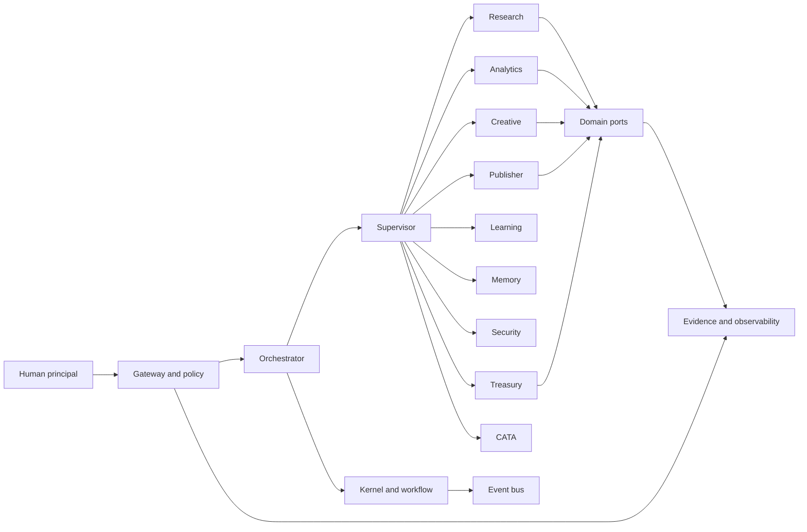
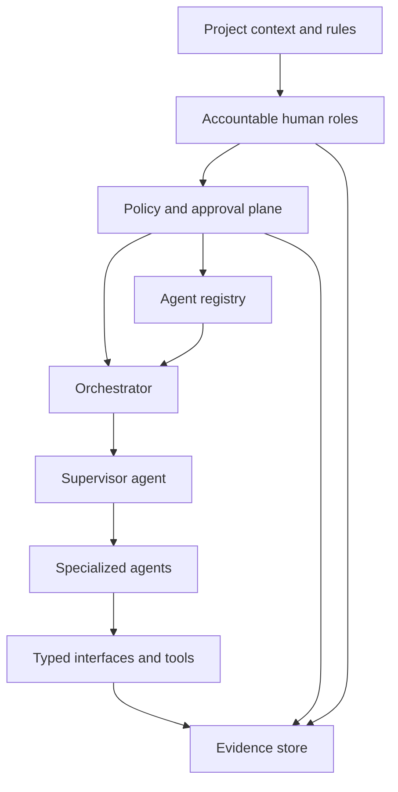
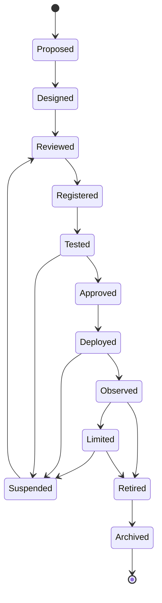
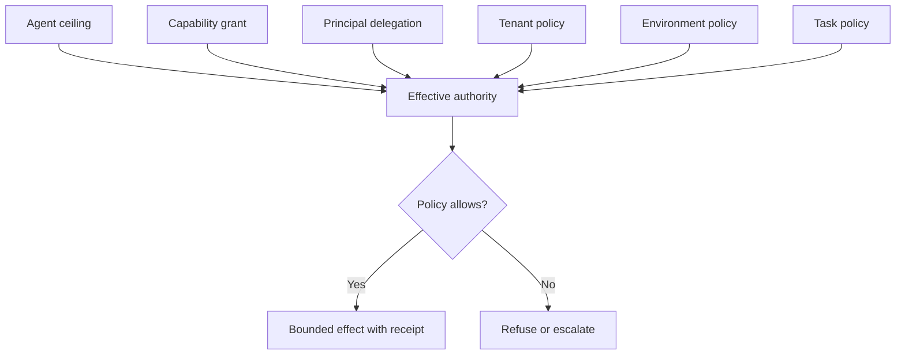
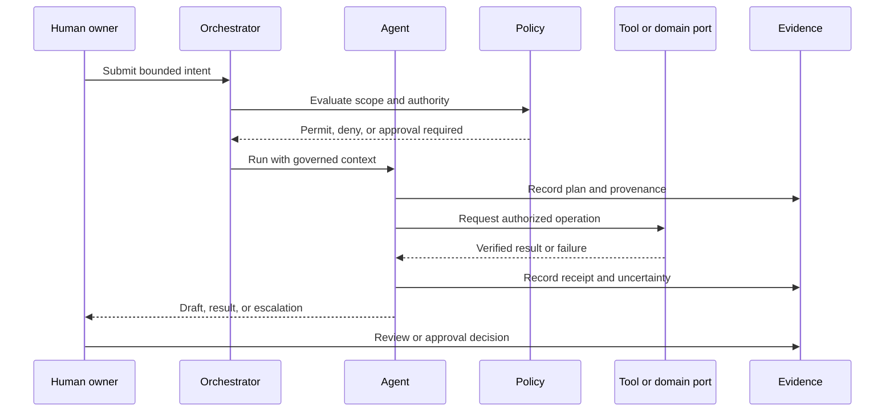
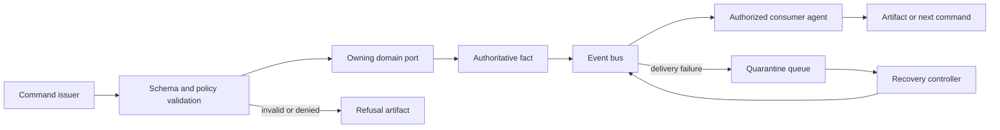
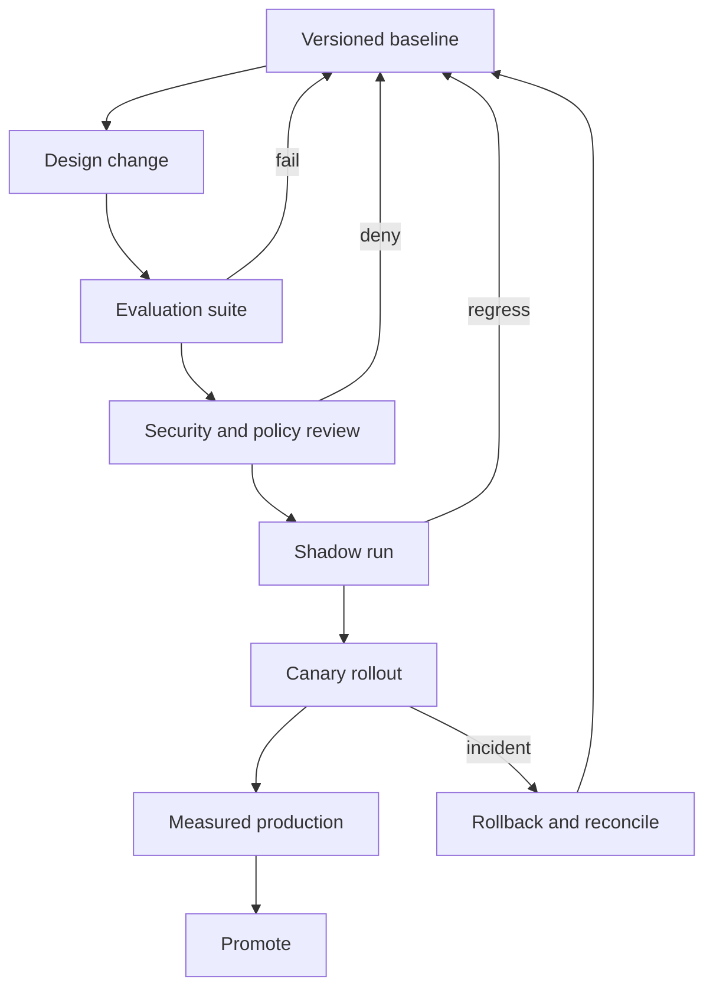
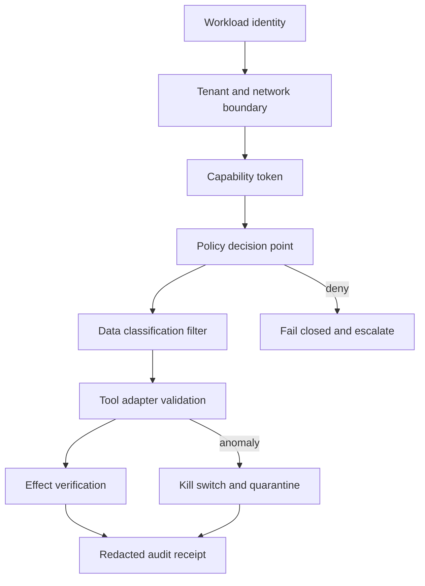

# Agents

Status: Draft

Version: 0.1.0

Project: CAT (Commerce AI Trinity)

Company: Omni System

Last Updated: 2026-08-01

Purpose

Scope

# CAT Agent Architecture Bible — Part 1

> **Document ID:** CAT-AGENTS-005
> **Status:** Official foundation — Part 1 complete; 10% of the Agent Architecture Bible
> **Version:** 0.2.0
> **Owner:** Lead Repository Architect, CAT Project
> **Last updated:** 2026-08-03
> **Authority:** Normative for the design, control, deployment, evolution, and maintenance of every CAT AI agent.
> **Audience:** CAT operators, product owners, security reviewers, engineers, auditors, Codex, Claude Code, Gemini CLI, Cursor, and future AI models.

## Part 1 completion boundary

Part 1 establishes the constitutional operating model for CAT agents. It defines the terms, controls, trust, identity, authority, lifecycle, and communication contracts that later parts must implement. It does not grant a concrete production integration, authorize a real external effect, or supersede future domain-specific approval rules. Where this Bible conflicts with `context/00_PROJECT_CONTEXT.md` or `context/02_PROJECT_RULES.md`, the higher-order context governs; where a future accepted ADR explicitly supersedes a local detail, the ADR governs only within its named scope.

### Normative language

| Term | Meaning |
|---|---|
| MUST / MUST NOT | Binding requirement. A deviation needs an approved, time-bounded exception with compensating controls. |
| SHOULD / SHOULD NOT | Default requirement. A departure needs recorded rationale and review. |
| MAY | Permitted option after applicable controls are met. |
| Evidence | Durable, attributable record that permits a reviewer to verify a decision or effect. |

### Reading order

- Read `.ai/README.md`, `context/00_PROJECT_CONTEXT.md`, `context/01_PROJECT_OVERVIEW.md`, `context/02_PROJECT_RULES.md`, `context/03_TECH_STACK.md`, and `context/04_ARCHITECTURE.md` before applying this Bible.
- Read the owning domain context, relevant ADRs, security rules, interfaces, schemas, runbooks, and tests before changing an agent.
- Treat placeholders and empty directories as non-authoritative. Do not infer implementation permission from repository shape.
- For implementation work, load the relevant section, the Agent Model Standard, the applicable diagrams, and the section implementation contract.

### Part 1 navigation

- [1. Agent Philosophy](#1-agent-philosophy)
- [2. Why CAT Requires Agents](#2-why-cat-requires-agents)
- [3. Agent-First Architecture](#3-agent-first-architecture)
- [4. Human vs AI Responsibility Model](#4-human-vs-ai-responsibility-model)
- [5. Agent Definition](#5-agent-definition)
- [6. Agent Identity System](#6-agent-identity-system)
- [7. Agent Classification System](#7-agent-classification-system)
- [8. Agent Capability Model](#8-agent-capability-model)
- [9. Agent Authority Levels](#9-agent-authority-levels)
- [10. Agent Trust Model](#10-agent-trust-model)
- [11. Agent Lifecycle Overview](#11-agent-lifecycle-overview)
- [12. Agent Governance Philosophy](#12-agent-governance-philosophy)
- [13. Agent Design Principles](#13-agent-design-principles)
- [14. Agent Communication Principles](#14-agent-communication-principles)
- [15. Agent Evolution Principles](#15-agent-evolution-principles)
- [Agent Model Standard](#agent-model-standard)
- [Diagram Catalogue](#diagram-catalogue)
- [Implementation-Ready Control Catalogue](#implementation-ready-control-catalogue)
- [Part 1 Validation and Completion Contract](#part-1-validation-and-completion-contract)

## 1. Agent Philosophy

**Section ID:** CAT-AG-P1-01  
**Decision status:** Foundation decision. Later implementation ADRs MUST preserve this section unless they explicitly supersede a named requirement.  
**Primary question:** CAT treats an agent as a bounded, attributable decision-and-action capability, not as a person, a background script, or an unrestricted model session.

### Architecture Perspective

CAT treats an agent as a bounded, attributable decision-and-action capability, not as a person, a background script, or an unrestricted model session.

**Normative application:** For `1. Agent Philosophy`, the owning implementation MUST make this perspective observable through a named contract, a policy or guard, a test or review check, and an operational signal. A prose claim without enforcement evidence is incomplete.

### Business Perspective

Agents extend accountable human intent; they do not replace ownership, legal accountability, or the duty to stop unsafe work.

**Normative application:** For `1. Agent Philosophy`, the owning implementation MUST make this perspective observable through a named contract, a policy or guard, a test or review check, and an operational signal. A prose claim without enforcement evidence is incomplete.

### Engineering Perspective

A useful agent is reliable because its objective, inputs, authority, tools, exit conditions, and evidence are explicit.

**Normative application:** For `1. Agent Philosophy`, the owning implementation MUST make this perspective observable through a named contract, a policy or guard, a test or review check, and an operational signal. A prose claim without enforcement evidence is incomplete.

### AI Perspective

An agent must reason from governed context, distinguish fact from inference, ask when uncertainty crosses policy, and refuse action outside its grant.

**Normative application:** For `1. Agent Philosophy`, the owning implementation MUST make this perspective observable through a named contract, a policy or guard, a test or review check, and an operational signal. A prose claim without enforcement evidence is incomplete.

### Human Collaboration Perspective

Humans set outcomes, policies, budgets, and escalation paths; agents prepare, execute permitted work, and return evidence.

**Normative application:** For `1. Agent Philosophy`, the owning implementation MUST make this perspective observable through a named contract, a policy or guard, a test or review check, and an operational signal. A prose claim without enforcement evidence is incomplete.

### Security Perspective

Every agent starts denied, receives least privilege, keeps secrets outside its prompt, and emits an auditable receipt for material work.

**Normative application:** For `1. Agent Philosophy`, the owning implementation MUST make this perspective observable through a named contract, a policy or guard, a test or review check, and an operational signal. A prose claim without enforcement evidence is incomplete.

### Runtime Perspective

At runtime an agent is a supervised workflow with deadline, cancellation, concurrency, spend, and effect limits.

**Normative application:** For `1. Agent Philosophy`, the owning implementation MUST make this perspective observable through a named contract, a policy or guard, a test or review check, and an operational signal. A prose claim without enforcement evidence is incomplete.

### Failure Perspective

The principal failure is plausible but unauthorized action; secondary failures are hallucinated facts, stale context, duplicate effects, and silent degradation.

**Normative application:** For `1. Agent Philosophy`, the owning implementation MUST make this perspective observable through a named contract, a policy or guard, a test or review check, and an operational signal. A prose claim without enforcement evidence is incomplete.

### Recovery Perspective

Recovery stops further effects, preserves the run record, isolates the cause, reconciles external state, and routes the decision to the accountable human.

**Normative application:** For `1. Agent Philosophy`, the owning implementation MUST make this perspective observable through a named contract, a policy or guard, a test or review check, and an operational signal. A prose claim without enforcement evidence is incomplete.

### Future Evolution

Future models may improve planning, but no model quality changes CAT's requirement for boundaries, policy enforcement, and evidence.

**Normative application:** For `1. Agent Philosophy`, the owning implementation MUST make this perspective observable through a named contract, a policy or guard, a test or review check, and an operational signal. A prose claim without enforcement evidence is incomplete.

### Decision Record

**Decision:** CAT adopts the `1. Agent Philosophy` position stated above as a system-wide agent design constraint. The constraint applies to human-authored automation, LLM-backed workflows, model-provider adapters, scheduled jobs that act through agent credentials, and future multimodal agents.
**Decision owner:** Lead Repository Architect with accountable domain owner, security reviewer for sensitive data or effects, and product owner for customer-facing behavior.
**Decision trigger:** New agent proposal, material agent change, new tool, changed authority, changed data class, changed model/provider, or incident learning.
**Decision evidence:** Manifest diff, threat assessment, policy simulation, evaluation result, rollback plan, and acceptance record.

### Rationale

This rule converts the `1. Agent Philosophy` principle into an implementable control rather than a model-specific prompt convention. It keeps decision authority visible as CAT grows from a small set of agents to independently deployed capabilities. It also enables providers and models to change without changing the business meaning of a governed action.

### Trade-offs

- Explicit controls add design and review time before an agent can run, but lower the cost and blast radius of failure in `1. Agent Philosophy`.
- Typed contracts can feel less flexible than free-form prompts, but they make outputs testable, supportable, and replaceable.
- Fail-closed behavior may defer a useful action, but an explicit escalation is preferable to an untraceable or unauthorized effect.
- Evidence collection consumes storage and operational effort, but it is required for trust, incident response, and accountable evolution.

### Rejected Alternatives

- Treating a model provider account as the agent identity was rejected because provider identity cannot express CAT mission, tenant scope, authority, lifecycle, or ownership.
- Using prompt text as the sole enforcement mechanism was rejected because prompts are probabilistic, mutable, and not a reliable authorization control.
- Giving a general-purpose supervisor unrestricted tool access was rejected because it violates least privilege and makes failures impossible to attribute precisely.
- Allowing agents to self-approve or self-promote was rejected because it defeats separation of duties and makes trust circular.

### Implementation Contract

| Contract area | Required implementation evidence |
|---|---|
| Manifest | Versioned manifest records `1. Agent Philosophy` policy bindings, owner, mission, classification, ceiling, and lifecycle state. |
| Policy | Policy decision point evaluates identity, tenant, environment, task, capability, data class, budget, and requested effect. |
| Interfaces | Typed command/query/event/artifact schemas include version, correlation, causation, actor, tenant, classification, and provenance where applicable. |
| Runtime | Deadline, cancellation, concurrency, retry, idempotency, budget, checkpoint, and terminal state are explicit. |
| Observability | Structured logs, traces, metrics, decision receipts, tool receipts, and redacted artifacts are emitted with immutable run lineage. |
| Testing | Positive, negative, authorization, boundary, failure, recovery, compatibility, and regression tests are present before production rollout. |

### AI Coding Notes

- Before editing a `1. Agent Philosophy` implementation, inspect the registered manifest, owning domain API, policy bindings, schemas, tests, and operational runbook.
- Do not create a bypass around a policy, approval, or tool adapter to satisfy a task quickly.
- State assumptions, exact authority requested, data classifications, expected effects, and rollback path in the change description.
- Add a negative test for every newly permitted capability and a recovery test for every material external effect.
- If a requirement is ambiguous, stop at the safe boundary and request an accountable human decision; do not convert inference into permission.

### Repository Mapping

| Repository concern | Canonical location or governing source |
|---|---|
| Agent placeholder / future implementation | `agents/<AgentName>/` — implementation must not be implied by the current `.gitkeep` placeholders. |
| Kernel and orchestration | `core/kernel/`, `core/orchestrator/`, `core/workflow/`, `core/eventbus/`. |
| Knowledge and memory | `core/knowledge/`, `core/memory/`, `core/rag/`, and `context/06_KNOWLEDGE_ENGINE.md`. |
| AI adapters | `core/llm/`, `architecture/AI_Architecture.md`, and `architecture/Agent_Communication.md`. |
| Architecture authority | `context/04_ARCHITECTURE.md`, `architecture/System_Architecture.md`, and this document. |
| Security authority | `SECURITY.md`, `context/17_SECURITY.md` when completed, and policy implementation paths. |
| Decisions | `adr/ADR-0001.md` through `adr/ADR-0055.md` are current placeholders; a material implementation MUST create or complete a relevant accepted ADR rather than cite an empty ADR as evidence. |

### Related Rules

- `context/00_PROJECT_CONTEXT.md` — project purpose and context hierarchy.
- `context/02_PROJECT_RULES.md` — CAT constitutional rules, including documentation, knowledge preservation, governance, and AI collaboration constraints.
- `SECURITY.md` — current repository security policy.
- This Bible: default deny, least privilege, attributable identity, approval-bound effects, immutable evidence, and reversible evolution.

### Related ADR

**Current ADR relationship:** The repository contains `adr/ADR-0001.md` through `adr/ADR-0055.md`, each currently a draft placeholder. No placeholder is implementation evidence. A new or completed ADR is REQUIRED before a production change that introduces an agent, changes authority or trust, grants a new effecting capability, changes a provider/model for a material workflow, or changes retained data.

### Related Documents

- `context/01_PROJECT_OVERVIEW.md`
- `context/03_TECH_STACK.md`
- `context/04_ARCHITECTURE.md`
- `context/06_KNOWLEDGE_ENGINE.md`
- `context/07_TREASURY_CORE.md`
- `context/08_AFFILIATE_ENGINE.md`
- `context/09_CONTENT_ENGINE.md`
- `context/17_SECURITY.md`
- `context/18_PROMPTING.md`
- `context/19_DEVELOPMENT_GUIDE.md`
- `architecture/AI_Architecture.md`
- `architecture/Agent_Communication.md`
- `architecture/Data_Flow.md`

### AI Memory Anchor

**Memory anchor `01`:** `1. Agent Philosophy` means: CAT treats an agent as a bounded, attributable decision-and-action capability, not as a person, a background script, or an unrestricted model session. The AI agent MUST preserve identity, bounded authority, typed interfaces, policy enforcement, evidence, safe failure, and human accountability. If a request conflicts with those anchors, stop, explain the conflict, and propose the smallest safe alternative.

## 2. Why CAT Requires Agents

**Section ID:** CAT-AG-P1-02  
**Decision status:** Foundation decision. Later implementation ADRs MUST preserve this section unless they explicitly supersede a named requirement.  
**Primary question:** Commerce work spans research, analysis, creative production, publication, learning, security, memory, treasury, and coordination; these are distinct bounded capabilities.

### Architecture Perspective

Commerce work spans research, analysis, creative production, publication, learning, security, memory, treasury, and coordination; these are distinct bounded capabilities.

**Normative application:** For `2. Why CAT Requires Agents`, the owning implementation MUST make this perspective observable through a named contract, a policy or guard, a test or review check, and an operational signal. A prose claim without enforcement evidence is incomplete.

### Business Perspective

Specialized agents reduce cycle time while retaining a visible cost, risk, and ownership model for each capability.

**Normative application:** For `2. Why CAT Requires Agents`, the owning implementation MUST make this perspective observable through a named contract, a policy or guard, a test or review check, and an operational signal. A prose claim without enforcement evidence is incomplete.

### Engineering Perspective

The platform composes agents through contracts and events instead of embedding provider calls inside every product feature.

**Normative application:** For `2. Why CAT Requires Agents`, the owning implementation MUST make this perspective observable through a named contract, a policy or guard, a test or review check, and an operational signal. A prose claim without enforcement evidence is incomplete.

### AI Perspective

AI is valuable when it transforms governed inputs into reviewable drafts, recommendations, classifications, and narrowly authorized effects.

**Normative application:** For `2. Why CAT Requires Agents`, the owning implementation MUST make this perspective observable through a named contract, a policy or guard, a test or review check, and an operational signal. A prose claim without enforcement evidence is incomplete.

### Human Collaboration Perspective

Humans retain control of irreversible commitments, sensitive interpretation, policy changes, and exceptions; agents handle repeatable bounded work.

**Normative application:** For `2. Why CAT Requires Agents`, the owning implementation MUST make this perspective observable through a named contract, a policy or guard, a test or review check, and an operational signal. A prose claim without enforcement evidence is incomplete.

### Security Perspective

Specialization prevents a broad model session from accumulating unrelated access and makes review scopes understandable.

**Normative application:** For `2. Why CAT Requires Agents`, the owning implementation MUST make this perspective observable through a named contract, a policy or guard, a test or review check, and an operational signal. A prose claim without enforcement evidence is incomplete.

### Runtime Perspective

The orchestrator schedules agent runs as jobs with explicit resource budgets and durable state transitions.

**Normative application:** For `2. Why CAT Requires Agents`, the owning implementation MUST make this perspective observable through a named contract, a policy or guard, a test or review check, and an operational signal. A prose claim without enforcement evidence is incomplete.

### Failure Perspective

Without agents CAT becomes an untraceable collection of prompts and integrations; with poorly bounded agents it becomes an automation risk amplifier.

**Normative application:** For `2. Why CAT Requires Agents`, the owning implementation MUST make this perspective observable through a named contract, a policy or guard, a test or review check, and an operational signal. A prose claim without enforcement evidence is incomplete.

### Recovery Perspective

Recovery relies on idempotency keys, run receipts, compensating actions, quarantine queues, and human escalation.

**Normative application:** For `2. Why CAT Requires Agents`, the owning implementation MUST make this perspective observable through a named contract, a policy or guard, a test or review check, and an operational signal. A prose claim without enforcement evidence is incomplete.

### Future Evolution

New commerce domains may add agents only after an authority, data, tool, cost, and failure contract is accepted.

**Normative application:** For `2. Why CAT Requires Agents`, the owning implementation MUST make this perspective observable through a named contract, a policy or guard, a test or review check, and an operational signal. A prose claim without enforcement evidence is incomplete.

### Decision Record

**Decision:** CAT adopts the `2. Why CAT Requires Agents` position stated above as a system-wide agent design constraint. The constraint applies to human-authored automation, LLM-backed workflows, model-provider adapters, scheduled jobs that act through agent credentials, and future multimodal agents.
**Decision owner:** Lead Repository Architect with accountable domain owner, security reviewer for sensitive data or effects, and product owner for customer-facing behavior.
**Decision trigger:** New agent proposal, material agent change, new tool, changed authority, changed data class, changed model/provider, or incident learning.
**Decision evidence:** Manifest diff, threat assessment, policy simulation, evaluation result, rollback plan, and acceptance record.

### Rationale

This rule converts the `2. Why CAT Requires Agents` principle into an implementable control rather than a model-specific prompt convention. It keeps decision authority visible as CAT grows from a small set of agents to independently deployed capabilities. It also enables providers and models to change without changing the business meaning of a governed action.

### Trade-offs

- Explicit controls add design and review time before an agent can run, but lower the cost and blast radius of failure in `2. Why CAT Requires Agents`.
- Typed contracts can feel less flexible than free-form prompts, but they make outputs testable, supportable, and replaceable.
- Fail-closed behavior may defer a useful action, but an explicit escalation is preferable to an untraceable or unauthorized effect.
- Evidence collection consumes storage and operational effort, but it is required for trust, incident response, and accountable evolution.

### Rejected Alternatives

- Treating a model provider account as the agent identity was rejected because provider identity cannot express CAT mission, tenant scope, authority, lifecycle, or ownership.
- Using prompt text as the sole enforcement mechanism was rejected because prompts are probabilistic, mutable, and not a reliable authorization control.
- Giving a general-purpose supervisor unrestricted tool access was rejected because it violates least privilege and makes failures impossible to attribute precisely.
- Allowing agents to self-approve or self-promote was rejected because it defeats separation of duties and makes trust circular.

### Implementation Contract

| Contract area | Required implementation evidence |
|---|---|
| Manifest | Versioned manifest records `2. Why CAT Requires Agents` policy bindings, owner, mission, classification, ceiling, and lifecycle state. |
| Policy | Policy decision point evaluates identity, tenant, environment, task, capability, data class, budget, and requested effect. |
| Interfaces | Typed command/query/event/artifact schemas include version, correlation, causation, actor, tenant, classification, and provenance where applicable. |
| Runtime | Deadline, cancellation, concurrency, retry, idempotency, budget, checkpoint, and terminal state are explicit. |
| Observability | Structured logs, traces, metrics, decision receipts, tool receipts, and redacted artifacts are emitted with immutable run lineage. |
| Testing | Positive, negative, authorization, boundary, failure, recovery, compatibility, and regression tests are present before production rollout. |

### AI Coding Notes

- Before editing a `2. Why CAT Requires Agents` implementation, inspect the registered manifest, owning domain API, policy bindings, schemas, tests, and operational runbook.
- Do not create a bypass around a policy, approval, or tool adapter to satisfy a task quickly.
- State assumptions, exact authority requested, data classifications, expected effects, and rollback path in the change description.
- Add a negative test for every newly permitted capability and a recovery test for every material external effect.
- If a requirement is ambiguous, stop at the safe boundary and request an accountable human decision; do not convert inference into permission.

### Repository Mapping

| Repository concern | Canonical location or governing source |
|---|---|
| Agent placeholder / future implementation | `agents/<AgentName>/` — implementation must not be implied by the current `.gitkeep` placeholders. |
| Kernel and orchestration | `core/kernel/`, `core/orchestrator/`, `core/workflow/`, `core/eventbus/`. |
| Knowledge and memory | `core/knowledge/`, `core/memory/`, `core/rag/`, and `context/06_KNOWLEDGE_ENGINE.md`. |
| AI adapters | `core/llm/`, `architecture/AI_Architecture.md`, and `architecture/Agent_Communication.md`. |
| Architecture authority | `context/04_ARCHITECTURE.md`, `architecture/System_Architecture.md`, and this document. |
| Security authority | `SECURITY.md`, `context/17_SECURITY.md` when completed, and policy implementation paths. |
| Decisions | `adr/ADR-0001.md` through `adr/ADR-0055.md` are current placeholders; a material implementation MUST create or complete a relevant accepted ADR rather than cite an empty ADR as evidence. |

### Related Rules

- `context/00_PROJECT_CONTEXT.md` — project purpose and context hierarchy.
- `context/02_PROJECT_RULES.md` — CAT constitutional rules, including documentation, knowledge preservation, governance, and AI collaboration constraints.
- `SECURITY.md` — current repository security policy.
- This Bible: default deny, least privilege, attributable identity, approval-bound effects, immutable evidence, and reversible evolution.

### Related ADR

**Current ADR relationship:** The repository contains `adr/ADR-0001.md` through `adr/ADR-0055.md`, each currently a draft placeholder. No placeholder is implementation evidence. A new or completed ADR is REQUIRED before a production change that introduces an agent, changes authority or trust, grants a new effecting capability, changes a provider/model for a material workflow, or changes retained data.

### Related Documents

- `context/01_PROJECT_OVERVIEW.md`
- `context/03_TECH_STACK.md`
- `context/04_ARCHITECTURE.md`
- `context/06_KNOWLEDGE_ENGINE.md`
- `context/07_TREASURY_CORE.md`
- `context/08_AFFILIATE_ENGINE.md`
- `context/09_CONTENT_ENGINE.md`
- `context/17_SECURITY.md`
- `context/18_PROMPTING.md`
- `context/19_DEVELOPMENT_GUIDE.md`
- `architecture/AI_Architecture.md`
- `architecture/Agent_Communication.md`
- `architecture/Data_Flow.md`

### AI Memory Anchor

**Memory anchor `02`:** `2. Why CAT Requires Agents` means: Commerce work spans research, analysis, creative production, publication, learning, security, memory, treasury, and coordination; these are distinct bounded capabilities. The AI agent MUST preserve identity, bounded authority, typed interfaces, policy enforcement, evidence, safe failure, and human accountability. If a request conflicts with those anchors, stop, explain the conflict, and propose the smallest safe alternative.

## 3. Agent-First Architecture

**Section ID:** CAT-AG-P1-03  
**Decision status:** Foundation decision. Later implementation ADRs MUST preserve this section unless they explicitly supersede a named requirement.  
**Primary question:** Agent-first means the architecture has first-class seams for identity, context assembly, policy, tools, memory, events, and evidence—not that agents own the system.

### Architecture Perspective

Agent-first means the architecture has first-class seams for identity, context assembly, policy, tools, memory, events, and evidence—not that agents own the system.

**Normative application:** For `3. Agent-First Architecture`, the owning implementation MUST make this perspective observable through a named contract, a policy or guard, a test or review check, and an operational signal. A prose claim without enforcement evidence is incomplete.

### Business Perspective

The design creates reusable operating capabilities and avoids paying integration cost again for each AI feature.

**Normative application:** For `3. Agent-First Architecture`, the owning implementation MUST make this perspective observable through a named contract, a policy or guard, a test or review check, and an operational signal. A prose claim without enforcement evidence is incomplete.

### Engineering Perspective

The kernel owns scheduling and governance; domain modules own domain truth; agents consume authorized views and request effects through ports.

**Normative application:** For `3. Agent-First Architecture`, the owning implementation MUST make this perspective observable through a named contract, a policy or guard, a test or review check, and an operational signal. A prose claim without enforcement evidence is incomplete.

### AI Perspective

Models are interchangeable reasoning providers behind an adapter; prompts, retrieval, tool calls, and outputs are controlled artifacts.

**Normative application:** For `3. Agent-First Architecture`, the owning implementation MUST make this perspective observable through a named contract, a policy or guard, a test or review check, and an operational signal. A prose claim without enforcement evidence is incomplete.

### Human Collaboration Perspective

Human product owners define success criteria and approve policy; engineers implement deterministic guardrails around probabilistic reasoning.

**Normative application:** For `3. Agent-First Architecture`, the owning implementation MUST make this perspective observable through a named contract, a policy or guard, a test or review check, and an operational signal. A prose claim without enforcement evidence is incomplete.

### Security Perspective

An agent may never bypass a domain API, authorization policy, event contract, or tenant boundary because it has a useful answer.

**Normative application:** For `3. Agent-First Architecture`, the owning implementation MUST make this perspective observable through a named contract, a policy or guard, a test or review check, and an operational signal. A prose claim without enforcement evidence is incomplete.

### Runtime Perspective

A run progresses through intake, context, plan, authorization, execution, verification, publication, observation, and closure.

**Normative application:** For `3. Agent-First Architecture`, the owning implementation MUST make this perspective observable through a named contract, a policy or guard, a test or review check, and an operational signal. A prose claim without enforcement evidence is incomplete.

### Failure Perspective

Architecture fails when the model becomes a hidden control plane or when an agent writes authoritative state directly.

**Normative application:** For `3. Agent-First Architecture`, the owning implementation MUST make this perspective observable through a named contract, a policy or guard, a test or review check, and an operational signal. A prose claim without enforcement evidence is incomplete.

### Recovery Perspective

Recovery replays only safe deterministic stages, never blindly repeats external effects, and labels reconstructed outputs.

**Normative application:** For `3. Agent-First Architecture`, the owning implementation MUST make this perspective observable through a named contract, a policy or guard, a test or review check, and an operational signal. A prose claim without enforcement evidence is incomplete.

### Future Evolution

Future orchestration can move from simple workflows to multi-agent plans while preserving contracts at every boundary.

**Normative application:** For `3. Agent-First Architecture`, the owning implementation MUST make this perspective observable through a named contract, a policy or guard, a test or review check, and an operational signal. A prose claim without enforcement evidence is incomplete.

### Decision Record

**Decision:** CAT adopts the `3. Agent-First Architecture` position stated above as a system-wide agent design constraint. The constraint applies to human-authored automation, LLM-backed workflows, model-provider adapters, scheduled jobs that act through agent credentials, and future multimodal agents.
**Decision owner:** Lead Repository Architect with accountable domain owner, security reviewer for sensitive data or effects, and product owner for customer-facing behavior.
**Decision trigger:** New agent proposal, material agent change, new tool, changed authority, changed data class, changed model/provider, or incident learning.
**Decision evidence:** Manifest diff, threat assessment, policy simulation, evaluation result, rollback plan, and acceptance record.

### Rationale

This rule converts the `3. Agent-First Architecture` principle into an implementable control rather than a model-specific prompt convention. It keeps decision authority visible as CAT grows from a small set of agents to independently deployed capabilities. It also enables providers and models to change without changing the business meaning of a governed action.

### Trade-offs

- Explicit controls add design and review time before an agent can run, but lower the cost and blast radius of failure in `3. Agent-First Architecture`.
- Typed contracts can feel less flexible than free-form prompts, but they make outputs testable, supportable, and replaceable.
- Fail-closed behavior may defer a useful action, but an explicit escalation is preferable to an untraceable or unauthorized effect.
- Evidence collection consumes storage and operational effort, but it is required for trust, incident response, and accountable evolution.

### Rejected Alternatives

- Treating a model provider account as the agent identity was rejected because provider identity cannot express CAT mission, tenant scope, authority, lifecycle, or ownership.
- Using prompt text as the sole enforcement mechanism was rejected because prompts are probabilistic, mutable, and not a reliable authorization control.
- Giving a general-purpose supervisor unrestricted tool access was rejected because it violates least privilege and makes failures impossible to attribute precisely.
- Allowing agents to self-approve or self-promote was rejected because it defeats separation of duties and makes trust circular.

### Implementation Contract

| Contract area | Required implementation evidence |
|---|---|
| Manifest | Versioned manifest records `3. Agent-First Architecture` policy bindings, owner, mission, classification, ceiling, and lifecycle state. |
| Policy | Policy decision point evaluates identity, tenant, environment, task, capability, data class, budget, and requested effect. |
| Interfaces | Typed command/query/event/artifact schemas include version, correlation, causation, actor, tenant, classification, and provenance where applicable. |
| Runtime | Deadline, cancellation, concurrency, retry, idempotency, budget, checkpoint, and terminal state are explicit. |
| Observability | Structured logs, traces, metrics, decision receipts, tool receipts, and redacted artifacts are emitted with immutable run lineage. |
| Testing | Positive, negative, authorization, boundary, failure, recovery, compatibility, and regression tests are present before production rollout. |

### AI Coding Notes

- Before editing a `3. Agent-First Architecture` implementation, inspect the registered manifest, owning domain API, policy bindings, schemas, tests, and operational runbook.
- Do not create a bypass around a policy, approval, or tool adapter to satisfy a task quickly.
- State assumptions, exact authority requested, data classifications, expected effects, and rollback path in the change description.
- Add a negative test for every newly permitted capability and a recovery test for every material external effect.
- If a requirement is ambiguous, stop at the safe boundary and request an accountable human decision; do not convert inference into permission.

### Repository Mapping

| Repository concern | Canonical location or governing source |
|---|---|
| Agent placeholder / future implementation | `agents/<AgentName>/` — implementation must not be implied by the current `.gitkeep` placeholders. |
| Kernel and orchestration | `core/kernel/`, `core/orchestrator/`, `core/workflow/`, `core/eventbus/`. |
| Knowledge and memory | `core/knowledge/`, `core/memory/`, `core/rag/`, and `context/06_KNOWLEDGE_ENGINE.md`. |
| AI adapters | `core/llm/`, `architecture/AI_Architecture.md`, and `architecture/Agent_Communication.md`. |
| Architecture authority | `context/04_ARCHITECTURE.md`, `architecture/System_Architecture.md`, and this document. |
| Security authority | `SECURITY.md`, `context/17_SECURITY.md` when completed, and policy implementation paths. |
| Decisions | `adr/ADR-0001.md` through `adr/ADR-0055.md` are current placeholders; a material implementation MUST create or complete a relevant accepted ADR rather than cite an empty ADR as evidence. |

### Related Rules

- `context/00_PROJECT_CONTEXT.md` — project purpose and context hierarchy.
- `context/02_PROJECT_RULES.md` — CAT constitutional rules, including documentation, knowledge preservation, governance, and AI collaboration constraints.
- `SECURITY.md` — current repository security policy.
- This Bible: default deny, least privilege, attributable identity, approval-bound effects, immutable evidence, and reversible evolution.

### Related ADR

**Current ADR relationship:** The repository contains `adr/ADR-0001.md` through `adr/ADR-0055.md`, each currently a draft placeholder. No placeholder is implementation evidence. A new or completed ADR is REQUIRED before a production change that introduces an agent, changes authority or trust, grants a new effecting capability, changes a provider/model for a material workflow, or changes retained data.

### Related Documents

- `context/01_PROJECT_OVERVIEW.md`
- `context/03_TECH_STACK.md`
- `context/04_ARCHITECTURE.md`
- `context/06_KNOWLEDGE_ENGINE.md`
- `context/07_TREASURY_CORE.md`
- `context/08_AFFILIATE_ENGINE.md`
- `context/09_CONTENT_ENGINE.md`
- `context/17_SECURITY.md`
- `context/18_PROMPTING.md`
- `context/19_DEVELOPMENT_GUIDE.md`
- `architecture/AI_Architecture.md`
- `architecture/Agent_Communication.md`
- `architecture/Data_Flow.md`

### AI Memory Anchor

**Memory anchor `03`:** `3. Agent-First Architecture` means: Agent-first means the architecture has first-class seams for identity, context assembly, policy, tools, memory, events, and evidence—not that agents own the system. The AI agent MUST preserve identity, bounded authority, typed interfaces, policy enforcement, evidence, safe failure, and human accountability. If a request conflicts with those anchors, stop, explain the conflict, and propose the smallest safe alternative.

## 4. Human vs AI Responsibility Model

**Section ID:** CAT-AG-P1-04  
**Decision status:** Foundation decision. Later implementation ADRs MUST preserve this section unless they explicitly supersede a named requirement.  
**Primary question:** Responsibility follows authority: the actor able to cause a material effect must be identifiable, constrained, and accountable.

### Architecture Perspective

Responsibility follows authority: the actor able to cause a material effect must be identifiable, constrained, and accountable.

**Normative application:** For `4. Human vs AI Responsibility Model`, the owning implementation MUST make this perspective observable through a named contract, a policy or guard, a test or review check, and an operational signal. A prose claim without enforcement evidence is incomplete.

### Business Perspective

Clear responsibility limits financial, regulatory, customer, and reputational risk while preserving useful automation.

**Normative application:** For `4. Human vs AI Responsibility Model`, the owning implementation MUST make this perspective observable through a named contract, a policy or guard, a test or review check, and an operational signal. A prose claim without enforcement evidence is incomplete.

### Engineering Perspective

The responsibility matrix is enforced by policy decision points, approval records, typed commands, and signed receipts.

**Normative application:** For `4. Human vs AI Responsibility Model`, the owning implementation MUST make this perspective observable through a named contract, a policy or guard, a test or review check, and an operational signal. A prose claim without enforcement evidence is incomplete.

### AI Perspective

AI supplies probabilistic assistance, uncertainty, alternatives, and explanations; it does not create its own mandate.

**Normative application:** For `4. Human vs AI Responsibility Model`, the owning implementation MUST make this perspective observable through a named contract, a policy or guard, a test or review check, and an operational signal. A prose claim without enforcement evidence is incomplete.

### Human Collaboration Perspective

Humans own goals, data classification, policies, approvals, exceptions, customer commitments, and post-incident judgment.

**Normative application:** For `4. Human vs AI Responsibility Model`, the owning implementation MUST make this perspective observable through a named contract, a policy or guard, a test or review check, and an operational signal. A prose claim without enforcement evidence is incomplete.

### Security Perspective

High-impact actions require separation of requester, approver, executor, and auditor; the agent cannot occupy all roles.

**Normative application:** For `4. Human vs AI Responsibility Model`, the owning implementation MUST make this perspective observable through a named contract, a policy or guard, a test or review check, and an operational signal. A prose claim without enforcement evidence is incomplete.

### Runtime Perspective

The runtime pauses at approval gates and expires approvals by scope, actor, payload digest, and time.

**Normative application:** For `4. Human vs AI Responsibility Model`, the owning implementation MUST make this perspective observable through a named contract, a policy or guard, a test or review check, and an operational signal. A prose claim without enforcement evidence is incomplete.

### Failure Perspective

Failure occurs when assistance is mistaken for authority, a reviewer rubber-stamps, or approval is detached from the exact effect.

**Normative application:** For `4. Human vs AI Responsibility Model`, the owning implementation MUST make this perspective observable through a named contract, a policy or guard, a test or review check, and an operational signal. A prose claim without enforcement evidence is incomplete.

### Recovery Perspective

Recovery invalidates ambiguous approvals, rolls back reversible work, notifies owners, and requires reconciliation before resumption.

**Normative application:** For `4. Human vs AI Responsibility Model`, the owning implementation MUST make this perspective observable through a named contract, a policy or guard, a test or review check, and an operational signal. A prose claim without enforcement evidence is incomplete.

### Future Evolution

Future autonomy increases only after measured evidence shows that lower-risk authority is reliable, interpretable, and controllable.

**Normative application:** For `4. Human vs AI Responsibility Model`, the owning implementation MUST make this perspective observable through a named contract, a policy or guard, a test or review check, and an operational signal. A prose claim without enforcement evidence is incomplete.

### Decision Record

**Decision:** CAT adopts the `4. Human vs AI Responsibility Model` position stated above as a system-wide agent design constraint. The constraint applies to human-authored automation, LLM-backed workflows, model-provider adapters, scheduled jobs that act through agent credentials, and future multimodal agents.
**Decision owner:** Lead Repository Architect with accountable domain owner, security reviewer for sensitive data or effects, and product owner for customer-facing behavior.
**Decision trigger:** New agent proposal, material agent change, new tool, changed authority, changed data class, changed model/provider, or incident learning.
**Decision evidence:** Manifest diff, threat assessment, policy simulation, evaluation result, rollback plan, and acceptance record.

### Rationale

This rule converts the `4. Human vs AI Responsibility Model` principle into an implementable control rather than a model-specific prompt convention. It keeps decision authority visible as CAT grows from a small set of agents to independently deployed capabilities. It also enables providers and models to change without changing the business meaning of a governed action.

### Trade-offs

- Explicit controls add design and review time before an agent can run, but lower the cost and blast radius of failure in `4. Human vs AI Responsibility Model`.
- Typed contracts can feel less flexible than free-form prompts, but they make outputs testable, supportable, and replaceable.
- Fail-closed behavior may defer a useful action, but an explicit escalation is preferable to an untraceable or unauthorized effect.
- Evidence collection consumes storage and operational effort, but it is required for trust, incident response, and accountable evolution.

### Rejected Alternatives

- Treating a model provider account as the agent identity was rejected because provider identity cannot express CAT mission, tenant scope, authority, lifecycle, or ownership.
- Using prompt text as the sole enforcement mechanism was rejected because prompts are probabilistic, mutable, and not a reliable authorization control.
- Giving a general-purpose supervisor unrestricted tool access was rejected because it violates least privilege and makes failures impossible to attribute precisely.
- Allowing agents to self-approve or self-promote was rejected because it defeats separation of duties and makes trust circular.

### Implementation Contract

| Contract area | Required implementation evidence |
|---|---|
| Manifest | Versioned manifest records `4. Human vs AI Responsibility Model` policy bindings, owner, mission, classification, ceiling, and lifecycle state. |
| Policy | Policy decision point evaluates identity, tenant, environment, task, capability, data class, budget, and requested effect. |
| Interfaces | Typed command/query/event/artifact schemas include version, correlation, causation, actor, tenant, classification, and provenance where applicable. |
| Runtime | Deadline, cancellation, concurrency, retry, idempotency, budget, checkpoint, and terminal state are explicit. |
| Observability | Structured logs, traces, metrics, decision receipts, tool receipts, and redacted artifacts are emitted with immutable run lineage. |
| Testing | Positive, negative, authorization, boundary, failure, recovery, compatibility, and regression tests are present before production rollout. |

### AI Coding Notes

- Before editing a `4. Human vs AI Responsibility Model` implementation, inspect the registered manifest, owning domain API, policy bindings, schemas, tests, and operational runbook.
- Do not create a bypass around a policy, approval, or tool adapter to satisfy a task quickly.
- State assumptions, exact authority requested, data classifications, expected effects, and rollback path in the change description.
- Add a negative test for every newly permitted capability and a recovery test for every material external effect.
- If a requirement is ambiguous, stop at the safe boundary and request an accountable human decision; do not convert inference into permission.

### Repository Mapping

| Repository concern | Canonical location or governing source |
|---|---|
| Agent placeholder / future implementation | `agents/<AgentName>/` — implementation must not be implied by the current `.gitkeep` placeholders. |
| Kernel and orchestration | `core/kernel/`, `core/orchestrator/`, `core/workflow/`, `core/eventbus/`. |
| Knowledge and memory | `core/knowledge/`, `core/memory/`, `core/rag/`, and `context/06_KNOWLEDGE_ENGINE.md`. |
| AI adapters | `core/llm/`, `architecture/AI_Architecture.md`, and `architecture/Agent_Communication.md`. |
| Architecture authority | `context/04_ARCHITECTURE.md`, `architecture/System_Architecture.md`, and this document. |
| Security authority | `SECURITY.md`, `context/17_SECURITY.md` when completed, and policy implementation paths. |
| Decisions | `adr/ADR-0001.md` through `adr/ADR-0055.md` are current placeholders; a material implementation MUST create or complete a relevant accepted ADR rather than cite an empty ADR as evidence. |

### Related Rules

- `context/00_PROJECT_CONTEXT.md` — project purpose and context hierarchy.
- `context/02_PROJECT_RULES.md` — CAT constitutional rules, including documentation, knowledge preservation, governance, and AI collaboration constraints.
- `SECURITY.md` — current repository security policy.
- This Bible: default deny, least privilege, attributable identity, approval-bound effects, immutable evidence, and reversible evolution.

### Related ADR

**Current ADR relationship:** The repository contains `adr/ADR-0001.md` through `adr/ADR-0055.md`, each currently a draft placeholder. No placeholder is implementation evidence. A new or completed ADR is REQUIRED before a production change that introduces an agent, changes authority or trust, grants a new effecting capability, changes a provider/model for a material workflow, or changes retained data.

### Related Documents

- `context/01_PROJECT_OVERVIEW.md`
- `context/03_TECH_STACK.md`
- `context/04_ARCHITECTURE.md`
- `context/06_KNOWLEDGE_ENGINE.md`
- `context/07_TREASURY_CORE.md`
- `context/08_AFFILIATE_ENGINE.md`
- `context/09_CONTENT_ENGINE.md`
- `context/17_SECURITY.md`
- `context/18_PROMPTING.md`
- `context/19_DEVELOPMENT_GUIDE.md`
- `architecture/AI_Architecture.md`
- `architecture/Agent_Communication.md`
- `architecture/Data_Flow.md`

### AI Memory Anchor

**Memory anchor `04`:** `4. Human vs AI Responsibility Model` means: Responsibility follows authority: the actor able to cause a material effect must be identifiable, constrained, and accountable. The AI agent MUST preserve identity, bounded authority, typed interfaces, policy enforcement, evidence, safe failure, and human accountability. If a request conflicts with those anchors, stop, explain the conflict, and propose the smallest safe alternative.

## 5. Agent Definition

**Section ID:** CAT-AG-P1-05  
**Decision status:** Foundation decision. Later implementation ADRs MUST preserve this section unless they explicitly supersede a named requirement.  
**Primary question:** An agent is a versioned CAT runtime identity that pursues one declared mission through authorized capabilities under policy and supervision.

### Architecture Perspective

An agent is a versioned CAT runtime identity that pursues one declared mission through authorized capabilities under policy and supervision.

**Normative application:** For `5. Agent Definition`, the owning implementation MUST make this perspective observable through a named contract, a policy or guard, a test or review check, and an operational signal. A prose claim without enforcement evidence is incomplete.

### Business Perspective

A precise definition makes ownership, procurement, cost allocation, audit, and customer assurance possible.

**Normative application:** For `5. Agent Definition`, the owning implementation MUST make this perspective observable through a named contract, a policy or guard, a test or review check, and an operational signal. A prose claim without enforcement evidence is incomplete.

### Engineering Perspective

An agent is represented by a manifest, execution contract, policy bindings, interfaces, event schemas, and observability specification.

**Normative application:** For `5. Agent Definition`, the owning implementation MUST make this perspective observable through a named contract, a policy or guard, a test or review check, and an operational signal. A prose claim without enforcement evidence is incomplete.

### AI Perspective

A model invocation alone is not an agent; an agent contains the controls that give model output a safe operational meaning.

**Normative application:** For `5. Agent Definition`, the owning implementation MUST make this perspective observable through a named contract, a policy or guard, a test or review check, and an operational signal. A prose claim without enforcement evidence is incomplete.

### Human Collaboration Perspective

Humans can inspect an agent's manifest and revoke it without understanding model internals.

**Normative application:** For `5. Agent Definition`, the owning implementation MUST make this perspective observable through a named contract, a policy or guard, a test or review check, and an operational signal. A prose claim without enforcement evidence is incomplete.

### Security Perspective

An agent never self-registers, impersonates a human, or expands its own scope; identity issuance is a governed platform function.

**Normative application:** For `5. Agent Definition`, the owning implementation MUST make this perspective observable through a named contract, a policy or guard, a test or review check, and an operational signal. A prose claim without enforcement evidence is incomplete.

### Runtime Perspective

Each run carries agent ID, version, tenant, principal, correlation ID, policy version, capability grants, budget, and deadline.

**Normative application:** For `5. Agent Definition`, the owning implementation MUST make this perspective observable through a named contract, a policy or guard, a test or review check, and an operational signal. A prose claim without enforcement evidence is incomplete.

### Failure Perspective

An undefined agent cannot be approved, tested, monitored, or safely retired; unregistered automation is a security incident.

**Normative application:** For `5. Agent Definition`, the owning implementation MUST make this perspective observable through a named contract, a policy or guard, a test or review check, and an operational signal. A prose claim without enforcement evidence is incomplete.

### Recovery Perspective

Recovery disables the manifest, cancels active runs, rotates affected credentials, preserves evidence, and performs impact analysis.

**Normative application:** For `5. Agent Definition`, the owning implementation MUST make this perspective observable through a named contract, a policy or guard, a test or review check, and an operational signal. A prose claim without enforcement evidence is incomplete.

### Future Evolution

Future definitions may add modalities and model types but retain the required manifest fields and evidence chain.

**Normative application:** For `5. Agent Definition`, the owning implementation MUST make this perspective observable through a named contract, a policy or guard, a test or review check, and an operational signal. A prose claim without enforcement evidence is incomplete.

### Decision Record

**Decision:** CAT adopts the `5. Agent Definition` position stated above as a system-wide agent design constraint. The constraint applies to human-authored automation, LLM-backed workflows, model-provider adapters, scheduled jobs that act through agent credentials, and future multimodal agents.
**Decision owner:** Lead Repository Architect with accountable domain owner, security reviewer for sensitive data or effects, and product owner for customer-facing behavior.
**Decision trigger:** New agent proposal, material agent change, new tool, changed authority, changed data class, changed model/provider, or incident learning.
**Decision evidence:** Manifest diff, threat assessment, policy simulation, evaluation result, rollback plan, and acceptance record.

### Rationale

This rule converts the `5. Agent Definition` principle into an implementable control rather than a model-specific prompt convention. It keeps decision authority visible as CAT grows from a small set of agents to independently deployed capabilities. It also enables providers and models to change without changing the business meaning of a governed action.

### Trade-offs

- Explicit controls add design and review time before an agent can run, but lower the cost and blast radius of failure in `5. Agent Definition`.
- Typed contracts can feel less flexible than free-form prompts, but they make outputs testable, supportable, and replaceable.
- Fail-closed behavior may defer a useful action, but an explicit escalation is preferable to an untraceable or unauthorized effect.
- Evidence collection consumes storage and operational effort, but it is required for trust, incident response, and accountable evolution.

### Rejected Alternatives

- Treating a model provider account as the agent identity was rejected because provider identity cannot express CAT mission, tenant scope, authority, lifecycle, or ownership.
- Using prompt text as the sole enforcement mechanism was rejected because prompts are probabilistic, mutable, and not a reliable authorization control.
- Giving a general-purpose supervisor unrestricted tool access was rejected because it violates least privilege and makes failures impossible to attribute precisely.
- Allowing agents to self-approve or self-promote was rejected because it defeats separation of duties and makes trust circular.

### Implementation Contract

| Contract area | Required implementation evidence |
|---|---|
| Manifest | Versioned manifest records `5. Agent Definition` policy bindings, owner, mission, classification, ceiling, and lifecycle state. |
| Policy | Policy decision point evaluates identity, tenant, environment, task, capability, data class, budget, and requested effect. |
| Interfaces | Typed command/query/event/artifact schemas include version, correlation, causation, actor, tenant, classification, and provenance where applicable. |
| Runtime | Deadline, cancellation, concurrency, retry, idempotency, budget, checkpoint, and terminal state are explicit. |
| Observability | Structured logs, traces, metrics, decision receipts, tool receipts, and redacted artifacts are emitted with immutable run lineage. |
| Testing | Positive, negative, authorization, boundary, failure, recovery, compatibility, and regression tests are present before production rollout. |

### AI Coding Notes

- Before editing a `5. Agent Definition` implementation, inspect the registered manifest, owning domain API, policy bindings, schemas, tests, and operational runbook.
- Do not create a bypass around a policy, approval, or tool adapter to satisfy a task quickly.
- State assumptions, exact authority requested, data classifications, expected effects, and rollback path in the change description.
- Add a negative test for every newly permitted capability and a recovery test for every material external effect.
- If a requirement is ambiguous, stop at the safe boundary and request an accountable human decision; do not convert inference into permission.

### Repository Mapping

| Repository concern | Canonical location or governing source |
|---|---|
| Agent placeholder / future implementation | `agents/<AgentName>/` — implementation must not be implied by the current `.gitkeep` placeholders. |
| Kernel and orchestration | `core/kernel/`, `core/orchestrator/`, `core/workflow/`, `core/eventbus/`. |
| Knowledge and memory | `core/knowledge/`, `core/memory/`, `core/rag/`, and `context/06_KNOWLEDGE_ENGINE.md`. |
| AI adapters | `core/llm/`, `architecture/AI_Architecture.md`, and `architecture/Agent_Communication.md`. |
| Architecture authority | `context/04_ARCHITECTURE.md`, `architecture/System_Architecture.md`, and this document. |
| Security authority | `SECURITY.md`, `context/17_SECURITY.md` when completed, and policy implementation paths. |
| Decisions | `adr/ADR-0001.md` through `adr/ADR-0055.md` are current placeholders; a material implementation MUST create or complete a relevant accepted ADR rather than cite an empty ADR as evidence. |

### Related Rules

- `context/00_PROJECT_CONTEXT.md` — project purpose and context hierarchy.
- `context/02_PROJECT_RULES.md` — CAT constitutional rules, including documentation, knowledge preservation, governance, and AI collaboration constraints.
- `SECURITY.md` — current repository security policy.
- This Bible: default deny, least privilege, attributable identity, approval-bound effects, immutable evidence, and reversible evolution.

### Related ADR

**Current ADR relationship:** The repository contains `adr/ADR-0001.md` through `adr/ADR-0055.md`, each currently a draft placeholder. No placeholder is implementation evidence. A new or completed ADR is REQUIRED before a production change that introduces an agent, changes authority or trust, grants a new effecting capability, changes a provider/model for a material workflow, or changes retained data.

### Related Documents

- `context/01_PROJECT_OVERVIEW.md`
- `context/03_TECH_STACK.md`
- `context/04_ARCHITECTURE.md`
- `context/06_KNOWLEDGE_ENGINE.md`
- `context/07_TREASURY_CORE.md`
- `context/08_AFFILIATE_ENGINE.md`
- `context/09_CONTENT_ENGINE.md`
- `context/17_SECURITY.md`
- `context/18_PROMPTING.md`
- `context/19_DEVELOPMENT_GUIDE.md`
- `architecture/AI_Architecture.md`
- `architecture/Agent_Communication.md`
- `architecture/Data_Flow.md`

### AI Memory Anchor

**Memory anchor `05`:** `5. Agent Definition` means: An agent is a versioned CAT runtime identity that pursues one declared mission through authorized capabilities under policy and supervision. The AI agent MUST preserve identity, bounded authority, typed interfaces, policy enforcement, evidence, safe failure, and human accountability. If a request conflicts with those anchors, stop, explain the conflict, and propose the smallest safe alternative.

## 6. Agent Identity System

**Section ID:** CAT-AG-P1-06  
**Decision status:** Foundation decision. Later implementation ADRs MUST preserve this section unless they explicitly supersede a named requirement.  
**Primary question:** Identity separates stable logical purpose from deployable version, runtime instance, model provider, and human principal.

### Architecture Perspective

Identity separates stable logical purpose from deployable version, runtime instance, model provider, and human principal.

**Normative application:** For `6. Agent Identity System`, the owning implementation MUST make this perspective observable through a named contract, a policy or guard, a test or review check, and an operational signal. A prose claim without enforcement evidence is incomplete.

### Business Perspective

Stable identity supports cost attribution, customer trust, incident response, and longitudinal quality measurement.

**Normative application:** For `6. Agent Identity System`, the owning implementation MUST make this perspective observable through a named contract, a policy or guard, a test or review check, and an operational signal. A prose claim without enforcement evidence is incomplete.

### Engineering Perspective

IDs are immutable, machine-readable, globally unique, and resolved through a registry; display names are mutable labels.

**Normative application:** For `6. Agent Identity System`, the owning implementation MUST make this perspective observable through a named contract, a policy or guard, a test or review check, and an operational signal. A prose claim without enforcement evidence is incomplete.

### AI Perspective

AI output must identify its originating agent/version and declare any material uncertainty or tool provenance.

**Normative application:** For `6. Agent Identity System`, the owning implementation MUST make this perspective observable through a named contract, a policy or guard, a test or review check, and an operational signal. A prose claim without enforcement evidence is incomplete.

### Human Collaboration Perspective

Humans may delegate tasks but delegation is recorded; no agent inherits a human's broad session privileges.

**Normative application:** For `6. Agent Identity System`, the owning implementation MUST make this perspective observable through a named contract, a policy or guard, a test or review check, and an operational signal. A prose claim without enforcement evidence is incomplete.

### Security Perspective

Identity binds workload authentication, tenant scope, secret access, provenance, and revocation; names are never authorization.

**Normative application:** For `6. Agent Identity System`, the owning implementation MUST make this perspective observable through a named contract, a policy or guard, a test or review check, and an operational signal. A prose claim without enforcement evidence is incomplete.

### Runtime Perspective

Registry lookup occurs before scheduling; the runtime rejects unknown, disabled, superseded, or policy-incompatible versions.

**Normative application:** For `6. Agent Identity System`, the owning implementation MUST make this perspective observable through a named contract, a policy or guard, a test or review check, and an operational signal. A prose claim without enforcement evidence is incomplete.

### Failure Perspective

Identity collisions, stale manifests, and confused-deputy delegation are treated as blocking failures.

**Normative application:** For `6. Agent Identity System`, the owning implementation MUST make this perspective observable through a named contract, a policy or guard, a test or review check, and an operational signal. A prose claim without enforcement evidence is incomplete.

### Recovery Perspective

Recovery suspends the logical identity or version as appropriate, invalidates tokens, and reconstructs affected run lineage.

**Normative application:** For `6. Agent Identity System`, the owning implementation MUST make this perspective observable through a named contract, a policy or guard, a test or review check, and an operational signal. A prose claim without enforcement evidence is incomplete.

### Future Evolution

Future federation may introduce external identities only through signed mapping, explicit trust tiers, and tenant consent.

**Normative application:** For `6. Agent Identity System`, the owning implementation MUST make this perspective observable through a named contract, a policy or guard, a test or review check, and an operational signal. A prose claim without enforcement evidence is incomplete.

### Decision Record

**Decision:** CAT adopts the `6. Agent Identity System` position stated above as a system-wide agent design constraint. The constraint applies to human-authored automation, LLM-backed workflows, model-provider adapters, scheduled jobs that act through agent credentials, and future multimodal agents.
**Decision owner:** Lead Repository Architect with accountable domain owner, security reviewer for sensitive data or effects, and product owner for customer-facing behavior.
**Decision trigger:** New agent proposal, material agent change, new tool, changed authority, changed data class, changed model/provider, or incident learning.
**Decision evidence:** Manifest diff, threat assessment, policy simulation, evaluation result, rollback plan, and acceptance record.

### Rationale

This rule converts the `6. Agent Identity System` principle into an implementable control rather than a model-specific prompt convention. It keeps decision authority visible as CAT grows from a small set of agents to independently deployed capabilities. It also enables providers and models to change without changing the business meaning of a governed action.

### Trade-offs

- Explicit controls add design and review time before an agent can run, but lower the cost and blast radius of failure in `6. Agent Identity System`.
- Typed contracts can feel less flexible than free-form prompts, but they make outputs testable, supportable, and replaceable.
- Fail-closed behavior may defer a useful action, but an explicit escalation is preferable to an untraceable or unauthorized effect.
- Evidence collection consumes storage and operational effort, but it is required for trust, incident response, and accountable evolution.

### Rejected Alternatives

- Treating a model provider account as the agent identity was rejected because provider identity cannot express CAT mission, tenant scope, authority, lifecycle, or ownership.
- Using prompt text as the sole enforcement mechanism was rejected because prompts are probabilistic, mutable, and not a reliable authorization control.
- Giving a general-purpose supervisor unrestricted tool access was rejected because it violates least privilege and makes failures impossible to attribute precisely.
- Allowing agents to self-approve or self-promote was rejected because it defeats separation of duties and makes trust circular.

### Implementation Contract

| Contract area | Required implementation evidence |
|---|---|
| Manifest | Versioned manifest records `6. Agent Identity System` policy bindings, owner, mission, classification, ceiling, and lifecycle state. |
| Policy | Policy decision point evaluates identity, tenant, environment, task, capability, data class, budget, and requested effect. |
| Interfaces | Typed command/query/event/artifact schemas include version, correlation, causation, actor, tenant, classification, and provenance where applicable. |
| Runtime | Deadline, cancellation, concurrency, retry, idempotency, budget, checkpoint, and terminal state are explicit. |
| Observability | Structured logs, traces, metrics, decision receipts, tool receipts, and redacted artifacts are emitted with immutable run lineage. |
| Testing | Positive, negative, authorization, boundary, failure, recovery, compatibility, and regression tests are present before production rollout. |

### AI Coding Notes

- Before editing a `6. Agent Identity System` implementation, inspect the registered manifest, owning domain API, policy bindings, schemas, tests, and operational runbook.
- Do not create a bypass around a policy, approval, or tool adapter to satisfy a task quickly.
- State assumptions, exact authority requested, data classifications, expected effects, and rollback path in the change description.
- Add a negative test for every newly permitted capability and a recovery test for every material external effect.
- If a requirement is ambiguous, stop at the safe boundary and request an accountable human decision; do not convert inference into permission.

### Repository Mapping

| Repository concern | Canonical location or governing source |
|---|---|
| Agent placeholder / future implementation | `agents/<AgentName>/` — implementation must not be implied by the current `.gitkeep` placeholders. |
| Kernel and orchestration | `core/kernel/`, `core/orchestrator/`, `core/workflow/`, `core/eventbus/`. |
| Knowledge and memory | `core/knowledge/`, `core/memory/`, `core/rag/`, and `context/06_KNOWLEDGE_ENGINE.md`. |
| AI adapters | `core/llm/`, `architecture/AI_Architecture.md`, and `architecture/Agent_Communication.md`. |
| Architecture authority | `context/04_ARCHITECTURE.md`, `architecture/System_Architecture.md`, and this document. |
| Security authority | `SECURITY.md`, `context/17_SECURITY.md` when completed, and policy implementation paths. |
| Decisions | `adr/ADR-0001.md` through `adr/ADR-0055.md` are current placeholders; a material implementation MUST create or complete a relevant accepted ADR rather than cite an empty ADR as evidence. |

### Related Rules

- `context/00_PROJECT_CONTEXT.md` — project purpose and context hierarchy.
- `context/02_PROJECT_RULES.md` — CAT constitutional rules, including documentation, knowledge preservation, governance, and AI collaboration constraints.
- `SECURITY.md` — current repository security policy.
- This Bible: default deny, least privilege, attributable identity, approval-bound effects, immutable evidence, and reversible evolution.

### Related ADR

**Current ADR relationship:** The repository contains `adr/ADR-0001.md` through `adr/ADR-0055.md`, each currently a draft placeholder. No placeholder is implementation evidence. A new or completed ADR is REQUIRED before a production change that introduces an agent, changes authority or trust, grants a new effecting capability, changes a provider/model for a material workflow, or changes retained data.

### Related Documents

- `context/01_PROJECT_OVERVIEW.md`
- `context/03_TECH_STACK.md`
- `context/04_ARCHITECTURE.md`
- `context/06_KNOWLEDGE_ENGINE.md`
- `context/07_TREASURY_CORE.md`
- `context/08_AFFILIATE_ENGINE.md`
- `context/09_CONTENT_ENGINE.md`
- `context/17_SECURITY.md`
- `context/18_PROMPTING.md`
- `context/19_DEVELOPMENT_GUIDE.md`
- `architecture/AI_Architecture.md`
- `architecture/Agent_Communication.md`
- `architecture/Data_Flow.md`

### AI Memory Anchor

**Memory anchor `06`:** `6. Agent Identity System` means: Identity separates stable logical purpose from deployable version, runtime instance, model provider, and human principal. The AI agent MUST preserve identity, bounded authority, typed interfaces, policy enforcement, evidence, safe failure, and human accountability. If a request conflicts with those anchors, stop, explain the conflict, and propose the smallest safe alternative.

## 7. Agent Classification System

**Section ID:** CAT-AG-P1-07  
**Decision status:** Foundation decision. Later implementation ADRs MUST preserve this section unless they explicitly supersede a named requirement.  
**Primary question:** Classification groups agents by mission, effect class, data sensitivity, autonomy, and operating criticality—not by marketing label.

### Architecture Perspective

Classification groups agents by mission, effect class, data sensitivity, autonomy, and operating criticality—not by marketing label.

**Normative application:** For `7. Agent Classification System`, the owning implementation MUST make this perspective observable through a named contract, a policy or guard, a test or review check, and an operational signal. A prose claim without enforcement evidence is incomplete.

### Business Perspective

It allows leaders to compare investment, risk, capacity, and controls across a growing portfolio.

**Normative application:** For `7. Agent Classification System`, the owning implementation MUST make this perspective observable through a named contract, a policy or guard, a test or review check, and an operational signal. A prose claim without enforcement evidence is incomplete.

### Engineering Perspective

Classification is a policy input that selects defaults for review, logging, retention, concurrency, and incident severity.

**Normative application:** For `7. Agent Classification System`, the owning implementation MUST make this perspective observable through a named contract, a policy or guard, a test or review check, and an operational signal. A prose claim without enforcement evidence is incomplete.

### AI Perspective

AI capabilities are classified by what they may affect, not by how intelligent a model claims to be.

**Normative application:** For `7. Agent Classification System`, the owning implementation MUST make this perspective observable through a named contract, a policy or guard, a test or review check, and an operational signal. A prose claim without enforcement evidence is incomplete.

### Human Collaboration Perspective

Humans choose and periodically review classifications; agent authors cannot downgrade their own risk tier.

**Normative application:** For `7. Agent Classification System`, the owning implementation MUST make this perspective observable through a named contract, a policy or guard, a test or review check, and an operational signal. A prose claim without enforcement evidence is incomplete.

### Security Perspective

Sensitive-data and external-effect classifications invoke additional authorization, redaction, approval, and retention controls.

**Normative application:** For `7. Agent Classification System`, the owning implementation MUST make this perspective observable through a named contract, a policy or guard, a test or review check, and an operational signal. A prose claim without enforcement evidence is incomplete.

### Runtime Perspective

The scheduler uses classification to route workloads to isolated pools and enforce budget and rate policies.

**Normative application:** For `7. Agent Classification System`, the owning implementation MUST make this perspective observable through a named contract, a policy or guard, a test or review check, and an operational signal. A prose claim without enforcement evidence is incomplete.

### Failure Perspective

Misclassification produces either unsafe under-control or wasteful over-control; both must be detectable through audits.

**Normative application:** For `7. Agent Classification System`, the owning implementation MUST make this perspective observable through a named contract, a policy or guard, a test or review check, and an operational signal. A prose claim without enforcement evidence is incomplete.

### Recovery Perspective

Recovery reclassifies conservatively, stops newly prohibited runs, and revisits prior effects where exposure is plausible.

**Normative application:** For `7. Agent Classification System`, the owning implementation MUST make this perspective observable through a named contract, a policy or guard, a test or review check, and an operational signal. A prose claim without enforcement evidence is incomplete.

### Future Evolution

Future taxonomy changes require migration mappings so historical evidence remains interpretable.

**Normative application:** For `7. Agent Classification System`, the owning implementation MUST make this perspective observable through a named contract, a policy or guard, a test or review check, and an operational signal. A prose claim without enforcement evidence is incomplete.

### Decision Record

**Decision:** CAT adopts the `7. Agent Classification System` position stated above as a system-wide agent design constraint. The constraint applies to human-authored automation, LLM-backed workflows, model-provider adapters, scheduled jobs that act through agent credentials, and future multimodal agents.
**Decision owner:** Lead Repository Architect with accountable domain owner, security reviewer for sensitive data or effects, and product owner for customer-facing behavior.
**Decision trigger:** New agent proposal, material agent change, new tool, changed authority, changed data class, changed model/provider, or incident learning.
**Decision evidence:** Manifest diff, threat assessment, policy simulation, evaluation result, rollback plan, and acceptance record.

### Rationale

This rule converts the `7. Agent Classification System` principle into an implementable control rather than a model-specific prompt convention. It keeps decision authority visible as CAT grows from a small set of agents to independently deployed capabilities. It also enables providers and models to change without changing the business meaning of a governed action.

### Trade-offs

- Explicit controls add design and review time before an agent can run, but lower the cost and blast radius of failure in `7. Agent Classification System`.
- Typed contracts can feel less flexible than free-form prompts, but they make outputs testable, supportable, and replaceable.
- Fail-closed behavior may defer a useful action, but an explicit escalation is preferable to an untraceable or unauthorized effect.
- Evidence collection consumes storage and operational effort, but it is required for trust, incident response, and accountable evolution.

### Rejected Alternatives

- Treating a model provider account as the agent identity was rejected because provider identity cannot express CAT mission, tenant scope, authority, lifecycle, or ownership.
- Using prompt text as the sole enforcement mechanism was rejected because prompts are probabilistic, mutable, and not a reliable authorization control.
- Giving a general-purpose supervisor unrestricted tool access was rejected because it violates least privilege and makes failures impossible to attribute precisely.
- Allowing agents to self-approve or self-promote was rejected because it defeats separation of duties and makes trust circular.

### Implementation Contract

| Contract area | Required implementation evidence |
|---|---|
| Manifest | Versioned manifest records `7. Agent Classification System` policy bindings, owner, mission, classification, ceiling, and lifecycle state. |
| Policy | Policy decision point evaluates identity, tenant, environment, task, capability, data class, budget, and requested effect. |
| Interfaces | Typed command/query/event/artifact schemas include version, correlation, causation, actor, tenant, classification, and provenance where applicable. |
| Runtime | Deadline, cancellation, concurrency, retry, idempotency, budget, checkpoint, and terminal state are explicit. |
| Observability | Structured logs, traces, metrics, decision receipts, tool receipts, and redacted artifacts are emitted with immutable run lineage. |
| Testing | Positive, negative, authorization, boundary, failure, recovery, compatibility, and regression tests are present before production rollout. |

### AI Coding Notes

- Before editing a `7. Agent Classification System` implementation, inspect the registered manifest, owning domain API, policy bindings, schemas, tests, and operational runbook.
- Do not create a bypass around a policy, approval, or tool adapter to satisfy a task quickly.
- State assumptions, exact authority requested, data classifications, expected effects, and rollback path in the change description.
- Add a negative test for every newly permitted capability and a recovery test for every material external effect.
- If a requirement is ambiguous, stop at the safe boundary and request an accountable human decision; do not convert inference into permission.

### Repository Mapping

| Repository concern | Canonical location or governing source |
|---|---|
| Agent placeholder / future implementation | `agents/<AgentName>/` — implementation must not be implied by the current `.gitkeep` placeholders. |
| Kernel and orchestration | `core/kernel/`, `core/orchestrator/`, `core/workflow/`, `core/eventbus/`. |
| Knowledge and memory | `core/knowledge/`, `core/memory/`, `core/rag/`, and `context/06_KNOWLEDGE_ENGINE.md`. |
| AI adapters | `core/llm/`, `architecture/AI_Architecture.md`, and `architecture/Agent_Communication.md`. |
| Architecture authority | `context/04_ARCHITECTURE.md`, `architecture/System_Architecture.md`, and this document. |
| Security authority | `SECURITY.md`, `context/17_SECURITY.md` when completed, and policy implementation paths. |
| Decisions | `adr/ADR-0001.md` through `adr/ADR-0055.md` are current placeholders; a material implementation MUST create or complete a relevant accepted ADR rather than cite an empty ADR as evidence. |

### Related Rules

- `context/00_PROJECT_CONTEXT.md` — project purpose and context hierarchy.
- `context/02_PROJECT_RULES.md` — CAT constitutional rules, including documentation, knowledge preservation, governance, and AI collaboration constraints.
- `SECURITY.md` — current repository security policy.
- This Bible: default deny, least privilege, attributable identity, approval-bound effects, immutable evidence, and reversible evolution.

### Related ADR

**Current ADR relationship:** The repository contains `adr/ADR-0001.md` through `adr/ADR-0055.md`, each currently a draft placeholder. No placeholder is implementation evidence. A new or completed ADR is REQUIRED before a production change that introduces an agent, changes authority or trust, grants a new effecting capability, changes a provider/model for a material workflow, or changes retained data.

### Related Documents

- `context/01_PROJECT_OVERVIEW.md`
- `context/03_TECH_STACK.md`
- `context/04_ARCHITECTURE.md`
- `context/06_KNOWLEDGE_ENGINE.md`
- `context/07_TREASURY_CORE.md`
- `context/08_AFFILIATE_ENGINE.md`
- `context/09_CONTENT_ENGINE.md`
- `context/17_SECURITY.md`
- `context/18_PROMPTING.md`
- `context/19_DEVELOPMENT_GUIDE.md`
- `architecture/AI_Architecture.md`
- `architecture/Agent_Communication.md`
- `architecture/Data_Flow.md`

### AI Memory Anchor

**Memory anchor `07`:** `7. Agent Classification System` means: Classification groups agents by mission, effect class, data sensitivity, autonomy, and operating criticality—not by marketing label. The AI agent MUST preserve identity, bounded authority, typed interfaces, policy enforcement, evidence, safe failure, and human accountability. If a request conflicts with those anchors, stop, explain the conflict, and propose the smallest safe alternative.

## 8. Agent Capability Model

**Section ID:** CAT-AG-P1-08  
**Decision status:** Foundation decision. Later implementation ADRs MUST preserve this section unless they explicitly supersede a named requirement.  
**Primary question:** Capabilities are narrowly named permissions to perform a bounded operation on a bounded resource under stated conditions.

### Architecture Perspective

Capabilities are narrowly named permissions to perform a bounded operation on a bounded resource under stated conditions.

**Normative application:** For `8. Agent Capability Model`, the owning implementation MUST make this perspective observable through a named contract, a policy or guard, a test or review check, and an operational signal. A prose claim without enforcement evidence is incomplete.

### Business Perspective

Capability grants let CAT automate valuable work without granting blanket service access.

**Normative application:** For `8. Agent Capability Model`, the owning implementation MUST make this perspective observable through a named contract, a policy or guard, a test or review check, and an operational signal. A prose claim without enforcement evidence is incomplete.

### Engineering Perspective

Each capability maps to a typed port, policy check, input/output schema, idempotency rule, and audit event.

**Normative application:** For `8. Agent Capability Model`, the owning implementation MUST make this perspective observable through a named contract, a policy or guard, a test or review check, and an operational signal. A prose claim without enforcement evidence is incomplete.

### AI Perspective

AI may propose a capability use, but the policy engine—not the model—decides whether the call is permitted.

**Normative application:** For `8. Agent Capability Model`, the owning implementation MUST make this perspective observable through a named contract, a policy or guard, a test or review check, and an operational signal. A prose claim without enforcement evidence is incomplete.

### Human Collaboration Perspective

Humans grant capabilities through roles and approved workflows; they can inspect and revoke them without changing prompts.

**Normative application:** For `8. Agent Capability Model`, the owning implementation MUST make this perspective observable through a named contract, a policy or guard, a test or review check, and an operational signal. A prose claim without enforcement evidence is incomplete.

### Security Perspective

Capabilities carry tenant, environment, data classification, rate, spend, time, and delegation constraints.

**Normative application:** For `8. Agent Capability Model`, the owning implementation MUST make this perspective observable through a named contract, a policy or guard, a test or review check, and an operational signal. A prose claim without enforcement evidence is incomplete.

### Runtime Perspective

Runtime tokens are short-lived and audience-bound; tool adapters validate grants on every material call.

**Normative application:** For `8. Agent Capability Model`, the owning implementation MUST make this perspective observable through a named contract, a policy or guard, a test or review check, and an operational signal. A prose claim without enforcement evidence is incomplete.

### Failure Perspective

Failure includes confused capability scope, tool drift, privilege accumulation, and unbounded recursive planning.

**Normative application:** For `8. Agent Capability Model`, the owning implementation MUST make this perspective observable through a named contract, a policy or guard, a test or review check, and an operational signal. A prose claim without enforcement evidence is incomplete.

### Recovery Perspective

Recovery revokes the grant, quarantines outputs, compensates authorized effects where possible, and rotates credentials.

**Normative application:** For `8. Agent Capability Model`, the owning implementation MUST make this perspective observable through a named contract, a policy or guard, a test or review check, and an operational signal. A prose claim without enforcement evidence is incomplete.

### Future Evolution

Future capability types must be additive, versioned, and accompanied by negative tests and policy simulations.

**Normative application:** For `8. Agent Capability Model`, the owning implementation MUST make this perspective observable through a named contract, a policy or guard, a test or review check, and an operational signal. A prose claim without enforcement evidence is incomplete.

### Decision Record

**Decision:** CAT adopts the `8. Agent Capability Model` position stated above as a system-wide agent design constraint. The constraint applies to human-authored automation, LLM-backed workflows, model-provider adapters, scheduled jobs that act through agent credentials, and future multimodal agents.
**Decision owner:** Lead Repository Architect with accountable domain owner, security reviewer for sensitive data or effects, and product owner for customer-facing behavior.
**Decision trigger:** New agent proposal, material agent change, new tool, changed authority, changed data class, changed model/provider, or incident learning.
**Decision evidence:** Manifest diff, threat assessment, policy simulation, evaluation result, rollback plan, and acceptance record.

### Rationale

This rule converts the `8. Agent Capability Model` principle into an implementable control rather than a model-specific prompt convention. It keeps decision authority visible as CAT grows from a small set of agents to independently deployed capabilities. It also enables providers and models to change without changing the business meaning of a governed action.

### Trade-offs

- Explicit controls add design and review time before an agent can run, but lower the cost and blast radius of failure in `8. Agent Capability Model`.
- Typed contracts can feel less flexible than free-form prompts, but they make outputs testable, supportable, and replaceable.
- Fail-closed behavior may defer a useful action, but an explicit escalation is preferable to an untraceable or unauthorized effect.
- Evidence collection consumes storage and operational effort, but it is required for trust, incident response, and accountable evolution.

### Rejected Alternatives

- Treating a model provider account as the agent identity was rejected because provider identity cannot express CAT mission, tenant scope, authority, lifecycle, or ownership.
- Using prompt text as the sole enforcement mechanism was rejected because prompts are probabilistic, mutable, and not a reliable authorization control.
- Giving a general-purpose supervisor unrestricted tool access was rejected because it violates least privilege and makes failures impossible to attribute precisely.
- Allowing agents to self-approve or self-promote was rejected because it defeats separation of duties and makes trust circular.

### Implementation Contract

| Contract area | Required implementation evidence |
|---|---|
| Manifest | Versioned manifest records `8. Agent Capability Model` policy bindings, owner, mission, classification, ceiling, and lifecycle state. |
| Policy | Policy decision point evaluates identity, tenant, environment, task, capability, data class, budget, and requested effect. |
| Interfaces | Typed command/query/event/artifact schemas include version, correlation, causation, actor, tenant, classification, and provenance where applicable. |
| Runtime | Deadline, cancellation, concurrency, retry, idempotency, budget, checkpoint, and terminal state are explicit. |
| Observability | Structured logs, traces, metrics, decision receipts, tool receipts, and redacted artifacts are emitted with immutable run lineage. |
| Testing | Positive, negative, authorization, boundary, failure, recovery, compatibility, and regression tests are present before production rollout. |

### AI Coding Notes

- Before editing a `8. Agent Capability Model` implementation, inspect the registered manifest, owning domain API, policy bindings, schemas, tests, and operational runbook.
- Do not create a bypass around a policy, approval, or tool adapter to satisfy a task quickly.
- State assumptions, exact authority requested, data classifications, expected effects, and rollback path in the change description.
- Add a negative test for every newly permitted capability and a recovery test for every material external effect.
- If a requirement is ambiguous, stop at the safe boundary and request an accountable human decision; do not convert inference into permission.

### Repository Mapping

| Repository concern | Canonical location or governing source |
|---|---|
| Agent placeholder / future implementation | `agents/<AgentName>/` — implementation must not be implied by the current `.gitkeep` placeholders. |
| Kernel and orchestration | `core/kernel/`, `core/orchestrator/`, `core/workflow/`, `core/eventbus/`. |
| Knowledge and memory | `core/knowledge/`, `core/memory/`, `core/rag/`, and `context/06_KNOWLEDGE_ENGINE.md`. |
| AI adapters | `core/llm/`, `architecture/AI_Architecture.md`, and `architecture/Agent_Communication.md`. |
| Architecture authority | `context/04_ARCHITECTURE.md`, `architecture/System_Architecture.md`, and this document. |
| Security authority | `SECURITY.md`, `context/17_SECURITY.md` when completed, and policy implementation paths. |
| Decisions | `adr/ADR-0001.md` through `adr/ADR-0055.md` are current placeholders; a material implementation MUST create or complete a relevant accepted ADR rather than cite an empty ADR as evidence. |

### Related Rules

- `context/00_PROJECT_CONTEXT.md` — project purpose and context hierarchy.
- `context/02_PROJECT_RULES.md` — CAT constitutional rules, including documentation, knowledge preservation, governance, and AI collaboration constraints.
- `SECURITY.md` — current repository security policy.
- This Bible: default deny, least privilege, attributable identity, approval-bound effects, immutable evidence, and reversible evolution.

### Related ADR

**Current ADR relationship:** The repository contains `adr/ADR-0001.md` through `adr/ADR-0055.md`, each currently a draft placeholder. No placeholder is implementation evidence. A new or completed ADR is REQUIRED before a production change that introduces an agent, changes authority or trust, grants a new effecting capability, changes a provider/model for a material workflow, or changes retained data.

### Related Documents

- `context/01_PROJECT_OVERVIEW.md`
- `context/03_TECH_STACK.md`
- `context/04_ARCHITECTURE.md`
- `context/06_KNOWLEDGE_ENGINE.md`
- `context/07_TREASURY_CORE.md`
- `context/08_AFFILIATE_ENGINE.md`
- `context/09_CONTENT_ENGINE.md`
- `context/17_SECURITY.md`
- `context/18_PROMPTING.md`
- `context/19_DEVELOPMENT_GUIDE.md`
- `architecture/AI_Architecture.md`
- `architecture/Agent_Communication.md`
- `architecture/Data_Flow.md`

### AI Memory Anchor

**Memory anchor `08`:** `8. Agent Capability Model` means: Capabilities are narrowly named permissions to perform a bounded operation on a bounded resource under stated conditions. The AI agent MUST preserve identity, bounded authority, typed interfaces, policy enforcement, evidence, safe failure, and human accountability. If a request conflicts with those anchors, stop, explain the conflict, and propose the smallest safe alternative.

## 9. Agent Authority Levels

**Section ID:** CAT-AG-P1-09  
**Decision status:** Foundation decision. Later implementation ADRs MUST preserve this section unless they explicitly supersede a named requirement.  
**Primary question:** Authority levels express the maximum consequence an agent may cause, independent of its task sophistication.

### Architecture Perspective

Authority levels express the maximum consequence an agent may cause, independent of its task sophistication.

**Normative application:** For `9. Agent Authority Levels`, the owning implementation MUST make this perspective observable through a named contract, a policy or guard, a test or review check, and an operational signal. A prose claim without enforcement evidence is incomplete.

### Business Perspective

Tiered authority makes automation investable because risk and approval costs are visible before deployment.

**Normative application:** For `9. Agent Authority Levels`, the owning implementation MUST make this perspective observable through a named contract, a policy or guard, a test or review check, and an operational signal. A prose claim without enforcement evidence is incomplete.

### Engineering Perspective

Authority is enforced at command boundaries with deterministic policy decisions, not by instructions embedded solely in prompts.

**Normative application:** For `9. Agent Authority Levels`, the owning implementation MUST make this perspective observable through a named contract, a policy or guard, a test or review check, and an operational signal. A prose claim without enforcement evidence is incomplete.

### AI Perspective

AI can reason, recommend, draft, and execute only within the effective authority calculation for that exact run.

**Normative application:** For `9. Agent Authority Levels`, the owning implementation MUST make this perspective observable through a named contract, a policy or guard, a test or review check, and an operational signal. A prose claim without enforcement evidence is incomplete.

### Human Collaboration Perspective

A human with the required role approves escalation; approval is an explicit decision, not passive presence in a chat.

**Normative application:** For `9. Agent Authority Levels`, the owning implementation MUST make this perspective observable through a named contract, a policy or guard, a test or review check, and an operational signal. A prose claim without enforcement evidence is incomplete.

### Security Perspective

No agent may approve its own escalation, self-modify its authority, or convert an advisory output into an external commitment.

**Normative application:** For `9. Agent Authority Levels`, the owning implementation MUST make this perspective observable through a named contract, a policy or guard, a test or review check, and an operational signal. A prose claim without enforcement evidence is incomplete.

### Runtime Perspective

Effective authority is the minimum of agent ceiling, capability grant, principal delegation, tenant policy, environment policy, and task policy.

**Normative application:** For `9. Agent Authority Levels`, the owning implementation MUST make this perspective observable through a named contract, a policy or guard, a test or review check, and an operational signal. A prose claim without enforcement evidence is incomplete.

### Failure Perspective

The dangerous failure is authority confusion: a benign-looking workflow invokes a tool whose effect exceeds the review expectation.

**Normative application:** For `9. Agent Authority Levels`, the owning implementation MUST make this perspective observable through a named contract, a policy or guard, a test or review check, and an operational signal. A prose claim without enforcement evidence is incomplete.

### Recovery Perspective

Recovery blocks the effect class, expires pending approvals, reconciles all attempted effects, and opens an incident for unauthorized execution.

**Normative application:** For `9. Agent Authority Levels`, the owning implementation MUST make this perspective observable through a named contract, a policy or guard, a test or review check, and an operational signal. A prose claim without enforcement evidence is incomplete.

### Future Evolution

Future levels may become more granular; they must never silently broaden a pre-existing level.

**Normative application:** For `9. Agent Authority Levels`, the owning implementation MUST make this perspective observable through a named contract, a policy or guard, a test or review check, and an operational signal. A prose claim without enforcement evidence is incomplete.

### Decision Record

**Decision:** CAT adopts the `9. Agent Authority Levels` position stated above as a system-wide agent design constraint. The constraint applies to human-authored automation, LLM-backed workflows, model-provider adapters, scheduled jobs that act through agent credentials, and future multimodal agents.
**Decision owner:** Lead Repository Architect with accountable domain owner, security reviewer for sensitive data or effects, and product owner for customer-facing behavior.
**Decision trigger:** New agent proposal, material agent change, new tool, changed authority, changed data class, changed model/provider, or incident learning.
**Decision evidence:** Manifest diff, threat assessment, policy simulation, evaluation result, rollback plan, and acceptance record.

### Rationale

This rule converts the `9. Agent Authority Levels` principle into an implementable control rather than a model-specific prompt convention. It keeps decision authority visible as CAT grows from a small set of agents to independently deployed capabilities. It also enables providers and models to change without changing the business meaning of a governed action.

### Trade-offs

- Explicit controls add design and review time before an agent can run, but lower the cost and blast radius of failure in `9. Agent Authority Levels`.
- Typed contracts can feel less flexible than free-form prompts, but they make outputs testable, supportable, and replaceable.
- Fail-closed behavior may defer a useful action, but an explicit escalation is preferable to an untraceable or unauthorized effect.
- Evidence collection consumes storage and operational effort, but it is required for trust, incident response, and accountable evolution.

### Rejected Alternatives

- Treating a model provider account as the agent identity was rejected because provider identity cannot express CAT mission, tenant scope, authority, lifecycle, or ownership.
- Using prompt text as the sole enforcement mechanism was rejected because prompts are probabilistic, mutable, and not a reliable authorization control.
- Giving a general-purpose supervisor unrestricted tool access was rejected because it violates least privilege and makes failures impossible to attribute precisely.
- Allowing agents to self-approve or self-promote was rejected because it defeats separation of duties and makes trust circular.

### Implementation Contract

| Contract area | Required implementation evidence |
|---|---|
| Manifest | Versioned manifest records `9. Agent Authority Levels` policy bindings, owner, mission, classification, ceiling, and lifecycle state. |
| Policy | Policy decision point evaluates identity, tenant, environment, task, capability, data class, budget, and requested effect. |
| Interfaces | Typed command/query/event/artifact schemas include version, correlation, causation, actor, tenant, classification, and provenance where applicable. |
| Runtime | Deadline, cancellation, concurrency, retry, idempotency, budget, checkpoint, and terminal state are explicit. |
| Observability | Structured logs, traces, metrics, decision receipts, tool receipts, and redacted artifacts are emitted with immutable run lineage. |
| Testing | Positive, negative, authorization, boundary, failure, recovery, compatibility, and regression tests are present before production rollout. |

### AI Coding Notes

- Before editing a `9. Agent Authority Levels` implementation, inspect the registered manifest, owning domain API, policy bindings, schemas, tests, and operational runbook.
- Do not create a bypass around a policy, approval, or tool adapter to satisfy a task quickly.
- State assumptions, exact authority requested, data classifications, expected effects, and rollback path in the change description.
- Add a negative test for every newly permitted capability and a recovery test for every material external effect.
- If a requirement is ambiguous, stop at the safe boundary and request an accountable human decision; do not convert inference into permission.

### Repository Mapping

| Repository concern | Canonical location or governing source |
|---|---|
| Agent placeholder / future implementation | `agents/<AgentName>/` — implementation must not be implied by the current `.gitkeep` placeholders. |
| Kernel and orchestration | `core/kernel/`, `core/orchestrator/`, `core/workflow/`, `core/eventbus/`. |
| Knowledge and memory | `core/knowledge/`, `core/memory/`, `core/rag/`, and `context/06_KNOWLEDGE_ENGINE.md`. |
| AI adapters | `core/llm/`, `architecture/AI_Architecture.md`, and `architecture/Agent_Communication.md`. |
| Architecture authority | `context/04_ARCHITECTURE.md`, `architecture/System_Architecture.md`, and this document. |
| Security authority | `SECURITY.md`, `context/17_SECURITY.md` when completed, and policy implementation paths. |
| Decisions | `adr/ADR-0001.md` through `adr/ADR-0055.md` are current placeholders; a material implementation MUST create or complete a relevant accepted ADR rather than cite an empty ADR as evidence. |

### Related Rules

- `context/00_PROJECT_CONTEXT.md` — project purpose and context hierarchy.
- `context/02_PROJECT_RULES.md` — CAT constitutional rules, including documentation, knowledge preservation, governance, and AI collaboration constraints.
- `SECURITY.md` — current repository security policy.
- This Bible: default deny, least privilege, attributable identity, approval-bound effects, immutable evidence, and reversible evolution.

### Related ADR

**Current ADR relationship:** The repository contains `adr/ADR-0001.md` through `adr/ADR-0055.md`, each currently a draft placeholder. No placeholder is implementation evidence. A new or completed ADR is REQUIRED before a production change that introduces an agent, changes authority or trust, grants a new effecting capability, changes a provider/model for a material workflow, or changes retained data.

### Related Documents

- `context/01_PROJECT_OVERVIEW.md`
- `context/03_TECH_STACK.md`
- `context/04_ARCHITECTURE.md`
- `context/06_KNOWLEDGE_ENGINE.md`
- `context/07_TREASURY_CORE.md`
- `context/08_AFFILIATE_ENGINE.md`
- `context/09_CONTENT_ENGINE.md`
- `context/17_SECURITY.md`
- `context/18_PROMPTING.md`
- `context/19_DEVELOPMENT_GUIDE.md`
- `architecture/AI_Architecture.md`
- `architecture/Agent_Communication.md`
- `architecture/Data_Flow.md`

### AI Memory Anchor

**Memory anchor `09`:** `9. Agent Authority Levels` means: Authority levels express the maximum consequence an agent may cause, independent of its task sophistication. The AI agent MUST preserve identity, bounded authority, typed interfaces, policy enforcement, evidence, safe failure, and human accountability. If a request conflicts with those anchors, stop, explain the conflict, and propose the smallest safe alternative.

## 10. Agent Trust Model

**Section ID:** CAT-AG-P1-10  
**Decision status:** Foundation decision. Later implementation ADRs MUST preserve this section unless they explicitly supersede a named requirement.  
**Primary question:** Trust is an evidence-backed, contextual assessment of whether a specific agent version may operate with a specific scope—not a claim of model truthfulness.

### Architecture Perspective

Trust is an evidence-backed, contextual assessment of whether a specific agent version may operate with a specific scope—not a claim of model truthfulness.

**Normative application:** For `10. Agent Trust Model`, the owning implementation MUST make this perspective observable through a named contract, a policy or guard, a test or review check, and an operational signal. A prose claim without enforcement evidence is incomplete.

### Business Perspective

Measured trust guides rollout, customer assurance, review effort, and cost-effective autonomy.

**Normative application:** For `10. Agent Trust Model`, the owning implementation MUST make this perspective observable through a named contract, a policy or guard, a test or review check, and an operational signal. A prose claim without enforcement evidence is incomplete.

### Engineering Perspective

Trust combines identity assurance, tested capability, output quality, tool reliability, incident history, policy compliance, and human acceptance.

**Normative application:** For `10. Agent Trust Model`, the owning implementation MUST make this perspective observable through a named contract, a policy or guard, a test or review check, and an operational signal. A prose claim without enforcement evidence is incomplete.

### AI Perspective

AI confidence is one signal only; it cannot substitute for verification, provenance, or authority.

**Normative application:** For `10. Agent Trust Model`, the owning implementation MUST make this perspective observable through a named contract, a policy or guard, a test or review check, and an operational signal. A prose claim without enforcement evidence is incomplete.

### Human Collaboration Perspective

Humans set trust thresholds and can override downward immediately; upward changes require evidence and review.

**Normative application:** For `10. Agent Trust Model`, the owning implementation MUST make this perspective observable through a named contract, a policy or guard, a test or review check, and an operational signal. A prose claim without enforcement evidence is incomplete.

### Security Perspective

Trust never grants permissions by itself and cannot override a deny policy, data classification, or approval requirement.

**Normative application:** For `10. Agent Trust Model`, the owning implementation MUST make this perspective observable through a named contract, a policy or guard, a test or review check, and an operational signal. A prose claim without enforcement evidence is incomplete.

### Runtime Perspective

The runtime reads a versioned trust profile at run start and continuously evaluates circuit-breaker signals during execution.

**Normative application:** For `10. Agent Trust Model`, the owning implementation MUST make this perspective observable through a named contract, a policy or guard, a test or review check, and an operational signal. A prose claim without enforcement evidence is incomplete.

### Failure Perspective

Trust can fail through poisoned feedback, metric gaming, model drift, silent provider changes, or stale evaluation data.

**Normative application:** For `10. Agent Trust Model`, the owning implementation MUST make this perspective observable through a named contract, a policy or guard, a test or review check, and an operational signal. A prose claim without enforcement evidence is incomplete.

### Recovery Perspective

Recovery freezes promotion, rolls back to a trusted version or human review, retains samples, and recalibrates evaluation.

**Normative application:** For `10. Agent Trust Model`, the owning implementation MUST make this perspective observable through a named contract, a policy or guard, a test or review check, and an operational signal. A prose claim without enforcement evidence is incomplete.

### Future Evolution

Future trust models may use richer evidence but must remain explainable, auditable, and revocable.

**Normative application:** For `10. Agent Trust Model`, the owning implementation MUST make this perspective observable through a named contract, a policy or guard, a test or review check, and an operational signal. A prose claim without enforcement evidence is incomplete.

### Decision Record

**Decision:** CAT adopts the `10. Agent Trust Model` position stated above as a system-wide agent design constraint. The constraint applies to human-authored automation, LLM-backed workflows, model-provider adapters, scheduled jobs that act through agent credentials, and future multimodal agents.
**Decision owner:** Lead Repository Architect with accountable domain owner, security reviewer for sensitive data or effects, and product owner for customer-facing behavior.
**Decision trigger:** New agent proposal, material agent change, new tool, changed authority, changed data class, changed model/provider, or incident learning.
**Decision evidence:** Manifest diff, threat assessment, policy simulation, evaluation result, rollback plan, and acceptance record.

### Rationale

This rule converts the `10. Agent Trust Model` principle into an implementable control rather than a model-specific prompt convention. It keeps decision authority visible as CAT grows from a small set of agents to independently deployed capabilities. It also enables providers and models to change without changing the business meaning of a governed action.

### Trade-offs

- Explicit controls add design and review time before an agent can run, but lower the cost and blast radius of failure in `10. Agent Trust Model`.
- Typed contracts can feel less flexible than free-form prompts, but they make outputs testable, supportable, and replaceable.
- Fail-closed behavior may defer a useful action, but an explicit escalation is preferable to an untraceable or unauthorized effect.
- Evidence collection consumes storage and operational effort, but it is required for trust, incident response, and accountable evolution.

### Rejected Alternatives

- Treating a model provider account as the agent identity was rejected because provider identity cannot express CAT mission, tenant scope, authority, lifecycle, or ownership.
- Using prompt text as the sole enforcement mechanism was rejected because prompts are probabilistic, mutable, and not a reliable authorization control.
- Giving a general-purpose supervisor unrestricted tool access was rejected because it violates least privilege and makes failures impossible to attribute precisely.
- Allowing agents to self-approve or self-promote was rejected because it defeats separation of duties and makes trust circular.

### Implementation Contract

| Contract area | Required implementation evidence |
|---|---|
| Manifest | Versioned manifest records `10. Agent Trust Model` policy bindings, owner, mission, classification, ceiling, and lifecycle state. |
| Policy | Policy decision point evaluates identity, tenant, environment, task, capability, data class, budget, and requested effect. |
| Interfaces | Typed command/query/event/artifact schemas include version, correlation, causation, actor, tenant, classification, and provenance where applicable. |
| Runtime | Deadline, cancellation, concurrency, retry, idempotency, budget, checkpoint, and terminal state are explicit. |
| Observability | Structured logs, traces, metrics, decision receipts, tool receipts, and redacted artifacts are emitted with immutable run lineage. |
| Testing | Positive, negative, authorization, boundary, failure, recovery, compatibility, and regression tests are present before production rollout. |

### AI Coding Notes

- Before editing a `10. Agent Trust Model` implementation, inspect the registered manifest, owning domain API, policy bindings, schemas, tests, and operational runbook.
- Do not create a bypass around a policy, approval, or tool adapter to satisfy a task quickly.
- State assumptions, exact authority requested, data classifications, expected effects, and rollback path in the change description.
- Add a negative test for every newly permitted capability and a recovery test for every material external effect.
- If a requirement is ambiguous, stop at the safe boundary and request an accountable human decision; do not convert inference into permission.

### Repository Mapping

| Repository concern | Canonical location or governing source |
|---|---|
| Agent placeholder / future implementation | `agents/<AgentName>/` — implementation must not be implied by the current `.gitkeep` placeholders. |
| Kernel and orchestration | `core/kernel/`, `core/orchestrator/`, `core/workflow/`, `core/eventbus/`. |
| Knowledge and memory | `core/knowledge/`, `core/memory/`, `core/rag/`, and `context/06_KNOWLEDGE_ENGINE.md`. |
| AI adapters | `core/llm/`, `architecture/AI_Architecture.md`, and `architecture/Agent_Communication.md`. |
| Architecture authority | `context/04_ARCHITECTURE.md`, `architecture/System_Architecture.md`, and this document. |
| Security authority | `SECURITY.md`, `context/17_SECURITY.md` when completed, and policy implementation paths. |
| Decisions | `adr/ADR-0001.md` through `adr/ADR-0055.md` are current placeholders; a material implementation MUST create or complete a relevant accepted ADR rather than cite an empty ADR as evidence. |

### Related Rules

- `context/00_PROJECT_CONTEXT.md` — project purpose and context hierarchy.
- `context/02_PROJECT_RULES.md` — CAT constitutional rules, including documentation, knowledge preservation, governance, and AI collaboration constraints.
- `SECURITY.md` — current repository security policy.
- This Bible: default deny, least privilege, attributable identity, approval-bound effects, immutable evidence, and reversible evolution.

### Related ADR

**Current ADR relationship:** The repository contains `adr/ADR-0001.md` through `adr/ADR-0055.md`, each currently a draft placeholder. No placeholder is implementation evidence. A new or completed ADR is REQUIRED before a production change that introduces an agent, changes authority or trust, grants a new effecting capability, changes a provider/model for a material workflow, or changes retained data.

### Related Documents

- `context/01_PROJECT_OVERVIEW.md`
- `context/03_TECH_STACK.md`
- `context/04_ARCHITECTURE.md`
- `context/06_KNOWLEDGE_ENGINE.md`
- `context/07_TREASURY_CORE.md`
- `context/08_AFFILIATE_ENGINE.md`
- `context/09_CONTENT_ENGINE.md`
- `context/17_SECURITY.md`
- `context/18_PROMPTING.md`
- `context/19_DEVELOPMENT_GUIDE.md`
- `architecture/AI_Architecture.md`
- `architecture/Agent_Communication.md`
- `architecture/Data_Flow.md`

### AI Memory Anchor

**Memory anchor `10`:** `10. Agent Trust Model` means: Trust is an evidence-backed, contextual assessment of whether a specific agent version may operate with a specific scope—not a claim of model truthfulness. The AI agent MUST preserve identity, bounded authority, typed interfaces, policy enforcement, evidence, safe failure, and human accountability. If a request conflicts with those anchors, stop, explain the conflict, and propose the smallest safe alternative.

## 11. Agent Lifecycle Overview

**Section ID:** CAT-AG-P1-11  
**Decision status:** Foundation decision. Later implementation ADRs MUST preserve this section unless they explicitly supersede a named requirement.  
**Primary question:** Lifecycle governance turns an idea into a controlled service and ensures retirement is as deliberate as deployment.

### Architecture Perspective

Lifecycle governance turns an idea into a controlled service and ensures retirement is as deliberate as deployment.

**Normative application:** For `11. Agent Lifecycle Overview`, the owning implementation MUST make this perspective observable through a named contract, a policy or guard, a test or review check, and an operational signal. A prose claim without enforcement evidence is incomplete.

### Business Perspective

It prevents prototype automation from becoming permanent, unowned operational debt.

**Normative application:** For `11. Agent Lifecycle Overview`, the owning implementation MUST make this perspective observable through a named contract, a policy or guard, a test or review check, and an operational signal. A prose claim without enforcement evidence is incomplete.

### Engineering Perspective

States are proposed, designed, reviewed, registered, tested, approved, deployed, observed, limited, suspended, retired, and archived.

**Normative application:** For `11. Agent Lifecycle Overview`, the owning implementation MUST make this perspective observable through a named contract, a policy or guard, a test or review check, and an operational signal. A prose claim without enforcement evidence is incomplete.

### AI Perspective

AI helps draft artifacts and evaluate outputs but cannot attest its own readiness or approve its production release.

**Normative application:** For `11. Agent Lifecycle Overview`, the owning implementation MUST make this perspective observable through a named contract, a policy or guard, a test or review check, and an operational signal. A prose claim without enforcement evidence is incomplete.

### Human Collaboration Perspective

Humans own stage gates, risk acceptance, launch decisions, and decommissioning consequences.

**Normative application:** For `11. Agent Lifecycle Overview`, the owning implementation MUST make this perspective observable through a named contract, a policy or guard, a test or review check, and an operational signal. A prose claim without enforcement evidence is incomplete.

### Security Perspective

Security review is mandatory before any agent receives production data or effecting tools; secrets are introduced only through managed bindings.

**Normative application:** For `11. Agent Lifecycle Overview`, the owning implementation MUST make this perspective observable through a named contract, a policy or guard, a test or review check, and an operational signal. A prose claim without enforcement evidence is incomplete.

### Runtime Perspective

Runtime state and lifecycle state are distinct: a retired agent has no new runs even if historical run evidence remains queryable.

**Normative application:** For `11. Agent Lifecycle Overview`, the owning implementation MUST make this perspective observable through a named contract, a policy or guard, a test or review check, and an operational signal. A prose claim without enforcement evidence is incomplete.

### Failure Perspective

Failure arises from skipped gates, unsupported versions, zombie schedules, and retirement that leaves credentials or subscriptions active.

**Normative application:** For `11. Agent Lifecycle Overview`, the owning implementation MUST make this perspective observable through a named contract, a policy or guard, a test or review check, and an operational signal. A prose claim without enforcement evidence is incomplete.

### Recovery Perspective

Recovery includes kill switch, scheduler purge, token revocation, event unsubscription, evidence retention, and dependency notification.

**Normative application:** For `11. Agent Lifecycle Overview`, the owning implementation MUST make this perspective observable through a named contract, a policy or guard, a test or review check, and an operational signal. A prose claim without enforcement evidence is incomplete.

### Future Evolution

Future lifecycle automation may accelerate evidence collection but retains independent approval for high-risk transitions.

**Normative application:** For `11. Agent Lifecycle Overview`, the owning implementation MUST make this perspective observable through a named contract, a policy or guard, a test or review check, and an operational signal. A prose claim without enforcement evidence is incomplete.

### Decision Record

**Decision:** CAT adopts the `11. Agent Lifecycle Overview` position stated above as a system-wide agent design constraint. The constraint applies to human-authored automation, LLM-backed workflows, model-provider adapters, scheduled jobs that act through agent credentials, and future multimodal agents.
**Decision owner:** Lead Repository Architect with accountable domain owner, security reviewer for sensitive data or effects, and product owner for customer-facing behavior.
**Decision trigger:** New agent proposal, material agent change, new tool, changed authority, changed data class, changed model/provider, or incident learning.
**Decision evidence:** Manifest diff, threat assessment, policy simulation, evaluation result, rollback plan, and acceptance record.

### Rationale

This rule converts the `11. Agent Lifecycle Overview` principle into an implementable control rather than a model-specific prompt convention. It keeps decision authority visible as CAT grows from a small set of agents to independently deployed capabilities. It also enables providers and models to change without changing the business meaning of a governed action.

### Trade-offs

- Explicit controls add design and review time before an agent can run, but lower the cost and blast radius of failure in `11. Agent Lifecycle Overview`.
- Typed contracts can feel less flexible than free-form prompts, but they make outputs testable, supportable, and replaceable.
- Fail-closed behavior may defer a useful action, but an explicit escalation is preferable to an untraceable or unauthorized effect.
- Evidence collection consumes storage and operational effort, but it is required for trust, incident response, and accountable evolution.

### Rejected Alternatives

- Treating a model provider account as the agent identity was rejected because provider identity cannot express CAT mission, tenant scope, authority, lifecycle, or ownership.
- Using prompt text as the sole enforcement mechanism was rejected because prompts are probabilistic, mutable, and not a reliable authorization control.
- Giving a general-purpose supervisor unrestricted tool access was rejected because it violates least privilege and makes failures impossible to attribute precisely.
- Allowing agents to self-approve or self-promote was rejected because it defeats separation of duties and makes trust circular.

### Implementation Contract

| Contract area | Required implementation evidence |
|---|---|
| Manifest | Versioned manifest records `11. Agent Lifecycle Overview` policy bindings, owner, mission, classification, ceiling, and lifecycle state. |
| Policy | Policy decision point evaluates identity, tenant, environment, task, capability, data class, budget, and requested effect. |
| Interfaces | Typed command/query/event/artifact schemas include version, correlation, causation, actor, tenant, classification, and provenance where applicable. |
| Runtime | Deadline, cancellation, concurrency, retry, idempotency, budget, checkpoint, and terminal state are explicit. |
| Observability | Structured logs, traces, metrics, decision receipts, tool receipts, and redacted artifacts are emitted with immutable run lineage. |
| Testing | Positive, negative, authorization, boundary, failure, recovery, compatibility, and regression tests are present before production rollout. |

### AI Coding Notes

- Before editing a `11. Agent Lifecycle Overview` implementation, inspect the registered manifest, owning domain API, policy bindings, schemas, tests, and operational runbook.
- Do not create a bypass around a policy, approval, or tool adapter to satisfy a task quickly.
- State assumptions, exact authority requested, data classifications, expected effects, and rollback path in the change description.
- Add a negative test for every newly permitted capability and a recovery test for every material external effect.
- If a requirement is ambiguous, stop at the safe boundary and request an accountable human decision; do not convert inference into permission.

### Repository Mapping

| Repository concern | Canonical location or governing source |
|---|---|
| Agent placeholder / future implementation | `agents/<AgentName>/` — implementation must not be implied by the current `.gitkeep` placeholders. |
| Kernel and orchestration | `core/kernel/`, `core/orchestrator/`, `core/workflow/`, `core/eventbus/`. |
| Knowledge and memory | `core/knowledge/`, `core/memory/`, `core/rag/`, and `context/06_KNOWLEDGE_ENGINE.md`. |
| AI adapters | `core/llm/`, `architecture/AI_Architecture.md`, and `architecture/Agent_Communication.md`. |
| Architecture authority | `context/04_ARCHITECTURE.md`, `architecture/System_Architecture.md`, and this document. |
| Security authority | `SECURITY.md`, `context/17_SECURITY.md` when completed, and policy implementation paths. |
| Decisions | `adr/ADR-0001.md` through `adr/ADR-0055.md` are current placeholders; a material implementation MUST create or complete a relevant accepted ADR rather than cite an empty ADR as evidence. |

### Related Rules

- `context/00_PROJECT_CONTEXT.md` — project purpose and context hierarchy.
- `context/02_PROJECT_RULES.md` — CAT constitutional rules, including documentation, knowledge preservation, governance, and AI collaboration constraints.
- `SECURITY.md` — current repository security policy.
- This Bible: default deny, least privilege, attributable identity, approval-bound effects, immutable evidence, and reversible evolution.

### Related ADR

**Current ADR relationship:** The repository contains `adr/ADR-0001.md` through `adr/ADR-0055.md`, each currently a draft placeholder. No placeholder is implementation evidence. A new or completed ADR is REQUIRED before a production change that introduces an agent, changes authority or trust, grants a new effecting capability, changes a provider/model for a material workflow, or changes retained data.

### Related Documents

- `context/01_PROJECT_OVERVIEW.md`
- `context/03_TECH_STACK.md`
- `context/04_ARCHITECTURE.md`
- `context/06_KNOWLEDGE_ENGINE.md`
- `context/07_TREASURY_CORE.md`
- `context/08_AFFILIATE_ENGINE.md`
- `context/09_CONTENT_ENGINE.md`
- `context/17_SECURITY.md`
- `context/18_PROMPTING.md`
- `context/19_DEVELOPMENT_GUIDE.md`
- `architecture/AI_Architecture.md`
- `architecture/Agent_Communication.md`
- `architecture/Data_Flow.md`

### AI Memory Anchor

**Memory anchor `11`:** `11. Agent Lifecycle Overview` means: Lifecycle governance turns an idea into a controlled service and ensures retirement is as deliberate as deployment. The AI agent MUST preserve identity, bounded authority, typed interfaces, policy enforcement, evidence, safe failure, and human accountability. If a request conflicts with those anchors, stop, explain the conflict, and propose the smallest safe alternative.

## 12. Agent Governance Philosophy

**Section ID:** CAT-AG-P1-12  
**Decision status:** Foundation decision. Later implementation ADRs MUST preserve this section unless they explicitly supersede a named requirement.  
**Primary question:** Governance is a product capability: it makes useful autonomy legible, contestable, bounded, and repairable.

### Architecture Perspective

Governance is a product capability: it makes useful autonomy legible, contestable, bounded, and repairable.

**Normative application:** For `12. Agent Governance Philosophy`, the owning implementation MUST make this perspective observable through a named contract, a policy or guard, a test or review check, and an operational signal. A prose claim without enforcement evidence is incomplete.

### Business Perspective

It protects customers and company value while enabling scalable, repeatable AI operations.

**Normative application:** For `12. Agent Governance Philosophy`, the owning implementation MUST make this perspective observable through a named contract, a policy or guard, a test or review check, and an operational signal. A prose claim without enforcement evidence is incomplete.

### Engineering Perspective

Governance lives in executable policies, registries, audit trails, change controls, and review workflows rather than aspirational prose.

**Normative application:** For `12. Agent Governance Philosophy`, the owning implementation MUST make this perspective observable through a named contract, a policy or guard, a test or review check, and an operational signal. A prose claim without enforcement evidence is incomplete.

### AI Perspective

AI must expose material sources, assumptions, tool calls, uncertainty, and refusal reasons in forms suited to its audience.

**Normative application:** For `12. Agent Governance Philosophy`, the owning implementation MUST make this perspective observable through a named contract, a policy or guard, a test or review check, and an operational signal. A prose claim without enforcement evidence is incomplete.

### Human Collaboration Perspective

Humans can set policy, inspect decisions, challenge outputs, pause operations, and review exceptions.

**Normative application:** For `12. Agent Governance Philosophy`, the owning implementation MUST make this perspective observable through a named contract, a policy or guard, a test or review check, and an operational signal. A prose claim without enforcement evidence is incomplete.

### Security Perspective

Default deny, segregation of duties, data minimization, retention limits, and tamper-evident evidence apply to every agent.

**Normative application:** For `12. Agent Governance Philosophy`, the owning implementation MUST make this perspective observable through a named contract, a policy or guard, a test or review check, and an operational signal. A prose claim without enforcement evidence is incomplete.

### Runtime Perspective

The governance plane is highly available, fail-closed for effects, and independently observable from agents it controls.

**Normative application:** For `12. Agent Governance Philosophy`, the owning implementation MUST make this perspective observable through a named contract, a policy or guard, a test or review check, and an operational signal. A prose claim without enforcement evidence is incomplete.

### Failure Perspective

Governance failure includes bypass paths, policy drift, unavailable approvals, opaque exceptions, and audit evidence gaps.

**Normative application:** For `12. Agent Governance Philosophy`, the owning implementation MUST make this perspective observable through a named contract, a policy or guard, a test or review check, and an operational signal. A prose claim without enforcement evidence is incomplete.

### Recovery Perspective

Recovery prioritizes containing effects, restoring a known policy version, reconciling decisions, and communicating impact honestly.

**Normative application:** For `12. Agent Governance Philosophy`, the owning implementation MUST make this perspective observable through a named contract, a policy or guard, a test or review check, and an operational signal. A prose claim without enforcement evidence is incomplete.

### Future Evolution

Future governance can use policy-as-code and formal verification, but must not hide decision authority in opaque scoring.

**Normative application:** For `12. Agent Governance Philosophy`, the owning implementation MUST make this perspective observable through a named contract, a policy or guard, a test or review check, and an operational signal. A prose claim without enforcement evidence is incomplete.

### Decision Record

**Decision:** CAT adopts the `12. Agent Governance Philosophy` position stated above as a system-wide agent design constraint. The constraint applies to human-authored automation, LLM-backed workflows, model-provider adapters, scheduled jobs that act through agent credentials, and future multimodal agents.
**Decision owner:** Lead Repository Architect with accountable domain owner, security reviewer for sensitive data or effects, and product owner for customer-facing behavior.
**Decision trigger:** New agent proposal, material agent change, new tool, changed authority, changed data class, changed model/provider, or incident learning.
**Decision evidence:** Manifest diff, threat assessment, policy simulation, evaluation result, rollback plan, and acceptance record.

### Rationale

This rule converts the `12. Agent Governance Philosophy` principle into an implementable control rather than a model-specific prompt convention. It keeps decision authority visible as CAT grows from a small set of agents to independently deployed capabilities. It also enables providers and models to change without changing the business meaning of a governed action.

### Trade-offs

- Explicit controls add design and review time before an agent can run, but lower the cost and blast radius of failure in `12. Agent Governance Philosophy`.
- Typed contracts can feel less flexible than free-form prompts, but they make outputs testable, supportable, and replaceable.
- Fail-closed behavior may defer a useful action, but an explicit escalation is preferable to an untraceable or unauthorized effect.
- Evidence collection consumes storage and operational effort, but it is required for trust, incident response, and accountable evolution.

### Rejected Alternatives

- Treating a model provider account as the agent identity was rejected because provider identity cannot express CAT mission, tenant scope, authority, lifecycle, or ownership.
- Using prompt text as the sole enforcement mechanism was rejected because prompts are probabilistic, mutable, and not a reliable authorization control.
- Giving a general-purpose supervisor unrestricted tool access was rejected because it violates least privilege and makes failures impossible to attribute precisely.
- Allowing agents to self-approve or self-promote was rejected because it defeats separation of duties and makes trust circular.

### Implementation Contract

| Contract area | Required implementation evidence |
|---|---|
| Manifest | Versioned manifest records `12. Agent Governance Philosophy` policy bindings, owner, mission, classification, ceiling, and lifecycle state. |
| Policy | Policy decision point evaluates identity, tenant, environment, task, capability, data class, budget, and requested effect. |
| Interfaces | Typed command/query/event/artifact schemas include version, correlation, causation, actor, tenant, classification, and provenance where applicable. |
| Runtime | Deadline, cancellation, concurrency, retry, idempotency, budget, checkpoint, and terminal state are explicit. |
| Observability | Structured logs, traces, metrics, decision receipts, tool receipts, and redacted artifacts are emitted with immutable run lineage. |
| Testing | Positive, negative, authorization, boundary, failure, recovery, compatibility, and regression tests are present before production rollout. |

### AI Coding Notes

- Before editing a `12. Agent Governance Philosophy` implementation, inspect the registered manifest, owning domain API, policy bindings, schemas, tests, and operational runbook.
- Do not create a bypass around a policy, approval, or tool adapter to satisfy a task quickly.
- State assumptions, exact authority requested, data classifications, expected effects, and rollback path in the change description.
- Add a negative test for every newly permitted capability and a recovery test for every material external effect.
- If a requirement is ambiguous, stop at the safe boundary and request an accountable human decision; do not convert inference into permission.

### Repository Mapping

| Repository concern | Canonical location or governing source |
|---|---|
| Agent placeholder / future implementation | `agents/<AgentName>/` — implementation must not be implied by the current `.gitkeep` placeholders. |
| Kernel and orchestration | `core/kernel/`, `core/orchestrator/`, `core/workflow/`, `core/eventbus/`. |
| Knowledge and memory | `core/knowledge/`, `core/memory/`, `core/rag/`, and `context/06_KNOWLEDGE_ENGINE.md`. |
| AI adapters | `core/llm/`, `architecture/AI_Architecture.md`, and `architecture/Agent_Communication.md`. |
| Architecture authority | `context/04_ARCHITECTURE.md`, `architecture/System_Architecture.md`, and this document. |
| Security authority | `SECURITY.md`, `context/17_SECURITY.md` when completed, and policy implementation paths. |
| Decisions | `adr/ADR-0001.md` through `adr/ADR-0055.md` are current placeholders; a material implementation MUST create or complete a relevant accepted ADR rather than cite an empty ADR as evidence. |

### Related Rules

- `context/00_PROJECT_CONTEXT.md` — project purpose and context hierarchy.
- `context/02_PROJECT_RULES.md` — CAT constitutional rules, including documentation, knowledge preservation, governance, and AI collaboration constraints.
- `SECURITY.md` — current repository security policy.
- This Bible: default deny, least privilege, attributable identity, approval-bound effects, immutable evidence, and reversible evolution.

### Related ADR

**Current ADR relationship:** The repository contains `adr/ADR-0001.md` through `adr/ADR-0055.md`, each currently a draft placeholder. No placeholder is implementation evidence. A new or completed ADR is REQUIRED before a production change that introduces an agent, changes authority or trust, grants a new effecting capability, changes a provider/model for a material workflow, or changes retained data.

### Related Documents

- `context/01_PROJECT_OVERVIEW.md`
- `context/03_TECH_STACK.md`
- `context/04_ARCHITECTURE.md`
- `context/06_KNOWLEDGE_ENGINE.md`
- `context/07_TREASURY_CORE.md`
- `context/08_AFFILIATE_ENGINE.md`
- `context/09_CONTENT_ENGINE.md`
- `context/17_SECURITY.md`
- `context/18_PROMPTING.md`
- `context/19_DEVELOPMENT_GUIDE.md`
- `architecture/AI_Architecture.md`
- `architecture/Agent_Communication.md`
- `architecture/Data_Flow.md`

### AI Memory Anchor

**Memory anchor `12`:** `12. Agent Governance Philosophy` means: Governance is a product capability: it makes useful autonomy legible, contestable, bounded, and repairable. The AI agent MUST preserve identity, bounded authority, typed interfaces, policy enforcement, evidence, safe failure, and human accountability. If a request conflicts with those anchors, stop, explain the conflict, and propose the smallest safe alternative.

## 13. Agent Design Principles

**Section ID:** CAT-AG-P1-13  
**Decision status:** Foundation decision. Later implementation ADRs MUST preserve this section unless they explicitly supersede a named requirement.  
**Primary question:** Design principles make each agent comprehensible, minimal, composable, testable, observable, and replaceable.

### Architecture Perspective

Design principles make each agent comprehensible, minimal, composable, testable, observable, and replaceable.

**Normative application:** For `13. Agent Design Principles`, the owning implementation MUST make this perspective observable through a named contract, a policy or guard, a test or review check, and an operational signal. A prose claim without enforcement evidence is incomplete.

### Business Perspective

These qualities reduce maintenance cost and allow the business to evolve providers without rewriting commerce workflows.

**Normative application:** For `13. Agent Design Principles`, the owning implementation MUST make this perspective observable through a named contract, a policy or guard, a test or review check, and an operational signal. A prose claim without enforcement evidence is incomplete.

### Engineering Perspective

One mission, explicit contracts, deterministic guards, dependency inversion, immutable evidence, and isolated adapters are mandatory design anchors.

**Normative application:** For `13. Agent Design Principles`, the owning implementation MUST make this perspective observable through a named contract, a policy or guard, a test or review check, and an operational signal. A prose claim without enforcement evidence is incomplete.

### AI Perspective

Probabilistic reasoning is surrounded by deterministic validation, schemas, retrieval provenance, and effect verification.

**Normative application:** For `13. Agent Design Principles`, the owning implementation MUST make this perspective observable through a named contract, a policy or guard, a test or review check, and an operational signal. A prose claim without enforcement evidence is incomplete.

### Human Collaboration Perspective

Agent interaction must be understandable to a reviewer who did not author the prompt or model configuration.

**Normative application:** For `13. Agent Design Principles`, the owning implementation MUST make this perspective observable through a named contract, a policy or guard, a test or review check, and an operational signal. A prose claim without enforcement evidence is incomplete.

### Security Perspective

Design minimizes data, tool surface, standing privilege, prompt injection exposure, and blast radius.

**Normative application:** For `13. Agent Design Principles`, the owning implementation MUST make this perspective observable through a named contract, a policy or guard, a test or review check, and an operational signal. A prose claim without enforcement evidence is incomplete.

### Runtime Perspective

Runtimes are budgeted and cancellable; long work is checkpointed and resumable only through safe state transitions.

**Normative application:** For `13. Agent Design Principles`, the owning implementation MUST make this perspective observable through a named contract, a policy or guard, a test or review check, and an operational signal. A prose claim without enforcement evidence is incomplete.

### Failure Perspective

Failure follows from oversized missions, hidden state, coupled prompts/tools, untestable plans, or lack of a safe stop.

**Normative application:** For `13. Agent Design Principles`, the owning implementation MUST make this perspective observable through a named contract, a policy or guard, a test or review check, and an operational signal. A prose claim without enforcement evidence is incomplete.

### Recovery Perspective

Recovery uses bounded retries, checkpoint rollback, human handoff, replay-safe events, and postmortem improvements.

**Normative application:** For `13. Agent Design Principles`, the owning implementation MUST make this perspective observable through a named contract, a policy or guard, a test or review check, and an operational signal. A prose claim without enforcement evidence is incomplete.

### Future Evolution

Future design patterns are admitted through ADRs and reference implementations, never copied into production from an unreviewed experiment.

**Normative application:** For `13. Agent Design Principles`, the owning implementation MUST make this perspective observable through a named contract, a policy or guard, a test or review check, and an operational signal. A prose claim without enforcement evidence is incomplete.

### Decision Record

**Decision:** CAT adopts the `13. Agent Design Principles` position stated above as a system-wide agent design constraint. The constraint applies to human-authored automation, LLM-backed workflows, model-provider adapters, scheduled jobs that act through agent credentials, and future multimodal agents.
**Decision owner:** Lead Repository Architect with accountable domain owner, security reviewer for sensitive data or effects, and product owner for customer-facing behavior.
**Decision trigger:** New agent proposal, material agent change, new tool, changed authority, changed data class, changed model/provider, or incident learning.
**Decision evidence:** Manifest diff, threat assessment, policy simulation, evaluation result, rollback plan, and acceptance record.

### Rationale

This rule converts the `13. Agent Design Principles` principle into an implementable control rather than a model-specific prompt convention. It keeps decision authority visible as CAT grows from a small set of agents to independently deployed capabilities. It also enables providers and models to change without changing the business meaning of a governed action.

### Trade-offs

- Explicit controls add design and review time before an agent can run, but lower the cost and blast radius of failure in `13. Agent Design Principles`.
- Typed contracts can feel less flexible than free-form prompts, but they make outputs testable, supportable, and replaceable.
- Fail-closed behavior may defer a useful action, but an explicit escalation is preferable to an untraceable or unauthorized effect.
- Evidence collection consumes storage and operational effort, but it is required for trust, incident response, and accountable evolution.

### Rejected Alternatives

- Treating a model provider account as the agent identity was rejected because provider identity cannot express CAT mission, tenant scope, authority, lifecycle, or ownership.
- Using prompt text as the sole enforcement mechanism was rejected because prompts are probabilistic, mutable, and not a reliable authorization control.
- Giving a general-purpose supervisor unrestricted tool access was rejected because it violates least privilege and makes failures impossible to attribute precisely.
- Allowing agents to self-approve or self-promote was rejected because it defeats separation of duties and makes trust circular.

### Implementation Contract

| Contract area | Required implementation evidence |
|---|---|
| Manifest | Versioned manifest records `13. Agent Design Principles` policy bindings, owner, mission, classification, ceiling, and lifecycle state. |
| Policy | Policy decision point evaluates identity, tenant, environment, task, capability, data class, budget, and requested effect. |
| Interfaces | Typed command/query/event/artifact schemas include version, correlation, causation, actor, tenant, classification, and provenance where applicable. |
| Runtime | Deadline, cancellation, concurrency, retry, idempotency, budget, checkpoint, and terminal state are explicit. |
| Observability | Structured logs, traces, metrics, decision receipts, tool receipts, and redacted artifacts are emitted with immutable run lineage. |
| Testing | Positive, negative, authorization, boundary, failure, recovery, compatibility, and regression tests are present before production rollout. |

### AI Coding Notes

- Before editing a `13. Agent Design Principles` implementation, inspect the registered manifest, owning domain API, policy bindings, schemas, tests, and operational runbook.
- Do not create a bypass around a policy, approval, or tool adapter to satisfy a task quickly.
- State assumptions, exact authority requested, data classifications, expected effects, and rollback path in the change description.
- Add a negative test for every newly permitted capability and a recovery test for every material external effect.
- If a requirement is ambiguous, stop at the safe boundary and request an accountable human decision; do not convert inference into permission.

### Repository Mapping

| Repository concern | Canonical location or governing source |
|---|---|
| Agent placeholder / future implementation | `agents/<AgentName>/` — implementation must not be implied by the current `.gitkeep` placeholders. |
| Kernel and orchestration | `core/kernel/`, `core/orchestrator/`, `core/workflow/`, `core/eventbus/`. |
| Knowledge and memory | `core/knowledge/`, `core/memory/`, `core/rag/`, and `context/06_KNOWLEDGE_ENGINE.md`. |
| AI adapters | `core/llm/`, `architecture/AI_Architecture.md`, and `architecture/Agent_Communication.md`. |
| Architecture authority | `context/04_ARCHITECTURE.md`, `architecture/System_Architecture.md`, and this document. |
| Security authority | `SECURITY.md`, `context/17_SECURITY.md` when completed, and policy implementation paths. |
| Decisions | `adr/ADR-0001.md` through `adr/ADR-0055.md` are current placeholders; a material implementation MUST create or complete a relevant accepted ADR rather than cite an empty ADR as evidence. |

### Related Rules

- `context/00_PROJECT_CONTEXT.md` — project purpose and context hierarchy.
- `context/02_PROJECT_RULES.md` — CAT constitutional rules, including documentation, knowledge preservation, governance, and AI collaboration constraints.
- `SECURITY.md` — current repository security policy.
- This Bible: default deny, least privilege, attributable identity, approval-bound effects, immutable evidence, and reversible evolution.

### Related ADR

**Current ADR relationship:** The repository contains `adr/ADR-0001.md` through `adr/ADR-0055.md`, each currently a draft placeholder. No placeholder is implementation evidence. A new or completed ADR is REQUIRED before a production change that introduces an agent, changes authority or trust, grants a new effecting capability, changes a provider/model for a material workflow, or changes retained data.

### Related Documents

- `context/01_PROJECT_OVERVIEW.md`
- `context/03_TECH_STACK.md`
- `context/04_ARCHITECTURE.md`
- `context/06_KNOWLEDGE_ENGINE.md`
- `context/07_TREASURY_CORE.md`
- `context/08_AFFILIATE_ENGINE.md`
- `context/09_CONTENT_ENGINE.md`
- `context/17_SECURITY.md`
- `context/18_PROMPTING.md`
- `context/19_DEVELOPMENT_GUIDE.md`
- `architecture/AI_Architecture.md`
- `architecture/Agent_Communication.md`
- `architecture/Data_Flow.md`

### AI Memory Anchor

**Memory anchor `13`:** `13. Agent Design Principles` means: Design principles make each agent comprehensible, minimal, composable, testable, observable, and replaceable. The AI agent MUST preserve identity, bounded authority, typed interfaces, policy enforcement, evidence, safe failure, and human accountability. If a request conflicts with those anchors, stop, explain the conflict, and propose the smallest safe alternative.

## 14. Agent Communication Principles

**Section ID:** CAT-AG-P1-14  
**Decision status:** Foundation decision. Later implementation ADRs MUST preserve this section unless they explicitly supersede a named requirement.  
**Primary question:** Communication is typed, attributable, versioned, policy-filtered exchange—not free-form agent conversation.

### Architecture Perspective

Communication is typed, attributable, versioned, policy-filtered exchange—not free-form agent conversation.

**Normative application:** For `14. Agent Communication Principles`, the owning implementation MUST make this perspective observable through a named contract, a policy or guard, a test or review check, and an operational signal. A prose claim without enforcement evidence is incomplete.

### Business Perspective

Reliable communication reduces coordination costs and makes cross-domain automation auditable.

**Normative application:** For `14. Agent Communication Principles`, the owning implementation MUST make this perspective observable through a named contract, a policy or guard, a test or review check, and an operational signal. A prose claim without enforcement evidence is incomplete.

### Engineering Perspective

Commands request owned decisions, events report immutable facts, queries return bounded views, and artifacts carry provenance and retention metadata.

**Normative application:** For `14. Agent Communication Principles`, the owning implementation MUST make this perspective observable through a named contract, a policy or guard, a test or review check, and an operational signal. A prose claim without enforcement evidence is incomplete.

### AI Perspective

AI agents must not treat another agent's text as authority; claims are verified through trusted interfaces and evidence.

**Normative application:** For `14. Agent Communication Principles`, the owning implementation MUST make this perspective observable through a named contract, a policy or guard, a test or review check, and an operational signal. A prose claim without enforcement evidence is incomplete.

### Human Collaboration Perspective

Humans receive actionable summaries with decision context, required action, deadline, and link to the exact evidence.

**Normative application:** For `14. Agent Communication Principles`, the owning implementation MUST make this perspective observable through a named contract, a policy or guard, a test or review check, and an operational signal. A prose claim without enforcement evidence is incomplete.

### Security Perspective

Messages use authenticated producers, authorized consumers, tenant isolation, schema validation, rate controls, and sensitive-field minimization.

**Normative application:** For `14. Agent Communication Principles`, the owning implementation MUST make this perspective observable through a named contract, a policy or guard, a test or review check, and an operational signal. A prose claim without enforcement evidence is incomplete.

### Runtime Perspective

Communication is asynchronous by default for independent work; synchronous calls are bounded by deadlines and fallbacks.

**Normative application:** For `14. Agent Communication Principles`, the owning implementation MUST make this perspective observable through a named contract, a policy or guard, a test or review check, and an operational signal. A prose claim without enforcement evidence is incomplete.

### Failure Perspective

Failure includes duplicate delivery, reordering, schema drift, forged provenance, feedback loops, and dead-letter accumulation.

**Normative application:** For `14. Agent Communication Principles`, the owning implementation MUST make this perspective observable through a named contract, a policy or guard, a test or review check, and an operational signal. A prose claim without enforcement evidence is incomplete.

### Recovery Perspective

Recovery applies idempotency, sequencing where needed, compatibility handling, quarantine, replay controls, and consumer reconciliation.

**Normative application:** For `14. Agent Communication Principles`, the owning implementation MUST make this perspective observable through a named contract, a policy or guard, a test or review check, and an operational signal. A prose claim without enforcement evidence is incomplete.

### Future Evolution

Future protocols may change, but semantic contracts and traceability must survive transport migration.

**Normative application:** For `14. Agent Communication Principles`, the owning implementation MUST make this perspective observable through a named contract, a policy or guard, a test or review check, and an operational signal. A prose claim without enforcement evidence is incomplete.

### Decision Record

**Decision:** CAT adopts the `14. Agent Communication Principles` position stated above as a system-wide agent design constraint. The constraint applies to human-authored automation, LLM-backed workflows, model-provider adapters, scheduled jobs that act through agent credentials, and future multimodal agents.
**Decision owner:** Lead Repository Architect with accountable domain owner, security reviewer for sensitive data or effects, and product owner for customer-facing behavior.
**Decision trigger:** New agent proposal, material agent change, new tool, changed authority, changed data class, changed model/provider, or incident learning.
**Decision evidence:** Manifest diff, threat assessment, policy simulation, evaluation result, rollback plan, and acceptance record.

### Rationale

This rule converts the `14. Agent Communication Principles` principle into an implementable control rather than a model-specific prompt convention. It keeps decision authority visible as CAT grows from a small set of agents to independently deployed capabilities. It also enables providers and models to change without changing the business meaning of a governed action.

### Trade-offs

- Explicit controls add design and review time before an agent can run, but lower the cost and blast radius of failure in `14. Agent Communication Principles`.
- Typed contracts can feel less flexible than free-form prompts, but they make outputs testable, supportable, and replaceable.
- Fail-closed behavior may defer a useful action, but an explicit escalation is preferable to an untraceable or unauthorized effect.
- Evidence collection consumes storage and operational effort, but it is required for trust, incident response, and accountable evolution.

### Rejected Alternatives

- Treating a model provider account as the agent identity was rejected because provider identity cannot express CAT mission, tenant scope, authority, lifecycle, or ownership.
- Using prompt text as the sole enforcement mechanism was rejected because prompts are probabilistic, mutable, and not a reliable authorization control.
- Giving a general-purpose supervisor unrestricted tool access was rejected because it violates least privilege and makes failures impossible to attribute precisely.
- Allowing agents to self-approve or self-promote was rejected because it defeats separation of duties and makes trust circular.

### Implementation Contract

| Contract area | Required implementation evidence |
|---|---|
| Manifest | Versioned manifest records `14. Agent Communication Principles` policy bindings, owner, mission, classification, ceiling, and lifecycle state. |
| Policy | Policy decision point evaluates identity, tenant, environment, task, capability, data class, budget, and requested effect. |
| Interfaces | Typed command/query/event/artifact schemas include version, correlation, causation, actor, tenant, classification, and provenance where applicable. |
| Runtime | Deadline, cancellation, concurrency, retry, idempotency, budget, checkpoint, and terminal state are explicit. |
| Observability | Structured logs, traces, metrics, decision receipts, tool receipts, and redacted artifacts are emitted with immutable run lineage. |
| Testing | Positive, negative, authorization, boundary, failure, recovery, compatibility, and regression tests are present before production rollout. |

### AI Coding Notes

- Before editing a `14. Agent Communication Principles` implementation, inspect the registered manifest, owning domain API, policy bindings, schemas, tests, and operational runbook.
- Do not create a bypass around a policy, approval, or tool adapter to satisfy a task quickly.
- State assumptions, exact authority requested, data classifications, expected effects, and rollback path in the change description.
- Add a negative test for every newly permitted capability and a recovery test for every material external effect.
- If a requirement is ambiguous, stop at the safe boundary and request an accountable human decision; do not convert inference into permission.

### Repository Mapping

| Repository concern | Canonical location or governing source |
|---|---|
| Agent placeholder / future implementation | `agents/<AgentName>/` — implementation must not be implied by the current `.gitkeep` placeholders. |
| Kernel and orchestration | `core/kernel/`, `core/orchestrator/`, `core/workflow/`, `core/eventbus/`. |
| Knowledge and memory | `core/knowledge/`, `core/memory/`, `core/rag/`, and `context/06_KNOWLEDGE_ENGINE.md`. |
| AI adapters | `core/llm/`, `architecture/AI_Architecture.md`, and `architecture/Agent_Communication.md`. |
| Architecture authority | `context/04_ARCHITECTURE.md`, `architecture/System_Architecture.md`, and this document. |
| Security authority | `SECURITY.md`, `context/17_SECURITY.md` when completed, and policy implementation paths. |
| Decisions | `adr/ADR-0001.md` through `adr/ADR-0055.md` are current placeholders; a material implementation MUST create or complete a relevant accepted ADR rather than cite an empty ADR as evidence. |

### Related Rules

- `context/00_PROJECT_CONTEXT.md` — project purpose and context hierarchy.
- `context/02_PROJECT_RULES.md` — CAT constitutional rules, including documentation, knowledge preservation, governance, and AI collaboration constraints.
- `SECURITY.md` — current repository security policy.
- This Bible: default deny, least privilege, attributable identity, approval-bound effects, immutable evidence, and reversible evolution.

### Related ADR

**Current ADR relationship:** The repository contains `adr/ADR-0001.md` through `adr/ADR-0055.md`, each currently a draft placeholder. No placeholder is implementation evidence. A new or completed ADR is REQUIRED before a production change that introduces an agent, changes authority or trust, grants a new effecting capability, changes a provider/model for a material workflow, or changes retained data.

### Related Documents

- `context/01_PROJECT_OVERVIEW.md`
- `context/03_TECH_STACK.md`
- `context/04_ARCHITECTURE.md`
- `context/06_KNOWLEDGE_ENGINE.md`
- `context/07_TREASURY_CORE.md`
- `context/08_AFFILIATE_ENGINE.md`
- `context/09_CONTENT_ENGINE.md`
- `context/17_SECURITY.md`
- `context/18_PROMPTING.md`
- `context/19_DEVELOPMENT_GUIDE.md`
- `architecture/AI_Architecture.md`
- `architecture/Agent_Communication.md`
- `architecture/Data_Flow.md`

### AI Memory Anchor

**Memory anchor `14`:** `14. Agent Communication Principles` means: Communication is typed, attributable, versioned, policy-filtered exchange—not free-form agent conversation. The AI agent MUST preserve identity, bounded authority, typed interfaces, policy enforcement, evidence, safe failure, and human accountability. If a request conflicts with those anchors, stop, explain the conflict, and propose the smallest safe alternative.

## 15. Agent Evolution Principles

**Section ID:** CAT-AG-P1-15  
**Decision status:** Foundation decision. Later implementation ADRs MUST preserve this section unless they explicitly supersede a named requirement.  
**Primary question:** Evolution improves agents without breaking accountability, comparability, customer commitments, or the ability to explain historical behavior.

### Architecture Perspective

Evolution improves agents without breaking accountability, comparability, customer commitments, or the ability to explain historical behavior.

**Normative application:** For `15. Agent Evolution Principles`, the owning implementation MUST make this perspective observable through a named contract, a policy or guard, a test or review check, and an operational signal. A prose claim without enforcement evidence is incomplete.

### Business Perspective

Disciplined evolution turns model advances into durable advantage instead of recurring operational disruption.

**Normative application:** For `15. Agent Evolution Principles`, the owning implementation MUST make this perspective observable through a named contract, a policy or guard, a test or review check, and an operational signal. A prose claim without enforcement evidence is incomplete.

### Engineering Perspective

Every change is versioned across manifest, prompt/configuration, model, tools, schemas, policy bindings, evaluation suite, and rollout plan.

**Normative application:** For `15. Agent Evolution Principles`, the owning implementation MUST make this perspective observable through a named contract, a policy or guard, a test or review check, and an operational signal. A prose claim without enforcement evidence is incomplete.

### AI Perspective

AI may recommend improvements from evidence but cannot silently edit its own production prompt, tools, memory, or authority.

**Normative application:** For `15. Agent Evolution Principles`, the owning implementation MUST make this perspective observable through a named contract, a policy or guard, a test or review check, and an operational signal. A prose claim without enforcement evidence is incomplete.

### Human Collaboration Perspective

Humans approve material changes and evaluate the impact on workflows, customers, compliance, and operating cost.

**Normative application:** For `15. Agent Evolution Principles`, the owning implementation MUST make this perspective observable through a named contract, a policy or guard, a test or review check, and an operational signal. A prose claim without enforcement evidence is incomplete.

### Security Perspective

Changes are tested against adversarial inputs, data controls, access boundaries, and rollback readiness before progressive rollout.

**Normative application:** For `15. Agent Evolution Principles`, the owning implementation MUST make this perspective observable through a named contract, a policy or guard, a test or review check, and an operational signal. A prose claim without enforcement evidence is incomplete.

### Runtime Perspective

Runtime rollout uses canaries, shadow runs, feature flags, compatibility windows, error budgets, and immediate rollback paths.

**Normative application:** For `15. Agent Evolution Principles`, the owning implementation MUST make this perspective observable through a named contract, a policy or guard, a test or review check, and an operational signal. A prose claim without enforcement evidence is incomplete.

### Failure Perspective

Failure includes model drift, provider substitution, regression hidden by aggregate metrics, unsafe prompt edits, and incompatible memory migration.

**Normative application:** For `15. Agent Evolution Principles`, the owning implementation MUST make this perspective observable through a named contract, a policy or guard, a test or review check, and an operational signal. A prose claim without enforcement evidence is incomplete.

### Recovery Perspective

Recovery pins or rolls back versions, preserves comparative evidence, repairs data, and suspends promotion until root cause is understood.

**Normative application:** For `15. Agent Evolution Principles`, the owning implementation MUST make this perspective observable through a named contract, a policy or guard, a test or review check, and an operational signal. A prose claim without enforcement evidence is incomplete.

### Future Evolution

Future evolution favors portable contracts and evaluation fixtures so CAT can adopt future models without losing governance.

**Normative application:** For `15. Agent Evolution Principles`, the owning implementation MUST make this perspective observable through a named contract, a policy or guard, a test or review check, and an operational signal. A prose claim without enforcement evidence is incomplete.

### Decision Record

**Decision:** CAT adopts the `15. Agent Evolution Principles` position stated above as a system-wide agent design constraint. The constraint applies to human-authored automation, LLM-backed workflows, model-provider adapters, scheduled jobs that act through agent credentials, and future multimodal agents.
**Decision owner:** Lead Repository Architect with accountable domain owner, security reviewer for sensitive data or effects, and product owner for customer-facing behavior.
**Decision trigger:** New agent proposal, material agent change, new tool, changed authority, changed data class, changed model/provider, or incident learning.
**Decision evidence:** Manifest diff, threat assessment, policy simulation, evaluation result, rollback plan, and acceptance record.

### Rationale

This rule converts the `15. Agent Evolution Principles` principle into an implementable control rather than a model-specific prompt convention. It keeps decision authority visible as CAT grows from a small set of agents to independently deployed capabilities. It also enables providers and models to change without changing the business meaning of a governed action.

### Trade-offs

- Explicit controls add design and review time before an agent can run, but lower the cost and blast radius of failure in `15. Agent Evolution Principles`.
- Typed contracts can feel less flexible than free-form prompts, but they make outputs testable, supportable, and replaceable.
- Fail-closed behavior may defer a useful action, but an explicit escalation is preferable to an untraceable or unauthorized effect.
- Evidence collection consumes storage and operational effort, but it is required for trust, incident response, and accountable evolution.

### Rejected Alternatives

- Treating a model provider account as the agent identity was rejected because provider identity cannot express CAT mission, tenant scope, authority, lifecycle, or ownership.
- Using prompt text as the sole enforcement mechanism was rejected because prompts are probabilistic, mutable, and not a reliable authorization control.
- Giving a general-purpose supervisor unrestricted tool access was rejected because it violates least privilege and makes failures impossible to attribute precisely.
- Allowing agents to self-approve or self-promote was rejected because it defeats separation of duties and makes trust circular.

### Implementation Contract

| Contract area | Required implementation evidence |
|---|---|
| Manifest | Versioned manifest records `15. Agent Evolution Principles` policy bindings, owner, mission, classification, ceiling, and lifecycle state. |
| Policy | Policy decision point evaluates identity, tenant, environment, task, capability, data class, budget, and requested effect. |
| Interfaces | Typed command/query/event/artifact schemas include version, correlation, causation, actor, tenant, classification, and provenance where applicable. |
| Runtime | Deadline, cancellation, concurrency, retry, idempotency, budget, checkpoint, and terminal state are explicit. |
| Observability | Structured logs, traces, metrics, decision receipts, tool receipts, and redacted artifacts are emitted with immutable run lineage. |
| Testing | Positive, negative, authorization, boundary, failure, recovery, compatibility, and regression tests are present before production rollout. |

### AI Coding Notes

- Before editing a `15. Agent Evolution Principles` implementation, inspect the registered manifest, owning domain API, policy bindings, schemas, tests, and operational runbook.
- Do not create a bypass around a policy, approval, or tool adapter to satisfy a task quickly.
- State assumptions, exact authority requested, data classifications, expected effects, and rollback path in the change description.
- Add a negative test for every newly permitted capability and a recovery test for every material external effect.
- If a requirement is ambiguous, stop at the safe boundary and request an accountable human decision; do not convert inference into permission.

### Repository Mapping

| Repository concern | Canonical location or governing source |
|---|---|
| Agent placeholder / future implementation | `agents/<AgentName>/` — implementation must not be implied by the current `.gitkeep` placeholders. |
| Kernel and orchestration | `core/kernel/`, `core/orchestrator/`, `core/workflow/`, `core/eventbus/`. |
| Knowledge and memory | `core/knowledge/`, `core/memory/`, `core/rag/`, and `context/06_KNOWLEDGE_ENGINE.md`. |
| AI adapters | `core/llm/`, `architecture/AI_Architecture.md`, and `architecture/Agent_Communication.md`. |
| Architecture authority | `context/04_ARCHITECTURE.md`, `architecture/System_Architecture.md`, and this document. |
| Security authority | `SECURITY.md`, `context/17_SECURITY.md` when completed, and policy implementation paths. |
| Decisions | `adr/ADR-0001.md` through `adr/ADR-0055.md` are current placeholders; a material implementation MUST create or complete a relevant accepted ADR rather than cite an empty ADR as evidence. |

### Related Rules

- `context/00_PROJECT_CONTEXT.md` — project purpose and context hierarchy.
- `context/02_PROJECT_RULES.md` — CAT constitutional rules, including documentation, knowledge preservation, governance, and AI collaboration constraints.
- `SECURITY.md` — current repository security policy.
- This Bible: default deny, least privilege, attributable identity, approval-bound effects, immutable evidence, and reversible evolution.

### Related ADR

**Current ADR relationship:** The repository contains `adr/ADR-0001.md` through `adr/ADR-0055.md`, each currently a draft placeholder. No placeholder is implementation evidence. A new or completed ADR is REQUIRED before a production change that introduces an agent, changes authority or trust, grants a new effecting capability, changes a provider/model for a material workflow, or changes retained data.

### Related Documents

- `context/01_PROJECT_OVERVIEW.md`
- `context/03_TECH_STACK.md`
- `context/04_ARCHITECTURE.md`
- `context/06_KNOWLEDGE_ENGINE.md`
- `context/07_TREASURY_CORE.md`
- `context/08_AFFILIATE_ENGINE.md`
- `context/09_CONTENT_ENGINE.md`
- `context/17_SECURITY.md`
- `context/18_PROMPTING.md`
- `context/19_DEVELOPMENT_GUIDE.md`
- `architecture/AI_Architecture.md`
- `architecture/Agent_Communication.md`
- `architecture/Data_Flow.md`

### AI Memory Anchor

**Memory anchor `15`:** `15. Agent Evolution Principles` means: Evolution improves agents without breaking accountability, comparability, customer commitments, or the ability to explain historical behavior. The AI agent MUST preserve identity, bounded authority, typed interfaces, policy enforcement, evidence, safe failure, and human accountability. If a request conflicts with those anchors, stop, explain the conflict, and propose the smallest safe alternative.

## Agent Model Standard

**Standard ID:** CAT-AGENT-MODEL-001  
**Purpose:** Define the minimum complete, versionable, implementation-ready description of every CAT agent.  
**Audience:** Agent designers, implementers, operators, auditors, and AI coding systems.

An agent manifest is the minimum deployable declaration; the standard below is the minimum design record. No field may be replaced by a vague reference to a prompt, model, team, or external vendor. Fields may be extended, but the required semantics must remain stable across versions.

| Required field | Standard definition and implementation expectation |
|---|---|
| **Agent ID** | Immutable canonical identifier in `CAT-AGT-<DOMAIN>` form. It identifies the logical agent, not a model session or deployment pod. |
| **Agent Name** | Human-readable display name. Names improve comprehension but never authorize access. |
| **Agent Type** | Controlled classification such as orchestration, research, analysis, generation, publication, evaluation, knowledge stewardship, security analysis, financial analysis, or user assistant. |
| **Mission** | One bounded outcome expressed in business language. Mission answers why the agent exists and what it must not expand into. |
| **Responsibilities** | Explicit owned work, decisions prepared, outputs produced, escalation duties, and lifecycle maintenance obligations. |
| **Capabilities** | Named actions mapped one-to-one to typed ports, policy rules, data classes, effect classes, limits, and audit receipts. |
| **Limitations** | Prohibited decisions, unavailable data, forbidden tools, authority ceiling, uncertainty thresholds, and conditions requiring escalation. |
| **Authority** | Maximum authority level and effective-authority calculation. Authority is never inferred from the task or the tool name. |
| **Memory** | Permitted short-term and durable memory classes, retention, isolation, provenance, retrieval rules, mutation authority, and deletion process. |
| **Knowledge** | Authoritative and non-authoritative sources, freshness requirements, citation/provenance rules, retrieval filters, and conflict resolution. |
| **Tools** | Approved adapters, operations, input/output schemas, authentication method, rate/spend limits, idempotency behavior, verification, and failure handling. |
| **Interfaces** | Commands, queries, events, artifacts, human UI, schemas, compatibility policy, synchronous/asynchronous behavior, and ownership. |
| **Events** | Produced and consumed event names, schema versions, delivery semantics, causation/correlation, retention, replay safety, and dead-letter handling. |
| **Security** | Identity, tenant isolation, data classes, secret binding, policy enforcement points, approval gates, redaction, audit requirements, and kill switch. |
| **Observability** | Run IDs, metrics, traces, logs, decision/tool receipts, quality measures, cost measures, alerts, dashboards, SLOs, and forensic retention. |

### Canonical manifest skeleton

```yaml
schemaVersion: "1.0"
agentId: CAT-AGT-EXAMPLE
agentName: Example Agent
agentType: analysis
version: 1.0.0
lifecycleState: proposed
mission: "One bounded, measurable mission."
owner: domain-owner-role
classification: internal-advisory
authorityCeiling: A1
capabilities: []
limitations: []
memory: { allowedClasses: [], retention: "policy-bound" }
knowledge: { sources: [], freshness: "declared" }
tools: []
interfaces: { commands: [], queries: [], eventsProduced: [], eventsConsumed: [] }
security: { tenantIsolation: required, approvalPolicy: required, killSwitch: required }
observability: { runReceipt: required, tracePropagation: required, metrics: [] }
```

### Reference agent catalogue

#### CAT-AGT-SUPERVISOR — Supervisor

| Field | Initial Part 1 definition |
|---|---|
| **Agent ID** | CAT-AGT-SUPERVISOR |
| **Agent Name** | Supervisor |
| **Agent Type** | orchestration |
| **Mission** | Coordinate bounded work, enforce plans, and escalate conflicts without owning domain truth. |
| **Responsibilities** | Operate only the `orchestration` workflow contract; preserve provenance; return a bounded result or escalation; maintain run evidence. |
| **Capabilities** | Read authorized inputs; invoke only registered low-risk tools; emit draft/recommendation/status artifacts; request, never assume, higher-risk effects. |
| **Limitations** | No self-granted access, self-approval, direct authoritative domain writes, unbounded browsing, secret disclosure, or cross-tenant work. |
| **Authority** | A0 advisory by default; any A1+ execution is a future manifest-specific policy grant and remains approval-bound as required. |
| **Memory** | Ephemeral run context by default; durable memory only through governed Memory interfaces with tenant, provenance, retention, and deletion controls. |
| **Knowledge** | Authorized CAT sources and explicitly approved external sources; retrieved facts retain source, timestamp, freshness, and confidence metadata. |
| **Tools** | Registered adapters only; per-tool capability token, deadline, idempotency key for effects, verification receipt, and rate/spend limit. |
| **Interfaces** | Typed commands and events via the owned domain/orchestrator port; human escalation artifact; no undocumented peer-to-peer channel. |
| **Events** | Consumes `AgentRunRequested`; produces `AgentRunStarted`, `AgentRunCompleted`, `AgentRunFailed`, and `AgentEscalationRequested` as schemas are implemented. |
| **Security** | Workload identity, tenant-scoped policy check, secret manager binding, redaction, audit trail, default deny, and emergency kill switch. |
| **Observability** | Run correlation, model/config/tool versions, latency, token/cost, policy decisions, quality signals, effect receipts, alerts, and retained redacted evidence. |

#### CAT-AGT-RESEARCH — Research

| Field | Initial Part 1 definition |
|---|---|
| **Agent ID** | CAT-AGT-RESEARCH |
| **Agent Name** | Research |
| **Agent Type** | research |
| **Mission** | Produce attributed, freshness-labelled research artifacts for authorized questions. |
| **Responsibilities** | Operate only the `research` workflow contract; preserve provenance; return a bounded result or escalation; maintain run evidence. |
| **Capabilities** | Read authorized inputs; invoke only registered low-risk tools; emit draft/recommendation/status artifacts; request, never assume, higher-risk effects. |
| **Limitations** | No self-granted access, self-approval, direct authoritative domain writes, unbounded browsing, secret disclosure, or cross-tenant work. |
| **Authority** | A0 advisory by default; any A1+ execution is a future manifest-specific policy grant and remains approval-bound as required. |
| **Memory** | Ephemeral run context by default; durable memory only through governed Memory interfaces with tenant, provenance, retention, and deletion controls. |
| **Knowledge** | Authorized CAT sources and explicitly approved external sources; retrieved facts retain source, timestamp, freshness, and confidence metadata. |
| **Tools** | Registered adapters only; per-tool capability token, deadline, idempotency key for effects, verification receipt, and rate/spend limit. |
| **Interfaces** | Typed commands and events via the owned domain/orchestrator port; human escalation artifact; no undocumented peer-to-peer channel. |
| **Events** | Consumes `AgentRunRequested`; produces `AgentRunStarted`, `AgentRunCompleted`, `AgentRunFailed`, and `AgentEscalationRequested` as schemas are implemented. |
| **Security** | Workload identity, tenant-scoped policy check, secret manager binding, redaction, audit trail, default deny, and emergency kill switch. |
| **Observability** | Run correlation, model/config/tool versions, latency, token/cost, policy decisions, quality signals, effect receipts, alerts, and retained redacted evidence. |

#### CAT-AGT-ANALYTICS — Analytics

| Field | Initial Part 1 definition |
|---|---|
| **Agent ID** | CAT-AGT-ANALYTICS |
| **Agent Name** | Analytics |
| **Agent Type** | analysis |
| **Mission** | Transform governed data into verified metrics, findings, and decision-support artifacts. |
| **Responsibilities** | Operate only the `analysis` workflow contract; preserve provenance; return a bounded result or escalation; maintain run evidence. |
| **Capabilities** | Read authorized inputs; invoke only registered low-risk tools; emit draft/recommendation/status artifacts; request, never assume, higher-risk effects. |
| **Limitations** | No self-granted access, self-approval, direct authoritative domain writes, unbounded browsing, secret disclosure, or cross-tenant work. |
| **Authority** | A0 advisory by default; any A1+ execution is a future manifest-specific policy grant and remains approval-bound as required. |
| **Memory** | Ephemeral run context by default; durable memory only through governed Memory interfaces with tenant, provenance, retention, and deletion controls. |
| **Knowledge** | Authorized CAT sources and explicitly approved external sources; retrieved facts retain source, timestamp, freshness, and confidence metadata. |
| **Tools** | Registered adapters only; per-tool capability token, deadline, idempotency key for effects, verification receipt, and rate/spend limit. |
| **Interfaces** | Typed commands and events via the owned domain/orchestrator port; human escalation artifact; no undocumented peer-to-peer channel. |
| **Events** | Consumes `AgentRunRequested`; produces `AgentRunStarted`, `AgentRunCompleted`, `AgentRunFailed`, and `AgentEscalationRequested` as schemas are implemented. |
| **Security** | Workload identity, tenant-scoped policy check, secret manager binding, redaction, audit trail, default deny, and emergency kill switch. |
| **Observability** | Run correlation, model/config/tool versions, latency, token/cost, policy decisions, quality signals, effect receipts, alerts, and retained redacted evidence. |

#### CAT-AGT-CREATIVE — Creative

| Field | Initial Part 1 definition |
|---|---|
| **Agent ID** | CAT-AGT-CREATIVE |
| **Agent Name** | Creative |
| **Agent Type** | generation |
| **Mission** | Create policy-compliant content drafts and variants with provenance. |
| **Responsibilities** | Operate only the `generation` workflow contract; preserve provenance; return a bounded result or escalation; maintain run evidence. |
| **Capabilities** | Read authorized inputs; invoke only registered low-risk tools; emit draft/recommendation/status artifacts; request, never assume, higher-risk effects. |
| **Limitations** | No self-granted access, self-approval, direct authoritative domain writes, unbounded browsing, secret disclosure, or cross-tenant work. |
| **Authority** | A0 advisory by default; any A1+ execution is a future manifest-specific policy grant and remains approval-bound as required. |
| **Memory** | Ephemeral run context by default; durable memory only through governed Memory interfaces with tenant, provenance, retention, and deletion controls. |
| **Knowledge** | Authorized CAT sources and explicitly approved external sources; retrieved facts retain source, timestamp, freshness, and confidence metadata. |
| **Tools** | Registered adapters only; per-tool capability token, deadline, idempotency key for effects, verification receipt, and rate/spend limit. |
| **Interfaces** | Typed commands and events via the owned domain/orchestrator port; human escalation artifact; no undocumented peer-to-peer channel. |
| **Events** | Consumes `AgentRunRequested`; produces `AgentRunStarted`, `AgentRunCompleted`, `AgentRunFailed`, and `AgentEscalationRequested` as schemas are implemented. |
| **Security** | Workload identity, tenant-scoped policy check, secret manager binding, redaction, audit trail, default deny, and emergency kill switch. |
| **Observability** | Run correlation, model/config/tool versions, latency, token/cost, policy decisions, quality signals, effect receipts, alerts, and retained redacted evidence. |

#### CAT-AGT-PUBLISHER — Publisher

| Field | Initial Part 1 definition |
|---|---|
| **Agent ID** | CAT-AGT-PUBLISHER |
| **Agent Name** | Publisher |
| **Agent Type** | publication |
| **Mission** | Prepare and execute approved publication workflows through controlled channel adapters. |
| **Responsibilities** | Operate only the `publication` workflow contract; preserve provenance; return a bounded result or escalation; maintain run evidence. |
| **Capabilities** | Read authorized inputs; invoke only registered low-risk tools; emit draft/recommendation/status artifacts; request, never assume, higher-risk effects. |
| **Limitations** | No self-granted access, self-approval, direct authoritative domain writes, unbounded browsing, secret disclosure, or cross-tenant work. |
| **Authority** | A0 advisory by default; any A1+ execution is a future manifest-specific policy grant and remains approval-bound as required. |
| **Memory** | Ephemeral run context by default; durable memory only through governed Memory interfaces with tenant, provenance, retention, and deletion controls. |
| **Knowledge** | Authorized CAT sources and explicitly approved external sources; retrieved facts retain source, timestamp, freshness, and confidence metadata. |
| **Tools** | Registered adapters only; per-tool capability token, deadline, idempotency key for effects, verification receipt, and rate/spend limit. |
| **Interfaces** | Typed commands and events via the owned domain/orchestrator port; human escalation artifact; no undocumented peer-to-peer channel. |
| **Events** | Consumes `AgentRunRequested`; produces `AgentRunStarted`, `AgentRunCompleted`, `AgentRunFailed`, and `AgentEscalationRequested` as schemas are implemented. |
| **Security** | Workload identity, tenant-scoped policy check, secret manager binding, redaction, audit trail, default deny, and emergency kill switch. |
| **Observability** | Run correlation, model/config/tool versions, latency, token/cost, policy decisions, quality signals, effect receipts, alerts, and retained redacted evidence. |

#### CAT-AGT-LEARNING — Learning

| Field | Initial Part 1 definition |
|---|---|
| **Agent ID** | CAT-AGT-LEARNING |
| **Agent Name** | Learning |
| **Agent Type** | evaluation |
| **Mission** | Evaluate feedback and recommend bounded, reviewable improvements. |
| **Responsibilities** | Operate only the `evaluation` workflow contract; preserve provenance; return a bounded result or escalation; maintain run evidence. |
| **Capabilities** | Read authorized inputs; invoke only registered low-risk tools; emit draft/recommendation/status artifacts; request, never assume, higher-risk effects. |
| **Limitations** | No self-granted access, self-approval, direct authoritative domain writes, unbounded browsing, secret disclosure, or cross-tenant work. |
| **Authority** | A0 advisory by default; any A1+ execution is a future manifest-specific policy grant and remains approval-bound as required. |
| **Memory** | Ephemeral run context by default; durable memory only through governed Memory interfaces with tenant, provenance, retention, and deletion controls. |
| **Knowledge** | Authorized CAT sources and explicitly approved external sources; retrieved facts retain source, timestamp, freshness, and confidence metadata. |
| **Tools** | Registered adapters only; per-tool capability token, deadline, idempotency key for effects, verification receipt, and rate/spend limit. |
| **Interfaces** | Typed commands and events via the owned domain/orchestrator port; human escalation artifact; no undocumented peer-to-peer channel. |
| **Events** | Consumes `AgentRunRequested`; produces `AgentRunStarted`, `AgentRunCompleted`, `AgentRunFailed`, and `AgentEscalationRequested` as schemas are implemented. |
| **Security** | Workload identity, tenant-scoped policy check, secret manager binding, redaction, audit trail, default deny, and emergency kill switch. |
| **Observability** | Run correlation, model/config/tool versions, latency, token/cost, policy decisions, quality signals, effect receipts, alerts, and retained redacted evidence. |

#### CAT-AGT-MEMORY — Memory

| Field | Initial Part 1 definition |
|---|---|
| **Agent ID** | CAT-AGT-MEMORY |
| **Agent Name** | Memory |
| **Agent Type** | knowledge stewardship |
| **Mission** | Curate and retrieve governed memory without becoming authoritative domain storage. |
| **Responsibilities** | Operate only the `knowledge stewardship` workflow contract; preserve provenance; return a bounded result or escalation; maintain run evidence. |
| **Capabilities** | Read authorized inputs; invoke only registered low-risk tools; emit draft/recommendation/status artifacts; request, never assume, higher-risk effects. |
| **Limitations** | No self-granted access, self-approval, direct authoritative domain writes, unbounded browsing, secret disclosure, or cross-tenant work. |
| **Authority** | A0 advisory by default; any A1+ execution is a future manifest-specific policy grant and remains approval-bound as required. |
| **Memory** | Ephemeral run context by default; durable memory only through governed Memory interfaces with tenant, provenance, retention, and deletion controls. |
| **Knowledge** | Authorized CAT sources and explicitly approved external sources; retrieved facts retain source, timestamp, freshness, and confidence metadata. |
| **Tools** | Registered adapters only; per-tool capability token, deadline, idempotency key for effects, verification receipt, and rate/spend limit. |
| **Interfaces** | Typed commands and events via the owned domain/orchestrator port; human escalation artifact; no undocumented peer-to-peer channel. |
| **Events** | Consumes `AgentRunRequested`; produces `AgentRunStarted`, `AgentRunCompleted`, `AgentRunFailed`, and `AgentEscalationRequested` as schemas are implemented. |
| **Security** | Workload identity, tenant-scoped policy check, secret manager binding, redaction, audit trail, default deny, and emergency kill switch. |
| **Observability** | Run correlation, model/config/tool versions, latency, token/cost, policy decisions, quality signals, effect receipts, alerts, and retained redacted evidence. |

#### CAT-AGT-SECURITY — Security

| Field | Initial Part 1 definition |
|---|---|
| **Agent ID** | CAT-AGT-SECURITY |
| **Agent Name** | Security |
| **Agent Type** | security analysis |
| **Mission** | Detect, classify, and escalate security concerns; never self-remediate beyond approved containment. |
| **Responsibilities** | Operate only the `security analysis` workflow contract; preserve provenance; return a bounded result or escalation; maintain run evidence. |
| **Capabilities** | Read authorized inputs; invoke only registered low-risk tools; emit draft/recommendation/status artifacts; request, never assume, higher-risk effects. |
| **Limitations** | No self-granted access, self-approval, direct authoritative domain writes, unbounded browsing, secret disclosure, or cross-tenant work. |
| **Authority** | A0 advisory by default; any A1+ execution is a future manifest-specific policy grant and remains approval-bound as required. |
| **Memory** | Ephemeral run context by default; durable memory only through governed Memory interfaces with tenant, provenance, retention, and deletion controls. |
| **Knowledge** | Authorized CAT sources and explicitly approved external sources; retrieved facts retain source, timestamp, freshness, and confidence metadata. |
| **Tools** | Registered adapters only; per-tool capability token, deadline, idempotency key for effects, verification receipt, and rate/spend limit. |
| **Interfaces** | Typed commands and events via the owned domain/orchestrator port; human escalation artifact; no undocumented peer-to-peer channel. |
| **Events** | Consumes `AgentRunRequested`; produces `AgentRunStarted`, `AgentRunCompleted`, `AgentRunFailed`, and `AgentEscalationRequested` as schemas are implemented. |
| **Security** | Workload identity, tenant-scoped policy check, secret manager binding, redaction, audit trail, default deny, and emergency kill switch. |
| **Observability** | Run correlation, model/config/tool versions, latency, token/cost, policy decisions, quality signals, effect receipts, alerts, and retained redacted evidence. |

#### CAT-AGT-TREASURY — Treasury

| Field | Initial Part 1 definition |
|---|---|
| **Agent ID** | CAT-AGT-TREASURY |
| **Agent Name** | Treasury |
| **Agent Type** | financial analysis |
| **Mission** | Prepare financial analysis and requests under strict approval-bound authority. |
| **Responsibilities** | Operate only the `financial analysis` workflow contract; preserve provenance; return a bounded result or escalation; maintain run evidence. |
| **Capabilities** | Read authorized inputs; invoke only registered low-risk tools; emit draft/recommendation/status artifacts; request, never assume, higher-risk effects. |
| **Limitations** | No self-granted access, self-approval, direct authoritative domain writes, unbounded browsing, secret disclosure, or cross-tenant work. |
| **Authority** | A0 advisory by default; any A1+ execution is a future manifest-specific policy grant and remains approval-bound as required. |
| **Memory** | Ephemeral run context by default; durable memory only through governed Memory interfaces with tenant, provenance, retention, and deletion controls. |
| **Knowledge** | Authorized CAT sources and explicitly approved external sources; retrieved facts retain source, timestamp, freshness, and confidence metadata. |
| **Tools** | Registered adapters only; per-tool capability token, deadline, idempotency key for effects, verification receipt, and rate/spend limit. |
| **Interfaces** | Typed commands and events via the owned domain/orchestrator port; human escalation artifact; no undocumented peer-to-peer channel. |
| **Events** | Consumes `AgentRunRequested`; produces `AgentRunStarted`, `AgentRunCompleted`, `AgentRunFailed`, and `AgentEscalationRequested` as schemas are implemented. |
| **Security** | Workload identity, tenant-scoped policy check, secret manager binding, redaction, audit trail, default deny, and emergency kill switch. |
| **Observability** | Run correlation, model/config/tool versions, latency, token/cost, policy decisions, quality signals, effect receipts, alerts, and retained redacted evidence. |

#### CAT-AGT-CATA — CATA

| Field | Initial Part 1 definition |
|---|---|
| **Agent ID** | CAT-AGT-CATA |
| **Agent Name** | CATA |
| **Agent Type** | assistant |
| **Mission** | Provide user-facing CAT assistance using governed context and escalations. |
| **Responsibilities** | Operate only the `assistant` workflow contract; preserve provenance; return a bounded result or escalation; maintain run evidence. |
| **Capabilities** | Read authorized inputs; invoke only registered low-risk tools; emit draft/recommendation/status artifacts; request, never assume, higher-risk effects. |
| **Limitations** | No self-granted access, self-approval, direct authoritative domain writes, unbounded browsing, secret disclosure, or cross-tenant work. |
| **Authority** | A0 advisory by default; any A1+ execution is a future manifest-specific policy grant and remains approval-bound as required. |
| **Memory** | Ephemeral run context by default; durable memory only through governed Memory interfaces with tenant, provenance, retention, and deletion controls. |
| **Knowledge** | Authorized CAT sources and explicitly approved external sources; retrieved facts retain source, timestamp, freshness, and confidence metadata. |
| **Tools** | Registered adapters only; per-tool capability token, deadline, idempotency key for effects, verification receipt, and rate/spend limit. |
| **Interfaces** | Typed commands and events via the owned domain/orchestrator port; human escalation artifact; no undocumented peer-to-peer channel. |
| **Events** | Consumes `AgentRunRequested`; produces `AgentRunStarted`, `AgentRunCompleted`, `AgentRunFailed`, and `AgentEscalationRequested` as schemas are implemented. |
| **Security** | Workload identity, tenant-scoped policy check, secret manager binding, redaction, audit trail, default deny, and emergency kill switch. |
| **Observability** | Run correlation, model/config/tool versions, latency, token/cost, policy decisions, quality signals, effect receipts, alerts, and retained redacted evidence. |

## Authority and Trust Reference Tables

### Authority levels

| Level | Name | Permitted consequence | Required control | Prohibited consequence |
|---|---|---|---|---|
| A0 | Observe and advise | Read authorized data; create private draft, classification, or recommendation. | Identity, data policy, provenance, output labeling. | External communication, authoritative writes, financial commitment. |
| A1 | Prepare bounded internal work | Create reviewable internal artifact or request through a domain API. | A0 controls plus schema validation and accountable owner. | Publishing, irreversible change, independent approval. |
| A2 | Execute reversible low-risk action | Perform pre-approved reversible action in defined scope. | A1 controls plus capability grant, idempotency, verification, and monitoring. | High-impact, sensitive, or unbounded external effect. |
| A3 | Execute approval-bound effect | Perform exact approved external or material internal action. | A2 controls plus signed scoped approval and separation of duties. | Self-approval, policy change, financial transfer, legal commitment unless explicit future policy says otherwise. |
| A4 | Restricted critical operation | Only narrowly defined emergency containment or critical operations. | A3 controls plus dual control, real-time monitoring, emergency runbook, and post-action reconciliation. | Autonomous expansion, unreviewed repeated execution, irreversible commitment without designated human authority. |

### Trust tiers

| Tier | Meaning | Promotion evidence | Runtime consequence |
|---|---|---|---|
| T0 | Untrusted/proposed | None; design only. | Cannot run against production data or tools. |
| T1 | Sandbox-evaluated | Controlled test evaluation, threat review, and policy simulation. | Sandbox only; synthetic or explicitly approved test data. |
| T2 | Supervised production | Acceptance metrics, owner approval, rollback test, observability. | Production with human review/approval at designated gates. |
| T3 | Bounded autonomous | Sustained quality, low incident rate, verified controls, periodic review. | May use explicitly granted A2 capability scope; continuous monitoring. |
| T4 | Critical trusted service | Independent assurance, resilience tests, formal runbooks, governance approval. | Still bounded; strongest monitoring and recovery controls; never blanket trust. |

## Diagram Catalogue

### CAT-AG-DIAG-001 — Agent Ecosystem Map

**Diagram ID:** CAT-AG-DIAG-001  
**Title:** Agent Ecosystem Map  
**Purpose:** Show the governed CAT agent ecosystem, its control plane, and domain boundaries.  
**Audience:** Architects, engineers, operators, auditors, and AI coding agents.  
**Reading Order:** Read left to right: principals, control plane, agents, domain ports, evidence.



**Interpretation contract:** Diagram edges describe permitted conceptual flow, not implicit permission. Every runtime edge requires an authenticated identity, tenant scope, policy decision, typed contract, timeout, and trace context. A diagram does not grant direct access around a domain port.

### CAT-AG-DIAG-002 — Agent Hierarchy

**Diagram ID:** CAT-AG-DIAG-002  
**Title:** Agent Hierarchy  
**Purpose:** Show governance hierarchy and the non-negotiable separation between policy authority and agent execution.  
**Audience:** Governance reviewers and implementers.  
**Reading Order:** Read top down: constitutional sources, accountable humans, policy plane, orchestrator, specialized agents.



**Interpretation contract:** Diagram edges describe permitted conceptual flow, not implicit permission. Every runtime edge requires an authenticated identity, tenant scope, policy decision, typed contract, timeout, and trace context. A diagram does not grant direct access around a domain port.

### CAT-AG-DIAG-003 — Agent Lifecycle

**Diagram ID:** CAT-AG-DIAG-003  
**Title:** Agent Lifecycle  
**Purpose:** Show the governed lifecycle from proposal to archived evidence.  
**Audience:** Agent owners, release managers, security reviewers.  
**Reading Order:** Read clockwise from proposal; suspension can be entered from every active state.



**Interpretation contract:** Diagram edges describe permitted conceptual flow, not implicit permission. Every runtime edge requires an authenticated identity, tenant scope, policy decision, typed contract, timeout, and trace context. A diagram does not grant direct access around a domain port.

### CAT-AG-DIAG-004 — Agent Authority Model

**Diagram ID:** CAT-AG-DIAG-004  
**Title:** Agent Authority Model  
**Purpose:** Show effective authority as the intersection of independent limits.  
**Audience:** Security architects, policy authors, and AI coding agents.  
**Reading Order:** Read inputs first, then intersection, then permitted effect.



**Interpretation contract:** Diagram edges describe permitted conceptual flow, not implicit permission. Every runtime edge requires an authenticated identity, tenant scope, policy decision, typed contract, timeout, and trace context. A diagram does not grant direct access around a domain port.

### CAT-AG-DIAG-005 — Human-Agent Collaboration

**Diagram ID:** CAT-AG-DIAG-005  
**Title:** Human-Agent Collaboration  
**Purpose:** Show accountable handoffs and evidence in a reviewed action.  
**Audience:** Product owners, operators, and customer-facing teams.  
**Reading Order:** Read sequentially from intent to review and learning.



**Interpretation contract:** Diagram edges describe permitted conceptual flow, not implicit permission. Every runtime edge requires an authenticated identity, tenant scope, policy decision, typed contract, timeout, and trace context. A diagram does not grant direct access around a domain port.

### CAT-AG-DIAG-006 — Agent Communication Flow

**Diagram ID:** CAT-AG-DIAG-006  
**Title:** Agent Communication Flow  
**Purpose:** Show typed communication and recovery path.  
**Audience:** Integration engineers and operators.  
**Reading Order:** Read command path first, event path second, recovery path last.



**Interpretation contract:** Diagram edges describe permitted conceptual flow, not implicit permission. Every runtime edge requires an authenticated identity, tenant scope, policy decision, typed contract, timeout, and trace context. A diagram does not grant direct access around a domain port.

### CAT-AG-DIAG-007 — Agent Evolution Model

**Diagram ID:** CAT-AG-DIAG-007  
**Title:** Agent Evolution Model  
**Purpose:** Show evidence-gated evolution and rollback.  
**Audience:** Agent owners, release managers, evaluation teams.  
**Reading Order:** Read from baseline through canary; failure returns to pinned baseline.



**Interpretation contract:** Diagram edges describe permitted conceptual flow, not implicit permission. Every runtime edge requires an authenticated identity, tenant scope, policy decision, typed contract, timeout, and trace context. A diagram does not grant direct access around a domain port.

### CAT-AG-DIAG-008 — Agent Security Model

**Diagram ID:** CAT-AG-DIAG-008  
**Title:** Agent Security Model  
**Purpose:** Show defense-in-depth for a material agent tool call.  
**Audience:** Security, platform, and audit teams.  
**Reading Order:** Read outer controls to inner effect, then receipt return path.



**Interpretation contract:** Diagram edges describe permitted conceptual flow, not implicit permission. Every runtime edge requires an authenticated identity, tenant scope, policy decision, typed contract, timeout, and trace context. A diagram does not grant direct access around a domain port.

## Implementation-Ready Control Catalogue

The following catalogue converts Part 1 principles into atomic review controls. Each control is intentionally small enough to become a policy rule, test assertion, checklist item, dashboard query, or ADR acceptance criterion. Controls are grouped by section and are mandatory unless a documented exception identifies the control ID, owner, compensating control, expiry, and review date.

### Control Set 01 — 1. Agent Philosophy

**Control-set purpose:** Make `1. Agent Philosophy` reviewable at implementation time and observable in operation.

#### CAT-AG-CTRL-01-01 — Manifest Completeness

**Requirement:** The implementation MUST apply `manifest completeness` in the context of `1. Agent Philosophy` before the agent version can progress to a more permissive lifecycle state.
**Owner:** Accountable agent owner; platform owner implements shared controls; security reviewer approves controls involving sensitive data or external effects.
**Enforcement point:** Registry admission, policy decision point, tool adapter, workflow engine, CI validation, deployment gate, or operational monitor as appropriate.
**Evidence:** Versioned manifest field, policy decision receipt, schema fixture, automated test, signed approval, deployment record, dashboard signal, or incident-free evaluation window.
**Negative case:** A run missing valid `manifest completeness` evidence MUST be denied, quarantined, limited to sandbox, or escalated before an effect occurs.
**Failure signal:** Alert on missing, stale, contradictory, unauthorized, malformed, expired, or policy-incompatible `manifest completeness` data.
**Recovery:** Stop unsafe work; preserve run lineage; correct the source configuration or policy; reconcile any prior effects; replay only safe stages; document the outcome.
**AI coding note:** Do not implement `manifest completeness` as unvalidated prompt text. Use a typed, versioned, testable control at the appropriate deterministic boundary.
**Repository mapping:** Agent-local declaration belongs under the future `agents/<AgentName>/` implementation; reusable enforcement belongs in `core/kernel/`, `core/orchestrator/`, `core/workflow/`, `core/eventbus/`, `core/llm/`, or a governed security adapter.
**Acceptance question:** Can an independent reviewer determine, from retained evidence, whether `manifest completeness` was valid for this specific run and effect?

#### CAT-AG-CTRL-01-02 — Mission Boundary

**Requirement:** The implementation MUST apply `mission boundary` in the context of `1. Agent Philosophy` before the agent version can progress to a more permissive lifecycle state.
**Owner:** Accountable agent owner; platform owner implements shared controls; security reviewer approves controls involving sensitive data or external effects.
**Enforcement point:** Registry admission, policy decision point, tool adapter, workflow engine, CI validation, deployment gate, or operational monitor as appropriate.
**Evidence:** Versioned manifest field, policy decision receipt, schema fixture, automated test, signed approval, deployment record, dashboard signal, or incident-free evaluation window.
**Negative case:** A run missing valid `mission boundary` evidence MUST be denied, quarantined, limited to sandbox, or escalated before an effect occurs.
**Failure signal:** Alert on missing, stale, contradictory, unauthorized, malformed, expired, or policy-incompatible `mission boundary` data.
**Recovery:** Stop unsafe work; preserve run lineage; correct the source configuration or policy; reconcile any prior effects; replay only safe stages; document the outcome.
**AI coding note:** Do not implement `mission boundary` as unvalidated prompt text. Use a typed, versioned, testable control at the appropriate deterministic boundary.
**Repository mapping:** Agent-local declaration belongs under the future `agents/<AgentName>/` implementation; reusable enforcement belongs in `core/kernel/`, `core/orchestrator/`, `core/workflow/`, `core/eventbus/`, `core/llm/`, or a governed security adapter.
**Acceptance question:** Can an independent reviewer determine, from retained evidence, whether `mission boundary` was valid for this specific run and effect?

#### CAT-AG-CTRL-01-03 — Owner Assignment

**Requirement:** The implementation MUST apply `owner assignment` in the context of `1. Agent Philosophy` before the agent version can progress to a more permissive lifecycle state.
**Owner:** Accountable agent owner; platform owner implements shared controls; security reviewer approves controls involving sensitive data or external effects.
**Enforcement point:** Registry admission, policy decision point, tool adapter, workflow engine, CI validation, deployment gate, or operational monitor as appropriate.
**Evidence:** Versioned manifest field, policy decision receipt, schema fixture, automated test, signed approval, deployment record, dashboard signal, or incident-free evaluation window.
**Negative case:** A run missing valid `owner assignment` evidence MUST be denied, quarantined, limited to sandbox, or escalated before an effect occurs.
**Failure signal:** Alert on missing, stale, contradictory, unauthorized, malformed, expired, or policy-incompatible `owner assignment` data.
**Recovery:** Stop unsafe work; preserve run lineage; correct the source configuration or policy; reconcile any prior effects; replay only safe stages; document the outcome.
**AI coding note:** Do not implement `owner assignment` as unvalidated prompt text. Use a typed, versioned, testable control at the appropriate deterministic boundary.
**Repository mapping:** Agent-local declaration belongs under the future `agents/<AgentName>/` implementation; reusable enforcement belongs in `core/kernel/`, `core/orchestrator/`, `core/workflow/`, `core/eventbus/`, `core/llm/`, or a governed security adapter.
**Acceptance question:** Can an independent reviewer determine, from retained evidence, whether `owner assignment` was valid for this specific run and effect?

#### CAT-AG-CTRL-01-04 — Identity Issuance

**Requirement:** The implementation MUST apply `identity issuance` in the context of `1. Agent Philosophy` before the agent version can progress to a more permissive lifecycle state.
**Owner:** Accountable agent owner; platform owner implements shared controls; security reviewer approves controls involving sensitive data or external effects.
**Enforcement point:** Registry admission, policy decision point, tool adapter, workflow engine, CI validation, deployment gate, or operational monitor as appropriate.
**Evidence:** Versioned manifest field, policy decision receipt, schema fixture, automated test, signed approval, deployment record, dashboard signal, or incident-free evaluation window.
**Negative case:** A run missing valid `identity issuance` evidence MUST be denied, quarantined, limited to sandbox, or escalated before an effect occurs.
**Failure signal:** Alert on missing, stale, contradictory, unauthorized, malformed, expired, or policy-incompatible `identity issuance` data.
**Recovery:** Stop unsafe work; preserve run lineage; correct the source configuration or policy; reconcile any prior effects; replay only safe stages; document the outcome.
**AI coding note:** Do not implement `identity issuance` as unvalidated prompt text. Use a typed, versioned, testable control at the appropriate deterministic boundary.
**Repository mapping:** Agent-local declaration belongs under the future `agents/<AgentName>/` implementation; reusable enforcement belongs in `core/kernel/`, `core/orchestrator/`, `core/workflow/`, `core/eventbus/`, `core/llm/`, or a governed security adapter.
**Acceptance question:** Can an independent reviewer determine, from retained evidence, whether `identity issuance` was valid for this specific run and effect?

#### CAT-AG-CTRL-01-05 — Version Pinning

**Requirement:** The implementation MUST apply `version pinning` in the context of `1. Agent Philosophy` before the agent version can progress to a more permissive lifecycle state.
**Owner:** Accountable agent owner; platform owner implements shared controls; security reviewer approves controls involving sensitive data or external effects.
**Enforcement point:** Registry admission, policy decision point, tool adapter, workflow engine, CI validation, deployment gate, or operational monitor as appropriate.
**Evidence:** Versioned manifest field, policy decision receipt, schema fixture, automated test, signed approval, deployment record, dashboard signal, or incident-free evaluation window.
**Negative case:** A run missing valid `version pinning` evidence MUST be denied, quarantined, limited to sandbox, or escalated before an effect occurs.
**Failure signal:** Alert on missing, stale, contradictory, unauthorized, malformed, expired, or policy-incompatible `version pinning` data.
**Recovery:** Stop unsafe work; preserve run lineage; correct the source configuration or policy; reconcile any prior effects; replay only safe stages; document the outcome.
**AI coding note:** Do not implement `version pinning` as unvalidated prompt text. Use a typed, versioned, testable control at the appropriate deterministic boundary.
**Repository mapping:** Agent-local declaration belongs under the future `agents/<AgentName>/` implementation; reusable enforcement belongs in `core/kernel/`, `core/orchestrator/`, `core/workflow/`, `core/eventbus/`, `core/llm/`, or a governed security adapter.
**Acceptance question:** Can an independent reviewer determine, from retained evidence, whether `version pinning` was valid for this specific run and effect?

#### CAT-AG-CTRL-01-06 — Classification Assignment

**Requirement:** The implementation MUST apply `classification assignment` in the context of `1. Agent Philosophy` before the agent version can progress to a more permissive lifecycle state.
**Owner:** Accountable agent owner; platform owner implements shared controls; security reviewer approves controls involving sensitive data or external effects.
**Enforcement point:** Registry admission, policy decision point, tool adapter, workflow engine, CI validation, deployment gate, or operational monitor as appropriate.
**Evidence:** Versioned manifest field, policy decision receipt, schema fixture, automated test, signed approval, deployment record, dashboard signal, or incident-free evaluation window.
**Negative case:** A run missing valid `classification assignment` evidence MUST be denied, quarantined, limited to sandbox, or escalated before an effect occurs.
**Failure signal:** Alert on missing, stale, contradictory, unauthorized, malformed, expired, or policy-incompatible `classification assignment` data.
**Recovery:** Stop unsafe work; preserve run lineage; correct the source configuration or policy; reconcile any prior effects; replay only safe stages; document the outcome.
**AI coding note:** Do not implement `classification assignment` as unvalidated prompt text. Use a typed, versioned, testable control at the appropriate deterministic boundary.
**Repository mapping:** Agent-local declaration belongs under the future `agents/<AgentName>/` implementation; reusable enforcement belongs in `core/kernel/`, `core/orchestrator/`, `core/workflow/`, `core/eventbus/`, `core/llm/`, or a governed security adapter.
**Acceptance question:** Can an independent reviewer determine, from retained evidence, whether `classification assignment` was valid for this specific run and effect?

#### CAT-AG-CTRL-01-07 — Capability Mapping

**Requirement:** The implementation MUST apply `capability mapping` in the context of `1. Agent Philosophy` before the agent version can progress to a more permissive lifecycle state.
**Owner:** Accountable agent owner; platform owner implements shared controls; security reviewer approves controls involving sensitive data or external effects.
**Enforcement point:** Registry admission, policy decision point, tool adapter, workflow engine, CI validation, deployment gate, or operational monitor as appropriate.
**Evidence:** Versioned manifest field, policy decision receipt, schema fixture, automated test, signed approval, deployment record, dashboard signal, or incident-free evaluation window.
**Negative case:** A run missing valid `capability mapping` evidence MUST be denied, quarantined, limited to sandbox, or escalated before an effect occurs.
**Failure signal:** Alert on missing, stale, contradictory, unauthorized, malformed, expired, or policy-incompatible `capability mapping` data.
**Recovery:** Stop unsafe work; preserve run lineage; correct the source configuration or policy; reconcile any prior effects; replay only safe stages; document the outcome.
**AI coding note:** Do not implement `capability mapping` as unvalidated prompt text. Use a typed, versioned, testable control at the appropriate deterministic boundary.
**Repository mapping:** Agent-local declaration belongs under the future `agents/<AgentName>/` implementation; reusable enforcement belongs in `core/kernel/`, `core/orchestrator/`, `core/workflow/`, `core/eventbus/`, `core/llm/`, or a governed security adapter.
**Acceptance question:** Can an independent reviewer determine, from retained evidence, whether `capability mapping` was valid for this specific run and effect?

#### CAT-AG-CTRL-01-08 — Authority Calculation

**Requirement:** The implementation MUST apply `authority calculation` in the context of `1. Agent Philosophy` before the agent version can progress to a more permissive lifecycle state.
**Owner:** Accountable agent owner; platform owner implements shared controls; security reviewer approves controls involving sensitive data or external effects.
**Enforcement point:** Registry admission, policy decision point, tool adapter, workflow engine, CI validation, deployment gate, or operational monitor as appropriate.
**Evidence:** Versioned manifest field, policy decision receipt, schema fixture, automated test, signed approval, deployment record, dashboard signal, or incident-free evaluation window.
**Negative case:** A run missing valid `authority calculation` evidence MUST be denied, quarantined, limited to sandbox, or escalated before an effect occurs.
**Failure signal:** Alert on missing, stale, contradictory, unauthorized, malformed, expired, or policy-incompatible `authority calculation` data.
**Recovery:** Stop unsafe work; preserve run lineage; correct the source configuration or policy; reconcile any prior effects; replay only safe stages; document the outcome.
**AI coding note:** Do not implement `authority calculation` as unvalidated prompt text. Use a typed, versioned, testable control at the appropriate deterministic boundary.
**Repository mapping:** Agent-local declaration belongs under the future `agents/<AgentName>/` implementation; reusable enforcement belongs in `core/kernel/`, `core/orchestrator/`, `core/workflow/`, `core/eventbus/`, `core/llm/`, or a governed security adapter.
**Acceptance question:** Can an independent reviewer determine, from retained evidence, whether `authority calculation` was valid for this specific run and effect?

#### CAT-AG-CTRL-01-09 — Trust Evidence

**Requirement:** The implementation MUST apply `trust evidence` in the context of `1. Agent Philosophy` before the agent version can progress to a more permissive lifecycle state.
**Owner:** Accountable agent owner; platform owner implements shared controls; security reviewer approves controls involving sensitive data or external effects.
**Enforcement point:** Registry admission, policy decision point, tool adapter, workflow engine, CI validation, deployment gate, or operational monitor as appropriate.
**Evidence:** Versioned manifest field, policy decision receipt, schema fixture, automated test, signed approval, deployment record, dashboard signal, or incident-free evaluation window.
**Negative case:** A run missing valid `trust evidence` evidence MUST be denied, quarantined, limited to sandbox, or escalated before an effect occurs.
**Failure signal:** Alert on missing, stale, contradictory, unauthorized, malformed, expired, or policy-incompatible `trust evidence` data.
**Recovery:** Stop unsafe work; preserve run lineage; correct the source configuration or policy; reconcile any prior effects; replay only safe stages; document the outcome.
**AI coding note:** Do not implement `trust evidence` as unvalidated prompt text. Use a typed, versioned, testable control at the appropriate deterministic boundary.
**Repository mapping:** Agent-local declaration belongs under the future `agents/<AgentName>/` implementation; reusable enforcement belongs in `core/kernel/`, `core/orchestrator/`, `core/workflow/`, `core/eventbus/`, `core/llm/`, or a governed security adapter.
**Acceptance question:** Can an independent reviewer determine, from retained evidence, whether `trust evidence` was valid for this specific run and effect?

#### CAT-AG-CTRL-01-10 — Memory Governance

**Requirement:** The implementation MUST apply `memory governance` in the context of `1. Agent Philosophy` before the agent version can progress to a more permissive lifecycle state.
**Owner:** Accountable agent owner; platform owner implements shared controls; security reviewer approves controls involving sensitive data or external effects.
**Enforcement point:** Registry admission, policy decision point, tool adapter, workflow engine, CI validation, deployment gate, or operational monitor as appropriate.
**Evidence:** Versioned manifest field, policy decision receipt, schema fixture, automated test, signed approval, deployment record, dashboard signal, or incident-free evaluation window.
**Negative case:** A run missing valid `memory governance` evidence MUST be denied, quarantined, limited to sandbox, or escalated before an effect occurs.
**Failure signal:** Alert on missing, stale, contradictory, unauthorized, malformed, expired, or policy-incompatible `memory governance` data.
**Recovery:** Stop unsafe work; preserve run lineage; correct the source configuration or policy; reconcile any prior effects; replay only safe stages; document the outcome.
**AI coding note:** Do not implement `memory governance` as unvalidated prompt text. Use a typed, versioned, testable control at the appropriate deterministic boundary.
**Repository mapping:** Agent-local declaration belongs under the future `agents/<AgentName>/` implementation; reusable enforcement belongs in `core/kernel/`, `core/orchestrator/`, `core/workflow/`, `core/eventbus/`, `core/llm/`, or a governed security adapter.
**Acceptance question:** Can an independent reviewer determine, from retained evidence, whether `memory governance` was valid for this specific run and effect?

#### CAT-AG-CTRL-01-11 — Knowledge Provenance

**Requirement:** The implementation MUST apply `knowledge provenance` in the context of `1. Agent Philosophy` before the agent version can progress to a more permissive lifecycle state.
**Owner:** Accountable agent owner; platform owner implements shared controls; security reviewer approves controls involving sensitive data or external effects.
**Enforcement point:** Registry admission, policy decision point, tool adapter, workflow engine, CI validation, deployment gate, or operational monitor as appropriate.
**Evidence:** Versioned manifest field, policy decision receipt, schema fixture, automated test, signed approval, deployment record, dashboard signal, or incident-free evaluation window.
**Negative case:** A run missing valid `knowledge provenance` evidence MUST be denied, quarantined, limited to sandbox, or escalated before an effect occurs.
**Failure signal:** Alert on missing, stale, contradictory, unauthorized, malformed, expired, or policy-incompatible `knowledge provenance` data.
**Recovery:** Stop unsafe work; preserve run lineage; correct the source configuration or policy; reconcile any prior effects; replay only safe stages; document the outcome.
**AI coding note:** Do not implement `knowledge provenance` as unvalidated prompt text. Use a typed, versioned, testable control at the appropriate deterministic boundary.
**Repository mapping:** Agent-local declaration belongs under the future `agents/<AgentName>/` implementation; reusable enforcement belongs in `core/kernel/`, `core/orchestrator/`, `core/workflow/`, `core/eventbus/`, `core/llm/`, or a governed security adapter.
**Acceptance question:** Can an independent reviewer determine, from retained evidence, whether `knowledge provenance` was valid for this specific run and effect?

#### CAT-AG-CTRL-01-12 — Tool Registration

**Requirement:** The implementation MUST apply `tool registration` in the context of `1. Agent Philosophy` before the agent version can progress to a more permissive lifecycle state.
**Owner:** Accountable agent owner; platform owner implements shared controls; security reviewer approves controls involving sensitive data or external effects.
**Enforcement point:** Registry admission, policy decision point, tool adapter, workflow engine, CI validation, deployment gate, or operational monitor as appropriate.
**Evidence:** Versioned manifest field, policy decision receipt, schema fixture, automated test, signed approval, deployment record, dashboard signal, or incident-free evaluation window.
**Negative case:** A run missing valid `tool registration` evidence MUST be denied, quarantined, limited to sandbox, or escalated before an effect occurs.
**Failure signal:** Alert on missing, stale, contradictory, unauthorized, malformed, expired, or policy-incompatible `tool registration` data.
**Recovery:** Stop unsafe work; preserve run lineage; correct the source configuration or policy; reconcile any prior effects; replay only safe stages; document the outcome.
**AI coding note:** Do not implement `tool registration` as unvalidated prompt text. Use a typed, versioned, testable control at the appropriate deterministic boundary.
**Repository mapping:** Agent-local declaration belongs under the future `agents/<AgentName>/` implementation; reusable enforcement belongs in `core/kernel/`, `core/orchestrator/`, `core/workflow/`, `core/eventbus/`, `core/llm/`, or a governed security adapter.
**Acceptance question:** Can an independent reviewer determine, from retained evidence, whether `tool registration` was valid for this specific run and effect?

#### CAT-AG-CTRL-01-13 — Interface Schema

**Requirement:** The implementation MUST apply `interface schema` in the context of `1. Agent Philosophy` before the agent version can progress to a more permissive lifecycle state.
**Owner:** Accountable agent owner; platform owner implements shared controls; security reviewer approves controls involving sensitive data or external effects.
**Enforcement point:** Registry admission, policy decision point, tool adapter, workflow engine, CI validation, deployment gate, or operational monitor as appropriate.
**Evidence:** Versioned manifest field, policy decision receipt, schema fixture, automated test, signed approval, deployment record, dashboard signal, or incident-free evaluation window.
**Negative case:** A run missing valid `interface schema` evidence MUST be denied, quarantined, limited to sandbox, or escalated before an effect occurs.
**Failure signal:** Alert on missing, stale, contradictory, unauthorized, malformed, expired, or policy-incompatible `interface schema` data.
**Recovery:** Stop unsafe work; preserve run lineage; correct the source configuration or policy; reconcile any prior effects; replay only safe stages; document the outcome.
**AI coding note:** Do not implement `interface schema` as unvalidated prompt text. Use a typed, versioned, testable control at the appropriate deterministic boundary.
**Repository mapping:** Agent-local declaration belongs under the future `agents/<AgentName>/` implementation; reusable enforcement belongs in `core/kernel/`, `core/orchestrator/`, `core/workflow/`, `core/eventbus/`, `core/llm/`, or a governed security adapter.
**Acceptance question:** Can an independent reviewer determine, from retained evidence, whether `interface schema` was valid for this specific run and effect?

#### CAT-AG-CTRL-01-14 — Event Contract

**Requirement:** The implementation MUST apply `event contract` in the context of `1. Agent Philosophy` before the agent version can progress to a more permissive lifecycle state.
**Owner:** Accountable agent owner; platform owner implements shared controls; security reviewer approves controls involving sensitive data or external effects.
**Enforcement point:** Registry admission, policy decision point, tool adapter, workflow engine, CI validation, deployment gate, or operational monitor as appropriate.
**Evidence:** Versioned manifest field, policy decision receipt, schema fixture, automated test, signed approval, deployment record, dashboard signal, or incident-free evaluation window.
**Negative case:** A run missing valid `event contract` evidence MUST be denied, quarantined, limited to sandbox, or escalated before an effect occurs.
**Failure signal:** Alert on missing, stale, contradictory, unauthorized, malformed, expired, or policy-incompatible `event contract` data.
**Recovery:** Stop unsafe work; preserve run lineage; correct the source configuration or policy; reconcile any prior effects; replay only safe stages; document the outcome.
**AI coding note:** Do not implement `event contract` as unvalidated prompt text. Use a typed, versioned, testable control at the appropriate deterministic boundary.
**Repository mapping:** Agent-local declaration belongs under the future `agents/<AgentName>/` implementation; reusable enforcement belongs in `core/kernel/`, `core/orchestrator/`, `core/workflow/`, `core/eventbus/`, `core/llm/`, or a governed security adapter.
**Acceptance question:** Can an independent reviewer determine, from retained evidence, whether `event contract` was valid for this specific run and effect?

#### CAT-AG-CTRL-01-15 — Tenant Isolation

**Requirement:** The implementation MUST apply `tenant isolation` in the context of `1. Agent Philosophy` before the agent version can progress to a more permissive lifecycle state.
**Owner:** Accountable agent owner; platform owner implements shared controls; security reviewer approves controls involving sensitive data or external effects.
**Enforcement point:** Registry admission, policy decision point, tool adapter, workflow engine, CI validation, deployment gate, or operational monitor as appropriate.
**Evidence:** Versioned manifest field, policy decision receipt, schema fixture, automated test, signed approval, deployment record, dashboard signal, or incident-free evaluation window.
**Negative case:** A run missing valid `tenant isolation` evidence MUST be denied, quarantined, limited to sandbox, or escalated before an effect occurs.
**Failure signal:** Alert on missing, stale, contradictory, unauthorized, malformed, expired, or policy-incompatible `tenant isolation` data.
**Recovery:** Stop unsafe work; preserve run lineage; correct the source configuration or policy; reconcile any prior effects; replay only safe stages; document the outcome.
**AI coding note:** Do not implement `tenant isolation` as unvalidated prompt text. Use a typed, versioned, testable control at the appropriate deterministic boundary.
**Repository mapping:** Agent-local declaration belongs under the future `agents/<AgentName>/` implementation; reusable enforcement belongs in `core/kernel/`, `core/orchestrator/`, `core/workflow/`, `core/eventbus/`, `core/llm/`, or a governed security adapter.
**Acceptance question:** Can an independent reviewer determine, from retained evidence, whether `tenant isolation` was valid for this specific run and effect?

#### CAT-AG-CTRL-01-16 — Secret Binding

**Requirement:** The implementation MUST apply `secret binding` in the context of `1. Agent Philosophy` before the agent version can progress to a more permissive lifecycle state.
**Owner:** Accountable agent owner; platform owner implements shared controls; security reviewer approves controls involving sensitive data or external effects.
**Enforcement point:** Registry admission, policy decision point, tool adapter, workflow engine, CI validation, deployment gate, or operational monitor as appropriate.
**Evidence:** Versioned manifest field, policy decision receipt, schema fixture, automated test, signed approval, deployment record, dashboard signal, or incident-free evaluation window.
**Negative case:** A run missing valid `secret binding` evidence MUST be denied, quarantined, limited to sandbox, or escalated before an effect occurs.
**Failure signal:** Alert on missing, stale, contradictory, unauthorized, malformed, expired, or policy-incompatible `secret binding` data.
**Recovery:** Stop unsafe work; preserve run lineage; correct the source configuration or policy; reconcile any prior effects; replay only safe stages; document the outcome.
**AI coding note:** Do not implement `secret binding` as unvalidated prompt text. Use a typed, versioned, testable control at the appropriate deterministic boundary.
**Repository mapping:** Agent-local declaration belongs under the future `agents/<AgentName>/` implementation; reusable enforcement belongs in `core/kernel/`, `core/orchestrator/`, `core/workflow/`, `core/eventbus/`, `core/llm/`, or a governed security adapter.
**Acceptance question:** Can an independent reviewer determine, from retained evidence, whether `secret binding` was valid for this specific run and effect?

#### CAT-AG-CTRL-01-17 — Approval Binding

**Requirement:** The implementation MUST apply `approval binding` in the context of `1. Agent Philosophy` before the agent version can progress to a more permissive lifecycle state.
**Owner:** Accountable agent owner; platform owner implements shared controls; security reviewer approves controls involving sensitive data or external effects.
**Enforcement point:** Registry admission, policy decision point, tool adapter, workflow engine, CI validation, deployment gate, or operational monitor as appropriate.
**Evidence:** Versioned manifest field, policy decision receipt, schema fixture, automated test, signed approval, deployment record, dashboard signal, or incident-free evaluation window.
**Negative case:** A run missing valid `approval binding` evidence MUST be denied, quarantined, limited to sandbox, or escalated before an effect occurs.
**Failure signal:** Alert on missing, stale, contradictory, unauthorized, malformed, expired, or policy-incompatible `approval binding` data.
**Recovery:** Stop unsafe work; preserve run lineage; correct the source configuration or policy; reconcile any prior effects; replay only safe stages; document the outcome.
**AI coding note:** Do not implement `approval binding` as unvalidated prompt text. Use a typed, versioned, testable control at the appropriate deterministic boundary.
**Repository mapping:** Agent-local declaration belongs under the future `agents/<AgentName>/` implementation; reusable enforcement belongs in `core/kernel/`, `core/orchestrator/`, `core/workflow/`, `core/eventbus/`, `core/llm/`, or a governed security adapter.
**Acceptance question:** Can an independent reviewer determine, from retained evidence, whether `approval binding` was valid for this specific run and effect?

#### CAT-AG-CTRL-01-18 — Budget Limit

**Requirement:** The implementation MUST apply `budget limit` in the context of `1. Agent Philosophy` before the agent version can progress to a more permissive lifecycle state.
**Owner:** Accountable agent owner; platform owner implements shared controls; security reviewer approves controls involving sensitive data or external effects.
**Enforcement point:** Registry admission, policy decision point, tool adapter, workflow engine, CI validation, deployment gate, or operational monitor as appropriate.
**Evidence:** Versioned manifest field, policy decision receipt, schema fixture, automated test, signed approval, deployment record, dashboard signal, or incident-free evaluation window.
**Negative case:** A run missing valid `budget limit` evidence MUST be denied, quarantined, limited to sandbox, or escalated before an effect occurs.
**Failure signal:** Alert on missing, stale, contradictory, unauthorized, malformed, expired, or policy-incompatible `budget limit` data.
**Recovery:** Stop unsafe work; preserve run lineage; correct the source configuration or policy; reconcile any prior effects; replay only safe stages; document the outcome.
**AI coding note:** Do not implement `budget limit` as unvalidated prompt text. Use a typed, versioned, testable control at the appropriate deterministic boundary.
**Repository mapping:** Agent-local declaration belongs under the future `agents/<AgentName>/` implementation; reusable enforcement belongs in `core/kernel/`, `core/orchestrator/`, `core/workflow/`, `core/eventbus/`, `core/llm/`, or a governed security adapter.
**Acceptance question:** Can an independent reviewer determine, from retained evidence, whether `budget limit` was valid for this specific run and effect?

#### CAT-AG-CTRL-01-19 — Deadline Propagation

**Requirement:** The implementation MUST apply `deadline propagation` in the context of `1. Agent Philosophy` before the agent version can progress to a more permissive lifecycle state.
**Owner:** Accountable agent owner; platform owner implements shared controls; security reviewer approves controls involving sensitive data or external effects.
**Enforcement point:** Registry admission, policy decision point, tool adapter, workflow engine, CI validation, deployment gate, or operational monitor as appropriate.
**Evidence:** Versioned manifest field, policy decision receipt, schema fixture, automated test, signed approval, deployment record, dashboard signal, or incident-free evaluation window.
**Negative case:** A run missing valid `deadline propagation` evidence MUST be denied, quarantined, limited to sandbox, or escalated before an effect occurs.
**Failure signal:** Alert on missing, stale, contradictory, unauthorized, malformed, expired, or policy-incompatible `deadline propagation` data.
**Recovery:** Stop unsafe work; preserve run lineage; correct the source configuration or policy; reconcile any prior effects; replay only safe stages; document the outcome.
**AI coding note:** Do not implement `deadline propagation` as unvalidated prompt text. Use a typed, versioned, testable control at the appropriate deterministic boundary.
**Repository mapping:** Agent-local declaration belongs under the future `agents/<AgentName>/` implementation; reusable enforcement belongs in `core/kernel/`, `core/orchestrator/`, `core/workflow/`, `core/eventbus/`, `core/llm/`, or a governed security adapter.
**Acceptance question:** Can an independent reviewer determine, from retained evidence, whether `deadline propagation` was valid for this specific run and effect?

#### CAT-AG-CTRL-01-20 — Cancellation

**Requirement:** The implementation MUST apply `cancellation` in the context of `1. Agent Philosophy` before the agent version can progress to a more permissive lifecycle state.
**Owner:** Accountable agent owner; platform owner implements shared controls; security reviewer approves controls involving sensitive data or external effects.
**Enforcement point:** Registry admission, policy decision point, tool adapter, workflow engine, CI validation, deployment gate, or operational monitor as appropriate.
**Evidence:** Versioned manifest field, policy decision receipt, schema fixture, automated test, signed approval, deployment record, dashboard signal, or incident-free evaluation window.
**Negative case:** A run missing valid `cancellation` evidence MUST be denied, quarantined, limited to sandbox, or escalated before an effect occurs.
**Failure signal:** Alert on missing, stale, contradictory, unauthorized, malformed, expired, or policy-incompatible `cancellation` data.
**Recovery:** Stop unsafe work; preserve run lineage; correct the source configuration or policy; reconcile any prior effects; replay only safe stages; document the outcome.
**AI coding note:** Do not implement `cancellation` as unvalidated prompt text. Use a typed, versioned, testable control at the appropriate deterministic boundary.
**Repository mapping:** Agent-local declaration belongs under the future `agents/<AgentName>/` implementation; reusable enforcement belongs in `core/kernel/`, `core/orchestrator/`, `core/workflow/`, `core/eventbus/`, `core/llm/`, or a governed security adapter.
**Acceptance question:** Can an independent reviewer determine, from retained evidence, whether `cancellation` was valid for this specific run and effect?

#### CAT-AG-CTRL-01-21 — Idempotency

**Requirement:** The implementation MUST apply `idempotency` in the context of `1. Agent Philosophy` before the agent version can progress to a more permissive lifecycle state.
**Owner:** Accountable agent owner; platform owner implements shared controls; security reviewer approves controls involving sensitive data or external effects.
**Enforcement point:** Registry admission, policy decision point, tool adapter, workflow engine, CI validation, deployment gate, or operational monitor as appropriate.
**Evidence:** Versioned manifest field, policy decision receipt, schema fixture, automated test, signed approval, deployment record, dashboard signal, or incident-free evaluation window.
**Negative case:** A run missing valid `idempotency` evidence MUST be denied, quarantined, limited to sandbox, or escalated before an effect occurs.
**Failure signal:** Alert on missing, stale, contradictory, unauthorized, malformed, expired, or policy-incompatible `idempotency` data.
**Recovery:** Stop unsafe work; preserve run lineage; correct the source configuration or policy; reconcile any prior effects; replay only safe stages; document the outcome.
**AI coding note:** Do not implement `idempotency` as unvalidated prompt text. Use a typed, versioned, testable control at the appropriate deterministic boundary.
**Repository mapping:** Agent-local declaration belongs under the future `agents/<AgentName>/` implementation; reusable enforcement belongs in `core/kernel/`, `core/orchestrator/`, `core/workflow/`, `core/eventbus/`, `core/llm/`, or a governed security adapter.
**Acceptance question:** Can an independent reviewer determine, from retained evidence, whether `idempotency` was valid for this specific run and effect?

#### CAT-AG-CTRL-01-22 — Output Verification

**Requirement:** The implementation MUST apply `output verification` in the context of `1. Agent Philosophy` before the agent version can progress to a more permissive lifecycle state.
**Owner:** Accountable agent owner; platform owner implements shared controls; security reviewer approves controls involving sensitive data or external effects.
**Enforcement point:** Registry admission, policy decision point, tool adapter, workflow engine, CI validation, deployment gate, or operational monitor as appropriate.
**Evidence:** Versioned manifest field, policy decision receipt, schema fixture, automated test, signed approval, deployment record, dashboard signal, or incident-free evaluation window.
**Negative case:** A run missing valid `output verification` evidence MUST be denied, quarantined, limited to sandbox, or escalated before an effect occurs.
**Failure signal:** Alert on missing, stale, contradictory, unauthorized, malformed, expired, or policy-incompatible `output verification` data.
**Recovery:** Stop unsafe work; preserve run lineage; correct the source configuration or policy; reconcile any prior effects; replay only safe stages; document the outcome.
**AI coding note:** Do not implement `output verification` as unvalidated prompt text. Use a typed, versioned, testable control at the appropriate deterministic boundary.
**Repository mapping:** Agent-local declaration belongs under the future `agents/<AgentName>/` implementation; reusable enforcement belongs in `core/kernel/`, `core/orchestrator/`, `core/workflow/`, `core/eventbus/`, `core/llm/`, or a governed security adapter.
**Acceptance question:** Can an independent reviewer determine, from retained evidence, whether `output verification` was valid for this specific run and effect?

#### CAT-AG-CTRL-01-23 — Receipt Emission

**Requirement:** The implementation MUST apply `receipt emission` in the context of `1. Agent Philosophy` before the agent version can progress to a more permissive lifecycle state.
**Owner:** Accountable agent owner; platform owner implements shared controls; security reviewer approves controls involving sensitive data or external effects.
**Enforcement point:** Registry admission, policy decision point, tool adapter, workflow engine, CI validation, deployment gate, or operational monitor as appropriate.
**Evidence:** Versioned manifest field, policy decision receipt, schema fixture, automated test, signed approval, deployment record, dashboard signal, or incident-free evaluation window.
**Negative case:** A run missing valid `receipt emission` evidence MUST be denied, quarantined, limited to sandbox, or escalated before an effect occurs.
**Failure signal:** Alert on missing, stale, contradictory, unauthorized, malformed, expired, or policy-incompatible `receipt emission` data.
**Recovery:** Stop unsafe work; preserve run lineage; correct the source configuration or policy; reconcile any prior effects; replay only safe stages; document the outcome.
**AI coding note:** Do not implement `receipt emission` as unvalidated prompt text. Use a typed, versioned, testable control at the appropriate deterministic boundary.
**Repository mapping:** Agent-local declaration belongs under the future `agents/<AgentName>/` implementation; reusable enforcement belongs in `core/kernel/`, `core/orchestrator/`, `core/workflow/`, `core/eventbus/`, `core/llm/`, or a governed security adapter.
**Acceptance question:** Can an independent reviewer determine, from retained evidence, whether `receipt emission` was valid for this specific run and effect?

#### CAT-AG-CTRL-01-24 — Trace Propagation

**Requirement:** The implementation MUST apply `trace propagation` in the context of `1. Agent Philosophy` before the agent version can progress to a more permissive lifecycle state.
**Owner:** Accountable agent owner; platform owner implements shared controls; security reviewer approves controls involving sensitive data or external effects.
**Enforcement point:** Registry admission, policy decision point, tool adapter, workflow engine, CI validation, deployment gate, or operational monitor as appropriate.
**Evidence:** Versioned manifest field, policy decision receipt, schema fixture, automated test, signed approval, deployment record, dashboard signal, or incident-free evaluation window.
**Negative case:** A run missing valid `trace propagation` evidence MUST be denied, quarantined, limited to sandbox, or escalated before an effect occurs.
**Failure signal:** Alert on missing, stale, contradictory, unauthorized, malformed, expired, or policy-incompatible `trace propagation` data.
**Recovery:** Stop unsafe work; preserve run lineage; correct the source configuration or policy; reconcile any prior effects; replay only safe stages; document the outcome.
**AI coding note:** Do not implement `trace propagation` as unvalidated prompt text. Use a typed, versioned, testable control at the appropriate deterministic boundary.
**Repository mapping:** Agent-local declaration belongs under the future `agents/<AgentName>/` implementation; reusable enforcement belongs in `core/kernel/`, `core/orchestrator/`, `core/workflow/`, `core/eventbus/`, `core/llm/`, or a governed security adapter.
**Acceptance question:** Can an independent reviewer determine, from retained evidence, whether `trace propagation` was valid for this specific run and effect?

#### CAT-AG-CTRL-01-25 — Quality Evaluation

**Requirement:** The implementation MUST apply `quality evaluation` in the context of `1. Agent Philosophy` before the agent version can progress to a more permissive lifecycle state.
**Owner:** Accountable agent owner; platform owner implements shared controls; security reviewer approves controls involving sensitive data or external effects.
**Enforcement point:** Registry admission, policy decision point, tool adapter, workflow engine, CI validation, deployment gate, or operational monitor as appropriate.
**Evidence:** Versioned manifest field, policy decision receipt, schema fixture, automated test, signed approval, deployment record, dashboard signal, or incident-free evaluation window.
**Negative case:** A run missing valid `quality evaluation` evidence MUST be denied, quarantined, limited to sandbox, or escalated before an effect occurs.
**Failure signal:** Alert on missing, stale, contradictory, unauthorized, malformed, expired, or policy-incompatible `quality evaluation` data.
**Recovery:** Stop unsafe work; preserve run lineage; correct the source configuration or policy; reconcile any prior effects; replay only safe stages; document the outcome.
**AI coding note:** Do not implement `quality evaluation` as unvalidated prompt text. Use a typed, versioned, testable control at the appropriate deterministic boundary.
**Repository mapping:** Agent-local declaration belongs under the future `agents/<AgentName>/` implementation; reusable enforcement belongs in `core/kernel/`, `core/orchestrator/`, `core/workflow/`, `core/eventbus/`, `core/llm/`, or a governed security adapter.
**Acceptance question:** Can an independent reviewer determine, from retained evidence, whether `quality evaluation` was valid for this specific run and effect?

#### CAT-AG-CTRL-01-26 — Failure Classification

**Requirement:** The implementation MUST apply `failure classification` in the context of `1. Agent Philosophy` before the agent version can progress to a more permissive lifecycle state.
**Owner:** Accountable agent owner; platform owner implements shared controls; security reviewer approves controls involving sensitive data or external effects.
**Enforcement point:** Registry admission, policy decision point, tool adapter, workflow engine, CI validation, deployment gate, or operational monitor as appropriate.
**Evidence:** Versioned manifest field, policy decision receipt, schema fixture, automated test, signed approval, deployment record, dashboard signal, or incident-free evaluation window.
**Negative case:** A run missing valid `failure classification` evidence MUST be denied, quarantined, limited to sandbox, or escalated before an effect occurs.
**Failure signal:** Alert on missing, stale, contradictory, unauthorized, malformed, expired, or policy-incompatible `failure classification` data.
**Recovery:** Stop unsafe work; preserve run lineage; correct the source configuration or policy; reconcile any prior effects; replay only safe stages; document the outcome.
**AI coding note:** Do not implement `failure classification` as unvalidated prompt text. Use a typed, versioned, testable control at the appropriate deterministic boundary.
**Repository mapping:** Agent-local declaration belongs under the future `agents/<AgentName>/` implementation; reusable enforcement belongs in `core/kernel/`, `core/orchestrator/`, `core/workflow/`, `core/eventbus/`, `core/llm/`, or a governed security adapter.
**Acceptance question:** Can an independent reviewer determine, from retained evidence, whether `failure classification` was valid for this specific run and effect?

#### CAT-AG-CTRL-01-27 — Quarantine

**Requirement:** The implementation MUST apply `quarantine` in the context of `1. Agent Philosophy` before the agent version can progress to a more permissive lifecycle state.
**Owner:** Accountable agent owner; platform owner implements shared controls; security reviewer approves controls involving sensitive data or external effects.
**Enforcement point:** Registry admission, policy decision point, tool adapter, workflow engine, CI validation, deployment gate, or operational monitor as appropriate.
**Evidence:** Versioned manifest field, policy decision receipt, schema fixture, automated test, signed approval, deployment record, dashboard signal, or incident-free evaluation window.
**Negative case:** A run missing valid `quarantine` evidence MUST be denied, quarantined, limited to sandbox, or escalated before an effect occurs.
**Failure signal:** Alert on missing, stale, contradictory, unauthorized, malformed, expired, or policy-incompatible `quarantine` data.
**Recovery:** Stop unsafe work; preserve run lineage; correct the source configuration or policy; reconcile any prior effects; replay only safe stages; document the outcome.
**AI coding note:** Do not implement `quarantine` as unvalidated prompt text. Use a typed, versioned, testable control at the appropriate deterministic boundary.
**Repository mapping:** Agent-local declaration belongs under the future `agents/<AgentName>/` implementation; reusable enforcement belongs in `core/kernel/`, `core/orchestrator/`, `core/workflow/`, `core/eventbus/`, `core/llm/`, or a governed security adapter.
**Acceptance question:** Can an independent reviewer determine, from retained evidence, whether `quarantine` was valid for this specific run and effect?

#### CAT-AG-CTRL-01-28 — Recovery Runbook

**Requirement:** The implementation MUST apply `recovery runbook` in the context of `1. Agent Philosophy` before the agent version can progress to a more permissive lifecycle state.
**Owner:** Accountable agent owner; platform owner implements shared controls; security reviewer approves controls involving sensitive data or external effects.
**Enforcement point:** Registry admission, policy decision point, tool adapter, workflow engine, CI validation, deployment gate, or operational monitor as appropriate.
**Evidence:** Versioned manifest field, policy decision receipt, schema fixture, automated test, signed approval, deployment record, dashboard signal, or incident-free evaluation window.
**Negative case:** A run missing valid `recovery runbook` evidence MUST be denied, quarantined, limited to sandbox, or escalated before an effect occurs.
**Failure signal:** Alert on missing, stale, contradictory, unauthorized, malformed, expired, or policy-incompatible `recovery runbook` data.
**Recovery:** Stop unsafe work; preserve run lineage; correct the source configuration or policy; reconcile any prior effects; replay only safe stages; document the outcome.
**AI coding note:** Do not implement `recovery runbook` as unvalidated prompt text. Use a typed, versioned, testable control at the appropriate deterministic boundary.
**Repository mapping:** Agent-local declaration belongs under the future `agents/<AgentName>/` implementation; reusable enforcement belongs in `core/kernel/`, `core/orchestrator/`, `core/workflow/`, `core/eventbus/`, `core/llm/`, or a governed security adapter.
**Acceptance question:** Can an independent reviewer determine, from retained evidence, whether `recovery runbook` was valid for this specific run and effect?

#### CAT-AG-CTRL-01-29 — Rollout Gate

**Requirement:** The implementation MUST apply `rollout gate` in the context of `1. Agent Philosophy` before the agent version can progress to a more permissive lifecycle state.
**Owner:** Accountable agent owner; platform owner implements shared controls; security reviewer approves controls involving sensitive data or external effects.
**Enforcement point:** Registry admission, policy decision point, tool adapter, workflow engine, CI validation, deployment gate, or operational monitor as appropriate.
**Evidence:** Versioned manifest field, policy decision receipt, schema fixture, automated test, signed approval, deployment record, dashboard signal, or incident-free evaluation window.
**Negative case:** A run missing valid `rollout gate` evidence MUST be denied, quarantined, limited to sandbox, or escalated before an effect occurs.
**Failure signal:** Alert on missing, stale, contradictory, unauthorized, malformed, expired, or policy-incompatible `rollout gate` data.
**Recovery:** Stop unsafe work; preserve run lineage; correct the source configuration or policy; reconcile any prior effects; replay only safe stages; document the outcome.
**AI coding note:** Do not implement `rollout gate` as unvalidated prompt text. Use a typed, versioned, testable control at the appropriate deterministic boundary.
**Repository mapping:** Agent-local declaration belongs under the future `agents/<AgentName>/` implementation; reusable enforcement belongs in `core/kernel/`, `core/orchestrator/`, `core/workflow/`, `core/eventbus/`, `core/llm/`, or a governed security adapter.
**Acceptance question:** Can an independent reviewer determine, from retained evidence, whether `rollout gate` was valid for this specific run and effect?

#### CAT-AG-CTRL-01-30 — Retirement Hygiene

**Requirement:** The implementation MUST apply `retirement hygiene` in the context of `1. Agent Philosophy` before the agent version can progress to a more permissive lifecycle state.
**Owner:** Accountable agent owner; platform owner implements shared controls; security reviewer approves controls involving sensitive data or external effects.
**Enforcement point:** Registry admission, policy decision point, tool adapter, workflow engine, CI validation, deployment gate, or operational monitor as appropriate.
**Evidence:** Versioned manifest field, policy decision receipt, schema fixture, automated test, signed approval, deployment record, dashboard signal, or incident-free evaluation window.
**Negative case:** A run missing valid `retirement hygiene` evidence MUST be denied, quarantined, limited to sandbox, or escalated before an effect occurs.
**Failure signal:** Alert on missing, stale, contradictory, unauthorized, malformed, expired, or policy-incompatible `retirement hygiene` data.
**Recovery:** Stop unsafe work; preserve run lineage; correct the source configuration or policy; reconcile any prior effects; replay only safe stages; document the outcome.
**AI coding note:** Do not implement `retirement hygiene` as unvalidated prompt text. Use a typed, versioned, testable control at the appropriate deterministic boundary.
**Repository mapping:** Agent-local declaration belongs under the future `agents/<AgentName>/` implementation; reusable enforcement belongs in `core/kernel/`, `core/orchestrator/`, `core/workflow/`, `core/eventbus/`, `core/llm/`, or a governed security adapter.
**Acceptance question:** Can an independent reviewer determine, from retained evidence, whether `retirement hygiene` was valid for this specific run and effect?

### Control Set 02 — 2. Why CAT Requires Agents

**Control-set purpose:** Make `2. Why CAT Requires Agents` reviewable at implementation time and observable in operation.

#### CAT-AG-CTRL-02-01 — Manifest Completeness

**Requirement:** The implementation MUST apply `manifest completeness` in the context of `2. Why CAT Requires Agents` before the agent version can progress to a more permissive lifecycle state.
**Owner:** Accountable agent owner; platform owner implements shared controls; security reviewer approves controls involving sensitive data or external effects.
**Enforcement point:** Registry admission, policy decision point, tool adapter, workflow engine, CI validation, deployment gate, or operational monitor as appropriate.
**Evidence:** Versioned manifest field, policy decision receipt, schema fixture, automated test, signed approval, deployment record, dashboard signal, or incident-free evaluation window.
**Negative case:** A run missing valid `manifest completeness` evidence MUST be denied, quarantined, limited to sandbox, or escalated before an effect occurs.
**Failure signal:** Alert on missing, stale, contradictory, unauthorized, malformed, expired, or policy-incompatible `manifest completeness` data.
**Recovery:** Stop unsafe work; preserve run lineage; correct the source configuration or policy; reconcile any prior effects; replay only safe stages; document the outcome.
**AI coding note:** Do not implement `manifest completeness` as unvalidated prompt text. Use a typed, versioned, testable control at the appropriate deterministic boundary.
**Repository mapping:** Agent-local declaration belongs under the future `agents/<AgentName>/` implementation; reusable enforcement belongs in `core/kernel/`, `core/orchestrator/`, `core/workflow/`, `core/eventbus/`, `core/llm/`, or a governed security adapter.
**Acceptance question:** Can an independent reviewer determine, from retained evidence, whether `manifest completeness` was valid for this specific run and effect?

#### CAT-AG-CTRL-02-02 — Mission Boundary

**Requirement:** The implementation MUST apply `mission boundary` in the context of `2. Why CAT Requires Agents` before the agent version can progress to a more permissive lifecycle state.
**Owner:** Accountable agent owner; platform owner implements shared controls; security reviewer approves controls involving sensitive data or external effects.
**Enforcement point:** Registry admission, policy decision point, tool adapter, workflow engine, CI validation, deployment gate, or operational monitor as appropriate.
**Evidence:** Versioned manifest field, policy decision receipt, schema fixture, automated test, signed approval, deployment record, dashboard signal, or incident-free evaluation window.
**Negative case:** A run missing valid `mission boundary` evidence MUST be denied, quarantined, limited to sandbox, or escalated before an effect occurs.
**Failure signal:** Alert on missing, stale, contradictory, unauthorized, malformed, expired, or policy-incompatible `mission boundary` data.
**Recovery:** Stop unsafe work; preserve run lineage; correct the source configuration or policy; reconcile any prior effects; replay only safe stages; document the outcome.
**AI coding note:** Do not implement `mission boundary` as unvalidated prompt text. Use a typed, versioned, testable control at the appropriate deterministic boundary.
**Repository mapping:** Agent-local declaration belongs under the future `agents/<AgentName>/` implementation; reusable enforcement belongs in `core/kernel/`, `core/orchestrator/`, `core/workflow/`, `core/eventbus/`, `core/llm/`, or a governed security adapter.
**Acceptance question:** Can an independent reviewer determine, from retained evidence, whether `mission boundary` was valid for this specific run and effect?

#### CAT-AG-CTRL-02-03 — Owner Assignment

**Requirement:** The implementation MUST apply `owner assignment` in the context of `2. Why CAT Requires Agents` before the agent version can progress to a more permissive lifecycle state.
**Owner:** Accountable agent owner; platform owner implements shared controls; security reviewer approves controls involving sensitive data or external effects.
**Enforcement point:** Registry admission, policy decision point, tool adapter, workflow engine, CI validation, deployment gate, or operational monitor as appropriate.
**Evidence:** Versioned manifest field, policy decision receipt, schema fixture, automated test, signed approval, deployment record, dashboard signal, or incident-free evaluation window.
**Negative case:** A run missing valid `owner assignment` evidence MUST be denied, quarantined, limited to sandbox, or escalated before an effect occurs.
**Failure signal:** Alert on missing, stale, contradictory, unauthorized, malformed, expired, or policy-incompatible `owner assignment` data.
**Recovery:** Stop unsafe work; preserve run lineage; correct the source configuration or policy; reconcile any prior effects; replay only safe stages; document the outcome.
**AI coding note:** Do not implement `owner assignment` as unvalidated prompt text. Use a typed, versioned, testable control at the appropriate deterministic boundary.
**Repository mapping:** Agent-local declaration belongs under the future `agents/<AgentName>/` implementation; reusable enforcement belongs in `core/kernel/`, `core/orchestrator/`, `core/workflow/`, `core/eventbus/`, `core/llm/`, or a governed security adapter.
**Acceptance question:** Can an independent reviewer determine, from retained evidence, whether `owner assignment` was valid for this specific run and effect?

#### CAT-AG-CTRL-02-04 — Identity Issuance

**Requirement:** The implementation MUST apply `identity issuance` in the context of `2. Why CAT Requires Agents` before the agent version can progress to a more permissive lifecycle state.
**Owner:** Accountable agent owner; platform owner implements shared controls; security reviewer approves controls involving sensitive data or external effects.
**Enforcement point:** Registry admission, policy decision point, tool adapter, workflow engine, CI validation, deployment gate, or operational monitor as appropriate.
**Evidence:** Versioned manifest field, policy decision receipt, schema fixture, automated test, signed approval, deployment record, dashboard signal, or incident-free evaluation window.
**Negative case:** A run missing valid `identity issuance` evidence MUST be denied, quarantined, limited to sandbox, or escalated before an effect occurs.
**Failure signal:** Alert on missing, stale, contradictory, unauthorized, malformed, expired, or policy-incompatible `identity issuance` data.
**Recovery:** Stop unsafe work; preserve run lineage; correct the source configuration or policy; reconcile any prior effects; replay only safe stages; document the outcome.
**AI coding note:** Do not implement `identity issuance` as unvalidated prompt text. Use a typed, versioned, testable control at the appropriate deterministic boundary.
**Repository mapping:** Agent-local declaration belongs under the future `agents/<AgentName>/` implementation; reusable enforcement belongs in `core/kernel/`, `core/orchestrator/`, `core/workflow/`, `core/eventbus/`, `core/llm/`, or a governed security adapter.
**Acceptance question:** Can an independent reviewer determine, from retained evidence, whether `identity issuance` was valid for this specific run and effect?

#### CAT-AG-CTRL-02-05 — Version Pinning

**Requirement:** The implementation MUST apply `version pinning` in the context of `2. Why CAT Requires Agents` before the agent version can progress to a more permissive lifecycle state.
**Owner:** Accountable agent owner; platform owner implements shared controls; security reviewer approves controls involving sensitive data or external effects.
**Enforcement point:** Registry admission, policy decision point, tool adapter, workflow engine, CI validation, deployment gate, or operational monitor as appropriate.
**Evidence:** Versioned manifest field, policy decision receipt, schema fixture, automated test, signed approval, deployment record, dashboard signal, or incident-free evaluation window.
**Negative case:** A run missing valid `version pinning` evidence MUST be denied, quarantined, limited to sandbox, or escalated before an effect occurs.
**Failure signal:** Alert on missing, stale, contradictory, unauthorized, malformed, expired, or policy-incompatible `version pinning` data.
**Recovery:** Stop unsafe work; preserve run lineage; correct the source configuration or policy; reconcile any prior effects; replay only safe stages; document the outcome.
**AI coding note:** Do not implement `version pinning` as unvalidated prompt text. Use a typed, versioned, testable control at the appropriate deterministic boundary.
**Repository mapping:** Agent-local declaration belongs under the future `agents/<AgentName>/` implementation; reusable enforcement belongs in `core/kernel/`, `core/orchestrator/`, `core/workflow/`, `core/eventbus/`, `core/llm/`, or a governed security adapter.
**Acceptance question:** Can an independent reviewer determine, from retained evidence, whether `version pinning` was valid for this specific run and effect?

#### CAT-AG-CTRL-02-06 — Classification Assignment

**Requirement:** The implementation MUST apply `classification assignment` in the context of `2. Why CAT Requires Agents` before the agent version can progress to a more permissive lifecycle state.
**Owner:** Accountable agent owner; platform owner implements shared controls; security reviewer approves controls involving sensitive data or external effects.
**Enforcement point:** Registry admission, policy decision point, tool adapter, workflow engine, CI validation, deployment gate, or operational monitor as appropriate.
**Evidence:** Versioned manifest field, policy decision receipt, schema fixture, automated test, signed approval, deployment record, dashboard signal, or incident-free evaluation window.
**Negative case:** A run missing valid `classification assignment` evidence MUST be denied, quarantined, limited to sandbox, or escalated before an effect occurs.
**Failure signal:** Alert on missing, stale, contradictory, unauthorized, malformed, expired, or policy-incompatible `classification assignment` data.
**Recovery:** Stop unsafe work; preserve run lineage; correct the source configuration or policy; reconcile any prior effects; replay only safe stages; document the outcome.
**AI coding note:** Do not implement `classification assignment` as unvalidated prompt text. Use a typed, versioned, testable control at the appropriate deterministic boundary.
**Repository mapping:** Agent-local declaration belongs under the future `agents/<AgentName>/` implementation; reusable enforcement belongs in `core/kernel/`, `core/orchestrator/`, `core/workflow/`, `core/eventbus/`, `core/llm/`, or a governed security adapter.
**Acceptance question:** Can an independent reviewer determine, from retained evidence, whether `classification assignment` was valid for this specific run and effect?

#### CAT-AG-CTRL-02-07 — Capability Mapping

**Requirement:** The implementation MUST apply `capability mapping` in the context of `2. Why CAT Requires Agents` before the agent version can progress to a more permissive lifecycle state.
**Owner:** Accountable agent owner; platform owner implements shared controls; security reviewer approves controls involving sensitive data or external effects.
**Enforcement point:** Registry admission, policy decision point, tool adapter, workflow engine, CI validation, deployment gate, or operational monitor as appropriate.
**Evidence:** Versioned manifest field, policy decision receipt, schema fixture, automated test, signed approval, deployment record, dashboard signal, or incident-free evaluation window.
**Negative case:** A run missing valid `capability mapping` evidence MUST be denied, quarantined, limited to sandbox, or escalated before an effect occurs.
**Failure signal:** Alert on missing, stale, contradictory, unauthorized, malformed, expired, or policy-incompatible `capability mapping` data.
**Recovery:** Stop unsafe work; preserve run lineage; correct the source configuration or policy; reconcile any prior effects; replay only safe stages; document the outcome.
**AI coding note:** Do not implement `capability mapping` as unvalidated prompt text. Use a typed, versioned, testable control at the appropriate deterministic boundary.
**Repository mapping:** Agent-local declaration belongs under the future `agents/<AgentName>/` implementation; reusable enforcement belongs in `core/kernel/`, `core/orchestrator/`, `core/workflow/`, `core/eventbus/`, `core/llm/`, or a governed security adapter.
**Acceptance question:** Can an independent reviewer determine, from retained evidence, whether `capability mapping` was valid for this specific run and effect?

#### CAT-AG-CTRL-02-08 — Authority Calculation

**Requirement:** The implementation MUST apply `authority calculation` in the context of `2. Why CAT Requires Agents` before the agent version can progress to a more permissive lifecycle state.
**Owner:** Accountable agent owner; platform owner implements shared controls; security reviewer approves controls involving sensitive data or external effects.
**Enforcement point:** Registry admission, policy decision point, tool adapter, workflow engine, CI validation, deployment gate, or operational monitor as appropriate.
**Evidence:** Versioned manifest field, policy decision receipt, schema fixture, automated test, signed approval, deployment record, dashboard signal, or incident-free evaluation window.
**Negative case:** A run missing valid `authority calculation` evidence MUST be denied, quarantined, limited to sandbox, or escalated before an effect occurs.
**Failure signal:** Alert on missing, stale, contradictory, unauthorized, malformed, expired, or policy-incompatible `authority calculation` data.
**Recovery:** Stop unsafe work; preserve run lineage; correct the source configuration or policy; reconcile any prior effects; replay only safe stages; document the outcome.
**AI coding note:** Do not implement `authority calculation` as unvalidated prompt text. Use a typed, versioned, testable control at the appropriate deterministic boundary.
**Repository mapping:** Agent-local declaration belongs under the future `agents/<AgentName>/` implementation; reusable enforcement belongs in `core/kernel/`, `core/orchestrator/`, `core/workflow/`, `core/eventbus/`, `core/llm/`, or a governed security adapter.
**Acceptance question:** Can an independent reviewer determine, from retained evidence, whether `authority calculation` was valid for this specific run and effect?

#### CAT-AG-CTRL-02-09 — Trust Evidence

**Requirement:** The implementation MUST apply `trust evidence` in the context of `2. Why CAT Requires Agents` before the agent version can progress to a more permissive lifecycle state.
**Owner:** Accountable agent owner; platform owner implements shared controls; security reviewer approves controls involving sensitive data or external effects.
**Enforcement point:** Registry admission, policy decision point, tool adapter, workflow engine, CI validation, deployment gate, or operational monitor as appropriate.
**Evidence:** Versioned manifest field, policy decision receipt, schema fixture, automated test, signed approval, deployment record, dashboard signal, or incident-free evaluation window.
**Negative case:** A run missing valid `trust evidence` evidence MUST be denied, quarantined, limited to sandbox, or escalated before an effect occurs.
**Failure signal:** Alert on missing, stale, contradictory, unauthorized, malformed, expired, or policy-incompatible `trust evidence` data.
**Recovery:** Stop unsafe work; preserve run lineage; correct the source configuration or policy; reconcile any prior effects; replay only safe stages; document the outcome.
**AI coding note:** Do not implement `trust evidence` as unvalidated prompt text. Use a typed, versioned, testable control at the appropriate deterministic boundary.
**Repository mapping:** Agent-local declaration belongs under the future `agents/<AgentName>/` implementation; reusable enforcement belongs in `core/kernel/`, `core/orchestrator/`, `core/workflow/`, `core/eventbus/`, `core/llm/`, or a governed security adapter.
**Acceptance question:** Can an independent reviewer determine, from retained evidence, whether `trust evidence` was valid for this specific run and effect?

#### CAT-AG-CTRL-02-10 — Memory Governance

**Requirement:** The implementation MUST apply `memory governance` in the context of `2. Why CAT Requires Agents` before the agent version can progress to a more permissive lifecycle state.
**Owner:** Accountable agent owner; platform owner implements shared controls; security reviewer approves controls involving sensitive data or external effects.
**Enforcement point:** Registry admission, policy decision point, tool adapter, workflow engine, CI validation, deployment gate, or operational monitor as appropriate.
**Evidence:** Versioned manifest field, policy decision receipt, schema fixture, automated test, signed approval, deployment record, dashboard signal, or incident-free evaluation window.
**Negative case:** A run missing valid `memory governance` evidence MUST be denied, quarantined, limited to sandbox, or escalated before an effect occurs.
**Failure signal:** Alert on missing, stale, contradictory, unauthorized, malformed, expired, or policy-incompatible `memory governance` data.
**Recovery:** Stop unsafe work; preserve run lineage; correct the source configuration or policy; reconcile any prior effects; replay only safe stages; document the outcome.
**AI coding note:** Do not implement `memory governance` as unvalidated prompt text. Use a typed, versioned, testable control at the appropriate deterministic boundary.
**Repository mapping:** Agent-local declaration belongs under the future `agents/<AgentName>/` implementation; reusable enforcement belongs in `core/kernel/`, `core/orchestrator/`, `core/workflow/`, `core/eventbus/`, `core/llm/`, or a governed security adapter.
**Acceptance question:** Can an independent reviewer determine, from retained evidence, whether `memory governance` was valid for this specific run and effect?

#### CAT-AG-CTRL-02-11 — Knowledge Provenance

**Requirement:** The implementation MUST apply `knowledge provenance` in the context of `2. Why CAT Requires Agents` before the agent version can progress to a more permissive lifecycle state.
**Owner:** Accountable agent owner; platform owner implements shared controls; security reviewer approves controls involving sensitive data or external effects.
**Enforcement point:** Registry admission, policy decision point, tool adapter, workflow engine, CI validation, deployment gate, or operational monitor as appropriate.
**Evidence:** Versioned manifest field, policy decision receipt, schema fixture, automated test, signed approval, deployment record, dashboard signal, or incident-free evaluation window.
**Negative case:** A run missing valid `knowledge provenance` evidence MUST be denied, quarantined, limited to sandbox, or escalated before an effect occurs.
**Failure signal:** Alert on missing, stale, contradictory, unauthorized, malformed, expired, or policy-incompatible `knowledge provenance` data.
**Recovery:** Stop unsafe work; preserve run lineage; correct the source configuration or policy; reconcile any prior effects; replay only safe stages; document the outcome.
**AI coding note:** Do not implement `knowledge provenance` as unvalidated prompt text. Use a typed, versioned, testable control at the appropriate deterministic boundary.
**Repository mapping:** Agent-local declaration belongs under the future `agents/<AgentName>/` implementation; reusable enforcement belongs in `core/kernel/`, `core/orchestrator/`, `core/workflow/`, `core/eventbus/`, `core/llm/`, or a governed security adapter.
**Acceptance question:** Can an independent reviewer determine, from retained evidence, whether `knowledge provenance` was valid for this specific run and effect?

#### CAT-AG-CTRL-02-12 — Tool Registration

**Requirement:** The implementation MUST apply `tool registration` in the context of `2. Why CAT Requires Agents` before the agent version can progress to a more permissive lifecycle state.
**Owner:** Accountable agent owner; platform owner implements shared controls; security reviewer approves controls involving sensitive data or external effects.
**Enforcement point:** Registry admission, policy decision point, tool adapter, workflow engine, CI validation, deployment gate, or operational monitor as appropriate.
**Evidence:** Versioned manifest field, policy decision receipt, schema fixture, automated test, signed approval, deployment record, dashboard signal, or incident-free evaluation window.
**Negative case:** A run missing valid `tool registration` evidence MUST be denied, quarantined, limited to sandbox, or escalated before an effect occurs.
**Failure signal:** Alert on missing, stale, contradictory, unauthorized, malformed, expired, or policy-incompatible `tool registration` data.
**Recovery:** Stop unsafe work; preserve run lineage; correct the source configuration or policy; reconcile any prior effects; replay only safe stages; document the outcome.
**AI coding note:** Do not implement `tool registration` as unvalidated prompt text. Use a typed, versioned, testable control at the appropriate deterministic boundary.
**Repository mapping:** Agent-local declaration belongs under the future `agents/<AgentName>/` implementation; reusable enforcement belongs in `core/kernel/`, `core/orchestrator/`, `core/workflow/`, `core/eventbus/`, `core/llm/`, or a governed security adapter.
**Acceptance question:** Can an independent reviewer determine, from retained evidence, whether `tool registration` was valid for this specific run and effect?

#### CAT-AG-CTRL-02-13 — Interface Schema

**Requirement:** The implementation MUST apply `interface schema` in the context of `2. Why CAT Requires Agents` before the agent version can progress to a more permissive lifecycle state.
**Owner:** Accountable agent owner; platform owner implements shared controls; security reviewer approves controls involving sensitive data or external effects.
**Enforcement point:** Registry admission, policy decision point, tool adapter, workflow engine, CI validation, deployment gate, or operational monitor as appropriate.
**Evidence:** Versioned manifest field, policy decision receipt, schema fixture, automated test, signed approval, deployment record, dashboard signal, or incident-free evaluation window.
**Negative case:** A run missing valid `interface schema` evidence MUST be denied, quarantined, limited to sandbox, or escalated before an effect occurs.
**Failure signal:** Alert on missing, stale, contradictory, unauthorized, malformed, expired, or policy-incompatible `interface schema` data.
**Recovery:** Stop unsafe work; preserve run lineage; correct the source configuration or policy; reconcile any prior effects; replay only safe stages; document the outcome.
**AI coding note:** Do not implement `interface schema` as unvalidated prompt text. Use a typed, versioned, testable control at the appropriate deterministic boundary.
**Repository mapping:** Agent-local declaration belongs under the future `agents/<AgentName>/` implementation; reusable enforcement belongs in `core/kernel/`, `core/orchestrator/`, `core/workflow/`, `core/eventbus/`, `core/llm/`, or a governed security adapter.
**Acceptance question:** Can an independent reviewer determine, from retained evidence, whether `interface schema` was valid for this specific run and effect?

#### CAT-AG-CTRL-02-14 — Event Contract

**Requirement:** The implementation MUST apply `event contract` in the context of `2. Why CAT Requires Agents` before the agent version can progress to a more permissive lifecycle state.
**Owner:** Accountable agent owner; platform owner implements shared controls; security reviewer approves controls involving sensitive data or external effects.
**Enforcement point:** Registry admission, policy decision point, tool adapter, workflow engine, CI validation, deployment gate, or operational monitor as appropriate.
**Evidence:** Versioned manifest field, policy decision receipt, schema fixture, automated test, signed approval, deployment record, dashboard signal, or incident-free evaluation window.
**Negative case:** A run missing valid `event contract` evidence MUST be denied, quarantined, limited to sandbox, or escalated before an effect occurs.
**Failure signal:** Alert on missing, stale, contradictory, unauthorized, malformed, expired, or policy-incompatible `event contract` data.
**Recovery:** Stop unsafe work; preserve run lineage; correct the source configuration or policy; reconcile any prior effects; replay only safe stages; document the outcome.
**AI coding note:** Do not implement `event contract` as unvalidated prompt text. Use a typed, versioned, testable control at the appropriate deterministic boundary.
**Repository mapping:** Agent-local declaration belongs under the future `agents/<AgentName>/` implementation; reusable enforcement belongs in `core/kernel/`, `core/orchestrator/`, `core/workflow/`, `core/eventbus/`, `core/llm/`, or a governed security adapter.
**Acceptance question:** Can an independent reviewer determine, from retained evidence, whether `event contract` was valid for this specific run and effect?

#### CAT-AG-CTRL-02-15 — Tenant Isolation

**Requirement:** The implementation MUST apply `tenant isolation` in the context of `2. Why CAT Requires Agents` before the agent version can progress to a more permissive lifecycle state.
**Owner:** Accountable agent owner; platform owner implements shared controls; security reviewer approves controls involving sensitive data or external effects.
**Enforcement point:** Registry admission, policy decision point, tool adapter, workflow engine, CI validation, deployment gate, or operational monitor as appropriate.
**Evidence:** Versioned manifest field, policy decision receipt, schema fixture, automated test, signed approval, deployment record, dashboard signal, or incident-free evaluation window.
**Negative case:** A run missing valid `tenant isolation` evidence MUST be denied, quarantined, limited to sandbox, or escalated before an effect occurs.
**Failure signal:** Alert on missing, stale, contradictory, unauthorized, malformed, expired, or policy-incompatible `tenant isolation` data.
**Recovery:** Stop unsafe work; preserve run lineage; correct the source configuration or policy; reconcile any prior effects; replay only safe stages; document the outcome.
**AI coding note:** Do not implement `tenant isolation` as unvalidated prompt text. Use a typed, versioned, testable control at the appropriate deterministic boundary.
**Repository mapping:** Agent-local declaration belongs under the future `agents/<AgentName>/` implementation; reusable enforcement belongs in `core/kernel/`, `core/orchestrator/`, `core/workflow/`, `core/eventbus/`, `core/llm/`, or a governed security adapter.
**Acceptance question:** Can an independent reviewer determine, from retained evidence, whether `tenant isolation` was valid for this specific run and effect?

#### CAT-AG-CTRL-02-16 — Secret Binding

**Requirement:** The implementation MUST apply `secret binding` in the context of `2. Why CAT Requires Agents` before the agent version can progress to a more permissive lifecycle state.
**Owner:** Accountable agent owner; platform owner implements shared controls; security reviewer approves controls involving sensitive data or external effects.
**Enforcement point:** Registry admission, policy decision point, tool adapter, workflow engine, CI validation, deployment gate, or operational monitor as appropriate.
**Evidence:** Versioned manifest field, policy decision receipt, schema fixture, automated test, signed approval, deployment record, dashboard signal, or incident-free evaluation window.
**Negative case:** A run missing valid `secret binding` evidence MUST be denied, quarantined, limited to sandbox, or escalated before an effect occurs.
**Failure signal:** Alert on missing, stale, contradictory, unauthorized, malformed, expired, or policy-incompatible `secret binding` data.
**Recovery:** Stop unsafe work; preserve run lineage; correct the source configuration or policy; reconcile any prior effects; replay only safe stages; document the outcome.
**AI coding note:** Do not implement `secret binding` as unvalidated prompt text. Use a typed, versioned, testable control at the appropriate deterministic boundary.
**Repository mapping:** Agent-local declaration belongs under the future `agents/<AgentName>/` implementation; reusable enforcement belongs in `core/kernel/`, `core/orchestrator/`, `core/workflow/`, `core/eventbus/`, `core/llm/`, or a governed security adapter.
**Acceptance question:** Can an independent reviewer determine, from retained evidence, whether `secret binding` was valid for this specific run and effect?

#### CAT-AG-CTRL-02-17 — Approval Binding

**Requirement:** The implementation MUST apply `approval binding` in the context of `2. Why CAT Requires Agents` before the agent version can progress to a more permissive lifecycle state.
**Owner:** Accountable agent owner; platform owner implements shared controls; security reviewer approves controls involving sensitive data or external effects.
**Enforcement point:** Registry admission, policy decision point, tool adapter, workflow engine, CI validation, deployment gate, or operational monitor as appropriate.
**Evidence:** Versioned manifest field, policy decision receipt, schema fixture, automated test, signed approval, deployment record, dashboard signal, or incident-free evaluation window.
**Negative case:** A run missing valid `approval binding` evidence MUST be denied, quarantined, limited to sandbox, or escalated before an effect occurs.
**Failure signal:** Alert on missing, stale, contradictory, unauthorized, malformed, expired, or policy-incompatible `approval binding` data.
**Recovery:** Stop unsafe work; preserve run lineage; correct the source configuration or policy; reconcile any prior effects; replay only safe stages; document the outcome.
**AI coding note:** Do not implement `approval binding` as unvalidated prompt text. Use a typed, versioned, testable control at the appropriate deterministic boundary.
**Repository mapping:** Agent-local declaration belongs under the future `agents/<AgentName>/` implementation; reusable enforcement belongs in `core/kernel/`, `core/orchestrator/`, `core/workflow/`, `core/eventbus/`, `core/llm/`, or a governed security adapter.
**Acceptance question:** Can an independent reviewer determine, from retained evidence, whether `approval binding` was valid for this specific run and effect?

#### CAT-AG-CTRL-02-18 — Budget Limit

**Requirement:** The implementation MUST apply `budget limit` in the context of `2. Why CAT Requires Agents` before the agent version can progress to a more permissive lifecycle state.
**Owner:** Accountable agent owner; platform owner implements shared controls; security reviewer approves controls involving sensitive data or external effects.
**Enforcement point:** Registry admission, policy decision point, tool adapter, workflow engine, CI validation, deployment gate, or operational monitor as appropriate.
**Evidence:** Versioned manifest field, policy decision receipt, schema fixture, automated test, signed approval, deployment record, dashboard signal, or incident-free evaluation window.
**Negative case:** A run missing valid `budget limit` evidence MUST be denied, quarantined, limited to sandbox, or escalated before an effect occurs.
**Failure signal:** Alert on missing, stale, contradictory, unauthorized, malformed, expired, or policy-incompatible `budget limit` data.
**Recovery:** Stop unsafe work; preserve run lineage; correct the source configuration or policy; reconcile any prior effects; replay only safe stages; document the outcome.
**AI coding note:** Do not implement `budget limit` as unvalidated prompt text. Use a typed, versioned, testable control at the appropriate deterministic boundary.
**Repository mapping:** Agent-local declaration belongs under the future `agents/<AgentName>/` implementation; reusable enforcement belongs in `core/kernel/`, `core/orchestrator/`, `core/workflow/`, `core/eventbus/`, `core/llm/`, or a governed security adapter.
**Acceptance question:** Can an independent reviewer determine, from retained evidence, whether `budget limit` was valid for this specific run and effect?

#### CAT-AG-CTRL-02-19 — Deadline Propagation

**Requirement:** The implementation MUST apply `deadline propagation` in the context of `2. Why CAT Requires Agents` before the agent version can progress to a more permissive lifecycle state.
**Owner:** Accountable agent owner; platform owner implements shared controls; security reviewer approves controls involving sensitive data or external effects.
**Enforcement point:** Registry admission, policy decision point, tool adapter, workflow engine, CI validation, deployment gate, or operational monitor as appropriate.
**Evidence:** Versioned manifest field, policy decision receipt, schema fixture, automated test, signed approval, deployment record, dashboard signal, or incident-free evaluation window.
**Negative case:** A run missing valid `deadline propagation` evidence MUST be denied, quarantined, limited to sandbox, or escalated before an effect occurs.
**Failure signal:** Alert on missing, stale, contradictory, unauthorized, malformed, expired, or policy-incompatible `deadline propagation` data.
**Recovery:** Stop unsafe work; preserve run lineage; correct the source configuration or policy; reconcile any prior effects; replay only safe stages; document the outcome.
**AI coding note:** Do not implement `deadline propagation` as unvalidated prompt text. Use a typed, versioned, testable control at the appropriate deterministic boundary.
**Repository mapping:** Agent-local declaration belongs under the future `agents/<AgentName>/` implementation; reusable enforcement belongs in `core/kernel/`, `core/orchestrator/`, `core/workflow/`, `core/eventbus/`, `core/llm/`, or a governed security adapter.
**Acceptance question:** Can an independent reviewer determine, from retained evidence, whether `deadline propagation` was valid for this specific run and effect?

#### CAT-AG-CTRL-02-20 — Cancellation

**Requirement:** The implementation MUST apply `cancellation` in the context of `2. Why CAT Requires Agents` before the agent version can progress to a more permissive lifecycle state.
**Owner:** Accountable agent owner; platform owner implements shared controls; security reviewer approves controls involving sensitive data or external effects.
**Enforcement point:** Registry admission, policy decision point, tool adapter, workflow engine, CI validation, deployment gate, or operational monitor as appropriate.
**Evidence:** Versioned manifest field, policy decision receipt, schema fixture, automated test, signed approval, deployment record, dashboard signal, or incident-free evaluation window.
**Negative case:** A run missing valid `cancellation` evidence MUST be denied, quarantined, limited to sandbox, or escalated before an effect occurs.
**Failure signal:** Alert on missing, stale, contradictory, unauthorized, malformed, expired, or policy-incompatible `cancellation` data.
**Recovery:** Stop unsafe work; preserve run lineage; correct the source configuration or policy; reconcile any prior effects; replay only safe stages; document the outcome.
**AI coding note:** Do not implement `cancellation` as unvalidated prompt text. Use a typed, versioned, testable control at the appropriate deterministic boundary.
**Repository mapping:** Agent-local declaration belongs under the future `agents/<AgentName>/` implementation; reusable enforcement belongs in `core/kernel/`, `core/orchestrator/`, `core/workflow/`, `core/eventbus/`, `core/llm/`, or a governed security adapter.
**Acceptance question:** Can an independent reviewer determine, from retained evidence, whether `cancellation` was valid for this specific run and effect?

#### CAT-AG-CTRL-02-21 — Idempotency

**Requirement:** The implementation MUST apply `idempotency` in the context of `2. Why CAT Requires Agents` before the agent version can progress to a more permissive lifecycle state.
**Owner:** Accountable agent owner; platform owner implements shared controls; security reviewer approves controls involving sensitive data or external effects.
**Enforcement point:** Registry admission, policy decision point, tool adapter, workflow engine, CI validation, deployment gate, or operational monitor as appropriate.
**Evidence:** Versioned manifest field, policy decision receipt, schema fixture, automated test, signed approval, deployment record, dashboard signal, or incident-free evaluation window.
**Negative case:** A run missing valid `idempotency` evidence MUST be denied, quarantined, limited to sandbox, or escalated before an effect occurs.
**Failure signal:** Alert on missing, stale, contradictory, unauthorized, malformed, expired, or policy-incompatible `idempotency` data.
**Recovery:** Stop unsafe work; preserve run lineage; correct the source configuration or policy; reconcile any prior effects; replay only safe stages; document the outcome.
**AI coding note:** Do not implement `idempotency` as unvalidated prompt text. Use a typed, versioned, testable control at the appropriate deterministic boundary.
**Repository mapping:** Agent-local declaration belongs under the future `agents/<AgentName>/` implementation; reusable enforcement belongs in `core/kernel/`, `core/orchestrator/`, `core/workflow/`, `core/eventbus/`, `core/llm/`, or a governed security adapter.
**Acceptance question:** Can an independent reviewer determine, from retained evidence, whether `idempotency` was valid for this specific run and effect?

#### CAT-AG-CTRL-02-22 — Output Verification

**Requirement:** The implementation MUST apply `output verification` in the context of `2. Why CAT Requires Agents` before the agent version can progress to a more permissive lifecycle state.
**Owner:** Accountable agent owner; platform owner implements shared controls; security reviewer approves controls involving sensitive data or external effects.
**Enforcement point:** Registry admission, policy decision point, tool adapter, workflow engine, CI validation, deployment gate, or operational monitor as appropriate.
**Evidence:** Versioned manifest field, policy decision receipt, schema fixture, automated test, signed approval, deployment record, dashboard signal, or incident-free evaluation window.
**Negative case:** A run missing valid `output verification` evidence MUST be denied, quarantined, limited to sandbox, or escalated before an effect occurs.
**Failure signal:** Alert on missing, stale, contradictory, unauthorized, malformed, expired, or policy-incompatible `output verification` data.
**Recovery:** Stop unsafe work; preserve run lineage; correct the source configuration or policy; reconcile any prior effects; replay only safe stages; document the outcome.
**AI coding note:** Do not implement `output verification` as unvalidated prompt text. Use a typed, versioned, testable control at the appropriate deterministic boundary.
**Repository mapping:** Agent-local declaration belongs under the future `agents/<AgentName>/` implementation; reusable enforcement belongs in `core/kernel/`, `core/orchestrator/`, `core/workflow/`, `core/eventbus/`, `core/llm/`, or a governed security adapter.
**Acceptance question:** Can an independent reviewer determine, from retained evidence, whether `output verification` was valid for this specific run and effect?

#### CAT-AG-CTRL-02-23 — Receipt Emission

**Requirement:** The implementation MUST apply `receipt emission` in the context of `2. Why CAT Requires Agents` before the agent version can progress to a more permissive lifecycle state.
**Owner:** Accountable agent owner; platform owner implements shared controls; security reviewer approves controls involving sensitive data or external effects.
**Enforcement point:** Registry admission, policy decision point, tool adapter, workflow engine, CI validation, deployment gate, or operational monitor as appropriate.
**Evidence:** Versioned manifest field, policy decision receipt, schema fixture, automated test, signed approval, deployment record, dashboard signal, or incident-free evaluation window.
**Negative case:** A run missing valid `receipt emission` evidence MUST be denied, quarantined, limited to sandbox, or escalated before an effect occurs.
**Failure signal:** Alert on missing, stale, contradictory, unauthorized, malformed, expired, or policy-incompatible `receipt emission` data.
**Recovery:** Stop unsafe work; preserve run lineage; correct the source configuration or policy; reconcile any prior effects; replay only safe stages; document the outcome.
**AI coding note:** Do not implement `receipt emission` as unvalidated prompt text. Use a typed, versioned, testable control at the appropriate deterministic boundary.
**Repository mapping:** Agent-local declaration belongs under the future `agents/<AgentName>/` implementation; reusable enforcement belongs in `core/kernel/`, `core/orchestrator/`, `core/workflow/`, `core/eventbus/`, `core/llm/`, or a governed security adapter.
**Acceptance question:** Can an independent reviewer determine, from retained evidence, whether `receipt emission` was valid for this specific run and effect?

#### CAT-AG-CTRL-02-24 — Trace Propagation

**Requirement:** The implementation MUST apply `trace propagation` in the context of `2. Why CAT Requires Agents` before the agent version can progress to a more permissive lifecycle state.
**Owner:** Accountable agent owner; platform owner implements shared controls; security reviewer approves controls involving sensitive data or external effects.
**Enforcement point:** Registry admission, policy decision point, tool adapter, workflow engine, CI validation, deployment gate, or operational monitor as appropriate.
**Evidence:** Versioned manifest field, policy decision receipt, schema fixture, automated test, signed approval, deployment record, dashboard signal, or incident-free evaluation window.
**Negative case:** A run missing valid `trace propagation` evidence MUST be denied, quarantined, limited to sandbox, or escalated before an effect occurs.
**Failure signal:** Alert on missing, stale, contradictory, unauthorized, malformed, expired, or policy-incompatible `trace propagation` data.
**Recovery:** Stop unsafe work; preserve run lineage; correct the source configuration or policy; reconcile any prior effects; replay only safe stages; document the outcome.
**AI coding note:** Do not implement `trace propagation` as unvalidated prompt text. Use a typed, versioned, testable control at the appropriate deterministic boundary.
**Repository mapping:** Agent-local declaration belongs under the future `agents/<AgentName>/` implementation; reusable enforcement belongs in `core/kernel/`, `core/orchestrator/`, `core/workflow/`, `core/eventbus/`, `core/llm/`, or a governed security adapter.
**Acceptance question:** Can an independent reviewer determine, from retained evidence, whether `trace propagation` was valid for this specific run and effect?

#### CAT-AG-CTRL-02-25 — Quality Evaluation

**Requirement:** The implementation MUST apply `quality evaluation` in the context of `2. Why CAT Requires Agents` before the agent version can progress to a more permissive lifecycle state.
**Owner:** Accountable agent owner; platform owner implements shared controls; security reviewer approves controls involving sensitive data or external effects.
**Enforcement point:** Registry admission, policy decision point, tool adapter, workflow engine, CI validation, deployment gate, or operational monitor as appropriate.
**Evidence:** Versioned manifest field, policy decision receipt, schema fixture, automated test, signed approval, deployment record, dashboard signal, or incident-free evaluation window.
**Negative case:** A run missing valid `quality evaluation` evidence MUST be denied, quarantined, limited to sandbox, or escalated before an effect occurs.
**Failure signal:** Alert on missing, stale, contradictory, unauthorized, malformed, expired, or policy-incompatible `quality evaluation` data.
**Recovery:** Stop unsafe work; preserve run lineage; correct the source configuration or policy; reconcile any prior effects; replay only safe stages; document the outcome.
**AI coding note:** Do not implement `quality evaluation` as unvalidated prompt text. Use a typed, versioned, testable control at the appropriate deterministic boundary.
**Repository mapping:** Agent-local declaration belongs under the future `agents/<AgentName>/` implementation; reusable enforcement belongs in `core/kernel/`, `core/orchestrator/`, `core/workflow/`, `core/eventbus/`, `core/llm/`, or a governed security adapter.
**Acceptance question:** Can an independent reviewer determine, from retained evidence, whether `quality evaluation` was valid for this specific run and effect?

#### CAT-AG-CTRL-02-26 — Failure Classification

**Requirement:** The implementation MUST apply `failure classification` in the context of `2. Why CAT Requires Agents` before the agent version can progress to a more permissive lifecycle state.
**Owner:** Accountable agent owner; platform owner implements shared controls; security reviewer approves controls involving sensitive data or external effects.
**Enforcement point:** Registry admission, policy decision point, tool adapter, workflow engine, CI validation, deployment gate, or operational monitor as appropriate.
**Evidence:** Versioned manifest field, policy decision receipt, schema fixture, automated test, signed approval, deployment record, dashboard signal, or incident-free evaluation window.
**Negative case:** A run missing valid `failure classification` evidence MUST be denied, quarantined, limited to sandbox, or escalated before an effect occurs.
**Failure signal:** Alert on missing, stale, contradictory, unauthorized, malformed, expired, or policy-incompatible `failure classification` data.
**Recovery:** Stop unsafe work; preserve run lineage; correct the source configuration or policy; reconcile any prior effects; replay only safe stages; document the outcome.
**AI coding note:** Do not implement `failure classification` as unvalidated prompt text. Use a typed, versioned, testable control at the appropriate deterministic boundary.
**Repository mapping:** Agent-local declaration belongs under the future `agents/<AgentName>/` implementation; reusable enforcement belongs in `core/kernel/`, `core/orchestrator/`, `core/workflow/`, `core/eventbus/`, `core/llm/`, or a governed security adapter.
**Acceptance question:** Can an independent reviewer determine, from retained evidence, whether `failure classification` was valid for this specific run and effect?

#### CAT-AG-CTRL-02-27 — Quarantine

**Requirement:** The implementation MUST apply `quarantine` in the context of `2. Why CAT Requires Agents` before the agent version can progress to a more permissive lifecycle state.
**Owner:** Accountable agent owner; platform owner implements shared controls; security reviewer approves controls involving sensitive data or external effects.
**Enforcement point:** Registry admission, policy decision point, tool adapter, workflow engine, CI validation, deployment gate, or operational monitor as appropriate.
**Evidence:** Versioned manifest field, policy decision receipt, schema fixture, automated test, signed approval, deployment record, dashboard signal, or incident-free evaluation window.
**Negative case:** A run missing valid `quarantine` evidence MUST be denied, quarantined, limited to sandbox, or escalated before an effect occurs.
**Failure signal:** Alert on missing, stale, contradictory, unauthorized, malformed, expired, or policy-incompatible `quarantine` data.
**Recovery:** Stop unsafe work; preserve run lineage; correct the source configuration or policy; reconcile any prior effects; replay only safe stages; document the outcome.
**AI coding note:** Do not implement `quarantine` as unvalidated prompt text. Use a typed, versioned, testable control at the appropriate deterministic boundary.
**Repository mapping:** Agent-local declaration belongs under the future `agents/<AgentName>/` implementation; reusable enforcement belongs in `core/kernel/`, `core/orchestrator/`, `core/workflow/`, `core/eventbus/`, `core/llm/`, or a governed security adapter.
**Acceptance question:** Can an independent reviewer determine, from retained evidence, whether `quarantine` was valid for this specific run and effect?

#### CAT-AG-CTRL-02-28 — Recovery Runbook

**Requirement:** The implementation MUST apply `recovery runbook` in the context of `2. Why CAT Requires Agents` before the agent version can progress to a more permissive lifecycle state.
**Owner:** Accountable agent owner; platform owner implements shared controls; security reviewer approves controls involving sensitive data or external effects.
**Enforcement point:** Registry admission, policy decision point, tool adapter, workflow engine, CI validation, deployment gate, or operational monitor as appropriate.
**Evidence:** Versioned manifest field, policy decision receipt, schema fixture, automated test, signed approval, deployment record, dashboard signal, or incident-free evaluation window.
**Negative case:** A run missing valid `recovery runbook` evidence MUST be denied, quarantined, limited to sandbox, or escalated before an effect occurs.
**Failure signal:** Alert on missing, stale, contradictory, unauthorized, malformed, expired, or policy-incompatible `recovery runbook` data.
**Recovery:** Stop unsafe work; preserve run lineage; correct the source configuration or policy; reconcile any prior effects; replay only safe stages; document the outcome.
**AI coding note:** Do not implement `recovery runbook` as unvalidated prompt text. Use a typed, versioned, testable control at the appropriate deterministic boundary.
**Repository mapping:** Agent-local declaration belongs under the future `agents/<AgentName>/` implementation; reusable enforcement belongs in `core/kernel/`, `core/orchestrator/`, `core/workflow/`, `core/eventbus/`, `core/llm/`, or a governed security adapter.
**Acceptance question:** Can an independent reviewer determine, from retained evidence, whether `recovery runbook` was valid for this specific run and effect?

#### CAT-AG-CTRL-02-29 — Rollout Gate

**Requirement:** The implementation MUST apply `rollout gate` in the context of `2. Why CAT Requires Agents` before the agent version can progress to a more permissive lifecycle state.
**Owner:** Accountable agent owner; platform owner implements shared controls; security reviewer approves controls involving sensitive data or external effects.
**Enforcement point:** Registry admission, policy decision point, tool adapter, workflow engine, CI validation, deployment gate, or operational monitor as appropriate.
**Evidence:** Versioned manifest field, policy decision receipt, schema fixture, automated test, signed approval, deployment record, dashboard signal, or incident-free evaluation window.
**Negative case:** A run missing valid `rollout gate` evidence MUST be denied, quarantined, limited to sandbox, or escalated before an effect occurs.
**Failure signal:** Alert on missing, stale, contradictory, unauthorized, malformed, expired, or policy-incompatible `rollout gate` data.
**Recovery:** Stop unsafe work; preserve run lineage; correct the source configuration or policy; reconcile any prior effects; replay only safe stages; document the outcome.
**AI coding note:** Do not implement `rollout gate` as unvalidated prompt text. Use a typed, versioned, testable control at the appropriate deterministic boundary.
**Repository mapping:** Agent-local declaration belongs under the future `agents/<AgentName>/` implementation; reusable enforcement belongs in `core/kernel/`, `core/orchestrator/`, `core/workflow/`, `core/eventbus/`, `core/llm/`, or a governed security adapter.
**Acceptance question:** Can an independent reviewer determine, from retained evidence, whether `rollout gate` was valid for this specific run and effect?

#### CAT-AG-CTRL-02-30 — Retirement Hygiene

**Requirement:** The implementation MUST apply `retirement hygiene` in the context of `2. Why CAT Requires Agents` before the agent version can progress to a more permissive lifecycle state.
**Owner:** Accountable agent owner; platform owner implements shared controls; security reviewer approves controls involving sensitive data or external effects.
**Enforcement point:** Registry admission, policy decision point, tool adapter, workflow engine, CI validation, deployment gate, or operational monitor as appropriate.
**Evidence:** Versioned manifest field, policy decision receipt, schema fixture, automated test, signed approval, deployment record, dashboard signal, or incident-free evaluation window.
**Negative case:** A run missing valid `retirement hygiene` evidence MUST be denied, quarantined, limited to sandbox, or escalated before an effect occurs.
**Failure signal:** Alert on missing, stale, contradictory, unauthorized, malformed, expired, or policy-incompatible `retirement hygiene` data.
**Recovery:** Stop unsafe work; preserve run lineage; correct the source configuration or policy; reconcile any prior effects; replay only safe stages; document the outcome.
**AI coding note:** Do not implement `retirement hygiene` as unvalidated prompt text. Use a typed, versioned, testable control at the appropriate deterministic boundary.
**Repository mapping:** Agent-local declaration belongs under the future `agents/<AgentName>/` implementation; reusable enforcement belongs in `core/kernel/`, `core/orchestrator/`, `core/workflow/`, `core/eventbus/`, `core/llm/`, or a governed security adapter.
**Acceptance question:** Can an independent reviewer determine, from retained evidence, whether `retirement hygiene` was valid for this specific run and effect?

### Control Set 03 — 3. Agent-First Architecture

**Control-set purpose:** Make `3. Agent-First Architecture` reviewable at implementation time and observable in operation.

#### CAT-AG-CTRL-03-01 — Manifest Completeness

**Requirement:** The implementation MUST apply `manifest completeness` in the context of `3. Agent-First Architecture` before the agent version can progress to a more permissive lifecycle state.
**Owner:** Accountable agent owner; platform owner implements shared controls; security reviewer approves controls involving sensitive data or external effects.
**Enforcement point:** Registry admission, policy decision point, tool adapter, workflow engine, CI validation, deployment gate, or operational monitor as appropriate.
**Evidence:** Versioned manifest field, policy decision receipt, schema fixture, automated test, signed approval, deployment record, dashboard signal, or incident-free evaluation window.
**Negative case:** A run missing valid `manifest completeness` evidence MUST be denied, quarantined, limited to sandbox, or escalated before an effect occurs.
**Failure signal:** Alert on missing, stale, contradictory, unauthorized, malformed, expired, or policy-incompatible `manifest completeness` data.
**Recovery:** Stop unsafe work; preserve run lineage; correct the source configuration or policy; reconcile any prior effects; replay only safe stages; document the outcome.
**AI coding note:** Do not implement `manifest completeness` as unvalidated prompt text. Use a typed, versioned, testable control at the appropriate deterministic boundary.
**Repository mapping:** Agent-local declaration belongs under the future `agents/<AgentName>/` implementation; reusable enforcement belongs in `core/kernel/`, `core/orchestrator/`, `core/workflow/`, `core/eventbus/`, `core/llm/`, or a governed security adapter.
**Acceptance question:** Can an independent reviewer determine, from retained evidence, whether `manifest completeness` was valid for this specific run and effect?

#### CAT-AG-CTRL-03-02 — Mission Boundary

**Requirement:** The implementation MUST apply `mission boundary` in the context of `3. Agent-First Architecture` before the agent version can progress to a more permissive lifecycle state.
**Owner:** Accountable agent owner; platform owner implements shared controls; security reviewer approves controls involving sensitive data or external effects.
**Enforcement point:** Registry admission, policy decision point, tool adapter, workflow engine, CI validation, deployment gate, or operational monitor as appropriate.
**Evidence:** Versioned manifest field, policy decision receipt, schema fixture, automated test, signed approval, deployment record, dashboard signal, or incident-free evaluation window.
**Negative case:** A run missing valid `mission boundary` evidence MUST be denied, quarantined, limited to sandbox, or escalated before an effect occurs.
**Failure signal:** Alert on missing, stale, contradictory, unauthorized, malformed, expired, or policy-incompatible `mission boundary` data.
**Recovery:** Stop unsafe work; preserve run lineage; correct the source configuration or policy; reconcile any prior effects; replay only safe stages; document the outcome.
**AI coding note:** Do not implement `mission boundary` as unvalidated prompt text. Use a typed, versioned, testable control at the appropriate deterministic boundary.
**Repository mapping:** Agent-local declaration belongs under the future `agents/<AgentName>/` implementation; reusable enforcement belongs in `core/kernel/`, `core/orchestrator/`, `core/workflow/`, `core/eventbus/`, `core/llm/`, or a governed security adapter.
**Acceptance question:** Can an independent reviewer determine, from retained evidence, whether `mission boundary` was valid for this specific run and effect?

#### CAT-AG-CTRL-03-03 — Owner Assignment

**Requirement:** The implementation MUST apply `owner assignment` in the context of `3. Agent-First Architecture` before the agent version can progress to a more permissive lifecycle state.
**Owner:** Accountable agent owner; platform owner implements shared controls; security reviewer approves controls involving sensitive data or external effects.
**Enforcement point:** Registry admission, policy decision point, tool adapter, workflow engine, CI validation, deployment gate, or operational monitor as appropriate.
**Evidence:** Versioned manifest field, policy decision receipt, schema fixture, automated test, signed approval, deployment record, dashboard signal, or incident-free evaluation window.
**Negative case:** A run missing valid `owner assignment` evidence MUST be denied, quarantined, limited to sandbox, or escalated before an effect occurs.
**Failure signal:** Alert on missing, stale, contradictory, unauthorized, malformed, expired, or policy-incompatible `owner assignment` data.
**Recovery:** Stop unsafe work; preserve run lineage; correct the source configuration or policy; reconcile any prior effects; replay only safe stages; document the outcome.
**AI coding note:** Do not implement `owner assignment` as unvalidated prompt text. Use a typed, versioned, testable control at the appropriate deterministic boundary.
**Repository mapping:** Agent-local declaration belongs under the future `agents/<AgentName>/` implementation; reusable enforcement belongs in `core/kernel/`, `core/orchestrator/`, `core/workflow/`, `core/eventbus/`, `core/llm/`, or a governed security adapter.
**Acceptance question:** Can an independent reviewer determine, from retained evidence, whether `owner assignment` was valid for this specific run and effect?

#### CAT-AG-CTRL-03-04 — Identity Issuance

**Requirement:** The implementation MUST apply `identity issuance` in the context of `3. Agent-First Architecture` before the agent version can progress to a more permissive lifecycle state.
**Owner:** Accountable agent owner; platform owner implements shared controls; security reviewer approves controls involving sensitive data or external effects.
**Enforcement point:** Registry admission, policy decision point, tool adapter, workflow engine, CI validation, deployment gate, or operational monitor as appropriate.
**Evidence:** Versioned manifest field, policy decision receipt, schema fixture, automated test, signed approval, deployment record, dashboard signal, or incident-free evaluation window.
**Negative case:** A run missing valid `identity issuance` evidence MUST be denied, quarantined, limited to sandbox, or escalated before an effect occurs.
**Failure signal:** Alert on missing, stale, contradictory, unauthorized, malformed, expired, or policy-incompatible `identity issuance` data.
**Recovery:** Stop unsafe work; preserve run lineage; correct the source configuration or policy; reconcile any prior effects; replay only safe stages; document the outcome.
**AI coding note:** Do not implement `identity issuance` as unvalidated prompt text. Use a typed, versioned, testable control at the appropriate deterministic boundary.
**Repository mapping:** Agent-local declaration belongs under the future `agents/<AgentName>/` implementation; reusable enforcement belongs in `core/kernel/`, `core/orchestrator/`, `core/workflow/`, `core/eventbus/`, `core/llm/`, or a governed security adapter.
**Acceptance question:** Can an independent reviewer determine, from retained evidence, whether `identity issuance` was valid for this specific run and effect?

#### CAT-AG-CTRL-03-05 — Version Pinning

**Requirement:** The implementation MUST apply `version pinning` in the context of `3. Agent-First Architecture` before the agent version can progress to a more permissive lifecycle state.
**Owner:** Accountable agent owner; platform owner implements shared controls; security reviewer approves controls involving sensitive data or external effects.
**Enforcement point:** Registry admission, policy decision point, tool adapter, workflow engine, CI validation, deployment gate, or operational monitor as appropriate.
**Evidence:** Versioned manifest field, policy decision receipt, schema fixture, automated test, signed approval, deployment record, dashboard signal, or incident-free evaluation window.
**Negative case:** A run missing valid `version pinning` evidence MUST be denied, quarantined, limited to sandbox, or escalated before an effect occurs.
**Failure signal:** Alert on missing, stale, contradictory, unauthorized, malformed, expired, or policy-incompatible `version pinning` data.
**Recovery:** Stop unsafe work; preserve run lineage; correct the source configuration or policy; reconcile any prior effects; replay only safe stages; document the outcome.
**AI coding note:** Do not implement `version pinning` as unvalidated prompt text. Use a typed, versioned, testable control at the appropriate deterministic boundary.
**Repository mapping:** Agent-local declaration belongs under the future `agents/<AgentName>/` implementation; reusable enforcement belongs in `core/kernel/`, `core/orchestrator/`, `core/workflow/`, `core/eventbus/`, `core/llm/`, or a governed security adapter.
**Acceptance question:** Can an independent reviewer determine, from retained evidence, whether `version pinning` was valid for this specific run and effect?

#### CAT-AG-CTRL-03-06 — Classification Assignment

**Requirement:** The implementation MUST apply `classification assignment` in the context of `3. Agent-First Architecture` before the agent version can progress to a more permissive lifecycle state.
**Owner:** Accountable agent owner; platform owner implements shared controls; security reviewer approves controls involving sensitive data or external effects.
**Enforcement point:** Registry admission, policy decision point, tool adapter, workflow engine, CI validation, deployment gate, or operational monitor as appropriate.
**Evidence:** Versioned manifest field, policy decision receipt, schema fixture, automated test, signed approval, deployment record, dashboard signal, or incident-free evaluation window.
**Negative case:** A run missing valid `classification assignment` evidence MUST be denied, quarantined, limited to sandbox, or escalated before an effect occurs.
**Failure signal:** Alert on missing, stale, contradictory, unauthorized, malformed, expired, or policy-incompatible `classification assignment` data.
**Recovery:** Stop unsafe work; preserve run lineage; correct the source configuration or policy; reconcile any prior effects; replay only safe stages; document the outcome.
**AI coding note:** Do not implement `classification assignment` as unvalidated prompt text. Use a typed, versioned, testable control at the appropriate deterministic boundary.
**Repository mapping:** Agent-local declaration belongs under the future `agents/<AgentName>/` implementation; reusable enforcement belongs in `core/kernel/`, `core/orchestrator/`, `core/workflow/`, `core/eventbus/`, `core/llm/`, or a governed security adapter.
**Acceptance question:** Can an independent reviewer determine, from retained evidence, whether `classification assignment` was valid for this specific run and effect?

#### CAT-AG-CTRL-03-07 — Capability Mapping

**Requirement:** The implementation MUST apply `capability mapping` in the context of `3. Agent-First Architecture` before the agent version can progress to a more permissive lifecycle state.
**Owner:** Accountable agent owner; platform owner implements shared controls; security reviewer approves controls involving sensitive data or external effects.
**Enforcement point:** Registry admission, policy decision point, tool adapter, workflow engine, CI validation, deployment gate, or operational monitor as appropriate.
**Evidence:** Versioned manifest field, policy decision receipt, schema fixture, automated test, signed approval, deployment record, dashboard signal, or incident-free evaluation window.
**Negative case:** A run missing valid `capability mapping` evidence MUST be denied, quarantined, limited to sandbox, or escalated before an effect occurs.
**Failure signal:** Alert on missing, stale, contradictory, unauthorized, malformed, expired, or policy-incompatible `capability mapping` data.
**Recovery:** Stop unsafe work; preserve run lineage; correct the source configuration or policy; reconcile any prior effects; replay only safe stages; document the outcome.
**AI coding note:** Do not implement `capability mapping` as unvalidated prompt text. Use a typed, versioned, testable control at the appropriate deterministic boundary.
**Repository mapping:** Agent-local declaration belongs under the future `agents/<AgentName>/` implementation; reusable enforcement belongs in `core/kernel/`, `core/orchestrator/`, `core/workflow/`, `core/eventbus/`, `core/llm/`, or a governed security adapter.
**Acceptance question:** Can an independent reviewer determine, from retained evidence, whether `capability mapping` was valid for this specific run and effect?

#### CAT-AG-CTRL-03-08 — Authority Calculation

**Requirement:** The implementation MUST apply `authority calculation` in the context of `3. Agent-First Architecture` before the agent version can progress to a more permissive lifecycle state.
**Owner:** Accountable agent owner; platform owner implements shared controls; security reviewer approves controls involving sensitive data or external effects.
**Enforcement point:** Registry admission, policy decision point, tool adapter, workflow engine, CI validation, deployment gate, or operational monitor as appropriate.
**Evidence:** Versioned manifest field, policy decision receipt, schema fixture, automated test, signed approval, deployment record, dashboard signal, or incident-free evaluation window.
**Negative case:** A run missing valid `authority calculation` evidence MUST be denied, quarantined, limited to sandbox, or escalated before an effect occurs.
**Failure signal:** Alert on missing, stale, contradictory, unauthorized, malformed, expired, or policy-incompatible `authority calculation` data.
**Recovery:** Stop unsafe work; preserve run lineage; correct the source configuration or policy; reconcile any prior effects; replay only safe stages; document the outcome.
**AI coding note:** Do not implement `authority calculation` as unvalidated prompt text. Use a typed, versioned, testable control at the appropriate deterministic boundary.
**Repository mapping:** Agent-local declaration belongs under the future `agents/<AgentName>/` implementation; reusable enforcement belongs in `core/kernel/`, `core/orchestrator/`, `core/workflow/`, `core/eventbus/`, `core/llm/`, or a governed security adapter.
**Acceptance question:** Can an independent reviewer determine, from retained evidence, whether `authority calculation` was valid for this specific run and effect?

#### CAT-AG-CTRL-03-09 — Trust Evidence

**Requirement:** The implementation MUST apply `trust evidence` in the context of `3. Agent-First Architecture` before the agent version can progress to a more permissive lifecycle state.
**Owner:** Accountable agent owner; platform owner implements shared controls; security reviewer approves controls involving sensitive data or external effects.
**Enforcement point:** Registry admission, policy decision point, tool adapter, workflow engine, CI validation, deployment gate, or operational monitor as appropriate.
**Evidence:** Versioned manifest field, policy decision receipt, schema fixture, automated test, signed approval, deployment record, dashboard signal, or incident-free evaluation window.
**Negative case:** A run missing valid `trust evidence` evidence MUST be denied, quarantined, limited to sandbox, or escalated before an effect occurs.
**Failure signal:** Alert on missing, stale, contradictory, unauthorized, malformed, expired, or policy-incompatible `trust evidence` data.
**Recovery:** Stop unsafe work; preserve run lineage; correct the source configuration or policy; reconcile any prior effects; replay only safe stages; document the outcome.
**AI coding note:** Do not implement `trust evidence` as unvalidated prompt text. Use a typed, versioned, testable control at the appropriate deterministic boundary.
**Repository mapping:** Agent-local declaration belongs under the future `agents/<AgentName>/` implementation; reusable enforcement belongs in `core/kernel/`, `core/orchestrator/`, `core/workflow/`, `core/eventbus/`, `core/llm/`, or a governed security adapter.
**Acceptance question:** Can an independent reviewer determine, from retained evidence, whether `trust evidence` was valid for this specific run and effect?

#### CAT-AG-CTRL-03-10 — Memory Governance

**Requirement:** The implementation MUST apply `memory governance` in the context of `3. Agent-First Architecture` before the agent version can progress to a more permissive lifecycle state.
**Owner:** Accountable agent owner; platform owner implements shared controls; security reviewer approves controls involving sensitive data or external effects.
**Enforcement point:** Registry admission, policy decision point, tool adapter, workflow engine, CI validation, deployment gate, or operational monitor as appropriate.
**Evidence:** Versioned manifest field, policy decision receipt, schema fixture, automated test, signed approval, deployment record, dashboard signal, or incident-free evaluation window.
**Negative case:** A run missing valid `memory governance` evidence MUST be denied, quarantined, limited to sandbox, or escalated before an effect occurs.
**Failure signal:** Alert on missing, stale, contradictory, unauthorized, malformed, expired, or policy-incompatible `memory governance` data.
**Recovery:** Stop unsafe work; preserve run lineage; correct the source configuration or policy; reconcile any prior effects; replay only safe stages; document the outcome.
**AI coding note:** Do not implement `memory governance` as unvalidated prompt text. Use a typed, versioned, testable control at the appropriate deterministic boundary.
**Repository mapping:** Agent-local declaration belongs under the future `agents/<AgentName>/` implementation; reusable enforcement belongs in `core/kernel/`, `core/orchestrator/`, `core/workflow/`, `core/eventbus/`, `core/llm/`, or a governed security adapter.
**Acceptance question:** Can an independent reviewer determine, from retained evidence, whether `memory governance` was valid for this specific run and effect?

#### CAT-AG-CTRL-03-11 — Knowledge Provenance

**Requirement:** The implementation MUST apply `knowledge provenance` in the context of `3. Agent-First Architecture` before the agent version can progress to a more permissive lifecycle state.
**Owner:** Accountable agent owner; platform owner implements shared controls; security reviewer approves controls involving sensitive data or external effects.
**Enforcement point:** Registry admission, policy decision point, tool adapter, workflow engine, CI validation, deployment gate, or operational monitor as appropriate.
**Evidence:** Versioned manifest field, policy decision receipt, schema fixture, automated test, signed approval, deployment record, dashboard signal, or incident-free evaluation window.
**Negative case:** A run missing valid `knowledge provenance` evidence MUST be denied, quarantined, limited to sandbox, or escalated before an effect occurs.
**Failure signal:** Alert on missing, stale, contradictory, unauthorized, malformed, expired, or policy-incompatible `knowledge provenance` data.
**Recovery:** Stop unsafe work; preserve run lineage; correct the source configuration or policy; reconcile any prior effects; replay only safe stages; document the outcome.
**AI coding note:** Do not implement `knowledge provenance` as unvalidated prompt text. Use a typed, versioned, testable control at the appropriate deterministic boundary.
**Repository mapping:** Agent-local declaration belongs under the future `agents/<AgentName>/` implementation; reusable enforcement belongs in `core/kernel/`, `core/orchestrator/`, `core/workflow/`, `core/eventbus/`, `core/llm/`, or a governed security adapter.
**Acceptance question:** Can an independent reviewer determine, from retained evidence, whether `knowledge provenance` was valid for this specific run and effect?

#### CAT-AG-CTRL-03-12 — Tool Registration

**Requirement:** The implementation MUST apply `tool registration` in the context of `3. Agent-First Architecture` before the agent version can progress to a more permissive lifecycle state.
**Owner:** Accountable agent owner; platform owner implements shared controls; security reviewer approves controls involving sensitive data or external effects.
**Enforcement point:** Registry admission, policy decision point, tool adapter, workflow engine, CI validation, deployment gate, or operational monitor as appropriate.
**Evidence:** Versioned manifest field, policy decision receipt, schema fixture, automated test, signed approval, deployment record, dashboard signal, or incident-free evaluation window.
**Negative case:** A run missing valid `tool registration` evidence MUST be denied, quarantined, limited to sandbox, or escalated before an effect occurs.
**Failure signal:** Alert on missing, stale, contradictory, unauthorized, malformed, expired, or policy-incompatible `tool registration` data.
**Recovery:** Stop unsafe work; preserve run lineage; correct the source configuration or policy; reconcile any prior effects; replay only safe stages; document the outcome.
**AI coding note:** Do not implement `tool registration` as unvalidated prompt text. Use a typed, versioned, testable control at the appropriate deterministic boundary.
**Repository mapping:** Agent-local declaration belongs under the future `agents/<AgentName>/` implementation; reusable enforcement belongs in `core/kernel/`, `core/orchestrator/`, `core/workflow/`, `core/eventbus/`, `core/llm/`, or a governed security adapter.
**Acceptance question:** Can an independent reviewer determine, from retained evidence, whether `tool registration` was valid for this specific run and effect?

#### CAT-AG-CTRL-03-13 — Interface Schema

**Requirement:** The implementation MUST apply `interface schema` in the context of `3. Agent-First Architecture` before the agent version can progress to a more permissive lifecycle state.
**Owner:** Accountable agent owner; platform owner implements shared controls; security reviewer approves controls involving sensitive data or external effects.
**Enforcement point:** Registry admission, policy decision point, tool adapter, workflow engine, CI validation, deployment gate, or operational monitor as appropriate.
**Evidence:** Versioned manifest field, policy decision receipt, schema fixture, automated test, signed approval, deployment record, dashboard signal, or incident-free evaluation window.
**Negative case:** A run missing valid `interface schema` evidence MUST be denied, quarantined, limited to sandbox, or escalated before an effect occurs.
**Failure signal:** Alert on missing, stale, contradictory, unauthorized, malformed, expired, or policy-incompatible `interface schema` data.
**Recovery:** Stop unsafe work; preserve run lineage; correct the source configuration or policy; reconcile any prior effects; replay only safe stages; document the outcome.
**AI coding note:** Do not implement `interface schema` as unvalidated prompt text. Use a typed, versioned, testable control at the appropriate deterministic boundary.
**Repository mapping:** Agent-local declaration belongs under the future `agents/<AgentName>/` implementation; reusable enforcement belongs in `core/kernel/`, `core/orchestrator/`, `core/workflow/`, `core/eventbus/`, `core/llm/`, or a governed security adapter.
**Acceptance question:** Can an independent reviewer determine, from retained evidence, whether `interface schema` was valid for this specific run and effect?

#### CAT-AG-CTRL-03-14 — Event Contract

**Requirement:** The implementation MUST apply `event contract` in the context of `3. Agent-First Architecture` before the agent version can progress to a more permissive lifecycle state.
**Owner:** Accountable agent owner; platform owner implements shared controls; security reviewer approves controls involving sensitive data or external effects.
**Enforcement point:** Registry admission, policy decision point, tool adapter, workflow engine, CI validation, deployment gate, or operational monitor as appropriate.
**Evidence:** Versioned manifest field, policy decision receipt, schema fixture, automated test, signed approval, deployment record, dashboard signal, or incident-free evaluation window.
**Negative case:** A run missing valid `event contract` evidence MUST be denied, quarantined, limited to sandbox, or escalated before an effect occurs.
**Failure signal:** Alert on missing, stale, contradictory, unauthorized, malformed, expired, or policy-incompatible `event contract` data.
**Recovery:** Stop unsafe work; preserve run lineage; correct the source configuration or policy; reconcile any prior effects; replay only safe stages; document the outcome.
**AI coding note:** Do not implement `event contract` as unvalidated prompt text. Use a typed, versioned, testable control at the appropriate deterministic boundary.
**Repository mapping:** Agent-local declaration belongs under the future `agents/<AgentName>/` implementation; reusable enforcement belongs in `core/kernel/`, `core/orchestrator/`, `core/workflow/`, `core/eventbus/`, `core/llm/`, or a governed security adapter.
**Acceptance question:** Can an independent reviewer determine, from retained evidence, whether `event contract` was valid for this specific run and effect?

#### CAT-AG-CTRL-03-15 — Tenant Isolation

**Requirement:** The implementation MUST apply `tenant isolation` in the context of `3. Agent-First Architecture` before the agent version can progress to a more permissive lifecycle state.
**Owner:** Accountable agent owner; platform owner implements shared controls; security reviewer approves controls involving sensitive data or external effects.
**Enforcement point:** Registry admission, policy decision point, tool adapter, workflow engine, CI validation, deployment gate, or operational monitor as appropriate.
**Evidence:** Versioned manifest field, policy decision receipt, schema fixture, automated test, signed approval, deployment record, dashboard signal, or incident-free evaluation window.
**Negative case:** A run missing valid `tenant isolation` evidence MUST be denied, quarantined, limited to sandbox, or escalated before an effect occurs.
**Failure signal:** Alert on missing, stale, contradictory, unauthorized, malformed, expired, or policy-incompatible `tenant isolation` data.
**Recovery:** Stop unsafe work; preserve run lineage; correct the source configuration or policy; reconcile any prior effects; replay only safe stages; document the outcome.
**AI coding note:** Do not implement `tenant isolation` as unvalidated prompt text. Use a typed, versioned, testable control at the appropriate deterministic boundary.
**Repository mapping:** Agent-local declaration belongs under the future `agents/<AgentName>/` implementation; reusable enforcement belongs in `core/kernel/`, `core/orchestrator/`, `core/workflow/`, `core/eventbus/`, `core/llm/`, or a governed security adapter.
**Acceptance question:** Can an independent reviewer determine, from retained evidence, whether `tenant isolation` was valid for this specific run and effect?

#### CAT-AG-CTRL-03-16 — Secret Binding

**Requirement:** The implementation MUST apply `secret binding` in the context of `3. Agent-First Architecture` before the agent version can progress to a more permissive lifecycle state.
**Owner:** Accountable agent owner; platform owner implements shared controls; security reviewer approves controls involving sensitive data or external effects.
**Enforcement point:** Registry admission, policy decision point, tool adapter, workflow engine, CI validation, deployment gate, or operational monitor as appropriate.
**Evidence:** Versioned manifest field, policy decision receipt, schema fixture, automated test, signed approval, deployment record, dashboard signal, or incident-free evaluation window.
**Negative case:** A run missing valid `secret binding` evidence MUST be denied, quarantined, limited to sandbox, or escalated before an effect occurs.
**Failure signal:** Alert on missing, stale, contradictory, unauthorized, malformed, expired, or policy-incompatible `secret binding` data.
**Recovery:** Stop unsafe work; preserve run lineage; correct the source configuration or policy; reconcile any prior effects; replay only safe stages; document the outcome.
**AI coding note:** Do not implement `secret binding` as unvalidated prompt text. Use a typed, versioned, testable control at the appropriate deterministic boundary.
**Repository mapping:** Agent-local declaration belongs under the future `agents/<AgentName>/` implementation; reusable enforcement belongs in `core/kernel/`, `core/orchestrator/`, `core/workflow/`, `core/eventbus/`, `core/llm/`, or a governed security adapter.
**Acceptance question:** Can an independent reviewer determine, from retained evidence, whether `secret binding` was valid for this specific run and effect?

#### CAT-AG-CTRL-03-17 — Approval Binding

**Requirement:** The implementation MUST apply `approval binding` in the context of `3. Agent-First Architecture` before the agent version can progress to a more permissive lifecycle state.
**Owner:** Accountable agent owner; platform owner implements shared controls; security reviewer approves controls involving sensitive data or external effects.
**Enforcement point:** Registry admission, policy decision point, tool adapter, workflow engine, CI validation, deployment gate, or operational monitor as appropriate.
**Evidence:** Versioned manifest field, policy decision receipt, schema fixture, automated test, signed approval, deployment record, dashboard signal, or incident-free evaluation window.
**Negative case:** A run missing valid `approval binding` evidence MUST be denied, quarantined, limited to sandbox, or escalated before an effect occurs.
**Failure signal:** Alert on missing, stale, contradictory, unauthorized, malformed, expired, or policy-incompatible `approval binding` data.
**Recovery:** Stop unsafe work; preserve run lineage; correct the source configuration or policy; reconcile any prior effects; replay only safe stages; document the outcome.
**AI coding note:** Do not implement `approval binding` as unvalidated prompt text. Use a typed, versioned, testable control at the appropriate deterministic boundary.
**Repository mapping:** Agent-local declaration belongs under the future `agents/<AgentName>/` implementation; reusable enforcement belongs in `core/kernel/`, `core/orchestrator/`, `core/workflow/`, `core/eventbus/`, `core/llm/`, or a governed security adapter.
**Acceptance question:** Can an independent reviewer determine, from retained evidence, whether `approval binding` was valid for this specific run and effect?

#### CAT-AG-CTRL-03-18 — Budget Limit

**Requirement:** The implementation MUST apply `budget limit` in the context of `3. Agent-First Architecture` before the agent version can progress to a more permissive lifecycle state.
**Owner:** Accountable agent owner; platform owner implements shared controls; security reviewer approves controls involving sensitive data or external effects.
**Enforcement point:** Registry admission, policy decision point, tool adapter, workflow engine, CI validation, deployment gate, or operational monitor as appropriate.
**Evidence:** Versioned manifest field, policy decision receipt, schema fixture, automated test, signed approval, deployment record, dashboard signal, or incident-free evaluation window.
**Negative case:** A run missing valid `budget limit` evidence MUST be denied, quarantined, limited to sandbox, or escalated before an effect occurs.
**Failure signal:** Alert on missing, stale, contradictory, unauthorized, malformed, expired, or policy-incompatible `budget limit` data.
**Recovery:** Stop unsafe work; preserve run lineage; correct the source configuration or policy; reconcile any prior effects; replay only safe stages; document the outcome.
**AI coding note:** Do not implement `budget limit` as unvalidated prompt text. Use a typed, versioned, testable control at the appropriate deterministic boundary.
**Repository mapping:** Agent-local declaration belongs under the future `agents/<AgentName>/` implementation; reusable enforcement belongs in `core/kernel/`, `core/orchestrator/`, `core/workflow/`, `core/eventbus/`, `core/llm/`, or a governed security adapter.
**Acceptance question:** Can an independent reviewer determine, from retained evidence, whether `budget limit` was valid for this specific run and effect?

#### CAT-AG-CTRL-03-19 — Deadline Propagation

**Requirement:** The implementation MUST apply `deadline propagation` in the context of `3. Agent-First Architecture` before the agent version can progress to a more permissive lifecycle state.
**Owner:** Accountable agent owner; platform owner implements shared controls; security reviewer approves controls involving sensitive data or external effects.
**Enforcement point:** Registry admission, policy decision point, tool adapter, workflow engine, CI validation, deployment gate, or operational monitor as appropriate.
**Evidence:** Versioned manifest field, policy decision receipt, schema fixture, automated test, signed approval, deployment record, dashboard signal, or incident-free evaluation window.
**Negative case:** A run missing valid `deadline propagation` evidence MUST be denied, quarantined, limited to sandbox, or escalated before an effect occurs.
**Failure signal:** Alert on missing, stale, contradictory, unauthorized, malformed, expired, or policy-incompatible `deadline propagation` data.
**Recovery:** Stop unsafe work; preserve run lineage; correct the source configuration or policy; reconcile any prior effects; replay only safe stages; document the outcome.
**AI coding note:** Do not implement `deadline propagation` as unvalidated prompt text. Use a typed, versioned, testable control at the appropriate deterministic boundary.
**Repository mapping:** Agent-local declaration belongs under the future `agents/<AgentName>/` implementation; reusable enforcement belongs in `core/kernel/`, `core/orchestrator/`, `core/workflow/`, `core/eventbus/`, `core/llm/`, or a governed security adapter.
**Acceptance question:** Can an independent reviewer determine, from retained evidence, whether `deadline propagation` was valid for this specific run and effect?

#### CAT-AG-CTRL-03-20 — Cancellation

**Requirement:** The implementation MUST apply `cancellation` in the context of `3. Agent-First Architecture` before the agent version can progress to a more permissive lifecycle state.
**Owner:** Accountable agent owner; platform owner implements shared controls; security reviewer approves controls involving sensitive data or external effects.
**Enforcement point:** Registry admission, policy decision point, tool adapter, workflow engine, CI validation, deployment gate, or operational monitor as appropriate.
**Evidence:** Versioned manifest field, policy decision receipt, schema fixture, automated test, signed approval, deployment record, dashboard signal, or incident-free evaluation window.
**Negative case:** A run missing valid `cancellation` evidence MUST be denied, quarantined, limited to sandbox, or escalated before an effect occurs.
**Failure signal:** Alert on missing, stale, contradictory, unauthorized, malformed, expired, or policy-incompatible `cancellation` data.
**Recovery:** Stop unsafe work; preserve run lineage; correct the source configuration or policy; reconcile any prior effects; replay only safe stages; document the outcome.
**AI coding note:** Do not implement `cancellation` as unvalidated prompt text. Use a typed, versioned, testable control at the appropriate deterministic boundary.
**Repository mapping:** Agent-local declaration belongs under the future `agents/<AgentName>/` implementation; reusable enforcement belongs in `core/kernel/`, `core/orchestrator/`, `core/workflow/`, `core/eventbus/`, `core/llm/`, or a governed security adapter.
**Acceptance question:** Can an independent reviewer determine, from retained evidence, whether `cancellation` was valid for this specific run and effect?

#### CAT-AG-CTRL-03-21 — Idempotency

**Requirement:** The implementation MUST apply `idempotency` in the context of `3. Agent-First Architecture` before the agent version can progress to a more permissive lifecycle state.
**Owner:** Accountable agent owner; platform owner implements shared controls; security reviewer approves controls involving sensitive data or external effects.
**Enforcement point:** Registry admission, policy decision point, tool adapter, workflow engine, CI validation, deployment gate, or operational monitor as appropriate.
**Evidence:** Versioned manifest field, policy decision receipt, schema fixture, automated test, signed approval, deployment record, dashboard signal, or incident-free evaluation window.
**Negative case:** A run missing valid `idempotency` evidence MUST be denied, quarantined, limited to sandbox, or escalated before an effect occurs.
**Failure signal:** Alert on missing, stale, contradictory, unauthorized, malformed, expired, or policy-incompatible `idempotency` data.
**Recovery:** Stop unsafe work; preserve run lineage; correct the source configuration or policy; reconcile any prior effects; replay only safe stages; document the outcome.
**AI coding note:** Do not implement `idempotency` as unvalidated prompt text. Use a typed, versioned, testable control at the appropriate deterministic boundary.
**Repository mapping:** Agent-local declaration belongs under the future `agents/<AgentName>/` implementation; reusable enforcement belongs in `core/kernel/`, `core/orchestrator/`, `core/workflow/`, `core/eventbus/`, `core/llm/`, or a governed security adapter.
**Acceptance question:** Can an independent reviewer determine, from retained evidence, whether `idempotency` was valid for this specific run and effect?

#### CAT-AG-CTRL-03-22 — Output Verification

**Requirement:** The implementation MUST apply `output verification` in the context of `3. Agent-First Architecture` before the agent version can progress to a more permissive lifecycle state.
**Owner:** Accountable agent owner; platform owner implements shared controls; security reviewer approves controls involving sensitive data or external effects.
**Enforcement point:** Registry admission, policy decision point, tool adapter, workflow engine, CI validation, deployment gate, or operational monitor as appropriate.
**Evidence:** Versioned manifest field, policy decision receipt, schema fixture, automated test, signed approval, deployment record, dashboard signal, or incident-free evaluation window.
**Negative case:** A run missing valid `output verification` evidence MUST be denied, quarantined, limited to sandbox, or escalated before an effect occurs.
**Failure signal:** Alert on missing, stale, contradictory, unauthorized, malformed, expired, or policy-incompatible `output verification` data.
**Recovery:** Stop unsafe work; preserve run lineage; correct the source configuration or policy; reconcile any prior effects; replay only safe stages; document the outcome.
**AI coding note:** Do not implement `output verification` as unvalidated prompt text. Use a typed, versioned, testable control at the appropriate deterministic boundary.
**Repository mapping:** Agent-local declaration belongs under the future `agents/<AgentName>/` implementation; reusable enforcement belongs in `core/kernel/`, `core/orchestrator/`, `core/workflow/`, `core/eventbus/`, `core/llm/`, or a governed security adapter.
**Acceptance question:** Can an independent reviewer determine, from retained evidence, whether `output verification` was valid for this specific run and effect?

#### CAT-AG-CTRL-03-23 — Receipt Emission

**Requirement:** The implementation MUST apply `receipt emission` in the context of `3. Agent-First Architecture` before the agent version can progress to a more permissive lifecycle state.
**Owner:** Accountable agent owner; platform owner implements shared controls; security reviewer approves controls involving sensitive data or external effects.
**Enforcement point:** Registry admission, policy decision point, tool adapter, workflow engine, CI validation, deployment gate, or operational monitor as appropriate.
**Evidence:** Versioned manifest field, policy decision receipt, schema fixture, automated test, signed approval, deployment record, dashboard signal, or incident-free evaluation window.
**Negative case:** A run missing valid `receipt emission` evidence MUST be denied, quarantined, limited to sandbox, or escalated before an effect occurs.
**Failure signal:** Alert on missing, stale, contradictory, unauthorized, malformed, expired, or policy-incompatible `receipt emission` data.
**Recovery:** Stop unsafe work; preserve run lineage; correct the source configuration or policy; reconcile any prior effects; replay only safe stages; document the outcome.
**AI coding note:** Do not implement `receipt emission` as unvalidated prompt text. Use a typed, versioned, testable control at the appropriate deterministic boundary.
**Repository mapping:** Agent-local declaration belongs under the future `agents/<AgentName>/` implementation; reusable enforcement belongs in `core/kernel/`, `core/orchestrator/`, `core/workflow/`, `core/eventbus/`, `core/llm/`, or a governed security adapter.
**Acceptance question:** Can an independent reviewer determine, from retained evidence, whether `receipt emission` was valid for this specific run and effect?

#### CAT-AG-CTRL-03-24 — Trace Propagation

**Requirement:** The implementation MUST apply `trace propagation` in the context of `3. Agent-First Architecture` before the agent version can progress to a more permissive lifecycle state.
**Owner:** Accountable agent owner; platform owner implements shared controls; security reviewer approves controls involving sensitive data or external effects.
**Enforcement point:** Registry admission, policy decision point, tool adapter, workflow engine, CI validation, deployment gate, or operational monitor as appropriate.
**Evidence:** Versioned manifest field, policy decision receipt, schema fixture, automated test, signed approval, deployment record, dashboard signal, or incident-free evaluation window.
**Negative case:** A run missing valid `trace propagation` evidence MUST be denied, quarantined, limited to sandbox, or escalated before an effect occurs.
**Failure signal:** Alert on missing, stale, contradictory, unauthorized, malformed, expired, or policy-incompatible `trace propagation` data.
**Recovery:** Stop unsafe work; preserve run lineage; correct the source configuration or policy; reconcile any prior effects; replay only safe stages; document the outcome.
**AI coding note:** Do not implement `trace propagation` as unvalidated prompt text. Use a typed, versioned, testable control at the appropriate deterministic boundary.
**Repository mapping:** Agent-local declaration belongs under the future `agents/<AgentName>/` implementation; reusable enforcement belongs in `core/kernel/`, `core/orchestrator/`, `core/workflow/`, `core/eventbus/`, `core/llm/`, or a governed security adapter.
**Acceptance question:** Can an independent reviewer determine, from retained evidence, whether `trace propagation` was valid for this specific run and effect?

#### CAT-AG-CTRL-03-25 — Quality Evaluation

**Requirement:** The implementation MUST apply `quality evaluation` in the context of `3. Agent-First Architecture` before the agent version can progress to a more permissive lifecycle state.
**Owner:** Accountable agent owner; platform owner implements shared controls; security reviewer approves controls involving sensitive data or external effects.
**Enforcement point:** Registry admission, policy decision point, tool adapter, workflow engine, CI validation, deployment gate, or operational monitor as appropriate.
**Evidence:** Versioned manifest field, policy decision receipt, schema fixture, automated test, signed approval, deployment record, dashboard signal, or incident-free evaluation window.
**Negative case:** A run missing valid `quality evaluation` evidence MUST be denied, quarantined, limited to sandbox, or escalated before an effect occurs.
**Failure signal:** Alert on missing, stale, contradictory, unauthorized, malformed, expired, or policy-incompatible `quality evaluation` data.
**Recovery:** Stop unsafe work; preserve run lineage; correct the source configuration or policy; reconcile any prior effects; replay only safe stages; document the outcome.
**AI coding note:** Do not implement `quality evaluation` as unvalidated prompt text. Use a typed, versioned, testable control at the appropriate deterministic boundary.
**Repository mapping:** Agent-local declaration belongs under the future `agents/<AgentName>/` implementation; reusable enforcement belongs in `core/kernel/`, `core/orchestrator/`, `core/workflow/`, `core/eventbus/`, `core/llm/`, or a governed security adapter.
**Acceptance question:** Can an independent reviewer determine, from retained evidence, whether `quality evaluation` was valid for this specific run and effect?

#### CAT-AG-CTRL-03-26 — Failure Classification

**Requirement:** The implementation MUST apply `failure classification` in the context of `3. Agent-First Architecture` before the agent version can progress to a more permissive lifecycle state.
**Owner:** Accountable agent owner; platform owner implements shared controls; security reviewer approves controls involving sensitive data or external effects.
**Enforcement point:** Registry admission, policy decision point, tool adapter, workflow engine, CI validation, deployment gate, or operational monitor as appropriate.
**Evidence:** Versioned manifest field, policy decision receipt, schema fixture, automated test, signed approval, deployment record, dashboard signal, or incident-free evaluation window.
**Negative case:** A run missing valid `failure classification` evidence MUST be denied, quarantined, limited to sandbox, or escalated before an effect occurs.
**Failure signal:** Alert on missing, stale, contradictory, unauthorized, malformed, expired, or policy-incompatible `failure classification` data.
**Recovery:** Stop unsafe work; preserve run lineage; correct the source configuration or policy; reconcile any prior effects; replay only safe stages; document the outcome.
**AI coding note:** Do not implement `failure classification` as unvalidated prompt text. Use a typed, versioned, testable control at the appropriate deterministic boundary.
**Repository mapping:** Agent-local declaration belongs under the future `agents/<AgentName>/` implementation; reusable enforcement belongs in `core/kernel/`, `core/orchestrator/`, `core/workflow/`, `core/eventbus/`, `core/llm/`, or a governed security adapter.
**Acceptance question:** Can an independent reviewer determine, from retained evidence, whether `failure classification` was valid for this specific run and effect?

#### CAT-AG-CTRL-03-27 — Quarantine

**Requirement:** The implementation MUST apply `quarantine` in the context of `3. Agent-First Architecture` before the agent version can progress to a more permissive lifecycle state.
**Owner:** Accountable agent owner; platform owner implements shared controls; security reviewer approves controls involving sensitive data or external effects.
**Enforcement point:** Registry admission, policy decision point, tool adapter, workflow engine, CI validation, deployment gate, or operational monitor as appropriate.
**Evidence:** Versioned manifest field, policy decision receipt, schema fixture, automated test, signed approval, deployment record, dashboard signal, or incident-free evaluation window.
**Negative case:** A run missing valid `quarantine` evidence MUST be denied, quarantined, limited to sandbox, or escalated before an effect occurs.
**Failure signal:** Alert on missing, stale, contradictory, unauthorized, malformed, expired, or policy-incompatible `quarantine` data.
**Recovery:** Stop unsafe work; preserve run lineage; correct the source configuration or policy; reconcile any prior effects; replay only safe stages; document the outcome.
**AI coding note:** Do not implement `quarantine` as unvalidated prompt text. Use a typed, versioned, testable control at the appropriate deterministic boundary.
**Repository mapping:** Agent-local declaration belongs under the future `agents/<AgentName>/` implementation; reusable enforcement belongs in `core/kernel/`, `core/orchestrator/`, `core/workflow/`, `core/eventbus/`, `core/llm/`, or a governed security adapter.
**Acceptance question:** Can an independent reviewer determine, from retained evidence, whether `quarantine` was valid for this specific run and effect?

#### CAT-AG-CTRL-03-28 — Recovery Runbook

**Requirement:** The implementation MUST apply `recovery runbook` in the context of `3. Agent-First Architecture` before the agent version can progress to a more permissive lifecycle state.
**Owner:** Accountable agent owner; platform owner implements shared controls; security reviewer approves controls involving sensitive data or external effects.
**Enforcement point:** Registry admission, policy decision point, tool adapter, workflow engine, CI validation, deployment gate, or operational monitor as appropriate.
**Evidence:** Versioned manifest field, policy decision receipt, schema fixture, automated test, signed approval, deployment record, dashboard signal, or incident-free evaluation window.
**Negative case:** A run missing valid `recovery runbook` evidence MUST be denied, quarantined, limited to sandbox, or escalated before an effect occurs.
**Failure signal:** Alert on missing, stale, contradictory, unauthorized, malformed, expired, or policy-incompatible `recovery runbook` data.
**Recovery:** Stop unsafe work; preserve run lineage; correct the source configuration or policy; reconcile any prior effects; replay only safe stages; document the outcome.
**AI coding note:** Do not implement `recovery runbook` as unvalidated prompt text. Use a typed, versioned, testable control at the appropriate deterministic boundary.
**Repository mapping:** Agent-local declaration belongs under the future `agents/<AgentName>/` implementation; reusable enforcement belongs in `core/kernel/`, `core/orchestrator/`, `core/workflow/`, `core/eventbus/`, `core/llm/`, or a governed security adapter.
**Acceptance question:** Can an independent reviewer determine, from retained evidence, whether `recovery runbook` was valid for this specific run and effect?

#### CAT-AG-CTRL-03-29 — Rollout Gate

**Requirement:** The implementation MUST apply `rollout gate` in the context of `3. Agent-First Architecture` before the agent version can progress to a more permissive lifecycle state.
**Owner:** Accountable agent owner; platform owner implements shared controls; security reviewer approves controls involving sensitive data or external effects.
**Enforcement point:** Registry admission, policy decision point, tool adapter, workflow engine, CI validation, deployment gate, or operational monitor as appropriate.
**Evidence:** Versioned manifest field, policy decision receipt, schema fixture, automated test, signed approval, deployment record, dashboard signal, or incident-free evaluation window.
**Negative case:** A run missing valid `rollout gate` evidence MUST be denied, quarantined, limited to sandbox, or escalated before an effect occurs.
**Failure signal:** Alert on missing, stale, contradictory, unauthorized, malformed, expired, or policy-incompatible `rollout gate` data.
**Recovery:** Stop unsafe work; preserve run lineage; correct the source configuration or policy; reconcile any prior effects; replay only safe stages; document the outcome.
**AI coding note:** Do not implement `rollout gate` as unvalidated prompt text. Use a typed, versioned, testable control at the appropriate deterministic boundary.
**Repository mapping:** Agent-local declaration belongs under the future `agents/<AgentName>/` implementation; reusable enforcement belongs in `core/kernel/`, `core/orchestrator/`, `core/workflow/`, `core/eventbus/`, `core/llm/`, or a governed security adapter.
**Acceptance question:** Can an independent reviewer determine, from retained evidence, whether `rollout gate` was valid for this specific run and effect?

#### CAT-AG-CTRL-03-30 — Retirement Hygiene

**Requirement:** The implementation MUST apply `retirement hygiene` in the context of `3. Agent-First Architecture` before the agent version can progress to a more permissive lifecycle state.
**Owner:** Accountable agent owner; platform owner implements shared controls; security reviewer approves controls involving sensitive data or external effects.
**Enforcement point:** Registry admission, policy decision point, tool adapter, workflow engine, CI validation, deployment gate, or operational monitor as appropriate.
**Evidence:** Versioned manifest field, policy decision receipt, schema fixture, automated test, signed approval, deployment record, dashboard signal, or incident-free evaluation window.
**Negative case:** A run missing valid `retirement hygiene` evidence MUST be denied, quarantined, limited to sandbox, or escalated before an effect occurs.
**Failure signal:** Alert on missing, stale, contradictory, unauthorized, malformed, expired, or policy-incompatible `retirement hygiene` data.
**Recovery:** Stop unsafe work; preserve run lineage; correct the source configuration or policy; reconcile any prior effects; replay only safe stages; document the outcome.
**AI coding note:** Do not implement `retirement hygiene` as unvalidated prompt text. Use a typed, versioned, testable control at the appropriate deterministic boundary.
**Repository mapping:** Agent-local declaration belongs under the future `agents/<AgentName>/` implementation; reusable enforcement belongs in `core/kernel/`, `core/orchestrator/`, `core/workflow/`, `core/eventbus/`, `core/llm/`, or a governed security adapter.
**Acceptance question:** Can an independent reviewer determine, from retained evidence, whether `retirement hygiene` was valid for this specific run and effect?

### Control Set 04 — 4. Human vs AI Responsibility Model

**Control-set purpose:** Make `4. Human vs AI Responsibility Model` reviewable at implementation time and observable in operation.

#### CAT-AG-CTRL-04-01 — Manifest Completeness

**Requirement:** The implementation MUST apply `manifest completeness` in the context of `4. Human vs AI Responsibility Model` before the agent version can progress to a more permissive lifecycle state.
**Owner:** Accountable agent owner; platform owner implements shared controls; security reviewer approves controls involving sensitive data or external effects.
**Enforcement point:** Registry admission, policy decision point, tool adapter, workflow engine, CI validation, deployment gate, or operational monitor as appropriate.
**Evidence:** Versioned manifest field, policy decision receipt, schema fixture, automated test, signed approval, deployment record, dashboard signal, or incident-free evaluation window.
**Negative case:** A run missing valid `manifest completeness` evidence MUST be denied, quarantined, limited to sandbox, or escalated before an effect occurs.
**Failure signal:** Alert on missing, stale, contradictory, unauthorized, malformed, expired, or policy-incompatible `manifest completeness` data.
**Recovery:** Stop unsafe work; preserve run lineage; correct the source configuration or policy; reconcile any prior effects; replay only safe stages; document the outcome.
**AI coding note:** Do not implement `manifest completeness` as unvalidated prompt text. Use a typed, versioned, testable control at the appropriate deterministic boundary.
**Repository mapping:** Agent-local declaration belongs under the future `agents/<AgentName>/` implementation; reusable enforcement belongs in `core/kernel/`, `core/orchestrator/`, `core/workflow/`, `core/eventbus/`, `core/llm/`, or a governed security adapter.
**Acceptance question:** Can an independent reviewer determine, from retained evidence, whether `manifest completeness` was valid for this specific run and effect?

#### CAT-AG-CTRL-04-02 — Mission Boundary

**Requirement:** The implementation MUST apply `mission boundary` in the context of `4. Human vs AI Responsibility Model` before the agent version can progress to a more permissive lifecycle state.
**Owner:** Accountable agent owner; platform owner implements shared controls; security reviewer approves controls involving sensitive data or external effects.
**Enforcement point:** Registry admission, policy decision point, tool adapter, workflow engine, CI validation, deployment gate, or operational monitor as appropriate.
**Evidence:** Versioned manifest field, policy decision receipt, schema fixture, automated test, signed approval, deployment record, dashboard signal, or incident-free evaluation window.
**Negative case:** A run missing valid `mission boundary` evidence MUST be denied, quarantined, limited to sandbox, or escalated before an effect occurs.
**Failure signal:** Alert on missing, stale, contradictory, unauthorized, malformed, expired, or policy-incompatible `mission boundary` data.
**Recovery:** Stop unsafe work; preserve run lineage; correct the source configuration or policy; reconcile any prior effects; replay only safe stages; document the outcome.
**AI coding note:** Do not implement `mission boundary` as unvalidated prompt text. Use a typed, versioned, testable control at the appropriate deterministic boundary.
**Repository mapping:** Agent-local declaration belongs under the future `agents/<AgentName>/` implementation; reusable enforcement belongs in `core/kernel/`, `core/orchestrator/`, `core/workflow/`, `core/eventbus/`, `core/llm/`, or a governed security adapter.
**Acceptance question:** Can an independent reviewer determine, from retained evidence, whether `mission boundary` was valid for this specific run and effect?

#### CAT-AG-CTRL-04-03 — Owner Assignment

**Requirement:** The implementation MUST apply `owner assignment` in the context of `4. Human vs AI Responsibility Model` before the agent version can progress to a more permissive lifecycle state.
**Owner:** Accountable agent owner; platform owner implements shared controls; security reviewer approves controls involving sensitive data or external effects.
**Enforcement point:** Registry admission, policy decision point, tool adapter, workflow engine, CI validation, deployment gate, or operational monitor as appropriate.
**Evidence:** Versioned manifest field, policy decision receipt, schema fixture, automated test, signed approval, deployment record, dashboard signal, or incident-free evaluation window.
**Negative case:** A run missing valid `owner assignment` evidence MUST be denied, quarantined, limited to sandbox, or escalated before an effect occurs.
**Failure signal:** Alert on missing, stale, contradictory, unauthorized, malformed, expired, or policy-incompatible `owner assignment` data.
**Recovery:** Stop unsafe work; preserve run lineage; correct the source configuration or policy; reconcile any prior effects; replay only safe stages; document the outcome.
**AI coding note:** Do not implement `owner assignment` as unvalidated prompt text. Use a typed, versioned, testable control at the appropriate deterministic boundary.
**Repository mapping:** Agent-local declaration belongs under the future `agents/<AgentName>/` implementation; reusable enforcement belongs in `core/kernel/`, `core/orchestrator/`, `core/workflow/`, `core/eventbus/`, `core/llm/`, or a governed security adapter.
**Acceptance question:** Can an independent reviewer determine, from retained evidence, whether `owner assignment` was valid for this specific run and effect?

#### CAT-AG-CTRL-04-04 — Identity Issuance

**Requirement:** The implementation MUST apply `identity issuance` in the context of `4. Human vs AI Responsibility Model` before the agent version can progress to a more permissive lifecycle state.
**Owner:** Accountable agent owner; platform owner implements shared controls; security reviewer approves controls involving sensitive data or external effects.
**Enforcement point:** Registry admission, policy decision point, tool adapter, workflow engine, CI validation, deployment gate, or operational monitor as appropriate.
**Evidence:** Versioned manifest field, policy decision receipt, schema fixture, automated test, signed approval, deployment record, dashboard signal, or incident-free evaluation window.
**Negative case:** A run missing valid `identity issuance` evidence MUST be denied, quarantined, limited to sandbox, or escalated before an effect occurs.
**Failure signal:** Alert on missing, stale, contradictory, unauthorized, malformed, expired, or policy-incompatible `identity issuance` data.
**Recovery:** Stop unsafe work; preserve run lineage; correct the source configuration or policy; reconcile any prior effects; replay only safe stages; document the outcome.
**AI coding note:** Do not implement `identity issuance` as unvalidated prompt text. Use a typed, versioned, testable control at the appropriate deterministic boundary.
**Repository mapping:** Agent-local declaration belongs under the future `agents/<AgentName>/` implementation; reusable enforcement belongs in `core/kernel/`, `core/orchestrator/`, `core/workflow/`, `core/eventbus/`, `core/llm/`, or a governed security adapter.
**Acceptance question:** Can an independent reviewer determine, from retained evidence, whether `identity issuance` was valid for this specific run and effect?

#### CAT-AG-CTRL-04-05 — Version Pinning

**Requirement:** The implementation MUST apply `version pinning` in the context of `4. Human vs AI Responsibility Model` before the agent version can progress to a more permissive lifecycle state.
**Owner:** Accountable agent owner; platform owner implements shared controls; security reviewer approves controls involving sensitive data or external effects.
**Enforcement point:** Registry admission, policy decision point, tool adapter, workflow engine, CI validation, deployment gate, or operational monitor as appropriate.
**Evidence:** Versioned manifest field, policy decision receipt, schema fixture, automated test, signed approval, deployment record, dashboard signal, or incident-free evaluation window.
**Negative case:** A run missing valid `version pinning` evidence MUST be denied, quarantined, limited to sandbox, or escalated before an effect occurs.
**Failure signal:** Alert on missing, stale, contradictory, unauthorized, malformed, expired, or policy-incompatible `version pinning` data.
**Recovery:** Stop unsafe work; preserve run lineage; correct the source configuration or policy; reconcile any prior effects; replay only safe stages; document the outcome.
**AI coding note:** Do not implement `version pinning` as unvalidated prompt text. Use a typed, versioned, testable control at the appropriate deterministic boundary.
**Repository mapping:** Agent-local declaration belongs under the future `agents/<AgentName>/` implementation; reusable enforcement belongs in `core/kernel/`, `core/orchestrator/`, `core/workflow/`, `core/eventbus/`, `core/llm/`, or a governed security adapter.
**Acceptance question:** Can an independent reviewer determine, from retained evidence, whether `version pinning` was valid for this specific run and effect?

#### CAT-AG-CTRL-04-06 — Classification Assignment

**Requirement:** The implementation MUST apply `classification assignment` in the context of `4. Human vs AI Responsibility Model` before the agent version can progress to a more permissive lifecycle state.
**Owner:** Accountable agent owner; platform owner implements shared controls; security reviewer approves controls involving sensitive data or external effects.
**Enforcement point:** Registry admission, policy decision point, tool adapter, workflow engine, CI validation, deployment gate, or operational monitor as appropriate.
**Evidence:** Versioned manifest field, policy decision receipt, schema fixture, automated test, signed approval, deployment record, dashboard signal, or incident-free evaluation window.
**Negative case:** A run missing valid `classification assignment` evidence MUST be denied, quarantined, limited to sandbox, or escalated before an effect occurs.
**Failure signal:** Alert on missing, stale, contradictory, unauthorized, malformed, expired, or policy-incompatible `classification assignment` data.
**Recovery:** Stop unsafe work; preserve run lineage; correct the source configuration or policy; reconcile any prior effects; replay only safe stages; document the outcome.
**AI coding note:** Do not implement `classification assignment` as unvalidated prompt text. Use a typed, versioned, testable control at the appropriate deterministic boundary.
**Repository mapping:** Agent-local declaration belongs under the future `agents/<AgentName>/` implementation; reusable enforcement belongs in `core/kernel/`, `core/orchestrator/`, `core/workflow/`, `core/eventbus/`, `core/llm/`, or a governed security adapter.
**Acceptance question:** Can an independent reviewer determine, from retained evidence, whether `classification assignment` was valid for this specific run and effect?

#### CAT-AG-CTRL-04-07 — Capability Mapping

**Requirement:** The implementation MUST apply `capability mapping` in the context of `4. Human vs AI Responsibility Model` before the agent version can progress to a more permissive lifecycle state.
**Owner:** Accountable agent owner; platform owner implements shared controls; security reviewer approves controls involving sensitive data or external effects.
**Enforcement point:** Registry admission, policy decision point, tool adapter, workflow engine, CI validation, deployment gate, or operational monitor as appropriate.
**Evidence:** Versioned manifest field, policy decision receipt, schema fixture, automated test, signed approval, deployment record, dashboard signal, or incident-free evaluation window.
**Negative case:** A run missing valid `capability mapping` evidence MUST be denied, quarantined, limited to sandbox, or escalated before an effect occurs.
**Failure signal:** Alert on missing, stale, contradictory, unauthorized, malformed, expired, or policy-incompatible `capability mapping` data.
**Recovery:** Stop unsafe work; preserve run lineage; correct the source configuration or policy; reconcile any prior effects; replay only safe stages; document the outcome.
**AI coding note:** Do not implement `capability mapping` as unvalidated prompt text. Use a typed, versioned, testable control at the appropriate deterministic boundary.
**Repository mapping:** Agent-local declaration belongs under the future `agents/<AgentName>/` implementation; reusable enforcement belongs in `core/kernel/`, `core/orchestrator/`, `core/workflow/`, `core/eventbus/`, `core/llm/`, or a governed security adapter.
**Acceptance question:** Can an independent reviewer determine, from retained evidence, whether `capability mapping` was valid for this specific run and effect?

#### CAT-AG-CTRL-04-08 — Authority Calculation

**Requirement:** The implementation MUST apply `authority calculation` in the context of `4. Human vs AI Responsibility Model` before the agent version can progress to a more permissive lifecycle state.
**Owner:** Accountable agent owner; platform owner implements shared controls; security reviewer approves controls involving sensitive data or external effects.
**Enforcement point:** Registry admission, policy decision point, tool adapter, workflow engine, CI validation, deployment gate, or operational monitor as appropriate.
**Evidence:** Versioned manifest field, policy decision receipt, schema fixture, automated test, signed approval, deployment record, dashboard signal, or incident-free evaluation window.
**Negative case:** A run missing valid `authority calculation` evidence MUST be denied, quarantined, limited to sandbox, or escalated before an effect occurs.
**Failure signal:** Alert on missing, stale, contradictory, unauthorized, malformed, expired, or policy-incompatible `authority calculation` data.
**Recovery:** Stop unsafe work; preserve run lineage; correct the source configuration or policy; reconcile any prior effects; replay only safe stages; document the outcome.
**AI coding note:** Do not implement `authority calculation` as unvalidated prompt text. Use a typed, versioned, testable control at the appropriate deterministic boundary.
**Repository mapping:** Agent-local declaration belongs under the future `agents/<AgentName>/` implementation; reusable enforcement belongs in `core/kernel/`, `core/orchestrator/`, `core/workflow/`, `core/eventbus/`, `core/llm/`, or a governed security adapter.
**Acceptance question:** Can an independent reviewer determine, from retained evidence, whether `authority calculation` was valid for this specific run and effect?

#### CAT-AG-CTRL-04-09 — Trust Evidence

**Requirement:** The implementation MUST apply `trust evidence` in the context of `4. Human vs AI Responsibility Model` before the agent version can progress to a more permissive lifecycle state.
**Owner:** Accountable agent owner; platform owner implements shared controls; security reviewer approves controls involving sensitive data or external effects.
**Enforcement point:** Registry admission, policy decision point, tool adapter, workflow engine, CI validation, deployment gate, or operational monitor as appropriate.
**Evidence:** Versioned manifest field, policy decision receipt, schema fixture, automated test, signed approval, deployment record, dashboard signal, or incident-free evaluation window.
**Negative case:** A run missing valid `trust evidence` evidence MUST be denied, quarantined, limited to sandbox, or escalated before an effect occurs.
**Failure signal:** Alert on missing, stale, contradictory, unauthorized, malformed, expired, or policy-incompatible `trust evidence` data.
**Recovery:** Stop unsafe work; preserve run lineage; correct the source configuration or policy; reconcile any prior effects; replay only safe stages; document the outcome.
**AI coding note:** Do not implement `trust evidence` as unvalidated prompt text. Use a typed, versioned, testable control at the appropriate deterministic boundary.
**Repository mapping:** Agent-local declaration belongs under the future `agents/<AgentName>/` implementation; reusable enforcement belongs in `core/kernel/`, `core/orchestrator/`, `core/workflow/`, `core/eventbus/`, `core/llm/`, or a governed security adapter.
**Acceptance question:** Can an independent reviewer determine, from retained evidence, whether `trust evidence` was valid for this specific run and effect?

#### CAT-AG-CTRL-04-10 — Memory Governance

**Requirement:** The implementation MUST apply `memory governance` in the context of `4. Human vs AI Responsibility Model` before the agent version can progress to a more permissive lifecycle state.
**Owner:** Accountable agent owner; platform owner implements shared controls; security reviewer approves controls involving sensitive data or external effects.
**Enforcement point:** Registry admission, policy decision point, tool adapter, workflow engine, CI validation, deployment gate, or operational monitor as appropriate.
**Evidence:** Versioned manifest field, policy decision receipt, schema fixture, automated test, signed approval, deployment record, dashboard signal, or incident-free evaluation window.
**Negative case:** A run missing valid `memory governance` evidence MUST be denied, quarantined, limited to sandbox, or escalated before an effect occurs.
**Failure signal:** Alert on missing, stale, contradictory, unauthorized, malformed, expired, or policy-incompatible `memory governance` data.
**Recovery:** Stop unsafe work; preserve run lineage; correct the source configuration or policy; reconcile any prior effects; replay only safe stages; document the outcome.
**AI coding note:** Do not implement `memory governance` as unvalidated prompt text. Use a typed, versioned, testable control at the appropriate deterministic boundary.
**Repository mapping:** Agent-local declaration belongs under the future `agents/<AgentName>/` implementation; reusable enforcement belongs in `core/kernel/`, `core/orchestrator/`, `core/workflow/`, `core/eventbus/`, `core/llm/`, or a governed security adapter.
**Acceptance question:** Can an independent reviewer determine, from retained evidence, whether `memory governance` was valid for this specific run and effect?

#### CAT-AG-CTRL-04-11 — Knowledge Provenance

**Requirement:** The implementation MUST apply `knowledge provenance` in the context of `4. Human vs AI Responsibility Model` before the agent version can progress to a more permissive lifecycle state.
**Owner:** Accountable agent owner; platform owner implements shared controls; security reviewer approves controls involving sensitive data or external effects.
**Enforcement point:** Registry admission, policy decision point, tool adapter, workflow engine, CI validation, deployment gate, or operational monitor as appropriate.
**Evidence:** Versioned manifest field, policy decision receipt, schema fixture, automated test, signed approval, deployment record, dashboard signal, or incident-free evaluation window.
**Negative case:** A run missing valid `knowledge provenance` evidence MUST be denied, quarantined, limited to sandbox, or escalated before an effect occurs.
**Failure signal:** Alert on missing, stale, contradictory, unauthorized, malformed, expired, or policy-incompatible `knowledge provenance` data.
**Recovery:** Stop unsafe work; preserve run lineage; correct the source configuration or policy; reconcile any prior effects; replay only safe stages; document the outcome.
**AI coding note:** Do not implement `knowledge provenance` as unvalidated prompt text. Use a typed, versioned, testable control at the appropriate deterministic boundary.
**Repository mapping:** Agent-local declaration belongs under the future `agents/<AgentName>/` implementation; reusable enforcement belongs in `core/kernel/`, `core/orchestrator/`, `core/workflow/`, `core/eventbus/`, `core/llm/`, or a governed security adapter.
**Acceptance question:** Can an independent reviewer determine, from retained evidence, whether `knowledge provenance` was valid for this specific run and effect?

#### CAT-AG-CTRL-04-12 — Tool Registration

**Requirement:** The implementation MUST apply `tool registration` in the context of `4. Human vs AI Responsibility Model` before the agent version can progress to a more permissive lifecycle state.
**Owner:** Accountable agent owner; platform owner implements shared controls; security reviewer approves controls involving sensitive data or external effects.
**Enforcement point:** Registry admission, policy decision point, tool adapter, workflow engine, CI validation, deployment gate, or operational monitor as appropriate.
**Evidence:** Versioned manifest field, policy decision receipt, schema fixture, automated test, signed approval, deployment record, dashboard signal, or incident-free evaluation window.
**Negative case:** A run missing valid `tool registration` evidence MUST be denied, quarantined, limited to sandbox, or escalated before an effect occurs.
**Failure signal:** Alert on missing, stale, contradictory, unauthorized, malformed, expired, or policy-incompatible `tool registration` data.
**Recovery:** Stop unsafe work; preserve run lineage; correct the source configuration or policy; reconcile any prior effects; replay only safe stages; document the outcome.
**AI coding note:** Do not implement `tool registration` as unvalidated prompt text. Use a typed, versioned, testable control at the appropriate deterministic boundary.
**Repository mapping:** Agent-local declaration belongs under the future `agents/<AgentName>/` implementation; reusable enforcement belongs in `core/kernel/`, `core/orchestrator/`, `core/workflow/`, `core/eventbus/`, `core/llm/`, or a governed security adapter.
**Acceptance question:** Can an independent reviewer determine, from retained evidence, whether `tool registration` was valid for this specific run and effect?

#### CAT-AG-CTRL-04-13 — Interface Schema

**Requirement:** The implementation MUST apply `interface schema` in the context of `4. Human vs AI Responsibility Model` before the agent version can progress to a more permissive lifecycle state.
**Owner:** Accountable agent owner; platform owner implements shared controls; security reviewer approves controls involving sensitive data or external effects.
**Enforcement point:** Registry admission, policy decision point, tool adapter, workflow engine, CI validation, deployment gate, or operational monitor as appropriate.
**Evidence:** Versioned manifest field, policy decision receipt, schema fixture, automated test, signed approval, deployment record, dashboard signal, or incident-free evaluation window.
**Negative case:** A run missing valid `interface schema` evidence MUST be denied, quarantined, limited to sandbox, or escalated before an effect occurs.
**Failure signal:** Alert on missing, stale, contradictory, unauthorized, malformed, expired, or policy-incompatible `interface schema` data.
**Recovery:** Stop unsafe work; preserve run lineage; correct the source configuration or policy; reconcile any prior effects; replay only safe stages; document the outcome.
**AI coding note:** Do not implement `interface schema` as unvalidated prompt text. Use a typed, versioned, testable control at the appropriate deterministic boundary.
**Repository mapping:** Agent-local declaration belongs under the future `agents/<AgentName>/` implementation; reusable enforcement belongs in `core/kernel/`, `core/orchestrator/`, `core/workflow/`, `core/eventbus/`, `core/llm/`, or a governed security adapter.
**Acceptance question:** Can an independent reviewer determine, from retained evidence, whether `interface schema` was valid for this specific run and effect?

#### CAT-AG-CTRL-04-14 — Event Contract

**Requirement:** The implementation MUST apply `event contract` in the context of `4. Human vs AI Responsibility Model` before the agent version can progress to a more permissive lifecycle state.
**Owner:** Accountable agent owner; platform owner implements shared controls; security reviewer approves controls involving sensitive data or external effects.
**Enforcement point:** Registry admission, policy decision point, tool adapter, workflow engine, CI validation, deployment gate, or operational monitor as appropriate.
**Evidence:** Versioned manifest field, policy decision receipt, schema fixture, automated test, signed approval, deployment record, dashboard signal, or incident-free evaluation window.
**Negative case:** A run missing valid `event contract` evidence MUST be denied, quarantined, limited to sandbox, or escalated before an effect occurs.
**Failure signal:** Alert on missing, stale, contradictory, unauthorized, malformed, expired, or policy-incompatible `event contract` data.
**Recovery:** Stop unsafe work; preserve run lineage; correct the source configuration or policy; reconcile any prior effects; replay only safe stages; document the outcome.
**AI coding note:** Do not implement `event contract` as unvalidated prompt text. Use a typed, versioned, testable control at the appropriate deterministic boundary.
**Repository mapping:** Agent-local declaration belongs under the future `agents/<AgentName>/` implementation; reusable enforcement belongs in `core/kernel/`, `core/orchestrator/`, `core/workflow/`, `core/eventbus/`, `core/llm/`, or a governed security adapter.
**Acceptance question:** Can an independent reviewer determine, from retained evidence, whether `event contract` was valid for this specific run and effect?

#### CAT-AG-CTRL-04-15 — Tenant Isolation

**Requirement:** The implementation MUST apply `tenant isolation` in the context of `4. Human vs AI Responsibility Model` before the agent version can progress to a more permissive lifecycle state.
**Owner:** Accountable agent owner; platform owner implements shared controls; security reviewer approves controls involving sensitive data or external effects.
**Enforcement point:** Registry admission, policy decision point, tool adapter, workflow engine, CI validation, deployment gate, or operational monitor as appropriate.
**Evidence:** Versioned manifest field, policy decision receipt, schema fixture, automated test, signed approval, deployment record, dashboard signal, or incident-free evaluation window.
**Negative case:** A run missing valid `tenant isolation` evidence MUST be denied, quarantined, limited to sandbox, or escalated before an effect occurs.
**Failure signal:** Alert on missing, stale, contradictory, unauthorized, malformed, expired, or policy-incompatible `tenant isolation` data.
**Recovery:** Stop unsafe work; preserve run lineage; correct the source configuration or policy; reconcile any prior effects; replay only safe stages; document the outcome.
**AI coding note:** Do not implement `tenant isolation` as unvalidated prompt text. Use a typed, versioned, testable control at the appropriate deterministic boundary.
**Repository mapping:** Agent-local declaration belongs under the future `agents/<AgentName>/` implementation; reusable enforcement belongs in `core/kernel/`, `core/orchestrator/`, `core/workflow/`, `core/eventbus/`, `core/llm/`, or a governed security adapter.
**Acceptance question:** Can an independent reviewer determine, from retained evidence, whether `tenant isolation` was valid for this specific run and effect?

#### CAT-AG-CTRL-04-16 — Secret Binding

**Requirement:** The implementation MUST apply `secret binding` in the context of `4. Human vs AI Responsibility Model` before the agent version can progress to a more permissive lifecycle state.
**Owner:** Accountable agent owner; platform owner implements shared controls; security reviewer approves controls involving sensitive data or external effects.
**Enforcement point:** Registry admission, policy decision point, tool adapter, workflow engine, CI validation, deployment gate, or operational monitor as appropriate.
**Evidence:** Versioned manifest field, policy decision receipt, schema fixture, automated test, signed approval, deployment record, dashboard signal, or incident-free evaluation window.
**Negative case:** A run missing valid `secret binding` evidence MUST be denied, quarantined, limited to sandbox, or escalated before an effect occurs.
**Failure signal:** Alert on missing, stale, contradictory, unauthorized, malformed, expired, or policy-incompatible `secret binding` data.
**Recovery:** Stop unsafe work; preserve run lineage; correct the source configuration or policy; reconcile any prior effects; replay only safe stages; document the outcome.
**AI coding note:** Do not implement `secret binding` as unvalidated prompt text. Use a typed, versioned, testable control at the appropriate deterministic boundary.
**Repository mapping:** Agent-local declaration belongs under the future `agents/<AgentName>/` implementation; reusable enforcement belongs in `core/kernel/`, `core/orchestrator/`, `core/workflow/`, `core/eventbus/`, `core/llm/`, or a governed security adapter.
**Acceptance question:** Can an independent reviewer determine, from retained evidence, whether `secret binding` was valid for this specific run and effect?

#### CAT-AG-CTRL-04-17 — Approval Binding

**Requirement:** The implementation MUST apply `approval binding` in the context of `4. Human vs AI Responsibility Model` before the agent version can progress to a more permissive lifecycle state.
**Owner:** Accountable agent owner; platform owner implements shared controls; security reviewer approves controls involving sensitive data or external effects.
**Enforcement point:** Registry admission, policy decision point, tool adapter, workflow engine, CI validation, deployment gate, or operational monitor as appropriate.
**Evidence:** Versioned manifest field, policy decision receipt, schema fixture, automated test, signed approval, deployment record, dashboard signal, or incident-free evaluation window.
**Negative case:** A run missing valid `approval binding` evidence MUST be denied, quarantined, limited to sandbox, or escalated before an effect occurs.
**Failure signal:** Alert on missing, stale, contradictory, unauthorized, malformed, expired, or policy-incompatible `approval binding` data.
**Recovery:** Stop unsafe work; preserve run lineage; correct the source configuration or policy; reconcile any prior effects; replay only safe stages; document the outcome.
**AI coding note:** Do not implement `approval binding` as unvalidated prompt text. Use a typed, versioned, testable control at the appropriate deterministic boundary.
**Repository mapping:** Agent-local declaration belongs under the future `agents/<AgentName>/` implementation; reusable enforcement belongs in `core/kernel/`, `core/orchestrator/`, `core/workflow/`, `core/eventbus/`, `core/llm/`, or a governed security adapter.
**Acceptance question:** Can an independent reviewer determine, from retained evidence, whether `approval binding` was valid for this specific run and effect?

#### CAT-AG-CTRL-04-18 — Budget Limit

**Requirement:** The implementation MUST apply `budget limit` in the context of `4. Human vs AI Responsibility Model` before the agent version can progress to a more permissive lifecycle state.
**Owner:** Accountable agent owner; platform owner implements shared controls; security reviewer approves controls involving sensitive data or external effects.
**Enforcement point:** Registry admission, policy decision point, tool adapter, workflow engine, CI validation, deployment gate, or operational monitor as appropriate.
**Evidence:** Versioned manifest field, policy decision receipt, schema fixture, automated test, signed approval, deployment record, dashboard signal, or incident-free evaluation window.
**Negative case:** A run missing valid `budget limit` evidence MUST be denied, quarantined, limited to sandbox, or escalated before an effect occurs.
**Failure signal:** Alert on missing, stale, contradictory, unauthorized, malformed, expired, or policy-incompatible `budget limit` data.
**Recovery:** Stop unsafe work; preserve run lineage; correct the source configuration or policy; reconcile any prior effects; replay only safe stages; document the outcome.
**AI coding note:** Do not implement `budget limit` as unvalidated prompt text. Use a typed, versioned, testable control at the appropriate deterministic boundary.
**Repository mapping:** Agent-local declaration belongs under the future `agents/<AgentName>/` implementation; reusable enforcement belongs in `core/kernel/`, `core/orchestrator/`, `core/workflow/`, `core/eventbus/`, `core/llm/`, or a governed security adapter.
**Acceptance question:** Can an independent reviewer determine, from retained evidence, whether `budget limit` was valid for this specific run and effect?

#### CAT-AG-CTRL-04-19 — Deadline Propagation

**Requirement:** The implementation MUST apply `deadline propagation` in the context of `4. Human vs AI Responsibility Model` before the agent version can progress to a more permissive lifecycle state.
**Owner:** Accountable agent owner; platform owner implements shared controls; security reviewer approves controls involving sensitive data or external effects.
**Enforcement point:** Registry admission, policy decision point, tool adapter, workflow engine, CI validation, deployment gate, or operational monitor as appropriate.
**Evidence:** Versioned manifest field, policy decision receipt, schema fixture, automated test, signed approval, deployment record, dashboard signal, or incident-free evaluation window.
**Negative case:** A run missing valid `deadline propagation` evidence MUST be denied, quarantined, limited to sandbox, or escalated before an effect occurs.
**Failure signal:** Alert on missing, stale, contradictory, unauthorized, malformed, expired, or policy-incompatible `deadline propagation` data.
**Recovery:** Stop unsafe work; preserve run lineage; correct the source configuration or policy; reconcile any prior effects; replay only safe stages; document the outcome.
**AI coding note:** Do not implement `deadline propagation` as unvalidated prompt text. Use a typed, versioned, testable control at the appropriate deterministic boundary.
**Repository mapping:** Agent-local declaration belongs under the future `agents/<AgentName>/` implementation; reusable enforcement belongs in `core/kernel/`, `core/orchestrator/`, `core/workflow/`, `core/eventbus/`, `core/llm/`, or a governed security adapter.
**Acceptance question:** Can an independent reviewer determine, from retained evidence, whether `deadline propagation` was valid for this specific run and effect?

#### CAT-AG-CTRL-04-20 — Cancellation

**Requirement:** The implementation MUST apply `cancellation` in the context of `4. Human vs AI Responsibility Model` before the agent version can progress to a more permissive lifecycle state.
**Owner:** Accountable agent owner; platform owner implements shared controls; security reviewer approves controls involving sensitive data or external effects.
**Enforcement point:** Registry admission, policy decision point, tool adapter, workflow engine, CI validation, deployment gate, or operational monitor as appropriate.
**Evidence:** Versioned manifest field, policy decision receipt, schema fixture, automated test, signed approval, deployment record, dashboard signal, or incident-free evaluation window.
**Negative case:** A run missing valid `cancellation` evidence MUST be denied, quarantined, limited to sandbox, or escalated before an effect occurs.
**Failure signal:** Alert on missing, stale, contradictory, unauthorized, malformed, expired, or policy-incompatible `cancellation` data.
**Recovery:** Stop unsafe work; preserve run lineage; correct the source configuration or policy; reconcile any prior effects; replay only safe stages; document the outcome.
**AI coding note:** Do not implement `cancellation` as unvalidated prompt text. Use a typed, versioned, testable control at the appropriate deterministic boundary.
**Repository mapping:** Agent-local declaration belongs under the future `agents/<AgentName>/` implementation; reusable enforcement belongs in `core/kernel/`, `core/orchestrator/`, `core/workflow/`, `core/eventbus/`, `core/llm/`, or a governed security adapter.
**Acceptance question:** Can an independent reviewer determine, from retained evidence, whether `cancellation` was valid for this specific run and effect?

#### CAT-AG-CTRL-04-21 — Idempotency

**Requirement:** The implementation MUST apply `idempotency` in the context of `4. Human vs AI Responsibility Model` before the agent version can progress to a more permissive lifecycle state.
**Owner:** Accountable agent owner; platform owner implements shared controls; security reviewer approves controls involving sensitive data or external effects.
**Enforcement point:** Registry admission, policy decision point, tool adapter, workflow engine, CI validation, deployment gate, or operational monitor as appropriate.
**Evidence:** Versioned manifest field, policy decision receipt, schema fixture, automated test, signed approval, deployment record, dashboard signal, or incident-free evaluation window.
**Negative case:** A run missing valid `idempotency` evidence MUST be denied, quarantined, limited to sandbox, or escalated before an effect occurs.
**Failure signal:** Alert on missing, stale, contradictory, unauthorized, malformed, expired, or policy-incompatible `idempotency` data.
**Recovery:** Stop unsafe work; preserve run lineage; correct the source configuration or policy; reconcile any prior effects; replay only safe stages; document the outcome.
**AI coding note:** Do not implement `idempotency` as unvalidated prompt text. Use a typed, versioned, testable control at the appropriate deterministic boundary.
**Repository mapping:** Agent-local declaration belongs under the future `agents/<AgentName>/` implementation; reusable enforcement belongs in `core/kernel/`, `core/orchestrator/`, `core/workflow/`, `core/eventbus/`, `core/llm/`, or a governed security adapter.
**Acceptance question:** Can an independent reviewer determine, from retained evidence, whether `idempotency` was valid for this specific run and effect?

#### CAT-AG-CTRL-04-22 — Output Verification

**Requirement:** The implementation MUST apply `output verification` in the context of `4. Human vs AI Responsibility Model` before the agent version can progress to a more permissive lifecycle state.
**Owner:** Accountable agent owner; platform owner implements shared controls; security reviewer approves controls involving sensitive data or external effects.
**Enforcement point:** Registry admission, policy decision point, tool adapter, workflow engine, CI validation, deployment gate, or operational monitor as appropriate.
**Evidence:** Versioned manifest field, policy decision receipt, schema fixture, automated test, signed approval, deployment record, dashboard signal, or incident-free evaluation window.
**Negative case:** A run missing valid `output verification` evidence MUST be denied, quarantined, limited to sandbox, or escalated before an effect occurs.
**Failure signal:** Alert on missing, stale, contradictory, unauthorized, malformed, expired, or policy-incompatible `output verification` data.
**Recovery:** Stop unsafe work; preserve run lineage; correct the source configuration or policy; reconcile any prior effects; replay only safe stages; document the outcome.
**AI coding note:** Do not implement `output verification` as unvalidated prompt text. Use a typed, versioned, testable control at the appropriate deterministic boundary.
**Repository mapping:** Agent-local declaration belongs under the future `agents/<AgentName>/` implementation; reusable enforcement belongs in `core/kernel/`, `core/orchestrator/`, `core/workflow/`, `core/eventbus/`, `core/llm/`, or a governed security adapter.
**Acceptance question:** Can an independent reviewer determine, from retained evidence, whether `output verification` was valid for this specific run and effect?

#### CAT-AG-CTRL-04-23 — Receipt Emission

**Requirement:** The implementation MUST apply `receipt emission` in the context of `4. Human vs AI Responsibility Model` before the agent version can progress to a more permissive lifecycle state.
**Owner:** Accountable agent owner; platform owner implements shared controls; security reviewer approves controls involving sensitive data or external effects.
**Enforcement point:** Registry admission, policy decision point, tool adapter, workflow engine, CI validation, deployment gate, or operational monitor as appropriate.
**Evidence:** Versioned manifest field, policy decision receipt, schema fixture, automated test, signed approval, deployment record, dashboard signal, or incident-free evaluation window.
**Negative case:** A run missing valid `receipt emission` evidence MUST be denied, quarantined, limited to sandbox, or escalated before an effect occurs.
**Failure signal:** Alert on missing, stale, contradictory, unauthorized, malformed, expired, or policy-incompatible `receipt emission` data.
**Recovery:** Stop unsafe work; preserve run lineage; correct the source configuration or policy; reconcile any prior effects; replay only safe stages; document the outcome.
**AI coding note:** Do not implement `receipt emission` as unvalidated prompt text. Use a typed, versioned, testable control at the appropriate deterministic boundary.
**Repository mapping:** Agent-local declaration belongs under the future `agents/<AgentName>/` implementation; reusable enforcement belongs in `core/kernel/`, `core/orchestrator/`, `core/workflow/`, `core/eventbus/`, `core/llm/`, or a governed security adapter.
**Acceptance question:** Can an independent reviewer determine, from retained evidence, whether `receipt emission` was valid for this specific run and effect?

#### CAT-AG-CTRL-04-24 — Trace Propagation

**Requirement:** The implementation MUST apply `trace propagation` in the context of `4. Human vs AI Responsibility Model` before the agent version can progress to a more permissive lifecycle state.
**Owner:** Accountable agent owner; platform owner implements shared controls; security reviewer approves controls involving sensitive data or external effects.
**Enforcement point:** Registry admission, policy decision point, tool adapter, workflow engine, CI validation, deployment gate, or operational monitor as appropriate.
**Evidence:** Versioned manifest field, policy decision receipt, schema fixture, automated test, signed approval, deployment record, dashboard signal, or incident-free evaluation window.
**Negative case:** A run missing valid `trace propagation` evidence MUST be denied, quarantined, limited to sandbox, or escalated before an effect occurs.
**Failure signal:** Alert on missing, stale, contradictory, unauthorized, malformed, expired, or policy-incompatible `trace propagation` data.
**Recovery:** Stop unsafe work; preserve run lineage; correct the source configuration or policy; reconcile any prior effects; replay only safe stages; document the outcome.
**AI coding note:** Do not implement `trace propagation` as unvalidated prompt text. Use a typed, versioned, testable control at the appropriate deterministic boundary.
**Repository mapping:** Agent-local declaration belongs under the future `agents/<AgentName>/` implementation; reusable enforcement belongs in `core/kernel/`, `core/orchestrator/`, `core/workflow/`, `core/eventbus/`, `core/llm/`, or a governed security adapter.
**Acceptance question:** Can an independent reviewer determine, from retained evidence, whether `trace propagation` was valid for this specific run and effect?

#### CAT-AG-CTRL-04-25 — Quality Evaluation

**Requirement:** The implementation MUST apply `quality evaluation` in the context of `4. Human vs AI Responsibility Model` before the agent version can progress to a more permissive lifecycle state.
**Owner:** Accountable agent owner; platform owner implements shared controls; security reviewer approves controls involving sensitive data or external effects.
**Enforcement point:** Registry admission, policy decision point, tool adapter, workflow engine, CI validation, deployment gate, or operational monitor as appropriate.
**Evidence:** Versioned manifest field, policy decision receipt, schema fixture, automated test, signed approval, deployment record, dashboard signal, or incident-free evaluation window.
**Negative case:** A run missing valid `quality evaluation` evidence MUST be denied, quarantined, limited to sandbox, or escalated before an effect occurs.
**Failure signal:** Alert on missing, stale, contradictory, unauthorized, malformed, expired, or policy-incompatible `quality evaluation` data.
**Recovery:** Stop unsafe work; preserve run lineage; correct the source configuration or policy; reconcile any prior effects; replay only safe stages; document the outcome.
**AI coding note:** Do not implement `quality evaluation` as unvalidated prompt text. Use a typed, versioned, testable control at the appropriate deterministic boundary.
**Repository mapping:** Agent-local declaration belongs under the future `agents/<AgentName>/` implementation; reusable enforcement belongs in `core/kernel/`, `core/orchestrator/`, `core/workflow/`, `core/eventbus/`, `core/llm/`, or a governed security adapter.
**Acceptance question:** Can an independent reviewer determine, from retained evidence, whether `quality evaluation` was valid for this specific run and effect?

#### CAT-AG-CTRL-04-26 — Failure Classification

**Requirement:** The implementation MUST apply `failure classification` in the context of `4. Human vs AI Responsibility Model` before the agent version can progress to a more permissive lifecycle state.
**Owner:** Accountable agent owner; platform owner implements shared controls; security reviewer approves controls involving sensitive data or external effects.
**Enforcement point:** Registry admission, policy decision point, tool adapter, workflow engine, CI validation, deployment gate, or operational monitor as appropriate.
**Evidence:** Versioned manifest field, policy decision receipt, schema fixture, automated test, signed approval, deployment record, dashboard signal, or incident-free evaluation window.
**Negative case:** A run missing valid `failure classification` evidence MUST be denied, quarantined, limited to sandbox, or escalated before an effect occurs.
**Failure signal:** Alert on missing, stale, contradictory, unauthorized, malformed, expired, or policy-incompatible `failure classification` data.
**Recovery:** Stop unsafe work; preserve run lineage; correct the source configuration or policy; reconcile any prior effects; replay only safe stages; document the outcome.
**AI coding note:** Do not implement `failure classification` as unvalidated prompt text. Use a typed, versioned, testable control at the appropriate deterministic boundary.
**Repository mapping:** Agent-local declaration belongs under the future `agents/<AgentName>/` implementation; reusable enforcement belongs in `core/kernel/`, `core/orchestrator/`, `core/workflow/`, `core/eventbus/`, `core/llm/`, or a governed security adapter.
**Acceptance question:** Can an independent reviewer determine, from retained evidence, whether `failure classification` was valid for this specific run and effect?

#### CAT-AG-CTRL-04-27 — Quarantine

**Requirement:** The implementation MUST apply `quarantine` in the context of `4. Human vs AI Responsibility Model` before the agent version can progress to a more permissive lifecycle state.
**Owner:** Accountable agent owner; platform owner implements shared controls; security reviewer approves controls involving sensitive data or external effects.
**Enforcement point:** Registry admission, policy decision point, tool adapter, workflow engine, CI validation, deployment gate, or operational monitor as appropriate.
**Evidence:** Versioned manifest field, policy decision receipt, schema fixture, automated test, signed approval, deployment record, dashboard signal, or incident-free evaluation window.
**Negative case:** A run missing valid `quarantine` evidence MUST be denied, quarantined, limited to sandbox, or escalated before an effect occurs.
**Failure signal:** Alert on missing, stale, contradictory, unauthorized, malformed, expired, or policy-incompatible `quarantine` data.
**Recovery:** Stop unsafe work; preserve run lineage; correct the source configuration or policy; reconcile any prior effects; replay only safe stages; document the outcome.
**AI coding note:** Do not implement `quarantine` as unvalidated prompt text. Use a typed, versioned, testable control at the appropriate deterministic boundary.
**Repository mapping:** Agent-local declaration belongs under the future `agents/<AgentName>/` implementation; reusable enforcement belongs in `core/kernel/`, `core/orchestrator/`, `core/workflow/`, `core/eventbus/`, `core/llm/`, or a governed security adapter.
**Acceptance question:** Can an independent reviewer determine, from retained evidence, whether `quarantine` was valid for this specific run and effect?

#### CAT-AG-CTRL-04-28 — Recovery Runbook

**Requirement:** The implementation MUST apply `recovery runbook` in the context of `4. Human vs AI Responsibility Model` before the agent version can progress to a more permissive lifecycle state.
**Owner:** Accountable agent owner; platform owner implements shared controls; security reviewer approves controls involving sensitive data or external effects.
**Enforcement point:** Registry admission, policy decision point, tool adapter, workflow engine, CI validation, deployment gate, or operational monitor as appropriate.
**Evidence:** Versioned manifest field, policy decision receipt, schema fixture, automated test, signed approval, deployment record, dashboard signal, or incident-free evaluation window.
**Negative case:** A run missing valid `recovery runbook` evidence MUST be denied, quarantined, limited to sandbox, or escalated before an effect occurs.
**Failure signal:** Alert on missing, stale, contradictory, unauthorized, malformed, expired, or policy-incompatible `recovery runbook` data.
**Recovery:** Stop unsafe work; preserve run lineage; correct the source configuration or policy; reconcile any prior effects; replay only safe stages; document the outcome.
**AI coding note:** Do not implement `recovery runbook` as unvalidated prompt text. Use a typed, versioned, testable control at the appropriate deterministic boundary.
**Repository mapping:** Agent-local declaration belongs under the future `agents/<AgentName>/` implementation; reusable enforcement belongs in `core/kernel/`, `core/orchestrator/`, `core/workflow/`, `core/eventbus/`, `core/llm/`, or a governed security adapter.
**Acceptance question:** Can an independent reviewer determine, from retained evidence, whether `recovery runbook` was valid for this specific run and effect?

#### CAT-AG-CTRL-04-29 — Rollout Gate

**Requirement:** The implementation MUST apply `rollout gate` in the context of `4. Human vs AI Responsibility Model` before the agent version can progress to a more permissive lifecycle state.
**Owner:** Accountable agent owner; platform owner implements shared controls; security reviewer approves controls involving sensitive data or external effects.
**Enforcement point:** Registry admission, policy decision point, tool adapter, workflow engine, CI validation, deployment gate, or operational monitor as appropriate.
**Evidence:** Versioned manifest field, policy decision receipt, schema fixture, automated test, signed approval, deployment record, dashboard signal, or incident-free evaluation window.
**Negative case:** A run missing valid `rollout gate` evidence MUST be denied, quarantined, limited to sandbox, or escalated before an effect occurs.
**Failure signal:** Alert on missing, stale, contradictory, unauthorized, malformed, expired, or policy-incompatible `rollout gate` data.
**Recovery:** Stop unsafe work; preserve run lineage; correct the source configuration or policy; reconcile any prior effects; replay only safe stages; document the outcome.
**AI coding note:** Do not implement `rollout gate` as unvalidated prompt text. Use a typed, versioned, testable control at the appropriate deterministic boundary.
**Repository mapping:** Agent-local declaration belongs under the future `agents/<AgentName>/` implementation; reusable enforcement belongs in `core/kernel/`, `core/orchestrator/`, `core/workflow/`, `core/eventbus/`, `core/llm/`, or a governed security adapter.
**Acceptance question:** Can an independent reviewer determine, from retained evidence, whether `rollout gate` was valid for this specific run and effect?

#### CAT-AG-CTRL-04-30 — Retirement Hygiene

**Requirement:** The implementation MUST apply `retirement hygiene` in the context of `4. Human vs AI Responsibility Model` before the agent version can progress to a more permissive lifecycle state.
**Owner:** Accountable agent owner; platform owner implements shared controls; security reviewer approves controls involving sensitive data or external effects.
**Enforcement point:** Registry admission, policy decision point, tool adapter, workflow engine, CI validation, deployment gate, or operational monitor as appropriate.
**Evidence:** Versioned manifest field, policy decision receipt, schema fixture, automated test, signed approval, deployment record, dashboard signal, or incident-free evaluation window.
**Negative case:** A run missing valid `retirement hygiene` evidence MUST be denied, quarantined, limited to sandbox, or escalated before an effect occurs.
**Failure signal:** Alert on missing, stale, contradictory, unauthorized, malformed, expired, or policy-incompatible `retirement hygiene` data.
**Recovery:** Stop unsafe work; preserve run lineage; correct the source configuration or policy; reconcile any prior effects; replay only safe stages; document the outcome.
**AI coding note:** Do not implement `retirement hygiene` as unvalidated prompt text. Use a typed, versioned, testable control at the appropriate deterministic boundary.
**Repository mapping:** Agent-local declaration belongs under the future `agents/<AgentName>/` implementation; reusable enforcement belongs in `core/kernel/`, `core/orchestrator/`, `core/workflow/`, `core/eventbus/`, `core/llm/`, or a governed security adapter.
**Acceptance question:** Can an independent reviewer determine, from retained evidence, whether `retirement hygiene` was valid for this specific run and effect?

### Control Set 05 — 5. Agent Definition

**Control-set purpose:** Make `5. Agent Definition` reviewable at implementation time and observable in operation.

#### CAT-AG-CTRL-05-01 — Manifest Completeness

**Requirement:** The implementation MUST apply `manifest completeness` in the context of `5. Agent Definition` before the agent version can progress to a more permissive lifecycle state.
**Owner:** Accountable agent owner; platform owner implements shared controls; security reviewer approves controls involving sensitive data or external effects.
**Enforcement point:** Registry admission, policy decision point, tool adapter, workflow engine, CI validation, deployment gate, or operational monitor as appropriate.
**Evidence:** Versioned manifest field, policy decision receipt, schema fixture, automated test, signed approval, deployment record, dashboard signal, or incident-free evaluation window.
**Negative case:** A run missing valid `manifest completeness` evidence MUST be denied, quarantined, limited to sandbox, or escalated before an effect occurs.
**Failure signal:** Alert on missing, stale, contradictory, unauthorized, malformed, expired, or policy-incompatible `manifest completeness` data.
**Recovery:** Stop unsafe work; preserve run lineage; correct the source configuration or policy; reconcile any prior effects; replay only safe stages; document the outcome.
**AI coding note:** Do not implement `manifest completeness` as unvalidated prompt text. Use a typed, versioned, testable control at the appropriate deterministic boundary.
**Repository mapping:** Agent-local declaration belongs under the future `agents/<AgentName>/` implementation; reusable enforcement belongs in `core/kernel/`, `core/orchestrator/`, `core/workflow/`, `core/eventbus/`, `core/llm/`, or a governed security adapter.
**Acceptance question:** Can an independent reviewer determine, from retained evidence, whether `manifest completeness` was valid for this specific run and effect?

#### CAT-AG-CTRL-05-02 — Mission Boundary

**Requirement:** The implementation MUST apply `mission boundary` in the context of `5. Agent Definition` before the agent version can progress to a more permissive lifecycle state.
**Owner:** Accountable agent owner; platform owner implements shared controls; security reviewer approves controls involving sensitive data or external effects.
**Enforcement point:** Registry admission, policy decision point, tool adapter, workflow engine, CI validation, deployment gate, or operational monitor as appropriate.
**Evidence:** Versioned manifest field, policy decision receipt, schema fixture, automated test, signed approval, deployment record, dashboard signal, or incident-free evaluation window.
**Negative case:** A run missing valid `mission boundary` evidence MUST be denied, quarantined, limited to sandbox, or escalated before an effect occurs.
**Failure signal:** Alert on missing, stale, contradictory, unauthorized, malformed, expired, or policy-incompatible `mission boundary` data.
**Recovery:** Stop unsafe work; preserve run lineage; correct the source configuration or policy; reconcile any prior effects; replay only safe stages; document the outcome.
**AI coding note:** Do not implement `mission boundary` as unvalidated prompt text. Use a typed, versioned, testable control at the appropriate deterministic boundary.
**Repository mapping:** Agent-local declaration belongs under the future `agents/<AgentName>/` implementation; reusable enforcement belongs in `core/kernel/`, `core/orchestrator/`, `core/workflow/`, `core/eventbus/`, `core/llm/`, or a governed security adapter.
**Acceptance question:** Can an independent reviewer determine, from retained evidence, whether `mission boundary` was valid for this specific run and effect?

#### CAT-AG-CTRL-05-03 — Owner Assignment

**Requirement:** The implementation MUST apply `owner assignment` in the context of `5. Agent Definition` before the agent version can progress to a more permissive lifecycle state.
**Owner:** Accountable agent owner; platform owner implements shared controls; security reviewer approves controls involving sensitive data or external effects.
**Enforcement point:** Registry admission, policy decision point, tool adapter, workflow engine, CI validation, deployment gate, or operational monitor as appropriate.
**Evidence:** Versioned manifest field, policy decision receipt, schema fixture, automated test, signed approval, deployment record, dashboard signal, or incident-free evaluation window.
**Negative case:** A run missing valid `owner assignment` evidence MUST be denied, quarantined, limited to sandbox, or escalated before an effect occurs.
**Failure signal:** Alert on missing, stale, contradictory, unauthorized, malformed, expired, or policy-incompatible `owner assignment` data.
**Recovery:** Stop unsafe work; preserve run lineage; correct the source configuration or policy; reconcile any prior effects; replay only safe stages; document the outcome.
**AI coding note:** Do not implement `owner assignment` as unvalidated prompt text. Use a typed, versioned, testable control at the appropriate deterministic boundary.
**Repository mapping:** Agent-local declaration belongs under the future `agents/<AgentName>/` implementation; reusable enforcement belongs in `core/kernel/`, `core/orchestrator/`, `core/workflow/`, `core/eventbus/`, `core/llm/`, or a governed security adapter.
**Acceptance question:** Can an independent reviewer determine, from retained evidence, whether `owner assignment` was valid for this specific run and effect?

#### CAT-AG-CTRL-05-04 — Identity Issuance

**Requirement:** The implementation MUST apply `identity issuance` in the context of `5. Agent Definition` before the agent version can progress to a more permissive lifecycle state.
**Owner:** Accountable agent owner; platform owner implements shared controls; security reviewer approves controls involving sensitive data or external effects.
**Enforcement point:** Registry admission, policy decision point, tool adapter, workflow engine, CI validation, deployment gate, or operational monitor as appropriate.
**Evidence:** Versioned manifest field, policy decision receipt, schema fixture, automated test, signed approval, deployment record, dashboard signal, or incident-free evaluation window.
**Negative case:** A run missing valid `identity issuance` evidence MUST be denied, quarantined, limited to sandbox, or escalated before an effect occurs.
**Failure signal:** Alert on missing, stale, contradictory, unauthorized, malformed, expired, or policy-incompatible `identity issuance` data.
**Recovery:** Stop unsafe work; preserve run lineage; correct the source configuration or policy; reconcile any prior effects; replay only safe stages; document the outcome.
**AI coding note:** Do not implement `identity issuance` as unvalidated prompt text. Use a typed, versioned, testable control at the appropriate deterministic boundary.
**Repository mapping:** Agent-local declaration belongs under the future `agents/<AgentName>/` implementation; reusable enforcement belongs in `core/kernel/`, `core/orchestrator/`, `core/workflow/`, `core/eventbus/`, `core/llm/`, or a governed security adapter.
**Acceptance question:** Can an independent reviewer determine, from retained evidence, whether `identity issuance` was valid for this specific run and effect?

#### CAT-AG-CTRL-05-05 — Version Pinning

**Requirement:** The implementation MUST apply `version pinning` in the context of `5. Agent Definition` before the agent version can progress to a more permissive lifecycle state.
**Owner:** Accountable agent owner; platform owner implements shared controls; security reviewer approves controls involving sensitive data or external effects.
**Enforcement point:** Registry admission, policy decision point, tool adapter, workflow engine, CI validation, deployment gate, or operational monitor as appropriate.
**Evidence:** Versioned manifest field, policy decision receipt, schema fixture, automated test, signed approval, deployment record, dashboard signal, or incident-free evaluation window.
**Negative case:** A run missing valid `version pinning` evidence MUST be denied, quarantined, limited to sandbox, or escalated before an effect occurs.
**Failure signal:** Alert on missing, stale, contradictory, unauthorized, malformed, expired, or policy-incompatible `version pinning` data.
**Recovery:** Stop unsafe work; preserve run lineage; correct the source configuration or policy; reconcile any prior effects; replay only safe stages; document the outcome.
**AI coding note:** Do not implement `version pinning` as unvalidated prompt text. Use a typed, versioned, testable control at the appropriate deterministic boundary.
**Repository mapping:** Agent-local declaration belongs under the future `agents/<AgentName>/` implementation; reusable enforcement belongs in `core/kernel/`, `core/orchestrator/`, `core/workflow/`, `core/eventbus/`, `core/llm/`, or a governed security adapter.
**Acceptance question:** Can an independent reviewer determine, from retained evidence, whether `version pinning` was valid for this specific run and effect?

#### CAT-AG-CTRL-05-06 — Classification Assignment

**Requirement:** The implementation MUST apply `classification assignment` in the context of `5. Agent Definition` before the agent version can progress to a more permissive lifecycle state.
**Owner:** Accountable agent owner; platform owner implements shared controls; security reviewer approves controls involving sensitive data or external effects.
**Enforcement point:** Registry admission, policy decision point, tool adapter, workflow engine, CI validation, deployment gate, or operational monitor as appropriate.
**Evidence:** Versioned manifest field, policy decision receipt, schema fixture, automated test, signed approval, deployment record, dashboard signal, or incident-free evaluation window.
**Negative case:** A run missing valid `classification assignment` evidence MUST be denied, quarantined, limited to sandbox, or escalated before an effect occurs.
**Failure signal:** Alert on missing, stale, contradictory, unauthorized, malformed, expired, or policy-incompatible `classification assignment` data.
**Recovery:** Stop unsafe work; preserve run lineage; correct the source configuration or policy; reconcile any prior effects; replay only safe stages; document the outcome.
**AI coding note:** Do not implement `classification assignment` as unvalidated prompt text. Use a typed, versioned, testable control at the appropriate deterministic boundary.
**Repository mapping:** Agent-local declaration belongs under the future `agents/<AgentName>/` implementation; reusable enforcement belongs in `core/kernel/`, `core/orchestrator/`, `core/workflow/`, `core/eventbus/`, `core/llm/`, or a governed security adapter.
**Acceptance question:** Can an independent reviewer determine, from retained evidence, whether `classification assignment` was valid for this specific run and effect?

#### CAT-AG-CTRL-05-07 — Capability Mapping

**Requirement:** The implementation MUST apply `capability mapping` in the context of `5. Agent Definition` before the agent version can progress to a more permissive lifecycle state.
**Owner:** Accountable agent owner; platform owner implements shared controls; security reviewer approves controls involving sensitive data or external effects.
**Enforcement point:** Registry admission, policy decision point, tool adapter, workflow engine, CI validation, deployment gate, or operational monitor as appropriate.
**Evidence:** Versioned manifest field, policy decision receipt, schema fixture, automated test, signed approval, deployment record, dashboard signal, or incident-free evaluation window.
**Negative case:** A run missing valid `capability mapping` evidence MUST be denied, quarantined, limited to sandbox, or escalated before an effect occurs.
**Failure signal:** Alert on missing, stale, contradictory, unauthorized, malformed, expired, or policy-incompatible `capability mapping` data.
**Recovery:** Stop unsafe work; preserve run lineage; correct the source configuration or policy; reconcile any prior effects; replay only safe stages; document the outcome.
**AI coding note:** Do not implement `capability mapping` as unvalidated prompt text. Use a typed, versioned, testable control at the appropriate deterministic boundary.
**Repository mapping:** Agent-local declaration belongs under the future `agents/<AgentName>/` implementation; reusable enforcement belongs in `core/kernel/`, `core/orchestrator/`, `core/workflow/`, `core/eventbus/`, `core/llm/`, or a governed security adapter.
**Acceptance question:** Can an independent reviewer determine, from retained evidence, whether `capability mapping` was valid for this specific run and effect?

#### CAT-AG-CTRL-05-08 — Authority Calculation

**Requirement:** The implementation MUST apply `authority calculation` in the context of `5. Agent Definition` before the agent version can progress to a more permissive lifecycle state.
**Owner:** Accountable agent owner; platform owner implements shared controls; security reviewer approves controls involving sensitive data or external effects.
**Enforcement point:** Registry admission, policy decision point, tool adapter, workflow engine, CI validation, deployment gate, or operational monitor as appropriate.
**Evidence:** Versioned manifest field, policy decision receipt, schema fixture, automated test, signed approval, deployment record, dashboard signal, or incident-free evaluation window.
**Negative case:** A run missing valid `authority calculation` evidence MUST be denied, quarantined, limited to sandbox, or escalated before an effect occurs.
**Failure signal:** Alert on missing, stale, contradictory, unauthorized, malformed, expired, or policy-incompatible `authority calculation` data.
**Recovery:** Stop unsafe work; preserve run lineage; correct the source configuration or policy; reconcile any prior effects; replay only safe stages; document the outcome.
**AI coding note:** Do not implement `authority calculation` as unvalidated prompt text. Use a typed, versioned, testable control at the appropriate deterministic boundary.
**Repository mapping:** Agent-local declaration belongs under the future `agents/<AgentName>/` implementation; reusable enforcement belongs in `core/kernel/`, `core/orchestrator/`, `core/workflow/`, `core/eventbus/`, `core/llm/`, or a governed security adapter.
**Acceptance question:** Can an independent reviewer determine, from retained evidence, whether `authority calculation` was valid for this specific run and effect?

#### CAT-AG-CTRL-05-09 — Trust Evidence

**Requirement:** The implementation MUST apply `trust evidence` in the context of `5. Agent Definition` before the agent version can progress to a more permissive lifecycle state.
**Owner:** Accountable agent owner; platform owner implements shared controls; security reviewer approves controls involving sensitive data or external effects.
**Enforcement point:** Registry admission, policy decision point, tool adapter, workflow engine, CI validation, deployment gate, or operational monitor as appropriate.
**Evidence:** Versioned manifest field, policy decision receipt, schema fixture, automated test, signed approval, deployment record, dashboard signal, or incident-free evaluation window.
**Negative case:** A run missing valid `trust evidence` evidence MUST be denied, quarantined, limited to sandbox, or escalated before an effect occurs.
**Failure signal:** Alert on missing, stale, contradictory, unauthorized, malformed, expired, or policy-incompatible `trust evidence` data.
**Recovery:** Stop unsafe work; preserve run lineage; correct the source configuration or policy; reconcile any prior effects; replay only safe stages; document the outcome.
**AI coding note:** Do not implement `trust evidence` as unvalidated prompt text. Use a typed, versioned, testable control at the appropriate deterministic boundary.
**Repository mapping:** Agent-local declaration belongs under the future `agents/<AgentName>/` implementation; reusable enforcement belongs in `core/kernel/`, `core/orchestrator/`, `core/workflow/`, `core/eventbus/`, `core/llm/`, or a governed security adapter.
**Acceptance question:** Can an independent reviewer determine, from retained evidence, whether `trust evidence` was valid for this specific run and effect?

#### CAT-AG-CTRL-05-10 — Memory Governance

**Requirement:** The implementation MUST apply `memory governance` in the context of `5. Agent Definition` before the agent version can progress to a more permissive lifecycle state.
**Owner:** Accountable agent owner; platform owner implements shared controls; security reviewer approves controls involving sensitive data or external effects.
**Enforcement point:** Registry admission, policy decision point, tool adapter, workflow engine, CI validation, deployment gate, or operational monitor as appropriate.
**Evidence:** Versioned manifest field, policy decision receipt, schema fixture, automated test, signed approval, deployment record, dashboard signal, or incident-free evaluation window.
**Negative case:** A run missing valid `memory governance` evidence MUST be denied, quarantined, limited to sandbox, or escalated before an effect occurs.
**Failure signal:** Alert on missing, stale, contradictory, unauthorized, malformed, expired, or policy-incompatible `memory governance` data.
**Recovery:** Stop unsafe work; preserve run lineage; correct the source configuration or policy; reconcile any prior effects; replay only safe stages; document the outcome.
**AI coding note:** Do not implement `memory governance` as unvalidated prompt text. Use a typed, versioned, testable control at the appropriate deterministic boundary.
**Repository mapping:** Agent-local declaration belongs under the future `agents/<AgentName>/` implementation; reusable enforcement belongs in `core/kernel/`, `core/orchestrator/`, `core/workflow/`, `core/eventbus/`, `core/llm/`, or a governed security adapter.
**Acceptance question:** Can an independent reviewer determine, from retained evidence, whether `memory governance` was valid for this specific run and effect?

#### CAT-AG-CTRL-05-11 — Knowledge Provenance

**Requirement:** The implementation MUST apply `knowledge provenance` in the context of `5. Agent Definition` before the agent version can progress to a more permissive lifecycle state.
**Owner:** Accountable agent owner; platform owner implements shared controls; security reviewer approves controls involving sensitive data or external effects.
**Enforcement point:** Registry admission, policy decision point, tool adapter, workflow engine, CI validation, deployment gate, or operational monitor as appropriate.
**Evidence:** Versioned manifest field, policy decision receipt, schema fixture, automated test, signed approval, deployment record, dashboard signal, or incident-free evaluation window.
**Negative case:** A run missing valid `knowledge provenance` evidence MUST be denied, quarantined, limited to sandbox, or escalated before an effect occurs.
**Failure signal:** Alert on missing, stale, contradictory, unauthorized, malformed, expired, or policy-incompatible `knowledge provenance` data.
**Recovery:** Stop unsafe work; preserve run lineage; correct the source configuration or policy; reconcile any prior effects; replay only safe stages; document the outcome.
**AI coding note:** Do not implement `knowledge provenance` as unvalidated prompt text. Use a typed, versioned, testable control at the appropriate deterministic boundary.
**Repository mapping:** Agent-local declaration belongs under the future `agents/<AgentName>/` implementation; reusable enforcement belongs in `core/kernel/`, `core/orchestrator/`, `core/workflow/`, `core/eventbus/`, `core/llm/`, or a governed security adapter.
**Acceptance question:** Can an independent reviewer determine, from retained evidence, whether `knowledge provenance` was valid for this specific run and effect?

#### CAT-AG-CTRL-05-12 — Tool Registration

**Requirement:** The implementation MUST apply `tool registration` in the context of `5. Agent Definition` before the agent version can progress to a more permissive lifecycle state.
**Owner:** Accountable agent owner; platform owner implements shared controls; security reviewer approves controls involving sensitive data or external effects.
**Enforcement point:** Registry admission, policy decision point, tool adapter, workflow engine, CI validation, deployment gate, or operational monitor as appropriate.
**Evidence:** Versioned manifest field, policy decision receipt, schema fixture, automated test, signed approval, deployment record, dashboard signal, or incident-free evaluation window.
**Negative case:** A run missing valid `tool registration` evidence MUST be denied, quarantined, limited to sandbox, or escalated before an effect occurs.
**Failure signal:** Alert on missing, stale, contradictory, unauthorized, malformed, expired, or policy-incompatible `tool registration` data.
**Recovery:** Stop unsafe work; preserve run lineage; correct the source configuration or policy; reconcile any prior effects; replay only safe stages; document the outcome.
**AI coding note:** Do not implement `tool registration` as unvalidated prompt text. Use a typed, versioned, testable control at the appropriate deterministic boundary.
**Repository mapping:** Agent-local declaration belongs under the future `agents/<AgentName>/` implementation; reusable enforcement belongs in `core/kernel/`, `core/orchestrator/`, `core/workflow/`, `core/eventbus/`, `core/llm/`, or a governed security adapter.
**Acceptance question:** Can an independent reviewer determine, from retained evidence, whether `tool registration` was valid for this specific run and effect?

#### CAT-AG-CTRL-05-13 — Interface Schema

**Requirement:** The implementation MUST apply `interface schema` in the context of `5. Agent Definition` before the agent version can progress to a more permissive lifecycle state.
**Owner:** Accountable agent owner; platform owner implements shared controls; security reviewer approves controls involving sensitive data or external effects.
**Enforcement point:** Registry admission, policy decision point, tool adapter, workflow engine, CI validation, deployment gate, or operational monitor as appropriate.
**Evidence:** Versioned manifest field, policy decision receipt, schema fixture, automated test, signed approval, deployment record, dashboard signal, or incident-free evaluation window.
**Negative case:** A run missing valid `interface schema` evidence MUST be denied, quarantined, limited to sandbox, or escalated before an effect occurs.
**Failure signal:** Alert on missing, stale, contradictory, unauthorized, malformed, expired, or policy-incompatible `interface schema` data.
**Recovery:** Stop unsafe work; preserve run lineage; correct the source configuration or policy; reconcile any prior effects; replay only safe stages; document the outcome.
**AI coding note:** Do not implement `interface schema` as unvalidated prompt text. Use a typed, versioned, testable control at the appropriate deterministic boundary.
**Repository mapping:** Agent-local declaration belongs under the future `agents/<AgentName>/` implementation; reusable enforcement belongs in `core/kernel/`, `core/orchestrator/`, `core/workflow/`, `core/eventbus/`, `core/llm/`, or a governed security adapter.
**Acceptance question:** Can an independent reviewer determine, from retained evidence, whether `interface schema` was valid for this specific run and effect?

#### CAT-AG-CTRL-05-14 — Event Contract

**Requirement:** The implementation MUST apply `event contract` in the context of `5. Agent Definition` before the agent version can progress to a more permissive lifecycle state.
**Owner:** Accountable agent owner; platform owner implements shared controls; security reviewer approves controls involving sensitive data or external effects.
**Enforcement point:** Registry admission, policy decision point, tool adapter, workflow engine, CI validation, deployment gate, or operational monitor as appropriate.
**Evidence:** Versioned manifest field, policy decision receipt, schema fixture, automated test, signed approval, deployment record, dashboard signal, or incident-free evaluation window.
**Negative case:** A run missing valid `event contract` evidence MUST be denied, quarantined, limited to sandbox, or escalated before an effect occurs.
**Failure signal:** Alert on missing, stale, contradictory, unauthorized, malformed, expired, or policy-incompatible `event contract` data.
**Recovery:** Stop unsafe work; preserve run lineage; correct the source configuration or policy; reconcile any prior effects; replay only safe stages; document the outcome.
**AI coding note:** Do not implement `event contract` as unvalidated prompt text. Use a typed, versioned, testable control at the appropriate deterministic boundary.
**Repository mapping:** Agent-local declaration belongs under the future `agents/<AgentName>/` implementation; reusable enforcement belongs in `core/kernel/`, `core/orchestrator/`, `core/workflow/`, `core/eventbus/`, `core/llm/`, or a governed security adapter.
**Acceptance question:** Can an independent reviewer determine, from retained evidence, whether `event contract` was valid for this specific run and effect?

#### CAT-AG-CTRL-05-15 — Tenant Isolation

**Requirement:** The implementation MUST apply `tenant isolation` in the context of `5. Agent Definition` before the agent version can progress to a more permissive lifecycle state.
**Owner:** Accountable agent owner; platform owner implements shared controls; security reviewer approves controls involving sensitive data or external effects.
**Enforcement point:** Registry admission, policy decision point, tool adapter, workflow engine, CI validation, deployment gate, or operational monitor as appropriate.
**Evidence:** Versioned manifest field, policy decision receipt, schema fixture, automated test, signed approval, deployment record, dashboard signal, or incident-free evaluation window.
**Negative case:** A run missing valid `tenant isolation` evidence MUST be denied, quarantined, limited to sandbox, or escalated before an effect occurs.
**Failure signal:** Alert on missing, stale, contradictory, unauthorized, malformed, expired, or policy-incompatible `tenant isolation` data.
**Recovery:** Stop unsafe work; preserve run lineage; correct the source configuration or policy; reconcile any prior effects; replay only safe stages; document the outcome.
**AI coding note:** Do not implement `tenant isolation` as unvalidated prompt text. Use a typed, versioned, testable control at the appropriate deterministic boundary.
**Repository mapping:** Agent-local declaration belongs under the future `agents/<AgentName>/` implementation; reusable enforcement belongs in `core/kernel/`, `core/orchestrator/`, `core/workflow/`, `core/eventbus/`, `core/llm/`, or a governed security adapter.
**Acceptance question:** Can an independent reviewer determine, from retained evidence, whether `tenant isolation` was valid for this specific run and effect?

#### CAT-AG-CTRL-05-16 — Secret Binding

**Requirement:** The implementation MUST apply `secret binding` in the context of `5. Agent Definition` before the agent version can progress to a more permissive lifecycle state.
**Owner:** Accountable agent owner; platform owner implements shared controls; security reviewer approves controls involving sensitive data or external effects.
**Enforcement point:** Registry admission, policy decision point, tool adapter, workflow engine, CI validation, deployment gate, or operational monitor as appropriate.
**Evidence:** Versioned manifest field, policy decision receipt, schema fixture, automated test, signed approval, deployment record, dashboard signal, or incident-free evaluation window.
**Negative case:** A run missing valid `secret binding` evidence MUST be denied, quarantined, limited to sandbox, or escalated before an effect occurs.
**Failure signal:** Alert on missing, stale, contradictory, unauthorized, malformed, expired, or policy-incompatible `secret binding` data.
**Recovery:** Stop unsafe work; preserve run lineage; correct the source configuration or policy; reconcile any prior effects; replay only safe stages; document the outcome.
**AI coding note:** Do not implement `secret binding` as unvalidated prompt text. Use a typed, versioned, testable control at the appropriate deterministic boundary.
**Repository mapping:** Agent-local declaration belongs under the future `agents/<AgentName>/` implementation; reusable enforcement belongs in `core/kernel/`, `core/orchestrator/`, `core/workflow/`, `core/eventbus/`, `core/llm/`, or a governed security adapter.
**Acceptance question:** Can an independent reviewer determine, from retained evidence, whether `secret binding` was valid for this specific run and effect?

#### CAT-AG-CTRL-05-17 — Approval Binding

**Requirement:** The implementation MUST apply `approval binding` in the context of `5. Agent Definition` before the agent version can progress to a more permissive lifecycle state.
**Owner:** Accountable agent owner; platform owner implements shared controls; security reviewer approves controls involving sensitive data or external effects.
**Enforcement point:** Registry admission, policy decision point, tool adapter, workflow engine, CI validation, deployment gate, or operational monitor as appropriate.
**Evidence:** Versioned manifest field, policy decision receipt, schema fixture, automated test, signed approval, deployment record, dashboard signal, or incident-free evaluation window.
**Negative case:** A run missing valid `approval binding` evidence MUST be denied, quarantined, limited to sandbox, or escalated before an effect occurs.
**Failure signal:** Alert on missing, stale, contradictory, unauthorized, malformed, expired, or policy-incompatible `approval binding` data.
**Recovery:** Stop unsafe work; preserve run lineage; correct the source configuration or policy; reconcile any prior effects; replay only safe stages; document the outcome.
**AI coding note:** Do not implement `approval binding` as unvalidated prompt text. Use a typed, versioned, testable control at the appropriate deterministic boundary.
**Repository mapping:** Agent-local declaration belongs under the future `agents/<AgentName>/` implementation; reusable enforcement belongs in `core/kernel/`, `core/orchestrator/`, `core/workflow/`, `core/eventbus/`, `core/llm/`, or a governed security adapter.
**Acceptance question:** Can an independent reviewer determine, from retained evidence, whether `approval binding` was valid for this specific run and effect?

#### CAT-AG-CTRL-05-18 — Budget Limit

**Requirement:** The implementation MUST apply `budget limit` in the context of `5. Agent Definition` before the agent version can progress to a more permissive lifecycle state.
**Owner:** Accountable agent owner; platform owner implements shared controls; security reviewer approves controls involving sensitive data or external effects.
**Enforcement point:** Registry admission, policy decision point, tool adapter, workflow engine, CI validation, deployment gate, or operational monitor as appropriate.
**Evidence:** Versioned manifest field, policy decision receipt, schema fixture, automated test, signed approval, deployment record, dashboard signal, or incident-free evaluation window.
**Negative case:** A run missing valid `budget limit` evidence MUST be denied, quarantined, limited to sandbox, or escalated before an effect occurs.
**Failure signal:** Alert on missing, stale, contradictory, unauthorized, malformed, expired, or policy-incompatible `budget limit` data.
**Recovery:** Stop unsafe work; preserve run lineage; correct the source configuration or policy; reconcile any prior effects; replay only safe stages; document the outcome.
**AI coding note:** Do not implement `budget limit` as unvalidated prompt text. Use a typed, versioned, testable control at the appropriate deterministic boundary.
**Repository mapping:** Agent-local declaration belongs under the future `agents/<AgentName>/` implementation; reusable enforcement belongs in `core/kernel/`, `core/orchestrator/`, `core/workflow/`, `core/eventbus/`, `core/llm/`, or a governed security adapter.
**Acceptance question:** Can an independent reviewer determine, from retained evidence, whether `budget limit` was valid for this specific run and effect?

#### CAT-AG-CTRL-05-19 — Deadline Propagation

**Requirement:** The implementation MUST apply `deadline propagation` in the context of `5. Agent Definition` before the agent version can progress to a more permissive lifecycle state.
**Owner:** Accountable agent owner; platform owner implements shared controls; security reviewer approves controls involving sensitive data or external effects.
**Enforcement point:** Registry admission, policy decision point, tool adapter, workflow engine, CI validation, deployment gate, or operational monitor as appropriate.
**Evidence:** Versioned manifest field, policy decision receipt, schema fixture, automated test, signed approval, deployment record, dashboard signal, or incident-free evaluation window.
**Negative case:** A run missing valid `deadline propagation` evidence MUST be denied, quarantined, limited to sandbox, or escalated before an effect occurs.
**Failure signal:** Alert on missing, stale, contradictory, unauthorized, malformed, expired, or policy-incompatible `deadline propagation` data.
**Recovery:** Stop unsafe work; preserve run lineage; correct the source configuration or policy; reconcile any prior effects; replay only safe stages; document the outcome.
**AI coding note:** Do not implement `deadline propagation` as unvalidated prompt text. Use a typed, versioned, testable control at the appropriate deterministic boundary.
**Repository mapping:** Agent-local declaration belongs under the future `agents/<AgentName>/` implementation; reusable enforcement belongs in `core/kernel/`, `core/orchestrator/`, `core/workflow/`, `core/eventbus/`, `core/llm/`, or a governed security adapter.
**Acceptance question:** Can an independent reviewer determine, from retained evidence, whether `deadline propagation` was valid for this specific run and effect?

#### CAT-AG-CTRL-05-20 — Cancellation

**Requirement:** The implementation MUST apply `cancellation` in the context of `5. Agent Definition` before the agent version can progress to a more permissive lifecycle state.
**Owner:** Accountable agent owner; platform owner implements shared controls; security reviewer approves controls involving sensitive data or external effects.
**Enforcement point:** Registry admission, policy decision point, tool adapter, workflow engine, CI validation, deployment gate, or operational monitor as appropriate.
**Evidence:** Versioned manifest field, policy decision receipt, schema fixture, automated test, signed approval, deployment record, dashboard signal, or incident-free evaluation window.
**Negative case:** A run missing valid `cancellation` evidence MUST be denied, quarantined, limited to sandbox, or escalated before an effect occurs.
**Failure signal:** Alert on missing, stale, contradictory, unauthorized, malformed, expired, or policy-incompatible `cancellation` data.
**Recovery:** Stop unsafe work; preserve run lineage; correct the source configuration or policy; reconcile any prior effects; replay only safe stages; document the outcome.
**AI coding note:** Do not implement `cancellation` as unvalidated prompt text. Use a typed, versioned, testable control at the appropriate deterministic boundary.
**Repository mapping:** Agent-local declaration belongs under the future `agents/<AgentName>/` implementation; reusable enforcement belongs in `core/kernel/`, `core/orchestrator/`, `core/workflow/`, `core/eventbus/`, `core/llm/`, or a governed security adapter.
**Acceptance question:** Can an independent reviewer determine, from retained evidence, whether `cancellation` was valid for this specific run and effect?

#### CAT-AG-CTRL-05-21 — Idempotency

**Requirement:** The implementation MUST apply `idempotency` in the context of `5. Agent Definition` before the agent version can progress to a more permissive lifecycle state.
**Owner:** Accountable agent owner; platform owner implements shared controls; security reviewer approves controls involving sensitive data or external effects.
**Enforcement point:** Registry admission, policy decision point, tool adapter, workflow engine, CI validation, deployment gate, or operational monitor as appropriate.
**Evidence:** Versioned manifest field, policy decision receipt, schema fixture, automated test, signed approval, deployment record, dashboard signal, or incident-free evaluation window.
**Negative case:** A run missing valid `idempotency` evidence MUST be denied, quarantined, limited to sandbox, or escalated before an effect occurs.
**Failure signal:** Alert on missing, stale, contradictory, unauthorized, malformed, expired, or policy-incompatible `idempotency` data.
**Recovery:** Stop unsafe work; preserve run lineage; correct the source configuration or policy; reconcile any prior effects; replay only safe stages; document the outcome.
**AI coding note:** Do not implement `idempotency` as unvalidated prompt text. Use a typed, versioned, testable control at the appropriate deterministic boundary.
**Repository mapping:** Agent-local declaration belongs under the future `agents/<AgentName>/` implementation; reusable enforcement belongs in `core/kernel/`, `core/orchestrator/`, `core/workflow/`, `core/eventbus/`, `core/llm/`, or a governed security adapter.
**Acceptance question:** Can an independent reviewer determine, from retained evidence, whether `idempotency` was valid for this specific run and effect?

#### CAT-AG-CTRL-05-22 — Output Verification

**Requirement:** The implementation MUST apply `output verification` in the context of `5. Agent Definition` before the agent version can progress to a more permissive lifecycle state.
**Owner:** Accountable agent owner; platform owner implements shared controls; security reviewer approves controls involving sensitive data or external effects.
**Enforcement point:** Registry admission, policy decision point, tool adapter, workflow engine, CI validation, deployment gate, or operational monitor as appropriate.
**Evidence:** Versioned manifest field, policy decision receipt, schema fixture, automated test, signed approval, deployment record, dashboard signal, or incident-free evaluation window.
**Negative case:** A run missing valid `output verification` evidence MUST be denied, quarantined, limited to sandbox, or escalated before an effect occurs.
**Failure signal:** Alert on missing, stale, contradictory, unauthorized, malformed, expired, or policy-incompatible `output verification` data.
**Recovery:** Stop unsafe work; preserve run lineage; correct the source configuration or policy; reconcile any prior effects; replay only safe stages; document the outcome.
**AI coding note:** Do not implement `output verification` as unvalidated prompt text. Use a typed, versioned, testable control at the appropriate deterministic boundary.
**Repository mapping:** Agent-local declaration belongs under the future `agents/<AgentName>/` implementation; reusable enforcement belongs in `core/kernel/`, `core/orchestrator/`, `core/workflow/`, `core/eventbus/`, `core/llm/`, or a governed security adapter.
**Acceptance question:** Can an independent reviewer determine, from retained evidence, whether `output verification` was valid for this specific run and effect?

#### CAT-AG-CTRL-05-23 — Receipt Emission

**Requirement:** The implementation MUST apply `receipt emission` in the context of `5. Agent Definition` before the agent version can progress to a more permissive lifecycle state.
**Owner:** Accountable agent owner; platform owner implements shared controls; security reviewer approves controls involving sensitive data or external effects.
**Enforcement point:** Registry admission, policy decision point, tool adapter, workflow engine, CI validation, deployment gate, or operational monitor as appropriate.
**Evidence:** Versioned manifest field, policy decision receipt, schema fixture, automated test, signed approval, deployment record, dashboard signal, or incident-free evaluation window.
**Negative case:** A run missing valid `receipt emission` evidence MUST be denied, quarantined, limited to sandbox, or escalated before an effect occurs.
**Failure signal:** Alert on missing, stale, contradictory, unauthorized, malformed, expired, or policy-incompatible `receipt emission` data.
**Recovery:** Stop unsafe work; preserve run lineage; correct the source configuration or policy; reconcile any prior effects; replay only safe stages; document the outcome.
**AI coding note:** Do not implement `receipt emission` as unvalidated prompt text. Use a typed, versioned, testable control at the appropriate deterministic boundary.
**Repository mapping:** Agent-local declaration belongs under the future `agents/<AgentName>/` implementation; reusable enforcement belongs in `core/kernel/`, `core/orchestrator/`, `core/workflow/`, `core/eventbus/`, `core/llm/`, or a governed security adapter.
**Acceptance question:** Can an independent reviewer determine, from retained evidence, whether `receipt emission` was valid for this specific run and effect?

#### CAT-AG-CTRL-05-24 — Trace Propagation

**Requirement:** The implementation MUST apply `trace propagation` in the context of `5. Agent Definition` before the agent version can progress to a more permissive lifecycle state.
**Owner:** Accountable agent owner; platform owner implements shared controls; security reviewer approves controls involving sensitive data or external effects.
**Enforcement point:** Registry admission, policy decision point, tool adapter, workflow engine, CI validation, deployment gate, or operational monitor as appropriate.
**Evidence:** Versioned manifest field, policy decision receipt, schema fixture, automated test, signed approval, deployment record, dashboard signal, or incident-free evaluation window.
**Negative case:** A run missing valid `trace propagation` evidence MUST be denied, quarantined, limited to sandbox, or escalated before an effect occurs.
**Failure signal:** Alert on missing, stale, contradictory, unauthorized, malformed, expired, or policy-incompatible `trace propagation` data.
**Recovery:** Stop unsafe work; preserve run lineage; correct the source configuration or policy; reconcile any prior effects; replay only safe stages; document the outcome.
**AI coding note:** Do not implement `trace propagation` as unvalidated prompt text. Use a typed, versioned, testable control at the appropriate deterministic boundary.
**Repository mapping:** Agent-local declaration belongs under the future `agents/<AgentName>/` implementation; reusable enforcement belongs in `core/kernel/`, `core/orchestrator/`, `core/workflow/`, `core/eventbus/`, `core/llm/`, or a governed security adapter.
**Acceptance question:** Can an independent reviewer determine, from retained evidence, whether `trace propagation` was valid for this specific run and effect?

#### CAT-AG-CTRL-05-25 — Quality Evaluation

**Requirement:** The implementation MUST apply `quality evaluation` in the context of `5. Agent Definition` before the agent version can progress to a more permissive lifecycle state.
**Owner:** Accountable agent owner; platform owner implements shared controls; security reviewer approves controls involving sensitive data or external effects.
**Enforcement point:** Registry admission, policy decision point, tool adapter, workflow engine, CI validation, deployment gate, or operational monitor as appropriate.
**Evidence:** Versioned manifest field, policy decision receipt, schema fixture, automated test, signed approval, deployment record, dashboard signal, or incident-free evaluation window.
**Negative case:** A run missing valid `quality evaluation` evidence MUST be denied, quarantined, limited to sandbox, or escalated before an effect occurs.
**Failure signal:** Alert on missing, stale, contradictory, unauthorized, malformed, expired, or policy-incompatible `quality evaluation` data.
**Recovery:** Stop unsafe work; preserve run lineage; correct the source configuration or policy; reconcile any prior effects; replay only safe stages; document the outcome.
**AI coding note:** Do not implement `quality evaluation` as unvalidated prompt text. Use a typed, versioned, testable control at the appropriate deterministic boundary.
**Repository mapping:** Agent-local declaration belongs under the future `agents/<AgentName>/` implementation; reusable enforcement belongs in `core/kernel/`, `core/orchestrator/`, `core/workflow/`, `core/eventbus/`, `core/llm/`, or a governed security adapter.
**Acceptance question:** Can an independent reviewer determine, from retained evidence, whether `quality evaluation` was valid for this specific run and effect?

#### CAT-AG-CTRL-05-26 — Failure Classification

**Requirement:** The implementation MUST apply `failure classification` in the context of `5. Agent Definition` before the agent version can progress to a more permissive lifecycle state.
**Owner:** Accountable agent owner; platform owner implements shared controls; security reviewer approves controls involving sensitive data or external effects.
**Enforcement point:** Registry admission, policy decision point, tool adapter, workflow engine, CI validation, deployment gate, or operational monitor as appropriate.
**Evidence:** Versioned manifest field, policy decision receipt, schema fixture, automated test, signed approval, deployment record, dashboard signal, or incident-free evaluation window.
**Negative case:** A run missing valid `failure classification` evidence MUST be denied, quarantined, limited to sandbox, or escalated before an effect occurs.
**Failure signal:** Alert on missing, stale, contradictory, unauthorized, malformed, expired, or policy-incompatible `failure classification` data.
**Recovery:** Stop unsafe work; preserve run lineage; correct the source configuration or policy; reconcile any prior effects; replay only safe stages; document the outcome.
**AI coding note:** Do not implement `failure classification` as unvalidated prompt text. Use a typed, versioned, testable control at the appropriate deterministic boundary.
**Repository mapping:** Agent-local declaration belongs under the future `agents/<AgentName>/` implementation; reusable enforcement belongs in `core/kernel/`, `core/orchestrator/`, `core/workflow/`, `core/eventbus/`, `core/llm/`, or a governed security adapter.
**Acceptance question:** Can an independent reviewer determine, from retained evidence, whether `failure classification` was valid for this specific run and effect?

#### CAT-AG-CTRL-05-27 — Quarantine

**Requirement:** The implementation MUST apply `quarantine` in the context of `5. Agent Definition` before the agent version can progress to a more permissive lifecycle state.
**Owner:** Accountable agent owner; platform owner implements shared controls; security reviewer approves controls involving sensitive data or external effects.
**Enforcement point:** Registry admission, policy decision point, tool adapter, workflow engine, CI validation, deployment gate, or operational monitor as appropriate.
**Evidence:** Versioned manifest field, policy decision receipt, schema fixture, automated test, signed approval, deployment record, dashboard signal, or incident-free evaluation window.
**Negative case:** A run missing valid `quarantine` evidence MUST be denied, quarantined, limited to sandbox, or escalated before an effect occurs.
**Failure signal:** Alert on missing, stale, contradictory, unauthorized, malformed, expired, or policy-incompatible `quarantine` data.
**Recovery:** Stop unsafe work; preserve run lineage; correct the source configuration or policy; reconcile any prior effects; replay only safe stages; document the outcome.
**AI coding note:** Do not implement `quarantine` as unvalidated prompt text. Use a typed, versioned, testable control at the appropriate deterministic boundary.
**Repository mapping:** Agent-local declaration belongs under the future `agents/<AgentName>/` implementation; reusable enforcement belongs in `core/kernel/`, `core/orchestrator/`, `core/workflow/`, `core/eventbus/`, `core/llm/`, or a governed security adapter.
**Acceptance question:** Can an independent reviewer determine, from retained evidence, whether `quarantine` was valid for this specific run and effect?

#### CAT-AG-CTRL-05-28 — Recovery Runbook

**Requirement:** The implementation MUST apply `recovery runbook` in the context of `5. Agent Definition` before the agent version can progress to a more permissive lifecycle state.
**Owner:** Accountable agent owner; platform owner implements shared controls; security reviewer approves controls involving sensitive data or external effects.
**Enforcement point:** Registry admission, policy decision point, tool adapter, workflow engine, CI validation, deployment gate, or operational monitor as appropriate.
**Evidence:** Versioned manifest field, policy decision receipt, schema fixture, automated test, signed approval, deployment record, dashboard signal, or incident-free evaluation window.
**Negative case:** A run missing valid `recovery runbook` evidence MUST be denied, quarantined, limited to sandbox, or escalated before an effect occurs.
**Failure signal:** Alert on missing, stale, contradictory, unauthorized, malformed, expired, or policy-incompatible `recovery runbook` data.
**Recovery:** Stop unsafe work; preserve run lineage; correct the source configuration or policy; reconcile any prior effects; replay only safe stages; document the outcome.
**AI coding note:** Do not implement `recovery runbook` as unvalidated prompt text. Use a typed, versioned, testable control at the appropriate deterministic boundary.
**Repository mapping:** Agent-local declaration belongs under the future `agents/<AgentName>/` implementation; reusable enforcement belongs in `core/kernel/`, `core/orchestrator/`, `core/workflow/`, `core/eventbus/`, `core/llm/`, or a governed security adapter.
**Acceptance question:** Can an independent reviewer determine, from retained evidence, whether `recovery runbook` was valid for this specific run and effect?

#### CAT-AG-CTRL-05-29 — Rollout Gate

**Requirement:** The implementation MUST apply `rollout gate` in the context of `5. Agent Definition` before the agent version can progress to a more permissive lifecycle state.
**Owner:** Accountable agent owner; platform owner implements shared controls; security reviewer approves controls involving sensitive data or external effects.
**Enforcement point:** Registry admission, policy decision point, tool adapter, workflow engine, CI validation, deployment gate, or operational monitor as appropriate.
**Evidence:** Versioned manifest field, policy decision receipt, schema fixture, automated test, signed approval, deployment record, dashboard signal, or incident-free evaluation window.
**Negative case:** A run missing valid `rollout gate` evidence MUST be denied, quarantined, limited to sandbox, or escalated before an effect occurs.
**Failure signal:** Alert on missing, stale, contradictory, unauthorized, malformed, expired, or policy-incompatible `rollout gate` data.
**Recovery:** Stop unsafe work; preserve run lineage; correct the source configuration or policy; reconcile any prior effects; replay only safe stages; document the outcome.
**AI coding note:** Do not implement `rollout gate` as unvalidated prompt text. Use a typed, versioned, testable control at the appropriate deterministic boundary.
**Repository mapping:** Agent-local declaration belongs under the future `agents/<AgentName>/` implementation; reusable enforcement belongs in `core/kernel/`, `core/orchestrator/`, `core/workflow/`, `core/eventbus/`, `core/llm/`, or a governed security adapter.
**Acceptance question:** Can an independent reviewer determine, from retained evidence, whether `rollout gate` was valid for this specific run and effect?

#### CAT-AG-CTRL-05-30 — Retirement Hygiene

**Requirement:** The implementation MUST apply `retirement hygiene` in the context of `5. Agent Definition` before the agent version can progress to a more permissive lifecycle state.
**Owner:** Accountable agent owner; platform owner implements shared controls; security reviewer approves controls involving sensitive data or external effects.
**Enforcement point:** Registry admission, policy decision point, tool adapter, workflow engine, CI validation, deployment gate, or operational monitor as appropriate.
**Evidence:** Versioned manifest field, policy decision receipt, schema fixture, automated test, signed approval, deployment record, dashboard signal, or incident-free evaluation window.
**Negative case:** A run missing valid `retirement hygiene` evidence MUST be denied, quarantined, limited to sandbox, or escalated before an effect occurs.
**Failure signal:** Alert on missing, stale, contradictory, unauthorized, malformed, expired, or policy-incompatible `retirement hygiene` data.
**Recovery:** Stop unsafe work; preserve run lineage; correct the source configuration or policy; reconcile any prior effects; replay only safe stages; document the outcome.
**AI coding note:** Do not implement `retirement hygiene` as unvalidated prompt text. Use a typed, versioned, testable control at the appropriate deterministic boundary.
**Repository mapping:** Agent-local declaration belongs under the future `agents/<AgentName>/` implementation; reusable enforcement belongs in `core/kernel/`, `core/orchestrator/`, `core/workflow/`, `core/eventbus/`, `core/llm/`, or a governed security adapter.
**Acceptance question:** Can an independent reviewer determine, from retained evidence, whether `retirement hygiene` was valid for this specific run and effect?

### Control Set 06 — 6. Agent Identity System

**Control-set purpose:** Make `6. Agent Identity System` reviewable at implementation time and observable in operation.

#### CAT-AG-CTRL-06-01 — Manifest Completeness

**Requirement:** The implementation MUST apply `manifest completeness` in the context of `6. Agent Identity System` before the agent version can progress to a more permissive lifecycle state.
**Owner:** Accountable agent owner; platform owner implements shared controls; security reviewer approves controls involving sensitive data or external effects.
**Enforcement point:** Registry admission, policy decision point, tool adapter, workflow engine, CI validation, deployment gate, or operational monitor as appropriate.
**Evidence:** Versioned manifest field, policy decision receipt, schema fixture, automated test, signed approval, deployment record, dashboard signal, or incident-free evaluation window.
**Negative case:** A run missing valid `manifest completeness` evidence MUST be denied, quarantined, limited to sandbox, or escalated before an effect occurs.
**Failure signal:** Alert on missing, stale, contradictory, unauthorized, malformed, expired, or policy-incompatible `manifest completeness` data.
**Recovery:** Stop unsafe work; preserve run lineage; correct the source configuration or policy; reconcile any prior effects; replay only safe stages; document the outcome.
**AI coding note:** Do not implement `manifest completeness` as unvalidated prompt text. Use a typed, versioned, testable control at the appropriate deterministic boundary.
**Repository mapping:** Agent-local declaration belongs under the future `agents/<AgentName>/` implementation; reusable enforcement belongs in `core/kernel/`, `core/orchestrator/`, `core/workflow/`, `core/eventbus/`, `core/llm/`, or a governed security adapter.
**Acceptance question:** Can an independent reviewer determine, from retained evidence, whether `manifest completeness` was valid for this specific run and effect?

#### CAT-AG-CTRL-06-02 — Mission Boundary

**Requirement:** The implementation MUST apply `mission boundary` in the context of `6. Agent Identity System` before the agent version can progress to a more permissive lifecycle state.
**Owner:** Accountable agent owner; platform owner implements shared controls; security reviewer approves controls involving sensitive data or external effects.
**Enforcement point:** Registry admission, policy decision point, tool adapter, workflow engine, CI validation, deployment gate, or operational monitor as appropriate.
**Evidence:** Versioned manifest field, policy decision receipt, schema fixture, automated test, signed approval, deployment record, dashboard signal, or incident-free evaluation window.
**Negative case:** A run missing valid `mission boundary` evidence MUST be denied, quarantined, limited to sandbox, or escalated before an effect occurs.
**Failure signal:** Alert on missing, stale, contradictory, unauthorized, malformed, expired, or policy-incompatible `mission boundary` data.
**Recovery:** Stop unsafe work; preserve run lineage; correct the source configuration or policy; reconcile any prior effects; replay only safe stages; document the outcome.
**AI coding note:** Do not implement `mission boundary` as unvalidated prompt text. Use a typed, versioned, testable control at the appropriate deterministic boundary.
**Repository mapping:** Agent-local declaration belongs under the future `agents/<AgentName>/` implementation; reusable enforcement belongs in `core/kernel/`, `core/orchestrator/`, `core/workflow/`, `core/eventbus/`, `core/llm/`, or a governed security adapter.
**Acceptance question:** Can an independent reviewer determine, from retained evidence, whether `mission boundary` was valid for this specific run and effect?

#### CAT-AG-CTRL-06-03 — Owner Assignment

**Requirement:** The implementation MUST apply `owner assignment` in the context of `6. Agent Identity System` before the agent version can progress to a more permissive lifecycle state.
**Owner:** Accountable agent owner; platform owner implements shared controls; security reviewer approves controls involving sensitive data or external effects.
**Enforcement point:** Registry admission, policy decision point, tool adapter, workflow engine, CI validation, deployment gate, or operational monitor as appropriate.
**Evidence:** Versioned manifest field, policy decision receipt, schema fixture, automated test, signed approval, deployment record, dashboard signal, or incident-free evaluation window.
**Negative case:** A run missing valid `owner assignment` evidence MUST be denied, quarantined, limited to sandbox, or escalated before an effect occurs.
**Failure signal:** Alert on missing, stale, contradictory, unauthorized, malformed, expired, or policy-incompatible `owner assignment` data.
**Recovery:** Stop unsafe work; preserve run lineage; correct the source configuration or policy; reconcile any prior effects; replay only safe stages; document the outcome.
**AI coding note:** Do not implement `owner assignment` as unvalidated prompt text. Use a typed, versioned, testable control at the appropriate deterministic boundary.
**Repository mapping:** Agent-local declaration belongs under the future `agents/<AgentName>/` implementation; reusable enforcement belongs in `core/kernel/`, `core/orchestrator/`, `core/workflow/`, `core/eventbus/`, `core/llm/`, or a governed security adapter.
**Acceptance question:** Can an independent reviewer determine, from retained evidence, whether `owner assignment` was valid for this specific run and effect?

#### CAT-AG-CTRL-06-04 — Identity Issuance

**Requirement:** The implementation MUST apply `identity issuance` in the context of `6. Agent Identity System` before the agent version can progress to a more permissive lifecycle state.
**Owner:** Accountable agent owner; platform owner implements shared controls; security reviewer approves controls involving sensitive data or external effects.
**Enforcement point:** Registry admission, policy decision point, tool adapter, workflow engine, CI validation, deployment gate, or operational monitor as appropriate.
**Evidence:** Versioned manifest field, policy decision receipt, schema fixture, automated test, signed approval, deployment record, dashboard signal, or incident-free evaluation window.
**Negative case:** A run missing valid `identity issuance` evidence MUST be denied, quarantined, limited to sandbox, or escalated before an effect occurs.
**Failure signal:** Alert on missing, stale, contradictory, unauthorized, malformed, expired, or policy-incompatible `identity issuance` data.
**Recovery:** Stop unsafe work; preserve run lineage; correct the source configuration or policy; reconcile any prior effects; replay only safe stages; document the outcome.
**AI coding note:** Do not implement `identity issuance` as unvalidated prompt text. Use a typed, versioned, testable control at the appropriate deterministic boundary.
**Repository mapping:** Agent-local declaration belongs under the future `agents/<AgentName>/` implementation; reusable enforcement belongs in `core/kernel/`, `core/orchestrator/`, `core/workflow/`, `core/eventbus/`, `core/llm/`, or a governed security adapter.
**Acceptance question:** Can an independent reviewer determine, from retained evidence, whether `identity issuance` was valid for this specific run and effect?

#### CAT-AG-CTRL-06-05 — Version Pinning

**Requirement:** The implementation MUST apply `version pinning` in the context of `6. Agent Identity System` before the agent version can progress to a more permissive lifecycle state.
**Owner:** Accountable agent owner; platform owner implements shared controls; security reviewer approves controls involving sensitive data or external effects.
**Enforcement point:** Registry admission, policy decision point, tool adapter, workflow engine, CI validation, deployment gate, or operational monitor as appropriate.
**Evidence:** Versioned manifest field, policy decision receipt, schema fixture, automated test, signed approval, deployment record, dashboard signal, or incident-free evaluation window.
**Negative case:** A run missing valid `version pinning` evidence MUST be denied, quarantined, limited to sandbox, or escalated before an effect occurs.
**Failure signal:** Alert on missing, stale, contradictory, unauthorized, malformed, expired, or policy-incompatible `version pinning` data.
**Recovery:** Stop unsafe work; preserve run lineage; correct the source configuration or policy; reconcile any prior effects; replay only safe stages; document the outcome.
**AI coding note:** Do not implement `version pinning` as unvalidated prompt text. Use a typed, versioned, testable control at the appropriate deterministic boundary.
**Repository mapping:** Agent-local declaration belongs under the future `agents/<AgentName>/` implementation; reusable enforcement belongs in `core/kernel/`, `core/orchestrator/`, `core/workflow/`, `core/eventbus/`, `core/llm/`, or a governed security adapter.
**Acceptance question:** Can an independent reviewer determine, from retained evidence, whether `version pinning` was valid for this specific run and effect?

#### CAT-AG-CTRL-06-06 — Classification Assignment

**Requirement:** The implementation MUST apply `classification assignment` in the context of `6. Agent Identity System` before the agent version can progress to a more permissive lifecycle state.
**Owner:** Accountable agent owner; platform owner implements shared controls; security reviewer approves controls involving sensitive data or external effects.
**Enforcement point:** Registry admission, policy decision point, tool adapter, workflow engine, CI validation, deployment gate, or operational monitor as appropriate.
**Evidence:** Versioned manifest field, policy decision receipt, schema fixture, automated test, signed approval, deployment record, dashboard signal, or incident-free evaluation window.
**Negative case:** A run missing valid `classification assignment` evidence MUST be denied, quarantined, limited to sandbox, or escalated before an effect occurs.
**Failure signal:** Alert on missing, stale, contradictory, unauthorized, malformed, expired, or policy-incompatible `classification assignment` data.
**Recovery:** Stop unsafe work; preserve run lineage; correct the source configuration or policy; reconcile any prior effects; replay only safe stages; document the outcome.
**AI coding note:** Do not implement `classification assignment` as unvalidated prompt text. Use a typed, versioned, testable control at the appropriate deterministic boundary.
**Repository mapping:** Agent-local declaration belongs under the future `agents/<AgentName>/` implementation; reusable enforcement belongs in `core/kernel/`, `core/orchestrator/`, `core/workflow/`, `core/eventbus/`, `core/llm/`, or a governed security adapter.
**Acceptance question:** Can an independent reviewer determine, from retained evidence, whether `classification assignment` was valid for this specific run and effect?

#### CAT-AG-CTRL-06-07 — Capability Mapping

**Requirement:** The implementation MUST apply `capability mapping` in the context of `6. Agent Identity System` before the agent version can progress to a more permissive lifecycle state.
**Owner:** Accountable agent owner; platform owner implements shared controls; security reviewer approves controls involving sensitive data or external effects.
**Enforcement point:** Registry admission, policy decision point, tool adapter, workflow engine, CI validation, deployment gate, or operational monitor as appropriate.
**Evidence:** Versioned manifest field, policy decision receipt, schema fixture, automated test, signed approval, deployment record, dashboard signal, or incident-free evaluation window.
**Negative case:** A run missing valid `capability mapping` evidence MUST be denied, quarantined, limited to sandbox, or escalated before an effect occurs.
**Failure signal:** Alert on missing, stale, contradictory, unauthorized, malformed, expired, or policy-incompatible `capability mapping` data.
**Recovery:** Stop unsafe work; preserve run lineage; correct the source configuration or policy; reconcile any prior effects; replay only safe stages; document the outcome.
**AI coding note:** Do not implement `capability mapping` as unvalidated prompt text. Use a typed, versioned, testable control at the appropriate deterministic boundary.
**Repository mapping:** Agent-local declaration belongs under the future `agents/<AgentName>/` implementation; reusable enforcement belongs in `core/kernel/`, `core/orchestrator/`, `core/workflow/`, `core/eventbus/`, `core/llm/`, or a governed security adapter.
**Acceptance question:** Can an independent reviewer determine, from retained evidence, whether `capability mapping` was valid for this specific run and effect?

#### CAT-AG-CTRL-06-08 — Authority Calculation

**Requirement:** The implementation MUST apply `authority calculation` in the context of `6. Agent Identity System` before the agent version can progress to a more permissive lifecycle state.
**Owner:** Accountable agent owner; platform owner implements shared controls; security reviewer approves controls involving sensitive data or external effects.
**Enforcement point:** Registry admission, policy decision point, tool adapter, workflow engine, CI validation, deployment gate, or operational monitor as appropriate.
**Evidence:** Versioned manifest field, policy decision receipt, schema fixture, automated test, signed approval, deployment record, dashboard signal, or incident-free evaluation window.
**Negative case:** A run missing valid `authority calculation` evidence MUST be denied, quarantined, limited to sandbox, or escalated before an effect occurs.
**Failure signal:** Alert on missing, stale, contradictory, unauthorized, malformed, expired, or policy-incompatible `authority calculation` data.
**Recovery:** Stop unsafe work; preserve run lineage; correct the source configuration or policy; reconcile any prior effects; replay only safe stages; document the outcome.
**AI coding note:** Do not implement `authority calculation` as unvalidated prompt text. Use a typed, versioned, testable control at the appropriate deterministic boundary.
**Repository mapping:** Agent-local declaration belongs under the future `agents/<AgentName>/` implementation; reusable enforcement belongs in `core/kernel/`, `core/orchestrator/`, `core/workflow/`, `core/eventbus/`, `core/llm/`, or a governed security adapter.
**Acceptance question:** Can an independent reviewer determine, from retained evidence, whether `authority calculation` was valid for this specific run and effect?

#### CAT-AG-CTRL-06-09 — Trust Evidence

**Requirement:** The implementation MUST apply `trust evidence` in the context of `6. Agent Identity System` before the agent version can progress to a more permissive lifecycle state.
**Owner:** Accountable agent owner; platform owner implements shared controls; security reviewer approves controls involving sensitive data or external effects.
**Enforcement point:** Registry admission, policy decision point, tool adapter, workflow engine, CI validation, deployment gate, or operational monitor as appropriate.
**Evidence:** Versioned manifest field, policy decision receipt, schema fixture, automated test, signed approval, deployment record, dashboard signal, or incident-free evaluation window.
**Negative case:** A run missing valid `trust evidence` evidence MUST be denied, quarantined, limited to sandbox, or escalated before an effect occurs.
**Failure signal:** Alert on missing, stale, contradictory, unauthorized, malformed, expired, or policy-incompatible `trust evidence` data.
**Recovery:** Stop unsafe work; preserve run lineage; correct the source configuration or policy; reconcile any prior effects; replay only safe stages; document the outcome.
**AI coding note:** Do not implement `trust evidence` as unvalidated prompt text. Use a typed, versioned, testable control at the appropriate deterministic boundary.
**Repository mapping:** Agent-local declaration belongs under the future `agents/<AgentName>/` implementation; reusable enforcement belongs in `core/kernel/`, `core/orchestrator/`, `core/workflow/`, `core/eventbus/`, `core/llm/`, or a governed security adapter.
**Acceptance question:** Can an independent reviewer determine, from retained evidence, whether `trust evidence` was valid for this specific run and effect?

#### CAT-AG-CTRL-06-10 — Memory Governance

**Requirement:** The implementation MUST apply `memory governance` in the context of `6. Agent Identity System` before the agent version can progress to a more permissive lifecycle state.
**Owner:** Accountable agent owner; platform owner implements shared controls; security reviewer approves controls involving sensitive data or external effects.
**Enforcement point:** Registry admission, policy decision point, tool adapter, workflow engine, CI validation, deployment gate, or operational monitor as appropriate.
**Evidence:** Versioned manifest field, policy decision receipt, schema fixture, automated test, signed approval, deployment record, dashboard signal, or incident-free evaluation window.
**Negative case:** A run missing valid `memory governance` evidence MUST be denied, quarantined, limited to sandbox, or escalated before an effect occurs.
**Failure signal:** Alert on missing, stale, contradictory, unauthorized, malformed, expired, or policy-incompatible `memory governance` data.
**Recovery:** Stop unsafe work; preserve run lineage; correct the source configuration or policy; reconcile any prior effects; replay only safe stages; document the outcome.
**AI coding note:** Do not implement `memory governance` as unvalidated prompt text. Use a typed, versioned, testable control at the appropriate deterministic boundary.
**Repository mapping:** Agent-local declaration belongs under the future `agents/<AgentName>/` implementation; reusable enforcement belongs in `core/kernel/`, `core/orchestrator/`, `core/workflow/`, `core/eventbus/`, `core/llm/`, or a governed security adapter.
**Acceptance question:** Can an independent reviewer determine, from retained evidence, whether `memory governance` was valid for this specific run and effect?

#### CAT-AG-CTRL-06-11 — Knowledge Provenance

**Requirement:** The implementation MUST apply `knowledge provenance` in the context of `6. Agent Identity System` before the agent version can progress to a more permissive lifecycle state.
**Owner:** Accountable agent owner; platform owner implements shared controls; security reviewer approves controls involving sensitive data or external effects.
**Enforcement point:** Registry admission, policy decision point, tool adapter, workflow engine, CI validation, deployment gate, or operational monitor as appropriate.
**Evidence:** Versioned manifest field, policy decision receipt, schema fixture, automated test, signed approval, deployment record, dashboard signal, or incident-free evaluation window.
**Negative case:** A run missing valid `knowledge provenance` evidence MUST be denied, quarantined, limited to sandbox, or escalated before an effect occurs.
**Failure signal:** Alert on missing, stale, contradictory, unauthorized, malformed, expired, or policy-incompatible `knowledge provenance` data.
**Recovery:** Stop unsafe work; preserve run lineage; correct the source configuration or policy; reconcile any prior effects; replay only safe stages; document the outcome.
**AI coding note:** Do not implement `knowledge provenance` as unvalidated prompt text. Use a typed, versioned, testable control at the appropriate deterministic boundary.
**Repository mapping:** Agent-local declaration belongs under the future `agents/<AgentName>/` implementation; reusable enforcement belongs in `core/kernel/`, `core/orchestrator/`, `core/workflow/`, `core/eventbus/`, `core/llm/`, or a governed security adapter.
**Acceptance question:** Can an independent reviewer determine, from retained evidence, whether `knowledge provenance` was valid for this specific run and effect?

#### CAT-AG-CTRL-06-12 — Tool Registration

**Requirement:** The implementation MUST apply `tool registration` in the context of `6. Agent Identity System` before the agent version can progress to a more permissive lifecycle state.
**Owner:** Accountable agent owner; platform owner implements shared controls; security reviewer approves controls involving sensitive data or external effects.
**Enforcement point:** Registry admission, policy decision point, tool adapter, workflow engine, CI validation, deployment gate, or operational monitor as appropriate.
**Evidence:** Versioned manifest field, policy decision receipt, schema fixture, automated test, signed approval, deployment record, dashboard signal, or incident-free evaluation window.
**Negative case:** A run missing valid `tool registration` evidence MUST be denied, quarantined, limited to sandbox, or escalated before an effect occurs.
**Failure signal:** Alert on missing, stale, contradictory, unauthorized, malformed, expired, or policy-incompatible `tool registration` data.
**Recovery:** Stop unsafe work; preserve run lineage; correct the source configuration or policy; reconcile any prior effects; replay only safe stages; document the outcome.
**AI coding note:** Do not implement `tool registration` as unvalidated prompt text. Use a typed, versioned, testable control at the appropriate deterministic boundary.
**Repository mapping:** Agent-local declaration belongs under the future `agents/<AgentName>/` implementation; reusable enforcement belongs in `core/kernel/`, `core/orchestrator/`, `core/workflow/`, `core/eventbus/`, `core/llm/`, or a governed security adapter.
**Acceptance question:** Can an independent reviewer determine, from retained evidence, whether `tool registration` was valid for this specific run and effect?

#### CAT-AG-CTRL-06-13 — Interface Schema

**Requirement:** The implementation MUST apply `interface schema` in the context of `6. Agent Identity System` before the agent version can progress to a more permissive lifecycle state.
**Owner:** Accountable agent owner; platform owner implements shared controls; security reviewer approves controls involving sensitive data or external effects.
**Enforcement point:** Registry admission, policy decision point, tool adapter, workflow engine, CI validation, deployment gate, or operational monitor as appropriate.
**Evidence:** Versioned manifest field, policy decision receipt, schema fixture, automated test, signed approval, deployment record, dashboard signal, or incident-free evaluation window.
**Negative case:** A run missing valid `interface schema` evidence MUST be denied, quarantined, limited to sandbox, or escalated before an effect occurs.
**Failure signal:** Alert on missing, stale, contradictory, unauthorized, malformed, expired, or policy-incompatible `interface schema` data.
**Recovery:** Stop unsafe work; preserve run lineage; correct the source configuration or policy; reconcile any prior effects; replay only safe stages; document the outcome.
**AI coding note:** Do not implement `interface schema` as unvalidated prompt text. Use a typed, versioned, testable control at the appropriate deterministic boundary.
**Repository mapping:** Agent-local declaration belongs under the future `agents/<AgentName>/` implementation; reusable enforcement belongs in `core/kernel/`, `core/orchestrator/`, `core/workflow/`, `core/eventbus/`, `core/llm/`, or a governed security adapter.
**Acceptance question:** Can an independent reviewer determine, from retained evidence, whether `interface schema` was valid for this specific run and effect?

#### CAT-AG-CTRL-06-14 — Event Contract

**Requirement:** The implementation MUST apply `event contract` in the context of `6. Agent Identity System` before the agent version can progress to a more permissive lifecycle state.
**Owner:** Accountable agent owner; platform owner implements shared controls; security reviewer approves controls involving sensitive data or external effects.
**Enforcement point:** Registry admission, policy decision point, tool adapter, workflow engine, CI validation, deployment gate, or operational monitor as appropriate.
**Evidence:** Versioned manifest field, policy decision receipt, schema fixture, automated test, signed approval, deployment record, dashboard signal, or incident-free evaluation window.
**Negative case:** A run missing valid `event contract` evidence MUST be denied, quarantined, limited to sandbox, or escalated before an effect occurs.
**Failure signal:** Alert on missing, stale, contradictory, unauthorized, malformed, expired, or policy-incompatible `event contract` data.
**Recovery:** Stop unsafe work; preserve run lineage; correct the source configuration or policy; reconcile any prior effects; replay only safe stages; document the outcome.
**AI coding note:** Do not implement `event contract` as unvalidated prompt text. Use a typed, versioned, testable control at the appropriate deterministic boundary.
**Repository mapping:** Agent-local declaration belongs under the future `agents/<AgentName>/` implementation; reusable enforcement belongs in `core/kernel/`, `core/orchestrator/`, `core/workflow/`, `core/eventbus/`, `core/llm/`, or a governed security adapter.
**Acceptance question:** Can an independent reviewer determine, from retained evidence, whether `event contract` was valid for this specific run and effect?

#### CAT-AG-CTRL-06-15 — Tenant Isolation

**Requirement:** The implementation MUST apply `tenant isolation` in the context of `6. Agent Identity System` before the agent version can progress to a more permissive lifecycle state.
**Owner:** Accountable agent owner; platform owner implements shared controls; security reviewer approves controls involving sensitive data or external effects.
**Enforcement point:** Registry admission, policy decision point, tool adapter, workflow engine, CI validation, deployment gate, or operational monitor as appropriate.
**Evidence:** Versioned manifest field, policy decision receipt, schema fixture, automated test, signed approval, deployment record, dashboard signal, or incident-free evaluation window.
**Negative case:** A run missing valid `tenant isolation` evidence MUST be denied, quarantined, limited to sandbox, or escalated before an effect occurs.
**Failure signal:** Alert on missing, stale, contradictory, unauthorized, malformed, expired, or policy-incompatible `tenant isolation` data.
**Recovery:** Stop unsafe work; preserve run lineage; correct the source configuration or policy; reconcile any prior effects; replay only safe stages; document the outcome.
**AI coding note:** Do not implement `tenant isolation` as unvalidated prompt text. Use a typed, versioned, testable control at the appropriate deterministic boundary.
**Repository mapping:** Agent-local declaration belongs under the future `agents/<AgentName>/` implementation; reusable enforcement belongs in `core/kernel/`, `core/orchestrator/`, `core/workflow/`, `core/eventbus/`, `core/llm/`, or a governed security adapter.
**Acceptance question:** Can an independent reviewer determine, from retained evidence, whether `tenant isolation` was valid for this specific run and effect?

#### CAT-AG-CTRL-06-16 — Secret Binding

**Requirement:** The implementation MUST apply `secret binding` in the context of `6. Agent Identity System` before the agent version can progress to a more permissive lifecycle state.
**Owner:** Accountable agent owner; platform owner implements shared controls; security reviewer approves controls involving sensitive data or external effects.
**Enforcement point:** Registry admission, policy decision point, tool adapter, workflow engine, CI validation, deployment gate, or operational monitor as appropriate.
**Evidence:** Versioned manifest field, policy decision receipt, schema fixture, automated test, signed approval, deployment record, dashboard signal, or incident-free evaluation window.
**Negative case:** A run missing valid `secret binding` evidence MUST be denied, quarantined, limited to sandbox, or escalated before an effect occurs.
**Failure signal:** Alert on missing, stale, contradictory, unauthorized, malformed, expired, or policy-incompatible `secret binding` data.
**Recovery:** Stop unsafe work; preserve run lineage; correct the source configuration or policy; reconcile any prior effects; replay only safe stages; document the outcome.
**AI coding note:** Do not implement `secret binding` as unvalidated prompt text. Use a typed, versioned, testable control at the appropriate deterministic boundary.
**Repository mapping:** Agent-local declaration belongs under the future `agents/<AgentName>/` implementation; reusable enforcement belongs in `core/kernel/`, `core/orchestrator/`, `core/workflow/`, `core/eventbus/`, `core/llm/`, or a governed security adapter.
**Acceptance question:** Can an independent reviewer determine, from retained evidence, whether `secret binding` was valid for this specific run and effect?

#### CAT-AG-CTRL-06-17 — Approval Binding

**Requirement:** The implementation MUST apply `approval binding` in the context of `6. Agent Identity System` before the agent version can progress to a more permissive lifecycle state.
**Owner:** Accountable agent owner; platform owner implements shared controls; security reviewer approves controls involving sensitive data or external effects.
**Enforcement point:** Registry admission, policy decision point, tool adapter, workflow engine, CI validation, deployment gate, or operational monitor as appropriate.
**Evidence:** Versioned manifest field, policy decision receipt, schema fixture, automated test, signed approval, deployment record, dashboard signal, or incident-free evaluation window.
**Negative case:** A run missing valid `approval binding` evidence MUST be denied, quarantined, limited to sandbox, or escalated before an effect occurs.
**Failure signal:** Alert on missing, stale, contradictory, unauthorized, malformed, expired, or policy-incompatible `approval binding` data.
**Recovery:** Stop unsafe work; preserve run lineage; correct the source configuration or policy; reconcile any prior effects; replay only safe stages; document the outcome.
**AI coding note:** Do not implement `approval binding` as unvalidated prompt text. Use a typed, versioned, testable control at the appropriate deterministic boundary.
**Repository mapping:** Agent-local declaration belongs under the future `agents/<AgentName>/` implementation; reusable enforcement belongs in `core/kernel/`, `core/orchestrator/`, `core/workflow/`, `core/eventbus/`, `core/llm/`, or a governed security adapter.
**Acceptance question:** Can an independent reviewer determine, from retained evidence, whether `approval binding` was valid for this specific run and effect?

#### CAT-AG-CTRL-06-18 — Budget Limit

**Requirement:** The implementation MUST apply `budget limit` in the context of `6. Agent Identity System` before the agent version can progress to a more permissive lifecycle state.
**Owner:** Accountable agent owner; platform owner implements shared controls; security reviewer approves controls involving sensitive data or external effects.
**Enforcement point:** Registry admission, policy decision point, tool adapter, workflow engine, CI validation, deployment gate, or operational monitor as appropriate.
**Evidence:** Versioned manifest field, policy decision receipt, schema fixture, automated test, signed approval, deployment record, dashboard signal, or incident-free evaluation window.
**Negative case:** A run missing valid `budget limit` evidence MUST be denied, quarantined, limited to sandbox, or escalated before an effect occurs.
**Failure signal:** Alert on missing, stale, contradictory, unauthorized, malformed, expired, or policy-incompatible `budget limit` data.
**Recovery:** Stop unsafe work; preserve run lineage; correct the source configuration or policy; reconcile any prior effects; replay only safe stages; document the outcome.
**AI coding note:** Do not implement `budget limit` as unvalidated prompt text. Use a typed, versioned, testable control at the appropriate deterministic boundary.
**Repository mapping:** Agent-local declaration belongs under the future `agents/<AgentName>/` implementation; reusable enforcement belongs in `core/kernel/`, `core/orchestrator/`, `core/workflow/`, `core/eventbus/`, `core/llm/`, or a governed security adapter.
**Acceptance question:** Can an independent reviewer determine, from retained evidence, whether `budget limit` was valid for this specific run and effect?

#### CAT-AG-CTRL-06-19 — Deadline Propagation

**Requirement:** The implementation MUST apply `deadline propagation` in the context of `6. Agent Identity System` before the agent version can progress to a more permissive lifecycle state.
**Owner:** Accountable agent owner; platform owner implements shared controls; security reviewer approves controls involving sensitive data or external effects.
**Enforcement point:** Registry admission, policy decision point, tool adapter, workflow engine, CI validation, deployment gate, or operational monitor as appropriate.
**Evidence:** Versioned manifest field, policy decision receipt, schema fixture, automated test, signed approval, deployment record, dashboard signal, or incident-free evaluation window.
**Negative case:** A run missing valid `deadline propagation` evidence MUST be denied, quarantined, limited to sandbox, or escalated before an effect occurs.
**Failure signal:** Alert on missing, stale, contradictory, unauthorized, malformed, expired, or policy-incompatible `deadline propagation` data.
**Recovery:** Stop unsafe work; preserve run lineage; correct the source configuration or policy; reconcile any prior effects; replay only safe stages; document the outcome.
**AI coding note:** Do not implement `deadline propagation` as unvalidated prompt text. Use a typed, versioned, testable control at the appropriate deterministic boundary.
**Repository mapping:** Agent-local declaration belongs under the future `agents/<AgentName>/` implementation; reusable enforcement belongs in `core/kernel/`, `core/orchestrator/`, `core/workflow/`, `core/eventbus/`, `core/llm/`, or a governed security adapter.
**Acceptance question:** Can an independent reviewer determine, from retained evidence, whether `deadline propagation` was valid for this specific run and effect?

#### CAT-AG-CTRL-06-20 — Cancellation

**Requirement:** The implementation MUST apply `cancellation` in the context of `6. Agent Identity System` before the agent version can progress to a more permissive lifecycle state.
**Owner:** Accountable agent owner; platform owner implements shared controls; security reviewer approves controls involving sensitive data or external effects.
**Enforcement point:** Registry admission, policy decision point, tool adapter, workflow engine, CI validation, deployment gate, or operational monitor as appropriate.
**Evidence:** Versioned manifest field, policy decision receipt, schema fixture, automated test, signed approval, deployment record, dashboard signal, or incident-free evaluation window.
**Negative case:** A run missing valid `cancellation` evidence MUST be denied, quarantined, limited to sandbox, or escalated before an effect occurs.
**Failure signal:** Alert on missing, stale, contradictory, unauthorized, malformed, expired, or policy-incompatible `cancellation` data.
**Recovery:** Stop unsafe work; preserve run lineage; correct the source configuration or policy; reconcile any prior effects; replay only safe stages; document the outcome.
**AI coding note:** Do not implement `cancellation` as unvalidated prompt text. Use a typed, versioned, testable control at the appropriate deterministic boundary.
**Repository mapping:** Agent-local declaration belongs under the future `agents/<AgentName>/` implementation; reusable enforcement belongs in `core/kernel/`, `core/orchestrator/`, `core/workflow/`, `core/eventbus/`, `core/llm/`, or a governed security adapter.
**Acceptance question:** Can an independent reviewer determine, from retained evidence, whether `cancellation` was valid for this specific run and effect?

#### CAT-AG-CTRL-06-21 — Idempotency

**Requirement:** The implementation MUST apply `idempotency` in the context of `6. Agent Identity System` before the agent version can progress to a more permissive lifecycle state.
**Owner:** Accountable agent owner; platform owner implements shared controls; security reviewer approves controls involving sensitive data or external effects.
**Enforcement point:** Registry admission, policy decision point, tool adapter, workflow engine, CI validation, deployment gate, or operational monitor as appropriate.
**Evidence:** Versioned manifest field, policy decision receipt, schema fixture, automated test, signed approval, deployment record, dashboard signal, or incident-free evaluation window.
**Negative case:** A run missing valid `idempotency` evidence MUST be denied, quarantined, limited to sandbox, or escalated before an effect occurs.
**Failure signal:** Alert on missing, stale, contradictory, unauthorized, malformed, expired, or policy-incompatible `idempotency` data.
**Recovery:** Stop unsafe work; preserve run lineage; correct the source configuration or policy; reconcile any prior effects; replay only safe stages; document the outcome.
**AI coding note:** Do not implement `idempotency` as unvalidated prompt text. Use a typed, versioned, testable control at the appropriate deterministic boundary.
**Repository mapping:** Agent-local declaration belongs under the future `agents/<AgentName>/` implementation; reusable enforcement belongs in `core/kernel/`, `core/orchestrator/`, `core/workflow/`, `core/eventbus/`, `core/llm/`, or a governed security adapter.
**Acceptance question:** Can an independent reviewer determine, from retained evidence, whether `idempotency` was valid for this specific run and effect?

#### CAT-AG-CTRL-06-22 — Output Verification

**Requirement:** The implementation MUST apply `output verification` in the context of `6. Agent Identity System` before the agent version can progress to a more permissive lifecycle state.
**Owner:** Accountable agent owner; platform owner implements shared controls; security reviewer approves controls involving sensitive data or external effects.
**Enforcement point:** Registry admission, policy decision point, tool adapter, workflow engine, CI validation, deployment gate, or operational monitor as appropriate.
**Evidence:** Versioned manifest field, policy decision receipt, schema fixture, automated test, signed approval, deployment record, dashboard signal, or incident-free evaluation window.
**Negative case:** A run missing valid `output verification` evidence MUST be denied, quarantined, limited to sandbox, or escalated before an effect occurs.
**Failure signal:** Alert on missing, stale, contradictory, unauthorized, malformed, expired, or policy-incompatible `output verification` data.
**Recovery:** Stop unsafe work; preserve run lineage; correct the source configuration or policy; reconcile any prior effects; replay only safe stages; document the outcome.
**AI coding note:** Do not implement `output verification` as unvalidated prompt text. Use a typed, versioned, testable control at the appropriate deterministic boundary.
**Repository mapping:** Agent-local declaration belongs under the future `agents/<AgentName>/` implementation; reusable enforcement belongs in `core/kernel/`, `core/orchestrator/`, `core/workflow/`, `core/eventbus/`, `core/llm/`, or a governed security adapter.
**Acceptance question:** Can an independent reviewer determine, from retained evidence, whether `output verification` was valid for this specific run and effect?

#### CAT-AG-CTRL-06-23 — Receipt Emission

**Requirement:** The implementation MUST apply `receipt emission` in the context of `6. Agent Identity System` before the agent version can progress to a more permissive lifecycle state.
**Owner:** Accountable agent owner; platform owner implements shared controls; security reviewer approves controls involving sensitive data or external effects.
**Enforcement point:** Registry admission, policy decision point, tool adapter, workflow engine, CI validation, deployment gate, or operational monitor as appropriate.
**Evidence:** Versioned manifest field, policy decision receipt, schema fixture, automated test, signed approval, deployment record, dashboard signal, or incident-free evaluation window.
**Negative case:** A run missing valid `receipt emission` evidence MUST be denied, quarantined, limited to sandbox, or escalated before an effect occurs.
**Failure signal:** Alert on missing, stale, contradictory, unauthorized, malformed, expired, or policy-incompatible `receipt emission` data.
**Recovery:** Stop unsafe work; preserve run lineage; correct the source configuration or policy; reconcile any prior effects; replay only safe stages; document the outcome.
**AI coding note:** Do not implement `receipt emission` as unvalidated prompt text. Use a typed, versioned, testable control at the appropriate deterministic boundary.
**Repository mapping:** Agent-local declaration belongs under the future `agents/<AgentName>/` implementation; reusable enforcement belongs in `core/kernel/`, `core/orchestrator/`, `core/workflow/`, `core/eventbus/`, `core/llm/`, or a governed security adapter.
**Acceptance question:** Can an independent reviewer determine, from retained evidence, whether `receipt emission` was valid for this specific run and effect?

#### CAT-AG-CTRL-06-24 — Trace Propagation

**Requirement:** The implementation MUST apply `trace propagation` in the context of `6. Agent Identity System` before the agent version can progress to a more permissive lifecycle state.
**Owner:** Accountable agent owner; platform owner implements shared controls; security reviewer approves controls involving sensitive data or external effects.
**Enforcement point:** Registry admission, policy decision point, tool adapter, workflow engine, CI validation, deployment gate, or operational monitor as appropriate.
**Evidence:** Versioned manifest field, policy decision receipt, schema fixture, automated test, signed approval, deployment record, dashboard signal, or incident-free evaluation window.
**Negative case:** A run missing valid `trace propagation` evidence MUST be denied, quarantined, limited to sandbox, or escalated before an effect occurs.
**Failure signal:** Alert on missing, stale, contradictory, unauthorized, malformed, expired, or policy-incompatible `trace propagation` data.
**Recovery:** Stop unsafe work; preserve run lineage; correct the source configuration or policy; reconcile any prior effects; replay only safe stages; document the outcome.
**AI coding note:** Do not implement `trace propagation` as unvalidated prompt text. Use a typed, versioned, testable control at the appropriate deterministic boundary.
**Repository mapping:** Agent-local declaration belongs under the future `agents/<AgentName>/` implementation; reusable enforcement belongs in `core/kernel/`, `core/orchestrator/`, `core/workflow/`, `core/eventbus/`, `core/llm/`, or a governed security adapter.
**Acceptance question:** Can an independent reviewer determine, from retained evidence, whether `trace propagation` was valid for this specific run and effect?

#### CAT-AG-CTRL-06-25 — Quality Evaluation

**Requirement:** The implementation MUST apply `quality evaluation` in the context of `6. Agent Identity System` before the agent version can progress to a more permissive lifecycle state.
**Owner:** Accountable agent owner; platform owner implements shared controls; security reviewer approves controls involving sensitive data or external effects.
**Enforcement point:** Registry admission, policy decision point, tool adapter, workflow engine, CI validation, deployment gate, or operational monitor as appropriate.
**Evidence:** Versioned manifest field, policy decision receipt, schema fixture, automated test, signed approval, deployment record, dashboard signal, or incident-free evaluation window.
**Negative case:** A run missing valid `quality evaluation` evidence MUST be denied, quarantined, limited to sandbox, or escalated before an effect occurs.
**Failure signal:** Alert on missing, stale, contradictory, unauthorized, malformed, expired, or policy-incompatible `quality evaluation` data.
**Recovery:** Stop unsafe work; preserve run lineage; correct the source configuration or policy; reconcile any prior effects; replay only safe stages; document the outcome.
**AI coding note:** Do not implement `quality evaluation` as unvalidated prompt text. Use a typed, versioned, testable control at the appropriate deterministic boundary.
**Repository mapping:** Agent-local declaration belongs under the future `agents/<AgentName>/` implementation; reusable enforcement belongs in `core/kernel/`, `core/orchestrator/`, `core/workflow/`, `core/eventbus/`, `core/llm/`, or a governed security adapter.
**Acceptance question:** Can an independent reviewer determine, from retained evidence, whether `quality evaluation` was valid for this specific run and effect?

#### CAT-AG-CTRL-06-26 — Failure Classification

**Requirement:** The implementation MUST apply `failure classification` in the context of `6. Agent Identity System` before the agent version can progress to a more permissive lifecycle state.
**Owner:** Accountable agent owner; platform owner implements shared controls; security reviewer approves controls involving sensitive data or external effects.
**Enforcement point:** Registry admission, policy decision point, tool adapter, workflow engine, CI validation, deployment gate, or operational monitor as appropriate.
**Evidence:** Versioned manifest field, policy decision receipt, schema fixture, automated test, signed approval, deployment record, dashboard signal, or incident-free evaluation window.
**Negative case:** A run missing valid `failure classification` evidence MUST be denied, quarantined, limited to sandbox, or escalated before an effect occurs.
**Failure signal:** Alert on missing, stale, contradictory, unauthorized, malformed, expired, or policy-incompatible `failure classification` data.
**Recovery:** Stop unsafe work; preserve run lineage; correct the source configuration or policy; reconcile any prior effects; replay only safe stages; document the outcome.
**AI coding note:** Do not implement `failure classification` as unvalidated prompt text. Use a typed, versioned, testable control at the appropriate deterministic boundary.
**Repository mapping:** Agent-local declaration belongs under the future `agents/<AgentName>/` implementation; reusable enforcement belongs in `core/kernel/`, `core/orchestrator/`, `core/workflow/`, `core/eventbus/`, `core/llm/`, or a governed security adapter.
**Acceptance question:** Can an independent reviewer determine, from retained evidence, whether `failure classification` was valid for this specific run and effect?

#### CAT-AG-CTRL-06-27 — Quarantine

**Requirement:** The implementation MUST apply `quarantine` in the context of `6. Agent Identity System` before the agent version can progress to a more permissive lifecycle state.
**Owner:** Accountable agent owner; platform owner implements shared controls; security reviewer approves controls involving sensitive data or external effects.
**Enforcement point:** Registry admission, policy decision point, tool adapter, workflow engine, CI validation, deployment gate, or operational monitor as appropriate.
**Evidence:** Versioned manifest field, policy decision receipt, schema fixture, automated test, signed approval, deployment record, dashboard signal, or incident-free evaluation window.
**Negative case:** A run missing valid `quarantine` evidence MUST be denied, quarantined, limited to sandbox, or escalated before an effect occurs.
**Failure signal:** Alert on missing, stale, contradictory, unauthorized, malformed, expired, or policy-incompatible `quarantine` data.
**Recovery:** Stop unsafe work; preserve run lineage; correct the source configuration or policy; reconcile any prior effects; replay only safe stages; document the outcome.
**AI coding note:** Do not implement `quarantine` as unvalidated prompt text. Use a typed, versioned, testable control at the appropriate deterministic boundary.
**Repository mapping:** Agent-local declaration belongs under the future `agents/<AgentName>/` implementation; reusable enforcement belongs in `core/kernel/`, `core/orchestrator/`, `core/workflow/`, `core/eventbus/`, `core/llm/`, or a governed security adapter.
**Acceptance question:** Can an independent reviewer determine, from retained evidence, whether `quarantine` was valid for this specific run and effect?

#### CAT-AG-CTRL-06-28 — Recovery Runbook

**Requirement:** The implementation MUST apply `recovery runbook` in the context of `6. Agent Identity System` before the agent version can progress to a more permissive lifecycle state.
**Owner:** Accountable agent owner; platform owner implements shared controls; security reviewer approves controls involving sensitive data or external effects.
**Enforcement point:** Registry admission, policy decision point, tool adapter, workflow engine, CI validation, deployment gate, or operational monitor as appropriate.
**Evidence:** Versioned manifest field, policy decision receipt, schema fixture, automated test, signed approval, deployment record, dashboard signal, or incident-free evaluation window.
**Negative case:** A run missing valid `recovery runbook` evidence MUST be denied, quarantined, limited to sandbox, or escalated before an effect occurs.
**Failure signal:** Alert on missing, stale, contradictory, unauthorized, malformed, expired, or policy-incompatible `recovery runbook` data.
**Recovery:** Stop unsafe work; preserve run lineage; correct the source configuration or policy; reconcile any prior effects; replay only safe stages; document the outcome.
**AI coding note:** Do not implement `recovery runbook` as unvalidated prompt text. Use a typed, versioned, testable control at the appropriate deterministic boundary.
**Repository mapping:** Agent-local declaration belongs under the future `agents/<AgentName>/` implementation; reusable enforcement belongs in `core/kernel/`, `core/orchestrator/`, `core/workflow/`, `core/eventbus/`, `core/llm/`, or a governed security adapter.
**Acceptance question:** Can an independent reviewer determine, from retained evidence, whether `recovery runbook` was valid for this specific run and effect?

#### CAT-AG-CTRL-06-29 — Rollout Gate

**Requirement:** The implementation MUST apply `rollout gate` in the context of `6. Agent Identity System` before the agent version can progress to a more permissive lifecycle state.
**Owner:** Accountable agent owner; platform owner implements shared controls; security reviewer approves controls involving sensitive data or external effects.
**Enforcement point:** Registry admission, policy decision point, tool adapter, workflow engine, CI validation, deployment gate, or operational monitor as appropriate.
**Evidence:** Versioned manifest field, policy decision receipt, schema fixture, automated test, signed approval, deployment record, dashboard signal, or incident-free evaluation window.
**Negative case:** A run missing valid `rollout gate` evidence MUST be denied, quarantined, limited to sandbox, or escalated before an effect occurs.
**Failure signal:** Alert on missing, stale, contradictory, unauthorized, malformed, expired, or policy-incompatible `rollout gate` data.
**Recovery:** Stop unsafe work; preserve run lineage; correct the source configuration or policy; reconcile any prior effects; replay only safe stages; document the outcome.
**AI coding note:** Do not implement `rollout gate` as unvalidated prompt text. Use a typed, versioned, testable control at the appropriate deterministic boundary.
**Repository mapping:** Agent-local declaration belongs under the future `agents/<AgentName>/` implementation; reusable enforcement belongs in `core/kernel/`, `core/orchestrator/`, `core/workflow/`, `core/eventbus/`, `core/llm/`, or a governed security adapter.
**Acceptance question:** Can an independent reviewer determine, from retained evidence, whether `rollout gate` was valid for this specific run and effect?

#### CAT-AG-CTRL-06-30 — Retirement Hygiene

**Requirement:** The implementation MUST apply `retirement hygiene` in the context of `6. Agent Identity System` before the agent version can progress to a more permissive lifecycle state.
**Owner:** Accountable agent owner; platform owner implements shared controls; security reviewer approves controls involving sensitive data or external effects.
**Enforcement point:** Registry admission, policy decision point, tool adapter, workflow engine, CI validation, deployment gate, or operational monitor as appropriate.
**Evidence:** Versioned manifest field, policy decision receipt, schema fixture, automated test, signed approval, deployment record, dashboard signal, or incident-free evaluation window.
**Negative case:** A run missing valid `retirement hygiene` evidence MUST be denied, quarantined, limited to sandbox, or escalated before an effect occurs.
**Failure signal:** Alert on missing, stale, contradictory, unauthorized, malformed, expired, or policy-incompatible `retirement hygiene` data.
**Recovery:** Stop unsafe work; preserve run lineage; correct the source configuration or policy; reconcile any prior effects; replay only safe stages; document the outcome.
**AI coding note:** Do not implement `retirement hygiene` as unvalidated prompt text. Use a typed, versioned, testable control at the appropriate deterministic boundary.
**Repository mapping:** Agent-local declaration belongs under the future `agents/<AgentName>/` implementation; reusable enforcement belongs in `core/kernel/`, `core/orchestrator/`, `core/workflow/`, `core/eventbus/`, `core/llm/`, or a governed security adapter.
**Acceptance question:** Can an independent reviewer determine, from retained evidence, whether `retirement hygiene` was valid for this specific run and effect?

### Control Set 07 — 7. Agent Classification System

**Control-set purpose:** Make `7. Agent Classification System` reviewable at implementation time and observable in operation.

#### CAT-AG-CTRL-07-01 — Manifest Completeness

**Requirement:** The implementation MUST apply `manifest completeness` in the context of `7. Agent Classification System` before the agent version can progress to a more permissive lifecycle state.
**Owner:** Accountable agent owner; platform owner implements shared controls; security reviewer approves controls involving sensitive data or external effects.
**Enforcement point:** Registry admission, policy decision point, tool adapter, workflow engine, CI validation, deployment gate, or operational monitor as appropriate.
**Evidence:** Versioned manifest field, policy decision receipt, schema fixture, automated test, signed approval, deployment record, dashboard signal, or incident-free evaluation window.
**Negative case:** A run missing valid `manifest completeness` evidence MUST be denied, quarantined, limited to sandbox, or escalated before an effect occurs.
**Failure signal:** Alert on missing, stale, contradictory, unauthorized, malformed, expired, or policy-incompatible `manifest completeness` data.
**Recovery:** Stop unsafe work; preserve run lineage; correct the source configuration or policy; reconcile any prior effects; replay only safe stages; document the outcome.
**AI coding note:** Do not implement `manifest completeness` as unvalidated prompt text. Use a typed, versioned, testable control at the appropriate deterministic boundary.
**Repository mapping:** Agent-local declaration belongs under the future `agents/<AgentName>/` implementation; reusable enforcement belongs in `core/kernel/`, `core/orchestrator/`, `core/workflow/`, `core/eventbus/`, `core/llm/`, or a governed security adapter.
**Acceptance question:** Can an independent reviewer determine, from retained evidence, whether `manifest completeness` was valid for this specific run and effect?

#### CAT-AG-CTRL-07-02 — Mission Boundary

**Requirement:** The implementation MUST apply `mission boundary` in the context of `7. Agent Classification System` before the agent version can progress to a more permissive lifecycle state.
**Owner:** Accountable agent owner; platform owner implements shared controls; security reviewer approves controls involving sensitive data or external effects.
**Enforcement point:** Registry admission, policy decision point, tool adapter, workflow engine, CI validation, deployment gate, or operational monitor as appropriate.
**Evidence:** Versioned manifest field, policy decision receipt, schema fixture, automated test, signed approval, deployment record, dashboard signal, or incident-free evaluation window.
**Negative case:** A run missing valid `mission boundary` evidence MUST be denied, quarantined, limited to sandbox, or escalated before an effect occurs.
**Failure signal:** Alert on missing, stale, contradictory, unauthorized, malformed, expired, or policy-incompatible `mission boundary` data.
**Recovery:** Stop unsafe work; preserve run lineage; correct the source configuration or policy; reconcile any prior effects; replay only safe stages; document the outcome.
**AI coding note:** Do not implement `mission boundary` as unvalidated prompt text. Use a typed, versioned, testable control at the appropriate deterministic boundary.
**Repository mapping:** Agent-local declaration belongs under the future `agents/<AgentName>/` implementation; reusable enforcement belongs in `core/kernel/`, `core/orchestrator/`, `core/workflow/`, `core/eventbus/`, `core/llm/`, or a governed security adapter.
**Acceptance question:** Can an independent reviewer determine, from retained evidence, whether `mission boundary` was valid for this specific run and effect?

#### CAT-AG-CTRL-07-03 — Owner Assignment

**Requirement:** The implementation MUST apply `owner assignment` in the context of `7. Agent Classification System` before the agent version can progress to a more permissive lifecycle state.
**Owner:** Accountable agent owner; platform owner implements shared controls; security reviewer approves controls involving sensitive data or external effects.
**Enforcement point:** Registry admission, policy decision point, tool adapter, workflow engine, CI validation, deployment gate, or operational monitor as appropriate.
**Evidence:** Versioned manifest field, policy decision receipt, schema fixture, automated test, signed approval, deployment record, dashboard signal, or incident-free evaluation window.
**Negative case:** A run missing valid `owner assignment` evidence MUST be denied, quarantined, limited to sandbox, or escalated before an effect occurs.
**Failure signal:** Alert on missing, stale, contradictory, unauthorized, malformed, expired, or policy-incompatible `owner assignment` data.
**Recovery:** Stop unsafe work; preserve run lineage; correct the source configuration or policy; reconcile any prior effects; replay only safe stages; document the outcome.
**AI coding note:** Do not implement `owner assignment` as unvalidated prompt text. Use a typed, versioned, testable control at the appropriate deterministic boundary.
**Repository mapping:** Agent-local declaration belongs under the future `agents/<AgentName>/` implementation; reusable enforcement belongs in `core/kernel/`, `core/orchestrator/`, `core/workflow/`, `core/eventbus/`, `core/llm/`, or a governed security adapter.
**Acceptance question:** Can an independent reviewer determine, from retained evidence, whether `owner assignment` was valid for this specific run and effect?

#### CAT-AG-CTRL-07-04 — Identity Issuance

**Requirement:** The implementation MUST apply `identity issuance` in the context of `7. Agent Classification System` before the agent version can progress to a more permissive lifecycle state.
**Owner:** Accountable agent owner; platform owner implements shared controls; security reviewer approves controls involving sensitive data or external effects.
**Enforcement point:** Registry admission, policy decision point, tool adapter, workflow engine, CI validation, deployment gate, or operational monitor as appropriate.
**Evidence:** Versioned manifest field, policy decision receipt, schema fixture, automated test, signed approval, deployment record, dashboard signal, or incident-free evaluation window.
**Negative case:** A run missing valid `identity issuance` evidence MUST be denied, quarantined, limited to sandbox, or escalated before an effect occurs.
**Failure signal:** Alert on missing, stale, contradictory, unauthorized, malformed, expired, or policy-incompatible `identity issuance` data.
**Recovery:** Stop unsafe work; preserve run lineage; correct the source configuration or policy; reconcile any prior effects; replay only safe stages; document the outcome.
**AI coding note:** Do not implement `identity issuance` as unvalidated prompt text. Use a typed, versioned, testable control at the appropriate deterministic boundary.
**Repository mapping:** Agent-local declaration belongs under the future `agents/<AgentName>/` implementation; reusable enforcement belongs in `core/kernel/`, `core/orchestrator/`, `core/workflow/`, `core/eventbus/`, `core/llm/`, or a governed security adapter.
**Acceptance question:** Can an independent reviewer determine, from retained evidence, whether `identity issuance` was valid for this specific run and effect?

#### CAT-AG-CTRL-07-05 — Version Pinning

**Requirement:** The implementation MUST apply `version pinning` in the context of `7. Agent Classification System` before the agent version can progress to a more permissive lifecycle state.
**Owner:** Accountable agent owner; platform owner implements shared controls; security reviewer approves controls involving sensitive data or external effects.
**Enforcement point:** Registry admission, policy decision point, tool adapter, workflow engine, CI validation, deployment gate, or operational monitor as appropriate.
**Evidence:** Versioned manifest field, policy decision receipt, schema fixture, automated test, signed approval, deployment record, dashboard signal, or incident-free evaluation window.
**Negative case:** A run missing valid `version pinning` evidence MUST be denied, quarantined, limited to sandbox, or escalated before an effect occurs.
**Failure signal:** Alert on missing, stale, contradictory, unauthorized, malformed, expired, or policy-incompatible `version pinning` data.
**Recovery:** Stop unsafe work; preserve run lineage; correct the source configuration or policy; reconcile any prior effects; replay only safe stages; document the outcome.
**AI coding note:** Do not implement `version pinning` as unvalidated prompt text. Use a typed, versioned, testable control at the appropriate deterministic boundary.
**Repository mapping:** Agent-local declaration belongs under the future `agents/<AgentName>/` implementation; reusable enforcement belongs in `core/kernel/`, `core/orchestrator/`, `core/workflow/`, `core/eventbus/`, `core/llm/`, or a governed security adapter.
**Acceptance question:** Can an independent reviewer determine, from retained evidence, whether `version pinning` was valid for this specific run and effect?

#### CAT-AG-CTRL-07-06 — Classification Assignment

**Requirement:** The implementation MUST apply `classification assignment` in the context of `7. Agent Classification System` before the agent version can progress to a more permissive lifecycle state.
**Owner:** Accountable agent owner; platform owner implements shared controls; security reviewer approves controls involving sensitive data or external effects.
**Enforcement point:** Registry admission, policy decision point, tool adapter, workflow engine, CI validation, deployment gate, or operational monitor as appropriate.
**Evidence:** Versioned manifest field, policy decision receipt, schema fixture, automated test, signed approval, deployment record, dashboard signal, or incident-free evaluation window.
**Negative case:** A run missing valid `classification assignment` evidence MUST be denied, quarantined, limited to sandbox, or escalated before an effect occurs.
**Failure signal:** Alert on missing, stale, contradictory, unauthorized, malformed, expired, or policy-incompatible `classification assignment` data.
**Recovery:** Stop unsafe work; preserve run lineage; correct the source configuration or policy; reconcile any prior effects; replay only safe stages; document the outcome.
**AI coding note:** Do not implement `classification assignment` as unvalidated prompt text. Use a typed, versioned, testable control at the appropriate deterministic boundary.
**Repository mapping:** Agent-local declaration belongs under the future `agents/<AgentName>/` implementation; reusable enforcement belongs in `core/kernel/`, `core/orchestrator/`, `core/workflow/`, `core/eventbus/`, `core/llm/`, or a governed security adapter.
**Acceptance question:** Can an independent reviewer determine, from retained evidence, whether `classification assignment` was valid for this specific run and effect?

#### CAT-AG-CTRL-07-07 — Capability Mapping

**Requirement:** The implementation MUST apply `capability mapping` in the context of `7. Agent Classification System` before the agent version can progress to a more permissive lifecycle state.
**Owner:** Accountable agent owner; platform owner implements shared controls; security reviewer approves controls involving sensitive data or external effects.
**Enforcement point:** Registry admission, policy decision point, tool adapter, workflow engine, CI validation, deployment gate, or operational monitor as appropriate.
**Evidence:** Versioned manifest field, policy decision receipt, schema fixture, automated test, signed approval, deployment record, dashboard signal, or incident-free evaluation window.
**Negative case:** A run missing valid `capability mapping` evidence MUST be denied, quarantined, limited to sandbox, or escalated before an effect occurs.
**Failure signal:** Alert on missing, stale, contradictory, unauthorized, malformed, expired, or policy-incompatible `capability mapping` data.
**Recovery:** Stop unsafe work; preserve run lineage; correct the source configuration or policy; reconcile any prior effects; replay only safe stages; document the outcome.
**AI coding note:** Do not implement `capability mapping` as unvalidated prompt text. Use a typed, versioned, testable control at the appropriate deterministic boundary.
**Repository mapping:** Agent-local declaration belongs under the future `agents/<AgentName>/` implementation; reusable enforcement belongs in `core/kernel/`, `core/orchestrator/`, `core/workflow/`, `core/eventbus/`, `core/llm/`, or a governed security adapter.
**Acceptance question:** Can an independent reviewer determine, from retained evidence, whether `capability mapping` was valid for this specific run and effect?

#### CAT-AG-CTRL-07-08 — Authority Calculation

**Requirement:** The implementation MUST apply `authority calculation` in the context of `7. Agent Classification System` before the agent version can progress to a more permissive lifecycle state.
**Owner:** Accountable agent owner; platform owner implements shared controls; security reviewer approves controls involving sensitive data or external effects.
**Enforcement point:** Registry admission, policy decision point, tool adapter, workflow engine, CI validation, deployment gate, or operational monitor as appropriate.
**Evidence:** Versioned manifest field, policy decision receipt, schema fixture, automated test, signed approval, deployment record, dashboard signal, or incident-free evaluation window.
**Negative case:** A run missing valid `authority calculation` evidence MUST be denied, quarantined, limited to sandbox, or escalated before an effect occurs.
**Failure signal:** Alert on missing, stale, contradictory, unauthorized, malformed, expired, or policy-incompatible `authority calculation` data.
**Recovery:** Stop unsafe work; preserve run lineage; correct the source configuration or policy; reconcile any prior effects; replay only safe stages; document the outcome.
**AI coding note:** Do not implement `authority calculation` as unvalidated prompt text. Use a typed, versioned, testable control at the appropriate deterministic boundary.
**Repository mapping:** Agent-local declaration belongs under the future `agents/<AgentName>/` implementation; reusable enforcement belongs in `core/kernel/`, `core/orchestrator/`, `core/workflow/`, `core/eventbus/`, `core/llm/`, or a governed security adapter.
**Acceptance question:** Can an independent reviewer determine, from retained evidence, whether `authority calculation` was valid for this specific run and effect?

#### CAT-AG-CTRL-07-09 — Trust Evidence

**Requirement:** The implementation MUST apply `trust evidence` in the context of `7. Agent Classification System` before the agent version can progress to a more permissive lifecycle state.
**Owner:** Accountable agent owner; platform owner implements shared controls; security reviewer approves controls involving sensitive data or external effects.
**Enforcement point:** Registry admission, policy decision point, tool adapter, workflow engine, CI validation, deployment gate, or operational monitor as appropriate.
**Evidence:** Versioned manifest field, policy decision receipt, schema fixture, automated test, signed approval, deployment record, dashboard signal, or incident-free evaluation window.
**Negative case:** A run missing valid `trust evidence` evidence MUST be denied, quarantined, limited to sandbox, or escalated before an effect occurs.
**Failure signal:** Alert on missing, stale, contradictory, unauthorized, malformed, expired, or policy-incompatible `trust evidence` data.
**Recovery:** Stop unsafe work; preserve run lineage; correct the source configuration or policy; reconcile any prior effects; replay only safe stages; document the outcome.
**AI coding note:** Do not implement `trust evidence` as unvalidated prompt text. Use a typed, versioned, testable control at the appropriate deterministic boundary.
**Repository mapping:** Agent-local declaration belongs under the future `agents/<AgentName>/` implementation; reusable enforcement belongs in `core/kernel/`, `core/orchestrator/`, `core/workflow/`, `core/eventbus/`, `core/llm/`, or a governed security adapter.
**Acceptance question:** Can an independent reviewer determine, from retained evidence, whether `trust evidence` was valid for this specific run and effect?

#### CAT-AG-CTRL-07-10 — Memory Governance

**Requirement:** The implementation MUST apply `memory governance` in the context of `7. Agent Classification System` before the agent version can progress to a more permissive lifecycle state.
**Owner:** Accountable agent owner; platform owner implements shared controls; security reviewer approves controls involving sensitive data or external effects.
**Enforcement point:** Registry admission, policy decision point, tool adapter, workflow engine, CI validation, deployment gate, or operational monitor as appropriate.
**Evidence:** Versioned manifest field, policy decision receipt, schema fixture, automated test, signed approval, deployment record, dashboard signal, or incident-free evaluation window.
**Negative case:** A run missing valid `memory governance` evidence MUST be denied, quarantined, limited to sandbox, or escalated before an effect occurs.
**Failure signal:** Alert on missing, stale, contradictory, unauthorized, malformed, expired, or policy-incompatible `memory governance` data.
**Recovery:** Stop unsafe work; preserve run lineage; correct the source configuration or policy; reconcile any prior effects; replay only safe stages; document the outcome.
**AI coding note:** Do not implement `memory governance` as unvalidated prompt text. Use a typed, versioned, testable control at the appropriate deterministic boundary.
**Repository mapping:** Agent-local declaration belongs under the future `agents/<AgentName>/` implementation; reusable enforcement belongs in `core/kernel/`, `core/orchestrator/`, `core/workflow/`, `core/eventbus/`, `core/llm/`, or a governed security adapter.
**Acceptance question:** Can an independent reviewer determine, from retained evidence, whether `memory governance` was valid for this specific run and effect?

#### CAT-AG-CTRL-07-11 — Knowledge Provenance

**Requirement:** The implementation MUST apply `knowledge provenance` in the context of `7. Agent Classification System` before the agent version can progress to a more permissive lifecycle state.
**Owner:** Accountable agent owner; platform owner implements shared controls; security reviewer approves controls involving sensitive data or external effects.
**Enforcement point:** Registry admission, policy decision point, tool adapter, workflow engine, CI validation, deployment gate, or operational monitor as appropriate.
**Evidence:** Versioned manifest field, policy decision receipt, schema fixture, automated test, signed approval, deployment record, dashboard signal, or incident-free evaluation window.
**Negative case:** A run missing valid `knowledge provenance` evidence MUST be denied, quarantined, limited to sandbox, or escalated before an effect occurs.
**Failure signal:** Alert on missing, stale, contradictory, unauthorized, malformed, expired, or policy-incompatible `knowledge provenance` data.
**Recovery:** Stop unsafe work; preserve run lineage; correct the source configuration or policy; reconcile any prior effects; replay only safe stages; document the outcome.
**AI coding note:** Do not implement `knowledge provenance` as unvalidated prompt text. Use a typed, versioned, testable control at the appropriate deterministic boundary.
**Repository mapping:** Agent-local declaration belongs under the future `agents/<AgentName>/` implementation; reusable enforcement belongs in `core/kernel/`, `core/orchestrator/`, `core/workflow/`, `core/eventbus/`, `core/llm/`, or a governed security adapter.
**Acceptance question:** Can an independent reviewer determine, from retained evidence, whether `knowledge provenance` was valid for this specific run and effect?

#### CAT-AG-CTRL-07-12 — Tool Registration

**Requirement:** The implementation MUST apply `tool registration` in the context of `7. Agent Classification System` before the agent version can progress to a more permissive lifecycle state.
**Owner:** Accountable agent owner; platform owner implements shared controls; security reviewer approves controls involving sensitive data or external effects.
**Enforcement point:** Registry admission, policy decision point, tool adapter, workflow engine, CI validation, deployment gate, or operational monitor as appropriate.
**Evidence:** Versioned manifest field, policy decision receipt, schema fixture, automated test, signed approval, deployment record, dashboard signal, or incident-free evaluation window.
**Negative case:** A run missing valid `tool registration` evidence MUST be denied, quarantined, limited to sandbox, or escalated before an effect occurs.
**Failure signal:** Alert on missing, stale, contradictory, unauthorized, malformed, expired, or policy-incompatible `tool registration` data.
**Recovery:** Stop unsafe work; preserve run lineage; correct the source configuration or policy; reconcile any prior effects; replay only safe stages; document the outcome.
**AI coding note:** Do not implement `tool registration` as unvalidated prompt text. Use a typed, versioned, testable control at the appropriate deterministic boundary.
**Repository mapping:** Agent-local declaration belongs under the future `agents/<AgentName>/` implementation; reusable enforcement belongs in `core/kernel/`, `core/orchestrator/`, `core/workflow/`, `core/eventbus/`, `core/llm/`, or a governed security adapter.
**Acceptance question:** Can an independent reviewer determine, from retained evidence, whether `tool registration` was valid for this specific run and effect?

#### CAT-AG-CTRL-07-13 — Interface Schema

**Requirement:** The implementation MUST apply `interface schema` in the context of `7. Agent Classification System` before the agent version can progress to a more permissive lifecycle state.
**Owner:** Accountable agent owner; platform owner implements shared controls; security reviewer approves controls involving sensitive data or external effects.
**Enforcement point:** Registry admission, policy decision point, tool adapter, workflow engine, CI validation, deployment gate, or operational monitor as appropriate.
**Evidence:** Versioned manifest field, policy decision receipt, schema fixture, automated test, signed approval, deployment record, dashboard signal, or incident-free evaluation window.
**Negative case:** A run missing valid `interface schema` evidence MUST be denied, quarantined, limited to sandbox, or escalated before an effect occurs.
**Failure signal:** Alert on missing, stale, contradictory, unauthorized, malformed, expired, or policy-incompatible `interface schema` data.
**Recovery:** Stop unsafe work; preserve run lineage; correct the source configuration or policy; reconcile any prior effects; replay only safe stages; document the outcome.
**AI coding note:** Do not implement `interface schema` as unvalidated prompt text. Use a typed, versioned, testable control at the appropriate deterministic boundary.
**Repository mapping:** Agent-local declaration belongs under the future `agents/<AgentName>/` implementation; reusable enforcement belongs in `core/kernel/`, `core/orchestrator/`, `core/workflow/`, `core/eventbus/`, `core/llm/`, or a governed security adapter.
**Acceptance question:** Can an independent reviewer determine, from retained evidence, whether `interface schema` was valid for this specific run and effect?

#### CAT-AG-CTRL-07-14 — Event Contract

**Requirement:** The implementation MUST apply `event contract` in the context of `7. Agent Classification System` before the agent version can progress to a more permissive lifecycle state.
**Owner:** Accountable agent owner; platform owner implements shared controls; security reviewer approves controls involving sensitive data or external effects.
**Enforcement point:** Registry admission, policy decision point, tool adapter, workflow engine, CI validation, deployment gate, or operational monitor as appropriate.
**Evidence:** Versioned manifest field, policy decision receipt, schema fixture, automated test, signed approval, deployment record, dashboard signal, or incident-free evaluation window.
**Negative case:** A run missing valid `event contract` evidence MUST be denied, quarantined, limited to sandbox, or escalated before an effect occurs.
**Failure signal:** Alert on missing, stale, contradictory, unauthorized, malformed, expired, or policy-incompatible `event contract` data.
**Recovery:** Stop unsafe work; preserve run lineage; correct the source configuration or policy; reconcile any prior effects; replay only safe stages; document the outcome.
**AI coding note:** Do not implement `event contract` as unvalidated prompt text. Use a typed, versioned, testable control at the appropriate deterministic boundary.
**Repository mapping:** Agent-local declaration belongs under the future `agents/<AgentName>/` implementation; reusable enforcement belongs in `core/kernel/`, `core/orchestrator/`, `core/workflow/`, `core/eventbus/`, `core/llm/`, or a governed security adapter.
**Acceptance question:** Can an independent reviewer determine, from retained evidence, whether `event contract` was valid for this specific run and effect?

#### CAT-AG-CTRL-07-15 — Tenant Isolation

**Requirement:** The implementation MUST apply `tenant isolation` in the context of `7. Agent Classification System` before the agent version can progress to a more permissive lifecycle state.
**Owner:** Accountable agent owner; platform owner implements shared controls; security reviewer approves controls involving sensitive data or external effects.
**Enforcement point:** Registry admission, policy decision point, tool adapter, workflow engine, CI validation, deployment gate, or operational monitor as appropriate.
**Evidence:** Versioned manifest field, policy decision receipt, schema fixture, automated test, signed approval, deployment record, dashboard signal, or incident-free evaluation window.
**Negative case:** A run missing valid `tenant isolation` evidence MUST be denied, quarantined, limited to sandbox, or escalated before an effect occurs.
**Failure signal:** Alert on missing, stale, contradictory, unauthorized, malformed, expired, or policy-incompatible `tenant isolation` data.
**Recovery:** Stop unsafe work; preserve run lineage; correct the source configuration or policy; reconcile any prior effects; replay only safe stages; document the outcome.
**AI coding note:** Do not implement `tenant isolation` as unvalidated prompt text. Use a typed, versioned, testable control at the appropriate deterministic boundary.
**Repository mapping:** Agent-local declaration belongs under the future `agents/<AgentName>/` implementation; reusable enforcement belongs in `core/kernel/`, `core/orchestrator/`, `core/workflow/`, `core/eventbus/`, `core/llm/`, or a governed security adapter.
**Acceptance question:** Can an independent reviewer determine, from retained evidence, whether `tenant isolation` was valid for this specific run and effect?

#### CAT-AG-CTRL-07-16 — Secret Binding

**Requirement:** The implementation MUST apply `secret binding` in the context of `7. Agent Classification System` before the agent version can progress to a more permissive lifecycle state.
**Owner:** Accountable agent owner; platform owner implements shared controls; security reviewer approves controls involving sensitive data or external effects.
**Enforcement point:** Registry admission, policy decision point, tool adapter, workflow engine, CI validation, deployment gate, or operational monitor as appropriate.
**Evidence:** Versioned manifest field, policy decision receipt, schema fixture, automated test, signed approval, deployment record, dashboard signal, or incident-free evaluation window.
**Negative case:** A run missing valid `secret binding` evidence MUST be denied, quarantined, limited to sandbox, or escalated before an effect occurs.
**Failure signal:** Alert on missing, stale, contradictory, unauthorized, malformed, expired, or policy-incompatible `secret binding` data.
**Recovery:** Stop unsafe work; preserve run lineage; correct the source configuration or policy; reconcile any prior effects; replay only safe stages; document the outcome.
**AI coding note:** Do not implement `secret binding` as unvalidated prompt text. Use a typed, versioned, testable control at the appropriate deterministic boundary.
**Repository mapping:** Agent-local declaration belongs under the future `agents/<AgentName>/` implementation; reusable enforcement belongs in `core/kernel/`, `core/orchestrator/`, `core/workflow/`, `core/eventbus/`, `core/llm/`, or a governed security adapter.
**Acceptance question:** Can an independent reviewer determine, from retained evidence, whether `secret binding` was valid for this specific run and effect?

#### CAT-AG-CTRL-07-17 — Approval Binding

**Requirement:** The implementation MUST apply `approval binding` in the context of `7. Agent Classification System` before the agent version can progress to a more permissive lifecycle state.
**Owner:** Accountable agent owner; platform owner implements shared controls; security reviewer approves controls involving sensitive data or external effects.
**Enforcement point:** Registry admission, policy decision point, tool adapter, workflow engine, CI validation, deployment gate, or operational monitor as appropriate.
**Evidence:** Versioned manifest field, policy decision receipt, schema fixture, automated test, signed approval, deployment record, dashboard signal, or incident-free evaluation window.
**Negative case:** A run missing valid `approval binding` evidence MUST be denied, quarantined, limited to sandbox, or escalated before an effect occurs.
**Failure signal:** Alert on missing, stale, contradictory, unauthorized, malformed, expired, or policy-incompatible `approval binding` data.
**Recovery:** Stop unsafe work; preserve run lineage; correct the source configuration or policy; reconcile any prior effects; replay only safe stages; document the outcome.
**AI coding note:** Do not implement `approval binding` as unvalidated prompt text. Use a typed, versioned, testable control at the appropriate deterministic boundary.
**Repository mapping:** Agent-local declaration belongs under the future `agents/<AgentName>/` implementation; reusable enforcement belongs in `core/kernel/`, `core/orchestrator/`, `core/workflow/`, `core/eventbus/`, `core/llm/`, or a governed security adapter.
**Acceptance question:** Can an independent reviewer determine, from retained evidence, whether `approval binding` was valid for this specific run and effect?

#### CAT-AG-CTRL-07-18 — Budget Limit

**Requirement:** The implementation MUST apply `budget limit` in the context of `7. Agent Classification System` before the agent version can progress to a more permissive lifecycle state.
**Owner:** Accountable agent owner; platform owner implements shared controls; security reviewer approves controls involving sensitive data or external effects.
**Enforcement point:** Registry admission, policy decision point, tool adapter, workflow engine, CI validation, deployment gate, or operational monitor as appropriate.
**Evidence:** Versioned manifest field, policy decision receipt, schema fixture, automated test, signed approval, deployment record, dashboard signal, or incident-free evaluation window.
**Negative case:** A run missing valid `budget limit` evidence MUST be denied, quarantined, limited to sandbox, or escalated before an effect occurs.
**Failure signal:** Alert on missing, stale, contradictory, unauthorized, malformed, expired, or policy-incompatible `budget limit` data.
**Recovery:** Stop unsafe work; preserve run lineage; correct the source configuration or policy; reconcile any prior effects; replay only safe stages; document the outcome.
**AI coding note:** Do not implement `budget limit` as unvalidated prompt text. Use a typed, versioned, testable control at the appropriate deterministic boundary.
**Repository mapping:** Agent-local declaration belongs under the future `agents/<AgentName>/` implementation; reusable enforcement belongs in `core/kernel/`, `core/orchestrator/`, `core/workflow/`, `core/eventbus/`, `core/llm/`, or a governed security adapter.
**Acceptance question:** Can an independent reviewer determine, from retained evidence, whether `budget limit` was valid for this specific run and effect?

#### CAT-AG-CTRL-07-19 — Deadline Propagation

**Requirement:** The implementation MUST apply `deadline propagation` in the context of `7. Agent Classification System` before the agent version can progress to a more permissive lifecycle state.
**Owner:** Accountable agent owner; platform owner implements shared controls; security reviewer approves controls involving sensitive data or external effects.
**Enforcement point:** Registry admission, policy decision point, tool adapter, workflow engine, CI validation, deployment gate, or operational monitor as appropriate.
**Evidence:** Versioned manifest field, policy decision receipt, schema fixture, automated test, signed approval, deployment record, dashboard signal, or incident-free evaluation window.
**Negative case:** A run missing valid `deadline propagation` evidence MUST be denied, quarantined, limited to sandbox, or escalated before an effect occurs.
**Failure signal:** Alert on missing, stale, contradictory, unauthorized, malformed, expired, or policy-incompatible `deadline propagation` data.
**Recovery:** Stop unsafe work; preserve run lineage; correct the source configuration or policy; reconcile any prior effects; replay only safe stages; document the outcome.
**AI coding note:** Do not implement `deadline propagation` as unvalidated prompt text. Use a typed, versioned, testable control at the appropriate deterministic boundary.
**Repository mapping:** Agent-local declaration belongs under the future `agents/<AgentName>/` implementation; reusable enforcement belongs in `core/kernel/`, `core/orchestrator/`, `core/workflow/`, `core/eventbus/`, `core/llm/`, or a governed security adapter.
**Acceptance question:** Can an independent reviewer determine, from retained evidence, whether `deadline propagation` was valid for this specific run and effect?

#### CAT-AG-CTRL-07-20 — Cancellation

**Requirement:** The implementation MUST apply `cancellation` in the context of `7. Agent Classification System` before the agent version can progress to a more permissive lifecycle state.
**Owner:** Accountable agent owner; platform owner implements shared controls; security reviewer approves controls involving sensitive data or external effects.
**Enforcement point:** Registry admission, policy decision point, tool adapter, workflow engine, CI validation, deployment gate, or operational monitor as appropriate.
**Evidence:** Versioned manifest field, policy decision receipt, schema fixture, automated test, signed approval, deployment record, dashboard signal, or incident-free evaluation window.
**Negative case:** A run missing valid `cancellation` evidence MUST be denied, quarantined, limited to sandbox, or escalated before an effect occurs.
**Failure signal:** Alert on missing, stale, contradictory, unauthorized, malformed, expired, or policy-incompatible `cancellation` data.
**Recovery:** Stop unsafe work; preserve run lineage; correct the source configuration or policy; reconcile any prior effects; replay only safe stages; document the outcome.
**AI coding note:** Do not implement `cancellation` as unvalidated prompt text. Use a typed, versioned, testable control at the appropriate deterministic boundary.
**Repository mapping:** Agent-local declaration belongs under the future `agents/<AgentName>/` implementation; reusable enforcement belongs in `core/kernel/`, `core/orchestrator/`, `core/workflow/`, `core/eventbus/`, `core/llm/`, or a governed security adapter.
**Acceptance question:** Can an independent reviewer determine, from retained evidence, whether `cancellation` was valid for this specific run and effect?

#### CAT-AG-CTRL-07-21 — Idempotency

**Requirement:** The implementation MUST apply `idempotency` in the context of `7. Agent Classification System` before the agent version can progress to a more permissive lifecycle state.
**Owner:** Accountable agent owner; platform owner implements shared controls; security reviewer approves controls involving sensitive data or external effects.
**Enforcement point:** Registry admission, policy decision point, tool adapter, workflow engine, CI validation, deployment gate, or operational monitor as appropriate.
**Evidence:** Versioned manifest field, policy decision receipt, schema fixture, automated test, signed approval, deployment record, dashboard signal, or incident-free evaluation window.
**Negative case:** A run missing valid `idempotency` evidence MUST be denied, quarantined, limited to sandbox, or escalated before an effect occurs.
**Failure signal:** Alert on missing, stale, contradictory, unauthorized, malformed, expired, or policy-incompatible `idempotency` data.
**Recovery:** Stop unsafe work; preserve run lineage; correct the source configuration or policy; reconcile any prior effects; replay only safe stages; document the outcome.
**AI coding note:** Do not implement `idempotency` as unvalidated prompt text. Use a typed, versioned, testable control at the appropriate deterministic boundary.
**Repository mapping:** Agent-local declaration belongs under the future `agents/<AgentName>/` implementation; reusable enforcement belongs in `core/kernel/`, `core/orchestrator/`, `core/workflow/`, `core/eventbus/`, `core/llm/`, or a governed security adapter.
**Acceptance question:** Can an independent reviewer determine, from retained evidence, whether `idempotency` was valid for this specific run and effect?

#### CAT-AG-CTRL-07-22 — Output Verification

**Requirement:** The implementation MUST apply `output verification` in the context of `7. Agent Classification System` before the agent version can progress to a more permissive lifecycle state.
**Owner:** Accountable agent owner; platform owner implements shared controls; security reviewer approves controls involving sensitive data or external effects.
**Enforcement point:** Registry admission, policy decision point, tool adapter, workflow engine, CI validation, deployment gate, or operational monitor as appropriate.
**Evidence:** Versioned manifest field, policy decision receipt, schema fixture, automated test, signed approval, deployment record, dashboard signal, or incident-free evaluation window.
**Negative case:** A run missing valid `output verification` evidence MUST be denied, quarantined, limited to sandbox, or escalated before an effect occurs.
**Failure signal:** Alert on missing, stale, contradictory, unauthorized, malformed, expired, or policy-incompatible `output verification` data.
**Recovery:** Stop unsafe work; preserve run lineage; correct the source configuration or policy; reconcile any prior effects; replay only safe stages; document the outcome.
**AI coding note:** Do not implement `output verification` as unvalidated prompt text. Use a typed, versioned, testable control at the appropriate deterministic boundary.
**Repository mapping:** Agent-local declaration belongs under the future `agents/<AgentName>/` implementation; reusable enforcement belongs in `core/kernel/`, `core/orchestrator/`, `core/workflow/`, `core/eventbus/`, `core/llm/`, or a governed security adapter.
**Acceptance question:** Can an independent reviewer determine, from retained evidence, whether `output verification` was valid for this specific run and effect?

#### CAT-AG-CTRL-07-23 — Receipt Emission

**Requirement:** The implementation MUST apply `receipt emission` in the context of `7. Agent Classification System` before the agent version can progress to a more permissive lifecycle state.
**Owner:** Accountable agent owner; platform owner implements shared controls; security reviewer approves controls involving sensitive data or external effects.
**Enforcement point:** Registry admission, policy decision point, tool adapter, workflow engine, CI validation, deployment gate, or operational monitor as appropriate.
**Evidence:** Versioned manifest field, policy decision receipt, schema fixture, automated test, signed approval, deployment record, dashboard signal, or incident-free evaluation window.
**Negative case:** A run missing valid `receipt emission` evidence MUST be denied, quarantined, limited to sandbox, or escalated before an effect occurs.
**Failure signal:** Alert on missing, stale, contradictory, unauthorized, malformed, expired, or policy-incompatible `receipt emission` data.
**Recovery:** Stop unsafe work; preserve run lineage; correct the source configuration or policy; reconcile any prior effects; replay only safe stages; document the outcome.
**AI coding note:** Do not implement `receipt emission` as unvalidated prompt text. Use a typed, versioned, testable control at the appropriate deterministic boundary.
**Repository mapping:** Agent-local declaration belongs under the future `agents/<AgentName>/` implementation; reusable enforcement belongs in `core/kernel/`, `core/orchestrator/`, `core/workflow/`, `core/eventbus/`, `core/llm/`, or a governed security adapter.
**Acceptance question:** Can an independent reviewer determine, from retained evidence, whether `receipt emission` was valid for this specific run and effect?

#### CAT-AG-CTRL-07-24 — Trace Propagation

**Requirement:** The implementation MUST apply `trace propagation` in the context of `7. Agent Classification System` before the agent version can progress to a more permissive lifecycle state.
**Owner:** Accountable agent owner; platform owner implements shared controls; security reviewer approves controls involving sensitive data or external effects.
**Enforcement point:** Registry admission, policy decision point, tool adapter, workflow engine, CI validation, deployment gate, or operational monitor as appropriate.
**Evidence:** Versioned manifest field, policy decision receipt, schema fixture, automated test, signed approval, deployment record, dashboard signal, or incident-free evaluation window.
**Negative case:** A run missing valid `trace propagation` evidence MUST be denied, quarantined, limited to sandbox, or escalated before an effect occurs.
**Failure signal:** Alert on missing, stale, contradictory, unauthorized, malformed, expired, or policy-incompatible `trace propagation` data.
**Recovery:** Stop unsafe work; preserve run lineage; correct the source configuration or policy; reconcile any prior effects; replay only safe stages; document the outcome.
**AI coding note:** Do not implement `trace propagation` as unvalidated prompt text. Use a typed, versioned, testable control at the appropriate deterministic boundary.
**Repository mapping:** Agent-local declaration belongs under the future `agents/<AgentName>/` implementation; reusable enforcement belongs in `core/kernel/`, `core/orchestrator/`, `core/workflow/`, `core/eventbus/`, `core/llm/`, or a governed security adapter.
**Acceptance question:** Can an independent reviewer determine, from retained evidence, whether `trace propagation` was valid for this specific run and effect?

#### CAT-AG-CTRL-07-25 — Quality Evaluation

**Requirement:** The implementation MUST apply `quality evaluation` in the context of `7. Agent Classification System` before the agent version can progress to a more permissive lifecycle state.
**Owner:** Accountable agent owner; platform owner implements shared controls; security reviewer approves controls involving sensitive data or external effects.
**Enforcement point:** Registry admission, policy decision point, tool adapter, workflow engine, CI validation, deployment gate, or operational monitor as appropriate.
**Evidence:** Versioned manifest field, policy decision receipt, schema fixture, automated test, signed approval, deployment record, dashboard signal, or incident-free evaluation window.
**Negative case:** A run missing valid `quality evaluation` evidence MUST be denied, quarantined, limited to sandbox, or escalated before an effect occurs.
**Failure signal:** Alert on missing, stale, contradictory, unauthorized, malformed, expired, or policy-incompatible `quality evaluation` data.
**Recovery:** Stop unsafe work; preserve run lineage; correct the source configuration or policy; reconcile any prior effects; replay only safe stages; document the outcome.
**AI coding note:** Do not implement `quality evaluation` as unvalidated prompt text. Use a typed, versioned, testable control at the appropriate deterministic boundary.
**Repository mapping:** Agent-local declaration belongs under the future `agents/<AgentName>/` implementation; reusable enforcement belongs in `core/kernel/`, `core/orchestrator/`, `core/workflow/`, `core/eventbus/`, `core/llm/`, or a governed security adapter.
**Acceptance question:** Can an independent reviewer determine, from retained evidence, whether `quality evaluation` was valid for this specific run and effect?

#### CAT-AG-CTRL-07-26 — Failure Classification

**Requirement:** The implementation MUST apply `failure classification` in the context of `7. Agent Classification System` before the agent version can progress to a more permissive lifecycle state.
**Owner:** Accountable agent owner; platform owner implements shared controls; security reviewer approves controls involving sensitive data or external effects.
**Enforcement point:** Registry admission, policy decision point, tool adapter, workflow engine, CI validation, deployment gate, or operational monitor as appropriate.
**Evidence:** Versioned manifest field, policy decision receipt, schema fixture, automated test, signed approval, deployment record, dashboard signal, or incident-free evaluation window.
**Negative case:** A run missing valid `failure classification` evidence MUST be denied, quarantined, limited to sandbox, or escalated before an effect occurs.
**Failure signal:** Alert on missing, stale, contradictory, unauthorized, malformed, expired, or policy-incompatible `failure classification` data.
**Recovery:** Stop unsafe work; preserve run lineage; correct the source configuration or policy; reconcile any prior effects; replay only safe stages; document the outcome.
**AI coding note:** Do not implement `failure classification` as unvalidated prompt text. Use a typed, versioned, testable control at the appropriate deterministic boundary.
**Repository mapping:** Agent-local declaration belongs under the future `agents/<AgentName>/` implementation; reusable enforcement belongs in `core/kernel/`, `core/orchestrator/`, `core/workflow/`, `core/eventbus/`, `core/llm/`, or a governed security adapter.
**Acceptance question:** Can an independent reviewer determine, from retained evidence, whether `failure classification` was valid for this specific run and effect?

#### CAT-AG-CTRL-07-27 — Quarantine

**Requirement:** The implementation MUST apply `quarantine` in the context of `7. Agent Classification System` before the agent version can progress to a more permissive lifecycle state.
**Owner:** Accountable agent owner; platform owner implements shared controls; security reviewer approves controls involving sensitive data or external effects.
**Enforcement point:** Registry admission, policy decision point, tool adapter, workflow engine, CI validation, deployment gate, or operational monitor as appropriate.
**Evidence:** Versioned manifest field, policy decision receipt, schema fixture, automated test, signed approval, deployment record, dashboard signal, or incident-free evaluation window.
**Negative case:** A run missing valid `quarantine` evidence MUST be denied, quarantined, limited to sandbox, or escalated before an effect occurs.
**Failure signal:** Alert on missing, stale, contradictory, unauthorized, malformed, expired, or policy-incompatible `quarantine` data.
**Recovery:** Stop unsafe work; preserve run lineage; correct the source configuration or policy; reconcile any prior effects; replay only safe stages; document the outcome.
**AI coding note:** Do not implement `quarantine` as unvalidated prompt text. Use a typed, versioned, testable control at the appropriate deterministic boundary.
**Repository mapping:** Agent-local declaration belongs under the future `agents/<AgentName>/` implementation; reusable enforcement belongs in `core/kernel/`, `core/orchestrator/`, `core/workflow/`, `core/eventbus/`, `core/llm/`, or a governed security adapter.
**Acceptance question:** Can an independent reviewer determine, from retained evidence, whether `quarantine` was valid for this specific run and effect?

#### CAT-AG-CTRL-07-28 — Recovery Runbook

**Requirement:** The implementation MUST apply `recovery runbook` in the context of `7. Agent Classification System` before the agent version can progress to a more permissive lifecycle state.
**Owner:** Accountable agent owner; platform owner implements shared controls; security reviewer approves controls involving sensitive data or external effects.
**Enforcement point:** Registry admission, policy decision point, tool adapter, workflow engine, CI validation, deployment gate, or operational monitor as appropriate.
**Evidence:** Versioned manifest field, policy decision receipt, schema fixture, automated test, signed approval, deployment record, dashboard signal, or incident-free evaluation window.
**Negative case:** A run missing valid `recovery runbook` evidence MUST be denied, quarantined, limited to sandbox, or escalated before an effect occurs.
**Failure signal:** Alert on missing, stale, contradictory, unauthorized, malformed, expired, or policy-incompatible `recovery runbook` data.
**Recovery:** Stop unsafe work; preserve run lineage; correct the source configuration or policy; reconcile any prior effects; replay only safe stages; document the outcome.
**AI coding note:** Do not implement `recovery runbook` as unvalidated prompt text. Use a typed, versioned, testable control at the appropriate deterministic boundary.
**Repository mapping:** Agent-local declaration belongs under the future `agents/<AgentName>/` implementation; reusable enforcement belongs in `core/kernel/`, `core/orchestrator/`, `core/workflow/`, `core/eventbus/`, `core/llm/`, or a governed security adapter.
**Acceptance question:** Can an independent reviewer determine, from retained evidence, whether `recovery runbook` was valid for this specific run and effect?

#### CAT-AG-CTRL-07-29 — Rollout Gate

**Requirement:** The implementation MUST apply `rollout gate` in the context of `7. Agent Classification System` before the agent version can progress to a more permissive lifecycle state.
**Owner:** Accountable agent owner; platform owner implements shared controls; security reviewer approves controls involving sensitive data or external effects.
**Enforcement point:** Registry admission, policy decision point, tool adapter, workflow engine, CI validation, deployment gate, or operational monitor as appropriate.
**Evidence:** Versioned manifest field, policy decision receipt, schema fixture, automated test, signed approval, deployment record, dashboard signal, or incident-free evaluation window.
**Negative case:** A run missing valid `rollout gate` evidence MUST be denied, quarantined, limited to sandbox, or escalated before an effect occurs.
**Failure signal:** Alert on missing, stale, contradictory, unauthorized, malformed, expired, or policy-incompatible `rollout gate` data.
**Recovery:** Stop unsafe work; preserve run lineage; correct the source configuration or policy; reconcile any prior effects; replay only safe stages; document the outcome.
**AI coding note:** Do not implement `rollout gate` as unvalidated prompt text. Use a typed, versioned, testable control at the appropriate deterministic boundary.
**Repository mapping:** Agent-local declaration belongs under the future `agents/<AgentName>/` implementation; reusable enforcement belongs in `core/kernel/`, `core/orchestrator/`, `core/workflow/`, `core/eventbus/`, `core/llm/`, or a governed security adapter.
**Acceptance question:** Can an independent reviewer determine, from retained evidence, whether `rollout gate` was valid for this specific run and effect?

#### CAT-AG-CTRL-07-30 — Retirement Hygiene

**Requirement:** The implementation MUST apply `retirement hygiene` in the context of `7. Agent Classification System` before the agent version can progress to a more permissive lifecycle state.
**Owner:** Accountable agent owner; platform owner implements shared controls; security reviewer approves controls involving sensitive data or external effects.
**Enforcement point:** Registry admission, policy decision point, tool adapter, workflow engine, CI validation, deployment gate, or operational monitor as appropriate.
**Evidence:** Versioned manifest field, policy decision receipt, schema fixture, automated test, signed approval, deployment record, dashboard signal, or incident-free evaluation window.
**Negative case:** A run missing valid `retirement hygiene` evidence MUST be denied, quarantined, limited to sandbox, or escalated before an effect occurs.
**Failure signal:** Alert on missing, stale, contradictory, unauthorized, malformed, expired, or policy-incompatible `retirement hygiene` data.
**Recovery:** Stop unsafe work; preserve run lineage; correct the source configuration or policy; reconcile any prior effects; replay only safe stages; document the outcome.
**AI coding note:** Do not implement `retirement hygiene` as unvalidated prompt text. Use a typed, versioned, testable control at the appropriate deterministic boundary.
**Repository mapping:** Agent-local declaration belongs under the future `agents/<AgentName>/` implementation; reusable enforcement belongs in `core/kernel/`, `core/orchestrator/`, `core/workflow/`, `core/eventbus/`, `core/llm/`, or a governed security adapter.
**Acceptance question:** Can an independent reviewer determine, from retained evidence, whether `retirement hygiene` was valid for this specific run and effect?

### Control Set 08 — 8. Agent Capability Model

**Control-set purpose:** Make `8. Agent Capability Model` reviewable at implementation time and observable in operation.

#### CAT-AG-CTRL-08-01 — Manifest Completeness

**Requirement:** The implementation MUST apply `manifest completeness` in the context of `8. Agent Capability Model` before the agent version can progress to a more permissive lifecycle state.
**Owner:** Accountable agent owner; platform owner implements shared controls; security reviewer approves controls involving sensitive data or external effects.
**Enforcement point:** Registry admission, policy decision point, tool adapter, workflow engine, CI validation, deployment gate, or operational monitor as appropriate.
**Evidence:** Versioned manifest field, policy decision receipt, schema fixture, automated test, signed approval, deployment record, dashboard signal, or incident-free evaluation window.
**Negative case:** A run missing valid `manifest completeness` evidence MUST be denied, quarantined, limited to sandbox, or escalated before an effect occurs.
**Failure signal:** Alert on missing, stale, contradictory, unauthorized, malformed, expired, or policy-incompatible `manifest completeness` data.
**Recovery:** Stop unsafe work; preserve run lineage; correct the source configuration or policy; reconcile any prior effects; replay only safe stages; document the outcome.
**AI coding note:** Do not implement `manifest completeness` as unvalidated prompt text. Use a typed, versioned, testable control at the appropriate deterministic boundary.
**Repository mapping:** Agent-local declaration belongs under the future `agents/<AgentName>/` implementation; reusable enforcement belongs in `core/kernel/`, `core/orchestrator/`, `core/workflow/`, `core/eventbus/`, `core/llm/`, or a governed security adapter.
**Acceptance question:** Can an independent reviewer determine, from retained evidence, whether `manifest completeness` was valid for this specific run and effect?

#### CAT-AG-CTRL-08-02 — Mission Boundary

**Requirement:** The implementation MUST apply `mission boundary` in the context of `8. Agent Capability Model` before the agent version can progress to a more permissive lifecycle state.
**Owner:** Accountable agent owner; platform owner implements shared controls; security reviewer approves controls involving sensitive data or external effects.
**Enforcement point:** Registry admission, policy decision point, tool adapter, workflow engine, CI validation, deployment gate, or operational monitor as appropriate.
**Evidence:** Versioned manifest field, policy decision receipt, schema fixture, automated test, signed approval, deployment record, dashboard signal, or incident-free evaluation window.
**Negative case:** A run missing valid `mission boundary` evidence MUST be denied, quarantined, limited to sandbox, or escalated before an effect occurs.
**Failure signal:** Alert on missing, stale, contradictory, unauthorized, malformed, expired, or policy-incompatible `mission boundary` data.
**Recovery:** Stop unsafe work; preserve run lineage; correct the source configuration or policy; reconcile any prior effects; replay only safe stages; document the outcome.
**AI coding note:** Do not implement `mission boundary` as unvalidated prompt text. Use a typed, versioned, testable control at the appropriate deterministic boundary.
**Repository mapping:** Agent-local declaration belongs under the future `agents/<AgentName>/` implementation; reusable enforcement belongs in `core/kernel/`, `core/orchestrator/`, `core/workflow/`, `core/eventbus/`, `core/llm/`, or a governed security adapter.
**Acceptance question:** Can an independent reviewer determine, from retained evidence, whether `mission boundary` was valid for this specific run and effect?

#### CAT-AG-CTRL-08-03 — Owner Assignment

**Requirement:** The implementation MUST apply `owner assignment` in the context of `8. Agent Capability Model` before the agent version can progress to a more permissive lifecycle state.
**Owner:** Accountable agent owner; platform owner implements shared controls; security reviewer approves controls involving sensitive data or external effects.
**Enforcement point:** Registry admission, policy decision point, tool adapter, workflow engine, CI validation, deployment gate, or operational monitor as appropriate.
**Evidence:** Versioned manifest field, policy decision receipt, schema fixture, automated test, signed approval, deployment record, dashboard signal, or incident-free evaluation window.
**Negative case:** A run missing valid `owner assignment` evidence MUST be denied, quarantined, limited to sandbox, or escalated before an effect occurs.
**Failure signal:** Alert on missing, stale, contradictory, unauthorized, malformed, expired, or policy-incompatible `owner assignment` data.
**Recovery:** Stop unsafe work; preserve run lineage; correct the source configuration or policy; reconcile any prior effects; replay only safe stages; document the outcome.
**AI coding note:** Do not implement `owner assignment` as unvalidated prompt text. Use a typed, versioned, testable control at the appropriate deterministic boundary.
**Repository mapping:** Agent-local declaration belongs under the future `agents/<AgentName>/` implementation; reusable enforcement belongs in `core/kernel/`, `core/orchestrator/`, `core/workflow/`, `core/eventbus/`, `core/llm/`, or a governed security adapter.
**Acceptance question:** Can an independent reviewer determine, from retained evidence, whether `owner assignment` was valid for this specific run and effect?

#### CAT-AG-CTRL-08-04 — Identity Issuance

**Requirement:** The implementation MUST apply `identity issuance` in the context of `8. Agent Capability Model` before the agent version can progress to a more permissive lifecycle state.
**Owner:** Accountable agent owner; platform owner implements shared controls; security reviewer approves controls involving sensitive data or external effects.
**Enforcement point:** Registry admission, policy decision point, tool adapter, workflow engine, CI validation, deployment gate, or operational monitor as appropriate.
**Evidence:** Versioned manifest field, policy decision receipt, schema fixture, automated test, signed approval, deployment record, dashboard signal, or incident-free evaluation window.
**Negative case:** A run missing valid `identity issuance` evidence MUST be denied, quarantined, limited to sandbox, or escalated before an effect occurs.
**Failure signal:** Alert on missing, stale, contradictory, unauthorized, malformed, expired, or policy-incompatible `identity issuance` data.
**Recovery:** Stop unsafe work; preserve run lineage; correct the source configuration or policy; reconcile any prior effects; replay only safe stages; document the outcome.
**AI coding note:** Do not implement `identity issuance` as unvalidated prompt text. Use a typed, versioned, testable control at the appropriate deterministic boundary.
**Repository mapping:** Agent-local declaration belongs under the future `agents/<AgentName>/` implementation; reusable enforcement belongs in `core/kernel/`, `core/orchestrator/`, `core/workflow/`, `core/eventbus/`, `core/llm/`, or a governed security adapter.
**Acceptance question:** Can an independent reviewer determine, from retained evidence, whether `identity issuance` was valid for this specific run and effect?

#### CAT-AG-CTRL-08-05 — Version Pinning

**Requirement:** The implementation MUST apply `version pinning` in the context of `8. Agent Capability Model` before the agent version can progress to a more permissive lifecycle state.
**Owner:** Accountable agent owner; platform owner implements shared controls; security reviewer approves controls involving sensitive data or external effects.
**Enforcement point:** Registry admission, policy decision point, tool adapter, workflow engine, CI validation, deployment gate, or operational monitor as appropriate.
**Evidence:** Versioned manifest field, policy decision receipt, schema fixture, automated test, signed approval, deployment record, dashboard signal, or incident-free evaluation window.
**Negative case:** A run missing valid `version pinning` evidence MUST be denied, quarantined, limited to sandbox, or escalated before an effect occurs.
**Failure signal:** Alert on missing, stale, contradictory, unauthorized, malformed, expired, or policy-incompatible `version pinning` data.
**Recovery:** Stop unsafe work; preserve run lineage; correct the source configuration or policy; reconcile any prior effects; replay only safe stages; document the outcome.
**AI coding note:** Do not implement `version pinning` as unvalidated prompt text. Use a typed, versioned, testable control at the appropriate deterministic boundary.
**Repository mapping:** Agent-local declaration belongs under the future `agents/<AgentName>/` implementation; reusable enforcement belongs in `core/kernel/`, `core/orchestrator/`, `core/workflow/`, `core/eventbus/`, `core/llm/`, or a governed security adapter.
**Acceptance question:** Can an independent reviewer determine, from retained evidence, whether `version pinning` was valid for this specific run and effect?

#### CAT-AG-CTRL-08-06 — Classification Assignment

**Requirement:** The implementation MUST apply `classification assignment` in the context of `8. Agent Capability Model` before the agent version can progress to a more permissive lifecycle state.
**Owner:** Accountable agent owner; platform owner implements shared controls; security reviewer approves controls involving sensitive data or external effects.
**Enforcement point:** Registry admission, policy decision point, tool adapter, workflow engine, CI validation, deployment gate, or operational monitor as appropriate.
**Evidence:** Versioned manifest field, policy decision receipt, schema fixture, automated test, signed approval, deployment record, dashboard signal, or incident-free evaluation window.
**Negative case:** A run missing valid `classification assignment` evidence MUST be denied, quarantined, limited to sandbox, or escalated before an effect occurs.
**Failure signal:** Alert on missing, stale, contradictory, unauthorized, malformed, expired, or policy-incompatible `classification assignment` data.
**Recovery:** Stop unsafe work; preserve run lineage; correct the source configuration or policy; reconcile any prior effects; replay only safe stages; document the outcome.
**AI coding note:** Do not implement `classification assignment` as unvalidated prompt text. Use a typed, versioned, testable control at the appropriate deterministic boundary.
**Repository mapping:** Agent-local declaration belongs under the future `agents/<AgentName>/` implementation; reusable enforcement belongs in `core/kernel/`, `core/orchestrator/`, `core/workflow/`, `core/eventbus/`, `core/llm/`, or a governed security adapter.
**Acceptance question:** Can an independent reviewer determine, from retained evidence, whether `classification assignment` was valid for this specific run and effect?

#### CAT-AG-CTRL-08-07 — Capability Mapping

**Requirement:** The implementation MUST apply `capability mapping` in the context of `8. Agent Capability Model` before the agent version can progress to a more permissive lifecycle state.
**Owner:** Accountable agent owner; platform owner implements shared controls; security reviewer approves controls involving sensitive data or external effects.
**Enforcement point:** Registry admission, policy decision point, tool adapter, workflow engine, CI validation, deployment gate, or operational monitor as appropriate.
**Evidence:** Versioned manifest field, policy decision receipt, schema fixture, automated test, signed approval, deployment record, dashboard signal, or incident-free evaluation window.
**Negative case:** A run missing valid `capability mapping` evidence MUST be denied, quarantined, limited to sandbox, or escalated before an effect occurs.
**Failure signal:** Alert on missing, stale, contradictory, unauthorized, malformed, expired, or policy-incompatible `capability mapping` data.
**Recovery:** Stop unsafe work; preserve run lineage; correct the source configuration or policy; reconcile any prior effects; replay only safe stages; document the outcome.
**AI coding note:** Do not implement `capability mapping` as unvalidated prompt text. Use a typed, versioned, testable control at the appropriate deterministic boundary.
**Repository mapping:** Agent-local declaration belongs under the future `agents/<AgentName>/` implementation; reusable enforcement belongs in `core/kernel/`, `core/orchestrator/`, `core/workflow/`, `core/eventbus/`, `core/llm/`, or a governed security adapter.
**Acceptance question:** Can an independent reviewer determine, from retained evidence, whether `capability mapping` was valid for this specific run and effect?

#### CAT-AG-CTRL-08-08 — Authority Calculation

**Requirement:** The implementation MUST apply `authority calculation` in the context of `8. Agent Capability Model` before the agent version can progress to a more permissive lifecycle state.
**Owner:** Accountable agent owner; platform owner implements shared controls; security reviewer approves controls involving sensitive data or external effects.
**Enforcement point:** Registry admission, policy decision point, tool adapter, workflow engine, CI validation, deployment gate, or operational monitor as appropriate.
**Evidence:** Versioned manifest field, policy decision receipt, schema fixture, automated test, signed approval, deployment record, dashboard signal, or incident-free evaluation window.
**Negative case:** A run missing valid `authority calculation` evidence MUST be denied, quarantined, limited to sandbox, or escalated before an effect occurs.
**Failure signal:** Alert on missing, stale, contradictory, unauthorized, malformed, expired, or policy-incompatible `authority calculation` data.
**Recovery:** Stop unsafe work; preserve run lineage; correct the source configuration or policy; reconcile any prior effects; replay only safe stages; document the outcome.
**AI coding note:** Do not implement `authority calculation` as unvalidated prompt text. Use a typed, versioned, testable control at the appropriate deterministic boundary.
**Repository mapping:** Agent-local declaration belongs under the future `agents/<AgentName>/` implementation; reusable enforcement belongs in `core/kernel/`, `core/orchestrator/`, `core/workflow/`, `core/eventbus/`, `core/llm/`, or a governed security adapter.
**Acceptance question:** Can an independent reviewer determine, from retained evidence, whether `authority calculation` was valid for this specific run and effect?

#### CAT-AG-CTRL-08-09 — Trust Evidence

**Requirement:** The implementation MUST apply `trust evidence` in the context of `8. Agent Capability Model` before the agent version can progress to a more permissive lifecycle state.
**Owner:** Accountable agent owner; platform owner implements shared controls; security reviewer approves controls involving sensitive data or external effects.
**Enforcement point:** Registry admission, policy decision point, tool adapter, workflow engine, CI validation, deployment gate, or operational monitor as appropriate.
**Evidence:** Versioned manifest field, policy decision receipt, schema fixture, automated test, signed approval, deployment record, dashboard signal, or incident-free evaluation window.
**Negative case:** A run missing valid `trust evidence` evidence MUST be denied, quarantined, limited to sandbox, or escalated before an effect occurs.
**Failure signal:** Alert on missing, stale, contradictory, unauthorized, malformed, expired, or policy-incompatible `trust evidence` data.
**Recovery:** Stop unsafe work; preserve run lineage; correct the source configuration or policy; reconcile any prior effects; replay only safe stages; document the outcome.
**AI coding note:** Do not implement `trust evidence` as unvalidated prompt text. Use a typed, versioned, testable control at the appropriate deterministic boundary.
**Repository mapping:** Agent-local declaration belongs under the future `agents/<AgentName>/` implementation; reusable enforcement belongs in `core/kernel/`, `core/orchestrator/`, `core/workflow/`, `core/eventbus/`, `core/llm/`, or a governed security adapter.
**Acceptance question:** Can an independent reviewer determine, from retained evidence, whether `trust evidence` was valid for this specific run and effect?

#### CAT-AG-CTRL-08-10 — Memory Governance

**Requirement:** The implementation MUST apply `memory governance` in the context of `8. Agent Capability Model` before the agent version can progress to a more permissive lifecycle state.
**Owner:** Accountable agent owner; platform owner implements shared controls; security reviewer approves controls involving sensitive data or external effects.
**Enforcement point:** Registry admission, policy decision point, tool adapter, workflow engine, CI validation, deployment gate, or operational monitor as appropriate.
**Evidence:** Versioned manifest field, policy decision receipt, schema fixture, automated test, signed approval, deployment record, dashboard signal, or incident-free evaluation window.
**Negative case:** A run missing valid `memory governance` evidence MUST be denied, quarantined, limited to sandbox, or escalated before an effect occurs.
**Failure signal:** Alert on missing, stale, contradictory, unauthorized, malformed, expired, or policy-incompatible `memory governance` data.
**Recovery:** Stop unsafe work; preserve run lineage; correct the source configuration or policy; reconcile any prior effects; replay only safe stages; document the outcome.
**AI coding note:** Do not implement `memory governance` as unvalidated prompt text. Use a typed, versioned, testable control at the appropriate deterministic boundary.
**Repository mapping:** Agent-local declaration belongs under the future `agents/<AgentName>/` implementation; reusable enforcement belongs in `core/kernel/`, `core/orchestrator/`, `core/workflow/`, `core/eventbus/`, `core/llm/`, or a governed security adapter.
**Acceptance question:** Can an independent reviewer determine, from retained evidence, whether `memory governance` was valid for this specific run and effect?

#### CAT-AG-CTRL-08-11 — Knowledge Provenance

**Requirement:** The implementation MUST apply `knowledge provenance` in the context of `8. Agent Capability Model` before the agent version can progress to a more permissive lifecycle state.
**Owner:** Accountable agent owner; platform owner implements shared controls; security reviewer approves controls involving sensitive data or external effects.
**Enforcement point:** Registry admission, policy decision point, tool adapter, workflow engine, CI validation, deployment gate, or operational monitor as appropriate.
**Evidence:** Versioned manifest field, policy decision receipt, schema fixture, automated test, signed approval, deployment record, dashboard signal, or incident-free evaluation window.
**Negative case:** A run missing valid `knowledge provenance` evidence MUST be denied, quarantined, limited to sandbox, or escalated before an effect occurs.
**Failure signal:** Alert on missing, stale, contradictory, unauthorized, malformed, expired, or policy-incompatible `knowledge provenance` data.
**Recovery:** Stop unsafe work; preserve run lineage; correct the source configuration or policy; reconcile any prior effects; replay only safe stages; document the outcome.
**AI coding note:** Do not implement `knowledge provenance` as unvalidated prompt text. Use a typed, versioned, testable control at the appropriate deterministic boundary.
**Repository mapping:** Agent-local declaration belongs under the future `agents/<AgentName>/` implementation; reusable enforcement belongs in `core/kernel/`, `core/orchestrator/`, `core/workflow/`, `core/eventbus/`, `core/llm/`, or a governed security adapter.
**Acceptance question:** Can an independent reviewer determine, from retained evidence, whether `knowledge provenance` was valid for this specific run and effect?

#### CAT-AG-CTRL-08-12 — Tool Registration

**Requirement:** The implementation MUST apply `tool registration` in the context of `8. Agent Capability Model` before the agent version can progress to a more permissive lifecycle state.
**Owner:** Accountable agent owner; platform owner implements shared controls; security reviewer approves controls involving sensitive data or external effects.
**Enforcement point:** Registry admission, policy decision point, tool adapter, workflow engine, CI validation, deployment gate, or operational monitor as appropriate.
**Evidence:** Versioned manifest field, policy decision receipt, schema fixture, automated test, signed approval, deployment record, dashboard signal, or incident-free evaluation window.
**Negative case:** A run missing valid `tool registration` evidence MUST be denied, quarantined, limited to sandbox, or escalated before an effect occurs.
**Failure signal:** Alert on missing, stale, contradictory, unauthorized, malformed, expired, or policy-incompatible `tool registration` data.
**Recovery:** Stop unsafe work; preserve run lineage; correct the source configuration or policy; reconcile any prior effects; replay only safe stages; document the outcome.
**AI coding note:** Do not implement `tool registration` as unvalidated prompt text. Use a typed, versioned, testable control at the appropriate deterministic boundary.
**Repository mapping:** Agent-local declaration belongs under the future `agents/<AgentName>/` implementation; reusable enforcement belongs in `core/kernel/`, `core/orchestrator/`, `core/workflow/`, `core/eventbus/`, `core/llm/`, or a governed security adapter.
**Acceptance question:** Can an independent reviewer determine, from retained evidence, whether `tool registration` was valid for this specific run and effect?

#### CAT-AG-CTRL-08-13 — Interface Schema

**Requirement:** The implementation MUST apply `interface schema` in the context of `8. Agent Capability Model` before the agent version can progress to a more permissive lifecycle state.
**Owner:** Accountable agent owner; platform owner implements shared controls; security reviewer approves controls involving sensitive data or external effects.
**Enforcement point:** Registry admission, policy decision point, tool adapter, workflow engine, CI validation, deployment gate, or operational monitor as appropriate.
**Evidence:** Versioned manifest field, policy decision receipt, schema fixture, automated test, signed approval, deployment record, dashboard signal, or incident-free evaluation window.
**Negative case:** A run missing valid `interface schema` evidence MUST be denied, quarantined, limited to sandbox, or escalated before an effect occurs.
**Failure signal:** Alert on missing, stale, contradictory, unauthorized, malformed, expired, or policy-incompatible `interface schema` data.
**Recovery:** Stop unsafe work; preserve run lineage; correct the source configuration or policy; reconcile any prior effects; replay only safe stages; document the outcome.
**AI coding note:** Do not implement `interface schema` as unvalidated prompt text. Use a typed, versioned, testable control at the appropriate deterministic boundary.
**Repository mapping:** Agent-local declaration belongs under the future `agents/<AgentName>/` implementation; reusable enforcement belongs in `core/kernel/`, `core/orchestrator/`, `core/workflow/`, `core/eventbus/`, `core/llm/`, or a governed security adapter.
**Acceptance question:** Can an independent reviewer determine, from retained evidence, whether `interface schema` was valid for this specific run and effect?

#### CAT-AG-CTRL-08-14 — Event Contract

**Requirement:** The implementation MUST apply `event contract` in the context of `8. Agent Capability Model` before the agent version can progress to a more permissive lifecycle state.
**Owner:** Accountable agent owner; platform owner implements shared controls; security reviewer approves controls involving sensitive data or external effects.
**Enforcement point:** Registry admission, policy decision point, tool adapter, workflow engine, CI validation, deployment gate, or operational monitor as appropriate.
**Evidence:** Versioned manifest field, policy decision receipt, schema fixture, automated test, signed approval, deployment record, dashboard signal, or incident-free evaluation window.
**Negative case:** A run missing valid `event contract` evidence MUST be denied, quarantined, limited to sandbox, or escalated before an effect occurs.
**Failure signal:** Alert on missing, stale, contradictory, unauthorized, malformed, expired, or policy-incompatible `event contract` data.
**Recovery:** Stop unsafe work; preserve run lineage; correct the source configuration or policy; reconcile any prior effects; replay only safe stages; document the outcome.
**AI coding note:** Do not implement `event contract` as unvalidated prompt text. Use a typed, versioned, testable control at the appropriate deterministic boundary.
**Repository mapping:** Agent-local declaration belongs under the future `agents/<AgentName>/` implementation; reusable enforcement belongs in `core/kernel/`, `core/orchestrator/`, `core/workflow/`, `core/eventbus/`, `core/llm/`, or a governed security adapter.
**Acceptance question:** Can an independent reviewer determine, from retained evidence, whether `event contract` was valid for this specific run and effect?

#### CAT-AG-CTRL-08-15 — Tenant Isolation

**Requirement:** The implementation MUST apply `tenant isolation` in the context of `8. Agent Capability Model` before the agent version can progress to a more permissive lifecycle state.
**Owner:** Accountable agent owner; platform owner implements shared controls; security reviewer approves controls involving sensitive data or external effects.
**Enforcement point:** Registry admission, policy decision point, tool adapter, workflow engine, CI validation, deployment gate, or operational monitor as appropriate.
**Evidence:** Versioned manifest field, policy decision receipt, schema fixture, automated test, signed approval, deployment record, dashboard signal, or incident-free evaluation window.
**Negative case:** A run missing valid `tenant isolation` evidence MUST be denied, quarantined, limited to sandbox, or escalated before an effect occurs.
**Failure signal:** Alert on missing, stale, contradictory, unauthorized, malformed, expired, or policy-incompatible `tenant isolation` data.
**Recovery:** Stop unsafe work; preserve run lineage; correct the source configuration or policy; reconcile any prior effects; replay only safe stages; document the outcome.
**AI coding note:** Do not implement `tenant isolation` as unvalidated prompt text. Use a typed, versioned, testable control at the appropriate deterministic boundary.
**Repository mapping:** Agent-local declaration belongs under the future `agents/<AgentName>/` implementation; reusable enforcement belongs in `core/kernel/`, `core/orchestrator/`, `core/workflow/`, `core/eventbus/`, `core/llm/`, or a governed security adapter.
**Acceptance question:** Can an independent reviewer determine, from retained evidence, whether `tenant isolation` was valid for this specific run and effect?

#### CAT-AG-CTRL-08-16 — Secret Binding

**Requirement:** The implementation MUST apply `secret binding` in the context of `8. Agent Capability Model` before the agent version can progress to a more permissive lifecycle state.
**Owner:** Accountable agent owner; platform owner implements shared controls; security reviewer approves controls involving sensitive data or external effects.
**Enforcement point:** Registry admission, policy decision point, tool adapter, workflow engine, CI validation, deployment gate, or operational monitor as appropriate.
**Evidence:** Versioned manifest field, policy decision receipt, schema fixture, automated test, signed approval, deployment record, dashboard signal, or incident-free evaluation window.
**Negative case:** A run missing valid `secret binding` evidence MUST be denied, quarantined, limited to sandbox, or escalated before an effect occurs.
**Failure signal:** Alert on missing, stale, contradictory, unauthorized, malformed, expired, or policy-incompatible `secret binding` data.
**Recovery:** Stop unsafe work; preserve run lineage; correct the source configuration or policy; reconcile any prior effects; replay only safe stages; document the outcome.
**AI coding note:** Do not implement `secret binding` as unvalidated prompt text. Use a typed, versioned, testable control at the appropriate deterministic boundary.
**Repository mapping:** Agent-local declaration belongs under the future `agents/<AgentName>/` implementation; reusable enforcement belongs in `core/kernel/`, `core/orchestrator/`, `core/workflow/`, `core/eventbus/`, `core/llm/`, or a governed security adapter.
**Acceptance question:** Can an independent reviewer determine, from retained evidence, whether `secret binding` was valid for this specific run and effect?

#### CAT-AG-CTRL-08-17 — Approval Binding

**Requirement:** The implementation MUST apply `approval binding` in the context of `8. Agent Capability Model` before the agent version can progress to a more permissive lifecycle state.
**Owner:** Accountable agent owner; platform owner implements shared controls; security reviewer approves controls involving sensitive data or external effects.
**Enforcement point:** Registry admission, policy decision point, tool adapter, workflow engine, CI validation, deployment gate, or operational monitor as appropriate.
**Evidence:** Versioned manifest field, policy decision receipt, schema fixture, automated test, signed approval, deployment record, dashboard signal, or incident-free evaluation window.
**Negative case:** A run missing valid `approval binding` evidence MUST be denied, quarantined, limited to sandbox, or escalated before an effect occurs.
**Failure signal:** Alert on missing, stale, contradictory, unauthorized, malformed, expired, or policy-incompatible `approval binding` data.
**Recovery:** Stop unsafe work; preserve run lineage; correct the source configuration or policy; reconcile any prior effects; replay only safe stages; document the outcome.
**AI coding note:** Do not implement `approval binding` as unvalidated prompt text. Use a typed, versioned, testable control at the appropriate deterministic boundary.
**Repository mapping:** Agent-local declaration belongs under the future `agents/<AgentName>/` implementation; reusable enforcement belongs in `core/kernel/`, `core/orchestrator/`, `core/workflow/`, `core/eventbus/`, `core/llm/`, or a governed security adapter.
**Acceptance question:** Can an independent reviewer determine, from retained evidence, whether `approval binding` was valid for this specific run and effect?

#### CAT-AG-CTRL-08-18 — Budget Limit

**Requirement:** The implementation MUST apply `budget limit` in the context of `8. Agent Capability Model` before the agent version can progress to a more permissive lifecycle state.
**Owner:** Accountable agent owner; platform owner implements shared controls; security reviewer approves controls involving sensitive data or external effects.
**Enforcement point:** Registry admission, policy decision point, tool adapter, workflow engine, CI validation, deployment gate, or operational monitor as appropriate.
**Evidence:** Versioned manifest field, policy decision receipt, schema fixture, automated test, signed approval, deployment record, dashboard signal, or incident-free evaluation window.
**Negative case:** A run missing valid `budget limit` evidence MUST be denied, quarantined, limited to sandbox, or escalated before an effect occurs.
**Failure signal:** Alert on missing, stale, contradictory, unauthorized, malformed, expired, or policy-incompatible `budget limit` data.
**Recovery:** Stop unsafe work; preserve run lineage; correct the source configuration or policy; reconcile any prior effects; replay only safe stages; document the outcome.
**AI coding note:** Do not implement `budget limit` as unvalidated prompt text. Use a typed, versioned, testable control at the appropriate deterministic boundary.
**Repository mapping:** Agent-local declaration belongs under the future `agents/<AgentName>/` implementation; reusable enforcement belongs in `core/kernel/`, `core/orchestrator/`, `core/workflow/`, `core/eventbus/`, `core/llm/`, or a governed security adapter.
**Acceptance question:** Can an independent reviewer determine, from retained evidence, whether `budget limit` was valid for this specific run and effect?

#### CAT-AG-CTRL-08-19 — Deadline Propagation

**Requirement:** The implementation MUST apply `deadline propagation` in the context of `8. Agent Capability Model` before the agent version can progress to a more permissive lifecycle state.
**Owner:** Accountable agent owner; platform owner implements shared controls; security reviewer approves controls involving sensitive data or external effects.
**Enforcement point:** Registry admission, policy decision point, tool adapter, workflow engine, CI validation, deployment gate, or operational monitor as appropriate.
**Evidence:** Versioned manifest field, policy decision receipt, schema fixture, automated test, signed approval, deployment record, dashboard signal, or incident-free evaluation window.
**Negative case:** A run missing valid `deadline propagation` evidence MUST be denied, quarantined, limited to sandbox, or escalated before an effect occurs.
**Failure signal:** Alert on missing, stale, contradictory, unauthorized, malformed, expired, or policy-incompatible `deadline propagation` data.
**Recovery:** Stop unsafe work; preserve run lineage; correct the source configuration or policy; reconcile any prior effects; replay only safe stages; document the outcome.
**AI coding note:** Do not implement `deadline propagation` as unvalidated prompt text. Use a typed, versioned, testable control at the appropriate deterministic boundary.
**Repository mapping:** Agent-local declaration belongs under the future `agents/<AgentName>/` implementation; reusable enforcement belongs in `core/kernel/`, `core/orchestrator/`, `core/workflow/`, `core/eventbus/`, `core/llm/`, or a governed security adapter.
**Acceptance question:** Can an independent reviewer determine, from retained evidence, whether `deadline propagation` was valid for this specific run and effect?

#### CAT-AG-CTRL-08-20 — Cancellation

**Requirement:** The implementation MUST apply `cancellation` in the context of `8. Agent Capability Model` before the agent version can progress to a more permissive lifecycle state.
**Owner:** Accountable agent owner; platform owner implements shared controls; security reviewer approves controls involving sensitive data or external effects.
**Enforcement point:** Registry admission, policy decision point, tool adapter, workflow engine, CI validation, deployment gate, or operational monitor as appropriate.
**Evidence:** Versioned manifest field, policy decision receipt, schema fixture, automated test, signed approval, deployment record, dashboard signal, or incident-free evaluation window.
**Negative case:** A run missing valid `cancellation` evidence MUST be denied, quarantined, limited to sandbox, or escalated before an effect occurs.
**Failure signal:** Alert on missing, stale, contradictory, unauthorized, malformed, expired, or policy-incompatible `cancellation` data.
**Recovery:** Stop unsafe work; preserve run lineage; correct the source configuration or policy; reconcile any prior effects; replay only safe stages; document the outcome.
**AI coding note:** Do not implement `cancellation` as unvalidated prompt text. Use a typed, versioned, testable control at the appropriate deterministic boundary.
**Repository mapping:** Agent-local declaration belongs under the future `agents/<AgentName>/` implementation; reusable enforcement belongs in `core/kernel/`, `core/orchestrator/`, `core/workflow/`, `core/eventbus/`, `core/llm/`, or a governed security adapter.
**Acceptance question:** Can an independent reviewer determine, from retained evidence, whether `cancellation` was valid for this specific run and effect?

#### CAT-AG-CTRL-08-21 — Idempotency

**Requirement:** The implementation MUST apply `idempotency` in the context of `8. Agent Capability Model` before the agent version can progress to a more permissive lifecycle state.
**Owner:** Accountable agent owner; platform owner implements shared controls; security reviewer approves controls involving sensitive data or external effects.
**Enforcement point:** Registry admission, policy decision point, tool adapter, workflow engine, CI validation, deployment gate, or operational monitor as appropriate.
**Evidence:** Versioned manifest field, policy decision receipt, schema fixture, automated test, signed approval, deployment record, dashboard signal, or incident-free evaluation window.
**Negative case:** A run missing valid `idempotency` evidence MUST be denied, quarantined, limited to sandbox, or escalated before an effect occurs.
**Failure signal:** Alert on missing, stale, contradictory, unauthorized, malformed, expired, or policy-incompatible `idempotency` data.
**Recovery:** Stop unsafe work; preserve run lineage; correct the source configuration or policy; reconcile any prior effects; replay only safe stages; document the outcome.
**AI coding note:** Do not implement `idempotency` as unvalidated prompt text. Use a typed, versioned, testable control at the appropriate deterministic boundary.
**Repository mapping:** Agent-local declaration belongs under the future `agents/<AgentName>/` implementation; reusable enforcement belongs in `core/kernel/`, `core/orchestrator/`, `core/workflow/`, `core/eventbus/`, `core/llm/`, or a governed security adapter.
**Acceptance question:** Can an independent reviewer determine, from retained evidence, whether `idempotency` was valid for this specific run and effect?

#### CAT-AG-CTRL-08-22 — Output Verification

**Requirement:** The implementation MUST apply `output verification` in the context of `8. Agent Capability Model` before the agent version can progress to a more permissive lifecycle state.
**Owner:** Accountable agent owner; platform owner implements shared controls; security reviewer approves controls involving sensitive data or external effects.
**Enforcement point:** Registry admission, policy decision point, tool adapter, workflow engine, CI validation, deployment gate, or operational monitor as appropriate.
**Evidence:** Versioned manifest field, policy decision receipt, schema fixture, automated test, signed approval, deployment record, dashboard signal, or incident-free evaluation window.
**Negative case:** A run missing valid `output verification` evidence MUST be denied, quarantined, limited to sandbox, or escalated before an effect occurs.
**Failure signal:** Alert on missing, stale, contradictory, unauthorized, malformed, expired, or policy-incompatible `output verification` data.
**Recovery:** Stop unsafe work; preserve run lineage; correct the source configuration or policy; reconcile any prior effects; replay only safe stages; document the outcome.
**AI coding note:** Do not implement `output verification` as unvalidated prompt text. Use a typed, versioned, testable control at the appropriate deterministic boundary.
**Repository mapping:** Agent-local declaration belongs under the future `agents/<AgentName>/` implementation; reusable enforcement belongs in `core/kernel/`, `core/orchestrator/`, `core/workflow/`, `core/eventbus/`, `core/llm/`, or a governed security adapter.
**Acceptance question:** Can an independent reviewer determine, from retained evidence, whether `output verification` was valid for this specific run and effect?

#### CAT-AG-CTRL-08-23 — Receipt Emission

**Requirement:** The implementation MUST apply `receipt emission` in the context of `8. Agent Capability Model` before the agent version can progress to a more permissive lifecycle state.
**Owner:** Accountable agent owner; platform owner implements shared controls; security reviewer approves controls involving sensitive data or external effects.
**Enforcement point:** Registry admission, policy decision point, tool adapter, workflow engine, CI validation, deployment gate, or operational monitor as appropriate.
**Evidence:** Versioned manifest field, policy decision receipt, schema fixture, automated test, signed approval, deployment record, dashboard signal, or incident-free evaluation window.
**Negative case:** A run missing valid `receipt emission` evidence MUST be denied, quarantined, limited to sandbox, or escalated before an effect occurs.
**Failure signal:** Alert on missing, stale, contradictory, unauthorized, malformed, expired, or policy-incompatible `receipt emission` data.
**Recovery:** Stop unsafe work; preserve run lineage; correct the source configuration or policy; reconcile any prior effects; replay only safe stages; document the outcome.
**AI coding note:** Do not implement `receipt emission` as unvalidated prompt text. Use a typed, versioned, testable control at the appropriate deterministic boundary.
**Repository mapping:** Agent-local declaration belongs under the future `agents/<AgentName>/` implementation; reusable enforcement belongs in `core/kernel/`, `core/orchestrator/`, `core/workflow/`, `core/eventbus/`, `core/llm/`, or a governed security adapter.
**Acceptance question:** Can an independent reviewer determine, from retained evidence, whether `receipt emission` was valid for this specific run and effect?

#### CAT-AG-CTRL-08-24 — Trace Propagation

**Requirement:** The implementation MUST apply `trace propagation` in the context of `8. Agent Capability Model` before the agent version can progress to a more permissive lifecycle state.
**Owner:** Accountable agent owner; platform owner implements shared controls; security reviewer approves controls involving sensitive data or external effects.
**Enforcement point:** Registry admission, policy decision point, tool adapter, workflow engine, CI validation, deployment gate, or operational monitor as appropriate.
**Evidence:** Versioned manifest field, policy decision receipt, schema fixture, automated test, signed approval, deployment record, dashboard signal, or incident-free evaluation window.
**Negative case:** A run missing valid `trace propagation` evidence MUST be denied, quarantined, limited to sandbox, or escalated before an effect occurs.
**Failure signal:** Alert on missing, stale, contradictory, unauthorized, malformed, expired, or policy-incompatible `trace propagation` data.
**Recovery:** Stop unsafe work; preserve run lineage; correct the source configuration or policy; reconcile any prior effects; replay only safe stages; document the outcome.
**AI coding note:** Do not implement `trace propagation` as unvalidated prompt text. Use a typed, versioned, testable control at the appropriate deterministic boundary.
**Repository mapping:** Agent-local declaration belongs under the future `agents/<AgentName>/` implementation; reusable enforcement belongs in `core/kernel/`, `core/orchestrator/`, `core/workflow/`, `core/eventbus/`, `core/llm/`, or a governed security adapter.
**Acceptance question:** Can an independent reviewer determine, from retained evidence, whether `trace propagation` was valid for this specific run and effect?

#### CAT-AG-CTRL-08-25 — Quality Evaluation

**Requirement:** The implementation MUST apply `quality evaluation` in the context of `8. Agent Capability Model` before the agent version can progress to a more permissive lifecycle state.
**Owner:** Accountable agent owner; platform owner implements shared controls; security reviewer approves controls involving sensitive data or external effects.
**Enforcement point:** Registry admission, policy decision point, tool adapter, workflow engine, CI validation, deployment gate, or operational monitor as appropriate.
**Evidence:** Versioned manifest field, policy decision receipt, schema fixture, automated test, signed approval, deployment record, dashboard signal, or incident-free evaluation window.
**Negative case:** A run missing valid `quality evaluation` evidence MUST be denied, quarantined, limited to sandbox, or escalated before an effect occurs.
**Failure signal:** Alert on missing, stale, contradictory, unauthorized, malformed, expired, or policy-incompatible `quality evaluation` data.
**Recovery:** Stop unsafe work; preserve run lineage; correct the source configuration or policy; reconcile any prior effects; replay only safe stages; document the outcome.
**AI coding note:** Do not implement `quality evaluation` as unvalidated prompt text. Use a typed, versioned, testable control at the appropriate deterministic boundary.
**Repository mapping:** Agent-local declaration belongs under the future `agents/<AgentName>/` implementation; reusable enforcement belongs in `core/kernel/`, `core/orchestrator/`, `core/workflow/`, `core/eventbus/`, `core/llm/`, or a governed security adapter.
**Acceptance question:** Can an independent reviewer determine, from retained evidence, whether `quality evaluation` was valid for this specific run and effect?

#### CAT-AG-CTRL-08-26 — Failure Classification

**Requirement:** The implementation MUST apply `failure classification` in the context of `8. Agent Capability Model` before the agent version can progress to a more permissive lifecycle state.
**Owner:** Accountable agent owner; platform owner implements shared controls; security reviewer approves controls involving sensitive data or external effects.
**Enforcement point:** Registry admission, policy decision point, tool adapter, workflow engine, CI validation, deployment gate, or operational monitor as appropriate.
**Evidence:** Versioned manifest field, policy decision receipt, schema fixture, automated test, signed approval, deployment record, dashboard signal, or incident-free evaluation window.
**Negative case:** A run missing valid `failure classification` evidence MUST be denied, quarantined, limited to sandbox, or escalated before an effect occurs.
**Failure signal:** Alert on missing, stale, contradictory, unauthorized, malformed, expired, or policy-incompatible `failure classification` data.
**Recovery:** Stop unsafe work; preserve run lineage; correct the source configuration or policy; reconcile any prior effects; replay only safe stages; document the outcome.
**AI coding note:** Do not implement `failure classification` as unvalidated prompt text. Use a typed, versioned, testable control at the appropriate deterministic boundary.
**Repository mapping:** Agent-local declaration belongs under the future `agents/<AgentName>/` implementation; reusable enforcement belongs in `core/kernel/`, `core/orchestrator/`, `core/workflow/`, `core/eventbus/`, `core/llm/`, or a governed security adapter.
**Acceptance question:** Can an independent reviewer determine, from retained evidence, whether `failure classification` was valid for this specific run and effect?

#### CAT-AG-CTRL-08-27 — Quarantine

**Requirement:** The implementation MUST apply `quarantine` in the context of `8. Agent Capability Model` before the agent version can progress to a more permissive lifecycle state.
**Owner:** Accountable agent owner; platform owner implements shared controls; security reviewer approves controls involving sensitive data or external effects.
**Enforcement point:** Registry admission, policy decision point, tool adapter, workflow engine, CI validation, deployment gate, or operational monitor as appropriate.
**Evidence:** Versioned manifest field, policy decision receipt, schema fixture, automated test, signed approval, deployment record, dashboard signal, or incident-free evaluation window.
**Negative case:** A run missing valid `quarantine` evidence MUST be denied, quarantined, limited to sandbox, or escalated before an effect occurs.
**Failure signal:** Alert on missing, stale, contradictory, unauthorized, malformed, expired, or policy-incompatible `quarantine` data.
**Recovery:** Stop unsafe work; preserve run lineage; correct the source configuration or policy; reconcile any prior effects; replay only safe stages; document the outcome.
**AI coding note:** Do not implement `quarantine` as unvalidated prompt text. Use a typed, versioned, testable control at the appropriate deterministic boundary.
**Repository mapping:** Agent-local declaration belongs under the future `agents/<AgentName>/` implementation; reusable enforcement belongs in `core/kernel/`, `core/orchestrator/`, `core/workflow/`, `core/eventbus/`, `core/llm/`, or a governed security adapter.
**Acceptance question:** Can an independent reviewer determine, from retained evidence, whether `quarantine` was valid for this specific run and effect?

#### CAT-AG-CTRL-08-28 — Recovery Runbook

**Requirement:** The implementation MUST apply `recovery runbook` in the context of `8. Agent Capability Model` before the agent version can progress to a more permissive lifecycle state.
**Owner:** Accountable agent owner; platform owner implements shared controls; security reviewer approves controls involving sensitive data or external effects.
**Enforcement point:** Registry admission, policy decision point, tool adapter, workflow engine, CI validation, deployment gate, or operational monitor as appropriate.
**Evidence:** Versioned manifest field, policy decision receipt, schema fixture, automated test, signed approval, deployment record, dashboard signal, or incident-free evaluation window.
**Negative case:** A run missing valid `recovery runbook` evidence MUST be denied, quarantined, limited to sandbox, or escalated before an effect occurs.
**Failure signal:** Alert on missing, stale, contradictory, unauthorized, malformed, expired, or policy-incompatible `recovery runbook` data.
**Recovery:** Stop unsafe work; preserve run lineage; correct the source configuration or policy; reconcile any prior effects; replay only safe stages; document the outcome.
**AI coding note:** Do not implement `recovery runbook` as unvalidated prompt text. Use a typed, versioned, testable control at the appropriate deterministic boundary.
**Repository mapping:** Agent-local declaration belongs under the future `agents/<AgentName>/` implementation; reusable enforcement belongs in `core/kernel/`, `core/orchestrator/`, `core/workflow/`, `core/eventbus/`, `core/llm/`, or a governed security adapter.
**Acceptance question:** Can an independent reviewer determine, from retained evidence, whether `recovery runbook` was valid for this specific run and effect?

#### CAT-AG-CTRL-08-29 — Rollout Gate

**Requirement:** The implementation MUST apply `rollout gate` in the context of `8. Agent Capability Model` before the agent version can progress to a more permissive lifecycle state.
**Owner:** Accountable agent owner; platform owner implements shared controls; security reviewer approves controls involving sensitive data or external effects.
**Enforcement point:** Registry admission, policy decision point, tool adapter, workflow engine, CI validation, deployment gate, or operational monitor as appropriate.
**Evidence:** Versioned manifest field, policy decision receipt, schema fixture, automated test, signed approval, deployment record, dashboard signal, or incident-free evaluation window.
**Negative case:** A run missing valid `rollout gate` evidence MUST be denied, quarantined, limited to sandbox, or escalated before an effect occurs.
**Failure signal:** Alert on missing, stale, contradictory, unauthorized, malformed, expired, or policy-incompatible `rollout gate` data.
**Recovery:** Stop unsafe work; preserve run lineage; correct the source configuration or policy; reconcile any prior effects; replay only safe stages; document the outcome.
**AI coding note:** Do not implement `rollout gate` as unvalidated prompt text. Use a typed, versioned, testable control at the appropriate deterministic boundary.
**Repository mapping:** Agent-local declaration belongs under the future `agents/<AgentName>/` implementation; reusable enforcement belongs in `core/kernel/`, `core/orchestrator/`, `core/workflow/`, `core/eventbus/`, `core/llm/`, or a governed security adapter.
**Acceptance question:** Can an independent reviewer determine, from retained evidence, whether `rollout gate` was valid for this specific run and effect?

#### CAT-AG-CTRL-08-30 — Retirement Hygiene

**Requirement:** The implementation MUST apply `retirement hygiene` in the context of `8. Agent Capability Model` before the agent version can progress to a more permissive lifecycle state.
**Owner:** Accountable agent owner; platform owner implements shared controls; security reviewer approves controls involving sensitive data or external effects.
**Enforcement point:** Registry admission, policy decision point, tool adapter, workflow engine, CI validation, deployment gate, or operational monitor as appropriate.
**Evidence:** Versioned manifest field, policy decision receipt, schema fixture, automated test, signed approval, deployment record, dashboard signal, or incident-free evaluation window.
**Negative case:** A run missing valid `retirement hygiene` evidence MUST be denied, quarantined, limited to sandbox, or escalated before an effect occurs.
**Failure signal:** Alert on missing, stale, contradictory, unauthorized, malformed, expired, or policy-incompatible `retirement hygiene` data.
**Recovery:** Stop unsafe work; preserve run lineage; correct the source configuration or policy; reconcile any prior effects; replay only safe stages; document the outcome.
**AI coding note:** Do not implement `retirement hygiene` as unvalidated prompt text. Use a typed, versioned, testable control at the appropriate deterministic boundary.
**Repository mapping:** Agent-local declaration belongs under the future `agents/<AgentName>/` implementation; reusable enforcement belongs in `core/kernel/`, `core/orchestrator/`, `core/workflow/`, `core/eventbus/`, `core/llm/`, or a governed security adapter.
**Acceptance question:** Can an independent reviewer determine, from retained evidence, whether `retirement hygiene` was valid for this specific run and effect?

### Control Set 09 — 9. Agent Authority Levels

**Control-set purpose:** Make `9. Agent Authority Levels` reviewable at implementation time and observable in operation.

#### CAT-AG-CTRL-09-01 — Manifest Completeness

**Requirement:** The implementation MUST apply `manifest completeness` in the context of `9. Agent Authority Levels` before the agent version can progress to a more permissive lifecycle state.
**Owner:** Accountable agent owner; platform owner implements shared controls; security reviewer approves controls involving sensitive data or external effects.
**Enforcement point:** Registry admission, policy decision point, tool adapter, workflow engine, CI validation, deployment gate, or operational monitor as appropriate.
**Evidence:** Versioned manifest field, policy decision receipt, schema fixture, automated test, signed approval, deployment record, dashboard signal, or incident-free evaluation window.
**Negative case:** A run missing valid `manifest completeness` evidence MUST be denied, quarantined, limited to sandbox, or escalated before an effect occurs.
**Failure signal:** Alert on missing, stale, contradictory, unauthorized, malformed, expired, or policy-incompatible `manifest completeness` data.
**Recovery:** Stop unsafe work; preserve run lineage; correct the source configuration or policy; reconcile any prior effects; replay only safe stages; document the outcome.
**AI coding note:** Do not implement `manifest completeness` as unvalidated prompt text. Use a typed, versioned, testable control at the appropriate deterministic boundary.
**Repository mapping:** Agent-local declaration belongs under the future `agents/<AgentName>/` implementation; reusable enforcement belongs in `core/kernel/`, `core/orchestrator/`, `core/workflow/`, `core/eventbus/`, `core/llm/`, or a governed security adapter.
**Acceptance question:** Can an independent reviewer determine, from retained evidence, whether `manifest completeness` was valid for this specific run and effect?

#### CAT-AG-CTRL-09-02 — Mission Boundary

**Requirement:** The implementation MUST apply `mission boundary` in the context of `9. Agent Authority Levels` before the agent version can progress to a more permissive lifecycle state.
**Owner:** Accountable agent owner; platform owner implements shared controls; security reviewer approves controls involving sensitive data or external effects.
**Enforcement point:** Registry admission, policy decision point, tool adapter, workflow engine, CI validation, deployment gate, or operational monitor as appropriate.
**Evidence:** Versioned manifest field, policy decision receipt, schema fixture, automated test, signed approval, deployment record, dashboard signal, or incident-free evaluation window.
**Negative case:** A run missing valid `mission boundary` evidence MUST be denied, quarantined, limited to sandbox, or escalated before an effect occurs.
**Failure signal:** Alert on missing, stale, contradictory, unauthorized, malformed, expired, or policy-incompatible `mission boundary` data.
**Recovery:** Stop unsafe work; preserve run lineage; correct the source configuration or policy; reconcile any prior effects; replay only safe stages; document the outcome.
**AI coding note:** Do not implement `mission boundary` as unvalidated prompt text. Use a typed, versioned, testable control at the appropriate deterministic boundary.
**Repository mapping:** Agent-local declaration belongs under the future `agents/<AgentName>/` implementation; reusable enforcement belongs in `core/kernel/`, `core/orchestrator/`, `core/workflow/`, `core/eventbus/`, `core/llm/`, or a governed security adapter.
**Acceptance question:** Can an independent reviewer determine, from retained evidence, whether `mission boundary` was valid for this specific run and effect?

#### CAT-AG-CTRL-09-03 — Owner Assignment

**Requirement:** The implementation MUST apply `owner assignment` in the context of `9. Agent Authority Levels` before the agent version can progress to a more permissive lifecycle state.
**Owner:** Accountable agent owner; platform owner implements shared controls; security reviewer approves controls involving sensitive data or external effects.
**Enforcement point:** Registry admission, policy decision point, tool adapter, workflow engine, CI validation, deployment gate, or operational monitor as appropriate.
**Evidence:** Versioned manifest field, policy decision receipt, schema fixture, automated test, signed approval, deployment record, dashboard signal, or incident-free evaluation window.
**Negative case:** A run missing valid `owner assignment` evidence MUST be denied, quarantined, limited to sandbox, or escalated before an effect occurs.
**Failure signal:** Alert on missing, stale, contradictory, unauthorized, malformed, expired, or policy-incompatible `owner assignment` data.
**Recovery:** Stop unsafe work; preserve run lineage; correct the source configuration or policy; reconcile any prior effects; replay only safe stages; document the outcome.
**AI coding note:** Do not implement `owner assignment` as unvalidated prompt text. Use a typed, versioned, testable control at the appropriate deterministic boundary.
**Repository mapping:** Agent-local declaration belongs under the future `agents/<AgentName>/` implementation; reusable enforcement belongs in `core/kernel/`, `core/orchestrator/`, `core/workflow/`, `core/eventbus/`, `core/llm/`, or a governed security adapter.
**Acceptance question:** Can an independent reviewer determine, from retained evidence, whether `owner assignment` was valid for this specific run and effect?

#### CAT-AG-CTRL-09-04 — Identity Issuance

**Requirement:** The implementation MUST apply `identity issuance` in the context of `9. Agent Authority Levels` before the agent version can progress to a more permissive lifecycle state.
**Owner:** Accountable agent owner; platform owner implements shared controls; security reviewer approves controls involving sensitive data or external effects.
**Enforcement point:** Registry admission, policy decision point, tool adapter, workflow engine, CI validation, deployment gate, or operational monitor as appropriate.
**Evidence:** Versioned manifest field, policy decision receipt, schema fixture, automated test, signed approval, deployment record, dashboard signal, or incident-free evaluation window.
**Negative case:** A run missing valid `identity issuance` evidence MUST be denied, quarantined, limited to sandbox, or escalated before an effect occurs.
**Failure signal:** Alert on missing, stale, contradictory, unauthorized, malformed, expired, or policy-incompatible `identity issuance` data.
**Recovery:** Stop unsafe work; preserve run lineage; correct the source configuration or policy; reconcile any prior effects; replay only safe stages; document the outcome.
**AI coding note:** Do not implement `identity issuance` as unvalidated prompt text. Use a typed, versioned, testable control at the appropriate deterministic boundary.
**Repository mapping:** Agent-local declaration belongs under the future `agents/<AgentName>/` implementation; reusable enforcement belongs in `core/kernel/`, `core/orchestrator/`, `core/workflow/`, `core/eventbus/`, `core/llm/`, or a governed security adapter.
**Acceptance question:** Can an independent reviewer determine, from retained evidence, whether `identity issuance` was valid for this specific run and effect?

#### CAT-AG-CTRL-09-05 — Version Pinning

**Requirement:** The implementation MUST apply `version pinning` in the context of `9. Agent Authority Levels` before the agent version can progress to a more permissive lifecycle state.
**Owner:** Accountable agent owner; platform owner implements shared controls; security reviewer approves controls involving sensitive data or external effects.
**Enforcement point:** Registry admission, policy decision point, tool adapter, workflow engine, CI validation, deployment gate, or operational monitor as appropriate.
**Evidence:** Versioned manifest field, policy decision receipt, schema fixture, automated test, signed approval, deployment record, dashboard signal, or incident-free evaluation window.
**Negative case:** A run missing valid `version pinning` evidence MUST be denied, quarantined, limited to sandbox, or escalated before an effect occurs.
**Failure signal:** Alert on missing, stale, contradictory, unauthorized, malformed, expired, or policy-incompatible `version pinning` data.
**Recovery:** Stop unsafe work; preserve run lineage; correct the source configuration or policy; reconcile any prior effects; replay only safe stages; document the outcome.
**AI coding note:** Do not implement `version pinning` as unvalidated prompt text. Use a typed, versioned, testable control at the appropriate deterministic boundary.
**Repository mapping:** Agent-local declaration belongs under the future `agents/<AgentName>/` implementation; reusable enforcement belongs in `core/kernel/`, `core/orchestrator/`, `core/workflow/`, `core/eventbus/`, `core/llm/`, or a governed security adapter.
**Acceptance question:** Can an independent reviewer determine, from retained evidence, whether `version pinning` was valid for this specific run and effect?

#### CAT-AG-CTRL-09-06 — Classification Assignment

**Requirement:** The implementation MUST apply `classification assignment` in the context of `9. Agent Authority Levels` before the agent version can progress to a more permissive lifecycle state.
**Owner:** Accountable agent owner; platform owner implements shared controls; security reviewer approves controls involving sensitive data or external effects.
**Enforcement point:** Registry admission, policy decision point, tool adapter, workflow engine, CI validation, deployment gate, or operational monitor as appropriate.
**Evidence:** Versioned manifest field, policy decision receipt, schema fixture, automated test, signed approval, deployment record, dashboard signal, or incident-free evaluation window.
**Negative case:** A run missing valid `classification assignment` evidence MUST be denied, quarantined, limited to sandbox, or escalated before an effect occurs.
**Failure signal:** Alert on missing, stale, contradictory, unauthorized, malformed, expired, or policy-incompatible `classification assignment` data.
**Recovery:** Stop unsafe work; preserve run lineage; correct the source configuration or policy; reconcile any prior effects; replay only safe stages; document the outcome.
**AI coding note:** Do not implement `classification assignment` as unvalidated prompt text. Use a typed, versioned, testable control at the appropriate deterministic boundary.
**Repository mapping:** Agent-local declaration belongs under the future `agents/<AgentName>/` implementation; reusable enforcement belongs in `core/kernel/`, `core/orchestrator/`, `core/workflow/`, `core/eventbus/`, `core/llm/`, or a governed security adapter.
**Acceptance question:** Can an independent reviewer determine, from retained evidence, whether `classification assignment` was valid for this specific run and effect?

#### CAT-AG-CTRL-09-07 — Capability Mapping

**Requirement:** The implementation MUST apply `capability mapping` in the context of `9. Agent Authority Levels` before the agent version can progress to a more permissive lifecycle state.
**Owner:** Accountable agent owner; platform owner implements shared controls; security reviewer approves controls involving sensitive data or external effects.
**Enforcement point:** Registry admission, policy decision point, tool adapter, workflow engine, CI validation, deployment gate, or operational monitor as appropriate.
**Evidence:** Versioned manifest field, policy decision receipt, schema fixture, automated test, signed approval, deployment record, dashboard signal, or incident-free evaluation window.
**Negative case:** A run missing valid `capability mapping` evidence MUST be denied, quarantined, limited to sandbox, or escalated before an effect occurs.
**Failure signal:** Alert on missing, stale, contradictory, unauthorized, malformed, expired, or policy-incompatible `capability mapping` data.
**Recovery:** Stop unsafe work; preserve run lineage; correct the source configuration or policy; reconcile any prior effects; replay only safe stages; document the outcome.
**AI coding note:** Do not implement `capability mapping` as unvalidated prompt text. Use a typed, versioned, testable control at the appropriate deterministic boundary.
**Repository mapping:** Agent-local declaration belongs under the future `agents/<AgentName>/` implementation; reusable enforcement belongs in `core/kernel/`, `core/orchestrator/`, `core/workflow/`, `core/eventbus/`, `core/llm/`, or a governed security adapter.
**Acceptance question:** Can an independent reviewer determine, from retained evidence, whether `capability mapping` was valid for this specific run and effect?

#### CAT-AG-CTRL-09-08 — Authority Calculation

**Requirement:** The implementation MUST apply `authority calculation` in the context of `9. Agent Authority Levels` before the agent version can progress to a more permissive lifecycle state.
**Owner:** Accountable agent owner; platform owner implements shared controls; security reviewer approves controls involving sensitive data or external effects.
**Enforcement point:** Registry admission, policy decision point, tool adapter, workflow engine, CI validation, deployment gate, or operational monitor as appropriate.
**Evidence:** Versioned manifest field, policy decision receipt, schema fixture, automated test, signed approval, deployment record, dashboard signal, or incident-free evaluation window.
**Negative case:** A run missing valid `authority calculation` evidence MUST be denied, quarantined, limited to sandbox, or escalated before an effect occurs.
**Failure signal:** Alert on missing, stale, contradictory, unauthorized, malformed, expired, or policy-incompatible `authority calculation` data.
**Recovery:** Stop unsafe work; preserve run lineage; correct the source configuration or policy; reconcile any prior effects; replay only safe stages; document the outcome.
**AI coding note:** Do not implement `authority calculation` as unvalidated prompt text. Use a typed, versioned, testable control at the appropriate deterministic boundary.
**Repository mapping:** Agent-local declaration belongs under the future `agents/<AgentName>/` implementation; reusable enforcement belongs in `core/kernel/`, `core/orchestrator/`, `core/workflow/`, `core/eventbus/`, `core/llm/`, or a governed security adapter.
**Acceptance question:** Can an independent reviewer determine, from retained evidence, whether `authority calculation` was valid for this specific run and effect?

#### CAT-AG-CTRL-09-09 — Trust Evidence

**Requirement:** The implementation MUST apply `trust evidence` in the context of `9. Agent Authority Levels` before the agent version can progress to a more permissive lifecycle state.
**Owner:** Accountable agent owner; platform owner implements shared controls; security reviewer approves controls involving sensitive data or external effects.
**Enforcement point:** Registry admission, policy decision point, tool adapter, workflow engine, CI validation, deployment gate, or operational monitor as appropriate.
**Evidence:** Versioned manifest field, policy decision receipt, schema fixture, automated test, signed approval, deployment record, dashboard signal, or incident-free evaluation window.
**Negative case:** A run missing valid `trust evidence` evidence MUST be denied, quarantined, limited to sandbox, or escalated before an effect occurs.
**Failure signal:** Alert on missing, stale, contradictory, unauthorized, malformed, expired, or policy-incompatible `trust evidence` data.
**Recovery:** Stop unsafe work; preserve run lineage; correct the source configuration or policy; reconcile any prior effects; replay only safe stages; document the outcome.
**AI coding note:** Do not implement `trust evidence` as unvalidated prompt text. Use a typed, versioned, testable control at the appropriate deterministic boundary.
**Repository mapping:** Agent-local declaration belongs under the future `agents/<AgentName>/` implementation; reusable enforcement belongs in `core/kernel/`, `core/orchestrator/`, `core/workflow/`, `core/eventbus/`, `core/llm/`, or a governed security adapter.
**Acceptance question:** Can an independent reviewer determine, from retained evidence, whether `trust evidence` was valid for this specific run and effect?

#### CAT-AG-CTRL-09-10 — Memory Governance

**Requirement:** The implementation MUST apply `memory governance` in the context of `9. Agent Authority Levels` before the agent version can progress to a more permissive lifecycle state.
**Owner:** Accountable agent owner; platform owner implements shared controls; security reviewer approves controls involving sensitive data or external effects.
**Enforcement point:** Registry admission, policy decision point, tool adapter, workflow engine, CI validation, deployment gate, or operational monitor as appropriate.
**Evidence:** Versioned manifest field, policy decision receipt, schema fixture, automated test, signed approval, deployment record, dashboard signal, or incident-free evaluation window.
**Negative case:** A run missing valid `memory governance` evidence MUST be denied, quarantined, limited to sandbox, or escalated before an effect occurs.
**Failure signal:** Alert on missing, stale, contradictory, unauthorized, malformed, expired, or policy-incompatible `memory governance` data.
**Recovery:** Stop unsafe work; preserve run lineage; correct the source configuration or policy; reconcile any prior effects; replay only safe stages; document the outcome.
**AI coding note:** Do not implement `memory governance` as unvalidated prompt text. Use a typed, versioned, testable control at the appropriate deterministic boundary.
**Repository mapping:** Agent-local declaration belongs under the future `agents/<AgentName>/` implementation; reusable enforcement belongs in `core/kernel/`, `core/orchestrator/`, `core/workflow/`, `core/eventbus/`, `core/llm/`, or a governed security adapter.
**Acceptance question:** Can an independent reviewer determine, from retained evidence, whether `memory governance` was valid for this specific run and effect?

#### CAT-AG-CTRL-09-11 — Knowledge Provenance

**Requirement:** The implementation MUST apply `knowledge provenance` in the context of `9. Agent Authority Levels` before the agent version can progress to a more permissive lifecycle state.
**Owner:** Accountable agent owner; platform owner implements shared controls; security reviewer approves controls involving sensitive data or external effects.
**Enforcement point:** Registry admission, policy decision point, tool adapter, workflow engine, CI validation, deployment gate, or operational monitor as appropriate.
**Evidence:** Versioned manifest field, policy decision receipt, schema fixture, automated test, signed approval, deployment record, dashboard signal, or incident-free evaluation window.
**Negative case:** A run missing valid `knowledge provenance` evidence MUST be denied, quarantined, limited to sandbox, or escalated before an effect occurs.
**Failure signal:** Alert on missing, stale, contradictory, unauthorized, malformed, expired, or policy-incompatible `knowledge provenance` data.
**Recovery:** Stop unsafe work; preserve run lineage; correct the source configuration or policy; reconcile any prior effects; replay only safe stages; document the outcome.
**AI coding note:** Do not implement `knowledge provenance` as unvalidated prompt text. Use a typed, versioned, testable control at the appropriate deterministic boundary.
**Repository mapping:** Agent-local declaration belongs under the future `agents/<AgentName>/` implementation; reusable enforcement belongs in `core/kernel/`, `core/orchestrator/`, `core/workflow/`, `core/eventbus/`, `core/llm/`, or a governed security adapter.
**Acceptance question:** Can an independent reviewer determine, from retained evidence, whether `knowledge provenance` was valid for this specific run and effect?

#### CAT-AG-CTRL-09-12 — Tool Registration

**Requirement:** The implementation MUST apply `tool registration` in the context of `9. Agent Authority Levels` before the agent version can progress to a more permissive lifecycle state.
**Owner:** Accountable agent owner; platform owner implements shared controls; security reviewer approves controls involving sensitive data or external effects.
**Enforcement point:** Registry admission, policy decision point, tool adapter, workflow engine, CI validation, deployment gate, or operational monitor as appropriate.
**Evidence:** Versioned manifest field, policy decision receipt, schema fixture, automated test, signed approval, deployment record, dashboard signal, or incident-free evaluation window.
**Negative case:** A run missing valid `tool registration` evidence MUST be denied, quarantined, limited to sandbox, or escalated before an effect occurs.
**Failure signal:** Alert on missing, stale, contradictory, unauthorized, malformed, expired, or policy-incompatible `tool registration` data.
**Recovery:** Stop unsafe work; preserve run lineage; correct the source configuration or policy; reconcile any prior effects; replay only safe stages; document the outcome.
**AI coding note:** Do not implement `tool registration` as unvalidated prompt text. Use a typed, versioned, testable control at the appropriate deterministic boundary.
**Repository mapping:** Agent-local declaration belongs under the future `agents/<AgentName>/` implementation; reusable enforcement belongs in `core/kernel/`, `core/orchestrator/`, `core/workflow/`, `core/eventbus/`, `core/llm/`, or a governed security adapter.
**Acceptance question:** Can an independent reviewer determine, from retained evidence, whether `tool registration` was valid for this specific run and effect?

#### CAT-AG-CTRL-09-13 — Interface Schema

**Requirement:** The implementation MUST apply `interface schema` in the context of `9. Agent Authority Levels` before the agent version can progress to a more permissive lifecycle state.
**Owner:** Accountable agent owner; platform owner implements shared controls; security reviewer approves controls involving sensitive data or external effects.
**Enforcement point:** Registry admission, policy decision point, tool adapter, workflow engine, CI validation, deployment gate, or operational monitor as appropriate.
**Evidence:** Versioned manifest field, policy decision receipt, schema fixture, automated test, signed approval, deployment record, dashboard signal, or incident-free evaluation window.
**Negative case:** A run missing valid `interface schema` evidence MUST be denied, quarantined, limited to sandbox, or escalated before an effect occurs.
**Failure signal:** Alert on missing, stale, contradictory, unauthorized, malformed, expired, or policy-incompatible `interface schema` data.
**Recovery:** Stop unsafe work; preserve run lineage; correct the source configuration or policy; reconcile any prior effects; replay only safe stages; document the outcome.
**AI coding note:** Do not implement `interface schema` as unvalidated prompt text. Use a typed, versioned, testable control at the appropriate deterministic boundary.
**Repository mapping:** Agent-local declaration belongs under the future `agents/<AgentName>/` implementation; reusable enforcement belongs in `core/kernel/`, `core/orchestrator/`, `core/workflow/`, `core/eventbus/`, `core/llm/`, or a governed security adapter.
**Acceptance question:** Can an independent reviewer determine, from retained evidence, whether `interface schema` was valid for this specific run and effect?

#### CAT-AG-CTRL-09-14 — Event Contract

**Requirement:** The implementation MUST apply `event contract` in the context of `9. Agent Authority Levels` before the agent version can progress to a more permissive lifecycle state.
**Owner:** Accountable agent owner; platform owner implements shared controls; security reviewer approves controls involving sensitive data or external effects.
**Enforcement point:** Registry admission, policy decision point, tool adapter, workflow engine, CI validation, deployment gate, or operational monitor as appropriate.
**Evidence:** Versioned manifest field, policy decision receipt, schema fixture, automated test, signed approval, deployment record, dashboard signal, or incident-free evaluation window.
**Negative case:** A run missing valid `event contract` evidence MUST be denied, quarantined, limited to sandbox, or escalated before an effect occurs.
**Failure signal:** Alert on missing, stale, contradictory, unauthorized, malformed, expired, or policy-incompatible `event contract` data.
**Recovery:** Stop unsafe work; preserve run lineage; correct the source configuration or policy; reconcile any prior effects; replay only safe stages; document the outcome.
**AI coding note:** Do not implement `event contract` as unvalidated prompt text. Use a typed, versioned, testable control at the appropriate deterministic boundary.
**Repository mapping:** Agent-local declaration belongs under the future `agents/<AgentName>/` implementation; reusable enforcement belongs in `core/kernel/`, `core/orchestrator/`, `core/workflow/`, `core/eventbus/`, `core/llm/`, or a governed security adapter.
**Acceptance question:** Can an independent reviewer determine, from retained evidence, whether `event contract` was valid for this specific run and effect?

#### CAT-AG-CTRL-09-15 — Tenant Isolation

**Requirement:** The implementation MUST apply `tenant isolation` in the context of `9. Agent Authority Levels` before the agent version can progress to a more permissive lifecycle state.
**Owner:** Accountable agent owner; platform owner implements shared controls; security reviewer approves controls involving sensitive data or external effects.
**Enforcement point:** Registry admission, policy decision point, tool adapter, workflow engine, CI validation, deployment gate, or operational monitor as appropriate.
**Evidence:** Versioned manifest field, policy decision receipt, schema fixture, automated test, signed approval, deployment record, dashboard signal, or incident-free evaluation window.
**Negative case:** A run missing valid `tenant isolation` evidence MUST be denied, quarantined, limited to sandbox, or escalated before an effect occurs.
**Failure signal:** Alert on missing, stale, contradictory, unauthorized, malformed, expired, or policy-incompatible `tenant isolation` data.
**Recovery:** Stop unsafe work; preserve run lineage; correct the source configuration or policy; reconcile any prior effects; replay only safe stages; document the outcome.
**AI coding note:** Do not implement `tenant isolation` as unvalidated prompt text. Use a typed, versioned, testable control at the appropriate deterministic boundary.
**Repository mapping:** Agent-local declaration belongs under the future `agents/<AgentName>/` implementation; reusable enforcement belongs in `core/kernel/`, `core/orchestrator/`, `core/workflow/`, `core/eventbus/`, `core/llm/`, or a governed security adapter.
**Acceptance question:** Can an independent reviewer determine, from retained evidence, whether `tenant isolation` was valid for this specific run and effect?

#### CAT-AG-CTRL-09-16 — Secret Binding

**Requirement:** The implementation MUST apply `secret binding` in the context of `9. Agent Authority Levels` before the agent version can progress to a more permissive lifecycle state.
**Owner:** Accountable agent owner; platform owner implements shared controls; security reviewer approves controls involving sensitive data or external effects.
**Enforcement point:** Registry admission, policy decision point, tool adapter, workflow engine, CI validation, deployment gate, or operational monitor as appropriate.
**Evidence:** Versioned manifest field, policy decision receipt, schema fixture, automated test, signed approval, deployment record, dashboard signal, or incident-free evaluation window.
**Negative case:** A run missing valid `secret binding` evidence MUST be denied, quarantined, limited to sandbox, or escalated before an effect occurs.
**Failure signal:** Alert on missing, stale, contradictory, unauthorized, malformed, expired, or policy-incompatible `secret binding` data.
**Recovery:** Stop unsafe work; preserve run lineage; correct the source configuration or policy; reconcile any prior effects; replay only safe stages; document the outcome.
**AI coding note:** Do not implement `secret binding` as unvalidated prompt text. Use a typed, versioned, testable control at the appropriate deterministic boundary.
**Repository mapping:** Agent-local declaration belongs under the future `agents/<AgentName>/` implementation; reusable enforcement belongs in `core/kernel/`, `core/orchestrator/`, `core/workflow/`, `core/eventbus/`, `core/llm/`, or a governed security adapter.
**Acceptance question:** Can an independent reviewer determine, from retained evidence, whether `secret binding` was valid for this specific run and effect?

#### CAT-AG-CTRL-09-17 — Approval Binding

**Requirement:** The implementation MUST apply `approval binding` in the context of `9. Agent Authority Levels` before the agent version can progress to a more permissive lifecycle state.
**Owner:** Accountable agent owner; platform owner implements shared controls; security reviewer approves controls involving sensitive data or external effects.
**Enforcement point:** Registry admission, policy decision point, tool adapter, workflow engine, CI validation, deployment gate, or operational monitor as appropriate.
**Evidence:** Versioned manifest field, policy decision receipt, schema fixture, automated test, signed approval, deployment record, dashboard signal, or incident-free evaluation window.
**Negative case:** A run missing valid `approval binding` evidence MUST be denied, quarantined, limited to sandbox, or escalated before an effect occurs.
**Failure signal:** Alert on missing, stale, contradictory, unauthorized, malformed, expired, or policy-incompatible `approval binding` data.
**Recovery:** Stop unsafe work; preserve run lineage; correct the source configuration or policy; reconcile any prior effects; replay only safe stages; document the outcome.
**AI coding note:** Do not implement `approval binding` as unvalidated prompt text. Use a typed, versioned, testable control at the appropriate deterministic boundary.
**Repository mapping:** Agent-local declaration belongs under the future `agents/<AgentName>/` implementation; reusable enforcement belongs in `core/kernel/`, `core/orchestrator/`, `core/workflow/`, `core/eventbus/`, `core/llm/`, or a governed security adapter.
**Acceptance question:** Can an independent reviewer determine, from retained evidence, whether `approval binding` was valid for this specific run and effect?

#### CAT-AG-CTRL-09-18 — Budget Limit

**Requirement:** The implementation MUST apply `budget limit` in the context of `9. Agent Authority Levels` before the agent version can progress to a more permissive lifecycle state.
**Owner:** Accountable agent owner; platform owner implements shared controls; security reviewer approves controls involving sensitive data or external effects.
**Enforcement point:** Registry admission, policy decision point, tool adapter, workflow engine, CI validation, deployment gate, or operational monitor as appropriate.
**Evidence:** Versioned manifest field, policy decision receipt, schema fixture, automated test, signed approval, deployment record, dashboard signal, or incident-free evaluation window.
**Negative case:** A run missing valid `budget limit` evidence MUST be denied, quarantined, limited to sandbox, or escalated before an effect occurs.
**Failure signal:** Alert on missing, stale, contradictory, unauthorized, malformed, expired, or policy-incompatible `budget limit` data.
**Recovery:** Stop unsafe work; preserve run lineage; correct the source configuration or policy; reconcile any prior effects; replay only safe stages; document the outcome.
**AI coding note:** Do not implement `budget limit` as unvalidated prompt text. Use a typed, versioned, testable control at the appropriate deterministic boundary.
**Repository mapping:** Agent-local declaration belongs under the future `agents/<AgentName>/` implementation; reusable enforcement belongs in `core/kernel/`, `core/orchestrator/`, `core/workflow/`, `core/eventbus/`, `core/llm/`, or a governed security adapter.
**Acceptance question:** Can an independent reviewer determine, from retained evidence, whether `budget limit` was valid for this specific run and effect?

#### CAT-AG-CTRL-09-19 — Deadline Propagation

**Requirement:** The implementation MUST apply `deadline propagation` in the context of `9. Agent Authority Levels` before the agent version can progress to a more permissive lifecycle state.
**Owner:** Accountable agent owner; platform owner implements shared controls; security reviewer approves controls involving sensitive data or external effects.
**Enforcement point:** Registry admission, policy decision point, tool adapter, workflow engine, CI validation, deployment gate, or operational monitor as appropriate.
**Evidence:** Versioned manifest field, policy decision receipt, schema fixture, automated test, signed approval, deployment record, dashboard signal, or incident-free evaluation window.
**Negative case:** A run missing valid `deadline propagation` evidence MUST be denied, quarantined, limited to sandbox, or escalated before an effect occurs.
**Failure signal:** Alert on missing, stale, contradictory, unauthorized, malformed, expired, or policy-incompatible `deadline propagation` data.
**Recovery:** Stop unsafe work; preserve run lineage; correct the source configuration or policy; reconcile any prior effects; replay only safe stages; document the outcome.
**AI coding note:** Do not implement `deadline propagation` as unvalidated prompt text. Use a typed, versioned, testable control at the appropriate deterministic boundary.
**Repository mapping:** Agent-local declaration belongs under the future `agents/<AgentName>/` implementation; reusable enforcement belongs in `core/kernel/`, `core/orchestrator/`, `core/workflow/`, `core/eventbus/`, `core/llm/`, or a governed security adapter.
**Acceptance question:** Can an independent reviewer determine, from retained evidence, whether `deadline propagation` was valid for this specific run and effect?

#### CAT-AG-CTRL-09-20 — Cancellation

**Requirement:** The implementation MUST apply `cancellation` in the context of `9. Agent Authority Levels` before the agent version can progress to a more permissive lifecycle state.
**Owner:** Accountable agent owner; platform owner implements shared controls; security reviewer approves controls involving sensitive data or external effects.
**Enforcement point:** Registry admission, policy decision point, tool adapter, workflow engine, CI validation, deployment gate, or operational monitor as appropriate.
**Evidence:** Versioned manifest field, policy decision receipt, schema fixture, automated test, signed approval, deployment record, dashboard signal, or incident-free evaluation window.
**Negative case:** A run missing valid `cancellation` evidence MUST be denied, quarantined, limited to sandbox, or escalated before an effect occurs.
**Failure signal:** Alert on missing, stale, contradictory, unauthorized, malformed, expired, or policy-incompatible `cancellation` data.
**Recovery:** Stop unsafe work; preserve run lineage; correct the source configuration or policy; reconcile any prior effects; replay only safe stages; document the outcome.
**AI coding note:** Do not implement `cancellation` as unvalidated prompt text. Use a typed, versioned, testable control at the appropriate deterministic boundary.
**Repository mapping:** Agent-local declaration belongs under the future `agents/<AgentName>/` implementation; reusable enforcement belongs in `core/kernel/`, `core/orchestrator/`, `core/workflow/`, `core/eventbus/`, `core/llm/`, or a governed security adapter.
**Acceptance question:** Can an independent reviewer determine, from retained evidence, whether `cancellation` was valid for this specific run and effect?

#### CAT-AG-CTRL-09-21 — Idempotency

**Requirement:** The implementation MUST apply `idempotency` in the context of `9. Agent Authority Levels` before the agent version can progress to a more permissive lifecycle state.
**Owner:** Accountable agent owner; platform owner implements shared controls; security reviewer approves controls involving sensitive data or external effects.
**Enforcement point:** Registry admission, policy decision point, tool adapter, workflow engine, CI validation, deployment gate, or operational monitor as appropriate.
**Evidence:** Versioned manifest field, policy decision receipt, schema fixture, automated test, signed approval, deployment record, dashboard signal, or incident-free evaluation window.
**Negative case:** A run missing valid `idempotency` evidence MUST be denied, quarantined, limited to sandbox, or escalated before an effect occurs.
**Failure signal:** Alert on missing, stale, contradictory, unauthorized, malformed, expired, or policy-incompatible `idempotency` data.
**Recovery:** Stop unsafe work; preserve run lineage; correct the source configuration or policy; reconcile any prior effects; replay only safe stages; document the outcome.
**AI coding note:** Do not implement `idempotency` as unvalidated prompt text. Use a typed, versioned, testable control at the appropriate deterministic boundary.
**Repository mapping:** Agent-local declaration belongs under the future `agents/<AgentName>/` implementation; reusable enforcement belongs in `core/kernel/`, `core/orchestrator/`, `core/workflow/`, `core/eventbus/`, `core/llm/`, or a governed security adapter.
**Acceptance question:** Can an independent reviewer determine, from retained evidence, whether `idempotency` was valid for this specific run and effect?

#### CAT-AG-CTRL-09-22 — Output Verification

**Requirement:** The implementation MUST apply `output verification` in the context of `9. Agent Authority Levels` before the agent version can progress to a more permissive lifecycle state.
**Owner:** Accountable agent owner; platform owner implements shared controls; security reviewer approves controls involving sensitive data or external effects.
**Enforcement point:** Registry admission, policy decision point, tool adapter, workflow engine, CI validation, deployment gate, or operational monitor as appropriate.
**Evidence:** Versioned manifest field, policy decision receipt, schema fixture, automated test, signed approval, deployment record, dashboard signal, or incident-free evaluation window.
**Negative case:** A run missing valid `output verification` evidence MUST be denied, quarantined, limited to sandbox, or escalated before an effect occurs.
**Failure signal:** Alert on missing, stale, contradictory, unauthorized, malformed, expired, or policy-incompatible `output verification` data.
**Recovery:** Stop unsafe work; preserve run lineage; correct the source configuration or policy; reconcile any prior effects; replay only safe stages; document the outcome.
**AI coding note:** Do not implement `output verification` as unvalidated prompt text. Use a typed, versioned, testable control at the appropriate deterministic boundary.
**Repository mapping:** Agent-local declaration belongs under the future `agents/<AgentName>/` implementation; reusable enforcement belongs in `core/kernel/`, `core/orchestrator/`, `core/workflow/`, `core/eventbus/`, `core/llm/`, or a governed security adapter.
**Acceptance question:** Can an independent reviewer determine, from retained evidence, whether `output verification` was valid for this specific run and effect?

#### CAT-AG-CTRL-09-23 — Receipt Emission

**Requirement:** The implementation MUST apply `receipt emission` in the context of `9. Agent Authority Levels` before the agent version can progress to a more permissive lifecycle state.
**Owner:** Accountable agent owner; platform owner implements shared controls; security reviewer approves controls involving sensitive data or external effects.
**Enforcement point:** Registry admission, policy decision point, tool adapter, workflow engine, CI validation, deployment gate, or operational monitor as appropriate.
**Evidence:** Versioned manifest field, policy decision receipt, schema fixture, automated test, signed approval, deployment record, dashboard signal, or incident-free evaluation window.
**Negative case:** A run missing valid `receipt emission` evidence MUST be denied, quarantined, limited to sandbox, or escalated before an effect occurs.
**Failure signal:** Alert on missing, stale, contradictory, unauthorized, malformed, expired, or policy-incompatible `receipt emission` data.
**Recovery:** Stop unsafe work; preserve run lineage; correct the source configuration or policy; reconcile any prior effects; replay only safe stages; document the outcome.
**AI coding note:** Do not implement `receipt emission` as unvalidated prompt text. Use a typed, versioned, testable control at the appropriate deterministic boundary.
**Repository mapping:** Agent-local declaration belongs under the future `agents/<AgentName>/` implementation; reusable enforcement belongs in `core/kernel/`, `core/orchestrator/`, `core/workflow/`, `core/eventbus/`, `core/llm/`, or a governed security adapter.
**Acceptance question:** Can an independent reviewer determine, from retained evidence, whether `receipt emission` was valid for this specific run and effect?

#### CAT-AG-CTRL-09-24 — Trace Propagation

**Requirement:** The implementation MUST apply `trace propagation` in the context of `9. Agent Authority Levels` before the agent version can progress to a more permissive lifecycle state.
**Owner:** Accountable agent owner; platform owner implements shared controls; security reviewer approves controls involving sensitive data or external effects.
**Enforcement point:** Registry admission, policy decision point, tool adapter, workflow engine, CI validation, deployment gate, or operational monitor as appropriate.
**Evidence:** Versioned manifest field, policy decision receipt, schema fixture, automated test, signed approval, deployment record, dashboard signal, or incident-free evaluation window.
**Negative case:** A run missing valid `trace propagation` evidence MUST be denied, quarantined, limited to sandbox, or escalated before an effect occurs.
**Failure signal:** Alert on missing, stale, contradictory, unauthorized, malformed, expired, or policy-incompatible `trace propagation` data.
**Recovery:** Stop unsafe work; preserve run lineage; correct the source configuration or policy; reconcile any prior effects; replay only safe stages; document the outcome.
**AI coding note:** Do not implement `trace propagation` as unvalidated prompt text. Use a typed, versioned, testable control at the appropriate deterministic boundary.
**Repository mapping:** Agent-local declaration belongs under the future `agents/<AgentName>/` implementation; reusable enforcement belongs in `core/kernel/`, `core/orchestrator/`, `core/workflow/`, `core/eventbus/`, `core/llm/`, or a governed security adapter.
**Acceptance question:** Can an independent reviewer determine, from retained evidence, whether `trace propagation` was valid for this specific run and effect?

#### CAT-AG-CTRL-09-25 — Quality Evaluation

**Requirement:** The implementation MUST apply `quality evaluation` in the context of `9. Agent Authority Levels` before the agent version can progress to a more permissive lifecycle state.
**Owner:** Accountable agent owner; platform owner implements shared controls; security reviewer approves controls involving sensitive data or external effects.
**Enforcement point:** Registry admission, policy decision point, tool adapter, workflow engine, CI validation, deployment gate, or operational monitor as appropriate.
**Evidence:** Versioned manifest field, policy decision receipt, schema fixture, automated test, signed approval, deployment record, dashboard signal, or incident-free evaluation window.
**Negative case:** A run missing valid `quality evaluation` evidence MUST be denied, quarantined, limited to sandbox, or escalated before an effect occurs.
**Failure signal:** Alert on missing, stale, contradictory, unauthorized, malformed, expired, or policy-incompatible `quality evaluation` data.
**Recovery:** Stop unsafe work; preserve run lineage; correct the source configuration or policy; reconcile any prior effects; replay only safe stages; document the outcome.
**AI coding note:** Do not implement `quality evaluation` as unvalidated prompt text. Use a typed, versioned, testable control at the appropriate deterministic boundary.
**Repository mapping:** Agent-local declaration belongs under the future `agents/<AgentName>/` implementation; reusable enforcement belongs in `core/kernel/`, `core/orchestrator/`, `core/workflow/`, `core/eventbus/`, `core/llm/`, or a governed security adapter.
**Acceptance question:** Can an independent reviewer determine, from retained evidence, whether `quality evaluation` was valid for this specific run and effect?

#### CAT-AG-CTRL-09-26 — Failure Classification

**Requirement:** The implementation MUST apply `failure classification` in the context of `9. Agent Authority Levels` before the agent version can progress to a more permissive lifecycle state.
**Owner:** Accountable agent owner; platform owner implements shared controls; security reviewer approves controls involving sensitive data or external effects.
**Enforcement point:** Registry admission, policy decision point, tool adapter, workflow engine, CI validation, deployment gate, or operational monitor as appropriate.
**Evidence:** Versioned manifest field, policy decision receipt, schema fixture, automated test, signed approval, deployment record, dashboard signal, or incident-free evaluation window.
**Negative case:** A run missing valid `failure classification` evidence MUST be denied, quarantined, limited to sandbox, or escalated before an effect occurs.
**Failure signal:** Alert on missing, stale, contradictory, unauthorized, malformed, expired, or policy-incompatible `failure classification` data.
**Recovery:** Stop unsafe work; preserve run lineage; correct the source configuration or policy; reconcile any prior effects; replay only safe stages; document the outcome.
**AI coding note:** Do not implement `failure classification` as unvalidated prompt text. Use a typed, versioned, testable control at the appropriate deterministic boundary.
**Repository mapping:** Agent-local declaration belongs under the future `agents/<AgentName>/` implementation; reusable enforcement belongs in `core/kernel/`, `core/orchestrator/`, `core/workflow/`, `core/eventbus/`, `core/llm/`, or a governed security adapter.
**Acceptance question:** Can an independent reviewer determine, from retained evidence, whether `failure classification` was valid for this specific run and effect?

#### CAT-AG-CTRL-09-27 — Quarantine

**Requirement:** The implementation MUST apply `quarantine` in the context of `9. Agent Authority Levels` before the agent version can progress to a more permissive lifecycle state.
**Owner:** Accountable agent owner; platform owner implements shared controls; security reviewer approves controls involving sensitive data or external effects.
**Enforcement point:** Registry admission, policy decision point, tool adapter, workflow engine, CI validation, deployment gate, or operational monitor as appropriate.
**Evidence:** Versioned manifest field, policy decision receipt, schema fixture, automated test, signed approval, deployment record, dashboard signal, or incident-free evaluation window.
**Negative case:** A run missing valid `quarantine` evidence MUST be denied, quarantined, limited to sandbox, or escalated before an effect occurs.
**Failure signal:** Alert on missing, stale, contradictory, unauthorized, malformed, expired, or policy-incompatible `quarantine` data.
**Recovery:** Stop unsafe work; preserve run lineage; correct the source configuration or policy; reconcile any prior effects; replay only safe stages; document the outcome.
**AI coding note:** Do not implement `quarantine` as unvalidated prompt text. Use a typed, versioned, testable control at the appropriate deterministic boundary.
**Repository mapping:** Agent-local declaration belongs under the future `agents/<AgentName>/` implementation; reusable enforcement belongs in `core/kernel/`, `core/orchestrator/`, `core/workflow/`, `core/eventbus/`, `core/llm/`, or a governed security adapter.
**Acceptance question:** Can an independent reviewer determine, from retained evidence, whether `quarantine` was valid for this specific run and effect?

#### CAT-AG-CTRL-09-28 — Recovery Runbook

**Requirement:** The implementation MUST apply `recovery runbook` in the context of `9. Agent Authority Levels` before the agent version can progress to a more permissive lifecycle state.
**Owner:** Accountable agent owner; platform owner implements shared controls; security reviewer approves controls involving sensitive data or external effects.
**Enforcement point:** Registry admission, policy decision point, tool adapter, workflow engine, CI validation, deployment gate, or operational monitor as appropriate.
**Evidence:** Versioned manifest field, policy decision receipt, schema fixture, automated test, signed approval, deployment record, dashboard signal, or incident-free evaluation window.
**Negative case:** A run missing valid `recovery runbook` evidence MUST be denied, quarantined, limited to sandbox, or escalated before an effect occurs.
**Failure signal:** Alert on missing, stale, contradictory, unauthorized, malformed, expired, or policy-incompatible `recovery runbook` data.
**Recovery:** Stop unsafe work; preserve run lineage; correct the source configuration or policy; reconcile any prior effects; replay only safe stages; document the outcome.
**AI coding note:** Do not implement `recovery runbook` as unvalidated prompt text. Use a typed, versioned, testable control at the appropriate deterministic boundary.
**Repository mapping:** Agent-local declaration belongs under the future `agents/<AgentName>/` implementation; reusable enforcement belongs in `core/kernel/`, `core/orchestrator/`, `core/workflow/`, `core/eventbus/`, `core/llm/`, or a governed security adapter.
**Acceptance question:** Can an independent reviewer determine, from retained evidence, whether `recovery runbook` was valid for this specific run and effect?

#### CAT-AG-CTRL-09-29 — Rollout Gate

**Requirement:** The implementation MUST apply `rollout gate` in the context of `9. Agent Authority Levels` before the agent version can progress to a more permissive lifecycle state.
**Owner:** Accountable agent owner; platform owner implements shared controls; security reviewer approves controls involving sensitive data or external effects.
**Enforcement point:** Registry admission, policy decision point, tool adapter, workflow engine, CI validation, deployment gate, or operational monitor as appropriate.
**Evidence:** Versioned manifest field, policy decision receipt, schema fixture, automated test, signed approval, deployment record, dashboard signal, or incident-free evaluation window.
**Negative case:** A run missing valid `rollout gate` evidence MUST be denied, quarantined, limited to sandbox, or escalated before an effect occurs.
**Failure signal:** Alert on missing, stale, contradictory, unauthorized, malformed, expired, or policy-incompatible `rollout gate` data.
**Recovery:** Stop unsafe work; preserve run lineage; correct the source configuration or policy; reconcile any prior effects; replay only safe stages; document the outcome.
**AI coding note:** Do not implement `rollout gate` as unvalidated prompt text. Use a typed, versioned, testable control at the appropriate deterministic boundary.
**Repository mapping:** Agent-local declaration belongs under the future `agents/<AgentName>/` implementation; reusable enforcement belongs in `core/kernel/`, `core/orchestrator/`, `core/workflow/`, `core/eventbus/`, `core/llm/`, or a governed security adapter.
**Acceptance question:** Can an independent reviewer determine, from retained evidence, whether `rollout gate` was valid for this specific run and effect?

#### CAT-AG-CTRL-09-30 — Retirement Hygiene

**Requirement:** The implementation MUST apply `retirement hygiene` in the context of `9. Agent Authority Levels` before the agent version can progress to a more permissive lifecycle state.
**Owner:** Accountable agent owner; platform owner implements shared controls; security reviewer approves controls involving sensitive data or external effects.
**Enforcement point:** Registry admission, policy decision point, tool adapter, workflow engine, CI validation, deployment gate, or operational monitor as appropriate.
**Evidence:** Versioned manifest field, policy decision receipt, schema fixture, automated test, signed approval, deployment record, dashboard signal, or incident-free evaluation window.
**Negative case:** A run missing valid `retirement hygiene` evidence MUST be denied, quarantined, limited to sandbox, or escalated before an effect occurs.
**Failure signal:** Alert on missing, stale, contradictory, unauthorized, malformed, expired, or policy-incompatible `retirement hygiene` data.
**Recovery:** Stop unsafe work; preserve run lineage; correct the source configuration or policy; reconcile any prior effects; replay only safe stages; document the outcome.
**AI coding note:** Do not implement `retirement hygiene` as unvalidated prompt text. Use a typed, versioned, testable control at the appropriate deterministic boundary.
**Repository mapping:** Agent-local declaration belongs under the future `agents/<AgentName>/` implementation; reusable enforcement belongs in `core/kernel/`, `core/orchestrator/`, `core/workflow/`, `core/eventbus/`, `core/llm/`, or a governed security adapter.
**Acceptance question:** Can an independent reviewer determine, from retained evidence, whether `retirement hygiene` was valid for this specific run and effect?

### Control Set 10 — 10. Agent Trust Model

**Control-set purpose:** Make `10. Agent Trust Model` reviewable at implementation time and observable in operation.

#### CAT-AG-CTRL-10-01 — Manifest Completeness

**Requirement:** The implementation MUST apply `manifest completeness` in the context of `10. Agent Trust Model` before the agent version can progress to a more permissive lifecycle state.
**Owner:** Accountable agent owner; platform owner implements shared controls; security reviewer approves controls involving sensitive data or external effects.
**Enforcement point:** Registry admission, policy decision point, tool adapter, workflow engine, CI validation, deployment gate, or operational monitor as appropriate.
**Evidence:** Versioned manifest field, policy decision receipt, schema fixture, automated test, signed approval, deployment record, dashboard signal, or incident-free evaluation window.
**Negative case:** A run missing valid `manifest completeness` evidence MUST be denied, quarantined, limited to sandbox, or escalated before an effect occurs.
**Failure signal:** Alert on missing, stale, contradictory, unauthorized, malformed, expired, or policy-incompatible `manifest completeness` data.
**Recovery:** Stop unsafe work; preserve run lineage; correct the source configuration or policy; reconcile any prior effects; replay only safe stages; document the outcome.
**AI coding note:** Do not implement `manifest completeness` as unvalidated prompt text. Use a typed, versioned, testable control at the appropriate deterministic boundary.
**Repository mapping:** Agent-local declaration belongs under the future `agents/<AgentName>/` implementation; reusable enforcement belongs in `core/kernel/`, `core/orchestrator/`, `core/workflow/`, `core/eventbus/`, `core/llm/`, or a governed security adapter.
**Acceptance question:** Can an independent reviewer determine, from retained evidence, whether `manifest completeness` was valid for this specific run and effect?

#### CAT-AG-CTRL-10-02 — Mission Boundary

**Requirement:** The implementation MUST apply `mission boundary` in the context of `10. Agent Trust Model` before the agent version can progress to a more permissive lifecycle state.
**Owner:** Accountable agent owner; platform owner implements shared controls; security reviewer approves controls involving sensitive data or external effects.
**Enforcement point:** Registry admission, policy decision point, tool adapter, workflow engine, CI validation, deployment gate, or operational monitor as appropriate.
**Evidence:** Versioned manifest field, policy decision receipt, schema fixture, automated test, signed approval, deployment record, dashboard signal, or incident-free evaluation window.
**Negative case:** A run missing valid `mission boundary` evidence MUST be denied, quarantined, limited to sandbox, or escalated before an effect occurs.
**Failure signal:** Alert on missing, stale, contradictory, unauthorized, malformed, expired, or policy-incompatible `mission boundary` data.
**Recovery:** Stop unsafe work; preserve run lineage; correct the source configuration or policy; reconcile any prior effects; replay only safe stages; document the outcome.
**AI coding note:** Do not implement `mission boundary` as unvalidated prompt text. Use a typed, versioned, testable control at the appropriate deterministic boundary.
**Repository mapping:** Agent-local declaration belongs under the future `agents/<AgentName>/` implementation; reusable enforcement belongs in `core/kernel/`, `core/orchestrator/`, `core/workflow/`, `core/eventbus/`, `core/llm/`, or a governed security adapter.
**Acceptance question:** Can an independent reviewer determine, from retained evidence, whether `mission boundary` was valid for this specific run and effect?

#### CAT-AG-CTRL-10-03 — Owner Assignment

**Requirement:** The implementation MUST apply `owner assignment` in the context of `10. Agent Trust Model` before the agent version can progress to a more permissive lifecycle state.
**Owner:** Accountable agent owner; platform owner implements shared controls; security reviewer approves controls involving sensitive data or external effects.
**Enforcement point:** Registry admission, policy decision point, tool adapter, workflow engine, CI validation, deployment gate, or operational monitor as appropriate.
**Evidence:** Versioned manifest field, policy decision receipt, schema fixture, automated test, signed approval, deployment record, dashboard signal, or incident-free evaluation window.
**Negative case:** A run missing valid `owner assignment` evidence MUST be denied, quarantined, limited to sandbox, or escalated before an effect occurs.
**Failure signal:** Alert on missing, stale, contradictory, unauthorized, malformed, expired, or policy-incompatible `owner assignment` data.
**Recovery:** Stop unsafe work; preserve run lineage; correct the source configuration or policy; reconcile any prior effects; replay only safe stages; document the outcome.
**AI coding note:** Do not implement `owner assignment` as unvalidated prompt text. Use a typed, versioned, testable control at the appropriate deterministic boundary.
**Repository mapping:** Agent-local declaration belongs under the future `agents/<AgentName>/` implementation; reusable enforcement belongs in `core/kernel/`, `core/orchestrator/`, `core/workflow/`, `core/eventbus/`, `core/llm/`, or a governed security adapter.
**Acceptance question:** Can an independent reviewer determine, from retained evidence, whether `owner assignment` was valid for this specific run and effect?

#### CAT-AG-CTRL-10-04 — Identity Issuance

**Requirement:** The implementation MUST apply `identity issuance` in the context of `10. Agent Trust Model` before the agent version can progress to a more permissive lifecycle state.
**Owner:** Accountable agent owner; platform owner implements shared controls; security reviewer approves controls involving sensitive data or external effects.
**Enforcement point:** Registry admission, policy decision point, tool adapter, workflow engine, CI validation, deployment gate, or operational monitor as appropriate.
**Evidence:** Versioned manifest field, policy decision receipt, schema fixture, automated test, signed approval, deployment record, dashboard signal, or incident-free evaluation window.
**Negative case:** A run missing valid `identity issuance` evidence MUST be denied, quarantined, limited to sandbox, or escalated before an effect occurs.
**Failure signal:** Alert on missing, stale, contradictory, unauthorized, malformed, expired, or policy-incompatible `identity issuance` data.
**Recovery:** Stop unsafe work; preserve run lineage; correct the source configuration or policy; reconcile any prior effects; replay only safe stages; document the outcome.
**AI coding note:** Do not implement `identity issuance` as unvalidated prompt text. Use a typed, versioned, testable control at the appropriate deterministic boundary.
**Repository mapping:** Agent-local declaration belongs under the future `agents/<AgentName>/` implementation; reusable enforcement belongs in `core/kernel/`, `core/orchestrator/`, `core/workflow/`, `core/eventbus/`, `core/llm/`, or a governed security adapter.
**Acceptance question:** Can an independent reviewer determine, from retained evidence, whether `identity issuance` was valid for this specific run and effect?

#### CAT-AG-CTRL-10-05 — Version Pinning

**Requirement:** The implementation MUST apply `version pinning` in the context of `10. Agent Trust Model` before the agent version can progress to a more permissive lifecycle state.
**Owner:** Accountable agent owner; platform owner implements shared controls; security reviewer approves controls involving sensitive data or external effects.
**Enforcement point:** Registry admission, policy decision point, tool adapter, workflow engine, CI validation, deployment gate, or operational monitor as appropriate.
**Evidence:** Versioned manifest field, policy decision receipt, schema fixture, automated test, signed approval, deployment record, dashboard signal, or incident-free evaluation window.
**Negative case:** A run missing valid `version pinning` evidence MUST be denied, quarantined, limited to sandbox, or escalated before an effect occurs.
**Failure signal:** Alert on missing, stale, contradictory, unauthorized, malformed, expired, or policy-incompatible `version pinning` data.
**Recovery:** Stop unsafe work; preserve run lineage; correct the source configuration or policy; reconcile any prior effects; replay only safe stages; document the outcome.
**AI coding note:** Do not implement `version pinning` as unvalidated prompt text. Use a typed, versioned, testable control at the appropriate deterministic boundary.
**Repository mapping:** Agent-local declaration belongs under the future `agents/<AgentName>/` implementation; reusable enforcement belongs in `core/kernel/`, `core/orchestrator/`, `core/workflow/`, `core/eventbus/`, `core/llm/`, or a governed security adapter.
**Acceptance question:** Can an independent reviewer determine, from retained evidence, whether `version pinning` was valid for this specific run and effect?

#### CAT-AG-CTRL-10-06 — Classification Assignment

**Requirement:** The implementation MUST apply `classification assignment` in the context of `10. Agent Trust Model` before the agent version can progress to a more permissive lifecycle state.
**Owner:** Accountable agent owner; platform owner implements shared controls; security reviewer approves controls involving sensitive data or external effects.
**Enforcement point:** Registry admission, policy decision point, tool adapter, workflow engine, CI validation, deployment gate, or operational monitor as appropriate.
**Evidence:** Versioned manifest field, policy decision receipt, schema fixture, automated test, signed approval, deployment record, dashboard signal, or incident-free evaluation window.
**Negative case:** A run missing valid `classification assignment` evidence MUST be denied, quarantined, limited to sandbox, or escalated before an effect occurs.
**Failure signal:** Alert on missing, stale, contradictory, unauthorized, malformed, expired, or policy-incompatible `classification assignment` data.
**Recovery:** Stop unsafe work; preserve run lineage; correct the source configuration or policy; reconcile any prior effects; replay only safe stages; document the outcome.
**AI coding note:** Do not implement `classification assignment` as unvalidated prompt text. Use a typed, versioned, testable control at the appropriate deterministic boundary.
**Repository mapping:** Agent-local declaration belongs under the future `agents/<AgentName>/` implementation; reusable enforcement belongs in `core/kernel/`, `core/orchestrator/`, `core/workflow/`, `core/eventbus/`, `core/llm/`, or a governed security adapter.
**Acceptance question:** Can an independent reviewer determine, from retained evidence, whether `classification assignment` was valid for this specific run and effect?

#### CAT-AG-CTRL-10-07 — Capability Mapping

**Requirement:** The implementation MUST apply `capability mapping` in the context of `10. Agent Trust Model` before the agent version can progress to a more permissive lifecycle state.
**Owner:** Accountable agent owner; platform owner implements shared controls; security reviewer approves controls involving sensitive data or external effects.
**Enforcement point:** Registry admission, policy decision point, tool adapter, workflow engine, CI validation, deployment gate, or operational monitor as appropriate.
**Evidence:** Versioned manifest field, policy decision receipt, schema fixture, automated test, signed approval, deployment record, dashboard signal, or incident-free evaluation window.
**Negative case:** A run missing valid `capability mapping` evidence MUST be denied, quarantined, limited to sandbox, or escalated before an effect occurs.
**Failure signal:** Alert on missing, stale, contradictory, unauthorized, malformed, expired, or policy-incompatible `capability mapping` data.
**Recovery:** Stop unsafe work; preserve run lineage; correct the source configuration or policy; reconcile any prior effects; replay only safe stages; document the outcome.
**AI coding note:** Do not implement `capability mapping` as unvalidated prompt text. Use a typed, versioned, testable control at the appropriate deterministic boundary.
**Repository mapping:** Agent-local declaration belongs under the future `agents/<AgentName>/` implementation; reusable enforcement belongs in `core/kernel/`, `core/orchestrator/`, `core/workflow/`, `core/eventbus/`, `core/llm/`, or a governed security adapter.
**Acceptance question:** Can an independent reviewer determine, from retained evidence, whether `capability mapping` was valid for this specific run and effect?

#### CAT-AG-CTRL-10-08 — Authority Calculation

**Requirement:** The implementation MUST apply `authority calculation` in the context of `10. Agent Trust Model` before the agent version can progress to a more permissive lifecycle state.
**Owner:** Accountable agent owner; platform owner implements shared controls; security reviewer approves controls involving sensitive data or external effects.
**Enforcement point:** Registry admission, policy decision point, tool adapter, workflow engine, CI validation, deployment gate, or operational monitor as appropriate.
**Evidence:** Versioned manifest field, policy decision receipt, schema fixture, automated test, signed approval, deployment record, dashboard signal, or incident-free evaluation window.
**Negative case:** A run missing valid `authority calculation` evidence MUST be denied, quarantined, limited to sandbox, or escalated before an effect occurs.
**Failure signal:** Alert on missing, stale, contradictory, unauthorized, malformed, expired, or policy-incompatible `authority calculation` data.
**Recovery:** Stop unsafe work; preserve run lineage; correct the source configuration or policy; reconcile any prior effects; replay only safe stages; document the outcome.
**AI coding note:** Do not implement `authority calculation` as unvalidated prompt text. Use a typed, versioned, testable control at the appropriate deterministic boundary.
**Repository mapping:** Agent-local declaration belongs under the future `agents/<AgentName>/` implementation; reusable enforcement belongs in `core/kernel/`, `core/orchestrator/`, `core/workflow/`, `core/eventbus/`, `core/llm/`, or a governed security adapter.
**Acceptance question:** Can an independent reviewer determine, from retained evidence, whether `authority calculation` was valid for this specific run and effect?

#### CAT-AG-CTRL-10-09 — Trust Evidence

**Requirement:** The implementation MUST apply `trust evidence` in the context of `10. Agent Trust Model` before the agent version can progress to a more permissive lifecycle state.
**Owner:** Accountable agent owner; platform owner implements shared controls; security reviewer approves controls involving sensitive data or external effects.
**Enforcement point:** Registry admission, policy decision point, tool adapter, workflow engine, CI validation, deployment gate, or operational monitor as appropriate.
**Evidence:** Versioned manifest field, policy decision receipt, schema fixture, automated test, signed approval, deployment record, dashboard signal, or incident-free evaluation window.
**Negative case:** A run missing valid `trust evidence` evidence MUST be denied, quarantined, limited to sandbox, or escalated before an effect occurs.
**Failure signal:** Alert on missing, stale, contradictory, unauthorized, malformed, expired, or policy-incompatible `trust evidence` data.
**Recovery:** Stop unsafe work; preserve run lineage; correct the source configuration or policy; reconcile any prior effects; replay only safe stages; document the outcome.
**AI coding note:** Do not implement `trust evidence` as unvalidated prompt text. Use a typed, versioned, testable control at the appropriate deterministic boundary.
**Repository mapping:** Agent-local declaration belongs under the future `agents/<AgentName>/` implementation; reusable enforcement belongs in `core/kernel/`, `core/orchestrator/`, `core/workflow/`, `core/eventbus/`, `core/llm/`, or a governed security adapter.
**Acceptance question:** Can an independent reviewer determine, from retained evidence, whether `trust evidence` was valid for this specific run and effect?

#### CAT-AG-CTRL-10-10 — Memory Governance

**Requirement:** The implementation MUST apply `memory governance` in the context of `10. Agent Trust Model` before the agent version can progress to a more permissive lifecycle state.
**Owner:** Accountable agent owner; platform owner implements shared controls; security reviewer approves controls involving sensitive data or external effects.
**Enforcement point:** Registry admission, policy decision point, tool adapter, workflow engine, CI validation, deployment gate, or operational monitor as appropriate.
**Evidence:** Versioned manifest field, policy decision receipt, schema fixture, automated test, signed approval, deployment record, dashboard signal, or incident-free evaluation window.
**Negative case:** A run missing valid `memory governance` evidence MUST be denied, quarantined, limited to sandbox, or escalated before an effect occurs.
**Failure signal:** Alert on missing, stale, contradictory, unauthorized, malformed, expired, or policy-incompatible `memory governance` data.
**Recovery:** Stop unsafe work; preserve run lineage; correct the source configuration or policy; reconcile any prior effects; replay only safe stages; document the outcome.
**AI coding note:** Do not implement `memory governance` as unvalidated prompt text. Use a typed, versioned, testable control at the appropriate deterministic boundary.
**Repository mapping:** Agent-local declaration belongs under the future `agents/<AgentName>/` implementation; reusable enforcement belongs in `core/kernel/`, `core/orchestrator/`, `core/workflow/`, `core/eventbus/`, `core/llm/`, or a governed security adapter.
**Acceptance question:** Can an independent reviewer determine, from retained evidence, whether `memory governance` was valid for this specific run and effect?

#### CAT-AG-CTRL-10-11 — Knowledge Provenance

**Requirement:** The implementation MUST apply `knowledge provenance` in the context of `10. Agent Trust Model` before the agent version can progress to a more permissive lifecycle state.
**Owner:** Accountable agent owner; platform owner implements shared controls; security reviewer approves controls involving sensitive data or external effects.
**Enforcement point:** Registry admission, policy decision point, tool adapter, workflow engine, CI validation, deployment gate, or operational monitor as appropriate.
**Evidence:** Versioned manifest field, policy decision receipt, schema fixture, automated test, signed approval, deployment record, dashboard signal, or incident-free evaluation window.
**Negative case:** A run missing valid `knowledge provenance` evidence MUST be denied, quarantined, limited to sandbox, or escalated before an effect occurs.
**Failure signal:** Alert on missing, stale, contradictory, unauthorized, malformed, expired, or policy-incompatible `knowledge provenance` data.
**Recovery:** Stop unsafe work; preserve run lineage; correct the source configuration or policy; reconcile any prior effects; replay only safe stages; document the outcome.
**AI coding note:** Do not implement `knowledge provenance` as unvalidated prompt text. Use a typed, versioned, testable control at the appropriate deterministic boundary.
**Repository mapping:** Agent-local declaration belongs under the future `agents/<AgentName>/` implementation; reusable enforcement belongs in `core/kernel/`, `core/orchestrator/`, `core/workflow/`, `core/eventbus/`, `core/llm/`, or a governed security adapter.
**Acceptance question:** Can an independent reviewer determine, from retained evidence, whether `knowledge provenance` was valid for this specific run and effect?

#### CAT-AG-CTRL-10-12 — Tool Registration

**Requirement:** The implementation MUST apply `tool registration` in the context of `10. Agent Trust Model` before the agent version can progress to a more permissive lifecycle state.
**Owner:** Accountable agent owner; platform owner implements shared controls; security reviewer approves controls involving sensitive data or external effects.
**Enforcement point:** Registry admission, policy decision point, tool adapter, workflow engine, CI validation, deployment gate, or operational monitor as appropriate.
**Evidence:** Versioned manifest field, policy decision receipt, schema fixture, automated test, signed approval, deployment record, dashboard signal, or incident-free evaluation window.
**Negative case:** A run missing valid `tool registration` evidence MUST be denied, quarantined, limited to sandbox, or escalated before an effect occurs.
**Failure signal:** Alert on missing, stale, contradictory, unauthorized, malformed, expired, or policy-incompatible `tool registration` data.
**Recovery:** Stop unsafe work; preserve run lineage; correct the source configuration or policy; reconcile any prior effects; replay only safe stages; document the outcome.
**AI coding note:** Do not implement `tool registration` as unvalidated prompt text. Use a typed, versioned, testable control at the appropriate deterministic boundary.
**Repository mapping:** Agent-local declaration belongs under the future `agents/<AgentName>/` implementation; reusable enforcement belongs in `core/kernel/`, `core/orchestrator/`, `core/workflow/`, `core/eventbus/`, `core/llm/`, or a governed security adapter.
**Acceptance question:** Can an independent reviewer determine, from retained evidence, whether `tool registration` was valid for this specific run and effect?

#### CAT-AG-CTRL-10-13 — Interface Schema

**Requirement:** The implementation MUST apply `interface schema` in the context of `10. Agent Trust Model` before the agent version can progress to a more permissive lifecycle state.
**Owner:** Accountable agent owner; platform owner implements shared controls; security reviewer approves controls involving sensitive data or external effects.
**Enforcement point:** Registry admission, policy decision point, tool adapter, workflow engine, CI validation, deployment gate, or operational monitor as appropriate.
**Evidence:** Versioned manifest field, policy decision receipt, schema fixture, automated test, signed approval, deployment record, dashboard signal, or incident-free evaluation window.
**Negative case:** A run missing valid `interface schema` evidence MUST be denied, quarantined, limited to sandbox, or escalated before an effect occurs.
**Failure signal:** Alert on missing, stale, contradictory, unauthorized, malformed, expired, or policy-incompatible `interface schema` data.
**Recovery:** Stop unsafe work; preserve run lineage; correct the source configuration or policy; reconcile any prior effects; replay only safe stages; document the outcome.
**AI coding note:** Do not implement `interface schema` as unvalidated prompt text. Use a typed, versioned, testable control at the appropriate deterministic boundary.
**Repository mapping:** Agent-local declaration belongs under the future `agents/<AgentName>/` implementation; reusable enforcement belongs in `core/kernel/`, `core/orchestrator/`, `core/workflow/`, `core/eventbus/`, `core/llm/`, or a governed security adapter.
**Acceptance question:** Can an independent reviewer determine, from retained evidence, whether `interface schema` was valid for this specific run and effect?

#### CAT-AG-CTRL-10-14 — Event Contract

**Requirement:** The implementation MUST apply `event contract` in the context of `10. Agent Trust Model` before the agent version can progress to a more permissive lifecycle state.
**Owner:** Accountable agent owner; platform owner implements shared controls; security reviewer approves controls involving sensitive data or external effects.
**Enforcement point:** Registry admission, policy decision point, tool adapter, workflow engine, CI validation, deployment gate, or operational monitor as appropriate.
**Evidence:** Versioned manifest field, policy decision receipt, schema fixture, automated test, signed approval, deployment record, dashboard signal, or incident-free evaluation window.
**Negative case:** A run missing valid `event contract` evidence MUST be denied, quarantined, limited to sandbox, or escalated before an effect occurs.
**Failure signal:** Alert on missing, stale, contradictory, unauthorized, malformed, expired, or policy-incompatible `event contract` data.
**Recovery:** Stop unsafe work; preserve run lineage; correct the source configuration or policy; reconcile any prior effects; replay only safe stages; document the outcome.
**AI coding note:** Do not implement `event contract` as unvalidated prompt text. Use a typed, versioned, testable control at the appropriate deterministic boundary.
**Repository mapping:** Agent-local declaration belongs under the future `agents/<AgentName>/` implementation; reusable enforcement belongs in `core/kernel/`, `core/orchestrator/`, `core/workflow/`, `core/eventbus/`, `core/llm/`, or a governed security adapter.
**Acceptance question:** Can an independent reviewer determine, from retained evidence, whether `event contract` was valid for this specific run and effect?

#### CAT-AG-CTRL-10-15 — Tenant Isolation

**Requirement:** The implementation MUST apply `tenant isolation` in the context of `10. Agent Trust Model` before the agent version can progress to a more permissive lifecycle state.
**Owner:** Accountable agent owner; platform owner implements shared controls; security reviewer approves controls involving sensitive data or external effects.
**Enforcement point:** Registry admission, policy decision point, tool adapter, workflow engine, CI validation, deployment gate, or operational monitor as appropriate.
**Evidence:** Versioned manifest field, policy decision receipt, schema fixture, automated test, signed approval, deployment record, dashboard signal, or incident-free evaluation window.
**Negative case:** A run missing valid `tenant isolation` evidence MUST be denied, quarantined, limited to sandbox, or escalated before an effect occurs.
**Failure signal:** Alert on missing, stale, contradictory, unauthorized, malformed, expired, or policy-incompatible `tenant isolation` data.
**Recovery:** Stop unsafe work; preserve run lineage; correct the source configuration or policy; reconcile any prior effects; replay only safe stages; document the outcome.
**AI coding note:** Do not implement `tenant isolation` as unvalidated prompt text. Use a typed, versioned, testable control at the appropriate deterministic boundary.
**Repository mapping:** Agent-local declaration belongs under the future `agents/<AgentName>/` implementation; reusable enforcement belongs in `core/kernel/`, `core/orchestrator/`, `core/workflow/`, `core/eventbus/`, `core/llm/`, or a governed security adapter.
**Acceptance question:** Can an independent reviewer determine, from retained evidence, whether `tenant isolation` was valid for this specific run and effect?

#### CAT-AG-CTRL-10-16 — Secret Binding

**Requirement:** The implementation MUST apply `secret binding` in the context of `10. Agent Trust Model` before the agent version can progress to a more permissive lifecycle state.
**Owner:** Accountable agent owner; platform owner implements shared controls; security reviewer approves controls involving sensitive data or external effects.
**Enforcement point:** Registry admission, policy decision point, tool adapter, workflow engine, CI validation, deployment gate, or operational monitor as appropriate.
**Evidence:** Versioned manifest field, policy decision receipt, schema fixture, automated test, signed approval, deployment record, dashboard signal, or incident-free evaluation window.
**Negative case:** A run missing valid `secret binding` evidence MUST be denied, quarantined, limited to sandbox, or escalated before an effect occurs.
**Failure signal:** Alert on missing, stale, contradictory, unauthorized, malformed, expired, or policy-incompatible `secret binding` data.
**Recovery:** Stop unsafe work; preserve run lineage; correct the source configuration or policy; reconcile any prior effects; replay only safe stages; document the outcome.
**AI coding note:** Do not implement `secret binding` as unvalidated prompt text. Use a typed, versioned, testable control at the appropriate deterministic boundary.
**Repository mapping:** Agent-local declaration belongs under the future `agents/<AgentName>/` implementation; reusable enforcement belongs in `core/kernel/`, `core/orchestrator/`, `core/workflow/`, `core/eventbus/`, `core/llm/`, or a governed security adapter.
**Acceptance question:** Can an independent reviewer determine, from retained evidence, whether `secret binding` was valid for this specific run and effect?

#### CAT-AG-CTRL-10-17 — Approval Binding

**Requirement:** The implementation MUST apply `approval binding` in the context of `10. Agent Trust Model` before the agent version can progress to a more permissive lifecycle state.
**Owner:** Accountable agent owner; platform owner implements shared controls; security reviewer approves controls involving sensitive data or external effects.
**Enforcement point:** Registry admission, policy decision point, tool adapter, workflow engine, CI validation, deployment gate, or operational monitor as appropriate.
**Evidence:** Versioned manifest field, policy decision receipt, schema fixture, automated test, signed approval, deployment record, dashboard signal, or incident-free evaluation window.
**Negative case:** A run missing valid `approval binding` evidence MUST be denied, quarantined, limited to sandbox, or escalated before an effect occurs.
**Failure signal:** Alert on missing, stale, contradictory, unauthorized, malformed, expired, or policy-incompatible `approval binding` data.
**Recovery:** Stop unsafe work; preserve run lineage; correct the source configuration or policy; reconcile any prior effects; replay only safe stages; document the outcome.
**AI coding note:** Do not implement `approval binding` as unvalidated prompt text. Use a typed, versioned, testable control at the appropriate deterministic boundary.
**Repository mapping:** Agent-local declaration belongs under the future `agents/<AgentName>/` implementation; reusable enforcement belongs in `core/kernel/`, `core/orchestrator/`, `core/workflow/`, `core/eventbus/`, `core/llm/`, or a governed security adapter.
**Acceptance question:** Can an independent reviewer determine, from retained evidence, whether `approval binding` was valid for this specific run and effect?

#### CAT-AG-CTRL-10-18 — Budget Limit

**Requirement:** The implementation MUST apply `budget limit` in the context of `10. Agent Trust Model` before the agent version can progress to a more permissive lifecycle state.
**Owner:** Accountable agent owner; platform owner implements shared controls; security reviewer approves controls involving sensitive data or external effects.
**Enforcement point:** Registry admission, policy decision point, tool adapter, workflow engine, CI validation, deployment gate, or operational monitor as appropriate.
**Evidence:** Versioned manifest field, policy decision receipt, schema fixture, automated test, signed approval, deployment record, dashboard signal, or incident-free evaluation window.
**Negative case:** A run missing valid `budget limit` evidence MUST be denied, quarantined, limited to sandbox, or escalated before an effect occurs.
**Failure signal:** Alert on missing, stale, contradictory, unauthorized, malformed, expired, or policy-incompatible `budget limit` data.
**Recovery:** Stop unsafe work; preserve run lineage; correct the source configuration or policy; reconcile any prior effects; replay only safe stages; document the outcome.
**AI coding note:** Do not implement `budget limit` as unvalidated prompt text. Use a typed, versioned, testable control at the appropriate deterministic boundary.
**Repository mapping:** Agent-local declaration belongs under the future `agents/<AgentName>/` implementation; reusable enforcement belongs in `core/kernel/`, `core/orchestrator/`, `core/workflow/`, `core/eventbus/`, `core/llm/`, or a governed security adapter.
**Acceptance question:** Can an independent reviewer determine, from retained evidence, whether `budget limit` was valid for this specific run and effect?

#### CAT-AG-CTRL-10-19 — Deadline Propagation

**Requirement:** The implementation MUST apply `deadline propagation` in the context of `10. Agent Trust Model` before the agent version can progress to a more permissive lifecycle state.
**Owner:** Accountable agent owner; platform owner implements shared controls; security reviewer approves controls involving sensitive data or external effects.
**Enforcement point:** Registry admission, policy decision point, tool adapter, workflow engine, CI validation, deployment gate, or operational monitor as appropriate.
**Evidence:** Versioned manifest field, policy decision receipt, schema fixture, automated test, signed approval, deployment record, dashboard signal, or incident-free evaluation window.
**Negative case:** A run missing valid `deadline propagation` evidence MUST be denied, quarantined, limited to sandbox, or escalated before an effect occurs.
**Failure signal:** Alert on missing, stale, contradictory, unauthorized, malformed, expired, or policy-incompatible `deadline propagation` data.
**Recovery:** Stop unsafe work; preserve run lineage; correct the source configuration or policy; reconcile any prior effects; replay only safe stages; document the outcome.
**AI coding note:** Do not implement `deadline propagation` as unvalidated prompt text. Use a typed, versioned, testable control at the appropriate deterministic boundary.
**Repository mapping:** Agent-local declaration belongs under the future `agents/<AgentName>/` implementation; reusable enforcement belongs in `core/kernel/`, `core/orchestrator/`, `core/workflow/`, `core/eventbus/`, `core/llm/`, or a governed security adapter.
**Acceptance question:** Can an independent reviewer determine, from retained evidence, whether `deadline propagation` was valid for this specific run and effect?

#### CAT-AG-CTRL-10-20 — Cancellation

**Requirement:** The implementation MUST apply `cancellation` in the context of `10. Agent Trust Model` before the agent version can progress to a more permissive lifecycle state.
**Owner:** Accountable agent owner; platform owner implements shared controls; security reviewer approves controls involving sensitive data or external effects.
**Enforcement point:** Registry admission, policy decision point, tool adapter, workflow engine, CI validation, deployment gate, or operational monitor as appropriate.
**Evidence:** Versioned manifest field, policy decision receipt, schema fixture, automated test, signed approval, deployment record, dashboard signal, or incident-free evaluation window.
**Negative case:** A run missing valid `cancellation` evidence MUST be denied, quarantined, limited to sandbox, or escalated before an effect occurs.
**Failure signal:** Alert on missing, stale, contradictory, unauthorized, malformed, expired, or policy-incompatible `cancellation` data.
**Recovery:** Stop unsafe work; preserve run lineage; correct the source configuration or policy; reconcile any prior effects; replay only safe stages; document the outcome.
**AI coding note:** Do not implement `cancellation` as unvalidated prompt text. Use a typed, versioned, testable control at the appropriate deterministic boundary.
**Repository mapping:** Agent-local declaration belongs under the future `agents/<AgentName>/` implementation; reusable enforcement belongs in `core/kernel/`, `core/orchestrator/`, `core/workflow/`, `core/eventbus/`, `core/llm/`, or a governed security adapter.
**Acceptance question:** Can an independent reviewer determine, from retained evidence, whether `cancellation` was valid for this specific run and effect?

#### CAT-AG-CTRL-10-21 — Idempotency

**Requirement:** The implementation MUST apply `idempotency` in the context of `10. Agent Trust Model` before the agent version can progress to a more permissive lifecycle state.
**Owner:** Accountable agent owner; platform owner implements shared controls; security reviewer approves controls involving sensitive data or external effects.
**Enforcement point:** Registry admission, policy decision point, tool adapter, workflow engine, CI validation, deployment gate, or operational monitor as appropriate.
**Evidence:** Versioned manifest field, policy decision receipt, schema fixture, automated test, signed approval, deployment record, dashboard signal, or incident-free evaluation window.
**Negative case:** A run missing valid `idempotency` evidence MUST be denied, quarantined, limited to sandbox, or escalated before an effect occurs.
**Failure signal:** Alert on missing, stale, contradictory, unauthorized, malformed, expired, or policy-incompatible `idempotency` data.
**Recovery:** Stop unsafe work; preserve run lineage; correct the source configuration or policy; reconcile any prior effects; replay only safe stages; document the outcome.
**AI coding note:** Do not implement `idempotency` as unvalidated prompt text. Use a typed, versioned, testable control at the appropriate deterministic boundary.
**Repository mapping:** Agent-local declaration belongs under the future `agents/<AgentName>/` implementation; reusable enforcement belongs in `core/kernel/`, `core/orchestrator/`, `core/workflow/`, `core/eventbus/`, `core/llm/`, or a governed security adapter.
**Acceptance question:** Can an independent reviewer determine, from retained evidence, whether `idempotency` was valid for this specific run and effect?

#### CAT-AG-CTRL-10-22 — Output Verification

**Requirement:** The implementation MUST apply `output verification` in the context of `10. Agent Trust Model` before the agent version can progress to a more permissive lifecycle state.
**Owner:** Accountable agent owner; platform owner implements shared controls; security reviewer approves controls involving sensitive data or external effects.
**Enforcement point:** Registry admission, policy decision point, tool adapter, workflow engine, CI validation, deployment gate, or operational monitor as appropriate.
**Evidence:** Versioned manifest field, policy decision receipt, schema fixture, automated test, signed approval, deployment record, dashboard signal, or incident-free evaluation window.
**Negative case:** A run missing valid `output verification` evidence MUST be denied, quarantined, limited to sandbox, or escalated before an effect occurs.
**Failure signal:** Alert on missing, stale, contradictory, unauthorized, malformed, expired, or policy-incompatible `output verification` data.
**Recovery:** Stop unsafe work; preserve run lineage; correct the source configuration or policy; reconcile any prior effects; replay only safe stages; document the outcome.
**AI coding note:** Do not implement `output verification` as unvalidated prompt text. Use a typed, versioned, testable control at the appropriate deterministic boundary.
**Repository mapping:** Agent-local declaration belongs under the future `agents/<AgentName>/` implementation; reusable enforcement belongs in `core/kernel/`, `core/orchestrator/`, `core/workflow/`, `core/eventbus/`, `core/llm/`, or a governed security adapter.
**Acceptance question:** Can an independent reviewer determine, from retained evidence, whether `output verification` was valid for this specific run and effect?

#### CAT-AG-CTRL-10-23 — Receipt Emission

**Requirement:** The implementation MUST apply `receipt emission` in the context of `10. Agent Trust Model` before the agent version can progress to a more permissive lifecycle state.
**Owner:** Accountable agent owner; platform owner implements shared controls; security reviewer approves controls involving sensitive data or external effects.
**Enforcement point:** Registry admission, policy decision point, tool adapter, workflow engine, CI validation, deployment gate, or operational monitor as appropriate.
**Evidence:** Versioned manifest field, policy decision receipt, schema fixture, automated test, signed approval, deployment record, dashboard signal, or incident-free evaluation window.
**Negative case:** A run missing valid `receipt emission` evidence MUST be denied, quarantined, limited to sandbox, or escalated before an effect occurs.
**Failure signal:** Alert on missing, stale, contradictory, unauthorized, malformed, expired, or policy-incompatible `receipt emission` data.
**Recovery:** Stop unsafe work; preserve run lineage; correct the source configuration or policy; reconcile any prior effects; replay only safe stages; document the outcome.
**AI coding note:** Do not implement `receipt emission` as unvalidated prompt text. Use a typed, versioned, testable control at the appropriate deterministic boundary.
**Repository mapping:** Agent-local declaration belongs under the future `agents/<AgentName>/` implementation; reusable enforcement belongs in `core/kernel/`, `core/orchestrator/`, `core/workflow/`, `core/eventbus/`, `core/llm/`, or a governed security adapter.
**Acceptance question:** Can an independent reviewer determine, from retained evidence, whether `receipt emission` was valid for this specific run and effect?

#### CAT-AG-CTRL-10-24 — Trace Propagation

**Requirement:** The implementation MUST apply `trace propagation` in the context of `10. Agent Trust Model` before the agent version can progress to a more permissive lifecycle state.
**Owner:** Accountable agent owner; platform owner implements shared controls; security reviewer approves controls involving sensitive data or external effects.
**Enforcement point:** Registry admission, policy decision point, tool adapter, workflow engine, CI validation, deployment gate, or operational monitor as appropriate.
**Evidence:** Versioned manifest field, policy decision receipt, schema fixture, automated test, signed approval, deployment record, dashboard signal, or incident-free evaluation window.
**Negative case:** A run missing valid `trace propagation` evidence MUST be denied, quarantined, limited to sandbox, or escalated before an effect occurs.
**Failure signal:** Alert on missing, stale, contradictory, unauthorized, malformed, expired, or policy-incompatible `trace propagation` data.
**Recovery:** Stop unsafe work; preserve run lineage; correct the source configuration or policy; reconcile any prior effects; replay only safe stages; document the outcome.
**AI coding note:** Do not implement `trace propagation` as unvalidated prompt text. Use a typed, versioned, testable control at the appropriate deterministic boundary.
**Repository mapping:** Agent-local declaration belongs under the future `agents/<AgentName>/` implementation; reusable enforcement belongs in `core/kernel/`, `core/orchestrator/`, `core/workflow/`, `core/eventbus/`, `core/llm/`, or a governed security adapter.
**Acceptance question:** Can an independent reviewer determine, from retained evidence, whether `trace propagation` was valid for this specific run and effect?

#### CAT-AG-CTRL-10-25 — Quality Evaluation

**Requirement:** The implementation MUST apply `quality evaluation` in the context of `10. Agent Trust Model` before the agent version can progress to a more permissive lifecycle state.
**Owner:** Accountable agent owner; platform owner implements shared controls; security reviewer approves controls involving sensitive data or external effects.
**Enforcement point:** Registry admission, policy decision point, tool adapter, workflow engine, CI validation, deployment gate, or operational monitor as appropriate.
**Evidence:** Versioned manifest field, policy decision receipt, schema fixture, automated test, signed approval, deployment record, dashboard signal, or incident-free evaluation window.
**Negative case:** A run missing valid `quality evaluation` evidence MUST be denied, quarantined, limited to sandbox, or escalated before an effect occurs.
**Failure signal:** Alert on missing, stale, contradictory, unauthorized, malformed, expired, or policy-incompatible `quality evaluation` data.
**Recovery:** Stop unsafe work; preserve run lineage; correct the source configuration or policy; reconcile any prior effects; replay only safe stages; document the outcome.
**AI coding note:** Do not implement `quality evaluation` as unvalidated prompt text. Use a typed, versioned, testable control at the appropriate deterministic boundary.
**Repository mapping:** Agent-local declaration belongs under the future `agents/<AgentName>/` implementation; reusable enforcement belongs in `core/kernel/`, `core/orchestrator/`, `core/workflow/`, `core/eventbus/`, `core/llm/`, or a governed security adapter.
**Acceptance question:** Can an independent reviewer determine, from retained evidence, whether `quality evaluation` was valid for this specific run and effect?

#### CAT-AG-CTRL-10-26 — Failure Classification

**Requirement:** The implementation MUST apply `failure classification` in the context of `10. Agent Trust Model` before the agent version can progress to a more permissive lifecycle state.
**Owner:** Accountable agent owner; platform owner implements shared controls; security reviewer approves controls involving sensitive data or external effects.
**Enforcement point:** Registry admission, policy decision point, tool adapter, workflow engine, CI validation, deployment gate, or operational monitor as appropriate.
**Evidence:** Versioned manifest field, policy decision receipt, schema fixture, automated test, signed approval, deployment record, dashboard signal, or incident-free evaluation window.
**Negative case:** A run missing valid `failure classification` evidence MUST be denied, quarantined, limited to sandbox, or escalated before an effect occurs.
**Failure signal:** Alert on missing, stale, contradictory, unauthorized, malformed, expired, or policy-incompatible `failure classification` data.
**Recovery:** Stop unsafe work; preserve run lineage; correct the source configuration or policy; reconcile any prior effects; replay only safe stages; document the outcome.
**AI coding note:** Do not implement `failure classification` as unvalidated prompt text. Use a typed, versioned, testable control at the appropriate deterministic boundary.
**Repository mapping:** Agent-local declaration belongs under the future `agents/<AgentName>/` implementation; reusable enforcement belongs in `core/kernel/`, `core/orchestrator/`, `core/workflow/`, `core/eventbus/`, `core/llm/`, or a governed security adapter.
**Acceptance question:** Can an independent reviewer determine, from retained evidence, whether `failure classification` was valid for this specific run and effect?

#### CAT-AG-CTRL-10-27 — Quarantine

**Requirement:** The implementation MUST apply `quarantine` in the context of `10. Agent Trust Model` before the agent version can progress to a more permissive lifecycle state.
**Owner:** Accountable agent owner; platform owner implements shared controls; security reviewer approves controls involving sensitive data or external effects.
**Enforcement point:** Registry admission, policy decision point, tool adapter, workflow engine, CI validation, deployment gate, or operational monitor as appropriate.
**Evidence:** Versioned manifest field, policy decision receipt, schema fixture, automated test, signed approval, deployment record, dashboard signal, or incident-free evaluation window.
**Negative case:** A run missing valid `quarantine` evidence MUST be denied, quarantined, limited to sandbox, or escalated before an effect occurs.
**Failure signal:** Alert on missing, stale, contradictory, unauthorized, malformed, expired, or policy-incompatible `quarantine` data.
**Recovery:** Stop unsafe work; preserve run lineage; correct the source configuration or policy; reconcile any prior effects; replay only safe stages; document the outcome.
**AI coding note:** Do not implement `quarantine` as unvalidated prompt text. Use a typed, versioned, testable control at the appropriate deterministic boundary.
**Repository mapping:** Agent-local declaration belongs under the future `agents/<AgentName>/` implementation; reusable enforcement belongs in `core/kernel/`, `core/orchestrator/`, `core/workflow/`, `core/eventbus/`, `core/llm/`, or a governed security adapter.
**Acceptance question:** Can an independent reviewer determine, from retained evidence, whether `quarantine` was valid for this specific run and effect?

#### CAT-AG-CTRL-10-28 — Recovery Runbook

**Requirement:** The implementation MUST apply `recovery runbook` in the context of `10. Agent Trust Model` before the agent version can progress to a more permissive lifecycle state.
**Owner:** Accountable agent owner; platform owner implements shared controls; security reviewer approves controls involving sensitive data or external effects.
**Enforcement point:** Registry admission, policy decision point, tool adapter, workflow engine, CI validation, deployment gate, or operational monitor as appropriate.
**Evidence:** Versioned manifest field, policy decision receipt, schema fixture, automated test, signed approval, deployment record, dashboard signal, or incident-free evaluation window.
**Negative case:** A run missing valid `recovery runbook` evidence MUST be denied, quarantined, limited to sandbox, or escalated before an effect occurs.
**Failure signal:** Alert on missing, stale, contradictory, unauthorized, malformed, expired, or policy-incompatible `recovery runbook` data.
**Recovery:** Stop unsafe work; preserve run lineage; correct the source configuration or policy; reconcile any prior effects; replay only safe stages; document the outcome.
**AI coding note:** Do not implement `recovery runbook` as unvalidated prompt text. Use a typed, versioned, testable control at the appropriate deterministic boundary.
**Repository mapping:** Agent-local declaration belongs under the future `agents/<AgentName>/` implementation; reusable enforcement belongs in `core/kernel/`, `core/orchestrator/`, `core/workflow/`, `core/eventbus/`, `core/llm/`, or a governed security adapter.
**Acceptance question:** Can an independent reviewer determine, from retained evidence, whether `recovery runbook` was valid for this specific run and effect?

#### CAT-AG-CTRL-10-29 — Rollout Gate

**Requirement:** The implementation MUST apply `rollout gate` in the context of `10. Agent Trust Model` before the agent version can progress to a more permissive lifecycle state.
**Owner:** Accountable agent owner; platform owner implements shared controls; security reviewer approves controls involving sensitive data or external effects.
**Enforcement point:** Registry admission, policy decision point, tool adapter, workflow engine, CI validation, deployment gate, or operational monitor as appropriate.
**Evidence:** Versioned manifest field, policy decision receipt, schema fixture, automated test, signed approval, deployment record, dashboard signal, or incident-free evaluation window.
**Negative case:** A run missing valid `rollout gate` evidence MUST be denied, quarantined, limited to sandbox, or escalated before an effect occurs.
**Failure signal:** Alert on missing, stale, contradictory, unauthorized, malformed, expired, or policy-incompatible `rollout gate` data.
**Recovery:** Stop unsafe work; preserve run lineage; correct the source configuration or policy; reconcile any prior effects; replay only safe stages; document the outcome.
**AI coding note:** Do not implement `rollout gate` as unvalidated prompt text. Use a typed, versioned, testable control at the appropriate deterministic boundary.
**Repository mapping:** Agent-local declaration belongs under the future `agents/<AgentName>/` implementation; reusable enforcement belongs in `core/kernel/`, `core/orchestrator/`, `core/workflow/`, `core/eventbus/`, `core/llm/`, or a governed security adapter.
**Acceptance question:** Can an independent reviewer determine, from retained evidence, whether `rollout gate` was valid for this specific run and effect?

#### CAT-AG-CTRL-10-30 — Retirement Hygiene

**Requirement:** The implementation MUST apply `retirement hygiene` in the context of `10. Agent Trust Model` before the agent version can progress to a more permissive lifecycle state.
**Owner:** Accountable agent owner; platform owner implements shared controls; security reviewer approves controls involving sensitive data or external effects.
**Enforcement point:** Registry admission, policy decision point, tool adapter, workflow engine, CI validation, deployment gate, or operational monitor as appropriate.
**Evidence:** Versioned manifest field, policy decision receipt, schema fixture, automated test, signed approval, deployment record, dashboard signal, or incident-free evaluation window.
**Negative case:** A run missing valid `retirement hygiene` evidence MUST be denied, quarantined, limited to sandbox, or escalated before an effect occurs.
**Failure signal:** Alert on missing, stale, contradictory, unauthorized, malformed, expired, or policy-incompatible `retirement hygiene` data.
**Recovery:** Stop unsafe work; preserve run lineage; correct the source configuration or policy; reconcile any prior effects; replay only safe stages; document the outcome.
**AI coding note:** Do not implement `retirement hygiene` as unvalidated prompt text. Use a typed, versioned, testable control at the appropriate deterministic boundary.
**Repository mapping:** Agent-local declaration belongs under the future `agents/<AgentName>/` implementation; reusable enforcement belongs in `core/kernel/`, `core/orchestrator/`, `core/workflow/`, `core/eventbus/`, `core/llm/`, or a governed security adapter.
**Acceptance question:** Can an independent reviewer determine, from retained evidence, whether `retirement hygiene` was valid for this specific run and effect?

### Control Set 11 — 11. Agent Lifecycle Overview

**Control-set purpose:** Make `11. Agent Lifecycle Overview` reviewable at implementation time and observable in operation.

#### CAT-AG-CTRL-11-01 — Manifest Completeness

**Requirement:** The implementation MUST apply `manifest completeness` in the context of `11. Agent Lifecycle Overview` before the agent version can progress to a more permissive lifecycle state.
**Owner:** Accountable agent owner; platform owner implements shared controls; security reviewer approves controls involving sensitive data or external effects.
**Enforcement point:** Registry admission, policy decision point, tool adapter, workflow engine, CI validation, deployment gate, or operational monitor as appropriate.
**Evidence:** Versioned manifest field, policy decision receipt, schema fixture, automated test, signed approval, deployment record, dashboard signal, or incident-free evaluation window.
**Negative case:** A run missing valid `manifest completeness` evidence MUST be denied, quarantined, limited to sandbox, or escalated before an effect occurs.
**Failure signal:** Alert on missing, stale, contradictory, unauthorized, malformed, expired, or policy-incompatible `manifest completeness` data.
**Recovery:** Stop unsafe work; preserve run lineage; correct the source configuration or policy; reconcile any prior effects; replay only safe stages; document the outcome.
**AI coding note:** Do not implement `manifest completeness` as unvalidated prompt text. Use a typed, versioned, testable control at the appropriate deterministic boundary.
**Repository mapping:** Agent-local declaration belongs under the future `agents/<AgentName>/` implementation; reusable enforcement belongs in `core/kernel/`, `core/orchestrator/`, `core/workflow/`, `core/eventbus/`, `core/llm/`, or a governed security adapter.
**Acceptance question:** Can an independent reviewer determine, from retained evidence, whether `manifest completeness` was valid for this specific run and effect?

#### CAT-AG-CTRL-11-02 — Mission Boundary

**Requirement:** The implementation MUST apply `mission boundary` in the context of `11. Agent Lifecycle Overview` before the agent version can progress to a more permissive lifecycle state.
**Owner:** Accountable agent owner; platform owner implements shared controls; security reviewer approves controls involving sensitive data or external effects.
**Enforcement point:** Registry admission, policy decision point, tool adapter, workflow engine, CI validation, deployment gate, or operational monitor as appropriate.
**Evidence:** Versioned manifest field, policy decision receipt, schema fixture, automated test, signed approval, deployment record, dashboard signal, or incident-free evaluation window.
**Negative case:** A run missing valid `mission boundary` evidence MUST be denied, quarantined, limited to sandbox, or escalated before an effect occurs.
**Failure signal:** Alert on missing, stale, contradictory, unauthorized, malformed, expired, or policy-incompatible `mission boundary` data.
**Recovery:** Stop unsafe work; preserve run lineage; correct the source configuration or policy; reconcile any prior effects; replay only safe stages; document the outcome.
**AI coding note:** Do not implement `mission boundary` as unvalidated prompt text. Use a typed, versioned, testable control at the appropriate deterministic boundary.
**Repository mapping:** Agent-local declaration belongs under the future `agents/<AgentName>/` implementation; reusable enforcement belongs in `core/kernel/`, `core/orchestrator/`, `core/workflow/`, `core/eventbus/`, `core/llm/`, or a governed security adapter.
**Acceptance question:** Can an independent reviewer determine, from retained evidence, whether `mission boundary` was valid for this specific run and effect?

#### CAT-AG-CTRL-11-03 — Owner Assignment

**Requirement:** The implementation MUST apply `owner assignment` in the context of `11. Agent Lifecycle Overview` before the agent version can progress to a more permissive lifecycle state.
**Owner:** Accountable agent owner; platform owner implements shared controls; security reviewer approves controls involving sensitive data or external effects.
**Enforcement point:** Registry admission, policy decision point, tool adapter, workflow engine, CI validation, deployment gate, or operational monitor as appropriate.
**Evidence:** Versioned manifest field, policy decision receipt, schema fixture, automated test, signed approval, deployment record, dashboard signal, or incident-free evaluation window.
**Negative case:** A run missing valid `owner assignment` evidence MUST be denied, quarantined, limited to sandbox, or escalated before an effect occurs.
**Failure signal:** Alert on missing, stale, contradictory, unauthorized, malformed, expired, or policy-incompatible `owner assignment` data.
**Recovery:** Stop unsafe work; preserve run lineage; correct the source configuration or policy; reconcile any prior effects; replay only safe stages; document the outcome.
**AI coding note:** Do not implement `owner assignment` as unvalidated prompt text. Use a typed, versioned, testable control at the appropriate deterministic boundary.
**Repository mapping:** Agent-local declaration belongs under the future `agents/<AgentName>/` implementation; reusable enforcement belongs in `core/kernel/`, `core/orchestrator/`, `core/workflow/`, `core/eventbus/`, `core/llm/`, or a governed security adapter.
**Acceptance question:** Can an independent reviewer determine, from retained evidence, whether `owner assignment` was valid for this specific run and effect?

#### CAT-AG-CTRL-11-04 — Identity Issuance

**Requirement:** The implementation MUST apply `identity issuance` in the context of `11. Agent Lifecycle Overview` before the agent version can progress to a more permissive lifecycle state.
**Owner:** Accountable agent owner; platform owner implements shared controls; security reviewer approves controls involving sensitive data or external effects.
**Enforcement point:** Registry admission, policy decision point, tool adapter, workflow engine, CI validation, deployment gate, or operational monitor as appropriate.
**Evidence:** Versioned manifest field, policy decision receipt, schema fixture, automated test, signed approval, deployment record, dashboard signal, or incident-free evaluation window.
**Negative case:** A run missing valid `identity issuance` evidence MUST be denied, quarantined, limited to sandbox, or escalated before an effect occurs.
**Failure signal:** Alert on missing, stale, contradictory, unauthorized, malformed, expired, or policy-incompatible `identity issuance` data.
**Recovery:** Stop unsafe work; preserve run lineage; correct the source configuration or policy; reconcile any prior effects; replay only safe stages; document the outcome.
**AI coding note:** Do not implement `identity issuance` as unvalidated prompt text. Use a typed, versioned, testable control at the appropriate deterministic boundary.
**Repository mapping:** Agent-local declaration belongs under the future `agents/<AgentName>/` implementation; reusable enforcement belongs in `core/kernel/`, `core/orchestrator/`, `core/workflow/`, `core/eventbus/`, `core/llm/`, or a governed security adapter.
**Acceptance question:** Can an independent reviewer determine, from retained evidence, whether `identity issuance` was valid for this specific run and effect?

#### CAT-AG-CTRL-11-05 — Version Pinning

**Requirement:** The implementation MUST apply `version pinning` in the context of `11. Agent Lifecycle Overview` before the agent version can progress to a more permissive lifecycle state.
**Owner:** Accountable agent owner; platform owner implements shared controls; security reviewer approves controls involving sensitive data or external effects.
**Enforcement point:** Registry admission, policy decision point, tool adapter, workflow engine, CI validation, deployment gate, or operational monitor as appropriate.
**Evidence:** Versioned manifest field, policy decision receipt, schema fixture, automated test, signed approval, deployment record, dashboard signal, or incident-free evaluation window.
**Negative case:** A run missing valid `version pinning` evidence MUST be denied, quarantined, limited to sandbox, or escalated before an effect occurs.
**Failure signal:** Alert on missing, stale, contradictory, unauthorized, malformed, expired, or policy-incompatible `version pinning` data.
**Recovery:** Stop unsafe work; preserve run lineage; correct the source configuration or policy; reconcile any prior effects; replay only safe stages; document the outcome.
**AI coding note:** Do not implement `version pinning` as unvalidated prompt text. Use a typed, versioned, testable control at the appropriate deterministic boundary.
**Repository mapping:** Agent-local declaration belongs under the future `agents/<AgentName>/` implementation; reusable enforcement belongs in `core/kernel/`, `core/orchestrator/`, `core/workflow/`, `core/eventbus/`, `core/llm/`, or a governed security adapter.
**Acceptance question:** Can an independent reviewer determine, from retained evidence, whether `version pinning` was valid for this specific run and effect?

#### CAT-AG-CTRL-11-06 — Classification Assignment

**Requirement:** The implementation MUST apply `classification assignment` in the context of `11. Agent Lifecycle Overview` before the agent version can progress to a more permissive lifecycle state.
**Owner:** Accountable agent owner; platform owner implements shared controls; security reviewer approves controls involving sensitive data or external effects.
**Enforcement point:** Registry admission, policy decision point, tool adapter, workflow engine, CI validation, deployment gate, or operational monitor as appropriate.
**Evidence:** Versioned manifest field, policy decision receipt, schema fixture, automated test, signed approval, deployment record, dashboard signal, or incident-free evaluation window.
**Negative case:** A run missing valid `classification assignment` evidence MUST be denied, quarantined, limited to sandbox, or escalated before an effect occurs.
**Failure signal:** Alert on missing, stale, contradictory, unauthorized, malformed, expired, or policy-incompatible `classification assignment` data.
**Recovery:** Stop unsafe work; preserve run lineage; correct the source configuration or policy; reconcile any prior effects; replay only safe stages; document the outcome.
**AI coding note:** Do not implement `classification assignment` as unvalidated prompt text. Use a typed, versioned, testable control at the appropriate deterministic boundary.
**Repository mapping:** Agent-local declaration belongs under the future `agents/<AgentName>/` implementation; reusable enforcement belongs in `core/kernel/`, `core/orchestrator/`, `core/workflow/`, `core/eventbus/`, `core/llm/`, or a governed security adapter.
**Acceptance question:** Can an independent reviewer determine, from retained evidence, whether `classification assignment` was valid for this specific run and effect?

#### CAT-AG-CTRL-11-07 — Capability Mapping

**Requirement:** The implementation MUST apply `capability mapping` in the context of `11. Agent Lifecycle Overview` before the agent version can progress to a more permissive lifecycle state.
**Owner:** Accountable agent owner; platform owner implements shared controls; security reviewer approves controls involving sensitive data or external effects.
**Enforcement point:** Registry admission, policy decision point, tool adapter, workflow engine, CI validation, deployment gate, or operational monitor as appropriate.
**Evidence:** Versioned manifest field, policy decision receipt, schema fixture, automated test, signed approval, deployment record, dashboard signal, or incident-free evaluation window.
**Negative case:** A run missing valid `capability mapping` evidence MUST be denied, quarantined, limited to sandbox, or escalated before an effect occurs.
**Failure signal:** Alert on missing, stale, contradictory, unauthorized, malformed, expired, or policy-incompatible `capability mapping` data.
**Recovery:** Stop unsafe work; preserve run lineage; correct the source configuration or policy; reconcile any prior effects; replay only safe stages; document the outcome.
**AI coding note:** Do not implement `capability mapping` as unvalidated prompt text. Use a typed, versioned, testable control at the appropriate deterministic boundary.
**Repository mapping:** Agent-local declaration belongs under the future `agents/<AgentName>/` implementation; reusable enforcement belongs in `core/kernel/`, `core/orchestrator/`, `core/workflow/`, `core/eventbus/`, `core/llm/`, or a governed security adapter.
**Acceptance question:** Can an independent reviewer determine, from retained evidence, whether `capability mapping` was valid for this specific run and effect?

#### CAT-AG-CTRL-11-08 — Authority Calculation

**Requirement:** The implementation MUST apply `authority calculation` in the context of `11. Agent Lifecycle Overview` before the agent version can progress to a more permissive lifecycle state.
**Owner:** Accountable agent owner; platform owner implements shared controls; security reviewer approves controls involving sensitive data or external effects.
**Enforcement point:** Registry admission, policy decision point, tool adapter, workflow engine, CI validation, deployment gate, or operational monitor as appropriate.
**Evidence:** Versioned manifest field, policy decision receipt, schema fixture, automated test, signed approval, deployment record, dashboard signal, or incident-free evaluation window.
**Negative case:** A run missing valid `authority calculation` evidence MUST be denied, quarantined, limited to sandbox, or escalated before an effect occurs.
**Failure signal:** Alert on missing, stale, contradictory, unauthorized, malformed, expired, or policy-incompatible `authority calculation` data.
**Recovery:** Stop unsafe work; preserve run lineage; correct the source configuration or policy; reconcile any prior effects; replay only safe stages; document the outcome.
**AI coding note:** Do not implement `authority calculation` as unvalidated prompt text. Use a typed, versioned, testable control at the appropriate deterministic boundary.
**Repository mapping:** Agent-local declaration belongs under the future `agents/<AgentName>/` implementation; reusable enforcement belongs in `core/kernel/`, `core/orchestrator/`, `core/workflow/`, `core/eventbus/`, `core/llm/`, or a governed security adapter.
**Acceptance question:** Can an independent reviewer determine, from retained evidence, whether `authority calculation` was valid for this specific run and effect?

#### CAT-AG-CTRL-11-09 — Trust Evidence

**Requirement:** The implementation MUST apply `trust evidence` in the context of `11. Agent Lifecycle Overview` before the agent version can progress to a more permissive lifecycle state.
**Owner:** Accountable agent owner; platform owner implements shared controls; security reviewer approves controls involving sensitive data or external effects.
**Enforcement point:** Registry admission, policy decision point, tool adapter, workflow engine, CI validation, deployment gate, or operational monitor as appropriate.
**Evidence:** Versioned manifest field, policy decision receipt, schema fixture, automated test, signed approval, deployment record, dashboard signal, or incident-free evaluation window.
**Negative case:** A run missing valid `trust evidence` evidence MUST be denied, quarantined, limited to sandbox, or escalated before an effect occurs.
**Failure signal:** Alert on missing, stale, contradictory, unauthorized, malformed, expired, or policy-incompatible `trust evidence` data.
**Recovery:** Stop unsafe work; preserve run lineage; correct the source configuration or policy; reconcile any prior effects; replay only safe stages; document the outcome.
**AI coding note:** Do not implement `trust evidence` as unvalidated prompt text. Use a typed, versioned, testable control at the appropriate deterministic boundary.
**Repository mapping:** Agent-local declaration belongs under the future `agents/<AgentName>/` implementation; reusable enforcement belongs in `core/kernel/`, `core/orchestrator/`, `core/workflow/`, `core/eventbus/`, `core/llm/`, or a governed security adapter.
**Acceptance question:** Can an independent reviewer determine, from retained evidence, whether `trust evidence` was valid for this specific run and effect?

#### CAT-AG-CTRL-11-10 — Memory Governance

**Requirement:** The implementation MUST apply `memory governance` in the context of `11. Agent Lifecycle Overview` before the agent version can progress to a more permissive lifecycle state.
**Owner:** Accountable agent owner; platform owner implements shared controls; security reviewer approves controls involving sensitive data or external effects.
**Enforcement point:** Registry admission, policy decision point, tool adapter, workflow engine, CI validation, deployment gate, or operational monitor as appropriate.
**Evidence:** Versioned manifest field, policy decision receipt, schema fixture, automated test, signed approval, deployment record, dashboard signal, or incident-free evaluation window.
**Negative case:** A run missing valid `memory governance` evidence MUST be denied, quarantined, limited to sandbox, or escalated before an effect occurs.
**Failure signal:** Alert on missing, stale, contradictory, unauthorized, malformed, expired, or policy-incompatible `memory governance` data.
**Recovery:** Stop unsafe work; preserve run lineage; correct the source configuration or policy; reconcile any prior effects; replay only safe stages; document the outcome.
**AI coding note:** Do not implement `memory governance` as unvalidated prompt text. Use a typed, versioned, testable control at the appropriate deterministic boundary.
**Repository mapping:** Agent-local declaration belongs under the future `agents/<AgentName>/` implementation; reusable enforcement belongs in `core/kernel/`, `core/orchestrator/`, `core/workflow/`, `core/eventbus/`, `core/llm/`, or a governed security adapter.
**Acceptance question:** Can an independent reviewer determine, from retained evidence, whether `memory governance` was valid for this specific run and effect?

#### CAT-AG-CTRL-11-11 — Knowledge Provenance

**Requirement:** The implementation MUST apply `knowledge provenance` in the context of `11. Agent Lifecycle Overview` before the agent version can progress to a more permissive lifecycle state.
**Owner:** Accountable agent owner; platform owner implements shared controls; security reviewer approves controls involving sensitive data or external effects.
**Enforcement point:** Registry admission, policy decision point, tool adapter, workflow engine, CI validation, deployment gate, or operational monitor as appropriate.
**Evidence:** Versioned manifest field, policy decision receipt, schema fixture, automated test, signed approval, deployment record, dashboard signal, or incident-free evaluation window.
**Negative case:** A run missing valid `knowledge provenance` evidence MUST be denied, quarantined, limited to sandbox, or escalated before an effect occurs.
**Failure signal:** Alert on missing, stale, contradictory, unauthorized, malformed, expired, or policy-incompatible `knowledge provenance` data.
**Recovery:** Stop unsafe work; preserve run lineage; correct the source configuration or policy; reconcile any prior effects; replay only safe stages; document the outcome.
**AI coding note:** Do not implement `knowledge provenance` as unvalidated prompt text. Use a typed, versioned, testable control at the appropriate deterministic boundary.
**Repository mapping:** Agent-local declaration belongs under the future `agents/<AgentName>/` implementation; reusable enforcement belongs in `core/kernel/`, `core/orchestrator/`, `core/workflow/`, `core/eventbus/`, `core/llm/`, or a governed security adapter.
**Acceptance question:** Can an independent reviewer determine, from retained evidence, whether `knowledge provenance` was valid for this specific run and effect?

#### CAT-AG-CTRL-11-12 — Tool Registration

**Requirement:** The implementation MUST apply `tool registration` in the context of `11. Agent Lifecycle Overview` before the agent version can progress to a more permissive lifecycle state.
**Owner:** Accountable agent owner; platform owner implements shared controls; security reviewer approves controls involving sensitive data or external effects.
**Enforcement point:** Registry admission, policy decision point, tool adapter, workflow engine, CI validation, deployment gate, or operational monitor as appropriate.
**Evidence:** Versioned manifest field, policy decision receipt, schema fixture, automated test, signed approval, deployment record, dashboard signal, or incident-free evaluation window.
**Negative case:** A run missing valid `tool registration` evidence MUST be denied, quarantined, limited to sandbox, or escalated before an effect occurs.
**Failure signal:** Alert on missing, stale, contradictory, unauthorized, malformed, expired, or policy-incompatible `tool registration` data.
**Recovery:** Stop unsafe work; preserve run lineage; correct the source configuration or policy; reconcile any prior effects; replay only safe stages; document the outcome.
**AI coding note:** Do not implement `tool registration` as unvalidated prompt text. Use a typed, versioned, testable control at the appropriate deterministic boundary.
**Repository mapping:** Agent-local declaration belongs under the future `agents/<AgentName>/` implementation; reusable enforcement belongs in `core/kernel/`, `core/orchestrator/`, `core/workflow/`, `core/eventbus/`, `core/llm/`, or a governed security adapter.
**Acceptance question:** Can an independent reviewer determine, from retained evidence, whether `tool registration` was valid for this specific run and effect?

#### CAT-AG-CTRL-11-13 — Interface Schema

**Requirement:** The implementation MUST apply `interface schema` in the context of `11. Agent Lifecycle Overview` before the agent version can progress to a more permissive lifecycle state.
**Owner:** Accountable agent owner; platform owner implements shared controls; security reviewer approves controls involving sensitive data or external effects.
**Enforcement point:** Registry admission, policy decision point, tool adapter, workflow engine, CI validation, deployment gate, or operational monitor as appropriate.
**Evidence:** Versioned manifest field, policy decision receipt, schema fixture, automated test, signed approval, deployment record, dashboard signal, or incident-free evaluation window.
**Negative case:** A run missing valid `interface schema` evidence MUST be denied, quarantined, limited to sandbox, or escalated before an effect occurs.
**Failure signal:** Alert on missing, stale, contradictory, unauthorized, malformed, expired, or policy-incompatible `interface schema` data.
**Recovery:** Stop unsafe work; preserve run lineage; correct the source configuration or policy; reconcile any prior effects; replay only safe stages; document the outcome.
**AI coding note:** Do not implement `interface schema` as unvalidated prompt text. Use a typed, versioned, testable control at the appropriate deterministic boundary.
**Repository mapping:** Agent-local declaration belongs under the future `agents/<AgentName>/` implementation; reusable enforcement belongs in `core/kernel/`, `core/orchestrator/`, `core/workflow/`, `core/eventbus/`, `core/llm/`, or a governed security adapter.
**Acceptance question:** Can an independent reviewer determine, from retained evidence, whether `interface schema` was valid for this specific run and effect?

#### CAT-AG-CTRL-11-14 — Event Contract

**Requirement:** The implementation MUST apply `event contract` in the context of `11. Agent Lifecycle Overview` before the agent version can progress to a more permissive lifecycle state.
**Owner:** Accountable agent owner; platform owner implements shared controls; security reviewer approves controls involving sensitive data or external effects.
**Enforcement point:** Registry admission, policy decision point, tool adapter, workflow engine, CI validation, deployment gate, or operational monitor as appropriate.
**Evidence:** Versioned manifest field, policy decision receipt, schema fixture, automated test, signed approval, deployment record, dashboard signal, or incident-free evaluation window.
**Negative case:** A run missing valid `event contract` evidence MUST be denied, quarantined, limited to sandbox, or escalated before an effect occurs.
**Failure signal:** Alert on missing, stale, contradictory, unauthorized, malformed, expired, or policy-incompatible `event contract` data.
**Recovery:** Stop unsafe work; preserve run lineage; correct the source configuration or policy; reconcile any prior effects; replay only safe stages; document the outcome.
**AI coding note:** Do not implement `event contract` as unvalidated prompt text. Use a typed, versioned, testable control at the appropriate deterministic boundary.
**Repository mapping:** Agent-local declaration belongs under the future `agents/<AgentName>/` implementation; reusable enforcement belongs in `core/kernel/`, `core/orchestrator/`, `core/workflow/`, `core/eventbus/`, `core/llm/`, or a governed security adapter.
**Acceptance question:** Can an independent reviewer determine, from retained evidence, whether `event contract` was valid for this specific run and effect?

#### CAT-AG-CTRL-11-15 — Tenant Isolation

**Requirement:** The implementation MUST apply `tenant isolation` in the context of `11. Agent Lifecycle Overview` before the agent version can progress to a more permissive lifecycle state.
**Owner:** Accountable agent owner; platform owner implements shared controls; security reviewer approves controls involving sensitive data or external effects.
**Enforcement point:** Registry admission, policy decision point, tool adapter, workflow engine, CI validation, deployment gate, or operational monitor as appropriate.
**Evidence:** Versioned manifest field, policy decision receipt, schema fixture, automated test, signed approval, deployment record, dashboard signal, or incident-free evaluation window.
**Negative case:** A run missing valid `tenant isolation` evidence MUST be denied, quarantined, limited to sandbox, or escalated before an effect occurs.
**Failure signal:** Alert on missing, stale, contradictory, unauthorized, malformed, expired, or policy-incompatible `tenant isolation` data.
**Recovery:** Stop unsafe work; preserve run lineage; correct the source configuration or policy; reconcile any prior effects; replay only safe stages; document the outcome.
**AI coding note:** Do not implement `tenant isolation` as unvalidated prompt text. Use a typed, versioned, testable control at the appropriate deterministic boundary.
**Repository mapping:** Agent-local declaration belongs under the future `agents/<AgentName>/` implementation; reusable enforcement belongs in `core/kernel/`, `core/orchestrator/`, `core/workflow/`, `core/eventbus/`, `core/llm/`, or a governed security adapter.
**Acceptance question:** Can an independent reviewer determine, from retained evidence, whether `tenant isolation` was valid for this specific run and effect?

#### CAT-AG-CTRL-11-16 — Secret Binding

**Requirement:** The implementation MUST apply `secret binding` in the context of `11. Agent Lifecycle Overview` before the agent version can progress to a more permissive lifecycle state.
**Owner:** Accountable agent owner; platform owner implements shared controls; security reviewer approves controls involving sensitive data or external effects.
**Enforcement point:** Registry admission, policy decision point, tool adapter, workflow engine, CI validation, deployment gate, or operational monitor as appropriate.
**Evidence:** Versioned manifest field, policy decision receipt, schema fixture, automated test, signed approval, deployment record, dashboard signal, or incident-free evaluation window.
**Negative case:** A run missing valid `secret binding` evidence MUST be denied, quarantined, limited to sandbox, or escalated before an effect occurs.
**Failure signal:** Alert on missing, stale, contradictory, unauthorized, malformed, expired, or policy-incompatible `secret binding` data.
**Recovery:** Stop unsafe work; preserve run lineage; correct the source configuration or policy; reconcile any prior effects; replay only safe stages; document the outcome.
**AI coding note:** Do not implement `secret binding` as unvalidated prompt text. Use a typed, versioned, testable control at the appropriate deterministic boundary.
**Repository mapping:** Agent-local declaration belongs under the future `agents/<AgentName>/` implementation; reusable enforcement belongs in `core/kernel/`, `core/orchestrator/`, `core/workflow/`, `core/eventbus/`, `core/llm/`, or a governed security adapter.
**Acceptance question:** Can an independent reviewer determine, from retained evidence, whether `secret binding` was valid for this specific run and effect?

#### CAT-AG-CTRL-11-17 — Approval Binding

**Requirement:** The implementation MUST apply `approval binding` in the context of `11. Agent Lifecycle Overview` before the agent version can progress to a more permissive lifecycle state.
**Owner:** Accountable agent owner; platform owner implements shared controls; security reviewer approves controls involving sensitive data or external effects.
**Enforcement point:** Registry admission, policy decision point, tool adapter, workflow engine, CI validation, deployment gate, or operational monitor as appropriate.
**Evidence:** Versioned manifest field, policy decision receipt, schema fixture, automated test, signed approval, deployment record, dashboard signal, or incident-free evaluation window.
**Negative case:** A run missing valid `approval binding` evidence MUST be denied, quarantined, limited to sandbox, or escalated before an effect occurs.
**Failure signal:** Alert on missing, stale, contradictory, unauthorized, malformed, expired, or policy-incompatible `approval binding` data.
**Recovery:** Stop unsafe work; preserve run lineage; correct the source configuration or policy; reconcile any prior effects; replay only safe stages; document the outcome.
**AI coding note:** Do not implement `approval binding` as unvalidated prompt text. Use a typed, versioned, testable control at the appropriate deterministic boundary.
**Repository mapping:** Agent-local declaration belongs under the future `agents/<AgentName>/` implementation; reusable enforcement belongs in `core/kernel/`, `core/orchestrator/`, `core/workflow/`, `core/eventbus/`, `core/llm/`, or a governed security adapter.
**Acceptance question:** Can an independent reviewer determine, from retained evidence, whether `approval binding` was valid for this specific run and effect?

#### CAT-AG-CTRL-11-18 — Budget Limit

**Requirement:** The implementation MUST apply `budget limit` in the context of `11. Agent Lifecycle Overview` before the agent version can progress to a more permissive lifecycle state.
**Owner:** Accountable agent owner; platform owner implements shared controls; security reviewer approves controls involving sensitive data or external effects.
**Enforcement point:** Registry admission, policy decision point, tool adapter, workflow engine, CI validation, deployment gate, or operational monitor as appropriate.
**Evidence:** Versioned manifest field, policy decision receipt, schema fixture, automated test, signed approval, deployment record, dashboard signal, or incident-free evaluation window.
**Negative case:** A run missing valid `budget limit` evidence MUST be denied, quarantined, limited to sandbox, or escalated before an effect occurs.
**Failure signal:** Alert on missing, stale, contradictory, unauthorized, malformed, expired, or policy-incompatible `budget limit` data.
**Recovery:** Stop unsafe work; preserve run lineage; correct the source configuration or policy; reconcile any prior effects; replay only safe stages; document the outcome.
**AI coding note:** Do not implement `budget limit` as unvalidated prompt text. Use a typed, versioned, testable control at the appropriate deterministic boundary.
**Repository mapping:** Agent-local declaration belongs under the future `agents/<AgentName>/` implementation; reusable enforcement belongs in `core/kernel/`, `core/orchestrator/`, `core/workflow/`, `core/eventbus/`, `core/llm/`, or a governed security adapter.
**Acceptance question:** Can an independent reviewer determine, from retained evidence, whether `budget limit` was valid for this specific run and effect?

#### CAT-AG-CTRL-11-19 — Deadline Propagation

**Requirement:** The implementation MUST apply `deadline propagation` in the context of `11. Agent Lifecycle Overview` before the agent version can progress to a more permissive lifecycle state.
**Owner:** Accountable agent owner; platform owner implements shared controls; security reviewer approves controls involving sensitive data or external effects.
**Enforcement point:** Registry admission, policy decision point, tool adapter, workflow engine, CI validation, deployment gate, or operational monitor as appropriate.
**Evidence:** Versioned manifest field, policy decision receipt, schema fixture, automated test, signed approval, deployment record, dashboard signal, or incident-free evaluation window.
**Negative case:** A run missing valid `deadline propagation` evidence MUST be denied, quarantined, limited to sandbox, or escalated before an effect occurs.
**Failure signal:** Alert on missing, stale, contradictory, unauthorized, malformed, expired, or policy-incompatible `deadline propagation` data.
**Recovery:** Stop unsafe work; preserve run lineage; correct the source configuration or policy; reconcile any prior effects; replay only safe stages; document the outcome.
**AI coding note:** Do not implement `deadline propagation` as unvalidated prompt text. Use a typed, versioned, testable control at the appropriate deterministic boundary.
**Repository mapping:** Agent-local declaration belongs under the future `agents/<AgentName>/` implementation; reusable enforcement belongs in `core/kernel/`, `core/orchestrator/`, `core/workflow/`, `core/eventbus/`, `core/llm/`, or a governed security adapter.
**Acceptance question:** Can an independent reviewer determine, from retained evidence, whether `deadline propagation` was valid for this specific run and effect?

#### CAT-AG-CTRL-11-20 — Cancellation

**Requirement:** The implementation MUST apply `cancellation` in the context of `11. Agent Lifecycle Overview` before the agent version can progress to a more permissive lifecycle state.
**Owner:** Accountable agent owner; platform owner implements shared controls; security reviewer approves controls involving sensitive data or external effects.
**Enforcement point:** Registry admission, policy decision point, tool adapter, workflow engine, CI validation, deployment gate, or operational monitor as appropriate.
**Evidence:** Versioned manifest field, policy decision receipt, schema fixture, automated test, signed approval, deployment record, dashboard signal, or incident-free evaluation window.
**Negative case:** A run missing valid `cancellation` evidence MUST be denied, quarantined, limited to sandbox, or escalated before an effect occurs.
**Failure signal:** Alert on missing, stale, contradictory, unauthorized, malformed, expired, or policy-incompatible `cancellation` data.
**Recovery:** Stop unsafe work; preserve run lineage; correct the source configuration or policy; reconcile any prior effects; replay only safe stages; document the outcome.
**AI coding note:** Do not implement `cancellation` as unvalidated prompt text. Use a typed, versioned, testable control at the appropriate deterministic boundary.
**Repository mapping:** Agent-local declaration belongs under the future `agents/<AgentName>/` implementation; reusable enforcement belongs in `core/kernel/`, `core/orchestrator/`, `core/workflow/`, `core/eventbus/`, `core/llm/`, or a governed security adapter.
**Acceptance question:** Can an independent reviewer determine, from retained evidence, whether `cancellation` was valid for this specific run and effect?

#### CAT-AG-CTRL-11-21 — Idempotency

**Requirement:** The implementation MUST apply `idempotency` in the context of `11. Agent Lifecycle Overview` before the agent version can progress to a more permissive lifecycle state.
**Owner:** Accountable agent owner; platform owner implements shared controls; security reviewer approves controls involving sensitive data or external effects.
**Enforcement point:** Registry admission, policy decision point, tool adapter, workflow engine, CI validation, deployment gate, or operational monitor as appropriate.
**Evidence:** Versioned manifest field, policy decision receipt, schema fixture, automated test, signed approval, deployment record, dashboard signal, or incident-free evaluation window.
**Negative case:** A run missing valid `idempotency` evidence MUST be denied, quarantined, limited to sandbox, or escalated before an effect occurs.
**Failure signal:** Alert on missing, stale, contradictory, unauthorized, malformed, expired, or policy-incompatible `idempotency` data.
**Recovery:** Stop unsafe work; preserve run lineage; correct the source configuration or policy; reconcile any prior effects; replay only safe stages; document the outcome.
**AI coding note:** Do not implement `idempotency` as unvalidated prompt text. Use a typed, versioned, testable control at the appropriate deterministic boundary.
**Repository mapping:** Agent-local declaration belongs under the future `agents/<AgentName>/` implementation; reusable enforcement belongs in `core/kernel/`, `core/orchestrator/`, `core/workflow/`, `core/eventbus/`, `core/llm/`, or a governed security adapter.
**Acceptance question:** Can an independent reviewer determine, from retained evidence, whether `idempotency` was valid for this specific run and effect?

#### CAT-AG-CTRL-11-22 — Output Verification

**Requirement:** The implementation MUST apply `output verification` in the context of `11. Agent Lifecycle Overview` before the agent version can progress to a more permissive lifecycle state.
**Owner:** Accountable agent owner; platform owner implements shared controls; security reviewer approves controls involving sensitive data or external effects.
**Enforcement point:** Registry admission, policy decision point, tool adapter, workflow engine, CI validation, deployment gate, or operational monitor as appropriate.
**Evidence:** Versioned manifest field, policy decision receipt, schema fixture, automated test, signed approval, deployment record, dashboard signal, or incident-free evaluation window.
**Negative case:** A run missing valid `output verification` evidence MUST be denied, quarantined, limited to sandbox, or escalated before an effect occurs.
**Failure signal:** Alert on missing, stale, contradictory, unauthorized, malformed, expired, or policy-incompatible `output verification` data.
**Recovery:** Stop unsafe work; preserve run lineage; correct the source configuration or policy; reconcile any prior effects; replay only safe stages; document the outcome.
**AI coding note:** Do not implement `output verification` as unvalidated prompt text. Use a typed, versioned, testable control at the appropriate deterministic boundary.
**Repository mapping:** Agent-local declaration belongs under the future `agents/<AgentName>/` implementation; reusable enforcement belongs in `core/kernel/`, `core/orchestrator/`, `core/workflow/`, `core/eventbus/`, `core/llm/`, or a governed security adapter.
**Acceptance question:** Can an independent reviewer determine, from retained evidence, whether `output verification` was valid for this specific run and effect?

#### CAT-AG-CTRL-11-23 — Receipt Emission

**Requirement:** The implementation MUST apply `receipt emission` in the context of `11. Agent Lifecycle Overview` before the agent version can progress to a more permissive lifecycle state.
**Owner:** Accountable agent owner; platform owner implements shared controls; security reviewer approves controls involving sensitive data or external effects.
**Enforcement point:** Registry admission, policy decision point, tool adapter, workflow engine, CI validation, deployment gate, or operational monitor as appropriate.
**Evidence:** Versioned manifest field, policy decision receipt, schema fixture, automated test, signed approval, deployment record, dashboard signal, or incident-free evaluation window.
**Negative case:** A run missing valid `receipt emission` evidence MUST be denied, quarantined, limited to sandbox, or escalated before an effect occurs.
**Failure signal:** Alert on missing, stale, contradictory, unauthorized, malformed, expired, or policy-incompatible `receipt emission` data.
**Recovery:** Stop unsafe work; preserve run lineage; correct the source configuration or policy; reconcile any prior effects; replay only safe stages; document the outcome.
**AI coding note:** Do not implement `receipt emission` as unvalidated prompt text. Use a typed, versioned, testable control at the appropriate deterministic boundary.
**Repository mapping:** Agent-local declaration belongs under the future `agents/<AgentName>/` implementation; reusable enforcement belongs in `core/kernel/`, `core/orchestrator/`, `core/workflow/`, `core/eventbus/`, `core/llm/`, or a governed security adapter.
**Acceptance question:** Can an independent reviewer determine, from retained evidence, whether `receipt emission` was valid for this specific run and effect?

#### CAT-AG-CTRL-11-24 — Trace Propagation

**Requirement:** The implementation MUST apply `trace propagation` in the context of `11. Agent Lifecycle Overview` before the agent version can progress to a more permissive lifecycle state.
**Owner:** Accountable agent owner; platform owner implements shared controls; security reviewer approves controls involving sensitive data or external effects.
**Enforcement point:** Registry admission, policy decision point, tool adapter, workflow engine, CI validation, deployment gate, or operational monitor as appropriate.
**Evidence:** Versioned manifest field, policy decision receipt, schema fixture, automated test, signed approval, deployment record, dashboard signal, or incident-free evaluation window.
**Negative case:** A run missing valid `trace propagation` evidence MUST be denied, quarantined, limited to sandbox, or escalated before an effect occurs.
**Failure signal:** Alert on missing, stale, contradictory, unauthorized, malformed, expired, or policy-incompatible `trace propagation` data.
**Recovery:** Stop unsafe work; preserve run lineage; correct the source configuration or policy; reconcile any prior effects; replay only safe stages; document the outcome.
**AI coding note:** Do not implement `trace propagation` as unvalidated prompt text. Use a typed, versioned, testable control at the appropriate deterministic boundary.
**Repository mapping:** Agent-local declaration belongs under the future `agents/<AgentName>/` implementation; reusable enforcement belongs in `core/kernel/`, `core/orchestrator/`, `core/workflow/`, `core/eventbus/`, `core/llm/`, or a governed security adapter.
**Acceptance question:** Can an independent reviewer determine, from retained evidence, whether `trace propagation` was valid for this specific run and effect?

#### CAT-AG-CTRL-11-25 — Quality Evaluation

**Requirement:** The implementation MUST apply `quality evaluation` in the context of `11. Agent Lifecycle Overview` before the agent version can progress to a more permissive lifecycle state.
**Owner:** Accountable agent owner; platform owner implements shared controls; security reviewer approves controls involving sensitive data or external effects.
**Enforcement point:** Registry admission, policy decision point, tool adapter, workflow engine, CI validation, deployment gate, or operational monitor as appropriate.
**Evidence:** Versioned manifest field, policy decision receipt, schema fixture, automated test, signed approval, deployment record, dashboard signal, or incident-free evaluation window.
**Negative case:** A run missing valid `quality evaluation` evidence MUST be denied, quarantined, limited to sandbox, or escalated before an effect occurs.
**Failure signal:** Alert on missing, stale, contradictory, unauthorized, malformed, expired, or policy-incompatible `quality evaluation` data.
**Recovery:** Stop unsafe work; preserve run lineage; correct the source configuration or policy; reconcile any prior effects; replay only safe stages; document the outcome.
**AI coding note:** Do not implement `quality evaluation` as unvalidated prompt text. Use a typed, versioned, testable control at the appropriate deterministic boundary.
**Repository mapping:** Agent-local declaration belongs under the future `agents/<AgentName>/` implementation; reusable enforcement belongs in `core/kernel/`, `core/orchestrator/`, `core/workflow/`, `core/eventbus/`, `core/llm/`, or a governed security adapter.
**Acceptance question:** Can an independent reviewer determine, from retained evidence, whether `quality evaluation` was valid for this specific run and effect?

#### CAT-AG-CTRL-11-26 — Failure Classification

**Requirement:** The implementation MUST apply `failure classification` in the context of `11. Agent Lifecycle Overview` before the agent version can progress to a more permissive lifecycle state.
**Owner:** Accountable agent owner; platform owner implements shared controls; security reviewer approves controls involving sensitive data or external effects.
**Enforcement point:** Registry admission, policy decision point, tool adapter, workflow engine, CI validation, deployment gate, or operational monitor as appropriate.
**Evidence:** Versioned manifest field, policy decision receipt, schema fixture, automated test, signed approval, deployment record, dashboard signal, or incident-free evaluation window.
**Negative case:** A run missing valid `failure classification` evidence MUST be denied, quarantined, limited to sandbox, or escalated before an effect occurs.
**Failure signal:** Alert on missing, stale, contradictory, unauthorized, malformed, expired, or policy-incompatible `failure classification` data.
**Recovery:** Stop unsafe work; preserve run lineage; correct the source configuration or policy; reconcile any prior effects; replay only safe stages; document the outcome.
**AI coding note:** Do not implement `failure classification` as unvalidated prompt text. Use a typed, versioned, testable control at the appropriate deterministic boundary.
**Repository mapping:** Agent-local declaration belongs under the future `agents/<AgentName>/` implementation; reusable enforcement belongs in `core/kernel/`, `core/orchestrator/`, `core/workflow/`, `core/eventbus/`, `core/llm/`, or a governed security adapter.
**Acceptance question:** Can an independent reviewer determine, from retained evidence, whether `failure classification` was valid for this specific run and effect?

#### CAT-AG-CTRL-11-27 — Quarantine

**Requirement:** The implementation MUST apply `quarantine` in the context of `11. Agent Lifecycle Overview` before the agent version can progress to a more permissive lifecycle state.
**Owner:** Accountable agent owner; platform owner implements shared controls; security reviewer approves controls involving sensitive data or external effects.
**Enforcement point:** Registry admission, policy decision point, tool adapter, workflow engine, CI validation, deployment gate, or operational monitor as appropriate.
**Evidence:** Versioned manifest field, policy decision receipt, schema fixture, automated test, signed approval, deployment record, dashboard signal, or incident-free evaluation window.
**Negative case:** A run missing valid `quarantine` evidence MUST be denied, quarantined, limited to sandbox, or escalated before an effect occurs.
**Failure signal:** Alert on missing, stale, contradictory, unauthorized, malformed, expired, or policy-incompatible `quarantine` data.
**Recovery:** Stop unsafe work; preserve run lineage; correct the source configuration or policy; reconcile any prior effects; replay only safe stages; document the outcome.
**AI coding note:** Do not implement `quarantine` as unvalidated prompt text. Use a typed, versioned, testable control at the appropriate deterministic boundary.
**Repository mapping:** Agent-local declaration belongs under the future `agents/<AgentName>/` implementation; reusable enforcement belongs in `core/kernel/`, `core/orchestrator/`, `core/workflow/`, `core/eventbus/`, `core/llm/`, or a governed security adapter.
**Acceptance question:** Can an independent reviewer determine, from retained evidence, whether `quarantine` was valid for this specific run and effect?

#### CAT-AG-CTRL-11-28 — Recovery Runbook

**Requirement:** The implementation MUST apply `recovery runbook` in the context of `11. Agent Lifecycle Overview` before the agent version can progress to a more permissive lifecycle state.
**Owner:** Accountable agent owner; platform owner implements shared controls; security reviewer approves controls involving sensitive data or external effects.
**Enforcement point:** Registry admission, policy decision point, tool adapter, workflow engine, CI validation, deployment gate, or operational monitor as appropriate.
**Evidence:** Versioned manifest field, policy decision receipt, schema fixture, automated test, signed approval, deployment record, dashboard signal, or incident-free evaluation window.
**Negative case:** A run missing valid `recovery runbook` evidence MUST be denied, quarantined, limited to sandbox, or escalated before an effect occurs.
**Failure signal:** Alert on missing, stale, contradictory, unauthorized, malformed, expired, or policy-incompatible `recovery runbook` data.
**Recovery:** Stop unsafe work; preserve run lineage; correct the source configuration or policy; reconcile any prior effects; replay only safe stages; document the outcome.
**AI coding note:** Do not implement `recovery runbook` as unvalidated prompt text. Use a typed, versioned, testable control at the appropriate deterministic boundary.
**Repository mapping:** Agent-local declaration belongs under the future `agents/<AgentName>/` implementation; reusable enforcement belongs in `core/kernel/`, `core/orchestrator/`, `core/workflow/`, `core/eventbus/`, `core/llm/`, or a governed security adapter.
**Acceptance question:** Can an independent reviewer determine, from retained evidence, whether `recovery runbook` was valid for this specific run and effect?

#### CAT-AG-CTRL-11-29 — Rollout Gate

**Requirement:** The implementation MUST apply `rollout gate` in the context of `11. Agent Lifecycle Overview` before the agent version can progress to a more permissive lifecycle state.
**Owner:** Accountable agent owner; platform owner implements shared controls; security reviewer approves controls involving sensitive data or external effects.
**Enforcement point:** Registry admission, policy decision point, tool adapter, workflow engine, CI validation, deployment gate, or operational monitor as appropriate.
**Evidence:** Versioned manifest field, policy decision receipt, schema fixture, automated test, signed approval, deployment record, dashboard signal, or incident-free evaluation window.
**Negative case:** A run missing valid `rollout gate` evidence MUST be denied, quarantined, limited to sandbox, or escalated before an effect occurs.
**Failure signal:** Alert on missing, stale, contradictory, unauthorized, malformed, expired, or policy-incompatible `rollout gate` data.
**Recovery:** Stop unsafe work; preserve run lineage; correct the source configuration or policy; reconcile any prior effects; replay only safe stages; document the outcome.
**AI coding note:** Do not implement `rollout gate` as unvalidated prompt text. Use a typed, versioned, testable control at the appropriate deterministic boundary.
**Repository mapping:** Agent-local declaration belongs under the future `agents/<AgentName>/` implementation; reusable enforcement belongs in `core/kernel/`, `core/orchestrator/`, `core/workflow/`, `core/eventbus/`, `core/llm/`, or a governed security adapter.
**Acceptance question:** Can an independent reviewer determine, from retained evidence, whether `rollout gate` was valid for this specific run and effect?

#### CAT-AG-CTRL-11-30 — Retirement Hygiene

**Requirement:** The implementation MUST apply `retirement hygiene` in the context of `11. Agent Lifecycle Overview` before the agent version can progress to a more permissive lifecycle state.
**Owner:** Accountable agent owner; platform owner implements shared controls; security reviewer approves controls involving sensitive data or external effects.
**Enforcement point:** Registry admission, policy decision point, tool adapter, workflow engine, CI validation, deployment gate, or operational monitor as appropriate.
**Evidence:** Versioned manifest field, policy decision receipt, schema fixture, automated test, signed approval, deployment record, dashboard signal, or incident-free evaluation window.
**Negative case:** A run missing valid `retirement hygiene` evidence MUST be denied, quarantined, limited to sandbox, or escalated before an effect occurs.
**Failure signal:** Alert on missing, stale, contradictory, unauthorized, malformed, expired, or policy-incompatible `retirement hygiene` data.
**Recovery:** Stop unsafe work; preserve run lineage; correct the source configuration or policy; reconcile any prior effects; replay only safe stages; document the outcome.
**AI coding note:** Do not implement `retirement hygiene` as unvalidated prompt text. Use a typed, versioned, testable control at the appropriate deterministic boundary.
**Repository mapping:** Agent-local declaration belongs under the future `agents/<AgentName>/` implementation; reusable enforcement belongs in `core/kernel/`, `core/orchestrator/`, `core/workflow/`, `core/eventbus/`, `core/llm/`, or a governed security adapter.
**Acceptance question:** Can an independent reviewer determine, from retained evidence, whether `retirement hygiene` was valid for this specific run and effect?

### Control Set 12 — 12. Agent Governance Philosophy

**Control-set purpose:** Make `12. Agent Governance Philosophy` reviewable at implementation time and observable in operation.

#### CAT-AG-CTRL-12-01 — Manifest Completeness

**Requirement:** The implementation MUST apply `manifest completeness` in the context of `12. Agent Governance Philosophy` before the agent version can progress to a more permissive lifecycle state.
**Owner:** Accountable agent owner; platform owner implements shared controls; security reviewer approves controls involving sensitive data or external effects.
**Enforcement point:** Registry admission, policy decision point, tool adapter, workflow engine, CI validation, deployment gate, or operational monitor as appropriate.
**Evidence:** Versioned manifest field, policy decision receipt, schema fixture, automated test, signed approval, deployment record, dashboard signal, or incident-free evaluation window.
**Negative case:** A run missing valid `manifest completeness` evidence MUST be denied, quarantined, limited to sandbox, or escalated before an effect occurs.
**Failure signal:** Alert on missing, stale, contradictory, unauthorized, malformed, expired, or policy-incompatible `manifest completeness` data.
**Recovery:** Stop unsafe work; preserve run lineage; correct the source configuration or policy; reconcile any prior effects; replay only safe stages; document the outcome.
**AI coding note:** Do not implement `manifest completeness` as unvalidated prompt text. Use a typed, versioned, testable control at the appropriate deterministic boundary.
**Repository mapping:** Agent-local declaration belongs under the future `agents/<AgentName>/` implementation; reusable enforcement belongs in `core/kernel/`, `core/orchestrator/`, `core/workflow/`, `core/eventbus/`, `core/llm/`, or a governed security adapter.
**Acceptance question:** Can an independent reviewer determine, from retained evidence, whether `manifest completeness` was valid for this specific run and effect?

#### CAT-AG-CTRL-12-02 — Mission Boundary

**Requirement:** The implementation MUST apply `mission boundary` in the context of `12. Agent Governance Philosophy` before the agent version can progress to a more permissive lifecycle state.
**Owner:** Accountable agent owner; platform owner implements shared controls; security reviewer approves controls involving sensitive data or external effects.
**Enforcement point:** Registry admission, policy decision point, tool adapter, workflow engine, CI validation, deployment gate, or operational monitor as appropriate.
**Evidence:** Versioned manifest field, policy decision receipt, schema fixture, automated test, signed approval, deployment record, dashboard signal, or incident-free evaluation window.
**Negative case:** A run missing valid `mission boundary` evidence MUST be denied, quarantined, limited to sandbox, or escalated before an effect occurs.
**Failure signal:** Alert on missing, stale, contradictory, unauthorized, malformed, expired, or policy-incompatible `mission boundary` data.
**Recovery:** Stop unsafe work; preserve run lineage; correct the source configuration or policy; reconcile any prior effects; replay only safe stages; document the outcome.
**AI coding note:** Do not implement `mission boundary` as unvalidated prompt text. Use a typed, versioned, testable control at the appropriate deterministic boundary.
**Repository mapping:** Agent-local declaration belongs under the future `agents/<AgentName>/` implementation; reusable enforcement belongs in `core/kernel/`, `core/orchestrator/`, `core/workflow/`, `core/eventbus/`, `core/llm/`, or a governed security adapter.
**Acceptance question:** Can an independent reviewer determine, from retained evidence, whether `mission boundary` was valid for this specific run and effect?

#### CAT-AG-CTRL-12-03 — Owner Assignment

**Requirement:** The implementation MUST apply `owner assignment` in the context of `12. Agent Governance Philosophy` before the agent version can progress to a more permissive lifecycle state.
**Owner:** Accountable agent owner; platform owner implements shared controls; security reviewer approves controls involving sensitive data or external effects.
**Enforcement point:** Registry admission, policy decision point, tool adapter, workflow engine, CI validation, deployment gate, or operational monitor as appropriate.
**Evidence:** Versioned manifest field, policy decision receipt, schema fixture, automated test, signed approval, deployment record, dashboard signal, or incident-free evaluation window.
**Negative case:** A run missing valid `owner assignment` evidence MUST be denied, quarantined, limited to sandbox, or escalated before an effect occurs.
**Failure signal:** Alert on missing, stale, contradictory, unauthorized, malformed, expired, or policy-incompatible `owner assignment` data.
**Recovery:** Stop unsafe work; preserve run lineage; correct the source configuration or policy; reconcile any prior effects; replay only safe stages; document the outcome.
**AI coding note:** Do not implement `owner assignment` as unvalidated prompt text. Use a typed, versioned, testable control at the appropriate deterministic boundary.
**Repository mapping:** Agent-local declaration belongs under the future `agents/<AgentName>/` implementation; reusable enforcement belongs in `core/kernel/`, `core/orchestrator/`, `core/workflow/`, `core/eventbus/`, `core/llm/`, or a governed security adapter.
**Acceptance question:** Can an independent reviewer determine, from retained evidence, whether `owner assignment` was valid for this specific run and effect?

#### CAT-AG-CTRL-12-04 — Identity Issuance

**Requirement:** The implementation MUST apply `identity issuance` in the context of `12. Agent Governance Philosophy` before the agent version can progress to a more permissive lifecycle state.
**Owner:** Accountable agent owner; platform owner implements shared controls; security reviewer approves controls involving sensitive data or external effects.
**Enforcement point:** Registry admission, policy decision point, tool adapter, workflow engine, CI validation, deployment gate, or operational monitor as appropriate.
**Evidence:** Versioned manifest field, policy decision receipt, schema fixture, automated test, signed approval, deployment record, dashboard signal, or incident-free evaluation window.
**Negative case:** A run missing valid `identity issuance` evidence MUST be denied, quarantined, limited to sandbox, or escalated before an effect occurs.
**Failure signal:** Alert on missing, stale, contradictory, unauthorized, malformed, expired, or policy-incompatible `identity issuance` data.
**Recovery:** Stop unsafe work; preserve run lineage; correct the source configuration or policy; reconcile any prior effects; replay only safe stages; document the outcome.
**AI coding note:** Do not implement `identity issuance` as unvalidated prompt text. Use a typed, versioned, testable control at the appropriate deterministic boundary.
**Repository mapping:** Agent-local declaration belongs under the future `agents/<AgentName>/` implementation; reusable enforcement belongs in `core/kernel/`, `core/orchestrator/`, `core/workflow/`, `core/eventbus/`, `core/llm/`, or a governed security adapter.
**Acceptance question:** Can an independent reviewer determine, from retained evidence, whether `identity issuance` was valid for this specific run and effect?

#### CAT-AG-CTRL-12-05 — Version Pinning

**Requirement:** The implementation MUST apply `version pinning` in the context of `12. Agent Governance Philosophy` before the agent version can progress to a more permissive lifecycle state.
**Owner:** Accountable agent owner; platform owner implements shared controls; security reviewer approves controls involving sensitive data or external effects.
**Enforcement point:** Registry admission, policy decision point, tool adapter, workflow engine, CI validation, deployment gate, or operational monitor as appropriate.
**Evidence:** Versioned manifest field, policy decision receipt, schema fixture, automated test, signed approval, deployment record, dashboard signal, or incident-free evaluation window.
**Negative case:** A run missing valid `version pinning` evidence MUST be denied, quarantined, limited to sandbox, or escalated before an effect occurs.
**Failure signal:** Alert on missing, stale, contradictory, unauthorized, malformed, expired, or policy-incompatible `version pinning` data.
**Recovery:** Stop unsafe work; preserve run lineage; correct the source configuration or policy; reconcile any prior effects; replay only safe stages; document the outcome.
**AI coding note:** Do not implement `version pinning` as unvalidated prompt text. Use a typed, versioned, testable control at the appropriate deterministic boundary.
**Repository mapping:** Agent-local declaration belongs under the future `agents/<AgentName>/` implementation; reusable enforcement belongs in `core/kernel/`, `core/orchestrator/`, `core/workflow/`, `core/eventbus/`, `core/llm/`, or a governed security adapter.
**Acceptance question:** Can an independent reviewer determine, from retained evidence, whether `version pinning` was valid for this specific run and effect?

#### CAT-AG-CTRL-12-06 — Classification Assignment

**Requirement:** The implementation MUST apply `classification assignment` in the context of `12. Agent Governance Philosophy` before the agent version can progress to a more permissive lifecycle state.
**Owner:** Accountable agent owner; platform owner implements shared controls; security reviewer approves controls involving sensitive data or external effects.
**Enforcement point:** Registry admission, policy decision point, tool adapter, workflow engine, CI validation, deployment gate, or operational monitor as appropriate.
**Evidence:** Versioned manifest field, policy decision receipt, schema fixture, automated test, signed approval, deployment record, dashboard signal, or incident-free evaluation window.
**Negative case:** A run missing valid `classification assignment` evidence MUST be denied, quarantined, limited to sandbox, or escalated before an effect occurs.
**Failure signal:** Alert on missing, stale, contradictory, unauthorized, malformed, expired, or policy-incompatible `classification assignment` data.
**Recovery:** Stop unsafe work; preserve run lineage; correct the source configuration or policy; reconcile any prior effects; replay only safe stages; document the outcome.
**AI coding note:** Do not implement `classification assignment` as unvalidated prompt text. Use a typed, versioned, testable control at the appropriate deterministic boundary.
**Repository mapping:** Agent-local declaration belongs under the future `agents/<AgentName>/` implementation; reusable enforcement belongs in `core/kernel/`, `core/orchestrator/`, `core/workflow/`, `core/eventbus/`, `core/llm/`, or a governed security adapter.
**Acceptance question:** Can an independent reviewer determine, from retained evidence, whether `classification assignment` was valid for this specific run and effect?

#### CAT-AG-CTRL-12-07 — Capability Mapping

**Requirement:** The implementation MUST apply `capability mapping` in the context of `12. Agent Governance Philosophy` before the agent version can progress to a more permissive lifecycle state.
**Owner:** Accountable agent owner; platform owner implements shared controls; security reviewer approves controls involving sensitive data or external effects.
**Enforcement point:** Registry admission, policy decision point, tool adapter, workflow engine, CI validation, deployment gate, or operational monitor as appropriate.
**Evidence:** Versioned manifest field, policy decision receipt, schema fixture, automated test, signed approval, deployment record, dashboard signal, or incident-free evaluation window.
**Negative case:** A run missing valid `capability mapping` evidence MUST be denied, quarantined, limited to sandbox, or escalated before an effect occurs.
**Failure signal:** Alert on missing, stale, contradictory, unauthorized, malformed, expired, or policy-incompatible `capability mapping` data.
**Recovery:** Stop unsafe work; preserve run lineage; correct the source configuration or policy; reconcile any prior effects; replay only safe stages; document the outcome.
**AI coding note:** Do not implement `capability mapping` as unvalidated prompt text. Use a typed, versioned, testable control at the appropriate deterministic boundary.
**Repository mapping:** Agent-local declaration belongs under the future `agents/<AgentName>/` implementation; reusable enforcement belongs in `core/kernel/`, `core/orchestrator/`, `core/workflow/`, `core/eventbus/`, `core/llm/`, or a governed security adapter.
**Acceptance question:** Can an independent reviewer determine, from retained evidence, whether `capability mapping` was valid for this specific run and effect?

#### CAT-AG-CTRL-12-08 — Authority Calculation

**Requirement:** The implementation MUST apply `authority calculation` in the context of `12. Agent Governance Philosophy` before the agent version can progress to a more permissive lifecycle state.
**Owner:** Accountable agent owner; platform owner implements shared controls; security reviewer approves controls involving sensitive data or external effects.
**Enforcement point:** Registry admission, policy decision point, tool adapter, workflow engine, CI validation, deployment gate, or operational monitor as appropriate.
**Evidence:** Versioned manifest field, policy decision receipt, schema fixture, automated test, signed approval, deployment record, dashboard signal, or incident-free evaluation window.
**Negative case:** A run missing valid `authority calculation` evidence MUST be denied, quarantined, limited to sandbox, or escalated before an effect occurs.
**Failure signal:** Alert on missing, stale, contradictory, unauthorized, malformed, expired, or policy-incompatible `authority calculation` data.
**Recovery:** Stop unsafe work; preserve run lineage; correct the source configuration or policy; reconcile any prior effects; replay only safe stages; document the outcome.
**AI coding note:** Do not implement `authority calculation` as unvalidated prompt text. Use a typed, versioned, testable control at the appropriate deterministic boundary.
**Repository mapping:** Agent-local declaration belongs under the future `agents/<AgentName>/` implementation; reusable enforcement belongs in `core/kernel/`, `core/orchestrator/`, `core/workflow/`, `core/eventbus/`, `core/llm/`, or a governed security adapter.
**Acceptance question:** Can an independent reviewer determine, from retained evidence, whether `authority calculation` was valid for this specific run and effect?

#### CAT-AG-CTRL-12-09 — Trust Evidence

**Requirement:** The implementation MUST apply `trust evidence` in the context of `12. Agent Governance Philosophy` before the agent version can progress to a more permissive lifecycle state.
**Owner:** Accountable agent owner; platform owner implements shared controls; security reviewer approves controls involving sensitive data or external effects.
**Enforcement point:** Registry admission, policy decision point, tool adapter, workflow engine, CI validation, deployment gate, or operational monitor as appropriate.
**Evidence:** Versioned manifest field, policy decision receipt, schema fixture, automated test, signed approval, deployment record, dashboard signal, or incident-free evaluation window.
**Negative case:** A run missing valid `trust evidence` evidence MUST be denied, quarantined, limited to sandbox, or escalated before an effect occurs.
**Failure signal:** Alert on missing, stale, contradictory, unauthorized, malformed, expired, or policy-incompatible `trust evidence` data.
**Recovery:** Stop unsafe work; preserve run lineage; correct the source configuration or policy; reconcile any prior effects; replay only safe stages; document the outcome.
**AI coding note:** Do not implement `trust evidence` as unvalidated prompt text. Use a typed, versioned, testable control at the appropriate deterministic boundary.
**Repository mapping:** Agent-local declaration belongs under the future `agents/<AgentName>/` implementation; reusable enforcement belongs in `core/kernel/`, `core/orchestrator/`, `core/workflow/`, `core/eventbus/`, `core/llm/`, or a governed security adapter.
**Acceptance question:** Can an independent reviewer determine, from retained evidence, whether `trust evidence` was valid for this specific run and effect?

#### CAT-AG-CTRL-12-10 — Memory Governance

**Requirement:** The implementation MUST apply `memory governance` in the context of `12. Agent Governance Philosophy` before the agent version can progress to a more permissive lifecycle state.
**Owner:** Accountable agent owner; platform owner implements shared controls; security reviewer approves controls involving sensitive data or external effects.
**Enforcement point:** Registry admission, policy decision point, tool adapter, workflow engine, CI validation, deployment gate, or operational monitor as appropriate.
**Evidence:** Versioned manifest field, policy decision receipt, schema fixture, automated test, signed approval, deployment record, dashboard signal, or incident-free evaluation window.
**Negative case:** A run missing valid `memory governance` evidence MUST be denied, quarantined, limited to sandbox, or escalated before an effect occurs.
**Failure signal:** Alert on missing, stale, contradictory, unauthorized, malformed, expired, or policy-incompatible `memory governance` data.
**Recovery:** Stop unsafe work; preserve run lineage; correct the source configuration or policy; reconcile any prior effects; replay only safe stages; document the outcome.
**AI coding note:** Do not implement `memory governance` as unvalidated prompt text. Use a typed, versioned, testable control at the appropriate deterministic boundary.
**Repository mapping:** Agent-local declaration belongs under the future `agents/<AgentName>/` implementation; reusable enforcement belongs in `core/kernel/`, `core/orchestrator/`, `core/workflow/`, `core/eventbus/`, `core/llm/`, or a governed security adapter.
**Acceptance question:** Can an independent reviewer determine, from retained evidence, whether `memory governance` was valid for this specific run and effect?

#### CAT-AG-CTRL-12-11 — Knowledge Provenance

**Requirement:** The implementation MUST apply `knowledge provenance` in the context of `12. Agent Governance Philosophy` before the agent version can progress to a more permissive lifecycle state.
**Owner:** Accountable agent owner; platform owner implements shared controls; security reviewer approves controls involving sensitive data or external effects.
**Enforcement point:** Registry admission, policy decision point, tool adapter, workflow engine, CI validation, deployment gate, or operational monitor as appropriate.
**Evidence:** Versioned manifest field, policy decision receipt, schema fixture, automated test, signed approval, deployment record, dashboard signal, or incident-free evaluation window.
**Negative case:** A run missing valid `knowledge provenance` evidence MUST be denied, quarantined, limited to sandbox, or escalated before an effect occurs.
**Failure signal:** Alert on missing, stale, contradictory, unauthorized, malformed, expired, or policy-incompatible `knowledge provenance` data.
**Recovery:** Stop unsafe work; preserve run lineage; correct the source configuration or policy; reconcile any prior effects; replay only safe stages; document the outcome.
**AI coding note:** Do not implement `knowledge provenance` as unvalidated prompt text. Use a typed, versioned, testable control at the appropriate deterministic boundary.
**Repository mapping:** Agent-local declaration belongs under the future `agents/<AgentName>/` implementation; reusable enforcement belongs in `core/kernel/`, `core/orchestrator/`, `core/workflow/`, `core/eventbus/`, `core/llm/`, or a governed security adapter.
**Acceptance question:** Can an independent reviewer determine, from retained evidence, whether `knowledge provenance` was valid for this specific run and effect?

#### CAT-AG-CTRL-12-12 — Tool Registration

**Requirement:** The implementation MUST apply `tool registration` in the context of `12. Agent Governance Philosophy` before the agent version can progress to a more permissive lifecycle state.
**Owner:** Accountable agent owner; platform owner implements shared controls; security reviewer approves controls involving sensitive data or external effects.
**Enforcement point:** Registry admission, policy decision point, tool adapter, workflow engine, CI validation, deployment gate, or operational monitor as appropriate.
**Evidence:** Versioned manifest field, policy decision receipt, schema fixture, automated test, signed approval, deployment record, dashboard signal, or incident-free evaluation window.
**Negative case:** A run missing valid `tool registration` evidence MUST be denied, quarantined, limited to sandbox, or escalated before an effect occurs.
**Failure signal:** Alert on missing, stale, contradictory, unauthorized, malformed, expired, or policy-incompatible `tool registration` data.
**Recovery:** Stop unsafe work; preserve run lineage; correct the source configuration or policy; reconcile any prior effects; replay only safe stages; document the outcome.
**AI coding note:** Do not implement `tool registration` as unvalidated prompt text. Use a typed, versioned, testable control at the appropriate deterministic boundary.
**Repository mapping:** Agent-local declaration belongs under the future `agents/<AgentName>/` implementation; reusable enforcement belongs in `core/kernel/`, `core/orchestrator/`, `core/workflow/`, `core/eventbus/`, `core/llm/`, or a governed security adapter.
**Acceptance question:** Can an independent reviewer determine, from retained evidence, whether `tool registration` was valid for this specific run and effect?

#### CAT-AG-CTRL-12-13 — Interface Schema

**Requirement:** The implementation MUST apply `interface schema` in the context of `12. Agent Governance Philosophy` before the agent version can progress to a more permissive lifecycle state.
**Owner:** Accountable agent owner; platform owner implements shared controls; security reviewer approves controls involving sensitive data or external effects.
**Enforcement point:** Registry admission, policy decision point, tool adapter, workflow engine, CI validation, deployment gate, or operational monitor as appropriate.
**Evidence:** Versioned manifest field, policy decision receipt, schema fixture, automated test, signed approval, deployment record, dashboard signal, or incident-free evaluation window.
**Negative case:** A run missing valid `interface schema` evidence MUST be denied, quarantined, limited to sandbox, or escalated before an effect occurs.
**Failure signal:** Alert on missing, stale, contradictory, unauthorized, malformed, expired, or policy-incompatible `interface schema` data.
**Recovery:** Stop unsafe work; preserve run lineage; correct the source configuration or policy; reconcile any prior effects; replay only safe stages; document the outcome.
**AI coding note:** Do not implement `interface schema` as unvalidated prompt text. Use a typed, versioned, testable control at the appropriate deterministic boundary.
**Repository mapping:** Agent-local declaration belongs under the future `agents/<AgentName>/` implementation; reusable enforcement belongs in `core/kernel/`, `core/orchestrator/`, `core/workflow/`, `core/eventbus/`, `core/llm/`, or a governed security adapter.
**Acceptance question:** Can an independent reviewer determine, from retained evidence, whether `interface schema` was valid for this specific run and effect?

#### CAT-AG-CTRL-12-14 — Event Contract

**Requirement:** The implementation MUST apply `event contract` in the context of `12. Agent Governance Philosophy` before the agent version can progress to a more permissive lifecycle state.
**Owner:** Accountable agent owner; platform owner implements shared controls; security reviewer approves controls involving sensitive data or external effects.
**Enforcement point:** Registry admission, policy decision point, tool adapter, workflow engine, CI validation, deployment gate, or operational monitor as appropriate.
**Evidence:** Versioned manifest field, policy decision receipt, schema fixture, automated test, signed approval, deployment record, dashboard signal, or incident-free evaluation window.
**Negative case:** A run missing valid `event contract` evidence MUST be denied, quarantined, limited to sandbox, or escalated before an effect occurs.
**Failure signal:** Alert on missing, stale, contradictory, unauthorized, malformed, expired, or policy-incompatible `event contract` data.
**Recovery:** Stop unsafe work; preserve run lineage; correct the source configuration or policy; reconcile any prior effects; replay only safe stages; document the outcome.
**AI coding note:** Do not implement `event contract` as unvalidated prompt text. Use a typed, versioned, testable control at the appropriate deterministic boundary.
**Repository mapping:** Agent-local declaration belongs under the future `agents/<AgentName>/` implementation; reusable enforcement belongs in `core/kernel/`, `core/orchestrator/`, `core/workflow/`, `core/eventbus/`, `core/llm/`, or a governed security adapter.
**Acceptance question:** Can an independent reviewer determine, from retained evidence, whether `event contract` was valid for this specific run and effect?

#### CAT-AG-CTRL-12-15 — Tenant Isolation

**Requirement:** The implementation MUST apply `tenant isolation` in the context of `12. Agent Governance Philosophy` before the agent version can progress to a more permissive lifecycle state.
**Owner:** Accountable agent owner; platform owner implements shared controls; security reviewer approves controls involving sensitive data or external effects.
**Enforcement point:** Registry admission, policy decision point, tool adapter, workflow engine, CI validation, deployment gate, or operational monitor as appropriate.
**Evidence:** Versioned manifest field, policy decision receipt, schema fixture, automated test, signed approval, deployment record, dashboard signal, or incident-free evaluation window.
**Negative case:** A run missing valid `tenant isolation` evidence MUST be denied, quarantined, limited to sandbox, or escalated before an effect occurs.
**Failure signal:** Alert on missing, stale, contradictory, unauthorized, malformed, expired, or policy-incompatible `tenant isolation` data.
**Recovery:** Stop unsafe work; preserve run lineage; correct the source configuration or policy; reconcile any prior effects; replay only safe stages; document the outcome.
**AI coding note:** Do not implement `tenant isolation` as unvalidated prompt text. Use a typed, versioned, testable control at the appropriate deterministic boundary.
**Repository mapping:** Agent-local declaration belongs under the future `agents/<AgentName>/` implementation; reusable enforcement belongs in `core/kernel/`, `core/orchestrator/`, `core/workflow/`, `core/eventbus/`, `core/llm/`, or a governed security adapter.
**Acceptance question:** Can an independent reviewer determine, from retained evidence, whether `tenant isolation` was valid for this specific run and effect?

#### CAT-AG-CTRL-12-16 — Secret Binding

**Requirement:** The implementation MUST apply `secret binding` in the context of `12. Agent Governance Philosophy` before the agent version can progress to a more permissive lifecycle state.
**Owner:** Accountable agent owner; platform owner implements shared controls; security reviewer approves controls involving sensitive data or external effects.
**Enforcement point:** Registry admission, policy decision point, tool adapter, workflow engine, CI validation, deployment gate, or operational monitor as appropriate.
**Evidence:** Versioned manifest field, policy decision receipt, schema fixture, automated test, signed approval, deployment record, dashboard signal, or incident-free evaluation window.
**Negative case:** A run missing valid `secret binding` evidence MUST be denied, quarantined, limited to sandbox, or escalated before an effect occurs.
**Failure signal:** Alert on missing, stale, contradictory, unauthorized, malformed, expired, or policy-incompatible `secret binding` data.
**Recovery:** Stop unsafe work; preserve run lineage; correct the source configuration or policy; reconcile any prior effects; replay only safe stages; document the outcome.
**AI coding note:** Do not implement `secret binding` as unvalidated prompt text. Use a typed, versioned, testable control at the appropriate deterministic boundary.
**Repository mapping:** Agent-local declaration belongs under the future `agents/<AgentName>/` implementation; reusable enforcement belongs in `core/kernel/`, `core/orchestrator/`, `core/workflow/`, `core/eventbus/`, `core/llm/`, or a governed security adapter.
**Acceptance question:** Can an independent reviewer determine, from retained evidence, whether `secret binding` was valid for this specific run and effect?

#### CAT-AG-CTRL-12-17 — Approval Binding

**Requirement:** The implementation MUST apply `approval binding` in the context of `12. Agent Governance Philosophy` before the agent version can progress to a more permissive lifecycle state.
**Owner:** Accountable agent owner; platform owner implements shared controls; security reviewer approves controls involving sensitive data or external effects.
**Enforcement point:** Registry admission, policy decision point, tool adapter, workflow engine, CI validation, deployment gate, or operational monitor as appropriate.
**Evidence:** Versioned manifest field, policy decision receipt, schema fixture, automated test, signed approval, deployment record, dashboard signal, or incident-free evaluation window.
**Negative case:** A run missing valid `approval binding` evidence MUST be denied, quarantined, limited to sandbox, or escalated before an effect occurs.
**Failure signal:** Alert on missing, stale, contradictory, unauthorized, malformed, expired, or policy-incompatible `approval binding` data.
**Recovery:** Stop unsafe work; preserve run lineage; correct the source configuration or policy; reconcile any prior effects; replay only safe stages; document the outcome.
**AI coding note:** Do not implement `approval binding` as unvalidated prompt text. Use a typed, versioned, testable control at the appropriate deterministic boundary.
**Repository mapping:** Agent-local declaration belongs under the future `agents/<AgentName>/` implementation; reusable enforcement belongs in `core/kernel/`, `core/orchestrator/`, `core/workflow/`, `core/eventbus/`, `core/llm/`, or a governed security adapter.
**Acceptance question:** Can an independent reviewer determine, from retained evidence, whether `approval binding` was valid for this specific run and effect?

#### CAT-AG-CTRL-12-18 — Budget Limit

**Requirement:** The implementation MUST apply `budget limit` in the context of `12. Agent Governance Philosophy` before the agent version can progress to a more permissive lifecycle state.
**Owner:** Accountable agent owner; platform owner implements shared controls; security reviewer approves controls involving sensitive data or external effects.
**Enforcement point:** Registry admission, policy decision point, tool adapter, workflow engine, CI validation, deployment gate, or operational monitor as appropriate.
**Evidence:** Versioned manifest field, policy decision receipt, schema fixture, automated test, signed approval, deployment record, dashboard signal, or incident-free evaluation window.
**Negative case:** A run missing valid `budget limit` evidence MUST be denied, quarantined, limited to sandbox, or escalated before an effect occurs.
**Failure signal:** Alert on missing, stale, contradictory, unauthorized, malformed, expired, or policy-incompatible `budget limit` data.
**Recovery:** Stop unsafe work; preserve run lineage; correct the source configuration or policy; reconcile any prior effects; replay only safe stages; document the outcome.
**AI coding note:** Do not implement `budget limit` as unvalidated prompt text. Use a typed, versioned, testable control at the appropriate deterministic boundary.
**Repository mapping:** Agent-local declaration belongs under the future `agents/<AgentName>/` implementation; reusable enforcement belongs in `core/kernel/`, `core/orchestrator/`, `core/workflow/`, `core/eventbus/`, `core/llm/`, or a governed security adapter.
**Acceptance question:** Can an independent reviewer determine, from retained evidence, whether `budget limit` was valid for this specific run and effect?

#### CAT-AG-CTRL-12-19 — Deadline Propagation

**Requirement:** The implementation MUST apply `deadline propagation` in the context of `12. Agent Governance Philosophy` before the agent version can progress to a more permissive lifecycle state.
**Owner:** Accountable agent owner; platform owner implements shared controls; security reviewer approves controls involving sensitive data or external effects.
**Enforcement point:** Registry admission, policy decision point, tool adapter, workflow engine, CI validation, deployment gate, or operational monitor as appropriate.
**Evidence:** Versioned manifest field, policy decision receipt, schema fixture, automated test, signed approval, deployment record, dashboard signal, or incident-free evaluation window.
**Negative case:** A run missing valid `deadline propagation` evidence MUST be denied, quarantined, limited to sandbox, or escalated before an effect occurs.
**Failure signal:** Alert on missing, stale, contradictory, unauthorized, malformed, expired, or policy-incompatible `deadline propagation` data.
**Recovery:** Stop unsafe work; preserve run lineage; correct the source configuration or policy; reconcile any prior effects; replay only safe stages; document the outcome.
**AI coding note:** Do not implement `deadline propagation` as unvalidated prompt text. Use a typed, versioned, testable control at the appropriate deterministic boundary.
**Repository mapping:** Agent-local declaration belongs under the future `agents/<AgentName>/` implementation; reusable enforcement belongs in `core/kernel/`, `core/orchestrator/`, `core/workflow/`, `core/eventbus/`, `core/llm/`, or a governed security adapter.
**Acceptance question:** Can an independent reviewer determine, from retained evidence, whether `deadline propagation` was valid for this specific run and effect?

#### CAT-AG-CTRL-12-20 — Cancellation

**Requirement:** The implementation MUST apply `cancellation` in the context of `12. Agent Governance Philosophy` before the agent version can progress to a more permissive lifecycle state.
**Owner:** Accountable agent owner; platform owner implements shared controls; security reviewer approves controls involving sensitive data or external effects.
**Enforcement point:** Registry admission, policy decision point, tool adapter, workflow engine, CI validation, deployment gate, or operational monitor as appropriate.
**Evidence:** Versioned manifest field, policy decision receipt, schema fixture, automated test, signed approval, deployment record, dashboard signal, or incident-free evaluation window.
**Negative case:** A run missing valid `cancellation` evidence MUST be denied, quarantined, limited to sandbox, or escalated before an effect occurs.
**Failure signal:** Alert on missing, stale, contradictory, unauthorized, malformed, expired, or policy-incompatible `cancellation` data.
**Recovery:** Stop unsafe work; preserve run lineage; correct the source configuration or policy; reconcile any prior effects; replay only safe stages; document the outcome.
**AI coding note:** Do not implement `cancellation` as unvalidated prompt text. Use a typed, versioned, testable control at the appropriate deterministic boundary.
**Repository mapping:** Agent-local declaration belongs under the future `agents/<AgentName>/` implementation; reusable enforcement belongs in `core/kernel/`, `core/orchestrator/`, `core/workflow/`, `core/eventbus/`, `core/llm/`, or a governed security adapter.
**Acceptance question:** Can an independent reviewer determine, from retained evidence, whether `cancellation` was valid for this specific run and effect?

#### CAT-AG-CTRL-12-21 — Idempotency

**Requirement:** The implementation MUST apply `idempotency` in the context of `12. Agent Governance Philosophy` before the agent version can progress to a more permissive lifecycle state.
**Owner:** Accountable agent owner; platform owner implements shared controls; security reviewer approves controls involving sensitive data or external effects.
**Enforcement point:** Registry admission, policy decision point, tool adapter, workflow engine, CI validation, deployment gate, or operational monitor as appropriate.
**Evidence:** Versioned manifest field, policy decision receipt, schema fixture, automated test, signed approval, deployment record, dashboard signal, or incident-free evaluation window.
**Negative case:** A run missing valid `idempotency` evidence MUST be denied, quarantined, limited to sandbox, or escalated before an effect occurs.
**Failure signal:** Alert on missing, stale, contradictory, unauthorized, malformed, expired, or policy-incompatible `idempotency` data.
**Recovery:** Stop unsafe work; preserve run lineage; correct the source configuration or policy; reconcile any prior effects; replay only safe stages; document the outcome.
**AI coding note:** Do not implement `idempotency` as unvalidated prompt text. Use a typed, versioned, testable control at the appropriate deterministic boundary.
**Repository mapping:** Agent-local declaration belongs under the future `agents/<AgentName>/` implementation; reusable enforcement belongs in `core/kernel/`, `core/orchestrator/`, `core/workflow/`, `core/eventbus/`, `core/llm/`, or a governed security adapter.
**Acceptance question:** Can an independent reviewer determine, from retained evidence, whether `idempotency` was valid for this specific run and effect?

#### CAT-AG-CTRL-12-22 — Output Verification

**Requirement:** The implementation MUST apply `output verification` in the context of `12. Agent Governance Philosophy` before the agent version can progress to a more permissive lifecycle state.
**Owner:** Accountable agent owner; platform owner implements shared controls; security reviewer approves controls involving sensitive data or external effects.
**Enforcement point:** Registry admission, policy decision point, tool adapter, workflow engine, CI validation, deployment gate, or operational monitor as appropriate.
**Evidence:** Versioned manifest field, policy decision receipt, schema fixture, automated test, signed approval, deployment record, dashboard signal, or incident-free evaluation window.
**Negative case:** A run missing valid `output verification` evidence MUST be denied, quarantined, limited to sandbox, or escalated before an effect occurs.
**Failure signal:** Alert on missing, stale, contradictory, unauthorized, malformed, expired, or policy-incompatible `output verification` data.
**Recovery:** Stop unsafe work; preserve run lineage; correct the source configuration or policy; reconcile any prior effects; replay only safe stages; document the outcome.
**AI coding note:** Do not implement `output verification` as unvalidated prompt text. Use a typed, versioned, testable control at the appropriate deterministic boundary.
**Repository mapping:** Agent-local declaration belongs under the future `agents/<AgentName>/` implementation; reusable enforcement belongs in `core/kernel/`, `core/orchestrator/`, `core/workflow/`, `core/eventbus/`, `core/llm/`, or a governed security adapter.
**Acceptance question:** Can an independent reviewer determine, from retained evidence, whether `output verification` was valid for this specific run and effect?

#### CAT-AG-CTRL-12-23 — Receipt Emission

**Requirement:** The implementation MUST apply `receipt emission` in the context of `12. Agent Governance Philosophy` before the agent version can progress to a more permissive lifecycle state.
**Owner:** Accountable agent owner; platform owner implements shared controls; security reviewer approves controls involving sensitive data or external effects.
**Enforcement point:** Registry admission, policy decision point, tool adapter, workflow engine, CI validation, deployment gate, or operational monitor as appropriate.
**Evidence:** Versioned manifest field, policy decision receipt, schema fixture, automated test, signed approval, deployment record, dashboard signal, or incident-free evaluation window.
**Negative case:** A run missing valid `receipt emission` evidence MUST be denied, quarantined, limited to sandbox, or escalated before an effect occurs.
**Failure signal:** Alert on missing, stale, contradictory, unauthorized, malformed, expired, or policy-incompatible `receipt emission` data.
**Recovery:** Stop unsafe work; preserve run lineage; correct the source configuration or policy; reconcile any prior effects; replay only safe stages; document the outcome.
**AI coding note:** Do not implement `receipt emission` as unvalidated prompt text. Use a typed, versioned, testable control at the appropriate deterministic boundary.
**Repository mapping:** Agent-local declaration belongs under the future `agents/<AgentName>/` implementation; reusable enforcement belongs in `core/kernel/`, `core/orchestrator/`, `core/workflow/`, `core/eventbus/`, `core/llm/`, or a governed security adapter.
**Acceptance question:** Can an independent reviewer determine, from retained evidence, whether `receipt emission` was valid for this specific run and effect?

#### CAT-AG-CTRL-12-24 — Trace Propagation

**Requirement:** The implementation MUST apply `trace propagation` in the context of `12. Agent Governance Philosophy` before the agent version can progress to a more permissive lifecycle state.
**Owner:** Accountable agent owner; platform owner implements shared controls; security reviewer approves controls involving sensitive data or external effects.
**Enforcement point:** Registry admission, policy decision point, tool adapter, workflow engine, CI validation, deployment gate, or operational monitor as appropriate.
**Evidence:** Versioned manifest field, policy decision receipt, schema fixture, automated test, signed approval, deployment record, dashboard signal, or incident-free evaluation window.
**Negative case:** A run missing valid `trace propagation` evidence MUST be denied, quarantined, limited to sandbox, or escalated before an effect occurs.
**Failure signal:** Alert on missing, stale, contradictory, unauthorized, malformed, expired, or policy-incompatible `trace propagation` data.
**Recovery:** Stop unsafe work; preserve run lineage; correct the source configuration or policy; reconcile any prior effects; replay only safe stages; document the outcome.
**AI coding note:** Do not implement `trace propagation` as unvalidated prompt text. Use a typed, versioned, testable control at the appropriate deterministic boundary.
**Repository mapping:** Agent-local declaration belongs under the future `agents/<AgentName>/` implementation; reusable enforcement belongs in `core/kernel/`, `core/orchestrator/`, `core/workflow/`, `core/eventbus/`, `core/llm/`, or a governed security adapter.
**Acceptance question:** Can an independent reviewer determine, from retained evidence, whether `trace propagation` was valid for this specific run and effect?

#### CAT-AG-CTRL-12-25 — Quality Evaluation

**Requirement:** The implementation MUST apply `quality evaluation` in the context of `12. Agent Governance Philosophy` before the agent version can progress to a more permissive lifecycle state.
**Owner:** Accountable agent owner; platform owner implements shared controls; security reviewer approves controls involving sensitive data or external effects.
**Enforcement point:** Registry admission, policy decision point, tool adapter, workflow engine, CI validation, deployment gate, or operational monitor as appropriate.
**Evidence:** Versioned manifest field, policy decision receipt, schema fixture, automated test, signed approval, deployment record, dashboard signal, or incident-free evaluation window.
**Negative case:** A run missing valid `quality evaluation` evidence MUST be denied, quarantined, limited to sandbox, or escalated before an effect occurs.
**Failure signal:** Alert on missing, stale, contradictory, unauthorized, malformed, expired, or policy-incompatible `quality evaluation` data.
**Recovery:** Stop unsafe work; preserve run lineage; correct the source configuration or policy; reconcile any prior effects; replay only safe stages; document the outcome.
**AI coding note:** Do not implement `quality evaluation` as unvalidated prompt text. Use a typed, versioned, testable control at the appropriate deterministic boundary.
**Repository mapping:** Agent-local declaration belongs under the future `agents/<AgentName>/` implementation; reusable enforcement belongs in `core/kernel/`, `core/orchestrator/`, `core/workflow/`, `core/eventbus/`, `core/llm/`, or a governed security adapter.
**Acceptance question:** Can an independent reviewer determine, from retained evidence, whether `quality evaluation` was valid for this specific run and effect?

#### CAT-AG-CTRL-12-26 — Failure Classification

**Requirement:** The implementation MUST apply `failure classification` in the context of `12. Agent Governance Philosophy` before the agent version can progress to a more permissive lifecycle state.
**Owner:** Accountable agent owner; platform owner implements shared controls; security reviewer approves controls involving sensitive data or external effects.
**Enforcement point:** Registry admission, policy decision point, tool adapter, workflow engine, CI validation, deployment gate, or operational monitor as appropriate.
**Evidence:** Versioned manifest field, policy decision receipt, schema fixture, automated test, signed approval, deployment record, dashboard signal, or incident-free evaluation window.
**Negative case:** A run missing valid `failure classification` evidence MUST be denied, quarantined, limited to sandbox, or escalated before an effect occurs.
**Failure signal:** Alert on missing, stale, contradictory, unauthorized, malformed, expired, or policy-incompatible `failure classification` data.
**Recovery:** Stop unsafe work; preserve run lineage; correct the source configuration or policy; reconcile any prior effects; replay only safe stages; document the outcome.
**AI coding note:** Do not implement `failure classification` as unvalidated prompt text. Use a typed, versioned, testable control at the appropriate deterministic boundary.
**Repository mapping:** Agent-local declaration belongs under the future `agents/<AgentName>/` implementation; reusable enforcement belongs in `core/kernel/`, `core/orchestrator/`, `core/workflow/`, `core/eventbus/`, `core/llm/`, or a governed security adapter.
**Acceptance question:** Can an independent reviewer determine, from retained evidence, whether `failure classification` was valid for this specific run and effect?

#### CAT-AG-CTRL-12-27 — Quarantine

**Requirement:** The implementation MUST apply `quarantine` in the context of `12. Agent Governance Philosophy` before the agent version can progress to a more permissive lifecycle state.
**Owner:** Accountable agent owner; platform owner implements shared controls; security reviewer approves controls involving sensitive data or external effects.
**Enforcement point:** Registry admission, policy decision point, tool adapter, workflow engine, CI validation, deployment gate, or operational monitor as appropriate.
**Evidence:** Versioned manifest field, policy decision receipt, schema fixture, automated test, signed approval, deployment record, dashboard signal, or incident-free evaluation window.
**Negative case:** A run missing valid `quarantine` evidence MUST be denied, quarantined, limited to sandbox, or escalated before an effect occurs.
**Failure signal:** Alert on missing, stale, contradictory, unauthorized, malformed, expired, or policy-incompatible `quarantine` data.
**Recovery:** Stop unsafe work; preserve run lineage; correct the source configuration or policy; reconcile any prior effects; replay only safe stages; document the outcome.
**AI coding note:** Do not implement `quarantine` as unvalidated prompt text. Use a typed, versioned, testable control at the appropriate deterministic boundary.
**Repository mapping:** Agent-local declaration belongs under the future `agents/<AgentName>/` implementation; reusable enforcement belongs in `core/kernel/`, `core/orchestrator/`, `core/workflow/`, `core/eventbus/`, `core/llm/`, or a governed security adapter.
**Acceptance question:** Can an independent reviewer determine, from retained evidence, whether `quarantine` was valid for this specific run and effect?

#### CAT-AG-CTRL-12-28 — Recovery Runbook

**Requirement:** The implementation MUST apply `recovery runbook` in the context of `12. Agent Governance Philosophy` before the agent version can progress to a more permissive lifecycle state.
**Owner:** Accountable agent owner; platform owner implements shared controls; security reviewer approves controls involving sensitive data or external effects.
**Enforcement point:** Registry admission, policy decision point, tool adapter, workflow engine, CI validation, deployment gate, or operational monitor as appropriate.
**Evidence:** Versioned manifest field, policy decision receipt, schema fixture, automated test, signed approval, deployment record, dashboard signal, or incident-free evaluation window.
**Negative case:** A run missing valid `recovery runbook` evidence MUST be denied, quarantined, limited to sandbox, or escalated before an effect occurs.
**Failure signal:** Alert on missing, stale, contradictory, unauthorized, malformed, expired, or policy-incompatible `recovery runbook` data.
**Recovery:** Stop unsafe work; preserve run lineage; correct the source configuration or policy; reconcile any prior effects; replay only safe stages; document the outcome.
**AI coding note:** Do not implement `recovery runbook` as unvalidated prompt text. Use a typed, versioned, testable control at the appropriate deterministic boundary.
**Repository mapping:** Agent-local declaration belongs under the future `agents/<AgentName>/` implementation; reusable enforcement belongs in `core/kernel/`, `core/orchestrator/`, `core/workflow/`, `core/eventbus/`, `core/llm/`, or a governed security adapter.
**Acceptance question:** Can an independent reviewer determine, from retained evidence, whether `recovery runbook` was valid for this specific run and effect?

#### CAT-AG-CTRL-12-29 — Rollout Gate

**Requirement:** The implementation MUST apply `rollout gate` in the context of `12. Agent Governance Philosophy` before the agent version can progress to a more permissive lifecycle state.
**Owner:** Accountable agent owner; platform owner implements shared controls; security reviewer approves controls involving sensitive data or external effects.
**Enforcement point:** Registry admission, policy decision point, tool adapter, workflow engine, CI validation, deployment gate, or operational monitor as appropriate.
**Evidence:** Versioned manifest field, policy decision receipt, schema fixture, automated test, signed approval, deployment record, dashboard signal, or incident-free evaluation window.
**Negative case:** A run missing valid `rollout gate` evidence MUST be denied, quarantined, limited to sandbox, or escalated before an effect occurs.
**Failure signal:** Alert on missing, stale, contradictory, unauthorized, malformed, expired, or policy-incompatible `rollout gate` data.
**Recovery:** Stop unsafe work; preserve run lineage; correct the source configuration or policy; reconcile any prior effects; replay only safe stages; document the outcome.
**AI coding note:** Do not implement `rollout gate` as unvalidated prompt text. Use a typed, versioned, testable control at the appropriate deterministic boundary.
**Repository mapping:** Agent-local declaration belongs under the future `agents/<AgentName>/` implementation; reusable enforcement belongs in `core/kernel/`, `core/orchestrator/`, `core/workflow/`, `core/eventbus/`, `core/llm/`, or a governed security adapter.
**Acceptance question:** Can an independent reviewer determine, from retained evidence, whether `rollout gate` was valid for this specific run and effect?

#### CAT-AG-CTRL-12-30 — Retirement Hygiene

**Requirement:** The implementation MUST apply `retirement hygiene` in the context of `12. Agent Governance Philosophy` before the agent version can progress to a more permissive lifecycle state.
**Owner:** Accountable agent owner; platform owner implements shared controls; security reviewer approves controls involving sensitive data or external effects.
**Enforcement point:** Registry admission, policy decision point, tool adapter, workflow engine, CI validation, deployment gate, or operational monitor as appropriate.
**Evidence:** Versioned manifest field, policy decision receipt, schema fixture, automated test, signed approval, deployment record, dashboard signal, or incident-free evaluation window.
**Negative case:** A run missing valid `retirement hygiene` evidence MUST be denied, quarantined, limited to sandbox, or escalated before an effect occurs.
**Failure signal:** Alert on missing, stale, contradictory, unauthorized, malformed, expired, or policy-incompatible `retirement hygiene` data.
**Recovery:** Stop unsafe work; preserve run lineage; correct the source configuration or policy; reconcile any prior effects; replay only safe stages; document the outcome.
**AI coding note:** Do not implement `retirement hygiene` as unvalidated prompt text. Use a typed, versioned, testable control at the appropriate deterministic boundary.
**Repository mapping:** Agent-local declaration belongs under the future `agents/<AgentName>/` implementation; reusable enforcement belongs in `core/kernel/`, `core/orchestrator/`, `core/workflow/`, `core/eventbus/`, `core/llm/`, or a governed security adapter.
**Acceptance question:** Can an independent reviewer determine, from retained evidence, whether `retirement hygiene` was valid for this specific run and effect?

### Control Set 13 — 13. Agent Design Principles

**Control-set purpose:** Make `13. Agent Design Principles` reviewable at implementation time and observable in operation.

#### CAT-AG-CTRL-13-01 — Manifest Completeness

**Requirement:** The implementation MUST apply `manifest completeness` in the context of `13. Agent Design Principles` before the agent version can progress to a more permissive lifecycle state.
**Owner:** Accountable agent owner; platform owner implements shared controls; security reviewer approves controls involving sensitive data or external effects.
**Enforcement point:** Registry admission, policy decision point, tool adapter, workflow engine, CI validation, deployment gate, or operational monitor as appropriate.
**Evidence:** Versioned manifest field, policy decision receipt, schema fixture, automated test, signed approval, deployment record, dashboard signal, or incident-free evaluation window.
**Negative case:** A run missing valid `manifest completeness` evidence MUST be denied, quarantined, limited to sandbox, or escalated before an effect occurs.
**Failure signal:** Alert on missing, stale, contradictory, unauthorized, malformed, expired, or policy-incompatible `manifest completeness` data.
**Recovery:** Stop unsafe work; preserve run lineage; correct the source configuration or policy; reconcile any prior effects; replay only safe stages; document the outcome.
**AI coding note:** Do not implement `manifest completeness` as unvalidated prompt text. Use a typed, versioned, testable control at the appropriate deterministic boundary.
**Repository mapping:** Agent-local declaration belongs under the future `agents/<AgentName>/` implementation; reusable enforcement belongs in `core/kernel/`, `core/orchestrator/`, `core/workflow/`, `core/eventbus/`, `core/llm/`, or a governed security adapter.
**Acceptance question:** Can an independent reviewer determine, from retained evidence, whether `manifest completeness` was valid for this specific run and effect?

#### CAT-AG-CTRL-13-02 — Mission Boundary

**Requirement:** The implementation MUST apply `mission boundary` in the context of `13. Agent Design Principles` before the agent version can progress to a more permissive lifecycle state.
**Owner:** Accountable agent owner; platform owner implements shared controls; security reviewer approves controls involving sensitive data or external effects.
**Enforcement point:** Registry admission, policy decision point, tool adapter, workflow engine, CI validation, deployment gate, or operational monitor as appropriate.
**Evidence:** Versioned manifest field, policy decision receipt, schema fixture, automated test, signed approval, deployment record, dashboard signal, or incident-free evaluation window.
**Negative case:** A run missing valid `mission boundary` evidence MUST be denied, quarantined, limited to sandbox, or escalated before an effect occurs.
**Failure signal:** Alert on missing, stale, contradictory, unauthorized, malformed, expired, or policy-incompatible `mission boundary` data.
**Recovery:** Stop unsafe work; preserve run lineage; correct the source configuration or policy; reconcile any prior effects; replay only safe stages; document the outcome.
**AI coding note:** Do not implement `mission boundary` as unvalidated prompt text. Use a typed, versioned, testable control at the appropriate deterministic boundary.
**Repository mapping:** Agent-local declaration belongs under the future `agents/<AgentName>/` implementation; reusable enforcement belongs in `core/kernel/`, `core/orchestrator/`, `core/workflow/`, `core/eventbus/`, `core/llm/`, or a governed security adapter.
**Acceptance question:** Can an independent reviewer determine, from retained evidence, whether `mission boundary` was valid for this specific run and effect?

#### CAT-AG-CTRL-13-03 — Owner Assignment

**Requirement:** The implementation MUST apply `owner assignment` in the context of `13. Agent Design Principles` before the agent version can progress to a more permissive lifecycle state.
**Owner:** Accountable agent owner; platform owner implements shared controls; security reviewer approves controls involving sensitive data or external effects.
**Enforcement point:** Registry admission, policy decision point, tool adapter, workflow engine, CI validation, deployment gate, or operational monitor as appropriate.
**Evidence:** Versioned manifest field, policy decision receipt, schema fixture, automated test, signed approval, deployment record, dashboard signal, or incident-free evaluation window.
**Negative case:** A run missing valid `owner assignment` evidence MUST be denied, quarantined, limited to sandbox, or escalated before an effect occurs.
**Failure signal:** Alert on missing, stale, contradictory, unauthorized, malformed, expired, or policy-incompatible `owner assignment` data.
**Recovery:** Stop unsafe work; preserve run lineage; correct the source configuration or policy; reconcile any prior effects; replay only safe stages; document the outcome.
**AI coding note:** Do not implement `owner assignment` as unvalidated prompt text. Use a typed, versioned, testable control at the appropriate deterministic boundary.
**Repository mapping:** Agent-local declaration belongs under the future `agents/<AgentName>/` implementation; reusable enforcement belongs in `core/kernel/`, `core/orchestrator/`, `core/workflow/`, `core/eventbus/`, `core/llm/`, or a governed security adapter.
**Acceptance question:** Can an independent reviewer determine, from retained evidence, whether `owner assignment` was valid for this specific run and effect?

#### CAT-AG-CTRL-13-04 — Identity Issuance

**Requirement:** The implementation MUST apply `identity issuance` in the context of `13. Agent Design Principles` before the agent version can progress to a more permissive lifecycle state.
**Owner:** Accountable agent owner; platform owner implements shared controls; security reviewer approves controls involving sensitive data or external effects.
**Enforcement point:** Registry admission, policy decision point, tool adapter, workflow engine, CI validation, deployment gate, or operational monitor as appropriate.
**Evidence:** Versioned manifest field, policy decision receipt, schema fixture, automated test, signed approval, deployment record, dashboard signal, or incident-free evaluation window.
**Negative case:** A run missing valid `identity issuance` evidence MUST be denied, quarantined, limited to sandbox, or escalated before an effect occurs.
**Failure signal:** Alert on missing, stale, contradictory, unauthorized, malformed, expired, or policy-incompatible `identity issuance` data.
**Recovery:** Stop unsafe work; preserve run lineage; correct the source configuration or policy; reconcile any prior effects; replay only safe stages; document the outcome.
**AI coding note:** Do not implement `identity issuance` as unvalidated prompt text. Use a typed, versioned, testable control at the appropriate deterministic boundary.
**Repository mapping:** Agent-local declaration belongs under the future `agents/<AgentName>/` implementation; reusable enforcement belongs in `core/kernel/`, `core/orchestrator/`, `core/workflow/`, `core/eventbus/`, `core/llm/`, or a governed security adapter.
**Acceptance question:** Can an independent reviewer determine, from retained evidence, whether `identity issuance` was valid for this specific run and effect?

#### CAT-AG-CTRL-13-05 — Version Pinning

**Requirement:** The implementation MUST apply `version pinning` in the context of `13. Agent Design Principles` before the agent version can progress to a more permissive lifecycle state.
**Owner:** Accountable agent owner; platform owner implements shared controls; security reviewer approves controls involving sensitive data or external effects.
**Enforcement point:** Registry admission, policy decision point, tool adapter, workflow engine, CI validation, deployment gate, or operational monitor as appropriate.
**Evidence:** Versioned manifest field, policy decision receipt, schema fixture, automated test, signed approval, deployment record, dashboard signal, or incident-free evaluation window.
**Negative case:** A run missing valid `version pinning` evidence MUST be denied, quarantined, limited to sandbox, or escalated before an effect occurs.
**Failure signal:** Alert on missing, stale, contradictory, unauthorized, malformed, expired, or policy-incompatible `version pinning` data.
**Recovery:** Stop unsafe work; preserve run lineage; correct the source configuration or policy; reconcile any prior effects; replay only safe stages; document the outcome.
**AI coding note:** Do not implement `version pinning` as unvalidated prompt text. Use a typed, versioned, testable control at the appropriate deterministic boundary.
**Repository mapping:** Agent-local declaration belongs under the future `agents/<AgentName>/` implementation; reusable enforcement belongs in `core/kernel/`, `core/orchestrator/`, `core/workflow/`, `core/eventbus/`, `core/llm/`, or a governed security adapter.
**Acceptance question:** Can an independent reviewer determine, from retained evidence, whether `version pinning` was valid for this specific run and effect?

#### CAT-AG-CTRL-13-06 — Classification Assignment

**Requirement:** The implementation MUST apply `classification assignment` in the context of `13. Agent Design Principles` before the agent version can progress to a more permissive lifecycle state.
**Owner:** Accountable agent owner; platform owner implements shared controls; security reviewer approves controls involving sensitive data or external effects.
**Enforcement point:** Registry admission, policy decision point, tool adapter, workflow engine, CI validation, deployment gate, or operational monitor as appropriate.
**Evidence:** Versioned manifest field, policy decision receipt, schema fixture, automated test, signed approval, deployment record, dashboard signal, or incident-free evaluation window.
**Negative case:** A run missing valid `classification assignment` evidence MUST be denied, quarantined, limited to sandbox, or escalated before an effect occurs.
**Failure signal:** Alert on missing, stale, contradictory, unauthorized, malformed, expired, or policy-incompatible `classification assignment` data.
**Recovery:** Stop unsafe work; preserve run lineage; correct the source configuration or policy; reconcile any prior effects; replay only safe stages; document the outcome.
**AI coding note:** Do not implement `classification assignment` as unvalidated prompt text. Use a typed, versioned, testable control at the appropriate deterministic boundary.
**Repository mapping:** Agent-local declaration belongs under the future `agents/<AgentName>/` implementation; reusable enforcement belongs in `core/kernel/`, `core/orchestrator/`, `core/workflow/`, `core/eventbus/`, `core/llm/`, or a governed security adapter.
**Acceptance question:** Can an independent reviewer determine, from retained evidence, whether `classification assignment` was valid for this specific run and effect?

#### CAT-AG-CTRL-13-07 — Capability Mapping

**Requirement:** The implementation MUST apply `capability mapping` in the context of `13. Agent Design Principles` before the agent version can progress to a more permissive lifecycle state.
**Owner:** Accountable agent owner; platform owner implements shared controls; security reviewer approves controls involving sensitive data or external effects.
**Enforcement point:** Registry admission, policy decision point, tool adapter, workflow engine, CI validation, deployment gate, or operational monitor as appropriate.
**Evidence:** Versioned manifest field, policy decision receipt, schema fixture, automated test, signed approval, deployment record, dashboard signal, or incident-free evaluation window.
**Negative case:** A run missing valid `capability mapping` evidence MUST be denied, quarantined, limited to sandbox, or escalated before an effect occurs.
**Failure signal:** Alert on missing, stale, contradictory, unauthorized, malformed, expired, or policy-incompatible `capability mapping` data.
**Recovery:** Stop unsafe work; preserve run lineage; correct the source configuration or policy; reconcile any prior effects; replay only safe stages; document the outcome.
**AI coding note:** Do not implement `capability mapping` as unvalidated prompt text. Use a typed, versioned, testable control at the appropriate deterministic boundary.
**Repository mapping:** Agent-local declaration belongs under the future `agents/<AgentName>/` implementation; reusable enforcement belongs in `core/kernel/`, `core/orchestrator/`, `core/workflow/`, `core/eventbus/`, `core/llm/`, or a governed security adapter.
**Acceptance question:** Can an independent reviewer determine, from retained evidence, whether `capability mapping` was valid for this specific run and effect?

#### CAT-AG-CTRL-13-08 — Authority Calculation

**Requirement:** The implementation MUST apply `authority calculation` in the context of `13. Agent Design Principles` before the agent version can progress to a more permissive lifecycle state.
**Owner:** Accountable agent owner; platform owner implements shared controls; security reviewer approves controls involving sensitive data or external effects.
**Enforcement point:** Registry admission, policy decision point, tool adapter, workflow engine, CI validation, deployment gate, or operational monitor as appropriate.
**Evidence:** Versioned manifest field, policy decision receipt, schema fixture, automated test, signed approval, deployment record, dashboard signal, or incident-free evaluation window.
**Negative case:** A run missing valid `authority calculation` evidence MUST be denied, quarantined, limited to sandbox, or escalated before an effect occurs.
**Failure signal:** Alert on missing, stale, contradictory, unauthorized, malformed, expired, or policy-incompatible `authority calculation` data.
**Recovery:** Stop unsafe work; preserve run lineage; correct the source configuration or policy; reconcile any prior effects; replay only safe stages; document the outcome.
**AI coding note:** Do not implement `authority calculation` as unvalidated prompt text. Use a typed, versioned, testable control at the appropriate deterministic boundary.
**Repository mapping:** Agent-local declaration belongs under the future `agents/<AgentName>/` implementation; reusable enforcement belongs in `core/kernel/`, `core/orchestrator/`, `core/workflow/`, `core/eventbus/`, `core/llm/`, or a governed security adapter.
**Acceptance question:** Can an independent reviewer determine, from retained evidence, whether `authority calculation` was valid for this specific run and effect?

#### CAT-AG-CTRL-13-09 — Trust Evidence

**Requirement:** The implementation MUST apply `trust evidence` in the context of `13. Agent Design Principles` before the agent version can progress to a more permissive lifecycle state.
**Owner:** Accountable agent owner; platform owner implements shared controls; security reviewer approves controls involving sensitive data or external effects.
**Enforcement point:** Registry admission, policy decision point, tool adapter, workflow engine, CI validation, deployment gate, or operational monitor as appropriate.
**Evidence:** Versioned manifest field, policy decision receipt, schema fixture, automated test, signed approval, deployment record, dashboard signal, or incident-free evaluation window.
**Negative case:** A run missing valid `trust evidence` evidence MUST be denied, quarantined, limited to sandbox, or escalated before an effect occurs.
**Failure signal:** Alert on missing, stale, contradictory, unauthorized, malformed, expired, or policy-incompatible `trust evidence` data.
**Recovery:** Stop unsafe work; preserve run lineage; correct the source configuration or policy; reconcile any prior effects; replay only safe stages; document the outcome.
**AI coding note:** Do not implement `trust evidence` as unvalidated prompt text. Use a typed, versioned, testable control at the appropriate deterministic boundary.
**Repository mapping:** Agent-local declaration belongs under the future `agents/<AgentName>/` implementation; reusable enforcement belongs in `core/kernel/`, `core/orchestrator/`, `core/workflow/`, `core/eventbus/`, `core/llm/`, or a governed security adapter.
**Acceptance question:** Can an independent reviewer determine, from retained evidence, whether `trust evidence` was valid for this specific run and effect?

#### CAT-AG-CTRL-13-10 — Memory Governance

**Requirement:** The implementation MUST apply `memory governance` in the context of `13. Agent Design Principles` before the agent version can progress to a more permissive lifecycle state.
**Owner:** Accountable agent owner; platform owner implements shared controls; security reviewer approves controls involving sensitive data or external effects.
**Enforcement point:** Registry admission, policy decision point, tool adapter, workflow engine, CI validation, deployment gate, or operational monitor as appropriate.
**Evidence:** Versioned manifest field, policy decision receipt, schema fixture, automated test, signed approval, deployment record, dashboard signal, or incident-free evaluation window.
**Negative case:** A run missing valid `memory governance` evidence MUST be denied, quarantined, limited to sandbox, or escalated before an effect occurs.
**Failure signal:** Alert on missing, stale, contradictory, unauthorized, malformed, expired, or policy-incompatible `memory governance` data.
**Recovery:** Stop unsafe work; preserve run lineage; correct the source configuration or policy; reconcile any prior effects; replay only safe stages; document the outcome.
**AI coding note:** Do not implement `memory governance` as unvalidated prompt text. Use a typed, versioned, testable control at the appropriate deterministic boundary.
**Repository mapping:** Agent-local declaration belongs under the future `agents/<AgentName>/` implementation; reusable enforcement belongs in `core/kernel/`, `core/orchestrator/`, `core/workflow/`, `core/eventbus/`, `core/llm/`, or a governed security adapter.
**Acceptance question:** Can an independent reviewer determine, from retained evidence, whether `memory governance` was valid for this specific run and effect?

#### CAT-AG-CTRL-13-11 — Knowledge Provenance

**Requirement:** The implementation MUST apply `knowledge provenance` in the context of `13. Agent Design Principles` before the agent version can progress to a more permissive lifecycle state.
**Owner:** Accountable agent owner; platform owner implements shared controls; security reviewer approves controls involving sensitive data or external effects.
**Enforcement point:** Registry admission, policy decision point, tool adapter, workflow engine, CI validation, deployment gate, or operational monitor as appropriate.
**Evidence:** Versioned manifest field, policy decision receipt, schema fixture, automated test, signed approval, deployment record, dashboard signal, or incident-free evaluation window.
**Negative case:** A run missing valid `knowledge provenance` evidence MUST be denied, quarantined, limited to sandbox, or escalated before an effect occurs.
**Failure signal:** Alert on missing, stale, contradictory, unauthorized, malformed, expired, or policy-incompatible `knowledge provenance` data.
**Recovery:** Stop unsafe work; preserve run lineage; correct the source configuration or policy; reconcile any prior effects; replay only safe stages; document the outcome.
**AI coding note:** Do not implement `knowledge provenance` as unvalidated prompt text. Use a typed, versioned, testable control at the appropriate deterministic boundary.
**Repository mapping:** Agent-local declaration belongs under the future `agents/<AgentName>/` implementation; reusable enforcement belongs in `core/kernel/`, `core/orchestrator/`, `core/workflow/`, `core/eventbus/`, `core/llm/`, or a governed security adapter.
**Acceptance question:** Can an independent reviewer determine, from retained evidence, whether `knowledge provenance` was valid for this specific run and effect?

#### CAT-AG-CTRL-13-12 — Tool Registration

**Requirement:** The implementation MUST apply `tool registration` in the context of `13. Agent Design Principles` before the agent version can progress to a more permissive lifecycle state.
**Owner:** Accountable agent owner; platform owner implements shared controls; security reviewer approves controls involving sensitive data or external effects.
**Enforcement point:** Registry admission, policy decision point, tool adapter, workflow engine, CI validation, deployment gate, or operational monitor as appropriate.
**Evidence:** Versioned manifest field, policy decision receipt, schema fixture, automated test, signed approval, deployment record, dashboard signal, or incident-free evaluation window.
**Negative case:** A run missing valid `tool registration` evidence MUST be denied, quarantined, limited to sandbox, or escalated before an effect occurs.
**Failure signal:** Alert on missing, stale, contradictory, unauthorized, malformed, expired, or policy-incompatible `tool registration` data.
**Recovery:** Stop unsafe work; preserve run lineage; correct the source configuration or policy; reconcile any prior effects; replay only safe stages; document the outcome.
**AI coding note:** Do not implement `tool registration` as unvalidated prompt text. Use a typed, versioned, testable control at the appropriate deterministic boundary.
**Repository mapping:** Agent-local declaration belongs under the future `agents/<AgentName>/` implementation; reusable enforcement belongs in `core/kernel/`, `core/orchestrator/`, `core/workflow/`, `core/eventbus/`, `core/llm/`, or a governed security adapter.
**Acceptance question:** Can an independent reviewer determine, from retained evidence, whether `tool registration` was valid for this specific run and effect?

#### CAT-AG-CTRL-13-13 — Interface Schema

**Requirement:** The implementation MUST apply `interface schema` in the context of `13. Agent Design Principles` before the agent version can progress to a more permissive lifecycle state.
**Owner:** Accountable agent owner; platform owner implements shared controls; security reviewer approves controls involving sensitive data or external effects.
**Enforcement point:** Registry admission, policy decision point, tool adapter, workflow engine, CI validation, deployment gate, or operational monitor as appropriate.
**Evidence:** Versioned manifest field, policy decision receipt, schema fixture, automated test, signed approval, deployment record, dashboard signal, or incident-free evaluation window.
**Negative case:** A run missing valid `interface schema` evidence MUST be denied, quarantined, limited to sandbox, or escalated before an effect occurs.
**Failure signal:** Alert on missing, stale, contradictory, unauthorized, malformed, expired, or policy-incompatible `interface schema` data.
**Recovery:** Stop unsafe work; preserve run lineage; correct the source configuration or policy; reconcile any prior effects; replay only safe stages; document the outcome.
**AI coding note:** Do not implement `interface schema` as unvalidated prompt text. Use a typed, versioned, testable control at the appropriate deterministic boundary.
**Repository mapping:** Agent-local declaration belongs under the future `agents/<AgentName>/` implementation; reusable enforcement belongs in `core/kernel/`, `core/orchestrator/`, `core/workflow/`, `core/eventbus/`, `core/llm/`, or a governed security adapter.
**Acceptance question:** Can an independent reviewer determine, from retained evidence, whether `interface schema` was valid for this specific run and effect?

#### CAT-AG-CTRL-13-14 — Event Contract

**Requirement:** The implementation MUST apply `event contract` in the context of `13. Agent Design Principles` before the agent version can progress to a more permissive lifecycle state.
**Owner:** Accountable agent owner; platform owner implements shared controls; security reviewer approves controls involving sensitive data or external effects.
**Enforcement point:** Registry admission, policy decision point, tool adapter, workflow engine, CI validation, deployment gate, or operational monitor as appropriate.
**Evidence:** Versioned manifest field, policy decision receipt, schema fixture, automated test, signed approval, deployment record, dashboard signal, or incident-free evaluation window.
**Negative case:** A run missing valid `event contract` evidence MUST be denied, quarantined, limited to sandbox, or escalated before an effect occurs.
**Failure signal:** Alert on missing, stale, contradictory, unauthorized, malformed, expired, or policy-incompatible `event contract` data.
**Recovery:** Stop unsafe work; preserve run lineage; correct the source configuration or policy; reconcile any prior effects; replay only safe stages; document the outcome.
**AI coding note:** Do not implement `event contract` as unvalidated prompt text. Use a typed, versioned, testable control at the appropriate deterministic boundary.
**Repository mapping:** Agent-local declaration belongs under the future `agents/<AgentName>/` implementation; reusable enforcement belongs in `core/kernel/`, `core/orchestrator/`, `core/workflow/`, `core/eventbus/`, `core/llm/`, or a governed security adapter.
**Acceptance question:** Can an independent reviewer determine, from retained evidence, whether `event contract` was valid for this specific run and effect?

#### CAT-AG-CTRL-13-15 — Tenant Isolation

**Requirement:** The implementation MUST apply `tenant isolation` in the context of `13. Agent Design Principles` before the agent version can progress to a more permissive lifecycle state.
**Owner:** Accountable agent owner; platform owner implements shared controls; security reviewer approves controls involving sensitive data or external effects.
**Enforcement point:** Registry admission, policy decision point, tool adapter, workflow engine, CI validation, deployment gate, or operational monitor as appropriate.
**Evidence:** Versioned manifest field, policy decision receipt, schema fixture, automated test, signed approval, deployment record, dashboard signal, or incident-free evaluation window.
**Negative case:** A run missing valid `tenant isolation` evidence MUST be denied, quarantined, limited to sandbox, or escalated before an effect occurs.
**Failure signal:** Alert on missing, stale, contradictory, unauthorized, malformed, expired, or policy-incompatible `tenant isolation` data.
**Recovery:** Stop unsafe work; preserve run lineage; correct the source configuration or policy; reconcile any prior effects; replay only safe stages; document the outcome.
**AI coding note:** Do not implement `tenant isolation` as unvalidated prompt text. Use a typed, versioned, testable control at the appropriate deterministic boundary.
**Repository mapping:** Agent-local declaration belongs under the future `agents/<AgentName>/` implementation; reusable enforcement belongs in `core/kernel/`, `core/orchestrator/`, `core/workflow/`, `core/eventbus/`, `core/llm/`, or a governed security adapter.
**Acceptance question:** Can an independent reviewer determine, from retained evidence, whether `tenant isolation` was valid for this specific run and effect?

#### CAT-AG-CTRL-13-16 — Secret Binding

**Requirement:** The implementation MUST apply `secret binding` in the context of `13. Agent Design Principles` before the agent version can progress to a more permissive lifecycle state.
**Owner:** Accountable agent owner; platform owner implements shared controls; security reviewer approves controls involving sensitive data or external effects.
**Enforcement point:** Registry admission, policy decision point, tool adapter, workflow engine, CI validation, deployment gate, or operational monitor as appropriate.
**Evidence:** Versioned manifest field, policy decision receipt, schema fixture, automated test, signed approval, deployment record, dashboard signal, or incident-free evaluation window.
**Negative case:** A run missing valid `secret binding` evidence MUST be denied, quarantined, limited to sandbox, or escalated before an effect occurs.
**Failure signal:** Alert on missing, stale, contradictory, unauthorized, malformed, expired, or policy-incompatible `secret binding` data.
**Recovery:** Stop unsafe work; preserve run lineage; correct the source configuration or policy; reconcile any prior effects; replay only safe stages; document the outcome.
**AI coding note:** Do not implement `secret binding` as unvalidated prompt text. Use a typed, versioned, testable control at the appropriate deterministic boundary.
**Repository mapping:** Agent-local declaration belongs under the future `agents/<AgentName>/` implementation; reusable enforcement belongs in `core/kernel/`, `core/orchestrator/`, `core/workflow/`, `core/eventbus/`, `core/llm/`, or a governed security adapter.
**Acceptance question:** Can an independent reviewer determine, from retained evidence, whether `secret binding` was valid for this specific run and effect?

#### CAT-AG-CTRL-13-17 — Approval Binding

**Requirement:** The implementation MUST apply `approval binding` in the context of `13. Agent Design Principles` before the agent version can progress to a more permissive lifecycle state.
**Owner:** Accountable agent owner; platform owner implements shared controls; security reviewer approves controls involving sensitive data or external effects.
**Enforcement point:** Registry admission, policy decision point, tool adapter, workflow engine, CI validation, deployment gate, or operational monitor as appropriate.
**Evidence:** Versioned manifest field, policy decision receipt, schema fixture, automated test, signed approval, deployment record, dashboard signal, or incident-free evaluation window.
**Negative case:** A run missing valid `approval binding` evidence MUST be denied, quarantined, limited to sandbox, or escalated before an effect occurs.
**Failure signal:** Alert on missing, stale, contradictory, unauthorized, malformed, expired, or policy-incompatible `approval binding` data.
**Recovery:** Stop unsafe work; preserve run lineage; correct the source configuration or policy; reconcile any prior effects; replay only safe stages; document the outcome.
**AI coding note:** Do not implement `approval binding` as unvalidated prompt text. Use a typed, versioned, testable control at the appropriate deterministic boundary.
**Repository mapping:** Agent-local declaration belongs under the future `agents/<AgentName>/` implementation; reusable enforcement belongs in `core/kernel/`, `core/orchestrator/`, `core/workflow/`, `core/eventbus/`, `core/llm/`, or a governed security adapter.
**Acceptance question:** Can an independent reviewer determine, from retained evidence, whether `approval binding` was valid for this specific run and effect?

#### CAT-AG-CTRL-13-18 — Budget Limit

**Requirement:** The implementation MUST apply `budget limit` in the context of `13. Agent Design Principles` before the agent version can progress to a more permissive lifecycle state.
**Owner:** Accountable agent owner; platform owner implements shared controls; security reviewer approves controls involving sensitive data or external effects.
**Enforcement point:** Registry admission, policy decision point, tool adapter, workflow engine, CI validation, deployment gate, or operational monitor as appropriate.
**Evidence:** Versioned manifest field, policy decision receipt, schema fixture, automated test, signed approval, deployment record, dashboard signal, or incident-free evaluation window.
**Negative case:** A run missing valid `budget limit` evidence MUST be denied, quarantined, limited to sandbox, or escalated before an effect occurs.
**Failure signal:** Alert on missing, stale, contradictory, unauthorized, malformed, expired, or policy-incompatible `budget limit` data.
**Recovery:** Stop unsafe work; preserve run lineage; correct the source configuration or policy; reconcile any prior effects; replay only safe stages; document the outcome.
**AI coding note:** Do not implement `budget limit` as unvalidated prompt text. Use a typed, versioned, testable control at the appropriate deterministic boundary.
**Repository mapping:** Agent-local declaration belongs under the future `agents/<AgentName>/` implementation; reusable enforcement belongs in `core/kernel/`, `core/orchestrator/`, `core/workflow/`, `core/eventbus/`, `core/llm/`, or a governed security adapter.
**Acceptance question:** Can an independent reviewer determine, from retained evidence, whether `budget limit` was valid for this specific run and effect?

#### CAT-AG-CTRL-13-19 — Deadline Propagation

**Requirement:** The implementation MUST apply `deadline propagation` in the context of `13. Agent Design Principles` before the agent version can progress to a more permissive lifecycle state.
**Owner:** Accountable agent owner; platform owner implements shared controls; security reviewer approves controls involving sensitive data or external effects.
**Enforcement point:** Registry admission, policy decision point, tool adapter, workflow engine, CI validation, deployment gate, or operational monitor as appropriate.
**Evidence:** Versioned manifest field, policy decision receipt, schema fixture, automated test, signed approval, deployment record, dashboard signal, or incident-free evaluation window.
**Negative case:** A run missing valid `deadline propagation` evidence MUST be denied, quarantined, limited to sandbox, or escalated before an effect occurs.
**Failure signal:** Alert on missing, stale, contradictory, unauthorized, malformed, expired, or policy-incompatible `deadline propagation` data.
**Recovery:** Stop unsafe work; preserve run lineage; correct the source configuration or policy; reconcile any prior effects; replay only safe stages; document the outcome.
**AI coding note:** Do not implement `deadline propagation` as unvalidated prompt text. Use a typed, versioned, testable control at the appropriate deterministic boundary.
**Repository mapping:** Agent-local declaration belongs under the future `agents/<AgentName>/` implementation; reusable enforcement belongs in `core/kernel/`, `core/orchestrator/`, `core/workflow/`, `core/eventbus/`, `core/llm/`, or a governed security adapter.
**Acceptance question:** Can an independent reviewer determine, from retained evidence, whether `deadline propagation` was valid for this specific run and effect?

#### CAT-AG-CTRL-13-20 — Cancellation

**Requirement:** The implementation MUST apply `cancellation` in the context of `13. Agent Design Principles` before the agent version can progress to a more permissive lifecycle state.
**Owner:** Accountable agent owner; platform owner implements shared controls; security reviewer approves controls involving sensitive data or external effects.
**Enforcement point:** Registry admission, policy decision point, tool adapter, workflow engine, CI validation, deployment gate, or operational monitor as appropriate.
**Evidence:** Versioned manifest field, policy decision receipt, schema fixture, automated test, signed approval, deployment record, dashboard signal, or incident-free evaluation window.
**Negative case:** A run missing valid `cancellation` evidence MUST be denied, quarantined, limited to sandbox, or escalated before an effect occurs.
**Failure signal:** Alert on missing, stale, contradictory, unauthorized, malformed, expired, or policy-incompatible `cancellation` data.
**Recovery:** Stop unsafe work; preserve run lineage; correct the source configuration or policy; reconcile any prior effects; replay only safe stages; document the outcome.
**AI coding note:** Do not implement `cancellation` as unvalidated prompt text. Use a typed, versioned, testable control at the appropriate deterministic boundary.
**Repository mapping:** Agent-local declaration belongs under the future `agents/<AgentName>/` implementation; reusable enforcement belongs in `core/kernel/`, `core/orchestrator/`, `core/workflow/`, `core/eventbus/`, `core/llm/`, or a governed security adapter.
**Acceptance question:** Can an independent reviewer determine, from retained evidence, whether `cancellation` was valid for this specific run and effect?

#### CAT-AG-CTRL-13-21 — Idempotency

**Requirement:** The implementation MUST apply `idempotency` in the context of `13. Agent Design Principles` before the agent version can progress to a more permissive lifecycle state.
**Owner:** Accountable agent owner; platform owner implements shared controls; security reviewer approves controls involving sensitive data or external effects.
**Enforcement point:** Registry admission, policy decision point, tool adapter, workflow engine, CI validation, deployment gate, or operational monitor as appropriate.
**Evidence:** Versioned manifest field, policy decision receipt, schema fixture, automated test, signed approval, deployment record, dashboard signal, or incident-free evaluation window.
**Negative case:** A run missing valid `idempotency` evidence MUST be denied, quarantined, limited to sandbox, or escalated before an effect occurs.
**Failure signal:** Alert on missing, stale, contradictory, unauthorized, malformed, expired, or policy-incompatible `idempotency` data.
**Recovery:** Stop unsafe work; preserve run lineage; correct the source configuration or policy; reconcile any prior effects; replay only safe stages; document the outcome.
**AI coding note:** Do not implement `idempotency` as unvalidated prompt text. Use a typed, versioned, testable control at the appropriate deterministic boundary.
**Repository mapping:** Agent-local declaration belongs under the future `agents/<AgentName>/` implementation; reusable enforcement belongs in `core/kernel/`, `core/orchestrator/`, `core/workflow/`, `core/eventbus/`, `core/llm/`, or a governed security adapter.
**Acceptance question:** Can an independent reviewer determine, from retained evidence, whether `idempotency` was valid for this specific run and effect?

#### CAT-AG-CTRL-13-22 — Output Verification

**Requirement:** The implementation MUST apply `output verification` in the context of `13. Agent Design Principles` before the agent version can progress to a more permissive lifecycle state.
**Owner:** Accountable agent owner; platform owner implements shared controls; security reviewer approves controls involving sensitive data or external effects.
**Enforcement point:** Registry admission, policy decision point, tool adapter, workflow engine, CI validation, deployment gate, or operational monitor as appropriate.
**Evidence:** Versioned manifest field, policy decision receipt, schema fixture, automated test, signed approval, deployment record, dashboard signal, or incident-free evaluation window.
**Negative case:** A run missing valid `output verification` evidence MUST be denied, quarantined, limited to sandbox, or escalated before an effect occurs.
**Failure signal:** Alert on missing, stale, contradictory, unauthorized, malformed, expired, or policy-incompatible `output verification` data.
**Recovery:** Stop unsafe work; preserve run lineage; correct the source configuration or policy; reconcile any prior effects; replay only safe stages; document the outcome.
**AI coding note:** Do not implement `output verification` as unvalidated prompt text. Use a typed, versioned, testable control at the appropriate deterministic boundary.
**Repository mapping:** Agent-local declaration belongs under the future `agents/<AgentName>/` implementation; reusable enforcement belongs in `core/kernel/`, `core/orchestrator/`, `core/workflow/`, `core/eventbus/`, `core/llm/`, or a governed security adapter.
**Acceptance question:** Can an independent reviewer determine, from retained evidence, whether `output verification` was valid for this specific run and effect?

#### CAT-AG-CTRL-13-23 — Receipt Emission

**Requirement:** The implementation MUST apply `receipt emission` in the context of `13. Agent Design Principles` before the agent version can progress to a more permissive lifecycle state.
**Owner:** Accountable agent owner; platform owner implements shared controls; security reviewer approves controls involving sensitive data or external effects.
**Enforcement point:** Registry admission, policy decision point, tool adapter, workflow engine, CI validation, deployment gate, or operational monitor as appropriate.
**Evidence:** Versioned manifest field, policy decision receipt, schema fixture, automated test, signed approval, deployment record, dashboard signal, or incident-free evaluation window.
**Negative case:** A run missing valid `receipt emission` evidence MUST be denied, quarantined, limited to sandbox, or escalated before an effect occurs.
**Failure signal:** Alert on missing, stale, contradictory, unauthorized, malformed, expired, or policy-incompatible `receipt emission` data.
**Recovery:** Stop unsafe work; preserve run lineage; correct the source configuration or policy; reconcile any prior effects; replay only safe stages; document the outcome.
**AI coding note:** Do not implement `receipt emission` as unvalidated prompt text. Use a typed, versioned, testable control at the appropriate deterministic boundary.
**Repository mapping:** Agent-local declaration belongs under the future `agents/<AgentName>/` implementation; reusable enforcement belongs in `core/kernel/`, `core/orchestrator/`, `core/workflow/`, `core/eventbus/`, `core/llm/`, or a governed security adapter.
**Acceptance question:** Can an independent reviewer determine, from retained evidence, whether `receipt emission` was valid for this specific run and effect?

#### CAT-AG-CTRL-13-24 — Trace Propagation

**Requirement:** The implementation MUST apply `trace propagation` in the context of `13. Agent Design Principles` before the agent version can progress to a more permissive lifecycle state.
**Owner:** Accountable agent owner; platform owner implements shared controls; security reviewer approves controls involving sensitive data or external effects.
**Enforcement point:** Registry admission, policy decision point, tool adapter, workflow engine, CI validation, deployment gate, or operational monitor as appropriate.
**Evidence:** Versioned manifest field, policy decision receipt, schema fixture, automated test, signed approval, deployment record, dashboard signal, or incident-free evaluation window.
**Negative case:** A run missing valid `trace propagation` evidence MUST be denied, quarantined, limited to sandbox, or escalated before an effect occurs.
**Failure signal:** Alert on missing, stale, contradictory, unauthorized, malformed, expired, or policy-incompatible `trace propagation` data.
**Recovery:** Stop unsafe work; preserve run lineage; correct the source configuration or policy; reconcile any prior effects; replay only safe stages; document the outcome.
**AI coding note:** Do not implement `trace propagation` as unvalidated prompt text. Use a typed, versioned, testable control at the appropriate deterministic boundary.
**Repository mapping:** Agent-local declaration belongs under the future `agents/<AgentName>/` implementation; reusable enforcement belongs in `core/kernel/`, `core/orchestrator/`, `core/workflow/`, `core/eventbus/`, `core/llm/`, or a governed security adapter.
**Acceptance question:** Can an independent reviewer determine, from retained evidence, whether `trace propagation` was valid for this specific run and effect?

#### CAT-AG-CTRL-13-25 — Quality Evaluation

**Requirement:** The implementation MUST apply `quality evaluation` in the context of `13. Agent Design Principles` before the agent version can progress to a more permissive lifecycle state.
**Owner:** Accountable agent owner; platform owner implements shared controls; security reviewer approves controls involving sensitive data or external effects.
**Enforcement point:** Registry admission, policy decision point, tool adapter, workflow engine, CI validation, deployment gate, or operational monitor as appropriate.
**Evidence:** Versioned manifest field, policy decision receipt, schema fixture, automated test, signed approval, deployment record, dashboard signal, or incident-free evaluation window.
**Negative case:** A run missing valid `quality evaluation` evidence MUST be denied, quarantined, limited to sandbox, or escalated before an effect occurs.
**Failure signal:** Alert on missing, stale, contradictory, unauthorized, malformed, expired, or policy-incompatible `quality evaluation` data.
**Recovery:** Stop unsafe work; preserve run lineage; correct the source configuration or policy; reconcile any prior effects; replay only safe stages; document the outcome.
**AI coding note:** Do not implement `quality evaluation` as unvalidated prompt text. Use a typed, versioned, testable control at the appropriate deterministic boundary.
**Repository mapping:** Agent-local declaration belongs under the future `agents/<AgentName>/` implementation; reusable enforcement belongs in `core/kernel/`, `core/orchestrator/`, `core/workflow/`, `core/eventbus/`, `core/llm/`, or a governed security adapter.
**Acceptance question:** Can an independent reviewer determine, from retained evidence, whether `quality evaluation` was valid for this specific run and effect?

#### CAT-AG-CTRL-13-26 — Failure Classification

**Requirement:** The implementation MUST apply `failure classification` in the context of `13. Agent Design Principles` before the agent version can progress to a more permissive lifecycle state.
**Owner:** Accountable agent owner; platform owner implements shared controls; security reviewer approves controls involving sensitive data or external effects.
**Enforcement point:** Registry admission, policy decision point, tool adapter, workflow engine, CI validation, deployment gate, or operational monitor as appropriate.
**Evidence:** Versioned manifest field, policy decision receipt, schema fixture, automated test, signed approval, deployment record, dashboard signal, or incident-free evaluation window.
**Negative case:** A run missing valid `failure classification` evidence MUST be denied, quarantined, limited to sandbox, or escalated before an effect occurs.
**Failure signal:** Alert on missing, stale, contradictory, unauthorized, malformed, expired, or policy-incompatible `failure classification` data.
**Recovery:** Stop unsafe work; preserve run lineage; correct the source configuration or policy; reconcile any prior effects; replay only safe stages; document the outcome.
**AI coding note:** Do not implement `failure classification` as unvalidated prompt text. Use a typed, versioned, testable control at the appropriate deterministic boundary.
**Repository mapping:** Agent-local declaration belongs under the future `agents/<AgentName>/` implementation; reusable enforcement belongs in `core/kernel/`, `core/orchestrator/`, `core/workflow/`, `core/eventbus/`, `core/llm/`, or a governed security adapter.
**Acceptance question:** Can an independent reviewer determine, from retained evidence, whether `failure classification` was valid for this specific run and effect?

#### CAT-AG-CTRL-13-27 — Quarantine

**Requirement:** The implementation MUST apply `quarantine` in the context of `13. Agent Design Principles` before the agent version can progress to a more permissive lifecycle state.
**Owner:** Accountable agent owner; platform owner implements shared controls; security reviewer approves controls involving sensitive data or external effects.
**Enforcement point:** Registry admission, policy decision point, tool adapter, workflow engine, CI validation, deployment gate, or operational monitor as appropriate.
**Evidence:** Versioned manifest field, policy decision receipt, schema fixture, automated test, signed approval, deployment record, dashboard signal, or incident-free evaluation window.
**Negative case:** A run missing valid `quarantine` evidence MUST be denied, quarantined, limited to sandbox, or escalated before an effect occurs.
**Failure signal:** Alert on missing, stale, contradictory, unauthorized, malformed, expired, or policy-incompatible `quarantine` data.
**Recovery:** Stop unsafe work; preserve run lineage; correct the source configuration or policy; reconcile any prior effects; replay only safe stages; document the outcome.
**AI coding note:** Do not implement `quarantine` as unvalidated prompt text. Use a typed, versioned, testable control at the appropriate deterministic boundary.
**Repository mapping:** Agent-local declaration belongs under the future `agents/<AgentName>/` implementation; reusable enforcement belongs in `core/kernel/`, `core/orchestrator/`, `core/workflow/`, `core/eventbus/`, `core/llm/`, or a governed security adapter.
**Acceptance question:** Can an independent reviewer determine, from retained evidence, whether `quarantine` was valid for this specific run and effect?

#### CAT-AG-CTRL-13-28 — Recovery Runbook

**Requirement:** The implementation MUST apply `recovery runbook` in the context of `13. Agent Design Principles` before the agent version can progress to a more permissive lifecycle state.
**Owner:** Accountable agent owner; platform owner implements shared controls; security reviewer approves controls involving sensitive data or external effects.
**Enforcement point:** Registry admission, policy decision point, tool adapter, workflow engine, CI validation, deployment gate, or operational monitor as appropriate.
**Evidence:** Versioned manifest field, policy decision receipt, schema fixture, automated test, signed approval, deployment record, dashboard signal, or incident-free evaluation window.
**Negative case:** A run missing valid `recovery runbook` evidence MUST be denied, quarantined, limited to sandbox, or escalated before an effect occurs.
**Failure signal:** Alert on missing, stale, contradictory, unauthorized, malformed, expired, or policy-incompatible `recovery runbook` data.
**Recovery:** Stop unsafe work; preserve run lineage; correct the source configuration or policy; reconcile any prior effects; replay only safe stages; document the outcome.
**AI coding note:** Do not implement `recovery runbook` as unvalidated prompt text. Use a typed, versioned, testable control at the appropriate deterministic boundary.
**Repository mapping:** Agent-local declaration belongs under the future `agents/<AgentName>/` implementation; reusable enforcement belongs in `core/kernel/`, `core/orchestrator/`, `core/workflow/`, `core/eventbus/`, `core/llm/`, or a governed security adapter.
**Acceptance question:** Can an independent reviewer determine, from retained evidence, whether `recovery runbook` was valid for this specific run and effect?

#### CAT-AG-CTRL-13-29 — Rollout Gate

**Requirement:** The implementation MUST apply `rollout gate` in the context of `13. Agent Design Principles` before the agent version can progress to a more permissive lifecycle state.
**Owner:** Accountable agent owner; platform owner implements shared controls; security reviewer approves controls involving sensitive data or external effects.
**Enforcement point:** Registry admission, policy decision point, tool adapter, workflow engine, CI validation, deployment gate, or operational monitor as appropriate.
**Evidence:** Versioned manifest field, policy decision receipt, schema fixture, automated test, signed approval, deployment record, dashboard signal, or incident-free evaluation window.
**Negative case:** A run missing valid `rollout gate` evidence MUST be denied, quarantined, limited to sandbox, or escalated before an effect occurs.
**Failure signal:** Alert on missing, stale, contradictory, unauthorized, malformed, expired, or policy-incompatible `rollout gate` data.
**Recovery:** Stop unsafe work; preserve run lineage; correct the source configuration or policy; reconcile any prior effects; replay only safe stages; document the outcome.
**AI coding note:** Do not implement `rollout gate` as unvalidated prompt text. Use a typed, versioned, testable control at the appropriate deterministic boundary.
**Repository mapping:** Agent-local declaration belongs under the future `agents/<AgentName>/` implementation; reusable enforcement belongs in `core/kernel/`, `core/orchestrator/`, `core/workflow/`, `core/eventbus/`, `core/llm/`, or a governed security adapter.
**Acceptance question:** Can an independent reviewer determine, from retained evidence, whether `rollout gate` was valid for this specific run and effect?

#### CAT-AG-CTRL-13-30 — Retirement Hygiene

**Requirement:** The implementation MUST apply `retirement hygiene` in the context of `13. Agent Design Principles` before the agent version can progress to a more permissive lifecycle state.
**Owner:** Accountable agent owner; platform owner implements shared controls; security reviewer approves controls involving sensitive data or external effects.
**Enforcement point:** Registry admission, policy decision point, tool adapter, workflow engine, CI validation, deployment gate, or operational monitor as appropriate.
**Evidence:** Versioned manifest field, policy decision receipt, schema fixture, automated test, signed approval, deployment record, dashboard signal, or incident-free evaluation window.
**Negative case:** A run missing valid `retirement hygiene` evidence MUST be denied, quarantined, limited to sandbox, or escalated before an effect occurs.
**Failure signal:** Alert on missing, stale, contradictory, unauthorized, malformed, expired, or policy-incompatible `retirement hygiene` data.
**Recovery:** Stop unsafe work; preserve run lineage; correct the source configuration or policy; reconcile any prior effects; replay only safe stages; document the outcome.
**AI coding note:** Do not implement `retirement hygiene` as unvalidated prompt text. Use a typed, versioned, testable control at the appropriate deterministic boundary.
**Repository mapping:** Agent-local declaration belongs under the future `agents/<AgentName>/` implementation; reusable enforcement belongs in `core/kernel/`, `core/orchestrator/`, `core/workflow/`, `core/eventbus/`, `core/llm/`, or a governed security adapter.
**Acceptance question:** Can an independent reviewer determine, from retained evidence, whether `retirement hygiene` was valid for this specific run and effect?

### Control Set 14 — 14. Agent Communication Principles

**Control-set purpose:** Make `14. Agent Communication Principles` reviewable at implementation time and observable in operation.

#### CAT-AG-CTRL-14-01 — Manifest Completeness

**Requirement:** The implementation MUST apply `manifest completeness` in the context of `14. Agent Communication Principles` before the agent version can progress to a more permissive lifecycle state.
**Owner:** Accountable agent owner; platform owner implements shared controls; security reviewer approves controls involving sensitive data or external effects.
**Enforcement point:** Registry admission, policy decision point, tool adapter, workflow engine, CI validation, deployment gate, or operational monitor as appropriate.
**Evidence:** Versioned manifest field, policy decision receipt, schema fixture, automated test, signed approval, deployment record, dashboard signal, or incident-free evaluation window.
**Negative case:** A run missing valid `manifest completeness` evidence MUST be denied, quarantined, limited to sandbox, or escalated before an effect occurs.
**Failure signal:** Alert on missing, stale, contradictory, unauthorized, malformed, expired, or policy-incompatible `manifest completeness` data.
**Recovery:** Stop unsafe work; preserve run lineage; correct the source configuration or policy; reconcile any prior effects; replay only safe stages; document the outcome.
**AI coding note:** Do not implement `manifest completeness` as unvalidated prompt text. Use a typed, versioned, testable control at the appropriate deterministic boundary.
**Repository mapping:** Agent-local declaration belongs under the future `agents/<AgentName>/` implementation; reusable enforcement belongs in `core/kernel/`, `core/orchestrator/`, `core/workflow/`, `core/eventbus/`, `core/llm/`, or a governed security adapter.
**Acceptance question:** Can an independent reviewer determine, from retained evidence, whether `manifest completeness` was valid for this specific run and effect?

#### CAT-AG-CTRL-14-02 — Mission Boundary

**Requirement:** The implementation MUST apply `mission boundary` in the context of `14. Agent Communication Principles` before the agent version can progress to a more permissive lifecycle state.
**Owner:** Accountable agent owner; platform owner implements shared controls; security reviewer approves controls involving sensitive data or external effects.
**Enforcement point:** Registry admission, policy decision point, tool adapter, workflow engine, CI validation, deployment gate, or operational monitor as appropriate.
**Evidence:** Versioned manifest field, policy decision receipt, schema fixture, automated test, signed approval, deployment record, dashboard signal, or incident-free evaluation window.
**Negative case:** A run missing valid `mission boundary` evidence MUST be denied, quarantined, limited to sandbox, or escalated before an effect occurs.
**Failure signal:** Alert on missing, stale, contradictory, unauthorized, malformed, expired, or policy-incompatible `mission boundary` data.
**Recovery:** Stop unsafe work; preserve run lineage; correct the source configuration or policy; reconcile any prior effects; replay only safe stages; document the outcome.
**AI coding note:** Do not implement `mission boundary` as unvalidated prompt text. Use a typed, versioned, testable control at the appropriate deterministic boundary.
**Repository mapping:** Agent-local declaration belongs under the future `agents/<AgentName>/` implementation; reusable enforcement belongs in `core/kernel/`, `core/orchestrator/`, `core/workflow/`, `core/eventbus/`, `core/llm/`, or a governed security adapter.
**Acceptance question:** Can an independent reviewer determine, from retained evidence, whether `mission boundary` was valid for this specific run and effect?

#### CAT-AG-CTRL-14-03 — Owner Assignment

**Requirement:** The implementation MUST apply `owner assignment` in the context of `14. Agent Communication Principles` before the agent version can progress to a more permissive lifecycle state.
**Owner:** Accountable agent owner; platform owner implements shared controls; security reviewer approves controls involving sensitive data or external effects.
**Enforcement point:** Registry admission, policy decision point, tool adapter, workflow engine, CI validation, deployment gate, or operational monitor as appropriate.
**Evidence:** Versioned manifest field, policy decision receipt, schema fixture, automated test, signed approval, deployment record, dashboard signal, or incident-free evaluation window.
**Negative case:** A run missing valid `owner assignment` evidence MUST be denied, quarantined, limited to sandbox, or escalated before an effect occurs.
**Failure signal:** Alert on missing, stale, contradictory, unauthorized, malformed, expired, or policy-incompatible `owner assignment` data.
**Recovery:** Stop unsafe work; preserve run lineage; correct the source configuration or policy; reconcile any prior effects; replay only safe stages; document the outcome.
**AI coding note:** Do not implement `owner assignment` as unvalidated prompt text. Use a typed, versioned, testable control at the appropriate deterministic boundary.
**Repository mapping:** Agent-local declaration belongs under the future `agents/<AgentName>/` implementation; reusable enforcement belongs in `core/kernel/`, `core/orchestrator/`, `core/workflow/`, `core/eventbus/`, `core/llm/`, or a governed security adapter.
**Acceptance question:** Can an independent reviewer determine, from retained evidence, whether `owner assignment` was valid for this specific run and effect?

#### CAT-AG-CTRL-14-04 — Identity Issuance

**Requirement:** The implementation MUST apply `identity issuance` in the context of `14. Agent Communication Principles` before the agent version can progress to a more permissive lifecycle state.
**Owner:** Accountable agent owner; platform owner implements shared controls; security reviewer approves controls involving sensitive data or external effects.
**Enforcement point:** Registry admission, policy decision point, tool adapter, workflow engine, CI validation, deployment gate, or operational monitor as appropriate.
**Evidence:** Versioned manifest field, policy decision receipt, schema fixture, automated test, signed approval, deployment record, dashboard signal, or incident-free evaluation window.
**Negative case:** A run missing valid `identity issuance` evidence MUST be denied, quarantined, limited to sandbox, or escalated before an effect occurs.
**Failure signal:** Alert on missing, stale, contradictory, unauthorized, malformed, expired, or policy-incompatible `identity issuance` data.
**Recovery:** Stop unsafe work; preserve run lineage; correct the source configuration or policy; reconcile any prior effects; replay only safe stages; document the outcome.
**AI coding note:** Do not implement `identity issuance` as unvalidated prompt text. Use a typed, versioned, testable control at the appropriate deterministic boundary.
**Repository mapping:** Agent-local declaration belongs under the future `agents/<AgentName>/` implementation; reusable enforcement belongs in `core/kernel/`, `core/orchestrator/`, `core/workflow/`, `core/eventbus/`, `core/llm/`, or a governed security adapter.
**Acceptance question:** Can an independent reviewer determine, from retained evidence, whether `identity issuance` was valid for this specific run and effect?

#### CAT-AG-CTRL-14-05 — Version Pinning

**Requirement:** The implementation MUST apply `version pinning` in the context of `14. Agent Communication Principles` before the agent version can progress to a more permissive lifecycle state.
**Owner:** Accountable agent owner; platform owner implements shared controls; security reviewer approves controls involving sensitive data or external effects.
**Enforcement point:** Registry admission, policy decision point, tool adapter, workflow engine, CI validation, deployment gate, or operational monitor as appropriate.
**Evidence:** Versioned manifest field, policy decision receipt, schema fixture, automated test, signed approval, deployment record, dashboard signal, or incident-free evaluation window.
**Negative case:** A run missing valid `version pinning` evidence MUST be denied, quarantined, limited to sandbox, or escalated before an effect occurs.
**Failure signal:** Alert on missing, stale, contradictory, unauthorized, malformed, expired, or policy-incompatible `version pinning` data.
**Recovery:** Stop unsafe work; preserve run lineage; correct the source configuration or policy; reconcile any prior effects; replay only safe stages; document the outcome.
**AI coding note:** Do not implement `version pinning` as unvalidated prompt text. Use a typed, versioned, testable control at the appropriate deterministic boundary.
**Repository mapping:** Agent-local declaration belongs under the future `agents/<AgentName>/` implementation; reusable enforcement belongs in `core/kernel/`, `core/orchestrator/`, `core/workflow/`, `core/eventbus/`, `core/llm/`, or a governed security adapter.
**Acceptance question:** Can an independent reviewer determine, from retained evidence, whether `version pinning` was valid for this specific run and effect?

#### CAT-AG-CTRL-14-06 — Classification Assignment

**Requirement:** The implementation MUST apply `classification assignment` in the context of `14. Agent Communication Principles` before the agent version can progress to a more permissive lifecycle state.
**Owner:** Accountable agent owner; platform owner implements shared controls; security reviewer approves controls involving sensitive data or external effects.
**Enforcement point:** Registry admission, policy decision point, tool adapter, workflow engine, CI validation, deployment gate, or operational monitor as appropriate.
**Evidence:** Versioned manifest field, policy decision receipt, schema fixture, automated test, signed approval, deployment record, dashboard signal, or incident-free evaluation window.
**Negative case:** A run missing valid `classification assignment` evidence MUST be denied, quarantined, limited to sandbox, or escalated before an effect occurs.
**Failure signal:** Alert on missing, stale, contradictory, unauthorized, malformed, expired, or policy-incompatible `classification assignment` data.
**Recovery:** Stop unsafe work; preserve run lineage; correct the source configuration or policy; reconcile any prior effects; replay only safe stages; document the outcome.
**AI coding note:** Do not implement `classification assignment` as unvalidated prompt text. Use a typed, versioned, testable control at the appropriate deterministic boundary.
**Repository mapping:** Agent-local declaration belongs under the future `agents/<AgentName>/` implementation; reusable enforcement belongs in `core/kernel/`, `core/orchestrator/`, `core/workflow/`, `core/eventbus/`, `core/llm/`, or a governed security adapter.
**Acceptance question:** Can an independent reviewer determine, from retained evidence, whether `classification assignment` was valid for this specific run and effect?

#### CAT-AG-CTRL-14-07 — Capability Mapping

**Requirement:** The implementation MUST apply `capability mapping` in the context of `14. Agent Communication Principles` before the agent version can progress to a more permissive lifecycle state.
**Owner:** Accountable agent owner; platform owner implements shared controls; security reviewer approves controls involving sensitive data or external effects.
**Enforcement point:** Registry admission, policy decision point, tool adapter, workflow engine, CI validation, deployment gate, or operational monitor as appropriate.
**Evidence:** Versioned manifest field, policy decision receipt, schema fixture, automated test, signed approval, deployment record, dashboard signal, or incident-free evaluation window.
**Negative case:** A run missing valid `capability mapping` evidence MUST be denied, quarantined, limited to sandbox, or escalated before an effect occurs.
**Failure signal:** Alert on missing, stale, contradictory, unauthorized, malformed, expired, or policy-incompatible `capability mapping` data.
**Recovery:** Stop unsafe work; preserve run lineage; correct the source configuration or policy; reconcile any prior effects; replay only safe stages; document the outcome.
**AI coding note:** Do not implement `capability mapping` as unvalidated prompt text. Use a typed, versioned, testable control at the appropriate deterministic boundary.
**Repository mapping:** Agent-local declaration belongs under the future `agents/<AgentName>/` implementation; reusable enforcement belongs in `core/kernel/`, `core/orchestrator/`, `core/workflow/`, `core/eventbus/`, `core/llm/`, or a governed security adapter.
**Acceptance question:** Can an independent reviewer determine, from retained evidence, whether `capability mapping` was valid for this specific run and effect?

#### CAT-AG-CTRL-14-08 — Authority Calculation

**Requirement:** The implementation MUST apply `authority calculation` in the context of `14. Agent Communication Principles` before the agent version can progress to a more permissive lifecycle state.
**Owner:** Accountable agent owner; platform owner implements shared controls; security reviewer approves controls involving sensitive data or external effects.
**Enforcement point:** Registry admission, policy decision point, tool adapter, workflow engine, CI validation, deployment gate, or operational monitor as appropriate.
**Evidence:** Versioned manifest field, policy decision receipt, schema fixture, automated test, signed approval, deployment record, dashboard signal, or incident-free evaluation window.
**Negative case:** A run missing valid `authority calculation` evidence MUST be denied, quarantined, limited to sandbox, or escalated before an effect occurs.
**Failure signal:** Alert on missing, stale, contradictory, unauthorized, malformed, expired, or policy-incompatible `authority calculation` data.
**Recovery:** Stop unsafe work; preserve run lineage; correct the source configuration or policy; reconcile any prior effects; replay only safe stages; document the outcome.
**AI coding note:** Do not implement `authority calculation` as unvalidated prompt text. Use a typed, versioned, testable control at the appropriate deterministic boundary.
**Repository mapping:** Agent-local declaration belongs under the future `agents/<AgentName>/` implementation; reusable enforcement belongs in `core/kernel/`, `core/orchestrator/`, `core/workflow/`, `core/eventbus/`, `core/llm/`, or a governed security adapter.
**Acceptance question:** Can an independent reviewer determine, from retained evidence, whether `authority calculation` was valid for this specific run and effect?

#### CAT-AG-CTRL-14-09 — Trust Evidence

**Requirement:** The implementation MUST apply `trust evidence` in the context of `14. Agent Communication Principles` before the agent version can progress to a more permissive lifecycle state.
**Owner:** Accountable agent owner; platform owner implements shared controls; security reviewer approves controls involving sensitive data or external effects.
**Enforcement point:** Registry admission, policy decision point, tool adapter, workflow engine, CI validation, deployment gate, or operational monitor as appropriate.
**Evidence:** Versioned manifest field, policy decision receipt, schema fixture, automated test, signed approval, deployment record, dashboard signal, or incident-free evaluation window.
**Negative case:** A run missing valid `trust evidence` evidence MUST be denied, quarantined, limited to sandbox, or escalated before an effect occurs.
**Failure signal:** Alert on missing, stale, contradictory, unauthorized, malformed, expired, or policy-incompatible `trust evidence` data.
**Recovery:** Stop unsafe work; preserve run lineage; correct the source configuration or policy; reconcile any prior effects; replay only safe stages; document the outcome.
**AI coding note:** Do not implement `trust evidence` as unvalidated prompt text. Use a typed, versioned, testable control at the appropriate deterministic boundary.
**Repository mapping:** Agent-local declaration belongs under the future `agents/<AgentName>/` implementation; reusable enforcement belongs in `core/kernel/`, `core/orchestrator/`, `core/workflow/`, `core/eventbus/`, `core/llm/`, or a governed security adapter.
**Acceptance question:** Can an independent reviewer determine, from retained evidence, whether `trust evidence` was valid for this specific run and effect?

#### CAT-AG-CTRL-14-10 — Memory Governance

**Requirement:** The implementation MUST apply `memory governance` in the context of `14. Agent Communication Principles` before the agent version can progress to a more permissive lifecycle state.
**Owner:** Accountable agent owner; platform owner implements shared controls; security reviewer approves controls involving sensitive data or external effects.
**Enforcement point:** Registry admission, policy decision point, tool adapter, workflow engine, CI validation, deployment gate, or operational monitor as appropriate.
**Evidence:** Versioned manifest field, policy decision receipt, schema fixture, automated test, signed approval, deployment record, dashboard signal, or incident-free evaluation window.
**Negative case:** A run missing valid `memory governance` evidence MUST be denied, quarantined, limited to sandbox, or escalated before an effect occurs.
**Failure signal:** Alert on missing, stale, contradictory, unauthorized, malformed, expired, or policy-incompatible `memory governance` data.
**Recovery:** Stop unsafe work; preserve run lineage; correct the source configuration or policy; reconcile any prior effects; replay only safe stages; document the outcome.
**AI coding note:** Do not implement `memory governance` as unvalidated prompt text. Use a typed, versioned, testable control at the appropriate deterministic boundary.
**Repository mapping:** Agent-local declaration belongs under the future `agents/<AgentName>/` implementation; reusable enforcement belongs in `core/kernel/`, `core/orchestrator/`, `core/workflow/`, `core/eventbus/`, `core/llm/`, or a governed security adapter.
**Acceptance question:** Can an independent reviewer determine, from retained evidence, whether `memory governance` was valid for this specific run and effect?

#### CAT-AG-CTRL-14-11 — Knowledge Provenance

**Requirement:** The implementation MUST apply `knowledge provenance` in the context of `14. Agent Communication Principles` before the agent version can progress to a more permissive lifecycle state.
**Owner:** Accountable agent owner; platform owner implements shared controls; security reviewer approves controls involving sensitive data or external effects.
**Enforcement point:** Registry admission, policy decision point, tool adapter, workflow engine, CI validation, deployment gate, or operational monitor as appropriate.
**Evidence:** Versioned manifest field, policy decision receipt, schema fixture, automated test, signed approval, deployment record, dashboard signal, or incident-free evaluation window.
**Negative case:** A run missing valid `knowledge provenance` evidence MUST be denied, quarantined, limited to sandbox, or escalated before an effect occurs.
**Failure signal:** Alert on missing, stale, contradictory, unauthorized, malformed, expired, or policy-incompatible `knowledge provenance` data.
**Recovery:** Stop unsafe work; preserve run lineage; correct the source configuration or policy; reconcile any prior effects; replay only safe stages; document the outcome.
**AI coding note:** Do not implement `knowledge provenance` as unvalidated prompt text. Use a typed, versioned, testable control at the appropriate deterministic boundary.
**Repository mapping:** Agent-local declaration belongs under the future `agents/<AgentName>/` implementation; reusable enforcement belongs in `core/kernel/`, `core/orchestrator/`, `core/workflow/`, `core/eventbus/`, `core/llm/`, or a governed security adapter.
**Acceptance question:** Can an independent reviewer determine, from retained evidence, whether `knowledge provenance` was valid for this specific run and effect?

#### CAT-AG-CTRL-14-12 — Tool Registration

**Requirement:** The implementation MUST apply `tool registration` in the context of `14. Agent Communication Principles` before the agent version can progress to a more permissive lifecycle state.
**Owner:** Accountable agent owner; platform owner implements shared controls; security reviewer approves controls involving sensitive data or external effects.
**Enforcement point:** Registry admission, policy decision point, tool adapter, workflow engine, CI validation, deployment gate, or operational monitor as appropriate.
**Evidence:** Versioned manifest field, policy decision receipt, schema fixture, automated test, signed approval, deployment record, dashboard signal, or incident-free evaluation window.
**Negative case:** A run missing valid `tool registration` evidence MUST be denied, quarantined, limited to sandbox, or escalated before an effect occurs.
**Failure signal:** Alert on missing, stale, contradictory, unauthorized, malformed, expired, or policy-incompatible `tool registration` data.
**Recovery:** Stop unsafe work; preserve run lineage; correct the source configuration or policy; reconcile any prior effects; replay only safe stages; document the outcome.
**AI coding note:** Do not implement `tool registration` as unvalidated prompt text. Use a typed, versioned, testable control at the appropriate deterministic boundary.
**Repository mapping:** Agent-local declaration belongs under the future `agents/<AgentName>/` implementation; reusable enforcement belongs in `core/kernel/`, `core/orchestrator/`, `core/workflow/`, `core/eventbus/`, `core/llm/`, or a governed security adapter.
**Acceptance question:** Can an independent reviewer determine, from retained evidence, whether `tool registration` was valid for this specific run and effect?

#### CAT-AG-CTRL-14-13 — Interface Schema

**Requirement:** The implementation MUST apply `interface schema` in the context of `14. Agent Communication Principles` before the agent version can progress to a more permissive lifecycle state.
**Owner:** Accountable agent owner; platform owner implements shared controls; security reviewer approves controls involving sensitive data or external effects.
**Enforcement point:** Registry admission, policy decision point, tool adapter, workflow engine, CI validation, deployment gate, or operational monitor as appropriate.
**Evidence:** Versioned manifest field, policy decision receipt, schema fixture, automated test, signed approval, deployment record, dashboard signal, or incident-free evaluation window.
**Negative case:** A run missing valid `interface schema` evidence MUST be denied, quarantined, limited to sandbox, or escalated before an effect occurs.
**Failure signal:** Alert on missing, stale, contradictory, unauthorized, malformed, expired, or policy-incompatible `interface schema` data.
**Recovery:** Stop unsafe work; preserve run lineage; correct the source configuration or policy; reconcile any prior effects; replay only safe stages; document the outcome.
**AI coding note:** Do not implement `interface schema` as unvalidated prompt text. Use a typed, versioned, testable control at the appropriate deterministic boundary.
**Repository mapping:** Agent-local declaration belongs under the future `agents/<AgentName>/` implementation; reusable enforcement belongs in `core/kernel/`, `core/orchestrator/`, `core/workflow/`, `core/eventbus/`, `core/llm/`, or a governed security adapter.
**Acceptance question:** Can an independent reviewer determine, from retained evidence, whether `interface schema` was valid for this specific run and effect?

#### CAT-AG-CTRL-14-14 — Event Contract

**Requirement:** The implementation MUST apply `event contract` in the context of `14. Agent Communication Principles` before the agent version can progress to a more permissive lifecycle state.
**Owner:** Accountable agent owner; platform owner implements shared controls; security reviewer approves controls involving sensitive data or external effects.
**Enforcement point:** Registry admission, policy decision point, tool adapter, workflow engine, CI validation, deployment gate, or operational monitor as appropriate.
**Evidence:** Versioned manifest field, policy decision receipt, schema fixture, automated test, signed approval, deployment record, dashboard signal, or incident-free evaluation window.
**Negative case:** A run missing valid `event contract` evidence MUST be denied, quarantined, limited to sandbox, or escalated before an effect occurs.
**Failure signal:** Alert on missing, stale, contradictory, unauthorized, malformed, expired, or policy-incompatible `event contract` data.
**Recovery:** Stop unsafe work; preserve run lineage; correct the source configuration or policy; reconcile any prior effects; replay only safe stages; document the outcome.
**AI coding note:** Do not implement `event contract` as unvalidated prompt text. Use a typed, versioned, testable control at the appropriate deterministic boundary.
**Repository mapping:** Agent-local declaration belongs under the future `agents/<AgentName>/` implementation; reusable enforcement belongs in `core/kernel/`, `core/orchestrator/`, `core/workflow/`, `core/eventbus/`, `core/llm/`, or a governed security adapter.
**Acceptance question:** Can an independent reviewer determine, from retained evidence, whether `event contract` was valid for this specific run and effect?

#### CAT-AG-CTRL-14-15 — Tenant Isolation

**Requirement:** The implementation MUST apply `tenant isolation` in the context of `14. Agent Communication Principles` before the agent version can progress to a more permissive lifecycle state.
**Owner:** Accountable agent owner; platform owner implements shared controls; security reviewer approves controls involving sensitive data or external effects.
**Enforcement point:** Registry admission, policy decision point, tool adapter, workflow engine, CI validation, deployment gate, or operational monitor as appropriate.
**Evidence:** Versioned manifest field, policy decision receipt, schema fixture, automated test, signed approval, deployment record, dashboard signal, or incident-free evaluation window.
**Negative case:** A run missing valid `tenant isolation` evidence MUST be denied, quarantined, limited to sandbox, or escalated before an effect occurs.
**Failure signal:** Alert on missing, stale, contradictory, unauthorized, malformed, expired, or policy-incompatible `tenant isolation` data.
**Recovery:** Stop unsafe work; preserve run lineage; correct the source configuration or policy; reconcile any prior effects; replay only safe stages; document the outcome.
**AI coding note:** Do not implement `tenant isolation` as unvalidated prompt text. Use a typed, versioned, testable control at the appropriate deterministic boundary.
**Repository mapping:** Agent-local declaration belongs under the future `agents/<AgentName>/` implementation; reusable enforcement belongs in `core/kernel/`, `core/orchestrator/`, `core/workflow/`, `core/eventbus/`, `core/llm/`, or a governed security adapter.
**Acceptance question:** Can an independent reviewer determine, from retained evidence, whether `tenant isolation` was valid for this specific run and effect?

#### CAT-AG-CTRL-14-16 — Secret Binding

**Requirement:** The implementation MUST apply `secret binding` in the context of `14. Agent Communication Principles` before the agent version can progress to a more permissive lifecycle state.
**Owner:** Accountable agent owner; platform owner implements shared controls; security reviewer approves controls involving sensitive data or external effects.
**Enforcement point:** Registry admission, policy decision point, tool adapter, workflow engine, CI validation, deployment gate, or operational monitor as appropriate.
**Evidence:** Versioned manifest field, policy decision receipt, schema fixture, automated test, signed approval, deployment record, dashboard signal, or incident-free evaluation window.
**Negative case:** A run missing valid `secret binding` evidence MUST be denied, quarantined, limited to sandbox, or escalated before an effect occurs.
**Failure signal:** Alert on missing, stale, contradictory, unauthorized, malformed, expired, or policy-incompatible `secret binding` data.
**Recovery:** Stop unsafe work; preserve run lineage; correct the source configuration or policy; reconcile any prior effects; replay only safe stages; document the outcome.
**AI coding note:** Do not implement `secret binding` as unvalidated prompt text. Use a typed, versioned, testable control at the appropriate deterministic boundary.
**Repository mapping:** Agent-local declaration belongs under the future `agents/<AgentName>/` implementation; reusable enforcement belongs in `core/kernel/`, `core/orchestrator/`, `core/workflow/`, `core/eventbus/`, `core/llm/`, or a governed security adapter.
**Acceptance question:** Can an independent reviewer determine, from retained evidence, whether `secret binding` was valid for this specific run and effect?

#### CAT-AG-CTRL-14-17 — Approval Binding

**Requirement:** The implementation MUST apply `approval binding` in the context of `14. Agent Communication Principles` before the agent version can progress to a more permissive lifecycle state.
**Owner:** Accountable agent owner; platform owner implements shared controls; security reviewer approves controls involving sensitive data or external effects.
**Enforcement point:** Registry admission, policy decision point, tool adapter, workflow engine, CI validation, deployment gate, or operational monitor as appropriate.
**Evidence:** Versioned manifest field, policy decision receipt, schema fixture, automated test, signed approval, deployment record, dashboard signal, or incident-free evaluation window.
**Negative case:** A run missing valid `approval binding` evidence MUST be denied, quarantined, limited to sandbox, or escalated before an effect occurs.
**Failure signal:** Alert on missing, stale, contradictory, unauthorized, malformed, expired, or policy-incompatible `approval binding` data.
**Recovery:** Stop unsafe work; preserve run lineage; correct the source configuration or policy; reconcile any prior effects; replay only safe stages; document the outcome.
**AI coding note:** Do not implement `approval binding` as unvalidated prompt text. Use a typed, versioned, testable control at the appropriate deterministic boundary.
**Repository mapping:** Agent-local declaration belongs under the future `agents/<AgentName>/` implementation; reusable enforcement belongs in `core/kernel/`, `core/orchestrator/`, `core/workflow/`, `core/eventbus/`, `core/llm/`, or a governed security adapter.
**Acceptance question:** Can an independent reviewer determine, from retained evidence, whether `approval binding` was valid for this specific run and effect?

#### CAT-AG-CTRL-14-18 — Budget Limit

**Requirement:** The implementation MUST apply `budget limit` in the context of `14. Agent Communication Principles` before the agent version can progress to a more permissive lifecycle state.
**Owner:** Accountable agent owner; platform owner implements shared controls; security reviewer approves controls involving sensitive data or external effects.
**Enforcement point:** Registry admission, policy decision point, tool adapter, workflow engine, CI validation, deployment gate, or operational monitor as appropriate.
**Evidence:** Versioned manifest field, policy decision receipt, schema fixture, automated test, signed approval, deployment record, dashboard signal, or incident-free evaluation window.
**Negative case:** A run missing valid `budget limit` evidence MUST be denied, quarantined, limited to sandbox, or escalated before an effect occurs.
**Failure signal:** Alert on missing, stale, contradictory, unauthorized, malformed, expired, or policy-incompatible `budget limit` data.
**Recovery:** Stop unsafe work; preserve run lineage; correct the source configuration or policy; reconcile any prior effects; replay only safe stages; document the outcome.
**AI coding note:** Do not implement `budget limit` as unvalidated prompt text. Use a typed, versioned, testable control at the appropriate deterministic boundary.
**Repository mapping:** Agent-local declaration belongs under the future `agents/<AgentName>/` implementation; reusable enforcement belongs in `core/kernel/`, `core/orchestrator/`, `core/workflow/`, `core/eventbus/`, `core/llm/`, or a governed security adapter.
**Acceptance question:** Can an independent reviewer determine, from retained evidence, whether `budget limit` was valid for this specific run and effect?

#### CAT-AG-CTRL-14-19 — Deadline Propagation

**Requirement:** The implementation MUST apply `deadline propagation` in the context of `14. Agent Communication Principles` before the agent version can progress to a more permissive lifecycle state.
**Owner:** Accountable agent owner; platform owner implements shared controls; security reviewer approves controls involving sensitive data or external effects.
**Enforcement point:** Registry admission, policy decision point, tool adapter, workflow engine, CI validation, deployment gate, or operational monitor as appropriate.
**Evidence:** Versioned manifest field, policy decision receipt, schema fixture, automated test, signed approval, deployment record, dashboard signal, or incident-free evaluation window.
**Negative case:** A run missing valid `deadline propagation` evidence MUST be denied, quarantined, limited to sandbox, or escalated before an effect occurs.
**Failure signal:** Alert on missing, stale, contradictory, unauthorized, malformed, expired, or policy-incompatible `deadline propagation` data.
**Recovery:** Stop unsafe work; preserve run lineage; correct the source configuration or policy; reconcile any prior effects; replay only safe stages; document the outcome.
**AI coding note:** Do not implement `deadline propagation` as unvalidated prompt text. Use a typed, versioned, testable control at the appropriate deterministic boundary.
**Repository mapping:** Agent-local declaration belongs under the future `agents/<AgentName>/` implementation; reusable enforcement belongs in `core/kernel/`, `core/orchestrator/`, `core/workflow/`, `core/eventbus/`, `core/llm/`, or a governed security adapter.
**Acceptance question:** Can an independent reviewer determine, from retained evidence, whether `deadline propagation` was valid for this specific run and effect?

#### CAT-AG-CTRL-14-20 — Cancellation

**Requirement:** The implementation MUST apply `cancellation` in the context of `14. Agent Communication Principles` before the agent version can progress to a more permissive lifecycle state.
**Owner:** Accountable agent owner; platform owner implements shared controls; security reviewer approves controls involving sensitive data or external effects.
**Enforcement point:** Registry admission, policy decision point, tool adapter, workflow engine, CI validation, deployment gate, or operational monitor as appropriate.
**Evidence:** Versioned manifest field, policy decision receipt, schema fixture, automated test, signed approval, deployment record, dashboard signal, or incident-free evaluation window.
**Negative case:** A run missing valid `cancellation` evidence MUST be denied, quarantined, limited to sandbox, or escalated before an effect occurs.
**Failure signal:** Alert on missing, stale, contradictory, unauthorized, malformed, expired, or policy-incompatible `cancellation` data.
**Recovery:** Stop unsafe work; preserve run lineage; correct the source configuration or policy; reconcile any prior effects; replay only safe stages; document the outcome.
**AI coding note:** Do not implement `cancellation` as unvalidated prompt text. Use a typed, versioned, testable control at the appropriate deterministic boundary.
**Repository mapping:** Agent-local declaration belongs under the future `agents/<AgentName>/` implementation; reusable enforcement belongs in `core/kernel/`, `core/orchestrator/`, `core/workflow/`, `core/eventbus/`, `core/llm/`, or a governed security adapter.
**Acceptance question:** Can an independent reviewer determine, from retained evidence, whether `cancellation` was valid for this specific run and effect?

#### CAT-AG-CTRL-14-21 — Idempotency

**Requirement:** The implementation MUST apply `idempotency` in the context of `14. Agent Communication Principles` before the agent version can progress to a more permissive lifecycle state.
**Owner:** Accountable agent owner; platform owner implements shared controls; security reviewer approves controls involving sensitive data or external effects.
**Enforcement point:** Registry admission, policy decision point, tool adapter, workflow engine, CI validation, deployment gate, or operational monitor as appropriate.
**Evidence:** Versioned manifest field, policy decision receipt, schema fixture, automated test, signed approval, deployment record, dashboard signal, or incident-free evaluation window.
**Negative case:** A run missing valid `idempotency` evidence MUST be denied, quarantined, limited to sandbox, or escalated before an effect occurs.
**Failure signal:** Alert on missing, stale, contradictory, unauthorized, malformed, expired, or policy-incompatible `idempotency` data.
**Recovery:** Stop unsafe work; preserve run lineage; correct the source configuration or policy; reconcile any prior effects; replay only safe stages; document the outcome.
**AI coding note:** Do not implement `idempotency` as unvalidated prompt text. Use a typed, versioned, testable control at the appropriate deterministic boundary.
**Repository mapping:** Agent-local declaration belongs under the future `agents/<AgentName>/` implementation; reusable enforcement belongs in `core/kernel/`, `core/orchestrator/`, `core/workflow/`, `core/eventbus/`, `core/llm/`, or a governed security adapter.
**Acceptance question:** Can an independent reviewer determine, from retained evidence, whether `idempotency` was valid for this specific run and effect?

#### CAT-AG-CTRL-14-22 — Output Verification

**Requirement:** The implementation MUST apply `output verification` in the context of `14. Agent Communication Principles` before the agent version can progress to a more permissive lifecycle state.
**Owner:** Accountable agent owner; platform owner implements shared controls; security reviewer approves controls involving sensitive data or external effects.
**Enforcement point:** Registry admission, policy decision point, tool adapter, workflow engine, CI validation, deployment gate, or operational monitor as appropriate.
**Evidence:** Versioned manifest field, policy decision receipt, schema fixture, automated test, signed approval, deployment record, dashboard signal, or incident-free evaluation window.
**Negative case:** A run missing valid `output verification` evidence MUST be denied, quarantined, limited to sandbox, or escalated before an effect occurs.
**Failure signal:** Alert on missing, stale, contradictory, unauthorized, malformed, expired, or policy-incompatible `output verification` data.
**Recovery:** Stop unsafe work; preserve run lineage; correct the source configuration or policy; reconcile any prior effects; replay only safe stages; document the outcome.
**AI coding note:** Do not implement `output verification` as unvalidated prompt text. Use a typed, versioned, testable control at the appropriate deterministic boundary.
**Repository mapping:** Agent-local declaration belongs under the future `agents/<AgentName>/` implementation; reusable enforcement belongs in `core/kernel/`, `core/orchestrator/`, `core/workflow/`, `core/eventbus/`, `core/llm/`, or a governed security adapter.
**Acceptance question:** Can an independent reviewer determine, from retained evidence, whether `output verification` was valid for this specific run and effect?

#### CAT-AG-CTRL-14-23 — Receipt Emission

**Requirement:** The implementation MUST apply `receipt emission` in the context of `14. Agent Communication Principles` before the agent version can progress to a more permissive lifecycle state.
**Owner:** Accountable agent owner; platform owner implements shared controls; security reviewer approves controls involving sensitive data or external effects.
**Enforcement point:** Registry admission, policy decision point, tool adapter, workflow engine, CI validation, deployment gate, or operational monitor as appropriate.
**Evidence:** Versioned manifest field, policy decision receipt, schema fixture, automated test, signed approval, deployment record, dashboard signal, or incident-free evaluation window.
**Negative case:** A run missing valid `receipt emission` evidence MUST be denied, quarantined, limited to sandbox, or escalated before an effect occurs.
**Failure signal:** Alert on missing, stale, contradictory, unauthorized, malformed, expired, or policy-incompatible `receipt emission` data.
**Recovery:** Stop unsafe work; preserve run lineage; correct the source configuration or policy; reconcile any prior effects; replay only safe stages; document the outcome.
**AI coding note:** Do not implement `receipt emission` as unvalidated prompt text. Use a typed, versioned, testable control at the appropriate deterministic boundary.
**Repository mapping:** Agent-local declaration belongs under the future `agents/<AgentName>/` implementation; reusable enforcement belongs in `core/kernel/`, `core/orchestrator/`, `core/workflow/`, `core/eventbus/`, `core/llm/`, or a governed security adapter.
**Acceptance question:** Can an independent reviewer determine, from retained evidence, whether `receipt emission` was valid for this specific run and effect?

#### CAT-AG-CTRL-14-24 — Trace Propagation

**Requirement:** The implementation MUST apply `trace propagation` in the context of `14. Agent Communication Principles` before the agent version can progress to a more permissive lifecycle state.
**Owner:** Accountable agent owner; platform owner implements shared controls; security reviewer approves controls involving sensitive data or external effects.
**Enforcement point:** Registry admission, policy decision point, tool adapter, workflow engine, CI validation, deployment gate, or operational monitor as appropriate.
**Evidence:** Versioned manifest field, policy decision receipt, schema fixture, automated test, signed approval, deployment record, dashboard signal, or incident-free evaluation window.
**Negative case:** A run missing valid `trace propagation` evidence MUST be denied, quarantined, limited to sandbox, or escalated before an effect occurs.
**Failure signal:** Alert on missing, stale, contradictory, unauthorized, malformed, expired, or policy-incompatible `trace propagation` data.
**Recovery:** Stop unsafe work; preserve run lineage; correct the source configuration or policy; reconcile any prior effects; replay only safe stages; document the outcome.
**AI coding note:** Do not implement `trace propagation` as unvalidated prompt text. Use a typed, versioned, testable control at the appropriate deterministic boundary.
**Repository mapping:** Agent-local declaration belongs under the future `agents/<AgentName>/` implementation; reusable enforcement belongs in `core/kernel/`, `core/orchestrator/`, `core/workflow/`, `core/eventbus/`, `core/llm/`, or a governed security adapter.
**Acceptance question:** Can an independent reviewer determine, from retained evidence, whether `trace propagation` was valid for this specific run and effect?

#### CAT-AG-CTRL-14-25 — Quality Evaluation

**Requirement:** The implementation MUST apply `quality evaluation` in the context of `14. Agent Communication Principles` before the agent version can progress to a more permissive lifecycle state.
**Owner:** Accountable agent owner; platform owner implements shared controls; security reviewer approves controls involving sensitive data or external effects.
**Enforcement point:** Registry admission, policy decision point, tool adapter, workflow engine, CI validation, deployment gate, or operational monitor as appropriate.
**Evidence:** Versioned manifest field, policy decision receipt, schema fixture, automated test, signed approval, deployment record, dashboard signal, or incident-free evaluation window.
**Negative case:** A run missing valid `quality evaluation` evidence MUST be denied, quarantined, limited to sandbox, or escalated before an effect occurs.
**Failure signal:** Alert on missing, stale, contradictory, unauthorized, malformed, expired, or policy-incompatible `quality evaluation` data.
**Recovery:** Stop unsafe work; preserve run lineage; correct the source configuration or policy; reconcile any prior effects; replay only safe stages; document the outcome.
**AI coding note:** Do not implement `quality evaluation` as unvalidated prompt text. Use a typed, versioned, testable control at the appropriate deterministic boundary.
**Repository mapping:** Agent-local declaration belongs under the future `agents/<AgentName>/` implementation; reusable enforcement belongs in `core/kernel/`, `core/orchestrator/`, `core/workflow/`, `core/eventbus/`, `core/llm/`, or a governed security adapter.
**Acceptance question:** Can an independent reviewer determine, from retained evidence, whether `quality evaluation` was valid for this specific run and effect?

#### CAT-AG-CTRL-14-26 — Failure Classification

**Requirement:** The implementation MUST apply `failure classification` in the context of `14. Agent Communication Principles` before the agent version can progress to a more permissive lifecycle state.
**Owner:** Accountable agent owner; platform owner implements shared controls; security reviewer approves controls involving sensitive data or external effects.
**Enforcement point:** Registry admission, policy decision point, tool adapter, workflow engine, CI validation, deployment gate, or operational monitor as appropriate.
**Evidence:** Versioned manifest field, policy decision receipt, schema fixture, automated test, signed approval, deployment record, dashboard signal, or incident-free evaluation window.
**Negative case:** A run missing valid `failure classification` evidence MUST be denied, quarantined, limited to sandbox, or escalated before an effect occurs.
**Failure signal:** Alert on missing, stale, contradictory, unauthorized, malformed, expired, or policy-incompatible `failure classification` data.
**Recovery:** Stop unsafe work; preserve run lineage; correct the source configuration or policy; reconcile any prior effects; replay only safe stages; document the outcome.
**AI coding note:** Do not implement `failure classification` as unvalidated prompt text. Use a typed, versioned, testable control at the appropriate deterministic boundary.
**Repository mapping:** Agent-local declaration belongs under the future `agents/<AgentName>/` implementation; reusable enforcement belongs in `core/kernel/`, `core/orchestrator/`, `core/workflow/`, `core/eventbus/`, `core/llm/`, or a governed security adapter.
**Acceptance question:** Can an independent reviewer determine, from retained evidence, whether `failure classification` was valid for this specific run and effect?

#### CAT-AG-CTRL-14-27 — Quarantine

**Requirement:** The implementation MUST apply `quarantine` in the context of `14. Agent Communication Principles` before the agent version can progress to a more permissive lifecycle state.
**Owner:** Accountable agent owner; platform owner implements shared controls; security reviewer approves controls involving sensitive data or external effects.
**Enforcement point:** Registry admission, policy decision point, tool adapter, workflow engine, CI validation, deployment gate, or operational monitor as appropriate.
**Evidence:** Versioned manifest field, policy decision receipt, schema fixture, automated test, signed approval, deployment record, dashboard signal, or incident-free evaluation window.
**Negative case:** A run missing valid `quarantine` evidence MUST be denied, quarantined, limited to sandbox, or escalated before an effect occurs.
**Failure signal:** Alert on missing, stale, contradictory, unauthorized, malformed, expired, or policy-incompatible `quarantine` data.
**Recovery:** Stop unsafe work; preserve run lineage; correct the source configuration or policy; reconcile any prior effects; replay only safe stages; document the outcome.
**AI coding note:** Do not implement `quarantine` as unvalidated prompt text. Use a typed, versioned, testable control at the appropriate deterministic boundary.
**Repository mapping:** Agent-local declaration belongs under the future `agents/<AgentName>/` implementation; reusable enforcement belongs in `core/kernel/`, `core/orchestrator/`, `core/workflow/`, `core/eventbus/`, `core/llm/`, or a governed security adapter.
**Acceptance question:** Can an independent reviewer determine, from retained evidence, whether `quarantine` was valid for this specific run and effect?

#### CAT-AG-CTRL-14-28 — Recovery Runbook

**Requirement:** The implementation MUST apply `recovery runbook` in the context of `14. Agent Communication Principles` before the agent version can progress to a more permissive lifecycle state.
**Owner:** Accountable agent owner; platform owner implements shared controls; security reviewer approves controls involving sensitive data or external effects.
**Enforcement point:** Registry admission, policy decision point, tool adapter, workflow engine, CI validation, deployment gate, or operational monitor as appropriate.
**Evidence:** Versioned manifest field, policy decision receipt, schema fixture, automated test, signed approval, deployment record, dashboard signal, or incident-free evaluation window.
**Negative case:** A run missing valid `recovery runbook` evidence MUST be denied, quarantined, limited to sandbox, or escalated before an effect occurs.
**Failure signal:** Alert on missing, stale, contradictory, unauthorized, malformed, expired, or policy-incompatible `recovery runbook` data.
**Recovery:** Stop unsafe work; preserve run lineage; correct the source configuration or policy; reconcile any prior effects; replay only safe stages; document the outcome.
**AI coding note:** Do not implement `recovery runbook` as unvalidated prompt text. Use a typed, versioned, testable control at the appropriate deterministic boundary.
**Repository mapping:** Agent-local declaration belongs under the future `agents/<AgentName>/` implementation; reusable enforcement belongs in `core/kernel/`, `core/orchestrator/`, `core/workflow/`, `core/eventbus/`, `core/llm/`, or a governed security adapter.
**Acceptance question:** Can an independent reviewer determine, from retained evidence, whether `recovery runbook` was valid for this specific run and effect?

#### CAT-AG-CTRL-14-29 — Rollout Gate

**Requirement:** The implementation MUST apply `rollout gate` in the context of `14. Agent Communication Principles` before the agent version can progress to a more permissive lifecycle state.
**Owner:** Accountable agent owner; platform owner implements shared controls; security reviewer approves controls involving sensitive data or external effects.
**Enforcement point:** Registry admission, policy decision point, tool adapter, workflow engine, CI validation, deployment gate, or operational monitor as appropriate.
**Evidence:** Versioned manifest field, policy decision receipt, schema fixture, automated test, signed approval, deployment record, dashboard signal, or incident-free evaluation window.
**Negative case:** A run missing valid `rollout gate` evidence MUST be denied, quarantined, limited to sandbox, or escalated before an effect occurs.
**Failure signal:** Alert on missing, stale, contradictory, unauthorized, malformed, expired, or policy-incompatible `rollout gate` data.
**Recovery:** Stop unsafe work; preserve run lineage; correct the source configuration or policy; reconcile any prior effects; replay only safe stages; document the outcome.
**AI coding note:** Do not implement `rollout gate` as unvalidated prompt text. Use a typed, versioned, testable control at the appropriate deterministic boundary.
**Repository mapping:** Agent-local declaration belongs under the future `agents/<AgentName>/` implementation; reusable enforcement belongs in `core/kernel/`, `core/orchestrator/`, `core/workflow/`, `core/eventbus/`, `core/llm/`, or a governed security adapter.
**Acceptance question:** Can an independent reviewer determine, from retained evidence, whether `rollout gate` was valid for this specific run and effect?

#### CAT-AG-CTRL-14-30 — Retirement Hygiene

**Requirement:** The implementation MUST apply `retirement hygiene` in the context of `14. Agent Communication Principles` before the agent version can progress to a more permissive lifecycle state.
**Owner:** Accountable agent owner; platform owner implements shared controls; security reviewer approves controls involving sensitive data or external effects.
**Enforcement point:** Registry admission, policy decision point, tool adapter, workflow engine, CI validation, deployment gate, or operational monitor as appropriate.
**Evidence:** Versioned manifest field, policy decision receipt, schema fixture, automated test, signed approval, deployment record, dashboard signal, or incident-free evaluation window.
**Negative case:** A run missing valid `retirement hygiene` evidence MUST be denied, quarantined, limited to sandbox, or escalated before an effect occurs.
**Failure signal:** Alert on missing, stale, contradictory, unauthorized, malformed, expired, or policy-incompatible `retirement hygiene` data.
**Recovery:** Stop unsafe work; preserve run lineage; correct the source configuration or policy; reconcile any prior effects; replay only safe stages; document the outcome.
**AI coding note:** Do not implement `retirement hygiene` as unvalidated prompt text. Use a typed, versioned, testable control at the appropriate deterministic boundary.
**Repository mapping:** Agent-local declaration belongs under the future `agents/<AgentName>/` implementation; reusable enforcement belongs in `core/kernel/`, `core/orchestrator/`, `core/workflow/`, `core/eventbus/`, `core/llm/`, or a governed security adapter.
**Acceptance question:** Can an independent reviewer determine, from retained evidence, whether `retirement hygiene` was valid for this specific run and effect?

### Control Set 15 — 15. Agent Evolution Principles

**Control-set purpose:** Make `15. Agent Evolution Principles` reviewable at implementation time and observable in operation.

#### CAT-AG-CTRL-15-01 — Manifest Completeness

**Requirement:** The implementation MUST apply `manifest completeness` in the context of `15. Agent Evolution Principles` before the agent version can progress to a more permissive lifecycle state.
**Owner:** Accountable agent owner; platform owner implements shared controls; security reviewer approves controls involving sensitive data or external effects.
**Enforcement point:** Registry admission, policy decision point, tool adapter, workflow engine, CI validation, deployment gate, or operational monitor as appropriate.
**Evidence:** Versioned manifest field, policy decision receipt, schema fixture, automated test, signed approval, deployment record, dashboard signal, or incident-free evaluation window.
**Negative case:** A run missing valid `manifest completeness` evidence MUST be denied, quarantined, limited to sandbox, or escalated before an effect occurs.
**Failure signal:** Alert on missing, stale, contradictory, unauthorized, malformed, expired, or policy-incompatible `manifest completeness` data.
**Recovery:** Stop unsafe work; preserve run lineage; correct the source configuration or policy; reconcile any prior effects; replay only safe stages; document the outcome.
**AI coding note:** Do not implement `manifest completeness` as unvalidated prompt text. Use a typed, versioned, testable control at the appropriate deterministic boundary.
**Repository mapping:** Agent-local declaration belongs under the future `agents/<AgentName>/` implementation; reusable enforcement belongs in `core/kernel/`, `core/orchestrator/`, `core/workflow/`, `core/eventbus/`, `core/llm/`, or a governed security adapter.
**Acceptance question:** Can an independent reviewer determine, from retained evidence, whether `manifest completeness` was valid for this specific run and effect?

#### CAT-AG-CTRL-15-02 — Mission Boundary

**Requirement:** The implementation MUST apply `mission boundary` in the context of `15. Agent Evolution Principles` before the agent version can progress to a more permissive lifecycle state.
**Owner:** Accountable agent owner; platform owner implements shared controls; security reviewer approves controls involving sensitive data or external effects.
**Enforcement point:** Registry admission, policy decision point, tool adapter, workflow engine, CI validation, deployment gate, or operational monitor as appropriate.
**Evidence:** Versioned manifest field, policy decision receipt, schema fixture, automated test, signed approval, deployment record, dashboard signal, or incident-free evaluation window.
**Negative case:** A run missing valid `mission boundary` evidence MUST be denied, quarantined, limited to sandbox, or escalated before an effect occurs.
**Failure signal:** Alert on missing, stale, contradictory, unauthorized, malformed, expired, or policy-incompatible `mission boundary` data.
**Recovery:** Stop unsafe work; preserve run lineage; correct the source configuration or policy; reconcile any prior effects; replay only safe stages; document the outcome.
**AI coding note:** Do not implement `mission boundary` as unvalidated prompt text. Use a typed, versioned, testable control at the appropriate deterministic boundary.
**Repository mapping:** Agent-local declaration belongs under the future `agents/<AgentName>/` implementation; reusable enforcement belongs in `core/kernel/`, `core/orchestrator/`, `core/workflow/`, `core/eventbus/`, `core/llm/`, or a governed security adapter.
**Acceptance question:** Can an independent reviewer determine, from retained evidence, whether `mission boundary` was valid for this specific run and effect?

#### CAT-AG-CTRL-15-03 — Owner Assignment

**Requirement:** The implementation MUST apply `owner assignment` in the context of `15. Agent Evolution Principles` before the agent version can progress to a more permissive lifecycle state.
**Owner:** Accountable agent owner; platform owner implements shared controls; security reviewer approves controls involving sensitive data or external effects.
**Enforcement point:** Registry admission, policy decision point, tool adapter, workflow engine, CI validation, deployment gate, or operational monitor as appropriate.
**Evidence:** Versioned manifest field, policy decision receipt, schema fixture, automated test, signed approval, deployment record, dashboard signal, or incident-free evaluation window.
**Negative case:** A run missing valid `owner assignment` evidence MUST be denied, quarantined, limited to sandbox, or escalated before an effect occurs.
**Failure signal:** Alert on missing, stale, contradictory, unauthorized, malformed, expired, or policy-incompatible `owner assignment` data.
**Recovery:** Stop unsafe work; preserve run lineage; correct the source configuration or policy; reconcile any prior effects; replay only safe stages; document the outcome.
**AI coding note:** Do not implement `owner assignment` as unvalidated prompt text. Use a typed, versioned, testable control at the appropriate deterministic boundary.
**Repository mapping:** Agent-local declaration belongs under the future `agents/<AgentName>/` implementation; reusable enforcement belongs in `core/kernel/`, `core/orchestrator/`, `core/workflow/`, `core/eventbus/`, `core/llm/`, or a governed security adapter.
**Acceptance question:** Can an independent reviewer determine, from retained evidence, whether `owner assignment` was valid for this specific run and effect?

#### CAT-AG-CTRL-15-04 — Identity Issuance

**Requirement:** The implementation MUST apply `identity issuance` in the context of `15. Agent Evolution Principles` before the agent version can progress to a more permissive lifecycle state.
**Owner:** Accountable agent owner; platform owner implements shared controls; security reviewer approves controls involving sensitive data or external effects.
**Enforcement point:** Registry admission, policy decision point, tool adapter, workflow engine, CI validation, deployment gate, or operational monitor as appropriate.
**Evidence:** Versioned manifest field, policy decision receipt, schema fixture, automated test, signed approval, deployment record, dashboard signal, or incident-free evaluation window.
**Negative case:** A run missing valid `identity issuance` evidence MUST be denied, quarantined, limited to sandbox, or escalated before an effect occurs.
**Failure signal:** Alert on missing, stale, contradictory, unauthorized, malformed, expired, or policy-incompatible `identity issuance` data.
**Recovery:** Stop unsafe work; preserve run lineage; correct the source configuration or policy; reconcile any prior effects; replay only safe stages; document the outcome.
**AI coding note:** Do not implement `identity issuance` as unvalidated prompt text. Use a typed, versioned, testable control at the appropriate deterministic boundary.
**Repository mapping:** Agent-local declaration belongs under the future `agents/<AgentName>/` implementation; reusable enforcement belongs in `core/kernel/`, `core/orchestrator/`, `core/workflow/`, `core/eventbus/`, `core/llm/`, or a governed security adapter.
**Acceptance question:** Can an independent reviewer determine, from retained evidence, whether `identity issuance` was valid for this specific run and effect?

#### CAT-AG-CTRL-15-05 — Version Pinning

**Requirement:** The implementation MUST apply `version pinning` in the context of `15. Agent Evolution Principles` before the agent version can progress to a more permissive lifecycle state.
**Owner:** Accountable agent owner; platform owner implements shared controls; security reviewer approves controls involving sensitive data or external effects.
**Enforcement point:** Registry admission, policy decision point, tool adapter, workflow engine, CI validation, deployment gate, or operational monitor as appropriate.
**Evidence:** Versioned manifest field, policy decision receipt, schema fixture, automated test, signed approval, deployment record, dashboard signal, or incident-free evaluation window.
**Negative case:** A run missing valid `version pinning` evidence MUST be denied, quarantined, limited to sandbox, or escalated before an effect occurs.
**Failure signal:** Alert on missing, stale, contradictory, unauthorized, malformed, expired, or policy-incompatible `version pinning` data.
**Recovery:** Stop unsafe work; preserve run lineage; correct the source configuration or policy; reconcile any prior effects; replay only safe stages; document the outcome.
**AI coding note:** Do not implement `version pinning` as unvalidated prompt text. Use a typed, versioned, testable control at the appropriate deterministic boundary.
**Repository mapping:** Agent-local declaration belongs under the future `agents/<AgentName>/` implementation; reusable enforcement belongs in `core/kernel/`, `core/orchestrator/`, `core/workflow/`, `core/eventbus/`, `core/llm/`, or a governed security adapter.
**Acceptance question:** Can an independent reviewer determine, from retained evidence, whether `version pinning` was valid for this specific run and effect?

#### CAT-AG-CTRL-15-06 — Classification Assignment

**Requirement:** The implementation MUST apply `classification assignment` in the context of `15. Agent Evolution Principles` before the agent version can progress to a more permissive lifecycle state.
**Owner:** Accountable agent owner; platform owner implements shared controls; security reviewer approves controls involving sensitive data or external effects.
**Enforcement point:** Registry admission, policy decision point, tool adapter, workflow engine, CI validation, deployment gate, or operational monitor as appropriate.
**Evidence:** Versioned manifest field, policy decision receipt, schema fixture, automated test, signed approval, deployment record, dashboard signal, or incident-free evaluation window.
**Negative case:** A run missing valid `classification assignment` evidence MUST be denied, quarantined, limited to sandbox, or escalated before an effect occurs.
**Failure signal:** Alert on missing, stale, contradictory, unauthorized, malformed, expired, or policy-incompatible `classification assignment` data.
**Recovery:** Stop unsafe work; preserve run lineage; correct the source configuration or policy; reconcile any prior effects; replay only safe stages; document the outcome.
**AI coding note:** Do not implement `classification assignment` as unvalidated prompt text. Use a typed, versioned, testable control at the appropriate deterministic boundary.
**Repository mapping:** Agent-local declaration belongs under the future `agents/<AgentName>/` implementation; reusable enforcement belongs in `core/kernel/`, `core/orchestrator/`, `core/workflow/`, `core/eventbus/`, `core/llm/`, or a governed security adapter.
**Acceptance question:** Can an independent reviewer determine, from retained evidence, whether `classification assignment` was valid for this specific run and effect?

#### CAT-AG-CTRL-15-07 — Capability Mapping

**Requirement:** The implementation MUST apply `capability mapping` in the context of `15. Agent Evolution Principles` before the agent version can progress to a more permissive lifecycle state.
**Owner:** Accountable agent owner; platform owner implements shared controls; security reviewer approves controls involving sensitive data or external effects.
**Enforcement point:** Registry admission, policy decision point, tool adapter, workflow engine, CI validation, deployment gate, or operational monitor as appropriate.
**Evidence:** Versioned manifest field, policy decision receipt, schema fixture, automated test, signed approval, deployment record, dashboard signal, or incident-free evaluation window.
**Negative case:** A run missing valid `capability mapping` evidence MUST be denied, quarantined, limited to sandbox, or escalated before an effect occurs.
**Failure signal:** Alert on missing, stale, contradictory, unauthorized, malformed, expired, or policy-incompatible `capability mapping` data.
**Recovery:** Stop unsafe work; preserve run lineage; correct the source configuration or policy; reconcile any prior effects; replay only safe stages; document the outcome.
**AI coding note:** Do not implement `capability mapping` as unvalidated prompt text. Use a typed, versioned, testable control at the appropriate deterministic boundary.
**Repository mapping:** Agent-local declaration belongs under the future `agents/<AgentName>/` implementation; reusable enforcement belongs in `core/kernel/`, `core/orchestrator/`, `core/workflow/`, `core/eventbus/`, `core/llm/`, or a governed security adapter.
**Acceptance question:** Can an independent reviewer determine, from retained evidence, whether `capability mapping` was valid for this specific run and effect?

#### CAT-AG-CTRL-15-08 — Authority Calculation

**Requirement:** The implementation MUST apply `authority calculation` in the context of `15. Agent Evolution Principles` before the agent version can progress to a more permissive lifecycle state.
**Owner:** Accountable agent owner; platform owner implements shared controls; security reviewer approves controls involving sensitive data or external effects.
**Enforcement point:** Registry admission, policy decision point, tool adapter, workflow engine, CI validation, deployment gate, or operational monitor as appropriate.
**Evidence:** Versioned manifest field, policy decision receipt, schema fixture, automated test, signed approval, deployment record, dashboard signal, or incident-free evaluation window.
**Negative case:** A run missing valid `authority calculation` evidence MUST be denied, quarantined, limited to sandbox, or escalated before an effect occurs.
**Failure signal:** Alert on missing, stale, contradictory, unauthorized, malformed, expired, or policy-incompatible `authority calculation` data.
**Recovery:** Stop unsafe work; preserve run lineage; correct the source configuration or policy; reconcile any prior effects; replay only safe stages; document the outcome.
**AI coding note:** Do not implement `authority calculation` as unvalidated prompt text. Use a typed, versioned, testable control at the appropriate deterministic boundary.
**Repository mapping:** Agent-local declaration belongs under the future `agents/<AgentName>/` implementation; reusable enforcement belongs in `core/kernel/`, `core/orchestrator/`, `core/workflow/`, `core/eventbus/`, `core/llm/`, or a governed security adapter.
**Acceptance question:** Can an independent reviewer determine, from retained evidence, whether `authority calculation` was valid for this specific run and effect?

#### CAT-AG-CTRL-15-09 — Trust Evidence

**Requirement:** The implementation MUST apply `trust evidence` in the context of `15. Agent Evolution Principles` before the agent version can progress to a more permissive lifecycle state.
**Owner:** Accountable agent owner; platform owner implements shared controls; security reviewer approves controls involving sensitive data or external effects.
**Enforcement point:** Registry admission, policy decision point, tool adapter, workflow engine, CI validation, deployment gate, or operational monitor as appropriate.
**Evidence:** Versioned manifest field, policy decision receipt, schema fixture, automated test, signed approval, deployment record, dashboard signal, or incident-free evaluation window.
**Negative case:** A run missing valid `trust evidence` evidence MUST be denied, quarantined, limited to sandbox, or escalated before an effect occurs.
**Failure signal:** Alert on missing, stale, contradictory, unauthorized, malformed, expired, or policy-incompatible `trust evidence` data.
**Recovery:** Stop unsafe work; preserve run lineage; correct the source configuration or policy; reconcile any prior effects; replay only safe stages; document the outcome.
**AI coding note:** Do not implement `trust evidence` as unvalidated prompt text. Use a typed, versioned, testable control at the appropriate deterministic boundary.
**Repository mapping:** Agent-local declaration belongs under the future `agents/<AgentName>/` implementation; reusable enforcement belongs in `core/kernel/`, `core/orchestrator/`, `core/workflow/`, `core/eventbus/`, `core/llm/`, or a governed security adapter.
**Acceptance question:** Can an independent reviewer determine, from retained evidence, whether `trust evidence` was valid for this specific run and effect?

#### CAT-AG-CTRL-15-10 — Memory Governance

**Requirement:** The implementation MUST apply `memory governance` in the context of `15. Agent Evolution Principles` before the agent version can progress to a more permissive lifecycle state.
**Owner:** Accountable agent owner; platform owner implements shared controls; security reviewer approves controls involving sensitive data or external effects.
**Enforcement point:** Registry admission, policy decision point, tool adapter, workflow engine, CI validation, deployment gate, or operational monitor as appropriate.
**Evidence:** Versioned manifest field, policy decision receipt, schema fixture, automated test, signed approval, deployment record, dashboard signal, or incident-free evaluation window.
**Negative case:** A run missing valid `memory governance` evidence MUST be denied, quarantined, limited to sandbox, or escalated before an effect occurs.
**Failure signal:** Alert on missing, stale, contradictory, unauthorized, malformed, expired, or policy-incompatible `memory governance` data.
**Recovery:** Stop unsafe work; preserve run lineage; correct the source configuration or policy; reconcile any prior effects; replay only safe stages; document the outcome.
**AI coding note:** Do not implement `memory governance` as unvalidated prompt text. Use a typed, versioned, testable control at the appropriate deterministic boundary.
**Repository mapping:** Agent-local declaration belongs under the future `agents/<AgentName>/` implementation; reusable enforcement belongs in `core/kernel/`, `core/orchestrator/`, `core/workflow/`, `core/eventbus/`, `core/llm/`, or a governed security adapter.
**Acceptance question:** Can an independent reviewer determine, from retained evidence, whether `memory governance` was valid for this specific run and effect?

#### CAT-AG-CTRL-15-11 — Knowledge Provenance

**Requirement:** The implementation MUST apply `knowledge provenance` in the context of `15. Agent Evolution Principles` before the agent version can progress to a more permissive lifecycle state.
**Owner:** Accountable agent owner; platform owner implements shared controls; security reviewer approves controls involving sensitive data or external effects.
**Enforcement point:** Registry admission, policy decision point, tool adapter, workflow engine, CI validation, deployment gate, or operational monitor as appropriate.
**Evidence:** Versioned manifest field, policy decision receipt, schema fixture, automated test, signed approval, deployment record, dashboard signal, or incident-free evaluation window.
**Negative case:** A run missing valid `knowledge provenance` evidence MUST be denied, quarantined, limited to sandbox, or escalated before an effect occurs.
**Failure signal:** Alert on missing, stale, contradictory, unauthorized, malformed, expired, or policy-incompatible `knowledge provenance` data.
**Recovery:** Stop unsafe work; preserve run lineage; correct the source configuration or policy; reconcile any prior effects; replay only safe stages; document the outcome.
**AI coding note:** Do not implement `knowledge provenance` as unvalidated prompt text. Use a typed, versioned, testable control at the appropriate deterministic boundary.
**Repository mapping:** Agent-local declaration belongs under the future `agents/<AgentName>/` implementation; reusable enforcement belongs in `core/kernel/`, `core/orchestrator/`, `core/workflow/`, `core/eventbus/`, `core/llm/`, or a governed security adapter.
**Acceptance question:** Can an independent reviewer determine, from retained evidence, whether `knowledge provenance` was valid for this specific run and effect?

#### CAT-AG-CTRL-15-12 — Tool Registration

**Requirement:** The implementation MUST apply `tool registration` in the context of `15. Agent Evolution Principles` before the agent version can progress to a more permissive lifecycle state.
**Owner:** Accountable agent owner; platform owner implements shared controls; security reviewer approves controls involving sensitive data or external effects.
**Enforcement point:** Registry admission, policy decision point, tool adapter, workflow engine, CI validation, deployment gate, or operational monitor as appropriate.
**Evidence:** Versioned manifest field, policy decision receipt, schema fixture, automated test, signed approval, deployment record, dashboard signal, or incident-free evaluation window.
**Negative case:** A run missing valid `tool registration` evidence MUST be denied, quarantined, limited to sandbox, or escalated before an effect occurs.
**Failure signal:** Alert on missing, stale, contradictory, unauthorized, malformed, expired, or policy-incompatible `tool registration` data.
**Recovery:** Stop unsafe work; preserve run lineage; correct the source configuration or policy; reconcile any prior effects; replay only safe stages; document the outcome.
**AI coding note:** Do not implement `tool registration` as unvalidated prompt text. Use a typed, versioned, testable control at the appropriate deterministic boundary.
**Repository mapping:** Agent-local declaration belongs under the future `agents/<AgentName>/` implementation; reusable enforcement belongs in `core/kernel/`, `core/orchestrator/`, `core/workflow/`, `core/eventbus/`, `core/llm/`, or a governed security adapter.
**Acceptance question:** Can an independent reviewer determine, from retained evidence, whether `tool registration` was valid for this specific run and effect?

#### CAT-AG-CTRL-15-13 — Interface Schema

**Requirement:** The implementation MUST apply `interface schema` in the context of `15. Agent Evolution Principles` before the agent version can progress to a more permissive lifecycle state.
**Owner:** Accountable agent owner; platform owner implements shared controls; security reviewer approves controls involving sensitive data or external effects.
**Enforcement point:** Registry admission, policy decision point, tool adapter, workflow engine, CI validation, deployment gate, or operational monitor as appropriate.
**Evidence:** Versioned manifest field, policy decision receipt, schema fixture, automated test, signed approval, deployment record, dashboard signal, or incident-free evaluation window.
**Negative case:** A run missing valid `interface schema` evidence MUST be denied, quarantined, limited to sandbox, or escalated before an effect occurs.
**Failure signal:** Alert on missing, stale, contradictory, unauthorized, malformed, expired, or policy-incompatible `interface schema` data.
**Recovery:** Stop unsafe work; preserve run lineage; correct the source configuration or policy; reconcile any prior effects; replay only safe stages; document the outcome.
**AI coding note:** Do not implement `interface schema` as unvalidated prompt text. Use a typed, versioned, testable control at the appropriate deterministic boundary.
**Repository mapping:** Agent-local declaration belongs under the future `agents/<AgentName>/` implementation; reusable enforcement belongs in `core/kernel/`, `core/orchestrator/`, `core/workflow/`, `core/eventbus/`, `core/llm/`, or a governed security adapter.
**Acceptance question:** Can an independent reviewer determine, from retained evidence, whether `interface schema` was valid for this specific run and effect?

#### CAT-AG-CTRL-15-14 — Event Contract

**Requirement:** The implementation MUST apply `event contract` in the context of `15. Agent Evolution Principles` before the agent version can progress to a more permissive lifecycle state.
**Owner:** Accountable agent owner; platform owner implements shared controls; security reviewer approves controls involving sensitive data or external effects.
**Enforcement point:** Registry admission, policy decision point, tool adapter, workflow engine, CI validation, deployment gate, or operational monitor as appropriate.
**Evidence:** Versioned manifest field, policy decision receipt, schema fixture, automated test, signed approval, deployment record, dashboard signal, or incident-free evaluation window.
**Negative case:** A run missing valid `event contract` evidence MUST be denied, quarantined, limited to sandbox, or escalated before an effect occurs.
**Failure signal:** Alert on missing, stale, contradictory, unauthorized, malformed, expired, or policy-incompatible `event contract` data.
**Recovery:** Stop unsafe work; preserve run lineage; correct the source configuration or policy; reconcile any prior effects; replay only safe stages; document the outcome.
**AI coding note:** Do not implement `event contract` as unvalidated prompt text. Use a typed, versioned, testable control at the appropriate deterministic boundary.
**Repository mapping:** Agent-local declaration belongs under the future `agents/<AgentName>/` implementation; reusable enforcement belongs in `core/kernel/`, `core/orchestrator/`, `core/workflow/`, `core/eventbus/`, `core/llm/`, or a governed security adapter.
**Acceptance question:** Can an independent reviewer determine, from retained evidence, whether `event contract` was valid for this specific run and effect?

#### CAT-AG-CTRL-15-15 — Tenant Isolation

**Requirement:** The implementation MUST apply `tenant isolation` in the context of `15. Agent Evolution Principles` before the agent version can progress to a more permissive lifecycle state.
**Owner:** Accountable agent owner; platform owner implements shared controls; security reviewer approves controls involving sensitive data or external effects.
**Enforcement point:** Registry admission, policy decision point, tool adapter, workflow engine, CI validation, deployment gate, or operational monitor as appropriate.
**Evidence:** Versioned manifest field, policy decision receipt, schema fixture, automated test, signed approval, deployment record, dashboard signal, or incident-free evaluation window.
**Negative case:** A run missing valid `tenant isolation` evidence MUST be denied, quarantined, limited to sandbox, or escalated before an effect occurs.
**Failure signal:** Alert on missing, stale, contradictory, unauthorized, malformed, expired, or policy-incompatible `tenant isolation` data.
**Recovery:** Stop unsafe work; preserve run lineage; correct the source configuration or policy; reconcile any prior effects; replay only safe stages; document the outcome.
**AI coding note:** Do not implement `tenant isolation` as unvalidated prompt text. Use a typed, versioned, testable control at the appropriate deterministic boundary.
**Repository mapping:** Agent-local declaration belongs under the future `agents/<AgentName>/` implementation; reusable enforcement belongs in `core/kernel/`, `core/orchestrator/`, `core/workflow/`, `core/eventbus/`, `core/llm/`, or a governed security adapter.
**Acceptance question:** Can an independent reviewer determine, from retained evidence, whether `tenant isolation` was valid for this specific run and effect?

#### CAT-AG-CTRL-15-16 — Secret Binding

**Requirement:** The implementation MUST apply `secret binding` in the context of `15. Agent Evolution Principles` before the agent version can progress to a more permissive lifecycle state.
**Owner:** Accountable agent owner; platform owner implements shared controls; security reviewer approves controls involving sensitive data or external effects.
**Enforcement point:** Registry admission, policy decision point, tool adapter, workflow engine, CI validation, deployment gate, or operational monitor as appropriate.
**Evidence:** Versioned manifest field, policy decision receipt, schema fixture, automated test, signed approval, deployment record, dashboard signal, or incident-free evaluation window.
**Negative case:** A run missing valid `secret binding` evidence MUST be denied, quarantined, limited to sandbox, or escalated before an effect occurs.
**Failure signal:** Alert on missing, stale, contradictory, unauthorized, malformed, expired, or policy-incompatible `secret binding` data.
**Recovery:** Stop unsafe work; preserve run lineage; correct the source configuration or policy; reconcile any prior effects; replay only safe stages; document the outcome.
**AI coding note:** Do not implement `secret binding` as unvalidated prompt text. Use a typed, versioned, testable control at the appropriate deterministic boundary.
**Repository mapping:** Agent-local declaration belongs under the future `agents/<AgentName>/` implementation; reusable enforcement belongs in `core/kernel/`, `core/orchestrator/`, `core/workflow/`, `core/eventbus/`, `core/llm/`, or a governed security adapter.
**Acceptance question:** Can an independent reviewer determine, from retained evidence, whether `secret binding` was valid for this specific run and effect?

#### CAT-AG-CTRL-15-17 — Approval Binding

**Requirement:** The implementation MUST apply `approval binding` in the context of `15. Agent Evolution Principles` before the agent version can progress to a more permissive lifecycle state.
**Owner:** Accountable agent owner; platform owner implements shared controls; security reviewer approves controls involving sensitive data or external effects.
**Enforcement point:** Registry admission, policy decision point, tool adapter, workflow engine, CI validation, deployment gate, or operational monitor as appropriate.
**Evidence:** Versioned manifest field, policy decision receipt, schema fixture, automated test, signed approval, deployment record, dashboard signal, or incident-free evaluation window.
**Negative case:** A run missing valid `approval binding` evidence MUST be denied, quarantined, limited to sandbox, or escalated before an effect occurs.
**Failure signal:** Alert on missing, stale, contradictory, unauthorized, malformed, expired, or policy-incompatible `approval binding` data.
**Recovery:** Stop unsafe work; preserve run lineage; correct the source configuration or policy; reconcile any prior effects; replay only safe stages; document the outcome.
**AI coding note:** Do not implement `approval binding` as unvalidated prompt text. Use a typed, versioned, testable control at the appropriate deterministic boundary.
**Repository mapping:** Agent-local declaration belongs under the future `agents/<AgentName>/` implementation; reusable enforcement belongs in `core/kernel/`, `core/orchestrator/`, `core/workflow/`, `core/eventbus/`, `core/llm/`, or a governed security adapter.
**Acceptance question:** Can an independent reviewer determine, from retained evidence, whether `approval binding` was valid for this specific run and effect?

#### CAT-AG-CTRL-15-18 — Budget Limit

**Requirement:** The implementation MUST apply `budget limit` in the context of `15. Agent Evolution Principles` before the agent version can progress to a more permissive lifecycle state.
**Owner:** Accountable agent owner; platform owner implements shared controls; security reviewer approves controls involving sensitive data or external effects.
**Enforcement point:** Registry admission, policy decision point, tool adapter, workflow engine, CI validation, deployment gate, or operational monitor as appropriate.
**Evidence:** Versioned manifest field, policy decision receipt, schema fixture, automated test, signed approval, deployment record, dashboard signal, or incident-free evaluation window.
**Negative case:** A run missing valid `budget limit` evidence MUST be denied, quarantined, limited to sandbox, or escalated before an effect occurs.
**Failure signal:** Alert on missing, stale, contradictory, unauthorized, malformed, expired, or policy-incompatible `budget limit` data.
**Recovery:** Stop unsafe work; preserve run lineage; correct the source configuration or policy; reconcile any prior effects; replay only safe stages; document the outcome.
**AI coding note:** Do not implement `budget limit` as unvalidated prompt text. Use a typed, versioned, testable control at the appropriate deterministic boundary.
**Repository mapping:** Agent-local declaration belongs under the future `agents/<AgentName>/` implementation; reusable enforcement belongs in `core/kernel/`, `core/orchestrator/`, `core/workflow/`, `core/eventbus/`, `core/llm/`, or a governed security adapter.
**Acceptance question:** Can an independent reviewer determine, from retained evidence, whether `budget limit` was valid for this specific run and effect?

#### CAT-AG-CTRL-15-19 — Deadline Propagation

**Requirement:** The implementation MUST apply `deadline propagation` in the context of `15. Agent Evolution Principles` before the agent version can progress to a more permissive lifecycle state.
**Owner:** Accountable agent owner; platform owner implements shared controls; security reviewer approves controls involving sensitive data or external effects.
**Enforcement point:** Registry admission, policy decision point, tool adapter, workflow engine, CI validation, deployment gate, or operational monitor as appropriate.
**Evidence:** Versioned manifest field, policy decision receipt, schema fixture, automated test, signed approval, deployment record, dashboard signal, or incident-free evaluation window.
**Negative case:** A run missing valid `deadline propagation` evidence MUST be denied, quarantined, limited to sandbox, or escalated before an effect occurs.
**Failure signal:** Alert on missing, stale, contradictory, unauthorized, malformed, expired, or policy-incompatible `deadline propagation` data.
**Recovery:** Stop unsafe work; preserve run lineage; correct the source configuration or policy; reconcile any prior effects; replay only safe stages; document the outcome.
**AI coding note:** Do not implement `deadline propagation` as unvalidated prompt text. Use a typed, versioned, testable control at the appropriate deterministic boundary.
**Repository mapping:** Agent-local declaration belongs under the future `agents/<AgentName>/` implementation; reusable enforcement belongs in `core/kernel/`, `core/orchestrator/`, `core/workflow/`, `core/eventbus/`, `core/llm/`, or a governed security adapter.
**Acceptance question:** Can an independent reviewer determine, from retained evidence, whether `deadline propagation` was valid for this specific run and effect?

#### CAT-AG-CTRL-15-20 — Cancellation

**Requirement:** The implementation MUST apply `cancellation` in the context of `15. Agent Evolution Principles` before the agent version can progress to a more permissive lifecycle state.
**Owner:** Accountable agent owner; platform owner implements shared controls; security reviewer approves controls involving sensitive data or external effects.
**Enforcement point:** Registry admission, policy decision point, tool adapter, workflow engine, CI validation, deployment gate, or operational monitor as appropriate.
**Evidence:** Versioned manifest field, policy decision receipt, schema fixture, automated test, signed approval, deployment record, dashboard signal, or incident-free evaluation window.
**Negative case:** A run missing valid `cancellation` evidence MUST be denied, quarantined, limited to sandbox, or escalated before an effect occurs.
**Failure signal:** Alert on missing, stale, contradictory, unauthorized, malformed, expired, or policy-incompatible `cancellation` data.
**Recovery:** Stop unsafe work; preserve run lineage; correct the source configuration or policy; reconcile any prior effects; replay only safe stages; document the outcome.
**AI coding note:** Do not implement `cancellation` as unvalidated prompt text. Use a typed, versioned, testable control at the appropriate deterministic boundary.
**Repository mapping:** Agent-local declaration belongs under the future `agents/<AgentName>/` implementation; reusable enforcement belongs in `core/kernel/`, `core/orchestrator/`, `core/workflow/`, `core/eventbus/`, `core/llm/`, or a governed security adapter.
**Acceptance question:** Can an independent reviewer determine, from retained evidence, whether `cancellation` was valid for this specific run and effect?

#### CAT-AG-CTRL-15-21 — Idempotency

**Requirement:** The implementation MUST apply `idempotency` in the context of `15. Agent Evolution Principles` before the agent version can progress to a more permissive lifecycle state.
**Owner:** Accountable agent owner; platform owner implements shared controls; security reviewer approves controls involving sensitive data or external effects.
**Enforcement point:** Registry admission, policy decision point, tool adapter, workflow engine, CI validation, deployment gate, or operational monitor as appropriate.
**Evidence:** Versioned manifest field, policy decision receipt, schema fixture, automated test, signed approval, deployment record, dashboard signal, or incident-free evaluation window.
**Negative case:** A run missing valid `idempotency` evidence MUST be denied, quarantined, limited to sandbox, or escalated before an effect occurs.
**Failure signal:** Alert on missing, stale, contradictory, unauthorized, malformed, expired, or policy-incompatible `idempotency` data.
**Recovery:** Stop unsafe work; preserve run lineage; correct the source configuration or policy; reconcile any prior effects; replay only safe stages; document the outcome.
**AI coding note:** Do not implement `idempotency` as unvalidated prompt text. Use a typed, versioned, testable control at the appropriate deterministic boundary.
**Repository mapping:** Agent-local declaration belongs under the future `agents/<AgentName>/` implementation; reusable enforcement belongs in `core/kernel/`, `core/orchestrator/`, `core/workflow/`, `core/eventbus/`, `core/llm/`, or a governed security adapter.
**Acceptance question:** Can an independent reviewer determine, from retained evidence, whether `idempotency` was valid for this specific run and effect?

#### CAT-AG-CTRL-15-22 — Output Verification

**Requirement:** The implementation MUST apply `output verification` in the context of `15. Agent Evolution Principles` before the agent version can progress to a more permissive lifecycle state.
**Owner:** Accountable agent owner; platform owner implements shared controls; security reviewer approves controls involving sensitive data or external effects.
**Enforcement point:** Registry admission, policy decision point, tool adapter, workflow engine, CI validation, deployment gate, or operational monitor as appropriate.
**Evidence:** Versioned manifest field, policy decision receipt, schema fixture, automated test, signed approval, deployment record, dashboard signal, or incident-free evaluation window.
**Negative case:** A run missing valid `output verification` evidence MUST be denied, quarantined, limited to sandbox, or escalated before an effect occurs.
**Failure signal:** Alert on missing, stale, contradictory, unauthorized, malformed, expired, or policy-incompatible `output verification` data.
**Recovery:** Stop unsafe work; preserve run lineage; correct the source configuration or policy; reconcile any prior effects; replay only safe stages; document the outcome.
**AI coding note:** Do not implement `output verification` as unvalidated prompt text. Use a typed, versioned, testable control at the appropriate deterministic boundary.
**Repository mapping:** Agent-local declaration belongs under the future `agents/<AgentName>/` implementation; reusable enforcement belongs in `core/kernel/`, `core/orchestrator/`, `core/workflow/`, `core/eventbus/`, `core/llm/`, or a governed security adapter.
**Acceptance question:** Can an independent reviewer determine, from retained evidence, whether `output verification` was valid for this specific run and effect?

#### CAT-AG-CTRL-15-23 — Receipt Emission

**Requirement:** The implementation MUST apply `receipt emission` in the context of `15. Agent Evolution Principles` before the agent version can progress to a more permissive lifecycle state.
**Owner:** Accountable agent owner; platform owner implements shared controls; security reviewer approves controls involving sensitive data or external effects.
**Enforcement point:** Registry admission, policy decision point, tool adapter, workflow engine, CI validation, deployment gate, or operational monitor as appropriate.
**Evidence:** Versioned manifest field, policy decision receipt, schema fixture, automated test, signed approval, deployment record, dashboard signal, or incident-free evaluation window.
**Negative case:** A run missing valid `receipt emission` evidence MUST be denied, quarantined, limited to sandbox, or escalated before an effect occurs.
**Failure signal:** Alert on missing, stale, contradictory, unauthorized, malformed, expired, or policy-incompatible `receipt emission` data.
**Recovery:** Stop unsafe work; preserve run lineage; correct the source configuration or policy; reconcile any prior effects; replay only safe stages; document the outcome.
**AI coding note:** Do not implement `receipt emission` as unvalidated prompt text. Use a typed, versioned, testable control at the appropriate deterministic boundary.
**Repository mapping:** Agent-local declaration belongs under the future `agents/<AgentName>/` implementation; reusable enforcement belongs in `core/kernel/`, `core/orchestrator/`, `core/workflow/`, `core/eventbus/`, `core/llm/`, or a governed security adapter.
**Acceptance question:** Can an independent reviewer determine, from retained evidence, whether `receipt emission` was valid for this specific run and effect?

#### CAT-AG-CTRL-15-24 — Trace Propagation

**Requirement:** The implementation MUST apply `trace propagation` in the context of `15. Agent Evolution Principles` before the agent version can progress to a more permissive lifecycle state.
**Owner:** Accountable agent owner; platform owner implements shared controls; security reviewer approves controls involving sensitive data or external effects.
**Enforcement point:** Registry admission, policy decision point, tool adapter, workflow engine, CI validation, deployment gate, or operational monitor as appropriate.
**Evidence:** Versioned manifest field, policy decision receipt, schema fixture, automated test, signed approval, deployment record, dashboard signal, or incident-free evaluation window.
**Negative case:** A run missing valid `trace propagation` evidence MUST be denied, quarantined, limited to sandbox, or escalated before an effect occurs.
**Failure signal:** Alert on missing, stale, contradictory, unauthorized, malformed, expired, or policy-incompatible `trace propagation` data.
**Recovery:** Stop unsafe work; preserve run lineage; correct the source configuration or policy; reconcile any prior effects; replay only safe stages; document the outcome.
**AI coding note:** Do not implement `trace propagation` as unvalidated prompt text. Use a typed, versioned, testable control at the appropriate deterministic boundary.
**Repository mapping:** Agent-local declaration belongs under the future `agents/<AgentName>/` implementation; reusable enforcement belongs in `core/kernel/`, `core/orchestrator/`, `core/workflow/`, `core/eventbus/`, `core/llm/`, or a governed security adapter.
**Acceptance question:** Can an independent reviewer determine, from retained evidence, whether `trace propagation` was valid for this specific run and effect?

#### CAT-AG-CTRL-15-25 — Quality Evaluation

**Requirement:** The implementation MUST apply `quality evaluation` in the context of `15. Agent Evolution Principles` before the agent version can progress to a more permissive lifecycle state.
**Owner:** Accountable agent owner; platform owner implements shared controls; security reviewer approves controls involving sensitive data or external effects.
**Enforcement point:** Registry admission, policy decision point, tool adapter, workflow engine, CI validation, deployment gate, or operational monitor as appropriate.
**Evidence:** Versioned manifest field, policy decision receipt, schema fixture, automated test, signed approval, deployment record, dashboard signal, or incident-free evaluation window.
**Negative case:** A run missing valid `quality evaluation` evidence MUST be denied, quarantined, limited to sandbox, or escalated before an effect occurs.
**Failure signal:** Alert on missing, stale, contradictory, unauthorized, malformed, expired, or policy-incompatible `quality evaluation` data.
**Recovery:** Stop unsafe work; preserve run lineage; correct the source configuration or policy; reconcile any prior effects; replay only safe stages; document the outcome.
**AI coding note:** Do not implement `quality evaluation` as unvalidated prompt text. Use a typed, versioned, testable control at the appropriate deterministic boundary.
**Repository mapping:** Agent-local declaration belongs under the future `agents/<AgentName>/` implementation; reusable enforcement belongs in `core/kernel/`, `core/orchestrator/`, `core/workflow/`, `core/eventbus/`, `core/llm/`, or a governed security adapter.
**Acceptance question:** Can an independent reviewer determine, from retained evidence, whether `quality evaluation` was valid for this specific run and effect?

#### CAT-AG-CTRL-15-26 — Failure Classification

**Requirement:** The implementation MUST apply `failure classification` in the context of `15. Agent Evolution Principles` before the agent version can progress to a more permissive lifecycle state.
**Owner:** Accountable agent owner; platform owner implements shared controls; security reviewer approves controls involving sensitive data or external effects.
**Enforcement point:** Registry admission, policy decision point, tool adapter, workflow engine, CI validation, deployment gate, or operational monitor as appropriate.
**Evidence:** Versioned manifest field, policy decision receipt, schema fixture, automated test, signed approval, deployment record, dashboard signal, or incident-free evaluation window.
**Negative case:** A run missing valid `failure classification` evidence MUST be denied, quarantined, limited to sandbox, or escalated before an effect occurs.
**Failure signal:** Alert on missing, stale, contradictory, unauthorized, malformed, expired, or policy-incompatible `failure classification` data.
**Recovery:** Stop unsafe work; preserve run lineage; correct the source configuration or policy; reconcile any prior effects; replay only safe stages; document the outcome.
**AI coding note:** Do not implement `failure classification` as unvalidated prompt text. Use a typed, versioned, testable control at the appropriate deterministic boundary.
**Repository mapping:** Agent-local declaration belongs under the future `agents/<AgentName>/` implementation; reusable enforcement belongs in `core/kernel/`, `core/orchestrator/`, `core/workflow/`, `core/eventbus/`, `core/llm/`, or a governed security adapter.
**Acceptance question:** Can an independent reviewer determine, from retained evidence, whether `failure classification` was valid for this specific run and effect?

#### CAT-AG-CTRL-15-27 — Quarantine

**Requirement:** The implementation MUST apply `quarantine` in the context of `15. Agent Evolution Principles` before the agent version can progress to a more permissive lifecycle state.
**Owner:** Accountable agent owner; platform owner implements shared controls; security reviewer approves controls involving sensitive data or external effects.
**Enforcement point:** Registry admission, policy decision point, tool adapter, workflow engine, CI validation, deployment gate, or operational monitor as appropriate.
**Evidence:** Versioned manifest field, policy decision receipt, schema fixture, automated test, signed approval, deployment record, dashboard signal, or incident-free evaluation window.
**Negative case:** A run missing valid `quarantine` evidence MUST be denied, quarantined, limited to sandbox, or escalated before an effect occurs.
**Failure signal:** Alert on missing, stale, contradictory, unauthorized, malformed, expired, or policy-incompatible `quarantine` data.
**Recovery:** Stop unsafe work; preserve run lineage; correct the source configuration or policy; reconcile any prior effects; replay only safe stages; document the outcome.
**AI coding note:** Do not implement `quarantine` as unvalidated prompt text. Use a typed, versioned, testable control at the appropriate deterministic boundary.
**Repository mapping:** Agent-local declaration belongs under the future `agents/<AgentName>/` implementation; reusable enforcement belongs in `core/kernel/`, `core/orchestrator/`, `core/workflow/`, `core/eventbus/`, `core/llm/`, or a governed security adapter.
**Acceptance question:** Can an independent reviewer determine, from retained evidence, whether `quarantine` was valid for this specific run and effect?

#### CAT-AG-CTRL-15-28 — Recovery Runbook

**Requirement:** The implementation MUST apply `recovery runbook` in the context of `15. Agent Evolution Principles` before the agent version can progress to a more permissive lifecycle state.
**Owner:** Accountable agent owner; platform owner implements shared controls; security reviewer approves controls involving sensitive data or external effects.
**Enforcement point:** Registry admission, policy decision point, tool adapter, workflow engine, CI validation, deployment gate, or operational monitor as appropriate.
**Evidence:** Versioned manifest field, policy decision receipt, schema fixture, automated test, signed approval, deployment record, dashboard signal, or incident-free evaluation window.
**Negative case:** A run missing valid `recovery runbook` evidence MUST be denied, quarantined, limited to sandbox, or escalated before an effect occurs.
**Failure signal:** Alert on missing, stale, contradictory, unauthorized, malformed, expired, or policy-incompatible `recovery runbook` data.
**Recovery:** Stop unsafe work; preserve run lineage; correct the source configuration or policy; reconcile any prior effects; replay only safe stages; document the outcome.
**AI coding note:** Do not implement `recovery runbook` as unvalidated prompt text. Use a typed, versioned, testable control at the appropriate deterministic boundary.
**Repository mapping:** Agent-local declaration belongs under the future `agents/<AgentName>/` implementation; reusable enforcement belongs in `core/kernel/`, `core/orchestrator/`, `core/workflow/`, `core/eventbus/`, `core/llm/`, or a governed security adapter.
**Acceptance question:** Can an independent reviewer determine, from retained evidence, whether `recovery runbook` was valid for this specific run and effect?

#### CAT-AG-CTRL-15-29 — Rollout Gate

**Requirement:** The implementation MUST apply `rollout gate` in the context of `15. Agent Evolution Principles` before the agent version can progress to a more permissive lifecycle state.
**Owner:** Accountable agent owner; platform owner implements shared controls; security reviewer approves controls involving sensitive data or external effects.
**Enforcement point:** Registry admission, policy decision point, tool adapter, workflow engine, CI validation, deployment gate, or operational monitor as appropriate.
**Evidence:** Versioned manifest field, policy decision receipt, schema fixture, automated test, signed approval, deployment record, dashboard signal, or incident-free evaluation window.
**Negative case:** A run missing valid `rollout gate` evidence MUST be denied, quarantined, limited to sandbox, or escalated before an effect occurs.
**Failure signal:** Alert on missing, stale, contradictory, unauthorized, malformed, expired, or policy-incompatible `rollout gate` data.
**Recovery:** Stop unsafe work; preserve run lineage; correct the source configuration or policy; reconcile any prior effects; replay only safe stages; document the outcome.
**AI coding note:** Do not implement `rollout gate` as unvalidated prompt text. Use a typed, versioned, testable control at the appropriate deterministic boundary.
**Repository mapping:** Agent-local declaration belongs under the future `agents/<AgentName>/` implementation; reusable enforcement belongs in `core/kernel/`, `core/orchestrator/`, `core/workflow/`, `core/eventbus/`, `core/llm/`, or a governed security adapter.
**Acceptance question:** Can an independent reviewer determine, from retained evidence, whether `rollout gate` was valid for this specific run and effect?

#### CAT-AG-CTRL-15-30 — Retirement Hygiene

**Requirement:** The implementation MUST apply `retirement hygiene` in the context of `15. Agent Evolution Principles` before the agent version can progress to a more permissive lifecycle state.
**Owner:** Accountable agent owner; platform owner implements shared controls; security reviewer approves controls involving sensitive data or external effects.
**Enforcement point:** Registry admission, policy decision point, tool adapter, workflow engine, CI validation, deployment gate, or operational monitor as appropriate.
**Evidence:** Versioned manifest field, policy decision receipt, schema fixture, automated test, signed approval, deployment record, dashboard signal, or incident-free evaluation window.
**Negative case:** A run missing valid `retirement hygiene` evidence MUST be denied, quarantined, limited to sandbox, or escalated before an effect occurs.
**Failure signal:** Alert on missing, stale, contradictory, unauthorized, malformed, expired, or policy-incompatible `retirement hygiene` data.
**Recovery:** Stop unsafe work; preserve run lineage; correct the source configuration or policy; reconcile any prior effects; replay only safe stages; document the outcome.
**AI coding note:** Do not implement `retirement hygiene` as unvalidated prompt text. Use a typed, versioned, testable control at the appropriate deterministic boundary.
**Repository mapping:** Agent-local declaration belongs under the future `agents/<AgentName>/` implementation; reusable enforcement belongs in `core/kernel/`, `core/orchestrator/`, `core/workflow/`, `core/eventbus/`, `core/llm/`, or a governed security adapter.
**Acceptance question:** Can an independent reviewer determine, from retained evidence, whether `retirement hygiene` was valid for this specific run and effect?

## Part 1 Validation and Completion Contract

### Validation scope

Part 1 validation verifies document structure and internal consistency. It is not a claim that production agents already exist: agent directories are placeholders and the architecture documents referenced by this Bible are presently draft stubs unless completed elsewhere. The validation result is therefore **documentation-valid / implementation-pending**.

### Required validation checks

| Validation | Method | Pass condition |
|---|---|---|
| Markdown validation | Parse fenced code blocks, heading hierarchy, tables, and required section headings. | All fences are paired; all 15 Part 1 topics, Agent Model Standard fields, diagram metadata, and completion headings are present. |
| Mermaid validation | Extract Mermaid fences and validate fence pairing plus diagram metadata and supported declaration forms. | Eight diagrams exist; each has Diagram ID, Title, Purpose, Audience, Reading Order, and a Mermaid declaration. |
| Cross-reference validation | Check backticked local paths against repository paths and check anchor targets used by this document. | Referenced repository files exist or are explicitly labelled as future/pending; internal navigation anchors resolve. |
| Agent consistency validation | Compare each reference catalogue row against required Agent Model Standard fields and IDs. | Every named agent has all 15 fields and a unique `CAT-AGT-` ID. |
| Architecture consistency validation | Check for required boundary assertions and absence of prohibited direct-authority claims. | Document requires policy, typed ports, tenant scope, evidence, domain ownership, recovery, and no self-approval/self-granting. |

### Completion checklist

- All fifteen requested Part 1 topics are present.
- Every topic contains the ten required perspectives.
- Every topic contains Decision Record, Rationale, Trade-offs, Rejected Alternatives, Implementation Contract, AI Coding Notes, Repository Mapping, Related Rules, Related ADR, Related Documents, and AI Memory Anchor.
- The Agent Model Standard defines Agent ID, Agent Name, Agent Type, Mission, Responsibilities, Capabilities, Limitations, Authority, Memory, Knowledge, Tools, Interfaces, Events, Security, and Observability.
- The eight required diagrams are present and each has all required metadata.
- The control catalogue supplies implementation-ready enforcement, evidence, failure, recovery, and acceptance statements.
- No section grants an agent authority merely because it can reason, produce a plausible answer, or access a tool.
- Part 2 remains the next planned task.

### AI Memory Anchor — Part 1

**CAT agent memory anchor:** An agent is a versioned, attributable, bounded runtime identity—not a model session. It acts only through typed, policy-authorized interfaces, with least privilege, tenant isolation, evidence, observability, safe failure, recovery, and accountable human governance. Models may evolve; these controls do not. When authority, data classification, approval, or safe recovery is unclear, the agent MUST stop at the safe boundary and escalate.

### Part 1 completion record

| Field | Record |
|---|---|
| Completed part | `context/05_AGENTS.md` Part 1 — Agent Architecture Bible foundation |
| Progress | 10% |
| Next task | Part 2 |
| Change rule | Future parts append after this record; prior content is not rewritten. |
| Required commit | `docs(context): start 05_AGENTS part 1` |
| Push rule | Do not push this change. |


## Deep Implementation Execution Matrix

This Part 1 appendix expands the control catalogue into implementation-level review records. It deliberately records the data flow, deterministic guard, operational evidence, and recovery boundary for every control family. It is normative for design and test planning; it does not authorize a production deployment without the lifecycle approvals defined above.

### Execution Matrix 01 — Agent Philosophy

**Matrix ID:** CAT-AG-P1-MATRIX-01  
**Purpose:** Turn `Agent Philosophy` into independently implementable and auditable runtime assertions.  
**Reading Order:** For each record read trigger, input, decision, effect, evidence, failure, recovery, validation, and evolution in that order.

#### CAT-AG-EXEC-01-01 — Manifest Completeness

**Architecture perspective:** `manifest completeness` is a boundary control for `Agent Philosophy`. The control belongs at the earliest deterministic boundary that has enough verified context to decide, and it must not be deferred to model instructions.
**Business perspective:** The control makes the cost, risk, accountability, and expected value of `Agent Philosophy` visible to an accountable owner before work becomes an untraceable operational commitment.
**Engineering perspective:** Implement `manifest completeness` as typed configuration plus deterministic validation, with a stable error code, schema fixture, automated positive/negative tests, and a versioned compatibility policy.
**AI perspective:** The model may receive only the minimum `manifest completeness` context necessary for its bounded task. It must treat missing, stale, denied, or contradictory control data as a reason to stop or request clarification.
**Human collaboration perspective:** A human can inspect the `manifest completeness` decision, understand who owns it, approve or deny the exact bounded escalation when policy requires, and receive an actionable exception artifact.
**Security perspective:** Validate identity, tenant, environment, data classification, policy version, and authorization before accepting `manifest completeness` as valid. Redact sensitive values from general logs while preserving an access-controlled receipt.
**Runtime perspective:** Evaluate `manifest completeness` at run admission and again before each material effect where state could have changed. Propagate correlation ID, causation ID, deadline, cancellation token, budget, and lifecycle state.
**Failure perspective:** Treat absent, malformed, expired, replayed, cross-tenant, unowned, policy-incompatible, or unverifiable `manifest completeness` evidence as a controlled failure—not as an invitation to infer a default.
**Recovery perspective:** On `manifest completeness` failure, stop the unsafe stage, persist a redacted failure receipt, preserve the input digest, quarantine incomplete artifacts, reconcile attempted effects, and route to the named owner.
**Future evolution:** Add new `manifest completeness` semantics through a versioned schema and compatibility window. Historical run evidence must remain interpretable even after a new model, tool, policy, or provider is introduced.
**Trigger:** The workflow proposes, receives, changes, validates, or consumes `manifest completeness` for an agent version or run associated with `Agent Philosophy`.
**Required inputs:** Authenticated workload identity; logical agent/version; tenant; environment; lifecycle state; task identifier; policy version; input digest; classification; capability grant; authority ceiling; deadline; correlation and causation identifiers.
**Deterministic decision:** The policy enforcement point returns `permit`, `deny`, `approval_required`, `limit`, or `quarantine`. A model output, a display name, a successful prior run, or an operator assumption cannot replace this decision.
**Permitted effect:** On `permit`, continue only the operation explicitly within scope. On `approval_required`, create an immutable request bound to exact payload digest, approver role, expiry, and effect class. On all other outcomes, make no material effect.
**Evidence record:** Store agent ID/version, logical and runtime identity, tenant, policy decision, grant identifiers, redacted input/output digest, tool receipt if any, timestamps, evaluation version, result state, error code, and approver identity where applicable.
**Observability signals:** Count permit/deny/approval/limit/quarantine outcomes; measure decision latency, stale-context rate, retry rate, tool verification failure, budget consumption, quality result, and recovery time. Alert on unexpected permit spikes or missing receipts.
**Test cases:** Cover valid same-tenant success; denied capability; expired approval; replayed idempotency key; malformed schema; stale policy; cancellation; provider timeout; duplicate event; partial tool success; redaction; audit retrieval; rollback; and safe replay.
**Operational runbook:** Confirm active kill switch state; identify run and correlation IDs; classify whether any external effect was attempted; revoke/limit scope if needed; preserve evidence; reconcile source of truth; notify owner; remediate; verify; close with learning.
**Repository mapping:** Agent declarations are future content under `agents/<AgentName>/`; shared execution controls belong under `core/kernel/`, `core/orchestrator/`, `core/workflow/`, `core/eventbus/`, `core/llm/`, `core/memory/`, or approved adapters. Keep domain truth behind its owned context and port.
**Related rules:** `context/00_PROJECT_CONTEXT.md`, `context/02_PROJECT_RULES.md`, `context/04_ARCHITECTURE.md`, this Bible, and `SECURITY.md` govern. A material implementation must create or complete an ADR; current `adr/ADR-0001.md` through `adr/ADR-0055.md` placeholders are not acceptance evidence.
**Acceptance assertion:** An independent reviewer can reproduce the `manifest completeness` decision for this `Agent Philosophy` run from retained evidence without trusting the model narrative or an undocumented operator explanation.

#### CAT-AG-EXEC-01-02 — Mission Boundary

**Architecture perspective:** `mission boundary` is a boundary control for `Agent Philosophy`. The control belongs at the earliest deterministic boundary that has enough verified context to decide, and it must not be deferred to model instructions.
**Business perspective:** The control makes the cost, risk, accountability, and expected value of `Agent Philosophy` visible to an accountable owner before work becomes an untraceable operational commitment.
**Engineering perspective:** Implement `mission boundary` as typed configuration plus deterministic validation, with a stable error code, schema fixture, automated positive/negative tests, and a versioned compatibility policy.
**AI perspective:** The model may receive only the minimum `mission boundary` context necessary for its bounded task. It must treat missing, stale, denied, or contradictory control data as a reason to stop or request clarification.
**Human collaboration perspective:** A human can inspect the `mission boundary` decision, understand who owns it, approve or deny the exact bounded escalation when policy requires, and receive an actionable exception artifact.
**Security perspective:** Validate identity, tenant, environment, data classification, policy version, and authorization before accepting `mission boundary` as valid. Redact sensitive values from general logs while preserving an access-controlled receipt.
**Runtime perspective:** Evaluate `mission boundary` at run admission and again before each material effect where state could have changed. Propagate correlation ID, causation ID, deadline, cancellation token, budget, and lifecycle state.
**Failure perspective:** Treat absent, malformed, expired, replayed, cross-tenant, unowned, policy-incompatible, or unverifiable `mission boundary` evidence as a controlled failure—not as an invitation to infer a default.
**Recovery perspective:** On `mission boundary` failure, stop the unsafe stage, persist a redacted failure receipt, preserve the input digest, quarantine incomplete artifacts, reconcile attempted effects, and route to the named owner.
**Future evolution:** Add new `mission boundary` semantics through a versioned schema and compatibility window. Historical run evidence must remain interpretable even after a new model, tool, policy, or provider is introduced.
**Trigger:** The workflow proposes, receives, changes, validates, or consumes `mission boundary` for an agent version or run associated with `Agent Philosophy`.
**Required inputs:** Authenticated workload identity; logical agent/version; tenant; environment; lifecycle state; task identifier; policy version; input digest; classification; capability grant; authority ceiling; deadline; correlation and causation identifiers.
**Deterministic decision:** The policy enforcement point returns `permit`, `deny`, `approval_required`, `limit`, or `quarantine`. A model output, a display name, a successful prior run, or an operator assumption cannot replace this decision.
**Permitted effect:** On `permit`, continue only the operation explicitly within scope. On `approval_required`, create an immutable request bound to exact payload digest, approver role, expiry, and effect class. On all other outcomes, make no material effect.
**Evidence record:** Store agent ID/version, logical and runtime identity, tenant, policy decision, grant identifiers, redacted input/output digest, tool receipt if any, timestamps, evaluation version, result state, error code, and approver identity where applicable.
**Observability signals:** Count permit/deny/approval/limit/quarantine outcomes; measure decision latency, stale-context rate, retry rate, tool verification failure, budget consumption, quality result, and recovery time. Alert on unexpected permit spikes or missing receipts.
**Test cases:** Cover valid same-tenant success; denied capability; expired approval; replayed idempotency key; malformed schema; stale policy; cancellation; provider timeout; duplicate event; partial tool success; redaction; audit retrieval; rollback; and safe replay.
**Operational runbook:** Confirm active kill switch state; identify run and correlation IDs; classify whether any external effect was attempted; revoke/limit scope if needed; preserve evidence; reconcile source of truth; notify owner; remediate; verify; close with learning.
**Repository mapping:** Agent declarations are future content under `agents/<AgentName>/`; shared execution controls belong under `core/kernel/`, `core/orchestrator/`, `core/workflow/`, `core/eventbus/`, `core/llm/`, `core/memory/`, or approved adapters. Keep domain truth behind its owned context and port.
**Related rules:** `context/00_PROJECT_CONTEXT.md`, `context/02_PROJECT_RULES.md`, `context/04_ARCHITECTURE.md`, this Bible, and `SECURITY.md` govern. A material implementation must create or complete an ADR; current `adr/ADR-0001.md` through `adr/ADR-0055.md` placeholders are not acceptance evidence.
**Acceptance assertion:** An independent reviewer can reproduce the `mission boundary` decision for this `Agent Philosophy` run from retained evidence without trusting the model narrative or an undocumented operator explanation.

#### CAT-AG-EXEC-01-03 — Owner Assignment

**Architecture perspective:** `owner assignment` is a boundary control for `Agent Philosophy`. The control belongs at the earliest deterministic boundary that has enough verified context to decide, and it must not be deferred to model instructions.
**Business perspective:** The control makes the cost, risk, accountability, and expected value of `Agent Philosophy` visible to an accountable owner before work becomes an untraceable operational commitment.
**Engineering perspective:** Implement `owner assignment` as typed configuration plus deterministic validation, with a stable error code, schema fixture, automated positive/negative tests, and a versioned compatibility policy.
**AI perspective:** The model may receive only the minimum `owner assignment` context necessary for its bounded task. It must treat missing, stale, denied, or contradictory control data as a reason to stop or request clarification.
**Human collaboration perspective:** A human can inspect the `owner assignment` decision, understand who owns it, approve or deny the exact bounded escalation when policy requires, and receive an actionable exception artifact.
**Security perspective:** Validate identity, tenant, environment, data classification, policy version, and authorization before accepting `owner assignment` as valid. Redact sensitive values from general logs while preserving an access-controlled receipt.
**Runtime perspective:** Evaluate `owner assignment` at run admission and again before each material effect where state could have changed. Propagate correlation ID, causation ID, deadline, cancellation token, budget, and lifecycle state.
**Failure perspective:** Treat absent, malformed, expired, replayed, cross-tenant, unowned, policy-incompatible, or unverifiable `owner assignment` evidence as a controlled failure—not as an invitation to infer a default.
**Recovery perspective:** On `owner assignment` failure, stop the unsafe stage, persist a redacted failure receipt, preserve the input digest, quarantine incomplete artifacts, reconcile attempted effects, and route to the named owner.
**Future evolution:** Add new `owner assignment` semantics through a versioned schema and compatibility window. Historical run evidence must remain interpretable even after a new model, tool, policy, or provider is introduced.
**Trigger:** The workflow proposes, receives, changes, validates, or consumes `owner assignment` for an agent version or run associated with `Agent Philosophy`.
**Required inputs:** Authenticated workload identity; logical agent/version; tenant; environment; lifecycle state; task identifier; policy version; input digest; classification; capability grant; authority ceiling; deadline; correlation and causation identifiers.
**Deterministic decision:** The policy enforcement point returns `permit`, `deny`, `approval_required`, `limit`, or `quarantine`. A model output, a display name, a successful prior run, or an operator assumption cannot replace this decision.
**Permitted effect:** On `permit`, continue only the operation explicitly within scope. On `approval_required`, create an immutable request bound to exact payload digest, approver role, expiry, and effect class. On all other outcomes, make no material effect.
**Evidence record:** Store agent ID/version, logical and runtime identity, tenant, policy decision, grant identifiers, redacted input/output digest, tool receipt if any, timestamps, evaluation version, result state, error code, and approver identity where applicable.
**Observability signals:** Count permit/deny/approval/limit/quarantine outcomes; measure decision latency, stale-context rate, retry rate, tool verification failure, budget consumption, quality result, and recovery time. Alert on unexpected permit spikes or missing receipts.
**Test cases:** Cover valid same-tenant success; denied capability; expired approval; replayed idempotency key; malformed schema; stale policy; cancellation; provider timeout; duplicate event; partial tool success; redaction; audit retrieval; rollback; and safe replay.
**Operational runbook:** Confirm active kill switch state; identify run and correlation IDs; classify whether any external effect was attempted; revoke/limit scope if needed; preserve evidence; reconcile source of truth; notify owner; remediate; verify; close with learning.
**Repository mapping:** Agent declarations are future content under `agents/<AgentName>/`; shared execution controls belong under `core/kernel/`, `core/orchestrator/`, `core/workflow/`, `core/eventbus/`, `core/llm/`, `core/memory/`, or approved adapters. Keep domain truth behind its owned context and port.
**Related rules:** `context/00_PROJECT_CONTEXT.md`, `context/02_PROJECT_RULES.md`, `context/04_ARCHITECTURE.md`, this Bible, and `SECURITY.md` govern. A material implementation must create or complete an ADR; current `adr/ADR-0001.md` through `adr/ADR-0055.md` placeholders are not acceptance evidence.
**Acceptance assertion:** An independent reviewer can reproduce the `owner assignment` decision for this `Agent Philosophy` run from retained evidence without trusting the model narrative or an undocumented operator explanation.

#### CAT-AG-EXEC-01-04 — Identity Issuance

**Architecture perspective:** `identity issuance` is a boundary control for `Agent Philosophy`. The control belongs at the earliest deterministic boundary that has enough verified context to decide, and it must not be deferred to model instructions.
**Business perspective:** The control makes the cost, risk, accountability, and expected value of `Agent Philosophy` visible to an accountable owner before work becomes an untraceable operational commitment.
**Engineering perspective:** Implement `identity issuance` as typed configuration plus deterministic validation, with a stable error code, schema fixture, automated positive/negative tests, and a versioned compatibility policy.
**AI perspective:** The model may receive only the minimum `identity issuance` context necessary for its bounded task. It must treat missing, stale, denied, or contradictory control data as a reason to stop or request clarification.
**Human collaboration perspective:** A human can inspect the `identity issuance` decision, understand who owns it, approve or deny the exact bounded escalation when policy requires, and receive an actionable exception artifact.
**Security perspective:** Validate identity, tenant, environment, data classification, policy version, and authorization before accepting `identity issuance` as valid. Redact sensitive values from general logs while preserving an access-controlled receipt.
**Runtime perspective:** Evaluate `identity issuance` at run admission and again before each material effect where state could have changed. Propagate correlation ID, causation ID, deadline, cancellation token, budget, and lifecycle state.
**Failure perspective:** Treat absent, malformed, expired, replayed, cross-tenant, unowned, policy-incompatible, or unverifiable `identity issuance` evidence as a controlled failure—not as an invitation to infer a default.
**Recovery perspective:** On `identity issuance` failure, stop the unsafe stage, persist a redacted failure receipt, preserve the input digest, quarantine incomplete artifacts, reconcile attempted effects, and route to the named owner.
**Future evolution:** Add new `identity issuance` semantics through a versioned schema and compatibility window. Historical run evidence must remain interpretable even after a new model, tool, policy, or provider is introduced.
**Trigger:** The workflow proposes, receives, changes, validates, or consumes `identity issuance` for an agent version or run associated with `Agent Philosophy`.
**Required inputs:** Authenticated workload identity; logical agent/version; tenant; environment; lifecycle state; task identifier; policy version; input digest; classification; capability grant; authority ceiling; deadline; correlation and causation identifiers.
**Deterministic decision:** The policy enforcement point returns `permit`, `deny`, `approval_required`, `limit`, or `quarantine`. A model output, a display name, a successful prior run, or an operator assumption cannot replace this decision.
**Permitted effect:** On `permit`, continue only the operation explicitly within scope. On `approval_required`, create an immutable request bound to exact payload digest, approver role, expiry, and effect class. On all other outcomes, make no material effect.
**Evidence record:** Store agent ID/version, logical and runtime identity, tenant, policy decision, grant identifiers, redacted input/output digest, tool receipt if any, timestamps, evaluation version, result state, error code, and approver identity where applicable.
**Observability signals:** Count permit/deny/approval/limit/quarantine outcomes; measure decision latency, stale-context rate, retry rate, tool verification failure, budget consumption, quality result, and recovery time. Alert on unexpected permit spikes or missing receipts.
**Test cases:** Cover valid same-tenant success; denied capability; expired approval; replayed idempotency key; malformed schema; stale policy; cancellation; provider timeout; duplicate event; partial tool success; redaction; audit retrieval; rollback; and safe replay.
**Operational runbook:** Confirm active kill switch state; identify run and correlation IDs; classify whether any external effect was attempted; revoke/limit scope if needed; preserve evidence; reconcile source of truth; notify owner; remediate; verify; close with learning.
**Repository mapping:** Agent declarations are future content under `agents/<AgentName>/`; shared execution controls belong under `core/kernel/`, `core/orchestrator/`, `core/workflow/`, `core/eventbus/`, `core/llm/`, `core/memory/`, or approved adapters. Keep domain truth behind its owned context and port.
**Related rules:** `context/00_PROJECT_CONTEXT.md`, `context/02_PROJECT_RULES.md`, `context/04_ARCHITECTURE.md`, this Bible, and `SECURITY.md` govern. A material implementation must create or complete an ADR; current `adr/ADR-0001.md` through `adr/ADR-0055.md` placeholders are not acceptance evidence.
**Acceptance assertion:** An independent reviewer can reproduce the `identity issuance` decision for this `Agent Philosophy` run from retained evidence without trusting the model narrative or an undocumented operator explanation.

#### CAT-AG-EXEC-01-05 — Version Pinning

**Architecture perspective:** `version pinning` is a boundary control for `Agent Philosophy`. The control belongs at the earliest deterministic boundary that has enough verified context to decide, and it must not be deferred to model instructions.
**Business perspective:** The control makes the cost, risk, accountability, and expected value of `Agent Philosophy` visible to an accountable owner before work becomes an untraceable operational commitment.
**Engineering perspective:** Implement `version pinning` as typed configuration plus deterministic validation, with a stable error code, schema fixture, automated positive/negative tests, and a versioned compatibility policy.
**AI perspective:** The model may receive only the minimum `version pinning` context necessary for its bounded task. It must treat missing, stale, denied, or contradictory control data as a reason to stop or request clarification.
**Human collaboration perspective:** A human can inspect the `version pinning` decision, understand who owns it, approve or deny the exact bounded escalation when policy requires, and receive an actionable exception artifact.
**Security perspective:** Validate identity, tenant, environment, data classification, policy version, and authorization before accepting `version pinning` as valid. Redact sensitive values from general logs while preserving an access-controlled receipt.
**Runtime perspective:** Evaluate `version pinning` at run admission and again before each material effect where state could have changed. Propagate correlation ID, causation ID, deadline, cancellation token, budget, and lifecycle state.
**Failure perspective:** Treat absent, malformed, expired, replayed, cross-tenant, unowned, policy-incompatible, or unverifiable `version pinning` evidence as a controlled failure—not as an invitation to infer a default.
**Recovery perspective:** On `version pinning` failure, stop the unsafe stage, persist a redacted failure receipt, preserve the input digest, quarantine incomplete artifacts, reconcile attempted effects, and route to the named owner.
**Future evolution:** Add new `version pinning` semantics through a versioned schema and compatibility window. Historical run evidence must remain interpretable even after a new model, tool, policy, or provider is introduced.
**Trigger:** The workflow proposes, receives, changes, validates, or consumes `version pinning` for an agent version or run associated with `Agent Philosophy`.
**Required inputs:** Authenticated workload identity; logical agent/version; tenant; environment; lifecycle state; task identifier; policy version; input digest; classification; capability grant; authority ceiling; deadline; correlation and causation identifiers.
**Deterministic decision:** The policy enforcement point returns `permit`, `deny`, `approval_required`, `limit`, or `quarantine`. A model output, a display name, a successful prior run, or an operator assumption cannot replace this decision.
**Permitted effect:** On `permit`, continue only the operation explicitly within scope. On `approval_required`, create an immutable request bound to exact payload digest, approver role, expiry, and effect class. On all other outcomes, make no material effect.
**Evidence record:** Store agent ID/version, logical and runtime identity, tenant, policy decision, grant identifiers, redacted input/output digest, tool receipt if any, timestamps, evaluation version, result state, error code, and approver identity where applicable.
**Observability signals:** Count permit/deny/approval/limit/quarantine outcomes; measure decision latency, stale-context rate, retry rate, tool verification failure, budget consumption, quality result, and recovery time. Alert on unexpected permit spikes or missing receipts.
**Test cases:** Cover valid same-tenant success; denied capability; expired approval; replayed idempotency key; malformed schema; stale policy; cancellation; provider timeout; duplicate event; partial tool success; redaction; audit retrieval; rollback; and safe replay.
**Operational runbook:** Confirm active kill switch state; identify run and correlation IDs; classify whether any external effect was attempted; revoke/limit scope if needed; preserve evidence; reconcile source of truth; notify owner; remediate; verify; close with learning.
**Repository mapping:** Agent declarations are future content under `agents/<AgentName>/`; shared execution controls belong under `core/kernel/`, `core/orchestrator/`, `core/workflow/`, `core/eventbus/`, `core/llm/`, `core/memory/`, or approved adapters. Keep domain truth behind its owned context and port.
**Related rules:** `context/00_PROJECT_CONTEXT.md`, `context/02_PROJECT_RULES.md`, `context/04_ARCHITECTURE.md`, this Bible, and `SECURITY.md` govern. A material implementation must create or complete an ADR; current `adr/ADR-0001.md` through `adr/ADR-0055.md` placeholders are not acceptance evidence.
**Acceptance assertion:** An independent reviewer can reproduce the `version pinning` decision for this `Agent Philosophy` run from retained evidence without trusting the model narrative or an undocumented operator explanation.

#### CAT-AG-EXEC-01-06 — Classification Assignment

**Architecture perspective:** `classification assignment` is a boundary control for `Agent Philosophy`. The control belongs at the earliest deterministic boundary that has enough verified context to decide, and it must not be deferred to model instructions.
**Business perspective:** The control makes the cost, risk, accountability, and expected value of `Agent Philosophy` visible to an accountable owner before work becomes an untraceable operational commitment.
**Engineering perspective:** Implement `classification assignment` as typed configuration plus deterministic validation, with a stable error code, schema fixture, automated positive/negative tests, and a versioned compatibility policy.
**AI perspective:** The model may receive only the minimum `classification assignment` context necessary for its bounded task. It must treat missing, stale, denied, or contradictory control data as a reason to stop or request clarification.
**Human collaboration perspective:** A human can inspect the `classification assignment` decision, understand who owns it, approve or deny the exact bounded escalation when policy requires, and receive an actionable exception artifact.
**Security perspective:** Validate identity, tenant, environment, data classification, policy version, and authorization before accepting `classification assignment` as valid. Redact sensitive values from general logs while preserving an access-controlled receipt.
**Runtime perspective:** Evaluate `classification assignment` at run admission and again before each material effect where state could have changed. Propagate correlation ID, causation ID, deadline, cancellation token, budget, and lifecycle state.
**Failure perspective:** Treat absent, malformed, expired, replayed, cross-tenant, unowned, policy-incompatible, or unverifiable `classification assignment` evidence as a controlled failure—not as an invitation to infer a default.
**Recovery perspective:** On `classification assignment` failure, stop the unsafe stage, persist a redacted failure receipt, preserve the input digest, quarantine incomplete artifacts, reconcile attempted effects, and route to the named owner.
**Future evolution:** Add new `classification assignment` semantics through a versioned schema and compatibility window. Historical run evidence must remain interpretable even after a new model, tool, policy, or provider is introduced.
**Trigger:** The workflow proposes, receives, changes, validates, or consumes `classification assignment` for an agent version or run associated with `Agent Philosophy`.
**Required inputs:** Authenticated workload identity; logical agent/version; tenant; environment; lifecycle state; task identifier; policy version; input digest; classification; capability grant; authority ceiling; deadline; correlation and causation identifiers.
**Deterministic decision:** The policy enforcement point returns `permit`, `deny`, `approval_required`, `limit`, or `quarantine`. A model output, a display name, a successful prior run, or an operator assumption cannot replace this decision.
**Permitted effect:** On `permit`, continue only the operation explicitly within scope. On `approval_required`, create an immutable request bound to exact payload digest, approver role, expiry, and effect class. On all other outcomes, make no material effect.
**Evidence record:** Store agent ID/version, logical and runtime identity, tenant, policy decision, grant identifiers, redacted input/output digest, tool receipt if any, timestamps, evaluation version, result state, error code, and approver identity where applicable.
**Observability signals:** Count permit/deny/approval/limit/quarantine outcomes; measure decision latency, stale-context rate, retry rate, tool verification failure, budget consumption, quality result, and recovery time. Alert on unexpected permit spikes or missing receipts.
**Test cases:** Cover valid same-tenant success; denied capability; expired approval; replayed idempotency key; malformed schema; stale policy; cancellation; provider timeout; duplicate event; partial tool success; redaction; audit retrieval; rollback; and safe replay.
**Operational runbook:** Confirm active kill switch state; identify run and correlation IDs; classify whether any external effect was attempted; revoke/limit scope if needed; preserve evidence; reconcile source of truth; notify owner; remediate; verify; close with learning.
**Repository mapping:** Agent declarations are future content under `agents/<AgentName>/`; shared execution controls belong under `core/kernel/`, `core/orchestrator/`, `core/workflow/`, `core/eventbus/`, `core/llm/`, `core/memory/`, or approved adapters. Keep domain truth behind its owned context and port.
**Related rules:** `context/00_PROJECT_CONTEXT.md`, `context/02_PROJECT_RULES.md`, `context/04_ARCHITECTURE.md`, this Bible, and `SECURITY.md` govern. A material implementation must create or complete an ADR; current `adr/ADR-0001.md` through `adr/ADR-0055.md` placeholders are not acceptance evidence.
**Acceptance assertion:** An independent reviewer can reproduce the `classification assignment` decision for this `Agent Philosophy` run from retained evidence without trusting the model narrative or an undocumented operator explanation.

#### CAT-AG-EXEC-01-07 — Capability Mapping

**Architecture perspective:** `capability mapping` is a boundary control for `Agent Philosophy`. The control belongs at the earliest deterministic boundary that has enough verified context to decide, and it must not be deferred to model instructions.
**Business perspective:** The control makes the cost, risk, accountability, and expected value of `Agent Philosophy` visible to an accountable owner before work becomes an untraceable operational commitment.
**Engineering perspective:** Implement `capability mapping` as typed configuration plus deterministic validation, with a stable error code, schema fixture, automated positive/negative tests, and a versioned compatibility policy.
**AI perspective:** The model may receive only the minimum `capability mapping` context necessary for its bounded task. It must treat missing, stale, denied, or contradictory control data as a reason to stop or request clarification.
**Human collaboration perspective:** A human can inspect the `capability mapping` decision, understand who owns it, approve or deny the exact bounded escalation when policy requires, and receive an actionable exception artifact.
**Security perspective:** Validate identity, tenant, environment, data classification, policy version, and authorization before accepting `capability mapping` as valid. Redact sensitive values from general logs while preserving an access-controlled receipt.
**Runtime perspective:** Evaluate `capability mapping` at run admission and again before each material effect where state could have changed. Propagate correlation ID, causation ID, deadline, cancellation token, budget, and lifecycle state.
**Failure perspective:** Treat absent, malformed, expired, replayed, cross-tenant, unowned, policy-incompatible, or unverifiable `capability mapping` evidence as a controlled failure—not as an invitation to infer a default.
**Recovery perspective:** On `capability mapping` failure, stop the unsafe stage, persist a redacted failure receipt, preserve the input digest, quarantine incomplete artifacts, reconcile attempted effects, and route to the named owner.
**Future evolution:** Add new `capability mapping` semantics through a versioned schema and compatibility window. Historical run evidence must remain interpretable even after a new model, tool, policy, or provider is introduced.
**Trigger:** The workflow proposes, receives, changes, validates, or consumes `capability mapping` for an agent version or run associated with `Agent Philosophy`.
**Required inputs:** Authenticated workload identity; logical agent/version; tenant; environment; lifecycle state; task identifier; policy version; input digest; classification; capability grant; authority ceiling; deadline; correlation and causation identifiers.
**Deterministic decision:** The policy enforcement point returns `permit`, `deny`, `approval_required`, `limit`, or `quarantine`. A model output, a display name, a successful prior run, or an operator assumption cannot replace this decision.
**Permitted effect:** On `permit`, continue only the operation explicitly within scope. On `approval_required`, create an immutable request bound to exact payload digest, approver role, expiry, and effect class. On all other outcomes, make no material effect.
**Evidence record:** Store agent ID/version, logical and runtime identity, tenant, policy decision, grant identifiers, redacted input/output digest, tool receipt if any, timestamps, evaluation version, result state, error code, and approver identity where applicable.
**Observability signals:** Count permit/deny/approval/limit/quarantine outcomes; measure decision latency, stale-context rate, retry rate, tool verification failure, budget consumption, quality result, and recovery time. Alert on unexpected permit spikes or missing receipts.
**Test cases:** Cover valid same-tenant success; denied capability; expired approval; replayed idempotency key; malformed schema; stale policy; cancellation; provider timeout; duplicate event; partial tool success; redaction; audit retrieval; rollback; and safe replay.
**Operational runbook:** Confirm active kill switch state; identify run and correlation IDs; classify whether any external effect was attempted; revoke/limit scope if needed; preserve evidence; reconcile source of truth; notify owner; remediate; verify; close with learning.
**Repository mapping:** Agent declarations are future content under `agents/<AgentName>/`; shared execution controls belong under `core/kernel/`, `core/orchestrator/`, `core/workflow/`, `core/eventbus/`, `core/llm/`, `core/memory/`, or approved adapters. Keep domain truth behind its owned context and port.
**Related rules:** `context/00_PROJECT_CONTEXT.md`, `context/02_PROJECT_RULES.md`, `context/04_ARCHITECTURE.md`, this Bible, and `SECURITY.md` govern. A material implementation must create or complete an ADR; current `adr/ADR-0001.md` through `adr/ADR-0055.md` placeholders are not acceptance evidence.
**Acceptance assertion:** An independent reviewer can reproduce the `capability mapping` decision for this `Agent Philosophy` run from retained evidence without trusting the model narrative or an undocumented operator explanation.

#### CAT-AG-EXEC-01-08 — Authority Calculation

**Architecture perspective:** `authority calculation` is a boundary control for `Agent Philosophy`. The control belongs at the earliest deterministic boundary that has enough verified context to decide, and it must not be deferred to model instructions.
**Business perspective:** The control makes the cost, risk, accountability, and expected value of `Agent Philosophy` visible to an accountable owner before work becomes an untraceable operational commitment.
**Engineering perspective:** Implement `authority calculation` as typed configuration plus deterministic validation, with a stable error code, schema fixture, automated positive/negative tests, and a versioned compatibility policy.
**AI perspective:** The model may receive only the minimum `authority calculation` context necessary for its bounded task. It must treat missing, stale, denied, or contradictory control data as a reason to stop or request clarification.
**Human collaboration perspective:** A human can inspect the `authority calculation` decision, understand who owns it, approve or deny the exact bounded escalation when policy requires, and receive an actionable exception artifact.
**Security perspective:** Validate identity, tenant, environment, data classification, policy version, and authorization before accepting `authority calculation` as valid. Redact sensitive values from general logs while preserving an access-controlled receipt.
**Runtime perspective:** Evaluate `authority calculation` at run admission and again before each material effect where state could have changed. Propagate correlation ID, causation ID, deadline, cancellation token, budget, and lifecycle state.
**Failure perspective:** Treat absent, malformed, expired, replayed, cross-tenant, unowned, policy-incompatible, or unverifiable `authority calculation` evidence as a controlled failure—not as an invitation to infer a default.
**Recovery perspective:** On `authority calculation` failure, stop the unsafe stage, persist a redacted failure receipt, preserve the input digest, quarantine incomplete artifacts, reconcile attempted effects, and route to the named owner.
**Future evolution:** Add new `authority calculation` semantics through a versioned schema and compatibility window. Historical run evidence must remain interpretable even after a new model, tool, policy, or provider is introduced.
**Trigger:** The workflow proposes, receives, changes, validates, or consumes `authority calculation` for an agent version or run associated with `Agent Philosophy`.
**Required inputs:** Authenticated workload identity; logical agent/version; tenant; environment; lifecycle state; task identifier; policy version; input digest; classification; capability grant; authority ceiling; deadline; correlation and causation identifiers.
**Deterministic decision:** The policy enforcement point returns `permit`, `deny`, `approval_required`, `limit`, or `quarantine`. A model output, a display name, a successful prior run, or an operator assumption cannot replace this decision.
**Permitted effect:** On `permit`, continue only the operation explicitly within scope. On `approval_required`, create an immutable request bound to exact payload digest, approver role, expiry, and effect class. On all other outcomes, make no material effect.
**Evidence record:** Store agent ID/version, logical and runtime identity, tenant, policy decision, grant identifiers, redacted input/output digest, tool receipt if any, timestamps, evaluation version, result state, error code, and approver identity where applicable.
**Observability signals:** Count permit/deny/approval/limit/quarantine outcomes; measure decision latency, stale-context rate, retry rate, tool verification failure, budget consumption, quality result, and recovery time. Alert on unexpected permit spikes or missing receipts.
**Test cases:** Cover valid same-tenant success; denied capability; expired approval; replayed idempotency key; malformed schema; stale policy; cancellation; provider timeout; duplicate event; partial tool success; redaction; audit retrieval; rollback; and safe replay.
**Operational runbook:** Confirm active kill switch state; identify run and correlation IDs; classify whether any external effect was attempted; revoke/limit scope if needed; preserve evidence; reconcile source of truth; notify owner; remediate; verify; close with learning.
**Repository mapping:** Agent declarations are future content under `agents/<AgentName>/`; shared execution controls belong under `core/kernel/`, `core/orchestrator/`, `core/workflow/`, `core/eventbus/`, `core/llm/`, `core/memory/`, or approved adapters. Keep domain truth behind its owned context and port.
**Related rules:** `context/00_PROJECT_CONTEXT.md`, `context/02_PROJECT_RULES.md`, `context/04_ARCHITECTURE.md`, this Bible, and `SECURITY.md` govern. A material implementation must create or complete an ADR; current `adr/ADR-0001.md` through `adr/ADR-0055.md` placeholders are not acceptance evidence.
**Acceptance assertion:** An independent reviewer can reproduce the `authority calculation` decision for this `Agent Philosophy` run from retained evidence without trusting the model narrative or an undocumented operator explanation.

#### CAT-AG-EXEC-01-09 — Trust Evidence

**Architecture perspective:** `trust evidence` is a boundary control for `Agent Philosophy`. The control belongs at the earliest deterministic boundary that has enough verified context to decide, and it must not be deferred to model instructions.
**Business perspective:** The control makes the cost, risk, accountability, and expected value of `Agent Philosophy` visible to an accountable owner before work becomes an untraceable operational commitment.
**Engineering perspective:** Implement `trust evidence` as typed configuration plus deterministic validation, with a stable error code, schema fixture, automated positive/negative tests, and a versioned compatibility policy.
**AI perspective:** The model may receive only the minimum `trust evidence` context necessary for its bounded task. It must treat missing, stale, denied, or contradictory control data as a reason to stop or request clarification.
**Human collaboration perspective:** A human can inspect the `trust evidence` decision, understand who owns it, approve or deny the exact bounded escalation when policy requires, and receive an actionable exception artifact.
**Security perspective:** Validate identity, tenant, environment, data classification, policy version, and authorization before accepting `trust evidence` as valid. Redact sensitive values from general logs while preserving an access-controlled receipt.
**Runtime perspective:** Evaluate `trust evidence` at run admission and again before each material effect where state could have changed. Propagate correlation ID, causation ID, deadline, cancellation token, budget, and lifecycle state.
**Failure perspective:** Treat absent, malformed, expired, replayed, cross-tenant, unowned, policy-incompatible, or unverifiable `trust evidence` evidence as a controlled failure—not as an invitation to infer a default.
**Recovery perspective:** On `trust evidence` failure, stop the unsafe stage, persist a redacted failure receipt, preserve the input digest, quarantine incomplete artifacts, reconcile attempted effects, and route to the named owner.
**Future evolution:** Add new `trust evidence` semantics through a versioned schema and compatibility window. Historical run evidence must remain interpretable even after a new model, tool, policy, or provider is introduced.
**Trigger:** The workflow proposes, receives, changes, validates, or consumes `trust evidence` for an agent version or run associated with `Agent Philosophy`.
**Required inputs:** Authenticated workload identity; logical agent/version; tenant; environment; lifecycle state; task identifier; policy version; input digest; classification; capability grant; authority ceiling; deadline; correlation and causation identifiers.
**Deterministic decision:** The policy enforcement point returns `permit`, `deny`, `approval_required`, `limit`, or `quarantine`. A model output, a display name, a successful prior run, or an operator assumption cannot replace this decision.
**Permitted effect:** On `permit`, continue only the operation explicitly within scope. On `approval_required`, create an immutable request bound to exact payload digest, approver role, expiry, and effect class. On all other outcomes, make no material effect.
**Evidence record:** Store agent ID/version, logical and runtime identity, tenant, policy decision, grant identifiers, redacted input/output digest, tool receipt if any, timestamps, evaluation version, result state, error code, and approver identity where applicable.
**Observability signals:** Count permit/deny/approval/limit/quarantine outcomes; measure decision latency, stale-context rate, retry rate, tool verification failure, budget consumption, quality result, and recovery time. Alert on unexpected permit spikes or missing receipts.
**Test cases:** Cover valid same-tenant success; denied capability; expired approval; replayed idempotency key; malformed schema; stale policy; cancellation; provider timeout; duplicate event; partial tool success; redaction; audit retrieval; rollback; and safe replay.
**Operational runbook:** Confirm active kill switch state; identify run and correlation IDs; classify whether any external effect was attempted; revoke/limit scope if needed; preserve evidence; reconcile source of truth; notify owner; remediate; verify; close with learning.
**Repository mapping:** Agent declarations are future content under `agents/<AgentName>/`; shared execution controls belong under `core/kernel/`, `core/orchestrator/`, `core/workflow/`, `core/eventbus/`, `core/llm/`, `core/memory/`, or approved adapters. Keep domain truth behind its owned context and port.
**Related rules:** `context/00_PROJECT_CONTEXT.md`, `context/02_PROJECT_RULES.md`, `context/04_ARCHITECTURE.md`, this Bible, and `SECURITY.md` govern. A material implementation must create or complete an ADR; current `adr/ADR-0001.md` through `adr/ADR-0055.md` placeholders are not acceptance evidence.
**Acceptance assertion:** An independent reviewer can reproduce the `trust evidence` decision for this `Agent Philosophy` run from retained evidence without trusting the model narrative or an undocumented operator explanation.

#### CAT-AG-EXEC-01-10 — Memory Governance

**Architecture perspective:** `memory governance` is a boundary control for `Agent Philosophy`. The control belongs at the earliest deterministic boundary that has enough verified context to decide, and it must not be deferred to model instructions.
**Business perspective:** The control makes the cost, risk, accountability, and expected value of `Agent Philosophy` visible to an accountable owner before work becomes an untraceable operational commitment.
**Engineering perspective:** Implement `memory governance` as typed configuration plus deterministic validation, with a stable error code, schema fixture, automated positive/negative tests, and a versioned compatibility policy.
**AI perspective:** The model may receive only the minimum `memory governance` context necessary for its bounded task. It must treat missing, stale, denied, or contradictory control data as a reason to stop or request clarification.
**Human collaboration perspective:** A human can inspect the `memory governance` decision, understand who owns it, approve or deny the exact bounded escalation when policy requires, and receive an actionable exception artifact.
**Security perspective:** Validate identity, tenant, environment, data classification, policy version, and authorization before accepting `memory governance` as valid. Redact sensitive values from general logs while preserving an access-controlled receipt.
**Runtime perspective:** Evaluate `memory governance` at run admission and again before each material effect where state could have changed. Propagate correlation ID, causation ID, deadline, cancellation token, budget, and lifecycle state.
**Failure perspective:** Treat absent, malformed, expired, replayed, cross-tenant, unowned, policy-incompatible, or unverifiable `memory governance` evidence as a controlled failure—not as an invitation to infer a default.
**Recovery perspective:** On `memory governance` failure, stop the unsafe stage, persist a redacted failure receipt, preserve the input digest, quarantine incomplete artifacts, reconcile attempted effects, and route to the named owner.
**Future evolution:** Add new `memory governance` semantics through a versioned schema and compatibility window. Historical run evidence must remain interpretable even after a new model, tool, policy, or provider is introduced.
**Trigger:** The workflow proposes, receives, changes, validates, or consumes `memory governance` for an agent version or run associated with `Agent Philosophy`.
**Required inputs:** Authenticated workload identity; logical agent/version; tenant; environment; lifecycle state; task identifier; policy version; input digest; classification; capability grant; authority ceiling; deadline; correlation and causation identifiers.
**Deterministic decision:** The policy enforcement point returns `permit`, `deny`, `approval_required`, `limit`, or `quarantine`. A model output, a display name, a successful prior run, or an operator assumption cannot replace this decision.
**Permitted effect:** On `permit`, continue only the operation explicitly within scope. On `approval_required`, create an immutable request bound to exact payload digest, approver role, expiry, and effect class. On all other outcomes, make no material effect.
**Evidence record:** Store agent ID/version, logical and runtime identity, tenant, policy decision, grant identifiers, redacted input/output digest, tool receipt if any, timestamps, evaluation version, result state, error code, and approver identity where applicable.
**Observability signals:** Count permit/deny/approval/limit/quarantine outcomes; measure decision latency, stale-context rate, retry rate, tool verification failure, budget consumption, quality result, and recovery time. Alert on unexpected permit spikes or missing receipts.
**Test cases:** Cover valid same-tenant success; denied capability; expired approval; replayed idempotency key; malformed schema; stale policy; cancellation; provider timeout; duplicate event; partial tool success; redaction; audit retrieval; rollback; and safe replay.
**Operational runbook:** Confirm active kill switch state; identify run and correlation IDs; classify whether any external effect was attempted; revoke/limit scope if needed; preserve evidence; reconcile source of truth; notify owner; remediate; verify; close with learning.
**Repository mapping:** Agent declarations are future content under `agents/<AgentName>/`; shared execution controls belong under `core/kernel/`, `core/orchestrator/`, `core/workflow/`, `core/eventbus/`, `core/llm/`, `core/memory/`, or approved adapters. Keep domain truth behind its owned context and port.
**Related rules:** `context/00_PROJECT_CONTEXT.md`, `context/02_PROJECT_RULES.md`, `context/04_ARCHITECTURE.md`, this Bible, and `SECURITY.md` govern. A material implementation must create or complete an ADR; current `adr/ADR-0001.md` through `adr/ADR-0055.md` placeholders are not acceptance evidence.
**Acceptance assertion:** An independent reviewer can reproduce the `memory governance` decision for this `Agent Philosophy` run from retained evidence without trusting the model narrative or an undocumented operator explanation.

#### CAT-AG-EXEC-01-11 — Knowledge Provenance

**Architecture perspective:** `knowledge provenance` is a boundary control for `Agent Philosophy`. The control belongs at the earliest deterministic boundary that has enough verified context to decide, and it must not be deferred to model instructions.
**Business perspective:** The control makes the cost, risk, accountability, and expected value of `Agent Philosophy` visible to an accountable owner before work becomes an untraceable operational commitment.
**Engineering perspective:** Implement `knowledge provenance` as typed configuration plus deterministic validation, with a stable error code, schema fixture, automated positive/negative tests, and a versioned compatibility policy.
**AI perspective:** The model may receive only the minimum `knowledge provenance` context necessary for its bounded task. It must treat missing, stale, denied, or contradictory control data as a reason to stop or request clarification.
**Human collaboration perspective:** A human can inspect the `knowledge provenance` decision, understand who owns it, approve or deny the exact bounded escalation when policy requires, and receive an actionable exception artifact.
**Security perspective:** Validate identity, tenant, environment, data classification, policy version, and authorization before accepting `knowledge provenance` as valid. Redact sensitive values from general logs while preserving an access-controlled receipt.
**Runtime perspective:** Evaluate `knowledge provenance` at run admission and again before each material effect where state could have changed. Propagate correlation ID, causation ID, deadline, cancellation token, budget, and lifecycle state.
**Failure perspective:** Treat absent, malformed, expired, replayed, cross-tenant, unowned, policy-incompatible, or unverifiable `knowledge provenance` evidence as a controlled failure—not as an invitation to infer a default.
**Recovery perspective:** On `knowledge provenance` failure, stop the unsafe stage, persist a redacted failure receipt, preserve the input digest, quarantine incomplete artifacts, reconcile attempted effects, and route to the named owner.
**Future evolution:** Add new `knowledge provenance` semantics through a versioned schema and compatibility window. Historical run evidence must remain interpretable even after a new model, tool, policy, or provider is introduced.
**Trigger:** The workflow proposes, receives, changes, validates, or consumes `knowledge provenance` for an agent version or run associated with `Agent Philosophy`.
**Required inputs:** Authenticated workload identity; logical agent/version; tenant; environment; lifecycle state; task identifier; policy version; input digest; classification; capability grant; authority ceiling; deadline; correlation and causation identifiers.
**Deterministic decision:** The policy enforcement point returns `permit`, `deny`, `approval_required`, `limit`, or `quarantine`. A model output, a display name, a successful prior run, or an operator assumption cannot replace this decision.
**Permitted effect:** On `permit`, continue only the operation explicitly within scope. On `approval_required`, create an immutable request bound to exact payload digest, approver role, expiry, and effect class. On all other outcomes, make no material effect.
**Evidence record:** Store agent ID/version, logical and runtime identity, tenant, policy decision, grant identifiers, redacted input/output digest, tool receipt if any, timestamps, evaluation version, result state, error code, and approver identity where applicable.
**Observability signals:** Count permit/deny/approval/limit/quarantine outcomes; measure decision latency, stale-context rate, retry rate, tool verification failure, budget consumption, quality result, and recovery time. Alert on unexpected permit spikes or missing receipts.
**Test cases:** Cover valid same-tenant success; denied capability; expired approval; replayed idempotency key; malformed schema; stale policy; cancellation; provider timeout; duplicate event; partial tool success; redaction; audit retrieval; rollback; and safe replay.
**Operational runbook:** Confirm active kill switch state; identify run and correlation IDs; classify whether any external effect was attempted; revoke/limit scope if needed; preserve evidence; reconcile source of truth; notify owner; remediate; verify; close with learning.
**Repository mapping:** Agent declarations are future content under `agents/<AgentName>/`; shared execution controls belong under `core/kernel/`, `core/orchestrator/`, `core/workflow/`, `core/eventbus/`, `core/llm/`, `core/memory/`, or approved adapters. Keep domain truth behind its owned context and port.
**Related rules:** `context/00_PROJECT_CONTEXT.md`, `context/02_PROJECT_RULES.md`, `context/04_ARCHITECTURE.md`, this Bible, and `SECURITY.md` govern. A material implementation must create or complete an ADR; current `adr/ADR-0001.md` through `adr/ADR-0055.md` placeholders are not acceptance evidence.
**Acceptance assertion:** An independent reviewer can reproduce the `knowledge provenance` decision for this `Agent Philosophy` run from retained evidence without trusting the model narrative or an undocumented operator explanation.

#### CAT-AG-EXEC-01-12 — Tool Registration

**Architecture perspective:** `tool registration` is a boundary control for `Agent Philosophy`. The control belongs at the earliest deterministic boundary that has enough verified context to decide, and it must not be deferred to model instructions.
**Business perspective:** The control makes the cost, risk, accountability, and expected value of `Agent Philosophy` visible to an accountable owner before work becomes an untraceable operational commitment.
**Engineering perspective:** Implement `tool registration` as typed configuration plus deterministic validation, with a stable error code, schema fixture, automated positive/negative tests, and a versioned compatibility policy.
**AI perspective:** The model may receive only the minimum `tool registration` context necessary for its bounded task. It must treat missing, stale, denied, or contradictory control data as a reason to stop or request clarification.
**Human collaboration perspective:** A human can inspect the `tool registration` decision, understand who owns it, approve or deny the exact bounded escalation when policy requires, and receive an actionable exception artifact.
**Security perspective:** Validate identity, tenant, environment, data classification, policy version, and authorization before accepting `tool registration` as valid. Redact sensitive values from general logs while preserving an access-controlled receipt.
**Runtime perspective:** Evaluate `tool registration` at run admission and again before each material effect where state could have changed. Propagate correlation ID, causation ID, deadline, cancellation token, budget, and lifecycle state.
**Failure perspective:** Treat absent, malformed, expired, replayed, cross-tenant, unowned, policy-incompatible, or unverifiable `tool registration` evidence as a controlled failure—not as an invitation to infer a default.
**Recovery perspective:** On `tool registration` failure, stop the unsafe stage, persist a redacted failure receipt, preserve the input digest, quarantine incomplete artifacts, reconcile attempted effects, and route to the named owner.
**Future evolution:** Add new `tool registration` semantics through a versioned schema and compatibility window. Historical run evidence must remain interpretable even after a new model, tool, policy, or provider is introduced.
**Trigger:** The workflow proposes, receives, changes, validates, or consumes `tool registration` for an agent version or run associated with `Agent Philosophy`.
**Required inputs:** Authenticated workload identity; logical agent/version; tenant; environment; lifecycle state; task identifier; policy version; input digest; classification; capability grant; authority ceiling; deadline; correlation and causation identifiers.
**Deterministic decision:** The policy enforcement point returns `permit`, `deny`, `approval_required`, `limit`, or `quarantine`. A model output, a display name, a successful prior run, or an operator assumption cannot replace this decision.
**Permitted effect:** On `permit`, continue only the operation explicitly within scope. On `approval_required`, create an immutable request bound to exact payload digest, approver role, expiry, and effect class. On all other outcomes, make no material effect.
**Evidence record:** Store agent ID/version, logical and runtime identity, tenant, policy decision, grant identifiers, redacted input/output digest, tool receipt if any, timestamps, evaluation version, result state, error code, and approver identity where applicable.
**Observability signals:** Count permit/deny/approval/limit/quarantine outcomes; measure decision latency, stale-context rate, retry rate, tool verification failure, budget consumption, quality result, and recovery time. Alert on unexpected permit spikes or missing receipts.
**Test cases:** Cover valid same-tenant success; denied capability; expired approval; replayed idempotency key; malformed schema; stale policy; cancellation; provider timeout; duplicate event; partial tool success; redaction; audit retrieval; rollback; and safe replay.
**Operational runbook:** Confirm active kill switch state; identify run and correlation IDs; classify whether any external effect was attempted; revoke/limit scope if needed; preserve evidence; reconcile source of truth; notify owner; remediate; verify; close with learning.
**Repository mapping:** Agent declarations are future content under `agents/<AgentName>/`; shared execution controls belong under `core/kernel/`, `core/orchestrator/`, `core/workflow/`, `core/eventbus/`, `core/llm/`, `core/memory/`, or approved adapters. Keep domain truth behind its owned context and port.
**Related rules:** `context/00_PROJECT_CONTEXT.md`, `context/02_PROJECT_RULES.md`, `context/04_ARCHITECTURE.md`, this Bible, and `SECURITY.md` govern. A material implementation must create or complete an ADR; current `adr/ADR-0001.md` through `adr/ADR-0055.md` placeholders are not acceptance evidence.
**Acceptance assertion:** An independent reviewer can reproduce the `tool registration` decision for this `Agent Philosophy` run from retained evidence without trusting the model narrative or an undocumented operator explanation.

#### CAT-AG-EXEC-01-13 — Interface Schema

**Architecture perspective:** `interface schema` is a boundary control for `Agent Philosophy`. The control belongs at the earliest deterministic boundary that has enough verified context to decide, and it must not be deferred to model instructions.
**Business perspective:** The control makes the cost, risk, accountability, and expected value of `Agent Philosophy` visible to an accountable owner before work becomes an untraceable operational commitment.
**Engineering perspective:** Implement `interface schema` as typed configuration plus deterministic validation, with a stable error code, schema fixture, automated positive/negative tests, and a versioned compatibility policy.
**AI perspective:** The model may receive only the minimum `interface schema` context necessary for its bounded task. It must treat missing, stale, denied, or contradictory control data as a reason to stop or request clarification.
**Human collaboration perspective:** A human can inspect the `interface schema` decision, understand who owns it, approve or deny the exact bounded escalation when policy requires, and receive an actionable exception artifact.
**Security perspective:** Validate identity, tenant, environment, data classification, policy version, and authorization before accepting `interface schema` as valid. Redact sensitive values from general logs while preserving an access-controlled receipt.
**Runtime perspective:** Evaluate `interface schema` at run admission and again before each material effect where state could have changed. Propagate correlation ID, causation ID, deadline, cancellation token, budget, and lifecycle state.
**Failure perspective:** Treat absent, malformed, expired, replayed, cross-tenant, unowned, policy-incompatible, or unverifiable `interface schema` evidence as a controlled failure—not as an invitation to infer a default.
**Recovery perspective:** On `interface schema` failure, stop the unsafe stage, persist a redacted failure receipt, preserve the input digest, quarantine incomplete artifacts, reconcile attempted effects, and route to the named owner.
**Future evolution:** Add new `interface schema` semantics through a versioned schema and compatibility window. Historical run evidence must remain interpretable even after a new model, tool, policy, or provider is introduced.
**Trigger:** The workflow proposes, receives, changes, validates, or consumes `interface schema` for an agent version or run associated with `Agent Philosophy`.
**Required inputs:** Authenticated workload identity; logical agent/version; tenant; environment; lifecycle state; task identifier; policy version; input digest; classification; capability grant; authority ceiling; deadline; correlation and causation identifiers.
**Deterministic decision:** The policy enforcement point returns `permit`, `deny`, `approval_required`, `limit`, or `quarantine`. A model output, a display name, a successful prior run, or an operator assumption cannot replace this decision.
**Permitted effect:** On `permit`, continue only the operation explicitly within scope. On `approval_required`, create an immutable request bound to exact payload digest, approver role, expiry, and effect class. On all other outcomes, make no material effect.
**Evidence record:** Store agent ID/version, logical and runtime identity, tenant, policy decision, grant identifiers, redacted input/output digest, tool receipt if any, timestamps, evaluation version, result state, error code, and approver identity where applicable.
**Observability signals:** Count permit/deny/approval/limit/quarantine outcomes; measure decision latency, stale-context rate, retry rate, tool verification failure, budget consumption, quality result, and recovery time. Alert on unexpected permit spikes or missing receipts.
**Test cases:** Cover valid same-tenant success; denied capability; expired approval; replayed idempotency key; malformed schema; stale policy; cancellation; provider timeout; duplicate event; partial tool success; redaction; audit retrieval; rollback; and safe replay.
**Operational runbook:** Confirm active kill switch state; identify run and correlation IDs; classify whether any external effect was attempted; revoke/limit scope if needed; preserve evidence; reconcile source of truth; notify owner; remediate; verify; close with learning.
**Repository mapping:** Agent declarations are future content under `agents/<AgentName>/`; shared execution controls belong under `core/kernel/`, `core/orchestrator/`, `core/workflow/`, `core/eventbus/`, `core/llm/`, `core/memory/`, or approved adapters. Keep domain truth behind its owned context and port.
**Related rules:** `context/00_PROJECT_CONTEXT.md`, `context/02_PROJECT_RULES.md`, `context/04_ARCHITECTURE.md`, this Bible, and `SECURITY.md` govern. A material implementation must create or complete an ADR; current `adr/ADR-0001.md` through `adr/ADR-0055.md` placeholders are not acceptance evidence.
**Acceptance assertion:** An independent reviewer can reproduce the `interface schema` decision for this `Agent Philosophy` run from retained evidence without trusting the model narrative or an undocumented operator explanation.

#### CAT-AG-EXEC-01-14 — Event Contract

**Architecture perspective:** `event contract` is a boundary control for `Agent Philosophy`. The control belongs at the earliest deterministic boundary that has enough verified context to decide, and it must not be deferred to model instructions.
**Business perspective:** The control makes the cost, risk, accountability, and expected value of `Agent Philosophy` visible to an accountable owner before work becomes an untraceable operational commitment.
**Engineering perspective:** Implement `event contract` as typed configuration plus deterministic validation, with a stable error code, schema fixture, automated positive/negative tests, and a versioned compatibility policy.
**AI perspective:** The model may receive only the minimum `event contract` context necessary for its bounded task. It must treat missing, stale, denied, or contradictory control data as a reason to stop or request clarification.
**Human collaboration perspective:** A human can inspect the `event contract` decision, understand who owns it, approve or deny the exact bounded escalation when policy requires, and receive an actionable exception artifact.
**Security perspective:** Validate identity, tenant, environment, data classification, policy version, and authorization before accepting `event contract` as valid. Redact sensitive values from general logs while preserving an access-controlled receipt.
**Runtime perspective:** Evaluate `event contract` at run admission and again before each material effect where state could have changed. Propagate correlation ID, causation ID, deadline, cancellation token, budget, and lifecycle state.
**Failure perspective:** Treat absent, malformed, expired, replayed, cross-tenant, unowned, policy-incompatible, or unverifiable `event contract` evidence as a controlled failure—not as an invitation to infer a default.
**Recovery perspective:** On `event contract` failure, stop the unsafe stage, persist a redacted failure receipt, preserve the input digest, quarantine incomplete artifacts, reconcile attempted effects, and route to the named owner.
**Future evolution:** Add new `event contract` semantics through a versioned schema and compatibility window. Historical run evidence must remain interpretable even after a new model, tool, policy, or provider is introduced.
**Trigger:** The workflow proposes, receives, changes, validates, or consumes `event contract` for an agent version or run associated with `Agent Philosophy`.
**Required inputs:** Authenticated workload identity; logical agent/version; tenant; environment; lifecycle state; task identifier; policy version; input digest; classification; capability grant; authority ceiling; deadline; correlation and causation identifiers.
**Deterministic decision:** The policy enforcement point returns `permit`, `deny`, `approval_required`, `limit`, or `quarantine`. A model output, a display name, a successful prior run, or an operator assumption cannot replace this decision.
**Permitted effect:** On `permit`, continue only the operation explicitly within scope. On `approval_required`, create an immutable request bound to exact payload digest, approver role, expiry, and effect class. On all other outcomes, make no material effect.
**Evidence record:** Store agent ID/version, logical and runtime identity, tenant, policy decision, grant identifiers, redacted input/output digest, tool receipt if any, timestamps, evaluation version, result state, error code, and approver identity where applicable.
**Observability signals:** Count permit/deny/approval/limit/quarantine outcomes; measure decision latency, stale-context rate, retry rate, tool verification failure, budget consumption, quality result, and recovery time. Alert on unexpected permit spikes or missing receipts.
**Test cases:** Cover valid same-tenant success; denied capability; expired approval; replayed idempotency key; malformed schema; stale policy; cancellation; provider timeout; duplicate event; partial tool success; redaction; audit retrieval; rollback; and safe replay.
**Operational runbook:** Confirm active kill switch state; identify run and correlation IDs; classify whether any external effect was attempted; revoke/limit scope if needed; preserve evidence; reconcile source of truth; notify owner; remediate; verify; close with learning.
**Repository mapping:** Agent declarations are future content under `agents/<AgentName>/`; shared execution controls belong under `core/kernel/`, `core/orchestrator/`, `core/workflow/`, `core/eventbus/`, `core/llm/`, `core/memory/`, or approved adapters. Keep domain truth behind its owned context and port.
**Related rules:** `context/00_PROJECT_CONTEXT.md`, `context/02_PROJECT_RULES.md`, `context/04_ARCHITECTURE.md`, this Bible, and `SECURITY.md` govern. A material implementation must create or complete an ADR; current `adr/ADR-0001.md` through `adr/ADR-0055.md` placeholders are not acceptance evidence.
**Acceptance assertion:** An independent reviewer can reproduce the `event contract` decision for this `Agent Philosophy` run from retained evidence without trusting the model narrative or an undocumented operator explanation.

#### CAT-AG-EXEC-01-15 — Tenant Isolation

**Architecture perspective:** `tenant isolation` is a boundary control for `Agent Philosophy`. The control belongs at the earliest deterministic boundary that has enough verified context to decide, and it must not be deferred to model instructions.
**Business perspective:** The control makes the cost, risk, accountability, and expected value of `Agent Philosophy` visible to an accountable owner before work becomes an untraceable operational commitment.
**Engineering perspective:** Implement `tenant isolation` as typed configuration plus deterministic validation, with a stable error code, schema fixture, automated positive/negative tests, and a versioned compatibility policy.
**AI perspective:** The model may receive only the minimum `tenant isolation` context necessary for its bounded task. It must treat missing, stale, denied, or contradictory control data as a reason to stop or request clarification.
**Human collaboration perspective:** A human can inspect the `tenant isolation` decision, understand who owns it, approve or deny the exact bounded escalation when policy requires, and receive an actionable exception artifact.
**Security perspective:** Validate identity, tenant, environment, data classification, policy version, and authorization before accepting `tenant isolation` as valid. Redact sensitive values from general logs while preserving an access-controlled receipt.
**Runtime perspective:** Evaluate `tenant isolation` at run admission and again before each material effect where state could have changed. Propagate correlation ID, causation ID, deadline, cancellation token, budget, and lifecycle state.
**Failure perspective:** Treat absent, malformed, expired, replayed, cross-tenant, unowned, policy-incompatible, or unverifiable `tenant isolation` evidence as a controlled failure—not as an invitation to infer a default.
**Recovery perspective:** On `tenant isolation` failure, stop the unsafe stage, persist a redacted failure receipt, preserve the input digest, quarantine incomplete artifacts, reconcile attempted effects, and route to the named owner.
**Future evolution:** Add new `tenant isolation` semantics through a versioned schema and compatibility window. Historical run evidence must remain interpretable even after a new model, tool, policy, or provider is introduced.
**Trigger:** The workflow proposes, receives, changes, validates, or consumes `tenant isolation` for an agent version or run associated with `Agent Philosophy`.
**Required inputs:** Authenticated workload identity; logical agent/version; tenant; environment; lifecycle state; task identifier; policy version; input digest; classification; capability grant; authority ceiling; deadline; correlation and causation identifiers.
**Deterministic decision:** The policy enforcement point returns `permit`, `deny`, `approval_required`, `limit`, or `quarantine`. A model output, a display name, a successful prior run, or an operator assumption cannot replace this decision.
**Permitted effect:** On `permit`, continue only the operation explicitly within scope. On `approval_required`, create an immutable request bound to exact payload digest, approver role, expiry, and effect class. On all other outcomes, make no material effect.
**Evidence record:** Store agent ID/version, logical and runtime identity, tenant, policy decision, grant identifiers, redacted input/output digest, tool receipt if any, timestamps, evaluation version, result state, error code, and approver identity where applicable.
**Observability signals:** Count permit/deny/approval/limit/quarantine outcomes; measure decision latency, stale-context rate, retry rate, tool verification failure, budget consumption, quality result, and recovery time. Alert on unexpected permit spikes or missing receipts.
**Test cases:** Cover valid same-tenant success; denied capability; expired approval; replayed idempotency key; malformed schema; stale policy; cancellation; provider timeout; duplicate event; partial tool success; redaction; audit retrieval; rollback; and safe replay.
**Operational runbook:** Confirm active kill switch state; identify run and correlation IDs; classify whether any external effect was attempted; revoke/limit scope if needed; preserve evidence; reconcile source of truth; notify owner; remediate; verify; close with learning.
**Repository mapping:** Agent declarations are future content under `agents/<AgentName>/`; shared execution controls belong under `core/kernel/`, `core/orchestrator/`, `core/workflow/`, `core/eventbus/`, `core/llm/`, `core/memory/`, or approved adapters. Keep domain truth behind its owned context and port.
**Related rules:** `context/00_PROJECT_CONTEXT.md`, `context/02_PROJECT_RULES.md`, `context/04_ARCHITECTURE.md`, this Bible, and `SECURITY.md` govern. A material implementation must create or complete an ADR; current `adr/ADR-0001.md` through `adr/ADR-0055.md` placeholders are not acceptance evidence.
**Acceptance assertion:** An independent reviewer can reproduce the `tenant isolation` decision for this `Agent Philosophy` run from retained evidence without trusting the model narrative or an undocumented operator explanation.

#### CAT-AG-EXEC-01-16 — Secret Binding

**Architecture perspective:** `secret binding` is a boundary control for `Agent Philosophy`. The control belongs at the earliest deterministic boundary that has enough verified context to decide, and it must not be deferred to model instructions.
**Business perspective:** The control makes the cost, risk, accountability, and expected value of `Agent Philosophy` visible to an accountable owner before work becomes an untraceable operational commitment.
**Engineering perspective:** Implement `secret binding` as typed configuration plus deterministic validation, with a stable error code, schema fixture, automated positive/negative tests, and a versioned compatibility policy.
**AI perspective:** The model may receive only the minimum `secret binding` context necessary for its bounded task. It must treat missing, stale, denied, or contradictory control data as a reason to stop or request clarification.
**Human collaboration perspective:** A human can inspect the `secret binding` decision, understand who owns it, approve or deny the exact bounded escalation when policy requires, and receive an actionable exception artifact.
**Security perspective:** Validate identity, tenant, environment, data classification, policy version, and authorization before accepting `secret binding` as valid. Redact sensitive values from general logs while preserving an access-controlled receipt.
**Runtime perspective:** Evaluate `secret binding` at run admission and again before each material effect where state could have changed. Propagate correlation ID, causation ID, deadline, cancellation token, budget, and lifecycle state.
**Failure perspective:** Treat absent, malformed, expired, replayed, cross-tenant, unowned, policy-incompatible, or unverifiable `secret binding` evidence as a controlled failure—not as an invitation to infer a default.
**Recovery perspective:** On `secret binding` failure, stop the unsafe stage, persist a redacted failure receipt, preserve the input digest, quarantine incomplete artifacts, reconcile attempted effects, and route to the named owner.
**Future evolution:** Add new `secret binding` semantics through a versioned schema and compatibility window. Historical run evidence must remain interpretable even after a new model, tool, policy, or provider is introduced.
**Trigger:** The workflow proposes, receives, changes, validates, or consumes `secret binding` for an agent version or run associated with `Agent Philosophy`.
**Required inputs:** Authenticated workload identity; logical agent/version; tenant; environment; lifecycle state; task identifier; policy version; input digest; classification; capability grant; authority ceiling; deadline; correlation and causation identifiers.
**Deterministic decision:** The policy enforcement point returns `permit`, `deny`, `approval_required`, `limit`, or `quarantine`. A model output, a display name, a successful prior run, or an operator assumption cannot replace this decision.
**Permitted effect:** On `permit`, continue only the operation explicitly within scope. On `approval_required`, create an immutable request bound to exact payload digest, approver role, expiry, and effect class. On all other outcomes, make no material effect.
**Evidence record:** Store agent ID/version, logical and runtime identity, tenant, policy decision, grant identifiers, redacted input/output digest, tool receipt if any, timestamps, evaluation version, result state, error code, and approver identity where applicable.
**Observability signals:** Count permit/deny/approval/limit/quarantine outcomes; measure decision latency, stale-context rate, retry rate, tool verification failure, budget consumption, quality result, and recovery time. Alert on unexpected permit spikes or missing receipts.
**Test cases:** Cover valid same-tenant success; denied capability; expired approval; replayed idempotency key; malformed schema; stale policy; cancellation; provider timeout; duplicate event; partial tool success; redaction; audit retrieval; rollback; and safe replay.
**Operational runbook:** Confirm active kill switch state; identify run and correlation IDs; classify whether any external effect was attempted; revoke/limit scope if needed; preserve evidence; reconcile source of truth; notify owner; remediate; verify; close with learning.
**Repository mapping:** Agent declarations are future content under `agents/<AgentName>/`; shared execution controls belong under `core/kernel/`, `core/orchestrator/`, `core/workflow/`, `core/eventbus/`, `core/llm/`, `core/memory/`, or approved adapters. Keep domain truth behind its owned context and port.
**Related rules:** `context/00_PROJECT_CONTEXT.md`, `context/02_PROJECT_RULES.md`, `context/04_ARCHITECTURE.md`, this Bible, and `SECURITY.md` govern. A material implementation must create or complete an ADR; current `adr/ADR-0001.md` through `adr/ADR-0055.md` placeholders are not acceptance evidence.
**Acceptance assertion:** An independent reviewer can reproduce the `secret binding` decision for this `Agent Philosophy` run from retained evidence without trusting the model narrative or an undocumented operator explanation.

#### CAT-AG-EXEC-01-17 — Approval Binding

**Architecture perspective:** `approval binding` is a boundary control for `Agent Philosophy`. The control belongs at the earliest deterministic boundary that has enough verified context to decide, and it must not be deferred to model instructions.
**Business perspective:** The control makes the cost, risk, accountability, and expected value of `Agent Philosophy` visible to an accountable owner before work becomes an untraceable operational commitment.
**Engineering perspective:** Implement `approval binding` as typed configuration plus deterministic validation, with a stable error code, schema fixture, automated positive/negative tests, and a versioned compatibility policy.
**AI perspective:** The model may receive only the minimum `approval binding` context necessary for its bounded task. It must treat missing, stale, denied, or contradictory control data as a reason to stop or request clarification.
**Human collaboration perspective:** A human can inspect the `approval binding` decision, understand who owns it, approve or deny the exact bounded escalation when policy requires, and receive an actionable exception artifact.
**Security perspective:** Validate identity, tenant, environment, data classification, policy version, and authorization before accepting `approval binding` as valid. Redact sensitive values from general logs while preserving an access-controlled receipt.
**Runtime perspective:** Evaluate `approval binding` at run admission and again before each material effect where state could have changed. Propagate correlation ID, causation ID, deadline, cancellation token, budget, and lifecycle state.
**Failure perspective:** Treat absent, malformed, expired, replayed, cross-tenant, unowned, policy-incompatible, or unverifiable `approval binding` evidence as a controlled failure—not as an invitation to infer a default.
**Recovery perspective:** On `approval binding` failure, stop the unsafe stage, persist a redacted failure receipt, preserve the input digest, quarantine incomplete artifacts, reconcile attempted effects, and route to the named owner.
**Future evolution:** Add new `approval binding` semantics through a versioned schema and compatibility window. Historical run evidence must remain interpretable even after a new model, tool, policy, or provider is introduced.
**Trigger:** The workflow proposes, receives, changes, validates, or consumes `approval binding` for an agent version or run associated with `Agent Philosophy`.
**Required inputs:** Authenticated workload identity; logical agent/version; tenant; environment; lifecycle state; task identifier; policy version; input digest; classification; capability grant; authority ceiling; deadline; correlation and causation identifiers.
**Deterministic decision:** The policy enforcement point returns `permit`, `deny`, `approval_required`, `limit`, or `quarantine`. A model output, a display name, a successful prior run, or an operator assumption cannot replace this decision.
**Permitted effect:** On `permit`, continue only the operation explicitly within scope. On `approval_required`, create an immutable request bound to exact payload digest, approver role, expiry, and effect class. On all other outcomes, make no material effect.
**Evidence record:** Store agent ID/version, logical and runtime identity, tenant, policy decision, grant identifiers, redacted input/output digest, tool receipt if any, timestamps, evaluation version, result state, error code, and approver identity where applicable.
**Observability signals:** Count permit/deny/approval/limit/quarantine outcomes; measure decision latency, stale-context rate, retry rate, tool verification failure, budget consumption, quality result, and recovery time. Alert on unexpected permit spikes or missing receipts.
**Test cases:** Cover valid same-tenant success; denied capability; expired approval; replayed idempotency key; malformed schema; stale policy; cancellation; provider timeout; duplicate event; partial tool success; redaction; audit retrieval; rollback; and safe replay.
**Operational runbook:** Confirm active kill switch state; identify run and correlation IDs; classify whether any external effect was attempted; revoke/limit scope if needed; preserve evidence; reconcile source of truth; notify owner; remediate; verify; close with learning.
**Repository mapping:** Agent declarations are future content under `agents/<AgentName>/`; shared execution controls belong under `core/kernel/`, `core/orchestrator/`, `core/workflow/`, `core/eventbus/`, `core/llm/`, `core/memory/`, or approved adapters. Keep domain truth behind its owned context and port.
**Related rules:** `context/00_PROJECT_CONTEXT.md`, `context/02_PROJECT_RULES.md`, `context/04_ARCHITECTURE.md`, this Bible, and `SECURITY.md` govern. A material implementation must create or complete an ADR; current `adr/ADR-0001.md` through `adr/ADR-0055.md` placeholders are not acceptance evidence.
**Acceptance assertion:** An independent reviewer can reproduce the `approval binding` decision for this `Agent Philosophy` run from retained evidence without trusting the model narrative or an undocumented operator explanation.

#### CAT-AG-EXEC-01-18 — Budget Limit

**Architecture perspective:** `budget limit` is a boundary control for `Agent Philosophy`. The control belongs at the earliest deterministic boundary that has enough verified context to decide, and it must not be deferred to model instructions.
**Business perspective:** The control makes the cost, risk, accountability, and expected value of `Agent Philosophy` visible to an accountable owner before work becomes an untraceable operational commitment.
**Engineering perspective:** Implement `budget limit` as typed configuration plus deterministic validation, with a stable error code, schema fixture, automated positive/negative tests, and a versioned compatibility policy.
**AI perspective:** The model may receive only the minimum `budget limit` context necessary for its bounded task. It must treat missing, stale, denied, or contradictory control data as a reason to stop or request clarification.
**Human collaboration perspective:** A human can inspect the `budget limit` decision, understand who owns it, approve or deny the exact bounded escalation when policy requires, and receive an actionable exception artifact.
**Security perspective:** Validate identity, tenant, environment, data classification, policy version, and authorization before accepting `budget limit` as valid. Redact sensitive values from general logs while preserving an access-controlled receipt.
**Runtime perspective:** Evaluate `budget limit` at run admission and again before each material effect where state could have changed. Propagate correlation ID, causation ID, deadline, cancellation token, budget, and lifecycle state.
**Failure perspective:** Treat absent, malformed, expired, replayed, cross-tenant, unowned, policy-incompatible, or unverifiable `budget limit` evidence as a controlled failure—not as an invitation to infer a default.
**Recovery perspective:** On `budget limit` failure, stop the unsafe stage, persist a redacted failure receipt, preserve the input digest, quarantine incomplete artifacts, reconcile attempted effects, and route to the named owner.
**Future evolution:** Add new `budget limit` semantics through a versioned schema and compatibility window. Historical run evidence must remain interpretable even after a new model, tool, policy, or provider is introduced.
**Trigger:** The workflow proposes, receives, changes, validates, or consumes `budget limit` for an agent version or run associated with `Agent Philosophy`.
**Required inputs:** Authenticated workload identity; logical agent/version; tenant; environment; lifecycle state; task identifier; policy version; input digest; classification; capability grant; authority ceiling; deadline; correlation and causation identifiers.
**Deterministic decision:** The policy enforcement point returns `permit`, `deny`, `approval_required`, `limit`, or `quarantine`. A model output, a display name, a successful prior run, or an operator assumption cannot replace this decision.
**Permitted effect:** On `permit`, continue only the operation explicitly within scope. On `approval_required`, create an immutable request bound to exact payload digest, approver role, expiry, and effect class. On all other outcomes, make no material effect.
**Evidence record:** Store agent ID/version, logical and runtime identity, tenant, policy decision, grant identifiers, redacted input/output digest, tool receipt if any, timestamps, evaluation version, result state, error code, and approver identity where applicable.
**Observability signals:** Count permit/deny/approval/limit/quarantine outcomes; measure decision latency, stale-context rate, retry rate, tool verification failure, budget consumption, quality result, and recovery time. Alert on unexpected permit spikes or missing receipts.
**Test cases:** Cover valid same-tenant success; denied capability; expired approval; replayed idempotency key; malformed schema; stale policy; cancellation; provider timeout; duplicate event; partial tool success; redaction; audit retrieval; rollback; and safe replay.
**Operational runbook:** Confirm active kill switch state; identify run and correlation IDs; classify whether any external effect was attempted; revoke/limit scope if needed; preserve evidence; reconcile source of truth; notify owner; remediate; verify; close with learning.
**Repository mapping:** Agent declarations are future content under `agents/<AgentName>/`; shared execution controls belong under `core/kernel/`, `core/orchestrator/`, `core/workflow/`, `core/eventbus/`, `core/llm/`, `core/memory/`, or approved adapters. Keep domain truth behind its owned context and port.
**Related rules:** `context/00_PROJECT_CONTEXT.md`, `context/02_PROJECT_RULES.md`, `context/04_ARCHITECTURE.md`, this Bible, and `SECURITY.md` govern. A material implementation must create or complete an ADR; current `adr/ADR-0001.md` through `adr/ADR-0055.md` placeholders are not acceptance evidence.
**Acceptance assertion:** An independent reviewer can reproduce the `budget limit` decision for this `Agent Philosophy` run from retained evidence without trusting the model narrative or an undocumented operator explanation.

#### CAT-AG-EXEC-01-19 — Deadline Propagation

**Architecture perspective:** `deadline propagation` is a boundary control for `Agent Philosophy`. The control belongs at the earliest deterministic boundary that has enough verified context to decide, and it must not be deferred to model instructions.
**Business perspective:** The control makes the cost, risk, accountability, and expected value of `Agent Philosophy` visible to an accountable owner before work becomes an untraceable operational commitment.
**Engineering perspective:** Implement `deadline propagation` as typed configuration plus deterministic validation, with a stable error code, schema fixture, automated positive/negative tests, and a versioned compatibility policy.
**AI perspective:** The model may receive only the minimum `deadline propagation` context necessary for its bounded task. It must treat missing, stale, denied, or contradictory control data as a reason to stop or request clarification.
**Human collaboration perspective:** A human can inspect the `deadline propagation` decision, understand who owns it, approve or deny the exact bounded escalation when policy requires, and receive an actionable exception artifact.
**Security perspective:** Validate identity, tenant, environment, data classification, policy version, and authorization before accepting `deadline propagation` as valid. Redact sensitive values from general logs while preserving an access-controlled receipt.
**Runtime perspective:** Evaluate `deadline propagation` at run admission and again before each material effect where state could have changed. Propagate correlation ID, causation ID, deadline, cancellation token, budget, and lifecycle state.
**Failure perspective:** Treat absent, malformed, expired, replayed, cross-tenant, unowned, policy-incompatible, or unverifiable `deadline propagation` evidence as a controlled failure—not as an invitation to infer a default.
**Recovery perspective:** On `deadline propagation` failure, stop the unsafe stage, persist a redacted failure receipt, preserve the input digest, quarantine incomplete artifacts, reconcile attempted effects, and route to the named owner.
**Future evolution:** Add new `deadline propagation` semantics through a versioned schema and compatibility window. Historical run evidence must remain interpretable even after a new model, tool, policy, or provider is introduced.
**Trigger:** The workflow proposes, receives, changes, validates, or consumes `deadline propagation` for an agent version or run associated with `Agent Philosophy`.
**Required inputs:** Authenticated workload identity; logical agent/version; tenant; environment; lifecycle state; task identifier; policy version; input digest; classification; capability grant; authority ceiling; deadline; correlation and causation identifiers.
**Deterministic decision:** The policy enforcement point returns `permit`, `deny`, `approval_required`, `limit`, or `quarantine`. A model output, a display name, a successful prior run, or an operator assumption cannot replace this decision.
**Permitted effect:** On `permit`, continue only the operation explicitly within scope. On `approval_required`, create an immutable request bound to exact payload digest, approver role, expiry, and effect class. On all other outcomes, make no material effect.
**Evidence record:** Store agent ID/version, logical and runtime identity, tenant, policy decision, grant identifiers, redacted input/output digest, tool receipt if any, timestamps, evaluation version, result state, error code, and approver identity where applicable.
**Observability signals:** Count permit/deny/approval/limit/quarantine outcomes; measure decision latency, stale-context rate, retry rate, tool verification failure, budget consumption, quality result, and recovery time. Alert on unexpected permit spikes or missing receipts.
**Test cases:** Cover valid same-tenant success; denied capability; expired approval; replayed idempotency key; malformed schema; stale policy; cancellation; provider timeout; duplicate event; partial tool success; redaction; audit retrieval; rollback; and safe replay.
**Operational runbook:** Confirm active kill switch state; identify run and correlation IDs; classify whether any external effect was attempted; revoke/limit scope if needed; preserve evidence; reconcile source of truth; notify owner; remediate; verify; close with learning.
**Repository mapping:** Agent declarations are future content under `agents/<AgentName>/`; shared execution controls belong under `core/kernel/`, `core/orchestrator/`, `core/workflow/`, `core/eventbus/`, `core/llm/`, `core/memory/`, or approved adapters. Keep domain truth behind its owned context and port.
**Related rules:** `context/00_PROJECT_CONTEXT.md`, `context/02_PROJECT_RULES.md`, `context/04_ARCHITECTURE.md`, this Bible, and `SECURITY.md` govern. A material implementation must create or complete an ADR; current `adr/ADR-0001.md` through `adr/ADR-0055.md` placeholders are not acceptance evidence.
**Acceptance assertion:** An independent reviewer can reproduce the `deadline propagation` decision for this `Agent Philosophy` run from retained evidence without trusting the model narrative or an undocumented operator explanation.

#### CAT-AG-EXEC-01-20 — Cancellation

**Architecture perspective:** `cancellation` is a boundary control for `Agent Philosophy`. The control belongs at the earliest deterministic boundary that has enough verified context to decide, and it must not be deferred to model instructions.
**Business perspective:** The control makes the cost, risk, accountability, and expected value of `Agent Philosophy` visible to an accountable owner before work becomes an untraceable operational commitment.
**Engineering perspective:** Implement `cancellation` as typed configuration plus deterministic validation, with a stable error code, schema fixture, automated positive/negative tests, and a versioned compatibility policy.
**AI perspective:** The model may receive only the minimum `cancellation` context necessary for its bounded task. It must treat missing, stale, denied, or contradictory control data as a reason to stop or request clarification.
**Human collaboration perspective:** A human can inspect the `cancellation` decision, understand who owns it, approve or deny the exact bounded escalation when policy requires, and receive an actionable exception artifact.
**Security perspective:** Validate identity, tenant, environment, data classification, policy version, and authorization before accepting `cancellation` as valid. Redact sensitive values from general logs while preserving an access-controlled receipt.
**Runtime perspective:** Evaluate `cancellation` at run admission and again before each material effect where state could have changed. Propagate correlation ID, causation ID, deadline, cancellation token, budget, and lifecycle state.
**Failure perspective:** Treat absent, malformed, expired, replayed, cross-tenant, unowned, policy-incompatible, or unverifiable `cancellation` evidence as a controlled failure—not as an invitation to infer a default.
**Recovery perspective:** On `cancellation` failure, stop the unsafe stage, persist a redacted failure receipt, preserve the input digest, quarantine incomplete artifacts, reconcile attempted effects, and route to the named owner.
**Future evolution:** Add new `cancellation` semantics through a versioned schema and compatibility window. Historical run evidence must remain interpretable even after a new model, tool, policy, or provider is introduced.
**Trigger:** The workflow proposes, receives, changes, validates, or consumes `cancellation` for an agent version or run associated with `Agent Philosophy`.
**Required inputs:** Authenticated workload identity; logical agent/version; tenant; environment; lifecycle state; task identifier; policy version; input digest; classification; capability grant; authority ceiling; deadline; correlation and causation identifiers.
**Deterministic decision:** The policy enforcement point returns `permit`, `deny`, `approval_required`, `limit`, or `quarantine`. A model output, a display name, a successful prior run, or an operator assumption cannot replace this decision.
**Permitted effect:** On `permit`, continue only the operation explicitly within scope. On `approval_required`, create an immutable request bound to exact payload digest, approver role, expiry, and effect class. On all other outcomes, make no material effect.
**Evidence record:** Store agent ID/version, logical and runtime identity, tenant, policy decision, grant identifiers, redacted input/output digest, tool receipt if any, timestamps, evaluation version, result state, error code, and approver identity where applicable.
**Observability signals:** Count permit/deny/approval/limit/quarantine outcomes; measure decision latency, stale-context rate, retry rate, tool verification failure, budget consumption, quality result, and recovery time. Alert on unexpected permit spikes or missing receipts.
**Test cases:** Cover valid same-tenant success; denied capability; expired approval; replayed idempotency key; malformed schema; stale policy; cancellation; provider timeout; duplicate event; partial tool success; redaction; audit retrieval; rollback; and safe replay.
**Operational runbook:** Confirm active kill switch state; identify run and correlation IDs; classify whether any external effect was attempted; revoke/limit scope if needed; preserve evidence; reconcile source of truth; notify owner; remediate; verify; close with learning.
**Repository mapping:** Agent declarations are future content under `agents/<AgentName>/`; shared execution controls belong under `core/kernel/`, `core/orchestrator/`, `core/workflow/`, `core/eventbus/`, `core/llm/`, `core/memory/`, or approved adapters. Keep domain truth behind its owned context and port.
**Related rules:** `context/00_PROJECT_CONTEXT.md`, `context/02_PROJECT_RULES.md`, `context/04_ARCHITECTURE.md`, this Bible, and `SECURITY.md` govern. A material implementation must create or complete an ADR; current `adr/ADR-0001.md` through `adr/ADR-0055.md` placeholders are not acceptance evidence.
**Acceptance assertion:** An independent reviewer can reproduce the `cancellation` decision for this `Agent Philosophy` run from retained evidence without trusting the model narrative or an undocumented operator explanation.

#### CAT-AG-EXEC-01-21 — Idempotency

**Architecture perspective:** `idempotency` is a boundary control for `Agent Philosophy`. The control belongs at the earliest deterministic boundary that has enough verified context to decide, and it must not be deferred to model instructions.
**Business perspective:** The control makes the cost, risk, accountability, and expected value of `Agent Philosophy` visible to an accountable owner before work becomes an untraceable operational commitment.
**Engineering perspective:** Implement `idempotency` as typed configuration plus deterministic validation, with a stable error code, schema fixture, automated positive/negative tests, and a versioned compatibility policy.
**AI perspective:** The model may receive only the minimum `idempotency` context necessary for its bounded task. It must treat missing, stale, denied, or contradictory control data as a reason to stop or request clarification.
**Human collaboration perspective:** A human can inspect the `idempotency` decision, understand who owns it, approve or deny the exact bounded escalation when policy requires, and receive an actionable exception artifact.
**Security perspective:** Validate identity, tenant, environment, data classification, policy version, and authorization before accepting `idempotency` as valid. Redact sensitive values from general logs while preserving an access-controlled receipt.
**Runtime perspective:** Evaluate `idempotency` at run admission and again before each material effect where state could have changed. Propagate correlation ID, causation ID, deadline, cancellation token, budget, and lifecycle state.
**Failure perspective:** Treat absent, malformed, expired, replayed, cross-tenant, unowned, policy-incompatible, or unverifiable `idempotency` evidence as a controlled failure—not as an invitation to infer a default.
**Recovery perspective:** On `idempotency` failure, stop the unsafe stage, persist a redacted failure receipt, preserve the input digest, quarantine incomplete artifacts, reconcile attempted effects, and route to the named owner.
**Future evolution:** Add new `idempotency` semantics through a versioned schema and compatibility window. Historical run evidence must remain interpretable even after a new model, tool, policy, or provider is introduced.
**Trigger:** The workflow proposes, receives, changes, validates, or consumes `idempotency` for an agent version or run associated with `Agent Philosophy`.
**Required inputs:** Authenticated workload identity; logical agent/version; tenant; environment; lifecycle state; task identifier; policy version; input digest; classification; capability grant; authority ceiling; deadline; correlation and causation identifiers.
**Deterministic decision:** The policy enforcement point returns `permit`, `deny`, `approval_required`, `limit`, or `quarantine`. A model output, a display name, a successful prior run, or an operator assumption cannot replace this decision.
**Permitted effect:** On `permit`, continue only the operation explicitly within scope. On `approval_required`, create an immutable request bound to exact payload digest, approver role, expiry, and effect class. On all other outcomes, make no material effect.
**Evidence record:** Store agent ID/version, logical and runtime identity, tenant, policy decision, grant identifiers, redacted input/output digest, tool receipt if any, timestamps, evaluation version, result state, error code, and approver identity where applicable.
**Observability signals:** Count permit/deny/approval/limit/quarantine outcomes; measure decision latency, stale-context rate, retry rate, tool verification failure, budget consumption, quality result, and recovery time. Alert on unexpected permit spikes or missing receipts.
**Test cases:** Cover valid same-tenant success; denied capability; expired approval; replayed idempotency key; malformed schema; stale policy; cancellation; provider timeout; duplicate event; partial tool success; redaction; audit retrieval; rollback; and safe replay.
**Operational runbook:** Confirm active kill switch state; identify run and correlation IDs; classify whether any external effect was attempted; revoke/limit scope if needed; preserve evidence; reconcile source of truth; notify owner; remediate; verify; close with learning.
**Repository mapping:** Agent declarations are future content under `agents/<AgentName>/`; shared execution controls belong under `core/kernel/`, `core/orchestrator/`, `core/workflow/`, `core/eventbus/`, `core/llm/`, `core/memory/`, or approved adapters. Keep domain truth behind its owned context and port.
**Related rules:** `context/00_PROJECT_CONTEXT.md`, `context/02_PROJECT_RULES.md`, `context/04_ARCHITECTURE.md`, this Bible, and `SECURITY.md` govern. A material implementation must create or complete an ADR; current `adr/ADR-0001.md` through `adr/ADR-0055.md` placeholders are not acceptance evidence.
**Acceptance assertion:** An independent reviewer can reproduce the `idempotency` decision for this `Agent Philosophy` run from retained evidence without trusting the model narrative or an undocumented operator explanation.

#### CAT-AG-EXEC-01-22 — Output Verification

**Architecture perspective:** `output verification` is a boundary control for `Agent Philosophy`. The control belongs at the earliest deterministic boundary that has enough verified context to decide, and it must not be deferred to model instructions.
**Business perspective:** The control makes the cost, risk, accountability, and expected value of `Agent Philosophy` visible to an accountable owner before work becomes an untraceable operational commitment.
**Engineering perspective:** Implement `output verification` as typed configuration plus deterministic validation, with a stable error code, schema fixture, automated positive/negative tests, and a versioned compatibility policy.
**AI perspective:** The model may receive only the minimum `output verification` context necessary for its bounded task. It must treat missing, stale, denied, or contradictory control data as a reason to stop or request clarification.
**Human collaboration perspective:** A human can inspect the `output verification` decision, understand who owns it, approve or deny the exact bounded escalation when policy requires, and receive an actionable exception artifact.
**Security perspective:** Validate identity, tenant, environment, data classification, policy version, and authorization before accepting `output verification` as valid. Redact sensitive values from general logs while preserving an access-controlled receipt.
**Runtime perspective:** Evaluate `output verification` at run admission and again before each material effect where state could have changed. Propagate correlation ID, causation ID, deadline, cancellation token, budget, and lifecycle state.
**Failure perspective:** Treat absent, malformed, expired, replayed, cross-tenant, unowned, policy-incompatible, or unverifiable `output verification` evidence as a controlled failure—not as an invitation to infer a default.
**Recovery perspective:** On `output verification` failure, stop the unsafe stage, persist a redacted failure receipt, preserve the input digest, quarantine incomplete artifacts, reconcile attempted effects, and route to the named owner.
**Future evolution:** Add new `output verification` semantics through a versioned schema and compatibility window. Historical run evidence must remain interpretable even after a new model, tool, policy, or provider is introduced.
**Trigger:** The workflow proposes, receives, changes, validates, or consumes `output verification` for an agent version or run associated with `Agent Philosophy`.
**Required inputs:** Authenticated workload identity; logical agent/version; tenant; environment; lifecycle state; task identifier; policy version; input digest; classification; capability grant; authority ceiling; deadline; correlation and causation identifiers.
**Deterministic decision:** The policy enforcement point returns `permit`, `deny`, `approval_required`, `limit`, or `quarantine`. A model output, a display name, a successful prior run, or an operator assumption cannot replace this decision.
**Permitted effect:** On `permit`, continue only the operation explicitly within scope. On `approval_required`, create an immutable request bound to exact payload digest, approver role, expiry, and effect class. On all other outcomes, make no material effect.
**Evidence record:** Store agent ID/version, logical and runtime identity, tenant, policy decision, grant identifiers, redacted input/output digest, tool receipt if any, timestamps, evaluation version, result state, error code, and approver identity where applicable.
**Observability signals:** Count permit/deny/approval/limit/quarantine outcomes; measure decision latency, stale-context rate, retry rate, tool verification failure, budget consumption, quality result, and recovery time. Alert on unexpected permit spikes or missing receipts.
**Test cases:** Cover valid same-tenant success; denied capability; expired approval; replayed idempotency key; malformed schema; stale policy; cancellation; provider timeout; duplicate event; partial tool success; redaction; audit retrieval; rollback; and safe replay.
**Operational runbook:** Confirm active kill switch state; identify run and correlation IDs; classify whether any external effect was attempted; revoke/limit scope if needed; preserve evidence; reconcile source of truth; notify owner; remediate; verify; close with learning.
**Repository mapping:** Agent declarations are future content under `agents/<AgentName>/`; shared execution controls belong under `core/kernel/`, `core/orchestrator/`, `core/workflow/`, `core/eventbus/`, `core/llm/`, `core/memory/`, or approved adapters. Keep domain truth behind its owned context and port.
**Related rules:** `context/00_PROJECT_CONTEXT.md`, `context/02_PROJECT_RULES.md`, `context/04_ARCHITECTURE.md`, this Bible, and `SECURITY.md` govern. A material implementation must create or complete an ADR; current `adr/ADR-0001.md` through `adr/ADR-0055.md` placeholders are not acceptance evidence.
**Acceptance assertion:** An independent reviewer can reproduce the `output verification` decision for this `Agent Philosophy` run from retained evidence without trusting the model narrative or an undocumented operator explanation.

#### CAT-AG-EXEC-01-23 — Receipt Emission

**Architecture perspective:** `receipt emission` is a boundary control for `Agent Philosophy`. The control belongs at the earliest deterministic boundary that has enough verified context to decide, and it must not be deferred to model instructions.
**Business perspective:** The control makes the cost, risk, accountability, and expected value of `Agent Philosophy` visible to an accountable owner before work becomes an untraceable operational commitment.
**Engineering perspective:** Implement `receipt emission` as typed configuration plus deterministic validation, with a stable error code, schema fixture, automated positive/negative tests, and a versioned compatibility policy.
**AI perspective:** The model may receive only the minimum `receipt emission` context necessary for its bounded task. It must treat missing, stale, denied, or contradictory control data as a reason to stop or request clarification.
**Human collaboration perspective:** A human can inspect the `receipt emission` decision, understand who owns it, approve or deny the exact bounded escalation when policy requires, and receive an actionable exception artifact.
**Security perspective:** Validate identity, tenant, environment, data classification, policy version, and authorization before accepting `receipt emission` as valid. Redact sensitive values from general logs while preserving an access-controlled receipt.
**Runtime perspective:** Evaluate `receipt emission` at run admission and again before each material effect where state could have changed. Propagate correlation ID, causation ID, deadline, cancellation token, budget, and lifecycle state.
**Failure perspective:** Treat absent, malformed, expired, replayed, cross-tenant, unowned, policy-incompatible, or unverifiable `receipt emission` evidence as a controlled failure—not as an invitation to infer a default.
**Recovery perspective:** On `receipt emission` failure, stop the unsafe stage, persist a redacted failure receipt, preserve the input digest, quarantine incomplete artifacts, reconcile attempted effects, and route to the named owner.
**Future evolution:** Add new `receipt emission` semantics through a versioned schema and compatibility window. Historical run evidence must remain interpretable even after a new model, tool, policy, or provider is introduced.
**Trigger:** The workflow proposes, receives, changes, validates, or consumes `receipt emission` for an agent version or run associated with `Agent Philosophy`.
**Required inputs:** Authenticated workload identity; logical agent/version; tenant; environment; lifecycle state; task identifier; policy version; input digest; classification; capability grant; authority ceiling; deadline; correlation and causation identifiers.
**Deterministic decision:** The policy enforcement point returns `permit`, `deny`, `approval_required`, `limit`, or `quarantine`. A model output, a display name, a successful prior run, or an operator assumption cannot replace this decision.
**Permitted effect:** On `permit`, continue only the operation explicitly within scope. On `approval_required`, create an immutable request bound to exact payload digest, approver role, expiry, and effect class. On all other outcomes, make no material effect.
**Evidence record:** Store agent ID/version, logical and runtime identity, tenant, policy decision, grant identifiers, redacted input/output digest, tool receipt if any, timestamps, evaluation version, result state, error code, and approver identity where applicable.
**Observability signals:** Count permit/deny/approval/limit/quarantine outcomes; measure decision latency, stale-context rate, retry rate, tool verification failure, budget consumption, quality result, and recovery time. Alert on unexpected permit spikes or missing receipts.
**Test cases:** Cover valid same-tenant success; denied capability; expired approval; replayed idempotency key; malformed schema; stale policy; cancellation; provider timeout; duplicate event; partial tool success; redaction; audit retrieval; rollback; and safe replay.
**Operational runbook:** Confirm active kill switch state; identify run and correlation IDs; classify whether any external effect was attempted; revoke/limit scope if needed; preserve evidence; reconcile source of truth; notify owner; remediate; verify; close with learning.
**Repository mapping:** Agent declarations are future content under `agents/<AgentName>/`; shared execution controls belong under `core/kernel/`, `core/orchestrator/`, `core/workflow/`, `core/eventbus/`, `core/llm/`, `core/memory/`, or approved adapters. Keep domain truth behind its owned context and port.
**Related rules:** `context/00_PROJECT_CONTEXT.md`, `context/02_PROJECT_RULES.md`, `context/04_ARCHITECTURE.md`, this Bible, and `SECURITY.md` govern. A material implementation must create or complete an ADR; current `adr/ADR-0001.md` through `adr/ADR-0055.md` placeholders are not acceptance evidence.
**Acceptance assertion:** An independent reviewer can reproduce the `receipt emission` decision for this `Agent Philosophy` run from retained evidence without trusting the model narrative or an undocumented operator explanation.

#### CAT-AG-EXEC-01-24 — Trace Propagation

**Architecture perspective:** `trace propagation` is a boundary control for `Agent Philosophy`. The control belongs at the earliest deterministic boundary that has enough verified context to decide, and it must not be deferred to model instructions.
**Business perspective:** The control makes the cost, risk, accountability, and expected value of `Agent Philosophy` visible to an accountable owner before work becomes an untraceable operational commitment.
**Engineering perspective:** Implement `trace propagation` as typed configuration plus deterministic validation, with a stable error code, schema fixture, automated positive/negative tests, and a versioned compatibility policy.
**AI perspective:** The model may receive only the minimum `trace propagation` context necessary for its bounded task. It must treat missing, stale, denied, or contradictory control data as a reason to stop or request clarification.
**Human collaboration perspective:** A human can inspect the `trace propagation` decision, understand who owns it, approve or deny the exact bounded escalation when policy requires, and receive an actionable exception artifact.
**Security perspective:** Validate identity, tenant, environment, data classification, policy version, and authorization before accepting `trace propagation` as valid. Redact sensitive values from general logs while preserving an access-controlled receipt.
**Runtime perspective:** Evaluate `trace propagation` at run admission and again before each material effect where state could have changed. Propagate correlation ID, causation ID, deadline, cancellation token, budget, and lifecycle state.
**Failure perspective:** Treat absent, malformed, expired, replayed, cross-tenant, unowned, policy-incompatible, or unverifiable `trace propagation` evidence as a controlled failure—not as an invitation to infer a default.
**Recovery perspective:** On `trace propagation` failure, stop the unsafe stage, persist a redacted failure receipt, preserve the input digest, quarantine incomplete artifacts, reconcile attempted effects, and route to the named owner.
**Future evolution:** Add new `trace propagation` semantics through a versioned schema and compatibility window. Historical run evidence must remain interpretable even after a new model, tool, policy, or provider is introduced.
**Trigger:** The workflow proposes, receives, changes, validates, or consumes `trace propagation` for an agent version or run associated with `Agent Philosophy`.
**Required inputs:** Authenticated workload identity; logical agent/version; tenant; environment; lifecycle state; task identifier; policy version; input digest; classification; capability grant; authority ceiling; deadline; correlation and causation identifiers.
**Deterministic decision:** The policy enforcement point returns `permit`, `deny`, `approval_required`, `limit`, or `quarantine`. A model output, a display name, a successful prior run, or an operator assumption cannot replace this decision.
**Permitted effect:** On `permit`, continue only the operation explicitly within scope. On `approval_required`, create an immutable request bound to exact payload digest, approver role, expiry, and effect class. On all other outcomes, make no material effect.
**Evidence record:** Store agent ID/version, logical and runtime identity, tenant, policy decision, grant identifiers, redacted input/output digest, tool receipt if any, timestamps, evaluation version, result state, error code, and approver identity where applicable.
**Observability signals:** Count permit/deny/approval/limit/quarantine outcomes; measure decision latency, stale-context rate, retry rate, tool verification failure, budget consumption, quality result, and recovery time. Alert on unexpected permit spikes or missing receipts.
**Test cases:** Cover valid same-tenant success; denied capability; expired approval; replayed idempotency key; malformed schema; stale policy; cancellation; provider timeout; duplicate event; partial tool success; redaction; audit retrieval; rollback; and safe replay.
**Operational runbook:** Confirm active kill switch state; identify run and correlation IDs; classify whether any external effect was attempted; revoke/limit scope if needed; preserve evidence; reconcile source of truth; notify owner; remediate; verify; close with learning.
**Repository mapping:** Agent declarations are future content under `agents/<AgentName>/`; shared execution controls belong under `core/kernel/`, `core/orchestrator/`, `core/workflow/`, `core/eventbus/`, `core/llm/`, `core/memory/`, or approved adapters. Keep domain truth behind its owned context and port.
**Related rules:** `context/00_PROJECT_CONTEXT.md`, `context/02_PROJECT_RULES.md`, `context/04_ARCHITECTURE.md`, this Bible, and `SECURITY.md` govern. A material implementation must create or complete an ADR; current `adr/ADR-0001.md` through `adr/ADR-0055.md` placeholders are not acceptance evidence.
**Acceptance assertion:** An independent reviewer can reproduce the `trace propagation` decision for this `Agent Philosophy` run from retained evidence without trusting the model narrative or an undocumented operator explanation.

#### CAT-AG-EXEC-01-25 — Quality Evaluation

**Architecture perspective:** `quality evaluation` is a boundary control for `Agent Philosophy`. The control belongs at the earliest deterministic boundary that has enough verified context to decide, and it must not be deferred to model instructions.
**Business perspective:** The control makes the cost, risk, accountability, and expected value of `Agent Philosophy` visible to an accountable owner before work becomes an untraceable operational commitment.
**Engineering perspective:** Implement `quality evaluation` as typed configuration plus deterministic validation, with a stable error code, schema fixture, automated positive/negative tests, and a versioned compatibility policy.
**AI perspective:** The model may receive only the minimum `quality evaluation` context necessary for its bounded task. It must treat missing, stale, denied, or contradictory control data as a reason to stop or request clarification.
**Human collaboration perspective:** A human can inspect the `quality evaluation` decision, understand who owns it, approve or deny the exact bounded escalation when policy requires, and receive an actionable exception artifact.
**Security perspective:** Validate identity, tenant, environment, data classification, policy version, and authorization before accepting `quality evaluation` as valid. Redact sensitive values from general logs while preserving an access-controlled receipt.
**Runtime perspective:** Evaluate `quality evaluation` at run admission and again before each material effect where state could have changed. Propagate correlation ID, causation ID, deadline, cancellation token, budget, and lifecycle state.
**Failure perspective:** Treat absent, malformed, expired, replayed, cross-tenant, unowned, policy-incompatible, or unverifiable `quality evaluation` evidence as a controlled failure—not as an invitation to infer a default.
**Recovery perspective:** On `quality evaluation` failure, stop the unsafe stage, persist a redacted failure receipt, preserve the input digest, quarantine incomplete artifacts, reconcile attempted effects, and route to the named owner.
**Future evolution:** Add new `quality evaluation` semantics through a versioned schema and compatibility window. Historical run evidence must remain interpretable even after a new model, tool, policy, or provider is introduced.
**Trigger:** The workflow proposes, receives, changes, validates, or consumes `quality evaluation` for an agent version or run associated with `Agent Philosophy`.
**Required inputs:** Authenticated workload identity; logical agent/version; tenant; environment; lifecycle state; task identifier; policy version; input digest; classification; capability grant; authority ceiling; deadline; correlation and causation identifiers.
**Deterministic decision:** The policy enforcement point returns `permit`, `deny`, `approval_required`, `limit`, or `quarantine`. A model output, a display name, a successful prior run, or an operator assumption cannot replace this decision.
**Permitted effect:** On `permit`, continue only the operation explicitly within scope. On `approval_required`, create an immutable request bound to exact payload digest, approver role, expiry, and effect class. On all other outcomes, make no material effect.
**Evidence record:** Store agent ID/version, logical and runtime identity, tenant, policy decision, grant identifiers, redacted input/output digest, tool receipt if any, timestamps, evaluation version, result state, error code, and approver identity where applicable.
**Observability signals:** Count permit/deny/approval/limit/quarantine outcomes; measure decision latency, stale-context rate, retry rate, tool verification failure, budget consumption, quality result, and recovery time. Alert on unexpected permit spikes or missing receipts.
**Test cases:** Cover valid same-tenant success; denied capability; expired approval; replayed idempotency key; malformed schema; stale policy; cancellation; provider timeout; duplicate event; partial tool success; redaction; audit retrieval; rollback; and safe replay.
**Operational runbook:** Confirm active kill switch state; identify run and correlation IDs; classify whether any external effect was attempted; revoke/limit scope if needed; preserve evidence; reconcile source of truth; notify owner; remediate; verify; close with learning.
**Repository mapping:** Agent declarations are future content under `agents/<AgentName>/`; shared execution controls belong under `core/kernel/`, `core/orchestrator/`, `core/workflow/`, `core/eventbus/`, `core/llm/`, `core/memory/`, or approved adapters. Keep domain truth behind its owned context and port.
**Related rules:** `context/00_PROJECT_CONTEXT.md`, `context/02_PROJECT_RULES.md`, `context/04_ARCHITECTURE.md`, this Bible, and `SECURITY.md` govern. A material implementation must create or complete an ADR; current `adr/ADR-0001.md` through `adr/ADR-0055.md` placeholders are not acceptance evidence.
**Acceptance assertion:** An independent reviewer can reproduce the `quality evaluation` decision for this `Agent Philosophy` run from retained evidence without trusting the model narrative or an undocumented operator explanation.

#### CAT-AG-EXEC-01-26 — Failure Classification

**Architecture perspective:** `failure classification` is a boundary control for `Agent Philosophy`. The control belongs at the earliest deterministic boundary that has enough verified context to decide, and it must not be deferred to model instructions.
**Business perspective:** The control makes the cost, risk, accountability, and expected value of `Agent Philosophy` visible to an accountable owner before work becomes an untraceable operational commitment.
**Engineering perspective:** Implement `failure classification` as typed configuration plus deterministic validation, with a stable error code, schema fixture, automated positive/negative tests, and a versioned compatibility policy.
**AI perspective:** The model may receive only the minimum `failure classification` context necessary for its bounded task. It must treat missing, stale, denied, or contradictory control data as a reason to stop or request clarification.
**Human collaboration perspective:** A human can inspect the `failure classification` decision, understand who owns it, approve or deny the exact bounded escalation when policy requires, and receive an actionable exception artifact.
**Security perspective:** Validate identity, tenant, environment, data classification, policy version, and authorization before accepting `failure classification` as valid. Redact sensitive values from general logs while preserving an access-controlled receipt.
**Runtime perspective:** Evaluate `failure classification` at run admission and again before each material effect where state could have changed. Propagate correlation ID, causation ID, deadline, cancellation token, budget, and lifecycle state.
**Failure perspective:** Treat absent, malformed, expired, replayed, cross-tenant, unowned, policy-incompatible, or unverifiable `failure classification` evidence as a controlled failure—not as an invitation to infer a default.
**Recovery perspective:** On `failure classification` failure, stop the unsafe stage, persist a redacted failure receipt, preserve the input digest, quarantine incomplete artifacts, reconcile attempted effects, and route to the named owner.
**Future evolution:** Add new `failure classification` semantics through a versioned schema and compatibility window. Historical run evidence must remain interpretable even after a new model, tool, policy, or provider is introduced.
**Trigger:** The workflow proposes, receives, changes, validates, or consumes `failure classification` for an agent version or run associated with `Agent Philosophy`.
**Required inputs:** Authenticated workload identity; logical agent/version; tenant; environment; lifecycle state; task identifier; policy version; input digest; classification; capability grant; authority ceiling; deadline; correlation and causation identifiers.
**Deterministic decision:** The policy enforcement point returns `permit`, `deny`, `approval_required`, `limit`, or `quarantine`. A model output, a display name, a successful prior run, or an operator assumption cannot replace this decision.
**Permitted effect:** On `permit`, continue only the operation explicitly within scope. On `approval_required`, create an immutable request bound to exact payload digest, approver role, expiry, and effect class. On all other outcomes, make no material effect.
**Evidence record:** Store agent ID/version, logical and runtime identity, tenant, policy decision, grant identifiers, redacted input/output digest, tool receipt if any, timestamps, evaluation version, result state, error code, and approver identity where applicable.
**Observability signals:** Count permit/deny/approval/limit/quarantine outcomes; measure decision latency, stale-context rate, retry rate, tool verification failure, budget consumption, quality result, and recovery time. Alert on unexpected permit spikes or missing receipts.
**Test cases:** Cover valid same-tenant success; denied capability; expired approval; replayed idempotency key; malformed schema; stale policy; cancellation; provider timeout; duplicate event; partial tool success; redaction; audit retrieval; rollback; and safe replay.
**Operational runbook:** Confirm active kill switch state; identify run and correlation IDs; classify whether any external effect was attempted; revoke/limit scope if needed; preserve evidence; reconcile source of truth; notify owner; remediate; verify; close with learning.
**Repository mapping:** Agent declarations are future content under `agents/<AgentName>/`; shared execution controls belong under `core/kernel/`, `core/orchestrator/`, `core/workflow/`, `core/eventbus/`, `core/llm/`, `core/memory/`, or approved adapters. Keep domain truth behind its owned context and port.
**Related rules:** `context/00_PROJECT_CONTEXT.md`, `context/02_PROJECT_RULES.md`, `context/04_ARCHITECTURE.md`, this Bible, and `SECURITY.md` govern. A material implementation must create or complete an ADR; current `adr/ADR-0001.md` through `adr/ADR-0055.md` placeholders are not acceptance evidence.
**Acceptance assertion:** An independent reviewer can reproduce the `failure classification` decision for this `Agent Philosophy` run from retained evidence without trusting the model narrative or an undocumented operator explanation.

#### CAT-AG-EXEC-01-27 — Quarantine

**Architecture perspective:** `quarantine` is a boundary control for `Agent Philosophy`. The control belongs at the earliest deterministic boundary that has enough verified context to decide, and it must not be deferred to model instructions.
**Business perspective:** The control makes the cost, risk, accountability, and expected value of `Agent Philosophy` visible to an accountable owner before work becomes an untraceable operational commitment.
**Engineering perspective:** Implement `quarantine` as typed configuration plus deterministic validation, with a stable error code, schema fixture, automated positive/negative tests, and a versioned compatibility policy.
**AI perspective:** The model may receive only the minimum `quarantine` context necessary for its bounded task. It must treat missing, stale, denied, or contradictory control data as a reason to stop or request clarification.
**Human collaboration perspective:** A human can inspect the `quarantine` decision, understand who owns it, approve or deny the exact bounded escalation when policy requires, and receive an actionable exception artifact.
**Security perspective:** Validate identity, tenant, environment, data classification, policy version, and authorization before accepting `quarantine` as valid. Redact sensitive values from general logs while preserving an access-controlled receipt.
**Runtime perspective:** Evaluate `quarantine` at run admission and again before each material effect where state could have changed. Propagate correlation ID, causation ID, deadline, cancellation token, budget, and lifecycle state.
**Failure perspective:** Treat absent, malformed, expired, replayed, cross-tenant, unowned, policy-incompatible, or unverifiable `quarantine` evidence as a controlled failure—not as an invitation to infer a default.
**Recovery perspective:** On `quarantine` failure, stop the unsafe stage, persist a redacted failure receipt, preserve the input digest, quarantine incomplete artifacts, reconcile attempted effects, and route to the named owner.
**Future evolution:** Add new `quarantine` semantics through a versioned schema and compatibility window. Historical run evidence must remain interpretable even after a new model, tool, policy, or provider is introduced.
**Trigger:** The workflow proposes, receives, changes, validates, or consumes `quarantine` for an agent version or run associated with `Agent Philosophy`.
**Required inputs:** Authenticated workload identity; logical agent/version; tenant; environment; lifecycle state; task identifier; policy version; input digest; classification; capability grant; authority ceiling; deadline; correlation and causation identifiers.
**Deterministic decision:** The policy enforcement point returns `permit`, `deny`, `approval_required`, `limit`, or `quarantine`. A model output, a display name, a successful prior run, or an operator assumption cannot replace this decision.
**Permitted effect:** On `permit`, continue only the operation explicitly within scope. On `approval_required`, create an immutable request bound to exact payload digest, approver role, expiry, and effect class. On all other outcomes, make no material effect.
**Evidence record:** Store agent ID/version, logical and runtime identity, tenant, policy decision, grant identifiers, redacted input/output digest, tool receipt if any, timestamps, evaluation version, result state, error code, and approver identity where applicable.
**Observability signals:** Count permit/deny/approval/limit/quarantine outcomes; measure decision latency, stale-context rate, retry rate, tool verification failure, budget consumption, quality result, and recovery time. Alert on unexpected permit spikes or missing receipts.
**Test cases:** Cover valid same-tenant success; denied capability; expired approval; replayed idempotency key; malformed schema; stale policy; cancellation; provider timeout; duplicate event; partial tool success; redaction; audit retrieval; rollback; and safe replay.
**Operational runbook:** Confirm active kill switch state; identify run and correlation IDs; classify whether any external effect was attempted; revoke/limit scope if needed; preserve evidence; reconcile source of truth; notify owner; remediate; verify; close with learning.
**Repository mapping:** Agent declarations are future content under `agents/<AgentName>/`; shared execution controls belong under `core/kernel/`, `core/orchestrator/`, `core/workflow/`, `core/eventbus/`, `core/llm/`, `core/memory/`, or approved adapters. Keep domain truth behind its owned context and port.
**Related rules:** `context/00_PROJECT_CONTEXT.md`, `context/02_PROJECT_RULES.md`, `context/04_ARCHITECTURE.md`, this Bible, and `SECURITY.md` govern. A material implementation must create or complete an ADR; current `adr/ADR-0001.md` through `adr/ADR-0055.md` placeholders are not acceptance evidence.
**Acceptance assertion:** An independent reviewer can reproduce the `quarantine` decision for this `Agent Philosophy` run from retained evidence without trusting the model narrative or an undocumented operator explanation.

#### CAT-AG-EXEC-01-28 — Recovery Runbook

**Architecture perspective:** `recovery runbook` is a boundary control for `Agent Philosophy`. The control belongs at the earliest deterministic boundary that has enough verified context to decide, and it must not be deferred to model instructions.
**Business perspective:** The control makes the cost, risk, accountability, and expected value of `Agent Philosophy` visible to an accountable owner before work becomes an untraceable operational commitment.
**Engineering perspective:** Implement `recovery runbook` as typed configuration plus deterministic validation, with a stable error code, schema fixture, automated positive/negative tests, and a versioned compatibility policy.
**AI perspective:** The model may receive only the minimum `recovery runbook` context necessary for its bounded task. It must treat missing, stale, denied, or contradictory control data as a reason to stop or request clarification.
**Human collaboration perspective:** A human can inspect the `recovery runbook` decision, understand who owns it, approve or deny the exact bounded escalation when policy requires, and receive an actionable exception artifact.
**Security perspective:** Validate identity, tenant, environment, data classification, policy version, and authorization before accepting `recovery runbook` as valid. Redact sensitive values from general logs while preserving an access-controlled receipt.
**Runtime perspective:** Evaluate `recovery runbook` at run admission and again before each material effect where state could have changed. Propagate correlation ID, causation ID, deadline, cancellation token, budget, and lifecycle state.
**Failure perspective:** Treat absent, malformed, expired, replayed, cross-tenant, unowned, policy-incompatible, or unverifiable `recovery runbook` evidence as a controlled failure—not as an invitation to infer a default.
**Recovery perspective:** On `recovery runbook` failure, stop the unsafe stage, persist a redacted failure receipt, preserve the input digest, quarantine incomplete artifacts, reconcile attempted effects, and route to the named owner.
**Future evolution:** Add new `recovery runbook` semantics through a versioned schema and compatibility window. Historical run evidence must remain interpretable even after a new model, tool, policy, or provider is introduced.
**Trigger:** The workflow proposes, receives, changes, validates, or consumes `recovery runbook` for an agent version or run associated with `Agent Philosophy`.
**Required inputs:** Authenticated workload identity; logical agent/version; tenant; environment; lifecycle state; task identifier; policy version; input digest; classification; capability grant; authority ceiling; deadline; correlation and causation identifiers.
**Deterministic decision:** The policy enforcement point returns `permit`, `deny`, `approval_required`, `limit`, or `quarantine`. A model output, a display name, a successful prior run, or an operator assumption cannot replace this decision.
**Permitted effect:** On `permit`, continue only the operation explicitly within scope. On `approval_required`, create an immutable request bound to exact payload digest, approver role, expiry, and effect class. On all other outcomes, make no material effect.
**Evidence record:** Store agent ID/version, logical and runtime identity, tenant, policy decision, grant identifiers, redacted input/output digest, tool receipt if any, timestamps, evaluation version, result state, error code, and approver identity where applicable.
**Observability signals:** Count permit/deny/approval/limit/quarantine outcomes; measure decision latency, stale-context rate, retry rate, tool verification failure, budget consumption, quality result, and recovery time. Alert on unexpected permit spikes or missing receipts.
**Test cases:** Cover valid same-tenant success; denied capability; expired approval; replayed idempotency key; malformed schema; stale policy; cancellation; provider timeout; duplicate event; partial tool success; redaction; audit retrieval; rollback; and safe replay.
**Operational runbook:** Confirm active kill switch state; identify run and correlation IDs; classify whether any external effect was attempted; revoke/limit scope if needed; preserve evidence; reconcile source of truth; notify owner; remediate; verify; close with learning.
**Repository mapping:** Agent declarations are future content under `agents/<AgentName>/`; shared execution controls belong under `core/kernel/`, `core/orchestrator/`, `core/workflow/`, `core/eventbus/`, `core/llm/`, `core/memory/`, or approved adapters. Keep domain truth behind its owned context and port.
**Related rules:** `context/00_PROJECT_CONTEXT.md`, `context/02_PROJECT_RULES.md`, `context/04_ARCHITECTURE.md`, this Bible, and `SECURITY.md` govern. A material implementation must create or complete an ADR; current `adr/ADR-0001.md` through `adr/ADR-0055.md` placeholders are not acceptance evidence.
**Acceptance assertion:** An independent reviewer can reproduce the `recovery runbook` decision for this `Agent Philosophy` run from retained evidence without trusting the model narrative or an undocumented operator explanation.

#### CAT-AG-EXEC-01-29 — Rollout Gate

**Architecture perspective:** `rollout gate` is a boundary control for `Agent Philosophy`. The control belongs at the earliest deterministic boundary that has enough verified context to decide, and it must not be deferred to model instructions.
**Business perspective:** The control makes the cost, risk, accountability, and expected value of `Agent Philosophy` visible to an accountable owner before work becomes an untraceable operational commitment.
**Engineering perspective:** Implement `rollout gate` as typed configuration plus deterministic validation, with a stable error code, schema fixture, automated positive/negative tests, and a versioned compatibility policy.
**AI perspective:** The model may receive only the minimum `rollout gate` context necessary for its bounded task. It must treat missing, stale, denied, or contradictory control data as a reason to stop or request clarification.
**Human collaboration perspective:** A human can inspect the `rollout gate` decision, understand who owns it, approve or deny the exact bounded escalation when policy requires, and receive an actionable exception artifact.
**Security perspective:** Validate identity, tenant, environment, data classification, policy version, and authorization before accepting `rollout gate` as valid. Redact sensitive values from general logs while preserving an access-controlled receipt.
**Runtime perspective:** Evaluate `rollout gate` at run admission and again before each material effect where state could have changed. Propagate correlation ID, causation ID, deadline, cancellation token, budget, and lifecycle state.
**Failure perspective:** Treat absent, malformed, expired, replayed, cross-tenant, unowned, policy-incompatible, or unverifiable `rollout gate` evidence as a controlled failure—not as an invitation to infer a default.
**Recovery perspective:** On `rollout gate` failure, stop the unsafe stage, persist a redacted failure receipt, preserve the input digest, quarantine incomplete artifacts, reconcile attempted effects, and route to the named owner.
**Future evolution:** Add new `rollout gate` semantics through a versioned schema and compatibility window. Historical run evidence must remain interpretable even after a new model, tool, policy, or provider is introduced.
**Trigger:** The workflow proposes, receives, changes, validates, or consumes `rollout gate` for an agent version or run associated with `Agent Philosophy`.
**Required inputs:** Authenticated workload identity; logical agent/version; tenant; environment; lifecycle state; task identifier; policy version; input digest; classification; capability grant; authority ceiling; deadline; correlation and causation identifiers.
**Deterministic decision:** The policy enforcement point returns `permit`, `deny`, `approval_required`, `limit`, or `quarantine`. A model output, a display name, a successful prior run, or an operator assumption cannot replace this decision.
**Permitted effect:** On `permit`, continue only the operation explicitly within scope. On `approval_required`, create an immutable request bound to exact payload digest, approver role, expiry, and effect class. On all other outcomes, make no material effect.
**Evidence record:** Store agent ID/version, logical and runtime identity, tenant, policy decision, grant identifiers, redacted input/output digest, tool receipt if any, timestamps, evaluation version, result state, error code, and approver identity where applicable.
**Observability signals:** Count permit/deny/approval/limit/quarantine outcomes; measure decision latency, stale-context rate, retry rate, tool verification failure, budget consumption, quality result, and recovery time. Alert on unexpected permit spikes or missing receipts.
**Test cases:** Cover valid same-tenant success; denied capability; expired approval; replayed idempotency key; malformed schema; stale policy; cancellation; provider timeout; duplicate event; partial tool success; redaction; audit retrieval; rollback; and safe replay.
**Operational runbook:** Confirm active kill switch state; identify run and correlation IDs; classify whether any external effect was attempted; revoke/limit scope if needed; preserve evidence; reconcile source of truth; notify owner; remediate; verify; close with learning.
**Repository mapping:** Agent declarations are future content under `agents/<AgentName>/`; shared execution controls belong under `core/kernel/`, `core/orchestrator/`, `core/workflow/`, `core/eventbus/`, `core/llm/`, `core/memory/`, or approved adapters. Keep domain truth behind its owned context and port.
**Related rules:** `context/00_PROJECT_CONTEXT.md`, `context/02_PROJECT_RULES.md`, `context/04_ARCHITECTURE.md`, this Bible, and `SECURITY.md` govern. A material implementation must create or complete an ADR; current `adr/ADR-0001.md` through `adr/ADR-0055.md` placeholders are not acceptance evidence.
**Acceptance assertion:** An independent reviewer can reproduce the `rollout gate` decision for this `Agent Philosophy` run from retained evidence without trusting the model narrative or an undocumented operator explanation.

#### CAT-AG-EXEC-01-30 — Retirement Hygiene

**Architecture perspective:** `retirement hygiene` is a boundary control for `Agent Philosophy`. The control belongs at the earliest deterministic boundary that has enough verified context to decide, and it must not be deferred to model instructions.
**Business perspective:** The control makes the cost, risk, accountability, and expected value of `Agent Philosophy` visible to an accountable owner before work becomes an untraceable operational commitment.
**Engineering perspective:** Implement `retirement hygiene` as typed configuration plus deterministic validation, with a stable error code, schema fixture, automated positive/negative tests, and a versioned compatibility policy.
**AI perspective:** The model may receive only the minimum `retirement hygiene` context necessary for its bounded task. It must treat missing, stale, denied, or contradictory control data as a reason to stop or request clarification.
**Human collaboration perspective:** A human can inspect the `retirement hygiene` decision, understand who owns it, approve or deny the exact bounded escalation when policy requires, and receive an actionable exception artifact.
**Security perspective:** Validate identity, tenant, environment, data classification, policy version, and authorization before accepting `retirement hygiene` as valid. Redact sensitive values from general logs while preserving an access-controlled receipt.
**Runtime perspective:** Evaluate `retirement hygiene` at run admission and again before each material effect where state could have changed. Propagate correlation ID, causation ID, deadline, cancellation token, budget, and lifecycle state.
**Failure perspective:** Treat absent, malformed, expired, replayed, cross-tenant, unowned, policy-incompatible, or unverifiable `retirement hygiene` evidence as a controlled failure—not as an invitation to infer a default.
**Recovery perspective:** On `retirement hygiene` failure, stop the unsafe stage, persist a redacted failure receipt, preserve the input digest, quarantine incomplete artifacts, reconcile attempted effects, and route to the named owner.
**Future evolution:** Add new `retirement hygiene` semantics through a versioned schema and compatibility window. Historical run evidence must remain interpretable even after a new model, tool, policy, or provider is introduced.
**Trigger:** The workflow proposes, receives, changes, validates, or consumes `retirement hygiene` for an agent version or run associated with `Agent Philosophy`.
**Required inputs:** Authenticated workload identity; logical agent/version; tenant; environment; lifecycle state; task identifier; policy version; input digest; classification; capability grant; authority ceiling; deadline; correlation and causation identifiers.
**Deterministic decision:** The policy enforcement point returns `permit`, `deny`, `approval_required`, `limit`, or `quarantine`. A model output, a display name, a successful prior run, or an operator assumption cannot replace this decision.
**Permitted effect:** On `permit`, continue only the operation explicitly within scope. On `approval_required`, create an immutable request bound to exact payload digest, approver role, expiry, and effect class. On all other outcomes, make no material effect.
**Evidence record:** Store agent ID/version, logical and runtime identity, tenant, policy decision, grant identifiers, redacted input/output digest, tool receipt if any, timestamps, evaluation version, result state, error code, and approver identity where applicable.
**Observability signals:** Count permit/deny/approval/limit/quarantine outcomes; measure decision latency, stale-context rate, retry rate, tool verification failure, budget consumption, quality result, and recovery time. Alert on unexpected permit spikes or missing receipts.
**Test cases:** Cover valid same-tenant success; denied capability; expired approval; replayed idempotency key; malformed schema; stale policy; cancellation; provider timeout; duplicate event; partial tool success; redaction; audit retrieval; rollback; and safe replay.
**Operational runbook:** Confirm active kill switch state; identify run and correlation IDs; classify whether any external effect was attempted; revoke/limit scope if needed; preserve evidence; reconcile source of truth; notify owner; remediate; verify; close with learning.
**Repository mapping:** Agent declarations are future content under `agents/<AgentName>/`; shared execution controls belong under `core/kernel/`, `core/orchestrator/`, `core/workflow/`, `core/eventbus/`, `core/llm/`, `core/memory/`, or approved adapters. Keep domain truth behind its owned context and port.
**Related rules:** `context/00_PROJECT_CONTEXT.md`, `context/02_PROJECT_RULES.md`, `context/04_ARCHITECTURE.md`, this Bible, and `SECURITY.md` govern. A material implementation must create or complete an ADR; current `adr/ADR-0001.md` through `adr/ADR-0055.md` placeholders are not acceptance evidence.
**Acceptance assertion:** An independent reviewer can reproduce the `retirement hygiene` decision for this `Agent Philosophy` run from retained evidence without trusting the model narrative or an undocumented operator explanation.

### Execution Matrix 02 — Why CAT Requires Agents

**Matrix ID:** CAT-AG-P1-MATRIX-02  
**Purpose:** Turn `Why CAT Requires Agents` into independently implementable and auditable runtime assertions.  
**Reading Order:** For each record read trigger, input, decision, effect, evidence, failure, recovery, validation, and evolution in that order.

#### CAT-AG-EXEC-02-01 — Manifest Completeness

**Architecture perspective:** `manifest completeness` is a boundary control for `Why CAT Requires Agents`. The control belongs at the earliest deterministic boundary that has enough verified context to decide, and it must not be deferred to model instructions.
**Business perspective:** The control makes the cost, risk, accountability, and expected value of `Why CAT Requires Agents` visible to an accountable owner before work becomes an untraceable operational commitment.
**Engineering perspective:** Implement `manifest completeness` as typed configuration plus deterministic validation, with a stable error code, schema fixture, automated positive/negative tests, and a versioned compatibility policy.
**AI perspective:** The model may receive only the minimum `manifest completeness` context necessary for its bounded task. It must treat missing, stale, denied, or contradictory control data as a reason to stop or request clarification.
**Human collaboration perspective:** A human can inspect the `manifest completeness` decision, understand who owns it, approve or deny the exact bounded escalation when policy requires, and receive an actionable exception artifact.
**Security perspective:** Validate identity, tenant, environment, data classification, policy version, and authorization before accepting `manifest completeness` as valid. Redact sensitive values from general logs while preserving an access-controlled receipt.
**Runtime perspective:** Evaluate `manifest completeness` at run admission and again before each material effect where state could have changed. Propagate correlation ID, causation ID, deadline, cancellation token, budget, and lifecycle state.
**Failure perspective:** Treat absent, malformed, expired, replayed, cross-tenant, unowned, policy-incompatible, or unverifiable `manifest completeness` evidence as a controlled failure—not as an invitation to infer a default.
**Recovery perspective:** On `manifest completeness` failure, stop the unsafe stage, persist a redacted failure receipt, preserve the input digest, quarantine incomplete artifacts, reconcile attempted effects, and route to the named owner.
**Future evolution:** Add new `manifest completeness` semantics through a versioned schema and compatibility window. Historical run evidence must remain interpretable even after a new model, tool, policy, or provider is introduced.
**Trigger:** The workflow proposes, receives, changes, validates, or consumes `manifest completeness` for an agent version or run associated with `Why CAT Requires Agents`.
**Required inputs:** Authenticated workload identity; logical agent/version; tenant; environment; lifecycle state; task identifier; policy version; input digest; classification; capability grant; authority ceiling; deadline; correlation and causation identifiers.
**Deterministic decision:** The policy enforcement point returns `permit`, `deny`, `approval_required`, `limit`, or `quarantine`. A model output, a display name, a successful prior run, or an operator assumption cannot replace this decision.
**Permitted effect:** On `permit`, continue only the operation explicitly within scope. On `approval_required`, create an immutable request bound to exact payload digest, approver role, expiry, and effect class. On all other outcomes, make no material effect.
**Evidence record:** Store agent ID/version, logical and runtime identity, tenant, policy decision, grant identifiers, redacted input/output digest, tool receipt if any, timestamps, evaluation version, result state, error code, and approver identity where applicable.
**Observability signals:** Count permit/deny/approval/limit/quarantine outcomes; measure decision latency, stale-context rate, retry rate, tool verification failure, budget consumption, quality result, and recovery time. Alert on unexpected permit spikes or missing receipts.
**Test cases:** Cover valid same-tenant success; denied capability; expired approval; replayed idempotency key; malformed schema; stale policy; cancellation; provider timeout; duplicate event; partial tool success; redaction; audit retrieval; rollback; and safe replay.
**Operational runbook:** Confirm active kill switch state; identify run and correlation IDs; classify whether any external effect was attempted; revoke/limit scope if needed; preserve evidence; reconcile source of truth; notify owner; remediate; verify; close with learning.
**Repository mapping:** Agent declarations are future content under `agents/<AgentName>/`; shared execution controls belong under `core/kernel/`, `core/orchestrator/`, `core/workflow/`, `core/eventbus/`, `core/llm/`, `core/memory/`, or approved adapters. Keep domain truth behind its owned context and port.
**Related rules:** `context/00_PROJECT_CONTEXT.md`, `context/02_PROJECT_RULES.md`, `context/04_ARCHITECTURE.md`, this Bible, and `SECURITY.md` govern. A material implementation must create or complete an ADR; current `adr/ADR-0001.md` through `adr/ADR-0055.md` placeholders are not acceptance evidence.
**Acceptance assertion:** An independent reviewer can reproduce the `manifest completeness` decision for this `Why CAT Requires Agents` run from retained evidence without trusting the model narrative or an undocumented operator explanation.

#### CAT-AG-EXEC-02-02 — Mission Boundary

**Architecture perspective:** `mission boundary` is a boundary control for `Why CAT Requires Agents`. The control belongs at the earliest deterministic boundary that has enough verified context to decide, and it must not be deferred to model instructions.
**Business perspective:** The control makes the cost, risk, accountability, and expected value of `Why CAT Requires Agents` visible to an accountable owner before work becomes an untraceable operational commitment.
**Engineering perspective:** Implement `mission boundary` as typed configuration plus deterministic validation, with a stable error code, schema fixture, automated positive/negative tests, and a versioned compatibility policy.
**AI perspective:** The model may receive only the minimum `mission boundary` context necessary for its bounded task. It must treat missing, stale, denied, or contradictory control data as a reason to stop or request clarification.
**Human collaboration perspective:** A human can inspect the `mission boundary` decision, understand who owns it, approve or deny the exact bounded escalation when policy requires, and receive an actionable exception artifact.
**Security perspective:** Validate identity, tenant, environment, data classification, policy version, and authorization before accepting `mission boundary` as valid. Redact sensitive values from general logs while preserving an access-controlled receipt.
**Runtime perspective:** Evaluate `mission boundary` at run admission and again before each material effect where state could have changed. Propagate correlation ID, causation ID, deadline, cancellation token, budget, and lifecycle state.
**Failure perspective:** Treat absent, malformed, expired, replayed, cross-tenant, unowned, policy-incompatible, or unverifiable `mission boundary` evidence as a controlled failure—not as an invitation to infer a default.
**Recovery perspective:** On `mission boundary` failure, stop the unsafe stage, persist a redacted failure receipt, preserve the input digest, quarantine incomplete artifacts, reconcile attempted effects, and route to the named owner.
**Future evolution:** Add new `mission boundary` semantics through a versioned schema and compatibility window. Historical run evidence must remain interpretable even after a new model, tool, policy, or provider is introduced.
**Trigger:** The workflow proposes, receives, changes, validates, or consumes `mission boundary` for an agent version or run associated with `Why CAT Requires Agents`.
**Required inputs:** Authenticated workload identity; logical agent/version; tenant; environment; lifecycle state; task identifier; policy version; input digest; classification; capability grant; authority ceiling; deadline; correlation and causation identifiers.
**Deterministic decision:** The policy enforcement point returns `permit`, `deny`, `approval_required`, `limit`, or `quarantine`. A model output, a display name, a successful prior run, or an operator assumption cannot replace this decision.
**Permitted effect:** On `permit`, continue only the operation explicitly within scope. On `approval_required`, create an immutable request bound to exact payload digest, approver role, expiry, and effect class. On all other outcomes, make no material effect.
**Evidence record:** Store agent ID/version, logical and runtime identity, tenant, policy decision, grant identifiers, redacted input/output digest, tool receipt if any, timestamps, evaluation version, result state, error code, and approver identity where applicable.
**Observability signals:** Count permit/deny/approval/limit/quarantine outcomes; measure decision latency, stale-context rate, retry rate, tool verification failure, budget consumption, quality result, and recovery time. Alert on unexpected permit spikes or missing receipts.
**Test cases:** Cover valid same-tenant success; denied capability; expired approval; replayed idempotency key; malformed schema; stale policy; cancellation; provider timeout; duplicate event; partial tool success; redaction; audit retrieval; rollback; and safe replay.
**Operational runbook:** Confirm active kill switch state; identify run and correlation IDs; classify whether any external effect was attempted; revoke/limit scope if needed; preserve evidence; reconcile source of truth; notify owner; remediate; verify; close with learning.
**Repository mapping:** Agent declarations are future content under `agents/<AgentName>/`; shared execution controls belong under `core/kernel/`, `core/orchestrator/`, `core/workflow/`, `core/eventbus/`, `core/llm/`, `core/memory/`, or approved adapters. Keep domain truth behind its owned context and port.
**Related rules:** `context/00_PROJECT_CONTEXT.md`, `context/02_PROJECT_RULES.md`, `context/04_ARCHITECTURE.md`, this Bible, and `SECURITY.md` govern. A material implementation must create or complete an ADR; current `adr/ADR-0001.md` through `adr/ADR-0055.md` placeholders are not acceptance evidence.
**Acceptance assertion:** An independent reviewer can reproduce the `mission boundary` decision for this `Why CAT Requires Agents` run from retained evidence without trusting the model narrative or an undocumented operator explanation.

#### CAT-AG-EXEC-02-03 — Owner Assignment

**Architecture perspective:** `owner assignment` is a boundary control for `Why CAT Requires Agents`. The control belongs at the earliest deterministic boundary that has enough verified context to decide, and it must not be deferred to model instructions.
**Business perspective:** The control makes the cost, risk, accountability, and expected value of `Why CAT Requires Agents` visible to an accountable owner before work becomes an untraceable operational commitment.
**Engineering perspective:** Implement `owner assignment` as typed configuration plus deterministic validation, with a stable error code, schema fixture, automated positive/negative tests, and a versioned compatibility policy.
**AI perspective:** The model may receive only the minimum `owner assignment` context necessary for its bounded task. It must treat missing, stale, denied, or contradictory control data as a reason to stop or request clarification.
**Human collaboration perspective:** A human can inspect the `owner assignment` decision, understand who owns it, approve or deny the exact bounded escalation when policy requires, and receive an actionable exception artifact.
**Security perspective:** Validate identity, tenant, environment, data classification, policy version, and authorization before accepting `owner assignment` as valid. Redact sensitive values from general logs while preserving an access-controlled receipt.
**Runtime perspective:** Evaluate `owner assignment` at run admission and again before each material effect where state could have changed. Propagate correlation ID, causation ID, deadline, cancellation token, budget, and lifecycle state.
**Failure perspective:** Treat absent, malformed, expired, replayed, cross-tenant, unowned, policy-incompatible, or unverifiable `owner assignment` evidence as a controlled failure—not as an invitation to infer a default.
**Recovery perspective:** On `owner assignment` failure, stop the unsafe stage, persist a redacted failure receipt, preserve the input digest, quarantine incomplete artifacts, reconcile attempted effects, and route to the named owner.
**Future evolution:** Add new `owner assignment` semantics through a versioned schema and compatibility window. Historical run evidence must remain interpretable even after a new model, tool, policy, or provider is introduced.
**Trigger:** The workflow proposes, receives, changes, validates, or consumes `owner assignment` for an agent version or run associated with `Why CAT Requires Agents`.
**Required inputs:** Authenticated workload identity; logical agent/version; tenant; environment; lifecycle state; task identifier; policy version; input digest; classification; capability grant; authority ceiling; deadline; correlation and causation identifiers.
**Deterministic decision:** The policy enforcement point returns `permit`, `deny`, `approval_required`, `limit`, or `quarantine`. A model output, a display name, a successful prior run, or an operator assumption cannot replace this decision.
**Permitted effect:** On `permit`, continue only the operation explicitly within scope. On `approval_required`, create an immutable request bound to exact payload digest, approver role, expiry, and effect class. On all other outcomes, make no material effect.
**Evidence record:** Store agent ID/version, logical and runtime identity, tenant, policy decision, grant identifiers, redacted input/output digest, tool receipt if any, timestamps, evaluation version, result state, error code, and approver identity where applicable.
**Observability signals:** Count permit/deny/approval/limit/quarantine outcomes; measure decision latency, stale-context rate, retry rate, tool verification failure, budget consumption, quality result, and recovery time. Alert on unexpected permit spikes or missing receipts.
**Test cases:** Cover valid same-tenant success; denied capability; expired approval; replayed idempotency key; malformed schema; stale policy; cancellation; provider timeout; duplicate event; partial tool success; redaction; audit retrieval; rollback; and safe replay.
**Operational runbook:** Confirm active kill switch state; identify run and correlation IDs; classify whether any external effect was attempted; revoke/limit scope if needed; preserve evidence; reconcile source of truth; notify owner; remediate; verify; close with learning.
**Repository mapping:** Agent declarations are future content under `agents/<AgentName>/`; shared execution controls belong under `core/kernel/`, `core/orchestrator/`, `core/workflow/`, `core/eventbus/`, `core/llm/`, `core/memory/`, or approved adapters. Keep domain truth behind its owned context and port.
**Related rules:** `context/00_PROJECT_CONTEXT.md`, `context/02_PROJECT_RULES.md`, `context/04_ARCHITECTURE.md`, this Bible, and `SECURITY.md` govern. A material implementation must create or complete an ADR; current `adr/ADR-0001.md` through `adr/ADR-0055.md` placeholders are not acceptance evidence.
**Acceptance assertion:** An independent reviewer can reproduce the `owner assignment` decision for this `Why CAT Requires Agents` run from retained evidence without trusting the model narrative or an undocumented operator explanation.

#### CAT-AG-EXEC-02-04 — Identity Issuance

**Architecture perspective:** `identity issuance` is a boundary control for `Why CAT Requires Agents`. The control belongs at the earliest deterministic boundary that has enough verified context to decide, and it must not be deferred to model instructions.
**Business perspective:** The control makes the cost, risk, accountability, and expected value of `Why CAT Requires Agents` visible to an accountable owner before work becomes an untraceable operational commitment.
**Engineering perspective:** Implement `identity issuance` as typed configuration plus deterministic validation, with a stable error code, schema fixture, automated positive/negative tests, and a versioned compatibility policy.
**AI perspective:** The model may receive only the minimum `identity issuance` context necessary for its bounded task. It must treat missing, stale, denied, or contradictory control data as a reason to stop or request clarification.
**Human collaboration perspective:** A human can inspect the `identity issuance` decision, understand who owns it, approve or deny the exact bounded escalation when policy requires, and receive an actionable exception artifact.
**Security perspective:** Validate identity, tenant, environment, data classification, policy version, and authorization before accepting `identity issuance` as valid. Redact sensitive values from general logs while preserving an access-controlled receipt.
**Runtime perspective:** Evaluate `identity issuance` at run admission and again before each material effect where state could have changed. Propagate correlation ID, causation ID, deadline, cancellation token, budget, and lifecycle state.
**Failure perspective:** Treat absent, malformed, expired, replayed, cross-tenant, unowned, policy-incompatible, or unverifiable `identity issuance` evidence as a controlled failure—not as an invitation to infer a default.
**Recovery perspective:** On `identity issuance` failure, stop the unsafe stage, persist a redacted failure receipt, preserve the input digest, quarantine incomplete artifacts, reconcile attempted effects, and route to the named owner.
**Future evolution:** Add new `identity issuance` semantics through a versioned schema and compatibility window. Historical run evidence must remain interpretable even after a new model, tool, policy, or provider is introduced.
**Trigger:** The workflow proposes, receives, changes, validates, or consumes `identity issuance` for an agent version or run associated with `Why CAT Requires Agents`.
**Required inputs:** Authenticated workload identity; logical agent/version; tenant; environment; lifecycle state; task identifier; policy version; input digest; classification; capability grant; authority ceiling; deadline; correlation and causation identifiers.
**Deterministic decision:** The policy enforcement point returns `permit`, `deny`, `approval_required`, `limit`, or `quarantine`. A model output, a display name, a successful prior run, or an operator assumption cannot replace this decision.
**Permitted effect:** On `permit`, continue only the operation explicitly within scope. On `approval_required`, create an immutable request bound to exact payload digest, approver role, expiry, and effect class. On all other outcomes, make no material effect.
**Evidence record:** Store agent ID/version, logical and runtime identity, tenant, policy decision, grant identifiers, redacted input/output digest, tool receipt if any, timestamps, evaluation version, result state, error code, and approver identity where applicable.
**Observability signals:** Count permit/deny/approval/limit/quarantine outcomes; measure decision latency, stale-context rate, retry rate, tool verification failure, budget consumption, quality result, and recovery time. Alert on unexpected permit spikes or missing receipts.
**Test cases:** Cover valid same-tenant success; denied capability; expired approval; replayed idempotency key; malformed schema; stale policy; cancellation; provider timeout; duplicate event; partial tool success; redaction; audit retrieval; rollback; and safe replay.
**Operational runbook:** Confirm active kill switch state; identify run and correlation IDs; classify whether any external effect was attempted; revoke/limit scope if needed; preserve evidence; reconcile source of truth; notify owner; remediate; verify; close with learning.
**Repository mapping:** Agent declarations are future content under `agents/<AgentName>/`; shared execution controls belong under `core/kernel/`, `core/orchestrator/`, `core/workflow/`, `core/eventbus/`, `core/llm/`, `core/memory/`, or approved adapters. Keep domain truth behind its owned context and port.
**Related rules:** `context/00_PROJECT_CONTEXT.md`, `context/02_PROJECT_RULES.md`, `context/04_ARCHITECTURE.md`, this Bible, and `SECURITY.md` govern. A material implementation must create or complete an ADR; current `adr/ADR-0001.md` through `adr/ADR-0055.md` placeholders are not acceptance evidence.
**Acceptance assertion:** An independent reviewer can reproduce the `identity issuance` decision for this `Why CAT Requires Agents` run from retained evidence without trusting the model narrative or an undocumented operator explanation.

#### CAT-AG-EXEC-02-05 — Version Pinning

**Architecture perspective:** `version pinning` is a boundary control for `Why CAT Requires Agents`. The control belongs at the earliest deterministic boundary that has enough verified context to decide, and it must not be deferred to model instructions.
**Business perspective:** The control makes the cost, risk, accountability, and expected value of `Why CAT Requires Agents` visible to an accountable owner before work becomes an untraceable operational commitment.
**Engineering perspective:** Implement `version pinning` as typed configuration plus deterministic validation, with a stable error code, schema fixture, automated positive/negative tests, and a versioned compatibility policy.
**AI perspective:** The model may receive only the minimum `version pinning` context necessary for its bounded task. It must treat missing, stale, denied, or contradictory control data as a reason to stop or request clarification.
**Human collaboration perspective:** A human can inspect the `version pinning` decision, understand who owns it, approve or deny the exact bounded escalation when policy requires, and receive an actionable exception artifact.
**Security perspective:** Validate identity, tenant, environment, data classification, policy version, and authorization before accepting `version pinning` as valid. Redact sensitive values from general logs while preserving an access-controlled receipt.
**Runtime perspective:** Evaluate `version pinning` at run admission and again before each material effect where state could have changed. Propagate correlation ID, causation ID, deadline, cancellation token, budget, and lifecycle state.
**Failure perspective:** Treat absent, malformed, expired, replayed, cross-tenant, unowned, policy-incompatible, or unverifiable `version pinning` evidence as a controlled failure—not as an invitation to infer a default.
**Recovery perspective:** On `version pinning` failure, stop the unsafe stage, persist a redacted failure receipt, preserve the input digest, quarantine incomplete artifacts, reconcile attempted effects, and route to the named owner.
**Future evolution:** Add new `version pinning` semantics through a versioned schema and compatibility window. Historical run evidence must remain interpretable even after a new model, tool, policy, or provider is introduced.
**Trigger:** The workflow proposes, receives, changes, validates, or consumes `version pinning` for an agent version or run associated with `Why CAT Requires Agents`.
**Required inputs:** Authenticated workload identity; logical agent/version; tenant; environment; lifecycle state; task identifier; policy version; input digest; classification; capability grant; authority ceiling; deadline; correlation and causation identifiers.
**Deterministic decision:** The policy enforcement point returns `permit`, `deny`, `approval_required`, `limit`, or `quarantine`. A model output, a display name, a successful prior run, or an operator assumption cannot replace this decision.
**Permitted effect:** On `permit`, continue only the operation explicitly within scope. On `approval_required`, create an immutable request bound to exact payload digest, approver role, expiry, and effect class. On all other outcomes, make no material effect.
**Evidence record:** Store agent ID/version, logical and runtime identity, tenant, policy decision, grant identifiers, redacted input/output digest, tool receipt if any, timestamps, evaluation version, result state, error code, and approver identity where applicable.
**Observability signals:** Count permit/deny/approval/limit/quarantine outcomes; measure decision latency, stale-context rate, retry rate, tool verification failure, budget consumption, quality result, and recovery time. Alert on unexpected permit spikes or missing receipts.
**Test cases:** Cover valid same-tenant success; denied capability; expired approval; replayed idempotency key; malformed schema; stale policy; cancellation; provider timeout; duplicate event; partial tool success; redaction; audit retrieval; rollback; and safe replay.
**Operational runbook:** Confirm active kill switch state; identify run and correlation IDs; classify whether any external effect was attempted; revoke/limit scope if needed; preserve evidence; reconcile source of truth; notify owner; remediate; verify; close with learning.
**Repository mapping:** Agent declarations are future content under `agents/<AgentName>/`; shared execution controls belong under `core/kernel/`, `core/orchestrator/`, `core/workflow/`, `core/eventbus/`, `core/llm/`, `core/memory/`, or approved adapters. Keep domain truth behind its owned context and port.
**Related rules:** `context/00_PROJECT_CONTEXT.md`, `context/02_PROJECT_RULES.md`, `context/04_ARCHITECTURE.md`, this Bible, and `SECURITY.md` govern. A material implementation must create or complete an ADR; current `adr/ADR-0001.md` through `adr/ADR-0055.md` placeholders are not acceptance evidence.
**Acceptance assertion:** An independent reviewer can reproduce the `version pinning` decision for this `Why CAT Requires Agents` run from retained evidence without trusting the model narrative or an undocumented operator explanation.

#### CAT-AG-EXEC-02-06 — Classification Assignment

**Architecture perspective:** `classification assignment` is a boundary control for `Why CAT Requires Agents`. The control belongs at the earliest deterministic boundary that has enough verified context to decide, and it must not be deferred to model instructions.
**Business perspective:** The control makes the cost, risk, accountability, and expected value of `Why CAT Requires Agents` visible to an accountable owner before work becomes an untraceable operational commitment.
**Engineering perspective:** Implement `classification assignment` as typed configuration plus deterministic validation, with a stable error code, schema fixture, automated positive/negative tests, and a versioned compatibility policy.
**AI perspective:** The model may receive only the minimum `classification assignment` context necessary for its bounded task. It must treat missing, stale, denied, or contradictory control data as a reason to stop or request clarification.
**Human collaboration perspective:** A human can inspect the `classification assignment` decision, understand who owns it, approve or deny the exact bounded escalation when policy requires, and receive an actionable exception artifact.
**Security perspective:** Validate identity, tenant, environment, data classification, policy version, and authorization before accepting `classification assignment` as valid. Redact sensitive values from general logs while preserving an access-controlled receipt.
**Runtime perspective:** Evaluate `classification assignment` at run admission and again before each material effect where state could have changed. Propagate correlation ID, causation ID, deadline, cancellation token, budget, and lifecycle state.
**Failure perspective:** Treat absent, malformed, expired, replayed, cross-tenant, unowned, policy-incompatible, or unverifiable `classification assignment` evidence as a controlled failure—not as an invitation to infer a default.
**Recovery perspective:** On `classification assignment` failure, stop the unsafe stage, persist a redacted failure receipt, preserve the input digest, quarantine incomplete artifacts, reconcile attempted effects, and route to the named owner.
**Future evolution:** Add new `classification assignment` semantics through a versioned schema and compatibility window. Historical run evidence must remain interpretable even after a new model, tool, policy, or provider is introduced.
**Trigger:** The workflow proposes, receives, changes, validates, or consumes `classification assignment` for an agent version or run associated with `Why CAT Requires Agents`.
**Required inputs:** Authenticated workload identity; logical agent/version; tenant; environment; lifecycle state; task identifier; policy version; input digest; classification; capability grant; authority ceiling; deadline; correlation and causation identifiers.
**Deterministic decision:** The policy enforcement point returns `permit`, `deny`, `approval_required`, `limit`, or `quarantine`. A model output, a display name, a successful prior run, or an operator assumption cannot replace this decision.
**Permitted effect:** On `permit`, continue only the operation explicitly within scope. On `approval_required`, create an immutable request bound to exact payload digest, approver role, expiry, and effect class. On all other outcomes, make no material effect.
**Evidence record:** Store agent ID/version, logical and runtime identity, tenant, policy decision, grant identifiers, redacted input/output digest, tool receipt if any, timestamps, evaluation version, result state, error code, and approver identity where applicable.
**Observability signals:** Count permit/deny/approval/limit/quarantine outcomes; measure decision latency, stale-context rate, retry rate, tool verification failure, budget consumption, quality result, and recovery time. Alert on unexpected permit spikes or missing receipts.
**Test cases:** Cover valid same-tenant success; denied capability; expired approval; replayed idempotency key; malformed schema; stale policy; cancellation; provider timeout; duplicate event; partial tool success; redaction; audit retrieval; rollback; and safe replay.
**Operational runbook:** Confirm active kill switch state; identify run and correlation IDs; classify whether any external effect was attempted; revoke/limit scope if needed; preserve evidence; reconcile source of truth; notify owner; remediate; verify; close with learning.
**Repository mapping:** Agent declarations are future content under `agents/<AgentName>/`; shared execution controls belong under `core/kernel/`, `core/orchestrator/`, `core/workflow/`, `core/eventbus/`, `core/llm/`, `core/memory/`, or approved adapters. Keep domain truth behind its owned context and port.
**Related rules:** `context/00_PROJECT_CONTEXT.md`, `context/02_PROJECT_RULES.md`, `context/04_ARCHITECTURE.md`, this Bible, and `SECURITY.md` govern. A material implementation must create or complete an ADR; current `adr/ADR-0001.md` through `adr/ADR-0055.md` placeholders are not acceptance evidence.
**Acceptance assertion:** An independent reviewer can reproduce the `classification assignment` decision for this `Why CAT Requires Agents` run from retained evidence without trusting the model narrative or an undocumented operator explanation.

#### CAT-AG-EXEC-02-07 — Capability Mapping

**Architecture perspective:** `capability mapping` is a boundary control for `Why CAT Requires Agents`. The control belongs at the earliest deterministic boundary that has enough verified context to decide, and it must not be deferred to model instructions.
**Business perspective:** The control makes the cost, risk, accountability, and expected value of `Why CAT Requires Agents` visible to an accountable owner before work becomes an untraceable operational commitment.
**Engineering perspective:** Implement `capability mapping` as typed configuration plus deterministic validation, with a stable error code, schema fixture, automated positive/negative tests, and a versioned compatibility policy.
**AI perspective:** The model may receive only the minimum `capability mapping` context necessary for its bounded task. It must treat missing, stale, denied, or contradictory control data as a reason to stop or request clarification.
**Human collaboration perspective:** A human can inspect the `capability mapping` decision, understand who owns it, approve or deny the exact bounded escalation when policy requires, and receive an actionable exception artifact.
**Security perspective:** Validate identity, tenant, environment, data classification, policy version, and authorization before accepting `capability mapping` as valid. Redact sensitive values from general logs while preserving an access-controlled receipt.
**Runtime perspective:** Evaluate `capability mapping` at run admission and again before each material effect where state could have changed. Propagate correlation ID, causation ID, deadline, cancellation token, budget, and lifecycle state.
**Failure perspective:** Treat absent, malformed, expired, replayed, cross-tenant, unowned, policy-incompatible, or unverifiable `capability mapping` evidence as a controlled failure—not as an invitation to infer a default.
**Recovery perspective:** On `capability mapping` failure, stop the unsafe stage, persist a redacted failure receipt, preserve the input digest, quarantine incomplete artifacts, reconcile attempted effects, and route to the named owner.
**Future evolution:** Add new `capability mapping` semantics through a versioned schema and compatibility window. Historical run evidence must remain interpretable even after a new model, tool, policy, or provider is introduced.
**Trigger:** The workflow proposes, receives, changes, validates, or consumes `capability mapping` for an agent version or run associated with `Why CAT Requires Agents`.
**Required inputs:** Authenticated workload identity; logical agent/version; tenant; environment; lifecycle state; task identifier; policy version; input digest; classification; capability grant; authority ceiling; deadline; correlation and causation identifiers.
**Deterministic decision:** The policy enforcement point returns `permit`, `deny`, `approval_required`, `limit`, or `quarantine`. A model output, a display name, a successful prior run, or an operator assumption cannot replace this decision.
**Permitted effect:** On `permit`, continue only the operation explicitly within scope. On `approval_required`, create an immutable request bound to exact payload digest, approver role, expiry, and effect class. On all other outcomes, make no material effect.
**Evidence record:** Store agent ID/version, logical and runtime identity, tenant, policy decision, grant identifiers, redacted input/output digest, tool receipt if any, timestamps, evaluation version, result state, error code, and approver identity where applicable.
**Observability signals:** Count permit/deny/approval/limit/quarantine outcomes; measure decision latency, stale-context rate, retry rate, tool verification failure, budget consumption, quality result, and recovery time. Alert on unexpected permit spikes or missing receipts.
**Test cases:** Cover valid same-tenant success; denied capability; expired approval; replayed idempotency key; malformed schema; stale policy; cancellation; provider timeout; duplicate event; partial tool success; redaction; audit retrieval; rollback; and safe replay.
**Operational runbook:** Confirm active kill switch state; identify run and correlation IDs; classify whether any external effect was attempted; revoke/limit scope if needed; preserve evidence; reconcile source of truth; notify owner; remediate; verify; close with learning.
**Repository mapping:** Agent declarations are future content under `agents/<AgentName>/`; shared execution controls belong under `core/kernel/`, `core/orchestrator/`, `core/workflow/`, `core/eventbus/`, `core/llm/`, `core/memory/`, or approved adapters. Keep domain truth behind its owned context and port.
**Related rules:** `context/00_PROJECT_CONTEXT.md`, `context/02_PROJECT_RULES.md`, `context/04_ARCHITECTURE.md`, this Bible, and `SECURITY.md` govern. A material implementation must create or complete an ADR; current `adr/ADR-0001.md` through `adr/ADR-0055.md` placeholders are not acceptance evidence.
**Acceptance assertion:** An independent reviewer can reproduce the `capability mapping` decision for this `Why CAT Requires Agents` run from retained evidence without trusting the model narrative or an undocumented operator explanation.

#### CAT-AG-EXEC-02-08 — Authority Calculation

**Architecture perspective:** `authority calculation` is a boundary control for `Why CAT Requires Agents`. The control belongs at the earliest deterministic boundary that has enough verified context to decide, and it must not be deferred to model instructions.
**Business perspective:** The control makes the cost, risk, accountability, and expected value of `Why CAT Requires Agents` visible to an accountable owner before work becomes an untraceable operational commitment.
**Engineering perspective:** Implement `authority calculation` as typed configuration plus deterministic validation, with a stable error code, schema fixture, automated positive/negative tests, and a versioned compatibility policy.
**AI perspective:** The model may receive only the minimum `authority calculation` context necessary for its bounded task. It must treat missing, stale, denied, or contradictory control data as a reason to stop or request clarification.
**Human collaboration perspective:** A human can inspect the `authority calculation` decision, understand who owns it, approve or deny the exact bounded escalation when policy requires, and receive an actionable exception artifact.
**Security perspective:** Validate identity, tenant, environment, data classification, policy version, and authorization before accepting `authority calculation` as valid. Redact sensitive values from general logs while preserving an access-controlled receipt.
**Runtime perspective:** Evaluate `authority calculation` at run admission and again before each material effect where state could have changed. Propagate correlation ID, causation ID, deadline, cancellation token, budget, and lifecycle state.
**Failure perspective:** Treat absent, malformed, expired, replayed, cross-tenant, unowned, policy-incompatible, or unverifiable `authority calculation` evidence as a controlled failure—not as an invitation to infer a default.
**Recovery perspective:** On `authority calculation` failure, stop the unsafe stage, persist a redacted failure receipt, preserve the input digest, quarantine incomplete artifacts, reconcile attempted effects, and route to the named owner.
**Future evolution:** Add new `authority calculation` semantics through a versioned schema and compatibility window. Historical run evidence must remain interpretable even after a new model, tool, policy, or provider is introduced.
**Trigger:** The workflow proposes, receives, changes, validates, or consumes `authority calculation` for an agent version or run associated with `Why CAT Requires Agents`.
**Required inputs:** Authenticated workload identity; logical agent/version; tenant; environment; lifecycle state; task identifier; policy version; input digest; classification; capability grant; authority ceiling; deadline; correlation and causation identifiers.
**Deterministic decision:** The policy enforcement point returns `permit`, `deny`, `approval_required`, `limit`, or `quarantine`. A model output, a display name, a successful prior run, or an operator assumption cannot replace this decision.
**Permitted effect:** On `permit`, continue only the operation explicitly within scope. On `approval_required`, create an immutable request bound to exact payload digest, approver role, expiry, and effect class. On all other outcomes, make no material effect.
**Evidence record:** Store agent ID/version, logical and runtime identity, tenant, policy decision, grant identifiers, redacted input/output digest, tool receipt if any, timestamps, evaluation version, result state, error code, and approver identity where applicable.
**Observability signals:** Count permit/deny/approval/limit/quarantine outcomes; measure decision latency, stale-context rate, retry rate, tool verification failure, budget consumption, quality result, and recovery time. Alert on unexpected permit spikes or missing receipts.
**Test cases:** Cover valid same-tenant success; denied capability; expired approval; replayed idempotency key; malformed schema; stale policy; cancellation; provider timeout; duplicate event; partial tool success; redaction; audit retrieval; rollback; and safe replay.
**Operational runbook:** Confirm active kill switch state; identify run and correlation IDs; classify whether any external effect was attempted; revoke/limit scope if needed; preserve evidence; reconcile source of truth; notify owner; remediate; verify; close with learning.
**Repository mapping:** Agent declarations are future content under `agents/<AgentName>/`; shared execution controls belong under `core/kernel/`, `core/orchestrator/`, `core/workflow/`, `core/eventbus/`, `core/llm/`, `core/memory/`, or approved adapters. Keep domain truth behind its owned context and port.
**Related rules:** `context/00_PROJECT_CONTEXT.md`, `context/02_PROJECT_RULES.md`, `context/04_ARCHITECTURE.md`, this Bible, and `SECURITY.md` govern. A material implementation must create or complete an ADR; current `adr/ADR-0001.md` through `adr/ADR-0055.md` placeholders are not acceptance evidence.
**Acceptance assertion:** An independent reviewer can reproduce the `authority calculation` decision for this `Why CAT Requires Agents` run from retained evidence without trusting the model narrative or an undocumented operator explanation.

#### CAT-AG-EXEC-02-09 — Trust Evidence

**Architecture perspective:** `trust evidence` is a boundary control for `Why CAT Requires Agents`. The control belongs at the earliest deterministic boundary that has enough verified context to decide, and it must not be deferred to model instructions.
**Business perspective:** The control makes the cost, risk, accountability, and expected value of `Why CAT Requires Agents` visible to an accountable owner before work becomes an untraceable operational commitment.
**Engineering perspective:** Implement `trust evidence` as typed configuration plus deterministic validation, with a stable error code, schema fixture, automated positive/negative tests, and a versioned compatibility policy.
**AI perspective:** The model may receive only the minimum `trust evidence` context necessary for its bounded task. It must treat missing, stale, denied, or contradictory control data as a reason to stop or request clarification.
**Human collaboration perspective:** A human can inspect the `trust evidence` decision, understand who owns it, approve or deny the exact bounded escalation when policy requires, and receive an actionable exception artifact.
**Security perspective:** Validate identity, tenant, environment, data classification, policy version, and authorization before accepting `trust evidence` as valid. Redact sensitive values from general logs while preserving an access-controlled receipt.
**Runtime perspective:** Evaluate `trust evidence` at run admission and again before each material effect where state could have changed. Propagate correlation ID, causation ID, deadline, cancellation token, budget, and lifecycle state.
**Failure perspective:** Treat absent, malformed, expired, replayed, cross-tenant, unowned, policy-incompatible, or unverifiable `trust evidence` evidence as a controlled failure—not as an invitation to infer a default.
**Recovery perspective:** On `trust evidence` failure, stop the unsafe stage, persist a redacted failure receipt, preserve the input digest, quarantine incomplete artifacts, reconcile attempted effects, and route to the named owner.
**Future evolution:** Add new `trust evidence` semantics through a versioned schema and compatibility window. Historical run evidence must remain interpretable even after a new model, tool, policy, or provider is introduced.
**Trigger:** The workflow proposes, receives, changes, validates, or consumes `trust evidence` for an agent version or run associated with `Why CAT Requires Agents`.
**Required inputs:** Authenticated workload identity; logical agent/version; tenant; environment; lifecycle state; task identifier; policy version; input digest; classification; capability grant; authority ceiling; deadline; correlation and causation identifiers.
**Deterministic decision:** The policy enforcement point returns `permit`, `deny`, `approval_required`, `limit`, or `quarantine`. A model output, a display name, a successful prior run, or an operator assumption cannot replace this decision.
**Permitted effect:** On `permit`, continue only the operation explicitly within scope. On `approval_required`, create an immutable request bound to exact payload digest, approver role, expiry, and effect class. On all other outcomes, make no material effect.
**Evidence record:** Store agent ID/version, logical and runtime identity, tenant, policy decision, grant identifiers, redacted input/output digest, tool receipt if any, timestamps, evaluation version, result state, error code, and approver identity where applicable.
**Observability signals:** Count permit/deny/approval/limit/quarantine outcomes; measure decision latency, stale-context rate, retry rate, tool verification failure, budget consumption, quality result, and recovery time. Alert on unexpected permit spikes or missing receipts.
**Test cases:** Cover valid same-tenant success; denied capability; expired approval; replayed idempotency key; malformed schema; stale policy; cancellation; provider timeout; duplicate event; partial tool success; redaction; audit retrieval; rollback; and safe replay.
**Operational runbook:** Confirm active kill switch state; identify run and correlation IDs; classify whether any external effect was attempted; revoke/limit scope if needed; preserve evidence; reconcile source of truth; notify owner; remediate; verify; close with learning.
**Repository mapping:** Agent declarations are future content under `agents/<AgentName>/`; shared execution controls belong under `core/kernel/`, `core/orchestrator/`, `core/workflow/`, `core/eventbus/`, `core/llm/`, `core/memory/`, or approved adapters. Keep domain truth behind its owned context and port.
**Related rules:** `context/00_PROJECT_CONTEXT.md`, `context/02_PROJECT_RULES.md`, `context/04_ARCHITECTURE.md`, this Bible, and `SECURITY.md` govern. A material implementation must create or complete an ADR; current `adr/ADR-0001.md` through `adr/ADR-0055.md` placeholders are not acceptance evidence.
**Acceptance assertion:** An independent reviewer can reproduce the `trust evidence` decision for this `Why CAT Requires Agents` run from retained evidence without trusting the model narrative or an undocumented operator explanation.

#### CAT-AG-EXEC-02-10 — Memory Governance

**Architecture perspective:** `memory governance` is a boundary control for `Why CAT Requires Agents`. The control belongs at the earliest deterministic boundary that has enough verified context to decide, and it must not be deferred to model instructions.
**Business perspective:** The control makes the cost, risk, accountability, and expected value of `Why CAT Requires Agents` visible to an accountable owner before work becomes an untraceable operational commitment.
**Engineering perspective:** Implement `memory governance` as typed configuration plus deterministic validation, with a stable error code, schema fixture, automated positive/negative tests, and a versioned compatibility policy.
**AI perspective:** The model may receive only the minimum `memory governance` context necessary for its bounded task. It must treat missing, stale, denied, or contradictory control data as a reason to stop or request clarification.
**Human collaboration perspective:** A human can inspect the `memory governance` decision, understand who owns it, approve or deny the exact bounded escalation when policy requires, and receive an actionable exception artifact.
**Security perspective:** Validate identity, tenant, environment, data classification, policy version, and authorization before accepting `memory governance` as valid. Redact sensitive values from general logs while preserving an access-controlled receipt.
**Runtime perspective:** Evaluate `memory governance` at run admission and again before each material effect where state could have changed. Propagate correlation ID, causation ID, deadline, cancellation token, budget, and lifecycle state.
**Failure perspective:** Treat absent, malformed, expired, replayed, cross-tenant, unowned, policy-incompatible, or unverifiable `memory governance` evidence as a controlled failure—not as an invitation to infer a default.
**Recovery perspective:** On `memory governance` failure, stop the unsafe stage, persist a redacted failure receipt, preserve the input digest, quarantine incomplete artifacts, reconcile attempted effects, and route to the named owner.
**Future evolution:** Add new `memory governance` semantics through a versioned schema and compatibility window. Historical run evidence must remain interpretable even after a new model, tool, policy, or provider is introduced.
**Trigger:** The workflow proposes, receives, changes, validates, or consumes `memory governance` for an agent version or run associated with `Why CAT Requires Agents`.
**Required inputs:** Authenticated workload identity; logical agent/version; tenant; environment; lifecycle state; task identifier; policy version; input digest; classification; capability grant; authority ceiling; deadline; correlation and causation identifiers.
**Deterministic decision:** The policy enforcement point returns `permit`, `deny`, `approval_required`, `limit`, or `quarantine`. A model output, a display name, a successful prior run, or an operator assumption cannot replace this decision.
**Permitted effect:** On `permit`, continue only the operation explicitly within scope. On `approval_required`, create an immutable request bound to exact payload digest, approver role, expiry, and effect class. On all other outcomes, make no material effect.
**Evidence record:** Store agent ID/version, logical and runtime identity, tenant, policy decision, grant identifiers, redacted input/output digest, tool receipt if any, timestamps, evaluation version, result state, error code, and approver identity where applicable.
**Observability signals:** Count permit/deny/approval/limit/quarantine outcomes; measure decision latency, stale-context rate, retry rate, tool verification failure, budget consumption, quality result, and recovery time. Alert on unexpected permit spikes or missing receipts.
**Test cases:** Cover valid same-tenant success; denied capability; expired approval; replayed idempotency key; malformed schema; stale policy; cancellation; provider timeout; duplicate event; partial tool success; redaction; audit retrieval; rollback; and safe replay.
**Operational runbook:** Confirm active kill switch state; identify run and correlation IDs; classify whether any external effect was attempted; revoke/limit scope if needed; preserve evidence; reconcile source of truth; notify owner; remediate; verify; close with learning.
**Repository mapping:** Agent declarations are future content under `agents/<AgentName>/`; shared execution controls belong under `core/kernel/`, `core/orchestrator/`, `core/workflow/`, `core/eventbus/`, `core/llm/`, `core/memory/`, or approved adapters. Keep domain truth behind its owned context and port.
**Related rules:** `context/00_PROJECT_CONTEXT.md`, `context/02_PROJECT_RULES.md`, `context/04_ARCHITECTURE.md`, this Bible, and `SECURITY.md` govern. A material implementation must create or complete an ADR; current `adr/ADR-0001.md` through `adr/ADR-0055.md` placeholders are not acceptance evidence.
**Acceptance assertion:** An independent reviewer can reproduce the `memory governance` decision for this `Why CAT Requires Agents` run from retained evidence without trusting the model narrative or an undocumented operator explanation.

#### CAT-AG-EXEC-02-11 — Knowledge Provenance

**Architecture perspective:** `knowledge provenance` is a boundary control for `Why CAT Requires Agents`. The control belongs at the earliest deterministic boundary that has enough verified context to decide, and it must not be deferred to model instructions.
**Business perspective:** The control makes the cost, risk, accountability, and expected value of `Why CAT Requires Agents` visible to an accountable owner before work becomes an untraceable operational commitment.
**Engineering perspective:** Implement `knowledge provenance` as typed configuration plus deterministic validation, with a stable error code, schema fixture, automated positive/negative tests, and a versioned compatibility policy.
**AI perspective:** The model may receive only the minimum `knowledge provenance` context necessary for its bounded task. It must treat missing, stale, denied, or contradictory control data as a reason to stop or request clarification.
**Human collaboration perspective:** A human can inspect the `knowledge provenance` decision, understand who owns it, approve or deny the exact bounded escalation when policy requires, and receive an actionable exception artifact.
**Security perspective:** Validate identity, tenant, environment, data classification, policy version, and authorization before accepting `knowledge provenance` as valid. Redact sensitive values from general logs while preserving an access-controlled receipt.
**Runtime perspective:** Evaluate `knowledge provenance` at run admission and again before each material effect where state could have changed. Propagate correlation ID, causation ID, deadline, cancellation token, budget, and lifecycle state.
**Failure perspective:** Treat absent, malformed, expired, replayed, cross-tenant, unowned, policy-incompatible, or unverifiable `knowledge provenance` evidence as a controlled failure—not as an invitation to infer a default.
**Recovery perspective:** On `knowledge provenance` failure, stop the unsafe stage, persist a redacted failure receipt, preserve the input digest, quarantine incomplete artifacts, reconcile attempted effects, and route to the named owner.
**Future evolution:** Add new `knowledge provenance` semantics through a versioned schema and compatibility window. Historical run evidence must remain interpretable even after a new model, tool, policy, or provider is introduced.
**Trigger:** The workflow proposes, receives, changes, validates, or consumes `knowledge provenance` for an agent version or run associated with `Why CAT Requires Agents`.
**Required inputs:** Authenticated workload identity; logical agent/version; tenant; environment; lifecycle state; task identifier; policy version; input digest; classification; capability grant; authority ceiling; deadline; correlation and causation identifiers.
**Deterministic decision:** The policy enforcement point returns `permit`, `deny`, `approval_required`, `limit`, or `quarantine`. A model output, a display name, a successful prior run, or an operator assumption cannot replace this decision.
**Permitted effect:** On `permit`, continue only the operation explicitly within scope. On `approval_required`, create an immutable request bound to exact payload digest, approver role, expiry, and effect class. On all other outcomes, make no material effect.
**Evidence record:** Store agent ID/version, logical and runtime identity, tenant, policy decision, grant identifiers, redacted input/output digest, tool receipt if any, timestamps, evaluation version, result state, error code, and approver identity where applicable.
**Observability signals:** Count permit/deny/approval/limit/quarantine outcomes; measure decision latency, stale-context rate, retry rate, tool verification failure, budget consumption, quality result, and recovery time. Alert on unexpected permit spikes or missing receipts.
**Test cases:** Cover valid same-tenant success; denied capability; expired approval; replayed idempotency key; malformed schema; stale policy; cancellation; provider timeout; duplicate event; partial tool success; redaction; audit retrieval; rollback; and safe replay.
**Operational runbook:** Confirm active kill switch state; identify run and correlation IDs; classify whether any external effect was attempted; revoke/limit scope if needed; preserve evidence; reconcile source of truth; notify owner; remediate; verify; close with learning.
**Repository mapping:** Agent declarations are future content under `agents/<AgentName>/`; shared execution controls belong under `core/kernel/`, `core/orchestrator/`, `core/workflow/`, `core/eventbus/`, `core/llm/`, `core/memory/`, or approved adapters. Keep domain truth behind its owned context and port.
**Related rules:** `context/00_PROJECT_CONTEXT.md`, `context/02_PROJECT_RULES.md`, `context/04_ARCHITECTURE.md`, this Bible, and `SECURITY.md` govern. A material implementation must create or complete an ADR; current `adr/ADR-0001.md` through `adr/ADR-0055.md` placeholders are not acceptance evidence.
**Acceptance assertion:** An independent reviewer can reproduce the `knowledge provenance` decision for this `Why CAT Requires Agents` run from retained evidence without trusting the model narrative or an undocumented operator explanation.

#### CAT-AG-EXEC-02-12 — Tool Registration

**Architecture perspective:** `tool registration` is a boundary control for `Why CAT Requires Agents`. The control belongs at the earliest deterministic boundary that has enough verified context to decide, and it must not be deferred to model instructions.
**Business perspective:** The control makes the cost, risk, accountability, and expected value of `Why CAT Requires Agents` visible to an accountable owner before work becomes an untraceable operational commitment.
**Engineering perspective:** Implement `tool registration` as typed configuration plus deterministic validation, with a stable error code, schema fixture, automated positive/negative tests, and a versioned compatibility policy.
**AI perspective:** The model may receive only the minimum `tool registration` context necessary for its bounded task. It must treat missing, stale, denied, or contradictory control data as a reason to stop or request clarification.
**Human collaboration perspective:** A human can inspect the `tool registration` decision, understand who owns it, approve or deny the exact bounded escalation when policy requires, and receive an actionable exception artifact.
**Security perspective:** Validate identity, tenant, environment, data classification, policy version, and authorization before accepting `tool registration` as valid. Redact sensitive values from general logs while preserving an access-controlled receipt.
**Runtime perspective:** Evaluate `tool registration` at run admission and again before each material effect where state could have changed. Propagate correlation ID, causation ID, deadline, cancellation token, budget, and lifecycle state.
**Failure perspective:** Treat absent, malformed, expired, replayed, cross-tenant, unowned, policy-incompatible, or unverifiable `tool registration` evidence as a controlled failure—not as an invitation to infer a default.
**Recovery perspective:** On `tool registration` failure, stop the unsafe stage, persist a redacted failure receipt, preserve the input digest, quarantine incomplete artifacts, reconcile attempted effects, and route to the named owner.
**Future evolution:** Add new `tool registration` semantics through a versioned schema and compatibility window. Historical run evidence must remain interpretable even after a new model, tool, policy, or provider is introduced.
**Trigger:** The workflow proposes, receives, changes, validates, or consumes `tool registration` for an agent version or run associated with `Why CAT Requires Agents`.
**Required inputs:** Authenticated workload identity; logical agent/version; tenant; environment; lifecycle state; task identifier; policy version; input digest; classification; capability grant; authority ceiling; deadline; correlation and causation identifiers.
**Deterministic decision:** The policy enforcement point returns `permit`, `deny`, `approval_required`, `limit`, or `quarantine`. A model output, a display name, a successful prior run, or an operator assumption cannot replace this decision.
**Permitted effect:** On `permit`, continue only the operation explicitly within scope. On `approval_required`, create an immutable request bound to exact payload digest, approver role, expiry, and effect class. On all other outcomes, make no material effect.
**Evidence record:** Store agent ID/version, logical and runtime identity, tenant, policy decision, grant identifiers, redacted input/output digest, tool receipt if any, timestamps, evaluation version, result state, error code, and approver identity where applicable.
**Observability signals:** Count permit/deny/approval/limit/quarantine outcomes; measure decision latency, stale-context rate, retry rate, tool verification failure, budget consumption, quality result, and recovery time. Alert on unexpected permit spikes or missing receipts.
**Test cases:** Cover valid same-tenant success; denied capability; expired approval; replayed idempotency key; malformed schema; stale policy; cancellation; provider timeout; duplicate event; partial tool success; redaction; audit retrieval; rollback; and safe replay.
**Operational runbook:** Confirm active kill switch state; identify run and correlation IDs; classify whether any external effect was attempted; revoke/limit scope if needed; preserve evidence; reconcile source of truth; notify owner; remediate; verify; close with learning.
**Repository mapping:** Agent declarations are future content under `agents/<AgentName>/`; shared execution controls belong under `core/kernel/`, `core/orchestrator/`, `core/workflow/`, `core/eventbus/`, `core/llm/`, `core/memory/`, or approved adapters. Keep domain truth behind its owned context and port.
**Related rules:** `context/00_PROJECT_CONTEXT.md`, `context/02_PROJECT_RULES.md`, `context/04_ARCHITECTURE.md`, this Bible, and `SECURITY.md` govern. A material implementation must create or complete an ADR; current `adr/ADR-0001.md` through `adr/ADR-0055.md` placeholders are not acceptance evidence.
**Acceptance assertion:** An independent reviewer can reproduce the `tool registration` decision for this `Why CAT Requires Agents` run from retained evidence without trusting the model narrative or an undocumented operator explanation.

#### CAT-AG-EXEC-02-13 — Interface Schema

**Architecture perspective:** `interface schema` is a boundary control for `Why CAT Requires Agents`. The control belongs at the earliest deterministic boundary that has enough verified context to decide, and it must not be deferred to model instructions.
**Business perspective:** The control makes the cost, risk, accountability, and expected value of `Why CAT Requires Agents` visible to an accountable owner before work becomes an untraceable operational commitment.
**Engineering perspective:** Implement `interface schema` as typed configuration plus deterministic validation, with a stable error code, schema fixture, automated positive/negative tests, and a versioned compatibility policy.
**AI perspective:** The model may receive only the minimum `interface schema` context necessary for its bounded task. It must treat missing, stale, denied, or contradictory control data as a reason to stop or request clarification.
**Human collaboration perspective:** A human can inspect the `interface schema` decision, understand who owns it, approve or deny the exact bounded escalation when policy requires, and receive an actionable exception artifact.
**Security perspective:** Validate identity, tenant, environment, data classification, policy version, and authorization before accepting `interface schema` as valid. Redact sensitive values from general logs while preserving an access-controlled receipt.
**Runtime perspective:** Evaluate `interface schema` at run admission and again before each material effect where state could have changed. Propagate correlation ID, causation ID, deadline, cancellation token, budget, and lifecycle state.
**Failure perspective:** Treat absent, malformed, expired, replayed, cross-tenant, unowned, policy-incompatible, or unverifiable `interface schema` evidence as a controlled failure—not as an invitation to infer a default.
**Recovery perspective:** On `interface schema` failure, stop the unsafe stage, persist a redacted failure receipt, preserve the input digest, quarantine incomplete artifacts, reconcile attempted effects, and route to the named owner.
**Future evolution:** Add new `interface schema` semantics through a versioned schema and compatibility window. Historical run evidence must remain interpretable even after a new model, tool, policy, or provider is introduced.
**Trigger:** The workflow proposes, receives, changes, validates, or consumes `interface schema` for an agent version or run associated with `Why CAT Requires Agents`.
**Required inputs:** Authenticated workload identity; logical agent/version; tenant; environment; lifecycle state; task identifier; policy version; input digest; classification; capability grant; authority ceiling; deadline; correlation and causation identifiers.
**Deterministic decision:** The policy enforcement point returns `permit`, `deny`, `approval_required`, `limit`, or `quarantine`. A model output, a display name, a successful prior run, or an operator assumption cannot replace this decision.
**Permitted effect:** On `permit`, continue only the operation explicitly within scope. On `approval_required`, create an immutable request bound to exact payload digest, approver role, expiry, and effect class. On all other outcomes, make no material effect.
**Evidence record:** Store agent ID/version, logical and runtime identity, tenant, policy decision, grant identifiers, redacted input/output digest, tool receipt if any, timestamps, evaluation version, result state, error code, and approver identity where applicable.
**Observability signals:** Count permit/deny/approval/limit/quarantine outcomes; measure decision latency, stale-context rate, retry rate, tool verification failure, budget consumption, quality result, and recovery time. Alert on unexpected permit spikes or missing receipts.
**Test cases:** Cover valid same-tenant success; denied capability; expired approval; replayed idempotency key; malformed schema; stale policy; cancellation; provider timeout; duplicate event; partial tool success; redaction; audit retrieval; rollback; and safe replay.
**Operational runbook:** Confirm active kill switch state; identify run and correlation IDs; classify whether any external effect was attempted; revoke/limit scope if needed; preserve evidence; reconcile source of truth; notify owner; remediate; verify; close with learning.
**Repository mapping:** Agent declarations are future content under `agents/<AgentName>/`; shared execution controls belong under `core/kernel/`, `core/orchestrator/`, `core/workflow/`, `core/eventbus/`, `core/llm/`, `core/memory/`, or approved adapters. Keep domain truth behind its owned context and port.
**Related rules:** `context/00_PROJECT_CONTEXT.md`, `context/02_PROJECT_RULES.md`, `context/04_ARCHITECTURE.md`, this Bible, and `SECURITY.md` govern. A material implementation must create or complete an ADR; current `adr/ADR-0001.md` through `adr/ADR-0055.md` placeholders are not acceptance evidence.
**Acceptance assertion:** An independent reviewer can reproduce the `interface schema` decision for this `Why CAT Requires Agents` run from retained evidence without trusting the model narrative or an undocumented operator explanation.

#### CAT-AG-EXEC-02-14 — Event Contract

**Architecture perspective:** `event contract` is a boundary control for `Why CAT Requires Agents`. The control belongs at the earliest deterministic boundary that has enough verified context to decide, and it must not be deferred to model instructions.
**Business perspective:** The control makes the cost, risk, accountability, and expected value of `Why CAT Requires Agents` visible to an accountable owner before work becomes an untraceable operational commitment.
**Engineering perspective:** Implement `event contract` as typed configuration plus deterministic validation, with a stable error code, schema fixture, automated positive/negative tests, and a versioned compatibility policy.
**AI perspective:** The model may receive only the minimum `event contract` context necessary for its bounded task. It must treat missing, stale, denied, or contradictory control data as a reason to stop or request clarification.
**Human collaboration perspective:** A human can inspect the `event contract` decision, understand who owns it, approve or deny the exact bounded escalation when policy requires, and receive an actionable exception artifact.
**Security perspective:** Validate identity, tenant, environment, data classification, policy version, and authorization before accepting `event contract` as valid. Redact sensitive values from general logs while preserving an access-controlled receipt.
**Runtime perspective:** Evaluate `event contract` at run admission and again before each material effect where state could have changed. Propagate correlation ID, causation ID, deadline, cancellation token, budget, and lifecycle state.
**Failure perspective:** Treat absent, malformed, expired, replayed, cross-tenant, unowned, policy-incompatible, or unverifiable `event contract` evidence as a controlled failure—not as an invitation to infer a default.
**Recovery perspective:** On `event contract` failure, stop the unsafe stage, persist a redacted failure receipt, preserve the input digest, quarantine incomplete artifacts, reconcile attempted effects, and route to the named owner.
**Future evolution:** Add new `event contract` semantics through a versioned schema and compatibility window. Historical run evidence must remain interpretable even after a new model, tool, policy, or provider is introduced.
**Trigger:** The workflow proposes, receives, changes, validates, or consumes `event contract` for an agent version or run associated with `Why CAT Requires Agents`.
**Required inputs:** Authenticated workload identity; logical agent/version; tenant; environment; lifecycle state; task identifier; policy version; input digest; classification; capability grant; authority ceiling; deadline; correlation and causation identifiers.
**Deterministic decision:** The policy enforcement point returns `permit`, `deny`, `approval_required`, `limit`, or `quarantine`. A model output, a display name, a successful prior run, or an operator assumption cannot replace this decision.
**Permitted effect:** On `permit`, continue only the operation explicitly within scope. On `approval_required`, create an immutable request bound to exact payload digest, approver role, expiry, and effect class. On all other outcomes, make no material effect.
**Evidence record:** Store agent ID/version, logical and runtime identity, tenant, policy decision, grant identifiers, redacted input/output digest, tool receipt if any, timestamps, evaluation version, result state, error code, and approver identity where applicable.
**Observability signals:** Count permit/deny/approval/limit/quarantine outcomes; measure decision latency, stale-context rate, retry rate, tool verification failure, budget consumption, quality result, and recovery time. Alert on unexpected permit spikes or missing receipts.
**Test cases:** Cover valid same-tenant success; denied capability; expired approval; replayed idempotency key; malformed schema; stale policy; cancellation; provider timeout; duplicate event; partial tool success; redaction; audit retrieval; rollback; and safe replay.
**Operational runbook:** Confirm active kill switch state; identify run and correlation IDs; classify whether any external effect was attempted; revoke/limit scope if needed; preserve evidence; reconcile source of truth; notify owner; remediate; verify; close with learning.
**Repository mapping:** Agent declarations are future content under `agents/<AgentName>/`; shared execution controls belong under `core/kernel/`, `core/orchestrator/`, `core/workflow/`, `core/eventbus/`, `core/llm/`, `core/memory/`, or approved adapters. Keep domain truth behind its owned context and port.
**Related rules:** `context/00_PROJECT_CONTEXT.md`, `context/02_PROJECT_RULES.md`, `context/04_ARCHITECTURE.md`, this Bible, and `SECURITY.md` govern. A material implementation must create or complete an ADR; current `adr/ADR-0001.md` through `adr/ADR-0055.md` placeholders are not acceptance evidence.
**Acceptance assertion:** An independent reviewer can reproduce the `event contract` decision for this `Why CAT Requires Agents` run from retained evidence without trusting the model narrative or an undocumented operator explanation.

#### CAT-AG-EXEC-02-15 — Tenant Isolation

**Architecture perspective:** `tenant isolation` is a boundary control for `Why CAT Requires Agents`. The control belongs at the earliest deterministic boundary that has enough verified context to decide, and it must not be deferred to model instructions.
**Business perspective:** The control makes the cost, risk, accountability, and expected value of `Why CAT Requires Agents` visible to an accountable owner before work becomes an untraceable operational commitment.
**Engineering perspective:** Implement `tenant isolation` as typed configuration plus deterministic validation, with a stable error code, schema fixture, automated positive/negative tests, and a versioned compatibility policy.
**AI perspective:** The model may receive only the minimum `tenant isolation` context necessary for its bounded task. It must treat missing, stale, denied, or contradictory control data as a reason to stop or request clarification.
**Human collaboration perspective:** A human can inspect the `tenant isolation` decision, understand who owns it, approve or deny the exact bounded escalation when policy requires, and receive an actionable exception artifact.
**Security perspective:** Validate identity, tenant, environment, data classification, policy version, and authorization before accepting `tenant isolation` as valid. Redact sensitive values from general logs while preserving an access-controlled receipt.
**Runtime perspective:** Evaluate `tenant isolation` at run admission and again before each material effect where state could have changed. Propagate correlation ID, causation ID, deadline, cancellation token, budget, and lifecycle state.
**Failure perspective:** Treat absent, malformed, expired, replayed, cross-tenant, unowned, policy-incompatible, or unverifiable `tenant isolation` evidence as a controlled failure—not as an invitation to infer a default.
**Recovery perspective:** On `tenant isolation` failure, stop the unsafe stage, persist a redacted failure receipt, preserve the input digest, quarantine incomplete artifacts, reconcile attempted effects, and route to the named owner.
**Future evolution:** Add new `tenant isolation` semantics through a versioned schema and compatibility window. Historical run evidence must remain interpretable even after a new model, tool, policy, or provider is introduced.
**Trigger:** The workflow proposes, receives, changes, validates, or consumes `tenant isolation` for an agent version or run associated with `Why CAT Requires Agents`.
**Required inputs:** Authenticated workload identity; logical agent/version; tenant; environment; lifecycle state; task identifier; policy version; input digest; classification; capability grant; authority ceiling; deadline; correlation and causation identifiers.
**Deterministic decision:** The policy enforcement point returns `permit`, `deny`, `approval_required`, `limit`, or `quarantine`. A model output, a display name, a successful prior run, or an operator assumption cannot replace this decision.
**Permitted effect:** On `permit`, continue only the operation explicitly within scope. On `approval_required`, create an immutable request bound to exact payload digest, approver role, expiry, and effect class. On all other outcomes, make no material effect.
**Evidence record:** Store agent ID/version, logical and runtime identity, tenant, policy decision, grant identifiers, redacted input/output digest, tool receipt if any, timestamps, evaluation version, result state, error code, and approver identity where applicable.
**Observability signals:** Count permit/deny/approval/limit/quarantine outcomes; measure decision latency, stale-context rate, retry rate, tool verification failure, budget consumption, quality result, and recovery time. Alert on unexpected permit spikes or missing receipts.
**Test cases:** Cover valid same-tenant success; denied capability; expired approval; replayed idempotency key; malformed schema; stale policy; cancellation; provider timeout; duplicate event; partial tool success; redaction; audit retrieval; rollback; and safe replay.
**Operational runbook:** Confirm active kill switch state; identify run and correlation IDs; classify whether any external effect was attempted; revoke/limit scope if needed; preserve evidence; reconcile source of truth; notify owner; remediate; verify; close with learning.
**Repository mapping:** Agent declarations are future content under `agents/<AgentName>/`; shared execution controls belong under `core/kernel/`, `core/orchestrator/`, `core/workflow/`, `core/eventbus/`, `core/llm/`, `core/memory/`, or approved adapters. Keep domain truth behind its owned context and port.
**Related rules:** `context/00_PROJECT_CONTEXT.md`, `context/02_PROJECT_RULES.md`, `context/04_ARCHITECTURE.md`, this Bible, and `SECURITY.md` govern. A material implementation must create or complete an ADR; current `adr/ADR-0001.md` through `adr/ADR-0055.md` placeholders are not acceptance evidence.
**Acceptance assertion:** An independent reviewer can reproduce the `tenant isolation` decision for this `Why CAT Requires Agents` run from retained evidence without trusting the model narrative or an undocumented operator explanation.

#### CAT-AG-EXEC-02-16 — Secret Binding

**Architecture perspective:** `secret binding` is a boundary control for `Why CAT Requires Agents`. The control belongs at the earliest deterministic boundary that has enough verified context to decide, and it must not be deferred to model instructions.
**Business perspective:** The control makes the cost, risk, accountability, and expected value of `Why CAT Requires Agents` visible to an accountable owner before work becomes an untraceable operational commitment.
**Engineering perspective:** Implement `secret binding` as typed configuration plus deterministic validation, with a stable error code, schema fixture, automated positive/negative tests, and a versioned compatibility policy.
**AI perspective:** The model may receive only the minimum `secret binding` context necessary for its bounded task. It must treat missing, stale, denied, or contradictory control data as a reason to stop or request clarification.
**Human collaboration perspective:** A human can inspect the `secret binding` decision, understand who owns it, approve or deny the exact bounded escalation when policy requires, and receive an actionable exception artifact.
**Security perspective:** Validate identity, tenant, environment, data classification, policy version, and authorization before accepting `secret binding` as valid. Redact sensitive values from general logs while preserving an access-controlled receipt.
**Runtime perspective:** Evaluate `secret binding` at run admission and again before each material effect where state could have changed. Propagate correlation ID, causation ID, deadline, cancellation token, budget, and lifecycle state.
**Failure perspective:** Treat absent, malformed, expired, replayed, cross-tenant, unowned, policy-incompatible, or unverifiable `secret binding` evidence as a controlled failure—not as an invitation to infer a default.
**Recovery perspective:** On `secret binding` failure, stop the unsafe stage, persist a redacted failure receipt, preserve the input digest, quarantine incomplete artifacts, reconcile attempted effects, and route to the named owner.
**Future evolution:** Add new `secret binding` semantics through a versioned schema and compatibility window. Historical run evidence must remain interpretable even after a new model, tool, policy, or provider is introduced.
**Trigger:** The workflow proposes, receives, changes, validates, or consumes `secret binding` for an agent version or run associated with `Why CAT Requires Agents`.
**Required inputs:** Authenticated workload identity; logical agent/version; tenant; environment; lifecycle state; task identifier; policy version; input digest; classification; capability grant; authority ceiling; deadline; correlation and causation identifiers.
**Deterministic decision:** The policy enforcement point returns `permit`, `deny`, `approval_required`, `limit`, or `quarantine`. A model output, a display name, a successful prior run, or an operator assumption cannot replace this decision.
**Permitted effect:** On `permit`, continue only the operation explicitly within scope. On `approval_required`, create an immutable request bound to exact payload digest, approver role, expiry, and effect class. On all other outcomes, make no material effect.
**Evidence record:** Store agent ID/version, logical and runtime identity, tenant, policy decision, grant identifiers, redacted input/output digest, tool receipt if any, timestamps, evaluation version, result state, error code, and approver identity where applicable.
**Observability signals:** Count permit/deny/approval/limit/quarantine outcomes; measure decision latency, stale-context rate, retry rate, tool verification failure, budget consumption, quality result, and recovery time. Alert on unexpected permit spikes or missing receipts.
**Test cases:** Cover valid same-tenant success; denied capability; expired approval; replayed idempotency key; malformed schema; stale policy; cancellation; provider timeout; duplicate event; partial tool success; redaction; audit retrieval; rollback; and safe replay.
**Operational runbook:** Confirm active kill switch state; identify run and correlation IDs; classify whether any external effect was attempted; revoke/limit scope if needed; preserve evidence; reconcile source of truth; notify owner; remediate; verify; close with learning.
**Repository mapping:** Agent declarations are future content under `agents/<AgentName>/`; shared execution controls belong under `core/kernel/`, `core/orchestrator/`, `core/workflow/`, `core/eventbus/`, `core/llm/`, `core/memory/`, or approved adapters. Keep domain truth behind its owned context and port.
**Related rules:** `context/00_PROJECT_CONTEXT.md`, `context/02_PROJECT_RULES.md`, `context/04_ARCHITECTURE.md`, this Bible, and `SECURITY.md` govern. A material implementation must create or complete an ADR; current `adr/ADR-0001.md` through `adr/ADR-0055.md` placeholders are not acceptance evidence.
**Acceptance assertion:** An independent reviewer can reproduce the `secret binding` decision for this `Why CAT Requires Agents` run from retained evidence without trusting the model narrative or an undocumented operator explanation.

#### CAT-AG-EXEC-02-17 — Approval Binding

**Architecture perspective:** `approval binding` is a boundary control for `Why CAT Requires Agents`. The control belongs at the earliest deterministic boundary that has enough verified context to decide, and it must not be deferred to model instructions.
**Business perspective:** The control makes the cost, risk, accountability, and expected value of `Why CAT Requires Agents` visible to an accountable owner before work becomes an untraceable operational commitment.
**Engineering perspective:** Implement `approval binding` as typed configuration plus deterministic validation, with a stable error code, schema fixture, automated positive/negative tests, and a versioned compatibility policy.
**AI perspective:** The model may receive only the minimum `approval binding` context necessary for its bounded task. It must treat missing, stale, denied, or contradictory control data as a reason to stop or request clarification.
**Human collaboration perspective:** A human can inspect the `approval binding` decision, understand who owns it, approve or deny the exact bounded escalation when policy requires, and receive an actionable exception artifact.
**Security perspective:** Validate identity, tenant, environment, data classification, policy version, and authorization before accepting `approval binding` as valid. Redact sensitive values from general logs while preserving an access-controlled receipt.
**Runtime perspective:** Evaluate `approval binding` at run admission and again before each material effect where state could have changed. Propagate correlation ID, causation ID, deadline, cancellation token, budget, and lifecycle state.
**Failure perspective:** Treat absent, malformed, expired, replayed, cross-tenant, unowned, policy-incompatible, or unverifiable `approval binding` evidence as a controlled failure—not as an invitation to infer a default.
**Recovery perspective:** On `approval binding` failure, stop the unsafe stage, persist a redacted failure receipt, preserve the input digest, quarantine incomplete artifacts, reconcile attempted effects, and route to the named owner.
**Future evolution:** Add new `approval binding` semantics through a versioned schema and compatibility window. Historical run evidence must remain interpretable even after a new model, tool, policy, or provider is introduced.
**Trigger:** The workflow proposes, receives, changes, validates, or consumes `approval binding` for an agent version or run associated with `Why CAT Requires Agents`.
**Required inputs:** Authenticated workload identity; logical agent/version; tenant; environment; lifecycle state; task identifier; policy version; input digest; classification; capability grant; authority ceiling; deadline; correlation and causation identifiers.
**Deterministic decision:** The policy enforcement point returns `permit`, `deny`, `approval_required`, `limit`, or `quarantine`. A model output, a display name, a successful prior run, or an operator assumption cannot replace this decision.
**Permitted effect:** On `permit`, continue only the operation explicitly within scope. On `approval_required`, create an immutable request bound to exact payload digest, approver role, expiry, and effect class. On all other outcomes, make no material effect.
**Evidence record:** Store agent ID/version, logical and runtime identity, tenant, policy decision, grant identifiers, redacted input/output digest, tool receipt if any, timestamps, evaluation version, result state, error code, and approver identity where applicable.
**Observability signals:** Count permit/deny/approval/limit/quarantine outcomes; measure decision latency, stale-context rate, retry rate, tool verification failure, budget consumption, quality result, and recovery time. Alert on unexpected permit spikes or missing receipts.
**Test cases:** Cover valid same-tenant success; denied capability; expired approval; replayed idempotency key; malformed schema; stale policy; cancellation; provider timeout; duplicate event; partial tool success; redaction; audit retrieval; rollback; and safe replay.
**Operational runbook:** Confirm active kill switch state; identify run and correlation IDs; classify whether any external effect was attempted; revoke/limit scope if needed; preserve evidence; reconcile source of truth; notify owner; remediate; verify; close with learning.
**Repository mapping:** Agent declarations are future content under `agents/<AgentName>/`; shared execution controls belong under `core/kernel/`, `core/orchestrator/`, `core/workflow/`, `core/eventbus/`, `core/llm/`, `core/memory/`, or approved adapters. Keep domain truth behind its owned context and port.
**Related rules:** `context/00_PROJECT_CONTEXT.md`, `context/02_PROJECT_RULES.md`, `context/04_ARCHITECTURE.md`, this Bible, and `SECURITY.md` govern. A material implementation must create or complete an ADR; current `adr/ADR-0001.md` through `adr/ADR-0055.md` placeholders are not acceptance evidence.
**Acceptance assertion:** An independent reviewer can reproduce the `approval binding` decision for this `Why CAT Requires Agents` run from retained evidence without trusting the model narrative or an undocumented operator explanation.

#### CAT-AG-EXEC-02-18 — Budget Limit

**Architecture perspective:** `budget limit` is a boundary control for `Why CAT Requires Agents`. The control belongs at the earliest deterministic boundary that has enough verified context to decide, and it must not be deferred to model instructions.
**Business perspective:** The control makes the cost, risk, accountability, and expected value of `Why CAT Requires Agents` visible to an accountable owner before work becomes an untraceable operational commitment.
**Engineering perspective:** Implement `budget limit` as typed configuration plus deterministic validation, with a stable error code, schema fixture, automated positive/negative tests, and a versioned compatibility policy.
**AI perspective:** The model may receive only the minimum `budget limit` context necessary for its bounded task. It must treat missing, stale, denied, or contradictory control data as a reason to stop or request clarification.
**Human collaboration perspective:** A human can inspect the `budget limit` decision, understand who owns it, approve or deny the exact bounded escalation when policy requires, and receive an actionable exception artifact.
**Security perspective:** Validate identity, tenant, environment, data classification, policy version, and authorization before accepting `budget limit` as valid. Redact sensitive values from general logs while preserving an access-controlled receipt.
**Runtime perspective:** Evaluate `budget limit` at run admission and again before each material effect where state could have changed. Propagate correlation ID, causation ID, deadline, cancellation token, budget, and lifecycle state.
**Failure perspective:** Treat absent, malformed, expired, replayed, cross-tenant, unowned, policy-incompatible, or unverifiable `budget limit` evidence as a controlled failure—not as an invitation to infer a default.
**Recovery perspective:** On `budget limit` failure, stop the unsafe stage, persist a redacted failure receipt, preserve the input digest, quarantine incomplete artifacts, reconcile attempted effects, and route to the named owner.
**Future evolution:** Add new `budget limit` semantics through a versioned schema and compatibility window. Historical run evidence must remain interpretable even after a new model, tool, policy, or provider is introduced.
**Trigger:** The workflow proposes, receives, changes, validates, or consumes `budget limit` for an agent version or run associated with `Why CAT Requires Agents`.
**Required inputs:** Authenticated workload identity; logical agent/version; tenant; environment; lifecycle state; task identifier; policy version; input digest; classification; capability grant; authority ceiling; deadline; correlation and causation identifiers.
**Deterministic decision:** The policy enforcement point returns `permit`, `deny`, `approval_required`, `limit`, or `quarantine`. A model output, a display name, a successful prior run, or an operator assumption cannot replace this decision.
**Permitted effect:** On `permit`, continue only the operation explicitly within scope. On `approval_required`, create an immutable request bound to exact payload digest, approver role, expiry, and effect class. On all other outcomes, make no material effect.
**Evidence record:** Store agent ID/version, logical and runtime identity, tenant, policy decision, grant identifiers, redacted input/output digest, tool receipt if any, timestamps, evaluation version, result state, error code, and approver identity where applicable.
**Observability signals:** Count permit/deny/approval/limit/quarantine outcomes; measure decision latency, stale-context rate, retry rate, tool verification failure, budget consumption, quality result, and recovery time. Alert on unexpected permit spikes or missing receipts.
**Test cases:** Cover valid same-tenant success; denied capability; expired approval; replayed idempotency key; malformed schema; stale policy; cancellation; provider timeout; duplicate event; partial tool success; redaction; audit retrieval; rollback; and safe replay.
**Operational runbook:** Confirm active kill switch state; identify run and correlation IDs; classify whether any external effect was attempted; revoke/limit scope if needed; preserve evidence; reconcile source of truth; notify owner; remediate; verify; close with learning.
**Repository mapping:** Agent declarations are future content under `agents/<AgentName>/`; shared execution controls belong under `core/kernel/`, `core/orchestrator/`, `core/workflow/`, `core/eventbus/`, `core/llm/`, `core/memory/`, or approved adapters. Keep domain truth behind its owned context and port.
**Related rules:** `context/00_PROJECT_CONTEXT.md`, `context/02_PROJECT_RULES.md`, `context/04_ARCHITECTURE.md`, this Bible, and `SECURITY.md` govern. A material implementation must create or complete an ADR; current `adr/ADR-0001.md` through `adr/ADR-0055.md` placeholders are not acceptance evidence.
**Acceptance assertion:** An independent reviewer can reproduce the `budget limit` decision for this `Why CAT Requires Agents` run from retained evidence without trusting the model narrative or an undocumented operator explanation.

#### CAT-AG-EXEC-02-19 — Deadline Propagation

**Architecture perspective:** `deadline propagation` is a boundary control for `Why CAT Requires Agents`. The control belongs at the earliest deterministic boundary that has enough verified context to decide, and it must not be deferred to model instructions.
**Business perspective:** The control makes the cost, risk, accountability, and expected value of `Why CAT Requires Agents` visible to an accountable owner before work becomes an untraceable operational commitment.
**Engineering perspective:** Implement `deadline propagation` as typed configuration plus deterministic validation, with a stable error code, schema fixture, automated positive/negative tests, and a versioned compatibility policy.
**AI perspective:** The model may receive only the minimum `deadline propagation` context necessary for its bounded task. It must treat missing, stale, denied, or contradictory control data as a reason to stop or request clarification.
**Human collaboration perspective:** A human can inspect the `deadline propagation` decision, understand who owns it, approve or deny the exact bounded escalation when policy requires, and receive an actionable exception artifact.
**Security perspective:** Validate identity, tenant, environment, data classification, policy version, and authorization before accepting `deadline propagation` as valid. Redact sensitive values from general logs while preserving an access-controlled receipt.
**Runtime perspective:** Evaluate `deadline propagation` at run admission and again before each material effect where state could have changed. Propagate correlation ID, causation ID, deadline, cancellation token, budget, and lifecycle state.
**Failure perspective:** Treat absent, malformed, expired, replayed, cross-tenant, unowned, policy-incompatible, or unverifiable `deadline propagation` evidence as a controlled failure—not as an invitation to infer a default.
**Recovery perspective:** On `deadline propagation` failure, stop the unsafe stage, persist a redacted failure receipt, preserve the input digest, quarantine incomplete artifacts, reconcile attempted effects, and route to the named owner.
**Future evolution:** Add new `deadline propagation` semantics through a versioned schema and compatibility window. Historical run evidence must remain interpretable even after a new model, tool, policy, or provider is introduced.
**Trigger:** The workflow proposes, receives, changes, validates, or consumes `deadline propagation` for an agent version or run associated with `Why CAT Requires Agents`.
**Required inputs:** Authenticated workload identity; logical agent/version; tenant; environment; lifecycle state; task identifier; policy version; input digest; classification; capability grant; authority ceiling; deadline; correlation and causation identifiers.
**Deterministic decision:** The policy enforcement point returns `permit`, `deny`, `approval_required`, `limit`, or `quarantine`. A model output, a display name, a successful prior run, or an operator assumption cannot replace this decision.
**Permitted effect:** On `permit`, continue only the operation explicitly within scope. On `approval_required`, create an immutable request bound to exact payload digest, approver role, expiry, and effect class. On all other outcomes, make no material effect.
**Evidence record:** Store agent ID/version, logical and runtime identity, tenant, policy decision, grant identifiers, redacted input/output digest, tool receipt if any, timestamps, evaluation version, result state, error code, and approver identity where applicable.
**Observability signals:** Count permit/deny/approval/limit/quarantine outcomes; measure decision latency, stale-context rate, retry rate, tool verification failure, budget consumption, quality result, and recovery time. Alert on unexpected permit spikes or missing receipts.
**Test cases:** Cover valid same-tenant success; denied capability; expired approval; replayed idempotency key; malformed schema; stale policy; cancellation; provider timeout; duplicate event; partial tool success; redaction; audit retrieval; rollback; and safe replay.
**Operational runbook:** Confirm active kill switch state; identify run and correlation IDs; classify whether any external effect was attempted; revoke/limit scope if needed; preserve evidence; reconcile source of truth; notify owner; remediate; verify; close with learning.
**Repository mapping:** Agent declarations are future content under `agents/<AgentName>/`; shared execution controls belong under `core/kernel/`, `core/orchestrator/`, `core/workflow/`, `core/eventbus/`, `core/llm/`, `core/memory/`, or approved adapters. Keep domain truth behind its owned context and port.
**Related rules:** `context/00_PROJECT_CONTEXT.md`, `context/02_PROJECT_RULES.md`, `context/04_ARCHITECTURE.md`, this Bible, and `SECURITY.md` govern. A material implementation must create or complete an ADR; current `adr/ADR-0001.md` through `adr/ADR-0055.md` placeholders are not acceptance evidence.
**Acceptance assertion:** An independent reviewer can reproduce the `deadline propagation` decision for this `Why CAT Requires Agents` run from retained evidence without trusting the model narrative or an undocumented operator explanation.

#### CAT-AG-EXEC-02-20 — Cancellation

**Architecture perspective:** `cancellation` is a boundary control for `Why CAT Requires Agents`. The control belongs at the earliest deterministic boundary that has enough verified context to decide, and it must not be deferred to model instructions.
**Business perspective:** The control makes the cost, risk, accountability, and expected value of `Why CAT Requires Agents` visible to an accountable owner before work becomes an untraceable operational commitment.
**Engineering perspective:** Implement `cancellation` as typed configuration plus deterministic validation, with a stable error code, schema fixture, automated positive/negative tests, and a versioned compatibility policy.
**AI perspective:** The model may receive only the minimum `cancellation` context necessary for its bounded task. It must treat missing, stale, denied, or contradictory control data as a reason to stop or request clarification.
**Human collaboration perspective:** A human can inspect the `cancellation` decision, understand who owns it, approve or deny the exact bounded escalation when policy requires, and receive an actionable exception artifact.
**Security perspective:** Validate identity, tenant, environment, data classification, policy version, and authorization before accepting `cancellation` as valid. Redact sensitive values from general logs while preserving an access-controlled receipt.
**Runtime perspective:** Evaluate `cancellation` at run admission and again before each material effect where state could have changed. Propagate correlation ID, causation ID, deadline, cancellation token, budget, and lifecycle state.
**Failure perspective:** Treat absent, malformed, expired, replayed, cross-tenant, unowned, policy-incompatible, or unverifiable `cancellation` evidence as a controlled failure—not as an invitation to infer a default.
**Recovery perspective:** On `cancellation` failure, stop the unsafe stage, persist a redacted failure receipt, preserve the input digest, quarantine incomplete artifacts, reconcile attempted effects, and route to the named owner.
**Future evolution:** Add new `cancellation` semantics through a versioned schema and compatibility window. Historical run evidence must remain interpretable even after a new model, tool, policy, or provider is introduced.
**Trigger:** The workflow proposes, receives, changes, validates, or consumes `cancellation` for an agent version or run associated with `Why CAT Requires Agents`.
**Required inputs:** Authenticated workload identity; logical agent/version; tenant; environment; lifecycle state; task identifier; policy version; input digest; classification; capability grant; authority ceiling; deadline; correlation and causation identifiers.
**Deterministic decision:** The policy enforcement point returns `permit`, `deny`, `approval_required`, `limit`, or `quarantine`. A model output, a display name, a successful prior run, or an operator assumption cannot replace this decision.
**Permitted effect:** On `permit`, continue only the operation explicitly within scope. On `approval_required`, create an immutable request bound to exact payload digest, approver role, expiry, and effect class. On all other outcomes, make no material effect.
**Evidence record:** Store agent ID/version, logical and runtime identity, tenant, policy decision, grant identifiers, redacted input/output digest, tool receipt if any, timestamps, evaluation version, result state, error code, and approver identity where applicable.
**Observability signals:** Count permit/deny/approval/limit/quarantine outcomes; measure decision latency, stale-context rate, retry rate, tool verification failure, budget consumption, quality result, and recovery time. Alert on unexpected permit spikes or missing receipts.
**Test cases:** Cover valid same-tenant success; denied capability; expired approval; replayed idempotency key; malformed schema; stale policy; cancellation; provider timeout; duplicate event; partial tool success; redaction; audit retrieval; rollback; and safe replay.
**Operational runbook:** Confirm active kill switch state; identify run and correlation IDs; classify whether any external effect was attempted; revoke/limit scope if needed; preserve evidence; reconcile source of truth; notify owner; remediate; verify; close with learning.
**Repository mapping:** Agent declarations are future content under `agents/<AgentName>/`; shared execution controls belong under `core/kernel/`, `core/orchestrator/`, `core/workflow/`, `core/eventbus/`, `core/llm/`, `core/memory/`, or approved adapters. Keep domain truth behind its owned context and port.
**Related rules:** `context/00_PROJECT_CONTEXT.md`, `context/02_PROJECT_RULES.md`, `context/04_ARCHITECTURE.md`, this Bible, and `SECURITY.md` govern. A material implementation must create or complete an ADR; current `adr/ADR-0001.md` through `adr/ADR-0055.md` placeholders are not acceptance evidence.
**Acceptance assertion:** An independent reviewer can reproduce the `cancellation` decision for this `Why CAT Requires Agents` run from retained evidence without trusting the model narrative or an undocumented operator explanation.

#### CAT-AG-EXEC-02-21 — Idempotency

**Architecture perspective:** `idempotency` is a boundary control for `Why CAT Requires Agents`. The control belongs at the earliest deterministic boundary that has enough verified context to decide, and it must not be deferred to model instructions.
**Business perspective:** The control makes the cost, risk, accountability, and expected value of `Why CAT Requires Agents` visible to an accountable owner before work becomes an untraceable operational commitment.
**Engineering perspective:** Implement `idempotency` as typed configuration plus deterministic validation, with a stable error code, schema fixture, automated positive/negative tests, and a versioned compatibility policy.
**AI perspective:** The model may receive only the minimum `idempotency` context necessary for its bounded task. It must treat missing, stale, denied, or contradictory control data as a reason to stop or request clarification.
**Human collaboration perspective:** A human can inspect the `idempotency` decision, understand who owns it, approve or deny the exact bounded escalation when policy requires, and receive an actionable exception artifact.
**Security perspective:** Validate identity, tenant, environment, data classification, policy version, and authorization before accepting `idempotency` as valid. Redact sensitive values from general logs while preserving an access-controlled receipt.
**Runtime perspective:** Evaluate `idempotency` at run admission and again before each material effect where state could have changed. Propagate correlation ID, causation ID, deadline, cancellation token, budget, and lifecycle state.
**Failure perspective:** Treat absent, malformed, expired, replayed, cross-tenant, unowned, policy-incompatible, or unverifiable `idempotency` evidence as a controlled failure—not as an invitation to infer a default.
**Recovery perspective:** On `idempotency` failure, stop the unsafe stage, persist a redacted failure receipt, preserve the input digest, quarantine incomplete artifacts, reconcile attempted effects, and route to the named owner.
**Future evolution:** Add new `idempotency` semantics through a versioned schema and compatibility window. Historical run evidence must remain interpretable even after a new model, tool, policy, or provider is introduced.
**Trigger:** The workflow proposes, receives, changes, validates, or consumes `idempotency` for an agent version or run associated with `Why CAT Requires Agents`.
**Required inputs:** Authenticated workload identity; logical agent/version; tenant; environment; lifecycle state; task identifier; policy version; input digest; classification; capability grant; authority ceiling; deadline; correlation and causation identifiers.
**Deterministic decision:** The policy enforcement point returns `permit`, `deny`, `approval_required`, `limit`, or `quarantine`. A model output, a display name, a successful prior run, or an operator assumption cannot replace this decision.
**Permitted effect:** On `permit`, continue only the operation explicitly within scope. On `approval_required`, create an immutable request bound to exact payload digest, approver role, expiry, and effect class. On all other outcomes, make no material effect.
**Evidence record:** Store agent ID/version, logical and runtime identity, tenant, policy decision, grant identifiers, redacted input/output digest, tool receipt if any, timestamps, evaluation version, result state, error code, and approver identity where applicable.
**Observability signals:** Count permit/deny/approval/limit/quarantine outcomes; measure decision latency, stale-context rate, retry rate, tool verification failure, budget consumption, quality result, and recovery time. Alert on unexpected permit spikes or missing receipts.
**Test cases:** Cover valid same-tenant success; denied capability; expired approval; replayed idempotency key; malformed schema; stale policy; cancellation; provider timeout; duplicate event; partial tool success; redaction; audit retrieval; rollback; and safe replay.
**Operational runbook:** Confirm active kill switch state; identify run and correlation IDs; classify whether any external effect was attempted; revoke/limit scope if needed; preserve evidence; reconcile source of truth; notify owner; remediate; verify; close with learning.
**Repository mapping:** Agent declarations are future content under `agents/<AgentName>/`; shared execution controls belong under `core/kernel/`, `core/orchestrator/`, `core/workflow/`, `core/eventbus/`, `core/llm/`, `core/memory/`, or approved adapters. Keep domain truth behind its owned context and port.
**Related rules:** `context/00_PROJECT_CONTEXT.md`, `context/02_PROJECT_RULES.md`, `context/04_ARCHITECTURE.md`, this Bible, and `SECURITY.md` govern. A material implementation must create or complete an ADR; current `adr/ADR-0001.md` through `adr/ADR-0055.md` placeholders are not acceptance evidence.
**Acceptance assertion:** An independent reviewer can reproduce the `idempotency` decision for this `Why CAT Requires Agents` run from retained evidence without trusting the model narrative or an undocumented operator explanation.

#### CAT-AG-EXEC-02-22 — Output Verification

**Architecture perspective:** `output verification` is a boundary control for `Why CAT Requires Agents`. The control belongs at the earliest deterministic boundary that has enough verified context to decide, and it must not be deferred to model instructions.
**Business perspective:** The control makes the cost, risk, accountability, and expected value of `Why CAT Requires Agents` visible to an accountable owner before work becomes an untraceable operational commitment.
**Engineering perspective:** Implement `output verification` as typed configuration plus deterministic validation, with a stable error code, schema fixture, automated positive/negative tests, and a versioned compatibility policy.
**AI perspective:** The model may receive only the minimum `output verification` context necessary for its bounded task. It must treat missing, stale, denied, or contradictory control data as a reason to stop or request clarification.
**Human collaboration perspective:** A human can inspect the `output verification` decision, understand who owns it, approve or deny the exact bounded escalation when policy requires, and receive an actionable exception artifact.
**Security perspective:** Validate identity, tenant, environment, data classification, policy version, and authorization before accepting `output verification` as valid. Redact sensitive values from general logs while preserving an access-controlled receipt.
**Runtime perspective:** Evaluate `output verification` at run admission and again before each material effect where state could have changed. Propagate correlation ID, causation ID, deadline, cancellation token, budget, and lifecycle state.
**Failure perspective:** Treat absent, malformed, expired, replayed, cross-tenant, unowned, policy-incompatible, or unverifiable `output verification` evidence as a controlled failure—not as an invitation to infer a default.
**Recovery perspective:** On `output verification` failure, stop the unsafe stage, persist a redacted failure receipt, preserve the input digest, quarantine incomplete artifacts, reconcile attempted effects, and route to the named owner.
**Future evolution:** Add new `output verification` semantics through a versioned schema and compatibility window. Historical run evidence must remain interpretable even after a new model, tool, policy, or provider is introduced.
**Trigger:** The workflow proposes, receives, changes, validates, or consumes `output verification` for an agent version or run associated with `Why CAT Requires Agents`.
**Required inputs:** Authenticated workload identity; logical agent/version; tenant; environment; lifecycle state; task identifier; policy version; input digest; classification; capability grant; authority ceiling; deadline; correlation and causation identifiers.
**Deterministic decision:** The policy enforcement point returns `permit`, `deny`, `approval_required`, `limit`, or `quarantine`. A model output, a display name, a successful prior run, or an operator assumption cannot replace this decision.
**Permitted effect:** On `permit`, continue only the operation explicitly within scope. On `approval_required`, create an immutable request bound to exact payload digest, approver role, expiry, and effect class. On all other outcomes, make no material effect.
**Evidence record:** Store agent ID/version, logical and runtime identity, tenant, policy decision, grant identifiers, redacted input/output digest, tool receipt if any, timestamps, evaluation version, result state, error code, and approver identity where applicable.
**Observability signals:** Count permit/deny/approval/limit/quarantine outcomes; measure decision latency, stale-context rate, retry rate, tool verification failure, budget consumption, quality result, and recovery time. Alert on unexpected permit spikes or missing receipts.
**Test cases:** Cover valid same-tenant success; denied capability; expired approval; replayed idempotency key; malformed schema; stale policy; cancellation; provider timeout; duplicate event; partial tool success; redaction; audit retrieval; rollback; and safe replay.
**Operational runbook:** Confirm active kill switch state; identify run and correlation IDs; classify whether any external effect was attempted; revoke/limit scope if needed; preserve evidence; reconcile source of truth; notify owner; remediate; verify; close with learning.
**Repository mapping:** Agent declarations are future content under `agents/<AgentName>/`; shared execution controls belong under `core/kernel/`, `core/orchestrator/`, `core/workflow/`, `core/eventbus/`, `core/llm/`, `core/memory/`, or approved adapters. Keep domain truth behind its owned context and port.
**Related rules:** `context/00_PROJECT_CONTEXT.md`, `context/02_PROJECT_RULES.md`, `context/04_ARCHITECTURE.md`, this Bible, and `SECURITY.md` govern. A material implementation must create or complete an ADR; current `adr/ADR-0001.md` through `adr/ADR-0055.md` placeholders are not acceptance evidence.
**Acceptance assertion:** An independent reviewer can reproduce the `output verification` decision for this `Why CAT Requires Agents` run from retained evidence without trusting the model narrative or an undocumented operator explanation.

#### CAT-AG-EXEC-02-23 — Receipt Emission

**Architecture perspective:** `receipt emission` is a boundary control for `Why CAT Requires Agents`. The control belongs at the earliest deterministic boundary that has enough verified context to decide, and it must not be deferred to model instructions.
**Business perspective:** The control makes the cost, risk, accountability, and expected value of `Why CAT Requires Agents` visible to an accountable owner before work becomes an untraceable operational commitment.
**Engineering perspective:** Implement `receipt emission` as typed configuration plus deterministic validation, with a stable error code, schema fixture, automated positive/negative tests, and a versioned compatibility policy.
**AI perspective:** The model may receive only the minimum `receipt emission` context necessary for its bounded task. It must treat missing, stale, denied, or contradictory control data as a reason to stop or request clarification.
**Human collaboration perspective:** A human can inspect the `receipt emission` decision, understand who owns it, approve or deny the exact bounded escalation when policy requires, and receive an actionable exception artifact.
**Security perspective:** Validate identity, tenant, environment, data classification, policy version, and authorization before accepting `receipt emission` as valid. Redact sensitive values from general logs while preserving an access-controlled receipt.
**Runtime perspective:** Evaluate `receipt emission` at run admission and again before each material effect where state could have changed. Propagate correlation ID, causation ID, deadline, cancellation token, budget, and lifecycle state.
**Failure perspective:** Treat absent, malformed, expired, replayed, cross-tenant, unowned, policy-incompatible, or unverifiable `receipt emission` evidence as a controlled failure—not as an invitation to infer a default.
**Recovery perspective:** On `receipt emission` failure, stop the unsafe stage, persist a redacted failure receipt, preserve the input digest, quarantine incomplete artifacts, reconcile attempted effects, and route to the named owner.
**Future evolution:** Add new `receipt emission` semantics through a versioned schema and compatibility window. Historical run evidence must remain interpretable even after a new model, tool, policy, or provider is introduced.
**Trigger:** The workflow proposes, receives, changes, validates, or consumes `receipt emission` for an agent version or run associated with `Why CAT Requires Agents`.
**Required inputs:** Authenticated workload identity; logical agent/version; tenant; environment; lifecycle state; task identifier; policy version; input digest; classification; capability grant; authority ceiling; deadline; correlation and causation identifiers.
**Deterministic decision:** The policy enforcement point returns `permit`, `deny`, `approval_required`, `limit`, or `quarantine`. A model output, a display name, a successful prior run, or an operator assumption cannot replace this decision.
**Permitted effect:** On `permit`, continue only the operation explicitly within scope. On `approval_required`, create an immutable request bound to exact payload digest, approver role, expiry, and effect class. On all other outcomes, make no material effect.
**Evidence record:** Store agent ID/version, logical and runtime identity, tenant, policy decision, grant identifiers, redacted input/output digest, tool receipt if any, timestamps, evaluation version, result state, error code, and approver identity where applicable.
**Observability signals:** Count permit/deny/approval/limit/quarantine outcomes; measure decision latency, stale-context rate, retry rate, tool verification failure, budget consumption, quality result, and recovery time. Alert on unexpected permit spikes or missing receipts.
**Test cases:** Cover valid same-tenant success; denied capability; expired approval; replayed idempotency key; malformed schema; stale policy; cancellation; provider timeout; duplicate event; partial tool success; redaction; audit retrieval; rollback; and safe replay.
**Operational runbook:** Confirm active kill switch state; identify run and correlation IDs; classify whether any external effect was attempted; revoke/limit scope if needed; preserve evidence; reconcile source of truth; notify owner; remediate; verify; close with learning.
**Repository mapping:** Agent declarations are future content under `agents/<AgentName>/`; shared execution controls belong under `core/kernel/`, `core/orchestrator/`, `core/workflow/`, `core/eventbus/`, `core/llm/`, `core/memory/`, or approved adapters. Keep domain truth behind its owned context and port.
**Related rules:** `context/00_PROJECT_CONTEXT.md`, `context/02_PROJECT_RULES.md`, `context/04_ARCHITECTURE.md`, this Bible, and `SECURITY.md` govern. A material implementation must create or complete an ADR; current `adr/ADR-0001.md` through `adr/ADR-0055.md` placeholders are not acceptance evidence.
**Acceptance assertion:** An independent reviewer can reproduce the `receipt emission` decision for this `Why CAT Requires Agents` run from retained evidence without trusting the model narrative or an undocumented operator explanation.

#### CAT-AG-EXEC-02-24 — Trace Propagation

**Architecture perspective:** `trace propagation` is a boundary control for `Why CAT Requires Agents`. The control belongs at the earliest deterministic boundary that has enough verified context to decide, and it must not be deferred to model instructions.
**Business perspective:** The control makes the cost, risk, accountability, and expected value of `Why CAT Requires Agents` visible to an accountable owner before work becomes an untraceable operational commitment.
**Engineering perspective:** Implement `trace propagation` as typed configuration plus deterministic validation, with a stable error code, schema fixture, automated positive/negative tests, and a versioned compatibility policy.
**AI perspective:** The model may receive only the minimum `trace propagation` context necessary for its bounded task. It must treat missing, stale, denied, or contradictory control data as a reason to stop or request clarification.
**Human collaboration perspective:** A human can inspect the `trace propagation` decision, understand who owns it, approve or deny the exact bounded escalation when policy requires, and receive an actionable exception artifact.
**Security perspective:** Validate identity, tenant, environment, data classification, policy version, and authorization before accepting `trace propagation` as valid. Redact sensitive values from general logs while preserving an access-controlled receipt.
**Runtime perspective:** Evaluate `trace propagation` at run admission and again before each material effect where state could have changed. Propagate correlation ID, causation ID, deadline, cancellation token, budget, and lifecycle state.
**Failure perspective:** Treat absent, malformed, expired, replayed, cross-tenant, unowned, policy-incompatible, or unverifiable `trace propagation` evidence as a controlled failure—not as an invitation to infer a default.
**Recovery perspective:** On `trace propagation` failure, stop the unsafe stage, persist a redacted failure receipt, preserve the input digest, quarantine incomplete artifacts, reconcile attempted effects, and route to the named owner.
**Future evolution:** Add new `trace propagation` semantics through a versioned schema and compatibility window. Historical run evidence must remain interpretable even after a new model, tool, policy, or provider is introduced.
**Trigger:** The workflow proposes, receives, changes, validates, or consumes `trace propagation` for an agent version or run associated with `Why CAT Requires Agents`.
**Required inputs:** Authenticated workload identity; logical agent/version; tenant; environment; lifecycle state; task identifier; policy version; input digest; classification; capability grant; authority ceiling; deadline; correlation and causation identifiers.
**Deterministic decision:** The policy enforcement point returns `permit`, `deny`, `approval_required`, `limit`, or `quarantine`. A model output, a display name, a successful prior run, or an operator assumption cannot replace this decision.
**Permitted effect:** On `permit`, continue only the operation explicitly within scope. On `approval_required`, create an immutable request bound to exact payload digest, approver role, expiry, and effect class. On all other outcomes, make no material effect.
**Evidence record:** Store agent ID/version, logical and runtime identity, tenant, policy decision, grant identifiers, redacted input/output digest, tool receipt if any, timestamps, evaluation version, result state, error code, and approver identity where applicable.
**Observability signals:** Count permit/deny/approval/limit/quarantine outcomes; measure decision latency, stale-context rate, retry rate, tool verification failure, budget consumption, quality result, and recovery time. Alert on unexpected permit spikes or missing receipts.
**Test cases:** Cover valid same-tenant success; denied capability; expired approval; replayed idempotency key; malformed schema; stale policy; cancellation; provider timeout; duplicate event; partial tool success; redaction; audit retrieval; rollback; and safe replay.
**Operational runbook:** Confirm active kill switch state; identify run and correlation IDs; classify whether any external effect was attempted; revoke/limit scope if needed; preserve evidence; reconcile source of truth; notify owner; remediate; verify; close with learning.
**Repository mapping:** Agent declarations are future content under `agents/<AgentName>/`; shared execution controls belong under `core/kernel/`, `core/orchestrator/`, `core/workflow/`, `core/eventbus/`, `core/llm/`, `core/memory/`, or approved adapters. Keep domain truth behind its owned context and port.
**Related rules:** `context/00_PROJECT_CONTEXT.md`, `context/02_PROJECT_RULES.md`, `context/04_ARCHITECTURE.md`, this Bible, and `SECURITY.md` govern. A material implementation must create or complete an ADR; current `adr/ADR-0001.md` through `adr/ADR-0055.md` placeholders are not acceptance evidence.
**Acceptance assertion:** An independent reviewer can reproduce the `trace propagation` decision for this `Why CAT Requires Agents` run from retained evidence without trusting the model narrative or an undocumented operator explanation.

#### CAT-AG-EXEC-02-25 — Quality Evaluation

**Architecture perspective:** `quality evaluation` is a boundary control for `Why CAT Requires Agents`. The control belongs at the earliest deterministic boundary that has enough verified context to decide, and it must not be deferred to model instructions.
**Business perspective:** The control makes the cost, risk, accountability, and expected value of `Why CAT Requires Agents` visible to an accountable owner before work becomes an untraceable operational commitment.
**Engineering perspective:** Implement `quality evaluation` as typed configuration plus deterministic validation, with a stable error code, schema fixture, automated positive/negative tests, and a versioned compatibility policy.
**AI perspective:** The model may receive only the minimum `quality evaluation` context necessary for its bounded task. It must treat missing, stale, denied, or contradictory control data as a reason to stop or request clarification.
**Human collaboration perspective:** A human can inspect the `quality evaluation` decision, understand who owns it, approve or deny the exact bounded escalation when policy requires, and receive an actionable exception artifact.
**Security perspective:** Validate identity, tenant, environment, data classification, policy version, and authorization before accepting `quality evaluation` as valid. Redact sensitive values from general logs while preserving an access-controlled receipt.
**Runtime perspective:** Evaluate `quality evaluation` at run admission and again before each material effect where state could have changed. Propagate correlation ID, causation ID, deadline, cancellation token, budget, and lifecycle state.
**Failure perspective:** Treat absent, malformed, expired, replayed, cross-tenant, unowned, policy-incompatible, or unverifiable `quality evaluation` evidence as a controlled failure—not as an invitation to infer a default.
**Recovery perspective:** On `quality evaluation` failure, stop the unsafe stage, persist a redacted failure receipt, preserve the input digest, quarantine incomplete artifacts, reconcile attempted effects, and route to the named owner.
**Future evolution:** Add new `quality evaluation` semantics through a versioned schema and compatibility window. Historical run evidence must remain interpretable even after a new model, tool, policy, or provider is introduced.
**Trigger:** The workflow proposes, receives, changes, validates, or consumes `quality evaluation` for an agent version or run associated with `Why CAT Requires Agents`.
**Required inputs:** Authenticated workload identity; logical agent/version; tenant; environment; lifecycle state; task identifier; policy version; input digest; classification; capability grant; authority ceiling; deadline; correlation and causation identifiers.
**Deterministic decision:** The policy enforcement point returns `permit`, `deny`, `approval_required`, `limit`, or `quarantine`. A model output, a display name, a successful prior run, or an operator assumption cannot replace this decision.
**Permitted effect:** On `permit`, continue only the operation explicitly within scope. On `approval_required`, create an immutable request bound to exact payload digest, approver role, expiry, and effect class. On all other outcomes, make no material effect.
**Evidence record:** Store agent ID/version, logical and runtime identity, tenant, policy decision, grant identifiers, redacted input/output digest, tool receipt if any, timestamps, evaluation version, result state, error code, and approver identity where applicable.
**Observability signals:** Count permit/deny/approval/limit/quarantine outcomes; measure decision latency, stale-context rate, retry rate, tool verification failure, budget consumption, quality result, and recovery time. Alert on unexpected permit spikes or missing receipts.
**Test cases:** Cover valid same-tenant success; denied capability; expired approval; replayed idempotency key; malformed schema; stale policy; cancellation; provider timeout; duplicate event; partial tool success; redaction; audit retrieval; rollback; and safe replay.
**Operational runbook:** Confirm active kill switch state; identify run and correlation IDs; classify whether any external effect was attempted; revoke/limit scope if needed; preserve evidence; reconcile source of truth; notify owner; remediate; verify; close with learning.
**Repository mapping:** Agent declarations are future content under `agents/<AgentName>/`; shared execution controls belong under `core/kernel/`, `core/orchestrator/`, `core/workflow/`, `core/eventbus/`, `core/llm/`, `core/memory/`, or approved adapters. Keep domain truth behind its owned context and port.
**Related rules:** `context/00_PROJECT_CONTEXT.md`, `context/02_PROJECT_RULES.md`, `context/04_ARCHITECTURE.md`, this Bible, and `SECURITY.md` govern. A material implementation must create or complete an ADR; current `adr/ADR-0001.md` through `adr/ADR-0055.md` placeholders are not acceptance evidence.
**Acceptance assertion:** An independent reviewer can reproduce the `quality evaluation` decision for this `Why CAT Requires Agents` run from retained evidence without trusting the model narrative or an undocumented operator explanation.

#### CAT-AG-EXEC-02-26 — Failure Classification

**Architecture perspective:** `failure classification` is a boundary control for `Why CAT Requires Agents`. The control belongs at the earliest deterministic boundary that has enough verified context to decide, and it must not be deferred to model instructions.
**Business perspective:** The control makes the cost, risk, accountability, and expected value of `Why CAT Requires Agents` visible to an accountable owner before work becomes an untraceable operational commitment.
**Engineering perspective:** Implement `failure classification` as typed configuration plus deterministic validation, with a stable error code, schema fixture, automated positive/negative tests, and a versioned compatibility policy.
**AI perspective:** The model may receive only the minimum `failure classification` context necessary for its bounded task. It must treat missing, stale, denied, or contradictory control data as a reason to stop or request clarification.
**Human collaboration perspective:** A human can inspect the `failure classification` decision, understand who owns it, approve or deny the exact bounded escalation when policy requires, and receive an actionable exception artifact.
**Security perspective:** Validate identity, tenant, environment, data classification, policy version, and authorization before accepting `failure classification` as valid. Redact sensitive values from general logs while preserving an access-controlled receipt.
**Runtime perspective:** Evaluate `failure classification` at run admission and again before each material effect where state could have changed. Propagate correlation ID, causation ID, deadline, cancellation token, budget, and lifecycle state.
**Failure perspective:** Treat absent, malformed, expired, replayed, cross-tenant, unowned, policy-incompatible, or unverifiable `failure classification` evidence as a controlled failure—not as an invitation to infer a default.
**Recovery perspective:** On `failure classification` failure, stop the unsafe stage, persist a redacted failure receipt, preserve the input digest, quarantine incomplete artifacts, reconcile attempted effects, and route to the named owner.
**Future evolution:** Add new `failure classification` semantics through a versioned schema and compatibility window. Historical run evidence must remain interpretable even after a new model, tool, policy, or provider is introduced.
**Trigger:** The workflow proposes, receives, changes, validates, or consumes `failure classification` for an agent version or run associated with `Why CAT Requires Agents`.
**Required inputs:** Authenticated workload identity; logical agent/version; tenant; environment; lifecycle state; task identifier; policy version; input digest; classification; capability grant; authority ceiling; deadline; correlation and causation identifiers.
**Deterministic decision:** The policy enforcement point returns `permit`, `deny`, `approval_required`, `limit`, or `quarantine`. A model output, a display name, a successful prior run, or an operator assumption cannot replace this decision.
**Permitted effect:** On `permit`, continue only the operation explicitly within scope. On `approval_required`, create an immutable request bound to exact payload digest, approver role, expiry, and effect class. On all other outcomes, make no material effect.
**Evidence record:** Store agent ID/version, logical and runtime identity, tenant, policy decision, grant identifiers, redacted input/output digest, tool receipt if any, timestamps, evaluation version, result state, error code, and approver identity where applicable.
**Observability signals:** Count permit/deny/approval/limit/quarantine outcomes; measure decision latency, stale-context rate, retry rate, tool verification failure, budget consumption, quality result, and recovery time. Alert on unexpected permit spikes or missing receipts.
**Test cases:** Cover valid same-tenant success; denied capability; expired approval; replayed idempotency key; malformed schema; stale policy; cancellation; provider timeout; duplicate event; partial tool success; redaction; audit retrieval; rollback; and safe replay.
**Operational runbook:** Confirm active kill switch state; identify run and correlation IDs; classify whether any external effect was attempted; revoke/limit scope if needed; preserve evidence; reconcile source of truth; notify owner; remediate; verify; close with learning.
**Repository mapping:** Agent declarations are future content under `agents/<AgentName>/`; shared execution controls belong under `core/kernel/`, `core/orchestrator/`, `core/workflow/`, `core/eventbus/`, `core/llm/`, `core/memory/`, or approved adapters. Keep domain truth behind its owned context and port.
**Related rules:** `context/00_PROJECT_CONTEXT.md`, `context/02_PROJECT_RULES.md`, `context/04_ARCHITECTURE.md`, this Bible, and `SECURITY.md` govern. A material implementation must create or complete an ADR; current `adr/ADR-0001.md` through `adr/ADR-0055.md` placeholders are not acceptance evidence.
**Acceptance assertion:** An independent reviewer can reproduce the `failure classification` decision for this `Why CAT Requires Agents` run from retained evidence without trusting the model narrative or an undocumented operator explanation.

#### CAT-AG-EXEC-02-27 — Quarantine

**Architecture perspective:** `quarantine` is a boundary control for `Why CAT Requires Agents`. The control belongs at the earliest deterministic boundary that has enough verified context to decide, and it must not be deferred to model instructions.
**Business perspective:** The control makes the cost, risk, accountability, and expected value of `Why CAT Requires Agents` visible to an accountable owner before work becomes an untraceable operational commitment.
**Engineering perspective:** Implement `quarantine` as typed configuration plus deterministic validation, with a stable error code, schema fixture, automated positive/negative tests, and a versioned compatibility policy.
**AI perspective:** The model may receive only the minimum `quarantine` context necessary for its bounded task. It must treat missing, stale, denied, or contradictory control data as a reason to stop or request clarification.
**Human collaboration perspective:** A human can inspect the `quarantine` decision, understand who owns it, approve or deny the exact bounded escalation when policy requires, and receive an actionable exception artifact.
**Security perspective:** Validate identity, tenant, environment, data classification, policy version, and authorization before accepting `quarantine` as valid. Redact sensitive values from general logs while preserving an access-controlled receipt.
**Runtime perspective:** Evaluate `quarantine` at run admission and again before each material effect where state could have changed. Propagate correlation ID, causation ID, deadline, cancellation token, budget, and lifecycle state.
**Failure perspective:** Treat absent, malformed, expired, replayed, cross-tenant, unowned, policy-incompatible, or unverifiable `quarantine` evidence as a controlled failure—not as an invitation to infer a default.
**Recovery perspective:** On `quarantine` failure, stop the unsafe stage, persist a redacted failure receipt, preserve the input digest, quarantine incomplete artifacts, reconcile attempted effects, and route to the named owner.
**Future evolution:** Add new `quarantine` semantics through a versioned schema and compatibility window. Historical run evidence must remain interpretable even after a new model, tool, policy, or provider is introduced.
**Trigger:** The workflow proposes, receives, changes, validates, or consumes `quarantine` for an agent version or run associated with `Why CAT Requires Agents`.
**Required inputs:** Authenticated workload identity; logical agent/version; tenant; environment; lifecycle state; task identifier; policy version; input digest; classification; capability grant; authority ceiling; deadline; correlation and causation identifiers.
**Deterministic decision:** The policy enforcement point returns `permit`, `deny`, `approval_required`, `limit`, or `quarantine`. A model output, a display name, a successful prior run, or an operator assumption cannot replace this decision.
**Permitted effect:** On `permit`, continue only the operation explicitly within scope. On `approval_required`, create an immutable request bound to exact payload digest, approver role, expiry, and effect class. On all other outcomes, make no material effect.
**Evidence record:** Store agent ID/version, logical and runtime identity, tenant, policy decision, grant identifiers, redacted input/output digest, tool receipt if any, timestamps, evaluation version, result state, error code, and approver identity where applicable.
**Observability signals:** Count permit/deny/approval/limit/quarantine outcomes; measure decision latency, stale-context rate, retry rate, tool verification failure, budget consumption, quality result, and recovery time. Alert on unexpected permit spikes or missing receipts.
**Test cases:** Cover valid same-tenant success; denied capability; expired approval; replayed idempotency key; malformed schema; stale policy; cancellation; provider timeout; duplicate event; partial tool success; redaction; audit retrieval; rollback; and safe replay.
**Operational runbook:** Confirm active kill switch state; identify run and correlation IDs; classify whether any external effect was attempted; revoke/limit scope if needed; preserve evidence; reconcile source of truth; notify owner; remediate; verify; close with learning.
**Repository mapping:** Agent declarations are future content under `agents/<AgentName>/`; shared execution controls belong under `core/kernel/`, `core/orchestrator/`, `core/workflow/`, `core/eventbus/`, `core/llm/`, `core/memory/`, or approved adapters. Keep domain truth behind its owned context and port.
**Related rules:** `context/00_PROJECT_CONTEXT.md`, `context/02_PROJECT_RULES.md`, `context/04_ARCHITECTURE.md`, this Bible, and `SECURITY.md` govern. A material implementation must create or complete an ADR; current `adr/ADR-0001.md` through `adr/ADR-0055.md` placeholders are not acceptance evidence.
**Acceptance assertion:** An independent reviewer can reproduce the `quarantine` decision for this `Why CAT Requires Agents` run from retained evidence without trusting the model narrative or an undocumented operator explanation.

#### CAT-AG-EXEC-02-28 — Recovery Runbook

**Architecture perspective:** `recovery runbook` is a boundary control for `Why CAT Requires Agents`. The control belongs at the earliest deterministic boundary that has enough verified context to decide, and it must not be deferred to model instructions.
**Business perspective:** The control makes the cost, risk, accountability, and expected value of `Why CAT Requires Agents` visible to an accountable owner before work becomes an untraceable operational commitment.
**Engineering perspective:** Implement `recovery runbook` as typed configuration plus deterministic validation, with a stable error code, schema fixture, automated positive/negative tests, and a versioned compatibility policy.
**AI perspective:** The model may receive only the minimum `recovery runbook` context necessary for its bounded task. It must treat missing, stale, denied, or contradictory control data as a reason to stop or request clarification.
**Human collaboration perspective:** A human can inspect the `recovery runbook` decision, understand who owns it, approve or deny the exact bounded escalation when policy requires, and receive an actionable exception artifact.
**Security perspective:** Validate identity, tenant, environment, data classification, policy version, and authorization before accepting `recovery runbook` as valid. Redact sensitive values from general logs while preserving an access-controlled receipt.
**Runtime perspective:** Evaluate `recovery runbook` at run admission and again before each material effect where state could have changed. Propagate correlation ID, causation ID, deadline, cancellation token, budget, and lifecycle state.
**Failure perspective:** Treat absent, malformed, expired, replayed, cross-tenant, unowned, policy-incompatible, or unverifiable `recovery runbook` evidence as a controlled failure—not as an invitation to infer a default.
**Recovery perspective:** On `recovery runbook` failure, stop the unsafe stage, persist a redacted failure receipt, preserve the input digest, quarantine incomplete artifacts, reconcile attempted effects, and route to the named owner.
**Future evolution:** Add new `recovery runbook` semantics through a versioned schema and compatibility window. Historical run evidence must remain interpretable even after a new model, tool, policy, or provider is introduced.
**Trigger:** The workflow proposes, receives, changes, validates, or consumes `recovery runbook` for an agent version or run associated with `Why CAT Requires Agents`.
**Required inputs:** Authenticated workload identity; logical agent/version; tenant; environment; lifecycle state; task identifier; policy version; input digest; classification; capability grant; authority ceiling; deadline; correlation and causation identifiers.
**Deterministic decision:** The policy enforcement point returns `permit`, `deny`, `approval_required`, `limit`, or `quarantine`. A model output, a display name, a successful prior run, or an operator assumption cannot replace this decision.
**Permitted effect:** On `permit`, continue only the operation explicitly within scope. On `approval_required`, create an immutable request bound to exact payload digest, approver role, expiry, and effect class. On all other outcomes, make no material effect.
**Evidence record:** Store agent ID/version, logical and runtime identity, tenant, policy decision, grant identifiers, redacted input/output digest, tool receipt if any, timestamps, evaluation version, result state, error code, and approver identity where applicable.
**Observability signals:** Count permit/deny/approval/limit/quarantine outcomes; measure decision latency, stale-context rate, retry rate, tool verification failure, budget consumption, quality result, and recovery time. Alert on unexpected permit spikes or missing receipts.
**Test cases:** Cover valid same-tenant success; denied capability; expired approval; replayed idempotency key; malformed schema; stale policy; cancellation; provider timeout; duplicate event; partial tool success; redaction; audit retrieval; rollback; and safe replay.
**Operational runbook:** Confirm active kill switch state; identify run and correlation IDs; classify whether any external effect was attempted; revoke/limit scope if needed; preserve evidence; reconcile source of truth; notify owner; remediate; verify; close with learning.
**Repository mapping:** Agent declarations are future content under `agents/<AgentName>/`; shared execution controls belong under `core/kernel/`, `core/orchestrator/`, `core/workflow/`, `core/eventbus/`, `core/llm/`, `core/memory/`, or approved adapters. Keep domain truth behind its owned context and port.
**Related rules:** `context/00_PROJECT_CONTEXT.md`, `context/02_PROJECT_RULES.md`, `context/04_ARCHITECTURE.md`, this Bible, and `SECURITY.md` govern. A material implementation must create or complete an ADR; current `adr/ADR-0001.md` through `adr/ADR-0055.md` placeholders are not acceptance evidence.
**Acceptance assertion:** An independent reviewer can reproduce the `recovery runbook` decision for this `Why CAT Requires Agents` run from retained evidence without trusting the model narrative or an undocumented operator explanation.

#### CAT-AG-EXEC-02-29 — Rollout Gate

**Architecture perspective:** `rollout gate` is a boundary control for `Why CAT Requires Agents`. The control belongs at the earliest deterministic boundary that has enough verified context to decide, and it must not be deferred to model instructions.
**Business perspective:** The control makes the cost, risk, accountability, and expected value of `Why CAT Requires Agents` visible to an accountable owner before work becomes an untraceable operational commitment.
**Engineering perspective:** Implement `rollout gate` as typed configuration plus deterministic validation, with a stable error code, schema fixture, automated positive/negative tests, and a versioned compatibility policy.
**AI perspective:** The model may receive only the minimum `rollout gate` context necessary for its bounded task. It must treat missing, stale, denied, or contradictory control data as a reason to stop or request clarification.
**Human collaboration perspective:** A human can inspect the `rollout gate` decision, understand who owns it, approve or deny the exact bounded escalation when policy requires, and receive an actionable exception artifact.
**Security perspective:** Validate identity, tenant, environment, data classification, policy version, and authorization before accepting `rollout gate` as valid. Redact sensitive values from general logs while preserving an access-controlled receipt.
**Runtime perspective:** Evaluate `rollout gate` at run admission and again before each material effect where state could have changed. Propagate correlation ID, causation ID, deadline, cancellation token, budget, and lifecycle state.
**Failure perspective:** Treat absent, malformed, expired, replayed, cross-tenant, unowned, policy-incompatible, or unverifiable `rollout gate` evidence as a controlled failure—not as an invitation to infer a default.
**Recovery perspective:** On `rollout gate` failure, stop the unsafe stage, persist a redacted failure receipt, preserve the input digest, quarantine incomplete artifacts, reconcile attempted effects, and route to the named owner.
**Future evolution:** Add new `rollout gate` semantics through a versioned schema and compatibility window. Historical run evidence must remain interpretable even after a new model, tool, policy, or provider is introduced.
**Trigger:** The workflow proposes, receives, changes, validates, or consumes `rollout gate` for an agent version or run associated with `Why CAT Requires Agents`.
**Required inputs:** Authenticated workload identity; logical agent/version; tenant; environment; lifecycle state; task identifier; policy version; input digest; classification; capability grant; authority ceiling; deadline; correlation and causation identifiers.
**Deterministic decision:** The policy enforcement point returns `permit`, `deny`, `approval_required`, `limit`, or `quarantine`. A model output, a display name, a successful prior run, or an operator assumption cannot replace this decision.
**Permitted effect:** On `permit`, continue only the operation explicitly within scope. On `approval_required`, create an immutable request bound to exact payload digest, approver role, expiry, and effect class. On all other outcomes, make no material effect.
**Evidence record:** Store agent ID/version, logical and runtime identity, tenant, policy decision, grant identifiers, redacted input/output digest, tool receipt if any, timestamps, evaluation version, result state, error code, and approver identity where applicable.
**Observability signals:** Count permit/deny/approval/limit/quarantine outcomes; measure decision latency, stale-context rate, retry rate, tool verification failure, budget consumption, quality result, and recovery time. Alert on unexpected permit spikes or missing receipts.
**Test cases:** Cover valid same-tenant success; denied capability; expired approval; replayed idempotency key; malformed schema; stale policy; cancellation; provider timeout; duplicate event; partial tool success; redaction; audit retrieval; rollback; and safe replay.
**Operational runbook:** Confirm active kill switch state; identify run and correlation IDs; classify whether any external effect was attempted; revoke/limit scope if needed; preserve evidence; reconcile source of truth; notify owner; remediate; verify; close with learning.
**Repository mapping:** Agent declarations are future content under `agents/<AgentName>/`; shared execution controls belong under `core/kernel/`, `core/orchestrator/`, `core/workflow/`, `core/eventbus/`, `core/llm/`, `core/memory/`, or approved adapters. Keep domain truth behind its owned context and port.
**Related rules:** `context/00_PROJECT_CONTEXT.md`, `context/02_PROJECT_RULES.md`, `context/04_ARCHITECTURE.md`, this Bible, and `SECURITY.md` govern. A material implementation must create or complete an ADR; current `adr/ADR-0001.md` through `adr/ADR-0055.md` placeholders are not acceptance evidence.
**Acceptance assertion:** An independent reviewer can reproduce the `rollout gate` decision for this `Why CAT Requires Agents` run from retained evidence without trusting the model narrative or an undocumented operator explanation.

#### CAT-AG-EXEC-02-30 — Retirement Hygiene

**Architecture perspective:** `retirement hygiene` is a boundary control for `Why CAT Requires Agents`. The control belongs at the earliest deterministic boundary that has enough verified context to decide, and it must not be deferred to model instructions.
**Business perspective:** The control makes the cost, risk, accountability, and expected value of `Why CAT Requires Agents` visible to an accountable owner before work becomes an untraceable operational commitment.
**Engineering perspective:** Implement `retirement hygiene` as typed configuration plus deterministic validation, with a stable error code, schema fixture, automated positive/negative tests, and a versioned compatibility policy.
**AI perspective:** The model may receive only the minimum `retirement hygiene` context necessary for its bounded task. It must treat missing, stale, denied, or contradictory control data as a reason to stop or request clarification.
**Human collaboration perspective:** A human can inspect the `retirement hygiene` decision, understand who owns it, approve or deny the exact bounded escalation when policy requires, and receive an actionable exception artifact.
**Security perspective:** Validate identity, tenant, environment, data classification, policy version, and authorization before accepting `retirement hygiene` as valid. Redact sensitive values from general logs while preserving an access-controlled receipt.
**Runtime perspective:** Evaluate `retirement hygiene` at run admission and again before each material effect where state could have changed. Propagate correlation ID, causation ID, deadline, cancellation token, budget, and lifecycle state.
**Failure perspective:** Treat absent, malformed, expired, replayed, cross-tenant, unowned, policy-incompatible, or unverifiable `retirement hygiene` evidence as a controlled failure—not as an invitation to infer a default.
**Recovery perspective:** On `retirement hygiene` failure, stop the unsafe stage, persist a redacted failure receipt, preserve the input digest, quarantine incomplete artifacts, reconcile attempted effects, and route to the named owner.
**Future evolution:** Add new `retirement hygiene` semantics through a versioned schema and compatibility window. Historical run evidence must remain interpretable even after a new model, tool, policy, or provider is introduced.
**Trigger:** The workflow proposes, receives, changes, validates, or consumes `retirement hygiene` for an agent version or run associated with `Why CAT Requires Agents`.
**Required inputs:** Authenticated workload identity; logical agent/version; tenant; environment; lifecycle state; task identifier; policy version; input digest; classification; capability grant; authority ceiling; deadline; correlation and causation identifiers.
**Deterministic decision:** The policy enforcement point returns `permit`, `deny`, `approval_required`, `limit`, or `quarantine`. A model output, a display name, a successful prior run, or an operator assumption cannot replace this decision.
**Permitted effect:** On `permit`, continue only the operation explicitly within scope. On `approval_required`, create an immutable request bound to exact payload digest, approver role, expiry, and effect class. On all other outcomes, make no material effect.
**Evidence record:** Store agent ID/version, logical and runtime identity, tenant, policy decision, grant identifiers, redacted input/output digest, tool receipt if any, timestamps, evaluation version, result state, error code, and approver identity where applicable.
**Observability signals:** Count permit/deny/approval/limit/quarantine outcomes; measure decision latency, stale-context rate, retry rate, tool verification failure, budget consumption, quality result, and recovery time. Alert on unexpected permit spikes or missing receipts.
**Test cases:** Cover valid same-tenant success; denied capability; expired approval; replayed idempotency key; malformed schema; stale policy; cancellation; provider timeout; duplicate event; partial tool success; redaction; audit retrieval; rollback; and safe replay.
**Operational runbook:** Confirm active kill switch state; identify run and correlation IDs; classify whether any external effect was attempted; revoke/limit scope if needed; preserve evidence; reconcile source of truth; notify owner; remediate; verify; close with learning.
**Repository mapping:** Agent declarations are future content under `agents/<AgentName>/`; shared execution controls belong under `core/kernel/`, `core/orchestrator/`, `core/workflow/`, `core/eventbus/`, `core/llm/`, `core/memory/`, or approved adapters. Keep domain truth behind its owned context and port.
**Related rules:** `context/00_PROJECT_CONTEXT.md`, `context/02_PROJECT_RULES.md`, `context/04_ARCHITECTURE.md`, this Bible, and `SECURITY.md` govern. A material implementation must create or complete an ADR; current `adr/ADR-0001.md` through `adr/ADR-0055.md` placeholders are not acceptance evidence.
**Acceptance assertion:** An independent reviewer can reproduce the `retirement hygiene` decision for this `Why CAT Requires Agents` run from retained evidence without trusting the model narrative or an undocumented operator explanation.

### Execution Matrix 03 — Agent-First Architecture

**Matrix ID:** CAT-AG-P1-MATRIX-03  
**Purpose:** Turn `Agent-First Architecture` into independently implementable and auditable runtime assertions.  
**Reading Order:** For each record read trigger, input, decision, effect, evidence, failure, recovery, validation, and evolution in that order.

#### CAT-AG-EXEC-03-01 — Manifest Completeness

**Architecture perspective:** `manifest completeness` is a boundary control for `Agent-First Architecture`. The control belongs at the earliest deterministic boundary that has enough verified context to decide, and it must not be deferred to model instructions.
**Business perspective:** The control makes the cost, risk, accountability, and expected value of `Agent-First Architecture` visible to an accountable owner before work becomes an untraceable operational commitment.
**Engineering perspective:** Implement `manifest completeness` as typed configuration plus deterministic validation, with a stable error code, schema fixture, automated positive/negative tests, and a versioned compatibility policy.
**AI perspective:** The model may receive only the minimum `manifest completeness` context necessary for its bounded task. It must treat missing, stale, denied, or contradictory control data as a reason to stop or request clarification.
**Human collaboration perspective:** A human can inspect the `manifest completeness` decision, understand who owns it, approve or deny the exact bounded escalation when policy requires, and receive an actionable exception artifact.
**Security perspective:** Validate identity, tenant, environment, data classification, policy version, and authorization before accepting `manifest completeness` as valid. Redact sensitive values from general logs while preserving an access-controlled receipt.
**Runtime perspective:** Evaluate `manifest completeness` at run admission and again before each material effect where state could have changed. Propagate correlation ID, causation ID, deadline, cancellation token, budget, and lifecycle state.
**Failure perspective:** Treat absent, malformed, expired, replayed, cross-tenant, unowned, policy-incompatible, or unverifiable `manifest completeness` evidence as a controlled failure—not as an invitation to infer a default.
**Recovery perspective:** On `manifest completeness` failure, stop the unsafe stage, persist a redacted failure receipt, preserve the input digest, quarantine incomplete artifacts, reconcile attempted effects, and route to the named owner.
**Future evolution:** Add new `manifest completeness` semantics through a versioned schema and compatibility window. Historical run evidence must remain interpretable even after a new model, tool, policy, or provider is introduced.
**Trigger:** The workflow proposes, receives, changes, validates, or consumes `manifest completeness` for an agent version or run associated with `Agent-First Architecture`.
**Required inputs:** Authenticated workload identity; logical agent/version; tenant; environment; lifecycle state; task identifier; policy version; input digest; classification; capability grant; authority ceiling; deadline; correlation and causation identifiers.
**Deterministic decision:** The policy enforcement point returns `permit`, `deny`, `approval_required`, `limit`, or `quarantine`. A model output, a display name, a successful prior run, or an operator assumption cannot replace this decision.
**Permitted effect:** On `permit`, continue only the operation explicitly within scope. On `approval_required`, create an immutable request bound to exact payload digest, approver role, expiry, and effect class. On all other outcomes, make no material effect.
**Evidence record:** Store agent ID/version, logical and runtime identity, tenant, policy decision, grant identifiers, redacted input/output digest, tool receipt if any, timestamps, evaluation version, result state, error code, and approver identity where applicable.
**Observability signals:** Count permit/deny/approval/limit/quarantine outcomes; measure decision latency, stale-context rate, retry rate, tool verification failure, budget consumption, quality result, and recovery time. Alert on unexpected permit spikes or missing receipts.
**Test cases:** Cover valid same-tenant success; denied capability; expired approval; replayed idempotency key; malformed schema; stale policy; cancellation; provider timeout; duplicate event; partial tool success; redaction; audit retrieval; rollback; and safe replay.
**Operational runbook:** Confirm active kill switch state; identify run and correlation IDs; classify whether any external effect was attempted; revoke/limit scope if needed; preserve evidence; reconcile source of truth; notify owner; remediate; verify; close with learning.
**Repository mapping:** Agent declarations are future content under `agents/<AgentName>/`; shared execution controls belong under `core/kernel/`, `core/orchestrator/`, `core/workflow/`, `core/eventbus/`, `core/llm/`, `core/memory/`, or approved adapters. Keep domain truth behind its owned context and port.
**Related rules:** `context/00_PROJECT_CONTEXT.md`, `context/02_PROJECT_RULES.md`, `context/04_ARCHITECTURE.md`, this Bible, and `SECURITY.md` govern. A material implementation must create or complete an ADR; current `adr/ADR-0001.md` through `adr/ADR-0055.md` placeholders are not acceptance evidence.
**Acceptance assertion:** An independent reviewer can reproduce the `manifest completeness` decision for this `Agent-First Architecture` run from retained evidence without trusting the model narrative or an undocumented operator explanation.

#### CAT-AG-EXEC-03-02 — Mission Boundary

**Architecture perspective:** `mission boundary` is a boundary control for `Agent-First Architecture`. The control belongs at the earliest deterministic boundary that has enough verified context to decide, and it must not be deferred to model instructions.
**Business perspective:** The control makes the cost, risk, accountability, and expected value of `Agent-First Architecture` visible to an accountable owner before work becomes an untraceable operational commitment.
**Engineering perspective:** Implement `mission boundary` as typed configuration plus deterministic validation, with a stable error code, schema fixture, automated positive/negative tests, and a versioned compatibility policy.
**AI perspective:** The model may receive only the minimum `mission boundary` context necessary for its bounded task. It must treat missing, stale, denied, or contradictory control data as a reason to stop or request clarification.
**Human collaboration perspective:** A human can inspect the `mission boundary` decision, understand who owns it, approve or deny the exact bounded escalation when policy requires, and receive an actionable exception artifact.
**Security perspective:** Validate identity, tenant, environment, data classification, policy version, and authorization before accepting `mission boundary` as valid. Redact sensitive values from general logs while preserving an access-controlled receipt.
**Runtime perspective:** Evaluate `mission boundary` at run admission and again before each material effect where state could have changed. Propagate correlation ID, causation ID, deadline, cancellation token, budget, and lifecycle state.
**Failure perspective:** Treat absent, malformed, expired, replayed, cross-tenant, unowned, policy-incompatible, or unverifiable `mission boundary` evidence as a controlled failure—not as an invitation to infer a default.
**Recovery perspective:** On `mission boundary` failure, stop the unsafe stage, persist a redacted failure receipt, preserve the input digest, quarantine incomplete artifacts, reconcile attempted effects, and route to the named owner.
**Future evolution:** Add new `mission boundary` semantics through a versioned schema and compatibility window. Historical run evidence must remain interpretable even after a new model, tool, policy, or provider is introduced.
**Trigger:** The workflow proposes, receives, changes, validates, or consumes `mission boundary` for an agent version or run associated with `Agent-First Architecture`.
**Required inputs:** Authenticated workload identity; logical agent/version; tenant; environment; lifecycle state; task identifier; policy version; input digest; classification; capability grant; authority ceiling; deadline; correlation and causation identifiers.
**Deterministic decision:** The policy enforcement point returns `permit`, `deny`, `approval_required`, `limit`, or `quarantine`. A model output, a display name, a successful prior run, or an operator assumption cannot replace this decision.
**Permitted effect:** On `permit`, continue only the operation explicitly within scope. On `approval_required`, create an immutable request bound to exact payload digest, approver role, expiry, and effect class. On all other outcomes, make no material effect.
**Evidence record:** Store agent ID/version, logical and runtime identity, tenant, policy decision, grant identifiers, redacted input/output digest, tool receipt if any, timestamps, evaluation version, result state, error code, and approver identity where applicable.
**Observability signals:** Count permit/deny/approval/limit/quarantine outcomes; measure decision latency, stale-context rate, retry rate, tool verification failure, budget consumption, quality result, and recovery time. Alert on unexpected permit spikes or missing receipts.
**Test cases:** Cover valid same-tenant success; denied capability; expired approval; replayed idempotency key; malformed schema; stale policy; cancellation; provider timeout; duplicate event; partial tool success; redaction; audit retrieval; rollback; and safe replay.
**Operational runbook:** Confirm active kill switch state; identify run and correlation IDs; classify whether any external effect was attempted; revoke/limit scope if needed; preserve evidence; reconcile source of truth; notify owner; remediate; verify; close with learning.
**Repository mapping:** Agent declarations are future content under `agents/<AgentName>/`; shared execution controls belong under `core/kernel/`, `core/orchestrator/`, `core/workflow/`, `core/eventbus/`, `core/llm/`, `core/memory/`, or approved adapters. Keep domain truth behind its owned context and port.
**Related rules:** `context/00_PROJECT_CONTEXT.md`, `context/02_PROJECT_RULES.md`, `context/04_ARCHITECTURE.md`, this Bible, and `SECURITY.md` govern. A material implementation must create or complete an ADR; current `adr/ADR-0001.md` through `adr/ADR-0055.md` placeholders are not acceptance evidence.
**Acceptance assertion:** An independent reviewer can reproduce the `mission boundary` decision for this `Agent-First Architecture` run from retained evidence without trusting the model narrative or an undocumented operator explanation.

#### CAT-AG-EXEC-03-03 — Owner Assignment

**Architecture perspective:** `owner assignment` is a boundary control for `Agent-First Architecture`. The control belongs at the earliest deterministic boundary that has enough verified context to decide, and it must not be deferred to model instructions.
**Business perspective:** The control makes the cost, risk, accountability, and expected value of `Agent-First Architecture` visible to an accountable owner before work becomes an untraceable operational commitment.
**Engineering perspective:** Implement `owner assignment` as typed configuration plus deterministic validation, with a stable error code, schema fixture, automated positive/negative tests, and a versioned compatibility policy.
**AI perspective:** The model may receive only the minimum `owner assignment` context necessary for its bounded task. It must treat missing, stale, denied, or contradictory control data as a reason to stop or request clarification.
**Human collaboration perspective:** A human can inspect the `owner assignment` decision, understand who owns it, approve or deny the exact bounded escalation when policy requires, and receive an actionable exception artifact.
**Security perspective:** Validate identity, tenant, environment, data classification, policy version, and authorization before accepting `owner assignment` as valid. Redact sensitive values from general logs while preserving an access-controlled receipt.
**Runtime perspective:** Evaluate `owner assignment` at run admission and again before each material effect where state could have changed. Propagate correlation ID, causation ID, deadline, cancellation token, budget, and lifecycle state.
**Failure perspective:** Treat absent, malformed, expired, replayed, cross-tenant, unowned, policy-incompatible, or unverifiable `owner assignment` evidence as a controlled failure—not as an invitation to infer a default.
**Recovery perspective:** On `owner assignment` failure, stop the unsafe stage, persist a redacted failure receipt, preserve the input digest, quarantine incomplete artifacts, reconcile attempted effects, and route to the named owner.
**Future evolution:** Add new `owner assignment` semantics through a versioned schema and compatibility window. Historical run evidence must remain interpretable even after a new model, tool, policy, or provider is introduced.
**Trigger:** The workflow proposes, receives, changes, validates, or consumes `owner assignment` for an agent version or run associated with `Agent-First Architecture`.
**Required inputs:** Authenticated workload identity; logical agent/version; tenant; environment; lifecycle state; task identifier; policy version; input digest; classification; capability grant; authority ceiling; deadline; correlation and causation identifiers.
**Deterministic decision:** The policy enforcement point returns `permit`, `deny`, `approval_required`, `limit`, or `quarantine`. A model output, a display name, a successful prior run, or an operator assumption cannot replace this decision.
**Permitted effect:** On `permit`, continue only the operation explicitly within scope. On `approval_required`, create an immutable request bound to exact payload digest, approver role, expiry, and effect class. On all other outcomes, make no material effect.
**Evidence record:** Store agent ID/version, logical and runtime identity, tenant, policy decision, grant identifiers, redacted input/output digest, tool receipt if any, timestamps, evaluation version, result state, error code, and approver identity where applicable.
**Observability signals:** Count permit/deny/approval/limit/quarantine outcomes; measure decision latency, stale-context rate, retry rate, tool verification failure, budget consumption, quality result, and recovery time. Alert on unexpected permit spikes or missing receipts.
**Test cases:** Cover valid same-tenant success; denied capability; expired approval; replayed idempotency key; malformed schema; stale policy; cancellation; provider timeout; duplicate event; partial tool success; redaction; audit retrieval; rollback; and safe replay.
**Operational runbook:** Confirm active kill switch state; identify run and correlation IDs; classify whether any external effect was attempted; revoke/limit scope if needed; preserve evidence; reconcile source of truth; notify owner; remediate; verify; close with learning.
**Repository mapping:** Agent declarations are future content under `agents/<AgentName>/`; shared execution controls belong under `core/kernel/`, `core/orchestrator/`, `core/workflow/`, `core/eventbus/`, `core/llm/`, `core/memory/`, or approved adapters. Keep domain truth behind its owned context and port.
**Related rules:** `context/00_PROJECT_CONTEXT.md`, `context/02_PROJECT_RULES.md`, `context/04_ARCHITECTURE.md`, this Bible, and `SECURITY.md` govern. A material implementation must create or complete an ADR; current `adr/ADR-0001.md` through `adr/ADR-0055.md` placeholders are not acceptance evidence.
**Acceptance assertion:** An independent reviewer can reproduce the `owner assignment` decision for this `Agent-First Architecture` run from retained evidence without trusting the model narrative or an undocumented operator explanation.

#### CAT-AG-EXEC-03-04 — Identity Issuance

**Architecture perspective:** `identity issuance` is a boundary control for `Agent-First Architecture`. The control belongs at the earliest deterministic boundary that has enough verified context to decide, and it must not be deferred to model instructions.
**Business perspective:** The control makes the cost, risk, accountability, and expected value of `Agent-First Architecture` visible to an accountable owner before work becomes an untraceable operational commitment.
**Engineering perspective:** Implement `identity issuance` as typed configuration plus deterministic validation, with a stable error code, schema fixture, automated positive/negative tests, and a versioned compatibility policy.
**AI perspective:** The model may receive only the minimum `identity issuance` context necessary for its bounded task. It must treat missing, stale, denied, or contradictory control data as a reason to stop or request clarification.
**Human collaboration perspective:** A human can inspect the `identity issuance` decision, understand who owns it, approve or deny the exact bounded escalation when policy requires, and receive an actionable exception artifact.
**Security perspective:** Validate identity, tenant, environment, data classification, policy version, and authorization before accepting `identity issuance` as valid. Redact sensitive values from general logs while preserving an access-controlled receipt.
**Runtime perspective:** Evaluate `identity issuance` at run admission and again before each material effect where state could have changed. Propagate correlation ID, causation ID, deadline, cancellation token, budget, and lifecycle state.
**Failure perspective:** Treat absent, malformed, expired, replayed, cross-tenant, unowned, policy-incompatible, or unverifiable `identity issuance` evidence as a controlled failure—not as an invitation to infer a default.
**Recovery perspective:** On `identity issuance` failure, stop the unsafe stage, persist a redacted failure receipt, preserve the input digest, quarantine incomplete artifacts, reconcile attempted effects, and route to the named owner.
**Future evolution:** Add new `identity issuance` semantics through a versioned schema and compatibility window. Historical run evidence must remain interpretable even after a new model, tool, policy, or provider is introduced.
**Trigger:** The workflow proposes, receives, changes, validates, or consumes `identity issuance` for an agent version or run associated with `Agent-First Architecture`.
**Required inputs:** Authenticated workload identity; logical agent/version; tenant; environment; lifecycle state; task identifier; policy version; input digest; classification; capability grant; authority ceiling; deadline; correlation and causation identifiers.
**Deterministic decision:** The policy enforcement point returns `permit`, `deny`, `approval_required`, `limit`, or `quarantine`. A model output, a display name, a successful prior run, or an operator assumption cannot replace this decision.
**Permitted effect:** On `permit`, continue only the operation explicitly within scope. On `approval_required`, create an immutable request bound to exact payload digest, approver role, expiry, and effect class. On all other outcomes, make no material effect.
**Evidence record:** Store agent ID/version, logical and runtime identity, tenant, policy decision, grant identifiers, redacted input/output digest, tool receipt if any, timestamps, evaluation version, result state, error code, and approver identity where applicable.
**Observability signals:** Count permit/deny/approval/limit/quarantine outcomes; measure decision latency, stale-context rate, retry rate, tool verification failure, budget consumption, quality result, and recovery time. Alert on unexpected permit spikes or missing receipts.
**Test cases:** Cover valid same-tenant success; denied capability; expired approval; replayed idempotency key; malformed schema; stale policy; cancellation; provider timeout; duplicate event; partial tool success; redaction; audit retrieval; rollback; and safe replay.
**Operational runbook:** Confirm active kill switch state; identify run and correlation IDs; classify whether any external effect was attempted; revoke/limit scope if needed; preserve evidence; reconcile source of truth; notify owner; remediate; verify; close with learning.
**Repository mapping:** Agent declarations are future content under `agents/<AgentName>/`; shared execution controls belong under `core/kernel/`, `core/orchestrator/`, `core/workflow/`, `core/eventbus/`, `core/llm/`, `core/memory/`, or approved adapters. Keep domain truth behind its owned context and port.
**Related rules:** `context/00_PROJECT_CONTEXT.md`, `context/02_PROJECT_RULES.md`, `context/04_ARCHITECTURE.md`, this Bible, and `SECURITY.md` govern. A material implementation must create or complete an ADR; current `adr/ADR-0001.md` through `adr/ADR-0055.md` placeholders are not acceptance evidence.
**Acceptance assertion:** An independent reviewer can reproduce the `identity issuance` decision for this `Agent-First Architecture` run from retained evidence without trusting the model narrative or an undocumented operator explanation.

#### CAT-AG-EXEC-03-05 — Version Pinning

**Architecture perspective:** `version pinning` is a boundary control for `Agent-First Architecture`. The control belongs at the earliest deterministic boundary that has enough verified context to decide, and it must not be deferred to model instructions.
**Business perspective:** The control makes the cost, risk, accountability, and expected value of `Agent-First Architecture` visible to an accountable owner before work becomes an untraceable operational commitment.
**Engineering perspective:** Implement `version pinning` as typed configuration plus deterministic validation, with a stable error code, schema fixture, automated positive/negative tests, and a versioned compatibility policy.
**AI perspective:** The model may receive only the minimum `version pinning` context necessary for its bounded task. It must treat missing, stale, denied, or contradictory control data as a reason to stop or request clarification.
**Human collaboration perspective:** A human can inspect the `version pinning` decision, understand who owns it, approve or deny the exact bounded escalation when policy requires, and receive an actionable exception artifact.
**Security perspective:** Validate identity, tenant, environment, data classification, policy version, and authorization before accepting `version pinning` as valid. Redact sensitive values from general logs while preserving an access-controlled receipt.
**Runtime perspective:** Evaluate `version pinning` at run admission and again before each material effect where state could have changed. Propagate correlation ID, causation ID, deadline, cancellation token, budget, and lifecycle state.
**Failure perspective:** Treat absent, malformed, expired, replayed, cross-tenant, unowned, policy-incompatible, or unverifiable `version pinning` evidence as a controlled failure—not as an invitation to infer a default.
**Recovery perspective:** On `version pinning` failure, stop the unsafe stage, persist a redacted failure receipt, preserve the input digest, quarantine incomplete artifacts, reconcile attempted effects, and route to the named owner.
**Future evolution:** Add new `version pinning` semantics through a versioned schema and compatibility window. Historical run evidence must remain interpretable even after a new model, tool, policy, or provider is introduced.
**Trigger:** The workflow proposes, receives, changes, validates, or consumes `version pinning` for an agent version or run associated with `Agent-First Architecture`.
**Required inputs:** Authenticated workload identity; logical agent/version; tenant; environment; lifecycle state; task identifier; policy version; input digest; classification; capability grant; authority ceiling; deadline; correlation and causation identifiers.
**Deterministic decision:** The policy enforcement point returns `permit`, `deny`, `approval_required`, `limit`, or `quarantine`. A model output, a display name, a successful prior run, or an operator assumption cannot replace this decision.
**Permitted effect:** On `permit`, continue only the operation explicitly within scope. On `approval_required`, create an immutable request bound to exact payload digest, approver role, expiry, and effect class. On all other outcomes, make no material effect.
**Evidence record:** Store agent ID/version, logical and runtime identity, tenant, policy decision, grant identifiers, redacted input/output digest, tool receipt if any, timestamps, evaluation version, result state, error code, and approver identity where applicable.
**Observability signals:** Count permit/deny/approval/limit/quarantine outcomes; measure decision latency, stale-context rate, retry rate, tool verification failure, budget consumption, quality result, and recovery time. Alert on unexpected permit spikes or missing receipts.
**Test cases:** Cover valid same-tenant success; denied capability; expired approval; replayed idempotency key; malformed schema; stale policy; cancellation; provider timeout; duplicate event; partial tool success; redaction; audit retrieval; rollback; and safe replay.
**Operational runbook:** Confirm active kill switch state; identify run and correlation IDs; classify whether any external effect was attempted; revoke/limit scope if needed; preserve evidence; reconcile source of truth; notify owner; remediate; verify; close with learning.
**Repository mapping:** Agent declarations are future content under `agents/<AgentName>/`; shared execution controls belong under `core/kernel/`, `core/orchestrator/`, `core/workflow/`, `core/eventbus/`, `core/llm/`, `core/memory/`, or approved adapters. Keep domain truth behind its owned context and port.
**Related rules:** `context/00_PROJECT_CONTEXT.md`, `context/02_PROJECT_RULES.md`, `context/04_ARCHITECTURE.md`, this Bible, and `SECURITY.md` govern. A material implementation must create or complete an ADR; current `adr/ADR-0001.md` through `adr/ADR-0055.md` placeholders are not acceptance evidence.
**Acceptance assertion:** An independent reviewer can reproduce the `version pinning` decision for this `Agent-First Architecture` run from retained evidence without trusting the model narrative or an undocumented operator explanation.

#### CAT-AG-EXEC-03-06 — Classification Assignment

**Architecture perspective:** `classification assignment` is a boundary control for `Agent-First Architecture`. The control belongs at the earliest deterministic boundary that has enough verified context to decide, and it must not be deferred to model instructions.
**Business perspective:** The control makes the cost, risk, accountability, and expected value of `Agent-First Architecture` visible to an accountable owner before work becomes an untraceable operational commitment.
**Engineering perspective:** Implement `classification assignment` as typed configuration plus deterministic validation, with a stable error code, schema fixture, automated positive/negative tests, and a versioned compatibility policy.
**AI perspective:** The model may receive only the minimum `classification assignment` context necessary for its bounded task. It must treat missing, stale, denied, or contradictory control data as a reason to stop or request clarification.
**Human collaboration perspective:** A human can inspect the `classification assignment` decision, understand who owns it, approve or deny the exact bounded escalation when policy requires, and receive an actionable exception artifact.
**Security perspective:** Validate identity, tenant, environment, data classification, policy version, and authorization before accepting `classification assignment` as valid. Redact sensitive values from general logs while preserving an access-controlled receipt.
**Runtime perspective:** Evaluate `classification assignment` at run admission and again before each material effect where state could have changed. Propagate correlation ID, causation ID, deadline, cancellation token, budget, and lifecycle state.
**Failure perspective:** Treat absent, malformed, expired, replayed, cross-tenant, unowned, policy-incompatible, or unverifiable `classification assignment` evidence as a controlled failure—not as an invitation to infer a default.
**Recovery perspective:** On `classification assignment` failure, stop the unsafe stage, persist a redacted failure receipt, preserve the input digest, quarantine incomplete artifacts, reconcile attempted effects, and route to the named owner.
**Future evolution:** Add new `classification assignment` semantics through a versioned schema and compatibility window. Historical run evidence must remain interpretable even after a new model, tool, policy, or provider is introduced.
**Trigger:** The workflow proposes, receives, changes, validates, or consumes `classification assignment` for an agent version or run associated with `Agent-First Architecture`.
**Required inputs:** Authenticated workload identity; logical agent/version; tenant; environment; lifecycle state; task identifier; policy version; input digest; classification; capability grant; authority ceiling; deadline; correlation and causation identifiers.
**Deterministic decision:** The policy enforcement point returns `permit`, `deny`, `approval_required`, `limit`, or `quarantine`. A model output, a display name, a successful prior run, or an operator assumption cannot replace this decision.
**Permitted effect:** On `permit`, continue only the operation explicitly within scope. On `approval_required`, create an immutable request bound to exact payload digest, approver role, expiry, and effect class. On all other outcomes, make no material effect.
**Evidence record:** Store agent ID/version, logical and runtime identity, tenant, policy decision, grant identifiers, redacted input/output digest, tool receipt if any, timestamps, evaluation version, result state, error code, and approver identity where applicable.
**Observability signals:** Count permit/deny/approval/limit/quarantine outcomes; measure decision latency, stale-context rate, retry rate, tool verification failure, budget consumption, quality result, and recovery time. Alert on unexpected permit spikes or missing receipts.
**Test cases:** Cover valid same-tenant success; denied capability; expired approval; replayed idempotency key; malformed schema; stale policy; cancellation; provider timeout; duplicate event; partial tool success; redaction; audit retrieval; rollback; and safe replay.
**Operational runbook:** Confirm active kill switch state; identify run and correlation IDs; classify whether any external effect was attempted; revoke/limit scope if needed; preserve evidence; reconcile source of truth; notify owner; remediate; verify; close with learning.
**Repository mapping:** Agent declarations are future content under `agents/<AgentName>/`; shared execution controls belong under `core/kernel/`, `core/orchestrator/`, `core/workflow/`, `core/eventbus/`, `core/llm/`, `core/memory/`, or approved adapters. Keep domain truth behind its owned context and port.
**Related rules:** `context/00_PROJECT_CONTEXT.md`, `context/02_PROJECT_RULES.md`, `context/04_ARCHITECTURE.md`, this Bible, and `SECURITY.md` govern. A material implementation must create or complete an ADR; current `adr/ADR-0001.md` through `adr/ADR-0055.md` placeholders are not acceptance evidence.
**Acceptance assertion:** An independent reviewer can reproduce the `classification assignment` decision for this `Agent-First Architecture` run from retained evidence without trusting the model narrative or an undocumented operator explanation.

#### CAT-AG-EXEC-03-07 — Capability Mapping

**Architecture perspective:** `capability mapping` is a boundary control for `Agent-First Architecture`. The control belongs at the earliest deterministic boundary that has enough verified context to decide, and it must not be deferred to model instructions.
**Business perspective:** The control makes the cost, risk, accountability, and expected value of `Agent-First Architecture` visible to an accountable owner before work becomes an untraceable operational commitment.
**Engineering perspective:** Implement `capability mapping` as typed configuration plus deterministic validation, with a stable error code, schema fixture, automated positive/negative tests, and a versioned compatibility policy.
**AI perspective:** The model may receive only the minimum `capability mapping` context necessary for its bounded task. It must treat missing, stale, denied, or contradictory control data as a reason to stop or request clarification.
**Human collaboration perspective:** A human can inspect the `capability mapping` decision, understand who owns it, approve or deny the exact bounded escalation when policy requires, and receive an actionable exception artifact.
**Security perspective:** Validate identity, tenant, environment, data classification, policy version, and authorization before accepting `capability mapping` as valid. Redact sensitive values from general logs while preserving an access-controlled receipt.
**Runtime perspective:** Evaluate `capability mapping` at run admission and again before each material effect where state could have changed. Propagate correlation ID, causation ID, deadline, cancellation token, budget, and lifecycle state.
**Failure perspective:** Treat absent, malformed, expired, replayed, cross-tenant, unowned, policy-incompatible, or unverifiable `capability mapping` evidence as a controlled failure—not as an invitation to infer a default.
**Recovery perspective:** On `capability mapping` failure, stop the unsafe stage, persist a redacted failure receipt, preserve the input digest, quarantine incomplete artifacts, reconcile attempted effects, and route to the named owner.
**Future evolution:** Add new `capability mapping` semantics through a versioned schema and compatibility window. Historical run evidence must remain interpretable even after a new model, tool, policy, or provider is introduced.
**Trigger:** The workflow proposes, receives, changes, validates, or consumes `capability mapping` for an agent version or run associated with `Agent-First Architecture`.
**Required inputs:** Authenticated workload identity; logical agent/version; tenant; environment; lifecycle state; task identifier; policy version; input digest; classification; capability grant; authority ceiling; deadline; correlation and causation identifiers.
**Deterministic decision:** The policy enforcement point returns `permit`, `deny`, `approval_required`, `limit`, or `quarantine`. A model output, a display name, a successful prior run, or an operator assumption cannot replace this decision.
**Permitted effect:** On `permit`, continue only the operation explicitly within scope. On `approval_required`, create an immutable request bound to exact payload digest, approver role, expiry, and effect class. On all other outcomes, make no material effect.
**Evidence record:** Store agent ID/version, logical and runtime identity, tenant, policy decision, grant identifiers, redacted input/output digest, tool receipt if any, timestamps, evaluation version, result state, error code, and approver identity where applicable.
**Observability signals:** Count permit/deny/approval/limit/quarantine outcomes; measure decision latency, stale-context rate, retry rate, tool verification failure, budget consumption, quality result, and recovery time. Alert on unexpected permit spikes or missing receipts.
**Test cases:** Cover valid same-tenant success; denied capability; expired approval; replayed idempotency key; malformed schema; stale policy; cancellation; provider timeout; duplicate event; partial tool success; redaction; audit retrieval; rollback; and safe replay.
**Operational runbook:** Confirm active kill switch state; identify run and correlation IDs; classify whether any external effect was attempted; revoke/limit scope if needed; preserve evidence; reconcile source of truth; notify owner; remediate; verify; close with learning.
**Repository mapping:** Agent declarations are future content under `agents/<AgentName>/`; shared execution controls belong under `core/kernel/`, `core/orchestrator/`, `core/workflow/`, `core/eventbus/`, `core/llm/`, `core/memory/`, or approved adapters. Keep domain truth behind its owned context and port.
**Related rules:** `context/00_PROJECT_CONTEXT.md`, `context/02_PROJECT_RULES.md`, `context/04_ARCHITECTURE.md`, this Bible, and `SECURITY.md` govern. A material implementation must create or complete an ADR; current `adr/ADR-0001.md` through `adr/ADR-0055.md` placeholders are not acceptance evidence.
**Acceptance assertion:** An independent reviewer can reproduce the `capability mapping` decision for this `Agent-First Architecture` run from retained evidence without trusting the model narrative or an undocumented operator explanation.

#### CAT-AG-EXEC-03-08 — Authority Calculation

**Architecture perspective:** `authority calculation` is a boundary control for `Agent-First Architecture`. The control belongs at the earliest deterministic boundary that has enough verified context to decide, and it must not be deferred to model instructions.
**Business perspective:** The control makes the cost, risk, accountability, and expected value of `Agent-First Architecture` visible to an accountable owner before work becomes an untraceable operational commitment.
**Engineering perspective:** Implement `authority calculation` as typed configuration plus deterministic validation, with a stable error code, schema fixture, automated positive/negative tests, and a versioned compatibility policy.
**AI perspective:** The model may receive only the minimum `authority calculation` context necessary for its bounded task. It must treat missing, stale, denied, or contradictory control data as a reason to stop or request clarification.
**Human collaboration perspective:** A human can inspect the `authority calculation` decision, understand who owns it, approve or deny the exact bounded escalation when policy requires, and receive an actionable exception artifact.
**Security perspective:** Validate identity, tenant, environment, data classification, policy version, and authorization before accepting `authority calculation` as valid. Redact sensitive values from general logs while preserving an access-controlled receipt.
**Runtime perspective:** Evaluate `authority calculation` at run admission and again before each material effect where state could have changed. Propagate correlation ID, causation ID, deadline, cancellation token, budget, and lifecycle state.
**Failure perspective:** Treat absent, malformed, expired, replayed, cross-tenant, unowned, policy-incompatible, or unverifiable `authority calculation` evidence as a controlled failure—not as an invitation to infer a default.
**Recovery perspective:** On `authority calculation` failure, stop the unsafe stage, persist a redacted failure receipt, preserve the input digest, quarantine incomplete artifacts, reconcile attempted effects, and route to the named owner.
**Future evolution:** Add new `authority calculation` semantics through a versioned schema and compatibility window. Historical run evidence must remain interpretable even after a new model, tool, policy, or provider is introduced.
**Trigger:** The workflow proposes, receives, changes, validates, or consumes `authority calculation` for an agent version or run associated with `Agent-First Architecture`.
**Required inputs:** Authenticated workload identity; logical agent/version; tenant; environment; lifecycle state; task identifier; policy version; input digest; classification; capability grant; authority ceiling; deadline; correlation and causation identifiers.
**Deterministic decision:** The policy enforcement point returns `permit`, `deny`, `approval_required`, `limit`, or `quarantine`. A model output, a display name, a successful prior run, or an operator assumption cannot replace this decision.
**Permitted effect:** On `permit`, continue only the operation explicitly within scope. On `approval_required`, create an immutable request bound to exact payload digest, approver role, expiry, and effect class. On all other outcomes, make no material effect.
**Evidence record:** Store agent ID/version, logical and runtime identity, tenant, policy decision, grant identifiers, redacted input/output digest, tool receipt if any, timestamps, evaluation version, result state, error code, and approver identity where applicable.
**Observability signals:** Count permit/deny/approval/limit/quarantine outcomes; measure decision latency, stale-context rate, retry rate, tool verification failure, budget consumption, quality result, and recovery time. Alert on unexpected permit spikes or missing receipts.
**Test cases:** Cover valid same-tenant success; denied capability; expired approval; replayed idempotency key; malformed schema; stale policy; cancellation; provider timeout; duplicate event; partial tool success; redaction; audit retrieval; rollback; and safe replay.
**Operational runbook:** Confirm active kill switch state; identify run and correlation IDs; classify whether any external effect was attempted; revoke/limit scope if needed; preserve evidence; reconcile source of truth; notify owner; remediate; verify; close with learning.
**Repository mapping:** Agent declarations are future content under `agents/<AgentName>/`; shared execution controls belong under `core/kernel/`, `core/orchestrator/`, `core/workflow/`, `core/eventbus/`, `core/llm/`, `core/memory/`, or approved adapters. Keep domain truth behind its owned context and port.
**Related rules:** `context/00_PROJECT_CONTEXT.md`, `context/02_PROJECT_RULES.md`, `context/04_ARCHITECTURE.md`, this Bible, and `SECURITY.md` govern. A material implementation must create or complete an ADR; current `adr/ADR-0001.md` through `adr/ADR-0055.md` placeholders are not acceptance evidence.
**Acceptance assertion:** An independent reviewer can reproduce the `authority calculation` decision for this `Agent-First Architecture` run from retained evidence without trusting the model narrative or an undocumented operator explanation.

#### CAT-AG-EXEC-03-09 — Trust Evidence

**Architecture perspective:** `trust evidence` is a boundary control for `Agent-First Architecture`. The control belongs at the earliest deterministic boundary that has enough verified context to decide, and it must not be deferred to model instructions.
**Business perspective:** The control makes the cost, risk, accountability, and expected value of `Agent-First Architecture` visible to an accountable owner before work becomes an untraceable operational commitment.
**Engineering perspective:** Implement `trust evidence` as typed configuration plus deterministic validation, with a stable error code, schema fixture, automated positive/negative tests, and a versioned compatibility policy.
**AI perspective:** The model may receive only the minimum `trust evidence` context necessary for its bounded task. It must treat missing, stale, denied, or contradictory control data as a reason to stop or request clarification.
**Human collaboration perspective:** A human can inspect the `trust evidence` decision, understand who owns it, approve or deny the exact bounded escalation when policy requires, and receive an actionable exception artifact.
**Security perspective:** Validate identity, tenant, environment, data classification, policy version, and authorization before accepting `trust evidence` as valid. Redact sensitive values from general logs while preserving an access-controlled receipt.
**Runtime perspective:** Evaluate `trust evidence` at run admission and again before each material effect where state could have changed. Propagate correlation ID, causation ID, deadline, cancellation token, budget, and lifecycle state.
**Failure perspective:** Treat absent, malformed, expired, replayed, cross-tenant, unowned, policy-incompatible, or unverifiable `trust evidence` evidence as a controlled failure—not as an invitation to infer a default.
**Recovery perspective:** On `trust evidence` failure, stop the unsafe stage, persist a redacted failure receipt, preserve the input digest, quarantine incomplete artifacts, reconcile attempted effects, and route to the named owner.
**Future evolution:** Add new `trust evidence` semantics through a versioned schema and compatibility window. Historical run evidence must remain interpretable even after a new model, tool, policy, or provider is introduced.
**Trigger:** The workflow proposes, receives, changes, validates, or consumes `trust evidence` for an agent version or run associated with `Agent-First Architecture`.
**Required inputs:** Authenticated workload identity; logical agent/version; tenant; environment; lifecycle state; task identifier; policy version; input digest; classification; capability grant; authority ceiling; deadline; correlation and causation identifiers.
**Deterministic decision:** The policy enforcement point returns `permit`, `deny`, `approval_required`, `limit`, or `quarantine`. A model output, a display name, a successful prior run, or an operator assumption cannot replace this decision.
**Permitted effect:** On `permit`, continue only the operation explicitly within scope. On `approval_required`, create an immutable request bound to exact payload digest, approver role, expiry, and effect class. On all other outcomes, make no material effect.
**Evidence record:** Store agent ID/version, logical and runtime identity, tenant, policy decision, grant identifiers, redacted input/output digest, tool receipt if any, timestamps, evaluation version, result state, error code, and approver identity where applicable.
**Observability signals:** Count permit/deny/approval/limit/quarantine outcomes; measure decision latency, stale-context rate, retry rate, tool verification failure, budget consumption, quality result, and recovery time. Alert on unexpected permit spikes or missing receipts.
**Test cases:** Cover valid same-tenant success; denied capability; expired approval; replayed idempotency key; malformed schema; stale policy; cancellation; provider timeout; duplicate event; partial tool success; redaction; audit retrieval; rollback; and safe replay.
**Operational runbook:** Confirm active kill switch state; identify run and correlation IDs; classify whether any external effect was attempted; revoke/limit scope if needed; preserve evidence; reconcile source of truth; notify owner; remediate; verify; close with learning.
**Repository mapping:** Agent declarations are future content under `agents/<AgentName>/`; shared execution controls belong under `core/kernel/`, `core/orchestrator/`, `core/workflow/`, `core/eventbus/`, `core/llm/`, `core/memory/`, or approved adapters. Keep domain truth behind its owned context and port.
**Related rules:** `context/00_PROJECT_CONTEXT.md`, `context/02_PROJECT_RULES.md`, `context/04_ARCHITECTURE.md`, this Bible, and `SECURITY.md` govern. A material implementation must create or complete an ADR; current `adr/ADR-0001.md` through `adr/ADR-0055.md` placeholders are not acceptance evidence.
**Acceptance assertion:** An independent reviewer can reproduce the `trust evidence` decision for this `Agent-First Architecture` run from retained evidence without trusting the model narrative or an undocumented operator explanation.

#### CAT-AG-EXEC-03-10 — Memory Governance

**Architecture perspective:** `memory governance` is a boundary control for `Agent-First Architecture`. The control belongs at the earliest deterministic boundary that has enough verified context to decide, and it must not be deferred to model instructions.
**Business perspective:** The control makes the cost, risk, accountability, and expected value of `Agent-First Architecture` visible to an accountable owner before work becomes an untraceable operational commitment.
**Engineering perspective:** Implement `memory governance` as typed configuration plus deterministic validation, with a stable error code, schema fixture, automated positive/negative tests, and a versioned compatibility policy.
**AI perspective:** The model may receive only the minimum `memory governance` context necessary for its bounded task. It must treat missing, stale, denied, or contradictory control data as a reason to stop or request clarification.
**Human collaboration perspective:** A human can inspect the `memory governance` decision, understand who owns it, approve or deny the exact bounded escalation when policy requires, and receive an actionable exception artifact.
**Security perspective:** Validate identity, tenant, environment, data classification, policy version, and authorization before accepting `memory governance` as valid. Redact sensitive values from general logs while preserving an access-controlled receipt.
**Runtime perspective:** Evaluate `memory governance` at run admission and again before each material effect where state could have changed. Propagate correlation ID, causation ID, deadline, cancellation token, budget, and lifecycle state.
**Failure perspective:** Treat absent, malformed, expired, replayed, cross-tenant, unowned, policy-incompatible, or unverifiable `memory governance` evidence as a controlled failure—not as an invitation to infer a default.
**Recovery perspective:** On `memory governance` failure, stop the unsafe stage, persist a redacted failure receipt, preserve the input digest, quarantine incomplete artifacts, reconcile attempted effects, and route to the named owner.
**Future evolution:** Add new `memory governance` semantics through a versioned schema and compatibility window. Historical run evidence must remain interpretable even after a new model, tool, policy, or provider is introduced.
**Trigger:** The workflow proposes, receives, changes, validates, or consumes `memory governance` for an agent version or run associated with `Agent-First Architecture`.
**Required inputs:** Authenticated workload identity; logical agent/version; tenant; environment; lifecycle state; task identifier; policy version; input digest; classification; capability grant; authority ceiling; deadline; correlation and causation identifiers.
**Deterministic decision:** The policy enforcement point returns `permit`, `deny`, `approval_required`, `limit`, or `quarantine`. A model output, a display name, a successful prior run, or an operator assumption cannot replace this decision.
**Permitted effect:** On `permit`, continue only the operation explicitly within scope. On `approval_required`, create an immutable request bound to exact payload digest, approver role, expiry, and effect class. On all other outcomes, make no material effect.
**Evidence record:** Store agent ID/version, logical and runtime identity, tenant, policy decision, grant identifiers, redacted input/output digest, tool receipt if any, timestamps, evaluation version, result state, error code, and approver identity where applicable.
**Observability signals:** Count permit/deny/approval/limit/quarantine outcomes; measure decision latency, stale-context rate, retry rate, tool verification failure, budget consumption, quality result, and recovery time. Alert on unexpected permit spikes or missing receipts.
**Test cases:** Cover valid same-tenant success; denied capability; expired approval; replayed idempotency key; malformed schema; stale policy; cancellation; provider timeout; duplicate event; partial tool success; redaction; audit retrieval; rollback; and safe replay.
**Operational runbook:** Confirm active kill switch state; identify run and correlation IDs; classify whether any external effect was attempted; revoke/limit scope if needed; preserve evidence; reconcile source of truth; notify owner; remediate; verify; close with learning.
**Repository mapping:** Agent declarations are future content under `agents/<AgentName>/`; shared execution controls belong under `core/kernel/`, `core/orchestrator/`, `core/workflow/`, `core/eventbus/`, `core/llm/`, `core/memory/`, or approved adapters. Keep domain truth behind its owned context and port.
**Related rules:** `context/00_PROJECT_CONTEXT.md`, `context/02_PROJECT_RULES.md`, `context/04_ARCHITECTURE.md`, this Bible, and `SECURITY.md` govern. A material implementation must create or complete an ADR; current `adr/ADR-0001.md` through `adr/ADR-0055.md` placeholders are not acceptance evidence.
**Acceptance assertion:** An independent reviewer can reproduce the `memory governance` decision for this `Agent-First Architecture` run from retained evidence without trusting the model narrative or an undocumented operator explanation.

#### CAT-AG-EXEC-03-11 — Knowledge Provenance

**Architecture perspective:** `knowledge provenance` is a boundary control for `Agent-First Architecture`. The control belongs at the earliest deterministic boundary that has enough verified context to decide, and it must not be deferred to model instructions.
**Business perspective:** The control makes the cost, risk, accountability, and expected value of `Agent-First Architecture` visible to an accountable owner before work becomes an untraceable operational commitment.
**Engineering perspective:** Implement `knowledge provenance` as typed configuration plus deterministic validation, with a stable error code, schema fixture, automated positive/negative tests, and a versioned compatibility policy.
**AI perspective:** The model may receive only the minimum `knowledge provenance` context necessary for its bounded task. It must treat missing, stale, denied, or contradictory control data as a reason to stop or request clarification.
**Human collaboration perspective:** A human can inspect the `knowledge provenance` decision, understand who owns it, approve or deny the exact bounded escalation when policy requires, and receive an actionable exception artifact.
**Security perspective:** Validate identity, tenant, environment, data classification, policy version, and authorization before accepting `knowledge provenance` as valid. Redact sensitive values from general logs while preserving an access-controlled receipt.
**Runtime perspective:** Evaluate `knowledge provenance` at run admission and again before each material effect where state could have changed. Propagate correlation ID, causation ID, deadline, cancellation token, budget, and lifecycle state.
**Failure perspective:** Treat absent, malformed, expired, replayed, cross-tenant, unowned, policy-incompatible, or unverifiable `knowledge provenance` evidence as a controlled failure—not as an invitation to infer a default.
**Recovery perspective:** On `knowledge provenance` failure, stop the unsafe stage, persist a redacted failure receipt, preserve the input digest, quarantine incomplete artifacts, reconcile attempted effects, and route to the named owner.
**Future evolution:** Add new `knowledge provenance` semantics through a versioned schema and compatibility window. Historical run evidence must remain interpretable even after a new model, tool, policy, or provider is introduced.
**Trigger:** The workflow proposes, receives, changes, validates, or consumes `knowledge provenance` for an agent version or run associated with `Agent-First Architecture`.
**Required inputs:** Authenticated workload identity; logical agent/version; tenant; environment; lifecycle state; task identifier; policy version; input digest; classification; capability grant; authority ceiling; deadline; correlation and causation identifiers.
**Deterministic decision:** The policy enforcement point returns `permit`, `deny`, `approval_required`, `limit`, or `quarantine`. A model output, a display name, a successful prior run, or an operator assumption cannot replace this decision.
**Permitted effect:** On `permit`, continue only the operation explicitly within scope. On `approval_required`, create an immutable request bound to exact payload digest, approver role, expiry, and effect class. On all other outcomes, make no material effect.
**Evidence record:** Store agent ID/version, logical and runtime identity, tenant, policy decision, grant identifiers, redacted input/output digest, tool receipt if any, timestamps, evaluation version, result state, error code, and approver identity where applicable.
**Observability signals:** Count permit/deny/approval/limit/quarantine outcomes; measure decision latency, stale-context rate, retry rate, tool verification failure, budget consumption, quality result, and recovery time. Alert on unexpected permit spikes or missing receipts.
**Test cases:** Cover valid same-tenant success; denied capability; expired approval; replayed idempotency key; malformed schema; stale policy; cancellation; provider timeout; duplicate event; partial tool success; redaction; audit retrieval; rollback; and safe replay.
**Operational runbook:** Confirm active kill switch state; identify run and correlation IDs; classify whether any external effect was attempted; revoke/limit scope if needed; preserve evidence; reconcile source of truth; notify owner; remediate; verify; close with learning.
**Repository mapping:** Agent declarations are future content under `agents/<AgentName>/`; shared execution controls belong under `core/kernel/`, `core/orchestrator/`, `core/workflow/`, `core/eventbus/`, `core/llm/`, `core/memory/`, or approved adapters. Keep domain truth behind its owned context and port.
**Related rules:** `context/00_PROJECT_CONTEXT.md`, `context/02_PROJECT_RULES.md`, `context/04_ARCHITECTURE.md`, this Bible, and `SECURITY.md` govern. A material implementation must create or complete an ADR; current `adr/ADR-0001.md` through `adr/ADR-0055.md` placeholders are not acceptance evidence.
**Acceptance assertion:** An independent reviewer can reproduce the `knowledge provenance` decision for this `Agent-First Architecture` run from retained evidence without trusting the model narrative or an undocumented operator explanation.

#### CAT-AG-EXEC-03-12 — Tool Registration

**Architecture perspective:** `tool registration` is a boundary control for `Agent-First Architecture`. The control belongs at the earliest deterministic boundary that has enough verified context to decide, and it must not be deferred to model instructions.
**Business perspective:** The control makes the cost, risk, accountability, and expected value of `Agent-First Architecture` visible to an accountable owner before work becomes an untraceable operational commitment.
**Engineering perspective:** Implement `tool registration` as typed configuration plus deterministic validation, with a stable error code, schema fixture, automated positive/negative tests, and a versioned compatibility policy.
**AI perspective:** The model may receive only the minimum `tool registration` context necessary for its bounded task. It must treat missing, stale, denied, or contradictory control data as a reason to stop or request clarification.
**Human collaboration perspective:** A human can inspect the `tool registration` decision, understand who owns it, approve or deny the exact bounded escalation when policy requires, and receive an actionable exception artifact.
**Security perspective:** Validate identity, tenant, environment, data classification, policy version, and authorization before accepting `tool registration` as valid. Redact sensitive values from general logs while preserving an access-controlled receipt.
**Runtime perspective:** Evaluate `tool registration` at run admission and again before each material effect where state could have changed. Propagate correlation ID, causation ID, deadline, cancellation token, budget, and lifecycle state.
**Failure perspective:** Treat absent, malformed, expired, replayed, cross-tenant, unowned, policy-incompatible, or unverifiable `tool registration` evidence as a controlled failure—not as an invitation to infer a default.
**Recovery perspective:** On `tool registration` failure, stop the unsafe stage, persist a redacted failure receipt, preserve the input digest, quarantine incomplete artifacts, reconcile attempted effects, and route to the named owner.
**Future evolution:** Add new `tool registration` semantics through a versioned schema and compatibility window. Historical run evidence must remain interpretable even after a new model, tool, policy, or provider is introduced.
**Trigger:** The workflow proposes, receives, changes, validates, or consumes `tool registration` for an agent version or run associated with `Agent-First Architecture`.
**Required inputs:** Authenticated workload identity; logical agent/version; tenant; environment; lifecycle state; task identifier; policy version; input digest; classification; capability grant; authority ceiling; deadline; correlation and causation identifiers.
**Deterministic decision:** The policy enforcement point returns `permit`, `deny`, `approval_required`, `limit`, or `quarantine`. A model output, a display name, a successful prior run, or an operator assumption cannot replace this decision.
**Permitted effect:** On `permit`, continue only the operation explicitly within scope. On `approval_required`, create an immutable request bound to exact payload digest, approver role, expiry, and effect class. On all other outcomes, make no material effect.
**Evidence record:** Store agent ID/version, logical and runtime identity, tenant, policy decision, grant identifiers, redacted input/output digest, tool receipt if any, timestamps, evaluation version, result state, error code, and approver identity where applicable.
**Observability signals:** Count permit/deny/approval/limit/quarantine outcomes; measure decision latency, stale-context rate, retry rate, tool verification failure, budget consumption, quality result, and recovery time. Alert on unexpected permit spikes or missing receipts.
**Test cases:** Cover valid same-tenant success; denied capability; expired approval; replayed idempotency key; malformed schema; stale policy; cancellation; provider timeout; duplicate event; partial tool success; redaction; audit retrieval; rollback; and safe replay.
**Operational runbook:** Confirm active kill switch state; identify run and correlation IDs; classify whether any external effect was attempted; revoke/limit scope if needed; preserve evidence; reconcile source of truth; notify owner; remediate; verify; close with learning.
**Repository mapping:** Agent declarations are future content under `agents/<AgentName>/`; shared execution controls belong under `core/kernel/`, `core/orchestrator/`, `core/workflow/`, `core/eventbus/`, `core/llm/`, `core/memory/`, or approved adapters. Keep domain truth behind its owned context and port.
**Related rules:** `context/00_PROJECT_CONTEXT.md`, `context/02_PROJECT_RULES.md`, `context/04_ARCHITECTURE.md`, this Bible, and `SECURITY.md` govern. A material implementation must create or complete an ADR; current `adr/ADR-0001.md` through `adr/ADR-0055.md` placeholders are not acceptance evidence.
**Acceptance assertion:** An independent reviewer can reproduce the `tool registration` decision for this `Agent-First Architecture` run from retained evidence without trusting the model narrative or an undocumented operator explanation.

#### CAT-AG-EXEC-03-13 — Interface Schema

**Architecture perspective:** `interface schema` is a boundary control for `Agent-First Architecture`. The control belongs at the earliest deterministic boundary that has enough verified context to decide, and it must not be deferred to model instructions.
**Business perspective:** The control makes the cost, risk, accountability, and expected value of `Agent-First Architecture` visible to an accountable owner before work becomes an untraceable operational commitment.
**Engineering perspective:** Implement `interface schema` as typed configuration plus deterministic validation, with a stable error code, schema fixture, automated positive/negative tests, and a versioned compatibility policy.
**AI perspective:** The model may receive only the minimum `interface schema` context necessary for its bounded task. It must treat missing, stale, denied, or contradictory control data as a reason to stop or request clarification.
**Human collaboration perspective:** A human can inspect the `interface schema` decision, understand who owns it, approve or deny the exact bounded escalation when policy requires, and receive an actionable exception artifact.
**Security perspective:** Validate identity, tenant, environment, data classification, policy version, and authorization before accepting `interface schema` as valid. Redact sensitive values from general logs while preserving an access-controlled receipt.
**Runtime perspective:** Evaluate `interface schema` at run admission and again before each material effect where state could have changed. Propagate correlation ID, causation ID, deadline, cancellation token, budget, and lifecycle state.
**Failure perspective:** Treat absent, malformed, expired, replayed, cross-tenant, unowned, policy-incompatible, or unverifiable `interface schema` evidence as a controlled failure—not as an invitation to infer a default.
**Recovery perspective:** On `interface schema` failure, stop the unsafe stage, persist a redacted failure receipt, preserve the input digest, quarantine incomplete artifacts, reconcile attempted effects, and route to the named owner.
**Future evolution:** Add new `interface schema` semantics through a versioned schema and compatibility window. Historical run evidence must remain interpretable even after a new model, tool, policy, or provider is introduced.
**Trigger:** The workflow proposes, receives, changes, validates, or consumes `interface schema` for an agent version or run associated with `Agent-First Architecture`.
**Required inputs:** Authenticated workload identity; logical agent/version; tenant; environment; lifecycle state; task identifier; policy version; input digest; classification; capability grant; authority ceiling; deadline; correlation and causation identifiers.
**Deterministic decision:** The policy enforcement point returns `permit`, `deny`, `approval_required`, `limit`, or `quarantine`. A model output, a display name, a successful prior run, or an operator assumption cannot replace this decision.
**Permitted effect:** On `permit`, continue only the operation explicitly within scope. On `approval_required`, create an immutable request bound to exact payload digest, approver role, expiry, and effect class. On all other outcomes, make no material effect.
**Evidence record:** Store agent ID/version, logical and runtime identity, tenant, policy decision, grant identifiers, redacted input/output digest, tool receipt if any, timestamps, evaluation version, result state, error code, and approver identity where applicable.
**Observability signals:** Count permit/deny/approval/limit/quarantine outcomes; measure decision latency, stale-context rate, retry rate, tool verification failure, budget consumption, quality result, and recovery time. Alert on unexpected permit spikes or missing receipts.
**Test cases:** Cover valid same-tenant success; denied capability; expired approval; replayed idempotency key; malformed schema; stale policy; cancellation; provider timeout; duplicate event; partial tool success; redaction; audit retrieval; rollback; and safe replay.
**Operational runbook:** Confirm active kill switch state; identify run and correlation IDs; classify whether any external effect was attempted; revoke/limit scope if needed; preserve evidence; reconcile source of truth; notify owner; remediate; verify; close with learning.
**Repository mapping:** Agent declarations are future content under `agents/<AgentName>/`; shared execution controls belong under `core/kernel/`, `core/orchestrator/`, `core/workflow/`, `core/eventbus/`, `core/llm/`, `core/memory/`, or approved adapters. Keep domain truth behind its owned context and port.
**Related rules:** `context/00_PROJECT_CONTEXT.md`, `context/02_PROJECT_RULES.md`, `context/04_ARCHITECTURE.md`, this Bible, and `SECURITY.md` govern. A material implementation must create or complete an ADR; current `adr/ADR-0001.md` through `adr/ADR-0055.md` placeholders are not acceptance evidence.
**Acceptance assertion:** An independent reviewer can reproduce the `interface schema` decision for this `Agent-First Architecture` run from retained evidence without trusting the model narrative or an undocumented operator explanation.

#### CAT-AG-EXEC-03-14 — Event Contract

**Architecture perspective:** `event contract` is a boundary control for `Agent-First Architecture`. The control belongs at the earliest deterministic boundary that has enough verified context to decide, and it must not be deferred to model instructions.
**Business perspective:** The control makes the cost, risk, accountability, and expected value of `Agent-First Architecture` visible to an accountable owner before work becomes an untraceable operational commitment.
**Engineering perspective:** Implement `event contract` as typed configuration plus deterministic validation, with a stable error code, schema fixture, automated positive/negative tests, and a versioned compatibility policy.
**AI perspective:** The model may receive only the minimum `event contract` context necessary for its bounded task. It must treat missing, stale, denied, or contradictory control data as a reason to stop or request clarification.
**Human collaboration perspective:** A human can inspect the `event contract` decision, understand who owns it, approve or deny the exact bounded escalation when policy requires, and receive an actionable exception artifact.
**Security perspective:** Validate identity, tenant, environment, data classification, policy version, and authorization before accepting `event contract` as valid. Redact sensitive values from general logs while preserving an access-controlled receipt.
**Runtime perspective:** Evaluate `event contract` at run admission and again before each material effect where state could have changed. Propagate correlation ID, causation ID, deadline, cancellation token, budget, and lifecycle state.
**Failure perspective:** Treat absent, malformed, expired, replayed, cross-tenant, unowned, policy-incompatible, or unverifiable `event contract` evidence as a controlled failure—not as an invitation to infer a default.
**Recovery perspective:** On `event contract` failure, stop the unsafe stage, persist a redacted failure receipt, preserve the input digest, quarantine incomplete artifacts, reconcile attempted effects, and route to the named owner.
**Future evolution:** Add new `event contract` semantics through a versioned schema and compatibility window. Historical run evidence must remain interpretable even after a new model, tool, policy, or provider is introduced.
**Trigger:** The workflow proposes, receives, changes, validates, or consumes `event contract` for an agent version or run associated with `Agent-First Architecture`.
**Required inputs:** Authenticated workload identity; logical agent/version; tenant; environment; lifecycle state; task identifier; policy version; input digest; classification; capability grant; authority ceiling; deadline; correlation and causation identifiers.
**Deterministic decision:** The policy enforcement point returns `permit`, `deny`, `approval_required`, `limit`, or `quarantine`. A model output, a display name, a successful prior run, or an operator assumption cannot replace this decision.
**Permitted effect:** On `permit`, continue only the operation explicitly within scope. On `approval_required`, create an immutable request bound to exact payload digest, approver role, expiry, and effect class. On all other outcomes, make no material effect.
**Evidence record:** Store agent ID/version, logical and runtime identity, tenant, policy decision, grant identifiers, redacted input/output digest, tool receipt if any, timestamps, evaluation version, result state, error code, and approver identity where applicable.
**Observability signals:** Count permit/deny/approval/limit/quarantine outcomes; measure decision latency, stale-context rate, retry rate, tool verification failure, budget consumption, quality result, and recovery time. Alert on unexpected permit spikes or missing receipts.
**Test cases:** Cover valid same-tenant success; denied capability; expired approval; replayed idempotency key; malformed schema; stale policy; cancellation; provider timeout; duplicate event; partial tool success; redaction; audit retrieval; rollback; and safe replay.
**Operational runbook:** Confirm active kill switch state; identify run and correlation IDs; classify whether any external effect was attempted; revoke/limit scope if needed; preserve evidence; reconcile source of truth; notify owner; remediate; verify; close with learning.
**Repository mapping:** Agent declarations are future content under `agents/<AgentName>/`; shared execution controls belong under `core/kernel/`, `core/orchestrator/`, `core/workflow/`, `core/eventbus/`, `core/llm/`, `core/memory/`, or approved adapters. Keep domain truth behind its owned context and port.
**Related rules:** `context/00_PROJECT_CONTEXT.md`, `context/02_PROJECT_RULES.md`, `context/04_ARCHITECTURE.md`, this Bible, and `SECURITY.md` govern. A material implementation must create or complete an ADR; current `adr/ADR-0001.md` through `adr/ADR-0055.md` placeholders are not acceptance evidence.
**Acceptance assertion:** An independent reviewer can reproduce the `event contract` decision for this `Agent-First Architecture` run from retained evidence without trusting the model narrative or an undocumented operator explanation.

#### CAT-AG-EXEC-03-15 — Tenant Isolation

**Architecture perspective:** `tenant isolation` is a boundary control for `Agent-First Architecture`. The control belongs at the earliest deterministic boundary that has enough verified context to decide, and it must not be deferred to model instructions.
**Business perspective:** The control makes the cost, risk, accountability, and expected value of `Agent-First Architecture` visible to an accountable owner before work becomes an untraceable operational commitment.
**Engineering perspective:** Implement `tenant isolation` as typed configuration plus deterministic validation, with a stable error code, schema fixture, automated positive/negative tests, and a versioned compatibility policy.
**AI perspective:** The model may receive only the minimum `tenant isolation` context necessary for its bounded task. It must treat missing, stale, denied, or contradictory control data as a reason to stop or request clarification.
**Human collaboration perspective:** A human can inspect the `tenant isolation` decision, understand who owns it, approve or deny the exact bounded escalation when policy requires, and receive an actionable exception artifact.
**Security perspective:** Validate identity, tenant, environment, data classification, policy version, and authorization before accepting `tenant isolation` as valid. Redact sensitive values from general logs while preserving an access-controlled receipt.
**Runtime perspective:** Evaluate `tenant isolation` at run admission and again before each material effect where state could have changed. Propagate correlation ID, causation ID, deadline, cancellation token, budget, and lifecycle state.
**Failure perspective:** Treat absent, malformed, expired, replayed, cross-tenant, unowned, policy-incompatible, or unverifiable `tenant isolation` evidence as a controlled failure—not as an invitation to infer a default.
**Recovery perspective:** On `tenant isolation` failure, stop the unsafe stage, persist a redacted failure receipt, preserve the input digest, quarantine incomplete artifacts, reconcile attempted effects, and route to the named owner.
**Future evolution:** Add new `tenant isolation` semantics through a versioned schema and compatibility window. Historical run evidence must remain interpretable even after a new model, tool, policy, or provider is introduced.
**Trigger:** The workflow proposes, receives, changes, validates, or consumes `tenant isolation` for an agent version or run associated with `Agent-First Architecture`.
**Required inputs:** Authenticated workload identity; logical agent/version; tenant; environment; lifecycle state; task identifier; policy version; input digest; classification; capability grant; authority ceiling; deadline; correlation and causation identifiers.
**Deterministic decision:** The policy enforcement point returns `permit`, `deny`, `approval_required`, `limit`, or `quarantine`. A model output, a display name, a successful prior run, or an operator assumption cannot replace this decision.
**Permitted effect:** On `permit`, continue only the operation explicitly within scope. On `approval_required`, create an immutable request bound to exact payload digest, approver role, expiry, and effect class. On all other outcomes, make no material effect.
**Evidence record:** Store agent ID/version, logical and runtime identity, tenant, policy decision, grant identifiers, redacted input/output digest, tool receipt if any, timestamps, evaluation version, result state, error code, and approver identity where applicable.
**Observability signals:** Count permit/deny/approval/limit/quarantine outcomes; measure decision latency, stale-context rate, retry rate, tool verification failure, budget consumption, quality result, and recovery time. Alert on unexpected permit spikes or missing receipts.
**Test cases:** Cover valid same-tenant success; denied capability; expired approval; replayed idempotency key; malformed schema; stale policy; cancellation; provider timeout; duplicate event; partial tool success; redaction; audit retrieval; rollback; and safe replay.
**Operational runbook:** Confirm active kill switch state; identify run and correlation IDs; classify whether any external effect was attempted; revoke/limit scope if needed; preserve evidence; reconcile source of truth; notify owner; remediate; verify; close with learning.
**Repository mapping:** Agent declarations are future content under `agents/<AgentName>/`; shared execution controls belong under `core/kernel/`, `core/orchestrator/`, `core/workflow/`, `core/eventbus/`, `core/llm/`, `core/memory/`, or approved adapters. Keep domain truth behind its owned context and port.
**Related rules:** `context/00_PROJECT_CONTEXT.md`, `context/02_PROJECT_RULES.md`, `context/04_ARCHITECTURE.md`, this Bible, and `SECURITY.md` govern. A material implementation must create or complete an ADR; current `adr/ADR-0001.md` through `adr/ADR-0055.md` placeholders are not acceptance evidence.
**Acceptance assertion:** An independent reviewer can reproduce the `tenant isolation` decision for this `Agent-First Architecture` run from retained evidence without trusting the model narrative or an undocumented operator explanation.

#### CAT-AG-EXEC-03-16 — Secret Binding

**Architecture perspective:** `secret binding` is a boundary control for `Agent-First Architecture`. The control belongs at the earliest deterministic boundary that has enough verified context to decide, and it must not be deferred to model instructions.
**Business perspective:** The control makes the cost, risk, accountability, and expected value of `Agent-First Architecture` visible to an accountable owner before work becomes an untraceable operational commitment.
**Engineering perspective:** Implement `secret binding` as typed configuration plus deterministic validation, with a stable error code, schema fixture, automated positive/negative tests, and a versioned compatibility policy.
**AI perspective:** The model may receive only the minimum `secret binding` context necessary for its bounded task. It must treat missing, stale, denied, or contradictory control data as a reason to stop or request clarification.
**Human collaboration perspective:** A human can inspect the `secret binding` decision, understand who owns it, approve or deny the exact bounded escalation when policy requires, and receive an actionable exception artifact.
**Security perspective:** Validate identity, tenant, environment, data classification, policy version, and authorization before accepting `secret binding` as valid. Redact sensitive values from general logs while preserving an access-controlled receipt.
**Runtime perspective:** Evaluate `secret binding` at run admission and again before each material effect where state could have changed. Propagate correlation ID, causation ID, deadline, cancellation token, budget, and lifecycle state.
**Failure perspective:** Treat absent, malformed, expired, replayed, cross-tenant, unowned, policy-incompatible, or unverifiable `secret binding` evidence as a controlled failure—not as an invitation to infer a default.
**Recovery perspective:** On `secret binding` failure, stop the unsafe stage, persist a redacted failure receipt, preserve the input digest, quarantine incomplete artifacts, reconcile attempted effects, and route to the named owner.
**Future evolution:** Add new `secret binding` semantics through a versioned schema and compatibility window. Historical run evidence must remain interpretable even after a new model, tool, policy, or provider is introduced.
**Trigger:** The workflow proposes, receives, changes, validates, or consumes `secret binding` for an agent version or run associated with `Agent-First Architecture`.
**Required inputs:** Authenticated workload identity; logical agent/version; tenant; environment; lifecycle state; task identifier; policy version; input digest; classification; capability grant; authority ceiling; deadline; correlation and causation identifiers.
**Deterministic decision:** The policy enforcement point returns `permit`, `deny`, `approval_required`, `limit`, or `quarantine`. A model output, a display name, a successful prior run, or an operator assumption cannot replace this decision.
**Permitted effect:** On `permit`, continue only the operation explicitly within scope. On `approval_required`, create an immutable request bound to exact payload digest, approver role, expiry, and effect class. On all other outcomes, make no material effect.
**Evidence record:** Store agent ID/version, logical and runtime identity, tenant, policy decision, grant identifiers, redacted input/output digest, tool receipt if any, timestamps, evaluation version, result state, error code, and approver identity where applicable.
**Observability signals:** Count permit/deny/approval/limit/quarantine outcomes; measure decision latency, stale-context rate, retry rate, tool verification failure, budget consumption, quality result, and recovery time. Alert on unexpected permit spikes or missing receipts.
**Test cases:** Cover valid same-tenant success; denied capability; expired approval; replayed idempotency key; malformed schema; stale policy; cancellation; provider timeout; duplicate event; partial tool success; redaction; audit retrieval; rollback; and safe replay.
**Operational runbook:** Confirm active kill switch state; identify run and correlation IDs; classify whether any external effect was attempted; revoke/limit scope if needed; preserve evidence; reconcile source of truth; notify owner; remediate; verify; close with learning.
**Repository mapping:** Agent declarations are future content under `agents/<AgentName>/`; shared execution controls belong under `core/kernel/`, `core/orchestrator/`, `core/workflow/`, `core/eventbus/`, `core/llm/`, `core/memory/`, or approved adapters. Keep domain truth behind its owned context and port.
**Related rules:** `context/00_PROJECT_CONTEXT.md`, `context/02_PROJECT_RULES.md`, `context/04_ARCHITECTURE.md`, this Bible, and `SECURITY.md` govern. A material implementation must create or complete an ADR; current `adr/ADR-0001.md` through `adr/ADR-0055.md` placeholders are not acceptance evidence.
**Acceptance assertion:** An independent reviewer can reproduce the `secret binding` decision for this `Agent-First Architecture` run from retained evidence without trusting the model narrative or an undocumented operator explanation.

#### CAT-AG-EXEC-03-17 — Approval Binding

**Architecture perspective:** `approval binding` is a boundary control for `Agent-First Architecture`. The control belongs at the earliest deterministic boundary that has enough verified context to decide, and it must not be deferred to model instructions.
**Business perspective:** The control makes the cost, risk, accountability, and expected value of `Agent-First Architecture` visible to an accountable owner before work becomes an untraceable operational commitment.
**Engineering perspective:** Implement `approval binding` as typed configuration plus deterministic validation, with a stable error code, schema fixture, automated positive/negative tests, and a versioned compatibility policy.
**AI perspective:** The model may receive only the minimum `approval binding` context necessary for its bounded task. It must treat missing, stale, denied, or contradictory control data as a reason to stop or request clarification.
**Human collaboration perspective:** A human can inspect the `approval binding` decision, understand who owns it, approve or deny the exact bounded escalation when policy requires, and receive an actionable exception artifact.
**Security perspective:** Validate identity, tenant, environment, data classification, policy version, and authorization before accepting `approval binding` as valid. Redact sensitive values from general logs while preserving an access-controlled receipt.
**Runtime perspective:** Evaluate `approval binding` at run admission and again before each material effect where state could have changed. Propagate correlation ID, causation ID, deadline, cancellation token, budget, and lifecycle state.
**Failure perspective:** Treat absent, malformed, expired, replayed, cross-tenant, unowned, policy-incompatible, or unverifiable `approval binding` evidence as a controlled failure—not as an invitation to infer a default.
**Recovery perspective:** On `approval binding` failure, stop the unsafe stage, persist a redacted failure receipt, preserve the input digest, quarantine incomplete artifacts, reconcile attempted effects, and route to the named owner.
**Future evolution:** Add new `approval binding` semantics through a versioned schema and compatibility window. Historical run evidence must remain interpretable even after a new model, tool, policy, or provider is introduced.
**Trigger:** The workflow proposes, receives, changes, validates, or consumes `approval binding` for an agent version or run associated with `Agent-First Architecture`.
**Required inputs:** Authenticated workload identity; logical agent/version; tenant; environment; lifecycle state; task identifier; policy version; input digest; classification; capability grant; authority ceiling; deadline; correlation and causation identifiers.
**Deterministic decision:** The policy enforcement point returns `permit`, `deny`, `approval_required`, `limit`, or `quarantine`. A model output, a display name, a successful prior run, or an operator assumption cannot replace this decision.
**Permitted effect:** On `permit`, continue only the operation explicitly within scope. On `approval_required`, create an immutable request bound to exact payload digest, approver role, expiry, and effect class. On all other outcomes, make no material effect.
**Evidence record:** Store agent ID/version, logical and runtime identity, tenant, policy decision, grant identifiers, redacted input/output digest, tool receipt if any, timestamps, evaluation version, result state, error code, and approver identity where applicable.
**Observability signals:** Count permit/deny/approval/limit/quarantine outcomes; measure decision latency, stale-context rate, retry rate, tool verification failure, budget consumption, quality result, and recovery time. Alert on unexpected permit spikes or missing receipts.
**Test cases:** Cover valid same-tenant success; denied capability; expired approval; replayed idempotency key; malformed schema; stale policy; cancellation; provider timeout; duplicate event; partial tool success; redaction; audit retrieval; rollback; and safe replay.
**Operational runbook:** Confirm active kill switch state; identify run and correlation IDs; classify whether any external effect was attempted; revoke/limit scope if needed; preserve evidence; reconcile source of truth; notify owner; remediate; verify; close with learning.
**Repository mapping:** Agent declarations are future content under `agents/<AgentName>/`; shared execution controls belong under `core/kernel/`, `core/orchestrator/`, `core/workflow/`, `core/eventbus/`, `core/llm/`, `core/memory/`, or approved adapters. Keep domain truth behind its owned context and port.
**Related rules:** `context/00_PROJECT_CONTEXT.md`, `context/02_PROJECT_RULES.md`, `context/04_ARCHITECTURE.md`, this Bible, and `SECURITY.md` govern. A material implementation must create or complete an ADR; current `adr/ADR-0001.md` through `adr/ADR-0055.md` placeholders are not acceptance evidence.
**Acceptance assertion:** An independent reviewer can reproduce the `approval binding` decision for this `Agent-First Architecture` run from retained evidence without trusting the model narrative or an undocumented operator explanation.

#### CAT-AG-EXEC-03-18 — Budget Limit

**Architecture perspective:** `budget limit` is a boundary control for `Agent-First Architecture`. The control belongs at the earliest deterministic boundary that has enough verified context to decide, and it must not be deferred to model instructions.
**Business perspective:** The control makes the cost, risk, accountability, and expected value of `Agent-First Architecture` visible to an accountable owner before work becomes an untraceable operational commitment.
**Engineering perspective:** Implement `budget limit` as typed configuration plus deterministic validation, with a stable error code, schema fixture, automated positive/negative tests, and a versioned compatibility policy.
**AI perspective:** The model may receive only the minimum `budget limit` context necessary for its bounded task. It must treat missing, stale, denied, or contradictory control data as a reason to stop or request clarification.
**Human collaboration perspective:** A human can inspect the `budget limit` decision, understand who owns it, approve or deny the exact bounded escalation when policy requires, and receive an actionable exception artifact.
**Security perspective:** Validate identity, tenant, environment, data classification, policy version, and authorization before accepting `budget limit` as valid. Redact sensitive values from general logs while preserving an access-controlled receipt.
**Runtime perspective:** Evaluate `budget limit` at run admission and again before each material effect where state could have changed. Propagate correlation ID, causation ID, deadline, cancellation token, budget, and lifecycle state.
**Failure perspective:** Treat absent, malformed, expired, replayed, cross-tenant, unowned, policy-incompatible, or unverifiable `budget limit` evidence as a controlled failure—not as an invitation to infer a default.
**Recovery perspective:** On `budget limit` failure, stop the unsafe stage, persist a redacted failure receipt, preserve the input digest, quarantine incomplete artifacts, reconcile attempted effects, and route to the named owner.
**Future evolution:** Add new `budget limit` semantics through a versioned schema and compatibility window. Historical run evidence must remain interpretable even after a new model, tool, policy, or provider is introduced.
**Trigger:** The workflow proposes, receives, changes, validates, or consumes `budget limit` for an agent version or run associated with `Agent-First Architecture`.
**Required inputs:** Authenticated workload identity; logical agent/version; tenant; environment; lifecycle state; task identifier; policy version; input digest; classification; capability grant; authority ceiling; deadline; correlation and causation identifiers.
**Deterministic decision:** The policy enforcement point returns `permit`, `deny`, `approval_required`, `limit`, or `quarantine`. A model output, a display name, a successful prior run, or an operator assumption cannot replace this decision.
**Permitted effect:** On `permit`, continue only the operation explicitly within scope. On `approval_required`, create an immutable request bound to exact payload digest, approver role, expiry, and effect class. On all other outcomes, make no material effect.
**Evidence record:** Store agent ID/version, logical and runtime identity, tenant, policy decision, grant identifiers, redacted input/output digest, tool receipt if any, timestamps, evaluation version, result state, error code, and approver identity where applicable.
**Observability signals:** Count permit/deny/approval/limit/quarantine outcomes; measure decision latency, stale-context rate, retry rate, tool verification failure, budget consumption, quality result, and recovery time. Alert on unexpected permit spikes or missing receipts.
**Test cases:** Cover valid same-tenant success; denied capability; expired approval; replayed idempotency key; malformed schema; stale policy; cancellation; provider timeout; duplicate event; partial tool success; redaction; audit retrieval; rollback; and safe replay.
**Operational runbook:** Confirm active kill switch state; identify run and correlation IDs; classify whether any external effect was attempted; revoke/limit scope if needed; preserve evidence; reconcile source of truth; notify owner; remediate; verify; close with learning.
**Repository mapping:** Agent declarations are future content under `agents/<AgentName>/`; shared execution controls belong under `core/kernel/`, `core/orchestrator/`, `core/workflow/`, `core/eventbus/`, `core/llm/`, `core/memory/`, or approved adapters. Keep domain truth behind its owned context and port.
**Related rules:** `context/00_PROJECT_CONTEXT.md`, `context/02_PROJECT_RULES.md`, `context/04_ARCHITECTURE.md`, this Bible, and `SECURITY.md` govern. A material implementation must create or complete an ADR; current `adr/ADR-0001.md` through `adr/ADR-0055.md` placeholders are not acceptance evidence.
**Acceptance assertion:** An independent reviewer can reproduce the `budget limit` decision for this `Agent-First Architecture` run from retained evidence without trusting the model narrative or an undocumented operator explanation.

#### CAT-AG-EXEC-03-19 — Deadline Propagation

**Architecture perspective:** `deadline propagation` is a boundary control for `Agent-First Architecture`. The control belongs at the earliest deterministic boundary that has enough verified context to decide, and it must not be deferred to model instructions.
**Business perspective:** The control makes the cost, risk, accountability, and expected value of `Agent-First Architecture` visible to an accountable owner before work becomes an untraceable operational commitment.
**Engineering perspective:** Implement `deadline propagation` as typed configuration plus deterministic validation, with a stable error code, schema fixture, automated positive/negative tests, and a versioned compatibility policy.
**AI perspective:** The model may receive only the minimum `deadline propagation` context necessary for its bounded task. It must treat missing, stale, denied, or contradictory control data as a reason to stop or request clarification.
**Human collaboration perspective:** A human can inspect the `deadline propagation` decision, understand who owns it, approve or deny the exact bounded escalation when policy requires, and receive an actionable exception artifact.
**Security perspective:** Validate identity, tenant, environment, data classification, policy version, and authorization before accepting `deadline propagation` as valid. Redact sensitive values from general logs while preserving an access-controlled receipt.
**Runtime perspective:** Evaluate `deadline propagation` at run admission and again before each material effect where state could have changed. Propagate correlation ID, causation ID, deadline, cancellation token, budget, and lifecycle state.
**Failure perspective:** Treat absent, malformed, expired, replayed, cross-tenant, unowned, policy-incompatible, or unverifiable `deadline propagation` evidence as a controlled failure—not as an invitation to infer a default.
**Recovery perspective:** On `deadline propagation` failure, stop the unsafe stage, persist a redacted failure receipt, preserve the input digest, quarantine incomplete artifacts, reconcile attempted effects, and route to the named owner.
**Future evolution:** Add new `deadline propagation` semantics through a versioned schema and compatibility window. Historical run evidence must remain interpretable even after a new model, tool, policy, or provider is introduced.
**Trigger:** The workflow proposes, receives, changes, validates, or consumes `deadline propagation` for an agent version or run associated with `Agent-First Architecture`.
**Required inputs:** Authenticated workload identity; logical agent/version; tenant; environment; lifecycle state; task identifier; policy version; input digest; classification; capability grant; authority ceiling; deadline; correlation and causation identifiers.
**Deterministic decision:** The policy enforcement point returns `permit`, `deny`, `approval_required`, `limit`, or `quarantine`. A model output, a display name, a successful prior run, or an operator assumption cannot replace this decision.
**Permitted effect:** On `permit`, continue only the operation explicitly within scope. On `approval_required`, create an immutable request bound to exact payload digest, approver role, expiry, and effect class. On all other outcomes, make no material effect.
**Evidence record:** Store agent ID/version, logical and runtime identity, tenant, policy decision, grant identifiers, redacted input/output digest, tool receipt if any, timestamps, evaluation version, result state, error code, and approver identity where applicable.
**Observability signals:** Count permit/deny/approval/limit/quarantine outcomes; measure decision latency, stale-context rate, retry rate, tool verification failure, budget consumption, quality result, and recovery time. Alert on unexpected permit spikes or missing receipts.
**Test cases:** Cover valid same-tenant success; denied capability; expired approval; replayed idempotency key; malformed schema; stale policy; cancellation; provider timeout; duplicate event; partial tool success; redaction; audit retrieval; rollback; and safe replay.
**Operational runbook:** Confirm active kill switch state; identify run and correlation IDs; classify whether any external effect was attempted; revoke/limit scope if needed; preserve evidence; reconcile source of truth; notify owner; remediate; verify; close with learning.
**Repository mapping:** Agent declarations are future content under `agents/<AgentName>/`; shared execution controls belong under `core/kernel/`, `core/orchestrator/`, `core/workflow/`, `core/eventbus/`, `core/llm/`, `core/memory/`, or approved adapters. Keep domain truth behind its owned context and port.
**Related rules:** `context/00_PROJECT_CONTEXT.md`, `context/02_PROJECT_RULES.md`, `context/04_ARCHITECTURE.md`, this Bible, and `SECURITY.md` govern. A material implementation must create or complete an ADR; current `adr/ADR-0001.md` through `adr/ADR-0055.md` placeholders are not acceptance evidence.
**Acceptance assertion:** An independent reviewer can reproduce the `deadline propagation` decision for this `Agent-First Architecture` run from retained evidence without trusting the model narrative or an undocumented operator explanation.

#### CAT-AG-EXEC-03-20 — Cancellation

**Architecture perspective:** `cancellation` is a boundary control for `Agent-First Architecture`. The control belongs at the earliest deterministic boundary that has enough verified context to decide, and it must not be deferred to model instructions.
**Business perspective:** The control makes the cost, risk, accountability, and expected value of `Agent-First Architecture` visible to an accountable owner before work becomes an untraceable operational commitment.
**Engineering perspective:** Implement `cancellation` as typed configuration plus deterministic validation, with a stable error code, schema fixture, automated positive/negative tests, and a versioned compatibility policy.
**AI perspective:** The model may receive only the minimum `cancellation` context necessary for its bounded task. It must treat missing, stale, denied, or contradictory control data as a reason to stop or request clarification.
**Human collaboration perspective:** A human can inspect the `cancellation` decision, understand who owns it, approve or deny the exact bounded escalation when policy requires, and receive an actionable exception artifact.
**Security perspective:** Validate identity, tenant, environment, data classification, policy version, and authorization before accepting `cancellation` as valid. Redact sensitive values from general logs while preserving an access-controlled receipt.
**Runtime perspective:** Evaluate `cancellation` at run admission and again before each material effect where state could have changed. Propagate correlation ID, causation ID, deadline, cancellation token, budget, and lifecycle state.
**Failure perspective:** Treat absent, malformed, expired, replayed, cross-tenant, unowned, policy-incompatible, or unverifiable `cancellation` evidence as a controlled failure—not as an invitation to infer a default.
**Recovery perspective:** On `cancellation` failure, stop the unsafe stage, persist a redacted failure receipt, preserve the input digest, quarantine incomplete artifacts, reconcile attempted effects, and route to the named owner.
**Future evolution:** Add new `cancellation` semantics through a versioned schema and compatibility window. Historical run evidence must remain interpretable even after a new model, tool, policy, or provider is introduced.
**Trigger:** The workflow proposes, receives, changes, validates, or consumes `cancellation` for an agent version or run associated with `Agent-First Architecture`.
**Required inputs:** Authenticated workload identity; logical agent/version; tenant; environment; lifecycle state; task identifier; policy version; input digest; classification; capability grant; authority ceiling; deadline; correlation and causation identifiers.
**Deterministic decision:** The policy enforcement point returns `permit`, `deny`, `approval_required`, `limit`, or `quarantine`. A model output, a display name, a successful prior run, or an operator assumption cannot replace this decision.
**Permitted effect:** On `permit`, continue only the operation explicitly within scope. On `approval_required`, create an immutable request bound to exact payload digest, approver role, expiry, and effect class. On all other outcomes, make no material effect.
**Evidence record:** Store agent ID/version, logical and runtime identity, tenant, policy decision, grant identifiers, redacted input/output digest, tool receipt if any, timestamps, evaluation version, result state, error code, and approver identity where applicable.
**Observability signals:** Count permit/deny/approval/limit/quarantine outcomes; measure decision latency, stale-context rate, retry rate, tool verification failure, budget consumption, quality result, and recovery time. Alert on unexpected permit spikes or missing receipts.
**Test cases:** Cover valid same-tenant success; denied capability; expired approval; replayed idempotency key; malformed schema; stale policy; cancellation; provider timeout; duplicate event; partial tool success; redaction; audit retrieval; rollback; and safe replay.
**Operational runbook:** Confirm active kill switch state; identify run and correlation IDs; classify whether any external effect was attempted; revoke/limit scope if needed; preserve evidence; reconcile source of truth; notify owner; remediate; verify; close with learning.
**Repository mapping:** Agent declarations are future content under `agents/<AgentName>/`; shared execution controls belong under `core/kernel/`, `core/orchestrator/`, `core/workflow/`, `core/eventbus/`, `core/llm/`, `core/memory/`, or approved adapters. Keep domain truth behind its owned context and port.
**Related rules:** `context/00_PROJECT_CONTEXT.md`, `context/02_PROJECT_RULES.md`, `context/04_ARCHITECTURE.md`, this Bible, and `SECURITY.md` govern. A material implementation must create or complete an ADR; current `adr/ADR-0001.md` through `adr/ADR-0055.md` placeholders are not acceptance evidence.
**Acceptance assertion:** An independent reviewer can reproduce the `cancellation` decision for this `Agent-First Architecture` run from retained evidence without trusting the model narrative or an undocumented operator explanation.

#### CAT-AG-EXEC-03-21 — Idempotency

**Architecture perspective:** `idempotency` is a boundary control for `Agent-First Architecture`. The control belongs at the earliest deterministic boundary that has enough verified context to decide, and it must not be deferred to model instructions.
**Business perspective:** The control makes the cost, risk, accountability, and expected value of `Agent-First Architecture` visible to an accountable owner before work becomes an untraceable operational commitment.
**Engineering perspective:** Implement `idempotency` as typed configuration plus deterministic validation, with a stable error code, schema fixture, automated positive/negative tests, and a versioned compatibility policy.
**AI perspective:** The model may receive only the minimum `idempotency` context necessary for its bounded task. It must treat missing, stale, denied, or contradictory control data as a reason to stop or request clarification.
**Human collaboration perspective:** A human can inspect the `idempotency` decision, understand who owns it, approve or deny the exact bounded escalation when policy requires, and receive an actionable exception artifact.
**Security perspective:** Validate identity, tenant, environment, data classification, policy version, and authorization before accepting `idempotency` as valid. Redact sensitive values from general logs while preserving an access-controlled receipt.
**Runtime perspective:** Evaluate `idempotency` at run admission and again before each material effect where state could have changed. Propagate correlation ID, causation ID, deadline, cancellation token, budget, and lifecycle state.
**Failure perspective:** Treat absent, malformed, expired, replayed, cross-tenant, unowned, policy-incompatible, or unverifiable `idempotency` evidence as a controlled failure—not as an invitation to infer a default.
**Recovery perspective:** On `idempotency` failure, stop the unsafe stage, persist a redacted failure receipt, preserve the input digest, quarantine incomplete artifacts, reconcile attempted effects, and route to the named owner.
**Future evolution:** Add new `idempotency` semantics through a versioned schema and compatibility window. Historical run evidence must remain interpretable even after a new model, tool, policy, or provider is introduced.
**Trigger:** The workflow proposes, receives, changes, validates, or consumes `idempotency` for an agent version or run associated with `Agent-First Architecture`.
**Required inputs:** Authenticated workload identity; logical agent/version; tenant; environment; lifecycle state; task identifier; policy version; input digest; classification; capability grant; authority ceiling; deadline; correlation and causation identifiers.
**Deterministic decision:** The policy enforcement point returns `permit`, `deny`, `approval_required`, `limit`, or `quarantine`. A model output, a display name, a successful prior run, or an operator assumption cannot replace this decision.
**Permitted effect:** On `permit`, continue only the operation explicitly within scope. On `approval_required`, create an immutable request bound to exact payload digest, approver role, expiry, and effect class. On all other outcomes, make no material effect.
**Evidence record:** Store agent ID/version, logical and runtime identity, tenant, policy decision, grant identifiers, redacted input/output digest, tool receipt if any, timestamps, evaluation version, result state, error code, and approver identity where applicable.
**Observability signals:** Count permit/deny/approval/limit/quarantine outcomes; measure decision latency, stale-context rate, retry rate, tool verification failure, budget consumption, quality result, and recovery time. Alert on unexpected permit spikes or missing receipts.
**Test cases:** Cover valid same-tenant success; denied capability; expired approval; replayed idempotency key; malformed schema; stale policy; cancellation; provider timeout; duplicate event; partial tool success; redaction; audit retrieval; rollback; and safe replay.
**Operational runbook:** Confirm active kill switch state; identify run and correlation IDs; classify whether any external effect was attempted; revoke/limit scope if needed; preserve evidence; reconcile source of truth; notify owner; remediate; verify; close with learning.
**Repository mapping:** Agent declarations are future content under `agents/<AgentName>/`; shared execution controls belong under `core/kernel/`, `core/orchestrator/`, `core/workflow/`, `core/eventbus/`, `core/llm/`, `core/memory/`, or approved adapters. Keep domain truth behind its owned context and port.
**Related rules:** `context/00_PROJECT_CONTEXT.md`, `context/02_PROJECT_RULES.md`, `context/04_ARCHITECTURE.md`, this Bible, and `SECURITY.md` govern. A material implementation must create or complete an ADR; current `adr/ADR-0001.md` through `adr/ADR-0055.md` placeholders are not acceptance evidence.
**Acceptance assertion:** An independent reviewer can reproduce the `idempotency` decision for this `Agent-First Architecture` run from retained evidence without trusting the model narrative or an undocumented operator explanation.

#### CAT-AG-EXEC-03-22 — Output Verification

**Architecture perspective:** `output verification` is a boundary control for `Agent-First Architecture`. The control belongs at the earliest deterministic boundary that has enough verified context to decide, and it must not be deferred to model instructions.
**Business perspective:** The control makes the cost, risk, accountability, and expected value of `Agent-First Architecture` visible to an accountable owner before work becomes an untraceable operational commitment.
**Engineering perspective:** Implement `output verification` as typed configuration plus deterministic validation, with a stable error code, schema fixture, automated positive/negative tests, and a versioned compatibility policy.
**AI perspective:** The model may receive only the minimum `output verification` context necessary for its bounded task. It must treat missing, stale, denied, or contradictory control data as a reason to stop or request clarification.
**Human collaboration perspective:** A human can inspect the `output verification` decision, understand who owns it, approve or deny the exact bounded escalation when policy requires, and receive an actionable exception artifact.
**Security perspective:** Validate identity, tenant, environment, data classification, policy version, and authorization before accepting `output verification` as valid. Redact sensitive values from general logs while preserving an access-controlled receipt.
**Runtime perspective:** Evaluate `output verification` at run admission and again before each material effect where state could have changed. Propagate correlation ID, causation ID, deadline, cancellation token, budget, and lifecycle state.
**Failure perspective:** Treat absent, malformed, expired, replayed, cross-tenant, unowned, policy-incompatible, or unverifiable `output verification` evidence as a controlled failure—not as an invitation to infer a default.
**Recovery perspective:** On `output verification` failure, stop the unsafe stage, persist a redacted failure receipt, preserve the input digest, quarantine incomplete artifacts, reconcile attempted effects, and route to the named owner.
**Future evolution:** Add new `output verification` semantics through a versioned schema and compatibility window. Historical run evidence must remain interpretable even after a new model, tool, policy, or provider is introduced.
**Trigger:** The workflow proposes, receives, changes, validates, or consumes `output verification` for an agent version or run associated with `Agent-First Architecture`.
**Required inputs:** Authenticated workload identity; logical agent/version; tenant; environment; lifecycle state; task identifier; policy version; input digest; classification; capability grant; authority ceiling; deadline; correlation and causation identifiers.
**Deterministic decision:** The policy enforcement point returns `permit`, `deny`, `approval_required`, `limit`, or `quarantine`. A model output, a display name, a successful prior run, or an operator assumption cannot replace this decision.
**Permitted effect:** On `permit`, continue only the operation explicitly within scope. On `approval_required`, create an immutable request bound to exact payload digest, approver role, expiry, and effect class. On all other outcomes, make no material effect.
**Evidence record:** Store agent ID/version, logical and runtime identity, tenant, policy decision, grant identifiers, redacted input/output digest, tool receipt if any, timestamps, evaluation version, result state, error code, and approver identity where applicable.
**Observability signals:** Count permit/deny/approval/limit/quarantine outcomes; measure decision latency, stale-context rate, retry rate, tool verification failure, budget consumption, quality result, and recovery time. Alert on unexpected permit spikes or missing receipts.
**Test cases:** Cover valid same-tenant success; denied capability; expired approval; replayed idempotency key; malformed schema; stale policy; cancellation; provider timeout; duplicate event; partial tool success; redaction; audit retrieval; rollback; and safe replay.
**Operational runbook:** Confirm active kill switch state; identify run and correlation IDs; classify whether any external effect was attempted; revoke/limit scope if needed; preserve evidence; reconcile source of truth; notify owner; remediate; verify; close with learning.
**Repository mapping:** Agent declarations are future content under `agents/<AgentName>/`; shared execution controls belong under `core/kernel/`, `core/orchestrator/`, `core/workflow/`, `core/eventbus/`, `core/llm/`, `core/memory/`, or approved adapters. Keep domain truth behind its owned context and port.
**Related rules:** `context/00_PROJECT_CONTEXT.md`, `context/02_PROJECT_RULES.md`, `context/04_ARCHITECTURE.md`, this Bible, and `SECURITY.md` govern. A material implementation must create or complete an ADR; current `adr/ADR-0001.md` through `adr/ADR-0055.md` placeholders are not acceptance evidence.
**Acceptance assertion:** An independent reviewer can reproduce the `output verification` decision for this `Agent-First Architecture` run from retained evidence without trusting the model narrative or an undocumented operator explanation.

#### CAT-AG-EXEC-03-23 — Receipt Emission

**Architecture perspective:** `receipt emission` is a boundary control for `Agent-First Architecture`. The control belongs at the earliest deterministic boundary that has enough verified context to decide, and it must not be deferred to model instructions.
**Business perspective:** The control makes the cost, risk, accountability, and expected value of `Agent-First Architecture` visible to an accountable owner before work becomes an untraceable operational commitment.
**Engineering perspective:** Implement `receipt emission` as typed configuration plus deterministic validation, with a stable error code, schema fixture, automated positive/negative tests, and a versioned compatibility policy.
**AI perspective:** The model may receive only the minimum `receipt emission` context necessary for its bounded task. It must treat missing, stale, denied, or contradictory control data as a reason to stop or request clarification.
**Human collaboration perspective:** A human can inspect the `receipt emission` decision, understand who owns it, approve or deny the exact bounded escalation when policy requires, and receive an actionable exception artifact.
**Security perspective:** Validate identity, tenant, environment, data classification, policy version, and authorization before accepting `receipt emission` as valid. Redact sensitive values from general logs while preserving an access-controlled receipt.
**Runtime perspective:** Evaluate `receipt emission` at run admission and again before each material effect where state could have changed. Propagate correlation ID, causation ID, deadline, cancellation token, budget, and lifecycle state.
**Failure perspective:** Treat absent, malformed, expired, replayed, cross-tenant, unowned, policy-incompatible, or unverifiable `receipt emission` evidence as a controlled failure—not as an invitation to infer a default.
**Recovery perspective:** On `receipt emission` failure, stop the unsafe stage, persist a redacted failure receipt, preserve the input digest, quarantine incomplete artifacts, reconcile attempted effects, and route to the named owner.
**Future evolution:** Add new `receipt emission` semantics through a versioned schema and compatibility window. Historical run evidence must remain interpretable even after a new model, tool, policy, or provider is introduced.
**Trigger:** The workflow proposes, receives, changes, validates, or consumes `receipt emission` for an agent version or run associated with `Agent-First Architecture`.
**Required inputs:** Authenticated workload identity; logical agent/version; tenant; environment; lifecycle state; task identifier; policy version; input digest; classification; capability grant; authority ceiling; deadline; correlation and causation identifiers.
**Deterministic decision:** The policy enforcement point returns `permit`, `deny`, `approval_required`, `limit`, or `quarantine`. A model output, a display name, a successful prior run, or an operator assumption cannot replace this decision.
**Permitted effect:** On `permit`, continue only the operation explicitly within scope. On `approval_required`, create an immutable request bound to exact payload digest, approver role, expiry, and effect class. On all other outcomes, make no material effect.
**Evidence record:** Store agent ID/version, logical and runtime identity, tenant, policy decision, grant identifiers, redacted input/output digest, tool receipt if any, timestamps, evaluation version, result state, error code, and approver identity where applicable.
**Observability signals:** Count permit/deny/approval/limit/quarantine outcomes; measure decision latency, stale-context rate, retry rate, tool verification failure, budget consumption, quality result, and recovery time. Alert on unexpected permit spikes or missing receipts.
**Test cases:** Cover valid same-tenant success; denied capability; expired approval; replayed idempotency key; malformed schema; stale policy; cancellation; provider timeout; duplicate event; partial tool success; redaction; audit retrieval; rollback; and safe replay.
**Operational runbook:** Confirm active kill switch state; identify run and correlation IDs; classify whether any external effect was attempted; revoke/limit scope if needed; preserve evidence; reconcile source of truth; notify owner; remediate; verify; close with learning.
**Repository mapping:** Agent declarations are future content under `agents/<AgentName>/`; shared execution controls belong under `core/kernel/`, `core/orchestrator/`, `core/workflow/`, `core/eventbus/`, `core/llm/`, `core/memory/`, or approved adapters. Keep domain truth behind its owned context and port.
**Related rules:** `context/00_PROJECT_CONTEXT.md`, `context/02_PROJECT_RULES.md`, `context/04_ARCHITECTURE.md`, this Bible, and `SECURITY.md` govern. A material implementation must create or complete an ADR; current `adr/ADR-0001.md` through `adr/ADR-0055.md` placeholders are not acceptance evidence.
**Acceptance assertion:** An independent reviewer can reproduce the `receipt emission` decision for this `Agent-First Architecture` run from retained evidence without trusting the model narrative or an undocumented operator explanation.

#### CAT-AG-EXEC-03-24 — Trace Propagation

**Architecture perspective:** `trace propagation` is a boundary control for `Agent-First Architecture`. The control belongs at the earliest deterministic boundary that has enough verified context to decide, and it must not be deferred to model instructions.
**Business perspective:** The control makes the cost, risk, accountability, and expected value of `Agent-First Architecture` visible to an accountable owner before work becomes an untraceable operational commitment.
**Engineering perspective:** Implement `trace propagation` as typed configuration plus deterministic validation, with a stable error code, schema fixture, automated positive/negative tests, and a versioned compatibility policy.
**AI perspective:** The model may receive only the minimum `trace propagation` context necessary for its bounded task. It must treat missing, stale, denied, or contradictory control data as a reason to stop or request clarification.
**Human collaboration perspective:** A human can inspect the `trace propagation` decision, understand who owns it, approve or deny the exact bounded escalation when policy requires, and receive an actionable exception artifact.
**Security perspective:** Validate identity, tenant, environment, data classification, policy version, and authorization before accepting `trace propagation` as valid. Redact sensitive values from general logs while preserving an access-controlled receipt.
**Runtime perspective:** Evaluate `trace propagation` at run admission and again before each material effect where state could have changed. Propagate correlation ID, causation ID, deadline, cancellation token, budget, and lifecycle state.
**Failure perspective:** Treat absent, malformed, expired, replayed, cross-tenant, unowned, policy-incompatible, or unverifiable `trace propagation` evidence as a controlled failure—not as an invitation to infer a default.
**Recovery perspective:** On `trace propagation` failure, stop the unsafe stage, persist a redacted failure receipt, preserve the input digest, quarantine incomplete artifacts, reconcile attempted effects, and route to the named owner.
**Future evolution:** Add new `trace propagation` semantics through a versioned schema and compatibility window. Historical run evidence must remain interpretable even after a new model, tool, policy, or provider is introduced.
**Trigger:** The workflow proposes, receives, changes, validates, or consumes `trace propagation` for an agent version or run associated with `Agent-First Architecture`.
**Required inputs:** Authenticated workload identity; logical agent/version; tenant; environment; lifecycle state; task identifier; policy version; input digest; classification; capability grant; authority ceiling; deadline; correlation and causation identifiers.
**Deterministic decision:** The policy enforcement point returns `permit`, `deny`, `approval_required`, `limit`, or `quarantine`. A model output, a display name, a successful prior run, or an operator assumption cannot replace this decision.
**Permitted effect:** On `permit`, continue only the operation explicitly within scope. On `approval_required`, create an immutable request bound to exact payload digest, approver role, expiry, and effect class. On all other outcomes, make no material effect.
**Evidence record:** Store agent ID/version, logical and runtime identity, tenant, policy decision, grant identifiers, redacted input/output digest, tool receipt if any, timestamps, evaluation version, result state, error code, and approver identity where applicable.
**Observability signals:** Count permit/deny/approval/limit/quarantine outcomes; measure decision latency, stale-context rate, retry rate, tool verification failure, budget consumption, quality result, and recovery time. Alert on unexpected permit spikes or missing receipts.
**Test cases:** Cover valid same-tenant success; denied capability; expired approval; replayed idempotency key; malformed schema; stale policy; cancellation; provider timeout; duplicate event; partial tool success; redaction; audit retrieval; rollback; and safe replay.
**Operational runbook:** Confirm active kill switch state; identify run and correlation IDs; classify whether any external effect was attempted; revoke/limit scope if needed; preserve evidence; reconcile source of truth; notify owner; remediate; verify; close with learning.
**Repository mapping:** Agent declarations are future content under `agents/<AgentName>/`; shared execution controls belong under `core/kernel/`, `core/orchestrator/`, `core/workflow/`, `core/eventbus/`, `core/llm/`, `core/memory/`, or approved adapters. Keep domain truth behind its owned context and port.
**Related rules:** `context/00_PROJECT_CONTEXT.md`, `context/02_PROJECT_RULES.md`, `context/04_ARCHITECTURE.md`, this Bible, and `SECURITY.md` govern. A material implementation must create or complete an ADR; current `adr/ADR-0001.md` through `adr/ADR-0055.md` placeholders are not acceptance evidence.
**Acceptance assertion:** An independent reviewer can reproduce the `trace propagation` decision for this `Agent-First Architecture` run from retained evidence without trusting the model narrative or an undocumented operator explanation.

#### CAT-AG-EXEC-03-25 — Quality Evaluation

**Architecture perspective:** `quality evaluation` is a boundary control for `Agent-First Architecture`. The control belongs at the earliest deterministic boundary that has enough verified context to decide, and it must not be deferred to model instructions.
**Business perspective:** The control makes the cost, risk, accountability, and expected value of `Agent-First Architecture` visible to an accountable owner before work becomes an untraceable operational commitment.
**Engineering perspective:** Implement `quality evaluation` as typed configuration plus deterministic validation, with a stable error code, schema fixture, automated positive/negative tests, and a versioned compatibility policy.
**AI perspective:** The model may receive only the minimum `quality evaluation` context necessary for its bounded task. It must treat missing, stale, denied, or contradictory control data as a reason to stop or request clarification.
**Human collaboration perspective:** A human can inspect the `quality evaluation` decision, understand who owns it, approve or deny the exact bounded escalation when policy requires, and receive an actionable exception artifact.
**Security perspective:** Validate identity, tenant, environment, data classification, policy version, and authorization before accepting `quality evaluation` as valid. Redact sensitive values from general logs while preserving an access-controlled receipt.
**Runtime perspective:** Evaluate `quality evaluation` at run admission and again before each material effect where state could have changed. Propagate correlation ID, causation ID, deadline, cancellation token, budget, and lifecycle state.
**Failure perspective:** Treat absent, malformed, expired, replayed, cross-tenant, unowned, policy-incompatible, or unverifiable `quality evaluation` evidence as a controlled failure—not as an invitation to infer a default.
**Recovery perspective:** On `quality evaluation` failure, stop the unsafe stage, persist a redacted failure receipt, preserve the input digest, quarantine incomplete artifacts, reconcile attempted effects, and route to the named owner.
**Future evolution:** Add new `quality evaluation` semantics through a versioned schema and compatibility window. Historical run evidence must remain interpretable even after a new model, tool, policy, or provider is introduced.
**Trigger:** The workflow proposes, receives, changes, validates, or consumes `quality evaluation` for an agent version or run associated with `Agent-First Architecture`.
**Required inputs:** Authenticated workload identity; logical agent/version; tenant; environment; lifecycle state; task identifier; policy version; input digest; classification; capability grant; authority ceiling; deadline; correlation and causation identifiers.
**Deterministic decision:** The policy enforcement point returns `permit`, `deny`, `approval_required`, `limit`, or `quarantine`. A model output, a display name, a successful prior run, or an operator assumption cannot replace this decision.
**Permitted effect:** On `permit`, continue only the operation explicitly within scope. On `approval_required`, create an immutable request bound to exact payload digest, approver role, expiry, and effect class. On all other outcomes, make no material effect.
**Evidence record:** Store agent ID/version, logical and runtime identity, tenant, policy decision, grant identifiers, redacted input/output digest, tool receipt if any, timestamps, evaluation version, result state, error code, and approver identity where applicable.
**Observability signals:** Count permit/deny/approval/limit/quarantine outcomes; measure decision latency, stale-context rate, retry rate, tool verification failure, budget consumption, quality result, and recovery time. Alert on unexpected permit spikes or missing receipts.
**Test cases:** Cover valid same-tenant success; denied capability; expired approval; replayed idempotency key; malformed schema; stale policy; cancellation; provider timeout; duplicate event; partial tool success; redaction; audit retrieval; rollback; and safe replay.
**Operational runbook:** Confirm active kill switch state; identify run and correlation IDs; classify whether any external effect was attempted; revoke/limit scope if needed; preserve evidence; reconcile source of truth; notify owner; remediate; verify; close with learning.
**Repository mapping:** Agent declarations are future content under `agents/<AgentName>/`; shared execution controls belong under `core/kernel/`, `core/orchestrator/`, `core/workflow/`, `core/eventbus/`, `core/llm/`, `core/memory/`, or approved adapters. Keep domain truth behind its owned context and port.
**Related rules:** `context/00_PROJECT_CONTEXT.md`, `context/02_PROJECT_RULES.md`, `context/04_ARCHITECTURE.md`, this Bible, and `SECURITY.md` govern. A material implementation must create or complete an ADR; current `adr/ADR-0001.md` through `adr/ADR-0055.md` placeholders are not acceptance evidence.
**Acceptance assertion:** An independent reviewer can reproduce the `quality evaluation` decision for this `Agent-First Architecture` run from retained evidence without trusting the model narrative or an undocumented operator explanation.

#### CAT-AG-EXEC-03-26 — Failure Classification

**Architecture perspective:** `failure classification` is a boundary control for `Agent-First Architecture`. The control belongs at the earliest deterministic boundary that has enough verified context to decide, and it must not be deferred to model instructions.
**Business perspective:** The control makes the cost, risk, accountability, and expected value of `Agent-First Architecture` visible to an accountable owner before work becomes an untraceable operational commitment.
**Engineering perspective:** Implement `failure classification` as typed configuration plus deterministic validation, with a stable error code, schema fixture, automated positive/negative tests, and a versioned compatibility policy.
**AI perspective:** The model may receive only the minimum `failure classification` context necessary for its bounded task. It must treat missing, stale, denied, or contradictory control data as a reason to stop or request clarification.
**Human collaboration perspective:** A human can inspect the `failure classification` decision, understand who owns it, approve or deny the exact bounded escalation when policy requires, and receive an actionable exception artifact.
**Security perspective:** Validate identity, tenant, environment, data classification, policy version, and authorization before accepting `failure classification` as valid. Redact sensitive values from general logs while preserving an access-controlled receipt.
**Runtime perspective:** Evaluate `failure classification` at run admission and again before each material effect where state could have changed. Propagate correlation ID, causation ID, deadline, cancellation token, budget, and lifecycle state.
**Failure perspective:** Treat absent, malformed, expired, replayed, cross-tenant, unowned, policy-incompatible, or unverifiable `failure classification` evidence as a controlled failure—not as an invitation to infer a default.
**Recovery perspective:** On `failure classification` failure, stop the unsafe stage, persist a redacted failure receipt, preserve the input digest, quarantine incomplete artifacts, reconcile attempted effects, and route to the named owner.
**Future evolution:** Add new `failure classification` semantics through a versioned schema and compatibility window. Historical run evidence must remain interpretable even after a new model, tool, policy, or provider is introduced.
**Trigger:** The workflow proposes, receives, changes, validates, or consumes `failure classification` for an agent version or run associated with `Agent-First Architecture`.
**Required inputs:** Authenticated workload identity; logical agent/version; tenant; environment; lifecycle state; task identifier; policy version; input digest; classification; capability grant; authority ceiling; deadline; correlation and causation identifiers.
**Deterministic decision:** The policy enforcement point returns `permit`, `deny`, `approval_required`, `limit`, or `quarantine`. A model output, a display name, a successful prior run, or an operator assumption cannot replace this decision.
**Permitted effect:** On `permit`, continue only the operation explicitly within scope. On `approval_required`, create an immutable request bound to exact payload digest, approver role, expiry, and effect class. On all other outcomes, make no material effect.
**Evidence record:** Store agent ID/version, logical and runtime identity, tenant, policy decision, grant identifiers, redacted input/output digest, tool receipt if any, timestamps, evaluation version, result state, error code, and approver identity where applicable.
**Observability signals:** Count permit/deny/approval/limit/quarantine outcomes; measure decision latency, stale-context rate, retry rate, tool verification failure, budget consumption, quality result, and recovery time. Alert on unexpected permit spikes or missing receipts.
**Test cases:** Cover valid same-tenant success; denied capability; expired approval; replayed idempotency key; malformed schema; stale policy; cancellation; provider timeout; duplicate event; partial tool success; redaction; audit retrieval; rollback; and safe replay.
**Operational runbook:** Confirm active kill switch state; identify run and correlation IDs; classify whether any external effect was attempted; revoke/limit scope if needed; preserve evidence; reconcile source of truth; notify owner; remediate; verify; close with learning.
**Repository mapping:** Agent declarations are future content under `agents/<AgentName>/`; shared execution controls belong under `core/kernel/`, `core/orchestrator/`, `core/workflow/`, `core/eventbus/`, `core/llm/`, `core/memory/`, or approved adapters. Keep domain truth behind its owned context and port.
**Related rules:** `context/00_PROJECT_CONTEXT.md`, `context/02_PROJECT_RULES.md`, `context/04_ARCHITECTURE.md`, this Bible, and `SECURITY.md` govern. A material implementation must create or complete an ADR; current `adr/ADR-0001.md` through `adr/ADR-0055.md` placeholders are not acceptance evidence.
**Acceptance assertion:** An independent reviewer can reproduce the `failure classification` decision for this `Agent-First Architecture` run from retained evidence without trusting the model narrative or an undocumented operator explanation.

#### CAT-AG-EXEC-03-27 — Quarantine

**Architecture perspective:** `quarantine` is a boundary control for `Agent-First Architecture`. The control belongs at the earliest deterministic boundary that has enough verified context to decide, and it must not be deferred to model instructions.
**Business perspective:** The control makes the cost, risk, accountability, and expected value of `Agent-First Architecture` visible to an accountable owner before work becomes an untraceable operational commitment.
**Engineering perspective:** Implement `quarantine` as typed configuration plus deterministic validation, with a stable error code, schema fixture, automated positive/negative tests, and a versioned compatibility policy.
**AI perspective:** The model may receive only the minimum `quarantine` context necessary for its bounded task. It must treat missing, stale, denied, or contradictory control data as a reason to stop or request clarification.
**Human collaboration perspective:** A human can inspect the `quarantine` decision, understand who owns it, approve or deny the exact bounded escalation when policy requires, and receive an actionable exception artifact.
**Security perspective:** Validate identity, tenant, environment, data classification, policy version, and authorization before accepting `quarantine` as valid. Redact sensitive values from general logs while preserving an access-controlled receipt.
**Runtime perspective:** Evaluate `quarantine` at run admission and again before each material effect where state could have changed. Propagate correlation ID, causation ID, deadline, cancellation token, budget, and lifecycle state.
**Failure perspective:** Treat absent, malformed, expired, replayed, cross-tenant, unowned, policy-incompatible, or unverifiable `quarantine` evidence as a controlled failure—not as an invitation to infer a default.
**Recovery perspective:** On `quarantine` failure, stop the unsafe stage, persist a redacted failure receipt, preserve the input digest, quarantine incomplete artifacts, reconcile attempted effects, and route to the named owner.
**Future evolution:** Add new `quarantine` semantics through a versioned schema and compatibility window. Historical run evidence must remain interpretable even after a new model, tool, policy, or provider is introduced.
**Trigger:** The workflow proposes, receives, changes, validates, or consumes `quarantine` for an agent version or run associated with `Agent-First Architecture`.
**Required inputs:** Authenticated workload identity; logical agent/version; tenant; environment; lifecycle state; task identifier; policy version; input digest; classification; capability grant; authority ceiling; deadline; correlation and causation identifiers.
**Deterministic decision:** The policy enforcement point returns `permit`, `deny`, `approval_required`, `limit`, or `quarantine`. A model output, a display name, a successful prior run, or an operator assumption cannot replace this decision.
**Permitted effect:** On `permit`, continue only the operation explicitly within scope. On `approval_required`, create an immutable request bound to exact payload digest, approver role, expiry, and effect class. On all other outcomes, make no material effect.
**Evidence record:** Store agent ID/version, logical and runtime identity, tenant, policy decision, grant identifiers, redacted input/output digest, tool receipt if any, timestamps, evaluation version, result state, error code, and approver identity where applicable.
**Observability signals:** Count permit/deny/approval/limit/quarantine outcomes; measure decision latency, stale-context rate, retry rate, tool verification failure, budget consumption, quality result, and recovery time. Alert on unexpected permit spikes or missing receipts.
**Test cases:** Cover valid same-tenant success; denied capability; expired approval; replayed idempotency key; malformed schema; stale policy; cancellation; provider timeout; duplicate event; partial tool success; redaction; audit retrieval; rollback; and safe replay.
**Operational runbook:** Confirm active kill switch state; identify run and correlation IDs; classify whether any external effect was attempted; revoke/limit scope if needed; preserve evidence; reconcile source of truth; notify owner; remediate; verify; close with learning.
**Repository mapping:** Agent declarations are future content under `agents/<AgentName>/`; shared execution controls belong under `core/kernel/`, `core/orchestrator/`, `core/workflow/`, `core/eventbus/`, `core/llm/`, `core/memory/`, or approved adapters. Keep domain truth behind its owned context and port.
**Related rules:** `context/00_PROJECT_CONTEXT.md`, `context/02_PROJECT_RULES.md`, `context/04_ARCHITECTURE.md`, this Bible, and `SECURITY.md` govern. A material implementation must create or complete an ADR; current `adr/ADR-0001.md` through `adr/ADR-0055.md` placeholders are not acceptance evidence.
**Acceptance assertion:** An independent reviewer can reproduce the `quarantine` decision for this `Agent-First Architecture` run from retained evidence without trusting the model narrative or an undocumented operator explanation.

#### CAT-AG-EXEC-03-28 — Recovery Runbook

**Architecture perspective:** `recovery runbook` is a boundary control for `Agent-First Architecture`. The control belongs at the earliest deterministic boundary that has enough verified context to decide, and it must not be deferred to model instructions.
**Business perspective:** The control makes the cost, risk, accountability, and expected value of `Agent-First Architecture` visible to an accountable owner before work becomes an untraceable operational commitment.
**Engineering perspective:** Implement `recovery runbook` as typed configuration plus deterministic validation, with a stable error code, schema fixture, automated positive/negative tests, and a versioned compatibility policy.
**AI perspective:** The model may receive only the minimum `recovery runbook` context necessary for its bounded task. It must treat missing, stale, denied, or contradictory control data as a reason to stop or request clarification.
**Human collaboration perspective:** A human can inspect the `recovery runbook` decision, understand who owns it, approve or deny the exact bounded escalation when policy requires, and receive an actionable exception artifact.
**Security perspective:** Validate identity, tenant, environment, data classification, policy version, and authorization before accepting `recovery runbook` as valid. Redact sensitive values from general logs while preserving an access-controlled receipt.
**Runtime perspective:** Evaluate `recovery runbook` at run admission and again before each material effect where state could have changed. Propagate correlation ID, causation ID, deadline, cancellation token, budget, and lifecycle state.
**Failure perspective:** Treat absent, malformed, expired, replayed, cross-tenant, unowned, policy-incompatible, or unverifiable `recovery runbook` evidence as a controlled failure—not as an invitation to infer a default.
**Recovery perspective:** On `recovery runbook` failure, stop the unsafe stage, persist a redacted failure receipt, preserve the input digest, quarantine incomplete artifacts, reconcile attempted effects, and route to the named owner.
**Future evolution:** Add new `recovery runbook` semantics through a versioned schema and compatibility window. Historical run evidence must remain interpretable even after a new model, tool, policy, or provider is introduced.
**Trigger:** The workflow proposes, receives, changes, validates, or consumes `recovery runbook` for an agent version or run associated with `Agent-First Architecture`.
**Required inputs:** Authenticated workload identity; logical agent/version; tenant; environment; lifecycle state; task identifier; policy version; input digest; classification; capability grant; authority ceiling; deadline; correlation and causation identifiers.
**Deterministic decision:** The policy enforcement point returns `permit`, `deny`, `approval_required`, `limit`, or `quarantine`. A model output, a display name, a successful prior run, or an operator assumption cannot replace this decision.
**Permitted effect:** On `permit`, continue only the operation explicitly within scope. On `approval_required`, create an immutable request bound to exact payload digest, approver role, expiry, and effect class. On all other outcomes, make no material effect.
**Evidence record:** Store agent ID/version, logical and runtime identity, tenant, policy decision, grant identifiers, redacted input/output digest, tool receipt if any, timestamps, evaluation version, result state, error code, and approver identity where applicable.
**Observability signals:** Count permit/deny/approval/limit/quarantine outcomes; measure decision latency, stale-context rate, retry rate, tool verification failure, budget consumption, quality result, and recovery time. Alert on unexpected permit spikes or missing receipts.
**Test cases:** Cover valid same-tenant success; denied capability; expired approval; replayed idempotency key; malformed schema; stale policy; cancellation; provider timeout; duplicate event; partial tool success; redaction; audit retrieval; rollback; and safe replay.
**Operational runbook:** Confirm active kill switch state; identify run and correlation IDs; classify whether any external effect was attempted; revoke/limit scope if needed; preserve evidence; reconcile source of truth; notify owner; remediate; verify; close with learning.
**Repository mapping:** Agent declarations are future content under `agents/<AgentName>/`; shared execution controls belong under `core/kernel/`, `core/orchestrator/`, `core/workflow/`, `core/eventbus/`, `core/llm/`, `core/memory/`, or approved adapters. Keep domain truth behind its owned context and port.
**Related rules:** `context/00_PROJECT_CONTEXT.md`, `context/02_PROJECT_RULES.md`, `context/04_ARCHITECTURE.md`, this Bible, and `SECURITY.md` govern. A material implementation must create or complete an ADR; current `adr/ADR-0001.md` through `adr/ADR-0055.md` placeholders are not acceptance evidence.
**Acceptance assertion:** An independent reviewer can reproduce the `recovery runbook` decision for this `Agent-First Architecture` run from retained evidence without trusting the model narrative or an undocumented operator explanation.

#### CAT-AG-EXEC-03-29 — Rollout Gate

**Architecture perspective:** `rollout gate` is a boundary control for `Agent-First Architecture`. The control belongs at the earliest deterministic boundary that has enough verified context to decide, and it must not be deferred to model instructions.
**Business perspective:** The control makes the cost, risk, accountability, and expected value of `Agent-First Architecture` visible to an accountable owner before work becomes an untraceable operational commitment.
**Engineering perspective:** Implement `rollout gate` as typed configuration plus deterministic validation, with a stable error code, schema fixture, automated positive/negative tests, and a versioned compatibility policy.
**AI perspective:** The model may receive only the minimum `rollout gate` context necessary for its bounded task. It must treat missing, stale, denied, or contradictory control data as a reason to stop or request clarification.
**Human collaboration perspective:** A human can inspect the `rollout gate` decision, understand who owns it, approve or deny the exact bounded escalation when policy requires, and receive an actionable exception artifact.
**Security perspective:** Validate identity, tenant, environment, data classification, policy version, and authorization before accepting `rollout gate` as valid. Redact sensitive values from general logs while preserving an access-controlled receipt.
**Runtime perspective:** Evaluate `rollout gate` at run admission and again before each material effect where state could have changed. Propagate correlation ID, causation ID, deadline, cancellation token, budget, and lifecycle state.
**Failure perspective:** Treat absent, malformed, expired, replayed, cross-tenant, unowned, policy-incompatible, or unverifiable `rollout gate` evidence as a controlled failure—not as an invitation to infer a default.
**Recovery perspective:** On `rollout gate` failure, stop the unsafe stage, persist a redacted failure receipt, preserve the input digest, quarantine incomplete artifacts, reconcile attempted effects, and route to the named owner.
**Future evolution:** Add new `rollout gate` semantics through a versioned schema and compatibility window. Historical run evidence must remain interpretable even after a new model, tool, policy, or provider is introduced.
**Trigger:** The workflow proposes, receives, changes, validates, or consumes `rollout gate` for an agent version or run associated with `Agent-First Architecture`.
**Required inputs:** Authenticated workload identity; logical agent/version; tenant; environment; lifecycle state; task identifier; policy version; input digest; classification; capability grant; authority ceiling; deadline; correlation and causation identifiers.
**Deterministic decision:** The policy enforcement point returns `permit`, `deny`, `approval_required`, `limit`, or `quarantine`. A model output, a display name, a successful prior run, or an operator assumption cannot replace this decision.
**Permitted effect:** On `permit`, continue only the operation explicitly within scope. On `approval_required`, create an immutable request bound to exact payload digest, approver role, expiry, and effect class. On all other outcomes, make no material effect.
**Evidence record:** Store agent ID/version, logical and runtime identity, tenant, policy decision, grant identifiers, redacted input/output digest, tool receipt if any, timestamps, evaluation version, result state, error code, and approver identity where applicable.
**Observability signals:** Count permit/deny/approval/limit/quarantine outcomes; measure decision latency, stale-context rate, retry rate, tool verification failure, budget consumption, quality result, and recovery time. Alert on unexpected permit spikes or missing receipts.
**Test cases:** Cover valid same-tenant success; denied capability; expired approval; replayed idempotency key; malformed schema; stale policy; cancellation; provider timeout; duplicate event; partial tool success; redaction; audit retrieval; rollback; and safe replay.
**Operational runbook:** Confirm active kill switch state; identify run and correlation IDs; classify whether any external effect was attempted; revoke/limit scope if needed; preserve evidence; reconcile source of truth; notify owner; remediate; verify; close with learning.
**Repository mapping:** Agent declarations are future content under `agents/<AgentName>/`; shared execution controls belong under `core/kernel/`, `core/orchestrator/`, `core/workflow/`, `core/eventbus/`, `core/llm/`, `core/memory/`, or approved adapters. Keep domain truth behind its owned context and port.
**Related rules:** `context/00_PROJECT_CONTEXT.md`, `context/02_PROJECT_RULES.md`, `context/04_ARCHITECTURE.md`, this Bible, and `SECURITY.md` govern. A material implementation must create or complete an ADR; current `adr/ADR-0001.md` through `adr/ADR-0055.md` placeholders are not acceptance evidence.
**Acceptance assertion:** An independent reviewer can reproduce the `rollout gate` decision for this `Agent-First Architecture` run from retained evidence without trusting the model narrative or an undocumented operator explanation.

#### CAT-AG-EXEC-03-30 — Retirement Hygiene

**Architecture perspective:** `retirement hygiene` is a boundary control for `Agent-First Architecture`. The control belongs at the earliest deterministic boundary that has enough verified context to decide, and it must not be deferred to model instructions.
**Business perspective:** The control makes the cost, risk, accountability, and expected value of `Agent-First Architecture` visible to an accountable owner before work becomes an untraceable operational commitment.
**Engineering perspective:** Implement `retirement hygiene` as typed configuration plus deterministic validation, with a stable error code, schema fixture, automated positive/negative tests, and a versioned compatibility policy.
**AI perspective:** The model may receive only the minimum `retirement hygiene` context necessary for its bounded task. It must treat missing, stale, denied, or contradictory control data as a reason to stop or request clarification.
**Human collaboration perspective:** A human can inspect the `retirement hygiene` decision, understand who owns it, approve or deny the exact bounded escalation when policy requires, and receive an actionable exception artifact.
**Security perspective:** Validate identity, tenant, environment, data classification, policy version, and authorization before accepting `retirement hygiene` as valid. Redact sensitive values from general logs while preserving an access-controlled receipt.
**Runtime perspective:** Evaluate `retirement hygiene` at run admission and again before each material effect where state could have changed. Propagate correlation ID, causation ID, deadline, cancellation token, budget, and lifecycle state.
**Failure perspective:** Treat absent, malformed, expired, replayed, cross-tenant, unowned, policy-incompatible, or unverifiable `retirement hygiene` evidence as a controlled failure—not as an invitation to infer a default.
**Recovery perspective:** On `retirement hygiene` failure, stop the unsafe stage, persist a redacted failure receipt, preserve the input digest, quarantine incomplete artifacts, reconcile attempted effects, and route to the named owner.
**Future evolution:** Add new `retirement hygiene` semantics through a versioned schema and compatibility window. Historical run evidence must remain interpretable even after a new model, tool, policy, or provider is introduced.
**Trigger:** The workflow proposes, receives, changes, validates, or consumes `retirement hygiene` for an agent version or run associated with `Agent-First Architecture`.
**Required inputs:** Authenticated workload identity; logical agent/version; tenant; environment; lifecycle state; task identifier; policy version; input digest; classification; capability grant; authority ceiling; deadline; correlation and causation identifiers.
**Deterministic decision:** The policy enforcement point returns `permit`, `deny`, `approval_required`, `limit`, or `quarantine`. A model output, a display name, a successful prior run, or an operator assumption cannot replace this decision.
**Permitted effect:** On `permit`, continue only the operation explicitly within scope. On `approval_required`, create an immutable request bound to exact payload digest, approver role, expiry, and effect class. On all other outcomes, make no material effect.
**Evidence record:** Store agent ID/version, logical and runtime identity, tenant, policy decision, grant identifiers, redacted input/output digest, tool receipt if any, timestamps, evaluation version, result state, error code, and approver identity where applicable.
**Observability signals:** Count permit/deny/approval/limit/quarantine outcomes; measure decision latency, stale-context rate, retry rate, tool verification failure, budget consumption, quality result, and recovery time. Alert on unexpected permit spikes or missing receipts.
**Test cases:** Cover valid same-tenant success; denied capability; expired approval; replayed idempotency key; malformed schema; stale policy; cancellation; provider timeout; duplicate event; partial tool success; redaction; audit retrieval; rollback; and safe replay.
**Operational runbook:** Confirm active kill switch state; identify run and correlation IDs; classify whether any external effect was attempted; revoke/limit scope if needed; preserve evidence; reconcile source of truth; notify owner; remediate; verify; close with learning.
**Repository mapping:** Agent declarations are future content under `agents/<AgentName>/`; shared execution controls belong under `core/kernel/`, `core/orchestrator/`, `core/workflow/`, `core/eventbus/`, `core/llm/`, `core/memory/`, or approved adapters. Keep domain truth behind its owned context and port.
**Related rules:** `context/00_PROJECT_CONTEXT.md`, `context/02_PROJECT_RULES.md`, `context/04_ARCHITECTURE.md`, this Bible, and `SECURITY.md` govern. A material implementation must create or complete an ADR; current `adr/ADR-0001.md` through `adr/ADR-0055.md` placeholders are not acceptance evidence.
**Acceptance assertion:** An independent reviewer can reproduce the `retirement hygiene` decision for this `Agent-First Architecture` run from retained evidence without trusting the model narrative or an undocumented operator explanation.

### Execution Matrix 04 — Human vs AI Responsibility Model

**Matrix ID:** CAT-AG-P1-MATRIX-04  
**Purpose:** Turn `Human vs AI Responsibility Model` into independently implementable and auditable runtime assertions.  
**Reading Order:** For each record read trigger, input, decision, effect, evidence, failure, recovery, validation, and evolution in that order.

#### CAT-AG-EXEC-04-01 — Manifest Completeness

**Architecture perspective:** `manifest completeness` is a boundary control for `Human vs AI Responsibility Model`. The control belongs at the earliest deterministic boundary that has enough verified context to decide, and it must not be deferred to model instructions.
**Business perspective:** The control makes the cost, risk, accountability, and expected value of `Human vs AI Responsibility Model` visible to an accountable owner before work becomes an untraceable operational commitment.
**Engineering perspective:** Implement `manifest completeness` as typed configuration plus deterministic validation, with a stable error code, schema fixture, automated positive/negative tests, and a versioned compatibility policy.
**AI perspective:** The model may receive only the minimum `manifest completeness` context necessary for its bounded task. It must treat missing, stale, denied, or contradictory control data as a reason to stop or request clarification.
**Human collaboration perspective:** A human can inspect the `manifest completeness` decision, understand who owns it, approve or deny the exact bounded escalation when policy requires, and receive an actionable exception artifact.
**Security perspective:** Validate identity, tenant, environment, data classification, policy version, and authorization before accepting `manifest completeness` as valid. Redact sensitive values from general logs while preserving an access-controlled receipt.
**Runtime perspective:** Evaluate `manifest completeness` at run admission and again before each material effect where state could have changed. Propagate correlation ID, causation ID, deadline, cancellation token, budget, and lifecycle state.
**Failure perspective:** Treat absent, malformed, expired, replayed, cross-tenant, unowned, policy-incompatible, or unverifiable `manifest completeness` evidence as a controlled failure—not as an invitation to infer a default.
**Recovery perspective:** On `manifest completeness` failure, stop the unsafe stage, persist a redacted failure receipt, preserve the input digest, quarantine incomplete artifacts, reconcile attempted effects, and route to the named owner.
**Future evolution:** Add new `manifest completeness` semantics through a versioned schema and compatibility window. Historical run evidence must remain interpretable even after a new model, tool, policy, or provider is introduced.
**Trigger:** The workflow proposes, receives, changes, validates, or consumes `manifest completeness` for an agent version or run associated with `Human vs AI Responsibility Model`.
**Required inputs:** Authenticated workload identity; logical agent/version; tenant; environment; lifecycle state; task identifier; policy version; input digest; classification; capability grant; authority ceiling; deadline; correlation and causation identifiers.
**Deterministic decision:** The policy enforcement point returns `permit`, `deny`, `approval_required`, `limit`, or `quarantine`. A model output, a display name, a successful prior run, or an operator assumption cannot replace this decision.
**Permitted effect:** On `permit`, continue only the operation explicitly within scope. On `approval_required`, create an immutable request bound to exact payload digest, approver role, expiry, and effect class. On all other outcomes, make no material effect.
**Evidence record:** Store agent ID/version, logical and runtime identity, tenant, policy decision, grant identifiers, redacted input/output digest, tool receipt if any, timestamps, evaluation version, result state, error code, and approver identity where applicable.
**Observability signals:** Count permit/deny/approval/limit/quarantine outcomes; measure decision latency, stale-context rate, retry rate, tool verification failure, budget consumption, quality result, and recovery time. Alert on unexpected permit spikes or missing receipts.
**Test cases:** Cover valid same-tenant success; denied capability; expired approval; replayed idempotency key; malformed schema; stale policy; cancellation; provider timeout; duplicate event; partial tool success; redaction; audit retrieval; rollback; and safe replay.
**Operational runbook:** Confirm active kill switch state; identify run and correlation IDs; classify whether any external effect was attempted; revoke/limit scope if needed; preserve evidence; reconcile source of truth; notify owner; remediate; verify; close with learning.
**Repository mapping:** Agent declarations are future content under `agents/<AgentName>/`; shared execution controls belong under `core/kernel/`, `core/orchestrator/`, `core/workflow/`, `core/eventbus/`, `core/llm/`, `core/memory/`, or approved adapters. Keep domain truth behind its owned context and port.
**Related rules:** `context/00_PROJECT_CONTEXT.md`, `context/02_PROJECT_RULES.md`, `context/04_ARCHITECTURE.md`, this Bible, and `SECURITY.md` govern. A material implementation must create or complete an ADR; current `adr/ADR-0001.md` through `adr/ADR-0055.md` placeholders are not acceptance evidence.
**Acceptance assertion:** An independent reviewer can reproduce the `manifest completeness` decision for this `Human vs AI Responsibility Model` run from retained evidence without trusting the model narrative or an undocumented operator explanation.

#### CAT-AG-EXEC-04-02 — Mission Boundary

**Architecture perspective:** `mission boundary` is a boundary control for `Human vs AI Responsibility Model`. The control belongs at the earliest deterministic boundary that has enough verified context to decide, and it must not be deferred to model instructions.
**Business perspective:** The control makes the cost, risk, accountability, and expected value of `Human vs AI Responsibility Model` visible to an accountable owner before work becomes an untraceable operational commitment.
**Engineering perspective:** Implement `mission boundary` as typed configuration plus deterministic validation, with a stable error code, schema fixture, automated positive/negative tests, and a versioned compatibility policy.
**AI perspective:** The model may receive only the minimum `mission boundary` context necessary for its bounded task. It must treat missing, stale, denied, or contradictory control data as a reason to stop or request clarification.
**Human collaboration perspective:** A human can inspect the `mission boundary` decision, understand who owns it, approve or deny the exact bounded escalation when policy requires, and receive an actionable exception artifact.
**Security perspective:** Validate identity, tenant, environment, data classification, policy version, and authorization before accepting `mission boundary` as valid. Redact sensitive values from general logs while preserving an access-controlled receipt.
**Runtime perspective:** Evaluate `mission boundary` at run admission and again before each material effect where state could have changed. Propagate correlation ID, causation ID, deadline, cancellation token, budget, and lifecycle state.
**Failure perspective:** Treat absent, malformed, expired, replayed, cross-tenant, unowned, policy-incompatible, or unverifiable `mission boundary` evidence as a controlled failure—not as an invitation to infer a default.
**Recovery perspective:** On `mission boundary` failure, stop the unsafe stage, persist a redacted failure receipt, preserve the input digest, quarantine incomplete artifacts, reconcile attempted effects, and route to the named owner.
**Future evolution:** Add new `mission boundary` semantics through a versioned schema and compatibility window. Historical run evidence must remain interpretable even after a new model, tool, policy, or provider is introduced.
**Trigger:** The workflow proposes, receives, changes, validates, or consumes `mission boundary` for an agent version or run associated with `Human vs AI Responsibility Model`.
**Required inputs:** Authenticated workload identity; logical agent/version; tenant; environment; lifecycle state; task identifier; policy version; input digest; classification; capability grant; authority ceiling; deadline; correlation and causation identifiers.
**Deterministic decision:** The policy enforcement point returns `permit`, `deny`, `approval_required`, `limit`, or `quarantine`. A model output, a display name, a successful prior run, or an operator assumption cannot replace this decision.
**Permitted effect:** On `permit`, continue only the operation explicitly within scope. On `approval_required`, create an immutable request bound to exact payload digest, approver role, expiry, and effect class. On all other outcomes, make no material effect.
**Evidence record:** Store agent ID/version, logical and runtime identity, tenant, policy decision, grant identifiers, redacted input/output digest, tool receipt if any, timestamps, evaluation version, result state, error code, and approver identity where applicable.
**Observability signals:** Count permit/deny/approval/limit/quarantine outcomes; measure decision latency, stale-context rate, retry rate, tool verification failure, budget consumption, quality result, and recovery time. Alert on unexpected permit spikes or missing receipts.
**Test cases:** Cover valid same-tenant success; denied capability; expired approval; replayed idempotency key; malformed schema; stale policy; cancellation; provider timeout; duplicate event; partial tool success; redaction; audit retrieval; rollback; and safe replay.
**Operational runbook:** Confirm active kill switch state; identify run and correlation IDs; classify whether any external effect was attempted; revoke/limit scope if needed; preserve evidence; reconcile source of truth; notify owner; remediate; verify; close with learning.
**Repository mapping:** Agent declarations are future content under `agents/<AgentName>/`; shared execution controls belong under `core/kernel/`, `core/orchestrator/`, `core/workflow/`, `core/eventbus/`, `core/llm/`, `core/memory/`, or approved adapters. Keep domain truth behind its owned context and port.
**Related rules:** `context/00_PROJECT_CONTEXT.md`, `context/02_PROJECT_RULES.md`, `context/04_ARCHITECTURE.md`, this Bible, and `SECURITY.md` govern. A material implementation must create or complete an ADR; current `adr/ADR-0001.md` through `adr/ADR-0055.md` placeholders are not acceptance evidence.
**Acceptance assertion:** An independent reviewer can reproduce the `mission boundary` decision for this `Human vs AI Responsibility Model` run from retained evidence without trusting the model narrative or an undocumented operator explanation.

#### CAT-AG-EXEC-04-03 — Owner Assignment

**Architecture perspective:** `owner assignment` is a boundary control for `Human vs AI Responsibility Model`. The control belongs at the earliest deterministic boundary that has enough verified context to decide, and it must not be deferred to model instructions.
**Business perspective:** The control makes the cost, risk, accountability, and expected value of `Human vs AI Responsibility Model` visible to an accountable owner before work becomes an untraceable operational commitment.
**Engineering perspective:** Implement `owner assignment` as typed configuration plus deterministic validation, with a stable error code, schema fixture, automated positive/negative tests, and a versioned compatibility policy.
**AI perspective:** The model may receive only the minimum `owner assignment` context necessary for its bounded task. It must treat missing, stale, denied, or contradictory control data as a reason to stop or request clarification.
**Human collaboration perspective:** A human can inspect the `owner assignment` decision, understand who owns it, approve or deny the exact bounded escalation when policy requires, and receive an actionable exception artifact.
**Security perspective:** Validate identity, tenant, environment, data classification, policy version, and authorization before accepting `owner assignment` as valid. Redact sensitive values from general logs while preserving an access-controlled receipt.
**Runtime perspective:** Evaluate `owner assignment` at run admission and again before each material effect where state could have changed. Propagate correlation ID, causation ID, deadline, cancellation token, budget, and lifecycle state.
**Failure perspective:** Treat absent, malformed, expired, replayed, cross-tenant, unowned, policy-incompatible, or unverifiable `owner assignment` evidence as a controlled failure—not as an invitation to infer a default.
**Recovery perspective:** On `owner assignment` failure, stop the unsafe stage, persist a redacted failure receipt, preserve the input digest, quarantine incomplete artifacts, reconcile attempted effects, and route to the named owner.
**Future evolution:** Add new `owner assignment` semantics through a versioned schema and compatibility window. Historical run evidence must remain interpretable even after a new model, tool, policy, or provider is introduced.
**Trigger:** The workflow proposes, receives, changes, validates, or consumes `owner assignment` for an agent version or run associated with `Human vs AI Responsibility Model`.
**Required inputs:** Authenticated workload identity; logical agent/version; tenant; environment; lifecycle state; task identifier; policy version; input digest; classification; capability grant; authority ceiling; deadline; correlation and causation identifiers.
**Deterministic decision:** The policy enforcement point returns `permit`, `deny`, `approval_required`, `limit`, or `quarantine`. A model output, a display name, a successful prior run, or an operator assumption cannot replace this decision.
**Permitted effect:** On `permit`, continue only the operation explicitly within scope. On `approval_required`, create an immutable request bound to exact payload digest, approver role, expiry, and effect class. On all other outcomes, make no material effect.
**Evidence record:** Store agent ID/version, logical and runtime identity, tenant, policy decision, grant identifiers, redacted input/output digest, tool receipt if any, timestamps, evaluation version, result state, error code, and approver identity where applicable.
**Observability signals:** Count permit/deny/approval/limit/quarantine outcomes; measure decision latency, stale-context rate, retry rate, tool verification failure, budget consumption, quality result, and recovery time. Alert on unexpected permit spikes or missing receipts.
**Test cases:** Cover valid same-tenant success; denied capability; expired approval; replayed idempotency key; malformed schema; stale policy; cancellation; provider timeout; duplicate event; partial tool success; redaction; audit retrieval; rollback; and safe replay.
**Operational runbook:** Confirm active kill switch state; identify run and correlation IDs; classify whether any external effect was attempted; revoke/limit scope if needed; preserve evidence; reconcile source of truth; notify owner; remediate; verify; close with learning.
**Repository mapping:** Agent declarations are future content under `agents/<AgentName>/`; shared execution controls belong under `core/kernel/`, `core/orchestrator/`, `core/workflow/`, `core/eventbus/`, `core/llm/`, `core/memory/`, or approved adapters. Keep domain truth behind its owned context and port.
**Related rules:** `context/00_PROJECT_CONTEXT.md`, `context/02_PROJECT_RULES.md`, `context/04_ARCHITECTURE.md`, this Bible, and `SECURITY.md` govern. A material implementation must create or complete an ADR; current `adr/ADR-0001.md` through `adr/ADR-0055.md` placeholders are not acceptance evidence.
**Acceptance assertion:** An independent reviewer can reproduce the `owner assignment` decision for this `Human vs AI Responsibility Model` run from retained evidence without trusting the model narrative or an undocumented operator explanation.

#### CAT-AG-EXEC-04-04 — Identity Issuance

**Architecture perspective:** `identity issuance` is a boundary control for `Human vs AI Responsibility Model`. The control belongs at the earliest deterministic boundary that has enough verified context to decide, and it must not be deferred to model instructions.
**Business perspective:** The control makes the cost, risk, accountability, and expected value of `Human vs AI Responsibility Model` visible to an accountable owner before work becomes an untraceable operational commitment.
**Engineering perspective:** Implement `identity issuance` as typed configuration plus deterministic validation, with a stable error code, schema fixture, automated positive/negative tests, and a versioned compatibility policy.
**AI perspective:** The model may receive only the minimum `identity issuance` context necessary for its bounded task. It must treat missing, stale, denied, or contradictory control data as a reason to stop or request clarification.
**Human collaboration perspective:** A human can inspect the `identity issuance` decision, understand who owns it, approve or deny the exact bounded escalation when policy requires, and receive an actionable exception artifact.
**Security perspective:** Validate identity, tenant, environment, data classification, policy version, and authorization before accepting `identity issuance` as valid. Redact sensitive values from general logs while preserving an access-controlled receipt.
**Runtime perspective:** Evaluate `identity issuance` at run admission and again before each material effect where state could have changed. Propagate correlation ID, causation ID, deadline, cancellation token, budget, and lifecycle state.
**Failure perspective:** Treat absent, malformed, expired, replayed, cross-tenant, unowned, policy-incompatible, or unverifiable `identity issuance` evidence as a controlled failure—not as an invitation to infer a default.
**Recovery perspective:** On `identity issuance` failure, stop the unsafe stage, persist a redacted failure receipt, preserve the input digest, quarantine incomplete artifacts, reconcile attempted effects, and route to the named owner.
**Future evolution:** Add new `identity issuance` semantics through a versioned schema and compatibility window. Historical run evidence must remain interpretable even after a new model, tool, policy, or provider is introduced.
**Trigger:** The workflow proposes, receives, changes, validates, or consumes `identity issuance` for an agent version or run associated with `Human vs AI Responsibility Model`.
**Required inputs:** Authenticated workload identity; logical agent/version; tenant; environment; lifecycle state; task identifier; policy version; input digest; classification; capability grant; authority ceiling; deadline; correlation and causation identifiers.
**Deterministic decision:** The policy enforcement point returns `permit`, `deny`, `approval_required`, `limit`, or `quarantine`. A model output, a display name, a successful prior run, or an operator assumption cannot replace this decision.
**Permitted effect:** On `permit`, continue only the operation explicitly within scope. On `approval_required`, create an immutable request bound to exact payload digest, approver role, expiry, and effect class. On all other outcomes, make no material effect.
**Evidence record:** Store agent ID/version, logical and runtime identity, tenant, policy decision, grant identifiers, redacted input/output digest, tool receipt if any, timestamps, evaluation version, result state, error code, and approver identity where applicable.
**Observability signals:** Count permit/deny/approval/limit/quarantine outcomes; measure decision latency, stale-context rate, retry rate, tool verification failure, budget consumption, quality result, and recovery time. Alert on unexpected permit spikes or missing receipts.
**Test cases:** Cover valid same-tenant success; denied capability; expired approval; replayed idempotency key; malformed schema; stale policy; cancellation; provider timeout; duplicate event; partial tool success; redaction; audit retrieval; rollback; and safe replay.
**Operational runbook:** Confirm active kill switch state; identify run and correlation IDs; classify whether any external effect was attempted; revoke/limit scope if needed; preserve evidence; reconcile source of truth; notify owner; remediate; verify; close with learning.
**Repository mapping:** Agent declarations are future content under `agents/<AgentName>/`; shared execution controls belong under `core/kernel/`, `core/orchestrator/`, `core/workflow/`, `core/eventbus/`, `core/llm/`, `core/memory/`, or approved adapters. Keep domain truth behind its owned context and port.
**Related rules:** `context/00_PROJECT_CONTEXT.md`, `context/02_PROJECT_RULES.md`, `context/04_ARCHITECTURE.md`, this Bible, and `SECURITY.md` govern. A material implementation must create or complete an ADR; current `adr/ADR-0001.md` through `adr/ADR-0055.md` placeholders are not acceptance evidence.
**Acceptance assertion:** An independent reviewer can reproduce the `identity issuance` decision for this `Human vs AI Responsibility Model` run from retained evidence without trusting the model narrative or an undocumented operator explanation.

#### CAT-AG-EXEC-04-05 — Version Pinning

**Architecture perspective:** `version pinning` is a boundary control for `Human vs AI Responsibility Model`. The control belongs at the earliest deterministic boundary that has enough verified context to decide, and it must not be deferred to model instructions.
**Business perspective:** The control makes the cost, risk, accountability, and expected value of `Human vs AI Responsibility Model` visible to an accountable owner before work becomes an untraceable operational commitment.
**Engineering perspective:** Implement `version pinning` as typed configuration plus deterministic validation, with a stable error code, schema fixture, automated positive/negative tests, and a versioned compatibility policy.
**AI perspective:** The model may receive only the minimum `version pinning` context necessary for its bounded task. It must treat missing, stale, denied, or contradictory control data as a reason to stop or request clarification.
**Human collaboration perspective:** A human can inspect the `version pinning` decision, understand who owns it, approve or deny the exact bounded escalation when policy requires, and receive an actionable exception artifact.
**Security perspective:** Validate identity, tenant, environment, data classification, policy version, and authorization before accepting `version pinning` as valid. Redact sensitive values from general logs while preserving an access-controlled receipt.
**Runtime perspective:** Evaluate `version pinning` at run admission and again before each material effect where state could have changed. Propagate correlation ID, causation ID, deadline, cancellation token, budget, and lifecycle state.
**Failure perspective:** Treat absent, malformed, expired, replayed, cross-tenant, unowned, policy-incompatible, or unverifiable `version pinning` evidence as a controlled failure—not as an invitation to infer a default.
**Recovery perspective:** On `version pinning` failure, stop the unsafe stage, persist a redacted failure receipt, preserve the input digest, quarantine incomplete artifacts, reconcile attempted effects, and route to the named owner.
**Future evolution:** Add new `version pinning` semantics through a versioned schema and compatibility window. Historical run evidence must remain interpretable even after a new model, tool, policy, or provider is introduced.
**Trigger:** The workflow proposes, receives, changes, validates, or consumes `version pinning` for an agent version or run associated with `Human vs AI Responsibility Model`.
**Required inputs:** Authenticated workload identity; logical agent/version; tenant; environment; lifecycle state; task identifier; policy version; input digest; classification; capability grant; authority ceiling; deadline; correlation and causation identifiers.
**Deterministic decision:** The policy enforcement point returns `permit`, `deny`, `approval_required`, `limit`, or `quarantine`. A model output, a display name, a successful prior run, or an operator assumption cannot replace this decision.
**Permitted effect:** On `permit`, continue only the operation explicitly within scope. On `approval_required`, create an immutable request bound to exact payload digest, approver role, expiry, and effect class. On all other outcomes, make no material effect.
**Evidence record:** Store agent ID/version, logical and runtime identity, tenant, policy decision, grant identifiers, redacted input/output digest, tool receipt if any, timestamps, evaluation version, result state, error code, and approver identity where applicable.
**Observability signals:** Count permit/deny/approval/limit/quarantine outcomes; measure decision latency, stale-context rate, retry rate, tool verification failure, budget consumption, quality result, and recovery time. Alert on unexpected permit spikes or missing receipts.
**Test cases:** Cover valid same-tenant success; denied capability; expired approval; replayed idempotency key; malformed schema; stale policy; cancellation; provider timeout; duplicate event; partial tool success; redaction; audit retrieval; rollback; and safe replay.
**Operational runbook:** Confirm active kill switch state; identify run and correlation IDs; classify whether any external effect was attempted; revoke/limit scope if needed; preserve evidence; reconcile source of truth; notify owner; remediate; verify; close with learning.
**Repository mapping:** Agent declarations are future content under `agents/<AgentName>/`; shared execution controls belong under `core/kernel/`, `core/orchestrator/`, `core/workflow/`, `core/eventbus/`, `core/llm/`, `core/memory/`, or approved adapters. Keep domain truth behind its owned context and port.
**Related rules:** `context/00_PROJECT_CONTEXT.md`, `context/02_PROJECT_RULES.md`, `context/04_ARCHITECTURE.md`, this Bible, and `SECURITY.md` govern. A material implementation must create or complete an ADR; current `adr/ADR-0001.md` through `adr/ADR-0055.md` placeholders are not acceptance evidence.
**Acceptance assertion:** An independent reviewer can reproduce the `version pinning` decision for this `Human vs AI Responsibility Model` run from retained evidence without trusting the model narrative or an undocumented operator explanation.

#### CAT-AG-EXEC-04-06 — Classification Assignment

**Architecture perspective:** `classification assignment` is a boundary control for `Human vs AI Responsibility Model`. The control belongs at the earliest deterministic boundary that has enough verified context to decide, and it must not be deferred to model instructions.
**Business perspective:** The control makes the cost, risk, accountability, and expected value of `Human vs AI Responsibility Model` visible to an accountable owner before work becomes an untraceable operational commitment.
**Engineering perspective:** Implement `classification assignment` as typed configuration plus deterministic validation, with a stable error code, schema fixture, automated positive/negative tests, and a versioned compatibility policy.
**AI perspective:** The model may receive only the minimum `classification assignment` context necessary for its bounded task. It must treat missing, stale, denied, or contradictory control data as a reason to stop or request clarification.
**Human collaboration perspective:** A human can inspect the `classification assignment` decision, understand who owns it, approve or deny the exact bounded escalation when policy requires, and receive an actionable exception artifact.
**Security perspective:** Validate identity, tenant, environment, data classification, policy version, and authorization before accepting `classification assignment` as valid. Redact sensitive values from general logs while preserving an access-controlled receipt.
**Runtime perspective:** Evaluate `classification assignment` at run admission and again before each material effect where state could have changed. Propagate correlation ID, causation ID, deadline, cancellation token, budget, and lifecycle state.
**Failure perspective:** Treat absent, malformed, expired, replayed, cross-tenant, unowned, policy-incompatible, or unverifiable `classification assignment` evidence as a controlled failure—not as an invitation to infer a default.
**Recovery perspective:** On `classification assignment` failure, stop the unsafe stage, persist a redacted failure receipt, preserve the input digest, quarantine incomplete artifacts, reconcile attempted effects, and route to the named owner.
**Future evolution:** Add new `classification assignment` semantics through a versioned schema and compatibility window. Historical run evidence must remain interpretable even after a new model, tool, policy, or provider is introduced.
**Trigger:** The workflow proposes, receives, changes, validates, or consumes `classification assignment` for an agent version or run associated with `Human vs AI Responsibility Model`.
**Required inputs:** Authenticated workload identity; logical agent/version; tenant; environment; lifecycle state; task identifier; policy version; input digest; classification; capability grant; authority ceiling; deadline; correlation and causation identifiers.
**Deterministic decision:** The policy enforcement point returns `permit`, `deny`, `approval_required`, `limit`, or `quarantine`. A model output, a display name, a successful prior run, or an operator assumption cannot replace this decision.
**Permitted effect:** On `permit`, continue only the operation explicitly within scope. On `approval_required`, create an immutable request bound to exact payload digest, approver role, expiry, and effect class. On all other outcomes, make no material effect.
**Evidence record:** Store agent ID/version, logical and runtime identity, tenant, policy decision, grant identifiers, redacted input/output digest, tool receipt if any, timestamps, evaluation version, result state, error code, and approver identity where applicable.
**Observability signals:** Count permit/deny/approval/limit/quarantine outcomes; measure decision latency, stale-context rate, retry rate, tool verification failure, budget consumption, quality result, and recovery time. Alert on unexpected permit spikes or missing receipts.
**Test cases:** Cover valid same-tenant success; denied capability; expired approval; replayed idempotency key; malformed schema; stale policy; cancellation; provider timeout; duplicate event; partial tool success; redaction; audit retrieval; rollback; and safe replay.
**Operational runbook:** Confirm active kill switch state; identify run and correlation IDs; classify whether any external effect was attempted; revoke/limit scope if needed; preserve evidence; reconcile source of truth; notify owner; remediate; verify; close with learning.
**Repository mapping:** Agent declarations are future content under `agents/<AgentName>/`; shared execution controls belong under `core/kernel/`, `core/orchestrator/`, `core/workflow/`, `core/eventbus/`, `core/llm/`, `core/memory/`, or approved adapters. Keep domain truth behind its owned context and port.
**Related rules:** `context/00_PROJECT_CONTEXT.md`, `context/02_PROJECT_RULES.md`, `context/04_ARCHITECTURE.md`, this Bible, and `SECURITY.md` govern. A material implementation must create or complete an ADR; current `adr/ADR-0001.md` through `adr/ADR-0055.md` placeholders are not acceptance evidence.
**Acceptance assertion:** An independent reviewer can reproduce the `classification assignment` decision for this `Human vs AI Responsibility Model` run from retained evidence without trusting the model narrative or an undocumented operator explanation.

#### CAT-AG-EXEC-04-07 — Capability Mapping

**Architecture perspective:** `capability mapping` is a boundary control for `Human vs AI Responsibility Model`. The control belongs at the earliest deterministic boundary that has enough verified context to decide, and it must not be deferred to model instructions.
**Business perspective:** The control makes the cost, risk, accountability, and expected value of `Human vs AI Responsibility Model` visible to an accountable owner before work becomes an untraceable operational commitment.
**Engineering perspective:** Implement `capability mapping` as typed configuration plus deterministic validation, with a stable error code, schema fixture, automated positive/negative tests, and a versioned compatibility policy.
**AI perspective:** The model may receive only the minimum `capability mapping` context necessary for its bounded task. It must treat missing, stale, denied, or contradictory control data as a reason to stop or request clarification.
**Human collaboration perspective:** A human can inspect the `capability mapping` decision, understand who owns it, approve or deny the exact bounded escalation when policy requires, and receive an actionable exception artifact.
**Security perspective:** Validate identity, tenant, environment, data classification, policy version, and authorization before accepting `capability mapping` as valid. Redact sensitive values from general logs while preserving an access-controlled receipt.
**Runtime perspective:** Evaluate `capability mapping` at run admission and again before each material effect where state could have changed. Propagate correlation ID, causation ID, deadline, cancellation token, budget, and lifecycle state.
**Failure perspective:** Treat absent, malformed, expired, replayed, cross-tenant, unowned, policy-incompatible, or unverifiable `capability mapping` evidence as a controlled failure—not as an invitation to infer a default.
**Recovery perspective:** On `capability mapping` failure, stop the unsafe stage, persist a redacted failure receipt, preserve the input digest, quarantine incomplete artifacts, reconcile attempted effects, and route to the named owner.
**Future evolution:** Add new `capability mapping` semantics through a versioned schema and compatibility window. Historical run evidence must remain interpretable even after a new model, tool, policy, or provider is introduced.
**Trigger:** The workflow proposes, receives, changes, validates, or consumes `capability mapping` for an agent version or run associated with `Human vs AI Responsibility Model`.
**Required inputs:** Authenticated workload identity; logical agent/version; tenant; environment; lifecycle state; task identifier; policy version; input digest; classification; capability grant; authority ceiling; deadline; correlation and causation identifiers.
**Deterministic decision:** The policy enforcement point returns `permit`, `deny`, `approval_required`, `limit`, or `quarantine`. A model output, a display name, a successful prior run, or an operator assumption cannot replace this decision.
**Permitted effect:** On `permit`, continue only the operation explicitly within scope. On `approval_required`, create an immutable request bound to exact payload digest, approver role, expiry, and effect class. On all other outcomes, make no material effect.
**Evidence record:** Store agent ID/version, logical and runtime identity, tenant, policy decision, grant identifiers, redacted input/output digest, tool receipt if any, timestamps, evaluation version, result state, error code, and approver identity where applicable.
**Observability signals:** Count permit/deny/approval/limit/quarantine outcomes; measure decision latency, stale-context rate, retry rate, tool verification failure, budget consumption, quality result, and recovery time. Alert on unexpected permit spikes or missing receipts.
**Test cases:** Cover valid same-tenant success; denied capability; expired approval; replayed idempotency key; malformed schema; stale policy; cancellation; provider timeout; duplicate event; partial tool success; redaction; audit retrieval; rollback; and safe replay.
**Operational runbook:** Confirm active kill switch state; identify run and correlation IDs; classify whether any external effect was attempted; revoke/limit scope if needed; preserve evidence; reconcile source of truth; notify owner; remediate; verify; close with learning.
**Repository mapping:** Agent declarations are future content under `agents/<AgentName>/`; shared execution controls belong under `core/kernel/`, `core/orchestrator/`, `core/workflow/`, `core/eventbus/`, `core/llm/`, `core/memory/`, or approved adapters. Keep domain truth behind its owned context and port.
**Related rules:** `context/00_PROJECT_CONTEXT.md`, `context/02_PROJECT_RULES.md`, `context/04_ARCHITECTURE.md`, this Bible, and `SECURITY.md` govern. A material implementation must create or complete an ADR; current `adr/ADR-0001.md` through `adr/ADR-0055.md` placeholders are not acceptance evidence.
**Acceptance assertion:** An independent reviewer can reproduce the `capability mapping` decision for this `Human vs AI Responsibility Model` run from retained evidence without trusting the model narrative or an undocumented operator explanation.

#### CAT-AG-EXEC-04-08 — Authority Calculation

**Architecture perspective:** `authority calculation` is a boundary control for `Human vs AI Responsibility Model`. The control belongs at the earliest deterministic boundary that has enough verified context to decide, and it must not be deferred to model instructions.
**Business perspective:** The control makes the cost, risk, accountability, and expected value of `Human vs AI Responsibility Model` visible to an accountable owner before work becomes an untraceable operational commitment.
**Engineering perspective:** Implement `authority calculation` as typed configuration plus deterministic validation, with a stable error code, schema fixture, automated positive/negative tests, and a versioned compatibility policy.
**AI perspective:** The model may receive only the minimum `authority calculation` context necessary for its bounded task. It must treat missing, stale, denied, or contradictory control data as a reason to stop or request clarification.
**Human collaboration perspective:** A human can inspect the `authority calculation` decision, understand who owns it, approve or deny the exact bounded escalation when policy requires, and receive an actionable exception artifact.
**Security perspective:** Validate identity, tenant, environment, data classification, policy version, and authorization before accepting `authority calculation` as valid. Redact sensitive values from general logs while preserving an access-controlled receipt.
**Runtime perspective:** Evaluate `authority calculation` at run admission and again before each material effect where state could have changed. Propagate correlation ID, causation ID, deadline, cancellation token, budget, and lifecycle state.
**Failure perspective:** Treat absent, malformed, expired, replayed, cross-tenant, unowned, policy-incompatible, or unverifiable `authority calculation` evidence as a controlled failure—not as an invitation to infer a default.
**Recovery perspective:** On `authority calculation` failure, stop the unsafe stage, persist a redacted failure receipt, preserve the input digest, quarantine incomplete artifacts, reconcile attempted effects, and route to the named owner.
**Future evolution:** Add new `authority calculation` semantics through a versioned schema and compatibility window. Historical run evidence must remain interpretable even after a new model, tool, policy, or provider is introduced.
**Trigger:** The workflow proposes, receives, changes, validates, or consumes `authority calculation` for an agent version or run associated with `Human vs AI Responsibility Model`.
**Required inputs:** Authenticated workload identity; logical agent/version; tenant; environment; lifecycle state; task identifier; policy version; input digest; classification; capability grant; authority ceiling; deadline; correlation and causation identifiers.
**Deterministic decision:** The policy enforcement point returns `permit`, `deny`, `approval_required`, `limit`, or `quarantine`. A model output, a display name, a successful prior run, or an operator assumption cannot replace this decision.
**Permitted effect:** On `permit`, continue only the operation explicitly within scope. On `approval_required`, create an immutable request bound to exact payload digest, approver role, expiry, and effect class. On all other outcomes, make no material effect.
**Evidence record:** Store agent ID/version, logical and runtime identity, tenant, policy decision, grant identifiers, redacted input/output digest, tool receipt if any, timestamps, evaluation version, result state, error code, and approver identity where applicable.
**Observability signals:** Count permit/deny/approval/limit/quarantine outcomes; measure decision latency, stale-context rate, retry rate, tool verification failure, budget consumption, quality result, and recovery time. Alert on unexpected permit spikes or missing receipts.
**Test cases:** Cover valid same-tenant success; denied capability; expired approval; replayed idempotency key; malformed schema; stale policy; cancellation; provider timeout; duplicate event; partial tool success; redaction; audit retrieval; rollback; and safe replay.
**Operational runbook:** Confirm active kill switch state; identify run and correlation IDs; classify whether any external effect was attempted; revoke/limit scope if needed; preserve evidence; reconcile source of truth; notify owner; remediate; verify; close with learning.
**Repository mapping:** Agent declarations are future content under `agents/<AgentName>/`; shared execution controls belong under `core/kernel/`, `core/orchestrator/`, `core/workflow/`, `core/eventbus/`, `core/llm/`, `core/memory/`, or approved adapters. Keep domain truth behind its owned context and port.
**Related rules:** `context/00_PROJECT_CONTEXT.md`, `context/02_PROJECT_RULES.md`, `context/04_ARCHITECTURE.md`, this Bible, and `SECURITY.md` govern. A material implementation must create or complete an ADR; current `adr/ADR-0001.md` through `adr/ADR-0055.md` placeholders are not acceptance evidence.
**Acceptance assertion:** An independent reviewer can reproduce the `authority calculation` decision for this `Human vs AI Responsibility Model` run from retained evidence without trusting the model narrative or an undocumented operator explanation.

#### CAT-AG-EXEC-04-09 — Trust Evidence

**Architecture perspective:** `trust evidence` is a boundary control for `Human vs AI Responsibility Model`. The control belongs at the earliest deterministic boundary that has enough verified context to decide, and it must not be deferred to model instructions.
**Business perspective:** The control makes the cost, risk, accountability, and expected value of `Human vs AI Responsibility Model` visible to an accountable owner before work becomes an untraceable operational commitment.
**Engineering perspective:** Implement `trust evidence` as typed configuration plus deterministic validation, with a stable error code, schema fixture, automated positive/negative tests, and a versioned compatibility policy.
**AI perspective:** The model may receive only the minimum `trust evidence` context necessary for its bounded task. It must treat missing, stale, denied, or contradictory control data as a reason to stop or request clarification.
**Human collaboration perspective:** A human can inspect the `trust evidence` decision, understand who owns it, approve or deny the exact bounded escalation when policy requires, and receive an actionable exception artifact.
**Security perspective:** Validate identity, tenant, environment, data classification, policy version, and authorization before accepting `trust evidence` as valid. Redact sensitive values from general logs while preserving an access-controlled receipt.
**Runtime perspective:** Evaluate `trust evidence` at run admission and again before each material effect where state could have changed. Propagate correlation ID, causation ID, deadline, cancellation token, budget, and lifecycle state.
**Failure perspective:** Treat absent, malformed, expired, replayed, cross-tenant, unowned, policy-incompatible, or unverifiable `trust evidence` evidence as a controlled failure—not as an invitation to infer a default.
**Recovery perspective:** On `trust evidence` failure, stop the unsafe stage, persist a redacted failure receipt, preserve the input digest, quarantine incomplete artifacts, reconcile attempted effects, and route to the named owner.
**Future evolution:** Add new `trust evidence` semantics through a versioned schema and compatibility window. Historical run evidence must remain interpretable even after a new model, tool, policy, or provider is introduced.
**Trigger:** The workflow proposes, receives, changes, validates, or consumes `trust evidence` for an agent version or run associated with `Human vs AI Responsibility Model`.
**Required inputs:** Authenticated workload identity; logical agent/version; tenant; environment; lifecycle state; task identifier; policy version; input digest; classification; capability grant; authority ceiling; deadline; correlation and causation identifiers.
**Deterministic decision:** The policy enforcement point returns `permit`, `deny`, `approval_required`, `limit`, or `quarantine`. A model output, a display name, a successful prior run, or an operator assumption cannot replace this decision.
**Permitted effect:** On `permit`, continue only the operation explicitly within scope. On `approval_required`, create an immutable request bound to exact payload digest, approver role, expiry, and effect class. On all other outcomes, make no material effect.
**Evidence record:** Store agent ID/version, logical and runtime identity, tenant, policy decision, grant identifiers, redacted input/output digest, tool receipt if any, timestamps, evaluation version, result state, error code, and approver identity where applicable.
**Observability signals:** Count permit/deny/approval/limit/quarantine outcomes; measure decision latency, stale-context rate, retry rate, tool verification failure, budget consumption, quality result, and recovery time. Alert on unexpected permit spikes or missing receipts.
**Test cases:** Cover valid same-tenant success; denied capability; expired approval; replayed idempotency key; malformed schema; stale policy; cancellation; provider timeout; duplicate event; partial tool success; redaction; audit retrieval; rollback; and safe replay.
**Operational runbook:** Confirm active kill switch state; identify run and correlation IDs; classify whether any external effect was attempted; revoke/limit scope if needed; preserve evidence; reconcile source of truth; notify owner; remediate; verify; close with learning.
**Repository mapping:** Agent declarations are future content under `agents/<AgentName>/`; shared execution controls belong under `core/kernel/`, `core/orchestrator/`, `core/workflow/`, `core/eventbus/`, `core/llm/`, `core/memory/`, or approved adapters. Keep domain truth behind its owned context and port.
**Related rules:** `context/00_PROJECT_CONTEXT.md`, `context/02_PROJECT_RULES.md`, `context/04_ARCHITECTURE.md`, this Bible, and `SECURITY.md` govern. A material implementation must create or complete an ADR; current `adr/ADR-0001.md` through `adr/ADR-0055.md` placeholders are not acceptance evidence.
**Acceptance assertion:** An independent reviewer can reproduce the `trust evidence` decision for this `Human vs AI Responsibility Model` run from retained evidence without trusting the model narrative or an undocumented operator explanation.

#### CAT-AG-EXEC-04-10 — Memory Governance

**Architecture perspective:** `memory governance` is a boundary control for `Human vs AI Responsibility Model`. The control belongs at the earliest deterministic boundary that has enough verified context to decide, and it must not be deferred to model instructions.
**Business perspective:** The control makes the cost, risk, accountability, and expected value of `Human vs AI Responsibility Model` visible to an accountable owner before work becomes an untraceable operational commitment.
**Engineering perspective:** Implement `memory governance` as typed configuration plus deterministic validation, with a stable error code, schema fixture, automated positive/negative tests, and a versioned compatibility policy.
**AI perspective:** The model may receive only the minimum `memory governance` context necessary for its bounded task. It must treat missing, stale, denied, or contradictory control data as a reason to stop or request clarification.
**Human collaboration perspective:** A human can inspect the `memory governance` decision, understand who owns it, approve or deny the exact bounded escalation when policy requires, and receive an actionable exception artifact.
**Security perspective:** Validate identity, tenant, environment, data classification, policy version, and authorization before accepting `memory governance` as valid. Redact sensitive values from general logs while preserving an access-controlled receipt.
**Runtime perspective:** Evaluate `memory governance` at run admission and again before each material effect where state could have changed. Propagate correlation ID, causation ID, deadline, cancellation token, budget, and lifecycle state.
**Failure perspective:** Treat absent, malformed, expired, replayed, cross-tenant, unowned, policy-incompatible, or unverifiable `memory governance` evidence as a controlled failure—not as an invitation to infer a default.
**Recovery perspective:** On `memory governance` failure, stop the unsafe stage, persist a redacted failure receipt, preserve the input digest, quarantine incomplete artifacts, reconcile attempted effects, and route to the named owner.
**Future evolution:** Add new `memory governance` semantics through a versioned schema and compatibility window. Historical run evidence must remain interpretable even after a new model, tool, policy, or provider is introduced.
**Trigger:** The workflow proposes, receives, changes, validates, or consumes `memory governance` for an agent version or run associated with `Human vs AI Responsibility Model`.
**Required inputs:** Authenticated workload identity; logical agent/version; tenant; environment; lifecycle state; task identifier; policy version; input digest; classification; capability grant; authority ceiling; deadline; correlation and causation identifiers.
**Deterministic decision:** The policy enforcement point returns `permit`, `deny`, `approval_required`, `limit`, or `quarantine`. A model output, a display name, a successful prior run, or an operator assumption cannot replace this decision.
**Permitted effect:** On `permit`, continue only the operation explicitly within scope. On `approval_required`, create an immutable request bound to exact payload digest, approver role, expiry, and effect class. On all other outcomes, make no material effect.
**Evidence record:** Store agent ID/version, logical and runtime identity, tenant, policy decision, grant identifiers, redacted input/output digest, tool receipt if any, timestamps, evaluation version, result state, error code, and approver identity where applicable.
**Observability signals:** Count permit/deny/approval/limit/quarantine outcomes; measure decision latency, stale-context rate, retry rate, tool verification failure, budget consumption, quality result, and recovery time. Alert on unexpected permit spikes or missing receipts.
**Test cases:** Cover valid same-tenant success; denied capability; expired approval; replayed idempotency key; malformed schema; stale policy; cancellation; provider timeout; duplicate event; partial tool success; redaction; audit retrieval; rollback; and safe replay.
**Operational runbook:** Confirm active kill switch state; identify run and correlation IDs; classify whether any external effect was attempted; revoke/limit scope if needed; preserve evidence; reconcile source of truth; notify owner; remediate; verify; close with learning.
**Repository mapping:** Agent declarations are future content under `agents/<AgentName>/`; shared execution controls belong under `core/kernel/`, `core/orchestrator/`, `core/workflow/`, `core/eventbus/`, `core/llm/`, `core/memory/`, or approved adapters. Keep domain truth behind its owned context and port.
**Related rules:** `context/00_PROJECT_CONTEXT.md`, `context/02_PROJECT_RULES.md`, `context/04_ARCHITECTURE.md`, this Bible, and `SECURITY.md` govern. A material implementation must create or complete an ADR; current `adr/ADR-0001.md` through `adr/ADR-0055.md` placeholders are not acceptance evidence.
**Acceptance assertion:** An independent reviewer can reproduce the `memory governance` decision for this `Human vs AI Responsibility Model` run from retained evidence without trusting the model narrative or an undocumented operator explanation.

#### CAT-AG-EXEC-04-11 — Knowledge Provenance

**Architecture perspective:** `knowledge provenance` is a boundary control for `Human vs AI Responsibility Model`. The control belongs at the earliest deterministic boundary that has enough verified context to decide, and it must not be deferred to model instructions.
**Business perspective:** The control makes the cost, risk, accountability, and expected value of `Human vs AI Responsibility Model` visible to an accountable owner before work becomes an untraceable operational commitment.
**Engineering perspective:** Implement `knowledge provenance` as typed configuration plus deterministic validation, with a stable error code, schema fixture, automated positive/negative tests, and a versioned compatibility policy.
**AI perspective:** The model may receive only the minimum `knowledge provenance` context necessary for its bounded task. It must treat missing, stale, denied, or contradictory control data as a reason to stop or request clarification.
**Human collaboration perspective:** A human can inspect the `knowledge provenance` decision, understand who owns it, approve or deny the exact bounded escalation when policy requires, and receive an actionable exception artifact.
**Security perspective:** Validate identity, tenant, environment, data classification, policy version, and authorization before accepting `knowledge provenance` as valid. Redact sensitive values from general logs while preserving an access-controlled receipt.
**Runtime perspective:** Evaluate `knowledge provenance` at run admission and again before each material effect where state could have changed. Propagate correlation ID, causation ID, deadline, cancellation token, budget, and lifecycle state.
**Failure perspective:** Treat absent, malformed, expired, replayed, cross-tenant, unowned, policy-incompatible, or unverifiable `knowledge provenance` evidence as a controlled failure—not as an invitation to infer a default.
**Recovery perspective:** On `knowledge provenance` failure, stop the unsafe stage, persist a redacted failure receipt, preserve the input digest, quarantine incomplete artifacts, reconcile attempted effects, and route to the named owner.
**Future evolution:** Add new `knowledge provenance` semantics through a versioned schema and compatibility window. Historical run evidence must remain interpretable even after a new model, tool, policy, or provider is introduced.
**Trigger:** The workflow proposes, receives, changes, validates, or consumes `knowledge provenance` for an agent version or run associated with `Human vs AI Responsibility Model`.
**Required inputs:** Authenticated workload identity; logical agent/version; tenant; environment; lifecycle state; task identifier; policy version; input digest; classification; capability grant; authority ceiling; deadline; correlation and causation identifiers.
**Deterministic decision:** The policy enforcement point returns `permit`, `deny`, `approval_required`, `limit`, or `quarantine`. A model output, a display name, a successful prior run, or an operator assumption cannot replace this decision.
**Permitted effect:** On `permit`, continue only the operation explicitly within scope. On `approval_required`, create an immutable request bound to exact payload digest, approver role, expiry, and effect class. On all other outcomes, make no material effect.
**Evidence record:** Store agent ID/version, logical and runtime identity, tenant, policy decision, grant identifiers, redacted input/output digest, tool receipt if any, timestamps, evaluation version, result state, error code, and approver identity where applicable.
**Observability signals:** Count permit/deny/approval/limit/quarantine outcomes; measure decision latency, stale-context rate, retry rate, tool verification failure, budget consumption, quality result, and recovery time. Alert on unexpected permit spikes or missing receipts.
**Test cases:** Cover valid same-tenant success; denied capability; expired approval; replayed idempotency key; malformed schema; stale policy; cancellation; provider timeout; duplicate event; partial tool success; redaction; audit retrieval; rollback; and safe replay.
**Operational runbook:** Confirm active kill switch state; identify run and correlation IDs; classify whether any external effect was attempted; revoke/limit scope if needed; preserve evidence; reconcile source of truth; notify owner; remediate; verify; close with learning.
**Repository mapping:** Agent declarations are future content under `agents/<AgentName>/`; shared execution controls belong under `core/kernel/`, `core/orchestrator/`, `core/workflow/`, `core/eventbus/`, `core/llm/`, `core/memory/`, or approved adapters. Keep domain truth behind its owned context and port.
**Related rules:** `context/00_PROJECT_CONTEXT.md`, `context/02_PROJECT_RULES.md`, `context/04_ARCHITECTURE.md`, this Bible, and `SECURITY.md` govern. A material implementation must create or complete an ADR; current `adr/ADR-0001.md` through `adr/ADR-0055.md` placeholders are not acceptance evidence.
**Acceptance assertion:** An independent reviewer can reproduce the `knowledge provenance` decision for this `Human vs AI Responsibility Model` run from retained evidence without trusting the model narrative or an undocumented operator explanation.

#### CAT-AG-EXEC-04-12 — Tool Registration

**Architecture perspective:** `tool registration` is a boundary control for `Human vs AI Responsibility Model`. The control belongs at the earliest deterministic boundary that has enough verified context to decide, and it must not be deferred to model instructions.
**Business perspective:** The control makes the cost, risk, accountability, and expected value of `Human vs AI Responsibility Model` visible to an accountable owner before work becomes an untraceable operational commitment.
**Engineering perspective:** Implement `tool registration` as typed configuration plus deterministic validation, with a stable error code, schema fixture, automated positive/negative tests, and a versioned compatibility policy.
**AI perspective:** The model may receive only the minimum `tool registration` context necessary for its bounded task. It must treat missing, stale, denied, or contradictory control data as a reason to stop or request clarification.
**Human collaboration perspective:** A human can inspect the `tool registration` decision, understand who owns it, approve or deny the exact bounded escalation when policy requires, and receive an actionable exception artifact.
**Security perspective:** Validate identity, tenant, environment, data classification, policy version, and authorization before accepting `tool registration` as valid. Redact sensitive values from general logs while preserving an access-controlled receipt.
**Runtime perspective:** Evaluate `tool registration` at run admission and again before each material effect where state could have changed. Propagate correlation ID, causation ID, deadline, cancellation token, budget, and lifecycle state.
**Failure perspective:** Treat absent, malformed, expired, replayed, cross-tenant, unowned, policy-incompatible, or unverifiable `tool registration` evidence as a controlled failure—not as an invitation to infer a default.
**Recovery perspective:** On `tool registration` failure, stop the unsafe stage, persist a redacted failure receipt, preserve the input digest, quarantine incomplete artifacts, reconcile attempted effects, and route to the named owner.
**Future evolution:** Add new `tool registration` semantics through a versioned schema and compatibility window. Historical run evidence must remain interpretable even after a new model, tool, policy, or provider is introduced.
**Trigger:** The workflow proposes, receives, changes, validates, or consumes `tool registration` for an agent version or run associated with `Human vs AI Responsibility Model`.
**Required inputs:** Authenticated workload identity; logical agent/version; tenant; environment; lifecycle state; task identifier; policy version; input digest; classification; capability grant; authority ceiling; deadline; correlation and causation identifiers.
**Deterministic decision:** The policy enforcement point returns `permit`, `deny`, `approval_required`, `limit`, or `quarantine`. A model output, a display name, a successful prior run, or an operator assumption cannot replace this decision.
**Permitted effect:** On `permit`, continue only the operation explicitly within scope. On `approval_required`, create an immutable request bound to exact payload digest, approver role, expiry, and effect class. On all other outcomes, make no material effect.
**Evidence record:** Store agent ID/version, logical and runtime identity, tenant, policy decision, grant identifiers, redacted input/output digest, tool receipt if any, timestamps, evaluation version, result state, error code, and approver identity where applicable.
**Observability signals:** Count permit/deny/approval/limit/quarantine outcomes; measure decision latency, stale-context rate, retry rate, tool verification failure, budget consumption, quality result, and recovery time. Alert on unexpected permit spikes or missing receipts.
**Test cases:** Cover valid same-tenant success; denied capability; expired approval; replayed idempotency key; malformed schema; stale policy; cancellation; provider timeout; duplicate event; partial tool success; redaction; audit retrieval; rollback; and safe replay.
**Operational runbook:** Confirm active kill switch state; identify run and correlation IDs; classify whether any external effect was attempted; revoke/limit scope if needed; preserve evidence; reconcile source of truth; notify owner; remediate; verify; close with learning.
**Repository mapping:** Agent declarations are future content under `agents/<AgentName>/`; shared execution controls belong under `core/kernel/`, `core/orchestrator/`, `core/workflow/`, `core/eventbus/`, `core/llm/`, `core/memory/`, or approved adapters. Keep domain truth behind its owned context and port.
**Related rules:** `context/00_PROJECT_CONTEXT.md`, `context/02_PROJECT_RULES.md`, `context/04_ARCHITECTURE.md`, this Bible, and `SECURITY.md` govern. A material implementation must create or complete an ADR; current `adr/ADR-0001.md` through `adr/ADR-0055.md` placeholders are not acceptance evidence.
**Acceptance assertion:** An independent reviewer can reproduce the `tool registration` decision for this `Human vs AI Responsibility Model` run from retained evidence without trusting the model narrative or an undocumented operator explanation.

#### CAT-AG-EXEC-04-13 — Interface Schema

**Architecture perspective:** `interface schema` is a boundary control for `Human vs AI Responsibility Model`. The control belongs at the earliest deterministic boundary that has enough verified context to decide, and it must not be deferred to model instructions.
**Business perspective:** The control makes the cost, risk, accountability, and expected value of `Human vs AI Responsibility Model` visible to an accountable owner before work becomes an untraceable operational commitment.
**Engineering perspective:** Implement `interface schema` as typed configuration plus deterministic validation, with a stable error code, schema fixture, automated positive/negative tests, and a versioned compatibility policy.
**AI perspective:** The model may receive only the minimum `interface schema` context necessary for its bounded task. It must treat missing, stale, denied, or contradictory control data as a reason to stop or request clarification.
**Human collaboration perspective:** A human can inspect the `interface schema` decision, understand who owns it, approve or deny the exact bounded escalation when policy requires, and receive an actionable exception artifact.
**Security perspective:** Validate identity, tenant, environment, data classification, policy version, and authorization before accepting `interface schema` as valid. Redact sensitive values from general logs while preserving an access-controlled receipt.
**Runtime perspective:** Evaluate `interface schema` at run admission and again before each material effect where state could have changed. Propagate correlation ID, causation ID, deadline, cancellation token, budget, and lifecycle state.
**Failure perspective:** Treat absent, malformed, expired, replayed, cross-tenant, unowned, policy-incompatible, or unverifiable `interface schema` evidence as a controlled failure—not as an invitation to infer a default.
**Recovery perspective:** On `interface schema` failure, stop the unsafe stage, persist a redacted failure receipt, preserve the input digest, quarantine incomplete artifacts, reconcile attempted effects, and route to the named owner.
**Future evolution:** Add new `interface schema` semantics through a versioned schema and compatibility window. Historical run evidence must remain interpretable even after a new model, tool, policy, or provider is introduced.
**Trigger:** The workflow proposes, receives, changes, validates, or consumes `interface schema` for an agent version or run associated with `Human vs AI Responsibility Model`.
**Required inputs:** Authenticated workload identity; logical agent/version; tenant; environment; lifecycle state; task identifier; policy version; input digest; classification; capability grant; authority ceiling; deadline; correlation and causation identifiers.
**Deterministic decision:** The policy enforcement point returns `permit`, `deny`, `approval_required`, `limit`, or `quarantine`. A model output, a display name, a successful prior run, or an operator assumption cannot replace this decision.
**Permitted effect:** On `permit`, continue only the operation explicitly within scope. On `approval_required`, create an immutable request bound to exact payload digest, approver role, expiry, and effect class. On all other outcomes, make no material effect.
**Evidence record:** Store agent ID/version, logical and runtime identity, tenant, policy decision, grant identifiers, redacted input/output digest, tool receipt if any, timestamps, evaluation version, result state, error code, and approver identity where applicable.
**Observability signals:** Count permit/deny/approval/limit/quarantine outcomes; measure decision latency, stale-context rate, retry rate, tool verification failure, budget consumption, quality result, and recovery time. Alert on unexpected permit spikes or missing receipts.
**Test cases:** Cover valid same-tenant success; denied capability; expired approval; replayed idempotency key; malformed schema; stale policy; cancellation; provider timeout; duplicate event; partial tool success; redaction; audit retrieval; rollback; and safe replay.
**Operational runbook:** Confirm active kill switch state; identify run and correlation IDs; classify whether any external effect was attempted; revoke/limit scope if needed; preserve evidence; reconcile source of truth; notify owner; remediate; verify; close with learning.
**Repository mapping:** Agent declarations are future content under `agents/<AgentName>/`; shared execution controls belong under `core/kernel/`, `core/orchestrator/`, `core/workflow/`, `core/eventbus/`, `core/llm/`, `core/memory/`, or approved adapters. Keep domain truth behind its owned context and port.
**Related rules:** `context/00_PROJECT_CONTEXT.md`, `context/02_PROJECT_RULES.md`, `context/04_ARCHITECTURE.md`, this Bible, and `SECURITY.md` govern. A material implementation must create or complete an ADR; current `adr/ADR-0001.md` through `adr/ADR-0055.md` placeholders are not acceptance evidence.
**Acceptance assertion:** An independent reviewer can reproduce the `interface schema` decision for this `Human vs AI Responsibility Model` run from retained evidence without trusting the model narrative or an undocumented operator explanation.

#### CAT-AG-EXEC-04-14 — Event Contract

**Architecture perspective:** `event contract` is a boundary control for `Human vs AI Responsibility Model`. The control belongs at the earliest deterministic boundary that has enough verified context to decide, and it must not be deferred to model instructions.
**Business perspective:** The control makes the cost, risk, accountability, and expected value of `Human vs AI Responsibility Model` visible to an accountable owner before work becomes an untraceable operational commitment.
**Engineering perspective:** Implement `event contract` as typed configuration plus deterministic validation, with a stable error code, schema fixture, automated positive/negative tests, and a versioned compatibility policy.
**AI perspective:** The model may receive only the minimum `event contract` context necessary for its bounded task. It must treat missing, stale, denied, or contradictory control data as a reason to stop or request clarification.
**Human collaboration perspective:** A human can inspect the `event contract` decision, understand who owns it, approve or deny the exact bounded escalation when policy requires, and receive an actionable exception artifact.
**Security perspective:** Validate identity, tenant, environment, data classification, policy version, and authorization before accepting `event contract` as valid. Redact sensitive values from general logs while preserving an access-controlled receipt.
**Runtime perspective:** Evaluate `event contract` at run admission and again before each material effect where state could have changed. Propagate correlation ID, causation ID, deadline, cancellation token, budget, and lifecycle state.
**Failure perspective:** Treat absent, malformed, expired, replayed, cross-tenant, unowned, policy-incompatible, or unverifiable `event contract` evidence as a controlled failure—not as an invitation to infer a default.
**Recovery perspective:** On `event contract` failure, stop the unsafe stage, persist a redacted failure receipt, preserve the input digest, quarantine incomplete artifacts, reconcile attempted effects, and route to the named owner.
**Future evolution:** Add new `event contract` semantics through a versioned schema and compatibility window. Historical run evidence must remain interpretable even after a new model, tool, policy, or provider is introduced.
**Trigger:** The workflow proposes, receives, changes, validates, or consumes `event contract` for an agent version or run associated with `Human vs AI Responsibility Model`.
**Required inputs:** Authenticated workload identity; logical agent/version; tenant; environment; lifecycle state; task identifier; policy version; input digest; classification; capability grant; authority ceiling; deadline; correlation and causation identifiers.
**Deterministic decision:** The policy enforcement point returns `permit`, `deny`, `approval_required`, `limit`, or `quarantine`. A model output, a display name, a successful prior run, or an operator assumption cannot replace this decision.
**Permitted effect:** On `permit`, continue only the operation explicitly within scope. On `approval_required`, create an immutable request bound to exact payload digest, approver role, expiry, and effect class. On all other outcomes, make no material effect.
**Evidence record:** Store agent ID/version, logical and runtime identity, tenant, policy decision, grant identifiers, redacted input/output digest, tool receipt if any, timestamps, evaluation version, result state, error code, and approver identity where applicable.
**Observability signals:** Count permit/deny/approval/limit/quarantine outcomes; measure decision latency, stale-context rate, retry rate, tool verification failure, budget consumption, quality result, and recovery time. Alert on unexpected permit spikes or missing receipts.
**Test cases:** Cover valid same-tenant success; denied capability; expired approval; replayed idempotency key; malformed schema; stale policy; cancellation; provider timeout; duplicate event; partial tool success; redaction; audit retrieval; rollback; and safe replay.
**Operational runbook:** Confirm active kill switch state; identify run and correlation IDs; classify whether any external effect was attempted; revoke/limit scope if needed; preserve evidence; reconcile source of truth; notify owner; remediate; verify; close with learning.
**Repository mapping:** Agent declarations are future content under `agents/<AgentName>/`; shared execution controls belong under `core/kernel/`, `core/orchestrator/`, `core/workflow/`, `core/eventbus/`, `core/llm/`, `core/memory/`, or approved adapters. Keep domain truth behind its owned context and port.
**Related rules:** `context/00_PROJECT_CONTEXT.md`, `context/02_PROJECT_RULES.md`, `context/04_ARCHITECTURE.md`, this Bible, and `SECURITY.md` govern. A material implementation must create or complete an ADR; current `adr/ADR-0001.md` through `adr/ADR-0055.md` placeholders are not acceptance evidence.
**Acceptance assertion:** An independent reviewer can reproduce the `event contract` decision for this `Human vs AI Responsibility Model` run from retained evidence without trusting the model narrative or an undocumented operator explanation.

#### CAT-AG-EXEC-04-15 — Tenant Isolation

**Architecture perspective:** `tenant isolation` is a boundary control for `Human vs AI Responsibility Model`. The control belongs at the earliest deterministic boundary that has enough verified context to decide, and it must not be deferred to model instructions.
**Business perspective:** The control makes the cost, risk, accountability, and expected value of `Human vs AI Responsibility Model` visible to an accountable owner before work becomes an untraceable operational commitment.
**Engineering perspective:** Implement `tenant isolation` as typed configuration plus deterministic validation, with a stable error code, schema fixture, automated positive/negative tests, and a versioned compatibility policy.
**AI perspective:** The model may receive only the minimum `tenant isolation` context necessary for its bounded task. It must treat missing, stale, denied, or contradictory control data as a reason to stop or request clarification.
**Human collaboration perspective:** A human can inspect the `tenant isolation` decision, understand who owns it, approve or deny the exact bounded escalation when policy requires, and receive an actionable exception artifact.
**Security perspective:** Validate identity, tenant, environment, data classification, policy version, and authorization before accepting `tenant isolation` as valid. Redact sensitive values from general logs while preserving an access-controlled receipt.
**Runtime perspective:** Evaluate `tenant isolation` at run admission and again before each material effect where state could have changed. Propagate correlation ID, causation ID, deadline, cancellation token, budget, and lifecycle state.
**Failure perspective:** Treat absent, malformed, expired, replayed, cross-tenant, unowned, policy-incompatible, or unverifiable `tenant isolation` evidence as a controlled failure—not as an invitation to infer a default.
**Recovery perspective:** On `tenant isolation` failure, stop the unsafe stage, persist a redacted failure receipt, preserve the input digest, quarantine incomplete artifacts, reconcile attempted effects, and route to the named owner.
**Future evolution:** Add new `tenant isolation` semantics through a versioned schema and compatibility window. Historical run evidence must remain interpretable even after a new model, tool, policy, or provider is introduced.
**Trigger:** The workflow proposes, receives, changes, validates, or consumes `tenant isolation` for an agent version or run associated with `Human vs AI Responsibility Model`.
**Required inputs:** Authenticated workload identity; logical agent/version; tenant; environment; lifecycle state; task identifier; policy version; input digest; classification; capability grant; authority ceiling; deadline; correlation and causation identifiers.
**Deterministic decision:** The policy enforcement point returns `permit`, `deny`, `approval_required`, `limit`, or `quarantine`. A model output, a display name, a successful prior run, or an operator assumption cannot replace this decision.
**Permitted effect:** On `permit`, continue only the operation explicitly within scope. On `approval_required`, create an immutable request bound to exact payload digest, approver role, expiry, and effect class. On all other outcomes, make no material effect.
**Evidence record:** Store agent ID/version, logical and runtime identity, tenant, policy decision, grant identifiers, redacted input/output digest, tool receipt if any, timestamps, evaluation version, result state, error code, and approver identity where applicable.
**Observability signals:** Count permit/deny/approval/limit/quarantine outcomes; measure decision latency, stale-context rate, retry rate, tool verification failure, budget consumption, quality result, and recovery time. Alert on unexpected permit spikes or missing receipts.
**Test cases:** Cover valid same-tenant success; denied capability; expired approval; replayed idempotency key; malformed schema; stale policy; cancellation; provider timeout; duplicate event; partial tool success; redaction; audit retrieval; rollback; and safe replay.
**Operational runbook:** Confirm active kill switch state; identify run and correlation IDs; classify whether any external effect was attempted; revoke/limit scope if needed; preserve evidence; reconcile source of truth; notify owner; remediate; verify; close with learning.
**Repository mapping:** Agent declarations are future content under `agents/<AgentName>/`; shared execution controls belong under `core/kernel/`, `core/orchestrator/`, `core/workflow/`, `core/eventbus/`, `core/llm/`, `core/memory/`, or approved adapters. Keep domain truth behind its owned context and port.
**Related rules:** `context/00_PROJECT_CONTEXT.md`, `context/02_PROJECT_RULES.md`, `context/04_ARCHITECTURE.md`, this Bible, and `SECURITY.md` govern. A material implementation must create or complete an ADR; current `adr/ADR-0001.md` through `adr/ADR-0055.md` placeholders are not acceptance evidence.
**Acceptance assertion:** An independent reviewer can reproduce the `tenant isolation` decision for this `Human vs AI Responsibility Model` run from retained evidence without trusting the model narrative or an undocumented operator explanation.

#### CAT-AG-EXEC-04-16 — Secret Binding

**Architecture perspective:** `secret binding` is a boundary control for `Human vs AI Responsibility Model`. The control belongs at the earliest deterministic boundary that has enough verified context to decide, and it must not be deferred to model instructions.
**Business perspective:** The control makes the cost, risk, accountability, and expected value of `Human vs AI Responsibility Model` visible to an accountable owner before work becomes an untraceable operational commitment.
**Engineering perspective:** Implement `secret binding` as typed configuration plus deterministic validation, with a stable error code, schema fixture, automated positive/negative tests, and a versioned compatibility policy.
**AI perspective:** The model may receive only the minimum `secret binding` context necessary for its bounded task. It must treat missing, stale, denied, or contradictory control data as a reason to stop or request clarification.
**Human collaboration perspective:** A human can inspect the `secret binding` decision, understand who owns it, approve or deny the exact bounded escalation when policy requires, and receive an actionable exception artifact.
**Security perspective:** Validate identity, tenant, environment, data classification, policy version, and authorization before accepting `secret binding` as valid. Redact sensitive values from general logs while preserving an access-controlled receipt.
**Runtime perspective:** Evaluate `secret binding` at run admission and again before each material effect where state could have changed. Propagate correlation ID, causation ID, deadline, cancellation token, budget, and lifecycle state.
**Failure perspective:** Treat absent, malformed, expired, replayed, cross-tenant, unowned, policy-incompatible, or unverifiable `secret binding` evidence as a controlled failure—not as an invitation to infer a default.
**Recovery perspective:** On `secret binding` failure, stop the unsafe stage, persist a redacted failure receipt, preserve the input digest, quarantine incomplete artifacts, reconcile attempted effects, and route to the named owner.
**Future evolution:** Add new `secret binding` semantics through a versioned schema and compatibility window. Historical run evidence must remain interpretable even after a new model, tool, policy, or provider is introduced.
**Trigger:** The workflow proposes, receives, changes, validates, or consumes `secret binding` for an agent version or run associated with `Human vs AI Responsibility Model`.
**Required inputs:** Authenticated workload identity; logical agent/version; tenant; environment; lifecycle state; task identifier; policy version; input digest; classification; capability grant; authority ceiling; deadline; correlation and causation identifiers.
**Deterministic decision:** The policy enforcement point returns `permit`, `deny`, `approval_required`, `limit`, or `quarantine`. A model output, a display name, a successful prior run, or an operator assumption cannot replace this decision.
**Permitted effect:** On `permit`, continue only the operation explicitly within scope. On `approval_required`, create an immutable request bound to exact payload digest, approver role, expiry, and effect class. On all other outcomes, make no material effect.
**Evidence record:** Store agent ID/version, logical and runtime identity, tenant, policy decision, grant identifiers, redacted input/output digest, tool receipt if any, timestamps, evaluation version, result state, error code, and approver identity where applicable.
**Observability signals:** Count permit/deny/approval/limit/quarantine outcomes; measure decision latency, stale-context rate, retry rate, tool verification failure, budget consumption, quality result, and recovery time. Alert on unexpected permit spikes or missing receipts.
**Test cases:** Cover valid same-tenant success; denied capability; expired approval; replayed idempotency key; malformed schema; stale policy; cancellation; provider timeout; duplicate event; partial tool success; redaction; audit retrieval; rollback; and safe replay.
**Operational runbook:** Confirm active kill switch state; identify run and correlation IDs; classify whether any external effect was attempted; revoke/limit scope if needed; preserve evidence; reconcile source of truth; notify owner; remediate; verify; close with learning.
**Repository mapping:** Agent declarations are future content under `agents/<AgentName>/`; shared execution controls belong under `core/kernel/`, `core/orchestrator/`, `core/workflow/`, `core/eventbus/`, `core/llm/`, `core/memory/`, or approved adapters. Keep domain truth behind its owned context and port.
**Related rules:** `context/00_PROJECT_CONTEXT.md`, `context/02_PROJECT_RULES.md`, `context/04_ARCHITECTURE.md`, this Bible, and `SECURITY.md` govern. A material implementation must create or complete an ADR; current `adr/ADR-0001.md` through `adr/ADR-0055.md` placeholders are not acceptance evidence.
**Acceptance assertion:** An independent reviewer can reproduce the `secret binding` decision for this `Human vs AI Responsibility Model` run from retained evidence without trusting the model narrative or an undocumented operator explanation.

#### CAT-AG-EXEC-04-17 — Approval Binding

**Architecture perspective:** `approval binding` is a boundary control for `Human vs AI Responsibility Model`. The control belongs at the earliest deterministic boundary that has enough verified context to decide, and it must not be deferred to model instructions.
**Business perspective:** The control makes the cost, risk, accountability, and expected value of `Human vs AI Responsibility Model` visible to an accountable owner before work becomes an untraceable operational commitment.
**Engineering perspective:** Implement `approval binding` as typed configuration plus deterministic validation, with a stable error code, schema fixture, automated positive/negative tests, and a versioned compatibility policy.
**AI perspective:** The model may receive only the minimum `approval binding` context necessary for its bounded task. It must treat missing, stale, denied, or contradictory control data as a reason to stop or request clarification.
**Human collaboration perspective:** A human can inspect the `approval binding` decision, understand who owns it, approve or deny the exact bounded escalation when policy requires, and receive an actionable exception artifact.
**Security perspective:** Validate identity, tenant, environment, data classification, policy version, and authorization before accepting `approval binding` as valid. Redact sensitive values from general logs while preserving an access-controlled receipt.
**Runtime perspective:** Evaluate `approval binding` at run admission and again before each material effect where state could have changed. Propagate correlation ID, causation ID, deadline, cancellation token, budget, and lifecycle state.
**Failure perspective:** Treat absent, malformed, expired, replayed, cross-tenant, unowned, policy-incompatible, or unverifiable `approval binding` evidence as a controlled failure—not as an invitation to infer a default.
**Recovery perspective:** On `approval binding` failure, stop the unsafe stage, persist a redacted failure receipt, preserve the input digest, quarantine incomplete artifacts, reconcile attempted effects, and route to the named owner.
**Future evolution:** Add new `approval binding` semantics through a versioned schema and compatibility window. Historical run evidence must remain interpretable even after a new model, tool, policy, or provider is introduced.
**Trigger:** The workflow proposes, receives, changes, validates, or consumes `approval binding` for an agent version or run associated with `Human vs AI Responsibility Model`.
**Required inputs:** Authenticated workload identity; logical agent/version; tenant; environment; lifecycle state; task identifier; policy version; input digest; classification; capability grant; authority ceiling; deadline; correlation and causation identifiers.
**Deterministic decision:** The policy enforcement point returns `permit`, `deny`, `approval_required`, `limit`, or `quarantine`. A model output, a display name, a successful prior run, or an operator assumption cannot replace this decision.
**Permitted effect:** On `permit`, continue only the operation explicitly within scope. On `approval_required`, create an immutable request bound to exact payload digest, approver role, expiry, and effect class. On all other outcomes, make no material effect.
**Evidence record:** Store agent ID/version, logical and runtime identity, tenant, policy decision, grant identifiers, redacted input/output digest, tool receipt if any, timestamps, evaluation version, result state, error code, and approver identity where applicable.
**Observability signals:** Count permit/deny/approval/limit/quarantine outcomes; measure decision latency, stale-context rate, retry rate, tool verification failure, budget consumption, quality result, and recovery time. Alert on unexpected permit spikes or missing receipts.
**Test cases:** Cover valid same-tenant success; denied capability; expired approval; replayed idempotency key; malformed schema; stale policy; cancellation; provider timeout; duplicate event; partial tool success; redaction; audit retrieval; rollback; and safe replay.
**Operational runbook:** Confirm active kill switch state; identify run and correlation IDs; classify whether any external effect was attempted; revoke/limit scope if needed; preserve evidence; reconcile source of truth; notify owner; remediate; verify; close with learning.
**Repository mapping:** Agent declarations are future content under `agents/<AgentName>/`; shared execution controls belong under `core/kernel/`, `core/orchestrator/`, `core/workflow/`, `core/eventbus/`, `core/llm/`, `core/memory/`, or approved adapters. Keep domain truth behind its owned context and port.
**Related rules:** `context/00_PROJECT_CONTEXT.md`, `context/02_PROJECT_RULES.md`, `context/04_ARCHITECTURE.md`, this Bible, and `SECURITY.md` govern. A material implementation must create or complete an ADR; current `adr/ADR-0001.md` through `adr/ADR-0055.md` placeholders are not acceptance evidence.
**Acceptance assertion:** An independent reviewer can reproduce the `approval binding` decision for this `Human vs AI Responsibility Model` run from retained evidence without trusting the model narrative or an undocumented operator explanation.

#### CAT-AG-EXEC-04-18 — Budget Limit

**Architecture perspective:** `budget limit` is a boundary control for `Human vs AI Responsibility Model`. The control belongs at the earliest deterministic boundary that has enough verified context to decide, and it must not be deferred to model instructions.
**Business perspective:** The control makes the cost, risk, accountability, and expected value of `Human vs AI Responsibility Model` visible to an accountable owner before work becomes an untraceable operational commitment.
**Engineering perspective:** Implement `budget limit` as typed configuration plus deterministic validation, with a stable error code, schema fixture, automated positive/negative tests, and a versioned compatibility policy.
**AI perspective:** The model may receive only the minimum `budget limit` context necessary for its bounded task. It must treat missing, stale, denied, or contradictory control data as a reason to stop or request clarification.
**Human collaboration perspective:** A human can inspect the `budget limit` decision, understand who owns it, approve or deny the exact bounded escalation when policy requires, and receive an actionable exception artifact.
**Security perspective:** Validate identity, tenant, environment, data classification, policy version, and authorization before accepting `budget limit` as valid. Redact sensitive values from general logs while preserving an access-controlled receipt.
**Runtime perspective:** Evaluate `budget limit` at run admission and again before each material effect where state could have changed. Propagate correlation ID, causation ID, deadline, cancellation token, budget, and lifecycle state.
**Failure perspective:** Treat absent, malformed, expired, replayed, cross-tenant, unowned, policy-incompatible, or unverifiable `budget limit` evidence as a controlled failure—not as an invitation to infer a default.
**Recovery perspective:** On `budget limit` failure, stop the unsafe stage, persist a redacted failure receipt, preserve the input digest, quarantine incomplete artifacts, reconcile attempted effects, and route to the named owner.
**Future evolution:** Add new `budget limit` semantics through a versioned schema and compatibility window. Historical run evidence must remain interpretable even after a new model, tool, policy, or provider is introduced.
**Trigger:** The workflow proposes, receives, changes, validates, or consumes `budget limit` for an agent version or run associated with `Human vs AI Responsibility Model`.
**Required inputs:** Authenticated workload identity; logical agent/version; tenant; environment; lifecycle state; task identifier; policy version; input digest; classification; capability grant; authority ceiling; deadline; correlation and causation identifiers.
**Deterministic decision:** The policy enforcement point returns `permit`, `deny`, `approval_required`, `limit`, or `quarantine`. A model output, a display name, a successful prior run, or an operator assumption cannot replace this decision.
**Permitted effect:** On `permit`, continue only the operation explicitly within scope. On `approval_required`, create an immutable request bound to exact payload digest, approver role, expiry, and effect class. On all other outcomes, make no material effect.
**Evidence record:** Store agent ID/version, logical and runtime identity, tenant, policy decision, grant identifiers, redacted input/output digest, tool receipt if any, timestamps, evaluation version, result state, error code, and approver identity where applicable.
**Observability signals:** Count permit/deny/approval/limit/quarantine outcomes; measure decision latency, stale-context rate, retry rate, tool verification failure, budget consumption, quality result, and recovery time. Alert on unexpected permit spikes or missing receipts.
**Test cases:** Cover valid same-tenant success; denied capability; expired approval; replayed idempotency key; malformed schema; stale policy; cancellation; provider timeout; duplicate event; partial tool success; redaction; audit retrieval; rollback; and safe replay.
**Operational runbook:** Confirm active kill switch state; identify run and correlation IDs; classify whether any external effect was attempted; revoke/limit scope if needed; preserve evidence; reconcile source of truth; notify owner; remediate; verify; close with learning.
**Repository mapping:** Agent declarations are future content under `agents/<AgentName>/`; shared execution controls belong under `core/kernel/`, `core/orchestrator/`, `core/workflow/`, `core/eventbus/`, `core/llm/`, `core/memory/`, or approved adapters. Keep domain truth behind its owned context and port.
**Related rules:** `context/00_PROJECT_CONTEXT.md`, `context/02_PROJECT_RULES.md`, `context/04_ARCHITECTURE.md`, this Bible, and `SECURITY.md` govern. A material implementation must create or complete an ADR; current `adr/ADR-0001.md` through `adr/ADR-0055.md` placeholders are not acceptance evidence.
**Acceptance assertion:** An independent reviewer can reproduce the `budget limit` decision for this `Human vs AI Responsibility Model` run from retained evidence without trusting the model narrative or an undocumented operator explanation.

#### CAT-AG-EXEC-04-19 — Deadline Propagation

**Architecture perspective:** `deadline propagation` is a boundary control for `Human vs AI Responsibility Model`. The control belongs at the earliest deterministic boundary that has enough verified context to decide, and it must not be deferred to model instructions.
**Business perspective:** The control makes the cost, risk, accountability, and expected value of `Human vs AI Responsibility Model` visible to an accountable owner before work becomes an untraceable operational commitment.
**Engineering perspective:** Implement `deadline propagation` as typed configuration plus deterministic validation, with a stable error code, schema fixture, automated positive/negative tests, and a versioned compatibility policy.
**AI perspective:** The model may receive only the minimum `deadline propagation` context necessary for its bounded task. It must treat missing, stale, denied, or contradictory control data as a reason to stop or request clarification.
**Human collaboration perspective:** A human can inspect the `deadline propagation` decision, understand who owns it, approve or deny the exact bounded escalation when policy requires, and receive an actionable exception artifact.
**Security perspective:** Validate identity, tenant, environment, data classification, policy version, and authorization before accepting `deadline propagation` as valid. Redact sensitive values from general logs while preserving an access-controlled receipt.
**Runtime perspective:** Evaluate `deadline propagation` at run admission and again before each material effect where state could have changed. Propagate correlation ID, causation ID, deadline, cancellation token, budget, and lifecycle state.
**Failure perspective:** Treat absent, malformed, expired, replayed, cross-tenant, unowned, policy-incompatible, or unverifiable `deadline propagation` evidence as a controlled failure—not as an invitation to infer a default.
**Recovery perspective:** On `deadline propagation` failure, stop the unsafe stage, persist a redacted failure receipt, preserve the input digest, quarantine incomplete artifacts, reconcile attempted effects, and route to the named owner.
**Future evolution:** Add new `deadline propagation` semantics through a versioned schema and compatibility window. Historical run evidence must remain interpretable even after a new model, tool, policy, or provider is introduced.
**Trigger:** The workflow proposes, receives, changes, validates, or consumes `deadline propagation` for an agent version or run associated with `Human vs AI Responsibility Model`.
**Required inputs:** Authenticated workload identity; logical agent/version; tenant; environment; lifecycle state; task identifier; policy version; input digest; classification; capability grant; authority ceiling; deadline; correlation and causation identifiers.
**Deterministic decision:** The policy enforcement point returns `permit`, `deny`, `approval_required`, `limit`, or `quarantine`. A model output, a display name, a successful prior run, or an operator assumption cannot replace this decision.
**Permitted effect:** On `permit`, continue only the operation explicitly within scope. On `approval_required`, create an immutable request bound to exact payload digest, approver role, expiry, and effect class. On all other outcomes, make no material effect.
**Evidence record:** Store agent ID/version, logical and runtime identity, tenant, policy decision, grant identifiers, redacted input/output digest, tool receipt if any, timestamps, evaluation version, result state, error code, and approver identity where applicable.
**Observability signals:** Count permit/deny/approval/limit/quarantine outcomes; measure decision latency, stale-context rate, retry rate, tool verification failure, budget consumption, quality result, and recovery time. Alert on unexpected permit spikes or missing receipts.
**Test cases:** Cover valid same-tenant success; denied capability; expired approval; replayed idempotency key; malformed schema; stale policy; cancellation; provider timeout; duplicate event; partial tool success; redaction; audit retrieval; rollback; and safe replay.
**Operational runbook:** Confirm active kill switch state; identify run and correlation IDs; classify whether any external effect was attempted; revoke/limit scope if needed; preserve evidence; reconcile source of truth; notify owner; remediate; verify; close with learning.
**Repository mapping:** Agent declarations are future content under `agents/<AgentName>/`; shared execution controls belong under `core/kernel/`, `core/orchestrator/`, `core/workflow/`, `core/eventbus/`, `core/llm/`, `core/memory/`, or approved adapters. Keep domain truth behind its owned context and port.
**Related rules:** `context/00_PROJECT_CONTEXT.md`, `context/02_PROJECT_RULES.md`, `context/04_ARCHITECTURE.md`, this Bible, and `SECURITY.md` govern. A material implementation must create or complete an ADR; current `adr/ADR-0001.md` through `adr/ADR-0055.md` placeholders are not acceptance evidence.
**Acceptance assertion:** An independent reviewer can reproduce the `deadline propagation` decision for this `Human vs AI Responsibility Model` run from retained evidence without trusting the model narrative or an undocumented operator explanation.

#### CAT-AG-EXEC-04-20 — Cancellation

**Architecture perspective:** `cancellation` is a boundary control for `Human vs AI Responsibility Model`. The control belongs at the earliest deterministic boundary that has enough verified context to decide, and it must not be deferred to model instructions.
**Business perspective:** The control makes the cost, risk, accountability, and expected value of `Human vs AI Responsibility Model` visible to an accountable owner before work becomes an untraceable operational commitment.
**Engineering perspective:** Implement `cancellation` as typed configuration plus deterministic validation, with a stable error code, schema fixture, automated positive/negative tests, and a versioned compatibility policy.
**AI perspective:** The model may receive only the minimum `cancellation` context necessary for its bounded task. It must treat missing, stale, denied, or contradictory control data as a reason to stop or request clarification.
**Human collaboration perspective:** A human can inspect the `cancellation` decision, understand who owns it, approve or deny the exact bounded escalation when policy requires, and receive an actionable exception artifact.
**Security perspective:** Validate identity, tenant, environment, data classification, policy version, and authorization before accepting `cancellation` as valid. Redact sensitive values from general logs while preserving an access-controlled receipt.
**Runtime perspective:** Evaluate `cancellation` at run admission and again before each material effect where state could have changed. Propagate correlation ID, causation ID, deadline, cancellation token, budget, and lifecycle state.
**Failure perspective:** Treat absent, malformed, expired, replayed, cross-tenant, unowned, policy-incompatible, or unverifiable `cancellation` evidence as a controlled failure—not as an invitation to infer a default.
**Recovery perspective:** On `cancellation` failure, stop the unsafe stage, persist a redacted failure receipt, preserve the input digest, quarantine incomplete artifacts, reconcile attempted effects, and route to the named owner.
**Future evolution:** Add new `cancellation` semantics through a versioned schema and compatibility window. Historical run evidence must remain interpretable even after a new model, tool, policy, or provider is introduced.
**Trigger:** The workflow proposes, receives, changes, validates, or consumes `cancellation` for an agent version or run associated with `Human vs AI Responsibility Model`.
**Required inputs:** Authenticated workload identity; logical agent/version; tenant; environment; lifecycle state; task identifier; policy version; input digest; classification; capability grant; authority ceiling; deadline; correlation and causation identifiers.
**Deterministic decision:** The policy enforcement point returns `permit`, `deny`, `approval_required`, `limit`, or `quarantine`. A model output, a display name, a successful prior run, or an operator assumption cannot replace this decision.
**Permitted effect:** On `permit`, continue only the operation explicitly within scope. On `approval_required`, create an immutable request bound to exact payload digest, approver role, expiry, and effect class. On all other outcomes, make no material effect.
**Evidence record:** Store agent ID/version, logical and runtime identity, tenant, policy decision, grant identifiers, redacted input/output digest, tool receipt if any, timestamps, evaluation version, result state, error code, and approver identity where applicable.
**Observability signals:** Count permit/deny/approval/limit/quarantine outcomes; measure decision latency, stale-context rate, retry rate, tool verification failure, budget consumption, quality result, and recovery time. Alert on unexpected permit spikes or missing receipts.
**Test cases:** Cover valid same-tenant success; denied capability; expired approval; replayed idempotency key; malformed schema; stale policy; cancellation; provider timeout; duplicate event; partial tool success; redaction; audit retrieval; rollback; and safe replay.
**Operational runbook:** Confirm active kill switch state; identify run and correlation IDs; classify whether any external effect was attempted; revoke/limit scope if needed; preserve evidence; reconcile source of truth; notify owner; remediate; verify; close with learning.
**Repository mapping:** Agent declarations are future content under `agents/<AgentName>/`; shared execution controls belong under `core/kernel/`, `core/orchestrator/`, `core/workflow/`, `core/eventbus/`, `core/llm/`, `core/memory/`, or approved adapters. Keep domain truth behind its owned context and port.
**Related rules:** `context/00_PROJECT_CONTEXT.md`, `context/02_PROJECT_RULES.md`, `context/04_ARCHITECTURE.md`, this Bible, and `SECURITY.md` govern. A material implementation must create or complete an ADR; current `adr/ADR-0001.md` through `adr/ADR-0055.md` placeholders are not acceptance evidence.
**Acceptance assertion:** An independent reviewer can reproduce the `cancellation` decision for this `Human vs AI Responsibility Model` run from retained evidence without trusting the model narrative or an undocumented operator explanation.

#### CAT-AG-EXEC-04-21 — Idempotency

**Architecture perspective:** `idempotency` is a boundary control for `Human vs AI Responsibility Model`. The control belongs at the earliest deterministic boundary that has enough verified context to decide, and it must not be deferred to model instructions.
**Business perspective:** The control makes the cost, risk, accountability, and expected value of `Human vs AI Responsibility Model` visible to an accountable owner before work becomes an untraceable operational commitment.
**Engineering perspective:** Implement `idempotency` as typed configuration plus deterministic validation, with a stable error code, schema fixture, automated positive/negative tests, and a versioned compatibility policy.
**AI perspective:** The model may receive only the minimum `idempotency` context necessary for its bounded task. It must treat missing, stale, denied, or contradictory control data as a reason to stop or request clarification.
**Human collaboration perspective:** A human can inspect the `idempotency` decision, understand who owns it, approve or deny the exact bounded escalation when policy requires, and receive an actionable exception artifact.
**Security perspective:** Validate identity, tenant, environment, data classification, policy version, and authorization before accepting `idempotency` as valid. Redact sensitive values from general logs while preserving an access-controlled receipt.
**Runtime perspective:** Evaluate `idempotency` at run admission and again before each material effect where state could have changed. Propagate correlation ID, causation ID, deadline, cancellation token, budget, and lifecycle state.
**Failure perspective:** Treat absent, malformed, expired, replayed, cross-tenant, unowned, policy-incompatible, or unverifiable `idempotency` evidence as a controlled failure—not as an invitation to infer a default.
**Recovery perspective:** On `idempotency` failure, stop the unsafe stage, persist a redacted failure receipt, preserve the input digest, quarantine incomplete artifacts, reconcile attempted effects, and route to the named owner.
**Future evolution:** Add new `idempotency` semantics through a versioned schema and compatibility window. Historical run evidence must remain interpretable even after a new model, tool, policy, or provider is introduced.
**Trigger:** The workflow proposes, receives, changes, validates, or consumes `idempotency` for an agent version or run associated with `Human vs AI Responsibility Model`.
**Required inputs:** Authenticated workload identity; logical agent/version; tenant; environment; lifecycle state; task identifier; policy version; input digest; classification; capability grant; authority ceiling; deadline; correlation and causation identifiers.
**Deterministic decision:** The policy enforcement point returns `permit`, `deny`, `approval_required`, `limit`, or `quarantine`. A model output, a display name, a successful prior run, or an operator assumption cannot replace this decision.
**Permitted effect:** On `permit`, continue only the operation explicitly within scope. On `approval_required`, create an immutable request bound to exact payload digest, approver role, expiry, and effect class. On all other outcomes, make no material effect.
**Evidence record:** Store agent ID/version, logical and runtime identity, tenant, policy decision, grant identifiers, redacted input/output digest, tool receipt if any, timestamps, evaluation version, result state, error code, and approver identity where applicable.
**Observability signals:** Count permit/deny/approval/limit/quarantine outcomes; measure decision latency, stale-context rate, retry rate, tool verification failure, budget consumption, quality result, and recovery time. Alert on unexpected permit spikes or missing receipts.
**Test cases:** Cover valid same-tenant success; denied capability; expired approval; replayed idempotency key; malformed schema; stale policy; cancellation; provider timeout; duplicate event; partial tool success; redaction; audit retrieval; rollback; and safe replay.
**Operational runbook:** Confirm active kill switch state; identify run and correlation IDs; classify whether any external effect was attempted; revoke/limit scope if needed; preserve evidence; reconcile source of truth; notify owner; remediate; verify; close with learning.
**Repository mapping:** Agent declarations are future content under `agents/<AgentName>/`; shared execution controls belong under `core/kernel/`, `core/orchestrator/`, `core/workflow/`, `core/eventbus/`, `core/llm/`, `core/memory/`, or approved adapters. Keep domain truth behind its owned context and port.
**Related rules:** `context/00_PROJECT_CONTEXT.md`, `context/02_PROJECT_RULES.md`, `context/04_ARCHITECTURE.md`, this Bible, and `SECURITY.md` govern. A material implementation must create or complete an ADR; current `adr/ADR-0001.md` through `adr/ADR-0055.md` placeholders are not acceptance evidence.
**Acceptance assertion:** An independent reviewer can reproduce the `idempotency` decision for this `Human vs AI Responsibility Model` run from retained evidence without trusting the model narrative or an undocumented operator explanation.

#### CAT-AG-EXEC-04-22 — Output Verification

**Architecture perspective:** `output verification` is a boundary control for `Human vs AI Responsibility Model`. The control belongs at the earliest deterministic boundary that has enough verified context to decide, and it must not be deferred to model instructions.
**Business perspective:** The control makes the cost, risk, accountability, and expected value of `Human vs AI Responsibility Model` visible to an accountable owner before work becomes an untraceable operational commitment.
**Engineering perspective:** Implement `output verification` as typed configuration plus deterministic validation, with a stable error code, schema fixture, automated positive/negative tests, and a versioned compatibility policy.
**AI perspective:** The model may receive only the minimum `output verification` context necessary for its bounded task. It must treat missing, stale, denied, or contradictory control data as a reason to stop or request clarification.
**Human collaboration perspective:** A human can inspect the `output verification` decision, understand who owns it, approve or deny the exact bounded escalation when policy requires, and receive an actionable exception artifact.
**Security perspective:** Validate identity, tenant, environment, data classification, policy version, and authorization before accepting `output verification` as valid. Redact sensitive values from general logs while preserving an access-controlled receipt.
**Runtime perspective:** Evaluate `output verification` at run admission and again before each material effect where state could have changed. Propagate correlation ID, causation ID, deadline, cancellation token, budget, and lifecycle state.
**Failure perspective:** Treat absent, malformed, expired, replayed, cross-tenant, unowned, policy-incompatible, or unverifiable `output verification` evidence as a controlled failure—not as an invitation to infer a default.
**Recovery perspective:** On `output verification` failure, stop the unsafe stage, persist a redacted failure receipt, preserve the input digest, quarantine incomplete artifacts, reconcile attempted effects, and route to the named owner.
**Future evolution:** Add new `output verification` semantics through a versioned schema and compatibility window. Historical run evidence must remain interpretable even after a new model, tool, policy, or provider is introduced.
**Trigger:** The workflow proposes, receives, changes, validates, or consumes `output verification` for an agent version or run associated with `Human vs AI Responsibility Model`.
**Required inputs:** Authenticated workload identity; logical agent/version; tenant; environment; lifecycle state; task identifier; policy version; input digest; classification; capability grant; authority ceiling; deadline; correlation and causation identifiers.
**Deterministic decision:** The policy enforcement point returns `permit`, `deny`, `approval_required`, `limit`, or `quarantine`. A model output, a display name, a successful prior run, or an operator assumption cannot replace this decision.
**Permitted effect:** On `permit`, continue only the operation explicitly within scope. On `approval_required`, create an immutable request bound to exact payload digest, approver role, expiry, and effect class. On all other outcomes, make no material effect.
**Evidence record:** Store agent ID/version, logical and runtime identity, tenant, policy decision, grant identifiers, redacted input/output digest, tool receipt if any, timestamps, evaluation version, result state, error code, and approver identity where applicable.
**Observability signals:** Count permit/deny/approval/limit/quarantine outcomes; measure decision latency, stale-context rate, retry rate, tool verification failure, budget consumption, quality result, and recovery time. Alert on unexpected permit spikes or missing receipts.
**Test cases:** Cover valid same-tenant success; denied capability; expired approval; replayed idempotency key; malformed schema; stale policy; cancellation; provider timeout; duplicate event; partial tool success; redaction; audit retrieval; rollback; and safe replay.
**Operational runbook:** Confirm active kill switch state; identify run and correlation IDs; classify whether any external effect was attempted; revoke/limit scope if needed; preserve evidence; reconcile source of truth; notify owner; remediate; verify; close with learning.
**Repository mapping:** Agent declarations are future content under `agents/<AgentName>/`; shared execution controls belong under `core/kernel/`, `core/orchestrator/`, `core/workflow/`, `core/eventbus/`, `core/llm/`, `core/memory/`, or approved adapters. Keep domain truth behind its owned context and port.
**Related rules:** `context/00_PROJECT_CONTEXT.md`, `context/02_PROJECT_RULES.md`, `context/04_ARCHITECTURE.md`, this Bible, and `SECURITY.md` govern. A material implementation must create or complete an ADR; current `adr/ADR-0001.md` through `adr/ADR-0055.md` placeholders are not acceptance evidence.
**Acceptance assertion:** An independent reviewer can reproduce the `output verification` decision for this `Human vs AI Responsibility Model` run from retained evidence without trusting the model narrative or an undocumented operator explanation.

#### CAT-AG-EXEC-04-23 — Receipt Emission

**Architecture perspective:** `receipt emission` is a boundary control for `Human vs AI Responsibility Model`. The control belongs at the earliest deterministic boundary that has enough verified context to decide, and it must not be deferred to model instructions.
**Business perspective:** The control makes the cost, risk, accountability, and expected value of `Human vs AI Responsibility Model` visible to an accountable owner before work becomes an untraceable operational commitment.
**Engineering perspective:** Implement `receipt emission` as typed configuration plus deterministic validation, with a stable error code, schema fixture, automated positive/negative tests, and a versioned compatibility policy.
**AI perspective:** The model may receive only the minimum `receipt emission` context necessary for its bounded task. It must treat missing, stale, denied, or contradictory control data as a reason to stop or request clarification.
**Human collaboration perspective:** A human can inspect the `receipt emission` decision, understand who owns it, approve or deny the exact bounded escalation when policy requires, and receive an actionable exception artifact.
**Security perspective:** Validate identity, tenant, environment, data classification, policy version, and authorization before accepting `receipt emission` as valid. Redact sensitive values from general logs while preserving an access-controlled receipt.
**Runtime perspective:** Evaluate `receipt emission` at run admission and again before each material effect where state could have changed. Propagate correlation ID, causation ID, deadline, cancellation token, budget, and lifecycle state.
**Failure perspective:** Treat absent, malformed, expired, replayed, cross-tenant, unowned, policy-incompatible, or unverifiable `receipt emission` evidence as a controlled failure—not as an invitation to infer a default.
**Recovery perspective:** On `receipt emission` failure, stop the unsafe stage, persist a redacted failure receipt, preserve the input digest, quarantine incomplete artifacts, reconcile attempted effects, and route to the named owner.
**Future evolution:** Add new `receipt emission` semantics through a versioned schema and compatibility window. Historical run evidence must remain interpretable even after a new model, tool, policy, or provider is introduced.
**Trigger:** The workflow proposes, receives, changes, validates, or consumes `receipt emission` for an agent version or run associated with `Human vs AI Responsibility Model`.
**Required inputs:** Authenticated workload identity; logical agent/version; tenant; environment; lifecycle state; task identifier; policy version; input digest; classification; capability grant; authority ceiling; deadline; correlation and causation identifiers.
**Deterministic decision:** The policy enforcement point returns `permit`, `deny`, `approval_required`, `limit`, or `quarantine`. A model output, a display name, a successful prior run, or an operator assumption cannot replace this decision.
**Permitted effect:** On `permit`, continue only the operation explicitly within scope. On `approval_required`, create an immutable request bound to exact payload digest, approver role, expiry, and effect class. On all other outcomes, make no material effect.
**Evidence record:** Store agent ID/version, logical and runtime identity, tenant, policy decision, grant identifiers, redacted input/output digest, tool receipt if any, timestamps, evaluation version, result state, error code, and approver identity where applicable.
**Observability signals:** Count permit/deny/approval/limit/quarantine outcomes; measure decision latency, stale-context rate, retry rate, tool verification failure, budget consumption, quality result, and recovery time. Alert on unexpected permit spikes or missing receipts.
**Test cases:** Cover valid same-tenant success; denied capability; expired approval; replayed idempotency key; malformed schema; stale policy; cancellation; provider timeout; duplicate event; partial tool success; redaction; audit retrieval; rollback; and safe replay.
**Operational runbook:** Confirm active kill switch state; identify run and correlation IDs; classify whether any external effect was attempted; revoke/limit scope if needed; preserve evidence; reconcile source of truth; notify owner; remediate; verify; close with learning.
**Repository mapping:** Agent declarations are future content under `agents/<AgentName>/`; shared execution controls belong under `core/kernel/`, `core/orchestrator/`, `core/workflow/`, `core/eventbus/`, `core/llm/`, `core/memory/`, or approved adapters. Keep domain truth behind its owned context and port.
**Related rules:** `context/00_PROJECT_CONTEXT.md`, `context/02_PROJECT_RULES.md`, `context/04_ARCHITECTURE.md`, this Bible, and `SECURITY.md` govern. A material implementation must create or complete an ADR; current `adr/ADR-0001.md` through `adr/ADR-0055.md` placeholders are not acceptance evidence.
**Acceptance assertion:** An independent reviewer can reproduce the `receipt emission` decision for this `Human vs AI Responsibility Model` run from retained evidence without trusting the model narrative or an undocumented operator explanation.

#### CAT-AG-EXEC-04-24 — Trace Propagation

**Architecture perspective:** `trace propagation` is a boundary control for `Human vs AI Responsibility Model`. The control belongs at the earliest deterministic boundary that has enough verified context to decide, and it must not be deferred to model instructions.
**Business perspective:** The control makes the cost, risk, accountability, and expected value of `Human vs AI Responsibility Model` visible to an accountable owner before work becomes an untraceable operational commitment.
**Engineering perspective:** Implement `trace propagation` as typed configuration plus deterministic validation, with a stable error code, schema fixture, automated positive/negative tests, and a versioned compatibility policy.
**AI perspective:** The model may receive only the minimum `trace propagation` context necessary for its bounded task. It must treat missing, stale, denied, or contradictory control data as a reason to stop or request clarification.
**Human collaboration perspective:** A human can inspect the `trace propagation` decision, understand who owns it, approve or deny the exact bounded escalation when policy requires, and receive an actionable exception artifact.
**Security perspective:** Validate identity, tenant, environment, data classification, policy version, and authorization before accepting `trace propagation` as valid. Redact sensitive values from general logs while preserving an access-controlled receipt.
**Runtime perspective:** Evaluate `trace propagation` at run admission and again before each material effect where state could have changed. Propagate correlation ID, causation ID, deadline, cancellation token, budget, and lifecycle state.
**Failure perspective:** Treat absent, malformed, expired, replayed, cross-tenant, unowned, policy-incompatible, or unverifiable `trace propagation` evidence as a controlled failure—not as an invitation to infer a default.
**Recovery perspective:** On `trace propagation` failure, stop the unsafe stage, persist a redacted failure receipt, preserve the input digest, quarantine incomplete artifacts, reconcile attempted effects, and route to the named owner.
**Future evolution:** Add new `trace propagation` semantics through a versioned schema and compatibility window. Historical run evidence must remain interpretable even after a new model, tool, policy, or provider is introduced.
**Trigger:** The workflow proposes, receives, changes, validates, or consumes `trace propagation` for an agent version or run associated with `Human vs AI Responsibility Model`.
**Required inputs:** Authenticated workload identity; logical agent/version; tenant; environment; lifecycle state; task identifier; policy version; input digest; classification; capability grant; authority ceiling; deadline; correlation and causation identifiers.
**Deterministic decision:** The policy enforcement point returns `permit`, `deny`, `approval_required`, `limit`, or `quarantine`. A model output, a display name, a successful prior run, or an operator assumption cannot replace this decision.
**Permitted effect:** On `permit`, continue only the operation explicitly within scope. On `approval_required`, create an immutable request bound to exact payload digest, approver role, expiry, and effect class. On all other outcomes, make no material effect.
**Evidence record:** Store agent ID/version, logical and runtime identity, tenant, policy decision, grant identifiers, redacted input/output digest, tool receipt if any, timestamps, evaluation version, result state, error code, and approver identity where applicable.
**Observability signals:** Count permit/deny/approval/limit/quarantine outcomes; measure decision latency, stale-context rate, retry rate, tool verification failure, budget consumption, quality result, and recovery time. Alert on unexpected permit spikes or missing receipts.
**Test cases:** Cover valid same-tenant success; denied capability; expired approval; replayed idempotency key; malformed schema; stale policy; cancellation; provider timeout; duplicate event; partial tool success; redaction; audit retrieval; rollback; and safe replay.
**Operational runbook:** Confirm active kill switch state; identify run and correlation IDs; classify whether any external effect was attempted; revoke/limit scope if needed; preserve evidence; reconcile source of truth; notify owner; remediate; verify; close with learning.
**Repository mapping:** Agent declarations are future content under `agents/<AgentName>/`; shared execution controls belong under `core/kernel/`, `core/orchestrator/`, `core/workflow/`, `core/eventbus/`, `core/llm/`, `core/memory/`, or approved adapters. Keep domain truth behind its owned context and port.
**Related rules:** `context/00_PROJECT_CONTEXT.md`, `context/02_PROJECT_RULES.md`, `context/04_ARCHITECTURE.md`, this Bible, and `SECURITY.md` govern. A material implementation must create or complete an ADR; current `adr/ADR-0001.md` through `adr/ADR-0055.md` placeholders are not acceptance evidence.
**Acceptance assertion:** An independent reviewer can reproduce the `trace propagation` decision for this `Human vs AI Responsibility Model` run from retained evidence without trusting the model narrative or an undocumented operator explanation.

#### CAT-AG-EXEC-04-25 — Quality Evaluation

**Architecture perspective:** `quality evaluation` is a boundary control for `Human vs AI Responsibility Model`. The control belongs at the earliest deterministic boundary that has enough verified context to decide, and it must not be deferred to model instructions.
**Business perspective:** The control makes the cost, risk, accountability, and expected value of `Human vs AI Responsibility Model` visible to an accountable owner before work becomes an untraceable operational commitment.
**Engineering perspective:** Implement `quality evaluation` as typed configuration plus deterministic validation, with a stable error code, schema fixture, automated positive/negative tests, and a versioned compatibility policy.
**AI perspective:** The model may receive only the minimum `quality evaluation` context necessary for its bounded task. It must treat missing, stale, denied, or contradictory control data as a reason to stop or request clarification.
**Human collaboration perspective:** A human can inspect the `quality evaluation` decision, understand who owns it, approve or deny the exact bounded escalation when policy requires, and receive an actionable exception artifact.
**Security perspective:** Validate identity, tenant, environment, data classification, policy version, and authorization before accepting `quality evaluation` as valid. Redact sensitive values from general logs while preserving an access-controlled receipt.
**Runtime perspective:** Evaluate `quality evaluation` at run admission and again before each material effect where state could have changed. Propagate correlation ID, causation ID, deadline, cancellation token, budget, and lifecycle state.
**Failure perspective:** Treat absent, malformed, expired, replayed, cross-tenant, unowned, policy-incompatible, or unverifiable `quality evaluation` evidence as a controlled failure—not as an invitation to infer a default.
**Recovery perspective:** On `quality evaluation` failure, stop the unsafe stage, persist a redacted failure receipt, preserve the input digest, quarantine incomplete artifacts, reconcile attempted effects, and route to the named owner.
**Future evolution:** Add new `quality evaluation` semantics through a versioned schema and compatibility window. Historical run evidence must remain interpretable even after a new model, tool, policy, or provider is introduced.
**Trigger:** The workflow proposes, receives, changes, validates, or consumes `quality evaluation` for an agent version or run associated with `Human vs AI Responsibility Model`.
**Required inputs:** Authenticated workload identity; logical agent/version; tenant; environment; lifecycle state; task identifier; policy version; input digest; classification; capability grant; authority ceiling; deadline; correlation and causation identifiers.
**Deterministic decision:** The policy enforcement point returns `permit`, `deny`, `approval_required`, `limit`, or `quarantine`. A model output, a display name, a successful prior run, or an operator assumption cannot replace this decision.
**Permitted effect:** On `permit`, continue only the operation explicitly within scope. On `approval_required`, create an immutable request bound to exact payload digest, approver role, expiry, and effect class. On all other outcomes, make no material effect.
**Evidence record:** Store agent ID/version, logical and runtime identity, tenant, policy decision, grant identifiers, redacted input/output digest, tool receipt if any, timestamps, evaluation version, result state, error code, and approver identity where applicable.
**Observability signals:** Count permit/deny/approval/limit/quarantine outcomes; measure decision latency, stale-context rate, retry rate, tool verification failure, budget consumption, quality result, and recovery time. Alert on unexpected permit spikes or missing receipts.
**Test cases:** Cover valid same-tenant success; denied capability; expired approval; replayed idempotency key; malformed schema; stale policy; cancellation; provider timeout; duplicate event; partial tool success; redaction; audit retrieval; rollback; and safe replay.
**Operational runbook:** Confirm active kill switch state; identify run and correlation IDs; classify whether any external effect was attempted; revoke/limit scope if needed; preserve evidence; reconcile source of truth; notify owner; remediate; verify; close with learning.
**Repository mapping:** Agent declarations are future content under `agents/<AgentName>/`; shared execution controls belong under `core/kernel/`, `core/orchestrator/`, `core/workflow/`, `core/eventbus/`, `core/llm/`, `core/memory/`, or approved adapters. Keep domain truth behind its owned context and port.
**Related rules:** `context/00_PROJECT_CONTEXT.md`, `context/02_PROJECT_RULES.md`, `context/04_ARCHITECTURE.md`, this Bible, and `SECURITY.md` govern. A material implementation must create or complete an ADR; current `adr/ADR-0001.md` through `adr/ADR-0055.md` placeholders are not acceptance evidence.
**Acceptance assertion:** An independent reviewer can reproduce the `quality evaluation` decision for this `Human vs AI Responsibility Model` run from retained evidence without trusting the model narrative or an undocumented operator explanation.

#### CAT-AG-EXEC-04-26 — Failure Classification

**Architecture perspective:** `failure classification` is a boundary control for `Human vs AI Responsibility Model`. The control belongs at the earliest deterministic boundary that has enough verified context to decide, and it must not be deferred to model instructions.
**Business perspective:** The control makes the cost, risk, accountability, and expected value of `Human vs AI Responsibility Model` visible to an accountable owner before work becomes an untraceable operational commitment.
**Engineering perspective:** Implement `failure classification` as typed configuration plus deterministic validation, with a stable error code, schema fixture, automated positive/negative tests, and a versioned compatibility policy.
**AI perspective:** The model may receive only the minimum `failure classification` context necessary for its bounded task. It must treat missing, stale, denied, or contradictory control data as a reason to stop or request clarification.
**Human collaboration perspective:** A human can inspect the `failure classification` decision, understand who owns it, approve or deny the exact bounded escalation when policy requires, and receive an actionable exception artifact.
**Security perspective:** Validate identity, tenant, environment, data classification, policy version, and authorization before accepting `failure classification` as valid. Redact sensitive values from general logs while preserving an access-controlled receipt.
**Runtime perspective:** Evaluate `failure classification` at run admission and again before each material effect where state could have changed. Propagate correlation ID, causation ID, deadline, cancellation token, budget, and lifecycle state.
**Failure perspective:** Treat absent, malformed, expired, replayed, cross-tenant, unowned, policy-incompatible, or unverifiable `failure classification` evidence as a controlled failure—not as an invitation to infer a default.
**Recovery perspective:** On `failure classification` failure, stop the unsafe stage, persist a redacted failure receipt, preserve the input digest, quarantine incomplete artifacts, reconcile attempted effects, and route to the named owner.
**Future evolution:** Add new `failure classification` semantics through a versioned schema and compatibility window. Historical run evidence must remain interpretable even after a new model, tool, policy, or provider is introduced.
**Trigger:** The workflow proposes, receives, changes, validates, or consumes `failure classification` for an agent version or run associated with `Human vs AI Responsibility Model`.
**Required inputs:** Authenticated workload identity; logical agent/version; tenant; environment; lifecycle state; task identifier; policy version; input digest; classification; capability grant; authority ceiling; deadline; correlation and causation identifiers.
**Deterministic decision:** The policy enforcement point returns `permit`, `deny`, `approval_required`, `limit`, or `quarantine`. A model output, a display name, a successful prior run, or an operator assumption cannot replace this decision.
**Permitted effect:** On `permit`, continue only the operation explicitly within scope. On `approval_required`, create an immutable request bound to exact payload digest, approver role, expiry, and effect class. On all other outcomes, make no material effect.
**Evidence record:** Store agent ID/version, logical and runtime identity, tenant, policy decision, grant identifiers, redacted input/output digest, tool receipt if any, timestamps, evaluation version, result state, error code, and approver identity where applicable.
**Observability signals:** Count permit/deny/approval/limit/quarantine outcomes; measure decision latency, stale-context rate, retry rate, tool verification failure, budget consumption, quality result, and recovery time. Alert on unexpected permit spikes or missing receipts.
**Test cases:** Cover valid same-tenant success; denied capability; expired approval; replayed idempotency key; malformed schema; stale policy; cancellation; provider timeout; duplicate event; partial tool success; redaction; audit retrieval; rollback; and safe replay.
**Operational runbook:** Confirm active kill switch state; identify run and correlation IDs; classify whether any external effect was attempted; revoke/limit scope if needed; preserve evidence; reconcile source of truth; notify owner; remediate; verify; close with learning.
**Repository mapping:** Agent declarations are future content under `agents/<AgentName>/`; shared execution controls belong under `core/kernel/`, `core/orchestrator/`, `core/workflow/`, `core/eventbus/`, `core/llm/`, `core/memory/`, or approved adapters. Keep domain truth behind its owned context and port.
**Related rules:** `context/00_PROJECT_CONTEXT.md`, `context/02_PROJECT_RULES.md`, `context/04_ARCHITECTURE.md`, this Bible, and `SECURITY.md` govern. A material implementation must create or complete an ADR; current `adr/ADR-0001.md` through `adr/ADR-0055.md` placeholders are not acceptance evidence.
**Acceptance assertion:** An independent reviewer can reproduce the `failure classification` decision for this `Human vs AI Responsibility Model` run from retained evidence without trusting the model narrative or an undocumented operator explanation.

#### CAT-AG-EXEC-04-27 — Quarantine

**Architecture perspective:** `quarantine` is a boundary control for `Human vs AI Responsibility Model`. The control belongs at the earliest deterministic boundary that has enough verified context to decide, and it must not be deferred to model instructions.
**Business perspective:** The control makes the cost, risk, accountability, and expected value of `Human vs AI Responsibility Model` visible to an accountable owner before work becomes an untraceable operational commitment.
**Engineering perspective:** Implement `quarantine` as typed configuration plus deterministic validation, with a stable error code, schema fixture, automated positive/negative tests, and a versioned compatibility policy.
**AI perspective:** The model may receive only the minimum `quarantine` context necessary for its bounded task. It must treat missing, stale, denied, or contradictory control data as a reason to stop or request clarification.
**Human collaboration perspective:** A human can inspect the `quarantine` decision, understand who owns it, approve or deny the exact bounded escalation when policy requires, and receive an actionable exception artifact.
**Security perspective:** Validate identity, tenant, environment, data classification, policy version, and authorization before accepting `quarantine` as valid. Redact sensitive values from general logs while preserving an access-controlled receipt.
**Runtime perspective:** Evaluate `quarantine` at run admission and again before each material effect where state could have changed. Propagate correlation ID, causation ID, deadline, cancellation token, budget, and lifecycle state.
**Failure perspective:** Treat absent, malformed, expired, replayed, cross-tenant, unowned, policy-incompatible, or unverifiable `quarantine` evidence as a controlled failure—not as an invitation to infer a default.
**Recovery perspective:** On `quarantine` failure, stop the unsafe stage, persist a redacted failure receipt, preserve the input digest, quarantine incomplete artifacts, reconcile attempted effects, and route to the named owner.
**Future evolution:** Add new `quarantine` semantics through a versioned schema and compatibility window. Historical run evidence must remain interpretable even after a new model, tool, policy, or provider is introduced.
**Trigger:** The workflow proposes, receives, changes, validates, or consumes `quarantine` for an agent version or run associated with `Human vs AI Responsibility Model`.
**Required inputs:** Authenticated workload identity; logical agent/version; tenant; environment; lifecycle state; task identifier; policy version; input digest; classification; capability grant; authority ceiling; deadline; correlation and causation identifiers.
**Deterministic decision:** The policy enforcement point returns `permit`, `deny`, `approval_required`, `limit`, or `quarantine`. A model output, a display name, a successful prior run, or an operator assumption cannot replace this decision.
**Permitted effect:** On `permit`, continue only the operation explicitly within scope. On `approval_required`, create an immutable request bound to exact payload digest, approver role, expiry, and effect class. On all other outcomes, make no material effect.
**Evidence record:** Store agent ID/version, logical and runtime identity, tenant, policy decision, grant identifiers, redacted input/output digest, tool receipt if any, timestamps, evaluation version, result state, error code, and approver identity where applicable.
**Observability signals:** Count permit/deny/approval/limit/quarantine outcomes; measure decision latency, stale-context rate, retry rate, tool verification failure, budget consumption, quality result, and recovery time. Alert on unexpected permit spikes or missing receipts.
**Test cases:** Cover valid same-tenant success; denied capability; expired approval; replayed idempotency key; malformed schema; stale policy; cancellation; provider timeout; duplicate event; partial tool success; redaction; audit retrieval; rollback; and safe replay.
**Operational runbook:** Confirm active kill switch state; identify run and correlation IDs; classify whether any external effect was attempted; revoke/limit scope if needed; preserve evidence; reconcile source of truth; notify owner; remediate; verify; close with learning.
**Repository mapping:** Agent declarations are future content under `agents/<AgentName>/`; shared execution controls belong under `core/kernel/`, `core/orchestrator/`, `core/workflow/`, `core/eventbus/`, `core/llm/`, `core/memory/`, or approved adapters. Keep domain truth behind its owned context and port.
**Related rules:** `context/00_PROJECT_CONTEXT.md`, `context/02_PROJECT_RULES.md`, `context/04_ARCHITECTURE.md`, this Bible, and `SECURITY.md` govern. A material implementation must create or complete an ADR; current `adr/ADR-0001.md` through `adr/ADR-0055.md` placeholders are not acceptance evidence.
**Acceptance assertion:** An independent reviewer can reproduce the `quarantine` decision for this `Human vs AI Responsibility Model` run from retained evidence without trusting the model narrative or an undocumented operator explanation.

#### CAT-AG-EXEC-04-28 — Recovery Runbook

**Architecture perspective:** `recovery runbook` is a boundary control for `Human vs AI Responsibility Model`. The control belongs at the earliest deterministic boundary that has enough verified context to decide, and it must not be deferred to model instructions.
**Business perspective:** The control makes the cost, risk, accountability, and expected value of `Human vs AI Responsibility Model` visible to an accountable owner before work becomes an untraceable operational commitment.
**Engineering perspective:** Implement `recovery runbook` as typed configuration plus deterministic validation, with a stable error code, schema fixture, automated positive/negative tests, and a versioned compatibility policy.
**AI perspective:** The model may receive only the minimum `recovery runbook` context necessary for its bounded task. It must treat missing, stale, denied, or contradictory control data as a reason to stop or request clarification.
**Human collaboration perspective:** A human can inspect the `recovery runbook` decision, understand who owns it, approve or deny the exact bounded escalation when policy requires, and receive an actionable exception artifact.
**Security perspective:** Validate identity, tenant, environment, data classification, policy version, and authorization before accepting `recovery runbook` as valid. Redact sensitive values from general logs while preserving an access-controlled receipt.
**Runtime perspective:** Evaluate `recovery runbook` at run admission and again before each material effect where state could have changed. Propagate correlation ID, causation ID, deadline, cancellation token, budget, and lifecycle state.
**Failure perspective:** Treat absent, malformed, expired, replayed, cross-tenant, unowned, policy-incompatible, or unverifiable `recovery runbook` evidence as a controlled failure—not as an invitation to infer a default.
**Recovery perspective:** On `recovery runbook` failure, stop the unsafe stage, persist a redacted failure receipt, preserve the input digest, quarantine incomplete artifacts, reconcile attempted effects, and route to the named owner.
**Future evolution:** Add new `recovery runbook` semantics through a versioned schema and compatibility window. Historical run evidence must remain interpretable even after a new model, tool, policy, or provider is introduced.
**Trigger:** The workflow proposes, receives, changes, validates, or consumes `recovery runbook` for an agent version or run associated with `Human vs AI Responsibility Model`.
**Required inputs:** Authenticated workload identity; logical agent/version; tenant; environment; lifecycle state; task identifier; policy version; input digest; classification; capability grant; authority ceiling; deadline; correlation and causation identifiers.
**Deterministic decision:** The policy enforcement point returns `permit`, `deny`, `approval_required`, `limit`, or `quarantine`. A model output, a display name, a successful prior run, or an operator assumption cannot replace this decision.
**Permitted effect:** On `permit`, continue only the operation explicitly within scope. On `approval_required`, create an immutable request bound to exact payload digest, approver role, expiry, and effect class. On all other outcomes, make no material effect.
**Evidence record:** Store agent ID/version, logical and runtime identity, tenant, policy decision, grant identifiers, redacted input/output digest, tool receipt if any, timestamps, evaluation version, result state, error code, and approver identity where applicable.
**Observability signals:** Count permit/deny/approval/limit/quarantine outcomes; measure decision latency, stale-context rate, retry rate, tool verification failure, budget consumption, quality result, and recovery time. Alert on unexpected permit spikes or missing receipts.
**Test cases:** Cover valid same-tenant success; denied capability; expired approval; replayed idempotency key; malformed schema; stale policy; cancellation; provider timeout; duplicate event; partial tool success; redaction; audit retrieval; rollback; and safe replay.
**Operational runbook:** Confirm active kill switch state; identify run and correlation IDs; classify whether any external effect was attempted; revoke/limit scope if needed; preserve evidence; reconcile source of truth; notify owner; remediate; verify; close with learning.
**Repository mapping:** Agent declarations are future content under `agents/<AgentName>/`; shared execution controls belong under `core/kernel/`, `core/orchestrator/`, `core/workflow/`, `core/eventbus/`, `core/llm/`, `core/memory/`, or approved adapters. Keep domain truth behind its owned context and port.
**Related rules:** `context/00_PROJECT_CONTEXT.md`, `context/02_PROJECT_RULES.md`, `context/04_ARCHITECTURE.md`, this Bible, and `SECURITY.md` govern. A material implementation must create or complete an ADR; current `adr/ADR-0001.md` through `adr/ADR-0055.md` placeholders are not acceptance evidence.
**Acceptance assertion:** An independent reviewer can reproduce the `recovery runbook` decision for this `Human vs AI Responsibility Model` run from retained evidence without trusting the model narrative or an undocumented operator explanation.

#### CAT-AG-EXEC-04-29 — Rollout Gate

**Architecture perspective:** `rollout gate` is a boundary control for `Human vs AI Responsibility Model`. The control belongs at the earliest deterministic boundary that has enough verified context to decide, and it must not be deferred to model instructions.
**Business perspective:** The control makes the cost, risk, accountability, and expected value of `Human vs AI Responsibility Model` visible to an accountable owner before work becomes an untraceable operational commitment.
**Engineering perspective:** Implement `rollout gate` as typed configuration plus deterministic validation, with a stable error code, schema fixture, automated positive/negative tests, and a versioned compatibility policy.
**AI perspective:** The model may receive only the minimum `rollout gate` context necessary for its bounded task. It must treat missing, stale, denied, or contradictory control data as a reason to stop or request clarification.
**Human collaboration perspective:** A human can inspect the `rollout gate` decision, understand who owns it, approve or deny the exact bounded escalation when policy requires, and receive an actionable exception artifact.
**Security perspective:** Validate identity, tenant, environment, data classification, policy version, and authorization before accepting `rollout gate` as valid. Redact sensitive values from general logs while preserving an access-controlled receipt.
**Runtime perspective:** Evaluate `rollout gate` at run admission and again before each material effect where state could have changed. Propagate correlation ID, causation ID, deadline, cancellation token, budget, and lifecycle state.
**Failure perspective:** Treat absent, malformed, expired, replayed, cross-tenant, unowned, policy-incompatible, or unverifiable `rollout gate` evidence as a controlled failure—not as an invitation to infer a default.
**Recovery perspective:** On `rollout gate` failure, stop the unsafe stage, persist a redacted failure receipt, preserve the input digest, quarantine incomplete artifacts, reconcile attempted effects, and route to the named owner.
**Future evolution:** Add new `rollout gate` semantics through a versioned schema and compatibility window. Historical run evidence must remain interpretable even after a new model, tool, policy, or provider is introduced.
**Trigger:** The workflow proposes, receives, changes, validates, or consumes `rollout gate` for an agent version or run associated with `Human vs AI Responsibility Model`.
**Required inputs:** Authenticated workload identity; logical agent/version; tenant; environment; lifecycle state; task identifier; policy version; input digest; classification; capability grant; authority ceiling; deadline; correlation and causation identifiers.
**Deterministic decision:** The policy enforcement point returns `permit`, `deny`, `approval_required`, `limit`, or `quarantine`. A model output, a display name, a successful prior run, or an operator assumption cannot replace this decision.
**Permitted effect:** On `permit`, continue only the operation explicitly within scope. On `approval_required`, create an immutable request bound to exact payload digest, approver role, expiry, and effect class. On all other outcomes, make no material effect.
**Evidence record:** Store agent ID/version, logical and runtime identity, tenant, policy decision, grant identifiers, redacted input/output digest, tool receipt if any, timestamps, evaluation version, result state, error code, and approver identity where applicable.
**Observability signals:** Count permit/deny/approval/limit/quarantine outcomes; measure decision latency, stale-context rate, retry rate, tool verification failure, budget consumption, quality result, and recovery time. Alert on unexpected permit spikes or missing receipts.
**Test cases:** Cover valid same-tenant success; denied capability; expired approval; replayed idempotency key; malformed schema; stale policy; cancellation; provider timeout; duplicate event; partial tool success; redaction; audit retrieval; rollback; and safe replay.
**Operational runbook:** Confirm active kill switch state; identify run and correlation IDs; classify whether any external effect was attempted; revoke/limit scope if needed; preserve evidence; reconcile source of truth; notify owner; remediate; verify; close with learning.
**Repository mapping:** Agent declarations are future content under `agents/<AgentName>/`; shared execution controls belong under `core/kernel/`, `core/orchestrator/`, `core/workflow/`, `core/eventbus/`, `core/llm/`, `core/memory/`, or approved adapters. Keep domain truth behind its owned context and port.
**Related rules:** `context/00_PROJECT_CONTEXT.md`, `context/02_PROJECT_RULES.md`, `context/04_ARCHITECTURE.md`, this Bible, and `SECURITY.md` govern. A material implementation must create or complete an ADR; current `adr/ADR-0001.md` through `adr/ADR-0055.md` placeholders are not acceptance evidence.
**Acceptance assertion:** An independent reviewer can reproduce the `rollout gate` decision for this `Human vs AI Responsibility Model` run from retained evidence without trusting the model narrative or an undocumented operator explanation.

#### CAT-AG-EXEC-04-30 — Retirement Hygiene

**Architecture perspective:** `retirement hygiene` is a boundary control for `Human vs AI Responsibility Model`. The control belongs at the earliest deterministic boundary that has enough verified context to decide, and it must not be deferred to model instructions.
**Business perspective:** The control makes the cost, risk, accountability, and expected value of `Human vs AI Responsibility Model` visible to an accountable owner before work becomes an untraceable operational commitment.
**Engineering perspective:** Implement `retirement hygiene` as typed configuration plus deterministic validation, with a stable error code, schema fixture, automated positive/negative tests, and a versioned compatibility policy.
**AI perspective:** The model may receive only the minimum `retirement hygiene` context necessary for its bounded task. It must treat missing, stale, denied, or contradictory control data as a reason to stop or request clarification.
**Human collaboration perspective:** A human can inspect the `retirement hygiene` decision, understand who owns it, approve or deny the exact bounded escalation when policy requires, and receive an actionable exception artifact.
**Security perspective:** Validate identity, tenant, environment, data classification, policy version, and authorization before accepting `retirement hygiene` as valid. Redact sensitive values from general logs while preserving an access-controlled receipt.
**Runtime perspective:** Evaluate `retirement hygiene` at run admission and again before each material effect where state could have changed. Propagate correlation ID, causation ID, deadline, cancellation token, budget, and lifecycle state.
**Failure perspective:** Treat absent, malformed, expired, replayed, cross-tenant, unowned, policy-incompatible, or unverifiable `retirement hygiene` evidence as a controlled failure—not as an invitation to infer a default.
**Recovery perspective:** On `retirement hygiene` failure, stop the unsafe stage, persist a redacted failure receipt, preserve the input digest, quarantine incomplete artifacts, reconcile attempted effects, and route to the named owner.
**Future evolution:** Add new `retirement hygiene` semantics through a versioned schema and compatibility window. Historical run evidence must remain interpretable even after a new model, tool, policy, or provider is introduced.
**Trigger:** The workflow proposes, receives, changes, validates, or consumes `retirement hygiene` for an agent version or run associated with `Human vs AI Responsibility Model`.
**Required inputs:** Authenticated workload identity; logical agent/version; tenant; environment; lifecycle state; task identifier; policy version; input digest; classification; capability grant; authority ceiling; deadline; correlation and causation identifiers.
**Deterministic decision:** The policy enforcement point returns `permit`, `deny`, `approval_required`, `limit`, or `quarantine`. A model output, a display name, a successful prior run, or an operator assumption cannot replace this decision.
**Permitted effect:** On `permit`, continue only the operation explicitly within scope. On `approval_required`, create an immutable request bound to exact payload digest, approver role, expiry, and effect class. On all other outcomes, make no material effect.
**Evidence record:** Store agent ID/version, logical and runtime identity, tenant, policy decision, grant identifiers, redacted input/output digest, tool receipt if any, timestamps, evaluation version, result state, error code, and approver identity where applicable.
**Observability signals:** Count permit/deny/approval/limit/quarantine outcomes; measure decision latency, stale-context rate, retry rate, tool verification failure, budget consumption, quality result, and recovery time. Alert on unexpected permit spikes or missing receipts.
**Test cases:** Cover valid same-tenant success; denied capability; expired approval; replayed idempotency key; malformed schema; stale policy; cancellation; provider timeout; duplicate event; partial tool success; redaction; audit retrieval; rollback; and safe replay.
**Operational runbook:** Confirm active kill switch state; identify run and correlation IDs; classify whether any external effect was attempted; revoke/limit scope if needed; preserve evidence; reconcile source of truth; notify owner; remediate; verify; close with learning.
**Repository mapping:** Agent declarations are future content under `agents/<AgentName>/`; shared execution controls belong under `core/kernel/`, `core/orchestrator/`, `core/workflow/`, `core/eventbus/`, `core/llm/`, `core/memory/`, or approved adapters. Keep domain truth behind its owned context and port.
**Related rules:** `context/00_PROJECT_CONTEXT.md`, `context/02_PROJECT_RULES.md`, `context/04_ARCHITECTURE.md`, this Bible, and `SECURITY.md` govern. A material implementation must create or complete an ADR; current `adr/ADR-0001.md` through `adr/ADR-0055.md` placeholders are not acceptance evidence.
**Acceptance assertion:** An independent reviewer can reproduce the `retirement hygiene` decision for this `Human vs AI Responsibility Model` run from retained evidence without trusting the model narrative or an undocumented operator explanation.

### Execution Matrix 05 — Agent Definition

**Matrix ID:** CAT-AG-P1-MATRIX-05  
**Purpose:** Turn `Agent Definition` into independently implementable and auditable runtime assertions.  
**Reading Order:** For each record read trigger, input, decision, effect, evidence, failure, recovery, validation, and evolution in that order.

#### CAT-AG-EXEC-05-01 — Manifest Completeness

**Architecture perspective:** `manifest completeness` is a boundary control for `Agent Definition`. The control belongs at the earliest deterministic boundary that has enough verified context to decide, and it must not be deferred to model instructions.
**Business perspective:** The control makes the cost, risk, accountability, and expected value of `Agent Definition` visible to an accountable owner before work becomes an untraceable operational commitment.
**Engineering perspective:** Implement `manifest completeness` as typed configuration plus deterministic validation, with a stable error code, schema fixture, automated positive/negative tests, and a versioned compatibility policy.
**AI perspective:** The model may receive only the minimum `manifest completeness` context necessary for its bounded task. It must treat missing, stale, denied, or contradictory control data as a reason to stop or request clarification.
**Human collaboration perspective:** A human can inspect the `manifest completeness` decision, understand who owns it, approve or deny the exact bounded escalation when policy requires, and receive an actionable exception artifact.
**Security perspective:** Validate identity, tenant, environment, data classification, policy version, and authorization before accepting `manifest completeness` as valid. Redact sensitive values from general logs while preserving an access-controlled receipt.
**Runtime perspective:** Evaluate `manifest completeness` at run admission and again before each material effect where state could have changed. Propagate correlation ID, causation ID, deadline, cancellation token, budget, and lifecycle state.
**Failure perspective:** Treat absent, malformed, expired, replayed, cross-tenant, unowned, policy-incompatible, or unverifiable `manifest completeness` evidence as a controlled failure—not as an invitation to infer a default.
**Recovery perspective:** On `manifest completeness` failure, stop the unsafe stage, persist a redacted failure receipt, preserve the input digest, quarantine incomplete artifacts, reconcile attempted effects, and route to the named owner.
**Future evolution:** Add new `manifest completeness` semantics through a versioned schema and compatibility window. Historical run evidence must remain interpretable even after a new model, tool, policy, or provider is introduced.
**Trigger:** The workflow proposes, receives, changes, validates, or consumes `manifest completeness` for an agent version or run associated with `Agent Definition`.
**Required inputs:** Authenticated workload identity; logical agent/version; tenant; environment; lifecycle state; task identifier; policy version; input digest; classification; capability grant; authority ceiling; deadline; correlation and causation identifiers.
**Deterministic decision:** The policy enforcement point returns `permit`, `deny`, `approval_required`, `limit`, or `quarantine`. A model output, a display name, a successful prior run, or an operator assumption cannot replace this decision.
**Permitted effect:** On `permit`, continue only the operation explicitly within scope. On `approval_required`, create an immutable request bound to exact payload digest, approver role, expiry, and effect class. On all other outcomes, make no material effect.
**Evidence record:** Store agent ID/version, logical and runtime identity, tenant, policy decision, grant identifiers, redacted input/output digest, tool receipt if any, timestamps, evaluation version, result state, error code, and approver identity where applicable.
**Observability signals:** Count permit/deny/approval/limit/quarantine outcomes; measure decision latency, stale-context rate, retry rate, tool verification failure, budget consumption, quality result, and recovery time. Alert on unexpected permit spikes or missing receipts.
**Test cases:** Cover valid same-tenant success; denied capability; expired approval; replayed idempotency key; malformed schema; stale policy; cancellation; provider timeout; duplicate event; partial tool success; redaction; audit retrieval; rollback; and safe replay.
**Operational runbook:** Confirm active kill switch state; identify run and correlation IDs; classify whether any external effect was attempted; revoke/limit scope if needed; preserve evidence; reconcile source of truth; notify owner; remediate; verify; close with learning.
**Repository mapping:** Agent declarations are future content under `agents/<AgentName>/`; shared execution controls belong under `core/kernel/`, `core/orchestrator/`, `core/workflow/`, `core/eventbus/`, `core/llm/`, `core/memory/`, or approved adapters. Keep domain truth behind its owned context and port.
**Related rules:** `context/00_PROJECT_CONTEXT.md`, `context/02_PROJECT_RULES.md`, `context/04_ARCHITECTURE.md`, this Bible, and `SECURITY.md` govern. A material implementation must create or complete an ADR; current `adr/ADR-0001.md` through `adr/ADR-0055.md` placeholders are not acceptance evidence.
**Acceptance assertion:** An independent reviewer can reproduce the `manifest completeness` decision for this `Agent Definition` run from retained evidence without trusting the model narrative or an undocumented operator explanation.

#### CAT-AG-EXEC-05-02 — Mission Boundary

**Architecture perspective:** `mission boundary` is a boundary control for `Agent Definition`. The control belongs at the earliest deterministic boundary that has enough verified context to decide, and it must not be deferred to model instructions.
**Business perspective:** The control makes the cost, risk, accountability, and expected value of `Agent Definition` visible to an accountable owner before work becomes an untraceable operational commitment.
**Engineering perspective:** Implement `mission boundary` as typed configuration plus deterministic validation, with a stable error code, schema fixture, automated positive/negative tests, and a versioned compatibility policy.
**AI perspective:** The model may receive only the minimum `mission boundary` context necessary for its bounded task. It must treat missing, stale, denied, or contradictory control data as a reason to stop or request clarification.
**Human collaboration perspective:** A human can inspect the `mission boundary` decision, understand who owns it, approve or deny the exact bounded escalation when policy requires, and receive an actionable exception artifact.
**Security perspective:** Validate identity, tenant, environment, data classification, policy version, and authorization before accepting `mission boundary` as valid. Redact sensitive values from general logs while preserving an access-controlled receipt.
**Runtime perspective:** Evaluate `mission boundary` at run admission and again before each material effect where state could have changed. Propagate correlation ID, causation ID, deadline, cancellation token, budget, and lifecycle state.
**Failure perspective:** Treat absent, malformed, expired, replayed, cross-tenant, unowned, policy-incompatible, or unverifiable `mission boundary` evidence as a controlled failure—not as an invitation to infer a default.
**Recovery perspective:** On `mission boundary` failure, stop the unsafe stage, persist a redacted failure receipt, preserve the input digest, quarantine incomplete artifacts, reconcile attempted effects, and route to the named owner.
**Future evolution:** Add new `mission boundary` semantics through a versioned schema and compatibility window. Historical run evidence must remain interpretable even after a new model, tool, policy, or provider is introduced.
**Trigger:** The workflow proposes, receives, changes, validates, or consumes `mission boundary` for an agent version or run associated with `Agent Definition`.
**Required inputs:** Authenticated workload identity; logical agent/version; tenant; environment; lifecycle state; task identifier; policy version; input digest; classification; capability grant; authority ceiling; deadline; correlation and causation identifiers.
**Deterministic decision:** The policy enforcement point returns `permit`, `deny`, `approval_required`, `limit`, or `quarantine`. A model output, a display name, a successful prior run, or an operator assumption cannot replace this decision.
**Permitted effect:** On `permit`, continue only the operation explicitly within scope. On `approval_required`, create an immutable request bound to exact payload digest, approver role, expiry, and effect class. On all other outcomes, make no material effect.
**Evidence record:** Store agent ID/version, logical and runtime identity, tenant, policy decision, grant identifiers, redacted input/output digest, tool receipt if any, timestamps, evaluation version, result state, error code, and approver identity where applicable.
**Observability signals:** Count permit/deny/approval/limit/quarantine outcomes; measure decision latency, stale-context rate, retry rate, tool verification failure, budget consumption, quality result, and recovery time. Alert on unexpected permit spikes or missing receipts.
**Test cases:** Cover valid same-tenant success; denied capability; expired approval; replayed idempotency key; malformed schema; stale policy; cancellation; provider timeout; duplicate event; partial tool success; redaction; audit retrieval; rollback; and safe replay.
**Operational runbook:** Confirm active kill switch state; identify run and correlation IDs; classify whether any external effect was attempted; revoke/limit scope if needed; preserve evidence; reconcile source of truth; notify owner; remediate; verify; close with learning.
**Repository mapping:** Agent declarations are future content under `agents/<AgentName>/`; shared execution controls belong under `core/kernel/`, `core/orchestrator/`, `core/workflow/`, `core/eventbus/`, `core/llm/`, `core/memory/`, or approved adapters. Keep domain truth behind its owned context and port.
**Related rules:** `context/00_PROJECT_CONTEXT.md`, `context/02_PROJECT_RULES.md`, `context/04_ARCHITECTURE.md`, this Bible, and `SECURITY.md` govern. A material implementation must create or complete an ADR; current `adr/ADR-0001.md` through `adr/ADR-0055.md` placeholders are not acceptance evidence.
**Acceptance assertion:** An independent reviewer can reproduce the `mission boundary` decision for this `Agent Definition` run from retained evidence without trusting the model narrative or an undocumented operator explanation.

#### CAT-AG-EXEC-05-03 — Owner Assignment

**Architecture perspective:** `owner assignment` is a boundary control for `Agent Definition`. The control belongs at the earliest deterministic boundary that has enough verified context to decide, and it must not be deferred to model instructions.
**Business perspective:** The control makes the cost, risk, accountability, and expected value of `Agent Definition` visible to an accountable owner before work becomes an untraceable operational commitment.
**Engineering perspective:** Implement `owner assignment` as typed configuration plus deterministic validation, with a stable error code, schema fixture, automated positive/negative tests, and a versioned compatibility policy.
**AI perspective:** The model may receive only the minimum `owner assignment` context necessary for its bounded task. It must treat missing, stale, denied, or contradictory control data as a reason to stop or request clarification.
**Human collaboration perspective:** A human can inspect the `owner assignment` decision, understand who owns it, approve or deny the exact bounded escalation when policy requires, and receive an actionable exception artifact.
**Security perspective:** Validate identity, tenant, environment, data classification, policy version, and authorization before accepting `owner assignment` as valid. Redact sensitive values from general logs while preserving an access-controlled receipt.
**Runtime perspective:** Evaluate `owner assignment` at run admission and again before each material effect where state could have changed. Propagate correlation ID, causation ID, deadline, cancellation token, budget, and lifecycle state.
**Failure perspective:** Treat absent, malformed, expired, replayed, cross-tenant, unowned, policy-incompatible, or unverifiable `owner assignment` evidence as a controlled failure—not as an invitation to infer a default.
**Recovery perspective:** On `owner assignment` failure, stop the unsafe stage, persist a redacted failure receipt, preserve the input digest, quarantine incomplete artifacts, reconcile attempted effects, and route to the named owner.
**Future evolution:** Add new `owner assignment` semantics through a versioned schema and compatibility window. Historical run evidence must remain interpretable even after a new model, tool, policy, or provider is introduced.
**Trigger:** The workflow proposes, receives, changes, validates, or consumes `owner assignment` for an agent version or run associated with `Agent Definition`.
**Required inputs:** Authenticated workload identity; logical agent/version; tenant; environment; lifecycle state; task identifier; policy version; input digest; classification; capability grant; authority ceiling; deadline; correlation and causation identifiers.
**Deterministic decision:** The policy enforcement point returns `permit`, `deny`, `approval_required`, `limit`, or `quarantine`. A model output, a display name, a successful prior run, or an operator assumption cannot replace this decision.
**Permitted effect:** On `permit`, continue only the operation explicitly within scope. On `approval_required`, create an immutable request bound to exact payload digest, approver role, expiry, and effect class. On all other outcomes, make no material effect.
**Evidence record:** Store agent ID/version, logical and runtime identity, tenant, policy decision, grant identifiers, redacted input/output digest, tool receipt if any, timestamps, evaluation version, result state, error code, and approver identity where applicable.
**Observability signals:** Count permit/deny/approval/limit/quarantine outcomes; measure decision latency, stale-context rate, retry rate, tool verification failure, budget consumption, quality result, and recovery time. Alert on unexpected permit spikes or missing receipts.
**Test cases:** Cover valid same-tenant success; denied capability; expired approval; replayed idempotency key; malformed schema; stale policy; cancellation; provider timeout; duplicate event; partial tool success; redaction; audit retrieval; rollback; and safe replay.
**Operational runbook:** Confirm active kill switch state; identify run and correlation IDs; classify whether any external effect was attempted; revoke/limit scope if needed; preserve evidence; reconcile source of truth; notify owner; remediate; verify; close with learning.
**Repository mapping:** Agent declarations are future content under `agents/<AgentName>/`; shared execution controls belong under `core/kernel/`, `core/orchestrator/`, `core/workflow/`, `core/eventbus/`, `core/llm/`, `core/memory/`, or approved adapters. Keep domain truth behind its owned context and port.
**Related rules:** `context/00_PROJECT_CONTEXT.md`, `context/02_PROJECT_RULES.md`, `context/04_ARCHITECTURE.md`, this Bible, and `SECURITY.md` govern. A material implementation must create or complete an ADR; current `adr/ADR-0001.md` through `adr/ADR-0055.md` placeholders are not acceptance evidence.
**Acceptance assertion:** An independent reviewer can reproduce the `owner assignment` decision for this `Agent Definition` run from retained evidence without trusting the model narrative or an undocumented operator explanation.

#### CAT-AG-EXEC-05-04 — Identity Issuance

**Architecture perspective:** `identity issuance` is a boundary control for `Agent Definition`. The control belongs at the earliest deterministic boundary that has enough verified context to decide, and it must not be deferred to model instructions.
**Business perspective:** The control makes the cost, risk, accountability, and expected value of `Agent Definition` visible to an accountable owner before work becomes an untraceable operational commitment.
**Engineering perspective:** Implement `identity issuance` as typed configuration plus deterministic validation, with a stable error code, schema fixture, automated positive/negative tests, and a versioned compatibility policy.
**AI perspective:** The model may receive only the minimum `identity issuance` context necessary for its bounded task. It must treat missing, stale, denied, or contradictory control data as a reason to stop or request clarification.
**Human collaboration perspective:** A human can inspect the `identity issuance` decision, understand who owns it, approve or deny the exact bounded escalation when policy requires, and receive an actionable exception artifact.
**Security perspective:** Validate identity, tenant, environment, data classification, policy version, and authorization before accepting `identity issuance` as valid. Redact sensitive values from general logs while preserving an access-controlled receipt.
**Runtime perspective:** Evaluate `identity issuance` at run admission and again before each material effect where state could have changed. Propagate correlation ID, causation ID, deadline, cancellation token, budget, and lifecycle state.
**Failure perspective:** Treat absent, malformed, expired, replayed, cross-tenant, unowned, policy-incompatible, or unverifiable `identity issuance` evidence as a controlled failure—not as an invitation to infer a default.
**Recovery perspective:** On `identity issuance` failure, stop the unsafe stage, persist a redacted failure receipt, preserve the input digest, quarantine incomplete artifacts, reconcile attempted effects, and route to the named owner.
**Future evolution:** Add new `identity issuance` semantics through a versioned schema and compatibility window. Historical run evidence must remain interpretable even after a new model, tool, policy, or provider is introduced.
**Trigger:** The workflow proposes, receives, changes, validates, or consumes `identity issuance` for an agent version or run associated with `Agent Definition`.
**Required inputs:** Authenticated workload identity; logical agent/version; tenant; environment; lifecycle state; task identifier; policy version; input digest; classification; capability grant; authority ceiling; deadline; correlation and causation identifiers.
**Deterministic decision:** The policy enforcement point returns `permit`, `deny`, `approval_required`, `limit`, or `quarantine`. A model output, a display name, a successful prior run, or an operator assumption cannot replace this decision.
**Permitted effect:** On `permit`, continue only the operation explicitly within scope. On `approval_required`, create an immutable request bound to exact payload digest, approver role, expiry, and effect class. On all other outcomes, make no material effect.
**Evidence record:** Store agent ID/version, logical and runtime identity, tenant, policy decision, grant identifiers, redacted input/output digest, tool receipt if any, timestamps, evaluation version, result state, error code, and approver identity where applicable.
**Observability signals:** Count permit/deny/approval/limit/quarantine outcomes; measure decision latency, stale-context rate, retry rate, tool verification failure, budget consumption, quality result, and recovery time. Alert on unexpected permit spikes or missing receipts.
**Test cases:** Cover valid same-tenant success; denied capability; expired approval; replayed idempotency key; malformed schema; stale policy; cancellation; provider timeout; duplicate event; partial tool success; redaction; audit retrieval; rollback; and safe replay.
**Operational runbook:** Confirm active kill switch state; identify run and correlation IDs; classify whether any external effect was attempted; revoke/limit scope if needed; preserve evidence; reconcile source of truth; notify owner; remediate; verify; close with learning.
**Repository mapping:** Agent declarations are future content under `agents/<AgentName>/`; shared execution controls belong under `core/kernel/`, `core/orchestrator/`, `core/workflow/`, `core/eventbus/`, `core/llm/`, `core/memory/`, or approved adapters. Keep domain truth behind its owned context and port.
**Related rules:** `context/00_PROJECT_CONTEXT.md`, `context/02_PROJECT_RULES.md`, `context/04_ARCHITECTURE.md`, this Bible, and `SECURITY.md` govern. A material implementation must create or complete an ADR; current `adr/ADR-0001.md` through `adr/ADR-0055.md` placeholders are not acceptance evidence.
**Acceptance assertion:** An independent reviewer can reproduce the `identity issuance` decision for this `Agent Definition` run from retained evidence without trusting the model narrative or an undocumented operator explanation.

#### CAT-AG-EXEC-05-05 — Version Pinning

**Architecture perspective:** `version pinning` is a boundary control for `Agent Definition`. The control belongs at the earliest deterministic boundary that has enough verified context to decide, and it must not be deferred to model instructions.
**Business perspective:** The control makes the cost, risk, accountability, and expected value of `Agent Definition` visible to an accountable owner before work becomes an untraceable operational commitment.
**Engineering perspective:** Implement `version pinning` as typed configuration plus deterministic validation, with a stable error code, schema fixture, automated positive/negative tests, and a versioned compatibility policy.
**AI perspective:** The model may receive only the minimum `version pinning` context necessary for its bounded task. It must treat missing, stale, denied, or contradictory control data as a reason to stop or request clarification.
**Human collaboration perspective:** A human can inspect the `version pinning` decision, understand who owns it, approve or deny the exact bounded escalation when policy requires, and receive an actionable exception artifact.
**Security perspective:** Validate identity, tenant, environment, data classification, policy version, and authorization before accepting `version pinning` as valid. Redact sensitive values from general logs while preserving an access-controlled receipt.
**Runtime perspective:** Evaluate `version pinning` at run admission and again before each material effect where state could have changed. Propagate correlation ID, causation ID, deadline, cancellation token, budget, and lifecycle state.
**Failure perspective:** Treat absent, malformed, expired, replayed, cross-tenant, unowned, policy-incompatible, or unverifiable `version pinning` evidence as a controlled failure—not as an invitation to infer a default.
**Recovery perspective:** On `version pinning` failure, stop the unsafe stage, persist a redacted failure receipt, preserve the input digest, quarantine incomplete artifacts, reconcile attempted effects, and route to the named owner.
**Future evolution:** Add new `version pinning` semantics through a versioned schema and compatibility window. Historical run evidence must remain interpretable even after a new model, tool, policy, or provider is introduced.
**Trigger:** The workflow proposes, receives, changes, validates, or consumes `version pinning` for an agent version or run associated with `Agent Definition`.
**Required inputs:** Authenticated workload identity; logical agent/version; tenant; environment; lifecycle state; task identifier; policy version; input digest; classification; capability grant; authority ceiling; deadline; correlation and causation identifiers.
**Deterministic decision:** The policy enforcement point returns `permit`, `deny`, `approval_required`, `limit`, or `quarantine`. A model output, a display name, a successful prior run, or an operator assumption cannot replace this decision.
**Permitted effect:** On `permit`, continue only the operation explicitly within scope. On `approval_required`, create an immutable request bound to exact payload digest, approver role, expiry, and effect class. On all other outcomes, make no material effect.
**Evidence record:** Store agent ID/version, logical and runtime identity, tenant, policy decision, grant identifiers, redacted input/output digest, tool receipt if any, timestamps, evaluation version, result state, error code, and approver identity where applicable.
**Observability signals:** Count permit/deny/approval/limit/quarantine outcomes; measure decision latency, stale-context rate, retry rate, tool verification failure, budget consumption, quality result, and recovery time. Alert on unexpected permit spikes or missing receipts.
**Test cases:** Cover valid same-tenant success; denied capability; expired approval; replayed idempotency key; malformed schema; stale policy; cancellation; provider timeout; duplicate event; partial tool success; redaction; audit retrieval; rollback; and safe replay.
**Operational runbook:** Confirm active kill switch state; identify run and correlation IDs; classify whether any external effect was attempted; revoke/limit scope if needed; preserve evidence; reconcile source of truth; notify owner; remediate; verify; close with learning.
**Repository mapping:** Agent declarations are future content under `agents/<AgentName>/`; shared execution controls belong under `core/kernel/`, `core/orchestrator/`, `core/workflow/`, `core/eventbus/`, `core/llm/`, `core/memory/`, or approved adapters. Keep domain truth behind its owned context and port.
**Related rules:** `context/00_PROJECT_CONTEXT.md`, `context/02_PROJECT_RULES.md`, `context/04_ARCHITECTURE.md`, this Bible, and `SECURITY.md` govern. A material implementation must create or complete an ADR; current `adr/ADR-0001.md` through `adr/ADR-0055.md` placeholders are not acceptance evidence.
**Acceptance assertion:** An independent reviewer can reproduce the `version pinning` decision for this `Agent Definition` run from retained evidence without trusting the model narrative or an undocumented operator explanation.

#### CAT-AG-EXEC-05-06 — Classification Assignment

**Architecture perspective:** `classification assignment` is a boundary control for `Agent Definition`. The control belongs at the earliest deterministic boundary that has enough verified context to decide, and it must not be deferred to model instructions.
**Business perspective:** The control makes the cost, risk, accountability, and expected value of `Agent Definition` visible to an accountable owner before work becomes an untraceable operational commitment.
**Engineering perspective:** Implement `classification assignment` as typed configuration plus deterministic validation, with a stable error code, schema fixture, automated positive/negative tests, and a versioned compatibility policy.
**AI perspective:** The model may receive only the minimum `classification assignment` context necessary for its bounded task. It must treat missing, stale, denied, or contradictory control data as a reason to stop or request clarification.
**Human collaboration perspective:** A human can inspect the `classification assignment` decision, understand who owns it, approve or deny the exact bounded escalation when policy requires, and receive an actionable exception artifact.
**Security perspective:** Validate identity, tenant, environment, data classification, policy version, and authorization before accepting `classification assignment` as valid. Redact sensitive values from general logs while preserving an access-controlled receipt.
**Runtime perspective:** Evaluate `classification assignment` at run admission and again before each material effect where state could have changed. Propagate correlation ID, causation ID, deadline, cancellation token, budget, and lifecycle state.
**Failure perspective:** Treat absent, malformed, expired, replayed, cross-tenant, unowned, policy-incompatible, or unverifiable `classification assignment` evidence as a controlled failure—not as an invitation to infer a default.
**Recovery perspective:** On `classification assignment` failure, stop the unsafe stage, persist a redacted failure receipt, preserve the input digest, quarantine incomplete artifacts, reconcile attempted effects, and route to the named owner.
**Future evolution:** Add new `classification assignment` semantics through a versioned schema and compatibility window. Historical run evidence must remain interpretable even after a new model, tool, policy, or provider is introduced.
**Trigger:** The workflow proposes, receives, changes, validates, or consumes `classification assignment` for an agent version or run associated with `Agent Definition`.
**Required inputs:** Authenticated workload identity; logical agent/version; tenant; environment; lifecycle state; task identifier; policy version; input digest; classification; capability grant; authority ceiling; deadline; correlation and causation identifiers.
**Deterministic decision:** The policy enforcement point returns `permit`, `deny`, `approval_required`, `limit`, or `quarantine`. A model output, a display name, a successful prior run, or an operator assumption cannot replace this decision.
**Permitted effect:** On `permit`, continue only the operation explicitly within scope. On `approval_required`, create an immutable request bound to exact payload digest, approver role, expiry, and effect class. On all other outcomes, make no material effect.
**Evidence record:** Store agent ID/version, logical and runtime identity, tenant, policy decision, grant identifiers, redacted input/output digest, tool receipt if any, timestamps, evaluation version, result state, error code, and approver identity where applicable.
**Observability signals:** Count permit/deny/approval/limit/quarantine outcomes; measure decision latency, stale-context rate, retry rate, tool verification failure, budget consumption, quality result, and recovery time. Alert on unexpected permit spikes or missing receipts.
**Test cases:** Cover valid same-tenant success; denied capability; expired approval; replayed idempotency key; malformed schema; stale policy; cancellation; provider timeout; duplicate event; partial tool success; redaction; audit retrieval; rollback; and safe replay.
**Operational runbook:** Confirm active kill switch state; identify run and correlation IDs; classify whether any external effect was attempted; revoke/limit scope if needed; preserve evidence; reconcile source of truth; notify owner; remediate; verify; close with learning.
**Repository mapping:** Agent declarations are future content under `agents/<AgentName>/`; shared execution controls belong under `core/kernel/`, `core/orchestrator/`, `core/workflow/`, `core/eventbus/`, `core/llm/`, `core/memory/`, or approved adapters. Keep domain truth behind its owned context and port.
**Related rules:** `context/00_PROJECT_CONTEXT.md`, `context/02_PROJECT_RULES.md`, `context/04_ARCHITECTURE.md`, this Bible, and `SECURITY.md` govern. A material implementation must create or complete an ADR; current `adr/ADR-0001.md` through `adr/ADR-0055.md` placeholders are not acceptance evidence.
**Acceptance assertion:** An independent reviewer can reproduce the `classification assignment` decision for this `Agent Definition` run from retained evidence without trusting the model narrative or an undocumented operator explanation.

#### CAT-AG-EXEC-05-07 — Capability Mapping

**Architecture perspective:** `capability mapping` is a boundary control for `Agent Definition`. The control belongs at the earliest deterministic boundary that has enough verified context to decide, and it must not be deferred to model instructions.
**Business perspective:** The control makes the cost, risk, accountability, and expected value of `Agent Definition` visible to an accountable owner before work becomes an untraceable operational commitment.
**Engineering perspective:** Implement `capability mapping` as typed configuration plus deterministic validation, with a stable error code, schema fixture, automated positive/negative tests, and a versioned compatibility policy.
**AI perspective:** The model may receive only the minimum `capability mapping` context necessary for its bounded task. It must treat missing, stale, denied, or contradictory control data as a reason to stop or request clarification.
**Human collaboration perspective:** A human can inspect the `capability mapping` decision, understand who owns it, approve or deny the exact bounded escalation when policy requires, and receive an actionable exception artifact.
**Security perspective:** Validate identity, tenant, environment, data classification, policy version, and authorization before accepting `capability mapping` as valid. Redact sensitive values from general logs while preserving an access-controlled receipt.
**Runtime perspective:** Evaluate `capability mapping` at run admission and again before each material effect where state could have changed. Propagate correlation ID, causation ID, deadline, cancellation token, budget, and lifecycle state.
**Failure perspective:** Treat absent, malformed, expired, replayed, cross-tenant, unowned, policy-incompatible, or unverifiable `capability mapping` evidence as a controlled failure—not as an invitation to infer a default.
**Recovery perspective:** On `capability mapping` failure, stop the unsafe stage, persist a redacted failure receipt, preserve the input digest, quarantine incomplete artifacts, reconcile attempted effects, and route to the named owner.
**Future evolution:** Add new `capability mapping` semantics through a versioned schema and compatibility window. Historical run evidence must remain interpretable even after a new model, tool, policy, or provider is introduced.
**Trigger:** The workflow proposes, receives, changes, validates, or consumes `capability mapping` for an agent version or run associated with `Agent Definition`.
**Required inputs:** Authenticated workload identity; logical agent/version; tenant; environment; lifecycle state; task identifier; policy version; input digest; classification; capability grant; authority ceiling; deadline; correlation and causation identifiers.
**Deterministic decision:** The policy enforcement point returns `permit`, `deny`, `approval_required`, `limit`, or `quarantine`. A model output, a display name, a successful prior run, or an operator assumption cannot replace this decision.
**Permitted effect:** On `permit`, continue only the operation explicitly within scope. On `approval_required`, create an immutable request bound to exact payload digest, approver role, expiry, and effect class. On all other outcomes, make no material effect.
**Evidence record:** Store agent ID/version, logical and runtime identity, tenant, policy decision, grant identifiers, redacted input/output digest, tool receipt if any, timestamps, evaluation version, result state, error code, and approver identity where applicable.
**Observability signals:** Count permit/deny/approval/limit/quarantine outcomes; measure decision latency, stale-context rate, retry rate, tool verification failure, budget consumption, quality result, and recovery time. Alert on unexpected permit spikes or missing receipts.
**Test cases:** Cover valid same-tenant success; denied capability; expired approval; replayed idempotency key; malformed schema; stale policy; cancellation; provider timeout; duplicate event; partial tool success; redaction; audit retrieval; rollback; and safe replay.
**Operational runbook:** Confirm active kill switch state; identify run and correlation IDs; classify whether any external effect was attempted; revoke/limit scope if needed; preserve evidence; reconcile source of truth; notify owner; remediate; verify; close with learning.
**Repository mapping:** Agent declarations are future content under `agents/<AgentName>/`; shared execution controls belong under `core/kernel/`, `core/orchestrator/`, `core/workflow/`, `core/eventbus/`, `core/llm/`, `core/memory/`, or approved adapters. Keep domain truth behind its owned context and port.
**Related rules:** `context/00_PROJECT_CONTEXT.md`, `context/02_PROJECT_RULES.md`, `context/04_ARCHITECTURE.md`, this Bible, and `SECURITY.md` govern. A material implementation must create or complete an ADR; current `adr/ADR-0001.md` through `adr/ADR-0055.md` placeholders are not acceptance evidence.
**Acceptance assertion:** An independent reviewer can reproduce the `capability mapping` decision for this `Agent Definition` run from retained evidence without trusting the model narrative or an undocumented operator explanation.

#### CAT-AG-EXEC-05-08 — Authority Calculation

**Architecture perspective:** `authority calculation` is a boundary control for `Agent Definition`. The control belongs at the earliest deterministic boundary that has enough verified context to decide, and it must not be deferred to model instructions.
**Business perspective:** The control makes the cost, risk, accountability, and expected value of `Agent Definition` visible to an accountable owner before work becomes an untraceable operational commitment.
**Engineering perspective:** Implement `authority calculation` as typed configuration plus deterministic validation, with a stable error code, schema fixture, automated positive/negative tests, and a versioned compatibility policy.
**AI perspective:** The model may receive only the minimum `authority calculation` context necessary for its bounded task. It must treat missing, stale, denied, or contradictory control data as a reason to stop or request clarification.
**Human collaboration perspective:** A human can inspect the `authority calculation` decision, understand who owns it, approve or deny the exact bounded escalation when policy requires, and receive an actionable exception artifact.
**Security perspective:** Validate identity, tenant, environment, data classification, policy version, and authorization before accepting `authority calculation` as valid. Redact sensitive values from general logs while preserving an access-controlled receipt.
**Runtime perspective:** Evaluate `authority calculation` at run admission and again before each material effect where state could have changed. Propagate correlation ID, causation ID, deadline, cancellation token, budget, and lifecycle state.
**Failure perspective:** Treat absent, malformed, expired, replayed, cross-tenant, unowned, policy-incompatible, or unverifiable `authority calculation` evidence as a controlled failure—not as an invitation to infer a default.
**Recovery perspective:** On `authority calculation` failure, stop the unsafe stage, persist a redacted failure receipt, preserve the input digest, quarantine incomplete artifacts, reconcile attempted effects, and route to the named owner.
**Future evolution:** Add new `authority calculation` semantics through a versioned schema and compatibility window. Historical run evidence must remain interpretable even after a new model, tool, policy, or provider is introduced.
**Trigger:** The workflow proposes, receives, changes, validates, or consumes `authority calculation` for an agent version or run associated with `Agent Definition`.
**Required inputs:** Authenticated workload identity; logical agent/version; tenant; environment; lifecycle state; task identifier; policy version; input digest; classification; capability grant; authority ceiling; deadline; correlation and causation identifiers.
**Deterministic decision:** The policy enforcement point returns `permit`, `deny`, `approval_required`, `limit`, or `quarantine`. A model output, a display name, a successful prior run, or an operator assumption cannot replace this decision.
**Permitted effect:** On `permit`, continue only the operation explicitly within scope. On `approval_required`, create an immutable request bound to exact payload digest, approver role, expiry, and effect class. On all other outcomes, make no material effect.
**Evidence record:** Store agent ID/version, logical and runtime identity, tenant, policy decision, grant identifiers, redacted input/output digest, tool receipt if any, timestamps, evaluation version, result state, error code, and approver identity where applicable.
**Observability signals:** Count permit/deny/approval/limit/quarantine outcomes; measure decision latency, stale-context rate, retry rate, tool verification failure, budget consumption, quality result, and recovery time. Alert on unexpected permit spikes or missing receipts.
**Test cases:** Cover valid same-tenant success; denied capability; expired approval; replayed idempotency key; malformed schema; stale policy; cancellation; provider timeout; duplicate event; partial tool success; redaction; audit retrieval; rollback; and safe replay.
**Operational runbook:** Confirm active kill switch state; identify run and correlation IDs; classify whether any external effect was attempted; revoke/limit scope if needed; preserve evidence; reconcile source of truth; notify owner; remediate; verify; close with learning.
**Repository mapping:** Agent declarations are future content under `agents/<AgentName>/`; shared execution controls belong under `core/kernel/`, `core/orchestrator/`, `core/workflow/`, `core/eventbus/`, `core/llm/`, `core/memory/`, or approved adapters. Keep domain truth behind its owned context and port.
**Related rules:** `context/00_PROJECT_CONTEXT.md`, `context/02_PROJECT_RULES.md`, `context/04_ARCHITECTURE.md`, this Bible, and `SECURITY.md` govern. A material implementation must create or complete an ADR; current `adr/ADR-0001.md` through `adr/ADR-0055.md` placeholders are not acceptance evidence.
**Acceptance assertion:** An independent reviewer can reproduce the `authority calculation` decision for this `Agent Definition` run from retained evidence without trusting the model narrative or an undocumented operator explanation.

#### CAT-AG-EXEC-05-09 — Trust Evidence

**Architecture perspective:** `trust evidence` is a boundary control for `Agent Definition`. The control belongs at the earliest deterministic boundary that has enough verified context to decide, and it must not be deferred to model instructions.
**Business perspective:** The control makes the cost, risk, accountability, and expected value of `Agent Definition` visible to an accountable owner before work becomes an untraceable operational commitment.
**Engineering perspective:** Implement `trust evidence` as typed configuration plus deterministic validation, with a stable error code, schema fixture, automated positive/negative tests, and a versioned compatibility policy.
**AI perspective:** The model may receive only the minimum `trust evidence` context necessary for its bounded task. It must treat missing, stale, denied, or contradictory control data as a reason to stop or request clarification.
**Human collaboration perspective:** A human can inspect the `trust evidence` decision, understand who owns it, approve or deny the exact bounded escalation when policy requires, and receive an actionable exception artifact.
**Security perspective:** Validate identity, tenant, environment, data classification, policy version, and authorization before accepting `trust evidence` as valid. Redact sensitive values from general logs while preserving an access-controlled receipt.
**Runtime perspective:** Evaluate `trust evidence` at run admission and again before each material effect where state could have changed. Propagate correlation ID, causation ID, deadline, cancellation token, budget, and lifecycle state.
**Failure perspective:** Treat absent, malformed, expired, replayed, cross-tenant, unowned, policy-incompatible, or unverifiable `trust evidence` evidence as a controlled failure—not as an invitation to infer a default.
**Recovery perspective:** On `trust evidence` failure, stop the unsafe stage, persist a redacted failure receipt, preserve the input digest, quarantine incomplete artifacts, reconcile attempted effects, and route to the named owner.
**Future evolution:** Add new `trust evidence` semantics through a versioned schema and compatibility window. Historical run evidence must remain interpretable even after a new model, tool, policy, or provider is introduced.
**Trigger:** The workflow proposes, receives, changes, validates, or consumes `trust evidence` for an agent version or run associated with `Agent Definition`.
**Required inputs:** Authenticated workload identity; logical agent/version; tenant; environment; lifecycle state; task identifier; policy version; input digest; classification; capability grant; authority ceiling; deadline; correlation and causation identifiers.
**Deterministic decision:** The policy enforcement point returns `permit`, `deny`, `approval_required`, `limit`, or `quarantine`. A model output, a display name, a successful prior run, or an operator assumption cannot replace this decision.
**Permitted effect:** On `permit`, continue only the operation explicitly within scope. On `approval_required`, create an immutable request bound to exact payload digest, approver role, expiry, and effect class. On all other outcomes, make no material effect.
**Evidence record:** Store agent ID/version, logical and runtime identity, tenant, policy decision, grant identifiers, redacted input/output digest, tool receipt if any, timestamps, evaluation version, result state, error code, and approver identity where applicable.
**Observability signals:** Count permit/deny/approval/limit/quarantine outcomes; measure decision latency, stale-context rate, retry rate, tool verification failure, budget consumption, quality result, and recovery time. Alert on unexpected permit spikes or missing receipts.
**Test cases:** Cover valid same-tenant success; denied capability; expired approval; replayed idempotency key; malformed schema; stale policy; cancellation; provider timeout; duplicate event; partial tool success; redaction; audit retrieval; rollback; and safe replay.
**Operational runbook:** Confirm active kill switch state; identify run and correlation IDs; classify whether any external effect was attempted; revoke/limit scope if needed; preserve evidence; reconcile source of truth; notify owner; remediate; verify; close with learning.
**Repository mapping:** Agent declarations are future content under `agents/<AgentName>/`; shared execution controls belong under `core/kernel/`, `core/orchestrator/`, `core/workflow/`, `core/eventbus/`, `core/llm/`, `core/memory/`, or approved adapters. Keep domain truth behind its owned context and port.
**Related rules:** `context/00_PROJECT_CONTEXT.md`, `context/02_PROJECT_RULES.md`, `context/04_ARCHITECTURE.md`, this Bible, and `SECURITY.md` govern. A material implementation must create or complete an ADR; current `adr/ADR-0001.md` through `adr/ADR-0055.md` placeholders are not acceptance evidence.
**Acceptance assertion:** An independent reviewer can reproduce the `trust evidence` decision for this `Agent Definition` run from retained evidence without trusting the model narrative or an undocumented operator explanation.

#### CAT-AG-EXEC-05-10 — Memory Governance

**Architecture perspective:** `memory governance` is a boundary control for `Agent Definition`. The control belongs at the earliest deterministic boundary that has enough verified context to decide, and it must not be deferred to model instructions.
**Business perspective:** The control makes the cost, risk, accountability, and expected value of `Agent Definition` visible to an accountable owner before work becomes an untraceable operational commitment.
**Engineering perspective:** Implement `memory governance` as typed configuration plus deterministic validation, with a stable error code, schema fixture, automated positive/negative tests, and a versioned compatibility policy.
**AI perspective:** The model may receive only the minimum `memory governance` context necessary for its bounded task. It must treat missing, stale, denied, or contradictory control data as a reason to stop or request clarification.
**Human collaboration perspective:** A human can inspect the `memory governance` decision, understand who owns it, approve or deny the exact bounded escalation when policy requires, and receive an actionable exception artifact.
**Security perspective:** Validate identity, tenant, environment, data classification, policy version, and authorization before accepting `memory governance` as valid. Redact sensitive values from general logs while preserving an access-controlled receipt.
**Runtime perspective:** Evaluate `memory governance` at run admission and again before each material effect where state could have changed. Propagate correlation ID, causation ID, deadline, cancellation token, budget, and lifecycle state.
**Failure perspective:** Treat absent, malformed, expired, replayed, cross-tenant, unowned, policy-incompatible, or unverifiable `memory governance` evidence as a controlled failure—not as an invitation to infer a default.
**Recovery perspective:** On `memory governance` failure, stop the unsafe stage, persist a redacted failure receipt, preserve the input digest, quarantine incomplete artifacts, reconcile attempted effects, and route to the named owner.
**Future evolution:** Add new `memory governance` semantics through a versioned schema and compatibility window. Historical run evidence must remain interpretable even after a new model, tool, policy, or provider is introduced.
**Trigger:** The workflow proposes, receives, changes, validates, or consumes `memory governance` for an agent version or run associated with `Agent Definition`.
**Required inputs:** Authenticated workload identity; logical agent/version; tenant; environment; lifecycle state; task identifier; policy version; input digest; classification; capability grant; authority ceiling; deadline; correlation and causation identifiers.
**Deterministic decision:** The policy enforcement point returns `permit`, `deny`, `approval_required`, `limit`, or `quarantine`. A model output, a display name, a successful prior run, or an operator assumption cannot replace this decision.
**Permitted effect:** On `permit`, continue only the operation explicitly within scope. On `approval_required`, create an immutable request bound to exact payload digest, approver role, expiry, and effect class. On all other outcomes, make no material effect.
**Evidence record:** Store agent ID/version, logical and runtime identity, tenant, policy decision, grant identifiers, redacted input/output digest, tool receipt if any, timestamps, evaluation version, result state, error code, and approver identity where applicable.
**Observability signals:** Count permit/deny/approval/limit/quarantine outcomes; measure decision latency, stale-context rate, retry rate, tool verification failure, budget consumption, quality result, and recovery time. Alert on unexpected permit spikes or missing receipts.
**Test cases:** Cover valid same-tenant success; denied capability; expired approval; replayed idempotency key; malformed schema; stale policy; cancellation; provider timeout; duplicate event; partial tool success; redaction; audit retrieval; rollback; and safe replay.
**Operational runbook:** Confirm active kill switch state; identify run and correlation IDs; classify whether any external effect was attempted; revoke/limit scope if needed; preserve evidence; reconcile source of truth; notify owner; remediate; verify; close with learning.
**Repository mapping:** Agent declarations are future content under `agents/<AgentName>/`; shared execution controls belong under `core/kernel/`, `core/orchestrator/`, `core/workflow/`, `core/eventbus/`, `core/llm/`, `core/memory/`, or approved adapters. Keep domain truth behind its owned context and port.
**Related rules:** `context/00_PROJECT_CONTEXT.md`, `context/02_PROJECT_RULES.md`, `context/04_ARCHITECTURE.md`, this Bible, and `SECURITY.md` govern. A material implementation must create or complete an ADR; current `adr/ADR-0001.md` through `adr/ADR-0055.md` placeholders are not acceptance evidence.
**Acceptance assertion:** An independent reviewer can reproduce the `memory governance` decision for this `Agent Definition` run from retained evidence without trusting the model narrative or an undocumented operator explanation.

#### CAT-AG-EXEC-05-11 — Knowledge Provenance

**Architecture perspective:** `knowledge provenance` is a boundary control for `Agent Definition`. The control belongs at the earliest deterministic boundary that has enough verified context to decide, and it must not be deferred to model instructions.
**Business perspective:** The control makes the cost, risk, accountability, and expected value of `Agent Definition` visible to an accountable owner before work becomes an untraceable operational commitment.
**Engineering perspective:** Implement `knowledge provenance` as typed configuration plus deterministic validation, with a stable error code, schema fixture, automated positive/negative tests, and a versioned compatibility policy.
**AI perspective:** The model may receive only the minimum `knowledge provenance` context necessary for its bounded task. It must treat missing, stale, denied, or contradictory control data as a reason to stop or request clarification.
**Human collaboration perspective:** A human can inspect the `knowledge provenance` decision, understand who owns it, approve or deny the exact bounded escalation when policy requires, and receive an actionable exception artifact.
**Security perspective:** Validate identity, tenant, environment, data classification, policy version, and authorization before accepting `knowledge provenance` as valid. Redact sensitive values from general logs while preserving an access-controlled receipt.
**Runtime perspective:** Evaluate `knowledge provenance` at run admission and again before each material effect where state could have changed. Propagate correlation ID, causation ID, deadline, cancellation token, budget, and lifecycle state.
**Failure perspective:** Treat absent, malformed, expired, replayed, cross-tenant, unowned, policy-incompatible, or unverifiable `knowledge provenance` evidence as a controlled failure—not as an invitation to infer a default.
**Recovery perspective:** On `knowledge provenance` failure, stop the unsafe stage, persist a redacted failure receipt, preserve the input digest, quarantine incomplete artifacts, reconcile attempted effects, and route to the named owner.
**Future evolution:** Add new `knowledge provenance` semantics through a versioned schema and compatibility window. Historical run evidence must remain interpretable even after a new model, tool, policy, or provider is introduced.
**Trigger:** The workflow proposes, receives, changes, validates, or consumes `knowledge provenance` for an agent version or run associated with `Agent Definition`.
**Required inputs:** Authenticated workload identity; logical agent/version; tenant; environment; lifecycle state; task identifier; policy version; input digest; classification; capability grant; authority ceiling; deadline; correlation and causation identifiers.
**Deterministic decision:** The policy enforcement point returns `permit`, `deny`, `approval_required`, `limit`, or `quarantine`. A model output, a display name, a successful prior run, or an operator assumption cannot replace this decision.
**Permitted effect:** On `permit`, continue only the operation explicitly within scope. On `approval_required`, create an immutable request bound to exact payload digest, approver role, expiry, and effect class. On all other outcomes, make no material effect.
**Evidence record:** Store agent ID/version, logical and runtime identity, tenant, policy decision, grant identifiers, redacted input/output digest, tool receipt if any, timestamps, evaluation version, result state, error code, and approver identity where applicable.
**Observability signals:** Count permit/deny/approval/limit/quarantine outcomes; measure decision latency, stale-context rate, retry rate, tool verification failure, budget consumption, quality result, and recovery time. Alert on unexpected permit spikes or missing receipts.
**Test cases:** Cover valid same-tenant success; denied capability; expired approval; replayed idempotency key; malformed schema; stale policy; cancellation; provider timeout; duplicate event; partial tool success; redaction; audit retrieval; rollback; and safe replay.
**Operational runbook:** Confirm active kill switch state; identify run and correlation IDs; classify whether any external effect was attempted; revoke/limit scope if needed; preserve evidence; reconcile source of truth; notify owner; remediate; verify; close with learning.
**Repository mapping:** Agent declarations are future content under `agents/<AgentName>/`; shared execution controls belong under `core/kernel/`, `core/orchestrator/`, `core/workflow/`, `core/eventbus/`, `core/llm/`, `core/memory/`, or approved adapters. Keep domain truth behind its owned context and port.
**Related rules:** `context/00_PROJECT_CONTEXT.md`, `context/02_PROJECT_RULES.md`, `context/04_ARCHITECTURE.md`, this Bible, and `SECURITY.md` govern. A material implementation must create or complete an ADR; current `adr/ADR-0001.md` through `adr/ADR-0055.md` placeholders are not acceptance evidence.
**Acceptance assertion:** An independent reviewer can reproduce the `knowledge provenance` decision for this `Agent Definition` run from retained evidence without trusting the model narrative or an undocumented operator explanation.

#### CAT-AG-EXEC-05-12 — Tool Registration

**Architecture perspective:** `tool registration` is a boundary control for `Agent Definition`. The control belongs at the earliest deterministic boundary that has enough verified context to decide, and it must not be deferred to model instructions.
**Business perspective:** The control makes the cost, risk, accountability, and expected value of `Agent Definition` visible to an accountable owner before work becomes an untraceable operational commitment.
**Engineering perspective:** Implement `tool registration` as typed configuration plus deterministic validation, with a stable error code, schema fixture, automated positive/negative tests, and a versioned compatibility policy.
**AI perspective:** The model may receive only the minimum `tool registration` context necessary for its bounded task. It must treat missing, stale, denied, or contradictory control data as a reason to stop or request clarification.
**Human collaboration perspective:** A human can inspect the `tool registration` decision, understand who owns it, approve or deny the exact bounded escalation when policy requires, and receive an actionable exception artifact.
**Security perspective:** Validate identity, tenant, environment, data classification, policy version, and authorization before accepting `tool registration` as valid. Redact sensitive values from general logs while preserving an access-controlled receipt.
**Runtime perspective:** Evaluate `tool registration` at run admission and again before each material effect where state could have changed. Propagate correlation ID, causation ID, deadline, cancellation token, budget, and lifecycle state.
**Failure perspective:** Treat absent, malformed, expired, replayed, cross-tenant, unowned, policy-incompatible, or unverifiable `tool registration` evidence as a controlled failure—not as an invitation to infer a default.
**Recovery perspective:** On `tool registration` failure, stop the unsafe stage, persist a redacted failure receipt, preserve the input digest, quarantine incomplete artifacts, reconcile attempted effects, and route to the named owner.
**Future evolution:** Add new `tool registration` semantics through a versioned schema and compatibility window. Historical run evidence must remain interpretable even after a new model, tool, policy, or provider is introduced.
**Trigger:** The workflow proposes, receives, changes, validates, or consumes `tool registration` for an agent version or run associated with `Agent Definition`.
**Required inputs:** Authenticated workload identity; logical agent/version; tenant; environment; lifecycle state; task identifier; policy version; input digest; classification; capability grant; authority ceiling; deadline; correlation and causation identifiers.
**Deterministic decision:** The policy enforcement point returns `permit`, `deny`, `approval_required`, `limit`, or `quarantine`. A model output, a display name, a successful prior run, or an operator assumption cannot replace this decision.
**Permitted effect:** On `permit`, continue only the operation explicitly within scope. On `approval_required`, create an immutable request bound to exact payload digest, approver role, expiry, and effect class. On all other outcomes, make no material effect.
**Evidence record:** Store agent ID/version, logical and runtime identity, tenant, policy decision, grant identifiers, redacted input/output digest, tool receipt if any, timestamps, evaluation version, result state, error code, and approver identity where applicable.
**Observability signals:** Count permit/deny/approval/limit/quarantine outcomes; measure decision latency, stale-context rate, retry rate, tool verification failure, budget consumption, quality result, and recovery time. Alert on unexpected permit spikes or missing receipts.
**Test cases:** Cover valid same-tenant success; denied capability; expired approval; replayed idempotency key; malformed schema; stale policy; cancellation; provider timeout; duplicate event; partial tool success; redaction; audit retrieval; rollback; and safe replay.
**Operational runbook:** Confirm active kill switch state; identify run and correlation IDs; classify whether any external effect was attempted; revoke/limit scope if needed; preserve evidence; reconcile source of truth; notify owner; remediate; verify; close with learning.
**Repository mapping:** Agent declarations are future content under `agents/<AgentName>/`; shared execution controls belong under `core/kernel/`, `core/orchestrator/`, `core/workflow/`, `core/eventbus/`, `core/llm/`, `core/memory/`, or approved adapters. Keep domain truth behind its owned context and port.
**Related rules:** `context/00_PROJECT_CONTEXT.md`, `context/02_PROJECT_RULES.md`, `context/04_ARCHITECTURE.md`, this Bible, and `SECURITY.md` govern. A material implementation must create or complete an ADR; current `adr/ADR-0001.md` through `adr/ADR-0055.md` placeholders are not acceptance evidence.
**Acceptance assertion:** An independent reviewer can reproduce the `tool registration` decision for this `Agent Definition` run from retained evidence without trusting the model narrative or an undocumented operator explanation.

#### CAT-AG-EXEC-05-13 — Interface Schema

**Architecture perspective:** `interface schema` is a boundary control for `Agent Definition`. The control belongs at the earliest deterministic boundary that has enough verified context to decide, and it must not be deferred to model instructions.
**Business perspective:** The control makes the cost, risk, accountability, and expected value of `Agent Definition` visible to an accountable owner before work becomes an untraceable operational commitment.
**Engineering perspective:** Implement `interface schema` as typed configuration plus deterministic validation, with a stable error code, schema fixture, automated positive/negative tests, and a versioned compatibility policy.
**AI perspective:** The model may receive only the minimum `interface schema` context necessary for its bounded task. It must treat missing, stale, denied, or contradictory control data as a reason to stop or request clarification.
**Human collaboration perspective:** A human can inspect the `interface schema` decision, understand who owns it, approve or deny the exact bounded escalation when policy requires, and receive an actionable exception artifact.
**Security perspective:** Validate identity, tenant, environment, data classification, policy version, and authorization before accepting `interface schema` as valid. Redact sensitive values from general logs while preserving an access-controlled receipt.
**Runtime perspective:** Evaluate `interface schema` at run admission and again before each material effect where state could have changed. Propagate correlation ID, causation ID, deadline, cancellation token, budget, and lifecycle state.
**Failure perspective:** Treat absent, malformed, expired, replayed, cross-tenant, unowned, policy-incompatible, or unverifiable `interface schema` evidence as a controlled failure—not as an invitation to infer a default.
**Recovery perspective:** On `interface schema` failure, stop the unsafe stage, persist a redacted failure receipt, preserve the input digest, quarantine incomplete artifacts, reconcile attempted effects, and route to the named owner.
**Future evolution:** Add new `interface schema` semantics through a versioned schema and compatibility window. Historical run evidence must remain interpretable even after a new model, tool, policy, or provider is introduced.
**Trigger:** The workflow proposes, receives, changes, validates, or consumes `interface schema` for an agent version or run associated with `Agent Definition`.
**Required inputs:** Authenticated workload identity; logical agent/version; tenant; environment; lifecycle state; task identifier; policy version; input digest; classification; capability grant; authority ceiling; deadline; correlation and causation identifiers.
**Deterministic decision:** The policy enforcement point returns `permit`, `deny`, `approval_required`, `limit`, or `quarantine`. A model output, a display name, a successful prior run, or an operator assumption cannot replace this decision.
**Permitted effect:** On `permit`, continue only the operation explicitly within scope. On `approval_required`, create an immutable request bound to exact payload digest, approver role, expiry, and effect class. On all other outcomes, make no material effect.
**Evidence record:** Store agent ID/version, logical and runtime identity, tenant, policy decision, grant identifiers, redacted input/output digest, tool receipt if any, timestamps, evaluation version, result state, error code, and approver identity where applicable.
**Observability signals:** Count permit/deny/approval/limit/quarantine outcomes; measure decision latency, stale-context rate, retry rate, tool verification failure, budget consumption, quality result, and recovery time. Alert on unexpected permit spikes or missing receipts.
**Test cases:** Cover valid same-tenant success; denied capability; expired approval; replayed idempotency key; malformed schema; stale policy; cancellation; provider timeout; duplicate event; partial tool success; redaction; audit retrieval; rollback; and safe replay.
**Operational runbook:** Confirm active kill switch state; identify run and correlation IDs; classify whether any external effect was attempted; revoke/limit scope if needed; preserve evidence; reconcile source of truth; notify owner; remediate; verify; close with learning.
**Repository mapping:** Agent declarations are future content under `agents/<AgentName>/`; shared execution controls belong under `core/kernel/`, `core/orchestrator/`, `core/workflow/`, `core/eventbus/`, `core/llm/`, `core/memory/`, or approved adapters. Keep domain truth behind its owned context and port.
**Related rules:** `context/00_PROJECT_CONTEXT.md`, `context/02_PROJECT_RULES.md`, `context/04_ARCHITECTURE.md`, this Bible, and `SECURITY.md` govern. A material implementation must create or complete an ADR; current `adr/ADR-0001.md` through `adr/ADR-0055.md` placeholders are not acceptance evidence.
**Acceptance assertion:** An independent reviewer can reproduce the `interface schema` decision for this `Agent Definition` run from retained evidence without trusting the model narrative or an undocumented operator explanation.

#### CAT-AG-EXEC-05-14 — Event Contract

**Architecture perspective:** `event contract` is a boundary control for `Agent Definition`. The control belongs at the earliest deterministic boundary that has enough verified context to decide, and it must not be deferred to model instructions.
**Business perspective:** The control makes the cost, risk, accountability, and expected value of `Agent Definition` visible to an accountable owner before work becomes an untraceable operational commitment.
**Engineering perspective:** Implement `event contract` as typed configuration plus deterministic validation, with a stable error code, schema fixture, automated positive/negative tests, and a versioned compatibility policy.
**AI perspective:** The model may receive only the minimum `event contract` context necessary for its bounded task. It must treat missing, stale, denied, or contradictory control data as a reason to stop or request clarification.
**Human collaboration perspective:** A human can inspect the `event contract` decision, understand who owns it, approve or deny the exact bounded escalation when policy requires, and receive an actionable exception artifact.
**Security perspective:** Validate identity, tenant, environment, data classification, policy version, and authorization before accepting `event contract` as valid. Redact sensitive values from general logs while preserving an access-controlled receipt.
**Runtime perspective:** Evaluate `event contract` at run admission and again before each material effect where state could have changed. Propagate correlation ID, causation ID, deadline, cancellation token, budget, and lifecycle state.
**Failure perspective:** Treat absent, malformed, expired, replayed, cross-tenant, unowned, policy-incompatible, or unverifiable `event contract` evidence as a controlled failure—not as an invitation to infer a default.
**Recovery perspective:** On `event contract` failure, stop the unsafe stage, persist a redacted failure receipt, preserve the input digest, quarantine incomplete artifacts, reconcile attempted effects, and route to the named owner.
**Future evolution:** Add new `event contract` semantics through a versioned schema and compatibility window. Historical run evidence must remain interpretable even after a new model, tool, policy, or provider is introduced.
**Trigger:** The workflow proposes, receives, changes, validates, or consumes `event contract` for an agent version or run associated with `Agent Definition`.
**Required inputs:** Authenticated workload identity; logical agent/version; tenant; environment; lifecycle state; task identifier; policy version; input digest; classification; capability grant; authority ceiling; deadline; correlation and causation identifiers.
**Deterministic decision:** The policy enforcement point returns `permit`, `deny`, `approval_required`, `limit`, or `quarantine`. A model output, a display name, a successful prior run, or an operator assumption cannot replace this decision.
**Permitted effect:** On `permit`, continue only the operation explicitly within scope. On `approval_required`, create an immutable request bound to exact payload digest, approver role, expiry, and effect class. On all other outcomes, make no material effect.
**Evidence record:** Store agent ID/version, logical and runtime identity, tenant, policy decision, grant identifiers, redacted input/output digest, tool receipt if any, timestamps, evaluation version, result state, error code, and approver identity where applicable.
**Observability signals:** Count permit/deny/approval/limit/quarantine outcomes; measure decision latency, stale-context rate, retry rate, tool verification failure, budget consumption, quality result, and recovery time. Alert on unexpected permit spikes or missing receipts.
**Test cases:** Cover valid same-tenant success; denied capability; expired approval; replayed idempotency key; malformed schema; stale policy; cancellation; provider timeout; duplicate event; partial tool success; redaction; audit retrieval; rollback; and safe replay.
**Operational runbook:** Confirm active kill switch state; identify run and correlation IDs; classify whether any external effect was attempted; revoke/limit scope if needed; preserve evidence; reconcile source of truth; notify owner; remediate; verify; close with learning.
**Repository mapping:** Agent declarations are future content under `agents/<AgentName>/`; shared execution controls belong under `core/kernel/`, `core/orchestrator/`, `core/workflow/`, `core/eventbus/`, `core/llm/`, `core/memory/`, or approved adapters. Keep domain truth behind its owned context and port.
**Related rules:** `context/00_PROJECT_CONTEXT.md`, `context/02_PROJECT_RULES.md`, `context/04_ARCHITECTURE.md`, this Bible, and `SECURITY.md` govern. A material implementation must create or complete an ADR; current `adr/ADR-0001.md` through `adr/ADR-0055.md` placeholders are not acceptance evidence.
**Acceptance assertion:** An independent reviewer can reproduce the `event contract` decision for this `Agent Definition` run from retained evidence without trusting the model narrative or an undocumented operator explanation.

#### CAT-AG-EXEC-05-15 — Tenant Isolation

**Architecture perspective:** `tenant isolation` is a boundary control for `Agent Definition`. The control belongs at the earliest deterministic boundary that has enough verified context to decide, and it must not be deferred to model instructions.
**Business perspective:** The control makes the cost, risk, accountability, and expected value of `Agent Definition` visible to an accountable owner before work becomes an untraceable operational commitment.
**Engineering perspective:** Implement `tenant isolation` as typed configuration plus deterministic validation, with a stable error code, schema fixture, automated positive/negative tests, and a versioned compatibility policy.
**AI perspective:** The model may receive only the minimum `tenant isolation` context necessary for its bounded task. It must treat missing, stale, denied, or contradictory control data as a reason to stop or request clarification.
**Human collaboration perspective:** A human can inspect the `tenant isolation` decision, understand who owns it, approve or deny the exact bounded escalation when policy requires, and receive an actionable exception artifact.
**Security perspective:** Validate identity, tenant, environment, data classification, policy version, and authorization before accepting `tenant isolation` as valid. Redact sensitive values from general logs while preserving an access-controlled receipt.
**Runtime perspective:** Evaluate `tenant isolation` at run admission and again before each material effect where state could have changed. Propagate correlation ID, causation ID, deadline, cancellation token, budget, and lifecycle state.
**Failure perspective:** Treat absent, malformed, expired, replayed, cross-tenant, unowned, policy-incompatible, or unverifiable `tenant isolation` evidence as a controlled failure—not as an invitation to infer a default.
**Recovery perspective:** On `tenant isolation` failure, stop the unsafe stage, persist a redacted failure receipt, preserve the input digest, quarantine incomplete artifacts, reconcile attempted effects, and route to the named owner.
**Future evolution:** Add new `tenant isolation` semantics through a versioned schema and compatibility window. Historical run evidence must remain interpretable even after a new model, tool, policy, or provider is introduced.
**Trigger:** The workflow proposes, receives, changes, validates, or consumes `tenant isolation` for an agent version or run associated with `Agent Definition`.
**Required inputs:** Authenticated workload identity; logical agent/version; tenant; environment; lifecycle state; task identifier; policy version; input digest; classification; capability grant; authority ceiling; deadline; correlation and causation identifiers.
**Deterministic decision:** The policy enforcement point returns `permit`, `deny`, `approval_required`, `limit`, or `quarantine`. A model output, a display name, a successful prior run, or an operator assumption cannot replace this decision.
**Permitted effect:** On `permit`, continue only the operation explicitly within scope. On `approval_required`, create an immutable request bound to exact payload digest, approver role, expiry, and effect class. On all other outcomes, make no material effect.
**Evidence record:** Store agent ID/version, logical and runtime identity, tenant, policy decision, grant identifiers, redacted input/output digest, tool receipt if any, timestamps, evaluation version, result state, error code, and approver identity where applicable.
**Observability signals:** Count permit/deny/approval/limit/quarantine outcomes; measure decision latency, stale-context rate, retry rate, tool verification failure, budget consumption, quality result, and recovery time. Alert on unexpected permit spikes or missing receipts.
**Test cases:** Cover valid same-tenant success; denied capability; expired approval; replayed idempotency key; malformed schema; stale policy; cancellation; provider timeout; duplicate event; partial tool success; redaction; audit retrieval; rollback; and safe replay.
**Operational runbook:** Confirm active kill switch state; identify run and correlation IDs; classify whether any external effect was attempted; revoke/limit scope if needed; preserve evidence; reconcile source of truth; notify owner; remediate; verify; close with learning.
**Repository mapping:** Agent declarations are future content under `agents/<AgentName>/`; shared execution controls belong under `core/kernel/`, `core/orchestrator/`, `core/workflow/`, `core/eventbus/`, `core/llm/`, `core/memory/`, or approved adapters. Keep domain truth behind its owned context and port.
**Related rules:** `context/00_PROJECT_CONTEXT.md`, `context/02_PROJECT_RULES.md`, `context/04_ARCHITECTURE.md`, this Bible, and `SECURITY.md` govern. A material implementation must create or complete an ADR; current `adr/ADR-0001.md` through `adr/ADR-0055.md` placeholders are not acceptance evidence.
**Acceptance assertion:** An independent reviewer can reproduce the `tenant isolation` decision for this `Agent Definition` run from retained evidence without trusting the model narrative or an undocumented operator explanation.

#### CAT-AG-EXEC-05-16 — Secret Binding

**Architecture perspective:** `secret binding` is a boundary control for `Agent Definition`. The control belongs at the earliest deterministic boundary that has enough verified context to decide, and it must not be deferred to model instructions.
**Business perspective:** The control makes the cost, risk, accountability, and expected value of `Agent Definition` visible to an accountable owner before work becomes an untraceable operational commitment.
**Engineering perspective:** Implement `secret binding` as typed configuration plus deterministic validation, with a stable error code, schema fixture, automated positive/negative tests, and a versioned compatibility policy.
**AI perspective:** The model may receive only the minimum `secret binding` context necessary for its bounded task. It must treat missing, stale, denied, or contradictory control data as a reason to stop or request clarification.
**Human collaboration perspective:** A human can inspect the `secret binding` decision, understand who owns it, approve or deny the exact bounded escalation when policy requires, and receive an actionable exception artifact.
**Security perspective:** Validate identity, tenant, environment, data classification, policy version, and authorization before accepting `secret binding` as valid. Redact sensitive values from general logs while preserving an access-controlled receipt.
**Runtime perspective:** Evaluate `secret binding` at run admission and again before each material effect where state could have changed. Propagate correlation ID, causation ID, deadline, cancellation token, budget, and lifecycle state.
**Failure perspective:** Treat absent, malformed, expired, replayed, cross-tenant, unowned, policy-incompatible, or unverifiable `secret binding` evidence as a controlled failure—not as an invitation to infer a default.
**Recovery perspective:** On `secret binding` failure, stop the unsafe stage, persist a redacted failure receipt, preserve the input digest, quarantine incomplete artifacts, reconcile attempted effects, and route to the named owner.
**Future evolution:** Add new `secret binding` semantics through a versioned schema and compatibility window. Historical run evidence must remain interpretable even after a new model, tool, policy, or provider is introduced.
**Trigger:** The workflow proposes, receives, changes, validates, or consumes `secret binding` for an agent version or run associated with `Agent Definition`.
**Required inputs:** Authenticated workload identity; logical agent/version; tenant; environment; lifecycle state; task identifier; policy version; input digest; classification; capability grant; authority ceiling; deadline; correlation and causation identifiers.
**Deterministic decision:** The policy enforcement point returns `permit`, `deny`, `approval_required`, `limit`, or `quarantine`. A model output, a display name, a successful prior run, or an operator assumption cannot replace this decision.
**Permitted effect:** On `permit`, continue only the operation explicitly within scope. On `approval_required`, create an immutable request bound to exact payload digest, approver role, expiry, and effect class. On all other outcomes, make no material effect.
**Evidence record:** Store agent ID/version, logical and runtime identity, tenant, policy decision, grant identifiers, redacted input/output digest, tool receipt if any, timestamps, evaluation version, result state, error code, and approver identity where applicable.
**Observability signals:** Count permit/deny/approval/limit/quarantine outcomes; measure decision latency, stale-context rate, retry rate, tool verification failure, budget consumption, quality result, and recovery time. Alert on unexpected permit spikes or missing receipts.
**Test cases:** Cover valid same-tenant success; denied capability; expired approval; replayed idempotency key; malformed schema; stale policy; cancellation; provider timeout; duplicate event; partial tool success; redaction; audit retrieval; rollback; and safe replay.
**Operational runbook:** Confirm active kill switch state; identify run and correlation IDs; classify whether any external effect was attempted; revoke/limit scope if needed; preserve evidence; reconcile source of truth; notify owner; remediate; verify; close with learning.
**Repository mapping:** Agent declarations are future content under `agents/<AgentName>/`; shared execution controls belong under `core/kernel/`, `core/orchestrator/`, `core/workflow/`, `core/eventbus/`, `core/llm/`, `core/memory/`, or approved adapters. Keep domain truth behind its owned context and port.
**Related rules:** `context/00_PROJECT_CONTEXT.md`, `context/02_PROJECT_RULES.md`, `context/04_ARCHITECTURE.md`, this Bible, and `SECURITY.md` govern. A material implementation must create or complete an ADR; current `adr/ADR-0001.md` through `adr/ADR-0055.md` placeholders are not acceptance evidence.
**Acceptance assertion:** An independent reviewer can reproduce the `secret binding` decision for this `Agent Definition` run from retained evidence without trusting the model narrative or an undocumented operator explanation.

#### CAT-AG-EXEC-05-17 — Approval Binding

**Architecture perspective:** `approval binding` is a boundary control for `Agent Definition`. The control belongs at the earliest deterministic boundary that has enough verified context to decide, and it must not be deferred to model instructions.
**Business perspective:** The control makes the cost, risk, accountability, and expected value of `Agent Definition` visible to an accountable owner before work becomes an untraceable operational commitment.
**Engineering perspective:** Implement `approval binding` as typed configuration plus deterministic validation, with a stable error code, schema fixture, automated positive/negative tests, and a versioned compatibility policy.
**AI perspective:** The model may receive only the minimum `approval binding` context necessary for its bounded task. It must treat missing, stale, denied, or contradictory control data as a reason to stop or request clarification.
**Human collaboration perspective:** A human can inspect the `approval binding` decision, understand who owns it, approve or deny the exact bounded escalation when policy requires, and receive an actionable exception artifact.
**Security perspective:** Validate identity, tenant, environment, data classification, policy version, and authorization before accepting `approval binding` as valid. Redact sensitive values from general logs while preserving an access-controlled receipt.
**Runtime perspective:** Evaluate `approval binding` at run admission and again before each material effect where state could have changed. Propagate correlation ID, causation ID, deadline, cancellation token, budget, and lifecycle state.
**Failure perspective:** Treat absent, malformed, expired, replayed, cross-tenant, unowned, policy-incompatible, or unverifiable `approval binding` evidence as a controlled failure—not as an invitation to infer a default.
**Recovery perspective:** On `approval binding` failure, stop the unsafe stage, persist a redacted failure receipt, preserve the input digest, quarantine incomplete artifacts, reconcile attempted effects, and route to the named owner.
**Future evolution:** Add new `approval binding` semantics through a versioned schema and compatibility window. Historical run evidence must remain interpretable even after a new model, tool, policy, or provider is introduced.
**Trigger:** The workflow proposes, receives, changes, validates, or consumes `approval binding` for an agent version or run associated with `Agent Definition`.
**Required inputs:** Authenticated workload identity; logical agent/version; tenant; environment; lifecycle state; task identifier; policy version; input digest; classification; capability grant; authority ceiling; deadline; correlation and causation identifiers.
**Deterministic decision:** The policy enforcement point returns `permit`, `deny`, `approval_required`, `limit`, or `quarantine`. A model output, a display name, a successful prior run, or an operator assumption cannot replace this decision.
**Permitted effect:** On `permit`, continue only the operation explicitly within scope. On `approval_required`, create an immutable request bound to exact payload digest, approver role, expiry, and effect class. On all other outcomes, make no material effect.
**Evidence record:** Store agent ID/version, logical and runtime identity, tenant, policy decision, grant identifiers, redacted input/output digest, tool receipt if any, timestamps, evaluation version, result state, error code, and approver identity where applicable.
**Observability signals:** Count permit/deny/approval/limit/quarantine outcomes; measure decision latency, stale-context rate, retry rate, tool verification failure, budget consumption, quality result, and recovery time. Alert on unexpected permit spikes or missing receipts.
**Test cases:** Cover valid same-tenant success; denied capability; expired approval; replayed idempotency key; malformed schema; stale policy; cancellation; provider timeout; duplicate event; partial tool success; redaction; audit retrieval; rollback; and safe replay.
**Operational runbook:** Confirm active kill switch state; identify run and correlation IDs; classify whether any external effect was attempted; revoke/limit scope if needed; preserve evidence; reconcile source of truth; notify owner; remediate; verify; close with learning.
**Repository mapping:** Agent declarations are future content under `agents/<AgentName>/`; shared execution controls belong under `core/kernel/`, `core/orchestrator/`, `core/workflow/`, `core/eventbus/`, `core/llm/`, `core/memory/`, or approved adapters. Keep domain truth behind its owned context and port.
**Related rules:** `context/00_PROJECT_CONTEXT.md`, `context/02_PROJECT_RULES.md`, `context/04_ARCHITECTURE.md`, this Bible, and `SECURITY.md` govern. A material implementation must create or complete an ADR; current `adr/ADR-0001.md` through `adr/ADR-0055.md` placeholders are not acceptance evidence.
**Acceptance assertion:** An independent reviewer can reproduce the `approval binding` decision for this `Agent Definition` run from retained evidence without trusting the model narrative or an undocumented operator explanation.

#### CAT-AG-EXEC-05-18 — Budget Limit

**Architecture perspective:** `budget limit` is a boundary control for `Agent Definition`. The control belongs at the earliest deterministic boundary that has enough verified context to decide, and it must not be deferred to model instructions.
**Business perspective:** The control makes the cost, risk, accountability, and expected value of `Agent Definition` visible to an accountable owner before work becomes an untraceable operational commitment.
**Engineering perspective:** Implement `budget limit` as typed configuration plus deterministic validation, with a stable error code, schema fixture, automated positive/negative tests, and a versioned compatibility policy.
**AI perspective:** The model may receive only the minimum `budget limit` context necessary for its bounded task. It must treat missing, stale, denied, or contradictory control data as a reason to stop or request clarification.
**Human collaboration perspective:** A human can inspect the `budget limit` decision, understand who owns it, approve or deny the exact bounded escalation when policy requires, and receive an actionable exception artifact.
**Security perspective:** Validate identity, tenant, environment, data classification, policy version, and authorization before accepting `budget limit` as valid. Redact sensitive values from general logs while preserving an access-controlled receipt.
**Runtime perspective:** Evaluate `budget limit` at run admission and again before each material effect where state could have changed. Propagate correlation ID, causation ID, deadline, cancellation token, budget, and lifecycle state.
**Failure perspective:** Treat absent, malformed, expired, replayed, cross-tenant, unowned, policy-incompatible, or unverifiable `budget limit` evidence as a controlled failure—not as an invitation to infer a default.
**Recovery perspective:** On `budget limit` failure, stop the unsafe stage, persist a redacted failure receipt, preserve the input digest, quarantine incomplete artifacts, reconcile attempted effects, and route to the named owner.
**Future evolution:** Add new `budget limit` semantics through a versioned schema and compatibility window. Historical run evidence must remain interpretable even after a new model, tool, policy, or provider is introduced.
**Trigger:** The workflow proposes, receives, changes, validates, or consumes `budget limit` for an agent version or run associated with `Agent Definition`.
**Required inputs:** Authenticated workload identity; logical agent/version; tenant; environment; lifecycle state; task identifier; policy version; input digest; classification; capability grant; authority ceiling; deadline; correlation and causation identifiers.
**Deterministic decision:** The policy enforcement point returns `permit`, `deny`, `approval_required`, `limit`, or `quarantine`. A model output, a display name, a successful prior run, or an operator assumption cannot replace this decision.
**Permitted effect:** On `permit`, continue only the operation explicitly within scope. On `approval_required`, create an immutable request bound to exact payload digest, approver role, expiry, and effect class. On all other outcomes, make no material effect.
**Evidence record:** Store agent ID/version, logical and runtime identity, tenant, policy decision, grant identifiers, redacted input/output digest, tool receipt if any, timestamps, evaluation version, result state, error code, and approver identity where applicable.
**Observability signals:** Count permit/deny/approval/limit/quarantine outcomes; measure decision latency, stale-context rate, retry rate, tool verification failure, budget consumption, quality result, and recovery time. Alert on unexpected permit spikes or missing receipts.
**Test cases:** Cover valid same-tenant success; denied capability; expired approval; replayed idempotency key; malformed schema; stale policy; cancellation; provider timeout; duplicate event; partial tool success; redaction; audit retrieval; rollback; and safe replay.
**Operational runbook:** Confirm active kill switch state; identify run and correlation IDs; classify whether any external effect was attempted; revoke/limit scope if needed; preserve evidence; reconcile source of truth; notify owner; remediate; verify; close with learning.
**Repository mapping:** Agent declarations are future content under `agents/<AgentName>/`; shared execution controls belong under `core/kernel/`, `core/orchestrator/`, `core/workflow/`, `core/eventbus/`, `core/llm/`, `core/memory/`, or approved adapters. Keep domain truth behind its owned context and port.
**Related rules:** `context/00_PROJECT_CONTEXT.md`, `context/02_PROJECT_RULES.md`, `context/04_ARCHITECTURE.md`, this Bible, and `SECURITY.md` govern. A material implementation must create or complete an ADR; current `adr/ADR-0001.md` through `adr/ADR-0055.md` placeholders are not acceptance evidence.
**Acceptance assertion:** An independent reviewer can reproduce the `budget limit` decision for this `Agent Definition` run from retained evidence without trusting the model narrative or an undocumented operator explanation.

#### CAT-AG-EXEC-05-19 — Deadline Propagation

**Architecture perspective:** `deadline propagation` is a boundary control for `Agent Definition`. The control belongs at the earliest deterministic boundary that has enough verified context to decide, and it must not be deferred to model instructions.
**Business perspective:** The control makes the cost, risk, accountability, and expected value of `Agent Definition` visible to an accountable owner before work becomes an untraceable operational commitment.
**Engineering perspective:** Implement `deadline propagation` as typed configuration plus deterministic validation, with a stable error code, schema fixture, automated positive/negative tests, and a versioned compatibility policy.
**AI perspective:** The model may receive only the minimum `deadline propagation` context necessary for its bounded task. It must treat missing, stale, denied, or contradictory control data as a reason to stop or request clarification.
**Human collaboration perspective:** A human can inspect the `deadline propagation` decision, understand who owns it, approve or deny the exact bounded escalation when policy requires, and receive an actionable exception artifact.
**Security perspective:** Validate identity, tenant, environment, data classification, policy version, and authorization before accepting `deadline propagation` as valid. Redact sensitive values from general logs while preserving an access-controlled receipt.
**Runtime perspective:** Evaluate `deadline propagation` at run admission and again before each material effect where state could have changed. Propagate correlation ID, causation ID, deadline, cancellation token, budget, and lifecycle state.
**Failure perspective:** Treat absent, malformed, expired, replayed, cross-tenant, unowned, policy-incompatible, or unverifiable `deadline propagation` evidence as a controlled failure—not as an invitation to infer a default.
**Recovery perspective:** On `deadline propagation` failure, stop the unsafe stage, persist a redacted failure receipt, preserve the input digest, quarantine incomplete artifacts, reconcile attempted effects, and route to the named owner.
**Future evolution:** Add new `deadline propagation` semantics through a versioned schema and compatibility window. Historical run evidence must remain interpretable even after a new model, tool, policy, or provider is introduced.
**Trigger:** The workflow proposes, receives, changes, validates, or consumes `deadline propagation` for an agent version or run associated with `Agent Definition`.
**Required inputs:** Authenticated workload identity; logical agent/version; tenant; environment; lifecycle state; task identifier; policy version; input digest; classification; capability grant; authority ceiling; deadline; correlation and causation identifiers.
**Deterministic decision:** The policy enforcement point returns `permit`, `deny`, `approval_required`, `limit`, or `quarantine`. A model output, a display name, a successful prior run, or an operator assumption cannot replace this decision.
**Permitted effect:** On `permit`, continue only the operation explicitly within scope. On `approval_required`, create an immutable request bound to exact payload digest, approver role, expiry, and effect class. On all other outcomes, make no material effect.
**Evidence record:** Store agent ID/version, logical and runtime identity, tenant, policy decision, grant identifiers, redacted input/output digest, tool receipt if any, timestamps, evaluation version, result state, error code, and approver identity where applicable.
**Observability signals:** Count permit/deny/approval/limit/quarantine outcomes; measure decision latency, stale-context rate, retry rate, tool verification failure, budget consumption, quality result, and recovery time. Alert on unexpected permit spikes or missing receipts.
**Test cases:** Cover valid same-tenant success; denied capability; expired approval; replayed idempotency key; malformed schema; stale policy; cancellation; provider timeout; duplicate event; partial tool success; redaction; audit retrieval; rollback; and safe replay.
**Operational runbook:** Confirm active kill switch state; identify run and correlation IDs; classify whether any external effect was attempted; revoke/limit scope if needed; preserve evidence; reconcile source of truth; notify owner; remediate; verify; close with learning.
**Repository mapping:** Agent declarations are future content under `agents/<AgentName>/`; shared execution controls belong under `core/kernel/`, `core/orchestrator/`, `core/workflow/`, `core/eventbus/`, `core/llm/`, `core/memory/`, or approved adapters. Keep domain truth behind its owned context and port.
**Related rules:** `context/00_PROJECT_CONTEXT.md`, `context/02_PROJECT_RULES.md`, `context/04_ARCHITECTURE.md`, this Bible, and `SECURITY.md` govern. A material implementation must create or complete an ADR; current `adr/ADR-0001.md` through `adr/ADR-0055.md` placeholders are not acceptance evidence.
**Acceptance assertion:** An independent reviewer can reproduce the `deadline propagation` decision for this `Agent Definition` run from retained evidence without trusting the model narrative or an undocumented operator explanation.

#### CAT-AG-EXEC-05-20 — Cancellation

**Architecture perspective:** `cancellation` is a boundary control for `Agent Definition`. The control belongs at the earliest deterministic boundary that has enough verified context to decide, and it must not be deferred to model instructions.
**Business perspective:** The control makes the cost, risk, accountability, and expected value of `Agent Definition` visible to an accountable owner before work becomes an untraceable operational commitment.
**Engineering perspective:** Implement `cancellation` as typed configuration plus deterministic validation, with a stable error code, schema fixture, automated positive/negative tests, and a versioned compatibility policy.
**AI perspective:** The model may receive only the minimum `cancellation` context necessary for its bounded task. It must treat missing, stale, denied, or contradictory control data as a reason to stop or request clarification.
**Human collaboration perspective:** A human can inspect the `cancellation` decision, understand who owns it, approve or deny the exact bounded escalation when policy requires, and receive an actionable exception artifact.
**Security perspective:** Validate identity, tenant, environment, data classification, policy version, and authorization before accepting `cancellation` as valid. Redact sensitive values from general logs while preserving an access-controlled receipt.
**Runtime perspective:** Evaluate `cancellation` at run admission and again before each material effect where state could have changed. Propagate correlation ID, causation ID, deadline, cancellation token, budget, and lifecycle state.
**Failure perspective:** Treat absent, malformed, expired, replayed, cross-tenant, unowned, policy-incompatible, or unverifiable `cancellation` evidence as a controlled failure—not as an invitation to infer a default.
**Recovery perspective:** On `cancellation` failure, stop the unsafe stage, persist a redacted failure receipt, preserve the input digest, quarantine incomplete artifacts, reconcile attempted effects, and route to the named owner.
**Future evolution:** Add new `cancellation` semantics through a versioned schema and compatibility window. Historical run evidence must remain interpretable even after a new model, tool, policy, or provider is introduced.
**Trigger:** The workflow proposes, receives, changes, validates, or consumes `cancellation` for an agent version or run associated with `Agent Definition`.
**Required inputs:** Authenticated workload identity; logical agent/version; tenant; environment; lifecycle state; task identifier; policy version; input digest; classification; capability grant; authority ceiling; deadline; correlation and causation identifiers.
**Deterministic decision:** The policy enforcement point returns `permit`, `deny`, `approval_required`, `limit`, or `quarantine`. A model output, a display name, a successful prior run, or an operator assumption cannot replace this decision.
**Permitted effect:** On `permit`, continue only the operation explicitly within scope. On `approval_required`, create an immutable request bound to exact payload digest, approver role, expiry, and effect class. On all other outcomes, make no material effect.
**Evidence record:** Store agent ID/version, logical and runtime identity, tenant, policy decision, grant identifiers, redacted input/output digest, tool receipt if any, timestamps, evaluation version, result state, error code, and approver identity where applicable.
**Observability signals:** Count permit/deny/approval/limit/quarantine outcomes; measure decision latency, stale-context rate, retry rate, tool verification failure, budget consumption, quality result, and recovery time. Alert on unexpected permit spikes or missing receipts.
**Test cases:** Cover valid same-tenant success; denied capability; expired approval; replayed idempotency key; malformed schema; stale policy; cancellation; provider timeout; duplicate event; partial tool success; redaction; audit retrieval; rollback; and safe replay.
**Operational runbook:** Confirm active kill switch state; identify run and correlation IDs; classify whether any external effect was attempted; revoke/limit scope if needed; preserve evidence; reconcile source of truth; notify owner; remediate; verify; close with learning.
**Repository mapping:** Agent declarations are future content under `agents/<AgentName>/`; shared execution controls belong under `core/kernel/`, `core/orchestrator/`, `core/workflow/`, `core/eventbus/`, `core/llm/`, `core/memory/`, or approved adapters. Keep domain truth behind its owned context and port.
**Related rules:** `context/00_PROJECT_CONTEXT.md`, `context/02_PROJECT_RULES.md`, `context/04_ARCHITECTURE.md`, this Bible, and `SECURITY.md` govern. A material implementation must create or complete an ADR; current `adr/ADR-0001.md` through `adr/ADR-0055.md` placeholders are not acceptance evidence.
**Acceptance assertion:** An independent reviewer can reproduce the `cancellation` decision for this `Agent Definition` run from retained evidence without trusting the model narrative or an undocumented operator explanation.

#### CAT-AG-EXEC-05-21 — Idempotency

**Architecture perspective:** `idempotency` is a boundary control for `Agent Definition`. The control belongs at the earliest deterministic boundary that has enough verified context to decide, and it must not be deferred to model instructions.
**Business perspective:** The control makes the cost, risk, accountability, and expected value of `Agent Definition` visible to an accountable owner before work becomes an untraceable operational commitment.
**Engineering perspective:** Implement `idempotency` as typed configuration plus deterministic validation, with a stable error code, schema fixture, automated positive/negative tests, and a versioned compatibility policy.
**AI perspective:** The model may receive only the minimum `idempotency` context necessary for its bounded task. It must treat missing, stale, denied, or contradictory control data as a reason to stop or request clarification.
**Human collaboration perspective:** A human can inspect the `idempotency` decision, understand who owns it, approve or deny the exact bounded escalation when policy requires, and receive an actionable exception artifact.
**Security perspective:** Validate identity, tenant, environment, data classification, policy version, and authorization before accepting `idempotency` as valid. Redact sensitive values from general logs while preserving an access-controlled receipt.
**Runtime perspective:** Evaluate `idempotency` at run admission and again before each material effect where state could have changed. Propagate correlation ID, causation ID, deadline, cancellation token, budget, and lifecycle state.
**Failure perspective:** Treat absent, malformed, expired, replayed, cross-tenant, unowned, policy-incompatible, or unverifiable `idempotency` evidence as a controlled failure—not as an invitation to infer a default.
**Recovery perspective:** On `idempotency` failure, stop the unsafe stage, persist a redacted failure receipt, preserve the input digest, quarantine incomplete artifacts, reconcile attempted effects, and route to the named owner.
**Future evolution:** Add new `idempotency` semantics through a versioned schema and compatibility window. Historical run evidence must remain interpretable even after a new model, tool, policy, or provider is introduced.
**Trigger:** The workflow proposes, receives, changes, validates, or consumes `idempotency` for an agent version or run associated with `Agent Definition`.
**Required inputs:** Authenticated workload identity; logical agent/version; tenant; environment; lifecycle state; task identifier; policy version; input digest; classification; capability grant; authority ceiling; deadline; correlation and causation identifiers.
**Deterministic decision:** The policy enforcement point returns `permit`, `deny`, `approval_required`, `limit`, or `quarantine`. A model output, a display name, a successful prior run, or an operator assumption cannot replace this decision.
**Permitted effect:** On `permit`, continue only the operation explicitly within scope. On `approval_required`, create an immutable request bound to exact payload digest, approver role, expiry, and effect class. On all other outcomes, make no material effect.
**Evidence record:** Store agent ID/version, logical and runtime identity, tenant, policy decision, grant identifiers, redacted input/output digest, tool receipt if any, timestamps, evaluation version, result state, error code, and approver identity where applicable.
**Observability signals:** Count permit/deny/approval/limit/quarantine outcomes; measure decision latency, stale-context rate, retry rate, tool verification failure, budget consumption, quality result, and recovery time. Alert on unexpected permit spikes or missing receipts.
**Test cases:** Cover valid same-tenant success; denied capability; expired approval; replayed idempotency key; malformed schema; stale policy; cancellation; provider timeout; duplicate event; partial tool success; redaction; audit retrieval; rollback; and safe replay.
**Operational runbook:** Confirm active kill switch state; identify run and correlation IDs; classify whether any external effect was attempted; revoke/limit scope if needed; preserve evidence; reconcile source of truth; notify owner; remediate; verify; close with learning.
**Repository mapping:** Agent declarations are future content under `agents/<AgentName>/`; shared execution controls belong under `core/kernel/`, `core/orchestrator/`, `core/workflow/`, `core/eventbus/`, `core/llm/`, `core/memory/`, or approved adapters. Keep domain truth behind its owned context and port.
**Related rules:** `context/00_PROJECT_CONTEXT.md`, `context/02_PROJECT_RULES.md`, `context/04_ARCHITECTURE.md`, this Bible, and `SECURITY.md` govern. A material implementation must create or complete an ADR; current `adr/ADR-0001.md` through `adr/ADR-0055.md` placeholders are not acceptance evidence.
**Acceptance assertion:** An independent reviewer can reproduce the `idempotency` decision for this `Agent Definition` run from retained evidence without trusting the model narrative or an undocumented operator explanation.

#### CAT-AG-EXEC-05-22 — Output Verification

**Architecture perspective:** `output verification` is a boundary control for `Agent Definition`. The control belongs at the earliest deterministic boundary that has enough verified context to decide, and it must not be deferred to model instructions.
**Business perspective:** The control makes the cost, risk, accountability, and expected value of `Agent Definition` visible to an accountable owner before work becomes an untraceable operational commitment.
**Engineering perspective:** Implement `output verification` as typed configuration plus deterministic validation, with a stable error code, schema fixture, automated positive/negative tests, and a versioned compatibility policy.
**AI perspective:** The model may receive only the minimum `output verification` context necessary for its bounded task. It must treat missing, stale, denied, or contradictory control data as a reason to stop or request clarification.
**Human collaboration perspective:** A human can inspect the `output verification` decision, understand who owns it, approve or deny the exact bounded escalation when policy requires, and receive an actionable exception artifact.
**Security perspective:** Validate identity, tenant, environment, data classification, policy version, and authorization before accepting `output verification` as valid. Redact sensitive values from general logs while preserving an access-controlled receipt.
**Runtime perspective:** Evaluate `output verification` at run admission and again before each material effect where state could have changed. Propagate correlation ID, causation ID, deadline, cancellation token, budget, and lifecycle state.
**Failure perspective:** Treat absent, malformed, expired, replayed, cross-tenant, unowned, policy-incompatible, or unverifiable `output verification` evidence as a controlled failure—not as an invitation to infer a default.
**Recovery perspective:** On `output verification` failure, stop the unsafe stage, persist a redacted failure receipt, preserve the input digest, quarantine incomplete artifacts, reconcile attempted effects, and route to the named owner.
**Future evolution:** Add new `output verification` semantics through a versioned schema and compatibility window. Historical run evidence must remain interpretable even after a new model, tool, policy, or provider is introduced.
**Trigger:** The workflow proposes, receives, changes, validates, or consumes `output verification` for an agent version or run associated with `Agent Definition`.
**Required inputs:** Authenticated workload identity; logical agent/version; tenant; environment; lifecycle state; task identifier; policy version; input digest; classification; capability grant; authority ceiling; deadline; correlation and causation identifiers.
**Deterministic decision:** The policy enforcement point returns `permit`, `deny`, `approval_required`, `limit`, or `quarantine`. A model output, a display name, a successful prior run, or an operator assumption cannot replace this decision.
**Permitted effect:** On `permit`, continue only the operation explicitly within scope. On `approval_required`, create an immutable request bound to exact payload digest, approver role, expiry, and effect class. On all other outcomes, make no material effect.
**Evidence record:** Store agent ID/version, logical and runtime identity, tenant, policy decision, grant identifiers, redacted input/output digest, tool receipt if any, timestamps, evaluation version, result state, error code, and approver identity where applicable.
**Observability signals:** Count permit/deny/approval/limit/quarantine outcomes; measure decision latency, stale-context rate, retry rate, tool verification failure, budget consumption, quality result, and recovery time. Alert on unexpected permit spikes or missing receipts.
**Test cases:** Cover valid same-tenant success; denied capability; expired approval; replayed idempotency key; malformed schema; stale policy; cancellation; provider timeout; duplicate event; partial tool success; redaction; audit retrieval; rollback; and safe replay.
**Operational runbook:** Confirm active kill switch state; identify run and correlation IDs; classify whether any external effect was attempted; revoke/limit scope if needed; preserve evidence; reconcile source of truth; notify owner; remediate; verify; close with learning.
**Repository mapping:** Agent declarations are future content under `agents/<AgentName>/`; shared execution controls belong under `core/kernel/`, `core/orchestrator/`, `core/workflow/`, `core/eventbus/`, `core/llm/`, `core/memory/`, or approved adapters. Keep domain truth behind its owned context and port.
**Related rules:** `context/00_PROJECT_CONTEXT.md`, `context/02_PROJECT_RULES.md`, `context/04_ARCHITECTURE.md`, this Bible, and `SECURITY.md` govern. A material implementation must create or complete an ADR; current `adr/ADR-0001.md` through `adr/ADR-0055.md` placeholders are not acceptance evidence.
**Acceptance assertion:** An independent reviewer can reproduce the `output verification` decision for this `Agent Definition` run from retained evidence without trusting the model narrative or an undocumented operator explanation.

#### CAT-AG-EXEC-05-23 — Receipt Emission

**Architecture perspective:** `receipt emission` is a boundary control for `Agent Definition`. The control belongs at the earliest deterministic boundary that has enough verified context to decide, and it must not be deferred to model instructions.
**Business perspective:** The control makes the cost, risk, accountability, and expected value of `Agent Definition` visible to an accountable owner before work becomes an untraceable operational commitment.
**Engineering perspective:** Implement `receipt emission` as typed configuration plus deterministic validation, with a stable error code, schema fixture, automated positive/negative tests, and a versioned compatibility policy.
**AI perspective:** The model may receive only the minimum `receipt emission` context necessary for its bounded task. It must treat missing, stale, denied, or contradictory control data as a reason to stop or request clarification.
**Human collaboration perspective:** A human can inspect the `receipt emission` decision, understand who owns it, approve or deny the exact bounded escalation when policy requires, and receive an actionable exception artifact.
**Security perspective:** Validate identity, tenant, environment, data classification, policy version, and authorization before accepting `receipt emission` as valid. Redact sensitive values from general logs while preserving an access-controlled receipt.
**Runtime perspective:** Evaluate `receipt emission` at run admission and again before each material effect where state could have changed. Propagate correlation ID, causation ID, deadline, cancellation token, budget, and lifecycle state.
**Failure perspective:** Treat absent, malformed, expired, replayed, cross-tenant, unowned, policy-incompatible, or unverifiable `receipt emission` evidence as a controlled failure—not as an invitation to infer a default.
**Recovery perspective:** On `receipt emission` failure, stop the unsafe stage, persist a redacted failure receipt, preserve the input digest, quarantine incomplete artifacts, reconcile attempted effects, and route to the named owner.
**Future evolution:** Add new `receipt emission` semantics through a versioned schema and compatibility window. Historical run evidence must remain interpretable even after a new model, tool, policy, or provider is introduced.
**Trigger:** The workflow proposes, receives, changes, validates, or consumes `receipt emission` for an agent version or run associated with `Agent Definition`.
**Required inputs:** Authenticated workload identity; logical agent/version; tenant; environment; lifecycle state; task identifier; policy version; input digest; classification; capability grant; authority ceiling; deadline; correlation and causation identifiers.
**Deterministic decision:** The policy enforcement point returns `permit`, `deny`, `approval_required`, `limit`, or `quarantine`. A model output, a display name, a successful prior run, or an operator assumption cannot replace this decision.
**Permitted effect:** On `permit`, continue only the operation explicitly within scope. On `approval_required`, create an immutable request bound to exact payload digest, approver role, expiry, and effect class. On all other outcomes, make no material effect.
**Evidence record:** Store agent ID/version, logical and runtime identity, tenant, policy decision, grant identifiers, redacted input/output digest, tool receipt if any, timestamps, evaluation version, result state, error code, and approver identity where applicable.
**Observability signals:** Count permit/deny/approval/limit/quarantine outcomes; measure decision latency, stale-context rate, retry rate, tool verification failure, budget consumption, quality result, and recovery time. Alert on unexpected permit spikes or missing receipts.
**Test cases:** Cover valid same-tenant success; denied capability; expired approval; replayed idempotency key; malformed schema; stale policy; cancellation; provider timeout; duplicate event; partial tool success; redaction; audit retrieval; rollback; and safe replay.
**Operational runbook:** Confirm active kill switch state; identify run and correlation IDs; classify whether any external effect was attempted; revoke/limit scope if needed; preserve evidence; reconcile source of truth; notify owner; remediate; verify; close with learning.
**Repository mapping:** Agent declarations are future content under `agents/<AgentName>/`; shared execution controls belong under `core/kernel/`, `core/orchestrator/`, `core/workflow/`, `core/eventbus/`, `core/llm/`, `core/memory/`, or approved adapters. Keep domain truth behind its owned context and port.
**Related rules:** `context/00_PROJECT_CONTEXT.md`, `context/02_PROJECT_RULES.md`, `context/04_ARCHITECTURE.md`, this Bible, and `SECURITY.md` govern. A material implementation must create or complete an ADR; current `adr/ADR-0001.md` through `adr/ADR-0055.md` placeholders are not acceptance evidence.
**Acceptance assertion:** An independent reviewer can reproduce the `receipt emission` decision for this `Agent Definition` run from retained evidence without trusting the model narrative or an undocumented operator explanation.

#### CAT-AG-EXEC-05-24 — Trace Propagation

**Architecture perspective:** `trace propagation` is a boundary control for `Agent Definition`. The control belongs at the earliest deterministic boundary that has enough verified context to decide, and it must not be deferred to model instructions.
**Business perspective:** The control makes the cost, risk, accountability, and expected value of `Agent Definition` visible to an accountable owner before work becomes an untraceable operational commitment.
**Engineering perspective:** Implement `trace propagation` as typed configuration plus deterministic validation, with a stable error code, schema fixture, automated positive/negative tests, and a versioned compatibility policy.
**AI perspective:** The model may receive only the minimum `trace propagation` context necessary for its bounded task. It must treat missing, stale, denied, or contradictory control data as a reason to stop or request clarification.
**Human collaboration perspective:** A human can inspect the `trace propagation` decision, understand who owns it, approve or deny the exact bounded escalation when policy requires, and receive an actionable exception artifact.
**Security perspective:** Validate identity, tenant, environment, data classification, policy version, and authorization before accepting `trace propagation` as valid. Redact sensitive values from general logs while preserving an access-controlled receipt.
**Runtime perspective:** Evaluate `trace propagation` at run admission and again before each material effect where state could have changed. Propagate correlation ID, causation ID, deadline, cancellation token, budget, and lifecycle state.
**Failure perspective:** Treat absent, malformed, expired, replayed, cross-tenant, unowned, policy-incompatible, or unverifiable `trace propagation` evidence as a controlled failure—not as an invitation to infer a default.
**Recovery perspective:** On `trace propagation` failure, stop the unsafe stage, persist a redacted failure receipt, preserve the input digest, quarantine incomplete artifacts, reconcile attempted effects, and route to the named owner.
**Future evolution:** Add new `trace propagation` semantics through a versioned schema and compatibility window. Historical run evidence must remain interpretable even after a new model, tool, policy, or provider is introduced.
**Trigger:** The workflow proposes, receives, changes, validates, or consumes `trace propagation` for an agent version or run associated with `Agent Definition`.
**Required inputs:** Authenticated workload identity; logical agent/version; tenant; environment; lifecycle state; task identifier; policy version; input digest; classification; capability grant; authority ceiling; deadline; correlation and causation identifiers.
**Deterministic decision:** The policy enforcement point returns `permit`, `deny`, `approval_required`, `limit`, or `quarantine`. A model output, a display name, a successful prior run, or an operator assumption cannot replace this decision.
**Permitted effect:** On `permit`, continue only the operation explicitly within scope. On `approval_required`, create an immutable request bound to exact payload digest, approver role, expiry, and effect class. On all other outcomes, make no material effect.
**Evidence record:** Store agent ID/version, logical and runtime identity, tenant, policy decision, grant identifiers, redacted input/output digest, tool receipt if any, timestamps, evaluation version, result state, error code, and approver identity where applicable.
**Observability signals:** Count permit/deny/approval/limit/quarantine outcomes; measure decision latency, stale-context rate, retry rate, tool verification failure, budget consumption, quality result, and recovery time. Alert on unexpected permit spikes or missing receipts.
**Test cases:** Cover valid same-tenant success; denied capability; expired approval; replayed idempotency key; malformed schema; stale policy; cancellation; provider timeout; duplicate event; partial tool success; redaction; audit retrieval; rollback; and safe replay.
**Operational runbook:** Confirm active kill switch state; identify run and correlation IDs; classify whether any external effect was attempted; revoke/limit scope if needed; preserve evidence; reconcile source of truth; notify owner; remediate; verify; close with learning.
**Repository mapping:** Agent declarations are future content under `agents/<AgentName>/`; shared execution controls belong under `core/kernel/`, `core/orchestrator/`, `core/workflow/`, `core/eventbus/`, `core/llm/`, `core/memory/`, or approved adapters. Keep domain truth behind its owned context and port.
**Related rules:** `context/00_PROJECT_CONTEXT.md`, `context/02_PROJECT_RULES.md`, `context/04_ARCHITECTURE.md`, this Bible, and `SECURITY.md` govern. A material implementation must create or complete an ADR; current `adr/ADR-0001.md` through `adr/ADR-0055.md` placeholders are not acceptance evidence.
**Acceptance assertion:** An independent reviewer can reproduce the `trace propagation` decision for this `Agent Definition` run from retained evidence without trusting the model narrative or an undocumented operator explanation.

#### CAT-AG-EXEC-05-25 — Quality Evaluation

**Architecture perspective:** `quality evaluation` is a boundary control for `Agent Definition`. The control belongs at the earliest deterministic boundary that has enough verified context to decide, and it must not be deferred to model instructions.
**Business perspective:** The control makes the cost, risk, accountability, and expected value of `Agent Definition` visible to an accountable owner before work becomes an untraceable operational commitment.
**Engineering perspective:** Implement `quality evaluation` as typed configuration plus deterministic validation, with a stable error code, schema fixture, automated positive/negative tests, and a versioned compatibility policy.
**AI perspective:** The model may receive only the minimum `quality evaluation` context necessary for its bounded task. It must treat missing, stale, denied, or contradictory control data as a reason to stop or request clarification.
**Human collaboration perspective:** A human can inspect the `quality evaluation` decision, understand who owns it, approve or deny the exact bounded escalation when policy requires, and receive an actionable exception artifact.
**Security perspective:** Validate identity, tenant, environment, data classification, policy version, and authorization before accepting `quality evaluation` as valid. Redact sensitive values from general logs while preserving an access-controlled receipt.
**Runtime perspective:** Evaluate `quality evaluation` at run admission and again before each material effect where state could have changed. Propagate correlation ID, causation ID, deadline, cancellation token, budget, and lifecycle state.
**Failure perspective:** Treat absent, malformed, expired, replayed, cross-tenant, unowned, policy-incompatible, or unverifiable `quality evaluation` evidence as a controlled failure—not as an invitation to infer a default.
**Recovery perspective:** On `quality evaluation` failure, stop the unsafe stage, persist a redacted failure receipt, preserve the input digest, quarantine incomplete artifacts, reconcile attempted effects, and route to the named owner.
**Future evolution:** Add new `quality evaluation` semantics through a versioned schema and compatibility window. Historical run evidence must remain interpretable even after a new model, tool, policy, or provider is introduced.
**Trigger:** The workflow proposes, receives, changes, validates, or consumes `quality evaluation` for an agent version or run associated with `Agent Definition`.
**Required inputs:** Authenticated workload identity; logical agent/version; tenant; environment; lifecycle state; task identifier; policy version; input digest; classification; capability grant; authority ceiling; deadline; correlation and causation identifiers.
**Deterministic decision:** The policy enforcement point returns `permit`, `deny`, `approval_required`, `limit`, or `quarantine`. A model output, a display name, a successful prior run, or an operator assumption cannot replace this decision.
**Permitted effect:** On `permit`, continue only the operation explicitly within scope. On `approval_required`, create an immutable request bound to exact payload digest, approver role, expiry, and effect class. On all other outcomes, make no material effect.
**Evidence record:** Store agent ID/version, logical and runtime identity, tenant, policy decision, grant identifiers, redacted input/output digest, tool receipt if any, timestamps, evaluation version, result state, error code, and approver identity where applicable.
**Observability signals:** Count permit/deny/approval/limit/quarantine outcomes; measure decision latency, stale-context rate, retry rate, tool verification failure, budget consumption, quality result, and recovery time. Alert on unexpected permit spikes or missing receipts.
**Test cases:** Cover valid same-tenant success; denied capability; expired approval; replayed idempotency key; malformed schema; stale policy; cancellation; provider timeout; duplicate event; partial tool success; redaction; audit retrieval; rollback; and safe replay.
**Operational runbook:** Confirm active kill switch state; identify run and correlation IDs; classify whether any external effect was attempted; revoke/limit scope if needed; preserve evidence; reconcile source of truth; notify owner; remediate; verify; close with learning.
**Repository mapping:** Agent declarations are future content under `agents/<AgentName>/`; shared execution controls belong under `core/kernel/`, `core/orchestrator/`, `core/workflow/`, `core/eventbus/`, `core/llm/`, `core/memory/`, or approved adapters. Keep domain truth behind its owned context and port.
**Related rules:** `context/00_PROJECT_CONTEXT.md`, `context/02_PROJECT_RULES.md`, `context/04_ARCHITECTURE.md`, this Bible, and `SECURITY.md` govern. A material implementation must create or complete an ADR; current `adr/ADR-0001.md` through `adr/ADR-0055.md` placeholders are not acceptance evidence.
**Acceptance assertion:** An independent reviewer can reproduce the `quality evaluation` decision for this `Agent Definition` run from retained evidence without trusting the model narrative or an undocumented operator explanation.

#### CAT-AG-EXEC-05-26 — Failure Classification

**Architecture perspective:** `failure classification` is a boundary control for `Agent Definition`. The control belongs at the earliest deterministic boundary that has enough verified context to decide, and it must not be deferred to model instructions.
**Business perspective:** The control makes the cost, risk, accountability, and expected value of `Agent Definition` visible to an accountable owner before work becomes an untraceable operational commitment.
**Engineering perspective:** Implement `failure classification` as typed configuration plus deterministic validation, with a stable error code, schema fixture, automated positive/negative tests, and a versioned compatibility policy.
**AI perspective:** The model may receive only the minimum `failure classification` context necessary for its bounded task. It must treat missing, stale, denied, or contradictory control data as a reason to stop or request clarification.
**Human collaboration perspective:** A human can inspect the `failure classification` decision, understand who owns it, approve or deny the exact bounded escalation when policy requires, and receive an actionable exception artifact.
**Security perspective:** Validate identity, tenant, environment, data classification, policy version, and authorization before accepting `failure classification` as valid. Redact sensitive values from general logs while preserving an access-controlled receipt.
**Runtime perspective:** Evaluate `failure classification` at run admission and again before each material effect where state could have changed. Propagate correlation ID, causation ID, deadline, cancellation token, budget, and lifecycle state.
**Failure perspective:** Treat absent, malformed, expired, replayed, cross-tenant, unowned, policy-incompatible, or unverifiable `failure classification` evidence as a controlled failure—not as an invitation to infer a default.
**Recovery perspective:** On `failure classification` failure, stop the unsafe stage, persist a redacted failure receipt, preserve the input digest, quarantine incomplete artifacts, reconcile attempted effects, and route to the named owner.
**Future evolution:** Add new `failure classification` semantics through a versioned schema and compatibility window. Historical run evidence must remain interpretable even after a new model, tool, policy, or provider is introduced.
**Trigger:** The workflow proposes, receives, changes, validates, or consumes `failure classification` for an agent version or run associated with `Agent Definition`.
**Required inputs:** Authenticated workload identity; logical agent/version; tenant; environment; lifecycle state; task identifier; policy version; input digest; classification; capability grant; authority ceiling; deadline; correlation and causation identifiers.
**Deterministic decision:** The policy enforcement point returns `permit`, `deny`, `approval_required`, `limit`, or `quarantine`. A model output, a display name, a successful prior run, or an operator assumption cannot replace this decision.
**Permitted effect:** On `permit`, continue only the operation explicitly within scope. On `approval_required`, create an immutable request bound to exact payload digest, approver role, expiry, and effect class. On all other outcomes, make no material effect.
**Evidence record:** Store agent ID/version, logical and runtime identity, tenant, policy decision, grant identifiers, redacted input/output digest, tool receipt if any, timestamps, evaluation version, result state, error code, and approver identity where applicable.
**Observability signals:** Count permit/deny/approval/limit/quarantine outcomes; measure decision latency, stale-context rate, retry rate, tool verification failure, budget consumption, quality result, and recovery time. Alert on unexpected permit spikes or missing receipts.
**Test cases:** Cover valid same-tenant success; denied capability; expired approval; replayed idempotency key; malformed schema; stale policy; cancellation; provider timeout; duplicate event; partial tool success; redaction; audit retrieval; rollback; and safe replay.
**Operational runbook:** Confirm active kill switch state; identify run and correlation IDs; classify whether any external effect was attempted; revoke/limit scope if needed; preserve evidence; reconcile source of truth; notify owner; remediate; verify; close with learning.
**Repository mapping:** Agent declarations are future content under `agents/<AgentName>/`; shared execution controls belong under `core/kernel/`, `core/orchestrator/`, `core/workflow/`, `core/eventbus/`, `core/llm/`, `core/memory/`, or approved adapters. Keep domain truth behind its owned context and port.
**Related rules:** `context/00_PROJECT_CONTEXT.md`, `context/02_PROJECT_RULES.md`, `context/04_ARCHITECTURE.md`, this Bible, and `SECURITY.md` govern. A material implementation must create or complete an ADR; current `adr/ADR-0001.md` through `adr/ADR-0055.md` placeholders are not acceptance evidence.
**Acceptance assertion:** An independent reviewer can reproduce the `failure classification` decision for this `Agent Definition` run from retained evidence without trusting the model narrative or an undocumented operator explanation.

#### CAT-AG-EXEC-05-27 — Quarantine

**Architecture perspective:** `quarantine` is a boundary control for `Agent Definition`. The control belongs at the earliest deterministic boundary that has enough verified context to decide, and it must not be deferred to model instructions.
**Business perspective:** The control makes the cost, risk, accountability, and expected value of `Agent Definition` visible to an accountable owner before work becomes an untraceable operational commitment.
**Engineering perspective:** Implement `quarantine` as typed configuration plus deterministic validation, with a stable error code, schema fixture, automated positive/negative tests, and a versioned compatibility policy.
**AI perspective:** The model may receive only the minimum `quarantine` context necessary for its bounded task. It must treat missing, stale, denied, or contradictory control data as a reason to stop or request clarification.
**Human collaboration perspective:** A human can inspect the `quarantine` decision, understand who owns it, approve or deny the exact bounded escalation when policy requires, and receive an actionable exception artifact.
**Security perspective:** Validate identity, tenant, environment, data classification, policy version, and authorization before accepting `quarantine` as valid. Redact sensitive values from general logs while preserving an access-controlled receipt.
**Runtime perspective:** Evaluate `quarantine` at run admission and again before each material effect where state could have changed. Propagate correlation ID, causation ID, deadline, cancellation token, budget, and lifecycle state.
**Failure perspective:** Treat absent, malformed, expired, replayed, cross-tenant, unowned, policy-incompatible, or unverifiable `quarantine` evidence as a controlled failure—not as an invitation to infer a default.
**Recovery perspective:** On `quarantine` failure, stop the unsafe stage, persist a redacted failure receipt, preserve the input digest, quarantine incomplete artifacts, reconcile attempted effects, and route to the named owner.
**Future evolution:** Add new `quarantine` semantics through a versioned schema and compatibility window. Historical run evidence must remain interpretable even after a new model, tool, policy, or provider is introduced.
**Trigger:** The workflow proposes, receives, changes, validates, or consumes `quarantine` for an agent version or run associated with `Agent Definition`.
**Required inputs:** Authenticated workload identity; logical agent/version; tenant; environment; lifecycle state; task identifier; policy version; input digest; classification; capability grant; authority ceiling; deadline; correlation and causation identifiers.
**Deterministic decision:** The policy enforcement point returns `permit`, `deny`, `approval_required`, `limit`, or `quarantine`. A model output, a display name, a successful prior run, or an operator assumption cannot replace this decision.
**Permitted effect:** On `permit`, continue only the operation explicitly within scope. On `approval_required`, create an immutable request bound to exact payload digest, approver role, expiry, and effect class. On all other outcomes, make no material effect.
**Evidence record:** Store agent ID/version, logical and runtime identity, tenant, policy decision, grant identifiers, redacted input/output digest, tool receipt if any, timestamps, evaluation version, result state, error code, and approver identity where applicable.
**Observability signals:** Count permit/deny/approval/limit/quarantine outcomes; measure decision latency, stale-context rate, retry rate, tool verification failure, budget consumption, quality result, and recovery time. Alert on unexpected permit spikes or missing receipts.
**Test cases:** Cover valid same-tenant success; denied capability; expired approval; replayed idempotency key; malformed schema; stale policy; cancellation; provider timeout; duplicate event; partial tool success; redaction; audit retrieval; rollback; and safe replay.
**Operational runbook:** Confirm active kill switch state; identify run and correlation IDs; classify whether any external effect was attempted; revoke/limit scope if needed; preserve evidence; reconcile source of truth; notify owner; remediate; verify; close with learning.
**Repository mapping:** Agent declarations are future content under `agents/<AgentName>/`; shared execution controls belong under `core/kernel/`, `core/orchestrator/`, `core/workflow/`, `core/eventbus/`, `core/llm/`, `core/memory/`, or approved adapters. Keep domain truth behind its owned context and port.
**Related rules:** `context/00_PROJECT_CONTEXT.md`, `context/02_PROJECT_RULES.md`, `context/04_ARCHITECTURE.md`, this Bible, and `SECURITY.md` govern. A material implementation must create or complete an ADR; current `adr/ADR-0001.md` through `adr/ADR-0055.md` placeholders are not acceptance evidence.
**Acceptance assertion:** An independent reviewer can reproduce the `quarantine` decision for this `Agent Definition` run from retained evidence without trusting the model narrative or an undocumented operator explanation.

#### CAT-AG-EXEC-05-28 — Recovery Runbook

**Architecture perspective:** `recovery runbook` is a boundary control for `Agent Definition`. The control belongs at the earliest deterministic boundary that has enough verified context to decide, and it must not be deferred to model instructions.
**Business perspective:** The control makes the cost, risk, accountability, and expected value of `Agent Definition` visible to an accountable owner before work becomes an untraceable operational commitment.
**Engineering perspective:** Implement `recovery runbook` as typed configuration plus deterministic validation, with a stable error code, schema fixture, automated positive/negative tests, and a versioned compatibility policy.
**AI perspective:** The model may receive only the minimum `recovery runbook` context necessary for its bounded task. It must treat missing, stale, denied, or contradictory control data as a reason to stop or request clarification.
**Human collaboration perspective:** A human can inspect the `recovery runbook` decision, understand who owns it, approve or deny the exact bounded escalation when policy requires, and receive an actionable exception artifact.
**Security perspective:** Validate identity, tenant, environment, data classification, policy version, and authorization before accepting `recovery runbook` as valid. Redact sensitive values from general logs while preserving an access-controlled receipt.
**Runtime perspective:** Evaluate `recovery runbook` at run admission and again before each material effect where state could have changed. Propagate correlation ID, causation ID, deadline, cancellation token, budget, and lifecycle state.
**Failure perspective:** Treat absent, malformed, expired, replayed, cross-tenant, unowned, policy-incompatible, or unverifiable `recovery runbook` evidence as a controlled failure—not as an invitation to infer a default.
**Recovery perspective:** On `recovery runbook` failure, stop the unsafe stage, persist a redacted failure receipt, preserve the input digest, quarantine incomplete artifacts, reconcile attempted effects, and route to the named owner.
**Future evolution:** Add new `recovery runbook` semantics through a versioned schema and compatibility window. Historical run evidence must remain interpretable even after a new model, tool, policy, or provider is introduced.
**Trigger:** The workflow proposes, receives, changes, validates, or consumes `recovery runbook` for an agent version or run associated with `Agent Definition`.
**Required inputs:** Authenticated workload identity; logical agent/version; tenant; environment; lifecycle state; task identifier; policy version; input digest; classification; capability grant; authority ceiling; deadline; correlation and causation identifiers.
**Deterministic decision:** The policy enforcement point returns `permit`, `deny`, `approval_required`, `limit`, or `quarantine`. A model output, a display name, a successful prior run, or an operator assumption cannot replace this decision.
**Permitted effect:** On `permit`, continue only the operation explicitly within scope. On `approval_required`, create an immutable request bound to exact payload digest, approver role, expiry, and effect class. On all other outcomes, make no material effect.
**Evidence record:** Store agent ID/version, logical and runtime identity, tenant, policy decision, grant identifiers, redacted input/output digest, tool receipt if any, timestamps, evaluation version, result state, error code, and approver identity where applicable.
**Observability signals:** Count permit/deny/approval/limit/quarantine outcomes; measure decision latency, stale-context rate, retry rate, tool verification failure, budget consumption, quality result, and recovery time. Alert on unexpected permit spikes or missing receipts.
**Test cases:** Cover valid same-tenant success; denied capability; expired approval; replayed idempotency key; malformed schema; stale policy; cancellation; provider timeout; duplicate event; partial tool success; redaction; audit retrieval; rollback; and safe replay.
**Operational runbook:** Confirm active kill switch state; identify run and correlation IDs; classify whether any external effect was attempted; revoke/limit scope if needed; preserve evidence; reconcile source of truth; notify owner; remediate; verify; close with learning.
**Repository mapping:** Agent declarations are future content under `agents/<AgentName>/`; shared execution controls belong under `core/kernel/`, `core/orchestrator/`, `core/workflow/`, `core/eventbus/`, `core/llm/`, `core/memory/`, or approved adapters. Keep domain truth behind its owned context and port.
**Related rules:** `context/00_PROJECT_CONTEXT.md`, `context/02_PROJECT_RULES.md`, `context/04_ARCHITECTURE.md`, this Bible, and `SECURITY.md` govern. A material implementation must create or complete an ADR; current `adr/ADR-0001.md` through `adr/ADR-0055.md` placeholders are not acceptance evidence.
**Acceptance assertion:** An independent reviewer can reproduce the `recovery runbook` decision for this `Agent Definition` run from retained evidence without trusting the model narrative or an undocumented operator explanation.

#### CAT-AG-EXEC-05-29 — Rollout Gate

**Architecture perspective:** `rollout gate` is a boundary control for `Agent Definition`. The control belongs at the earliest deterministic boundary that has enough verified context to decide, and it must not be deferred to model instructions.
**Business perspective:** The control makes the cost, risk, accountability, and expected value of `Agent Definition` visible to an accountable owner before work becomes an untraceable operational commitment.
**Engineering perspective:** Implement `rollout gate` as typed configuration plus deterministic validation, with a stable error code, schema fixture, automated positive/negative tests, and a versioned compatibility policy.
**AI perspective:** The model may receive only the minimum `rollout gate` context necessary for its bounded task. It must treat missing, stale, denied, or contradictory control data as a reason to stop or request clarification.
**Human collaboration perspective:** A human can inspect the `rollout gate` decision, understand who owns it, approve or deny the exact bounded escalation when policy requires, and receive an actionable exception artifact.
**Security perspective:** Validate identity, tenant, environment, data classification, policy version, and authorization before accepting `rollout gate` as valid. Redact sensitive values from general logs while preserving an access-controlled receipt.
**Runtime perspective:** Evaluate `rollout gate` at run admission and again before each material effect where state could have changed. Propagate correlation ID, causation ID, deadline, cancellation token, budget, and lifecycle state.
**Failure perspective:** Treat absent, malformed, expired, replayed, cross-tenant, unowned, policy-incompatible, or unverifiable `rollout gate` evidence as a controlled failure—not as an invitation to infer a default.
**Recovery perspective:** On `rollout gate` failure, stop the unsafe stage, persist a redacted failure receipt, preserve the input digest, quarantine incomplete artifacts, reconcile attempted effects, and route to the named owner.
**Future evolution:** Add new `rollout gate` semantics through a versioned schema and compatibility window. Historical run evidence must remain interpretable even after a new model, tool, policy, or provider is introduced.
**Trigger:** The workflow proposes, receives, changes, validates, or consumes `rollout gate` for an agent version or run associated with `Agent Definition`.
**Required inputs:** Authenticated workload identity; logical agent/version; tenant; environment; lifecycle state; task identifier; policy version; input digest; classification; capability grant; authority ceiling; deadline; correlation and causation identifiers.
**Deterministic decision:** The policy enforcement point returns `permit`, `deny`, `approval_required`, `limit`, or `quarantine`. A model output, a display name, a successful prior run, or an operator assumption cannot replace this decision.
**Permitted effect:** On `permit`, continue only the operation explicitly within scope. On `approval_required`, create an immutable request bound to exact payload digest, approver role, expiry, and effect class. On all other outcomes, make no material effect.
**Evidence record:** Store agent ID/version, logical and runtime identity, tenant, policy decision, grant identifiers, redacted input/output digest, tool receipt if any, timestamps, evaluation version, result state, error code, and approver identity where applicable.
**Observability signals:** Count permit/deny/approval/limit/quarantine outcomes; measure decision latency, stale-context rate, retry rate, tool verification failure, budget consumption, quality result, and recovery time. Alert on unexpected permit spikes or missing receipts.
**Test cases:** Cover valid same-tenant success; denied capability; expired approval; replayed idempotency key; malformed schema; stale policy; cancellation; provider timeout; duplicate event; partial tool success; redaction; audit retrieval; rollback; and safe replay.
**Operational runbook:** Confirm active kill switch state; identify run and correlation IDs; classify whether any external effect was attempted; revoke/limit scope if needed; preserve evidence; reconcile source of truth; notify owner; remediate; verify; close with learning.
**Repository mapping:** Agent declarations are future content under `agents/<AgentName>/`; shared execution controls belong under `core/kernel/`, `core/orchestrator/`, `core/workflow/`, `core/eventbus/`, `core/llm/`, `core/memory/`, or approved adapters. Keep domain truth behind its owned context and port.
**Related rules:** `context/00_PROJECT_CONTEXT.md`, `context/02_PROJECT_RULES.md`, `context/04_ARCHITECTURE.md`, this Bible, and `SECURITY.md` govern. A material implementation must create or complete an ADR; current `adr/ADR-0001.md` through `adr/ADR-0055.md` placeholders are not acceptance evidence.
**Acceptance assertion:** An independent reviewer can reproduce the `rollout gate` decision for this `Agent Definition` run from retained evidence without trusting the model narrative or an undocumented operator explanation.

#### CAT-AG-EXEC-05-30 — Retirement Hygiene

**Architecture perspective:** `retirement hygiene` is a boundary control for `Agent Definition`. The control belongs at the earliest deterministic boundary that has enough verified context to decide, and it must not be deferred to model instructions.
**Business perspective:** The control makes the cost, risk, accountability, and expected value of `Agent Definition` visible to an accountable owner before work becomes an untraceable operational commitment.
**Engineering perspective:** Implement `retirement hygiene` as typed configuration plus deterministic validation, with a stable error code, schema fixture, automated positive/negative tests, and a versioned compatibility policy.
**AI perspective:** The model may receive only the minimum `retirement hygiene` context necessary for its bounded task. It must treat missing, stale, denied, or contradictory control data as a reason to stop or request clarification.
**Human collaboration perspective:** A human can inspect the `retirement hygiene` decision, understand who owns it, approve or deny the exact bounded escalation when policy requires, and receive an actionable exception artifact.
**Security perspective:** Validate identity, tenant, environment, data classification, policy version, and authorization before accepting `retirement hygiene` as valid. Redact sensitive values from general logs while preserving an access-controlled receipt.
**Runtime perspective:** Evaluate `retirement hygiene` at run admission and again before each material effect where state could have changed. Propagate correlation ID, causation ID, deadline, cancellation token, budget, and lifecycle state.
**Failure perspective:** Treat absent, malformed, expired, replayed, cross-tenant, unowned, policy-incompatible, or unverifiable `retirement hygiene` evidence as a controlled failure—not as an invitation to infer a default.
**Recovery perspective:** On `retirement hygiene` failure, stop the unsafe stage, persist a redacted failure receipt, preserve the input digest, quarantine incomplete artifacts, reconcile attempted effects, and route to the named owner.
**Future evolution:** Add new `retirement hygiene` semantics through a versioned schema and compatibility window. Historical run evidence must remain interpretable even after a new model, tool, policy, or provider is introduced.
**Trigger:** The workflow proposes, receives, changes, validates, or consumes `retirement hygiene` for an agent version or run associated with `Agent Definition`.
**Required inputs:** Authenticated workload identity; logical agent/version; tenant; environment; lifecycle state; task identifier; policy version; input digest; classification; capability grant; authority ceiling; deadline; correlation and causation identifiers.
**Deterministic decision:** The policy enforcement point returns `permit`, `deny`, `approval_required`, `limit`, or `quarantine`. A model output, a display name, a successful prior run, or an operator assumption cannot replace this decision.
**Permitted effect:** On `permit`, continue only the operation explicitly within scope. On `approval_required`, create an immutable request bound to exact payload digest, approver role, expiry, and effect class. On all other outcomes, make no material effect.
**Evidence record:** Store agent ID/version, logical and runtime identity, tenant, policy decision, grant identifiers, redacted input/output digest, tool receipt if any, timestamps, evaluation version, result state, error code, and approver identity where applicable.
**Observability signals:** Count permit/deny/approval/limit/quarantine outcomes; measure decision latency, stale-context rate, retry rate, tool verification failure, budget consumption, quality result, and recovery time. Alert on unexpected permit spikes or missing receipts.
**Test cases:** Cover valid same-tenant success; denied capability; expired approval; replayed idempotency key; malformed schema; stale policy; cancellation; provider timeout; duplicate event; partial tool success; redaction; audit retrieval; rollback; and safe replay.
**Operational runbook:** Confirm active kill switch state; identify run and correlation IDs; classify whether any external effect was attempted; revoke/limit scope if needed; preserve evidence; reconcile source of truth; notify owner; remediate; verify; close with learning.
**Repository mapping:** Agent declarations are future content under `agents/<AgentName>/`; shared execution controls belong under `core/kernel/`, `core/orchestrator/`, `core/workflow/`, `core/eventbus/`, `core/llm/`, `core/memory/`, or approved adapters. Keep domain truth behind its owned context and port.
**Related rules:** `context/00_PROJECT_CONTEXT.md`, `context/02_PROJECT_RULES.md`, `context/04_ARCHITECTURE.md`, this Bible, and `SECURITY.md` govern. A material implementation must create or complete an ADR; current `adr/ADR-0001.md` through `adr/ADR-0055.md` placeholders are not acceptance evidence.
**Acceptance assertion:** An independent reviewer can reproduce the `retirement hygiene` decision for this `Agent Definition` run from retained evidence without trusting the model narrative or an undocumented operator explanation.

### Execution Matrix 06 — Agent Identity System

**Matrix ID:** CAT-AG-P1-MATRIX-06  
**Purpose:** Turn `Agent Identity System` into independently implementable and auditable runtime assertions.  
**Reading Order:** For each record read trigger, input, decision, effect, evidence, failure, recovery, validation, and evolution in that order.

#### CAT-AG-EXEC-06-01 — Manifest Completeness

**Architecture perspective:** `manifest completeness` is a boundary control for `Agent Identity System`. The control belongs at the earliest deterministic boundary that has enough verified context to decide, and it must not be deferred to model instructions.
**Business perspective:** The control makes the cost, risk, accountability, and expected value of `Agent Identity System` visible to an accountable owner before work becomes an untraceable operational commitment.
**Engineering perspective:** Implement `manifest completeness` as typed configuration plus deterministic validation, with a stable error code, schema fixture, automated positive/negative tests, and a versioned compatibility policy.
**AI perspective:** The model may receive only the minimum `manifest completeness` context necessary for its bounded task. It must treat missing, stale, denied, or contradictory control data as a reason to stop or request clarification.
**Human collaboration perspective:** A human can inspect the `manifest completeness` decision, understand who owns it, approve or deny the exact bounded escalation when policy requires, and receive an actionable exception artifact.
**Security perspective:** Validate identity, tenant, environment, data classification, policy version, and authorization before accepting `manifest completeness` as valid. Redact sensitive values from general logs while preserving an access-controlled receipt.
**Runtime perspective:** Evaluate `manifest completeness` at run admission and again before each material effect where state could have changed. Propagate correlation ID, causation ID, deadline, cancellation token, budget, and lifecycle state.
**Failure perspective:** Treat absent, malformed, expired, replayed, cross-tenant, unowned, policy-incompatible, or unverifiable `manifest completeness` evidence as a controlled failure—not as an invitation to infer a default.
**Recovery perspective:** On `manifest completeness` failure, stop the unsafe stage, persist a redacted failure receipt, preserve the input digest, quarantine incomplete artifacts, reconcile attempted effects, and route to the named owner.
**Future evolution:** Add new `manifest completeness` semantics through a versioned schema and compatibility window. Historical run evidence must remain interpretable even after a new model, tool, policy, or provider is introduced.
**Trigger:** The workflow proposes, receives, changes, validates, or consumes `manifest completeness` for an agent version or run associated with `Agent Identity System`.
**Required inputs:** Authenticated workload identity; logical agent/version; tenant; environment; lifecycle state; task identifier; policy version; input digest; classification; capability grant; authority ceiling; deadline; correlation and causation identifiers.
**Deterministic decision:** The policy enforcement point returns `permit`, `deny`, `approval_required`, `limit`, or `quarantine`. A model output, a display name, a successful prior run, or an operator assumption cannot replace this decision.
**Permitted effect:** On `permit`, continue only the operation explicitly within scope. On `approval_required`, create an immutable request bound to exact payload digest, approver role, expiry, and effect class. On all other outcomes, make no material effect.
**Evidence record:** Store agent ID/version, logical and runtime identity, tenant, policy decision, grant identifiers, redacted input/output digest, tool receipt if any, timestamps, evaluation version, result state, error code, and approver identity where applicable.
**Observability signals:** Count permit/deny/approval/limit/quarantine outcomes; measure decision latency, stale-context rate, retry rate, tool verification failure, budget consumption, quality result, and recovery time. Alert on unexpected permit spikes or missing receipts.
**Test cases:** Cover valid same-tenant success; denied capability; expired approval; replayed idempotency key; malformed schema; stale policy; cancellation; provider timeout; duplicate event; partial tool success; redaction; audit retrieval; rollback; and safe replay.
**Operational runbook:** Confirm active kill switch state; identify run and correlation IDs; classify whether any external effect was attempted; revoke/limit scope if needed; preserve evidence; reconcile source of truth; notify owner; remediate; verify; close with learning.
**Repository mapping:** Agent declarations are future content under `agents/<AgentName>/`; shared execution controls belong under `core/kernel/`, `core/orchestrator/`, `core/workflow/`, `core/eventbus/`, `core/llm/`, `core/memory/`, or approved adapters. Keep domain truth behind its owned context and port.
**Related rules:** `context/00_PROJECT_CONTEXT.md`, `context/02_PROJECT_RULES.md`, `context/04_ARCHITECTURE.md`, this Bible, and `SECURITY.md` govern. A material implementation must create or complete an ADR; current `adr/ADR-0001.md` through `adr/ADR-0055.md` placeholders are not acceptance evidence.
**Acceptance assertion:** An independent reviewer can reproduce the `manifest completeness` decision for this `Agent Identity System` run from retained evidence without trusting the model narrative or an undocumented operator explanation.

#### CAT-AG-EXEC-06-02 — Mission Boundary

**Architecture perspective:** `mission boundary` is a boundary control for `Agent Identity System`. The control belongs at the earliest deterministic boundary that has enough verified context to decide, and it must not be deferred to model instructions.
**Business perspective:** The control makes the cost, risk, accountability, and expected value of `Agent Identity System` visible to an accountable owner before work becomes an untraceable operational commitment.
**Engineering perspective:** Implement `mission boundary` as typed configuration plus deterministic validation, with a stable error code, schema fixture, automated positive/negative tests, and a versioned compatibility policy.
**AI perspective:** The model may receive only the minimum `mission boundary` context necessary for its bounded task. It must treat missing, stale, denied, or contradictory control data as a reason to stop or request clarification.
**Human collaboration perspective:** A human can inspect the `mission boundary` decision, understand who owns it, approve or deny the exact bounded escalation when policy requires, and receive an actionable exception artifact.
**Security perspective:** Validate identity, tenant, environment, data classification, policy version, and authorization before accepting `mission boundary` as valid. Redact sensitive values from general logs while preserving an access-controlled receipt.
**Runtime perspective:** Evaluate `mission boundary` at run admission and again before each material effect where state could have changed. Propagate correlation ID, causation ID, deadline, cancellation token, budget, and lifecycle state.
**Failure perspective:** Treat absent, malformed, expired, replayed, cross-tenant, unowned, policy-incompatible, or unverifiable `mission boundary` evidence as a controlled failure—not as an invitation to infer a default.
**Recovery perspective:** On `mission boundary` failure, stop the unsafe stage, persist a redacted failure receipt, preserve the input digest, quarantine incomplete artifacts, reconcile attempted effects, and route to the named owner.
**Future evolution:** Add new `mission boundary` semantics through a versioned schema and compatibility window. Historical run evidence must remain interpretable even after a new model, tool, policy, or provider is introduced.
**Trigger:** The workflow proposes, receives, changes, validates, or consumes `mission boundary` for an agent version or run associated with `Agent Identity System`.
**Required inputs:** Authenticated workload identity; logical agent/version; tenant; environment; lifecycle state; task identifier; policy version; input digest; classification; capability grant; authority ceiling; deadline; correlation and causation identifiers.
**Deterministic decision:** The policy enforcement point returns `permit`, `deny`, `approval_required`, `limit`, or `quarantine`. A model output, a display name, a successful prior run, or an operator assumption cannot replace this decision.
**Permitted effect:** On `permit`, continue only the operation explicitly within scope. On `approval_required`, create an immutable request bound to exact payload digest, approver role, expiry, and effect class. On all other outcomes, make no material effect.
**Evidence record:** Store agent ID/version, logical and runtime identity, tenant, policy decision, grant identifiers, redacted input/output digest, tool receipt if any, timestamps, evaluation version, result state, error code, and approver identity where applicable.
**Observability signals:** Count permit/deny/approval/limit/quarantine outcomes; measure decision latency, stale-context rate, retry rate, tool verification failure, budget consumption, quality result, and recovery time. Alert on unexpected permit spikes or missing receipts.
**Test cases:** Cover valid same-tenant success; denied capability; expired approval; replayed idempotency key; malformed schema; stale policy; cancellation; provider timeout; duplicate event; partial tool success; redaction; audit retrieval; rollback; and safe replay.
**Operational runbook:** Confirm active kill switch state; identify run and correlation IDs; classify whether any external effect was attempted; revoke/limit scope if needed; preserve evidence; reconcile source of truth; notify owner; remediate; verify; close with learning.
**Repository mapping:** Agent declarations are future content under `agents/<AgentName>/`; shared execution controls belong under `core/kernel/`, `core/orchestrator/`, `core/workflow/`, `core/eventbus/`, `core/llm/`, `core/memory/`, or approved adapters. Keep domain truth behind its owned context and port.
**Related rules:** `context/00_PROJECT_CONTEXT.md`, `context/02_PROJECT_RULES.md`, `context/04_ARCHITECTURE.md`, this Bible, and `SECURITY.md` govern. A material implementation must create or complete an ADR; current `adr/ADR-0001.md` through `adr/ADR-0055.md` placeholders are not acceptance evidence.
**Acceptance assertion:** An independent reviewer can reproduce the `mission boundary` decision for this `Agent Identity System` run from retained evidence without trusting the model narrative or an undocumented operator explanation.

#### CAT-AG-EXEC-06-03 — Owner Assignment

**Architecture perspective:** `owner assignment` is a boundary control for `Agent Identity System`. The control belongs at the earliest deterministic boundary that has enough verified context to decide, and it must not be deferred to model instructions.
**Business perspective:** The control makes the cost, risk, accountability, and expected value of `Agent Identity System` visible to an accountable owner before work becomes an untraceable operational commitment.
**Engineering perspective:** Implement `owner assignment` as typed configuration plus deterministic validation, with a stable error code, schema fixture, automated positive/negative tests, and a versioned compatibility policy.
**AI perspective:** The model may receive only the minimum `owner assignment` context necessary for its bounded task. It must treat missing, stale, denied, or contradictory control data as a reason to stop or request clarification.
**Human collaboration perspective:** A human can inspect the `owner assignment` decision, understand who owns it, approve or deny the exact bounded escalation when policy requires, and receive an actionable exception artifact.
**Security perspective:** Validate identity, tenant, environment, data classification, policy version, and authorization before accepting `owner assignment` as valid. Redact sensitive values from general logs while preserving an access-controlled receipt.
**Runtime perspective:** Evaluate `owner assignment` at run admission and again before each material effect where state could have changed. Propagate correlation ID, causation ID, deadline, cancellation token, budget, and lifecycle state.
**Failure perspective:** Treat absent, malformed, expired, replayed, cross-tenant, unowned, policy-incompatible, or unverifiable `owner assignment` evidence as a controlled failure—not as an invitation to infer a default.
**Recovery perspective:** On `owner assignment` failure, stop the unsafe stage, persist a redacted failure receipt, preserve the input digest, quarantine incomplete artifacts, reconcile attempted effects, and route to the named owner.
**Future evolution:** Add new `owner assignment` semantics through a versioned schema and compatibility window. Historical run evidence must remain interpretable even after a new model, tool, policy, or provider is introduced.
**Trigger:** The workflow proposes, receives, changes, validates, or consumes `owner assignment` for an agent version or run associated with `Agent Identity System`.
**Required inputs:** Authenticated workload identity; logical agent/version; tenant; environment; lifecycle state; task identifier; policy version; input digest; classification; capability grant; authority ceiling; deadline; correlation and causation identifiers.
**Deterministic decision:** The policy enforcement point returns `permit`, `deny`, `approval_required`, `limit`, or `quarantine`. A model output, a display name, a successful prior run, or an operator assumption cannot replace this decision.
**Permitted effect:** On `permit`, continue only the operation explicitly within scope. On `approval_required`, create an immutable request bound to exact payload digest, approver role, expiry, and effect class. On all other outcomes, make no material effect.
**Evidence record:** Store agent ID/version, logical and runtime identity, tenant, policy decision, grant identifiers, redacted input/output digest, tool receipt if any, timestamps, evaluation version, result state, error code, and approver identity where applicable.
**Observability signals:** Count permit/deny/approval/limit/quarantine outcomes; measure decision latency, stale-context rate, retry rate, tool verification failure, budget consumption, quality result, and recovery time. Alert on unexpected permit spikes or missing receipts.
**Test cases:** Cover valid same-tenant success; denied capability; expired approval; replayed idempotency key; malformed schema; stale policy; cancellation; provider timeout; duplicate event; partial tool success; redaction; audit retrieval; rollback; and safe replay.
**Operational runbook:** Confirm active kill switch state; identify run and correlation IDs; classify whether any external effect was attempted; revoke/limit scope if needed; preserve evidence; reconcile source of truth; notify owner; remediate; verify; close with learning.
**Repository mapping:** Agent declarations are future content under `agents/<AgentName>/`; shared execution controls belong under `core/kernel/`, `core/orchestrator/`, `core/workflow/`, `core/eventbus/`, `core/llm/`, `core/memory/`, or approved adapters. Keep domain truth behind its owned context and port.
**Related rules:** `context/00_PROJECT_CONTEXT.md`, `context/02_PROJECT_RULES.md`, `context/04_ARCHITECTURE.md`, this Bible, and `SECURITY.md` govern. A material implementation must create or complete an ADR; current `adr/ADR-0001.md` through `adr/ADR-0055.md` placeholders are not acceptance evidence.
**Acceptance assertion:** An independent reviewer can reproduce the `owner assignment` decision for this `Agent Identity System` run from retained evidence without trusting the model narrative or an undocumented operator explanation.

#### CAT-AG-EXEC-06-04 — Identity Issuance

**Architecture perspective:** `identity issuance` is a boundary control for `Agent Identity System`. The control belongs at the earliest deterministic boundary that has enough verified context to decide, and it must not be deferred to model instructions.
**Business perspective:** The control makes the cost, risk, accountability, and expected value of `Agent Identity System` visible to an accountable owner before work becomes an untraceable operational commitment.
**Engineering perspective:** Implement `identity issuance` as typed configuration plus deterministic validation, with a stable error code, schema fixture, automated positive/negative tests, and a versioned compatibility policy.
**AI perspective:** The model may receive only the minimum `identity issuance` context necessary for its bounded task. It must treat missing, stale, denied, or contradictory control data as a reason to stop or request clarification.
**Human collaboration perspective:** A human can inspect the `identity issuance` decision, understand who owns it, approve or deny the exact bounded escalation when policy requires, and receive an actionable exception artifact.
**Security perspective:** Validate identity, tenant, environment, data classification, policy version, and authorization before accepting `identity issuance` as valid. Redact sensitive values from general logs while preserving an access-controlled receipt.
**Runtime perspective:** Evaluate `identity issuance` at run admission and again before each material effect where state could have changed. Propagate correlation ID, causation ID, deadline, cancellation token, budget, and lifecycle state.
**Failure perspective:** Treat absent, malformed, expired, replayed, cross-tenant, unowned, policy-incompatible, or unverifiable `identity issuance` evidence as a controlled failure—not as an invitation to infer a default.
**Recovery perspective:** On `identity issuance` failure, stop the unsafe stage, persist a redacted failure receipt, preserve the input digest, quarantine incomplete artifacts, reconcile attempted effects, and route to the named owner.
**Future evolution:** Add new `identity issuance` semantics through a versioned schema and compatibility window. Historical run evidence must remain interpretable even after a new model, tool, policy, or provider is introduced.
**Trigger:** The workflow proposes, receives, changes, validates, or consumes `identity issuance` for an agent version or run associated with `Agent Identity System`.
**Required inputs:** Authenticated workload identity; logical agent/version; tenant; environment; lifecycle state; task identifier; policy version; input digest; classification; capability grant; authority ceiling; deadline; correlation and causation identifiers.
**Deterministic decision:** The policy enforcement point returns `permit`, `deny`, `approval_required`, `limit`, or `quarantine`. A model output, a display name, a successful prior run, or an operator assumption cannot replace this decision.
**Permitted effect:** On `permit`, continue only the operation explicitly within scope. On `approval_required`, create an immutable request bound to exact payload digest, approver role, expiry, and effect class. On all other outcomes, make no material effect.
**Evidence record:** Store agent ID/version, logical and runtime identity, tenant, policy decision, grant identifiers, redacted input/output digest, tool receipt if any, timestamps, evaluation version, result state, error code, and approver identity where applicable.
**Observability signals:** Count permit/deny/approval/limit/quarantine outcomes; measure decision latency, stale-context rate, retry rate, tool verification failure, budget consumption, quality result, and recovery time. Alert on unexpected permit spikes or missing receipts.
**Test cases:** Cover valid same-tenant success; denied capability; expired approval; replayed idempotency key; malformed schema; stale policy; cancellation; provider timeout; duplicate event; partial tool success; redaction; audit retrieval; rollback; and safe replay.
**Operational runbook:** Confirm active kill switch state; identify run and correlation IDs; classify whether any external effect was attempted; revoke/limit scope if needed; preserve evidence; reconcile source of truth; notify owner; remediate; verify; close with learning.
**Repository mapping:** Agent declarations are future content under `agents/<AgentName>/`; shared execution controls belong under `core/kernel/`, `core/orchestrator/`, `core/workflow/`, `core/eventbus/`, `core/llm/`, `core/memory/`, or approved adapters. Keep domain truth behind its owned context and port.
**Related rules:** `context/00_PROJECT_CONTEXT.md`, `context/02_PROJECT_RULES.md`, `context/04_ARCHITECTURE.md`, this Bible, and `SECURITY.md` govern. A material implementation must create or complete an ADR; current `adr/ADR-0001.md` through `adr/ADR-0055.md` placeholders are not acceptance evidence.
**Acceptance assertion:** An independent reviewer can reproduce the `identity issuance` decision for this `Agent Identity System` run from retained evidence without trusting the model narrative or an undocumented operator explanation.

#### CAT-AG-EXEC-06-05 — Version Pinning

**Architecture perspective:** `version pinning` is a boundary control for `Agent Identity System`. The control belongs at the earliest deterministic boundary that has enough verified context to decide, and it must not be deferred to model instructions.
**Business perspective:** The control makes the cost, risk, accountability, and expected value of `Agent Identity System` visible to an accountable owner before work becomes an untraceable operational commitment.
**Engineering perspective:** Implement `version pinning` as typed configuration plus deterministic validation, with a stable error code, schema fixture, automated positive/negative tests, and a versioned compatibility policy.
**AI perspective:** The model may receive only the minimum `version pinning` context necessary for its bounded task. It must treat missing, stale, denied, or contradictory control data as a reason to stop or request clarification.
**Human collaboration perspective:** A human can inspect the `version pinning` decision, understand who owns it, approve or deny the exact bounded escalation when policy requires, and receive an actionable exception artifact.
**Security perspective:** Validate identity, tenant, environment, data classification, policy version, and authorization before accepting `version pinning` as valid. Redact sensitive values from general logs while preserving an access-controlled receipt.
**Runtime perspective:** Evaluate `version pinning` at run admission and again before each material effect where state could have changed. Propagate correlation ID, causation ID, deadline, cancellation token, budget, and lifecycle state.
**Failure perspective:** Treat absent, malformed, expired, replayed, cross-tenant, unowned, policy-incompatible, or unverifiable `version pinning` evidence as a controlled failure—not as an invitation to infer a default.
**Recovery perspective:** On `version pinning` failure, stop the unsafe stage, persist a redacted failure receipt, preserve the input digest, quarantine incomplete artifacts, reconcile attempted effects, and route to the named owner.
**Future evolution:** Add new `version pinning` semantics through a versioned schema and compatibility window. Historical run evidence must remain interpretable even after a new model, tool, policy, or provider is introduced.
**Trigger:** The workflow proposes, receives, changes, validates, or consumes `version pinning` for an agent version or run associated with `Agent Identity System`.
**Required inputs:** Authenticated workload identity; logical agent/version; tenant; environment; lifecycle state; task identifier; policy version; input digest; classification; capability grant; authority ceiling; deadline; correlation and causation identifiers.
**Deterministic decision:** The policy enforcement point returns `permit`, `deny`, `approval_required`, `limit`, or `quarantine`. A model output, a display name, a successful prior run, or an operator assumption cannot replace this decision.
**Permitted effect:** On `permit`, continue only the operation explicitly within scope. On `approval_required`, create an immutable request bound to exact payload digest, approver role, expiry, and effect class. On all other outcomes, make no material effect.
**Evidence record:** Store agent ID/version, logical and runtime identity, tenant, policy decision, grant identifiers, redacted input/output digest, tool receipt if any, timestamps, evaluation version, result state, error code, and approver identity where applicable.
**Observability signals:** Count permit/deny/approval/limit/quarantine outcomes; measure decision latency, stale-context rate, retry rate, tool verification failure, budget consumption, quality result, and recovery time. Alert on unexpected permit spikes or missing receipts.
**Test cases:** Cover valid same-tenant success; denied capability; expired approval; replayed idempotency key; malformed schema; stale policy; cancellation; provider timeout; duplicate event; partial tool success; redaction; audit retrieval; rollback; and safe replay.
**Operational runbook:** Confirm active kill switch state; identify run and correlation IDs; classify whether any external effect was attempted; revoke/limit scope if needed; preserve evidence; reconcile source of truth; notify owner; remediate; verify; close with learning.
**Repository mapping:** Agent declarations are future content under `agents/<AgentName>/`; shared execution controls belong under `core/kernel/`, `core/orchestrator/`, `core/workflow/`, `core/eventbus/`, `core/llm/`, `core/memory/`, or approved adapters. Keep domain truth behind its owned context and port.
**Related rules:** `context/00_PROJECT_CONTEXT.md`, `context/02_PROJECT_RULES.md`, `context/04_ARCHITECTURE.md`, this Bible, and `SECURITY.md` govern. A material implementation must create or complete an ADR; current `adr/ADR-0001.md` through `adr/ADR-0055.md` placeholders are not acceptance evidence.
**Acceptance assertion:** An independent reviewer can reproduce the `version pinning` decision for this `Agent Identity System` run from retained evidence without trusting the model narrative or an undocumented operator explanation.

#### CAT-AG-EXEC-06-06 — Classification Assignment

**Architecture perspective:** `classification assignment` is a boundary control for `Agent Identity System`. The control belongs at the earliest deterministic boundary that has enough verified context to decide, and it must not be deferred to model instructions.
**Business perspective:** The control makes the cost, risk, accountability, and expected value of `Agent Identity System` visible to an accountable owner before work becomes an untraceable operational commitment.
**Engineering perspective:** Implement `classification assignment` as typed configuration plus deterministic validation, with a stable error code, schema fixture, automated positive/negative tests, and a versioned compatibility policy.
**AI perspective:** The model may receive only the minimum `classification assignment` context necessary for its bounded task. It must treat missing, stale, denied, or contradictory control data as a reason to stop or request clarification.
**Human collaboration perspective:** A human can inspect the `classification assignment` decision, understand who owns it, approve or deny the exact bounded escalation when policy requires, and receive an actionable exception artifact.
**Security perspective:** Validate identity, tenant, environment, data classification, policy version, and authorization before accepting `classification assignment` as valid. Redact sensitive values from general logs while preserving an access-controlled receipt.
**Runtime perspective:** Evaluate `classification assignment` at run admission and again before each material effect where state could have changed. Propagate correlation ID, causation ID, deadline, cancellation token, budget, and lifecycle state.
**Failure perspective:** Treat absent, malformed, expired, replayed, cross-tenant, unowned, policy-incompatible, or unverifiable `classification assignment` evidence as a controlled failure—not as an invitation to infer a default.
**Recovery perspective:** On `classification assignment` failure, stop the unsafe stage, persist a redacted failure receipt, preserve the input digest, quarantine incomplete artifacts, reconcile attempted effects, and route to the named owner.
**Future evolution:** Add new `classification assignment` semantics through a versioned schema and compatibility window. Historical run evidence must remain interpretable even after a new model, tool, policy, or provider is introduced.
**Trigger:** The workflow proposes, receives, changes, validates, or consumes `classification assignment` for an agent version or run associated with `Agent Identity System`.
**Required inputs:** Authenticated workload identity; logical agent/version; tenant; environment; lifecycle state; task identifier; policy version; input digest; classification; capability grant; authority ceiling; deadline; correlation and causation identifiers.
**Deterministic decision:** The policy enforcement point returns `permit`, `deny`, `approval_required`, `limit`, or `quarantine`. A model output, a display name, a successful prior run, or an operator assumption cannot replace this decision.
**Permitted effect:** On `permit`, continue only the operation explicitly within scope. On `approval_required`, create an immutable request bound to exact payload digest, approver role, expiry, and effect class. On all other outcomes, make no material effect.
**Evidence record:** Store agent ID/version, logical and runtime identity, tenant, policy decision, grant identifiers, redacted input/output digest, tool receipt if any, timestamps, evaluation version, result state, error code, and approver identity where applicable.
**Observability signals:** Count permit/deny/approval/limit/quarantine outcomes; measure decision latency, stale-context rate, retry rate, tool verification failure, budget consumption, quality result, and recovery time. Alert on unexpected permit spikes or missing receipts.
**Test cases:** Cover valid same-tenant success; denied capability; expired approval; replayed idempotency key; malformed schema; stale policy; cancellation; provider timeout; duplicate event; partial tool success; redaction; audit retrieval; rollback; and safe replay.
**Operational runbook:** Confirm active kill switch state; identify run and correlation IDs; classify whether any external effect was attempted; revoke/limit scope if needed; preserve evidence; reconcile source of truth; notify owner; remediate; verify; close with learning.
**Repository mapping:** Agent declarations are future content under `agents/<AgentName>/`; shared execution controls belong under `core/kernel/`, `core/orchestrator/`, `core/workflow/`, `core/eventbus/`, `core/llm/`, `core/memory/`, or approved adapters. Keep domain truth behind its owned context and port.
**Related rules:** `context/00_PROJECT_CONTEXT.md`, `context/02_PROJECT_RULES.md`, `context/04_ARCHITECTURE.md`, this Bible, and `SECURITY.md` govern. A material implementation must create or complete an ADR; current `adr/ADR-0001.md` through `adr/ADR-0055.md` placeholders are not acceptance evidence.
**Acceptance assertion:** An independent reviewer can reproduce the `classification assignment` decision for this `Agent Identity System` run from retained evidence without trusting the model narrative or an undocumented operator explanation.

#### CAT-AG-EXEC-06-07 — Capability Mapping

**Architecture perspective:** `capability mapping` is a boundary control for `Agent Identity System`. The control belongs at the earliest deterministic boundary that has enough verified context to decide, and it must not be deferred to model instructions.
**Business perspective:** The control makes the cost, risk, accountability, and expected value of `Agent Identity System` visible to an accountable owner before work becomes an untraceable operational commitment.
**Engineering perspective:** Implement `capability mapping` as typed configuration plus deterministic validation, with a stable error code, schema fixture, automated positive/negative tests, and a versioned compatibility policy.
**AI perspective:** The model may receive only the minimum `capability mapping` context necessary for its bounded task. It must treat missing, stale, denied, or contradictory control data as a reason to stop or request clarification.
**Human collaboration perspective:** A human can inspect the `capability mapping` decision, understand who owns it, approve or deny the exact bounded escalation when policy requires, and receive an actionable exception artifact.
**Security perspective:** Validate identity, tenant, environment, data classification, policy version, and authorization before accepting `capability mapping` as valid. Redact sensitive values from general logs while preserving an access-controlled receipt.
**Runtime perspective:** Evaluate `capability mapping` at run admission and again before each material effect where state could have changed. Propagate correlation ID, causation ID, deadline, cancellation token, budget, and lifecycle state.
**Failure perspective:** Treat absent, malformed, expired, replayed, cross-tenant, unowned, policy-incompatible, or unverifiable `capability mapping` evidence as a controlled failure—not as an invitation to infer a default.
**Recovery perspective:** On `capability mapping` failure, stop the unsafe stage, persist a redacted failure receipt, preserve the input digest, quarantine incomplete artifacts, reconcile attempted effects, and route to the named owner.
**Future evolution:** Add new `capability mapping` semantics through a versioned schema and compatibility window. Historical run evidence must remain interpretable even after a new model, tool, policy, or provider is introduced.
**Trigger:** The workflow proposes, receives, changes, validates, or consumes `capability mapping` for an agent version or run associated with `Agent Identity System`.
**Required inputs:** Authenticated workload identity; logical agent/version; tenant; environment; lifecycle state; task identifier; policy version; input digest; classification; capability grant; authority ceiling; deadline; correlation and causation identifiers.
**Deterministic decision:** The policy enforcement point returns `permit`, `deny`, `approval_required`, `limit`, or `quarantine`. A model output, a display name, a successful prior run, or an operator assumption cannot replace this decision.
**Permitted effect:** On `permit`, continue only the operation explicitly within scope. On `approval_required`, create an immutable request bound to exact payload digest, approver role, expiry, and effect class. On all other outcomes, make no material effect.
**Evidence record:** Store agent ID/version, logical and runtime identity, tenant, policy decision, grant identifiers, redacted input/output digest, tool receipt if any, timestamps, evaluation version, result state, error code, and approver identity where applicable.
**Observability signals:** Count permit/deny/approval/limit/quarantine outcomes; measure decision latency, stale-context rate, retry rate, tool verification failure, budget consumption, quality result, and recovery time. Alert on unexpected permit spikes or missing receipts.
**Test cases:** Cover valid same-tenant success; denied capability; expired approval; replayed idempotency key; malformed schema; stale policy; cancellation; provider timeout; duplicate event; partial tool success; redaction; audit retrieval; rollback; and safe replay.
**Operational runbook:** Confirm active kill switch state; identify run and correlation IDs; classify whether any external effect was attempted; revoke/limit scope if needed; preserve evidence; reconcile source of truth; notify owner; remediate; verify; close with learning.
**Repository mapping:** Agent declarations are future content under `agents/<AgentName>/`; shared execution controls belong under `core/kernel/`, `core/orchestrator/`, `core/workflow/`, `core/eventbus/`, `core/llm/`, `core/memory/`, or approved adapters. Keep domain truth behind its owned context and port.
**Related rules:** `context/00_PROJECT_CONTEXT.md`, `context/02_PROJECT_RULES.md`, `context/04_ARCHITECTURE.md`, this Bible, and `SECURITY.md` govern. A material implementation must create or complete an ADR; current `adr/ADR-0001.md` through `adr/ADR-0055.md` placeholders are not acceptance evidence.
**Acceptance assertion:** An independent reviewer can reproduce the `capability mapping` decision for this `Agent Identity System` run from retained evidence without trusting the model narrative or an undocumented operator explanation.

#### CAT-AG-EXEC-06-08 — Authority Calculation

**Architecture perspective:** `authority calculation` is a boundary control for `Agent Identity System`. The control belongs at the earliest deterministic boundary that has enough verified context to decide, and it must not be deferred to model instructions.
**Business perspective:** The control makes the cost, risk, accountability, and expected value of `Agent Identity System` visible to an accountable owner before work becomes an untraceable operational commitment.
**Engineering perspective:** Implement `authority calculation` as typed configuration plus deterministic validation, with a stable error code, schema fixture, automated positive/negative tests, and a versioned compatibility policy.
**AI perspective:** The model may receive only the minimum `authority calculation` context necessary for its bounded task. It must treat missing, stale, denied, or contradictory control data as a reason to stop or request clarification.
**Human collaboration perspective:** A human can inspect the `authority calculation` decision, understand who owns it, approve or deny the exact bounded escalation when policy requires, and receive an actionable exception artifact.
**Security perspective:** Validate identity, tenant, environment, data classification, policy version, and authorization before accepting `authority calculation` as valid. Redact sensitive values from general logs while preserving an access-controlled receipt.
**Runtime perspective:** Evaluate `authority calculation` at run admission and again before each material effect where state could have changed. Propagate correlation ID, causation ID, deadline, cancellation token, budget, and lifecycle state.
**Failure perspective:** Treat absent, malformed, expired, replayed, cross-tenant, unowned, policy-incompatible, or unverifiable `authority calculation` evidence as a controlled failure—not as an invitation to infer a default.
**Recovery perspective:** On `authority calculation` failure, stop the unsafe stage, persist a redacted failure receipt, preserve the input digest, quarantine incomplete artifacts, reconcile attempted effects, and route to the named owner.
**Future evolution:** Add new `authority calculation` semantics through a versioned schema and compatibility window. Historical run evidence must remain interpretable even after a new model, tool, policy, or provider is introduced.
**Trigger:** The workflow proposes, receives, changes, validates, or consumes `authority calculation` for an agent version or run associated with `Agent Identity System`.
**Required inputs:** Authenticated workload identity; logical agent/version; tenant; environment; lifecycle state; task identifier; policy version; input digest; classification; capability grant; authority ceiling; deadline; correlation and causation identifiers.
**Deterministic decision:** The policy enforcement point returns `permit`, `deny`, `approval_required`, `limit`, or `quarantine`. A model output, a display name, a successful prior run, or an operator assumption cannot replace this decision.
**Permitted effect:** On `permit`, continue only the operation explicitly within scope. On `approval_required`, create an immutable request bound to exact payload digest, approver role, expiry, and effect class. On all other outcomes, make no material effect.
**Evidence record:** Store agent ID/version, logical and runtime identity, tenant, policy decision, grant identifiers, redacted input/output digest, tool receipt if any, timestamps, evaluation version, result state, error code, and approver identity where applicable.
**Observability signals:** Count permit/deny/approval/limit/quarantine outcomes; measure decision latency, stale-context rate, retry rate, tool verification failure, budget consumption, quality result, and recovery time. Alert on unexpected permit spikes or missing receipts.
**Test cases:** Cover valid same-tenant success; denied capability; expired approval; replayed idempotency key; malformed schema; stale policy; cancellation; provider timeout; duplicate event; partial tool success; redaction; audit retrieval; rollback; and safe replay.
**Operational runbook:** Confirm active kill switch state; identify run and correlation IDs; classify whether any external effect was attempted; revoke/limit scope if needed; preserve evidence; reconcile source of truth; notify owner; remediate; verify; close with learning.
**Repository mapping:** Agent declarations are future content under `agents/<AgentName>/`; shared execution controls belong under `core/kernel/`, `core/orchestrator/`, `core/workflow/`, `core/eventbus/`, `core/llm/`, `core/memory/`, or approved adapters. Keep domain truth behind its owned context and port.
**Related rules:** `context/00_PROJECT_CONTEXT.md`, `context/02_PROJECT_RULES.md`, `context/04_ARCHITECTURE.md`, this Bible, and `SECURITY.md` govern. A material implementation must create or complete an ADR; current `adr/ADR-0001.md` through `adr/ADR-0055.md` placeholders are not acceptance evidence.
**Acceptance assertion:** An independent reviewer can reproduce the `authority calculation` decision for this `Agent Identity System` run from retained evidence without trusting the model narrative or an undocumented operator explanation.

#### CAT-AG-EXEC-06-09 — Trust Evidence

**Architecture perspective:** `trust evidence` is a boundary control for `Agent Identity System`. The control belongs at the earliest deterministic boundary that has enough verified context to decide, and it must not be deferred to model instructions.
**Business perspective:** The control makes the cost, risk, accountability, and expected value of `Agent Identity System` visible to an accountable owner before work becomes an untraceable operational commitment.
**Engineering perspective:** Implement `trust evidence` as typed configuration plus deterministic validation, with a stable error code, schema fixture, automated positive/negative tests, and a versioned compatibility policy.
**AI perspective:** The model may receive only the minimum `trust evidence` context necessary for its bounded task. It must treat missing, stale, denied, or contradictory control data as a reason to stop or request clarification.
**Human collaboration perspective:** A human can inspect the `trust evidence` decision, understand who owns it, approve or deny the exact bounded escalation when policy requires, and receive an actionable exception artifact.
**Security perspective:** Validate identity, tenant, environment, data classification, policy version, and authorization before accepting `trust evidence` as valid. Redact sensitive values from general logs while preserving an access-controlled receipt.
**Runtime perspective:** Evaluate `trust evidence` at run admission and again before each material effect where state could have changed. Propagate correlation ID, causation ID, deadline, cancellation token, budget, and lifecycle state.
**Failure perspective:** Treat absent, malformed, expired, replayed, cross-tenant, unowned, policy-incompatible, or unverifiable `trust evidence` evidence as a controlled failure—not as an invitation to infer a default.
**Recovery perspective:** On `trust evidence` failure, stop the unsafe stage, persist a redacted failure receipt, preserve the input digest, quarantine incomplete artifacts, reconcile attempted effects, and route to the named owner.
**Future evolution:** Add new `trust evidence` semantics through a versioned schema and compatibility window. Historical run evidence must remain interpretable even after a new model, tool, policy, or provider is introduced.
**Trigger:** The workflow proposes, receives, changes, validates, or consumes `trust evidence` for an agent version or run associated with `Agent Identity System`.
**Required inputs:** Authenticated workload identity; logical agent/version; tenant; environment; lifecycle state; task identifier; policy version; input digest; classification; capability grant; authority ceiling; deadline; correlation and causation identifiers.
**Deterministic decision:** The policy enforcement point returns `permit`, `deny`, `approval_required`, `limit`, or `quarantine`. A model output, a display name, a successful prior run, or an operator assumption cannot replace this decision.
**Permitted effect:** On `permit`, continue only the operation explicitly within scope. On `approval_required`, create an immutable request bound to exact payload digest, approver role, expiry, and effect class. On all other outcomes, make no material effect.
**Evidence record:** Store agent ID/version, logical and runtime identity, tenant, policy decision, grant identifiers, redacted input/output digest, tool receipt if any, timestamps, evaluation version, result state, error code, and approver identity where applicable.
**Observability signals:** Count permit/deny/approval/limit/quarantine outcomes; measure decision latency, stale-context rate, retry rate, tool verification failure, budget consumption, quality result, and recovery time. Alert on unexpected permit spikes or missing receipts.
**Test cases:** Cover valid same-tenant success; denied capability; expired approval; replayed idempotency key; malformed schema; stale policy; cancellation; provider timeout; duplicate event; partial tool success; redaction; audit retrieval; rollback; and safe replay.
**Operational runbook:** Confirm active kill switch state; identify run and correlation IDs; classify whether any external effect was attempted; revoke/limit scope if needed; preserve evidence; reconcile source of truth; notify owner; remediate; verify; close with learning.
**Repository mapping:** Agent declarations are future content under `agents/<AgentName>/`; shared execution controls belong under `core/kernel/`, `core/orchestrator/`, `core/workflow/`, `core/eventbus/`, `core/llm/`, `core/memory/`, or approved adapters. Keep domain truth behind its owned context and port.
**Related rules:** `context/00_PROJECT_CONTEXT.md`, `context/02_PROJECT_RULES.md`, `context/04_ARCHITECTURE.md`, this Bible, and `SECURITY.md` govern. A material implementation must create or complete an ADR; current `adr/ADR-0001.md` through `adr/ADR-0055.md` placeholders are not acceptance evidence.
**Acceptance assertion:** An independent reviewer can reproduce the `trust evidence` decision for this `Agent Identity System` run from retained evidence without trusting the model narrative or an undocumented operator explanation.

#### CAT-AG-EXEC-06-10 — Memory Governance

**Architecture perspective:** `memory governance` is a boundary control for `Agent Identity System`. The control belongs at the earliest deterministic boundary that has enough verified context to decide, and it must not be deferred to model instructions.
**Business perspective:** The control makes the cost, risk, accountability, and expected value of `Agent Identity System` visible to an accountable owner before work becomes an untraceable operational commitment.
**Engineering perspective:** Implement `memory governance` as typed configuration plus deterministic validation, with a stable error code, schema fixture, automated positive/negative tests, and a versioned compatibility policy.
**AI perspective:** The model may receive only the minimum `memory governance` context necessary for its bounded task. It must treat missing, stale, denied, or contradictory control data as a reason to stop or request clarification.
**Human collaboration perspective:** A human can inspect the `memory governance` decision, understand who owns it, approve or deny the exact bounded escalation when policy requires, and receive an actionable exception artifact.
**Security perspective:** Validate identity, tenant, environment, data classification, policy version, and authorization before accepting `memory governance` as valid. Redact sensitive values from general logs while preserving an access-controlled receipt.
**Runtime perspective:** Evaluate `memory governance` at run admission and again before each material effect where state could have changed. Propagate correlation ID, causation ID, deadline, cancellation token, budget, and lifecycle state.
**Failure perspective:** Treat absent, malformed, expired, replayed, cross-tenant, unowned, policy-incompatible, or unverifiable `memory governance` evidence as a controlled failure—not as an invitation to infer a default.
**Recovery perspective:** On `memory governance` failure, stop the unsafe stage, persist a redacted failure receipt, preserve the input digest, quarantine incomplete artifacts, reconcile attempted effects, and route to the named owner.
**Future evolution:** Add new `memory governance` semantics through a versioned schema and compatibility window. Historical run evidence must remain interpretable even after a new model, tool, policy, or provider is introduced.
**Trigger:** The workflow proposes, receives, changes, validates, or consumes `memory governance` for an agent version or run associated with `Agent Identity System`.
**Required inputs:** Authenticated workload identity; logical agent/version; tenant; environment; lifecycle state; task identifier; policy version; input digest; classification; capability grant; authority ceiling; deadline; correlation and causation identifiers.
**Deterministic decision:** The policy enforcement point returns `permit`, `deny`, `approval_required`, `limit`, or `quarantine`. A model output, a display name, a successful prior run, or an operator assumption cannot replace this decision.
**Permitted effect:** On `permit`, continue only the operation explicitly within scope. On `approval_required`, create an immutable request bound to exact payload digest, approver role, expiry, and effect class. On all other outcomes, make no material effect.
**Evidence record:** Store agent ID/version, logical and runtime identity, tenant, policy decision, grant identifiers, redacted input/output digest, tool receipt if any, timestamps, evaluation version, result state, error code, and approver identity where applicable.
**Observability signals:** Count permit/deny/approval/limit/quarantine outcomes; measure decision latency, stale-context rate, retry rate, tool verification failure, budget consumption, quality result, and recovery time. Alert on unexpected permit spikes or missing receipts.
**Test cases:** Cover valid same-tenant success; denied capability; expired approval; replayed idempotency key; malformed schema; stale policy; cancellation; provider timeout; duplicate event; partial tool success; redaction; audit retrieval; rollback; and safe replay.
**Operational runbook:** Confirm active kill switch state; identify run and correlation IDs; classify whether any external effect was attempted; revoke/limit scope if needed; preserve evidence; reconcile source of truth; notify owner; remediate; verify; close with learning.
**Repository mapping:** Agent declarations are future content under `agents/<AgentName>/`; shared execution controls belong under `core/kernel/`, `core/orchestrator/`, `core/workflow/`, `core/eventbus/`, `core/llm/`, `core/memory/`, or approved adapters. Keep domain truth behind its owned context and port.
**Related rules:** `context/00_PROJECT_CONTEXT.md`, `context/02_PROJECT_RULES.md`, `context/04_ARCHITECTURE.md`, this Bible, and `SECURITY.md` govern. A material implementation must create or complete an ADR; current `adr/ADR-0001.md` through `adr/ADR-0055.md` placeholders are not acceptance evidence.
**Acceptance assertion:** An independent reviewer can reproduce the `memory governance` decision for this `Agent Identity System` run from retained evidence without trusting the model narrative or an undocumented operator explanation.

#### CAT-AG-EXEC-06-11 — Knowledge Provenance

**Architecture perspective:** `knowledge provenance` is a boundary control for `Agent Identity System`. The control belongs at the earliest deterministic boundary that has enough verified context to decide, and it must not be deferred to model instructions.
**Business perspective:** The control makes the cost, risk, accountability, and expected value of `Agent Identity System` visible to an accountable owner before work becomes an untraceable operational commitment.
**Engineering perspective:** Implement `knowledge provenance` as typed configuration plus deterministic validation, with a stable error code, schema fixture, automated positive/negative tests, and a versioned compatibility policy.
**AI perspective:** The model may receive only the minimum `knowledge provenance` context necessary for its bounded task. It must treat missing, stale, denied, or contradictory control data as a reason to stop or request clarification.
**Human collaboration perspective:** A human can inspect the `knowledge provenance` decision, understand who owns it, approve or deny the exact bounded escalation when policy requires, and receive an actionable exception artifact.
**Security perspective:** Validate identity, tenant, environment, data classification, policy version, and authorization before accepting `knowledge provenance` as valid. Redact sensitive values from general logs while preserving an access-controlled receipt.
**Runtime perspective:** Evaluate `knowledge provenance` at run admission and again before each material effect where state could have changed. Propagate correlation ID, causation ID, deadline, cancellation token, budget, and lifecycle state.
**Failure perspective:** Treat absent, malformed, expired, replayed, cross-tenant, unowned, policy-incompatible, or unverifiable `knowledge provenance` evidence as a controlled failure—not as an invitation to infer a default.
**Recovery perspective:** On `knowledge provenance` failure, stop the unsafe stage, persist a redacted failure receipt, preserve the input digest, quarantine incomplete artifacts, reconcile attempted effects, and route to the named owner.
**Future evolution:** Add new `knowledge provenance` semantics through a versioned schema and compatibility window. Historical run evidence must remain interpretable even after a new model, tool, policy, or provider is introduced.
**Trigger:** The workflow proposes, receives, changes, validates, or consumes `knowledge provenance` for an agent version or run associated with `Agent Identity System`.
**Required inputs:** Authenticated workload identity; logical agent/version; tenant; environment; lifecycle state; task identifier; policy version; input digest; classification; capability grant; authority ceiling; deadline; correlation and causation identifiers.
**Deterministic decision:** The policy enforcement point returns `permit`, `deny`, `approval_required`, `limit`, or `quarantine`. A model output, a display name, a successful prior run, or an operator assumption cannot replace this decision.
**Permitted effect:** On `permit`, continue only the operation explicitly within scope. On `approval_required`, create an immutable request bound to exact payload digest, approver role, expiry, and effect class. On all other outcomes, make no material effect.
**Evidence record:** Store agent ID/version, logical and runtime identity, tenant, policy decision, grant identifiers, redacted input/output digest, tool receipt if any, timestamps, evaluation version, result state, error code, and approver identity where applicable.
**Observability signals:** Count permit/deny/approval/limit/quarantine outcomes; measure decision latency, stale-context rate, retry rate, tool verification failure, budget consumption, quality result, and recovery time. Alert on unexpected permit spikes or missing receipts.
**Test cases:** Cover valid same-tenant success; denied capability; expired approval; replayed idempotency key; malformed schema; stale policy; cancellation; provider timeout; duplicate event; partial tool success; redaction; audit retrieval; rollback; and safe replay.
**Operational runbook:** Confirm active kill switch state; identify run and correlation IDs; classify whether any external effect was attempted; revoke/limit scope if needed; preserve evidence; reconcile source of truth; notify owner; remediate; verify; close with learning.
**Repository mapping:** Agent declarations are future content under `agents/<AgentName>/`; shared execution controls belong under `core/kernel/`, `core/orchestrator/`, `core/workflow/`, `core/eventbus/`, `core/llm/`, `core/memory/`, or approved adapters. Keep domain truth behind its owned context and port.
**Related rules:** `context/00_PROJECT_CONTEXT.md`, `context/02_PROJECT_RULES.md`, `context/04_ARCHITECTURE.md`, this Bible, and `SECURITY.md` govern. A material implementation must create or complete an ADR; current `adr/ADR-0001.md` through `adr/ADR-0055.md` placeholders are not acceptance evidence.
**Acceptance assertion:** An independent reviewer can reproduce the `knowledge provenance` decision for this `Agent Identity System` run from retained evidence without trusting the model narrative or an undocumented operator explanation.

#### CAT-AG-EXEC-06-12 — Tool Registration

**Architecture perspective:** `tool registration` is a boundary control for `Agent Identity System`. The control belongs at the earliest deterministic boundary that has enough verified context to decide, and it must not be deferred to model instructions.
**Business perspective:** The control makes the cost, risk, accountability, and expected value of `Agent Identity System` visible to an accountable owner before work becomes an untraceable operational commitment.
**Engineering perspective:** Implement `tool registration` as typed configuration plus deterministic validation, with a stable error code, schema fixture, automated positive/negative tests, and a versioned compatibility policy.
**AI perspective:** The model may receive only the minimum `tool registration` context necessary for its bounded task. It must treat missing, stale, denied, or contradictory control data as a reason to stop or request clarification.
**Human collaboration perspective:** A human can inspect the `tool registration` decision, understand who owns it, approve or deny the exact bounded escalation when policy requires, and receive an actionable exception artifact.
**Security perspective:** Validate identity, tenant, environment, data classification, policy version, and authorization before accepting `tool registration` as valid. Redact sensitive values from general logs while preserving an access-controlled receipt.
**Runtime perspective:** Evaluate `tool registration` at run admission and again before each material effect where state could have changed. Propagate correlation ID, causation ID, deadline, cancellation token, budget, and lifecycle state.
**Failure perspective:** Treat absent, malformed, expired, replayed, cross-tenant, unowned, policy-incompatible, or unverifiable `tool registration` evidence as a controlled failure—not as an invitation to infer a default.
**Recovery perspective:** On `tool registration` failure, stop the unsafe stage, persist a redacted failure receipt, preserve the input digest, quarantine incomplete artifacts, reconcile attempted effects, and route to the named owner.
**Future evolution:** Add new `tool registration` semantics through a versioned schema and compatibility window. Historical run evidence must remain interpretable even after a new model, tool, policy, or provider is introduced.
**Trigger:** The workflow proposes, receives, changes, validates, or consumes `tool registration` for an agent version or run associated with `Agent Identity System`.
**Required inputs:** Authenticated workload identity; logical agent/version; tenant; environment; lifecycle state; task identifier; policy version; input digest; classification; capability grant; authority ceiling; deadline; correlation and causation identifiers.
**Deterministic decision:** The policy enforcement point returns `permit`, `deny`, `approval_required`, `limit`, or `quarantine`. A model output, a display name, a successful prior run, or an operator assumption cannot replace this decision.
**Permitted effect:** On `permit`, continue only the operation explicitly within scope. On `approval_required`, create an immutable request bound to exact payload digest, approver role, expiry, and effect class. On all other outcomes, make no material effect.
**Evidence record:** Store agent ID/version, logical and runtime identity, tenant, policy decision, grant identifiers, redacted input/output digest, tool receipt if any, timestamps, evaluation version, result state, error code, and approver identity where applicable.
**Observability signals:** Count permit/deny/approval/limit/quarantine outcomes; measure decision latency, stale-context rate, retry rate, tool verification failure, budget consumption, quality result, and recovery time. Alert on unexpected permit spikes or missing receipts.
**Test cases:** Cover valid same-tenant success; denied capability; expired approval; replayed idempotency key; malformed schema; stale policy; cancellation; provider timeout; duplicate event; partial tool success; redaction; audit retrieval; rollback; and safe replay.
**Operational runbook:** Confirm active kill switch state; identify run and correlation IDs; classify whether any external effect was attempted; revoke/limit scope if needed; preserve evidence; reconcile source of truth; notify owner; remediate; verify; close with learning.
**Repository mapping:** Agent declarations are future content under `agents/<AgentName>/`; shared execution controls belong under `core/kernel/`, `core/orchestrator/`, `core/workflow/`, `core/eventbus/`, `core/llm/`, `core/memory/`, or approved adapters. Keep domain truth behind its owned context and port.
**Related rules:** `context/00_PROJECT_CONTEXT.md`, `context/02_PROJECT_RULES.md`, `context/04_ARCHITECTURE.md`, this Bible, and `SECURITY.md` govern. A material implementation must create or complete an ADR; current `adr/ADR-0001.md` through `adr/ADR-0055.md` placeholders are not acceptance evidence.
**Acceptance assertion:** An independent reviewer can reproduce the `tool registration` decision for this `Agent Identity System` run from retained evidence without trusting the model narrative or an undocumented operator explanation.

#### CAT-AG-EXEC-06-13 — Interface Schema

**Architecture perspective:** `interface schema` is a boundary control for `Agent Identity System`. The control belongs at the earliest deterministic boundary that has enough verified context to decide, and it must not be deferred to model instructions.
**Business perspective:** The control makes the cost, risk, accountability, and expected value of `Agent Identity System` visible to an accountable owner before work becomes an untraceable operational commitment.
**Engineering perspective:** Implement `interface schema` as typed configuration plus deterministic validation, with a stable error code, schema fixture, automated positive/negative tests, and a versioned compatibility policy.
**AI perspective:** The model may receive only the minimum `interface schema` context necessary for its bounded task. It must treat missing, stale, denied, or contradictory control data as a reason to stop or request clarification.
**Human collaboration perspective:** A human can inspect the `interface schema` decision, understand who owns it, approve or deny the exact bounded escalation when policy requires, and receive an actionable exception artifact.
**Security perspective:** Validate identity, tenant, environment, data classification, policy version, and authorization before accepting `interface schema` as valid. Redact sensitive values from general logs while preserving an access-controlled receipt.
**Runtime perspective:** Evaluate `interface schema` at run admission and again before each material effect where state could have changed. Propagate correlation ID, causation ID, deadline, cancellation token, budget, and lifecycle state.
**Failure perspective:** Treat absent, malformed, expired, replayed, cross-tenant, unowned, policy-incompatible, or unverifiable `interface schema` evidence as a controlled failure—not as an invitation to infer a default.
**Recovery perspective:** On `interface schema` failure, stop the unsafe stage, persist a redacted failure receipt, preserve the input digest, quarantine incomplete artifacts, reconcile attempted effects, and route to the named owner.
**Future evolution:** Add new `interface schema` semantics through a versioned schema and compatibility window. Historical run evidence must remain interpretable even after a new model, tool, policy, or provider is introduced.
**Trigger:** The workflow proposes, receives, changes, validates, or consumes `interface schema` for an agent version or run associated with `Agent Identity System`.
**Required inputs:** Authenticated workload identity; logical agent/version; tenant; environment; lifecycle state; task identifier; policy version; input digest; classification; capability grant; authority ceiling; deadline; correlation and causation identifiers.
**Deterministic decision:** The policy enforcement point returns `permit`, `deny`, `approval_required`, `limit`, or `quarantine`. A model output, a display name, a successful prior run, or an operator assumption cannot replace this decision.
**Permitted effect:** On `permit`, continue only the operation explicitly within scope. On `approval_required`, create an immutable request bound to exact payload digest, approver role, expiry, and effect class. On all other outcomes, make no material effect.
**Evidence record:** Store agent ID/version, logical and runtime identity, tenant, policy decision, grant identifiers, redacted input/output digest, tool receipt if any, timestamps, evaluation version, result state, error code, and approver identity where applicable.
**Observability signals:** Count permit/deny/approval/limit/quarantine outcomes; measure decision latency, stale-context rate, retry rate, tool verification failure, budget consumption, quality result, and recovery time. Alert on unexpected permit spikes or missing receipts.
**Test cases:** Cover valid same-tenant success; denied capability; expired approval; replayed idempotency key; malformed schema; stale policy; cancellation; provider timeout; duplicate event; partial tool success; redaction; audit retrieval; rollback; and safe replay.
**Operational runbook:** Confirm active kill switch state; identify run and correlation IDs; classify whether any external effect was attempted; revoke/limit scope if needed; preserve evidence; reconcile source of truth; notify owner; remediate; verify; close with learning.
**Repository mapping:** Agent declarations are future content under `agents/<AgentName>/`; shared execution controls belong under `core/kernel/`, `core/orchestrator/`, `core/workflow/`, `core/eventbus/`, `core/llm/`, `core/memory/`, or approved adapters. Keep domain truth behind its owned context and port.
**Related rules:** `context/00_PROJECT_CONTEXT.md`, `context/02_PROJECT_RULES.md`, `context/04_ARCHITECTURE.md`, this Bible, and `SECURITY.md` govern. A material implementation must create or complete an ADR; current `adr/ADR-0001.md` through `adr/ADR-0055.md` placeholders are not acceptance evidence.
**Acceptance assertion:** An independent reviewer can reproduce the `interface schema` decision for this `Agent Identity System` run from retained evidence without trusting the model narrative or an undocumented operator explanation.

#### CAT-AG-EXEC-06-14 — Event Contract

**Architecture perspective:** `event contract` is a boundary control for `Agent Identity System`. The control belongs at the earliest deterministic boundary that has enough verified context to decide, and it must not be deferred to model instructions.
**Business perspective:** The control makes the cost, risk, accountability, and expected value of `Agent Identity System` visible to an accountable owner before work becomes an untraceable operational commitment.
**Engineering perspective:** Implement `event contract` as typed configuration plus deterministic validation, with a stable error code, schema fixture, automated positive/negative tests, and a versioned compatibility policy.
**AI perspective:** The model may receive only the minimum `event contract` context necessary for its bounded task. It must treat missing, stale, denied, or contradictory control data as a reason to stop or request clarification.
**Human collaboration perspective:** A human can inspect the `event contract` decision, understand who owns it, approve or deny the exact bounded escalation when policy requires, and receive an actionable exception artifact.
**Security perspective:** Validate identity, tenant, environment, data classification, policy version, and authorization before accepting `event contract` as valid. Redact sensitive values from general logs while preserving an access-controlled receipt.
**Runtime perspective:** Evaluate `event contract` at run admission and again before each material effect where state could have changed. Propagate correlation ID, causation ID, deadline, cancellation token, budget, and lifecycle state.
**Failure perspective:** Treat absent, malformed, expired, replayed, cross-tenant, unowned, policy-incompatible, or unverifiable `event contract` evidence as a controlled failure—not as an invitation to infer a default.
**Recovery perspective:** On `event contract` failure, stop the unsafe stage, persist a redacted failure receipt, preserve the input digest, quarantine incomplete artifacts, reconcile attempted effects, and route to the named owner.
**Future evolution:** Add new `event contract` semantics through a versioned schema and compatibility window. Historical run evidence must remain interpretable even after a new model, tool, policy, or provider is introduced.
**Trigger:** The workflow proposes, receives, changes, validates, or consumes `event contract` for an agent version or run associated with `Agent Identity System`.
**Required inputs:** Authenticated workload identity; logical agent/version; tenant; environment; lifecycle state; task identifier; policy version; input digest; classification; capability grant; authority ceiling; deadline; correlation and causation identifiers.
**Deterministic decision:** The policy enforcement point returns `permit`, `deny`, `approval_required`, `limit`, or `quarantine`. A model output, a display name, a successful prior run, or an operator assumption cannot replace this decision.
**Permitted effect:** On `permit`, continue only the operation explicitly within scope. On `approval_required`, create an immutable request bound to exact payload digest, approver role, expiry, and effect class. On all other outcomes, make no material effect.
**Evidence record:** Store agent ID/version, logical and runtime identity, tenant, policy decision, grant identifiers, redacted input/output digest, tool receipt if any, timestamps, evaluation version, result state, error code, and approver identity where applicable.
**Observability signals:** Count permit/deny/approval/limit/quarantine outcomes; measure decision latency, stale-context rate, retry rate, tool verification failure, budget consumption, quality result, and recovery time. Alert on unexpected permit spikes or missing receipts.
**Test cases:** Cover valid same-tenant success; denied capability; expired approval; replayed idempotency key; malformed schema; stale policy; cancellation; provider timeout; duplicate event; partial tool success; redaction; audit retrieval; rollback; and safe replay.
**Operational runbook:** Confirm active kill switch state; identify run and correlation IDs; classify whether any external effect was attempted; revoke/limit scope if needed; preserve evidence; reconcile source of truth; notify owner; remediate; verify; close with learning.
**Repository mapping:** Agent declarations are future content under `agents/<AgentName>/`; shared execution controls belong under `core/kernel/`, `core/orchestrator/`, `core/workflow/`, `core/eventbus/`, `core/llm/`, `core/memory/`, or approved adapters. Keep domain truth behind its owned context and port.
**Related rules:** `context/00_PROJECT_CONTEXT.md`, `context/02_PROJECT_RULES.md`, `context/04_ARCHITECTURE.md`, this Bible, and `SECURITY.md` govern. A material implementation must create or complete an ADR; current `adr/ADR-0001.md` through `adr/ADR-0055.md` placeholders are not acceptance evidence.
**Acceptance assertion:** An independent reviewer can reproduce the `event contract` decision for this `Agent Identity System` run from retained evidence without trusting the model narrative or an undocumented operator explanation.

#### CAT-AG-EXEC-06-15 — Tenant Isolation

**Architecture perspective:** `tenant isolation` is a boundary control for `Agent Identity System`. The control belongs at the earliest deterministic boundary that has enough verified context to decide, and it must not be deferred to model instructions.
**Business perspective:** The control makes the cost, risk, accountability, and expected value of `Agent Identity System` visible to an accountable owner before work becomes an untraceable operational commitment.
**Engineering perspective:** Implement `tenant isolation` as typed configuration plus deterministic validation, with a stable error code, schema fixture, automated positive/negative tests, and a versioned compatibility policy.
**AI perspective:** The model may receive only the minimum `tenant isolation` context necessary for its bounded task. It must treat missing, stale, denied, or contradictory control data as a reason to stop or request clarification.
**Human collaboration perspective:** A human can inspect the `tenant isolation` decision, understand who owns it, approve or deny the exact bounded escalation when policy requires, and receive an actionable exception artifact.
**Security perspective:** Validate identity, tenant, environment, data classification, policy version, and authorization before accepting `tenant isolation` as valid. Redact sensitive values from general logs while preserving an access-controlled receipt.
**Runtime perspective:** Evaluate `tenant isolation` at run admission and again before each material effect where state could have changed. Propagate correlation ID, causation ID, deadline, cancellation token, budget, and lifecycle state.
**Failure perspective:** Treat absent, malformed, expired, replayed, cross-tenant, unowned, policy-incompatible, or unverifiable `tenant isolation` evidence as a controlled failure—not as an invitation to infer a default.
**Recovery perspective:** On `tenant isolation` failure, stop the unsafe stage, persist a redacted failure receipt, preserve the input digest, quarantine incomplete artifacts, reconcile attempted effects, and route to the named owner.
**Future evolution:** Add new `tenant isolation` semantics through a versioned schema and compatibility window. Historical run evidence must remain interpretable even after a new model, tool, policy, or provider is introduced.
**Trigger:** The workflow proposes, receives, changes, validates, or consumes `tenant isolation` for an agent version or run associated with `Agent Identity System`.
**Required inputs:** Authenticated workload identity; logical agent/version; tenant; environment; lifecycle state; task identifier; policy version; input digest; classification; capability grant; authority ceiling; deadline; correlation and causation identifiers.
**Deterministic decision:** The policy enforcement point returns `permit`, `deny`, `approval_required`, `limit`, or `quarantine`. A model output, a display name, a successful prior run, or an operator assumption cannot replace this decision.
**Permitted effect:** On `permit`, continue only the operation explicitly within scope. On `approval_required`, create an immutable request bound to exact payload digest, approver role, expiry, and effect class. On all other outcomes, make no material effect.
**Evidence record:** Store agent ID/version, logical and runtime identity, tenant, policy decision, grant identifiers, redacted input/output digest, tool receipt if any, timestamps, evaluation version, result state, error code, and approver identity where applicable.
**Observability signals:** Count permit/deny/approval/limit/quarantine outcomes; measure decision latency, stale-context rate, retry rate, tool verification failure, budget consumption, quality result, and recovery time. Alert on unexpected permit spikes or missing receipts.
**Test cases:** Cover valid same-tenant success; denied capability; expired approval; replayed idempotency key; malformed schema; stale policy; cancellation; provider timeout; duplicate event; partial tool success; redaction; audit retrieval; rollback; and safe replay.
**Operational runbook:** Confirm active kill switch state; identify run and correlation IDs; classify whether any external effect was attempted; revoke/limit scope if needed; preserve evidence; reconcile source of truth; notify owner; remediate; verify; close with learning.
**Repository mapping:** Agent declarations are future content under `agents/<AgentName>/`; shared execution controls belong under `core/kernel/`, `core/orchestrator/`, `core/workflow/`, `core/eventbus/`, `core/llm/`, `core/memory/`, or approved adapters. Keep domain truth behind its owned context and port.
**Related rules:** `context/00_PROJECT_CONTEXT.md`, `context/02_PROJECT_RULES.md`, `context/04_ARCHITECTURE.md`, this Bible, and `SECURITY.md` govern. A material implementation must create or complete an ADR; current `adr/ADR-0001.md` through `adr/ADR-0055.md` placeholders are not acceptance evidence.
**Acceptance assertion:** An independent reviewer can reproduce the `tenant isolation` decision for this `Agent Identity System` run from retained evidence without trusting the model narrative or an undocumented operator explanation.

#### CAT-AG-EXEC-06-16 — Secret Binding

**Architecture perspective:** `secret binding` is a boundary control for `Agent Identity System`. The control belongs at the earliest deterministic boundary that has enough verified context to decide, and it must not be deferred to model instructions.
**Business perspective:** The control makes the cost, risk, accountability, and expected value of `Agent Identity System` visible to an accountable owner before work becomes an untraceable operational commitment.
**Engineering perspective:** Implement `secret binding` as typed configuration plus deterministic validation, with a stable error code, schema fixture, automated positive/negative tests, and a versioned compatibility policy.
**AI perspective:** The model may receive only the minimum `secret binding` context necessary for its bounded task. It must treat missing, stale, denied, or contradictory control data as a reason to stop or request clarification.
**Human collaboration perspective:** A human can inspect the `secret binding` decision, understand who owns it, approve or deny the exact bounded escalation when policy requires, and receive an actionable exception artifact.
**Security perspective:** Validate identity, tenant, environment, data classification, policy version, and authorization before accepting `secret binding` as valid. Redact sensitive values from general logs while preserving an access-controlled receipt.
**Runtime perspective:** Evaluate `secret binding` at run admission and again before each material effect where state could have changed. Propagate correlation ID, causation ID, deadline, cancellation token, budget, and lifecycle state.
**Failure perspective:** Treat absent, malformed, expired, replayed, cross-tenant, unowned, policy-incompatible, or unverifiable `secret binding` evidence as a controlled failure—not as an invitation to infer a default.
**Recovery perspective:** On `secret binding` failure, stop the unsafe stage, persist a redacted failure receipt, preserve the input digest, quarantine incomplete artifacts, reconcile attempted effects, and route to the named owner.
**Future evolution:** Add new `secret binding` semantics through a versioned schema and compatibility window. Historical run evidence must remain interpretable even after a new model, tool, policy, or provider is introduced.
**Trigger:** The workflow proposes, receives, changes, validates, or consumes `secret binding` for an agent version or run associated with `Agent Identity System`.
**Required inputs:** Authenticated workload identity; logical agent/version; tenant; environment; lifecycle state; task identifier; policy version; input digest; classification; capability grant; authority ceiling; deadline; correlation and causation identifiers.
**Deterministic decision:** The policy enforcement point returns `permit`, `deny`, `approval_required`, `limit`, or `quarantine`. A model output, a display name, a successful prior run, or an operator assumption cannot replace this decision.
**Permitted effect:** On `permit`, continue only the operation explicitly within scope. On `approval_required`, create an immutable request bound to exact payload digest, approver role, expiry, and effect class. On all other outcomes, make no material effect.
**Evidence record:** Store agent ID/version, logical and runtime identity, tenant, policy decision, grant identifiers, redacted input/output digest, tool receipt if any, timestamps, evaluation version, result state, error code, and approver identity where applicable.
**Observability signals:** Count permit/deny/approval/limit/quarantine outcomes; measure decision latency, stale-context rate, retry rate, tool verification failure, budget consumption, quality result, and recovery time. Alert on unexpected permit spikes or missing receipts.
**Test cases:** Cover valid same-tenant success; denied capability; expired approval; replayed idempotency key; malformed schema; stale policy; cancellation; provider timeout; duplicate event; partial tool success; redaction; audit retrieval; rollback; and safe replay.
**Operational runbook:** Confirm active kill switch state; identify run and correlation IDs; classify whether any external effect was attempted; revoke/limit scope if needed; preserve evidence; reconcile source of truth; notify owner; remediate; verify; close with learning.
**Repository mapping:** Agent declarations are future content under `agents/<AgentName>/`; shared execution controls belong under `core/kernel/`, `core/orchestrator/`, `core/workflow/`, `core/eventbus/`, `core/llm/`, `core/memory/`, or approved adapters. Keep domain truth behind its owned context and port.
**Related rules:** `context/00_PROJECT_CONTEXT.md`, `context/02_PROJECT_RULES.md`, `context/04_ARCHITECTURE.md`, this Bible, and `SECURITY.md` govern. A material implementation must create or complete an ADR; current `adr/ADR-0001.md` through `adr/ADR-0055.md` placeholders are not acceptance evidence.
**Acceptance assertion:** An independent reviewer can reproduce the `secret binding` decision for this `Agent Identity System` run from retained evidence without trusting the model narrative or an undocumented operator explanation.

#### CAT-AG-EXEC-06-17 — Approval Binding

**Architecture perspective:** `approval binding` is a boundary control for `Agent Identity System`. The control belongs at the earliest deterministic boundary that has enough verified context to decide, and it must not be deferred to model instructions.
**Business perspective:** The control makes the cost, risk, accountability, and expected value of `Agent Identity System` visible to an accountable owner before work becomes an untraceable operational commitment.
**Engineering perspective:** Implement `approval binding` as typed configuration plus deterministic validation, with a stable error code, schema fixture, automated positive/negative tests, and a versioned compatibility policy.
**AI perspective:** The model may receive only the minimum `approval binding` context necessary for its bounded task. It must treat missing, stale, denied, or contradictory control data as a reason to stop or request clarification.
**Human collaboration perspective:** A human can inspect the `approval binding` decision, understand who owns it, approve or deny the exact bounded escalation when policy requires, and receive an actionable exception artifact.
**Security perspective:** Validate identity, tenant, environment, data classification, policy version, and authorization before accepting `approval binding` as valid. Redact sensitive values from general logs while preserving an access-controlled receipt.
**Runtime perspective:** Evaluate `approval binding` at run admission and again before each material effect where state could have changed. Propagate correlation ID, causation ID, deadline, cancellation token, budget, and lifecycle state.
**Failure perspective:** Treat absent, malformed, expired, replayed, cross-tenant, unowned, policy-incompatible, or unverifiable `approval binding` evidence as a controlled failure—not as an invitation to infer a default.
**Recovery perspective:** On `approval binding` failure, stop the unsafe stage, persist a redacted failure receipt, preserve the input digest, quarantine incomplete artifacts, reconcile attempted effects, and route to the named owner.
**Future evolution:** Add new `approval binding` semantics through a versioned schema and compatibility window. Historical run evidence must remain interpretable even after a new model, tool, policy, or provider is introduced.
**Trigger:** The workflow proposes, receives, changes, validates, or consumes `approval binding` for an agent version or run associated with `Agent Identity System`.
**Required inputs:** Authenticated workload identity; logical agent/version; tenant; environment; lifecycle state; task identifier; policy version; input digest; classification; capability grant; authority ceiling; deadline; correlation and causation identifiers.
**Deterministic decision:** The policy enforcement point returns `permit`, `deny`, `approval_required`, `limit`, or `quarantine`. A model output, a display name, a successful prior run, or an operator assumption cannot replace this decision.
**Permitted effect:** On `permit`, continue only the operation explicitly within scope. On `approval_required`, create an immutable request bound to exact payload digest, approver role, expiry, and effect class. On all other outcomes, make no material effect.
**Evidence record:** Store agent ID/version, logical and runtime identity, tenant, policy decision, grant identifiers, redacted input/output digest, tool receipt if any, timestamps, evaluation version, result state, error code, and approver identity where applicable.
**Observability signals:** Count permit/deny/approval/limit/quarantine outcomes; measure decision latency, stale-context rate, retry rate, tool verification failure, budget consumption, quality result, and recovery time. Alert on unexpected permit spikes or missing receipts.
**Test cases:** Cover valid same-tenant success; denied capability; expired approval; replayed idempotency key; malformed schema; stale policy; cancellation; provider timeout; duplicate event; partial tool success; redaction; audit retrieval; rollback; and safe replay.
**Operational runbook:** Confirm active kill switch state; identify run and correlation IDs; classify whether any external effect was attempted; revoke/limit scope if needed; preserve evidence; reconcile source of truth; notify owner; remediate; verify; close with learning.
**Repository mapping:** Agent declarations are future content under `agents/<AgentName>/`; shared execution controls belong under `core/kernel/`, `core/orchestrator/`, `core/workflow/`, `core/eventbus/`, `core/llm/`, `core/memory/`, or approved adapters. Keep domain truth behind its owned context and port.
**Related rules:** `context/00_PROJECT_CONTEXT.md`, `context/02_PROJECT_RULES.md`, `context/04_ARCHITECTURE.md`, this Bible, and `SECURITY.md` govern. A material implementation must create or complete an ADR; current `adr/ADR-0001.md` through `adr/ADR-0055.md` placeholders are not acceptance evidence.
**Acceptance assertion:** An independent reviewer can reproduce the `approval binding` decision for this `Agent Identity System` run from retained evidence without trusting the model narrative or an undocumented operator explanation.

#### CAT-AG-EXEC-06-18 — Budget Limit

**Architecture perspective:** `budget limit` is a boundary control for `Agent Identity System`. The control belongs at the earliest deterministic boundary that has enough verified context to decide, and it must not be deferred to model instructions.
**Business perspective:** The control makes the cost, risk, accountability, and expected value of `Agent Identity System` visible to an accountable owner before work becomes an untraceable operational commitment.
**Engineering perspective:** Implement `budget limit` as typed configuration plus deterministic validation, with a stable error code, schema fixture, automated positive/negative tests, and a versioned compatibility policy.
**AI perspective:** The model may receive only the minimum `budget limit` context necessary for its bounded task. It must treat missing, stale, denied, or contradictory control data as a reason to stop or request clarification.
**Human collaboration perspective:** A human can inspect the `budget limit` decision, understand who owns it, approve or deny the exact bounded escalation when policy requires, and receive an actionable exception artifact.
**Security perspective:** Validate identity, tenant, environment, data classification, policy version, and authorization before accepting `budget limit` as valid. Redact sensitive values from general logs while preserving an access-controlled receipt.
**Runtime perspective:** Evaluate `budget limit` at run admission and again before each material effect where state could have changed. Propagate correlation ID, causation ID, deadline, cancellation token, budget, and lifecycle state.
**Failure perspective:** Treat absent, malformed, expired, replayed, cross-tenant, unowned, policy-incompatible, or unverifiable `budget limit` evidence as a controlled failure—not as an invitation to infer a default.
**Recovery perspective:** On `budget limit` failure, stop the unsafe stage, persist a redacted failure receipt, preserve the input digest, quarantine incomplete artifacts, reconcile attempted effects, and route to the named owner.
**Future evolution:** Add new `budget limit` semantics through a versioned schema and compatibility window. Historical run evidence must remain interpretable even after a new model, tool, policy, or provider is introduced.
**Trigger:** The workflow proposes, receives, changes, validates, or consumes `budget limit` for an agent version or run associated with `Agent Identity System`.
**Required inputs:** Authenticated workload identity; logical agent/version; tenant; environment; lifecycle state; task identifier; policy version; input digest; classification; capability grant; authority ceiling; deadline; correlation and causation identifiers.
**Deterministic decision:** The policy enforcement point returns `permit`, `deny`, `approval_required`, `limit`, or `quarantine`. A model output, a display name, a successful prior run, or an operator assumption cannot replace this decision.
**Permitted effect:** On `permit`, continue only the operation explicitly within scope. On `approval_required`, create an immutable request bound to exact payload digest, approver role, expiry, and effect class. On all other outcomes, make no material effect.
**Evidence record:** Store agent ID/version, logical and runtime identity, tenant, policy decision, grant identifiers, redacted input/output digest, tool receipt if any, timestamps, evaluation version, result state, error code, and approver identity where applicable.
**Observability signals:** Count permit/deny/approval/limit/quarantine outcomes; measure decision latency, stale-context rate, retry rate, tool verification failure, budget consumption, quality result, and recovery time. Alert on unexpected permit spikes or missing receipts.
**Test cases:** Cover valid same-tenant success; denied capability; expired approval; replayed idempotency key; malformed schema; stale policy; cancellation; provider timeout; duplicate event; partial tool success; redaction; audit retrieval; rollback; and safe replay.
**Operational runbook:** Confirm active kill switch state; identify run and correlation IDs; classify whether any external effect was attempted; revoke/limit scope if needed; preserve evidence; reconcile source of truth; notify owner; remediate; verify; close with learning.
**Repository mapping:** Agent declarations are future content under `agents/<AgentName>/`; shared execution controls belong under `core/kernel/`, `core/orchestrator/`, `core/workflow/`, `core/eventbus/`, `core/llm/`, `core/memory/`, or approved adapters. Keep domain truth behind its owned context and port.
**Related rules:** `context/00_PROJECT_CONTEXT.md`, `context/02_PROJECT_RULES.md`, `context/04_ARCHITECTURE.md`, this Bible, and `SECURITY.md` govern. A material implementation must create or complete an ADR; current `adr/ADR-0001.md` through `adr/ADR-0055.md` placeholders are not acceptance evidence.
**Acceptance assertion:** An independent reviewer can reproduce the `budget limit` decision for this `Agent Identity System` run from retained evidence without trusting the model narrative or an undocumented operator explanation.

#### CAT-AG-EXEC-06-19 — Deadline Propagation

**Architecture perspective:** `deadline propagation` is a boundary control for `Agent Identity System`. The control belongs at the earliest deterministic boundary that has enough verified context to decide, and it must not be deferred to model instructions.
**Business perspective:** The control makes the cost, risk, accountability, and expected value of `Agent Identity System` visible to an accountable owner before work becomes an untraceable operational commitment.
**Engineering perspective:** Implement `deadline propagation` as typed configuration plus deterministic validation, with a stable error code, schema fixture, automated positive/negative tests, and a versioned compatibility policy.
**AI perspective:** The model may receive only the minimum `deadline propagation` context necessary for its bounded task. It must treat missing, stale, denied, or contradictory control data as a reason to stop or request clarification.
**Human collaboration perspective:** A human can inspect the `deadline propagation` decision, understand who owns it, approve or deny the exact bounded escalation when policy requires, and receive an actionable exception artifact.
**Security perspective:** Validate identity, tenant, environment, data classification, policy version, and authorization before accepting `deadline propagation` as valid. Redact sensitive values from general logs while preserving an access-controlled receipt.
**Runtime perspective:** Evaluate `deadline propagation` at run admission and again before each material effect where state could have changed. Propagate correlation ID, causation ID, deadline, cancellation token, budget, and lifecycle state.
**Failure perspective:** Treat absent, malformed, expired, replayed, cross-tenant, unowned, policy-incompatible, or unverifiable `deadline propagation` evidence as a controlled failure—not as an invitation to infer a default.
**Recovery perspective:** On `deadline propagation` failure, stop the unsafe stage, persist a redacted failure receipt, preserve the input digest, quarantine incomplete artifacts, reconcile attempted effects, and route to the named owner.
**Future evolution:** Add new `deadline propagation` semantics through a versioned schema and compatibility window. Historical run evidence must remain interpretable even after a new model, tool, policy, or provider is introduced.
**Trigger:** The workflow proposes, receives, changes, validates, or consumes `deadline propagation` for an agent version or run associated with `Agent Identity System`.
**Required inputs:** Authenticated workload identity; logical agent/version; tenant; environment; lifecycle state; task identifier; policy version; input digest; classification; capability grant; authority ceiling; deadline; correlation and causation identifiers.
**Deterministic decision:** The policy enforcement point returns `permit`, `deny`, `approval_required`, `limit`, or `quarantine`. A model output, a display name, a successful prior run, or an operator assumption cannot replace this decision.
**Permitted effect:** On `permit`, continue only the operation explicitly within scope. On `approval_required`, create an immutable request bound to exact payload digest, approver role, expiry, and effect class. On all other outcomes, make no material effect.
**Evidence record:** Store agent ID/version, logical and runtime identity, tenant, policy decision, grant identifiers, redacted input/output digest, tool receipt if any, timestamps, evaluation version, result state, error code, and approver identity where applicable.
**Observability signals:** Count permit/deny/approval/limit/quarantine outcomes; measure decision latency, stale-context rate, retry rate, tool verification failure, budget consumption, quality result, and recovery time. Alert on unexpected permit spikes or missing receipts.
**Test cases:** Cover valid same-tenant success; denied capability; expired approval; replayed idempotency key; malformed schema; stale policy; cancellation; provider timeout; duplicate event; partial tool success; redaction; audit retrieval; rollback; and safe replay.
**Operational runbook:** Confirm active kill switch state; identify run and correlation IDs; classify whether any external effect was attempted; revoke/limit scope if needed; preserve evidence; reconcile source of truth; notify owner; remediate; verify; close with learning.
**Repository mapping:** Agent declarations are future content under `agents/<AgentName>/`; shared execution controls belong under `core/kernel/`, `core/orchestrator/`, `core/workflow/`, `core/eventbus/`, `core/llm/`, `core/memory/`, or approved adapters. Keep domain truth behind its owned context and port.
**Related rules:** `context/00_PROJECT_CONTEXT.md`, `context/02_PROJECT_RULES.md`, `context/04_ARCHITECTURE.md`, this Bible, and `SECURITY.md` govern. A material implementation must create or complete an ADR; current `adr/ADR-0001.md` through `adr/ADR-0055.md` placeholders are not acceptance evidence.
**Acceptance assertion:** An independent reviewer can reproduce the `deadline propagation` decision for this `Agent Identity System` run from retained evidence without trusting the model narrative or an undocumented operator explanation.

#### CAT-AG-EXEC-06-20 — Cancellation

**Architecture perspective:** `cancellation` is a boundary control for `Agent Identity System`. The control belongs at the earliest deterministic boundary that has enough verified context to decide, and it must not be deferred to model instructions.
**Business perspective:** The control makes the cost, risk, accountability, and expected value of `Agent Identity System` visible to an accountable owner before work becomes an untraceable operational commitment.
**Engineering perspective:** Implement `cancellation` as typed configuration plus deterministic validation, with a stable error code, schema fixture, automated positive/negative tests, and a versioned compatibility policy.
**AI perspective:** The model may receive only the minimum `cancellation` context necessary for its bounded task. It must treat missing, stale, denied, or contradictory control data as a reason to stop or request clarification.
**Human collaboration perspective:** A human can inspect the `cancellation` decision, understand who owns it, approve or deny the exact bounded escalation when policy requires, and receive an actionable exception artifact.
**Security perspective:** Validate identity, tenant, environment, data classification, policy version, and authorization before accepting `cancellation` as valid. Redact sensitive values from general logs while preserving an access-controlled receipt.
**Runtime perspective:** Evaluate `cancellation` at run admission and again before each material effect where state could have changed. Propagate correlation ID, causation ID, deadline, cancellation token, budget, and lifecycle state.
**Failure perspective:** Treat absent, malformed, expired, replayed, cross-tenant, unowned, policy-incompatible, or unverifiable `cancellation` evidence as a controlled failure—not as an invitation to infer a default.
**Recovery perspective:** On `cancellation` failure, stop the unsafe stage, persist a redacted failure receipt, preserve the input digest, quarantine incomplete artifacts, reconcile attempted effects, and route to the named owner.
**Future evolution:** Add new `cancellation` semantics through a versioned schema and compatibility window. Historical run evidence must remain interpretable even after a new model, tool, policy, or provider is introduced.
**Trigger:** The workflow proposes, receives, changes, validates, or consumes `cancellation` for an agent version or run associated with `Agent Identity System`.
**Required inputs:** Authenticated workload identity; logical agent/version; tenant; environment; lifecycle state; task identifier; policy version; input digest; classification; capability grant; authority ceiling; deadline; correlation and causation identifiers.
**Deterministic decision:** The policy enforcement point returns `permit`, `deny`, `approval_required`, `limit`, or `quarantine`. A model output, a display name, a successful prior run, or an operator assumption cannot replace this decision.
**Permitted effect:** On `permit`, continue only the operation explicitly within scope. On `approval_required`, create an immutable request bound to exact payload digest, approver role, expiry, and effect class. On all other outcomes, make no material effect.
**Evidence record:** Store agent ID/version, logical and runtime identity, tenant, policy decision, grant identifiers, redacted input/output digest, tool receipt if any, timestamps, evaluation version, result state, error code, and approver identity where applicable.
**Observability signals:** Count permit/deny/approval/limit/quarantine outcomes; measure decision latency, stale-context rate, retry rate, tool verification failure, budget consumption, quality result, and recovery time. Alert on unexpected permit spikes or missing receipts.
**Test cases:** Cover valid same-tenant success; denied capability; expired approval; replayed idempotency key; malformed schema; stale policy; cancellation; provider timeout; duplicate event; partial tool success; redaction; audit retrieval; rollback; and safe replay.
**Operational runbook:** Confirm active kill switch state; identify run and correlation IDs; classify whether any external effect was attempted; revoke/limit scope if needed; preserve evidence; reconcile source of truth; notify owner; remediate; verify; close with learning.
**Repository mapping:** Agent declarations are future content under `agents/<AgentName>/`; shared execution controls belong under `core/kernel/`, `core/orchestrator/`, `core/workflow/`, `core/eventbus/`, `core/llm/`, `core/memory/`, or approved adapters. Keep domain truth behind its owned context and port.
**Related rules:** `context/00_PROJECT_CONTEXT.md`, `context/02_PROJECT_RULES.md`, `context/04_ARCHITECTURE.md`, this Bible, and `SECURITY.md` govern. A material implementation must create or complete an ADR; current `adr/ADR-0001.md` through `adr/ADR-0055.md` placeholders are not acceptance evidence.
**Acceptance assertion:** An independent reviewer can reproduce the `cancellation` decision for this `Agent Identity System` run from retained evidence without trusting the model narrative or an undocumented operator explanation.

#### CAT-AG-EXEC-06-21 — Idempotency

**Architecture perspective:** `idempotency` is a boundary control for `Agent Identity System`. The control belongs at the earliest deterministic boundary that has enough verified context to decide, and it must not be deferred to model instructions.
**Business perspective:** The control makes the cost, risk, accountability, and expected value of `Agent Identity System` visible to an accountable owner before work becomes an untraceable operational commitment.
**Engineering perspective:** Implement `idempotency` as typed configuration plus deterministic validation, with a stable error code, schema fixture, automated positive/negative tests, and a versioned compatibility policy.
**AI perspective:** The model may receive only the minimum `idempotency` context necessary for its bounded task. It must treat missing, stale, denied, or contradictory control data as a reason to stop or request clarification.
**Human collaboration perspective:** A human can inspect the `idempotency` decision, understand who owns it, approve or deny the exact bounded escalation when policy requires, and receive an actionable exception artifact.
**Security perspective:** Validate identity, tenant, environment, data classification, policy version, and authorization before accepting `idempotency` as valid. Redact sensitive values from general logs while preserving an access-controlled receipt.
**Runtime perspective:** Evaluate `idempotency` at run admission and again before each material effect where state could have changed. Propagate correlation ID, causation ID, deadline, cancellation token, budget, and lifecycle state.
**Failure perspective:** Treat absent, malformed, expired, replayed, cross-tenant, unowned, policy-incompatible, or unverifiable `idempotency` evidence as a controlled failure—not as an invitation to infer a default.
**Recovery perspective:** On `idempotency` failure, stop the unsafe stage, persist a redacted failure receipt, preserve the input digest, quarantine incomplete artifacts, reconcile attempted effects, and route to the named owner.
**Future evolution:** Add new `idempotency` semantics through a versioned schema and compatibility window. Historical run evidence must remain interpretable even after a new model, tool, policy, or provider is introduced.
**Trigger:** The workflow proposes, receives, changes, validates, or consumes `idempotency` for an agent version or run associated with `Agent Identity System`.
**Required inputs:** Authenticated workload identity; logical agent/version; tenant; environment; lifecycle state; task identifier; policy version; input digest; classification; capability grant; authority ceiling; deadline; correlation and causation identifiers.
**Deterministic decision:** The policy enforcement point returns `permit`, `deny`, `approval_required`, `limit`, or `quarantine`. A model output, a display name, a successful prior run, or an operator assumption cannot replace this decision.
**Permitted effect:** On `permit`, continue only the operation explicitly within scope. On `approval_required`, create an immutable request bound to exact payload digest, approver role, expiry, and effect class. On all other outcomes, make no material effect.
**Evidence record:** Store agent ID/version, logical and runtime identity, tenant, policy decision, grant identifiers, redacted input/output digest, tool receipt if any, timestamps, evaluation version, result state, error code, and approver identity where applicable.
**Observability signals:** Count permit/deny/approval/limit/quarantine outcomes; measure decision latency, stale-context rate, retry rate, tool verification failure, budget consumption, quality result, and recovery time. Alert on unexpected permit spikes or missing receipts.
**Test cases:** Cover valid same-tenant success; denied capability; expired approval; replayed idempotency key; malformed schema; stale policy; cancellation; provider timeout; duplicate event; partial tool success; redaction; audit retrieval; rollback; and safe replay.
**Operational runbook:** Confirm active kill switch state; identify run and correlation IDs; classify whether any external effect was attempted; revoke/limit scope if needed; preserve evidence; reconcile source of truth; notify owner; remediate; verify; close with learning.
**Repository mapping:** Agent declarations are future content under `agents/<AgentName>/`; shared execution controls belong under `core/kernel/`, `core/orchestrator/`, `core/workflow/`, `core/eventbus/`, `core/llm/`, `core/memory/`, or approved adapters. Keep domain truth behind its owned context and port.
**Related rules:** `context/00_PROJECT_CONTEXT.md`, `context/02_PROJECT_RULES.md`, `context/04_ARCHITECTURE.md`, this Bible, and `SECURITY.md` govern. A material implementation must create or complete an ADR; current `adr/ADR-0001.md` through `adr/ADR-0055.md` placeholders are not acceptance evidence.
**Acceptance assertion:** An independent reviewer can reproduce the `idempotency` decision for this `Agent Identity System` run from retained evidence without trusting the model narrative or an undocumented operator explanation.

#### CAT-AG-EXEC-06-22 — Output Verification

**Architecture perspective:** `output verification` is a boundary control for `Agent Identity System`. The control belongs at the earliest deterministic boundary that has enough verified context to decide, and it must not be deferred to model instructions.
**Business perspective:** The control makes the cost, risk, accountability, and expected value of `Agent Identity System` visible to an accountable owner before work becomes an untraceable operational commitment.
**Engineering perspective:** Implement `output verification` as typed configuration plus deterministic validation, with a stable error code, schema fixture, automated positive/negative tests, and a versioned compatibility policy.
**AI perspective:** The model may receive only the minimum `output verification` context necessary for its bounded task. It must treat missing, stale, denied, or contradictory control data as a reason to stop or request clarification.
**Human collaboration perspective:** A human can inspect the `output verification` decision, understand who owns it, approve or deny the exact bounded escalation when policy requires, and receive an actionable exception artifact.
**Security perspective:** Validate identity, tenant, environment, data classification, policy version, and authorization before accepting `output verification` as valid. Redact sensitive values from general logs while preserving an access-controlled receipt.
**Runtime perspective:** Evaluate `output verification` at run admission and again before each material effect where state could have changed. Propagate correlation ID, causation ID, deadline, cancellation token, budget, and lifecycle state.
**Failure perspective:** Treat absent, malformed, expired, replayed, cross-tenant, unowned, policy-incompatible, or unverifiable `output verification` evidence as a controlled failure—not as an invitation to infer a default.
**Recovery perspective:** On `output verification` failure, stop the unsafe stage, persist a redacted failure receipt, preserve the input digest, quarantine incomplete artifacts, reconcile attempted effects, and route to the named owner.
**Future evolution:** Add new `output verification` semantics through a versioned schema and compatibility window. Historical run evidence must remain interpretable even after a new model, tool, policy, or provider is introduced.
**Trigger:** The workflow proposes, receives, changes, validates, or consumes `output verification` for an agent version or run associated with `Agent Identity System`.
**Required inputs:** Authenticated workload identity; logical agent/version; tenant; environment; lifecycle state; task identifier; policy version; input digest; classification; capability grant; authority ceiling; deadline; correlation and causation identifiers.
**Deterministic decision:** The policy enforcement point returns `permit`, `deny`, `approval_required`, `limit`, or `quarantine`. A model output, a display name, a successful prior run, or an operator assumption cannot replace this decision.
**Permitted effect:** On `permit`, continue only the operation explicitly within scope. On `approval_required`, create an immutable request bound to exact payload digest, approver role, expiry, and effect class. On all other outcomes, make no material effect.
**Evidence record:** Store agent ID/version, logical and runtime identity, tenant, policy decision, grant identifiers, redacted input/output digest, tool receipt if any, timestamps, evaluation version, result state, error code, and approver identity where applicable.
**Observability signals:** Count permit/deny/approval/limit/quarantine outcomes; measure decision latency, stale-context rate, retry rate, tool verification failure, budget consumption, quality result, and recovery time. Alert on unexpected permit spikes or missing receipts.
**Test cases:** Cover valid same-tenant success; denied capability; expired approval; replayed idempotency key; malformed schema; stale policy; cancellation; provider timeout; duplicate event; partial tool success; redaction; audit retrieval; rollback; and safe replay.
**Operational runbook:** Confirm active kill switch state; identify run and correlation IDs; classify whether any external effect was attempted; revoke/limit scope if needed; preserve evidence; reconcile source of truth; notify owner; remediate; verify; close with learning.
**Repository mapping:** Agent declarations are future content under `agents/<AgentName>/`; shared execution controls belong under `core/kernel/`, `core/orchestrator/`, `core/workflow/`, `core/eventbus/`, `core/llm/`, `core/memory/`, or approved adapters. Keep domain truth behind its owned context and port.
**Related rules:** `context/00_PROJECT_CONTEXT.md`, `context/02_PROJECT_RULES.md`, `context/04_ARCHITECTURE.md`, this Bible, and `SECURITY.md` govern. A material implementation must create or complete an ADR; current `adr/ADR-0001.md` through `adr/ADR-0055.md` placeholders are not acceptance evidence.
**Acceptance assertion:** An independent reviewer can reproduce the `output verification` decision for this `Agent Identity System` run from retained evidence without trusting the model narrative or an undocumented operator explanation.

#### CAT-AG-EXEC-06-23 — Receipt Emission

**Architecture perspective:** `receipt emission` is a boundary control for `Agent Identity System`. The control belongs at the earliest deterministic boundary that has enough verified context to decide, and it must not be deferred to model instructions.
**Business perspective:** The control makes the cost, risk, accountability, and expected value of `Agent Identity System` visible to an accountable owner before work becomes an untraceable operational commitment.
**Engineering perspective:** Implement `receipt emission` as typed configuration plus deterministic validation, with a stable error code, schema fixture, automated positive/negative tests, and a versioned compatibility policy.
**AI perspective:** The model may receive only the minimum `receipt emission` context necessary for its bounded task. It must treat missing, stale, denied, or contradictory control data as a reason to stop or request clarification.
**Human collaboration perspective:** A human can inspect the `receipt emission` decision, understand who owns it, approve or deny the exact bounded escalation when policy requires, and receive an actionable exception artifact.
**Security perspective:** Validate identity, tenant, environment, data classification, policy version, and authorization before accepting `receipt emission` as valid. Redact sensitive values from general logs while preserving an access-controlled receipt.
**Runtime perspective:** Evaluate `receipt emission` at run admission and again before each material effect where state could have changed. Propagate correlation ID, causation ID, deadline, cancellation token, budget, and lifecycle state.
**Failure perspective:** Treat absent, malformed, expired, replayed, cross-tenant, unowned, policy-incompatible, or unverifiable `receipt emission` evidence as a controlled failure—not as an invitation to infer a default.
**Recovery perspective:** On `receipt emission` failure, stop the unsafe stage, persist a redacted failure receipt, preserve the input digest, quarantine incomplete artifacts, reconcile attempted effects, and route to the named owner.
**Future evolution:** Add new `receipt emission` semantics through a versioned schema and compatibility window. Historical run evidence must remain interpretable even after a new model, tool, policy, or provider is introduced.
**Trigger:** The workflow proposes, receives, changes, validates, or consumes `receipt emission` for an agent version or run associated with `Agent Identity System`.
**Required inputs:** Authenticated workload identity; logical agent/version; tenant; environment; lifecycle state; task identifier; policy version; input digest; classification; capability grant; authority ceiling; deadline; correlation and causation identifiers.
**Deterministic decision:** The policy enforcement point returns `permit`, `deny`, `approval_required`, `limit`, or `quarantine`. A model output, a display name, a successful prior run, or an operator assumption cannot replace this decision.
**Permitted effect:** On `permit`, continue only the operation explicitly within scope. On `approval_required`, create an immutable request bound to exact payload digest, approver role, expiry, and effect class. On all other outcomes, make no material effect.
**Evidence record:** Store agent ID/version, logical and runtime identity, tenant, policy decision, grant identifiers, redacted input/output digest, tool receipt if any, timestamps, evaluation version, result state, error code, and approver identity where applicable.
**Observability signals:** Count permit/deny/approval/limit/quarantine outcomes; measure decision latency, stale-context rate, retry rate, tool verification failure, budget consumption, quality result, and recovery time. Alert on unexpected permit spikes or missing receipts.
**Test cases:** Cover valid same-tenant success; denied capability; expired approval; replayed idempotency key; malformed schema; stale policy; cancellation; provider timeout; duplicate event; partial tool success; redaction; audit retrieval; rollback; and safe replay.
**Operational runbook:** Confirm active kill switch state; identify run and correlation IDs; classify whether any external effect was attempted; revoke/limit scope if needed; preserve evidence; reconcile source of truth; notify owner; remediate; verify; close with learning.
**Repository mapping:** Agent declarations are future content under `agents/<AgentName>/`; shared execution controls belong under `core/kernel/`, `core/orchestrator/`, `core/workflow/`, `core/eventbus/`, `core/llm/`, `core/memory/`, or approved adapters. Keep domain truth behind its owned context and port.
**Related rules:** `context/00_PROJECT_CONTEXT.md`, `context/02_PROJECT_RULES.md`, `context/04_ARCHITECTURE.md`, this Bible, and `SECURITY.md` govern. A material implementation must create or complete an ADR; current `adr/ADR-0001.md` through `adr/ADR-0055.md` placeholders are not acceptance evidence.
**Acceptance assertion:** An independent reviewer can reproduce the `receipt emission` decision for this `Agent Identity System` run from retained evidence without trusting the model narrative or an undocumented operator explanation.

#### CAT-AG-EXEC-06-24 — Trace Propagation

**Architecture perspective:** `trace propagation` is a boundary control for `Agent Identity System`. The control belongs at the earliest deterministic boundary that has enough verified context to decide, and it must not be deferred to model instructions.
**Business perspective:** The control makes the cost, risk, accountability, and expected value of `Agent Identity System` visible to an accountable owner before work becomes an untraceable operational commitment.
**Engineering perspective:** Implement `trace propagation` as typed configuration plus deterministic validation, with a stable error code, schema fixture, automated positive/negative tests, and a versioned compatibility policy.
**AI perspective:** The model may receive only the minimum `trace propagation` context necessary for its bounded task. It must treat missing, stale, denied, or contradictory control data as a reason to stop or request clarification.
**Human collaboration perspective:** A human can inspect the `trace propagation` decision, understand who owns it, approve or deny the exact bounded escalation when policy requires, and receive an actionable exception artifact.
**Security perspective:** Validate identity, tenant, environment, data classification, policy version, and authorization before accepting `trace propagation` as valid. Redact sensitive values from general logs while preserving an access-controlled receipt.
**Runtime perspective:** Evaluate `trace propagation` at run admission and again before each material effect where state could have changed. Propagate correlation ID, causation ID, deadline, cancellation token, budget, and lifecycle state.
**Failure perspective:** Treat absent, malformed, expired, replayed, cross-tenant, unowned, policy-incompatible, or unverifiable `trace propagation` evidence as a controlled failure—not as an invitation to infer a default.
**Recovery perspective:** On `trace propagation` failure, stop the unsafe stage, persist a redacted failure receipt, preserve the input digest, quarantine incomplete artifacts, reconcile attempted effects, and route to the named owner.
**Future evolution:** Add new `trace propagation` semantics through a versioned schema and compatibility window. Historical run evidence must remain interpretable even after a new model, tool, policy, or provider is introduced.
**Trigger:** The workflow proposes, receives, changes, validates, or consumes `trace propagation` for an agent version or run associated with `Agent Identity System`.
**Required inputs:** Authenticated workload identity; logical agent/version; tenant; environment; lifecycle state; task identifier; policy version; input digest; classification; capability grant; authority ceiling; deadline; correlation and causation identifiers.
**Deterministic decision:** The policy enforcement point returns `permit`, `deny`, `approval_required`, `limit`, or `quarantine`. A model output, a display name, a successful prior run, or an operator assumption cannot replace this decision.
**Permitted effect:** On `permit`, continue only the operation explicitly within scope. On `approval_required`, create an immutable request bound to exact payload digest, approver role, expiry, and effect class. On all other outcomes, make no material effect.
**Evidence record:** Store agent ID/version, logical and runtime identity, tenant, policy decision, grant identifiers, redacted input/output digest, tool receipt if any, timestamps, evaluation version, result state, error code, and approver identity where applicable.
**Observability signals:** Count permit/deny/approval/limit/quarantine outcomes; measure decision latency, stale-context rate, retry rate, tool verification failure, budget consumption, quality result, and recovery time. Alert on unexpected permit spikes or missing receipts.
**Test cases:** Cover valid same-tenant success; denied capability; expired approval; replayed idempotency key; malformed schema; stale policy; cancellation; provider timeout; duplicate event; partial tool success; redaction; audit retrieval; rollback; and safe replay.
**Operational runbook:** Confirm active kill switch state; identify run and correlation IDs; classify whether any external effect was attempted; revoke/limit scope if needed; preserve evidence; reconcile source of truth; notify owner; remediate; verify; close with learning.
**Repository mapping:** Agent declarations are future content under `agents/<AgentName>/`; shared execution controls belong under `core/kernel/`, `core/orchestrator/`, `core/workflow/`, `core/eventbus/`, `core/llm/`, `core/memory/`, or approved adapters. Keep domain truth behind its owned context and port.
**Related rules:** `context/00_PROJECT_CONTEXT.md`, `context/02_PROJECT_RULES.md`, `context/04_ARCHITECTURE.md`, this Bible, and `SECURITY.md` govern. A material implementation must create or complete an ADR; current `adr/ADR-0001.md` through `adr/ADR-0055.md` placeholders are not acceptance evidence.
**Acceptance assertion:** An independent reviewer can reproduce the `trace propagation` decision for this `Agent Identity System` run from retained evidence without trusting the model narrative or an undocumented operator explanation.

#### CAT-AG-EXEC-06-25 — Quality Evaluation

**Architecture perspective:** `quality evaluation` is a boundary control for `Agent Identity System`. The control belongs at the earliest deterministic boundary that has enough verified context to decide, and it must not be deferred to model instructions.
**Business perspective:** The control makes the cost, risk, accountability, and expected value of `Agent Identity System` visible to an accountable owner before work becomes an untraceable operational commitment.
**Engineering perspective:** Implement `quality evaluation` as typed configuration plus deterministic validation, with a stable error code, schema fixture, automated positive/negative tests, and a versioned compatibility policy.
**AI perspective:** The model may receive only the minimum `quality evaluation` context necessary for its bounded task. It must treat missing, stale, denied, or contradictory control data as a reason to stop or request clarification.
**Human collaboration perspective:** A human can inspect the `quality evaluation` decision, understand who owns it, approve or deny the exact bounded escalation when policy requires, and receive an actionable exception artifact.
**Security perspective:** Validate identity, tenant, environment, data classification, policy version, and authorization before accepting `quality evaluation` as valid. Redact sensitive values from general logs while preserving an access-controlled receipt.
**Runtime perspective:** Evaluate `quality evaluation` at run admission and again before each material effect where state could have changed. Propagate correlation ID, causation ID, deadline, cancellation token, budget, and lifecycle state.
**Failure perspective:** Treat absent, malformed, expired, replayed, cross-tenant, unowned, policy-incompatible, or unverifiable `quality evaluation` evidence as a controlled failure—not as an invitation to infer a default.
**Recovery perspective:** On `quality evaluation` failure, stop the unsafe stage, persist a redacted failure receipt, preserve the input digest, quarantine incomplete artifacts, reconcile attempted effects, and route to the named owner.
**Future evolution:** Add new `quality evaluation` semantics through a versioned schema and compatibility window. Historical run evidence must remain interpretable even after a new model, tool, policy, or provider is introduced.
**Trigger:** The workflow proposes, receives, changes, validates, or consumes `quality evaluation` for an agent version or run associated with `Agent Identity System`.
**Required inputs:** Authenticated workload identity; logical agent/version; tenant; environment; lifecycle state; task identifier; policy version; input digest; classification; capability grant; authority ceiling; deadline; correlation and causation identifiers.
**Deterministic decision:** The policy enforcement point returns `permit`, `deny`, `approval_required`, `limit`, or `quarantine`. A model output, a display name, a successful prior run, or an operator assumption cannot replace this decision.
**Permitted effect:** On `permit`, continue only the operation explicitly within scope. On `approval_required`, create an immutable request bound to exact payload digest, approver role, expiry, and effect class. On all other outcomes, make no material effect.
**Evidence record:** Store agent ID/version, logical and runtime identity, tenant, policy decision, grant identifiers, redacted input/output digest, tool receipt if any, timestamps, evaluation version, result state, error code, and approver identity where applicable.
**Observability signals:** Count permit/deny/approval/limit/quarantine outcomes; measure decision latency, stale-context rate, retry rate, tool verification failure, budget consumption, quality result, and recovery time. Alert on unexpected permit spikes or missing receipts.
**Test cases:** Cover valid same-tenant success; denied capability; expired approval; replayed idempotency key; malformed schema; stale policy; cancellation; provider timeout; duplicate event; partial tool success; redaction; audit retrieval; rollback; and safe replay.
**Operational runbook:** Confirm active kill switch state; identify run and correlation IDs; classify whether any external effect was attempted; revoke/limit scope if needed; preserve evidence; reconcile source of truth; notify owner; remediate; verify; close with learning.
**Repository mapping:** Agent declarations are future content under `agents/<AgentName>/`; shared execution controls belong under `core/kernel/`, `core/orchestrator/`, `core/workflow/`, `core/eventbus/`, `core/llm/`, `core/memory/`, or approved adapters. Keep domain truth behind its owned context and port.
**Related rules:** `context/00_PROJECT_CONTEXT.md`, `context/02_PROJECT_RULES.md`, `context/04_ARCHITECTURE.md`, this Bible, and `SECURITY.md` govern. A material implementation must create or complete an ADR; current `adr/ADR-0001.md` through `adr/ADR-0055.md` placeholders are not acceptance evidence.
**Acceptance assertion:** An independent reviewer can reproduce the `quality evaluation` decision for this `Agent Identity System` run from retained evidence without trusting the model narrative or an undocumented operator explanation.

#### CAT-AG-EXEC-06-26 — Failure Classification

**Architecture perspective:** `failure classification` is a boundary control for `Agent Identity System`. The control belongs at the earliest deterministic boundary that has enough verified context to decide, and it must not be deferred to model instructions.
**Business perspective:** The control makes the cost, risk, accountability, and expected value of `Agent Identity System` visible to an accountable owner before work becomes an untraceable operational commitment.
**Engineering perspective:** Implement `failure classification` as typed configuration plus deterministic validation, with a stable error code, schema fixture, automated positive/negative tests, and a versioned compatibility policy.
**AI perspective:** The model may receive only the minimum `failure classification` context necessary for its bounded task. It must treat missing, stale, denied, or contradictory control data as a reason to stop or request clarification.
**Human collaboration perspective:** A human can inspect the `failure classification` decision, understand who owns it, approve or deny the exact bounded escalation when policy requires, and receive an actionable exception artifact.
**Security perspective:** Validate identity, tenant, environment, data classification, policy version, and authorization before accepting `failure classification` as valid. Redact sensitive values from general logs while preserving an access-controlled receipt.
**Runtime perspective:** Evaluate `failure classification` at run admission and again before each material effect where state could have changed. Propagate correlation ID, causation ID, deadline, cancellation token, budget, and lifecycle state.
**Failure perspective:** Treat absent, malformed, expired, replayed, cross-tenant, unowned, policy-incompatible, or unverifiable `failure classification` evidence as a controlled failure—not as an invitation to infer a default.
**Recovery perspective:** On `failure classification` failure, stop the unsafe stage, persist a redacted failure receipt, preserve the input digest, quarantine incomplete artifacts, reconcile attempted effects, and route to the named owner.
**Future evolution:** Add new `failure classification` semantics through a versioned schema and compatibility window. Historical run evidence must remain interpretable even after a new model, tool, policy, or provider is introduced.
**Trigger:** The workflow proposes, receives, changes, validates, or consumes `failure classification` for an agent version or run associated with `Agent Identity System`.
**Required inputs:** Authenticated workload identity; logical agent/version; tenant; environment; lifecycle state; task identifier; policy version; input digest; classification; capability grant; authority ceiling; deadline; correlation and causation identifiers.
**Deterministic decision:** The policy enforcement point returns `permit`, `deny`, `approval_required`, `limit`, or `quarantine`. A model output, a display name, a successful prior run, or an operator assumption cannot replace this decision.
**Permitted effect:** On `permit`, continue only the operation explicitly within scope. On `approval_required`, create an immutable request bound to exact payload digest, approver role, expiry, and effect class. On all other outcomes, make no material effect.
**Evidence record:** Store agent ID/version, logical and runtime identity, tenant, policy decision, grant identifiers, redacted input/output digest, tool receipt if any, timestamps, evaluation version, result state, error code, and approver identity where applicable.
**Observability signals:** Count permit/deny/approval/limit/quarantine outcomes; measure decision latency, stale-context rate, retry rate, tool verification failure, budget consumption, quality result, and recovery time. Alert on unexpected permit spikes or missing receipts.
**Test cases:** Cover valid same-tenant success; denied capability; expired approval; replayed idempotency key; malformed schema; stale policy; cancellation; provider timeout; duplicate event; partial tool success; redaction; audit retrieval; rollback; and safe replay.
**Operational runbook:** Confirm active kill switch state; identify run and correlation IDs; classify whether any external effect was attempted; revoke/limit scope if needed; preserve evidence; reconcile source of truth; notify owner; remediate; verify; close with learning.
**Repository mapping:** Agent declarations are future content under `agents/<AgentName>/`; shared execution controls belong under `core/kernel/`, `core/orchestrator/`, `core/workflow/`, `core/eventbus/`, `core/llm/`, `core/memory/`, or approved adapters. Keep domain truth behind its owned context and port.
**Related rules:** `context/00_PROJECT_CONTEXT.md`, `context/02_PROJECT_RULES.md`, `context/04_ARCHITECTURE.md`, this Bible, and `SECURITY.md` govern. A material implementation must create or complete an ADR; current `adr/ADR-0001.md` through `adr/ADR-0055.md` placeholders are not acceptance evidence.
**Acceptance assertion:** An independent reviewer can reproduce the `failure classification` decision for this `Agent Identity System` run from retained evidence without trusting the model narrative or an undocumented operator explanation.

#### CAT-AG-EXEC-06-27 — Quarantine

**Architecture perspective:** `quarantine` is a boundary control for `Agent Identity System`. The control belongs at the earliest deterministic boundary that has enough verified context to decide, and it must not be deferred to model instructions.
**Business perspective:** The control makes the cost, risk, accountability, and expected value of `Agent Identity System` visible to an accountable owner before work becomes an untraceable operational commitment.
**Engineering perspective:** Implement `quarantine` as typed configuration plus deterministic validation, with a stable error code, schema fixture, automated positive/negative tests, and a versioned compatibility policy.
**AI perspective:** The model may receive only the minimum `quarantine` context necessary for its bounded task. It must treat missing, stale, denied, or contradictory control data as a reason to stop or request clarification.
**Human collaboration perspective:** A human can inspect the `quarantine` decision, understand who owns it, approve or deny the exact bounded escalation when policy requires, and receive an actionable exception artifact.
**Security perspective:** Validate identity, tenant, environment, data classification, policy version, and authorization before accepting `quarantine` as valid. Redact sensitive values from general logs while preserving an access-controlled receipt.
**Runtime perspective:** Evaluate `quarantine` at run admission and again before each material effect where state could have changed. Propagate correlation ID, causation ID, deadline, cancellation token, budget, and lifecycle state.
**Failure perspective:** Treat absent, malformed, expired, replayed, cross-tenant, unowned, policy-incompatible, or unverifiable `quarantine` evidence as a controlled failure—not as an invitation to infer a default.
**Recovery perspective:** On `quarantine` failure, stop the unsafe stage, persist a redacted failure receipt, preserve the input digest, quarantine incomplete artifacts, reconcile attempted effects, and route to the named owner.
**Future evolution:** Add new `quarantine` semantics through a versioned schema and compatibility window. Historical run evidence must remain interpretable even after a new model, tool, policy, or provider is introduced.
**Trigger:** The workflow proposes, receives, changes, validates, or consumes `quarantine` for an agent version or run associated with `Agent Identity System`.
**Required inputs:** Authenticated workload identity; logical agent/version; tenant; environment; lifecycle state; task identifier; policy version; input digest; classification; capability grant; authority ceiling; deadline; correlation and causation identifiers.
**Deterministic decision:** The policy enforcement point returns `permit`, `deny`, `approval_required`, `limit`, or `quarantine`. A model output, a display name, a successful prior run, or an operator assumption cannot replace this decision.
**Permitted effect:** On `permit`, continue only the operation explicitly within scope. On `approval_required`, create an immutable request bound to exact payload digest, approver role, expiry, and effect class. On all other outcomes, make no material effect.
**Evidence record:** Store agent ID/version, logical and runtime identity, tenant, policy decision, grant identifiers, redacted input/output digest, tool receipt if any, timestamps, evaluation version, result state, error code, and approver identity where applicable.
**Observability signals:** Count permit/deny/approval/limit/quarantine outcomes; measure decision latency, stale-context rate, retry rate, tool verification failure, budget consumption, quality result, and recovery time. Alert on unexpected permit spikes or missing receipts.
**Test cases:** Cover valid same-tenant success; denied capability; expired approval; replayed idempotency key; malformed schema; stale policy; cancellation; provider timeout; duplicate event; partial tool success; redaction; audit retrieval; rollback; and safe replay.
**Operational runbook:** Confirm active kill switch state; identify run and correlation IDs; classify whether any external effect was attempted; revoke/limit scope if needed; preserve evidence; reconcile source of truth; notify owner; remediate; verify; close with learning.
**Repository mapping:** Agent declarations are future content under `agents/<AgentName>/`; shared execution controls belong under `core/kernel/`, `core/orchestrator/`, `core/workflow/`, `core/eventbus/`, `core/llm/`, `core/memory/`, or approved adapters. Keep domain truth behind its owned context and port.
**Related rules:** `context/00_PROJECT_CONTEXT.md`, `context/02_PROJECT_RULES.md`, `context/04_ARCHITECTURE.md`, this Bible, and `SECURITY.md` govern. A material implementation must create or complete an ADR; current `adr/ADR-0001.md` through `adr/ADR-0055.md` placeholders are not acceptance evidence.
**Acceptance assertion:** An independent reviewer can reproduce the `quarantine` decision for this `Agent Identity System` run from retained evidence without trusting the model narrative or an undocumented operator explanation.

#### CAT-AG-EXEC-06-28 — Recovery Runbook

**Architecture perspective:** `recovery runbook` is a boundary control for `Agent Identity System`. The control belongs at the earliest deterministic boundary that has enough verified context to decide, and it must not be deferred to model instructions.
**Business perspective:** The control makes the cost, risk, accountability, and expected value of `Agent Identity System` visible to an accountable owner before work becomes an untraceable operational commitment.
**Engineering perspective:** Implement `recovery runbook` as typed configuration plus deterministic validation, with a stable error code, schema fixture, automated positive/negative tests, and a versioned compatibility policy.
**AI perspective:** The model may receive only the minimum `recovery runbook` context necessary for its bounded task. It must treat missing, stale, denied, or contradictory control data as a reason to stop or request clarification.
**Human collaboration perspective:** A human can inspect the `recovery runbook` decision, understand who owns it, approve or deny the exact bounded escalation when policy requires, and receive an actionable exception artifact.
**Security perspective:** Validate identity, tenant, environment, data classification, policy version, and authorization before accepting `recovery runbook` as valid. Redact sensitive values from general logs while preserving an access-controlled receipt.
**Runtime perspective:** Evaluate `recovery runbook` at run admission and again before each material effect where state could have changed. Propagate correlation ID, causation ID, deadline, cancellation token, budget, and lifecycle state.
**Failure perspective:** Treat absent, malformed, expired, replayed, cross-tenant, unowned, policy-incompatible, or unverifiable `recovery runbook` evidence as a controlled failure—not as an invitation to infer a default.
**Recovery perspective:** On `recovery runbook` failure, stop the unsafe stage, persist a redacted failure receipt, preserve the input digest, quarantine incomplete artifacts, reconcile attempted effects, and route to the named owner.
**Future evolution:** Add new `recovery runbook` semantics through a versioned schema and compatibility window. Historical run evidence must remain interpretable even after a new model, tool, policy, or provider is introduced.
**Trigger:** The workflow proposes, receives, changes, validates, or consumes `recovery runbook` for an agent version or run associated with `Agent Identity System`.
**Required inputs:** Authenticated workload identity; logical agent/version; tenant; environment; lifecycle state; task identifier; policy version; input digest; classification; capability grant; authority ceiling; deadline; correlation and causation identifiers.
**Deterministic decision:** The policy enforcement point returns `permit`, `deny`, `approval_required`, `limit`, or `quarantine`. A model output, a display name, a successful prior run, or an operator assumption cannot replace this decision.
**Permitted effect:** On `permit`, continue only the operation explicitly within scope. On `approval_required`, create an immutable request bound to exact payload digest, approver role, expiry, and effect class. On all other outcomes, make no material effect.
**Evidence record:** Store agent ID/version, logical and runtime identity, tenant, policy decision, grant identifiers, redacted input/output digest, tool receipt if any, timestamps, evaluation version, result state, error code, and approver identity where applicable.
**Observability signals:** Count permit/deny/approval/limit/quarantine outcomes; measure decision latency, stale-context rate, retry rate, tool verification failure, budget consumption, quality result, and recovery time. Alert on unexpected permit spikes or missing receipts.
**Test cases:** Cover valid same-tenant success; denied capability; expired approval; replayed idempotency key; malformed schema; stale policy; cancellation; provider timeout; duplicate event; partial tool success; redaction; audit retrieval; rollback; and safe replay.
**Operational runbook:** Confirm active kill switch state; identify run and correlation IDs; classify whether any external effect was attempted; revoke/limit scope if needed; preserve evidence; reconcile source of truth; notify owner; remediate; verify; close with learning.
**Repository mapping:** Agent declarations are future content under `agents/<AgentName>/`; shared execution controls belong under `core/kernel/`, `core/orchestrator/`, `core/workflow/`, `core/eventbus/`, `core/llm/`, `core/memory/`, or approved adapters. Keep domain truth behind its owned context and port.
**Related rules:** `context/00_PROJECT_CONTEXT.md`, `context/02_PROJECT_RULES.md`, `context/04_ARCHITECTURE.md`, this Bible, and `SECURITY.md` govern. A material implementation must create or complete an ADR; current `adr/ADR-0001.md` through `adr/ADR-0055.md` placeholders are not acceptance evidence.
**Acceptance assertion:** An independent reviewer can reproduce the `recovery runbook` decision for this `Agent Identity System` run from retained evidence without trusting the model narrative or an undocumented operator explanation.

#### CAT-AG-EXEC-06-29 — Rollout Gate

**Architecture perspective:** `rollout gate` is a boundary control for `Agent Identity System`. The control belongs at the earliest deterministic boundary that has enough verified context to decide, and it must not be deferred to model instructions.
**Business perspective:** The control makes the cost, risk, accountability, and expected value of `Agent Identity System` visible to an accountable owner before work becomes an untraceable operational commitment.
**Engineering perspective:** Implement `rollout gate` as typed configuration plus deterministic validation, with a stable error code, schema fixture, automated positive/negative tests, and a versioned compatibility policy.
**AI perspective:** The model may receive only the minimum `rollout gate` context necessary for its bounded task. It must treat missing, stale, denied, or contradictory control data as a reason to stop or request clarification.
**Human collaboration perspective:** A human can inspect the `rollout gate` decision, understand who owns it, approve or deny the exact bounded escalation when policy requires, and receive an actionable exception artifact.
**Security perspective:** Validate identity, tenant, environment, data classification, policy version, and authorization before accepting `rollout gate` as valid. Redact sensitive values from general logs while preserving an access-controlled receipt.
**Runtime perspective:** Evaluate `rollout gate` at run admission and again before each material effect where state could have changed. Propagate correlation ID, causation ID, deadline, cancellation token, budget, and lifecycle state.
**Failure perspective:** Treat absent, malformed, expired, replayed, cross-tenant, unowned, policy-incompatible, or unverifiable `rollout gate` evidence as a controlled failure—not as an invitation to infer a default.
**Recovery perspective:** On `rollout gate` failure, stop the unsafe stage, persist a redacted failure receipt, preserve the input digest, quarantine incomplete artifacts, reconcile attempted effects, and route to the named owner.
**Future evolution:** Add new `rollout gate` semantics through a versioned schema and compatibility window. Historical run evidence must remain interpretable even after a new model, tool, policy, or provider is introduced.
**Trigger:** The workflow proposes, receives, changes, validates, or consumes `rollout gate` for an agent version or run associated with `Agent Identity System`.
**Required inputs:** Authenticated workload identity; logical agent/version; tenant; environment; lifecycle state; task identifier; policy version; input digest; classification; capability grant; authority ceiling; deadline; correlation and causation identifiers.
**Deterministic decision:** The policy enforcement point returns `permit`, `deny`, `approval_required`, `limit`, or `quarantine`. A model output, a display name, a successful prior run, or an operator assumption cannot replace this decision.
**Permitted effect:** On `permit`, continue only the operation explicitly within scope. On `approval_required`, create an immutable request bound to exact payload digest, approver role, expiry, and effect class. On all other outcomes, make no material effect.
**Evidence record:** Store agent ID/version, logical and runtime identity, tenant, policy decision, grant identifiers, redacted input/output digest, tool receipt if any, timestamps, evaluation version, result state, error code, and approver identity where applicable.
**Observability signals:** Count permit/deny/approval/limit/quarantine outcomes; measure decision latency, stale-context rate, retry rate, tool verification failure, budget consumption, quality result, and recovery time. Alert on unexpected permit spikes or missing receipts.
**Test cases:** Cover valid same-tenant success; denied capability; expired approval; replayed idempotency key; malformed schema; stale policy; cancellation; provider timeout; duplicate event; partial tool success; redaction; audit retrieval; rollback; and safe replay.
**Operational runbook:** Confirm active kill switch state; identify run and correlation IDs; classify whether any external effect was attempted; revoke/limit scope if needed; preserve evidence; reconcile source of truth; notify owner; remediate; verify; close with learning.
**Repository mapping:** Agent declarations are future content under `agents/<AgentName>/`; shared execution controls belong under `core/kernel/`, `core/orchestrator/`, `core/workflow/`, `core/eventbus/`, `core/llm/`, `core/memory/`, or approved adapters. Keep domain truth behind its owned context and port.
**Related rules:** `context/00_PROJECT_CONTEXT.md`, `context/02_PROJECT_RULES.md`, `context/04_ARCHITECTURE.md`, this Bible, and `SECURITY.md` govern. A material implementation must create or complete an ADR; current `adr/ADR-0001.md` through `adr/ADR-0055.md` placeholders are not acceptance evidence.
**Acceptance assertion:** An independent reviewer can reproduce the `rollout gate` decision for this `Agent Identity System` run from retained evidence without trusting the model narrative or an undocumented operator explanation.

#### CAT-AG-EXEC-06-30 — Retirement Hygiene

**Architecture perspective:** `retirement hygiene` is a boundary control for `Agent Identity System`. The control belongs at the earliest deterministic boundary that has enough verified context to decide, and it must not be deferred to model instructions.
**Business perspective:** The control makes the cost, risk, accountability, and expected value of `Agent Identity System` visible to an accountable owner before work becomes an untraceable operational commitment.
**Engineering perspective:** Implement `retirement hygiene` as typed configuration plus deterministic validation, with a stable error code, schema fixture, automated positive/negative tests, and a versioned compatibility policy.
**AI perspective:** The model may receive only the minimum `retirement hygiene` context necessary for its bounded task. It must treat missing, stale, denied, or contradictory control data as a reason to stop or request clarification.
**Human collaboration perspective:** A human can inspect the `retirement hygiene` decision, understand who owns it, approve or deny the exact bounded escalation when policy requires, and receive an actionable exception artifact.
**Security perspective:** Validate identity, tenant, environment, data classification, policy version, and authorization before accepting `retirement hygiene` as valid. Redact sensitive values from general logs while preserving an access-controlled receipt.
**Runtime perspective:** Evaluate `retirement hygiene` at run admission and again before each material effect where state could have changed. Propagate correlation ID, causation ID, deadline, cancellation token, budget, and lifecycle state.
**Failure perspective:** Treat absent, malformed, expired, replayed, cross-tenant, unowned, policy-incompatible, or unverifiable `retirement hygiene` evidence as a controlled failure—not as an invitation to infer a default.
**Recovery perspective:** On `retirement hygiene` failure, stop the unsafe stage, persist a redacted failure receipt, preserve the input digest, quarantine incomplete artifacts, reconcile attempted effects, and route to the named owner.
**Future evolution:** Add new `retirement hygiene` semantics through a versioned schema and compatibility window. Historical run evidence must remain interpretable even after a new model, tool, policy, or provider is introduced.
**Trigger:** The workflow proposes, receives, changes, validates, or consumes `retirement hygiene` for an agent version or run associated with `Agent Identity System`.
**Required inputs:** Authenticated workload identity; logical agent/version; tenant; environment; lifecycle state; task identifier; policy version; input digest; classification; capability grant; authority ceiling; deadline; correlation and causation identifiers.
**Deterministic decision:** The policy enforcement point returns `permit`, `deny`, `approval_required`, `limit`, or `quarantine`. A model output, a display name, a successful prior run, or an operator assumption cannot replace this decision.
**Permitted effect:** On `permit`, continue only the operation explicitly within scope. On `approval_required`, create an immutable request bound to exact payload digest, approver role, expiry, and effect class. On all other outcomes, make no material effect.
**Evidence record:** Store agent ID/version, logical and runtime identity, tenant, policy decision, grant identifiers, redacted input/output digest, tool receipt if any, timestamps, evaluation version, result state, error code, and approver identity where applicable.
**Observability signals:** Count permit/deny/approval/limit/quarantine outcomes; measure decision latency, stale-context rate, retry rate, tool verification failure, budget consumption, quality result, and recovery time. Alert on unexpected permit spikes or missing receipts.
**Test cases:** Cover valid same-tenant success; denied capability; expired approval; replayed idempotency key; malformed schema; stale policy; cancellation; provider timeout; duplicate event; partial tool success; redaction; audit retrieval; rollback; and safe replay.
**Operational runbook:** Confirm active kill switch state; identify run and correlation IDs; classify whether any external effect was attempted; revoke/limit scope if needed; preserve evidence; reconcile source of truth; notify owner; remediate; verify; close with learning.
**Repository mapping:** Agent declarations are future content under `agents/<AgentName>/`; shared execution controls belong under `core/kernel/`, `core/orchestrator/`, `core/workflow/`, `core/eventbus/`, `core/llm/`, `core/memory/`, or approved adapters. Keep domain truth behind its owned context and port.
**Related rules:** `context/00_PROJECT_CONTEXT.md`, `context/02_PROJECT_RULES.md`, `context/04_ARCHITECTURE.md`, this Bible, and `SECURITY.md` govern. A material implementation must create or complete an ADR; current `adr/ADR-0001.md` through `adr/ADR-0055.md` placeholders are not acceptance evidence.
**Acceptance assertion:** An independent reviewer can reproduce the `retirement hygiene` decision for this `Agent Identity System` run from retained evidence without trusting the model narrative or an undocumented operator explanation.

### Execution Matrix 07 — Agent Classification System

**Matrix ID:** CAT-AG-P1-MATRIX-07  
**Purpose:** Turn `Agent Classification System` into independently implementable and auditable runtime assertions.  
**Reading Order:** For each record read trigger, input, decision, effect, evidence, failure, recovery, validation, and evolution in that order.

#### CAT-AG-EXEC-07-01 — Manifest Completeness

**Architecture perspective:** `manifest completeness` is a boundary control for `Agent Classification System`. The control belongs at the earliest deterministic boundary that has enough verified context to decide, and it must not be deferred to model instructions.
**Business perspective:** The control makes the cost, risk, accountability, and expected value of `Agent Classification System` visible to an accountable owner before work becomes an untraceable operational commitment.
**Engineering perspective:** Implement `manifest completeness` as typed configuration plus deterministic validation, with a stable error code, schema fixture, automated positive/negative tests, and a versioned compatibility policy.
**AI perspective:** The model may receive only the minimum `manifest completeness` context necessary for its bounded task. It must treat missing, stale, denied, or contradictory control data as a reason to stop or request clarification.
**Human collaboration perspective:** A human can inspect the `manifest completeness` decision, understand who owns it, approve or deny the exact bounded escalation when policy requires, and receive an actionable exception artifact.
**Security perspective:** Validate identity, tenant, environment, data classification, policy version, and authorization before accepting `manifest completeness` as valid. Redact sensitive values from general logs while preserving an access-controlled receipt.
**Runtime perspective:** Evaluate `manifest completeness` at run admission and again before each material effect where state could have changed. Propagate correlation ID, causation ID, deadline, cancellation token, budget, and lifecycle state.
**Failure perspective:** Treat absent, malformed, expired, replayed, cross-tenant, unowned, policy-incompatible, or unverifiable `manifest completeness` evidence as a controlled failure—not as an invitation to infer a default.
**Recovery perspective:** On `manifest completeness` failure, stop the unsafe stage, persist a redacted failure receipt, preserve the input digest, quarantine incomplete artifacts, reconcile attempted effects, and route to the named owner.
**Future evolution:** Add new `manifest completeness` semantics through a versioned schema and compatibility window. Historical run evidence must remain interpretable even after a new model, tool, policy, or provider is introduced.
**Trigger:** The workflow proposes, receives, changes, validates, or consumes `manifest completeness` for an agent version or run associated with `Agent Classification System`.
**Required inputs:** Authenticated workload identity; logical agent/version; tenant; environment; lifecycle state; task identifier; policy version; input digest; classification; capability grant; authority ceiling; deadline; correlation and causation identifiers.
**Deterministic decision:** The policy enforcement point returns `permit`, `deny`, `approval_required`, `limit`, or `quarantine`. A model output, a display name, a successful prior run, or an operator assumption cannot replace this decision.
**Permitted effect:** On `permit`, continue only the operation explicitly within scope. On `approval_required`, create an immutable request bound to exact payload digest, approver role, expiry, and effect class. On all other outcomes, make no material effect.
**Evidence record:** Store agent ID/version, logical and runtime identity, tenant, policy decision, grant identifiers, redacted input/output digest, tool receipt if any, timestamps, evaluation version, result state, error code, and approver identity where applicable.
**Observability signals:** Count permit/deny/approval/limit/quarantine outcomes; measure decision latency, stale-context rate, retry rate, tool verification failure, budget consumption, quality result, and recovery time. Alert on unexpected permit spikes or missing receipts.
**Test cases:** Cover valid same-tenant success; denied capability; expired approval; replayed idempotency key; malformed schema; stale policy; cancellation; provider timeout; duplicate event; partial tool success; redaction; audit retrieval; rollback; and safe replay.
**Operational runbook:** Confirm active kill switch state; identify run and correlation IDs; classify whether any external effect was attempted; revoke/limit scope if needed; preserve evidence; reconcile source of truth; notify owner; remediate; verify; close with learning.
**Repository mapping:** Agent declarations are future content under `agents/<AgentName>/`; shared execution controls belong under `core/kernel/`, `core/orchestrator/`, `core/workflow/`, `core/eventbus/`, `core/llm/`, `core/memory/`, or approved adapters. Keep domain truth behind its owned context and port.
**Related rules:** `context/00_PROJECT_CONTEXT.md`, `context/02_PROJECT_RULES.md`, `context/04_ARCHITECTURE.md`, this Bible, and `SECURITY.md` govern. A material implementation must create or complete an ADR; current `adr/ADR-0001.md` through `adr/ADR-0055.md` placeholders are not acceptance evidence.
**Acceptance assertion:** An independent reviewer can reproduce the `manifest completeness` decision for this `Agent Classification System` run from retained evidence without trusting the model narrative or an undocumented operator explanation.

#### CAT-AG-EXEC-07-02 — Mission Boundary

**Architecture perspective:** `mission boundary` is a boundary control for `Agent Classification System`. The control belongs at the earliest deterministic boundary that has enough verified context to decide, and it must not be deferred to model instructions.
**Business perspective:** The control makes the cost, risk, accountability, and expected value of `Agent Classification System` visible to an accountable owner before work becomes an untraceable operational commitment.
**Engineering perspective:** Implement `mission boundary` as typed configuration plus deterministic validation, with a stable error code, schema fixture, automated positive/negative tests, and a versioned compatibility policy.
**AI perspective:** The model may receive only the minimum `mission boundary` context necessary for its bounded task. It must treat missing, stale, denied, or contradictory control data as a reason to stop or request clarification.
**Human collaboration perspective:** A human can inspect the `mission boundary` decision, understand who owns it, approve or deny the exact bounded escalation when policy requires, and receive an actionable exception artifact.
**Security perspective:** Validate identity, tenant, environment, data classification, policy version, and authorization before accepting `mission boundary` as valid. Redact sensitive values from general logs while preserving an access-controlled receipt.
**Runtime perspective:** Evaluate `mission boundary` at run admission and again before each material effect where state could have changed. Propagate correlation ID, causation ID, deadline, cancellation token, budget, and lifecycle state.
**Failure perspective:** Treat absent, malformed, expired, replayed, cross-tenant, unowned, policy-incompatible, or unverifiable `mission boundary` evidence as a controlled failure—not as an invitation to infer a default.
**Recovery perspective:** On `mission boundary` failure, stop the unsafe stage, persist a redacted failure receipt, preserve the input digest, quarantine incomplete artifacts, reconcile attempted effects, and route to the named owner.
**Future evolution:** Add new `mission boundary` semantics through a versioned schema and compatibility window. Historical run evidence must remain interpretable even after a new model, tool, policy, or provider is introduced.
**Trigger:** The workflow proposes, receives, changes, validates, or consumes `mission boundary` for an agent version or run associated with `Agent Classification System`.
**Required inputs:** Authenticated workload identity; logical agent/version; tenant; environment; lifecycle state; task identifier; policy version; input digest; classification; capability grant; authority ceiling; deadline; correlation and causation identifiers.
**Deterministic decision:** The policy enforcement point returns `permit`, `deny`, `approval_required`, `limit`, or `quarantine`. A model output, a display name, a successful prior run, or an operator assumption cannot replace this decision.
**Permitted effect:** On `permit`, continue only the operation explicitly within scope. On `approval_required`, create an immutable request bound to exact payload digest, approver role, expiry, and effect class. On all other outcomes, make no material effect.
**Evidence record:** Store agent ID/version, logical and runtime identity, tenant, policy decision, grant identifiers, redacted input/output digest, tool receipt if any, timestamps, evaluation version, result state, error code, and approver identity where applicable.
**Observability signals:** Count permit/deny/approval/limit/quarantine outcomes; measure decision latency, stale-context rate, retry rate, tool verification failure, budget consumption, quality result, and recovery time. Alert on unexpected permit spikes or missing receipts.
**Test cases:** Cover valid same-tenant success; denied capability; expired approval; replayed idempotency key; malformed schema; stale policy; cancellation; provider timeout; duplicate event; partial tool success; redaction; audit retrieval; rollback; and safe replay.
**Operational runbook:** Confirm active kill switch state; identify run and correlation IDs; classify whether any external effect was attempted; revoke/limit scope if needed; preserve evidence; reconcile source of truth; notify owner; remediate; verify; close with learning.
**Repository mapping:** Agent declarations are future content under `agents/<AgentName>/`; shared execution controls belong under `core/kernel/`, `core/orchestrator/`, `core/workflow/`, `core/eventbus/`, `core/llm/`, `core/memory/`, or approved adapters. Keep domain truth behind its owned context and port.
**Related rules:** `context/00_PROJECT_CONTEXT.md`, `context/02_PROJECT_RULES.md`, `context/04_ARCHITECTURE.md`, this Bible, and `SECURITY.md` govern. A material implementation must create or complete an ADR; current `adr/ADR-0001.md` through `adr/ADR-0055.md` placeholders are not acceptance evidence.
**Acceptance assertion:** An independent reviewer can reproduce the `mission boundary` decision for this `Agent Classification System` run from retained evidence without trusting the model narrative or an undocumented operator explanation.

#### CAT-AG-EXEC-07-03 — Owner Assignment

**Architecture perspective:** `owner assignment` is a boundary control for `Agent Classification System`. The control belongs at the earliest deterministic boundary that has enough verified context to decide, and it must not be deferred to model instructions.
**Business perspective:** The control makes the cost, risk, accountability, and expected value of `Agent Classification System` visible to an accountable owner before work becomes an untraceable operational commitment.
**Engineering perspective:** Implement `owner assignment` as typed configuration plus deterministic validation, with a stable error code, schema fixture, automated positive/negative tests, and a versioned compatibility policy.
**AI perspective:** The model may receive only the minimum `owner assignment` context necessary for its bounded task. It must treat missing, stale, denied, or contradictory control data as a reason to stop or request clarification.
**Human collaboration perspective:** A human can inspect the `owner assignment` decision, understand who owns it, approve or deny the exact bounded escalation when policy requires, and receive an actionable exception artifact.
**Security perspective:** Validate identity, tenant, environment, data classification, policy version, and authorization before accepting `owner assignment` as valid. Redact sensitive values from general logs while preserving an access-controlled receipt.
**Runtime perspective:** Evaluate `owner assignment` at run admission and again before each material effect where state could have changed. Propagate correlation ID, causation ID, deadline, cancellation token, budget, and lifecycle state.
**Failure perspective:** Treat absent, malformed, expired, replayed, cross-tenant, unowned, policy-incompatible, or unverifiable `owner assignment` evidence as a controlled failure—not as an invitation to infer a default.
**Recovery perspective:** On `owner assignment` failure, stop the unsafe stage, persist a redacted failure receipt, preserve the input digest, quarantine incomplete artifacts, reconcile attempted effects, and route to the named owner.
**Future evolution:** Add new `owner assignment` semantics through a versioned schema and compatibility window. Historical run evidence must remain interpretable even after a new model, tool, policy, or provider is introduced.
**Trigger:** The workflow proposes, receives, changes, validates, or consumes `owner assignment` for an agent version or run associated with `Agent Classification System`.
**Required inputs:** Authenticated workload identity; logical agent/version; tenant; environment; lifecycle state; task identifier; policy version; input digest; classification; capability grant; authority ceiling; deadline; correlation and causation identifiers.
**Deterministic decision:** The policy enforcement point returns `permit`, `deny`, `approval_required`, `limit`, or `quarantine`. A model output, a display name, a successful prior run, or an operator assumption cannot replace this decision.
**Permitted effect:** On `permit`, continue only the operation explicitly within scope. On `approval_required`, create an immutable request bound to exact payload digest, approver role, expiry, and effect class. On all other outcomes, make no material effect.
**Evidence record:** Store agent ID/version, logical and runtime identity, tenant, policy decision, grant identifiers, redacted input/output digest, tool receipt if any, timestamps, evaluation version, result state, error code, and approver identity where applicable.
**Observability signals:** Count permit/deny/approval/limit/quarantine outcomes; measure decision latency, stale-context rate, retry rate, tool verification failure, budget consumption, quality result, and recovery time. Alert on unexpected permit spikes or missing receipts.
**Test cases:** Cover valid same-tenant success; denied capability; expired approval; replayed idempotency key; malformed schema; stale policy; cancellation; provider timeout; duplicate event; partial tool success; redaction; audit retrieval; rollback; and safe replay.
**Operational runbook:** Confirm active kill switch state; identify run and correlation IDs; classify whether any external effect was attempted; revoke/limit scope if needed; preserve evidence; reconcile source of truth; notify owner; remediate; verify; close with learning.
**Repository mapping:** Agent declarations are future content under `agents/<AgentName>/`; shared execution controls belong under `core/kernel/`, `core/orchestrator/`, `core/workflow/`, `core/eventbus/`, `core/llm/`, `core/memory/`, or approved adapters. Keep domain truth behind its owned context and port.
**Related rules:** `context/00_PROJECT_CONTEXT.md`, `context/02_PROJECT_RULES.md`, `context/04_ARCHITECTURE.md`, this Bible, and `SECURITY.md` govern. A material implementation must create or complete an ADR; current `adr/ADR-0001.md` through `adr/ADR-0055.md` placeholders are not acceptance evidence.
**Acceptance assertion:** An independent reviewer can reproduce the `owner assignment` decision for this `Agent Classification System` run from retained evidence without trusting the model narrative or an undocumented operator explanation.

#### CAT-AG-EXEC-07-04 — Identity Issuance

**Architecture perspective:** `identity issuance` is a boundary control for `Agent Classification System`. The control belongs at the earliest deterministic boundary that has enough verified context to decide, and it must not be deferred to model instructions.
**Business perspective:** The control makes the cost, risk, accountability, and expected value of `Agent Classification System` visible to an accountable owner before work becomes an untraceable operational commitment.
**Engineering perspective:** Implement `identity issuance` as typed configuration plus deterministic validation, with a stable error code, schema fixture, automated positive/negative tests, and a versioned compatibility policy.
**AI perspective:** The model may receive only the minimum `identity issuance` context necessary for its bounded task. It must treat missing, stale, denied, or contradictory control data as a reason to stop or request clarification.
**Human collaboration perspective:** A human can inspect the `identity issuance` decision, understand who owns it, approve or deny the exact bounded escalation when policy requires, and receive an actionable exception artifact.
**Security perspective:** Validate identity, tenant, environment, data classification, policy version, and authorization before accepting `identity issuance` as valid. Redact sensitive values from general logs while preserving an access-controlled receipt.
**Runtime perspective:** Evaluate `identity issuance` at run admission and again before each material effect where state could have changed. Propagate correlation ID, causation ID, deadline, cancellation token, budget, and lifecycle state.
**Failure perspective:** Treat absent, malformed, expired, replayed, cross-tenant, unowned, policy-incompatible, or unverifiable `identity issuance` evidence as a controlled failure—not as an invitation to infer a default.
**Recovery perspective:** On `identity issuance` failure, stop the unsafe stage, persist a redacted failure receipt, preserve the input digest, quarantine incomplete artifacts, reconcile attempted effects, and route to the named owner.
**Future evolution:** Add new `identity issuance` semantics through a versioned schema and compatibility window. Historical run evidence must remain interpretable even after a new model, tool, policy, or provider is introduced.
**Trigger:** The workflow proposes, receives, changes, validates, or consumes `identity issuance` for an agent version or run associated with `Agent Classification System`.
**Required inputs:** Authenticated workload identity; logical agent/version; tenant; environment; lifecycle state; task identifier; policy version; input digest; classification; capability grant; authority ceiling; deadline; correlation and causation identifiers.
**Deterministic decision:** The policy enforcement point returns `permit`, `deny`, `approval_required`, `limit`, or `quarantine`. A model output, a display name, a successful prior run, or an operator assumption cannot replace this decision.
**Permitted effect:** On `permit`, continue only the operation explicitly within scope. On `approval_required`, create an immutable request bound to exact payload digest, approver role, expiry, and effect class. On all other outcomes, make no material effect.
**Evidence record:** Store agent ID/version, logical and runtime identity, tenant, policy decision, grant identifiers, redacted input/output digest, tool receipt if any, timestamps, evaluation version, result state, error code, and approver identity where applicable.
**Observability signals:** Count permit/deny/approval/limit/quarantine outcomes; measure decision latency, stale-context rate, retry rate, tool verification failure, budget consumption, quality result, and recovery time. Alert on unexpected permit spikes or missing receipts.
**Test cases:** Cover valid same-tenant success; denied capability; expired approval; replayed idempotency key; malformed schema; stale policy; cancellation; provider timeout; duplicate event; partial tool success; redaction; audit retrieval; rollback; and safe replay.
**Operational runbook:** Confirm active kill switch state; identify run and correlation IDs; classify whether any external effect was attempted; revoke/limit scope if needed; preserve evidence; reconcile source of truth; notify owner; remediate; verify; close with learning.
**Repository mapping:** Agent declarations are future content under `agents/<AgentName>/`; shared execution controls belong under `core/kernel/`, `core/orchestrator/`, `core/workflow/`, `core/eventbus/`, `core/llm/`, `core/memory/`, or approved adapters. Keep domain truth behind its owned context and port.
**Related rules:** `context/00_PROJECT_CONTEXT.md`, `context/02_PROJECT_RULES.md`, `context/04_ARCHITECTURE.md`, this Bible, and `SECURITY.md` govern. A material implementation must create or complete an ADR; current `adr/ADR-0001.md` through `adr/ADR-0055.md` placeholders are not acceptance evidence.
**Acceptance assertion:** An independent reviewer can reproduce the `identity issuance` decision for this `Agent Classification System` run from retained evidence without trusting the model narrative or an undocumented operator explanation.

#### CAT-AG-EXEC-07-05 — Version Pinning

**Architecture perspective:** `version pinning` is a boundary control for `Agent Classification System`. The control belongs at the earliest deterministic boundary that has enough verified context to decide, and it must not be deferred to model instructions.
**Business perspective:** The control makes the cost, risk, accountability, and expected value of `Agent Classification System` visible to an accountable owner before work becomes an untraceable operational commitment.
**Engineering perspective:** Implement `version pinning` as typed configuration plus deterministic validation, with a stable error code, schema fixture, automated positive/negative tests, and a versioned compatibility policy.
**AI perspective:** The model may receive only the minimum `version pinning` context necessary for its bounded task. It must treat missing, stale, denied, or contradictory control data as a reason to stop or request clarification.
**Human collaboration perspective:** A human can inspect the `version pinning` decision, understand who owns it, approve or deny the exact bounded escalation when policy requires, and receive an actionable exception artifact.
**Security perspective:** Validate identity, tenant, environment, data classification, policy version, and authorization before accepting `version pinning` as valid. Redact sensitive values from general logs while preserving an access-controlled receipt.
**Runtime perspective:** Evaluate `version pinning` at run admission and again before each material effect where state could have changed. Propagate correlation ID, causation ID, deadline, cancellation token, budget, and lifecycle state.
**Failure perspective:** Treat absent, malformed, expired, replayed, cross-tenant, unowned, policy-incompatible, or unverifiable `version pinning` evidence as a controlled failure—not as an invitation to infer a default.
**Recovery perspective:** On `version pinning` failure, stop the unsafe stage, persist a redacted failure receipt, preserve the input digest, quarantine incomplete artifacts, reconcile attempted effects, and route to the named owner.
**Future evolution:** Add new `version pinning` semantics through a versioned schema and compatibility window. Historical run evidence must remain interpretable even after a new model, tool, policy, or provider is introduced.
**Trigger:** The workflow proposes, receives, changes, validates, or consumes `version pinning` for an agent version or run associated with `Agent Classification System`.
**Required inputs:** Authenticated workload identity; logical agent/version; tenant; environment; lifecycle state; task identifier; policy version; input digest; classification; capability grant; authority ceiling; deadline; correlation and causation identifiers.
**Deterministic decision:** The policy enforcement point returns `permit`, `deny`, `approval_required`, `limit`, or `quarantine`. A model output, a display name, a successful prior run, or an operator assumption cannot replace this decision.
**Permitted effect:** On `permit`, continue only the operation explicitly within scope. On `approval_required`, create an immutable request bound to exact payload digest, approver role, expiry, and effect class. On all other outcomes, make no material effect.
**Evidence record:** Store agent ID/version, logical and runtime identity, tenant, policy decision, grant identifiers, redacted input/output digest, tool receipt if any, timestamps, evaluation version, result state, error code, and approver identity where applicable.
**Observability signals:** Count permit/deny/approval/limit/quarantine outcomes; measure decision latency, stale-context rate, retry rate, tool verification failure, budget consumption, quality result, and recovery time. Alert on unexpected permit spikes or missing receipts.
**Test cases:** Cover valid same-tenant success; denied capability; expired approval; replayed idempotency key; malformed schema; stale policy; cancellation; provider timeout; duplicate event; partial tool success; redaction; audit retrieval; rollback; and safe replay.
**Operational runbook:** Confirm active kill switch state; identify run and correlation IDs; classify whether any external effect was attempted; revoke/limit scope if needed; preserve evidence; reconcile source of truth; notify owner; remediate; verify; close with learning.
**Repository mapping:** Agent declarations are future content under `agents/<AgentName>/`; shared execution controls belong under `core/kernel/`, `core/orchestrator/`, `core/workflow/`, `core/eventbus/`, `core/llm/`, `core/memory/`, or approved adapters. Keep domain truth behind its owned context and port.
**Related rules:** `context/00_PROJECT_CONTEXT.md`, `context/02_PROJECT_RULES.md`, `context/04_ARCHITECTURE.md`, this Bible, and `SECURITY.md` govern. A material implementation must create or complete an ADR; current `adr/ADR-0001.md` through `adr/ADR-0055.md` placeholders are not acceptance evidence.
**Acceptance assertion:** An independent reviewer can reproduce the `version pinning` decision for this `Agent Classification System` run from retained evidence without trusting the model narrative or an undocumented operator explanation.

#### CAT-AG-EXEC-07-06 — Classification Assignment

**Architecture perspective:** `classification assignment` is a boundary control for `Agent Classification System`. The control belongs at the earliest deterministic boundary that has enough verified context to decide, and it must not be deferred to model instructions.
**Business perspective:** The control makes the cost, risk, accountability, and expected value of `Agent Classification System` visible to an accountable owner before work becomes an untraceable operational commitment.
**Engineering perspective:** Implement `classification assignment` as typed configuration plus deterministic validation, with a stable error code, schema fixture, automated positive/negative tests, and a versioned compatibility policy.
**AI perspective:** The model may receive only the minimum `classification assignment` context necessary for its bounded task. It must treat missing, stale, denied, or contradictory control data as a reason to stop or request clarification.
**Human collaboration perspective:** A human can inspect the `classification assignment` decision, understand who owns it, approve or deny the exact bounded escalation when policy requires, and receive an actionable exception artifact.
**Security perspective:** Validate identity, tenant, environment, data classification, policy version, and authorization before accepting `classification assignment` as valid. Redact sensitive values from general logs while preserving an access-controlled receipt.
**Runtime perspective:** Evaluate `classification assignment` at run admission and again before each material effect where state could have changed. Propagate correlation ID, causation ID, deadline, cancellation token, budget, and lifecycle state.
**Failure perspective:** Treat absent, malformed, expired, replayed, cross-tenant, unowned, policy-incompatible, or unverifiable `classification assignment` evidence as a controlled failure—not as an invitation to infer a default.
**Recovery perspective:** On `classification assignment` failure, stop the unsafe stage, persist a redacted failure receipt, preserve the input digest, quarantine incomplete artifacts, reconcile attempted effects, and route to the named owner.
**Future evolution:** Add new `classification assignment` semantics through a versioned schema and compatibility window. Historical run evidence must remain interpretable even after a new model, tool, policy, or provider is introduced.
**Trigger:** The workflow proposes, receives, changes, validates, or consumes `classification assignment` for an agent version or run associated with `Agent Classification System`.
**Required inputs:** Authenticated workload identity; logical agent/version; tenant; environment; lifecycle state; task identifier; policy version; input digest; classification; capability grant; authority ceiling; deadline; correlation and causation identifiers.
**Deterministic decision:** The policy enforcement point returns `permit`, `deny`, `approval_required`, `limit`, or `quarantine`. A model output, a display name, a successful prior run, or an operator assumption cannot replace this decision.
**Permitted effect:** On `permit`, continue only the operation explicitly within scope. On `approval_required`, create an immutable request bound to exact payload digest, approver role, expiry, and effect class. On all other outcomes, make no material effect.
**Evidence record:** Store agent ID/version, logical and runtime identity, tenant, policy decision, grant identifiers, redacted input/output digest, tool receipt if any, timestamps, evaluation version, result state, error code, and approver identity where applicable.
**Observability signals:** Count permit/deny/approval/limit/quarantine outcomes; measure decision latency, stale-context rate, retry rate, tool verification failure, budget consumption, quality result, and recovery time. Alert on unexpected permit spikes or missing receipts.
**Test cases:** Cover valid same-tenant success; denied capability; expired approval; replayed idempotency key; malformed schema; stale policy; cancellation; provider timeout; duplicate event; partial tool success; redaction; audit retrieval; rollback; and safe replay.
**Operational runbook:** Confirm active kill switch state; identify run and correlation IDs; classify whether any external effect was attempted; revoke/limit scope if needed; preserve evidence; reconcile source of truth; notify owner; remediate; verify; close with learning.
**Repository mapping:** Agent declarations are future content under `agents/<AgentName>/`; shared execution controls belong under `core/kernel/`, `core/orchestrator/`, `core/workflow/`, `core/eventbus/`, `core/llm/`, `core/memory/`, or approved adapters. Keep domain truth behind its owned context and port.
**Related rules:** `context/00_PROJECT_CONTEXT.md`, `context/02_PROJECT_RULES.md`, `context/04_ARCHITECTURE.md`, this Bible, and `SECURITY.md` govern. A material implementation must create or complete an ADR; current `adr/ADR-0001.md` through `adr/ADR-0055.md` placeholders are not acceptance evidence.
**Acceptance assertion:** An independent reviewer can reproduce the `classification assignment` decision for this `Agent Classification System` run from retained evidence without trusting the model narrative or an undocumented operator explanation.

#### CAT-AG-EXEC-07-07 — Capability Mapping

**Architecture perspective:** `capability mapping` is a boundary control for `Agent Classification System`. The control belongs at the earliest deterministic boundary that has enough verified context to decide, and it must not be deferred to model instructions.
**Business perspective:** The control makes the cost, risk, accountability, and expected value of `Agent Classification System` visible to an accountable owner before work becomes an untraceable operational commitment.
**Engineering perspective:** Implement `capability mapping` as typed configuration plus deterministic validation, with a stable error code, schema fixture, automated positive/negative tests, and a versioned compatibility policy.
**AI perspective:** The model may receive only the minimum `capability mapping` context necessary for its bounded task. It must treat missing, stale, denied, or contradictory control data as a reason to stop or request clarification.
**Human collaboration perspective:** A human can inspect the `capability mapping` decision, understand who owns it, approve or deny the exact bounded escalation when policy requires, and receive an actionable exception artifact.
**Security perspective:** Validate identity, tenant, environment, data classification, policy version, and authorization before accepting `capability mapping` as valid. Redact sensitive values from general logs while preserving an access-controlled receipt.
**Runtime perspective:** Evaluate `capability mapping` at run admission and again before each material effect where state could have changed. Propagate correlation ID, causation ID, deadline, cancellation token, budget, and lifecycle state.
**Failure perspective:** Treat absent, malformed, expired, replayed, cross-tenant, unowned, policy-incompatible, or unverifiable `capability mapping` evidence as a controlled failure—not as an invitation to infer a default.
**Recovery perspective:** On `capability mapping` failure, stop the unsafe stage, persist a redacted failure receipt, preserve the input digest, quarantine incomplete artifacts, reconcile attempted effects, and route to the named owner.
**Future evolution:** Add new `capability mapping` semantics through a versioned schema and compatibility window. Historical run evidence must remain interpretable even after a new model, tool, policy, or provider is introduced.
**Trigger:** The workflow proposes, receives, changes, validates, or consumes `capability mapping` for an agent version or run associated with `Agent Classification System`.
**Required inputs:** Authenticated workload identity; logical agent/version; tenant; environment; lifecycle state; task identifier; policy version; input digest; classification; capability grant; authority ceiling; deadline; correlation and causation identifiers.
**Deterministic decision:** The policy enforcement point returns `permit`, `deny`, `approval_required`, `limit`, or `quarantine`. A model output, a display name, a successful prior run, or an operator assumption cannot replace this decision.
**Permitted effect:** On `permit`, continue only the operation explicitly within scope. On `approval_required`, create an immutable request bound to exact payload digest, approver role, expiry, and effect class. On all other outcomes, make no material effect.
**Evidence record:** Store agent ID/version, logical and runtime identity, tenant, policy decision, grant identifiers, redacted input/output digest, tool receipt if any, timestamps, evaluation version, result state, error code, and approver identity where applicable.
**Observability signals:** Count permit/deny/approval/limit/quarantine outcomes; measure decision latency, stale-context rate, retry rate, tool verification failure, budget consumption, quality result, and recovery time. Alert on unexpected permit spikes or missing receipts.
**Test cases:** Cover valid same-tenant success; denied capability; expired approval; replayed idempotency key; malformed schema; stale policy; cancellation; provider timeout; duplicate event; partial tool success; redaction; audit retrieval; rollback; and safe replay.
**Operational runbook:** Confirm active kill switch state; identify run and correlation IDs; classify whether any external effect was attempted; revoke/limit scope if needed; preserve evidence; reconcile source of truth; notify owner; remediate; verify; close with learning.
**Repository mapping:** Agent declarations are future content under `agents/<AgentName>/`; shared execution controls belong under `core/kernel/`, `core/orchestrator/`, `core/workflow/`, `core/eventbus/`, `core/llm/`, `core/memory/`, or approved adapters. Keep domain truth behind its owned context and port.
**Related rules:** `context/00_PROJECT_CONTEXT.md`, `context/02_PROJECT_RULES.md`, `context/04_ARCHITECTURE.md`, this Bible, and `SECURITY.md` govern. A material implementation must create or complete an ADR; current `adr/ADR-0001.md` through `adr/ADR-0055.md` placeholders are not acceptance evidence.
**Acceptance assertion:** An independent reviewer can reproduce the `capability mapping` decision for this `Agent Classification System` run from retained evidence without trusting the model narrative or an undocumented operator explanation.

#### CAT-AG-EXEC-07-08 — Authority Calculation

**Architecture perspective:** `authority calculation` is a boundary control for `Agent Classification System`. The control belongs at the earliest deterministic boundary that has enough verified context to decide, and it must not be deferred to model instructions.
**Business perspective:** The control makes the cost, risk, accountability, and expected value of `Agent Classification System` visible to an accountable owner before work becomes an untraceable operational commitment.
**Engineering perspective:** Implement `authority calculation` as typed configuration plus deterministic validation, with a stable error code, schema fixture, automated positive/negative tests, and a versioned compatibility policy.
**AI perspective:** The model may receive only the minimum `authority calculation` context necessary for its bounded task. It must treat missing, stale, denied, or contradictory control data as a reason to stop or request clarification.
**Human collaboration perspective:** A human can inspect the `authority calculation` decision, understand who owns it, approve or deny the exact bounded escalation when policy requires, and receive an actionable exception artifact.
**Security perspective:** Validate identity, tenant, environment, data classification, policy version, and authorization before accepting `authority calculation` as valid. Redact sensitive values from general logs while preserving an access-controlled receipt.
**Runtime perspective:** Evaluate `authority calculation` at run admission and again before each material effect where state could have changed. Propagate correlation ID, causation ID, deadline, cancellation token, budget, and lifecycle state.
**Failure perspective:** Treat absent, malformed, expired, replayed, cross-tenant, unowned, policy-incompatible, or unverifiable `authority calculation` evidence as a controlled failure—not as an invitation to infer a default.
**Recovery perspective:** On `authority calculation` failure, stop the unsafe stage, persist a redacted failure receipt, preserve the input digest, quarantine incomplete artifacts, reconcile attempted effects, and route to the named owner.
**Future evolution:** Add new `authority calculation` semantics through a versioned schema and compatibility window. Historical run evidence must remain interpretable even after a new model, tool, policy, or provider is introduced.
**Trigger:** The workflow proposes, receives, changes, validates, or consumes `authority calculation` for an agent version or run associated with `Agent Classification System`.
**Required inputs:** Authenticated workload identity; logical agent/version; tenant; environment; lifecycle state; task identifier; policy version; input digest; classification; capability grant; authority ceiling; deadline; correlation and causation identifiers.
**Deterministic decision:** The policy enforcement point returns `permit`, `deny`, `approval_required`, `limit`, or `quarantine`. A model output, a display name, a successful prior run, or an operator assumption cannot replace this decision.
**Permitted effect:** On `permit`, continue only the operation explicitly within scope. On `approval_required`, create an immutable request bound to exact payload digest, approver role, expiry, and effect class. On all other outcomes, make no material effect.
**Evidence record:** Store agent ID/version, logical and runtime identity, tenant, policy decision, grant identifiers, redacted input/output digest, tool receipt if any, timestamps, evaluation version, result state, error code, and approver identity where applicable.
**Observability signals:** Count permit/deny/approval/limit/quarantine outcomes; measure decision latency, stale-context rate, retry rate, tool verification failure, budget consumption, quality result, and recovery time. Alert on unexpected permit spikes or missing receipts.
**Test cases:** Cover valid same-tenant success; denied capability; expired approval; replayed idempotency key; malformed schema; stale policy; cancellation; provider timeout; duplicate event; partial tool success; redaction; audit retrieval; rollback; and safe replay.
**Operational runbook:** Confirm active kill switch state; identify run and correlation IDs; classify whether any external effect was attempted; revoke/limit scope if needed; preserve evidence; reconcile source of truth; notify owner; remediate; verify; close with learning.
**Repository mapping:** Agent declarations are future content under `agents/<AgentName>/`; shared execution controls belong under `core/kernel/`, `core/orchestrator/`, `core/workflow/`, `core/eventbus/`, `core/llm/`, `core/memory/`, or approved adapters. Keep domain truth behind its owned context and port.
**Related rules:** `context/00_PROJECT_CONTEXT.md`, `context/02_PROJECT_RULES.md`, `context/04_ARCHITECTURE.md`, this Bible, and `SECURITY.md` govern. A material implementation must create or complete an ADR; current `adr/ADR-0001.md` through `adr/ADR-0055.md` placeholders are not acceptance evidence.
**Acceptance assertion:** An independent reviewer can reproduce the `authority calculation` decision for this `Agent Classification System` run from retained evidence without trusting the model narrative or an undocumented operator explanation.

#### CAT-AG-EXEC-07-09 — Trust Evidence

**Architecture perspective:** `trust evidence` is a boundary control for `Agent Classification System`. The control belongs at the earliest deterministic boundary that has enough verified context to decide, and it must not be deferred to model instructions.
**Business perspective:** The control makes the cost, risk, accountability, and expected value of `Agent Classification System` visible to an accountable owner before work becomes an untraceable operational commitment.
**Engineering perspective:** Implement `trust evidence` as typed configuration plus deterministic validation, with a stable error code, schema fixture, automated positive/negative tests, and a versioned compatibility policy.
**AI perspective:** The model may receive only the minimum `trust evidence` context necessary for its bounded task. It must treat missing, stale, denied, or contradictory control data as a reason to stop or request clarification.
**Human collaboration perspective:** A human can inspect the `trust evidence` decision, understand who owns it, approve or deny the exact bounded escalation when policy requires, and receive an actionable exception artifact.
**Security perspective:** Validate identity, tenant, environment, data classification, policy version, and authorization before accepting `trust evidence` as valid. Redact sensitive values from general logs while preserving an access-controlled receipt.
**Runtime perspective:** Evaluate `trust evidence` at run admission and again before each material effect where state could have changed. Propagate correlation ID, causation ID, deadline, cancellation token, budget, and lifecycle state.
**Failure perspective:** Treat absent, malformed, expired, replayed, cross-tenant, unowned, policy-incompatible, or unverifiable `trust evidence` evidence as a controlled failure—not as an invitation to infer a default.
**Recovery perspective:** On `trust evidence` failure, stop the unsafe stage, persist a redacted failure receipt, preserve the input digest, quarantine incomplete artifacts, reconcile attempted effects, and route to the named owner.
**Future evolution:** Add new `trust evidence` semantics through a versioned schema and compatibility window. Historical run evidence must remain interpretable even after a new model, tool, policy, or provider is introduced.
**Trigger:** The workflow proposes, receives, changes, validates, or consumes `trust evidence` for an agent version or run associated with `Agent Classification System`.
**Required inputs:** Authenticated workload identity; logical agent/version; tenant; environment; lifecycle state; task identifier; policy version; input digest; classification; capability grant; authority ceiling; deadline; correlation and causation identifiers.
**Deterministic decision:** The policy enforcement point returns `permit`, `deny`, `approval_required`, `limit`, or `quarantine`. A model output, a display name, a successful prior run, or an operator assumption cannot replace this decision.
**Permitted effect:** On `permit`, continue only the operation explicitly within scope. On `approval_required`, create an immutable request bound to exact payload digest, approver role, expiry, and effect class. On all other outcomes, make no material effect.
**Evidence record:** Store agent ID/version, logical and runtime identity, tenant, policy decision, grant identifiers, redacted input/output digest, tool receipt if any, timestamps, evaluation version, result state, error code, and approver identity where applicable.
**Observability signals:** Count permit/deny/approval/limit/quarantine outcomes; measure decision latency, stale-context rate, retry rate, tool verification failure, budget consumption, quality result, and recovery time. Alert on unexpected permit spikes or missing receipts.
**Test cases:** Cover valid same-tenant success; denied capability; expired approval; replayed idempotency key; malformed schema; stale policy; cancellation; provider timeout; duplicate event; partial tool success; redaction; audit retrieval; rollback; and safe replay.
**Operational runbook:** Confirm active kill switch state; identify run and correlation IDs; classify whether any external effect was attempted; revoke/limit scope if needed; preserve evidence; reconcile source of truth; notify owner; remediate; verify; close with learning.
**Repository mapping:** Agent declarations are future content under `agents/<AgentName>/`; shared execution controls belong under `core/kernel/`, `core/orchestrator/`, `core/workflow/`, `core/eventbus/`, `core/llm/`, `core/memory/`, or approved adapters. Keep domain truth behind its owned context and port.
**Related rules:** `context/00_PROJECT_CONTEXT.md`, `context/02_PROJECT_RULES.md`, `context/04_ARCHITECTURE.md`, this Bible, and `SECURITY.md` govern. A material implementation must create or complete an ADR; current `adr/ADR-0001.md` through `adr/ADR-0055.md` placeholders are not acceptance evidence.
**Acceptance assertion:** An independent reviewer can reproduce the `trust evidence` decision for this `Agent Classification System` run from retained evidence without trusting the model narrative or an undocumented operator explanation.

#### CAT-AG-EXEC-07-10 — Memory Governance

**Architecture perspective:** `memory governance` is a boundary control for `Agent Classification System`. The control belongs at the earliest deterministic boundary that has enough verified context to decide, and it must not be deferred to model instructions.
**Business perspective:** The control makes the cost, risk, accountability, and expected value of `Agent Classification System` visible to an accountable owner before work becomes an untraceable operational commitment.
**Engineering perspective:** Implement `memory governance` as typed configuration plus deterministic validation, with a stable error code, schema fixture, automated positive/negative tests, and a versioned compatibility policy.
**AI perspective:** The model may receive only the minimum `memory governance` context necessary for its bounded task. It must treat missing, stale, denied, or contradictory control data as a reason to stop or request clarification.
**Human collaboration perspective:** A human can inspect the `memory governance` decision, understand who owns it, approve or deny the exact bounded escalation when policy requires, and receive an actionable exception artifact.
**Security perspective:** Validate identity, tenant, environment, data classification, policy version, and authorization before accepting `memory governance` as valid. Redact sensitive values from general logs while preserving an access-controlled receipt.
**Runtime perspective:** Evaluate `memory governance` at run admission and again before each material effect where state could have changed. Propagate correlation ID, causation ID, deadline, cancellation token, budget, and lifecycle state.
**Failure perspective:** Treat absent, malformed, expired, replayed, cross-tenant, unowned, policy-incompatible, or unverifiable `memory governance` evidence as a controlled failure—not as an invitation to infer a default.
**Recovery perspective:** On `memory governance` failure, stop the unsafe stage, persist a redacted failure receipt, preserve the input digest, quarantine incomplete artifacts, reconcile attempted effects, and route to the named owner.
**Future evolution:** Add new `memory governance` semantics through a versioned schema and compatibility window. Historical run evidence must remain interpretable even after a new model, tool, policy, or provider is introduced.
**Trigger:** The workflow proposes, receives, changes, validates, or consumes `memory governance` for an agent version or run associated with `Agent Classification System`.
**Required inputs:** Authenticated workload identity; logical agent/version; tenant; environment; lifecycle state; task identifier; policy version; input digest; classification; capability grant; authority ceiling; deadline; correlation and causation identifiers.
**Deterministic decision:** The policy enforcement point returns `permit`, `deny`, `approval_required`, `limit`, or `quarantine`. A model output, a display name, a successful prior run, or an operator assumption cannot replace this decision.
**Permitted effect:** On `permit`, continue only the operation explicitly within scope. On `approval_required`, create an immutable request bound to exact payload digest, approver role, expiry, and effect class. On all other outcomes, make no material effect.
**Evidence record:** Store agent ID/version, logical and runtime identity, tenant, policy decision, grant identifiers, redacted input/output digest, tool receipt if any, timestamps, evaluation version, result state, error code, and approver identity where applicable.
**Observability signals:** Count permit/deny/approval/limit/quarantine outcomes; measure decision latency, stale-context rate, retry rate, tool verification failure, budget consumption, quality result, and recovery time. Alert on unexpected permit spikes or missing receipts.
**Test cases:** Cover valid same-tenant success; denied capability; expired approval; replayed idempotency key; malformed schema; stale policy; cancellation; provider timeout; duplicate event; partial tool success; redaction; audit retrieval; rollback; and safe replay.
**Operational runbook:** Confirm active kill switch state; identify run and correlation IDs; classify whether any external effect was attempted; revoke/limit scope if needed; preserve evidence; reconcile source of truth; notify owner; remediate; verify; close with learning.
**Repository mapping:** Agent declarations are future content under `agents/<AgentName>/`; shared execution controls belong under `core/kernel/`, `core/orchestrator/`, `core/workflow/`, `core/eventbus/`, `core/llm/`, `core/memory/`, or approved adapters. Keep domain truth behind its owned context and port.
**Related rules:** `context/00_PROJECT_CONTEXT.md`, `context/02_PROJECT_RULES.md`, `context/04_ARCHITECTURE.md`, this Bible, and `SECURITY.md` govern. A material implementation must create or complete an ADR; current `adr/ADR-0001.md` through `adr/ADR-0055.md` placeholders are not acceptance evidence.
**Acceptance assertion:** An independent reviewer can reproduce the `memory governance` decision for this `Agent Classification System` run from retained evidence without trusting the model narrative or an undocumented operator explanation.

#### CAT-AG-EXEC-07-11 — Knowledge Provenance

**Architecture perspective:** `knowledge provenance` is a boundary control for `Agent Classification System`. The control belongs at the earliest deterministic boundary that has enough verified context to decide, and it must not be deferred to model instructions.
**Business perspective:** The control makes the cost, risk, accountability, and expected value of `Agent Classification System` visible to an accountable owner before work becomes an untraceable operational commitment.
**Engineering perspective:** Implement `knowledge provenance` as typed configuration plus deterministic validation, with a stable error code, schema fixture, automated positive/negative tests, and a versioned compatibility policy.
**AI perspective:** The model may receive only the minimum `knowledge provenance` context necessary for its bounded task. It must treat missing, stale, denied, or contradictory control data as a reason to stop or request clarification.
**Human collaboration perspective:** A human can inspect the `knowledge provenance` decision, understand who owns it, approve or deny the exact bounded escalation when policy requires, and receive an actionable exception artifact.
**Security perspective:** Validate identity, tenant, environment, data classification, policy version, and authorization before accepting `knowledge provenance` as valid. Redact sensitive values from general logs while preserving an access-controlled receipt.
**Runtime perspective:** Evaluate `knowledge provenance` at run admission and again before each material effect where state could have changed. Propagate correlation ID, causation ID, deadline, cancellation token, budget, and lifecycle state.
**Failure perspective:** Treat absent, malformed, expired, replayed, cross-tenant, unowned, policy-incompatible, or unverifiable `knowledge provenance` evidence as a controlled failure—not as an invitation to infer a default.
**Recovery perspective:** On `knowledge provenance` failure, stop the unsafe stage, persist a redacted failure receipt, preserve the input digest, quarantine incomplete artifacts, reconcile attempted effects, and route to the named owner.
**Future evolution:** Add new `knowledge provenance` semantics through a versioned schema and compatibility window. Historical run evidence must remain interpretable even after a new model, tool, policy, or provider is introduced.
**Trigger:** The workflow proposes, receives, changes, validates, or consumes `knowledge provenance` for an agent version or run associated with `Agent Classification System`.
**Required inputs:** Authenticated workload identity; logical agent/version; tenant; environment; lifecycle state; task identifier; policy version; input digest; classification; capability grant; authority ceiling; deadline; correlation and causation identifiers.
**Deterministic decision:** The policy enforcement point returns `permit`, `deny`, `approval_required`, `limit`, or `quarantine`. A model output, a display name, a successful prior run, or an operator assumption cannot replace this decision.
**Permitted effect:** On `permit`, continue only the operation explicitly within scope. On `approval_required`, create an immutable request bound to exact payload digest, approver role, expiry, and effect class. On all other outcomes, make no material effect.
**Evidence record:** Store agent ID/version, logical and runtime identity, tenant, policy decision, grant identifiers, redacted input/output digest, tool receipt if any, timestamps, evaluation version, result state, error code, and approver identity where applicable.
**Observability signals:** Count permit/deny/approval/limit/quarantine outcomes; measure decision latency, stale-context rate, retry rate, tool verification failure, budget consumption, quality result, and recovery time. Alert on unexpected permit spikes or missing receipts.
**Test cases:** Cover valid same-tenant success; denied capability; expired approval; replayed idempotency key; malformed schema; stale policy; cancellation; provider timeout; duplicate event; partial tool success; redaction; audit retrieval; rollback; and safe replay.
**Operational runbook:** Confirm active kill switch state; identify run and correlation IDs; classify whether any external effect was attempted; revoke/limit scope if needed; preserve evidence; reconcile source of truth; notify owner; remediate; verify; close with learning.
**Repository mapping:** Agent declarations are future content under `agents/<AgentName>/`; shared execution controls belong under `core/kernel/`, `core/orchestrator/`, `core/workflow/`, `core/eventbus/`, `core/llm/`, `core/memory/`, or approved adapters. Keep domain truth behind its owned context and port.
**Related rules:** `context/00_PROJECT_CONTEXT.md`, `context/02_PROJECT_RULES.md`, `context/04_ARCHITECTURE.md`, this Bible, and `SECURITY.md` govern. A material implementation must create or complete an ADR; current `adr/ADR-0001.md` through `adr/ADR-0055.md` placeholders are not acceptance evidence.
**Acceptance assertion:** An independent reviewer can reproduce the `knowledge provenance` decision for this `Agent Classification System` run from retained evidence without trusting the model narrative or an undocumented operator explanation.

#### CAT-AG-EXEC-07-12 — Tool Registration

**Architecture perspective:** `tool registration` is a boundary control for `Agent Classification System`. The control belongs at the earliest deterministic boundary that has enough verified context to decide, and it must not be deferred to model instructions.
**Business perspective:** The control makes the cost, risk, accountability, and expected value of `Agent Classification System` visible to an accountable owner before work becomes an untraceable operational commitment.
**Engineering perspective:** Implement `tool registration` as typed configuration plus deterministic validation, with a stable error code, schema fixture, automated positive/negative tests, and a versioned compatibility policy.
**AI perspective:** The model may receive only the minimum `tool registration` context necessary for its bounded task. It must treat missing, stale, denied, or contradictory control data as a reason to stop or request clarification.
**Human collaboration perspective:** A human can inspect the `tool registration` decision, understand who owns it, approve or deny the exact bounded escalation when policy requires, and receive an actionable exception artifact.
**Security perspective:** Validate identity, tenant, environment, data classification, policy version, and authorization before accepting `tool registration` as valid. Redact sensitive values from general logs while preserving an access-controlled receipt.
**Runtime perspective:** Evaluate `tool registration` at run admission and again before each material effect where state could have changed. Propagate correlation ID, causation ID, deadline, cancellation token, budget, and lifecycle state.
**Failure perspective:** Treat absent, malformed, expired, replayed, cross-tenant, unowned, policy-incompatible, or unverifiable `tool registration` evidence as a controlled failure—not as an invitation to infer a default.
**Recovery perspective:** On `tool registration` failure, stop the unsafe stage, persist a redacted failure receipt, preserve the input digest, quarantine incomplete artifacts, reconcile attempted effects, and route to the named owner.
**Future evolution:** Add new `tool registration` semantics through a versioned schema and compatibility window. Historical run evidence must remain interpretable even after a new model, tool, policy, or provider is introduced.
**Trigger:** The workflow proposes, receives, changes, validates, or consumes `tool registration` for an agent version or run associated with `Agent Classification System`.
**Required inputs:** Authenticated workload identity; logical agent/version; tenant; environment; lifecycle state; task identifier; policy version; input digest; classification; capability grant; authority ceiling; deadline; correlation and causation identifiers.
**Deterministic decision:** The policy enforcement point returns `permit`, `deny`, `approval_required`, `limit`, or `quarantine`. A model output, a display name, a successful prior run, or an operator assumption cannot replace this decision.
**Permitted effect:** On `permit`, continue only the operation explicitly within scope. On `approval_required`, create an immutable request bound to exact payload digest, approver role, expiry, and effect class. On all other outcomes, make no material effect.
**Evidence record:** Store agent ID/version, logical and runtime identity, tenant, policy decision, grant identifiers, redacted input/output digest, tool receipt if any, timestamps, evaluation version, result state, error code, and approver identity where applicable.
**Observability signals:** Count permit/deny/approval/limit/quarantine outcomes; measure decision latency, stale-context rate, retry rate, tool verification failure, budget consumption, quality result, and recovery time. Alert on unexpected permit spikes or missing receipts.
**Test cases:** Cover valid same-tenant success; denied capability; expired approval; replayed idempotency key; malformed schema; stale policy; cancellation; provider timeout; duplicate event; partial tool success; redaction; audit retrieval; rollback; and safe replay.
**Operational runbook:** Confirm active kill switch state; identify run and correlation IDs; classify whether any external effect was attempted; revoke/limit scope if needed; preserve evidence; reconcile source of truth; notify owner; remediate; verify; close with learning.
**Repository mapping:** Agent declarations are future content under `agents/<AgentName>/`; shared execution controls belong under `core/kernel/`, `core/orchestrator/`, `core/workflow/`, `core/eventbus/`, `core/llm/`, `core/memory/`, or approved adapters. Keep domain truth behind its owned context and port.
**Related rules:** `context/00_PROJECT_CONTEXT.md`, `context/02_PROJECT_RULES.md`, `context/04_ARCHITECTURE.md`, this Bible, and `SECURITY.md` govern. A material implementation must create or complete an ADR; current `adr/ADR-0001.md` through `adr/ADR-0055.md` placeholders are not acceptance evidence.
**Acceptance assertion:** An independent reviewer can reproduce the `tool registration` decision for this `Agent Classification System` run from retained evidence without trusting the model narrative or an undocumented operator explanation.

#### CAT-AG-EXEC-07-13 — Interface Schema

**Architecture perspective:** `interface schema` is a boundary control for `Agent Classification System`. The control belongs at the earliest deterministic boundary that has enough verified context to decide, and it must not be deferred to model instructions.
**Business perspective:** The control makes the cost, risk, accountability, and expected value of `Agent Classification System` visible to an accountable owner before work becomes an untraceable operational commitment.
**Engineering perspective:** Implement `interface schema` as typed configuration plus deterministic validation, with a stable error code, schema fixture, automated positive/negative tests, and a versioned compatibility policy.
**AI perspective:** The model may receive only the minimum `interface schema` context necessary for its bounded task. It must treat missing, stale, denied, or contradictory control data as a reason to stop or request clarification.
**Human collaboration perspective:** A human can inspect the `interface schema` decision, understand who owns it, approve or deny the exact bounded escalation when policy requires, and receive an actionable exception artifact.
**Security perspective:** Validate identity, tenant, environment, data classification, policy version, and authorization before accepting `interface schema` as valid. Redact sensitive values from general logs while preserving an access-controlled receipt.
**Runtime perspective:** Evaluate `interface schema` at run admission and again before each material effect where state could have changed. Propagate correlation ID, causation ID, deadline, cancellation token, budget, and lifecycle state.
**Failure perspective:** Treat absent, malformed, expired, replayed, cross-tenant, unowned, policy-incompatible, or unverifiable `interface schema` evidence as a controlled failure—not as an invitation to infer a default.
**Recovery perspective:** On `interface schema` failure, stop the unsafe stage, persist a redacted failure receipt, preserve the input digest, quarantine incomplete artifacts, reconcile attempted effects, and route to the named owner.
**Future evolution:** Add new `interface schema` semantics through a versioned schema and compatibility window. Historical run evidence must remain interpretable even after a new model, tool, policy, or provider is introduced.
**Trigger:** The workflow proposes, receives, changes, validates, or consumes `interface schema` for an agent version or run associated with `Agent Classification System`.
**Required inputs:** Authenticated workload identity; logical agent/version; tenant; environment; lifecycle state; task identifier; policy version; input digest; classification; capability grant; authority ceiling; deadline; correlation and causation identifiers.
**Deterministic decision:** The policy enforcement point returns `permit`, `deny`, `approval_required`, `limit`, or `quarantine`. A model output, a display name, a successful prior run, or an operator assumption cannot replace this decision.
**Permitted effect:** On `permit`, continue only the operation explicitly within scope. On `approval_required`, create an immutable request bound to exact payload digest, approver role, expiry, and effect class. On all other outcomes, make no material effect.
**Evidence record:** Store agent ID/version, logical and runtime identity, tenant, policy decision, grant identifiers, redacted input/output digest, tool receipt if any, timestamps, evaluation version, result state, error code, and approver identity where applicable.
**Observability signals:** Count permit/deny/approval/limit/quarantine outcomes; measure decision latency, stale-context rate, retry rate, tool verification failure, budget consumption, quality result, and recovery time. Alert on unexpected permit spikes or missing receipts.
**Test cases:** Cover valid same-tenant success; denied capability; expired approval; replayed idempotency key; malformed schema; stale policy; cancellation; provider timeout; duplicate event; partial tool success; redaction; audit retrieval; rollback; and safe replay.
**Operational runbook:** Confirm active kill switch state; identify run and correlation IDs; classify whether any external effect was attempted; revoke/limit scope if needed; preserve evidence; reconcile source of truth; notify owner; remediate; verify; close with learning.
**Repository mapping:** Agent declarations are future content under `agents/<AgentName>/`; shared execution controls belong under `core/kernel/`, `core/orchestrator/`, `core/workflow/`, `core/eventbus/`, `core/llm/`, `core/memory/`, or approved adapters. Keep domain truth behind its owned context and port.
**Related rules:** `context/00_PROJECT_CONTEXT.md`, `context/02_PROJECT_RULES.md`, `context/04_ARCHITECTURE.md`, this Bible, and `SECURITY.md` govern. A material implementation must create or complete an ADR; current `adr/ADR-0001.md` through `adr/ADR-0055.md` placeholders are not acceptance evidence.
**Acceptance assertion:** An independent reviewer can reproduce the `interface schema` decision for this `Agent Classification System` run from retained evidence without trusting the model narrative or an undocumented operator explanation.

#### CAT-AG-EXEC-07-14 — Event Contract

**Architecture perspective:** `event contract` is a boundary control for `Agent Classification System`. The control belongs at the earliest deterministic boundary that has enough verified context to decide, and it must not be deferred to model instructions.
**Business perspective:** The control makes the cost, risk, accountability, and expected value of `Agent Classification System` visible to an accountable owner before work becomes an untraceable operational commitment.
**Engineering perspective:** Implement `event contract` as typed configuration plus deterministic validation, with a stable error code, schema fixture, automated positive/negative tests, and a versioned compatibility policy.
**AI perspective:** The model may receive only the minimum `event contract` context necessary for its bounded task. It must treat missing, stale, denied, or contradictory control data as a reason to stop or request clarification.
**Human collaboration perspective:** A human can inspect the `event contract` decision, understand who owns it, approve or deny the exact bounded escalation when policy requires, and receive an actionable exception artifact.
**Security perspective:** Validate identity, tenant, environment, data classification, policy version, and authorization before accepting `event contract` as valid. Redact sensitive values from general logs while preserving an access-controlled receipt.
**Runtime perspective:** Evaluate `event contract` at run admission and again before each material effect where state could have changed. Propagate correlation ID, causation ID, deadline, cancellation token, budget, and lifecycle state.
**Failure perspective:** Treat absent, malformed, expired, replayed, cross-tenant, unowned, policy-incompatible, or unverifiable `event contract` evidence as a controlled failure—not as an invitation to infer a default.
**Recovery perspective:** On `event contract` failure, stop the unsafe stage, persist a redacted failure receipt, preserve the input digest, quarantine incomplete artifacts, reconcile attempted effects, and route to the named owner.
**Future evolution:** Add new `event contract` semantics through a versioned schema and compatibility window. Historical run evidence must remain interpretable even after a new model, tool, policy, or provider is introduced.
**Trigger:** The workflow proposes, receives, changes, validates, or consumes `event contract` for an agent version or run associated with `Agent Classification System`.
**Required inputs:** Authenticated workload identity; logical agent/version; tenant; environment; lifecycle state; task identifier; policy version; input digest; classification; capability grant; authority ceiling; deadline; correlation and causation identifiers.
**Deterministic decision:** The policy enforcement point returns `permit`, `deny`, `approval_required`, `limit`, or `quarantine`. A model output, a display name, a successful prior run, or an operator assumption cannot replace this decision.
**Permitted effect:** On `permit`, continue only the operation explicitly within scope. On `approval_required`, create an immutable request bound to exact payload digest, approver role, expiry, and effect class. On all other outcomes, make no material effect.
**Evidence record:** Store agent ID/version, logical and runtime identity, tenant, policy decision, grant identifiers, redacted input/output digest, tool receipt if any, timestamps, evaluation version, result state, error code, and approver identity where applicable.
**Observability signals:** Count permit/deny/approval/limit/quarantine outcomes; measure decision latency, stale-context rate, retry rate, tool verification failure, budget consumption, quality result, and recovery time. Alert on unexpected permit spikes or missing receipts.
**Test cases:** Cover valid same-tenant success; denied capability; expired approval; replayed idempotency key; malformed schema; stale policy; cancellation; provider timeout; duplicate event; partial tool success; redaction; audit retrieval; rollback; and safe replay.
**Operational runbook:** Confirm active kill switch state; identify run and correlation IDs; classify whether any external effect was attempted; revoke/limit scope if needed; preserve evidence; reconcile source of truth; notify owner; remediate; verify; close with learning.
**Repository mapping:** Agent declarations are future content under `agents/<AgentName>/`; shared execution controls belong under `core/kernel/`, `core/orchestrator/`, `core/workflow/`, `core/eventbus/`, `core/llm/`, `core/memory/`, or approved adapters. Keep domain truth behind its owned context and port.
**Related rules:** `context/00_PROJECT_CONTEXT.md`, `context/02_PROJECT_RULES.md`, `context/04_ARCHITECTURE.md`, this Bible, and `SECURITY.md` govern. A material implementation must create or complete an ADR; current `adr/ADR-0001.md` through `adr/ADR-0055.md` placeholders are not acceptance evidence.
**Acceptance assertion:** An independent reviewer can reproduce the `event contract` decision for this `Agent Classification System` run from retained evidence without trusting the model narrative or an undocumented operator explanation.

#### CAT-AG-EXEC-07-15 — Tenant Isolation

**Architecture perspective:** `tenant isolation` is a boundary control for `Agent Classification System`. The control belongs at the earliest deterministic boundary that has enough verified context to decide, and it must not be deferred to model instructions.
**Business perspective:** The control makes the cost, risk, accountability, and expected value of `Agent Classification System` visible to an accountable owner before work becomes an untraceable operational commitment.
**Engineering perspective:** Implement `tenant isolation` as typed configuration plus deterministic validation, with a stable error code, schema fixture, automated positive/negative tests, and a versioned compatibility policy.
**AI perspective:** The model may receive only the minimum `tenant isolation` context necessary for its bounded task. It must treat missing, stale, denied, or contradictory control data as a reason to stop or request clarification.
**Human collaboration perspective:** A human can inspect the `tenant isolation` decision, understand who owns it, approve or deny the exact bounded escalation when policy requires, and receive an actionable exception artifact.
**Security perspective:** Validate identity, tenant, environment, data classification, policy version, and authorization before accepting `tenant isolation` as valid. Redact sensitive values from general logs while preserving an access-controlled receipt.
**Runtime perspective:** Evaluate `tenant isolation` at run admission and again before each material effect where state could have changed. Propagate correlation ID, causation ID, deadline, cancellation token, budget, and lifecycle state.
**Failure perspective:** Treat absent, malformed, expired, replayed, cross-tenant, unowned, policy-incompatible, or unverifiable `tenant isolation` evidence as a controlled failure—not as an invitation to infer a default.
**Recovery perspective:** On `tenant isolation` failure, stop the unsafe stage, persist a redacted failure receipt, preserve the input digest, quarantine incomplete artifacts, reconcile attempted effects, and route to the named owner.
**Future evolution:** Add new `tenant isolation` semantics through a versioned schema and compatibility window. Historical run evidence must remain interpretable even after a new model, tool, policy, or provider is introduced.
**Trigger:** The workflow proposes, receives, changes, validates, or consumes `tenant isolation` for an agent version or run associated with `Agent Classification System`.
**Required inputs:** Authenticated workload identity; logical agent/version; tenant; environment; lifecycle state; task identifier; policy version; input digest; classification; capability grant; authority ceiling; deadline; correlation and causation identifiers.
**Deterministic decision:** The policy enforcement point returns `permit`, `deny`, `approval_required`, `limit`, or `quarantine`. A model output, a display name, a successful prior run, or an operator assumption cannot replace this decision.
**Permitted effect:** On `permit`, continue only the operation explicitly within scope. On `approval_required`, create an immutable request bound to exact payload digest, approver role, expiry, and effect class. On all other outcomes, make no material effect.
**Evidence record:** Store agent ID/version, logical and runtime identity, tenant, policy decision, grant identifiers, redacted input/output digest, tool receipt if any, timestamps, evaluation version, result state, error code, and approver identity where applicable.
**Observability signals:** Count permit/deny/approval/limit/quarantine outcomes; measure decision latency, stale-context rate, retry rate, tool verification failure, budget consumption, quality result, and recovery time. Alert on unexpected permit spikes or missing receipts.
**Test cases:** Cover valid same-tenant success; denied capability; expired approval; replayed idempotency key; malformed schema; stale policy; cancellation; provider timeout; duplicate event; partial tool success; redaction; audit retrieval; rollback; and safe replay.
**Operational runbook:** Confirm active kill switch state; identify run and correlation IDs; classify whether any external effect was attempted; revoke/limit scope if needed; preserve evidence; reconcile source of truth; notify owner; remediate; verify; close with learning.
**Repository mapping:** Agent declarations are future content under `agents/<AgentName>/`; shared execution controls belong under `core/kernel/`, `core/orchestrator/`, `core/workflow/`, `core/eventbus/`, `core/llm/`, `core/memory/`, or approved adapters. Keep domain truth behind its owned context and port.
**Related rules:** `context/00_PROJECT_CONTEXT.md`, `context/02_PROJECT_RULES.md`, `context/04_ARCHITECTURE.md`, this Bible, and `SECURITY.md` govern. A material implementation must create or complete an ADR; current `adr/ADR-0001.md` through `adr/ADR-0055.md` placeholders are not acceptance evidence.
**Acceptance assertion:** An independent reviewer can reproduce the `tenant isolation` decision for this `Agent Classification System` run from retained evidence without trusting the model narrative or an undocumented operator explanation.

#### CAT-AG-EXEC-07-16 — Secret Binding

**Architecture perspective:** `secret binding` is a boundary control for `Agent Classification System`. The control belongs at the earliest deterministic boundary that has enough verified context to decide, and it must not be deferred to model instructions.
**Business perspective:** The control makes the cost, risk, accountability, and expected value of `Agent Classification System` visible to an accountable owner before work becomes an untraceable operational commitment.
**Engineering perspective:** Implement `secret binding` as typed configuration plus deterministic validation, with a stable error code, schema fixture, automated positive/negative tests, and a versioned compatibility policy.
**AI perspective:** The model may receive only the minimum `secret binding` context necessary for its bounded task. It must treat missing, stale, denied, or contradictory control data as a reason to stop or request clarification.
**Human collaboration perspective:** A human can inspect the `secret binding` decision, understand who owns it, approve or deny the exact bounded escalation when policy requires, and receive an actionable exception artifact.
**Security perspective:** Validate identity, tenant, environment, data classification, policy version, and authorization before accepting `secret binding` as valid. Redact sensitive values from general logs while preserving an access-controlled receipt.
**Runtime perspective:** Evaluate `secret binding` at run admission and again before each material effect where state could have changed. Propagate correlation ID, causation ID, deadline, cancellation token, budget, and lifecycle state.
**Failure perspective:** Treat absent, malformed, expired, replayed, cross-tenant, unowned, policy-incompatible, or unverifiable `secret binding` evidence as a controlled failure—not as an invitation to infer a default.
**Recovery perspective:** On `secret binding` failure, stop the unsafe stage, persist a redacted failure receipt, preserve the input digest, quarantine incomplete artifacts, reconcile attempted effects, and route to the named owner.
**Future evolution:** Add new `secret binding` semantics through a versioned schema and compatibility window. Historical run evidence must remain interpretable even after a new model, tool, policy, or provider is introduced.
**Trigger:** The workflow proposes, receives, changes, validates, or consumes `secret binding` for an agent version or run associated with `Agent Classification System`.
**Required inputs:** Authenticated workload identity; logical agent/version; tenant; environment; lifecycle state; task identifier; policy version; input digest; classification; capability grant; authority ceiling; deadline; correlation and causation identifiers.
**Deterministic decision:** The policy enforcement point returns `permit`, `deny`, `approval_required`, `limit`, or `quarantine`. A model output, a display name, a successful prior run, or an operator assumption cannot replace this decision.
**Permitted effect:** On `permit`, continue only the operation explicitly within scope. On `approval_required`, create an immutable request bound to exact payload digest, approver role, expiry, and effect class. On all other outcomes, make no material effect.
**Evidence record:** Store agent ID/version, logical and runtime identity, tenant, policy decision, grant identifiers, redacted input/output digest, tool receipt if any, timestamps, evaluation version, result state, error code, and approver identity where applicable.
**Observability signals:** Count permit/deny/approval/limit/quarantine outcomes; measure decision latency, stale-context rate, retry rate, tool verification failure, budget consumption, quality result, and recovery time. Alert on unexpected permit spikes or missing receipts.
**Test cases:** Cover valid same-tenant success; denied capability; expired approval; replayed idempotency key; malformed schema; stale policy; cancellation; provider timeout; duplicate event; partial tool success; redaction; audit retrieval; rollback; and safe replay.
**Operational runbook:** Confirm active kill switch state; identify run and correlation IDs; classify whether any external effect was attempted; revoke/limit scope if needed; preserve evidence; reconcile source of truth; notify owner; remediate; verify; close with learning.
**Repository mapping:** Agent declarations are future content under `agents/<AgentName>/`; shared execution controls belong under `core/kernel/`, `core/orchestrator/`, `core/workflow/`, `core/eventbus/`, `core/llm/`, `core/memory/`, or approved adapters. Keep domain truth behind its owned context and port.
**Related rules:** `context/00_PROJECT_CONTEXT.md`, `context/02_PROJECT_RULES.md`, `context/04_ARCHITECTURE.md`, this Bible, and `SECURITY.md` govern. A material implementation must create or complete an ADR; current `adr/ADR-0001.md` through `adr/ADR-0055.md` placeholders are not acceptance evidence.
**Acceptance assertion:** An independent reviewer can reproduce the `secret binding` decision for this `Agent Classification System` run from retained evidence without trusting the model narrative or an undocumented operator explanation.

#### CAT-AG-EXEC-07-17 — Approval Binding

**Architecture perspective:** `approval binding` is a boundary control for `Agent Classification System`. The control belongs at the earliest deterministic boundary that has enough verified context to decide, and it must not be deferred to model instructions.
**Business perspective:** The control makes the cost, risk, accountability, and expected value of `Agent Classification System` visible to an accountable owner before work becomes an untraceable operational commitment.
**Engineering perspective:** Implement `approval binding` as typed configuration plus deterministic validation, with a stable error code, schema fixture, automated positive/negative tests, and a versioned compatibility policy.
**AI perspective:** The model may receive only the minimum `approval binding` context necessary for its bounded task. It must treat missing, stale, denied, or contradictory control data as a reason to stop or request clarification.
**Human collaboration perspective:** A human can inspect the `approval binding` decision, understand who owns it, approve or deny the exact bounded escalation when policy requires, and receive an actionable exception artifact.
**Security perspective:** Validate identity, tenant, environment, data classification, policy version, and authorization before accepting `approval binding` as valid. Redact sensitive values from general logs while preserving an access-controlled receipt.
**Runtime perspective:** Evaluate `approval binding` at run admission and again before each material effect where state could have changed. Propagate correlation ID, causation ID, deadline, cancellation token, budget, and lifecycle state.
**Failure perspective:** Treat absent, malformed, expired, replayed, cross-tenant, unowned, policy-incompatible, or unverifiable `approval binding` evidence as a controlled failure—not as an invitation to infer a default.
**Recovery perspective:** On `approval binding` failure, stop the unsafe stage, persist a redacted failure receipt, preserve the input digest, quarantine incomplete artifacts, reconcile attempted effects, and route to the named owner.
**Future evolution:** Add new `approval binding` semantics through a versioned schema and compatibility window. Historical run evidence must remain interpretable even after a new model, tool, policy, or provider is introduced.
**Trigger:** The workflow proposes, receives, changes, validates, or consumes `approval binding` for an agent version or run associated with `Agent Classification System`.
**Required inputs:** Authenticated workload identity; logical agent/version; tenant; environment; lifecycle state; task identifier; policy version; input digest; classification; capability grant; authority ceiling; deadline; correlation and causation identifiers.
**Deterministic decision:** The policy enforcement point returns `permit`, `deny`, `approval_required`, `limit`, or `quarantine`. A model output, a display name, a successful prior run, or an operator assumption cannot replace this decision.
**Permitted effect:** On `permit`, continue only the operation explicitly within scope. On `approval_required`, create an immutable request bound to exact payload digest, approver role, expiry, and effect class. On all other outcomes, make no material effect.
**Evidence record:** Store agent ID/version, logical and runtime identity, tenant, policy decision, grant identifiers, redacted input/output digest, tool receipt if any, timestamps, evaluation version, result state, error code, and approver identity where applicable.
**Observability signals:** Count permit/deny/approval/limit/quarantine outcomes; measure decision latency, stale-context rate, retry rate, tool verification failure, budget consumption, quality result, and recovery time. Alert on unexpected permit spikes or missing receipts.
**Test cases:** Cover valid same-tenant success; denied capability; expired approval; replayed idempotency key; malformed schema; stale policy; cancellation; provider timeout; duplicate event; partial tool success; redaction; audit retrieval; rollback; and safe replay.
**Operational runbook:** Confirm active kill switch state; identify run and correlation IDs; classify whether any external effect was attempted; revoke/limit scope if needed; preserve evidence; reconcile source of truth; notify owner; remediate; verify; close with learning.
**Repository mapping:** Agent declarations are future content under `agents/<AgentName>/`; shared execution controls belong under `core/kernel/`, `core/orchestrator/`, `core/workflow/`, `core/eventbus/`, `core/llm/`, `core/memory/`, or approved adapters. Keep domain truth behind its owned context and port.
**Related rules:** `context/00_PROJECT_CONTEXT.md`, `context/02_PROJECT_RULES.md`, `context/04_ARCHITECTURE.md`, this Bible, and `SECURITY.md` govern. A material implementation must create or complete an ADR; current `adr/ADR-0001.md` through `adr/ADR-0055.md` placeholders are not acceptance evidence.
**Acceptance assertion:** An independent reviewer can reproduce the `approval binding` decision for this `Agent Classification System` run from retained evidence without trusting the model narrative or an undocumented operator explanation.

#### CAT-AG-EXEC-07-18 — Budget Limit

**Architecture perspective:** `budget limit` is a boundary control for `Agent Classification System`. The control belongs at the earliest deterministic boundary that has enough verified context to decide, and it must not be deferred to model instructions.
**Business perspective:** The control makes the cost, risk, accountability, and expected value of `Agent Classification System` visible to an accountable owner before work becomes an untraceable operational commitment.
**Engineering perspective:** Implement `budget limit` as typed configuration plus deterministic validation, with a stable error code, schema fixture, automated positive/negative tests, and a versioned compatibility policy.
**AI perspective:** The model may receive only the minimum `budget limit` context necessary for its bounded task. It must treat missing, stale, denied, or contradictory control data as a reason to stop or request clarification.
**Human collaboration perspective:** A human can inspect the `budget limit` decision, understand who owns it, approve or deny the exact bounded escalation when policy requires, and receive an actionable exception artifact.
**Security perspective:** Validate identity, tenant, environment, data classification, policy version, and authorization before accepting `budget limit` as valid. Redact sensitive values from general logs while preserving an access-controlled receipt.
**Runtime perspective:** Evaluate `budget limit` at run admission and again before each material effect where state could have changed. Propagate correlation ID, causation ID, deadline, cancellation token, budget, and lifecycle state.
**Failure perspective:** Treat absent, malformed, expired, replayed, cross-tenant, unowned, policy-incompatible, or unverifiable `budget limit` evidence as a controlled failure—not as an invitation to infer a default.
**Recovery perspective:** On `budget limit` failure, stop the unsafe stage, persist a redacted failure receipt, preserve the input digest, quarantine incomplete artifacts, reconcile attempted effects, and route to the named owner.
**Future evolution:** Add new `budget limit` semantics through a versioned schema and compatibility window. Historical run evidence must remain interpretable even after a new model, tool, policy, or provider is introduced.
**Trigger:** The workflow proposes, receives, changes, validates, or consumes `budget limit` for an agent version or run associated with `Agent Classification System`.
**Required inputs:** Authenticated workload identity; logical agent/version; tenant; environment; lifecycle state; task identifier; policy version; input digest; classification; capability grant; authority ceiling; deadline; correlation and causation identifiers.
**Deterministic decision:** The policy enforcement point returns `permit`, `deny`, `approval_required`, `limit`, or `quarantine`. A model output, a display name, a successful prior run, or an operator assumption cannot replace this decision.
**Permitted effect:** On `permit`, continue only the operation explicitly within scope. On `approval_required`, create an immutable request bound to exact payload digest, approver role, expiry, and effect class. On all other outcomes, make no material effect.
**Evidence record:** Store agent ID/version, logical and runtime identity, tenant, policy decision, grant identifiers, redacted input/output digest, tool receipt if any, timestamps, evaluation version, result state, error code, and approver identity where applicable.
**Observability signals:** Count permit/deny/approval/limit/quarantine outcomes; measure decision latency, stale-context rate, retry rate, tool verification failure, budget consumption, quality result, and recovery time. Alert on unexpected permit spikes or missing receipts.
**Test cases:** Cover valid same-tenant success; denied capability; expired approval; replayed idempotency key; malformed schema; stale policy; cancellation; provider timeout; duplicate event; partial tool success; redaction; audit retrieval; rollback; and safe replay.
**Operational runbook:** Confirm active kill switch state; identify run and correlation IDs; classify whether any external effect was attempted; revoke/limit scope if needed; preserve evidence; reconcile source of truth; notify owner; remediate; verify; close with learning.
**Repository mapping:** Agent declarations are future content under `agents/<AgentName>/`; shared execution controls belong under `core/kernel/`, `core/orchestrator/`, `core/workflow/`, `core/eventbus/`, `core/llm/`, `core/memory/`, or approved adapters. Keep domain truth behind its owned context and port.
**Related rules:** `context/00_PROJECT_CONTEXT.md`, `context/02_PROJECT_RULES.md`, `context/04_ARCHITECTURE.md`, this Bible, and `SECURITY.md` govern. A material implementation must create or complete an ADR; current `adr/ADR-0001.md` through `adr/ADR-0055.md` placeholders are not acceptance evidence.
**Acceptance assertion:** An independent reviewer can reproduce the `budget limit` decision for this `Agent Classification System` run from retained evidence without trusting the model narrative or an undocumented operator explanation.

#### CAT-AG-EXEC-07-19 — Deadline Propagation

**Architecture perspective:** `deadline propagation` is a boundary control for `Agent Classification System`. The control belongs at the earliest deterministic boundary that has enough verified context to decide, and it must not be deferred to model instructions.
**Business perspective:** The control makes the cost, risk, accountability, and expected value of `Agent Classification System` visible to an accountable owner before work becomes an untraceable operational commitment.
**Engineering perspective:** Implement `deadline propagation` as typed configuration plus deterministic validation, with a stable error code, schema fixture, automated positive/negative tests, and a versioned compatibility policy.
**AI perspective:** The model may receive only the minimum `deadline propagation` context necessary for its bounded task. It must treat missing, stale, denied, or contradictory control data as a reason to stop or request clarification.
**Human collaboration perspective:** A human can inspect the `deadline propagation` decision, understand who owns it, approve or deny the exact bounded escalation when policy requires, and receive an actionable exception artifact.
**Security perspective:** Validate identity, tenant, environment, data classification, policy version, and authorization before accepting `deadline propagation` as valid. Redact sensitive values from general logs while preserving an access-controlled receipt.
**Runtime perspective:** Evaluate `deadline propagation` at run admission and again before each material effect where state could have changed. Propagate correlation ID, causation ID, deadline, cancellation token, budget, and lifecycle state.
**Failure perspective:** Treat absent, malformed, expired, replayed, cross-tenant, unowned, policy-incompatible, or unverifiable `deadline propagation` evidence as a controlled failure—not as an invitation to infer a default.
**Recovery perspective:** On `deadline propagation` failure, stop the unsafe stage, persist a redacted failure receipt, preserve the input digest, quarantine incomplete artifacts, reconcile attempted effects, and route to the named owner.
**Future evolution:** Add new `deadline propagation` semantics through a versioned schema and compatibility window. Historical run evidence must remain interpretable even after a new model, tool, policy, or provider is introduced.
**Trigger:** The workflow proposes, receives, changes, validates, or consumes `deadline propagation` for an agent version or run associated with `Agent Classification System`.
**Required inputs:** Authenticated workload identity; logical agent/version; tenant; environment; lifecycle state; task identifier; policy version; input digest; classification; capability grant; authority ceiling; deadline; correlation and causation identifiers.
**Deterministic decision:** The policy enforcement point returns `permit`, `deny`, `approval_required`, `limit`, or `quarantine`. A model output, a display name, a successful prior run, or an operator assumption cannot replace this decision.
**Permitted effect:** On `permit`, continue only the operation explicitly within scope. On `approval_required`, create an immutable request bound to exact payload digest, approver role, expiry, and effect class. On all other outcomes, make no material effect.
**Evidence record:** Store agent ID/version, logical and runtime identity, tenant, policy decision, grant identifiers, redacted input/output digest, tool receipt if any, timestamps, evaluation version, result state, error code, and approver identity where applicable.
**Observability signals:** Count permit/deny/approval/limit/quarantine outcomes; measure decision latency, stale-context rate, retry rate, tool verification failure, budget consumption, quality result, and recovery time. Alert on unexpected permit spikes or missing receipts.
**Test cases:** Cover valid same-tenant success; denied capability; expired approval; replayed idempotency key; malformed schema; stale policy; cancellation; provider timeout; duplicate event; partial tool success; redaction; audit retrieval; rollback; and safe replay.
**Operational runbook:** Confirm active kill switch state; identify run and correlation IDs; classify whether any external effect was attempted; revoke/limit scope if needed; preserve evidence; reconcile source of truth; notify owner; remediate; verify; close with learning.
**Repository mapping:** Agent declarations are future content under `agents/<AgentName>/`; shared execution controls belong under `core/kernel/`, `core/orchestrator/`, `core/workflow/`, `core/eventbus/`, `core/llm/`, `core/memory/`, or approved adapters. Keep domain truth behind its owned context and port.
**Related rules:** `context/00_PROJECT_CONTEXT.md`, `context/02_PROJECT_RULES.md`, `context/04_ARCHITECTURE.md`, this Bible, and `SECURITY.md` govern. A material implementation must create or complete an ADR; current `adr/ADR-0001.md` through `adr/ADR-0055.md` placeholders are not acceptance evidence.
**Acceptance assertion:** An independent reviewer can reproduce the `deadline propagation` decision for this `Agent Classification System` run from retained evidence without trusting the model narrative or an undocumented operator explanation.

#### CAT-AG-EXEC-07-20 — Cancellation

**Architecture perspective:** `cancellation` is a boundary control for `Agent Classification System`. The control belongs at the earliest deterministic boundary that has enough verified context to decide, and it must not be deferred to model instructions.
**Business perspective:** The control makes the cost, risk, accountability, and expected value of `Agent Classification System` visible to an accountable owner before work becomes an untraceable operational commitment.
**Engineering perspective:** Implement `cancellation` as typed configuration plus deterministic validation, with a stable error code, schema fixture, automated positive/negative tests, and a versioned compatibility policy.
**AI perspective:** The model may receive only the minimum `cancellation` context necessary for its bounded task. It must treat missing, stale, denied, or contradictory control data as a reason to stop or request clarification.
**Human collaboration perspective:** A human can inspect the `cancellation` decision, understand who owns it, approve or deny the exact bounded escalation when policy requires, and receive an actionable exception artifact.
**Security perspective:** Validate identity, tenant, environment, data classification, policy version, and authorization before accepting `cancellation` as valid. Redact sensitive values from general logs while preserving an access-controlled receipt.
**Runtime perspective:** Evaluate `cancellation` at run admission and again before each material effect where state could have changed. Propagate correlation ID, causation ID, deadline, cancellation token, budget, and lifecycle state.
**Failure perspective:** Treat absent, malformed, expired, replayed, cross-tenant, unowned, policy-incompatible, or unverifiable `cancellation` evidence as a controlled failure—not as an invitation to infer a default.
**Recovery perspective:** On `cancellation` failure, stop the unsafe stage, persist a redacted failure receipt, preserve the input digest, quarantine incomplete artifacts, reconcile attempted effects, and route to the named owner.
**Future evolution:** Add new `cancellation` semantics through a versioned schema and compatibility window. Historical run evidence must remain interpretable even after a new model, tool, policy, or provider is introduced.
**Trigger:** The workflow proposes, receives, changes, validates, or consumes `cancellation` for an agent version or run associated with `Agent Classification System`.
**Required inputs:** Authenticated workload identity; logical agent/version; tenant; environment; lifecycle state; task identifier; policy version; input digest; classification; capability grant; authority ceiling; deadline; correlation and causation identifiers.
**Deterministic decision:** The policy enforcement point returns `permit`, `deny`, `approval_required`, `limit`, or `quarantine`. A model output, a display name, a successful prior run, or an operator assumption cannot replace this decision.
**Permitted effect:** On `permit`, continue only the operation explicitly within scope. On `approval_required`, create an immutable request bound to exact payload digest, approver role, expiry, and effect class. On all other outcomes, make no material effect.
**Evidence record:** Store agent ID/version, logical and runtime identity, tenant, policy decision, grant identifiers, redacted input/output digest, tool receipt if any, timestamps, evaluation version, result state, error code, and approver identity where applicable.
**Observability signals:** Count permit/deny/approval/limit/quarantine outcomes; measure decision latency, stale-context rate, retry rate, tool verification failure, budget consumption, quality result, and recovery time. Alert on unexpected permit spikes or missing receipts.
**Test cases:** Cover valid same-tenant success; denied capability; expired approval; replayed idempotency key; malformed schema; stale policy; cancellation; provider timeout; duplicate event; partial tool success; redaction; audit retrieval; rollback; and safe replay.
**Operational runbook:** Confirm active kill switch state; identify run and correlation IDs; classify whether any external effect was attempted; revoke/limit scope if needed; preserve evidence; reconcile source of truth; notify owner; remediate; verify; close with learning.
**Repository mapping:** Agent declarations are future content under `agents/<AgentName>/`; shared execution controls belong under `core/kernel/`, `core/orchestrator/`, `core/workflow/`, `core/eventbus/`, `core/llm/`, `core/memory/`, or approved adapters. Keep domain truth behind its owned context and port.
**Related rules:** `context/00_PROJECT_CONTEXT.md`, `context/02_PROJECT_RULES.md`, `context/04_ARCHITECTURE.md`, this Bible, and `SECURITY.md` govern. A material implementation must create or complete an ADR; current `adr/ADR-0001.md` through `adr/ADR-0055.md` placeholders are not acceptance evidence.
**Acceptance assertion:** An independent reviewer can reproduce the `cancellation` decision for this `Agent Classification System` run from retained evidence without trusting the model narrative or an undocumented operator explanation.

#### CAT-AG-EXEC-07-21 — Idempotency

**Architecture perspective:** `idempotency` is a boundary control for `Agent Classification System`. The control belongs at the earliest deterministic boundary that has enough verified context to decide, and it must not be deferred to model instructions.
**Business perspective:** The control makes the cost, risk, accountability, and expected value of `Agent Classification System` visible to an accountable owner before work becomes an untraceable operational commitment.
**Engineering perspective:** Implement `idempotency` as typed configuration plus deterministic validation, with a stable error code, schema fixture, automated positive/negative tests, and a versioned compatibility policy.
**AI perspective:** The model may receive only the minimum `idempotency` context necessary for its bounded task. It must treat missing, stale, denied, or contradictory control data as a reason to stop or request clarification.
**Human collaboration perspective:** A human can inspect the `idempotency` decision, understand who owns it, approve or deny the exact bounded escalation when policy requires, and receive an actionable exception artifact.
**Security perspective:** Validate identity, tenant, environment, data classification, policy version, and authorization before accepting `idempotency` as valid. Redact sensitive values from general logs while preserving an access-controlled receipt.
**Runtime perspective:** Evaluate `idempotency` at run admission and again before each material effect where state could have changed. Propagate correlation ID, causation ID, deadline, cancellation token, budget, and lifecycle state.
**Failure perspective:** Treat absent, malformed, expired, replayed, cross-tenant, unowned, policy-incompatible, or unverifiable `idempotency` evidence as a controlled failure—not as an invitation to infer a default.
**Recovery perspective:** On `idempotency` failure, stop the unsafe stage, persist a redacted failure receipt, preserve the input digest, quarantine incomplete artifacts, reconcile attempted effects, and route to the named owner.
**Future evolution:** Add new `idempotency` semantics through a versioned schema and compatibility window. Historical run evidence must remain interpretable even after a new model, tool, policy, or provider is introduced.
**Trigger:** The workflow proposes, receives, changes, validates, or consumes `idempotency` for an agent version or run associated with `Agent Classification System`.
**Required inputs:** Authenticated workload identity; logical agent/version; tenant; environment; lifecycle state; task identifier; policy version; input digest; classification; capability grant; authority ceiling; deadline; correlation and causation identifiers.
**Deterministic decision:** The policy enforcement point returns `permit`, `deny`, `approval_required`, `limit`, or `quarantine`. A model output, a display name, a successful prior run, or an operator assumption cannot replace this decision.
**Permitted effect:** On `permit`, continue only the operation explicitly within scope. On `approval_required`, create an immutable request bound to exact payload digest, approver role, expiry, and effect class. On all other outcomes, make no material effect.
**Evidence record:** Store agent ID/version, logical and runtime identity, tenant, policy decision, grant identifiers, redacted input/output digest, tool receipt if any, timestamps, evaluation version, result state, error code, and approver identity where applicable.
**Observability signals:** Count permit/deny/approval/limit/quarantine outcomes; measure decision latency, stale-context rate, retry rate, tool verification failure, budget consumption, quality result, and recovery time. Alert on unexpected permit spikes or missing receipts.
**Test cases:** Cover valid same-tenant success; denied capability; expired approval; replayed idempotency key; malformed schema; stale policy; cancellation; provider timeout; duplicate event; partial tool success; redaction; audit retrieval; rollback; and safe replay.
**Operational runbook:** Confirm active kill switch state; identify run and correlation IDs; classify whether any external effect was attempted; revoke/limit scope if needed; preserve evidence; reconcile source of truth; notify owner; remediate; verify; close with learning.
**Repository mapping:** Agent declarations are future content under `agents/<AgentName>/`; shared execution controls belong under `core/kernel/`, `core/orchestrator/`, `core/workflow/`, `core/eventbus/`, `core/llm/`, `core/memory/`, or approved adapters. Keep domain truth behind its owned context and port.
**Related rules:** `context/00_PROJECT_CONTEXT.md`, `context/02_PROJECT_RULES.md`, `context/04_ARCHITECTURE.md`, this Bible, and `SECURITY.md` govern. A material implementation must create or complete an ADR; current `adr/ADR-0001.md` through `adr/ADR-0055.md` placeholders are not acceptance evidence.
**Acceptance assertion:** An independent reviewer can reproduce the `idempotency` decision for this `Agent Classification System` run from retained evidence without trusting the model narrative or an undocumented operator explanation.

#### CAT-AG-EXEC-07-22 — Output Verification

**Architecture perspective:** `output verification` is a boundary control for `Agent Classification System`. The control belongs at the earliest deterministic boundary that has enough verified context to decide, and it must not be deferred to model instructions.
**Business perspective:** The control makes the cost, risk, accountability, and expected value of `Agent Classification System` visible to an accountable owner before work becomes an untraceable operational commitment.
**Engineering perspective:** Implement `output verification` as typed configuration plus deterministic validation, with a stable error code, schema fixture, automated positive/negative tests, and a versioned compatibility policy.
**AI perspective:** The model may receive only the minimum `output verification` context necessary for its bounded task. It must treat missing, stale, denied, or contradictory control data as a reason to stop or request clarification.
**Human collaboration perspective:** A human can inspect the `output verification` decision, understand who owns it, approve or deny the exact bounded escalation when policy requires, and receive an actionable exception artifact.
**Security perspective:** Validate identity, tenant, environment, data classification, policy version, and authorization before accepting `output verification` as valid. Redact sensitive values from general logs while preserving an access-controlled receipt.
**Runtime perspective:** Evaluate `output verification` at run admission and again before each material effect where state could have changed. Propagate correlation ID, causation ID, deadline, cancellation token, budget, and lifecycle state.
**Failure perspective:** Treat absent, malformed, expired, replayed, cross-tenant, unowned, policy-incompatible, or unverifiable `output verification` evidence as a controlled failure—not as an invitation to infer a default.
**Recovery perspective:** On `output verification` failure, stop the unsafe stage, persist a redacted failure receipt, preserve the input digest, quarantine incomplete artifacts, reconcile attempted effects, and route to the named owner.
**Future evolution:** Add new `output verification` semantics through a versioned schema and compatibility window. Historical run evidence must remain interpretable even after a new model, tool, policy, or provider is introduced.
**Trigger:** The workflow proposes, receives, changes, validates, or consumes `output verification` for an agent version or run associated with `Agent Classification System`.
**Required inputs:** Authenticated workload identity; logical agent/version; tenant; environment; lifecycle state; task identifier; policy version; input digest; classification; capability grant; authority ceiling; deadline; correlation and causation identifiers.
**Deterministic decision:** The policy enforcement point returns `permit`, `deny`, `approval_required`, `limit`, or `quarantine`. A model output, a display name, a successful prior run, or an operator assumption cannot replace this decision.
**Permitted effect:** On `permit`, continue only the operation explicitly within scope. On `approval_required`, create an immutable request bound to exact payload digest, approver role, expiry, and effect class. On all other outcomes, make no material effect.
**Evidence record:** Store agent ID/version, logical and runtime identity, tenant, policy decision, grant identifiers, redacted input/output digest, tool receipt if any, timestamps, evaluation version, result state, error code, and approver identity where applicable.
**Observability signals:** Count permit/deny/approval/limit/quarantine outcomes; measure decision latency, stale-context rate, retry rate, tool verification failure, budget consumption, quality result, and recovery time. Alert on unexpected permit spikes or missing receipts.
**Test cases:** Cover valid same-tenant success; denied capability; expired approval; replayed idempotency key; malformed schema; stale policy; cancellation; provider timeout; duplicate event; partial tool success; redaction; audit retrieval; rollback; and safe replay.
**Operational runbook:** Confirm active kill switch state; identify run and correlation IDs; classify whether any external effect was attempted; revoke/limit scope if needed; preserve evidence; reconcile source of truth; notify owner; remediate; verify; close with learning.
**Repository mapping:** Agent declarations are future content under `agents/<AgentName>/`; shared execution controls belong under `core/kernel/`, `core/orchestrator/`, `core/workflow/`, `core/eventbus/`, `core/llm/`, `core/memory/`, or approved adapters. Keep domain truth behind its owned context and port.
**Related rules:** `context/00_PROJECT_CONTEXT.md`, `context/02_PROJECT_RULES.md`, `context/04_ARCHITECTURE.md`, this Bible, and `SECURITY.md` govern. A material implementation must create or complete an ADR; current `adr/ADR-0001.md` through `adr/ADR-0055.md` placeholders are not acceptance evidence.
**Acceptance assertion:** An independent reviewer can reproduce the `output verification` decision for this `Agent Classification System` run from retained evidence without trusting the model narrative or an undocumented operator explanation.

#### CAT-AG-EXEC-07-23 — Receipt Emission

**Architecture perspective:** `receipt emission` is a boundary control for `Agent Classification System`. The control belongs at the earliest deterministic boundary that has enough verified context to decide, and it must not be deferred to model instructions.
**Business perspective:** The control makes the cost, risk, accountability, and expected value of `Agent Classification System` visible to an accountable owner before work becomes an untraceable operational commitment.
**Engineering perspective:** Implement `receipt emission` as typed configuration plus deterministic validation, with a stable error code, schema fixture, automated positive/negative tests, and a versioned compatibility policy.
**AI perspective:** The model may receive only the minimum `receipt emission` context necessary for its bounded task. It must treat missing, stale, denied, or contradictory control data as a reason to stop or request clarification.
**Human collaboration perspective:** A human can inspect the `receipt emission` decision, understand who owns it, approve or deny the exact bounded escalation when policy requires, and receive an actionable exception artifact.
**Security perspective:** Validate identity, tenant, environment, data classification, policy version, and authorization before accepting `receipt emission` as valid. Redact sensitive values from general logs while preserving an access-controlled receipt.
**Runtime perspective:** Evaluate `receipt emission` at run admission and again before each material effect where state could have changed. Propagate correlation ID, causation ID, deadline, cancellation token, budget, and lifecycle state.
**Failure perspective:** Treat absent, malformed, expired, replayed, cross-tenant, unowned, policy-incompatible, or unverifiable `receipt emission` evidence as a controlled failure—not as an invitation to infer a default.
**Recovery perspective:** On `receipt emission` failure, stop the unsafe stage, persist a redacted failure receipt, preserve the input digest, quarantine incomplete artifacts, reconcile attempted effects, and route to the named owner.
**Future evolution:** Add new `receipt emission` semantics through a versioned schema and compatibility window. Historical run evidence must remain interpretable even after a new model, tool, policy, or provider is introduced.
**Trigger:** The workflow proposes, receives, changes, validates, or consumes `receipt emission` for an agent version or run associated with `Agent Classification System`.
**Required inputs:** Authenticated workload identity; logical agent/version; tenant; environment; lifecycle state; task identifier; policy version; input digest; classification; capability grant; authority ceiling; deadline; correlation and causation identifiers.
**Deterministic decision:** The policy enforcement point returns `permit`, `deny`, `approval_required`, `limit`, or `quarantine`. A model output, a display name, a successful prior run, or an operator assumption cannot replace this decision.
**Permitted effect:** On `permit`, continue only the operation explicitly within scope. On `approval_required`, create an immutable request bound to exact payload digest, approver role, expiry, and effect class. On all other outcomes, make no material effect.
**Evidence record:** Store agent ID/version, logical and runtime identity, tenant, policy decision, grant identifiers, redacted input/output digest, tool receipt if any, timestamps, evaluation version, result state, error code, and approver identity where applicable.
**Observability signals:** Count permit/deny/approval/limit/quarantine outcomes; measure decision latency, stale-context rate, retry rate, tool verification failure, budget consumption, quality result, and recovery time. Alert on unexpected permit spikes or missing receipts.
**Test cases:** Cover valid same-tenant success; denied capability; expired approval; replayed idempotency key; malformed schema; stale policy; cancellation; provider timeout; duplicate event; partial tool success; redaction; audit retrieval; rollback; and safe replay.
**Operational runbook:** Confirm active kill switch state; identify run and correlation IDs; classify whether any external effect was attempted; revoke/limit scope if needed; preserve evidence; reconcile source of truth; notify owner; remediate; verify; close with learning.
**Repository mapping:** Agent declarations are future content under `agents/<AgentName>/`; shared execution controls belong under `core/kernel/`, `core/orchestrator/`, `core/workflow/`, `core/eventbus/`, `core/llm/`, `core/memory/`, or approved adapters. Keep domain truth behind its owned context and port.
**Related rules:** `context/00_PROJECT_CONTEXT.md`, `context/02_PROJECT_RULES.md`, `context/04_ARCHITECTURE.md`, this Bible, and `SECURITY.md` govern. A material implementation must create or complete an ADR; current `adr/ADR-0001.md` through `adr/ADR-0055.md` placeholders are not acceptance evidence.
**Acceptance assertion:** An independent reviewer can reproduce the `receipt emission` decision for this `Agent Classification System` run from retained evidence without trusting the model narrative or an undocumented operator explanation.

#### CAT-AG-EXEC-07-24 — Trace Propagation

**Architecture perspective:** `trace propagation` is a boundary control for `Agent Classification System`. The control belongs at the earliest deterministic boundary that has enough verified context to decide, and it must not be deferred to model instructions.
**Business perspective:** The control makes the cost, risk, accountability, and expected value of `Agent Classification System` visible to an accountable owner before work becomes an untraceable operational commitment.
**Engineering perspective:** Implement `trace propagation` as typed configuration plus deterministic validation, with a stable error code, schema fixture, automated positive/negative tests, and a versioned compatibility policy.
**AI perspective:** The model may receive only the minimum `trace propagation` context necessary for its bounded task. It must treat missing, stale, denied, or contradictory control data as a reason to stop or request clarification.
**Human collaboration perspective:** A human can inspect the `trace propagation` decision, understand who owns it, approve or deny the exact bounded escalation when policy requires, and receive an actionable exception artifact.
**Security perspective:** Validate identity, tenant, environment, data classification, policy version, and authorization before accepting `trace propagation` as valid. Redact sensitive values from general logs while preserving an access-controlled receipt.
**Runtime perspective:** Evaluate `trace propagation` at run admission and again before each material effect where state could have changed. Propagate correlation ID, causation ID, deadline, cancellation token, budget, and lifecycle state.
**Failure perspective:** Treat absent, malformed, expired, replayed, cross-tenant, unowned, policy-incompatible, or unverifiable `trace propagation` evidence as a controlled failure—not as an invitation to infer a default.
**Recovery perspective:** On `trace propagation` failure, stop the unsafe stage, persist a redacted failure receipt, preserve the input digest, quarantine incomplete artifacts, reconcile attempted effects, and route to the named owner.
**Future evolution:** Add new `trace propagation` semantics through a versioned schema and compatibility window. Historical run evidence must remain interpretable even after a new model, tool, policy, or provider is introduced.
**Trigger:** The workflow proposes, receives, changes, validates, or consumes `trace propagation` for an agent version or run associated with `Agent Classification System`.
**Required inputs:** Authenticated workload identity; logical agent/version; tenant; environment; lifecycle state; task identifier; policy version; input digest; classification; capability grant; authority ceiling; deadline; correlation and causation identifiers.
**Deterministic decision:** The policy enforcement point returns `permit`, `deny`, `approval_required`, `limit`, or `quarantine`. A model output, a display name, a successful prior run, or an operator assumption cannot replace this decision.
**Permitted effect:** On `permit`, continue only the operation explicitly within scope. On `approval_required`, create an immutable request bound to exact payload digest, approver role, expiry, and effect class. On all other outcomes, make no material effect.
**Evidence record:** Store agent ID/version, logical and runtime identity, tenant, policy decision, grant identifiers, redacted input/output digest, tool receipt if any, timestamps, evaluation version, result state, error code, and approver identity where applicable.
**Observability signals:** Count permit/deny/approval/limit/quarantine outcomes; measure decision latency, stale-context rate, retry rate, tool verification failure, budget consumption, quality result, and recovery time. Alert on unexpected permit spikes or missing receipts.
**Test cases:** Cover valid same-tenant success; denied capability; expired approval; replayed idempotency key; malformed schema; stale policy; cancellation; provider timeout; duplicate event; partial tool success; redaction; audit retrieval; rollback; and safe replay.
**Operational runbook:** Confirm active kill switch state; identify run and correlation IDs; classify whether any external effect was attempted; revoke/limit scope if needed; preserve evidence; reconcile source of truth; notify owner; remediate; verify; close with learning.
**Repository mapping:** Agent declarations are future content under `agents/<AgentName>/`; shared execution controls belong under `core/kernel/`, `core/orchestrator/`, `core/workflow/`, `core/eventbus/`, `core/llm/`, `core/memory/`, or approved adapters. Keep domain truth behind its owned context and port.
**Related rules:** `context/00_PROJECT_CONTEXT.md`, `context/02_PROJECT_RULES.md`, `context/04_ARCHITECTURE.md`, this Bible, and `SECURITY.md` govern. A material implementation must create or complete an ADR; current `adr/ADR-0001.md` through `adr/ADR-0055.md` placeholders are not acceptance evidence.
**Acceptance assertion:** An independent reviewer can reproduce the `trace propagation` decision for this `Agent Classification System` run from retained evidence without trusting the model narrative or an undocumented operator explanation.

#### CAT-AG-EXEC-07-25 — Quality Evaluation

**Architecture perspective:** `quality evaluation` is a boundary control for `Agent Classification System`. The control belongs at the earliest deterministic boundary that has enough verified context to decide, and it must not be deferred to model instructions.
**Business perspective:** The control makes the cost, risk, accountability, and expected value of `Agent Classification System` visible to an accountable owner before work becomes an untraceable operational commitment.
**Engineering perspective:** Implement `quality evaluation` as typed configuration plus deterministic validation, with a stable error code, schema fixture, automated positive/negative tests, and a versioned compatibility policy.
**AI perspective:** The model may receive only the minimum `quality evaluation` context necessary for its bounded task. It must treat missing, stale, denied, or contradictory control data as a reason to stop or request clarification.
**Human collaboration perspective:** A human can inspect the `quality evaluation` decision, understand who owns it, approve or deny the exact bounded escalation when policy requires, and receive an actionable exception artifact.
**Security perspective:** Validate identity, tenant, environment, data classification, policy version, and authorization before accepting `quality evaluation` as valid. Redact sensitive values from general logs while preserving an access-controlled receipt.
**Runtime perspective:** Evaluate `quality evaluation` at run admission and again before each material effect where state could have changed. Propagate correlation ID, causation ID, deadline, cancellation token, budget, and lifecycle state.
**Failure perspective:** Treat absent, malformed, expired, replayed, cross-tenant, unowned, policy-incompatible, or unverifiable `quality evaluation` evidence as a controlled failure—not as an invitation to infer a default.
**Recovery perspective:** On `quality evaluation` failure, stop the unsafe stage, persist a redacted failure receipt, preserve the input digest, quarantine incomplete artifacts, reconcile attempted effects, and route to the named owner.
**Future evolution:** Add new `quality evaluation` semantics through a versioned schema and compatibility window. Historical run evidence must remain interpretable even after a new model, tool, policy, or provider is introduced.
**Trigger:** The workflow proposes, receives, changes, validates, or consumes `quality evaluation` for an agent version or run associated with `Agent Classification System`.
**Required inputs:** Authenticated workload identity; logical agent/version; tenant; environment; lifecycle state; task identifier; policy version; input digest; classification; capability grant; authority ceiling; deadline; correlation and causation identifiers.
**Deterministic decision:** The policy enforcement point returns `permit`, `deny`, `approval_required`, `limit`, or `quarantine`. A model output, a display name, a successful prior run, or an operator assumption cannot replace this decision.
**Permitted effect:** On `permit`, continue only the operation explicitly within scope. On `approval_required`, create an immutable request bound to exact payload digest, approver role, expiry, and effect class. On all other outcomes, make no material effect.
**Evidence record:** Store agent ID/version, logical and runtime identity, tenant, policy decision, grant identifiers, redacted input/output digest, tool receipt if any, timestamps, evaluation version, result state, error code, and approver identity where applicable.
**Observability signals:** Count permit/deny/approval/limit/quarantine outcomes; measure decision latency, stale-context rate, retry rate, tool verification failure, budget consumption, quality result, and recovery time. Alert on unexpected permit spikes or missing receipts.
**Test cases:** Cover valid same-tenant success; denied capability; expired approval; replayed idempotency key; malformed schema; stale policy; cancellation; provider timeout; duplicate event; partial tool success; redaction; audit retrieval; rollback; and safe replay.
**Operational runbook:** Confirm active kill switch state; identify run and correlation IDs; classify whether any external effect was attempted; revoke/limit scope if needed; preserve evidence; reconcile source of truth; notify owner; remediate; verify; close with learning.
**Repository mapping:** Agent declarations are future content under `agents/<AgentName>/`; shared execution controls belong under `core/kernel/`, `core/orchestrator/`, `core/workflow/`, `core/eventbus/`, `core/llm/`, `core/memory/`, or approved adapters. Keep domain truth behind its owned context and port.
**Related rules:** `context/00_PROJECT_CONTEXT.md`, `context/02_PROJECT_RULES.md`, `context/04_ARCHITECTURE.md`, this Bible, and `SECURITY.md` govern. A material implementation must create or complete an ADR; current `adr/ADR-0001.md` through `adr/ADR-0055.md` placeholders are not acceptance evidence.
**Acceptance assertion:** An independent reviewer can reproduce the `quality evaluation` decision for this `Agent Classification System` run from retained evidence without trusting the model narrative or an undocumented operator explanation.

#### CAT-AG-EXEC-07-26 — Failure Classification

**Architecture perspective:** `failure classification` is a boundary control for `Agent Classification System`. The control belongs at the earliest deterministic boundary that has enough verified context to decide, and it must not be deferred to model instructions.
**Business perspective:** The control makes the cost, risk, accountability, and expected value of `Agent Classification System` visible to an accountable owner before work becomes an untraceable operational commitment.
**Engineering perspective:** Implement `failure classification` as typed configuration plus deterministic validation, with a stable error code, schema fixture, automated positive/negative tests, and a versioned compatibility policy.
**AI perspective:** The model may receive only the minimum `failure classification` context necessary for its bounded task. It must treat missing, stale, denied, or contradictory control data as a reason to stop or request clarification.
**Human collaboration perspective:** A human can inspect the `failure classification` decision, understand who owns it, approve or deny the exact bounded escalation when policy requires, and receive an actionable exception artifact.
**Security perspective:** Validate identity, tenant, environment, data classification, policy version, and authorization before accepting `failure classification` as valid. Redact sensitive values from general logs while preserving an access-controlled receipt.
**Runtime perspective:** Evaluate `failure classification` at run admission and again before each material effect where state could have changed. Propagate correlation ID, causation ID, deadline, cancellation token, budget, and lifecycle state.
**Failure perspective:** Treat absent, malformed, expired, replayed, cross-tenant, unowned, policy-incompatible, or unverifiable `failure classification` evidence as a controlled failure—not as an invitation to infer a default.
**Recovery perspective:** On `failure classification` failure, stop the unsafe stage, persist a redacted failure receipt, preserve the input digest, quarantine incomplete artifacts, reconcile attempted effects, and route to the named owner.
**Future evolution:** Add new `failure classification` semantics through a versioned schema and compatibility window. Historical run evidence must remain interpretable even after a new model, tool, policy, or provider is introduced.
**Trigger:** The workflow proposes, receives, changes, validates, or consumes `failure classification` for an agent version or run associated with `Agent Classification System`.
**Required inputs:** Authenticated workload identity; logical agent/version; tenant; environment; lifecycle state; task identifier; policy version; input digest; classification; capability grant; authority ceiling; deadline; correlation and causation identifiers.
**Deterministic decision:** The policy enforcement point returns `permit`, `deny`, `approval_required`, `limit`, or `quarantine`. A model output, a display name, a successful prior run, or an operator assumption cannot replace this decision.
**Permitted effect:** On `permit`, continue only the operation explicitly within scope. On `approval_required`, create an immutable request bound to exact payload digest, approver role, expiry, and effect class. On all other outcomes, make no material effect.
**Evidence record:** Store agent ID/version, logical and runtime identity, tenant, policy decision, grant identifiers, redacted input/output digest, tool receipt if any, timestamps, evaluation version, result state, error code, and approver identity where applicable.
**Observability signals:** Count permit/deny/approval/limit/quarantine outcomes; measure decision latency, stale-context rate, retry rate, tool verification failure, budget consumption, quality result, and recovery time. Alert on unexpected permit spikes or missing receipts.
**Test cases:** Cover valid same-tenant success; denied capability; expired approval; replayed idempotency key; malformed schema; stale policy; cancellation; provider timeout; duplicate event; partial tool success; redaction; audit retrieval; rollback; and safe replay.
**Operational runbook:** Confirm active kill switch state; identify run and correlation IDs; classify whether any external effect was attempted; revoke/limit scope if needed; preserve evidence; reconcile source of truth; notify owner; remediate; verify; close with learning.
**Repository mapping:** Agent declarations are future content under `agents/<AgentName>/`; shared execution controls belong under `core/kernel/`, `core/orchestrator/`, `core/workflow/`, `core/eventbus/`, `core/llm/`, `core/memory/`, or approved adapters. Keep domain truth behind its owned context and port.
**Related rules:** `context/00_PROJECT_CONTEXT.md`, `context/02_PROJECT_RULES.md`, `context/04_ARCHITECTURE.md`, this Bible, and `SECURITY.md` govern. A material implementation must create or complete an ADR; current `adr/ADR-0001.md` through `adr/ADR-0055.md` placeholders are not acceptance evidence.
**Acceptance assertion:** An independent reviewer can reproduce the `failure classification` decision for this `Agent Classification System` run from retained evidence without trusting the model narrative or an undocumented operator explanation.

#### CAT-AG-EXEC-07-27 — Quarantine

**Architecture perspective:** `quarantine` is a boundary control for `Agent Classification System`. The control belongs at the earliest deterministic boundary that has enough verified context to decide, and it must not be deferred to model instructions.
**Business perspective:** The control makes the cost, risk, accountability, and expected value of `Agent Classification System` visible to an accountable owner before work becomes an untraceable operational commitment.
**Engineering perspective:** Implement `quarantine` as typed configuration plus deterministic validation, with a stable error code, schema fixture, automated positive/negative tests, and a versioned compatibility policy.
**AI perspective:** The model may receive only the minimum `quarantine` context necessary for its bounded task. It must treat missing, stale, denied, or contradictory control data as a reason to stop or request clarification.
**Human collaboration perspective:** A human can inspect the `quarantine` decision, understand who owns it, approve or deny the exact bounded escalation when policy requires, and receive an actionable exception artifact.
**Security perspective:** Validate identity, tenant, environment, data classification, policy version, and authorization before accepting `quarantine` as valid. Redact sensitive values from general logs while preserving an access-controlled receipt.
**Runtime perspective:** Evaluate `quarantine` at run admission and again before each material effect where state could have changed. Propagate correlation ID, causation ID, deadline, cancellation token, budget, and lifecycle state.
**Failure perspective:** Treat absent, malformed, expired, replayed, cross-tenant, unowned, policy-incompatible, or unverifiable `quarantine` evidence as a controlled failure—not as an invitation to infer a default.
**Recovery perspective:** On `quarantine` failure, stop the unsafe stage, persist a redacted failure receipt, preserve the input digest, quarantine incomplete artifacts, reconcile attempted effects, and route to the named owner.
**Future evolution:** Add new `quarantine` semantics through a versioned schema and compatibility window. Historical run evidence must remain interpretable even after a new model, tool, policy, or provider is introduced.
**Trigger:** The workflow proposes, receives, changes, validates, or consumes `quarantine` for an agent version or run associated with `Agent Classification System`.
**Required inputs:** Authenticated workload identity; logical agent/version; tenant; environment; lifecycle state; task identifier; policy version; input digest; classification; capability grant; authority ceiling; deadline; correlation and causation identifiers.
**Deterministic decision:** The policy enforcement point returns `permit`, `deny`, `approval_required`, `limit`, or `quarantine`. A model output, a display name, a successful prior run, or an operator assumption cannot replace this decision.
**Permitted effect:** On `permit`, continue only the operation explicitly within scope. On `approval_required`, create an immutable request bound to exact payload digest, approver role, expiry, and effect class. On all other outcomes, make no material effect.
**Evidence record:** Store agent ID/version, logical and runtime identity, tenant, policy decision, grant identifiers, redacted input/output digest, tool receipt if any, timestamps, evaluation version, result state, error code, and approver identity where applicable.
**Observability signals:** Count permit/deny/approval/limit/quarantine outcomes; measure decision latency, stale-context rate, retry rate, tool verification failure, budget consumption, quality result, and recovery time. Alert on unexpected permit spikes or missing receipts.
**Test cases:** Cover valid same-tenant success; denied capability; expired approval; replayed idempotency key; malformed schema; stale policy; cancellation; provider timeout; duplicate event; partial tool success; redaction; audit retrieval; rollback; and safe replay.
**Operational runbook:** Confirm active kill switch state; identify run and correlation IDs; classify whether any external effect was attempted; revoke/limit scope if needed; preserve evidence; reconcile source of truth; notify owner; remediate; verify; close with learning.
**Repository mapping:** Agent declarations are future content under `agents/<AgentName>/`; shared execution controls belong under `core/kernel/`, `core/orchestrator/`, `core/workflow/`, `core/eventbus/`, `core/llm/`, `core/memory/`, or approved adapters. Keep domain truth behind its owned context and port.
**Related rules:** `context/00_PROJECT_CONTEXT.md`, `context/02_PROJECT_RULES.md`, `context/04_ARCHITECTURE.md`, this Bible, and `SECURITY.md` govern. A material implementation must create or complete an ADR; current `adr/ADR-0001.md` through `adr/ADR-0055.md` placeholders are not acceptance evidence.
**Acceptance assertion:** An independent reviewer can reproduce the `quarantine` decision for this `Agent Classification System` run from retained evidence without trusting the model narrative or an undocumented operator explanation.

#### CAT-AG-EXEC-07-28 — Recovery Runbook

**Architecture perspective:** `recovery runbook` is a boundary control for `Agent Classification System`. The control belongs at the earliest deterministic boundary that has enough verified context to decide, and it must not be deferred to model instructions.
**Business perspective:** The control makes the cost, risk, accountability, and expected value of `Agent Classification System` visible to an accountable owner before work becomes an untraceable operational commitment.
**Engineering perspective:** Implement `recovery runbook` as typed configuration plus deterministic validation, with a stable error code, schema fixture, automated positive/negative tests, and a versioned compatibility policy.
**AI perspective:** The model may receive only the minimum `recovery runbook` context necessary for its bounded task. It must treat missing, stale, denied, or contradictory control data as a reason to stop or request clarification.
**Human collaboration perspective:** A human can inspect the `recovery runbook` decision, understand who owns it, approve or deny the exact bounded escalation when policy requires, and receive an actionable exception artifact.
**Security perspective:** Validate identity, tenant, environment, data classification, policy version, and authorization before accepting `recovery runbook` as valid. Redact sensitive values from general logs while preserving an access-controlled receipt.
**Runtime perspective:** Evaluate `recovery runbook` at run admission and again before each material effect where state could have changed. Propagate correlation ID, causation ID, deadline, cancellation token, budget, and lifecycle state.
**Failure perspective:** Treat absent, malformed, expired, replayed, cross-tenant, unowned, policy-incompatible, or unverifiable `recovery runbook` evidence as a controlled failure—not as an invitation to infer a default.
**Recovery perspective:** On `recovery runbook` failure, stop the unsafe stage, persist a redacted failure receipt, preserve the input digest, quarantine incomplete artifacts, reconcile attempted effects, and route to the named owner.
**Future evolution:** Add new `recovery runbook` semantics through a versioned schema and compatibility window. Historical run evidence must remain interpretable even after a new model, tool, policy, or provider is introduced.
**Trigger:** The workflow proposes, receives, changes, validates, or consumes `recovery runbook` for an agent version or run associated with `Agent Classification System`.
**Required inputs:** Authenticated workload identity; logical agent/version; tenant; environment; lifecycle state; task identifier; policy version; input digest; classification; capability grant; authority ceiling; deadline; correlation and causation identifiers.
**Deterministic decision:** The policy enforcement point returns `permit`, `deny`, `approval_required`, `limit`, or `quarantine`. A model output, a display name, a successful prior run, or an operator assumption cannot replace this decision.
**Permitted effect:** On `permit`, continue only the operation explicitly within scope. On `approval_required`, create an immutable request bound to exact payload digest, approver role, expiry, and effect class. On all other outcomes, make no material effect.
**Evidence record:** Store agent ID/version, logical and runtime identity, tenant, policy decision, grant identifiers, redacted input/output digest, tool receipt if any, timestamps, evaluation version, result state, error code, and approver identity where applicable.
**Observability signals:** Count permit/deny/approval/limit/quarantine outcomes; measure decision latency, stale-context rate, retry rate, tool verification failure, budget consumption, quality result, and recovery time. Alert on unexpected permit spikes or missing receipts.
**Test cases:** Cover valid same-tenant success; denied capability; expired approval; replayed idempotency key; malformed schema; stale policy; cancellation; provider timeout; duplicate event; partial tool success; redaction; audit retrieval; rollback; and safe replay.
**Operational runbook:** Confirm active kill switch state; identify run and correlation IDs; classify whether any external effect was attempted; revoke/limit scope if needed; preserve evidence; reconcile source of truth; notify owner; remediate; verify; close with learning.
**Repository mapping:** Agent declarations are future content under `agents/<AgentName>/`; shared execution controls belong under `core/kernel/`, `core/orchestrator/`, `core/workflow/`, `core/eventbus/`, `core/llm/`, `core/memory/`, or approved adapters. Keep domain truth behind its owned context and port.
**Related rules:** `context/00_PROJECT_CONTEXT.md`, `context/02_PROJECT_RULES.md`, `context/04_ARCHITECTURE.md`, this Bible, and `SECURITY.md` govern. A material implementation must create or complete an ADR; current `adr/ADR-0001.md` through `adr/ADR-0055.md` placeholders are not acceptance evidence.
**Acceptance assertion:** An independent reviewer can reproduce the `recovery runbook` decision for this `Agent Classification System` run from retained evidence without trusting the model narrative or an undocumented operator explanation.

#### CAT-AG-EXEC-07-29 — Rollout Gate

**Architecture perspective:** `rollout gate` is a boundary control for `Agent Classification System`. The control belongs at the earliest deterministic boundary that has enough verified context to decide, and it must not be deferred to model instructions.
**Business perspective:** The control makes the cost, risk, accountability, and expected value of `Agent Classification System` visible to an accountable owner before work becomes an untraceable operational commitment.
**Engineering perspective:** Implement `rollout gate` as typed configuration plus deterministic validation, with a stable error code, schema fixture, automated positive/negative tests, and a versioned compatibility policy.
**AI perspective:** The model may receive only the minimum `rollout gate` context necessary for its bounded task. It must treat missing, stale, denied, or contradictory control data as a reason to stop or request clarification.
**Human collaboration perspective:** A human can inspect the `rollout gate` decision, understand who owns it, approve or deny the exact bounded escalation when policy requires, and receive an actionable exception artifact.
**Security perspective:** Validate identity, tenant, environment, data classification, policy version, and authorization before accepting `rollout gate` as valid. Redact sensitive values from general logs while preserving an access-controlled receipt.
**Runtime perspective:** Evaluate `rollout gate` at run admission and again before each material effect where state could have changed. Propagate correlation ID, causation ID, deadline, cancellation token, budget, and lifecycle state.
**Failure perspective:** Treat absent, malformed, expired, replayed, cross-tenant, unowned, policy-incompatible, or unverifiable `rollout gate` evidence as a controlled failure—not as an invitation to infer a default.
**Recovery perspective:** On `rollout gate` failure, stop the unsafe stage, persist a redacted failure receipt, preserve the input digest, quarantine incomplete artifacts, reconcile attempted effects, and route to the named owner.
**Future evolution:** Add new `rollout gate` semantics through a versioned schema and compatibility window. Historical run evidence must remain interpretable even after a new model, tool, policy, or provider is introduced.
**Trigger:** The workflow proposes, receives, changes, validates, or consumes `rollout gate` for an agent version or run associated with `Agent Classification System`.
**Required inputs:** Authenticated workload identity; logical agent/version; tenant; environment; lifecycle state; task identifier; policy version; input digest; classification; capability grant; authority ceiling; deadline; correlation and causation identifiers.
**Deterministic decision:** The policy enforcement point returns `permit`, `deny`, `approval_required`, `limit`, or `quarantine`. A model output, a display name, a successful prior run, or an operator assumption cannot replace this decision.
**Permitted effect:** On `permit`, continue only the operation explicitly within scope. On `approval_required`, create an immutable request bound to exact payload digest, approver role, expiry, and effect class. On all other outcomes, make no material effect.
**Evidence record:** Store agent ID/version, logical and runtime identity, tenant, policy decision, grant identifiers, redacted input/output digest, tool receipt if any, timestamps, evaluation version, result state, error code, and approver identity where applicable.
**Observability signals:** Count permit/deny/approval/limit/quarantine outcomes; measure decision latency, stale-context rate, retry rate, tool verification failure, budget consumption, quality result, and recovery time. Alert on unexpected permit spikes or missing receipts.
**Test cases:** Cover valid same-tenant success; denied capability; expired approval; replayed idempotency key; malformed schema; stale policy; cancellation; provider timeout; duplicate event; partial tool success; redaction; audit retrieval; rollback; and safe replay.
**Operational runbook:** Confirm active kill switch state; identify run and correlation IDs; classify whether any external effect was attempted; revoke/limit scope if needed; preserve evidence; reconcile source of truth; notify owner; remediate; verify; close with learning.
**Repository mapping:** Agent declarations are future content under `agents/<AgentName>/`; shared execution controls belong under `core/kernel/`, `core/orchestrator/`, `core/workflow/`, `core/eventbus/`, `core/llm/`, `core/memory/`, or approved adapters. Keep domain truth behind its owned context and port.
**Related rules:** `context/00_PROJECT_CONTEXT.md`, `context/02_PROJECT_RULES.md`, `context/04_ARCHITECTURE.md`, this Bible, and `SECURITY.md` govern. A material implementation must create or complete an ADR; current `adr/ADR-0001.md` through `adr/ADR-0055.md` placeholders are not acceptance evidence.
**Acceptance assertion:** An independent reviewer can reproduce the `rollout gate` decision for this `Agent Classification System` run from retained evidence without trusting the model narrative or an undocumented operator explanation.

#### CAT-AG-EXEC-07-30 — Retirement Hygiene

**Architecture perspective:** `retirement hygiene` is a boundary control for `Agent Classification System`. The control belongs at the earliest deterministic boundary that has enough verified context to decide, and it must not be deferred to model instructions.
**Business perspective:** The control makes the cost, risk, accountability, and expected value of `Agent Classification System` visible to an accountable owner before work becomes an untraceable operational commitment.
**Engineering perspective:** Implement `retirement hygiene` as typed configuration plus deterministic validation, with a stable error code, schema fixture, automated positive/negative tests, and a versioned compatibility policy.
**AI perspective:** The model may receive only the minimum `retirement hygiene` context necessary for its bounded task. It must treat missing, stale, denied, or contradictory control data as a reason to stop or request clarification.
**Human collaboration perspective:** A human can inspect the `retirement hygiene` decision, understand who owns it, approve or deny the exact bounded escalation when policy requires, and receive an actionable exception artifact.
**Security perspective:** Validate identity, tenant, environment, data classification, policy version, and authorization before accepting `retirement hygiene` as valid. Redact sensitive values from general logs while preserving an access-controlled receipt.
**Runtime perspective:** Evaluate `retirement hygiene` at run admission and again before each material effect where state could have changed. Propagate correlation ID, causation ID, deadline, cancellation token, budget, and lifecycle state.
**Failure perspective:** Treat absent, malformed, expired, replayed, cross-tenant, unowned, policy-incompatible, or unverifiable `retirement hygiene` evidence as a controlled failure—not as an invitation to infer a default.
**Recovery perspective:** On `retirement hygiene` failure, stop the unsafe stage, persist a redacted failure receipt, preserve the input digest, quarantine incomplete artifacts, reconcile attempted effects, and route to the named owner.
**Future evolution:** Add new `retirement hygiene` semantics through a versioned schema and compatibility window. Historical run evidence must remain interpretable even after a new model, tool, policy, or provider is introduced.
**Trigger:** The workflow proposes, receives, changes, validates, or consumes `retirement hygiene` for an agent version or run associated with `Agent Classification System`.
**Required inputs:** Authenticated workload identity; logical agent/version; tenant; environment; lifecycle state; task identifier; policy version; input digest; classification; capability grant; authority ceiling; deadline; correlation and causation identifiers.
**Deterministic decision:** The policy enforcement point returns `permit`, `deny`, `approval_required`, `limit`, or `quarantine`. A model output, a display name, a successful prior run, or an operator assumption cannot replace this decision.
**Permitted effect:** On `permit`, continue only the operation explicitly within scope. On `approval_required`, create an immutable request bound to exact payload digest, approver role, expiry, and effect class. On all other outcomes, make no material effect.
**Evidence record:** Store agent ID/version, logical and runtime identity, tenant, policy decision, grant identifiers, redacted input/output digest, tool receipt if any, timestamps, evaluation version, result state, error code, and approver identity where applicable.
**Observability signals:** Count permit/deny/approval/limit/quarantine outcomes; measure decision latency, stale-context rate, retry rate, tool verification failure, budget consumption, quality result, and recovery time. Alert on unexpected permit spikes or missing receipts.
**Test cases:** Cover valid same-tenant success; denied capability; expired approval; replayed idempotency key; malformed schema; stale policy; cancellation; provider timeout; duplicate event; partial tool success; redaction; audit retrieval; rollback; and safe replay.
**Operational runbook:** Confirm active kill switch state; identify run and correlation IDs; classify whether any external effect was attempted; revoke/limit scope if needed; preserve evidence; reconcile source of truth; notify owner; remediate; verify; close with learning.
**Repository mapping:** Agent declarations are future content under `agents/<AgentName>/`; shared execution controls belong under `core/kernel/`, `core/orchestrator/`, `core/workflow/`, `core/eventbus/`, `core/llm/`, `core/memory/`, or approved adapters. Keep domain truth behind its owned context and port.
**Related rules:** `context/00_PROJECT_CONTEXT.md`, `context/02_PROJECT_RULES.md`, `context/04_ARCHITECTURE.md`, this Bible, and `SECURITY.md` govern. A material implementation must create or complete an ADR; current `adr/ADR-0001.md` through `adr/ADR-0055.md` placeholders are not acceptance evidence.
**Acceptance assertion:** An independent reviewer can reproduce the `retirement hygiene` decision for this `Agent Classification System` run from retained evidence without trusting the model narrative or an undocumented operator explanation.

### Execution Matrix 08 — Agent Capability Model

**Matrix ID:** CAT-AG-P1-MATRIX-08  
**Purpose:** Turn `Agent Capability Model` into independently implementable and auditable runtime assertions.  
**Reading Order:** For each record read trigger, input, decision, effect, evidence, failure, recovery, validation, and evolution in that order.

#### CAT-AG-EXEC-08-01 — Manifest Completeness

**Architecture perspective:** `manifest completeness` is a boundary control for `Agent Capability Model`. The control belongs at the earliest deterministic boundary that has enough verified context to decide, and it must not be deferred to model instructions.
**Business perspective:** The control makes the cost, risk, accountability, and expected value of `Agent Capability Model` visible to an accountable owner before work becomes an untraceable operational commitment.
**Engineering perspective:** Implement `manifest completeness` as typed configuration plus deterministic validation, with a stable error code, schema fixture, automated positive/negative tests, and a versioned compatibility policy.
**AI perspective:** The model may receive only the minimum `manifest completeness` context necessary for its bounded task. It must treat missing, stale, denied, or contradictory control data as a reason to stop or request clarification.
**Human collaboration perspective:** A human can inspect the `manifest completeness` decision, understand who owns it, approve or deny the exact bounded escalation when policy requires, and receive an actionable exception artifact.
**Security perspective:** Validate identity, tenant, environment, data classification, policy version, and authorization before accepting `manifest completeness` as valid. Redact sensitive values from general logs while preserving an access-controlled receipt.
**Runtime perspective:** Evaluate `manifest completeness` at run admission and again before each material effect where state could have changed. Propagate correlation ID, causation ID, deadline, cancellation token, budget, and lifecycle state.
**Failure perspective:** Treat absent, malformed, expired, replayed, cross-tenant, unowned, policy-incompatible, or unverifiable `manifest completeness` evidence as a controlled failure—not as an invitation to infer a default.
**Recovery perspective:** On `manifest completeness` failure, stop the unsafe stage, persist a redacted failure receipt, preserve the input digest, quarantine incomplete artifacts, reconcile attempted effects, and route to the named owner.
**Future evolution:** Add new `manifest completeness` semantics through a versioned schema and compatibility window. Historical run evidence must remain interpretable even after a new model, tool, policy, or provider is introduced.
**Trigger:** The workflow proposes, receives, changes, validates, or consumes `manifest completeness` for an agent version or run associated with `Agent Capability Model`.
**Required inputs:** Authenticated workload identity; logical agent/version; tenant; environment; lifecycle state; task identifier; policy version; input digest; classification; capability grant; authority ceiling; deadline; correlation and causation identifiers.
**Deterministic decision:** The policy enforcement point returns `permit`, `deny`, `approval_required`, `limit`, or `quarantine`. A model output, a display name, a successful prior run, or an operator assumption cannot replace this decision.
**Permitted effect:** On `permit`, continue only the operation explicitly within scope. On `approval_required`, create an immutable request bound to exact payload digest, approver role, expiry, and effect class. On all other outcomes, make no material effect.
**Evidence record:** Store agent ID/version, logical and runtime identity, tenant, policy decision, grant identifiers, redacted input/output digest, tool receipt if any, timestamps, evaluation version, result state, error code, and approver identity where applicable.
**Observability signals:** Count permit/deny/approval/limit/quarantine outcomes; measure decision latency, stale-context rate, retry rate, tool verification failure, budget consumption, quality result, and recovery time. Alert on unexpected permit spikes or missing receipts.
**Test cases:** Cover valid same-tenant success; denied capability; expired approval; replayed idempotency key; malformed schema; stale policy; cancellation; provider timeout; duplicate event; partial tool success; redaction; audit retrieval; rollback; and safe replay.
**Operational runbook:** Confirm active kill switch state; identify run and correlation IDs; classify whether any external effect was attempted; revoke/limit scope if needed; preserve evidence; reconcile source of truth; notify owner; remediate; verify; close with learning.
**Repository mapping:** Agent declarations are future content under `agents/<AgentName>/`; shared execution controls belong under `core/kernel/`, `core/orchestrator/`, `core/workflow/`, `core/eventbus/`, `core/llm/`, `core/memory/`, or approved adapters. Keep domain truth behind its owned context and port.
**Related rules:** `context/00_PROJECT_CONTEXT.md`, `context/02_PROJECT_RULES.md`, `context/04_ARCHITECTURE.md`, this Bible, and `SECURITY.md` govern. A material implementation must create or complete an ADR; current `adr/ADR-0001.md` through `adr/ADR-0055.md` placeholders are not acceptance evidence.
**Acceptance assertion:** An independent reviewer can reproduce the `manifest completeness` decision for this `Agent Capability Model` run from retained evidence without trusting the model narrative or an undocumented operator explanation.

#### CAT-AG-EXEC-08-02 — Mission Boundary

**Architecture perspective:** `mission boundary` is a boundary control for `Agent Capability Model`. The control belongs at the earliest deterministic boundary that has enough verified context to decide, and it must not be deferred to model instructions.
**Business perspective:** The control makes the cost, risk, accountability, and expected value of `Agent Capability Model` visible to an accountable owner before work becomes an untraceable operational commitment.
**Engineering perspective:** Implement `mission boundary` as typed configuration plus deterministic validation, with a stable error code, schema fixture, automated positive/negative tests, and a versioned compatibility policy.
**AI perspective:** The model may receive only the minimum `mission boundary` context necessary for its bounded task. It must treat missing, stale, denied, or contradictory control data as a reason to stop or request clarification.
**Human collaboration perspective:** A human can inspect the `mission boundary` decision, understand who owns it, approve or deny the exact bounded escalation when policy requires, and receive an actionable exception artifact.
**Security perspective:** Validate identity, tenant, environment, data classification, policy version, and authorization before accepting `mission boundary` as valid. Redact sensitive values from general logs while preserving an access-controlled receipt.
**Runtime perspective:** Evaluate `mission boundary` at run admission and again before each material effect where state could have changed. Propagate correlation ID, causation ID, deadline, cancellation token, budget, and lifecycle state.
**Failure perspective:** Treat absent, malformed, expired, replayed, cross-tenant, unowned, policy-incompatible, or unverifiable `mission boundary` evidence as a controlled failure—not as an invitation to infer a default.
**Recovery perspective:** On `mission boundary` failure, stop the unsafe stage, persist a redacted failure receipt, preserve the input digest, quarantine incomplete artifacts, reconcile attempted effects, and route to the named owner.
**Future evolution:** Add new `mission boundary` semantics through a versioned schema and compatibility window. Historical run evidence must remain interpretable even after a new model, tool, policy, or provider is introduced.
**Trigger:** The workflow proposes, receives, changes, validates, or consumes `mission boundary` for an agent version or run associated with `Agent Capability Model`.
**Required inputs:** Authenticated workload identity; logical agent/version; tenant; environment; lifecycle state; task identifier; policy version; input digest; classification; capability grant; authority ceiling; deadline; correlation and causation identifiers.
**Deterministic decision:** The policy enforcement point returns `permit`, `deny`, `approval_required`, `limit`, or `quarantine`. A model output, a display name, a successful prior run, or an operator assumption cannot replace this decision.
**Permitted effect:** On `permit`, continue only the operation explicitly within scope. On `approval_required`, create an immutable request bound to exact payload digest, approver role, expiry, and effect class. On all other outcomes, make no material effect.
**Evidence record:** Store agent ID/version, logical and runtime identity, tenant, policy decision, grant identifiers, redacted input/output digest, tool receipt if any, timestamps, evaluation version, result state, error code, and approver identity where applicable.
**Observability signals:** Count permit/deny/approval/limit/quarantine outcomes; measure decision latency, stale-context rate, retry rate, tool verification failure, budget consumption, quality result, and recovery time. Alert on unexpected permit spikes or missing receipts.
**Test cases:** Cover valid same-tenant success; denied capability; expired approval; replayed idempotency key; malformed schema; stale policy; cancellation; provider timeout; duplicate event; partial tool success; redaction; audit retrieval; rollback; and safe replay.
**Operational runbook:** Confirm active kill switch state; identify run and correlation IDs; classify whether any external effect was attempted; revoke/limit scope if needed; preserve evidence; reconcile source of truth; notify owner; remediate; verify; close with learning.
**Repository mapping:** Agent declarations are future content under `agents/<AgentName>/`; shared execution controls belong under `core/kernel/`, `core/orchestrator/`, `core/workflow/`, `core/eventbus/`, `core/llm/`, `core/memory/`, or approved adapters. Keep domain truth behind its owned context and port.
**Related rules:** `context/00_PROJECT_CONTEXT.md`, `context/02_PROJECT_RULES.md`, `context/04_ARCHITECTURE.md`, this Bible, and `SECURITY.md` govern. A material implementation must create or complete an ADR; current `adr/ADR-0001.md` through `adr/ADR-0055.md` placeholders are not acceptance evidence.
**Acceptance assertion:** An independent reviewer can reproduce the `mission boundary` decision for this `Agent Capability Model` run from retained evidence without trusting the model narrative or an undocumented operator explanation.

#### CAT-AG-EXEC-08-03 — Owner Assignment

**Architecture perspective:** `owner assignment` is a boundary control for `Agent Capability Model`. The control belongs at the earliest deterministic boundary that has enough verified context to decide, and it must not be deferred to model instructions.
**Business perspective:** The control makes the cost, risk, accountability, and expected value of `Agent Capability Model` visible to an accountable owner before work becomes an untraceable operational commitment.
**Engineering perspective:** Implement `owner assignment` as typed configuration plus deterministic validation, with a stable error code, schema fixture, automated positive/negative tests, and a versioned compatibility policy.
**AI perspective:** The model may receive only the minimum `owner assignment` context necessary for its bounded task. It must treat missing, stale, denied, or contradictory control data as a reason to stop or request clarification.
**Human collaboration perspective:** A human can inspect the `owner assignment` decision, understand who owns it, approve or deny the exact bounded escalation when policy requires, and receive an actionable exception artifact.
**Security perspective:** Validate identity, tenant, environment, data classification, policy version, and authorization before accepting `owner assignment` as valid. Redact sensitive values from general logs while preserving an access-controlled receipt.
**Runtime perspective:** Evaluate `owner assignment` at run admission and again before each material effect where state could have changed. Propagate correlation ID, causation ID, deadline, cancellation token, budget, and lifecycle state.
**Failure perspective:** Treat absent, malformed, expired, replayed, cross-tenant, unowned, policy-incompatible, or unverifiable `owner assignment` evidence as a controlled failure—not as an invitation to infer a default.
**Recovery perspective:** On `owner assignment` failure, stop the unsafe stage, persist a redacted failure receipt, preserve the input digest, quarantine incomplete artifacts, reconcile attempted effects, and route to the named owner.
**Future evolution:** Add new `owner assignment` semantics through a versioned schema and compatibility window. Historical run evidence must remain interpretable even after a new model, tool, policy, or provider is introduced.
**Trigger:** The workflow proposes, receives, changes, validates, or consumes `owner assignment` for an agent version or run associated with `Agent Capability Model`.
**Required inputs:** Authenticated workload identity; logical agent/version; tenant; environment; lifecycle state; task identifier; policy version; input digest; classification; capability grant; authority ceiling; deadline; correlation and causation identifiers.
**Deterministic decision:** The policy enforcement point returns `permit`, `deny`, `approval_required`, `limit`, or `quarantine`. A model output, a display name, a successful prior run, or an operator assumption cannot replace this decision.
**Permitted effect:** On `permit`, continue only the operation explicitly within scope. On `approval_required`, create an immutable request bound to exact payload digest, approver role, expiry, and effect class. On all other outcomes, make no material effect.
**Evidence record:** Store agent ID/version, logical and runtime identity, tenant, policy decision, grant identifiers, redacted input/output digest, tool receipt if any, timestamps, evaluation version, result state, error code, and approver identity where applicable.
**Observability signals:** Count permit/deny/approval/limit/quarantine outcomes; measure decision latency, stale-context rate, retry rate, tool verification failure, budget consumption, quality result, and recovery time. Alert on unexpected permit spikes or missing receipts.
**Test cases:** Cover valid same-tenant success; denied capability; expired approval; replayed idempotency key; malformed schema; stale policy; cancellation; provider timeout; duplicate event; partial tool success; redaction; audit retrieval; rollback; and safe replay.
**Operational runbook:** Confirm active kill switch state; identify run and correlation IDs; classify whether any external effect was attempted; revoke/limit scope if needed; preserve evidence; reconcile source of truth; notify owner; remediate; verify; close with learning.
**Repository mapping:** Agent declarations are future content under `agents/<AgentName>/`; shared execution controls belong under `core/kernel/`, `core/orchestrator/`, `core/workflow/`, `core/eventbus/`, `core/llm/`, `core/memory/`, or approved adapters. Keep domain truth behind its owned context and port.
**Related rules:** `context/00_PROJECT_CONTEXT.md`, `context/02_PROJECT_RULES.md`, `context/04_ARCHITECTURE.md`, this Bible, and `SECURITY.md` govern. A material implementation must create or complete an ADR; current `adr/ADR-0001.md` through `adr/ADR-0055.md` placeholders are not acceptance evidence.
**Acceptance assertion:** An independent reviewer can reproduce the `owner assignment` decision for this `Agent Capability Model` run from retained evidence without trusting the model narrative or an undocumented operator explanation.

#### CAT-AG-EXEC-08-04 — Identity Issuance

**Architecture perspective:** `identity issuance` is a boundary control for `Agent Capability Model`. The control belongs at the earliest deterministic boundary that has enough verified context to decide, and it must not be deferred to model instructions.
**Business perspective:** The control makes the cost, risk, accountability, and expected value of `Agent Capability Model` visible to an accountable owner before work becomes an untraceable operational commitment.
**Engineering perspective:** Implement `identity issuance` as typed configuration plus deterministic validation, with a stable error code, schema fixture, automated positive/negative tests, and a versioned compatibility policy.
**AI perspective:** The model may receive only the minimum `identity issuance` context necessary for its bounded task. It must treat missing, stale, denied, or contradictory control data as a reason to stop or request clarification.
**Human collaboration perspective:** A human can inspect the `identity issuance` decision, understand who owns it, approve or deny the exact bounded escalation when policy requires, and receive an actionable exception artifact.
**Security perspective:** Validate identity, tenant, environment, data classification, policy version, and authorization before accepting `identity issuance` as valid. Redact sensitive values from general logs while preserving an access-controlled receipt.
**Runtime perspective:** Evaluate `identity issuance` at run admission and again before each material effect where state could have changed. Propagate correlation ID, causation ID, deadline, cancellation token, budget, and lifecycle state.
**Failure perspective:** Treat absent, malformed, expired, replayed, cross-tenant, unowned, policy-incompatible, or unverifiable `identity issuance` evidence as a controlled failure—not as an invitation to infer a default.
**Recovery perspective:** On `identity issuance` failure, stop the unsafe stage, persist a redacted failure receipt, preserve the input digest, quarantine incomplete artifacts, reconcile attempted effects, and route to the named owner.
**Future evolution:** Add new `identity issuance` semantics through a versioned schema and compatibility window. Historical run evidence must remain interpretable even after a new model, tool, policy, or provider is introduced.
**Trigger:** The workflow proposes, receives, changes, validates, or consumes `identity issuance` for an agent version or run associated with `Agent Capability Model`.
**Required inputs:** Authenticated workload identity; logical agent/version; tenant; environment; lifecycle state; task identifier; policy version; input digest; classification; capability grant; authority ceiling; deadline; correlation and causation identifiers.
**Deterministic decision:** The policy enforcement point returns `permit`, `deny`, `approval_required`, `limit`, or `quarantine`. A model output, a display name, a successful prior run, or an operator assumption cannot replace this decision.
**Permitted effect:** On `permit`, continue only the operation explicitly within scope. On `approval_required`, create an immutable request bound to exact payload digest, approver role, expiry, and effect class. On all other outcomes, make no material effect.
**Evidence record:** Store agent ID/version, logical and runtime identity, tenant, policy decision, grant identifiers, redacted input/output digest, tool receipt if any, timestamps, evaluation version, result state, error code, and approver identity where applicable.
**Observability signals:** Count permit/deny/approval/limit/quarantine outcomes; measure decision latency, stale-context rate, retry rate, tool verification failure, budget consumption, quality result, and recovery time. Alert on unexpected permit spikes or missing receipts.
**Test cases:** Cover valid same-tenant success; denied capability; expired approval; replayed idempotency key; malformed schema; stale policy; cancellation; provider timeout; duplicate event; partial tool success; redaction; audit retrieval; rollback; and safe replay.
**Operational runbook:** Confirm active kill switch state; identify run and correlation IDs; classify whether any external effect was attempted; revoke/limit scope if needed; preserve evidence; reconcile source of truth; notify owner; remediate; verify; close with learning.
**Repository mapping:** Agent declarations are future content under `agents/<AgentName>/`; shared execution controls belong under `core/kernel/`, `core/orchestrator/`, `core/workflow/`, `core/eventbus/`, `core/llm/`, `core/memory/`, or approved adapters. Keep domain truth behind its owned context and port.
**Related rules:** `context/00_PROJECT_CONTEXT.md`, `context/02_PROJECT_RULES.md`, `context/04_ARCHITECTURE.md`, this Bible, and `SECURITY.md` govern. A material implementation must create or complete an ADR; current `adr/ADR-0001.md` through `adr/ADR-0055.md` placeholders are not acceptance evidence.
**Acceptance assertion:** An independent reviewer can reproduce the `identity issuance` decision for this `Agent Capability Model` run from retained evidence without trusting the model narrative or an undocumented operator explanation.

#### CAT-AG-EXEC-08-05 — Version Pinning

**Architecture perspective:** `version pinning` is a boundary control for `Agent Capability Model`. The control belongs at the earliest deterministic boundary that has enough verified context to decide, and it must not be deferred to model instructions.
**Business perspective:** The control makes the cost, risk, accountability, and expected value of `Agent Capability Model` visible to an accountable owner before work becomes an untraceable operational commitment.
**Engineering perspective:** Implement `version pinning` as typed configuration plus deterministic validation, with a stable error code, schema fixture, automated positive/negative tests, and a versioned compatibility policy.
**AI perspective:** The model may receive only the minimum `version pinning` context necessary for its bounded task. It must treat missing, stale, denied, or contradictory control data as a reason to stop or request clarification.
**Human collaboration perspective:** A human can inspect the `version pinning` decision, understand who owns it, approve or deny the exact bounded escalation when policy requires, and receive an actionable exception artifact.
**Security perspective:** Validate identity, tenant, environment, data classification, policy version, and authorization before accepting `version pinning` as valid. Redact sensitive values from general logs while preserving an access-controlled receipt.
**Runtime perspective:** Evaluate `version pinning` at run admission and again before each material effect where state could have changed. Propagate correlation ID, causation ID, deadline, cancellation token, budget, and lifecycle state.
**Failure perspective:** Treat absent, malformed, expired, replayed, cross-tenant, unowned, policy-incompatible, or unverifiable `version pinning` evidence as a controlled failure—not as an invitation to infer a default.
**Recovery perspective:** On `version pinning` failure, stop the unsafe stage, persist a redacted failure receipt, preserve the input digest, quarantine incomplete artifacts, reconcile attempted effects, and route to the named owner.
**Future evolution:** Add new `version pinning` semantics through a versioned schema and compatibility window. Historical run evidence must remain interpretable even after a new model, tool, policy, or provider is introduced.
**Trigger:** The workflow proposes, receives, changes, validates, or consumes `version pinning` for an agent version or run associated with `Agent Capability Model`.
**Required inputs:** Authenticated workload identity; logical agent/version; tenant; environment; lifecycle state; task identifier; policy version; input digest; classification; capability grant; authority ceiling; deadline; correlation and causation identifiers.
**Deterministic decision:** The policy enforcement point returns `permit`, `deny`, `approval_required`, `limit`, or `quarantine`. A model output, a display name, a successful prior run, or an operator assumption cannot replace this decision.
**Permitted effect:** On `permit`, continue only the operation explicitly within scope. On `approval_required`, create an immutable request bound to exact payload digest, approver role, expiry, and effect class. On all other outcomes, make no material effect.
**Evidence record:** Store agent ID/version, logical and runtime identity, tenant, policy decision, grant identifiers, redacted input/output digest, tool receipt if any, timestamps, evaluation version, result state, error code, and approver identity where applicable.
**Observability signals:** Count permit/deny/approval/limit/quarantine outcomes; measure decision latency, stale-context rate, retry rate, tool verification failure, budget consumption, quality result, and recovery time. Alert on unexpected permit spikes or missing receipts.
**Test cases:** Cover valid same-tenant success; denied capability; expired approval; replayed idempotency key; malformed schema; stale policy; cancellation; provider timeout; duplicate event; partial tool success; redaction; audit retrieval; rollback; and safe replay.
**Operational runbook:** Confirm active kill switch state; identify run and correlation IDs; classify whether any external effect was attempted; revoke/limit scope if needed; preserve evidence; reconcile source of truth; notify owner; remediate; verify; close with learning.
**Repository mapping:** Agent declarations are future content under `agents/<AgentName>/`; shared execution controls belong under `core/kernel/`, `core/orchestrator/`, `core/workflow/`, `core/eventbus/`, `core/llm/`, `core/memory/`, or approved adapters. Keep domain truth behind its owned context and port.
**Related rules:** `context/00_PROJECT_CONTEXT.md`, `context/02_PROJECT_RULES.md`, `context/04_ARCHITECTURE.md`, this Bible, and `SECURITY.md` govern. A material implementation must create or complete an ADR; current `adr/ADR-0001.md` through `adr/ADR-0055.md` placeholders are not acceptance evidence.
**Acceptance assertion:** An independent reviewer can reproduce the `version pinning` decision for this `Agent Capability Model` run from retained evidence without trusting the model narrative or an undocumented operator explanation.

#### CAT-AG-EXEC-08-06 — Classification Assignment

**Architecture perspective:** `classification assignment` is a boundary control for `Agent Capability Model`. The control belongs at the earliest deterministic boundary that has enough verified context to decide, and it must not be deferred to model instructions.
**Business perspective:** The control makes the cost, risk, accountability, and expected value of `Agent Capability Model` visible to an accountable owner before work becomes an untraceable operational commitment.
**Engineering perspective:** Implement `classification assignment` as typed configuration plus deterministic validation, with a stable error code, schema fixture, automated positive/negative tests, and a versioned compatibility policy.
**AI perspective:** The model may receive only the minimum `classification assignment` context necessary for its bounded task. It must treat missing, stale, denied, or contradictory control data as a reason to stop or request clarification.
**Human collaboration perspective:** A human can inspect the `classification assignment` decision, understand who owns it, approve or deny the exact bounded escalation when policy requires, and receive an actionable exception artifact.
**Security perspective:** Validate identity, tenant, environment, data classification, policy version, and authorization before accepting `classification assignment` as valid. Redact sensitive values from general logs while preserving an access-controlled receipt.
**Runtime perspective:** Evaluate `classification assignment` at run admission and again before each material effect where state could have changed. Propagate correlation ID, causation ID, deadline, cancellation token, budget, and lifecycle state.
**Failure perspective:** Treat absent, malformed, expired, replayed, cross-tenant, unowned, policy-incompatible, or unverifiable `classification assignment` evidence as a controlled failure—not as an invitation to infer a default.
**Recovery perspective:** On `classification assignment` failure, stop the unsafe stage, persist a redacted failure receipt, preserve the input digest, quarantine incomplete artifacts, reconcile attempted effects, and route to the named owner.
**Future evolution:** Add new `classification assignment` semantics through a versioned schema and compatibility window. Historical run evidence must remain interpretable even after a new model, tool, policy, or provider is introduced.
**Trigger:** The workflow proposes, receives, changes, validates, or consumes `classification assignment` for an agent version or run associated with `Agent Capability Model`.
**Required inputs:** Authenticated workload identity; logical agent/version; tenant; environment; lifecycle state; task identifier; policy version; input digest; classification; capability grant; authority ceiling; deadline; correlation and causation identifiers.
**Deterministic decision:** The policy enforcement point returns `permit`, `deny`, `approval_required`, `limit`, or `quarantine`. A model output, a display name, a successful prior run, or an operator assumption cannot replace this decision.
**Permitted effect:** On `permit`, continue only the operation explicitly within scope. On `approval_required`, create an immutable request bound to exact payload digest, approver role, expiry, and effect class. On all other outcomes, make no material effect.
**Evidence record:** Store agent ID/version, logical and runtime identity, tenant, policy decision, grant identifiers, redacted input/output digest, tool receipt if any, timestamps, evaluation version, result state, error code, and approver identity where applicable.
**Observability signals:** Count permit/deny/approval/limit/quarantine outcomes; measure decision latency, stale-context rate, retry rate, tool verification failure, budget consumption, quality result, and recovery time. Alert on unexpected permit spikes or missing receipts.
**Test cases:** Cover valid same-tenant success; denied capability; expired approval; replayed idempotency key; malformed schema; stale policy; cancellation; provider timeout; duplicate event; partial tool success; redaction; audit retrieval; rollback; and safe replay.
**Operational runbook:** Confirm active kill switch state; identify run and correlation IDs; classify whether any external effect was attempted; revoke/limit scope if needed; preserve evidence; reconcile source of truth; notify owner; remediate; verify; close with learning.
**Repository mapping:** Agent declarations are future content under `agents/<AgentName>/`; shared execution controls belong under `core/kernel/`, `core/orchestrator/`, `core/workflow/`, `core/eventbus/`, `core/llm/`, `core/memory/`, or approved adapters. Keep domain truth behind its owned context and port.
**Related rules:** `context/00_PROJECT_CONTEXT.md`, `context/02_PROJECT_RULES.md`, `context/04_ARCHITECTURE.md`, this Bible, and `SECURITY.md` govern. A material implementation must create or complete an ADR; current `adr/ADR-0001.md` through `adr/ADR-0055.md` placeholders are not acceptance evidence.
**Acceptance assertion:** An independent reviewer can reproduce the `classification assignment` decision for this `Agent Capability Model` run from retained evidence without trusting the model narrative or an undocumented operator explanation.

#### CAT-AG-EXEC-08-07 — Capability Mapping

**Architecture perspective:** `capability mapping` is a boundary control for `Agent Capability Model`. The control belongs at the earliest deterministic boundary that has enough verified context to decide, and it must not be deferred to model instructions.
**Business perspective:** The control makes the cost, risk, accountability, and expected value of `Agent Capability Model` visible to an accountable owner before work becomes an untraceable operational commitment.
**Engineering perspective:** Implement `capability mapping` as typed configuration plus deterministic validation, with a stable error code, schema fixture, automated positive/negative tests, and a versioned compatibility policy.
**AI perspective:** The model may receive only the minimum `capability mapping` context necessary for its bounded task. It must treat missing, stale, denied, or contradictory control data as a reason to stop or request clarification.
**Human collaboration perspective:** A human can inspect the `capability mapping` decision, understand who owns it, approve or deny the exact bounded escalation when policy requires, and receive an actionable exception artifact.
**Security perspective:** Validate identity, tenant, environment, data classification, policy version, and authorization before accepting `capability mapping` as valid. Redact sensitive values from general logs while preserving an access-controlled receipt.
**Runtime perspective:** Evaluate `capability mapping` at run admission and again before each material effect where state could have changed. Propagate correlation ID, causation ID, deadline, cancellation token, budget, and lifecycle state.
**Failure perspective:** Treat absent, malformed, expired, replayed, cross-tenant, unowned, policy-incompatible, or unverifiable `capability mapping` evidence as a controlled failure—not as an invitation to infer a default.
**Recovery perspective:** On `capability mapping` failure, stop the unsafe stage, persist a redacted failure receipt, preserve the input digest, quarantine incomplete artifacts, reconcile attempted effects, and route to the named owner.
**Future evolution:** Add new `capability mapping` semantics through a versioned schema and compatibility window. Historical run evidence must remain interpretable even after a new model, tool, policy, or provider is introduced.
**Trigger:** The workflow proposes, receives, changes, validates, or consumes `capability mapping` for an agent version or run associated with `Agent Capability Model`.
**Required inputs:** Authenticated workload identity; logical agent/version; tenant; environment; lifecycle state; task identifier; policy version; input digest; classification; capability grant; authority ceiling; deadline; correlation and causation identifiers.
**Deterministic decision:** The policy enforcement point returns `permit`, `deny`, `approval_required`, `limit`, or `quarantine`. A model output, a display name, a successful prior run, or an operator assumption cannot replace this decision.
**Permitted effect:** On `permit`, continue only the operation explicitly within scope. On `approval_required`, create an immutable request bound to exact payload digest, approver role, expiry, and effect class. On all other outcomes, make no material effect.
**Evidence record:** Store agent ID/version, logical and runtime identity, tenant, policy decision, grant identifiers, redacted input/output digest, tool receipt if any, timestamps, evaluation version, result state, error code, and approver identity where applicable.
**Observability signals:** Count permit/deny/approval/limit/quarantine outcomes; measure decision latency, stale-context rate, retry rate, tool verification failure, budget consumption, quality result, and recovery time. Alert on unexpected permit spikes or missing receipts.
**Test cases:** Cover valid same-tenant success; denied capability; expired approval; replayed idempotency key; malformed schema; stale policy; cancellation; provider timeout; duplicate event; partial tool success; redaction; audit retrieval; rollback; and safe replay.
**Operational runbook:** Confirm active kill switch state; identify run and correlation IDs; classify whether any external effect was attempted; revoke/limit scope if needed; preserve evidence; reconcile source of truth; notify owner; remediate; verify; close with learning.
**Repository mapping:** Agent declarations are future content under `agents/<AgentName>/`; shared execution controls belong under `core/kernel/`, `core/orchestrator/`, `core/workflow/`, `core/eventbus/`, `core/llm/`, `core/memory/`, or approved adapters. Keep domain truth behind its owned context and port.
**Related rules:** `context/00_PROJECT_CONTEXT.md`, `context/02_PROJECT_RULES.md`, `context/04_ARCHITECTURE.md`, this Bible, and `SECURITY.md` govern. A material implementation must create or complete an ADR; current `adr/ADR-0001.md` through `adr/ADR-0055.md` placeholders are not acceptance evidence.
**Acceptance assertion:** An independent reviewer can reproduce the `capability mapping` decision for this `Agent Capability Model` run from retained evidence without trusting the model narrative or an undocumented operator explanation.

#### CAT-AG-EXEC-08-08 — Authority Calculation

**Architecture perspective:** `authority calculation` is a boundary control for `Agent Capability Model`. The control belongs at the earliest deterministic boundary that has enough verified context to decide, and it must not be deferred to model instructions.
**Business perspective:** The control makes the cost, risk, accountability, and expected value of `Agent Capability Model` visible to an accountable owner before work becomes an untraceable operational commitment.
**Engineering perspective:** Implement `authority calculation` as typed configuration plus deterministic validation, with a stable error code, schema fixture, automated positive/negative tests, and a versioned compatibility policy.
**AI perspective:** The model may receive only the minimum `authority calculation` context necessary for its bounded task. It must treat missing, stale, denied, or contradictory control data as a reason to stop or request clarification.
**Human collaboration perspective:** A human can inspect the `authority calculation` decision, understand who owns it, approve or deny the exact bounded escalation when policy requires, and receive an actionable exception artifact.
**Security perspective:** Validate identity, tenant, environment, data classification, policy version, and authorization before accepting `authority calculation` as valid. Redact sensitive values from general logs while preserving an access-controlled receipt.
**Runtime perspective:** Evaluate `authority calculation` at run admission and again before each material effect where state could have changed. Propagate correlation ID, causation ID, deadline, cancellation token, budget, and lifecycle state.
**Failure perspective:** Treat absent, malformed, expired, replayed, cross-tenant, unowned, policy-incompatible, or unverifiable `authority calculation` evidence as a controlled failure—not as an invitation to infer a default.
**Recovery perspective:** On `authority calculation` failure, stop the unsafe stage, persist a redacted failure receipt, preserve the input digest, quarantine incomplete artifacts, reconcile attempted effects, and route to the named owner.
**Future evolution:** Add new `authority calculation` semantics through a versioned schema and compatibility window. Historical run evidence must remain interpretable even after a new model, tool, policy, or provider is introduced.
**Trigger:** The workflow proposes, receives, changes, validates, or consumes `authority calculation` for an agent version or run associated with `Agent Capability Model`.
**Required inputs:** Authenticated workload identity; logical agent/version; tenant; environment; lifecycle state; task identifier; policy version; input digest; classification; capability grant; authority ceiling; deadline; correlation and causation identifiers.
**Deterministic decision:** The policy enforcement point returns `permit`, `deny`, `approval_required`, `limit`, or `quarantine`. A model output, a display name, a successful prior run, or an operator assumption cannot replace this decision.
**Permitted effect:** On `permit`, continue only the operation explicitly within scope. On `approval_required`, create an immutable request bound to exact payload digest, approver role, expiry, and effect class. On all other outcomes, make no material effect.
**Evidence record:** Store agent ID/version, logical and runtime identity, tenant, policy decision, grant identifiers, redacted input/output digest, tool receipt if any, timestamps, evaluation version, result state, error code, and approver identity where applicable.
**Observability signals:** Count permit/deny/approval/limit/quarantine outcomes; measure decision latency, stale-context rate, retry rate, tool verification failure, budget consumption, quality result, and recovery time. Alert on unexpected permit spikes or missing receipts.
**Test cases:** Cover valid same-tenant success; denied capability; expired approval; replayed idempotency key; malformed schema; stale policy; cancellation; provider timeout; duplicate event; partial tool success; redaction; audit retrieval; rollback; and safe replay.
**Operational runbook:** Confirm active kill switch state; identify run and correlation IDs; classify whether any external effect was attempted; revoke/limit scope if needed; preserve evidence; reconcile source of truth; notify owner; remediate; verify; close with learning.
**Repository mapping:** Agent declarations are future content under `agents/<AgentName>/`; shared execution controls belong under `core/kernel/`, `core/orchestrator/`, `core/workflow/`, `core/eventbus/`, `core/llm/`, `core/memory/`, or approved adapters. Keep domain truth behind its owned context and port.
**Related rules:** `context/00_PROJECT_CONTEXT.md`, `context/02_PROJECT_RULES.md`, `context/04_ARCHITECTURE.md`, this Bible, and `SECURITY.md` govern. A material implementation must create or complete an ADR; current `adr/ADR-0001.md` through `adr/ADR-0055.md` placeholders are not acceptance evidence.
**Acceptance assertion:** An independent reviewer can reproduce the `authority calculation` decision for this `Agent Capability Model` run from retained evidence without trusting the model narrative or an undocumented operator explanation.

#### CAT-AG-EXEC-08-09 — Trust Evidence

**Architecture perspective:** `trust evidence` is a boundary control for `Agent Capability Model`. The control belongs at the earliest deterministic boundary that has enough verified context to decide, and it must not be deferred to model instructions.
**Business perspective:** The control makes the cost, risk, accountability, and expected value of `Agent Capability Model` visible to an accountable owner before work becomes an untraceable operational commitment.
**Engineering perspective:** Implement `trust evidence` as typed configuration plus deterministic validation, with a stable error code, schema fixture, automated positive/negative tests, and a versioned compatibility policy.
**AI perspective:** The model may receive only the minimum `trust evidence` context necessary for its bounded task. It must treat missing, stale, denied, or contradictory control data as a reason to stop or request clarification.
**Human collaboration perspective:** A human can inspect the `trust evidence` decision, understand who owns it, approve or deny the exact bounded escalation when policy requires, and receive an actionable exception artifact.
**Security perspective:** Validate identity, tenant, environment, data classification, policy version, and authorization before accepting `trust evidence` as valid. Redact sensitive values from general logs while preserving an access-controlled receipt.
**Runtime perspective:** Evaluate `trust evidence` at run admission and again before each material effect where state could have changed. Propagate correlation ID, causation ID, deadline, cancellation token, budget, and lifecycle state.
**Failure perspective:** Treat absent, malformed, expired, replayed, cross-tenant, unowned, policy-incompatible, or unverifiable `trust evidence` evidence as a controlled failure—not as an invitation to infer a default.
**Recovery perspective:** On `trust evidence` failure, stop the unsafe stage, persist a redacted failure receipt, preserve the input digest, quarantine incomplete artifacts, reconcile attempted effects, and route to the named owner.
**Future evolution:** Add new `trust evidence` semantics through a versioned schema and compatibility window. Historical run evidence must remain interpretable even after a new model, tool, policy, or provider is introduced.
**Trigger:** The workflow proposes, receives, changes, validates, or consumes `trust evidence` for an agent version or run associated with `Agent Capability Model`.
**Required inputs:** Authenticated workload identity; logical agent/version; tenant; environment; lifecycle state; task identifier; policy version; input digest; classification; capability grant; authority ceiling; deadline; correlation and causation identifiers.
**Deterministic decision:** The policy enforcement point returns `permit`, `deny`, `approval_required`, `limit`, or `quarantine`. A model output, a display name, a successful prior run, or an operator assumption cannot replace this decision.
**Permitted effect:** On `permit`, continue only the operation explicitly within scope. On `approval_required`, create an immutable request bound to exact payload digest, approver role, expiry, and effect class. On all other outcomes, make no material effect.
**Evidence record:** Store agent ID/version, logical and runtime identity, tenant, policy decision, grant identifiers, redacted input/output digest, tool receipt if any, timestamps, evaluation version, result state, error code, and approver identity where applicable.
**Observability signals:** Count permit/deny/approval/limit/quarantine outcomes; measure decision latency, stale-context rate, retry rate, tool verification failure, budget consumption, quality result, and recovery time. Alert on unexpected permit spikes or missing receipts.
**Test cases:** Cover valid same-tenant success; denied capability; expired approval; replayed idempotency key; malformed schema; stale policy; cancellation; provider timeout; duplicate event; partial tool success; redaction; audit retrieval; rollback; and safe replay.
**Operational runbook:** Confirm active kill switch state; identify run and correlation IDs; classify whether any external effect was attempted; revoke/limit scope if needed; preserve evidence; reconcile source of truth; notify owner; remediate; verify; close with learning.
**Repository mapping:** Agent declarations are future content under `agents/<AgentName>/`; shared execution controls belong under `core/kernel/`, `core/orchestrator/`, `core/workflow/`, `core/eventbus/`, `core/llm/`, `core/memory/`, or approved adapters. Keep domain truth behind its owned context and port.
**Related rules:** `context/00_PROJECT_CONTEXT.md`, `context/02_PROJECT_RULES.md`, `context/04_ARCHITECTURE.md`, this Bible, and `SECURITY.md` govern. A material implementation must create or complete an ADR; current `adr/ADR-0001.md` through `adr/ADR-0055.md` placeholders are not acceptance evidence.
**Acceptance assertion:** An independent reviewer can reproduce the `trust evidence` decision for this `Agent Capability Model` run from retained evidence without trusting the model narrative or an undocumented operator explanation.

#### CAT-AG-EXEC-08-10 — Memory Governance

**Architecture perspective:** `memory governance` is a boundary control for `Agent Capability Model`. The control belongs at the earliest deterministic boundary that has enough verified context to decide, and it must not be deferred to model instructions.
**Business perspective:** The control makes the cost, risk, accountability, and expected value of `Agent Capability Model` visible to an accountable owner before work becomes an untraceable operational commitment.
**Engineering perspective:** Implement `memory governance` as typed configuration plus deterministic validation, with a stable error code, schema fixture, automated positive/negative tests, and a versioned compatibility policy.
**AI perspective:** The model may receive only the minimum `memory governance` context necessary for its bounded task. It must treat missing, stale, denied, or contradictory control data as a reason to stop or request clarification.
**Human collaboration perspective:** A human can inspect the `memory governance` decision, understand who owns it, approve or deny the exact bounded escalation when policy requires, and receive an actionable exception artifact.
**Security perspective:** Validate identity, tenant, environment, data classification, policy version, and authorization before accepting `memory governance` as valid. Redact sensitive values from general logs while preserving an access-controlled receipt.
**Runtime perspective:** Evaluate `memory governance` at run admission and again before each material effect where state could have changed. Propagate correlation ID, causation ID, deadline, cancellation token, budget, and lifecycle state.
**Failure perspective:** Treat absent, malformed, expired, replayed, cross-tenant, unowned, policy-incompatible, or unverifiable `memory governance` evidence as a controlled failure—not as an invitation to infer a default.
**Recovery perspective:** On `memory governance` failure, stop the unsafe stage, persist a redacted failure receipt, preserve the input digest, quarantine incomplete artifacts, reconcile attempted effects, and route to the named owner.
**Future evolution:** Add new `memory governance` semantics through a versioned schema and compatibility window. Historical run evidence must remain interpretable even after a new model, tool, policy, or provider is introduced.
**Trigger:** The workflow proposes, receives, changes, validates, or consumes `memory governance` for an agent version or run associated with `Agent Capability Model`.
**Required inputs:** Authenticated workload identity; logical agent/version; tenant; environment; lifecycle state; task identifier; policy version; input digest; classification; capability grant; authority ceiling; deadline; correlation and causation identifiers.
**Deterministic decision:** The policy enforcement point returns `permit`, `deny`, `approval_required`, `limit`, or `quarantine`. A model output, a display name, a successful prior run, or an operator assumption cannot replace this decision.
**Permitted effect:** On `permit`, continue only the operation explicitly within scope. On `approval_required`, create an immutable request bound to exact payload digest, approver role, expiry, and effect class. On all other outcomes, make no material effect.
**Evidence record:** Store agent ID/version, logical and runtime identity, tenant, policy decision, grant identifiers, redacted input/output digest, tool receipt if any, timestamps, evaluation version, result state, error code, and approver identity where applicable.
**Observability signals:** Count permit/deny/approval/limit/quarantine outcomes; measure decision latency, stale-context rate, retry rate, tool verification failure, budget consumption, quality result, and recovery time. Alert on unexpected permit spikes or missing receipts.
**Test cases:** Cover valid same-tenant success; denied capability; expired approval; replayed idempotency key; malformed schema; stale policy; cancellation; provider timeout; duplicate event; partial tool success; redaction; audit retrieval; rollback; and safe replay.
**Operational runbook:** Confirm active kill switch state; identify run and correlation IDs; classify whether any external effect was attempted; revoke/limit scope if needed; preserve evidence; reconcile source of truth; notify owner; remediate; verify; close with learning.
**Repository mapping:** Agent declarations are future content under `agents/<AgentName>/`; shared execution controls belong under `core/kernel/`, `core/orchestrator/`, `core/workflow/`, `core/eventbus/`, `core/llm/`, `core/memory/`, or approved adapters. Keep domain truth behind its owned context and port.
**Related rules:** `context/00_PROJECT_CONTEXT.md`, `context/02_PROJECT_RULES.md`, `context/04_ARCHITECTURE.md`, this Bible, and `SECURITY.md` govern. A material implementation must create or complete an ADR; current `adr/ADR-0001.md` through `adr/ADR-0055.md` placeholders are not acceptance evidence.
**Acceptance assertion:** An independent reviewer can reproduce the `memory governance` decision for this `Agent Capability Model` run from retained evidence without trusting the model narrative or an undocumented operator explanation.

#### CAT-AG-EXEC-08-11 — Knowledge Provenance

**Architecture perspective:** `knowledge provenance` is a boundary control for `Agent Capability Model`. The control belongs at the earliest deterministic boundary that has enough verified context to decide, and it must not be deferred to model instructions.
**Business perspective:** The control makes the cost, risk, accountability, and expected value of `Agent Capability Model` visible to an accountable owner before work becomes an untraceable operational commitment.
**Engineering perspective:** Implement `knowledge provenance` as typed configuration plus deterministic validation, with a stable error code, schema fixture, automated positive/negative tests, and a versioned compatibility policy.
**AI perspective:** The model may receive only the minimum `knowledge provenance` context necessary for its bounded task. It must treat missing, stale, denied, or contradictory control data as a reason to stop or request clarification.
**Human collaboration perspective:** A human can inspect the `knowledge provenance` decision, understand who owns it, approve or deny the exact bounded escalation when policy requires, and receive an actionable exception artifact.
**Security perspective:** Validate identity, tenant, environment, data classification, policy version, and authorization before accepting `knowledge provenance` as valid. Redact sensitive values from general logs while preserving an access-controlled receipt.
**Runtime perspective:** Evaluate `knowledge provenance` at run admission and again before each material effect where state could have changed. Propagate correlation ID, causation ID, deadline, cancellation token, budget, and lifecycle state.
**Failure perspective:** Treat absent, malformed, expired, replayed, cross-tenant, unowned, policy-incompatible, or unverifiable `knowledge provenance` evidence as a controlled failure—not as an invitation to infer a default.
**Recovery perspective:** On `knowledge provenance` failure, stop the unsafe stage, persist a redacted failure receipt, preserve the input digest, quarantine incomplete artifacts, reconcile attempted effects, and route to the named owner.
**Future evolution:** Add new `knowledge provenance` semantics through a versioned schema and compatibility window. Historical run evidence must remain interpretable even after a new model, tool, policy, or provider is introduced.
**Trigger:** The workflow proposes, receives, changes, validates, or consumes `knowledge provenance` for an agent version or run associated with `Agent Capability Model`.
**Required inputs:** Authenticated workload identity; logical agent/version; tenant; environment; lifecycle state; task identifier; policy version; input digest; classification; capability grant; authority ceiling; deadline; correlation and causation identifiers.
**Deterministic decision:** The policy enforcement point returns `permit`, `deny`, `approval_required`, `limit`, or `quarantine`. A model output, a display name, a successful prior run, or an operator assumption cannot replace this decision.
**Permitted effect:** On `permit`, continue only the operation explicitly within scope. On `approval_required`, create an immutable request bound to exact payload digest, approver role, expiry, and effect class. On all other outcomes, make no material effect.
**Evidence record:** Store agent ID/version, logical and runtime identity, tenant, policy decision, grant identifiers, redacted input/output digest, tool receipt if any, timestamps, evaluation version, result state, error code, and approver identity where applicable.
**Observability signals:** Count permit/deny/approval/limit/quarantine outcomes; measure decision latency, stale-context rate, retry rate, tool verification failure, budget consumption, quality result, and recovery time. Alert on unexpected permit spikes or missing receipts.
**Test cases:** Cover valid same-tenant success; denied capability; expired approval; replayed idempotency key; malformed schema; stale policy; cancellation; provider timeout; duplicate event; partial tool success; redaction; audit retrieval; rollback; and safe replay.
**Operational runbook:** Confirm active kill switch state; identify run and correlation IDs; classify whether any external effect was attempted; revoke/limit scope if needed; preserve evidence; reconcile source of truth; notify owner; remediate; verify; close with learning.
**Repository mapping:** Agent declarations are future content under `agents/<AgentName>/`; shared execution controls belong under `core/kernel/`, `core/orchestrator/`, `core/workflow/`, `core/eventbus/`, `core/llm/`, `core/memory/`, or approved adapters. Keep domain truth behind its owned context and port.
**Related rules:** `context/00_PROJECT_CONTEXT.md`, `context/02_PROJECT_RULES.md`, `context/04_ARCHITECTURE.md`, this Bible, and `SECURITY.md` govern. A material implementation must create or complete an ADR; current `adr/ADR-0001.md` through `adr/ADR-0055.md` placeholders are not acceptance evidence.
**Acceptance assertion:** An independent reviewer can reproduce the `knowledge provenance` decision for this `Agent Capability Model` run from retained evidence without trusting the model narrative or an undocumented operator explanation.

#### CAT-AG-EXEC-08-12 — Tool Registration

**Architecture perspective:** `tool registration` is a boundary control for `Agent Capability Model`. The control belongs at the earliest deterministic boundary that has enough verified context to decide, and it must not be deferred to model instructions.
**Business perspective:** The control makes the cost, risk, accountability, and expected value of `Agent Capability Model` visible to an accountable owner before work becomes an untraceable operational commitment.
**Engineering perspective:** Implement `tool registration` as typed configuration plus deterministic validation, with a stable error code, schema fixture, automated positive/negative tests, and a versioned compatibility policy.
**AI perspective:** The model may receive only the minimum `tool registration` context necessary for its bounded task. It must treat missing, stale, denied, or contradictory control data as a reason to stop or request clarification.
**Human collaboration perspective:** A human can inspect the `tool registration` decision, understand who owns it, approve or deny the exact bounded escalation when policy requires, and receive an actionable exception artifact.
**Security perspective:** Validate identity, tenant, environment, data classification, policy version, and authorization before accepting `tool registration` as valid. Redact sensitive values from general logs while preserving an access-controlled receipt.
**Runtime perspective:** Evaluate `tool registration` at run admission and again before each material effect where state could have changed. Propagate correlation ID, causation ID, deadline, cancellation token, budget, and lifecycle state.
**Failure perspective:** Treat absent, malformed, expired, replayed, cross-tenant, unowned, policy-incompatible, or unverifiable `tool registration` evidence as a controlled failure—not as an invitation to infer a default.
**Recovery perspective:** On `tool registration` failure, stop the unsafe stage, persist a redacted failure receipt, preserve the input digest, quarantine incomplete artifacts, reconcile attempted effects, and route to the named owner.
**Future evolution:** Add new `tool registration` semantics through a versioned schema and compatibility window. Historical run evidence must remain interpretable even after a new model, tool, policy, or provider is introduced.
**Trigger:** The workflow proposes, receives, changes, validates, or consumes `tool registration` for an agent version or run associated with `Agent Capability Model`.
**Required inputs:** Authenticated workload identity; logical agent/version; tenant; environment; lifecycle state; task identifier; policy version; input digest; classification; capability grant; authority ceiling; deadline; correlation and causation identifiers.
**Deterministic decision:** The policy enforcement point returns `permit`, `deny`, `approval_required`, `limit`, or `quarantine`. A model output, a display name, a successful prior run, or an operator assumption cannot replace this decision.
**Permitted effect:** On `permit`, continue only the operation explicitly within scope. On `approval_required`, create an immutable request bound to exact payload digest, approver role, expiry, and effect class. On all other outcomes, make no material effect.
**Evidence record:** Store agent ID/version, logical and runtime identity, tenant, policy decision, grant identifiers, redacted input/output digest, tool receipt if any, timestamps, evaluation version, result state, error code, and approver identity where applicable.
**Observability signals:** Count permit/deny/approval/limit/quarantine outcomes; measure decision latency, stale-context rate, retry rate, tool verification failure, budget consumption, quality result, and recovery time. Alert on unexpected permit spikes or missing receipts.
**Test cases:** Cover valid same-tenant success; denied capability; expired approval; replayed idempotency key; malformed schema; stale policy; cancellation; provider timeout; duplicate event; partial tool success; redaction; audit retrieval; rollback; and safe replay.
**Operational runbook:** Confirm active kill switch state; identify run and correlation IDs; classify whether any external effect was attempted; revoke/limit scope if needed; preserve evidence; reconcile source of truth; notify owner; remediate; verify; close with learning.
**Repository mapping:** Agent declarations are future content under `agents/<AgentName>/`; shared execution controls belong under `core/kernel/`, `core/orchestrator/`, `core/workflow/`, `core/eventbus/`, `core/llm/`, `core/memory/`, or approved adapters. Keep domain truth behind its owned context and port.
**Related rules:** `context/00_PROJECT_CONTEXT.md`, `context/02_PROJECT_RULES.md`, `context/04_ARCHITECTURE.md`, this Bible, and `SECURITY.md` govern. A material implementation must create or complete an ADR; current `adr/ADR-0001.md` through `adr/ADR-0055.md` placeholders are not acceptance evidence.
**Acceptance assertion:** An independent reviewer can reproduce the `tool registration` decision for this `Agent Capability Model` run from retained evidence without trusting the model narrative or an undocumented operator explanation.

#### CAT-AG-EXEC-08-13 — Interface Schema

**Architecture perspective:** `interface schema` is a boundary control for `Agent Capability Model`. The control belongs at the earliest deterministic boundary that has enough verified context to decide, and it must not be deferred to model instructions.
**Business perspective:** The control makes the cost, risk, accountability, and expected value of `Agent Capability Model` visible to an accountable owner before work becomes an untraceable operational commitment.
**Engineering perspective:** Implement `interface schema` as typed configuration plus deterministic validation, with a stable error code, schema fixture, automated positive/negative tests, and a versioned compatibility policy.
**AI perspective:** The model may receive only the minimum `interface schema` context necessary for its bounded task. It must treat missing, stale, denied, or contradictory control data as a reason to stop or request clarification.
**Human collaboration perspective:** A human can inspect the `interface schema` decision, understand who owns it, approve or deny the exact bounded escalation when policy requires, and receive an actionable exception artifact.
**Security perspective:** Validate identity, tenant, environment, data classification, policy version, and authorization before accepting `interface schema` as valid. Redact sensitive values from general logs while preserving an access-controlled receipt.
**Runtime perspective:** Evaluate `interface schema` at run admission and again before each material effect where state could have changed. Propagate correlation ID, causation ID, deadline, cancellation token, budget, and lifecycle state.
**Failure perspective:** Treat absent, malformed, expired, replayed, cross-tenant, unowned, policy-incompatible, or unverifiable `interface schema` evidence as a controlled failure—not as an invitation to infer a default.
**Recovery perspective:** On `interface schema` failure, stop the unsafe stage, persist a redacted failure receipt, preserve the input digest, quarantine incomplete artifacts, reconcile attempted effects, and route to the named owner.
**Future evolution:** Add new `interface schema` semantics through a versioned schema and compatibility window. Historical run evidence must remain interpretable even after a new model, tool, policy, or provider is introduced.
**Trigger:** The workflow proposes, receives, changes, validates, or consumes `interface schema` for an agent version or run associated with `Agent Capability Model`.
**Required inputs:** Authenticated workload identity; logical agent/version; tenant; environment; lifecycle state; task identifier; policy version; input digest; classification; capability grant; authority ceiling; deadline; correlation and causation identifiers.
**Deterministic decision:** The policy enforcement point returns `permit`, `deny`, `approval_required`, `limit`, or `quarantine`. A model output, a display name, a successful prior run, or an operator assumption cannot replace this decision.
**Permitted effect:** On `permit`, continue only the operation explicitly within scope. On `approval_required`, create an immutable request bound to exact payload digest, approver role, expiry, and effect class. On all other outcomes, make no material effect.
**Evidence record:** Store agent ID/version, logical and runtime identity, tenant, policy decision, grant identifiers, redacted input/output digest, tool receipt if any, timestamps, evaluation version, result state, error code, and approver identity where applicable.
**Observability signals:** Count permit/deny/approval/limit/quarantine outcomes; measure decision latency, stale-context rate, retry rate, tool verification failure, budget consumption, quality result, and recovery time. Alert on unexpected permit spikes or missing receipts.
**Test cases:** Cover valid same-tenant success; denied capability; expired approval; replayed idempotency key; malformed schema; stale policy; cancellation; provider timeout; duplicate event; partial tool success; redaction; audit retrieval; rollback; and safe replay.
**Operational runbook:** Confirm active kill switch state; identify run and correlation IDs; classify whether any external effect was attempted; revoke/limit scope if needed; preserve evidence; reconcile source of truth; notify owner; remediate; verify; close with learning.
**Repository mapping:** Agent declarations are future content under `agents/<AgentName>/`; shared execution controls belong under `core/kernel/`, `core/orchestrator/`, `core/workflow/`, `core/eventbus/`, `core/llm/`, `core/memory/`, or approved adapters. Keep domain truth behind its owned context and port.
**Related rules:** `context/00_PROJECT_CONTEXT.md`, `context/02_PROJECT_RULES.md`, `context/04_ARCHITECTURE.md`, this Bible, and `SECURITY.md` govern. A material implementation must create or complete an ADR; current `adr/ADR-0001.md` through `adr/ADR-0055.md` placeholders are not acceptance evidence.
**Acceptance assertion:** An independent reviewer can reproduce the `interface schema` decision for this `Agent Capability Model` run from retained evidence without trusting the model narrative or an undocumented operator explanation.

#### CAT-AG-EXEC-08-14 — Event Contract

**Architecture perspective:** `event contract` is a boundary control for `Agent Capability Model`. The control belongs at the earliest deterministic boundary that has enough verified context to decide, and it must not be deferred to model instructions.
**Business perspective:** The control makes the cost, risk, accountability, and expected value of `Agent Capability Model` visible to an accountable owner before work becomes an untraceable operational commitment.
**Engineering perspective:** Implement `event contract` as typed configuration plus deterministic validation, with a stable error code, schema fixture, automated positive/negative tests, and a versioned compatibility policy.
**AI perspective:** The model may receive only the minimum `event contract` context necessary for its bounded task. It must treat missing, stale, denied, or contradictory control data as a reason to stop or request clarification.
**Human collaboration perspective:** A human can inspect the `event contract` decision, understand who owns it, approve or deny the exact bounded escalation when policy requires, and receive an actionable exception artifact.
**Security perspective:** Validate identity, tenant, environment, data classification, policy version, and authorization before accepting `event contract` as valid. Redact sensitive values from general logs while preserving an access-controlled receipt.
**Runtime perspective:** Evaluate `event contract` at run admission and again before each material effect where state could have changed. Propagate correlation ID, causation ID, deadline, cancellation token, budget, and lifecycle state.
**Failure perspective:** Treat absent, malformed, expired, replayed, cross-tenant, unowned, policy-incompatible, or unverifiable `event contract` evidence as a controlled failure—not as an invitation to infer a default.
**Recovery perspective:** On `event contract` failure, stop the unsafe stage, persist a redacted failure receipt, preserve the input digest, quarantine incomplete artifacts, reconcile attempted effects, and route to the named owner.
**Future evolution:** Add new `event contract` semantics through a versioned schema and compatibility window. Historical run evidence must remain interpretable even after a new model, tool, policy, or provider is introduced.
**Trigger:** The workflow proposes, receives, changes, validates, or consumes `event contract` for an agent version or run associated with `Agent Capability Model`.
**Required inputs:** Authenticated workload identity; logical agent/version; tenant; environment; lifecycle state; task identifier; policy version; input digest; classification; capability grant; authority ceiling; deadline; correlation and causation identifiers.
**Deterministic decision:** The policy enforcement point returns `permit`, `deny`, `approval_required`, `limit`, or `quarantine`. A model output, a display name, a successful prior run, or an operator assumption cannot replace this decision.
**Permitted effect:** On `permit`, continue only the operation explicitly within scope. On `approval_required`, create an immutable request bound to exact payload digest, approver role, expiry, and effect class. On all other outcomes, make no material effect.
**Evidence record:** Store agent ID/version, logical and runtime identity, tenant, policy decision, grant identifiers, redacted input/output digest, tool receipt if any, timestamps, evaluation version, result state, error code, and approver identity where applicable.
**Observability signals:** Count permit/deny/approval/limit/quarantine outcomes; measure decision latency, stale-context rate, retry rate, tool verification failure, budget consumption, quality result, and recovery time. Alert on unexpected permit spikes or missing receipts.
**Test cases:** Cover valid same-tenant success; denied capability; expired approval; replayed idempotency key; malformed schema; stale policy; cancellation; provider timeout; duplicate event; partial tool success; redaction; audit retrieval; rollback; and safe replay.
**Operational runbook:** Confirm active kill switch state; identify run and correlation IDs; classify whether any external effect was attempted; revoke/limit scope if needed; preserve evidence; reconcile source of truth; notify owner; remediate; verify; close with learning.
**Repository mapping:** Agent declarations are future content under `agents/<AgentName>/`; shared execution controls belong under `core/kernel/`, `core/orchestrator/`, `core/workflow/`, `core/eventbus/`, `core/llm/`, `core/memory/`, or approved adapters. Keep domain truth behind its owned context and port.
**Related rules:** `context/00_PROJECT_CONTEXT.md`, `context/02_PROJECT_RULES.md`, `context/04_ARCHITECTURE.md`, this Bible, and `SECURITY.md` govern. A material implementation must create or complete an ADR; current `adr/ADR-0001.md` through `adr/ADR-0055.md` placeholders are not acceptance evidence.
**Acceptance assertion:** An independent reviewer can reproduce the `event contract` decision for this `Agent Capability Model` run from retained evidence without trusting the model narrative or an undocumented operator explanation.

#### CAT-AG-EXEC-08-15 — Tenant Isolation

**Architecture perspective:** `tenant isolation` is a boundary control for `Agent Capability Model`. The control belongs at the earliest deterministic boundary that has enough verified context to decide, and it must not be deferred to model instructions.
**Business perspective:** The control makes the cost, risk, accountability, and expected value of `Agent Capability Model` visible to an accountable owner before work becomes an untraceable operational commitment.
**Engineering perspective:** Implement `tenant isolation` as typed configuration plus deterministic validation, with a stable error code, schema fixture, automated positive/negative tests, and a versioned compatibility policy.
**AI perspective:** The model may receive only the minimum `tenant isolation` context necessary for its bounded task. It must treat missing, stale, denied, or contradictory control data as a reason to stop or request clarification.
**Human collaboration perspective:** A human can inspect the `tenant isolation` decision, understand who owns it, approve or deny the exact bounded escalation when policy requires, and receive an actionable exception artifact.
**Security perspective:** Validate identity, tenant, environment, data classification, policy version, and authorization before accepting `tenant isolation` as valid. Redact sensitive values from general logs while preserving an access-controlled receipt.
**Runtime perspective:** Evaluate `tenant isolation` at run admission and again before each material effect where state could have changed. Propagate correlation ID, causation ID, deadline, cancellation token, budget, and lifecycle state.
**Failure perspective:** Treat absent, malformed, expired, replayed, cross-tenant, unowned, policy-incompatible, or unverifiable `tenant isolation` evidence as a controlled failure—not as an invitation to infer a default.
**Recovery perspective:** On `tenant isolation` failure, stop the unsafe stage, persist a redacted failure receipt, preserve the input digest, quarantine incomplete artifacts, reconcile attempted effects, and route to the named owner.
**Future evolution:** Add new `tenant isolation` semantics through a versioned schema and compatibility window. Historical run evidence must remain interpretable even after a new model, tool, policy, or provider is introduced.
**Trigger:** The workflow proposes, receives, changes, validates, or consumes `tenant isolation` for an agent version or run associated with `Agent Capability Model`.
**Required inputs:** Authenticated workload identity; logical agent/version; tenant; environment; lifecycle state; task identifier; policy version; input digest; classification; capability grant; authority ceiling; deadline; correlation and causation identifiers.
**Deterministic decision:** The policy enforcement point returns `permit`, `deny`, `approval_required`, `limit`, or `quarantine`. A model output, a display name, a successful prior run, or an operator assumption cannot replace this decision.
**Permitted effect:** On `permit`, continue only the operation explicitly within scope. On `approval_required`, create an immutable request bound to exact payload digest, approver role, expiry, and effect class. On all other outcomes, make no material effect.
**Evidence record:** Store agent ID/version, logical and runtime identity, tenant, policy decision, grant identifiers, redacted input/output digest, tool receipt if any, timestamps, evaluation version, result state, error code, and approver identity where applicable.
**Observability signals:** Count permit/deny/approval/limit/quarantine outcomes; measure decision latency, stale-context rate, retry rate, tool verification failure, budget consumption, quality result, and recovery time. Alert on unexpected permit spikes or missing receipts.
**Test cases:** Cover valid same-tenant success; denied capability; expired approval; replayed idempotency key; malformed schema; stale policy; cancellation; provider timeout; duplicate event; partial tool success; redaction; audit retrieval; rollback; and safe replay.
**Operational runbook:** Confirm active kill switch state; identify run and correlation IDs; classify whether any external effect was attempted; revoke/limit scope if needed; preserve evidence; reconcile source of truth; notify owner; remediate; verify; close with learning.
**Repository mapping:** Agent declarations are future content under `agents/<AgentName>/`; shared execution controls belong under `core/kernel/`, `core/orchestrator/`, `core/workflow/`, `core/eventbus/`, `core/llm/`, `core/memory/`, or approved adapters. Keep domain truth behind its owned context and port.
**Related rules:** `context/00_PROJECT_CONTEXT.md`, `context/02_PROJECT_RULES.md`, `context/04_ARCHITECTURE.md`, this Bible, and `SECURITY.md` govern. A material implementation must create or complete an ADR; current `adr/ADR-0001.md` through `adr/ADR-0055.md` placeholders are not acceptance evidence.
**Acceptance assertion:** An independent reviewer can reproduce the `tenant isolation` decision for this `Agent Capability Model` run from retained evidence without trusting the model narrative or an undocumented operator explanation.

#### CAT-AG-EXEC-08-16 — Secret Binding

**Architecture perspective:** `secret binding` is a boundary control for `Agent Capability Model`. The control belongs at the earliest deterministic boundary that has enough verified context to decide, and it must not be deferred to model instructions.
**Business perspective:** The control makes the cost, risk, accountability, and expected value of `Agent Capability Model` visible to an accountable owner before work becomes an untraceable operational commitment.
**Engineering perspective:** Implement `secret binding` as typed configuration plus deterministic validation, with a stable error code, schema fixture, automated positive/negative tests, and a versioned compatibility policy.
**AI perspective:** The model may receive only the minimum `secret binding` context necessary for its bounded task. It must treat missing, stale, denied, or contradictory control data as a reason to stop or request clarification.
**Human collaboration perspective:** A human can inspect the `secret binding` decision, understand who owns it, approve or deny the exact bounded escalation when policy requires, and receive an actionable exception artifact.
**Security perspective:** Validate identity, tenant, environment, data classification, policy version, and authorization before accepting `secret binding` as valid. Redact sensitive values from general logs while preserving an access-controlled receipt.
**Runtime perspective:** Evaluate `secret binding` at run admission and again before each material effect where state could have changed. Propagate correlation ID, causation ID, deadline, cancellation token, budget, and lifecycle state.
**Failure perspective:** Treat absent, malformed, expired, replayed, cross-tenant, unowned, policy-incompatible, or unverifiable `secret binding` evidence as a controlled failure—not as an invitation to infer a default.
**Recovery perspective:** On `secret binding` failure, stop the unsafe stage, persist a redacted failure receipt, preserve the input digest, quarantine incomplete artifacts, reconcile attempted effects, and route to the named owner.
**Future evolution:** Add new `secret binding` semantics through a versioned schema and compatibility window. Historical run evidence must remain interpretable even after a new model, tool, policy, or provider is introduced.
**Trigger:** The workflow proposes, receives, changes, validates, or consumes `secret binding` for an agent version or run associated with `Agent Capability Model`.
**Required inputs:** Authenticated workload identity; logical agent/version; tenant; environment; lifecycle state; task identifier; policy version; input digest; classification; capability grant; authority ceiling; deadline; correlation and causation identifiers.
**Deterministic decision:** The policy enforcement point returns `permit`, `deny`, `approval_required`, `limit`, or `quarantine`. A model output, a display name, a successful prior run, or an operator assumption cannot replace this decision.
**Permitted effect:** On `permit`, continue only the operation explicitly within scope. On `approval_required`, create an immutable request bound to exact payload digest, approver role, expiry, and effect class. On all other outcomes, make no material effect.
**Evidence record:** Store agent ID/version, logical and runtime identity, tenant, policy decision, grant identifiers, redacted input/output digest, tool receipt if any, timestamps, evaluation version, result state, error code, and approver identity where applicable.
**Observability signals:** Count permit/deny/approval/limit/quarantine outcomes; measure decision latency, stale-context rate, retry rate, tool verification failure, budget consumption, quality result, and recovery time. Alert on unexpected permit spikes or missing receipts.
**Test cases:** Cover valid same-tenant success; denied capability; expired approval; replayed idempotency key; malformed schema; stale policy; cancellation; provider timeout; duplicate event; partial tool success; redaction; audit retrieval; rollback; and safe replay.
**Operational runbook:** Confirm active kill switch state; identify run and correlation IDs; classify whether any external effect was attempted; revoke/limit scope if needed; preserve evidence; reconcile source of truth; notify owner; remediate; verify; close with learning.
**Repository mapping:** Agent declarations are future content under `agents/<AgentName>/`; shared execution controls belong under `core/kernel/`, `core/orchestrator/`, `core/workflow/`, `core/eventbus/`, `core/llm/`, `core/memory/`, or approved adapters. Keep domain truth behind its owned context and port.
**Related rules:** `context/00_PROJECT_CONTEXT.md`, `context/02_PROJECT_RULES.md`, `context/04_ARCHITECTURE.md`, this Bible, and `SECURITY.md` govern. A material implementation must create or complete an ADR; current `adr/ADR-0001.md` through `adr/ADR-0055.md` placeholders are not acceptance evidence.
**Acceptance assertion:** An independent reviewer can reproduce the `secret binding` decision for this `Agent Capability Model` run from retained evidence without trusting the model narrative or an undocumented operator explanation.

#### CAT-AG-EXEC-08-17 — Approval Binding

**Architecture perspective:** `approval binding` is a boundary control for `Agent Capability Model`. The control belongs at the earliest deterministic boundary that has enough verified context to decide, and it must not be deferred to model instructions.
**Business perspective:** The control makes the cost, risk, accountability, and expected value of `Agent Capability Model` visible to an accountable owner before work becomes an untraceable operational commitment.
**Engineering perspective:** Implement `approval binding` as typed configuration plus deterministic validation, with a stable error code, schema fixture, automated positive/negative tests, and a versioned compatibility policy.
**AI perspective:** The model may receive only the minimum `approval binding` context necessary for its bounded task. It must treat missing, stale, denied, or contradictory control data as a reason to stop or request clarification.
**Human collaboration perspective:** A human can inspect the `approval binding` decision, understand who owns it, approve or deny the exact bounded escalation when policy requires, and receive an actionable exception artifact.
**Security perspective:** Validate identity, tenant, environment, data classification, policy version, and authorization before accepting `approval binding` as valid. Redact sensitive values from general logs while preserving an access-controlled receipt.
**Runtime perspective:** Evaluate `approval binding` at run admission and again before each material effect where state could have changed. Propagate correlation ID, causation ID, deadline, cancellation token, budget, and lifecycle state.
**Failure perspective:** Treat absent, malformed, expired, replayed, cross-tenant, unowned, policy-incompatible, or unverifiable `approval binding` evidence as a controlled failure—not as an invitation to infer a default.
**Recovery perspective:** On `approval binding` failure, stop the unsafe stage, persist a redacted failure receipt, preserve the input digest, quarantine incomplete artifacts, reconcile attempted effects, and route to the named owner.
**Future evolution:** Add new `approval binding` semantics through a versioned schema and compatibility window. Historical run evidence must remain interpretable even after a new model, tool, policy, or provider is introduced.
**Trigger:** The workflow proposes, receives, changes, validates, or consumes `approval binding` for an agent version or run associated with `Agent Capability Model`.
**Required inputs:** Authenticated workload identity; logical agent/version; tenant; environment; lifecycle state; task identifier; policy version; input digest; classification; capability grant; authority ceiling; deadline; correlation and causation identifiers.
**Deterministic decision:** The policy enforcement point returns `permit`, `deny`, `approval_required`, `limit`, or `quarantine`. A model output, a display name, a successful prior run, or an operator assumption cannot replace this decision.
**Permitted effect:** On `permit`, continue only the operation explicitly within scope. On `approval_required`, create an immutable request bound to exact payload digest, approver role, expiry, and effect class. On all other outcomes, make no material effect.
**Evidence record:** Store agent ID/version, logical and runtime identity, tenant, policy decision, grant identifiers, redacted input/output digest, tool receipt if any, timestamps, evaluation version, result state, error code, and approver identity where applicable.
**Observability signals:** Count permit/deny/approval/limit/quarantine outcomes; measure decision latency, stale-context rate, retry rate, tool verification failure, budget consumption, quality result, and recovery time. Alert on unexpected permit spikes or missing receipts.
**Test cases:** Cover valid same-tenant success; denied capability; expired approval; replayed idempotency key; malformed schema; stale policy; cancellation; provider timeout; duplicate event; partial tool success; redaction; audit retrieval; rollback; and safe replay.
**Operational runbook:** Confirm active kill switch state; identify run and correlation IDs; classify whether any external effect was attempted; revoke/limit scope if needed; preserve evidence; reconcile source of truth; notify owner; remediate; verify; close with learning.
**Repository mapping:** Agent declarations are future content under `agents/<AgentName>/`; shared execution controls belong under `core/kernel/`, `core/orchestrator/`, `core/workflow/`, `core/eventbus/`, `core/llm/`, `core/memory/`, or approved adapters. Keep domain truth behind its owned context and port.
**Related rules:** `context/00_PROJECT_CONTEXT.md`, `context/02_PROJECT_RULES.md`, `context/04_ARCHITECTURE.md`, this Bible, and `SECURITY.md` govern. A material implementation must create or complete an ADR; current `adr/ADR-0001.md` through `adr/ADR-0055.md` placeholders are not acceptance evidence.
**Acceptance assertion:** An independent reviewer can reproduce the `approval binding` decision for this `Agent Capability Model` run from retained evidence without trusting the model narrative or an undocumented operator explanation.

#### CAT-AG-EXEC-08-18 — Budget Limit

**Architecture perspective:** `budget limit` is a boundary control for `Agent Capability Model`. The control belongs at the earliest deterministic boundary that has enough verified context to decide, and it must not be deferred to model instructions.
**Business perspective:** The control makes the cost, risk, accountability, and expected value of `Agent Capability Model` visible to an accountable owner before work becomes an untraceable operational commitment.
**Engineering perspective:** Implement `budget limit` as typed configuration plus deterministic validation, with a stable error code, schema fixture, automated positive/negative tests, and a versioned compatibility policy.
**AI perspective:** The model may receive only the minimum `budget limit` context necessary for its bounded task. It must treat missing, stale, denied, or contradictory control data as a reason to stop or request clarification.
**Human collaboration perspective:** A human can inspect the `budget limit` decision, understand who owns it, approve or deny the exact bounded escalation when policy requires, and receive an actionable exception artifact.
**Security perspective:** Validate identity, tenant, environment, data classification, policy version, and authorization before accepting `budget limit` as valid. Redact sensitive values from general logs while preserving an access-controlled receipt.
**Runtime perspective:** Evaluate `budget limit` at run admission and again before each material effect where state could have changed. Propagate correlation ID, causation ID, deadline, cancellation token, budget, and lifecycle state.
**Failure perspective:** Treat absent, malformed, expired, replayed, cross-tenant, unowned, policy-incompatible, or unverifiable `budget limit` evidence as a controlled failure—not as an invitation to infer a default.
**Recovery perspective:** On `budget limit` failure, stop the unsafe stage, persist a redacted failure receipt, preserve the input digest, quarantine incomplete artifacts, reconcile attempted effects, and route to the named owner.
**Future evolution:** Add new `budget limit` semantics through a versioned schema and compatibility window. Historical run evidence must remain interpretable even after a new model, tool, policy, or provider is introduced.
**Trigger:** The workflow proposes, receives, changes, validates, or consumes `budget limit` for an agent version or run associated with `Agent Capability Model`.
**Required inputs:** Authenticated workload identity; logical agent/version; tenant; environment; lifecycle state; task identifier; policy version; input digest; classification; capability grant; authority ceiling; deadline; correlation and causation identifiers.
**Deterministic decision:** The policy enforcement point returns `permit`, `deny`, `approval_required`, `limit`, or `quarantine`. A model output, a display name, a successful prior run, or an operator assumption cannot replace this decision.
**Permitted effect:** On `permit`, continue only the operation explicitly within scope. On `approval_required`, create an immutable request bound to exact payload digest, approver role, expiry, and effect class. On all other outcomes, make no material effect.
**Evidence record:** Store agent ID/version, logical and runtime identity, tenant, policy decision, grant identifiers, redacted input/output digest, tool receipt if any, timestamps, evaluation version, result state, error code, and approver identity where applicable.
**Observability signals:** Count permit/deny/approval/limit/quarantine outcomes; measure decision latency, stale-context rate, retry rate, tool verification failure, budget consumption, quality result, and recovery time. Alert on unexpected permit spikes or missing receipts.
**Test cases:** Cover valid same-tenant success; denied capability; expired approval; replayed idempotency key; malformed schema; stale policy; cancellation; provider timeout; duplicate event; partial tool success; redaction; audit retrieval; rollback; and safe replay.
**Operational runbook:** Confirm active kill switch state; identify run and correlation IDs; classify whether any external effect was attempted; revoke/limit scope if needed; preserve evidence; reconcile source of truth; notify owner; remediate; verify; close with learning.
**Repository mapping:** Agent declarations are future content under `agents/<AgentName>/`; shared execution controls belong under `core/kernel/`, `core/orchestrator/`, `core/workflow/`, `core/eventbus/`, `core/llm/`, `core/memory/`, or approved adapters. Keep domain truth behind its owned context and port.
**Related rules:** `context/00_PROJECT_CONTEXT.md`, `context/02_PROJECT_RULES.md`, `context/04_ARCHITECTURE.md`, this Bible, and `SECURITY.md` govern. A material implementation must create or complete an ADR; current `adr/ADR-0001.md` through `adr/ADR-0055.md` placeholders are not acceptance evidence.
**Acceptance assertion:** An independent reviewer can reproduce the `budget limit` decision for this `Agent Capability Model` run from retained evidence without trusting the model narrative or an undocumented operator explanation.

#### CAT-AG-EXEC-08-19 — Deadline Propagation

**Architecture perspective:** `deadline propagation` is a boundary control for `Agent Capability Model`. The control belongs at the earliest deterministic boundary that has enough verified context to decide, and it must not be deferred to model instructions.
**Business perspective:** The control makes the cost, risk, accountability, and expected value of `Agent Capability Model` visible to an accountable owner before work becomes an untraceable operational commitment.
**Engineering perspective:** Implement `deadline propagation` as typed configuration plus deterministic validation, with a stable error code, schema fixture, automated positive/negative tests, and a versioned compatibility policy.
**AI perspective:** The model may receive only the minimum `deadline propagation` context necessary for its bounded task. It must treat missing, stale, denied, or contradictory control data as a reason to stop or request clarification.
**Human collaboration perspective:** A human can inspect the `deadline propagation` decision, understand who owns it, approve or deny the exact bounded escalation when policy requires, and receive an actionable exception artifact.
**Security perspective:** Validate identity, tenant, environment, data classification, policy version, and authorization before accepting `deadline propagation` as valid. Redact sensitive values from general logs while preserving an access-controlled receipt.
**Runtime perspective:** Evaluate `deadline propagation` at run admission and again before each material effect where state could have changed. Propagate correlation ID, causation ID, deadline, cancellation token, budget, and lifecycle state.
**Failure perspective:** Treat absent, malformed, expired, replayed, cross-tenant, unowned, policy-incompatible, or unverifiable `deadline propagation` evidence as a controlled failure—not as an invitation to infer a default.
**Recovery perspective:** On `deadline propagation` failure, stop the unsafe stage, persist a redacted failure receipt, preserve the input digest, quarantine incomplete artifacts, reconcile attempted effects, and route to the named owner.
**Future evolution:** Add new `deadline propagation` semantics through a versioned schema and compatibility window. Historical run evidence must remain interpretable even after a new model, tool, policy, or provider is introduced.
**Trigger:** The workflow proposes, receives, changes, validates, or consumes `deadline propagation` for an agent version or run associated with `Agent Capability Model`.
**Required inputs:** Authenticated workload identity; logical agent/version; tenant; environment; lifecycle state; task identifier; policy version; input digest; classification; capability grant; authority ceiling; deadline; correlation and causation identifiers.
**Deterministic decision:** The policy enforcement point returns `permit`, `deny`, `approval_required`, `limit`, or `quarantine`. A model output, a display name, a successful prior run, or an operator assumption cannot replace this decision.
**Permitted effect:** On `permit`, continue only the operation explicitly within scope. On `approval_required`, create an immutable request bound to exact payload digest, approver role, expiry, and effect class. On all other outcomes, make no material effect.
**Evidence record:** Store agent ID/version, logical and runtime identity, tenant, policy decision, grant identifiers, redacted input/output digest, tool receipt if any, timestamps, evaluation version, result state, error code, and approver identity where applicable.
**Observability signals:** Count permit/deny/approval/limit/quarantine outcomes; measure decision latency, stale-context rate, retry rate, tool verification failure, budget consumption, quality result, and recovery time. Alert on unexpected permit spikes or missing receipts.
**Test cases:** Cover valid same-tenant success; denied capability; expired approval; replayed idempotency key; malformed schema; stale policy; cancellation; provider timeout; duplicate event; partial tool success; redaction; audit retrieval; rollback; and safe replay.
**Operational runbook:** Confirm active kill switch state; identify run and correlation IDs; classify whether any external effect was attempted; revoke/limit scope if needed; preserve evidence; reconcile source of truth; notify owner; remediate; verify; close with learning.
**Repository mapping:** Agent declarations are future content under `agents/<AgentName>/`; shared execution controls belong under `core/kernel/`, `core/orchestrator/`, `core/workflow/`, `core/eventbus/`, `core/llm/`, `core/memory/`, or approved adapters. Keep domain truth behind its owned context and port.
**Related rules:** `context/00_PROJECT_CONTEXT.md`, `context/02_PROJECT_RULES.md`, `context/04_ARCHITECTURE.md`, this Bible, and `SECURITY.md` govern. A material implementation must create or complete an ADR; current `adr/ADR-0001.md` through `adr/ADR-0055.md` placeholders are not acceptance evidence.
**Acceptance assertion:** An independent reviewer can reproduce the `deadline propagation` decision for this `Agent Capability Model` run from retained evidence without trusting the model narrative or an undocumented operator explanation.

#### CAT-AG-EXEC-08-20 — Cancellation

**Architecture perspective:** `cancellation` is a boundary control for `Agent Capability Model`. The control belongs at the earliest deterministic boundary that has enough verified context to decide, and it must not be deferred to model instructions.
**Business perspective:** The control makes the cost, risk, accountability, and expected value of `Agent Capability Model` visible to an accountable owner before work becomes an untraceable operational commitment.
**Engineering perspective:** Implement `cancellation` as typed configuration plus deterministic validation, with a stable error code, schema fixture, automated positive/negative tests, and a versioned compatibility policy.
**AI perspective:** The model may receive only the minimum `cancellation` context necessary for its bounded task. It must treat missing, stale, denied, or contradictory control data as a reason to stop or request clarification.
**Human collaboration perspective:** A human can inspect the `cancellation` decision, understand who owns it, approve or deny the exact bounded escalation when policy requires, and receive an actionable exception artifact.
**Security perspective:** Validate identity, tenant, environment, data classification, policy version, and authorization before accepting `cancellation` as valid. Redact sensitive values from general logs while preserving an access-controlled receipt.
**Runtime perspective:** Evaluate `cancellation` at run admission and again before each material effect where state could have changed. Propagate correlation ID, causation ID, deadline, cancellation token, budget, and lifecycle state.
**Failure perspective:** Treat absent, malformed, expired, replayed, cross-tenant, unowned, policy-incompatible, or unverifiable `cancellation` evidence as a controlled failure—not as an invitation to infer a default.
**Recovery perspective:** On `cancellation` failure, stop the unsafe stage, persist a redacted failure receipt, preserve the input digest, quarantine incomplete artifacts, reconcile attempted effects, and route to the named owner.
**Future evolution:** Add new `cancellation` semantics through a versioned schema and compatibility window. Historical run evidence must remain interpretable even after a new model, tool, policy, or provider is introduced.
**Trigger:** The workflow proposes, receives, changes, validates, or consumes `cancellation` for an agent version or run associated with `Agent Capability Model`.
**Required inputs:** Authenticated workload identity; logical agent/version; tenant; environment; lifecycle state; task identifier; policy version; input digest; classification; capability grant; authority ceiling; deadline; correlation and causation identifiers.
**Deterministic decision:** The policy enforcement point returns `permit`, `deny`, `approval_required`, `limit`, or `quarantine`. A model output, a display name, a successful prior run, or an operator assumption cannot replace this decision.
**Permitted effect:** On `permit`, continue only the operation explicitly within scope. On `approval_required`, create an immutable request bound to exact payload digest, approver role, expiry, and effect class. On all other outcomes, make no material effect.
**Evidence record:** Store agent ID/version, logical and runtime identity, tenant, policy decision, grant identifiers, redacted input/output digest, tool receipt if any, timestamps, evaluation version, result state, error code, and approver identity where applicable.
**Observability signals:** Count permit/deny/approval/limit/quarantine outcomes; measure decision latency, stale-context rate, retry rate, tool verification failure, budget consumption, quality result, and recovery time. Alert on unexpected permit spikes or missing receipts.
**Test cases:** Cover valid same-tenant success; denied capability; expired approval; replayed idempotency key; malformed schema; stale policy; cancellation; provider timeout; duplicate event; partial tool success; redaction; audit retrieval; rollback; and safe replay.
**Operational runbook:** Confirm active kill switch state; identify run and correlation IDs; classify whether any external effect was attempted; revoke/limit scope if needed; preserve evidence; reconcile source of truth; notify owner; remediate; verify; close with learning.
**Repository mapping:** Agent declarations are future content under `agents/<AgentName>/`; shared execution controls belong under `core/kernel/`, `core/orchestrator/`, `core/workflow/`, `core/eventbus/`, `core/llm/`, `core/memory/`, or approved adapters. Keep domain truth behind its owned context and port.
**Related rules:** `context/00_PROJECT_CONTEXT.md`, `context/02_PROJECT_RULES.md`, `context/04_ARCHITECTURE.md`, this Bible, and `SECURITY.md` govern. A material implementation must create or complete an ADR; current `adr/ADR-0001.md` through `adr/ADR-0055.md` placeholders are not acceptance evidence.
**Acceptance assertion:** An independent reviewer can reproduce the `cancellation` decision for this `Agent Capability Model` run from retained evidence without trusting the model narrative or an undocumented operator explanation.

#### CAT-AG-EXEC-08-21 — Idempotency

**Architecture perspective:** `idempotency` is a boundary control for `Agent Capability Model`. The control belongs at the earliest deterministic boundary that has enough verified context to decide, and it must not be deferred to model instructions.
**Business perspective:** The control makes the cost, risk, accountability, and expected value of `Agent Capability Model` visible to an accountable owner before work becomes an untraceable operational commitment.
**Engineering perspective:** Implement `idempotency` as typed configuration plus deterministic validation, with a stable error code, schema fixture, automated positive/negative tests, and a versioned compatibility policy.
**AI perspective:** The model may receive only the minimum `idempotency` context necessary for its bounded task. It must treat missing, stale, denied, or contradictory control data as a reason to stop or request clarification.
**Human collaboration perspective:** A human can inspect the `idempotency` decision, understand who owns it, approve or deny the exact bounded escalation when policy requires, and receive an actionable exception artifact.
**Security perspective:** Validate identity, tenant, environment, data classification, policy version, and authorization before accepting `idempotency` as valid. Redact sensitive values from general logs while preserving an access-controlled receipt.
**Runtime perspective:** Evaluate `idempotency` at run admission and again before each material effect where state could have changed. Propagate correlation ID, causation ID, deadline, cancellation token, budget, and lifecycle state.
**Failure perspective:** Treat absent, malformed, expired, replayed, cross-tenant, unowned, policy-incompatible, or unverifiable `idempotency` evidence as a controlled failure—not as an invitation to infer a default.
**Recovery perspective:** On `idempotency` failure, stop the unsafe stage, persist a redacted failure receipt, preserve the input digest, quarantine incomplete artifacts, reconcile attempted effects, and route to the named owner.
**Future evolution:** Add new `idempotency` semantics through a versioned schema and compatibility window. Historical run evidence must remain interpretable even after a new model, tool, policy, or provider is introduced.
**Trigger:** The workflow proposes, receives, changes, validates, or consumes `idempotency` for an agent version or run associated with `Agent Capability Model`.
**Required inputs:** Authenticated workload identity; logical agent/version; tenant; environment; lifecycle state; task identifier; policy version; input digest; classification; capability grant; authority ceiling; deadline; correlation and causation identifiers.
**Deterministic decision:** The policy enforcement point returns `permit`, `deny`, `approval_required`, `limit`, or `quarantine`. A model output, a display name, a successful prior run, or an operator assumption cannot replace this decision.
**Permitted effect:** On `permit`, continue only the operation explicitly within scope. On `approval_required`, create an immutable request bound to exact payload digest, approver role, expiry, and effect class. On all other outcomes, make no material effect.
**Evidence record:** Store agent ID/version, logical and runtime identity, tenant, policy decision, grant identifiers, redacted input/output digest, tool receipt if any, timestamps, evaluation version, result state, error code, and approver identity where applicable.
**Observability signals:** Count permit/deny/approval/limit/quarantine outcomes; measure decision latency, stale-context rate, retry rate, tool verification failure, budget consumption, quality result, and recovery time. Alert on unexpected permit spikes or missing receipts.
**Test cases:** Cover valid same-tenant success; denied capability; expired approval; replayed idempotency key; malformed schema; stale policy; cancellation; provider timeout; duplicate event; partial tool success; redaction; audit retrieval; rollback; and safe replay.
**Operational runbook:** Confirm active kill switch state; identify run and correlation IDs; classify whether any external effect was attempted; revoke/limit scope if needed; preserve evidence; reconcile source of truth; notify owner; remediate; verify; close with learning.
**Repository mapping:** Agent declarations are future content under `agents/<AgentName>/`; shared execution controls belong under `core/kernel/`, `core/orchestrator/`, `core/workflow/`, `core/eventbus/`, `core/llm/`, `core/memory/`, or approved adapters. Keep domain truth behind its owned context and port.
**Related rules:** `context/00_PROJECT_CONTEXT.md`, `context/02_PROJECT_RULES.md`, `context/04_ARCHITECTURE.md`, this Bible, and `SECURITY.md` govern. A material implementation must create or complete an ADR; current `adr/ADR-0001.md` through `adr/ADR-0055.md` placeholders are not acceptance evidence.
**Acceptance assertion:** An independent reviewer can reproduce the `idempotency` decision for this `Agent Capability Model` run from retained evidence without trusting the model narrative or an undocumented operator explanation.

#### CAT-AG-EXEC-08-22 — Output Verification

**Architecture perspective:** `output verification` is a boundary control for `Agent Capability Model`. The control belongs at the earliest deterministic boundary that has enough verified context to decide, and it must not be deferred to model instructions.
**Business perspective:** The control makes the cost, risk, accountability, and expected value of `Agent Capability Model` visible to an accountable owner before work becomes an untraceable operational commitment.
**Engineering perspective:** Implement `output verification` as typed configuration plus deterministic validation, with a stable error code, schema fixture, automated positive/negative tests, and a versioned compatibility policy.
**AI perspective:** The model may receive only the minimum `output verification` context necessary for its bounded task. It must treat missing, stale, denied, or contradictory control data as a reason to stop or request clarification.
**Human collaboration perspective:** A human can inspect the `output verification` decision, understand who owns it, approve or deny the exact bounded escalation when policy requires, and receive an actionable exception artifact.
**Security perspective:** Validate identity, tenant, environment, data classification, policy version, and authorization before accepting `output verification` as valid. Redact sensitive values from general logs while preserving an access-controlled receipt.
**Runtime perspective:** Evaluate `output verification` at run admission and again before each material effect where state could have changed. Propagate correlation ID, causation ID, deadline, cancellation token, budget, and lifecycle state.
**Failure perspective:** Treat absent, malformed, expired, replayed, cross-tenant, unowned, policy-incompatible, or unverifiable `output verification` evidence as a controlled failure—not as an invitation to infer a default.
**Recovery perspective:** On `output verification` failure, stop the unsafe stage, persist a redacted failure receipt, preserve the input digest, quarantine incomplete artifacts, reconcile attempted effects, and route to the named owner.
**Future evolution:** Add new `output verification` semantics through a versioned schema and compatibility window. Historical run evidence must remain interpretable even after a new model, tool, policy, or provider is introduced.
**Trigger:** The workflow proposes, receives, changes, validates, or consumes `output verification` for an agent version or run associated with `Agent Capability Model`.
**Required inputs:** Authenticated workload identity; logical agent/version; tenant; environment; lifecycle state; task identifier; policy version; input digest; classification; capability grant; authority ceiling; deadline; correlation and causation identifiers.
**Deterministic decision:** The policy enforcement point returns `permit`, `deny`, `approval_required`, `limit`, or `quarantine`. A model output, a display name, a successful prior run, or an operator assumption cannot replace this decision.
**Permitted effect:** On `permit`, continue only the operation explicitly within scope. On `approval_required`, create an immutable request bound to exact payload digest, approver role, expiry, and effect class. On all other outcomes, make no material effect.
**Evidence record:** Store agent ID/version, logical and runtime identity, tenant, policy decision, grant identifiers, redacted input/output digest, tool receipt if any, timestamps, evaluation version, result state, error code, and approver identity where applicable.
**Observability signals:** Count permit/deny/approval/limit/quarantine outcomes; measure decision latency, stale-context rate, retry rate, tool verification failure, budget consumption, quality result, and recovery time. Alert on unexpected permit spikes or missing receipts.
**Test cases:** Cover valid same-tenant success; denied capability; expired approval; replayed idempotency key; malformed schema; stale policy; cancellation; provider timeout; duplicate event; partial tool success; redaction; audit retrieval; rollback; and safe replay.
**Operational runbook:** Confirm active kill switch state; identify run and correlation IDs; classify whether any external effect was attempted; revoke/limit scope if needed; preserve evidence; reconcile source of truth; notify owner; remediate; verify; close with learning.
**Repository mapping:** Agent declarations are future content under `agents/<AgentName>/`; shared execution controls belong under `core/kernel/`, `core/orchestrator/`, `core/workflow/`, `core/eventbus/`, `core/llm/`, `core/memory/`, or approved adapters. Keep domain truth behind its owned context and port.
**Related rules:** `context/00_PROJECT_CONTEXT.md`, `context/02_PROJECT_RULES.md`, `context/04_ARCHITECTURE.md`, this Bible, and `SECURITY.md` govern. A material implementation must create or complete an ADR; current `adr/ADR-0001.md` through `adr/ADR-0055.md` placeholders are not acceptance evidence.
**Acceptance assertion:** An independent reviewer can reproduce the `output verification` decision for this `Agent Capability Model` run from retained evidence without trusting the model narrative or an undocumented operator explanation.

#### CAT-AG-EXEC-08-23 — Receipt Emission

**Architecture perspective:** `receipt emission` is a boundary control for `Agent Capability Model`. The control belongs at the earliest deterministic boundary that has enough verified context to decide, and it must not be deferred to model instructions.
**Business perspective:** The control makes the cost, risk, accountability, and expected value of `Agent Capability Model` visible to an accountable owner before work becomes an untraceable operational commitment.
**Engineering perspective:** Implement `receipt emission` as typed configuration plus deterministic validation, with a stable error code, schema fixture, automated positive/negative tests, and a versioned compatibility policy.
**AI perspective:** The model may receive only the minimum `receipt emission` context necessary for its bounded task. It must treat missing, stale, denied, or contradictory control data as a reason to stop or request clarification.
**Human collaboration perspective:** A human can inspect the `receipt emission` decision, understand who owns it, approve or deny the exact bounded escalation when policy requires, and receive an actionable exception artifact.
**Security perspective:** Validate identity, tenant, environment, data classification, policy version, and authorization before accepting `receipt emission` as valid. Redact sensitive values from general logs while preserving an access-controlled receipt.
**Runtime perspective:** Evaluate `receipt emission` at run admission and again before each material effect where state could have changed. Propagate correlation ID, causation ID, deadline, cancellation token, budget, and lifecycle state.
**Failure perspective:** Treat absent, malformed, expired, replayed, cross-tenant, unowned, policy-incompatible, or unverifiable `receipt emission` evidence as a controlled failure—not as an invitation to infer a default.
**Recovery perspective:** On `receipt emission` failure, stop the unsafe stage, persist a redacted failure receipt, preserve the input digest, quarantine incomplete artifacts, reconcile attempted effects, and route to the named owner.
**Future evolution:** Add new `receipt emission` semantics through a versioned schema and compatibility window. Historical run evidence must remain interpretable even after a new model, tool, policy, or provider is introduced.
**Trigger:** The workflow proposes, receives, changes, validates, or consumes `receipt emission` for an agent version or run associated with `Agent Capability Model`.
**Required inputs:** Authenticated workload identity; logical agent/version; tenant; environment; lifecycle state; task identifier; policy version; input digest; classification; capability grant; authority ceiling; deadline; correlation and causation identifiers.
**Deterministic decision:** The policy enforcement point returns `permit`, `deny`, `approval_required`, `limit`, or `quarantine`. A model output, a display name, a successful prior run, or an operator assumption cannot replace this decision.
**Permitted effect:** On `permit`, continue only the operation explicitly within scope. On `approval_required`, create an immutable request bound to exact payload digest, approver role, expiry, and effect class. On all other outcomes, make no material effect.
**Evidence record:** Store agent ID/version, logical and runtime identity, tenant, policy decision, grant identifiers, redacted input/output digest, tool receipt if any, timestamps, evaluation version, result state, error code, and approver identity where applicable.
**Observability signals:** Count permit/deny/approval/limit/quarantine outcomes; measure decision latency, stale-context rate, retry rate, tool verification failure, budget consumption, quality result, and recovery time. Alert on unexpected permit spikes or missing receipts.
**Test cases:** Cover valid same-tenant success; denied capability; expired approval; replayed idempotency key; malformed schema; stale policy; cancellation; provider timeout; duplicate event; partial tool success; redaction; audit retrieval; rollback; and safe replay.
**Operational runbook:** Confirm active kill switch state; identify run and correlation IDs; classify whether any external effect was attempted; revoke/limit scope if needed; preserve evidence; reconcile source of truth; notify owner; remediate; verify; close with learning.
**Repository mapping:** Agent declarations are future content under `agents/<AgentName>/`; shared execution controls belong under `core/kernel/`, `core/orchestrator/`, `core/workflow/`, `core/eventbus/`, `core/llm/`, `core/memory/`, or approved adapters. Keep domain truth behind its owned context and port.
**Related rules:** `context/00_PROJECT_CONTEXT.md`, `context/02_PROJECT_RULES.md`, `context/04_ARCHITECTURE.md`, this Bible, and `SECURITY.md` govern. A material implementation must create or complete an ADR; current `adr/ADR-0001.md` through `adr/ADR-0055.md` placeholders are not acceptance evidence.
**Acceptance assertion:** An independent reviewer can reproduce the `receipt emission` decision for this `Agent Capability Model` run from retained evidence without trusting the model narrative or an undocumented operator explanation.

#### CAT-AG-EXEC-08-24 — Trace Propagation

**Architecture perspective:** `trace propagation` is a boundary control for `Agent Capability Model`. The control belongs at the earliest deterministic boundary that has enough verified context to decide, and it must not be deferred to model instructions.
**Business perspective:** The control makes the cost, risk, accountability, and expected value of `Agent Capability Model` visible to an accountable owner before work becomes an untraceable operational commitment.
**Engineering perspective:** Implement `trace propagation` as typed configuration plus deterministic validation, with a stable error code, schema fixture, automated positive/negative tests, and a versioned compatibility policy.
**AI perspective:** The model may receive only the minimum `trace propagation` context necessary for its bounded task. It must treat missing, stale, denied, or contradictory control data as a reason to stop or request clarification.
**Human collaboration perspective:** A human can inspect the `trace propagation` decision, understand who owns it, approve or deny the exact bounded escalation when policy requires, and receive an actionable exception artifact.
**Security perspective:** Validate identity, tenant, environment, data classification, policy version, and authorization before accepting `trace propagation` as valid. Redact sensitive values from general logs while preserving an access-controlled receipt.
**Runtime perspective:** Evaluate `trace propagation` at run admission and again before each material effect where state could have changed. Propagate correlation ID, causation ID, deadline, cancellation token, budget, and lifecycle state.
**Failure perspective:** Treat absent, malformed, expired, replayed, cross-tenant, unowned, policy-incompatible, or unverifiable `trace propagation` evidence as a controlled failure—not as an invitation to infer a default.
**Recovery perspective:** On `trace propagation` failure, stop the unsafe stage, persist a redacted failure receipt, preserve the input digest, quarantine incomplete artifacts, reconcile attempted effects, and route to the named owner.
**Future evolution:** Add new `trace propagation` semantics through a versioned schema and compatibility window. Historical run evidence must remain interpretable even after a new model, tool, policy, or provider is introduced.
**Trigger:** The workflow proposes, receives, changes, validates, or consumes `trace propagation` for an agent version or run associated with `Agent Capability Model`.
**Required inputs:** Authenticated workload identity; logical agent/version; tenant; environment; lifecycle state; task identifier; policy version; input digest; classification; capability grant; authority ceiling; deadline; correlation and causation identifiers.
**Deterministic decision:** The policy enforcement point returns `permit`, `deny`, `approval_required`, `limit`, or `quarantine`. A model output, a display name, a successful prior run, or an operator assumption cannot replace this decision.
**Permitted effect:** On `permit`, continue only the operation explicitly within scope. On `approval_required`, create an immutable request bound to exact payload digest, approver role, expiry, and effect class. On all other outcomes, make no material effect.
**Evidence record:** Store agent ID/version, logical and runtime identity, tenant, policy decision, grant identifiers, redacted input/output digest, tool receipt if any, timestamps, evaluation version, result state, error code, and approver identity where applicable.
**Observability signals:** Count permit/deny/approval/limit/quarantine outcomes; measure decision latency, stale-context rate, retry rate, tool verification failure, budget consumption, quality result, and recovery time. Alert on unexpected permit spikes or missing receipts.
**Test cases:** Cover valid same-tenant success; denied capability; expired approval; replayed idempotency key; malformed schema; stale policy; cancellation; provider timeout; duplicate event; partial tool success; redaction; audit retrieval; rollback; and safe replay.
**Operational runbook:** Confirm active kill switch state; identify run and correlation IDs; classify whether any external effect was attempted; revoke/limit scope if needed; preserve evidence; reconcile source of truth; notify owner; remediate; verify; close with learning.
**Repository mapping:** Agent declarations are future content under `agents/<AgentName>/`; shared execution controls belong under `core/kernel/`, `core/orchestrator/`, `core/workflow/`, `core/eventbus/`, `core/llm/`, `core/memory/`, or approved adapters. Keep domain truth behind its owned context and port.
**Related rules:** `context/00_PROJECT_CONTEXT.md`, `context/02_PROJECT_RULES.md`, `context/04_ARCHITECTURE.md`, this Bible, and `SECURITY.md` govern. A material implementation must create or complete an ADR; current `adr/ADR-0001.md` through `adr/ADR-0055.md` placeholders are not acceptance evidence.
**Acceptance assertion:** An independent reviewer can reproduce the `trace propagation` decision for this `Agent Capability Model` run from retained evidence without trusting the model narrative or an undocumented operator explanation.

#### CAT-AG-EXEC-08-25 — Quality Evaluation

**Architecture perspective:** `quality evaluation` is a boundary control for `Agent Capability Model`. The control belongs at the earliest deterministic boundary that has enough verified context to decide, and it must not be deferred to model instructions.
**Business perspective:** The control makes the cost, risk, accountability, and expected value of `Agent Capability Model` visible to an accountable owner before work becomes an untraceable operational commitment.
**Engineering perspective:** Implement `quality evaluation` as typed configuration plus deterministic validation, with a stable error code, schema fixture, automated positive/negative tests, and a versioned compatibility policy.
**AI perspective:** The model may receive only the minimum `quality evaluation` context necessary for its bounded task. It must treat missing, stale, denied, or contradictory control data as a reason to stop or request clarification.
**Human collaboration perspective:** A human can inspect the `quality evaluation` decision, understand who owns it, approve or deny the exact bounded escalation when policy requires, and receive an actionable exception artifact.
**Security perspective:** Validate identity, tenant, environment, data classification, policy version, and authorization before accepting `quality evaluation` as valid. Redact sensitive values from general logs while preserving an access-controlled receipt.
**Runtime perspective:** Evaluate `quality evaluation` at run admission and again before each material effect where state could have changed. Propagate correlation ID, causation ID, deadline, cancellation token, budget, and lifecycle state.
**Failure perspective:** Treat absent, malformed, expired, replayed, cross-tenant, unowned, policy-incompatible, or unverifiable `quality evaluation` evidence as a controlled failure—not as an invitation to infer a default.
**Recovery perspective:** On `quality evaluation` failure, stop the unsafe stage, persist a redacted failure receipt, preserve the input digest, quarantine incomplete artifacts, reconcile attempted effects, and route to the named owner.
**Future evolution:** Add new `quality evaluation` semantics through a versioned schema and compatibility window. Historical run evidence must remain interpretable even after a new model, tool, policy, or provider is introduced.
**Trigger:** The workflow proposes, receives, changes, validates, or consumes `quality evaluation` for an agent version or run associated with `Agent Capability Model`.
**Required inputs:** Authenticated workload identity; logical agent/version; tenant; environment; lifecycle state; task identifier; policy version; input digest; classification; capability grant; authority ceiling; deadline; correlation and causation identifiers.
**Deterministic decision:** The policy enforcement point returns `permit`, `deny`, `approval_required`, `limit`, or `quarantine`. A model output, a display name, a successful prior run, or an operator assumption cannot replace this decision.
**Permitted effect:** On `permit`, continue only the operation explicitly within scope. On `approval_required`, create an immutable request bound to exact payload digest, approver role, expiry, and effect class. On all other outcomes, make no material effect.
**Evidence record:** Store agent ID/version, logical and runtime identity, tenant, policy decision, grant identifiers, redacted input/output digest, tool receipt if any, timestamps, evaluation version, result state, error code, and approver identity where applicable.
**Observability signals:** Count permit/deny/approval/limit/quarantine outcomes; measure decision latency, stale-context rate, retry rate, tool verification failure, budget consumption, quality result, and recovery time. Alert on unexpected permit spikes or missing receipts.
**Test cases:** Cover valid same-tenant success; denied capability; expired approval; replayed idempotency key; malformed schema; stale policy; cancellation; provider timeout; duplicate event; partial tool success; redaction; audit retrieval; rollback; and safe replay.
**Operational runbook:** Confirm active kill switch state; identify run and correlation IDs; classify whether any external effect was attempted; revoke/limit scope if needed; preserve evidence; reconcile source of truth; notify owner; remediate; verify; close with learning.
**Repository mapping:** Agent declarations are future content under `agents/<AgentName>/`; shared execution controls belong under `core/kernel/`, `core/orchestrator/`, `core/workflow/`, `core/eventbus/`, `core/llm/`, `core/memory/`, or approved adapters. Keep domain truth behind its owned context and port.
**Related rules:** `context/00_PROJECT_CONTEXT.md`, `context/02_PROJECT_RULES.md`, `context/04_ARCHITECTURE.md`, this Bible, and `SECURITY.md` govern. A material implementation must create or complete an ADR; current `adr/ADR-0001.md` through `adr/ADR-0055.md` placeholders are not acceptance evidence.
**Acceptance assertion:** An independent reviewer can reproduce the `quality evaluation` decision for this `Agent Capability Model` run from retained evidence without trusting the model narrative or an undocumented operator explanation.

#### CAT-AG-EXEC-08-26 — Failure Classification

**Architecture perspective:** `failure classification` is a boundary control for `Agent Capability Model`. The control belongs at the earliest deterministic boundary that has enough verified context to decide, and it must not be deferred to model instructions.
**Business perspective:** The control makes the cost, risk, accountability, and expected value of `Agent Capability Model` visible to an accountable owner before work becomes an untraceable operational commitment.
**Engineering perspective:** Implement `failure classification` as typed configuration plus deterministic validation, with a stable error code, schema fixture, automated positive/negative tests, and a versioned compatibility policy.
**AI perspective:** The model may receive only the minimum `failure classification` context necessary for its bounded task. It must treat missing, stale, denied, or contradictory control data as a reason to stop or request clarification.
**Human collaboration perspective:** A human can inspect the `failure classification` decision, understand who owns it, approve or deny the exact bounded escalation when policy requires, and receive an actionable exception artifact.
**Security perspective:** Validate identity, tenant, environment, data classification, policy version, and authorization before accepting `failure classification` as valid. Redact sensitive values from general logs while preserving an access-controlled receipt.
**Runtime perspective:** Evaluate `failure classification` at run admission and again before each material effect where state could have changed. Propagate correlation ID, causation ID, deadline, cancellation token, budget, and lifecycle state.
**Failure perspective:** Treat absent, malformed, expired, replayed, cross-tenant, unowned, policy-incompatible, or unverifiable `failure classification` evidence as a controlled failure—not as an invitation to infer a default.
**Recovery perspective:** On `failure classification` failure, stop the unsafe stage, persist a redacted failure receipt, preserve the input digest, quarantine incomplete artifacts, reconcile attempted effects, and route to the named owner.
**Future evolution:** Add new `failure classification` semantics through a versioned schema and compatibility window. Historical run evidence must remain interpretable even after a new model, tool, policy, or provider is introduced.
**Trigger:** The workflow proposes, receives, changes, validates, or consumes `failure classification` for an agent version or run associated with `Agent Capability Model`.
**Required inputs:** Authenticated workload identity; logical agent/version; tenant; environment; lifecycle state; task identifier; policy version; input digest; classification; capability grant; authority ceiling; deadline; correlation and causation identifiers.
**Deterministic decision:** The policy enforcement point returns `permit`, `deny`, `approval_required`, `limit`, or `quarantine`. A model output, a display name, a successful prior run, or an operator assumption cannot replace this decision.
**Permitted effect:** On `permit`, continue only the operation explicitly within scope. On `approval_required`, create an immutable request bound to exact payload digest, approver role, expiry, and effect class. On all other outcomes, make no material effect.
**Evidence record:** Store agent ID/version, logical and runtime identity, tenant, policy decision, grant identifiers, redacted input/output digest, tool receipt if any, timestamps, evaluation version, result state, error code, and approver identity where applicable.
**Observability signals:** Count permit/deny/approval/limit/quarantine outcomes; measure decision latency, stale-context rate, retry rate, tool verification failure, budget consumption, quality result, and recovery time. Alert on unexpected permit spikes or missing receipts.
**Test cases:** Cover valid same-tenant success; denied capability; expired approval; replayed idempotency key; malformed schema; stale policy; cancellation; provider timeout; duplicate event; partial tool success; redaction; audit retrieval; rollback; and safe replay.
**Operational runbook:** Confirm active kill switch state; identify run and correlation IDs; classify whether any external effect was attempted; revoke/limit scope if needed; preserve evidence; reconcile source of truth; notify owner; remediate; verify; close with learning.
**Repository mapping:** Agent declarations are future content under `agents/<AgentName>/`; shared execution controls belong under `core/kernel/`, `core/orchestrator/`, `core/workflow/`, `core/eventbus/`, `core/llm/`, `core/memory/`, or approved adapters. Keep domain truth behind its owned context and port.
**Related rules:** `context/00_PROJECT_CONTEXT.md`, `context/02_PROJECT_RULES.md`, `context/04_ARCHITECTURE.md`, this Bible, and `SECURITY.md` govern. A material implementation must create or complete an ADR; current `adr/ADR-0001.md` through `adr/ADR-0055.md` placeholders are not acceptance evidence.
**Acceptance assertion:** An independent reviewer can reproduce the `failure classification` decision for this `Agent Capability Model` run from retained evidence without trusting the model narrative or an undocumented operator explanation.

#### CAT-AG-EXEC-08-27 — Quarantine

**Architecture perspective:** `quarantine` is a boundary control for `Agent Capability Model`. The control belongs at the earliest deterministic boundary that has enough verified context to decide, and it must not be deferred to model instructions.
**Business perspective:** The control makes the cost, risk, accountability, and expected value of `Agent Capability Model` visible to an accountable owner before work becomes an untraceable operational commitment.
**Engineering perspective:** Implement `quarantine` as typed configuration plus deterministic validation, with a stable error code, schema fixture, automated positive/negative tests, and a versioned compatibility policy.
**AI perspective:** The model may receive only the minimum `quarantine` context necessary for its bounded task. It must treat missing, stale, denied, or contradictory control data as a reason to stop or request clarification.
**Human collaboration perspective:** A human can inspect the `quarantine` decision, understand who owns it, approve or deny the exact bounded escalation when policy requires, and receive an actionable exception artifact.
**Security perspective:** Validate identity, tenant, environment, data classification, policy version, and authorization before accepting `quarantine` as valid. Redact sensitive values from general logs while preserving an access-controlled receipt.
**Runtime perspective:** Evaluate `quarantine` at run admission and again before each material effect where state could have changed. Propagate correlation ID, causation ID, deadline, cancellation token, budget, and lifecycle state.
**Failure perspective:** Treat absent, malformed, expired, replayed, cross-tenant, unowned, policy-incompatible, or unverifiable `quarantine` evidence as a controlled failure—not as an invitation to infer a default.
**Recovery perspective:** On `quarantine` failure, stop the unsafe stage, persist a redacted failure receipt, preserve the input digest, quarantine incomplete artifacts, reconcile attempted effects, and route to the named owner.
**Future evolution:** Add new `quarantine` semantics through a versioned schema and compatibility window. Historical run evidence must remain interpretable even after a new model, tool, policy, or provider is introduced.
**Trigger:** The workflow proposes, receives, changes, validates, or consumes `quarantine` for an agent version or run associated with `Agent Capability Model`.
**Required inputs:** Authenticated workload identity; logical agent/version; tenant; environment; lifecycle state; task identifier; policy version; input digest; classification; capability grant; authority ceiling; deadline; correlation and causation identifiers.
**Deterministic decision:** The policy enforcement point returns `permit`, `deny`, `approval_required`, `limit`, or `quarantine`. A model output, a display name, a successful prior run, or an operator assumption cannot replace this decision.
**Permitted effect:** On `permit`, continue only the operation explicitly within scope. On `approval_required`, create an immutable request bound to exact payload digest, approver role, expiry, and effect class. On all other outcomes, make no material effect.
**Evidence record:** Store agent ID/version, logical and runtime identity, tenant, policy decision, grant identifiers, redacted input/output digest, tool receipt if any, timestamps, evaluation version, result state, error code, and approver identity where applicable.
**Observability signals:** Count permit/deny/approval/limit/quarantine outcomes; measure decision latency, stale-context rate, retry rate, tool verification failure, budget consumption, quality result, and recovery time. Alert on unexpected permit spikes or missing receipts.
**Test cases:** Cover valid same-tenant success; denied capability; expired approval; replayed idempotency key; malformed schema; stale policy; cancellation; provider timeout; duplicate event; partial tool success; redaction; audit retrieval; rollback; and safe replay.
**Operational runbook:** Confirm active kill switch state; identify run and correlation IDs; classify whether any external effect was attempted; revoke/limit scope if needed; preserve evidence; reconcile source of truth; notify owner; remediate; verify; close with learning.
**Repository mapping:** Agent declarations are future content under `agents/<AgentName>/`; shared execution controls belong under `core/kernel/`, `core/orchestrator/`, `core/workflow/`, `core/eventbus/`, `core/llm/`, `core/memory/`, or approved adapters. Keep domain truth behind its owned context and port.
**Related rules:** `context/00_PROJECT_CONTEXT.md`, `context/02_PROJECT_RULES.md`, `context/04_ARCHITECTURE.md`, this Bible, and `SECURITY.md` govern. A material implementation must create or complete an ADR; current `adr/ADR-0001.md` through `adr/ADR-0055.md` placeholders are not acceptance evidence.
**Acceptance assertion:** An independent reviewer can reproduce the `quarantine` decision for this `Agent Capability Model` run from retained evidence without trusting the model narrative or an undocumented operator explanation.

#### CAT-AG-EXEC-08-28 — Recovery Runbook

**Architecture perspective:** `recovery runbook` is a boundary control for `Agent Capability Model`. The control belongs at the earliest deterministic boundary that has enough verified context to decide, and it must not be deferred to model instructions.
**Business perspective:** The control makes the cost, risk, accountability, and expected value of `Agent Capability Model` visible to an accountable owner before work becomes an untraceable operational commitment.
**Engineering perspective:** Implement `recovery runbook` as typed configuration plus deterministic validation, with a stable error code, schema fixture, automated positive/negative tests, and a versioned compatibility policy.
**AI perspective:** The model may receive only the minimum `recovery runbook` context necessary for its bounded task. It must treat missing, stale, denied, or contradictory control data as a reason to stop or request clarification.
**Human collaboration perspective:** A human can inspect the `recovery runbook` decision, understand who owns it, approve or deny the exact bounded escalation when policy requires, and receive an actionable exception artifact.
**Security perspective:** Validate identity, tenant, environment, data classification, policy version, and authorization before accepting `recovery runbook` as valid. Redact sensitive values from general logs while preserving an access-controlled receipt.
**Runtime perspective:** Evaluate `recovery runbook` at run admission and again before each material effect where state could have changed. Propagate correlation ID, causation ID, deadline, cancellation token, budget, and lifecycle state.
**Failure perspective:** Treat absent, malformed, expired, replayed, cross-tenant, unowned, policy-incompatible, or unverifiable `recovery runbook` evidence as a controlled failure—not as an invitation to infer a default.
**Recovery perspective:** On `recovery runbook` failure, stop the unsafe stage, persist a redacted failure receipt, preserve the input digest, quarantine incomplete artifacts, reconcile attempted effects, and route to the named owner.
**Future evolution:** Add new `recovery runbook` semantics through a versioned schema and compatibility window. Historical run evidence must remain interpretable even after a new model, tool, policy, or provider is introduced.
**Trigger:** The workflow proposes, receives, changes, validates, or consumes `recovery runbook` for an agent version or run associated with `Agent Capability Model`.
**Required inputs:** Authenticated workload identity; logical agent/version; tenant; environment; lifecycle state; task identifier; policy version; input digest; classification; capability grant; authority ceiling; deadline; correlation and causation identifiers.
**Deterministic decision:** The policy enforcement point returns `permit`, `deny`, `approval_required`, `limit`, or `quarantine`. A model output, a display name, a successful prior run, or an operator assumption cannot replace this decision.
**Permitted effect:** On `permit`, continue only the operation explicitly within scope. On `approval_required`, create an immutable request bound to exact payload digest, approver role, expiry, and effect class. On all other outcomes, make no material effect.
**Evidence record:** Store agent ID/version, logical and runtime identity, tenant, policy decision, grant identifiers, redacted input/output digest, tool receipt if any, timestamps, evaluation version, result state, error code, and approver identity where applicable.
**Observability signals:** Count permit/deny/approval/limit/quarantine outcomes; measure decision latency, stale-context rate, retry rate, tool verification failure, budget consumption, quality result, and recovery time. Alert on unexpected permit spikes or missing receipts.
**Test cases:** Cover valid same-tenant success; denied capability; expired approval; replayed idempotency key; malformed schema; stale policy; cancellation; provider timeout; duplicate event; partial tool success; redaction; audit retrieval; rollback; and safe replay.
**Operational runbook:** Confirm active kill switch state; identify run and correlation IDs; classify whether any external effect was attempted; revoke/limit scope if needed; preserve evidence; reconcile source of truth; notify owner; remediate; verify; close with learning.
**Repository mapping:** Agent declarations are future content under `agents/<AgentName>/`; shared execution controls belong under `core/kernel/`, `core/orchestrator/`, `core/workflow/`, `core/eventbus/`, `core/llm/`, `core/memory/`, or approved adapters. Keep domain truth behind its owned context and port.
**Related rules:** `context/00_PROJECT_CONTEXT.md`, `context/02_PROJECT_RULES.md`, `context/04_ARCHITECTURE.md`, this Bible, and `SECURITY.md` govern. A material implementation must create or complete an ADR; current `adr/ADR-0001.md` through `adr/ADR-0055.md` placeholders are not acceptance evidence.
**Acceptance assertion:** An independent reviewer can reproduce the `recovery runbook` decision for this `Agent Capability Model` run from retained evidence without trusting the model narrative or an undocumented operator explanation.

#### CAT-AG-EXEC-08-29 — Rollout Gate

**Architecture perspective:** `rollout gate` is a boundary control for `Agent Capability Model`. The control belongs at the earliest deterministic boundary that has enough verified context to decide, and it must not be deferred to model instructions.
**Business perspective:** The control makes the cost, risk, accountability, and expected value of `Agent Capability Model` visible to an accountable owner before work becomes an untraceable operational commitment.
**Engineering perspective:** Implement `rollout gate` as typed configuration plus deterministic validation, with a stable error code, schema fixture, automated positive/negative tests, and a versioned compatibility policy.
**AI perspective:** The model may receive only the minimum `rollout gate` context necessary for its bounded task. It must treat missing, stale, denied, or contradictory control data as a reason to stop or request clarification.
**Human collaboration perspective:** A human can inspect the `rollout gate` decision, understand who owns it, approve or deny the exact bounded escalation when policy requires, and receive an actionable exception artifact.
**Security perspective:** Validate identity, tenant, environment, data classification, policy version, and authorization before accepting `rollout gate` as valid. Redact sensitive values from general logs while preserving an access-controlled receipt.
**Runtime perspective:** Evaluate `rollout gate` at run admission and again before each material effect where state could have changed. Propagate correlation ID, causation ID, deadline, cancellation token, budget, and lifecycle state.
**Failure perspective:** Treat absent, malformed, expired, replayed, cross-tenant, unowned, policy-incompatible, or unverifiable `rollout gate` evidence as a controlled failure—not as an invitation to infer a default.
**Recovery perspective:** On `rollout gate` failure, stop the unsafe stage, persist a redacted failure receipt, preserve the input digest, quarantine incomplete artifacts, reconcile attempted effects, and route to the named owner.
**Future evolution:** Add new `rollout gate` semantics through a versioned schema and compatibility window. Historical run evidence must remain interpretable even after a new model, tool, policy, or provider is introduced.
**Trigger:** The workflow proposes, receives, changes, validates, or consumes `rollout gate` for an agent version or run associated with `Agent Capability Model`.
**Required inputs:** Authenticated workload identity; logical agent/version; tenant; environment; lifecycle state; task identifier; policy version; input digest; classification; capability grant; authority ceiling; deadline; correlation and causation identifiers.
**Deterministic decision:** The policy enforcement point returns `permit`, `deny`, `approval_required`, `limit`, or `quarantine`. A model output, a display name, a successful prior run, or an operator assumption cannot replace this decision.
**Permitted effect:** On `permit`, continue only the operation explicitly within scope. On `approval_required`, create an immutable request bound to exact payload digest, approver role, expiry, and effect class. On all other outcomes, make no material effect.
**Evidence record:** Store agent ID/version, logical and runtime identity, tenant, policy decision, grant identifiers, redacted input/output digest, tool receipt if any, timestamps, evaluation version, result state, error code, and approver identity where applicable.
**Observability signals:** Count permit/deny/approval/limit/quarantine outcomes; measure decision latency, stale-context rate, retry rate, tool verification failure, budget consumption, quality result, and recovery time. Alert on unexpected permit spikes or missing receipts.
**Test cases:** Cover valid same-tenant success; denied capability; expired approval; replayed idempotency key; malformed schema; stale policy; cancellation; provider timeout; duplicate event; partial tool success; redaction; audit retrieval; rollback; and safe replay.
**Operational runbook:** Confirm active kill switch state; identify run and correlation IDs; classify whether any external effect was attempted; revoke/limit scope if needed; preserve evidence; reconcile source of truth; notify owner; remediate; verify; close with learning.
**Repository mapping:** Agent declarations are future content under `agents/<AgentName>/`; shared execution controls belong under `core/kernel/`, `core/orchestrator/`, `core/workflow/`, `core/eventbus/`, `core/llm/`, `core/memory/`, or approved adapters. Keep domain truth behind its owned context and port.
**Related rules:** `context/00_PROJECT_CONTEXT.md`, `context/02_PROJECT_RULES.md`, `context/04_ARCHITECTURE.md`, this Bible, and `SECURITY.md` govern. A material implementation must create or complete an ADR; current `adr/ADR-0001.md` through `adr/ADR-0055.md` placeholders are not acceptance evidence.
**Acceptance assertion:** An independent reviewer can reproduce the `rollout gate` decision for this `Agent Capability Model` run from retained evidence without trusting the model narrative or an undocumented operator explanation.

#### CAT-AG-EXEC-08-30 — Retirement Hygiene

**Architecture perspective:** `retirement hygiene` is a boundary control for `Agent Capability Model`. The control belongs at the earliest deterministic boundary that has enough verified context to decide, and it must not be deferred to model instructions.
**Business perspective:** The control makes the cost, risk, accountability, and expected value of `Agent Capability Model` visible to an accountable owner before work becomes an untraceable operational commitment.
**Engineering perspective:** Implement `retirement hygiene` as typed configuration plus deterministic validation, with a stable error code, schema fixture, automated positive/negative tests, and a versioned compatibility policy.
**AI perspective:** The model may receive only the minimum `retirement hygiene` context necessary for its bounded task. It must treat missing, stale, denied, or contradictory control data as a reason to stop or request clarification.
**Human collaboration perspective:** A human can inspect the `retirement hygiene` decision, understand who owns it, approve or deny the exact bounded escalation when policy requires, and receive an actionable exception artifact.
**Security perspective:** Validate identity, tenant, environment, data classification, policy version, and authorization before accepting `retirement hygiene` as valid. Redact sensitive values from general logs while preserving an access-controlled receipt.
**Runtime perspective:** Evaluate `retirement hygiene` at run admission and again before each material effect where state could have changed. Propagate correlation ID, causation ID, deadline, cancellation token, budget, and lifecycle state.
**Failure perspective:** Treat absent, malformed, expired, replayed, cross-tenant, unowned, policy-incompatible, or unverifiable `retirement hygiene` evidence as a controlled failure—not as an invitation to infer a default.
**Recovery perspective:** On `retirement hygiene` failure, stop the unsafe stage, persist a redacted failure receipt, preserve the input digest, quarantine incomplete artifacts, reconcile attempted effects, and route to the named owner.
**Future evolution:** Add new `retirement hygiene` semantics through a versioned schema and compatibility window. Historical run evidence must remain interpretable even after a new model, tool, policy, or provider is introduced.
**Trigger:** The workflow proposes, receives, changes, validates, or consumes `retirement hygiene` for an agent version or run associated with `Agent Capability Model`.
**Required inputs:** Authenticated workload identity; logical agent/version; tenant; environment; lifecycle state; task identifier; policy version; input digest; classification; capability grant; authority ceiling; deadline; correlation and causation identifiers.
**Deterministic decision:** The policy enforcement point returns `permit`, `deny`, `approval_required`, `limit`, or `quarantine`. A model output, a display name, a successful prior run, or an operator assumption cannot replace this decision.
**Permitted effect:** On `permit`, continue only the operation explicitly within scope. On `approval_required`, create an immutable request bound to exact payload digest, approver role, expiry, and effect class. On all other outcomes, make no material effect.
**Evidence record:** Store agent ID/version, logical and runtime identity, tenant, policy decision, grant identifiers, redacted input/output digest, tool receipt if any, timestamps, evaluation version, result state, error code, and approver identity where applicable.
**Observability signals:** Count permit/deny/approval/limit/quarantine outcomes; measure decision latency, stale-context rate, retry rate, tool verification failure, budget consumption, quality result, and recovery time. Alert on unexpected permit spikes or missing receipts.
**Test cases:** Cover valid same-tenant success; denied capability; expired approval; replayed idempotency key; malformed schema; stale policy; cancellation; provider timeout; duplicate event; partial tool success; redaction; audit retrieval; rollback; and safe replay.
**Operational runbook:** Confirm active kill switch state; identify run and correlation IDs; classify whether any external effect was attempted; revoke/limit scope if needed; preserve evidence; reconcile source of truth; notify owner; remediate; verify; close with learning.
**Repository mapping:** Agent declarations are future content under `agents/<AgentName>/`; shared execution controls belong under `core/kernel/`, `core/orchestrator/`, `core/workflow/`, `core/eventbus/`, `core/llm/`, `core/memory/`, or approved adapters. Keep domain truth behind its owned context and port.
**Related rules:** `context/00_PROJECT_CONTEXT.md`, `context/02_PROJECT_RULES.md`, `context/04_ARCHITECTURE.md`, this Bible, and `SECURITY.md` govern. A material implementation must create or complete an ADR; current `adr/ADR-0001.md` through `adr/ADR-0055.md` placeholders are not acceptance evidence.
**Acceptance assertion:** An independent reviewer can reproduce the `retirement hygiene` decision for this `Agent Capability Model` run from retained evidence without trusting the model narrative or an undocumented operator explanation.

### Execution Matrix 09 — Agent Authority Levels

**Matrix ID:** CAT-AG-P1-MATRIX-09  
**Purpose:** Turn `Agent Authority Levels` into independently implementable and auditable runtime assertions.  
**Reading Order:** For each record read trigger, input, decision, effect, evidence, failure, recovery, validation, and evolution in that order.

#### CAT-AG-EXEC-09-01 — Manifest Completeness

**Architecture perspective:** `manifest completeness` is a boundary control for `Agent Authority Levels`. The control belongs at the earliest deterministic boundary that has enough verified context to decide, and it must not be deferred to model instructions.
**Business perspective:** The control makes the cost, risk, accountability, and expected value of `Agent Authority Levels` visible to an accountable owner before work becomes an untraceable operational commitment.
**Engineering perspective:** Implement `manifest completeness` as typed configuration plus deterministic validation, with a stable error code, schema fixture, automated positive/negative tests, and a versioned compatibility policy.
**AI perspective:** The model may receive only the minimum `manifest completeness` context necessary for its bounded task. It must treat missing, stale, denied, or contradictory control data as a reason to stop or request clarification.
**Human collaboration perspective:** A human can inspect the `manifest completeness` decision, understand who owns it, approve or deny the exact bounded escalation when policy requires, and receive an actionable exception artifact.
**Security perspective:** Validate identity, tenant, environment, data classification, policy version, and authorization before accepting `manifest completeness` as valid. Redact sensitive values from general logs while preserving an access-controlled receipt.
**Runtime perspective:** Evaluate `manifest completeness` at run admission and again before each material effect where state could have changed. Propagate correlation ID, causation ID, deadline, cancellation token, budget, and lifecycle state.
**Failure perspective:** Treat absent, malformed, expired, replayed, cross-tenant, unowned, policy-incompatible, or unverifiable `manifest completeness` evidence as a controlled failure—not as an invitation to infer a default.
**Recovery perspective:** On `manifest completeness` failure, stop the unsafe stage, persist a redacted failure receipt, preserve the input digest, quarantine incomplete artifacts, reconcile attempted effects, and route to the named owner.
**Future evolution:** Add new `manifest completeness` semantics through a versioned schema and compatibility window. Historical run evidence must remain interpretable even after a new model, tool, policy, or provider is introduced.
**Trigger:** The workflow proposes, receives, changes, validates, or consumes `manifest completeness` for an agent version or run associated with `Agent Authority Levels`.
**Required inputs:** Authenticated workload identity; logical agent/version; tenant; environment; lifecycle state; task identifier; policy version; input digest; classification; capability grant; authority ceiling; deadline; correlation and causation identifiers.
**Deterministic decision:** The policy enforcement point returns `permit`, `deny`, `approval_required`, `limit`, or `quarantine`. A model output, a display name, a successful prior run, or an operator assumption cannot replace this decision.
**Permitted effect:** On `permit`, continue only the operation explicitly within scope. On `approval_required`, create an immutable request bound to exact payload digest, approver role, expiry, and effect class. On all other outcomes, make no material effect.
**Evidence record:** Store agent ID/version, logical and runtime identity, tenant, policy decision, grant identifiers, redacted input/output digest, tool receipt if any, timestamps, evaluation version, result state, error code, and approver identity where applicable.
**Observability signals:** Count permit/deny/approval/limit/quarantine outcomes; measure decision latency, stale-context rate, retry rate, tool verification failure, budget consumption, quality result, and recovery time. Alert on unexpected permit spikes or missing receipts.
**Test cases:** Cover valid same-tenant success; denied capability; expired approval; replayed idempotency key; malformed schema; stale policy; cancellation; provider timeout; duplicate event; partial tool success; redaction; audit retrieval; rollback; and safe replay.
**Operational runbook:** Confirm active kill switch state; identify run and correlation IDs; classify whether any external effect was attempted; revoke/limit scope if needed; preserve evidence; reconcile source of truth; notify owner; remediate; verify; close with learning.
**Repository mapping:** Agent declarations are future content under `agents/<AgentName>/`; shared execution controls belong under `core/kernel/`, `core/orchestrator/`, `core/workflow/`, `core/eventbus/`, `core/llm/`, `core/memory/`, or approved adapters. Keep domain truth behind its owned context and port.
**Related rules:** `context/00_PROJECT_CONTEXT.md`, `context/02_PROJECT_RULES.md`, `context/04_ARCHITECTURE.md`, this Bible, and `SECURITY.md` govern. A material implementation must create or complete an ADR; current `adr/ADR-0001.md` through `adr/ADR-0055.md` placeholders are not acceptance evidence.
**Acceptance assertion:** An independent reviewer can reproduce the `manifest completeness` decision for this `Agent Authority Levels` run from retained evidence without trusting the model narrative or an undocumented operator explanation.

#### CAT-AG-EXEC-09-02 — Mission Boundary

**Architecture perspective:** `mission boundary` is a boundary control for `Agent Authority Levels`. The control belongs at the earliest deterministic boundary that has enough verified context to decide, and it must not be deferred to model instructions.
**Business perspective:** The control makes the cost, risk, accountability, and expected value of `Agent Authority Levels` visible to an accountable owner before work becomes an untraceable operational commitment.
**Engineering perspective:** Implement `mission boundary` as typed configuration plus deterministic validation, with a stable error code, schema fixture, automated positive/negative tests, and a versioned compatibility policy.
**AI perspective:** The model may receive only the minimum `mission boundary` context necessary for its bounded task. It must treat missing, stale, denied, or contradictory control data as a reason to stop or request clarification.
**Human collaboration perspective:** A human can inspect the `mission boundary` decision, understand who owns it, approve or deny the exact bounded escalation when policy requires, and receive an actionable exception artifact.
**Security perspective:** Validate identity, tenant, environment, data classification, policy version, and authorization before accepting `mission boundary` as valid. Redact sensitive values from general logs while preserving an access-controlled receipt.
**Runtime perspective:** Evaluate `mission boundary` at run admission and again before each material effect where state could have changed. Propagate correlation ID, causation ID, deadline, cancellation token, budget, and lifecycle state.
**Failure perspective:** Treat absent, malformed, expired, replayed, cross-tenant, unowned, policy-incompatible, or unverifiable `mission boundary` evidence as a controlled failure—not as an invitation to infer a default.
**Recovery perspective:** On `mission boundary` failure, stop the unsafe stage, persist a redacted failure receipt, preserve the input digest, quarantine incomplete artifacts, reconcile attempted effects, and route to the named owner.
**Future evolution:** Add new `mission boundary` semantics through a versioned schema and compatibility window. Historical run evidence must remain interpretable even after a new model, tool, policy, or provider is introduced.
**Trigger:** The workflow proposes, receives, changes, validates, or consumes `mission boundary` for an agent version or run associated with `Agent Authority Levels`.
**Required inputs:** Authenticated workload identity; logical agent/version; tenant; environment; lifecycle state; task identifier; policy version; input digest; classification; capability grant; authority ceiling; deadline; correlation and causation identifiers.
**Deterministic decision:** The policy enforcement point returns `permit`, `deny`, `approval_required`, `limit`, or `quarantine`. A model output, a display name, a successful prior run, or an operator assumption cannot replace this decision.
**Permitted effect:** On `permit`, continue only the operation explicitly within scope. On `approval_required`, create an immutable request bound to exact payload digest, approver role, expiry, and effect class. On all other outcomes, make no material effect.
**Evidence record:** Store agent ID/version, logical and runtime identity, tenant, policy decision, grant identifiers, redacted input/output digest, tool receipt if any, timestamps, evaluation version, result state, error code, and approver identity where applicable.
**Observability signals:** Count permit/deny/approval/limit/quarantine outcomes; measure decision latency, stale-context rate, retry rate, tool verification failure, budget consumption, quality result, and recovery time. Alert on unexpected permit spikes or missing receipts.
**Test cases:** Cover valid same-tenant success; denied capability; expired approval; replayed idempotency key; malformed schema; stale policy; cancellation; provider timeout; duplicate event; partial tool success; redaction; audit retrieval; rollback; and safe replay.
**Operational runbook:** Confirm active kill switch state; identify run and correlation IDs; classify whether any external effect was attempted; revoke/limit scope if needed; preserve evidence; reconcile source of truth; notify owner; remediate; verify; close with learning.
**Repository mapping:** Agent declarations are future content under `agents/<AgentName>/`; shared execution controls belong under `core/kernel/`, `core/orchestrator/`, `core/workflow/`, `core/eventbus/`, `core/llm/`, `core/memory/`, or approved adapters. Keep domain truth behind its owned context and port.
**Related rules:** `context/00_PROJECT_CONTEXT.md`, `context/02_PROJECT_RULES.md`, `context/04_ARCHITECTURE.md`, this Bible, and `SECURITY.md` govern. A material implementation must create or complete an ADR; current `adr/ADR-0001.md` through `adr/ADR-0055.md` placeholders are not acceptance evidence.
**Acceptance assertion:** An independent reviewer can reproduce the `mission boundary` decision for this `Agent Authority Levels` run from retained evidence without trusting the model narrative or an undocumented operator explanation.

#### CAT-AG-EXEC-09-03 — Owner Assignment

**Architecture perspective:** `owner assignment` is a boundary control for `Agent Authority Levels`. The control belongs at the earliest deterministic boundary that has enough verified context to decide, and it must not be deferred to model instructions.
**Business perspective:** The control makes the cost, risk, accountability, and expected value of `Agent Authority Levels` visible to an accountable owner before work becomes an untraceable operational commitment.
**Engineering perspective:** Implement `owner assignment` as typed configuration plus deterministic validation, with a stable error code, schema fixture, automated positive/negative tests, and a versioned compatibility policy.
**AI perspective:** The model may receive only the minimum `owner assignment` context necessary for its bounded task. It must treat missing, stale, denied, or contradictory control data as a reason to stop or request clarification.
**Human collaboration perspective:** A human can inspect the `owner assignment` decision, understand who owns it, approve or deny the exact bounded escalation when policy requires, and receive an actionable exception artifact.
**Security perspective:** Validate identity, tenant, environment, data classification, policy version, and authorization before accepting `owner assignment` as valid. Redact sensitive values from general logs while preserving an access-controlled receipt.
**Runtime perspective:** Evaluate `owner assignment` at run admission and again before each material effect where state could have changed. Propagate correlation ID, causation ID, deadline, cancellation token, budget, and lifecycle state.
**Failure perspective:** Treat absent, malformed, expired, replayed, cross-tenant, unowned, policy-incompatible, or unverifiable `owner assignment` evidence as a controlled failure—not as an invitation to infer a default.
**Recovery perspective:** On `owner assignment` failure, stop the unsafe stage, persist a redacted failure receipt, preserve the input digest, quarantine incomplete artifacts, reconcile attempted effects, and route to the named owner.
**Future evolution:** Add new `owner assignment` semantics through a versioned schema and compatibility window. Historical run evidence must remain interpretable even after a new model, tool, policy, or provider is introduced.
**Trigger:** The workflow proposes, receives, changes, validates, or consumes `owner assignment` for an agent version or run associated with `Agent Authority Levels`.
**Required inputs:** Authenticated workload identity; logical agent/version; tenant; environment; lifecycle state; task identifier; policy version; input digest; classification; capability grant; authority ceiling; deadline; correlation and causation identifiers.
**Deterministic decision:** The policy enforcement point returns `permit`, `deny`, `approval_required`, `limit`, or `quarantine`. A model output, a display name, a successful prior run, or an operator assumption cannot replace this decision.
**Permitted effect:** On `permit`, continue only the operation explicitly within scope. On `approval_required`, create an immutable request bound to exact payload digest, approver role, expiry, and effect class. On all other outcomes, make no material effect.
**Evidence record:** Store agent ID/version, logical and runtime identity, tenant, policy decision, grant identifiers, redacted input/output digest, tool receipt if any, timestamps, evaluation version, result state, error code, and approver identity where applicable.
**Observability signals:** Count permit/deny/approval/limit/quarantine outcomes; measure decision latency, stale-context rate, retry rate, tool verification failure, budget consumption, quality result, and recovery time. Alert on unexpected permit spikes or missing receipts.
**Test cases:** Cover valid same-tenant success; denied capability; expired approval; replayed idempotency key; malformed schema; stale policy; cancellation; provider timeout; duplicate event; partial tool success; redaction; audit retrieval; rollback; and safe replay.
**Operational runbook:** Confirm active kill switch state; identify run and correlation IDs; classify whether any external effect was attempted; revoke/limit scope if needed; preserve evidence; reconcile source of truth; notify owner; remediate; verify; close with learning.
**Repository mapping:** Agent declarations are future content under `agents/<AgentName>/`; shared execution controls belong under `core/kernel/`, `core/orchestrator/`, `core/workflow/`, `core/eventbus/`, `core/llm/`, `core/memory/`, or approved adapters. Keep domain truth behind its owned context and port.
**Related rules:** `context/00_PROJECT_CONTEXT.md`, `context/02_PROJECT_RULES.md`, `context/04_ARCHITECTURE.md`, this Bible, and `SECURITY.md` govern. A material implementation must create or complete an ADR; current `adr/ADR-0001.md` through `adr/ADR-0055.md` placeholders are not acceptance evidence.
**Acceptance assertion:** An independent reviewer can reproduce the `owner assignment` decision for this `Agent Authority Levels` run from retained evidence without trusting the model narrative or an undocumented operator explanation.

#### CAT-AG-EXEC-09-04 — Identity Issuance

**Architecture perspective:** `identity issuance` is a boundary control for `Agent Authority Levels`. The control belongs at the earliest deterministic boundary that has enough verified context to decide, and it must not be deferred to model instructions.
**Business perspective:** The control makes the cost, risk, accountability, and expected value of `Agent Authority Levels` visible to an accountable owner before work becomes an untraceable operational commitment.
**Engineering perspective:** Implement `identity issuance` as typed configuration plus deterministic validation, with a stable error code, schema fixture, automated positive/negative tests, and a versioned compatibility policy.
**AI perspective:** The model may receive only the minimum `identity issuance` context necessary for its bounded task. It must treat missing, stale, denied, or contradictory control data as a reason to stop or request clarification.
**Human collaboration perspective:** A human can inspect the `identity issuance` decision, understand who owns it, approve or deny the exact bounded escalation when policy requires, and receive an actionable exception artifact.
**Security perspective:** Validate identity, tenant, environment, data classification, policy version, and authorization before accepting `identity issuance` as valid. Redact sensitive values from general logs while preserving an access-controlled receipt.
**Runtime perspective:** Evaluate `identity issuance` at run admission and again before each material effect where state could have changed. Propagate correlation ID, causation ID, deadline, cancellation token, budget, and lifecycle state.
**Failure perspective:** Treat absent, malformed, expired, replayed, cross-tenant, unowned, policy-incompatible, or unverifiable `identity issuance` evidence as a controlled failure—not as an invitation to infer a default.
**Recovery perspective:** On `identity issuance` failure, stop the unsafe stage, persist a redacted failure receipt, preserve the input digest, quarantine incomplete artifacts, reconcile attempted effects, and route to the named owner.
**Future evolution:** Add new `identity issuance` semantics through a versioned schema and compatibility window. Historical run evidence must remain interpretable even after a new model, tool, policy, or provider is introduced.
**Trigger:** The workflow proposes, receives, changes, validates, or consumes `identity issuance` for an agent version or run associated with `Agent Authority Levels`.
**Required inputs:** Authenticated workload identity; logical agent/version; tenant; environment; lifecycle state; task identifier; policy version; input digest; classification; capability grant; authority ceiling; deadline; correlation and causation identifiers.
**Deterministic decision:** The policy enforcement point returns `permit`, `deny`, `approval_required`, `limit`, or `quarantine`. A model output, a display name, a successful prior run, or an operator assumption cannot replace this decision.
**Permitted effect:** On `permit`, continue only the operation explicitly within scope. On `approval_required`, create an immutable request bound to exact payload digest, approver role, expiry, and effect class. On all other outcomes, make no material effect.
**Evidence record:** Store agent ID/version, logical and runtime identity, tenant, policy decision, grant identifiers, redacted input/output digest, tool receipt if any, timestamps, evaluation version, result state, error code, and approver identity where applicable.
**Observability signals:** Count permit/deny/approval/limit/quarantine outcomes; measure decision latency, stale-context rate, retry rate, tool verification failure, budget consumption, quality result, and recovery time. Alert on unexpected permit spikes or missing receipts.
**Test cases:** Cover valid same-tenant success; denied capability; expired approval; replayed idempotency key; malformed schema; stale policy; cancellation; provider timeout; duplicate event; partial tool success; redaction; audit retrieval; rollback; and safe replay.
**Operational runbook:** Confirm active kill switch state; identify run and correlation IDs; classify whether any external effect was attempted; revoke/limit scope if needed; preserve evidence; reconcile source of truth; notify owner; remediate; verify; close with learning.
**Repository mapping:** Agent declarations are future content under `agents/<AgentName>/`; shared execution controls belong under `core/kernel/`, `core/orchestrator/`, `core/workflow/`, `core/eventbus/`, `core/llm/`, `core/memory/`, or approved adapters. Keep domain truth behind its owned context and port.
**Related rules:** `context/00_PROJECT_CONTEXT.md`, `context/02_PROJECT_RULES.md`, `context/04_ARCHITECTURE.md`, this Bible, and `SECURITY.md` govern. A material implementation must create or complete an ADR; current `adr/ADR-0001.md` through `adr/ADR-0055.md` placeholders are not acceptance evidence.
**Acceptance assertion:** An independent reviewer can reproduce the `identity issuance` decision for this `Agent Authority Levels` run from retained evidence without trusting the model narrative or an undocumented operator explanation.

#### CAT-AG-EXEC-09-05 — Version Pinning

**Architecture perspective:** `version pinning` is a boundary control for `Agent Authority Levels`. The control belongs at the earliest deterministic boundary that has enough verified context to decide, and it must not be deferred to model instructions.
**Business perspective:** The control makes the cost, risk, accountability, and expected value of `Agent Authority Levels` visible to an accountable owner before work becomes an untraceable operational commitment.
**Engineering perspective:** Implement `version pinning` as typed configuration plus deterministic validation, with a stable error code, schema fixture, automated positive/negative tests, and a versioned compatibility policy.
**AI perspective:** The model may receive only the minimum `version pinning` context necessary for its bounded task. It must treat missing, stale, denied, or contradictory control data as a reason to stop or request clarification.
**Human collaboration perspective:** A human can inspect the `version pinning` decision, understand who owns it, approve or deny the exact bounded escalation when policy requires, and receive an actionable exception artifact.
**Security perspective:** Validate identity, tenant, environment, data classification, policy version, and authorization before accepting `version pinning` as valid. Redact sensitive values from general logs while preserving an access-controlled receipt.
**Runtime perspective:** Evaluate `version pinning` at run admission and again before each material effect where state could have changed. Propagate correlation ID, causation ID, deadline, cancellation token, budget, and lifecycle state.
**Failure perspective:** Treat absent, malformed, expired, replayed, cross-tenant, unowned, policy-incompatible, or unverifiable `version pinning` evidence as a controlled failure—not as an invitation to infer a default.
**Recovery perspective:** On `version pinning` failure, stop the unsafe stage, persist a redacted failure receipt, preserve the input digest, quarantine incomplete artifacts, reconcile attempted effects, and route to the named owner.
**Future evolution:** Add new `version pinning` semantics through a versioned schema and compatibility window. Historical run evidence must remain interpretable even after a new model, tool, policy, or provider is introduced.
**Trigger:** The workflow proposes, receives, changes, validates, or consumes `version pinning` for an agent version or run associated with `Agent Authority Levels`.
**Required inputs:** Authenticated workload identity; logical agent/version; tenant; environment; lifecycle state; task identifier; policy version; input digest; classification; capability grant; authority ceiling; deadline; correlation and causation identifiers.
**Deterministic decision:** The policy enforcement point returns `permit`, `deny`, `approval_required`, `limit`, or `quarantine`. A model output, a display name, a successful prior run, or an operator assumption cannot replace this decision.
**Permitted effect:** On `permit`, continue only the operation explicitly within scope. On `approval_required`, create an immutable request bound to exact payload digest, approver role, expiry, and effect class. On all other outcomes, make no material effect.
**Evidence record:** Store agent ID/version, logical and runtime identity, tenant, policy decision, grant identifiers, redacted input/output digest, tool receipt if any, timestamps, evaluation version, result state, error code, and approver identity where applicable.
**Observability signals:** Count permit/deny/approval/limit/quarantine outcomes; measure decision latency, stale-context rate, retry rate, tool verification failure, budget consumption, quality result, and recovery time. Alert on unexpected permit spikes or missing receipts.
**Test cases:** Cover valid same-tenant success; denied capability; expired approval; replayed idempotency key; malformed schema; stale policy; cancellation; provider timeout; duplicate event; partial tool success; redaction; audit retrieval; rollback; and safe replay.
**Operational runbook:** Confirm active kill switch state; identify run and correlation IDs; classify whether any external effect was attempted; revoke/limit scope if needed; preserve evidence; reconcile source of truth; notify owner; remediate; verify; close with learning.
**Repository mapping:** Agent declarations are future content under `agents/<AgentName>/`; shared execution controls belong under `core/kernel/`, `core/orchestrator/`, `core/workflow/`, `core/eventbus/`, `core/llm/`, `core/memory/`, or approved adapters. Keep domain truth behind its owned context and port.
**Related rules:** `context/00_PROJECT_CONTEXT.md`, `context/02_PROJECT_RULES.md`, `context/04_ARCHITECTURE.md`, this Bible, and `SECURITY.md` govern. A material implementation must create or complete an ADR; current `adr/ADR-0001.md` through `adr/ADR-0055.md` placeholders are not acceptance evidence.
**Acceptance assertion:** An independent reviewer can reproduce the `version pinning` decision for this `Agent Authority Levels` run from retained evidence without trusting the model narrative or an undocumented operator explanation.

#### CAT-AG-EXEC-09-06 — Classification Assignment

**Architecture perspective:** `classification assignment` is a boundary control for `Agent Authority Levels`. The control belongs at the earliest deterministic boundary that has enough verified context to decide, and it must not be deferred to model instructions.
**Business perspective:** The control makes the cost, risk, accountability, and expected value of `Agent Authority Levels` visible to an accountable owner before work becomes an untraceable operational commitment.
**Engineering perspective:** Implement `classification assignment` as typed configuration plus deterministic validation, with a stable error code, schema fixture, automated positive/negative tests, and a versioned compatibility policy.
**AI perspective:** The model may receive only the minimum `classification assignment` context necessary for its bounded task. It must treat missing, stale, denied, or contradictory control data as a reason to stop or request clarification.
**Human collaboration perspective:** A human can inspect the `classification assignment` decision, understand who owns it, approve or deny the exact bounded escalation when policy requires, and receive an actionable exception artifact.
**Security perspective:** Validate identity, tenant, environment, data classification, policy version, and authorization before accepting `classification assignment` as valid. Redact sensitive values from general logs while preserving an access-controlled receipt.
**Runtime perspective:** Evaluate `classification assignment` at run admission and again before each material effect where state could have changed. Propagate correlation ID, causation ID, deadline, cancellation token, budget, and lifecycle state.
**Failure perspective:** Treat absent, malformed, expired, replayed, cross-tenant, unowned, policy-incompatible, or unverifiable `classification assignment` evidence as a controlled failure—not as an invitation to infer a default.
**Recovery perspective:** On `classification assignment` failure, stop the unsafe stage, persist a redacted failure receipt, preserve the input digest, quarantine incomplete artifacts, reconcile attempted effects, and route to the named owner.
**Future evolution:** Add new `classification assignment` semantics through a versioned schema and compatibility window. Historical run evidence must remain interpretable even after a new model, tool, policy, or provider is introduced.
**Trigger:** The workflow proposes, receives, changes, validates, or consumes `classification assignment` for an agent version or run associated with `Agent Authority Levels`.
**Required inputs:** Authenticated workload identity; logical agent/version; tenant; environment; lifecycle state; task identifier; policy version; input digest; classification; capability grant; authority ceiling; deadline; correlation and causation identifiers.
**Deterministic decision:** The policy enforcement point returns `permit`, `deny`, `approval_required`, `limit`, or `quarantine`. A model output, a display name, a successful prior run, or an operator assumption cannot replace this decision.
**Permitted effect:** On `permit`, continue only the operation explicitly within scope. On `approval_required`, create an immutable request bound to exact payload digest, approver role, expiry, and effect class. On all other outcomes, make no material effect.
**Evidence record:** Store agent ID/version, logical and runtime identity, tenant, policy decision, grant identifiers, redacted input/output digest, tool receipt if any, timestamps, evaluation version, result state, error code, and approver identity where applicable.
**Observability signals:** Count permit/deny/approval/limit/quarantine outcomes; measure decision latency, stale-context rate, retry rate, tool verification failure, budget consumption, quality result, and recovery time. Alert on unexpected permit spikes or missing receipts.
**Test cases:** Cover valid same-tenant success; denied capability; expired approval; replayed idempotency key; malformed schema; stale policy; cancellation; provider timeout; duplicate event; partial tool success; redaction; audit retrieval; rollback; and safe replay.
**Operational runbook:** Confirm active kill switch state; identify run and correlation IDs; classify whether any external effect was attempted; revoke/limit scope if needed; preserve evidence; reconcile source of truth; notify owner; remediate; verify; close with learning.
**Repository mapping:** Agent declarations are future content under `agents/<AgentName>/`; shared execution controls belong under `core/kernel/`, `core/orchestrator/`, `core/workflow/`, `core/eventbus/`, `core/llm/`, `core/memory/`, or approved adapters. Keep domain truth behind its owned context and port.
**Related rules:** `context/00_PROJECT_CONTEXT.md`, `context/02_PROJECT_RULES.md`, `context/04_ARCHITECTURE.md`, this Bible, and `SECURITY.md` govern. A material implementation must create or complete an ADR; current `adr/ADR-0001.md` through `adr/ADR-0055.md` placeholders are not acceptance evidence.
**Acceptance assertion:** An independent reviewer can reproduce the `classification assignment` decision for this `Agent Authority Levels` run from retained evidence without trusting the model narrative or an undocumented operator explanation.

#### CAT-AG-EXEC-09-07 — Capability Mapping

**Architecture perspective:** `capability mapping` is a boundary control for `Agent Authority Levels`. The control belongs at the earliest deterministic boundary that has enough verified context to decide, and it must not be deferred to model instructions.
**Business perspective:** The control makes the cost, risk, accountability, and expected value of `Agent Authority Levels` visible to an accountable owner before work becomes an untraceable operational commitment.
**Engineering perspective:** Implement `capability mapping` as typed configuration plus deterministic validation, with a stable error code, schema fixture, automated positive/negative tests, and a versioned compatibility policy.
**AI perspective:** The model may receive only the minimum `capability mapping` context necessary for its bounded task. It must treat missing, stale, denied, or contradictory control data as a reason to stop or request clarification.
**Human collaboration perspective:** A human can inspect the `capability mapping` decision, understand who owns it, approve or deny the exact bounded escalation when policy requires, and receive an actionable exception artifact.
**Security perspective:** Validate identity, tenant, environment, data classification, policy version, and authorization before accepting `capability mapping` as valid. Redact sensitive values from general logs while preserving an access-controlled receipt.
**Runtime perspective:** Evaluate `capability mapping` at run admission and again before each material effect where state could have changed. Propagate correlation ID, causation ID, deadline, cancellation token, budget, and lifecycle state.
**Failure perspective:** Treat absent, malformed, expired, replayed, cross-tenant, unowned, policy-incompatible, or unverifiable `capability mapping` evidence as a controlled failure—not as an invitation to infer a default.
**Recovery perspective:** On `capability mapping` failure, stop the unsafe stage, persist a redacted failure receipt, preserve the input digest, quarantine incomplete artifacts, reconcile attempted effects, and route to the named owner.
**Future evolution:** Add new `capability mapping` semantics through a versioned schema and compatibility window. Historical run evidence must remain interpretable even after a new model, tool, policy, or provider is introduced.
**Trigger:** The workflow proposes, receives, changes, validates, or consumes `capability mapping` for an agent version or run associated with `Agent Authority Levels`.
**Required inputs:** Authenticated workload identity; logical agent/version; tenant; environment; lifecycle state; task identifier; policy version; input digest; classification; capability grant; authority ceiling; deadline; correlation and causation identifiers.
**Deterministic decision:** The policy enforcement point returns `permit`, `deny`, `approval_required`, `limit`, or `quarantine`. A model output, a display name, a successful prior run, or an operator assumption cannot replace this decision.
**Permitted effect:** On `permit`, continue only the operation explicitly within scope. On `approval_required`, create an immutable request bound to exact payload digest, approver role, expiry, and effect class. On all other outcomes, make no material effect.
**Evidence record:** Store agent ID/version, logical and runtime identity, tenant, policy decision, grant identifiers, redacted input/output digest, tool receipt if any, timestamps, evaluation version, result state, error code, and approver identity where applicable.
**Observability signals:** Count permit/deny/approval/limit/quarantine outcomes; measure decision latency, stale-context rate, retry rate, tool verification failure, budget consumption, quality result, and recovery time. Alert on unexpected permit spikes or missing receipts.
**Test cases:** Cover valid same-tenant success; denied capability; expired approval; replayed idempotency key; malformed schema; stale policy; cancellation; provider timeout; duplicate event; partial tool success; redaction; audit retrieval; rollback; and safe replay.
**Operational runbook:** Confirm active kill switch state; identify run and correlation IDs; classify whether any external effect was attempted; revoke/limit scope if needed; preserve evidence; reconcile source of truth; notify owner; remediate; verify; close with learning.
**Repository mapping:** Agent declarations are future content under `agents/<AgentName>/`; shared execution controls belong under `core/kernel/`, `core/orchestrator/`, `core/workflow/`, `core/eventbus/`, `core/llm/`, `core/memory/`, or approved adapters. Keep domain truth behind its owned context and port.
**Related rules:** `context/00_PROJECT_CONTEXT.md`, `context/02_PROJECT_RULES.md`, `context/04_ARCHITECTURE.md`, this Bible, and `SECURITY.md` govern. A material implementation must create or complete an ADR; current `adr/ADR-0001.md` through `adr/ADR-0055.md` placeholders are not acceptance evidence.
**Acceptance assertion:** An independent reviewer can reproduce the `capability mapping` decision for this `Agent Authority Levels` run from retained evidence without trusting the model narrative or an undocumented operator explanation.

#### CAT-AG-EXEC-09-08 — Authority Calculation

**Architecture perspective:** `authority calculation` is a boundary control for `Agent Authority Levels`. The control belongs at the earliest deterministic boundary that has enough verified context to decide, and it must not be deferred to model instructions.
**Business perspective:** The control makes the cost, risk, accountability, and expected value of `Agent Authority Levels` visible to an accountable owner before work becomes an untraceable operational commitment.
**Engineering perspective:** Implement `authority calculation` as typed configuration plus deterministic validation, with a stable error code, schema fixture, automated positive/negative tests, and a versioned compatibility policy.
**AI perspective:** The model may receive only the minimum `authority calculation` context necessary for its bounded task. It must treat missing, stale, denied, or contradictory control data as a reason to stop or request clarification.
**Human collaboration perspective:** A human can inspect the `authority calculation` decision, understand who owns it, approve or deny the exact bounded escalation when policy requires, and receive an actionable exception artifact.
**Security perspective:** Validate identity, tenant, environment, data classification, policy version, and authorization before accepting `authority calculation` as valid. Redact sensitive values from general logs while preserving an access-controlled receipt.
**Runtime perspective:** Evaluate `authority calculation` at run admission and again before each material effect where state could have changed. Propagate correlation ID, causation ID, deadline, cancellation token, budget, and lifecycle state.
**Failure perspective:** Treat absent, malformed, expired, replayed, cross-tenant, unowned, policy-incompatible, or unverifiable `authority calculation` evidence as a controlled failure—not as an invitation to infer a default.
**Recovery perspective:** On `authority calculation` failure, stop the unsafe stage, persist a redacted failure receipt, preserve the input digest, quarantine incomplete artifacts, reconcile attempted effects, and route to the named owner.
**Future evolution:** Add new `authority calculation` semantics through a versioned schema and compatibility window. Historical run evidence must remain interpretable even after a new model, tool, policy, or provider is introduced.
**Trigger:** The workflow proposes, receives, changes, validates, or consumes `authority calculation` for an agent version or run associated with `Agent Authority Levels`.
**Required inputs:** Authenticated workload identity; logical agent/version; tenant; environment; lifecycle state; task identifier; policy version; input digest; classification; capability grant; authority ceiling; deadline; correlation and causation identifiers.
**Deterministic decision:** The policy enforcement point returns `permit`, `deny`, `approval_required`, `limit`, or `quarantine`. A model output, a display name, a successful prior run, or an operator assumption cannot replace this decision.
**Permitted effect:** On `permit`, continue only the operation explicitly within scope. On `approval_required`, create an immutable request bound to exact payload digest, approver role, expiry, and effect class. On all other outcomes, make no material effect.
**Evidence record:** Store agent ID/version, logical and runtime identity, tenant, policy decision, grant identifiers, redacted input/output digest, tool receipt if any, timestamps, evaluation version, result state, error code, and approver identity where applicable.
**Observability signals:** Count permit/deny/approval/limit/quarantine outcomes; measure decision latency, stale-context rate, retry rate, tool verification failure, budget consumption, quality result, and recovery time. Alert on unexpected permit spikes or missing receipts.
**Test cases:** Cover valid same-tenant success; denied capability; expired approval; replayed idempotency key; malformed schema; stale policy; cancellation; provider timeout; duplicate event; partial tool success; redaction; audit retrieval; rollback; and safe replay.
**Operational runbook:** Confirm active kill switch state; identify run and correlation IDs; classify whether any external effect was attempted; revoke/limit scope if needed; preserve evidence; reconcile source of truth; notify owner; remediate; verify; close with learning.
**Repository mapping:** Agent declarations are future content under `agents/<AgentName>/`; shared execution controls belong under `core/kernel/`, `core/orchestrator/`, `core/workflow/`, `core/eventbus/`, `core/llm/`, `core/memory/`, or approved adapters. Keep domain truth behind its owned context and port.
**Related rules:** `context/00_PROJECT_CONTEXT.md`, `context/02_PROJECT_RULES.md`, `context/04_ARCHITECTURE.md`, this Bible, and `SECURITY.md` govern. A material implementation must create or complete an ADR; current `adr/ADR-0001.md` through `adr/ADR-0055.md` placeholders are not acceptance evidence.
**Acceptance assertion:** An independent reviewer can reproduce the `authority calculation` decision for this `Agent Authority Levels` run from retained evidence without trusting the model narrative or an undocumented operator explanation.

#### CAT-AG-EXEC-09-09 — Trust Evidence

**Architecture perspective:** `trust evidence` is a boundary control for `Agent Authority Levels`. The control belongs at the earliest deterministic boundary that has enough verified context to decide, and it must not be deferred to model instructions.
**Business perspective:** The control makes the cost, risk, accountability, and expected value of `Agent Authority Levels` visible to an accountable owner before work becomes an untraceable operational commitment.
**Engineering perspective:** Implement `trust evidence` as typed configuration plus deterministic validation, with a stable error code, schema fixture, automated positive/negative tests, and a versioned compatibility policy.
**AI perspective:** The model may receive only the minimum `trust evidence` context necessary for its bounded task. It must treat missing, stale, denied, or contradictory control data as a reason to stop or request clarification.
**Human collaboration perspective:** A human can inspect the `trust evidence` decision, understand who owns it, approve or deny the exact bounded escalation when policy requires, and receive an actionable exception artifact.
**Security perspective:** Validate identity, tenant, environment, data classification, policy version, and authorization before accepting `trust evidence` as valid. Redact sensitive values from general logs while preserving an access-controlled receipt.
**Runtime perspective:** Evaluate `trust evidence` at run admission and again before each material effect where state could have changed. Propagate correlation ID, causation ID, deadline, cancellation token, budget, and lifecycle state.
**Failure perspective:** Treat absent, malformed, expired, replayed, cross-tenant, unowned, policy-incompatible, or unverifiable `trust evidence` evidence as a controlled failure—not as an invitation to infer a default.
**Recovery perspective:** On `trust evidence` failure, stop the unsafe stage, persist a redacted failure receipt, preserve the input digest, quarantine incomplete artifacts, reconcile attempted effects, and route to the named owner.
**Future evolution:** Add new `trust evidence` semantics through a versioned schema and compatibility window. Historical run evidence must remain interpretable even after a new model, tool, policy, or provider is introduced.
**Trigger:** The workflow proposes, receives, changes, validates, or consumes `trust evidence` for an agent version or run associated with `Agent Authority Levels`.
**Required inputs:** Authenticated workload identity; logical agent/version; tenant; environment; lifecycle state; task identifier; policy version; input digest; classification; capability grant; authority ceiling; deadline; correlation and causation identifiers.
**Deterministic decision:** The policy enforcement point returns `permit`, `deny`, `approval_required`, `limit`, or `quarantine`. A model output, a display name, a successful prior run, or an operator assumption cannot replace this decision.
**Permitted effect:** On `permit`, continue only the operation explicitly within scope. On `approval_required`, create an immutable request bound to exact payload digest, approver role, expiry, and effect class. On all other outcomes, make no material effect.
**Evidence record:** Store agent ID/version, logical and runtime identity, tenant, policy decision, grant identifiers, redacted input/output digest, tool receipt if any, timestamps, evaluation version, result state, error code, and approver identity where applicable.
**Observability signals:** Count permit/deny/approval/limit/quarantine outcomes; measure decision latency, stale-context rate, retry rate, tool verification failure, budget consumption, quality result, and recovery time. Alert on unexpected permit spikes or missing receipts.
**Test cases:** Cover valid same-tenant success; denied capability; expired approval; replayed idempotency key; malformed schema; stale policy; cancellation; provider timeout; duplicate event; partial tool success; redaction; audit retrieval; rollback; and safe replay.
**Operational runbook:** Confirm active kill switch state; identify run and correlation IDs; classify whether any external effect was attempted; revoke/limit scope if needed; preserve evidence; reconcile source of truth; notify owner; remediate; verify; close with learning.
**Repository mapping:** Agent declarations are future content under `agents/<AgentName>/`; shared execution controls belong under `core/kernel/`, `core/orchestrator/`, `core/workflow/`, `core/eventbus/`, `core/llm/`, `core/memory/`, or approved adapters. Keep domain truth behind its owned context and port.
**Related rules:** `context/00_PROJECT_CONTEXT.md`, `context/02_PROJECT_RULES.md`, `context/04_ARCHITECTURE.md`, this Bible, and `SECURITY.md` govern. A material implementation must create or complete an ADR; current `adr/ADR-0001.md` through `adr/ADR-0055.md` placeholders are not acceptance evidence.
**Acceptance assertion:** An independent reviewer can reproduce the `trust evidence` decision for this `Agent Authority Levels` run from retained evidence without trusting the model narrative or an undocumented operator explanation.

#### CAT-AG-EXEC-09-10 — Memory Governance

**Architecture perspective:** `memory governance` is a boundary control for `Agent Authority Levels`. The control belongs at the earliest deterministic boundary that has enough verified context to decide, and it must not be deferred to model instructions.
**Business perspective:** The control makes the cost, risk, accountability, and expected value of `Agent Authority Levels` visible to an accountable owner before work becomes an untraceable operational commitment.
**Engineering perspective:** Implement `memory governance` as typed configuration plus deterministic validation, with a stable error code, schema fixture, automated positive/negative tests, and a versioned compatibility policy.
**AI perspective:** The model may receive only the minimum `memory governance` context necessary for its bounded task. It must treat missing, stale, denied, or contradictory control data as a reason to stop or request clarification.
**Human collaboration perspective:** A human can inspect the `memory governance` decision, understand who owns it, approve or deny the exact bounded escalation when policy requires, and receive an actionable exception artifact.
**Security perspective:** Validate identity, tenant, environment, data classification, policy version, and authorization before accepting `memory governance` as valid. Redact sensitive values from general logs while preserving an access-controlled receipt.
**Runtime perspective:** Evaluate `memory governance` at run admission and again before each material effect where state could have changed. Propagate correlation ID, causation ID, deadline, cancellation token, budget, and lifecycle state.
**Failure perspective:** Treat absent, malformed, expired, replayed, cross-tenant, unowned, policy-incompatible, or unverifiable `memory governance` evidence as a controlled failure—not as an invitation to infer a default.
**Recovery perspective:** On `memory governance` failure, stop the unsafe stage, persist a redacted failure receipt, preserve the input digest, quarantine incomplete artifacts, reconcile attempted effects, and route to the named owner.
**Future evolution:** Add new `memory governance` semantics through a versioned schema and compatibility window. Historical run evidence must remain interpretable even after a new model, tool, policy, or provider is introduced.
**Trigger:** The workflow proposes, receives, changes, validates, or consumes `memory governance` for an agent version or run associated with `Agent Authority Levels`.
**Required inputs:** Authenticated workload identity; logical agent/version; tenant; environment; lifecycle state; task identifier; policy version; input digest; classification; capability grant; authority ceiling; deadline; correlation and causation identifiers.
**Deterministic decision:** The policy enforcement point returns `permit`, `deny`, `approval_required`, `limit`, or `quarantine`. A model output, a display name, a successful prior run, or an operator assumption cannot replace this decision.
**Permitted effect:** On `permit`, continue only the operation explicitly within scope. On `approval_required`, create an immutable request bound to exact payload digest, approver role, expiry, and effect class. On all other outcomes, make no material effect.
**Evidence record:** Store agent ID/version, logical and runtime identity, tenant, policy decision, grant identifiers, redacted input/output digest, tool receipt if any, timestamps, evaluation version, result state, error code, and approver identity where applicable.
**Observability signals:** Count permit/deny/approval/limit/quarantine outcomes; measure decision latency, stale-context rate, retry rate, tool verification failure, budget consumption, quality result, and recovery time. Alert on unexpected permit spikes or missing receipts.
**Test cases:** Cover valid same-tenant success; denied capability; expired approval; replayed idempotency key; malformed schema; stale policy; cancellation; provider timeout; duplicate event; partial tool success; redaction; audit retrieval; rollback; and safe replay.
**Operational runbook:** Confirm active kill switch state; identify run and correlation IDs; classify whether any external effect was attempted; revoke/limit scope if needed; preserve evidence; reconcile source of truth; notify owner; remediate; verify; close with learning.
**Repository mapping:** Agent declarations are future content under `agents/<AgentName>/`; shared execution controls belong under `core/kernel/`, `core/orchestrator/`, `core/workflow/`, `core/eventbus/`, `core/llm/`, `core/memory/`, or approved adapters. Keep domain truth behind its owned context and port.
**Related rules:** `context/00_PROJECT_CONTEXT.md`, `context/02_PROJECT_RULES.md`, `context/04_ARCHITECTURE.md`, this Bible, and `SECURITY.md` govern. A material implementation must create or complete an ADR; current `adr/ADR-0001.md` through `adr/ADR-0055.md` placeholders are not acceptance evidence.
**Acceptance assertion:** An independent reviewer can reproduce the `memory governance` decision for this `Agent Authority Levels` run from retained evidence without trusting the model narrative or an undocumented operator explanation.

#### CAT-AG-EXEC-09-11 — Knowledge Provenance

**Architecture perspective:** `knowledge provenance` is a boundary control for `Agent Authority Levels`. The control belongs at the earliest deterministic boundary that has enough verified context to decide, and it must not be deferred to model instructions.
**Business perspective:** The control makes the cost, risk, accountability, and expected value of `Agent Authority Levels` visible to an accountable owner before work becomes an untraceable operational commitment.
**Engineering perspective:** Implement `knowledge provenance` as typed configuration plus deterministic validation, with a stable error code, schema fixture, automated positive/negative tests, and a versioned compatibility policy.
**AI perspective:** The model may receive only the minimum `knowledge provenance` context necessary for its bounded task. It must treat missing, stale, denied, or contradictory control data as a reason to stop or request clarification.
**Human collaboration perspective:** A human can inspect the `knowledge provenance` decision, understand who owns it, approve or deny the exact bounded escalation when policy requires, and receive an actionable exception artifact.
**Security perspective:** Validate identity, tenant, environment, data classification, policy version, and authorization before accepting `knowledge provenance` as valid. Redact sensitive values from general logs while preserving an access-controlled receipt.
**Runtime perspective:** Evaluate `knowledge provenance` at run admission and again before each material effect where state could have changed. Propagate correlation ID, causation ID, deadline, cancellation token, budget, and lifecycle state.
**Failure perspective:** Treat absent, malformed, expired, replayed, cross-tenant, unowned, policy-incompatible, or unverifiable `knowledge provenance` evidence as a controlled failure—not as an invitation to infer a default.
**Recovery perspective:** On `knowledge provenance` failure, stop the unsafe stage, persist a redacted failure receipt, preserve the input digest, quarantine incomplete artifacts, reconcile attempted effects, and route to the named owner.
**Future evolution:** Add new `knowledge provenance` semantics through a versioned schema and compatibility window. Historical run evidence must remain interpretable even after a new model, tool, policy, or provider is introduced.
**Trigger:** The workflow proposes, receives, changes, validates, or consumes `knowledge provenance` for an agent version or run associated with `Agent Authority Levels`.
**Required inputs:** Authenticated workload identity; logical agent/version; tenant; environment; lifecycle state; task identifier; policy version; input digest; classification; capability grant; authority ceiling; deadline; correlation and causation identifiers.
**Deterministic decision:** The policy enforcement point returns `permit`, `deny`, `approval_required`, `limit`, or `quarantine`. A model output, a display name, a successful prior run, or an operator assumption cannot replace this decision.
**Permitted effect:** On `permit`, continue only the operation explicitly within scope. On `approval_required`, create an immutable request bound to exact payload digest, approver role, expiry, and effect class. On all other outcomes, make no material effect.
**Evidence record:** Store agent ID/version, logical and runtime identity, tenant, policy decision, grant identifiers, redacted input/output digest, tool receipt if any, timestamps, evaluation version, result state, error code, and approver identity where applicable.
**Observability signals:** Count permit/deny/approval/limit/quarantine outcomes; measure decision latency, stale-context rate, retry rate, tool verification failure, budget consumption, quality result, and recovery time. Alert on unexpected permit spikes or missing receipts.
**Test cases:** Cover valid same-tenant success; denied capability; expired approval; replayed idempotency key; malformed schema; stale policy; cancellation; provider timeout; duplicate event; partial tool success; redaction; audit retrieval; rollback; and safe replay.
**Operational runbook:** Confirm active kill switch state; identify run and correlation IDs; classify whether any external effect was attempted; revoke/limit scope if needed; preserve evidence; reconcile source of truth; notify owner; remediate; verify; close with learning.
**Repository mapping:** Agent declarations are future content under `agents/<AgentName>/`; shared execution controls belong under `core/kernel/`, `core/orchestrator/`, `core/workflow/`, `core/eventbus/`, `core/llm/`, `core/memory/`, or approved adapters. Keep domain truth behind its owned context and port.
**Related rules:** `context/00_PROJECT_CONTEXT.md`, `context/02_PROJECT_RULES.md`, `context/04_ARCHITECTURE.md`, this Bible, and `SECURITY.md` govern. A material implementation must create or complete an ADR; current `adr/ADR-0001.md` through `adr/ADR-0055.md` placeholders are not acceptance evidence.
**Acceptance assertion:** An independent reviewer can reproduce the `knowledge provenance` decision for this `Agent Authority Levels` run from retained evidence without trusting the model narrative or an undocumented operator explanation.

#### CAT-AG-EXEC-09-12 — Tool Registration

**Architecture perspective:** `tool registration` is a boundary control for `Agent Authority Levels`. The control belongs at the earliest deterministic boundary that has enough verified context to decide, and it must not be deferred to model instructions.
**Business perspective:** The control makes the cost, risk, accountability, and expected value of `Agent Authority Levels` visible to an accountable owner before work becomes an untraceable operational commitment.
**Engineering perspective:** Implement `tool registration` as typed configuration plus deterministic validation, with a stable error code, schema fixture, automated positive/negative tests, and a versioned compatibility policy.
**AI perspective:** The model may receive only the minimum `tool registration` context necessary for its bounded task. It must treat missing, stale, denied, or contradictory control data as a reason to stop or request clarification.
**Human collaboration perspective:** A human can inspect the `tool registration` decision, understand who owns it, approve or deny the exact bounded escalation when policy requires, and receive an actionable exception artifact.
**Security perspective:** Validate identity, tenant, environment, data classification, policy version, and authorization before accepting `tool registration` as valid. Redact sensitive values from general logs while preserving an access-controlled receipt.
**Runtime perspective:** Evaluate `tool registration` at run admission and again before each material effect where state could have changed. Propagate correlation ID, causation ID, deadline, cancellation token, budget, and lifecycle state.
**Failure perspective:** Treat absent, malformed, expired, replayed, cross-tenant, unowned, policy-incompatible, or unverifiable `tool registration` evidence as a controlled failure—not as an invitation to infer a default.
**Recovery perspective:** On `tool registration` failure, stop the unsafe stage, persist a redacted failure receipt, preserve the input digest, quarantine incomplete artifacts, reconcile attempted effects, and route to the named owner.
**Future evolution:** Add new `tool registration` semantics through a versioned schema and compatibility window. Historical run evidence must remain interpretable even after a new model, tool, policy, or provider is introduced.
**Trigger:** The workflow proposes, receives, changes, validates, or consumes `tool registration` for an agent version or run associated with `Agent Authority Levels`.
**Required inputs:** Authenticated workload identity; logical agent/version; tenant; environment; lifecycle state; task identifier; policy version; input digest; classification; capability grant; authority ceiling; deadline; correlation and causation identifiers.
**Deterministic decision:** The policy enforcement point returns `permit`, `deny`, `approval_required`, `limit`, or `quarantine`. A model output, a display name, a successful prior run, or an operator assumption cannot replace this decision.
**Permitted effect:** On `permit`, continue only the operation explicitly within scope. On `approval_required`, create an immutable request bound to exact payload digest, approver role, expiry, and effect class. On all other outcomes, make no material effect.
**Evidence record:** Store agent ID/version, logical and runtime identity, tenant, policy decision, grant identifiers, redacted input/output digest, tool receipt if any, timestamps, evaluation version, result state, error code, and approver identity where applicable.
**Observability signals:** Count permit/deny/approval/limit/quarantine outcomes; measure decision latency, stale-context rate, retry rate, tool verification failure, budget consumption, quality result, and recovery time. Alert on unexpected permit spikes or missing receipts.
**Test cases:** Cover valid same-tenant success; denied capability; expired approval; replayed idempotency key; malformed schema; stale policy; cancellation; provider timeout; duplicate event; partial tool success; redaction; audit retrieval; rollback; and safe replay.
**Operational runbook:** Confirm active kill switch state; identify run and correlation IDs; classify whether any external effect was attempted; revoke/limit scope if needed; preserve evidence; reconcile source of truth; notify owner; remediate; verify; close with learning.
**Repository mapping:** Agent declarations are future content under `agents/<AgentName>/`; shared execution controls belong under `core/kernel/`, `core/orchestrator/`, `core/workflow/`, `core/eventbus/`, `core/llm/`, `core/memory/`, or approved adapters. Keep domain truth behind its owned context and port.
**Related rules:** `context/00_PROJECT_CONTEXT.md`, `context/02_PROJECT_RULES.md`, `context/04_ARCHITECTURE.md`, this Bible, and `SECURITY.md` govern. A material implementation must create or complete an ADR; current `adr/ADR-0001.md` through `adr/ADR-0055.md` placeholders are not acceptance evidence.
**Acceptance assertion:** An independent reviewer can reproduce the `tool registration` decision for this `Agent Authority Levels` run from retained evidence without trusting the model narrative or an undocumented operator explanation.

#### CAT-AG-EXEC-09-13 — Interface Schema

**Architecture perspective:** `interface schema` is a boundary control for `Agent Authority Levels`. The control belongs at the earliest deterministic boundary that has enough verified context to decide, and it must not be deferred to model instructions.
**Business perspective:** The control makes the cost, risk, accountability, and expected value of `Agent Authority Levels` visible to an accountable owner before work becomes an untraceable operational commitment.
**Engineering perspective:** Implement `interface schema` as typed configuration plus deterministic validation, with a stable error code, schema fixture, automated positive/negative tests, and a versioned compatibility policy.
**AI perspective:** The model may receive only the minimum `interface schema` context necessary for its bounded task. It must treat missing, stale, denied, or contradictory control data as a reason to stop or request clarification.
**Human collaboration perspective:** A human can inspect the `interface schema` decision, understand who owns it, approve or deny the exact bounded escalation when policy requires, and receive an actionable exception artifact.
**Security perspective:** Validate identity, tenant, environment, data classification, policy version, and authorization before accepting `interface schema` as valid. Redact sensitive values from general logs while preserving an access-controlled receipt.
**Runtime perspective:** Evaluate `interface schema` at run admission and again before each material effect where state could have changed. Propagate correlation ID, causation ID, deadline, cancellation token, budget, and lifecycle state.
**Failure perspective:** Treat absent, malformed, expired, replayed, cross-tenant, unowned, policy-incompatible, or unverifiable `interface schema` evidence as a controlled failure—not as an invitation to infer a default.
**Recovery perspective:** On `interface schema` failure, stop the unsafe stage, persist a redacted failure receipt, preserve the input digest, quarantine incomplete artifacts, reconcile attempted effects, and route to the named owner.
**Future evolution:** Add new `interface schema` semantics through a versioned schema and compatibility window. Historical run evidence must remain interpretable even after a new model, tool, policy, or provider is introduced.
**Trigger:** The workflow proposes, receives, changes, validates, or consumes `interface schema` for an agent version or run associated with `Agent Authority Levels`.
**Required inputs:** Authenticated workload identity; logical agent/version; tenant; environment; lifecycle state; task identifier; policy version; input digest; classification; capability grant; authority ceiling; deadline; correlation and causation identifiers.
**Deterministic decision:** The policy enforcement point returns `permit`, `deny`, `approval_required`, `limit`, or `quarantine`. A model output, a display name, a successful prior run, or an operator assumption cannot replace this decision.
**Permitted effect:** On `permit`, continue only the operation explicitly within scope. On `approval_required`, create an immutable request bound to exact payload digest, approver role, expiry, and effect class. On all other outcomes, make no material effect.
**Evidence record:** Store agent ID/version, logical and runtime identity, tenant, policy decision, grant identifiers, redacted input/output digest, tool receipt if any, timestamps, evaluation version, result state, error code, and approver identity where applicable.
**Observability signals:** Count permit/deny/approval/limit/quarantine outcomes; measure decision latency, stale-context rate, retry rate, tool verification failure, budget consumption, quality result, and recovery time. Alert on unexpected permit spikes or missing receipts.
**Test cases:** Cover valid same-tenant success; denied capability; expired approval; replayed idempotency key; malformed schema; stale policy; cancellation; provider timeout; duplicate event; partial tool success; redaction; audit retrieval; rollback; and safe replay.
**Operational runbook:** Confirm active kill switch state; identify run and correlation IDs; classify whether any external effect was attempted; revoke/limit scope if needed; preserve evidence; reconcile source of truth; notify owner; remediate; verify; close with learning.
**Repository mapping:** Agent declarations are future content under `agents/<AgentName>/`; shared execution controls belong under `core/kernel/`, `core/orchestrator/`, `core/workflow/`, `core/eventbus/`, `core/llm/`, `core/memory/`, or approved adapters. Keep domain truth behind its owned context and port.
**Related rules:** `context/00_PROJECT_CONTEXT.md`, `context/02_PROJECT_RULES.md`, `context/04_ARCHITECTURE.md`, this Bible, and `SECURITY.md` govern. A material implementation must create or complete an ADR; current `adr/ADR-0001.md` through `adr/ADR-0055.md` placeholders are not acceptance evidence.
**Acceptance assertion:** An independent reviewer can reproduce the `interface schema` decision for this `Agent Authority Levels` run from retained evidence without trusting the model narrative or an undocumented operator explanation.

#### CAT-AG-EXEC-09-14 — Event Contract

**Architecture perspective:** `event contract` is a boundary control for `Agent Authority Levels`. The control belongs at the earliest deterministic boundary that has enough verified context to decide, and it must not be deferred to model instructions.
**Business perspective:** The control makes the cost, risk, accountability, and expected value of `Agent Authority Levels` visible to an accountable owner before work becomes an untraceable operational commitment.
**Engineering perspective:** Implement `event contract` as typed configuration plus deterministic validation, with a stable error code, schema fixture, automated positive/negative tests, and a versioned compatibility policy.
**AI perspective:** The model may receive only the minimum `event contract` context necessary for its bounded task. It must treat missing, stale, denied, or contradictory control data as a reason to stop or request clarification.
**Human collaboration perspective:** A human can inspect the `event contract` decision, understand who owns it, approve or deny the exact bounded escalation when policy requires, and receive an actionable exception artifact.
**Security perspective:** Validate identity, tenant, environment, data classification, policy version, and authorization before accepting `event contract` as valid. Redact sensitive values from general logs while preserving an access-controlled receipt.
**Runtime perspective:** Evaluate `event contract` at run admission and again before each material effect where state could have changed. Propagate correlation ID, causation ID, deadline, cancellation token, budget, and lifecycle state.
**Failure perspective:** Treat absent, malformed, expired, replayed, cross-tenant, unowned, policy-incompatible, or unverifiable `event contract` evidence as a controlled failure—not as an invitation to infer a default.
**Recovery perspective:** On `event contract` failure, stop the unsafe stage, persist a redacted failure receipt, preserve the input digest, quarantine incomplete artifacts, reconcile attempted effects, and route to the named owner.
**Future evolution:** Add new `event contract` semantics through a versioned schema and compatibility window. Historical run evidence must remain interpretable even after a new model, tool, policy, or provider is introduced.
**Trigger:** The workflow proposes, receives, changes, validates, or consumes `event contract` for an agent version or run associated with `Agent Authority Levels`.
**Required inputs:** Authenticated workload identity; logical agent/version; tenant; environment; lifecycle state; task identifier; policy version; input digest; classification; capability grant; authority ceiling; deadline; correlation and causation identifiers.
**Deterministic decision:** The policy enforcement point returns `permit`, `deny`, `approval_required`, `limit`, or `quarantine`. A model output, a display name, a successful prior run, or an operator assumption cannot replace this decision.
**Permitted effect:** On `permit`, continue only the operation explicitly within scope. On `approval_required`, create an immutable request bound to exact payload digest, approver role, expiry, and effect class. On all other outcomes, make no material effect.
**Evidence record:** Store agent ID/version, logical and runtime identity, tenant, policy decision, grant identifiers, redacted input/output digest, tool receipt if any, timestamps, evaluation version, result state, error code, and approver identity where applicable.
**Observability signals:** Count permit/deny/approval/limit/quarantine outcomes; measure decision latency, stale-context rate, retry rate, tool verification failure, budget consumption, quality result, and recovery time. Alert on unexpected permit spikes or missing receipts.
**Test cases:** Cover valid same-tenant success; denied capability; expired approval; replayed idempotency key; malformed schema; stale policy; cancellation; provider timeout; duplicate event; partial tool success; redaction; audit retrieval; rollback; and safe replay.
**Operational runbook:** Confirm active kill switch state; identify run and correlation IDs; classify whether any external effect was attempted; revoke/limit scope if needed; preserve evidence; reconcile source of truth; notify owner; remediate; verify; close with learning.
**Repository mapping:** Agent declarations are future content under `agents/<AgentName>/`; shared execution controls belong under `core/kernel/`, `core/orchestrator/`, `core/workflow/`, `core/eventbus/`, `core/llm/`, `core/memory/`, or approved adapters. Keep domain truth behind its owned context and port.
**Related rules:** `context/00_PROJECT_CONTEXT.md`, `context/02_PROJECT_RULES.md`, `context/04_ARCHITECTURE.md`, this Bible, and `SECURITY.md` govern. A material implementation must create or complete an ADR; current `adr/ADR-0001.md` through `adr/ADR-0055.md` placeholders are not acceptance evidence.
**Acceptance assertion:** An independent reviewer can reproduce the `event contract` decision for this `Agent Authority Levels` run from retained evidence without trusting the model narrative or an undocumented operator explanation.

#### CAT-AG-EXEC-09-15 — Tenant Isolation

**Architecture perspective:** `tenant isolation` is a boundary control for `Agent Authority Levels`. The control belongs at the earliest deterministic boundary that has enough verified context to decide, and it must not be deferred to model instructions.
**Business perspective:** The control makes the cost, risk, accountability, and expected value of `Agent Authority Levels` visible to an accountable owner before work becomes an untraceable operational commitment.
**Engineering perspective:** Implement `tenant isolation` as typed configuration plus deterministic validation, with a stable error code, schema fixture, automated positive/negative tests, and a versioned compatibility policy.
**AI perspective:** The model may receive only the minimum `tenant isolation` context necessary for its bounded task. It must treat missing, stale, denied, or contradictory control data as a reason to stop or request clarification.
**Human collaboration perspective:** A human can inspect the `tenant isolation` decision, understand who owns it, approve or deny the exact bounded escalation when policy requires, and receive an actionable exception artifact.
**Security perspective:** Validate identity, tenant, environment, data classification, policy version, and authorization before accepting `tenant isolation` as valid. Redact sensitive values from general logs while preserving an access-controlled receipt.
**Runtime perspective:** Evaluate `tenant isolation` at run admission and again before each material effect where state could have changed. Propagate correlation ID, causation ID, deadline, cancellation token, budget, and lifecycle state.
**Failure perspective:** Treat absent, malformed, expired, replayed, cross-tenant, unowned, policy-incompatible, or unverifiable `tenant isolation` evidence as a controlled failure—not as an invitation to infer a default.
**Recovery perspective:** On `tenant isolation` failure, stop the unsafe stage, persist a redacted failure receipt, preserve the input digest, quarantine incomplete artifacts, reconcile attempted effects, and route to the named owner.
**Future evolution:** Add new `tenant isolation` semantics through a versioned schema and compatibility window. Historical run evidence must remain interpretable even after a new model, tool, policy, or provider is introduced.
**Trigger:** The workflow proposes, receives, changes, validates, or consumes `tenant isolation` for an agent version or run associated with `Agent Authority Levels`.
**Required inputs:** Authenticated workload identity; logical agent/version; tenant; environment; lifecycle state; task identifier; policy version; input digest; classification; capability grant; authority ceiling; deadline; correlation and causation identifiers.
**Deterministic decision:** The policy enforcement point returns `permit`, `deny`, `approval_required`, `limit`, or `quarantine`. A model output, a display name, a successful prior run, or an operator assumption cannot replace this decision.
**Permitted effect:** On `permit`, continue only the operation explicitly within scope. On `approval_required`, create an immutable request bound to exact payload digest, approver role, expiry, and effect class. On all other outcomes, make no material effect.
**Evidence record:** Store agent ID/version, logical and runtime identity, tenant, policy decision, grant identifiers, redacted input/output digest, tool receipt if any, timestamps, evaluation version, result state, error code, and approver identity where applicable.
**Observability signals:** Count permit/deny/approval/limit/quarantine outcomes; measure decision latency, stale-context rate, retry rate, tool verification failure, budget consumption, quality result, and recovery time. Alert on unexpected permit spikes or missing receipts.
**Test cases:** Cover valid same-tenant success; denied capability; expired approval; replayed idempotency key; malformed schema; stale policy; cancellation; provider timeout; duplicate event; partial tool success; redaction; audit retrieval; rollback; and safe replay.
**Operational runbook:** Confirm active kill switch state; identify run and correlation IDs; classify whether any external effect was attempted; revoke/limit scope if needed; preserve evidence; reconcile source of truth; notify owner; remediate; verify; close with learning.
**Repository mapping:** Agent declarations are future content under `agents/<AgentName>/`; shared execution controls belong under `core/kernel/`, `core/orchestrator/`, `core/workflow/`, `core/eventbus/`, `core/llm/`, `core/memory/`, or approved adapters. Keep domain truth behind its owned context and port.
**Related rules:** `context/00_PROJECT_CONTEXT.md`, `context/02_PROJECT_RULES.md`, `context/04_ARCHITECTURE.md`, this Bible, and `SECURITY.md` govern. A material implementation must create or complete an ADR; current `adr/ADR-0001.md` through `adr/ADR-0055.md` placeholders are not acceptance evidence.
**Acceptance assertion:** An independent reviewer can reproduce the `tenant isolation` decision for this `Agent Authority Levels` run from retained evidence without trusting the model narrative or an undocumented operator explanation.

#### CAT-AG-EXEC-09-16 — Secret Binding

**Architecture perspective:** `secret binding` is a boundary control for `Agent Authority Levels`. The control belongs at the earliest deterministic boundary that has enough verified context to decide, and it must not be deferred to model instructions.
**Business perspective:** The control makes the cost, risk, accountability, and expected value of `Agent Authority Levels` visible to an accountable owner before work becomes an untraceable operational commitment.
**Engineering perspective:** Implement `secret binding` as typed configuration plus deterministic validation, with a stable error code, schema fixture, automated positive/negative tests, and a versioned compatibility policy.
**AI perspective:** The model may receive only the minimum `secret binding` context necessary for its bounded task. It must treat missing, stale, denied, or contradictory control data as a reason to stop or request clarification.
**Human collaboration perspective:** A human can inspect the `secret binding` decision, understand who owns it, approve or deny the exact bounded escalation when policy requires, and receive an actionable exception artifact.
**Security perspective:** Validate identity, tenant, environment, data classification, policy version, and authorization before accepting `secret binding` as valid. Redact sensitive values from general logs while preserving an access-controlled receipt.
**Runtime perspective:** Evaluate `secret binding` at run admission and again before each material effect where state could have changed. Propagate correlation ID, causation ID, deadline, cancellation token, budget, and lifecycle state.
**Failure perspective:** Treat absent, malformed, expired, replayed, cross-tenant, unowned, policy-incompatible, or unverifiable `secret binding` evidence as a controlled failure—not as an invitation to infer a default.
**Recovery perspective:** On `secret binding` failure, stop the unsafe stage, persist a redacted failure receipt, preserve the input digest, quarantine incomplete artifacts, reconcile attempted effects, and route to the named owner.
**Future evolution:** Add new `secret binding` semantics through a versioned schema and compatibility window. Historical run evidence must remain interpretable even after a new model, tool, policy, or provider is introduced.
**Trigger:** The workflow proposes, receives, changes, validates, or consumes `secret binding` for an agent version or run associated with `Agent Authority Levels`.
**Required inputs:** Authenticated workload identity; logical agent/version; tenant; environment; lifecycle state; task identifier; policy version; input digest; classification; capability grant; authority ceiling; deadline; correlation and causation identifiers.
**Deterministic decision:** The policy enforcement point returns `permit`, `deny`, `approval_required`, `limit`, or `quarantine`. A model output, a display name, a successful prior run, or an operator assumption cannot replace this decision.
**Permitted effect:** On `permit`, continue only the operation explicitly within scope. On `approval_required`, create an immutable request bound to exact payload digest, approver role, expiry, and effect class. On all other outcomes, make no material effect.
**Evidence record:** Store agent ID/version, logical and runtime identity, tenant, policy decision, grant identifiers, redacted input/output digest, tool receipt if any, timestamps, evaluation version, result state, error code, and approver identity where applicable.
**Observability signals:** Count permit/deny/approval/limit/quarantine outcomes; measure decision latency, stale-context rate, retry rate, tool verification failure, budget consumption, quality result, and recovery time. Alert on unexpected permit spikes or missing receipts.
**Test cases:** Cover valid same-tenant success; denied capability; expired approval; replayed idempotency key; malformed schema; stale policy; cancellation; provider timeout; duplicate event; partial tool success; redaction; audit retrieval; rollback; and safe replay.
**Operational runbook:** Confirm active kill switch state; identify run and correlation IDs; classify whether any external effect was attempted; revoke/limit scope if needed; preserve evidence; reconcile source of truth; notify owner; remediate; verify; close with learning.
**Repository mapping:** Agent declarations are future content under `agents/<AgentName>/`; shared execution controls belong under `core/kernel/`, `core/orchestrator/`, `core/workflow/`, `core/eventbus/`, `core/llm/`, `core/memory/`, or approved adapters. Keep domain truth behind its owned context and port.
**Related rules:** `context/00_PROJECT_CONTEXT.md`, `context/02_PROJECT_RULES.md`, `context/04_ARCHITECTURE.md`, this Bible, and `SECURITY.md` govern. A material implementation must create or complete an ADR; current `adr/ADR-0001.md` through `adr/ADR-0055.md` placeholders are not acceptance evidence.
**Acceptance assertion:** An independent reviewer can reproduce the `secret binding` decision for this `Agent Authority Levels` run from retained evidence without trusting the model narrative or an undocumented operator explanation.

#### CAT-AG-EXEC-09-17 — Approval Binding

**Architecture perspective:** `approval binding` is a boundary control for `Agent Authority Levels`. The control belongs at the earliest deterministic boundary that has enough verified context to decide, and it must not be deferred to model instructions.
**Business perspective:** The control makes the cost, risk, accountability, and expected value of `Agent Authority Levels` visible to an accountable owner before work becomes an untraceable operational commitment.
**Engineering perspective:** Implement `approval binding` as typed configuration plus deterministic validation, with a stable error code, schema fixture, automated positive/negative tests, and a versioned compatibility policy.
**AI perspective:** The model may receive only the minimum `approval binding` context necessary for its bounded task. It must treat missing, stale, denied, or contradictory control data as a reason to stop or request clarification.
**Human collaboration perspective:** A human can inspect the `approval binding` decision, understand who owns it, approve or deny the exact bounded escalation when policy requires, and receive an actionable exception artifact.
**Security perspective:** Validate identity, tenant, environment, data classification, policy version, and authorization before accepting `approval binding` as valid. Redact sensitive values from general logs while preserving an access-controlled receipt.
**Runtime perspective:** Evaluate `approval binding` at run admission and again before each material effect where state could have changed. Propagate correlation ID, causation ID, deadline, cancellation token, budget, and lifecycle state.
**Failure perspective:** Treat absent, malformed, expired, replayed, cross-tenant, unowned, policy-incompatible, or unverifiable `approval binding` evidence as a controlled failure—not as an invitation to infer a default.
**Recovery perspective:** On `approval binding` failure, stop the unsafe stage, persist a redacted failure receipt, preserve the input digest, quarantine incomplete artifacts, reconcile attempted effects, and route to the named owner.
**Future evolution:** Add new `approval binding` semantics through a versioned schema and compatibility window. Historical run evidence must remain interpretable even after a new model, tool, policy, or provider is introduced.
**Trigger:** The workflow proposes, receives, changes, validates, or consumes `approval binding` for an agent version or run associated with `Agent Authority Levels`.
**Required inputs:** Authenticated workload identity; logical agent/version; tenant; environment; lifecycle state; task identifier; policy version; input digest; classification; capability grant; authority ceiling; deadline; correlation and causation identifiers.
**Deterministic decision:** The policy enforcement point returns `permit`, `deny`, `approval_required`, `limit`, or `quarantine`. A model output, a display name, a successful prior run, or an operator assumption cannot replace this decision.
**Permitted effect:** On `permit`, continue only the operation explicitly within scope. On `approval_required`, create an immutable request bound to exact payload digest, approver role, expiry, and effect class. On all other outcomes, make no material effect.
**Evidence record:** Store agent ID/version, logical and runtime identity, tenant, policy decision, grant identifiers, redacted input/output digest, tool receipt if any, timestamps, evaluation version, result state, error code, and approver identity where applicable.
**Observability signals:** Count permit/deny/approval/limit/quarantine outcomes; measure decision latency, stale-context rate, retry rate, tool verification failure, budget consumption, quality result, and recovery time. Alert on unexpected permit spikes or missing receipts.
**Test cases:** Cover valid same-tenant success; denied capability; expired approval; replayed idempotency key; malformed schema; stale policy; cancellation; provider timeout; duplicate event; partial tool success; redaction; audit retrieval; rollback; and safe replay.
**Operational runbook:** Confirm active kill switch state; identify run and correlation IDs; classify whether any external effect was attempted; revoke/limit scope if needed; preserve evidence; reconcile source of truth; notify owner; remediate; verify; close with learning.
**Repository mapping:** Agent declarations are future content under `agents/<AgentName>/`; shared execution controls belong under `core/kernel/`, `core/orchestrator/`, `core/workflow/`, `core/eventbus/`, `core/llm/`, `core/memory/`, or approved adapters. Keep domain truth behind its owned context and port.
**Related rules:** `context/00_PROJECT_CONTEXT.md`, `context/02_PROJECT_RULES.md`, `context/04_ARCHITECTURE.md`, this Bible, and `SECURITY.md` govern. A material implementation must create or complete an ADR; current `adr/ADR-0001.md` through `adr/ADR-0055.md` placeholders are not acceptance evidence.
**Acceptance assertion:** An independent reviewer can reproduce the `approval binding` decision for this `Agent Authority Levels` run from retained evidence without trusting the model narrative or an undocumented operator explanation.

#### CAT-AG-EXEC-09-18 — Budget Limit

**Architecture perspective:** `budget limit` is a boundary control for `Agent Authority Levels`. The control belongs at the earliest deterministic boundary that has enough verified context to decide, and it must not be deferred to model instructions.
**Business perspective:** The control makes the cost, risk, accountability, and expected value of `Agent Authority Levels` visible to an accountable owner before work becomes an untraceable operational commitment.
**Engineering perspective:** Implement `budget limit` as typed configuration plus deterministic validation, with a stable error code, schema fixture, automated positive/negative tests, and a versioned compatibility policy.
**AI perspective:** The model may receive only the minimum `budget limit` context necessary for its bounded task. It must treat missing, stale, denied, or contradictory control data as a reason to stop or request clarification.
**Human collaboration perspective:** A human can inspect the `budget limit` decision, understand who owns it, approve or deny the exact bounded escalation when policy requires, and receive an actionable exception artifact.
**Security perspective:** Validate identity, tenant, environment, data classification, policy version, and authorization before accepting `budget limit` as valid. Redact sensitive values from general logs while preserving an access-controlled receipt.
**Runtime perspective:** Evaluate `budget limit` at run admission and again before each material effect where state could have changed. Propagate correlation ID, causation ID, deadline, cancellation token, budget, and lifecycle state.
**Failure perspective:** Treat absent, malformed, expired, replayed, cross-tenant, unowned, policy-incompatible, or unverifiable `budget limit` evidence as a controlled failure—not as an invitation to infer a default.
**Recovery perspective:** On `budget limit` failure, stop the unsafe stage, persist a redacted failure receipt, preserve the input digest, quarantine incomplete artifacts, reconcile attempted effects, and route to the named owner.
**Future evolution:** Add new `budget limit` semantics through a versioned schema and compatibility window. Historical run evidence must remain interpretable even after a new model, tool, policy, or provider is introduced.
**Trigger:** The workflow proposes, receives, changes, validates, or consumes `budget limit` for an agent version or run associated with `Agent Authority Levels`.
**Required inputs:** Authenticated workload identity; logical agent/version; tenant; environment; lifecycle state; task identifier; policy version; input digest; classification; capability grant; authority ceiling; deadline; correlation and causation identifiers.
**Deterministic decision:** The policy enforcement point returns `permit`, `deny`, `approval_required`, `limit`, or `quarantine`. A model output, a display name, a successful prior run, or an operator assumption cannot replace this decision.
**Permitted effect:** On `permit`, continue only the operation explicitly within scope. On `approval_required`, create an immutable request bound to exact payload digest, approver role, expiry, and effect class. On all other outcomes, make no material effect.
**Evidence record:** Store agent ID/version, logical and runtime identity, tenant, policy decision, grant identifiers, redacted input/output digest, tool receipt if any, timestamps, evaluation version, result state, error code, and approver identity where applicable.
**Observability signals:** Count permit/deny/approval/limit/quarantine outcomes; measure decision latency, stale-context rate, retry rate, tool verification failure, budget consumption, quality result, and recovery time. Alert on unexpected permit spikes or missing receipts.
**Test cases:** Cover valid same-tenant success; denied capability; expired approval; replayed idempotency key; malformed schema; stale policy; cancellation; provider timeout; duplicate event; partial tool success; redaction; audit retrieval; rollback; and safe replay.
**Operational runbook:** Confirm active kill switch state; identify run and correlation IDs; classify whether any external effect was attempted; revoke/limit scope if needed; preserve evidence; reconcile source of truth; notify owner; remediate; verify; close with learning.
**Repository mapping:** Agent declarations are future content under `agents/<AgentName>/`; shared execution controls belong under `core/kernel/`, `core/orchestrator/`, `core/workflow/`, `core/eventbus/`, `core/llm/`, `core/memory/`, or approved adapters. Keep domain truth behind its owned context and port.
**Related rules:** `context/00_PROJECT_CONTEXT.md`, `context/02_PROJECT_RULES.md`, `context/04_ARCHITECTURE.md`, this Bible, and `SECURITY.md` govern. A material implementation must create or complete an ADR; current `adr/ADR-0001.md` through `adr/ADR-0055.md` placeholders are not acceptance evidence.
**Acceptance assertion:** An independent reviewer can reproduce the `budget limit` decision for this `Agent Authority Levels` run from retained evidence without trusting the model narrative or an undocumented operator explanation.

#### CAT-AG-EXEC-09-19 — Deadline Propagation

**Architecture perspective:** `deadline propagation` is a boundary control for `Agent Authority Levels`. The control belongs at the earliest deterministic boundary that has enough verified context to decide, and it must not be deferred to model instructions.
**Business perspective:** The control makes the cost, risk, accountability, and expected value of `Agent Authority Levels` visible to an accountable owner before work becomes an untraceable operational commitment.
**Engineering perspective:** Implement `deadline propagation` as typed configuration plus deterministic validation, with a stable error code, schema fixture, automated positive/negative tests, and a versioned compatibility policy.
**AI perspective:** The model may receive only the minimum `deadline propagation` context necessary for its bounded task. It must treat missing, stale, denied, or contradictory control data as a reason to stop or request clarification.
**Human collaboration perspective:** A human can inspect the `deadline propagation` decision, understand who owns it, approve or deny the exact bounded escalation when policy requires, and receive an actionable exception artifact.
**Security perspective:** Validate identity, tenant, environment, data classification, policy version, and authorization before accepting `deadline propagation` as valid. Redact sensitive values from general logs while preserving an access-controlled receipt.
**Runtime perspective:** Evaluate `deadline propagation` at run admission and again before each material effect where state could have changed. Propagate correlation ID, causation ID, deadline, cancellation token, budget, and lifecycle state.
**Failure perspective:** Treat absent, malformed, expired, replayed, cross-tenant, unowned, policy-incompatible, or unverifiable `deadline propagation` evidence as a controlled failure—not as an invitation to infer a default.
**Recovery perspective:** On `deadline propagation` failure, stop the unsafe stage, persist a redacted failure receipt, preserve the input digest, quarantine incomplete artifacts, reconcile attempted effects, and route to the named owner.
**Future evolution:** Add new `deadline propagation` semantics through a versioned schema and compatibility window. Historical run evidence must remain interpretable even after a new model, tool, policy, or provider is introduced.
**Trigger:** The workflow proposes, receives, changes, validates, or consumes `deadline propagation` for an agent version or run associated with `Agent Authority Levels`.
**Required inputs:** Authenticated workload identity; logical agent/version; tenant; environment; lifecycle state; task identifier; policy version; input digest; classification; capability grant; authority ceiling; deadline; correlation and causation identifiers.
**Deterministic decision:** The policy enforcement point returns `permit`, `deny`, `approval_required`, `limit`, or `quarantine`. A model output, a display name, a successful prior run, or an operator assumption cannot replace this decision.
**Permitted effect:** On `permit`, continue only the operation explicitly within scope. On `approval_required`, create an immutable request bound to exact payload digest, approver role, expiry, and effect class. On all other outcomes, make no material effect.
**Evidence record:** Store agent ID/version, logical and runtime identity, tenant, policy decision, grant identifiers, redacted input/output digest, tool receipt if any, timestamps, evaluation version, result state, error code, and approver identity where applicable.
**Observability signals:** Count permit/deny/approval/limit/quarantine outcomes; measure decision latency, stale-context rate, retry rate, tool verification failure, budget consumption, quality result, and recovery time. Alert on unexpected permit spikes or missing receipts.
**Test cases:** Cover valid same-tenant success; denied capability; expired approval; replayed idempotency key; malformed schema; stale policy; cancellation; provider timeout; duplicate event; partial tool success; redaction; audit retrieval; rollback; and safe replay.
**Operational runbook:** Confirm active kill switch state; identify run and correlation IDs; classify whether any external effect was attempted; revoke/limit scope if needed; preserve evidence; reconcile source of truth; notify owner; remediate; verify; close with learning.
**Repository mapping:** Agent declarations are future content under `agents/<AgentName>/`; shared execution controls belong under `core/kernel/`, `core/orchestrator/`, `core/workflow/`, `core/eventbus/`, `core/llm/`, `core/memory/`, or approved adapters. Keep domain truth behind its owned context and port.
**Related rules:** `context/00_PROJECT_CONTEXT.md`, `context/02_PROJECT_RULES.md`, `context/04_ARCHITECTURE.md`, this Bible, and `SECURITY.md` govern. A material implementation must create or complete an ADR; current `adr/ADR-0001.md` through `adr/ADR-0055.md` placeholders are not acceptance evidence.
**Acceptance assertion:** An independent reviewer can reproduce the `deadline propagation` decision for this `Agent Authority Levels` run from retained evidence without trusting the model narrative or an undocumented operator explanation.

#### CAT-AG-EXEC-09-20 — Cancellation

**Architecture perspective:** `cancellation` is a boundary control for `Agent Authority Levels`. The control belongs at the earliest deterministic boundary that has enough verified context to decide, and it must not be deferred to model instructions.
**Business perspective:** The control makes the cost, risk, accountability, and expected value of `Agent Authority Levels` visible to an accountable owner before work becomes an untraceable operational commitment.
**Engineering perspective:** Implement `cancellation` as typed configuration plus deterministic validation, with a stable error code, schema fixture, automated positive/negative tests, and a versioned compatibility policy.
**AI perspective:** The model may receive only the minimum `cancellation` context necessary for its bounded task. It must treat missing, stale, denied, or contradictory control data as a reason to stop or request clarification.
**Human collaboration perspective:** A human can inspect the `cancellation` decision, understand who owns it, approve or deny the exact bounded escalation when policy requires, and receive an actionable exception artifact.
**Security perspective:** Validate identity, tenant, environment, data classification, policy version, and authorization before accepting `cancellation` as valid. Redact sensitive values from general logs while preserving an access-controlled receipt.
**Runtime perspective:** Evaluate `cancellation` at run admission and again before each material effect where state could have changed. Propagate correlation ID, causation ID, deadline, cancellation token, budget, and lifecycle state.
**Failure perspective:** Treat absent, malformed, expired, replayed, cross-tenant, unowned, policy-incompatible, or unverifiable `cancellation` evidence as a controlled failure—not as an invitation to infer a default.
**Recovery perspective:** On `cancellation` failure, stop the unsafe stage, persist a redacted failure receipt, preserve the input digest, quarantine incomplete artifacts, reconcile attempted effects, and route to the named owner.
**Future evolution:** Add new `cancellation` semantics through a versioned schema and compatibility window. Historical run evidence must remain interpretable even after a new model, tool, policy, or provider is introduced.
**Trigger:** The workflow proposes, receives, changes, validates, or consumes `cancellation` for an agent version or run associated with `Agent Authority Levels`.
**Required inputs:** Authenticated workload identity; logical agent/version; tenant; environment; lifecycle state; task identifier; policy version; input digest; classification; capability grant; authority ceiling; deadline; correlation and causation identifiers.
**Deterministic decision:** The policy enforcement point returns `permit`, `deny`, `approval_required`, `limit`, or `quarantine`. A model output, a display name, a successful prior run, or an operator assumption cannot replace this decision.
**Permitted effect:** On `permit`, continue only the operation explicitly within scope. On `approval_required`, create an immutable request bound to exact payload digest, approver role, expiry, and effect class. On all other outcomes, make no material effect.
**Evidence record:** Store agent ID/version, logical and runtime identity, tenant, policy decision, grant identifiers, redacted input/output digest, tool receipt if any, timestamps, evaluation version, result state, error code, and approver identity where applicable.
**Observability signals:** Count permit/deny/approval/limit/quarantine outcomes; measure decision latency, stale-context rate, retry rate, tool verification failure, budget consumption, quality result, and recovery time. Alert on unexpected permit spikes or missing receipts.
**Test cases:** Cover valid same-tenant success; denied capability; expired approval; replayed idempotency key; malformed schema; stale policy; cancellation; provider timeout; duplicate event; partial tool success; redaction; audit retrieval; rollback; and safe replay.
**Operational runbook:** Confirm active kill switch state; identify run and correlation IDs; classify whether any external effect was attempted; revoke/limit scope if needed; preserve evidence; reconcile source of truth; notify owner; remediate; verify; close with learning.
**Repository mapping:** Agent declarations are future content under `agents/<AgentName>/`; shared execution controls belong under `core/kernel/`, `core/orchestrator/`, `core/workflow/`, `core/eventbus/`, `core/llm/`, `core/memory/`, or approved adapters. Keep domain truth behind its owned context and port.
**Related rules:** `context/00_PROJECT_CONTEXT.md`, `context/02_PROJECT_RULES.md`, `context/04_ARCHITECTURE.md`, this Bible, and `SECURITY.md` govern. A material implementation must create or complete an ADR; current `adr/ADR-0001.md` through `adr/ADR-0055.md` placeholders are not acceptance evidence.
**Acceptance assertion:** An independent reviewer can reproduce the `cancellation` decision for this `Agent Authority Levels` run from retained evidence without trusting the model narrative or an undocumented operator explanation.

#### CAT-AG-EXEC-09-21 — Idempotency

**Architecture perspective:** `idempotency` is a boundary control for `Agent Authority Levels`. The control belongs at the earliest deterministic boundary that has enough verified context to decide, and it must not be deferred to model instructions.
**Business perspective:** The control makes the cost, risk, accountability, and expected value of `Agent Authority Levels` visible to an accountable owner before work becomes an untraceable operational commitment.
**Engineering perspective:** Implement `idempotency` as typed configuration plus deterministic validation, with a stable error code, schema fixture, automated positive/negative tests, and a versioned compatibility policy.
**AI perspective:** The model may receive only the minimum `idempotency` context necessary for its bounded task. It must treat missing, stale, denied, or contradictory control data as a reason to stop or request clarification.
**Human collaboration perspective:** A human can inspect the `idempotency` decision, understand who owns it, approve or deny the exact bounded escalation when policy requires, and receive an actionable exception artifact.
**Security perspective:** Validate identity, tenant, environment, data classification, policy version, and authorization before accepting `idempotency` as valid. Redact sensitive values from general logs while preserving an access-controlled receipt.
**Runtime perspective:** Evaluate `idempotency` at run admission and again before each material effect where state could have changed. Propagate correlation ID, causation ID, deadline, cancellation token, budget, and lifecycle state.
**Failure perspective:** Treat absent, malformed, expired, replayed, cross-tenant, unowned, policy-incompatible, or unverifiable `idempotency` evidence as a controlled failure—not as an invitation to infer a default.
**Recovery perspective:** On `idempotency` failure, stop the unsafe stage, persist a redacted failure receipt, preserve the input digest, quarantine incomplete artifacts, reconcile attempted effects, and route to the named owner.
**Future evolution:** Add new `idempotency` semantics through a versioned schema and compatibility window. Historical run evidence must remain interpretable even after a new model, tool, policy, or provider is introduced.
**Trigger:** The workflow proposes, receives, changes, validates, or consumes `idempotency` for an agent version or run associated with `Agent Authority Levels`.
**Required inputs:** Authenticated workload identity; logical agent/version; tenant; environment; lifecycle state; task identifier; policy version; input digest; classification; capability grant; authority ceiling; deadline; correlation and causation identifiers.
**Deterministic decision:** The policy enforcement point returns `permit`, `deny`, `approval_required`, `limit`, or `quarantine`. A model output, a display name, a successful prior run, or an operator assumption cannot replace this decision.
**Permitted effect:** On `permit`, continue only the operation explicitly within scope. On `approval_required`, create an immutable request bound to exact payload digest, approver role, expiry, and effect class. On all other outcomes, make no material effect.
**Evidence record:** Store agent ID/version, logical and runtime identity, tenant, policy decision, grant identifiers, redacted input/output digest, tool receipt if any, timestamps, evaluation version, result state, error code, and approver identity where applicable.
**Observability signals:** Count permit/deny/approval/limit/quarantine outcomes; measure decision latency, stale-context rate, retry rate, tool verification failure, budget consumption, quality result, and recovery time. Alert on unexpected permit spikes or missing receipts.
**Test cases:** Cover valid same-tenant success; denied capability; expired approval; replayed idempotency key; malformed schema; stale policy; cancellation; provider timeout; duplicate event; partial tool success; redaction; audit retrieval; rollback; and safe replay.
**Operational runbook:** Confirm active kill switch state; identify run and correlation IDs; classify whether any external effect was attempted; revoke/limit scope if needed; preserve evidence; reconcile source of truth; notify owner; remediate; verify; close with learning.
**Repository mapping:** Agent declarations are future content under `agents/<AgentName>/`; shared execution controls belong under `core/kernel/`, `core/orchestrator/`, `core/workflow/`, `core/eventbus/`, `core/llm/`, `core/memory/`, or approved adapters. Keep domain truth behind its owned context and port.
**Related rules:** `context/00_PROJECT_CONTEXT.md`, `context/02_PROJECT_RULES.md`, `context/04_ARCHITECTURE.md`, this Bible, and `SECURITY.md` govern. A material implementation must create or complete an ADR; current `adr/ADR-0001.md` through `adr/ADR-0055.md` placeholders are not acceptance evidence.
**Acceptance assertion:** An independent reviewer can reproduce the `idempotency` decision for this `Agent Authority Levels` run from retained evidence without trusting the model narrative or an undocumented operator explanation.

#### CAT-AG-EXEC-09-22 — Output Verification

**Architecture perspective:** `output verification` is a boundary control for `Agent Authority Levels`. The control belongs at the earliest deterministic boundary that has enough verified context to decide, and it must not be deferred to model instructions.
**Business perspective:** The control makes the cost, risk, accountability, and expected value of `Agent Authority Levels` visible to an accountable owner before work becomes an untraceable operational commitment.
**Engineering perspective:** Implement `output verification` as typed configuration plus deterministic validation, with a stable error code, schema fixture, automated positive/negative tests, and a versioned compatibility policy.
**AI perspective:** The model may receive only the minimum `output verification` context necessary for its bounded task. It must treat missing, stale, denied, or contradictory control data as a reason to stop or request clarification.
**Human collaboration perspective:** A human can inspect the `output verification` decision, understand who owns it, approve or deny the exact bounded escalation when policy requires, and receive an actionable exception artifact.
**Security perspective:** Validate identity, tenant, environment, data classification, policy version, and authorization before accepting `output verification` as valid. Redact sensitive values from general logs while preserving an access-controlled receipt.
**Runtime perspective:** Evaluate `output verification` at run admission and again before each material effect where state could have changed. Propagate correlation ID, causation ID, deadline, cancellation token, budget, and lifecycle state.
**Failure perspective:** Treat absent, malformed, expired, replayed, cross-tenant, unowned, policy-incompatible, or unverifiable `output verification` evidence as a controlled failure—not as an invitation to infer a default.
**Recovery perspective:** On `output verification` failure, stop the unsafe stage, persist a redacted failure receipt, preserve the input digest, quarantine incomplete artifacts, reconcile attempted effects, and route to the named owner.
**Future evolution:** Add new `output verification` semantics through a versioned schema and compatibility window. Historical run evidence must remain interpretable even after a new model, tool, policy, or provider is introduced.
**Trigger:** The workflow proposes, receives, changes, validates, or consumes `output verification` for an agent version or run associated with `Agent Authority Levels`.
**Required inputs:** Authenticated workload identity; logical agent/version; tenant; environment; lifecycle state; task identifier; policy version; input digest; classification; capability grant; authority ceiling; deadline; correlation and causation identifiers.
**Deterministic decision:** The policy enforcement point returns `permit`, `deny`, `approval_required`, `limit`, or `quarantine`. A model output, a display name, a successful prior run, or an operator assumption cannot replace this decision.
**Permitted effect:** On `permit`, continue only the operation explicitly within scope. On `approval_required`, create an immutable request bound to exact payload digest, approver role, expiry, and effect class. On all other outcomes, make no material effect.
**Evidence record:** Store agent ID/version, logical and runtime identity, tenant, policy decision, grant identifiers, redacted input/output digest, tool receipt if any, timestamps, evaluation version, result state, error code, and approver identity where applicable.
**Observability signals:** Count permit/deny/approval/limit/quarantine outcomes; measure decision latency, stale-context rate, retry rate, tool verification failure, budget consumption, quality result, and recovery time. Alert on unexpected permit spikes or missing receipts.
**Test cases:** Cover valid same-tenant success; denied capability; expired approval; replayed idempotency key; malformed schema; stale policy; cancellation; provider timeout; duplicate event; partial tool success; redaction; audit retrieval; rollback; and safe replay.
**Operational runbook:** Confirm active kill switch state; identify run and correlation IDs; classify whether any external effect was attempted; revoke/limit scope if needed; preserve evidence; reconcile source of truth; notify owner; remediate; verify; close with learning.
**Repository mapping:** Agent declarations are future content under `agents/<AgentName>/`; shared execution controls belong under `core/kernel/`, `core/orchestrator/`, `core/workflow/`, `core/eventbus/`, `core/llm/`, `core/memory/`, or approved adapters. Keep domain truth behind its owned context and port.
**Related rules:** `context/00_PROJECT_CONTEXT.md`, `context/02_PROJECT_RULES.md`, `context/04_ARCHITECTURE.md`, this Bible, and `SECURITY.md` govern. A material implementation must create or complete an ADR; current `adr/ADR-0001.md` through `adr/ADR-0055.md` placeholders are not acceptance evidence.
**Acceptance assertion:** An independent reviewer can reproduce the `output verification` decision for this `Agent Authority Levels` run from retained evidence without trusting the model narrative or an undocumented operator explanation.

#### CAT-AG-EXEC-09-23 — Receipt Emission

**Architecture perspective:** `receipt emission` is a boundary control for `Agent Authority Levels`. The control belongs at the earliest deterministic boundary that has enough verified context to decide, and it must not be deferred to model instructions.
**Business perspective:** The control makes the cost, risk, accountability, and expected value of `Agent Authority Levels` visible to an accountable owner before work becomes an untraceable operational commitment.
**Engineering perspective:** Implement `receipt emission` as typed configuration plus deterministic validation, with a stable error code, schema fixture, automated positive/negative tests, and a versioned compatibility policy.
**AI perspective:** The model may receive only the minimum `receipt emission` context necessary for its bounded task. It must treat missing, stale, denied, or contradictory control data as a reason to stop or request clarification.
**Human collaboration perspective:** A human can inspect the `receipt emission` decision, understand who owns it, approve or deny the exact bounded escalation when policy requires, and receive an actionable exception artifact.
**Security perspective:** Validate identity, tenant, environment, data classification, policy version, and authorization before accepting `receipt emission` as valid. Redact sensitive values from general logs while preserving an access-controlled receipt.
**Runtime perspective:** Evaluate `receipt emission` at run admission and again before each material effect where state could have changed. Propagate correlation ID, causation ID, deadline, cancellation token, budget, and lifecycle state.
**Failure perspective:** Treat absent, malformed, expired, replayed, cross-tenant, unowned, policy-incompatible, or unverifiable `receipt emission` evidence as a controlled failure—not as an invitation to infer a default.
**Recovery perspective:** On `receipt emission` failure, stop the unsafe stage, persist a redacted failure receipt, preserve the input digest, quarantine incomplete artifacts, reconcile attempted effects, and route to the named owner.
**Future evolution:** Add new `receipt emission` semantics through a versioned schema and compatibility window. Historical run evidence must remain interpretable even after a new model, tool, policy, or provider is introduced.
**Trigger:** The workflow proposes, receives, changes, validates, or consumes `receipt emission` for an agent version or run associated with `Agent Authority Levels`.
**Required inputs:** Authenticated workload identity; logical agent/version; tenant; environment; lifecycle state; task identifier; policy version; input digest; classification; capability grant; authority ceiling; deadline; correlation and causation identifiers.
**Deterministic decision:** The policy enforcement point returns `permit`, `deny`, `approval_required`, `limit`, or `quarantine`. A model output, a display name, a successful prior run, or an operator assumption cannot replace this decision.
**Permitted effect:** On `permit`, continue only the operation explicitly within scope. On `approval_required`, create an immutable request bound to exact payload digest, approver role, expiry, and effect class. On all other outcomes, make no material effect.
**Evidence record:** Store agent ID/version, logical and runtime identity, tenant, policy decision, grant identifiers, redacted input/output digest, tool receipt if any, timestamps, evaluation version, result state, error code, and approver identity where applicable.
**Observability signals:** Count permit/deny/approval/limit/quarantine outcomes; measure decision latency, stale-context rate, retry rate, tool verification failure, budget consumption, quality result, and recovery time. Alert on unexpected permit spikes or missing receipts.
**Test cases:** Cover valid same-tenant success; denied capability; expired approval; replayed idempotency key; malformed schema; stale policy; cancellation; provider timeout; duplicate event; partial tool success; redaction; audit retrieval; rollback; and safe replay.
**Operational runbook:** Confirm active kill switch state; identify run and correlation IDs; classify whether any external effect was attempted; revoke/limit scope if needed; preserve evidence; reconcile source of truth; notify owner; remediate; verify; close with learning.
**Repository mapping:** Agent declarations are future content under `agents/<AgentName>/`; shared execution controls belong under `core/kernel/`, `core/orchestrator/`, `core/workflow/`, `core/eventbus/`, `core/llm/`, `core/memory/`, or approved adapters. Keep domain truth behind its owned context and port.
**Related rules:** `context/00_PROJECT_CONTEXT.md`, `context/02_PROJECT_RULES.md`, `context/04_ARCHITECTURE.md`, this Bible, and `SECURITY.md` govern. A material implementation must create or complete an ADR; current `adr/ADR-0001.md` through `adr/ADR-0055.md` placeholders are not acceptance evidence.
**Acceptance assertion:** An independent reviewer can reproduce the `receipt emission` decision for this `Agent Authority Levels` run from retained evidence without trusting the model narrative or an undocumented operator explanation.

#### CAT-AG-EXEC-09-24 — Trace Propagation

**Architecture perspective:** `trace propagation` is a boundary control for `Agent Authority Levels`. The control belongs at the earliest deterministic boundary that has enough verified context to decide, and it must not be deferred to model instructions.
**Business perspective:** The control makes the cost, risk, accountability, and expected value of `Agent Authority Levels` visible to an accountable owner before work becomes an untraceable operational commitment.
**Engineering perspective:** Implement `trace propagation` as typed configuration plus deterministic validation, with a stable error code, schema fixture, automated positive/negative tests, and a versioned compatibility policy.
**AI perspective:** The model may receive only the minimum `trace propagation` context necessary for its bounded task. It must treat missing, stale, denied, or contradictory control data as a reason to stop or request clarification.
**Human collaboration perspective:** A human can inspect the `trace propagation` decision, understand who owns it, approve or deny the exact bounded escalation when policy requires, and receive an actionable exception artifact.
**Security perspective:** Validate identity, tenant, environment, data classification, policy version, and authorization before accepting `trace propagation` as valid. Redact sensitive values from general logs while preserving an access-controlled receipt.
**Runtime perspective:** Evaluate `trace propagation` at run admission and again before each material effect where state could have changed. Propagate correlation ID, causation ID, deadline, cancellation token, budget, and lifecycle state.
**Failure perspective:** Treat absent, malformed, expired, replayed, cross-tenant, unowned, policy-incompatible, or unverifiable `trace propagation` evidence as a controlled failure—not as an invitation to infer a default.
**Recovery perspective:** On `trace propagation` failure, stop the unsafe stage, persist a redacted failure receipt, preserve the input digest, quarantine incomplete artifacts, reconcile attempted effects, and route to the named owner.
**Future evolution:** Add new `trace propagation` semantics through a versioned schema and compatibility window. Historical run evidence must remain interpretable even after a new model, tool, policy, or provider is introduced.
**Trigger:** The workflow proposes, receives, changes, validates, or consumes `trace propagation` for an agent version or run associated with `Agent Authority Levels`.
**Required inputs:** Authenticated workload identity; logical agent/version; tenant; environment; lifecycle state; task identifier; policy version; input digest; classification; capability grant; authority ceiling; deadline; correlation and causation identifiers.
**Deterministic decision:** The policy enforcement point returns `permit`, `deny`, `approval_required`, `limit`, or `quarantine`. A model output, a display name, a successful prior run, or an operator assumption cannot replace this decision.
**Permitted effect:** On `permit`, continue only the operation explicitly within scope. On `approval_required`, create an immutable request bound to exact payload digest, approver role, expiry, and effect class. On all other outcomes, make no material effect.
**Evidence record:** Store agent ID/version, logical and runtime identity, tenant, policy decision, grant identifiers, redacted input/output digest, tool receipt if any, timestamps, evaluation version, result state, error code, and approver identity where applicable.
**Observability signals:** Count permit/deny/approval/limit/quarantine outcomes; measure decision latency, stale-context rate, retry rate, tool verification failure, budget consumption, quality result, and recovery time. Alert on unexpected permit spikes or missing receipts.
**Test cases:** Cover valid same-tenant success; denied capability; expired approval; replayed idempotency key; malformed schema; stale policy; cancellation; provider timeout; duplicate event; partial tool success; redaction; audit retrieval; rollback; and safe replay.
**Operational runbook:** Confirm active kill switch state; identify run and correlation IDs; classify whether any external effect was attempted; revoke/limit scope if needed; preserve evidence; reconcile source of truth; notify owner; remediate; verify; close with learning.
**Repository mapping:** Agent declarations are future content under `agents/<AgentName>/`; shared execution controls belong under `core/kernel/`, `core/orchestrator/`, `core/workflow/`, `core/eventbus/`, `core/llm/`, `core/memory/`, or approved adapters. Keep domain truth behind its owned context and port.
**Related rules:** `context/00_PROJECT_CONTEXT.md`, `context/02_PROJECT_RULES.md`, `context/04_ARCHITECTURE.md`, this Bible, and `SECURITY.md` govern. A material implementation must create or complete an ADR; current `adr/ADR-0001.md` through `adr/ADR-0055.md` placeholders are not acceptance evidence.
**Acceptance assertion:** An independent reviewer can reproduce the `trace propagation` decision for this `Agent Authority Levels` run from retained evidence without trusting the model narrative or an undocumented operator explanation.

#### CAT-AG-EXEC-09-25 — Quality Evaluation

**Architecture perspective:** `quality evaluation` is a boundary control for `Agent Authority Levels`. The control belongs at the earliest deterministic boundary that has enough verified context to decide, and it must not be deferred to model instructions.
**Business perspective:** The control makes the cost, risk, accountability, and expected value of `Agent Authority Levels` visible to an accountable owner before work becomes an untraceable operational commitment.
**Engineering perspective:** Implement `quality evaluation` as typed configuration plus deterministic validation, with a stable error code, schema fixture, automated positive/negative tests, and a versioned compatibility policy.
**AI perspective:** The model may receive only the minimum `quality evaluation` context necessary for its bounded task. It must treat missing, stale, denied, or contradictory control data as a reason to stop or request clarification.
**Human collaboration perspective:** A human can inspect the `quality evaluation` decision, understand who owns it, approve or deny the exact bounded escalation when policy requires, and receive an actionable exception artifact.
**Security perspective:** Validate identity, tenant, environment, data classification, policy version, and authorization before accepting `quality evaluation` as valid. Redact sensitive values from general logs while preserving an access-controlled receipt.
**Runtime perspective:** Evaluate `quality evaluation` at run admission and again before each material effect where state could have changed. Propagate correlation ID, causation ID, deadline, cancellation token, budget, and lifecycle state.
**Failure perspective:** Treat absent, malformed, expired, replayed, cross-tenant, unowned, policy-incompatible, or unverifiable `quality evaluation` evidence as a controlled failure—not as an invitation to infer a default.
**Recovery perspective:** On `quality evaluation` failure, stop the unsafe stage, persist a redacted failure receipt, preserve the input digest, quarantine incomplete artifacts, reconcile attempted effects, and route to the named owner.
**Future evolution:** Add new `quality evaluation` semantics through a versioned schema and compatibility window. Historical run evidence must remain interpretable even after a new model, tool, policy, or provider is introduced.
**Trigger:** The workflow proposes, receives, changes, validates, or consumes `quality evaluation` for an agent version or run associated with `Agent Authority Levels`.
**Required inputs:** Authenticated workload identity; logical agent/version; tenant; environment; lifecycle state; task identifier; policy version; input digest; classification; capability grant; authority ceiling; deadline; correlation and causation identifiers.
**Deterministic decision:** The policy enforcement point returns `permit`, `deny`, `approval_required`, `limit`, or `quarantine`. A model output, a display name, a successful prior run, or an operator assumption cannot replace this decision.
**Permitted effect:** On `permit`, continue only the operation explicitly within scope. On `approval_required`, create an immutable request bound to exact payload digest, approver role, expiry, and effect class. On all other outcomes, make no material effect.
**Evidence record:** Store agent ID/version, logical and runtime identity, tenant, policy decision, grant identifiers, redacted input/output digest, tool receipt if any, timestamps, evaluation version, result state, error code, and approver identity where applicable.
**Observability signals:** Count permit/deny/approval/limit/quarantine outcomes; measure decision latency, stale-context rate, retry rate, tool verification failure, budget consumption, quality result, and recovery time. Alert on unexpected permit spikes or missing receipts.
**Test cases:** Cover valid same-tenant success; denied capability; expired approval; replayed idempotency key; malformed schema; stale policy; cancellation; provider timeout; duplicate event; partial tool success; redaction; audit retrieval; rollback; and safe replay.
**Operational runbook:** Confirm active kill switch state; identify run and correlation IDs; classify whether any external effect was attempted; revoke/limit scope if needed; preserve evidence; reconcile source of truth; notify owner; remediate; verify; close with learning.
**Repository mapping:** Agent declarations are future content under `agents/<AgentName>/`; shared execution controls belong under `core/kernel/`, `core/orchestrator/`, `core/workflow/`, `core/eventbus/`, `core/llm/`, `core/memory/`, or approved adapters. Keep domain truth behind its owned context and port.
**Related rules:** `context/00_PROJECT_CONTEXT.md`, `context/02_PROJECT_RULES.md`, `context/04_ARCHITECTURE.md`, this Bible, and `SECURITY.md` govern. A material implementation must create or complete an ADR; current `adr/ADR-0001.md` through `adr/ADR-0055.md` placeholders are not acceptance evidence.
**Acceptance assertion:** An independent reviewer can reproduce the `quality evaluation` decision for this `Agent Authority Levels` run from retained evidence without trusting the model narrative or an undocumented operator explanation.

#### CAT-AG-EXEC-09-26 — Failure Classification

**Architecture perspective:** `failure classification` is a boundary control for `Agent Authority Levels`. The control belongs at the earliest deterministic boundary that has enough verified context to decide, and it must not be deferred to model instructions.
**Business perspective:** The control makes the cost, risk, accountability, and expected value of `Agent Authority Levels` visible to an accountable owner before work becomes an untraceable operational commitment.
**Engineering perspective:** Implement `failure classification` as typed configuration plus deterministic validation, with a stable error code, schema fixture, automated positive/negative tests, and a versioned compatibility policy.
**AI perspective:** The model may receive only the minimum `failure classification` context necessary for its bounded task. It must treat missing, stale, denied, or contradictory control data as a reason to stop or request clarification.
**Human collaboration perspective:** A human can inspect the `failure classification` decision, understand who owns it, approve or deny the exact bounded escalation when policy requires, and receive an actionable exception artifact.
**Security perspective:** Validate identity, tenant, environment, data classification, policy version, and authorization before accepting `failure classification` as valid. Redact sensitive values from general logs while preserving an access-controlled receipt.
**Runtime perspective:** Evaluate `failure classification` at run admission and again before each material effect where state could have changed. Propagate correlation ID, causation ID, deadline, cancellation token, budget, and lifecycle state.
**Failure perspective:** Treat absent, malformed, expired, replayed, cross-tenant, unowned, policy-incompatible, or unverifiable `failure classification` evidence as a controlled failure—not as an invitation to infer a default.
**Recovery perspective:** On `failure classification` failure, stop the unsafe stage, persist a redacted failure receipt, preserve the input digest, quarantine incomplete artifacts, reconcile attempted effects, and route to the named owner.
**Future evolution:** Add new `failure classification` semantics through a versioned schema and compatibility window. Historical run evidence must remain interpretable even after a new model, tool, policy, or provider is introduced.
**Trigger:** The workflow proposes, receives, changes, validates, or consumes `failure classification` for an agent version or run associated with `Agent Authority Levels`.
**Required inputs:** Authenticated workload identity; logical agent/version; tenant; environment; lifecycle state; task identifier; policy version; input digest; classification; capability grant; authority ceiling; deadline; correlation and causation identifiers.
**Deterministic decision:** The policy enforcement point returns `permit`, `deny`, `approval_required`, `limit`, or `quarantine`. A model output, a display name, a successful prior run, or an operator assumption cannot replace this decision.
**Permitted effect:** On `permit`, continue only the operation explicitly within scope. On `approval_required`, create an immutable request bound to exact payload digest, approver role, expiry, and effect class. On all other outcomes, make no material effect.
**Evidence record:** Store agent ID/version, logical and runtime identity, tenant, policy decision, grant identifiers, redacted input/output digest, tool receipt if any, timestamps, evaluation version, result state, error code, and approver identity where applicable.
**Observability signals:** Count permit/deny/approval/limit/quarantine outcomes; measure decision latency, stale-context rate, retry rate, tool verification failure, budget consumption, quality result, and recovery time. Alert on unexpected permit spikes or missing receipts.
**Test cases:** Cover valid same-tenant success; denied capability; expired approval; replayed idempotency key; malformed schema; stale policy; cancellation; provider timeout; duplicate event; partial tool success; redaction; audit retrieval; rollback; and safe replay.
**Operational runbook:** Confirm active kill switch state; identify run and correlation IDs; classify whether any external effect was attempted; revoke/limit scope if needed; preserve evidence; reconcile source of truth; notify owner; remediate; verify; close with learning.
**Repository mapping:** Agent declarations are future content under `agents/<AgentName>/`; shared execution controls belong under `core/kernel/`, `core/orchestrator/`, `core/workflow/`, `core/eventbus/`, `core/llm/`, `core/memory/`, or approved adapters. Keep domain truth behind its owned context and port.
**Related rules:** `context/00_PROJECT_CONTEXT.md`, `context/02_PROJECT_RULES.md`, `context/04_ARCHITECTURE.md`, this Bible, and `SECURITY.md` govern. A material implementation must create or complete an ADR; current `adr/ADR-0001.md` through `adr/ADR-0055.md` placeholders are not acceptance evidence.
**Acceptance assertion:** An independent reviewer can reproduce the `failure classification` decision for this `Agent Authority Levels` run from retained evidence without trusting the model narrative or an undocumented operator explanation.

#### CAT-AG-EXEC-09-27 — Quarantine

**Architecture perspective:** `quarantine` is a boundary control for `Agent Authority Levels`. The control belongs at the earliest deterministic boundary that has enough verified context to decide, and it must not be deferred to model instructions.
**Business perspective:** The control makes the cost, risk, accountability, and expected value of `Agent Authority Levels` visible to an accountable owner before work becomes an untraceable operational commitment.
**Engineering perspective:** Implement `quarantine` as typed configuration plus deterministic validation, with a stable error code, schema fixture, automated positive/negative tests, and a versioned compatibility policy.
**AI perspective:** The model may receive only the minimum `quarantine` context necessary for its bounded task. It must treat missing, stale, denied, or contradictory control data as a reason to stop or request clarification.
**Human collaboration perspective:** A human can inspect the `quarantine` decision, understand who owns it, approve or deny the exact bounded escalation when policy requires, and receive an actionable exception artifact.
**Security perspective:** Validate identity, tenant, environment, data classification, policy version, and authorization before accepting `quarantine` as valid. Redact sensitive values from general logs while preserving an access-controlled receipt.
**Runtime perspective:** Evaluate `quarantine` at run admission and again before each material effect where state could have changed. Propagate correlation ID, causation ID, deadline, cancellation token, budget, and lifecycle state.
**Failure perspective:** Treat absent, malformed, expired, replayed, cross-tenant, unowned, policy-incompatible, or unverifiable `quarantine` evidence as a controlled failure—not as an invitation to infer a default.
**Recovery perspective:** On `quarantine` failure, stop the unsafe stage, persist a redacted failure receipt, preserve the input digest, quarantine incomplete artifacts, reconcile attempted effects, and route to the named owner.
**Future evolution:** Add new `quarantine` semantics through a versioned schema and compatibility window. Historical run evidence must remain interpretable even after a new model, tool, policy, or provider is introduced.
**Trigger:** The workflow proposes, receives, changes, validates, or consumes `quarantine` for an agent version or run associated with `Agent Authority Levels`.
**Required inputs:** Authenticated workload identity; logical agent/version; tenant; environment; lifecycle state; task identifier; policy version; input digest; classification; capability grant; authority ceiling; deadline; correlation and causation identifiers.
**Deterministic decision:** The policy enforcement point returns `permit`, `deny`, `approval_required`, `limit`, or `quarantine`. A model output, a display name, a successful prior run, or an operator assumption cannot replace this decision.
**Permitted effect:** On `permit`, continue only the operation explicitly within scope. On `approval_required`, create an immutable request bound to exact payload digest, approver role, expiry, and effect class. On all other outcomes, make no material effect.
**Evidence record:** Store agent ID/version, logical and runtime identity, tenant, policy decision, grant identifiers, redacted input/output digest, tool receipt if any, timestamps, evaluation version, result state, error code, and approver identity where applicable.
**Observability signals:** Count permit/deny/approval/limit/quarantine outcomes; measure decision latency, stale-context rate, retry rate, tool verification failure, budget consumption, quality result, and recovery time. Alert on unexpected permit spikes or missing receipts.
**Test cases:** Cover valid same-tenant success; denied capability; expired approval; replayed idempotency key; malformed schema; stale policy; cancellation; provider timeout; duplicate event; partial tool success; redaction; audit retrieval; rollback; and safe replay.
**Operational runbook:** Confirm active kill switch state; identify run and correlation IDs; classify whether any external effect was attempted; revoke/limit scope if needed; preserve evidence; reconcile source of truth; notify owner; remediate; verify; close with learning.
**Repository mapping:** Agent declarations are future content under `agents/<AgentName>/`; shared execution controls belong under `core/kernel/`, `core/orchestrator/`, `core/workflow/`, `core/eventbus/`, `core/llm/`, `core/memory/`, or approved adapters. Keep domain truth behind its owned context and port.
**Related rules:** `context/00_PROJECT_CONTEXT.md`, `context/02_PROJECT_RULES.md`, `context/04_ARCHITECTURE.md`, this Bible, and `SECURITY.md` govern. A material implementation must create or complete an ADR; current `adr/ADR-0001.md` through `adr/ADR-0055.md` placeholders are not acceptance evidence.
**Acceptance assertion:** An independent reviewer can reproduce the `quarantine` decision for this `Agent Authority Levels` run from retained evidence without trusting the model narrative or an undocumented operator explanation.

#### CAT-AG-EXEC-09-28 — Recovery Runbook

**Architecture perspective:** `recovery runbook` is a boundary control for `Agent Authority Levels`. The control belongs at the earliest deterministic boundary that has enough verified context to decide, and it must not be deferred to model instructions.
**Business perspective:** The control makes the cost, risk, accountability, and expected value of `Agent Authority Levels` visible to an accountable owner before work becomes an untraceable operational commitment.
**Engineering perspective:** Implement `recovery runbook` as typed configuration plus deterministic validation, with a stable error code, schema fixture, automated positive/negative tests, and a versioned compatibility policy.
**AI perspective:** The model may receive only the minimum `recovery runbook` context necessary for its bounded task. It must treat missing, stale, denied, or contradictory control data as a reason to stop or request clarification.
**Human collaboration perspective:** A human can inspect the `recovery runbook` decision, understand who owns it, approve or deny the exact bounded escalation when policy requires, and receive an actionable exception artifact.
**Security perspective:** Validate identity, tenant, environment, data classification, policy version, and authorization before accepting `recovery runbook` as valid. Redact sensitive values from general logs while preserving an access-controlled receipt.
**Runtime perspective:** Evaluate `recovery runbook` at run admission and again before each material effect where state could have changed. Propagate correlation ID, causation ID, deadline, cancellation token, budget, and lifecycle state.
**Failure perspective:** Treat absent, malformed, expired, replayed, cross-tenant, unowned, policy-incompatible, or unverifiable `recovery runbook` evidence as a controlled failure—not as an invitation to infer a default.
**Recovery perspective:** On `recovery runbook` failure, stop the unsafe stage, persist a redacted failure receipt, preserve the input digest, quarantine incomplete artifacts, reconcile attempted effects, and route to the named owner.
**Future evolution:** Add new `recovery runbook` semantics through a versioned schema and compatibility window. Historical run evidence must remain interpretable even after a new model, tool, policy, or provider is introduced.
**Trigger:** The workflow proposes, receives, changes, validates, or consumes `recovery runbook` for an agent version or run associated with `Agent Authority Levels`.
**Required inputs:** Authenticated workload identity; logical agent/version; tenant; environment; lifecycle state; task identifier; policy version; input digest; classification; capability grant; authority ceiling; deadline; correlation and causation identifiers.
**Deterministic decision:** The policy enforcement point returns `permit`, `deny`, `approval_required`, `limit`, or `quarantine`. A model output, a display name, a successful prior run, or an operator assumption cannot replace this decision.
**Permitted effect:** On `permit`, continue only the operation explicitly within scope. On `approval_required`, create an immutable request bound to exact payload digest, approver role, expiry, and effect class. On all other outcomes, make no material effect.
**Evidence record:** Store agent ID/version, logical and runtime identity, tenant, policy decision, grant identifiers, redacted input/output digest, tool receipt if any, timestamps, evaluation version, result state, error code, and approver identity where applicable.
**Observability signals:** Count permit/deny/approval/limit/quarantine outcomes; measure decision latency, stale-context rate, retry rate, tool verification failure, budget consumption, quality result, and recovery time. Alert on unexpected permit spikes or missing receipts.
**Test cases:** Cover valid same-tenant success; denied capability; expired approval; replayed idempotency key; malformed schema; stale policy; cancellation; provider timeout; duplicate event; partial tool success; redaction; audit retrieval; rollback; and safe replay.
**Operational runbook:** Confirm active kill switch state; identify run and correlation IDs; classify whether any external effect was attempted; revoke/limit scope if needed; preserve evidence; reconcile source of truth; notify owner; remediate; verify; close with learning.
**Repository mapping:** Agent declarations are future content under `agents/<AgentName>/`; shared execution controls belong under `core/kernel/`, `core/orchestrator/`, `core/workflow/`, `core/eventbus/`, `core/llm/`, `core/memory/`, or approved adapters. Keep domain truth behind its owned context and port.
**Related rules:** `context/00_PROJECT_CONTEXT.md`, `context/02_PROJECT_RULES.md`, `context/04_ARCHITECTURE.md`, this Bible, and `SECURITY.md` govern. A material implementation must create or complete an ADR; current `adr/ADR-0001.md` through `adr/ADR-0055.md` placeholders are not acceptance evidence.
**Acceptance assertion:** An independent reviewer can reproduce the `recovery runbook` decision for this `Agent Authority Levels` run from retained evidence without trusting the model narrative or an undocumented operator explanation.

#### CAT-AG-EXEC-09-29 — Rollout Gate

**Architecture perspective:** `rollout gate` is a boundary control for `Agent Authority Levels`. The control belongs at the earliest deterministic boundary that has enough verified context to decide, and it must not be deferred to model instructions.
**Business perspective:** The control makes the cost, risk, accountability, and expected value of `Agent Authority Levels` visible to an accountable owner before work becomes an untraceable operational commitment.
**Engineering perspective:** Implement `rollout gate` as typed configuration plus deterministic validation, with a stable error code, schema fixture, automated positive/negative tests, and a versioned compatibility policy.
**AI perspective:** The model may receive only the minimum `rollout gate` context necessary for its bounded task. It must treat missing, stale, denied, or contradictory control data as a reason to stop or request clarification.
**Human collaboration perspective:** A human can inspect the `rollout gate` decision, understand who owns it, approve or deny the exact bounded escalation when policy requires, and receive an actionable exception artifact.
**Security perspective:** Validate identity, tenant, environment, data classification, policy version, and authorization before accepting `rollout gate` as valid. Redact sensitive values from general logs while preserving an access-controlled receipt.
**Runtime perspective:** Evaluate `rollout gate` at run admission and again before each material effect where state could have changed. Propagate correlation ID, causation ID, deadline, cancellation token, budget, and lifecycle state.
**Failure perspective:** Treat absent, malformed, expired, replayed, cross-tenant, unowned, policy-incompatible, or unverifiable `rollout gate` evidence as a controlled failure—not as an invitation to infer a default.
**Recovery perspective:** On `rollout gate` failure, stop the unsafe stage, persist a redacted failure receipt, preserve the input digest, quarantine incomplete artifacts, reconcile attempted effects, and route to the named owner.
**Future evolution:** Add new `rollout gate` semantics through a versioned schema and compatibility window. Historical run evidence must remain interpretable even after a new model, tool, policy, or provider is introduced.
**Trigger:** The workflow proposes, receives, changes, validates, or consumes `rollout gate` for an agent version or run associated with `Agent Authority Levels`.
**Required inputs:** Authenticated workload identity; logical agent/version; tenant; environment; lifecycle state; task identifier; policy version; input digest; classification; capability grant; authority ceiling; deadline; correlation and causation identifiers.
**Deterministic decision:** The policy enforcement point returns `permit`, `deny`, `approval_required`, `limit`, or `quarantine`. A model output, a display name, a successful prior run, or an operator assumption cannot replace this decision.
**Permitted effect:** On `permit`, continue only the operation explicitly within scope. On `approval_required`, create an immutable request bound to exact payload digest, approver role, expiry, and effect class. On all other outcomes, make no material effect.
**Evidence record:** Store agent ID/version, logical and runtime identity, tenant, policy decision, grant identifiers, redacted input/output digest, tool receipt if any, timestamps, evaluation version, result state, error code, and approver identity where applicable.
**Observability signals:** Count permit/deny/approval/limit/quarantine outcomes; measure decision latency, stale-context rate, retry rate, tool verification failure, budget consumption, quality result, and recovery time. Alert on unexpected permit spikes or missing receipts.
**Test cases:** Cover valid same-tenant success; denied capability; expired approval; replayed idempotency key; malformed schema; stale policy; cancellation; provider timeout; duplicate event; partial tool success; redaction; audit retrieval; rollback; and safe replay.
**Operational runbook:** Confirm active kill switch state; identify run and correlation IDs; classify whether any external effect was attempted; revoke/limit scope if needed; preserve evidence; reconcile source of truth; notify owner; remediate; verify; close with learning.
**Repository mapping:** Agent declarations are future content under `agents/<AgentName>/`; shared execution controls belong under `core/kernel/`, `core/orchestrator/`, `core/workflow/`, `core/eventbus/`, `core/llm/`, `core/memory/`, or approved adapters. Keep domain truth behind its owned context and port.
**Related rules:** `context/00_PROJECT_CONTEXT.md`, `context/02_PROJECT_RULES.md`, `context/04_ARCHITECTURE.md`, this Bible, and `SECURITY.md` govern. A material implementation must create or complete an ADR; current `adr/ADR-0001.md` through `adr/ADR-0055.md` placeholders are not acceptance evidence.
**Acceptance assertion:** An independent reviewer can reproduce the `rollout gate` decision for this `Agent Authority Levels` run from retained evidence without trusting the model narrative or an undocumented operator explanation.

#### CAT-AG-EXEC-09-30 — Retirement Hygiene

**Architecture perspective:** `retirement hygiene` is a boundary control for `Agent Authority Levels`. The control belongs at the earliest deterministic boundary that has enough verified context to decide, and it must not be deferred to model instructions.
**Business perspective:** The control makes the cost, risk, accountability, and expected value of `Agent Authority Levels` visible to an accountable owner before work becomes an untraceable operational commitment.
**Engineering perspective:** Implement `retirement hygiene` as typed configuration plus deterministic validation, with a stable error code, schema fixture, automated positive/negative tests, and a versioned compatibility policy.
**AI perspective:** The model may receive only the minimum `retirement hygiene` context necessary for its bounded task. It must treat missing, stale, denied, or contradictory control data as a reason to stop or request clarification.
**Human collaboration perspective:** A human can inspect the `retirement hygiene` decision, understand who owns it, approve or deny the exact bounded escalation when policy requires, and receive an actionable exception artifact.
**Security perspective:** Validate identity, tenant, environment, data classification, policy version, and authorization before accepting `retirement hygiene` as valid. Redact sensitive values from general logs while preserving an access-controlled receipt.
**Runtime perspective:** Evaluate `retirement hygiene` at run admission and again before each material effect where state could have changed. Propagate correlation ID, causation ID, deadline, cancellation token, budget, and lifecycle state.
**Failure perspective:** Treat absent, malformed, expired, replayed, cross-tenant, unowned, policy-incompatible, or unverifiable `retirement hygiene` evidence as a controlled failure—not as an invitation to infer a default.
**Recovery perspective:** On `retirement hygiene` failure, stop the unsafe stage, persist a redacted failure receipt, preserve the input digest, quarantine incomplete artifacts, reconcile attempted effects, and route to the named owner.
**Future evolution:** Add new `retirement hygiene` semantics through a versioned schema and compatibility window. Historical run evidence must remain interpretable even after a new model, tool, policy, or provider is introduced.
**Trigger:** The workflow proposes, receives, changes, validates, or consumes `retirement hygiene` for an agent version or run associated with `Agent Authority Levels`.
**Required inputs:** Authenticated workload identity; logical agent/version; tenant; environment; lifecycle state; task identifier; policy version; input digest; classification; capability grant; authority ceiling; deadline; correlation and causation identifiers.
**Deterministic decision:** The policy enforcement point returns `permit`, `deny`, `approval_required`, `limit`, or `quarantine`. A model output, a display name, a successful prior run, or an operator assumption cannot replace this decision.
**Permitted effect:** On `permit`, continue only the operation explicitly within scope. On `approval_required`, create an immutable request bound to exact payload digest, approver role, expiry, and effect class. On all other outcomes, make no material effect.
**Evidence record:** Store agent ID/version, logical and runtime identity, tenant, policy decision, grant identifiers, redacted input/output digest, tool receipt if any, timestamps, evaluation version, result state, error code, and approver identity where applicable.
**Observability signals:** Count permit/deny/approval/limit/quarantine outcomes; measure decision latency, stale-context rate, retry rate, tool verification failure, budget consumption, quality result, and recovery time. Alert on unexpected permit spikes or missing receipts.
**Test cases:** Cover valid same-tenant success; denied capability; expired approval; replayed idempotency key; malformed schema; stale policy; cancellation; provider timeout; duplicate event; partial tool success; redaction; audit retrieval; rollback; and safe replay.
**Operational runbook:** Confirm active kill switch state; identify run and correlation IDs; classify whether any external effect was attempted; revoke/limit scope if needed; preserve evidence; reconcile source of truth; notify owner; remediate; verify; close with learning.
**Repository mapping:** Agent declarations are future content under `agents/<AgentName>/`; shared execution controls belong under `core/kernel/`, `core/orchestrator/`, `core/workflow/`, `core/eventbus/`, `core/llm/`, `core/memory/`, or approved adapters. Keep domain truth behind its owned context and port.
**Related rules:** `context/00_PROJECT_CONTEXT.md`, `context/02_PROJECT_RULES.md`, `context/04_ARCHITECTURE.md`, this Bible, and `SECURITY.md` govern. A material implementation must create or complete an ADR; current `adr/ADR-0001.md` through `adr/ADR-0055.md` placeholders are not acceptance evidence.
**Acceptance assertion:** An independent reviewer can reproduce the `retirement hygiene` decision for this `Agent Authority Levels` run from retained evidence without trusting the model narrative or an undocumented operator explanation.

### Execution Matrix 10 — Agent Trust Model

**Matrix ID:** CAT-AG-P1-MATRIX-10  
**Purpose:** Turn `Agent Trust Model` into independently implementable and auditable runtime assertions.  
**Reading Order:** For each record read trigger, input, decision, effect, evidence, failure, recovery, validation, and evolution in that order.

#### CAT-AG-EXEC-10-01 — Manifest Completeness

**Architecture perspective:** `manifest completeness` is a boundary control for `Agent Trust Model`. The control belongs at the earliest deterministic boundary that has enough verified context to decide, and it must not be deferred to model instructions.
**Business perspective:** The control makes the cost, risk, accountability, and expected value of `Agent Trust Model` visible to an accountable owner before work becomes an untraceable operational commitment.
**Engineering perspective:** Implement `manifest completeness` as typed configuration plus deterministic validation, with a stable error code, schema fixture, automated positive/negative tests, and a versioned compatibility policy.
**AI perspective:** The model may receive only the minimum `manifest completeness` context necessary for its bounded task. It must treat missing, stale, denied, or contradictory control data as a reason to stop or request clarification.
**Human collaboration perspective:** A human can inspect the `manifest completeness` decision, understand who owns it, approve or deny the exact bounded escalation when policy requires, and receive an actionable exception artifact.
**Security perspective:** Validate identity, tenant, environment, data classification, policy version, and authorization before accepting `manifest completeness` as valid. Redact sensitive values from general logs while preserving an access-controlled receipt.
**Runtime perspective:** Evaluate `manifest completeness` at run admission and again before each material effect where state could have changed. Propagate correlation ID, causation ID, deadline, cancellation token, budget, and lifecycle state.
**Failure perspective:** Treat absent, malformed, expired, replayed, cross-tenant, unowned, policy-incompatible, or unverifiable `manifest completeness` evidence as a controlled failure—not as an invitation to infer a default.
**Recovery perspective:** On `manifest completeness` failure, stop the unsafe stage, persist a redacted failure receipt, preserve the input digest, quarantine incomplete artifacts, reconcile attempted effects, and route to the named owner.
**Future evolution:** Add new `manifest completeness` semantics through a versioned schema and compatibility window. Historical run evidence must remain interpretable even after a new model, tool, policy, or provider is introduced.
**Trigger:** The workflow proposes, receives, changes, validates, or consumes `manifest completeness` for an agent version or run associated with `Agent Trust Model`.
**Required inputs:** Authenticated workload identity; logical agent/version; tenant; environment; lifecycle state; task identifier; policy version; input digest; classification; capability grant; authority ceiling; deadline; correlation and causation identifiers.
**Deterministic decision:** The policy enforcement point returns `permit`, `deny`, `approval_required`, `limit`, or `quarantine`. A model output, a display name, a successful prior run, or an operator assumption cannot replace this decision.
**Permitted effect:** On `permit`, continue only the operation explicitly within scope. On `approval_required`, create an immutable request bound to exact payload digest, approver role, expiry, and effect class. On all other outcomes, make no material effect.
**Evidence record:** Store agent ID/version, logical and runtime identity, tenant, policy decision, grant identifiers, redacted input/output digest, tool receipt if any, timestamps, evaluation version, result state, error code, and approver identity where applicable.
**Observability signals:** Count permit/deny/approval/limit/quarantine outcomes; measure decision latency, stale-context rate, retry rate, tool verification failure, budget consumption, quality result, and recovery time. Alert on unexpected permit spikes or missing receipts.
**Test cases:** Cover valid same-tenant success; denied capability; expired approval; replayed idempotency key; malformed schema; stale policy; cancellation; provider timeout; duplicate event; partial tool success; redaction; audit retrieval; rollback; and safe replay.
**Operational runbook:** Confirm active kill switch state; identify run and correlation IDs; classify whether any external effect was attempted; revoke/limit scope if needed; preserve evidence; reconcile source of truth; notify owner; remediate; verify; close with learning.
**Repository mapping:** Agent declarations are future content under `agents/<AgentName>/`; shared execution controls belong under `core/kernel/`, `core/orchestrator/`, `core/workflow/`, `core/eventbus/`, `core/llm/`, `core/memory/`, or approved adapters. Keep domain truth behind its owned context and port.
**Related rules:** `context/00_PROJECT_CONTEXT.md`, `context/02_PROJECT_RULES.md`, `context/04_ARCHITECTURE.md`, this Bible, and `SECURITY.md` govern. A material implementation must create or complete an ADR; current `adr/ADR-0001.md` through `adr/ADR-0055.md` placeholders are not acceptance evidence.
**Acceptance assertion:** An independent reviewer can reproduce the `manifest completeness` decision for this `Agent Trust Model` run from retained evidence without trusting the model narrative or an undocumented operator explanation.

#### CAT-AG-EXEC-10-02 — Mission Boundary

**Architecture perspective:** `mission boundary` is a boundary control for `Agent Trust Model`. The control belongs at the earliest deterministic boundary that has enough verified context to decide, and it must not be deferred to model instructions.
**Business perspective:** The control makes the cost, risk, accountability, and expected value of `Agent Trust Model` visible to an accountable owner before work becomes an untraceable operational commitment.
**Engineering perspective:** Implement `mission boundary` as typed configuration plus deterministic validation, with a stable error code, schema fixture, automated positive/negative tests, and a versioned compatibility policy.
**AI perspective:** The model may receive only the minimum `mission boundary` context necessary for its bounded task. It must treat missing, stale, denied, or contradictory control data as a reason to stop or request clarification.
**Human collaboration perspective:** A human can inspect the `mission boundary` decision, understand who owns it, approve or deny the exact bounded escalation when policy requires, and receive an actionable exception artifact.
**Security perspective:** Validate identity, tenant, environment, data classification, policy version, and authorization before accepting `mission boundary` as valid. Redact sensitive values from general logs while preserving an access-controlled receipt.
**Runtime perspective:** Evaluate `mission boundary` at run admission and again before each material effect where state could have changed. Propagate correlation ID, causation ID, deadline, cancellation token, budget, and lifecycle state.
**Failure perspective:** Treat absent, malformed, expired, replayed, cross-tenant, unowned, policy-incompatible, or unverifiable `mission boundary` evidence as a controlled failure—not as an invitation to infer a default.
**Recovery perspective:** On `mission boundary` failure, stop the unsafe stage, persist a redacted failure receipt, preserve the input digest, quarantine incomplete artifacts, reconcile attempted effects, and route to the named owner.
**Future evolution:** Add new `mission boundary` semantics through a versioned schema and compatibility window. Historical run evidence must remain interpretable even after a new model, tool, policy, or provider is introduced.
**Trigger:** The workflow proposes, receives, changes, validates, or consumes `mission boundary` for an agent version or run associated with `Agent Trust Model`.
**Required inputs:** Authenticated workload identity; logical agent/version; tenant; environment; lifecycle state; task identifier; policy version; input digest; classification; capability grant; authority ceiling; deadline; correlation and causation identifiers.
**Deterministic decision:** The policy enforcement point returns `permit`, `deny`, `approval_required`, `limit`, or `quarantine`. A model output, a display name, a successful prior run, or an operator assumption cannot replace this decision.
**Permitted effect:** On `permit`, continue only the operation explicitly within scope. On `approval_required`, create an immutable request bound to exact payload digest, approver role, expiry, and effect class. On all other outcomes, make no material effect.
**Evidence record:** Store agent ID/version, logical and runtime identity, tenant, policy decision, grant identifiers, redacted input/output digest, tool receipt if any, timestamps, evaluation version, result state, error code, and approver identity where applicable.
**Observability signals:** Count permit/deny/approval/limit/quarantine outcomes; measure decision latency, stale-context rate, retry rate, tool verification failure, budget consumption, quality result, and recovery time. Alert on unexpected permit spikes or missing receipts.
**Test cases:** Cover valid same-tenant success; denied capability; expired approval; replayed idempotency key; malformed schema; stale policy; cancellation; provider timeout; duplicate event; partial tool success; redaction; audit retrieval; rollback; and safe replay.
**Operational runbook:** Confirm active kill switch state; identify run and correlation IDs; classify whether any external effect was attempted; revoke/limit scope if needed; preserve evidence; reconcile source of truth; notify owner; remediate; verify; close with learning.
**Repository mapping:** Agent declarations are future content under `agents/<AgentName>/`; shared execution controls belong under `core/kernel/`, `core/orchestrator/`, `core/workflow/`, `core/eventbus/`, `core/llm/`, `core/memory/`, or approved adapters. Keep domain truth behind its owned context and port.
**Related rules:** `context/00_PROJECT_CONTEXT.md`, `context/02_PROJECT_RULES.md`, `context/04_ARCHITECTURE.md`, this Bible, and `SECURITY.md` govern. A material implementation must create or complete an ADR; current `adr/ADR-0001.md` through `adr/ADR-0055.md` placeholders are not acceptance evidence.
**Acceptance assertion:** An independent reviewer can reproduce the `mission boundary` decision for this `Agent Trust Model` run from retained evidence without trusting the model narrative or an undocumented operator explanation.

#### CAT-AG-EXEC-10-03 — Owner Assignment

**Architecture perspective:** `owner assignment` is a boundary control for `Agent Trust Model`. The control belongs at the earliest deterministic boundary that has enough verified context to decide, and it must not be deferred to model instructions.
**Business perspective:** The control makes the cost, risk, accountability, and expected value of `Agent Trust Model` visible to an accountable owner before work becomes an untraceable operational commitment.
**Engineering perspective:** Implement `owner assignment` as typed configuration plus deterministic validation, with a stable error code, schema fixture, automated positive/negative tests, and a versioned compatibility policy.
**AI perspective:** The model may receive only the minimum `owner assignment` context necessary for its bounded task. It must treat missing, stale, denied, or contradictory control data as a reason to stop or request clarification.
**Human collaboration perspective:** A human can inspect the `owner assignment` decision, understand who owns it, approve or deny the exact bounded escalation when policy requires, and receive an actionable exception artifact.
**Security perspective:** Validate identity, tenant, environment, data classification, policy version, and authorization before accepting `owner assignment` as valid. Redact sensitive values from general logs while preserving an access-controlled receipt.
**Runtime perspective:** Evaluate `owner assignment` at run admission and again before each material effect where state could have changed. Propagate correlation ID, causation ID, deadline, cancellation token, budget, and lifecycle state.
**Failure perspective:** Treat absent, malformed, expired, replayed, cross-tenant, unowned, policy-incompatible, or unverifiable `owner assignment` evidence as a controlled failure—not as an invitation to infer a default.
**Recovery perspective:** On `owner assignment` failure, stop the unsafe stage, persist a redacted failure receipt, preserve the input digest, quarantine incomplete artifacts, reconcile attempted effects, and route to the named owner.
**Future evolution:** Add new `owner assignment` semantics through a versioned schema and compatibility window. Historical run evidence must remain interpretable even after a new model, tool, policy, or provider is introduced.
**Trigger:** The workflow proposes, receives, changes, validates, or consumes `owner assignment` for an agent version or run associated with `Agent Trust Model`.
**Required inputs:** Authenticated workload identity; logical agent/version; tenant; environment; lifecycle state; task identifier; policy version; input digest; classification; capability grant; authority ceiling; deadline; correlation and causation identifiers.
**Deterministic decision:** The policy enforcement point returns `permit`, `deny`, `approval_required`, `limit`, or `quarantine`. A model output, a display name, a successful prior run, or an operator assumption cannot replace this decision.
**Permitted effect:** On `permit`, continue only the operation explicitly within scope. On `approval_required`, create an immutable request bound to exact payload digest, approver role, expiry, and effect class. On all other outcomes, make no material effect.
**Evidence record:** Store agent ID/version, logical and runtime identity, tenant, policy decision, grant identifiers, redacted input/output digest, tool receipt if any, timestamps, evaluation version, result state, error code, and approver identity where applicable.
**Observability signals:** Count permit/deny/approval/limit/quarantine outcomes; measure decision latency, stale-context rate, retry rate, tool verification failure, budget consumption, quality result, and recovery time. Alert on unexpected permit spikes or missing receipts.
**Test cases:** Cover valid same-tenant success; denied capability; expired approval; replayed idempotency key; malformed schema; stale policy; cancellation; provider timeout; duplicate event; partial tool success; redaction; audit retrieval; rollback; and safe replay.
**Operational runbook:** Confirm active kill switch state; identify run and correlation IDs; classify whether any external effect was attempted; revoke/limit scope if needed; preserve evidence; reconcile source of truth; notify owner; remediate; verify; close with learning.
**Repository mapping:** Agent declarations are future content under `agents/<AgentName>/`; shared execution controls belong under `core/kernel/`, `core/orchestrator/`, `core/workflow/`, `core/eventbus/`, `core/llm/`, `core/memory/`, or approved adapters. Keep domain truth behind its owned context and port.
**Related rules:** `context/00_PROJECT_CONTEXT.md`, `context/02_PROJECT_RULES.md`, `context/04_ARCHITECTURE.md`, this Bible, and `SECURITY.md` govern. A material implementation must create or complete an ADR; current `adr/ADR-0001.md` through `adr/ADR-0055.md` placeholders are not acceptance evidence.
**Acceptance assertion:** An independent reviewer can reproduce the `owner assignment` decision for this `Agent Trust Model` run from retained evidence without trusting the model narrative or an undocumented operator explanation.

#### CAT-AG-EXEC-10-04 — Identity Issuance

**Architecture perspective:** `identity issuance` is a boundary control for `Agent Trust Model`. The control belongs at the earliest deterministic boundary that has enough verified context to decide, and it must not be deferred to model instructions.
**Business perspective:** The control makes the cost, risk, accountability, and expected value of `Agent Trust Model` visible to an accountable owner before work becomes an untraceable operational commitment.
**Engineering perspective:** Implement `identity issuance` as typed configuration plus deterministic validation, with a stable error code, schema fixture, automated positive/negative tests, and a versioned compatibility policy.
**AI perspective:** The model may receive only the minimum `identity issuance` context necessary for its bounded task. It must treat missing, stale, denied, or contradictory control data as a reason to stop or request clarification.
**Human collaboration perspective:** A human can inspect the `identity issuance` decision, understand who owns it, approve or deny the exact bounded escalation when policy requires, and receive an actionable exception artifact.
**Security perspective:** Validate identity, tenant, environment, data classification, policy version, and authorization before accepting `identity issuance` as valid. Redact sensitive values from general logs while preserving an access-controlled receipt.
**Runtime perspective:** Evaluate `identity issuance` at run admission and again before each material effect where state could have changed. Propagate correlation ID, causation ID, deadline, cancellation token, budget, and lifecycle state.
**Failure perspective:** Treat absent, malformed, expired, replayed, cross-tenant, unowned, policy-incompatible, or unverifiable `identity issuance` evidence as a controlled failure—not as an invitation to infer a default.
**Recovery perspective:** On `identity issuance` failure, stop the unsafe stage, persist a redacted failure receipt, preserve the input digest, quarantine incomplete artifacts, reconcile attempted effects, and route to the named owner.
**Future evolution:** Add new `identity issuance` semantics through a versioned schema and compatibility window. Historical run evidence must remain interpretable even after a new model, tool, policy, or provider is introduced.
**Trigger:** The workflow proposes, receives, changes, validates, or consumes `identity issuance` for an agent version or run associated with `Agent Trust Model`.
**Required inputs:** Authenticated workload identity; logical agent/version; tenant; environment; lifecycle state; task identifier; policy version; input digest; classification; capability grant; authority ceiling; deadline; correlation and causation identifiers.
**Deterministic decision:** The policy enforcement point returns `permit`, `deny`, `approval_required`, `limit`, or `quarantine`. A model output, a display name, a successful prior run, or an operator assumption cannot replace this decision.
**Permitted effect:** On `permit`, continue only the operation explicitly within scope. On `approval_required`, create an immutable request bound to exact payload digest, approver role, expiry, and effect class. On all other outcomes, make no material effect.
**Evidence record:** Store agent ID/version, logical and runtime identity, tenant, policy decision, grant identifiers, redacted input/output digest, tool receipt if any, timestamps, evaluation version, result state, error code, and approver identity where applicable.
**Observability signals:** Count permit/deny/approval/limit/quarantine outcomes; measure decision latency, stale-context rate, retry rate, tool verification failure, budget consumption, quality result, and recovery time. Alert on unexpected permit spikes or missing receipts.
**Test cases:** Cover valid same-tenant success; denied capability; expired approval; replayed idempotency key; malformed schema; stale policy; cancellation; provider timeout; duplicate event; partial tool success; redaction; audit retrieval; rollback; and safe replay.
**Operational runbook:** Confirm active kill switch state; identify run and correlation IDs; classify whether any external effect was attempted; revoke/limit scope if needed; preserve evidence; reconcile source of truth; notify owner; remediate; verify; close with learning.
**Repository mapping:** Agent declarations are future content under `agents/<AgentName>/`; shared execution controls belong under `core/kernel/`, `core/orchestrator/`, `core/workflow/`, `core/eventbus/`, `core/llm/`, `core/memory/`, or approved adapters. Keep domain truth behind its owned context and port.
**Related rules:** `context/00_PROJECT_CONTEXT.md`, `context/02_PROJECT_RULES.md`, `context/04_ARCHITECTURE.md`, this Bible, and `SECURITY.md` govern. A material implementation must create or complete an ADR; current `adr/ADR-0001.md` through `adr/ADR-0055.md` placeholders are not acceptance evidence.
**Acceptance assertion:** An independent reviewer can reproduce the `identity issuance` decision for this `Agent Trust Model` run from retained evidence without trusting the model narrative or an undocumented operator explanation.

#### CAT-AG-EXEC-10-05 — Version Pinning

**Architecture perspective:** `version pinning` is a boundary control for `Agent Trust Model`. The control belongs at the earliest deterministic boundary that has enough verified context to decide, and it must not be deferred to model instructions.
**Business perspective:** The control makes the cost, risk, accountability, and expected value of `Agent Trust Model` visible to an accountable owner before work becomes an untraceable operational commitment.
**Engineering perspective:** Implement `version pinning` as typed configuration plus deterministic validation, with a stable error code, schema fixture, automated positive/negative tests, and a versioned compatibility policy.
**AI perspective:** The model may receive only the minimum `version pinning` context necessary for its bounded task. It must treat missing, stale, denied, or contradictory control data as a reason to stop or request clarification.
**Human collaboration perspective:** A human can inspect the `version pinning` decision, understand who owns it, approve or deny the exact bounded escalation when policy requires, and receive an actionable exception artifact.
**Security perspective:** Validate identity, tenant, environment, data classification, policy version, and authorization before accepting `version pinning` as valid. Redact sensitive values from general logs while preserving an access-controlled receipt.
**Runtime perspective:** Evaluate `version pinning` at run admission and again before each material effect where state could have changed. Propagate correlation ID, causation ID, deadline, cancellation token, budget, and lifecycle state.
**Failure perspective:** Treat absent, malformed, expired, replayed, cross-tenant, unowned, policy-incompatible, or unverifiable `version pinning` evidence as a controlled failure—not as an invitation to infer a default.
**Recovery perspective:** On `version pinning` failure, stop the unsafe stage, persist a redacted failure receipt, preserve the input digest, quarantine incomplete artifacts, reconcile attempted effects, and route to the named owner.
**Future evolution:** Add new `version pinning` semantics through a versioned schema and compatibility window. Historical run evidence must remain interpretable even after a new model, tool, policy, or provider is introduced.
**Trigger:** The workflow proposes, receives, changes, validates, or consumes `version pinning` for an agent version or run associated with `Agent Trust Model`.
**Required inputs:** Authenticated workload identity; logical agent/version; tenant; environment; lifecycle state; task identifier; policy version; input digest; classification; capability grant; authority ceiling; deadline; correlation and causation identifiers.
**Deterministic decision:** The policy enforcement point returns `permit`, `deny`, `approval_required`, `limit`, or `quarantine`. A model output, a display name, a successful prior run, or an operator assumption cannot replace this decision.
**Permitted effect:** On `permit`, continue only the operation explicitly within scope. On `approval_required`, create an immutable request bound to exact payload digest, approver role, expiry, and effect class. On all other outcomes, make no material effect.
**Evidence record:** Store agent ID/version, logical and runtime identity, tenant, policy decision, grant identifiers, redacted input/output digest, tool receipt if any, timestamps, evaluation version, result state, error code, and approver identity where applicable.
**Observability signals:** Count permit/deny/approval/limit/quarantine outcomes; measure decision latency, stale-context rate, retry rate, tool verification failure, budget consumption, quality result, and recovery time. Alert on unexpected permit spikes or missing receipts.
**Test cases:** Cover valid same-tenant success; denied capability; expired approval; replayed idempotency key; malformed schema; stale policy; cancellation; provider timeout; duplicate event; partial tool success; redaction; audit retrieval; rollback; and safe replay.
**Operational runbook:** Confirm active kill switch state; identify run and correlation IDs; classify whether any external effect was attempted; revoke/limit scope if needed; preserve evidence; reconcile source of truth; notify owner; remediate; verify; close with learning.
**Repository mapping:** Agent declarations are future content under `agents/<AgentName>/`; shared execution controls belong under `core/kernel/`, `core/orchestrator/`, `core/workflow/`, `core/eventbus/`, `core/llm/`, `core/memory/`, or approved adapters. Keep domain truth behind its owned context and port.
**Related rules:** `context/00_PROJECT_CONTEXT.md`, `context/02_PROJECT_RULES.md`, `context/04_ARCHITECTURE.md`, this Bible, and `SECURITY.md` govern. A material implementation must create or complete an ADR; current `adr/ADR-0001.md` through `adr/ADR-0055.md` placeholders are not acceptance evidence.
**Acceptance assertion:** An independent reviewer can reproduce the `version pinning` decision for this `Agent Trust Model` run from retained evidence without trusting the model narrative or an undocumented operator explanation.

#### CAT-AG-EXEC-10-06 — Classification Assignment

**Architecture perspective:** `classification assignment` is a boundary control for `Agent Trust Model`. The control belongs at the earliest deterministic boundary that has enough verified context to decide, and it must not be deferred to model instructions.
**Business perspective:** The control makes the cost, risk, accountability, and expected value of `Agent Trust Model` visible to an accountable owner before work becomes an untraceable operational commitment.
**Engineering perspective:** Implement `classification assignment` as typed configuration plus deterministic validation, with a stable error code, schema fixture, automated positive/negative tests, and a versioned compatibility policy.
**AI perspective:** The model may receive only the minimum `classification assignment` context necessary for its bounded task. It must treat missing, stale, denied, or contradictory control data as a reason to stop or request clarification.
**Human collaboration perspective:** A human can inspect the `classification assignment` decision, understand who owns it, approve or deny the exact bounded escalation when policy requires, and receive an actionable exception artifact.
**Security perspective:** Validate identity, tenant, environment, data classification, policy version, and authorization before accepting `classification assignment` as valid. Redact sensitive values from general logs while preserving an access-controlled receipt.
**Runtime perspective:** Evaluate `classification assignment` at run admission and again before each material effect where state could have changed. Propagate correlation ID, causation ID, deadline, cancellation token, budget, and lifecycle state.
**Failure perspective:** Treat absent, malformed, expired, replayed, cross-tenant, unowned, policy-incompatible, or unverifiable `classification assignment` evidence as a controlled failure—not as an invitation to infer a default.
**Recovery perspective:** On `classification assignment` failure, stop the unsafe stage, persist a redacted failure receipt, preserve the input digest, quarantine incomplete artifacts, reconcile attempted effects, and route to the named owner.
**Future evolution:** Add new `classification assignment` semantics through a versioned schema and compatibility window. Historical run evidence must remain interpretable even after a new model, tool, policy, or provider is introduced.
**Trigger:** The workflow proposes, receives, changes, validates, or consumes `classification assignment` for an agent version or run associated with `Agent Trust Model`.
**Required inputs:** Authenticated workload identity; logical agent/version; tenant; environment; lifecycle state; task identifier; policy version; input digest; classification; capability grant; authority ceiling; deadline; correlation and causation identifiers.
**Deterministic decision:** The policy enforcement point returns `permit`, `deny`, `approval_required`, `limit`, or `quarantine`. A model output, a display name, a successful prior run, or an operator assumption cannot replace this decision.
**Permitted effect:** On `permit`, continue only the operation explicitly within scope. On `approval_required`, create an immutable request bound to exact payload digest, approver role, expiry, and effect class. On all other outcomes, make no material effect.
**Evidence record:** Store agent ID/version, logical and runtime identity, tenant, policy decision, grant identifiers, redacted input/output digest, tool receipt if any, timestamps, evaluation version, result state, error code, and approver identity where applicable.
**Observability signals:** Count permit/deny/approval/limit/quarantine outcomes; measure decision latency, stale-context rate, retry rate, tool verification failure, budget consumption, quality result, and recovery time. Alert on unexpected permit spikes or missing receipts.
**Test cases:** Cover valid same-tenant success; denied capability; expired approval; replayed idempotency key; malformed schema; stale policy; cancellation; provider timeout; duplicate event; partial tool success; redaction; audit retrieval; rollback; and safe replay.
**Operational runbook:** Confirm active kill switch state; identify run and correlation IDs; classify whether any external effect was attempted; revoke/limit scope if needed; preserve evidence; reconcile source of truth; notify owner; remediate; verify; close with learning.
**Repository mapping:** Agent declarations are future content under `agents/<AgentName>/`; shared execution controls belong under `core/kernel/`, `core/orchestrator/`, `core/workflow/`, `core/eventbus/`, `core/llm/`, `core/memory/`, or approved adapters. Keep domain truth behind its owned context and port.
**Related rules:** `context/00_PROJECT_CONTEXT.md`, `context/02_PROJECT_RULES.md`, `context/04_ARCHITECTURE.md`, this Bible, and `SECURITY.md` govern. A material implementation must create or complete an ADR; current `adr/ADR-0001.md` through `adr/ADR-0055.md` placeholders are not acceptance evidence.
**Acceptance assertion:** An independent reviewer can reproduce the `classification assignment` decision for this `Agent Trust Model` run from retained evidence without trusting the model narrative or an undocumented operator explanation.

#### CAT-AG-EXEC-10-07 — Capability Mapping

**Architecture perspective:** `capability mapping` is a boundary control for `Agent Trust Model`. The control belongs at the earliest deterministic boundary that has enough verified context to decide, and it must not be deferred to model instructions.
**Business perspective:** The control makes the cost, risk, accountability, and expected value of `Agent Trust Model` visible to an accountable owner before work becomes an untraceable operational commitment.
**Engineering perspective:** Implement `capability mapping` as typed configuration plus deterministic validation, with a stable error code, schema fixture, automated positive/negative tests, and a versioned compatibility policy.
**AI perspective:** The model may receive only the minimum `capability mapping` context necessary for its bounded task. It must treat missing, stale, denied, or contradictory control data as a reason to stop or request clarification.
**Human collaboration perspective:** A human can inspect the `capability mapping` decision, understand who owns it, approve or deny the exact bounded escalation when policy requires, and receive an actionable exception artifact.
**Security perspective:** Validate identity, tenant, environment, data classification, policy version, and authorization before accepting `capability mapping` as valid. Redact sensitive values from general logs while preserving an access-controlled receipt.
**Runtime perspective:** Evaluate `capability mapping` at run admission and again before each material effect where state could have changed. Propagate correlation ID, causation ID, deadline, cancellation token, budget, and lifecycle state.
**Failure perspective:** Treat absent, malformed, expired, replayed, cross-tenant, unowned, policy-incompatible, or unverifiable `capability mapping` evidence as a controlled failure—not as an invitation to infer a default.
**Recovery perspective:** On `capability mapping` failure, stop the unsafe stage, persist a redacted failure receipt, preserve the input digest, quarantine incomplete artifacts, reconcile attempted effects, and route to the named owner.
**Future evolution:** Add new `capability mapping` semantics through a versioned schema and compatibility window. Historical run evidence must remain interpretable even after a new model, tool, policy, or provider is introduced.
**Trigger:** The workflow proposes, receives, changes, validates, or consumes `capability mapping` for an agent version or run associated with `Agent Trust Model`.
**Required inputs:** Authenticated workload identity; logical agent/version; tenant; environment; lifecycle state; task identifier; policy version; input digest; classification; capability grant; authority ceiling; deadline; correlation and causation identifiers.
**Deterministic decision:** The policy enforcement point returns `permit`, `deny`, `approval_required`, `limit`, or `quarantine`. A model output, a display name, a successful prior run, or an operator assumption cannot replace this decision.
**Permitted effect:** On `permit`, continue only the operation explicitly within scope. On `approval_required`, create an immutable request bound to exact payload digest, approver role, expiry, and effect class. On all other outcomes, make no material effect.
**Evidence record:** Store agent ID/version, logical and runtime identity, tenant, policy decision, grant identifiers, redacted input/output digest, tool receipt if any, timestamps, evaluation version, result state, error code, and approver identity where applicable.
**Observability signals:** Count permit/deny/approval/limit/quarantine outcomes; measure decision latency, stale-context rate, retry rate, tool verification failure, budget consumption, quality result, and recovery time. Alert on unexpected permit spikes or missing receipts.
**Test cases:** Cover valid same-tenant success; denied capability; expired approval; replayed idempotency key; malformed schema; stale policy; cancellation; provider timeout; duplicate event; partial tool success; redaction; audit retrieval; rollback; and safe replay.
**Operational runbook:** Confirm active kill switch state; identify run and correlation IDs; classify whether any external effect was attempted; revoke/limit scope if needed; preserve evidence; reconcile source of truth; notify owner; remediate; verify; close with learning.
**Repository mapping:** Agent declarations are future content under `agents/<AgentName>/`; shared execution controls belong under `core/kernel/`, `core/orchestrator/`, `core/workflow/`, `core/eventbus/`, `core/llm/`, `core/memory/`, or approved adapters. Keep domain truth behind its owned context and port.
**Related rules:** `context/00_PROJECT_CONTEXT.md`, `context/02_PROJECT_RULES.md`, `context/04_ARCHITECTURE.md`, this Bible, and `SECURITY.md` govern. A material implementation must create or complete an ADR; current `adr/ADR-0001.md` through `adr/ADR-0055.md` placeholders are not acceptance evidence.
**Acceptance assertion:** An independent reviewer can reproduce the `capability mapping` decision for this `Agent Trust Model` run from retained evidence without trusting the model narrative or an undocumented operator explanation.

#### CAT-AG-EXEC-10-08 — Authority Calculation

**Architecture perspective:** `authority calculation` is a boundary control for `Agent Trust Model`. The control belongs at the earliest deterministic boundary that has enough verified context to decide, and it must not be deferred to model instructions.
**Business perspective:** The control makes the cost, risk, accountability, and expected value of `Agent Trust Model` visible to an accountable owner before work becomes an untraceable operational commitment.
**Engineering perspective:** Implement `authority calculation` as typed configuration plus deterministic validation, with a stable error code, schema fixture, automated positive/negative tests, and a versioned compatibility policy.
**AI perspective:** The model may receive only the minimum `authority calculation` context necessary for its bounded task. It must treat missing, stale, denied, or contradictory control data as a reason to stop or request clarification.
**Human collaboration perspective:** A human can inspect the `authority calculation` decision, understand who owns it, approve or deny the exact bounded escalation when policy requires, and receive an actionable exception artifact.
**Security perspective:** Validate identity, tenant, environment, data classification, policy version, and authorization before accepting `authority calculation` as valid. Redact sensitive values from general logs while preserving an access-controlled receipt.
**Runtime perspective:** Evaluate `authority calculation` at run admission and again before each material effect where state could have changed. Propagate correlation ID, causation ID, deadline, cancellation token, budget, and lifecycle state.
**Failure perspective:** Treat absent, malformed, expired, replayed, cross-tenant, unowned, policy-incompatible, or unverifiable `authority calculation` evidence as a controlled failure—not as an invitation to infer a default.
**Recovery perspective:** On `authority calculation` failure, stop the unsafe stage, persist a redacted failure receipt, preserve the input digest, quarantine incomplete artifacts, reconcile attempted effects, and route to the named owner.
**Future evolution:** Add new `authority calculation` semantics through a versioned schema and compatibility window. Historical run evidence must remain interpretable even after a new model, tool, policy, or provider is introduced.
**Trigger:** The workflow proposes, receives, changes, validates, or consumes `authority calculation` for an agent version or run associated with `Agent Trust Model`.
**Required inputs:** Authenticated workload identity; logical agent/version; tenant; environment; lifecycle state; task identifier; policy version; input digest; classification; capability grant; authority ceiling; deadline; correlation and causation identifiers.
**Deterministic decision:** The policy enforcement point returns `permit`, `deny`, `approval_required`, `limit`, or `quarantine`. A model output, a display name, a successful prior run, or an operator assumption cannot replace this decision.
**Permitted effect:** On `permit`, continue only the operation explicitly within scope. On `approval_required`, create an immutable request bound to exact payload digest, approver role, expiry, and effect class. On all other outcomes, make no material effect.
**Evidence record:** Store agent ID/version, logical and runtime identity, tenant, policy decision, grant identifiers, redacted input/output digest, tool receipt if any, timestamps, evaluation version, result state, error code, and approver identity where applicable.
**Observability signals:** Count permit/deny/approval/limit/quarantine outcomes; measure decision latency, stale-context rate, retry rate, tool verification failure, budget consumption, quality result, and recovery time. Alert on unexpected permit spikes or missing receipts.
**Test cases:** Cover valid same-tenant success; denied capability; expired approval; replayed idempotency key; malformed schema; stale policy; cancellation; provider timeout; duplicate event; partial tool success; redaction; audit retrieval; rollback; and safe replay.
**Operational runbook:** Confirm active kill switch state; identify run and correlation IDs; classify whether any external effect was attempted; revoke/limit scope if needed; preserve evidence; reconcile source of truth; notify owner; remediate; verify; close with learning.
**Repository mapping:** Agent declarations are future content under `agents/<AgentName>/`; shared execution controls belong under `core/kernel/`, `core/orchestrator/`, `core/workflow/`, `core/eventbus/`, `core/llm/`, `core/memory/`, or approved adapters. Keep domain truth behind its owned context and port.
**Related rules:** `context/00_PROJECT_CONTEXT.md`, `context/02_PROJECT_RULES.md`, `context/04_ARCHITECTURE.md`, this Bible, and `SECURITY.md` govern. A material implementation must create or complete an ADR; current `adr/ADR-0001.md` through `adr/ADR-0055.md` placeholders are not acceptance evidence.
**Acceptance assertion:** An independent reviewer can reproduce the `authority calculation` decision for this `Agent Trust Model` run from retained evidence without trusting the model narrative or an undocumented operator explanation.

#### CAT-AG-EXEC-10-09 — Trust Evidence

**Architecture perspective:** `trust evidence` is a boundary control for `Agent Trust Model`. The control belongs at the earliest deterministic boundary that has enough verified context to decide, and it must not be deferred to model instructions.
**Business perspective:** The control makes the cost, risk, accountability, and expected value of `Agent Trust Model` visible to an accountable owner before work becomes an untraceable operational commitment.
**Engineering perspective:** Implement `trust evidence` as typed configuration plus deterministic validation, with a stable error code, schema fixture, automated positive/negative tests, and a versioned compatibility policy.
**AI perspective:** The model may receive only the minimum `trust evidence` context necessary for its bounded task. It must treat missing, stale, denied, or contradictory control data as a reason to stop or request clarification.
**Human collaboration perspective:** A human can inspect the `trust evidence` decision, understand who owns it, approve or deny the exact bounded escalation when policy requires, and receive an actionable exception artifact.
**Security perspective:** Validate identity, tenant, environment, data classification, policy version, and authorization before accepting `trust evidence` as valid. Redact sensitive values from general logs while preserving an access-controlled receipt.
**Runtime perspective:** Evaluate `trust evidence` at run admission and again before each material effect where state could have changed. Propagate correlation ID, causation ID, deadline, cancellation token, budget, and lifecycle state.
**Failure perspective:** Treat absent, malformed, expired, replayed, cross-tenant, unowned, policy-incompatible, or unverifiable `trust evidence` evidence as a controlled failure—not as an invitation to infer a default.
**Recovery perspective:** On `trust evidence` failure, stop the unsafe stage, persist a redacted failure receipt, preserve the input digest, quarantine incomplete artifacts, reconcile attempted effects, and route to the named owner.
**Future evolution:** Add new `trust evidence` semantics through a versioned schema and compatibility window. Historical run evidence must remain interpretable even after a new model, tool, policy, or provider is introduced.
**Trigger:** The workflow proposes, receives, changes, validates, or consumes `trust evidence` for an agent version or run associated with `Agent Trust Model`.
**Required inputs:** Authenticated workload identity; logical agent/version; tenant; environment; lifecycle state; task identifier; policy version; input digest; classification; capability grant; authority ceiling; deadline; correlation and causation identifiers.
**Deterministic decision:** The policy enforcement point returns `permit`, `deny`, `approval_required`, `limit`, or `quarantine`. A model output, a display name, a successful prior run, or an operator assumption cannot replace this decision.
**Permitted effect:** On `permit`, continue only the operation explicitly within scope. On `approval_required`, create an immutable request bound to exact payload digest, approver role, expiry, and effect class. On all other outcomes, make no material effect.
**Evidence record:** Store agent ID/version, logical and runtime identity, tenant, policy decision, grant identifiers, redacted input/output digest, tool receipt if any, timestamps, evaluation version, result state, error code, and approver identity where applicable.
**Observability signals:** Count permit/deny/approval/limit/quarantine outcomes; measure decision latency, stale-context rate, retry rate, tool verification failure, budget consumption, quality result, and recovery time. Alert on unexpected permit spikes or missing receipts.
**Test cases:** Cover valid same-tenant success; denied capability; expired approval; replayed idempotency key; malformed schema; stale policy; cancellation; provider timeout; duplicate event; partial tool success; redaction; audit retrieval; rollback; and safe replay.
**Operational runbook:** Confirm active kill switch state; identify run and correlation IDs; classify whether any external effect was attempted; revoke/limit scope if needed; preserve evidence; reconcile source of truth; notify owner; remediate; verify; close with learning.
**Repository mapping:** Agent declarations are future content under `agents/<AgentName>/`; shared execution controls belong under `core/kernel/`, `core/orchestrator/`, `core/workflow/`, `core/eventbus/`, `core/llm/`, `core/memory/`, or approved adapters. Keep domain truth behind its owned context and port.
**Related rules:** `context/00_PROJECT_CONTEXT.md`, `context/02_PROJECT_RULES.md`, `context/04_ARCHITECTURE.md`, this Bible, and `SECURITY.md` govern. A material implementation must create or complete an ADR; current `adr/ADR-0001.md` through `adr/ADR-0055.md` placeholders are not acceptance evidence.
**Acceptance assertion:** An independent reviewer can reproduce the `trust evidence` decision for this `Agent Trust Model` run from retained evidence without trusting the model narrative or an undocumented operator explanation.

#### CAT-AG-EXEC-10-10 — Memory Governance

**Architecture perspective:** `memory governance` is a boundary control for `Agent Trust Model`. The control belongs at the earliest deterministic boundary that has enough verified context to decide, and it must not be deferred to model instructions.
**Business perspective:** The control makes the cost, risk, accountability, and expected value of `Agent Trust Model` visible to an accountable owner before work becomes an untraceable operational commitment.
**Engineering perspective:** Implement `memory governance` as typed configuration plus deterministic validation, with a stable error code, schema fixture, automated positive/negative tests, and a versioned compatibility policy.
**AI perspective:** The model may receive only the minimum `memory governance` context necessary for its bounded task. It must treat missing, stale, denied, or contradictory control data as a reason to stop or request clarification.
**Human collaboration perspective:** A human can inspect the `memory governance` decision, understand who owns it, approve or deny the exact bounded escalation when policy requires, and receive an actionable exception artifact.
**Security perspective:** Validate identity, tenant, environment, data classification, policy version, and authorization before accepting `memory governance` as valid. Redact sensitive values from general logs while preserving an access-controlled receipt.
**Runtime perspective:** Evaluate `memory governance` at run admission and again before each material effect where state could have changed. Propagate correlation ID, causation ID, deadline, cancellation token, budget, and lifecycle state.
**Failure perspective:** Treat absent, malformed, expired, replayed, cross-tenant, unowned, policy-incompatible, or unverifiable `memory governance` evidence as a controlled failure—not as an invitation to infer a default.
**Recovery perspective:** On `memory governance` failure, stop the unsafe stage, persist a redacted failure receipt, preserve the input digest, quarantine incomplete artifacts, reconcile attempted effects, and route to the named owner.
**Future evolution:** Add new `memory governance` semantics through a versioned schema and compatibility window. Historical run evidence must remain interpretable even after a new model, tool, policy, or provider is introduced.
**Trigger:** The workflow proposes, receives, changes, validates, or consumes `memory governance` for an agent version or run associated with `Agent Trust Model`.
**Required inputs:** Authenticated workload identity; logical agent/version; tenant; environment; lifecycle state; task identifier; policy version; input digest; classification; capability grant; authority ceiling; deadline; correlation and causation identifiers.
**Deterministic decision:** The policy enforcement point returns `permit`, `deny`, `approval_required`, `limit`, or `quarantine`. A model output, a display name, a successful prior run, or an operator assumption cannot replace this decision.
**Permitted effect:** On `permit`, continue only the operation explicitly within scope. On `approval_required`, create an immutable request bound to exact payload digest, approver role, expiry, and effect class. On all other outcomes, make no material effect.
**Evidence record:** Store agent ID/version, logical and runtime identity, tenant, policy decision, grant identifiers, redacted input/output digest, tool receipt if any, timestamps, evaluation version, result state, error code, and approver identity where applicable.
**Observability signals:** Count permit/deny/approval/limit/quarantine outcomes; measure decision latency, stale-context rate, retry rate, tool verification failure, budget consumption, quality result, and recovery time. Alert on unexpected permit spikes or missing receipts.
**Test cases:** Cover valid same-tenant success; denied capability; expired approval; replayed idempotency key; malformed schema; stale policy; cancellation; provider timeout; duplicate event; partial tool success; redaction; audit retrieval; rollback; and safe replay.
**Operational runbook:** Confirm active kill switch state; identify run and correlation IDs; classify whether any external effect was attempted; revoke/limit scope if needed; preserve evidence; reconcile source of truth; notify owner; remediate; verify; close with learning.
**Repository mapping:** Agent declarations are future content under `agents/<AgentName>/`; shared execution controls belong under `core/kernel/`, `core/orchestrator/`, `core/workflow/`, `core/eventbus/`, `core/llm/`, `core/memory/`, or approved adapters. Keep domain truth behind its owned context and port.
**Related rules:** `context/00_PROJECT_CONTEXT.md`, `context/02_PROJECT_RULES.md`, `context/04_ARCHITECTURE.md`, this Bible, and `SECURITY.md` govern. A material implementation must create or complete an ADR; current `adr/ADR-0001.md` through `adr/ADR-0055.md` placeholders are not acceptance evidence.
**Acceptance assertion:** An independent reviewer can reproduce the `memory governance` decision for this `Agent Trust Model` run from retained evidence without trusting the model narrative or an undocumented operator explanation.

#### CAT-AG-EXEC-10-11 — Knowledge Provenance

**Architecture perspective:** `knowledge provenance` is a boundary control for `Agent Trust Model`. The control belongs at the earliest deterministic boundary that has enough verified context to decide, and it must not be deferred to model instructions.
**Business perspective:** The control makes the cost, risk, accountability, and expected value of `Agent Trust Model` visible to an accountable owner before work becomes an untraceable operational commitment.
**Engineering perspective:** Implement `knowledge provenance` as typed configuration plus deterministic validation, with a stable error code, schema fixture, automated positive/negative tests, and a versioned compatibility policy.
**AI perspective:** The model may receive only the minimum `knowledge provenance` context necessary for its bounded task. It must treat missing, stale, denied, or contradictory control data as a reason to stop or request clarification.
**Human collaboration perspective:** A human can inspect the `knowledge provenance` decision, understand who owns it, approve or deny the exact bounded escalation when policy requires, and receive an actionable exception artifact.
**Security perspective:** Validate identity, tenant, environment, data classification, policy version, and authorization before accepting `knowledge provenance` as valid. Redact sensitive values from general logs while preserving an access-controlled receipt.
**Runtime perspective:** Evaluate `knowledge provenance` at run admission and again before each material effect where state could have changed. Propagate correlation ID, causation ID, deadline, cancellation token, budget, and lifecycle state.
**Failure perspective:** Treat absent, malformed, expired, replayed, cross-tenant, unowned, policy-incompatible, or unverifiable `knowledge provenance` evidence as a controlled failure—not as an invitation to infer a default.
**Recovery perspective:** On `knowledge provenance` failure, stop the unsafe stage, persist a redacted failure receipt, preserve the input digest, quarantine incomplete artifacts, reconcile attempted effects, and route to the named owner.
**Future evolution:** Add new `knowledge provenance` semantics through a versioned schema and compatibility window. Historical run evidence must remain interpretable even after a new model, tool, policy, or provider is introduced.
**Trigger:** The workflow proposes, receives, changes, validates, or consumes `knowledge provenance` for an agent version or run associated with `Agent Trust Model`.
**Required inputs:** Authenticated workload identity; logical agent/version; tenant; environment; lifecycle state; task identifier; policy version; input digest; classification; capability grant; authority ceiling; deadline; correlation and causation identifiers.
**Deterministic decision:** The policy enforcement point returns `permit`, `deny`, `approval_required`, `limit`, or `quarantine`. A model output, a display name, a successful prior run, or an operator assumption cannot replace this decision.
**Permitted effect:** On `permit`, continue only the operation explicitly within scope. On `approval_required`, create an immutable request bound to exact payload digest, approver role, expiry, and effect class. On all other outcomes, make no material effect.
**Evidence record:** Store agent ID/version, logical and runtime identity, tenant, policy decision, grant identifiers, redacted input/output digest, tool receipt if any, timestamps, evaluation version, result state, error code, and approver identity where applicable.
**Observability signals:** Count permit/deny/approval/limit/quarantine outcomes; measure decision latency, stale-context rate, retry rate, tool verification failure, budget consumption, quality result, and recovery time. Alert on unexpected permit spikes or missing receipts.
**Test cases:** Cover valid same-tenant success; denied capability; expired approval; replayed idempotency key; malformed schema; stale policy; cancellation; provider timeout; duplicate event; partial tool success; redaction; audit retrieval; rollback; and safe replay.
**Operational runbook:** Confirm active kill switch state; identify run and correlation IDs; classify whether any external effect was attempted; revoke/limit scope if needed; preserve evidence; reconcile source of truth; notify owner; remediate; verify; close with learning.
**Repository mapping:** Agent declarations are future content under `agents/<AgentName>/`; shared execution controls belong under `core/kernel/`, `core/orchestrator/`, `core/workflow/`, `core/eventbus/`, `core/llm/`, `core/memory/`, or approved adapters. Keep domain truth behind its owned context and port.
**Related rules:** `context/00_PROJECT_CONTEXT.md`, `context/02_PROJECT_RULES.md`, `context/04_ARCHITECTURE.md`, this Bible, and `SECURITY.md` govern. A material implementation must create or complete an ADR; current `adr/ADR-0001.md` through `adr/ADR-0055.md` placeholders are not acceptance evidence.
**Acceptance assertion:** An independent reviewer can reproduce the `knowledge provenance` decision for this `Agent Trust Model` run from retained evidence without trusting the model narrative or an undocumented operator explanation.

#### CAT-AG-EXEC-10-12 — Tool Registration

**Architecture perspective:** `tool registration` is a boundary control for `Agent Trust Model`. The control belongs at the earliest deterministic boundary that has enough verified context to decide, and it must not be deferred to model instructions.
**Business perspective:** The control makes the cost, risk, accountability, and expected value of `Agent Trust Model` visible to an accountable owner before work becomes an untraceable operational commitment.
**Engineering perspective:** Implement `tool registration` as typed configuration plus deterministic validation, with a stable error code, schema fixture, automated positive/negative tests, and a versioned compatibility policy.
**AI perspective:** The model may receive only the minimum `tool registration` context necessary for its bounded task. It must treat missing, stale, denied, or contradictory control data as a reason to stop or request clarification.
**Human collaboration perspective:** A human can inspect the `tool registration` decision, understand who owns it, approve or deny the exact bounded escalation when policy requires, and receive an actionable exception artifact.
**Security perspective:** Validate identity, tenant, environment, data classification, policy version, and authorization before accepting `tool registration` as valid. Redact sensitive values from general logs while preserving an access-controlled receipt.
**Runtime perspective:** Evaluate `tool registration` at run admission and again before each material effect where state could have changed. Propagate correlation ID, causation ID, deadline, cancellation token, budget, and lifecycle state.
**Failure perspective:** Treat absent, malformed, expired, replayed, cross-tenant, unowned, policy-incompatible, or unverifiable `tool registration` evidence as a controlled failure—not as an invitation to infer a default.
**Recovery perspective:** On `tool registration` failure, stop the unsafe stage, persist a redacted failure receipt, preserve the input digest, quarantine incomplete artifacts, reconcile attempted effects, and route to the named owner.
**Future evolution:** Add new `tool registration` semantics through a versioned schema and compatibility window. Historical run evidence must remain interpretable even after a new model, tool, policy, or provider is introduced.
**Trigger:** The workflow proposes, receives, changes, validates, or consumes `tool registration` for an agent version or run associated with `Agent Trust Model`.
**Required inputs:** Authenticated workload identity; logical agent/version; tenant; environment; lifecycle state; task identifier; policy version; input digest; classification; capability grant; authority ceiling; deadline; correlation and causation identifiers.
**Deterministic decision:** The policy enforcement point returns `permit`, `deny`, `approval_required`, `limit`, or `quarantine`. A model output, a display name, a successful prior run, or an operator assumption cannot replace this decision.
**Permitted effect:** On `permit`, continue only the operation explicitly within scope. On `approval_required`, create an immutable request bound to exact payload digest, approver role, expiry, and effect class. On all other outcomes, make no material effect.
**Evidence record:** Store agent ID/version, logical and runtime identity, tenant, policy decision, grant identifiers, redacted input/output digest, tool receipt if any, timestamps, evaluation version, result state, error code, and approver identity where applicable.
**Observability signals:** Count permit/deny/approval/limit/quarantine outcomes; measure decision latency, stale-context rate, retry rate, tool verification failure, budget consumption, quality result, and recovery time. Alert on unexpected permit spikes or missing receipts.
**Test cases:** Cover valid same-tenant success; denied capability; expired approval; replayed idempotency key; malformed schema; stale policy; cancellation; provider timeout; duplicate event; partial tool success; redaction; audit retrieval; rollback; and safe replay.
**Operational runbook:** Confirm active kill switch state; identify run and correlation IDs; classify whether any external effect was attempted; revoke/limit scope if needed; preserve evidence; reconcile source of truth; notify owner; remediate; verify; close with learning.
**Repository mapping:** Agent declarations are future content under `agents/<AgentName>/`; shared execution controls belong under `core/kernel/`, `core/orchestrator/`, `core/workflow/`, `core/eventbus/`, `core/llm/`, `core/memory/`, or approved adapters. Keep domain truth behind its owned context and port.
**Related rules:** `context/00_PROJECT_CONTEXT.md`, `context/02_PROJECT_RULES.md`, `context/04_ARCHITECTURE.md`, this Bible, and `SECURITY.md` govern. A material implementation must create or complete an ADR; current `adr/ADR-0001.md` through `adr/ADR-0055.md` placeholders are not acceptance evidence.
**Acceptance assertion:** An independent reviewer can reproduce the `tool registration` decision for this `Agent Trust Model` run from retained evidence without trusting the model narrative or an undocumented operator explanation.

#### CAT-AG-EXEC-10-13 — Interface Schema

**Architecture perspective:** `interface schema` is a boundary control for `Agent Trust Model`. The control belongs at the earliest deterministic boundary that has enough verified context to decide, and it must not be deferred to model instructions.
**Business perspective:** The control makes the cost, risk, accountability, and expected value of `Agent Trust Model` visible to an accountable owner before work becomes an untraceable operational commitment.
**Engineering perspective:** Implement `interface schema` as typed configuration plus deterministic validation, with a stable error code, schema fixture, automated positive/negative tests, and a versioned compatibility policy.
**AI perspective:** The model may receive only the minimum `interface schema` context necessary for its bounded task. It must treat missing, stale, denied, or contradictory control data as a reason to stop or request clarification.
**Human collaboration perspective:** A human can inspect the `interface schema` decision, understand who owns it, approve or deny the exact bounded escalation when policy requires, and receive an actionable exception artifact.
**Security perspective:** Validate identity, tenant, environment, data classification, policy version, and authorization before accepting `interface schema` as valid. Redact sensitive values from general logs while preserving an access-controlled receipt.
**Runtime perspective:** Evaluate `interface schema` at run admission and again before each material effect where state could have changed. Propagate correlation ID, causation ID, deadline, cancellation token, budget, and lifecycle state.
**Failure perspective:** Treat absent, malformed, expired, replayed, cross-tenant, unowned, policy-incompatible, or unverifiable `interface schema` evidence as a controlled failure—not as an invitation to infer a default.
**Recovery perspective:** On `interface schema` failure, stop the unsafe stage, persist a redacted failure receipt, preserve the input digest, quarantine incomplete artifacts, reconcile attempted effects, and route to the named owner.
**Future evolution:** Add new `interface schema` semantics through a versioned schema and compatibility window. Historical run evidence must remain interpretable even after a new model, tool, policy, or provider is introduced.
**Trigger:** The workflow proposes, receives, changes, validates, or consumes `interface schema` for an agent version or run associated with `Agent Trust Model`.
**Required inputs:** Authenticated workload identity; logical agent/version; tenant; environment; lifecycle state; task identifier; policy version; input digest; classification; capability grant; authority ceiling; deadline; correlation and causation identifiers.
**Deterministic decision:** The policy enforcement point returns `permit`, `deny`, `approval_required`, `limit`, or `quarantine`. A model output, a display name, a successful prior run, or an operator assumption cannot replace this decision.
**Permitted effect:** On `permit`, continue only the operation explicitly within scope. On `approval_required`, create an immutable request bound to exact payload digest, approver role, expiry, and effect class. On all other outcomes, make no material effect.
**Evidence record:** Store agent ID/version, logical and runtime identity, tenant, policy decision, grant identifiers, redacted input/output digest, tool receipt if any, timestamps, evaluation version, result state, error code, and approver identity where applicable.
**Observability signals:** Count permit/deny/approval/limit/quarantine outcomes; measure decision latency, stale-context rate, retry rate, tool verification failure, budget consumption, quality result, and recovery time. Alert on unexpected permit spikes or missing receipts.
**Test cases:** Cover valid same-tenant success; denied capability; expired approval; replayed idempotency key; malformed schema; stale policy; cancellation; provider timeout; duplicate event; partial tool success; redaction; audit retrieval; rollback; and safe replay.
**Operational runbook:** Confirm active kill switch state; identify run and correlation IDs; classify whether any external effect was attempted; revoke/limit scope if needed; preserve evidence; reconcile source of truth; notify owner; remediate; verify; close with learning.
**Repository mapping:** Agent declarations are future content under `agents/<AgentName>/`; shared execution controls belong under `core/kernel/`, `core/orchestrator/`, `core/workflow/`, `core/eventbus/`, `core/llm/`, `core/memory/`, or approved adapters. Keep domain truth behind its owned context and port.
**Related rules:** `context/00_PROJECT_CONTEXT.md`, `context/02_PROJECT_RULES.md`, `context/04_ARCHITECTURE.md`, this Bible, and `SECURITY.md` govern. A material implementation must create or complete an ADR; current `adr/ADR-0001.md` through `adr/ADR-0055.md` placeholders are not acceptance evidence.
**Acceptance assertion:** An independent reviewer can reproduce the `interface schema` decision for this `Agent Trust Model` run from retained evidence without trusting the model narrative or an undocumented operator explanation.

#### CAT-AG-EXEC-10-14 — Event Contract

**Architecture perspective:** `event contract` is a boundary control for `Agent Trust Model`. The control belongs at the earliest deterministic boundary that has enough verified context to decide, and it must not be deferred to model instructions.
**Business perspective:** The control makes the cost, risk, accountability, and expected value of `Agent Trust Model` visible to an accountable owner before work becomes an untraceable operational commitment.
**Engineering perspective:** Implement `event contract` as typed configuration plus deterministic validation, with a stable error code, schema fixture, automated positive/negative tests, and a versioned compatibility policy.
**AI perspective:** The model may receive only the minimum `event contract` context necessary for its bounded task. It must treat missing, stale, denied, or contradictory control data as a reason to stop or request clarification.
**Human collaboration perspective:** A human can inspect the `event contract` decision, understand who owns it, approve or deny the exact bounded escalation when policy requires, and receive an actionable exception artifact.
**Security perspective:** Validate identity, tenant, environment, data classification, policy version, and authorization before accepting `event contract` as valid. Redact sensitive values from general logs while preserving an access-controlled receipt.
**Runtime perspective:** Evaluate `event contract` at run admission and again before each material effect where state could have changed. Propagate correlation ID, causation ID, deadline, cancellation token, budget, and lifecycle state.
**Failure perspective:** Treat absent, malformed, expired, replayed, cross-tenant, unowned, policy-incompatible, or unverifiable `event contract` evidence as a controlled failure—not as an invitation to infer a default.
**Recovery perspective:** On `event contract` failure, stop the unsafe stage, persist a redacted failure receipt, preserve the input digest, quarantine incomplete artifacts, reconcile attempted effects, and route to the named owner.
**Future evolution:** Add new `event contract` semantics through a versioned schema and compatibility window. Historical run evidence must remain interpretable even after a new model, tool, policy, or provider is introduced.
**Trigger:** The workflow proposes, receives, changes, validates, or consumes `event contract` for an agent version or run associated with `Agent Trust Model`.
**Required inputs:** Authenticated workload identity; logical agent/version; tenant; environment; lifecycle state; task identifier; policy version; input digest; classification; capability grant; authority ceiling; deadline; correlation and causation identifiers.
**Deterministic decision:** The policy enforcement point returns `permit`, `deny`, `approval_required`, `limit`, or `quarantine`. A model output, a display name, a successful prior run, or an operator assumption cannot replace this decision.
**Permitted effect:** On `permit`, continue only the operation explicitly within scope. On `approval_required`, create an immutable request bound to exact payload digest, approver role, expiry, and effect class. On all other outcomes, make no material effect.
**Evidence record:** Store agent ID/version, logical and runtime identity, tenant, policy decision, grant identifiers, redacted input/output digest, tool receipt if any, timestamps, evaluation version, result state, error code, and approver identity where applicable.
**Observability signals:** Count permit/deny/approval/limit/quarantine outcomes; measure decision latency, stale-context rate, retry rate, tool verification failure, budget consumption, quality result, and recovery time. Alert on unexpected permit spikes or missing receipts.
**Test cases:** Cover valid same-tenant success; denied capability; expired approval; replayed idempotency key; malformed schema; stale policy; cancellation; provider timeout; duplicate event; partial tool success; redaction; audit retrieval; rollback; and safe replay.
**Operational runbook:** Confirm active kill switch state; identify run and correlation IDs; classify whether any external effect was attempted; revoke/limit scope if needed; preserve evidence; reconcile source of truth; notify owner; remediate; verify; close with learning.
**Repository mapping:** Agent declarations are future content under `agents/<AgentName>/`; shared execution controls belong under `core/kernel/`, `core/orchestrator/`, `core/workflow/`, `core/eventbus/`, `core/llm/`, `core/memory/`, or approved adapters. Keep domain truth behind its owned context and port.
**Related rules:** `context/00_PROJECT_CONTEXT.md`, `context/02_PROJECT_RULES.md`, `context/04_ARCHITECTURE.md`, this Bible, and `SECURITY.md` govern. A material implementation must create or complete an ADR; current `adr/ADR-0001.md` through `adr/ADR-0055.md` placeholders are not acceptance evidence.
**Acceptance assertion:** An independent reviewer can reproduce the `event contract` decision for this `Agent Trust Model` run from retained evidence without trusting the model narrative or an undocumented operator explanation.

#### CAT-AG-EXEC-10-15 — Tenant Isolation

**Architecture perspective:** `tenant isolation` is a boundary control for `Agent Trust Model`. The control belongs at the earliest deterministic boundary that has enough verified context to decide, and it must not be deferred to model instructions.
**Business perspective:** The control makes the cost, risk, accountability, and expected value of `Agent Trust Model` visible to an accountable owner before work becomes an untraceable operational commitment.
**Engineering perspective:** Implement `tenant isolation` as typed configuration plus deterministic validation, with a stable error code, schema fixture, automated positive/negative tests, and a versioned compatibility policy.
**AI perspective:** The model may receive only the minimum `tenant isolation` context necessary for its bounded task. It must treat missing, stale, denied, or contradictory control data as a reason to stop or request clarification.
**Human collaboration perspective:** A human can inspect the `tenant isolation` decision, understand who owns it, approve or deny the exact bounded escalation when policy requires, and receive an actionable exception artifact.
**Security perspective:** Validate identity, tenant, environment, data classification, policy version, and authorization before accepting `tenant isolation` as valid. Redact sensitive values from general logs while preserving an access-controlled receipt.
**Runtime perspective:** Evaluate `tenant isolation` at run admission and again before each material effect where state could have changed. Propagate correlation ID, causation ID, deadline, cancellation token, budget, and lifecycle state.
**Failure perspective:** Treat absent, malformed, expired, replayed, cross-tenant, unowned, policy-incompatible, or unverifiable `tenant isolation` evidence as a controlled failure—not as an invitation to infer a default.
**Recovery perspective:** On `tenant isolation` failure, stop the unsafe stage, persist a redacted failure receipt, preserve the input digest, quarantine incomplete artifacts, reconcile attempted effects, and route to the named owner.
**Future evolution:** Add new `tenant isolation` semantics through a versioned schema and compatibility window. Historical run evidence must remain interpretable even after a new model, tool, policy, or provider is introduced.
**Trigger:** The workflow proposes, receives, changes, validates, or consumes `tenant isolation` for an agent version or run associated with `Agent Trust Model`.
**Required inputs:** Authenticated workload identity; logical agent/version; tenant; environment; lifecycle state; task identifier; policy version; input digest; classification; capability grant; authority ceiling; deadline; correlation and causation identifiers.
**Deterministic decision:** The policy enforcement point returns `permit`, `deny`, `approval_required`, `limit`, or `quarantine`. A model output, a display name, a successful prior run, or an operator assumption cannot replace this decision.
**Permitted effect:** On `permit`, continue only the operation explicitly within scope. On `approval_required`, create an immutable request bound to exact payload digest, approver role, expiry, and effect class. On all other outcomes, make no material effect.
**Evidence record:** Store agent ID/version, logical and runtime identity, tenant, policy decision, grant identifiers, redacted input/output digest, tool receipt if any, timestamps, evaluation version, result state, error code, and approver identity where applicable.
**Observability signals:** Count permit/deny/approval/limit/quarantine outcomes; measure decision latency, stale-context rate, retry rate, tool verification failure, budget consumption, quality result, and recovery time. Alert on unexpected permit spikes or missing receipts.
**Test cases:** Cover valid same-tenant success; denied capability; expired approval; replayed idempotency key; malformed schema; stale policy; cancellation; provider timeout; duplicate event; partial tool success; redaction; audit retrieval; rollback; and safe replay.
**Operational runbook:** Confirm active kill switch state; identify run and correlation IDs; classify whether any external effect was attempted; revoke/limit scope if needed; preserve evidence; reconcile source of truth; notify owner; remediate; verify; close with learning.
**Repository mapping:** Agent declarations are future content under `agents/<AgentName>/`; shared execution controls belong under `core/kernel/`, `core/orchestrator/`, `core/workflow/`, `core/eventbus/`, `core/llm/`, `core/memory/`, or approved adapters. Keep domain truth behind its owned context and port.
**Related rules:** `context/00_PROJECT_CONTEXT.md`, `context/02_PROJECT_RULES.md`, `context/04_ARCHITECTURE.md`, this Bible, and `SECURITY.md` govern. A material implementation must create or complete an ADR; current `adr/ADR-0001.md` through `adr/ADR-0055.md` placeholders are not acceptance evidence.
**Acceptance assertion:** An independent reviewer can reproduce the `tenant isolation` decision for this `Agent Trust Model` run from retained evidence without trusting the model narrative or an undocumented operator explanation.

#### CAT-AG-EXEC-10-16 — Secret Binding

**Architecture perspective:** `secret binding` is a boundary control for `Agent Trust Model`. The control belongs at the earliest deterministic boundary that has enough verified context to decide, and it must not be deferred to model instructions.
**Business perspective:** The control makes the cost, risk, accountability, and expected value of `Agent Trust Model` visible to an accountable owner before work becomes an untraceable operational commitment.
**Engineering perspective:** Implement `secret binding` as typed configuration plus deterministic validation, with a stable error code, schema fixture, automated positive/negative tests, and a versioned compatibility policy.
**AI perspective:** The model may receive only the minimum `secret binding` context necessary for its bounded task. It must treat missing, stale, denied, or contradictory control data as a reason to stop or request clarification.
**Human collaboration perspective:** A human can inspect the `secret binding` decision, understand who owns it, approve or deny the exact bounded escalation when policy requires, and receive an actionable exception artifact.
**Security perspective:** Validate identity, tenant, environment, data classification, policy version, and authorization before accepting `secret binding` as valid. Redact sensitive values from general logs while preserving an access-controlled receipt.
**Runtime perspective:** Evaluate `secret binding` at run admission and again before each material effect where state could have changed. Propagate correlation ID, causation ID, deadline, cancellation token, budget, and lifecycle state.
**Failure perspective:** Treat absent, malformed, expired, replayed, cross-tenant, unowned, policy-incompatible, or unverifiable `secret binding` evidence as a controlled failure—not as an invitation to infer a default.
**Recovery perspective:** On `secret binding` failure, stop the unsafe stage, persist a redacted failure receipt, preserve the input digest, quarantine incomplete artifacts, reconcile attempted effects, and route to the named owner.
**Future evolution:** Add new `secret binding` semantics through a versioned schema and compatibility window. Historical run evidence must remain interpretable even after a new model, tool, policy, or provider is introduced.
**Trigger:** The workflow proposes, receives, changes, validates, or consumes `secret binding` for an agent version or run associated with `Agent Trust Model`.
**Required inputs:** Authenticated workload identity; logical agent/version; tenant; environment; lifecycle state; task identifier; policy version; input digest; classification; capability grant; authority ceiling; deadline; correlation and causation identifiers.
**Deterministic decision:** The policy enforcement point returns `permit`, `deny`, `approval_required`, `limit`, or `quarantine`. A model output, a display name, a successful prior run, or an operator assumption cannot replace this decision.
**Permitted effect:** On `permit`, continue only the operation explicitly within scope. On `approval_required`, create an immutable request bound to exact payload digest, approver role, expiry, and effect class. On all other outcomes, make no material effect.
**Evidence record:** Store agent ID/version, logical and runtime identity, tenant, policy decision, grant identifiers, redacted input/output digest, tool receipt if any, timestamps, evaluation version, result state, error code, and approver identity where applicable.
**Observability signals:** Count permit/deny/approval/limit/quarantine outcomes; measure decision latency, stale-context rate, retry rate, tool verification failure, budget consumption, quality result, and recovery time. Alert on unexpected permit spikes or missing receipts.
**Test cases:** Cover valid same-tenant success; denied capability; expired approval; replayed idempotency key; malformed schema; stale policy; cancellation; provider timeout; duplicate event; partial tool success; redaction; audit retrieval; rollback; and safe replay.
**Operational runbook:** Confirm active kill switch state; identify run and correlation IDs; classify whether any external effect was attempted; revoke/limit scope if needed; preserve evidence; reconcile source of truth; notify owner; remediate; verify; close with learning.
**Repository mapping:** Agent declarations are future content under `agents/<AgentName>/`; shared execution controls belong under `core/kernel/`, `core/orchestrator/`, `core/workflow/`, `core/eventbus/`, `core/llm/`, `core/memory/`, or approved adapters. Keep domain truth behind its owned context and port.
**Related rules:** `context/00_PROJECT_CONTEXT.md`, `context/02_PROJECT_RULES.md`, `context/04_ARCHITECTURE.md`, this Bible, and `SECURITY.md` govern. A material implementation must create or complete an ADR; current `adr/ADR-0001.md` through `adr/ADR-0055.md` placeholders are not acceptance evidence.
**Acceptance assertion:** An independent reviewer can reproduce the `secret binding` decision for this `Agent Trust Model` run from retained evidence without trusting the model narrative or an undocumented operator explanation.

#### CAT-AG-EXEC-10-17 — Approval Binding

**Architecture perspective:** `approval binding` is a boundary control for `Agent Trust Model`. The control belongs at the earliest deterministic boundary that has enough verified context to decide, and it must not be deferred to model instructions.
**Business perspective:** The control makes the cost, risk, accountability, and expected value of `Agent Trust Model` visible to an accountable owner before work becomes an untraceable operational commitment.
**Engineering perspective:** Implement `approval binding` as typed configuration plus deterministic validation, with a stable error code, schema fixture, automated positive/negative tests, and a versioned compatibility policy.
**AI perspective:** The model may receive only the minimum `approval binding` context necessary for its bounded task. It must treat missing, stale, denied, or contradictory control data as a reason to stop or request clarification.
**Human collaboration perspective:** A human can inspect the `approval binding` decision, understand who owns it, approve or deny the exact bounded escalation when policy requires, and receive an actionable exception artifact.
**Security perspective:** Validate identity, tenant, environment, data classification, policy version, and authorization before accepting `approval binding` as valid. Redact sensitive values from general logs while preserving an access-controlled receipt.
**Runtime perspective:** Evaluate `approval binding` at run admission and again before each material effect where state could have changed. Propagate correlation ID, causation ID, deadline, cancellation token, budget, and lifecycle state.
**Failure perspective:** Treat absent, malformed, expired, replayed, cross-tenant, unowned, policy-incompatible, or unverifiable `approval binding` evidence as a controlled failure—not as an invitation to infer a default.
**Recovery perspective:** On `approval binding` failure, stop the unsafe stage, persist a redacted failure receipt, preserve the input digest, quarantine incomplete artifacts, reconcile attempted effects, and route to the named owner.
**Future evolution:** Add new `approval binding` semantics through a versioned schema and compatibility window. Historical run evidence must remain interpretable even after a new model, tool, policy, or provider is introduced.
**Trigger:** The workflow proposes, receives, changes, validates, or consumes `approval binding` for an agent version or run associated with `Agent Trust Model`.
**Required inputs:** Authenticated workload identity; logical agent/version; tenant; environment; lifecycle state; task identifier; policy version; input digest; classification; capability grant; authority ceiling; deadline; correlation and causation identifiers.
**Deterministic decision:** The policy enforcement point returns `permit`, `deny`, `approval_required`, `limit`, or `quarantine`. A model output, a display name, a successful prior run, or an operator assumption cannot replace this decision.
**Permitted effect:** On `permit`, continue only the operation explicitly within scope. On `approval_required`, create an immutable request bound to exact payload digest, approver role, expiry, and effect class. On all other outcomes, make no material effect.
**Evidence record:** Store agent ID/version, logical and runtime identity, tenant, policy decision, grant identifiers, redacted input/output digest, tool receipt if any, timestamps, evaluation version, result state, error code, and approver identity where applicable.
**Observability signals:** Count permit/deny/approval/limit/quarantine outcomes; measure decision latency, stale-context rate, retry rate, tool verification failure, budget consumption, quality result, and recovery time. Alert on unexpected permit spikes or missing receipts.
**Test cases:** Cover valid same-tenant success; denied capability; expired approval; replayed idempotency key; malformed schema; stale policy; cancellation; provider timeout; duplicate event; partial tool success; redaction; audit retrieval; rollback; and safe replay.
**Operational runbook:** Confirm active kill switch state; identify run and correlation IDs; classify whether any external effect was attempted; revoke/limit scope if needed; preserve evidence; reconcile source of truth; notify owner; remediate; verify; close with learning.
**Repository mapping:** Agent declarations are future content under `agents/<AgentName>/`; shared execution controls belong under `core/kernel/`, `core/orchestrator/`, `core/workflow/`, `core/eventbus/`, `core/llm/`, `core/memory/`, or approved adapters. Keep domain truth behind its owned context and port.
**Related rules:** `context/00_PROJECT_CONTEXT.md`, `context/02_PROJECT_RULES.md`, `context/04_ARCHITECTURE.md`, this Bible, and `SECURITY.md` govern. A material implementation must create or complete an ADR; current `adr/ADR-0001.md` through `adr/ADR-0055.md` placeholders are not acceptance evidence.
**Acceptance assertion:** An independent reviewer can reproduce the `approval binding` decision for this `Agent Trust Model` run from retained evidence without trusting the model narrative or an undocumented operator explanation.

#### CAT-AG-EXEC-10-18 — Budget Limit

**Architecture perspective:** `budget limit` is a boundary control for `Agent Trust Model`. The control belongs at the earliest deterministic boundary that has enough verified context to decide, and it must not be deferred to model instructions.
**Business perspective:** The control makes the cost, risk, accountability, and expected value of `Agent Trust Model` visible to an accountable owner before work becomes an untraceable operational commitment.
**Engineering perspective:** Implement `budget limit` as typed configuration plus deterministic validation, with a stable error code, schema fixture, automated positive/negative tests, and a versioned compatibility policy.
**AI perspective:** The model may receive only the minimum `budget limit` context necessary for its bounded task. It must treat missing, stale, denied, or contradictory control data as a reason to stop or request clarification.
**Human collaboration perspective:** A human can inspect the `budget limit` decision, understand who owns it, approve or deny the exact bounded escalation when policy requires, and receive an actionable exception artifact.
**Security perspective:** Validate identity, tenant, environment, data classification, policy version, and authorization before accepting `budget limit` as valid. Redact sensitive values from general logs while preserving an access-controlled receipt.
**Runtime perspective:** Evaluate `budget limit` at run admission and again before each material effect where state could have changed. Propagate correlation ID, causation ID, deadline, cancellation token, budget, and lifecycle state.
**Failure perspective:** Treat absent, malformed, expired, replayed, cross-tenant, unowned, policy-incompatible, or unverifiable `budget limit` evidence as a controlled failure—not as an invitation to infer a default.
**Recovery perspective:** On `budget limit` failure, stop the unsafe stage, persist a redacted failure receipt, preserve the input digest, quarantine incomplete artifacts, reconcile attempted effects, and route to the named owner.
**Future evolution:** Add new `budget limit` semantics through a versioned schema and compatibility window. Historical run evidence must remain interpretable even after a new model, tool, policy, or provider is introduced.
**Trigger:** The workflow proposes, receives, changes, validates, or consumes `budget limit` for an agent version or run associated with `Agent Trust Model`.
**Required inputs:** Authenticated workload identity; logical agent/version; tenant; environment; lifecycle state; task identifier; policy version; input digest; classification; capability grant; authority ceiling; deadline; correlation and causation identifiers.
**Deterministic decision:** The policy enforcement point returns `permit`, `deny`, `approval_required`, `limit`, or `quarantine`. A model output, a display name, a successful prior run, or an operator assumption cannot replace this decision.
**Permitted effect:** On `permit`, continue only the operation explicitly within scope. On `approval_required`, create an immutable request bound to exact payload digest, approver role, expiry, and effect class. On all other outcomes, make no material effect.
**Evidence record:** Store agent ID/version, logical and runtime identity, tenant, policy decision, grant identifiers, redacted input/output digest, tool receipt if any, timestamps, evaluation version, result state, error code, and approver identity where applicable.
**Observability signals:** Count permit/deny/approval/limit/quarantine outcomes; measure decision latency, stale-context rate, retry rate, tool verification failure, budget consumption, quality result, and recovery time. Alert on unexpected permit spikes or missing receipts.
**Test cases:** Cover valid same-tenant success; denied capability; expired approval; replayed idempotency key; malformed schema; stale policy; cancellation; provider timeout; duplicate event; partial tool success; redaction; audit retrieval; rollback; and safe replay.
**Operational runbook:** Confirm active kill switch state; identify run and correlation IDs; classify whether any external effect was attempted; revoke/limit scope if needed; preserve evidence; reconcile source of truth; notify owner; remediate; verify; close with learning.
**Repository mapping:** Agent declarations are future content under `agents/<AgentName>/`; shared execution controls belong under `core/kernel/`, `core/orchestrator/`, `core/workflow/`, `core/eventbus/`, `core/llm/`, `core/memory/`, or approved adapters. Keep domain truth behind its owned context and port.
**Related rules:** `context/00_PROJECT_CONTEXT.md`, `context/02_PROJECT_RULES.md`, `context/04_ARCHITECTURE.md`, this Bible, and `SECURITY.md` govern. A material implementation must create or complete an ADR; current `adr/ADR-0001.md` through `adr/ADR-0055.md` placeholders are not acceptance evidence.
**Acceptance assertion:** An independent reviewer can reproduce the `budget limit` decision for this `Agent Trust Model` run from retained evidence without trusting the model narrative or an undocumented operator explanation.

#### CAT-AG-EXEC-10-19 — Deadline Propagation

**Architecture perspective:** `deadline propagation` is a boundary control for `Agent Trust Model`. The control belongs at the earliest deterministic boundary that has enough verified context to decide, and it must not be deferred to model instructions.
**Business perspective:** The control makes the cost, risk, accountability, and expected value of `Agent Trust Model` visible to an accountable owner before work becomes an untraceable operational commitment.
**Engineering perspective:** Implement `deadline propagation` as typed configuration plus deterministic validation, with a stable error code, schema fixture, automated positive/negative tests, and a versioned compatibility policy.
**AI perspective:** The model may receive only the minimum `deadline propagation` context necessary for its bounded task. It must treat missing, stale, denied, or contradictory control data as a reason to stop or request clarification.
**Human collaboration perspective:** A human can inspect the `deadline propagation` decision, understand who owns it, approve or deny the exact bounded escalation when policy requires, and receive an actionable exception artifact.
**Security perspective:** Validate identity, tenant, environment, data classification, policy version, and authorization before accepting `deadline propagation` as valid. Redact sensitive values from general logs while preserving an access-controlled receipt.
**Runtime perspective:** Evaluate `deadline propagation` at run admission and again before each material effect where state could have changed. Propagate correlation ID, causation ID, deadline, cancellation token, budget, and lifecycle state.
**Failure perspective:** Treat absent, malformed, expired, replayed, cross-tenant, unowned, policy-incompatible, or unverifiable `deadline propagation` evidence as a controlled failure—not as an invitation to infer a default.
**Recovery perspective:** On `deadline propagation` failure, stop the unsafe stage, persist a redacted failure receipt, preserve the input digest, quarantine incomplete artifacts, reconcile attempted effects, and route to the named owner.
**Future evolution:** Add new `deadline propagation` semantics through a versioned schema and compatibility window. Historical run evidence must remain interpretable even after a new model, tool, policy, or provider is introduced.
**Trigger:** The workflow proposes, receives, changes, validates, or consumes `deadline propagation` for an agent version or run associated with `Agent Trust Model`.
**Required inputs:** Authenticated workload identity; logical agent/version; tenant; environment; lifecycle state; task identifier; policy version; input digest; classification; capability grant; authority ceiling; deadline; correlation and causation identifiers.
**Deterministic decision:** The policy enforcement point returns `permit`, `deny`, `approval_required`, `limit`, or `quarantine`. A model output, a display name, a successful prior run, or an operator assumption cannot replace this decision.
**Permitted effect:** On `permit`, continue only the operation explicitly within scope. On `approval_required`, create an immutable request bound to exact payload digest, approver role, expiry, and effect class. On all other outcomes, make no material effect.
**Evidence record:** Store agent ID/version, logical and runtime identity, tenant, policy decision, grant identifiers, redacted input/output digest, tool receipt if any, timestamps, evaluation version, result state, error code, and approver identity where applicable.
**Observability signals:** Count permit/deny/approval/limit/quarantine outcomes; measure decision latency, stale-context rate, retry rate, tool verification failure, budget consumption, quality result, and recovery time. Alert on unexpected permit spikes or missing receipts.
**Test cases:** Cover valid same-tenant success; denied capability; expired approval; replayed idempotency key; malformed schema; stale policy; cancellation; provider timeout; duplicate event; partial tool success; redaction; audit retrieval; rollback; and safe replay.
**Operational runbook:** Confirm active kill switch state; identify run and correlation IDs; classify whether any external effect was attempted; revoke/limit scope if needed; preserve evidence; reconcile source of truth; notify owner; remediate; verify; close with learning.
**Repository mapping:** Agent declarations are future content under `agents/<AgentName>/`; shared execution controls belong under `core/kernel/`, `core/orchestrator/`, `core/workflow/`, `core/eventbus/`, `core/llm/`, `core/memory/`, or approved adapters. Keep domain truth behind its owned context and port.
**Related rules:** `context/00_PROJECT_CONTEXT.md`, `context/02_PROJECT_RULES.md`, `context/04_ARCHITECTURE.md`, this Bible, and `SECURITY.md` govern. A material implementation must create or complete an ADR; current `adr/ADR-0001.md` through `adr/ADR-0055.md` placeholders are not acceptance evidence.
**Acceptance assertion:** An independent reviewer can reproduce the `deadline propagation` decision for this `Agent Trust Model` run from retained evidence without trusting the model narrative or an undocumented operator explanation.

#### CAT-AG-EXEC-10-20 — Cancellation

**Architecture perspective:** `cancellation` is a boundary control for `Agent Trust Model`. The control belongs at the earliest deterministic boundary that has enough verified context to decide, and it must not be deferred to model instructions.
**Business perspective:** The control makes the cost, risk, accountability, and expected value of `Agent Trust Model` visible to an accountable owner before work becomes an untraceable operational commitment.
**Engineering perspective:** Implement `cancellation` as typed configuration plus deterministic validation, with a stable error code, schema fixture, automated positive/negative tests, and a versioned compatibility policy.
**AI perspective:** The model may receive only the minimum `cancellation` context necessary for its bounded task. It must treat missing, stale, denied, or contradictory control data as a reason to stop or request clarification.
**Human collaboration perspective:** A human can inspect the `cancellation` decision, understand who owns it, approve or deny the exact bounded escalation when policy requires, and receive an actionable exception artifact.
**Security perspective:** Validate identity, tenant, environment, data classification, policy version, and authorization before accepting `cancellation` as valid. Redact sensitive values from general logs while preserving an access-controlled receipt.
**Runtime perspective:** Evaluate `cancellation` at run admission and again before each material effect where state could have changed. Propagate correlation ID, causation ID, deadline, cancellation token, budget, and lifecycle state.
**Failure perspective:** Treat absent, malformed, expired, replayed, cross-tenant, unowned, policy-incompatible, or unverifiable `cancellation` evidence as a controlled failure—not as an invitation to infer a default.
**Recovery perspective:** On `cancellation` failure, stop the unsafe stage, persist a redacted failure receipt, preserve the input digest, quarantine incomplete artifacts, reconcile attempted effects, and route to the named owner.
**Future evolution:** Add new `cancellation` semantics through a versioned schema and compatibility window. Historical run evidence must remain interpretable even after a new model, tool, policy, or provider is introduced.
**Trigger:** The workflow proposes, receives, changes, validates, or consumes `cancellation` for an agent version or run associated with `Agent Trust Model`.
**Required inputs:** Authenticated workload identity; logical agent/version; tenant; environment; lifecycle state; task identifier; policy version; input digest; classification; capability grant; authority ceiling; deadline; correlation and causation identifiers.
**Deterministic decision:** The policy enforcement point returns `permit`, `deny`, `approval_required`, `limit`, or `quarantine`. A model output, a display name, a successful prior run, or an operator assumption cannot replace this decision.
**Permitted effect:** On `permit`, continue only the operation explicitly within scope. On `approval_required`, create an immutable request bound to exact payload digest, approver role, expiry, and effect class. On all other outcomes, make no material effect.
**Evidence record:** Store agent ID/version, logical and runtime identity, tenant, policy decision, grant identifiers, redacted input/output digest, tool receipt if any, timestamps, evaluation version, result state, error code, and approver identity where applicable.
**Observability signals:** Count permit/deny/approval/limit/quarantine outcomes; measure decision latency, stale-context rate, retry rate, tool verification failure, budget consumption, quality result, and recovery time. Alert on unexpected permit spikes or missing receipts.
**Test cases:** Cover valid same-tenant success; denied capability; expired approval; replayed idempotency key; malformed schema; stale policy; cancellation; provider timeout; duplicate event; partial tool success; redaction; audit retrieval; rollback; and safe replay.
**Operational runbook:** Confirm active kill switch state; identify run and correlation IDs; classify whether any external effect was attempted; revoke/limit scope if needed; preserve evidence; reconcile source of truth; notify owner; remediate; verify; close with learning.
**Repository mapping:** Agent declarations are future content under `agents/<AgentName>/`; shared execution controls belong under `core/kernel/`, `core/orchestrator/`, `core/workflow/`, `core/eventbus/`, `core/llm/`, `core/memory/`, or approved adapters. Keep domain truth behind its owned context and port.
**Related rules:** `context/00_PROJECT_CONTEXT.md`, `context/02_PROJECT_RULES.md`, `context/04_ARCHITECTURE.md`, this Bible, and `SECURITY.md` govern. A material implementation must create or complete an ADR; current `adr/ADR-0001.md` through `adr/ADR-0055.md` placeholders are not acceptance evidence.
**Acceptance assertion:** An independent reviewer can reproduce the `cancellation` decision for this `Agent Trust Model` run from retained evidence without trusting the model narrative or an undocumented operator explanation.

#### CAT-AG-EXEC-10-21 — Idempotency

**Architecture perspective:** `idempotency` is a boundary control for `Agent Trust Model`. The control belongs at the earliest deterministic boundary that has enough verified context to decide, and it must not be deferred to model instructions.
**Business perspective:** The control makes the cost, risk, accountability, and expected value of `Agent Trust Model` visible to an accountable owner before work becomes an untraceable operational commitment.
**Engineering perspective:** Implement `idempotency` as typed configuration plus deterministic validation, with a stable error code, schema fixture, automated positive/negative tests, and a versioned compatibility policy.
**AI perspective:** The model may receive only the minimum `idempotency` context necessary for its bounded task. It must treat missing, stale, denied, or contradictory control data as a reason to stop or request clarification.
**Human collaboration perspective:** A human can inspect the `idempotency` decision, understand who owns it, approve or deny the exact bounded escalation when policy requires, and receive an actionable exception artifact.
**Security perspective:** Validate identity, tenant, environment, data classification, policy version, and authorization before accepting `idempotency` as valid. Redact sensitive values from general logs while preserving an access-controlled receipt.
**Runtime perspective:** Evaluate `idempotency` at run admission and again before each material effect where state could have changed. Propagate correlation ID, causation ID, deadline, cancellation token, budget, and lifecycle state.
**Failure perspective:** Treat absent, malformed, expired, replayed, cross-tenant, unowned, policy-incompatible, or unverifiable `idempotency` evidence as a controlled failure—not as an invitation to infer a default.
**Recovery perspective:** On `idempotency` failure, stop the unsafe stage, persist a redacted failure receipt, preserve the input digest, quarantine incomplete artifacts, reconcile attempted effects, and route to the named owner.
**Future evolution:** Add new `idempotency` semantics through a versioned schema and compatibility window. Historical run evidence must remain interpretable even after a new model, tool, policy, or provider is introduced.
**Trigger:** The workflow proposes, receives, changes, validates, or consumes `idempotency` for an agent version or run associated with `Agent Trust Model`.
**Required inputs:** Authenticated workload identity; logical agent/version; tenant; environment; lifecycle state; task identifier; policy version; input digest; classification; capability grant; authority ceiling; deadline; correlation and causation identifiers.
**Deterministic decision:** The policy enforcement point returns `permit`, `deny`, `approval_required`, `limit`, or `quarantine`. A model output, a display name, a successful prior run, or an operator assumption cannot replace this decision.
**Permitted effect:** On `permit`, continue only the operation explicitly within scope. On `approval_required`, create an immutable request bound to exact payload digest, approver role, expiry, and effect class. On all other outcomes, make no material effect.
**Evidence record:** Store agent ID/version, logical and runtime identity, tenant, policy decision, grant identifiers, redacted input/output digest, tool receipt if any, timestamps, evaluation version, result state, error code, and approver identity where applicable.
**Observability signals:** Count permit/deny/approval/limit/quarantine outcomes; measure decision latency, stale-context rate, retry rate, tool verification failure, budget consumption, quality result, and recovery time. Alert on unexpected permit spikes or missing receipts.
**Test cases:** Cover valid same-tenant success; denied capability; expired approval; replayed idempotency key; malformed schema; stale policy; cancellation; provider timeout; duplicate event; partial tool success; redaction; audit retrieval; rollback; and safe replay.
**Operational runbook:** Confirm active kill switch state; identify run and correlation IDs; classify whether any external effect was attempted; revoke/limit scope if needed; preserve evidence; reconcile source of truth; notify owner; remediate; verify; close with learning.
**Repository mapping:** Agent declarations are future content under `agents/<AgentName>/`; shared execution controls belong under `core/kernel/`, `core/orchestrator/`, `core/workflow/`, `core/eventbus/`, `core/llm/`, `core/memory/`, or approved adapters. Keep domain truth behind its owned context and port.
**Related rules:** `context/00_PROJECT_CONTEXT.md`, `context/02_PROJECT_RULES.md`, `context/04_ARCHITECTURE.md`, this Bible, and `SECURITY.md` govern. A material implementation must create or complete an ADR; current `adr/ADR-0001.md` through `adr/ADR-0055.md` placeholders are not acceptance evidence.
**Acceptance assertion:** An independent reviewer can reproduce the `idempotency` decision for this `Agent Trust Model` run from retained evidence without trusting the model narrative or an undocumented operator explanation.

#### CAT-AG-EXEC-10-22 — Output Verification

**Architecture perspective:** `output verification` is a boundary control for `Agent Trust Model`. The control belongs at the earliest deterministic boundary that has enough verified context to decide, and it must not be deferred to model instructions.
**Business perspective:** The control makes the cost, risk, accountability, and expected value of `Agent Trust Model` visible to an accountable owner before work becomes an untraceable operational commitment.
**Engineering perspective:** Implement `output verification` as typed configuration plus deterministic validation, with a stable error code, schema fixture, automated positive/negative tests, and a versioned compatibility policy.
**AI perspective:** The model may receive only the minimum `output verification` context necessary for its bounded task. It must treat missing, stale, denied, or contradictory control data as a reason to stop or request clarification.
**Human collaboration perspective:** A human can inspect the `output verification` decision, understand who owns it, approve or deny the exact bounded escalation when policy requires, and receive an actionable exception artifact.
**Security perspective:** Validate identity, tenant, environment, data classification, policy version, and authorization before accepting `output verification` as valid. Redact sensitive values from general logs while preserving an access-controlled receipt.
**Runtime perspective:** Evaluate `output verification` at run admission and again before each material effect where state could have changed. Propagate correlation ID, causation ID, deadline, cancellation token, budget, and lifecycle state.
**Failure perspective:** Treat absent, malformed, expired, replayed, cross-tenant, unowned, policy-incompatible, or unverifiable `output verification` evidence as a controlled failure—not as an invitation to infer a default.
**Recovery perspective:** On `output verification` failure, stop the unsafe stage, persist a redacted failure receipt, preserve the input digest, quarantine incomplete artifacts, reconcile attempted effects, and route to the named owner.
**Future evolution:** Add new `output verification` semantics through a versioned schema and compatibility window. Historical run evidence must remain interpretable even after a new model, tool, policy, or provider is introduced.
**Trigger:** The workflow proposes, receives, changes, validates, or consumes `output verification` for an agent version or run associated with `Agent Trust Model`.
**Required inputs:** Authenticated workload identity; logical agent/version; tenant; environment; lifecycle state; task identifier; policy version; input digest; classification; capability grant; authority ceiling; deadline; correlation and causation identifiers.
**Deterministic decision:** The policy enforcement point returns `permit`, `deny`, `approval_required`, `limit`, or `quarantine`. A model output, a display name, a successful prior run, or an operator assumption cannot replace this decision.
**Permitted effect:** On `permit`, continue only the operation explicitly within scope. On `approval_required`, create an immutable request bound to exact payload digest, approver role, expiry, and effect class. On all other outcomes, make no material effect.
**Evidence record:** Store agent ID/version, logical and runtime identity, tenant, policy decision, grant identifiers, redacted input/output digest, tool receipt if any, timestamps, evaluation version, result state, error code, and approver identity where applicable.
**Observability signals:** Count permit/deny/approval/limit/quarantine outcomes; measure decision latency, stale-context rate, retry rate, tool verification failure, budget consumption, quality result, and recovery time. Alert on unexpected permit spikes or missing receipts.
**Test cases:** Cover valid same-tenant success; denied capability; expired approval; replayed idempotency key; malformed schema; stale policy; cancellation; provider timeout; duplicate event; partial tool success; redaction; audit retrieval; rollback; and safe replay.
**Operational runbook:** Confirm active kill switch state; identify run and correlation IDs; classify whether any external effect was attempted; revoke/limit scope if needed; preserve evidence; reconcile source of truth; notify owner; remediate; verify; close with learning.
**Repository mapping:** Agent declarations are future content under `agents/<AgentName>/`; shared execution controls belong under `core/kernel/`, `core/orchestrator/`, `core/workflow/`, `core/eventbus/`, `core/llm/`, `core/memory/`, or approved adapters. Keep domain truth behind its owned context and port.
**Related rules:** `context/00_PROJECT_CONTEXT.md`, `context/02_PROJECT_RULES.md`, `context/04_ARCHITECTURE.md`, this Bible, and `SECURITY.md` govern. A material implementation must create or complete an ADR; current `adr/ADR-0001.md` through `adr/ADR-0055.md` placeholders are not acceptance evidence.
**Acceptance assertion:** An independent reviewer can reproduce the `output verification` decision for this `Agent Trust Model` run from retained evidence without trusting the model narrative or an undocumented operator explanation.

#### CAT-AG-EXEC-10-23 — Receipt Emission

**Architecture perspective:** `receipt emission` is a boundary control for `Agent Trust Model`. The control belongs at the earliest deterministic boundary that has enough verified context to decide, and it must not be deferred to model instructions.
**Business perspective:** The control makes the cost, risk, accountability, and expected value of `Agent Trust Model` visible to an accountable owner before work becomes an untraceable operational commitment.
**Engineering perspective:** Implement `receipt emission` as typed configuration plus deterministic validation, with a stable error code, schema fixture, automated positive/negative tests, and a versioned compatibility policy.
**AI perspective:** The model may receive only the minimum `receipt emission` context necessary for its bounded task. It must treat missing, stale, denied, or contradictory control data as a reason to stop or request clarification.
**Human collaboration perspective:** A human can inspect the `receipt emission` decision, understand who owns it, approve or deny the exact bounded escalation when policy requires, and receive an actionable exception artifact.
**Security perspective:** Validate identity, tenant, environment, data classification, policy version, and authorization before accepting `receipt emission` as valid. Redact sensitive values from general logs while preserving an access-controlled receipt.
**Runtime perspective:** Evaluate `receipt emission` at run admission and again before each material effect where state could have changed. Propagate correlation ID, causation ID, deadline, cancellation token, budget, and lifecycle state.
**Failure perspective:** Treat absent, malformed, expired, replayed, cross-tenant, unowned, policy-incompatible, or unverifiable `receipt emission` evidence as a controlled failure—not as an invitation to infer a default.
**Recovery perspective:** On `receipt emission` failure, stop the unsafe stage, persist a redacted failure receipt, preserve the input digest, quarantine incomplete artifacts, reconcile attempted effects, and route to the named owner.
**Future evolution:** Add new `receipt emission` semantics through a versioned schema and compatibility window. Historical run evidence must remain interpretable even after a new model, tool, policy, or provider is introduced.
**Trigger:** The workflow proposes, receives, changes, validates, or consumes `receipt emission` for an agent version or run associated with `Agent Trust Model`.
**Required inputs:** Authenticated workload identity; logical agent/version; tenant; environment; lifecycle state; task identifier; policy version; input digest; classification; capability grant; authority ceiling; deadline; correlation and causation identifiers.
**Deterministic decision:** The policy enforcement point returns `permit`, `deny`, `approval_required`, `limit`, or `quarantine`. A model output, a display name, a successful prior run, or an operator assumption cannot replace this decision.
**Permitted effect:** On `permit`, continue only the operation explicitly within scope. On `approval_required`, create an immutable request bound to exact payload digest, approver role, expiry, and effect class. On all other outcomes, make no material effect.
**Evidence record:** Store agent ID/version, logical and runtime identity, tenant, policy decision, grant identifiers, redacted input/output digest, tool receipt if any, timestamps, evaluation version, result state, error code, and approver identity where applicable.
**Observability signals:** Count permit/deny/approval/limit/quarantine outcomes; measure decision latency, stale-context rate, retry rate, tool verification failure, budget consumption, quality result, and recovery time. Alert on unexpected permit spikes or missing receipts.
**Test cases:** Cover valid same-tenant success; denied capability; expired approval; replayed idempotency key; malformed schema; stale policy; cancellation; provider timeout; duplicate event; partial tool success; redaction; audit retrieval; rollback; and safe replay.
**Operational runbook:** Confirm active kill switch state; identify run and correlation IDs; classify whether any external effect was attempted; revoke/limit scope if needed; preserve evidence; reconcile source of truth; notify owner; remediate; verify; close with learning.
**Repository mapping:** Agent declarations are future content under `agents/<AgentName>/`; shared execution controls belong under `core/kernel/`, `core/orchestrator/`, `core/workflow/`, `core/eventbus/`, `core/llm/`, `core/memory/`, or approved adapters. Keep domain truth behind its owned context and port.
**Related rules:** `context/00_PROJECT_CONTEXT.md`, `context/02_PROJECT_RULES.md`, `context/04_ARCHITECTURE.md`, this Bible, and `SECURITY.md` govern. A material implementation must create or complete an ADR; current `adr/ADR-0001.md` through `adr/ADR-0055.md` placeholders are not acceptance evidence.
**Acceptance assertion:** An independent reviewer can reproduce the `receipt emission` decision for this `Agent Trust Model` run from retained evidence without trusting the model narrative or an undocumented operator explanation.

#### CAT-AG-EXEC-10-24 — Trace Propagation

**Architecture perspective:** `trace propagation` is a boundary control for `Agent Trust Model`. The control belongs at the earliest deterministic boundary that has enough verified context to decide, and it must not be deferred to model instructions.
**Business perspective:** The control makes the cost, risk, accountability, and expected value of `Agent Trust Model` visible to an accountable owner before work becomes an untraceable operational commitment.
**Engineering perspective:** Implement `trace propagation` as typed configuration plus deterministic validation, with a stable error code, schema fixture, automated positive/negative tests, and a versioned compatibility policy.
**AI perspective:** The model may receive only the minimum `trace propagation` context necessary for its bounded task. It must treat missing, stale, denied, or contradictory control data as a reason to stop or request clarification.
**Human collaboration perspective:** A human can inspect the `trace propagation` decision, understand who owns it, approve or deny the exact bounded escalation when policy requires, and receive an actionable exception artifact.
**Security perspective:** Validate identity, tenant, environment, data classification, policy version, and authorization before accepting `trace propagation` as valid. Redact sensitive values from general logs while preserving an access-controlled receipt.
**Runtime perspective:** Evaluate `trace propagation` at run admission and again before each material effect where state could have changed. Propagate correlation ID, causation ID, deadline, cancellation token, budget, and lifecycle state.
**Failure perspective:** Treat absent, malformed, expired, replayed, cross-tenant, unowned, policy-incompatible, or unverifiable `trace propagation` evidence as a controlled failure—not as an invitation to infer a default.
**Recovery perspective:** On `trace propagation` failure, stop the unsafe stage, persist a redacted failure receipt, preserve the input digest, quarantine incomplete artifacts, reconcile attempted effects, and route to the named owner.
**Future evolution:** Add new `trace propagation` semantics through a versioned schema and compatibility window. Historical run evidence must remain interpretable even after a new model, tool, policy, or provider is introduced.
**Trigger:** The workflow proposes, receives, changes, validates, or consumes `trace propagation` for an agent version or run associated with `Agent Trust Model`.
**Required inputs:** Authenticated workload identity; logical agent/version; tenant; environment; lifecycle state; task identifier; policy version; input digest; classification; capability grant; authority ceiling; deadline; correlation and causation identifiers.
**Deterministic decision:** The policy enforcement point returns `permit`, `deny`, `approval_required`, `limit`, or `quarantine`. A model output, a display name, a successful prior run, or an operator assumption cannot replace this decision.
**Permitted effect:** On `permit`, continue only the operation explicitly within scope. On `approval_required`, create an immutable request bound to exact payload digest, approver role, expiry, and effect class. On all other outcomes, make no material effect.
**Evidence record:** Store agent ID/version, logical and runtime identity, tenant, policy decision, grant identifiers, redacted input/output digest, tool receipt if any, timestamps, evaluation version, result state, error code, and approver identity where applicable.
**Observability signals:** Count permit/deny/approval/limit/quarantine outcomes; measure decision latency, stale-context rate, retry rate, tool verification failure, budget consumption, quality result, and recovery time. Alert on unexpected permit spikes or missing receipts.
**Test cases:** Cover valid same-tenant success; denied capability; expired approval; replayed idempotency key; malformed schema; stale policy; cancellation; provider timeout; duplicate event; partial tool success; redaction; audit retrieval; rollback; and safe replay.
**Operational runbook:** Confirm active kill switch state; identify run and correlation IDs; classify whether any external effect was attempted; revoke/limit scope if needed; preserve evidence; reconcile source of truth; notify owner; remediate; verify; close with learning.
**Repository mapping:** Agent declarations are future content under `agents/<AgentName>/`; shared execution controls belong under `core/kernel/`, `core/orchestrator/`, `core/workflow/`, `core/eventbus/`, `core/llm/`, `core/memory/`, or approved adapters. Keep domain truth behind its owned context and port.
**Related rules:** `context/00_PROJECT_CONTEXT.md`, `context/02_PROJECT_RULES.md`, `context/04_ARCHITECTURE.md`, this Bible, and `SECURITY.md` govern. A material implementation must create or complete an ADR; current `adr/ADR-0001.md` through `adr/ADR-0055.md` placeholders are not acceptance evidence.
**Acceptance assertion:** An independent reviewer can reproduce the `trace propagation` decision for this `Agent Trust Model` run from retained evidence without trusting the model narrative or an undocumented operator explanation.

#### CAT-AG-EXEC-10-25 — Quality Evaluation

**Architecture perspective:** `quality evaluation` is a boundary control for `Agent Trust Model`. The control belongs at the earliest deterministic boundary that has enough verified context to decide, and it must not be deferred to model instructions.
**Business perspective:** The control makes the cost, risk, accountability, and expected value of `Agent Trust Model` visible to an accountable owner before work becomes an untraceable operational commitment.
**Engineering perspective:** Implement `quality evaluation` as typed configuration plus deterministic validation, with a stable error code, schema fixture, automated positive/negative tests, and a versioned compatibility policy.
**AI perspective:** The model may receive only the minimum `quality evaluation` context necessary for its bounded task. It must treat missing, stale, denied, or contradictory control data as a reason to stop or request clarification.
**Human collaboration perspective:** A human can inspect the `quality evaluation` decision, understand who owns it, approve or deny the exact bounded escalation when policy requires, and receive an actionable exception artifact.
**Security perspective:** Validate identity, tenant, environment, data classification, policy version, and authorization before accepting `quality evaluation` as valid. Redact sensitive values from general logs while preserving an access-controlled receipt.
**Runtime perspective:** Evaluate `quality evaluation` at run admission and again before each material effect where state could have changed. Propagate correlation ID, causation ID, deadline, cancellation token, budget, and lifecycle state.
**Failure perspective:** Treat absent, malformed, expired, replayed, cross-tenant, unowned, policy-incompatible, or unverifiable `quality evaluation` evidence as a controlled failure—not as an invitation to infer a default.
**Recovery perspective:** On `quality evaluation` failure, stop the unsafe stage, persist a redacted failure receipt, preserve the input digest, quarantine incomplete artifacts, reconcile attempted effects, and route to the named owner.
**Future evolution:** Add new `quality evaluation` semantics through a versioned schema and compatibility window. Historical run evidence must remain interpretable even after a new model, tool, policy, or provider is introduced.
**Trigger:** The workflow proposes, receives, changes, validates, or consumes `quality evaluation` for an agent version or run associated with `Agent Trust Model`.
**Required inputs:** Authenticated workload identity; logical agent/version; tenant; environment; lifecycle state; task identifier; policy version; input digest; classification; capability grant; authority ceiling; deadline; correlation and causation identifiers.
**Deterministic decision:** The policy enforcement point returns `permit`, `deny`, `approval_required`, `limit`, or `quarantine`. A model output, a display name, a successful prior run, or an operator assumption cannot replace this decision.
**Permitted effect:** On `permit`, continue only the operation explicitly within scope. On `approval_required`, create an immutable request bound to exact payload digest, approver role, expiry, and effect class. On all other outcomes, make no material effect.
**Evidence record:** Store agent ID/version, logical and runtime identity, tenant, policy decision, grant identifiers, redacted input/output digest, tool receipt if any, timestamps, evaluation version, result state, error code, and approver identity where applicable.
**Observability signals:** Count permit/deny/approval/limit/quarantine outcomes; measure decision latency, stale-context rate, retry rate, tool verification failure, budget consumption, quality result, and recovery time. Alert on unexpected permit spikes or missing receipts.
**Test cases:** Cover valid same-tenant success; denied capability; expired approval; replayed idempotency key; malformed schema; stale policy; cancellation; provider timeout; duplicate event; partial tool success; redaction; audit retrieval; rollback; and safe replay.
**Operational runbook:** Confirm active kill switch state; identify run and correlation IDs; classify whether any external effect was attempted; revoke/limit scope if needed; preserve evidence; reconcile source of truth; notify owner; remediate; verify; close with learning.
**Repository mapping:** Agent declarations are future content under `agents/<AgentName>/`; shared execution controls belong under `core/kernel/`, `core/orchestrator/`, `core/workflow/`, `core/eventbus/`, `core/llm/`, `core/memory/`, or approved adapters. Keep domain truth behind its owned context and port.
**Related rules:** `context/00_PROJECT_CONTEXT.md`, `context/02_PROJECT_RULES.md`, `context/04_ARCHITECTURE.md`, this Bible, and `SECURITY.md` govern. A material implementation must create or complete an ADR; current `adr/ADR-0001.md` through `adr/ADR-0055.md` placeholders are not acceptance evidence.
**Acceptance assertion:** An independent reviewer can reproduce the `quality evaluation` decision for this `Agent Trust Model` run from retained evidence without trusting the model narrative or an undocumented operator explanation.

#### CAT-AG-EXEC-10-26 — Failure Classification

**Architecture perspective:** `failure classification` is a boundary control for `Agent Trust Model`. The control belongs at the earliest deterministic boundary that has enough verified context to decide, and it must not be deferred to model instructions.
**Business perspective:** The control makes the cost, risk, accountability, and expected value of `Agent Trust Model` visible to an accountable owner before work becomes an untraceable operational commitment.
**Engineering perspective:** Implement `failure classification` as typed configuration plus deterministic validation, with a stable error code, schema fixture, automated positive/negative tests, and a versioned compatibility policy.
**AI perspective:** The model may receive only the minimum `failure classification` context necessary for its bounded task. It must treat missing, stale, denied, or contradictory control data as a reason to stop or request clarification.
**Human collaboration perspective:** A human can inspect the `failure classification` decision, understand who owns it, approve or deny the exact bounded escalation when policy requires, and receive an actionable exception artifact.
**Security perspective:** Validate identity, tenant, environment, data classification, policy version, and authorization before accepting `failure classification` as valid. Redact sensitive values from general logs while preserving an access-controlled receipt.
**Runtime perspective:** Evaluate `failure classification` at run admission and again before each material effect where state could have changed. Propagate correlation ID, causation ID, deadline, cancellation token, budget, and lifecycle state.
**Failure perspective:** Treat absent, malformed, expired, replayed, cross-tenant, unowned, policy-incompatible, or unverifiable `failure classification` evidence as a controlled failure—not as an invitation to infer a default.
**Recovery perspective:** On `failure classification` failure, stop the unsafe stage, persist a redacted failure receipt, preserve the input digest, quarantine incomplete artifacts, reconcile attempted effects, and route to the named owner.
**Future evolution:** Add new `failure classification` semantics through a versioned schema and compatibility window. Historical run evidence must remain interpretable even after a new model, tool, policy, or provider is introduced.
**Trigger:** The workflow proposes, receives, changes, validates, or consumes `failure classification` for an agent version or run associated with `Agent Trust Model`.
**Required inputs:** Authenticated workload identity; logical agent/version; tenant; environment; lifecycle state; task identifier; policy version; input digest; classification; capability grant; authority ceiling; deadline; correlation and causation identifiers.
**Deterministic decision:** The policy enforcement point returns `permit`, `deny`, `approval_required`, `limit`, or `quarantine`. A model output, a display name, a successful prior run, or an operator assumption cannot replace this decision.
**Permitted effect:** On `permit`, continue only the operation explicitly within scope. On `approval_required`, create an immutable request bound to exact payload digest, approver role, expiry, and effect class. On all other outcomes, make no material effect.
**Evidence record:** Store agent ID/version, logical and runtime identity, tenant, policy decision, grant identifiers, redacted input/output digest, tool receipt if any, timestamps, evaluation version, result state, error code, and approver identity where applicable.
**Observability signals:** Count permit/deny/approval/limit/quarantine outcomes; measure decision latency, stale-context rate, retry rate, tool verification failure, budget consumption, quality result, and recovery time. Alert on unexpected permit spikes or missing receipts.
**Test cases:** Cover valid same-tenant success; denied capability; expired approval; replayed idempotency key; malformed schema; stale policy; cancellation; provider timeout; duplicate event; partial tool success; redaction; audit retrieval; rollback; and safe replay.
**Operational runbook:** Confirm active kill switch state; identify run and correlation IDs; classify whether any external effect was attempted; revoke/limit scope if needed; preserve evidence; reconcile source of truth; notify owner; remediate; verify; close with learning.
**Repository mapping:** Agent declarations are future content under `agents/<AgentName>/`; shared execution controls belong under `core/kernel/`, `core/orchestrator/`, `core/workflow/`, `core/eventbus/`, `core/llm/`, `core/memory/`, or approved adapters. Keep domain truth behind its owned context and port.
**Related rules:** `context/00_PROJECT_CONTEXT.md`, `context/02_PROJECT_RULES.md`, `context/04_ARCHITECTURE.md`, this Bible, and `SECURITY.md` govern. A material implementation must create or complete an ADR; current `adr/ADR-0001.md` through `adr/ADR-0055.md` placeholders are not acceptance evidence.
**Acceptance assertion:** An independent reviewer can reproduce the `failure classification` decision for this `Agent Trust Model` run from retained evidence without trusting the model narrative or an undocumented operator explanation.

#### CAT-AG-EXEC-10-27 — Quarantine

**Architecture perspective:** `quarantine` is a boundary control for `Agent Trust Model`. The control belongs at the earliest deterministic boundary that has enough verified context to decide, and it must not be deferred to model instructions.
**Business perspective:** The control makes the cost, risk, accountability, and expected value of `Agent Trust Model` visible to an accountable owner before work becomes an untraceable operational commitment.
**Engineering perspective:** Implement `quarantine` as typed configuration plus deterministic validation, with a stable error code, schema fixture, automated positive/negative tests, and a versioned compatibility policy.
**AI perspective:** The model may receive only the minimum `quarantine` context necessary for its bounded task. It must treat missing, stale, denied, or contradictory control data as a reason to stop or request clarification.
**Human collaboration perspective:** A human can inspect the `quarantine` decision, understand who owns it, approve or deny the exact bounded escalation when policy requires, and receive an actionable exception artifact.
**Security perspective:** Validate identity, tenant, environment, data classification, policy version, and authorization before accepting `quarantine` as valid. Redact sensitive values from general logs while preserving an access-controlled receipt.
**Runtime perspective:** Evaluate `quarantine` at run admission and again before each material effect where state could have changed. Propagate correlation ID, causation ID, deadline, cancellation token, budget, and lifecycle state.
**Failure perspective:** Treat absent, malformed, expired, replayed, cross-tenant, unowned, policy-incompatible, or unverifiable `quarantine` evidence as a controlled failure—not as an invitation to infer a default.
**Recovery perspective:** On `quarantine` failure, stop the unsafe stage, persist a redacted failure receipt, preserve the input digest, quarantine incomplete artifacts, reconcile attempted effects, and route to the named owner.
**Future evolution:** Add new `quarantine` semantics through a versioned schema and compatibility window. Historical run evidence must remain interpretable even after a new model, tool, policy, or provider is introduced.
**Trigger:** The workflow proposes, receives, changes, validates, or consumes `quarantine` for an agent version or run associated with `Agent Trust Model`.
**Required inputs:** Authenticated workload identity; logical agent/version; tenant; environment; lifecycle state; task identifier; policy version; input digest; classification; capability grant; authority ceiling; deadline; correlation and causation identifiers.
**Deterministic decision:** The policy enforcement point returns `permit`, `deny`, `approval_required`, `limit`, or `quarantine`. A model output, a display name, a successful prior run, or an operator assumption cannot replace this decision.
**Permitted effect:** On `permit`, continue only the operation explicitly within scope. On `approval_required`, create an immutable request bound to exact payload digest, approver role, expiry, and effect class. On all other outcomes, make no material effect.
**Evidence record:** Store agent ID/version, logical and runtime identity, tenant, policy decision, grant identifiers, redacted input/output digest, tool receipt if any, timestamps, evaluation version, result state, error code, and approver identity where applicable.
**Observability signals:** Count permit/deny/approval/limit/quarantine outcomes; measure decision latency, stale-context rate, retry rate, tool verification failure, budget consumption, quality result, and recovery time. Alert on unexpected permit spikes or missing receipts.
**Test cases:** Cover valid same-tenant success; denied capability; expired approval; replayed idempotency key; malformed schema; stale policy; cancellation; provider timeout; duplicate event; partial tool success; redaction; audit retrieval; rollback; and safe replay.
**Operational runbook:** Confirm active kill switch state; identify run and correlation IDs; classify whether any external effect was attempted; revoke/limit scope if needed; preserve evidence; reconcile source of truth; notify owner; remediate; verify; close with learning.
**Repository mapping:** Agent declarations are future content under `agents/<AgentName>/`; shared execution controls belong under `core/kernel/`, `core/orchestrator/`, `core/workflow/`, `core/eventbus/`, `core/llm/`, `core/memory/`, or approved adapters. Keep domain truth behind its owned context and port.
**Related rules:** `context/00_PROJECT_CONTEXT.md`, `context/02_PROJECT_RULES.md`, `context/04_ARCHITECTURE.md`, this Bible, and `SECURITY.md` govern. A material implementation must create or complete an ADR; current `adr/ADR-0001.md` through `adr/ADR-0055.md` placeholders are not acceptance evidence.
**Acceptance assertion:** An independent reviewer can reproduce the `quarantine` decision for this `Agent Trust Model` run from retained evidence without trusting the model narrative or an undocumented operator explanation.

#### CAT-AG-EXEC-10-28 — Recovery Runbook

**Architecture perspective:** `recovery runbook` is a boundary control for `Agent Trust Model`. The control belongs at the earliest deterministic boundary that has enough verified context to decide, and it must not be deferred to model instructions.
**Business perspective:** The control makes the cost, risk, accountability, and expected value of `Agent Trust Model` visible to an accountable owner before work becomes an untraceable operational commitment.
**Engineering perspective:** Implement `recovery runbook` as typed configuration plus deterministic validation, with a stable error code, schema fixture, automated positive/negative tests, and a versioned compatibility policy.
**AI perspective:** The model may receive only the minimum `recovery runbook` context necessary for its bounded task. It must treat missing, stale, denied, or contradictory control data as a reason to stop or request clarification.
**Human collaboration perspective:** A human can inspect the `recovery runbook` decision, understand who owns it, approve or deny the exact bounded escalation when policy requires, and receive an actionable exception artifact.
**Security perspective:** Validate identity, tenant, environment, data classification, policy version, and authorization before accepting `recovery runbook` as valid. Redact sensitive values from general logs while preserving an access-controlled receipt.
**Runtime perspective:** Evaluate `recovery runbook` at run admission and again before each material effect where state could have changed. Propagate correlation ID, causation ID, deadline, cancellation token, budget, and lifecycle state.
**Failure perspective:** Treat absent, malformed, expired, replayed, cross-tenant, unowned, policy-incompatible, or unverifiable `recovery runbook` evidence as a controlled failure—not as an invitation to infer a default.
**Recovery perspective:** On `recovery runbook` failure, stop the unsafe stage, persist a redacted failure receipt, preserve the input digest, quarantine incomplete artifacts, reconcile attempted effects, and route to the named owner.
**Future evolution:** Add new `recovery runbook` semantics through a versioned schema and compatibility window. Historical run evidence must remain interpretable even after a new model, tool, policy, or provider is introduced.
**Trigger:** The workflow proposes, receives, changes, validates, or consumes `recovery runbook` for an agent version or run associated with `Agent Trust Model`.
**Required inputs:** Authenticated workload identity; logical agent/version; tenant; environment; lifecycle state; task identifier; policy version; input digest; classification; capability grant; authority ceiling; deadline; correlation and causation identifiers.
**Deterministic decision:** The policy enforcement point returns `permit`, `deny`, `approval_required`, `limit`, or `quarantine`. A model output, a display name, a successful prior run, or an operator assumption cannot replace this decision.
**Permitted effect:** On `permit`, continue only the operation explicitly within scope. On `approval_required`, create an immutable request bound to exact payload digest, approver role, expiry, and effect class. On all other outcomes, make no material effect.
**Evidence record:** Store agent ID/version, logical and runtime identity, tenant, policy decision, grant identifiers, redacted input/output digest, tool receipt if any, timestamps, evaluation version, result state, error code, and approver identity where applicable.
**Observability signals:** Count permit/deny/approval/limit/quarantine outcomes; measure decision latency, stale-context rate, retry rate, tool verification failure, budget consumption, quality result, and recovery time. Alert on unexpected permit spikes or missing receipts.
**Test cases:** Cover valid same-tenant success; denied capability; expired approval; replayed idempotency key; malformed schema; stale policy; cancellation; provider timeout; duplicate event; partial tool success; redaction; audit retrieval; rollback; and safe replay.
**Operational runbook:** Confirm active kill switch state; identify run and correlation IDs; classify whether any external effect was attempted; revoke/limit scope if needed; preserve evidence; reconcile source of truth; notify owner; remediate; verify; close with learning.
**Repository mapping:** Agent declarations are future content under `agents/<AgentName>/`; shared execution controls belong under `core/kernel/`, `core/orchestrator/`, `core/workflow/`, `core/eventbus/`, `core/llm/`, `core/memory/`, or approved adapters. Keep domain truth behind its owned context and port.
**Related rules:** `context/00_PROJECT_CONTEXT.md`, `context/02_PROJECT_RULES.md`, `context/04_ARCHITECTURE.md`, this Bible, and `SECURITY.md` govern. A material implementation must create or complete an ADR; current `adr/ADR-0001.md` through `adr/ADR-0055.md` placeholders are not acceptance evidence.
**Acceptance assertion:** An independent reviewer can reproduce the `recovery runbook` decision for this `Agent Trust Model` run from retained evidence without trusting the model narrative or an undocumented operator explanation.

#### CAT-AG-EXEC-10-29 — Rollout Gate

**Architecture perspective:** `rollout gate` is a boundary control for `Agent Trust Model`. The control belongs at the earliest deterministic boundary that has enough verified context to decide, and it must not be deferred to model instructions.
**Business perspective:** The control makes the cost, risk, accountability, and expected value of `Agent Trust Model` visible to an accountable owner before work becomes an untraceable operational commitment.
**Engineering perspective:** Implement `rollout gate` as typed configuration plus deterministic validation, with a stable error code, schema fixture, automated positive/negative tests, and a versioned compatibility policy.
**AI perspective:** The model may receive only the minimum `rollout gate` context necessary for its bounded task. It must treat missing, stale, denied, or contradictory control data as a reason to stop or request clarification.
**Human collaboration perspective:** A human can inspect the `rollout gate` decision, understand who owns it, approve or deny the exact bounded escalation when policy requires, and receive an actionable exception artifact.
**Security perspective:** Validate identity, tenant, environment, data classification, policy version, and authorization before accepting `rollout gate` as valid. Redact sensitive values from general logs while preserving an access-controlled receipt.
**Runtime perspective:** Evaluate `rollout gate` at run admission and again before each material effect where state could have changed. Propagate correlation ID, causation ID, deadline, cancellation token, budget, and lifecycle state.
**Failure perspective:** Treat absent, malformed, expired, replayed, cross-tenant, unowned, policy-incompatible, or unverifiable `rollout gate` evidence as a controlled failure—not as an invitation to infer a default.
**Recovery perspective:** On `rollout gate` failure, stop the unsafe stage, persist a redacted failure receipt, preserve the input digest, quarantine incomplete artifacts, reconcile attempted effects, and route to the named owner.
**Future evolution:** Add new `rollout gate` semantics through a versioned schema and compatibility window. Historical run evidence must remain interpretable even after a new model, tool, policy, or provider is introduced.
**Trigger:** The workflow proposes, receives, changes, validates, or consumes `rollout gate` for an agent version or run associated with `Agent Trust Model`.
**Required inputs:** Authenticated workload identity; logical agent/version; tenant; environment; lifecycle state; task identifier; policy version; input digest; classification; capability grant; authority ceiling; deadline; correlation and causation identifiers.
**Deterministic decision:** The policy enforcement point returns `permit`, `deny`, `approval_required`, `limit`, or `quarantine`. A model output, a display name, a successful prior run, or an operator assumption cannot replace this decision.
**Permitted effect:** On `permit`, continue only the operation explicitly within scope. On `approval_required`, create an immutable request bound to exact payload digest, approver role, expiry, and effect class. On all other outcomes, make no material effect.
**Evidence record:** Store agent ID/version, logical and runtime identity, tenant, policy decision, grant identifiers, redacted input/output digest, tool receipt if any, timestamps, evaluation version, result state, error code, and approver identity where applicable.
**Observability signals:** Count permit/deny/approval/limit/quarantine outcomes; measure decision latency, stale-context rate, retry rate, tool verification failure, budget consumption, quality result, and recovery time. Alert on unexpected permit spikes or missing receipts.
**Test cases:** Cover valid same-tenant success; denied capability; expired approval; replayed idempotency key; malformed schema; stale policy; cancellation; provider timeout; duplicate event; partial tool success; redaction; audit retrieval; rollback; and safe replay.
**Operational runbook:** Confirm active kill switch state; identify run and correlation IDs; classify whether any external effect was attempted; revoke/limit scope if needed; preserve evidence; reconcile source of truth; notify owner; remediate; verify; close with learning.
**Repository mapping:** Agent declarations are future content under `agents/<AgentName>/`; shared execution controls belong under `core/kernel/`, `core/orchestrator/`, `core/workflow/`, `core/eventbus/`, `core/llm/`, `core/memory/`, or approved adapters. Keep domain truth behind its owned context and port.
**Related rules:** `context/00_PROJECT_CONTEXT.md`, `context/02_PROJECT_RULES.md`, `context/04_ARCHITECTURE.md`, this Bible, and `SECURITY.md` govern. A material implementation must create or complete an ADR; current `adr/ADR-0001.md` through `adr/ADR-0055.md` placeholders are not acceptance evidence.
**Acceptance assertion:** An independent reviewer can reproduce the `rollout gate` decision for this `Agent Trust Model` run from retained evidence without trusting the model narrative or an undocumented operator explanation.

#### CAT-AG-EXEC-10-30 — Retirement Hygiene

**Architecture perspective:** `retirement hygiene` is a boundary control for `Agent Trust Model`. The control belongs at the earliest deterministic boundary that has enough verified context to decide, and it must not be deferred to model instructions.
**Business perspective:** The control makes the cost, risk, accountability, and expected value of `Agent Trust Model` visible to an accountable owner before work becomes an untraceable operational commitment.
**Engineering perspective:** Implement `retirement hygiene` as typed configuration plus deterministic validation, with a stable error code, schema fixture, automated positive/negative tests, and a versioned compatibility policy.
**AI perspective:** The model may receive only the minimum `retirement hygiene` context necessary for its bounded task. It must treat missing, stale, denied, or contradictory control data as a reason to stop or request clarification.
**Human collaboration perspective:** A human can inspect the `retirement hygiene` decision, understand who owns it, approve or deny the exact bounded escalation when policy requires, and receive an actionable exception artifact.
**Security perspective:** Validate identity, tenant, environment, data classification, policy version, and authorization before accepting `retirement hygiene` as valid. Redact sensitive values from general logs while preserving an access-controlled receipt.
**Runtime perspective:** Evaluate `retirement hygiene` at run admission and again before each material effect where state could have changed. Propagate correlation ID, causation ID, deadline, cancellation token, budget, and lifecycle state.
**Failure perspective:** Treat absent, malformed, expired, replayed, cross-tenant, unowned, policy-incompatible, or unverifiable `retirement hygiene` evidence as a controlled failure—not as an invitation to infer a default.
**Recovery perspective:** On `retirement hygiene` failure, stop the unsafe stage, persist a redacted failure receipt, preserve the input digest, quarantine incomplete artifacts, reconcile attempted effects, and route to the named owner.
**Future evolution:** Add new `retirement hygiene` semantics through a versioned schema and compatibility window. Historical run evidence must remain interpretable even after a new model, tool, policy, or provider is introduced.
**Trigger:** The workflow proposes, receives, changes, validates, or consumes `retirement hygiene` for an agent version or run associated with `Agent Trust Model`.
**Required inputs:** Authenticated workload identity; logical agent/version; tenant; environment; lifecycle state; task identifier; policy version; input digest; classification; capability grant; authority ceiling; deadline; correlation and causation identifiers.
**Deterministic decision:** The policy enforcement point returns `permit`, `deny`, `approval_required`, `limit`, or `quarantine`. A model output, a display name, a successful prior run, or an operator assumption cannot replace this decision.
**Permitted effect:** On `permit`, continue only the operation explicitly within scope. On `approval_required`, create an immutable request bound to exact payload digest, approver role, expiry, and effect class. On all other outcomes, make no material effect.
**Evidence record:** Store agent ID/version, logical and runtime identity, tenant, policy decision, grant identifiers, redacted input/output digest, tool receipt if any, timestamps, evaluation version, result state, error code, and approver identity where applicable.
**Observability signals:** Count permit/deny/approval/limit/quarantine outcomes; measure decision latency, stale-context rate, retry rate, tool verification failure, budget consumption, quality result, and recovery time. Alert on unexpected permit spikes or missing receipts.
**Test cases:** Cover valid same-tenant success; denied capability; expired approval; replayed idempotency key; malformed schema; stale policy; cancellation; provider timeout; duplicate event; partial tool success; redaction; audit retrieval; rollback; and safe replay.
**Operational runbook:** Confirm active kill switch state; identify run and correlation IDs; classify whether any external effect was attempted; revoke/limit scope if needed; preserve evidence; reconcile source of truth; notify owner; remediate; verify; close with learning.
**Repository mapping:** Agent declarations are future content under `agents/<AgentName>/`; shared execution controls belong under `core/kernel/`, `core/orchestrator/`, `core/workflow/`, `core/eventbus/`, `core/llm/`, `core/memory/`, or approved adapters. Keep domain truth behind its owned context and port.
**Related rules:** `context/00_PROJECT_CONTEXT.md`, `context/02_PROJECT_RULES.md`, `context/04_ARCHITECTURE.md`, this Bible, and `SECURITY.md` govern. A material implementation must create or complete an ADR; current `adr/ADR-0001.md` through `adr/ADR-0055.md` placeholders are not acceptance evidence.
**Acceptance assertion:** An independent reviewer can reproduce the `retirement hygiene` decision for this `Agent Trust Model` run from retained evidence without trusting the model narrative or an undocumented operator explanation.

### Execution Matrix 11 — Agent Lifecycle Overview

**Matrix ID:** CAT-AG-P1-MATRIX-11  
**Purpose:** Turn `Agent Lifecycle Overview` into independently implementable and auditable runtime assertions.  
**Reading Order:** For each record read trigger, input, decision, effect, evidence, failure, recovery, validation, and evolution in that order.

#### CAT-AG-EXEC-11-01 — Manifest Completeness

**Architecture perspective:** `manifest completeness` is a boundary control for `Agent Lifecycle Overview`. The control belongs at the earliest deterministic boundary that has enough verified context to decide, and it must not be deferred to model instructions.
**Business perspective:** The control makes the cost, risk, accountability, and expected value of `Agent Lifecycle Overview` visible to an accountable owner before work becomes an untraceable operational commitment.
**Engineering perspective:** Implement `manifest completeness` as typed configuration plus deterministic validation, with a stable error code, schema fixture, automated positive/negative tests, and a versioned compatibility policy.
**AI perspective:** The model may receive only the minimum `manifest completeness` context necessary for its bounded task. It must treat missing, stale, denied, or contradictory control data as a reason to stop or request clarification.
**Human collaboration perspective:** A human can inspect the `manifest completeness` decision, understand who owns it, approve or deny the exact bounded escalation when policy requires, and receive an actionable exception artifact.
**Security perspective:** Validate identity, tenant, environment, data classification, policy version, and authorization before accepting `manifest completeness` as valid. Redact sensitive values from general logs while preserving an access-controlled receipt.
**Runtime perspective:** Evaluate `manifest completeness` at run admission and again before each material effect where state could have changed. Propagate correlation ID, causation ID, deadline, cancellation token, budget, and lifecycle state.
**Failure perspective:** Treat absent, malformed, expired, replayed, cross-tenant, unowned, policy-incompatible, or unverifiable `manifest completeness` evidence as a controlled failure—not as an invitation to infer a default.
**Recovery perspective:** On `manifest completeness` failure, stop the unsafe stage, persist a redacted failure receipt, preserve the input digest, quarantine incomplete artifacts, reconcile attempted effects, and route to the named owner.
**Future evolution:** Add new `manifest completeness` semantics through a versioned schema and compatibility window. Historical run evidence must remain interpretable even after a new model, tool, policy, or provider is introduced.
**Trigger:** The workflow proposes, receives, changes, validates, or consumes `manifest completeness` for an agent version or run associated with `Agent Lifecycle Overview`.
**Required inputs:** Authenticated workload identity; logical agent/version; tenant; environment; lifecycle state; task identifier; policy version; input digest; classification; capability grant; authority ceiling; deadline; correlation and causation identifiers.
**Deterministic decision:** The policy enforcement point returns `permit`, `deny`, `approval_required`, `limit`, or `quarantine`. A model output, a display name, a successful prior run, or an operator assumption cannot replace this decision.
**Permitted effect:** On `permit`, continue only the operation explicitly within scope. On `approval_required`, create an immutable request bound to exact payload digest, approver role, expiry, and effect class. On all other outcomes, make no material effect.
**Evidence record:** Store agent ID/version, logical and runtime identity, tenant, policy decision, grant identifiers, redacted input/output digest, tool receipt if any, timestamps, evaluation version, result state, error code, and approver identity where applicable.
**Observability signals:** Count permit/deny/approval/limit/quarantine outcomes; measure decision latency, stale-context rate, retry rate, tool verification failure, budget consumption, quality result, and recovery time. Alert on unexpected permit spikes or missing receipts.
**Test cases:** Cover valid same-tenant success; denied capability; expired approval; replayed idempotency key; malformed schema; stale policy; cancellation; provider timeout; duplicate event; partial tool success; redaction; audit retrieval; rollback; and safe replay.
**Operational runbook:** Confirm active kill switch state; identify run and correlation IDs; classify whether any external effect was attempted; revoke/limit scope if needed; preserve evidence; reconcile source of truth; notify owner; remediate; verify; close with learning.
**Repository mapping:** Agent declarations are future content under `agents/<AgentName>/`; shared execution controls belong under `core/kernel/`, `core/orchestrator/`, `core/workflow/`, `core/eventbus/`, `core/llm/`, `core/memory/`, or approved adapters. Keep domain truth behind its owned context and port.
**Related rules:** `context/00_PROJECT_CONTEXT.md`, `context/02_PROJECT_RULES.md`, `context/04_ARCHITECTURE.md`, this Bible, and `SECURITY.md` govern. A material implementation must create or complete an ADR; current `adr/ADR-0001.md` through `adr/ADR-0055.md` placeholders are not acceptance evidence.
**Acceptance assertion:** An independent reviewer can reproduce the `manifest completeness` decision for this `Agent Lifecycle Overview` run from retained evidence without trusting the model narrative or an undocumented operator explanation.

#### CAT-AG-EXEC-11-02 — Mission Boundary

**Architecture perspective:** `mission boundary` is a boundary control for `Agent Lifecycle Overview`. The control belongs at the earliest deterministic boundary that has enough verified context to decide, and it must not be deferred to model instructions.
**Business perspective:** The control makes the cost, risk, accountability, and expected value of `Agent Lifecycle Overview` visible to an accountable owner before work becomes an untraceable operational commitment.
**Engineering perspective:** Implement `mission boundary` as typed configuration plus deterministic validation, with a stable error code, schema fixture, automated positive/negative tests, and a versioned compatibility policy.
**AI perspective:** The model may receive only the minimum `mission boundary` context necessary for its bounded task. It must treat missing, stale, denied, or contradictory control data as a reason to stop or request clarification.
**Human collaboration perspective:** A human can inspect the `mission boundary` decision, understand who owns it, approve or deny the exact bounded escalation when policy requires, and receive an actionable exception artifact.
**Security perspective:** Validate identity, tenant, environment, data classification, policy version, and authorization before accepting `mission boundary` as valid. Redact sensitive values from general logs while preserving an access-controlled receipt.
**Runtime perspective:** Evaluate `mission boundary` at run admission and again before each material effect where state could have changed. Propagate correlation ID, causation ID, deadline, cancellation token, budget, and lifecycle state.
**Failure perspective:** Treat absent, malformed, expired, replayed, cross-tenant, unowned, policy-incompatible, or unverifiable `mission boundary` evidence as a controlled failure—not as an invitation to infer a default.
**Recovery perspective:** On `mission boundary` failure, stop the unsafe stage, persist a redacted failure receipt, preserve the input digest, quarantine incomplete artifacts, reconcile attempted effects, and route to the named owner.
**Future evolution:** Add new `mission boundary` semantics through a versioned schema and compatibility window. Historical run evidence must remain interpretable even after a new model, tool, policy, or provider is introduced.
**Trigger:** The workflow proposes, receives, changes, validates, or consumes `mission boundary` for an agent version or run associated with `Agent Lifecycle Overview`.
**Required inputs:** Authenticated workload identity; logical agent/version; tenant; environment; lifecycle state; task identifier; policy version; input digest; classification; capability grant; authority ceiling; deadline; correlation and causation identifiers.
**Deterministic decision:** The policy enforcement point returns `permit`, `deny`, `approval_required`, `limit`, or `quarantine`. A model output, a display name, a successful prior run, or an operator assumption cannot replace this decision.
**Permitted effect:** On `permit`, continue only the operation explicitly within scope. On `approval_required`, create an immutable request bound to exact payload digest, approver role, expiry, and effect class. On all other outcomes, make no material effect.
**Evidence record:** Store agent ID/version, logical and runtime identity, tenant, policy decision, grant identifiers, redacted input/output digest, tool receipt if any, timestamps, evaluation version, result state, error code, and approver identity where applicable.
**Observability signals:** Count permit/deny/approval/limit/quarantine outcomes; measure decision latency, stale-context rate, retry rate, tool verification failure, budget consumption, quality result, and recovery time. Alert on unexpected permit spikes or missing receipts.
**Test cases:** Cover valid same-tenant success; denied capability; expired approval; replayed idempotency key; malformed schema; stale policy; cancellation; provider timeout; duplicate event; partial tool success; redaction; audit retrieval; rollback; and safe replay.
**Operational runbook:** Confirm active kill switch state; identify run and correlation IDs; classify whether any external effect was attempted; revoke/limit scope if needed; preserve evidence; reconcile source of truth; notify owner; remediate; verify; close with learning.
**Repository mapping:** Agent declarations are future content under `agents/<AgentName>/`; shared execution controls belong under `core/kernel/`, `core/orchestrator/`, `core/workflow/`, `core/eventbus/`, `core/llm/`, `core/memory/`, or approved adapters. Keep domain truth behind its owned context and port.
**Related rules:** `context/00_PROJECT_CONTEXT.md`, `context/02_PROJECT_RULES.md`, `context/04_ARCHITECTURE.md`, this Bible, and `SECURITY.md` govern. A material implementation must create or complete an ADR; current `adr/ADR-0001.md` through `adr/ADR-0055.md` placeholders are not acceptance evidence.
**Acceptance assertion:** An independent reviewer can reproduce the `mission boundary` decision for this `Agent Lifecycle Overview` run from retained evidence without trusting the model narrative or an undocumented operator explanation.

#### CAT-AG-EXEC-11-03 — Owner Assignment

**Architecture perspective:** `owner assignment` is a boundary control for `Agent Lifecycle Overview`. The control belongs at the earliest deterministic boundary that has enough verified context to decide, and it must not be deferred to model instructions.
**Business perspective:** The control makes the cost, risk, accountability, and expected value of `Agent Lifecycle Overview` visible to an accountable owner before work becomes an untraceable operational commitment.
**Engineering perspective:** Implement `owner assignment` as typed configuration plus deterministic validation, with a stable error code, schema fixture, automated positive/negative tests, and a versioned compatibility policy.
**AI perspective:** The model may receive only the minimum `owner assignment` context necessary for its bounded task. It must treat missing, stale, denied, or contradictory control data as a reason to stop or request clarification.
**Human collaboration perspective:** A human can inspect the `owner assignment` decision, understand who owns it, approve or deny the exact bounded escalation when policy requires, and receive an actionable exception artifact.
**Security perspective:** Validate identity, tenant, environment, data classification, policy version, and authorization before accepting `owner assignment` as valid. Redact sensitive values from general logs while preserving an access-controlled receipt.
**Runtime perspective:** Evaluate `owner assignment` at run admission and again before each material effect where state could have changed. Propagate correlation ID, causation ID, deadline, cancellation token, budget, and lifecycle state.
**Failure perspective:** Treat absent, malformed, expired, replayed, cross-tenant, unowned, policy-incompatible, or unverifiable `owner assignment` evidence as a controlled failure—not as an invitation to infer a default.
**Recovery perspective:** On `owner assignment` failure, stop the unsafe stage, persist a redacted failure receipt, preserve the input digest, quarantine incomplete artifacts, reconcile attempted effects, and route to the named owner.
**Future evolution:** Add new `owner assignment` semantics through a versioned schema and compatibility window. Historical run evidence must remain interpretable even after a new model, tool, policy, or provider is introduced.
**Trigger:** The workflow proposes, receives, changes, validates, or consumes `owner assignment` for an agent version or run associated with `Agent Lifecycle Overview`.
**Required inputs:** Authenticated workload identity; logical agent/version; tenant; environment; lifecycle state; task identifier; policy version; input digest; classification; capability grant; authority ceiling; deadline; correlation and causation identifiers.
**Deterministic decision:** The policy enforcement point returns `permit`, `deny`, `approval_required`, `limit`, or `quarantine`. A model output, a display name, a successful prior run, or an operator assumption cannot replace this decision.
**Permitted effect:** On `permit`, continue only the operation explicitly within scope. On `approval_required`, create an immutable request bound to exact payload digest, approver role, expiry, and effect class. On all other outcomes, make no material effect.
**Evidence record:** Store agent ID/version, logical and runtime identity, tenant, policy decision, grant identifiers, redacted input/output digest, tool receipt if any, timestamps, evaluation version, result state, error code, and approver identity where applicable.
**Observability signals:** Count permit/deny/approval/limit/quarantine outcomes; measure decision latency, stale-context rate, retry rate, tool verification failure, budget consumption, quality result, and recovery time. Alert on unexpected permit spikes or missing receipts.
**Test cases:** Cover valid same-tenant success; denied capability; expired approval; replayed idempotency key; malformed schema; stale policy; cancellation; provider timeout; duplicate event; partial tool success; redaction; audit retrieval; rollback; and safe replay.
**Operational runbook:** Confirm active kill switch state; identify run and correlation IDs; classify whether any external effect was attempted; revoke/limit scope if needed; preserve evidence; reconcile source of truth; notify owner; remediate; verify; close with learning.
**Repository mapping:** Agent declarations are future content under `agents/<AgentName>/`; shared execution controls belong under `core/kernel/`, `core/orchestrator/`, `core/workflow/`, `core/eventbus/`, `core/llm/`, `core/memory/`, or approved adapters. Keep domain truth behind its owned context and port.
**Related rules:** `context/00_PROJECT_CONTEXT.md`, `context/02_PROJECT_RULES.md`, `context/04_ARCHITECTURE.md`, this Bible, and `SECURITY.md` govern. A material implementation must create or complete an ADR; current `adr/ADR-0001.md` through `adr/ADR-0055.md` placeholders are not acceptance evidence.
**Acceptance assertion:** An independent reviewer can reproduce the `owner assignment` decision for this `Agent Lifecycle Overview` run from retained evidence without trusting the model narrative or an undocumented operator explanation.

#### CAT-AG-EXEC-11-04 — Identity Issuance

**Architecture perspective:** `identity issuance` is a boundary control for `Agent Lifecycle Overview`. The control belongs at the earliest deterministic boundary that has enough verified context to decide, and it must not be deferred to model instructions.
**Business perspective:** The control makes the cost, risk, accountability, and expected value of `Agent Lifecycle Overview` visible to an accountable owner before work becomes an untraceable operational commitment.
**Engineering perspective:** Implement `identity issuance` as typed configuration plus deterministic validation, with a stable error code, schema fixture, automated positive/negative tests, and a versioned compatibility policy.
**AI perspective:** The model may receive only the minimum `identity issuance` context necessary for its bounded task. It must treat missing, stale, denied, or contradictory control data as a reason to stop or request clarification.
**Human collaboration perspective:** A human can inspect the `identity issuance` decision, understand who owns it, approve or deny the exact bounded escalation when policy requires, and receive an actionable exception artifact.
**Security perspective:** Validate identity, tenant, environment, data classification, policy version, and authorization before accepting `identity issuance` as valid. Redact sensitive values from general logs while preserving an access-controlled receipt.
**Runtime perspective:** Evaluate `identity issuance` at run admission and again before each material effect where state could have changed. Propagate correlation ID, causation ID, deadline, cancellation token, budget, and lifecycle state.
**Failure perspective:** Treat absent, malformed, expired, replayed, cross-tenant, unowned, policy-incompatible, or unverifiable `identity issuance` evidence as a controlled failure—not as an invitation to infer a default.
**Recovery perspective:** On `identity issuance` failure, stop the unsafe stage, persist a redacted failure receipt, preserve the input digest, quarantine incomplete artifacts, reconcile attempted effects, and route to the named owner.
**Future evolution:** Add new `identity issuance` semantics through a versioned schema and compatibility window. Historical run evidence must remain interpretable even after a new model, tool, policy, or provider is introduced.
**Trigger:** The workflow proposes, receives, changes, validates, or consumes `identity issuance` for an agent version or run associated with `Agent Lifecycle Overview`.
**Required inputs:** Authenticated workload identity; logical agent/version; tenant; environment; lifecycle state; task identifier; policy version; input digest; classification; capability grant; authority ceiling; deadline; correlation and causation identifiers.
**Deterministic decision:** The policy enforcement point returns `permit`, `deny`, `approval_required`, `limit`, or `quarantine`. A model output, a display name, a successful prior run, or an operator assumption cannot replace this decision.
**Permitted effect:** On `permit`, continue only the operation explicitly within scope. On `approval_required`, create an immutable request bound to exact payload digest, approver role, expiry, and effect class. On all other outcomes, make no material effect.
**Evidence record:** Store agent ID/version, logical and runtime identity, tenant, policy decision, grant identifiers, redacted input/output digest, tool receipt if any, timestamps, evaluation version, result state, error code, and approver identity where applicable.
**Observability signals:** Count permit/deny/approval/limit/quarantine outcomes; measure decision latency, stale-context rate, retry rate, tool verification failure, budget consumption, quality result, and recovery time. Alert on unexpected permit spikes or missing receipts.
**Test cases:** Cover valid same-tenant success; denied capability; expired approval; replayed idempotency key; malformed schema; stale policy; cancellation; provider timeout; duplicate event; partial tool success; redaction; audit retrieval; rollback; and safe replay.
**Operational runbook:** Confirm active kill switch state; identify run and correlation IDs; classify whether any external effect was attempted; revoke/limit scope if needed; preserve evidence; reconcile source of truth; notify owner; remediate; verify; close with learning.
**Repository mapping:** Agent declarations are future content under `agents/<AgentName>/`; shared execution controls belong under `core/kernel/`, `core/orchestrator/`, `core/workflow/`, `core/eventbus/`, `core/llm/`, `core/memory/`, or approved adapters. Keep domain truth behind its owned context and port.
**Related rules:** `context/00_PROJECT_CONTEXT.md`, `context/02_PROJECT_RULES.md`, `context/04_ARCHITECTURE.md`, this Bible, and `SECURITY.md` govern. A material implementation must create or complete an ADR; current `adr/ADR-0001.md` through `adr/ADR-0055.md` placeholders are not acceptance evidence.
**Acceptance assertion:** An independent reviewer can reproduce the `identity issuance` decision for this `Agent Lifecycle Overview` run from retained evidence without trusting the model narrative or an undocumented operator explanation.

#### CAT-AG-EXEC-11-05 — Version Pinning

**Architecture perspective:** `version pinning` is a boundary control for `Agent Lifecycle Overview`. The control belongs at the earliest deterministic boundary that has enough verified context to decide, and it must not be deferred to model instructions.
**Business perspective:** The control makes the cost, risk, accountability, and expected value of `Agent Lifecycle Overview` visible to an accountable owner before work becomes an untraceable operational commitment.
**Engineering perspective:** Implement `version pinning` as typed configuration plus deterministic validation, with a stable error code, schema fixture, automated positive/negative tests, and a versioned compatibility policy.
**AI perspective:** The model may receive only the minimum `version pinning` context necessary for its bounded task. It must treat missing, stale, denied, or contradictory control data as a reason to stop or request clarification.
**Human collaboration perspective:** A human can inspect the `version pinning` decision, understand who owns it, approve or deny the exact bounded escalation when policy requires, and receive an actionable exception artifact.
**Security perspective:** Validate identity, tenant, environment, data classification, policy version, and authorization before accepting `version pinning` as valid. Redact sensitive values from general logs while preserving an access-controlled receipt.
**Runtime perspective:** Evaluate `version pinning` at run admission and again before each material effect where state could have changed. Propagate correlation ID, causation ID, deadline, cancellation token, budget, and lifecycle state.
**Failure perspective:** Treat absent, malformed, expired, replayed, cross-tenant, unowned, policy-incompatible, or unverifiable `version pinning` evidence as a controlled failure—not as an invitation to infer a default.
**Recovery perspective:** On `version pinning` failure, stop the unsafe stage, persist a redacted failure receipt, preserve the input digest, quarantine incomplete artifacts, reconcile attempted effects, and route to the named owner.
**Future evolution:** Add new `version pinning` semantics through a versioned schema and compatibility window. Historical run evidence must remain interpretable even after a new model, tool, policy, or provider is introduced.
**Trigger:** The workflow proposes, receives, changes, validates, or consumes `version pinning` for an agent version or run associated with `Agent Lifecycle Overview`.
**Required inputs:** Authenticated workload identity; logical agent/version; tenant; environment; lifecycle state; task identifier; policy version; input digest; classification; capability grant; authority ceiling; deadline; correlation and causation identifiers.
**Deterministic decision:** The policy enforcement point returns `permit`, `deny`, `approval_required`, `limit`, or `quarantine`. A model output, a display name, a successful prior run, or an operator assumption cannot replace this decision.
**Permitted effect:** On `permit`, continue only the operation explicitly within scope. On `approval_required`, create an immutable request bound to exact payload digest, approver role, expiry, and effect class. On all other outcomes, make no material effect.
**Evidence record:** Store agent ID/version, logical and runtime identity, tenant, policy decision, grant identifiers, redacted input/output digest, tool receipt if any, timestamps, evaluation version, result state, error code, and approver identity where applicable.
**Observability signals:** Count permit/deny/approval/limit/quarantine outcomes; measure decision latency, stale-context rate, retry rate, tool verification failure, budget consumption, quality result, and recovery time. Alert on unexpected permit spikes or missing receipts.
**Test cases:** Cover valid same-tenant success; denied capability; expired approval; replayed idempotency key; malformed schema; stale policy; cancellation; provider timeout; duplicate event; partial tool success; redaction; audit retrieval; rollback; and safe replay.
**Operational runbook:** Confirm active kill switch state; identify run and correlation IDs; classify whether any external effect was attempted; revoke/limit scope if needed; preserve evidence; reconcile source of truth; notify owner; remediate; verify; close with learning.
**Repository mapping:** Agent declarations are future content under `agents/<AgentName>/`; shared execution controls belong under `core/kernel/`, `core/orchestrator/`, `core/workflow/`, `core/eventbus/`, `core/llm/`, `core/memory/`, or approved adapters. Keep domain truth behind its owned context and port.
**Related rules:** `context/00_PROJECT_CONTEXT.md`, `context/02_PROJECT_RULES.md`, `context/04_ARCHITECTURE.md`, this Bible, and `SECURITY.md` govern. A material implementation must create or complete an ADR; current `adr/ADR-0001.md` through `adr/ADR-0055.md` placeholders are not acceptance evidence.
**Acceptance assertion:** An independent reviewer can reproduce the `version pinning` decision for this `Agent Lifecycle Overview` run from retained evidence without trusting the model narrative or an undocumented operator explanation.

#### CAT-AG-EXEC-11-06 — Classification Assignment

**Architecture perspective:** `classification assignment` is a boundary control for `Agent Lifecycle Overview`. The control belongs at the earliest deterministic boundary that has enough verified context to decide, and it must not be deferred to model instructions.
**Business perspective:** The control makes the cost, risk, accountability, and expected value of `Agent Lifecycle Overview` visible to an accountable owner before work becomes an untraceable operational commitment.
**Engineering perspective:** Implement `classification assignment` as typed configuration plus deterministic validation, with a stable error code, schema fixture, automated positive/negative tests, and a versioned compatibility policy.
**AI perspective:** The model may receive only the minimum `classification assignment` context necessary for its bounded task. It must treat missing, stale, denied, or contradictory control data as a reason to stop or request clarification.
**Human collaboration perspective:** A human can inspect the `classification assignment` decision, understand who owns it, approve or deny the exact bounded escalation when policy requires, and receive an actionable exception artifact.
**Security perspective:** Validate identity, tenant, environment, data classification, policy version, and authorization before accepting `classification assignment` as valid. Redact sensitive values from general logs while preserving an access-controlled receipt.
**Runtime perspective:** Evaluate `classification assignment` at run admission and again before each material effect where state could have changed. Propagate correlation ID, causation ID, deadline, cancellation token, budget, and lifecycle state.
**Failure perspective:** Treat absent, malformed, expired, replayed, cross-tenant, unowned, policy-incompatible, or unverifiable `classification assignment` evidence as a controlled failure—not as an invitation to infer a default.
**Recovery perspective:** On `classification assignment` failure, stop the unsafe stage, persist a redacted failure receipt, preserve the input digest, quarantine incomplete artifacts, reconcile attempted effects, and route to the named owner.
**Future evolution:** Add new `classification assignment` semantics through a versioned schema and compatibility window. Historical run evidence must remain interpretable even after a new model, tool, policy, or provider is introduced.
**Trigger:** The workflow proposes, receives, changes, validates, or consumes `classification assignment` for an agent version or run associated with `Agent Lifecycle Overview`.
**Required inputs:** Authenticated workload identity; logical agent/version; tenant; environment; lifecycle state; task identifier; policy version; input digest; classification; capability grant; authority ceiling; deadline; correlation and causation identifiers.
**Deterministic decision:** The policy enforcement point returns `permit`, `deny`, `approval_required`, `limit`, or `quarantine`. A model output, a display name, a successful prior run, or an operator assumption cannot replace this decision.
**Permitted effect:** On `permit`, continue only the operation explicitly within scope. On `approval_required`, create an immutable request bound to exact payload digest, approver role, expiry, and effect class. On all other outcomes, make no material effect.
**Evidence record:** Store agent ID/version, logical and runtime identity, tenant, policy decision, grant identifiers, redacted input/output digest, tool receipt if any, timestamps, evaluation version, result state, error code, and approver identity where applicable.
**Observability signals:** Count permit/deny/approval/limit/quarantine outcomes; measure decision latency, stale-context rate, retry rate, tool verification failure, budget consumption, quality result, and recovery time. Alert on unexpected permit spikes or missing receipts.
**Test cases:** Cover valid same-tenant success; denied capability; expired approval; replayed idempotency key; malformed schema; stale policy; cancellation; provider timeout; duplicate event; partial tool success; redaction; audit retrieval; rollback; and safe replay.
**Operational runbook:** Confirm active kill switch state; identify run and correlation IDs; classify whether any external effect was attempted; revoke/limit scope if needed; preserve evidence; reconcile source of truth; notify owner; remediate; verify; close with learning.
**Repository mapping:** Agent declarations are future content under `agents/<AgentName>/`; shared execution controls belong under `core/kernel/`, `core/orchestrator/`, `core/workflow/`, `core/eventbus/`, `core/llm/`, `core/memory/`, or approved adapters. Keep domain truth behind its owned context and port.
**Related rules:** `context/00_PROJECT_CONTEXT.md`, `context/02_PROJECT_RULES.md`, `context/04_ARCHITECTURE.md`, this Bible, and `SECURITY.md` govern. A material implementation must create or complete an ADR; current `adr/ADR-0001.md` through `adr/ADR-0055.md` placeholders are not acceptance evidence.
**Acceptance assertion:** An independent reviewer can reproduce the `classification assignment` decision for this `Agent Lifecycle Overview` run from retained evidence without trusting the model narrative or an undocumented operator explanation.

#### CAT-AG-EXEC-11-07 — Capability Mapping

**Architecture perspective:** `capability mapping` is a boundary control for `Agent Lifecycle Overview`. The control belongs at the earliest deterministic boundary that has enough verified context to decide, and it must not be deferred to model instructions.
**Business perspective:** The control makes the cost, risk, accountability, and expected value of `Agent Lifecycle Overview` visible to an accountable owner before work becomes an untraceable operational commitment.
**Engineering perspective:** Implement `capability mapping` as typed configuration plus deterministic validation, with a stable error code, schema fixture, automated positive/negative tests, and a versioned compatibility policy.
**AI perspective:** The model may receive only the minimum `capability mapping` context necessary for its bounded task. It must treat missing, stale, denied, or contradictory control data as a reason to stop or request clarification.
**Human collaboration perspective:** A human can inspect the `capability mapping` decision, understand who owns it, approve or deny the exact bounded escalation when policy requires, and receive an actionable exception artifact.
**Security perspective:** Validate identity, tenant, environment, data classification, policy version, and authorization before accepting `capability mapping` as valid. Redact sensitive values from general logs while preserving an access-controlled receipt.
**Runtime perspective:** Evaluate `capability mapping` at run admission and again before each material effect where state could have changed. Propagate correlation ID, causation ID, deadline, cancellation token, budget, and lifecycle state.
**Failure perspective:** Treat absent, malformed, expired, replayed, cross-tenant, unowned, policy-incompatible, or unverifiable `capability mapping` evidence as a controlled failure—not as an invitation to infer a default.
**Recovery perspective:** On `capability mapping` failure, stop the unsafe stage, persist a redacted failure receipt, preserve the input digest, quarantine incomplete artifacts, reconcile attempted effects, and route to the named owner.
**Future evolution:** Add new `capability mapping` semantics through a versioned schema and compatibility window. Historical run evidence must remain interpretable even after a new model, tool, policy, or provider is introduced.
**Trigger:** The workflow proposes, receives, changes, validates, or consumes `capability mapping` for an agent version or run associated with `Agent Lifecycle Overview`.
**Required inputs:** Authenticated workload identity; logical agent/version; tenant; environment; lifecycle state; task identifier; policy version; input digest; classification; capability grant; authority ceiling; deadline; correlation and causation identifiers.
**Deterministic decision:** The policy enforcement point returns `permit`, `deny`, `approval_required`, `limit`, or `quarantine`. A model output, a display name, a successful prior run, or an operator assumption cannot replace this decision.
**Permitted effect:** On `permit`, continue only the operation explicitly within scope. On `approval_required`, create an immutable request bound to exact payload digest, approver role, expiry, and effect class. On all other outcomes, make no material effect.
**Evidence record:** Store agent ID/version, logical and runtime identity, tenant, policy decision, grant identifiers, redacted input/output digest, tool receipt if any, timestamps, evaluation version, result state, error code, and approver identity where applicable.
**Observability signals:** Count permit/deny/approval/limit/quarantine outcomes; measure decision latency, stale-context rate, retry rate, tool verification failure, budget consumption, quality result, and recovery time. Alert on unexpected permit spikes or missing receipts.
**Test cases:** Cover valid same-tenant success; denied capability; expired approval; replayed idempotency key; malformed schema; stale policy; cancellation; provider timeout; duplicate event; partial tool success; redaction; audit retrieval; rollback; and safe replay.
**Operational runbook:** Confirm active kill switch state; identify run and correlation IDs; classify whether any external effect was attempted; revoke/limit scope if needed; preserve evidence; reconcile source of truth; notify owner; remediate; verify; close with learning.
**Repository mapping:** Agent declarations are future content under `agents/<AgentName>/`; shared execution controls belong under `core/kernel/`, `core/orchestrator/`, `core/workflow/`, `core/eventbus/`, `core/llm/`, `core/memory/`, or approved adapters. Keep domain truth behind its owned context and port.
**Related rules:** `context/00_PROJECT_CONTEXT.md`, `context/02_PROJECT_RULES.md`, `context/04_ARCHITECTURE.md`, this Bible, and `SECURITY.md` govern. A material implementation must create or complete an ADR; current `adr/ADR-0001.md` through `adr/ADR-0055.md` placeholders are not acceptance evidence.
**Acceptance assertion:** An independent reviewer can reproduce the `capability mapping` decision for this `Agent Lifecycle Overview` run from retained evidence without trusting the model narrative or an undocumented operator explanation.

#### CAT-AG-EXEC-11-08 — Authority Calculation

**Architecture perspective:** `authority calculation` is a boundary control for `Agent Lifecycle Overview`. The control belongs at the earliest deterministic boundary that has enough verified context to decide, and it must not be deferred to model instructions.
**Business perspective:** The control makes the cost, risk, accountability, and expected value of `Agent Lifecycle Overview` visible to an accountable owner before work becomes an untraceable operational commitment.
**Engineering perspective:** Implement `authority calculation` as typed configuration plus deterministic validation, with a stable error code, schema fixture, automated positive/negative tests, and a versioned compatibility policy.
**AI perspective:** The model may receive only the minimum `authority calculation` context necessary for its bounded task. It must treat missing, stale, denied, or contradictory control data as a reason to stop or request clarification.
**Human collaboration perspective:** A human can inspect the `authority calculation` decision, understand who owns it, approve or deny the exact bounded escalation when policy requires, and receive an actionable exception artifact.
**Security perspective:** Validate identity, tenant, environment, data classification, policy version, and authorization before accepting `authority calculation` as valid. Redact sensitive values from general logs while preserving an access-controlled receipt.
**Runtime perspective:** Evaluate `authority calculation` at run admission and again before each material effect where state could have changed. Propagate correlation ID, causation ID, deadline, cancellation token, budget, and lifecycle state.
**Failure perspective:** Treat absent, malformed, expired, replayed, cross-tenant, unowned, policy-incompatible, or unverifiable `authority calculation` evidence as a controlled failure—not as an invitation to infer a default.
**Recovery perspective:** On `authority calculation` failure, stop the unsafe stage, persist a redacted failure receipt, preserve the input digest, quarantine incomplete artifacts, reconcile attempted effects, and route to the named owner.
**Future evolution:** Add new `authority calculation` semantics through a versioned schema and compatibility window. Historical run evidence must remain interpretable even after a new model, tool, policy, or provider is introduced.
**Trigger:** The workflow proposes, receives, changes, validates, or consumes `authority calculation` for an agent version or run associated with `Agent Lifecycle Overview`.
**Required inputs:** Authenticated workload identity; logical agent/version; tenant; environment; lifecycle state; task identifier; policy version; input digest; classification; capability grant; authority ceiling; deadline; correlation and causation identifiers.
**Deterministic decision:** The policy enforcement point returns `permit`, `deny`, `approval_required`, `limit`, or `quarantine`. A model output, a display name, a successful prior run, or an operator assumption cannot replace this decision.
**Permitted effect:** On `permit`, continue only the operation explicitly within scope. On `approval_required`, create an immutable request bound to exact payload digest, approver role, expiry, and effect class. On all other outcomes, make no material effect.
**Evidence record:** Store agent ID/version, logical and runtime identity, tenant, policy decision, grant identifiers, redacted input/output digest, tool receipt if any, timestamps, evaluation version, result state, error code, and approver identity where applicable.
**Observability signals:** Count permit/deny/approval/limit/quarantine outcomes; measure decision latency, stale-context rate, retry rate, tool verification failure, budget consumption, quality result, and recovery time. Alert on unexpected permit spikes or missing receipts.
**Test cases:** Cover valid same-tenant success; denied capability; expired approval; replayed idempotency key; malformed schema; stale policy; cancellation; provider timeout; duplicate event; partial tool success; redaction; audit retrieval; rollback; and safe replay.
**Operational runbook:** Confirm active kill switch state; identify run and correlation IDs; classify whether any external effect was attempted; revoke/limit scope if needed; preserve evidence; reconcile source of truth; notify owner; remediate; verify; close with learning.
**Repository mapping:** Agent declarations are future content under `agents/<AgentName>/`; shared execution controls belong under `core/kernel/`, `core/orchestrator/`, `core/workflow/`, `core/eventbus/`, `core/llm/`, `core/memory/`, or approved adapters. Keep domain truth behind its owned context and port.
**Related rules:** `context/00_PROJECT_CONTEXT.md`, `context/02_PROJECT_RULES.md`, `context/04_ARCHITECTURE.md`, this Bible, and `SECURITY.md` govern. A material implementation must create or complete an ADR; current `adr/ADR-0001.md` through `adr/ADR-0055.md` placeholders are not acceptance evidence.
**Acceptance assertion:** An independent reviewer can reproduce the `authority calculation` decision for this `Agent Lifecycle Overview` run from retained evidence without trusting the model narrative or an undocumented operator explanation.

#### CAT-AG-EXEC-11-09 — Trust Evidence

**Architecture perspective:** `trust evidence` is a boundary control for `Agent Lifecycle Overview`. The control belongs at the earliest deterministic boundary that has enough verified context to decide, and it must not be deferred to model instructions.
**Business perspective:** The control makes the cost, risk, accountability, and expected value of `Agent Lifecycle Overview` visible to an accountable owner before work becomes an untraceable operational commitment.
**Engineering perspective:** Implement `trust evidence` as typed configuration plus deterministic validation, with a stable error code, schema fixture, automated positive/negative tests, and a versioned compatibility policy.
**AI perspective:** The model may receive only the minimum `trust evidence` context necessary for its bounded task. It must treat missing, stale, denied, or contradictory control data as a reason to stop or request clarification.
**Human collaboration perspective:** A human can inspect the `trust evidence` decision, understand who owns it, approve or deny the exact bounded escalation when policy requires, and receive an actionable exception artifact.
**Security perspective:** Validate identity, tenant, environment, data classification, policy version, and authorization before accepting `trust evidence` as valid. Redact sensitive values from general logs while preserving an access-controlled receipt.
**Runtime perspective:** Evaluate `trust evidence` at run admission and again before each material effect where state could have changed. Propagate correlation ID, causation ID, deadline, cancellation token, budget, and lifecycle state.
**Failure perspective:** Treat absent, malformed, expired, replayed, cross-tenant, unowned, policy-incompatible, or unverifiable `trust evidence` evidence as a controlled failure—not as an invitation to infer a default.
**Recovery perspective:** On `trust evidence` failure, stop the unsafe stage, persist a redacted failure receipt, preserve the input digest, quarantine incomplete artifacts, reconcile attempted effects, and route to the named owner.
**Future evolution:** Add new `trust evidence` semantics through a versioned schema and compatibility window. Historical run evidence must remain interpretable even after a new model, tool, policy, or provider is introduced.
**Trigger:** The workflow proposes, receives, changes, validates, or consumes `trust evidence` for an agent version or run associated with `Agent Lifecycle Overview`.
**Required inputs:** Authenticated workload identity; logical agent/version; tenant; environment; lifecycle state; task identifier; policy version; input digest; classification; capability grant; authority ceiling; deadline; correlation and causation identifiers.
**Deterministic decision:** The policy enforcement point returns `permit`, `deny`, `approval_required`, `limit`, or `quarantine`. A model output, a display name, a successful prior run, or an operator assumption cannot replace this decision.
**Permitted effect:** On `permit`, continue only the operation explicitly within scope. On `approval_required`, create an immutable request bound to exact payload digest, approver role, expiry, and effect class. On all other outcomes, make no material effect.
**Evidence record:** Store agent ID/version, logical and runtime identity, tenant, policy decision, grant identifiers, redacted input/output digest, tool receipt if any, timestamps, evaluation version, result state, error code, and approver identity where applicable.
**Observability signals:** Count permit/deny/approval/limit/quarantine outcomes; measure decision latency, stale-context rate, retry rate, tool verification failure, budget consumption, quality result, and recovery time. Alert on unexpected permit spikes or missing receipts.
**Test cases:** Cover valid same-tenant success; denied capability; expired approval; replayed idempotency key; malformed schema; stale policy; cancellation; provider timeout; duplicate event; partial tool success; redaction; audit retrieval; rollback; and safe replay.
**Operational runbook:** Confirm active kill switch state; identify run and correlation IDs; classify whether any external effect was attempted; revoke/limit scope if needed; preserve evidence; reconcile source of truth; notify owner; remediate; verify; close with learning.
**Repository mapping:** Agent declarations are future content under `agents/<AgentName>/`; shared execution controls belong under `core/kernel/`, `core/orchestrator/`, `core/workflow/`, `core/eventbus/`, `core/llm/`, `core/memory/`, or approved adapters. Keep domain truth behind its owned context and port.
**Related rules:** `context/00_PROJECT_CONTEXT.md`, `context/02_PROJECT_RULES.md`, `context/04_ARCHITECTURE.md`, this Bible, and `SECURITY.md` govern. A material implementation must create or complete an ADR; current `adr/ADR-0001.md` through `adr/ADR-0055.md` placeholders are not acceptance evidence.
**Acceptance assertion:** An independent reviewer can reproduce the `trust evidence` decision for this `Agent Lifecycle Overview` run from retained evidence without trusting the model narrative or an undocumented operator explanation.

#### CAT-AG-EXEC-11-10 — Memory Governance

**Architecture perspective:** `memory governance` is a boundary control for `Agent Lifecycle Overview`. The control belongs at the earliest deterministic boundary that has enough verified context to decide, and it must not be deferred to model instructions.
**Business perspective:** The control makes the cost, risk, accountability, and expected value of `Agent Lifecycle Overview` visible to an accountable owner before work becomes an untraceable operational commitment.
**Engineering perspective:** Implement `memory governance` as typed configuration plus deterministic validation, with a stable error code, schema fixture, automated positive/negative tests, and a versioned compatibility policy.
**AI perspective:** The model may receive only the minimum `memory governance` context necessary for its bounded task. It must treat missing, stale, denied, or contradictory control data as a reason to stop or request clarification.
**Human collaboration perspective:** A human can inspect the `memory governance` decision, understand who owns it, approve or deny the exact bounded escalation when policy requires, and receive an actionable exception artifact.
**Security perspective:** Validate identity, tenant, environment, data classification, policy version, and authorization before accepting `memory governance` as valid. Redact sensitive values from general logs while preserving an access-controlled receipt.
**Runtime perspective:** Evaluate `memory governance` at run admission and again before each material effect where state could have changed. Propagate correlation ID, causation ID, deadline, cancellation token, budget, and lifecycle state.
**Failure perspective:** Treat absent, malformed, expired, replayed, cross-tenant, unowned, policy-incompatible, or unverifiable `memory governance` evidence as a controlled failure—not as an invitation to infer a default.
**Recovery perspective:** On `memory governance` failure, stop the unsafe stage, persist a redacted failure receipt, preserve the input digest, quarantine incomplete artifacts, reconcile attempted effects, and route to the named owner.
**Future evolution:** Add new `memory governance` semantics through a versioned schema and compatibility window. Historical run evidence must remain interpretable even after a new model, tool, policy, or provider is introduced.
**Trigger:** The workflow proposes, receives, changes, validates, or consumes `memory governance` for an agent version or run associated with `Agent Lifecycle Overview`.
**Required inputs:** Authenticated workload identity; logical agent/version; tenant; environment; lifecycle state; task identifier; policy version; input digest; classification; capability grant; authority ceiling; deadline; correlation and causation identifiers.
**Deterministic decision:** The policy enforcement point returns `permit`, `deny`, `approval_required`, `limit`, or `quarantine`. A model output, a display name, a successful prior run, or an operator assumption cannot replace this decision.
**Permitted effect:** On `permit`, continue only the operation explicitly within scope. On `approval_required`, create an immutable request bound to exact payload digest, approver role, expiry, and effect class. On all other outcomes, make no material effect.
**Evidence record:** Store agent ID/version, logical and runtime identity, tenant, policy decision, grant identifiers, redacted input/output digest, tool receipt if any, timestamps, evaluation version, result state, error code, and approver identity where applicable.
**Observability signals:** Count permit/deny/approval/limit/quarantine outcomes; measure decision latency, stale-context rate, retry rate, tool verification failure, budget consumption, quality result, and recovery time. Alert on unexpected permit spikes or missing receipts.
**Test cases:** Cover valid same-tenant success; denied capability; expired approval; replayed idempotency key; malformed schema; stale policy; cancellation; provider timeout; duplicate event; partial tool success; redaction; audit retrieval; rollback; and safe replay.
**Operational runbook:** Confirm active kill switch state; identify run and correlation IDs; classify whether any external effect was attempted; revoke/limit scope if needed; preserve evidence; reconcile source of truth; notify owner; remediate; verify; close with learning.
**Repository mapping:** Agent declarations are future content under `agents/<AgentName>/`; shared execution controls belong under `core/kernel/`, `core/orchestrator/`, `core/workflow/`, `core/eventbus/`, `core/llm/`, `core/memory/`, or approved adapters. Keep domain truth behind its owned context and port.
**Related rules:** `context/00_PROJECT_CONTEXT.md`, `context/02_PROJECT_RULES.md`, `context/04_ARCHITECTURE.md`, this Bible, and `SECURITY.md` govern. A material implementation must create or complete an ADR; current `adr/ADR-0001.md` through `adr/ADR-0055.md` placeholders are not acceptance evidence.
**Acceptance assertion:** An independent reviewer can reproduce the `memory governance` decision for this `Agent Lifecycle Overview` run from retained evidence without trusting the model narrative or an undocumented operator explanation.

#### CAT-AG-EXEC-11-11 — Knowledge Provenance

**Architecture perspective:** `knowledge provenance` is a boundary control for `Agent Lifecycle Overview`. The control belongs at the earliest deterministic boundary that has enough verified context to decide, and it must not be deferred to model instructions.
**Business perspective:** The control makes the cost, risk, accountability, and expected value of `Agent Lifecycle Overview` visible to an accountable owner before work becomes an untraceable operational commitment.
**Engineering perspective:** Implement `knowledge provenance` as typed configuration plus deterministic validation, with a stable error code, schema fixture, automated positive/negative tests, and a versioned compatibility policy.
**AI perspective:** The model may receive only the minimum `knowledge provenance` context necessary for its bounded task. It must treat missing, stale, denied, or contradictory control data as a reason to stop or request clarification.
**Human collaboration perspective:** A human can inspect the `knowledge provenance` decision, understand who owns it, approve or deny the exact bounded escalation when policy requires, and receive an actionable exception artifact.
**Security perspective:** Validate identity, tenant, environment, data classification, policy version, and authorization before accepting `knowledge provenance` as valid. Redact sensitive values from general logs while preserving an access-controlled receipt.
**Runtime perspective:** Evaluate `knowledge provenance` at run admission and again before each material effect where state could have changed. Propagate correlation ID, causation ID, deadline, cancellation token, budget, and lifecycle state.
**Failure perspective:** Treat absent, malformed, expired, replayed, cross-tenant, unowned, policy-incompatible, or unverifiable `knowledge provenance` evidence as a controlled failure—not as an invitation to infer a default.
**Recovery perspective:** On `knowledge provenance` failure, stop the unsafe stage, persist a redacted failure receipt, preserve the input digest, quarantine incomplete artifacts, reconcile attempted effects, and route to the named owner.
**Future evolution:** Add new `knowledge provenance` semantics through a versioned schema and compatibility window. Historical run evidence must remain interpretable even after a new model, tool, policy, or provider is introduced.
**Trigger:** The workflow proposes, receives, changes, validates, or consumes `knowledge provenance` for an agent version or run associated with `Agent Lifecycle Overview`.
**Required inputs:** Authenticated workload identity; logical agent/version; tenant; environment; lifecycle state; task identifier; policy version; input digest; classification; capability grant; authority ceiling; deadline; correlation and causation identifiers.
**Deterministic decision:** The policy enforcement point returns `permit`, `deny`, `approval_required`, `limit`, or `quarantine`. A model output, a display name, a successful prior run, or an operator assumption cannot replace this decision.
**Permitted effect:** On `permit`, continue only the operation explicitly within scope. On `approval_required`, create an immutable request bound to exact payload digest, approver role, expiry, and effect class. On all other outcomes, make no material effect.
**Evidence record:** Store agent ID/version, logical and runtime identity, tenant, policy decision, grant identifiers, redacted input/output digest, tool receipt if any, timestamps, evaluation version, result state, error code, and approver identity where applicable.
**Observability signals:** Count permit/deny/approval/limit/quarantine outcomes; measure decision latency, stale-context rate, retry rate, tool verification failure, budget consumption, quality result, and recovery time. Alert on unexpected permit spikes or missing receipts.
**Test cases:** Cover valid same-tenant success; denied capability; expired approval; replayed idempotency key; malformed schema; stale policy; cancellation; provider timeout; duplicate event; partial tool success; redaction; audit retrieval; rollback; and safe replay.
**Operational runbook:** Confirm active kill switch state; identify run and correlation IDs; classify whether any external effect was attempted; revoke/limit scope if needed; preserve evidence; reconcile source of truth; notify owner; remediate; verify; close with learning.
**Repository mapping:** Agent declarations are future content under `agents/<AgentName>/`; shared execution controls belong under `core/kernel/`, `core/orchestrator/`, `core/workflow/`, `core/eventbus/`, `core/llm/`, `core/memory/`, or approved adapters. Keep domain truth behind its owned context and port.
**Related rules:** `context/00_PROJECT_CONTEXT.md`, `context/02_PROJECT_RULES.md`, `context/04_ARCHITECTURE.md`, this Bible, and `SECURITY.md` govern. A material implementation must create or complete an ADR; current `adr/ADR-0001.md` through `adr/ADR-0055.md` placeholders are not acceptance evidence.
**Acceptance assertion:** An independent reviewer can reproduce the `knowledge provenance` decision for this `Agent Lifecycle Overview` run from retained evidence without trusting the model narrative or an undocumented operator explanation.

#### CAT-AG-EXEC-11-12 — Tool Registration

**Architecture perspective:** `tool registration` is a boundary control for `Agent Lifecycle Overview`. The control belongs at the earliest deterministic boundary that has enough verified context to decide, and it must not be deferred to model instructions.
**Business perspective:** The control makes the cost, risk, accountability, and expected value of `Agent Lifecycle Overview` visible to an accountable owner before work becomes an untraceable operational commitment.
**Engineering perspective:** Implement `tool registration` as typed configuration plus deterministic validation, with a stable error code, schema fixture, automated positive/negative tests, and a versioned compatibility policy.
**AI perspective:** The model may receive only the minimum `tool registration` context necessary for its bounded task. It must treat missing, stale, denied, or contradictory control data as a reason to stop or request clarification.
**Human collaboration perspective:** A human can inspect the `tool registration` decision, understand who owns it, approve or deny the exact bounded escalation when policy requires, and receive an actionable exception artifact.
**Security perspective:** Validate identity, tenant, environment, data classification, policy version, and authorization before accepting `tool registration` as valid. Redact sensitive values from general logs while preserving an access-controlled receipt.
**Runtime perspective:** Evaluate `tool registration` at run admission and again before each material effect where state could have changed. Propagate correlation ID, causation ID, deadline, cancellation token, budget, and lifecycle state.
**Failure perspective:** Treat absent, malformed, expired, replayed, cross-tenant, unowned, policy-incompatible, or unverifiable `tool registration` evidence as a controlled failure—not as an invitation to infer a default.
**Recovery perspective:** On `tool registration` failure, stop the unsafe stage, persist a redacted failure receipt, preserve the input digest, quarantine incomplete artifacts, reconcile attempted effects, and route to the named owner.
**Future evolution:** Add new `tool registration` semantics through a versioned schema and compatibility window. Historical run evidence must remain interpretable even after a new model, tool, policy, or provider is introduced.
**Trigger:** The workflow proposes, receives, changes, validates, or consumes `tool registration` for an agent version or run associated with `Agent Lifecycle Overview`.
**Required inputs:** Authenticated workload identity; logical agent/version; tenant; environment; lifecycle state; task identifier; policy version; input digest; classification; capability grant; authority ceiling; deadline; correlation and causation identifiers.
**Deterministic decision:** The policy enforcement point returns `permit`, `deny`, `approval_required`, `limit`, or `quarantine`. A model output, a display name, a successful prior run, or an operator assumption cannot replace this decision.
**Permitted effect:** On `permit`, continue only the operation explicitly within scope. On `approval_required`, create an immutable request bound to exact payload digest, approver role, expiry, and effect class. On all other outcomes, make no material effect.
**Evidence record:** Store agent ID/version, logical and runtime identity, tenant, policy decision, grant identifiers, redacted input/output digest, tool receipt if any, timestamps, evaluation version, result state, error code, and approver identity where applicable.
**Observability signals:** Count permit/deny/approval/limit/quarantine outcomes; measure decision latency, stale-context rate, retry rate, tool verification failure, budget consumption, quality result, and recovery time. Alert on unexpected permit spikes or missing receipts.
**Test cases:** Cover valid same-tenant success; denied capability; expired approval; replayed idempotency key; malformed schema; stale policy; cancellation; provider timeout; duplicate event; partial tool success; redaction; audit retrieval; rollback; and safe replay.
**Operational runbook:** Confirm active kill switch state; identify run and correlation IDs; classify whether any external effect was attempted; revoke/limit scope if needed; preserve evidence; reconcile source of truth; notify owner; remediate; verify; close with learning.
**Repository mapping:** Agent declarations are future content under `agents/<AgentName>/`; shared execution controls belong under `core/kernel/`, `core/orchestrator/`, `core/workflow/`, `core/eventbus/`, `core/llm/`, `core/memory/`, or approved adapters. Keep domain truth behind its owned context and port.
**Related rules:** `context/00_PROJECT_CONTEXT.md`, `context/02_PROJECT_RULES.md`, `context/04_ARCHITECTURE.md`, this Bible, and `SECURITY.md` govern. A material implementation must create or complete an ADR; current `adr/ADR-0001.md` through `adr/ADR-0055.md` placeholders are not acceptance evidence.
**Acceptance assertion:** An independent reviewer can reproduce the `tool registration` decision for this `Agent Lifecycle Overview` run from retained evidence without trusting the model narrative or an undocumented operator explanation.

#### CAT-AG-EXEC-11-13 — Interface Schema

**Architecture perspective:** `interface schema` is a boundary control for `Agent Lifecycle Overview`. The control belongs at the earliest deterministic boundary that has enough verified context to decide, and it must not be deferred to model instructions.
**Business perspective:** The control makes the cost, risk, accountability, and expected value of `Agent Lifecycle Overview` visible to an accountable owner before work becomes an untraceable operational commitment.
**Engineering perspective:** Implement `interface schema` as typed configuration plus deterministic validation, with a stable error code, schema fixture, automated positive/negative tests, and a versioned compatibility policy.
**AI perspective:** The model may receive only the minimum `interface schema` context necessary for its bounded task. It must treat missing, stale, denied, or contradictory control data as a reason to stop or request clarification.
**Human collaboration perspective:** A human can inspect the `interface schema` decision, understand who owns it, approve or deny the exact bounded escalation when policy requires, and receive an actionable exception artifact.
**Security perspective:** Validate identity, tenant, environment, data classification, policy version, and authorization before accepting `interface schema` as valid. Redact sensitive values from general logs while preserving an access-controlled receipt.
**Runtime perspective:** Evaluate `interface schema` at run admission and again before each material effect where state could have changed. Propagate correlation ID, causation ID, deadline, cancellation token, budget, and lifecycle state.
**Failure perspective:** Treat absent, malformed, expired, replayed, cross-tenant, unowned, policy-incompatible, or unverifiable `interface schema` evidence as a controlled failure—not as an invitation to infer a default.
**Recovery perspective:** On `interface schema` failure, stop the unsafe stage, persist a redacted failure receipt, preserve the input digest, quarantine incomplete artifacts, reconcile attempted effects, and route to the named owner.
**Future evolution:** Add new `interface schema` semantics through a versioned schema and compatibility window. Historical run evidence must remain interpretable even after a new model, tool, policy, or provider is introduced.
**Trigger:** The workflow proposes, receives, changes, validates, or consumes `interface schema` for an agent version or run associated with `Agent Lifecycle Overview`.
**Required inputs:** Authenticated workload identity; logical agent/version; tenant; environment; lifecycle state; task identifier; policy version; input digest; classification; capability grant; authority ceiling; deadline; correlation and causation identifiers.
**Deterministic decision:** The policy enforcement point returns `permit`, `deny`, `approval_required`, `limit`, or `quarantine`. A model output, a display name, a successful prior run, or an operator assumption cannot replace this decision.
**Permitted effect:** On `permit`, continue only the operation explicitly within scope. On `approval_required`, create an immutable request bound to exact payload digest, approver role, expiry, and effect class. On all other outcomes, make no material effect.
**Evidence record:** Store agent ID/version, logical and runtime identity, tenant, policy decision, grant identifiers, redacted input/output digest, tool receipt if any, timestamps, evaluation version, result state, error code, and approver identity where applicable.
**Observability signals:** Count permit/deny/approval/limit/quarantine outcomes; measure decision latency, stale-context rate, retry rate, tool verification failure, budget consumption, quality result, and recovery time. Alert on unexpected permit spikes or missing receipts.
**Test cases:** Cover valid same-tenant success; denied capability; expired approval; replayed idempotency key; malformed schema; stale policy; cancellation; provider timeout; duplicate event; partial tool success; redaction; audit retrieval; rollback; and safe replay.
**Operational runbook:** Confirm active kill switch state; identify run and correlation IDs; classify whether any external effect was attempted; revoke/limit scope if needed; preserve evidence; reconcile source of truth; notify owner; remediate; verify; close with learning.
**Repository mapping:** Agent declarations are future content under `agents/<AgentName>/`; shared execution controls belong under `core/kernel/`, `core/orchestrator/`, `core/workflow/`, `core/eventbus/`, `core/llm/`, `core/memory/`, or approved adapters. Keep domain truth behind its owned context and port.
**Related rules:** `context/00_PROJECT_CONTEXT.md`, `context/02_PROJECT_RULES.md`, `context/04_ARCHITECTURE.md`, this Bible, and `SECURITY.md` govern. A material implementation must create or complete an ADR; current `adr/ADR-0001.md` through `adr/ADR-0055.md` placeholders are not acceptance evidence.
**Acceptance assertion:** An independent reviewer can reproduce the `interface schema` decision for this `Agent Lifecycle Overview` run from retained evidence without trusting the model narrative or an undocumented operator explanation.

#### CAT-AG-EXEC-11-14 — Event Contract

**Architecture perspective:** `event contract` is a boundary control for `Agent Lifecycle Overview`. The control belongs at the earliest deterministic boundary that has enough verified context to decide, and it must not be deferred to model instructions.
**Business perspective:** The control makes the cost, risk, accountability, and expected value of `Agent Lifecycle Overview` visible to an accountable owner before work becomes an untraceable operational commitment.
**Engineering perspective:** Implement `event contract` as typed configuration plus deterministic validation, with a stable error code, schema fixture, automated positive/negative tests, and a versioned compatibility policy.
**AI perspective:** The model may receive only the minimum `event contract` context necessary for its bounded task. It must treat missing, stale, denied, or contradictory control data as a reason to stop or request clarification.
**Human collaboration perspective:** A human can inspect the `event contract` decision, understand who owns it, approve or deny the exact bounded escalation when policy requires, and receive an actionable exception artifact.
**Security perspective:** Validate identity, tenant, environment, data classification, policy version, and authorization before accepting `event contract` as valid. Redact sensitive values from general logs while preserving an access-controlled receipt.
**Runtime perspective:** Evaluate `event contract` at run admission and again before each material effect where state could have changed. Propagate correlation ID, causation ID, deadline, cancellation token, budget, and lifecycle state.
**Failure perspective:** Treat absent, malformed, expired, replayed, cross-tenant, unowned, policy-incompatible, or unverifiable `event contract` evidence as a controlled failure—not as an invitation to infer a default.
**Recovery perspective:** On `event contract` failure, stop the unsafe stage, persist a redacted failure receipt, preserve the input digest, quarantine incomplete artifacts, reconcile attempted effects, and route to the named owner.
**Future evolution:** Add new `event contract` semantics through a versioned schema and compatibility window. Historical run evidence must remain interpretable even after a new model, tool, policy, or provider is introduced.
**Trigger:** The workflow proposes, receives, changes, validates, or consumes `event contract` for an agent version or run associated with `Agent Lifecycle Overview`.
**Required inputs:** Authenticated workload identity; logical agent/version; tenant; environment; lifecycle state; task identifier; policy version; input digest; classification; capability grant; authority ceiling; deadline; correlation and causation identifiers.
**Deterministic decision:** The policy enforcement point returns `permit`, `deny`, `approval_required`, `limit`, or `quarantine`. A model output, a display name, a successful prior run, or an operator assumption cannot replace this decision.
**Permitted effect:** On `permit`, continue only the operation explicitly within scope. On `approval_required`, create an immutable request bound to exact payload digest, approver role, expiry, and effect class. On all other outcomes, make no material effect.
**Evidence record:** Store agent ID/version, logical and runtime identity, tenant, policy decision, grant identifiers, redacted input/output digest, tool receipt if any, timestamps, evaluation version, result state, error code, and approver identity where applicable.
**Observability signals:** Count permit/deny/approval/limit/quarantine outcomes; measure decision latency, stale-context rate, retry rate, tool verification failure, budget consumption, quality result, and recovery time. Alert on unexpected permit spikes or missing receipts.
**Test cases:** Cover valid same-tenant success; denied capability; expired approval; replayed idempotency key; malformed schema; stale policy; cancellation; provider timeout; duplicate event; partial tool success; redaction; audit retrieval; rollback; and safe replay.
**Operational runbook:** Confirm active kill switch state; identify run and correlation IDs; classify whether any external effect was attempted; revoke/limit scope if needed; preserve evidence; reconcile source of truth; notify owner; remediate; verify; close with learning.
**Repository mapping:** Agent declarations are future content under `agents/<AgentName>/`; shared execution controls belong under `core/kernel/`, `core/orchestrator/`, `core/workflow/`, `core/eventbus/`, `core/llm/`, `core/memory/`, or approved adapters. Keep domain truth behind its owned context and port.
**Related rules:** `context/00_PROJECT_CONTEXT.md`, `context/02_PROJECT_RULES.md`, `context/04_ARCHITECTURE.md`, this Bible, and `SECURITY.md` govern. A material implementation must create or complete an ADR; current `adr/ADR-0001.md` through `adr/ADR-0055.md` placeholders are not acceptance evidence.
**Acceptance assertion:** An independent reviewer can reproduce the `event contract` decision for this `Agent Lifecycle Overview` run from retained evidence without trusting the model narrative or an undocumented operator explanation.

#### CAT-AG-EXEC-11-15 — Tenant Isolation

**Architecture perspective:** `tenant isolation` is a boundary control for `Agent Lifecycle Overview`. The control belongs at the earliest deterministic boundary that has enough verified context to decide, and it must not be deferred to model instructions.
**Business perspective:** The control makes the cost, risk, accountability, and expected value of `Agent Lifecycle Overview` visible to an accountable owner before work becomes an untraceable operational commitment.
**Engineering perspective:** Implement `tenant isolation` as typed configuration plus deterministic validation, with a stable error code, schema fixture, automated positive/negative tests, and a versioned compatibility policy.
**AI perspective:** The model may receive only the minimum `tenant isolation` context necessary for its bounded task. It must treat missing, stale, denied, or contradictory control data as a reason to stop or request clarification.
**Human collaboration perspective:** A human can inspect the `tenant isolation` decision, understand who owns it, approve or deny the exact bounded escalation when policy requires, and receive an actionable exception artifact.
**Security perspective:** Validate identity, tenant, environment, data classification, policy version, and authorization before accepting `tenant isolation` as valid. Redact sensitive values from general logs while preserving an access-controlled receipt.
**Runtime perspective:** Evaluate `tenant isolation` at run admission and again before each material effect where state could have changed. Propagate correlation ID, causation ID, deadline, cancellation token, budget, and lifecycle state.
**Failure perspective:** Treat absent, malformed, expired, replayed, cross-tenant, unowned, policy-incompatible, or unverifiable `tenant isolation` evidence as a controlled failure—not as an invitation to infer a default.
**Recovery perspective:** On `tenant isolation` failure, stop the unsafe stage, persist a redacted failure receipt, preserve the input digest, quarantine incomplete artifacts, reconcile attempted effects, and route to the named owner.
**Future evolution:** Add new `tenant isolation` semantics through a versioned schema and compatibility window. Historical run evidence must remain interpretable even after a new model, tool, policy, or provider is introduced.
**Trigger:** The workflow proposes, receives, changes, validates, or consumes `tenant isolation` for an agent version or run associated with `Agent Lifecycle Overview`.
**Required inputs:** Authenticated workload identity; logical agent/version; tenant; environment; lifecycle state; task identifier; policy version; input digest; classification; capability grant; authority ceiling; deadline; correlation and causation identifiers.
**Deterministic decision:** The policy enforcement point returns `permit`, `deny`, `approval_required`, `limit`, or `quarantine`. A model output, a display name, a successful prior run, or an operator assumption cannot replace this decision.
**Permitted effect:** On `permit`, continue only the operation explicitly within scope. On `approval_required`, create an immutable request bound to exact payload digest, approver role, expiry, and effect class. On all other outcomes, make no material effect.
**Evidence record:** Store agent ID/version, logical and runtime identity, tenant, policy decision, grant identifiers, redacted input/output digest, tool receipt if any, timestamps, evaluation version, result state, error code, and approver identity where applicable.
**Observability signals:** Count permit/deny/approval/limit/quarantine outcomes; measure decision latency, stale-context rate, retry rate, tool verification failure, budget consumption, quality result, and recovery time. Alert on unexpected permit spikes or missing receipts.
**Test cases:** Cover valid same-tenant success; denied capability; expired approval; replayed idempotency key; malformed schema; stale policy; cancellation; provider timeout; duplicate event; partial tool success; redaction; audit retrieval; rollback; and safe replay.
**Operational runbook:** Confirm active kill switch state; identify run and correlation IDs; classify whether any external effect was attempted; revoke/limit scope if needed; preserve evidence; reconcile source of truth; notify owner; remediate; verify; close with learning.
**Repository mapping:** Agent declarations are future content under `agents/<AgentName>/`; shared execution controls belong under `core/kernel/`, `core/orchestrator/`, `core/workflow/`, `core/eventbus/`, `core/llm/`, `core/memory/`, or approved adapters. Keep domain truth behind its owned context and port.
**Related rules:** `context/00_PROJECT_CONTEXT.md`, `context/02_PROJECT_RULES.md`, `context/04_ARCHITECTURE.md`, this Bible, and `SECURITY.md` govern. A material implementation must create or complete an ADR; current `adr/ADR-0001.md` through `adr/ADR-0055.md` placeholders are not acceptance evidence.
**Acceptance assertion:** An independent reviewer can reproduce the `tenant isolation` decision for this `Agent Lifecycle Overview` run from retained evidence without trusting the model narrative or an undocumented operator explanation.

#### CAT-AG-EXEC-11-16 — Secret Binding

**Architecture perspective:** `secret binding` is a boundary control for `Agent Lifecycle Overview`. The control belongs at the earliest deterministic boundary that has enough verified context to decide, and it must not be deferred to model instructions.
**Business perspective:** The control makes the cost, risk, accountability, and expected value of `Agent Lifecycle Overview` visible to an accountable owner before work becomes an untraceable operational commitment.
**Engineering perspective:** Implement `secret binding` as typed configuration plus deterministic validation, with a stable error code, schema fixture, automated positive/negative tests, and a versioned compatibility policy.
**AI perspective:** The model may receive only the minimum `secret binding` context necessary for its bounded task. It must treat missing, stale, denied, or contradictory control data as a reason to stop or request clarification.
**Human collaboration perspective:** A human can inspect the `secret binding` decision, understand who owns it, approve or deny the exact bounded escalation when policy requires, and receive an actionable exception artifact.
**Security perspective:** Validate identity, tenant, environment, data classification, policy version, and authorization before accepting `secret binding` as valid. Redact sensitive values from general logs while preserving an access-controlled receipt.
**Runtime perspective:** Evaluate `secret binding` at run admission and again before each material effect where state could have changed. Propagate correlation ID, causation ID, deadline, cancellation token, budget, and lifecycle state.
**Failure perspective:** Treat absent, malformed, expired, replayed, cross-tenant, unowned, policy-incompatible, or unverifiable `secret binding` evidence as a controlled failure—not as an invitation to infer a default.
**Recovery perspective:** On `secret binding` failure, stop the unsafe stage, persist a redacted failure receipt, preserve the input digest, quarantine incomplete artifacts, reconcile attempted effects, and route to the named owner.
**Future evolution:** Add new `secret binding` semantics through a versioned schema and compatibility window. Historical run evidence must remain interpretable even after a new model, tool, policy, or provider is introduced.
**Trigger:** The workflow proposes, receives, changes, validates, or consumes `secret binding` for an agent version or run associated with `Agent Lifecycle Overview`.
**Required inputs:** Authenticated workload identity; logical agent/version; tenant; environment; lifecycle state; task identifier; policy version; input digest; classification; capability grant; authority ceiling; deadline; correlation and causation identifiers.
**Deterministic decision:** The policy enforcement point returns `permit`, `deny`, `approval_required`, `limit`, or `quarantine`. A model output, a display name, a successful prior run, or an operator assumption cannot replace this decision.
**Permitted effect:** On `permit`, continue only the operation explicitly within scope. On `approval_required`, create an immutable request bound to exact payload digest, approver role, expiry, and effect class. On all other outcomes, make no material effect.
**Evidence record:** Store agent ID/version, logical and runtime identity, tenant, policy decision, grant identifiers, redacted input/output digest, tool receipt if any, timestamps, evaluation version, result state, error code, and approver identity where applicable.
**Observability signals:** Count permit/deny/approval/limit/quarantine outcomes; measure decision latency, stale-context rate, retry rate, tool verification failure, budget consumption, quality result, and recovery time. Alert on unexpected permit spikes or missing receipts.
**Test cases:** Cover valid same-tenant success; denied capability; expired approval; replayed idempotency key; malformed schema; stale policy; cancellation; provider timeout; duplicate event; partial tool success; redaction; audit retrieval; rollback; and safe replay.
**Operational runbook:** Confirm active kill switch state; identify run and correlation IDs; classify whether any external effect was attempted; revoke/limit scope if needed; preserve evidence; reconcile source of truth; notify owner; remediate; verify; close with learning.
**Repository mapping:** Agent declarations are future content under `agents/<AgentName>/`; shared execution controls belong under `core/kernel/`, `core/orchestrator/`, `core/workflow/`, `core/eventbus/`, `core/llm/`, `core/memory/`, or approved adapters. Keep domain truth behind its owned context and port.
**Related rules:** `context/00_PROJECT_CONTEXT.md`, `context/02_PROJECT_RULES.md`, `context/04_ARCHITECTURE.md`, this Bible, and `SECURITY.md` govern. A material implementation must create or complete an ADR; current `adr/ADR-0001.md` through `adr/ADR-0055.md` placeholders are not acceptance evidence.
**Acceptance assertion:** An independent reviewer can reproduce the `secret binding` decision for this `Agent Lifecycle Overview` run from retained evidence without trusting the model narrative or an undocumented operator explanation.

#### CAT-AG-EXEC-11-17 — Approval Binding

**Architecture perspective:** `approval binding` is a boundary control for `Agent Lifecycle Overview`. The control belongs at the earliest deterministic boundary that has enough verified context to decide, and it must not be deferred to model instructions.
**Business perspective:** The control makes the cost, risk, accountability, and expected value of `Agent Lifecycle Overview` visible to an accountable owner before work becomes an untraceable operational commitment.
**Engineering perspective:** Implement `approval binding` as typed configuration plus deterministic validation, with a stable error code, schema fixture, automated positive/negative tests, and a versioned compatibility policy.
**AI perspective:** The model may receive only the minimum `approval binding` context necessary for its bounded task. It must treat missing, stale, denied, or contradictory control data as a reason to stop or request clarification.
**Human collaboration perspective:** A human can inspect the `approval binding` decision, understand who owns it, approve or deny the exact bounded escalation when policy requires, and receive an actionable exception artifact.
**Security perspective:** Validate identity, tenant, environment, data classification, policy version, and authorization before accepting `approval binding` as valid. Redact sensitive values from general logs while preserving an access-controlled receipt.
**Runtime perspective:** Evaluate `approval binding` at run admission and again before each material effect where state could have changed. Propagate correlation ID, causation ID, deadline, cancellation token, budget, and lifecycle state.
**Failure perspective:** Treat absent, malformed, expired, replayed, cross-tenant, unowned, policy-incompatible, or unverifiable `approval binding` evidence as a controlled failure—not as an invitation to infer a default.
**Recovery perspective:** On `approval binding` failure, stop the unsafe stage, persist a redacted failure receipt, preserve the input digest, quarantine incomplete artifacts, reconcile attempted effects, and route to the named owner.
**Future evolution:** Add new `approval binding` semantics through a versioned schema and compatibility window. Historical run evidence must remain interpretable even after a new model, tool, policy, or provider is introduced.
**Trigger:** The workflow proposes, receives, changes, validates, or consumes `approval binding` for an agent version or run associated with `Agent Lifecycle Overview`.
**Required inputs:** Authenticated workload identity; logical agent/version; tenant; environment; lifecycle state; task identifier; policy version; input digest; classification; capability grant; authority ceiling; deadline; correlation and causation identifiers.
**Deterministic decision:** The policy enforcement point returns `permit`, `deny`, `approval_required`, `limit`, or `quarantine`. A model output, a display name, a successful prior run, or an operator assumption cannot replace this decision.
**Permitted effect:** On `permit`, continue only the operation explicitly within scope. On `approval_required`, create an immutable request bound to exact payload digest, approver role, expiry, and effect class. On all other outcomes, make no material effect.
**Evidence record:** Store agent ID/version, logical and runtime identity, tenant, policy decision, grant identifiers, redacted input/output digest, tool receipt if any, timestamps, evaluation version, result state, error code, and approver identity where applicable.
**Observability signals:** Count permit/deny/approval/limit/quarantine outcomes; measure decision latency, stale-context rate, retry rate, tool verification failure, budget consumption, quality result, and recovery time. Alert on unexpected permit spikes or missing receipts.
**Test cases:** Cover valid same-tenant success; denied capability; expired approval; replayed idempotency key; malformed schema; stale policy; cancellation; provider timeout; duplicate event; partial tool success; redaction; audit retrieval; rollback; and safe replay.
**Operational runbook:** Confirm active kill switch state; identify run and correlation IDs; classify whether any external effect was attempted; revoke/limit scope if needed; preserve evidence; reconcile source of truth; notify owner; remediate; verify; close with learning.
**Repository mapping:** Agent declarations are future content under `agents/<AgentName>/`; shared execution controls belong under `core/kernel/`, `core/orchestrator/`, `core/workflow/`, `core/eventbus/`, `core/llm/`, `core/memory/`, or approved adapters. Keep domain truth behind its owned context and port.
**Related rules:** `context/00_PROJECT_CONTEXT.md`, `context/02_PROJECT_RULES.md`, `context/04_ARCHITECTURE.md`, this Bible, and `SECURITY.md` govern. A material implementation must create or complete an ADR; current `adr/ADR-0001.md` through `adr/ADR-0055.md` placeholders are not acceptance evidence.
**Acceptance assertion:** An independent reviewer can reproduce the `approval binding` decision for this `Agent Lifecycle Overview` run from retained evidence without trusting the model narrative or an undocumented operator explanation.

#### CAT-AG-EXEC-11-18 — Budget Limit

**Architecture perspective:** `budget limit` is a boundary control for `Agent Lifecycle Overview`. The control belongs at the earliest deterministic boundary that has enough verified context to decide, and it must not be deferred to model instructions.
**Business perspective:** The control makes the cost, risk, accountability, and expected value of `Agent Lifecycle Overview` visible to an accountable owner before work becomes an untraceable operational commitment.
**Engineering perspective:** Implement `budget limit` as typed configuration plus deterministic validation, with a stable error code, schema fixture, automated positive/negative tests, and a versioned compatibility policy.
**AI perspective:** The model may receive only the minimum `budget limit` context necessary for its bounded task. It must treat missing, stale, denied, or contradictory control data as a reason to stop or request clarification.
**Human collaboration perspective:** A human can inspect the `budget limit` decision, understand who owns it, approve or deny the exact bounded escalation when policy requires, and receive an actionable exception artifact.
**Security perspective:** Validate identity, tenant, environment, data classification, policy version, and authorization before accepting `budget limit` as valid. Redact sensitive values from general logs while preserving an access-controlled receipt.
**Runtime perspective:** Evaluate `budget limit` at run admission and again before each material effect where state could have changed. Propagate correlation ID, causation ID, deadline, cancellation token, budget, and lifecycle state.
**Failure perspective:** Treat absent, malformed, expired, replayed, cross-tenant, unowned, policy-incompatible, or unverifiable `budget limit` evidence as a controlled failure—not as an invitation to infer a default.
**Recovery perspective:** On `budget limit` failure, stop the unsafe stage, persist a redacted failure receipt, preserve the input digest, quarantine incomplete artifacts, reconcile attempted effects, and route to the named owner.
**Future evolution:** Add new `budget limit` semantics through a versioned schema and compatibility window. Historical run evidence must remain interpretable even after a new model, tool, policy, or provider is introduced.
**Trigger:** The workflow proposes, receives, changes, validates, or consumes `budget limit` for an agent version or run associated with `Agent Lifecycle Overview`.
**Required inputs:** Authenticated workload identity; logical agent/version; tenant; environment; lifecycle state; task identifier; policy version; input digest; classification; capability grant; authority ceiling; deadline; correlation and causation identifiers.
**Deterministic decision:** The policy enforcement point returns `permit`, `deny`, `approval_required`, `limit`, or `quarantine`. A model output, a display name, a successful prior run, or an operator assumption cannot replace this decision.
**Permitted effect:** On `permit`, continue only the operation explicitly within scope. On `approval_required`, create an immutable request bound to exact payload digest, approver role, expiry, and effect class. On all other outcomes, make no material effect.
**Evidence record:** Store agent ID/version, logical and runtime identity, tenant, policy decision, grant identifiers, redacted input/output digest, tool receipt if any, timestamps, evaluation version, result state, error code, and approver identity where applicable.
**Observability signals:** Count permit/deny/approval/limit/quarantine outcomes; measure decision latency, stale-context rate, retry rate, tool verification failure, budget consumption, quality result, and recovery time. Alert on unexpected permit spikes or missing receipts.
**Test cases:** Cover valid same-tenant success; denied capability; expired approval; replayed idempotency key; malformed schema; stale policy; cancellation; provider timeout; duplicate event; partial tool success; redaction; audit retrieval; rollback; and safe replay.
**Operational runbook:** Confirm active kill switch state; identify run and correlation IDs; classify whether any external effect was attempted; revoke/limit scope if needed; preserve evidence; reconcile source of truth; notify owner; remediate; verify; close with learning.
**Repository mapping:** Agent declarations are future content under `agents/<AgentName>/`; shared execution controls belong under `core/kernel/`, `core/orchestrator/`, `core/workflow/`, `core/eventbus/`, `core/llm/`, `core/memory/`, or approved adapters. Keep domain truth behind its owned context and port.
**Related rules:** `context/00_PROJECT_CONTEXT.md`, `context/02_PROJECT_RULES.md`, `context/04_ARCHITECTURE.md`, this Bible, and `SECURITY.md` govern. A material implementation must create or complete an ADR; current `adr/ADR-0001.md` through `adr/ADR-0055.md` placeholders are not acceptance evidence.
**Acceptance assertion:** An independent reviewer can reproduce the `budget limit` decision for this `Agent Lifecycle Overview` run from retained evidence without trusting the model narrative or an undocumented operator explanation.

#### CAT-AG-EXEC-11-19 — Deadline Propagation

**Architecture perspective:** `deadline propagation` is a boundary control for `Agent Lifecycle Overview`. The control belongs at the earliest deterministic boundary that has enough verified context to decide, and it must not be deferred to model instructions.
**Business perspective:** The control makes the cost, risk, accountability, and expected value of `Agent Lifecycle Overview` visible to an accountable owner before work becomes an untraceable operational commitment.
**Engineering perspective:** Implement `deadline propagation` as typed configuration plus deterministic validation, with a stable error code, schema fixture, automated positive/negative tests, and a versioned compatibility policy.
**AI perspective:** The model may receive only the minimum `deadline propagation` context necessary for its bounded task. It must treat missing, stale, denied, or contradictory control data as a reason to stop or request clarification.
**Human collaboration perspective:** A human can inspect the `deadline propagation` decision, understand who owns it, approve or deny the exact bounded escalation when policy requires, and receive an actionable exception artifact.
**Security perspective:** Validate identity, tenant, environment, data classification, policy version, and authorization before accepting `deadline propagation` as valid. Redact sensitive values from general logs while preserving an access-controlled receipt.
**Runtime perspective:** Evaluate `deadline propagation` at run admission and again before each material effect where state could have changed. Propagate correlation ID, causation ID, deadline, cancellation token, budget, and lifecycle state.
**Failure perspective:** Treat absent, malformed, expired, replayed, cross-tenant, unowned, policy-incompatible, or unverifiable `deadline propagation` evidence as a controlled failure—not as an invitation to infer a default.
**Recovery perspective:** On `deadline propagation` failure, stop the unsafe stage, persist a redacted failure receipt, preserve the input digest, quarantine incomplete artifacts, reconcile attempted effects, and route to the named owner.
**Future evolution:** Add new `deadline propagation` semantics through a versioned schema and compatibility window. Historical run evidence must remain interpretable even after a new model, tool, policy, or provider is introduced.
**Trigger:** The workflow proposes, receives, changes, validates, or consumes `deadline propagation` for an agent version or run associated with `Agent Lifecycle Overview`.
**Required inputs:** Authenticated workload identity; logical agent/version; tenant; environment; lifecycle state; task identifier; policy version; input digest; classification; capability grant; authority ceiling; deadline; correlation and causation identifiers.
**Deterministic decision:** The policy enforcement point returns `permit`, `deny`, `approval_required`, `limit`, or `quarantine`. A model output, a display name, a successful prior run, or an operator assumption cannot replace this decision.
**Permitted effect:** On `permit`, continue only the operation explicitly within scope. On `approval_required`, create an immutable request bound to exact payload digest, approver role, expiry, and effect class. On all other outcomes, make no material effect.
**Evidence record:** Store agent ID/version, logical and runtime identity, tenant, policy decision, grant identifiers, redacted input/output digest, tool receipt if any, timestamps, evaluation version, result state, error code, and approver identity where applicable.
**Observability signals:** Count permit/deny/approval/limit/quarantine outcomes; measure decision latency, stale-context rate, retry rate, tool verification failure, budget consumption, quality result, and recovery time. Alert on unexpected permit spikes or missing receipts.
**Test cases:** Cover valid same-tenant success; denied capability; expired approval; replayed idempotency key; malformed schema; stale policy; cancellation; provider timeout; duplicate event; partial tool success; redaction; audit retrieval; rollback; and safe replay.
**Operational runbook:** Confirm active kill switch state; identify run and correlation IDs; classify whether any external effect was attempted; revoke/limit scope if needed; preserve evidence; reconcile source of truth; notify owner; remediate; verify; close with learning.
**Repository mapping:** Agent declarations are future content under `agents/<AgentName>/`; shared execution controls belong under `core/kernel/`, `core/orchestrator/`, `core/workflow/`, `core/eventbus/`, `core/llm/`, `core/memory/`, or approved adapters. Keep domain truth behind its owned context and port.
**Related rules:** `context/00_PROJECT_CONTEXT.md`, `context/02_PROJECT_RULES.md`, `context/04_ARCHITECTURE.md`, this Bible, and `SECURITY.md` govern. A material implementation must create or complete an ADR; current `adr/ADR-0001.md` through `adr/ADR-0055.md` placeholders are not acceptance evidence.
**Acceptance assertion:** An independent reviewer can reproduce the `deadline propagation` decision for this `Agent Lifecycle Overview` run from retained evidence without trusting the model narrative or an undocumented operator explanation.

#### CAT-AG-EXEC-11-20 — Cancellation

**Architecture perspective:** `cancellation` is a boundary control for `Agent Lifecycle Overview`. The control belongs at the earliest deterministic boundary that has enough verified context to decide, and it must not be deferred to model instructions.
**Business perspective:** The control makes the cost, risk, accountability, and expected value of `Agent Lifecycle Overview` visible to an accountable owner before work becomes an untraceable operational commitment.
**Engineering perspective:** Implement `cancellation` as typed configuration plus deterministic validation, with a stable error code, schema fixture, automated positive/negative tests, and a versioned compatibility policy.
**AI perspective:** The model may receive only the minimum `cancellation` context necessary for its bounded task. It must treat missing, stale, denied, or contradictory control data as a reason to stop or request clarification.
**Human collaboration perspective:** A human can inspect the `cancellation` decision, understand who owns it, approve or deny the exact bounded escalation when policy requires, and receive an actionable exception artifact.
**Security perspective:** Validate identity, tenant, environment, data classification, policy version, and authorization before accepting `cancellation` as valid. Redact sensitive values from general logs while preserving an access-controlled receipt.
**Runtime perspective:** Evaluate `cancellation` at run admission and again before each material effect where state could have changed. Propagate correlation ID, causation ID, deadline, cancellation token, budget, and lifecycle state.
**Failure perspective:** Treat absent, malformed, expired, replayed, cross-tenant, unowned, policy-incompatible, or unverifiable `cancellation` evidence as a controlled failure—not as an invitation to infer a default.
**Recovery perspective:** On `cancellation` failure, stop the unsafe stage, persist a redacted failure receipt, preserve the input digest, quarantine incomplete artifacts, reconcile attempted effects, and route to the named owner.
**Future evolution:** Add new `cancellation` semantics through a versioned schema and compatibility window. Historical run evidence must remain interpretable even after a new model, tool, policy, or provider is introduced.
**Trigger:** The workflow proposes, receives, changes, validates, or consumes `cancellation` for an agent version or run associated with `Agent Lifecycle Overview`.
**Required inputs:** Authenticated workload identity; logical agent/version; tenant; environment; lifecycle state; task identifier; policy version; input digest; classification; capability grant; authority ceiling; deadline; correlation and causation identifiers.
**Deterministic decision:** The policy enforcement point returns `permit`, `deny`, `approval_required`, `limit`, or `quarantine`. A model output, a display name, a successful prior run, or an operator assumption cannot replace this decision.
**Permitted effect:** On `permit`, continue only the operation explicitly within scope. On `approval_required`, create an immutable request bound to exact payload digest, approver role, expiry, and effect class. On all other outcomes, make no material effect.
**Evidence record:** Store agent ID/version, logical and runtime identity, tenant, policy decision, grant identifiers, redacted input/output digest, tool receipt if any, timestamps, evaluation version, result state, error code, and approver identity where applicable.
**Observability signals:** Count permit/deny/approval/limit/quarantine outcomes; measure decision latency, stale-context rate, retry rate, tool verification failure, budget consumption, quality result, and recovery time. Alert on unexpected permit spikes or missing receipts.
**Test cases:** Cover valid same-tenant success; denied capability; expired approval; replayed idempotency key; malformed schema; stale policy; cancellation; provider timeout; duplicate event; partial tool success; redaction; audit retrieval; rollback; and safe replay.
**Operational runbook:** Confirm active kill switch state; identify run and correlation IDs; classify whether any external effect was attempted; revoke/limit scope if needed; preserve evidence; reconcile source of truth; notify owner; remediate; verify; close with learning.
**Repository mapping:** Agent declarations are future content under `agents/<AgentName>/`; shared execution controls belong under `core/kernel/`, `core/orchestrator/`, `core/workflow/`, `core/eventbus/`, `core/llm/`, `core/memory/`, or approved adapters. Keep domain truth behind its owned context and port.
**Related rules:** `context/00_PROJECT_CONTEXT.md`, `context/02_PROJECT_RULES.md`, `context/04_ARCHITECTURE.md`, this Bible, and `SECURITY.md` govern. A material implementation must create or complete an ADR; current `adr/ADR-0001.md` through `adr/ADR-0055.md` placeholders are not acceptance evidence.
**Acceptance assertion:** An independent reviewer can reproduce the `cancellation` decision for this `Agent Lifecycle Overview` run from retained evidence without trusting the model narrative or an undocumented operator explanation.

#### CAT-AG-EXEC-11-21 — Idempotency

**Architecture perspective:** `idempotency` is a boundary control for `Agent Lifecycle Overview`. The control belongs at the earliest deterministic boundary that has enough verified context to decide, and it must not be deferred to model instructions.
**Business perspective:** The control makes the cost, risk, accountability, and expected value of `Agent Lifecycle Overview` visible to an accountable owner before work becomes an untraceable operational commitment.
**Engineering perspective:** Implement `idempotency` as typed configuration plus deterministic validation, with a stable error code, schema fixture, automated positive/negative tests, and a versioned compatibility policy.
**AI perspective:** The model may receive only the minimum `idempotency` context necessary for its bounded task. It must treat missing, stale, denied, or contradictory control data as a reason to stop or request clarification.
**Human collaboration perspective:** A human can inspect the `idempotency` decision, understand who owns it, approve or deny the exact bounded escalation when policy requires, and receive an actionable exception artifact.
**Security perspective:** Validate identity, tenant, environment, data classification, policy version, and authorization before accepting `idempotency` as valid. Redact sensitive values from general logs while preserving an access-controlled receipt.
**Runtime perspective:** Evaluate `idempotency` at run admission and again before each material effect where state could have changed. Propagate correlation ID, causation ID, deadline, cancellation token, budget, and lifecycle state.
**Failure perspective:** Treat absent, malformed, expired, replayed, cross-tenant, unowned, policy-incompatible, or unverifiable `idempotency` evidence as a controlled failure—not as an invitation to infer a default.
**Recovery perspective:** On `idempotency` failure, stop the unsafe stage, persist a redacted failure receipt, preserve the input digest, quarantine incomplete artifacts, reconcile attempted effects, and route to the named owner.
**Future evolution:** Add new `idempotency` semantics through a versioned schema and compatibility window. Historical run evidence must remain interpretable even after a new model, tool, policy, or provider is introduced.
**Trigger:** The workflow proposes, receives, changes, validates, or consumes `idempotency` for an agent version or run associated with `Agent Lifecycle Overview`.
**Required inputs:** Authenticated workload identity; logical agent/version; tenant; environment; lifecycle state; task identifier; policy version; input digest; classification; capability grant; authority ceiling; deadline; correlation and causation identifiers.
**Deterministic decision:** The policy enforcement point returns `permit`, `deny`, `approval_required`, `limit`, or `quarantine`. A model output, a display name, a successful prior run, or an operator assumption cannot replace this decision.
**Permitted effect:** On `permit`, continue only the operation explicitly within scope. On `approval_required`, create an immutable request bound to exact payload digest, approver role, expiry, and effect class. On all other outcomes, make no material effect.
**Evidence record:** Store agent ID/version, logical and runtime identity, tenant, policy decision, grant identifiers, redacted input/output digest, tool receipt if any, timestamps, evaluation version, result state, error code, and approver identity where applicable.
**Observability signals:** Count permit/deny/approval/limit/quarantine outcomes; measure decision latency, stale-context rate, retry rate, tool verification failure, budget consumption, quality result, and recovery time. Alert on unexpected permit spikes or missing receipts.
**Test cases:** Cover valid same-tenant success; denied capability; expired approval; replayed idempotency key; malformed schema; stale policy; cancellation; provider timeout; duplicate event; partial tool success; redaction; audit retrieval; rollback; and safe replay.
**Operational runbook:** Confirm active kill switch state; identify run and correlation IDs; classify whether any external effect was attempted; revoke/limit scope if needed; preserve evidence; reconcile source of truth; notify owner; remediate; verify; close with learning.
**Repository mapping:** Agent declarations are future content under `agents/<AgentName>/`; shared execution controls belong under `core/kernel/`, `core/orchestrator/`, `core/workflow/`, `core/eventbus/`, `core/llm/`, `core/memory/`, or approved adapters. Keep domain truth behind its owned context and port.
**Related rules:** `context/00_PROJECT_CONTEXT.md`, `context/02_PROJECT_RULES.md`, `context/04_ARCHITECTURE.md`, this Bible, and `SECURITY.md` govern. A material implementation must create or complete an ADR; current `adr/ADR-0001.md` through `adr/ADR-0055.md` placeholders are not acceptance evidence.
**Acceptance assertion:** An independent reviewer can reproduce the `idempotency` decision for this `Agent Lifecycle Overview` run from retained evidence without trusting the model narrative or an undocumented operator explanation.

#### CAT-AG-EXEC-11-22 — Output Verification

**Architecture perspective:** `output verification` is a boundary control for `Agent Lifecycle Overview`. The control belongs at the earliest deterministic boundary that has enough verified context to decide, and it must not be deferred to model instructions.
**Business perspective:** The control makes the cost, risk, accountability, and expected value of `Agent Lifecycle Overview` visible to an accountable owner before work becomes an untraceable operational commitment.
**Engineering perspective:** Implement `output verification` as typed configuration plus deterministic validation, with a stable error code, schema fixture, automated positive/negative tests, and a versioned compatibility policy.
**AI perspective:** The model may receive only the minimum `output verification` context necessary for its bounded task. It must treat missing, stale, denied, or contradictory control data as a reason to stop or request clarification.
**Human collaboration perspective:** A human can inspect the `output verification` decision, understand who owns it, approve or deny the exact bounded escalation when policy requires, and receive an actionable exception artifact.
**Security perspective:** Validate identity, tenant, environment, data classification, policy version, and authorization before accepting `output verification` as valid. Redact sensitive values from general logs while preserving an access-controlled receipt.
**Runtime perspective:** Evaluate `output verification` at run admission and again before each material effect where state could have changed. Propagate correlation ID, causation ID, deadline, cancellation token, budget, and lifecycle state.
**Failure perspective:** Treat absent, malformed, expired, replayed, cross-tenant, unowned, policy-incompatible, or unverifiable `output verification` evidence as a controlled failure—not as an invitation to infer a default.
**Recovery perspective:** On `output verification` failure, stop the unsafe stage, persist a redacted failure receipt, preserve the input digest, quarantine incomplete artifacts, reconcile attempted effects, and route to the named owner.
**Future evolution:** Add new `output verification` semantics through a versioned schema and compatibility window. Historical run evidence must remain interpretable even after a new model, tool, policy, or provider is introduced.
**Trigger:** The workflow proposes, receives, changes, validates, or consumes `output verification` for an agent version or run associated with `Agent Lifecycle Overview`.
**Required inputs:** Authenticated workload identity; logical agent/version; tenant; environment; lifecycle state; task identifier; policy version; input digest; classification; capability grant; authority ceiling; deadline; correlation and causation identifiers.
**Deterministic decision:** The policy enforcement point returns `permit`, `deny`, `approval_required`, `limit`, or `quarantine`. A model output, a display name, a successful prior run, or an operator assumption cannot replace this decision.
**Permitted effect:** On `permit`, continue only the operation explicitly within scope. On `approval_required`, create an immutable request bound to exact payload digest, approver role, expiry, and effect class. On all other outcomes, make no material effect.
**Evidence record:** Store agent ID/version, logical and runtime identity, tenant, policy decision, grant identifiers, redacted input/output digest, tool receipt if any, timestamps, evaluation version, result state, error code, and approver identity where applicable.
**Observability signals:** Count permit/deny/approval/limit/quarantine outcomes; measure decision latency, stale-context rate, retry rate, tool verification failure, budget consumption, quality result, and recovery time. Alert on unexpected permit spikes or missing receipts.
**Test cases:** Cover valid same-tenant success; denied capability; expired approval; replayed idempotency key; malformed schema; stale policy; cancellation; provider timeout; duplicate event; partial tool success; redaction; audit retrieval; rollback; and safe replay.
**Operational runbook:** Confirm active kill switch state; identify run and correlation IDs; classify whether any external effect was attempted; revoke/limit scope if needed; preserve evidence; reconcile source of truth; notify owner; remediate; verify; close with learning.
**Repository mapping:** Agent declarations are future content under `agents/<AgentName>/`; shared execution controls belong under `core/kernel/`, `core/orchestrator/`, `core/workflow/`, `core/eventbus/`, `core/llm/`, `core/memory/`, or approved adapters. Keep domain truth behind its owned context and port.
**Related rules:** `context/00_PROJECT_CONTEXT.md`, `context/02_PROJECT_RULES.md`, `context/04_ARCHITECTURE.md`, this Bible, and `SECURITY.md` govern. A material implementation must create or complete an ADR; current `adr/ADR-0001.md` through `adr/ADR-0055.md` placeholders are not acceptance evidence.
**Acceptance assertion:** An independent reviewer can reproduce the `output verification` decision for this `Agent Lifecycle Overview` run from retained evidence without trusting the model narrative or an undocumented operator explanation.

#### CAT-AG-EXEC-11-23 — Receipt Emission

**Architecture perspective:** `receipt emission` is a boundary control for `Agent Lifecycle Overview`. The control belongs at the earliest deterministic boundary that has enough verified context to decide, and it must not be deferred to model instructions.
**Business perspective:** The control makes the cost, risk, accountability, and expected value of `Agent Lifecycle Overview` visible to an accountable owner before work becomes an untraceable operational commitment.
**Engineering perspective:** Implement `receipt emission` as typed configuration plus deterministic validation, with a stable error code, schema fixture, automated positive/negative tests, and a versioned compatibility policy.
**AI perspective:** The model may receive only the minimum `receipt emission` context necessary for its bounded task. It must treat missing, stale, denied, or contradictory control data as a reason to stop or request clarification.
**Human collaboration perspective:** A human can inspect the `receipt emission` decision, understand who owns it, approve or deny the exact bounded escalation when policy requires, and receive an actionable exception artifact.
**Security perspective:** Validate identity, tenant, environment, data classification, policy version, and authorization before accepting `receipt emission` as valid. Redact sensitive values from general logs while preserving an access-controlled receipt.
**Runtime perspective:** Evaluate `receipt emission` at run admission and again before each material effect where state could have changed. Propagate correlation ID, causation ID, deadline, cancellation token, budget, and lifecycle state.
**Failure perspective:** Treat absent, malformed, expired, replayed, cross-tenant, unowned, policy-incompatible, or unverifiable `receipt emission` evidence as a controlled failure—not as an invitation to infer a default.
**Recovery perspective:** On `receipt emission` failure, stop the unsafe stage, persist a redacted failure receipt, preserve the input digest, quarantine incomplete artifacts, reconcile attempted effects, and route to the named owner.
**Future evolution:** Add new `receipt emission` semantics through a versioned schema and compatibility window. Historical run evidence must remain interpretable even after a new model, tool, policy, or provider is introduced.
**Trigger:** The workflow proposes, receives, changes, validates, or consumes `receipt emission` for an agent version or run associated with `Agent Lifecycle Overview`.
**Required inputs:** Authenticated workload identity; logical agent/version; tenant; environment; lifecycle state; task identifier; policy version; input digest; classification; capability grant; authority ceiling; deadline; correlation and causation identifiers.
**Deterministic decision:** The policy enforcement point returns `permit`, `deny`, `approval_required`, `limit`, or `quarantine`. A model output, a display name, a successful prior run, or an operator assumption cannot replace this decision.
**Permitted effect:** On `permit`, continue only the operation explicitly within scope. On `approval_required`, create an immutable request bound to exact payload digest, approver role, expiry, and effect class. On all other outcomes, make no material effect.
**Evidence record:** Store agent ID/version, logical and runtime identity, tenant, policy decision, grant identifiers, redacted input/output digest, tool receipt if any, timestamps, evaluation version, result state, error code, and approver identity where applicable.
**Observability signals:** Count permit/deny/approval/limit/quarantine outcomes; measure decision latency, stale-context rate, retry rate, tool verification failure, budget consumption, quality result, and recovery time. Alert on unexpected permit spikes or missing receipts.
**Test cases:** Cover valid same-tenant success; denied capability; expired approval; replayed idempotency key; malformed schema; stale policy; cancellation; provider timeout; duplicate event; partial tool success; redaction; audit retrieval; rollback; and safe replay.
**Operational runbook:** Confirm active kill switch state; identify run and correlation IDs; classify whether any external effect was attempted; revoke/limit scope if needed; preserve evidence; reconcile source of truth; notify owner; remediate; verify; close with learning.
**Repository mapping:** Agent declarations are future content under `agents/<AgentName>/`; shared execution controls belong under `core/kernel/`, `core/orchestrator/`, `core/workflow/`, `core/eventbus/`, `core/llm/`, `core/memory/`, or approved adapters. Keep domain truth behind its owned context and port.
**Related rules:** `context/00_PROJECT_CONTEXT.md`, `context/02_PROJECT_RULES.md`, `context/04_ARCHITECTURE.md`, this Bible, and `SECURITY.md` govern. A material implementation must create or complete an ADR; current `adr/ADR-0001.md` through `adr/ADR-0055.md` placeholders are not acceptance evidence.
**Acceptance assertion:** An independent reviewer can reproduce the `receipt emission` decision for this `Agent Lifecycle Overview` run from retained evidence without trusting the model narrative or an undocumented operator explanation.

#### CAT-AG-EXEC-11-24 — Trace Propagation

**Architecture perspective:** `trace propagation` is a boundary control for `Agent Lifecycle Overview`. The control belongs at the earliest deterministic boundary that has enough verified context to decide, and it must not be deferred to model instructions.
**Business perspective:** The control makes the cost, risk, accountability, and expected value of `Agent Lifecycle Overview` visible to an accountable owner before work becomes an untraceable operational commitment.
**Engineering perspective:** Implement `trace propagation` as typed configuration plus deterministic validation, with a stable error code, schema fixture, automated positive/negative tests, and a versioned compatibility policy.
**AI perspective:** The model may receive only the minimum `trace propagation` context necessary for its bounded task. It must treat missing, stale, denied, or contradictory control data as a reason to stop or request clarification.
**Human collaboration perspective:** A human can inspect the `trace propagation` decision, understand who owns it, approve or deny the exact bounded escalation when policy requires, and receive an actionable exception artifact.
**Security perspective:** Validate identity, tenant, environment, data classification, policy version, and authorization before accepting `trace propagation` as valid. Redact sensitive values from general logs while preserving an access-controlled receipt.
**Runtime perspective:** Evaluate `trace propagation` at run admission and again before each material effect where state could have changed. Propagate correlation ID, causation ID, deadline, cancellation token, budget, and lifecycle state.
**Failure perspective:** Treat absent, malformed, expired, replayed, cross-tenant, unowned, policy-incompatible, or unverifiable `trace propagation` evidence as a controlled failure—not as an invitation to infer a default.
**Recovery perspective:** On `trace propagation` failure, stop the unsafe stage, persist a redacted failure receipt, preserve the input digest, quarantine incomplete artifacts, reconcile attempted effects, and route to the named owner.
**Future evolution:** Add new `trace propagation` semantics through a versioned schema and compatibility window. Historical run evidence must remain interpretable even after a new model, tool, policy, or provider is introduced.
**Trigger:** The workflow proposes, receives, changes, validates, or consumes `trace propagation` for an agent version or run associated with `Agent Lifecycle Overview`.
**Required inputs:** Authenticated workload identity; logical agent/version; tenant; environment; lifecycle state; task identifier; policy version; input digest; classification; capability grant; authority ceiling; deadline; correlation and causation identifiers.
**Deterministic decision:** The policy enforcement point returns `permit`, `deny`, `approval_required`, `limit`, or `quarantine`. A model output, a display name, a successful prior run, or an operator assumption cannot replace this decision.
**Permitted effect:** On `permit`, continue only the operation explicitly within scope. On `approval_required`, create an immutable request bound to exact payload digest, approver role, expiry, and effect class. On all other outcomes, make no material effect.
**Evidence record:** Store agent ID/version, logical and runtime identity, tenant, policy decision, grant identifiers, redacted input/output digest, tool receipt if any, timestamps, evaluation version, result state, error code, and approver identity where applicable.
**Observability signals:** Count permit/deny/approval/limit/quarantine outcomes; measure decision latency, stale-context rate, retry rate, tool verification failure, budget consumption, quality result, and recovery time. Alert on unexpected permit spikes or missing receipts.
**Test cases:** Cover valid same-tenant success; denied capability; expired approval; replayed idempotency key; malformed schema; stale policy; cancellation; provider timeout; duplicate event; partial tool success; redaction; audit retrieval; rollback; and safe replay.
**Operational runbook:** Confirm active kill switch state; identify run and correlation IDs; classify whether any external effect was attempted; revoke/limit scope if needed; preserve evidence; reconcile source of truth; notify owner; remediate; verify; close with learning.
**Repository mapping:** Agent declarations are future content under `agents/<AgentName>/`; shared execution controls belong under `core/kernel/`, `core/orchestrator/`, `core/workflow/`, `core/eventbus/`, `core/llm/`, `core/memory/`, or approved adapters. Keep domain truth behind its owned context and port.
**Related rules:** `context/00_PROJECT_CONTEXT.md`, `context/02_PROJECT_RULES.md`, `context/04_ARCHITECTURE.md`, this Bible, and `SECURITY.md` govern. A material implementation must create or complete an ADR; current `adr/ADR-0001.md` through `adr/ADR-0055.md` placeholders are not acceptance evidence.
**Acceptance assertion:** An independent reviewer can reproduce the `trace propagation` decision for this `Agent Lifecycle Overview` run from retained evidence without trusting the model narrative or an undocumented operator explanation.

#### CAT-AG-EXEC-11-25 — Quality Evaluation

**Architecture perspective:** `quality evaluation` is a boundary control for `Agent Lifecycle Overview`. The control belongs at the earliest deterministic boundary that has enough verified context to decide, and it must not be deferred to model instructions.
**Business perspective:** The control makes the cost, risk, accountability, and expected value of `Agent Lifecycle Overview` visible to an accountable owner before work becomes an untraceable operational commitment.
**Engineering perspective:** Implement `quality evaluation` as typed configuration plus deterministic validation, with a stable error code, schema fixture, automated positive/negative tests, and a versioned compatibility policy.
**AI perspective:** The model may receive only the minimum `quality evaluation` context necessary for its bounded task. It must treat missing, stale, denied, or contradictory control data as a reason to stop or request clarification.
**Human collaboration perspective:** A human can inspect the `quality evaluation` decision, understand who owns it, approve or deny the exact bounded escalation when policy requires, and receive an actionable exception artifact.
**Security perspective:** Validate identity, tenant, environment, data classification, policy version, and authorization before accepting `quality evaluation` as valid. Redact sensitive values from general logs while preserving an access-controlled receipt.
**Runtime perspective:** Evaluate `quality evaluation` at run admission and again before each material effect where state could have changed. Propagate correlation ID, causation ID, deadline, cancellation token, budget, and lifecycle state.
**Failure perspective:** Treat absent, malformed, expired, replayed, cross-tenant, unowned, policy-incompatible, or unverifiable `quality evaluation` evidence as a controlled failure—not as an invitation to infer a default.
**Recovery perspective:** On `quality evaluation` failure, stop the unsafe stage, persist a redacted failure receipt, preserve the input digest, quarantine incomplete artifacts, reconcile attempted effects, and route to the named owner.
**Future evolution:** Add new `quality evaluation` semantics through a versioned schema and compatibility window. Historical run evidence must remain interpretable even after a new model, tool, policy, or provider is introduced.
**Trigger:** The workflow proposes, receives, changes, validates, or consumes `quality evaluation` for an agent version or run associated with `Agent Lifecycle Overview`.
**Required inputs:** Authenticated workload identity; logical agent/version; tenant; environment; lifecycle state; task identifier; policy version; input digest; classification; capability grant; authority ceiling; deadline; correlation and causation identifiers.
**Deterministic decision:** The policy enforcement point returns `permit`, `deny`, `approval_required`, `limit`, or `quarantine`. A model output, a display name, a successful prior run, or an operator assumption cannot replace this decision.
**Permitted effect:** On `permit`, continue only the operation explicitly within scope. On `approval_required`, create an immutable request bound to exact payload digest, approver role, expiry, and effect class. On all other outcomes, make no material effect.
**Evidence record:** Store agent ID/version, logical and runtime identity, tenant, policy decision, grant identifiers, redacted input/output digest, tool receipt if any, timestamps, evaluation version, result state, error code, and approver identity where applicable.
**Observability signals:** Count permit/deny/approval/limit/quarantine outcomes; measure decision latency, stale-context rate, retry rate, tool verification failure, budget consumption, quality result, and recovery time. Alert on unexpected permit spikes or missing receipts.
**Test cases:** Cover valid same-tenant success; denied capability; expired approval; replayed idempotency key; malformed schema; stale policy; cancellation; provider timeout; duplicate event; partial tool success; redaction; audit retrieval; rollback; and safe replay.
**Operational runbook:** Confirm active kill switch state; identify run and correlation IDs; classify whether any external effect was attempted; revoke/limit scope if needed; preserve evidence; reconcile source of truth; notify owner; remediate; verify; close with learning.
**Repository mapping:** Agent declarations are future content under `agents/<AgentName>/`; shared execution controls belong under `core/kernel/`, `core/orchestrator/`, `core/workflow/`, `core/eventbus/`, `core/llm/`, `core/memory/`, or approved adapters. Keep domain truth behind its owned context and port.
**Related rules:** `context/00_PROJECT_CONTEXT.md`, `context/02_PROJECT_RULES.md`, `context/04_ARCHITECTURE.md`, this Bible, and `SECURITY.md` govern. A material implementation must create or complete an ADR; current `adr/ADR-0001.md` through `adr/ADR-0055.md` placeholders are not acceptance evidence.
**Acceptance assertion:** An independent reviewer can reproduce the `quality evaluation` decision for this `Agent Lifecycle Overview` run from retained evidence without trusting the model narrative or an undocumented operator explanation.

#### CAT-AG-EXEC-11-26 — Failure Classification

**Architecture perspective:** `failure classification` is a boundary control for `Agent Lifecycle Overview`. The control belongs at the earliest deterministic boundary that has enough verified context to decide, and it must not be deferred to model instructions.
**Business perspective:** The control makes the cost, risk, accountability, and expected value of `Agent Lifecycle Overview` visible to an accountable owner before work becomes an untraceable operational commitment.
**Engineering perspective:** Implement `failure classification` as typed configuration plus deterministic validation, with a stable error code, schema fixture, automated positive/negative tests, and a versioned compatibility policy.
**AI perspective:** The model may receive only the minimum `failure classification` context necessary for its bounded task. It must treat missing, stale, denied, or contradictory control data as a reason to stop or request clarification.
**Human collaboration perspective:** A human can inspect the `failure classification` decision, understand who owns it, approve or deny the exact bounded escalation when policy requires, and receive an actionable exception artifact.
**Security perspective:** Validate identity, tenant, environment, data classification, policy version, and authorization before accepting `failure classification` as valid. Redact sensitive values from general logs while preserving an access-controlled receipt.
**Runtime perspective:** Evaluate `failure classification` at run admission and again before each material effect where state could have changed. Propagate correlation ID, causation ID, deadline, cancellation token, budget, and lifecycle state.
**Failure perspective:** Treat absent, malformed, expired, replayed, cross-tenant, unowned, policy-incompatible, or unverifiable `failure classification` evidence as a controlled failure—not as an invitation to infer a default.
**Recovery perspective:** On `failure classification` failure, stop the unsafe stage, persist a redacted failure receipt, preserve the input digest, quarantine incomplete artifacts, reconcile attempted effects, and route to the named owner.
**Future evolution:** Add new `failure classification` semantics through a versioned schema and compatibility window. Historical run evidence must remain interpretable even after a new model, tool, policy, or provider is introduced.
**Trigger:** The workflow proposes, receives, changes, validates, or consumes `failure classification` for an agent version or run associated with `Agent Lifecycle Overview`.
**Required inputs:** Authenticated workload identity; logical agent/version; tenant; environment; lifecycle state; task identifier; policy version; input digest; classification; capability grant; authority ceiling; deadline; correlation and causation identifiers.
**Deterministic decision:** The policy enforcement point returns `permit`, `deny`, `approval_required`, `limit`, or `quarantine`. A model output, a display name, a successful prior run, or an operator assumption cannot replace this decision.
**Permitted effect:** On `permit`, continue only the operation explicitly within scope. On `approval_required`, create an immutable request bound to exact payload digest, approver role, expiry, and effect class. On all other outcomes, make no material effect.
**Evidence record:** Store agent ID/version, logical and runtime identity, tenant, policy decision, grant identifiers, redacted input/output digest, tool receipt if any, timestamps, evaluation version, result state, error code, and approver identity where applicable.
**Observability signals:** Count permit/deny/approval/limit/quarantine outcomes; measure decision latency, stale-context rate, retry rate, tool verification failure, budget consumption, quality result, and recovery time. Alert on unexpected permit spikes or missing receipts.
**Test cases:** Cover valid same-tenant success; denied capability; expired approval; replayed idempotency key; malformed schema; stale policy; cancellation; provider timeout; duplicate event; partial tool success; redaction; audit retrieval; rollback; and safe replay.
**Operational runbook:** Confirm active kill switch state; identify run and correlation IDs; classify whether any external effect was attempted; revoke/limit scope if needed; preserve evidence; reconcile source of truth; notify owner; remediate; verify; close with learning.
**Repository mapping:** Agent declarations are future content under `agents/<AgentName>/`; shared execution controls belong under `core/kernel/`, `core/orchestrator/`, `core/workflow/`, `core/eventbus/`, `core/llm/`, `core/memory/`, or approved adapters. Keep domain truth behind its owned context and port.
**Related rules:** `context/00_PROJECT_CONTEXT.md`, `context/02_PROJECT_RULES.md`, `context/04_ARCHITECTURE.md`, this Bible, and `SECURITY.md` govern. A material implementation must create or complete an ADR; current `adr/ADR-0001.md` through `adr/ADR-0055.md` placeholders are not acceptance evidence.
**Acceptance assertion:** An independent reviewer can reproduce the `failure classification` decision for this `Agent Lifecycle Overview` run from retained evidence without trusting the model narrative or an undocumented operator explanation.

#### CAT-AG-EXEC-11-27 — Quarantine

**Architecture perspective:** `quarantine` is a boundary control for `Agent Lifecycle Overview`. The control belongs at the earliest deterministic boundary that has enough verified context to decide, and it must not be deferred to model instructions.
**Business perspective:** The control makes the cost, risk, accountability, and expected value of `Agent Lifecycle Overview` visible to an accountable owner before work becomes an untraceable operational commitment.
**Engineering perspective:** Implement `quarantine` as typed configuration plus deterministic validation, with a stable error code, schema fixture, automated positive/negative tests, and a versioned compatibility policy.
**AI perspective:** The model may receive only the minimum `quarantine` context necessary for its bounded task. It must treat missing, stale, denied, or contradictory control data as a reason to stop or request clarification.
**Human collaboration perspective:** A human can inspect the `quarantine` decision, understand who owns it, approve or deny the exact bounded escalation when policy requires, and receive an actionable exception artifact.
**Security perspective:** Validate identity, tenant, environment, data classification, policy version, and authorization before accepting `quarantine` as valid. Redact sensitive values from general logs while preserving an access-controlled receipt.
**Runtime perspective:** Evaluate `quarantine` at run admission and again before each material effect where state could have changed. Propagate correlation ID, causation ID, deadline, cancellation token, budget, and lifecycle state.
**Failure perspective:** Treat absent, malformed, expired, replayed, cross-tenant, unowned, policy-incompatible, or unverifiable `quarantine` evidence as a controlled failure—not as an invitation to infer a default.
**Recovery perspective:** On `quarantine` failure, stop the unsafe stage, persist a redacted failure receipt, preserve the input digest, quarantine incomplete artifacts, reconcile attempted effects, and route to the named owner.
**Future evolution:** Add new `quarantine` semantics through a versioned schema and compatibility window. Historical run evidence must remain interpretable even after a new model, tool, policy, or provider is introduced.
**Trigger:** The workflow proposes, receives, changes, validates, or consumes `quarantine` for an agent version or run associated with `Agent Lifecycle Overview`.
**Required inputs:** Authenticated workload identity; logical agent/version; tenant; environment; lifecycle state; task identifier; policy version; input digest; classification; capability grant; authority ceiling; deadline; correlation and causation identifiers.
**Deterministic decision:** The policy enforcement point returns `permit`, `deny`, `approval_required`, `limit`, or `quarantine`. A model output, a display name, a successful prior run, or an operator assumption cannot replace this decision.
**Permitted effect:** On `permit`, continue only the operation explicitly within scope. On `approval_required`, create an immutable request bound to exact payload digest, approver role, expiry, and effect class. On all other outcomes, make no material effect.
**Evidence record:** Store agent ID/version, logical and runtime identity, tenant, policy decision, grant identifiers, redacted input/output digest, tool receipt if any, timestamps, evaluation version, result state, error code, and approver identity where applicable.
**Observability signals:** Count permit/deny/approval/limit/quarantine outcomes; measure decision latency, stale-context rate, retry rate, tool verification failure, budget consumption, quality result, and recovery time. Alert on unexpected permit spikes or missing receipts.
**Test cases:** Cover valid same-tenant success; denied capability; expired approval; replayed idempotency key; malformed schema; stale policy; cancellation; provider timeout; duplicate event; partial tool success; redaction; audit retrieval; rollback; and safe replay.
**Operational runbook:** Confirm active kill switch state; identify run and correlation IDs; classify whether any external effect was attempted; revoke/limit scope if needed; preserve evidence; reconcile source of truth; notify owner; remediate; verify; close with learning.
**Repository mapping:** Agent declarations are future content under `agents/<AgentName>/`; shared execution controls belong under `core/kernel/`, `core/orchestrator/`, `core/workflow/`, `core/eventbus/`, `core/llm/`, `core/memory/`, or approved adapters. Keep domain truth behind its owned context and port.
**Related rules:** `context/00_PROJECT_CONTEXT.md`, `context/02_PROJECT_RULES.md`, `context/04_ARCHITECTURE.md`, this Bible, and `SECURITY.md` govern. A material implementation must create or complete an ADR; current `adr/ADR-0001.md` through `adr/ADR-0055.md` placeholders are not acceptance evidence.
**Acceptance assertion:** An independent reviewer can reproduce the `quarantine` decision for this `Agent Lifecycle Overview` run from retained evidence without trusting the model narrative or an undocumented operator explanation.

#### CAT-AG-EXEC-11-28 — Recovery Runbook

**Architecture perspective:** `recovery runbook` is a boundary control for `Agent Lifecycle Overview`. The control belongs at the earliest deterministic boundary that has enough verified context to decide, and it must not be deferred to model instructions.
**Business perspective:** The control makes the cost, risk, accountability, and expected value of `Agent Lifecycle Overview` visible to an accountable owner before work becomes an untraceable operational commitment.
**Engineering perspective:** Implement `recovery runbook` as typed configuration plus deterministic validation, with a stable error code, schema fixture, automated positive/negative tests, and a versioned compatibility policy.
**AI perspective:** The model may receive only the minimum `recovery runbook` context necessary for its bounded task. It must treat missing, stale, denied, or contradictory control data as a reason to stop or request clarification.
**Human collaboration perspective:** A human can inspect the `recovery runbook` decision, understand who owns it, approve or deny the exact bounded escalation when policy requires, and receive an actionable exception artifact.
**Security perspective:** Validate identity, tenant, environment, data classification, policy version, and authorization before accepting `recovery runbook` as valid. Redact sensitive values from general logs while preserving an access-controlled receipt.
**Runtime perspective:** Evaluate `recovery runbook` at run admission and again before each material effect where state could have changed. Propagate correlation ID, causation ID, deadline, cancellation token, budget, and lifecycle state.
**Failure perspective:** Treat absent, malformed, expired, replayed, cross-tenant, unowned, policy-incompatible, or unverifiable `recovery runbook` evidence as a controlled failure—not as an invitation to infer a default.
**Recovery perspective:** On `recovery runbook` failure, stop the unsafe stage, persist a redacted failure receipt, preserve the input digest, quarantine incomplete artifacts, reconcile attempted effects, and route to the named owner.
**Future evolution:** Add new `recovery runbook` semantics through a versioned schema and compatibility window. Historical run evidence must remain interpretable even after a new model, tool, policy, or provider is introduced.
**Trigger:** The workflow proposes, receives, changes, validates, or consumes `recovery runbook` for an agent version or run associated with `Agent Lifecycle Overview`.
**Required inputs:** Authenticated workload identity; logical agent/version; tenant; environment; lifecycle state; task identifier; policy version; input digest; classification; capability grant; authority ceiling; deadline; correlation and causation identifiers.
**Deterministic decision:** The policy enforcement point returns `permit`, `deny`, `approval_required`, `limit`, or `quarantine`. A model output, a display name, a successful prior run, or an operator assumption cannot replace this decision.
**Permitted effect:** On `permit`, continue only the operation explicitly within scope. On `approval_required`, create an immutable request bound to exact payload digest, approver role, expiry, and effect class. On all other outcomes, make no material effect.
**Evidence record:** Store agent ID/version, logical and runtime identity, tenant, policy decision, grant identifiers, redacted input/output digest, tool receipt if any, timestamps, evaluation version, result state, error code, and approver identity where applicable.
**Observability signals:** Count permit/deny/approval/limit/quarantine outcomes; measure decision latency, stale-context rate, retry rate, tool verification failure, budget consumption, quality result, and recovery time. Alert on unexpected permit spikes or missing receipts.
**Test cases:** Cover valid same-tenant success; denied capability; expired approval; replayed idempotency key; malformed schema; stale policy; cancellation; provider timeout; duplicate event; partial tool success; redaction; audit retrieval; rollback; and safe replay.
**Operational runbook:** Confirm active kill switch state; identify run and correlation IDs; classify whether any external effect was attempted; revoke/limit scope if needed; preserve evidence; reconcile source of truth; notify owner; remediate; verify; close with learning.
**Repository mapping:** Agent declarations are future content under `agents/<AgentName>/`; shared execution controls belong under `core/kernel/`, `core/orchestrator/`, `core/workflow/`, `core/eventbus/`, `core/llm/`, `core/memory/`, or approved adapters. Keep domain truth behind its owned context and port.
**Related rules:** `context/00_PROJECT_CONTEXT.md`, `context/02_PROJECT_RULES.md`, `context/04_ARCHITECTURE.md`, this Bible, and `SECURITY.md` govern. A material implementation must create or complete an ADR; current `adr/ADR-0001.md` through `adr/ADR-0055.md` placeholders are not acceptance evidence.
**Acceptance assertion:** An independent reviewer can reproduce the `recovery runbook` decision for this `Agent Lifecycle Overview` run from retained evidence without trusting the model narrative or an undocumented operator explanation.

#### CAT-AG-EXEC-11-29 — Rollout Gate

**Architecture perspective:** `rollout gate` is a boundary control for `Agent Lifecycle Overview`. The control belongs at the earliest deterministic boundary that has enough verified context to decide, and it must not be deferred to model instructions.
**Business perspective:** The control makes the cost, risk, accountability, and expected value of `Agent Lifecycle Overview` visible to an accountable owner before work becomes an untraceable operational commitment.
**Engineering perspective:** Implement `rollout gate` as typed configuration plus deterministic validation, with a stable error code, schema fixture, automated positive/negative tests, and a versioned compatibility policy.
**AI perspective:** The model may receive only the minimum `rollout gate` context necessary for its bounded task. It must treat missing, stale, denied, or contradictory control data as a reason to stop or request clarification.
**Human collaboration perspective:** A human can inspect the `rollout gate` decision, understand who owns it, approve or deny the exact bounded escalation when policy requires, and receive an actionable exception artifact.
**Security perspective:** Validate identity, tenant, environment, data classification, policy version, and authorization before accepting `rollout gate` as valid. Redact sensitive values from general logs while preserving an access-controlled receipt.
**Runtime perspective:** Evaluate `rollout gate` at run admission and again before each material effect where state could have changed. Propagate correlation ID, causation ID, deadline, cancellation token, budget, and lifecycle state.
**Failure perspective:** Treat absent, malformed, expired, replayed, cross-tenant, unowned, policy-incompatible, or unverifiable `rollout gate` evidence as a controlled failure—not as an invitation to infer a default.
**Recovery perspective:** On `rollout gate` failure, stop the unsafe stage, persist a redacted failure receipt, preserve the input digest, quarantine incomplete artifacts, reconcile attempted effects, and route to the named owner.
**Future evolution:** Add new `rollout gate` semantics through a versioned schema and compatibility window. Historical run evidence must remain interpretable even after a new model, tool, policy, or provider is introduced.
**Trigger:** The workflow proposes, receives, changes, validates, or consumes `rollout gate` for an agent version or run associated with `Agent Lifecycle Overview`.
**Required inputs:** Authenticated workload identity; logical agent/version; tenant; environment; lifecycle state; task identifier; policy version; input digest; classification; capability grant; authority ceiling; deadline; correlation and causation identifiers.
**Deterministic decision:** The policy enforcement point returns `permit`, `deny`, `approval_required`, `limit`, or `quarantine`. A model output, a display name, a successful prior run, or an operator assumption cannot replace this decision.
**Permitted effect:** On `permit`, continue only the operation explicitly within scope. On `approval_required`, create an immutable request bound to exact payload digest, approver role, expiry, and effect class. On all other outcomes, make no material effect.
**Evidence record:** Store agent ID/version, logical and runtime identity, tenant, policy decision, grant identifiers, redacted input/output digest, tool receipt if any, timestamps, evaluation version, result state, error code, and approver identity where applicable.
**Observability signals:** Count permit/deny/approval/limit/quarantine outcomes; measure decision latency, stale-context rate, retry rate, tool verification failure, budget consumption, quality result, and recovery time. Alert on unexpected permit spikes or missing receipts.
**Test cases:** Cover valid same-tenant success; denied capability; expired approval; replayed idempotency key; malformed schema; stale policy; cancellation; provider timeout; duplicate event; partial tool success; redaction; audit retrieval; rollback; and safe replay.
**Operational runbook:** Confirm active kill switch state; identify run and correlation IDs; classify whether any external effect was attempted; revoke/limit scope if needed; preserve evidence; reconcile source of truth; notify owner; remediate; verify; close with learning.
**Repository mapping:** Agent declarations are future content under `agents/<AgentName>/`; shared execution controls belong under `core/kernel/`, `core/orchestrator/`, `core/workflow/`, `core/eventbus/`, `core/llm/`, `core/memory/`, or approved adapters. Keep domain truth behind its owned context and port.
**Related rules:** `context/00_PROJECT_CONTEXT.md`, `context/02_PROJECT_RULES.md`, `context/04_ARCHITECTURE.md`, this Bible, and `SECURITY.md` govern. A material implementation must create or complete an ADR; current `adr/ADR-0001.md` through `adr/ADR-0055.md` placeholders are not acceptance evidence.
**Acceptance assertion:** An independent reviewer can reproduce the `rollout gate` decision for this `Agent Lifecycle Overview` run from retained evidence without trusting the model narrative or an undocumented operator explanation.

#### CAT-AG-EXEC-11-30 — Retirement Hygiene

**Architecture perspective:** `retirement hygiene` is a boundary control for `Agent Lifecycle Overview`. The control belongs at the earliest deterministic boundary that has enough verified context to decide, and it must not be deferred to model instructions.
**Business perspective:** The control makes the cost, risk, accountability, and expected value of `Agent Lifecycle Overview` visible to an accountable owner before work becomes an untraceable operational commitment.
**Engineering perspective:** Implement `retirement hygiene` as typed configuration plus deterministic validation, with a stable error code, schema fixture, automated positive/negative tests, and a versioned compatibility policy.
**AI perspective:** The model may receive only the minimum `retirement hygiene` context necessary for its bounded task. It must treat missing, stale, denied, or contradictory control data as a reason to stop or request clarification.
**Human collaboration perspective:** A human can inspect the `retirement hygiene` decision, understand who owns it, approve or deny the exact bounded escalation when policy requires, and receive an actionable exception artifact.
**Security perspective:** Validate identity, tenant, environment, data classification, policy version, and authorization before accepting `retirement hygiene` as valid. Redact sensitive values from general logs while preserving an access-controlled receipt.
**Runtime perspective:** Evaluate `retirement hygiene` at run admission and again before each material effect where state could have changed. Propagate correlation ID, causation ID, deadline, cancellation token, budget, and lifecycle state.
**Failure perspective:** Treat absent, malformed, expired, replayed, cross-tenant, unowned, policy-incompatible, or unverifiable `retirement hygiene` evidence as a controlled failure—not as an invitation to infer a default.
**Recovery perspective:** On `retirement hygiene` failure, stop the unsafe stage, persist a redacted failure receipt, preserve the input digest, quarantine incomplete artifacts, reconcile attempted effects, and route to the named owner.
**Future evolution:** Add new `retirement hygiene` semantics through a versioned schema and compatibility window. Historical run evidence must remain interpretable even after a new model, tool, policy, or provider is introduced.
**Trigger:** The workflow proposes, receives, changes, validates, or consumes `retirement hygiene` for an agent version or run associated with `Agent Lifecycle Overview`.
**Required inputs:** Authenticated workload identity; logical agent/version; tenant; environment; lifecycle state; task identifier; policy version; input digest; classification; capability grant; authority ceiling; deadline; correlation and causation identifiers.
**Deterministic decision:** The policy enforcement point returns `permit`, `deny`, `approval_required`, `limit`, or `quarantine`. A model output, a display name, a successful prior run, or an operator assumption cannot replace this decision.
**Permitted effect:** On `permit`, continue only the operation explicitly within scope. On `approval_required`, create an immutable request bound to exact payload digest, approver role, expiry, and effect class. On all other outcomes, make no material effect.
**Evidence record:** Store agent ID/version, logical and runtime identity, tenant, policy decision, grant identifiers, redacted input/output digest, tool receipt if any, timestamps, evaluation version, result state, error code, and approver identity where applicable.
**Observability signals:** Count permit/deny/approval/limit/quarantine outcomes; measure decision latency, stale-context rate, retry rate, tool verification failure, budget consumption, quality result, and recovery time. Alert on unexpected permit spikes or missing receipts.
**Test cases:** Cover valid same-tenant success; denied capability; expired approval; replayed idempotency key; malformed schema; stale policy; cancellation; provider timeout; duplicate event; partial tool success; redaction; audit retrieval; rollback; and safe replay.
**Operational runbook:** Confirm active kill switch state; identify run and correlation IDs; classify whether any external effect was attempted; revoke/limit scope if needed; preserve evidence; reconcile source of truth; notify owner; remediate; verify; close with learning.
**Repository mapping:** Agent declarations are future content under `agents/<AgentName>/`; shared execution controls belong under `core/kernel/`, `core/orchestrator/`, `core/workflow/`, `core/eventbus/`, `core/llm/`, `core/memory/`, or approved adapters. Keep domain truth behind its owned context and port.
**Related rules:** `context/00_PROJECT_CONTEXT.md`, `context/02_PROJECT_RULES.md`, `context/04_ARCHITECTURE.md`, this Bible, and `SECURITY.md` govern. A material implementation must create or complete an ADR; current `adr/ADR-0001.md` through `adr/ADR-0055.md` placeholders are not acceptance evidence.
**Acceptance assertion:** An independent reviewer can reproduce the `retirement hygiene` decision for this `Agent Lifecycle Overview` run from retained evidence without trusting the model narrative or an undocumented operator explanation.

### Execution Matrix 12 — Agent Governance Philosophy

**Matrix ID:** CAT-AG-P1-MATRIX-12  
**Purpose:** Turn `Agent Governance Philosophy` into independently implementable and auditable runtime assertions.  
**Reading Order:** For each record read trigger, input, decision, effect, evidence, failure, recovery, validation, and evolution in that order.

#### CAT-AG-EXEC-12-01 — Manifest Completeness

**Architecture perspective:** `manifest completeness` is a boundary control for `Agent Governance Philosophy`. The control belongs at the earliest deterministic boundary that has enough verified context to decide, and it must not be deferred to model instructions.
**Business perspective:** The control makes the cost, risk, accountability, and expected value of `Agent Governance Philosophy` visible to an accountable owner before work becomes an untraceable operational commitment.
**Engineering perspective:** Implement `manifest completeness` as typed configuration plus deterministic validation, with a stable error code, schema fixture, automated positive/negative tests, and a versioned compatibility policy.
**AI perspective:** The model may receive only the minimum `manifest completeness` context necessary for its bounded task. It must treat missing, stale, denied, or contradictory control data as a reason to stop or request clarification.
**Human collaboration perspective:** A human can inspect the `manifest completeness` decision, understand who owns it, approve or deny the exact bounded escalation when policy requires, and receive an actionable exception artifact.
**Security perspective:** Validate identity, tenant, environment, data classification, policy version, and authorization before accepting `manifest completeness` as valid. Redact sensitive values from general logs while preserving an access-controlled receipt.
**Runtime perspective:** Evaluate `manifest completeness` at run admission and again before each material effect where state could have changed. Propagate correlation ID, causation ID, deadline, cancellation token, budget, and lifecycle state.
**Failure perspective:** Treat absent, malformed, expired, replayed, cross-tenant, unowned, policy-incompatible, or unverifiable `manifest completeness` evidence as a controlled failure—not as an invitation to infer a default.
**Recovery perspective:** On `manifest completeness` failure, stop the unsafe stage, persist a redacted failure receipt, preserve the input digest, quarantine incomplete artifacts, reconcile attempted effects, and route to the named owner.
**Future evolution:** Add new `manifest completeness` semantics through a versioned schema and compatibility window. Historical run evidence must remain interpretable even after a new model, tool, policy, or provider is introduced.
**Trigger:** The workflow proposes, receives, changes, validates, or consumes `manifest completeness` for an agent version or run associated with `Agent Governance Philosophy`.
**Required inputs:** Authenticated workload identity; logical agent/version; tenant; environment; lifecycle state; task identifier; policy version; input digest; classification; capability grant; authority ceiling; deadline; correlation and causation identifiers.
**Deterministic decision:** The policy enforcement point returns `permit`, `deny`, `approval_required`, `limit`, or `quarantine`. A model output, a display name, a successful prior run, or an operator assumption cannot replace this decision.
**Permitted effect:** On `permit`, continue only the operation explicitly within scope. On `approval_required`, create an immutable request bound to exact payload digest, approver role, expiry, and effect class. On all other outcomes, make no material effect.
**Evidence record:** Store agent ID/version, logical and runtime identity, tenant, policy decision, grant identifiers, redacted input/output digest, tool receipt if any, timestamps, evaluation version, result state, error code, and approver identity where applicable.
**Observability signals:** Count permit/deny/approval/limit/quarantine outcomes; measure decision latency, stale-context rate, retry rate, tool verification failure, budget consumption, quality result, and recovery time. Alert on unexpected permit spikes or missing receipts.
**Test cases:** Cover valid same-tenant success; denied capability; expired approval; replayed idempotency key; malformed schema; stale policy; cancellation; provider timeout; duplicate event; partial tool success; redaction; audit retrieval; rollback; and safe replay.
**Operational runbook:** Confirm active kill switch state; identify run and correlation IDs; classify whether any external effect was attempted; revoke/limit scope if needed; preserve evidence; reconcile source of truth; notify owner; remediate; verify; close with learning.
**Repository mapping:** Agent declarations are future content under `agents/<AgentName>/`; shared execution controls belong under `core/kernel/`, `core/orchestrator/`, `core/workflow/`, `core/eventbus/`, `core/llm/`, `core/memory/`, or approved adapters. Keep domain truth behind its owned context and port.
**Related rules:** `context/00_PROJECT_CONTEXT.md`, `context/02_PROJECT_RULES.md`, `context/04_ARCHITECTURE.md`, this Bible, and `SECURITY.md` govern. A material implementation must create or complete an ADR; current `adr/ADR-0001.md` through `adr/ADR-0055.md` placeholders are not acceptance evidence.
**Acceptance assertion:** An independent reviewer can reproduce the `manifest completeness` decision for this `Agent Governance Philosophy` run from retained evidence without trusting the model narrative or an undocumented operator explanation.

#### CAT-AG-EXEC-12-02 — Mission Boundary

**Architecture perspective:** `mission boundary` is a boundary control for `Agent Governance Philosophy`. The control belongs at the earliest deterministic boundary that has enough verified context to decide, and it must not be deferred to model instructions.
**Business perspective:** The control makes the cost, risk, accountability, and expected value of `Agent Governance Philosophy` visible to an accountable owner before work becomes an untraceable operational commitment.
**Engineering perspective:** Implement `mission boundary` as typed configuration plus deterministic validation, with a stable error code, schema fixture, automated positive/negative tests, and a versioned compatibility policy.
**AI perspective:** The model may receive only the minimum `mission boundary` context necessary for its bounded task. It must treat missing, stale, denied, or contradictory control data as a reason to stop or request clarification.
**Human collaboration perspective:** A human can inspect the `mission boundary` decision, understand who owns it, approve or deny the exact bounded escalation when policy requires, and receive an actionable exception artifact.
**Security perspective:** Validate identity, tenant, environment, data classification, policy version, and authorization before accepting `mission boundary` as valid. Redact sensitive values from general logs while preserving an access-controlled receipt.
**Runtime perspective:** Evaluate `mission boundary` at run admission and again before each material effect where state could have changed. Propagate correlation ID, causation ID, deadline, cancellation token, budget, and lifecycle state.
**Failure perspective:** Treat absent, malformed, expired, replayed, cross-tenant, unowned, policy-incompatible, or unverifiable `mission boundary` evidence as a controlled failure—not as an invitation to infer a default.
**Recovery perspective:** On `mission boundary` failure, stop the unsafe stage, persist a redacted failure receipt, preserve the input digest, quarantine incomplete artifacts, reconcile attempted effects, and route to the named owner.
**Future evolution:** Add new `mission boundary` semantics through a versioned schema and compatibility window. Historical run evidence must remain interpretable even after a new model, tool, policy, or provider is introduced.
**Trigger:** The workflow proposes, receives, changes, validates, or consumes `mission boundary` for an agent version or run associated with `Agent Governance Philosophy`.
**Required inputs:** Authenticated workload identity; logical agent/version; tenant; environment; lifecycle state; task identifier; policy version; input digest; classification; capability grant; authority ceiling; deadline; correlation and causation identifiers.
**Deterministic decision:** The policy enforcement point returns `permit`, `deny`, `approval_required`, `limit`, or `quarantine`. A model output, a display name, a successful prior run, or an operator assumption cannot replace this decision.
**Permitted effect:** On `permit`, continue only the operation explicitly within scope. On `approval_required`, create an immutable request bound to exact payload digest, approver role, expiry, and effect class. On all other outcomes, make no material effect.
**Evidence record:** Store agent ID/version, logical and runtime identity, tenant, policy decision, grant identifiers, redacted input/output digest, tool receipt if any, timestamps, evaluation version, result state, error code, and approver identity where applicable.
**Observability signals:** Count permit/deny/approval/limit/quarantine outcomes; measure decision latency, stale-context rate, retry rate, tool verification failure, budget consumption, quality result, and recovery time. Alert on unexpected permit spikes or missing receipts.
**Test cases:** Cover valid same-tenant success; denied capability; expired approval; replayed idempotency key; malformed schema; stale policy; cancellation; provider timeout; duplicate event; partial tool success; redaction; audit retrieval; rollback; and safe replay.
**Operational runbook:** Confirm active kill switch state; identify run and correlation IDs; classify whether any external effect was attempted; revoke/limit scope if needed; preserve evidence; reconcile source of truth; notify owner; remediate; verify; close with learning.
**Repository mapping:** Agent declarations are future content under `agents/<AgentName>/`; shared execution controls belong under `core/kernel/`, `core/orchestrator/`, `core/workflow/`, `core/eventbus/`, `core/llm/`, `core/memory/`, or approved adapters. Keep domain truth behind its owned context and port.
**Related rules:** `context/00_PROJECT_CONTEXT.md`, `context/02_PROJECT_RULES.md`, `context/04_ARCHITECTURE.md`, this Bible, and `SECURITY.md` govern. A material implementation must create or complete an ADR; current `adr/ADR-0001.md` through `adr/ADR-0055.md` placeholders are not acceptance evidence.
**Acceptance assertion:** An independent reviewer can reproduce the `mission boundary` decision for this `Agent Governance Philosophy` run from retained evidence without trusting the model narrative or an undocumented operator explanation.

#### CAT-AG-EXEC-12-03 — Owner Assignment

**Architecture perspective:** `owner assignment` is a boundary control for `Agent Governance Philosophy`. The control belongs at the earliest deterministic boundary that has enough verified context to decide, and it must not be deferred to model instructions.
**Business perspective:** The control makes the cost, risk, accountability, and expected value of `Agent Governance Philosophy` visible to an accountable owner before work becomes an untraceable operational commitment.
**Engineering perspective:** Implement `owner assignment` as typed configuration plus deterministic validation, with a stable error code, schema fixture, automated positive/negative tests, and a versioned compatibility policy.
**AI perspective:** The model may receive only the minimum `owner assignment` context necessary for its bounded task. It must treat missing, stale, denied, or contradictory control data as a reason to stop or request clarification.
**Human collaboration perspective:** A human can inspect the `owner assignment` decision, understand who owns it, approve or deny the exact bounded escalation when policy requires, and receive an actionable exception artifact.
**Security perspective:** Validate identity, tenant, environment, data classification, policy version, and authorization before accepting `owner assignment` as valid. Redact sensitive values from general logs while preserving an access-controlled receipt.
**Runtime perspective:** Evaluate `owner assignment` at run admission and again before each material effect where state could have changed. Propagate correlation ID, causation ID, deadline, cancellation token, budget, and lifecycle state.
**Failure perspective:** Treat absent, malformed, expired, replayed, cross-tenant, unowned, policy-incompatible, or unverifiable `owner assignment` evidence as a controlled failure—not as an invitation to infer a default.
**Recovery perspective:** On `owner assignment` failure, stop the unsafe stage, persist a redacted failure receipt, preserve the input digest, quarantine incomplete artifacts, reconcile attempted effects, and route to the named owner.
**Future evolution:** Add new `owner assignment` semantics through a versioned schema and compatibility window. Historical run evidence must remain interpretable even after a new model, tool, policy, or provider is introduced.
**Trigger:** The workflow proposes, receives, changes, validates, or consumes `owner assignment` for an agent version or run associated with `Agent Governance Philosophy`.
**Required inputs:** Authenticated workload identity; logical agent/version; tenant; environment; lifecycle state; task identifier; policy version; input digest; classification; capability grant; authority ceiling; deadline; correlation and causation identifiers.
**Deterministic decision:** The policy enforcement point returns `permit`, `deny`, `approval_required`, `limit`, or `quarantine`. A model output, a display name, a successful prior run, or an operator assumption cannot replace this decision.
**Permitted effect:** On `permit`, continue only the operation explicitly within scope. On `approval_required`, create an immutable request bound to exact payload digest, approver role, expiry, and effect class. On all other outcomes, make no material effect.
**Evidence record:** Store agent ID/version, logical and runtime identity, tenant, policy decision, grant identifiers, redacted input/output digest, tool receipt if any, timestamps, evaluation version, result state, error code, and approver identity where applicable.
**Observability signals:** Count permit/deny/approval/limit/quarantine outcomes; measure decision latency, stale-context rate, retry rate, tool verification failure, budget consumption, quality result, and recovery time. Alert on unexpected permit spikes or missing receipts.
**Test cases:** Cover valid same-tenant success; denied capability; expired approval; replayed idempotency key; malformed schema; stale policy; cancellation; provider timeout; duplicate event; partial tool success; redaction; audit retrieval; rollback; and safe replay.
**Operational runbook:** Confirm active kill switch state; identify run and correlation IDs; classify whether any external effect was attempted; revoke/limit scope if needed; preserve evidence; reconcile source of truth; notify owner; remediate; verify; close with learning.
**Repository mapping:** Agent declarations are future content under `agents/<AgentName>/`; shared execution controls belong under `core/kernel/`, `core/orchestrator/`, `core/workflow/`, `core/eventbus/`, `core/llm/`, `core/memory/`, or approved adapters. Keep domain truth behind its owned context and port.
**Related rules:** `context/00_PROJECT_CONTEXT.md`, `context/02_PROJECT_RULES.md`, `context/04_ARCHITECTURE.md`, this Bible, and `SECURITY.md` govern. A material implementation must create or complete an ADR; current `adr/ADR-0001.md` through `adr/ADR-0055.md` placeholders are not acceptance evidence.
**Acceptance assertion:** An independent reviewer can reproduce the `owner assignment` decision for this `Agent Governance Philosophy` run from retained evidence without trusting the model narrative or an undocumented operator explanation.

#### CAT-AG-EXEC-12-04 — Identity Issuance

**Architecture perspective:** `identity issuance` is a boundary control for `Agent Governance Philosophy`. The control belongs at the earliest deterministic boundary that has enough verified context to decide, and it must not be deferred to model instructions.
**Business perspective:** The control makes the cost, risk, accountability, and expected value of `Agent Governance Philosophy` visible to an accountable owner before work becomes an untraceable operational commitment.
**Engineering perspective:** Implement `identity issuance` as typed configuration plus deterministic validation, with a stable error code, schema fixture, automated positive/negative tests, and a versioned compatibility policy.
**AI perspective:** The model may receive only the minimum `identity issuance` context necessary for its bounded task. It must treat missing, stale, denied, or contradictory control data as a reason to stop or request clarification.
**Human collaboration perspective:** A human can inspect the `identity issuance` decision, understand who owns it, approve or deny the exact bounded escalation when policy requires, and receive an actionable exception artifact.
**Security perspective:** Validate identity, tenant, environment, data classification, policy version, and authorization before accepting `identity issuance` as valid. Redact sensitive values from general logs while preserving an access-controlled receipt.
**Runtime perspective:** Evaluate `identity issuance` at run admission and again before each material effect where state could have changed. Propagate correlation ID, causation ID, deadline, cancellation token, budget, and lifecycle state.
**Failure perspective:** Treat absent, malformed, expired, replayed, cross-tenant, unowned, policy-incompatible, or unverifiable `identity issuance` evidence as a controlled failure—not as an invitation to infer a default.
**Recovery perspective:** On `identity issuance` failure, stop the unsafe stage, persist a redacted failure receipt, preserve the input digest, quarantine incomplete artifacts, reconcile attempted effects, and route to the named owner.
**Future evolution:** Add new `identity issuance` semantics through a versioned schema and compatibility window. Historical run evidence must remain interpretable even after a new model, tool, policy, or provider is introduced.
**Trigger:** The workflow proposes, receives, changes, validates, or consumes `identity issuance` for an agent version or run associated with `Agent Governance Philosophy`.
**Required inputs:** Authenticated workload identity; logical agent/version; tenant; environment; lifecycle state; task identifier; policy version; input digest; classification; capability grant; authority ceiling; deadline; correlation and causation identifiers.
**Deterministic decision:** The policy enforcement point returns `permit`, `deny`, `approval_required`, `limit`, or `quarantine`. A model output, a display name, a successful prior run, or an operator assumption cannot replace this decision.
**Permitted effect:** On `permit`, continue only the operation explicitly within scope. On `approval_required`, create an immutable request bound to exact payload digest, approver role, expiry, and effect class. On all other outcomes, make no material effect.
**Evidence record:** Store agent ID/version, logical and runtime identity, tenant, policy decision, grant identifiers, redacted input/output digest, tool receipt if any, timestamps, evaluation version, result state, error code, and approver identity where applicable.
**Observability signals:** Count permit/deny/approval/limit/quarantine outcomes; measure decision latency, stale-context rate, retry rate, tool verification failure, budget consumption, quality result, and recovery time. Alert on unexpected permit spikes or missing receipts.
**Test cases:** Cover valid same-tenant success; denied capability; expired approval; replayed idempotency key; malformed schema; stale policy; cancellation; provider timeout; duplicate event; partial tool success; redaction; audit retrieval; rollback; and safe replay.
**Operational runbook:** Confirm active kill switch state; identify run and correlation IDs; classify whether any external effect was attempted; revoke/limit scope if needed; preserve evidence; reconcile source of truth; notify owner; remediate; verify; close with learning.
**Repository mapping:** Agent declarations are future content under `agents/<AgentName>/`; shared execution controls belong under `core/kernel/`, `core/orchestrator/`, `core/workflow/`, `core/eventbus/`, `core/llm/`, `core/memory/`, or approved adapters. Keep domain truth behind its owned context and port.
**Related rules:** `context/00_PROJECT_CONTEXT.md`, `context/02_PROJECT_RULES.md`, `context/04_ARCHITECTURE.md`, this Bible, and `SECURITY.md` govern. A material implementation must create or complete an ADR; current `adr/ADR-0001.md` through `adr/ADR-0055.md` placeholders are not acceptance evidence.
**Acceptance assertion:** An independent reviewer can reproduce the `identity issuance` decision for this `Agent Governance Philosophy` run from retained evidence without trusting the model narrative or an undocumented operator explanation.

#### CAT-AG-EXEC-12-05 — Version Pinning

**Architecture perspective:** `version pinning` is a boundary control for `Agent Governance Philosophy`. The control belongs at the earliest deterministic boundary that has enough verified context to decide, and it must not be deferred to model instructions.
**Business perspective:** The control makes the cost, risk, accountability, and expected value of `Agent Governance Philosophy` visible to an accountable owner before work becomes an untraceable operational commitment.
**Engineering perspective:** Implement `version pinning` as typed configuration plus deterministic validation, with a stable error code, schema fixture, automated positive/negative tests, and a versioned compatibility policy.
**AI perspective:** The model may receive only the minimum `version pinning` context necessary for its bounded task. It must treat missing, stale, denied, or contradictory control data as a reason to stop or request clarification.
**Human collaboration perspective:** A human can inspect the `version pinning` decision, understand who owns it, approve or deny the exact bounded escalation when policy requires, and receive an actionable exception artifact.
**Security perspective:** Validate identity, tenant, environment, data classification, policy version, and authorization before accepting `version pinning` as valid. Redact sensitive values from general logs while preserving an access-controlled receipt.
**Runtime perspective:** Evaluate `version pinning` at run admission and again before each material effect where state could have changed. Propagate correlation ID, causation ID, deadline, cancellation token, budget, and lifecycle state.
**Failure perspective:** Treat absent, malformed, expired, replayed, cross-tenant, unowned, policy-incompatible, or unverifiable `version pinning` evidence as a controlled failure—not as an invitation to infer a default.
**Recovery perspective:** On `version pinning` failure, stop the unsafe stage, persist a redacted failure receipt, preserve the input digest, quarantine incomplete artifacts, reconcile attempted effects, and route to the named owner.
**Future evolution:** Add new `version pinning` semantics through a versioned schema and compatibility window. Historical run evidence must remain interpretable even after a new model, tool, policy, or provider is introduced.
**Trigger:** The workflow proposes, receives, changes, validates, or consumes `version pinning` for an agent version or run associated with `Agent Governance Philosophy`.
**Required inputs:** Authenticated workload identity; logical agent/version; tenant; environment; lifecycle state; task identifier; policy version; input digest; classification; capability grant; authority ceiling; deadline; correlation and causation identifiers.
**Deterministic decision:** The policy enforcement point returns `permit`, `deny`, `approval_required`, `limit`, or `quarantine`. A model output, a display name, a successful prior run, or an operator assumption cannot replace this decision.
**Permitted effect:** On `permit`, continue only the operation explicitly within scope. On `approval_required`, create an immutable request bound to exact payload digest, approver role, expiry, and effect class. On all other outcomes, make no material effect.
**Evidence record:** Store agent ID/version, logical and runtime identity, tenant, policy decision, grant identifiers, redacted input/output digest, tool receipt if any, timestamps, evaluation version, result state, error code, and approver identity where applicable.
**Observability signals:** Count permit/deny/approval/limit/quarantine outcomes; measure decision latency, stale-context rate, retry rate, tool verification failure, budget consumption, quality result, and recovery time. Alert on unexpected permit spikes or missing receipts.
**Test cases:** Cover valid same-tenant success; denied capability; expired approval; replayed idempotency key; malformed schema; stale policy; cancellation; provider timeout; duplicate event; partial tool success; redaction; audit retrieval; rollback; and safe replay.
**Operational runbook:** Confirm active kill switch state; identify run and correlation IDs; classify whether any external effect was attempted; revoke/limit scope if needed; preserve evidence; reconcile source of truth; notify owner; remediate; verify; close with learning.
**Repository mapping:** Agent declarations are future content under `agents/<AgentName>/`; shared execution controls belong under `core/kernel/`, `core/orchestrator/`, `core/workflow/`, `core/eventbus/`, `core/llm/`, `core/memory/`, or approved adapters. Keep domain truth behind its owned context and port.
**Related rules:** `context/00_PROJECT_CONTEXT.md`, `context/02_PROJECT_RULES.md`, `context/04_ARCHITECTURE.md`, this Bible, and `SECURITY.md` govern. A material implementation must create or complete an ADR; current `adr/ADR-0001.md` through `adr/ADR-0055.md` placeholders are not acceptance evidence.
**Acceptance assertion:** An independent reviewer can reproduce the `version pinning` decision for this `Agent Governance Philosophy` run from retained evidence without trusting the model narrative or an undocumented operator explanation.

#### CAT-AG-EXEC-12-06 — Classification Assignment

**Architecture perspective:** `classification assignment` is a boundary control for `Agent Governance Philosophy`. The control belongs at the earliest deterministic boundary that has enough verified context to decide, and it must not be deferred to model instructions.
**Business perspective:** The control makes the cost, risk, accountability, and expected value of `Agent Governance Philosophy` visible to an accountable owner before work becomes an untraceable operational commitment.
**Engineering perspective:** Implement `classification assignment` as typed configuration plus deterministic validation, with a stable error code, schema fixture, automated positive/negative tests, and a versioned compatibility policy.
**AI perspective:** The model may receive only the minimum `classification assignment` context necessary for its bounded task. It must treat missing, stale, denied, or contradictory control data as a reason to stop or request clarification.
**Human collaboration perspective:** A human can inspect the `classification assignment` decision, understand who owns it, approve or deny the exact bounded escalation when policy requires, and receive an actionable exception artifact.
**Security perspective:** Validate identity, tenant, environment, data classification, policy version, and authorization before accepting `classification assignment` as valid. Redact sensitive values from general logs while preserving an access-controlled receipt.
**Runtime perspective:** Evaluate `classification assignment` at run admission and again before each material effect where state could have changed. Propagate correlation ID, causation ID, deadline, cancellation token, budget, and lifecycle state.
**Failure perspective:** Treat absent, malformed, expired, replayed, cross-tenant, unowned, policy-incompatible, or unverifiable `classification assignment` evidence as a controlled failure—not as an invitation to infer a default.
**Recovery perspective:** On `classification assignment` failure, stop the unsafe stage, persist a redacted failure receipt, preserve the input digest, quarantine incomplete artifacts, reconcile attempted effects, and route to the named owner.
**Future evolution:** Add new `classification assignment` semantics through a versioned schema and compatibility window. Historical run evidence must remain interpretable even after a new model, tool, policy, or provider is introduced.
**Trigger:** The workflow proposes, receives, changes, validates, or consumes `classification assignment` for an agent version or run associated with `Agent Governance Philosophy`.
**Required inputs:** Authenticated workload identity; logical agent/version; tenant; environment; lifecycle state; task identifier; policy version; input digest; classification; capability grant; authority ceiling; deadline; correlation and causation identifiers.
**Deterministic decision:** The policy enforcement point returns `permit`, `deny`, `approval_required`, `limit`, or `quarantine`. A model output, a display name, a successful prior run, or an operator assumption cannot replace this decision.
**Permitted effect:** On `permit`, continue only the operation explicitly within scope. On `approval_required`, create an immutable request bound to exact payload digest, approver role, expiry, and effect class. On all other outcomes, make no material effect.
**Evidence record:** Store agent ID/version, logical and runtime identity, tenant, policy decision, grant identifiers, redacted input/output digest, tool receipt if any, timestamps, evaluation version, result state, error code, and approver identity where applicable.
**Observability signals:** Count permit/deny/approval/limit/quarantine outcomes; measure decision latency, stale-context rate, retry rate, tool verification failure, budget consumption, quality result, and recovery time. Alert on unexpected permit spikes or missing receipts.
**Test cases:** Cover valid same-tenant success; denied capability; expired approval; replayed idempotency key; malformed schema; stale policy; cancellation; provider timeout; duplicate event; partial tool success; redaction; audit retrieval; rollback; and safe replay.
**Operational runbook:** Confirm active kill switch state; identify run and correlation IDs; classify whether any external effect was attempted; revoke/limit scope if needed; preserve evidence; reconcile source of truth; notify owner; remediate; verify; close with learning.
**Repository mapping:** Agent declarations are future content under `agents/<AgentName>/`; shared execution controls belong under `core/kernel/`, `core/orchestrator/`, `core/workflow/`, `core/eventbus/`, `core/llm/`, `core/memory/`, or approved adapters. Keep domain truth behind its owned context and port.
**Related rules:** `context/00_PROJECT_CONTEXT.md`, `context/02_PROJECT_RULES.md`, `context/04_ARCHITECTURE.md`, this Bible, and `SECURITY.md` govern. A material implementation must create or complete an ADR; current `adr/ADR-0001.md` through `adr/ADR-0055.md` placeholders are not acceptance evidence.
**Acceptance assertion:** An independent reviewer can reproduce the `classification assignment` decision for this `Agent Governance Philosophy` run from retained evidence without trusting the model narrative or an undocumented operator explanation.

#### CAT-AG-EXEC-12-07 — Capability Mapping

**Architecture perspective:** `capability mapping` is a boundary control for `Agent Governance Philosophy`. The control belongs at the earliest deterministic boundary that has enough verified context to decide, and it must not be deferred to model instructions.
**Business perspective:** The control makes the cost, risk, accountability, and expected value of `Agent Governance Philosophy` visible to an accountable owner before work becomes an untraceable operational commitment.
**Engineering perspective:** Implement `capability mapping` as typed configuration plus deterministic validation, with a stable error code, schema fixture, automated positive/negative tests, and a versioned compatibility policy.
**AI perspective:** The model may receive only the minimum `capability mapping` context necessary for its bounded task. It must treat missing, stale, denied, or contradictory control data as a reason to stop or request clarification.
**Human collaboration perspective:** A human can inspect the `capability mapping` decision, understand who owns it, approve or deny the exact bounded escalation when policy requires, and receive an actionable exception artifact.
**Security perspective:** Validate identity, tenant, environment, data classification, policy version, and authorization before accepting `capability mapping` as valid. Redact sensitive values from general logs while preserving an access-controlled receipt.
**Runtime perspective:** Evaluate `capability mapping` at run admission and again before each material effect where state could have changed. Propagate correlation ID, causation ID, deadline, cancellation token, budget, and lifecycle state.
**Failure perspective:** Treat absent, malformed, expired, replayed, cross-tenant, unowned, policy-incompatible, or unverifiable `capability mapping` evidence as a controlled failure—not as an invitation to infer a default.
**Recovery perspective:** On `capability mapping` failure, stop the unsafe stage, persist a redacted failure receipt, preserve the input digest, quarantine incomplete artifacts, reconcile attempted effects, and route to the named owner.
**Future evolution:** Add new `capability mapping` semantics through a versioned schema and compatibility window. Historical run evidence must remain interpretable even after a new model, tool, policy, or provider is introduced.
**Trigger:** The workflow proposes, receives, changes, validates, or consumes `capability mapping` for an agent version or run associated with `Agent Governance Philosophy`.
**Required inputs:** Authenticated workload identity; logical agent/version; tenant; environment; lifecycle state; task identifier; policy version; input digest; classification; capability grant; authority ceiling; deadline; correlation and causation identifiers.
**Deterministic decision:** The policy enforcement point returns `permit`, `deny`, `approval_required`, `limit`, or `quarantine`. A model output, a display name, a successful prior run, or an operator assumption cannot replace this decision.
**Permitted effect:** On `permit`, continue only the operation explicitly within scope. On `approval_required`, create an immutable request bound to exact payload digest, approver role, expiry, and effect class. On all other outcomes, make no material effect.
**Evidence record:** Store agent ID/version, logical and runtime identity, tenant, policy decision, grant identifiers, redacted input/output digest, tool receipt if any, timestamps, evaluation version, result state, error code, and approver identity where applicable.
**Observability signals:** Count permit/deny/approval/limit/quarantine outcomes; measure decision latency, stale-context rate, retry rate, tool verification failure, budget consumption, quality result, and recovery time. Alert on unexpected permit spikes or missing receipts.
**Test cases:** Cover valid same-tenant success; denied capability; expired approval; replayed idempotency key; malformed schema; stale policy; cancellation; provider timeout; duplicate event; partial tool success; redaction; audit retrieval; rollback; and safe replay.
**Operational runbook:** Confirm active kill switch state; identify run and correlation IDs; classify whether any external effect was attempted; revoke/limit scope if needed; preserve evidence; reconcile source of truth; notify owner; remediate; verify; close with learning.
**Repository mapping:** Agent declarations are future content under `agents/<AgentName>/`; shared execution controls belong under `core/kernel/`, `core/orchestrator/`, `core/workflow/`, `core/eventbus/`, `core/llm/`, `core/memory/`, or approved adapters. Keep domain truth behind its owned context and port.
**Related rules:** `context/00_PROJECT_CONTEXT.md`, `context/02_PROJECT_RULES.md`, `context/04_ARCHITECTURE.md`, this Bible, and `SECURITY.md` govern. A material implementation must create or complete an ADR; current `adr/ADR-0001.md` through `adr/ADR-0055.md` placeholders are not acceptance evidence.
**Acceptance assertion:** An independent reviewer can reproduce the `capability mapping` decision for this `Agent Governance Philosophy` run from retained evidence without trusting the model narrative or an undocumented operator explanation.

#### CAT-AG-EXEC-12-08 — Authority Calculation

**Architecture perspective:** `authority calculation` is a boundary control for `Agent Governance Philosophy`. The control belongs at the earliest deterministic boundary that has enough verified context to decide, and it must not be deferred to model instructions.
**Business perspective:** The control makes the cost, risk, accountability, and expected value of `Agent Governance Philosophy` visible to an accountable owner before work becomes an untraceable operational commitment.
**Engineering perspective:** Implement `authority calculation` as typed configuration plus deterministic validation, with a stable error code, schema fixture, automated positive/negative tests, and a versioned compatibility policy.
**AI perspective:** The model may receive only the minimum `authority calculation` context necessary for its bounded task. It must treat missing, stale, denied, or contradictory control data as a reason to stop or request clarification.
**Human collaboration perspective:** A human can inspect the `authority calculation` decision, understand who owns it, approve or deny the exact bounded escalation when policy requires, and receive an actionable exception artifact.
**Security perspective:** Validate identity, tenant, environment, data classification, policy version, and authorization before accepting `authority calculation` as valid. Redact sensitive values from general logs while preserving an access-controlled receipt.
**Runtime perspective:** Evaluate `authority calculation` at run admission and again before each material effect where state could have changed. Propagate correlation ID, causation ID, deadline, cancellation token, budget, and lifecycle state.
**Failure perspective:** Treat absent, malformed, expired, replayed, cross-tenant, unowned, policy-incompatible, or unverifiable `authority calculation` evidence as a controlled failure—not as an invitation to infer a default.
**Recovery perspective:** On `authority calculation` failure, stop the unsafe stage, persist a redacted failure receipt, preserve the input digest, quarantine incomplete artifacts, reconcile attempted effects, and route to the named owner.
**Future evolution:** Add new `authority calculation` semantics through a versioned schema and compatibility window. Historical run evidence must remain interpretable even after a new model, tool, policy, or provider is introduced.
**Trigger:** The workflow proposes, receives, changes, validates, or consumes `authority calculation` for an agent version or run associated with `Agent Governance Philosophy`.
**Required inputs:** Authenticated workload identity; logical agent/version; tenant; environment; lifecycle state; task identifier; policy version; input digest; classification; capability grant; authority ceiling; deadline; correlation and causation identifiers.
**Deterministic decision:** The policy enforcement point returns `permit`, `deny`, `approval_required`, `limit`, or `quarantine`. A model output, a display name, a successful prior run, or an operator assumption cannot replace this decision.
**Permitted effect:** On `permit`, continue only the operation explicitly within scope. On `approval_required`, create an immutable request bound to exact payload digest, approver role, expiry, and effect class. On all other outcomes, make no material effect.
**Evidence record:** Store agent ID/version, logical and runtime identity, tenant, policy decision, grant identifiers, redacted input/output digest, tool receipt if any, timestamps, evaluation version, result state, error code, and approver identity where applicable.
**Observability signals:** Count permit/deny/approval/limit/quarantine outcomes; measure decision latency, stale-context rate, retry rate, tool verification failure, budget consumption, quality result, and recovery time. Alert on unexpected permit spikes or missing receipts.
**Test cases:** Cover valid same-tenant success; denied capability; expired approval; replayed idempotency key; malformed schema; stale policy; cancellation; provider timeout; duplicate event; partial tool success; redaction; audit retrieval; rollback; and safe replay.
**Operational runbook:** Confirm active kill switch state; identify run and correlation IDs; classify whether any external effect was attempted; revoke/limit scope if needed; preserve evidence; reconcile source of truth; notify owner; remediate; verify; close with learning.
**Repository mapping:** Agent declarations are future content under `agents/<AgentName>/`; shared execution controls belong under `core/kernel/`, `core/orchestrator/`, `core/workflow/`, `core/eventbus/`, `core/llm/`, `core/memory/`, or approved adapters. Keep domain truth behind its owned context and port.
**Related rules:** `context/00_PROJECT_CONTEXT.md`, `context/02_PROJECT_RULES.md`, `context/04_ARCHITECTURE.md`, this Bible, and `SECURITY.md` govern. A material implementation must create or complete an ADR; current `adr/ADR-0001.md` through `adr/ADR-0055.md` placeholders are not acceptance evidence.
**Acceptance assertion:** An independent reviewer can reproduce the `authority calculation` decision for this `Agent Governance Philosophy` run from retained evidence without trusting the model narrative or an undocumented operator explanation.

#### CAT-AG-EXEC-12-09 — Trust Evidence

**Architecture perspective:** `trust evidence` is a boundary control for `Agent Governance Philosophy`. The control belongs at the earliest deterministic boundary that has enough verified context to decide, and it must not be deferred to model instructions.
**Business perspective:** The control makes the cost, risk, accountability, and expected value of `Agent Governance Philosophy` visible to an accountable owner before work becomes an untraceable operational commitment.
**Engineering perspective:** Implement `trust evidence` as typed configuration plus deterministic validation, with a stable error code, schema fixture, automated positive/negative tests, and a versioned compatibility policy.
**AI perspective:** The model may receive only the minimum `trust evidence` context necessary for its bounded task. It must treat missing, stale, denied, or contradictory control data as a reason to stop or request clarification.
**Human collaboration perspective:** A human can inspect the `trust evidence` decision, understand who owns it, approve or deny the exact bounded escalation when policy requires, and receive an actionable exception artifact.
**Security perspective:** Validate identity, tenant, environment, data classification, policy version, and authorization before accepting `trust evidence` as valid. Redact sensitive values from general logs while preserving an access-controlled receipt.
**Runtime perspective:** Evaluate `trust evidence` at run admission and again before each material effect where state could have changed. Propagate correlation ID, causation ID, deadline, cancellation token, budget, and lifecycle state.
**Failure perspective:** Treat absent, malformed, expired, replayed, cross-tenant, unowned, policy-incompatible, or unverifiable `trust evidence` evidence as a controlled failure—not as an invitation to infer a default.
**Recovery perspective:** On `trust evidence` failure, stop the unsafe stage, persist a redacted failure receipt, preserve the input digest, quarantine incomplete artifacts, reconcile attempted effects, and route to the named owner.
**Future evolution:** Add new `trust evidence` semantics through a versioned schema and compatibility window. Historical run evidence must remain interpretable even after a new model, tool, policy, or provider is introduced.
**Trigger:** The workflow proposes, receives, changes, validates, or consumes `trust evidence` for an agent version or run associated with `Agent Governance Philosophy`.
**Required inputs:** Authenticated workload identity; logical agent/version; tenant; environment; lifecycle state; task identifier; policy version; input digest; classification; capability grant; authority ceiling; deadline; correlation and causation identifiers.
**Deterministic decision:** The policy enforcement point returns `permit`, `deny`, `approval_required`, `limit`, or `quarantine`. A model output, a display name, a successful prior run, or an operator assumption cannot replace this decision.
**Permitted effect:** On `permit`, continue only the operation explicitly within scope. On `approval_required`, create an immutable request bound to exact payload digest, approver role, expiry, and effect class. On all other outcomes, make no material effect.
**Evidence record:** Store agent ID/version, logical and runtime identity, tenant, policy decision, grant identifiers, redacted input/output digest, tool receipt if any, timestamps, evaluation version, result state, error code, and approver identity where applicable.
**Observability signals:** Count permit/deny/approval/limit/quarantine outcomes; measure decision latency, stale-context rate, retry rate, tool verification failure, budget consumption, quality result, and recovery time. Alert on unexpected permit spikes or missing receipts.
**Test cases:** Cover valid same-tenant success; denied capability; expired approval; replayed idempotency key; malformed schema; stale policy; cancellation; provider timeout; duplicate event; partial tool success; redaction; audit retrieval; rollback; and safe replay.
**Operational runbook:** Confirm active kill switch state; identify run and correlation IDs; classify whether any external effect was attempted; revoke/limit scope if needed; preserve evidence; reconcile source of truth; notify owner; remediate; verify; close with learning.
**Repository mapping:** Agent declarations are future content under `agents/<AgentName>/`; shared execution controls belong under `core/kernel/`, `core/orchestrator/`, `core/workflow/`, `core/eventbus/`, `core/llm/`, `core/memory/`, or approved adapters. Keep domain truth behind its owned context and port.
**Related rules:** `context/00_PROJECT_CONTEXT.md`, `context/02_PROJECT_RULES.md`, `context/04_ARCHITECTURE.md`, this Bible, and `SECURITY.md` govern. A material implementation must create or complete an ADR; current `adr/ADR-0001.md` through `adr/ADR-0055.md` placeholders are not acceptance evidence.
**Acceptance assertion:** An independent reviewer can reproduce the `trust evidence` decision for this `Agent Governance Philosophy` run from retained evidence without trusting the model narrative or an undocumented operator explanation.

#### CAT-AG-EXEC-12-10 — Memory Governance

**Architecture perspective:** `memory governance` is a boundary control for `Agent Governance Philosophy`. The control belongs at the earliest deterministic boundary that has enough verified context to decide, and it must not be deferred to model instructions.
**Business perspective:** The control makes the cost, risk, accountability, and expected value of `Agent Governance Philosophy` visible to an accountable owner before work becomes an untraceable operational commitment.
**Engineering perspective:** Implement `memory governance` as typed configuration plus deterministic validation, with a stable error code, schema fixture, automated positive/negative tests, and a versioned compatibility policy.
**AI perspective:** The model may receive only the minimum `memory governance` context necessary for its bounded task. It must treat missing, stale, denied, or contradictory control data as a reason to stop or request clarification.
**Human collaboration perspective:** A human can inspect the `memory governance` decision, understand who owns it, approve or deny the exact bounded escalation when policy requires, and receive an actionable exception artifact.
**Security perspective:** Validate identity, tenant, environment, data classification, policy version, and authorization before accepting `memory governance` as valid. Redact sensitive values from general logs while preserving an access-controlled receipt.
**Runtime perspective:** Evaluate `memory governance` at run admission and again before each material effect where state could have changed. Propagate correlation ID, causation ID, deadline, cancellation token, budget, and lifecycle state.
**Failure perspective:** Treat absent, malformed, expired, replayed, cross-tenant, unowned, policy-incompatible, or unverifiable `memory governance` evidence as a controlled failure—not as an invitation to infer a default.
**Recovery perspective:** On `memory governance` failure, stop the unsafe stage, persist a redacted failure receipt, preserve the input digest, quarantine incomplete artifacts, reconcile attempted effects, and route to the named owner.
**Future evolution:** Add new `memory governance` semantics through a versioned schema and compatibility window. Historical run evidence must remain interpretable even after a new model, tool, policy, or provider is introduced.
**Trigger:** The workflow proposes, receives, changes, validates, or consumes `memory governance` for an agent version or run associated with `Agent Governance Philosophy`.
**Required inputs:** Authenticated workload identity; logical agent/version; tenant; environment; lifecycle state; task identifier; policy version; input digest; classification; capability grant; authority ceiling; deadline; correlation and causation identifiers.
**Deterministic decision:** The policy enforcement point returns `permit`, `deny`, `approval_required`, `limit`, or `quarantine`. A model output, a display name, a successful prior run, or an operator assumption cannot replace this decision.
**Permitted effect:** On `permit`, continue only the operation explicitly within scope. On `approval_required`, create an immutable request bound to exact payload digest, approver role, expiry, and effect class. On all other outcomes, make no material effect.
**Evidence record:** Store agent ID/version, logical and runtime identity, tenant, policy decision, grant identifiers, redacted input/output digest, tool receipt if any, timestamps, evaluation version, result state, error code, and approver identity where applicable.
**Observability signals:** Count permit/deny/approval/limit/quarantine outcomes; measure decision latency, stale-context rate, retry rate, tool verification failure, budget consumption, quality result, and recovery time. Alert on unexpected permit spikes or missing receipts.
**Test cases:** Cover valid same-tenant success; denied capability; expired approval; replayed idempotency key; malformed schema; stale policy; cancellation; provider timeout; duplicate event; partial tool success; redaction; audit retrieval; rollback; and safe replay.
**Operational runbook:** Confirm active kill switch state; identify run and correlation IDs; classify whether any external effect was attempted; revoke/limit scope if needed; preserve evidence; reconcile source of truth; notify owner; remediate; verify; close with learning.
**Repository mapping:** Agent declarations are future content under `agents/<AgentName>/`; shared execution controls belong under `core/kernel/`, `core/orchestrator/`, `core/workflow/`, `core/eventbus/`, `core/llm/`, `core/memory/`, or approved adapters. Keep domain truth behind its owned context and port.
**Related rules:** `context/00_PROJECT_CONTEXT.md`, `context/02_PROJECT_RULES.md`, `context/04_ARCHITECTURE.md`, this Bible, and `SECURITY.md` govern. A material implementation must create or complete an ADR; current `adr/ADR-0001.md` through `adr/ADR-0055.md` placeholders are not acceptance evidence.
**Acceptance assertion:** An independent reviewer can reproduce the `memory governance` decision for this `Agent Governance Philosophy` run from retained evidence without trusting the model narrative or an undocumented operator explanation.

#### CAT-AG-EXEC-12-11 — Knowledge Provenance

**Architecture perspective:** `knowledge provenance` is a boundary control for `Agent Governance Philosophy`. The control belongs at the earliest deterministic boundary that has enough verified context to decide, and it must not be deferred to model instructions.
**Business perspective:** The control makes the cost, risk, accountability, and expected value of `Agent Governance Philosophy` visible to an accountable owner before work becomes an untraceable operational commitment.
**Engineering perspective:** Implement `knowledge provenance` as typed configuration plus deterministic validation, with a stable error code, schema fixture, automated positive/negative tests, and a versioned compatibility policy.
**AI perspective:** The model may receive only the minimum `knowledge provenance` context necessary for its bounded task. It must treat missing, stale, denied, or contradictory control data as a reason to stop or request clarification.
**Human collaboration perspective:** A human can inspect the `knowledge provenance` decision, understand who owns it, approve or deny the exact bounded escalation when policy requires, and receive an actionable exception artifact.
**Security perspective:** Validate identity, tenant, environment, data classification, policy version, and authorization before accepting `knowledge provenance` as valid. Redact sensitive values from general logs while preserving an access-controlled receipt.
**Runtime perspective:** Evaluate `knowledge provenance` at run admission and again before each material effect where state could have changed. Propagate correlation ID, causation ID, deadline, cancellation token, budget, and lifecycle state.
**Failure perspective:** Treat absent, malformed, expired, replayed, cross-tenant, unowned, policy-incompatible, or unverifiable `knowledge provenance` evidence as a controlled failure—not as an invitation to infer a default.
**Recovery perspective:** On `knowledge provenance` failure, stop the unsafe stage, persist a redacted failure receipt, preserve the input digest, quarantine incomplete artifacts, reconcile attempted effects, and route to the named owner.
**Future evolution:** Add new `knowledge provenance` semantics through a versioned schema and compatibility window. Historical run evidence must remain interpretable even after a new model, tool, policy, or provider is introduced.
**Trigger:** The workflow proposes, receives, changes, validates, or consumes `knowledge provenance` for an agent version or run associated with `Agent Governance Philosophy`.
**Required inputs:** Authenticated workload identity; logical agent/version; tenant; environment; lifecycle state; task identifier; policy version; input digest; classification; capability grant; authority ceiling; deadline; correlation and causation identifiers.
**Deterministic decision:** The policy enforcement point returns `permit`, `deny`, `approval_required`, `limit`, or `quarantine`. A model output, a display name, a successful prior run, or an operator assumption cannot replace this decision.
**Permitted effect:** On `permit`, continue only the operation explicitly within scope. On `approval_required`, create an immutable request bound to exact payload digest, approver role, expiry, and effect class. On all other outcomes, make no material effect.
**Evidence record:** Store agent ID/version, logical and runtime identity, tenant, policy decision, grant identifiers, redacted input/output digest, tool receipt if any, timestamps, evaluation version, result state, error code, and approver identity where applicable.
**Observability signals:** Count permit/deny/approval/limit/quarantine outcomes; measure decision latency, stale-context rate, retry rate, tool verification failure, budget consumption, quality result, and recovery time. Alert on unexpected permit spikes or missing receipts.
**Test cases:** Cover valid same-tenant success; denied capability; expired approval; replayed idempotency key; malformed schema; stale policy; cancellation; provider timeout; duplicate event; partial tool success; redaction; audit retrieval; rollback; and safe replay.
**Operational runbook:** Confirm active kill switch state; identify run and correlation IDs; classify whether any external effect was attempted; revoke/limit scope if needed; preserve evidence; reconcile source of truth; notify owner; remediate; verify; close with learning.
**Repository mapping:** Agent declarations are future content under `agents/<AgentName>/`; shared execution controls belong under `core/kernel/`, `core/orchestrator/`, `core/workflow/`, `core/eventbus/`, `core/llm/`, `core/memory/`, or approved adapters. Keep domain truth behind its owned context and port.
**Related rules:** `context/00_PROJECT_CONTEXT.md`, `context/02_PROJECT_RULES.md`, `context/04_ARCHITECTURE.md`, this Bible, and `SECURITY.md` govern. A material implementation must create or complete an ADR; current `adr/ADR-0001.md` through `adr/ADR-0055.md` placeholders are not acceptance evidence.
**Acceptance assertion:** An independent reviewer can reproduce the `knowledge provenance` decision for this `Agent Governance Philosophy` run from retained evidence without trusting the model narrative or an undocumented operator explanation.

#### CAT-AG-EXEC-12-12 — Tool Registration

**Architecture perspective:** `tool registration` is a boundary control for `Agent Governance Philosophy`. The control belongs at the earliest deterministic boundary that has enough verified context to decide, and it must not be deferred to model instructions.
**Business perspective:** The control makes the cost, risk, accountability, and expected value of `Agent Governance Philosophy` visible to an accountable owner before work becomes an untraceable operational commitment.
**Engineering perspective:** Implement `tool registration` as typed configuration plus deterministic validation, with a stable error code, schema fixture, automated positive/negative tests, and a versioned compatibility policy.
**AI perspective:** The model may receive only the minimum `tool registration` context necessary for its bounded task. It must treat missing, stale, denied, or contradictory control data as a reason to stop or request clarification.
**Human collaboration perspective:** A human can inspect the `tool registration` decision, understand who owns it, approve or deny the exact bounded escalation when policy requires, and receive an actionable exception artifact.
**Security perspective:** Validate identity, tenant, environment, data classification, policy version, and authorization before accepting `tool registration` as valid. Redact sensitive values from general logs while preserving an access-controlled receipt.
**Runtime perspective:** Evaluate `tool registration` at run admission and again before each material effect where state could have changed. Propagate correlation ID, causation ID, deadline, cancellation token, budget, and lifecycle state.
**Failure perspective:** Treat absent, malformed, expired, replayed, cross-tenant, unowned, policy-incompatible, or unverifiable `tool registration` evidence as a controlled failure—not as an invitation to infer a default.
**Recovery perspective:** On `tool registration` failure, stop the unsafe stage, persist a redacted failure receipt, preserve the input digest, quarantine incomplete artifacts, reconcile attempted effects, and route to the named owner.
**Future evolution:** Add new `tool registration` semantics through a versioned schema and compatibility window. Historical run evidence must remain interpretable even after a new model, tool, policy, or provider is introduced.
**Trigger:** The workflow proposes, receives, changes, validates, or consumes `tool registration` for an agent version or run associated with `Agent Governance Philosophy`.
**Required inputs:** Authenticated workload identity; logical agent/version; tenant; environment; lifecycle state; task identifier; policy version; input digest; classification; capability grant; authority ceiling; deadline; correlation and causation identifiers.
**Deterministic decision:** The policy enforcement point returns `permit`, `deny`, `approval_required`, `limit`, or `quarantine`. A model output, a display name, a successful prior run, or an operator assumption cannot replace this decision.
**Permitted effect:** On `permit`, continue only the operation explicitly within scope. On `approval_required`, create an immutable request bound to exact payload digest, approver role, expiry, and effect class. On all other outcomes, make no material effect.
**Evidence record:** Store agent ID/version, logical and runtime identity, tenant, policy decision, grant identifiers, redacted input/output digest, tool receipt if any, timestamps, evaluation version, result state, error code, and approver identity where applicable.
**Observability signals:** Count permit/deny/approval/limit/quarantine outcomes; measure decision latency, stale-context rate, retry rate, tool verification failure, budget consumption, quality result, and recovery time. Alert on unexpected permit spikes or missing receipts.
**Test cases:** Cover valid same-tenant success; denied capability; expired approval; replayed idempotency key; malformed schema; stale policy; cancellation; provider timeout; duplicate event; partial tool success; redaction; audit retrieval; rollback; and safe replay.
**Operational runbook:** Confirm active kill switch state; identify run and correlation IDs; classify whether any external effect was attempted; revoke/limit scope if needed; preserve evidence; reconcile source of truth; notify owner; remediate; verify; close with learning.
**Repository mapping:** Agent declarations are future content under `agents/<AgentName>/`; shared execution controls belong under `core/kernel/`, `core/orchestrator/`, `core/workflow/`, `core/eventbus/`, `core/llm/`, `core/memory/`, or approved adapters. Keep domain truth behind its owned context and port.
**Related rules:** `context/00_PROJECT_CONTEXT.md`, `context/02_PROJECT_RULES.md`, `context/04_ARCHITECTURE.md`, this Bible, and `SECURITY.md` govern. A material implementation must create or complete an ADR; current `adr/ADR-0001.md` through `adr/ADR-0055.md` placeholders are not acceptance evidence.
**Acceptance assertion:** An independent reviewer can reproduce the `tool registration` decision for this `Agent Governance Philosophy` run from retained evidence without trusting the model narrative or an undocumented operator explanation.

#### CAT-AG-EXEC-12-13 — Interface Schema

**Architecture perspective:** `interface schema` is a boundary control for `Agent Governance Philosophy`. The control belongs at the earliest deterministic boundary that has enough verified context to decide, and it must not be deferred to model instructions.
**Business perspective:** The control makes the cost, risk, accountability, and expected value of `Agent Governance Philosophy` visible to an accountable owner before work becomes an untraceable operational commitment.
**Engineering perspective:** Implement `interface schema` as typed configuration plus deterministic validation, with a stable error code, schema fixture, automated positive/negative tests, and a versioned compatibility policy.
**AI perspective:** The model may receive only the minimum `interface schema` context necessary for its bounded task. It must treat missing, stale, denied, or contradictory control data as a reason to stop or request clarification.
**Human collaboration perspective:** A human can inspect the `interface schema` decision, understand who owns it, approve or deny the exact bounded escalation when policy requires, and receive an actionable exception artifact.
**Security perspective:** Validate identity, tenant, environment, data classification, policy version, and authorization before accepting `interface schema` as valid. Redact sensitive values from general logs while preserving an access-controlled receipt.
**Runtime perspective:** Evaluate `interface schema` at run admission and again before each material effect where state could have changed. Propagate correlation ID, causation ID, deadline, cancellation token, budget, and lifecycle state.
**Failure perspective:** Treat absent, malformed, expired, replayed, cross-tenant, unowned, policy-incompatible, or unverifiable `interface schema` evidence as a controlled failure—not as an invitation to infer a default.
**Recovery perspective:** On `interface schema` failure, stop the unsafe stage, persist a redacted failure receipt, preserve the input digest, quarantine incomplete artifacts, reconcile attempted effects, and route to the named owner.
**Future evolution:** Add new `interface schema` semantics through a versioned schema and compatibility window. Historical run evidence must remain interpretable even after a new model, tool, policy, or provider is introduced.
**Trigger:** The workflow proposes, receives, changes, validates, or consumes `interface schema` for an agent version or run associated with `Agent Governance Philosophy`.
**Required inputs:** Authenticated workload identity; logical agent/version; tenant; environment; lifecycle state; task identifier; policy version; input digest; classification; capability grant; authority ceiling; deadline; correlation and causation identifiers.
**Deterministic decision:** The policy enforcement point returns `permit`, `deny`, `approval_required`, `limit`, or `quarantine`. A model output, a display name, a successful prior run, or an operator assumption cannot replace this decision.
**Permitted effect:** On `permit`, continue only the operation explicitly within scope. On `approval_required`, create an immutable request bound to exact payload digest, approver role, expiry, and effect class. On all other outcomes, make no material effect.
**Evidence record:** Store agent ID/version, logical and runtime identity, tenant, policy decision, grant identifiers, redacted input/output digest, tool receipt if any, timestamps, evaluation version, result state, error code, and approver identity where applicable.
**Observability signals:** Count permit/deny/approval/limit/quarantine outcomes; measure decision latency, stale-context rate, retry rate, tool verification failure, budget consumption, quality result, and recovery time. Alert on unexpected permit spikes or missing receipts.
**Test cases:** Cover valid same-tenant success; denied capability; expired approval; replayed idempotency key; malformed schema; stale policy; cancellation; provider timeout; duplicate event; partial tool success; redaction; audit retrieval; rollback; and safe replay.
**Operational runbook:** Confirm active kill switch state; identify run and correlation IDs; classify whether any external effect was attempted; revoke/limit scope if needed; preserve evidence; reconcile source of truth; notify owner; remediate; verify; close with learning.
**Repository mapping:** Agent declarations are future content under `agents/<AgentName>/`; shared execution controls belong under `core/kernel/`, `core/orchestrator/`, `core/workflow/`, `core/eventbus/`, `core/llm/`, `core/memory/`, or approved adapters. Keep domain truth behind its owned context and port.
**Related rules:** `context/00_PROJECT_CONTEXT.md`, `context/02_PROJECT_RULES.md`, `context/04_ARCHITECTURE.md`, this Bible, and `SECURITY.md` govern. A material implementation must create or complete an ADR; current `adr/ADR-0001.md` through `adr/ADR-0055.md` placeholders are not acceptance evidence.
**Acceptance assertion:** An independent reviewer can reproduce the `interface schema` decision for this `Agent Governance Philosophy` run from retained evidence without trusting the model narrative or an undocumented operator explanation.

#### CAT-AG-EXEC-12-14 — Event Contract

**Architecture perspective:** `event contract` is a boundary control for `Agent Governance Philosophy`. The control belongs at the earliest deterministic boundary that has enough verified context to decide, and it must not be deferred to model instructions.
**Business perspective:** The control makes the cost, risk, accountability, and expected value of `Agent Governance Philosophy` visible to an accountable owner before work becomes an untraceable operational commitment.
**Engineering perspective:** Implement `event contract` as typed configuration plus deterministic validation, with a stable error code, schema fixture, automated positive/negative tests, and a versioned compatibility policy.
**AI perspective:** The model may receive only the minimum `event contract` context necessary for its bounded task. It must treat missing, stale, denied, or contradictory control data as a reason to stop or request clarification.
**Human collaboration perspective:** A human can inspect the `event contract` decision, understand who owns it, approve or deny the exact bounded escalation when policy requires, and receive an actionable exception artifact.
**Security perspective:** Validate identity, tenant, environment, data classification, policy version, and authorization before accepting `event contract` as valid. Redact sensitive values from general logs while preserving an access-controlled receipt.
**Runtime perspective:** Evaluate `event contract` at run admission and again before each material effect where state could have changed. Propagate correlation ID, causation ID, deadline, cancellation token, budget, and lifecycle state.
**Failure perspective:** Treat absent, malformed, expired, replayed, cross-tenant, unowned, policy-incompatible, or unverifiable `event contract` evidence as a controlled failure—not as an invitation to infer a default.
**Recovery perspective:** On `event contract` failure, stop the unsafe stage, persist a redacted failure receipt, preserve the input digest, quarantine incomplete artifacts, reconcile attempted effects, and route to the named owner.
**Future evolution:** Add new `event contract` semantics through a versioned schema and compatibility window. Historical run evidence must remain interpretable even after a new model, tool, policy, or provider is introduced.
**Trigger:** The workflow proposes, receives, changes, validates, or consumes `event contract` for an agent version or run associated with `Agent Governance Philosophy`.
**Required inputs:** Authenticated workload identity; logical agent/version; tenant; environment; lifecycle state; task identifier; policy version; input digest; classification; capability grant; authority ceiling; deadline; correlation and causation identifiers.
**Deterministic decision:** The policy enforcement point returns `permit`, `deny`, `approval_required`, `limit`, or `quarantine`. A model output, a display name, a successful prior run, or an operator assumption cannot replace this decision.
**Permitted effect:** On `permit`, continue only the operation explicitly within scope. On `approval_required`, create an immutable request bound to exact payload digest, approver role, expiry, and effect class. On all other outcomes, make no material effect.
**Evidence record:** Store agent ID/version, logical and runtime identity, tenant, policy decision, grant identifiers, redacted input/output digest, tool receipt if any, timestamps, evaluation version, result state, error code, and approver identity where applicable.
**Observability signals:** Count permit/deny/approval/limit/quarantine outcomes; measure decision latency, stale-context rate, retry rate, tool verification failure, budget consumption, quality result, and recovery time. Alert on unexpected permit spikes or missing receipts.
**Test cases:** Cover valid same-tenant success; denied capability; expired approval; replayed idempotency key; malformed schema; stale policy; cancellation; provider timeout; duplicate event; partial tool success; redaction; audit retrieval; rollback; and safe replay.
**Operational runbook:** Confirm active kill switch state; identify run and correlation IDs; classify whether any external effect was attempted; revoke/limit scope if needed; preserve evidence; reconcile source of truth; notify owner; remediate; verify; close with learning.
**Repository mapping:** Agent declarations are future content under `agents/<AgentName>/`; shared execution controls belong under `core/kernel/`, `core/orchestrator/`, `core/workflow/`, `core/eventbus/`, `core/llm/`, `core/memory/`, or approved adapters. Keep domain truth behind its owned context and port.
**Related rules:** `context/00_PROJECT_CONTEXT.md`, `context/02_PROJECT_RULES.md`, `context/04_ARCHITECTURE.md`, this Bible, and `SECURITY.md` govern. A material implementation must create or complete an ADR; current `adr/ADR-0001.md` through `adr/ADR-0055.md` placeholders are not acceptance evidence.
**Acceptance assertion:** An independent reviewer can reproduce the `event contract` decision for this `Agent Governance Philosophy` run from retained evidence without trusting the model narrative or an undocumented operator explanation.

#### CAT-AG-EXEC-12-15 — Tenant Isolation

**Architecture perspective:** `tenant isolation` is a boundary control for `Agent Governance Philosophy`. The control belongs at the earliest deterministic boundary that has enough verified context to decide, and it must not be deferred to model instructions.
**Business perspective:** The control makes the cost, risk, accountability, and expected value of `Agent Governance Philosophy` visible to an accountable owner before work becomes an untraceable operational commitment.
**Engineering perspective:** Implement `tenant isolation` as typed configuration plus deterministic validation, with a stable error code, schema fixture, automated positive/negative tests, and a versioned compatibility policy.
**AI perspective:** The model may receive only the minimum `tenant isolation` context necessary for its bounded task. It must treat missing, stale, denied, or contradictory control data as a reason to stop or request clarification.
**Human collaboration perspective:** A human can inspect the `tenant isolation` decision, understand who owns it, approve or deny the exact bounded escalation when policy requires, and receive an actionable exception artifact.
**Security perspective:** Validate identity, tenant, environment, data classification, policy version, and authorization before accepting `tenant isolation` as valid. Redact sensitive values from general logs while preserving an access-controlled receipt.
**Runtime perspective:** Evaluate `tenant isolation` at run admission and again before each material effect where state could have changed. Propagate correlation ID, causation ID, deadline, cancellation token, budget, and lifecycle state.
**Failure perspective:** Treat absent, malformed, expired, replayed, cross-tenant, unowned, policy-incompatible, or unverifiable `tenant isolation` evidence as a controlled failure—not as an invitation to infer a default.
**Recovery perspective:** On `tenant isolation` failure, stop the unsafe stage, persist a redacted failure receipt, preserve the input digest, quarantine incomplete artifacts, reconcile attempted effects, and route to the named owner.
**Future evolution:** Add new `tenant isolation` semantics through a versioned schema and compatibility window. Historical run evidence must remain interpretable even after a new model, tool, policy, or provider is introduced.
**Trigger:** The workflow proposes, receives, changes, validates, or consumes `tenant isolation` for an agent version or run associated with `Agent Governance Philosophy`.
**Required inputs:** Authenticated workload identity; logical agent/version; tenant; environment; lifecycle state; task identifier; policy version; input digest; classification; capability grant; authority ceiling; deadline; correlation and causation identifiers.
**Deterministic decision:** The policy enforcement point returns `permit`, `deny`, `approval_required`, `limit`, or `quarantine`. A model output, a display name, a successful prior run, or an operator assumption cannot replace this decision.
**Permitted effect:** On `permit`, continue only the operation explicitly within scope. On `approval_required`, create an immutable request bound to exact payload digest, approver role, expiry, and effect class. On all other outcomes, make no material effect.
**Evidence record:** Store agent ID/version, logical and runtime identity, tenant, policy decision, grant identifiers, redacted input/output digest, tool receipt if any, timestamps, evaluation version, result state, error code, and approver identity where applicable.
**Observability signals:** Count permit/deny/approval/limit/quarantine outcomes; measure decision latency, stale-context rate, retry rate, tool verification failure, budget consumption, quality result, and recovery time. Alert on unexpected permit spikes or missing receipts.
**Test cases:** Cover valid same-tenant success; denied capability; expired approval; replayed idempotency key; malformed schema; stale policy; cancellation; provider timeout; duplicate event; partial tool success; redaction; audit retrieval; rollback; and safe replay.
**Operational runbook:** Confirm active kill switch state; identify run and correlation IDs; classify whether any external effect was attempted; revoke/limit scope if needed; preserve evidence; reconcile source of truth; notify owner; remediate; verify; close with learning.
**Repository mapping:** Agent declarations are future content under `agents/<AgentName>/`; shared execution controls belong under `core/kernel/`, `core/orchestrator/`, `core/workflow/`, `core/eventbus/`, `core/llm/`, `core/memory/`, or approved adapters. Keep domain truth behind its owned context and port.
**Related rules:** `context/00_PROJECT_CONTEXT.md`, `context/02_PROJECT_RULES.md`, `context/04_ARCHITECTURE.md`, this Bible, and `SECURITY.md` govern. A material implementation must create or complete an ADR; current `adr/ADR-0001.md` through `adr/ADR-0055.md` placeholders are not acceptance evidence.
**Acceptance assertion:** An independent reviewer can reproduce the `tenant isolation` decision for this `Agent Governance Philosophy` run from retained evidence without trusting the model narrative or an undocumented operator explanation.

#### CAT-AG-EXEC-12-16 — Secret Binding

**Architecture perspective:** `secret binding` is a boundary control for `Agent Governance Philosophy`. The control belongs at the earliest deterministic boundary that has enough verified context to decide, and it must not be deferred to model instructions.
**Business perspective:** The control makes the cost, risk, accountability, and expected value of `Agent Governance Philosophy` visible to an accountable owner before work becomes an untraceable operational commitment.
**Engineering perspective:** Implement `secret binding` as typed configuration plus deterministic validation, with a stable error code, schema fixture, automated positive/negative tests, and a versioned compatibility policy.
**AI perspective:** The model may receive only the minimum `secret binding` context necessary for its bounded task. It must treat missing, stale, denied, or contradictory control data as a reason to stop or request clarification.
**Human collaboration perspective:** A human can inspect the `secret binding` decision, understand who owns it, approve or deny the exact bounded escalation when policy requires, and receive an actionable exception artifact.
**Security perspective:** Validate identity, tenant, environment, data classification, policy version, and authorization before accepting `secret binding` as valid. Redact sensitive values from general logs while preserving an access-controlled receipt.
**Runtime perspective:** Evaluate `secret binding` at run admission and again before each material effect where state could have changed. Propagate correlation ID, causation ID, deadline, cancellation token, budget, and lifecycle state.
**Failure perspective:** Treat absent, malformed, expired, replayed, cross-tenant, unowned, policy-incompatible, or unverifiable `secret binding` evidence as a controlled failure—not as an invitation to infer a default.
**Recovery perspective:** On `secret binding` failure, stop the unsafe stage, persist a redacted failure receipt, preserve the input digest, quarantine incomplete artifacts, reconcile attempted effects, and route to the named owner.
**Future evolution:** Add new `secret binding` semantics through a versioned schema and compatibility window. Historical run evidence must remain interpretable even after a new model, tool, policy, or provider is introduced.
**Trigger:** The workflow proposes, receives, changes, validates, or consumes `secret binding` for an agent version or run associated with `Agent Governance Philosophy`.
**Required inputs:** Authenticated workload identity; logical agent/version; tenant; environment; lifecycle state; task identifier; policy version; input digest; classification; capability grant; authority ceiling; deadline; correlation and causation identifiers.
**Deterministic decision:** The policy enforcement point returns `permit`, `deny`, `approval_required`, `limit`, or `quarantine`. A model output, a display name, a successful prior run, or an operator assumption cannot replace this decision.
**Permitted effect:** On `permit`, continue only the operation explicitly within scope. On `approval_required`, create an immutable request bound to exact payload digest, approver role, expiry, and effect class. On all other outcomes, make no material effect.
**Evidence record:** Store agent ID/version, logical and runtime identity, tenant, policy decision, grant identifiers, redacted input/output digest, tool receipt if any, timestamps, evaluation version, result state, error code, and approver identity where applicable.
**Observability signals:** Count permit/deny/approval/limit/quarantine outcomes; measure decision latency, stale-context rate, retry rate, tool verification failure, budget consumption, quality result, and recovery time. Alert on unexpected permit spikes or missing receipts.
**Test cases:** Cover valid same-tenant success; denied capability; expired approval; replayed idempotency key; malformed schema; stale policy; cancellation; provider timeout; duplicate event; partial tool success; redaction; audit retrieval; rollback; and safe replay.
**Operational runbook:** Confirm active kill switch state; identify run and correlation IDs; classify whether any external effect was attempted; revoke/limit scope if needed; preserve evidence; reconcile source of truth; notify owner; remediate; verify; close with learning.
**Repository mapping:** Agent declarations are future content under `agents/<AgentName>/`; shared execution controls belong under `core/kernel/`, `core/orchestrator/`, `core/workflow/`, `core/eventbus/`, `core/llm/`, `core/memory/`, or approved adapters. Keep domain truth behind its owned context and port.
**Related rules:** `context/00_PROJECT_CONTEXT.md`, `context/02_PROJECT_RULES.md`, `context/04_ARCHITECTURE.md`, this Bible, and `SECURITY.md` govern. A material implementation must create or complete an ADR; current `adr/ADR-0001.md` through `adr/ADR-0055.md` placeholders are not acceptance evidence.
**Acceptance assertion:** An independent reviewer can reproduce the `secret binding` decision for this `Agent Governance Philosophy` run from retained evidence without trusting the model narrative or an undocumented operator explanation.

#### CAT-AG-EXEC-12-17 — Approval Binding

**Architecture perspective:** `approval binding` is a boundary control for `Agent Governance Philosophy`. The control belongs at the earliest deterministic boundary that has enough verified context to decide, and it must not be deferred to model instructions.
**Business perspective:** The control makes the cost, risk, accountability, and expected value of `Agent Governance Philosophy` visible to an accountable owner before work becomes an untraceable operational commitment.
**Engineering perspective:** Implement `approval binding` as typed configuration plus deterministic validation, with a stable error code, schema fixture, automated positive/negative tests, and a versioned compatibility policy.
**AI perspective:** The model may receive only the minimum `approval binding` context necessary for its bounded task. It must treat missing, stale, denied, or contradictory control data as a reason to stop or request clarification.
**Human collaboration perspective:** A human can inspect the `approval binding` decision, understand who owns it, approve or deny the exact bounded escalation when policy requires, and receive an actionable exception artifact.
**Security perspective:** Validate identity, tenant, environment, data classification, policy version, and authorization before accepting `approval binding` as valid. Redact sensitive values from general logs while preserving an access-controlled receipt.
**Runtime perspective:** Evaluate `approval binding` at run admission and again before each material effect where state could have changed. Propagate correlation ID, causation ID, deadline, cancellation token, budget, and lifecycle state.
**Failure perspective:** Treat absent, malformed, expired, replayed, cross-tenant, unowned, policy-incompatible, or unverifiable `approval binding` evidence as a controlled failure—not as an invitation to infer a default.
**Recovery perspective:** On `approval binding` failure, stop the unsafe stage, persist a redacted failure receipt, preserve the input digest, quarantine incomplete artifacts, reconcile attempted effects, and route to the named owner.
**Future evolution:** Add new `approval binding` semantics through a versioned schema and compatibility window. Historical run evidence must remain interpretable even after a new model, tool, policy, or provider is introduced.
**Trigger:** The workflow proposes, receives, changes, validates, or consumes `approval binding` for an agent version or run associated with `Agent Governance Philosophy`.
**Required inputs:** Authenticated workload identity; logical agent/version; tenant; environment; lifecycle state; task identifier; policy version; input digest; classification; capability grant; authority ceiling; deadline; correlation and causation identifiers.
**Deterministic decision:** The policy enforcement point returns `permit`, `deny`, `approval_required`, `limit`, or `quarantine`. A model output, a display name, a successful prior run, or an operator assumption cannot replace this decision.
**Permitted effect:** On `permit`, continue only the operation explicitly within scope. On `approval_required`, create an immutable request bound to exact payload digest, approver role, expiry, and effect class. On all other outcomes, make no material effect.
**Evidence record:** Store agent ID/version, logical and runtime identity, tenant, policy decision, grant identifiers, redacted input/output digest, tool receipt if any, timestamps, evaluation version, result state, error code, and approver identity where applicable.
**Observability signals:** Count permit/deny/approval/limit/quarantine outcomes; measure decision latency, stale-context rate, retry rate, tool verification failure, budget consumption, quality result, and recovery time. Alert on unexpected permit spikes or missing receipts.
**Test cases:** Cover valid same-tenant success; denied capability; expired approval; replayed idempotency key; malformed schema; stale policy; cancellation; provider timeout; duplicate event; partial tool success; redaction; audit retrieval; rollback; and safe replay.
**Operational runbook:** Confirm active kill switch state; identify run and correlation IDs; classify whether any external effect was attempted; revoke/limit scope if needed; preserve evidence; reconcile source of truth; notify owner; remediate; verify; close with learning.
**Repository mapping:** Agent declarations are future content under `agents/<AgentName>/`; shared execution controls belong under `core/kernel/`, `core/orchestrator/`, `core/workflow/`, `core/eventbus/`, `core/llm/`, `core/memory/`, or approved adapters. Keep domain truth behind its owned context and port.
**Related rules:** `context/00_PROJECT_CONTEXT.md`, `context/02_PROJECT_RULES.md`, `context/04_ARCHITECTURE.md`, this Bible, and `SECURITY.md` govern. A material implementation must create or complete an ADR; current `adr/ADR-0001.md` through `adr/ADR-0055.md` placeholders are not acceptance evidence.
**Acceptance assertion:** An independent reviewer can reproduce the `approval binding` decision for this `Agent Governance Philosophy` run from retained evidence without trusting the model narrative or an undocumented operator explanation.

#### CAT-AG-EXEC-12-18 — Budget Limit

**Architecture perspective:** `budget limit` is a boundary control for `Agent Governance Philosophy`. The control belongs at the earliest deterministic boundary that has enough verified context to decide, and it must not be deferred to model instructions.
**Business perspective:** The control makes the cost, risk, accountability, and expected value of `Agent Governance Philosophy` visible to an accountable owner before work becomes an untraceable operational commitment.
**Engineering perspective:** Implement `budget limit` as typed configuration plus deterministic validation, with a stable error code, schema fixture, automated positive/negative tests, and a versioned compatibility policy.
**AI perspective:** The model may receive only the minimum `budget limit` context necessary for its bounded task. It must treat missing, stale, denied, or contradictory control data as a reason to stop or request clarification.
**Human collaboration perspective:** A human can inspect the `budget limit` decision, understand who owns it, approve or deny the exact bounded escalation when policy requires, and receive an actionable exception artifact.
**Security perspective:** Validate identity, tenant, environment, data classification, policy version, and authorization before accepting `budget limit` as valid. Redact sensitive values from general logs while preserving an access-controlled receipt.
**Runtime perspective:** Evaluate `budget limit` at run admission and again before each material effect where state could have changed. Propagate correlation ID, causation ID, deadline, cancellation token, budget, and lifecycle state.
**Failure perspective:** Treat absent, malformed, expired, replayed, cross-tenant, unowned, policy-incompatible, or unverifiable `budget limit` evidence as a controlled failure—not as an invitation to infer a default.
**Recovery perspective:** On `budget limit` failure, stop the unsafe stage, persist a redacted failure receipt, preserve the input digest, quarantine incomplete artifacts, reconcile attempted effects, and route to the named owner.
**Future evolution:** Add new `budget limit` semantics through a versioned schema and compatibility window. Historical run evidence must remain interpretable even after a new model, tool, policy, or provider is introduced.
**Trigger:** The workflow proposes, receives, changes, validates, or consumes `budget limit` for an agent version or run associated with `Agent Governance Philosophy`.
**Required inputs:** Authenticated workload identity; logical agent/version; tenant; environment; lifecycle state; task identifier; policy version; input digest; classification; capability grant; authority ceiling; deadline; correlation and causation identifiers.
**Deterministic decision:** The policy enforcement point returns `permit`, `deny`, `approval_required`, `limit`, or `quarantine`. A model output, a display name, a successful prior run, or an operator assumption cannot replace this decision.
**Permitted effect:** On `permit`, continue only the operation explicitly within scope. On `approval_required`, create an immutable request bound to exact payload digest, approver role, expiry, and effect class. On all other outcomes, make no material effect.
**Evidence record:** Store agent ID/version, logical and runtime identity, tenant, policy decision, grant identifiers, redacted input/output digest, tool receipt if any, timestamps, evaluation version, result state, error code, and approver identity where applicable.
**Observability signals:** Count permit/deny/approval/limit/quarantine outcomes; measure decision latency, stale-context rate, retry rate, tool verification failure, budget consumption, quality result, and recovery time. Alert on unexpected permit spikes or missing receipts.
**Test cases:** Cover valid same-tenant success; denied capability; expired approval; replayed idempotency key; malformed schema; stale policy; cancellation; provider timeout; duplicate event; partial tool success; redaction; audit retrieval; rollback; and safe replay.
**Operational runbook:** Confirm active kill switch state; identify run and correlation IDs; classify whether any external effect was attempted; revoke/limit scope if needed; preserve evidence; reconcile source of truth; notify owner; remediate; verify; close with learning.
**Repository mapping:** Agent declarations are future content under `agents/<AgentName>/`; shared execution controls belong under `core/kernel/`, `core/orchestrator/`, `core/workflow/`, `core/eventbus/`, `core/llm/`, `core/memory/`, or approved adapters. Keep domain truth behind its owned context and port.
**Related rules:** `context/00_PROJECT_CONTEXT.md`, `context/02_PROJECT_RULES.md`, `context/04_ARCHITECTURE.md`, this Bible, and `SECURITY.md` govern. A material implementation must create or complete an ADR; current `adr/ADR-0001.md` through `adr/ADR-0055.md` placeholders are not acceptance evidence.
**Acceptance assertion:** An independent reviewer can reproduce the `budget limit` decision for this `Agent Governance Philosophy` run from retained evidence without trusting the model narrative or an undocumented operator explanation.

#### CAT-AG-EXEC-12-19 — Deadline Propagation

**Architecture perspective:** `deadline propagation` is a boundary control for `Agent Governance Philosophy`. The control belongs at the earliest deterministic boundary that has enough verified context to decide, and it must not be deferred to model instructions.
**Business perspective:** The control makes the cost, risk, accountability, and expected value of `Agent Governance Philosophy` visible to an accountable owner before work becomes an untraceable operational commitment.
**Engineering perspective:** Implement `deadline propagation` as typed configuration plus deterministic validation, with a stable error code, schema fixture, automated positive/negative tests, and a versioned compatibility policy.
**AI perspective:** The model may receive only the minimum `deadline propagation` context necessary for its bounded task. It must treat missing, stale, denied, or contradictory control data as a reason to stop or request clarification.
**Human collaboration perspective:** A human can inspect the `deadline propagation` decision, understand who owns it, approve or deny the exact bounded escalation when policy requires, and receive an actionable exception artifact.
**Security perspective:** Validate identity, tenant, environment, data classification, policy version, and authorization before accepting `deadline propagation` as valid. Redact sensitive values from general logs while preserving an access-controlled receipt.
**Runtime perspective:** Evaluate `deadline propagation` at run admission and again before each material effect where state could have changed. Propagate correlation ID, causation ID, deadline, cancellation token, budget, and lifecycle state.
**Failure perspective:** Treat absent, malformed, expired, replayed, cross-tenant, unowned, policy-incompatible, or unverifiable `deadline propagation` evidence as a controlled failure—not as an invitation to infer a default.
**Recovery perspective:** On `deadline propagation` failure, stop the unsafe stage, persist a redacted failure receipt, preserve the input digest, quarantine incomplete artifacts, reconcile attempted effects, and route to the named owner.
**Future evolution:** Add new `deadline propagation` semantics through a versioned schema and compatibility window. Historical run evidence must remain interpretable even after a new model, tool, policy, or provider is introduced.
**Trigger:** The workflow proposes, receives, changes, validates, or consumes `deadline propagation` for an agent version or run associated with `Agent Governance Philosophy`.
**Required inputs:** Authenticated workload identity; logical agent/version; tenant; environment; lifecycle state; task identifier; policy version; input digest; classification; capability grant; authority ceiling; deadline; correlation and causation identifiers.
**Deterministic decision:** The policy enforcement point returns `permit`, `deny`, `approval_required`, `limit`, or `quarantine`. A model output, a display name, a successful prior run, or an operator assumption cannot replace this decision.
**Permitted effect:** On `permit`, continue only the operation explicitly within scope. On `approval_required`, create an immutable request bound to exact payload digest, approver role, expiry, and effect class. On all other outcomes, make no material effect.
**Evidence record:** Store agent ID/version, logical and runtime identity, tenant, policy decision, grant identifiers, redacted input/output digest, tool receipt if any, timestamps, evaluation version, result state, error code, and approver identity where applicable.
**Observability signals:** Count permit/deny/approval/limit/quarantine outcomes; measure decision latency, stale-context rate, retry rate, tool verification failure, budget consumption, quality result, and recovery time. Alert on unexpected permit spikes or missing receipts.
**Test cases:** Cover valid same-tenant success; denied capability; expired approval; replayed idempotency key; malformed schema; stale policy; cancellation; provider timeout; duplicate event; partial tool success; redaction; audit retrieval; rollback; and safe replay.
**Operational runbook:** Confirm active kill switch state; identify run and correlation IDs; classify whether any external effect was attempted; revoke/limit scope if needed; preserve evidence; reconcile source of truth; notify owner; remediate; verify; close with learning.
**Repository mapping:** Agent declarations are future content under `agents/<AgentName>/`; shared execution controls belong under `core/kernel/`, `core/orchestrator/`, `core/workflow/`, `core/eventbus/`, `core/llm/`, `core/memory/`, or approved adapters. Keep domain truth behind its owned context and port.
**Related rules:** `context/00_PROJECT_CONTEXT.md`, `context/02_PROJECT_RULES.md`, `context/04_ARCHITECTURE.md`, this Bible, and `SECURITY.md` govern. A material implementation must create or complete an ADR; current `adr/ADR-0001.md` through `adr/ADR-0055.md` placeholders are not acceptance evidence.
**Acceptance assertion:** An independent reviewer can reproduce the `deadline propagation` decision for this `Agent Governance Philosophy` run from retained evidence without trusting the model narrative or an undocumented operator explanation.

#### CAT-AG-EXEC-12-20 — Cancellation

**Architecture perspective:** `cancellation` is a boundary control for `Agent Governance Philosophy`. The control belongs at the earliest deterministic boundary that has enough verified context to decide, and it must not be deferred to model instructions.
**Business perspective:** The control makes the cost, risk, accountability, and expected value of `Agent Governance Philosophy` visible to an accountable owner before work becomes an untraceable operational commitment.
**Engineering perspective:** Implement `cancellation` as typed configuration plus deterministic validation, with a stable error code, schema fixture, automated positive/negative tests, and a versioned compatibility policy.
**AI perspective:** The model may receive only the minimum `cancellation` context necessary for its bounded task. It must treat missing, stale, denied, or contradictory control data as a reason to stop or request clarification.
**Human collaboration perspective:** A human can inspect the `cancellation` decision, understand who owns it, approve or deny the exact bounded escalation when policy requires, and receive an actionable exception artifact.
**Security perspective:** Validate identity, tenant, environment, data classification, policy version, and authorization before accepting `cancellation` as valid. Redact sensitive values from general logs while preserving an access-controlled receipt.
**Runtime perspective:** Evaluate `cancellation` at run admission and again before each material effect where state could have changed. Propagate correlation ID, causation ID, deadline, cancellation token, budget, and lifecycle state.
**Failure perspective:** Treat absent, malformed, expired, replayed, cross-tenant, unowned, policy-incompatible, or unverifiable `cancellation` evidence as a controlled failure—not as an invitation to infer a default.
**Recovery perspective:** On `cancellation` failure, stop the unsafe stage, persist a redacted failure receipt, preserve the input digest, quarantine incomplete artifacts, reconcile attempted effects, and route to the named owner.
**Future evolution:** Add new `cancellation` semantics through a versioned schema and compatibility window. Historical run evidence must remain interpretable even after a new model, tool, policy, or provider is introduced.
**Trigger:** The workflow proposes, receives, changes, validates, or consumes `cancellation` for an agent version or run associated with `Agent Governance Philosophy`.
**Required inputs:** Authenticated workload identity; logical agent/version; tenant; environment; lifecycle state; task identifier; policy version; input digest; classification; capability grant; authority ceiling; deadline; correlation and causation identifiers.
**Deterministic decision:** The policy enforcement point returns `permit`, `deny`, `approval_required`, `limit`, or `quarantine`. A model output, a display name, a successful prior run, or an operator assumption cannot replace this decision.
**Permitted effect:** On `permit`, continue only the operation explicitly within scope. On `approval_required`, create an immutable request bound to exact payload digest, approver role, expiry, and effect class. On all other outcomes, make no material effect.
**Evidence record:** Store agent ID/version, logical and runtime identity, tenant, policy decision, grant identifiers, redacted input/output digest, tool receipt if any, timestamps, evaluation version, result state, error code, and approver identity where applicable.
**Observability signals:** Count permit/deny/approval/limit/quarantine outcomes; measure decision latency, stale-context rate, retry rate, tool verification failure, budget consumption, quality result, and recovery time. Alert on unexpected permit spikes or missing receipts.
**Test cases:** Cover valid same-tenant success; denied capability; expired approval; replayed idempotency key; malformed schema; stale policy; cancellation; provider timeout; duplicate event; partial tool success; redaction; audit retrieval; rollback; and safe replay.
**Operational runbook:** Confirm active kill switch state; identify run and correlation IDs; classify whether any external effect was attempted; revoke/limit scope if needed; preserve evidence; reconcile source of truth; notify owner; remediate; verify; close with learning.
**Repository mapping:** Agent declarations are future content under `agents/<AgentName>/`; shared execution controls belong under `core/kernel/`, `core/orchestrator/`, `core/workflow/`, `core/eventbus/`, `core/llm/`, `core/memory/`, or approved adapters. Keep domain truth behind its owned context and port.
**Related rules:** `context/00_PROJECT_CONTEXT.md`, `context/02_PROJECT_RULES.md`, `context/04_ARCHITECTURE.md`, this Bible, and `SECURITY.md` govern. A material implementation must create or complete an ADR; current `adr/ADR-0001.md` through `adr/ADR-0055.md` placeholders are not acceptance evidence.
**Acceptance assertion:** An independent reviewer can reproduce the `cancellation` decision for this `Agent Governance Philosophy` run from retained evidence without trusting the model narrative or an undocumented operator explanation.

#### CAT-AG-EXEC-12-21 — Idempotency

**Architecture perspective:** `idempotency` is a boundary control for `Agent Governance Philosophy`. The control belongs at the earliest deterministic boundary that has enough verified context to decide, and it must not be deferred to model instructions.
**Business perspective:** The control makes the cost, risk, accountability, and expected value of `Agent Governance Philosophy` visible to an accountable owner before work becomes an untraceable operational commitment.
**Engineering perspective:** Implement `idempotency` as typed configuration plus deterministic validation, with a stable error code, schema fixture, automated positive/negative tests, and a versioned compatibility policy.
**AI perspective:** The model may receive only the minimum `idempotency` context necessary for its bounded task. It must treat missing, stale, denied, or contradictory control data as a reason to stop or request clarification.
**Human collaboration perspective:** A human can inspect the `idempotency` decision, understand who owns it, approve or deny the exact bounded escalation when policy requires, and receive an actionable exception artifact.
**Security perspective:** Validate identity, tenant, environment, data classification, policy version, and authorization before accepting `idempotency` as valid. Redact sensitive values from general logs while preserving an access-controlled receipt.
**Runtime perspective:** Evaluate `idempotency` at run admission and again before each material effect where state could have changed. Propagate correlation ID, causation ID, deadline, cancellation token, budget, and lifecycle state.
**Failure perspective:** Treat absent, malformed, expired, replayed, cross-tenant, unowned, policy-incompatible, or unverifiable `idempotency` evidence as a controlled failure—not as an invitation to infer a default.
**Recovery perspective:** On `idempotency` failure, stop the unsafe stage, persist a redacted failure receipt, preserve the input digest, quarantine incomplete artifacts, reconcile attempted effects, and route to the named owner.
**Future evolution:** Add new `idempotency` semantics through a versioned schema and compatibility window. Historical run evidence must remain interpretable even after a new model, tool, policy, or provider is introduced.
**Trigger:** The workflow proposes, receives, changes, validates, or consumes `idempotency` for an agent version or run associated with `Agent Governance Philosophy`.
**Required inputs:** Authenticated workload identity; logical agent/version; tenant; environment; lifecycle state; task identifier; policy version; input digest; classification; capability grant; authority ceiling; deadline; correlation and causation identifiers.
**Deterministic decision:** The policy enforcement point returns `permit`, `deny`, `approval_required`, `limit`, or `quarantine`. A model output, a display name, a successful prior run, or an operator assumption cannot replace this decision.
**Permitted effect:** On `permit`, continue only the operation explicitly within scope. On `approval_required`, create an immutable request bound to exact payload digest, approver role, expiry, and effect class. On all other outcomes, make no material effect.
**Evidence record:** Store agent ID/version, logical and runtime identity, tenant, policy decision, grant identifiers, redacted input/output digest, tool receipt if any, timestamps, evaluation version, result state, error code, and approver identity where applicable.
**Observability signals:** Count permit/deny/approval/limit/quarantine outcomes; measure decision latency, stale-context rate, retry rate, tool verification failure, budget consumption, quality result, and recovery time. Alert on unexpected permit spikes or missing receipts.
**Test cases:** Cover valid same-tenant success; denied capability; expired approval; replayed idempotency key; malformed schema; stale policy; cancellation; provider timeout; duplicate event; partial tool success; redaction; audit retrieval; rollback; and safe replay.
**Operational runbook:** Confirm active kill switch state; identify run and correlation IDs; classify whether any external effect was attempted; revoke/limit scope if needed; preserve evidence; reconcile source of truth; notify owner; remediate; verify; close with learning.
**Repository mapping:** Agent declarations are future content under `agents/<AgentName>/`; shared execution controls belong under `core/kernel/`, `core/orchestrator/`, `core/workflow/`, `core/eventbus/`, `core/llm/`, `core/memory/`, or approved adapters. Keep domain truth behind its owned context and port.
**Related rules:** `context/00_PROJECT_CONTEXT.md`, `context/02_PROJECT_RULES.md`, `context/04_ARCHITECTURE.md`, this Bible, and `SECURITY.md` govern. A material implementation must create or complete an ADR; current `adr/ADR-0001.md` through `adr/ADR-0055.md` placeholders are not acceptance evidence.
**Acceptance assertion:** An independent reviewer can reproduce the `idempotency` decision for this `Agent Governance Philosophy` run from retained evidence without trusting the model narrative or an undocumented operator explanation.

#### CAT-AG-EXEC-12-22 — Output Verification

**Architecture perspective:** `output verification` is a boundary control for `Agent Governance Philosophy`. The control belongs at the earliest deterministic boundary that has enough verified context to decide, and it must not be deferred to model instructions.
**Business perspective:** The control makes the cost, risk, accountability, and expected value of `Agent Governance Philosophy` visible to an accountable owner before work becomes an untraceable operational commitment.
**Engineering perspective:** Implement `output verification` as typed configuration plus deterministic validation, with a stable error code, schema fixture, automated positive/negative tests, and a versioned compatibility policy.
**AI perspective:** The model may receive only the minimum `output verification` context necessary for its bounded task. It must treat missing, stale, denied, or contradictory control data as a reason to stop or request clarification.
**Human collaboration perspective:** A human can inspect the `output verification` decision, understand who owns it, approve or deny the exact bounded escalation when policy requires, and receive an actionable exception artifact.
**Security perspective:** Validate identity, tenant, environment, data classification, policy version, and authorization before accepting `output verification` as valid. Redact sensitive values from general logs while preserving an access-controlled receipt.
**Runtime perspective:** Evaluate `output verification` at run admission and again before each material effect where state could have changed. Propagate correlation ID, causation ID, deadline, cancellation token, budget, and lifecycle state.
**Failure perspective:** Treat absent, malformed, expired, replayed, cross-tenant, unowned, policy-incompatible, or unverifiable `output verification` evidence as a controlled failure—not as an invitation to infer a default.
**Recovery perspective:** On `output verification` failure, stop the unsafe stage, persist a redacted failure receipt, preserve the input digest, quarantine incomplete artifacts, reconcile attempted effects, and route to the named owner.
**Future evolution:** Add new `output verification` semantics through a versioned schema and compatibility window. Historical run evidence must remain interpretable even after a new model, tool, policy, or provider is introduced.
**Trigger:** The workflow proposes, receives, changes, validates, or consumes `output verification` for an agent version or run associated with `Agent Governance Philosophy`.
**Required inputs:** Authenticated workload identity; logical agent/version; tenant; environment; lifecycle state; task identifier; policy version; input digest; classification; capability grant; authority ceiling; deadline; correlation and causation identifiers.
**Deterministic decision:** The policy enforcement point returns `permit`, `deny`, `approval_required`, `limit`, or `quarantine`. A model output, a display name, a successful prior run, or an operator assumption cannot replace this decision.
**Permitted effect:** On `permit`, continue only the operation explicitly within scope. On `approval_required`, create an immutable request bound to exact payload digest, approver role, expiry, and effect class. On all other outcomes, make no material effect.
**Evidence record:** Store agent ID/version, logical and runtime identity, tenant, policy decision, grant identifiers, redacted input/output digest, tool receipt if any, timestamps, evaluation version, result state, error code, and approver identity where applicable.
**Observability signals:** Count permit/deny/approval/limit/quarantine outcomes; measure decision latency, stale-context rate, retry rate, tool verification failure, budget consumption, quality result, and recovery time. Alert on unexpected permit spikes or missing receipts.
**Test cases:** Cover valid same-tenant success; denied capability; expired approval; replayed idempotency key; malformed schema; stale policy; cancellation; provider timeout; duplicate event; partial tool success; redaction; audit retrieval; rollback; and safe replay.
**Operational runbook:** Confirm active kill switch state; identify run and correlation IDs; classify whether any external effect was attempted; revoke/limit scope if needed; preserve evidence; reconcile source of truth; notify owner; remediate; verify; close with learning.
**Repository mapping:** Agent declarations are future content under `agents/<AgentName>/`; shared execution controls belong under `core/kernel/`, `core/orchestrator/`, `core/workflow/`, `core/eventbus/`, `core/llm/`, `core/memory/`, or approved adapters. Keep domain truth behind its owned context and port.
**Related rules:** `context/00_PROJECT_CONTEXT.md`, `context/02_PROJECT_RULES.md`, `context/04_ARCHITECTURE.md`, this Bible, and `SECURITY.md` govern. A material implementation must create or complete an ADR; current `adr/ADR-0001.md` through `adr/ADR-0055.md` placeholders are not acceptance evidence.
**Acceptance assertion:** An independent reviewer can reproduce the `output verification` decision for this `Agent Governance Philosophy` run from retained evidence without trusting the model narrative or an undocumented operator explanation.

#### CAT-AG-EXEC-12-23 — Receipt Emission

**Architecture perspective:** `receipt emission` is a boundary control for `Agent Governance Philosophy`. The control belongs at the earliest deterministic boundary that has enough verified context to decide, and it must not be deferred to model instructions.
**Business perspective:** The control makes the cost, risk, accountability, and expected value of `Agent Governance Philosophy` visible to an accountable owner before work becomes an untraceable operational commitment.
**Engineering perspective:** Implement `receipt emission` as typed configuration plus deterministic validation, with a stable error code, schema fixture, automated positive/negative tests, and a versioned compatibility policy.
**AI perspective:** The model may receive only the minimum `receipt emission` context necessary for its bounded task. It must treat missing, stale, denied, or contradictory control data as a reason to stop or request clarification.
**Human collaboration perspective:** A human can inspect the `receipt emission` decision, understand who owns it, approve or deny the exact bounded escalation when policy requires, and receive an actionable exception artifact.
**Security perspective:** Validate identity, tenant, environment, data classification, policy version, and authorization before accepting `receipt emission` as valid. Redact sensitive values from general logs while preserving an access-controlled receipt.
**Runtime perspective:** Evaluate `receipt emission` at run admission and again before each material effect where state could have changed. Propagate correlation ID, causation ID, deadline, cancellation token, budget, and lifecycle state.
**Failure perspective:** Treat absent, malformed, expired, replayed, cross-tenant, unowned, policy-incompatible, or unverifiable `receipt emission` evidence as a controlled failure—not as an invitation to infer a default.
**Recovery perspective:** On `receipt emission` failure, stop the unsafe stage, persist a redacted failure receipt, preserve the input digest, quarantine incomplete artifacts, reconcile attempted effects, and route to the named owner.
**Future evolution:** Add new `receipt emission` semantics through a versioned schema and compatibility window. Historical run evidence must remain interpretable even after a new model, tool, policy, or provider is introduced.
**Trigger:** The workflow proposes, receives, changes, validates, or consumes `receipt emission` for an agent version or run associated with `Agent Governance Philosophy`.
**Required inputs:** Authenticated workload identity; logical agent/version; tenant; environment; lifecycle state; task identifier; policy version; input digest; classification; capability grant; authority ceiling; deadline; correlation and causation identifiers.
**Deterministic decision:** The policy enforcement point returns `permit`, `deny`, `approval_required`, `limit`, or `quarantine`. A model output, a display name, a successful prior run, or an operator assumption cannot replace this decision.
**Permitted effect:** On `permit`, continue only the operation explicitly within scope. On `approval_required`, create an immutable request bound to exact payload digest, approver role, expiry, and effect class. On all other outcomes, make no material effect.
**Evidence record:** Store agent ID/version, logical and runtime identity, tenant, policy decision, grant identifiers, redacted input/output digest, tool receipt if any, timestamps, evaluation version, result state, error code, and approver identity where applicable.
**Observability signals:** Count permit/deny/approval/limit/quarantine outcomes; measure decision latency, stale-context rate, retry rate, tool verification failure, budget consumption, quality result, and recovery time. Alert on unexpected permit spikes or missing receipts.
**Test cases:** Cover valid same-tenant success; denied capability; expired approval; replayed idempotency key; malformed schema; stale policy; cancellation; provider timeout; duplicate event; partial tool success; redaction; audit retrieval; rollback; and safe replay.
**Operational runbook:** Confirm active kill switch state; identify run and correlation IDs; classify whether any external effect was attempted; revoke/limit scope if needed; preserve evidence; reconcile source of truth; notify owner; remediate; verify; close with learning.
**Repository mapping:** Agent declarations are future content under `agents/<AgentName>/`; shared execution controls belong under `core/kernel/`, `core/orchestrator/`, `core/workflow/`, `core/eventbus/`, `core/llm/`, `core/memory/`, or approved adapters. Keep domain truth behind its owned context and port.
**Related rules:** `context/00_PROJECT_CONTEXT.md`, `context/02_PROJECT_RULES.md`, `context/04_ARCHITECTURE.md`, this Bible, and `SECURITY.md` govern. A material implementation must create or complete an ADR; current `adr/ADR-0001.md` through `adr/ADR-0055.md` placeholders are not acceptance evidence.
**Acceptance assertion:** An independent reviewer can reproduce the `receipt emission` decision for this `Agent Governance Philosophy` run from retained evidence without trusting the model narrative or an undocumented operator explanation.

#### CAT-AG-EXEC-12-24 — Trace Propagation

**Architecture perspective:** `trace propagation` is a boundary control for `Agent Governance Philosophy`. The control belongs at the earliest deterministic boundary that has enough verified context to decide, and it must not be deferred to model instructions.
**Business perspective:** The control makes the cost, risk, accountability, and expected value of `Agent Governance Philosophy` visible to an accountable owner before work becomes an untraceable operational commitment.
**Engineering perspective:** Implement `trace propagation` as typed configuration plus deterministic validation, with a stable error code, schema fixture, automated positive/negative tests, and a versioned compatibility policy.
**AI perspective:** The model may receive only the minimum `trace propagation` context necessary for its bounded task. It must treat missing, stale, denied, or contradictory control data as a reason to stop or request clarification.
**Human collaboration perspective:** A human can inspect the `trace propagation` decision, understand who owns it, approve or deny the exact bounded escalation when policy requires, and receive an actionable exception artifact.
**Security perspective:** Validate identity, tenant, environment, data classification, policy version, and authorization before accepting `trace propagation` as valid. Redact sensitive values from general logs while preserving an access-controlled receipt.
**Runtime perspective:** Evaluate `trace propagation` at run admission and again before each material effect where state could have changed. Propagate correlation ID, causation ID, deadline, cancellation token, budget, and lifecycle state.
**Failure perspective:** Treat absent, malformed, expired, replayed, cross-tenant, unowned, policy-incompatible, or unverifiable `trace propagation` evidence as a controlled failure—not as an invitation to infer a default.
**Recovery perspective:** On `trace propagation` failure, stop the unsafe stage, persist a redacted failure receipt, preserve the input digest, quarantine incomplete artifacts, reconcile attempted effects, and route to the named owner.
**Future evolution:** Add new `trace propagation` semantics through a versioned schema and compatibility window. Historical run evidence must remain interpretable even after a new model, tool, policy, or provider is introduced.
**Trigger:** The workflow proposes, receives, changes, validates, or consumes `trace propagation` for an agent version or run associated with `Agent Governance Philosophy`.
**Required inputs:** Authenticated workload identity; logical agent/version; tenant; environment; lifecycle state; task identifier; policy version; input digest; classification; capability grant; authority ceiling; deadline; correlation and causation identifiers.
**Deterministic decision:** The policy enforcement point returns `permit`, `deny`, `approval_required`, `limit`, or `quarantine`. A model output, a display name, a successful prior run, or an operator assumption cannot replace this decision.
**Permitted effect:** On `permit`, continue only the operation explicitly within scope. On `approval_required`, create an immutable request bound to exact payload digest, approver role, expiry, and effect class. On all other outcomes, make no material effect.
**Evidence record:** Store agent ID/version, logical and runtime identity, tenant, policy decision, grant identifiers, redacted input/output digest, tool receipt if any, timestamps, evaluation version, result state, error code, and approver identity where applicable.
**Observability signals:** Count permit/deny/approval/limit/quarantine outcomes; measure decision latency, stale-context rate, retry rate, tool verification failure, budget consumption, quality result, and recovery time. Alert on unexpected permit spikes or missing receipts.
**Test cases:** Cover valid same-tenant success; denied capability; expired approval; replayed idempotency key; malformed schema; stale policy; cancellation; provider timeout; duplicate event; partial tool success; redaction; audit retrieval; rollback; and safe replay.
**Operational runbook:** Confirm active kill switch state; identify run and correlation IDs; classify whether any external effect was attempted; revoke/limit scope if needed; preserve evidence; reconcile source of truth; notify owner; remediate; verify; close with learning.
**Repository mapping:** Agent declarations are future content under `agents/<AgentName>/`; shared execution controls belong under `core/kernel/`, `core/orchestrator/`, `core/workflow/`, `core/eventbus/`, `core/llm/`, `core/memory/`, or approved adapters. Keep domain truth behind its owned context and port.
**Related rules:** `context/00_PROJECT_CONTEXT.md`, `context/02_PROJECT_RULES.md`, `context/04_ARCHITECTURE.md`, this Bible, and `SECURITY.md` govern. A material implementation must create or complete an ADR; current `adr/ADR-0001.md` through `adr/ADR-0055.md` placeholders are not acceptance evidence.
**Acceptance assertion:** An independent reviewer can reproduce the `trace propagation` decision for this `Agent Governance Philosophy` run from retained evidence without trusting the model narrative or an undocumented operator explanation.

#### CAT-AG-EXEC-12-25 — Quality Evaluation

**Architecture perspective:** `quality evaluation` is a boundary control for `Agent Governance Philosophy`. The control belongs at the earliest deterministic boundary that has enough verified context to decide, and it must not be deferred to model instructions.
**Business perspective:** The control makes the cost, risk, accountability, and expected value of `Agent Governance Philosophy` visible to an accountable owner before work becomes an untraceable operational commitment.
**Engineering perspective:** Implement `quality evaluation` as typed configuration plus deterministic validation, with a stable error code, schema fixture, automated positive/negative tests, and a versioned compatibility policy.
**AI perspective:** The model may receive only the minimum `quality evaluation` context necessary for its bounded task. It must treat missing, stale, denied, or contradictory control data as a reason to stop or request clarification.
**Human collaboration perspective:** A human can inspect the `quality evaluation` decision, understand who owns it, approve or deny the exact bounded escalation when policy requires, and receive an actionable exception artifact.
**Security perspective:** Validate identity, tenant, environment, data classification, policy version, and authorization before accepting `quality evaluation` as valid. Redact sensitive values from general logs while preserving an access-controlled receipt.
**Runtime perspective:** Evaluate `quality evaluation` at run admission and again before each material effect where state could have changed. Propagate correlation ID, causation ID, deadline, cancellation token, budget, and lifecycle state.
**Failure perspective:** Treat absent, malformed, expired, replayed, cross-tenant, unowned, policy-incompatible, or unverifiable `quality evaluation` evidence as a controlled failure—not as an invitation to infer a default.
**Recovery perspective:** On `quality evaluation` failure, stop the unsafe stage, persist a redacted failure receipt, preserve the input digest, quarantine incomplete artifacts, reconcile attempted effects, and route to the named owner.
**Future evolution:** Add new `quality evaluation` semantics through a versioned schema and compatibility window. Historical run evidence must remain interpretable even after a new model, tool, policy, or provider is introduced.
**Trigger:** The workflow proposes, receives, changes, validates, or consumes `quality evaluation` for an agent version or run associated with `Agent Governance Philosophy`.
**Required inputs:** Authenticated workload identity; logical agent/version; tenant; environment; lifecycle state; task identifier; policy version; input digest; classification; capability grant; authority ceiling; deadline; correlation and causation identifiers.
**Deterministic decision:** The policy enforcement point returns `permit`, `deny`, `approval_required`, `limit`, or `quarantine`. A model output, a display name, a successful prior run, or an operator assumption cannot replace this decision.
**Permitted effect:** On `permit`, continue only the operation explicitly within scope. On `approval_required`, create an immutable request bound to exact payload digest, approver role, expiry, and effect class. On all other outcomes, make no material effect.
**Evidence record:** Store agent ID/version, logical and runtime identity, tenant, policy decision, grant identifiers, redacted input/output digest, tool receipt if any, timestamps, evaluation version, result state, error code, and approver identity where applicable.
**Observability signals:** Count permit/deny/approval/limit/quarantine outcomes; measure decision latency, stale-context rate, retry rate, tool verification failure, budget consumption, quality result, and recovery time. Alert on unexpected permit spikes or missing receipts.
**Test cases:** Cover valid same-tenant success; denied capability; expired approval; replayed idempotency key; malformed schema; stale policy; cancellation; provider timeout; duplicate event; partial tool success; redaction; audit retrieval; rollback; and safe replay.
**Operational runbook:** Confirm active kill switch state; identify run and correlation IDs; classify whether any external effect was attempted; revoke/limit scope if needed; preserve evidence; reconcile source of truth; notify owner; remediate; verify; close with learning.
**Repository mapping:** Agent declarations are future content under `agents/<AgentName>/`; shared execution controls belong under `core/kernel/`, `core/orchestrator/`, `core/workflow/`, `core/eventbus/`, `core/llm/`, `core/memory/`, or approved adapters. Keep domain truth behind its owned context and port.
**Related rules:** `context/00_PROJECT_CONTEXT.md`, `context/02_PROJECT_RULES.md`, `context/04_ARCHITECTURE.md`, this Bible, and `SECURITY.md` govern. A material implementation must create or complete an ADR; current `adr/ADR-0001.md` through `adr/ADR-0055.md` placeholders are not acceptance evidence.
**Acceptance assertion:** An independent reviewer can reproduce the `quality evaluation` decision for this `Agent Governance Philosophy` run from retained evidence without trusting the model narrative or an undocumented operator explanation.

#### CAT-AG-EXEC-12-26 — Failure Classification

**Architecture perspective:** `failure classification` is a boundary control for `Agent Governance Philosophy`. The control belongs at the earliest deterministic boundary that has enough verified context to decide, and it must not be deferred to model instructions.
**Business perspective:** The control makes the cost, risk, accountability, and expected value of `Agent Governance Philosophy` visible to an accountable owner before work becomes an untraceable operational commitment.
**Engineering perspective:** Implement `failure classification` as typed configuration plus deterministic validation, with a stable error code, schema fixture, automated positive/negative tests, and a versioned compatibility policy.
**AI perspective:** The model may receive only the minimum `failure classification` context necessary for its bounded task. It must treat missing, stale, denied, or contradictory control data as a reason to stop or request clarification.
**Human collaboration perspective:** A human can inspect the `failure classification` decision, understand who owns it, approve or deny the exact bounded escalation when policy requires, and receive an actionable exception artifact.
**Security perspective:** Validate identity, tenant, environment, data classification, policy version, and authorization before accepting `failure classification` as valid. Redact sensitive values from general logs while preserving an access-controlled receipt.
**Runtime perspective:** Evaluate `failure classification` at run admission and again before each material effect where state could have changed. Propagate correlation ID, causation ID, deadline, cancellation token, budget, and lifecycle state.
**Failure perspective:** Treat absent, malformed, expired, replayed, cross-tenant, unowned, policy-incompatible, or unverifiable `failure classification` evidence as a controlled failure—not as an invitation to infer a default.
**Recovery perspective:** On `failure classification` failure, stop the unsafe stage, persist a redacted failure receipt, preserve the input digest, quarantine incomplete artifacts, reconcile attempted effects, and route to the named owner.
**Future evolution:** Add new `failure classification` semantics through a versioned schema and compatibility window. Historical run evidence must remain interpretable even after a new model, tool, policy, or provider is introduced.
**Trigger:** The workflow proposes, receives, changes, validates, or consumes `failure classification` for an agent version or run associated with `Agent Governance Philosophy`.
**Required inputs:** Authenticated workload identity; logical agent/version; tenant; environment; lifecycle state; task identifier; policy version; input digest; classification; capability grant; authority ceiling; deadline; correlation and causation identifiers.
**Deterministic decision:** The policy enforcement point returns `permit`, `deny`, `approval_required`, `limit`, or `quarantine`. A model output, a display name, a successful prior run, or an operator assumption cannot replace this decision.
**Permitted effect:** On `permit`, continue only the operation explicitly within scope. On `approval_required`, create an immutable request bound to exact payload digest, approver role, expiry, and effect class. On all other outcomes, make no material effect.
**Evidence record:** Store agent ID/version, logical and runtime identity, tenant, policy decision, grant identifiers, redacted input/output digest, tool receipt if any, timestamps, evaluation version, result state, error code, and approver identity where applicable.
**Observability signals:** Count permit/deny/approval/limit/quarantine outcomes; measure decision latency, stale-context rate, retry rate, tool verification failure, budget consumption, quality result, and recovery time. Alert on unexpected permit spikes or missing receipts.
**Test cases:** Cover valid same-tenant success; denied capability; expired approval; replayed idempotency key; malformed schema; stale policy; cancellation; provider timeout; duplicate event; partial tool success; redaction; audit retrieval; rollback; and safe replay.
**Operational runbook:** Confirm active kill switch state; identify run and correlation IDs; classify whether any external effect was attempted; revoke/limit scope if needed; preserve evidence; reconcile source of truth; notify owner; remediate; verify; close with learning.
**Repository mapping:** Agent declarations are future content under `agents/<AgentName>/`; shared execution controls belong under `core/kernel/`, `core/orchestrator/`, `core/workflow/`, `core/eventbus/`, `core/llm/`, `core/memory/`, or approved adapters. Keep domain truth behind its owned context and port.
**Related rules:** `context/00_PROJECT_CONTEXT.md`, `context/02_PROJECT_RULES.md`, `context/04_ARCHITECTURE.md`, this Bible, and `SECURITY.md` govern. A material implementation must create or complete an ADR; current `adr/ADR-0001.md` through `adr/ADR-0055.md` placeholders are not acceptance evidence.
**Acceptance assertion:** An independent reviewer can reproduce the `failure classification` decision for this `Agent Governance Philosophy` run from retained evidence without trusting the model narrative or an undocumented operator explanation.

#### CAT-AG-EXEC-12-27 — Quarantine

**Architecture perspective:** `quarantine` is a boundary control for `Agent Governance Philosophy`. The control belongs at the earliest deterministic boundary that has enough verified context to decide, and it must not be deferred to model instructions.
**Business perspective:** The control makes the cost, risk, accountability, and expected value of `Agent Governance Philosophy` visible to an accountable owner before work becomes an untraceable operational commitment.
**Engineering perspective:** Implement `quarantine` as typed configuration plus deterministic validation, with a stable error code, schema fixture, automated positive/negative tests, and a versioned compatibility policy.
**AI perspective:** The model may receive only the minimum `quarantine` context necessary for its bounded task. It must treat missing, stale, denied, or contradictory control data as a reason to stop or request clarification.
**Human collaboration perspective:** A human can inspect the `quarantine` decision, understand who owns it, approve or deny the exact bounded escalation when policy requires, and receive an actionable exception artifact.
**Security perspective:** Validate identity, tenant, environment, data classification, policy version, and authorization before accepting `quarantine` as valid. Redact sensitive values from general logs while preserving an access-controlled receipt.
**Runtime perspective:** Evaluate `quarantine` at run admission and again before each material effect where state could have changed. Propagate correlation ID, causation ID, deadline, cancellation token, budget, and lifecycle state.
**Failure perspective:** Treat absent, malformed, expired, replayed, cross-tenant, unowned, policy-incompatible, or unverifiable `quarantine` evidence as a controlled failure—not as an invitation to infer a default.
**Recovery perspective:** On `quarantine` failure, stop the unsafe stage, persist a redacted failure receipt, preserve the input digest, quarantine incomplete artifacts, reconcile attempted effects, and route to the named owner.
**Future evolution:** Add new `quarantine` semantics through a versioned schema and compatibility window. Historical run evidence must remain interpretable even after a new model, tool, policy, or provider is introduced.
**Trigger:** The workflow proposes, receives, changes, validates, or consumes `quarantine` for an agent version or run associated with `Agent Governance Philosophy`.
**Required inputs:** Authenticated workload identity; logical agent/version; tenant; environment; lifecycle state; task identifier; policy version; input digest; classification; capability grant; authority ceiling; deadline; correlation and causation identifiers.
**Deterministic decision:** The policy enforcement point returns `permit`, `deny`, `approval_required`, `limit`, or `quarantine`. A model output, a display name, a successful prior run, or an operator assumption cannot replace this decision.
**Permitted effect:** On `permit`, continue only the operation explicitly within scope. On `approval_required`, create an immutable request bound to exact payload digest, approver role, expiry, and effect class. On all other outcomes, make no material effect.
**Evidence record:** Store agent ID/version, logical and runtime identity, tenant, policy decision, grant identifiers, redacted input/output digest, tool receipt if any, timestamps, evaluation version, result state, error code, and approver identity where applicable.
**Observability signals:** Count permit/deny/approval/limit/quarantine outcomes; measure decision latency, stale-context rate, retry rate, tool verification failure, budget consumption, quality result, and recovery time. Alert on unexpected permit spikes or missing receipts.
**Test cases:** Cover valid same-tenant success; denied capability; expired approval; replayed idempotency key; malformed schema; stale policy; cancellation; provider timeout; duplicate event; partial tool success; redaction; audit retrieval; rollback; and safe replay.
**Operational runbook:** Confirm active kill switch state; identify run and correlation IDs; classify whether any external effect was attempted; revoke/limit scope if needed; preserve evidence; reconcile source of truth; notify owner; remediate; verify; close with learning.
**Repository mapping:** Agent declarations are future content under `agents/<AgentName>/`; shared execution controls belong under `core/kernel/`, `core/orchestrator/`, `core/workflow/`, `core/eventbus/`, `core/llm/`, `core/memory/`, or approved adapters. Keep domain truth behind its owned context and port.
**Related rules:** `context/00_PROJECT_CONTEXT.md`, `context/02_PROJECT_RULES.md`, `context/04_ARCHITECTURE.md`, this Bible, and `SECURITY.md` govern. A material implementation must create or complete an ADR; current `adr/ADR-0001.md` through `adr/ADR-0055.md` placeholders are not acceptance evidence.
**Acceptance assertion:** An independent reviewer can reproduce the `quarantine` decision for this `Agent Governance Philosophy` run from retained evidence without trusting the model narrative or an undocumented operator explanation.

#### CAT-AG-EXEC-12-28 — Recovery Runbook

**Architecture perspective:** `recovery runbook` is a boundary control for `Agent Governance Philosophy`. The control belongs at the earliest deterministic boundary that has enough verified context to decide, and it must not be deferred to model instructions.
**Business perspective:** The control makes the cost, risk, accountability, and expected value of `Agent Governance Philosophy` visible to an accountable owner before work becomes an untraceable operational commitment.
**Engineering perspective:** Implement `recovery runbook` as typed configuration plus deterministic validation, with a stable error code, schema fixture, automated positive/negative tests, and a versioned compatibility policy.
**AI perspective:** The model may receive only the minimum `recovery runbook` context necessary for its bounded task. It must treat missing, stale, denied, or contradictory control data as a reason to stop or request clarification.
**Human collaboration perspective:** A human can inspect the `recovery runbook` decision, understand who owns it, approve or deny the exact bounded escalation when policy requires, and receive an actionable exception artifact.
**Security perspective:** Validate identity, tenant, environment, data classification, policy version, and authorization before accepting `recovery runbook` as valid. Redact sensitive values from general logs while preserving an access-controlled receipt.
**Runtime perspective:** Evaluate `recovery runbook` at run admission and again before each material effect where state could have changed. Propagate correlation ID, causation ID, deadline, cancellation token, budget, and lifecycle state.
**Failure perspective:** Treat absent, malformed, expired, replayed, cross-tenant, unowned, policy-incompatible, or unverifiable `recovery runbook` evidence as a controlled failure—not as an invitation to infer a default.
**Recovery perspective:** On `recovery runbook` failure, stop the unsafe stage, persist a redacted failure receipt, preserve the input digest, quarantine incomplete artifacts, reconcile attempted effects, and route to the named owner.
**Future evolution:** Add new `recovery runbook` semantics through a versioned schema and compatibility window. Historical run evidence must remain interpretable even after a new model, tool, policy, or provider is introduced.
**Trigger:** The workflow proposes, receives, changes, validates, or consumes `recovery runbook` for an agent version or run associated with `Agent Governance Philosophy`.
**Required inputs:** Authenticated workload identity; logical agent/version; tenant; environment; lifecycle state; task identifier; policy version; input digest; classification; capability grant; authority ceiling; deadline; correlation and causation identifiers.
**Deterministic decision:** The policy enforcement point returns `permit`, `deny`, `approval_required`, `limit`, or `quarantine`. A model output, a display name, a successful prior run, or an operator assumption cannot replace this decision.
**Permitted effect:** On `permit`, continue only the operation explicitly within scope. On `approval_required`, create an immutable request bound to exact payload digest, approver role, expiry, and effect class. On all other outcomes, make no material effect.
**Evidence record:** Store agent ID/version, logical and runtime identity, tenant, policy decision, grant identifiers, redacted input/output digest, tool receipt if any, timestamps, evaluation version, result state, error code, and approver identity where applicable.
**Observability signals:** Count permit/deny/approval/limit/quarantine outcomes; measure decision latency, stale-context rate, retry rate, tool verification failure, budget consumption, quality result, and recovery time. Alert on unexpected permit spikes or missing receipts.
**Test cases:** Cover valid same-tenant success; denied capability; expired approval; replayed idempotency key; malformed schema; stale policy; cancellation; provider timeout; duplicate event; partial tool success; redaction; audit retrieval; rollback; and safe replay.
**Operational runbook:** Confirm active kill switch state; identify run and correlation IDs; classify whether any external effect was attempted; revoke/limit scope if needed; preserve evidence; reconcile source of truth; notify owner; remediate; verify; close with learning.
**Repository mapping:** Agent declarations are future content under `agents/<AgentName>/`; shared execution controls belong under `core/kernel/`, `core/orchestrator/`, `core/workflow/`, `core/eventbus/`, `core/llm/`, `core/memory/`, or approved adapters. Keep domain truth behind its owned context and port.
**Related rules:** `context/00_PROJECT_CONTEXT.md`, `context/02_PROJECT_RULES.md`, `context/04_ARCHITECTURE.md`, this Bible, and `SECURITY.md` govern. A material implementation must create or complete an ADR; current `adr/ADR-0001.md` through `adr/ADR-0055.md` placeholders are not acceptance evidence.
**Acceptance assertion:** An independent reviewer can reproduce the `recovery runbook` decision for this `Agent Governance Philosophy` run from retained evidence without trusting the model narrative or an undocumented operator explanation.

#### CAT-AG-EXEC-12-29 — Rollout Gate

**Architecture perspective:** `rollout gate` is a boundary control for `Agent Governance Philosophy`. The control belongs at the earliest deterministic boundary that has enough verified context to decide, and it must not be deferred to model instructions.
**Business perspective:** The control makes the cost, risk, accountability, and expected value of `Agent Governance Philosophy` visible to an accountable owner before work becomes an untraceable operational commitment.
**Engineering perspective:** Implement `rollout gate` as typed configuration plus deterministic validation, with a stable error code, schema fixture, automated positive/negative tests, and a versioned compatibility policy.
**AI perspective:** The model may receive only the minimum `rollout gate` context necessary for its bounded task. It must treat missing, stale, denied, or contradictory control data as a reason to stop or request clarification.
**Human collaboration perspective:** A human can inspect the `rollout gate` decision, understand who owns it, approve or deny the exact bounded escalation when policy requires, and receive an actionable exception artifact.
**Security perspective:** Validate identity, tenant, environment, data classification, policy version, and authorization before accepting `rollout gate` as valid. Redact sensitive values from general logs while preserving an access-controlled receipt.
**Runtime perspective:** Evaluate `rollout gate` at run admission and again before each material effect where state could have changed. Propagate correlation ID, causation ID, deadline, cancellation token, budget, and lifecycle state.
**Failure perspective:** Treat absent, malformed, expired, replayed, cross-tenant, unowned, policy-incompatible, or unverifiable `rollout gate` evidence as a controlled failure—not as an invitation to infer a default.
**Recovery perspective:** On `rollout gate` failure, stop the unsafe stage, persist a redacted failure receipt, preserve the input digest, quarantine incomplete artifacts, reconcile attempted effects, and route to the named owner.
**Future evolution:** Add new `rollout gate` semantics through a versioned schema and compatibility window. Historical run evidence must remain interpretable even after a new model, tool, policy, or provider is introduced.
**Trigger:** The workflow proposes, receives, changes, validates, or consumes `rollout gate` for an agent version or run associated with `Agent Governance Philosophy`.
**Required inputs:** Authenticated workload identity; logical agent/version; tenant; environment; lifecycle state; task identifier; policy version; input digest; classification; capability grant; authority ceiling; deadline; correlation and causation identifiers.
**Deterministic decision:** The policy enforcement point returns `permit`, `deny`, `approval_required`, `limit`, or `quarantine`. A model output, a display name, a successful prior run, or an operator assumption cannot replace this decision.
**Permitted effect:** On `permit`, continue only the operation explicitly within scope. On `approval_required`, create an immutable request bound to exact payload digest, approver role, expiry, and effect class. On all other outcomes, make no material effect.
**Evidence record:** Store agent ID/version, logical and runtime identity, tenant, policy decision, grant identifiers, redacted input/output digest, tool receipt if any, timestamps, evaluation version, result state, error code, and approver identity where applicable.
**Observability signals:** Count permit/deny/approval/limit/quarantine outcomes; measure decision latency, stale-context rate, retry rate, tool verification failure, budget consumption, quality result, and recovery time. Alert on unexpected permit spikes or missing receipts.
**Test cases:** Cover valid same-tenant success; denied capability; expired approval; replayed idempotency key; malformed schema; stale policy; cancellation; provider timeout; duplicate event; partial tool success; redaction; audit retrieval; rollback; and safe replay.
**Operational runbook:** Confirm active kill switch state; identify run and correlation IDs; classify whether any external effect was attempted; revoke/limit scope if needed; preserve evidence; reconcile source of truth; notify owner; remediate; verify; close with learning.
**Repository mapping:** Agent declarations are future content under `agents/<AgentName>/`; shared execution controls belong under `core/kernel/`, `core/orchestrator/`, `core/workflow/`, `core/eventbus/`, `core/llm/`, `core/memory/`, or approved adapters. Keep domain truth behind its owned context and port.
**Related rules:** `context/00_PROJECT_CONTEXT.md`, `context/02_PROJECT_RULES.md`, `context/04_ARCHITECTURE.md`, this Bible, and `SECURITY.md` govern. A material implementation must create or complete an ADR; current `adr/ADR-0001.md` through `adr/ADR-0055.md` placeholders are not acceptance evidence.
**Acceptance assertion:** An independent reviewer can reproduce the `rollout gate` decision for this `Agent Governance Philosophy` run from retained evidence without trusting the model narrative or an undocumented operator explanation.

#### CAT-AG-EXEC-12-30 — Retirement Hygiene

**Architecture perspective:** `retirement hygiene` is a boundary control for `Agent Governance Philosophy`. The control belongs at the earliest deterministic boundary that has enough verified context to decide, and it must not be deferred to model instructions.
**Business perspective:** The control makes the cost, risk, accountability, and expected value of `Agent Governance Philosophy` visible to an accountable owner before work becomes an untraceable operational commitment.
**Engineering perspective:** Implement `retirement hygiene` as typed configuration plus deterministic validation, with a stable error code, schema fixture, automated positive/negative tests, and a versioned compatibility policy.
**AI perspective:** The model may receive only the minimum `retirement hygiene` context necessary for its bounded task. It must treat missing, stale, denied, or contradictory control data as a reason to stop or request clarification.
**Human collaboration perspective:** A human can inspect the `retirement hygiene` decision, understand who owns it, approve or deny the exact bounded escalation when policy requires, and receive an actionable exception artifact.
**Security perspective:** Validate identity, tenant, environment, data classification, policy version, and authorization before accepting `retirement hygiene` as valid. Redact sensitive values from general logs while preserving an access-controlled receipt.
**Runtime perspective:** Evaluate `retirement hygiene` at run admission and again before each material effect where state could have changed. Propagate correlation ID, causation ID, deadline, cancellation token, budget, and lifecycle state.
**Failure perspective:** Treat absent, malformed, expired, replayed, cross-tenant, unowned, policy-incompatible, or unverifiable `retirement hygiene` evidence as a controlled failure—not as an invitation to infer a default.
**Recovery perspective:** On `retirement hygiene` failure, stop the unsafe stage, persist a redacted failure receipt, preserve the input digest, quarantine incomplete artifacts, reconcile attempted effects, and route to the named owner.
**Future evolution:** Add new `retirement hygiene` semantics through a versioned schema and compatibility window. Historical run evidence must remain interpretable even after a new model, tool, policy, or provider is introduced.
**Trigger:** The workflow proposes, receives, changes, validates, or consumes `retirement hygiene` for an agent version or run associated with `Agent Governance Philosophy`.
**Required inputs:** Authenticated workload identity; logical agent/version; tenant; environment; lifecycle state; task identifier; policy version; input digest; classification; capability grant; authority ceiling; deadline; correlation and causation identifiers.
**Deterministic decision:** The policy enforcement point returns `permit`, `deny`, `approval_required`, `limit`, or `quarantine`. A model output, a display name, a successful prior run, or an operator assumption cannot replace this decision.
**Permitted effect:** On `permit`, continue only the operation explicitly within scope. On `approval_required`, create an immutable request bound to exact payload digest, approver role, expiry, and effect class. On all other outcomes, make no material effect.
**Evidence record:** Store agent ID/version, logical and runtime identity, tenant, policy decision, grant identifiers, redacted input/output digest, tool receipt if any, timestamps, evaluation version, result state, error code, and approver identity where applicable.
**Observability signals:** Count permit/deny/approval/limit/quarantine outcomes; measure decision latency, stale-context rate, retry rate, tool verification failure, budget consumption, quality result, and recovery time. Alert on unexpected permit spikes or missing receipts.
**Test cases:** Cover valid same-tenant success; denied capability; expired approval; replayed idempotency key; malformed schema; stale policy; cancellation; provider timeout; duplicate event; partial tool success; redaction; audit retrieval; rollback; and safe replay.
**Operational runbook:** Confirm active kill switch state; identify run and correlation IDs; classify whether any external effect was attempted; revoke/limit scope if needed; preserve evidence; reconcile source of truth; notify owner; remediate; verify; close with learning.
**Repository mapping:** Agent declarations are future content under `agents/<AgentName>/`; shared execution controls belong under `core/kernel/`, `core/orchestrator/`, `core/workflow/`, `core/eventbus/`, `core/llm/`, `core/memory/`, or approved adapters. Keep domain truth behind its owned context and port.
**Related rules:** `context/00_PROJECT_CONTEXT.md`, `context/02_PROJECT_RULES.md`, `context/04_ARCHITECTURE.md`, this Bible, and `SECURITY.md` govern. A material implementation must create or complete an ADR; current `adr/ADR-0001.md` through `adr/ADR-0055.md` placeholders are not acceptance evidence.
**Acceptance assertion:** An independent reviewer can reproduce the `retirement hygiene` decision for this `Agent Governance Philosophy` run from retained evidence without trusting the model narrative or an undocumented operator explanation.

### Execution Matrix 13 — Agent Design Principles

**Matrix ID:** CAT-AG-P1-MATRIX-13  
**Purpose:** Turn `Agent Design Principles` into independently implementable and auditable runtime assertions.  
**Reading Order:** For each record read trigger, input, decision, effect, evidence, failure, recovery, validation, and evolution in that order.

#### CAT-AG-EXEC-13-01 — Manifest Completeness

**Architecture perspective:** `manifest completeness` is a boundary control for `Agent Design Principles`. The control belongs at the earliest deterministic boundary that has enough verified context to decide, and it must not be deferred to model instructions.
**Business perspective:** The control makes the cost, risk, accountability, and expected value of `Agent Design Principles` visible to an accountable owner before work becomes an untraceable operational commitment.
**Engineering perspective:** Implement `manifest completeness` as typed configuration plus deterministic validation, with a stable error code, schema fixture, automated positive/negative tests, and a versioned compatibility policy.
**AI perspective:** The model may receive only the minimum `manifest completeness` context necessary for its bounded task. It must treat missing, stale, denied, or contradictory control data as a reason to stop or request clarification.
**Human collaboration perspective:** A human can inspect the `manifest completeness` decision, understand who owns it, approve or deny the exact bounded escalation when policy requires, and receive an actionable exception artifact.
**Security perspective:** Validate identity, tenant, environment, data classification, policy version, and authorization before accepting `manifest completeness` as valid. Redact sensitive values from general logs while preserving an access-controlled receipt.
**Runtime perspective:** Evaluate `manifest completeness` at run admission and again before each material effect where state could have changed. Propagate correlation ID, causation ID, deadline, cancellation token, budget, and lifecycle state.
**Failure perspective:** Treat absent, malformed, expired, replayed, cross-tenant, unowned, policy-incompatible, or unverifiable `manifest completeness` evidence as a controlled failure—not as an invitation to infer a default.
**Recovery perspective:** On `manifest completeness` failure, stop the unsafe stage, persist a redacted failure receipt, preserve the input digest, quarantine incomplete artifacts, reconcile attempted effects, and route to the named owner.
**Future evolution:** Add new `manifest completeness` semantics through a versioned schema and compatibility window. Historical run evidence must remain interpretable even after a new model, tool, policy, or provider is introduced.
**Trigger:** The workflow proposes, receives, changes, validates, or consumes `manifest completeness` for an agent version or run associated with `Agent Design Principles`.
**Required inputs:** Authenticated workload identity; logical agent/version; tenant; environment; lifecycle state; task identifier; policy version; input digest; classification; capability grant; authority ceiling; deadline; correlation and causation identifiers.
**Deterministic decision:** The policy enforcement point returns `permit`, `deny`, `approval_required`, `limit`, or `quarantine`. A model output, a display name, a successful prior run, or an operator assumption cannot replace this decision.
**Permitted effect:** On `permit`, continue only the operation explicitly within scope. On `approval_required`, create an immutable request bound to exact payload digest, approver role, expiry, and effect class. On all other outcomes, make no material effect.
**Evidence record:** Store agent ID/version, logical and runtime identity, tenant, policy decision, grant identifiers, redacted input/output digest, tool receipt if any, timestamps, evaluation version, result state, error code, and approver identity where applicable.
**Observability signals:** Count permit/deny/approval/limit/quarantine outcomes; measure decision latency, stale-context rate, retry rate, tool verification failure, budget consumption, quality result, and recovery time. Alert on unexpected permit spikes or missing receipts.
**Test cases:** Cover valid same-tenant success; denied capability; expired approval; replayed idempotency key; malformed schema; stale policy; cancellation; provider timeout; duplicate event; partial tool success; redaction; audit retrieval; rollback; and safe replay.
**Operational runbook:** Confirm active kill switch state; identify run and correlation IDs; classify whether any external effect was attempted; revoke/limit scope if needed; preserve evidence; reconcile source of truth; notify owner; remediate; verify; close with learning.
**Repository mapping:** Agent declarations are future content under `agents/<AgentName>/`; shared execution controls belong under `core/kernel/`, `core/orchestrator/`, `core/workflow/`, `core/eventbus/`, `core/llm/`, `core/memory/`, or approved adapters. Keep domain truth behind its owned context and port.
**Related rules:** `context/00_PROJECT_CONTEXT.md`, `context/02_PROJECT_RULES.md`, `context/04_ARCHITECTURE.md`, this Bible, and `SECURITY.md` govern. A material implementation must create or complete an ADR; current `adr/ADR-0001.md` through `adr/ADR-0055.md` placeholders are not acceptance evidence.
**Acceptance assertion:** An independent reviewer can reproduce the `manifest completeness` decision for this `Agent Design Principles` run from retained evidence without trusting the model narrative or an undocumented operator explanation.

#### CAT-AG-EXEC-13-02 — Mission Boundary

**Architecture perspective:** `mission boundary` is a boundary control for `Agent Design Principles`. The control belongs at the earliest deterministic boundary that has enough verified context to decide, and it must not be deferred to model instructions.
**Business perspective:** The control makes the cost, risk, accountability, and expected value of `Agent Design Principles` visible to an accountable owner before work becomes an untraceable operational commitment.
**Engineering perspective:** Implement `mission boundary` as typed configuration plus deterministic validation, with a stable error code, schema fixture, automated positive/negative tests, and a versioned compatibility policy.
**AI perspective:** The model may receive only the minimum `mission boundary` context necessary for its bounded task. It must treat missing, stale, denied, or contradictory control data as a reason to stop or request clarification.
**Human collaboration perspective:** A human can inspect the `mission boundary` decision, understand who owns it, approve or deny the exact bounded escalation when policy requires, and receive an actionable exception artifact.
**Security perspective:** Validate identity, tenant, environment, data classification, policy version, and authorization before accepting `mission boundary` as valid. Redact sensitive values from general logs while preserving an access-controlled receipt.
**Runtime perspective:** Evaluate `mission boundary` at run admission and again before each material effect where state could have changed. Propagate correlation ID, causation ID, deadline, cancellation token, budget, and lifecycle state.
**Failure perspective:** Treat absent, malformed, expired, replayed, cross-tenant, unowned, policy-incompatible, or unverifiable `mission boundary` evidence as a controlled failure—not as an invitation to infer a default.
**Recovery perspective:** On `mission boundary` failure, stop the unsafe stage, persist a redacted failure receipt, preserve the input digest, quarantine incomplete artifacts, reconcile attempted effects, and route to the named owner.
**Future evolution:** Add new `mission boundary` semantics through a versioned schema and compatibility window. Historical run evidence must remain interpretable even after a new model, tool, policy, or provider is introduced.
**Trigger:** The workflow proposes, receives, changes, validates, or consumes `mission boundary` for an agent version or run associated with `Agent Design Principles`.
**Required inputs:** Authenticated workload identity; logical agent/version; tenant; environment; lifecycle state; task identifier; policy version; input digest; classification; capability grant; authority ceiling; deadline; correlation and causation identifiers.
**Deterministic decision:** The policy enforcement point returns `permit`, `deny`, `approval_required`, `limit`, or `quarantine`. A model output, a display name, a successful prior run, or an operator assumption cannot replace this decision.
**Permitted effect:** On `permit`, continue only the operation explicitly within scope. On `approval_required`, create an immutable request bound to exact payload digest, approver role, expiry, and effect class. On all other outcomes, make no material effect.
**Evidence record:** Store agent ID/version, logical and runtime identity, tenant, policy decision, grant identifiers, redacted input/output digest, tool receipt if any, timestamps, evaluation version, result state, error code, and approver identity where applicable.
**Observability signals:** Count permit/deny/approval/limit/quarantine outcomes; measure decision latency, stale-context rate, retry rate, tool verification failure, budget consumption, quality result, and recovery time. Alert on unexpected permit spikes or missing receipts.
**Test cases:** Cover valid same-tenant success; denied capability; expired approval; replayed idempotency key; malformed schema; stale policy; cancellation; provider timeout; duplicate event; partial tool success; redaction; audit retrieval; rollback; and safe replay.
**Operational runbook:** Confirm active kill switch state; identify run and correlation IDs; classify whether any external effect was attempted; revoke/limit scope if needed; preserve evidence; reconcile source of truth; notify owner; remediate; verify; close with learning.
**Repository mapping:** Agent declarations are future content under `agents/<AgentName>/`; shared execution controls belong under `core/kernel/`, `core/orchestrator/`, `core/workflow/`, `core/eventbus/`, `core/llm/`, `core/memory/`, or approved adapters. Keep domain truth behind its owned context and port.
**Related rules:** `context/00_PROJECT_CONTEXT.md`, `context/02_PROJECT_RULES.md`, `context/04_ARCHITECTURE.md`, this Bible, and `SECURITY.md` govern. A material implementation must create or complete an ADR; current `adr/ADR-0001.md` through `adr/ADR-0055.md` placeholders are not acceptance evidence.
**Acceptance assertion:** An independent reviewer can reproduce the `mission boundary` decision for this `Agent Design Principles` run from retained evidence without trusting the model narrative or an undocumented operator explanation.

#### CAT-AG-EXEC-13-03 — Owner Assignment

**Architecture perspective:** `owner assignment` is a boundary control for `Agent Design Principles`. The control belongs at the earliest deterministic boundary that has enough verified context to decide, and it must not be deferred to model instructions.
**Business perspective:** The control makes the cost, risk, accountability, and expected value of `Agent Design Principles` visible to an accountable owner before work becomes an untraceable operational commitment.
**Engineering perspective:** Implement `owner assignment` as typed configuration plus deterministic validation, with a stable error code, schema fixture, automated positive/negative tests, and a versioned compatibility policy.
**AI perspective:** The model may receive only the minimum `owner assignment` context necessary for its bounded task. It must treat missing, stale, denied, or contradictory control data as a reason to stop or request clarification.
**Human collaboration perspective:** A human can inspect the `owner assignment` decision, understand who owns it, approve or deny the exact bounded escalation when policy requires, and receive an actionable exception artifact.
**Security perspective:** Validate identity, tenant, environment, data classification, policy version, and authorization before accepting `owner assignment` as valid. Redact sensitive values from general logs while preserving an access-controlled receipt.
**Runtime perspective:** Evaluate `owner assignment` at run admission and again before each material effect where state could have changed. Propagate correlation ID, causation ID, deadline, cancellation token, budget, and lifecycle state.
**Failure perspective:** Treat absent, malformed, expired, replayed, cross-tenant, unowned, policy-incompatible, or unverifiable `owner assignment` evidence as a controlled failure—not as an invitation to infer a default.
**Recovery perspective:** On `owner assignment` failure, stop the unsafe stage, persist a redacted failure receipt, preserve the input digest, quarantine incomplete artifacts, reconcile attempted effects, and route to the named owner.
**Future evolution:** Add new `owner assignment` semantics through a versioned schema and compatibility window. Historical run evidence must remain interpretable even after a new model, tool, policy, or provider is introduced.
**Trigger:** The workflow proposes, receives, changes, validates, or consumes `owner assignment` for an agent version or run associated with `Agent Design Principles`.
**Required inputs:** Authenticated workload identity; logical agent/version; tenant; environment; lifecycle state; task identifier; policy version; input digest; classification; capability grant; authority ceiling; deadline; correlation and causation identifiers.
**Deterministic decision:** The policy enforcement point returns `permit`, `deny`, `approval_required`, `limit`, or `quarantine`. A model output, a display name, a successful prior run, or an operator assumption cannot replace this decision.
**Permitted effect:** On `permit`, continue only the operation explicitly within scope. On `approval_required`, create an immutable request bound to exact payload digest, approver role, expiry, and effect class. On all other outcomes, make no material effect.
**Evidence record:** Store agent ID/version, logical and runtime identity, tenant, policy decision, grant identifiers, redacted input/output digest, tool receipt if any, timestamps, evaluation version, result state, error code, and approver identity where applicable.
**Observability signals:** Count permit/deny/approval/limit/quarantine outcomes; measure decision latency, stale-context rate, retry rate, tool verification failure, budget consumption, quality result, and recovery time. Alert on unexpected permit spikes or missing receipts.
**Test cases:** Cover valid same-tenant success; denied capability; expired approval; replayed idempotency key; malformed schema; stale policy; cancellation; provider timeout; duplicate event; partial tool success; redaction; audit retrieval; rollback; and safe replay.
**Operational runbook:** Confirm active kill switch state; identify run and correlation IDs; classify whether any external effect was attempted; revoke/limit scope if needed; preserve evidence; reconcile source of truth; notify owner; remediate; verify; close with learning.
**Repository mapping:** Agent declarations are future content under `agents/<AgentName>/`; shared execution controls belong under `core/kernel/`, `core/orchestrator/`, `core/workflow/`, `core/eventbus/`, `core/llm/`, `core/memory/`, or approved adapters. Keep domain truth behind its owned context and port.
**Related rules:** `context/00_PROJECT_CONTEXT.md`, `context/02_PROJECT_RULES.md`, `context/04_ARCHITECTURE.md`, this Bible, and `SECURITY.md` govern. A material implementation must create or complete an ADR; current `adr/ADR-0001.md` through `adr/ADR-0055.md` placeholders are not acceptance evidence.
**Acceptance assertion:** An independent reviewer can reproduce the `owner assignment` decision for this `Agent Design Principles` run from retained evidence without trusting the model narrative or an undocumented operator explanation.

#### CAT-AG-EXEC-13-04 — Identity Issuance

**Architecture perspective:** `identity issuance` is a boundary control for `Agent Design Principles`. The control belongs at the earliest deterministic boundary that has enough verified context to decide, and it must not be deferred to model instructions.
**Business perspective:** The control makes the cost, risk, accountability, and expected value of `Agent Design Principles` visible to an accountable owner before work becomes an untraceable operational commitment.
**Engineering perspective:** Implement `identity issuance` as typed configuration plus deterministic validation, with a stable error code, schema fixture, automated positive/negative tests, and a versioned compatibility policy.
**AI perspective:** The model may receive only the minimum `identity issuance` context necessary for its bounded task. It must treat missing, stale, denied, or contradictory control data as a reason to stop or request clarification.
**Human collaboration perspective:** A human can inspect the `identity issuance` decision, understand who owns it, approve or deny the exact bounded escalation when policy requires, and receive an actionable exception artifact.
**Security perspective:** Validate identity, tenant, environment, data classification, policy version, and authorization before accepting `identity issuance` as valid. Redact sensitive values from general logs while preserving an access-controlled receipt.
**Runtime perspective:** Evaluate `identity issuance` at run admission and again before each material effect where state could have changed. Propagate correlation ID, causation ID, deadline, cancellation token, budget, and lifecycle state.
**Failure perspective:** Treat absent, malformed, expired, replayed, cross-tenant, unowned, policy-incompatible, or unverifiable `identity issuance` evidence as a controlled failure—not as an invitation to infer a default.
**Recovery perspective:** On `identity issuance` failure, stop the unsafe stage, persist a redacted failure receipt, preserve the input digest, quarantine incomplete artifacts, reconcile attempted effects, and route to the named owner.
**Future evolution:** Add new `identity issuance` semantics through a versioned schema and compatibility window. Historical run evidence must remain interpretable even after a new model, tool, policy, or provider is introduced.
**Trigger:** The workflow proposes, receives, changes, validates, or consumes `identity issuance` for an agent version or run associated with `Agent Design Principles`.
**Required inputs:** Authenticated workload identity; logical agent/version; tenant; environment; lifecycle state; task identifier; policy version; input digest; classification; capability grant; authority ceiling; deadline; correlation and causation identifiers.
**Deterministic decision:** The policy enforcement point returns `permit`, `deny`, `approval_required`, `limit`, or `quarantine`. A model output, a display name, a successful prior run, or an operator assumption cannot replace this decision.
**Permitted effect:** On `permit`, continue only the operation explicitly within scope. On `approval_required`, create an immutable request bound to exact payload digest, approver role, expiry, and effect class. On all other outcomes, make no material effect.
**Evidence record:** Store agent ID/version, logical and runtime identity, tenant, policy decision, grant identifiers, redacted input/output digest, tool receipt if any, timestamps, evaluation version, result state, error code, and approver identity where applicable.
**Observability signals:** Count permit/deny/approval/limit/quarantine outcomes; measure decision latency, stale-context rate, retry rate, tool verification failure, budget consumption, quality result, and recovery time. Alert on unexpected permit spikes or missing receipts.
**Test cases:** Cover valid same-tenant success; denied capability; expired approval; replayed idempotency key; malformed schema; stale policy; cancellation; provider timeout; duplicate event; partial tool success; redaction; audit retrieval; rollback; and safe replay.
**Operational runbook:** Confirm active kill switch state; identify run and correlation IDs; classify whether any external effect was attempted; revoke/limit scope if needed; preserve evidence; reconcile source of truth; notify owner; remediate; verify; close with learning.
**Repository mapping:** Agent declarations are future content under `agents/<AgentName>/`; shared execution controls belong under `core/kernel/`, `core/orchestrator/`, `core/workflow/`, `core/eventbus/`, `core/llm/`, `core/memory/`, or approved adapters. Keep domain truth behind its owned context and port.
**Related rules:** `context/00_PROJECT_CONTEXT.md`, `context/02_PROJECT_RULES.md`, `context/04_ARCHITECTURE.md`, this Bible, and `SECURITY.md` govern. A material implementation must create or complete an ADR; current `adr/ADR-0001.md` through `adr/ADR-0055.md` placeholders are not acceptance evidence.
**Acceptance assertion:** An independent reviewer can reproduce the `identity issuance` decision for this `Agent Design Principles` run from retained evidence without trusting the model narrative or an undocumented operator explanation.

#### CAT-AG-EXEC-13-05 — Version Pinning

**Architecture perspective:** `version pinning` is a boundary control for `Agent Design Principles`. The control belongs at the earliest deterministic boundary that has enough verified context to decide, and it must not be deferred to model instructions.
**Business perspective:** The control makes the cost, risk, accountability, and expected value of `Agent Design Principles` visible to an accountable owner before work becomes an untraceable operational commitment.
**Engineering perspective:** Implement `version pinning` as typed configuration plus deterministic validation, with a stable error code, schema fixture, automated positive/negative tests, and a versioned compatibility policy.
**AI perspective:** The model may receive only the minimum `version pinning` context necessary for its bounded task. It must treat missing, stale, denied, or contradictory control data as a reason to stop or request clarification.
**Human collaboration perspective:** A human can inspect the `version pinning` decision, understand who owns it, approve or deny the exact bounded escalation when policy requires, and receive an actionable exception artifact.
**Security perspective:** Validate identity, tenant, environment, data classification, policy version, and authorization before accepting `version pinning` as valid. Redact sensitive values from general logs while preserving an access-controlled receipt.
**Runtime perspective:** Evaluate `version pinning` at run admission and again before each material effect where state could have changed. Propagate correlation ID, causation ID, deadline, cancellation token, budget, and lifecycle state.
**Failure perspective:** Treat absent, malformed, expired, replayed, cross-tenant, unowned, policy-incompatible, or unverifiable `version pinning` evidence as a controlled failure—not as an invitation to infer a default.
**Recovery perspective:** On `version pinning` failure, stop the unsafe stage, persist a redacted failure receipt, preserve the input digest, quarantine incomplete artifacts, reconcile attempted effects, and route to the named owner.
**Future evolution:** Add new `version pinning` semantics through a versioned schema and compatibility window. Historical run evidence must remain interpretable even after a new model, tool, policy, or provider is introduced.
**Trigger:** The workflow proposes, receives, changes, validates, or consumes `version pinning` for an agent version or run associated with `Agent Design Principles`.
**Required inputs:** Authenticated workload identity; logical agent/version; tenant; environment; lifecycle state; task identifier; policy version; input digest; classification; capability grant; authority ceiling; deadline; correlation and causation identifiers.
**Deterministic decision:** The policy enforcement point returns `permit`, `deny`, `approval_required`, `limit`, or `quarantine`. A model output, a display name, a successful prior run, or an operator assumption cannot replace this decision.
**Permitted effect:** On `permit`, continue only the operation explicitly within scope. On `approval_required`, create an immutable request bound to exact payload digest, approver role, expiry, and effect class. On all other outcomes, make no material effect.
**Evidence record:** Store agent ID/version, logical and runtime identity, tenant, policy decision, grant identifiers, redacted input/output digest, tool receipt if any, timestamps, evaluation version, result state, error code, and approver identity where applicable.
**Observability signals:** Count permit/deny/approval/limit/quarantine outcomes; measure decision latency, stale-context rate, retry rate, tool verification failure, budget consumption, quality result, and recovery time. Alert on unexpected permit spikes or missing receipts.
**Test cases:** Cover valid same-tenant success; denied capability; expired approval; replayed idempotency key; malformed schema; stale policy; cancellation; provider timeout; duplicate event; partial tool success; redaction; audit retrieval; rollback; and safe replay.
**Operational runbook:** Confirm active kill switch state; identify run and correlation IDs; classify whether any external effect was attempted; revoke/limit scope if needed; preserve evidence; reconcile source of truth; notify owner; remediate; verify; close with learning.
**Repository mapping:** Agent declarations are future content under `agents/<AgentName>/`; shared execution controls belong under `core/kernel/`, `core/orchestrator/`, `core/workflow/`, `core/eventbus/`, `core/llm/`, `core/memory/`, or approved adapters. Keep domain truth behind its owned context and port.
**Related rules:** `context/00_PROJECT_CONTEXT.md`, `context/02_PROJECT_RULES.md`, `context/04_ARCHITECTURE.md`, this Bible, and `SECURITY.md` govern. A material implementation must create or complete an ADR; current `adr/ADR-0001.md` through `adr/ADR-0055.md` placeholders are not acceptance evidence.
**Acceptance assertion:** An independent reviewer can reproduce the `version pinning` decision for this `Agent Design Principles` run from retained evidence without trusting the model narrative or an undocumented operator explanation.

#### CAT-AG-EXEC-13-06 — Classification Assignment

**Architecture perspective:** `classification assignment` is a boundary control for `Agent Design Principles`. The control belongs at the earliest deterministic boundary that has enough verified context to decide, and it must not be deferred to model instructions.
**Business perspective:** The control makes the cost, risk, accountability, and expected value of `Agent Design Principles` visible to an accountable owner before work becomes an untraceable operational commitment.
**Engineering perspective:** Implement `classification assignment` as typed configuration plus deterministic validation, with a stable error code, schema fixture, automated positive/negative tests, and a versioned compatibility policy.
**AI perspective:** The model may receive only the minimum `classification assignment` context necessary for its bounded task. It must treat missing, stale, denied, or contradictory control data as a reason to stop or request clarification.
**Human collaboration perspective:** A human can inspect the `classification assignment` decision, understand who owns it, approve or deny the exact bounded escalation when policy requires, and receive an actionable exception artifact.
**Security perspective:** Validate identity, tenant, environment, data classification, policy version, and authorization before accepting `classification assignment` as valid. Redact sensitive values from general logs while preserving an access-controlled receipt.
**Runtime perspective:** Evaluate `classification assignment` at run admission and again before each material effect where state could have changed. Propagate correlation ID, causation ID, deadline, cancellation token, budget, and lifecycle state.
**Failure perspective:** Treat absent, malformed, expired, replayed, cross-tenant, unowned, policy-incompatible, or unverifiable `classification assignment` evidence as a controlled failure—not as an invitation to infer a default.
**Recovery perspective:** On `classification assignment` failure, stop the unsafe stage, persist a redacted failure receipt, preserve the input digest, quarantine incomplete artifacts, reconcile attempted effects, and route to the named owner.
**Future evolution:** Add new `classification assignment` semantics through a versioned schema and compatibility window. Historical run evidence must remain interpretable even after a new model, tool, policy, or provider is introduced.
**Trigger:** The workflow proposes, receives, changes, validates, or consumes `classification assignment` for an agent version or run associated with `Agent Design Principles`.
**Required inputs:** Authenticated workload identity; logical agent/version; tenant; environment; lifecycle state; task identifier; policy version; input digest; classification; capability grant; authority ceiling; deadline; correlation and causation identifiers.
**Deterministic decision:** The policy enforcement point returns `permit`, `deny`, `approval_required`, `limit`, or `quarantine`. A model output, a display name, a successful prior run, or an operator assumption cannot replace this decision.
**Permitted effect:** On `permit`, continue only the operation explicitly within scope. On `approval_required`, create an immutable request bound to exact payload digest, approver role, expiry, and effect class. On all other outcomes, make no material effect.
**Evidence record:** Store agent ID/version, logical and runtime identity, tenant, policy decision, grant identifiers, redacted input/output digest, tool receipt if any, timestamps, evaluation version, result state, error code, and approver identity where applicable.
**Observability signals:** Count permit/deny/approval/limit/quarantine outcomes; measure decision latency, stale-context rate, retry rate, tool verification failure, budget consumption, quality result, and recovery time. Alert on unexpected permit spikes or missing receipts.
**Test cases:** Cover valid same-tenant success; denied capability; expired approval; replayed idempotency key; malformed schema; stale policy; cancellation; provider timeout; duplicate event; partial tool success; redaction; audit retrieval; rollback; and safe replay.
**Operational runbook:** Confirm active kill switch state; identify run and correlation IDs; classify whether any external effect was attempted; revoke/limit scope if needed; preserve evidence; reconcile source of truth; notify owner; remediate; verify; close with learning.
**Repository mapping:** Agent declarations are future content under `agents/<AgentName>/`; shared execution controls belong under `core/kernel/`, `core/orchestrator/`, `core/workflow/`, `core/eventbus/`, `core/llm/`, `core/memory/`, or approved adapters. Keep domain truth behind its owned context and port.
**Related rules:** `context/00_PROJECT_CONTEXT.md`, `context/02_PROJECT_RULES.md`, `context/04_ARCHITECTURE.md`, this Bible, and `SECURITY.md` govern. A material implementation must create or complete an ADR; current `adr/ADR-0001.md` through `adr/ADR-0055.md` placeholders are not acceptance evidence.
**Acceptance assertion:** An independent reviewer can reproduce the `classification assignment` decision for this `Agent Design Principles` run from retained evidence without trusting the model narrative or an undocumented operator explanation.

#### CAT-AG-EXEC-13-07 — Capability Mapping

**Architecture perspective:** `capability mapping` is a boundary control for `Agent Design Principles`. The control belongs at the earliest deterministic boundary that has enough verified context to decide, and it must not be deferred to model instructions.
**Business perspective:** The control makes the cost, risk, accountability, and expected value of `Agent Design Principles` visible to an accountable owner before work becomes an untraceable operational commitment.
**Engineering perspective:** Implement `capability mapping` as typed configuration plus deterministic validation, with a stable error code, schema fixture, automated positive/negative tests, and a versioned compatibility policy.
**AI perspective:** The model may receive only the minimum `capability mapping` context necessary for its bounded task. It must treat missing, stale, denied, or contradictory control data as a reason to stop or request clarification.
**Human collaboration perspective:** A human can inspect the `capability mapping` decision, understand who owns it, approve or deny the exact bounded escalation when policy requires, and receive an actionable exception artifact.
**Security perspective:** Validate identity, tenant, environment, data classification, policy version, and authorization before accepting `capability mapping` as valid. Redact sensitive values from general logs while preserving an access-controlled receipt.
**Runtime perspective:** Evaluate `capability mapping` at run admission and again before each material effect where state could have changed. Propagate correlation ID, causation ID, deadline, cancellation token, budget, and lifecycle state.
**Failure perspective:** Treat absent, malformed, expired, replayed, cross-tenant, unowned, policy-incompatible, or unverifiable `capability mapping` evidence as a controlled failure—not as an invitation to infer a default.
**Recovery perspective:** On `capability mapping` failure, stop the unsafe stage, persist a redacted failure receipt, preserve the input digest, quarantine incomplete artifacts, reconcile attempted effects, and route to the named owner.
**Future evolution:** Add new `capability mapping` semantics through a versioned schema and compatibility window. Historical run evidence must remain interpretable even after a new model, tool, policy, or provider is introduced.
**Trigger:** The workflow proposes, receives, changes, validates, or consumes `capability mapping` for an agent version or run associated with `Agent Design Principles`.
**Required inputs:** Authenticated workload identity; logical agent/version; tenant; environment; lifecycle state; task identifier; policy version; input digest; classification; capability grant; authority ceiling; deadline; correlation and causation identifiers.
**Deterministic decision:** The policy enforcement point returns `permit`, `deny`, `approval_required`, `limit`, or `quarantine`. A model output, a display name, a successful prior run, or an operator assumption cannot replace this decision.
**Permitted effect:** On `permit`, continue only the operation explicitly within scope. On `approval_required`, create an immutable request bound to exact payload digest, approver role, expiry, and effect class. On all other outcomes, make no material effect.
**Evidence record:** Store agent ID/version, logical and runtime identity, tenant, policy decision, grant identifiers, redacted input/output digest, tool receipt if any, timestamps, evaluation version, result state, error code, and approver identity where applicable.
**Observability signals:** Count permit/deny/approval/limit/quarantine outcomes; measure decision latency, stale-context rate, retry rate, tool verification failure, budget consumption, quality result, and recovery time. Alert on unexpected permit spikes or missing receipts.
**Test cases:** Cover valid same-tenant success; denied capability; expired approval; replayed idempotency key; malformed schema; stale policy; cancellation; provider timeout; duplicate event; partial tool success; redaction; audit retrieval; rollback; and safe replay.
**Operational runbook:** Confirm active kill switch state; identify run and correlation IDs; classify whether any external effect was attempted; revoke/limit scope if needed; preserve evidence; reconcile source of truth; notify owner; remediate; verify; close with learning.
**Repository mapping:** Agent declarations are future content under `agents/<AgentName>/`; shared execution controls belong under `core/kernel/`, `core/orchestrator/`, `core/workflow/`, `core/eventbus/`, `core/llm/`, `core/memory/`, or approved adapters. Keep domain truth behind its owned context and port.
**Related rules:** `context/00_PROJECT_CONTEXT.md`, `context/02_PROJECT_RULES.md`, `context/04_ARCHITECTURE.md`, this Bible, and `SECURITY.md` govern. A material implementation must create or complete an ADR; current `adr/ADR-0001.md` through `adr/ADR-0055.md` placeholders are not acceptance evidence.
**Acceptance assertion:** An independent reviewer can reproduce the `capability mapping` decision for this `Agent Design Principles` run from retained evidence without trusting the model narrative or an undocumented operator explanation.

#### CAT-AG-EXEC-13-08 — Authority Calculation

**Architecture perspective:** `authority calculation` is a boundary control for `Agent Design Principles`. The control belongs at the earliest deterministic boundary that has enough verified context to decide, and it must not be deferred to model instructions.
**Business perspective:** The control makes the cost, risk, accountability, and expected value of `Agent Design Principles` visible to an accountable owner before work becomes an untraceable operational commitment.
**Engineering perspective:** Implement `authority calculation` as typed configuration plus deterministic validation, with a stable error code, schema fixture, automated positive/negative tests, and a versioned compatibility policy.
**AI perspective:** The model may receive only the minimum `authority calculation` context necessary for its bounded task. It must treat missing, stale, denied, or contradictory control data as a reason to stop or request clarification.
**Human collaboration perspective:** A human can inspect the `authority calculation` decision, understand who owns it, approve or deny the exact bounded escalation when policy requires, and receive an actionable exception artifact.
**Security perspective:** Validate identity, tenant, environment, data classification, policy version, and authorization before accepting `authority calculation` as valid. Redact sensitive values from general logs while preserving an access-controlled receipt.
**Runtime perspective:** Evaluate `authority calculation` at run admission and again before each material effect where state could have changed. Propagate correlation ID, causation ID, deadline, cancellation token, budget, and lifecycle state.
**Failure perspective:** Treat absent, malformed, expired, replayed, cross-tenant, unowned, policy-incompatible, or unverifiable `authority calculation` evidence as a controlled failure—not as an invitation to infer a default.
**Recovery perspective:** On `authority calculation` failure, stop the unsafe stage, persist a redacted failure receipt, preserve the input digest, quarantine incomplete artifacts, reconcile attempted effects, and route to the named owner.
**Future evolution:** Add new `authority calculation` semantics through a versioned schema and compatibility window. Historical run evidence must remain interpretable even after a new model, tool, policy, or provider is introduced.
**Trigger:** The workflow proposes, receives, changes, validates, or consumes `authority calculation` for an agent version or run associated with `Agent Design Principles`.
**Required inputs:** Authenticated workload identity; logical agent/version; tenant; environment; lifecycle state; task identifier; policy version; input digest; classification; capability grant; authority ceiling; deadline; correlation and causation identifiers.
**Deterministic decision:** The policy enforcement point returns `permit`, `deny`, `approval_required`, `limit`, or `quarantine`. A model output, a display name, a successful prior run, or an operator assumption cannot replace this decision.
**Permitted effect:** On `permit`, continue only the operation explicitly within scope. On `approval_required`, create an immutable request bound to exact payload digest, approver role, expiry, and effect class. On all other outcomes, make no material effect.
**Evidence record:** Store agent ID/version, logical and runtime identity, tenant, policy decision, grant identifiers, redacted input/output digest, tool receipt if any, timestamps, evaluation version, result state, error code, and approver identity where applicable.
**Observability signals:** Count permit/deny/approval/limit/quarantine outcomes; measure decision latency, stale-context rate, retry rate, tool verification failure, budget consumption, quality result, and recovery time. Alert on unexpected permit spikes or missing receipts.
**Test cases:** Cover valid same-tenant success; denied capability; expired approval; replayed idempotency key; malformed schema; stale policy; cancellation; provider timeout; duplicate event; partial tool success; redaction; audit retrieval; rollback; and safe replay.
**Operational runbook:** Confirm active kill switch state; identify run and correlation IDs; classify whether any external effect was attempted; revoke/limit scope if needed; preserve evidence; reconcile source of truth; notify owner; remediate; verify; close with learning.
**Repository mapping:** Agent declarations are future content under `agents/<AgentName>/`; shared execution controls belong under `core/kernel/`, `core/orchestrator/`, `core/workflow/`, `core/eventbus/`, `core/llm/`, `core/memory/`, or approved adapters. Keep domain truth behind its owned context and port.
**Related rules:** `context/00_PROJECT_CONTEXT.md`, `context/02_PROJECT_RULES.md`, `context/04_ARCHITECTURE.md`, this Bible, and `SECURITY.md` govern. A material implementation must create or complete an ADR; current `adr/ADR-0001.md` through `adr/ADR-0055.md` placeholders are not acceptance evidence.
**Acceptance assertion:** An independent reviewer can reproduce the `authority calculation` decision for this `Agent Design Principles` run from retained evidence without trusting the model narrative or an undocumented operator explanation.

#### CAT-AG-EXEC-13-09 — Trust Evidence

**Architecture perspective:** `trust evidence` is a boundary control for `Agent Design Principles`. The control belongs at the earliest deterministic boundary that has enough verified context to decide, and it must not be deferred to model instructions.
**Business perspective:** The control makes the cost, risk, accountability, and expected value of `Agent Design Principles` visible to an accountable owner before work becomes an untraceable operational commitment.
**Engineering perspective:** Implement `trust evidence` as typed configuration plus deterministic validation, with a stable error code, schema fixture, automated positive/negative tests, and a versioned compatibility policy.
**AI perspective:** The model may receive only the minimum `trust evidence` context necessary for its bounded task. It must treat missing, stale, denied, or contradictory control data as a reason to stop or request clarification.
**Human collaboration perspective:** A human can inspect the `trust evidence` decision, understand who owns it, approve or deny the exact bounded escalation when policy requires, and receive an actionable exception artifact.
**Security perspective:** Validate identity, tenant, environment, data classification, policy version, and authorization before accepting `trust evidence` as valid. Redact sensitive values from general logs while preserving an access-controlled receipt.
**Runtime perspective:** Evaluate `trust evidence` at run admission and again before each material effect where state could have changed. Propagate correlation ID, causation ID, deadline, cancellation token, budget, and lifecycle state.
**Failure perspective:** Treat absent, malformed, expired, replayed, cross-tenant, unowned, policy-incompatible, or unverifiable `trust evidence` evidence as a controlled failure—not as an invitation to infer a default.
**Recovery perspective:** On `trust evidence` failure, stop the unsafe stage, persist a redacted failure receipt, preserve the input digest, quarantine incomplete artifacts, reconcile attempted effects, and route to the named owner.
**Future evolution:** Add new `trust evidence` semantics through a versioned schema and compatibility window. Historical run evidence must remain interpretable even after a new model, tool, policy, or provider is introduced.
**Trigger:** The workflow proposes, receives, changes, validates, or consumes `trust evidence` for an agent version or run associated with `Agent Design Principles`.
**Required inputs:** Authenticated workload identity; logical agent/version; tenant; environment; lifecycle state; task identifier; policy version; input digest; classification; capability grant; authority ceiling; deadline; correlation and causation identifiers.
**Deterministic decision:** The policy enforcement point returns `permit`, `deny`, `approval_required`, `limit`, or `quarantine`. A model output, a display name, a successful prior run, or an operator assumption cannot replace this decision.
**Permitted effect:** On `permit`, continue only the operation explicitly within scope. On `approval_required`, create an immutable request bound to exact payload digest, approver role, expiry, and effect class. On all other outcomes, make no material effect.
**Evidence record:** Store agent ID/version, logical and runtime identity, tenant, policy decision, grant identifiers, redacted input/output digest, tool receipt if any, timestamps, evaluation version, result state, error code, and approver identity where applicable.
**Observability signals:** Count permit/deny/approval/limit/quarantine outcomes; measure decision latency, stale-context rate, retry rate, tool verification failure, budget consumption, quality result, and recovery time. Alert on unexpected permit spikes or missing receipts.
**Test cases:** Cover valid same-tenant success; denied capability; expired approval; replayed idempotency key; malformed schema; stale policy; cancellation; provider timeout; duplicate event; partial tool success; redaction; audit retrieval; rollback; and safe replay.
**Operational runbook:** Confirm active kill switch state; identify run and correlation IDs; classify whether any external effect was attempted; revoke/limit scope if needed; preserve evidence; reconcile source of truth; notify owner; remediate; verify; close with learning.
**Repository mapping:** Agent declarations are future content under `agents/<AgentName>/`; shared execution controls belong under `core/kernel/`, `core/orchestrator/`, `core/workflow/`, `core/eventbus/`, `core/llm/`, `core/memory/`, or approved adapters. Keep domain truth behind its owned context and port.
**Related rules:** `context/00_PROJECT_CONTEXT.md`, `context/02_PROJECT_RULES.md`, `context/04_ARCHITECTURE.md`, this Bible, and `SECURITY.md` govern. A material implementation must create or complete an ADR; current `adr/ADR-0001.md` through `adr/ADR-0055.md` placeholders are not acceptance evidence.
**Acceptance assertion:** An independent reviewer can reproduce the `trust evidence` decision for this `Agent Design Principles` run from retained evidence without trusting the model narrative or an undocumented operator explanation.

#### CAT-AG-EXEC-13-10 — Memory Governance

**Architecture perspective:** `memory governance` is a boundary control for `Agent Design Principles`. The control belongs at the earliest deterministic boundary that has enough verified context to decide, and it must not be deferred to model instructions.
**Business perspective:** The control makes the cost, risk, accountability, and expected value of `Agent Design Principles` visible to an accountable owner before work becomes an untraceable operational commitment.
**Engineering perspective:** Implement `memory governance` as typed configuration plus deterministic validation, with a stable error code, schema fixture, automated positive/negative tests, and a versioned compatibility policy.
**AI perspective:** The model may receive only the minimum `memory governance` context necessary for its bounded task. It must treat missing, stale, denied, or contradictory control data as a reason to stop or request clarification.
**Human collaboration perspective:** A human can inspect the `memory governance` decision, understand who owns it, approve or deny the exact bounded escalation when policy requires, and receive an actionable exception artifact.
**Security perspective:** Validate identity, tenant, environment, data classification, policy version, and authorization before accepting `memory governance` as valid. Redact sensitive values from general logs while preserving an access-controlled receipt.
**Runtime perspective:** Evaluate `memory governance` at run admission and again before each material effect where state could have changed. Propagate correlation ID, causation ID, deadline, cancellation token, budget, and lifecycle state.
**Failure perspective:** Treat absent, malformed, expired, replayed, cross-tenant, unowned, policy-incompatible, or unverifiable `memory governance` evidence as a controlled failure—not as an invitation to infer a default.
**Recovery perspective:** On `memory governance` failure, stop the unsafe stage, persist a redacted failure receipt, preserve the input digest, quarantine incomplete artifacts, reconcile attempted effects, and route to the named owner.
**Future evolution:** Add new `memory governance` semantics through a versioned schema and compatibility window. Historical run evidence must remain interpretable even after a new model, tool, policy, or provider is introduced.
**Trigger:** The workflow proposes, receives, changes, validates, or consumes `memory governance` for an agent version or run associated with `Agent Design Principles`.
**Required inputs:** Authenticated workload identity; logical agent/version; tenant; environment; lifecycle state; task identifier; policy version; input digest; classification; capability grant; authority ceiling; deadline; correlation and causation identifiers.
**Deterministic decision:** The policy enforcement point returns `permit`, `deny`, `approval_required`, `limit`, or `quarantine`. A model output, a display name, a successful prior run, or an operator assumption cannot replace this decision.
**Permitted effect:** On `permit`, continue only the operation explicitly within scope. On `approval_required`, create an immutable request bound to exact payload digest, approver role, expiry, and effect class. On all other outcomes, make no material effect.
**Evidence record:** Store agent ID/version, logical and runtime identity, tenant, policy decision, grant identifiers, redacted input/output digest, tool receipt if any, timestamps, evaluation version, result state, error code, and approver identity where applicable.
**Observability signals:** Count permit/deny/approval/limit/quarantine outcomes; measure decision latency, stale-context rate, retry rate, tool verification failure, budget consumption, quality result, and recovery time. Alert on unexpected permit spikes or missing receipts.
**Test cases:** Cover valid same-tenant success; denied capability; expired approval; replayed idempotency key; malformed schema; stale policy; cancellation; provider timeout; duplicate event; partial tool success; redaction; audit retrieval; rollback; and safe replay.
**Operational runbook:** Confirm active kill switch state; identify run and correlation IDs; classify whether any external effect was attempted; revoke/limit scope if needed; preserve evidence; reconcile source of truth; notify owner; remediate; verify; close with learning.
**Repository mapping:** Agent declarations are future content under `agents/<AgentName>/`; shared execution controls belong under `core/kernel/`, `core/orchestrator/`, `core/workflow/`, `core/eventbus/`, `core/llm/`, `core/memory/`, or approved adapters. Keep domain truth behind its owned context and port.
**Related rules:** `context/00_PROJECT_CONTEXT.md`, `context/02_PROJECT_RULES.md`, `context/04_ARCHITECTURE.md`, this Bible, and `SECURITY.md` govern. A material implementation must create or complete an ADR; current `adr/ADR-0001.md` through `adr/ADR-0055.md` placeholders are not acceptance evidence.
**Acceptance assertion:** An independent reviewer can reproduce the `memory governance` decision for this `Agent Design Principles` run from retained evidence without trusting the model narrative or an undocumented operator explanation.

#### CAT-AG-EXEC-13-11 — Knowledge Provenance

**Architecture perspective:** `knowledge provenance` is a boundary control for `Agent Design Principles`. The control belongs at the earliest deterministic boundary that has enough verified context to decide, and it must not be deferred to model instructions.
**Business perspective:** The control makes the cost, risk, accountability, and expected value of `Agent Design Principles` visible to an accountable owner before work becomes an untraceable operational commitment.
**Engineering perspective:** Implement `knowledge provenance` as typed configuration plus deterministic validation, with a stable error code, schema fixture, automated positive/negative tests, and a versioned compatibility policy.
**AI perspective:** The model may receive only the minimum `knowledge provenance` context necessary for its bounded task. It must treat missing, stale, denied, or contradictory control data as a reason to stop or request clarification.
**Human collaboration perspective:** A human can inspect the `knowledge provenance` decision, understand who owns it, approve or deny the exact bounded escalation when policy requires, and receive an actionable exception artifact.
**Security perspective:** Validate identity, tenant, environment, data classification, policy version, and authorization before accepting `knowledge provenance` as valid. Redact sensitive values from general logs while preserving an access-controlled receipt.
**Runtime perspective:** Evaluate `knowledge provenance` at run admission and again before each material effect where state could have changed. Propagate correlation ID, causation ID, deadline, cancellation token, budget, and lifecycle state.
**Failure perspective:** Treat absent, malformed, expired, replayed, cross-tenant, unowned, policy-incompatible, or unverifiable `knowledge provenance` evidence as a controlled failure—not as an invitation to infer a default.
**Recovery perspective:** On `knowledge provenance` failure, stop the unsafe stage, persist a redacted failure receipt, preserve the input digest, quarantine incomplete artifacts, reconcile attempted effects, and route to the named owner.
**Future evolution:** Add new `knowledge provenance` semantics through a versioned schema and compatibility window. Historical run evidence must remain interpretable even after a new model, tool, policy, or provider is introduced.
**Trigger:** The workflow proposes, receives, changes, validates, or consumes `knowledge provenance` for an agent version or run associated with `Agent Design Principles`.
**Required inputs:** Authenticated workload identity; logical agent/version; tenant; environment; lifecycle state; task identifier; policy version; input digest; classification; capability grant; authority ceiling; deadline; correlation and causation identifiers.
**Deterministic decision:** The policy enforcement point returns `permit`, `deny`, `approval_required`, `limit`, or `quarantine`. A model output, a display name, a successful prior run, or an operator assumption cannot replace this decision.
**Permitted effect:** On `permit`, continue only the operation explicitly within scope. On `approval_required`, create an immutable request bound to exact payload digest, approver role, expiry, and effect class. On all other outcomes, make no material effect.
**Evidence record:** Store agent ID/version, logical and runtime identity, tenant, policy decision, grant identifiers, redacted input/output digest, tool receipt if any, timestamps, evaluation version, result state, error code, and approver identity where applicable.
**Observability signals:** Count permit/deny/approval/limit/quarantine outcomes; measure decision latency, stale-context rate, retry rate, tool verification failure, budget consumption, quality result, and recovery time. Alert on unexpected permit spikes or missing receipts.
**Test cases:** Cover valid same-tenant success; denied capability; expired approval; replayed idempotency key; malformed schema; stale policy; cancellation; provider timeout; duplicate event; partial tool success; redaction; audit retrieval; rollback; and safe replay.
**Operational runbook:** Confirm active kill switch state; identify run and correlation IDs; classify whether any external effect was attempted; revoke/limit scope if needed; preserve evidence; reconcile source of truth; notify owner; remediate; verify; close with learning.
**Repository mapping:** Agent declarations are future content under `agents/<AgentName>/`; shared execution controls belong under `core/kernel/`, `core/orchestrator/`, `core/workflow/`, `core/eventbus/`, `core/llm/`, `core/memory/`, or approved adapters. Keep domain truth behind its owned context and port.
**Related rules:** `context/00_PROJECT_CONTEXT.md`, `context/02_PROJECT_RULES.md`, `context/04_ARCHITECTURE.md`, this Bible, and `SECURITY.md` govern. A material implementation must create or complete an ADR; current `adr/ADR-0001.md` through `adr/ADR-0055.md` placeholders are not acceptance evidence.
**Acceptance assertion:** An independent reviewer can reproduce the `knowledge provenance` decision for this `Agent Design Principles` run from retained evidence without trusting the model narrative or an undocumented operator explanation.

#### CAT-AG-EXEC-13-12 — Tool Registration

**Architecture perspective:** `tool registration` is a boundary control for `Agent Design Principles`. The control belongs at the earliest deterministic boundary that has enough verified context to decide, and it must not be deferred to model instructions.
**Business perspective:** The control makes the cost, risk, accountability, and expected value of `Agent Design Principles` visible to an accountable owner before work becomes an untraceable operational commitment.
**Engineering perspective:** Implement `tool registration` as typed configuration plus deterministic validation, with a stable error code, schema fixture, automated positive/negative tests, and a versioned compatibility policy.
**AI perspective:** The model may receive only the minimum `tool registration` context necessary for its bounded task. It must treat missing, stale, denied, or contradictory control data as a reason to stop or request clarification.
**Human collaboration perspective:** A human can inspect the `tool registration` decision, understand who owns it, approve or deny the exact bounded escalation when policy requires, and receive an actionable exception artifact.
**Security perspective:** Validate identity, tenant, environment, data classification, policy version, and authorization before accepting `tool registration` as valid. Redact sensitive values from general logs while preserving an access-controlled receipt.
**Runtime perspective:** Evaluate `tool registration` at run admission and again before each material effect where state could have changed. Propagate correlation ID, causation ID, deadline, cancellation token, budget, and lifecycle state.
**Failure perspective:** Treat absent, malformed, expired, replayed, cross-tenant, unowned, policy-incompatible, or unverifiable `tool registration` evidence as a controlled failure—not as an invitation to infer a default.
**Recovery perspective:** On `tool registration` failure, stop the unsafe stage, persist a redacted failure receipt, preserve the input digest, quarantine incomplete artifacts, reconcile attempted effects, and route to the named owner.
**Future evolution:** Add new `tool registration` semantics through a versioned schema and compatibility window. Historical run evidence must remain interpretable even after a new model, tool, policy, or provider is introduced.
**Trigger:** The workflow proposes, receives, changes, validates, or consumes `tool registration` for an agent version or run associated with `Agent Design Principles`.
**Required inputs:** Authenticated workload identity; logical agent/version; tenant; environment; lifecycle state; task identifier; policy version; input digest; classification; capability grant; authority ceiling; deadline; correlation and causation identifiers.
**Deterministic decision:** The policy enforcement point returns `permit`, `deny`, `approval_required`, `limit`, or `quarantine`. A model output, a display name, a successful prior run, or an operator assumption cannot replace this decision.
**Permitted effect:** On `permit`, continue only the operation explicitly within scope. On `approval_required`, create an immutable request bound to exact payload digest, approver role, expiry, and effect class. On all other outcomes, make no material effect.
**Evidence record:** Store agent ID/version, logical and runtime identity, tenant, policy decision, grant identifiers, redacted input/output digest, tool receipt if any, timestamps, evaluation version, result state, error code, and approver identity where applicable.
**Observability signals:** Count permit/deny/approval/limit/quarantine outcomes; measure decision latency, stale-context rate, retry rate, tool verification failure, budget consumption, quality result, and recovery time. Alert on unexpected permit spikes or missing receipts.
**Test cases:** Cover valid same-tenant success; denied capability; expired approval; replayed idempotency key; malformed schema; stale policy; cancellation; provider timeout; duplicate event; partial tool success; redaction; audit retrieval; rollback; and safe replay.
**Operational runbook:** Confirm active kill switch state; identify run and correlation IDs; classify whether any external effect was attempted; revoke/limit scope if needed; preserve evidence; reconcile source of truth; notify owner; remediate; verify; close with learning.
**Repository mapping:** Agent declarations are future content under `agents/<AgentName>/`; shared execution controls belong under `core/kernel/`, `core/orchestrator/`, `core/workflow/`, `core/eventbus/`, `core/llm/`, `core/memory/`, or approved adapters. Keep domain truth behind its owned context and port.
**Related rules:** `context/00_PROJECT_CONTEXT.md`, `context/02_PROJECT_RULES.md`, `context/04_ARCHITECTURE.md`, this Bible, and `SECURITY.md` govern. A material implementation must create or complete an ADR; current `adr/ADR-0001.md` through `adr/ADR-0055.md` placeholders are not acceptance evidence.
**Acceptance assertion:** An independent reviewer can reproduce the `tool registration` decision for this `Agent Design Principles` run from retained evidence without trusting the model narrative or an undocumented operator explanation.

#### CAT-AG-EXEC-13-13 — Interface Schema

**Architecture perspective:** `interface schema` is a boundary control for `Agent Design Principles`. The control belongs at the earliest deterministic boundary that has enough verified context to decide, and it must not be deferred to model instructions.
**Business perspective:** The control makes the cost, risk, accountability, and expected value of `Agent Design Principles` visible to an accountable owner before work becomes an untraceable operational commitment.
**Engineering perspective:** Implement `interface schema` as typed configuration plus deterministic validation, with a stable error code, schema fixture, automated positive/negative tests, and a versioned compatibility policy.
**AI perspective:** The model may receive only the minimum `interface schema` context necessary for its bounded task. It must treat missing, stale, denied, or contradictory control data as a reason to stop or request clarification.
**Human collaboration perspective:** A human can inspect the `interface schema` decision, understand who owns it, approve or deny the exact bounded escalation when policy requires, and receive an actionable exception artifact.
**Security perspective:** Validate identity, tenant, environment, data classification, policy version, and authorization before accepting `interface schema` as valid. Redact sensitive values from general logs while preserving an access-controlled receipt.
**Runtime perspective:** Evaluate `interface schema` at run admission and again before each material effect where state could have changed. Propagate correlation ID, causation ID, deadline, cancellation token, budget, and lifecycle state.
**Failure perspective:** Treat absent, malformed, expired, replayed, cross-tenant, unowned, policy-incompatible, or unverifiable `interface schema` evidence as a controlled failure—not as an invitation to infer a default.
**Recovery perspective:** On `interface schema` failure, stop the unsafe stage, persist a redacted failure receipt, preserve the input digest, quarantine incomplete artifacts, reconcile attempted effects, and route to the named owner.
**Future evolution:** Add new `interface schema` semantics through a versioned schema and compatibility window. Historical run evidence must remain interpretable even after a new model, tool, policy, or provider is introduced.
**Trigger:** The workflow proposes, receives, changes, validates, or consumes `interface schema` for an agent version or run associated with `Agent Design Principles`.
**Required inputs:** Authenticated workload identity; logical agent/version; tenant; environment; lifecycle state; task identifier; policy version; input digest; classification; capability grant; authority ceiling; deadline; correlation and causation identifiers.
**Deterministic decision:** The policy enforcement point returns `permit`, `deny`, `approval_required`, `limit`, or `quarantine`. A model output, a display name, a successful prior run, or an operator assumption cannot replace this decision.
**Permitted effect:** On `permit`, continue only the operation explicitly within scope. On `approval_required`, create an immutable request bound to exact payload digest, approver role, expiry, and effect class. On all other outcomes, make no material effect.
**Evidence record:** Store agent ID/version, logical and runtime identity, tenant, policy decision, grant identifiers, redacted input/output digest, tool receipt if any, timestamps, evaluation version, result state, error code, and approver identity where applicable.
**Observability signals:** Count permit/deny/approval/limit/quarantine outcomes; measure decision latency, stale-context rate, retry rate, tool verification failure, budget consumption, quality result, and recovery time. Alert on unexpected permit spikes or missing receipts.
**Test cases:** Cover valid same-tenant success; denied capability; expired approval; replayed idempotency key; malformed schema; stale policy; cancellation; provider timeout; duplicate event; partial tool success; redaction; audit retrieval; rollback; and safe replay.
**Operational runbook:** Confirm active kill switch state; identify run and correlation IDs; classify whether any external effect was attempted; revoke/limit scope if needed; preserve evidence; reconcile source of truth; notify owner; remediate; verify; close with learning.
**Repository mapping:** Agent declarations are future content under `agents/<AgentName>/`; shared execution controls belong under `core/kernel/`, `core/orchestrator/`, `core/workflow/`, `core/eventbus/`, `core/llm/`, `core/memory/`, or approved adapters. Keep domain truth behind its owned context and port.
**Related rules:** `context/00_PROJECT_CONTEXT.md`, `context/02_PROJECT_RULES.md`, `context/04_ARCHITECTURE.md`, this Bible, and `SECURITY.md` govern. A material implementation must create or complete an ADR; current `adr/ADR-0001.md` through `adr/ADR-0055.md` placeholders are not acceptance evidence.
**Acceptance assertion:** An independent reviewer can reproduce the `interface schema` decision for this `Agent Design Principles` run from retained evidence without trusting the model narrative or an undocumented operator explanation.

#### CAT-AG-EXEC-13-14 — Event Contract

**Architecture perspective:** `event contract` is a boundary control for `Agent Design Principles`. The control belongs at the earliest deterministic boundary that has enough verified context to decide, and it must not be deferred to model instructions.
**Business perspective:** The control makes the cost, risk, accountability, and expected value of `Agent Design Principles` visible to an accountable owner before work becomes an untraceable operational commitment.
**Engineering perspective:** Implement `event contract` as typed configuration plus deterministic validation, with a stable error code, schema fixture, automated positive/negative tests, and a versioned compatibility policy.
**AI perspective:** The model may receive only the minimum `event contract` context necessary for its bounded task. It must treat missing, stale, denied, or contradictory control data as a reason to stop or request clarification.
**Human collaboration perspective:** A human can inspect the `event contract` decision, understand who owns it, approve or deny the exact bounded escalation when policy requires, and receive an actionable exception artifact.
**Security perspective:** Validate identity, tenant, environment, data classification, policy version, and authorization before accepting `event contract` as valid. Redact sensitive values from general logs while preserving an access-controlled receipt.
**Runtime perspective:** Evaluate `event contract` at run admission and again before each material effect where state could have changed. Propagate correlation ID, causation ID, deadline, cancellation token, budget, and lifecycle state.
**Failure perspective:** Treat absent, malformed, expired, replayed, cross-tenant, unowned, policy-incompatible, or unverifiable `event contract` evidence as a controlled failure—not as an invitation to infer a default.
**Recovery perspective:** On `event contract` failure, stop the unsafe stage, persist a redacted failure receipt, preserve the input digest, quarantine incomplete artifacts, reconcile attempted effects, and route to the named owner.
**Future evolution:** Add new `event contract` semantics through a versioned schema and compatibility window. Historical run evidence must remain interpretable even after a new model, tool, policy, or provider is introduced.
**Trigger:** The workflow proposes, receives, changes, validates, or consumes `event contract` for an agent version or run associated with `Agent Design Principles`.
**Required inputs:** Authenticated workload identity; logical agent/version; tenant; environment; lifecycle state; task identifier; policy version; input digest; classification; capability grant; authority ceiling; deadline; correlation and causation identifiers.
**Deterministic decision:** The policy enforcement point returns `permit`, `deny`, `approval_required`, `limit`, or `quarantine`. A model output, a display name, a successful prior run, or an operator assumption cannot replace this decision.
**Permitted effect:** On `permit`, continue only the operation explicitly within scope. On `approval_required`, create an immutable request bound to exact payload digest, approver role, expiry, and effect class. On all other outcomes, make no material effect.
**Evidence record:** Store agent ID/version, logical and runtime identity, tenant, policy decision, grant identifiers, redacted input/output digest, tool receipt if any, timestamps, evaluation version, result state, error code, and approver identity where applicable.
**Observability signals:** Count permit/deny/approval/limit/quarantine outcomes; measure decision latency, stale-context rate, retry rate, tool verification failure, budget consumption, quality result, and recovery time. Alert on unexpected permit spikes or missing receipts.
**Test cases:** Cover valid same-tenant success; denied capability; expired approval; replayed idempotency key; malformed schema; stale policy; cancellation; provider timeout; duplicate event; partial tool success; redaction; audit retrieval; rollback; and safe replay.
**Operational runbook:** Confirm active kill switch state; identify run and correlation IDs; classify whether any external effect was attempted; revoke/limit scope if needed; preserve evidence; reconcile source of truth; notify owner; remediate; verify; close with learning.
**Repository mapping:** Agent declarations are future content under `agents/<AgentName>/`; shared execution controls belong under `core/kernel/`, `core/orchestrator/`, `core/workflow/`, `core/eventbus/`, `core/llm/`, `core/memory/`, or approved adapters. Keep domain truth behind its owned context and port.
**Related rules:** `context/00_PROJECT_CONTEXT.md`, `context/02_PROJECT_RULES.md`, `context/04_ARCHITECTURE.md`, this Bible, and `SECURITY.md` govern. A material implementation must create or complete an ADR; current `adr/ADR-0001.md` through `adr/ADR-0055.md` placeholders are not acceptance evidence.
**Acceptance assertion:** An independent reviewer can reproduce the `event contract` decision for this `Agent Design Principles` run from retained evidence without trusting the model narrative or an undocumented operator explanation.

#### CAT-AG-EXEC-13-15 — Tenant Isolation

**Architecture perspective:** `tenant isolation` is a boundary control for `Agent Design Principles`. The control belongs at the earliest deterministic boundary that has enough verified context to decide, and it must not be deferred to model instructions.
**Business perspective:** The control makes the cost, risk, accountability, and expected value of `Agent Design Principles` visible to an accountable owner before work becomes an untraceable operational commitment.
**Engineering perspective:** Implement `tenant isolation` as typed configuration plus deterministic validation, with a stable error code, schema fixture, automated positive/negative tests, and a versioned compatibility policy.
**AI perspective:** The model may receive only the minimum `tenant isolation` context necessary for its bounded task. It must treat missing, stale, denied, or contradictory control data as a reason to stop or request clarification.
**Human collaboration perspective:** A human can inspect the `tenant isolation` decision, understand who owns it, approve or deny the exact bounded escalation when policy requires, and receive an actionable exception artifact.
**Security perspective:** Validate identity, tenant, environment, data classification, policy version, and authorization before accepting `tenant isolation` as valid. Redact sensitive values from general logs while preserving an access-controlled receipt.
**Runtime perspective:** Evaluate `tenant isolation` at run admission and again before each material effect where state could have changed. Propagate correlation ID, causation ID, deadline, cancellation token, budget, and lifecycle state.
**Failure perspective:** Treat absent, malformed, expired, replayed, cross-tenant, unowned, policy-incompatible, or unverifiable `tenant isolation` evidence as a controlled failure—not as an invitation to infer a default.
**Recovery perspective:** On `tenant isolation` failure, stop the unsafe stage, persist a redacted failure receipt, preserve the input digest, quarantine incomplete artifacts, reconcile attempted effects, and route to the named owner.
**Future evolution:** Add new `tenant isolation` semantics through a versioned schema and compatibility window. Historical run evidence must remain interpretable even after a new model, tool, policy, or provider is introduced.
**Trigger:** The workflow proposes, receives, changes, validates, or consumes `tenant isolation` for an agent version or run associated with `Agent Design Principles`.
**Required inputs:** Authenticated workload identity; logical agent/version; tenant; environment; lifecycle state; task identifier; policy version; input digest; classification; capability grant; authority ceiling; deadline; correlation and causation identifiers.
**Deterministic decision:** The policy enforcement point returns `permit`, `deny`, `approval_required`, `limit`, or `quarantine`. A model output, a display name, a successful prior run, or an operator assumption cannot replace this decision.
**Permitted effect:** On `permit`, continue only the operation explicitly within scope. On `approval_required`, create an immutable request bound to exact payload digest, approver role, expiry, and effect class. On all other outcomes, make no material effect.
**Evidence record:** Store agent ID/version, logical and runtime identity, tenant, policy decision, grant identifiers, redacted input/output digest, tool receipt if any, timestamps, evaluation version, result state, error code, and approver identity where applicable.
**Observability signals:** Count permit/deny/approval/limit/quarantine outcomes; measure decision latency, stale-context rate, retry rate, tool verification failure, budget consumption, quality result, and recovery time. Alert on unexpected permit spikes or missing receipts.
**Test cases:** Cover valid same-tenant success; denied capability; expired approval; replayed idempotency key; malformed schema; stale policy; cancellation; provider timeout; duplicate event; partial tool success; redaction; audit retrieval; rollback; and safe replay.
**Operational runbook:** Confirm active kill switch state; identify run and correlation IDs; classify whether any external effect was attempted; revoke/limit scope if needed; preserve evidence; reconcile source of truth; notify owner; remediate; verify; close with learning.
**Repository mapping:** Agent declarations are future content under `agents/<AgentName>/`; shared execution controls belong under `core/kernel/`, `core/orchestrator/`, `core/workflow/`, `core/eventbus/`, `core/llm/`, `core/memory/`, or approved adapters. Keep domain truth behind its owned context and port.
**Related rules:** `context/00_PROJECT_CONTEXT.md`, `context/02_PROJECT_RULES.md`, `context/04_ARCHITECTURE.md`, this Bible, and `SECURITY.md` govern. A material implementation must create or complete an ADR; current `adr/ADR-0001.md` through `adr/ADR-0055.md` placeholders are not acceptance evidence.
**Acceptance assertion:** An independent reviewer can reproduce the `tenant isolation` decision for this `Agent Design Principles` run from retained evidence without trusting the model narrative or an undocumented operator explanation.

#### CAT-AG-EXEC-13-16 — Secret Binding

**Architecture perspective:** `secret binding` is a boundary control for `Agent Design Principles`. The control belongs at the earliest deterministic boundary that has enough verified context to decide, and it must not be deferred to model instructions.
**Business perspective:** The control makes the cost, risk, accountability, and expected value of `Agent Design Principles` visible to an accountable owner before work becomes an untraceable operational commitment.
**Engineering perspective:** Implement `secret binding` as typed configuration plus deterministic validation, with a stable error code, schema fixture, automated positive/negative tests, and a versioned compatibility policy.
**AI perspective:** The model may receive only the minimum `secret binding` context necessary for its bounded task. It must treat missing, stale, denied, or contradictory control data as a reason to stop or request clarification.
**Human collaboration perspective:** A human can inspect the `secret binding` decision, understand who owns it, approve or deny the exact bounded escalation when policy requires, and receive an actionable exception artifact.
**Security perspective:** Validate identity, tenant, environment, data classification, policy version, and authorization before accepting `secret binding` as valid. Redact sensitive values from general logs while preserving an access-controlled receipt.
**Runtime perspective:** Evaluate `secret binding` at run admission and again before each material effect where state could have changed. Propagate correlation ID, causation ID, deadline, cancellation token, budget, and lifecycle state.
**Failure perspective:** Treat absent, malformed, expired, replayed, cross-tenant, unowned, policy-incompatible, or unverifiable `secret binding` evidence as a controlled failure—not as an invitation to infer a default.
**Recovery perspective:** On `secret binding` failure, stop the unsafe stage, persist a redacted failure receipt, preserve the input digest, quarantine incomplete artifacts, reconcile attempted effects, and route to the named owner.
**Future evolution:** Add new `secret binding` semantics through a versioned schema and compatibility window. Historical run evidence must remain interpretable even after a new model, tool, policy, or provider is introduced.
**Trigger:** The workflow proposes, receives, changes, validates, or consumes `secret binding` for an agent version or run associated with `Agent Design Principles`.
**Required inputs:** Authenticated workload identity; logical agent/version; tenant; environment; lifecycle state; task identifier; policy version; input digest; classification; capability grant; authority ceiling; deadline; correlation and causation identifiers.
**Deterministic decision:** The policy enforcement point returns `permit`, `deny`, `approval_required`, `limit`, or `quarantine`. A model output, a display name, a successful prior run, or an operator assumption cannot replace this decision.
**Permitted effect:** On `permit`, continue only the operation explicitly within scope. On `approval_required`, create an immutable request bound to exact payload digest, approver role, expiry, and effect class. On all other outcomes, make no material effect.
**Evidence record:** Store agent ID/version, logical and runtime identity, tenant, policy decision, grant identifiers, redacted input/output digest, tool receipt if any, timestamps, evaluation version, result state, error code, and approver identity where applicable.
**Observability signals:** Count permit/deny/approval/limit/quarantine outcomes; measure decision latency, stale-context rate, retry rate, tool verification failure, budget consumption, quality result, and recovery time. Alert on unexpected permit spikes or missing receipts.
**Test cases:** Cover valid same-tenant success; denied capability; expired approval; replayed idempotency key; malformed schema; stale policy; cancellation; provider timeout; duplicate event; partial tool success; redaction; audit retrieval; rollback; and safe replay.
**Operational runbook:** Confirm active kill switch state; identify run and correlation IDs; classify whether any external effect was attempted; revoke/limit scope if needed; preserve evidence; reconcile source of truth; notify owner; remediate; verify; close with learning.
**Repository mapping:** Agent declarations are future content under `agents/<AgentName>/`; shared execution controls belong under `core/kernel/`, `core/orchestrator/`, `core/workflow/`, `core/eventbus/`, `core/llm/`, `core/memory/`, or approved adapters. Keep domain truth behind its owned context and port.
**Related rules:** `context/00_PROJECT_CONTEXT.md`, `context/02_PROJECT_RULES.md`, `context/04_ARCHITECTURE.md`, this Bible, and `SECURITY.md` govern. A material implementation must create or complete an ADR; current `adr/ADR-0001.md` through `adr/ADR-0055.md` placeholders are not acceptance evidence.
**Acceptance assertion:** An independent reviewer can reproduce the `secret binding` decision for this `Agent Design Principles` run from retained evidence without trusting the model narrative or an undocumented operator explanation.

#### CAT-AG-EXEC-13-17 — Approval Binding

**Architecture perspective:** `approval binding` is a boundary control for `Agent Design Principles`. The control belongs at the earliest deterministic boundary that has enough verified context to decide, and it must not be deferred to model instructions.
**Business perspective:** The control makes the cost, risk, accountability, and expected value of `Agent Design Principles` visible to an accountable owner before work becomes an untraceable operational commitment.
**Engineering perspective:** Implement `approval binding` as typed configuration plus deterministic validation, with a stable error code, schema fixture, automated positive/negative tests, and a versioned compatibility policy.
**AI perspective:** The model may receive only the minimum `approval binding` context necessary for its bounded task. It must treat missing, stale, denied, or contradictory control data as a reason to stop or request clarification.
**Human collaboration perspective:** A human can inspect the `approval binding` decision, understand who owns it, approve or deny the exact bounded escalation when policy requires, and receive an actionable exception artifact.
**Security perspective:** Validate identity, tenant, environment, data classification, policy version, and authorization before accepting `approval binding` as valid. Redact sensitive values from general logs while preserving an access-controlled receipt.
**Runtime perspective:** Evaluate `approval binding` at run admission and again before each material effect where state could have changed. Propagate correlation ID, causation ID, deadline, cancellation token, budget, and lifecycle state.
**Failure perspective:** Treat absent, malformed, expired, replayed, cross-tenant, unowned, policy-incompatible, or unverifiable `approval binding` evidence as a controlled failure—not as an invitation to infer a default.
**Recovery perspective:** On `approval binding` failure, stop the unsafe stage, persist a redacted failure receipt, preserve the input digest, quarantine incomplete artifacts, reconcile attempted effects, and route to the named owner.
**Future evolution:** Add new `approval binding` semantics through a versioned schema and compatibility window. Historical run evidence must remain interpretable even after a new model, tool, policy, or provider is introduced.
**Trigger:** The workflow proposes, receives, changes, validates, or consumes `approval binding` for an agent version or run associated with `Agent Design Principles`.
**Required inputs:** Authenticated workload identity; logical agent/version; tenant; environment; lifecycle state; task identifier; policy version; input digest; classification; capability grant; authority ceiling; deadline; correlation and causation identifiers.
**Deterministic decision:** The policy enforcement point returns `permit`, `deny`, `approval_required`, `limit`, or `quarantine`. A model output, a display name, a successful prior run, or an operator assumption cannot replace this decision.
**Permitted effect:** On `permit`, continue only the operation explicitly within scope. On `approval_required`, create an immutable request bound to exact payload digest, approver role, expiry, and effect class. On all other outcomes, make no material effect.
**Evidence record:** Store agent ID/version, logical and runtime identity, tenant, policy decision, grant identifiers, redacted input/output digest, tool receipt if any, timestamps, evaluation version, result state, error code, and approver identity where applicable.
**Observability signals:** Count permit/deny/approval/limit/quarantine outcomes; measure decision latency, stale-context rate, retry rate, tool verification failure, budget consumption, quality result, and recovery time. Alert on unexpected permit spikes or missing receipts.
**Test cases:** Cover valid same-tenant success; denied capability; expired approval; replayed idempotency key; malformed schema; stale policy; cancellation; provider timeout; duplicate event; partial tool success; redaction; audit retrieval; rollback; and safe replay.
**Operational runbook:** Confirm active kill switch state; identify run and correlation IDs; classify whether any external effect was attempted; revoke/limit scope if needed; preserve evidence; reconcile source of truth; notify owner; remediate; verify; close with learning.
**Repository mapping:** Agent declarations are future content under `agents/<AgentName>/`; shared execution controls belong under `core/kernel/`, `core/orchestrator/`, `core/workflow/`, `core/eventbus/`, `core/llm/`, `core/memory/`, or approved adapters. Keep domain truth behind its owned context and port.
**Related rules:** `context/00_PROJECT_CONTEXT.md`, `context/02_PROJECT_RULES.md`, `context/04_ARCHITECTURE.md`, this Bible, and `SECURITY.md` govern. A material implementation must create or complete an ADR; current `adr/ADR-0001.md` through `adr/ADR-0055.md` placeholders are not acceptance evidence.
**Acceptance assertion:** An independent reviewer can reproduce the `approval binding` decision for this `Agent Design Principles` run from retained evidence without trusting the model narrative or an undocumented operator explanation.

#### CAT-AG-EXEC-13-18 — Budget Limit

**Architecture perspective:** `budget limit` is a boundary control for `Agent Design Principles`. The control belongs at the earliest deterministic boundary that has enough verified context to decide, and it must not be deferred to model instructions.
**Business perspective:** The control makes the cost, risk, accountability, and expected value of `Agent Design Principles` visible to an accountable owner before work becomes an untraceable operational commitment.
**Engineering perspective:** Implement `budget limit` as typed configuration plus deterministic validation, with a stable error code, schema fixture, automated positive/negative tests, and a versioned compatibility policy.
**AI perspective:** The model may receive only the minimum `budget limit` context necessary for its bounded task. It must treat missing, stale, denied, or contradictory control data as a reason to stop or request clarification.
**Human collaboration perspective:** A human can inspect the `budget limit` decision, understand who owns it, approve or deny the exact bounded escalation when policy requires, and receive an actionable exception artifact.
**Security perspective:** Validate identity, tenant, environment, data classification, policy version, and authorization before accepting `budget limit` as valid. Redact sensitive values from general logs while preserving an access-controlled receipt.
**Runtime perspective:** Evaluate `budget limit` at run admission and again before each material effect where state could have changed. Propagate correlation ID, causation ID, deadline, cancellation token, budget, and lifecycle state.
**Failure perspective:** Treat absent, malformed, expired, replayed, cross-tenant, unowned, policy-incompatible, or unverifiable `budget limit` evidence as a controlled failure—not as an invitation to infer a default.
**Recovery perspective:** On `budget limit` failure, stop the unsafe stage, persist a redacted failure receipt, preserve the input digest, quarantine incomplete artifacts, reconcile attempted effects, and route to the named owner.
**Future evolution:** Add new `budget limit` semantics through a versioned schema and compatibility window. Historical run evidence must remain interpretable even after a new model, tool, policy, or provider is introduced.
**Trigger:** The workflow proposes, receives, changes, validates, or consumes `budget limit` for an agent version or run associated with `Agent Design Principles`.
**Required inputs:** Authenticated workload identity; logical agent/version; tenant; environment; lifecycle state; task identifier; policy version; input digest; classification; capability grant; authority ceiling; deadline; correlation and causation identifiers.
**Deterministic decision:** The policy enforcement point returns `permit`, `deny`, `approval_required`, `limit`, or `quarantine`. A model output, a display name, a successful prior run, or an operator assumption cannot replace this decision.
**Permitted effect:** On `permit`, continue only the operation explicitly within scope. On `approval_required`, create an immutable request bound to exact payload digest, approver role, expiry, and effect class. On all other outcomes, make no material effect.
**Evidence record:** Store agent ID/version, logical and runtime identity, tenant, policy decision, grant identifiers, redacted input/output digest, tool receipt if any, timestamps, evaluation version, result state, error code, and approver identity where applicable.
**Observability signals:** Count permit/deny/approval/limit/quarantine outcomes; measure decision latency, stale-context rate, retry rate, tool verification failure, budget consumption, quality result, and recovery time. Alert on unexpected permit spikes or missing receipts.
**Test cases:** Cover valid same-tenant success; denied capability; expired approval; replayed idempotency key; malformed schema; stale policy; cancellation; provider timeout; duplicate event; partial tool success; redaction; audit retrieval; rollback; and safe replay.
**Operational runbook:** Confirm active kill switch state; identify run and correlation IDs; classify whether any external effect was attempted; revoke/limit scope if needed; preserve evidence; reconcile source of truth; notify owner; remediate; verify; close with learning.
**Repository mapping:** Agent declarations are future content under `agents/<AgentName>/`; shared execution controls belong under `core/kernel/`, `core/orchestrator/`, `core/workflow/`, `core/eventbus/`, `core/llm/`, `core/memory/`, or approved adapters. Keep domain truth behind its owned context and port.
**Related rules:** `context/00_PROJECT_CONTEXT.md`, `context/02_PROJECT_RULES.md`, `context/04_ARCHITECTURE.md`, this Bible, and `SECURITY.md` govern. A material implementation must create or complete an ADR; current `adr/ADR-0001.md` through `adr/ADR-0055.md` placeholders are not acceptance evidence.
**Acceptance assertion:** An independent reviewer can reproduce the `budget limit` decision for this `Agent Design Principles` run from retained evidence without trusting the model narrative or an undocumented operator explanation.

#### CAT-AG-EXEC-13-19 — Deadline Propagation

**Architecture perspective:** `deadline propagation` is a boundary control for `Agent Design Principles`. The control belongs at the earliest deterministic boundary that has enough verified context to decide, and it must not be deferred to model instructions.
**Business perspective:** The control makes the cost, risk, accountability, and expected value of `Agent Design Principles` visible to an accountable owner before work becomes an untraceable operational commitment.
**Engineering perspective:** Implement `deadline propagation` as typed configuration plus deterministic validation, with a stable error code, schema fixture, automated positive/negative tests, and a versioned compatibility policy.
**AI perspective:** The model may receive only the minimum `deadline propagation` context necessary for its bounded task. It must treat missing, stale, denied, or contradictory control data as a reason to stop or request clarification.
**Human collaboration perspective:** A human can inspect the `deadline propagation` decision, understand who owns it, approve or deny the exact bounded escalation when policy requires, and receive an actionable exception artifact.
**Security perspective:** Validate identity, tenant, environment, data classification, policy version, and authorization before accepting `deadline propagation` as valid. Redact sensitive values from general logs while preserving an access-controlled receipt.
**Runtime perspective:** Evaluate `deadline propagation` at run admission and again before each material effect where state could have changed. Propagate correlation ID, causation ID, deadline, cancellation token, budget, and lifecycle state.
**Failure perspective:** Treat absent, malformed, expired, replayed, cross-tenant, unowned, policy-incompatible, or unverifiable `deadline propagation` evidence as a controlled failure—not as an invitation to infer a default.
**Recovery perspective:** On `deadline propagation` failure, stop the unsafe stage, persist a redacted failure receipt, preserve the input digest, quarantine incomplete artifacts, reconcile attempted effects, and route to the named owner.
**Future evolution:** Add new `deadline propagation` semantics through a versioned schema and compatibility window. Historical run evidence must remain interpretable even after a new model, tool, policy, or provider is introduced.
**Trigger:** The workflow proposes, receives, changes, validates, or consumes `deadline propagation` for an agent version or run associated with `Agent Design Principles`.
**Required inputs:** Authenticated workload identity; logical agent/version; tenant; environment; lifecycle state; task identifier; policy version; input digest; classification; capability grant; authority ceiling; deadline; correlation and causation identifiers.
**Deterministic decision:** The policy enforcement point returns `permit`, `deny`, `approval_required`, `limit`, or `quarantine`. A model output, a display name, a successful prior run, or an operator assumption cannot replace this decision.
**Permitted effect:** On `permit`, continue only the operation explicitly within scope. On `approval_required`, create an immutable request bound to exact payload digest, approver role, expiry, and effect class. On all other outcomes, make no material effect.
**Evidence record:** Store agent ID/version, logical and runtime identity, tenant, policy decision, grant identifiers, redacted input/output digest, tool receipt if any, timestamps, evaluation version, result state, error code, and approver identity where applicable.
**Observability signals:** Count permit/deny/approval/limit/quarantine outcomes; measure decision latency, stale-context rate, retry rate, tool verification failure, budget consumption, quality result, and recovery time. Alert on unexpected permit spikes or missing receipts.
**Test cases:** Cover valid same-tenant success; denied capability; expired approval; replayed idempotency key; malformed schema; stale policy; cancellation; provider timeout; duplicate event; partial tool success; redaction; audit retrieval; rollback; and safe replay.
**Operational runbook:** Confirm active kill switch state; identify run and correlation IDs; classify whether any external effect was attempted; revoke/limit scope if needed; preserve evidence; reconcile source of truth; notify owner; remediate; verify; close with learning.
**Repository mapping:** Agent declarations are future content under `agents/<AgentName>/`; shared execution controls belong under `core/kernel/`, `core/orchestrator/`, `core/workflow/`, `core/eventbus/`, `core/llm/`, `core/memory/`, or approved adapters. Keep domain truth behind its owned context and port.
**Related rules:** `context/00_PROJECT_CONTEXT.md`, `context/02_PROJECT_RULES.md`, `context/04_ARCHITECTURE.md`, this Bible, and `SECURITY.md` govern. A material implementation must create or complete an ADR; current `adr/ADR-0001.md` through `adr/ADR-0055.md` placeholders are not acceptance evidence.
**Acceptance assertion:** An independent reviewer can reproduce the `deadline propagation` decision for this `Agent Design Principles` run from retained evidence without trusting the model narrative or an undocumented operator explanation.

#### CAT-AG-EXEC-13-20 — Cancellation

**Architecture perspective:** `cancellation` is a boundary control for `Agent Design Principles`. The control belongs at the earliest deterministic boundary that has enough verified context to decide, and it must not be deferred to model instructions.
**Business perspective:** The control makes the cost, risk, accountability, and expected value of `Agent Design Principles` visible to an accountable owner before work becomes an untraceable operational commitment.
**Engineering perspective:** Implement `cancellation` as typed configuration plus deterministic validation, with a stable error code, schema fixture, automated positive/negative tests, and a versioned compatibility policy.
**AI perspective:** The model may receive only the minimum `cancellation` context necessary for its bounded task. It must treat missing, stale, denied, or contradictory control data as a reason to stop or request clarification.
**Human collaboration perspective:** A human can inspect the `cancellation` decision, understand who owns it, approve or deny the exact bounded escalation when policy requires, and receive an actionable exception artifact.
**Security perspective:** Validate identity, tenant, environment, data classification, policy version, and authorization before accepting `cancellation` as valid. Redact sensitive values from general logs while preserving an access-controlled receipt.
**Runtime perspective:** Evaluate `cancellation` at run admission and again before each material effect where state could have changed. Propagate correlation ID, causation ID, deadline, cancellation token, budget, and lifecycle state.
**Failure perspective:** Treat absent, malformed, expired, replayed, cross-tenant, unowned, policy-incompatible, or unverifiable `cancellation` evidence as a controlled failure—not as an invitation to infer a default.
**Recovery perspective:** On `cancellation` failure, stop the unsafe stage, persist a redacted failure receipt, preserve the input digest, quarantine incomplete artifacts, reconcile attempted effects, and route to the named owner.
**Future evolution:** Add new `cancellation` semantics through a versioned schema and compatibility window. Historical run evidence must remain interpretable even after a new model, tool, policy, or provider is introduced.
**Trigger:** The workflow proposes, receives, changes, validates, or consumes `cancellation` for an agent version or run associated with `Agent Design Principles`.
**Required inputs:** Authenticated workload identity; logical agent/version; tenant; environment; lifecycle state; task identifier; policy version; input digest; classification; capability grant; authority ceiling; deadline; correlation and causation identifiers.
**Deterministic decision:** The policy enforcement point returns `permit`, `deny`, `approval_required`, `limit`, or `quarantine`. A model output, a display name, a successful prior run, or an operator assumption cannot replace this decision.
**Permitted effect:** On `permit`, continue only the operation explicitly within scope. On `approval_required`, create an immutable request bound to exact payload digest, approver role, expiry, and effect class. On all other outcomes, make no material effect.
**Evidence record:** Store agent ID/version, logical and runtime identity, tenant, policy decision, grant identifiers, redacted input/output digest, tool receipt if any, timestamps, evaluation version, result state, error code, and approver identity where applicable.
**Observability signals:** Count permit/deny/approval/limit/quarantine outcomes; measure decision latency, stale-context rate, retry rate, tool verification failure, budget consumption, quality result, and recovery time. Alert on unexpected permit spikes or missing receipts.
**Test cases:** Cover valid same-tenant success; denied capability; expired approval; replayed idempotency key; malformed schema; stale policy; cancellation; provider timeout; duplicate event; partial tool success; redaction; audit retrieval; rollback; and safe replay.
**Operational runbook:** Confirm active kill switch state; identify run and correlation IDs; classify whether any external effect was attempted; revoke/limit scope if needed; preserve evidence; reconcile source of truth; notify owner; remediate; verify; close with learning.
**Repository mapping:** Agent declarations are future content under `agents/<AgentName>/`; shared execution controls belong under `core/kernel/`, `core/orchestrator/`, `core/workflow/`, `core/eventbus/`, `core/llm/`, `core/memory/`, or approved adapters. Keep domain truth behind its owned context and port.
**Related rules:** `context/00_PROJECT_CONTEXT.md`, `context/02_PROJECT_RULES.md`, `context/04_ARCHITECTURE.md`, this Bible, and `SECURITY.md` govern. A material implementation must create or complete an ADR; current `adr/ADR-0001.md` through `adr/ADR-0055.md` placeholders are not acceptance evidence.
**Acceptance assertion:** An independent reviewer can reproduce the `cancellation` decision for this `Agent Design Principles` run from retained evidence without trusting the model narrative or an undocumented operator explanation.

#### CAT-AG-EXEC-13-21 — Idempotency

**Architecture perspective:** `idempotency` is a boundary control for `Agent Design Principles`. The control belongs at the earliest deterministic boundary that has enough verified context to decide, and it must not be deferred to model instructions.
**Business perspective:** The control makes the cost, risk, accountability, and expected value of `Agent Design Principles` visible to an accountable owner before work becomes an untraceable operational commitment.
**Engineering perspective:** Implement `idempotency` as typed configuration plus deterministic validation, with a stable error code, schema fixture, automated positive/negative tests, and a versioned compatibility policy.
**AI perspective:** The model may receive only the minimum `idempotency` context necessary for its bounded task. It must treat missing, stale, denied, or contradictory control data as a reason to stop or request clarification.
**Human collaboration perspective:** A human can inspect the `idempotency` decision, understand who owns it, approve or deny the exact bounded escalation when policy requires, and receive an actionable exception artifact.
**Security perspective:** Validate identity, tenant, environment, data classification, policy version, and authorization before accepting `idempotency` as valid. Redact sensitive values from general logs while preserving an access-controlled receipt.
**Runtime perspective:** Evaluate `idempotency` at run admission and again before each material effect where state could have changed. Propagate correlation ID, causation ID, deadline, cancellation token, budget, and lifecycle state.
**Failure perspective:** Treat absent, malformed, expired, replayed, cross-tenant, unowned, policy-incompatible, or unverifiable `idempotency` evidence as a controlled failure—not as an invitation to infer a default.
**Recovery perspective:** On `idempotency` failure, stop the unsafe stage, persist a redacted failure receipt, preserve the input digest, quarantine incomplete artifacts, reconcile attempted effects, and route to the named owner.
**Future evolution:** Add new `idempotency` semantics through a versioned schema and compatibility window. Historical run evidence must remain interpretable even after a new model, tool, policy, or provider is introduced.
**Trigger:** The workflow proposes, receives, changes, validates, or consumes `idempotency` for an agent version or run associated with `Agent Design Principles`.
**Required inputs:** Authenticated workload identity; logical agent/version; tenant; environment; lifecycle state; task identifier; policy version; input digest; classification; capability grant; authority ceiling; deadline; correlation and causation identifiers.
**Deterministic decision:** The policy enforcement point returns `permit`, `deny`, `approval_required`, `limit`, or `quarantine`. A model output, a display name, a successful prior run, or an operator assumption cannot replace this decision.
**Permitted effect:** On `permit`, continue only the operation explicitly within scope. On `approval_required`, create an immutable request bound to exact payload digest, approver role, expiry, and effect class. On all other outcomes, make no material effect.
**Evidence record:** Store agent ID/version, logical and runtime identity, tenant, policy decision, grant identifiers, redacted input/output digest, tool receipt if any, timestamps, evaluation version, result state, error code, and approver identity where applicable.
**Observability signals:** Count permit/deny/approval/limit/quarantine outcomes; measure decision latency, stale-context rate, retry rate, tool verification failure, budget consumption, quality result, and recovery time. Alert on unexpected permit spikes or missing receipts.
**Test cases:** Cover valid same-tenant success; denied capability; expired approval; replayed idempotency key; malformed schema; stale policy; cancellation; provider timeout; duplicate event; partial tool success; redaction; audit retrieval; rollback; and safe replay.
**Operational runbook:** Confirm active kill switch state; identify run and correlation IDs; classify whether any external effect was attempted; revoke/limit scope if needed; preserve evidence; reconcile source of truth; notify owner; remediate; verify; close with learning.
**Repository mapping:** Agent declarations are future content under `agents/<AgentName>/`; shared execution controls belong under `core/kernel/`, `core/orchestrator/`, `core/workflow/`, `core/eventbus/`, `core/llm/`, `core/memory/`, or approved adapters. Keep domain truth behind its owned context and port.
**Related rules:** `context/00_PROJECT_CONTEXT.md`, `context/02_PROJECT_RULES.md`, `context/04_ARCHITECTURE.md`, this Bible, and `SECURITY.md` govern. A material implementation must create or complete an ADR; current `adr/ADR-0001.md` through `adr/ADR-0055.md` placeholders are not acceptance evidence.
**Acceptance assertion:** An independent reviewer can reproduce the `idempotency` decision for this `Agent Design Principles` run from retained evidence without trusting the model narrative or an undocumented operator explanation.

#### CAT-AG-EXEC-13-22 — Output Verification

**Architecture perspective:** `output verification` is a boundary control for `Agent Design Principles`. The control belongs at the earliest deterministic boundary that has enough verified context to decide, and it must not be deferred to model instructions.
**Business perspective:** The control makes the cost, risk, accountability, and expected value of `Agent Design Principles` visible to an accountable owner before work becomes an untraceable operational commitment.
**Engineering perspective:** Implement `output verification` as typed configuration plus deterministic validation, with a stable error code, schema fixture, automated positive/negative tests, and a versioned compatibility policy.
**AI perspective:** The model may receive only the minimum `output verification` context necessary for its bounded task. It must treat missing, stale, denied, or contradictory control data as a reason to stop or request clarification.
**Human collaboration perspective:** A human can inspect the `output verification` decision, understand who owns it, approve or deny the exact bounded escalation when policy requires, and receive an actionable exception artifact.
**Security perspective:** Validate identity, tenant, environment, data classification, policy version, and authorization before accepting `output verification` as valid. Redact sensitive values from general logs while preserving an access-controlled receipt.
**Runtime perspective:** Evaluate `output verification` at run admission and again before each material effect where state could have changed. Propagate correlation ID, causation ID, deadline, cancellation token, budget, and lifecycle state.
**Failure perspective:** Treat absent, malformed, expired, replayed, cross-tenant, unowned, policy-incompatible, or unverifiable `output verification` evidence as a controlled failure—not as an invitation to infer a default.
**Recovery perspective:** On `output verification` failure, stop the unsafe stage, persist a redacted failure receipt, preserve the input digest, quarantine incomplete artifacts, reconcile attempted effects, and route to the named owner.
**Future evolution:** Add new `output verification` semantics through a versioned schema and compatibility window. Historical run evidence must remain interpretable even after a new model, tool, policy, or provider is introduced.
**Trigger:** The workflow proposes, receives, changes, validates, or consumes `output verification` for an agent version or run associated with `Agent Design Principles`.
**Required inputs:** Authenticated workload identity; logical agent/version; tenant; environment; lifecycle state; task identifier; policy version; input digest; classification; capability grant; authority ceiling; deadline; correlation and causation identifiers.
**Deterministic decision:** The policy enforcement point returns `permit`, `deny`, `approval_required`, `limit`, or `quarantine`. A model output, a display name, a successful prior run, or an operator assumption cannot replace this decision.
**Permitted effect:** On `permit`, continue only the operation explicitly within scope. On `approval_required`, create an immutable request bound to exact payload digest, approver role, expiry, and effect class. On all other outcomes, make no material effect.
**Evidence record:** Store agent ID/version, logical and runtime identity, tenant, policy decision, grant identifiers, redacted input/output digest, tool receipt if any, timestamps, evaluation version, result state, error code, and approver identity where applicable.
**Observability signals:** Count permit/deny/approval/limit/quarantine outcomes; measure decision latency, stale-context rate, retry rate, tool verification failure, budget consumption, quality result, and recovery time. Alert on unexpected permit spikes or missing receipts.
**Test cases:** Cover valid same-tenant success; denied capability; expired approval; replayed idempotency key; malformed schema; stale policy; cancellation; provider timeout; duplicate event; partial tool success; redaction; audit retrieval; rollback; and safe replay.
**Operational runbook:** Confirm active kill switch state; identify run and correlation IDs; classify whether any external effect was attempted; revoke/limit scope if needed; preserve evidence; reconcile source of truth; notify owner; remediate; verify; close with learning.
**Repository mapping:** Agent declarations are future content under `agents/<AgentName>/`; shared execution controls belong under `core/kernel/`, `core/orchestrator/`, `core/workflow/`, `core/eventbus/`, `core/llm/`, `core/memory/`, or approved adapters. Keep domain truth behind its owned context and port.
**Related rules:** `context/00_PROJECT_CONTEXT.md`, `context/02_PROJECT_RULES.md`, `context/04_ARCHITECTURE.md`, this Bible, and `SECURITY.md` govern. A material implementation must create or complete an ADR; current `adr/ADR-0001.md` through `adr/ADR-0055.md` placeholders are not acceptance evidence.
**Acceptance assertion:** An independent reviewer can reproduce the `output verification` decision for this `Agent Design Principles` run from retained evidence without trusting the model narrative or an undocumented operator explanation.

#### CAT-AG-EXEC-13-23 — Receipt Emission

**Architecture perspective:** `receipt emission` is a boundary control for `Agent Design Principles`. The control belongs at the earliest deterministic boundary that has enough verified context to decide, and it must not be deferred to model instructions.
**Business perspective:** The control makes the cost, risk, accountability, and expected value of `Agent Design Principles` visible to an accountable owner before work becomes an untraceable operational commitment.
**Engineering perspective:** Implement `receipt emission` as typed configuration plus deterministic validation, with a stable error code, schema fixture, automated positive/negative tests, and a versioned compatibility policy.
**AI perspective:** The model may receive only the minimum `receipt emission` context necessary for its bounded task. It must treat missing, stale, denied, or contradictory control data as a reason to stop or request clarification.
**Human collaboration perspective:** A human can inspect the `receipt emission` decision, understand who owns it, approve or deny the exact bounded escalation when policy requires, and receive an actionable exception artifact.
**Security perspective:** Validate identity, tenant, environment, data classification, policy version, and authorization before accepting `receipt emission` as valid. Redact sensitive values from general logs while preserving an access-controlled receipt.
**Runtime perspective:** Evaluate `receipt emission` at run admission and again before each material effect where state could have changed. Propagate correlation ID, causation ID, deadline, cancellation token, budget, and lifecycle state.
**Failure perspective:** Treat absent, malformed, expired, replayed, cross-tenant, unowned, policy-incompatible, or unverifiable `receipt emission` evidence as a controlled failure—not as an invitation to infer a default.
**Recovery perspective:** On `receipt emission` failure, stop the unsafe stage, persist a redacted failure receipt, preserve the input digest, quarantine incomplete artifacts, reconcile attempted effects, and route to the named owner.
**Future evolution:** Add new `receipt emission` semantics through a versioned schema and compatibility window. Historical run evidence must remain interpretable even after a new model, tool, policy, or provider is introduced.
**Trigger:** The workflow proposes, receives, changes, validates, or consumes `receipt emission` for an agent version or run associated with `Agent Design Principles`.
**Required inputs:** Authenticated workload identity; logical agent/version; tenant; environment; lifecycle state; task identifier; policy version; input digest; classification; capability grant; authority ceiling; deadline; correlation and causation identifiers.
**Deterministic decision:** The policy enforcement point returns `permit`, `deny`, `approval_required`, `limit`, or `quarantine`. A model output, a display name, a successful prior run, or an operator assumption cannot replace this decision.
**Permitted effect:** On `permit`, continue only the operation explicitly within scope. On `approval_required`, create an immutable request bound to exact payload digest, approver role, expiry, and effect class. On all other outcomes, make no material effect.
**Evidence record:** Store agent ID/version, logical and runtime identity, tenant, policy decision, grant identifiers, redacted input/output digest, tool receipt if any, timestamps, evaluation version, result state, error code, and approver identity where applicable.
**Observability signals:** Count permit/deny/approval/limit/quarantine outcomes; measure decision latency, stale-context rate, retry rate, tool verification failure, budget consumption, quality result, and recovery time. Alert on unexpected permit spikes or missing receipts.
**Test cases:** Cover valid same-tenant success; denied capability; expired approval; replayed idempotency key; malformed schema; stale policy; cancellation; provider timeout; duplicate event; partial tool success; redaction; audit retrieval; rollback; and safe replay.
**Operational runbook:** Confirm active kill switch state; identify run and correlation IDs; classify whether any external effect was attempted; revoke/limit scope if needed; preserve evidence; reconcile source of truth; notify owner; remediate; verify; close with learning.
**Repository mapping:** Agent declarations are future content under `agents/<AgentName>/`; shared execution controls belong under `core/kernel/`, `core/orchestrator/`, `core/workflow/`, `core/eventbus/`, `core/llm/`, `core/memory/`, or approved adapters. Keep domain truth behind its owned context and port.
**Related rules:** `context/00_PROJECT_CONTEXT.md`, `context/02_PROJECT_RULES.md`, `context/04_ARCHITECTURE.md`, this Bible, and `SECURITY.md` govern. A material implementation must create or complete an ADR; current `adr/ADR-0001.md` through `adr/ADR-0055.md` placeholders are not acceptance evidence.
**Acceptance assertion:** An independent reviewer can reproduce the `receipt emission` decision for this `Agent Design Principles` run from retained evidence without trusting the model narrative or an undocumented operator explanation.

#### CAT-AG-EXEC-13-24 — Trace Propagation

**Architecture perspective:** `trace propagation` is a boundary control for `Agent Design Principles`. The control belongs at the earliest deterministic boundary that has enough verified context to decide, and it must not be deferred to model instructions.
**Business perspective:** The control makes the cost, risk, accountability, and expected value of `Agent Design Principles` visible to an accountable owner before work becomes an untraceable operational commitment.
**Engineering perspective:** Implement `trace propagation` as typed configuration plus deterministic validation, with a stable error code, schema fixture, automated positive/negative tests, and a versioned compatibility policy.
**AI perspective:** The model may receive only the minimum `trace propagation` context necessary for its bounded task. It must treat missing, stale, denied, or contradictory control data as a reason to stop or request clarification.
**Human collaboration perspective:** A human can inspect the `trace propagation` decision, understand who owns it, approve or deny the exact bounded escalation when policy requires, and receive an actionable exception artifact.
**Security perspective:** Validate identity, tenant, environment, data classification, policy version, and authorization before accepting `trace propagation` as valid. Redact sensitive values from general logs while preserving an access-controlled receipt.
**Runtime perspective:** Evaluate `trace propagation` at run admission and again before each material effect where state could have changed. Propagate correlation ID, causation ID, deadline, cancellation token, budget, and lifecycle state.
**Failure perspective:** Treat absent, malformed, expired, replayed, cross-tenant, unowned, policy-incompatible, or unverifiable `trace propagation` evidence as a controlled failure—not as an invitation to infer a default.
**Recovery perspective:** On `trace propagation` failure, stop the unsafe stage, persist a redacted failure receipt, preserve the input digest, quarantine incomplete artifacts, reconcile attempted effects, and route to the named owner.
**Future evolution:** Add new `trace propagation` semantics through a versioned schema and compatibility window. Historical run evidence must remain interpretable even after a new model, tool, policy, or provider is introduced.
**Trigger:** The workflow proposes, receives, changes, validates, or consumes `trace propagation` for an agent version or run associated with `Agent Design Principles`.
**Required inputs:** Authenticated workload identity; logical agent/version; tenant; environment; lifecycle state; task identifier; policy version; input digest; classification; capability grant; authority ceiling; deadline; correlation and causation identifiers.
**Deterministic decision:** The policy enforcement point returns `permit`, `deny`, `approval_required`, `limit`, or `quarantine`. A model output, a display name, a successful prior run, or an operator assumption cannot replace this decision.
**Permitted effect:** On `permit`, continue only the operation explicitly within scope. On `approval_required`, create an immutable request bound to exact payload digest, approver role, expiry, and effect class. On all other outcomes, make no material effect.
**Evidence record:** Store agent ID/version, logical and runtime identity, tenant, policy decision, grant identifiers, redacted input/output digest, tool receipt if any, timestamps, evaluation version, result state, error code, and approver identity where applicable.
**Observability signals:** Count permit/deny/approval/limit/quarantine outcomes; measure decision latency, stale-context rate, retry rate, tool verification failure, budget consumption, quality result, and recovery time. Alert on unexpected permit spikes or missing receipts.
**Test cases:** Cover valid same-tenant success; denied capability; expired approval; replayed idempotency key; malformed schema; stale policy; cancellation; provider timeout; duplicate event; partial tool success; redaction; audit retrieval; rollback; and safe replay.
**Operational runbook:** Confirm active kill switch state; identify run and correlation IDs; classify whether any external effect was attempted; revoke/limit scope if needed; preserve evidence; reconcile source of truth; notify owner; remediate; verify; close with learning.
**Repository mapping:** Agent declarations are future content under `agents/<AgentName>/`; shared execution controls belong under `core/kernel/`, `core/orchestrator/`, `core/workflow/`, `core/eventbus/`, `core/llm/`, `core/memory/`, or approved adapters. Keep domain truth behind its owned context and port.
**Related rules:** `context/00_PROJECT_CONTEXT.md`, `context/02_PROJECT_RULES.md`, `context/04_ARCHITECTURE.md`, this Bible, and `SECURITY.md` govern. A material implementation must create or complete an ADR; current `adr/ADR-0001.md` through `adr/ADR-0055.md` placeholders are not acceptance evidence.
**Acceptance assertion:** An independent reviewer can reproduce the `trace propagation` decision for this `Agent Design Principles` run from retained evidence without trusting the model narrative or an undocumented operator explanation.

#### CAT-AG-EXEC-13-25 — Quality Evaluation

**Architecture perspective:** `quality evaluation` is a boundary control for `Agent Design Principles`. The control belongs at the earliest deterministic boundary that has enough verified context to decide, and it must not be deferred to model instructions.
**Business perspective:** The control makes the cost, risk, accountability, and expected value of `Agent Design Principles` visible to an accountable owner before work becomes an untraceable operational commitment.
**Engineering perspective:** Implement `quality evaluation` as typed configuration plus deterministic validation, with a stable error code, schema fixture, automated positive/negative tests, and a versioned compatibility policy.
**AI perspective:** The model may receive only the minimum `quality evaluation` context necessary for its bounded task. It must treat missing, stale, denied, or contradictory control data as a reason to stop or request clarification.
**Human collaboration perspective:** A human can inspect the `quality evaluation` decision, understand who owns it, approve or deny the exact bounded escalation when policy requires, and receive an actionable exception artifact.
**Security perspective:** Validate identity, tenant, environment, data classification, policy version, and authorization before accepting `quality evaluation` as valid. Redact sensitive values from general logs while preserving an access-controlled receipt.
**Runtime perspective:** Evaluate `quality evaluation` at run admission and again before each material effect where state could have changed. Propagate correlation ID, causation ID, deadline, cancellation token, budget, and lifecycle state.
**Failure perspective:** Treat absent, malformed, expired, replayed, cross-tenant, unowned, policy-incompatible, or unverifiable `quality evaluation` evidence as a controlled failure—not as an invitation to infer a default.
**Recovery perspective:** On `quality evaluation` failure, stop the unsafe stage, persist a redacted failure receipt, preserve the input digest, quarantine incomplete artifacts, reconcile attempted effects, and route to the named owner.
**Future evolution:** Add new `quality evaluation` semantics through a versioned schema and compatibility window. Historical run evidence must remain interpretable even after a new model, tool, policy, or provider is introduced.
**Trigger:** The workflow proposes, receives, changes, validates, or consumes `quality evaluation` for an agent version or run associated with `Agent Design Principles`.
**Required inputs:** Authenticated workload identity; logical agent/version; tenant; environment; lifecycle state; task identifier; policy version; input digest; classification; capability grant; authority ceiling; deadline; correlation and causation identifiers.
**Deterministic decision:** The policy enforcement point returns `permit`, `deny`, `approval_required`, `limit`, or `quarantine`. A model output, a display name, a successful prior run, or an operator assumption cannot replace this decision.
**Permitted effect:** On `permit`, continue only the operation explicitly within scope. On `approval_required`, create an immutable request bound to exact payload digest, approver role, expiry, and effect class. On all other outcomes, make no material effect.
**Evidence record:** Store agent ID/version, logical and runtime identity, tenant, policy decision, grant identifiers, redacted input/output digest, tool receipt if any, timestamps, evaluation version, result state, error code, and approver identity where applicable.
**Observability signals:** Count permit/deny/approval/limit/quarantine outcomes; measure decision latency, stale-context rate, retry rate, tool verification failure, budget consumption, quality result, and recovery time. Alert on unexpected permit spikes or missing receipts.
**Test cases:** Cover valid same-tenant success; denied capability; expired approval; replayed idempotency key; malformed schema; stale policy; cancellation; provider timeout; duplicate event; partial tool success; redaction; audit retrieval; rollback; and safe replay.
**Operational runbook:** Confirm active kill switch state; identify run and correlation IDs; classify whether any external effect was attempted; revoke/limit scope if needed; preserve evidence; reconcile source of truth; notify owner; remediate; verify; close with learning.
**Repository mapping:** Agent declarations are future content under `agents/<AgentName>/`; shared execution controls belong under `core/kernel/`, `core/orchestrator/`, `core/workflow/`, `core/eventbus/`, `core/llm/`, `core/memory/`, or approved adapters. Keep domain truth behind its owned context and port.
**Related rules:** `context/00_PROJECT_CONTEXT.md`, `context/02_PROJECT_RULES.md`, `context/04_ARCHITECTURE.md`, this Bible, and `SECURITY.md` govern. A material implementation must create or complete an ADR; current `adr/ADR-0001.md` through `adr/ADR-0055.md` placeholders are not acceptance evidence.
**Acceptance assertion:** An independent reviewer can reproduce the `quality evaluation` decision for this `Agent Design Principles` run from retained evidence without trusting the model narrative or an undocumented operator explanation.

#### CAT-AG-EXEC-13-26 — Failure Classification

**Architecture perspective:** `failure classification` is a boundary control for `Agent Design Principles`. The control belongs at the earliest deterministic boundary that has enough verified context to decide, and it must not be deferred to model instructions.
**Business perspective:** The control makes the cost, risk, accountability, and expected value of `Agent Design Principles` visible to an accountable owner before work becomes an untraceable operational commitment.
**Engineering perspective:** Implement `failure classification` as typed configuration plus deterministic validation, with a stable error code, schema fixture, automated positive/negative tests, and a versioned compatibility policy.
**AI perspective:** The model may receive only the minimum `failure classification` context necessary for its bounded task. It must treat missing, stale, denied, or contradictory control data as a reason to stop or request clarification.
**Human collaboration perspective:** A human can inspect the `failure classification` decision, understand who owns it, approve or deny the exact bounded escalation when policy requires, and receive an actionable exception artifact.
**Security perspective:** Validate identity, tenant, environment, data classification, policy version, and authorization before accepting `failure classification` as valid. Redact sensitive values from general logs while preserving an access-controlled receipt.
**Runtime perspective:** Evaluate `failure classification` at run admission and again before each material effect where state could have changed. Propagate correlation ID, causation ID, deadline, cancellation token, budget, and lifecycle state.
**Failure perspective:** Treat absent, malformed, expired, replayed, cross-tenant, unowned, policy-incompatible, or unverifiable `failure classification` evidence as a controlled failure—not as an invitation to infer a default.
**Recovery perspective:** On `failure classification` failure, stop the unsafe stage, persist a redacted failure receipt, preserve the input digest, quarantine incomplete artifacts, reconcile attempted effects, and route to the named owner.
**Future evolution:** Add new `failure classification` semantics through a versioned schema and compatibility window. Historical run evidence must remain interpretable even after a new model, tool, policy, or provider is introduced.
**Trigger:** The workflow proposes, receives, changes, validates, or consumes `failure classification` for an agent version or run associated with `Agent Design Principles`.
**Required inputs:** Authenticated workload identity; logical agent/version; tenant; environment; lifecycle state; task identifier; policy version; input digest; classification; capability grant; authority ceiling; deadline; correlation and causation identifiers.
**Deterministic decision:** The policy enforcement point returns `permit`, `deny`, `approval_required`, `limit`, or `quarantine`. A model output, a display name, a successful prior run, or an operator assumption cannot replace this decision.
**Permitted effect:** On `permit`, continue only the operation explicitly within scope. On `approval_required`, create an immutable request bound to exact payload digest, approver role, expiry, and effect class. On all other outcomes, make no material effect.
**Evidence record:** Store agent ID/version, logical and runtime identity, tenant, policy decision, grant identifiers, redacted input/output digest, tool receipt if any, timestamps, evaluation version, result state, error code, and approver identity where applicable.
**Observability signals:** Count permit/deny/approval/limit/quarantine outcomes; measure decision latency, stale-context rate, retry rate, tool verification failure, budget consumption, quality result, and recovery time. Alert on unexpected permit spikes or missing receipts.
**Test cases:** Cover valid same-tenant success; denied capability; expired approval; replayed idempotency key; malformed schema; stale policy; cancellation; provider timeout; duplicate event; partial tool success; redaction; audit retrieval; rollback; and safe replay.
**Operational runbook:** Confirm active kill switch state; identify run and correlation IDs; classify whether any external effect was attempted; revoke/limit scope if needed; preserve evidence; reconcile source of truth; notify owner; remediate; verify; close with learning.
**Repository mapping:** Agent declarations are future content under `agents/<AgentName>/`; shared execution controls belong under `core/kernel/`, `core/orchestrator/`, `core/workflow/`, `core/eventbus/`, `core/llm/`, `core/memory/`, or approved adapters. Keep domain truth behind its owned context and port.
**Related rules:** `context/00_PROJECT_CONTEXT.md`, `context/02_PROJECT_RULES.md`, `context/04_ARCHITECTURE.md`, this Bible, and `SECURITY.md` govern. A material implementation must create or complete an ADR; current `adr/ADR-0001.md` through `adr/ADR-0055.md` placeholders are not acceptance evidence.
**Acceptance assertion:** An independent reviewer can reproduce the `failure classification` decision for this `Agent Design Principles` run from retained evidence without trusting the model narrative or an undocumented operator explanation.

#### CAT-AG-EXEC-13-27 — Quarantine

**Architecture perspective:** `quarantine` is a boundary control for `Agent Design Principles`. The control belongs at the earliest deterministic boundary that has enough verified context to decide, and it must not be deferred to model instructions.
**Business perspective:** The control makes the cost, risk, accountability, and expected value of `Agent Design Principles` visible to an accountable owner before work becomes an untraceable operational commitment.
**Engineering perspective:** Implement `quarantine` as typed configuration plus deterministic validation, with a stable error code, schema fixture, automated positive/negative tests, and a versioned compatibility policy.
**AI perspective:** The model may receive only the minimum `quarantine` context necessary for its bounded task. It must treat missing, stale, denied, or contradictory control data as a reason to stop or request clarification.
**Human collaboration perspective:** A human can inspect the `quarantine` decision, understand who owns it, approve or deny the exact bounded escalation when policy requires, and receive an actionable exception artifact.
**Security perspective:** Validate identity, tenant, environment, data classification, policy version, and authorization before accepting `quarantine` as valid. Redact sensitive values from general logs while preserving an access-controlled receipt.
**Runtime perspective:** Evaluate `quarantine` at run admission and again before each material effect where state could have changed. Propagate correlation ID, causation ID, deadline, cancellation token, budget, and lifecycle state.
**Failure perspective:** Treat absent, malformed, expired, replayed, cross-tenant, unowned, policy-incompatible, or unverifiable `quarantine` evidence as a controlled failure—not as an invitation to infer a default.
**Recovery perspective:** On `quarantine` failure, stop the unsafe stage, persist a redacted failure receipt, preserve the input digest, quarantine incomplete artifacts, reconcile attempted effects, and route to the named owner.
**Future evolution:** Add new `quarantine` semantics through a versioned schema and compatibility window. Historical run evidence must remain interpretable even after a new model, tool, policy, or provider is introduced.
**Trigger:** The workflow proposes, receives, changes, validates, or consumes `quarantine` for an agent version or run associated with `Agent Design Principles`.
**Required inputs:** Authenticated workload identity; logical agent/version; tenant; environment; lifecycle state; task identifier; policy version; input digest; classification; capability grant; authority ceiling; deadline; correlation and causation identifiers.
**Deterministic decision:** The policy enforcement point returns `permit`, `deny`, `approval_required`, `limit`, or `quarantine`. A model output, a display name, a successful prior run, or an operator assumption cannot replace this decision.
**Permitted effect:** On `permit`, continue only the operation explicitly within scope. On `approval_required`, create an immutable request bound to exact payload digest, approver role, expiry, and effect class. On all other outcomes, make no material effect.
**Evidence record:** Store agent ID/version, logical and runtime identity, tenant, policy decision, grant identifiers, redacted input/output digest, tool receipt if any, timestamps, evaluation version, result state, error code, and approver identity where applicable.
**Observability signals:** Count permit/deny/approval/limit/quarantine outcomes; measure decision latency, stale-context rate, retry rate, tool verification failure, budget consumption, quality result, and recovery time. Alert on unexpected permit spikes or missing receipts.
**Test cases:** Cover valid same-tenant success; denied capability; expired approval; replayed idempotency key; malformed schema; stale policy; cancellation; provider timeout; duplicate event; partial tool success; redaction; audit retrieval; rollback; and safe replay.
**Operational runbook:** Confirm active kill switch state; identify run and correlation IDs; classify whether any external effect was attempted; revoke/limit scope if needed; preserve evidence; reconcile source of truth; notify owner; remediate; verify; close with learning.
**Repository mapping:** Agent declarations are future content under `agents/<AgentName>/`; shared execution controls belong under `core/kernel/`, `core/orchestrator/`, `core/workflow/`, `core/eventbus/`, `core/llm/`, `core/memory/`, or approved adapters. Keep domain truth behind its owned context and port.
**Related rules:** `context/00_PROJECT_CONTEXT.md`, `context/02_PROJECT_RULES.md`, `context/04_ARCHITECTURE.md`, this Bible, and `SECURITY.md` govern. A material implementation must create or complete an ADR; current `adr/ADR-0001.md` through `adr/ADR-0055.md` placeholders are not acceptance evidence.
**Acceptance assertion:** An independent reviewer can reproduce the `quarantine` decision for this `Agent Design Principles` run from retained evidence without trusting the model narrative or an undocumented operator explanation.

#### CAT-AG-EXEC-13-28 — Recovery Runbook

**Architecture perspective:** `recovery runbook` is a boundary control for `Agent Design Principles`. The control belongs at the earliest deterministic boundary that has enough verified context to decide, and it must not be deferred to model instructions.
**Business perspective:** The control makes the cost, risk, accountability, and expected value of `Agent Design Principles` visible to an accountable owner before work becomes an untraceable operational commitment.
**Engineering perspective:** Implement `recovery runbook` as typed configuration plus deterministic validation, with a stable error code, schema fixture, automated positive/negative tests, and a versioned compatibility policy.
**AI perspective:** The model may receive only the minimum `recovery runbook` context necessary for its bounded task. It must treat missing, stale, denied, or contradictory control data as a reason to stop or request clarification.
**Human collaboration perspective:** A human can inspect the `recovery runbook` decision, understand who owns it, approve or deny the exact bounded escalation when policy requires, and receive an actionable exception artifact.
**Security perspective:** Validate identity, tenant, environment, data classification, policy version, and authorization before accepting `recovery runbook` as valid. Redact sensitive values from general logs while preserving an access-controlled receipt.
**Runtime perspective:** Evaluate `recovery runbook` at run admission and again before each material effect where state could have changed. Propagate correlation ID, causation ID, deadline, cancellation token, budget, and lifecycle state.
**Failure perspective:** Treat absent, malformed, expired, replayed, cross-tenant, unowned, policy-incompatible, or unverifiable `recovery runbook` evidence as a controlled failure—not as an invitation to infer a default.
**Recovery perspective:** On `recovery runbook` failure, stop the unsafe stage, persist a redacted failure receipt, preserve the input digest, quarantine incomplete artifacts, reconcile attempted effects, and route to the named owner.
**Future evolution:** Add new `recovery runbook` semantics through a versioned schema and compatibility window. Historical run evidence must remain interpretable even after a new model, tool, policy, or provider is introduced.
**Trigger:** The workflow proposes, receives, changes, validates, or consumes `recovery runbook` for an agent version or run associated with `Agent Design Principles`.
**Required inputs:** Authenticated workload identity; logical agent/version; tenant; environment; lifecycle state; task identifier; policy version; input digest; classification; capability grant; authority ceiling; deadline; correlation and causation identifiers.
**Deterministic decision:** The policy enforcement point returns `permit`, `deny`, `approval_required`, `limit`, or `quarantine`. A model output, a display name, a successful prior run, or an operator assumption cannot replace this decision.
**Permitted effect:** On `permit`, continue only the operation explicitly within scope. On `approval_required`, create an immutable request bound to exact payload digest, approver role, expiry, and effect class. On all other outcomes, make no material effect.
**Evidence record:** Store agent ID/version, logical and runtime identity, tenant, policy decision, grant identifiers, redacted input/output digest, tool receipt if any, timestamps, evaluation version, result state, error code, and approver identity where applicable.
**Observability signals:** Count permit/deny/approval/limit/quarantine outcomes; measure decision latency, stale-context rate, retry rate, tool verification failure, budget consumption, quality result, and recovery time. Alert on unexpected permit spikes or missing receipts.
**Test cases:** Cover valid same-tenant success; denied capability; expired approval; replayed idempotency key; malformed schema; stale policy; cancellation; provider timeout; duplicate event; partial tool success; redaction; audit retrieval; rollback; and safe replay.
**Operational runbook:** Confirm active kill switch state; identify run and correlation IDs; classify whether any external effect was attempted; revoke/limit scope if needed; preserve evidence; reconcile source of truth; notify owner; remediate; verify; close with learning.
**Repository mapping:** Agent declarations are future content under `agents/<AgentName>/`; shared execution controls belong under `core/kernel/`, `core/orchestrator/`, `core/workflow/`, `core/eventbus/`, `core/llm/`, `core/memory/`, or approved adapters. Keep domain truth behind its owned context and port.
**Related rules:** `context/00_PROJECT_CONTEXT.md`, `context/02_PROJECT_RULES.md`, `context/04_ARCHITECTURE.md`, this Bible, and `SECURITY.md` govern. A material implementation must create or complete an ADR; current `adr/ADR-0001.md` through `adr/ADR-0055.md` placeholders are not acceptance evidence.
**Acceptance assertion:** An independent reviewer can reproduce the `recovery runbook` decision for this `Agent Design Principles` run from retained evidence without trusting the model narrative or an undocumented operator explanation.

#### CAT-AG-EXEC-13-29 — Rollout Gate

**Architecture perspective:** `rollout gate` is a boundary control for `Agent Design Principles`. The control belongs at the earliest deterministic boundary that has enough verified context to decide, and it must not be deferred to model instructions.
**Business perspective:** The control makes the cost, risk, accountability, and expected value of `Agent Design Principles` visible to an accountable owner before work becomes an untraceable operational commitment.
**Engineering perspective:** Implement `rollout gate` as typed configuration plus deterministic validation, with a stable error code, schema fixture, automated positive/negative tests, and a versioned compatibility policy.
**AI perspective:** The model may receive only the minimum `rollout gate` context necessary for its bounded task. It must treat missing, stale, denied, or contradictory control data as a reason to stop or request clarification.
**Human collaboration perspective:** A human can inspect the `rollout gate` decision, understand who owns it, approve or deny the exact bounded escalation when policy requires, and receive an actionable exception artifact.
**Security perspective:** Validate identity, tenant, environment, data classification, policy version, and authorization before accepting `rollout gate` as valid. Redact sensitive values from general logs while preserving an access-controlled receipt.
**Runtime perspective:** Evaluate `rollout gate` at run admission and again before each material effect where state could have changed. Propagate correlation ID, causation ID, deadline, cancellation token, budget, and lifecycle state.
**Failure perspective:** Treat absent, malformed, expired, replayed, cross-tenant, unowned, policy-incompatible, or unverifiable `rollout gate` evidence as a controlled failure—not as an invitation to infer a default.
**Recovery perspective:** On `rollout gate` failure, stop the unsafe stage, persist a redacted failure receipt, preserve the input digest, quarantine incomplete artifacts, reconcile attempted effects, and route to the named owner.
**Future evolution:** Add new `rollout gate` semantics through a versioned schema and compatibility window. Historical run evidence must remain interpretable even after a new model, tool, policy, or provider is introduced.
**Trigger:** The workflow proposes, receives, changes, validates, or consumes `rollout gate` for an agent version or run associated with `Agent Design Principles`.
**Required inputs:** Authenticated workload identity; logical agent/version; tenant; environment; lifecycle state; task identifier; policy version; input digest; classification; capability grant; authority ceiling; deadline; correlation and causation identifiers.
**Deterministic decision:** The policy enforcement point returns `permit`, `deny`, `approval_required`, `limit`, or `quarantine`. A model output, a display name, a successful prior run, or an operator assumption cannot replace this decision.
**Permitted effect:** On `permit`, continue only the operation explicitly within scope. On `approval_required`, create an immutable request bound to exact payload digest, approver role, expiry, and effect class. On all other outcomes, make no material effect.
**Evidence record:** Store agent ID/version, logical and runtime identity, tenant, policy decision, grant identifiers, redacted input/output digest, tool receipt if any, timestamps, evaluation version, result state, error code, and approver identity where applicable.
**Observability signals:** Count permit/deny/approval/limit/quarantine outcomes; measure decision latency, stale-context rate, retry rate, tool verification failure, budget consumption, quality result, and recovery time. Alert on unexpected permit spikes or missing receipts.
**Test cases:** Cover valid same-tenant success; denied capability; expired approval; replayed idempotency key; malformed schema; stale policy; cancellation; provider timeout; duplicate event; partial tool success; redaction; audit retrieval; rollback; and safe replay.
**Operational runbook:** Confirm active kill switch state; identify run and correlation IDs; classify whether any external effect was attempted; revoke/limit scope if needed; preserve evidence; reconcile source of truth; notify owner; remediate; verify; close with learning.
**Repository mapping:** Agent declarations are future content under `agents/<AgentName>/`; shared execution controls belong under `core/kernel/`, `core/orchestrator/`, `core/workflow/`, `core/eventbus/`, `core/llm/`, `core/memory/`, or approved adapters. Keep domain truth behind its owned context and port.
**Related rules:** `context/00_PROJECT_CONTEXT.md`, `context/02_PROJECT_RULES.md`, `context/04_ARCHITECTURE.md`, this Bible, and `SECURITY.md` govern. A material implementation must create or complete an ADR; current `adr/ADR-0001.md` through `adr/ADR-0055.md` placeholders are not acceptance evidence.
**Acceptance assertion:** An independent reviewer can reproduce the `rollout gate` decision for this `Agent Design Principles` run from retained evidence without trusting the model narrative or an undocumented operator explanation.

#### CAT-AG-EXEC-13-30 — Retirement Hygiene

**Architecture perspective:** `retirement hygiene` is a boundary control for `Agent Design Principles`. The control belongs at the earliest deterministic boundary that has enough verified context to decide, and it must not be deferred to model instructions.
**Business perspective:** The control makes the cost, risk, accountability, and expected value of `Agent Design Principles` visible to an accountable owner before work becomes an untraceable operational commitment.
**Engineering perspective:** Implement `retirement hygiene` as typed configuration plus deterministic validation, with a stable error code, schema fixture, automated positive/negative tests, and a versioned compatibility policy.
**AI perspective:** The model may receive only the minimum `retirement hygiene` context necessary for its bounded task. It must treat missing, stale, denied, or contradictory control data as a reason to stop or request clarification.
**Human collaboration perspective:** A human can inspect the `retirement hygiene` decision, understand who owns it, approve or deny the exact bounded escalation when policy requires, and receive an actionable exception artifact.
**Security perspective:** Validate identity, tenant, environment, data classification, policy version, and authorization before accepting `retirement hygiene` as valid. Redact sensitive values from general logs while preserving an access-controlled receipt.
**Runtime perspective:** Evaluate `retirement hygiene` at run admission and again before each material effect where state could have changed. Propagate correlation ID, causation ID, deadline, cancellation token, budget, and lifecycle state.
**Failure perspective:** Treat absent, malformed, expired, replayed, cross-tenant, unowned, policy-incompatible, or unverifiable `retirement hygiene` evidence as a controlled failure—not as an invitation to infer a default.
**Recovery perspective:** On `retirement hygiene` failure, stop the unsafe stage, persist a redacted failure receipt, preserve the input digest, quarantine incomplete artifacts, reconcile attempted effects, and route to the named owner.
**Future evolution:** Add new `retirement hygiene` semantics through a versioned schema and compatibility window. Historical run evidence must remain interpretable even after a new model, tool, policy, or provider is introduced.
**Trigger:** The workflow proposes, receives, changes, validates, or consumes `retirement hygiene` for an agent version or run associated with `Agent Design Principles`.
**Required inputs:** Authenticated workload identity; logical agent/version; tenant; environment; lifecycle state; task identifier; policy version; input digest; classification; capability grant; authority ceiling; deadline; correlation and causation identifiers.
**Deterministic decision:** The policy enforcement point returns `permit`, `deny`, `approval_required`, `limit`, or `quarantine`. A model output, a display name, a successful prior run, or an operator assumption cannot replace this decision.
**Permitted effect:** On `permit`, continue only the operation explicitly within scope. On `approval_required`, create an immutable request bound to exact payload digest, approver role, expiry, and effect class. On all other outcomes, make no material effect.
**Evidence record:** Store agent ID/version, logical and runtime identity, tenant, policy decision, grant identifiers, redacted input/output digest, tool receipt if any, timestamps, evaluation version, result state, error code, and approver identity where applicable.
**Observability signals:** Count permit/deny/approval/limit/quarantine outcomes; measure decision latency, stale-context rate, retry rate, tool verification failure, budget consumption, quality result, and recovery time. Alert on unexpected permit spikes or missing receipts.
**Test cases:** Cover valid same-tenant success; denied capability; expired approval; replayed idempotency key; malformed schema; stale policy; cancellation; provider timeout; duplicate event; partial tool success; redaction; audit retrieval; rollback; and safe replay.
**Operational runbook:** Confirm active kill switch state; identify run and correlation IDs; classify whether any external effect was attempted; revoke/limit scope if needed; preserve evidence; reconcile source of truth; notify owner; remediate; verify; close with learning.
**Repository mapping:** Agent declarations are future content under `agents/<AgentName>/`; shared execution controls belong under `core/kernel/`, `core/orchestrator/`, `core/workflow/`, `core/eventbus/`, `core/llm/`, `core/memory/`, or approved adapters. Keep domain truth behind its owned context and port.
**Related rules:** `context/00_PROJECT_CONTEXT.md`, `context/02_PROJECT_RULES.md`, `context/04_ARCHITECTURE.md`, this Bible, and `SECURITY.md` govern. A material implementation must create or complete an ADR; current `adr/ADR-0001.md` through `adr/ADR-0055.md` placeholders are not acceptance evidence.
**Acceptance assertion:** An independent reviewer can reproduce the `retirement hygiene` decision for this `Agent Design Principles` run from retained evidence without trusting the model narrative or an undocumented operator explanation.

### Execution Matrix 14 — Agent Communication Principles

**Matrix ID:** CAT-AG-P1-MATRIX-14  
**Purpose:** Turn `Agent Communication Principles` into independently implementable and auditable runtime assertions.  
**Reading Order:** For each record read trigger, input, decision, effect, evidence, failure, recovery, validation, and evolution in that order.

#### CAT-AG-EXEC-14-01 — Manifest Completeness

**Architecture perspective:** `manifest completeness` is a boundary control for `Agent Communication Principles`. The control belongs at the earliest deterministic boundary that has enough verified context to decide, and it must not be deferred to model instructions.
**Business perspective:** The control makes the cost, risk, accountability, and expected value of `Agent Communication Principles` visible to an accountable owner before work becomes an untraceable operational commitment.
**Engineering perspective:** Implement `manifest completeness` as typed configuration plus deterministic validation, with a stable error code, schema fixture, automated positive/negative tests, and a versioned compatibility policy.
**AI perspective:** The model may receive only the minimum `manifest completeness` context necessary for its bounded task. It must treat missing, stale, denied, or contradictory control data as a reason to stop or request clarification.
**Human collaboration perspective:** A human can inspect the `manifest completeness` decision, understand who owns it, approve or deny the exact bounded escalation when policy requires, and receive an actionable exception artifact.
**Security perspective:** Validate identity, tenant, environment, data classification, policy version, and authorization before accepting `manifest completeness` as valid. Redact sensitive values from general logs while preserving an access-controlled receipt.
**Runtime perspective:** Evaluate `manifest completeness` at run admission and again before each material effect where state could have changed. Propagate correlation ID, causation ID, deadline, cancellation token, budget, and lifecycle state.
**Failure perspective:** Treat absent, malformed, expired, replayed, cross-tenant, unowned, policy-incompatible, or unverifiable `manifest completeness` evidence as a controlled failure—not as an invitation to infer a default.
**Recovery perspective:** On `manifest completeness` failure, stop the unsafe stage, persist a redacted failure receipt, preserve the input digest, quarantine incomplete artifacts, reconcile attempted effects, and route to the named owner.
**Future evolution:** Add new `manifest completeness` semantics through a versioned schema and compatibility window. Historical run evidence must remain interpretable even after a new model, tool, policy, or provider is introduced.
**Trigger:** The workflow proposes, receives, changes, validates, or consumes `manifest completeness` for an agent version or run associated with `Agent Communication Principles`.
**Required inputs:** Authenticated workload identity; logical agent/version; tenant; environment; lifecycle state; task identifier; policy version; input digest; classification; capability grant; authority ceiling; deadline; correlation and causation identifiers.
**Deterministic decision:** The policy enforcement point returns `permit`, `deny`, `approval_required`, `limit`, or `quarantine`. A model output, a display name, a successful prior run, or an operator assumption cannot replace this decision.
**Permitted effect:** On `permit`, continue only the operation explicitly within scope. On `approval_required`, create an immutable request bound to exact payload digest, approver role, expiry, and effect class. On all other outcomes, make no material effect.
**Evidence record:** Store agent ID/version, logical and runtime identity, tenant, policy decision, grant identifiers, redacted input/output digest, tool receipt if any, timestamps, evaluation version, result state, error code, and approver identity where applicable.
**Observability signals:** Count permit/deny/approval/limit/quarantine outcomes; measure decision latency, stale-context rate, retry rate, tool verification failure, budget consumption, quality result, and recovery time. Alert on unexpected permit spikes or missing receipts.
**Test cases:** Cover valid same-tenant success; denied capability; expired approval; replayed idempotency key; malformed schema; stale policy; cancellation; provider timeout; duplicate event; partial tool success; redaction; audit retrieval; rollback; and safe replay.
**Operational runbook:** Confirm active kill switch state; identify run and correlation IDs; classify whether any external effect was attempted; revoke/limit scope if needed; preserve evidence; reconcile source of truth; notify owner; remediate; verify; close with learning.
**Repository mapping:** Agent declarations are future content under `agents/<AgentName>/`; shared execution controls belong under `core/kernel/`, `core/orchestrator/`, `core/workflow/`, `core/eventbus/`, `core/llm/`, `core/memory/`, or approved adapters. Keep domain truth behind its owned context and port.
**Related rules:** `context/00_PROJECT_CONTEXT.md`, `context/02_PROJECT_RULES.md`, `context/04_ARCHITECTURE.md`, this Bible, and `SECURITY.md` govern. A material implementation must create or complete an ADR; current `adr/ADR-0001.md` through `adr/ADR-0055.md` placeholders are not acceptance evidence.
**Acceptance assertion:** An independent reviewer can reproduce the `manifest completeness` decision for this `Agent Communication Principles` run from retained evidence without trusting the model narrative or an undocumented operator explanation.

#### CAT-AG-EXEC-14-02 — Mission Boundary

**Architecture perspective:** `mission boundary` is a boundary control for `Agent Communication Principles`. The control belongs at the earliest deterministic boundary that has enough verified context to decide, and it must not be deferred to model instructions.
**Business perspective:** The control makes the cost, risk, accountability, and expected value of `Agent Communication Principles` visible to an accountable owner before work becomes an untraceable operational commitment.
**Engineering perspective:** Implement `mission boundary` as typed configuration plus deterministic validation, with a stable error code, schema fixture, automated positive/negative tests, and a versioned compatibility policy.
**AI perspective:** The model may receive only the minimum `mission boundary` context necessary for its bounded task. It must treat missing, stale, denied, or contradictory control data as a reason to stop or request clarification.
**Human collaboration perspective:** A human can inspect the `mission boundary` decision, understand who owns it, approve or deny the exact bounded escalation when policy requires, and receive an actionable exception artifact.
**Security perspective:** Validate identity, tenant, environment, data classification, policy version, and authorization before accepting `mission boundary` as valid. Redact sensitive values from general logs while preserving an access-controlled receipt.
**Runtime perspective:** Evaluate `mission boundary` at run admission and again before each material effect where state could have changed. Propagate correlation ID, causation ID, deadline, cancellation token, budget, and lifecycle state.
**Failure perspective:** Treat absent, malformed, expired, replayed, cross-tenant, unowned, policy-incompatible, or unverifiable `mission boundary` evidence as a controlled failure—not as an invitation to infer a default.
**Recovery perspective:** On `mission boundary` failure, stop the unsafe stage, persist a redacted failure receipt, preserve the input digest, quarantine incomplete artifacts, reconcile attempted effects, and route to the named owner.
**Future evolution:** Add new `mission boundary` semantics through a versioned schema and compatibility window. Historical run evidence must remain interpretable even after a new model, tool, policy, or provider is introduced.
**Trigger:** The workflow proposes, receives, changes, validates, or consumes `mission boundary` for an agent version or run associated with `Agent Communication Principles`.
**Required inputs:** Authenticated workload identity; logical agent/version; tenant; environment; lifecycle state; task identifier; policy version; input digest; classification; capability grant; authority ceiling; deadline; correlation and causation identifiers.
**Deterministic decision:** The policy enforcement point returns `permit`, `deny`, `approval_required`, `limit`, or `quarantine`. A model output, a display name, a successful prior run, or an operator assumption cannot replace this decision.
**Permitted effect:** On `permit`, continue only the operation explicitly within scope. On `approval_required`, create an immutable request bound to exact payload digest, approver role, expiry, and effect class. On all other outcomes, make no material effect.
**Evidence record:** Store agent ID/version, logical and runtime identity, tenant, policy decision, grant identifiers, redacted input/output digest, tool receipt if any, timestamps, evaluation version, result state, error code, and approver identity where applicable.
**Observability signals:** Count permit/deny/approval/limit/quarantine outcomes; measure decision latency, stale-context rate, retry rate, tool verification failure, budget consumption, quality result, and recovery time. Alert on unexpected permit spikes or missing receipts.
**Test cases:** Cover valid same-tenant success; denied capability; expired approval; replayed idempotency key; malformed schema; stale policy; cancellation; provider timeout; duplicate event; partial tool success; redaction; audit retrieval; rollback; and safe replay.
**Operational runbook:** Confirm active kill switch state; identify run and correlation IDs; classify whether any external effect was attempted; revoke/limit scope if needed; preserve evidence; reconcile source of truth; notify owner; remediate; verify; close with learning.
**Repository mapping:** Agent declarations are future content under `agents/<AgentName>/`; shared execution controls belong under `core/kernel/`, `core/orchestrator/`, `core/workflow/`, `core/eventbus/`, `core/llm/`, `core/memory/`, or approved adapters. Keep domain truth behind its owned context and port.
**Related rules:** `context/00_PROJECT_CONTEXT.md`, `context/02_PROJECT_RULES.md`, `context/04_ARCHITECTURE.md`, this Bible, and `SECURITY.md` govern. A material implementation must create or complete an ADR; current `adr/ADR-0001.md` through `adr/ADR-0055.md` placeholders are not acceptance evidence.
**Acceptance assertion:** An independent reviewer can reproduce the `mission boundary` decision for this `Agent Communication Principles` run from retained evidence without trusting the model narrative or an undocumented operator explanation.

#### CAT-AG-EXEC-14-03 — Owner Assignment

**Architecture perspective:** `owner assignment` is a boundary control for `Agent Communication Principles`. The control belongs at the earliest deterministic boundary that has enough verified context to decide, and it must not be deferred to model instructions.
**Business perspective:** The control makes the cost, risk, accountability, and expected value of `Agent Communication Principles` visible to an accountable owner before work becomes an untraceable operational commitment.
**Engineering perspective:** Implement `owner assignment` as typed configuration plus deterministic validation, with a stable error code, schema fixture, automated positive/negative tests, and a versioned compatibility policy.
**AI perspective:** The model may receive only the minimum `owner assignment` context necessary for its bounded task. It must treat missing, stale, denied, or contradictory control data as a reason to stop or request clarification.
**Human collaboration perspective:** A human can inspect the `owner assignment` decision, understand who owns it, approve or deny the exact bounded escalation when policy requires, and receive an actionable exception artifact.
**Security perspective:** Validate identity, tenant, environment, data classification, policy version, and authorization before accepting `owner assignment` as valid. Redact sensitive values from general logs while preserving an access-controlled receipt.
**Runtime perspective:** Evaluate `owner assignment` at run admission and again before each material effect where state could have changed. Propagate correlation ID, causation ID, deadline, cancellation token, budget, and lifecycle state.
**Failure perspective:** Treat absent, malformed, expired, replayed, cross-tenant, unowned, policy-incompatible, or unverifiable `owner assignment` evidence as a controlled failure—not as an invitation to infer a default.
**Recovery perspective:** On `owner assignment` failure, stop the unsafe stage, persist a redacted failure receipt, preserve the input digest, quarantine incomplete artifacts, reconcile attempted effects, and route to the named owner.
**Future evolution:** Add new `owner assignment` semantics through a versioned schema and compatibility window. Historical run evidence must remain interpretable even after a new model, tool, policy, or provider is introduced.
**Trigger:** The workflow proposes, receives, changes, validates, or consumes `owner assignment` for an agent version or run associated with `Agent Communication Principles`.
**Required inputs:** Authenticated workload identity; logical agent/version; tenant; environment; lifecycle state; task identifier; policy version; input digest; classification; capability grant; authority ceiling; deadline; correlation and causation identifiers.
**Deterministic decision:** The policy enforcement point returns `permit`, `deny`, `approval_required`, `limit`, or `quarantine`. A model output, a display name, a successful prior run, or an operator assumption cannot replace this decision.
**Permitted effect:** On `permit`, continue only the operation explicitly within scope. On `approval_required`, create an immutable request bound to exact payload digest, approver role, expiry, and effect class. On all other outcomes, make no material effect.
**Evidence record:** Store agent ID/version, logical and runtime identity, tenant, policy decision, grant identifiers, redacted input/output digest, tool receipt if any, timestamps, evaluation version, result state, error code, and approver identity where applicable.
**Observability signals:** Count permit/deny/approval/limit/quarantine outcomes; measure decision latency, stale-context rate, retry rate, tool verification failure, budget consumption, quality result, and recovery time. Alert on unexpected permit spikes or missing receipts.
**Test cases:** Cover valid same-tenant success; denied capability; expired approval; replayed idempotency key; malformed schema; stale policy; cancellation; provider timeout; duplicate event; partial tool success; redaction; audit retrieval; rollback; and safe replay.
**Operational runbook:** Confirm active kill switch state; identify run and correlation IDs; classify whether any external effect was attempted; revoke/limit scope if needed; preserve evidence; reconcile source of truth; notify owner; remediate; verify; close with learning.
**Repository mapping:** Agent declarations are future content under `agents/<AgentName>/`; shared execution controls belong under `core/kernel/`, `core/orchestrator/`, `core/workflow/`, `core/eventbus/`, `core/llm/`, `core/memory/`, or approved adapters. Keep domain truth behind its owned context and port.
**Related rules:** `context/00_PROJECT_CONTEXT.md`, `context/02_PROJECT_RULES.md`, `context/04_ARCHITECTURE.md`, this Bible, and `SECURITY.md` govern. A material implementation must create or complete an ADR; current `adr/ADR-0001.md` through `adr/ADR-0055.md` placeholders are not acceptance evidence.
**Acceptance assertion:** An independent reviewer can reproduce the `owner assignment` decision for this `Agent Communication Principles` run from retained evidence without trusting the model narrative or an undocumented operator explanation.

#### CAT-AG-EXEC-14-04 — Identity Issuance

**Architecture perspective:** `identity issuance` is a boundary control for `Agent Communication Principles`. The control belongs at the earliest deterministic boundary that has enough verified context to decide, and it must not be deferred to model instructions.
**Business perspective:** The control makes the cost, risk, accountability, and expected value of `Agent Communication Principles` visible to an accountable owner before work becomes an untraceable operational commitment.
**Engineering perspective:** Implement `identity issuance` as typed configuration plus deterministic validation, with a stable error code, schema fixture, automated positive/negative tests, and a versioned compatibility policy.
**AI perspective:** The model may receive only the minimum `identity issuance` context necessary for its bounded task. It must treat missing, stale, denied, or contradictory control data as a reason to stop or request clarification.
**Human collaboration perspective:** A human can inspect the `identity issuance` decision, understand who owns it, approve or deny the exact bounded escalation when policy requires, and receive an actionable exception artifact.
**Security perspective:** Validate identity, tenant, environment, data classification, policy version, and authorization before accepting `identity issuance` as valid. Redact sensitive values from general logs while preserving an access-controlled receipt.
**Runtime perspective:** Evaluate `identity issuance` at run admission and again before each material effect where state could have changed. Propagate correlation ID, causation ID, deadline, cancellation token, budget, and lifecycle state.
**Failure perspective:** Treat absent, malformed, expired, replayed, cross-tenant, unowned, policy-incompatible, or unverifiable `identity issuance` evidence as a controlled failure—not as an invitation to infer a default.
**Recovery perspective:** On `identity issuance` failure, stop the unsafe stage, persist a redacted failure receipt, preserve the input digest, quarantine incomplete artifacts, reconcile attempted effects, and route to the named owner.
**Future evolution:** Add new `identity issuance` semantics through a versioned schema and compatibility window. Historical run evidence must remain interpretable even after a new model, tool, policy, or provider is introduced.
**Trigger:** The workflow proposes, receives, changes, validates, or consumes `identity issuance` for an agent version or run associated with `Agent Communication Principles`.
**Required inputs:** Authenticated workload identity; logical agent/version; tenant; environment; lifecycle state; task identifier; policy version; input digest; classification; capability grant; authority ceiling; deadline; correlation and causation identifiers.
**Deterministic decision:** The policy enforcement point returns `permit`, `deny`, `approval_required`, `limit`, or `quarantine`. A model output, a display name, a successful prior run, or an operator assumption cannot replace this decision.
**Permitted effect:** On `permit`, continue only the operation explicitly within scope. On `approval_required`, create an immutable request bound to exact payload digest, approver role, expiry, and effect class. On all other outcomes, make no material effect.
**Evidence record:** Store agent ID/version, logical and runtime identity, tenant, policy decision, grant identifiers, redacted input/output digest, tool receipt if any, timestamps, evaluation version, result state, error code, and approver identity where applicable.
**Observability signals:** Count permit/deny/approval/limit/quarantine outcomes; measure decision latency, stale-context rate, retry rate, tool verification failure, budget consumption, quality result, and recovery time. Alert on unexpected permit spikes or missing receipts.
**Test cases:** Cover valid same-tenant success; denied capability; expired approval; replayed idempotency key; malformed schema; stale policy; cancellation; provider timeout; duplicate event; partial tool success; redaction; audit retrieval; rollback; and safe replay.
**Operational runbook:** Confirm active kill switch state; identify run and correlation IDs; classify whether any external effect was attempted; revoke/limit scope if needed; preserve evidence; reconcile source of truth; notify owner; remediate; verify; close with learning.
**Repository mapping:** Agent declarations are future content under `agents/<AgentName>/`; shared execution controls belong under `core/kernel/`, `core/orchestrator/`, `core/workflow/`, `core/eventbus/`, `core/llm/`, `core/memory/`, or approved adapters. Keep domain truth behind its owned context and port.
**Related rules:** `context/00_PROJECT_CONTEXT.md`, `context/02_PROJECT_RULES.md`, `context/04_ARCHITECTURE.md`, this Bible, and `SECURITY.md` govern. A material implementation must create or complete an ADR; current `adr/ADR-0001.md` through `adr/ADR-0055.md` placeholders are not acceptance evidence.
**Acceptance assertion:** An independent reviewer can reproduce the `identity issuance` decision for this `Agent Communication Principles` run from retained evidence without trusting the model narrative or an undocumented operator explanation.

#### CAT-AG-EXEC-14-05 — Version Pinning

**Architecture perspective:** `version pinning` is a boundary control for `Agent Communication Principles`. The control belongs at the earliest deterministic boundary that has enough verified context to decide, and it must not be deferred to model instructions.
**Business perspective:** The control makes the cost, risk, accountability, and expected value of `Agent Communication Principles` visible to an accountable owner before work becomes an untraceable operational commitment.
**Engineering perspective:** Implement `version pinning` as typed configuration plus deterministic validation, with a stable error code, schema fixture, automated positive/negative tests, and a versioned compatibility policy.
**AI perspective:** The model may receive only the minimum `version pinning` context necessary for its bounded task. It must treat missing, stale, denied, or contradictory control data as a reason to stop or request clarification.
**Human collaboration perspective:** A human can inspect the `version pinning` decision, understand who owns it, approve or deny the exact bounded escalation when policy requires, and receive an actionable exception artifact.
**Security perspective:** Validate identity, tenant, environment, data classification, policy version, and authorization before accepting `version pinning` as valid. Redact sensitive values from general logs while preserving an access-controlled receipt.
**Runtime perspective:** Evaluate `version pinning` at run admission and again before each material effect where state could have changed. Propagate correlation ID, causation ID, deadline, cancellation token, budget, and lifecycle state.
**Failure perspective:** Treat absent, malformed, expired, replayed, cross-tenant, unowned, policy-incompatible, or unverifiable `version pinning` evidence as a controlled failure—not as an invitation to infer a default.
**Recovery perspective:** On `version pinning` failure, stop the unsafe stage, persist a redacted failure receipt, preserve the input digest, quarantine incomplete artifacts, reconcile attempted effects, and route to the named owner.
**Future evolution:** Add new `version pinning` semantics through a versioned schema and compatibility window. Historical run evidence must remain interpretable even after a new model, tool, policy, or provider is introduced.
**Trigger:** The workflow proposes, receives, changes, validates, or consumes `version pinning` for an agent version or run associated with `Agent Communication Principles`.
**Required inputs:** Authenticated workload identity; logical agent/version; tenant; environment; lifecycle state; task identifier; policy version; input digest; classification; capability grant; authority ceiling; deadline; correlation and causation identifiers.
**Deterministic decision:** The policy enforcement point returns `permit`, `deny`, `approval_required`, `limit`, or `quarantine`. A model output, a display name, a successful prior run, or an operator assumption cannot replace this decision.
**Permitted effect:** On `permit`, continue only the operation explicitly within scope. On `approval_required`, create an immutable request bound to exact payload digest, approver role, expiry, and effect class. On all other outcomes, make no material effect.
**Evidence record:** Store agent ID/version, logical and runtime identity, tenant, policy decision, grant identifiers, redacted input/output digest, tool receipt if any, timestamps, evaluation version, result state, error code, and approver identity where applicable.
**Observability signals:** Count permit/deny/approval/limit/quarantine outcomes; measure decision latency, stale-context rate, retry rate, tool verification failure, budget consumption, quality result, and recovery time. Alert on unexpected permit spikes or missing receipts.
**Test cases:** Cover valid same-tenant success; denied capability; expired approval; replayed idempotency key; malformed schema; stale policy; cancellation; provider timeout; duplicate event; partial tool success; redaction; audit retrieval; rollback; and safe replay.
**Operational runbook:** Confirm active kill switch state; identify run and correlation IDs; classify whether any external effect was attempted; revoke/limit scope if needed; preserve evidence; reconcile source of truth; notify owner; remediate; verify; close with learning.
**Repository mapping:** Agent declarations are future content under `agents/<AgentName>/`; shared execution controls belong under `core/kernel/`, `core/orchestrator/`, `core/workflow/`, `core/eventbus/`, `core/llm/`, `core/memory/`, or approved adapters. Keep domain truth behind its owned context and port.
**Related rules:** `context/00_PROJECT_CONTEXT.md`, `context/02_PROJECT_RULES.md`, `context/04_ARCHITECTURE.md`, this Bible, and `SECURITY.md` govern. A material implementation must create or complete an ADR; current `adr/ADR-0001.md` through `adr/ADR-0055.md` placeholders are not acceptance evidence.
**Acceptance assertion:** An independent reviewer can reproduce the `version pinning` decision for this `Agent Communication Principles` run from retained evidence without trusting the model narrative or an undocumented operator explanation.

#### CAT-AG-EXEC-14-06 — Classification Assignment

**Architecture perspective:** `classification assignment` is a boundary control for `Agent Communication Principles`. The control belongs at the earliest deterministic boundary that has enough verified context to decide, and it must not be deferred to model instructions.
**Business perspective:** The control makes the cost, risk, accountability, and expected value of `Agent Communication Principles` visible to an accountable owner before work becomes an untraceable operational commitment.
**Engineering perspective:** Implement `classification assignment` as typed configuration plus deterministic validation, with a stable error code, schema fixture, automated positive/negative tests, and a versioned compatibility policy.
**AI perspective:** The model may receive only the minimum `classification assignment` context necessary for its bounded task. It must treat missing, stale, denied, or contradictory control data as a reason to stop or request clarification.
**Human collaboration perspective:** A human can inspect the `classification assignment` decision, understand who owns it, approve or deny the exact bounded escalation when policy requires, and receive an actionable exception artifact.
**Security perspective:** Validate identity, tenant, environment, data classification, policy version, and authorization before accepting `classification assignment` as valid. Redact sensitive values from general logs while preserving an access-controlled receipt.
**Runtime perspective:** Evaluate `classification assignment` at run admission and again before each material effect where state could have changed. Propagate correlation ID, causation ID, deadline, cancellation token, budget, and lifecycle state.
**Failure perspective:** Treat absent, malformed, expired, replayed, cross-tenant, unowned, policy-incompatible, or unverifiable `classification assignment` evidence as a controlled failure—not as an invitation to infer a default.
**Recovery perspective:** On `classification assignment` failure, stop the unsafe stage, persist a redacted failure receipt, preserve the input digest, quarantine incomplete artifacts, reconcile attempted effects, and route to the named owner.
**Future evolution:** Add new `classification assignment` semantics through a versioned schema and compatibility window. Historical run evidence must remain interpretable even after a new model, tool, policy, or provider is introduced.
**Trigger:** The workflow proposes, receives, changes, validates, or consumes `classification assignment` for an agent version or run associated with `Agent Communication Principles`.
**Required inputs:** Authenticated workload identity; logical agent/version; tenant; environment; lifecycle state; task identifier; policy version; input digest; classification; capability grant; authority ceiling; deadline; correlation and causation identifiers.
**Deterministic decision:** The policy enforcement point returns `permit`, `deny`, `approval_required`, `limit`, or `quarantine`. A model output, a display name, a successful prior run, or an operator assumption cannot replace this decision.
**Permitted effect:** On `permit`, continue only the operation explicitly within scope. On `approval_required`, create an immutable request bound to exact payload digest, approver role, expiry, and effect class. On all other outcomes, make no material effect.
**Evidence record:** Store agent ID/version, logical and runtime identity, tenant, policy decision, grant identifiers, redacted input/output digest, tool receipt if any, timestamps, evaluation version, result state, error code, and approver identity where applicable.
**Observability signals:** Count permit/deny/approval/limit/quarantine outcomes; measure decision latency, stale-context rate, retry rate, tool verification failure, budget consumption, quality result, and recovery time. Alert on unexpected permit spikes or missing receipts.
**Test cases:** Cover valid same-tenant success; denied capability; expired approval; replayed idempotency key; malformed schema; stale policy; cancellation; provider timeout; duplicate event; partial tool success; redaction; audit retrieval; rollback; and safe replay.
**Operational runbook:** Confirm active kill switch state; identify run and correlation IDs; classify whether any external effect was attempted; revoke/limit scope if needed; preserve evidence; reconcile source of truth; notify owner; remediate; verify; close with learning.
**Repository mapping:** Agent declarations are future content under `agents/<AgentName>/`; shared execution controls belong under `core/kernel/`, `core/orchestrator/`, `core/workflow/`, `core/eventbus/`, `core/llm/`, `core/memory/`, or approved adapters. Keep domain truth behind its owned context and port.
**Related rules:** `context/00_PROJECT_CONTEXT.md`, `context/02_PROJECT_RULES.md`, `context/04_ARCHITECTURE.md`, this Bible, and `SECURITY.md` govern. A material implementation must create or complete an ADR; current `adr/ADR-0001.md` through `adr/ADR-0055.md` placeholders are not acceptance evidence.
**Acceptance assertion:** An independent reviewer can reproduce the `classification assignment` decision for this `Agent Communication Principles` run from retained evidence without trusting the model narrative or an undocumented operator explanation.

#### CAT-AG-EXEC-14-07 — Capability Mapping

**Architecture perspective:** `capability mapping` is a boundary control for `Agent Communication Principles`. The control belongs at the earliest deterministic boundary that has enough verified context to decide, and it must not be deferred to model instructions.
**Business perspective:** The control makes the cost, risk, accountability, and expected value of `Agent Communication Principles` visible to an accountable owner before work becomes an untraceable operational commitment.
**Engineering perspective:** Implement `capability mapping` as typed configuration plus deterministic validation, with a stable error code, schema fixture, automated positive/negative tests, and a versioned compatibility policy.
**AI perspective:** The model may receive only the minimum `capability mapping` context necessary for its bounded task. It must treat missing, stale, denied, or contradictory control data as a reason to stop or request clarification.
**Human collaboration perspective:** A human can inspect the `capability mapping` decision, understand who owns it, approve or deny the exact bounded escalation when policy requires, and receive an actionable exception artifact.
**Security perspective:** Validate identity, tenant, environment, data classification, policy version, and authorization before accepting `capability mapping` as valid. Redact sensitive values from general logs while preserving an access-controlled receipt.
**Runtime perspective:** Evaluate `capability mapping` at run admission and again before each material effect where state could have changed. Propagate correlation ID, causation ID, deadline, cancellation token, budget, and lifecycle state.
**Failure perspective:** Treat absent, malformed, expired, replayed, cross-tenant, unowned, policy-incompatible, or unverifiable `capability mapping` evidence as a controlled failure—not as an invitation to infer a default.
**Recovery perspective:** On `capability mapping` failure, stop the unsafe stage, persist a redacted failure receipt, preserve the input digest, quarantine incomplete artifacts, reconcile attempted effects, and route to the named owner.
**Future evolution:** Add new `capability mapping` semantics through a versioned schema and compatibility window. Historical run evidence must remain interpretable even after a new model, tool, policy, or provider is introduced.
**Trigger:** The workflow proposes, receives, changes, validates, or consumes `capability mapping` for an agent version or run associated with `Agent Communication Principles`.
**Required inputs:** Authenticated workload identity; logical agent/version; tenant; environment; lifecycle state; task identifier; policy version; input digest; classification; capability grant; authority ceiling; deadline; correlation and causation identifiers.
**Deterministic decision:** The policy enforcement point returns `permit`, `deny`, `approval_required`, `limit`, or `quarantine`. A model output, a display name, a successful prior run, or an operator assumption cannot replace this decision.
**Permitted effect:** On `permit`, continue only the operation explicitly within scope. On `approval_required`, create an immutable request bound to exact payload digest, approver role, expiry, and effect class. On all other outcomes, make no material effect.
**Evidence record:** Store agent ID/version, logical and runtime identity, tenant, policy decision, grant identifiers, redacted input/output digest, tool receipt if any, timestamps, evaluation version, result state, error code, and approver identity where applicable.
**Observability signals:** Count permit/deny/approval/limit/quarantine outcomes; measure decision latency, stale-context rate, retry rate, tool verification failure, budget consumption, quality result, and recovery time. Alert on unexpected permit spikes or missing receipts.
**Test cases:** Cover valid same-tenant success; denied capability; expired approval; replayed idempotency key; malformed schema; stale policy; cancellation; provider timeout; duplicate event; partial tool success; redaction; audit retrieval; rollback; and safe replay.
**Operational runbook:** Confirm active kill switch state; identify run and correlation IDs; classify whether any external effect was attempted; revoke/limit scope if needed; preserve evidence; reconcile source of truth; notify owner; remediate; verify; close with learning.
**Repository mapping:** Agent declarations are future content under `agents/<AgentName>/`; shared execution controls belong under `core/kernel/`, `core/orchestrator/`, `core/workflow/`, `core/eventbus/`, `core/llm/`, `core/memory/`, or approved adapters. Keep domain truth behind its owned context and port.
**Related rules:** `context/00_PROJECT_CONTEXT.md`, `context/02_PROJECT_RULES.md`, `context/04_ARCHITECTURE.md`, this Bible, and `SECURITY.md` govern. A material implementation must create or complete an ADR; current `adr/ADR-0001.md` through `adr/ADR-0055.md` placeholders are not acceptance evidence.
**Acceptance assertion:** An independent reviewer can reproduce the `capability mapping` decision for this `Agent Communication Principles` run from retained evidence without trusting the model narrative or an undocumented operator explanation.

#### CAT-AG-EXEC-14-08 — Authority Calculation

**Architecture perspective:** `authority calculation` is a boundary control for `Agent Communication Principles`. The control belongs at the earliest deterministic boundary that has enough verified context to decide, and it must not be deferred to model instructions.
**Business perspective:** The control makes the cost, risk, accountability, and expected value of `Agent Communication Principles` visible to an accountable owner before work becomes an untraceable operational commitment.
**Engineering perspective:** Implement `authority calculation` as typed configuration plus deterministic validation, with a stable error code, schema fixture, automated positive/negative tests, and a versioned compatibility policy.
**AI perspective:** The model may receive only the minimum `authority calculation` context necessary for its bounded task. It must treat missing, stale, denied, or contradictory control data as a reason to stop or request clarification.
**Human collaboration perspective:** A human can inspect the `authority calculation` decision, understand who owns it, approve or deny the exact bounded escalation when policy requires, and receive an actionable exception artifact.
**Security perspective:** Validate identity, tenant, environment, data classification, policy version, and authorization before accepting `authority calculation` as valid. Redact sensitive values from general logs while preserving an access-controlled receipt.
**Runtime perspective:** Evaluate `authority calculation` at run admission and again before each material effect where state could have changed. Propagate correlation ID, causation ID, deadline, cancellation token, budget, and lifecycle state.
**Failure perspective:** Treat absent, malformed, expired, replayed, cross-tenant, unowned, policy-incompatible, or unverifiable `authority calculation` evidence as a controlled failure—not as an invitation to infer a default.
**Recovery perspective:** On `authority calculation` failure, stop the unsafe stage, persist a redacted failure receipt, preserve the input digest, quarantine incomplete artifacts, reconcile attempted effects, and route to the named owner.
**Future evolution:** Add new `authority calculation` semantics through a versioned schema and compatibility window. Historical run evidence must remain interpretable even after a new model, tool, policy, or provider is introduced.
**Trigger:** The workflow proposes, receives, changes, validates, or consumes `authority calculation` for an agent version or run associated with `Agent Communication Principles`.
**Required inputs:** Authenticated workload identity; logical agent/version; tenant; environment; lifecycle state; task identifier; policy version; input digest; classification; capability grant; authority ceiling; deadline; correlation and causation identifiers.
**Deterministic decision:** The policy enforcement point returns `permit`, `deny`, `approval_required`, `limit`, or `quarantine`. A model output, a display name, a successful prior run, or an operator assumption cannot replace this decision.
**Permitted effect:** On `permit`, continue only the operation explicitly within scope. On `approval_required`, create an immutable request bound to exact payload digest, approver role, expiry, and effect class. On all other outcomes, make no material effect.
**Evidence record:** Store agent ID/version, logical and runtime identity, tenant, policy decision, grant identifiers, redacted input/output digest, tool receipt if any, timestamps, evaluation version, result state, error code, and approver identity where applicable.
**Observability signals:** Count permit/deny/approval/limit/quarantine outcomes; measure decision latency, stale-context rate, retry rate, tool verification failure, budget consumption, quality result, and recovery time. Alert on unexpected permit spikes or missing receipts.
**Test cases:** Cover valid same-tenant success; denied capability; expired approval; replayed idempotency key; malformed schema; stale policy; cancellation; provider timeout; duplicate event; partial tool success; redaction; audit retrieval; rollback; and safe replay.
**Operational runbook:** Confirm active kill switch state; identify run and correlation IDs; classify whether any external effect was attempted; revoke/limit scope if needed; preserve evidence; reconcile source of truth; notify owner; remediate; verify; close with learning.
**Repository mapping:** Agent declarations are future content under `agents/<AgentName>/`; shared execution controls belong under `core/kernel/`, `core/orchestrator/`, `core/workflow/`, `core/eventbus/`, `core/llm/`, `core/memory/`, or approved adapters. Keep domain truth behind its owned context and port.
**Related rules:** `context/00_PROJECT_CONTEXT.md`, `context/02_PROJECT_RULES.md`, `context/04_ARCHITECTURE.md`, this Bible, and `SECURITY.md` govern. A material implementation must create or complete an ADR; current `adr/ADR-0001.md` through `adr/ADR-0055.md` placeholders are not acceptance evidence.
**Acceptance assertion:** An independent reviewer can reproduce the `authority calculation` decision for this `Agent Communication Principles` run from retained evidence without trusting the model narrative or an undocumented operator explanation.

#### CAT-AG-EXEC-14-09 — Trust Evidence

**Architecture perspective:** `trust evidence` is a boundary control for `Agent Communication Principles`. The control belongs at the earliest deterministic boundary that has enough verified context to decide, and it must not be deferred to model instructions.
**Business perspective:** The control makes the cost, risk, accountability, and expected value of `Agent Communication Principles` visible to an accountable owner before work becomes an untraceable operational commitment.
**Engineering perspective:** Implement `trust evidence` as typed configuration plus deterministic validation, with a stable error code, schema fixture, automated positive/negative tests, and a versioned compatibility policy.
**AI perspective:** The model may receive only the minimum `trust evidence` context necessary for its bounded task. It must treat missing, stale, denied, or contradictory control data as a reason to stop or request clarification.
**Human collaboration perspective:** A human can inspect the `trust evidence` decision, understand who owns it, approve or deny the exact bounded escalation when policy requires, and receive an actionable exception artifact.
**Security perspective:** Validate identity, tenant, environment, data classification, policy version, and authorization before accepting `trust evidence` as valid. Redact sensitive values from general logs while preserving an access-controlled receipt.
**Runtime perspective:** Evaluate `trust evidence` at run admission and again before each material effect where state could have changed. Propagate correlation ID, causation ID, deadline, cancellation token, budget, and lifecycle state.
**Failure perspective:** Treat absent, malformed, expired, replayed, cross-tenant, unowned, policy-incompatible, or unverifiable `trust evidence` evidence as a controlled failure—not as an invitation to infer a default.
**Recovery perspective:** On `trust evidence` failure, stop the unsafe stage, persist a redacted failure receipt, preserve the input digest, quarantine incomplete artifacts, reconcile attempted effects, and route to the named owner.
**Future evolution:** Add new `trust evidence` semantics through a versioned schema and compatibility window. Historical run evidence must remain interpretable even after a new model, tool, policy, or provider is introduced.
**Trigger:** The workflow proposes, receives, changes, validates, or consumes `trust evidence` for an agent version or run associated with `Agent Communication Principles`.
**Required inputs:** Authenticated workload identity; logical agent/version; tenant; environment; lifecycle state; task identifier; policy version; input digest; classification; capability grant; authority ceiling; deadline; correlation and causation identifiers.
**Deterministic decision:** The policy enforcement point returns `permit`, `deny`, `approval_required`, `limit`, or `quarantine`. A model output, a display name, a successful prior run, or an operator assumption cannot replace this decision.
**Permitted effect:** On `permit`, continue only the operation explicitly within scope. On `approval_required`, create an immutable request bound to exact payload digest, approver role, expiry, and effect class. On all other outcomes, make no material effect.
**Evidence record:** Store agent ID/version, logical and runtime identity, tenant, policy decision, grant identifiers, redacted input/output digest, tool receipt if any, timestamps, evaluation version, result state, error code, and approver identity where applicable.
**Observability signals:** Count permit/deny/approval/limit/quarantine outcomes; measure decision latency, stale-context rate, retry rate, tool verification failure, budget consumption, quality result, and recovery time. Alert on unexpected permit spikes or missing receipts.
**Test cases:** Cover valid same-tenant success; denied capability; expired approval; replayed idempotency key; malformed schema; stale policy; cancellation; provider timeout; duplicate event; partial tool success; redaction; audit retrieval; rollback; and safe replay.
**Operational runbook:** Confirm active kill switch state; identify run and correlation IDs; classify whether any external effect was attempted; revoke/limit scope if needed; preserve evidence; reconcile source of truth; notify owner; remediate; verify; close with learning.
**Repository mapping:** Agent declarations are future content under `agents/<AgentName>/`; shared execution controls belong under `core/kernel/`, `core/orchestrator/`, `core/workflow/`, `core/eventbus/`, `core/llm/`, `core/memory/`, or approved adapters. Keep domain truth behind its owned context and port.
**Related rules:** `context/00_PROJECT_CONTEXT.md`, `context/02_PROJECT_RULES.md`, `context/04_ARCHITECTURE.md`, this Bible, and `SECURITY.md` govern. A material implementation must create or complete an ADR; current `adr/ADR-0001.md` through `adr/ADR-0055.md` placeholders are not acceptance evidence.
**Acceptance assertion:** An independent reviewer can reproduce the `trust evidence` decision for this `Agent Communication Principles` run from retained evidence without trusting the model narrative or an undocumented operator explanation.

#### CAT-AG-EXEC-14-10 — Memory Governance

**Architecture perspective:** `memory governance` is a boundary control for `Agent Communication Principles`. The control belongs at the earliest deterministic boundary that has enough verified context to decide, and it must not be deferred to model instructions.
**Business perspective:** The control makes the cost, risk, accountability, and expected value of `Agent Communication Principles` visible to an accountable owner before work becomes an untraceable operational commitment.
**Engineering perspective:** Implement `memory governance` as typed configuration plus deterministic validation, with a stable error code, schema fixture, automated positive/negative tests, and a versioned compatibility policy.
**AI perspective:** The model may receive only the minimum `memory governance` context necessary for its bounded task. It must treat missing, stale, denied, or contradictory control data as a reason to stop or request clarification.
**Human collaboration perspective:** A human can inspect the `memory governance` decision, understand who owns it, approve or deny the exact bounded escalation when policy requires, and receive an actionable exception artifact.
**Security perspective:** Validate identity, tenant, environment, data classification, policy version, and authorization before accepting `memory governance` as valid. Redact sensitive values from general logs while preserving an access-controlled receipt.
**Runtime perspective:** Evaluate `memory governance` at run admission and again before each material effect where state could have changed. Propagate correlation ID, causation ID, deadline, cancellation token, budget, and lifecycle state.
**Failure perspective:** Treat absent, malformed, expired, replayed, cross-tenant, unowned, policy-incompatible, or unverifiable `memory governance` evidence as a controlled failure—not as an invitation to infer a default.
**Recovery perspective:** On `memory governance` failure, stop the unsafe stage, persist a redacted failure receipt, preserve the input digest, quarantine incomplete artifacts, reconcile attempted effects, and route to the named owner.
**Future evolution:** Add new `memory governance` semantics through a versioned schema and compatibility window. Historical run evidence must remain interpretable even after a new model, tool, policy, or provider is introduced.
**Trigger:** The workflow proposes, receives, changes, validates, or consumes `memory governance` for an agent version or run associated with `Agent Communication Principles`.
**Required inputs:** Authenticated workload identity; logical agent/version; tenant; environment; lifecycle state; task identifier; policy version; input digest; classification; capability grant; authority ceiling; deadline; correlation and causation identifiers.
**Deterministic decision:** The policy enforcement point returns `permit`, `deny`, `approval_required`, `limit`, or `quarantine`. A model output, a display name, a successful prior run, or an operator assumption cannot replace this decision.
**Permitted effect:** On `permit`, continue only the operation explicitly within scope. On `approval_required`, create an immutable request bound to exact payload digest, approver role, expiry, and effect class. On all other outcomes, make no material effect.
**Evidence record:** Store agent ID/version, logical and runtime identity, tenant, policy decision, grant identifiers, redacted input/output digest, tool receipt if any, timestamps, evaluation version, result state, error code, and approver identity where applicable.
**Observability signals:** Count permit/deny/approval/limit/quarantine outcomes; measure decision latency, stale-context rate, retry rate, tool verification failure, budget consumption, quality result, and recovery time. Alert on unexpected permit spikes or missing receipts.
**Test cases:** Cover valid same-tenant success; denied capability; expired approval; replayed idempotency key; malformed schema; stale policy; cancellation; provider timeout; duplicate event; partial tool success; redaction; audit retrieval; rollback; and safe replay.
**Operational runbook:** Confirm active kill switch state; identify run and correlation IDs; classify whether any external effect was attempted; revoke/limit scope if needed; preserve evidence; reconcile source of truth; notify owner; remediate; verify; close with learning.
**Repository mapping:** Agent declarations are future content under `agents/<AgentName>/`; shared execution controls belong under `core/kernel/`, `core/orchestrator/`, `core/workflow/`, `core/eventbus/`, `core/llm/`, `core/memory/`, or approved adapters. Keep domain truth behind its owned context and port.
**Related rules:** `context/00_PROJECT_CONTEXT.md`, `context/02_PROJECT_RULES.md`, `context/04_ARCHITECTURE.md`, this Bible, and `SECURITY.md` govern. A material implementation must create or complete an ADR; current `adr/ADR-0001.md` through `adr/ADR-0055.md` placeholders are not acceptance evidence.
**Acceptance assertion:** An independent reviewer can reproduce the `memory governance` decision for this `Agent Communication Principles` run from retained evidence without trusting the model narrative or an undocumented operator explanation.

#### CAT-AG-EXEC-14-11 — Knowledge Provenance

**Architecture perspective:** `knowledge provenance` is a boundary control for `Agent Communication Principles`. The control belongs at the earliest deterministic boundary that has enough verified context to decide, and it must not be deferred to model instructions.
**Business perspective:** The control makes the cost, risk, accountability, and expected value of `Agent Communication Principles` visible to an accountable owner before work becomes an untraceable operational commitment.
**Engineering perspective:** Implement `knowledge provenance` as typed configuration plus deterministic validation, with a stable error code, schema fixture, automated positive/negative tests, and a versioned compatibility policy.
**AI perspective:** The model may receive only the minimum `knowledge provenance` context necessary for its bounded task. It must treat missing, stale, denied, or contradictory control data as a reason to stop or request clarification.
**Human collaboration perspective:** A human can inspect the `knowledge provenance` decision, understand who owns it, approve or deny the exact bounded escalation when policy requires, and receive an actionable exception artifact.
**Security perspective:** Validate identity, tenant, environment, data classification, policy version, and authorization before accepting `knowledge provenance` as valid. Redact sensitive values from general logs while preserving an access-controlled receipt.
**Runtime perspective:** Evaluate `knowledge provenance` at run admission and again before each material effect where state could have changed. Propagate correlation ID, causation ID, deadline, cancellation token, budget, and lifecycle state.
**Failure perspective:** Treat absent, malformed, expired, replayed, cross-tenant, unowned, policy-incompatible, or unverifiable `knowledge provenance` evidence as a controlled failure—not as an invitation to infer a default.
**Recovery perspective:** On `knowledge provenance` failure, stop the unsafe stage, persist a redacted failure receipt, preserve the input digest, quarantine incomplete artifacts, reconcile attempted effects, and route to the named owner.
**Future evolution:** Add new `knowledge provenance` semantics through a versioned schema and compatibility window. Historical run evidence must remain interpretable even after a new model, tool, policy, or provider is introduced.
**Trigger:** The workflow proposes, receives, changes, validates, or consumes `knowledge provenance` for an agent version or run associated with `Agent Communication Principles`.
**Required inputs:** Authenticated workload identity; logical agent/version; tenant; environment; lifecycle state; task identifier; policy version; input digest; classification; capability grant; authority ceiling; deadline; correlation and causation identifiers.
**Deterministic decision:** The policy enforcement point returns `permit`, `deny`, `approval_required`, `limit`, or `quarantine`. A model output, a display name, a successful prior run, or an operator assumption cannot replace this decision.
**Permitted effect:** On `permit`, continue only the operation explicitly within scope. On `approval_required`, create an immutable request bound to exact payload digest, approver role, expiry, and effect class. On all other outcomes, make no material effect.
**Evidence record:** Store agent ID/version, logical and runtime identity, tenant, policy decision, grant identifiers, redacted input/output digest, tool receipt if any, timestamps, evaluation version, result state, error code, and approver identity where applicable.
**Observability signals:** Count permit/deny/approval/limit/quarantine outcomes; measure decision latency, stale-context rate, retry rate, tool verification failure, budget consumption, quality result, and recovery time. Alert on unexpected permit spikes or missing receipts.
**Test cases:** Cover valid same-tenant success; denied capability; expired approval; replayed idempotency key; malformed schema; stale policy; cancellation; provider timeout; duplicate event; partial tool success; redaction; audit retrieval; rollback; and safe replay.
**Operational runbook:** Confirm active kill switch state; identify run and correlation IDs; classify whether any external effect was attempted; revoke/limit scope if needed; preserve evidence; reconcile source of truth; notify owner; remediate; verify; close with learning.
**Repository mapping:** Agent declarations are future content under `agents/<AgentName>/`; shared execution controls belong under `core/kernel/`, `core/orchestrator/`, `core/workflow/`, `core/eventbus/`, `core/llm/`, `core/memory/`, or approved adapters. Keep domain truth behind its owned context and port.
**Related rules:** `context/00_PROJECT_CONTEXT.md`, `context/02_PROJECT_RULES.md`, `context/04_ARCHITECTURE.md`, this Bible, and `SECURITY.md` govern. A material implementation must create or complete an ADR; current `adr/ADR-0001.md` through `adr/ADR-0055.md` placeholders are not acceptance evidence.
**Acceptance assertion:** An independent reviewer can reproduce the `knowledge provenance` decision for this `Agent Communication Principles` run from retained evidence without trusting the model narrative or an undocumented operator explanation.

#### CAT-AG-EXEC-14-12 — Tool Registration

**Architecture perspective:** `tool registration` is a boundary control for `Agent Communication Principles`. The control belongs at the earliest deterministic boundary that has enough verified context to decide, and it must not be deferred to model instructions.
**Business perspective:** The control makes the cost, risk, accountability, and expected value of `Agent Communication Principles` visible to an accountable owner before work becomes an untraceable operational commitment.
**Engineering perspective:** Implement `tool registration` as typed configuration plus deterministic validation, with a stable error code, schema fixture, automated positive/negative tests, and a versioned compatibility policy.
**AI perspective:** The model may receive only the minimum `tool registration` context necessary for its bounded task. It must treat missing, stale, denied, or contradictory control data as a reason to stop or request clarification.
**Human collaboration perspective:** A human can inspect the `tool registration` decision, understand who owns it, approve or deny the exact bounded escalation when policy requires, and receive an actionable exception artifact.
**Security perspective:** Validate identity, tenant, environment, data classification, policy version, and authorization before accepting `tool registration` as valid. Redact sensitive values from general logs while preserving an access-controlled receipt.
**Runtime perspective:** Evaluate `tool registration` at run admission and again before each material effect where state could have changed. Propagate correlation ID, causation ID, deadline, cancellation token, budget, and lifecycle state.
**Failure perspective:** Treat absent, malformed, expired, replayed, cross-tenant, unowned, policy-incompatible, or unverifiable `tool registration` evidence as a controlled failure—not as an invitation to infer a default.
**Recovery perspective:** On `tool registration` failure, stop the unsafe stage, persist a redacted failure receipt, preserve the input digest, quarantine incomplete artifacts, reconcile attempted effects, and route to the named owner.
**Future evolution:** Add new `tool registration` semantics through a versioned schema and compatibility window. Historical run evidence must remain interpretable even after a new model, tool, policy, or provider is introduced.
**Trigger:** The workflow proposes, receives, changes, validates, or consumes `tool registration` for an agent version or run associated with `Agent Communication Principles`.
**Required inputs:** Authenticated workload identity; logical agent/version; tenant; environment; lifecycle state; task identifier; policy version; input digest; classification; capability grant; authority ceiling; deadline; correlation and causation identifiers.
**Deterministic decision:** The policy enforcement point returns `permit`, `deny`, `approval_required`, `limit`, or `quarantine`. A model output, a display name, a successful prior run, or an operator assumption cannot replace this decision.
**Permitted effect:** On `permit`, continue only the operation explicitly within scope. On `approval_required`, create an immutable request bound to exact payload digest, approver role, expiry, and effect class. On all other outcomes, make no material effect.
**Evidence record:** Store agent ID/version, logical and runtime identity, tenant, policy decision, grant identifiers, redacted input/output digest, tool receipt if any, timestamps, evaluation version, result state, error code, and approver identity where applicable.
**Observability signals:** Count permit/deny/approval/limit/quarantine outcomes; measure decision latency, stale-context rate, retry rate, tool verification failure, budget consumption, quality result, and recovery time. Alert on unexpected permit spikes or missing receipts.
**Test cases:** Cover valid same-tenant success; denied capability; expired approval; replayed idempotency key; malformed schema; stale policy; cancellation; provider timeout; duplicate event; partial tool success; redaction; audit retrieval; rollback; and safe replay.
**Operational runbook:** Confirm active kill switch state; identify run and correlation IDs; classify whether any external effect was attempted; revoke/limit scope if needed; preserve evidence; reconcile source of truth; notify owner; remediate; verify; close with learning.
**Repository mapping:** Agent declarations are future content under `agents/<AgentName>/`; shared execution controls belong under `core/kernel/`, `core/orchestrator/`, `core/workflow/`, `core/eventbus/`, `core/llm/`, `core/memory/`, or approved adapters. Keep domain truth behind its owned context and port.
**Related rules:** `context/00_PROJECT_CONTEXT.md`, `context/02_PROJECT_RULES.md`, `context/04_ARCHITECTURE.md`, this Bible, and `SECURITY.md` govern. A material implementation must create or complete an ADR; current `adr/ADR-0001.md` through `adr/ADR-0055.md` placeholders are not acceptance evidence.
**Acceptance assertion:** An independent reviewer can reproduce the `tool registration` decision for this `Agent Communication Principles` run from retained evidence without trusting the model narrative or an undocumented operator explanation.

#### CAT-AG-EXEC-14-13 — Interface Schema

**Architecture perspective:** `interface schema` is a boundary control for `Agent Communication Principles`. The control belongs at the earliest deterministic boundary that has enough verified context to decide, and it must not be deferred to model instructions.
**Business perspective:** The control makes the cost, risk, accountability, and expected value of `Agent Communication Principles` visible to an accountable owner before work becomes an untraceable operational commitment.
**Engineering perspective:** Implement `interface schema` as typed configuration plus deterministic validation, with a stable error code, schema fixture, automated positive/negative tests, and a versioned compatibility policy.
**AI perspective:** The model may receive only the minimum `interface schema` context necessary for its bounded task. It must treat missing, stale, denied, or contradictory control data as a reason to stop or request clarification.
**Human collaboration perspective:** A human can inspect the `interface schema` decision, understand who owns it, approve or deny the exact bounded escalation when policy requires, and receive an actionable exception artifact.
**Security perspective:** Validate identity, tenant, environment, data classification, policy version, and authorization before accepting `interface schema` as valid. Redact sensitive values from general logs while preserving an access-controlled receipt.
**Runtime perspective:** Evaluate `interface schema` at run admission and again before each material effect where state could have changed. Propagate correlation ID, causation ID, deadline, cancellation token, budget, and lifecycle state.
**Failure perspective:** Treat absent, malformed, expired, replayed, cross-tenant, unowned, policy-incompatible, or unverifiable `interface schema` evidence as a controlled failure—not as an invitation to infer a default.
**Recovery perspective:** On `interface schema` failure, stop the unsafe stage, persist a redacted failure receipt, preserve the input digest, quarantine incomplete artifacts, reconcile attempted effects, and route to the named owner.
**Future evolution:** Add new `interface schema` semantics through a versioned schema and compatibility window. Historical run evidence must remain interpretable even after a new model, tool, policy, or provider is introduced.
**Trigger:** The workflow proposes, receives, changes, validates, or consumes `interface schema` for an agent version or run associated with `Agent Communication Principles`.
**Required inputs:** Authenticated workload identity; logical agent/version; tenant; environment; lifecycle state; task identifier; policy version; input digest; classification; capability grant; authority ceiling; deadline; correlation and causation identifiers.
**Deterministic decision:** The policy enforcement point returns `permit`, `deny`, `approval_required`, `limit`, or `quarantine`. A model output, a display name, a successful prior run, or an operator assumption cannot replace this decision.
**Permitted effect:** On `permit`, continue only the operation explicitly within scope. On `approval_required`, create an immutable request bound to exact payload digest, approver role, expiry, and effect class. On all other outcomes, make no material effect.
**Evidence record:** Store agent ID/version, logical and runtime identity, tenant, policy decision, grant identifiers, redacted input/output digest, tool receipt if any, timestamps, evaluation version, result state, error code, and approver identity where applicable.
**Observability signals:** Count permit/deny/approval/limit/quarantine outcomes; measure decision latency, stale-context rate, retry rate, tool verification failure, budget consumption, quality result, and recovery time. Alert on unexpected permit spikes or missing receipts.
**Test cases:** Cover valid same-tenant success; denied capability; expired approval; replayed idempotency key; malformed schema; stale policy; cancellation; provider timeout; duplicate event; partial tool success; redaction; audit retrieval; rollback; and safe replay.
**Operational runbook:** Confirm active kill switch state; identify run and correlation IDs; classify whether any external effect was attempted; revoke/limit scope if needed; preserve evidence; reconcile source of truth; notify owner; remediate; verify; close with learning.
**Repository mapping:** Agent declarations are future content under `agents/<AgentName>/`; shared execution controls belong under `core/kernel/`, `core/orchestrator/`, `core/workflow/`, `core/eventbus/`, `core/llm/`, `core/memory/`, or approved adapters. Keep domain truth behind its owned context and port.
**Related rules:** `context/00_PROJECT_CONTEXT.md`, `context/02_PROJECT_RULES.md`, `context/04_ARCHITECTURE.md`, this Bible, and `SECURITY.md` govern. A material implementation must create or complete an ADR; current `adr/ADR-0001.md` through `adr/ADR-0055.md` placeholders are not acceptance evidence.
**Acceptance assertion:** An independent reviewer can reproduce the `interface schema` decision for this `Agent Communication Principles` run from retained evidence without trusting the model narrative or an undocumented operator explanation.

#### CAT-AG-EXEC-14-14 — Event Contract

**Architecture perspective:** `event contract` is a boundary control for `Agent Communication Principles`. The control belongs at the earliest deterministic boundary that has enough verified context to decide, and it must not be deferred to model instructions.
**Business perspective:** The control makes the cost, risk, accountability, and expected value of `Agent Communication Principles` visible to an accountable owner before work becomes an untraceable operational commitment.
**Engineering perspective:** Implement `event contract` as typed configuration plus deterministic validation, with a stable error code, schema fixture, automated positive/negative tests, and a versioned compatibility policy.
**AI perspective:** The model may receive only the minimum `event contract` context necessary for its bounded task. It must treat missing, stale, denied, or contradictory control data as a reason to stop or request clarification.
**Human collaboration perspective:** A human can inspect the `event contract` decision, understand who owns it, approve or deny the exact bounded escalation when policy requires, and receive an actionable exception artifact.
**Security perspective:** Validate identity, tenant, environment, data classification, policy version, and authorization before accepting `event contract` as valid. Redact sensitive values from general logs while preserving an access-controlled receipt.
**Runtime perspective:** Evaluate `event contract` at run admission and again before each material effect where state could have changed. Propagate correlation ID, causation ID, deadline, cancellation token, budget, and lifecycle state.
**Failure perspective:** Treat absent, malformed, expired, replayed, cross-tenant, unowned, policy-incompatible, or unverifiable `event contract` evidence as a controlled failure—not as an invitation to infer a default.
**Recovery perspective:** On `event contract` failure, stop the unsafe stage, persist a redacted failure receipt, preserve the input digest, quarantine incomplete artifacts, reconcile attempted effects, and route to the named owner.
**Future evolution:** Add new `event contract` semantics through a versioned schema and compatibility window. Historical run evidence must remain interpretable even after a new model, tool, policy, or provider is introduced.
**Trigger:** The workflow proposes, receives, changes, validates, or consumes `event contract` for an agent version or run associated with `Agent Communication Principles`.
**Required inputs:** Authenticated workload identity; logical agent/version; tenant; environment; lifecycle state; task identifier; policy version; input digest; classification; capability grant; authority ceiling; deadline; correlation and causation identifiers.
**Deterministic decision:** The policy enforcement point returns `permit`, `deny`, `approval_required`, `limit`, or `quarantine`. A model output, a display name, a successful prior run, or an operator assumption cannot replace this decision.
**Permitted effect:** On `permit`, continue only the operation explicitly within scope. On `approval_required`, create an immutable request bound to exact payload digest, approver role, expiry, and effect class. On all other outcomes, make no material effect.
**Evidence record:** Store agent ID/version, logical and runtime identity, tenant, policy decision, grant identifiers, redacted input/output digest, tool receipt if any, timestamps, evaluation version, result state, error code, and approver identity where applicable.
**Observability signals:** Count permit/deny/approval/limit/quarantine outcomes; measure decision latency, stale-context rate, retry rate, tool verification failure, budget consumption, quality result, and recovery time. Alert on unexpected permit spikes or missing receipts.
**Test cases:** Cover valid same-tenant success; denied capability; expired approval; replayed idempotency key; malformed schema; stale policy; cancellation; provider timeout; duplicate event; partial tool success; redaction; audit retrieval; rollback; and safe replay.
**Operational runbook:** Confirm active kill switch state; identify run and correlation IDs; classify whether any external effect was attempted; revoke/limit scope if needed; preserve evidence; reconcile source of truth; notify owner; remediate; verify; close with learning.
**Repository mapping:** Agent declarations are future content under `agents/<AgentName>/`; shared execution controls belong under `core/kernel/`, `core/orchestrator/`, `core/workflow/`, `core/eventbus/`, `core/llm/`, `core/memory/`, or approved adapters. Keep domain truth behind its owned context and port.
**Related rules:** `context/00_PROJECT_CONTEXT.md`, `context/02_PROJECT_RULES.md`, `context/04_ARCHITECTURE.md`, this Bible, and `SECURITY.md` govern. A material implementation must create or complete an ADR; current `adr/ADR-0001.md` through `adr/ADR-0055.md` placeholders are not acceptance evidence.
**Acceptance assertion:** An independent reviewer can reproduce the `event contract` decision for this `Agent Communication Principles` run from retained evidence without trusting the model narrative or an undocumented operator explanation.

#### CAT-AG-EXEC-14-15 — Tenant Isolation

**Architecture perspective:** `tenant isolation` is a boundary control for `Agent Communication Principles`. The control belongs at the earliest deterministic boundary that has enough verified context to decide, and it must not be deferred to model instructions.
**Business perspective:** The control makes the cost, risk, accountability, and expected value of `Agent Communication Principles` visible to an accountable owner before work becomes an untraceable operational commitment.
**Engineering perspective:** Implement `tenant isolation` as typed configuration plus deterministic validation, with a stable error code, schema fixture, automated positive/negative tests, and a versioned compatibility policy.
**AI perspective:** The model may receive only the minimum `tenant isolation` context necessary for its bounded task. It must treat missing, stale, denied, or contradictory control data as a reason to stop or request clarification.
**Human collaboration perspective:** A human can inspect the `tenant isolation` decision, understand who owns it, approve or deny the exact bounded escalation when policy requires, and receive an actionable exception artifact.
**Security perspective:** Validate identity, tenant, environment, data classification, policy version, and authorization before accepting `tenant isolation` as valid. Redact sensitive values from general logs while preserving an access-controlled receipt.
**Runtime perspective:** Evaluate `tenant isolation` at run admission and again before each material effect where state could have changed. Propagate correlation ID, causation ID, deadline, cancellation token, budget, and lifecycle state.
**Failure perspective:** Treat absent, malformed, expired, replayed, cross-tenant, unowned, policy-incompatible, or unverifiable `tenant isolation` evidence as a controlled failure—not as an invitation to infer a default.
**Recovery perspective:** On `tenant isolation` failure, stop the unsafe stage, persist a redacted failure receipt, preserve the input digest, quarantine incomplete artifacts, reconcile attempted effects, and route to the named owner.
**Future evolution:** Add new `tenant isolation` semantics through a versioned schema and compatibility window. Historical run evidence must remain interpretable even after a new model, tool, policy, or provider is introduced.
**Trigger:** The workflow proposes, receives, changes, validates, or consumes `tenant isolation` for an agent version or run associated with `Agent Communication Principles`.
**Required inputs:** Authenticated workload identity; logical agent/version; tenant; environment; lifecycle state; task identifier; policy version; input digest; classification; capability grant; authority ceiling; deadline; correlation and causation identifiers.
**Deterministic decision:** The policy enforcement point returns `permit`, `deny`, `approval_required`, `limit`, or `quarantine`. A model output, a display name, a successful prior run, or an operator assumption cannot replace this decision.
**Permitted effect:** On `permit`, continue only the operation explicitly within scope. On `approval_required`, create an immutable request bound to exact payload digest, approver role, expiry, and effect class. On all other outcomes, make no material effect.
**Evidence record:** Store agent ID/version, logical and runtime identity, tenant, policy decision, grant identifiers, redacted input/output digest, tool receipt if any, timestamps, evaluation version, result state, error code, and approver identity where applicable.
**Observability signals:** Count permit/deny/approval/limit/quarantine outcomes; measure decision latency, stale-context rate, retry rate, tool verification failure, budget consumption, quality result, and recovery time. Alert on unexpected permit spikes or missing receipts.
**Test cases:** Cover valid same-tenant success; denied capability; expired approval; replayed idempotency key; malformed schema; stale policy; cancellation; provider timeout; duplicate event; partial tool success; redaction; audit retrieval; rollback; and safe replay.
**Operational runbook:** Confirm active kill switch state; identify run and correlation IDs; classify whether any external effect was attempted; revoke/limit scope if needed; preserve evidence; reconcile source of truth; notify owner; remediate; verify; close with learning.
**Repository mapping:** Agent declarations are future content under `agents/<AgentName>/`; shared execution controls belong under `core/kernel/`, `core/orchestrator/`, `core/workflow/`, `core/eventbus/`, `core/llm/`, `core/memory/`, or approved adapters. Keep domain truth behind its owned context and port.
**Related rules:** `context/00_PROJECT_CONTEXT.md`, `context/02_PROJECT_RULES.md`, `context/04_ARCHITECTURE.md`, this Bible, and `SECURITY.md` govern. A material implementation must create or complete an ADR; current `adr/ADR-0001.md` through `adr/ADR-0055.md` placeholders are not acceptance evidence.
**Acceptance assertion:** An independent reviewer can reproduce the `tenant isolation` decision for this `Agent Communication Principles` run from retained evidence without trusting the model narrative or an undocumented operator explanation.

#### CAT-AG-EXEC-14-16 — Secret Binding

**Architecture perspective:** `secret binding` is a boundary control for `Agent Communication Principles`. The control belongs at the earliest deterministic boundary that has enough verified context to decide, and it must not be deferred to model instructions.
**Business perspective:** The control makes the cost, risk, accountability, and expected value of `Agent Communication Principles` visible to an accountable owner before work becomes an untraceable operational commitment.
**Engineering perspective:** Implement `secret binding` as typed configuration plus deterministic validation, with a stable error code, schema fixture, automated positive/negative tests, and a versioned compatibility policy.
**AI perspective:** The model may receive only the minimum `secret binding` context necessary for its bounded task. It must treat missing, stale, denied, or contradictory control data as a reason to stop or request clarification.
**Human collaboration perspective:** A human can inspect the `secret binding` decision, understand who owns it, approve or deny the exact bounded escalation when policy requires, and receive an actionable exception artifact.
**Security perspective:** Validate identity, tenant, environment, data classification, policy version, and authorization before accepting `secret binding` as valid. Redact sensitive values from general logs while preserving an access-controlled receipt.
**Runtime perspective:** Evaluate `secret binding` at run admission and again before each material effect where state could have changed. Propagate correlation ID, causation ID, deadline, cancellation token, budget, and lifecycle state.
**Failure perspective:** Treat absent, malformed, expired, replayed, cross-tenant, unowned, policy-incompatible, or unverifiable `secret binding` evidence as a controlled failure—not as an invitation to infer a default.
**Recovery perspective:** On `secret binding` failure, stop the unsafe stage, persist a redacted failure receipt, preserve the input digest, quarantine incomplete artifacts, reconcile attempted effects, and route to the named owner.
**Future evolution:** Add new `secret binding` semantics through a versioned schema and compatibility window. Historical run evidence must remain interpretable even after a new model, tool, policy, or provider is introduced.
**Trigger:** The workflow proposes, receives, changes, validates, or consumes `secret binding` for an agent version or run associated with `Agent Communication Principles`.
**Required inputs:** Authenticated workload identity; logical agent/version; tenant; environment; lifecycle state; task identifier; policy version; input digest; classification; capability grant; authority ceiling; deadline; correlation and causation identifiers.
**Deterministic decision:** The policy enforcement point returns `permit`, `deny`, `approval_required`, `limit`, or `quarantine`. A model output, a display name, a successful prior run, or an operator assumption cannot replace this decision.
**Permitted effect:** On `permit`, continue only the operation explicitly within scope. On `approval_required`, create an immutable request bound to exact payload digest, approver role, expiry, and effect class. On all other outcomes, make no material effect.
**Evidence record:** Store agent ID/version, logical and runtime identity, tenant, policy decision, grant identifiers, redacted input/output digest, tool receipt if any, timestamps, evaluation version, result state, error code, and approver identity where applicable.
**Observability signals:** Count permit/deny/approval/limit/quarantine outcomes; measure decision latency, stale-context rate, retry rate, tool verification failure, budget consumption, quality result, and recovery time. Alert on unexpected permit spikes or missing receipts.
**Test cases:** Cover valid same-tenant success; denied capability; expired approval; replayed idempotency key; malformed schema; stale policy; cancellation; provider timeout; duplicate event; partial tool success; redaction; audit retrieval; rollback; and safe replay.
**Operational runbook:** Confirm active kill switch state; identify run and correlation IDs; classify whether any external effect was attempted; revoke/limit scope if needed; preserve evidence; reconcile source of truth; notify owner; remediate; verify; close with learning.
**Repository mapping:** Agent declarations are future content under `agents/<AgentName>/`; shared execution controls belong under `core/kernel/`, `core/orchestrator/`, `core/workflow/`, `core/eventbus/`, `core/llm/`, `core/memory/`, or approved adapters. Keep domain truth behind its owned context and port.
**Related rules:** `context/00_PROJECT_CONTEXT.md`, `context/02_PROJECT_RULES.md`, `context/04_ARCHITECTURE.md`, this Bible, and `SECURITY.md` govern. A material implementation must create or complete an ADR; current `adr/ADR-0001.md` through `adr/ADR-0055.md` placeholders are not acceptance evidence.
**Acceptance assertion:** An independent reviewer can reproduce the `secret binding` decision for this `Agent Communication Principles` run from retained evidence without trusting the model narrative or an undocumented operator explanation.

#### CAT-AG-EXEC-14-17 — Approval Binding

**Architecture perspective:** `approval binding` is a boundary control for `Agent Communication Principles`. The control belongs at the earliest deterministic boundary that has enough verified context to decide, and it must not be deferred to model instructions.
**Business perspective:** The control makes the cost, risk, accountability, and expected value of `Agent Communication Principles` visible to an accountable owner before work becomes an untraceable operational commitment.
**Engineering perspective:** Implement `approval binding` as typed configuration plus deterministic validation, with a stable error code, schema fixture, automated positive/negative tests, and a versioned compatibility policy.
**AI perspective:** The model may receive only the minimum `approval binding` context necessary for its bounded task. It must treat missing, stale, denied, or contradictory control data as a reason to stop or request clarification.
**Human collaboration perspective:** A human can inspect the `approval binding` decision, understand who owns it, approve or deny the exact bounded escalation when policy requires, and receive an actionable exception artifact.
**Security perspective:** Validate identity, tenant, environment, data classification, policy version, and authorization before accepting `approval binding` as valid. Redact sensitive values from general logs while preserving an access-controlled receipt.
**Runtime perspective:** Evaluate `approval binding` at run admission and again before each material effect where state could have changed. Propagate correlation ID, causation ID, deadline, cancellation token, budget, and lifecycle state.
**Failure perspective:** Treat absent, malformed, expired, replayed, cross-tenant, unowned, policy-incompatible, or unverifiable `approval binding` evidence as a controlled failure—not as an invitation to infer a default.
**Recovery perspective:** On `approval binding` failure, stop the unsafe stage, persist a redacted failure receipt, preserve the input digest, quarantine incomplete artifacts, reconcile attempted effects, and route to the named owner.
**Future evolution:** Add new `approval binding` semantics through a versioned schema and compatibility window. Historical run evidence must remain interpretable even after a new model, tool, policy, or provider is introduced.
**Trigger:** The workflow proposes, receives, changes, validates, or consumes `approval binding` for an agent version or run associated with `Agent Communication Principles`.
**Required inputs:** Authenticated workload identity; logical agent/version; tenant; environment; lifecycle state; task identifier; policy version; input digest; classification; capability grant; authority ceiling; deadline; correlation and causation identifiers.
**Deterministic decision:** The policy enforcement point returns `permit`, `deny`, `approval_required`, `limit`, or `quarantine`. A model output, a display name, a successful prior run, or an operator assumption cannot replace this decision.
**Permitted effect:** On `permit`, continue only the operation explicitly within scope. On `approval_required`, create an immutable request bound to exact payload digest, approver role, expiry, and effect class. On all other outcomes, make no material effect.
**Evidence record:** Store agent ID/version, logical and runtime identity, tenant, policy decision, grant identifiers, redacted input/output digest, tool receipt if any, timestamps, evaluation version, result state, error code, and approver identity where applicable.
**Observability signals:** Count permit/deny/approval/limit/quarantine outcomes; measure decision latency, stale-context rate, retry rate, tool verification failure, budget consumption, quality result, and recovery time. Alert on unexpected permit spikes or missing receipts.
**Test cases:** Cover valid same-tenant success; denied capability; expired approval; replayed idempotency key; malformed schema; stale policy; cancellation; provider timeout; duplicate event; partial tool success; redaction; audit retrieval; rollback; and safe replay.
**Operational runbook:** Confirm active kill switch state; identify run and correlation IDs; classify whether any external effect was attempted; revoke/limit scope if needed; preserve evidence; reconcile source of truth; notify owner; remediate; verify; close with learning.
**Repository mapping:** Agent declarations are future content under `agents/<AgentName>/`; shared execution controls belong under `core/kernel/`, `core/orchestrator/`, `core/workflow/`, `core/eventbus/`, `core/llm/`, `core/memory/`, or approved adapters. Keep domain truth behind its owned context and port.
**Related rules:** `context/00_PROJECT_CONTEXT.md`, `context/02_PROJECT_RULES.md`, `context/04_ARCHITECTURE.md`, this Bible, and `SECURITY.md` govern. A material implementation must create or complete an ADR; current `adr/ADR-0001.md` through `adr/ADR-0055.md` placeholders are not acceptance evidence.
**Acceptance assertion:** An independent reviewer can reproduce the `approval binding` decision for this `Agent Communication Principles` run from retained evidence without trusting the model narrative or an undocumented operator explanation.

#### CAT-AG-EXEC-14-18 — Budget Limit

**Architecture perspective:** `budget limit` is a boundary control for `Agent Communication Principles`. The control belongs at the earliest deterministic boundary that has enough verified context to decide, and it must not be deferred to model instructions.
**Business perspective:** The control makes the cost, risk, accountability, and expected value of `Agent Communication Principles` visible to an accountable owner before work becomes an untraceable operational commitment.
**Engineering perspective:** Implement `budget limit` as typed configuration plus deterministic validation, with a stable error code, schema fixture, automated positive/negative tests, and a versioned compatibility policy.
**AI perspective:** The model may receive only the minimum `budget limit` context necessary for its bounded task. It must treat missing, stale, denied, or contradictory control data as a reason to stop or request clarification.
**Human collaboration perspective:** A human can inspect the `budget limit` decision, understand who owns it, approve or deny the exact bounded escalation when policy requires, and receive an actionable exception artifact.
**Security perspective:** Validate identity, tenant, environment, data classification, policy version, and authorization before accepting `budget limit` as valid. Redact sensitive values from general logs while preserving an access-controlled receipt.
**Runtime perspective:** Evaluate `budget limit` at run admission and again before each material effect where state could have changed. Propagate correlation ID, causation ID, deadline, cancellation token, budget, and lifecycle state.
**Failure perspective:** Treat absent, malformed, expired, replayed, cross-tenant, unowned, policy-incompatible, or unverifiable `budget limit` evidence as a controlled failure—not as an invitation to infer a default.
**Recovery perspective:** On `budget limit` failure, stop the unsafe stage, persist a redacted failure receipt, preserve the input digest, quarantine incomplete artifacts, reconcile attempted effects, and route to the named owner.
**Future evolution:** Add new `budget limit` semantics through a versioned schema and compatibility window. Historical run evidence must remain interpretable even after a new model, tool, policy, or provider is introduced.
**Trigger:** The workflow proposes, receives, changes, validates, or consumes `budget limit` for an agent version or run associated with `Agent Communication Principles`.
**Required inputs:** Authenticated workload identity; logical agent/version; tenant; environment; lifecycle state; task identifier; policy version; input digest; classification; capability grant; authority ceiling; deadline; correlation and causation identifiers.
**Deterministic decision:** The policy enforcement point returns `permit`, `deny`, `approval_required`, `limit`, or `quarantine`. A model output, a display name, a successful prior run, or an operator assumption cannot replace this decision.
**Permitted effect:** On `permit`, continue only the operation explicitly within scope. On `approval_required`, create an immutable request bound to exact payload digest, approver role, expiry, and effect class. On all other outcomes, make no material effect.
**Evidence record:** Store agent ID/version, logical and runtime identity, tenant, policy decision, grant identifiers, redacted input/output digest, tool receipt if any, timestamps, evaluation version, result state, error code, and approver identity where applicable.
**Observability signals:** Count permit/deny/approval/limit/quarantine outcomes; measure decision latency, stale-context rate, retry rate, tool verification failure, budget consumption, quality result, and recovery time. Alert on unexpected permit spikes or missing receipts.
**Test cases:** Cover valid same-tenant success; denied capability; expired approval; replayed idempotency key; malformed schema; stale policy; cancellation; provider timeout; duplicate event; partial tool success; redaction; audit retrieval; rollback; and safe replay.
**Operational runbook:** Confirm active kill switch state; identify run and correlation IDs; classify whether any external effect was attempted; revoke/limit scope if needed; preserve evidence; reconcile source of truth; notify owner; remediate; verify; close with learning.
**Repository mapping:** Agent declarations are future content under `agents/<AgentName>/`; shared execution controls belong under `core/kernel/`, `core/orchestrator/`, `core/workflow/`, `core/eventbus/`, `core/llm/`, `core/memory/`, or approved adapters. Keep domain truth behind its owned context and port.
**Related rules:** `context/00_PROJECT_CONTEXT.md`, `context/02_PROJECT_RULES.md`, `context/04_ARCHITECTURE.md`, this Bible, and `SECURITY.md` govern. A material implementation must create or complete an ADR; current `adr/ADR-0001.md` through `adr/ADR-0055.md` placeholders are not acceptance evidence.
**Acceptance assertion:** An independent reviewer can reproduce the `budget limit` decision for this `Agent Communication Principles` run from retained evidence without trusting the model narrative or an undocumented operator explanation.

#### CAT-AG-EXEC-14-19 — Deadline Propagation

**Architecture perspective:** `deadline propagation` is a boundary control for `Agent Communication Principles`. The control belongs at the earliest deterministic boundary that has enough verified context to decide, and it must not be deferred to model instructions.
**Business perspective:** The control makes the cost, risk, accountability, and expected value of `Agent Communication Principles` visible to an accountable owner before work becomes an untraceable operational commitment.
**Engineering perspective:** Implement `deadline propagation` as typed configuration plus deterministic validation, with a stable error code, schema fixture, automated positive/negative tests, and a versioned compatibility policy.
**AI perspective:** The model may receive only the minimum `deadline propagation` context necessary for its bounded task. It must treat missing, stale, denied, or contradictory control data as a reason to stop or request clarification.
**Human collaboration perspective:** A human can inspect the `deadline propagation` decision, understand who owns it, approve or deny the exact bounded escalation when policy requires, and receive an actionable exception artifact.
**Security perspective:** Validate identity, tenant, environment, data classification, policy version, and authorization before accepting `deadline propagation` as valid. Redact sensitive values from general logs while preserving an access-controlled receipt.
**Runtime perspective:** Evaluate `deadline propagation` at run admission and again before each material effect where state could have changed. Propagate correlation ID, causation ID, deadline, cancellation token, budget, and lifecycle state.
**Failure perspective:** Treat absent, malformed, expired, replayed, cross-tenant, unowned, policy-incompatible, or unverifiable `deadline propagation` evidence as a controlled failure—not as an invitation to infer a default.
**Recovery perspective:** On `deadline propagation` failure, stop the unsafe stage, persist a redacted failure receipt, preserve the input digest, quarantine incomplete artifacts, reconcile attempted effects, and route to the named owner.
**Future evolution:** Add new `deadline propagation` semantics through a versioned schema and compatibility window. Historical run evidence must remain interpretable even after a new model, tool, policy, or provider is introduced.
**Trigger:** The workflow proposes, receives, changes, validates, or consumes `deadline propagation` for an agent version or run associated with `Agent Communication Principles`.
**Required inputs:** Authenticated workload identity; logical agent/version; tenant; environment; lifecycle state; task identifier; policy version; input digest; classification; capability grant; authority ceiling; deadline; correlation and causation identifiers.
**Deterministic decision:** The policy enforcement point returns `permit`, `deny`, `approval_required`, `limit`, or `quarantine`. A model output, a display name, a successful prior run, or an operator assumption cannot replace this decision.
**Permitted effect:** On `permit`, continue only the operation explicitly within scope. On `approval_required`, create an immutable request bound to exact payload digest, approver role, expiry, and effect class. On all other outcomes, make no material effect.
**Evidence record:** Store agent ID/version, logical and runtime identity, tenant, policy decision, grant identifiers, redacted input/output digest, tool receipt if any, timestamps, evaluation version, result state, error code, and approver identity where applicable.
**Observability signals:** Count permit/deny/approval/limit/quarantine outcomes; measure decision latency, stale-context rate, retry rate, tool verification failure, budget consumption, quality result, and recovery time. Alert on unexpected permit spikes or missing receipts.
**Test cases:** Cover valid same-tenant success; denied capability; expired approval; replayed idempotency key; malformed schema; stale policy; cancellation; provider timeout; duplicate event; partial tool success; redaction; audit retrieval; rollback; and safe replay.
**Operational runbook:** Confirm active kill switch state; identify run and correlation IDs; classify whether any external effect was attempted; revoke/limit scope if needed; preserve evidence; reconcile source of truth; notify owner; remediate; verify; close with learning.
**Repository mapping:** Agent declarations are future content under `agents/<AgentName>/`; shared execution controls belong under `core/kernel/`, `core/orchestrator/`, `core/workflow/`, `core/eventbus/`, `core/llm/`, `core/memory/`, or approved adapters. Keep domain truth behind its owned context and port.
**Related rules:** `context/00_PROJECT_CONTEXT.md`, `context/02_PROJECT_RULES.md`, `context/04_ARCHITECTURE.md`, this Bible, and `SECURITY.md` govern. A material implementation must create or complete an ADR; current `adr/ADR-0001.md` through `adr/ADR-0055.md` placeholders are not acceptance evidence.
**Acceptance assertion:** An independent reviewer can reproduce the `deadline propagation` decision for this `Agent Communication Principles` run from retained evidence without trusting the model narrative or an undocumented operator explanation.

#### CAT-AG-EXEC-14-20 — Cancellation

**Architecture perspective:** `cancellation` is a boundary control for `Agent Communication Principles`. The control belongs at the earliest deterministic boundary that has enough verified context to decide, and it must not be deferred to model instructions.
**Business perspective:** The control makes the cost, risk, accountability, and expected value of `Agent Communication Principles` visible to an accountable owner before work becomes an untraceable operational commitment.
**Engineering perspective:** Implement `cancellation` as typed configuration plus deterministic validation, with a stable error code, schema fixture, automated positive/negative tests, and a versioned compatibility policy.
**AI perspective:** The model may receive only the minimum `cancellation` context necessary for its bounded task. It must treat missing, stale, denied, or contradictory control data as a reason to stop or request clarification.
**Human collaboration perspective:** A human can inspect the `cancellation` decision, understand who owns it, approve or deny the exact bounded escalation when policy requires, and receive an actionable exception artifact.
**Security perspective:** Validate identity, tenant, environment, data classification, policy version, and authorization before accepting `cancellation` as valid. Redact sensitive values from general logs while preserving an access-controlled receipt.
**Runtime perspective:** Evaluate `cancellation` at run admission and again before each material effect where state could have changed. Propagate correlation ID, causation ID, deadline, cancellation token, budget, and lifecycle state.
**Failure perspective:** Treat absent, malformed, expired, replayed, cross-tenant, unowned, policy-incompatible, or unverifiable `cancellation` evidence as a controlled failure—not as an invitation to infer a default.
**Recovery perspective:** On `cancellation` failure, stop the unsafe stage, persist a redacted failure receipt, preserve the input digest, quarantine incomplete artifacts, reconcile attempted effects, and route to the named owner.
**Future evolution:** Add new `cancellation` semantics through a versioned schema and compatibility window. Historical run evidence must remain interpretable even after a new model, tool, policy, or provider is introduced.
**Trigger:** The workflow proposes, receives, changes, validates, or consumes `cancellation` for an agent version or run associated with `Agent Communication Principles`.
**Required inputs:** Authenticated workload identity; logical agent/version; tenant; environment; lifecycle state; task identifier; policy version; input digest; classification; capability grant; authority ceiling; deadline; correlation and causation identifiers.
**Deterministic decision:** The policy enforcement point returns `permit`, `deny`, `approval_required`, `limit`, or `quarantine`. A model output, a display name, a successful prior run, or an operator assumption cannot replace this decision.
**Permitted effect:** On `permit`, continue only the operation explicitly within scope. On `approval_required`, create an immutable request bound to exact payload digest, approver role, expiry, and effect class. On all other outcomes, make no material effect.
**Evidence record:** Store agent ID/version, logical and runtime identity, tenant, policy decision, grant identifiers, redacted input/output digest, tool receipt if any, timestamps, evaluation version, result state, error code, and approver identity where applicable.
**Observability signals:** Count permit/deny/approval/limit/quarantine outcomes; measure decision latency, stale-context rate, retry rate, tool verification failure, budget consumption, quality result, and recovery time. Alert on unexpected permit spikes or missing receipts.
**Test cases:** Cover valid same-tenant success; denied capability; expired approval; replayed idempotency key; malformed schema; stale policy; cancellation; provider timeout; duplicate event; partial tool success; redaction; audit retrieval; rollback; and safe replay.
**Operational runbook:** Confirm active kill switch state; identify run and correlation IDs; classify whether any external effect was attempted; revoke/limit scope if needed; preserve evidence; reconcile source of truth; notify owner; remediate; verify; close with learning.
**Repository mapping:** Agent declarations are future content under `agents/<AgentName>/`; shared execution controls belong under `core/kernel/`, `core/orchestrator/`, `core/workflow/`, `core/eventbus/`, `core/llm/`, `core/memory/`, or approved adapters. Keep domain truth behind its owned context and port.
**Related rules:** `context/00_PROJECT_CONTEXT.md`, `context/02_PROJECT_RULES.md`, `context/04_ARCHITECTURE.md`, this Bible, and `SECURITY.md` govern. A material implementation must create or complete an ADR; current `adr/ADR-0001.md` through `adr/ADR-0055.md` placeholders are not acceptance evidence.
**Acceptance assertion:** An independent reviewer can reproduce the `cancellation` decision for this `Agent Communication Principles` run from retained evidence without trusting the model narrative or an undocumented operator explanation.

#### CAT-AG-EXEC-14-21 — Idempotency

**Architecture perspective:** `idempotency` is a boundary control for `Agent Communication Principles`. The control belongs at the earliest deterministic boundary that has enough verified context to decide, and it must not be deferred to model instructions.
**Business perspective:** The control makes the cost, risk, accountability, and expected value of `Agent Communication Principles` visible to an accountable owner before work becomes an untraceable operational commitment.
**Engineering perspective:** Implement `idempotency` as typed configuration plus deterministic validation, with a stable error code, schema fixture, automated positive/negative tests, and a versioned compatibility policy.
**AI perspective:** The model may receive only the minimum `idempotency` context necessary for its bounded task. It must treat missing, stale, denied, or contradictory control data as a reason to stop or request clarification.
**Human collaboration perspective:** A human can inspect the `idempotency` decision, understand who owns it, approve or deny the exact bounded escalation when policy requires, and receive an actionable exception artifact.
**Security perspective:** Validate identity, tenant, environment, data classification, policy version, and authorization before accepting `idempotency` as valid. Redact sensitive values from general logs while preserving an access-controlled receipt.
**Runtime perspective:** Evaluate `idempotency` at run admission and again before each material effect where state could have changed. Propagate correlation ID, causation ID, deadline, cancellation token, budget, and lifecycle state.
**Failure perspective:** Treat absent, malformed, expired, replayed, cross-tenant, unowned, policy-incompatible, or unverifiable `idempotency` evidence as a controlled failure—not as an invitation to infer a default.
**Recovery perspective:** On `idempotency` failure, stop the unsafe stage, persist a redacted failure receipt, preserve the input digest, quarantine incomplete artifacts, reconcile attempted effects, and route to the named owner.
**Future evolution:** Add new `idempotency` semantics through a versioned schema and compatibility window. Historical run evidence must remain interpretable even after a new model, tool, policy, or provider is introduced.
**Trigger:** The workflow proposes, receives, changes, validates, or consumes `idempotency` for an agent version or run associated with `Agent Communication Principles`.
**Required inputs:** Authenticated workload identity; logical agent/version; tenant; environment; lifecycle state; task identifier; policy version; input digest; classification; capability grant; authority ceiling; deadline; correlation and causation identifiers.
**Deterministic decision:** The policy enforcement point returns `permit`, `deny`, `approval_required`, `limit`, or `quarantine`. A model output, a display name, a successful prior run, or an operator assumption cannot replace this decision.
**Permitted effect:** On `permit`, continue only the operation explicitly within scope. On `approval_required`, create an immutable request bound to exact payload digest, approver role, expiry, and effect class. On all other outcomes, make no material effect.
**Evidence record:** Store agent ID/version, logical and runtime identity, tenant, policy decision, grant identifiers, redacted input/output digest, tool receipt if any, timestamps, evaluation version, result state, error code, and approver identity where applicable.
**Observability signals:** Count permit/deny/approval/limit/quarantine outcomes; measure decision latency, stale-context rate, retry rate, tool verification failure, budget consumption, quality result, and recovery time. Alert on unexpected permit spikes or missing receipts.
**Test cases:** Cover valid same-tenant success; denied capability; expired approval; replayed idempotency key; malformed schema; stale policy; cancellation; provider timeout; duplicate event; partial tool success; redaction; audit retrieval; rollback; and safe replay.
**Operational runbook:** Confirm active kill switch state; identify run and correlation IDs; classify whether any external effect was attempted; revoke/limit scope if needed; preserve evidence; reconcile source of truth; notify owner; remediate; verify; close with learning.
**Repository mapping:** Agent declarations are future content under `agents/<AgentName>/`; shared execution controls belong under `core/kernel/`, `core/orchestrator/`, `core/workflow/`, `core/eventbus/`, `core/llm/`, `core/memory/`, or approved adapters. Keep domain truth behind its owned context and port.
**Related rules:** `context/00_PROJECT_CONTEXT.md`, `context/02_PROJECT_RULES.md`, `context/04_ARCHITECTURE.md`, this Bible, and `SECURITY.md` govern. A material implementation must create or complete an ADR; current `adr/ADR-0001.md` through `adr/ADR-0055.md` placeholders are not acceptance evidence.
**Acceptance assertion:** An independent reviewer can reproduce the `idempotency` decision for this `Agent Communication Principles` run from retained evidence without trusting the model narrative or an undocumented operator explanation.

#### CAT-AG-EXEC-14-22 — Output Verification

**Architecture perspective:** `output verification` is a boundary control for `Agent Communication Principles`. The control belongs at the earliest deterministic boundary that has enough verified context to decide, and it must not be deferred to model instructions.
**Business perspective:** The control makes the cost, risk, accountability, and expected value of `Agent Communication Principles` visible to an accountable owner before work becomes an untraceable operational commitment.
**Engineering perspective:** Implement `output verification` as typed configuration plus deterministic validation, with a stable error code, schema fixture, automated positive/negative tests, and a versioned compatibility policy.
**AI perspective:** The model may receive only the minimum `output verification` context necessary for its bounded task. It must treat missing, stale, denied, or contradictory control data as a reason to stop or request clarification.
**Human collaboration perspective:** A human can inspect the `output verification` decision, understand who owns it, approve or deny the exact bounded escalation when policy requires, and receive an actionable exception artifact.
**Security perspective:** Validate identity, tenant, environment, data classification, policy version, and authorization before accepting `output verification` as valid. Redact sensitive values from general logs while preserving an access-controlled receipt.
**Runtime perspective:** Evaluate `output verification` at run admission and again before each material effect where state could have changed. Propagate correlation ID, causation ID, deadline, cancellation token, budget, and lifecycle state.
**Failure perspective:** Treat absent, malformed, expired, replayed, cross-tenant, unowned, policy-incompatible, or unverifiable `output verification` evidence as a controlled failure—not as an invitation to infer a default.
**Recovery perspective:** On `output verification` failure, stop the unsafe stage, persist a redacted failure receipt, preserve the input digest, quarantine incomplete artifacts, reconcile attempted effects, and route to the named owner.
**Future evolution:** Add new `output verification` semantics through a versioned schema and compatibility window. Historical run evidence must remain interpretable even after a new model, tool, policy, or provider is introduced.
**Trigger:** The workflow proposes, receives, changes, validates, or consumes `output verification` for an agent version or run associated with `Agent Communication Principles`.
**Required inputs:** Authenticated workload identity; logical agent/version; tenant; environment; lifecycle state; task identifier; policy version; input digest; classification; capability grant; authority ceiling; deadline; correlation and causation identifiers.
**Deterministic decision:** The policy enforcement point returns `permit`, `deny`, `approval_required`, `limit`, or `quarantine`. A model output, a display name, a successful prior run, or an operator assumption cannot replace this decision.
**Permitted effect:** On `permit`, continue only the operation explicitly within scope. On `approval_required`, create an immutable request bound to exact payload digest, approver role, expiry, and effect class. On all other outcomes, make no material effect.
**Evidence record:** Store agent ID/version, logical and runtime identity, tenant, policy decision, grant identifiers, redacted input/output digest, tool receipt if any, timestamps, evaluation version, result state, error code, and approver identity where applicable.
**Observability signals:** Count permit/deny/approval/limit/quarantine outcomes; measure decision latency, stale-context rate, retry rate, tool verification failure, budget consumption, quality result, and recovery time. Alert on unexpected permit spikes or missing receipts.
**Test cases:** Cover valid same-tenant success; denied capability; expired approval; replayed idempotency key; malformed schema; stale policy; cancellation; provider timeout; duplicate event; partial tool success; redaction; audit retrieval; rollback; and safe replay.
**Operational runbook:** Confirm active kill switch state; identify run and correlation IDs; classify whether any external effect was attempted; revoke/limit scope if needed; preserve evidence; reconcile source of truth; notify owner; remediate; verify; close with learning.
**Repository mapping:** Agent declarations are future content under `agents/<AgentName>/`; shared execution controls belong under `core/kernel/`, `core/orchestrator/`, `core/workflow/`, `core/eventbus/`, `core/llm/`, `core/memory/`, or approved adapters. Keep domain truth behind its owned context and port.
**Related rules:** `context/00_PROJECT_CONTEXT.md`, `context/02_PROJECT_RULES.md`, `context/04_ARCHITECTURE.md`, this Bible, and `SECURITY.md` govern. A material implementation must create or complete an ADR; current `adr/ADR-0001.md` through `adr/ADR-0055.md` placeholders are not acceptance evidence.
**Acceptance assertion:** An independent reviewer can reproduce the `output verification` decision for this `Agent Communication Principles` run from retained evidence without trusting the model narrative or an undocumented operator explanation.

#### CAT-AG-EXEC-14-23 — Receipt Emission

**Architecture perspective:** `receipt emission` is a boundary control for `Agent Communication Principles`. The control belongs at the earliest deterministic boundary that has enough verified context to decide, and it must not be deferred to model instructions.
**Business perspective:** The control makes the cost, risk, accountability, and expected value of `Agent Communication Principles` visible to an accountable owner before work becomes an untraceable operational commitment.
**Engineering perspective:** Implement `receipt emission` as typed configuration plus deterministic validation, with a stable error code, schema fixture, automated positive/negative tests, and a versioned compatibility policy.
**AI perspective:** The model may receive only the minimum `receipt emission` context necessary for its bounded task. It must treat missing, stale, denied, or contradictory control data as a reason to stop or request clarification.
**Human collaboration perspective:** A human can inspect the `receipt emission` decision, understand who owns it, approve or deny the exact bounded escalation when policy requires, and receive an actionable exception artifact.
**Security perspective:** Validate identity, tenant, environment, data classification, policy version, and authorization before accepting `receipt emission` as valid. Redact sensitive values from general logs while preserving an access-controlled receipt.
**Runtime perspective:** Evaluate `receipt emission` at run admission and again before each material effect where state could have changed. Propagate correlation ID, causation ID, deadline, cancellation token, budget, and lifecycle state.
**Failure perspective:** Treat absent, malformed, expired, replayed, cross-tenant, unowned, policy-incompatible, or unverifiable `receipt emission` evidence as a controlled failure—not as an invitation to infer a default.
**Recovery perspective:** On `receipt emission` failure, stop the unsafe stage, persist a redacted failure receipt, preserve the input digest, quarantine incomplete artifacts, reconcile attempted effects, and route to the named owner.
**Future evolution:** Add new `receipt emission` semantics through a versioned schema and compatibility window. Historical run evidence must remain interpretable even after a new model, tool, policy, or provider is introduced.
**Trigger:** The workflow proposes, receives, changes, validates, or consumes `receipt emission` for an agent version or run associated with `Agent Communication Principles`.
**Required inputs:** Authenticated workload identity; logical agent/version; tenant; environment; lifecycle state; task identifier; policy version; input digest; classification; capability grant; authority ceiling; deadline; correlation and causation identifiers.
**Deterministic decision:** The policy enforcement point returns `permit`, `deny`, `approval_required`, `limit`, or `quarantine`. A model output, a display name, a successful prior run, or an operator assumption cannot replace this decision.
**Permitted effect:** On `permit`, continue only the operation explicitly within scope. On `approval_required`, create an immutable request bound to exact payload digest, approver role, expiry, and effect class. On all other outcomes, make no material effect.
**Evidence record:** Store agent ID/version, logical and runtime identity, tenant, policy decision, grant identifiers, redacted input/output digest, tool receipt if any, timestamps, evaluation version, result state, error code, and approver identity where applicable.
**Observability signals:** Count permit/deny/approval/limit/quarantine outcomes; measure decision latency, stale-context rate, retry rate, tool verification failure, budget consumption, quality result, and recovery time. Alert on unexpected permit spikes or missing receipts.
**Test cases:** Cover valid same-tenant success; denied capability; expired approval; replayed idempotency key; malformed schema; stale policy; cancellation; provider timeout; duplicate event; partial tool success; redaction; audit retrieval; rollback; and safe replay.
**Operational runbook:** Confirm active kill switch state; identify run and correlation IDs; classify whether any external effect was attempted; revoke/limit scope if needed; preserve evidence; reconcile source of truth; notify owner; remediate; verify; close with learning.
**Repository mapping:** Agent declarations are future content under `agents/<AgentName>/`; shared execution controls belong under `core/kernel/`, `core/orchestrator/`, `core/workflow/`, `core/eventbus/`, `core/llm/`, `core/memory/`, or approved adapters. Keep domain truth behind its owned context and port.
**Related rules:** `context/00_PROJECT_CONTEXT.md`, `context/02_PROJECT_RULES.md`, `context/04_ARCHITECTURE.md`, this Bible, and `SECURITY.md` govern. A material implementation must create or complete an ADR; current `adr/ADR-0001.md` through `adr/ADR-0055.md` placeholders are not acceptance evidence.
**Acceptance assertion:** An independent reviewer can reproduce the `receipt emission` decision for this `Agent Communication Principles` run from retained evidence without trusting the model narrative or an undocumented operator explanation.

#### CAT-AG-EXEC-14-24 — Trace Propagation

**Architecture perspective:** `trace propagation` is a boundary control for `Agent Communication Principles`. The control belongs at the earliest deterministic boundary that has enough verified context to decide, and it must not be deferred to model instructions.
**Business perspective:** The control makes the cost, risk, accountability, and expected value of `Agent Communication Principles` visible to an accountable owner before work becomes an untraceable operational commitment.
**Engineering perspective:** Implement `trace propagation` as typed configuration plus deterministic validation, with a stable error code, schema fixture, automated positive/negative tests, and a versioned compatibility policy.
**AI perspective:** The model may receive only the minimum `trace propagation` context necessary for its bounded task. It must treat missing, stale, denied, or contradictory control data as a reason to stop or request clarification.
**Human collaboration perspective:** A human can inspect the `trace propagation` decision, understand who owns it, approve or deny the exact bounded escalation when policy requires, and receive an actionable exception artifact.
**Security perspective:** Validate identity, tenant, environment, data classification, policy version, and authorization before accepting `trace propagation` as valid. Redact sensitive values from general logs while preserving an access-controlled receipt.
**Runtime perspective:** Evaluate `trace propagation` at run admission and again before each material effect where state could have changed. Propagate correlation ID, causation ID, deadline, cancellation token, budget, and lifecycle state.
**Failure perspective:** Treat absent, malformed, expired, replayed, cross-tenant, unowned, policy-incompatible, or unverifiable `trace propagation` evidence as a controlled failure—not as an invitation to infer a default.
**Recovery perspective:** On `trace propagation` failure, stop the unsafe stage, persist a redacted failure receipt, preserve the input digest, quarantine incomplete artifacts, reconcile attempted effects, and route to the named owner.
**Future evolution:** Add new `trace propagation` semantics through a versioned schema and compatibility window. Historical run evidence must remain interpretable even after a new model, tool, policy, or provider is introduced.
**Trigger:** The workflow proposes, receives, changes, validates, or consumes `trace propagation` for an agent version or run associated with `Agent Communication Principles`.
**Required inputs:** Authenticated workload identity; logical agent/version; tenant; environment; lifecycle state; task identifier; policy version; input digest; classification; capability grant; authority ceiling; deadline; correlation and causation identifiers.
**Deterministic decision:** The policy enforcement point returns `permit`, `deny`, `approval_required`, `limit`, or `quarantine`. A model output, a display name, a successful prior run, or an operator assumption cannot replace this decision.
**Permitted effect:** On `permit`, continue only the operation explicitly within scope. On `approval_required`, create an immutable request bound to exact payload digest, approver role, expiry, and effect class. On all other outcomes, make no material effect.
**Evidence record:** Store agent ID/version, logical and runtime identity, tenant, policy decision, grant identifiers, redacted input/output digest, tool receipt if any, timestamps, evaluation version, result state, error code, and approver identity where applicable.
**Observability signals:** Count permit/deny/approval/limit/quarantine outcomes; measure decision latency, stale-context rate, retry rate, tool verification failure, budget consumption, quality result, and recovery time. Alert on unexpected permit spikes or missing receipts.
**Test cases:** Cover valid same-tenant success; denied capability; expired approval; replayed idempotency key; malformed schema; stale policy; cancellation; provider timeout; duplicate event; partial tool success; redaction; audit retrieval; rollback; and safe replay.
**Operational runbook:** Confirm active kill switch state; identify run and correlation IDs; classify whether any external effect was attempted; revoke/limit scope if needed; preserve evidence; reconcile source of truth; notify owner; remediate; verify; close with learning.
**Repository mapping:** Agent declarations are future content under `agents/<AgentName>/`; shared execution controls belong under `core/kernel/`, `core/orchestrator/`, `core/workflow/`, `core/eventbus/`, `core/llm/`, `core/memory/`, or approved adapters. Keep domain truth behind its owned context and port.
**Related rules:** `context/00_PROJECT_CONTEXT.md`, `context/02_PROJECT_RULES.md`, `context/04_ARCHITECTURE.md`, this Bible, and `SECURITY.md` govern. A material implementation must create or complete an ADR; current `adr/ADR-0001.md` through `adr/ADR-0055.md` placeholders are not acceptance evidence.
**Acceptance assertion:** An independent reviewer can reproduce the `trace propagation` decision for this `Agent Communication Principles` run from retained evidence without trusting the model narrative or an undocumented operator explanation.

#### CAT-AG-EXEC-14-25 — Quality Evaluation

**Architecture perspective:** `quality evaluation` is a boundary control for `Agent Communication Principles`. The control belongs at the earliest deterministic boundary that has enough verified context to decide, and it must not be deferred to model instructions.
**Business perspective:** The control makes the cost, risk, accountability, and expected value of `Agent Communication Principles` visible to an accountable owner before work becomes an untraceable operational commitment.
**Engineering perspective:** Implement `quality evaluation` as typed configuration plus deterministic validation, with a stable error code, schema fixture, automated positive/negative tests, and a versioned compatibility policy.
**AI perspective:** The model may receive only the minimum `quality evaluation` context necessary for its bounded task. It must treat missing, stale, denied, or contradictory control data as a reason to stop or request clarification.
**Human collaboration perspective:** A human can inspect the `quality evaluation` decision, understand who owns it, approve or deny the exact bounded escalation when policy requires, and receive an actionable exception artifact.
**Security perspective:** Validate identity, tenant, environment, data classification, policy version, and authorization before accepting `quality evaluation` as valid. Redact sensitive values from general logs while preserving an access-controlled receipt.
**Runtime perspective:** Evaluate `quality evaluation` at run admission and again before each material effect where state could have changed. Propagate correlation ID, causation ID, deadline, cancellation token, budget, and lifecycle state.
**Failure perspective:** Treat absent, malformed, expired, replayed, cross-tenant, unowned, policy-incompatible, or unverifiable `quality evaluation` evidence as a controlled failure—not as an invitation to infer a default.
**Recovery perspective:** On `quality evaluation` failure, stop the unsafe stage, persist a redacted failure receipt, preserve the input digest, quarantine incomplete artifacts, reconcile attempted effects, and route to the named owner.
**Future evolution:** Add new `quality evaluation` semantics through a versioned schema and compatibility window. Historical run evidence must remain interpretable even after a new model, tool, policy, or provider is introduced.
**Trigger:** The workflow proposes, receives, changes, validates, or consumes `quality evaluation` for an agent version or run associated with `Agent Communication Principles`.
**Required inputs:** Authenticated workload identity; logical agent/version; tenant; environment; lifecycle state; task identifier; policy version; input digest; classification; capability grant; authority ceiling; deadline; correlation and causation identifiers.
**Deterministic decision:** The policy enforcement point returns `permit`, `deny`, `approval_required`, `limit`, or `quarantine`. A model output, a display name, a successful prior run, or an operator assumption cannot replace this decision.
**Permitted effect:** On `permit`, continue only the operation explicitly within scope. On `approval_required`, create an immutable request bound to exact payload digest, approver role, expiry, and effect class. On all other outcomes, make no material effect.
**Evidence record:** Store agent ID/version, logical and runtime identity, tenant, policy decision, grant identifiers, redacted input/output digest, tool receipt if any, timestamps, evaluation version, result state, error code, and approver identity where applicable.
**Observability signals:** Count permit/deny/approval/limit/quarantine outcomes; measure decision latency, stale-context rate, retry rate, tool verification failure, budget consumption, quality result, and recovery time. Alert on unexpected permit spikes or missing receipts.
**Test cases:** Cover valid same-tenant success; denied capability; expired approval; replayed idempotency key; malformed schema; stale policy; cancellation; provider timeout; duplicate event; partial tool success; redaction; audit retrieval; rollback; and safe replay.
**Operational runbook:** Confirm active kill switch state; identify run and correlation IDs; classify whether any external effect was attempted; revoke/limit scope if needed; preserve evidence; reconcile source of truth; notify owner; remediate; verify; close with learning.
**Repository mapping:** Agent declarations are future content under `agents/<AgentName>/`; shared execution controls belong under `core/kernel/`, `core/orchestrator/`, `core/workflow/`, `core/eventbus/`, `core/llm/`, `core/memory/`, or approved adapters. Keep domain truth behind its owned context and port.
**Related rules:** `context/00_PROJECT_CONTEXT.md`, `context/02_PROJECT_RULES.md`, `context/04_ARCHITECTURE.md`, this Bible, and `SECURITY.md` govern. A material implementation must create or complete an ADR; current `adr/ADR-0001.md` through `adr/ADR-0055.md` placeholders are not acceptance evidence.
**Acceptance assertion:** An independent reviewer can reproduce the `quality evaluation` decision for this `Agent Communication Principles` run from retained evidence without trusting the model narrative or an undocumented operator explanation.

#### CAT-AG-EXEC-14-26 — Failure Classification

**Architecture perspective:** `failure classification` is a boundary control for `Agent Communication Principles`. The control belongs at the earliest deterministic boundary that has enough verified context to decide, and it must not be deferred to model instructions.
**Business perspective:** The control makes the cost, risk, accountability, and expected value of `Agent Communication Principles` visible to an accountable owner before work becomes an untraceable operational commitment.
**Engineering perspective:** Implement `failure classification` as typed configuration plus deterministic validation, with a stable error code, schema fixture, automated positive/negative tests, and a versioned compatibility policy.
**AI perspective:** The model may receive only the minimum `failure classification` context necessary for its bounded task. It must treat missing, stale, denied, or contradictory control data as a reason to stop or request clarification.
**Human collaboration perspective:** A human can inspect the `failure classification` decision, understand who owns it, approve or deny the exact bounded escalation when policy requires, and receive an actionable exception artifact.
**Security perspective:** Validate identity, tenant, environment, data classification, policy version, and authorization before accepting `failure classification` as valid. Redact sensitive values from general logs while preserving an access-controlled receipt.
**Runtime perspective:** Evaluate `failure classification` at run admission and again before each material effect where state could have changed. Propagate correlation ID, causation ID, deadline, cancellation token, budget, and lifecycle state.
**Failure perspective:** Treat absent, malformed, expired, replayed, cross-tenant, unowned, policy-incompatible, or unverifiable `failure classification` evidence as a controlled failure—not as an invitation to infer a default.
**Recovery perspective:** On `failure classification` failure, stop the unsafe stage, persist a redacted failure receipt, preserve the input digest, quarantine incomplete artifacts, reconcile attempted effects, and route to the named owner.
**Future evolution:** Add new `failure classification` semantics through a versioned schema and compatibility window. Historical run evidence must remain interpretable even after a new model, tool, policy, or provider is introduced.
**Trigger:** The workflow proposes, receives, changes, validates, or consumes `failure classification` for an agent version or run associated with `Agent Communication Principles`.
**Required inputs:** Authenticated workload identity; logical agent/version; tenant; environment; lifecycle state; task identifier; policy version; input digest; classification; capability grant; authority ceiling; deadline; correlation and causation identifiers.
**Deterministic decision:** The policy enforcement point returns `permit`, `deny`, `approval_required`, `limit`, or `quarantine`. A model output, a display name, a successful prior run, or an operator assumption cannot replace this decision.
**Permitted effect:** On `permit`, continue only the operation explicitly within scope. On `approval_required`, create an immutable request bound to exact payload digest, approver role, expiry, and effect class. On all other outcomes, make no material effect.
**Evidence record:** Store agent ID/version, logical and runtime identity, tenant, policy decision, grant identifiers, redacted input/output digest, tool receipt if any, timestamps, evaluation version, result state, error code, and approver identity where applicable.
**Observability signals:** Count permit/deny/approval/limit/quarantine outcomes; measure decision latency, stale-context rate, retry rate, tool verification failure, budget consumption, quality result, and recovery time. Alert on unexpected permit spikes or missing receipts.
**Test cases:** Cover valid same-tenant success; denied capability; expired approval; replayed idempotency key; malformed schema; stale policy; cancellation; provider timeout; duplicate event; partial tool success; redaction; audit retrieval; rollback; and safe replay.
**Operational runbook:** Confirm active kill switch state; identify run and correlation IDs; classify whether any external effect was attempted; revoke/limit scope if needed; preserve evidence; reconcile source of truth; notify owner; remediate; verify; close with learning.
**Repository mapping:** Agent declarations are future content under `agents/<AgentName>/`; shared execution controls belong under `core/kernel/`, `core/orchestrator/`, `core/workflow/`, `core/eventbus/`, `core/llm/`, `core/memory/`, or approved adapters. Keep domain truth behind its owned context and port.
**Related rules:** `context/00_PROJECT_CONTEXT.md`, `context/02_PROJECT_RULES.md`, `context/04_ARCHITECTURE.md`, this Bible, and `SECURITY.md` govern. A material implementation must create or complete an ADR; current `adr/ADR-0001.md` through `adr/ADR-0055.md` placeholders are not acceptance evidence.
**Acceptance assertion:** An independent reviewer can reproduce the `failure classification` decision for this `Agent Communication Principles` run from retained evidence without trusting the model narrative or an undocumented operator explanation.

#### CAT-AG-EXEC-14-27 — Quarantine

**Architecture perspective:** `quarantine` is a boundary control for `Agent Communication Principles`. The control belongs at the earliest deterministic boundary that has enough verified context to decide, and it must not be deferred to model instructions.
**Business perspective:** The control makes the cost, risk, accountability, and expected value of `Agent Communication Principles` visible to an accountable owner before work becomes an untraceable operational commitment.
**Engineering perspective:** Implement `quarantine` as typed configuration plus deterministic validation, with a stable error code, schema fixture, automated positive/negative tests, and a versioned compatibility policy.
**AI perspective:** The model may receive only the minimum `quarantine` context necessary for its bounded task. It must treat missing, stale, denied, or contradictory control data as a reason to stop or request clarification.
**Human collaboration perspective:** A human can inspect the `quarantine` decision, understand who owns it, approve or deny the exact bounded escalation when policy requires, and receive an actionable exception artifact.
**Security perspective:** Validate identity, tenant, environment, data classification, policy version, and authorization before accepting `quarantine` as valid. Redact sensitive values from general logs while preserving an access-controlled receipt.
**Runtime perspective:** Evaluate `quarantine` at run admission and again before each material effect where state could have changed. Propagate correlation ID, causation ID, deadline, cancellation token, budget, and lifecycle state.
**Failure perspective:** Treat absent, malformed, expired, replayed, cross-tenant, unowned, policy-incompatible, or unverifiable `quarantine` evidence as a controlled failure—not as an invitation to infer a default.
**Recovery perspective:** On `quarantine` failure, stop the unsafe stage, persist a redacted failure receipt, preserve the input digest, quarantine incomplete artifacts, reconcile attempted effects, and route to the named owner.
**Future evolution:** Add new `quarantine` semantics through a versioned schema and compatibility window. Historical run evidence must remain interpretable even after a new model, tool, policy, or provider is introduced.
**Trigger:** The workflow proposes, receives, changes, validates, or consumes `quarantine` for an agent version or run associated with `Agent Communication Principles`.
**Required inputs:** Authenticated workload identity; logical agent/version; tenant; environment; lifecycle state; task identifier; policy version; input digest; classification; capability grant; authority ceiling; deadline; correlation and causation identifiers.
**Deterministic decision:** The policy enforcement point returns `permit`, `deny`, `approval_required`, `limit`, or `quarantine`. A model output, a display name, a successful prior run, or an operator assumption cannot replace this decision.
**Permitted effect:** On `permit`, continue only the operation explicitly within scope. On `approval_required`, create an immutable request bound to exact payload digest, approver role, expiry, and effect class. On all other outcomes, make no material effect.
**Evidence record:** Store agent ID/version, logical and runtime identity, tenant, policy decision, grant identifiers, redacted input/output digest, tool receipt if any, timestamps, evaluation version, result state, error code, and approver identity where applicable.
**Observability signals:** Count permit/deny/approval/limit/quarantine outcomes; measure decision latency, stale-context rate, retry rate, tool verification failure, budget consumption, quality result, and recovery time. Alert on unexpected permit spikes or missing receipts.
**Test cases:** Cover valid same-tenant success; denied capability; expired approval; replayed idempotency key; malformed schema; stale policy; cancellation; provider timeout; duplicate event; partial tool success; redaction; audit retrieval; rollback; and safe replay.
**Operational runbook:** Confirm active kill switch state; identify run and correlation IDs; classify whether any external effect was attempted; revoke/limit scope if needed; preserve evidence; reconcile source of truth; notify owner; remediate; verify; close with learning.
**Repository mapping:** Agent declarations are future content under `agents/<AgentName>/`; shared execution controls belong under `core/kernel/`, `core/orchestrator/`, `core/workflow/`, `core/eventbus/`, `core/llm/`, `core/memory/`, or approved adapters. Keep domain truth behind its owned context and port.
**Related rules:** `context/00_PROJECT_CONTEXT.md`, `context/02_PROJECT_RULES.md`, `context/04_ARCHITECTURE.md`, this Bible, and `SECURITY.md` govern. A material implementation must create or complete an ADR; current `adr/ADR-0001.md` through `adr/ADR-0055.md` placeholders are not acceptance evidence.
**Acceptance assertion:** An independent reviewer can reproduce the `quarantine` decision for this `Agent Communication Principles` run from retained evidence without trusting the model narrative or an undocumented operator explanation.

#### CAT-AG-EXEC-14-28 — Recovery Runbook

**Architecture perspective:** `recovery runbook` is a boundary control for `Agent Communication Principles`. The control belongs at the earliest deterministic boundary that has enough verified context to decide, and it must not be deferred to model instructions.
**Business perspective:** The control makes the cost, risk, accountability, and expected value of `Agent Communication Principles` visible to an accountable owner before work becomes an untraceable operational commitment.
**Engineering perspective:** Implement `recovery runbook` as typed configuration plus deterministic validation, with a stable error code, schema fixture, automated positive/negative tests, and a versioned compatibility policy.
**AI perspective:** The model may receive only the minimum `recovery runbook` context necessary for its bounded task. It must treat missing, stale, denied, or contradictory control data as a reason to stop or request clarification.
**Human collaboration perspective:** A human can inspect the `recovery runbook` decision, understand who owns it, approve or deny the exact bounded escalation when policy requires, and receive an actionable exception artifact.
**Security perspective:** Validate identity, tenant, environment, data classification, policy version, and authorization before accepting `recovery runbook` as valid. Redact sensitive values from general logs while preserving an access-controlled receipt.
**Runtime perspective:** Evaluate `recovery runbook` at run admission and again before each material effect where state could have changed. Propagate correlation ID, causation ID, deadline, cancellation token, budget, and lifecycle state.
**Failure perspective:** Treat absent, malformed, expired, replayed, cross-tenant, unowned, policy-incompatible, or unverifiable `recovery runbook` evidence as a controlled failure—not as an invitation to infer a default.
**Recovery perspective:** On `recovery runbook` failure, stop the unsafe stage, persist a redacted failure receipt, preserve the input digest, quarantine incomplete artifacts, reconcile attempted effects, and route to the named owner.
**Future evolution:** Add new `recovery runbook` semantics through a versioned schema and compatibility window. Historical run evidence must remain interpretable even after a new model, tool, policy, or provider is introduced.
**Trigger:** The workflow proposes, receives, changes, validates, or consumes `recovery runbook` for an agent version or run associated with `Agent Communication Principles`.
**Required inputs:** Authenticated workload identity; logical agent/version; tenant; environment; lifecycle state; task identifier; policy version; input digest; classification; capability grant; authority ceiling; deadline; correlation and causation identifiers.
**Deterministic decision:** The policy enforcement point returns `permit`, `deny`, `approval_required`, `limit`, or `quarantine`. A model output, a display name, a successful prior run, or an operator assumption cannot replace this decision.
**Permitted effect:** On `permit`, continue only the operation explicitly within scope. On `approval_required`, create an immutable request bound to exact payload digest, approver role, expiry, and effect class. On all other outcomes, make no material effect.
**Evidence record:** Store agent ID/version, logical and runtime identity, tenant, policy decision, grant identifiers, redacted input/output digest, tool receipt if any, timestamps, evaluation version, result state, error code, and approver identity where applicable.
**Observability signals:** Count permit/deny/approval/limit/quarantine outcomes; measure decision latency, stale-context rate, retry rate, tool verification failure, budget consumption, quality result, and recovery time. Alert on unexpected permit spikes or missing receipts.
**Test cases:** Cover valid same-tenant success; denied capability; expired approval; replayed idempotency key; malformed schema; stale policy; cancellation; provider timeout; duplicate event; partial tool success; redaction; audit retrieval; rollback; and safe replay.
**Operational runbook:** Confirm active kill switch state; identify run and correlation IDs; classify whether any external effect was attempted; revoke/limit scope if needed; preserve evidence; reconcile source of truth; notify owner; remediate; verify; close with learning.
**Repository mapping:** Agent declarations are future content under `agents/<AgentName>/`; shared execution controls belong under `core/kernel/`, `core/orchestrator/`, `core/workflow/`, `core/eventbus/`, `core/llm/`, `core/memory/`, or approved adapters. Keep domain truth behind its owned context and port.
**Related rules:** `context/00_PROJECT_CONTEXT.md`, `context/02_PROJECT_RULES.md`, `context/04_ARCHITECTURE.md`, this Bible, and `SECURITY.md` govern. A material implementation must create or complete an ADR; current `adr/ADR-0001.md` through `adr/ADR-0055.md` placeholders are not acceptance evidence.
**Acceptance assertion:** An independent reviewer can reproduce the `recovery runbook` decision for this `Agent Communication Principles` run from retained evidence without trusting the model narrative or an undocumented operator explanation.

#### CAT-AG-EXEC-14-29 — Rollout Gate

**Architecture perspective:** `rollout gate` is a boundary control for `Agent Communication Principles`. The control belongs at the earliest deterministic boundary that has enough verified context to decide, and it must not be deferred to model instructions.
**Business perspective:** The control makes the cost, risk, accountability, and expected value of `Agent Communication Principles` visible to an accountable owner before work becomes an untraceable operational commitment.
**Engineering perspective:** Implement `rollout gate` as typed configuration plus deterministic validation, with a stable error code, schema fixture, automated positive/negative tests, and a versioned compatibility policy.
**AI perspective:** The model may receive only the minimum `rollout gate` context necessary for its bounded task. It must treat missing, stale, denied, or contradictory control data as a reason to stop or request clarification.
**Human collaboration perspective:** A human can inspect the `rollout gate` decision, understand who owns it, approve or deny the exact bounded escalation when policy requires, and receive an actionable exception artifact.
**Security perspective:** Validate identity, tenant, environment, data classification, policy version, and authorization before accepting `rollout gate` as valid. Redact sensitive values from general logs while preserving an access-controlled receipt.
**Runtime perspective:** Evaluate `rollout gate` at run admission and again before each material effect where state could have changed. Propagate correlation ID, causation ID, deadline, cancellation token, budget, and lifecycle state.
**Failure perspective:** Treat absent, malformed, expired, replayed, cross-tenant, unowned, policy-incompatible, or unverifiable `rollout gate` evidence as a controlled failure—not as an invitation to infer a default.
**Recovery perspective:** On `rollout gate` failure, stop the unsafe stage, persist a redacted failure receipt, preserve the input digest, quarantine incomplete artifacts, reconcile attempted effects, and route to the named owner.
**Future evolution:** Add new `rollout gate` semantics through a versioned schema and compatibility window. Historical run evidence must remain interpretable even after a new model, tool, policy, or provider is introduced.
**Trigger:** The workflow proposes, receives, changes, validates, or consumes `rollout gate` for an agent version or run associated with `Agent Communication Principles`.
**Required inputs:** Authenticated workload identity; logical agent/version; tenant; environment; lifecycle state; task identifier; policy version; input digest; classification; capability grant; authority ceiling; deadline; correlation and causation identifiers.
**Deterministic decision:** The policy enforcement point returns `permit`, `deny`, `approval_required`, `limit`, or `quarantine`. A model output, a display name, a successful prior run, or an operator assumption cannot replace this decision.
**Permitted effect:** On `permit`, continue only the operation explicitly within scope. On `approval_required`, create an immutable request bound to exact payload digest, approver role, expiry, and effect class. On all other outcomes, make no material effect.
**Evidence record:** Store agent ID/version, logical and runtime identity, tenant, policy decision, grant identifiers, redacted input/output digest, tool receipt if any, timestamps, evaluation version, result state, error code, and approver identity where applicable.
**Observability signals:** Count permit/deny/approval/limit/quarantine outcomes; measure decision latency, stale-context rate, retry rate, tool verification failure, budget consumption, quality result, and recovery time. Alert on unexpected permit spikes or missing receipts.
**Test cases:** Cover valid same-tenant success; denied capability; expired approval; replayed idempotency key; malformed schema; stale policy; cancellation; provider timeout; duplicate event; partial tool success; redaction; audit retrieval; rollback; and safe replay.
**Operational runbook:** Confirm active kill switch state; identify run and correlation IDs; classify whether any external effect was attempted; revoke/limit scope if needed; preserve evidence; reconcile source of truth; notify owner; remediate; verify; close with learning.
**Repository mapping:** Agent declarations are future content under `agents/<AgentName>/`; shared execution controls belong under `core/kernel/`, `core/orchestrator/`, `core/workflow/`, `core/eventbus/`, `core/llm/`, `core/memory/`, or approved adapters. Keep domain truth behind its owned context and port.
**Related rules:** `context/00_PROJECT_CONTEXT.md`, `context/02_PROJECT_RULES.md`, `context/04_ARCHITECTURE.md`, this Bible, and `SECURITY.md` govern. A material implementation must create or complete an ADR; current `adr/ADR-0001.md` through `adr/ADR-0055.md` placeholders are not acceptance evidence.
**Acceptance assertion:** An independent reviewer can reproduce the `rollout gate` decision for this `Agent Communication Principles` run from retained evidence without trusting the model narrative or an undocumented operator explanation.

#### CAT-AG-EXEC-14-30 — Retirement Hygiene

**Architecture perspective:** `retirement hygiene` is a boundary control for `Agent Communication Principles`. The control belongs at the earliest deterministic boundary that has enough verified context to decide, and it must not be deferred to model instructions.
**Business perspective:** The control makes the cost, risk, accountability, and expected value of `Agent Communication Principles` visible to an accountable owner before work becomes an untraceable operational commitment.
**Engineering perspective:** Implement `retirement hygiene` as typed configuration plus deterministic validation, with a stable error code, schema fixture, automated positive/negative tests, and a versioned compatibility policy.
**AI perspective:** The model may receive only the minimum `retirement hygiene` context necessary for its bounded task. It must treat missing, stale, denied, or contradictory control data as a reason to stop or request clarification.
**Human collaboration perspective:** A human can inspect the `retirement hygiene` decision, understand who owns it, approve or deny the exact bounded escalation when policy requires, and receive an actionable exception artifact.
**Security perspective:** Validate identity, tenant, environment, data classification, policy version, and authorization before accepting `retirement hygiene` as valid. Redact sensitive values from general logs while preserving an access-controlled receipt.
**Runtime perspective:** Evaluate `retirement hygiene` at run admission and again before each material effect where state could have changed. Propagate correlation ID, causation ID, deadline, cancellation token, budget, and lifecycle state.
**Failure perspective:** Treat absent, malformed, expired, replayed, cross-tenant, unowned, policy-incompatible, or unverifiable `retirement hygiene` evidence as a controlled failure—not as an invitation to infer a default.
**Recovery perspective:** On `retirement hygiene` failure, stop the unsafe stage, persist a redacted failure receipt, preserve the input digest, quarantine incomplete artifacts, reconcile attempted effects, and route to the named owner.
**Future evolution:** Add new `retirement hygiene` semantics through a versioned schema and compatibility window. Historical run evidence must remain interpretable even after a new model, tool, policy, or provider is introduced.
**Trigger:** The workflow proposes, receives, changes, validates, or consumes `retirement hygiene` for an agent version or run associated with `Agent Communication Principles`.
**Required inputs:** Authenticated workload identity; logical agent/version; tenant; environment; lifecycle state; task identifier; policy version; input digest; classification; capability grant; authority ceiling; deadline; correlation and causation identifiers.
**Deterministic decision:** The policy enforcement point returns `permit`, `deny`, `approval_required`, `limit`, or `quarantine`. A model output, a display name, a successful prior run, or an operator assumption cannot replace this decision.
**Permitted effect:** On `permit`, continue only the operation explicitly within scope. On `approval_required`, create an immutable request bound to exact payload digest, approver role, expiry, and effect class. On all other outcomes, make no material effect.
**Evidence record:** Store agent ID/version, logical and runtime identity, tenant, policy decision, grant identifiers, redacted input/output digest, tool receipt if any, timestamps, evaluation version, result state, error code, and approver identity where applicable.
**Observability signals:** Count permit/deny/approval/limit/quarantine outcomes; measure decision latency, stale-context rate, retry rate, tool verification failure, budget consumption, quality result, and recovery time. Alert on unexpected permit spikes or missing receipts.
**Test cases:** Cover valid same-tenant success; denied capability; expired approval; replayed idempotency key; malformed schema; stale policy; cancellation; provider timeout; duplicate event; partial tool success; redaction; audit retrieval; rollback; and safe replay.
**Operational runbook:** Confirm active kill switch state; identify run and correlation IDs; classify whether any external effect was attempted; revoke/limit scope if needed; preserve evidence; reconcile source of truth; notify owner; remediate; verify; close with learning.
**Repository mapping:** Agent declarations are future content under `agents/<AgentName>/`; shared execution controls belong under `core/kernel/`, `core/orchestrator/`, `core/workflow/`, `core/eventbus/`, `core/llm/`, `core/memory/`, or approved adapters. Keep domain truth behind its owned context and port.
**Related rules:** `context/00_PROJECT_CONTEXT.md`, `context/02_PROJECT_RULES.md`, `context/04_ARCHITECTURE.md`, this Bible, and `SECURITY.md` govern. A material implementation must create or complete an ADR; current `adr/ADR-0001.md` through `adr/ADR-0055.md` placeholders are not acceptance evidence.
**Acceptance assertion:** An independent reviewer can reproduce the `retirement hygiene` decision for this `Agent Communication Principles` run from retained evidence without trusting the model narrative or an undocumented operator explanation.

### Execution Matrix 15 — Agent Evolution Principles

**Matrix ID:** CAT-AG-P1-MATRIX-15  
**Purpose:** Turn `Agent Evolution Principles` into independently implementable and auditable runtime assertions.  
**Reading Order:** For each record read trigger, input, decision, effect, evidence, failure, recovery, validation, and evolution in that order.

#### CAT-AG-EXEC-15-01 — Manifest Completeness

**Architecture perspective:** `manifest completeness` is a boundary control for `Agent Evolution Principles`. The control belongs at the earliest deterministic boundary that has enough verified context to decide, and it must not be deferred to model instructions.
**Business perspective:** The control makes the cost, risk, accountability, and expected value of `Agent Evolution Principles` visible to an accountable owner before work becomes an untraceable operational commitment.
**Engineering perspective:** Implement `manifest completeness` as typed configuration plus deterministic validation, with a stable error code, schema fixture, automated positive/negative tests, and a versioned compatibility policy.
**AI perspective:** The model may receive only the minimum `manifest completeness` context necessary for its bounded task. It must treat missing, stale, denied, or contradictory control data as a reason to stop or request clarification.
**Human collaboration perspective:** A human can inspect the `manifest completeness` decision, understand who owns it, approve or deny the exact bounded escalation when policy requires, and receive an actionable exception artifact.
**Security perspective:** Validate identity, tenant, environment, data classification, policy version, and authorization before accepting `manifest completeness` as valid. Redact sensitive values from general logs while preserving an access-controlled receipt.
**Runtime perspective:** Evaluate `manifest completeness` at run admission and again before each material effect where state could have changed. Propagate correlation ID, causation ID, deadline, cancellation token, budget, and lifecycle state.
**Failure perspective:** Treat absent, malformed, expired, replayed, cross-tenant, unowned, policy-incompatible, or unverifiable `manifest completeness` evidence as a controlled failure—not as an invitation to infer a default.
**Recovery perspective:** On `manifest completeness` failure, stop the unsafe stage, persist a redacted failure receipt, preserve the input digest, quarantine incomplete artifacts, reconcile attempted effects, and route to the named owner.
**Future evolution:** Add new `manifest completeness` semantics through a versioned schema and compatibility window. Historical run evidence must remain interpretable even after a new model, tool, policy, or provider is introduced.
**Trigger:** The workflow proposes, receives, changes, validates, or consumes `manifest completeness` for an agent version or run associated with `Agent Evolution Principles`.
**Required inputs:** Authenticated workload identity; logical agent/version; tenant; environment; lifecycle state; task identifier; policy version; input digest; classification; capability grant; authority ceiling; deadline; correlation and causation identifiers.
**Deterministic decision:** The policy enforcement point returns `permit`, `deny`, `approval_required`, `limit`, or `quarantine`. A model output, a display name, a successful prior run, or an operator assumption cannot replace this decision.
**Permitted effect:** On `permit`, continue only the operation explicitly within scope. On `approval_required`, create an immutable request bound to exact payload digest, approver role, expiry, and effect class. On all other outcomes, make no material effect.
**Evidence record:** Store agent ID/version, logical and runtime identity, tenant, policy decision, grant identifiers, redacted input/output digest, tool receipt if any, timestamps, evaluation version, result state, error code, and approver identity where applicable.
**Observability signals:** Count permit/deny/approval/limit/quarantine outcomes; measure decision latency, stale-context rate, retry rate, tool verification failure, budget consumption, quality result, and recovery time. Alert on unexpected permit spikes or missing receipts.
**Test cases:** Cover valid same-tenant success; denied capability; expired approval; replayed idempotency key; malformed schema; stale policy; cancellation; provider timeout; duplicate event; partial tool success; redaction; audit retrieval; rollback; and safe replay.
**Operational runbook:** Confirm active kill switch state; identify run and correlation IDs; classify whether any external effect was attempted; revoke/limit scope if needed; preserve evidence; reconcile source of truth; notify owner; remediate; verify; close with learning.
**Repository mapping:** Agent declarations are future content under `agents/<AgentName>/`; shared execution controls belong under `core/kernel/`, `core/orchestrator/`, `core/workflow/`, `core/eventbus/`, `core/llm/`, `core/memory/`, or approved adapters. Keep domain truth behind its owned context and port.
**Related rules:** `context/00_PROJECT_CONTEXT.md`, `context/02_PROJECT_RULES.md`, `context/04_ARCHITECTURE.md`, this Bible, and `SECURITY.md` govern. A material implementation must create or complete an ADR; current `adr/ADR-0001.md` through `adr/ADR-0055.md` placeholders are not acceptance evidence.
**Acceptance assertion:** An independent reviewer can reproduce the `manifest completeness` decision for this `Agent Evolution Principles` run from retained evidence without trusting the model narrative or an undocumented operator explanation.

#### CAT-AG-EXEC-15-02 — Mission Boundary

**Architecture perspective:** `mission boundary` is a boundary control for `Agent Evolution Principles`. The control belongs at the earliest deterministic boundary that has enough verified context to decide, and it must not be deferred to model instructions.
**Business perspective:** The control makes the cost, risk, accountability, and expected value of `Agent Evolution Principles` visible to an accountable owner before work becomes an untraceable operational commitment.
**Engineering perspective:** Implement `mission boundary` as typed configuration plus deterministic validation, with a stable error code, schema fixture, automated positive/negative tests, and a versioned compatibility policy.
**AI perspective:** The model may receive only the minimum `mission boundary` context necessary for its bounded task. It must treat missing, stale, denied, or contradictory control data as a reason to stop or request clarification.
**Human collaboration perspective:** A human can inspect the `mission boundary` decision, understand who owns it, approve or deny the exact bounded escalation when policy requires, and receive an actionable exception artifact.
**Security perspective:** Validate identity, tenant, environment, data classification, policy version, and authorization before accepting `mission boundary` as valid. Redact sensitive values from general logs while preserving an access-controlled receipt.
**Runtime perspective:** Evaluate `mission boundary` at run admission and again before each material effect where state could have changed. Propagate correlation ID, causation ID, deadline, cancellation token, budget, and lifecycle state.
**Failure perspective:** Treat absent, malformed, expired, replayed, cross-tenant, unowned, policy-incompatible, or unverifiable `mission boundary` evidence as a controlled failure—not as an invitation to infer a default.
**Recovery perspective:** On `mission boundary` failure, stop the unsafe stage, persist a redacted failure receipt, preserve the input digest, quarantine incomplete artifacts, reconcile attempted effects, and route to the named owner.
**Future evolution:** Add new `mission boundary` semantics through a versioned schema and compatibility window. Historical run evidence must remain interpretable even after a new model, tool, policy, or provider is introduced.
**Trigger:** The workflow proposes, receives, changes, validates, or consumes `mission boundary` for an agent version or run associated with `Agent Evolution Principles`.
**Required inputs:** Authenticated workload identity; logical agent/version; tenant; environment; lifecycle state; task identifier; policy version; input digest; classification; capability grant; authority ceiling; deadline; correlation and causation identifiers.
**Deterministic decision:** The policy enforcement point returns `permit`, `deny`, `approval_required`, `limit`, or `quarantine`. A model output, a display name, a successful prior run, or an operator assumption cannot replace this decision.
**Permitted effect:** On `permit`, continue only the operation explicitly within scope. On `approval_required`, create an immutable request bound to exact payload digest, approver role, expiry, and effect class. On all other outcomes, make no material effect.
**Evidence record:** Store agent ID/version, logical and runtime identity, tenant, policy decision, grant identifiers, redacted input/output digest, tool receipt if any, timestamps, evaluation version, result state, error code, and approver identity where applicable.
**Observability signals:** Count permit/deny/approval/limit/quarantine outcomes; measure decision latency, stale-context rate, retry rate, tool verification failure, budget consumption, quality result, and recovery time. Alert on unexpected permit spikes or missing receipts.
**Test cases:** Cover valid same-tenant success; denied capability; expired approval; replayed idempotency key; malformed schema; stale policy; cancellation; provider timeout; duplicate event; partial tool success; redaction; audit retrieval; rollback; and safe replay.
**Operational runbook:** Confirm active kill switch state; identify run and correlation IDs; classify whether any external effect was attempted; revoke/limit scope if needed; preserve evidence; reconcile source of truth; notify owner; remediate; verify; close with learning.
**Repository mapping:** Agent declarations are future content under `agents/<AgentName>/`; shared execution controls belong under `core/kernel/`, `core/orchestrator/`, `core/workflow/`, `core/eventbus/`, `core/llm/`, `core/memory/`, or approved adapters. Keep domain truth behind its owned context and port.
**Related rules:** `context/00_PROJECT_CONTEXT.md`, `context/02_PROJECT_RULES.md`, `context/04_ARCHITECTURE.md`, this Bible, and `SECURITY.md` govern. A material implementation must create or complete an ADR; current `adr/ADR-0001.md` through `adr/ADR-0055.md` placeholders are not acceptance evidence.
**Acceptance assertion:** An independent reviewer can reproduce the `mission boundary` decision for this `Agent Evolution Principles` run from retained evidence without trusting the model narrative or an undocumented operator explanation.

#### CAT-AG-EXEC-15-03 — Owner Assignment

**Architecture perspective:** `owner assignment` is a boundary control for `Agent Evolution Principles`. The control belongs at the earliest deterministic boundary that has enough verified context to decide, and it must not be deferred to model instructions.
**Business perspective:** The control makes the cost, risk, accountability, and expected value of `Agent Evolution Principles` visible to an accountable owner before work becomes an untraceable operational commitment.
**Engineering perspective:** Implement `owner assignment` as typed configuration plus deterministic validation, with a stable error code, schema fixture, automated positive/negative tests, and a versioned compatibility policy.
**AI perspective:** The model may receive only the minimum `owner assignment` context necessary for its bounded task. It must treat missing, stale, denied, or contradictory control data as a reason to stop or request clarification.
**Human collaboration perspective:** A human can inspect the `owner assignment` decision, understand who owns it, approve or deny the exact bounded escalation when policy requires, and receive an actionable exception artifact.
**Security perspective:** Validate identity, tenant, environment, data classification, policy version, and authorization before accepting `owner assignment` as valid. Redact sensitive values from general logs while preserving an access-controlled receipt.
**Runtime perspective:** Evaluate `owner assignment` at run admission and again before each material effect where state could have changed. Propagate correlation ID, causation ID, deadline, cancellation token, budget, and lifecycle state.
**Failure perspective:** Treat absent, malformed, expired, replayed, cross-tenant, unowned, policy-incompatible, or unverifiable `owner assignment` evidence as a controlled failure—not as an invitation to infer a default.
**Recovery perspective:** On `owner assignment` failure, stop the unsafe stage, persist a redacted failure receipt, preserve the input digest, quarantine incomplete artifacts, reconcile attempted effects, and route to the named owner.
**Future evolution:** Add new `owner assignment` semantics through a versioned schema and compatibility window. Historical run evidence must remain interpretable even after a new model, tool, policy, or provider is introduced.
**Trigger:** The workflow proposes, receives, changes, validates, or consumes `owner assignment` for an agent version or run associated with `Agent Evolution Principles`.
**Required inputs:** Authenticated workload identity; logical agent/version; tenant; environment; lifecycle state; task identifier; policy version; input digest; classification; capability grant; authority ceiling; deadline; correlation and causation identifiers.
**Deterministic decision:** The policy enforcement point returns `permit`, `deny`, `approval_required`, `limit`, or `quarantine`. A model output, a display name, a successful prior run, or an operator assumption cannot replace this decision.
**Permitted effect:** On `permit`, continue only the operation explicitly within scope. On `approval_required`, create an immutable request bound to exact payload digest, approver role, expiry, and effect class. On all other outcomes, make no material effect.
**Evidence record:** Store agent ID/version, logical and runtime identity, tenant, policy decision, grant identifiers, redacted input/output digest, tool receipt if any, timestamps, evaluation version, result state, error code, and approver identity where applicable.
**Observability signals:** Count permit/deny/approval/limit/quarantine outcomes; measure decision latency, stale-context rate, retry rate, tool verification failure, budget consumption, quality result, and recovery time. Alert on unexpected permit spikes or missing receipts.
**Test cases:** Cover valid same-tenant success; denied capability; expired approval; replayed idempotency key; malformed schema; stale policy; cancellation; provider timeout; duplicate event; partial tool success; redaction; audit retrieval; rollback; and safe replay.
**Operational runbook:** Confirm active kill switch state; identify run and correlation IDs; classify whether any external effect was attempted; revoke/limit scope if needed; preserve evidence; reconcile source of truth; notify owner; remediate; verify; close with learning.
**Repository mapping:** Agent declarations are future content under `agents/<AgentName>/`; shared execution controls belong under `core/kernel/`, `core/orchestrator/`, `core/workflow/`, `core/eventbus/`, `core/llm/`, `core/memory/`, or approved adapters. Keep domain truth behind its owned context and port.
**Related rules:** `context/00_PROJECT_CONTEXT.md`, `context/02_PROJECT_RULES.md`, `context/04_ARCHITECTURE.md`, this Bible, and `SECURITY.md` govern. A material implementation must create or complete an ADR; current `adr/ADR-0001.md` through `adr/ADR-0055.md` placeholders are not acceptance evidence.
**Acceptance assertion:** An independent reviewer can reproduce the `owner assignment` decision for this `Agent Evolution Principles` run from retained evidence without trusting the model narrative or an undocumented operator explanation.

#### CAT-AG-EXEC-15-04 — Identity Issuance

**Architecture perspective:** `identity issuance` is a boundary control for `Agent Evolution Principles`. The control belongs at the earliest deterministic boundary that has enough verified context to decide, and it must not be deferred to model instructions.
**Business perspective:** The control makes the cost, risk, accountability, and expected value of `Agent Evolution Principles` visible to an accountable owner before work becomes an untraceable operational commitment.
**Engineering perspective:** Implement `identity issuance` as typed configuration plus deterministic validation, with a stable error code, schema fixture, automated positive/negative tests, and a versioned compatibility policy.
**AI perspective:** The model may receive only the minimum `identity issuance` context necessary for its bounded task. It must treat missing, stale, denied, or contradictory control data as a reason to stop or request clarification.
**Human collaboration perspective:** A human can inspect the `identity issuance` decision, understand who owns it, approve or deny the exact bounded escalation when policy requires, and receive an actionable exception artifact.
**Security perspective:** Validate identity, tenant, environment, data classification, policy version, and authorization before accepting `identity issuance` as valid. Redact sensitive values from general logs while preserving an access-controlled receipt.
**Runtime perspective:** Evaluate `identity issuance` at run admission and again before each material effect where state could have changed. Propagate correlation ID, causation ID, deadline, cancellation token, budget, and lifecycle state.
**Failure perspective:** Treat absent, malformed, expired, replayed, cross-tenant, unowned, policy-incompatible, or unverifiable `identity issuance` evidence as a controlled failure—not as an invitation to infer a default.
**Recovery perspective:** On `identity issuance` failure, stop the unsafe stage, persist a redacted failure receipt, preserve the input digest, quarantine incomplete artifacts, reconcile attempted effects, and route to the named owner.
**Future evolution:** Add new `identity issuance` semantics through a versioned schema and compatibility window. Historical run evidence must remain interpretable even after a new model, tool, policy, or provider is introduced.
**Trigger:** The workflow proposes, receives, changes, validates, or consumes `identity issuance` for an agent version or run associated with `Agent Evolution Principles`.
**Required inputs:** Authenticated workload identity; logical agent/version; tenant; environment; lifecycle state; task identifier; policy version; input digest; classification; capability grant; authority ceiling; deadline; correlation and causation identifiers.
**Deterministic decision:** The policy enforcement point returns `permit`, `deny`, `approval_required`, `limit`, or `quarantine`. A model output, a display name, a successful prior run, or an operator assumption cannot replace this decision.
**Permitted effect:** On `permit`, continue only the operation explicitly within scope. On `approval_required`, create an immutable request bound to exact payload digest, approver role, expiry, and effect class. On all other outcomes, make no material effect.
**Evidence record:** Store agent ID/version, logical and runtime identity, tenant, policy decision, grant identifiers, redacted input/output digest, tool receipt if any, timestamps, evaluation version, result state, error code, and approver identity where applicable.
**Observability signals:** Count permit/deny/approval/limit/quarantine outcomes; measure decision latency, stale-context rate, retry rate, tool verification failure, budget consumption, quality result, and recovery time. Alert on unexpected permit spikes or missing receipts.
**Test cases:** Cover valid same-tenant success; denied capability; expired approval; replayed idempotency key; malformed schema; stale policy; cancellation; provider timeout; duplicate event; partial tool success; redaction; audit retrieval; rollback; and safe replay.
**Operational runbook:** Confirm active kill switch state; identify run and correlation IDs; classify whether any external effect was attempted; revoke/limit scope if needed; preserve evidence; reconcile source of truth; notify owner; remediate; verify; close with learning.
**Repository mapping:** Agent declarations are future content under `agents/<AgentName>/`; shared execution controls belong under `core/kernel/`, `core/orchestrator/`, `core/workflow/`, `core/eventbus/`, `core/llm/`, `core/memory/`, or approved adapters. Keep domain truth behind its owned context and port.
**Related rules:** `context/00_PROJECT_CONTEXT.md`, `context/02_PROJECT_RULES.md`, `context/04_ARCHITECTURE.md`, this Bible, and `SECURITY.md` govern. A material implementation must create or complete an ADR; current `adr/ADR-0001.md` through `adr/ADR-0055.md` placeholders are not acceptance evidence.
**Acceptance assertion:** An independent reviewer can reproduce the `identity issuance` decision for this `Agent Evolution Principles` run from retained evidence without trusting the model narrative or an undocumented operator explanation.

#### CAT-AG-EXEC-15-05 — Version Pinning

**Architecture perspective:** `version pinning` is a boundary control for `Agent Evolution Principles`. The control belongs at the earliest deterministic boundary that has enough verified context to decide, and it must not be deferred to model instructions.
**Business perspective:** The control makes the cost, risk, accountability, and expected value of `Agent Evolution Principles` visible to an accountable owner before work becomes an untraceable operational commitment.
**Engineering perspective:** Implement `version pinning` as typed configuration plus deterministic validation, with a stable error code, schema fixture, automated positive/negative tests, and a versioned compatibility policy.
**AI perspective:** The model may receive only the minimum `version pinning` context necessary for its bounded task. It must treat missing, stale, denied, or contradictory control data as a reason to stop or request clarification.
**Human collaboration perspective:** A human can inspect the `version pinning` decision, understand who owns it, approve or deny the exact bounded escalation when policy requires, and receive an actionable exception artifact.
**Security perspective:** Validate identity, tenant, environment, data classification, policy version, and authorization before accepting `version pinning` as valid. Redact sensitive values from general logs while preserving an access-controlled receipt.
**Runtime perspective:** Evaluate `version pinning` at run admission and again before each material effect where state could have changed. Propagate correlation ID, causation ID, deadline, cancellation token, budget, and lifecycle state.
**Failure perspective:** Treat absent, malformed, expired, replayed, cross-tenant, unowned, policy-incompatible, or unverifiable `version pinning` evidence as a controlled failure—not as an invitation to infer a default.
**Recovery perspective:** On `version pinning` failure, stop the unsafe stage, persist a redacted failure receipt, preserve the input digest, quarantine incomplete artifacts, reconcile attempted effects, and route to the named owner.
**Future evolution:** Add new `version pinning` semantics through a versioned schema and compatibility window. Historical run evidence must remain interpretable even after a new model, tool, policy, or provider is introduced.
**Trigger:** The workflow proposes, receives, changes, validates, or consumes `version pinning` for an agent version or run associated with `Agent Evolution Principles`.
**Required inputs:** Authenticated workload identity; logical agent/version; tenant; environment; lifecycle state; task identifier; policy version; input digest; classification; capability grant; authority ceiling; deadline; correlation and causation identifiers.
**Deterministic decision:** The policy enforcement point returns `permit`, `deny`, `approval_required`, `limit`, or `quarantine`. A model output, a display name, a successful prior run, or an operator assumption cannot replace this decision.
**Permitted effect:** On `permit`, continue only the operation explicitly within scope. On `approval_required`, create an immutable request bound to exact payload digest, approver role, expiry, and effect class. On all other outcomes, make no material effect.
**Evidence record:** Store agent ID/version, logical and runtime identity, tenant, policy decision, grant identifiers, redacted input/output digest, tool receipt if any, timestamps, evaluation version, result state, error code, and approver identity where applicable.
**Observability signals:** Count permit/deny/approval/limit/quarantine outcomes; measure decision latency, stale-context rate, retry rate, tool verification failure, budget consumption, quality result, and recovery time. Alert on unexpected permit spikes or missing receipts.
**Test cases:** Cover valid same-tenant success; denied capability; expired approval; replayed idempotency key; malformed schema; stale policy; cancellation; provider timeout; duplicate event; partial tool success; redaction; audit retrieval; rollback; and safe replay.
**Operational runbook:** Confirm active kill switch state; identify run and correlation IDs; classify whether any external effect was attempted; revoke/limit scope if needed; preserve evidence; reconcile source of truth; notify owner; remediate; verify; close with learning.
**Repository mapping:** Agent declarations are future content under `agents/<AgentName>/`; shared execution controls belong under `core/kernel/`, `core/orchestrator/`, `core/workflow/`, `core/eventbus/`, `core/llm/`, `core/memory/`, or approved adapters. Keep domain truth behind its owned context and port.
**Related rules:** `context/00_PROJECT_CONTEXT.md`, `context/02_PROJECT_RULES.md`, `context/04_ARCHITECTURE.md`, this Bible, and `SECURITY.md` govern. A material implementation must create or complete an ADR; current `adr/ADR-0001.md` through `adr/ADR-0055.md` placeholders are not acceptance evidence.
**Acceptance assertion:** An independent reviewer can reproduce the `version pinning` decision for this `Agent Evolution Principles` run from retained evidence without trusting the model narrative or an undocumented operator explanation.

#### CAT-AG-EXEC-15-06 — Classification Assignment

**Architecture perspective:** `classification assignment` is a boundary control for `Agent Evolution Principles`. The control belongs at the earliest deterministic boundary that has enough verified context to decide, and it must not be deferred to model instructions.
**Business perspective:** The control makes the cost, risk, accountability, and expected value of `Agent Evolution Principles` visible to an accountable owner before work becomes an untraceable operational commitment.
**Engineering perspective:** Implement `classification assignment` as typed configuration plus deterministic validation, with a stable error code, schema fixture, automated positive/negative tests, and a versioned compatibility policy.
**AI perspective:** The model may receive only the minimum `classification assignment` context necessary for its bounded task. It must treat missing, stale, denied, or contradictory control data as a reason to stop or request clarification.
**Human collaboration perspective:** A human can inspect the `classification assignment` decision, understand who owns it, approve or deny the exact bounded escalation when policy requires, and receive an actionable exception artifact.
**Security perspective:** Validate identity, tenant, environment, data classification, policy version, and authorization before accepting `classification assignment` as valid. Redact sensitive values from general logs while preserving an access-controlled receipt.
**Runtime perspective:** Evaluate `classification assignment` at run admission and again before each material effect where state could have changed. Propagate correlation ID, causation ID, deadline, cancellation token, budget, and lifecycle state.
**Failure perspective:** Treat absent, malformed, expired, replayed, cross-tenant, unowned, policy-incompatible, or unverifiable `classification assignment` evidence as a controlled failure—not as an invitation to infer a default.
**Recovery perspective:** On `classification assignment` failure, stop the unsafe stage, persist a redacted failure receipt, preserve the input digest, quarantine incomplete artifacts, reconcile attempted effects, and route to the named owner.
**Future evolution:** Add new `classification assignment` semantics through a versioned schema and compatibility window. Historical run evidence must remain interpretable even after a new model, tool, policy, or provider is introduced.
**Trigger:** The workflow proposes, receives, changes, validates, or consumes `classification assignment` for an agent version or run associated with `Agent Evolution Principles`.
**Required inputs:** Authenticated workload identity; logical agent/version; tenant; environment; lifecycle state; task identifier; policy version; input digest; classification; capability grant; authority ceiling; deadline; correlation and causation identifiers.
**Deterministic decision:** The policy enforcement point returns `permit`, `deny`, `approval_required`, `limit`, or `quarantine`. A model output, a display name, a successful prior run, or an operator assumption cannot replace this decision.
**Permitted effect:** On `permit`, continue only the operation explicitly within scope. On `approval_required`, create an immutable request bound to exact payload digest, approver role, expiry, and effect class. On all other outcomes, make no material effect.
**Evidence record:** Store agent ID/version, logical and runtime identity, tenant, policy decision, grant identifiers, redacted input/output digest, tool receipt if any, timestamps, evaluation version, result state, error code, and approver identity where applicable.
**Observability signals:** Count permit/deny/approval/limit/quarantine outcomes; measure decision latency, stale-context rate, retry rate, tool verification failure, budget consumption, quality result, and recovery time. Alert on unexpected permit spikes or missing receipts.
**Test cases:** Cover valid same-tenant success; denied capability; expired approval; replayed idempotency key; malformed schema; stale policy; cancellation; provider timeout; duplicate event; partial tool success; redaction; audit retrieval; rollback; and safe replay.
**Operational runbook:** Confirm active kill switch state; identify run and correlation IDs; classify whether any external effect was attempted; revoke/limit scope if needed; preserve evidence; reconcile source of truth; notify owner; remediate; verify; close with learning.
**Repository mapping:** Agent declarations are future content under `agents/<AgentName>/`; shared execution controls belong under `core/kernel/`, `core/orchestrator/`, `core/workflow/`, `core/eventbus/`, `core/llm/`, `core/memory/`, or approved adapters. Keep domain truth behind its owned context and port.
**Related rules:** `context/00_PROJECT_CONTEXT.md`, `context/02_PROJECT_RULES.md`, `context/04_ARCHITECTURE.md`, this Bible, and `SECURITY.md` govern. A material implementation must create or complete an ADR; current `adr/ADR-0001.md` through `adr/ADR-0055.md` placeholders are not acceptance evidence.
**Acceptance assertion:** An independent reviewer can reproduce the `classification assignment` decision for this `Agent Evolution Principles` run from retained evidence without trusting the model narrative or an undocumented operator explanation.

#### CAT-AG-EXEC-15-07 — Capability Mapping

**Architecture perspective:** `capability mapping` is a boundary control for `Agent Evolution Principles`. The control belongs at the earliest deterministic boundary that has enough verified context to decide, and it must not be deferred to model instructions.
**Business perspective:** The control makes the cost, risk, accountability, and expected value of `Agent Evolution Principles` visible to an accountable owner before work becomes an untraceable operational commitment.
**Engineering perspective:** Implement `capability mapping` as typed configuration plus deterministic validation, with a stable error code, schema fixture, automated positive/negative tests, and a versioned compatibility policy.
**AI perspective:** The model may receive only the minimum `capability mapping` context necessary for its bounded task. It must treat missing, stale, denied, or contradictory control data as a reason to stop or request clarification.
**Human collaboration perspective:** A human can inspect the `capability mapping` decision, understand who owns it, approve or deny the exact bounded escalation when policy requires, and receive an actionable exception artifact.
**Security perspective:** Validate identity, tenant, environment, data classification, policy version, and authorization before accepting `capability mapping` as valid. Redact sensitive values from general logs while preserving an access-controlled receipt.
**Runtime perspective:** Evaluate `capability mapping` at run admission and again before each material effect where state could have changed. Propagate correlation ID, causation ID, deadline, cancellation token, budget, and lifecycle state.
**Failure perspective:** Treat absent, malformed, expired, replayed, cross-tenant, unowned, policy-incompatible, or unverifiable `capability mapping` evidence as a controlled failure—not as an invitation to infer a default.
**Recovery perspective:** On `capability mapping` failure, stop the unsafe stage, persist a redacted failure receipt, preserve the input digest, quarantine incomplete artifacts, reconcile attempted effects, and route to the named owner.
**Future evolution:** Add new `capability mapping` semantics through a versioned schema and compatibility window. Historical run evidence must remain interpretable even after a new model, tool, policy, or provider is introduced.
**Trigger:** The workflow proposes, receives, changes, validates, or consumes `capability mapping` for an agent version or run associated with `Agent Evolution Principles`.
**Required inputs:** Authenticated workload identity; logical agent/version; tenant; environment; lifecycle state; task identifier; policy version; input digest; classification; capability grant; authority ceiling; deadline; correlation and causation identifiers.
**Deterministic decision:** The policy enforcement point returns `permit`, `deny`, `approval_required`, `limit`, or `quarantine`. A model output, a display name, a successful prior run, or an operator assumption cannot replace this decision.
**Permitted effect:** On `permit`, continue only the operation explicitly within scope. On `approval_required`, create an immutable request bound to exact payload digest, approver role, expiry, and effect class. On all other outcomes, make no material effect.
**Evidence record:** Store agent ID/version, logical and runtime identity, tenant, policy decision, grant identifiers, redacted input/output digest, tool receipt if any, timestamps, evaluation version, result state, error code, and approver identity where applicable.
**Observability signals:** Count permit/deny/approval/limit/quarantine outcomes; measure decision latency, stale-context rate, retry rate, tool verification failure, budget consumption, quality result, and recovery time. Alert on unexpected permit spikes or missing receipts.
**Test cases:** Cover valid same-tenant success; denied capability; expired approval; replayed idempotency key; malformed schema; stale policy; cancellation; provider timeout; duplicate event; partial tool success; redaction; audit retrieval; rollback; and safe replay.
**Operational runbook:** Confirm active kill switch state; identify run and correlation IDs; classify whether any external effect was attempted; revoke/limit scope if needed; preserve evidence; reconcile source of truth; notify owner; remediate; verify; close with learning.
**Repository mapping:** Agent declarations are future content under `agents/<AgentName>/`; shared execution controls belong under `core/kernel/`, `core/orchestrator/`, `core/workflow/`, `core/eventbus/`, `core/llm/`, `core/memory/`, or approved adapters. Keep domain truth behind its owned context and port.
**Related rules:** `context/00_PROJECT_CONTEXT.md`, `context/02_PROJECT_RULES.md`, `context/04_ARCHITECTURE.md`, this Bible, and `SECURITY.md` govern. A material implementation must create or complete an ADR; current `adr/ADR-0001.md` through `adr/ADR-0055.md` placeholders are not acceptance evidence.
**Acceptance assertion:** An independent reviewer can reproduce the `capability mapping` decision for this `Agent Evolution Principles` run from retained evidence without trusting the model narrative or an undocumented operator explanation.

#### CAT-AG-EXEC-15-08 — Authority Calculation

**Architecture perspective:** `authority calculation` is a boundary control for `Agent Evolution Principles`. The control belongs at the earliest deterministic boundary that has enough verified context to decide, and it must not be deferred to model instructions.
**Business perspective:** The control makes the cost, risk, accountability, and expected value of `Agent Evolution Principles` visible to an accountable owner before work becomes an untraceable operational commitment.
**Engineering perspective:** Implement `authority calculation` as typed configuration plus deterministic validation, with a stable error code, schema fixture, automated positive/negative tests, and a versioned compatibility policy.
**AI perspective:** The model may receive only the minimum `authority calculation` context necessary for its bounded task. It must treat missing, stale, denied, or contradictory control data as a reason to stop or request clarification.
**Human collaboration perspective:** A human can inspect the `authority calculation` decision, understand who owns it, approve or deny the exact bounded escalation when policy requires, and receive an actionable exception artifact.
**Security perspective:** Validate identity, tenant, environment, data classification, policy version, and authorization before accepting `authority calculation` as valid. Redact sensitive values from general logs while preserving an access-controlled receipt.
**Runtime perspective:** Evaluate `authority calculation` at run admission and again before each material effect where state could have changed. Propagate correlation ID, causation ID, deadline, cancellation token, budget, and lifecycle state.
**Failure perspective:** Treat absent, malformed, expired, replayed, cross-tenant, unowned, policy-incompatible, or unverifiable `authority calculation` evidence as a controlled failure—not as an invitation to infer a default.
**Recovery perspective:** On `authority calculation` failure, stop the unsafe stage, persist a redacted failure receipt, preserve the input digest, quarantine incomplete artifacts, reconcile attempted effects, and route to the named owner.
**Future evolution:** Add new `authority calculation` semantics through a versioned schema and compatibility window. Historical run evidence must remain interpretable even after a new model, tool, policy, or provider is introduced.
**Trigger:** The workflow proposes, receives, changes, validates, or consumes `authority calculation` for an agent version or run associated with `Agent Evolution Principles`.
**Required inputs:** Authenticated workload identity; logical agent/version; tenant; environment; lifecycle state; task identifier; policy version; input digest; classification; capability grant; authority ceiling; deadline; correlation and causation identifiers.
**Deterministic decision:** The policy enforcement point returns `permit`, `deny`, `approval_required`, `limit`, or `quarantine`. A model output, a display name, a successful prior run, or an operator assumption cannot replace this decision.
**Permitted effect:** On `permit`, continue only the operation explicitly within scope. On `approval_required`, create an immutable request bound to exact payload digest, approver role, expiry, and effect class. On all other outcomes, make no material effect.
**Evidence record:** Store agent ID/version, logical and runtime identity, tenant, policy decision, grant identifiers, redacted input/output digest, tool receipt if any, timestamps, evaluation version, result state, error code, and approver identity where applicable.
**Observability signals:** Count permit/deny/approval/limit/quarantine outcomes; measure decision latency, stale-context rate, retry rate, tool verification failure, budget consumption, quality result, and recovery time. Alert on unexpected permit spikes or missing receipts.
**Test cases:** Cover valid same-tenant success; denied capability; expired approval; replayed idempotency key; malformed schema; stale policy; cancellation; provider timeout; duplicate event; partial tool success; redaction; audit retrieval; rollback; and safe replay.
**Operational runbook:** Confirm active kill switch state; identify run and correlation IDs; classify whether any external effect was attempted; revoke/limit scope if needed; preserve evidence; reconcile source of truth; notify owner; remediate; verify; close with learning.
**Repository mapping:** Agent declarations are future content under `agents/<AgentName>/`; shared execution controls belong under `core/kernel/`, `core/orchestrator/`, `core/workflow/`, `core/eventbus/`, `core/llm/`, `core/memory/`, or approved adapters. Keep domain truth behind its owned context and port.
**Related rules:** `context/00_PROJECT_CONTEXT.md`, `context/02_PROJECT_RULES.md`, `context/04_ARCHITECTURE.md`, this Bible, and `SECURITY.md` govern. A material implementation must create or complete an ADR; current `adr/ADR-0001.md` through `adr/ADR-0055.md` placeholders are not acceptance evidence.
**Acceptance assertion:** An independent reviewer can reproduce the `authority calculation` decision for this `Agent Evolution Principles` run from retained evidence without trusting the model narrative or an undocumented operator explanation.

#### CAT-AG-EXEC-15-09 — Trust Evidence

**Architecture perspective:** `trust evidence` is a boundary control for `Agent Evolution Principles`. The control belongs at the earliest deterministic boundary that has enough verified context to decide, and it must not be deferred to model instructions.
**Business perspective:** The control makes the cost, risk, accountability, and expected value of `Agent Evolution Principles` visible to an accountable owner before work becomes an untraceable operational commitment.
**Engineering perspective:** Implement `trust evidence` as typed configuration plus deterministic validation, with a stable error code, schema fixture, automated positive/negative tests, and a versioned compatibility policy.
**AI perspective:** The model may receive only the minimum `trust evidence` context necessary for its bounded task. It must treat missing, stale, denied, or contradictory control data as a reason to stop or request clarification.
**Human collaboration perspective:** A human can inspect the `trust evidence` decision, understand who owns it, approve or deny the exact bounded escalation when policy requires, and receive an actionable exception artifact.
**Security perspective:** Validate identity, tenant, environment, data classification, policy version, and authorization before accepting `trust evidence` as valid. Redact sensitive values from general logs while preserving an access-controlled receipt.
**Runtime perspective:** Evaluate `trust evidence` at run admission and again before each material effect where state could have changed. Propagate correlation ID, causation ID, deadline, cancellation token, budget, and lifecycle state.
**Failure perspective:** Treat absent, malformed, expired, replayed, cross-tenant, unowned, policy-incompatible, or unverifiable `trust evidence` evidence as a controlled failure—not as an invitation to infer a default.
**Recovery perspective:** On `trust evidence` failure, stop the unsafe stage, persist a redacted failure receipt, preserve the input digest, quarantine incomplete artifacts, reconcile attempted effects, and route to the named owner.
**Future evolution:** Add new `trust evidence` semantics through a versioned schema and compatibility window. Historical run evidence must remain interpretable even after a new model, tool, policy, or provider is introduced.
**Trigger:** The workflow proposes, receives, changes, validates, or consumes `trust evidence` for an agent version or run associated with `Agent Evolution Principles`.
**Required inputs:** Authenticated workload identity; logical agent/version; tenant; environment; lifecycle state; task identifier; policy version; input digest; classification; capability grant; authority ceiling; deadline; correlation and causation identifiers.
**Deterministic decision:** The policy enforcement point returns `permit`, `deny`, `approval_required`, `limit`, or `quarantine`. A model output, a display name, a successful prior run, or an operator assumption cannot replace this decision.
**Permitted effect:** On `permit`, continue only the operation explicitly within scope. On `approval_required`, create an immutable request bound to exact payload digest, approver role, expiry, and effect class. On all other outcomes, make no material effect.
**Evidence record:** Store agent ID/version, logical and runtime identity, tenant, policy decision, grant identifiers, redacted input/output digest, tool receipt if any, timestamps, evaluation version, result state, error code, and approver identity where applicable.
**Observability signals:** Count permit/deny/approval/limit/quarantine outcomes; measure decision latency, stale-context rate, retry rate, tool verification failure, budget consumption, quality result, and recovery time. Alert on unexpected permit spikes or missing receipts.
**Test cases:** Cover valid same-tenant success; denied capability; expired approval; replayed idempotency key; malformed schema; stale policy; cancellation; provider timeout; duplicate event; partial tool success; redaction; audit retrieval; rollback; and safe replay.
**Operational runbook:** Confirm active kill switch state; identify run and correlation IDs; classify whether any external effect was attempted; revoke/limit scope if needed; preserve evidence; reconcile source of truth; notify owner; remediate; verify; close with learning.
**Repository mapping:** Agent declarations are future content under `agents/<AgentName>/`; shared execution controls belong under `core/kernel/`, `core/orchestrator/`, `core/workflow/`, `core/eventbus/`, `core/llm/`, `core/memory/`, or approved adapters. Keep domain truth behind its owned context and port.
**Related rules:** `context/00_PROJECT_CONTEXT.md`, `context/02_PROJECT_RULES.md`, `context/04_ARCHITECTURE.md`, this Bible, and `SECURITY.md` govern. A material implementation must create or complete an ADR; current `adr/ADR-0001.md` through `adr/ADR-0055.md` placeholders are not acceptance evidence.
**Acceptance assertion:** An independent reviewer can reproduce the `trust evidence` decision for this `Agent Evolution Principles` run from retained evidence without trusting the model narrative or an undocumented operator explanation.

#### CAT-AG-EXEC-15-10 — Memory Governance

**Architecture perspective:** `memory governance` is a boundary control for `Agent Evolution Principles`. The control belongs at the earliest deterministic boundary that has enough verified context to decide, and it must not be deferred to model instructions.
**Business perspective:** The control makes the cost, risk, accountability, and expected value of `Agent Evolution Principles` visible to an accountable owner before work becomes an untraceable operational commitment.
**Engineering perspective:** Implement `memory governance` as typed configuration plus deterministic validation, with a stable error code, schema fixture, automated positive/negative tests, and a versioned compatibility policy.
**AI perspective:** The model may receive only the minimum `memory governance` context necessary for its bounded task. It must treat missing, stale, denied, or contradictory control data as a reason to stop or request clarification.
**Human collaboration perspective:** A human can inspect the `memory governance` decision, understand who owns it, approve or deny the exact bounded escalation when policy requires, and receive an actionable exception artifact.
**Security perspective:** Validate identity, tenant, environment, data classification, policy version, and authorization before accepting `memory governance` as valid. Redact sensitive values from general logs while preserving an access-controlled receipt.
**Runtime perspective:** Evaluate `memory governance` at run admission and again before each material effect where state could have changed. Propagate correlation ID, causation ID, deadline, cancellation token, budget, and lifecycle state.
**Failure perspective:** Treat absent, malformed, expired, replayed, cross-tenant, unowned, policy-incompatible, or unverifiable `memory governance` evidence as a controlled failure—not as an invitation to infer a default.
**Recovery perspective:** On `memory governance` failure, stop the unsafe stage, persist a redacted failure receipt, preserve the input digest, quarantine incomplete artifacts, reconcile attempted effects, and route to the named owner.
**Future evolution:** Add new `memory governance` semantics through a versioned schema and compatibility window. Historical run evidence must remain interpretable even after a new model, tool, policy, or provider is introduced.
**Trigger:** The workflow proposes, receives, changes, validates, or consumes `memory governance` for an agent version or run associated with `Agent Evolution Principles`.
**Required inputs:** Authenticated workload identity; logical agent/version; tenant; environment; lifecycle state; task identifier; policy version; input digest; classification; capability grant; authority ceiling; deadline; correlation and causation identifiers.
**Deterministic decision:** The policy enforcement point returns `permit`, `deny`, `approval_required`, `limit`, or `quarantine`. A model output, a display name, a successful prior run, or an operator assumption cannot replace this decision.
**Permitted effect:** On `permit`, continue only the operation explicitly within scope. On `approval_required`, create an immutable request bound to exact payload digest, approver role, expiry, and effect class. On all other outcomes, make no material effect.
**Evidence record:** Store agent ID/version, logical and runtime identity, tenant, policy decision, grant identifiers, redacted input/output digest, tool receipt if any, timestamps, evaluation version, result state, error code, and approver identity where applicable.
**Observability signals:** Count permit/deny/approval/limit/quarantine outcomes; measure decision latency, stale-context rate, retry rate, tool verification failure, budget consumption, quality result, and recovery time. Alert on unexpected permit spikes or missing receipts.
**Test cases:** Cover valid same-tenant success; denied capability; expired approval; replayed idempotency key; malformed schema; stale policy; cancellation; provider timeout; duplicate event; partial tool success; redaction; audit retrieval; rollback; and safe replay.
**Operational runbook:** Confirm active kill switch state; identify run and correlation IDs; classify whether any external effect was attempted; revoke/limit scope if needed; preserve evidence; reconcile source of truth; notify owner; remediate; verify; close with learning.
**Repository mapping:** Agent declarations are future content under `agents/<AgentName>/`; shared execution controls belong under `core/kernel/`, `core/orchestrator/`, `core/workflow/`, `core/eventbus/`, `core/llm/`, `core/memory/`, or approved adapters. Keep domain truth behind its owned context and port.
**Related rules:** `context/00_PROJECT_CONTEXT.md`, `context/02_PROJECT_RULES.md`, `context/04_ARCHITECTURE.md`, this Bible, and `SECURITY.md` govern. A material implementation must create or complete an ADR; current `adr/ADR-0001.md` through `adr/ADR-0055.md` placeholders are not acceptance evidence.
**Acceptance assertion:** An independent reviewer can reproduce the `memory governance` decision for this `Agent Evolution Principles` run from retained evidence without trusting the model narrative or an undocumented operator explanation.

#### CAT-AG-EXEC-15-11 — Knowledge Provenance

**Architecture perspective:** `knowledge provenance` is a boundary control for `Agent Evolution Principles`. The control belongs at the earliest deterministic boundary that has enough verified context to decide, and it must not be deferred to model instructions.
**Business perspective:** The control makes the cost, risk, accountability, and expected value of `Agent Evolution Principles` visible to an accountable owner before work becomes an untraceable operational commitment.
**Engineering perspective:** Implement `knowledge provenance` as typed configuration plus deterministic validation, with a stable error code, schema fixture, automated positive/negative tests, and a versioned compatibility policy.
**AI perspective:** The model may receive only the minimum `knowledge provenance` context necessary for its bounded task. It must treat missing, stale, denied, or contradictory control data as a reason to stop or request clarification.
**Human collaboration perspective:** A human can inspect the `knowledge provenance` decision, understand who owns it, approve or deny the exact bounded escalation when policy requires, and receive an actionable exception artifact.
**Security perspective:** Validate identity, tenant, environment, data classification, policy version, and authorization before accepting `knowledge provenance` as valid. Redact sensitive values from general logs while preserving an access-controlled receipt.
**Runtime perspective:** Evaluate `knowledge provenance` at run admission and again before each material effect where state could have changed. Propagate correlation ID, causation ID, deadline, cancellation token, budget, and lifecycle state.
**Failure perspective:** Treat absent, malformed, expired, replayed, cross-tenant, unowned, policy-incompatible, or unverifiable `knowledge provenance` evidence as a controlled failure—not as an invitation to infer a default.
**Recovery perspective:** On `knowledge provenance` failure, stop the unsafe stage, persist a redacted failure receipt, preserve the input digest, quarantine incomplete artifacts, reconcile attempted effects, and route to the named owner.
**Future evolution:** Add new `knowledge provenance` semantics through a versioned schema and compatibility window. Historical run evidence must remain interpretable even after a new model, tool, policy, or provider is introduced.
**Trigger:** The workflow proposes, receives, changes, validates, or consumes `knowledge provenance` for an agent version or run associated with `Agent Evolution Principles`.
**Required inputs:** Authenticated workload identity; logical agent/version; tenant; environment; lifecycle state; task identifier; policy version; input digest; classification; capability grant; authority ceiling; deadline; correlation and causation identifiers.
**Deterministic decision:** The policy enforcement point returns `permit`, `deny`, `approval_required`, `limit`, or `quarantine`. A model output, a display name, a successful prior run, or an operator assumption cannot replace this decision.
**Permitted effect:** On `permit`, continue only the operation explicitly within scope. On `approval_required`, create an immutable request bound to exact payload digest, approver role, expiry, and effect class. On all other outcomes, make no material effect.
**Evidence record:** Store agent ID/version, logical and runtime identity, tenant, policy decision, grant identifiers, redacted input/output digest, tool receipt if any, timestamps, evaluation version, result state, error code, and approver identity where applicable.
**Observability signals:** Count permit/deny/approval/limit/quarantine outcomes; measure decision latency, stale-context rate, retry rate, tool verification failure, budget consumption, quality result, and recovery time. Alert on unexpected permit spikes or missing receipts.
**Test cases:** Cover valid same-tenant success; denied capability; expired approval; replayed idempotency key; malformed schema; stale policy; cancellation; provider timeout; duplicate event; partial tool success; redaction; audit retrieval; rollback; and safe replay.
**Operational runbook:** Confirm active kill switch state; identify run and correlation IDs; classify whether any external effect was attempted; revoke/limit scope if needed; preserve evidence; reconcile source of truth; notify owner; remediate; verify; close with learning.
**Repository mapping:** Agent declarations are future content under `agents/<AgentName>/`; shared execution controls belong under `core/kernel/`, `core/orchestrator/`, `core/workflow/`, `core/eventbus/`, `core/llm/`, `core/memory/`, or approved adapters. Keep domain truth behind its owned context and port.
**Related rules:** `context/00_PROJECT_CONTEXT.md`, `context/02_PROJECT_RULES.md`, `context/04_ARCHITECTURE.md`, this Bible, and `SECURITY.md` govern. A material implementation must create or complete an ADR; current `adr/ADR-0001.md` through `adr/ADR-0055.md` placeholders are not acceptance evidence.
**Acceptance assertion:** An independent reviewer can reproduce the `knowledge provenance` decision for this `Agent Evolution Principles` run from retained evidence without trusting the model narrative or an undocumented operator explanation.

#### CAT-AG-EXEC-15-12 — Tool Registration

**Architecture perspective:** `tool registration` is a boundary control for `Agent Evolution Principles`. The control belongs at the earliest deterministic boundary that has enough verified context to decide, and it must not be deferred to model instructions.
**Business perspective:** The control makes the cost, risk, accountability, and expected value of `Agent Evolution Principles` visible to an accountable owner before work becomes an untraceable operational commitment.
**Engineering perspective:** Implement `tool registration` as typed configuration plus deterministic validation, with a stable error code, schema fixture, automated positive/negative tests, and a versioned compatibility policy.
**AI perspective:** The model may receive only the minimum `tool registration` context necessary for its bounded task. It must treat missing, stale, denied, or contradictory control data as a reason to stop or request clarification.
**Human collaboration perspective:** A human can inspect the `tool registration` decision, understand who owns it, approve or deny the exact bounded escalation when policy requires, and receive an actionable exception artifact.
**Security perspective:** Validate identity, tenant, environment, data classification, policy version, and authorization before accepting `tool registration` as valid. Redact sensitive values from general logs while preserving an access-controlled receipt.
**Runtime perspective:** Evaluate `tool registration` at run admission and again before each material effect where state could have changed. Propagate correlation ID, causation ID, deadline, cancellation token, budget, and lifecycle state.
**Failure perspective:** Treat absent, malformed, expired, replayed, cross-tenant, unowned, policy-incompatible, or unverifiable `tool registration` evidence as a controlled failure—not as an invitation to infer a default.
**Recovery perspective:** On `tool registration` failure, stop the unsafe stage, persist a redacted failure receipt, preserve the input digest, quarantine incomplete artifacts, reconcile attempted effects, and route to the named owner.
**Future evolution:** Add new `tool registration` semantics through a versioned schema and compatibility window. Historical run evidence must remain interpretable even after a new model, tool, policy, or provider is introduced.
**Trigger:** The workflow proposes, receives, changes, validates, or consumes `tool registration` for an agent version or run associated with `Agent Evolution Principles`.
**Required inputs:** Authenticated workload identity; logical agent/version; tenant; environment; lifecycle state; task identifier; policy version; input digest; classification; capability grant; authority ceiling; deadline; correlation and causation identifiers.
**Deterministic decision:** The policy enforcement point returns `permit`, `deny`, `approval_required`, `limit`, or `quarantine`. A model output, a display name, a successful prior run, or an operator assumption cannot replace this decision.
**Permitted effect:** On `permit`, continue only the operation explicitly within scope. On `approval_required`, create an immutable request bound to exact payload digest, approver role, expiry, and effect class. On all other outcomes, make no material effect.
**Evidence record:** Store agent ID/version, logical and runtime identity, tenant, policy decision, grant identifiers, redacted input/output digest, tool receipt if any, timestamps, evaluation version, result state, error code, and approver identity where applicable.
**Observability signals:** Count permit/deny/approval/limit/quarantine outcomes; measure decision latency, stale-context rate, retry rate, tool verification failure, budget consumption, quality result, and recovery time. Alert on unexpected permit spikes or missing receipts.
**Test cases:** Cover valid same-tenant success; denied capability; expired approval; replayed idempotency key; malformed schema; stale policy; cancellation; provider timeout; duplicate event; partial tool success; redaction; audit retrieval; rollback; and safe replay.
**Operational runbook:** Confirm active kill switch state; identify run and correlation IDs; classify whether any external effect was attempted; revoke/limit scope if needed; preserve evidence; reconcile source of truth; notify owner; remediate; verify; close with learning.
**Repository mapping:** Agent declarations are future content under `agents/<AgentName>/`; shared execution controls belong under `core/kernel/`, `core/orchestrator/`, `core/workflow/`, `core/eventbus/`, `core/llm/`, `core/memory/`, or approved adapters. Keep domain truth behind its owned context and port.
**Related rules:** `context/00_PROJECT_CONTEXT.md`, `context/02_PROJECT_RULES.md`, `context/04_ARCHITECTURE.md`, this Bible, and `SECURITY.md` govern. A material implementation must create or complete an ADR; current `adr/ADR-0001.md` through `adr/ADR-0055.md` placeholders are not acceptance evidence.
**Acceptance assertion:** An independent reviewer can reproduce the `tool registration` decision for this `Agent Evolution Principles` run from retained evidence without trusting the model narrative or an undocumented operator explanation.

#### CAT-AG-EXEC-15-13 — Interface Schema

**Architecture perspective:** `interface schema` is a boundary control for `Agent Evolution Principles`. The control belongs at the earliest deterministic boundary that has enough verified context to decide, and it must not be deferred to model instructions.
**Business perspective:** The control makes the cost, risk, accountability, and expected value of `Agent Evolution Principles` visible to an accountable owner before work becomes an untraceable operational commitment.
**Engineering perspective:** Implement `interface schema` as typed configuration plus deterministic validation, with a stable error code, schema fixture, automated positive/negative tests, and a versioned compatibility policy.
**AI perspective:** The model may receive only the minimum `interface schema` context necessary for its bounded task. It must treat missing, stale, denied, or contradictory control data as a reason to stop or request clarification.
**Human collaboration perspective:** A human can inspect the `interface schema` decision, understand who owns it, approve or deny the exact bounded escalation when policy requires, and receive an actionable exception artifact.
**Security perspective:** Validate identity, tenant, environment, data classification, policy version, and authorization before accepting `interface schema` as valid. Redact sensitive values from general logs while preserving an access-controlled receipt.
**Runtime perspective:** Evaluate `interface schema` at run admission and again before each material effect where state could have changed. Propagate correlation ID, causation ID, deadline, cancellation token, budget, and lifecycle state.
**Failure perspective:** Treat absent, malformed, expired, replayed, cross-tenant, unowned, policy-incompatible, or unverifiable `interface schema` evidence as a controlled failure—not as an invitation to infer a default.
**Recovery perspective:** On `interface schema` failure, stop the unsafe stage, persist a redacted failure receipt, preserve the input digest, quarantine incomplete artifacts, reconcile attempted effects, and route to the named owner.
**Future evolution:** Add new `interface schema` semantics through a versioned schema and compatibility window. Historical run evidence must remain interpretable even after a new model, tool, policy, or provider is introduced.
**Trigger:** The workflow proposes, receives, changes, validates, or consumes `interface schema` for an agent version or run associated with `Agent Evolution Principles`.
**Required inputs:** Authenticated workload identity; logical agent/version; tenant; environment; lifecycle state; task identifier; policy version; input digest; classification; capability grant; authority ceiling; deadline; correlation and causation identifiers.
**Deterministic decision:** The policy enforcement point returns `permit`, `deny`, `approval_required`, `limit`, or `quarantine`. A model output, a display name, a successful prior run, or an operator assumption cannot replace this decision.
**Permitted effect:** On `permit`, continue only the operation explicitly within scope. On `approval_required`, create an immutable request bound to exact payload digest, approver role, expiry, and effect class. On all other outcomes, make no material effect.
**Evidence record:** Store agent ID/version, logical and runtime identity, tenant, policy decision, grant identifiers, redacted input/output digest, tool receipt if any, timestamps, evaluation version, result state, error code, and approver identity where applicable.
**Observability signals:** Count permit/deny/approval/limit/quarantine outcomes; measure decision latency, stale-context rate, retry rate, tool verification failure, budget consumption, quality result, and recovery time. Alert on unexpected permit spikes or missing receipts.
**Test cases:** Cover valid same-tenant success; denied capability; expired approval; replayed idempotency key; malformed schema; stale policy; cancellation; provider timeout; duplicate event; partial tool success; redaction; audit retrieval; rollback; and safe replay.
**Operational runbook:** Confirm active kill switch state; identify run and correlation IDs; classify whether any external effect was attempted; revoke/limit scope if needed; preserve evidence; reconcile source of truth; notify owner; remediate; verify; close with learning.
**Repository mapping:** Agent declarations are future content under `agents/<AgentName>/`; shared execution controls belong under `core/kernel/`, `core/orchestrator/`, `core/workflow/`, `core/eventbus/`, `core/llm/`, `core/memory/`, or approved adapters. Keep domain truth behind its owned context and port.
**Related rules:** `context/00_PROJECT_CONTEXT.md`, `context/02_PROJECT_RULES.md`, `context/04_ARCHITECTURE.md`, this Bible, and `SECURITY.md` govern. A material implementation must create or complete an ADR; current `adr/ADR-0001.md` through `adr/ADR-0055.md` placeholders are not acceptance evidence.
**Acceptance assertion:** An independent reviewer can reproduce the `interface schema` decision for this `Agent Evolution Principles` run from retained evidence without trusting the model narrative or an undocumented operator explanation.

#### CAT-AG-EXEC-15-14 — Event Contract

**Architecture perspective:** `event contract` is a boundary control for `Agent Evolution Principles`. The control belongs at the earliest deterministic boundary that has enough verified context to decide, and it must not be deferred to model instructions.
**Business perspective:** The control makes the cost, risk, accountability, and expected value of `Agent Evolution Principles` visible to an accountable owner before work becomes an untraceable operational commitment.
**Engineering perspective:** Implement `event contract` as typed configuration plus deterministic validation, with a stable error code, schema fixture, automated positive/negative tests, and a versioned compatibility policy.
**AI perspective:** The model may receive only the minimum `event contract` context necessary for its bounded task. It must treat missing, stale, denied, or contradictory control data as a reason to stop or request clarification.
**Human collaboration perspective:** A human can inspect the `event contract` decision, understand who owns it, approve or deny the exact bounded escalation when policy requires, and receive an actionable exception artifact.
**Security perspective:** Validate identity, tenant, environment, data classification, policy version, and authorization before accepting `event contract` as valid. Redact sensitive values from general logs while preserving an access-controlled receipt.
**Runtime perspective:** Evaluate `event contract` at run admission and again before each material effect where state could have changed. Propagate correlation ID, causation ID, deadline, cancellation token, budget, and lifecycle state.
**Failure perspective:** Treat absent, malformed, expired, replayed, cross-tenant, unowned, policy-incompatible, or unverifiable `event contract` evidence as a controlled failure—not as an invitation to infer a default.
**Recovery perspective:** On `event contract` failure, stop the unsafe stage, persist a redacted failure receipt, preserve the input digest, quarantine incomplete artifacts, reconcile attempted effects, and route to the named owner.
**Future evolution:** Add new `event contract` semantics through a versioned schema and compatibility window. Historical run evidence must remain interpretable even after a new model, tool, policy, or provider is introduced.
**Trigger:** The workflow proposes, receives, changes, validates, or consumes `event contract` for an agent version or run associated with `Agent Evolution Principles`.
**Required inputs:** Authenticated workload identity; logical agent/version; tenant; environment; lifecycle state; task identifier; policy version; input digest; classification; capability grant; authority ceiling; deadline; correlation and causation identifiers.
**Deterministic decision:** The policy enforcement point returns `permit`, `deny`, `approval_required`, `limit`, or `quarantine`. A model output, a display name, a successful prior run, or an operator assumption cannot replace this decision.
**Permitted effect:** On `permit`, continue only the operation explicitly within scope. On `approval_required`, create an immutable request bound to exact payload digest, approver role, expiry, and effect class. On all other outcomes, make no material effect.
**Evidence record:** Store agent ID/version, logical and runtime identity, tenant, policy decision, grant identifiers, redacted input/output digest, tool receipt if any, timestamps, evaluation version, result state, error code, and approver identity where applicable.
**Observability signals:** Count permit/deny/approval/limit/quarantine outcomes; measure decision latency, stale-context rate, retry rate, tool verification failure, budget consumption, quality result, and recovery time. Alert on unexpected permit spikes or missing receipts.
**Test cases:** Cover valid same-tenant success; denied capability; expired approval; replayed idempotency key; malformed schema; stale policy; cancellation; provider timeout; duplicate event; partial tool success; redaction; audit retrieval; rollback; and safe replay.
**Operational runbook:** Confirm active kill switch state; identify run and correlation IDs; classify whether any external effect was attempted; revoke/limit scope if needed; preserve evidence; reconcile source of truth; notify owner; remediate; verify; close with learning.
**Repository mapping:** Agent declarations are future content under `agents/<AgentName>/`; shared execution controls belong under `core/kernel/`, `core/orchestrator/`, `core/workflow/`, `core/eventbus/`, `core/llm/`, `core/memory/`, or approved adapters. Keep domain truth behind its owned context and port.
**Related rules:** `context/00_PROJECT_CONTEXT.md`, `context/02_PROJECT_RULES.md`, `context/04_ARCHITECTURE.md`, this Bible, and `SECURITY.md` govern. A material implementation must create or complete an ADR; current `adr/ADR-0001.md` through `adr/ADR-0055.md` placeholders are not acceptance evidence.
**Acceptance assertion:** An independent reviewer can reproduce the `event contract` decision for this `Agent Evolution Principles` run from retained evidence without trusting the model narrative or an undocumented operator explanation.

#### CAT-AG-EXEC-15-15 — Tenant Isolation

**Architecture perspective:** `tenant isolation` is a boundary control for `Agent Evolution Principles`. The control belongs at the earliest deterministic boundary that has enough verified context to decide, and it must not be deferred to model instructions.
**Business perspective:** The control makes the cost, risk, accountability, and expected value of `Agent Evolution Principles` visible to an accountable owner before work becomes an untraceable operational commitment.
**Engineering perspective:** Implement `tenant isolation` as typed configuration plus deterministic validation, with a stable error code, schema fixture, automated positive/negative tests, and a versioned compatibility policy.
**AI perspective:** The model may receive only the minimum `tenant isolation` context necessary for its bounded task. It must treat missing, stale, denied, or contradictory control data as a reason to stop or request clarification.
**Human collaboration perspective:** A human can inspect the `tenant isolation` decision, understand who owns it, approve or deny the exact bounded escalation when policy requires, and receive an actionable exception artifact.
**Security perspective:** Validate identity, tenant, environment, data classification, policy version, and authorization before accepting `tenant isolation` as valid. Redact sensitive values from general logs while preserving an access-controlled receipt.
**Runtime perspective:** Evaluate `tenant isolation` at run admission and again before each material effect where state could have changed. Propagate correlation ID, causation ID, deadline, cancellation token, budget, and lifecycle state.
**Failure perspective:** Treat absent, malformed, expired, replayed, cross-tenant, unowned, policy-incompatible, or unverifiable `tenant isolation` evidence as a controlled failure—not as an invitation to infer a default.
**Recovery perspective:** On `tenant isolation` failure, stop the unsafe stage, persist a redacted failure receipt, preserve the input digest, quarantine incomplete artifacts, reconcile attempted effects, and route to the named owner.
**Future evolution:** Add new `tenant isolation` semantics through a versioned schema and compatibility window. Historical run evidence must remain interpretable even after a new model, tool, policy, or provider is introduced.
**Trigger:** The workflow proposes, receives, changes, validates, or consumes `tenant isolation` for an agent version or run associated with `Agent Evolution Principles`.
**Required inputs:** Authenticated workload identity; logical agent/version; tenant; environment; lifecycle state; task identifier; policy version; input digest; classification; capability grant; authority ceiling; deadline; correlation and causation identifiers.
**Deterministic decision:** The policy enforcement point returns `permit`, `deny`, `approval_required`, `limit`, or `quarantine`. A model output, a display name, a successful prior run, or an operator assumption cannot replace this decision.
**Permitted effect:** On `permit`, continue only the operation explicitly within scope. On `approval_required`, create an immutable request bound to exact payload digest, approver role, expiry, and effect class. On all other outcomes, make no material effect.
**Evidence record:** Store agent ID/version, logical and runtime identity, tenant, policy decision, grant identifiers, redacted input/output digest, tool receipt if any, timestamps, evaluation version, result state, error code, and approver identity where applicable.
**Observability signals:** Count permit/deny/approval/limit/quarantine outcomes; measure decision latency, stale-context rate, retry rate, tool verification failure, budget consumption, quality result, and recovery time. Alert on unexpected permit spikes or missing receipts.
**Test cases:** Cover valid same-tenant success; denied capability; expired approval; replayed idempotency key; malformed schema; stale policy; cancellation; provider timeout; duplicate event; partial tool success; redaction; audit retrieval; rollback; and safe replay.
**Operational runbook:** Confirm active kill switch state; identify run and correlation IDs; classify whether any external effect was attempted; revoke/limit scope if needed; preserve evidence; reconcile source of truth; notify owner; remediate; verify; close with learning.
**Repository mapping:** Agent declarations are future content under `agents/<AgentName>/`; shared execution controls belong under `core/kernel/`, `core/orchestrator/`, `core/workflow/`, `core/eventbus/`, `core/llm/`, `core/memory/`, or approved adapters. Keep domain truth behind its owned context and port.
**Related rules:** `context/00_PROJECT_CONTEXT.md`, `context/02_PROJECT_RULES.md`, `context/04_ARCHITECTURE.md`, this Bible, and `SECURITY.md` govern. A material implementation must create or complete an ADR; current `adr/ADR-0001.md` through `adr/ADR-0055.md` placeholders are not acceptance evidence.
**Acceptance assertion:** An independent reviewer can reproduce the `tenant isolation` decision for this `Agent Evolution Principles` run from retained evidence without trusting the model narrative or an undocumented operator explanation.

#### CAT-AG-EXEC-15-16 — Secret Binding

**Architecture perspective:** `secret binding` is a boundary control for `Agent Evolution Principles`. The control belongs at the earliest deterministic boundary that has enough verified context to decide, and it must not be deferred to model instructions.
**Business perspective:** The control makes the cost, risk, accountability, and expected value of `Agent Evolution Principles` visible to an accountable owner before work becomes an untraceable operational commitment.
**Engineering perspective:** Implement `secret binding` as typed configuration plus deterministic validation, with a stable error code, schema fixture, automated positive/negative tests, and a versioned compatibility policy.
**AI perspective:** The model may receive only the minimum `secret binding` context necessary for its bounded task. It must treat missing, stale, denied, or contradictory control data as a reason to stop or request clarification.
**Human collaboration perspective:** A human can inspect the `secret binding` decision, understand who owns it, approve or deny the exact bounded escalation when policy requires, and receive an actionable exception artifact.
**Security perspective:** Validate identity, tenant, environment, data classification, policy version, and authorization before accepting `secret binding` as valid. Redact sensitive values from general logs while preserving an access-controlled receipt.
**Runtime perspective:** Evaluate `secret binding` at run admission and again before each material effect where state could have changed. Propagate correlation ID, causation ID, deadline, cancellation token, budget, and lifecycle state.
**Failure perspective:** Treat absent, malformed, expired, replayed, cross-tenant, unowned, policy-incompatible, or unverifiable `secret binding` evidence as a controlled failure—not as an invitation to infer a default.
**Recovery perspective:** On `secret binding` failure, stop the unsafe stage, persist a redacted failure receipt, preserve the input digest, quarantine incomplete artifacts, reconcile attempted effects, and route to the named owner.
**Future evolution:** Add new `secret binding` semantics through a versioned schema and compatibility window. Historical run evidence must remain interpretable even after a new model, tool, policy, or provider is introduced.
**Trigger:** The workflow proposes, receives, changes, validates, or consumes `secret binding` for an agent version or run associated with `Agent Evolution Principles`.
**Required inputs:** Authenticated workload identity; logical agent/version; tenant; environment; lifecycle state; task identifier; policy version; input digest; classification; capability grant; authority ceiling; deadline; correlation and causation identifiers.
**Deterministic decision:** The policy enforcement point returns `permit`, `deny`, `approval_required`, `limit`, or `quarantine`. A model output, a display name, a successful prior run, or an operator assumption cannot replace this decision.
**Permitted effect:** On `permit`, continue only the operation explicitly within scope. On `approval_required`, create an immutable request bound to exact payload digest, approver role, expiry, and effect class. On all other outcomes, make no material effect.
**Evidence record:** Store agent ID/version, logical and runtime identity, tenant, policy decision, grant identifiers, redacted input/output digest, tool receipt if any, timestamps, evaluation version, result state, error code, and approver identity where applicable.
**Observability signals:** Count permit/deny/approval/limit/quarantine outcomes; measure decision latency, stale-context rate, retry rate, tool verification failure, budget consumption, quality result, and recovery time. Alert on unexpected permit spikes or missing receipts.
**Test cases:** Cover valid same-tenant success; denied capability; expired approval; replayed idempotency key; malformed schema; stale policy; cancellation; provider timeout; duplicate event; partial tool success; redaction; audit retrieval; rollback; and safe replay.
**Operational runbook:** Confirm active kill switch state; identify run and correlation IDs; classify whether any external effect was attempted; revoke/limit scope if needed; preserve evidence; reconcile source of truth; notify owner; remediate; verify; close with learning.
**Repository mapping:** Agent declarations are future content under `agents/<AgentName>/`; shared execution controls belong under `core/kernel/`, `core/orchestrator/`, `core/workflow/`, `core/eventbus/`, `core/llm/`, `core/memory/`, or approved adapters. Keep domain truth behind its owned context and port.
**Related rules:** `context/00_PROJECT_CONTEXT.md`, `context/02_PROJECT_RULES.md`, `context/04_ARCHITECTURE.md`, this Bible, and `SECURITY.md` govern. A material implementation must create or complete an ADR; current `adr/ADR-0001.md` through `adr/ADR-0055.md` placeholders are not acceptance evidence.
**Acceptance assertion:** An independent reviewer can reproduce the `secret binding` decision for this `Agent Evolution Principles` run from retained evidence without trusting the model narrative or an undocumented operator explanation.

#### CAT-AG-EXEC-15-17 — Approval Binding

**Architecture perspective:** `approval binding` is a boundary control for `Agent Evolution Principles`. The control belongs at the earliest deterministic boundary that has enough verified context to decide, and it must not be deferred to model instructions.
**Business perspective:** The control makes the cost, risk, accountability, and expected value of `Agent Evolution Principles` visible to an accountable owner before work becomes an untraceable operational commitment.
**Engineering perspective:** Implement `approval binding` as typed configuration plus deterministic validation, with a stable error code, schema fixture, automated positive/negative tests, and a versioned compatibility policy.
**AI perspective:** The model may receive only the minimum `approval binding` context necessary for its bounded task. It must treat missing, stale, denied, or contradictory control data as a reason to stop or request clarification.
**Human collaboration perspective:** A human can inspect the `approval binding` decision, understand who owns it, approve or deny the exact bounded escalation when policy requires, and receive an actionable exception artifact.
**Security perspective:** Validate identity, tenant, environment, data classification, policy version, and authorization before accepting `approval binding` as valid. Redact sensitive values from general logs while preserving an access-controlled receipt.
**Runtime perspective:** Evaluate `approval binding` at run admission and again before each material effect where state could have changed. Propagate correlation ID, causation ID, deadline, cancellation token, budget, and lifecycle state.
**Failure perspective:** Treat absent, malformed, expired, replayed, cross-tenant, unowned, policy-incompatible, or unverifiable `approval binding` evidence as a controlled failure—not as an invitation to infer a default.
**Recovery perspective:** On `approval binding` failure, stop the unsafe stage, persist a redacted failure receipt, preserve the input digest, quarantine incomplete artifacts, reconcile attempted effects, and route to the named owner.
**Future evolution:** Add new `approval binding` semantics through a versioned schema and compatibility window. Historical run evidence must remain interpretable even after a new model, tool, policy, or provider is introduced.
**Trigger:** The workflow proposes, receives, changes, validates, or consumes `approval binding` for an agent version or run associated with `Agent Evolution Principles`.
**Required inputs:** Authenticated workload identity; logical agent/version; tenant; environment; lifecycle state; task identifier; policy version; input digest; classification; capability grant; authority ceiling; deadline; correlation and causation identifiers.
**Deterministic decision:** The policy enforcement point returns `permit`, `deny`, `approval_required`, `limit`, or `quarantine`. A model output, a display name, a successful prior run, or an operator assumption cannot replace this decision.
**Permitted effect:** On `permit`, continue only the operation explicitly within scope. On `approval_required`, create an immutable request bound to exact payload digest, approver role, expiry, and effect class. On all other outcomes, make no material effect.
**Evidence record:** Store agent ID/version, logical and runtime identity, tenant, policy decision, grant identifiers, redacted input/output digest, tool receipt if any, timestamps, evaluation version, result state, error code, and approver identity where applicable.
**Observability signals:** Count permit/deny/approval/limit/quarantine outcomes; measure decision latency, stale-context rate, retry rate, tool verification failure, budget consumption, quality result, and recovery time. Alert on unexpected permit spikes or missing receipts.
**Test cases:** Cover valid same-tenant success; denied capability; expired approval; replayed idempotency key; malformed schema; stale policy; cancellation; provider timeout; duplicate event; partial tool success; redaction; audit retrieval; rollback; and safe replay.
**Operational runbook:** Confirm active kill switch state; identify run and correlation IDs; classify whether any external effect was attempted; revoke/limit scope if needed; preserve evidence; reconcile source of truth; notify owner; remediate; verify; close with learning.
**Repository mapping:** Agent declarations are future content under `agents/<AgentName>/`; shared execution controls belong under `core/kernel/`, `core/orchestrator/`, `core/workflow/`, `core/eventbus/`, `core/llm/`, `core/memory/`, or approved adapters. Keep domain truth behind its owned context and port.
**Related rules:** `context/00_PROJECT_CONTEXT.md`, `context/02_PROJECT_RULES.md`, `context/04_ARCHITECTURE.md`, this Bible, and `SECURITY.md` govern. A material implementation must create or complete an ADR; current `adr/ADR-0001.md` through `adr/ADR-0055.md` placeholders are not acceptance evidence.
**Acceptance assertion:** An independent reviewer can reproduce the `approval binding` decision for this `Agent Evolution Principles` run from retained evidence without trusting the model narrative or an undocumented operator explanation.

#### CAT-AG-EXEC-15-18 — Budget Limit

**Architecture perspective:** `budget limit` is a boundary control for `Agent Evolution Principles`. The control belongs at the earliest deterministic boundary that has enough verified context to decide, and it must not be deferred to model instructions.
**Business perspective:** The control makes the cost, risk, accountability, and expected value of `Agent Evolution Principles` visible to an accountable owner before work becomes an untraceable operational commitment.
**Engineering perspective:** Implement `budget limit` as typed configuration plus deterministic validation, with a stable error code, schema fixture, automated positive/negative tests, and a versioned compatibility policy.
**AI perspective:** The model may receive only the minimum `budget limit` context necessary for its bounded task. It must treat missing, stale, denied, or contradictory control data as a reason to stop or request clarification.
**Human collaboration perspective:** A human can inspect the `budget limit` decision, understand who owns it, approve or deny the exact bounded escalation when policy requires, and receive an actionable exception artifact.
**Security perspective:** Validate identity, tenant, environment, data classification, policy version, and authorization before accepting `budget limit` as valid. Redact sensitive values from general logs while preserving an access-controlled receipt.
**Runtime perspective:** Evaluate `budget limit` at run admission and again before each material effect where state could have changed. Propagate correlation ID, causation ID, deadline, cancellation token, budget, and lifecycle state.
**Failure perspective:** Treat absent, malformed, expired, replayed, cross-tenant, unowned, policy-incompatible, or unverifiable `budget limit` evidence as a controlled failure—not as an invitation to infer a default.
**Recovery perspective:** On `budget limit` failure, stop the unsafe stage, persist a redacted failure receipt, preserve the input digest, quarantine incomplete artifacts, reconcile attempted effects, and route to the named owner.
**Future evolution:** Add new `budget limit` semantics through a versioned schema and compatibility window. Historical run evidence must remain interpretable even after a new model, tool, policy, or provider is introduced.
**Trigger:** The workflow proposes, receives, changes, validates, or consumes `budget limit` for an agent version or run associated with `Agent Evolution Principles`.
**Required inputs:** Authenticated workload identity; logical agent/version; tenant; environment; lifecycle state; task identifier; policy version; input digest; classification; capability grant; authority ceiling; deadline; correlation and causation identifiers.
**Deterministic decision:** The policy enforcement point returns `permit`, `deny`, `approval_required`, `limit`, or `quarantine`. A model output, a display name, a successful prior run, or an operator assumption cannot replace this decision.
**Permitted effect:** On `permit`, continue only the operation explicitly within scope. On `approval_required`, create an immutable request bound to exact payload digest, approver role, expiry, and effect class. On all other outcomes, make no material effect.
**Evidence record:** Store agent ID/version, logical and runtime identity, tenant, policy decision, grant identifiers, redacted input/output digest, tool receipt if any, timestamps, evaluation version, result state, error code, and approver identity where applicable.
**Observability signals:** Count permit/deny/approval/limit/quarantine outcomes; measure decision latency, stale-context rate, retry rate, tool verification failure, budget consumption, quality result, and recovery time. Alert on unexpected permit spikes or missing receipts.
**Test cases:** Cover valid same-tenant success; denied capability; expired approval; replayed idempotency key; malformed schema; stale policy; cancellation; provider timeout; duplicate event; partial tool success; redaction; audit retrieval; rollback; and safe replay.
**Operational runbook:** Confirm active kill switch state; identify run and correlation IDs; classify whether any external effect was attempted; revoke/limit scope if needed; preserve evidence; reconcile source of truth; notify owner; remediate; verify; close with learning.
**Repository mapping:** Agent declarations are future content under `agents/<AgentName>/`; shared execution controls belong under `core/kernel/`, `core/orchestrator/`, `core/workflow/`, `core/eventbus/`, `core/llm/`, `core/memory/`, or approved adapters. Keep domain truth behind its owned context and port.
**Related rules:** `context/00_PROJECT_CONTEXT.md`, `context/02_PROJECT_RULES.md`, `context/04_ARCHITECTURE.md`, this Bible, and `SECURITY.md` govern. A material implementation must create or complete an ADR; current `adr/ADR-0001.md` through `adr/ADR-0055.md` placeholders are not acceptance evidence.
**Acceptance assertion:** An independent reviewer can reproduce the `budget limit` decision for this `Agent Evolution Principles` run from retained evidence without trusting the model narrative or an undocumented operator explanation.

#### CAT-AG-EXEC-15-19 — Deadline Propagation

**Architecture perspective:** `deadline propagation` is a boundary control for `Agent Evolution Principles`. The control belongs at the earliest deterministic boundary that has enough verified context to decide, and it must not be deferred to model instructions.
**Business perspective:** The control makes the cost, risk, accountability, and expected value of `Agent Evolution Principles` visible to an accountable owner before work becomes an untraceable operational commitment.
**Engineering perspective:** Implement `deadline propagation` as typed configuration plus deterministic validation, with a stable error code, schema fixture, automated positive/negative tests, and a versioned compatibility policy.
**AI perspective:** The model may receive only the minimum `deadline propagation` context necessary for its bounded task. It must treat missing, stale, denied, or contradictory control data as a reason to stop or request clarification.
**Human collaboration perspective:** A human can inspect the `deadline propagation` decision, understand who owns it, approve or deny the exact bounded escalation when policy requires, and receive an actionable exception artifact.
**Security perspective:** Validate identity, tenant, environment, data classification, policy version, and authorization before accepting `deadline propagation` as valid. Redact sensitive values from general logs while preserving an access-controlled receipt.
**Runtime perspective:** Evaluate `deadline propagation` at run admission and again before each material effect where state could have changed. Propagate correlation ID, causation ID, deadline, cancellation token, budget, and lifecycle state.
**Failure perspective:** Treat absent, malformed, expired, replayed, cross-tenant, unowned, policy-incompatible, or unverifiable `deadline propagation` evidence as a controlled failure—not as an invitation to infer a default.
**Recovery perspective:** On `deadline propagation` failure, stop the unsafe stage, persist a redacted failure receipt, preserve the input digest, quarantine incomplete artifacts, reconcile attempted effects, and route to the named owner.
**Future evolution:** Add new `deadline propagation` semantics through a versioned schema and compatibility window. Historical run evidence must remain interpretable even after a new model, tool, policy, or provider is introduced.
**Trigger:** The workflow proposes, receives, changes, validates, or consumes `deadline propagation` for an agent version or run associated with `Agent Evolution Principles`.
**Required inputs:** Authenticated workload identity; logical agent/version; tenant; environment; lifecycle state; task identifier; policy version; input digest; classification; capability grant; authority ceiling; deadline; correlation and causation identifiers.
**Deterministic decision:** The policy enforcement point returns `permit`, `deny`, `approval_required`, `limit`, or `quarantine`. A model output, a display name, a successful prior run, or an operator assumption cannot replace this decision.
**Permitted effect:** On `permit`, continue only the operation explicitly within scope. On `approval_required`, create an immutable request bound to exact payload digest, approver role, expiry, and effect class. On all other outcomes, make no material effect.
**Evidence record:** Store agent ID/version, logical and runtime identity, tenant, policy decision, grant identifiers, redacted input/output digest, tool receipt if any, timestamps, evaluation version, result state, error code, and approver identity where applicable.
**Observability signals:** Count permit/deny/approval/limit/quarantine outcomes; measure decision latency, stale-context rate, retry rate, tool verification failure, budget consumption, quality result, and recovery time. Alert on unexpected permit spikes or missing receipts.
**Test cases:** Cover valid same-tenant success; denied capability; expired approval; replayed idempotency key; malformed schema; stale policy; cancellation; provider timeout; duplicate event; partial tool success; redaction; audit retrieval; rollback; and safe replay.
**Operational runbook:** Confirm active kill switch state; identify run and correlation IDs; classify whether any external effect was attempted; revoke/limit scope if needed; preserve evidence; reconcile source of truth; notify owner; remediate; verify; close with learning.
**Repository mapping:** Agent declarations are future content under `agents/<AgentName>/`; shared execution controls belong under `core/kernel/`, `core/orchestrator/`, `core/workflow/`, `core/eventbus/`, `core/llm/`, `core/memory/`, or approved adapters. Keep domain truth behind its owned context and port.
**Related rules:** `context/00_PROJECT_CONTEXT.md`, `context/02_PROJECT_RULES.md`, `context/04_ARCHITECTURE.md`, this Bible, and `SECURITY.md` govern. A material implementation must create or complete an ADR; current `adr/ADR-0001.md` through `adr/ADR-0055.md` placeholders are not acceptance evidence.
**Acceptance assertion:** An independent reviewer can reproduce the `deadline propagation` decision for this `Agent Evolution Principles` run from retained evidence without trusting the model narrative or an undocumented operator explanation.

#### CAT-AG-EXEC-15-20 — Cancellation

**Architecture perspective:** `cancellation` is a boundary control for `Agent Evolution Principles`. The control belongs at the earliest deterministic boundary that has enough verified context to decide, and it must not be deferred to model instructions.
**Business perspective:** The control makes the cost, risk, accountability, and expected value of `Agent Evolution Principles` visible to an accountable owner before work becomes an untraceable operational commitment.
**Engineering perspective:** Implement `cancellation` as typed configuration plus deterministic validation, with a stable error code, schema fixture, automated positive/negative tests, and a versioned compatibility policy.
**AI perspective:** The model may receive only the minimum `cancellation` context necessary for its bounded task. It must treat missing, stale, denied, or contradictory control data as a reason to stop or request clarification.
**Human collaboration perspective:** A human can inspect the `cancellation` decision, understand who owns it, approve or deny the exact bounded escalation when policy requires, and receive an actionable exception artifact.
**Security perspective:** Validate identity, tenant, environment, data classification, policy version, and authorization before accepting `cancellation` as valid. Redact sensitive values from general logs while preserving an access-controlled receipt.
**Runtime perspective:** Evaluate `cancellation` at run admission and again before each material effect where state could have changed. Propagate correlation ID, causation ID, deadline, cancellation token, budget, and lifecycle state.
**Failure perspective:** Treat absent, malformed, expired, replayed, cross-tenant, unowned, policy-incompatible, or unverifiable `cancellation` evidence as a controlled failure—not as an invitation to infer a default.
**Recovery perspective:** On `cancellation` failure, stop the unsafe stage, persist a redacted failure receipt, preserve the input digest, quarantine incomplete artifacts, reconcile attempted effects, and route to the named owner.
**Future evolution:** Add new `cancellation` semantics through a versioned schema and compatibility window. Historical run evidence must remain interpretable even after a new model, tool, policy, or provider is introduced.
**Trigger:** The workflow proposes, receives, changes, validates, or consumes `cancellation` for an agent version or run associated with `Agent Evolution Principles`.
**Required inputs:** Authenticated workload identity; logical agent/version; tenant; environment; lifecycle state; task identifier; policy version; input digest; classification; capability grant; authority ceiling; deadline; correlation and causation identifiers.
**Deterministic decision:** The policy enforcement point returns `permit`, `deny`, `approval_required`, `limit`, or `quarantine`. A model output, a display name, a successful prior run, or an operator assumption cannot replace this decision.
**Permitted effect:** On `permit`, continue only the operation explicitly within scope. On `approval_required`, create an immutable request bound to exact payload digest, approver role, expiry, and effect class. On all other outcomes, make no material effect.
**Evidence record:** Store agent ID/version, logical and runtime identity, tenant, policy decision, grant identifiers, redacted input/output digest, tool receipt if any, timestamps, evaluation version, result state, error code, and approver identity where applicable.
**Observability signals:** Count permit/deny/approval/limit/quarantine outcomes; measure decision latency, stale-context rate, retry rate, tool verification failure, budget consumption, quality result, and recovery time. Alert on unexpected permit spikes or missing receipts.
**Test cases:** Cover valid same-tenant success; denied capability; expired approval; replayed idempotency key; malformed schema; stale policy; cancellation; provider timeout; duplicate event; partial tool success; redaction; audit retrieval; rollback; and safe replay.
**Operational runbook:** Confirm active kill switch state; identify run and correlation IDs; classify whether any external effect was attempted; revoke/limit scope if needed; preserve evidence; reconcile source of truth; notify owner; remediate; verify; close with learning.
**Repository mapping:** Agent declarations are future content under `agents/<AgentName>/`; shared execution controls belong under `core/kernel/`, `core/orchestrator/`, `core/workflow/`, `core/eventbus/`, `core/llm/`, `core/memory/`, or approved adapters. Keep domain truth behind its owned context and port.
**Related rules:** `context/00_PROJECT_CONTEXT.md`, `context/02_PROJECT_RULES.md`, `context/04_ARCHITECTURE.md`, this Bible, and `SECURITY.md` govern. A material implementation must create or complete an ADR; current `adr/ADR-0001.md` through `adr/ADR-0055.md` placeholders are not acceptance evidence.
**Acceptance assertion:** An independent reviewer can reproduce the `cancellation` decision for this `Agent Evolution Principles` run from retained evidence without trusting the model narrative or an undocumented operator explanation.

#### CAT-AG-EXEC-15-21 — Idempotency

**Architecture perspective:** `idempotency` is a boundary control for `Agent Evolution Principles`. The control belongs at the earliest deterministic boundary that has enough verified context to decide, and it must not be deferred to model instructions.
**Business perspective:** The control makes the cost, risk, accountability, and expected value of `Agent Evolution Principles` visible to an accountable owner before work becomes an untraceable operational commitment.
**Engineering perspective:** Implement `idempotency` as typed configuration plus deterministic validation, with a stable error code, schema fixture, automated positive/negative tests, and a versioned compatibility policy.
**AI perspective:** The model may receive only the minimum `idempotency` context necessary for its bounded task. It must treat missing, stale, denied, or contradictory control data as a reason to stop or request clarification.
**Human collaboration perspective:** A human can inspect the `idempotency` decision, understand who owns it, approve or deny the exact bounded escalation when policy requires, and receive an actionable exception artifact.
**Security perspective:** Validate identity, tenant, environment, data classification, policy version, and authorization before accepting `idempotency` as valid. Redact sensitive values from general logs while preserving an access-controlled receipt.
**Runtime perspective:** Evaluate `idempotency` at run admission and again before each material effect where state could have changed. Propagate correlation ID, causation ID, deadline, cancellation token, budget, and lifecycle state.
**Failure perspective:** Treat absent, malformed, expired, replayed, cross-tenant, unowned, policy-incompatible, or unverifiable `idempotency` evidence as a controlled failure—not as an invitation to infer a default.
**Recovery perspective:** On `idempotency` failure, stop the unsafe stage, persist a redacted failure receipt, preserve the input digest, quarantine incomplete artifacts, reconcile attempted effects, and route to the named owner.
**Future evolution:** Add new `idempotency` semantics through a versioned schema and compatibility window. Historical run evidence must remain interpretable even after a new model, tool, policy, or provider is introduced.
**Trigger:** The workflow proposes, receives, changes, validates, or consumes `idempotency` for an agent version or run associated with `Agent Evolution Principles`.
**Required inputs:** Authenticated workload identity; logical agent/version; tenant; environment; lifecycle state; task identifier; policy version; input digest; classification; capability grant; authority ceiling; deadline; correlation and causation identifiers.
**Deterministic decision:** The policy enforcement point returns `permit`, `deny`, `approval_required`, `limit`, or `quarantine`. A model output, a display name, a successful prior run, or an operator assumption cannot replace this decision.
**Permitted effect:** On `permit`, continue only the operation explicitly within scope. On `approval_required`, create an immutable request bound to exact payload digest, approver role, expiry, and effect class. On all other outcomes, make no material effect.
**Evidence record:** Store agent ID/version, logical and runtime identity, tenant, policy decision, grant identifiers, redacted input/output digest, tool receipt if any, timestamps, evaluation version, result state, error code, and approver identity where applicable.
**Observability signals:** Count permit/deny/approval/limit/quarantine outcomes; measure decision latency, stale-context rate, retry rate, tool verification failure, budget consumption, quality result, and recovery time. Alert on unexpected permit spikes or missing receipts.
**Test cases:** Cover valid same-tenant success; denied capability; expired approval; replayed idempotency key; malformed schema; stale policy; cancellation; provider timeout; duplicate event; partial tool success; redaction; audit retrieval; rollback; and safe replay.
**Operational runbook:** Confirm active kill switch state; identify run and correlation IDs; classify whether any external effect was attempted; revoke/limit scope if needed; preserve evidence; reconcile source of truth; notify owner; remediate; verify; close with learning.
**Repository mapping:** Agent declarations are future content under `agents/<AgentName>/`; shared execution controls belong under `core/kernel/`, `core/orchestrator/`, `core/workflow/`, `core/eventbus/`, `core/llm/`, `core/memory/`, or approved adapters. Keep domain truth behind its owned context and port.
**Related rules:** `context/00_PROJECT_CONTEXT.md`, `context/02_PROJECT_RULES.md`, `context/04_ARCHITECTURE.md`, this Bible, and `SECURITY.md` govern. A material implementation must create or complete an ADR; current `adr/ADR-0001.md` through `adr/ADR-0055.md` placeholders are not acceptance evidence.
**Acceptance assertion:** An independent reviewer can reproduce the `idempotency` decision for this `Agent Evolution Principles` run from retained evidence without trusting the model narrative or an undocumented operator explanation.

#### CAT-AG-EXEC-15-22 — Output Verification

**Architecture perspective:** `output verification` is a boundary control for `Agent Evolution Principles`. The control belongs at the earliest deterministic boundary that has enough verified context to decide, and it must not be deferred to model instructions.
**Business perspective:** The control makes the cost, risk, accountability, and expected value of `Agent Evolution Principles` visible to an accountable owner before work becomes an untraceable operational commitment.
**Engineering perspective:** Implement `output verification` as typed configuration plus deterministic validation, with a stable error code, schema fixture, automated positive/negative tests, and a versioned compatibility policy.
**AI perspective:** The model may receive only the minimum `output verification` context necessary for its bounded task. It must treat missing, stale, denied, or contradictory control data as a reason to stop or request clarification.
**Human collaboration perspective:** A human can inspect the `output verification` decision, understand who owns it, approve or deny the exact bounded escalation when policy requires, and receive an actionable exception artifact.
**Security perspective:** Validate identity, tenant, environment, data classification, policy version, and authorization before accepting `output verification` as valid. Redact sensitive values from general logs while preserving an access-controlled receipt.
**Runtime perspective:** Evaluate `output verification` at run admission and again before each material effect where state could have changed. Propagate correlation ID, causation ID, deadline, cancellation token, budget, and lifecycle state.
**Failure perspective:** Treat absent, malformed, expired, replayed, cross-tenant, unowned, policy-incompatible, or unverifiable `output verification` evidence as a controlled failure—not as an invitation to infer a default.
**Recovery perspective:** On `output verification` failure, stop the unsafe stage, persist a redacted failure receipt, preserve the input digest, quarantine incomplete artifacts, reconcile attempted effects, and route to the named owner.
**Future evolution:** Add new `output verification` semantics through a versioned schema and compatibility window. Historical run evidence must remain interpretable even after a new model, tool, policy, or provider is introduced.
**Trigger:** The workflow proposes, receives, changes, validates, or consumes `output verification` for an agent version or run associated with `Agent Evolution Principles`.
**Required inputs:** Authenticated workload identity; logical agent/version; tenant; environment; lifecycle state; task identifier; policy version; input digest; classification; capability grant; authority ceiling; deadline; correlation and causation identifiers.
**Deterministic decision:** The policy enforcement point returns `permit`, `deny`, `approval_required`, `limit`, or `quarantine`. A model output, a display name, a successful prior run, or an operator assumption cannot replace this decision.
**Permitted effect:** On `permit`, continue only the operation explicitly within scope. On `approval_required`, create an immutable request bound to exact payload digest, approver role, expiry, and effect class. On all other outcomes, make no material effect.
**Evidence record:** Store agent ID/version, logical and runtime identity, tenant, policy decision, grant identifiers, redacted input/output digest, tool receipt if any, timestamps, evaluation version, result state, error code, and approver identity where applicable.
**Observability signals:** Count permit/deny/approval/limit/quarantine outcomes; measure decision latency, stale-context rate, retry rate, tool verification failure, budget consumption, quality result, and recovery time. Alert on unexpected permit spikes or missing receipts.
**Test cases:** Cover valid same-tenant success; denied capability; expired approval; replayed idempotency key; malformed schema; stale policy; cancellation; provider timeout; duplicate event; partial tool success; redaction; audit retrieval; rollback; and safe replay.
**Operational runbook:** Confirm active kill switch state; identify run and correlation IDs; classify whether any external effect was attempted; revoke/limit scope if needed; preserve evidence; reconcile source of truth; notify owner; remediate; verify; close with learning.
**Repository mapping:** Agent declarations are future content under `agents/<AgentName>/`; shared execution controls belong under `core/kernel/`, `core/orchestrator/`, `core/workflow/`, `core/eventbus/`, `core/llm/`, `core/memory/`, or approved adapters. Keep domain truth behind its owned context and port.
**Related rules:** `context/00_PROJECT_CONTEXT.md`, `context/02_PROJECT_RULES.md`, `context/04_ARCHITECTURE.md`, this Bible, and `SECURITY.md` govern. A material implementation must create or complete an ADR; current `adr/ADR-0001.md` through `adr/ADR-0055.md` placeholders are not acceptance evidence.
**Acceptance assertion:** An independent reviewer can reproduce the `output verification` decision for this `Agent Evolution Principles` run from retained evidence without trusting the model narrative or an undocumented operator explanation.

#### CAT-AG-EXEC-15-23 — Receipt Emission

**Architecture perspective:** `receipt emission` is a boundary control for `Agent Evolution Principles`. The control belongs at the earliest deterministic boundary that has enough verified context to decide, and it must not be deferred to model instructions.
**Business perspective:** The control makes the cost, risk, accountability, and expected value of `Agent Evolution Principles` visible to an accountable owner before work becomes an untraceable operational commitment.
**Engineering perspective:** Implement `receipt emission` as typed configuration plus deterministic validation, with a stable error code, schema fixture, automated positive/negative tests, and a versioned compatibility policy.
**AI perspective:** The model may receive only the minimum `receipt emission` context necessary for its bounded task. It must treat missing, stale, denied, or contradictory control data as a reason to stop or request clarification.
**Human collaboration perspective:** A human can inspect the `receipt emission` decision, understand who owns it, approve or deny the exact bounded escalation when policy requires, and receive an actionable exception artifact.
**Security perspective:** Validate identity, tenant, environment, data classification, policy version, and authorization before accepting `receipt emission` as valid. Redact sensitive values from general logs while preserving an access-controlled receipt.
**Runtime perspective:** Evaluate `receipt emission` at run admission and again before each material effect where state could have changed. Propagate correlation ID, causation ID, deadline, cancellation token, budget, and lifecycle state.
**Failure perspective:** Treat absent, malformed, expired, replayed, cross-tenant, unowned, policy-incompatible, or unverifiable `receipt emission` evidence as a controlled failure—not as an invitation to infer a default.
**Recovery perspective:** On `receipt emission` failure, stop the unsafe stage, persist a redacted failure receipt, preserve the input digest, quarantine incomplete artifacts, reconcile attempted effects, and route to the named owner.
**Future evolution:** Add new `receipt emission` semantics through a versioned schema and compatibility window. Historical run evidence must remain interpretable even after a new model, tool, policy, or provider is introduced.
**Trigger:** The workflow proposes, receives, changes, validates, or consumes `receipt emission` for an agent version or run associated with `Agent Evolution Principles`.
**Required inputs:** Authenticated workload identity; logical agent/version; tenant; environment; lifecycle state; task identifier; policy version; input digest; classification; capability grant; authority ceiling; deadline; correlation and causation identifiers.
**Deterministic decision:** The policy enforcement point returns `permit`, `deny`, `approval_required`, `limit`, or `quarantine`. A model output, a display name, a successful prior run, or an operator assumption cannot replace this decision.
**Permitted effect:** On `permit`, continue only the operation explicitly within scope. On `approval_required`, create an immutable request bound to exact payload digest, approver role, expiry, and effect class. On all other outcomes, make no material effect.
**Evidence record:** Store agent ID/version, logical and runtime identity, tenant, policy decision, grant identifiers, redacted input/output digest, tool receipt if any, timestamps, evaluation version, result state, error code, and approver identity where applicable.
**Observability signals:** Count permit/deny/approval/limit/quarantine outcomes; measure decision latency, stale-context rate, retry rate, tool verification failure, budget consumption, quality result, and recovery time. Alert on unexpected permit spikes or missing receipts.
**Test cases:** Cover valid same-tenant success; denied capability; expired approval; replayed idempotency key; malformed schema; stale policy; cancellation; provider timeout; duplicate event; partial tool success; redaction; audit retrieval; rollback; and safe replay.
**Operational runbook:** Confirm active kill switch state; identify run and correlation IDs; classify whether any external effect was attempted; revoke/limit scope if needed; preserve evidence; reconcile source of truth; notify owner; remediate; verify; close with learning.
**Repository mapping:** Agent declarations are future content under `agents/<AgentName>/`; shared execution controls belong under `core/kernel/`, `core/orchestrator/`, `core/workflow/`, `core/eventbus/`, `core/llm/`, `core/memory/`, or approved adapters. Keep domain truth behind its owned context and port.
**Related rules:** `context/00_PROJECT_CONTEXT.md`, `context/02_PROJECT_RULES.md`, `context/04_ARCHITECTURE.md`, this Bible, and `SECURITY.md` govern. A material implementation must create or complete an ADR; current `adr/ADR-0001.md` through `adr/ADR-0055.md` placeholders are not acceptance evidence.
**Acceptance assertion:** An independent reviewer can reproduce the `receipt emission` decision for this `Agent Evolution Principles` run from retained evidence without trusting the model narrative or an undocumented operator explanation.

#### CAT-AG-EXEC-15-24 — Trace Propagation

**Architecture perspective:** `trace propagation` is a boundary control for `Agent Evolution Principles`. The control belongs at the earliest deterministic boundary that has enough verified context to decide, and it must not be deferred to model instructions.
**Business perspective:** The control makes the cost, risk, accountability, and expected value of `Agent Evolution Principles` visible to an accountable owner before work becomes an untraceable operational commitment.
**Engineering perspective:** Implement `trace propagation` as typed configuration plus deterministic validation, with a stable error code, schema fixture, automated positive/negative tests, and a versioned compatibility policy.
**AI perspective:** The model may receive only the minimum `trace propagation` context necessary for its bounded task. It must treat missing, stale, denied, or contradictory control data as a reason to stop or request clarification.
**Human collaboration perspective:** A human can inspect the `trace propagation` decision, understand who owns it, approve or deny the exact bounded escalation when policy requires, and receive an actionable exception artifact.
**Security perspective:** Validate identity, tenant, environment, data classification, policy version, and authorization before accepting `trace propagation` as valid. Redact sensitive values from general logs while preserving an access-controlled receipt.
**Runtime perspective:** Evaluate `trace propagation` at run admission and again before each material effect where state could have changed. Propagate correlation ID, causation ID, deadline, cancellation token, budget, and lifecycle state.
**Failure perspective:** Treat absent, malformed, expired, replayed, cross-tenant, unowned, policy-incompatible, or unverifiable `trace propagation` evidence as a controlled failure—not as an invitation to infer a default.
**Recovery perspective:** On `trace propagation` failure, stop the unsafe stage, persist a redacted failure receipt, preserve the input digest, quarantine incomplete artifacts, reconcile attempted effects, and route to the named owner.
**Future evolution:** Add new `trace propagation` semantics through a versioned schema and compatibility window. Historical run evidence must remain interpretable even after a new model, tool, policy, or provider is introduced.
**Trigger:** The workflow proposes, receives, changes, validates, or consumes `trace propagation` for an agent version or run associated with `Agent Evolution Principles`.
**Required inputs:** Authenticated workload identity; logical agent/version; tenant; environment; lifecycle state; task identifier; policy version; input digest; classification; capability grant; authority ceiling; deadline; correlation and causation identifiers.
**Deterministic decision:** The policy enforcement point returns `permit`, `deny`, `approval_required`, `limit`, or `quarantine`. A model output, a display name, a successful prior run, or an operator assumption cannot replace this decision.
**Permitted effect:** On `permit`, continue only the operation explicitly within scope. On `approval_required`, create an immutable request bound to exact payload digest, approver role, expiry, and effect class. On all other outcomes, make no material effect.
**Evidence record:** Store agent ID/version, logical and runtime identity, tenant, policy decision, grant identifiers, redacted input/output digest, tool receipt if any, timestamps, evaluation version, result state, error code, and approver identity where applicable.
**Observability signals:** Count permit/deny/approval/limit/quarantine outcomes; measure decision latency, stale-context rate, retry rate, tool verification failure, budget consumption, quality result, and recovery time. Alert on unexpected permit spikes or missing receipts.
**Test cases:** Cover valid same-tenant success; denied capability; expired approval; replayed idempotency key; malformed schema; stale policy; cancellation; provider timeout; duplicate event; partial tool success; redaction; audit retrieval; rollback; and safe replay.
**Operational runbook:** Confirm active kill switch state; identify run and correlation IDs; classify whether any external effect was attempted; revoke/limit scope if needed; preserve evidence; reconcile source of truth; notify owner; remediate; verify; close with learning.
**Repository mapping:** Agent declarations are future content under `agents/<AgentName>/`; shared execution controls belong under `core/kernel/`, `core/orchestrator/`, `core/workflow/`, `core/eventbus/`, `core/llm/`, `core/memory/`, or approved adapters. Keep domain truth behind its owned context and port.
**Related rules:** `context/00_PROJECT_CONTEXT.md`, `context/02_PROJECT_RULES.md`, `context/04_ARCHITECTURE.md`, this Bible, and `SECURITY.md` govern. A material implementation must create or complete an ADR; current `adr/ADR-0001.md` through `adr/ADR-0055.md` placeholders are not acceptance evidence.
**Acceptance assertion:** An independent reviewer can reproduce the `trace propagation` decision for this `Agent Evolution Principles` run from retained evidence without trusting the model narrative or an undocumented operator explanation.

#### CAT-AG-EXEC-15-25 — Quality Evaluation

**Architecture perspective:** `quality evaluation` is a boundary control for `Agent Evolution Principles`. The control belongs at the earliest deterministic boundary that has enough verified context to decide, and it must not be deferred to model instructions.
**Business perspective:** The control makes the cost, risk, accountability, and expected value of `Agent Evolution Principles` visible to an accountable owner before work becomes an untraceable operational commitment.
**Engineering perspective:** Implement `quality evaluation` as typed configuration plus deterministic validation, with a stable error code, schema fixture, automated positive/negative tests, and a versioned compatibility policy.
**AI perspective:** The model may receive only the minimum `quality evaluation` context necessary for its bounded task. It must treat missing, stale, denied, or contradictory control data as a reason to stop or request clarification.
**Human collaboration perspective:** A human can inspect the `quality evaluation` decision, understand who owns it, approve or deny the exact bounded escalation when policy requires, and receive an actionable exception artifact.
**Security perspective:** Validate identity, tenant, environment, data classification, policy version, and authorization before accepting `quality evaluation` as valid. Redact sensitive values from general logs while preserving an access-controlled receipt.
**Runtime perspective:** Evaluate `quality evaluation` at run admission and again before each material effect where state could have changed. Propagate correlation ID, causation ID, deadline, cancellation token, budget, and lifecycle state.
**Failure perspective:** Treat absent, malformed, expired, replayed, cross-tenant, unowned, policy-incompatible, or unverifiable `quality evaluation` evidence as a controlled failure—not as an invitation to infer a default.
**Recovery perspective:** On `quality evaluation` failure, stop the unsafe stage, persist a redacted failure receipt, preserve the input digest, quarantine incomplete artifacts, reconcile attempted effects, and route to the named owner.
**Future evolution:** Add new `quality evaluation` semantics through a versioned schema and compatibility window. Historical run evidence must remain interpretable even after a new model, tool, policy, or provider is introduced.
**Trigger:** The workflow proposes, receives, changes, validates, or consumes `quality evaluation` for an agent version or run associated with `Agent Evolution Principles`.
**Required inputs:** Authenticated workload identity; logical agent/version; tenant; environment; lifecycle state; task identifier; policy version; input digest; classification; capability grant; authority ceiling; deadline; correlation and causation identifiers.
**Deterministic decision:** The policy enforcement point returns `permit`, `deny`, `approval_required`, `limit`, or `quarantine`. A model output, a display name, a successful prior run, or an operator assumption cannot replace this decision.
**Permitted effect:** On `permit`, continue only the operation explicitly within scope. On `approval_required`, create an immutable request bound to exact payload digest, approver role, expiry, and effect class. On all other outcomes, make no material effect.
**Evidence record:** Store agent ID/version, logical and runtime identity, tenant, policy decision, grant identifiers, redacted input/output digest, tool receipt if any, timestamps, evaluation version, result state, error code, and approver identity where applicable.
**Observability signals:** Count permit/deny/approval/limit/quarantine outcomes; measure decision latency, stale-context rate, retry rate, tool verification failure, budget consumption, quality result, and recovery time. Alert on unexpected permit spikes or missing receipts.
**Test cases:** Cover valid same-tenant success; denied capability; expired approval; replayed idempotency key; malformed schema; stale policy; cancellation; provider timeout; duplicate event; partial tool success; redaction; audit retrieval; rollback; and safe replay.
**Operational runbook:** Confirm active kill switch state; identify run and correlation IDs; classify whether any external effect was attempted; revoke/limit scope if needed; preserve evidence; reconcile source of truth; notify owner; remediate; verify; close with learning.
**Repository mapping:** Agent declarations are future content under `agents/<AgentName>/`; shared execution controls belong under `core/kernel/`, `core/orchestrator/`, `core/workflow/`, `core/eventbus/`, `core/llm/`, `core/memory/`, or approved adapters. Keep domain truth behind its owned context and port.
**Related rules:** `context/00_PROJECT_CONTEXT.md`, `context/02_PROJECT_RULES.md`, `context/04_ARCHITECTURE.md`, this Bible, and `SECURITY.md` govern. A material implementation must create or complete an ADR; current `adr/ADR-0001.md` through `adr/ADR-0055.md` placeholders are not acceptance evidence.
**Acceptance assertion:** An independent reviewer can reproduce the `quality evaluation` decision for this `Agent Evolution Principles` run from retained evidence without trusting the model narrative or an undocumented operator explanation.

#### CAT-AG-EXEC-15-26 — Failure Classification

**Architecture perspective:** `failure classification` is a boundary control for `Agent Evolution Principles`. The control belongs at the earliest deterministic boundary that has enough verified context to decide, and it must not be deferred to model instructions.
**Business perspective:** The control makes the cost, risk, accountability, and expected value of `Agent Evolution Principles` visible to an accountable owner before work becomes an untraceable operational commitment.
**Engineering perspective:** Implement `failure classification` as typed configuration plus deterministic validation, with a stable error code, schema fixture, automated positive/negative tests, and a versioned compatibility policy.
**AI perspective:** The model may receive only the minimum `failure classification` context necessary for its bounded task. It must treat missing, stale, denied, or contradictory control data as a reason to stop or request clarification.
**Human collaboration perspective:** A human can inspect the `failure classification` decision, understand who owns it, approve or deny the exact bounded escalation when policy requires, and receive an actionable exception artifact.
**Security perspective:** Validate identity, tenant, environment, data classification, policy version, and authorization before accepting `failure classification` as valid. Redact sensitive values from general logs while preserving an access-controlled receipt.
**Runtime perspective:** Evaluate `failure classification` at run admission and again before each material effect where state could have changed. Propagate correlation ID, causation ID, deadline, cancellation token, budget, and lifecycle state.
**Failure perspective:** Treat absent, malformed, expired, replayed, cross-tenant, unowned, policy-incompatible, or unverifiable `failure classification` evidence as a controlled failure—not as an invitation to infer a default.
**Recovery perspective:** On `failure classification` failure, stop the unsafe stage, persist a redacted failure receipt, preserve the input digest, quarantine incomplete artifacts, reconcile attempted effects, and route to the named owner.
**Future evolution:** Add new `failure classification` semantics through a versioned schema and compatibility window. Historical run evidence must remain interpretable even after a new model, tool, policy, or provider is introduced.
**Trigger:** The workflow proposes, receives, changes, validates, or consumes `failure classification` for an agent version or run associated with `Agent Evolution Principles`.
**Required inputs:** Authenticated workload identity; logical agent/version; tenant; environment; lifecycle state; task identifier; policy version; input digest; classification; capability grant; authority ceiling; deadline; correlation and causation identifiers.
**Deterministic decision:** The policy enforcement point returns `permit`, `deny`, `approval_required`, `limit`, or `quarantine`. A model output, a display name, a successful prior run, or an operator assumption cannot replace this decision.
**Permitted effect:** On `permit`, continue only the operation explicitly within scope. On `approval_required`, create an immutable request bound to exact payload digest, approver role, expiry, and effect class. On all other outcomes, make no material effect.
**Evidence record:** Store agent ID/version, logical and runtime identity, tenant, policy decision, grant identifiers, redacted input/output digest, tool receipt if any, timestamps, evaluation version, result state, error code, and approver identity where applicable.
**Observability signals:** Count permit/deny/approval/limit/quarantine outcomes; measure decision latency, stale-context rate, retry rate, tool verification failure, budget consumption, quality result, and recovery time. Alert on unexpected permit spikes or missing receipts.
**Test cases:** Cover valid same-tenant success; denied capability; expired approval; replayed idempotency key; malformed schema; stale policy; cancellation; provider timeout; duplicate event; partial tool success; redaction; audit retrieval; rollback; and safe replay.
**Operational runbook:** Confirm active kill switch state; identify run and correlation IDs; classify whether any external effect was attempted; revoke/limit scope if needed; preserve evidence; reconcile source of truth; notify owner; remediate; verify; close with learning.
**Repository mapping:** Agent declarations are future content under `agents/<AgentName>/`; shared execution controls belong under `core/kernel/`, `core/orchestrator/`, `core/workflow/`, `core/eventbus/`, `core/llm/`, `core/memory/`, or approved adapters. Keep domain truth behind its owned context and port.
**Related rules:** `context/00_PROJECT_CONTEXT.md`, `context/02_PROJECT_RULES.md`, `context/04_ARCHITECTURE.md`, this Bible, and `SECURITY.md` govern. A material implementation must create or complete an ADR; current `adr/ADR-0001.md` through `adr/ADR-0055.md` placeholders are not acceptance evidence.
**Acceptance assertion:** An independent reviewer can reproduce the `failure classification` decision for this `Agent Evolution Principles` run from retained evidence without trusting the model narrative or an undocumented operator explanation.

#### CAT-AG-EXEC-15-27 — Quarantine

**Architecture perspective:** `quarantine` is a boundary control for `Agent Evolution Principles`. The control belongs at the earliest deterministic boundary that has enough verified context to decide, and it must not be deferred to model instructions.
**Business perspective:** The control makes the cost, risk, accountability, and expected value of `Agent Evolution Principles` visible to an accountable owner before work becomes an untraceable operational commitment.
**Engineering perspective:** Implement `quarantine` as typed configuration plus deterministic validation, with a stable error code, schema fixture, automated positive/negative tests, and a versioned compatibility policy.
**AI perspective:** The model may receive only the minimum `quarantine` context necessary for its bounded task. It must treat missing, stale, denied, or contradictory control data as a reason to stop or request clarification.
**Human collaboration perspective:** A human can inspect the `quarantine` decision, understand who owns it, approve or deny the exact bounded escalation when policy requires, and receive an actionable exception artifact.
**Security perspective:** Validate identity, tenant, environment, data classification, policy version, and authorization before accepting `quarantine` as valid. Redact sensitive values from general logs while preserving an access-controlled receipt.
**Runtime perspective:** Evaluate `quarantine` at run admission and again before each material effect where state could have changed. Propagate correlation ID, causation ID, deadline, cancellation token, budget, and lifecycle state.
**Failure perspective:** Treat absent, malformed, expired, replayed, cross-tenant, unowned, policy-incompatible, or unverifiable `quarantine` evidence as a controlled failure—not as an invitation to infer a default.
**Recovery perspective:** On `quarantine` failure, stop the unsafe stage, persist a redacted failure receipt, preserve the input digest, quarantine incomplete artifacts, reconcile attempted effects, and route to the named owner.
**Future evolution:** Add new `quarantine` semantics through a versioned schema and compatibility window. Historical run evidence must remain interpretable even after a new model, tool, policy, or provider is introduced.
**Trigger:** The workflow proposes, receives, changes, validates, or consumes `quarantine` for an agent version or run associated with `Agent Evolution Principles`.
**Required inputs:** Authenticated workload identity; logical agent/version; tenant; environment; lifecycle state; task identifier; policy version; input digest; classification; capability grant; authority ceiling; deadline; correlation and causation identifiers.
**Deterministic decision:** The policy enforcement point returns `permit`, `deny`, `approval_required`, `limit`, or `quarantine`. A model output, a display name, a successful prior run, or an operator assumption cannot replace this decision.
**Permitted effect:** On `permit`, continue only the operation explicitly within scope. On `approval_required`, create an immutable request bound to exact payload digest, approver role, expiry, and effect class. On all other outcomes, make no material effect.
**Evidence record:** Store agent ID/version, logical and runtime identity, tenant, policy decision, grant identifiers, redacted input/output digest, tool receipt if any, timestamps, evaluation version, result state, error code, and approver identity where applicable.
**Observability signals:** Count permit/deny/approval/limit/quarantine outcomes; measure decision latency, stale-context rate, retry rate, tool verification failure, budget consumption, quality result, and recovery time. Alert on unexpected permit spikes or missing receipts.
**Test cases:** Cover valid same-tenant success; denied capability; expired approval; replayed idempotency key; malformed schema; stale policy; cancellation; provider timeout; duplicate event; partial tool success; redaction; audit retrieval; rollback; and safe replay.
**Operational runbook:** Confirm active kill switch state; identify run and correlation IDs; classify whether any external effect was attempted; revoke/limit scope if needed; preserve evidence; reconcile source of truth; notify owner; remediate; verify; close with learning.
**Repository mapping:** Agent declarations are future content under `agents/<AgentName>/`; shared execution controls belong under `core/kernel/`, `core/orchestrator/`, `core/workflow/`, `core/eventbus/`, `core/llm/`, `core/memory/`, or approved adapters. Keep domain truth behind its owned context and port.
**Related rules:** `context/00_PROJECT_CONTEXT.md`, `context/02_PROJECT_RULES.md`, `context/04_ARCHITECTURE.md`, this Bible, and `SECURITY.md` govern. A material implementation must create or complete an ADR; current `adr/ADR-0001.md` through `adr/ADR-0055.md` placeholders are not acceptance evidence.
**Acceptance assertion:** An independent reviewer can reproduce the `quarantine` decision for this `Agent Evolution Principles` run from retained evidence without trusting the model narrative or an undocumented operator explanation.

#### CAT-AG-EXEC-15-28 — Recovery Runbook

**Architecture perspective:** `recovery runbook` is a boundary control for `Agent Evolution Principles`. The control belongs at the earliest deterministic boundary that has enough verified context to decide, and it must not be deferred to model instructions.
**Business perspective:** The control makes the cost, risk, accountability, and expected value of `Agent Evolution Principles` visible to an accountable owner before work becomes an untraceable operational commitment.
**Engineering perspective:** Implement `recovery runbook` as typed configuration plus deterministic validation, with a stable error code, schema fixture, automated positive/negative tests, and a versioned compatibility policy.
**AI perspective:** The model may receive only the minimum `recovery runbook` context necessary for its bounded task. It must treat missing, stale, denied, or contradictory control data as a reason to stop or request clarification.
**Human collaboration perspective:** A human can inspect the `recovery runbook` decision, understand who owns it, approve or deny the exact bounded escalation when policy requires, and receive an actionable exception artifact.
**Security perspective:** Validate identity, tenant, environment, data classification, policy version, and authorization before accepting `recovery runbook` as valid. Redact sensitive values from general logs while preserving an access-controlled receipt.
**Runtime perspective:** Evaluate `recovery runbook` at run admission and again before each material effect where state could have changed. Propagate correlation ID, causation ID, deadline, cancellation token, budget, and lifecycle state.
**Failure perspective:** Treat absent, malformed, expired, replayed, cross-tenant, unowned, policy-incompatible, or unverifiable `recovery runbook` evidence as a controlled failure—not as an invitation to infer a default.
**Recovery perspective:** On `recovery runbook` failure, stop the unsafe stage, persist a redacted failure receipt, preserve the input digest, quarantine incomplete artifacts, reconcile attempted effects, and route to the named owner.
**Future evolution:** Add new `recovery runbook` semantics through a versioned schema and compatibility window. Historical run evidence must remain interpretable even after a new model, tool, policy, or provider is introduced.
**Trigger:** The workflow proposes, receives, changes, validates, or consumes `recovery runbook` for an agent version or run associated with `Agent Evolution Principles`.
**Required inputs:** Authenticated workload identity; logical agent/version; tenant; environment; lifecycle state; task identifier; policy version; input digest; classification; capability grant; authority ceiling; deadline; correlation and causation identifiers.
**Deterministic decision:** The policy enforcement point returns `permit`, `deny`, `approval_required`, `limit`, or `quarantine`. A model output, a display name, a successful prior run, or an operator assumption cannot replace this decision.
**Permitted effect:** On `permit`, continue only the operation explicitly within scope. On `approval_required`, create an immutable request bound to exact payload digest, approver role, expiry, and effect class. On all other outcomes, make no material effect.
**Evidence record:** Store agent ID/version, logical and runtime identity, tenant, policy decision, grant identifiers, redacted input/output digest, tool receipt if any, timestamps, evaluation version, result state, error code, and approver identity where applicable.
**Observability signals:** Count permit/deny/approval/limit/quarantine outcomes; measure decision latency, stale-context rate, retry rate, tool verification failure, budget consumption, quality result, and recovery time. Alert on unexpected permit spikes or missing receipts.
**Test cases:** Cover valid same-tenant success; denied capability; expired approval; replayed idempotency key; malformed schema; stale policy; cancellation; provider timeout; duplicate event; partial tool success; redaction; audit retrieval; rollback; and safe replay.
**Operational runbook:** Confirm active kill switch state; identify run and correlation IDs; classify whether any external effect was attempted; revoke/limit scope if needed; preserve evidence; reconcile source of truth; notify owner; remediate; verify; close with learning.
**Repository mapping:** Agent declarations are future content under `agents/<AgentName>/`; shared execution controls belong under `core/kernel/`, `core/orchestrator/`, `core/workflow/`, `core/eventbus/`, `core/llm/`, `core/memory/`, or approved adapters. Keep domain truth behind its owned context and port.
**Related rules:** `context/00_PROJECT_CONTEXT.md`, `context/02_PROJECT_RULES.md`, `context/04_ARCHITECTURE.md`, this Bible, and `SECURITY.md` govern. A material implementation must create or complete an ADR; current `adr/ADR-0001.md` through `adr/ADR-0055.md` placeholders are not acceptance evidence.
**Acceptance assertion:** An independent reviewer can reproduce the `recovery runbook` decision for this `Agent Evolution Principles` run from retained evidence without trusting the model narrative or an undocumented operator explanation.

#### CAT-AG-EXEC-15-29 — Rollout Gate

**Architecture perspective:** `rollout gate` is a boundary control for `Agent Evolution Principles`. The control belongs at the earliest deterministic boundary that has enough verified context to decide, and it must not be deferred to model instructions.
**Business perspective:** The control makes the cost, risk, accountability, and expected value of `Agent Evolution Principles` visible to an accountable owner before work becomes an untraceable operational commitment.
**Engineering perspective:** Implement `rollout gate` as typed configuration plus deterministic validation, with a stable error code, schema fixture, automated positive/negative tests, and a versioned compatibility policy.
**AI perspective:** The model may receive only the minimum `rollout gate` context necessary for its bounded task. It must treat missing, stale, denied, or contradictory control data as a reason to stop or request clarification.
**Human collaboration perspective:** A human can inspect the `rollout gate` decision, understand who owns it, approve or deny the exact bounded escalation when policy requires, and receive an actionable exception artifact.
**Security perspective:** Validate identity, tenant, environment, data classification, policy version, and authorization before accepting `rollout gate` as valid. Redact sensitive values from general logs while preserving an access-controlled receipt.
**Runtime perspective:** Evaluate `rollout gate` at run admission and again before each material effect where state could have changed. Propagate correlation ID, causation ID, deadline, cancellation token, budget, and lifecycle state.
**Failure perspective:** Treat absent, malformed, expired, replayed, cross-tenant, unowned, policy-incompatible, or unverifiable `rollout gate` evidence as a controlled failure—not as an invitation to infer a default.
**Recovery perspective:** On `rollout gate` failure, stop the unsafe stage, persist a redacted failure receipt, preserve the input digest, quarantine incomplete artifacts, reconcile attempted effects, and route to the named owner.
**Future evolution:** Add new `rollout gate` semantics through a versioned schema and compatibility window. Historical run evidence must remain interpretable even after a new model, tool, policy, or provider is introduced.
**Trigger:** The workflow proposes, receives, changes, validates, or consumes `rollout gate` for an agent version or run associated with `Agent Evolution Principles`.
**Required inputs:** Authenticated workload identity; logical agent/version; tenant; environment; lifecycle state; task identifier; policy version; input digest; classification; capability grant; authority ceiling; deadline; correlation and causation identifiers.
**Deterministic decision:** The policy enforcement point returns `permit`, `deny`, `approval_required`, `limit`, or `quarantine`. A model output, a display name, a successful prior run, or an operator assumption cannot replace this decision.
**Permitted effect:** On `permit`, continue only the operation explicitly within scope. On `approval_required`, create an immutable request bound to exact payload digest, approver role, expiry, and effect class. On all other outcomes, make no material effect.
**Evidence record:** Store agent ID/version, logical and runtime identity, tenant, policy decision, grant identifiers, redacted input/output digest, tool receipt if any, timestamps, evaluation version, result state, error code, and approver identity where applicable.
**Observability signals:** Count permit/deny/approval/limit/quarantine outcomes; measure decision latency, stale-context rate, retry rate, tool verification failure, budget consumption, quality result, and recovery time. Alert on unexpected permit spikes or missing receipts.
**Test cases:** Cover valid same-tenant success; denied capability; expired approval; replayed idempotency key; malformed schema; stale policy; cancellation; provider timeout; duplicate event; partial tool success; redaction; audit retrieval; rollback; and safe replay.
**Operational runbook:** Confirm active kill switch state; identify run and correlation IDs; classify whether any external effect was attempted; revoke/limit scope if needed; preserve evidence; reconcile source of truth; notify owner; remediate; verify; close with learning.
**Repository mapping:** Agent declarations are future content under `agents/<AgentName>/`; shared execution controls belong under `core/kernel/`, `core/orchestrator/`, `core/workflow/`, `core/eventbus/`, `core/llm/`, `core/memory/`, or approved adapters. Keep domain truth behind its owned context and port.
**Related rules:** `context/00_PROJECT_CONTEXT.md`, `context/02_PROJECT_RULES.md`, `context/04_ARCHITECTURE.md`, this Bible, and `SECURITY.md` govern. A material implementation must create or complete an ADR; current `adr/ADR-0001.md` through `adr/ADR-0055.md` placeholders are not acceptance evidence.
**Acceptance assertion:** An independent reviewer can reproduce the `rollout gate` decision for this `Agent Evolution Principles` run from retained evidence without trusting the model narrative or an undocumented operator explanation.

#### CAT-AG-EXEC-15-30 — Retirement Hygiene

**Architecture perspective:** `retirement hygiene` is a boundary control for `Agent Evolution Principles`. The control belongs at the earliest deterministic boundary that has enough verified context to decide, and it must not be deferred to model instructions.
**Business perspective:** The control makes the cost, risk, accountability, and expected value of `Agent Evolution Principles` visible to an accountable owner before work becomes an untraceable operational commitment.
**Engineering perspective:** Implement `retirement hygiene` as typed configuration plus deterministic validation, with a stable error code, schema fixture, automated positive/negative tests, and a versioned compatibility policy.
**AI perspective:** The model may receive only the minimum `retirement hygiene` context necessary for its bounded task. It must treat missing, stale, denied, or contradictory control data as a reason to stop or request clarification.
**Human collaboration perspective:** A human can inspect the `retirement hygiene` decision, understand who owns it, approve or deny the exact bounded escalation when policy requires, and receive an actionable exception artifact.
**Security perspective:** Validate identity, tenant, environment, data classification, policy version, and authorization before accepting `retirement hygiene` as valid. Redact sensitive values from general logs while preserving an access-controlled receipt.
**Runtime perspective:** Evaluate `retirement hygiene` at run admission and again before each material effect where state could have changed. Propagate correlation ID, causation ID, deadline, cancellation token, budget, and lifecycle state.
**Failure perspective:** Treat absent, malformed, expired, replayed, cross-tenant, unowned, policy-incompatible, or unverifiable `retirement hygiene` evidence as a controlled failure—not as an invitation to infer a default.
**Recovery perspective:** On `retirement hygiene` failure, stop the unsafe stage, persist a redacted failure receipt, preserve the input digest, quarantine incomplete artifacts, reconcile attempted effects, and route to the named owner.
**Future evolution:** Add new `retirement hygiene` semantics through a versioned schema and compatibility window. Historical run evidence must remain interpretable even after a new model, tool, policy, or provider is introduced.
**Trigger:** The workflow proposes, receives, changes, validates, or consumes `retirement hygiene` for an agent version or run associated with `Agent Evolution Principles`.
**Required inputs:** Authenticated workload identity; logical agent/version; tenant; environment; lifecycle state; task identifier; policy version; input digest; classification; capability grant; authority ceiling; deadline; correlation and causation identifiers.
**Deterministic decision:** The policy enforcement point returns `permit`, `deny`, `approval_required`, `limit`, or `quarantine`. A model output, a display name, a successful prior run, or an operator assumption cannot replace this decision.
**Permitted effect:** On `permit`, continue only the operation explicitly within scope. On `approval_required`, create an immutable request bound to exact payload digest, approver role, expiry, and effect class. On all other outcomes, make no material effect.
**Evidence record:** Store agent ID/version, logical and runtime identity, tenant, policy decision, grant identifiers, redacted input/output digest, tool receipt if any, timestamps, evaluation version, result state, error code, and approver identity where applicable.
**Observability signals:** Count permit/deny/approval/limit/quarantine outcomes; measure decision latency, stale-context rate, retry rate, tool verification failure, budget consumption, quality result, and recovery time. Alert on unexpected permit spikes or missing receipts.
**Test cases:** Cover valid same-tenant success; denied capability; expired approval; replayed idempotency key; malformed schema; stale policy; cancellation; provider timeout; duplicate event; partial tool success; redaction; audit retrieval; rollback; and safe replay.
**Operational runbook:** Confirm active kill switch state; identify run and correlation IDs; classify whether any external effect was attempted; revoke/limit scope if needed; preserve evidence; reconcile source of truth; notify owner; remediate; verify; close with learning.
**Repository mapping:** Agent declarations are future content under `agents/<AgentName>/`; shared execution controls belong under `core/kernel/`, `core/orchestrator/`, `core/workflow/`, `core/eventbus/`, `core/llm/`, `core/memory/`, or approved adapters. Keep domain truth behind its owned context and port.
**Related rules:** `context/00_PROJECT_CONTEXT.md`, `context/02_PROJECT_RULES.md`, `context/04_ARCHITECTURE.md`, this Bible, and `SECURITY.md` govern. A material implementation must create or complete an ADR; current `adr/ADR-0001.md` through `adr/ADR-0055.md` placeholders are not acceptance evidence.
**Acceptance assertion:** An independent reviewer can reproduce the `retirement hygiene` decision for this `Agent Evolution Principles` run from retained evidence without trusting the model narrative or an undocumented operator explanation.

